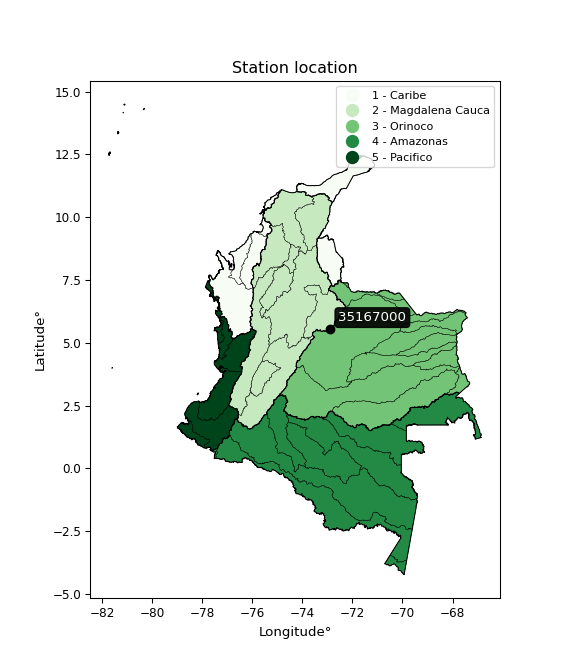

<div align="center">


</div>

# PMP Station (Rain, Pmax24h): 35167000

Probable Maximum Precipitation (PMP) is the greatest amount of rainfall for a specific duration that is meteorologically possible for a given location, acting as a "worst-case" scenario for extreme storms, crucial for designing safety-critical infrastructure like bridges, river deviations, dams, spillways, and nuclear plants to prevent catastrophic failure. PMP is calculated by hydrologists using meteorological data to determine the upper limit of extreme rainfall, often leading to the Probable Maximum Flood (PMF) for flood control design, and is increasingly being studied for climate change impacts.

<div align="center">

</img>

</div>


## A. General information


### 1. General running parameters

• app_version: _v20260103_. • runtime: _2026-01-03 07:24:50.581521_. • Python version: _3.14.0_. • SciPy version: _1.16.3_. • Pandas version: _2.3.3_. • NumPy version: _2.3.5_. • Stations dataset (station_dataset_file): _dataset/pmax24h_in/automatic_colombia_2003_2024.csv_. • Stations catalog (station_catalog_file): _dataset/CNE.xls_. • Minimum year to eval til year_max (date_min): _1900_. • Maximum year to eval since year_min (date_max): _2024_. • Creates, save and include plots into reports (create_plot): _False_. • Plot only fit distributions with Δo > Δ (plot_only_fit): _True_. • Eval low extreme values, if False, evaluates high extreme values (low_extreme): _False_. • Eval every SciPy distribution as logarithmic (pdist_logarithmic_on): _True_. • Standard deviation normalized (ddof): _1.0_. • Return periods to eval in years (Tr): _[2, 2.33, 5, 10, 15, 20, 25, 50, 75, 100, 200, 250, 500, 750, 1000]_. • Minimum data sample per station, 0 means any (minimum_sample): _5_. • Z-Score maximum threshold to adjust a value, 0 means disable (zscore_max): _3.5_. • Z-Score minimum threshold to adjust a value, 0 means disable (zscore_min): _-2.5_. • Avoid zeros, e.g. rain = 0 (avoid_zeros): _True_. • Avoid null values (avoid_nans): _True_. [:file_folder:Dataset file.](../../dataset/pmax24h_in/automatic_colombia_2003_2024.csv)

> Delta Degrees of Freedom (DDOF): is a parameter used in the formulas for calculating variance and standard deviation. When ddof=0, the divisor is $N$ (the total number of observations) and this is used when your data set is the entire population. When ddof=1, the divisor is $N-1$ and this is used when your data set is a sample drawn from a larger population. Using $N-1$ provides an unbiased estimate of the population variance (known as Bessel´s correction).


### 2. Station info and location

|   id |   CODIGO | NOMBRE                                   | CATEGORIA    | TECNOLOGIA                              | ESTADO   | FECHA_INSTALACION   |   FECHA_SUSPENSION |   ALTITUD |   LATITUD |   LONGITUD | DEPARTAMENTO   | MUNICIPIO   | AREA_OPERATIVA                              | ENTIDAD                                                     | AREA_HIDROGRAFICA   | ZONA_HIDROGRAFICA   | SUBZONA_HIDROGRAFICA   | CORRIENTE    | Catalogo   |   Version |
|-----:|---------:|:-----------------------------------------|:-------------|:----------------------------------------|:---------|:--------------------|-------------------:|----------:|----------:|-----------:|:---------------|:------------|:--------------------------------------------|:------------------------------------------------------------|:--------------------|:--------------------|:-----------------------|:-------------|:-----------|----------:|
|    0 | 35167000 | CORPOBOYACA - SANTA INES -AUT [35167000] | Limnigráfica | Automática con Telemetría, Convencional | Activa   | 31/12/2016          |                nan |      3041 |     5.545 |   -72.8841 | Boyacá         | Aquitania   | Area Operativa 06 - Boyacá-Casanare-Vichada | INSTITUTO DE HIDROLOGIA METEOROLOGIA Y ESTUDIOS AMBIENTALES | Orinoco             | Meta                | Lago de Tota           | Lago De Tota | CNE_IDEAM  |  20251226 |

<div align="center">

Dynamic map: [:earth_americas:Google](http://maps.google.com/maps?q=5.545,-72.88411111) [:earth_americas:OSM](https://www.openstreetmap.org/#map=18/5.545/-72.88411111&layers=P) [:earth_americas:Bing](https://www.bing.com/maps?cp=5.545~-72.88411111&lvl=18) [:earth_americas:Apple](https://maps.apple.com/frame?center=5.545%2C-72.88411111&span=0.003%2C0.006)

</div>


<div align="center">

```geojson
{
  "type": "Feature",
  "geometry": {
    "type": "Point", 
    "coordinates": [-72.88411111, 5.545]
  }, 
  "properties": {
    "Name": "35167000"
  }
}
```

</div>


### 3. Discrete values table and plot

<div align="center">

|               |           0 |           1 |           2 |          3 |           4 |           5 |           6 |           7 |
|:--------------|------------:|------------:|------------:|-----------:|------------:|------------:|------------:|------------:|
| Date          | 2017        | 2018        | 2019        | 2020       | 2021        | 2022        | 2023        | 2024        |
| Value         |   25.3      |   13        |   36.69     |  287.18    |  116.8      |   28.16     |   29.1      |   43.8      |
| Value_initial |   25.3      |   13        |   36.69     |  287.18    |  116.8      |   28.16     |   29.1      |   43.8      |
| count         |    8        |    8        |    8        |    8       |    8        |    8        |    8        |    8        |
| mean          |   72.5037   |   72.5037   |   72.5037   |   72.5037  |   72.5037   |   72.5037   |   72.5037   |   72.5037   |
| std           |   92.4073   |   92.4073   |   92.4073   |   92.4073  |   92.4073   |   92.4073   |   92.4073   |   92.4073   |
| zscore        |   -0.510823 |   -0.643929 |   -0.387564 |    2.32315 |    0.479359 |   -0.479873 |   -0.469701 |   -0.310622 |


</div>


> The initial value (value_initial) correspond to the initial obtained or null completed value, and value (value) is adjusted only when the initial value is outside the valid range definite through the Z-Score value. If Z-Score is active, values out of range or outliers are replaced with the station mean value


### 4. Active continuous probability distributions from SciPy (44 of 104 available)

A Probability Density Function (PDF) describes the relative likelihood of a continuous random variable falling within a specific range, where the total area under its curve equals 1, and the area over any interval gives the actual probability for that range. Unlike discrete probabilities (like rolling a die), a PDF shows density, not direct probability for a single point (which is zero), with higher points indicating higher likelihood, often visualized as a bell curve for normal distributions.

A log of a probability density function (log-PDF) is simply the logarithm of the PDF´s value, denoted as $log(f(x))$, useful for converting multiplication of probabilities into addition, improving numerical stability with tiny numbers, and connecting to information theory concepts like entropy. Instead of dealing with very small probabilities (e.g., 0.000001), log-PDFs use negative numbers (e.g., $log(0.00001) ≈ -11.51$ that are easier for computers to handle, preventing underflow errors and simplifying complex calculations. In this study, each active probability distribution from SciPy is also evaluated in the $log$ form.

[scipy.stats](https://docs.scipy.org/doc/scipy/reference/stats.html) is a Python´s powerful submodule within the SciPy library for comprehensive statistical analysis, offering over 130 probability distributions (like Normal, Poisson), functions for descriptive stats (mean, variance), hypothesis testing (t-tests, chi-square), random variable generation, and statistical tests, making it essential for data science, modeling, and research. It provides tools to explore, model, and draw conclusions from data efficiently, working seamlessly with NumPy.

<div align="center">

|   id | p_dist             |   n_parameter | fit_method   | label                                                                       | active   | ref                                                                                                        |
|-----:|:-------------------|--------------:|:-------------|:----------------------------------------------------------------------------|:---------|:-----------------------------------------------------------------------------------------------------------|
|    0 | alpha              |             3 | MLE          | Alpha                                                                       | True     | [:mortar_board:](https://docs.scipy.org/doc/scipy/reference/generated/scipy.stats.alpha.html)              |
|    1 | betaprime          |             4 | MLE          | Beta prime                                                                  | True     | [:mortar_board:](https://docs.scipy.org/doc/scipy/reference/generated/scipy.stats.betaprime.html)          |
|    2 | chi2               |             3 | MLE          | Chi²                                                                        | True     | [:mortar_board:](https://docs.scipy.org/doc/scipy/reference/generated/scipy.stats.chi2.html)               |
|    3 | crystalball        |             4 | MLE          | Crystalball                                                                 | True     | [:mortar_board:](https://docs.scipy.org/doc/scipy/reference/generated/scipy.stats.crystalball.html)        |
|    4 | erlang             |             3 | MLE          | Erlang                                                                      | True     | [:mortar_board:](https://docs.scipy.org/doc/scipy/reference/generated/scipy.stats.erlang.html)             |
|    5 | expon              |             2 | MLE          | Exponential                                                                 | True     | [:mortar_board:](https://docs.scipy.org/doc/scipy/reference/generated/scipy.stats.expon.html)              |
|    6 | exponnorm          |             3 | MLE          | Exponentially modified Normal                                               | True     | [:mortar_board:](https://docs.scipy.org/doc/scipy/reference/generated/scipy.stats.exponnorm.html)          |
|    7 | f                  |             4 | MLE          | F                                                                           | True     | [:mortar_board:](https://docs.scipy.org/doc/scipy/reference/generated/scipy.stats.f.html)                  |
|    8 | fatiguelife        |             3 | MLE          | Fatigue-life (Birnbaum-Saunders)                                            | True     | [:mortar_board:](https://docs.scipy.org/doc/scipy/reference/generated/scipy.stats.fatiguelife.html)        |
|    9 | fisk               |             3 | MLE          | Fisk                                                                        | True     | [:mortar_board:](https://docs.scipy.org/doc/scipy/reference/generated/scipy.stats.fisk.html)               |
|   10 | gamma              |             3 | MLE          | Gamma                                                                       | True     | [:mortar_board:](https://docs.scipy.org/doc/scipy/reference/generated/scipy.stats.gamma.html)              |
|   11 | genexpon           |             5 | MLE          | Generalized exponential                                                     | True     | [:mortar_board:](https://docs.scipy.org/doc/scipy/reference/generated/scipy.stats.genexpon.html)           |
|   12 | genlogistic        |             3 | MLE          | Generalized logistic                                                        | True     | [:mortar_board:](https://docs.scipy.org/doc/scipy/reference/generated/scipy.stats.genlogistic.html)        |
|   13 | gibrat             |             2 | MM           | Gibrat                                                                      | True     | [:mortar_board:](https://docs.scipy.org/doc/scipy/reference/generated/scipy.stats.gibrat.html)             |
|   14 | gompertz           |             3 | MLE          | Gompertz (or truncated Gumbel)                                              | True     | [:mortar_board:](https://docs.scipy.org/doc/scipy/reference/generated/scipy.stats.gompertz.html)           |
|   15 | gumbel_l           |             2 | MM           | Gumbel Left Skew                                                            | True     | [:mortar_board:](https://docs.scipy.org/doc/scipy/reference/generated/scipy.stats.gumbel_l.html)           |
|   16 | gumbel_r           |             2 | MM           | Gumbel Right Skew                                                           | True     | [:mortar_board:](https://docs.scipy.org/doc/scipy/reference/generated/scipy.stats.gumbel_r.html)           |
|   17 | halflogistic       |             2 | MM           | Half-logistic                                                               | True     | [:mortar_board:](https://docs.scipy.org/doc/scipy/reference/generated/scipy.stats.halflogistic.html)       |
|   18 | halfnorm           |             2 | MM           | Half Normal                                                                 | True     | [:mortar_board:](https://docs.scipy.org/doc/scipy/reference/generated/scipy.stats.halfnorm.html)           |
|   19 | hypsecant          |             2 | MM           | hyperbolic secant                                                           | True     | [:mortar_board:](https://docs.scipy.org/doc/scipy/reference/generated/scipy.stats.hypsecant.html)          |
|   20 | invgamma           |             3 | MLE          | Inverted gamma                                                              | True     | [:mortar_board:](https://docs.scipy.org/doc/scipy/reference/generated/scipy.stats.invgamma.html)           |
|   21 | invgauss           |             3 | MLE          | Inverse Gaussian                                                            | True     | [:mortar_board:](https://docs.scipy.org/doc/scipy/reference/generated/scipy.stats.invgauss.html)           |
|   22 | invweibull         |             3 | MLE          | Inverted Weibull                                                            | True     | [:mortar_board:](https://docs.scipy.org/doc/scipy/reference/generated/scipy.stats.invweibull.html)         |
|   23 | johnsonsu          |             4 | MLE          | Johnson Su                                                                  | True     | [:mortar_board:](https://docs.scipy.org/doc/scipy/reference/generated/scipy.stats.johnsonsu.html)          |
|   24 | kstwobign          |             2 | MLE          | Limiting distribution of scaled Kolmogorov-Smirnov two-sided test statistic | True     | [:mortar_board:](https://docs.scipy.org/doc/scipy/reference/generated/scipy.stats.kstwobign.html)          |
|   25 | laplace            |             2 | MM           | Laplace                                                                     | True     | [:mortar_board:](https://docs.scipy.org/doc/scipy/reference/generated/scipy.stats.laplace.html)            |
|   26 | laplace_asymmetric |             3 | MLE          | Asymmetric Laplace                                                          | True     | [:mortar_board:](https://docs.scipy.org/doc/scipy/reference/generated/scipy.stats.laplace_asymmetric.html) |
|   27 | loggamma           |             3 | MLE          | Log gamma                                                                   | True     | [:mortar_board:](https://docs.scipy.org/doc/scipy/reference/generated/scipy.stats.loggamma.html)           |
|   28 | logistic           |             2 | MM           | Logistic (or Sech-squared)                                                  | True     | [:mortar_board:](https://docs.scipy.org/doc/scipy/reference/generated/scipy.stats.logistic.html)           |
|   29 | lognorm            |             3 | MLE          | Log Normal                                                                  | True     | [:mortar_board:](https://docs.scipy.org/doc/scipy/reference/generated/scipy.stats.lognorm.html)            |
|   30 | maxwell            |             2 | MM           | Maxwell                                                                     | True     | [:mortar_board:](https://docs.scipy.org/doc/scipy/reference/generated/scipy.stats.maxwell.html)            |
|   31 | mielke             |             4 | MLE          | Mielke Beta-Kappa / Dagum                                                   | True     | [:mortar_board:](https://docs.scipy.org/doc/scipy/reference/generated/scipy.stats.mielke.html)             |
|   32 | moyal              |             2 | MM           | Moyal                                                                       | True     | [:mortar_board:](https://docs.scipy.org/doc/scipy/reference/generated/scipy.stats.moyal.html)              |
|   33 | nakagami           |             3 | MLE          | Nakagami                                                                    | True     | [:mortar_board:](https://docs.scipy.org/doc/scipy/reference/generated/scipy.stats.nakagami.html)           |
|   34 | ncf                |             5 | MLE          | Non-central F distribution                                                  | True     | [:mortar_board:](https://docs.scipy.org/doc/scipy/reference/generated/scipy.stats.ncf.html)                |
|   35 | nct                |             4 | MLE          | Non-central Student’s t                                                     | True     | [:mortar_board:](https://docs.scipy.org/doc/scipy/reference/generated/scipy.stats.nct.html)                |
|   36 | norm               |             2 | MM           | Normal                                                                      | True     | [:mortar_board:](https://docs.scipy.org/doc/scipy/reference/generated/scipy.stats.norm.html)               |
|   37 | pearson3           |             3 | MM           | Pearson type III                                                            | True     | [:mortar_board:](https://docs.scipy.org/doc/scipy/reference/generated/scipy.stats.pearson3.html)           |
|   38 | rayleigh           |             2 | MM           | Rayleigh                                                                    | True     | [:mortar_board:](https://docs.scipy.org/doc/scipy/reference/generated/scipy.stats.rayleigh.html)           |
|   39 | rice               |             3 | MLE          | Rice                                                                        | True     | [:mortar_board:](https://docs.scipy.org/doc/scipy/reference/generated/scipy.stats.rice.html)               |
|   40 | t                  |             3 | MLE          | Student’s t                                                                 | True     | [:mortar_board:](https://docs.scipy.org/doc/scipy/reference/generated/scipy.stats.t.html)                  |
|   41 | truncnorm          |             4 | MLE          | Truncated normal                                                            | True     | [:mortar_board:](https://docs.scipy.org/doc/scipy/reference/generated/scipy.stats.truncnorm.html)          |
|   42 | wald               |             2 | MM           | Wald                                                                        | True     | [:mortar_board:](https://docs.scipy.org/doc/scipy/reference/generated/scipy.stats.wald.html)               |
|   43 | weibull_min        |             3 | MLE          | Weibull minimum                                                             | True     | [:mortar_board:](https://docs.scipy.org/doc/scipy/reference/generated/scipy.stats.weibull_min.html)        |

</div>

> **n_parameter:** # arguments & localization & scale.
>
> **Fit methods:** (MLE) maximum likelihood, (MM) L-moments.
>
>**Inactive** (With the only purpose of prevent loops, zero divisions, infinite values, over high estimated values or horizontal trending for recurrence intervals estimations, the follow distributions were disabled.)**:** foldnorm, gennorm, norminvgauss, powernorm, powerlognorm, skewnorm, genextreme, anglit, arcsine, argus, beta, bradford, burr, burr12, cauchy, cosine, halfcauchy, foldcauchy, skewcauchy, wrapcauchy, dgamma, gengamma, exponweib, exponpow, truncexpon, gausshyper, genhalflogistic, genhyperbolic, geninvgauss, halfgennorm, johnsonsb, kappa4, kappa3, ksone, kstwo, loglaplace, levy, levy_l, levy_stable, ncx2, pareto, genpareto, truncpareto, lomax, powerlaw, rdist, rel_breitwigner, recipinvgauss, semicircular, studentized_range, trapezoid, triang, truncweibull_min, tukeylambda, uniform, loguniform, vonmises, vonmises_line, weibull_max, dweibull, 


## B. Probability distributions vs. Empirical distributions

A continuous probability distribution (CPD) describes probabilities for variables that can take any value within a range (like rain any time), unlike discrete variables with specific outcomes (like temperature). It uses a Probability Density Function (PDF), a curve where the total area under it equals 1, and the probability of the variable falling within an interval (a to b) is found by calculating the area under the curve between those points. A key feature is that the probability of hitting any single exact value is zero, so probabilities are always expressed for ranges, e.g., $P(a ≤ X ≤ b)$.

<div align="center">

Distributions parameters from station values
|    |   station | p_dist                |   n |            loc |            scale | shape                  | shape1                | shape2                 | shape3   |
|---:|----------:|:----------------------|----:|---------------:|-----------------:|:-----------------------|:----------------------|:-----------------------|:---------|
|  0 |  35167000 | alpha                 |   8 |     -2.51945   |     44.4792      | 0.9276191612178668     |                       |                        |          |
|  1 |  35167000 | betaprime             |   8 |      5.66068   |      0.538361    | 56.94537272733314      | 1.2999919016815848    |                        |          |
|  2 |  35167000 | chi2                  |   8 |     13         |     57.6267      | 1.0568894286158468     |                       |                        |          |
|  3 |  35167000 | crystalball           |   8 |     72.5037    |     86.4391      | 5184.055921165231      | 4299.416861998871     |                        |          |
|  4 |  35167000 | erlang                |   8 |     13         |     83.4318      | 0.3622813528166654     |                       |                        |          |
|  5 |  35167000 | expon                 |   8 |     13         |     59.5037      |                        |                       |                        |          |
|  6 |  35167000 | exponnorm             |   8 |     12.931     |      0.0208924   | 2850.0958163010882     |                       |                        |          |
|  7 |  35167000 | f                     |   8 |      5.399     |     23.6369      | 93739.28979957647      | 2.5996555164196518    |                        |          |
|  8 |  35167000 | fatiguelife           |   8 |      9.97291   |     29.7053      | 1.5063667275650539     |                       |                        |          |
|  9 |  35167000 | fisk                  |   8 |     13         |     15.6576      | 0.8196299933266651     |                       |                        |          |
| 10 |  35167000 | gamma                 |   8 |     13         |     82.6809      | 0.4855770270743379     |                       |                        |          |
| 11 |  35167000 | genexpon              |   8 |     13         |    132.127       | 2.220471150525322      | 3.113549968818298e-09 | 1.5838218823378234     |          |
| 12 |  35167000 | genlogistic           |   8 |   -297.821     |     43.3249      | 2424.662111524256      |                       |                        |          |
| 13 |  35167000 | gibrat                |   8 |      6.56162   |     39.9959      |                        |                       |                        |          |
| 14 |  35167000 | gompertz              |   8 |     12.9974    | 331812           | 4236.679551887872      |                       |                        |          |
| 15 |  35167000 | gumbel_l              |   8 |    111.406     |     67.3963      |                        |                       |                        |          |
| 16 |  35167000 | gumbel_r              |   8 |     33.6016    |     67.3963      |                        |                       |                        |          |
| 17 |  35167000 | halflogistic          |   8 |    -29.9467    |     73.9023      |                        |                       |                        |          |
| 18 |  35167000 | halfnorm              |   8 |    -41.9077    |    143.394       |                        |                       |                        |          |
| 19 |  35167000 | hypsecant             |   8 |     72.5037    |     55.0288      |                        |                       |                        |          |
| 20 |  35167000 | invgamma              |   8 |      5.39871   |     30.7239      | 1.2998289393705702     |                       |                        |          |
| 21 |  35167000 | invgauss              |   8 |      8.3105    |     24.8311      | 2.5851970507005        |                       |                        |          |
| 22 |  35167000 | invweibull            |   8 |      4.11122   |     24.1026      | 1.2403132836641348     |                       |                        |          |
| 23 |  35167000 | johnsonsu             |   8 |     27.1299    |      2.30866     | -0.6404026641139106    | 0.40850487809499997   |                        |          |
| 24 |  35167000 | kstwobign             |   8 |   -136.483     |    245.607       |                        |                       |                        |          |
| 25 |  35167000 | laplace               |   8 |     72.5037    |     61.1217      |                        |                       |                        |          |
| 26 |  35167000 | laplace_asymmetric    |   8 |     13         |      0.000385199 | 6.473507594151118e-06  |                       |                        |          |
| 27 |  35167000 | loggamma              |   8 | -27123.4       |   3663.52        | 1675.5522747994005     |                       |                        |          |
| 28 |  35167000 | logistic              |   8 |     72.5037    |     47.6564      |                        |                       |                        |          |
| 29 |  35167000 | lognorm               |   8 |     13         |      0.320287    | 12.447093233092115     |                       |                        |          |
| 30 |  35167000 | maxwell               |   8 |   -132.321     |    128.355       |                        |                       |                        |          |
| 31 |  35167000 | mielke                |   8 |      0.26272   |      0.501605    | 526.7859679274527      | 1.4537524466705256    |                        |          |
| 32 |  35167000 | moyal                 |   8 |     23.0723    |     38.9113      |                        |                       |                        |          |
| 33 |  35167000 | nakagami              |   8 |     13         |    151.153       | 0.207715720951658      |                       |                        |          |
| 34 |  35167000 | ncf                   |   8 |     -0.0133789 |      2.32036e-08 | 5.418263338100583e-09  | 3.5662789877483503    | 8.99993978787558       |          |
| 35 |  35167000 | nct                   |   8 |     -0.12291   |      0.812893    | 1.2266523083794483     | 33.038412402127705    |                        |          |
| 36 |  35167000 | norm                  |   8 |     72.5037    |     86.4391      |                        |                       |                        |          |
| 37 |  35167000 | pearson3              |   8 |     72.5038    |     86.4391      | 1.8243526627825237     |                       |                        |          |
| 38 |  35167000 | rayleigh              |   8 |    -92.8593    |    131.941       |                        |                       |                        |          |
| 39 |  35167000 | rice                  |   8 |    -48.2568    |    105.011       | 0.0002465284631225663  |                       |                        |          |
| 40 |  35167000 | t                     |   8 |     28.4786    |      4.81905     | 0.5276274123925818     |                       |                        |          |
| 41 |  35167000 | truncnorm             |   8 | -14890.6       |   1144.58        | 13.021091869333429     | 217.60164607304603    |                        |          |
| 42 |  35167000 | wald                  |   8 |    -13.9353    |     86.4391      |                        |                       |                        |          |
| 43 |  35167000 | weibull_min           |   8 |     13         |     90.1447      | 0.5276499600645281     |                       |                        |          |
| 44 |  35167000 | logalpha              |   8 |     -0.170246  |     18.1012      | 4.796021303760897      |                       |                        |          |
| 45 |  35167000 | logbetaprime          |   8 |      2.31577   |     44.7422      | 2.485084331038003      | 76.70878327264279     |                        |          |
| 46 |  35167000 | logchi2               |   8 |      2.56495   |      0.906897    | 1.069212816340329      |                       |                        |          |
| 47 |  35167000 | logcrystalball        |   8 |      3.78839   |      0.912961    | 78.50084946540927      | 354.45788580548606    |                        |          |
| 48 |  35167000 | logerlang             |   8 |      2.3539    |      0.642292    | 2.2333993805573025     |                       |                        |          |
| 49 |  35167000 | logexpon              |   8 |      2.56495   |      1.22344     |                        |                       |                        |          |
| 50 |  35167000 | logexponnorm          |   8 |      2.91816   |      0.364199    | 2.389431888842594      |                       |                        |          |
| 51 |  35167000 | logf                  |   8 |      1.22167   |      2.30453     | 255.00025152069674     | 19.34501247287779     |                        |          |
| 52 |  35167000 | logfatiguelife        |   8 |      1.73253   |      1.86856     | 0.4476650271777598     |                       |                        |          |
| 53 |  35167000 | logfisk               |   8 |      1.94433   |      1.63796     | 3.556794496903854      |                       |                        |          |
| 54 |  35167000 | loggamma              |   8 |      2.35389   |      0.642285    | 2.2334135805214244     |                       |                        |          |
| 55 |  35167000 | loggenexpon           |   8 |      2.56495   |      0.590638    | 0.28729901511545436    | 5.939310493456537     | 0.020934362947924955   |          |
| 56 |  35167000 | loggenlogistic        |   8 |     -1.06562   |      0.687361    | 640.1710212291161      |                       |                        |          |
| 57 |  35167000 | loggibrat             |   8 |      3.09189   |      0.422446    |                        |                       |                        |          |
| 58 |  35167000 | loggompertz           |   8 |      2.56495   |      2.55037     | 1.3635882304329483     |                       |                        |          |
| 59 |  35167000 | loggumbel_l           |   8 |      4.19927   |      0.711832    |                        |                       |                        |          |
| 60 |  35167000 | loggumbel_r           |   8 |      3.37751   |      0.711832    |                        |                       |                        |          |
| 61 |  35167000 | loghalflogistic       |   8 |      2.70634   |      0.780532    |                        |                       |                        |          |
| 62 |  35167000 | loghalfnorm           |   8 |      2.57995   |      1.51454     |                        |                       |                        |          |
| 63 |  35167000 | loghypsecant          |   8 |      3.78839   |      0.581208    |                        |                       |                        |          |
| 64 |  35167000 | loginvgamma           |   8 |      1.13811   |     22.9731      | 9.6565580001582        |                       |                        |          |
| 65 |  35167000 | loginvgauss           |   8 |      1.68242   |     10.6596      | 0.19756449982681507    |                       |                        |          |
| 66 |  35167000 | loginvweibull         |   8 |     -7.11449   |     10.4678      | 15.576200997726012     |                       |                        |          |
| 67 |  35167000 | logjohnsonsu          |   8 |      3.31405   |      0.162649    | -0.5184720589590348    | 0.5825198496927605    |                        |          |
| 68 |  35167000 | logkstwobign          |   8 |      0.886694  |      3.3452      |                        |                       |                        |          |
| 69 |  35167000 | loglaplace            |   8 |      3.78839   |      0.64556     |                        |                       |                        |          |
| 70 |  35167000 | loglaplace_asymmetric |   8 |      3.3379    |      0.538297    | 0.6655217148541486     |                       |                        |          |
| 71 |  35167000 | logloggamma           |   8 |   -227.126     |     32.6102      | 1189.5478269834284     |                       |                        |          |
| 72 |  35167000 | loglogistic           |   8 |      3.78839   |      0.503341    |                        |                       |                        |          |
| 73 |  35167000 | loglognorm            |   8 |      2.56495   |      0.0141169   | 11.761504955549118     |                       |                        |          |
| 74 |  35167000 | logmaxwell            |   8 |      1.62506   |      1.35567     |                        |                       |                        |          |
| 75 |  35167000 | logmielke             |   8 |     -4.08529   |      5.78393     | 214.7767433534616      | 11.520797414817203    |                        |          |
| 76 |  35167000 | logmoyal              |   8 |      3.2663    |      0.410976    |                        |                       |                        |          |
| 77 |  35167000 | lognakagami           |   8 |      3.2308    |      1.2003      | 0.16331318222097468    |                       |                        |          |
| 78 |  35167000 | logncf                |   8 |     -0.822576  |      4.49383     | 187.14966914982028     | 80.81285281617127     | 2.5217674290592483e-08 |          |
| 79 |  35167000 | lognct                |   8 |      0.0518115 |      0.0625231   | 10.372788516011365     | 55.33918467869262     |                        |          |
| 80 |  35167000 | lognorm               |   8 |      3.78839   |      0.91296     |                        |                       |                        |          |
| 81 |  35167000 | logpearson3           |   8 |      3.78839   |      0.912962    | 0.8706547275952411     |                       |                        |          |
| 82 |  35167000 | lograyleigh           |   8 |      2.04184   |      1.39354     |                        |                       |                        |          |
| 83 |  35167000 | logrice               |   8 |      2.21146   |      1.28845     | 0.00033508960877794104 |                       |                        |          |
| 84 |  35167000 | logt                  |   8 |      3.78839   |      0.912958    | 1269128629.6195135     |                       |                        |          |
| 85 |  35167000 | logtruncnorm          |   8 |     -0.206186  |      1.83403     | 1.8740062823145998     | 16.35572819598321     |                        |          |
| 86 |  35167000 | logwald               |   8 |      2.87544   |      0.912948    |                        |                       |                        |          |
| 87 |  35167000 | logweibull_min        |   8 |      2.48753   |      1.41385     | 1.3678754893507978     |                       |                        |          |

</div>

> **loc** (Location parameter): This shifts the distribution along the x-axis. For many common distributions, like the normal (Gaussian) distribution, loc represents the mean $μ$. For others, like the uniform distribution, it might represent the minimum value, or for the beta distribution, the left end of the support interval.
>
> **scale** (Scale parameter): This determines the width or spread of the distribution. For the normal distribution, scale represents the standard deviation $σ$. For a uniform distribution, it defines the length of the interval (from $loc$ to $loc + scale$).
>
> **shape** (Shape parameters): Refers to parameters that define the specific form of a probability distribution, distinct from its location (loc) and scale (scale). These parameters are required arguments for most distribution functions. For example, a normal (Gaussian) distribution is fully defined by its location (mean) and scale (standard deviation), so it has no specific shape parameters beyond loc and scale. However, other distributions have intrinsic properties that need specification, as Gamma distribution that takes a shape parameter, often named $a$ or $alpha$.


### 0. Cumulative distribution values - CDF (88 evaluated)

Cumulative Distribution Function (CDF), denoted as $F$<sub>$X$</sub>$(x)$, is a function that gives the probability that a random variable $X$ will take a value less than or equal to a specific value, $x$ (i.e., $(P(X≥x)$. It essentially "accumulates" probabilities from a given point up to the far right (positive infinity), providing a complete picture of the distribution´s probabilities for both discrete (like rain) and continuous (like temperature) variables, helping to find probabilities over ranges or above certain values. Each station is evaluated separately ordering the $x$ values ascending, calculating the CDF and PDF values for the activated distributions and their logarithmic forms.

<div align="center">

CDF ordered by x ascending and calculating $log(f(x))$ separately
|   id |   Station |   date |      x |   count |    mean |     std |    zscore |   Value_initial |   station |   m |     alpha |   alpha_pdf |   betaprime |   betaprime_pdf |        chi2 |         chi2_pdf |   crystalball |   crystalball_pdf |      erlang |   erlang_pdf |    expon |   expon_pdf |   exponnorm |   exponnorm_pdf |         f |       f_pdf |   fatiguelife |   fatiguelife_pdf |        fisk |     fisk_pdf |       gamma |   gamma_pdf |    genexpon |   genexpon_pdf |   genlogistic |   genlogistic_pdf |    gibrat |   gibrat_pdf |    gompertz |   gompertz_pdf |   gumbel_l |   gumbel_l_pdf |   gumbel_r |   gumbel_r_pdf |   halflogistic |   halflogistic_pdf |   halfnorm |   halfnorm_pdf |   hypsecant |   hypsecant_pdf |   invgamma |   invgamma_pdf |   invgauss |   invgauss_pdf |   invweibull |   invweibull_pdf |   johnsonsu |   johnsonsu_pdf |   kstwobign |   kstwobign_pdf |   laplace |   laplace_pdf |   laplace_asymmetric |   laplace_asymmetric_pdf |   loggamma |   loggamma_pdf |   logistic |   logistic_pdf |   lognorm |   lognorm_pdf |   maxwell |   maxwell_pdf |   mielke |   mielke_pdf |    moyal |   moyal_pdf |    nakagami |   nakagami_pdf |      ncf |     ncf_pdf |       nct |     nct_pdf |     norm |    norm_pdf |   pearson3 |   pearson3_pdf |   rayleigh |   rayleigh_pdf |     rice |    rice_pdf |        t |       t_pdf |   truncnorm |   truncnorm_pdf |     wald |    wald_pdf |   weibull_min |   weibull_min_pdf |   logalpha |   logalpha_pdf |   logbetaprime |   logbetaprime_pdf |     logchi2 |   logchi2_pdf |   logcrystalball |   logcrystalball_pdf |   logerlang |   logerlang_pdf |   logexpon |   logexpon_pdf |   logexponnorm |   logexponnorm_pdf |      logf |   logf_pdf |   logfatiguelife |   logfatiguelife_pdf |   logfisk |   logfisk_pdf |   loggenexpon |   loggenexpon_pdf |   loggenlogistic |   loggenlogistic_pdf |   loggibrat |   loggibrat_pdf |   loggompertz |   loggompertz_pdf |   loggumbel_l |   loggumbel_l_pdf |   loggumbel_r |   loggumbel_r_pdf |   loghalflogistic |   loghalflogistic_pdf |   loghalfnorm |   loghalfnorm_pdf |   loghypsecant |   loghypsecant_pdf |   loginvgamma |   loginvgamma_pdf |   loginvgauss |   loginvgauss_pdf |   loginvweibull |   loginvweibull_pdf |   logjohnsonsu |   logjohnsonsu_pdf |   logkstwobign |   logkstwobign_pdf |   loglaplace |   loglaplace_pdf |   loglaplace_asymmetric |   loglaplace_asymmetric_pdf |   logloggamma |   logloggamma_pdf |   loglogistic |   loglogistic_pdf |   loglognorm |   loglognorm_pdf |   logmaxwell |   logmaxwell_pdf |   logmielke |   logmielke_pdf |   logmoyal |   logmoyal_pdf |   lognakagami |   lognakagami_pdf |    logncf |   logncf_pdf |    lognct |   lognct_pdf |   logpearson3 |   logpearson3_pdf |   lograyleigh |   lograyleigh_pdf |   logrice |   logrice_pdf |      logt |   logt_pdf |   logtruncnorm |   logtruncnorm_pdf |   logwald |   logwald_pdf |   logweibull_min |   logweibull_min_pdf |
|-----:|----------:|-------:|-------:|--------:|--------:|--------:|----------:|----------------:|----------:|----:|----------:|------------:|------------:|----------------:|------------:|-----------------:|--------------:|------------------:|------------:|-------------:|---------:|------------:|------------:|----------------:|----------:|------------:|--------------:|------------------:|------------:|-------------:|------------:|------------:|------------:|---------------:|--------------:|------------------:|----------:|-------------:|------------:|---------------:|-----------:|---------------:|-----------:|---------------:|---------------:|-------------------:|-----------:|---------------:|------------:|----------------:|-----------:|---------------:|-----------:|---------------:|-------------:|-----------------:|------------:|----------------:|------------:|----------------:|----------:|--------------:|---------------------:|-------------------------:|-----------:|---------------:|-----------:|---------------:|----------:|--------------:|----------:|--------------:|---------:|-------------:|---------:|------------:|------------:|---------------:|---------:|------------:|----------:|------------:|---------:|------------:|-----------:|---------------:|-----------:|---------------:|---------:|------------:|---------:|------------:|------------:|----------------:|---------:|------------:|--------------:|------------------:|-----------:|---------------:|---------------:|-------------------:|------------:|--------------:|-----------------:|---------------------:|------------:|----------------:|-----------:|---------------:|---------------:|-------------------:|----------:|-----------:|-----------------:|---------------------:|----------:|--------------:|--------------:|------------------:|-----------------:|---------------------:|------------:|----------------:|--------------:|------------------:|--------------:|------------------:|--------------:|------------------:|------------------:|----------------------:|--------------:|------------------:|---------------:|-------------------:|--------------:|------------------:|--------------:|------------------:|----------------:|--------------------:|---------------:|-------------------:|---------------:|-------------------:|-------------:|-----------------:|------------------------:|----------------------------:|--------------:|------------------:|--------------:|------------------:|-------------:|-----------------:|-------------:|-----------------:|------------:|----------------:|-----------:|---------------:|--------------:|------------------:|----------:|-------------:|----------:|-------------:|--------------:|------------------:|--------------:|------------------:|----------:|--------------:|----------:|-----------:|---------------:|-------------------:|----------:|--------------:|-----------------:|---------------------:|
|    0 |  35167000 |   2018 |  13    |       8 | 72.5037 | 92.4073 | -0.643929 |           13    |  35167000 |   1 | 0.0319322 |  0.0136739  |   0.0316945 |     0.0158243   | 2.12149e-09 | 315559           |      0.245604 |       0.00364165  | 1.31764e-06 |  1.34364e+08 | 0        | 0.0168057   |  0.00115807 |     0.0167665   | 0.0316736 | 0.015818    |     0.0309052 |       0.0263957   | 8.52788e-14 | 39.3485      | 9.10131e-09 | 2.48789e+06 | 2.31089e-10 |    0.0168055   |      0.156166 |       0.00669046  | 0.0338874 |  0.0116871   | 3.30466e-05 |    0.0127679   |   0.207221 |    0.00273148  |   0.257292 |    0.00518256  |       0.282653 |        0.00622515  |   0.298218 |    0.00517096  |    0.208158 |     0.00351881  |  0.0316736 |     0.0158181  |  0.0311391 |    0.0201266   |    0.0318688 |      0.0153245   |   0.0478255 |     0.00283999  |    0.147346 |     0.00557996  |  0.188874 |   0.00309013  |          5.68374e-11 |               0.0168056  |  0.0265487 |      0.253091  |   0.222943 |    0.00363517  | 0.0901098 |     0.178034  |  0.266548 |    0.00419772 |      nan |          nan | 0.255047 | 0.00610579  | 9.72989e-08 |    1.13775e+07 | 0.163958 | 0.0146538   | 0.0330584 | 0.0143304   | 0.245604 | 0.00364165  |   0.272119 |    0.00751227  |   0.275202 |    0.00440746  | 0.156453 | 0.00468587  | 0.170669 | 0.00564515  | 1.22465e-16 |     0.0114427   | 0.178182 | 0.0124038   |   2.20917e-09 |  328107           |  0.0342375 |      0.183605  |      0.0277768 |           0.243127 | 5.07999e-09 |   6.11542e+06 |        0.0901099 |            0.178034  |   0.0265483 |       0.253089  |   0        |      0.817368  |      0.0309062 |          0.155319  | 0.0329673 |  0.190819  |        0.0317379 |            0.207153  | 0.0307146 |     0.17062   |   5.06968e-10 |         0.486422  |        0.0389449 |            0.183426  |    0        |       0         |   6.52218e-12 |         0.534662  |     0.0957662 |        0.127877   |     0.0436536 |         0.19204   |          0        |              0        |      0        |         0         |      0.0771895 |          0.131511  |      0.032965 |         0.190778  |     0.0318917 |         0.204649  |       0.0338491 |           0.184427  |      0.0344818 |          0.0580044 |       0.037146 |          0.194848  |    0.0751473 |        0.116406  |               0.0354857 |                   0.0990533 |     0.0992579 |         0.182298  |     0.0808663 |         0.147667  |   0.00410415 |      2.32097e+12 |    0.0768838 |        0.222465  |   0.0332542 |       0.17922   |  0.0189093 |      0.144946  |   0           |       0           | 0.0606363 |    0.194337  | 0.0393319 |    0.190329  |     0.0546033 |         0.220931  |     0.0680303 |         0.251045  | 0.0369347 |     0.205067  | 0.0901086 |  0.178033  |    0           |          0         |  0        |     0         |        0.0186314 |            0.326118  |
|    1 |  35167000 |   2017 |  25.3  |       8 | 72.5037 | 92.4073 | -0.510823 |           25.3  |  35167000 |   2 | 0.304952  |  0.0222346  |   0.310739  |     0.0210222   | 0.333059    |      0.0133374   |      0.292501 |       0.00397597  | 0.540466    |  0.0142733   | 0.186744 | 0.0136673   |  0.187569   |     0.0136439   | 0.310742  | 0.021026    |     0.327318  |       0.0164974   | 0.450705    |  0.0164972   | 0.426707    | 0.0152255   | 0.186743    |    0.0136672   |      0.247082 |       0.0079707   | 0.224165  |  0.0159715   | 0.14537     |    0.0109126   |   0.243236 |    0.00312944  |   0.322684 |    0.00541546  |       0.357295 |        0.00590198  |   0.360712 |    0.0049855   |    0.25535  |     0.00415837  |  0.310743  |     0.021026   |  0.323877  |    0.0191217   |    0.309347  |      0.021246    |   0.174291  |     0.0356532   |    0.221599 |     0.00641936  |  0.230977 |   0.00377896  |          0.186744    |               0.0136673  |  0.327366  |      0.519975  |   0.270813 |    0.00414369  | 0.270685  |     0.362628  |  0.319576 |    0.00441034 |      nan |          nan | 0.33116  | 0.00621353  | 0.277676    |    0.00936779  | 0.336634 | 0.0128023   | 0.303648  | 0.0215217   | 0.292501 | 0.00397597  |   0.360374 |    0.00682737  |   0.330353 |    0.00454524  | 0.21755  | 0.00521922  | 0.346435 | 0.0358917   | 0.131339    |     0.00994792  | 0.323072 | 0.0108663   |   0.295026    |       0.0105725   |  0.299367  |      0.543578  |      0.324807  |           0.524226 | 0.583477    |   0.366626    |        0.270685  |            0.362627  |   0.327363  |       0.519971  |   0.419722 |      0.4743    |      0.294074  |          0.58675   | 0.303786  |  0.540531  |        0.310528  |            0.529591  | 0.297522  |     0.577842  |   0.331206    |         0.482176  |        0.291161  |            0.522159  |    0.133031 |       1.54722   |   0.334225    |         0.462161  |     0.226265  |        0.278835   |     0.292624  |         0.50517   |          0.323871 |              0.573396 |      0.332612 |         0.48035   |      0.232932  |          0.365949  |      0.303787 |         0.540588  |     0.309534  |         0.531093  |       0.300822  |           0.544073  |      0.210434  |          0.919947  |       0.289993 |          0.497928  |    0.210795  |        0.326531  |               0.227641  |                   0.635428  |     0.278265  |         0.352897  |     0.248288  |         0.370804  |   0.628413   |      0.0482787   |    0.295162  |        0.409434  |   0.299983  |       0.550792  |  0.296426  |      0.587641  |   7.29682e-06 |       5.36679e+09 | 0.282492  |    0.448006  | 0.294733  |    0.51826   |     0.299418  |         0.466482  |     0.305088  |         0.425459  | 0.268714  |     0.449029  | 0.270683  |  0.362627  |    1.62697e-11 |          1.2334    |  0.259738 |     1.11437   |        0.339638  |            0.504308  |
|    2 |  35167000 |   2022 |  28.16 |       8 | 72.5037 | 92.4073 | -0.479873 |           28.16 |  35167000 |   3 | 0.365369  |  0.0199828  |   0.36759   |     0.0187421   | 0.368883    |      0.0117891   |      0.303974 |       0.00404625  | 0.577963    |  0.0120708   | 0.224908 | 0.0130259   |  0.225668   |     0.0130041   | 0.367602  | 0.018745    |     0.371089  |       0.014212    | 0.493383    |  0.013514    | 0.467223    | 0.0132082   | 0.224907    |    0.0130259   |      0.270157 |       0.00815866  | 0.268895  |  0.0152774   | 0.176017    |    0.0105214   |   0.252324 |    0.00322589  |   0.33821  |    0.0054402   |       0.374057 |        0.00581904  |   0.374903 |    0.00493813  |    0.267458 |     0.00430827  |  0.367604  |     0.0187451  |  0.374976  |    0.0166786   |    0.366859  |      0.0189733   |   0.321434  |     0.0578938   |    0.240151 |     0.00655028  |  0.242041 |   0.00395999  |          0.224908    |               0.0130259  |  0.38245   |      0.507329  |   0.282825 |    0.0042562   | 0.310853  |     0.38689   |  0.332244 |    0.00444734 |      nan |          nan | 0.348905 | 0.00619312  | 0.302833    |    0.00828423  | 0.372194 | 0.012061    | 0.362136  | 0.0193604   | 0.303974 | 0.00404625  |   0.379664 |    0.00666223  |   0.343381 |    0.00456469  | 0.23262  | 0.00531772  | 0.481939 | 0.0564585   | 0.159332    |     0.00962917  | 0.353435 | 0.0103649   |   0.323191    |       0.0091957   |  0.358025  |      0.549201  |      0.380443  |           0.513244 | 0.620293    |   0.322429    |        0.310853  |            0.38689   |   0.382446  |       0.507326  |   0.468359 |      0.434546  |      0.357583  |          0.59509   | 0.36188   |  0.541928  |        0.367136  |            0.525545  | 0.360152  |     0.588154  |   0.382135    |         0.468448  |        0.347844  |            0.533957  |    0.29437  |       1.4011    |   0.382904    |         0.446741  |     0.25783   |        0.310885   |     0.347422  |         0.515992  |          0.383853 |              0.546202 |      0.383241 |         0.464809  |      0.274821  |          0.41625   |      0.361887 |         0.541985  |     0.366342  |         0.527737  |       0.359444  |           0.54807   |      0.332384  |          1.28698   |       0.343757 |          0.50422   |    0.248834  |        0.385455  |               0.306961  |                   0.856837  |     0.317277  |         0.375093  |     0.290081  |         0.409134  |   0.633198   |      0.0414135   |    0.339784  |        0.422934  |   0.359367  |       0.55541   |  0.359367  |      0.584566  |   0.363661    |       1.10785     | 0.331565  |    0.466947  | 0.350831  |    0.527068  |     0.349914  |         0.475021  |     0.351111  |         0.433067  | 0.317619  |     0.463023  | 0.310851  |  0.38689   |    0.125055    |          1.10367   |  0.37071  |     0.953114  |        0.392779  |            0.487267  |
|    3 |  35167000 |   2023 |  29.1  |       8 | 72.5037 | 92.4073 | -0.469701 |           29.1  |  35167000 |   4 | 0.383795  |  0.0192227  |   0.384864  |     0.0180157   | 0.379763    |      0.0113663   |      0.307788 |       0.00406864  | 0.589031    |  0.0114864   | 0.237056 | 0.0128218   |  0.237796   |     0.0128004   | 0.38488   | 0.0180184   |     0.384148  |       0.0135806   | 0.50571     |  0.0127255   | 0.479377    | 0.0126609   | 0.237055    |    0.0128217   |      0.277851 |       0.00821102  | 0.283133  |  0.0150159   | 0.185848    |    0.0103959   |   0.255371 |    0.00325787  |   0.343326 |    0.00544602  |       0.379513 |        0.00579122  |   0.379537 |    0.00492223  |    0.27153  |     0.0043573   |  0.384881  |     0.0180184  |  0.390314  |    0.0159614   |    0.384349  |      0.0182416   |   0.372853  |     0.0509459   |    0.246327 |     0.00658809  |  0.245792 |   0.00402136  |          0.237056    |               0.0128218  |  0.399022  |      0.501962  |   0.286843 |    0.00429248  | 0.323667  |     0.393563  |  0.336429 |    0.00445846 |      nan |          nan | 0.354722 | 0.00618318  | 0.310482    |    0.00799582  | 0.383415 | 0.0118148   | 0.379997  | 0.0186431   | 0.307788 | 0.00406864  |   0.385901 |    0.00660787  |   0.347674 |    0.00457007  | 0.237633 | 0.00534797  | 0.535029 | 0.0554845   | 0.168335    |     0.00952664  | 0.3631   | 0.010199    |   0.331658    |       0.00882624  |  0.37604   |      0.5479    |      0.397215  |           0.508217 | 0.630683    |   0.310573    |        0.323667  |            0.393563  |   0.399018  |       0.501959  |   0.482438 |      0.423039  |      0.377092  |          0.592851  | 0.379639  |  0.539604  |        0.384338  |            0.522088  | 0.379453  |     0.587147  |   0.39744     |         0.463702  |        0.365393  |            0.534773  |    0.338931 |       1.31241   |   0.397493    |         0.441831  |     0.268204  |        0.321011   |     0.364381  |         0.516783  |          0.401642 |              0.537251 |      0.39842  |         0.459685  |      0.288738  |          0.431409  |      0.379649 |         0.539659  |     0.383619  |         0.52442   |       0.377415  |           0.546317  |      0.374735  |          1.28212   |       0.360312 |          0.504011  |    0.261818  |        0.405568  |               0.334532  |                   0.822749  |     0.329695  |         0.381207  |     0.303697  |         0.420123  |   0.634529   |      0.0396779   |    0.353723  |        0.42594   |   0.377579  |       0.55365   |  0.378492  |      0.580086  |   0.396803    |       0.924432    | 0.346966  |    0.470979  | 0.368142  |    0.527118  |     0.365528  |         0.475887  |     0.365353  |         0.434293  | 0.332871  |     0.465869  | 0.323665  |  0.393563  |    0.160673    |          1.06597   |  0.40116  |     0.901713  |        0.408679  |            0.481167  |
|    4 |  35167000 |   2019 |  36.69 |       8 | 72.5037 | 92.4073 | -0.387564 |           36.69 |  35167000 |   5 | 0.507886  |  0.0137245  |   0.501612  |     0.0130244   | 0.455722    |      0.00886992  |      0.339319 |       0.00423568  | 0.662448    |  0.00819791  | 0.328423 | 0.0112863   |  0.329014   |     0.0112685   | 0.501642  | 0.0130255   |     0.471931  |       0.00990201  | 0.584047    |  0.00840514  | 0.562244    | 0.00946909  | 0.32842     |    0.0112862   |      0.341328 |       0.00846663  | 0.38847   |  0.0127205   | 0.26105     |    0.00943582  |   0.28109  |    0.00352028  |   0.384732 |    0.00545281  |       0.422591 |        0.00555745  |   0.416395 |    0.00478818  |    0.306082 |     0.0047438   |  0.501643  |     0.0130255  |  0.493108  |    0.0114753   |    0.502508  |      0.0131649   |   0.59058   |     0.0161416   |    0.297245 |     0.00680258  |  0.278291 |   0.00455306  |          0.328422    |               0.0112863  |  0.509798  |      0.450758  |   0.320495 |    0.00456975  | 0.419331  |     0.428012  |  0.37056  |    0.00452938 |      nan |          nan | 0.401205 | 0.00605082  | 0.364348    |    0.00636232  | 0.465688 | 0.00989419  | 0.501105  | 0.0135076   | 0.339319 | 0.00423568  |   0.434393 |    0.00617074  |   0.382478 |    0.00459548  | 0.279048 | 0.00555367  | 0.766033 | 0.0135958   | 0.237605    |     0.00873755  | 0.435499 | 0.00889337  |   0.389846    |       0.00671407  |  0.499257  |      0.507343  |      0.509567  |           0.457636 | 0.694353    |   0.242982    |        0.419331  |            0.428012  |   0.509795  |       0.450756  |   0.571757 |      0.350032  |      0.508544  |          0.530134  | 0.500422  |  0.495745  |        0.500673  |            0.476563  | 0.510906  |     0.535996  |   0.500527    |         0.424304  |        0.487346  |            0.509337  |    0.575173 |       0.767381  |   0.495696    |         0.404998  |     0.351065  |        0.394214   |     0.482391  |         0.494025  |          0.518343 |              0.468475 |      0.500424 |         0.419445  |      0.39989   |          0.520805  |      0.500442 |         0.495777  |     0.50054   |         0.479082  |       0.499986  |           0.50372   |      0.602817  |          0.678328  |       0.475015 |          0.479872  |    0.374903  |        0.58074   |               0.50033   |                   0.617765  |     0.422144  |         0.413043  |     0.40871   |         0.480124  |   0.642581   |      0.0305808   |    0.453664  |        0.432189  |   0.501677  |       0.509117  |  0.506503  |      0.517165  |   0.544924    |       0.472438    | 0.457496  |    0.476212  | 0.487881  |    0.498556  |     0.474817  |         0.461681  |     0.46587   |         0.429255  | 0.441665  |     0.467845  | 0.419329  |  0.428013  |    0.379092    |          0.826496  |  0.572755 |     0.599061  |        0.514529  |            0.430394  |
|    5 |  35167000 |   2024 |  43.8  |       8 | 72.5037 | 92.4073 | -0.310622 |           43.8  |  35167000 |   6 | 0.591567  |  0.0100416  |   0.581887  |     0.00975498  | 0.513129    |      0.00736847  |      0.369919 |       0.00436772  | 0.713768    |  0.00636798  | 0.404059 | 0.0100152   |  0.404535   |     0.0100002   | 0.581921  | 0.00975528  |     0.534393  |       0.00781651  | 0.635186    |  0.00616651  | 0.62247     | 0.00759145  | 0.404057    |    0.0100151   |      0.401618 |       0.00845492  | 0.471525  |  0.0106859   | 0.325184    |    0.00861706  |   0.307008 |    0.00377092  |   0.423343 |    0.00539932  |       0.461288 |        0.00532604  |   0.449966 |    0.00465407  |    0.34102  |     0.00507783  |  0.581923  |     0.00975527 |  0.564427  |    0.00876761  |    0.583508  |      0.00982324  |   0.67447   |     0.00874224  |    0.345916 |     0.00686792  |  0.312621 |   0.00511473  |          0.404059    |               0.0100152  |  0.585463  |      0.402934  |   0.353816 |    0.00479748  | 0.496175  |     0.436957  |  0.402909 |    0.00456549 |      nan |          nan | 0.443573 | 0.00585723  | 0.406076    |    0.00543818  | 0.530284 | 0.00831876  | 0.584116  | 0.0100482   | 0.369919 | 0.00436772  |   0.476834 |    0.00576975  |   0.415152 |    0.00459119  | 0.319035 | 0.00568469  | 0.828437 | 0.00572942  | 0.297278    |     0.00805745  | 0.494711 | 0.00778491  |   0.433017    |       0.00551156  |  0.584452  |      0.452451  |      0.58638   |           0.408887 | 0.733875    |   0.204788    |        0.496175  |            0.436956  |   0.585459  |       0.402934  |   0.629479 |      0.302852  |      0.595842  |          0.45408   | 0.583636  |  0.442096  |        0.580792  |            0.426814  | 0.599797  |     0.465195  |   0.572607    |         0.388997  |        0.573747  |            0.463536  |    0.686998 |       0.515115  |   0.564771    |         0.374664  |     0.425696  |        0.447447   |     0.566427  |         0.452299  |          0.596399 |              0.412737 |      0.571703 |         0.384957  |      0.495206  |          0.547607  |      0.58366  |         0.442106  |     0.581067  |         0.428844  |       0.584515  |           0.448763  |      0.696705  |          0.4127    |       0.556885 |          0.442597  |    0.493265  |        0.764089  |               0.598602  |                   0.496267  |     0.496297  |         0.421832  |     0.495652  |         0.496643  |   0.647569   |      0.0259915   |    0.529373  |        0.420446  |   0.586942  |       0.451627  |  0.592295  |      0.450392  |   0.617306    |       0.356741    | 0.540311  |    0.455769  | 0.572349  |    0.452777  |     0.554152  |         0.43192   |     0.540467  |         0.41122   | 0.523205  |     0.450394  | 0.496173  |  0.436958  |    0.511547    |          0.67315   |  0.664248 |     0.443324  |        0.58692   |            0.386628  |
|    6 |  35167000 |   2021 | 116.8  |       8 | 72.5037 | 92.4073 |  0.479359 |          116.8  |  35167000 |   7 | 0.863097  |  0.00129805 |   0.86211   |     0.00142306  | 0.808067    |      0.00220539  |      0.695834 |       0.00404739  | 0.924416    |  0.00122326  | 0.825255 | 0.0029367   |  0.825245   |     0.00293483  | 0.862126  | 0.00142285  |     0.818283  |       0.00198785  | 0.824963    |  0.00114021  | 0.891209    | 0.00168053  | 0.825253    |    0.00293672  |      0.844333 |       0.00329748  | 0.844677  |  0.00216454  | 0.734354    |    0.00339291  |   0.661532 |    0.00544052  |   0.747523 |    0.0032275   |       0.758571 |        0.0028725   |   0.731619 |    0.00301581  |    0.732338 |     0.00431075  |  0.862127  |     0.00142285 |  0.844063  |    0.00166595  |    0.862738  |      0.001402    |   0.872383  |     0.000951117 |    0.76201  |     0.00397676  |  0.757771 |   0.00396307  |          0.825254    |               0.00293671 |  0.855639  |      0.166898  |   0.716972 |    0.00425805  | 0.856506  |     0.247902  |  0.712253 |    0.00356066 |      nan |          nan | 0.76427  | 0.00293936  | 0.662624    |    0.00244462  | 0.829131 | 0.00184714  | 0.865416  | 0.00138375  | 0.695834 | 0.00404739  |   0.772596 |    0.00265654  |   0.717062 |    0.00340759  | 0.709245 | 0.00435198  | 0.93138  | 0.000409544 | 0.696338    |     0.00349863  | 0.813237 | 0.00227495  |   0.659474    |       0.00186475  |  0.869685  |      0.157769  |      0.858568  |           0.165931 | 0.869318    |   0.0905347   |        0.856505  |            0.247902  |   0.855636  |       0.1669    |   0.833797 |      0.135849  |      0.868594  |          0.151001  | 0.86652   |  0.161029  |        0.861875  |            0.167464  | 0.87297   |     0.140059  |   0.851191    |         0.184412  |        0.875113  |            0.169823  |    0.915227 |       0.0930716 |   0.84457     |         0.196553  |     0.889178  |        0.342482   |     0.866494  |         0.174436  |          0.865747 |              0.160456 |      0.850053 |         0.186878  |      0.881834  |          0.198673  |      0.866523 |         0.161003  |     0.86251   |         0.166782  |       0.869174  |           0.159853  |      0.876992  |          0.0814637 |       0.863186 |          0.189261  |    0.889078  |        0.171822  |               0.88062   |                   0.147595  |     0.84922   |         0.2499    |     0.873387  |         0.219696  |   0.666073   |      0.0140906   |    0.852053  |        0.217032  |   0.870187  |       0.157002  |  0.871007  |      0.15556   |   0.836788    |       0.141982    | 0.866177  |    0.198713  | 0.868064  |    0.16908   |     0.858801  |         0.189998  |     0.850872  |         0.20877   | 0.85871   |     0.216945  | 0.856505  |  0.247903  |    0.88892     |          0.182495  |  0.892338 |     0.111925  |        0.852571  |            0.169855  |
|    7 |  35167000 |   2020 | 287.18 |       8 | 72.5037 | 92.4073 |  2.32315  |          287.18 |  35167000 |   8 | 0.948204  |  0.00019035 |   0.954759  |     0.000198958 | 0.968193    |      0.000318086 |      0.993496 |       0.000211264 | 0.993847    |  8.54302e-05 | 0.990026 | 0.000167619 |  0.990006   |     0.000167847 | 0.954761  | 0.000198931 |     0.9649    |       0.000313656 | 0.912653    |  0.000238307 | 0.990467    | 0.000129866 | 0.990026    |    0.000167624 |      0.99669  |       7.62687e-05 | 0.974306  |  0.000213108 | 0.969872    |    0.000385003 |   0.999999 |    2.56709e-07 |   0.977042 |    0.000336701 |       0.972992 |        0.000360525 |   0.978267 |    0.000399662 |    0.98713  |     0.000233808 |  0.954762  |     0.00019893 |  0.960901  |    0.000259457 |    0.953986  |      0.000196907 |   0.942097  |     0.00018197  |    0.994794 |     0.000146263 |  0.985086 |   0.000244012 |          0.990026    |               0.00016762 |  0.951176  |      0.0608506 |   0.989064 |    0.000226973 | 0.979826  |     0.0534254 |  0.986423 |    0.00031817 |      nan |          nan | 0.973209 | 0.000344126 | 0.909089    |    0.000771506 | 0.952212 | 0.000256457 | 0.954865  | 0.000192064 | 0.993496 | 0.000211264 |   0.970391 |    0.000359726 |   0.984209 |    0.000344737 | 0.993914 | 0.000185132 | 0.96107  | 7.93903e-05 | 0.957823    |     0.000491394 | 0.968554 | 0.000292874 |   0.834449    |       0.000572989 |  0.954618  |      0.0508193 |      0.952658  |           0.05922  | 0.928781    |   0.0469885   |        0.979826  |            0.0534255 |   0.951174  |       0.0608521 |   0.920332 |      0.0651182 |      0.953265  |          0.0537038 | 0.95457   |  0.0534802 |        0.955229  |            0.0574357 | 0.94851   |     0.0467491 |   0.957234    |         0.0654837 |        0.964603  |            0.0505737 |    0.964455 |       0.0304705 |   0.960273    |         0.0714875 |     0.999584  |        0.00454797 |     0.960317  |         0.0546265 |          0.95556  |              0.05567  |      0.958021 |         0.0666087 |      0.974587  |          0.0436773 |      0.954559 |         0.0534748 |     0.955267  |         0.0569725 |       0.95604   |           0.0524047 |      0.925163  |          0.0350055 |       0.965925 |          0.0581398 |    0.972471  |        0.0426433 |               0.960747  |                   0.0485307 |     0.977167  |         0.0583829 |     0.976307  |         0.0459564 |   0.676629   |      0.00986634  |    0.968777  |        0.0621496 |   0.955357  |       0.0515168 |  0.956658  |      0.0526789 |   0.928324    |       0.069442    | 0.969095  |    0.0540151 | 0.958788  |    0.0530668 |     0.962167  |         0.0593087 |     0.965637  |         0.0640246 | 0.972182  |     0.0577884 | 0.979826  |  0.0534255 |    0.977333    |          0.0428643 |  0.95512  |     0.0411846 |        0.951243  |            0.0635049 |


</div>

An Empirical Distribution Function (EDF) is a step-function estimate of a true cumulative distribution function (CDF) based on observed sample data, representing the proportion of data points less than or equal to a given value. It is calculated by ordering your data and jumping up by $1/n$ (where $n$ is sample size) at each unique data point, allowing analysis without assuming an underlying population distribution, and it gets closer to the true CDF as the sample size grows. For the empirical probability calculations, the parameter $m$ correspond to the order number which means the position of the $x$ values in an ascending order list.


### 1. Empirical - EDF California (1923)

California´s estimates the true probability distribution of water-related data (like rainfall, streamflow) using observed samples, crucial for risk assessment.

<div align="center">


$P=m/n$


</div>


**1.1. Empirical values**

<div align="center">

|                | 0                  | 1                  | 2              | 3              | 4                  | 5              | 6              | 7              |
|:---------------|:-------------------|:-------------------|:---------------|:---------------|:-------------------|:---------------|:---------------|:---------------|
| date           | 2018               | 2017               | 2022           | 2023           | 2019               | 2024           | 2021           | 2020           |
| x              | 13.0               | 25.3               | 28.16          | 29.1           | 36.69              | 43.8           | 116.8          | 287.18         |
| m              | 1                  | 2                  | 3              | 4              | 5                  | 6              | 7              | 8              |
| empirical_dist | edf_california     | edf_california     | edf_california | edf_california | edf_california     | edf_california | edf_california | edf_california |
| empirical      | 0.125              | 0.25               | 0.375          | 0.5            | 0.625              | 0.75           | 0.875          | 1.0            |
| empirical_tr   | 1.1428571428571428 | 1.3333333333333333 | 1.6            | 2.0            | 2.6666666666666665 | 4.0            | 8.0            | inf            |

</div>


**1.2. Kolmogorov-Smirnov fit test (sorted by Δ)**


<div align="center">

|                | 0                  | 1                  | 2                  | 3                   | 4                   | 5                   | 6                   | 7                   | 8                   | 9                   | 10                  | 11                  | 12                  | 13                  | 14                  | 15                  | 16                    | 17                  | 18                  | 19                  | 20                  | 21                 | 22                  | 23                  | 24                  | 25                  | 26                  | 27                 | 28                  | 29                 | 30                  | 31                 | 32                  | 33                 | 34                  | 35                  | 36                  | 37                  | 38                  | 39                  | 40                 | 41                 | 42                  | 43                  | 44                  | 45                  | 46                  | 47                  | 48                 | 49                 | 50                 | 51                 | 52                  | 53                 | 54                 | 55                 | 56                 | 57                 | 58                 | 59                 | 60                  | 61                  | 62                 | 63                 | 64                  | 65                 | 66                 | 67                 | 68                  | 69                 | 70                  | 71                 | 72                 | 73                 | 74                 | 75                  | 76                 | 77                 | 78                 | 79                  | 80                  | 81                  | 82                  | 83                 | 84                  | 85                  | 86                 | 87                 |
|:---------------|:-------------------|:-------------------|:-------------------|:--------------------|:--------------------|:--------------------|:--------------------|:--------------------|:--------------------|:--------------------|:--------------------|:--------------------|:--------------------|:--------------------|:--------------------|:--------------------|:----------------------|:--------------------|:--------------------|:--------------------|:--------------------|:-------------------|:--------------------|:--------------------|:--------------------|:--------------------|:--------------------|:-------------------|:--------------------|:-------------------|:--------------------|:-------------------|:--------------------|:-------------------|:--------------------|:--------------------|:--------------------|:--------------------|:--------------------|:--------------------|:-------------------|:-------------------|:--------------------|:--------------------|:--------------------|:--------------------|:--------------------|:--------------------|:-------------------|:-------------------|:-------------------|:-------------------|:--------------------|:-------------------|:-------------------|:-------------------|:-------------------|:-------------------|:-------------------|:-------------------|:--------------------|:--------------------|:-------------------|:-------------------|:--------------------|:-------------------|:-------------------|:-------------------|:--------------------|:-------------------|:--------------------|:-------------------|:-------------------|:-------------------|:-------------------|:--------------------|:-------------------|:-------------------|:-------------------|:--------------------|:--------------------|:--------------------|:--------------------|:-------------------|:--------------------|:--------------------|:-------------------|:-------------------|
| station        | 35167000           | 35167000           | 35167000           | 35167000            | 35167000            | 35167000            | 35167000            | 35167000            | 35167000            | 35167000            | 35167000            | 35167000            | 35167000            | 35167000            | 35167000            | 35167000            | 35167000              | 35167000            | 35167000            | 35167000            | 35167000            | 35167000           | 35167000            | 35167000            | 35167000            | 35167000            | 35167000            | 35167000           | 35167000            | 35167000           | 35167000            | 35167000           | 35167000            | 35167000           | 35167000            | 35167000            | 35167000            | 35167000            | 35167000            | 35167000            | 35167000           | 35167000           | 35167000            | 35167000            | 35167000            | 35167000            | 35167000            | 35167000            | 35167000           | 35167000           | 35167000           | 35167000           | 35167000            | 35167000           | 35167000           | 35167000           | 35167000           | 35167000           | 35167000           | 35167000           | 35167000            | 35167000            | 35167000           | 35167000           | 35167000            | 35167000           | 35167000           | 35167000           | 35167000            | 35167000           | 35167000            | 35167000           | 35167000           | 35167000           | 35167000           | 35167000            | 35167000           | 35167000           | 35167000           | 35167000            | 35167000            | 35167000            | 35167000            | 35167000           | 35167000            | 35167000            | 35167000           | 35167000           |
| empirical_dist | edf_california     | edf_california     | edf_california     | edf_california      | edf_california      | edf_california      | edf_california      | edf_california      | edf_california      | edf_california      | edf_california      | edf_california      | edf_california      | edf_california      | edf_california      | edf_california      | edf_california        | edf_california      | edf_california      | edf_california      | edf_california      | edf_california     | edf_california      | edf_california      | edf_california      | edf_california      | edf_california      | edf_california     | edf_california      | edf_california     | edf_california      | edf_california     | edf_california      | edf_california     | edf_california      | edf_california      | edf_california      | edf_california      | edf_california      | edf_california      | edf_california     | edf_california     | edf_california      | edf_california      | edf_california      | edf_california      | edf_california      | edf_california      | edf_california     | edf_california     | edf_california     | edf_california     | edf_california      | edf_california     | edf_california     | edf_california     | edf_california     | edf_california     | edf_california     | edf_california     | edf_california      | edf_california      | edf_california     | edf_california     | edf_california      | edf_california     | edf_california     | edf_california     | edf_california      | edf_california     | edf_california      | edf_california     | edf_california     | edf_california     | edf_california     | edf_california      | edf_california     | edf_california     | edf_california     | edf_california      | edf_california      | edf_california      | edf_california      | edf_california     | edf_california      | edf_california      | edf_california     | edf_california     |
| p_dist         | logwald            | logjohnsonsu       | johnsonsu          | t                   | logfisk             | loghalflogistic     | logexponnorm        | logmoyal            | alpha               | loggibrat           | logmielke           | logweibull_min      | logbetaprime        | loggamma            | loggamma            | logerlang           | loglaplace_asymmetric | loginvweibull       | logalpha            | nct                 | loginvgamma         | logf               | invweibull          | invgamma            | f                   | betaprime           | loginvgauss         | logfatiguelife     | logexpon            | loggenlogistic     | gamma               | loggenexpon        | lognct              | loghalfnorm        | loggumbel_r         | loggompertz         | invgauss            | logkstwobign        | logpearson3         | fisk                | lograyleigh        | logncf             | fatiguelife         | ncf                 | logmaxwell          | logrice             | chi2                | lognakagami         | logloggamma        | lognorm            | lognorm            | logcrystalball     | logt                | loglogistic        | loghypsecant       | wald               | loglaplace         | pearson3           | gibrat             | halflogistic       | erlang              | halfnorm            | moyal              | weibull_min        | loggumbel_l         | gumbel_r           | logchi2            | rayleigh           | logtruncnorm        | nakagami           | exponnorm           | expon              | laplace_asymmetric | genexpon           | maxwell            | genlogistic         | loglognorm         | crystalball        | norm               | logistic            | kstwobign           | hypsecant           | gompertz            | rice               | laplace             | gumbel_l            | truncnorm          | mielke             |
| delta          | 0.125              | 0.1252646628057817 | 0.1271465773272465 | 0.14103269360105353 | 0.15020293377339555 | 0.15360130655002313 | 0.15415811837064108 | 0.15770456152824575 | 0.15843334454494595 | 0.16106852466242821 | 0.16305801762840244 | 0.16308016876424491 | 0.16362028295719888 | 0.16453689176339548 | 0.16453689176339548 | 0.16454092408342202 | 0.1654681333441168    | 0.16548450199557463 | 0.16554849585519882 | 0.16588362260406375 | 0.16634021413033584 | 0.1663637249229969 | 0.16649156904495244 | 0.16807730216995176 | 0.16807918758095353 | 0.16811305932074339 | 0.16893272685594696 | 0.1692078831493007 | 0.16972246259722834 | 0.1762526540354178 | 0.17670681747955586 | 0.1773928451990876 | 0.17765081614335143 | 0.1782967735469866 | 0.18357300651845554 | 0.18522900955674126 | 0.18557275952378327 | 0.19311451982909889 | 0.19584836779716086 | 0.20070528689321587 | 0.2095329955950228 | 0.209689080374881  | 0.21560681274675864 | 0.21971614503639125 | 0.22062652699879337 | 0.22679508928425285 | 0.23687057121683852 | 0.24999270318238825 | 0.2537025819945054 | 0.2538253576373952 | 0.2538253576373952 | 0.2538254353822101 | 0.25382711918493667 | 0.2543479740176772 | 0.2547942670029164 | 0.2552890114255403 | 0.2567346074201523 | 0.2731657305001781 | 0.2784752575165738 | 0.2887116567962074 | 0.29046601651018256 | 0.30003352483197426 | 0.306427497709175  | 0.3169827741884286 | 0.32430376960125396 | 0.3266568387015457 | 0.3334769202365573 | 0.3348481126906133 | 0.33932691806389864 | 0.343924112911393  | 0.34546526658612564 | 0.3459405077771224 | 0.3459410922593231 | 0.3459430828852207 | 0.3470909705934691 | 0.34838168031041544 | 0.3784131696783466 | 0.3800814596948727 | 0.3800814619184817 | 0.39618387374577957 | 0.40408429360419057 | 0.40898028038324463 | 0.42481592168837506 | 0.4309646141582853 | 0.43737904120501986 | 0.44299201358730556 | 0.4527215617729693 | nan                |
| deltao         | 0.4472608134160001 | 0.4472608134160001 | 0.4472608134160001 | 0.4472608134160001  | 0.4472608134160001  | 0.4472608134160001  | 0.4472608134160001  | 0.4472608134160001  | 0.4472608134160001  | 0.4472608134160001  | 0.4472608134160001  | 0.4472608134160001  | 0.4472608134160001  | 0.4472608134160001  | 0.4472608134160001  | 0.4472608134160001  | 0.4472608134160001    | 0.4472608134160001  | 0.4472608134160001  | 0.4472608134160001  | 0.4472608134160001  | 0.4472608134160001 | 0.4472608134160001  | 0.4472608134160001  | 0.4472608134160001  | 0.4472608134160001  | 0.4472608134160001  | 0.4472608134160001 | 0.4472608134160001  | 0.4472608134160001 | 0.4472608134160001  | 0.4472608134160001 | 0.4472608134160001  | 0.4472608134160001 | 0.4472608134160001  | 0.4472608134160001  | 0.4472608134160001  | 0.4472608134160001  | 0.4472608134160001  | 0.4472608134160001  | 0.4472608134160001 | 0.4472608134160001 | 0.4472608134160001  | 0.4472608134160001  | 0.4472608134160001  | 0.4472608134160001  | 0.4472608134160001  | 0.4472608134160001  | 0.4472608134160001 | 0.4472608134160001 | 0.4472608134160001 | 0.4472608134160001 | 0.4472608134160001  | 0.4472608134160001 | 0.4472608134160001 | 0.4472608134160001 | 0.4472608134160001 | 0.4472608134160001 | 0.4472608134160001 | 0.4472608134160001 | 0.4472608134160001  | 0.4472608134160001  | 0.4472608134160001 | 0.4472608134160001 | 0.4472608134160001  | 0.4472608134160001 | 0.4472608134160001 | 0.4472608134160001 | 0.4472608134160001  | 0.4472608134160001 | 0.4472608134160001  | 0.4472608134160001 | 0.4472608134160001 | 0.4472608134160001 | 0.4472608134160001 | 0.4472608134160001  | 0.4472608134160001 | 0.4472608134160001 | 0.4472608134160001 | 0.4472608134160001  | 0.4472608134160001  | 0.4472608134160001  | 0.4472608134160001  | 0.4472608134160001 | 0.4472608134160001  | 0.4472608134160001  | 0.4472608134160001 | 0.4472608134160001 |
| eval           | Δo > Δ             | Δo > Δ             | Δo > Δ             | Δo > Δ              | Δo > Δ              | Δo > Δ              | Δo > Δ              | Δo > Δ              | Δo > Δ              | Δo > Δ              | Δo > Δ              | Δo > Δ              | Δo > Δ              | Δo > Δ              | Δo > Δ              | Δo > Δ              | Δo > Δ                | Δo > Δ              | Δo > Δ              | Δo > Δ              | Δo > Δ              | Δo > Δ             | Δo > Δ              | Δo > Δ              | Δo > Δ              | Δo > Δ              | Δo > Δ              | Δo > Δ             | Δo > Δ              | Δo > Δ             | Δo > Δ              | Δo > Δ             | Δo > Δ              | Δo > Δ             | Δo > Δ              | Δo > Δ              | Δo > Δ              | Δo > Δ              | Δo > Δ              | Δo > Δ              | Δo > Δ             | Δo > Δ             | Δo > Δ              | Δo > Δ              | Δo > Δ              | Δo > Δ              | Δo > Δ              | Δo > Δ              | Δo > Δ             | Δo > Δ             | Δo > Δ             | Δo > Δ             | Δo > Δ              | Δo > Δ             | Δo > Δ             | Δo > Δ             | Δo > Δ             | Δo > Δ             | Δo > Δ             | Δo > Δ             | Δo > Δ              | Δo > Δ              | Δo > Δ             | Δo > Δ             | Δo > Δ              | Δo > Δ             | Δo > Δ             | Δo > Δ             | Δo > Δ              | Δo > Δ             | Δo > Δ              | Δo > Δ             | Δo > Δ             | Δo > Δ             | Δo > Δ             | Δo > Δ              | Δo > Δ             | Δo > Δ             | Δo > Δ             | Δo > Δ              | Δo > Δ              | Δo > Δ              | Δo > Δ              | Δo > Δ             | Δo > Δ              | Δo > Δ              | Δo <= Δ            | Δo <= Δ            |
| fit            | 1                  | 1                  | 1                  | 1                   | 1                   | 1                   | 1                   | 1                   | 1                   | 1                   | 1                   | 1                   | 1                   | 1                   | 1                   | 1                   | 1                     | 1                   | 1                   | 1                   | 1                   | 1                  | 1                   | 1                   | 1                   | 1                   | 1                   | 1                  | 1                   | 1                  | 1                   | 1                  | 1                   | 1                  | 1                   | 1                   | 1                   | 1                   | 1                   | 1                   | 1                  | 1                  | 1                   | 1                   | 1                   | 1                   | 1                   | 1                   | 1                  | 1                  | 1                  | 1                  | 1                   | 1                  | 1                  | 1                  | 1                  | 1                  | 1                  | 1                  | 1                   | 1                   | 1                  | 1                  | 1                   | 1                  | 1                  | 1                  | 1                   | 1                  | 1                   | 1                  | 1                  | 1                  | 1                  | 1                   | 1                  | 1                  | 1                  | 1                   | 1                   | 1                   | 1                   | 1                  | 1                   | 1                   | 0                  | 0                  |
| n              | 8                  | 8                  | 8                  | 8                   | 8                   | 8                   | 8                   | 8                   | 8                   | 8                   | 8                   | 8                   | 8                   | 8                   | 8                   | 8                   | 8                     | 8                   | 8                   | 8                   | 8                   | 8                  | 8                   | 8                   | 8                   | 8                   | 8                   | 8                  | 8                   | 8                  | 8                   | 8                  | 8                   | 8                  | 8                   | 8                   | 8                   | 8                   | 8                   | 8                   | 8                  | 8                  | 8                   | 8                   | 8                   | 8                   | 8                   | 8                   | 8                  | 8                  | 8                  | 8                  | 8                   | 8                  | 8                  | 8                  | 8                  | 8                  | 8                  | 8                  | 8                   | 8                   | 8                  | 8                  | 8                   | 8                  | 8                  | 8                  | 8                   | 8                  | 8                   | 8                  | 8                  | 8                  | 8                  | 8                   | 8                  | 8                  | 8                  | 8                   | 8                   | 8                   | 8                   | 8                  | 8                   | 8                   | 8                  | 8                  |
| best_fit       | 1                  | 0                  | 0                  | 0                   | 0                   | 0                   | 0                   | 0                   | 0                   | 0                   | 0                   | 0                   | 0                   | 0                   | 0                   | 0                   | 0                     | 0                   | 0                   | 0                   | 0                   | 0                  | 0                   | 0                   | 0                   | 0                   | 0                   | 0                  | 0                   | 0                  | 0                   | 0                  | 0                   | 0                  | 0                   | 0                   | 0                   | 0                   | 0                   | 0                   | 0                  | 0                  | 0                   | 0                   | 0                   | 0                   | 0                   | 0                   | 0                  | 0                  | 0                  | 0                  | 0                   | 0                  | 0                  | 0                  | 0                  | 0                  | 0                  | 0                  | 0                   | 0                   | 0                  | 0                  | 0                   | 0                  | 0                  | 0                  | 0                   | 0                  | 0                   | 0                  | 0                  | 0                  | 0                  | 0                   | 0                  | 0                  | 0                  | 0                   | 0                   | 0                   | 0                   | 0                  | 0                   | 0                   | 0                  | 0                  |
| best_fit_sort  | 1                  | 2                  | 3                  | 4                   | 5                   | 6                   | 7                   | 8                   | 9                   | 10                  | 11                  | 12                  | 13                  | 14                  | 15                  | 16                  | 17                    | 18                  | 19                  | 20                  | 21                  | 22                 | 23                  | 24                  | 25                  | 26                  | 27                  | 28                 | 29                  | 30                 | 31                  | 32                 | 33                  | 34                 | 35                  | 36                  | 37                  | 38                  | 39                  | 40                  | 41                 | 42                 | 43                  | 44                  | 45                  | 46                  | 47                  | 48                  | 49                 | 50                 | 51                 | 52                 | 53                  | 54                 | 55                 | 56                 | 57                 | 58                 | 59                 | 60                 | 61                  | 62                  | 63                 | 64                 | 65                  | 66                 | 67                 | 68                 | 69                  | 70                 | 71                  | 72                 | 73                 | 74                 | 75                 | 76                  | 77                 | 78                 | 79                 | 80                  | 81                  | 82                  | 83                  | 84                 | 85                  | 86                  | 87                 | 88                 |

</div>


**1.3. Best fit**

<div align="center">

|   id |   station | empirical_dist   | p_dist   |   delta |   deltao | eval   |   fit |   n |   best_fit |   best_fit_sort |
|-----:|----------:|:-----------------|:---------|--------:|---------:|:-------|------:|----:|-----------:|----------------:|
|    0 |  35167000 | edf_california   | logwald  |   0.125 | 0.447261 | Δo > Δ |     1 |   8 |          1 |               1 |

</div>


### 2. Empirical - EDF Hazen (1930)

Hazen method for plotting positions is a formula used to estimate the empirical cumulative probability distribution of flood events or other hydrological data. This formula often results in biased estimations, particularly when extrapolating to extreme events (high return periods).

<div align="center">


$P=(m-0.5)/n$


</div>


**2.1. Empirical values**

<div align="center">

|                | 0                  | 1                  | 2                  | 3                  | 4                  | 5         | 6                 | 7         |
|:---------------|:-------------------|:-------------------|:-------------------|:-------------------|:-------------------|:----------|:------------------|:----------|
| date           | 2018               | 2017               | 2022               | 2023               | 2019               | 2024      | 2021              | 2020      |
| x              | 13.0               | 25.3               | 28.16              | 29.1               | 36.69              | 43.8      | 116.8             | 287.18    |
| m              | 1                  | 2                  | 3                  | 4                  | 5                  | 6         | 7                 | 8         |
| empirical_dist | edf_hazen          | edf_hazen          | edf_hazen          | edf_hazen          | edf_hazen          | edf_hazen | edf_hazen         | edf_hazen |
| empirical      | 0.0625             | 0.1875             | 0.3125             | 0.4375             | 0.5625             | 0.6875    | 0.8125            | 0.9375    |
| empirical_tr   | 1.0666666666666667 | 1.2307692307692308 | 1.4545454545454546 | 1.7777777777777777 | 2.2857142857142856 | 3.2       | 5.333333333333333 | 16.0      |

</div>


**2.2. Kolmogorov-Smirnov fit test (sorted by Δ)**


<div align="center">

|                | 0                   | 1                   | 2                   | 3                   | 4                     | 5                   | 6                   | 7                  | 8                   | 9                   | 10                  | 11                  | 12                  | 13                 | 14                  | 15                  | 16                  | 17                  | 18                  | 19                  | 20                  | 21                  | 22                  | 23                  | 24                  | 25                  | 26                  | 27                  | 28                 | 29                 | 30                 | 31                 | 32                  | 33                  | 34                 | 35                 | 36                 | 37                 | 38                  | 39                  | 40                  | 41                  | 42                  | 43                  | 44                 | 45                  | 46                  | 47                  | 48                  | 49                  | 50                 | 51                  | 52                 | 53                  | 54                  | 55                  | 56                  | 57                  | 58                  | 59                  | 60                 | 61                 | 62                  | 63                 | 64                 | 65                 | 66                  | 67                 | 68                  | 69                 | 70                 | 71                 | 72                 | 73                  | 74                 | 75                 | 76                  | 77                  | 78                  | 79                  | 80                  | 81                 | 82                  | 83                  | 84                 | 85                 | 86                 | 87                 |
|:---------------|:--------------------|:--------------------|:--------------------|:--------------------|:----------------------|:--------------------|:--------------------|:-------------------|:--------------------|:--------------------|:--------------------|:--------------------|:--------------------|:-------------------|:--------------------|:--------------------|:--------------------|:--------------------|:--------------------|:--------------------|:--------------------|:--------------------|:--------------------|:--------------------|:--------------------|:--------------------|:--------------------|:--------------------|:-------------------|:-------------------|:-------------------|:-------------------|:--------------------|:--------------------|:-------------------|:-------------------|:-------------------|:-------------------|:--------------------|:--------------------|:--------------------|:--------------------|:--------------------|:--------------------|:-------------------|:--------------------|:--------------------|:--------------------|:--------------------|:--------------------|:-------------------|:--------------------|:-------------------|:--------------------|:--------------------|:--------------------|:--------------------|:--------------------|:--------------------|:--------------------|:-------------------|:-------------------|:--------------------|:-------------------|:-------------------|:-------------------|:--------------------|:-------------------|:--------------------|:-------------------|:-------------------|:-------------------|:-------------------|:--------------------|:-------------------|:-------------------|:--------------------|:--------------------|:--------------------|:--------------------|:--------------------|:-------------------|:--------------------|:--------------------|:-------------------|:-------------------|:-------------------|:-------------------|
| station        | 35167000            | 35167000            | 35167000            | 35167000            | 35167000              | 35167000            | 35167000            | 35167000           | 35167000            | 35167000            | 35167000            | 35167000            | 35167000            | 35167000           | 35167000            | 35167000            | 35167000            | 35167000            | 35167000            | 35167000            | 35167000            | 35167000            | 35167000            | 35167000            | 35167000            | 35167000            | 35167000            | 35167000            | 35167000           | 35167000           | 35167000           | 35167000           | 35167000            | 35167000            | 35167000           | 35167000           | 35167000           | 35167000           | 35167000            | 35167000            | 35167000            | 35167000            | 35167000            | 35167000            | 35167000           | 35167000            | 35167000            | 35167000            | 35167000            | 35167000            | 35167000           | 35167000            | 35167000           | 35167000            | 35167000            | 35167000            | 35167000            | 35167000            | 35167000            | 35167000            | 35167000           | 35167000           | 35167000            | 35167000           | 35167000           | 35167000           | 35167000            | 35167000           | 35167000            | 35167000           | 35167000           | 35167000           | 35167000           | 35167000            | 35167000           | 35167000           | 35167000            | 35167000            | 35167000            | 35167000            | 35167000            | 35167000           | 35167000            | 35167000            | 35167000           | 35167000           | 35167000           | 35167000           |
| empirical_dist | edf_hazen           | edf_hazen           | edf_hazen           | edf_hazen           | edf_hazen             | edf_hazen           | edf_hazen           | edf_hazen          | edf_hazen           | edf_hazen           | edf_hazen           | edf_hazen           | edf_hazen           | edf_hazen          | edf_hazen           | edf_hazen           | edf_hazen           | edf_hazen           | edf_hazen           | edf_hazen           | edf_hazen           | edf_hazen           | edf_hazen           | edf_hazen           | edf_hazen           | edf_hazen           | edf_hazen           | edf_hazen           | edf_hazen          | edf_hazen          | edf_hazen          | edf_hazen          | edf_hazen           | edf_hazen           | edf_hazen          | edf_hazen          | edf_hazen          | edf_hazen          | edf_hazen           | edf_hazen           | edf_hazen           | edf_hazen           | edf_hazen           | edf_hazen           | edf_hazen          | edf_hazen           | edf_hazen           | edf_hazen           | edf_hazen           | edf_hazen           | edf_hazen          | edf_hazen           | edf_hazen          | edf_hazen           | edf_hazen           | edf_hazen           | edf_hazen           | edf_hazen           | edf_hazen           | edf_hazen           | edf_hazen          | edf_hazen          | edf_hazen           | edf_hazen          | edf_hazen          | edf_hazen          | edf_hazen           | edf_hazen          | edf_hazen           | edf_hazen          | edf_hazen          | edf_hazen          | edf_hazen          | edf_hazen           | edf_hazen          | edf_hazen          | edf_hazen           | edf_hazen           | edf_hazen           | edf_hazen           | edf_hazen           | edf_hazen          | edf_hazen           | edf_hazen           | edf_hazen          | edf_hazen          | edf_hazen          | edf_hazen          |
| p_dist         | logjohnsonsu        | johnsonsu           | logwald             | loggibrat           | loglaplace_asymmetric | logexponnorm        | logmoyal            | logfisk            | logalpha            | logmielke           | loginvweibull       | loggenlogistic      | lognct              | nct                | logf                | loginvgamma         | alpha               | loggumbel_r         | invweibull          | loginvgauss         | logfatiguelife      | betaprime           | f                   | invgamma            | logkstwobign        | logpearson3         | loghalflogistic     | invgauss            | logbetaprime       | logerlang          | loggamma           | loggamma           | loggenexpon         | loghalfnorm         | loggompertz        | lograyleigh        | logncf             | logweibull_min     | fatiguelife         | ncf                 | logmaxwell          | logrice             | chi2                | lognakagami         | logloggamma        | lognorm             | lognorm             | logcrystalball      | logt                | loglogistic         | loghypsecant       | wald                | loglaplace         | t                   | pearson3            | gibrat              | halflogistic        | logexpon            | halfnorm            | gamma               | moyal              | weibull_min        | loggumbel_l         | fisk               | gumbel_r           | rayleigh           | logtruncnorm        | nakagami           | exponnorm           | expon              | laplace_asymmetric | genexpon           | maxwell            | genlogistic         | crystalball        | norm               | logistic            | kstwobign           | hypsecant           | erlang              | gompertz            | rice               | laplace             | gumbel_l            | truncnorm          | logchi2            | loglognorm         | mielke             |
| delta          | 0.06449242389829368 | 0.06464657732724649 | 0.07983770028001835 | 0.10272696760506839 | 0.10296813334411681   | 0.10657368397997258 | 0.10892567816477283 | 0.1100222453064088 | 0.11186665170005039 | 0.11248254776548466 | 0.11332172726438627 | 0.11375265403541779 | 0.11515081614335143 | 0.116147867049675  | 0.11628553598374008 | 0.11628700859639629 | 0.11745200486223778 | 0.12107300651845554 | 0.12184689552476391 | 0.12203377730753145 | 0.12302841911097745 | 0.12323887732272021 | 0.12324194744019984 | 0.12324347722661833 | 0.13061451982909889 | 0.13334836779716086 | 0.13637054137372295 | 0.13637666201418985 | 0.1373069772105951 | 0.1398633055423969 | 0.1398661106299669 | 0.1398661106299669 | 0.14370550649817881 | 0.14511244046929833 | 0.1467251747739447 | 0.1470329955950228 | 0.147189080374881  | 0.1521380684845931 | 0.15310681274675864 | 0.15721614503639125 | 0.15812652699879337 | 0.16429508928425285 | 0.17437057121683852 | 0.18749270318238825 | 0.1912025819945054 | 0.19132535763739522 | 0.19132535763739522 | 0.19132543538221009 | 0.19132711918493667 | 0.19184797401767723 | 0.1922942670029164 | 0.19278901142554028 | 0.1942346074201523 | 0.20353269360105353 | 0.21066573050017812 | 0.21597525751657382 | 0.22621165679620742 | 0.23222246259722834 | 0.23753352483197426 | 0.23920681747955586 | 0.243927497709175  | 0.2544827741884286 | 0.26180376960125396 | 0.2632052868932159 | 0.2641568387015457 | 0.2723481126906133 | 0.27682691806389864 | 0.281424112911393  | 0.28296526658612564 | 0.2834405077771224 | 0.2834410922593231 | 0.2834430828852207 | 0.2845909705934691 | 0.28588168031041544 | 0.3175814596948727 | 0.3175814619184817 | 0.33368387374577957 | 0.34158429360419057 | 0.34648028038324463 | 0.35296601651018256 | 0.36231592168837506 | 0.3684646141582853 | 0.37487904120501986 | 0.38049201358730556 | 0.3902215617729693 | 0.3959769202365573 | 0.4409131696783466 | nan                |
| deltao         | 0.4472608134160001  | 0.4472608134160001  | 0.4472608134160001  | 0.4472608134160001  | 0.4472608134160001    | 0.4472608134160001  | 0.4472608134160001  | 0.4472608134160001 | 0.4472608134160001  | 0.4472608134160001  | 0.4472608134160001  | 0.4472608134160001  | 0.4472608134160001  | 0.4472608134160001 | 0.4472608134160001  | 0.4472608134160001  | 0.4472608134160001  | 0.4472608134160001  | 0.4472608134160001  | 0.4472608134160001  | 0.4472608134160001  | 0.4472608134160001  | 0.4472608134160001  | 0.4472608134160001  | 0.4472608134160001  | 0.4472608134160001  | 0.4472608134160001  | 0.4472608134160001  | 0.4472608134160001 | 0.4472608134160001 | 0.4472608134160001 | 0.4472608134160001 | 0.4472608134160001  | 0.4472608134160001  | 0.4472608134160001 | 0.4472608134160001 | 0.4472608134160001 | 0.4472608134160001 | 0.4472608134160001  | 0.4472608134160001  | 0.4472608134160001  | 0.4472608134160001  | 0.4472608134160001  | 0.4472608134160001  | 0.4472608134160001 | 0.4472608134160001  | 0.4472608134160001  | 0.4472608134160001  | 0.4472608134160001  | 0.4472608134160001  | 0.4472608134160001 | 0.4472608134160001  | 0.4472608134160001 | 0.4472608134160001  | 0.4472608134160001  | 0.4472608134160001  | 0.4472608134160001  | 0.4472608134160001  | 0.4472608134160001  | 0.4472608134160001  | 0.4472608134160001 | 0.4472608134160001 | 0.4472608134160001  | 0.4472608134160001 | 0.4472608134160001 | 0.4472608134160001 | 0.4472608134160001  | 0.4472608134160001 | 0.4472608134160001  | 0.4472608134160001 | 0.4472608134160001 | 0.4472608134160001 | 0.4472608134160001 | 0.4472608134160001  | 0.4472608134160001 | 0.4472608134160001 | 0.4472608134160001  | 0.4472608134160001  | 0.4472608134160001  | 0.4472608134160001  | 0.4472608134160001  | 0.4472608134160001 | 0.4472608134160001  | 0.4472608134160001  | 0.4472608134160001 | 0.4472608134160001 | 0.4472608134160001 | 0.4472608134160001 |
| eval           | Δo > Δ              | Δo > Δ              | Δo > Δ              | Δo > Δ              | Δo > Δ                | Δo > Δ              | Δo > Δ              | Δo > Δ             | Δo > Δ              | Δo > Δ              | Δo > Δ              | Δo > Δ              | Δo > Δ              | Δo > Δ             | Δo > Δ              | Δo > Δ              | Δo > Δ              | Δo > Δ              | Δo > Δ              | Δo > Δ              | Δo > Δ              | Δo > Δ              | Δo > Δ              | Δo > Δ              | Δo > Δ              | Δo > Δ              | Δo > Δ              | Δo > Δ              | Δo > Δ             | Δo > Δ             | Δo > Δ             | Δo > Δ             | Δo > Δ              | Δo > Δ              | Δo > Δ             | Δo > Δ             | Δo > Δ             | Δo > Δ             | Δo > Δ              | Δo > Δ              | Δo > Δ              | Δo > Δ              | Δo > Δ              | Δo > Δ              | Δo > Δ             | Δo > Δ              | Δo > Δ              | Δo > Δ              | Δo > Δ              | Δo > Δ              | Δo > Δ             | Δo > Δ              | Δo > Δ             | Δo > Δ              | Δo > Δ              | Δo > Δ              | Δo > Δ              | Δo > Δ              | Δo > Δ              | Δo > Δ              | Δo > Δ             | Δo > Δ             | Δo > Δ              | Δo > Δ             | Δo > Δ             | Δo > Δ             | Δo > Δ              | Δo > Δ             | Δo > Δ              | Δo > Δ             | Δo > Δ             | Δo > Δ             | Δo > Δ             | Δo > Δ              | Δo > Δ             | Δo > Δ             | Δo > Δ              | Δo > Δ              | Δo > Δ              | Δo > Δ              | Δo > Δ              | Δo > Δ             | Δo > Δ              | Δo > Δ              | Δo > Δ             | Δo > Δ             | Δo > Δ             | Δo <= Δ            |
| fit            | 1                   | 1                   | 1                   | 1                   | 1                     | 1                   | 1                   | 1                  | 1                   | 1                   | 1                   | 1                   | 1                   | 1                  | 1                   | 1                   | 1                   | 1                   | 1                   | 1                   | 1                   | 1                   | 1                   | 1                   | 1                   | 1                   | 1                   | 1                   | 1                  | 1                  | 1                  | 1                  | 1                   | 1                   | 1                  | 1                  | 1                  | 1                  | 1                   | 1                   | 1                   | 1                   | 1                   | 1                   | 1                  | 1                   | 1                   | 1                   | 1                   | 1                   | 1                  | 1                   | 1                  | 1                   | 1                   | 1                   | 1                   | 1                   | 1                   | 1                   | 1                  | 1                  | 1                   | 1                  | 1                  | 1                  | 1                   | 1                  | 1                   | 1                  | 1                  | 1                  | 1                  | 1                   | 1                  | 1                  | 1                   | 1                   | 1                   | 1                   | 1                   | 1                  | 1                   | 1                   | 1                  | 1                  | 1                  | 0                  |
| n              | 8                   | 8                   | 8                   | 8                   | 8                     | 8                   | 8                   | 8                  | 8                   | 8                   | 8                   | 8                   | 8                   | 8                  | 8                   | 8                   | 8                   | 8                   | 8                   | 8                   | 8                   | 8                   | 8                   | 8                   | 8                   | 8                   | 8                   | 8                   | 8                  | 8                  | 8                  | 8                  | 8                   | 8                   | 8                  | 8                  | 8                  | 8                  | 8                   | 8                   | 8                   | 8                   | 8                   | 8                   | 8                  | 8                   | 8                   | 8                   | 8                   | 8                   | 8                  | 8                   | 8                  | 8                   | 8                   | 8                   | 8                   | 8                   | 8                   | 8                   | 8                  | 8                  | 8                   | 8                  | 8                  | 8                  | 8                   | 8                  | 8                   | 8                  | 8                  | 8                  | 8                  | 8                   | 8                  | 8                  | 8                   | 8                   | 8                   | 8                   | 8                   | 8                  | 8                   | 8                   | 8                  | 8                  | 8                  | 8                  |
| best_fit       | 1                   | 0                   | 0                   | 0                   | 0                     | 0                   | 0                   | 0                  | 0                   | 0                   | 0                   | 0                   | 0                   | 0                  | 0                   | 0                   | 0                   | 0                   | 0                   | 0                   | 0                   | 0                   | 0                   | 0                   | 0                   | 0                   | 0                   | 0                   | 0                  | 0                  | 0                  | 0                  | 0                   | 0                   | 0                  | 0                  | 0                  | 0                  | 0                   | 0                   | 0                   | 0                   | 0                   | 0                   | 0                  | 0                   | 0                   | 0                   | 0                   | 0                   | 0                  | 0                   | 0                  | 0                   | 0                   | 0                   | 0                   | 0                   | 0                   | 0                   | 0                  | 0                  | 0                   | 0                  | 0                  | 0                  | 0                   | 0                  | 0                   | 0                  | 0                  | 0                  | 0                  | 0                   | 0                  | 0                  | 0                   | 0                   | 0                   | 0                   | 0                   | 0                  | 0                   | 0                   | 0                  | 0                  | 0                  | 0                  |
| best_fit_sort  | 1                   | 2                   | 3                   | 4                   | 5                     | 6                   | 7                   | 8                  | 9                   | 10                  | 11                  | 12                  | 13                  | 14                 | 15                  | 16                  | 17                  | 18                  | 19                  | 20                  | 21                  | 22                  | 23                  | 24                  | 25                  | 26                  | 27                  | 28                  | 29                 | 30                 | 31                 | 32                 | 33                  | 34                  | 35                 | 36                 | 37                 | 38                 | 39                  | 40                  | 41                  | 42                  | 43                  | 44                  | 45                 | 46                  | 47                  | 48                  | 49                  | 50                  | 51                 | 52                  | 53                 | 54                  | 55                  | 56                  | 57                  | 58                  | 59                  | 60                  | 61                 | 62                 | 63                  | 64                 | 65                 | 66                 | 67                  | 68                 | 69                  | 70                 | 71                 | 72                 | 73                 | 74                  | 75                 | 76                 | 77                  | 78                  | 79                  | 80                  | 81                  | 82                 | 83                  | 84                  | 85                 | 86                 | 87                 | 88                 |

</div>


**2.3. Best fit**

<div align="center">

|   id |   station | empirical_dist   | p_dist       |     delta |   deltao | eval   |   fit |   n |   best_fit |   best_fit_sort |
|-----:|----------:|:-----------------|:-------------|----------:|---------:|:-------|------:|----:|-----------:|----------------:|
|    0 |  35167000 | edf_hazen        | logjohnsonsu | 0.0644924 | 0.447261 | Δo > Δ |     1 |   8 |          1 |               1 |

</div>


### 3. Empirical - EDF Weibull (1939)

Weibull plotting position formula is an empirical method used to estimate the non-exceedance probability or plotting position for a set of observed data, is often recommended or widely used in practice, particularly in flood frequency analysis.

<div align="center">


$P=m/(n+1)$


</div>


**3.1. Empirical values**

<div align="center">

|                | 0                  | 1                  | 2                  | 3                  | 4                  | 5                  | 6                  | 7                  |
|:---------------|:-------------------|:-------------------|:-------------------|:-------------------|:-------------------|:-------------------|:-------------------|:-------------------|
| date           | 2018               | 2017               | 2022               | 2023               | 2019               | 2024               | 2021               | 2020               |
| x              | 13.0               | 25.3               | 28.16              | 29.1               | 36.69              | 43.8               | 116.8              | 287.18             |
| m              | 1                  | 2                  | 3                  | 4                  | 5                  | 6                  | 7                  | 8                  |
| empirical_dist | edf_weibull        | edf_weibull        | edf_weibull        | edf_weibull        | edf_weibull        | edf_weibull        | edf_weibull        | edf_weibull        |
| empirical      | 0.1111111111111111 | 0.2222222222222222 | 0.3333333333333333 | 0.4444444444444444 | 0.5555555555555556 | 0.6666666666666666 | 0.7777777777777778 | 0.8888888888888888 |
| empirical_tr   | 1.125              | 1.2857142857142856 | 1.4999999999999998 | 1.7999999999999998 | 2.25               | 2.9999999999999996 | 4.5                | 8.999999999999996  |

</div>


**3.2. Kolmogorov-Smirnov fit test (sorted by Δ)**


<div align="center">

|                | 0                   | 1                  | 2                   | 3                   | 4                   | 5                  | 6                   | 7                   | 8                   | 9                   | 10                  | 11                 | 12                 | 13                  | 14                  | 15                  | 16                 | 17                  | 18                  | 19                  | 20                  | 21                 | 22                  | 23                  | 24                  | 25                  | 26                  | 27                    | 28                  | 29                 | 30                 | 31                  | 32                  | 33                  | 34                 | 35                  | 36                  | 37                  | 38                  | 39                 | 40                 | 41                  | 42                  | 43                  | 44                  | 45                  | 46                  | 47                 | 48                  | 49                  | 50                 | 51                 | 52                  | 53                  | 54                  | 55                  | 56                  | 57                  | 58                 | 59                  | 60                  | 61                  | 62                 | 63                  | 64                  | 65                  | 66                  | 67                  | 68                 | 69                  | 70                 | 71                  | 72                  | 73                  | 74                  | 75                 | 76                 | 77                  | 78                 | 79                  | 80                 | 81                 | 82                 | 83                 | 84                 | 85                 | 86                 | 87                 |
|:---------------|:--------------------|:-------------------|:--------------------|:--------------------|:--------------------|:-------------------|:--------------------|:--------------------|:--------------------|:--------------------|:--------------------|:-------------------|:-------------------|:--------------------|:--------------------|:--------------------|:-------------------|:--------------------|:--------------------|:--------------------|:--------------------|:-------------------|:--------------------|:--------------------|:--------------------|:--------------------|:--------------------|:----------------------|:--------------------|:-------------------|:-------------------|:--------------------|:--------------------|:--------------------|:-------------------|:--------------------|:--------------------|:--------------------|:--------------------|:-------------------|:-------------------|:--------------------|:--------------------|:--------------------|:--------------------|:--------------------|:--------------------|:-------------------|:--------------------|:--------------------|:-------------------|:-------------------|:--------------------|:--------------------|:--------------------|:--------------------|:--------------------|:--------------------|:-------------------|:--------------------|:--------------------|:--------------------|:-------------------|:--------------------|:--------------------|:--------------------|:--------------------|:--------------------|:-------------------|:--------------------|:-------------------|:--------------------|:--------------------|:--------------------|:--------------------|:-------------------|:-------------------|:--------------------|:-------------------|:--------------------|:-------------------|:-------------------|:-------------------|:-------------------|:-------------------|:-------------------|:-------------------|:-------------------|
| station        | 35167000            | 35167000           | 35167000            | 35167000            | 35167000            | 35167000           | 35167000            | 35167000            | 35167000            | 35167000            | 35167000            | 35167000           | 35167000           | 35167000            | 35167000            | 35167000            | 35167000           | 35167000            | 35167000            | 35167000            | 35167000            | 35167000           | 35167000            | 35167000            | 35167000            | 35167000            | 35167000            | 35167000              | 35167000            | 35167000           | 35167000           | 35167000            | 35167000            | 35167000            | 35167000           | 35167000            | 35167000            | 35167000            | 35167000            | 35167000           | 35167000           | 35167000            | 35167000            | 35167000            | 35167000            | 35167000            | 35167000            | 35167000           | 35167000            | 35167000            | 35167000           | 35167000           | 35167000            | 35167000            | 35167000            | 35167000            | 35167000            | 35167000            | 35167000           | 35167000            | 35167000            | 35167000            | 35167000           | 35167000            | 35167000            | 35167000            | 35167000            | 35167000            | 35167000           | 35167000            | 35167000           | 35167000            | 35167000            | 35167000            | 35167000            | 35167000           | 35167000           | 35167000            | 35167000           | 35167000            | 35167000           | 35167000           | 35167000           | 35167000           | 35167000           | 35167000           | 35167000           | 35167000           |
| empirical_dist | edf_weibull         | edf_weibull        | edf_weibull         | edf_weibull         | edf_weibull         | edf_weibull        | edf_weibull         | edf_weibull         | edf_weibull         | edf_weibull         | edf_weibull         | edf_weibull        | edf_weibull        | edf_weibull         | edf_weibull         | edf_weibull         | edf_weibull        | edf_weibull         | edf_weibull         | edf_weibull         | edf_weibull         | edf_weibull        | edf_weibull         | edf_weibull         | edf_weibull         | edf_weibull         | edf_weibull         | edf_weibull           | edf_weibull         | edf_weibull        | edf_weibull        | edf_weibull         | edf_weibull         | edf_weibull         | edf_weibull        | edf_weibull         | edf_weibull         | edf_weibull         | edf_weibull         | edf_weibull        | edf_weibull        | edf_weibull         | edf_weibull         | edf_weibull         | edf_weibull         | edf_weibull         | edf_weibull         | edf_weibull        | edf_weibull         | edf_weibull         | edf_weibull        | edf_weibull        | edf_weibull         | edf_weibull         | edf_weibull         | edf_weibull         | edf_weibull         | edf_weibull         | edf_weibull        | edf_weibull         | edf_weibull         | edf_weibull         | edf_weibull        | edf_weibull         | edf_weibull         | edf_weibull         | edf_weibull         | edf_weibull         | edf_weibull        | edf_weibull         | edf_weibull        | edf_weibull         | edf_weibull         | edf_weibull         | edf_weibull         | edf_weibull        | edf_weibull        | edf_weibull         | edf_weibull        | edf_weibull         | edf_weibull        | edf_weibull        | edf_weibull        | edf_weibull        | edf_weibull        | edf_weibull        | edf_weibull        | edf_weibull        |
| p_dist         | alpha               | invweibull         | loginvgauss         | nct                 | logfatiguelife      | betaprime          | f                   | invgamma            | logf                | loginvgamma         | logexponnorm        | loginvweibull      | logalpha           | logmielke           | logmoyal            | lognct              | johnsonsu          | logfisk             | loggenlogistic      | logjohnsonsu        | loggumbel_r         | invgauss           | logbetaprime        | logerlang           | loggamma            | loggamma            | logkstwobign        | loglaplace_asymmetric | loggenexpon         | loghalflogistic    | loghalfnorm        | loggompertz         | logpearson3         | logwald             | logweibull_min     | lograyleigh         | logncf              | fatiguelife         | ncf                 | logmaxwell         | loggibrat          | logrice             | chi2                | logloggamma         | lognorm             | lognorm             | logcrystalball      | logt               | loglogistic         | loghypsecant        | wald               | loglaplace         | pearson3            | gibrat              | logexpon            | gamma               | halflogistic        | t                   | halfnorm           | lognakagami         | moyal               | fisk                | weibull_min        | loggumbel_l         | gumbel_r            | rayleigh            | nakagami            | exponnorm           | expon              | laplace_asymmetric  | genexpon           | maxwell             | genlogistic         | logtruncnorm        | crystalball         | norm               | logistic           | erlang              | kstwobign          | hypsecant           | gompertz           | rice               | laplace            | gumbel_l           | logchi2            | truncnorm          | loglognorm         | mielke             |
| delta          | 0.08531969288474206 | 0.0871246733025417 | 0.08731155508530924 | 0.08763784248346396 | 0.08830619688875524 | 0.088516655100498  | 0.08851972521797763 | 0.08852125500439612 | 0.08874238818232483 | 0.08874544219509295 | 0.09081651723161299 | 0.0913962535785332 | 0.091907535592342  | 0.09240875389433534 | 0.09322962462460682 | 0.09431748281001806 | 0.0946055100229859 | 0.09519211041797493 | 0.09733540659762885 | 0.09921464612051589 | 0.10023967318512217 | 0.1022394261904499 | 0.10258475498837288 | 0.10514108332017469 | 0.10514388840774469 | 0.10514388840774469 | 0.10978118649576551 | 0.10991257778856123   | 0.11111111060414325 | 0.1111111111111111 | 0.1111111111111111 | 0.11200295255172249 | 0.11251503446382749 | 0.11455992250224056 | 0.1174158462623709 | 0.12619966226168944 | 0.12635574704154762 | 0.13227347941342527 | 0.13638281170305788 | 0.13729319366546   | 0.1374491898272906 | 0.14346175595091948 | 0.15353723788350515 | 0.17036924866117203 | 0.17049202430406185 | 0.17049202430406185 | 0.17049210204887671 | 0.1704937858516033 | 0.17101464068434385 | 0.17146093366958304 | 0.1719556780922069 | 0.182626120785226  | 0.18983239716684475 | 0.19514192418324044 | 0.19750024037500613 | 0.20448459525733365 | 0.20537832346287405 | 0.21047713804549795 | 0.2167001914986409 | 0.22221492540461046 | 0.22309416437584162 | 0.22848306467099366 | 0.2336494408550952 | 0.24097043626792058 | 0.24332350536821234 | 0.25151477935727995 | 0.26059077957805965 | 0.26213193325279227 | 0.262607174443789  | 0.26260775892598975 | 0.2626097495518873 | 0.26375763726013574 | 0.26504834697708207 | 0.28377136250834306 | 0.29674812636153935 | 0.2967481285851483 | 0.3128505404124462 | 0.31824379428796035 | 0.3207509602708572 | 0.32564694704991126 | 0.3414825883550417 | 0.3476312808249519 | 0.3540457078716865 | 0.3596586802539722 | 0.3612546980143351 | 0.3693882284396359 | 0.4061909474561244 | nan                |
| deltao         | 0.4472608134160001  | 0.4472608134160001 | 0.4472608134160001  | 0.4472608134160001  | 0.4472608134160001  | 0.4472608134160001 | 0.4472608134160001  | 0.4472608134160001  | 0.4472608134160001  | 0.4472608134160001  | 0.4472608134160001  | 0.4472608134160001 | 0.4472608134160001 | 0.4472608134160001  | 0.4472608134160001  | 0.4472608134160001  | 0.4472608134160001 | 0.4472608134160001  | 0.4472608134160001  | 0.4472608134160001  | 0.4472608134160001  | 0.4472608134160001 | 0.4472608134160001  | 0.4472608134160001  | 0.4472608134160001  | 0.4472608134160001  | 0.4472608134160001  | 0.4472608134160001    | 0.4472608134160001  | 0.4472608134160001 | 0.4472608134160001 | 0.4472608134160001  | 0.4472608134160001  | 0.4472608134160001  | 0.4472608134160001 | 0.4472608134160001  | 0.4472608134160001  | 0.4472608134160001  | 0.4472608134160001  | 0.4472608134160001 | 0.4472608134160001 | 0.4472608134160001  | 0.4472608134160001  | 0.4472608134160001  | 0.4472608134160001  | 0.4472608134160001  | 0.4472608134160001  | 0.4472608134160001 | 0.4472608134160001  | 0.4472608134160001  | 0.4472608134160001 | 0.4472608134160001 | 0.4472608134160001  | 0.4472608134160001  | 0.4472608134160001  | 0.4472608134160001  | 0.4472608134160001  | 0.4472608134160001  | 0.4472608134160001 | 0.4472608134160001  | 0.4472608134160001  | 0.4472608134160001  | 0.4472608134160001 | 0.4472608134160001  | 0.4472608134160001  | 0.4472608134160001  | 0.4472608134160001  | 0.4472608134160001  | 0.4472608134160001 | 0.4472608134160001  | 0.4472608134160001 | 0.4472608134160001  | 0.4472608134160001  | 0.4472608134160001  | 0.4472608134160001  | 0.4472608134160001 | 0.4472608134160001 | 0.4472608134160001  | 0.4472608134160001 | 0.4472608134160001  | 0.4472608134160001 | 0.4472608134160001 | 0.4472608134160001 | 0.4472608134160001 | 0.4472608134160001 | 0.4472608134160001 | 0.4472608134160001 | 0.4472608134160001 |
| eval           | Δo > Δ              | Δo > Δ             | Δo > Δ              | Δo > Δ              | Δo > Δ              | Δo > Δ             | Δo > Δ              | Δo > Δ              | Δo > Δ              | Δo > Δ              | Δo > Δ              | Δo > Δ             | Δo > Δ             | Δo > Δ              | Δo > Δ              | Δo > Δ              | Δo > Δ             | Δo > Δ              | Δo > Δ              | Δo > Δ              | Δo > Δ              | Δo > Δ             | Δo > Δ              | Δo > Δ              | Δo > Δ              | Δo > Δ              | Δo > Δ              | Δo > Δ                | Δo > Δ              | Δo > Δ             | Δo > Δ             | Δo > Δ              | Δo > Δ              | Δo > Δ              | Δo > Δ             | Δo > Δ              | Δo > Δ              | Δo > Δ              | Δo > Δ              | Δo > Δ             | Δo > Δ             | Δo > Δ              | Δo > Δ              | Δo > Δ              | Δo > Δ              | Δo > Δ              | Δo > Δ              | Δo > Δ             | Δo > Δ              | Δo > Δ              | Δo > Δ             | Δo > Δ             | Δo > Δ              | Δo > Δ              | Δo > Δ              | Δo > Δ              | Δo > Δ              | Δo > Δ              | Δo > Δ             | Δo > Δ              | Δo > Δ              | Δo > Δ              | Δo > Δ             | Δo > Δ              | Δo > Δ              | Δo > Δ              | Δo > Δ              | Δo > Δ              | Δo > Δ             | Δo > Δ              | Δo > Δ             | Δo > Δ              | Δo > Δ              | Δo > Δ              | Δo > Δ              | Δo > Δ             | Δo > Δ             | Δo > Δ              | Δo > Δ             | Δo > Δ              | Δo > Δ             | Δo > Δ             | Δo > Δ             | Δo > Δ             | Δo > Δ             | Δo > Δ             | Δo > Δ             | Δo <= Δ            |
| fit            | 1                   | 1                  | 1                   | 1                   | 1                   | 1                  | 1                   | 1                   | 1                   | 1                   | 1                   | 1                  | 1                  | 1                   | 1                   | 1                   | 1                  | 1                   | 1                   | 1                   | 1                   | 1                  | 1                   | 1                   | 1                   | 1                   | 1                   | 1                     | 1                   | 1                  | 1                  | 1                   | 1                   | 1                   | 1                  | 1                   | 1                   | 1                   | 1                   | 1                  | 1                  | 1                   | 1                   | 1                   | 1                   | 1                   | 1                   | 1                  | 1                   | 1                   | 1                  | 1                  | 1                   | 1                   | 1                   | 1                   | 1                   | 1                   | 1                  | 1                   | 1                   | 1                   | 1                  | 1                   | 1                   | 1                   | 1                   | 1                   | 1                  | 1                   | 1                  | 1                   | 1                   | 1                   | 1                   | 1                  | 1                  | 1                   | 1                  | 1                   | 1                  | 1                  | 1                  | 1                  | 1                  | 1                  | 1                  | 0                  |
| n              | 8                   | 8                  | 8                   | 8                   | 8                   | 8                  | 8                   | 8                   | 8                   | 8                   | 8                   | 8                  | 8                  | 8                   | 8                   | 8                   | 8                  | 8                   | 8                   | 8                   | 8                   | 8                  | 8                   | 8                   | 8                   | 8                   | 8                   | 8                     | 8                   | 8                  | 8                  | 8                   | 8                   | 8                   | 8                  | 8                   | 8                   | 8                   | 8                   | 8                  | 8                  | 8                   | 8                   | 8                   | 8                   | 8                   | 8                   | 8                  | 8                   | 8                   | 8                  | 8                  | 8                   | 8                   | 8                   | 8                   | 8                   | 8                   | 8                  | 8                   | 8                   | 8                   | 8                  | 8                   | 8                   | 8                   | 8                   | 8                   | 8                  | 8                   | 8                  | 8                   | 8                   | 8                   | 8                   | 8                  | 8                  | 8                   | 8                  | 8                   | 8                  | 8                  | 8                  | 8                  | 8                  | 8                  | 8                  | 8                  |
| best_fit       | 1                   | 0                  | 0                   | 0                   | 0                   | 0                  | 0                   | 0                   | 0                   | 0                   | 0                   | 0                  | 0                  | 0                   | 0                   | 0                   | 0                  | 0                   | 0                   | 0                   | 0                   | 0                  | 0                   | 0                   | 0                   | 0                   | 0                   | 0                     | 0                   | 0                  | 0                  | 0                   | 0                   | 0                   | 0                  | 0                   | 0                   | 0                   | 0                   | 0                  | 0                  | 0                   | 0                   | 0                   | 0                   | 0                   | 0                   | 0                  | 0                   | 0                   | 0                  | 0                  | 0                   | 0                   | 0                   | 0                   | 0                   | 0                   | 0                  | 0                   | 0                   | 0                   | 0                  | 0                   | 0                   | 0                   | 0                   | 0                   | 0                  | 0                   | 0                  | 0                   | 0                   | 0                   | 0                   | 0                  | 0                  | 0                   | 0                  | 0                   | 0                  | 0                  | 0                  | 0                  | 0                  | 0                  | 0                  | 0                  |
| best_fit_sort  | 1                   | 2                  | 3                   | 4                   | 5                   | 6                  | 7                   | 8                   | 9                   | 10                  | 11                  | 12                 | 13                 | 14                  | 15                  | 16                  | 17                 | 18                  | 19                  | 20                  | 21                  | 22                 | 23                  | 24                  | 25                  | 26                  | 27                  | 28                    | 29                  | 30                 | 31                 | 32                  | 33                  | 34                  | 35                 | 36                  | 37                  | 38                  | 39                  | 40                 | 41                 | 42                  | 43                  | 44                  | 45                  | 46                  | 47                  | 48                 | 49                  | 50                  | 51                 | 52                 | 53                  | 54                  | 55                  | 56                  | 57                  | 58                  | 59                 | 60                  | 61                  | 62                  | 63                 | 64                  | 65                  | 66                  | 67                  | 68                  | 69                 | 70                  | 71                 | 72                  | 73                  | 74                  | 75                  | 76                 | 77                 | 78                  | 79                 | 80                  | 81                 | 82                 | 83                 | 84                 | 85                 | 86                 | 87                 | 88                 |

</div>


**3.3. Best fit**

<div align="center">

|   id |   station | empirical_dist   | p_dist   |     delta |   deltao | eval   |   fit |   n |   best_fit |   best_fit_sort |
|-----:|----------:|:-----------------|:---------|----------:|---------:|:-------|------:|----:|-----------:|----------------:|
|    0 |  35167000 | edf_weibull      | alpha    | 0.0853197 | 0.447261 | Δo > Δ |     1 |   8 |          1 |               1 |

</div>


### 4. Empirical - EDF Beard (1943)

The Beard formula (or Beard´s plotting position formula) in hydrology is used to estimate the empirical non-exceedance probability _(P)_ of a flood event (or other extreme hydrological data point) within a given dataset.

<div align="center">


$P=(m-0.31)/(n+0.38)$


</div>


**4.1. Empirical values**

<div align="center">

|                | 0                   | 1                   | 2                  | 3                   | 4                  | 5                  | 6                  | 7                  |
|:---------------|:--------------------|:--------------------|:-------------------|:--------------------|:-------------------|:-------------------|:-------------------|:-------------------|
| date           | 2018                | 2017                | 2022               | 2023                | 2019               | 2024               | 2021               | 2020               |
| x              | 13.0                | 25.3                | 28.16              | 29.1                | 36.69              | 43.8               | 116.8              | 287.18             |
| m              | 1                   | 2                   | 3                  | 4                   | 5                  | 6                  | 7                  | 8                  |
| empirical_dist | edf_beard           | edf_beard           | edf_beard          | edf_beard           | edf_beard          | edf_beard          | edf_beard          | edf_beard          |
| empirical      | 0.08233890214797135 | 0.20167064439140808 | 0.3210023866348448 | 0.44033412887828155 | 0.5596658711217184 | 0.6789976133651551 | 0.7983293556085919 | 0.9176610978520287 |
| empirical_tr   | 1.0897269180754225  | 1.2526158445440956  | 1.4727592267135323 | 1.7867803837953091  | 2.2710027100271004 | 3.115241635687732  | 4.958579881656804  | 12.144927536231886 |

</div>


**4.2. Kolmogorov-Smirnov fit test (sorted by Δ)**


<div align="center">

|                | 0                   | 1                   | 2                  | 3                   | 4                   | 5                   | 6                   | 7                   | 8                   | 9                   | 10                 | 11                  | 12                 | 13                  | 14                    | 15                 | 16                  | 17                  | 18                  | 19                  | 20                  | 21                  | 22                  | 23                  | 24                  | 25                  | 26                  | 27                  | 28                  | 29                  | 30                  | 31                  | 32                  | 33                  | 34                  | 35                  | 36                  | 37                  | 38                 | 39                  | 40                  | 41                  | 42                 | 43                  | 44                 | 45                 | 46                  | 47                  | 48                 | 49                  | 50                  | 51                  | 52                  | 53                 | 54                  | 55                 | 56                 | 57                  | 58                  | 59                  | 60                  | 61                  | 62                 | 63                 | 64                 | 65                 | 66                 | 67                 | 68                  | 69                 | 70                  | 71                 | 72                 | 73                 | 74                 | 75                  | 76                  | 77                  | 78                 | 79                 | 80                  | 81                  | 82                  | 83                  | 84                  | 85                 | 86                 | 87                 |
|:---------------|:--------------------|:--------------------|:-------------------|:--------------------|:--------------------|:--------------------|:--------------------|:--------------------|:--------------------|:--------------------|:-------------------|:--------------------|:-------------------|:--------------------|:----------------------|:-------------------|:--------------------|:--------------------|:--------------------|:--------------------|:--------------------|:--------------------|:--------------------|:--------------------|:--------------------|:--------------------|:--------------------|:--------------------|:--------------------|:--------------------|:--------------------|:--------------------|:--------------------|:--------------------|:--------------------|:--------------------|:--------------------|:--------------------|:-------------------|:--------------------|:--------------------|:--------------------|:-------------------|:--------------------|:-------------------|:-------------------|:--------------------|:--------------------|:-------------------|:--------------------|:--------------------|:--------------------|:--------------------|:-------------------|:--------------------|:-------------------|:-------------------|:--------------------|:--------------------|:--------------------|:--------------------|:--------------------|:-------------------|:-------------------|:-------------------|:-------------------|:-------------------|:-------------------|:--------------------|:-------------------|:--------------------|:-------------------|:-------------------|:-------------------|:-------------------|:--------------------|:--------------------|:--------------------|:-------------------|:-------------------|:--------------------|:--------------------|:--------------------|:--------------------|:--------------------|:-------------------|:-------------------|:-------------------|
| station        | 35167000            | 35167000            | 35167000           | 35167000            | 35167000            | 35167000            | 35167000            | 35167000            | 35167000            | 35167000            | 35167000           | 35167000            | 35167000           | 35167000            | 35167000              | 35167000           | 35167000            | 35167000            | 35167000            | 35167000            | 35167000            | 35167000            | 35167000            | 35167000            | 35167000            | 35167000            | 35167000            | 35167000            | 35167000            | 35167000            | 35167000            | 35167000            | 35167000            | 35167000            | 35167000            | 35167000            | 35167000            | 35167000            | 35167000           | 35167000            | 35167000            | 35167000            | 35167000           | 35167000            | 35167000           | 35167000           | 35167000            | 35167000            | 35167000           | 35167000            | 35167000            | 35167000            | 35167000            | 35167000           | 35167000            | 35167000           | 35167000           | 35167000            | 35167000            | 35167000            | 35167000            | 35167000            | 35167000           | 35167000           | 35167000           | 35167000           | 35167000           | 35167000           | 35167000            | 35167000           | 35167000            | 35167000           | 35167000           | 35167000           | 35167000           | 35167000            | 35167000            | 35167000            | 35167000           | 35167000           | 35167000            | 35167000            | 35167000            | 35167000            | 35167000            | 35167000           | 35167000           | 35167000           |
| empirical_dist | edf_beard           | edf_beard           | edf_beard          | edf_beard           | edf_beard           | edf_beard           | edf_beard           | edf_beard           | edf_beard           | edf_beard           | edf_beard          | edf_beard           | edf_beard          | edf_beard           | edf_beard             | edf_beard          | edf_beard           | edf_beard           | edf_beard           | edf_beard           | edf_beard           | edf_beard           | edf_beard           | edf_beard           | edf_beard           | edf_beard           | edf_beard           | edf_beard           | edf_beard           | edf_beard           | edf_beard           | edf_beard           | edf_beard           | edf_beard           | edf_beard           | edf_beard           | edf_beard           | edf_beard           | edf_beard          | edf_beard           | edf_beard           | edf_beard           | edf_beard          | edf_beard           | edf_beard          | edf_beard          | edf_beard           | edf_beard           | edf_beard          | edf_beard           | edf_beard           | edf_beard           | edf_beard           | edf_beard          | edf_beard           | edf_beard          | edf_beard          | edf_beard           | edf_beard           | edf_beard           | edf_beard           | edf_beard           | edf_beard          | edf_beard          | edf_beard          | edf_beard          | edf_beard          | edf_beard          | edf_beard           | edf_beard          | edf_beard           | edf_beard          | edf_beard          | edf_beard          | edf_beard          | edf_beard           | edf_beard           | edf_beard           | edf_beard          | edf_beard          | edf_beard           | edf_beard           | edf_beard           | edf_beard           | edf_beard           | edf_beard          | edf_beard          | edf_beard          |
| p_dist         | johnsonsu           | logjohnsonsu        | logexponnorm       | logwald             | logmoyal            | logfisk             | logalpha            | logmielke           | loginvweibull       | nct                 | logf               | loginvgamma         | alpha              | loggenlogistic      | loglaplace_asymmetric | lognct             | invweibull          | loginvgauss         | logfatiguelife      | betaprime           | f                   | invgamma            | loggumbel_r         | loggibrat           | logkstwobign        | loghalflogistic     | invgauss            | logbetaprime        | logpearson3         | logerlang           | loggamma            | loggamma            | loggenexpon         | loghalfnorm         | loggompertz         | logweibull_min      | lograyleigh         | logncf              | fatiguelife        | ncf                 | logmaxwell          | logrice             | chi2               | logloggamma         | lognorm            | lognorm            | logcrystalball      | logt                | loglogistic        | loghypsecant        | wald                | loglaplace          | lognakagami         | pearson3           | t                   | gibrat             | halflogistic       | logexpon            | gamma               | halfnorm            | moyal               | weibull_min         | fisk               | loggumbel_l        | gumbel_r           | rayleigh           | nakagami           | exponnorm          | expon               | laplace_asymmetric | genexpon            | maxwell            | genlogistic        | logtruncnorm       | crystalball        | norm                | logistic            | kstwobign           | hypsecant          | erlang             | gompertz            | rice                | laplace             | gumbel_l            | truncnorm           | logchi2            | loglognorm         | mielke             |
| delta          | 0.07405393219217182 | 0.07866306828970182 | 0.0924030395885645 | 0.09400834467142649 | 0.09475503377336475 | 0.09585160091500072 | 0.09769600730864231 | 0.09831190337407658 | 0.09915108287297819 | 0.10197722265826692 | 0.102114891592332  | 0.10211636420498821 | 0.1032813604708297 | 0.10525026740057286 | 0.10580226222239836   | 0.1066484295085065 | 0.10767625113335583 | 0.10786313291612337 | 0.10885777471956937 | 0.10906823293131213 | 0.10907130304879176 | 0.10907283283521024 | 0.11257061988361061 | 0.11689761199647652 | 0.12211213319425396 | 0.12219989698231487 | 0.12220601762278177 | 0.12313633281918701 | 0.12484598116231593 | 0.12569266115098882 | 0.12569546623855882 | 0.12569546623855882 | 0.12953486210677073 | 0.13094179607789025 | 0.13255453038253662 | 0.13796742409318502 | 0.13853060896017788 | 0.13868669374003606 | 0.1446044261119137 | 0.14871375840154633 | 0.14962414036394844 | 0.15579270264940792 | 0.1658681845819936 | 0.18270019535966048 | 0.1828229710025503 | 0.1828229710025503 | 0.18282304874736516 | 0.18282473255009174 | 0.1833455873828323 | 0.18379188036807148 | 0.18428662479069535 | 0.18573222078530738 | 0.20166334757379634 | 0.2021633438653332 | 0.20636682247933513 | 0.2074728708817289 | 0.2177092701613625 | 0.21805181820582026 | 0.22503617308814777 | 0.22903113819712934 | 0.23542511107433006 | 0.24598038755358365 | 0.2490346425018078 | 0.253301382966409  | 0.2556544520667008 | 0.2638457260557684 | 0.2729217262765481 | 0.2744628799512807 | 0.27493812114227745 | 0.2749387056244782 | 0.27494069625037576 | 0.2760885839586242 | 0.2773792936755705 | 0.2796610469421802 | 0.3090790730600278 | 0.30907907528363676 | 0.32518148711093464 | 0.33308190696934564 | 0.3379778937483997 | 0.3387953721187745 | 0.35381353505353014 | 0.35996222752344037 | 0.36637665457017493 | 0.37198962695246063 | 0.38171917513812437 | 0.3818062758451492 | 0.4267425252869385 | nan                |
| deltao         | 0.4472608134160001  | 0.4472608134160001  | 0.4472608134160001 | 0.4472608134160001  | 0.4472608134160001  | 0.4472608134160001  | 0.4472608134160001  | 0.4472608134160001  | 0.4472608134160001  | 0.4472608134160001  | 0.4472608134160001 | 0.4472608134160001  | 0.4472608134160001 | 0.4472608134160001  | 0.4472608134160001    | 0.4472608134160001 | 0.4472608134160001  | 0.4472608134160001  | 0.4472608134160001  | 0.4472608134160001  | 0.4472608134160001  | 0.4472608134160001  | 0.4472608134160001  | 0.4472608134160001  | 0.4472608134160001  | 0.4472608134160001  | 0.4472608134160001  | 0.4472608134160001  | 0.4472608134160001  | 0.4472608134160001  | 0.4472608134160001  | 0.4472608134160001  | 0.4472608134160001  | 0.4472608134160001  | 0.4472608134160001  | 0.4472608134160001  | 0.4472608134160001  | 0.4472608134160001  | 0.4472608134160001 | 0.4472608134160001  | 0.4472608134160001  | 0.4472608134160001  | 0.4472608134160001 | 0.4472608134160001  | 0.4472608134160001 | 0.4472608134160001 | 0.4472608134160001  | 0.4472608134160001  | 0.4472608134160001 | 0.4472608134160001  | 0.4472608134160001  | 0.4472608134160001  | 0.4472608134160001  | 0.4472608134160001 | 0.4472608134160001  | 0.4472608134160001 | 0.4472608134160001 | 0.4472608134160001  | 0.4472608134160001  | 0.4472608134160001  | 0.4472608134160001  | 0.4472608134160001  | 0.4472608134160001 | 0.4472608134160001 | 0.4472608134160001 | 0.4472608134160001 | 0.4472608134160001 | 0.4472608134160001 | 0.4472608134160001  | 0.4472608134160001 | 0.4472608134160001  | 0.4472608134160001 | 0.4472608134160001 | 0.4472608134160001 | 0.4472608134160001 | 0.4472608134160001  | 0.4472608134160001  | 0.4472608134160001  | 0.4472608134160001 | 0.4472608134160001 | 0.4472608134160001  | 0.4472608134160001  | 0.4472608134160001  | 0.4472608134160001  | 0.4472608134160001  | 0.4472608134160001 | 0.4472608134160001 | 0.4472608134160001 |
| eval           | Δo > Δ              | Δo > Δ              | Δo > Δ             | Δo > Δ              | Δo > Δ              | Δo > Δ              | Δo > Δ              | Δo > Δ              | Δo > Δ              | Δo > Δ              | Δo > Δ             | Δo > Δ              | Δo > Δ             | Δo > Δ              | Δo > Δ                | Δo > Δ             | Δo > Δ              | Δo > Δ              | Δo > Δ              | Δo > Δ              | Δo > Δ              | Δo > Δ              | Δo > Δ              | Δo > Δ              | Δo > Δ              | Δo > Δ              | Δo > Δ              | Δo > Δ              | Δo > Δ              | Δo > Δ              | Δo > Δ              | Δo > Δ              | Δo > Δ              | Δo > Δ              | Δo > Δ              | Δo > Δ              | Δo > Δ              | Δo > Δ              | Δo > Δ             | Δo > Δ              | Δo > Δ              | Δo > Δ              | Δo > Δ             | Δo > Δ              | Δo > Δ             | Δo > Δ             | Δo > Δ              | Δo > Δ              | Δo > Δ             | Δo > Δ              | Δo > Δ              | Δo > Δ              | Δo > Δ              | Δo > Δ             | Δo > Δ              | Δo > Δ             | Δo > Δ             | Δo > Δ              | Δo > Δ              | Δo > Δ              | Δo > Δ              | Δo > Δ              | Δo > Δ             | Δo > Δ             | Δo > Δ             | Δo > Δ             | Δo > Δ             | Δo > Δ             | Δo > Δ              | Δo > Δ             | Δo > Δ              | Δo > Δ             | Δo > Δ             | Δo > Δ             | Δo > Δ             | Δo > Δ              | Δo > Δ              | Δo > Δ              | Δo > Δ             | Δo > Δ             | Δo > Δ              | Δo > Δ              | Δo > Δ              | Δo > Δ              | Δo > Δ              | Δo > Δ             | Δo > Δ             | Δo <= Δ            |
| fit            | 1                   | 1                   | 1                  | 1                   | 1                   | 1                   | 1                   | 1                   | 1                   | 1                   | 1                  | 1                   | 1                  | 1                   | 1                     | 1                  | 1                   | 1                   | 1                   | 1                   | 1                   | 1                   | 1                   | 1                   | 1                   | 1                   | 1                   | 1                   | 1                   | 1                   | 1                   | 1                   | 1                   | 1                   | 1                   | 1                   | 1                   | 1                   | 1                  | 1                   | 1                   | 1                   | 1                  | 1                   | 1                  | 1                  | 1                   | 1                   | 1                  | 1                   | 1                   | 1                   | 1                   | 1                  | 1                   | 1                  | 1                  | 1                   | 1                   | 1                   | 1                   | 1                   | 1                  | 1                  | 1                  | 1                  | 1                  | 1                  | 1                   | 1                  | 1                   | 1                  | 1                  | 1                  | 1                  | 1                   | 1                   | 1                   | 1                  | 1                  | 1                   | 1                   | 1                   | 1                   | 1                   | 1                  | 1                  | 0                  |
| n              | 8                   | 8                   | 8                  | 8                   | 8                   | 8                   | 8                   | 8                   | 8                   | 8                   | 8                  | 8                   | 8                  | 8                   | 8                     | 8                  | 8                   | 8                   | 8                   | 8                   | 8                   | 8                   | 8                   | 8                   | 8                   | 8                   | 8                   | 8                   | 8                   | 8                   | 8                   | 8                   | 8                   | 8                   | 8                   | 8                   | 8                   | 8                   | 8                  | 8                   | 8                   | 8                   | 8                  | 8                   | 8                  | 8                  | 8                   | 8                   | 8                  | 8                   | 8                   | 8                   | 8                   | 8                  | 8                   | 8                  | 8                  | 8                   | 8                   | 8                   | 8                   | 8                   | 8                  | 8                  | 8                  | 8                  | 8                  | 8                  | 8                   | 8                  | 8                   | 8                  | 8                  | 8                  | 8                  | 8                   | 8                   | 8                   | 8                  | 8                  | 8                   | 8                   | 8                   | 8                   | 8                   | 8                  | 8                  | 8                  |
| best_fit       | 1                   | 0                   | 0                  | 0                   | 0                   | 0                   | 0                   | 0                   | 0                   | 0                   | 0                  | 0                   | 0                  | 0                   | 0                     | 0                  | 0                   | 0                   | 0                   | 0                   | 0                   | 0                   | 0                   | 0                   | 0                   | 0                   | 0                   | 0                   | 0                   | 0                   | 0                   | 0                   | 0                   | 0                   | 0                   | 0                   | 0                   | 0                   | 0                  | 0                   | 0                   | 0                   | 0                  | 0                   | 0                  | 0                  | 0                   | 0                   | 0                  | 0                   | 0                   | 0                   | 0                   | 0                  | 0                   | 0                  | 0                  | 0                   | 0                   | 0                   | 0                   | 0                   | 0                  | 0                  | 0                  | 0                  | 0                  | 0                  | 0                   | 0                  | 0                   | 0                  | 0                  | 0                  | 0                  | 0                   | 0                   | 0                   | 0                  | 0                  | 0                   | 0                   | 0                   | 0                   | 0                   | 0                  | 0                  | 0                  |
| best_fit_sort  | 1                   | 2                   | 3                  | 4                   | 5                   | 6                   | 7                   | 8                   | 9                   | 10                  | 11                 | 12                  | 13                 | 14                  | 15                    | 16                 | 17                  | 18                  | 19                  | 20                  | 21                  | 22                  | 23                  | 24                  | 25                  | 26                  | 27                  | 28                  | 29                  | 30                  | 31                  | 32                  | 33                  | 34                  | 35                  | 36                  | 37                  | 38                  | 39                 | 40                  | 41                  | 42                  | 43                 | 44                  | 45                 | 46                 | 47                  | 48                  | 49                 | 50                  | 51                  | 52                  | 53                  | 54                 | 55                  | 56                 | 57                 | 58                  | 59                  | 60                  | 61                  | 62                  | 63                 | 64                 | 65                 | 66                 | 67                 | 68                 | 69                  | 70                 | 71                  | 72                 | 73                 | 74                 | 75                 | 76                  | 77                  | 78                  | 79                 | 80                 | 81                  | 82                  | 83                  | 84                  | 85                  | 86                 | 87                 | 88                 |

</div>


**4.3. Best fit**

<div align="center">

|   id |   station | empirical_dist   | p_dist    |     delta |   deltao | eval   |   fit |   n |   best_fit |   best_fit_sort |
|-----:|----------:|:-----------------|:----------|----------:|---------:|:-------|------:|----:|-----------:|----------------:|
|    0 |  35167000 | edf_beard        | johnsonsu | 0.0740539 | 0.447261 | Δo > Δ |     1 |   8 |          1 |               1 |

</div>


### 5. Empirical - EDF Chegodayev (1955)

The Chegodayev formula is an empirical plotting position formula used in hydrological frequency analysis to estimate the exceedance probability or return period of a specific event from a set of observed data. It is primarily used for plotting observed data points on probability paper to fit a theoretical distribution, particularly for analyzing extreme events like maximum flood flows or rainfall intensities. The constant _b_ value in the generalized plotting position formula is 0.3.

<div align="center">


$P=(m-b)/(n+1-2b)$


</div>


**5.1. Empirical values**

<div align="center">

|                | 0                   | 1                   | 2                   | 3                   | 4                  | 5                  | 6                  | 7                  |
|:---------------|:--------------------|:--------------------|:--------------------|:--------------------|:-------------------|:-------------------|:-------------------|:-------------------|
| date           | 2018                | 2017                | 2022                | 2023                | 2019               | 2024               | 2021               | 2020               |
| x              | 13.0                | 25.3                | 28.16               | 29.1                | 36.69              | 43.8               | 116.8              | 287.18             |
| m              | 1                   | 2                   | 3                   | 4                   | 5                  | 6                  | 7                  | 8                  |
| empirical_dist | edf_chegodayev      | edf_chegodayev      | edf_chegodayev      | edf_chegodayev      | edf_chegodayev     | edf_chegodayev     | edf_chegodayev     | edf_chegodayev     |
| empirical      | 0.08333333333333333 | 0.20238095238095236 | 0.32142857142857145 | 0.44047619047619047 | 0.5595238095238095 | 0.6785714285714286 | 0.7976190476190476 | 0.9166666666666666 |
| empirical_tr   | 1.090909090909091   | 1.253731343283582   | 1.4736842105263157  | 1.7872340425531914  | 2.27027027027027   | 3.1111111111111116 | 4.941176470588234  | 11.999999999999995 |

</div>


**5.2. Kolmogorov-Smirnov fit test (sorted by Δ)**


<div align="center">

|                | 0                   | 1                   | 2                   | 3                   | 4                   | 5                   | 6                   | 7                   | 8                   | 9                   | 10                  | 11                  | 12                  | 13                  | 14                    | 15                  | 16                  | 17                 | 18                 | 19                  | 20                  | 21                  | 22                  | 23                  | 24                 | 25                 | 26                  | 27                  | 28                  | 29                  | 30                  | 31                  | 32                  | 33                  | 34                  | 35                  | 36                 | 37                 | 38                  | 39                  | 40                  | 41                  | 42                  | 43                 | 44                  | 45                  | 46                 | 47                  | 48                  | 49                 | 50                  | 51                 | 52                  | 53                 | 54                 | 55                  | 56                  | 57                  | 58                 | 59                  | 60                 | 61                  | 62                  | 63                  | 64                 | 65                 | 66                 | 67                  | 68                 | 69                 | 70                 | 71                 | 72                  | 73                 | 74                  | 75                 | 76                  | 77                 | 78                  | 79                  | 80                  | 81                 | 82                  | 83                  | 84                  | 85                 | 86                  | 87                 |
|:---------------|:--------------------|:--------------------|:--------------------|:--------------------|:--------------------|:--------------------|:--------------------|:--------------------|:--------------------|:--------------------|:--------------------|:--------------------|:--------------------|:--------------------|:----------------------|:--------------------|:--------------------|:-------------------|:-------------------|:--------------------|:--------------------|:--------------------|:--------------------|:--------------------|:-------------------|:-------------------|:--------------------|:--------------------|:--------------------|:--------------------|:--------------------|:--------------------|:--------------------|:--------------------|:--------------------|:--------------------|:-------------------|:-------------------|:--------------------|:--------------------|:--------------------|:--------------------|:--------------------|:-------------------|:--------------------|:--------------------|:-------------------|:--------------------|:--------------------|:-------------------|:--------------------|:-------------------|:--------------------|:-------------------|:-------------------|:--------------------|:--------------------|:--------------------|:-------------------|:--------------------|:-------------------|:--------------------|:--------------------|:--------------------|:-------------------|:-------------------|:-------------------|:--------------------|:-------------------|:-------------------|:-------------------|:-------------------|:--------------------|:-------------------|:--------------------|:-------------------|:--------------------|:-------------------|:--------------------|:--------------------|:--------------------|:-------------------|:--------------------|:--------------------|:--------------------|:-------------------|:--------------------|:-------------------|
| station        | 35167000            | 35167000            | 35167000            | 35167000            | 35167000            | 35167000            | 35167000            | 35167000            | 35167000            | 35167000            | 35167000            | 35167000            | 35167000            | 35167000            | 35167000              | 35167000            | 35167000            | 35167000           | 35167000           | 35167000            | 35167000            | 35167000            | 35167000            | 35167000            | 35167000           | 35167000           | 35167000            | 35167000            | 35167000            | 35167000            | 35167000            | 35167000            | 35167000            | 35167000            | 35167000            | 35167000            | 35167000           | 35167000           | 35167000            | 35167000            | 35167000            | 35167000            | 35167000            | 35167000           | 35167000            | 35167000            | 35167000           | 35167000            | 35167000            | 35167000           | 35167000            | 35167000           | 35167000            | 35167000           | 35167000           | 35167000            | 35167000            | 35167000            | 35167000           | 35167000            | 35167000           | 35167000            | 35167000            | 35167000            | 35167000           | 35167000           | 35167000           | 35167000            | 35167000           | 35167000           | 35167000           | 35167000           | 35167000            | 35167000           | 35167000            | 35167000           | 35167000            | 35167000           | 35167000            | 35167000            | 35167000            | 35167000           | 35167000            | 35167000            | 35167000            | 35167000           | 35167000            | 35167000           |
| empirical_dist | edf_chegodayev      | edf_chegodayev      | edf_chegodayev      | edf_chegodayev      | edf_chegodayev      | edf_chegodayev      | edf_chegodayev      | edf_chegodayev      | edf_chegodayev      | edf_chegodayev      | edf_chegodayev      | edf_chegodayev      | edf_chegodayev      | edf_chegodayev      | edf_chegodayev        | edf_chegodayev      | edf_chegodayev      | edf_chegodayev     | edf_chegodayev     | edf_chegodayev      | edf_chegodayev      | edf_chegodayev      | edf_chegodayev      | edf_chegodayev      | edf_chegodayev     | edf_chegodayev     | edf_chegodayev      | edf_chegodayev      | edf_chegodayev      | edf_chegodayev      | edf_chegodayev      | edf_chegodayev      | edf_chegodayev      | edf_chegodayev      | edf_chegodayev      | edf_chegodayev      | edf_chegodayev     | edf_chegodayev     | edf_chegodayev      | edf_chegodayev      | edf_chegodayev      | edf_chegodayev      | edf_chegodayev      | edf_chegodayev     | edf_chegodayev      | edf_chegodayev      | edf_chegodayev     | edf_chegodayev      | edf_chegodayev      | edf_chegodayev     | edf_chegodayev      | edf_chegodayev     | edf_chegodayev      | edf_chegodayev     | edf_chegodayev     | edf_chegodayev      | edf_chegodayev      | edf_chegodayev      | edf_chegodayev     | edf_chegodayev      | edf_chegodayev     | edf_chegodayev      | edf_chegodayev      | edf_chegodayev      | edf_chegodayev     | edf_chegodayev     | edf_chegodayev     | edf_chegodayev      | edf_chegodayev     | edf_chegodayev     | edf_chegodayev     | edf_chegodayev     | edf_chegodayev      | edf_chegodayev     | edf_chegodayev      | edf_chegodayev     | edf_chegodayev      | edf_chegodayev     | edf_chegodayev      | edf_chegodayev      | edf_chegodayev      | edf_chegodayev     | edf_chegodayev      | edf_chegodayev      | edf_chegodayev      | edf_chegodayev     | edf_chegodayev      | edf_chegodayev     |
| p_dist         | johnsonsu           | logjohnsonsu        | logexponnorm        | logmoyal            | logwald             | logfisk             | logalpha            | logmielke           | loginvweibull       | nct                 | logf                | loginvgamma         | alpha               | loggenlogistic      | loglaplace_asymmetric | lognct              | invweibull          | loginvgauss        | logfatiguelife     | betaprime           | f                   | invgamma            | loggumbel_r         | loggibrat           | loghalflogistic    | invgauss           | logkstwobign        | logbetaprime        | logpearson3         | logerlang           | loggamma            | loggamma            | loggenexpon         | loghalfnorm         | loggompertz         | logweibull_min      | lograyleigh        | logncf             | fatiguelife         | ncf                 | logmaxwell          | logrice             | chi2                | logloggamma        | lognorm             | lognorm             | logcrystalball     | logt                | loglogistic         | loghypsecant       | wald                | loglaplace         | pearson3            | lognakagami        | t                  | gibrat              | halflogistic        | logexpon            | gamma              | halfnorm            | moyal              | weibull_min         | fisk                | loggumbel_l         | gumbel_r           | rayleigh           | nakagami           | exponnorm           | expon              | laplace_asymmetric | genexpon           | maxwell            | genlogistic         | logtruncnorm       | crystalball         | norm               | logistic            | kstwobign          | hypsecant           | erlang              | gompertz            | rice               | laplace             | gumbel_l            | logchi2             | truncnorm          | loglognorm          | mielke             |
| delta          | 0.07476424018171612 | 0.07937337627924612 | 0.09169273159902022 | 0.09404472578382048 | 0.09471865266097079 | 0.09514129292545645 | 0.09698569931909803 | 0.09760159538453231 | 0.09844077488343392 | 0.10126691466872265 | 0.10140458360278773 | 0.10140605621544393 | 0.10257105248128542 | 0.10482408260684639 | 0.10594432382030727   | 0.10622224471478003 | 0.10696594314381155 | 0.1071528249265791 | 0.1081474667300251 | 0.10835792494176785 | 0.10836099505924748 | 0.10836252484566597 | 0.11214443508988414 | 0.11760791998602083 | 0.1214895889927706 | 0.1214957096332375 | 0.12168594840052749 | 0.12242602482964274 | 0.12441979636858946 | 0.12498235316144454 | 0.12498515824901454 | 0.12498515824901454 | 0.12882455411722646 | 0.13023148808834598 | 0.13184422239299234 | 0.13725711610364075 | 0.1381044241664514 | 0.1382605089463096 | 0.14417824131818724 | 0.14828757360781986 | 0.14919795557022197 | 0.15536651785568145 | 0.16544199978826712 | 0.182274010565934  | 0.18239678620882382 | 0.18239678620882382 | 0.1823968639536387 | 0.18239854775636527 | 0.18291940258910583 | 0.183365695574345  | 0.18386043999696888 | 0.1853060359915809 | 0.20173715907160672 | 0.2023736555633406 | 0.206508884077244  | 0.20704668608800242 | 0.21728308536763602 | 0.21734151021627598 | 0.2243258650986035 | 0.22860495340340287 | 0.2349989262806036 | 0.24555420275985718 | 0.24832433451226352 | 0.25287519817268256 | 0.2552282672729743 | 0.2634195412620419 | 0.2724955414828216 | 0.27403669515755424 | 0.274511936348551  | 0.2745125208307517 | 0.2745145114566493 | 0.2756623991648977 | 0.27695310888184405 | 0.2798031085400891 | 0.30865288826630133 | 0.3086528904899103 | 0.32475530231720817 | 0.3326557221756192 | 0.33755170895467324 | 0.33808506412923023 | 0.35338735025980367 | 0.3595360427297139 | 0.36595046977644846 | 0.37156344215873416 | 0.38109596785560496 | 0.3812929903443979 | 0.42603221729739427 | nan                |
| deltao         | 0.4472608134160001  | 0.4472608134160001  | 0.4472608134160001  | 0.4472608134160001  | 0.4472608134160001  | 0.4472608134160001  | 0.4472608134160001  | 0.4472608134160001  | 0.4472608134160001  | 0.4472608134160001  | 0.4472608134160001  | 0.4472608134160001  | 0.4472608134160001  | 0.4472608134160001  | 0.4472608134160001    | 0.4472608134160001  | 0.4472608134160001  | 0.4472608134160001 | 0.4472608134160001 | 0.4472608134160001  | 0.4472608134160001  | 0.4472608134160001  | 0.4472608134160001  | 0.4472608134160001  | 0.4472608134160001 | 0.4472608134160001 | 0.4472608134160001  | 0.4472608134160001  | 0.4472608134160001  | 0.4472608134160001  | 0.4472608134160001  | 0.4472608134160001  | 0.4472608134160001  | 0.4472608134160001  | 0.4472608134160001  | 0.4472608134160001  | 0.4472608134160001 | 0.4472608134160001 | 0.4472608134160001  | 0.4472608134160001  | 0.4472608134160001  | 0.4472608134160001  | 0.4472608134160001  | 0.4472608134160001 | 0.4472608134160001  | 0.4472608134160001  | 0.4472608134160001 | 0.4472608134160001  | 0.4472608134160001  | 0.4472608134160001 | 0.4472608134160001  | 0.4472608134160001 | 0.4472608134160001  | 0.4472608134160001 | 0.4472608134160001 | 0.4472608134160001  | 0.4472608134160001  | 0.4472608134160001  | 0.4472608134160001 | 0.4472608134160001  | 0.4472608134160001 | 0.4472608134160001  | 0.4472608134160001  | 0.4472608134160001  | 0.4472608134160001 | 0.4472608134160001 | 0.4472608134160001 | 0.4472608134160001  | 0.4472608134160001 | 0.4472608134160001 | 0.4472608134160001 | 0.4472608134160001 | 0.4472608134160001  | 0.4472608134160001 | 0.4472608134160001  | 0.4472608134160001 | 0.4472608134160001  | 0.4472608134160001 | 0.4472608134160001  | 0.4472608134160001  | 0.4472608134160001  | 0.4472608134160001 | 0.4472608134160001  | 0.4472608134160001  | 0.4472608134160001  | 0.4472608134160001 | 0.4472608134160001  | 0.4472608134160001 |
| eval           | Δo > Δ              | Δo > Δ              | Δo > Δ              | Δo > Δ              | Δo > Δ              | Δo > Δ              | Δo > Δ              | Δo > Δ              | Δo > Δ              | Δo > Δ              | Δo > Δ              | Δo > Δ              | Δo > Δ              | Δo > Δ              | Δo > Δ                | Δo > Δ              | Δo > Δ              | Δo > Δ             | Δo > Δ             | Δo > Δ              | Δo > Δ              | Δo > Δ              | Δo > Δ              | Δo > Δ              | Δo > Δ             | Δo > Δ             | Δo > Δ              | Δo > Δ              | Δo > Δ              | Δo > Δ              | Δo > Δ              | Δo > Δ              | Δo > Δ              | Δo > Δ              | Δo > Δ              | Δo > Δ              | Δo > Δ             | Δo > Δ             | Δo > Δ              | Δo > Δ              | Δo > Δ              | Δo > Δ              | Δo > Δ              | Δo > Δ             | Δo > Δ              | Δo > Δ              | Δo > Δ             | Δo > Δ              | Δo > Δ              | Δo > Δ             | Δo > Δ              | Δo > Δ             | Δo > Δ              | Δo > Δ             | Δo > Δ             | Δo > Δ              | Δo > Δ              | Δo > Δ              | Δo > Δ             | Δo > Δ              | Δo > Δ             | Δo > Δ              | Δo > Δ              | Δo > Δ              | Δo > Δ             | Δo > Δ             | Δo > Δ             | Δo > Δ              | Δo > Δ             | Δo > Δ             | Δo > Δ             | Δo > Δ             | Δo > Δ              | Δo > Δ             | Δo > Δ              | Δo > Δ             | Δo > Δ              | Δo > Δ             | Δo > Δ              | Δo > Δ              | Δo > Δ              | Δo > Δ             | Δo > Δ              | Δo > Δ              | Δo > Δ              | Δo > Δ             | Δo > Δ              | Δo <= Δ            |
| fit            | 1                   | 1                   | 1                   | 1                   | 1                   | 1                   | 1                   | 1                   | 1                   | 1                   | 1                   | 1                   | 1                   | 1                   | 1                     | 1                   | 1                   | 1                  | 1                  | 1                   | 1                   | 1                   | 1                   | 1                   | 1                  | 1                  | 1                   | 1                   | 1                   | 1                   | 1                   | 1                   | 1                   | 1                   | 1                   | 1                   | 1                  | 1                  | 1                   | 1                   | 1                   | 1                   | 1                   | 1                  | 1                   | 1                   | 1                  | 1                   | 1                   | 1                  | 1                   | 1                  | 1                   | 1                  | 1                  | 1                   | 1                   | 1                   | 1                  | 1                   | 1                  | 1                   | 1                   | 1                   | 1                  | 1                  | 1                  | 1                   | 1                  | 1                  | 1                  | 1                  | 1                   | 1                  | 1                   | 1                  | 1                   | 1                  | 1                   | 1                   | 1                   | 1                  | 1                   | 1                   | 1                   | 1                  | 1                   | 0                  |
| n              | 8                   | 8                   | 8                   | 8                   | 8                   | 8                   | 8                   | 8                   | 8                   | 8                   | 8                   | 8                   | 8                   | 8                   | 8                     | 8                   | 8                   | 8                  | 8                  | 8                   | 8                   | 8                   | 8                   | 8                   | 8                  | 8                  | 8                   | 8                   | 8                   | 8                   | 8                   | 8                   | 8                   | 8                   | 8                   | 8                   | 8                  | 8                  | 8                   | 8                   | 8                   | 8                   | 8                   | 8                  | 8                   | 8                   | 8                  | 8                   | 8                   | 8                  | 8                   | 8                  | 8                   | 8                  | 8                  | 8                   | 8                   | 8                   | 8                  | 8                   | 8                  | 8                   | 8                   | 8                   | 8                  | 8                  | 8                  | 8                   | 8                  | 8                  | 8                  | 8                  | 8                   | 8                  | 8                   | 8                  | 8                   | 8                  | 8                   | 8                   | 8                   | 8                  | 8                   | 8                   | 8                   | 8                  | 8                   | 8                  |
| best_fit       | 1                   | 0                   | 0                   | 0                   | 0                   | 0                   | 0                   | 0                   | 0                   | 0                   | 0                   | 0                   | 0                   | 0                   | 0                     | 0                   | 0                   | 0                  | 0                  | 0                   | 0                   | 0                   | 0                   | 0                   | 0                  | 0                  | 0                   | 0                   | 0                   | 0                   | 0                   | 0                   | 0                   | 0                   | 0                   | 0                   | 0                  | 0                  | 0                   | 0                   | 0                   | 0                   | 0                   | 0                  | 0                   | 0                   | 0                  | 0                   | 0                   | 0                  | 0                   | 0                  | 0                   | 0                  | 0                  | 0                   | 0                   | 0                   | 0                  | 0                   | 0                  | 0                   | 0                   | 0                   | 0                  | 0                  | 0                  | 0                   | 0                  | 0                  | 0                  | 0                  | 0                   | 0                  | 0                   | 0                  | 0                   | 0                  | 0                   | 0                   | 0                   | 0                  | 0                   | 0                   | 0                   | 0                  | 0                   | 0                  |
| best_fit_sort  | 1                   | 2                   | 3                   | 4                   | 5                   | 6                   | 7                   | 8                   | 9                   | 10                  | 11                  | 12                  | 13                  | 14                  | 15                    | 16                  | 17                  | 18                 | 19                 | 20                  | 21                  | 22                  | 23                  | 24                  | 25                 | 26                 | 27                  | 28                  | 29                  | 30                  | 31                  | 32                  | 33                  | 34                  | 35                  | 36                  | 37                 | 38                 | 39                  | 40                  | 41                  | 42                  | 43                  | 44                 | 45                  | 46                  | 47                 | 48                  | 49                  | 50                 | 51                  | 52                 | 53                  | 54                 | 55                 | 56                  | 57                  | 58                  | 59                 | 60                  | 61                 | 62                  | 63                  | 64                  | 65                 | 66                 | 67                 | 68                  | 69                 | 70                 | 71                 | 72                 | 73                  | 74                 | 75                  | 76                 | 77                  | 78                 | 79                  | 80                  | 81                  | 82                 | 83                  | 84                  | 85                  | 86                 | 87                  | 88                 |

</div>


**5.3. Best fit**

<div align="center">

|   id |   station | empirical_dist   | p_dist    |     delta |   deltao | eval   |   fit |   n |   best_fit |   best_fit_sort |
|-----:|----------:|:-----------------|:----------|----------:|---------:|:-------|------:|----:|-----------:|----------------:|
|    0 |  35167000 | edf_chegodayev   | johnsonsu | 0.0747642 | 0.447261 | Δo > Δ |     1 |   8 |          1 |               1 |

</div>


### 6. Empirical - EDF Blom (1958)

The Blom formula is a specific "plotting position" formula used in hydrology and statistical analysis to estimate the empirical cumulative probability (or non-exceedance probability) of a data series. It is particularly recommended for data that are approximately normally distributed. The constant _a_ is set to 0.375 (or 3/8).

<div align="center">


$P=(m-a)/(n+1-2a)$


</div>


**6.1. Empirical values**

<div align="center">

|                | 0                   | 1                   | 2                  | 3                  | 4                  | 5                  | 6                 | 7                  |
|:---------------|:--------------------|:--------------------|:-------------------|:-------------------|:-------------------|:-------------------|:------------------|:-------------------|
| date           | 2018                | 2017                | 2022               | 2023               | 2019               | 2024               | 2021              | 2020               |
| x              | 13.0                | 25.3                | 28.16              | 29.1               | 36.69              | 43.8               | 116.8             | 287.18             |
| m              | 1                   | 2                   | 3                  | 4                  | 5                  | 6                  | 7                 | 8                  |
| empirical_dist | edf_blom            | edf_blom            | edf_blom           | edf_blom           | edf_blom           | edf_blom           | edf_blom          | edf_blom           |
| empirical      | 0.07575757575757576 | 0.19696969696969696 | 0.3181818181818182 | 0.4393939393939394 | 0.5606060606060606 | 0.6818181818181818 | 0.803030303030303 | 0.9242424242424242 |
| empirical_tr   | 1.0819672131147542  | 1.2452830188679247  | 1.4666666666666666 | 1.783783783783784  | 2.275862068965517  | 3.1428571428571423 | 5.076923076923076 | 13.199999999999992 |

</div>


**6.2. Kolmogorov-Smirnov fit test (sorted by Δ)**


<div align="center">

|                | 0                  | 1                  | 2                   | 3                   | 4                   | 5                   | 6                   | 7                  | 8                   | 9                     | 10                  | 11                  | 12                  | 13                  | 14                  | 15                 | 16                 | 17                  | 18                 | 19                  | 20                  | 21                  | 22                  | 23                  | 24                  | 25                 | 26                 | 27                  | 28                  | 29                  | 30                  | 31                  | 32                  | 33                  | 34                  | 35                  | 36                  | 37                  | 38                 | 39                  | 40                  | 41                  | 42                 | 43                  | 44                 | 45                 | 46                  | 47                  | 48                 | 49                  | 50                  | 51                  | 52                  | 53                  | 54                  | 55                  | 56                  | 57                  | 58                 | 59                  | 60                  | 61                  | 62                 | 63                 | 64                 | 65                 | 66                 | 67                 | 68                  | 69                 | 70                  | 71                  | 72                 | 73                 | 74                 | 75                  | 76                  | 77                  | 78                 | 79                 | 80                  | 81                  | 82                 | 83                 | 84                  | 85                 | 86                  | 87                 |
|:---------------|:-------------------|:-------------------|:--------------------|:--------------------|:--------------------|:--------------------|:--------------------|:-------------------|:--------------------|:----------------------|:--------------------|:--------------------|:--------------------|:--------------------|:--------------------|:-------------------|:-------------------|:--------------------|:-------------------|:--------------------|:--------------------|:--------------------|:--------------------|:--------------------|:--------------------|:-------------------|:-------------------|:--------------------|:--------------------|:--------------------|:--------------------|:--------------------|:--------------------|:--------------------|:--------------------|:--------------------|:--------------------|:--------------------|:-------------------|:--------------------|:--------------------|:--------------------|:-------------------|:--------------------|:-------------------|:-------------------|:--------------------|:--------------------|:-------------------|:--------------------|:--------------------|:--------------------|:--------------------|:--------------------|:--------------------|:--------------------|:--------------------|:--------------------|:-------------------|:--------------------|:--------------------|:--------------------|:-------------------|:-------------------|:-------------------|:-------------------|:-------------------|:-------------------|:--------------------|:-------------------|:--------------------|:--------------------|:-------------------|:-------------------|:-------------------|:--------------------|:--------------------|:--------------------|:-------------------|:-------------------|:--------------------|:--------------------|:-------------------|:-------------------|:--------------------|:-------------------|:--------------------|:-------------------|
| station        | 35167000           | 35167000           | 35167000            | 35167000            | 35167000            | 35167000            | 35167000            | 35167000           | 35167000            | 35167000              | 35167000            | 35167000            | 35167000            | 35167000            | 35167000            | 35167000           | 35167000           | 35167000            | 35167000           | 35167000            | 35167000            | 35167000            | 35167000            | 35167000            | 35167000            | 35167000           | 35167000           | 35167000            | 35167000            | 35167000            | 35167000            | 35167000            | 35167000            | 35167000            | 35167000            | 35167000            | 35167000            | 35167000            | 35167000           | 35167000            | 35167000            | 35167000            | 35167000           | 35167000            | 35167000           | 35167000           | 35167000            | 35167000            | 35167000           | 35167000            | 35167000            | 35167000            | 35167000            | 35167000            | 35167000            | 35167000            | 35167000            | 35167000            | 35167000           | 35167000            | 35167000            | 35167000            | 35167000           | 35167000           | 35167000           | 35167000           | 35167000           | 35167000           | 35167000            | 35167000           | 35167000            | 35167000            | 35167000           | 35167000           | 35167000           | 35167000            | 35167000            | 35167000            | 35167000           | 35167000           | 35167000            | 35167000            | 35167000           | 35167000           | 35167000            | 35167000           | 35167000            | 35167000           |
| empirical_dist | edf_blom           | edf_blom           | edf_blom            | edf_blom            | edf_blom            | edf_blom            | edf_blom            | edf_blom           | edf_blom            | edf_blom              | edf_blom            | edf_blom            | edf_blom            | edf_blom            | edf_blom            | edf_blom           | edf_blom           | edf_blom            | edf_blom           | edf_blom            | edf_blom            | edf_blom            | edf_blom            | edf_blom            | edf_blom            | edf_blom           | edf_blom           | edf_blom            | edf_blom            | edf_blom            | edf_blom            | edf_blom            | edf_blom            | edf_blom            | edf_blom            | edf_blom            | edf_blom            | edf_blom            | edf_blom           | edf_blom            | edf_blom            | edf_blom            | edf_blom           | edf_blom            | edf_blom           | edf_blom           | edf_blom            | edf_blom            | edf_blom           | edf_blom            | edf_blom            | edf_blom            | edf_blom            | edf_blom            | edf_blom            | edf_blom            | edf_blom            | edf_blom            | edf_blom           | edf_blom            | edf_blom            | edf_blom            | edf_blom           | edf_blom           | edf_blom           | edf_blom           | edf_blom           | edf_blom           | edf_blom            | edf_blom           | edf_blom            | edf_blom            | edf_blom           | edf_blom           | edf_blom           | edf_blom            | edf_blom            | edf_blom            | edf_blom           | edf_blom           | edf_blom            | edf_blom            | edf_blom           | edf_blom           | edf_blom            | edf_blom           | edf_blom            | edf_blom           |
| p_dist         | johnsonsu          | logjohnsonsu       | logwald             | logexponnorm        | logmoyal            | logfisk             | logalpha            | logmielke          | loginvweibull       | loglaplace_asymmetric | nct                 | logf                | loginvgamma         | alpha               | loggenlogistic      | lognct             | loggibrat          | invweibull          | loginvgauss        | logfatiguelife      | betaprime           | f                   | invgamma            | loggumbel_r         | logkstwobign        | loghalflogistic    | invgauss           | logpearson3         | logbetaprime        | logerlang           | loggamma            | loggamma            | loggenexpon         | loghalfnorm         | loggompertz         | lograyleigh         | logncf              | logweibull_min      | fatiguelife        | ncf                 | logmaxwell          | logrice             | chi2               | logloggamma         | lognorm            | lognorm            | logcrystalball      | logt                | loglogistic        | loghypsecant        | wald                | loglaplace          | lognakagami         | pearson3            | t                   | gibrat              | halflogistic        | logexpon            | gamma              | halfnorm            | moyal               | weibull_min         | fisk               | loggumbel_l        | gumbel_r           | rayleigh           | nakagami           | exponnorm          | expon               | laplace_asymmetric | genexpon            | logtruncnorm        | maxwell            | genlogistic        | crystalball        | norm                | logistic            | kstwobign           | hypsecant          | erlang             | gompertz            | rice                | laplace            | gumbel_l           | truncnorm           | logchi2            | loglognorm          | mielke             |
| delta          | 0.0693529847704607 | 0.0739621208679907 | 0.08930739724971537 | 0.09710398701027562 | 0.09945598119507587 | 0.10055254833671184 | 0.10239695473035343 | 0.1030128507957877 | 0.10385203029468931 | 0.1048620727380562    | 0.10667817007997804 | 0.10681583901404312 | 0.10681731162669933 | 0.10798230789254082 | 0.10807083585359956 | 0.1094689979615332 | 0.1121966645747654 | 0.11237719855506695 | 0.1125640803378345 | 0.11355872214128049 | 0.11376918035302325 | 0.11377225047050288 | 0.11377378025692136 | 0.11539118833663731 | 0.12493270164728065 | 0.126900844404026  | 0.1269069650444929 | 0.12766654961534263 | 0.12783728024089813 | 0.13039360857269994 | 0.13039641366026994 | 0.13039641366026994 | 0.13423580952848185 | 0.13564274349960137 | 0.13725547780424774 | 0.14135117741320458 | 0.14150726219306275 | 0.14266837151489614 | 0.1474249945649404 | 0.15153432685457302 | 0.15244470881697514 | 0.15861327110243462 | 0.1686887530350203 | 0.18552076381268717 | 0.185643539455577  | 0.185643539455577  | 0.18564361720039185 | 0.18564530100311843 | 0.186166155835859  | 0.18661244882109818 | 0.18710719324372205 | 0.18855278923833407 | 0.19696240015208522 | 0.20498391231835988 | 0.20542663299499297 | 0.21029343933475558 | 0.22052983861438918 | 0.22275276562753138 | 0.2297371205098589 | 0.23185170665015603 | 0.23824567952735676 | 0.24880095600661034 | 0.2537355899235189 | 0.2561219514194357 | 0.2584750205197275 | 0.2666662945087951 | 0.2757422947295748 | 0.2772834484043074 | 0.27775868959530414 | 0.2777592740775049 | 0.27776126470340246 | 0.27872085745783803 | 0.2789091524116509 | 0.2801998621285972 | 0.3118996415130545 | 0.31189964373666346 | 0.32800205556396134 | 0.33590247542237234 | 0.3407984622014264 | 0.3434963195404856 | 0.35663410350655683 | 0.36278279597646707 | 0.3691972230232016 | 0.3748101954054873 | 0.38453974359115106 | 0.3865072232668603 | 0.43144347270864963 | nan                |
| deltao         | 0.4472608134160001 | 0.4472608134160001 | 0.4472608134160001  | 0.4472608134160001  | 0.4472608134160001  | 0.4472608134160001  | 0.4472608134160001  | 0.4472608134160001 | 0.4472608134160001  | 0.4472608134160001    | 0.4472608134160001  | 0.4472608134160001  | 0.4472608134160001  | 0.4472608134160001  | 0.4472608134160001  | 0.4472608134160001 | 0.4472608134160001 | 0.4472608134160001  | 0.4472608134160001 | 0.4472608134160001  | 0.4472608134160001  | 0.4472608134160001  | 0.4472608134160001  | 0.4472608134160001  | 0.4472608134160001  | 0.4472608134160001 | 0.4472608134160001 | 0.4472608134160001  | 0.4472608134160001  | 0.4472608134160001  | 0.4472608134160001  | 0.4472608134160001  | 0.4472608134160001  | 0.4472608134160001  | 0.4472608134160001  | 0.4472608134160001  | 0.4472608134160001  | 0.4472608134160001  | 0.4472608134160001 | 0.4472608134160001  | 0.4472608134160001  | 0.4472608134160001  | 0.4472608134160001 | 0.4472608134160001  | 0.4472608134160001 | 0.4472608134160001 | 0.4472608134160001  | 0.4472608134160001  | 0.4472608134160001 | 0.4472608134160001  | 0.4472608134160001  | 0.4472608134160001  | 0.4472608134160001  | 0.4472608134160001  | 0.4472608134160001  | 0.4472608134160001  | 0.4472608134160001  | 0.4472608134160001  | 0.4472608134160001 | 0.4472608134160001  | 0.4472608134160001  | 0.4472608134160001  | 0.4472608134160001 | 0.4472608134160001 | 0.4472608134160001 | 0.4472608134160001 | 0.4472608134160001 | 0.4472608134160001 | 0.4472608134160001  | 0.4472608134160001 | 0.4472608134160001  | 0.4472608134160001  | 0.4472608134160001 | 0.4472608134160001 | 0.4472608134160001 | 0.4472608134160001  | 0.4472608134160001  | 0.4472608134160001  | 0.4472608134160001 | 0.4472608134160001 | 0.4472608134160001  | 0.4472608134160001  | 0.4472608134160001 | 0.4472608134160001 | 0.4472608134160001  | 0.4472608134160001 | 0.4472608134160001  | 0.4472608134160001 |
| eval           | Δo > Δ             | Δo > Δ             | Δo > Δ              | Δo > Δ              | Δo > Δ              | Δo > Δ              | Δo > Δ              | Δo > Δ             | Δo > Δ              | Δo > Δ                | Δo > Δ              | Δo > Δ              | Δo > Δ              | Δo > Δ              | Δo > Δ              | Δo > Δ             | Δo > Δ             | Δo > Δ              | Δo > Δ             | Δo > Δ              | Δo > Δ              | Δo > Δ              | Δo > Δ              | Δo > Δ              | Δo > Δ              | Δo > Δ             | Δo > Δ             | Δo > Δ              | Δo > Δ              | Δo > Δ              | Δo > Δ              | Δo > Δ              | Δo > Δ              | Δo > Δ              | Δo > Δ              | Δo > Δ              | Δo > Δ              | Δo > Δ              | Δo > Δ             | Δo > Δ              | Δo > Δ              | Δo > Δ              | Δo > Δ             | Δo > Δ              | Δo > Δ             | Δo > Δ             | Δo > Δ              | Δo > Δ              | Δo > Δ             | Δo > Δ              | Δo > Δ              | Δo > Δ              | Δo > Δ              | Δo > Δ              | Δo > Δ              | Δo > Δ              | Δo > Δ              | Δo > Δ              | Δo > Δ             | Δo > Δ              | Δo > Δ              | Δo > Δ              | Δo > Δ             | Δo > Δ             | Δo > Δ             | Δo > Δ             | Δo > Δ             | Δo > Δ             | Δo > Δ              | Δo > Δ             | Δo > Δ              | Δo > Δ              | Δo > Δ             | Δo > Δ             | Δo > Δ             | Δo > Δ              | Δo > Δ              | Δo > Δ              | Δo > Δ             | Δo > Δ             | Δo > Δ              | Δo > Δ              | Δo > Δ             | Δo > Δ             | Δo > Δ              | Δo > Δ             | Δo > Δ              | Δo <= Δ            |
| fit            | 1                  | 1                  | 1                   | 1                   | 1                   | 1                   | 1                   | 1                  | 1                   | 1                     | 1                   | 1                   | 1                   | 1                   | 1                   | 1                  | 1                  | 1                   | 1                  | 1                   | 1                   | 1                   | 1                   | 1                   | 1                   | 1                  | 1                  | 1                   | 1                   | 1                   | 1                   | 1                   | 1                   | 1                   | 1                   | 1                   | 1                   | 1                   | 1                  | 1                   | 1                   | 1                   | 1                  | 1                   | 1                  | 1                  | 1                   | 1                   | 1                  | 1                   | 1                   | 1                   | 1                   | 1                   | 1                   | 1                   | 1                   | 1                   | 1                  | 1                   | 1                   | 1                   | 1                  | 1                  | 1                  | 1                  | 1                  | 1                  | 1                   | 1                  | 1                   | 1                   | 1                  | 1                  | 1                  | 1                   | 1                   | 1                   | 1                  | 1                  | 1                   | 1                   | 1                  | 1                  | 1                   | 1                  | 1                   | 0                  |
| n              | 8                  | 8                  | 8                   | 8                   | 8                   | 8                   | 8                   | 8                  | 8                   | 8                     | 8                   | 8                   | 8                   | 8                   | 8                   | 8                  | 8                  | 8                   | 8                  | 8                   | 8                   | 8                   | 8                   | 8                   | 8                   | 8                  | 8                  | 8                   | 8                   | 8                   | 8                   | 8                   | 8                   | 8                   | 8                   | 8                   | 8                   | 8                   | 8                  | 8                   | 8                   | 8                   | 8                  | 8                   | 8                  | 8                  | 8                   | 8                   | 8                  | 8                   | 8                   | 8                   | 8                   | 8                   | 8                   | 8                   | 8                   | 8                   | 8                  | 8                   | 8                   | 8                   | 8                  | 8                  | 8                  | 8                  | 8                  | 8                  | 8                   | 8                  | 8                   | 8                   | 8                  | 8                  | 8                  | 8                   | 8                   | 8                   | 8                  | 8                  | 8                   | 8                   | 8                  | 8                  | 8                   | 8                  | 8                   | 8                  |
| best_fit       | 1                  | 0                  | 0                   | 0                   | 0                   | 0                   | 0                   | 0                  | 0                   | 0                     | 0                   | 0                   | 0                   | 0                   | 0                   | 0                  | 0                  | 0                   | 0                  | 0                   | 0                   | 0                   | 0                   | 0                   | 0                   | 0                  | 0                  | 0                   | 0                   | 0                   | 0                   | 0                   | 0                   | 0                   | 0                   | 0                   | 0                   | 0                   | 0                  | 0                   | 0                   | 0                   | 0                  | 0                   | 0                  | 0                  | 0                   | 0                   | 0                  | 0                   | 0                   | 0                   | 0                   | 0                   | 0                   | 0                   | 0                   | 0                   | 0                  | 0                   | 0                   | 0                   | 0                  | 0                  | 0                  | 0                  | 0                  | 0                  | 0                   | 0                  | 0                   | 0                   | 0                  | 0                  | 0                  | 0                   | 0                   | 0                   | 0                  | 0                  | 0                   | 0                   | 0                  | 0                  | 0                   | 0                  | 0                   | 0                  |
| best_fit_sort  | 1                  | 2                  | 3                   | 4                   | 5                   | 6                   | 7                   | 8                  | 9                   | 10                    | 11                  | 12                  | 13                  | 14                  | 15                  | 16                 | 17                 | 18                  | 19                 | 20                  | 21                  | 22                  | 23                  | 24                  | 25                  | 26                 | 27                 | 28                  | 29                  | 30                  | 31                  | 32                  | 33                  | 34                  | 35                  | 36                  | 37                  | 38                  | 39                 | 40                  | 41                  | 42                  | 43                 | 44                  | 45                 | 46                 | 47                  | 48                  | 49                 | 50                  | 51                  | 52                  | 53                  | 54                  | 55                  | 56                  | 57                  | 58                  | 59                 | 60                  | 61                  | 62                  | 63                 | 64                 | 65                 | 66                 | 67                 | 68                 | 69                  | 70                 | 71                  | 72                  | 73                 | 74                 | 75                 | 76                  | 77                  | 78                  | 79                 | 80                 | 81                  | 82                  | 83                 | 84                 | 85                  | 86                 | 87                  | 88                 |

</div>


**6.3. Best fit**

<div align="center">

|   id |   station | empirical_dist   | p_dist    |    delta |   deltao | eval   |   fit |   n |   best_fit |   best_fit_sort |
|-----:|----------:|:-----------------|:----------|---------:|---------:|:-------|------:|----:|-----------:|----------------:|
|    0 |  35167000 | edf_blom         | johnsonsu | 0.069353 | 0.447261 | Δo > Δ |     1 |   8 |          1 |               1 |

</div>


### 7. Empirical - EDF Tukey (1962)

In hydrology, the Tukey formula is used as a plotting position formula to estimate the empirical probability or frequency of a flood event (or other hydrological data). The formula parameter is given as _c=0.333_ (or 1/3).

<div align="center">


$P=(m-c)/(n+1-2c)$


</div>


**7.1. Empirical values**

<div align="center">

|                | 0                  | 1         | 2                  | 3                  | 4                 | 5                  | 6                 | 7                  |
|:---------------|:-------------------|:----------|:-------------------|:-------------------|:------------------|:-------------------|:------------------|:-------------------|
| date           | 2018               | 2017      | 2022               | 2023               | 2019              | 2024               | 2021              | 2020               |
| x              | 13.0               | 25.3      | 28.16              | 29.1               | 36.69             | 43.8               | 116.8             | 287.18             |
| m              | 1                  | 2         | 3                  | 4                  | 5                 | 6                  | 7                 | 8                  |
| empirical_dist | edf_tukey          | edf_tukey | edf_tukey          | edf_tukey          | edf_tukey         | edf_tukey          | edf_tukey         | edf_tukey          |
| empirical      | 0.08               | 0.2       | 0.32               | 0.44               | 0.56              | 0.68               | 0.8               | 0.92               |
| empirical_tr   | 1.0869565217391304 | 1.25      | 1.4705882352941178 | 1.7857142857142856 | 2.272727272727273 | 3.1250000000000004 | 5.000000000000001 | 12.500000000000007 |

</div>


**7.2. Kolmogorov-Smirnov fit test (sorted by Δ)**


<div align="center">

|                | 0                   | 1                   | 2                   | 3                   | 4                   | 5                  | 6                   | 7                   | 8                   | 9                   | 10                  | 11                  | 12                  | 13                    | 14                  | 15                  | 16                 | 17                  | 18                  | 19                 | 20                  | 21                  | 22                  | 23                  | 24                  | 25                  | 26                  | 27                  | 28                 | 29                 | 30                 | 31                 | 32                 | 33                  | 34                 | 35                  | 36                 | 37                  | 38                  | 39                 | 40                  | 41                 | 42                  | 43                  | 44                  | 45                  | 46                  | 47                  | 48                  | 49                  | 50                  | 51                  | 52                  | 53                  | 54                  | 55                  | 56                  | 57                  | 58                  | 59                 | 60                  | 61                  | 62                  | 63                 | 64                  | 65                  | 66                  | 67                 | 68                 | 69                 | 70                  | 71                  | 72                 | 73                  | 74                 | 75                  | 76                 | 77                 | 78                 | 79                  | 80                 | 81                  | 82                 | 83                 | 84                  | 85                 | 86                 | 87                 |
|:---------------|:--------------------|:--------------------|:--------------------|:--------------------|:--------------------|:-------------------|:--------------------|:--------------------|:--------------------|:--------------------|:--------------------|:--------------------|:--------------------|:----------------------|:--------------------|:--------------------|:-------------------|:--------------------|:--------------------|:-------------------|:--------------------|:--------------------|:--------------------|:--------------------|:--------------------|:--------------------|:--------------------|:--------------------|:-------------------|:-------------------|:-------------------|:-------------------|:-------------------|:--------------------|:-------------------|:--------------------|:-------------------|:--------------------|:--------------------|:-------------------|:--------------------|:-------------------|:--------------------|:--------------------|:--------------------|:--------------------|:--------------------|:--------------------|:--------------------|:--------------------|:--------------------|:--------------------|:--------------------|:--------------------|:--------------------|:--------------------|:--------------------|:--------------------|:--------------------|:-------------------|:--------------------|:--------------------|:--------------------|:-------------------|:--------------------|:--------------------|:--------------------|:-------------------|:-------------------|:-------------------|:--------------------|:--------------------|:-------------------|:--------------------|:-------------------|:--------------------|:-------------------|:-------------------|:-------------------|:--------------------|:-------------------|:--------------------|:-------------------|:-------------------|:--------------------|:-------------------|:-------------------|:-------------------|
| station        | 35167000            | 35167000            | 35167000            | 35167000            | 35167000            | 35167000           | 35167000            | 35167000            | 35167000            | 35167000            | 35167000            | 35167000            | 35167000            | 35167000              | 35167000            | 35167000            | 35167000           | 35167000            | 35167000            | 35167000           | 35167000            | 35167000            | 35167000            | 35167000            | 35167000            | 35167000            | 35167000            | 35167000            | 35167000           | 35167000           | 35167000           | 35167000           | 35167000           | 35167000            | 35167000           | 35167000            | 35167000           | 35167000            | 35167000            | 35167000           | 35167000            | 35167000           | 35167000            | 35167000            | 35167000            | 35167000            | 35167000            | 35167000            | 35167000            | 35167000            | 35167000            | 35167000            | 35167000            | 35167000            | 35167000            | 35167000            | 35167000            | 35167000            | 35167000            | 35167000           | 35167000            | 35167000            | 35167000            | 35167000           | 35167000            | 35167000            | 35167000            | 35167000           | 35167000           | 35167000           | 35167000            | 35167000            | 35167000           | 35167000            | 35167000           | 35167000            | 35167000           | 35167000           | 35167000           | 35167000            | 35167000           | 35167000            | 35167000           | 35167000           | 35167000            | 35167000           | 35167000           | 35167000           |
| empirical_dist | edf_tukey           | edf_tukey           | edf_tukey           | edf_tukey           | edf_tukey           | edf_tukey          | edf_tukey           | edf_tukey           | edf_tukey           | edf_tukey           | edf_tukey           | edf_tukey           | edf_tukey           | edf_tukey             | edf_tukey           | edf_tukey           | edf_tukey          | edf_tukey           | edf_tukey           | edf_tukey          | edf_tukey           | edf_tukey           | edf_tukey           | edf_tukey           | edf_tukey           | edf_tukey           | edf_tukey           | edf_tukey           | edf_tukey          | edf_tukey          | edf_tukey          | edf_tukey          | edf_tukey          | edf_tukey           | edf_tukey          | edf_tukey           | edf_tukey          | edf_tukey           | edf_tukey           | edf_tukey          | edf_tukey           | edf_tukey          | edf_tukey           | edf_tukey           | edf_tukey           | edf_tukey           | edf_tukey           | edf_tukey           | edf_tukey           | edf_tukey           | edf_tukey           | edf_tukey           | edf_tukey           | edf_tukey           | edf_tukey           | edf_tukey           | edf_tukey           | edf_tukey           | edf_tukey           | edf_tukey          | edf_tukey           | edf_tukey           | edf_tukey           | edf_tukey          | edf_tukey           | edf_tukey           | edf_tukey           | edf_tukey          | edf_tukey          | edf_tukey          | edf_tukey           | edf_tukey           | edf_tukey          | edf_tukey           | edf_tukey          | edf_tukey           | edf_tukey          | edf_tukey          | edf_tukey          | edf_tukey           | edf_tukey          | edf_tukey           | edf_tukey          | edf_tukey          | edf_tukey           | edf_tukey          | edf_tukey          | edf_tukey          |
| p_dist         | johnsonsu           | logjohnsonsu        | logwald             | logexponnorm        | logmoyal            | logfisk            | logalpha            | logmielke           | loginvweibull       | nct                 | logf                | loginvgamma         | alpha               | loglaplace_asymmetric | loggenlogistic      | lognct              | invweibull         | loginvgauss         | logfatiguelife      | betaprime          | f                   | invgamma            | loggumbel_r         | loggibrat           | logkstwobign        | loghalflogistic     | invgauss            | logbetaprime        | logpearson3        | logerlang          | loggamma           | loggamma           | loggenexpon        | loghalfnorm         | loggompertz        | lograyleigh         | logweibull_min     | logncf              | fatiguelife         | ncf                | logmaxwell          | logrice            | chi2                | logloggamma         | lognorm             | lognorm             | logcrystalball      | logt                | loglogistic         | loghypsecant        | wald                | loglaplace          | lognakagami         | pearson3            | t                   | gibrat              | halflogistic        | logexpon            | gamma               | halfnorm           | moyal               | weibull_min         | fisk                | loggumbel_l        | gumbel_r            | rayleigh            | nakagami            | exponnorm          | expon              | laplace_asymmetric | genexpon            | maxwell             | genlogistic        | logtruncnorm        | crystalball        | norm                | logistic           | kstwobign          | hypsecant          | erlang              | gompertz           | rice                | laplace            | gumbel_l           | truncnorm           | logchi2            | loglognorm         | mielke             |
| delta          | 0.07238328780076364 | 0.07699242389829364 | 0.09233770028001831 | 0.09407368397997257 | 0.09642567816477282 | 0.0975222453064088 | 0.09936665170005038 | 0.09998254776548465 | 0.10082172726438626 | 0.10364786704967499 | 0.10378553598374007 | 0.10378700859639628 | 0.10495200486223777 | 0.10546813334411681   | 0.10625265403541784 | 0.10765081614335148 | 0.1093468955247639 | 0.10953377730753144 | 0.11052841911097744 | 0.1107388773227202 | 0.11074194744019983 | 0.11074347722661831 | 0.11357300651845559 | 0.11522696760506834 | 0.12311451982909893 | 0.12387054137372294 | 0.12387666201418984 | 0.12480697721059508 | 0.1258483677971609 | 0.1273633055423969 | 0.1273661106299669 | 0.1273661106299669 | 0.1312055064981788 | 0.13261244046929832 | 0.1342251747739447 | 0.13953299559502286 | 0.1396380684845931 | 0.13968908037488104 | 0.14560681274675868 | 0.1497161450363913 | 0.15062652699879342 | 0.1567950892842529 | 0.16687057121683857 | 0.18370258199450545 | 0.18382535763739527 | 0.18382535763739527 | 0.18382543538221013 | 0.18382711918493672 | 0.18434797401767727 | 0.18479426700291646 | 0.18528901142554033 | 0.18673460742015235 | 0.19999270318238827 | 0.20316573050017817 | 0.20603269360105347 | 0.20847525751657386 | 0.21871165679620747 | 0.21972246259722833 | 0.22670681747955584 | 0.2300335248319743 | 0.23642749770917504 | 0.24698277418842862 | 0.25070528689321586 | 0.254303769601254  | 0.25665683870154576 | 0.26484811269061337 | 0.27392411291139307 | 0.2754652665861257 | 0.2759405077771224 | 0.2759410922593232 | 0.27594308288522074 | 0.27709097059346915 | 0.2783816803104155 | 0.27932691806389864 | 0.3100814596948728 | 0.31008146191848174 | 0.3261838737457796 | 0.3340842936041906 | 0.3389802803832447 | 0.34046601651018255 | 0.3548159216883751 | 0.36096461415828535 | 0.3673790412050199 | 0.3729920135873056 | 0.38272156177296934 | 0.3834769202365573 | 0.4284131696783466 | nan                |
| deltao         | 0.4472608134160001  | 0.4472608134160001  | 0.4472608134160001  | 0.4472608134160001  | 0.4472608134160001  | 0.4472608134160001 | 0.4472608134160001  | 0.4472608134160001  | 0.4472608134160001  | 0.4472608134160001  | 0.4472608134160001  | 0.4472608134160001  | 0.4472608134160001  | 0.4472608134160001    | 0.4472608134160001  | 0.4472608134160001  | 0.4472608134160001 | 0.4472608134160001  | 0.4472608134160001  | 0.4472608134160001 | 0.4472608134160001  | 0.4472608134160001  | 0.4472608134160001  | 0.4472608134160001  | 0.4472608134160001  | 0.4472608134160001  | 0.4472608134160001  | 0.4472608134160001  | 0.4472608134160001 | 0.4472608134160001 | 0.4472608134160001 | 0.4472608134160001 | 0.4472608134160001 | 0.4472608134160001  | 0.4472608134160001 | 0.4472608134160001  | 0.4472608134160001 | 0.4472608134160001  | 0.4472608134160001  | 0.4472608134160001 | 0.4472608134160001  | 0.4472608134160001 | 0.4472608134160001  | 0.4472608134160001  | 0.4472608134160001  | 0.4472608134160001  | 0.4472608134160001  | 0.4472608134160001  | 0.4472608134160001  | 0.4472608134160001  | 0.4472608134160001  | 0.4472608134160001  | 0.4472608134160001  | 0.4472608134160001  | 0.4472608134160001  | 0.4472608134160001  | 0.4472608134160001  | 0.4472608134160001  | 0.4472608134160001  | 0.4472608134160001 | 0.4472608134160001  | 0.4472608134160001  | 0.4472608134160001  | 0.4472608134160001 | 0.4472608134160001  | 0.4472608134160001  | 0.4472608134160001  | 0.4472608134160001 | 0.4472608134160001 | 0.4472608134160001 | 0.4472608134160001  | 0.4472608134160001  | 0.4472608134160001 | 0.4472608134160001  | 0.4472608134160001 | 0.4472608134160001  | 0.4472608134160001 | 0.4472608134160001 | 0.4472608134160001 | 0.4472608134160001  | 0.4472608134160001 | 0.4472608134160001  | 0.4472608134160001 | 0.4472608134160001 | 0.4472608134160001  | 0.4472608134160001 | 0.4472608134160001 | 0.4472608134160001 |
| eval           | Δo > Δ              | Δo > Δ              | Δo > Δ              | Δo > Δ              | Δo > Δ              | Δo > Δ             | Δo > Δ              | Δo > Δ              | Δo > Δ              | Δo > Δ              | Δo > Δ              | Δo > Δ              | Δo > Δ              | Δo > Δ                | Δo > Δ              | Δo > Δ              | Δo > Δ             | Δo > Δ              | Δo > Δ              | Δo > Δ             | Δo > Δ              | Δo > Δ              | Δo > Δ              | Δo > Δ              | Δo > Δ              | Δo > Δ              | Δo > Δ              | Δo > Δ              | Δo > Δ             | Δo > Δ             | Δo > Δ             | Δo > Δ             | Δo > Δ             | Δo > Δ              | Δo > Δ             | Δo > Δ              | Δo > Δ             | Δo > Δ              | Δo > Δ              | Δo > Δ             | Δo > Δ              | Δo > Δ             | Δo > Δ              | Δo > Δ              | Δo > Δ              | Δo > Δ              | Δo > Δ              | Δo > Δ              | Δo > Δ              | Δo > Δ              | Δo > Δ              | Δo > Δ              | Δo > Δ              | Δo > Δ              | Δo > Δ              | Δo > Δ              | Δo > Δ              | Δo > Δ              | Δo > Δ              | Δo > Δ             | Δo > Δ              | Δo > Δ              | Δo > Δ              | Δo > Δ             | Δo > Δ              | Δo > Δ              | Δo > Δ              | Δo > Δ             | Δo > Δ             | Δo > Δ             | Δo > Δ              | Δo > Δ              | Δo > Δ             | Δo > Δ              | Δo > Δ             | Δo > Δ              | Δo > Δ             | Δo > Δ             | Δo > Δ             | Δo > Δ              | Δo > Δ             | Δo > Δ              | Δo > Δ             | Δo > Δ             | Δo > Δ              | Δo > Δ             | Δo > Δ             | Δo <= Δ            |
| fit            | 1                   | 1                   | 1                   | 1                   | 1                   | 1                  | 1                   | 1                   | 1                   | 1                   | 1                   | 1                   | 1                   | 1                     | 1                   | 1                   | 1                  | 1                   | 1                   | 1                  | 1                   | 1                   | 1                   | 1                   | 1                   | 1                   | 1                   | 1                   | 1                  | 1                  | 1                  | 1                  | 1                  | 1                   | 1                  | 1                   | 1                  | 1                   | 1                   | 1                  | 1                   | 1                  | 1                   | 1                   | 1                   | 1                   | 1                   | 1                   | 1                   | 1                   | 1                   | 1                   | 1                   | 1                   | 1                   | 1                   | 1                   | 1                   | 1                   | 1                  | 1                   | 1                   | 1                   | 1                  | 1                   | 1                   | 1                   | 1                  | 1                  | 1                  | 1                   | 1                   | 1                  | 1                   | 1                  | 1                   | 1                  | 1                  | 1                  | 1                   | 1                  | 1                   | 1                  | 1                  | 1                   | 1                  | 1                  | 0                  |
| n              | 8                   | 8                   | 8                   | 8                   | 8                   | 8                  | 8                   | 8                   | 8                   | 8                   | 8                   | 8                   | 8                   | 8                     | 8                   | 8                   | 8                  | 8                   | 8                   | 8                  | 8                   | 8                   | 8                   | 8                   | 8                   | 8                   | 8                   | 8                   | 8                  | 8                  | 8                  | 8                  | 8                  | 8                   | 8                  | 8                   | 8                  | 8                   | 8                   | 8                  | 8                   | 8                  | 8                   | 8                   | 8                   | 8                   | 8                   | 8                   | 8                   | 8                   | 8                   | 8                   | 8                   | 8                   | 8                   | 8                   | 8                   | 8                   | 8                   | 8                  | 8                   | 8                   | 8                   | 8                  | 8                   | 8                   | 8                   | 8                  | 8                  | 8                  | 8                   | 8                   | 8                  | 8                   | 8                  | 8                   | 8                  | 8                  | 8                  | 8                   | 8                  | 8                   | 8                  | 8                  | 8                   | 8                  | 8                  | 8                  |
| best_fit       | 1                   | 0                   | 0                   | 0                   | 0                   | 0                  | 0                   | 0                   | 0                   | 0                   | 0                   | 0                   | 0                   | 0                     | 0                   | 0                   | 0                  | 0                   | 0                   | 0                  | 0                   | 0                   | 0                   | 0                   | 0                   | 0                   | 0                   | 0                   | 0                  | 0                  | 0                  | 0                  | 0                  | 0                   | 0                  | 0                   | 0                  | 0                   | 0                   | 0                  | 0                   | 0                  | 0                   | 0                   | 0                   | 0                   | 0                   | 0                   | 0                   | 0                   | 0                   | 0                   | 0                   | 0                   | 0                   | 0                   | 0                   | 0                   | 0                   | 0                  | 0                   | 0                   | 0                   | 0                  | 0                   | 0                   | 0                   | 0                  | 0                  | 0                  | 0                   | 0                   | 0                  | 0                   | 0                  | 0                   | 0                  | 0                  | 0                  | 0                   | 0                  | 0                   | 0                  | 0                  | 0                   | 0                  | 0                  | 0                  |
| best_fit_sort  | 1                   | 2                   | 3                   | 4                   | 5                   | 6                  | 7                   | 8                   | 9                   | 10                  | 11                  | 12                  | 13                  | 14                    | 15                  | 16                  | 17                 | 18                  | 19                  | 20                 | 21                  | 22                  | 23                  | 24                  | 25                  | 26                  | 27                  | 28                  | 29                 | 30                 | 31                 | 32                 | 33                 | 34                  | 35                 | 36                  | 37                 | 38                  | 39                  | 40                 | 41                  | 42                 | 43                  | 44                  | 45                  | 46                  | 47                  | 48                  | 49                  | 50                  | 51                  | 52                  | 53                  | 54                  | 55                  | 56                  | 57                  | 58                  | 59                  | 60                 | 61                  | 62                  | 63                  | 64                 | 65                  | 66                  | 67                  | 68                 | 69                 | 70                 | 71                  | 72                  | 73                 | 74                  | 75                 | 76                  | 77                 | 78                 | 79                 | 80                  | 81                 | 82                  | 83                 | 84                 | 85                  | 86                 | 87                 | 88                 |

</div>


**7.3. Best fit**

<div align="center">

|   id |   station | empirical_dist   | p_dist    |     delta |   deltao | eval   |   fit |   n |   best_fit |   best_fit_sort |
|-----:|----------:|:-----------------|:----------|----------:|---------:|:-------|------:|----:|-----------:|----------------:|
|    0 |  35167000 | edf_tukey        | johnsonsu | 0.0723833 | 0.447261 | Δo > Δ |     1 |   8 |          1 |               1 |

</div>


### 8. Empirical - EDF Gringorten (1963)

Gringorten plotting position formula is essential for estimating the probability and return periods of extreme events like floods and heavy rainfall. The constant _a=0.44_.

<div align="center">


$P=(m-a)/(n+1-2a)$


</div>


**8.1. Empirical values**

<div align="center">

|                | 0                   | 1                   | 2                  | 3                  | 4                  | 5                  | 6                  | 7                  |
|:---------------|:--------------------|:--------------------|:-------------------|:-------------------|:-------------------|:-------------------|:-------------------|:-------------------|
| date           | 2018                | 2017                | 2022               | 2023               | 2019               | 2024               | 2021               | 2020               |
| x              | 13.0                | 25.3                | 28.16              | 29.1               | 36.69              | 43.8               | 116.8              | 287.18             |
| m              | 1                   | 2                   | 3                  | 4                  | 5                  | 6                  | 7                  | 8                  |
| empirical_dist | edf_gringorten      | edf_gringorten      | edf_gringorten     | edf_gringorten     | edf_gringorten     | edf_gringorten     | edf_gringorten     | edf_gringorten     |
| empirical      | 0.06896551724137932 | 0.19211822660098524 | 0.3152709359605912 | 0.4384236453201971 | 0.5615763546798029 | 0.6847290640394089 | 0.8078817733990148 | 0.9310344827586208 |
| empirical_tr   | 1.0740740740740742  | 1.2378048780487805  | 1.460431654676259  | 1.780701754385965  | 2.2808988764044944 | 3.1718750000000004 | 5.205128205128205  | 14.500000000000018 |

</div>


**8.2. Kolmogorov-Smirnov fit test (sorted by Δ)**


<div align="center">

|                | 0                   | 1                   | 2                   | 3                   | 4                     | 5                  | 6                   | 7                   | 8                  | 9                   | 10                  | 11                  | 12                  | 13                  | 14                  | 15                  | 16                  | 17                  | 18                  | 19                  | 20                  | 21                  | 22                 | 23                  | 24                 | 25                  | 26                  | 27                  | 28                  | 29                  | 30                  | 31                  | 32                  | 33                 | 34                  | 35                  | 36                 | 37                  | 38                  | 39                  | 40                 | 41                  | 42                  | 43                  | 44                  | 45                  | 46                 | 47                  | 48                  | 49                  | 50                 | 51                  | 52                 | 53                 | 54                  | 55                  | 56                  | 57                 | 58                  | 59                  | 60                 | 61                 | 62                  | 63                 | 64                  | 65                  | 66                  | 67                  | 68                  | 69                 | 70                  | 71                 | 72                 | 73                  | 74                  | 75                 | 76                 | 77                 | 78                  | 79                  | 80                 | 81                 | 82                 | 83                 | 84                 | 85                 | 86                 | 87                 |
|:---------------|:--------------------|:--------------------|:--------------------|:--------------------|:----------------------|:-------------------|:--------------------|:--------------------|:-------------------|:--------------------|:--------------------|:--------------------|:--------------------|:--------------------|:--------------------|:--------------------|:--------------------|:--------------------|:--------------------|:--------------------|:--------------------|:--------------------|:-------------------|:--------------------|:-------------------|:--------------------|:--------------------|:--------------------|:--------------------|:--------------------|:--------------------|:--------------------|:--------------------|:-------------------|:--------------------|:--------------------|:-------------------|:--------------------|:--------------------|:--------------------|:-------------------|:--------------------|:--------------------|:--------------------|:--------------------|:--------------------|:-------------------|:--------------------|:--------------------|:--------------------|:-------------------|:--------------------|:-------------------|:-------------------|:--------------------|:--------------------|:--------------------|:-------------------|:--------------------|:--------------------|:-------------------|:-------------------|:--------------------|:-------------------|:--------------------|:--------------------|:--------------------|:--------------------|:--------------------|:-------------------|:--------------------|:-------------------|:-------------------|:--------------------|:--------------------|:-------------------|:-------------------|:-------------------|:--------------------|:--------------------|:-------------------|:-------------------|:-------------------|:-------------------|:-------------------|:-------------------|:-------------------|:-------------------|
| station        | 35167000            | 35167000            | 35167000            | 35167000            | 35167000              | 35167000           | 35167000            | 35167000            | 35167000           | 35167000            | 35167000            | 35167000            | 35167000            | 35167000            | 35167000            | 35167000            | 35167000            | 35167000            | 35167000            | 35167000            | 35167000            | 35167000            | 35167000           | 35167000            | 35167000           | 35167000            | 35167000            | 35167000            | 35167000            | 35167000            | 35167000            | 35167000            | 35167000            | 35167000           | 35167000            | 35167000            | 35167000           | 35167000            | 35167000            | 35167000            | 35167000           | 35167000            | 35167000            | 35167000            | 35167000            | 35167000            | 35167000           | 35167000            | 35167000            | 35167000            | 35167000           | 35167000            | 35167000           | 35167000           | 35167000            | 35167000            | 35167000            | 35167000           | 35167000            | 35167000            | 35167000           | 35167000           | 35167000            | 35167000           | 35167000            | 35167000            | 35167000            | 35167000            | 35167000            | 35167000           | 35167000            | 35167000           | 35167000           | 35167000            | 35167000            | 35167000           | 35167000           | 35167000           | 35167000            | 35167000            | 35167000           | 35167000           | 35167000           | 35167000           | 35167000           | 35167000           | 35167000           | 35167000           |
| empirical_dist | edf_gringorten      | edf_gringorten      | edf_gringorten      | edf_gringorten      | edf_gringorten        | edf_gringorten     | edf_gringorten      | edf_gringorten      | edf_gringorten     | edf_gringorten      | edf_gringorten      | edf_gringorten      | edf_gringorten      | edf_gringorten      | edf_gringorten      | edf_gringorten      | edf_gringorten      | edf_gringorten      | edf_gringorten      | edf_gringorten      | edf_gringorten      | edf_gringorten      | edf_gringorten     | edf_gringorten      | edf_gringorten     | edf_gringorten      | edf_gringorten      | edf_gringorten      | edf_gringorten      | edf_gringorten      | edf_gringorten      | edf_gringorten      | edf_gringorten      | edf_gringorten     | edf_gringorten      | edf_gringorten      | edf_gringorten     | edf_gringorten      | edf_gringorten      | edf_gringorten      | edf_gringorten     | edf_gringorten      | edf_gringorten      | edf_gringorten      | edf_gringorten      | edf_gringorten      | edf_gringorten     | edf_gringorten      | edf_gringorten      | edf_gringorten      | edf_gringorten     | edf_gringorten      | edf_gringorten     | edf_gringorten     | edf_gringorten      | edf_gringorten      | edf_gringorten      | edf_gringorten     | edf_gringorten      | edf_gringorten      | edf_gringorten     | edf_gringorten     | edf_gringorten      | edf_gringorten     | edf_gringorten      | edf_gringorten      | edf_gringorten      | edf_gringorten      | edf_gringorten      | edf_gringorten     | edf_gringorten      | edf_gringorten     | edf_gringorten     | edf_gringorten      | edf_gringorten      | edf_gringorten     | edf_gringorten     | edf_gringorten     | edf_gringorten      | edf_gringorten      | edf_gringorten     | edf_gringorten     | edf_gringorten     | edf_gringorten     | edf_gringorten     | edf_gringorten     | edf_gringorten     | edf_gringorten     |
| p_dist         | johnsonsu           | logjohnsonsu        | logwald             | logexponnorm        | loglaplace_asymmetric | logmoyal           | logfisk             | logalpha            | loggibrat          | logmielke           | loginvweibull       | loggenlogistic      | nct                 | logf                | loginvgamma         | lognct              | alpha               | invweibull          | loginvgauss         | loggumbel_r         | logfatiguelife      | betaprime           | f                  | invgamma            | logkstwobign       | logpearson3         | loghalflogistic     | invgauss            | logbetaprime        | logerlang           | loggamma            | loggamma            | loggenexpon         | loghalfnorm        | loggompertz         | lograyleigh         | logncf             | logweibull_min      | fatiguelife         | ncf                 | logmaxwell         | logrice             | chi2                | logloggamma         | lognorm             | lognorm             | logcrystalball     | logt                | loglogistic         | loghypsecant        | wald               | loglaplace          | lognakagami        | t                  | pearson3            | gibrat              | halflogistic        | logexpon           | gamma               | halfnorm            | moyal              | weibull_min        | fisk                | loggumbel_l        | gumbel_r            | rayleigh            | logtruncnorm        | nakagami            | exponnorm           | expon              | laplace_asymmetric  | genexpon           | maxwell            | genlogistic         | crystalball         | norm               | logistic           | kstwobign          | hypsecant           | erlang              | gompertz           | rice               | laplace            | gumbel_l           | truncnorm          | logchi2            | loglognorm         | mielke             |
| delta          | 0.06557022264744361 | 0.06911065049927889 | 0.08445592688100356 | 0.10195545737898734 | 0.10389177866431393   | 0.1043074515637876 | 0.10540401870542357 | 0.10724842509906515 | 0.1073451942060536 | 0.10786432116449943 | 0.10870350066340104 | 0.11098171807482671 | 0.11152964044868977 | 0.11166730938275485 | 0.11166878199541105 | 0.11237988018276035 | 0.11283377826125254 | 0.11722866892377867 | 0.11741555070654622 | 0.11830207055786446 | 0.11841019250999221 | 0.11862065072173497 | 0.1186237208392146 | 0.11862525062563309 | 0.1278435838685078 | 0.13057743183656978 | 0.13175231477273772 | 0.13175843541320462 | 0.13268875060960986 | 0.13524507894141166 | 0.13524788402898166 | 0.13524788402898166 | 0.13908727989719358 | 0.1404942138683131 | 0.14210694817295946 | 0.14426205963443173 | 0.1444181444142899 | 0.14751984188360787 | 0.15033587678616755 | 0.15444520907580017 | 0.1553555910382023 | 0.16152415332366177 | 0.17159963525624744 | 0.18843164603391432 | 0.18855442167680414 | 0.18855442167680414 | 0.188554499421619  | 0.18855618322434559 | 0.18907703805708614 | 0.18952333104232533 | 0.1900180754649492 | 0.19146367145956122 | 0.1921109297833735 | 0.2044563389212506 | 0.20789479453958704 | 0.21320432155598273 | 0.22344072083561634 | 0.2276042359962431 | 0.23458859087857062 | 0.23476258887138318 | 0.2411565617485839 | 0.2517118382278375 | 0.25858706029223066 | 0.2590328336406629 | 0.26138590274095463 | 0.26957717673002224 | 0.27775056338409576 | 0.27865317695080194 | 0.28019433062553456 | 0.2806695718165313 | 0.28067015629873204 | 0.2806721469246296 | 0.281820034632878  | 0.28311074434982436 | 0.31481052373428164 | 0.3148105259578906 | 0.3309129377851885 | 0.3388133576435995 | 0.34370934442265355 | 0.34834778990919735 | 0.359544985727784  | 0.3656936781976942 | 0.3721081052444288 | 0.3777210776267145 | 0.3874506258123782 | 0.3913586936355721 | 0.4362949430773614 | nan                |
| deltao         | 0.4472608134160001  | 0.4472608134160001  | 0.4472608134160001  | 0.4472608134160001  | 0.4472608134160001    | 0.4472608134160001 | 0.4472608134160001  | 0.4472608134160001  | 0.4472608134160001 | 0.4472608134160001  | 0.4472608134160001  | 0.4472608134160001  | 0.4472608134160001  | 0.4472608134160001  | 0.4472608134160001  | 0.4472608134160001  | 0.4472608134160001  | 0.4472608134160001  | 0.4472608134160001  | 0.4472608134160001  | 0.4472608134160001  | 0.4472608134160001  | 0.4472608134160001 | 0.4472608134160001  | 0.4472608134160001 | 0.4472608134160001  | 0.4472608134160001  | 0.4472608134160001  | 0.4472608134160001  | 0.4472608134160001  | 0.4472608134160001  | 0.4472608134160001  | 0.4472608134160001  | 0.4472608134160001 | 0.4472608134160001  | 0.4472608134160001  | 0.4472608134160001 | 0.4472608134160001  | 0.4472608134160001  | 0.4472608134160001  | 0.4472608134160001 | 0.4472608134160001  | 0.4472608134160001  | 0.4472608134160001  | 0.4472608134160001  | 0.4472608134160001  | 0.4472608134160001 | 0.4472608134160001  | 0.4472608134160001  | 0.4472608134160001  | 0.4472608134160001 | 0.4472608134160001  | 0.4472608134160001 | 0.4472608134160001 | 0.4472608134160001  | 0.4472608134160001  | 0.4472608134160001  | 0.4472608134160001 | 0.4472608134160001  | 0.4472608134160001  | 0.4472608134160001 | 0.4472608134160001 | 0.4472608134160001  | 0.4472608134160001 | 0.4472608134160001  | 0.4472608134160001  | 0.4472608134160001  | 0.4472608134160001  | 0.4472608134160001  | 0.4472608134160001 | 0.4472608134160001  | 0.4472608134160001 | 0.4472608134160001 | 0.4472608134160001  | 0.4472608134160001  | 0.4472608134160001 | 0.4472608134160001 | 0.4472608134160001 | 0.4472608134160001  | 0.4472608134160001  | 0.4472608134160001 | 0.4472608134160001 | 0.4472608134160001 | 0.4472608134160001 | 0.4472608134160001 | 0.4472608134160001 | 0.4472608134160001 | 0.4472608134160001 |
| eval           | Δo > Δ              | Δo > Δ              | Δo > Δ              | Δo > Δ              | Δo > Δ                | Δo > Δ             | Δo > Δ              | Δo > Δ              | Δo > Δ             | Δo > Δ              | Δo > Δ              | Δo > Δ              | Δo > Δ              | Δo > Δ              | Δo > Δ              | Δo > Δ              | Δo > Δ              | Δo > Δ              | Δo > Δ              | Δo > Δ              | Δo > Δ              | Δo > Δ              | Δo > Δ             | Δo > Δ              | Δo > Δ             | Δo > Δ              | Δo > Δ              | Δo > Δ              | Δo > Δ              | Δo > Δ              | Δo > Δ              | Δo > Δ              | Δo > Δ              | Δo > Δ             | Δo > Δ              | Δo > Δ              | Δo > Δ             | Δo > Δ              | Δo > Δ              | Δo > Δ              | Δo > Δ             | Δo > Δ              | Δo > Δ              | Δo > Δ              | Δo > Δ              | Δo > Δ              | Δo > Δ             | Δo > Δ              | Δo > Δ              | Δo > Δ              | Δo > Δ             | Δo > Δ              | Δo > Δ             | Δo > Δ             | Δo > Δ              | Δo > Δ              | Δo > Δ              | Δo > Δ             | Δo > Δ              | Δo > Δ              | Δo > Δ             | Δo > Δ             | Δo > Δ              | Δo > Δ             | Δo > Δ              | Δo > Δ              | Δo > Δ              | Δo > Δ              | Δo > Δ              | Δo > Δ             | Δo > Δ              | Δo > Δ             | Δo > Δ             | Δo > Δ              | Δo > Δ              | Δo > Δ             | Δo > Δ             | Δo > Δ             | Δo > Δ              | Δo > Δ              | Δo > Δ             | Δo > Δ             | Δo > Δ             | Δo > Δ             | Δo > Δ             | Δo > Δ             | Δo > Δ             | Δo <= Δ            |
| fit            | 1                   | 1                   | 1                   | 1                   | 1                     | 1                  | 1                   | 1                   | 1                  | 1                   | 1                   | 1                   | 1                   | 1                   | 1                   | 1                   | 1                   | 1                   | 1                   | 1                   | 1                   | 1                   | 1                  | 1                   | 1                  | 1                   | 1                   | 1                   | 1                   | 1                   | 1                   | 1                   | 1                   | 1                  | 1                   | 1                   | 1                  | 1                   | 1                   | 1                   | 1                  | 1                   | 1                   | 1                   | 1                   | 1                   | 1                  | 1                   | 1                   | 1                   | 1                  | 1                   | 1                  | 1                  | 1                   | 1                   | 1                   | 1                  | 1                   | 1                   | 1                  | 1                  | 1                   | 1                  | 1                   | 1                   | 1                   | 1                   | 1                   | 1                  | 1                   | 1                  | 1                  | 1                   | 1                   | 1                  | 1                  | 1                  | 1                   | 1                   | 1                  | 1                  | 1                  | 1                  | 1                  | 1                  | 1                  | 0                  |
| n              | 8                   | 8                   | 8                   | 8                   | 8                     | 8                  | 8                   | 8                   | 8                  | 8                   | 8                   | 8                   | 8                   | 8                   | 8                   | 8                   | 8                   | 8                   | 8                   | 8                   | 8                   | 8                   | 8                  | 8                   | 8                  | 8                   | 8                   | 8                   | 8                   | 8                   | 8                   | 8                   | 8                   | 8                  | 8                   | 8                   | 8                  | 8                   | 8                   | 8                   | 8                  | 8                   | 8                   | 8                   | 8                   | 8                   | 8                  | 8                   | 8                   | 8                   | 8                  | 8                   | 8                  | 8                  | 8                   | 8                   | 8                   | 8                  | 8                   | 8                   | 8                  | 8                  | 8                   | 8                  | 8                   | 8                   | 8                   | 8                   | 8                   | 8                  | 8                   | 8                  | 8                  | 8                   | 8                   | 8                  | 8                  | 8                  | 8                   | 8                   | 8                  | 8                  | 8                  | 8                  | 8                  | 8                  | 8                  | 8                  |
| best_fit       | 1                   | 0                   | 0                   | 0                   | 0                     | 0                  | 0                   | 0                   | 0                  | 0                   | 0                   | 0                   | 0                   | 0                   | 0                   | 0                   | 0                   | 0                   | 0                   | 0                   | 0                   | 0                   | 0                  | 0                   | 0                  | 0                   | 0                   | 0                   | 0                   | 0                   | 0                   | 0                   | 0                   | 0                  | 0                   | 0                   | 0                  | 0                   | 0                   | 0                   | 0                  | 0                   | 0                   | 0                   | 0                   | 0                   | 0                  | 0                   | 0                   | 0                   | 0                  | 0                   | 0                  | 0                  | 0                   | 0                   | 0                   | 0                  | 0                   | 0                   | 0                  | 0                  | 0                   | 0                  | 0                   | 0                   | 0                   | 0                   | 0                   | 0                  | 0                   | 0                  | 0                  | 0                   | 0                   | 0                  | 0                  | 0                  | 0                   | 0                   | 0                  | 0                  | 0                  | 0                  | 0                  | 0                  | 0                  | 0                  |
| best_fit_sort  | 1                   | 2                   | 3                   | 4                   | 5                     | 6                  | 7                   | 8                   | 9                  | 10                  | 11                  | 12                  | 13                  | 14                  | 15                  | 16                  | 17                  | 18                  | 19                  | 20                  | 21                  | 22                  | 23                 | 24                  | 25                 | 26                  | 27                  | 28                  | 29                  | 30                  | 31                  | 32                  | 33                  | 34                 | 35                  | 36                  | 37                 | 38                  | 39                  | 40                  | 41                 | 42                  | 43                  | 44                  | 45                  | 46                  | 47                 | 48                  | 49                  | 50                  | 51                 | 52                  | 53                 | 54                 | 55                  | 56                  | 57                  | 58                 | 59                  | 60                  | 61                 | 62                 | 63                  | 64                 | 65                  | 66                  | 67                  | 68                  | 69                  | 70                 | 71                  | 72                 | 73                 | 74                  | 75                  | 76                 | 77                 | 78                 | 79                  | 80                  | 81                 | 82                 | 83                 | 84                 | 85                 | 86                 | 87                 | 88                 |

</div>


**8.3. Best fit**

<div align="center">

|   id |   station | empirical_dist   | p_dist    |     delta |   deltao | eval   |   fit |   n |   best_fit |   best_fit_sort |
|-----:|----------:|:-----------------|:----------|----------:|---------:|:-------|------:|----:|-----------:|----------------:|
|    0 |  35167000 | edf_gringorten   | johnsonsu | 0.0655702 | 0.447261 | Δo > Δ |     1 |   8 |          1 |               1 |

</div>


### 9. Empirical - EDF Filliben (1975)

The specific values of the constants (0.3175) (often denoted as $alpha$) and (0.365) are derived from a method proposed by James J. Filliben in a 1975 paper. This particular formula is the mean value of the $i$-th order statistic of the normal distribution and is considered a robust and effective plotting position formula for the normal probability plot correlation coefficient test for normality.

<div align="center">


$P=(m-0.3175)/(n+0.365)$


</div>


**9.1. Empirical values**

<div align="center">

|                | 0                  | 1                   | 2                  | 3                   | 4                  | 5                  | 6                  | 7                  |
|:---------------|:-------------------|:--------------------|:-------------------|:--------------------|:-------------------|:-------------------|:-------------------|:-------------------|
| date           | 2018               | 2017                | 2022               | 2023                | 2019               | 2024               | 2021               | 2020               |
| x              | 13.0               | 25.3                | 28.16              | 29.1                | 36.69              | 43.8               | 116.8              | 287.18             |
| m              | 1                  | 2                   | 3                  | 4                   | 5                  | 6                  | 7                  | 8                  |
| empirical_dist | edf_filliben       | edf_filliben        | edf_filliben       | edf_filliben        | edf_filliben       | edf_filliben       | edf_filliben       | edf_filliben       |
| empirical      | 0.0815899581589958 | 0.20113568439928273 | 0.3206814106395696 | 0.44022713687985654 | 0.5597728631201434 | 0.6793185893604303 | 0.7988643156007172 | 0.9184100418410042 |
| empirical_tr   | 1.0888382687927107 | 1.2517770295548074  | 1.4720633523977125 | 1.7864388681260008  | 2.271554650373387  | 3.118359739049394  | 4.971768202080237  | 12.256410256410254 |

</div>


**9.2. Kolmogorov-Smirnov fit test (sorted by Δ)**


<div align="center">

|                | 0                   | 1                   | 2                   | 3                   | 4                  | 5                   | 6                   | 7                   | 8                   | 9                   | 10                  | 11                  | 12                  | 13                  | 14                    | 15                  | 16                  | 17                  | 18                  | 19                  | 20                  | 21                 | 22                  | 23                  | 24                  | 25                  | 26                  | 27                  | 28                  | 29                  | 30                  | 31                  | 32                 | 33                 | 34                  | 35                  | 36                  | 37                 | 38                  | 39                  | 40                 | 41                  | 42                  | 43                  | 44                  | 45                  | 46                 | 47                 | 48                  | 49                  | 50                 | 51                  | 52                  | 53                  | 54                  | 55                  | 56                  | 57                 | 58                  | 59                 | 60                  | 61                 | 62                  | 63                 | 64                  | 65                  | 66                  | 67                  | 68                 | 69                  | 70                 | 71                  | 72                  | 73                 | 74                  | 75                 | 76                 | 77                 | 78                  | 79                 | 80                 | 81                 | 82                 | 83                 | 84                 | 85                  | 86                  | 87                 |
|:---------------|:--------------------|:--------------------|:--------------------|:--------------------|:-------------------|:--------------------|:--------------------|:--------------------|:--------------------|:--------------------|:--------------------|:--------------------|:--------------------|:--------------------|:----------------------|:--------------------|:--------------------|:--------------------|:--------------------|:--------------------|:--------------------|:-------------------|:--------------------|:--------------------|:--------------------|:--------------------|:--------------------|:--------------------|:--------------------|:--------------------|:--------------------|:--------------------|:-------------------|:-------------------|:--------------------|:--------------------|:--------------------|:-------------------|:--------------------|:--------------------|:-------------------|:--------------------|:--------------------|:--------------------|:--------------------|:--------------------|:-------------------|:-------------------|:--------------------|:--------------------|:-------------------|:--------------------|:--------------------|:--------------------|:--------------------|:--------------------|:--------------------|:-------------------|:--------------------|:-------------------|:--------------------|:-------------------|:--------------------|:-------------------|:--------------------|:--------------------|:--------------------|:--------------------|:-------------------|:--------------------|:-------------------|:--------------------|:--------------------|:-------------------|:--------------------|:-------------------|:-------------------|:-------------------|:--------------------|:-------------------|:-------------------|:-------------------|:-------------------|:-------------------|:-------------------|:--------------------|:--------------------|:-------------------|
| station        | 35167000            | 35167000            | 35167000            | 35167000            | 35167000           | 35167000            | 35167000            | 35167000            | 35167000            | 35167000            | 35167000            | 35167000            | 35167000            | 35167000            | 35167000              | 35167000            | 35167000            | 35167000            | 35167000            | 35167000            | 35167000            | 35167000           | 35167000            | 35167000            | 35167000            | 35167000            | 35167000            | 35167000            | 35167000            | 35167000            | 35167000            | 35167000            | 35167000           | 35167000           | 35167000            | 35167000            | 35167000            | 35167000           | 35167000            | 35167000            | 35167000           | 35167000            | 35167000            | 35167000            | 35167000            | 35167000            | 35167000           | 35167000           | 35167000            | 35167000            | 35167000           | 35167000            | 35167000            | 35167000            | 35167000            | 35167000            | 35167000            | 35167000           | 35167000            | 35167000           | 35167000            | 35167000           | 35167000            | 35167000           | 35167000            | 35167000            | 35167000            | 35167000            | 35167000           | 35167000            | 35167000           | 35167000            | 35167000            | 35167000           | 35167000            | 35167000           | 35167000           | 35167000           | 35167000            | 35167000           | 35167000           | 35167000           | 35167000           | 35167000           | 35167000           | 35167000            | 35167000            | 35167000           |
| empirical_dist | edf_filliben        | edf_filliben        | edf_filliben        | edf_filliben        | edf_filliben       | edf_filliben        | edf_filliben        | edf_filliben        | edf_filliben        | edf_filliben        | edf_filliben        | edf_filliben        | edf_filliben        | edf_filliben        | edf_filliben          | edf_filliben        | edf_filliben        | edf_filliben        | edf_filliben        | edf_filliben        | edf_filliben        | edf_filliben       | edf_filliben        | edf_filliben        | edf_filliben        | edf_filliben        | edf_filliben        | edf_filliben        | edf_filliben        | edf_filliben        | edf_filliben        | edf_filliben        | edf_filliben       | edf_filliben       | edf_filliben        | edf_filliben        | edf_filliben        | edf_filliben       | edf_filliben        | edf_filliben        | edf_filliben       | edf_filliben        | edf_filliben        | edf_filliben        | edf_filliben        | edf_filliben        | edf_filliben       | edf_filliben       | edf_filliben        | edf_filliben        | edf_filliben       | edf_filliben        | edf_filliben        | edf_filliben        | edf_filliben        | edf_filliben        | edf_filliben        | edf_filliben       | edf_filliben        | edf_filliben       | edf_filliben        | edf_filliben       | edf_filliben        | edf_filliben       | edf_filliben        | edf_filliben        | edf_filliben        | edf_filliben        | edf_filliben       | edf_filliben        | edf_filliben       | edf_filliben        | edf_filliben        | edf_filliben       | edf_filliben        | edf_filliben       | edf_filliben       | edf_filliben       | edf_filliben        | edf_filliben       | edf_filliben       | edf_filliben       | edf_filliben       | edf_filliben       | edf_filliben       | edf_filliben        | edf_filliben        | edf_filliben       |
| p_dist         | johnsonsu           | logjohnsonsu        | logexponnorm        | logwald             | logmoyal           | logfisk             | logalpha            | logmielke           | loginvweibull       | nct                 | logf                | loginvgamma         | alpha               | loggenlogistic      | loglaplace_asymmetric | lognct              | invweibull          | loginvgauss         | logfatiguelife      | betaprime           | f                   | invgamma           | loggumbel_r         | loggibrat           | logkstwobign        | loghalflogistic     | invgauss            | logbetaprime        | logpearson3         | logerlang           | loggamma            | loggamma            | loggenexpon        | loghalfnorm        | loggompertz         | logweibull_min      | lograyleigh         | logncf             | fatiguelife         | ncf                 | logmaxwell         | logrice             | chi2                | logloggamma         | lognorm             | lognorm             | logcrystalball     | logt               | loglogistic         | loghypsecant        | wald               | loglaplace          | lognakagami         | pearson3            | t                   | gibrat              | halflogistic        | logexpon           | gamma               | halfnorm           | moyal               | weibull_min        | fisk                | loggumbel_l        | gumbel_r            | rayleigh            | nakagami            | exponnorm           | expon              | laplace_asymmetric  | genexpon           | maxwell             | genlogistic         | logtruncnorm       | crystalball         | norm               | logistic           | kstwobign          | hypsecant           | erlang             | gompertz           | rice               | laplace            | gumbel_l           | truncnorm          | logchi2             | loglognorm          | mielke             |
| delta          | 0.07351897220004644 | 0.07812810829757644 | 0.09293799958068985 | 0.09347338467930111 | 0.0952899937654901 | 0.09638656090712608 | 0.09823096730076766 | 0.09884686336620194 | 0.09968604286510355 | 0.10251218265039228 | 0.10264985158445736 | 0.10265132419711356 | 0.10381632046295505 | 0.10557124339584811 | 0.10569527022397335   | 0.10696940550378176 | 0.10821121112548118 | 0.10839809290824873 | 0.10939273471169472 | 0.10960319292343748 | 0.10960626304091711 | 0.1096077928273356 | 0.11289159587888586 | 0.11636265200435114 | 0.12243310918952921 | 0.12273485697444023 | 0.12274097761490713 | 0.12367129281131237 | 0.12516695715759119 | 0.12622762114311417 | 0.12623042623068417 | 0.12623042623068417 | 0.1300698220988961 | 0.1314767560700156 | 0.13308949037466197 | 0.13850238408531038 | 0.13885158495545313 | 0.1390076697353113 | 0.14492540210718896 | 0.14903473439682158 | 0.1499451163592237 | 0.15611367864468317 | 0.16618916057726885 | 0.18302117135493573 | 0.18314394699782555 | 0.18314394699782555 | 0.1831440247426404 | 0.183145708545367  | 0.18366656337810755 | 0.18411285636334673 | 0.1846076007859706 | 0.18605319678058263 | 0.20112838758167098 | 0.20248431986060844 | 0.20625983048091012 | 0.20779384687700414 | 0.21803024615663774 | 0.2185867781979456 | 0.22557113308027313 | 0.2293521141924046 | 0.23574608706960531 | 0.2463013635488589 | 0.24956960249393315 | 0.2536223589616843 | 0.25597542806197604 | 0.26416670205104364 | 0.27324270227182335 | 0.27478385594655597 | 0.2752590971375527 | 0.27525968161975345 | 0.275261672245651  | 0.27640955995389943 | 0.27770026967084577 | 0.2795540549437552 | 0.30940004905530305 | 0.309400051278912  | 0.3255024631062099 | 0.3334028829646209 | 0.33829886974367496 | 0.3393303321108998 | 0.3541345110488054 | 0.3602832035187156 | 0.3666976305654502 | 0.3723106029477359 | 0.3820401511333996 | 0.38234123583727453 | 0.42727748527906384 | nan                |
| deltao         | 0.4472608134160001  | 0.4472608134160001  | 0.4472608134160001  | 0.4472608134160001  | 0.4472608134160001 | 0.4472608134160001  | 0.4472608134160001  | 0.4472608134160001  | 0.4472608134160001  | 0.4472608134160001  | 0.4472608134160001  | 0.4472608134160001  | 0.4472608134160001  | 0.4472608134160001  | 0.4472608134160001    | 0.4472608134160001  | 0.4472608134160001  | 0.4472608134160001  | 0.4472608134160001  | 0.4472608134160001  | 0.4472608134160001  | 0.4472608134160001 | 0.4472608134160001  | 0.4472608134160001  | 0.4472608134160001  | 0.4472608134160001  | 0.4472608134160001  | 0.4472608134160001  | 0.4472608134160001  | 0.4472608134160001  | 0.4472608134160001  | 0.4472608134160001  | 0.4472608134160001 | 0.4472608134160001 | 0.4472608134160001  | 0.4472608134160001  | 0.4472608134160001  | 0.4472608134160001 | 0.4472608134160001  | 0.4472608134160001  | 0.4472608134160001 | 0.4472608134160001  | 0.4472608134160001  | 0.4472608134160001  | 0.4472608134160001  | 0.4472608134160001  | 0.4472608134160001 | 0.4472608134160001 | 0.4472608134160001  | 0.4472608134160001  | 0.4472608134160001 | 0.4472608134160001  | 0.4472608134160001  | 0.4472608134160001  | 0.4472608134160001  | 0.4472608134160001  | 0.4472608134160001  | 0.4472608134160001 | 0.4472608134160001  | 0.4472608134160001 | 0.4472608134160001  | 0.4472608134160001 | 0.4472608134160001  | 0.4472608134160001 | 0.4472608134160001  | 0.4472608134160001  | 0.4472608134160001  | 0.4472608134160001  | 0.4472608134160001 | 0.4472608134160001  | 0.4472608134160001 | 0.4472608134160001  | 0.4472608134160001  | 0.4472608134160001 | 0.4472608134160001  | 0.4472608134160001 | 0.4472608134160001 | 0.4472608134160001 | 0.4472608134160001  | 0.4472608134160001 | 0.4472608134160001 | 0.4472608134160001 | 0.4472608134160001 | 0.4472608134160001 | 0.4472608134160001 | 0.4472608134160001  | 0.4472608134160001  | 0.4472608134160001 |
| eval           | Δo > Δ              | Δo > Δ              | Δo > Δ              | Δo > Δ              | Δo > Δ             | Δo > Δ              | Δo > Δ              | Δo > Δ              | Δo > Δ              | Δo > Δ              | Δo > Δ              | Δo > Δ              | Δo > Δ              | Δo > Δ              | Δo > Δ                | Δo > Δ              | Δo > Δ              | Δo > Δ              | Δo > Δ              | Δo > Δ              | Δo > Δ              | Δo > Δ             | Δo > Δ              | Δo > Δ              | Δo > Δ              | Δo > Δ              | Δo > Δ              | Δo > Δ              | Δo > Δ              | Δo > Δ              | Δo > Δ              | Δo > Δ              | Δo > Δ             | Δo > Δ             | Δo > Δ              | Δo > Δ              | Δo > Δ              | Δo > Δ             | Δo > Δ              | Δo > Δ              | Δo > Δ             | Δo > Δ              | Δo > Δ              | Δo > Δ              | Δo > Δ              | Δo > Δ              | Δo > Δ             | Δo > Δ             | Δo > Δ              | Δo > Δ              | Δo > Δ             | Δo > Δ              | Δo > Δ              | Δo > Δ              | Δo > Δ              | Δo > Δ              | Δo > Δ              | Δo > Δ             | Δo > Δ              | Δo > Δ             | Δo > Δ              | Δo > Δ             | Δo > Δ              | Δo > Δ             | Δo > Δ              | Δo > Δ              | Δo > Δ              | Δo > Δ              | Δo > Δ             | Δo > Δ              | Δo > Δ             | Δo > Δ              | Δo > Δ              | Δo > Δ             | Δo > Δ              | Δo > Δ             | Δo > Δ             | Δo > Δ             | Δo > Δ              | Δo > Δ             | Δo > Δ             | Δo > Δ             | Δo > Δ             | Δo > Δ             | Δo > Δ             | Δo > Δ              | Δo > Δ              | Δo <= Δ            |
| fit            | 1                   | 1                   | 1                   | 1                   | 1                  | 1                   | 1                   | 1                   | 1                   | 1                   | 1                   | 1                   | 1                   | 1                   | 1                     | 1                   | 1                   | 1                   | 1                   | 1                   | 1                   | 1                  | 1                   | 1                   | 1                   | 1                   | 1                   | 1                   | 1                   | 1                   | 1                   | 1                   | 1                  | 1                  | 1                   | 1                   | 1                   | 1                  | 1                   | 1                   | 1                  | 1                   | 1                   | 1                   | 1                   | 1                   | 1                  | 1                  | 1                   | 1                   | 1                  | 1                   | 1                   | 1                   | 1                   | 1                   | 1                   | 1                  | 1                   | 1                  | 1                   | 1                  | 1                   | 1                  | 1                   | 1                   | 1                   | 1                   | 1                  | 1                   | 1                  | 1                   | 1                   | 1                  | 1                   | 1                  | 1                  | 1                  | 1                   | 1                  | 1                  | 1                  | 1                  | 1                  | 1                  | 1                   | 1                   | 0                  |
| n              | 8                   | 8                   | 8                   | 8                   | 8                  | 8                   | 8                   | 8                   | 8                   | 8                   | 8                   | 8                   | 8                   | 8                   | 8                     | 8                   | 8                   | 8                   | 8                   | 8                   | 8                   | 8                  | 8                   | 8                   | 8                   | 8                   | 8                   | 8                   | 8                   | 8                   | 8                   | 8                   | 8                  | 8                  | 8                   | 8                   | 8                   | 8                  | 8                   | 8                   | 8                  | 8                   | 8                   | 8                   | 8                   | 8                   | 8                  | 8                  | 8                   | 8                   | 8                  | 8                   | 8                   | 8                   | 8                   | 8                   | 8                   | 8                  | 8                   | 8                  | 8                   | 8                  | 8                   | 8                  | 8                   | 8                   | 8                   | 8                   | 8                  | 8                   | 8                  | 8                   | 8                   | 8                  | 8                   | 8                  | 8                  | 8                  | 8                   | 8                  | 8                  | 8                  | 8                  | 8                  | 8                  | 8                   | 8                   | 8                  |
| best_fit       | 1                   | 0                   | 0                   | 0                   | 0                  | 0                   | 0                   | 0                   | 0                   | 0                   | 0                   | 0                   | 0                   | 0                   | 0                     | 0                   | 0                   | 0                   | 0                   | 0                   | 0                   | 0                  | 0                   | 0                   | 0                   | 0                   | 0                   | 0                   | 0                   | 0                   | 0                   | 0                   | 0                  | 0                  | 0                   | 0                   | 0                   | 0                  | 0                   | 0                   | 0                  | 0                   | 0                   | 0                   | 0                   | 0                   | 0                  | 0                  | 0                   | 0                   | 0                  | 0                   | 0                   | 0                   | 0                   | 0                   | 0                   | 0                  | 0                   | 0                  | 0                   | 0                  | 0                   | 0                  | 0                   | 0                   | 0                   | 0                   | 0                  | 0                   | 0                  | 0                   | 0                   | 0                  | 0                   | 0                  | 0                  | 0                  | 0                   | 0                  | 0                  | 0                  | 0                  | 0                  | 0                  | 0                   | 0                   | 0                  |
| best_fit_sort  | 1                   | 2                   | 3                   | 4                   | 5                  | 6                   | 7                   | 8                   | 9                   | 10                  | 11                  | 12                  | 13                  | 14                  | 15                    | 16                  | 17                  | 18                  | 19                  | 20                  | 21                  | 22                 | 23                  | 24                  | 25                  | 26                  | 27                  | 28                  | 29                  | 30                  | 31                  | 32                  | 33                 | 34                 | 35                  | 36                  | 37                  | 38                 | 39                  | 40                  | 41                 | 42                  | 43                  | 44                  | 45                  | 46                  | 47                 | 48                 | 49                  | 50                  | 51                 | 52                  | 53                  | 54                  | 55                  | 56                  | 57                  | 58                 | 59                  | 60                 | 61                  | 62                 | 63                  | 64                 | 65                  | 66                  | 67                  | 68                  | 69                 | 70                  | 71                 | 72                  | 73                  | 74                 | 75                  | 76                 | 77                 | 78                 | 79                  | 80                 | 81                 | 82                 | 83                 | 84                 | 85                 | 86                  | 87                  | 88                 |

</div>


**9.3. Best fit**

<div align="center">

|   id |   station | empirical_dist   | p_dist    |    delta |   deltao | eval   |   fit |   n |   best_fit |   best_fit_sort |
|-----:|----------:|:-----------------|:----------|---------:|---------:|:-------|------:|----:|-----------:|----------------:|
|    0 |  35167000 | edf_filliben     | johnsonsu | 0.073519 | 0.447261 | Δo > Δ |     1 |   8 |          1 |               1 |

</div>


### 10. Empirical - EDF Jenkinson (1977)

The Jenkinson formula in hydrology is an empirical plotting position formula used to estimate the non-exceedance probability _(P)_ or return period _(T)_ of a given ordered observation within a sample. It is a widely used method in the frequency analysis of extreme events such as floods and rainfall, as it provides a distribution-free way to plot data. _a≈0.31_ and _b≈0.38_ are constants derived to approximate the median of the probability distribution for the given rank.

<div align="center">


$P=(m-a)/(n+b)$


</div>


**10.1. Empirical values**

<div align="center">

|                | 0                   | 1                   | 2                  | 3                   | 4                  | 5                  | 6                  | 7                  |
|:---------------|:--------------------|:--------------------|:-------------------|:--------------------|:-------------------|:-------------------|:-------------------|:-------------------|
| date           | 2018                | 2017                | 2022               | 2023                | 2019               | 2024               | 2021               | 2020               |
| x              | 13.0                | 25.3                | 28.16              | 29.1                | 36.69              | 43.8               | 116.8              | 287.18             |
| m              | 1                   | 2                   | 3                  | 4                   | 5                  | 6                  | 7                  | 8                  |
| empirical_dist | edf_jenkinson       | edf_jenkinson       | edf_jenkinson      | edf_jenkinson       | edf_jenkinson      | edf_jenkinson      | edf_jenkinson      | edf_jenkinson      |
| empirical      | 0.08233890214797135 | 0.20167064439140808 | 0.3210023866348448 | 0.44033412887828155 | 0.5596658711217184 | 0.6789976133651551 | 0.7983293556085919 | 0.9176610978520287 |
| empirical_tr   | 1.0897269180754225  | 1.2526158445440956  | 1.4727592267135323 | 1.7867803837953091  | 2.2710027100271004 | 3.115241635687732  | 4.958579881656804  | 12.144927536231886 |

</div>


**10.2. Kolmogorov-Smirnov fit test (sorted by Δ)**


<div align="center">

|                | 0                   | 1                   | 2                  | 3                   | 4                   | 5                   | 6                   | 7                   | 8                   | 9                   | 10                 | 11                  | 12                 | 13                  | 14                    | 15                 | 16                  | 17                  | 18                  | 19                  | 20                  | 21                  | 22                  | 23                  | 24                  | 25                  | 26                  | 27                  | 28                  | 29                  | 30                  | 31                  | 32                  | 33                  | 34                  | 35                  | 36                  | 37                  | 38                 | 39                  | 40                  | 41                  | 42                 | 43                  | 44                 | 45                 | 46                  | 47                  | 48                 | 49                  | 50                  | 51                  | 52                  | 53                 | 54                  | 55                 | 56                 | 57                  | 58                  | 59                  | 60                  | 61                  | 62                 | 63                 | 64                 | 65                 | 66                 | 67                 | 68                  | 69                 | 70                  | 71                 | 72                 | 73                 | 74                 | 75                  | 76                  | 77                  | 78                 | 79                 | 80                  | 81                  | 82                  | 83                  | 84                  | 85                 | 86                 | 87                 |
|:---------------|:--------------------|:--------------------|:-------------------|:--------------------|:--------------------|:--------------------|:--------------------|:--------------------|:--------------------|:--------------------|:-------------------|:--------------------|:-------------------|:--------------------|:----------------------|:-------------------|:--------------------|:--------------------|:--------------------|:--------------------|:--------------------|:--------------------|:--------------------|:--------------------|:--------------------|:--------------------|:--------------------|:--------------------|:--------------------|:--------------------|:--------------------|:--------------------|:--------------------|:--------------------|:--------------------|:--------------------|:--------------------|:--------------------|:-------------------|:--------------------|:--------------------|:--------------------|:-------------------|:--------------------|:-------------------|:-------------------|:--------------------|:--------------------|:-------------------|:--------------------|:--------------------|:--------------------|:--------------------|:-------------------|:--------------------|:-------------------|:-------------------|:--------------------|:--------------------|:--------------------|:--------------------|:--------------------|:-------------------|:-------------------|:-------------------|:-------------------|:-------------------|:-------------------|:--------------------|:-------------------|:--------------------|:-------------------|:-------------------|:-------------------|:-------------------|:--------------------|:--------------------|:--------------------|:-------------------|:-------------------|:--------------------|:--------------------|:--------------------|:--------------------|:--------------------|:-------------------|:-------------------|:-------------------|
| station        | 35167000            | 35167000            | 35167000           | 35167000            | 35167000            | 35167000            | 35167000            | 35167000            | 35167000            | 35167000            | 35167000           | 35167000            | 35167000           | 35167000            | 35167000              | 35167000           | 35167000            | 35167000            | 35167000            | 35167000            | 35167000            | 35167000            | 35167000            | 35167000            | 35167000            | 35167000            | 35167000            | 35167000            | 35167000            | 35167000            | 35167000            | 35167000            | 35167000            | 35167000            | 35167000            | 35167000            | 35167000            | 35167000            | 35167000           | 35167000            | 35167000            | 35167000            | 35167000           | 35167000            | 35167000           | 35167000           | 35167000            | 35167000            | 35167000           | 35167000            | 35167000            | 35167000            | 35167000            | 35167000           | 35167000            | 35167000           | 35167000           | 35167000            | 35167000            | 35167000            | 35167000            | 35167000            | 35167000           | 35167000           | 35167000           | 35167000           | 35167000           | 35167000           | 35167000            | 35167000           | 35167000            | 35167000           | 35167000           | 35167000           | 35167000           | 35167000            | 35167000            | 35167000            | 35167000           | 35167000           | 35167000            | 35167000            | 35167000            | 35167000            | 35167000            | 35167000           | 35167000           | 35167000           |
| empirical_dist | edf_jenkinson       | edf_jenkinson       | edf_jenkinson      | edf_jenkinson       | edf_jenkinson       | edf_jenkinson       | edf_jenkinson       | edf_jenkinson       | edf_jenkinson       | edf_jenkinson       | edf_jenkinson      | edf_jenkinson       | edf_jenkinson      | edf_jenkinson       | edf_jenkinson         | edf_jenkinson      | edf_jenkinson       | edf_jenkinson       | edf_jenkinson       | edf_jenkinson       | edf_jenkinson       | edf_jenkinson       | edf_jenkinson       | edf_jenkinson       | edf_jenkinson       | edf_jenkinson       | edf_jenkinson       | edf_jenkinson       | edf_jenkinson       | edf_jenkinson       | edf_jenkinson       | edf_jenkinson       | edf_jenkinson       | edf_jenkinson       | edf_jenkinson       | edf_jenkinson       | edf_jenkinson       | edf_jenkinson       | edf_jenkinson      | edf_jenkinson       | edf_jenkinson       | edf_jenkinson       | edf_jenkinson      | edf_jenkinson       | edf_jenkinson      | edf_jenkinson      | edf_jenkinson       | edf_jenkinson       | edf_jenkinson      | edf_jenkinson       | edf_jenkinson       | edf_jenkinson       | edf_jenkinson       | edf_jenkinson      | edf_jenkinson       | edf_jenkinson      | edf_jenkinson      | edf_jenkinson       | edf_jenkinson       | edf_jenkinson       | edf_jenkinson       | edf_jenkinson       | edf_jenkinson      | edf_jenkinson      | edf_jenkinson      | edf_jenkinson      | edf_jenkinson      | edf_jenkinson      | edf_jenkinson       | edf_jenkinson      | edf_jenkinson       | edf_jenkinson      | edf_jenkinson      | edf_jenkinson      | edf_jenkinson      | edf_jenkinson       | edf_jenkinson       | edf_jenkinson       | edf_jenkinson      | edf_jenkinson      | edf_jenkinson       | edf_jenkinson       | edf_jenkinson       | edf_jenkinson       | edf_jenkinson       | edf_jenkinson      | edf_jenkinson      | edf_jenkinson      |
| p_dist         | johnsonsu           | logjohnsonsu        | logexponnorm       | logwald             | logmoyal            | logfisk             | logalpha            | logmielke           | loginvweibull       | nct                 | logf               | loginvgamma         | alpha              | loggenlogistic      | loglaplace_asymmetric | lognct             | invweibull          | loginvgauss         | logfatiguelife      | betaprime           | f                   | invgamma            | loggumbel_r         | loggibrat           | logkstwobign        | loghalflogistic     | invgauss            | logbetaprime        | logpearson3         | logerlang           | loggamma            | loggamma            | loggenexpon         | loghalfnorm         | loggompertz         | logweibull_min      | lograyleigh         | logncf              | fatiguelife        | ncf                 | logmaxwell          | logrice             | chi2               | logloggamma         | lognorm            | lognorm            | logcrystalball      | logt                | loglogistic        | loghypsecant        | wald                | loglaplace          | lognakagami         | pearson3           | t                   | gibrat             | halflogistic       | logexpon            | gamma               | halfnorm            | moyal               | weibull_min         | fisk               | loggumbel_l        | gumbel_r           | rayleigh           | nakagami           | exponnorm          | expon               | laplace_asymmetric | genexpon            | maxwell            | genlogistic        | logtruncnorm       | crystalball        | norm                | logistic            | kstwobign           | hypsecant          | erlang             | gompertz            | rice                | laplace             | gumbel_l            | truncnorm           | logchi2            | loglognorm         | mielke             |
| delta          | 0.07405393219217182 | 0.07866306828970182 | 0.0924030395885645 | 0.09400834467142649 | 0.09475503377336475 | 0.09585160091500072 | 0.09769600730864231 | 0.09831190337407658 | 0.09915108287297819 | 0.10197722265826692 | 0.102114891592332  | 0.10211636420498821 | 0.1032813604708297 | 0.10525026740057286 | 0.10580226222239836   | 0.1066484295085065 | 0.10767625113335583 | 0.10786313291612337 | 0.10885777471956937 | 0.10906823293131213 | 0.10907130304879176 | 0.10907283283521024 | 0.11257061988361061 | 0.11689761199647652 | 0.12211213319425396 | 0.12219989698231487 | 0.12220601762278177 | 0.12313633281918701 | 0.12484598116231593 | 0.12569266115098882 | 0.12569546623855882 | 0.12569546623855882 | 0.12953486210677073 | 0.13094179607789025 | 0.13255453038253662 | 0.13796742409318502 | 0.13853060896017788 | 0.13868669374003606 | 0.1446044261119137 | 0.14871375840154633 | 0.14962414036394844 | 0.15579270264940792 | 0.1658681845819936 | 0.18270019535966048 | 0.1828229710025503 | 0.1828229710025503 | 0.18282304874736516 | 0.18282473255009174 | 0.1833455873828323 | 0.18379188036807148 | 0.18428662479069535 | 0.18573222078530738 | 0.20166334757379634 | 0.2021633438653332 | 0.20636682247933513 | 0.2074728708817289 | 0.2177092701613625 | 0.21805181820582026 | 0.22503617308814777 | 0.22903113819712934 | 0.23542511107433006 | 0.24598038755358365 | 0.2490346425018078 | 0.253301382966409  | 0.2556544520667008 | 0.2638457260557684 | 0.2729217262765481 | 0.2744628799512807 | 0.27493812114227745 | 0.2749387056244782 | 0.27494069625037576 | 0.2760885839586242 | 0.2773792936755705 | 0.2796610469421802 | 0.3090790730600278 | 0.30907907528363676 | 0.32518148711093464 | 0.33308190696934564 | 0.3379778937483997 | 0.3387953721187745 | 0.35381353505353014 | 0.35996222752344037 | 0.36637665457017493 | 0.37198962695246063 | 0.38171917513812437 | 0.3818062758451492 | 0.4267425252869385 | nan                |
| deltao         | 0.4472608134160001  | 0.4472608134160001  | 0.4472608134160001 | 0.4472608134160001  | 0.4472608134160001  | 0.4472608134160001  | 0.4472608134160001  | 0.4472608134160001  | 0.4472608134160001  | 0.4472608134160001  | 0.4472608134160001 | 0.4472608134160001  | 0.4472608134160001 | 0.4472608134160001  | 0.4472608134160001    | 0.4472608134160001 | 0.4472608134160001  | 0.4472608134160001  | 0.4472608134160001  | 0.4472608134160001  | 0.4472608134160001  | 0.4472608134160001  | 0.4472608134160001  | 0.4472608134160001  | 0.4472608134160001  | 0.4472608134160001  | 0.4472608134160001  | 0.4472608134160001  | 0.4472608134160001  | 0.4472608134160001  | 0.4472608134160001  | 0.4472608134160001  | 0.4472608134160001  | 0.4472608134160001  | 0.4472608134160001  | 0.4472608134160001  | 0.4472608134160001  | 0.4472608134160001  | 0.4472608134160001 | 0.4472608134160001  | 0.4472608134160001  | 0.4472608134160001  | 0.4472608134160001 | 0.4472608134160001  | 0.4472608134160001 | 0.4472608134160001 | 0.4472608134160001  | 0.4472608134160001  | 0.4472608134160001 | 0.4472608134160001  | 0.4472608134160001  | 0.4472608134160001  | 0.4472608134160001  | 0.4472608134160001 | 0.4472608134160001  | 0.4472608134160001 | 0.4472608134160001 | 0.4472608134160001  | 0.4472608134160001  | 0.4472608134160001  | 0.4472608134160001  | 0.4472608134160001  | 0.4472608134160001 | 0.4472608134160001 | 0.4472608134160001 | 0.4472608134160001 | 0.4472608134160001 | 0.4472608134160001 | 0.4472608134160001  | 0.4472608134160001 | 0.4472608134160001  | 0.4472608134160001 | 0.4472608134160001 | 0.4472608134160001 | 0.4472608134160001 | 0.4472608134160001  | 0.4472608134160001  | 0.4472608134160001  | 0.4472608134160001 | 0.4472608134160001 | 0.4472608134160001  | 0.4472608134160001  | 0.4472608134160001  | 0.4472608134160001  | 0.4472608134160001  | 0.4472608134160001 | 0.4472608134160001 | 0.4472608134160001 |
| eval           | Δo > Δ              | Δo > Δ              | Δo > Δ             | Δo > Δ              | Δo > Δ              | Δo > Δ              | Δo > Δ              | Δo > Δ              | Δo > Δ              | Δo > Δ              | Δo > Δ             | Δo > Δ              | Δo > Δ             | Δo > Δ              | Δo > Δ                | Δo > Δ             | Δo > Δ              | Δo > Δ              | Δo > Δ              | Δo > Δ              | Δo > Δ              | Δo > Δ              | Δo > Δ              | Δo > Δ              | Δo > Δ              | Δo > Δ              | Δo > Δ              | Δo > Δ              | Δo > Δ              | Δo > Δ              | Δo > Δ              | Δo > Δ              | Δo > Δ              | Δo > Δ              | Δo > Δ              | Δo > Δ              | Δo > Δ              | Δo > Δ              | Δo > Δ             | Δo > Δ              | Δo > Δ              | Δo > Δ              | Δo > Δ             | Δo > Δ              | Δo > Δ             | Δo > Δ             | Δo > Δ              | Δo > Δ              | Δo > Δ             | Δo > Δ              | Δo > Δ              | Δo > Δ              | Δo > Δ              | Δo > Δ             | Δo > Δ              | Δo > Δ             | Δo > Δ             | Δo > Δ              | Δo > Δ              | Δo > Δ              | Δo > Δ              | Δo > Δ              | Δo > Δ             | Δo > Δ             | Δo > Δ             | Δo > Δ             | Δo > Δ             | Δo > Δ             | Δo > Δ              | Δo > Δ             | Δo > Δ              | Δo > Δ             | Δo > Δ             | Δo > Δ             | Δo > Δ             | Δo > Δ              | Δo > Δ              | Δo > Δ              | Δo > Δ             | Δo > Δ             | Δo > Δ              | Δo > Δ              | Δo > Δ              | Δo > Δ              | Δo > Δ              | Δo > Δ             | Δo > Δ             | Δo <= Δ            |
| fit            | 1                   | 1                   | 1                  | 1                   | 1                   | 1                   | 1                   | 1                   | 1                   | 1                   | 1                  | 1                   | 1                  | 1                   | 1                     | 1                  | 1                   | 1                   | 1                   | 1                   | 1                   | 1                   | 1                   | 1                   | 1                   | 1                   | 1                   | 1                   | 1                   | 1                   | 1                   | 1                   | 1                   | 1                   | 1                   | 1                   | 1                   | 1                   | 1                  | 1                   | 1                   | 1                   | 1                  | 1                   | 1                  | 1                  | 1                   | 1                   | 1                  | 1                   | 1                   | 1                   | 1                   | 1                  | 1                   | 1                  | 1                  | 1                   | 1                   | 1                   | 1                   | 1                   | 1                  | 1                  | 1                  | 1                  | 1                  | 1                  | 1                   | 1                  | 1                   | 1                  | 1                  | 1                  | 1                  | 1                   | 1                   | 1                   | 1                  | 1                  | 1                   | 1                   | 1                   | 1                   | 1                   | 1                  | 1                  | 0                  |
| n              | 8                   | 8                   | 8                  | 8                   | 8                   | 8                   | 8                   | 8                   | 8                   | 8                   | 8                  | 8                   | 8                  | 8                   | 8                     | 8                  | 8                   | 8                   | 8                   | 8                   | 8                   | 8                   | 8                   | 8                   | 8                   | 8                   | 8                   | 8                   | 8                   | 8                   | 8                   | 8                   | 8                   | 8                   | 8                   | 8                   | 8                   | 8                   | 8                  | 8                   | 8                   | 8                   | 8                  | 8                   | 8                  | 8                  | 8                   | 8                   | 8                  | 8                   | 8                   | 8                   | 8                   | 8                  | 8                   | 8                  | 8                  | 8                   | 8                   | 8                   | 8                   | 8                   | 8                  | 8                  | 8                  | 8                  | 8                  | 8                  | 8                   | 8                  | 8                   | 8                  | 8                  | 8                  | 8                  | 8                   | 8                   | 8                   | 8                  | 8                  | 8                   | 8                   | 8                   | 8                   | 8                   | 8                  | 8                  | 8                  |
| best_fit       | 1                   | 0                   | 0                  | 0                   | 0                   | 0                   | 0                   | 0                   | 0                   | 0                   | 0                  | 0                   | 0                  | 0                   | 0                     | 0                  | 0                   | 0                   | 0                   | 0                   | 0                   | 0                   | 0                   | 0                   | 0                   | 0                   | 0                   | 0                   | 0                   | 0                   | 0                   | 0                   | 0                   | 0                   | 0                   | 0                   | 0                   | 0                   | 0                  | 0                   | 0                   | 0                   | 0                  | 0                   | 0                  | 0                  | 0                   | 0                   | 0                  | 0                   | 0                   | 0                   | 0                   | 0                  | 0                   | 0                  | 0                  | 0                   | 0                   | 0                   | 0                   | 0                   | 0                  | 0                  | 0                  | 0                  | 0                  | 0                  | 0                   | 0                  | 0                   | 0                  | 0                  | 0                  | 0                  | 0                   | 0                   | 0                   | 0                  | 0                  | 0                   | 0                   | 0                   | 0                   | 0                   | 0                  | 0                  | 0                  |
| best_fit_sort  | 1                   | 2                   | 3                  | 4                   | 5                   | 6                   | 7                   | 8                   | 9                   | 10                  | 11                 | 12                  | 13                 | 14                  | 15                    | 16                 | 17                  | 18                  | 19                  | 20                  | 21                  | 22                  | 23                  | 24                  | 25                  | 26                  | 27                  | 28                  | 29                  | 30                  | 31                  | 32                  | 33                  | 34                  | 35                  | 36                  | 37                  | 38                  | 39                 | 40                  | 41                  | 42                  | 43                 | 44                  | 45                 | 46                 | 47                  | 48                  | 49                 | 50                  | 51                  | 52                  | 53                  | 54                 | 55                  | 56                 | 57                 | 58                  | 59                  | 60                  | 61                  | 62                  | 63                 | 64                 | 65                 | 66                 | 67                 | 68                 | 69                  | 70                 | 71                  | 72                 | 73                 | 74                 | 75                 | 76                  | 77                  | 78                  | 79                 | 80                 | 81                  | 82                  | 83                  | 84                  | 85                  | 86                 | 87                 | 88                 |

</div>


**10.3. Best fit**

<div align="center">

|   id |   station | empirical_dist   | p_dist    |     delta |   deltao | eval   |   fit |   n |   best_fit |   best_fit_sort |
|-----:|----------:|:-----------------|:----------|----------:|---------:|:-------|------:|----:|-----------:|----------------:|
|    0 |  35167000 | edf_jenkinson    | johnsonsu | 0.0740539 | 0.447261 | Δo > Δ |     1 |   8 |          1 |               1 |

</div>


### 11. Empirical - EDF Cunnane (1978)

Cunnane´s work in statistical hydrology has focused on the performance and evaluation of different probability distributions (such as GEV, Gumbel, Lognormal) for flood frequency estimation. _b_ is a constant, typically set to 0.4.

<div align="center">


$P=(m-b)/(n+1-2b)$


</div>


**11.1. Empirical values**

<div align="center">

|                | 0                   | 1                   | 2                  | 3                  | 4                  | 5                  | 6                  | 7                  |
|:---------------|:--------------------|:--------------------|:-------------------|:-------------------|:-------------------|:-------------------|:-------------------|:-------------------|
| date           | 2018                | 2017                | 2022               | 2023               | 2019               | 2024               | 2021               | 2020               |
| x              | 13.0                | 25.3                | 28.16              | 29.1               | 36.69              | 43.8               | 116.8              | 287.18             |
| m              | 1                   | 2                   | 3                  | 4                  | 5                  | 6                  | 7                  | 8                  |
| empirical_dist | edf_cunnane         | edf_cunnane         | edf_cunnane        | edf_cunnane        | edf_cunnane        | edf_cunnane        | edf_cunnane        | edf_cunnane        |
| empirical      | 0.07317073170731708 | 0.19512195121951223 | 0.3170731707317074 | 0.4390243902439025 | 0.5609756097560976 | 0.6829268292682927 | 0.8048780487804879 | 0.926829268292683  |
| empirical_tr   | 1.0789473684210527  | 1.2424242424242424  | 1.4642857142857144 | 1.782608695652174  | 2.277777777777778  | 3.153846153846154  | 5.125000000000001  | 13.666666666666675 |

</div>


**11.2. Kolmogorov-Smirnov fit test (sorted by Δ)**


<div align="center">

|                | 0                   | 1                   | 2                  | 3                   | 4                  | 5                   | 6                   | 7                     | 8                   | 9                   | 10                  | 11                  | 12                  | 13                  | 14                  | 15                  | 16                  | 17                  | 18                  | 19                  | 20                  | 21                  | 22                 | 23                  | 24                  | 25                  | 26                  | 27                 | 28                  | 29                  | 30                  | 31                  | 32                  | 33                 | 34                  | 35                  | 36                  | 37                  | 38                  | 39                 | 40                 | 41                  | 42                  | 43                  | 44                  | 45                  | 46                  | 47                 | 48                  | 49                  | 50                  | 51                  | 52                  | 53                 | 54                  | 55                  | 56                  | 57                 | 58                  | 59                 | 60                  | 61                 | 62                 | 63                 | 64                  | 65                  | 66                  | 67                  | 68                 | 69                 | 70                  | 71                 | 72                  | 73                 | 74                  | 75                 | 76                 | 77                 | 78                  | 79                 | 80                 | 81                  | 82                 | 83                 | 84                  | 85                 | 86                  | 87                 |
|:---------------|:--------------------|:--------------------|:-------------------|:--------------------|:-------------------|:--------------------|:--------------------|:----------------------|:--------------------|:--------------------|:--------------------|:--------------------|:--------------------|:--------------------|:--------------------|:--------------------|:--------------------|:--------------------|:--------------------|:--------------------|:--------------------|:--------------------|:-------------------|:--------------------|:--------------------|:--------------------|:--------------------|:-------------------|:--------------------|:--------------------|:--------------------|:--------------------|:--------------------|:-------------------|:--------------------|:--------------------|:--------------------|:--------------------|:--------------------|:-------------------|:-------------------|:--------------------|:--------------------|:--------------------|:--------------------|:--------------------|:--------------------|:-------------------|:--------------------|:--------------------|:--------------------|:--------------------|:--------------------|:-------------------|:--------------------|:--------------------|:--------------------|:-------------------|:--------------------|:-------------------|:--------------------|:-------------------|:-------------------|:-------------------|:--------------------|:--------------------|:--------------------|:--------------------|:-------------------|:-------------------|:--------------------|:-------------------|:--------------------|:-------------------|:--------------------|:-------------------|:-------------------|:-------------------|:--------------------|:-------------------|:-------------------|:--------------------|:-------------------|:-------------------|:--------------------|:-------------------|:--------------------|:-------------------|
| station        | 35167000            | 35167000            | 35167000           | 35167000            | 35167000           | 35167000            | 35167000            | 35167000              | 35167000            | 35167000            | 35167000            | 35167000            | 35167000            | 35167000            | 35167000            | 35167000            | 35167000            | 35167000            | 35167000            | 35167000            | 35167000            | 35167000            | 35167000           | 35167000            | 35167000            | 35167000            | 35167000            | 35167000           | 35167000            | 35167000            | 35167000            | 35167000            | 35167000            | 35167000           | 35167000            | 35167000            | 35167000            | 35167000            | 35167000            | 35167000           | 35167000           | 35167000            | 35167000            | 35167000            | 35167000            | 35167000            | 35167000            | 35167000           | 35167000            | 35167000            | 35167000            | 35167000            | 35167000            | 35167000           | 35167000            | 35167000            | 35167000            | 35167000           | 35167000            | 35167000           | 35167000            | 35167000           | 35167000           | 35167000           | 35167000            | 35167000            | 35167000            | 35167000            | 35167000           | 35167000           | 35167000            | 35167000           | 35167000            | 35167000           | 35167000            | 35167000           | 35167000           | 35167000           | 35167000            | 35167000           | 35167000           | 35167000            | 35167000           | 35167000           | 35167000            | 35167000           | 35167000            | 35167000           |
| empirical_dist | edf_cunnane         | edf_cunnane         | edf_cunnane        | edf_cunnane         | edf_cunnane        | edf_cunnane         | edf_cunnane         | edf_cunnane           | edf_cunnane         | edf_cunnane         | edf_cunnane         | edf_cunnane         | edf_cunnane         | edf_cunnane         | edf_cunnane         | edf_cunnane         | edf_cunnane         | edf_cunnane         | edf_cunnane         | edf_cunnane         | edf_cunnane         | edf_cunnane         | edf_cunnane        | edf_cunnane         | edf_cunnane         | edf_cunnane         | edf_cunnane         | edf_cunnane        | edf_cunnane         | edf_cunnane         | edf_cunnane         | edf_cunnane         | edf_cunnane         | edf_cunnane        | edf_cunnane         | edf_cunnane         | edf_cunnane         | edf_cunnane         | edf_cunnane         | edf_cunnane        | edf_cunnane        | edf_cunnane         | edf_cunnane         | edf_cunnane         | edf_cunnane         | edf_cunnane         | edf_cunnane         | edf_cunnane        | edf_cunnane         | edf_cunnane         | edf_cunnane         | edf_cunnane         | edf_cunnane         | edf_cunnane        | edf_cunnane         | edf_cunnane         | edf_cunnane         | edf_cunnane        | edf_cunnane         | edf_cunnane        | edf_cunnane         | edf_cunnane        | edf_cunnane        | edf_cunnane        | edf_cunnane         | edf_cunnane         | edf_cunnane         | edf_cunnane         | edf_cunnane        | edf_cunnane        | edf_cunnane         | edf_cunnane        | edf_cunnane         | edf_cunnane        | edf_cunnane         | edf_cunnane        | edf_cunnane        | edf_cunnane        | edf_cunnane         | edf_cunnane        | edf_cunnane        | edf_cunnane         | edf_cunnane        | edf_cunnane        | edf_cunnane         | edf_cunnane        | edf_cunnane         | edf_cunnane        |
| p_dist         | johnsonsu           | logjohnsonsu        | logwald            | logexponnorm        | logmoyal           | logfisk             | logalpha            | loglaplace_asymmetric | logmielke           | loginvweibull       | nct                 | logf                | loginvgamma         | loggenlogistic      | alpha               | loggibrat           | lognct              | invweibull          | loginvgauss         | logfatiguelife      | betaprime           | f                   | invgamma           | loggumbel_r         | logkstwobign        | loghalflogistic     | invgauss            | logpearson3        | logbetaprime        | logerlang           | loggamma            | loggamma            | loggenexpon         | loghalfnorm        | loggompertz         | lograyleigh         | logncf              | logweibull_min      | fatiguelife         | ncf                | logmaxwell         | logrice             | chi2                | logloggamma         | lognorm             | lognorm             | logcrystalball      | logt               | loglogistic         | loghypsecant        | wald                | loglaplace          | lognakagami         | t                  | pearson3            | gibrat              | halflogistic        | logexpon           | gamma               | halfnorm           | moyal               | weibull_min        | fisk               | loggumbel_l        | gumbel_r            | rayleigh            | nakagami            | logtruncnorm        | exponnorm          | expon              | laplace_asymmetric  | genexpon           | maxwell             | genlogistic        | crystalball         | norm               | logistic           | kstwobign          | hypsecant           | erlang             | gompertz           | rice                | laplace            | gumbel_l           | truncnorm           | logchi2            | loglognorm          | mielke             |
| delta          | 0.06750523902027583 | 0.07211437511780583 | 0.0874596514995305 | 0.09895173276046035 | 0.1013037269452606 | 0.10240029408689658 | 0.10424470048053816 | 0.1044925235880193    | 0.10486059654597243 | 0.10569977604487404 | 0.10852591583016277 | 0.10866358476422786 | 0.10866505737688406 | 0.10917948330371052 | 0.10983005364272555 | 0.11034891882458053 | 0.11057764541164417 | 0.11422494430525168 | 0.11441182608801923 | 0.11540646789146522 | 0.11561692610320798 | 0.11561999622068761 | 0.1156215260071061 | 0.11649983578674827 | 0.12604134909739162 | 0.12874859015421072 | 0.12875471079467762 | 0.1287751970654536 | 0.12968502599108286 | 0.13224135432288467 | 0.13224415941045467 | 0.13224415941045467 | 0.13608355527866658 | 0.1374904892497861 | 0.13910322355443247 | 0.14245982486331554 | 0.14261590964317372 | 0.14451611726508087 | 0.14853364201505137 | 0.152642974304684  | 0.1535533562670861 | 0.15972191855254558 | 0.16979740048513126 | 0.18662941126279814 | 0.18675218690568796 | 0.18675218690568796 | 0.18675226465050282 | 0.1867539484532294 | 0.18727480328596996 | 0.18772109627120914 | 0.18821584069383301 | 0.18966143668844504 | 0.19511465440190048 | 0.2050570838449559 | 0.20609255976847085 | 0.21140208678486655 | 0.22163848606450015 | 0.2246005113777161 | 0.23158486626004363 | 0.232960354100267  | 0.23935432697746772 | 0.2499096034567213 | 0.2555833356737036 | 0.2572305988695467 | 0.25958366796983845 | 0.26777494195890605 | 0.27685094217968576 | 0.27835130830780114 | 0.2783920958544184 | 0.2788673370454151 | 0.27886792152761586 | 0.2788699121535134 | 0.28001779986176184 | 0.2813085095787082 | 0.31300828896316546 | 0.3130082911867744 | 0.3291107030140723 | 0.3370111228724833 | 0.34190710965153737 | 0.3453440652906703 | 0.3577427509566678 | 0.36389144342657803 | 0.3703058704733126 | 0.3759188428555983 | 0.38564839104126203 | 0.388354969017045  | 0.43329121845883434 | nan                |
| deltao         | 0.4472608134160001  | 0.4472608134160001  | 0.4472608134160001 | 0.4472608134160001  | 0.4472608134160001 | 0.4472608134160001  | 0.4472608134160001  | 0.4472608134160001    | 0.4472608134160001  | 0.4472608134160001  | 0.4472608134160001  | 0.4472608134160001  | 0.4472608134160001  | 0.4472608134160001  | 0.4472608134160001  | 0.4472608134160001  | 0.4472608134160001  | 0.4472608134160001  | 0.4472608134160001  | 0.4472608134160001  | 0.4472608134160001  | 0.4472608134160001  | 0.4472608134160001 | 0.4472608134160001  | 0.4472608134160001  | 0.4472608134160001  | 0.4472608134160001  | 0.4472608134160001 | 0.4472608134160001  | 0.4472608134160001  | 0.4472608134160001  | 0.4472608134160001  | 0.4472608134160001  | 0.4472608134160001 | 0.4472608134160001  | 0.4472608134160001  | 0.4472608134160001  | 0.4472608134160001  | 0.4472608134160001  | 0.4472608134160001 | 0.4472608134160001 | 0.4472608134160001  | 0.4472608134160001  | 0.4472608134160001  | 0.4472608134160001  | 0.4472608134160001  | 0.4472608134160001  | 0.4472608134160001 | 0.4472608134160001  | 0.4472608134160001  | 0.4472608134160001  | 0.4472608134160001  | 0.4472608134160001  | 0.4472608134160001 | 0.4472608134160001  | 0.4472608134160001  | 0.4472608134160001  | 0.4472608134160001 | 0.4472608134160001  | 0.4472608134160001 | 0.4472608134160001  | 0.4472608134160001 | 0.4472608134160001 | 0.4472608134160001 | 0.4472608134160001  | 0.4472608134160001  | 0.4472608134160001  | 0.4472608134160001  | 0.4472608134160001 | 0.4472608134160001 | 0.4472608134160001  | 0.4472608134160001 | 0.4472608134160001  | 0.4472608134160001 | 0.4472608134160001  | 0.4472608134160001 | 0.4472608134160001 | 0.4472608134160001 | 0.4472608134160001  | 0.4472608134160001 | 0.4472608134160001 | 0.4472608134160001  | 0.4472608134160001 | 0.4472608134160001 | 0.4472608134160001  | 0.4472608134160001 | 0.4472608134160001  | 0.4472608134160001 |
| eval           | Δo > Δ              | Δo > Δ              | Δo > Δ             | Δo > Δ              | Δo > Δ             | Δo > Δ              | Δo > Δ              | Δo > Δ                | Δo > Δ              | Δo > Δ              | Δo > Δ              | Δo > Δ              | Δo > Δ              | Δo > Δ              | Δo > Δ              | Δo > Δ              | Δo > Δ              | Δo > Δ              | Δo > Δ              | Δo > Δ              | Δo > Δ              | Δo > Δ              | Δo > Δ             | Δo > Δ              | Δo > Δ              | Δo > Δ              | Δo > Δ              | Δo > Δ             | Δo > Δ              | Δo > Δ              | Δo > Δ              | Δo > Δ              | Δo > Δ              | Δo > Δ             | Δo > Δ              | Δo > Δ              | Δo > Δ              | Δo > Δ              | Δo > Δ              | Δo > Δ             | Δo > Δ             | Δo > Δ              | Δo > Δ              | Δo > Δ              | Δo > Δ              | Δo > Δ              | Δo > Δ              | Δo > Δ             | Δo > Δ              | Δo > Δ              | Δo > Δ              | Δo > Δ              | Δo > Δ              | Δo > Δ             | Δo > Δ              | Δo > Δ              | Δo > Δ              | Δo > Δ             | Δo > Δ              | Δo > Δ             | Δo > Δ              | Δo > Δ             | Δo > Δ             | Δo > Δ             | Δo > Δ              | Δo > Δ              | Δo > Δ              | Δo > Δ              | Δo > Δ             | Δo > Δ             | Δo > Δ              | Δo > Δ             | Δo > Δ              | Δo > Δ             | Δo > Δ              | Δo > Δ             | Δo > Δ             | Δo > Δ             | Δo > Δ              | Δo > Δ             | Δo > Δ             | Δo > Δ              | Δo > Δ             | Δo > Δ             | Δo > Δ              | Δo > Δ             | Δo > Δ              | Δo <= Δ            |
| fit            | 1                   | 1                   | 1                  | 1                   | 1                  | 1                   | 1                   | 1                     | 1                   | 1                   | 1                   | 1                   | 1                   | 1                   | 1                   | 1                   | 1                   | 1                   | 1                   | 1                   | 1                   | 1                   | 1                  | 1                   | 1                   | 1                   | 1                   | 1                  | 1                   | 1                   | 1                   | 1                   | 1                   | 1                  | 1                   | 1                   | 1                   | 1                   | 1                   | 1                  | 1                  | 1                   | 1                   | 1                   | 1                   | 1                   | 1                   | 1                  | 1                   | 1                   | 1                   | 1                   | 1                   | 1                  | 1                   | 1                   | 1                   | 1                  | 1                   | 1                  | 1                   | 1                  | 1                  | 1                  | 1                   | 1                   | 1                   | 1                   | 1                  | 1                  | 1                   | 1                  | 1                   | 1                  | 1                   | 1                  | 1                  | 1                  | 1                   | 1                  | 1                  | 1                   | 1                  | 1                  | 1                   | 1                  | 1                   | 0                  |
| n              | 8                   | 8                   | 8                  | 8                   | 8                  | 8                   | 8                   | 8                     | 8                   | 8                   | 8                   | 8                   | 8                   | 8                   | 8                   | 8                   | 8                   | 8                   | 8                   | 8                   | 8                   | 8                   | 8                  | 8                   | 8                   | 8                   | 8                   | 8                  | 8                   | 8                   | 8                   | 8                   | 8                   | 8                  | 8                   | 8                   | 8                   | 8                   | 8                   | 8                  | 8                  | 8                   | 8                   | 8                   | 8                   | 8                   | 8                   | 8                  | 8                   | 8                   | 8                   | 8                   | 8                   | 8                  | 8                   | 8                   | 8                   | 8                  | 8                   | 8                  | 8                   | 8                  | 8                  | 8                  | 8                   | 8                   | 8                   | 8                   | 8                  | 8                  | 8                   | 8                  | 8                   | 8                  | 8                   | 8                  | 8                  | 8                  | 8                   | 8                  | 8                  | 8                   | 8                  | 8                  | 8                   | 8                  | 8                   | 8                  |
| best_fit       | 1                   | 0                   | 0                  | 0                   | 0                  | 0                   | 0                   | 0                     | 0                   | 0                   | 0                   | 0                   | 0                   | 0                   | 0                   | 0                   | 0                   | 0                   | 0                   | 0                   | 0                   | 0                   | 0                  | 0                   | 0                   | 0                   | 0                   | 0                  | 0                   | 0                   | 0                   | 0                   | 0                   | 0                  | 0                   | 0                   | 0                   | 0                   | 0                   | 0                  | 0                  | 0                   | 0                   | 0                   | 0                   | 0                   | 0                   | 0                  | 0                   | 0                   | 0                   | 0                   | 0                   | 0                  | 0                   | 0                   | 0                   | 0                  | 0                   | 0                  | 0                   | 0                  | 0                  | 0                  | 0                   | 0                   | 0                   | 0                   | 0                  | 0                  | 0                   | 0                  | 0                   | 0                  | 0                   | 0                  | 0                  | 0                  | 0                   | 0                  | 0                  | 0                   | 0                  | 0                  | 0                   | 0                  | 0                   | 0                  |
| best_fit_sort  | 1                   | 2                   | 3                  | 4                   | 5                  | 6                   | 7                   | 8                     | 9                   | 10                  | 11                  | 12                  | 13                  | 14                  | 15                  | 16                  | 17                  | 18                  | 19                  | 20                  | 21                  | 22                  | 23                 | 24                  | 25                  | 26                  | 27                  | 28                 | 29                  | 30                  | 31                  | 32                  | 33                  | 34                 | 35                  | 36                  | 37                  | 38                  | 39                  | 40                 | 41                 | 42                  | 43                  | 44                  | 45                  | 46                  | 47                  | 48                 | 49                  | 50                  | 51                  | 52                  | 53                  | 54                 | 55                  | 56                  | 57                  | 58                 | 59                  | 60                 | 61                  | 62                 | 63                 | 64                 | 65                  | 66                  | 67                  | 68                  | 69                 | 70                 | 71                  | 72                 | 73                  | 74                 | 75                  | 76                 | 77                 | 78                 | 79                  | 80                 | 81                 | 82                  | 83                 | 84                 | 85                  | 86                 | 87                  | 88                 |

</div>


**11.3. Best fit**

<div align="center">

|   id |   station | empirical_dist   | p_dist    |     delta |   deltao | eval   |   fit |   n |   best_fit |   best_fit_sort |
|-----:|----------:|:-----------------|:----------|----------:|---------:|:-------|------:|----:|-----------:|----------------:|
|    0 |  35167000 | edf_cunnane      | johnsonsu | 0.0675052 | 0.447261 | Δo > Δ |     1 |   8 |          1 |               1 |

</div>


### 12. Empirical - EDF Adamowski (1981)

The Adamowski formula in hydrology refers to a specific plotting position formula used for estimating the non-parametric empirical distribution of hydrological events (like flood peaks) to calculate their return periods. This formula provides an alternative to traditional parametric methods (like the Gumbel or Log Pearson Type III distributions). 

<div align="center">


$P=(m-0.25)/(n+0.5)$


</div>


**12.1. Empirical values**

<div align="center">

|                | 0                   | 1                   | 2                  | 3                  | 4                  | 5                  | 6                  | 7                  |
|:---------------|:--------------------|:--------------------|:-------------------|:-------------------|:-------------------|:-------------------|:-------------------|:-------------------|
| date           | 2018                | 2017                | 2022               | 2023               | 2019               | 2024               | 2021               | 2020               |
| x              | 13.0                | 25.3                | 28.16              | 29.1               | 36.69              | 43.8               | 116.8              | 287.18             |
| m              | 1                   | 2                   | 3                  | 4                  | 5                  | 6                  | 7                  | 8                  |
| empirical_dist | edf_adamowski       | edf_adamowski       | edf_adamowski      | edf_adamowski      | edf_adamowski      | edf_adamowski      | edf_adamowski      | edf_adamowski      |
| empirical      | 0.08823529411764706 | 0.20588235294117646 | 0.3235294117647059 | 0.4411764705882353 | 0.5588235294117647 | 0.6764705882352942 | 0.7941176470588235 | 0.9117647058823529 |
| empirical_tr   | 1.096774193548387   | 1.259259259259259   | 1.4782608695652173 | 1.7894736842105263 | 2.2666666666666666 | 3.0909090909090913 | 4.857142857142856  | 11.33333333333333  |

</div>


**12.2. Kolmogorov-Smirnov fit test (sorted by Δ)**


<div align="center">

|                | 0                  | 1                  | 2                   | 3                   | 4                   | 5                   | 6                  | 7                   | 8                   | 9                   | 10                  | 11                  | 12                  | 13                  | 14                  | 15                 | 16                  | 17                  | 18                  | 19                  | 20                  | 21                    | 22                 | 23                  | 24                  | 25                  | 26                  | 27                 | 28                  | 29                  | 30                  | 31                  | 32                  | 33                  | 34                  | 35                  | 36                  | 37                  | 38                 | 39                 | 40                  | 41                 | 42                  | 43                  | 44                  | 45                  | 46                  | 47                  | 48                  | 49                  | 50                  | 51                  | 52                  | 53                  | 54                  | 55                 | 56                  | 57                  | 58                 | 59                  | 60                  | 61                  | 62                 | 63                 | 64                  | 65                 | 66                 | 67                 | 68                  | 69                 | 70                  | 71                  | 72                 | 73                 | 74                 | 75                  | 76                 | 77                 | 78                 | 79                 | 80                 | 81                  | 82                 | 83                 | 84                 | 85                  | 86                  | 87                 |
|:---------------|:-------------------|:-------------------|:--------------------|:--------------------|:--------------------|:--------------------|:-------------------|:--------------------|:--------------------|:--------------------|:--------------------|:--------------------|:--------------------|:--------------------|:--------------------|:-------------------|:--------------------|:--------------------|:--------------------|:--------------------|:--------------------|:----------------------|:-------------------|:--------------------|:--------------------|:--------------------|:--------------------|:-------------------|:--------------------|:--------------------|:--------------------|:--------------------|:--------------------|:--------------------|:--------------------|:--------------------|:--------------------|:--------------------|:-------------------|:-------------------|:--------------------|:-------------------|:--------------------|:--------------------|:--------------------|:--------------------|:--------------------|:--------------------|:--------------------|:--------------------|:--------------------|:--------------------|:--------------------|:--------------------|:--------------------|:-------------------|:--------------------|:--------------------|:-------------------|:--------------------|:--------------------|:--------------------|:-------------------|:-------------------|:--------------------|:-------------------|:-------------------|:-------------------|:--------------------|:-------------------|:--------------------|:--------------------|:-------------------|:-------------------|:-------------------|:--------------------|:-------------------|:-------------------|:-------------------|:-------------------|:-------------------|:--------------------|:-------------------|:-------------------|:-------------------|:--------------------|:--------------------|:-------------------|
| station        | 35167000           | 35167000           | 35167000            | 35167000            | 35167000            | 35167000            | 35167000           | 35167000            | 35167000            | 35167000            | 35167000            | 35167000            | 35167000            | 35167000            | 35167000            | 35167000           | 35167000            | 35167000            | 35167000            | 35167000            | 35167000            | 35167000              | 35167000           | 35167000            | 35167000            | 35167000            | 35167000            | 35167000           | 35167000            | 35167000            | 35167000            | 35167000            | 35167000            | 35167000            | 35167000            | 35167000            | 35167000            | 35167000            | 35167000           | 35167000           | 35167000            | 35167000           | 35167000            | 35167000            | 35167000            | 35167000            | 35167000            | 35167000            | 35167000            | 35167000            | 35167000            | 35167000            | 35167000            | 35167000            | 35167000            | 35167000           | 35167000            | 35167000            | 35167000           | 35167000            | 35167000            | 35167000            | 35167000           | 35167000           | 35167000            | 35167000           | 35167000           | 35167000           | 35167000            | 35167000           | 35167000            | 35167000            | 35167000           | 35167000           | 35167000           | 35167000            | 35167000           | 35167000           | 35167000           | 35167000           | 35167000           | 35167000            | 35167000           | 35167000           | 35167000           | 35167000            | 35167000            | 35167000           |
| empirical_dist | edf_adamowski      | edf_adamowski      | edf_adamowski       | edf_adamowski       | edf_adamowski       | edf_adamowski       | edf_adamowski      | edf_adamowski       | edf_adamowski       | edf_adamowski       | edf_adamowski       | edf_adamowski       | edf_adamowski       | edf_adamowski       | edf_adamowski       | edf_adamowski      | edf_adamowski       | edf_adamowski       | edf_adamowski       | edf_adamowski       | edf_adamowski       | edf_adamowski         | edf_adamowski      | edf_adamowski       | edf_adamowski       | edf_adamowski       | edf_adamowski       | edf_adamowski      | edf_adamowski       | edf_adamowski       | edf_adamowski       | edf_adamowski       | edf_adamowski       | edf_adamowski       | edf_adamowski       | edf_adamowski       | edf_adamowski       | edf_adamowski       | edf_adamowski      | edf_adamowski      | edf_adamowski       | edf_adamowski      | edf_adamowski       | edf_adamowski       | edf_adamowski       | edf_adamowski       | edf_adamowski       | edf_adamowski       | edf_adamowski       | edf_adamowski       | edf_adamowski       | edf_adamowski       | edf_adamowski       | edf_adamowski       | edf_adamowski       | edf_adamowski      | edf_adamowski       | edf_adamowski       | edf_adamowski      | edf_adamowski       | edf_adamowski       | edf_adamowski       | edf_adamowski      | edf_adamowski      | edf_adamowski       | edf_adamowski      | edf_adamowski      | edf_adamowski      | edf_adamowski       | edf_adamowski      | edf_adamowski       | edf_adamowski       | edf_adamowski      | edf_adamowski      | edf_adamowski      | edf_adamowski       | edf_adamowski      | edf_adamowski      | edf_adamowski      | edf_adamowski      | edf_adamowski      | edf_adamowski       | edf_adamowski      | edf_adamowski      | edf_adamowski      | edf_adamowski       | edf_adamowski       | edf_adamowski      |
| p_dist         | johnsonsu          | logjohnsonsu       | logexponnorm        | logmoyal            | logfisk             | logalpha            | logmielke          | loginvweibull       | nct                 | logf                | loginvgamma         | logwald             | alpha               | loggenlogistic      | invweibull          | loginvgauss        | lognct              | logfatiguelife      | betaprime           | f                   | invgamma            | loglaplace_asymmetric | loggumbel_r        | loghalflogistic     | invgauss            | logbetaprime        | logkstwobign        | loggibrat          | logerlang           | loggamma            | loggamma            | logpearson3         | loggenexpon         | loghalfnorm         | loggompertz         | logweibull_min      | lograyleigh         | logncf              | fatiguelife        | ncf                | logmaxwell          | logrice            | chi2                | logloggamma         | lognorm             | lognorm             | logcrystalball      | logt                | loglogistic         | loghypsecant        | wald                | loglaplace          | pearson3            | gibrat              | lognakagami         | t                  | logexpon            | halflogistic        | gamma              | halfnorm            | moyal               | weibull_min         | fisk               | loggumbel_l        | gumbel_r            | rayleigh           | nakagami           | exponnorm          | expon               | laplace_asymmetric | genexpon            | maxwell             | genlogistic        | logtruncnorm       | crystalball        | norm                | logistic           | kstwobign          | erlang             | hypsecant          | gompertz           | rice                | laplace            | gumbel_l           | logchi2            | truncnorm           | loglognorm          | mielke             |
| delta          | 0.0782656407419402 | 0.0828747768394702 | 0.08819133103879612 | 0.09054332522359637 | 0.09163989236523234 | 0.09348429875887393 | 0.0941001948243082 | 0.09493937432320981 | 0.09776551410849854 | 0.09790318304256362 | 0.09790465565521983 | 0.09822005322119487 | 0.09906965192106132 | 0.10272324227071195 | 0.10346454258358745 | 0.103651424366355  | 0.10412140437864559 | 0.10464606616980099 | 0.10485652438154375 | 0.10485959449902338 | 0.10486112428544186 | 0.10664460393235209   | 0.1100435947537497 | 0.11798818843254649 | 0.11799430907301339 | 0.11892462426941863 | 0.11958510806439304 | 0.1211093205462449 | 0.12148095260122044 | 0.12148375768879044 | 0.12148375768879044 | 0.12231895603245502 | 0.12532315355700235 | 0.12673008752812187 | 0.12834282183276824 | 0.13375571554341664 | 0.13600358383031697 | 0.13615966861017514 | 0.1420774009820528 | 0.1461867332716854 | 0.14709711523408753 | 0.153265677519547  | 0.16334115945213268 | 0.18017317022979956 | 0.18029594587268938 | 0.18029594587268938 | 0.18029602361750424 | 0.18029770742023082 | 0.18081856225297138 | 0.18126485523821056 | 0.18175959966083444 | 0.18392095129581143 | 0.19963631873547227 | 0.20494584575186797 | 0.20587505612356471 | 0.2072091641892888 | 0.21384010965605188 | 0.21518224503150157 | 0.2208244645383794 | 0.22650411306726842 | 0.23289808594446915 | 0.24345336242372273 | 0.2448229339520394 | 0.2507743578365481 | 0.25312742693683987 | 0.2613187009259075 | 0.2703947011466872 | 0.2719358548214198 | 0.27241109601241653 | 0.2724116804946173 | 0.27241367112051484 | 0.27356155882876326 | 0.2748522685457096 | 0.2805033886521339 | 0.3065520479301669 | 0.30655205015377585 | 0.3226544619810737 | 0.3305548818394847 | 0.3345836635690061 | 0.3354508686185388 | 0.3512865099236692 | 0.35743520239357945 | 0.363849629440314  | 0.3694626018225997 | 0.3775945672953808 | 0.37919215000826345 | 0.42253081673717013 | nan                |
| deltao         | 0.4472608134160001 | 0.4472608134160001 | 0.4472608134160001  | 0.4472608134160001  | 0.4472608134160001  | 0.4472608134160001  | 0.4472608134160001 | 0.4472608134160001  | 0.4472608134160001  | 0.4472608134160001  | 0.4472608134160001  | 0.4472608134160001  | 0.4472608134160001  | 0.4472608134160001  | 0.4472608134160001  | 0.4472608134160001 | 0.4472608134160001  | 0.4472608134160001  | 0.4472608134160001  | 0.4472608134160001  | 0.4472608134160001  | 0.4472608134160001    | 0.4472608134160001 | 0.4472608134160001  | 0.4472608134160001  | 0.4472608134160001  | 0.4472608134160001  | 0.4472608134160001 | 0.4472608134160001  | 0.4472608134160001  | 0.4472608134160001  | 0.4472608134160001  | 0.4472608134160001  | 0.4472608134160001  | 0.4472608134160001  | 0.4472608134160001  | 0.4472608134160001  | 0.4472608134160001  | 0.4472608134160001 | 0.4472608134160001 | 0.4472608134160001  | 0.4472608134160001 | 0.4472608134160001  | 0.4472608134160001  | 0.4472608134160001  | 0.4472608134160001  | 0.4472608134160001  | 0.4472608134160001  | 0.4472608134160001  | 0.4472608134160001  | 0.4472608134160001  | 0.4472608134160001  | 0.4472608134160001  | 0.4472608134160001  | 0.4472608134160001  | 0.4472608134160001 | 0.4472608134160001  | 0.4472608134160001  | 0.4472608134160001 | 0.4472608134160001  | 0.4472608134160001  | 0.4472608134160001  | 0.4472608134160001 | 0.4472608134160001 | 0.4472608134160001  | 0.4472608134160001 | 0.4472608134160001 | 0.4472608134160001 | 0.4472608134160001  | 0.4472608134160001 | 0.4472608134160001  | 0.4472608134160001  | 0.4472608134160001 | 0.4472608134160001 | 0.4472608134160001 | 0.4472608134160001  | 0.4472608134160001 | 0.4472608134160001 | 0.4472608134160001 | 0.4472608134160001 | 0.4472608134160001 | 0.4472608134160001  | 0.4472608134160001 | 0.4472608134160001 | 0.4472608134160001 | 0.4472608134160001  | 0.4472608134160001  | 0.4472608134160001 |
| eval           | Δo > Δ             | Δo > Δ             | Δo > Δ              | Δo > Δ              | Δo > Δ              | Δo > Δ              | Δo > Δ             | Δo > Δ              | Δo > Δ              | Δo > Δ              | Δo > Δ              | Δo > Δ              | Δo > Δ              | Δo > Δ              | Δo > Δ              | Δo > Δ             | Δo > Δ              | Δo > Δ              | Δo > Δ              | Δo > Δ              | Δo > Δ              | Δo > Δ                | Δo > Δ             | Δo > Δ              | Δo > Δ              | Δo > Δ              | Δo > Δ              | Δo > Δ             | Δo > Δ              | Δo > Δ              | Δo > Δ              | Δo > Δ              | Δo > Δ              | Δo > Δ              | Δo > Δ              | Δo > Δ              | Δo > Δ              | Δo > Δ              | Δo > Δ             | Δo > Δ             | Δo > Δ              | Δo > Δ             | Δo > Δ              | Δo > Δ              | Δo > Δ              | Δo > Δ              | Δo > Δ              | Δo > Δ              | Δo > Δ              | Δo > Δ              | Δo > Δ              | Δo > Δ              | Δo > Δ              | Δo > Δ              | Δo > Δ              | Δo > Δ             | Δo > Δ              | Δo > Δ              | Δo > Δ             | Δo > Δ              | Δo > Δ              | Δo > Δ              | Δo > Δ             | Δo > Δ             | Δo > Δ              | Δo > Δ             | Δo > Δ             | Δo > Δ             | Δo > Δ              | Δo > Δ             | Δo > Δ              | Δo > Δ              | Δo > Δ             | Δo > Δ             | Δo > Δ             | Δo > Δ              | Δo > Δ             | Δo > Δ             | Δo > Δ             | Δo > Δ             | Δo > Δ             | Δo > Δ              | Δo > Δ             | Δo > Δ             | Δo > Δ             | Δo > Δ              | Δo > Δ              | Δo <= Δ            |
| fit            | 1                  | 1                  | 1                   | 1                   | 1                   | 1                   | 1                  | 1                   | 1                   | 1                   | 1                   | 1                   | 1                   | 1                   | 1                   | 1                  | 1                   | 1                   | 1                   | 1                   | 1                   | 1                     | 1                  | 1                   | 1                   | 1                   | 1                   | 1                  | 1                   | 1                   | 1                   | 1                   | 1                   | 1                   | 1                   | 1                   | 1                   | 1                   | 1                  | 1                  | 1                   | 1                  | 1                   | 1                   | 1                   | 1                   | 1                   | 1                   | 1                   | 1                   | 1                   | 1                   | 1                   | 1                   | 1                   | 1                  | 1                   | 1                   | 1                  | 1                   | 1                   | 1                   | 1                  | 1                  | 1                   | 1                  | 1                  | 1                  | 1                   | 1                  | 1                   | 1                   | 1                  | 1                  | 1                  | 1                   | 1                  | 1                  | 1                  | 1                  | 1                  | 1                   | 1                  | 1                  | 1                  | 1                   | 1                   | 0                  |
| n              | 8                  | 8                  | 8                   | 8                   | 8                   | 8                   | 8                  | 8                   | 8                   | 8                   | 8                   | 8                   | 8                   | 8                   | 8                   | 8                  | 8                   | 8                   | 8                   | 8                   | 8                   | 8                     | 8                  | 8                   | 8                   | 8                   | 8                   | 8                  | 8                   | 8                   | 8                   | 8                   | 8                   | 8                   | 8                   | 8                   | 8                   | 8                   | 8                  | 8                  | 8                   | 8                  | 8                   | 8                   | 8                   | 8                   | 8                   | 8                   | 8                   | 8                   | 8                   | 8                   | 8                   | 8                   | 8                   | 8                  | 8                   | 8                   | 8                  | 8                   | 8                   | 8                   | 8                  | 8                  | 8                   | 8                  | 8                  | 8                  | 8                   | 8                  | 8                   | 8                   | 8                  | 8                  | 8                  | 8                   | 8                  | 8                  | 8                  | 8                  | 8                  | 8                   | 8                  | 8                  | 8                  | 8                   | 8                   | 8                  |
| best_fit       | 1                  | 0                  | 0                   | 0                   | 0                   | 0                   | 0                  | 0                   | 0                   | 0                   | 0                   | 0                   | 0                   | 0                   | 0                   | 0                  | 0                   | 0                   | 0                   | 0                   | 0                   | 0                     | 0                  | 0                   | 0                   | 0                   | 0                   | 0                  | 0                   | 0                   | 0                   | 0                   | 0                   | 0                   | 0                   | 0                   | 0                   | 0                   | 0                  | 0                  | 0                   | 0                  | 0                   | 0                   | 0                   | 0                   | 0                   | 0                   | 0                   | 0                   | 0                   | 0                   | 0                   | 0                   | 0                   | 0                  | 0                   | 0                   | 0                  | 0                   | 0                   | 0                   | 0                  | 0                  | 0                   | 0                  | 0                  | 0                  | 0                   | 0                  | 0                   | 0                   | 0                  | 0                  | 0                  | 0                   | 0                  | 0                  | 0                  | 0                  | 0                  | 0                   | 0                  | 0                  | 0                  | 0                   | 0                   | 0                  |
| best_fit_sort  | 1                  | 2                  | 3                   | 4                   | 5                   | 6                   | 7                  | 8                   | 9                   | 10                  | 11                  | 12                  | 13                  | 14                  | 15                  | 16                 | 17                  | 18                  | 19                  | 20                  | 21                  | 22                    | 23                 | 24                  | 25                  | 26                  | 27                  | 28                 | 29                  | 30                  | 31                  | 32                  | 33                  | 34                  | 35                  | 36                  | 37                  | 38                  | 39                 | 40                 | 41                  | 42                 | 43                  | 44                  | 45                  | 46                  | 47                  | 48                  | 49                  | 50                  | 51                  | 52                  | 53                  | 54                  | 55                  | 56                 | 57                  | 58                  | 59                 | 60                  | 61                  | 62                  | 63                 | 64                 | 65                  | 66                 | 67                 | 68                 | 69                  | 70                 | 71                  | 72                  | 73                 | 74                 | 75                 | 76                  | 77                 | 78                 | 79                 | 80                 | 81                 | 82                  | 83                 | 84                 | 85                 | 86                  | 87                  | 88                 |

</div>


**12.3. Best fit**

<div align="center">

|   id |   station | empirical_dist   | p_dist    |     delta |   deltao | eval   |   fit |   n |   best_fit |   best_fit_sort |
|-----:|----------:|:-----------------|:----------|----------:|---------:|:-------|------:|----:|-----------:|----------------:|
|    0 |  35167000 | edf_adamowski    | johnsonsu | 0.0782656 | 0.447261 | Δo > Δ |     1 |   8 |          1 |               1 |

</div>


## C. Best fit & Estimate extreme values for specific return periods - Tr

Best fit in probability distribution analysis means finding the theoretical distribution (like Normal, Poisson, Exponential) that most accurately mirrors your real-world data´s patterns (shape, center, spread) for better predictions, using methods like visual checks (Q-Q plots), goodness-of-fit tests (Kolmogorov-Smirnov, Chi-Squared), and information criteria (AIC) to score and select the simplest, most representative model.


### 1. Best fit (ordered by delta Δ)

<div align="center">

|   id |   station | empirical_dist   | p_dist       |     delta |   deltao | eval   |   fit |   n |   best_fit |   best_fit_sort |
|-----:|----------:|:-----------------|:-------------|----------:|---------:|:-------|------:|----:|-----------:|----------------:|
|    0 |  35167000 | edf_hazen        | logjohnsonsu | 0.0644924 | 0.447261 | Δo > Δ |     1 |   8 |          1 |               1 |
|    1 |  35167000 | edf_gringorten   | johnsonsu    | 0.0655702 | 0.447261 | Δo > Δ |     1 |   8 |          1 |               2 |
|    2 |  35167000 | edf_cunnane      | johnsonsu    | 0.0675052 | 0.447261 | Δo > Δ |     1 |   8 |          1 |               3 |
|    3 |  35167000 | edf_blom         | johnsonsu    | 0.069353  | 0.447261 | Δo > Δ |     1 |   8 |          1 |               4 |
|    4 |  35167000 | edf_tukey        | johnsonsu    | 0.0723833 | 0.447261 | Δo > Δ |     1 |   8 |          1 |               5 |
|    5 |  35167000 | edf_filliben     | johnsonsu    | 0.073519  | 0.447261 | Δo > Δ |     1 |   8 |          1 |               6 |
|    6 |  35167000 | edf_beard        | johnsonsu    | 0.0740539 | 0.447261 | Δo > Δ |     1 |   8 |          1 |               7 |
|    7 |  35167000 | edf_jenkinson    | johnsonsu    | 0.0740539 | 0.447261 | Δo > Δ |     1 |   8 |          1 |               8 |
|    8 |  35167000 | edf_chegodayev   | johnsonsu    | 0.0747642 | 0.447261 | Δo > Δ |     1 |   8 |          1 |               9 |
|    9 |  35167000 | edf_adamowski    | johnsonsu    | 0.0782656 | 0.447261 | Δo > Δ |     1 |   8 |          1 |              10 |
|   10 |  35167000 | edf_weibull      | alpha        | 0.0853197 | 0.447261 | Δo > Δ |     1 |   8 |          1 |              11 |
|   11 |  35167000 | edf_california   | logwald      | 0.125     | 0.447261 | Δo > Δ |     1 |   8 |          1 |              12 |

</div>

:file_folder:Tables: [bestfit_35167000.csv](table/bestfit_35167000.csv) | [extreme_35167000.csv](table/extreme_35167000.csv)


### 2. Extreme values

In hydrology, a return period (or recurrence interval $Tr$) is the statistical average time between extreme events like floods or droughts of a specific magnitude, indicating how rare an event is, with a 100-year flood, for example, having a 1% chance of occurring in any given year, not that it happens exactly every century. It is a key tool for infrastructure design (like bridges or dams) and risk assessment, calculated from historical data to determine the probability of future events, although it is important to remember it is statistical average, and events can cluster or be missed.

> risk_rate: assuming the return period as the project useful life.

|   id |      tr |   prob_l |     prob_g |      alpha |   betaprime |     chi2 |   crystalball |   erlang |    expon |   exponnorm |         f |   fatiguelife |       fisk |    gamma |   genexpon |   genlogistic |   gibrat |   gompertz |   gumbel_l |   gumbel_r |   halflogistic |   halfnorm |   hypsecant |   invgamma |   invgauss |   invweibull |   johnsonsu |   kstwobign |   laplace |   laplace_asymmetric |   loggamma |   logistic |   lognorm |   maxwell |    mielke |    moyal |   nakagami |       ncf |       nct |     norm |   pearson3 |   rayleigh |     rice |           t |   truncnorm |     wald |   weibull_min |   logalpha |   logbetaprime |     logchi2 |   logcrystalball |   logerlang |   logexpon |   logexponnorm |       logf |   logfatiguelife |     logfisk |   loggenexpon |   loggenlogistic |   loggibrat |   loggompertz |   loggumbel_l |   loggumbel_r |   loghalflogistic |   loghalfnorm |   loghypsecant |   loginvgamma |   loginvgauss |   loginvweibull |     logjohnsonsu |   logkstwobign |   loglaplace |   loglaplace_asymmetric |   logloggamma |   loglogistic |     loglognorm |   logmaxwell |   logmielke |   logmoyal |   lognakagami |    logncf |    lognct |   logpearson3 |   lograyleigh |   logrice |     logt |   logtruncnorm |    logwald |   logweibull_min |   station |   n |   risk_rate |
|-----:|--------:|---------:|-----------:|-----------:|------------:|---------:|--------------:|---------:|---------:|------------:|----------:|--------------:|-----------:|---------:|-----------:|--------------:|---------:|-----------:|-----------:|-----------:|---------------:|-----------:|------------:|-----------:|-----------:|-------------:|------------:|------------:|----------:|---------------------:|-----------:|-----------:|----------:|----------:|----------:|---------:|-----------:|----------:|----------:|---------:|-----------:|-----------:|---------:|------------:|------------:|---------:|--------------:|-----------:|---------------:|------------:|-----------------:|------------:|-----------:|---------------:|-----------:|-----------------:|------------:|--------------:|-----------------:|------------:|--------------:|--------------:|--------------:|------------------:|--------------:|---------------:|--------------:|--------------:|----------------:|-----------------:|---------------:|-------------:|------------------------:|--------------:|--------------:|---------------:|-------------:|------------:|-----------:|--------------:|----------:|----------:|--------------:|--------------:|----------:|---------:|---------------:|-----------:|-----------------:|----------:|----:|------------:|
|    0 |    2    | 0.5      | 0.5        |    36.1227 |     36.5665 |  42.0556 |       72.5037 |  22.7074 |  54.2449 |     54.2046 |   36.5643 |       39.6782 |    28.6576 |  30.7887 |    54.2452 |       55.7022 |  46.5575 |    67.2795 |    86.7043 |    58.3032 |        51.2434 |    54.8097 |     72.5037 |    36.5642 |    37.298  |      36.5003 |     32.4248 |     66.7742 |   72.5037 |              54.2449 |    35.9058 |    72.5037 |   44.1851 |   65.1109 |   37.4111 |  53.7187 |    64.1416 |   40.3127 |   36.6083 |  72.5037 |    47.8952 |    62.4889 |  75.3848 |     28.4786 |     73.4544 |  44.4838 |       58.0063 |    36.7438 |        35.9353 |     20.7384 |          44.1851 |     35.9061 |    30.3553 |        36.1068 |    36.6588 |          36.6383 |     35.9557 |       36.6445 |          37.6178 |     33.5935 |       37.0828 |       51.335  |       38.0311 |           35.2986 |       36.6529 |        44.1851 |       36.6573 |       36.6487 |         36.691  |     32.4175      |        38.6712 |      44.1851 |                 36.6704 |       44.1861 |       44.1851 |  13.1848       |      40.8663 |     36.5694 |    36.2335 |       33.6374 |   40.1426 |   37.5977 |       38.7643 |       39.7501 |   41.6163 |  44.1853 |        43.0625 |    32.8663 |          35.4831 |  35167000 |   8 |    0.75     |
|    1 |    2.33 | 0.570815 | 0.429185   |    41.8198 |     42.6896 |  52.4216 |       87.9289 |  27.5772 |  63.3323 |     63.2985 |   42.6863 |       48.8085 |    35.1733 |  37.6092 |    63.3328 |       64.8916 |  54.3713 |    79.2383 |   100.124  |    72.5963 |        65.9389 |    71.4574 |     84.8485 |    42.6861 |    44.5381 |      42.54   |     35.5424 |     78.2489 |   81.8383 |              63.3324 |    42.2552 |    86.0943 |   52.0033 |   81.1366 |   43.2509 |  67.249  |    83.9833 |   48.9871 |   42.5105 |  87.9289 |    61.5571 |    78.7516 |  88.3283 |     29.7664 |     86.7419 |  54.5982 |       78.6394 |    42.5138 |        42.1848 |     24.4591 |          52.0033 |     42.2556 |    36.5916 |        41.5099 |    42.561  |          42.7961 |     41.2242 |       43.599  |          43.5244 |     36.4836 |       44.5151 |       59.1522 |       44.2283 |           41.2253 |       43.6992 |        50.3386 |       42.5588 |       42.7738 |         42.4976 |     35.1105      |        45.213  |      48.7633 |                 41.4918 |       52.3007 |       51.0053 |  14.5865       |      48.4032 |     42.2839 |    41.7996 |       38.8702 |   46.8735 |   43.652  |       45.5394 |       47.1992 |   48.7792 |  52.0034 |        48.0702 |    36.5717 |          42.0361 |  35167000 |   8 |    0.729209 |
|    2 |    5    | 0.8      | 0.2        |    83.1677 |     85.401  | 113.228  |      145.253  |  61.1301 | 108.768  |    108.765  |   85.3921 |      108.14   |    97.9718 |  78.8459 |   108.768  |      104.812  |  99.3572 |   139.023  |   143.479  |   134.692  |       132.433  |   141.858  |    134.366  |    85.3916 |    94.8908 |      84.8844 |     70.542  |    126.991  |  128.509  |             108.768  |    87.6707 |   138.57   |   95.2738 |  144.212  |   81.3091 | 129.922  |   188.188  |  102.833  |   83.741  | 145.253  |   127.766  |   143.858  | 140.147  |     39.7942 |    153.002  | 111.219  |      235.141  |    82.0428 |        86.4967 |     64.1468 |          95.2738 |     87.6721 |    93.1302 |        81.0391 |    83.3817 |          85.6361 |     78.4908 |       91.265  |          82.0069 |     58.6751 |       94.904  |       93.5054 |       85.218  |           83.2082 |       91.9196 |        84.9251 |       83.3772 |       85.3466 |         82.3887 |     63.186       |        87.8173 |      79.8308 |                 76.9456 |       97.6152 |       88.7805 |   1.41321e+123 |      94.2325 |     81.694  |    81.0313 |       92.2809 |   88.1532 |   84.0609 |       89.4289 |       93.8809 |   92.1202 |  95.274  |        80.7383 |    66.5057 |          89.0919 |  35167000 |   8 |    0.67232  |
|    3 |   10    | 0.9      | 0.1        |   155.452  |    152.074  | 175.875  |      183.28   |  99.8132 | 150.012  |    150.039  |  152.06   |      174.733  |   241.539  | 122.278  |   150.014  |      137.325  | 150.636  |   193.284  |   167.617  |   185.268  |       187.654  |   193.954  |    173.907  |   152.059  |   162.762  |     152.032  |    154.652  |    164.102  |  170.875  |             150.013  |   159.639  |   177.215  |  142.365  |  188.602  |  136.083  | 184.489  |   275.864  |  174.297  |  149.413  | 183.28   |   186.254  |   190.281  | 177.094  |     71.6745 |    212.902  | 171.307  |      450.935  |   145.508  |       156.32   |    172.717  |         142.365  |    159.643  |   217.461  |       148.137  |   148.366  |         151.994  |    145.816  |      158.955  |         137.37   |    100.85   |      161.959  |      120.658  |      145.386  |          149.093  |      159.357  |       128.947  |      148.37   |      151.451  |        145.523  |    163.652       |       145.578  |     124.883  |                134.793  |      147.349  |      133.532  | inf            |     150.596  |    145.006  |   144.195  |      201.943  |  141.473  |  144.836  |      149.93   |      153.291  |  144.955  | 142.365  |       124.473  |   125.452  |         162.213  |  35167000 |   8 |    0.651322 |
|    4 |   15    | 0.933333 | 0.0666667  |   226.399  |    210.93   | 214.422  |      202.256  | 124.614  | 174.139  |    174.183  |  210.916  |      217.004  |   404.807  | 149.224  |   174.14   |      155.669  | 186.006  |   225.021  |   178.548  |   213.803  |       218.904  |   221.064  |    196.473  |   210.915  |   212.138  |     212.213  |    245.404  |    183.803  |  195.658  |             174.139  |   223.212  |   198.272  |  173.959  |  211.377  |  182.008  | 216.157  |   322.837  |  230.547  |  208.613  | 202.256  |   220.07   |   214.2    | 196.131  |    121.774  |    247.833  | 209.892  |      608.538  |   205.079  |       218.002  |    317.488  |         173.959  |    223.218  |   357.124  |       210.816  |   207.887  |         210.104  |    217.931  |      212.893  |         183.776  |    146.528  |      211.636  |      135.425  |      196.521  |          207.395  |      212.192  |       163.651  |      207.909  |      209.573  |        203.08   |    371.303       |       190.385  |     162.249  |                187.11   |      180.843  |      166.79   | inf            |     191.551  |    203.729  |   201.47   |      309.355  |  182.412  |  198.008  |      198.221  |      197.347  |  183.094  | 173.959  |       158.152  |   188.567  |         225.068  |  35167000 |   8 |    0.644736 |
|    5 |   20    | 0.95     | 0.05       |   296.951  |    265.289  | 242.387  |      214.683  | 142.915  | 191.257  |    191.313  |  265.276  |      248.046  |   581.701  | 168.841  |   191.259  |      168.512  | 213.751  |   247.537  |   185.352  |   233.782  |       240.799  |   239.138  |    212.392  |   265.275  |   251.237  |     268.398  |    337.481  |    197.075  |  213.242  |             191.258  |   281.746  |   212.825  |  198.358  |  226.493  |  223.121  | 238.585  |   354.397  |  278.855  |  264.096  | 214.683  |   243.934  |   230.098  | 208.785  |    189.46   |    272.569  | 238.646  |      734.119  |   263.494  |       274.897  |    493.674  |         198.358  |    281.754  |   507.778  |       270.788  |   264.774  |         263.448  |    296.654  |      259.027  |         225.313  |    196.422  |      251.888  |      145.516  |      242.691  |          261.352  |      256.826  |       193.615  |      264.82   |      263.114  |        257.854  |    770.413       |       228.106  |     195.36   |                236.13   |      206.755  |      194.503  | inf            |     224.708  |    260.409  |   255.321  |      412.509  |  216.962  |  247.233  |      239.869  |      233.43   |  213.845  | 198.358  |       186.433  |   255.48   |         281.675  |  35167000 |   8 |    0.641514 |
|    6 |   25    | 0.96     | 0.04       |   367.332  |    316.545  | 264.369  |      223.831  | 157.446  | 204.535  |    204.6    |  316.535  |      272.615  |   769.255  | 184.294  |   204.537  |      178.405  | 236.88   |   265      |   190.194  |   249.171  |       257.668  |   252.587  |    224.712  |   316.532  |   283.756  |     321.819  |    429.263  |    207.015  |  226.88   |             204.536  |   336.732  |   223.958  |  218.48   |  237.714  |  261.026  | 255.969  |   377.953  |  322.028  |  317.001  | 223.831  |   262.383  |   241.91   | 218.186  |    274.222  |    291.728  | 261.678  |      839.303  |   321.711  |       328.459  |    698.399  |         218.48   |    336.742  |   667.171  |       328.823  |   320.086  |         313.5    |    382.612  |      299.938  |         263.604  |    250.777  |      286.089  |      153.151  |      285.524  |          312.321  |      296.023  |       220.522  |      320.164  |      313.5    |        310.894  |   1497.67        |       261.179  |     225.63   |                282.836  |      228.147  |      218.773  | inf            |     252.983  |    315.959  |   306.779  |      511.532  |  247.426  |  293.916  |      277.133  |      264.446  |  239.991  | 218.48   |       211.205  |   325.837  |         333.885  |  35167000 |   8 |    0.639603 |
|    7 |   50    | 0.98     | 0.02       |   718.406  |    545.351  | 333.967  |      250.028  | 204.084  | 245.78   |    245.873  |  545.361  |      351.106  |  1819.63   | 233.358  |   245.782  |      208.88   | 318.413  |   319.241  |   203.338  |   296.578  |       309.643  |   291.675  |    262.91   |   545.357  |   395.924  |     564.287  |    871.568  |    236.207  |  269.247  |             245.78   |   579.64   |   257.974  |  288.121  |  270.259  |  423.312  | 309.936  |   446.58   |  496.181  |  558.398  | 250.028  |   319.417  |   276.198  | 245.476  |    942.682  |    351.089  | 336.875  |     1208.8    |   620.5    |       566.533  |   2093.75   |         288.121  |    579.661  |  1557.86   |       601.073  |   585.898  |         534.638  |    931.261  |      460.924  |         427.499  |    593.32   |      409.747  |      175.958  |      471.082  |          540.763  |      447.332  |       330.113  |      586.198  |      537.598  |        562.971  |  22964.6         |       388.696  |     352.964  |                495.471  |      302.286  |      313.344  | inf            |     356.758  |    587.382  |   542.464  |      958.229  |  367.099  |  506.946  |      427.129  |      379.854  |  335.439  | 288.12   |       306.734  |   720.98   |         555.597  |  35167000 |   8 |    0.63583  |
|    8 |   75    | 0.986667 | 0.0133333  |  1069.09   |    747.95   | 375.423  |      264.084  | 232.213  | 269.907  |    270.017  |  747.989  |      398.225  |  3000.47   | 262.661  |   269.909  |      226.593  | 373.48   |   350.966  |   209.985  |   324.132  |       339.857  |   312.954  |    285.232  |   747.983  |   468.549  |     783.01   |   1284.46   |    252.268  |  294.029  |             269.907  |   791.562  |   277.62   |  334.233  |  287.953  |  560.707  | 341.495  |   483.951  |  634.121  |  777.352  | 264.084  |   352.622  |   294.853  | 260.323  |   1999.93   |    385.707  | 383.148  |     1454.54   |   940.675  |       776.134  |   4025.7    |         334.234  |    791.593  |  2558.39   |       855.395  |   845.331  |         728.075  |   1698.89   |      583.614  |         566.218  |   1061.43   |      494.915  |      188.754  |      630.216  |          744.031  |      560.061  |       417.882  |      845.933  |      735.262  |        805.029  | 200519           |       483.74   |     458.573  |                687.776  |      351.433  |      385.6    | inf            |     430.067  |    857.264  |   757.06   |     1348.86   |  459.019  |  702.731  |      545.108  |      462.576  |  402.464  | 334.233  |       378.094  |  1175.37   |         739.932  |  35167000 |   8 |    0.634587 |
|    9 |  100    | 0.99     | 0.01       |  1419.67   |    935.223  | 405.106  |      273.591  | 252.477  | 287.025  |    287.147  |  935.296  |      432.085  |  4274.12   | 283.67   |   287.027  |      239.13   | 416.139  |   373.473  |   214.332  |   343.635  |       361.241  |   327.449  |    301.066  |   935.288  |   522.853  |     987.674  |   1672.93   |    263.272  |  311.613  |             287.025  |   985.207  |   291.49   |  369.537  |  300.005  |  684.141  | 363.885  |   509.391  |  752.824  |  982.93   | 273.591  |   376.124  |   307.561  | 270.438  |   3429.27   |    410.222  | 416.885  |     1642      |  1285.71   |       969.078  |   6428.31   |         369.537  |    985.248  |  3637.65   |      1098.73   |  1103.8    |         905.387  |   2713.96   |      685.988  |         690.82   |   1665.59   |      561.364  |      197.624  |      774.363  |          932.563  |      652.722  |       493.953  |     1104.76   |      917.542  |       1042.88   |      1.27358e+06 |       561.958  |     552.158  |                867.965  |      389.076  |      446.439  | inf            |     488.449  |   1129.49   |   959.028  |     1702.29   |  536.543  |  889.789  |      645.913  |      529.027  |  455.643  | 369.537  |       436.967  |  1678.51   |         902.759  |  35167000 |   8 |    0.633968 |
|   10 |  200    | 0.995    | 0.005      |  2821.72   |   1599.65   | 477.391  |      295.156  | 302.165  | 328.27   |    328.421  | 1599.88   |      514.865  | 10000.8    | 334.909  |   328.272  |      269.27   | 532.197  |   427.696  |   223.782  |   390.52   |       412.652  |   360.603  |    339.213  |  1599.86   |   662.05   |    1727.52   |   3058.29   |    288.617  |  353.979  |             328.27   |  1658.56   |   324.763  |  464.062  |  327.579  | 1103.84   | 417.829  |   567.48   | 1131.24   | 1729.8    | 295.156  |   432.585  |   336.64   | 293.582  |  12679.2    |    469.13   | 500.921  |     2137.83   |  2929.39   |      1649.1    |  20089.4    |         464.062  |   1658.64   |  8494.01   |      2008.43   |  2153.29   |        1526.14   |   9889.31   |      995.286  |        1114.38   |   5674.66   |      742.907  |      218.365  |     1270.59   |         1605.06   |      926.412  |       739.031  |     2156.2    |     1562.13   |       1982.51   |      3.97781e+08 |       793.643  |     863.767  |               1520.5    |      489.898  |      634.43   | inf            |     653.579  |   2256.31   |  1695.39   |     2895.14   |  776.325  | 1598.33   |      962.755  |      719.219  |  605.27   | 464.061  |       612.218  |  4077.47   |        1438.75   |  35167000 |   8 |    0.633042 |
|   11 |  250    | 0.996    | 0.004      |  3522.69   |   1900.71   | 500.86   |      301.746  | 318.383  | 341.548  |    341.708  | 1901.02   |      541.82   | 13142.2    | 351.564  |   341.55   |      278.959  | 573.838  |   445.151  |   226.562  |   405.592  |       429.18   |   370.802  |    351.492  |  1901      |   709.116  |    2068.05   |   3680.24   |    296.461  |  367.618  |             341.548  |  1958.03   |   335.446  |  497.513  |  336.067  | 1287.37   | 435.194  |   585.318  | 1287.84   | 2074.96   | 301.746  |   450.719  |   345.591  | 300.706  |  19338.7    |    488.047  | 528.723  |     2310.62   |  3914.38   |      1955.5    |  29081.3    |         497.514  |   1958.13   | 11160.3    |      2438.88   |  2692.36   |        1804.17   |  15853.2    |     1116.8    |        1299.56   |   8809.6    |      808.029  |      224.873  |     1489.86   |         1911.19   |     1031.78   |       841.374  |     2696.47   |     1853.46   |       2452.35   |      3.98966e+09 |       883.126  |     997.603  |               1821.25   |      525.581  |      710.202  | inf            |     714.877  |   2843.95   |  2036.7    |     3407.57   |  872.988  | 1941.06   |     1091.98   |      790.533  |  660.558  | 497.512  |       680.253  |  5469.07   |        1665.71   |  35167000 |   8 |    0.632858 |
|   12 |  500    | 0.998    | 0.002      |  7027.48   |   3245.17   | 574.274  |      321.289  | 369.335  | 382.792  |    382.982  | 3245.9    |      626.328  | 30673.3    | 403.712  |   382.796  |      309.033  | 717.751  |   499.362  |   234.532  |   452.376  |       480.479  |   401.212  |    389.636  |  3245.87   |   861.373  |    3616.15   |   6380.85   |    319.967  |  409.985  |             382.793  |  3264.65   |   368.574  |  611.573  |  361.395  | 2075.11   | 489.137  |   638.397  | 1920.31   | 3651.23   | 321.289  |   506.935  |   372.299  | 321.962  |  71861      |    546.662  | 617.123  |     2887.85   | 10586.9    |      3315.32   |  92483.6    |         611.574  |   3264.83   | 26059.6    |      4458.16   |  5543.84   |        3029.07   |  84032.2    |     1577.47   |        2094.17   |  40281.2    |     1031.98   |      244.623  |     2441.95   |         3285.54   |     1422.59   |      1258.79   |     5555.83   |     3151.3    |       4840.2    |      2.96116e+13 |      1216.37   |    1560.6    |               3190.46   |      647.228  |     1007.72   | inf            |     934.137  |   6006.72   |  3600.48   |     5532.16   | 1252.44   | 3620.3    |     1604.04   |     1048.16   |  857.39   | 611.572  |       935.259  | 13912.2    |        2599.93   |  35167000 |   8 |    0.632489 |
|   13 |  750    | 0.998667 | 0.00133333 | 10532.2    |   4435.88   | 617.532  |      332.146  | 399.488  | 406.919  |    407.125  | 4437.05   |      676.231  | 50336.7    | 434.469  |   406.922  |      326.614  | 812.926  |   531.07   |   238.792  |   479.725  |       510.468  |   418.2    |    411.948  |  4437      |   954.225  |    5014.17   |   8667.94   |    333.172  |  434.767  |             406.92   |  4390.61   |   387.929  |  685.878  |  375.561  | 2743.2    | 520.691  |   667.979  | 2421.66   | 5081.59   | 332.146  |   539.751  |   387.233  | 333.849  | 154933      |    580.847  | 670.125  |     3253.68   | 20503.8    |      4511.96   | 182845      |         685.879  |   4390.87   | 42796.1    |      6344.46   |  8640.06   |        4097.53   | 261797      |     1915.51   |        2767.9    | 110073      |     1178.7    |      255.88   |     3259.77   |         4509.88   |     1702.19   |      1593.31   |     8662.52   |     4298.14   |       7305.99   |      2.32633e+16 |      1456.05   |    2027.54   |               4428.76   |      726.442  |     1236.29   | inf            |    1084.9    |   9499.94   |  5024.58   |     7245.63   | 1543.88   | 5292.41   |     2000.34   |     1227.24   |  992.011  | 685.877  |      1120.15   | 24350.8    |        3352.48   |  35167000 |   8 |    0.632366 |
|   14 | 1000    | 0.999    | 0.001      | 14036.9    |   5536.59   | 648.345  |      339.621  | 421.017  | 424.037  |    424.255  | 5538.2    |      711.819  | 71525.5    | 456.39   |   424.041  |      339.085  | 885.759  |   553.565  |   241.659  |   499.125  |       531.741  |   429.932  |    427.779  |  5538.14   |  1021.61   |    6322.89   |  10705.1    |    342.32   |  452.351  |             424.038  |  5412.09   |   401.655  |  742.221  |  385.352  | 3343.82   | 543.08   |   688.378  | 2853.21   | 6424.74   | 339.621  |   563.007  |   397.554  | 342.063  | 267241      |    605.057  | 708.252  |     3525.76   | 34197.4    |      5613.94   | 297118      |         742.222  |   5412.41   | 60849.9    |      8149.29   | 11957.8    |        5075.4    | 636388      |     2191.48   |        3373.47   | 237561      |     1290.07   |      263.746  |     4001.05   |         5645.99   |     1926.75   |      1883.28   |    11993      |     5357.07   |       9848.6    |      5.69579e+18 |      1649.26   |    2441.32   |               5589.04   |      786.485  |     1429.16   | inf            |    1203.1    |  13281.6    |  6364.93   |     8726.44   | 1789.8    | 6979.42   |     2335.75   |     1368.58   | 1097.2    | 742.219  |      1270.02   | 36424.6    |        4004.95   |  35167000 |   8 |    0.632305 |

<sub>**APP DISCLAIMER**: NO WARRANTY - This software is provided by [github.com/rcfdtools](https://github.com/rcfdtools) "as is", without any express or implied warranty, including warranties of merchantability, fitness for a particular purpose, or non-infringement. There is no guarantee that the software will be error-free or operate without interruption. LIMITATION OF LIABILITY - Neither the authors nor copyright holders will be liable for claims or damages arising from the software or its use. You are responsible for determining if the software is appropriate for your use and assume all associated risks, including errors, legal compliance, and data loss. NO PROFESSIONAL ADVICE - The software provides general information and does not offer professional advice. It should not replace consultation with professional advisors.</sub>