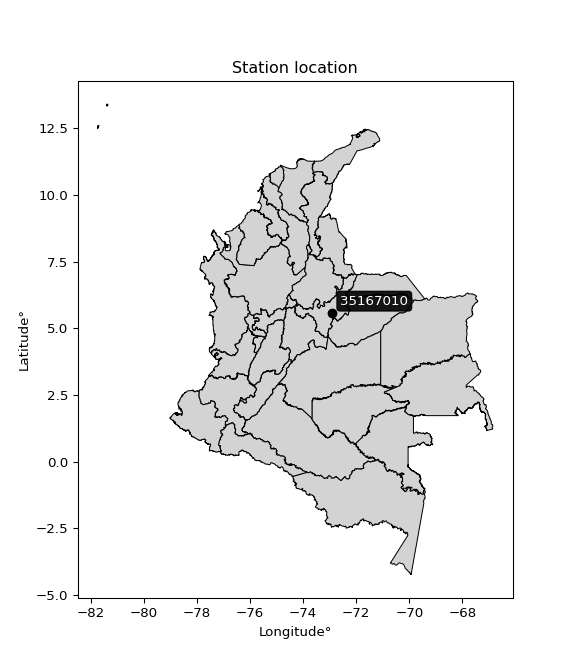

<div align="center">


</div>

# PMP Station (Rain, Pmax24h): 35167010

Probable Maximum Precipitation (PMP) is the greatest amount of rainfall for a specific duration that is meteorologically possible for a given location, acting as a "worst-case" scenario for extreme storms, crucial for designing safety-critical infrastructure like bridges, river deviations, dams, spillways, and nuclear plants to prevent catastrophic failure. PMP is calculated by hydrologists using meteorological data to determine the upper limit of extreme rainfall, often leading to the Probable Maximum Flood (PMF) for flood control design, and is increasingly being studied for climate change impacts. Probable Maximum Precipitation (PMP) is the theoretical upper limit of rainfall, a deterministic estimate for extreme events, while probability distributions (like GEV, Gumbel) describe the likelihood and frequency of various precipitation amounts, including rare ones, showing how often events occur, with PMP representing the extreme end of these distributions, used for critical infrastructure design to ensure safety against the worst conceivable weather, unlike standard statistical forecasts which cover typical probabilities.

The most common probability distributions in hydrology, used for analyzing floods, rainfall, and streamflow, include the Normal, Log-Normal, Gumbel, Gamma (including Log-Pearson Type III), and Generalized Extreme Value (GEV) distributions, often chosen based on the data´s skewness and whether modeling extremes or general conditions, with Gumbel and GEV popular for extreme events like floods, while the Normal distribution serves as a baseline, though often requiring transformations for skewed hydrological data. These distributions help in designing water infrastructure, managing water resources, and forecasting hydrologic events.

> Hydrological data often isn´t perfectly normal (it´s skewed), so different distributions are needed for different applications, such as: **Flood Frequency Analysis**: Using Gumbel, GEV, or Log-Pearson Type III for predicting extreme flood magnitudes and their return periods, **Rainfall Analysis**: Normal for annual totals, but Log-Normal, Weibull, or GEV for intensity or extreme daily rainfall, **Streamflow Modeling**: Gamma and Log-Normal for maximum flows, GEV for minimum flows, and Kappa for daily flows.

<div align="center">

</img>

</div>


## A. General information


### 1. General running parameters

• app_version: _v20260108_. • runtime: _2026-01-08 18:05:13.093906_. • Python version: _3.14.0_. • SciPy version: _1.16.3_. • Pandas version: _2.3.3_. • NumPy version: _2.3.5_. • Stations dataset (station_dataset_file): _dataset/pmax24h_in/automatic_colombia_2003_2024.csv_. • Stations catalog (station_catalog_file): _dataset/CNE.xls_. • Minimum year to eval til year_max (date_min): _1900_. • Maximum year to eval since year_min (date_max): _2024_. • Creates, save and include plots into reports (create_plot): _False_. • Plot only fit distributions with Δo > Δ (plot_only_fit): _True_. • Plot only simple graphs avoiding multiple CDFs and multiple Extreme values plots (plot_only_simple): _False_. • Eval low extreme values, if False, evaluates high extreme values (low_extreme): _False_. • Eval every SciPy distribution as logarithmic (pdist_logarithmic_on): _True_. • Standard deviation normalized (ddof): _1.0_. • Return periods to eval in years (Tr): _[2, 2.33, 5, 10, 15, 20, 25, 50, 75, 100, 200, 250, 500, 750, 1000]_. • Minimum data sample per station, 0 means any (minimum_sample): _5_. • Z-Score maximum threshold to adjust a value, 0 means disable (zscore_max): _3.5_. • Z-Score minimum threshold to adjust a value, 0 means disable (zscore_min): _-2.5_. • Avoid zeros, e.g. rain = 0 (avoid_zeros): _True_. • Avoid null values (avoid_nans): _True_. 

:file_folder:Table: [dataset.csv](../../dataset/pmax24h_in/automatic_colombia_2003_2024.csv)

> Delta Degrees of Freedom (DDOF): is a parameter used in the formulas for calculating variance and standard deviation. When ddof=0, the divisor is $N$ (the total number of observations) and this is used when your data set is the entire population. When ddof=1, the divisor is $N-1$ and this is used when your data set is a sample drawn from a larger population. Using $N-1$ provides an unbiased estimate of the population variance (known as Bessel´s correction).


### 2. Station info and location

|   id |   CODIGO | NOMBRE                       | CATEGORIA    | TECNOLOGIA                | ESTADO   | FECHA_INSTALACION   |   FECHA_SUSPENSION |   ALTITUD |   LATITUD |   LONGITUD | DEPARTAMENTO   | MUNICIPIO   | AREA_OPERATIVA                              | ENTIDAD                                                     | AREA_HIDROGRAFICA   | ZONA_HIDROGRAFICA   | SUBZONA_HIDROGRAFICA   | CORRIENTE   | Catalogo   |   Version |
|-----:|---------:|:-----------------------------|:-------------|:--------------------------|:---------|:--------------------|-------------------:|----------:|----------:|-----------:|:---------------|:------------|:--------------------------------------------|:------------------------------------------------------------|:--------------------|:--------------------|:-----------------------|:------------|:-----------|----------:|
|    0 | 35167010 | HATO LAGUNA - AUT [35167010] | Limnigráfica | Automática con Telemetría | Activa   | 31/12/2016          |                nan |      3020 |   5.58444 |   -72.9001 | Boyacá         | Aquitania   | Area Operativa 06 - Boyacá-Casanare-Vichada | INSTITUTO DE HIDROLOGIA METEOROLOGIA Y ESTUDIOS AMBIENTALES | Orinoco             | Meta                | Lago de Tota           | Las Cintas  | CNE_IDEAM  |  20251226 |

<div align="center">

Dynamic map: [:earth_americas:Google](http://maps.google.com/maps?q=5.584444444,-72.90008333) [:earth_americas:OSM](https://www.openstreetmap.org/#map=18/5.584444444/-72.90008333&layers=P) [:earth_americas:Bing](https://www.bing.com/maps?cp=5.584444444~-72.90008333&lvl=18) [:earth_americas:Apple](https://maps.apple.com/frame?center=5.584444444%2C-72.90008333&span=0.003%2C0.006)

</div>


<div align="center">

```geojson
{
  "type": "Feature",
  "geometry": {
    "type": "Point", 
    "coordinates": [-72.90008333, 5.584444444]
  }, 
  "properties": {
    "Name": "35167010"
  }
}
```

</div>


### 3. Discrete values table and plot

<div align="center">

|               |           0 |          1 |            2 |          3 |           4 |          5 |            6 |          7 |
|:--------------|------------:|-----------:|-------------:|-----------:|------------:|-----------:|-------------:|-----------:|
| Date          | 2017        | 2018       | 2019         | 2020       | 2021        | 2022       | 2023         | 2024       |
| Value         |   27.57     |   14.3     |  194.72      |  285.4     |  290.3      |    3.9     |  198.2       |  453.4     |
| Value_initial |   27.57     |   14.3     |  194.72      |  285.4     |  290.3      |    3.9     |  198.2       |  453.4     |
| count         |    8        |    8       |    8         |    8       |    8        |    8       |    8         |    8       |
| mean          |  183.474    |  183.474   |  183.474     |  183.474   |  183.474    |  183.474   |  183.474     |  183.474   |
| std           |  160.435    |  160.435   |  160.435     |  160.435   |  160.435    |  160.435   |  160.435     |  160.435   |
| zscore        |   -0.971754 |   -1.05447 |    0.0700983 |    0.63531 |    0.665852 |   -1.11929 |    0.0917892 |    1.68246 |


</div>


> The initial value (value_initial) correspond to the initial obtained or null completed value, and value (value) is adjusted only when the initial value is outside the valid range (outlier) definite through the Z-Score value. If Z-Score is active, values out of range or outliers are replaced with the station mean value. A Z-Score (or standard score) measures how many standard deviations a data point is from the mean of a dataset, indicating its relative position; positive scores mean above the mean, negative mean below, and a score of zero is exactly at the mean, allowing for comparison of values from different distributions. It´s calculated using the formula $z=(x–μ)/σ$, where $x$ is the data point, $μ$ is the mean, and $σ$ is the standard deviation, helping identify outliers and understand probability.
>
> <sub>**Note**: In this study, "completing" (filling gaps in) and "extending" (forecasting or lengthening the historical record) rainfall data series are avoided for certain critical analyses because they introduce artificial bias and uncertainty, which can distort the statistics of rare events (extremes), alter day-to-day variability, and compromise the integrity and homogeneity of the original data. Some reasons against Completing/Extending rainfall data are: **Distortion of Extremes and Variability**: The primary issue is that most gap-filling or extension methods rely on averaging or regression with nearby stations, which inherently smooths the data. Rainfall is highly variable in space and time, with a large percentage of zero values and occasional large storms. Infilling methods often underestimate the highest values and overestimate the lowest (zero) values, which severely distorts analyses focused on flood frequency, drought severity, and intensity-duration-frequency (IDF) curves, **Loss of Data Homogeneity**: Infilled or extended data are synthetic estimates, not actual measurements. Combining these estimates with observed data can violate the assumption of data homogeneity, which requires that the data properties do not change over time. Inhomogeneity can lead to incorrect conclusions about long-term trends or changes in climate patterns, **Propagation of Errors**: Errors and biases from the original data (e.g., wind-induced undercatch, instrument errors, site changes) or the data used for imputation can propagate through the analysis, leading to unreliable hydrological models and inaccurate predictions, **Compromised Statistical Integrity**: For statistical analyses, especially those involving the frequency of events, using artificial data can introduce time bias or autocorrelation that doesn´t exist in reality, making it difficult to assess the true probability of events, **Difficulty in Validation**: It is difficult to accurately validate the quality of filled or extended data, especially for past periods where ground-truth measurements are unavailable. The reliability of imputation techniques heavily depends on the density of the surrounding station network and the complexity of the local topography.</sub>


### 4. Active continuous probability distributions from SciPy (43 of 104 available)

A Probability Density Function (PDF) describes the relative likelihood of a continuous random variable falling within a specific range, where the total area under its curve equals 1, and the area over any interval gives the actual probability for that range. Unlike discrete probabilities (like rolling a die), a PDF shows density, not direct probability for a single point (which is zero), with higher points indicating higher likelihood, often visualized as a bell curve for normal distributions.

A log of a probability density function (log-PDF) is simply the logarithm of the PDF´s value, denoted as $log(f(x))$, useful for converting multiplication of probabilities into addition, improving numerical stability with tiny numbers, and connecting to information theory concepts like entropy. Instead of dealing with very small probabilities (e.g., 0.000001), log-PDFs use negative numbers (e.g., $log(0.00001) ≈ -11.51$ that are easier for computers to handle, preventing underflow errors and simplifying complex calculations. In this study, each active probability distribution from SciPy is also evaluated in the $log$ form.

[scipy.stats](https://docs.scipy.org/doc/scipy/reference/stats.html) is a Python´s powerful submodule within the SciPy library for comprehensive statistical analysis, offering over 130 probability distributions (like Normal, Poisson), functions for descriptive stats (mean, variance), hypothesis testing (t-tests, chi-square), random variable generation, and statistical tests, making it essential for data science, modeling, and research. It provides tools to explore, model, and draw conclusions from data efficiently, working seamlessly with NumPy.

<div align="center">

|   id | p_dist             |   n_parameter | fit_method   | label                                                                       | active   | ref                                                                                                        |
|-----:|:-------------------|--------------:|:-------------|:----------------------------------------------------------------------------|:---------|:-----------------------------------------------------------------------------------------------------------|
|    0 | alpha              |             3 | MLE          | Alpha                                                                       | True     | [:mortar_board:](https://docs.scipy.org/doc/scipy/reference/generated/scipy.stats.alpha.html)              |
|    1 | betaprime          |             4 | MLE          | Beta prime                                                                  | True     | [:mortar_board:](https://docs.scipy.org/doc/scipy/reference/generated/scipy.stats.betaprime.html)          |
|    2 | chi2               |             3 | MLE          | Chi²                                                                        | True     | [:mortar_board:](https://docs.scipy.org/doc/scipy/reference/generated/scipy.stats.chi2.html)               |
|    3 | crystalball        |             4 | MLE          | Crystalball                                                                 | True     | [:mortar_board:](https://docs.scipy.org/doc/scipy/reference/generated/scipy.stats.crystalball.html)        |
|    4 | erlang             |             3 | MLE          | Erlang                                                                      | True     | [:mortar_board:](https://docs.scipy.org/doc/scipy/reference/generated/scipy.stats.erlang.html)             |
|    5 | expon              |             2 | MLE          | Exponential                                                                 | True     | [:mortar_board:](https://docs.scipy.org/doc/scipy/reference/generated/scipy.stats.expon.html)              |
|    6 | exponnorm          |             3 | MLE          | Exponentially modified Normal                                               | True     | [:mortar_board:](https://docs.scipy.org/doc/scipy/reference/generated/scipy.stats.exponnorm.html)          |
|    7 | f                  |             4 | MLE          | F                                                                           | True     | [:mortar_board:](https://docs.scipy.org/doc/scipy/reference/generated/scipy.stats.f.html)                  |
|    8 | fatiguelife        |             3 | MLE          | Fatigue-life (Birnbaum-Saunders)                                            | True     | [:mortar_board:](https://docs.scipy.org/doc/scipy/reference/generated/scipy.stats.fatiguelife.html)        |
|    9 | fisk               |             3 | MLE          | Fisk                                                                        | True     | [:mortar_board:](https://docs.scipy.org/doc/scipy/reference/generated/scipy.stats.fisk.html)               |
|   10 | gamma              |             3 | MLE          | Gamma                                                                       | True     | [:mortar_board:](https://docs.scipy.org/doc/scipy/reference/generated/scipy.stats.gamma.html)              |
|   11 | genexpon           |             5 | MLE          | Generalized exponential                                                     | True     | [:mortar_board:](https://docs.scipy.org/doc/scipy/reference/generated/scipy.stats.genexpon.html)           |
|   12 | genlogistic        |             3 | MLE          | Generalized logistic                                                        | True     | [:mortar_board:](https://docs.scipy.org/doc/scipy/reference/generated/scipy.stats.genlogistic.html)        |
|   13 | gibrat             |             2 | MM           | Gibrat                                                                      | True     | [:mortar_board:](https://docs.scipy.org/doc/scipy/reference/generated/scipy.stats.gibrat.html)             |
|   14 | gompertz           |             3 | MLE          | Gompertz (or truncated Gumbel)                                              | True     | [:mortar_board:](https://docs.scipy.org/doc/scipy/reference/generated/scipy.stats.gompertz.html)           |
|   15 | gumbel_l           |             2 | MM           | Gumbel Left Skew                                                            | True     | [:mortar_board:](https://docs.scipy.org/doc/scipy/reference/generated/scipy.stats.gumbel_l.html)           |
|   16 | gumbel_r           |             2 | MM           | Gumbel Right Skew                                                           | True     | [:mortar_board:](https://docs.scipy.org/doc/scipy/reference/generated/scipy.stats.gumbel_r.html)           |
|   17 | halflogistic       |             2 | MM           | Half-logistic                                                               | True     | [:mortar_board:](https://docs.scipy.org/doc/scipy/reference/generated/scipy.stats.halflogistic.html)       |
|   18 | halfnorm           |             2 | MM           | Half Normal                                                                 | True     | [:mortar_board:](https://docs.scipy.org/doc/scipy/reference/generated/scipy.stats.halfnorm.html)           |
|   19 | hypsecant          |             2 | MM           | hyperbolic secant                                                           | True     | [:mortar_board:](https://docs.scipy.org/doc/scipy/reference/generated/scipy.stats.hypsecant.html)          |
|   20 | invgamma           |             3 | MLE          | Inverted gamma                                                              | True     | [:mortar_board:](https://docs.scipy.org/doc/scipy/reference/generated/scipy.stats.invgamma.html)           |
|   21 | invgauss           |             3 | MLE          | Inverse Gaussian                                                            | True     | [:mortar_board:](https://docs.scipy.org/doc/scipy/reference/generated/scipy.stats.invgauss.html)           |
|   22 | invweibull         |             3 | MLE          | Inverted Weibull                                                            | True     | [:mortar_board:](https://docs.scipy.org/doc/scipy/reference/generated/scipy.stats.invweibull.html)         |
|   23 | kstwobign          |             2 | MLE          | Limiting distribution of scaled Kolmogorov-Smirnov two-sided test statistic | True     | [:mortar_board:](https://docs.scipy.org/doc/scipy/reference/generated/scipy.stats.kstwobign.html)          |
|   24 | laplace            |             2 | MM           | Laplace                                                                     | True     | [:mortar_board:](https://docs.scipy.org/doc/scipy/reference/generated/scipy.stats.laplace.html)            |
|   25 | laplace_asymmetric |             3 | MLE          | Asymmetric Laplace                                                          | True     | [:mortar_board:](https://docs.scipy.org/doc/scipy/reference/generated/scipy.stats.laplace_asymmetric.html) |
|   26 | loggamma           |             3 | MLE          | Log gamma                                                                   | True     | [:mortar_board:](https://docs.scipy.org/doc/scipy/reference/generated/scipy.stats.loggamma.html)           |
|   27 | logistic           |             2 | MM           | Logistic (or Sech-squared)                                                  | True     | [:mortar_board:](https://docs.scipy.org/doc/scipy/reference/generated/scipy.stats.logistic.html)           |
|   28 | lognorm            |             3 | MLE          | Log Normal                                                                  | True     | [:mortar_board:](https://docs.scipy.org/doc/scipy/reference/generated/scipy.stats.lognorm.html)            |
|   29 | maxwell            |             2 | MM           | Maxwell                                                                     | True     | [:mortar_board:](https://docs.scipy.org/doc/scipy/reference/generated/scipy.stats.maxwell.html)            |
|   30 | mielke             |             4 | MLE          | Mielke Beta-Kappa / Dagum                                                   | True     | [:mortar_board:](https://docs.scipy.org/doc/scipy/reference/generated/scipy.stats.mielke.html)             |
|   31 | moyal              |             2 | MM           | Moyal                                                                       | True     | [:mortar_board:](https://docs.scipy.org/doc/scipy/reference/generated/scipy.stats.moyal.html)              |
|   32 | nakagami           |             3 | MLE          | Nakagami                                                                    | True     | [:mortar_board:](https://docs.scipy.org/doc/scipy/reference/generated/scipy.stats.nakagami.html)           |
|   33 | ncf                |             5 | MLE          | Non-central F distribution                                                  | True     | [:mortar_board:](https://docs.scipy.org/doc/scipy/reference/generated/scipy.stats.ncf.html)                |
|   34 | nct                |             4 | MLE          | Non-central Student’s t                                                     | True     | [:mortar_board:](https://docs.scipy.org/doc/scipy/reference/generated/scipy.stats.nct.html)                |
|   35 | norm               |             2 | MM           | Normal                                                                      | True     | [:mortar_board:](https://docs.scipy.org/doc/scipy/reference/generated/scipy.stats.norm.html)               |
|   36 | pearson3           |             3 | MM           | Pearson type III                                                            | True     | [:mortar_board:](https://docs.scipy.org/doc/scipy/reference/generated/scipy.stats.pearson3.html)           |
|   37 | rayleigh           |             2 | MM           | Rayleigh                                                                    | True     | [:mortar_board:](https://docs.scipy.org/doc/scipy/reference/generated/scipy.stats.rayleigh.html)           |
|   38 | rice               |             3 | MLE          | Rice                                                                        | True     | [:mortar_board:](https://docs.scipy.org/doc/scipy/reference/generated/scipy.stats.rice.html)               |
|   39 | t                  |             3 | MLE          | Student’s t                                                                 | True     | [:mortar_board:](https://docs.scipy.org/doc/scipy/reference/generated/scipy.stats.t.html)                  |
|   40 | truncnorm          |             4 | MLE          | Truncated normal                                                            | True     | [:mortar_board:](https://docs.scipy.org/doc/scipy/reference/generated/scipy.stats.truncnorm.html)          |
|   41 | wald               |             2 | MM           | Wald                                                                        | True     | [:mortar_board:](https://docs.scipy.org/doc/scipy/reference/generated/scipy.stats.wald.html)               |
|   42 | weibull_min        |             3 | MLE          | Weibull minimum                                                             | True     | [:mortar_board:](https://docs.scipy.org/doc/scipy/reference/generated/scipy.stats.weibull_min.html)        |

</div>

> **n_parameter:** # arguments & localization & scale.
>
> **Fit methods:** (MLE) maximum likelihood, (MM) L-moments.
>
>**Inactive** (With the only purpose of prevent loops, zero divisions, infinite values, over high estimated values or horizontal trending for recurrence intervals estimations, the follow distributions were disabled.)**:** foldnorm, gennorm, norminvgauss, powernorm, powerlognorm, skewnorm, genextreme, anglit, arcsine, argus, beta, bradford, burr, burr12, cauchy, cosine, halfcauchy, foldcauchy, skewcauchy, wrapcauchy, dgamma, gengamma, exponweib, exponpow, truncexpon, gausshyper, genhalflogistic, genhyperbolic, geninvgauss, halfgennorm, johnsonsb, johnsonsu, kappa4, kappa3, ksone, kstwo, loglaplace, levy, levy_l, levy_stable, ncx2, pareto, genpareto, truncpareto, lomax, powerlaw, rdist, rel_breitwigner, recipinvgauss, semicircular, studentized_range, trapezoid, triang, truncweibull_min, tukeylambda, uniform, loguniform, vonmises, vonmises_line, weibull_max, dweibull, 


## B. Probability (PDF) vs. Empirical (EDF) distributions functions

A continuous probability distribution (CPD) describes probabilities for variables that can take any value within a range (like rain any time), unlike discrete variables with specific outcomes (like temperature). It uses a Probability Density Function (PDF), a curve where the total area under it equals 1, and the probability of the variable falling within an interval (a to b) is found by calculating the area under the curve between those points. A key feature is that the probability of hitting any single exact value is zero, so probabilities are always expressed for ranges, e.g., $P(a ≤ X ≤ b)$.

<div align="center">

Distributions parameters from station values
|    |   station | p_dist                |   n |               loc |            scale | shape                  | shape1                | shape2             | shape3   |
|---:|----------:|:----------------------|----:|------------------:|-----------------:|:-----------------------|:----------------------|:-------------------|:---------|
|  0 |  35167010 | alpha                 |   8 |      -0.0219093   |     10.6142      | 7.029500603760555e-10  |                       |                    |          |
|  1 |  35167010 | betaprime             |   8 |       3.89999     |    340.03        | 0.79239376582106       | 1.3413305545668828    |                    |          |
|  2 |  35167010 | chi2                  |   8 |       3.58911     |     61.7591      | 1.8639351717719448     |                       |                    |          |
|  3 |  35167010 | crystalball           |   8 |     183.438       |    150.111       | 190.5004010673697      | 170266.72332552122    |                    |          |
|  4 |  35167010 | erlang                |   8 |       3.9         |    152.236       | 0.7689711147810896     |                       |                    |          |
|  5 |  35167010 | expon                 |   8 |       3.9         |    179.574       |                        |                       |                    |          |
|  6 |  35167010 | exponnorm             |   8 |     135.3         |    142.24        | 0.338678249780643      |                       |                    |          |
|  7 |  35167010 | f                     |   8 |       3.9         |    193.106       | 0.9324476428987362     | 39.45553943190852     |                    |          |
|  8 |  35167010 | fatiguelife           |   8 |       3.9         |      0.00252279  | 230.87473346233423     |                       |                    |          |
|  9 |  35167010 | fisk                  |   8 |       3.9         |    147.263       | 0.7600631476805983     |                       |                    |          |
| 10 |  35167010 | gamma                 |   8 |       3.9         |    144.066       | 0.8087280972190263     |                       |                    |          |
| 11 |  35167010 | genexpon              |   8 |       3.89999     |      2.5162      | 0.014005669504446962   | 9.398515882436226e-07 | 2.2749437698199726 |          |
| 12 |  35167010 | genlogistic           |   8 |    -719.134       |    125.579       | 740.1488004748869      |                       |                    |          |
| 13 |  35167010 | gibrat                |   8 |      68.9865      |     69.44        |                        |                       |                    |          |
| 14 |  35167010 | gompertz              |   8 |       3.9         |    380.344       | 1.341107239954665      |                       |                    |          |
| 15 |  35167010 | gumbel_l              |   8 |     251.015       |    117.012       |                        |                       |                    |          |
| 16 |  35167010 | gumbel_r              |   8 |     115.933       |    117.012       |                        |                       |                    |          |
| 17 |  35167010 | halflogistic          |   8 |       5.60163     |    128.308       |                        |                       |                    |          |
| 18 |  35167010 | halfnorm              |   8 |     -15.1649      |    248.957       |                        |                       |                    |          |
| 19 |  35167010 | hypsecant             |   8 |     183.474       |     95.5399      |                        |                       |                    |          |
| 20 |  35167010 | invgamma              |   8 |    -383.747       |   7509.45        | 14.214229137299217     |                       |                    |          |
| 21 |  35167010 | invgauss              |   8 |     -21.1633      |    118.881       | 1.7213535708037817     |                       |                    |          |
| 22 |  35167010 | invweibull            |   8 |       3.9         |      6.84023     | 0.046056518772223526   |                       |                    |          |
| 23 |  35167010 | kstwobign             |   8 |    -319.039       |    573.729       |                        |                       |                    |          |
| 24 |  35167010 | laplace               |   8 |     183.474       |    106.118       |                        |                       |                    |          |
| 25 |  35167010 | laplace_asymmetric    |   8 |     198.2         |    122.689       | 1.0618135837802698     |                       |                    |          |
| 26 |  35167010 | loggamma              |   8 |  -33748.9         |   4885.05        | 1039.617576117067      |                       |                    |          |
| 27 |  35167010 | logistic              |   8 |     183.474       |     82.7399      |                        |                       |                    |          |
| 28 |  35167010 | lognorm               |   8 |       3.9         |      0.786815    | 13.328373059858878     |                       |                    |          |
| 29 |  35167010 | maxwell               |   8 |    -172.138       |    222.846       |                        |                       |                    |          |
| 30 |  35167010 | mielke                |   8 |      -8.43532     |    467.077       | 0.7019062007469863     | 231.78801631048714    |                    |          |
| 31 |  35167010 | moyal                 |   8 |      97.652       |     67.5569      |                        |                       |                    |          |
| 32 |  35167010 | nakagami              |   8 |       3.9         |    334.995       | 0.19143102654270908    |                       |                    |          |
| 33 |  35167010 | ncf                   |   8 |      -0.0207932   |     71.2077      | 1.1745419666167165     | 70.59687834189435     | 1.7500059129133607 |          |
| 34 |  35167010 | nct                   |   8 |    -447.721       |      0.830272    | 9.52580416007845       | 700.4764553598759     |                    |          |
| 35 |  35167010 | norm                  |   8 |     183.474       |    150.074       |                        |                       |                    |          |
| 36 |  35167010 | pearson3              |   8 |     183.474       |    150.074       | 0.27839325438407514    |                       |                    |          |
| 37 |  35167010 | rayleigh              |   8 |    -103.626       |    229.072       |                        |                       |                    |          |
| 38 |  35167010 | rice                  |   8 |     -82.7518      |    198.769       | 0.6032884612647182     |                       |                    |          |
| 39 |  35167010 | t                     |   8 |     183.496       |    150.039       | 981020.6071238695      |                       |                    |          |
| 40 |  35167010 | truncnorm             |   8 |     183.474       |    150.074       | -484.42990808790626    | 7716.025147940503     |                    |          |
| 41 |  35167010 | wald                  |   8 |      33.4001      |    150.074       |                        |                       |                    |          |
| 42 |  35167010 | weibull_min           |   8 |       3.9         |    201.926       | 0.8856667663202396     |                       |                    |          |
| 43 |  35167010 | logalpha              |   8 |     -30.5996      |    721.5         | 20.674186960223125     |                       |                    |          |
| 44 |  35167010 | logbetaprime          |   8 |     -15.012       |    216.576       | 146.70051798394493     | 1636.5960234586364    |                    |          |
| 45 |  35167010 | logchi2               |   8 |       1.36098     |      2.3669      | 1.6023374602097293     |                       |                    |          |
| 46 |  35167010 | logcrystalball        |   8 |       4.41755     |      1.62475     | 141.82580146278423     | 20.755755251110774    |                    |          |
| 47 |  35167010 | logerlang             |   8 |     -20.0299      |      0.114382    | 213.68436964481828     |                       |                    |          |
| 48 |  35167010 | logexpon              |   8 |       1.36098     |      3.05657     |                        |                       |                    |          |
| 49 |  35167010 | logexponnorm          |   8 |       4.4165      |      1.62476     | 0.0006465657529476981  |                       |                    |          |
| 50 |  35167010 | logf                  |   8 |    -221.544       |    225.969       | 49750.34483507951      | 166020.90564204718    |                    |          |
| 51 |  35167010 | logfatiguelife        |   8 |    -589.564       |    593.98        | 0.0027301469074036307  |                       |                    |          |
| 52 |  35167010 | logfisk               |   8 | -395291           | 395296           | 408351.2132367686      |                       |                    |          |
| 53 |  35167010 | loggamma              |   8 |     -15.0327      |      0.149089    | 130.26730872752145     |                       |                    |          |
| 54 |  35167010 | loggenexpon           |   8 |       1.36098     |      7.54354e+08 | 173408920.63468105     | 110973703.12156382    | 651623596.840383   |          |
| 55 |  35167010 | loggenlogistic        |   8 |       6.11686     |      4.55754e-06 | 2.6872187903643953e-06 |                       |                    |          |
| 56 |  35167010 | loggibrat             |   8 |       3.17809     |      0.75177     |                        |                       |                    |          |
| 57 |  35167010 | loggompertz           |   8 |       1.36098     |      1.36605     | 0.07008416298998754    |                       |                    |          |
| 58 |  35167010 | loggumbel_l           |   8 |       5.14877     |      1.26682     |                        |                       |                    |          |
| 59 |  35167010 | loggumbel_r           |   8 |       3.68632     |      1.26682     |                        |                       |                    |          |
| 60 |  35167010 | loghalflogistic       |   8 |       2.49181     |      1.38912     |                        |                       |                    |          |
| 61 |  35167010 | loghalfnorm           |   8 |       2.26706     |      2.69525     |                        |                       |                    |          |
| 62 |  35167010 | loghypsecant          |   8 |       4.41755     |      1.03435     |                        |                       |                    |          |
| 63 |  35167010 | loginvgamma           |   8 |     -24.4967      |   8298.6         | 288.28398683359194     |                       |                    |          |
| 64 |  35167010 | loginvgauss           |   8 |     -11.1464      |   1227.62        | 0.012655079417412566   |                       |                    |          |
| 65 |  35167010 | loginvweibull         |   8 |      -3.80348e+08 |      3.80348e+08 | 222126911.34502465     |                       |                    |          |
| 66 |  35167010 | logkstwobign          |   8 |      -2.40029     |      7.77382     |                        |                       |                    |          |
| 67 |  35167010 | loglaplace            |   8 |       4.41755     |      1.14887     |                        |                       |                    |          |
| 68 |  35167010 | loglaplace_asymmetric |   8 |       5.67091     |      0.717339    | 2.201498241034003      |                       |                    |          |
| 69 |  35167010 | logloggamma           |   8 |       6.11689     |      6.13204e-06 | 3.6162677809109153e-06 |                       |                    |          |
| 70 |  35167010 | loglogistic           |   8 |       4.41755     |      0.895774    |                        |                       |                    |          |
| 71 |  35167010 | loglognorm            |   8 |       1.36098     |      0.0305699   | 12.312438342894986     |                       |                    |          |
| 72 |  35167010 | logmaxwell            |   8 |       0.567564    |      2.41262     |                        |                       |                    |          |
| 73 |  35167010 | logmielke             |   8 |      -2.07548     |      8.20942     | 3.692114000265825      | 1932.271197709928     |                    |          |
| 74 |  35167010 | logmoyal              |   8 |       3.48841     |      0.731396    |                        |                       |                    |          |
| 75 |  35167010 | lognakagami           |   8 |       2.66026     |      2.285       | 0.41933907643988955    |                       |                    |          |
| 76 |  35167010 | logncf                |   8 |      -0.332448    |      5.47723e-08 | 3.762860178237278e-07  | 79.80908914420007     | 32.08289398987629  |          |
| 77 |  35167010 | lognct                |   8 |     -96.8498      |      1.59425     | 49171.38152886665      | 63.518599618619106    |                    |          |
| 78 |  35167010 | lognorm               |   8 |       4.41755     |      1.62475     |                        |                       |                    |          |
| 79 |  35167010 | logpearson3           |   8 |       4.41755     |      1.62477     | -0.7364563157256883    |                       |                    |          |
| 80 |  35167010 | lograyleigh           |   8 |       1.3093      |      2.48002     |                        |                       |                    |          |
| 81 |  35167010 | logrice               |   8 |       0.382674    |      1.77434     | 2.002396367249487      |                       |                    |          |
| 82 |  35167010 | logt                  |   8 |       4.41755     |      1.62475     | 155110528685.54547     |                       |                    |          |
| 83 |  35167010 | logtruncnorm          |   8 |       0.21163     |      5.08126     | 0.19872704907428276    | 1.1621423345180628    |                    |          |
| 84 |  35167010 | logwald               |   8 |       2.79277     |      1.62478     |                        |                       |                    |          |
| 85 |  35167010 | logweibull_min        |   8 |      -6.40476e+07 |      6.40476e+07 | 56389885.7208828       |                       |                    |          |

</div>

> **loc** (Location parameter): This shifts the distribution along the x-axis. For many common distributions, like the normal (Gaussian) distribution, loc represents the mean $μ$. For others, like the uniform distribution, it might represent the minimum value, or for the beta distribution, the left end of the support interval.
>
> **scale** (Scale parameter): This determines the width or spread of the distribution. For the normal distribution, scale represents the standard deviation $σ$. For a uniform distribution, it defines the length of the interval (from $loc$ to $loc + scale$).
>
> **shape** (Shape parameters): Refers to parameters that define the specific form of a probability distribution, distinct from its location (loc) and scale (scale). These parameters are required arguments for most distribution functions. For example, a normal (Gaussian) distribution is fully defined by its location (mean) and scale (standard deviation), so it has no specific shape parameters beyond loc and scale. However, other distributions have intrinsic properties that need specification, as Gamma distribution that takes a shape parameter, often named $a$ or $alpha$.


### 0. Cumulative distribution values - CDF (86 evaluated)

Cumulative Distribution Function (CDF), denoted as $F$<sub>$X$</sub>$(x)$, is a function that gives the probability that a random variable $X$ will take a value less than or equal to a specific value, $x$ (i.e., $(P(X≥x)$. It essentially "accumulates" probabilities from a given point up to the far right (positive infinity), providing a complete picture of the distribution´s probabilities for both discrete (like rain) and continuous (like temperature) variables, helping to find probabilities over ranges or above certain values. Each station is evaluated separately ordering the $x$ values ascending, calculating the CDF and PDF values for the activated distributions and their logarithmic forms.

<div align="center">

CDF ordered by x ascending and calculating $log(f(x))$ separately
|   id |   Station |   date |      x |   count |    mean |     std |     zscore |   Value_initial |   station |   m |      alpha |   alpha_pdf |   betaprime |   betaprime_pdf |       chi2 |    chi2_pdf |   crystalball |   crystalball_pdf |      erlang |   erlang_pdf |     expon |   expon_pdf |   exponnorm |   exponnorm_pdf |         f |          f_pdf |   fatiguelife |   fatiguelife_pdf |        fisk |     fisk_pdf |       gamma |   gamma_pdf |    genexpon |   genexpon_pdf |   genlogistic |   genlogistic_pdf |   gibrat |   gibrat_pdf |    gompertz |   gompertz_pdf |   gumbel_l |   gumbel_l_pdf |   gumbel_r |   gumbel_r_pdf |   halflogistic |   halflogistic_pdf |   halfnorm |   halfnorm_pdf |   hypsecant |   hypsecant_pdf |   invgamma |   invgamma_pdf |   invgauss |   invgauss_pdf |   invweibull |   invweibull_pdf |   kstwobign |   kstwobign_pdf |   laplace |   laplace_pdf |   laplace_asymmetric |   laplace_asymmetric_pdf |   loggamma |   loggamma_pdf |   logistic |   logistic_pdf |   lognorm |   lognorm_pdf |   maxwell |   maxwell_pdf |    mielke |   mielke_pdf |     moyal |   moyal_pdf |    nakagami |   nakagami_pdf |       ncf |     ncf_pdf |       nct |    nct_pdf |     norm |    norm_pdf |   pearson3 |   pearson3_pdf |   rayleigh |   rayleigh_pdf |      rice |    rice_pdf |        t |       t_pdf |   truncnorm |   truncnorm_pdf |     wald |    wald_pdf |   weibull_min |   weibull_min_pdf |   logalpha |   logalpha_pdf |   logbetaprime |   logbetaprime_pdf |     logchi2 |   logchi2_pdf |   logcrystalball |   logcrystalball_pdf |   logerlang |   logerlang_pdf |   logexpon |   logexpon_pdf |   logexponnorm |   logexponnorm_pdf |      logf |   logf_pdf |   logfatiguelife |   logfatiguelife_pdf |   logfisk |   logfisk_pdf |   loggenexpon |   loggenexpon_pdf |   loggenlogistic |   loggenlogistic_pdf |   loggibrat |   loggibrat_pdf |   loggompertz |   loggompertz_pdf |   loggumbel_l |   loggumbel_l_pdf |   loggumbel_r |   loggumbel_r_pdf |   loghalflogistic |   loghalflogistic_pdf |   loghalfnorm |   loghalfnorm_pdf |   loghypsecant |   loghypsecant_pdf |   loginvgamma |   loginvgamma_pdf |   loginvgauss |   loginvgauss_pdf |   loginvweibull |   loginvweibull_pdf |   logkstwobign |   logkstwobign_pdf |   loglaplace |   loglaplace_pdf |   loglaplace_asymmetric |   loglaplace_asymmetric_pdf |   logloggamma |   logloggamma_pdf |   loglogistic |   loglogistic_pdf |   loglognorm |   loglognorm_pdf |   logmaxwell |   logmaxwell_pdf |   logmielke |   logmielke_pdf |    logmoyal |   logmoyal_pdf |   lognakagami |   lognakagami_pdf |    logncf |   logncf_pdf |    lognct |   lognct_pdf |   logpearson3 |   logpearson3_pdf |   lograyleigh |   lograyleigh_pdf |   logrice |   logrice_pdf |      logt |   logt_pdf |   logtruncnorm |   logtruncnorm_pdf |   logwald |   logwald_pdf |   logweibull_min |   logweibull_min_pdf |
|-----:|----------:|-------:|-------:|--------:|--------:|--------:|-----------:|----------------:|----------:|----:|-----------:|------------:|------------:|----------------:|-----------:|------------:|--------------:|------------------:|------------:|-------------:|----------:|------------:|------------:|----------------:|----------:|---------------:|--------------:|------------------:|------------:|-------------:|------------:|------------:|------------:|---------------:|--------------:|------------------:|---------:|-------------:|------------:|---------------:|-----------:|---------------:|-----------:|---------------:|---------------:|-------------------:|-----------:|---------------:|------------:|----------------:|-----------:|---------------:|-----------:|---------------:|-------------:|-----------------:|------------:|----------------:|----------:|--------------:|---------------------:|-------------------------:|-----------:|---------------:|-----------:|---------------:|----------:|--------------:|----------:|--------------:|----------:|-------------:|----------:|------------:|------------:|---------------:|----------:|------------:|----------:|-----------:|---------:|------------:|-----------:|---------------:|-----------:|---------------:|----------:|------------:|---------:|------------:|------------:|----------------:|---------:|------------:|--------------:|------------------:|-----------:|---------------:|---------------:|-------------------:|------------:|--------------:|-----------------:|---------------------:|------------:|----------------:|-----------:|---------------:|---------------:|-------------------:|----------:|-----------:|-----------------:|---------------------:|----------:|--------------:|--------------:|------------------:|-----------------:|---------------------:|------------:|----------------:|--------------:|------------------:|--------------:|------------------:|--------------:|------------------:|------------------:|----------------------:|--------------:|------------------:|---------------:|-------------------:|--------------:|------------------:|--------------:|------------------:|----------------:|--------------------:|---------------:|-------------------:|-------------:|-----------------:|------------------------:|----------------------------:|--------------:|------------------:|--------------:|------------------:|-------------:|-----------------:|-------------:|-----------------:|------------:|----------------:|------------:|---------------:|--------------:|------------------:|----------:|-------------:|----------:|-------------:|--------------:|------------------:|--------------:|------------------:|----------:|--------------:|----------:|-----------:|---------------:|-------------------:|----------:|--------------:|-----------------:|---------------------:|
|    0 |  35167010 |   2022 |   3.9  |       8 | 183.474 | 160.435 | -1.11929   |            3.9  |  35167010 |   1 | 0.00680193 | 0.0141361   | 1.49963e-06 |     0.107178    | 0.00388154 | 0.0116208   |      0.115841 |       0.00129977  | 7.49272e-11 |  6.17141     | 0         | 0.00556874  |    0.114414 |     0.00131572  | 2.088e-06 | 4591.67        |     0.0909274 |       4.11371e+06 | 4.82191e-14 | 82.5275      | 2.82854e-12 | 3.29139     | 8.27198e-08 |    0.00556619  |     0.0968851 |       0.00179804  | 0        |  0           | 1.69237e-13 |    0.00352604  |   0.113975 |    0.000916303 |  0.0739006 |     0.00164525 |      0         |         0          |  0.0610418 |     0.00319553 |   0.0964392 |     0.000994041 |  0.0939556 |    0.00180898  |  0.0511621 |    0.0055818   |   0.00382569 |      2.20839e+12 |    0.090696 |     0.00190631  | 0.0920564 |   0.00086749  |             0.11926  |              0.000915463 |  0.0320384 |      0.0473004 |   0.102446 |     0.00111132 | 0.0299688 |     0.0418422 |  0.109088 |   0.00163542  | 0.0780234 |   0.0044397  | 0.0453433 | 0.0015949   | 1.13212e-07 |    9.76037e+07 | 0.0624259 | 0.00944016  | 0.0882058 | 0.00183234 | 0.115737 | 0.00129927  |   0.110624 |    0.00142108  |   0.104315 |    0.00183537  | 0.0762103 | 0.00169144  | 0.115654 | 0.00129891  |    0.115737 |     0.00129927  | 0        | 0           |    2.2969e-16 |       0.458082    |  0.0286813 |      0.0462992 |       0.028348 |          0.0438622 | 8.88436e-14 |   320.561     |        0.0299688 |            0.0418422 |    0.029819 |       0.0442704 |   0        |      0.327164  |      0.0299691 |          0.0418424 | 0.0297015 |  0.0417785 |        0.0294717 |            0.0415582 | 0.0335244 |     0.0334709 |   9.28631e-12 |         0.229877  |         0        |            0.0357058 |   0         |       0         |   1.76474e-09 |         0.0513044 |     0.0490432 |         0.0377485 |    0.00189451 |        0.00937492 |         0         |             0         |      0        |          0        |      0.0331223 |          0.0319645 |     0.0304481 |          0.046888 |      0.03018  |         0.0489664 |        0.026979 |           0.0569218 |      0.0266477 |          0.0675886 |    0.0349569 |        0.0304271 |               0.0541099 |                   0.0342637 |     0.0605241 |         0.035693  |     0.0319159 |         0.0344923 |   0.00409484 |      4.42524e+12 |   0.00915803 |        0.0338834 |   0.0401454 |        0.043132 | 1.85419e-05 |    0.000243957 |   0           |          0        | 0.0188803 |    0.0459268 | 0.0300731 |    0.0420117 |     0.0461037 |         0.0420442 |   0.000217072 |        0.00840022 |  0.021958 |     0.0477701 | 0.0299688 |  0.0418422 |      0.0358701 |           0.256252 |  0        |     0         |        0.0346454 |            0.0299685 |
|    1 |  35167010 |   2018 |  14.3  |       8 | 183.474 | 160.435 | -1.05447   |           14.3  |  35167010 |   2 | 0.458622   | 0.0313731   | 0.0787045   |     0.0057852   | 0.100959   | 0.0083963   |      0.129923 |       0.00140868  | 0.133514    |  0.00949601  | 0.0562698 | 0.00525539  |    0.128679 |     0.00142805  | 0.19973   |    0.00879802  |     0.609506  |       0.00513293  | 0.117691    |  0.0075889   | 0.123787    | 0.00924723  | 0.0562481   |    0.00525346  |     0.116604  |       0.00199249  | 0        |  0           | 0.0364942   |    0.00349153  |   0.123885 |    0.000990271 |  0.092228  |     0.00187865 |      0.0338836 |         0.00389241 |  0.0942126 |     0.00318255 |   0.107331  |     0.00110225  |  0.113802  |    0.00200593  |  0.115713  |    0.00655097  |   0.374978   |      0.00162886  |    0.111609 |     0.00211251  | 0.101535  |   0.000956813 |             0.129172 |              0.000991543 |  0.154301  |      0.148574  |   0.114595 |     0.00122628 | 0.139721  |     0.136806  |  0.12678  |   0.00176605  | 0.119844  |   0.00369994 | 0.0638567 | 0.00196524  | 0.209491    |    0.00771094  | 0.135454  | 0.00572223  | 0.108401  | 0.00204938 | 0.129814 | 0.00140821  |   0.126055 |    0.00154647  |   0.124104 |    0.00196841  | 0.0946734 | 0.00185727  | 0.129727 | 0.00140789  |    0.129814 |     0.00140821  | 0        | 0           |    0.0697455  |       0.00572743  |  0.154181  |      0.154874  |       0.146445 |          0.146718  | 0.338281    |     0.178519  |        0.139721  |            0.136806  |    0.14671  |       0.144379  |   0.346282 |      0.213873  |      0.139722  |          0.136805  | 0.139472  |  0.136796  |        0.13915   |            0.137091  | 0.117204  |     0.106885  |   0.312675    |         0.2262    |         0        |            0.0768148 |   0         |       0         |   0.105363    |         0.118815  |     0.130852  |         0.0962185 |    0.105631   |        0.187429   |         0.0605564 |             0.35862   |      0.115989 |          0.2929   |      0.115152  |          0.108915  |     0.154229  |          0.151402 |      0.159872 |         0.1571    |        0.184229 |           0.182     |      0.209496  |          0.199643  |    0.108314  |        0.0942783 |               0.123193  |                   0.0780089 |     0.130226  |         0.0767985 |     0.123277  |         0.120655  |   0.619639   |      0.0238081   |   0.139179   |        0.170808  |   0.131178  |        0.10227  | 0.0781605   |    0.203647    |   5.21537e-14 |         98.4941   | 0.162412  |    0.177409  | 0.140183  |    0.137138  |     0.139239  |         0.109078  |   0.137887    |        0.189363   |  0.145293 |     0.148454  | 0.139721  |  0.136806  |      0.355928  |           0.234073 |  0        |     0         |        0.104778  |            0.0872396 |
|    2 |  35167010 |   2017 |  27.57 |       8 | 183.474 | 160.435 | -0.971754  |           27.57 |  35167010 |   3 | 0.70047    | 0.0103307   | 0.145827    |     0.00450533  | 0.203432   | 0.00713865  |      0.149553 |       0.00155015  | 0.242155    |  0.00719729  | 0.123494  | 0.00488103  |    0.148595 |     0.00157378  | 0.290062  |    0.00548941  |     0.662576  |       0.00323814  | 0.199503    |  0.00512814  | 0.231235    | 0.00720598  | 0.123449    |    0.00487938  |     0.144604  |       0.0022238   | 0        |  0           | 0.0825095   |    0.00344283  |   0.137691 |    0.00109171  |  0.119081  |     0.00216558 |      0.0853997 |         0.00386846 |  0.136292  |     0.00315804 |   0.122954  |     0.00125517  |  0.141991  |    0.00223853  |  0.201948  |    0.00629897  |   0.388901   |      0.000714664 |    0.141238 |     0.00234728  | 0.11506   |   0.00108426  |             0.143023 |              0.00109787  |  0.27006   |      0.201806  |   0.1319   |     0.00138388 | 0.249035  |     0.195183  |  0.151278 |   0.0019245   | 0.165487  |   0.00322608 | 0.0929916 | 0.00241967  | 0.286984    |    0.00463823  | 0.202069  | 0.00450486  | 0.137323  | 0.00230484 | 0.149438 | 0.00154974  |   0.147638 |    0.00170619  |   0.151265 |    0.00212201  | 0.120632  | 0.00205176  | 0.149347 | 0.00154948  |    0.149438 |     0.00154974  | 0        | 0           |    0.139102   |       0.00482474  |  0.274657  |      0.209157  |       0.261887 |          0.202776  | 0.443187    |     0.143266  |        0.249035  |            0.195183  |    0.260435 |       0.200173  |   0.472629 |      0.172537  |      0.249035  |          0.195182  | 0.248672  |  0.194788  |        0.248773  |            0.195809  | 0.207341  |     0.16978   |   0.450329    |         0.19229   |         0        |            0.113122  |   0.0454607 |       0.68932   |   0.200102    |         0.171776  |     0.209799  |         0.146878  |    0.262168   |        0.277059   |         0.288492  |             0.329983  |      0.303058 |          0.274414 |      0.211484  |          0.189747  |     0.272054  |          0.204931 |      0.280646 |         0.207591  |        0.315722 |           0.212576  |      0.348254  |          0.21699   |    0.191797  |        0.166943  |               0.186689  |                   0.118216  |     0.191792  |         0.113106  |     0.226373  |         0.195505  |   0.632224   |      0.0156488   |   0.270498   |        0.224347  |   0.211846  |        0.145053 | 0.260788    |    0.325935    |   0.27252     |          0.339756 | 0.295035  |    0.22086   | 0.249685  |    0.195393  |     0.226941  |         0.159513  |   0.279346    |        0.23521    |  0.260796 |     0.201534  | 0.249035  |  0.195183  |      0.504497  |           0.218116 |  0.189823 |     0.658057  |        0.179045  |            0.142599  |
|    3 |  35167010 |   2019 | 194.72 |       8 | 183.474 | 160.435 |  0.0700983 |          194.72 |  35167010 |   4 | 0.956534   | 0.000222979 | 0.536828    |     0.00130355  | 0.807923   | 0.0016017   |      0.529954 |       0.00265016  | 0.798705    |  0.00148224  | 0.654453  | 0.00192426  |    0.533855 |     0.00265868  | 0.679897  |    0.00119843  |     0.883215  |       0.000612531 | 0.549076    |  0.000986192 | 0.800806    | 0.00151508  | 0.65431     |    0.00192431  |     0.599656  |       0.00244115  | 0.723644 |  0.00266023  | 0.582627    |    0.00243052  |   0.461033 |    0.00284703  |  0.60049   |     0.0026173  |      0.627313  |         0.00236338 |  0.600804  |     0.00224636 |   0.537383  |     0.00330875  |  0.597811  |    0.00244231  |  0.719648  |    0.00137018  |   0.424063   |      8.78053e-05 |    0.600989 |     0.00242983  | 0.550278  |   0.00423794  |             0.515984 |              0.00396078  |  0.705487  |      0.196666  |   0.533928 |     0.0030076  | 0.700426  |     0.213859  |  0.561485 |   0.00250282  | 0.557466  |   0.00192606 | 0.625887  | 0.00255638  | 0.631941    |    0.00120338  | 0.652816  | 0.00171652  | 0.60435   | 0.00243818 | 0.529868 | 0.00265086  |   0.548178 |    0.00261931  |   0.571787 |    0.00243464  | 0.558688  | 0.00261925  | 0.529817 | 0.0026515   |    0.529868 |     0.00265086  | 0.696392 | 0.00237901  |    0.613697   |       0.00170536  |  0.712433  |      0.191177  |       0.703955 |          0.200069  | 0.65683     |     0.0825975 |        0.700426  |            0.213859  |    0.702331 |       0.20247   |   0.721797 |      0.0910181 |      0.700425  |          0.213859  | 0.698021  |  0.212847  |        0.701024  |            0.213766  | 0.663376  |     0.230683  |   0.730113    |         0.10039   |         0        |            0.358194  |   0.847118  |       0.112793  |   0.685574    |         0.282442  |     0.667721  |         0.288991  |    0.751176   |        0.169656   |         0.761822  |             0.151041  |      0.735038 |          0.159039 |      0.737212  |          0.226169  |     0.707723  |          0.193763 |      0.708147 |         0.186247  |        0.69204  |           0.148775  |      0.715673  |          0.143122  |    0.762241  |        0.20695   |               0.643739  |                   0.407631  |     0.607433  |         0.358223  |     0.721795  |         0.224172  |   0.653219   |      0.00766674  |   0.71629    |        0.187897  |   0.663804  |        0.333582 | 0.767594    |    0.154307    |   0.75476     |          0.162787 | 0.706875  |    0.166408  | 0.700694  |    0.213384  |     0.669589  |         0.256786  |   0.720926    |        0.179784   |  0.703363 |     0.203736  | 0.700426  |  0.213859  |      0.875827  |           0.160121 |  0.815804 |     0.119021  |        0.668118  |            0.322291  |
|    4 |  35167010 |   2023 | 198.2  |       8 | 183.474 | 160.435 |  0.0917892 |          198.2  |  35167010 |   5 | 0.957296   | 0.00021523  | 0.541324    |     0.00128069  | 0.813415   | 0.00155529  |      0.539168 |       0.00264483  | 0.803794    |  0.0014427   | 0.661085  | 0.00188733  |    0.543095 |     0.00265159  | 0.68403   |    0.00117699  |     0.885323  |       0.000599217 | 0.552475    |  0.000967179 | 0.806007    | 0.00147382  | 0.660942    |    0.00188739  |     0.608094  |       0.00240788  | 0.732701 |  0.00254601  | 0.591038    |    0.00240342  |   0.470996 |    0.00287875  |  0.609532  |     0.00257886 |      0.635467  |         0.00232325 |  0.608575  |     0.00221983 |   0.54887   |     0.00329251  |  0.606253  |    0.00240927  |  0.724358  |    0.00133694  |   0.424366   |      8.62224e-05 |    0.609391 |     0.00239863  | 0.564787  |   0.00410121  |             0.529953 |              0.00406801  |  0.70896   |      0.195472  |   0.544379 |     0.00299771 | 0.704204  |     0.212625  |  0.570165 |   0.00248549  | 0.564152  |   0.00191633 | 0.634696  | 0.00250628  | 0.636101    |    0.00118731  | 0.658741  | 0.00168858  | 0.612772  | 0.00240208 | 0.539084 | 0.00264554  |   0.55727  |    0.0026058   |   0.580225 |    0.0024145   | 0.567767  | 0.00259834  | 0.539035 | 0.00264619  |    0.539084 |     0.00264554  | 0.704532 | 0.00229997  |    0.61958    |       0.00167592  |  0.715808  |      0.189919  |       0.707488 |          0.198837  | 0.65829     |     0.0822151 |        0.704204  |            0.212625  |    0.705907 |       0.201255  |   0.723404 |      0.0904922 |      0.704202  |          0.212624  | 0.701781  |  0.211631  |        0.7048    |            0.212521  | 0.66745   |     0.229291  |   0.731886    |         0.0997509 |         0        |            0.361954  |   0.849099  |       0.110881  |   0.69057     |         0.281583  |     0.672836  |         0.288549  |    0.754166   |        0.167967   |         0.764485  |             0.149578  |      0.737845 |          0.157875 |      0.741195  |          0.22354   |     0.711145  |          0.192545 |      0.711436 |         0.185063  |        0.694667 |           0.147803  |      0.718201  |          0.14221   |    0.765878  |        0.203783  |               0.651     |                   0.412229  |     0.613812  |         0.361985  |     0.725748  |         0.222196  |   0.653355   |      0.00763106  |   0.719607   |        0.186619  |   0.669733  |        0.335752 | 0.770312    |    0.152609    |   0.757631    |          0.161402 | 0.709813  |    0.165269  | 0.704463  |    0.21215   |     0.674133  |         0.25622   |   0.724099    |        0.178534   |  0.706961 |     0.202545  | 0.704204  |  0.212625  |      0.878659  |           0.159565 |  0.817898 |     0.117389  |        0.673822  |            0.32173   |
|    5 |  35167010 |   2020 | 285.4  |       8 | 183.474 | 160.435 |  0.63531   |          285.4  |  35167010 |   6 | 0.970335   | 0.000103885 | 0.632798    |     0.000858882 | 0.909545   | 0.000748644 |      0.751508 |       0.00211015  | 0.895708    |  0.000746824 | 0.791455  | 0.00116133  |    0.754195 |     0.00207899  | 0.767804  |    0.000783223 |     0.926028  |       0.000359972 | 0.620684    |  0.000635686 | 0.899208    | 0.000749511 | 0.791327    |    0.00116159  |     0.780011  |       0.00154293  | 0.872174 |  0.000966138 | 0.770098    |    0.00169926  |   0.738572 |    0.00299739  |  0.790593  |     0.00158759 |      0.797003  |         0.00142153 |  0.772683  |     0.00154636 |   0.789023  |     0.00205009  |  0.778473  |    0.00154749  |  0.813217  |    0.000772318 |   0.430569   |      5.9361e-05  |    0.783025 |     0.00158757  | 0.808649  |   0.00180319  |             0.779    |              0.00191264  |  0.775472  |      0.168771  |   0.774149 |     0.00211316 | 0.776654  |     0.183818  |  0.760879 |   0.00183403  | 0.722299  |   0.00172541 | 0.803217  | 0.00142653  | 0.725128    |    0.000879967 | 0.779276  | 0.00111317  | 0.782213  | 0.00150286 | 0.751486 | 0.00211077  |   0.759578 |    0.00195166  |   0.763558 |    0.0017529   | 0.764713  | 0.00186906  | 0.75149  | 0.00211124  |    0.751486 |     0.00211077  | 0.842822 | 0.0010649   |    0.738708   |       0.00110334  |  0.780128  |      0.162488  |       0.775071 |          0.171268  | 0.686888    |     0.0747887 |        0.776654  |            0.183818  |    0.774405 |       0.173788  |   0.754507 |      0.0803164 |      0.776653  |          0.183818  | 0.773949  |  0.183284  |        0.777179  |            0.18354   | 0.745229  |     0.196133  |   0.765957    |         0.0873872 |         0        |            0.448766  |   0.883348  |       0.0791981 |   0.788456    |         0.251399  |     0.774612  |         0.265084  |    0.809306   |        0.135167   |         0.813793  |             0.121566  |      0.791099 |          0.134419 |      0.812925  |          0.170629  |     0.776537  |          0.165653 |      0.774288 |         0.159338  |        0.744943 |           0.128101  |      0.766672  |          0.123792  |    0.829545  |        0.148367  |               0.820072  |                   0.519289  |     0.761062  |         0.448823  |     0.799023  |         0.17927   |   0.656012   |      0.00696292  |   0.782713   |        0.159277  |   0.800541  |        0.382397 | 0.819994    |    0.120947    |   0.811426    |          0.134061 | 0.765779  |    0.141738  | 0.776746  |    0.183385  |     0.764329  |         0.235721  |   0.784429    |        0.152275   |  0.775996 |     0.17538   | 0.776654  |  0.183818  |      0.934755  |           0.148142 |  0.855263 |     0.0891459 |        0.786558  |            0.290225  |
|    6 |  35167010 |   2021 | 290.3  |       8 | 183.474 | 160.435 |  0.665852  |          290.3  |  35167010 |   7 | 0.970836   | 0.00010041  | 0.636964    |     0.00084159  | 0.913139   | 0.000718683 |      0.761732 |       0.00206278  | 0.899302    |  0.000720291 | 0.797069  | 0.00113007  |    0.764263 |     0.0020305   | 0.771602  |    0.000767012 |     0.927768  |       0.000350436 | 0.623767    |  0.00062281  | 0.902813    | 0.00072206  | 0.796942    |    0.00113034  |     0.787461  |       0.00149807  | 0.876796 |  0.000920775 | 0.778327    |    0.00165968  |   0.753149 |    0.0029513   |  0.798249  |     0.00153722 |      0.803863  |         0.00137873 |  0.78017   |     0.00150975 |   0.798866  |     0.00196791  |  0.785945  |    0.00150262  |  0.816949  |    0.000751225 |   0.430857   |      5.83381e-05 |    0.790699 |     0.00154445  | 0.817284  |   0.00172182  |             0.788176 |              0.00183322  |  0.778333  |      0.167451  |   0.784335 |     0.0020444  | 0.779771  |     0.182348  |  0.769759 |   0.00179039  | 0.730733  |   0.00171692 | 0.810089  | 0.00137871  | 0.729407    |    0.000866522 | 0.784667  | 0.00108702  | 0.789467  | 0.00145779 | 0.761714 | 0.00206337  |   0.769024 |    0.00190377  |   0.772046 |    0.00171126  | 0.773756  | 0.00182206  | 0.76172  | 0.00206383  |    0.761714 |     0.00206337  | 0.847938 | 0.00102363  |    0.744053   |       0.00107864  |  0.782883  |      0.161161  |       0.777975 |          0.169905  | 0.688158    |     0.0744617 |        0.779771  |            0.182348  |    0.777352 |       0.172419  |   0.75587  |      0.0798704 |      0.779769  |          0.182348  | 0.777057  |  0.181839  |        0.78029   |            0.182065  | 0.748554  |     0.194437  |   0.76744     |         0.0868457 |         0        |            0.453293  |   0.884686  |       0.0780157 |   0.792719    |         0.249421  |     0.77911   |         0.263309  |    0.811595   |        0.13374    |         0.815852  |             0.120359  |      0.793378 |          0.133354 |      0.81581   |          0.168301  |     0.779346  |          0.164337 |      0.77699  |         0.158095  |        0.747116 |           0.127204  |      0.768772  |          0.122953  |    0.832052  |        0.146185  |               0.82896   |                   0.524917  |     0.76874   |         0.453352  |     0.802057  |         0.177234  |   0.65613    |      0.00693452  |   0.785413   |        0.157974  |   0.80707   |        0.384669 | 0.822042    |    0.119619    |   0.813697    |          0.132843 | 0.768183  |    0.140649  | 0.779856  |    0.181919  |     0.768331  |         0.234356  |   0.78701     |        0.151041   |  0.77897  |     0.174015  | 0.779771  |  0.182348  |      0.937272  |           0.147611 |  0.856771 |     0.0880423 |        0.791478  |            0.287817  |
|    7 |  35167010 |   2024 | 453.4  |       8 | 183.474 | 160.435 |  1.68246   |          453.4  |  35167010 |   8 | 0.981324   | 4.11817e-05 | 0.739434    |     0.000467767 | 0.977357   | 0.000186108 |      0.963944 |       0.000527448 | 0.968127    |  0.000222329 | 0.918173  | 0.000455673 |    0.962219 |     0.000521382 | 0.863677  |    0.000410008 |     0.966247  |       0.00015253  | 0.700182    |  0.000354967 | 0.970672    | 0.000213528 | 0.918093    |    0.000455941 |     0.936874  |       0.000486445 | 0.956483 |  0.000240004 | 0.951748    |    0.000554699 |   0.996442 |    0.000171466 |  0.945626  |     0.00045182 |      0.940806  |         0.00044769 |  0.94018   |     0.00054526 |   0.962297  |     0.000393705 |  0.935789  |    0.000487161 |  0.899913  |    0.000338362 |   0.438376   |      3.70419e-05 |    0.946719 |     0.000500099 | 0.96071   |   0.000370247 |             0.948365 |              0.000446878 |  0.845154  |      0.132211  |   0.963114 |     0.00042936 | 0.852182  |     0.142106  |  0.95143  |   0.000548821 | 0.991897  |   0.00140482 | 0.942709  | 0.000423294 | 0.841175    |    0.000534628 | 0.906461  | 0.000482885 | 0.934     | 0.00047193 | 0.963961 | 0.000527379 |   0.956621 |    0.000528776 |   0.947998 |    0.000552009 | 0.955019  | 0.000529744 | 0.963982 | 0.000527243 |    0.963961 |     0.000527379 | 0.944437 | 0.000318551 |    0.868853   |       0.000524932 |  0.84697   |      0.126457  |       0.845643 |          0.133575  | 0.719534    |     0.066455  |        0.852182  |            0.142106  |    0.846058 |       0.135633  |   0.789006 |      0.0690296 |      0.85218   |          0.142106  | 0.849388  |  0.142262  |        0.85255   |            0.141734  | 0.82513   |     0.149055  |   0.803163    |         0.0737294 |         0.999949 |            0.58959   |   0.913604  |       0.0536016 |   0.89009     |         0.183299  |     0.883178  |         0.197999  |    0.86345    |        0.100071   |         0.862946  |             0.0919015 |      0.846804 |          0.106741 |      0.878356  |          0.114763  |     0.844857  |          0.129556 |      0.840198 |         0.12555   |        0.798754 |           0.104819  |      0.818829  |          0.101905  |    0.886071  |        0.0991654 |               0.956465  |                   0.133607  |     0.999936  |         0.589695  |     0.869545  |         0.126636  |   0.659067   |      0.00626404  |   0.84827    |        0.124208  |   0.992268  |        0.439502 | 0.868294    |    0.0892154   |   0.866133    |          0.10306  | 0.824676  |    0.113147  | 0.852102  |    0.141805  |     0.863069  |         0.187189  |   0.847235    |        0.119407   |  0.848367 |     0.137042  | 0.852182  |  0.142106  |      1         |           0.133815 |  0.890382 |     0.0642277 |        0.901863  |            0.200576  |


</div>

An Empirical Distribution Function (EDF) is a step-function estimate of a true cumulative distribution function (CDF) based on observed sample data, representing the proportion of data points less than or equal to a given value. It is calculated by ordering your data and jumping up by $1/n$ (where $n$ is sample size) at each unique data point, allowing analysis without assuming an underlying population distribution, and it gets closer to the true CDF as the sample size grows. For the empirical probability calculations, the parameter $m$ correspond to the order number which means the position of the $x$ values in an ascending order list.

The Kolmogorov-Smirnov (K-S) test is a non-parametric statistical test used to determine if a sample data set comes from a specific theoretical distribution (one-sample) or if two different samples come from the same underlying distribution (two-sample), by comparing their cumulative distribution functions (CDFs). It calculates the maximum vertical difference (D statistic) between these functions, with a small p-value indicating a significant difference and rejection of the null hypothesis (that the data/samples match).


### 1. EDF California (1923)

California´s estimates the true probability distribution of water-related data (like rainfall, streamflow) using observed samples, crucial for risk assessment.

<div align="center">


$P=m/n$


</div>


**1.1. Empirical values**

<div align="center">

|                | 0                  | 1                  | 2              | 3              | 4                  | 5              | 6              | 7              |
|:---------------|:-------------------|:-------------------|:---------------|:---------------|:-------------------|:---------------|:---------------|:---------------|
| date           | 2022               | 2018               | 2017           | 2019           | 2023               | 2020           | 2021           | 2024           |
| x              | 3.9                | 14.3               | 27.57          | 194.72         | 198.2              | 285.4          | 290.3          | 453.4          |
| m              | 1                  | 2                  | 3              | 4              | 5                  | 6              | 7              | 8              |
| empirical_dist | edf_california     | edf_california     | edf_california | edf_california | edf_california     | edf_california | edf_california | edf_california |
| empirical      | 0.125              | 0.25               | 0.375          | 0.5            | 0.625              | 0.75           | 0.875          | 1.0            |
| empirical_tr   | 1.1428571428571428 | 1.3333333333333333 | 1.6            | 2.0            | 2.6666666666666665 | 4.0            | 8.0            | inf            |

</div>


**1.2. Kolmogorov-Smirnov fit test (sorted by Δ)**


<div align="center">

|                | 0                   | 1                  | 2                   | 3                  | 4                  | 5                   | 6                  | 7                   | 8                  | 9                     | 10                  | 11                  | 12                 | 13                  | 14                  | 15                  | 16                 | 17                 | 18                  | 19                  | 20                 | 21                 | 22                  | 23                 | 24                 | 25                  | 26                  | 27                  | 28                 | 29                  | 30                  | 31                  | 32                  | 33                 | 34                  | 35                 | 36                  | 37                  | 38                 | 39                 | 40                  | 41                  | 42                  | 43                  | 44                  | 45                 | 46                  | 47                  | 48                  | 49                  | 50                  | 51                  | 52                  | 53                  | 54                  | 55                 | 56                 | 57                  | 58                  | 59                  | 60                 | 61                 | 62                 | 63                 | 64                 | 65                  | 66                 | 67                 | 68                  | 69                 | 70                 | 71                  | 72                  | 73                  | 74                  | 75                 | 76                  | 77                 | 78                 | 79                 | 80                 | 81                  | 82                  | 83                  | 84                 | 85                 |
|:---------------|:--------------------|:-------------------|:--------------------|:-------------------|:-------------------|:--------------------|:-------------------|:--------------------|:-------------------|:----------------------|:--------------------|:--------------------|:-------------------|:--------------------|:--------------------|:--------------------|:-------------------|:-------------------|:--------------------|:--------------------|:-------------------|:-------------------|:--------------------|:-------------------|:-------------------|:--------------------|:--------------------|:--------------------|:-------------------|:--------------------|:--------------------|:--------------------|:--------------------|:-------------------|:--------------------|:-------------------|:--------------------|:--------------------|:-------------------|:-------------------|:--------------------|:--------------------|:--------------------|:--------------------|:--------------------|:-------------------|:--------------------|:--------------------|:--------------------|:--------------------|:--------------------|:--------------------|:--------------------|:--------------------|:--------------------|:-------------------|:-------------------|:--------------------|:--------------------|:--------------------|:-------------------|:-------------------|:-------------------|:-------------------|:-------------------|:--------------------|:-------------------|:-------------------|:--------------------|:-------------------|:-------------------|:--------------------|:--------------------|:--------------------|:--------------------|:-------------------|:--------------------|:-------------------|:-------------------|:-------------------|:-------------------|:--------------------|:--------------------|:--------------------|:-------------------|:-------------------|
| station        | 35167010            | 35167010           | 35167010            | 35167010           | 35167010           | 35167010            | 35167010           | 35167010            | 35167010           | 35167010              | 35167010            | 35167010            | 35167010           | 35167010            | 35167010            | 35167010            | 35167010           | 35167010           | 35167010            | 35167010            | 35167010           | 35167010           | 35167010            | 35167010           | 35167010           | 35167010            | 35167010            | 35167010            | 35167010           | 35167010            | 35167010            | 35167010            | 35167010            | 35167010           | 35167010            | 35167010           | 35167010            | 35167010            | 35167010           | 35167010           | 35167010            | 35167010            | 35167010            | 35167010            | 35167010            | 35167010           | 35167010            | 35167010            | 35167010            | 35167010            | 35167010            | 35167010            | 35167010            | 35167010            | 35167010            | 35167010           | 35167010           | 35167010            | 35167010            | 35167010            | 35167010           | 35167010           | 35167010           | 35167010           | 35167010           | 35167010            | 35167010           | 35167010           | 35167010            | 35167010           | 35167010           | 35167010            | 35167010            | 35167010            | 35167010            | 35167010           | 35167010            | 35167010           | 35167010           | 35167010           | 35167010           | 35167010            | 35167010            | 35167010            | 35167010           | 35167010           |
| empirical_dist | edf_california      | edf_california     | edf_california      | edf_california     | edf_california     | edf_california      | edf_california     | edf_california      | edf_california     | edf_california        | edf_california      | edf_california      | edf_california     | edf_california      | edf_california      | edf_california      | edf_california     | edf_california     | edf_california      | edf_california      | edf_california     | edf_california     | edf_california      | edf_california     | edf_california     | edf_california      | edf_california      | edf_california      | edf_california     | edf_california      | edf_california      | edf_california      | edf_california      | edf_california     | edf_california      | edf_california     | edf_california      | edf_california      | edf_california     | edf_california     | edf_california      | edf_california      | edf_california      | edf_california      | edf_california      | edf_california     | edf_california      | edf_california      | edf_california      | edf_california      | edf_california      | edf_california      | edf_california      | edf_california      | edf_california      | edf_california     | edf_california     | edf_california      | edf_california      | edf_california      | edf_california     | edf_california     | edf_california     | edf_california     | edf_california     | edf_california      | edf_california     | edf_california     | edf_california      | edf_california     | edf_california     | edf_california      | edf_california      | edf_california      | edf_california      | edf_california     | edf_california      | edf_california     | edf_california     | edf_california     | edf_california     | edf_california      | edf_california      | edf_california      | edf_california     | edf_california     |
| p_dist         | nakagami            | logmielke          | loggumbel_l         | logpearson3        | ncf                | logfisk             | f                  | logloggamma         | loggompertz        | loglaplace_asymmetric | logweibull_min      | logf                | logexponnorm       | logcrystalball      | lognorm             | lognorm             | logt               | lognct             | logfatiguelife      | loginvweibull       | logerlang          | logrice            | logbetaprime        | loggamma           | loggamma           | logncf              | loginvgamma         | loginvgauss         | mielke             | logalpha            | logkstwobign        | logmaxwell          | invgauss            | lograyleigh        | loglogistic         | logexpon           | maxwell             | rayleigh            | crystalball        | truncnorm          | norm                | t                   | exponnorm           | pearson3            | loggenexpon         | genlogistic        | laplace_asymmetric  | invgamma            | kstwobign           | loghalfnorm         | weibull_min         | loghypsecant        | gumbel_l            | nct                 | halfnorm            | logistic           | loggumbel_r        | expon               | genexpon            | hypsecant           | rice               | lognakagami        | gumbel_r           | laplace            | betaprime          | loghalflogistic     | loglaplace         | logmoyal           | logchi2             | moyal              | halflogistic       | gompertz            | erlang              | fisk                | gamma               | chi2               | logwald             | loggibrat          | loglognorm         | wald               | gibrat             | logtruncnorm        | fatiguelife         | alpha               | invweibull         | loggenlogistic     |
| delta          | 0.15882548494244242 | 0.1638043487408115 | 0.16772098611674136 | 0.1695889335933547 | 0.1729308648950193 | 0.17486998622493954 | 0.1798966999326035 | 0.18320787313089593 | 0.1855742295446723 | 0.1883107278355886    | 0.19595510221490345 | 0.19802128949259845 | 0.2004247973785921 | 0.20042614008926307 | 0.20042633989177805 | 0.20042633989177805 | 0.2004264022280393 | 0.2006942944852289 | 0.20102423305210992 | 0.20124551960120252 | 0.2023309678320544 | 0.2033628491022802 | 0.20395458198502503 | 0.2054870959623628 | 0.2054870959623628 | 0.20687548811782264 | 0.20772303017749605 | 0.20814685965650115 | 0.2095133869542104 | 0.21243280123614716 | 0.21567349301284022 | 0.21628995639736126 | 0.21964781557332302 | 0.2209257017562456 | 0.22179483856751392 | 0.2217965940419776 | 0.22372151967261736 | 0.22373521708357594 | 0.2254474919046135 | 0.2255623451762289 | 0.22556234716679496 | 0.22565276294242567 | 0.22640527827097848 | 0.22736214223681472 | 0.23011307285204619 | 0.230396384036075  | 0.23197720929283489 | 0.23300879981256623 | 0.23376192997453354 | 0.23503825440772375 | 0.23589848926927579 | 0.23721155108887737 | 0.23730946803603598 | 0.23767730858064412 | 0.23870786400679134 | 0.2430999410382591 | 0.2511756171052659 | 0.25150564130718944 | 0.25155110443251505 | 0.25204599384461374 | 0.2543682211662672 | 0.254759945173027  | 0.2559188243106985 | 0.2599398795056084 | 0.2605661899091799 | 0.26182238740026087 | 0.2622406286245763 | 0.2675938740236301 | 0.28046606278834985 | 0.2820083934587201 | 0.2896003170885922 | 0.29249050933658294 | 0.29870490405273953 | 0.29981788484981964 | 0.30080648018246725 | 0.3079227146412362 | 0.31580396110260434 | 0.3471175388835801 | 0.369639336084587  | 0.375              | 0.375              | 0.37582738122739645 | 0.38321474306188974 | 0.45653362114470997 | 0.5616243160341714 | 0.875              |
| deltao         | 0.4472608134160001  | 0.4472608134160001 | 0.4472608134160001  | 0.4472608134160001 | 0.4472608134160001 | 0.4472608134160001  | 0.4472608134160001 | 0.4472608134160001  | 0.4472608134160001 | 0.4472608134160001    | 0.4472608134160001  | 0.4472608134160001  | 0.4472608134160001 | 0.4472608134160001  | 0.4472608134160001  | 0.4472608134160001  | 0.4472608134160001 | 0.4472608134160001 | 0.4472608134160001  | 0.4472608134160001  | 0.4472608134160001 | 0.4472608134160001 | 0.4472608134160001  | 0.4472608134160001 | 0.4472608134160001 | 0.4472608134160001  | 0.4472608134160001  | 0.4472608134160001  | 0.4472608134160001 | 0.4472608134160001  | 0.4472608134160001  | 0.4472608134160001  | 0.4472608134160001  | 0.4472608134160001 | 0.4472608134160001  | 0.4472608134160001 | 0.4472608134160001  | 0.4472608134160001  | 0.4472608134160001 | 0.4472608134160001 | 0.4472608134160001  | 0.4472608134160001  | 0.4472608134160001  | 0.4472608134160001  | 0.4472608134160001  | 0.4472608134160001 | 0.4472608134160001  | 0.4472608134160001  | 0.4472608134160001  | 0.4472608134160001  | 0.4472608134160001  | 0.4472608134160001  | 0.4472608134160001  | 0.4472608134160001  | 0.4472608134160001  | 0.4472608134160001 | 0.4472608134160001 | 0.4472608134160001  | 0.4472608134160001  | 0.4472608134160001  | 0.4472608134160001 | 0.4472608134160001 | 0.4472608134160001 | 0.4472608134160001 | 0.4472608134160001 | 0.4472608134160001  | 0.4472608134160001 | 0.4472608134160001 | 0.4472608134160001  | 0.4472608134160001 | 0.4472608134160001 | 0.4472608134160001  | 0.4472608134160001  | 0.4472608134160001  | 0.4472608134160001  | 0.4472608134160001 | 0.4472608134160001  | 0.4472608134160001 | 0.4472608134160001 | 0.4472608134160001 | 0.4472608134160001 | 0.4472608134160001  | 0.4472608134160001  | 0.4472608134160001  | 0.4472608134160001 | 0.4472608134160001 |
| eval           | Δo > Δ              | Δo > Δ             | Δo > Δ              | Δo > Δ             | Δo > Δ             | Δo > Δ              | Δo > Δ             | Δo > Δ              | Δo > Δ             | Δo > Δ                | Δo > Δ              | Δo > Δ              | Δo > Δ             | Δo > Δ              | Δo > Δ              | Δo > Δ              | Δo > Δ             | Δo > Δ             | Δo > Δ              | Δo > Δ              | Δo > Δ             | Δo > Δ             | Δo > Δ              | Δo > Δ             | Δo > Δ             | Δo > Δ              | Δo > Δ              | Δo > Δ              | Δo > Δ             | Δo > Δ              | Δo > Δ              | Δo > Δ              | Δo > Δ              | Δo > Δ             | Δo > Δ              | Δo > Δ             | Δo > Δ              | Δo > Δ              | Δo > Δ             | Δo > Δ             | Δo > Δ              | Δo > Δ              | Δo > Δ              | Δo > Δ              | Δo > Δ              | Δo > Δ             | Δo > Δ              | Δo > Δ              | Δo > Δ              | Δo > Δ              | Δo > Δ              | Δo > Δ              | Δo > Δ              | Δo > Δ              | Δo > Δ              | Δo > Δ             | Δo > Δ             | Δo > Δ              | Δo > Δ              | Δo > Δ              | Δo > Δ             | Δo > Δ             | Δo > Δ             | Δo > Δ             | Δo > Δ             | Δo > Δ              | Δo > Δ             | Δo > Δ             | Δo > Δ              | Δo > Δ             | Δo > Δ             | Δo > Δ              | Δo > Δ              | Δo > Δ              | Δo > Δ              | Δo > Δ             | Δo > Δ              | Δo > Δ             | Δo > Δ             | Δo > Δ             | Δo > Δ             | Δo > Δ              | Δo > Δ              | Δo <= Δ             | Δo <= Δ            | Δo <= Δ            |
| fit            | 1                   | 1                  | 1                   | 1                  | 1                  | 1                   | 1                  | 1                   | 1                  | 1                     | 1                   | 1                   | 1                  | 1                   | 1                   | 1                   | 1                  | 1                  | 1                   | 1                   | 1                  | 1                  | 1                   | 1                  | 1                  | 1                   | 1                   | 1                   | 1                  | 1                   | 1                   | 1                   | 1                   | 1                  | 1                   | 1                  | 1                   | 1                   | 1                  | 1                  | 1                   | 1                   | 1                   | 1                   | 1                   | 1                  | 1                   | 1                   | 1                   | 1                   | 1                   | 1                   | 1                   | 1                   | 1                   | 1                  | 1                  | 1                   | 1                   | 1                   | 1                  | 1                  | 1                  | 1                  | 1                  | 1                   | 1                  | 1                  | 1                   | 1                  | 1                  | 1                   | 1                   | 1                   | 1                   | 1                  | 1                   | 1                  | 1                  | 1                  | 1                  | 1                   | 1                   | 0                   | 0                  | 0                  |
| n              | 8                   | 8                  | 8                   | 8                  | 8                  | 8                   | 8                  | 8                   | 8                  | 8                     | 8                   | 8                   | 8                  | 8                   | 8                   | 8                   | 8                  | 8                  | 8                   | 8                   | 8                  | 8                  | 8                   | 8                  | 8                  | 8                   | 8                   | 8                   | 8                  | 8                   | 8                   | 8                   | 8                   | 8                  | 8                   | 8                  | 8                   | 8                   | 8                  | 8                  | 8                   | 8                   | 8                   | 8                   | 8                   | 8                  | 8                   | 8                   | 8                   | 8                   | 8                   | 8                   | 8                   | 8                   | 8                   | 8                  | 8                  | 8                   | 8                   | 8                   | 8                  | 8                  | 8                  | 8                  | 8                  | 8                   | 8                  | 8                  | 8                   | 8                  | 8                  | 8                   | 8                   | 8                   | 8                   | 8                  | 8                   | 8                  | 8                  | 8                  | 8                  | 8                   | 8                   | 8                   | 8                  | 8                  |
| best_fit       | 1                   | 0                  | 0                   | 0                  | 0                  | 0                   | 0                  | 0                   | 0                  | 0                     | 0                   | 0                   | 0                  | 0                   | 0                   | 0                   | 0                  | 0                  | 0                   | 0                   | 0                  | 0                  | 0                   | 0                  | 0                  | 0                   | 0                   | 0                   | 0                  | 0                   | 0                   | 0                   | 0                   | 0                  | 0                   | 0                  | 0                   | 0                   | 0                  | 0                  | 0                   | 0                   | 0                   | 0                   | 0                   | 0                  | 0                   | 0                   | 0                   | 0                   | 0                   | 0                   | 0                   | 0                   | 0                   | 0                  | 0                  | 0                   | 0                   | 0                   | 0                  | 0                  | 0                  | 0                  | 0                  | 0                   | 0                  | 0                  | 0                   | 0                  | 0                  | 0                   | 0                   | 0                   | 0                   | 0                  | 0                   | 0                  | 0                  | 0                  | 0                  | 0                   | 0                   | 0                   | 0                  | 0                  |
| best_fit_sort  | 1                   | 2                  | 3                   | 4                  | 5                  | 6                   | 7                  | 8                   | 9                  | 10                    | 11                  | 12                  | 13                 | 14                  | 15                  | 16                  | 17                 | 18                 | 19                  | 20                  | 21                 | 22                 | 23                  | 24                 | 25                 | 26                  | 27                  | 28                  | 29                 | 30                  | 31                  | 32                  | 33                  | 34                 | 35                  | 36                 | 37                  | 38                  | 39                 | 40                 | 41                  | 42                  | 43                  | 44                  | 45                  | 46                 | 47                  | 48                  | 49                  | 50                  | 51                  | 52                  | 53                  | 54                  | 55                  | 56                 | 57                 | 58                  | 59                  | 60                  | 61                 | 62                 | 63                 | 64                 | 65                 | 66                  | 67                 | 68                 | 69                  | 70                 | 71                 | 72                  | 73                  | 74                  | 75                  | 76                 | 77                  | 78                 | 79                 | 80                 | 81                 | 82                  | 83                  | 84                  | 85                 | 86                 |

</div>


**1.3. Best fit**

<div align="center">

|   id |   station | empirical_dist   | p_dist   |    delta |   deltao | eval   |   fit |   n |   best_fit |   best_fit_sort |
|-----:|----------:|:-----------------|:---------|---------:|---------:|:-------|------:|----:|-----------:|----------------:|
|    0 |  35167010 | edf_california   | nakagami | 0.158825 | 0.447261 | Δo > Δ |     1 |   8 |          1 |               1 |

</div>


### 2. EDF Hazen (1930)

Hazen method for plotting positions is a formula used to estimate the empirical cumulative probability distribution of flood events or other hydrological data. This formula often results in biased estimations, particularly when extrapolating to extreme events (high return periods).

<div align="center">


$P=(m-0.5)/n$


</div>


**2.1. Empirical values**

<div align="center">

|                | 0                  | 1                  | 2                  | 3                  | 4                  | 5         | 6                 | 7         |
|:---------------|:-------------------|:-------------------|:-------------------|:-------------------|:-------------------|:----------|:------------------|:----------|
| date           | 2022               | 2018               | 2017               | 2019               | 2023               | 2020      | 2021              | 2024      |
| x              | 3.9                | 14.3               | 27.57              | 194.72             | 198.2              | 285.4     | 290.3             | 453.4     |
| m              | 1                  | 2                  | 3                  | 4                  | 5                  | 6         | 7                 | 8         |
| empirical_dist | edf_hazen          | edf_hazen          | edf_hazen          | edf_hazen          | edf_hazen          | edf_hazen | edf_hazen         | edf_hazen |
| empirical      | 0.0625             | 0.1875             | 0.3125             | 0.4375             | 0.5625             | 0.6875    | 0.8125            | 0.9375    |
| empirical_tr   | 1.0666666666666667 | 1.2307692307692308 | 1.4545454545454546 | 1.7777777777777777 | 2.2857142857142856 | 3.2       | 5.333333333333333 | 16.0      |

</div>


**2.2. Kolmogorov-Smirnov fit test (sorted by Δ)**


<div align="center">

|                | 0                  | 1                   | 2                   | 3                  | 4                  | 5                   | 6                   | 7                   | 8                   | 9                  | 10                  | 11                  | 12                  | 13                  | 14                  | 15                  | 16                  | 17                  | 18                 | 19                  | 20                  | 21                 | 22                  | 23                 | 24                 | 25                    | 26                  | 27                  | 28                  | 29                  | 30                  | 31                  | 32                 | 33                  | 34                  | 35                  | 36                  | 37                 | 38                  | 39                 | 40                 | 41                  | 42                  | 43                 | 44                  | 45                  | 46                  | 47                 | 48                 | 49                 | 50                 | 51                 | 52                  | 53                 | 54                 | 55                  | 56                  | 57                  | 58                  | 59                 | 60                  | 61                 | 62                 | 63                 | 64                 | 65                 | 66                  | 67                  | 68                 | 69                 | 70                 | 71                 | 72                  | 73                 | 74                 | 75                  | 76                  | 77                 | 78                  | 79                 | 80                 | 81                  | 82                  | 83                  | 84                 | 85                 |
|:---------------|:-------------------|:--------------------|:--------------------|:-------------------|:-------------------|:--------------------|:--------------------|:--------------------|:--------------------|:-------------------|:--------------------|:--------------------|:--------------------|:--------------------|:--------------------|:--------------------|:--------------------|:--------------------|:-------------------|:--------------------|:--------------------|:-------------------|:--------------------|:-------------------|:-------------------|:----------------------|:--------------------|:--------------------|:--------------------|:--------------------|:--------------------|:--------------------|:-------------------|:--------------------|:--------------------|:--------------------|:--------------------|:-------------------|:--------------------|:-------------------|:-------------------|:--------------------|:--------------------|:-------------------|:--------------------|:--------------------|:--------------------|:-------------------|:-------------------|:-------------------|:-------------------|:-------------------|:--------------------|:-------------------|:-------------------|:--------------------|:--------------------|:--------------------|:--------------------|:-------------------|:--------------------|:-------------------|:-------------------|:-------------------|:-------------------|:-------------------|:--------------------|:--------------------|:-------------------|:-------------------|:-------------------|:-------------------|:--------------------|:-------------------|:-------------------|:--------------------|:--------------------|:-------------------|:--------------------|:-------------------|:-------------------|:--------------------|:--------------------|:--------------------|:-------------------|:-------------------|
| station        | 35167010           | 35167010            | 35167010            | 35167010           | 35167010           | 35167010            | 35167010            | 35167010            | 35167010            | 35167010           | 35167010            | 35167010            | 35167010            | 35167010            | 35167010            | 35167010            | 35167010            | 35167010            | 35167010           | 35167010            | 35167010            | 35167010           | 35167010            | 35167010           | 35167010           | 35167010              | 35167010            | 35167010            | 35167010            | 35167010            | 35167010            | 35167010            | 35167010           | 35167010            | 35167010            | 35167010            | 35167010            | 35167010           | 35167010            | 35167010           | 35167010           | 35167010            | 35167010            | 35167010           | 35167010            | 35167010            | 35167010            | 35167010           | 35167010           | 35167010           | 35167010           | 35167010           | 35167010            | 35167010           | 35167010           | 35167010            | 35167010            | 35167010            | 35167010            | 35167010           | 35167010            | 35167010           | 35167010           | 35167010           | 35167010           | 35167010           | 35167010            | 35167010            | 35167010           | 35167010           | 35167010           | 35167010           | 35167010            | 35167010           | 35167010           | 35167010            | 35167010            | 35167010           | 35167010            | 35167010           | 35167010           | 35167010            | 35167010            | 35167010            | 35167010           | 35167010           |
| empirical_dist | edf_hazen          | edf_hazen           | edf_hazen           | edf_hazen          | edf_hazen          | edf_hazen           | edf_hazen           | edf_hazen           | edf_hazen           | edf_hazen          | edf_hazen           | edf_hazen           | edf_hazen           | edf_hazen           | edf_hazen           | edf_hazen           | edf_hazen           | edf_hazen           | edf_hazen          | edf_hazen           | edf_hazen           | edf_hazen          | edf_hazen           | edf_hazen          | edf_hazen          | edf_hazen             | edf_hazen           | edf_hazen           | edf_hazen           | edf_hazen           | edf_hazen           | edf_hazen           | edf_hazen          | edf_hazen           | edf_hazen           | edf_hazen           | edf_hazen           | edf_hazen          | edf_hazen           | edf_hazen          | edf_hazen          | edf_hazen           | edf_hazen           | edf_hazen          | edf_hazen           | edf_hazen           | edf_hazen           | edf_hazen          | edf_hazen          | edf_hazen          | edf_hazen          | edf_hazen          | edf_hazen           | edf_hazen          | edf_hazen          | edf_hazen           | edf_hazen           | edf_hazen           | edf_hazen           | edf_hazen          | edf_hazen           | edf_hazen          | edf_hazen          | edf_hazen          | edf_hazen          | edf_hazen          | edf_hazen           | edf_hazen           | edf_hazen          | edf_hazen          | edf_hazen          | edf_hazen          | edf_hazen           | edf_hazen          | edf_hazen          | edf_hazen           | edf_hazen           | edf_hazen          | edf_hazen           | edf_hazen          | edf_hazen          | edf_hazen           | edf_hazen           | edf_hazen           | edf_hazen          | edf_hazen          |
| p_dist         | mielke             | maxwell             | rayleigh            | crystalball        | truncnorm          | norm                | t                   | exponnorm           | pearson3            | genlogistic        | laplace_asymmetric  | logloggamma         | invgamma            | kstwobign           | gumbel_l            | nct                 | weibull_min         | halfnorm            | logistic           | hypsecant           | rice                | gumbel_r           | nakagami            | laplace            | betaprime          | loglaplace_asymmetric | ncf                 | genexpon            | expon               | logchi2             | moyal               | logfisk             | logmielke          | halflogistic        | gompertz            | loggumbel_l         | logweibull_min      | logpearson3        | fisk                | f                  | loggompertz        | loginvweibull       | logf                | logexponnorm       | logcrystalball      | lognorm             | lognorm             | logt               | lognct             | logfatiguelife     | logerlang          | logrice            | logbetaprime        | loggamma           | loggamma           | logncf              | loginvgamma         | loginvgauss         | logalpha            | logkstwobign       | logmaxwell          | invgauss           | lograyleigh        | loglogistic        | logexpon           | loggenexpon        | loghalfnorm         | loghypsecant        | wald               | gibrat             | loggumbel_r        | lognakagami        | loghalflogistic     | loglaplace         | logmoyal           | erlang              | gamma               | chi2               | logwald             | loggibrat          | loglognorm         | logtruncnorm        | fatiguelife         | invweibull          | alpha              | loggenlogistic     |
| delta          | 0.1470133869542104 | 0.16122151967261736 | 0.16123521708357594 | 0.1629474919046135 | 0.1630623451762289 | 0.16306234716679496 | 0.16315276294242567 | 0.16390527827097848 | 0.16486214223681472 | 0.167896384036075  | 0.16947720929283489 | 0.16993322468959504 | 0.17050879981256623 | 0.17126192997453354 | 0.17480946803603598 | 0.17517730858064412 | 0.17619674446448685 | 0.17620786400679134 | 0.1805999410382591 | 0.18954599384461374 | 0.19186822116626723 | 0.1934188243106985 | 0.19444092986824746 | 0.1974398795056084 | 0.1980661899091799 | 0.20623872620118988   | 0.21531594192324366 | 0.21680958814673446 | 0.21695329775967065 | 0.21933027467679733 | 0.21950839345872009 | 0.22587551757592073 | 0.2263043487408115 | 0.22710031708859219 | 0.22999050933658294 | 0.23022098611674136 | 0.23061795765340598 | 0.2320889335933547 | 0.23731788484981964 | 0.2423966999326035 | 0.2480742295446723 | 0.25453991626617845 | 0.26052128949259845 | 0.2629247973785921 | 0.26292614008926307 | 0.26292633989177805 | 0.26292633989177805 | 0.2629264022280393 | 0.2631942944852289 | 0.2635242330521099 | 0.2648309678320544 | 0.2658628491022802 | 0.26645458198502503 | 0.2679870959623628 | 0.2679870959623628 | 0.26937548811782264 | 0.27022303017749605 | 0.27064685965650115 | 0.27493280123614716 | 0.2781734930128402 | 0.27878995639736126 | 0.282147815573323  | 0.2834257017562456 | 0.2842948385675139 | 0.2842965940419776 | 0.2926130728520462 | 0.29753825440772375 | 0.29971155108887737 | 0.3125             | 0.3125             | 0.3136756171052659 | 0.317259945173027  | 0.32432238740026087 | 0.3247406286245763 | 0.3300938740236301 | 0.36120490405273953 | 0.36330648018246725 | 0.3704227146412362 | 0.37830396110260434 | 0.4096175388835801 | 0.432139336084587  | 0.43832738122739645 | 0.44571474306188974 | 0.49912431603417146 | 0.51903362114471   | 0.8125             |
| deltao         | 0.4472608134160001 | 0.4472608134160001  | 0.4472608134160001  | 0.4472608134160001 | 0.4472608134160001 | 0.4472608134160001  | 0.4472608134160001  | 0.4472608134160001  | 0.4472608134160001  | 0.4472608134160001 | 0.4472608134160001  | 0.4472608134160001  | 0.4472608134160001  | 0.4472608134160001  | 0.4472608134160001  | 0.4472608134160001  | 0.4472608134160001  | 0.4472608134160001  | 0.4472608134160001 | 0.4472608134160001  | 0.4472608134160001  | 0.4472608134160001 | 0.4472608134160001  | 0.4472608134160001 | 0.4472608134160001 | 0.4472608134160001    | 0.4472608134160001  | 0.4472608134160001  | 0.4472608134160001  | 0.4472608134160001  | 0.4472608134160001  | 0.4472608134160001  | 0.4472608134160001 | 0.4472608134160001  | 0.4472608134160001  | 0.4472608134160001  | 0.4472608134160001  | 0.4472608134160001 | 0.4472608134160001  | 0.4472608134160001 | 0.4472608134160001 | 0.4472608134160001  | 0.4472608134160001  | 0.4472608134160001 | 0.4472608134160001  | 0.4472608134160001  | 0.4472608134160001  | 0.4472608134160001 | 0.4472608134160001 | 0.4472608134160001 | 0.4472608134160001 | 0.4472608134160001 | 0.4472608134160001  | 0.4472608134160001 | 0.4472608134160001 | 0.4472608134160001  | 0.4472608134160001  | 0.4472608134160001  | 0.4472608134160001  | 0.4472608134160001 | 0.4472608134160001  | 0.4472608134160001 | 0.4472608134160001 | 0.4472608134160001 | 0.4472608134160001 | 0.4472608134160001 | 0.4472608134160001  | 0.4472608134160001  | 0.4472608134160001 | 0.4472608134160001 | 0.4472608134160001 | 0.4472608134160001 | 0.4472608134160001  | 0.4472608134160001 | 0.4472608134160001 | 0.4472608134160001  | 0.4472608134160001  | 0.4472608134160001 | 0.4472608134160001  | 0.4472608134160001 | 0.4472608134160001 | 0.4472608134160001  | 0.4472608134160001  | 0.4472608134160001  | 0.4472608134160001 | 0.4472608134160001 |
| eval           | Δo > Δ             | Δo > Δ              | Δo > Δ              | Δo > Δ             | Δo > Δ             | Δo > Δ              | Δo > Δ              | Δo > Δ              | Δo > Δ              | Δo > Δ             | Δo > Δ              | Δo > Δ              | Δo > Δ              | Δo > Δ              | Δo > Δ              | Δo > Δ              | Δo > Δ              | Δo > Δ              | Δo > Δ             | Δo > Δ              | Δo > Δ              | Δo > Δ             | Δo > Δ              | Δo > Δ             | Δo > Δ             | Δo > Δ                | Δo > Δ              | Δo > Δ              | Δo > Δ              | Δo > Δ              | Δo > Δ              | Δo > Δ              | Δo > Δ             | Δo > Δ              | Δo > Δ              | Δo > Δ              | Δo > Δ              | Δo > Δ             | Δo > Δ              | Δo > Δ             | Δo > Δ             | Δo > Δ              | Δo > Δ              | Δo > Δ             | Δo > Δ              | Δo > Δ              | Δo > Δ              | Δo > Δ             | Δo > Δ             | Δo > Δ             | Δo > Δ             | Δo > Δ             | Δo > Δ              | Δo > Δ             | Δo > Δ             | Δo > Δ              | Δo > Δ              | Δo > Δ              | Δo > Δ              | Δo > Δ             | Δo > Δ              | Δo > Δ             | Δo > Δ             | Δo > Δ             | Δo > Δ             | Δo > Δ             | Δo > Δ              | Δo > Δ              | Δo > Δ             | Δo > Δ             | Δo > Δ             | Δo > Δ             | Δo > Δ              | Δo > Δ             | Δo > Δ             | Δo > Δ              | Δo > Δ              | Δo > Δ             | Δo > Δ              | Δo > Δ             | Δo > Δ             | Δo > Δ              | Δo > Δ              | Δo <= Δ             | Δo <= Δ            | Δo <= Δ            |
| fit            | 1                  | 1                   | 1                   | 1                  | 1                  | 1                   | 1                   | 1                   | 1                   | 1                  | 1                   | 1                   | 1                   | 1                   | 1                   | 1                   | 1                   | 1                   | 1                  | 1                   | 1                   | 1                  | 1                   | 1                  | 1                  | 1                     | 1                   | 1                   | 1                   | 1                   | 1                   | 1                   | 1                  | 1                   | 1                   | 1                   | 1                   | 1                  | 1                   | 1                  | 1                  | 1                   | 1                   | 1                  | 1                   | 1                   | 1                   | 1                  | 1                  | 1                  | 1                  | 1                  | 1                   | 1                  | 1                  | 1                   | 1                   | 1                   | 1                   | 1                  | 1                   | 1                  | 1                  | 1                  | 1                  | 1                  | 1                   | 1                   | 1                  | 1                  | 1                  | 1                  | 1                   | 1                  | 1                  | 1                   | 1                   | 1                  | 1                   | 1                  | 1                  | 1                   | 1                   | 0                   | 0                  | 0                  |
| n              | 8                  | 8                   | 8                   | 8                  | 8                  | 8                   | 8                   | 8                   | 8                   | 8                  | 8                   | 8                   | 8                   | 8                   | 8                   | 8                   | 8                   | 8                   | 8                  | 8                   | 8                   | 8                  | 8                   | 8                  | 8                  | 8                     | 8                   | 8                   | 8                   | 8                   | 8                   | 8                   | 8                  | 8                   | 8                   | 8                   | 8                   | 8                  | 8                   | 8                  | 8                  | 8                   | 8                   | 8                  | 8                   | 8                   | 8                   | 8                  | 8                  | 8                  | 8                  | 8                  | 8                   | 8                  | 8                  | 8                   | 8                   | 8                   | 8                   | 8                  | 8                   | 8                  | 8                  | 8                  | 8                  | 8                  | 8                   | 8                   | 8                  | 8                  | 8                  | 8                  | 8                   | 8                  | 8                  | 8                   | 8                   | 8                  | 8                   | 8                  | 8                  | 8                   | 8                   | 8                   | 8                  | 8                  |
| best_fit       | 1                  | 0                   | 0                   | 0                  | 0                  | 0                   | 0                   | 0                   | 0                   | 0                  | 0                   | 0                   | 0                   | 0                   | 0                   | 0                   | 0                   | 0                   | 0                  | 0                   | 0                   | 0                  | 0                   | 0                  | 0                  | 0                     | 0                   | 0                   | 0                   | 0                   | 0                   | 0                   | 0                  | 0                   | 0                   | 0                   | 0                   | 0                  | 0                   | 0                  | 0                  | 0                   | 0                   | 0                  | 0                   | 0                   | 0                   | 0                  | 0                  | 0                  | 0                  | 0                  | 0                   | 0                  | 0                  | 0                   | 0                   | 0                   | 0                   | 0                  | 0                   | 0                  | 0                  | 0                  | 0                  | 0                  | 0                   | 0                   | 0                  | 0                  | 0                  | 0                  | 0                   | 0                  | 0                  | 0                   | 0                   | 0                  | 0                   | 0                  | 0                  | 0                   | 0                   | 0                   | 0                  | 0                  |
| best_fit_sort  | 1                  | 2                   | 3                   | 4                  | 5                  | 6                   | 7                   | 8                   | 9                   | 10                 | 11                  | 12                  | 13                  | 14                  | 15                  | 16                  | 17                  | 18                  | 19                 | 20                  | 21                  | 22                 | 23                  | 24                 | 25                 | 26                    | 27                  | 28                  | 29                  | 30                  | 31                  | 32                  | 33                 | 34                  | 35                  | 36                  | 37                  | 38                 | 39                  | 40                 | 41                 | 42                  | 43                  | 44                 | 45                  | 46                  | 47                  | 48                 | 49                 | 50                 | 51                 | 52                 | 53                  | 54                 | 55                 | 56                  | 57                  | 58                  | 59                  | 60                 | 61                  | 62                 | 63                 | 64                 | 65                 | 66                 | 67                  | 68                  | 69                 | 70                 | 71                 | 72                 | 73                  | 74                 | 75                 | 76                  | 77                  | 78                 | 79                  | 80                 | 81                 | 82                  | 83                  | 84                  | 85                 | 86                 |

</div>


**2.3. Best fit**

<div align="center">

|   id |   station | empirical_dist   | p_dist   |    delta |   deltao | eval   |   fit |   n |   best_fit |   best_fit_sort |
|-----:|----------:|:-----------------|:---------|---------:|---------:|:-------|------:|----:|-----------:|----------------:|
|    0 |  35167010 | edf_hazen        | mielke   | 0.147013 | 0.447261 | Δo > Δ |     1 |   8 |          1 |               1 |

</div>


### 3. EDF Weibull (1939)

Weibull plotting position formula is an empirical method used to estimate the non-exceedance probability or plotting position for a set of observed data, is often recommended or widely used in practice, particularly in flood frequency analysis.

<div align="center">


$P=m/(n+1)$


</div>


**3.1. Empirical values**

<div align="center">

|                | 0                  | 1                  | 2                  | 3                  | 4                  | 5                  | 6                  | 7                  |
|:---------------|:-------------------|:-------------------|:-------------------|:-------------------|:-------------------|:-------------------|:-------------------|:-------------------|
| date           | 2022               | 2018               | 2017               | 2019               | 2023               | 2020               | 2021               | 2024               |
| x              | 3.9                | 14.3               | 27.57              | 194.72             | 198.2              | 285.4              | 290.3              | 453.4              |
| m              | 1                  | 2                  | 3                  | 4                  | 5                  | 6                  | 7                  | 8                  |
| empirical_dist | edf_weibull        | edf_weibull        | edf_weibull        | edf_weibull        | edf_weibull        | edf_weibull        | edf_weibull        | edf_weibull        |
| empirical      | 0.1111111111111111 | 0.2222222222222222 | 0.3333333333333333 | 0.4444444444444444 | 0.5555555555555556 | 0.6666666666666666 | 0.7777777777777778 | 0.8888888888888888 |
| empirical_tr   | 1.125              | 1.2857142857142856 | 1.4999999999999998 | 1.7999999999999998 | 2.25               | 2.9999999999999996 | 4.5                | 8.999999999999996  |

</div>


**3.2. Kolmogorov-Smirnov fit test (sorted by Δ)**


<div align="center">

|                | 0                   | 1                   | 2                   | 3                   | 4                  | 5                  | 6                   | 7                  | 8                  | 9                   | 10                  | 11                  | 12                  | 13                  | 14                 | 15                  | 16                  | 17                 | 18                 | 19                  | 20                  | 21                    | 22                  | 23                  | 24                  | 25                  | 26                  | 27                 | 28                  | 29                  | 30                  | 31                 | 32                 | 33                  | 34                  | 35                  | 36                  | 37                 | 38                  | 39                  | 40                 | 41                  | 42                  | 43                  | 44                  | 45                  | 46                  | 47                 | 48                 | 49                 | 50                 | 51                 | 52                 | 53                 | 54                 | 55                 | 56                  | 57                  | 58                  | 59                 | 60                  | 61                 | 62                 | 63                 | 64                 | 65                  | 66                 | 67                  | 68                 | 69                 | 70                  | 71                 | 72                 | 73                 | 74                 | 75                 | 76                  | 77                 | 78                 | 79                 | 80                 | 81                  | 82                 | 83                 | 84                 | 85                 |
|:---------------|:--------------------|:--------------------|:--------------------|:--------------------|:-------------------|:-------------------|:--------------------|:-------------------|:-------------------|:--------------------|:--------------------|:--------------------|:--------------------|:--------------------|:-------------------|:--------------------|:--------------------|:-------------------|:-------------------|:--------------------|:--------------------|:----------------------|:--------------------|:--------------------|:--------------------|:--------------------|:--------------------|:-------------------|:--------------------|:--------------------|:--------------------|:-------------------|:-------------------|:--------------------|:--------------------|:--------------------|:--------------------|:-------------------|:--------------------|:--------------------|:-------------------|:--------------------|:--------------------|:--------------------|:--------------------|:--------------------|:--------------------|:-------------------|:-------------------|:-------------------|:-------------------|:-------------------|:-------------------|:-------------------|:-------------------|:-------------------|:--------------------|:--------------------|:--------------------|:-------------------|:--------------------|:-------------------|:-------------------|:-------------------|:-------------------|:--------------------|:-------------------|:--------------------|:-------------------|:-------------------|:--------------------|:-------------------|:-------------------|:-------------------|:-------------------|:-------------------|:--------------------|:-------------------|:-------------------|:-------------------|:-------------------|:--------------------|:-------------------|:-------------------|:-------------------|:-------------------|
| station        | 35167010            | 35167010            | 35167010            | 35167010            | 35167010           | 35167010           | 35167010            | 35167010           | 35167010           | 35167010            | 35167010            | 35167010            | 35167010            | 35167010            | 35167010           | 35167010            | 35167010            | 35167010           | 35167010           | 35167010            | 35167010            | 35167010              | 35167010            | 35167010            | 35167010            | 35167010            | 35167010            | 35167010           | 35167010            | 35167010            | 35167010            | 35167010           | 35167010           | 35167010            | 35167010            | 35167010            | 35167010            | 35167010           | 35167010            | 35167010            | 35167010           | 35167010            | 35167010            | 35167010            | 35167010            | 35167010            | 35167010            | 35167010           | 35167010           | 35167010           | 35167010           | 35167010           | 35167010           | 35167010           | 35167010           | 35167010           | 35167010            | 35167010            | 35167010            | 35167010           | 35167010            | 35167010           | 35167010           | 35167010           | 35167010           | 35167010            | 35167010           | 35167010            | 35167010           | 35167010           | 35167010            | 35167010           | 35167010           | 35167010           | 35167010           | 35167010           | 35167010            | 35167010           | 35167010           | 35167010           | 35167010           | 35167010            | 35167010           | 35167010           | 35167010           | 35167010           |
| empirical_dist | edf_weibull         | edf_weibull         | edf_weibull         | edf_weibull         | edf_weibull        | edf_weibull        | edf_weibull         | edf_weibull        | edf_weibull        | edf_weibull         | edf_weibull         | edf_weibull         | edf_weibull         | edf_weibull         | edf_weibull        | edf_weibull         | edf_weibull         | edf_weibull        | edf_weibull        | edf_weibull         | edf_weibull         | edf_weibull           | edf_weibull         | edf_weibull         | edf_weibull         | edf_weibull         | edf_weibull         | edf_weibull        | edf_weibull         | edf_weibull         | edf_weibull         | edf_weibull        | edf_weibull        | edf_weibull         | edf_weibull         | edf_weibull         | edf_weibull         | edf_weibull        | edf_weibull         | edf_weibull         | edf_weibull        | edf_weibull         | edf_weibull         | edf_weibull         | edf_weibull         | edf_weibull         | edf_weibull         | edf_weibull        | edf_weibull        | edf_weibull        | edf_weibull        | edf_weibull        | edf_weibull        | edf_weibull        | edf_weibull        | edf_weibull        | edf_weibull         | edf_weibull         | edf_weibull         | edf_weibull        | edf_weibull         | edf_weibull        | edf_weibull        | edf_weibull        | edf_weibull        | edf_weibull         | edf_weibull        | edf_weibull         | edf_weibull        | edf_weibull        | edf_weibull         | edf_weibull        | edf_weibull        | edf_weibull        | edf_weibull        | edf_weibull        | edf_weibull         | edf_weibull        | edf_weibull        | edf_weibull        | edf_weibull        | edf_weibull         | edf_weibull        | edf_weibull        | edf_weibull        | edf_weibull        |
| p_dist         | logloggamma         | mielke              | maxwell             | rayleigh            | crystalball        | truncnorm          | norm                | t                  | exponnorm          | pearson3            | nakagami            | betaprime           | fisk                | genlogistic         | laplace_asymmetric | invgamma            | kstwobign           | weibull_min        | gumbel_l           | nct                 | halfnorm            | loglaplace_asymmetric | logistic            | ncf                 | genexpon            | expon               | hypsecant           | logchi2            | rice                | gumbel_r            | laplace             | logfisk            | logmielke          | loggumbel_l         | logweibull_min      | logpearson3         | f                   | moyal              | loggompertz         | loginvweibull       | halflogistic       | gompertz            | logf                | logexponnorm        | logcrystalball      | lognorm             | lognorm             | logt               | lognct             | logfatiguelife     | logerlang          | logrice            | logbetaprime       | loggamma           | loggamma           | logncf             | loginvgamma         | loginvgauss         | logalpha            | logkstwobign       | logmaxwell          | invgauss           | lograyleigh        | loglogistic        | logexpon           | loggenexpon         | loghalfnorm        | loghypsecant        | loggumbel_r        | lognakagami        | loghalflogistic     | loglaplace         | logmoyal           | gibrat             | wald               | erlang             | gamma               | chi2               | logwald            | loglognorm         | loggibrat          | logtruncnorm        | fatiguelife        | invweibull         | alpha              | loggenlogistic     |
| delta          | 0.16298878024515062 | 0.16784672028754372 | 0.18205485300595067 | 0.18206855041690925 | 0.1837808252379468 | 0.1838956785095622 | 0.18389568050012828 | 0.183986096275759  | 0.1847386116043118 | 0.18569547557014804 | 0.18749648542380304 | 0.18750615704937929 | 0.18870677373870848 | 0.18872971736940833 | 0.1903105426261682 | 0.19134213314589954 | 0.19209526330786686 | 0.1942318226026091 | 0.1956428013693693 | 0.19601064191397743 | 0.19704119734012465 | 0.19929428175674546   | 0.20143327437159242 | 0.20837149747879924 | 0.20988443776584836 | 0.21000885331522623 | 0.21037932717794705 | 0.2123858302323529 | 0.21270155449960054 | 0.21425215764403183 | 0.21827321283894172 | 0.2189310731314763 | 0.2193599042963671 | 0.22327654167229694 | 0.22367351320896156 | 0.22514448914891028 | 0.23545225548815907 | 0.2403417267920534 | 0.24112978510022787 | 0.24759547182173403 | 0.2479336504219255 | 0.25082384266991625 | 0.25357684504815403 | 0.25598035293414767 | 0.25598169564481865 | 0.25598189544733363 | 0.25598189544733363 | 0.2559819577835949 | 0.2562498500407845 | 0.2565797886076655 | 0.25788652338761   | 0.2589184046578358 | 0.2595101375405806 | 0.2610426515179184 | 0.2610426515179184 | 0.2624310436733782 | 0.26327858573305163 | 0.26370241521205673 | 0.26798835679170274 | 0.2712290485683958 | 0.27184551195291684 | 0.2752033711288786 | 0.2764812573118012 | 0.2773503941230695 | 0.2773521495975332 | 0.28566862840760177 | 0.2905938099632793 | 0.29276710664443295 | 0.3067311726608215 | 0.3103155007285826 | 0.31737794295581645 | 0.3177961841801319 | 0.3231494295791857 | 0.3333333333333333 | 0.3333333333333333 | 0.3542604596082951 | 0.35636203573802283 | 0.3634782701967918 | 0.3713595166581599 | 0.3974171138623648 | 0.4026730944391357 | 0.43138293678295203 | 0.4387702986174453 | 0.4505132049230603 | 0.5120891767002655 | 0.7777777777777778 |
| deltao         | 0.4472608134160001  | 0.4472608134160001  | 0.4472608134160001  | 0.4472608134160001  | 0.4472608134160001 | 0.4472608134160001 | 0.4472608134160001  | 0.4472608134160001 | 0.4472608134160001 | 0.4472608134160001  | 0.4472608134160001  | 0.4472608134160001  | 0.4472608134160001  | 0.4472608134160001  | 0.4472608134160001 | 0.4472608134160001  | 0.4472608134160001  | 0.4472608134160001 | 0.4472608134160001 | 0.4472608134160001  | 0.4472608134160001  | 0.4472608134160001    | 0.4472608134160001  | 0.4472608134160001  | 0.4472608134160001  | 0.4472608134160001  | 0.4472608134160001  | 0.4472608134160001 | 0.4472608134160001  | 0.4472608134160001  | 0.4472608134160001  | 0.4472608134160001 | 0.4472608134160001 | 0.4472608134160001  | 0.4472608134160001  | 0.4472608134160001  | 0.4472608134160001  | 0.4472608134160001 | 0.4472608134160001  | 0.4472608134160001  | 0.4472608134160001 | 0.4472608134160001  | 0.4472608134160001  | 0.4472608134160001  | 0.4472608134160001  | 0.4472608134160001  | 0.4472608134160001  | 0.4472608134160001 | 0.4472608134160001 | 0.4472608134160001 | 0.4472608134160001 | 0.4472608134160001 | 0.4472608134160001 | 0.4472608134160001 | 0.4472608134160001 | 0.4472608134160001 | 0.4472608134160001  | 0.4472608134160001  | 0.4472608134160001  | 0.4472608134160001 | 0.4472608134160001  | 0.4472608134160001 | 0.4472608134160001 | 0.4472608134160001 | 0.4472608134160001 | 0.4472608134160001  | 0.4472608134160001 | 0.4472608134160001  | 0.4472608134160001 | 0.4472608134160001 | 0.4472608134160001  | 0.4472608134160001 | 0.4472608134160001 | 0.4472608134160001 | 0.4472608134160001 | 0.4472608134160001 | 0.4472608134160001  | 0.4472608134160001 | 0.4472608134160001 | 0.4472608134160001 | 0.4472608134160001 | 0.4472608134160001  | 0.4472608134160001 | 0.4472608134160001 | 0.4472608134160001 | 0.4472608134160001 |
| eval           | Δo > Δ              | Δo > Δ              | Δo > Δ              | Δo > Δ              | Δo > Δ             | Δo > Δ             | Δo > Δ              | Δo > Δ             | Δo > Δ             | Δo > Δ              | Δo > Δ              | Δo > Δ              | Δo > Δ              | Δo > Δ              | Δo > Δ             | Δo > Δ              | Δo > Δ              | Δo > Δ             | Δo > Δ             | Δo > Δ              | Δo > Δ              | Δo > Δ                | Δo > Δ              | Δo > Δ              | Δo > Δ              | Δo > Δ              | Δo > Δ              | Δo > Δ             | Δo > Δ              | Δo > Δ              | Δo > Δ              | Δo > Δ             | Δo > Δ             | Δo > Δ              | Δo > Δ              | Δo > Δ              | Δo > Δ              | Δo > Δ             | Δo > Δ              | Δo > Δ              | Δo > Δ             | Δo > Δ              | Δo > Δ              | Δo > Δ              | Δo > Δ              | Δo > Δ              | Δo > Δ              | Δo > Δ             | Δo > Δ             | Δo > Δ             | Δo > Δ             | Δo > Δ             | Δo > Δ             | Δo > Δ             | Δo > Δ             | Δo > Δ             | Δo > Δ              | Δo > Δ              | Δo > Δ              | Δo > Δ             | Δo > Δ              | Δo > Δ             | Δo > Δ             | Δo > Δ             | Δo > Δ             | Δo > Δ              | Δo > Δ             | Δo > Δ              | Δo > Δ             | Δo > Δ             | Δo > Δ              | Δo > Δ             | Δo > Δ             | Δo > Δ             | Δo > Δ             | Δo > Δ             | Δo > Δ              | Δo > Δ             | Δo > Δ             | Δo > Δ             | Δo > Δ             | Δo > Δ              | Δo > Δ             | Δo <= Δ            | Δo <= Δ            | Δo <= Δ            |
| fit            | 1                   | 1                   | 1                   | 1                   | 1                  | 1                  | 1                   | 1                  | 1                  | 1                   | 1                   | 1                   | 1                   | 1                   | 1                  | 1                   | 1                   | 1                  | 1                  | 1                   | 1                   | 1                     | 1                   | 1                   | 1                   | 1                   | 1                   | 1                  | 1                   | 1                   | 1                   | 1                  | 1                  | 1                   | 1                   | 1                   | 1                   | 1                  | 1                   | 1                   | 1                  | 1                   | 1                   | 1                   | 1                   | 1                   | 1                   | 1                  | 1                  | 1                  | 1                  | 1                  | 1                  | 1                  | 1                  | 1                  | 1                   | 1                   | 1                   | 1                  | 1                   | 1                  | 1                  | 1                  | 1                  | 1                   | 1                  | 1                   | 1                  | 1                  | 1                   | 1                  | 1                  | 1                  | 1                  | 1                  | 1                   | 1                  | 1                  | 1                  | 1                  | 1                   | 1                  | 0                  | 0                  | 0                  |
| n              | 8                   | 8                   | 8                   | 8                   | 8                  | 8                  | 8                   | 8                  | 8                  | 8                   | 8                   | 8                   | 8                   | 8                   | 8                  | 8                   | 8                   | 8                  | 8                  | 8                   | 8                   | 8                     | 8                   | 8                   | 8                   | 8                   | 8                   | 8                  | 8                   | 8                   | 8                   | 8                  | 8                  | 8                   | 8                   | 8                   | 8                   | 8                  | 8                   | 8                   | 8                  | 8                   | 8                   | 8                   | 8                   | 8                   | 8                   | 8                  | 8                  | 8                  | 8                  | 8                  | 8                  | 8                  | 8                  | 8                  | 8                   | 8                   | 8                   | 8                  | 8                   | 8                  | 8                  | 8                  | 8                  | 8                   | 8                  | 8                   | 8                  | 8                  | 8                   | 8                  | 8                  | 8                  | 8                  | 8                  | 8                   | 8                  | 8                  | 8                  | 8                  | 8                   | 8                  | 8                  | 8                  | 8                  |
| best_fit       | 1                   | 0                   | 0                   | 0                   | 0                  | 0                  | 0                   | 0                  | 0                  | 0                   | 0                   | 0                   | 0                   | 0                   | 0                  | 0                   | 0                   | 0                  | 0                  | 0                   | 0                   | 0                     | 0                   | 0                   | 0                   | 0                   | 0                   | 0                  | 0                   | 0                   | 0                   | 0                  | 0                  | 0                   | 0                   | 0                   | 0                   | 0                  | 0                   | 0                   | 0                  | 0                   | 0                   | 0                   | 0                   | 0                   | 0                   | 0                  | 0                  | 0                  | 0                  | 0                  | 0                  | 0                  | 0                  | 0                  | 0                   | 0                   | 0                   | 0                  | 0                   | 0                  | 0                  | 0                  | 0                  | 0                   | 0                  | 0                   | 0                  | 0                  | 0                   | 0                  | 0                  | 0                  | 0                  | 0                  | 0                   | 0                  | 0                  | 0                  | 0                  | 0                   | 0                  | 0                  | 0                  | 0                  |
| best_fit_sort  | 1                   | 2                   | 3                   | 4                   | 5                  | 6                  | 7                   | 8                  | 9                  | 10                  | 11                  | 12                  | 13                  | 14                  | 15                 | 16                  | 17                  | 18                 | 19                 | 20                  | 21                  | 22                    | 23                  | 24                  | 25                  | 26                  | 27                  | 28                 | 29                  | 30                  | 31                  | 32                 | 33                 | 34                  | 35                  | 36                  | 37                  | 38                 | 39                  | 40                  | 41                 | 42                  | 43                  | 44                  | 45                  | 46                  | 47                  | 48                 | 49                 | 50                 | 51                 | 52                 | 53                 | 54                 | 55                 | 56                 | 57                  | 58                  | 59                  | 60                 | 61                  | 62                 | 63                 | 64                 | 65                 | 66                  | 67                 | 68                  | 69                 | 70                 | 71                  | 72                 | 73                 | 74                 | 75                 | 76                 | 77                  | 78                 | 79                 | 80                 | 81                 | 82                  | 83                 | 84                 | 85                 | 86                 |

</div>


**3.3. Best fit**

<div align="center">

|   id |   station | empirical_dist   | p_dist      |    delta |   deltao | eval   |   fit |   n |   best_fit |   best_fit_sort |
|-----:|----------:|:-----------------|:------------|---------:|---------:|:-------|------:|----:|-----------:|----------------:|
|    0 |  35167010 | edf_weibull      | logloggamma | 0.162989 | 0.447261 | Δo > Δ |     1 |   8 |          1 |               1 |

</div>


### 4. EDF Beard (1943)

The Beard formula (or Beard´s plotting position formula) in hydrology is used to estimate the empirical non-exceedance probability _(P)_ of a flood event (or other extreme hydrological data point) within a given dataset.

<div align="center">


$P=(m-0.31)/(n+0.38)$


</div>


**4.1. Empirical values**

<div align="center">

|                | 0                   | 1                   | 2                  | 3                   | 4                  | 5                  | 6                  | 7                  |
|:---------------|:--------------------|:--------------------|:-------------------|:--------------------|:-------------------|:-------------------|:-------------------|:-------------------|
| date           | 2022                | 2018                | 2017               | 2019                | 2023               | 2020               | 2021               | 2024               |
| x              | 3.9                 | 14.3                | 27.57              | 194.72              | 198.2              | 285.4              | 290.3              | 453.4              |
| m              | 1                   | 2                   | 3                  | 4                   | 5                  | 6                  | 7                  | 8                  |
| empirical_dist | edf_beard           | edf_beard           | edf_beard          | edf_beard           | edf_beard          | edf_beard          | edf_beard          | edf_beard          |
| empirical      | 0.08233890214797135 | 0.20167064439140808 | 0.3210023866348448 | 0.44033412887828155 | 0.5596658711217184 | 0.6789976133651551 | 0.7983293556085919 | 0.9176610978520287 |
| empirical_tr   | 1.0897269180754225  | 1.2526158445440956  | 1.4727592267135323 | 1.7867803837953091  | 2.2710027100271004 | 3.115241635687732  | 4.958579881656804  | 12.144927536231886 |

</div>


**4.2. Kolmogorov-Smirnov fit test (sorted by Δ)**


<div align="center">

|                | 0                   | 1                  | 2                   | 3                   | 4                  | 5                  | 6                   | 7                  | 8                  | 9                   | 10                  | 11                 | 12                  | 13                  | 14                  | 15                 | 16                 | 17                  | 18                  | 19                  | 20                 | 21                  | 22                  | 23                  | 24                    | 25                  | 26                 | 27                 | 28                 | 29                  | 30                 | 31                  | 32                  | 33                 | 34                  | 35                 | 36                  | 37                 | 38                  | 39                  | 40                  | 41                 | 42                 | 43                  | 44                 | 45                 | 46                 | 47                  | 48                  | 49                 | 50                  | 51                  | 52                 | 53                  | 54                  | 55                 | 56                 | 57                 | 58                 | 59                 | 60                 | 61                 | 62                  | 63                  | 64                  | 65                  | 66                 | 67                 | 68                 | 69                 | 70                 | 71                 | 72                 | 73                  | 74                  | 75                 | 76                 | 77                  | 78                 | 79                  | 80                 | 81                 | 82                 | 83                 | 84                 | 85                 |
|:---------------|:--------------------|:-------------------|:--------------------|:--------------------|:-------------------|:-------------------|:--------------------|:-------------------|:-------------------|:--------------------|:--------------------|:-------------------|:--------------------|:--------------------|:--------------------|:-------------------|:-------------------|:--------------------|:--------------------|:--------------------|:-------------------|:--------------------|:--------------------|:--------------------|:----------------------|:--------------------|:-------------------|:-------------------|:-------------------|:--------------------|:-------------------|:--------------------|:--------------------|:-------------------|:--------------------|:-------------------|:--------------------|:-------------------|:--------------------|:--------------------|:--------------------|:-------------------|:-------------------|:--------------------|:-------------------|:-------------------|:-------------------|:--------------------|:--------------------|:-------------------|:--------------------|:--------------------|:-------------------|:--------------------|:--------------------|:-------------------|:-------------------|:-------------------|:-------------------|:-------------------|:-------------------|:-------------------|:--------------------|:--------------------|:--------------------|:--------------------|:-------------------|:-------------------|:-------------------|:-------------------|:-------------------|:-------------------|:-------------------|:--------------------|:--------------------|:-------------------|:-------------------|:--------------------|:-------------------|:--------------------|:-------------------|:-------------------|:-------------------|:-------------------|:-------------------|:-------------------|
| station        | 35167010            | 35167010           | 35167010            | 35167010            | 35167010           | 35167010           | 35167010            | 35167010           | 35167010           | 35167010            | 35167010            | 35167010           | 35167010            | 35167010            | 35167010            | 35167010           | 35167010           | 35167010            | 35167010            | 35167010            | 35167010           | 35167010            | 35167010            | 35167010            | 35167010              | 35167010            | 35167010           | 35167010           | 35167010           | 35167010            | 35167010           | 35167010            | 35167010            | 35167010           | 35167010            | 35167010           | 35167010            | 35167010           | 35167010            | 35167010            | 35167010            | 35167010           | 35167010           | 35167010            | 35167010           | 35167010           | 35167010           | 35167010            | 35167010            | 35167010           | 35167010            | 35167010            | 35167010           | 35167010            | 35167010            | 35167010           | 35167010           | 35167010           | 35167010           | 35167010           | 35167010           | 35167010           | 35167010            | 35167010            | 35167010            | 35167010            | 35167010           | 35167010           | 35167010           | 35167010           | 35167010           | 35167010           | 35167010           | 35167010            | 35167010            | 35167010           | 35167010           | 35167010            | 35167010           | 35167010            | 35167010           | 35167010           | 35167010           | 35167010           | 35167010           | 35167010           |
| empirical_dist | edf_beard           | edf_beard          | edf_beard           | edf_beard           | edf_beard          | edf_beard          | edf_beard           | edf_beard          | edf_beard          | edf_beard           | edf_beard           | edf_beard          | edf_beard           | edf_beard           | edf_beard           | edf_beard          | edf_beard          | edf_beard           | edf_beard           | edf_beard           | edf_beard          | edf_beard           | edf_beard           | edf_beard           | edf_beard             | edf_beard           | edf_beard          | edf_beard          | edf_beard          | edf_beard           | edf_beard          | edf_beard           | edf_beard           | edf_beard          | edf_beard           | edf_beard          | edf_beard           | edf_beard          | edf_beard           | edf_beard           | edf_beard           | edf_beard          | edf_beard          | edf_beard           | edf_beard          | edf_beard          | edf_beard          | edf_beard           | edf_beard           | edf_beard          | edf_beard           | edf_beard           | edf_beard          | edf_beard           | edf_beard           | edf_beard          | edf_beard          | edf_beard          | edf_beard          | edf_beard          | edf_beard          | edf_beard          | edf_beard           | edf_beard           | edf_beard           | edf_beard           | edf_beard          | edf_beard          | edf_beard          | edf_beard          | edf_beard          | edf_beard          | edf_beard          | edf_beard           | edf_beard           | edf_beard          | edf_beard          | edf_beard           | edf_beard          | edf_beard           | edf_beard          | edf_beard          | edf_beard          | edf_beard          | edf_beard          | edf_beard          |
| p_dist         | mielke              | logloggamma        | maxwell             | rayleigh            | crystalball        | truncnorm          | norm                | t                  | exponnorm          | pearson3            | genlogistic         | laplace_asymmetric | betaprime           | invgamma            | kstwobign           | weibull_min        | gumbel_l           | nct                 | halfnorm            | logistic            | nakagami           | hypsecant           | rice                | gumbel_r            | loglaplace_asymmetric | laplace             | ncf                | genexpon           | expon              | logchi2             | fisk               | logfisk             | logmielke           | loggumbel_l        | logweibull_min      | moyal              | logpearson3         | halflogistic       | gompertz            | f                   | loggompertz         | loginvweibull      | logf               | logexponnorm        | logcrystalball     | lognorm            | lognorm            | logt                | lognct              | logfatiguelife     | logerlang           | logrice             | logbetaprime       | loggamma            | loggamma            | logncf             | loginvgamma        | loginvgauss        | logalpha           | logkstwobign       | logmaxwell         | invgauss           | lograyleigh         | loglogistic         | logexpon            | loggenexpon         | loghalfnorm        | loghypsecant       | loggumbel_r        | lognakagami        | wald               | gibrat             | loghalflogistic    | loglaplace          | logmoyal            | erlang             | gamma              | chi2                | logwald            | loggibrat           | loglognorm         | logtruncnorm       | fatiguelife        | invweibull         | alpha              | loggenlogistic     |
| delta          | 0.15551577358905522 | 0.1670990958113135 | 0.16972390630746217 | 0.16973760371842075 | 0.1714498785394583 | 0.1715647318110737 | 0.17156473380163978 | 0.1716551495772705 | 0.1724076649058233 | 0.17336452887165954 | 0.17639877067091983 | 0.1779795959276797 | 0.17822728776120855 | 0.17901118644741104 | 0.17976431660937836 | 0.1819008759041206 | 0.1833118546708808 | 0.18367969521548894 | 0.18471025064163615 | 0.18910232767310392 | 0.1916068009899659 | 0.19804838047945855 | 0.20037060780111204 | 0.20192121094554333 | 0.20340459732290833   | 0.20594226614045322 | 0.2124818130449621 | 0.2139754592684529 | 0.2141191688813891 | 0.21649614579851578 | 0.2174789827018483 | 0.22304138869763918 | 0.22347021986252996 | 0.2273868572384598 | 0.22778382877512443 | 0.2280107800935649 | 0.22925480471507315 | 0.235602703723437  | 0.23849289597142775 | 0.23956257105432194 | 0.24524010066639074 | 0.2517057873878969 | 0.2576871606143169 | 0.26009066850031054 | 0.2600920112109815 | 0.2600922110134965 | 0.2600922110134965 | 0.26009227334975776 | 0.26036016560694736 | 0.2606901041738284 | 0.26199683895377285 | 0.26302872022399865 | 0.2636204531067435 | 0.26515296708408126 | 0.26515296708408126 | 0.2665413592395411 | 0.2673889012992145 | 0.2678127307782196 | 0.2720986723578656 | 0.2753393641345587 | 0.2759558275190797 | 0.2793136866950415 | 0.28059157287796405 | 0.28146070968923237 | 0.28146246516369605 | 0.28977894397376464 | 0.2947041255294422 | 0.2968774222105958 | 0.3108414882269844 | 0.3144258162947455 | 0.3210023866348448 | 0.3210023866348448 | 0.3214882585219793 | 0.32190649974629476 | 0.32725974514534856 | 0.358370775174458  | 0.3604723513041857 | 0.36758858576295467 | 0.3754698322243228 | 0.40678341000529855 | 0.4179686916931789 | 0.4354932523491149 | 0.4428806141836082 | 0.4792854138862001 | 0.5161994922664284 | 0.7983293556085919 |
| deltao         | 0.4472608134160001  | 0.4472608134160001 | 0.4472608134160001  | 0.4472608134160001  | 0.4472608134160001 | 0.4472608134160001 | 0.4472608134160001  | 0.4472608134160001 | 0.4472608134160001 | 0.4472608134160001  | 0.4472608134160001  | 0.4472608134160001 | 0.4472608134160001  | 0.4472608134160001  | 0.4472608134160001  | 0.4472608134160001 | 0.4472608134160001 | 0.4472608134160001  | 0.4472608134160001  | 0.4472608134160001  | 0.4472608134160001 | 0.4472608134160001  | 0.4472608134160001  | 0.4472608134160001  | 0.4472608134160001    | 0.4472608134160001  | 0.4472608134160001 | 0.4472608134160001 | 0.4472608134160001 | 0.4472608134160001  | 0.4472608134160001 | 0.4472608134160001  | 0.4472608134160001  | 0.4472608134160001 | 0.4472608134160001  | 0.4472608134160001 | 0.4472608134160001  | 0.4472608134160001 | 0.4472608134160001  | 0.4472608134160001  | 0.4472608134160001  | 0.4472608134160001 | 0.4472608134160001 | 0.4472608134160001  | 0.4472608134160001 | 0.4472608134160001 | 0.4472608134160001 | 0.4472608134160001  | 0.4472608134160001  | 0.4472608134160001 | 0.4472608134160001  | 0.4472608134160001  | 0.4472608134160001 | 0.4472608134160001  | 0.4472608134160001  | 0.4472608134160001 | 0.4472608134160001 | 0.4472608134160001 | 0.4472608134160001 | 0.4472608134160001 | 0.4472608134160001 | 0.4472608134160001 | 0.4472608134160001  | 0.4472608134160001  | 0.4472608134160001  | 0.4472608134160001  | 0.4472608134160001 | 0.4472608134160001 | 0.4472608134160001 | 0.4472608134160001 | 0.4472608134160001 | 0.4472608134160001 | 0.4472608134160001 | 0.4472608134160001  | 0.4472608134160001  | 0.4472608134160001 | 0.4472608134160001 | 0.4472608134160001  | 0.4472608134160001 | 0.4472608134160001  | 0.4472608134160001 | 0.4472608134160001 | 0.4472608134160001 | 0.4472608134160001 | 0.4472608134160001 | 0.4472608134160001 |
| eval           | Δo > Δ              | Δo > Δ             | Δo > Δ              | Δo > Δ              | Δo > Δ             | Δo > Δ             | Δo > Δ              | Δo > Δ             | Δo > Δ             | Δo > Δ              | Δo > Δ              | Δo > Δ             | Δo > Δ              | Δo > Δ              | Δo > Δ              | Δo > Δ             | Δo > Δ             | Δo > Δ              | Δo > Δ              | Δo > Δ              | Δo > Δ             | Δo > Δ              | Δo > Δ              | Δo > Δ              | Δo > Δ                | Δo > Δ              | Δo > Δ             | Δo > Δ             | Δo > Δ             | Δo > Δ              | Δo > Δ             | Δo > Δ              | Δo > Δ              | Δo > Δ             | Δo > Δ              | Δo > Δ             | Δo > Δ              | Δo > Δ             | Δo > Δ              | Δo > Δ              | Δo > Δ              | Δo > Δ             | Δo > Δ             | Δo > Δ              | Δo > Δ             | Δo > Δ             | Δo > Δ             | Δo > Δ              | Δo > Δ              | Δo > Δ             | Δo > Δ              | Δo > Δ              | Δo > Δ             | Δo > Δ              | Δo > Δ              | Δo > Δ             | Δo > Δ             | Δo > Δ             | Δo > Δ             | Δo > Δ             | Δo > Δ             | Δo > Δ             | Δo > Δ              | Δo > Δ              | Δo > Δ              | Δo > Δ              | Δo > Δ             | Δo > Δ             | Δo > Δ             | Δo > Δ             | Δo > Δ             | Δo > Δ             | Δo > Δ             | Δo > Δ              | Δo > Δ              | Δo > Δ             | Δo > Δ             | Δo > Δ              | Δo > Δ             | Δo > Δ              | Δo > Δ             | Δo > Δ             | Δo > Δ             | Δo <= Δ            | Δo <= Δ            | Δo <= Δ            |
| fit            | 1                   | 1                  | 1                   | 1                   | 1                  | 1                  | 1                   | 1                  | 1                  | 1                   | 1                   | 1                  | 1                   | 1                   | 1                   | 1                  | 1                  | 1                   | 1                   | 1                   | 1                  | 1                   | 1                   | 1                   | 1                     | 1                   | 1                  | 1                  | 1                  | 1                   | 1                  | 1                   | 1                   | 1                  | 1                   | 1                  | 1                   | 1                  | 1                   | 1                   | 1                   | 1                  | 1                  | 1                   | 1                  | 1                  | 1                  | 1                   | 1                   | 1                  | 1                   | 1                   | 1                  | 1                   | 1                   | 1                  | 1                  | 1                  | 1                  | 1                  | 1                  | 1                  | 1                   | 1                   | 1                   | 1                   | 1                  | 1                  | 1                  | 1                  | 1                  | 1                  | 1                  | 1                   | 1                   | 1                  | 1                  | 1                   | 1                  | 1                   | 1                  | 1                  | 1                  | 0                  | 0                  | 0                  |
| n              | 8                   | 8                  | 8                   | 8                   | 8                  | 8                  | 8                   | 8                  | 8                  | 8                   | 8                   | 8                  | 8                   | 8                   | 8                   | 8                  | 8                  | 8                   | 8                   | 8                   | 8                  | 8                   | 8                   | 8                   | 8                     | 8                   | 8                  | 8                  | 8                  | 8                   | 8                  | 8                   | 8                   | 8                  | 8                   | 8                  | 8                   | 8                  | 8                   | 8                   | 8                   | 8                  | 8                  | 8                   | 8                  | 8                  | 8                  | 8                   | 8                   | 8                  | 8                   | 8                   | 8                  | 8                   | 8                   | 8                  | 8                  | 8                  | 8                  | 8                  | 8                  | 8                  | 8                   | 8                   | 8                   | 8                   | 8                  | 8                  | 8                  | 8                  | 8                  | 8                  | 8                  | 8                   | 8                   | 8                  | 8                  | 8                   | 8                  | 8                   | 8                  | 8                  | 8                  | 8                  | 8                  | 8                  |
| best_fit       | 1                   | 0                  | 0                   | 0                   | 0                  | 0                  | 0                   | 0                  | 0                  | 0                   | 0                   | 0                  | 0                   | 0                   | 0                   | 0                  | 0                  | 0                   | 0                   | 0                   | 0                  | 0                   | 0                   | 0                   | 0                     | 0                   | 0                  | 0                  | 0                  | 0                   | 0                  | 0                   | 0                   | 0                  | 0                   | 0                  | 0                   | 0                  | 0                   | 0                   | 0                   | 0                  | 0                  | 0                   | 0                  | 0                  | 0                  | 0                   | 0                   | 0                  | 0                   | 0                   | 0                  | 0                   | 0                   | 0                  | 0                  | 0                  | 0                  | 0                  | 0                  | 0                  | 0                   | 0                   | 0                   | 0                   | 0                  | 0                  | 0                  | 0                  | 0                  | 0                  | 0                  | 0                   | 0                   | 0                  | 0                  | 0                   | 0                  | 0                   | 0                  | 0                  | 0                  | 0                  | 0                  | 0                  |
| best_fit_sort  | 1                   | 2                  | 3                   | 4                   | 5                  | 6                  | 7                   | 8                  | 9                  | 10                  | 11                  | 12                 | 13                  | 14                  | 15                  | 16                 | 17                 | 18                  | 19                  | 20                  | 21                 | 22                  | 23                  | 24                  | 25                    | 26                  | 27                 | 28                 | 29                 | 30                  | 31                 | 32                  | 33                  | 34                 | 35                  | 36                 | 37                  | 38                 | 39                  | 40                  | 41                  | 42                 | 43                 | 44                  | 45                 | 46                 | 47                 | 48                  | 49                  | 50                 | 51                  | 52                  | 53                 | 54                  | 55                  | 56                 | 57                 | 58                 | 59                 | 60                 | 61                 | 62                 | 63                  | 64                  | 65                  | 66                  | 67                 | 68                 | 69                 | 70                 | 71                 | 72                 | 73                 | 74                  | 75                  | 76                 | 77                 | 78                  | 79                 | 80                  | 81                 | 82                 | 83                 | 84                 | 85                 | 86                 |

</div>


**4.3. Best fit**

<div align="center">

|   id |   station | empirical_dist   | p_dist   |    delta |   deltao | eval   |   fit |   n |   best_fit |   best_fit_sort |
|-----:|----------:|:-----------------|:---------|---------:|---------:|:-------|------:|----:|-----------:|----------------:|
|    0 |  35167010 | edf_beard        | mielke   | 0.155516 | 0.447261 | Δo > Δ |     1 |   8 |          1 |               1 |

</div>


### 5. EDF Chegodayev (1955)

The Chegodayev formula is an empirical plotting position formula used in hydrological frequency analysis to estimate the exceedance probability or return period of a specific event from a set of observed data. It is primarily used for plotting observed data points on probability paper to fit a theoretical distribution, particularly for analyzing extreme events like maximum flood flows or rainfall intensities. The constant _b_ value in the generalized plotting position formula is 0.3.

<div align="center">


$P=(m-b)/(n+1-2b)$


</div>


**5.1. Empirical values**

<div align="center">

|                | 0                   | 1                   | 2                   | 3                   | 4                  | 5                  | 6                  | 7                  |
|:---------------|:--------------------|:--------------------|:--------------------|:--------------------|:-------------------|:-------------------|:-------------------|:-------------------|
| date           | 2022                | 2018                | 2017                | 2019                | 2023               | 2020               | 2021               | 2024               |
| x              | 3.9                 | 14.3                | 27.57               | 194.72              | 198.2              | 285.4              | 290.3              | 453.4              |
| m              | 1                   | 2                   | 3                   | 4                   | 5                  | 6                  | 7                  | 8                  |
| empirical_dist | edf_chegodayev      | edf_chegodayev      | edf_chegodayev      | edf_chegodayev      | edf_chegodayev     | edf_chegodayev     | edf_chegodayev     | edf_chegodayev     |
| empirical      | 0.08333333333333333 | 0.20238095238095236 | 0.32142857142857145 | 0.44047619047619047 | 0.5595238095238095 | 0.6785714285714286 | 0.7976190476190476 | 0.9166666666666666 |
| empirical_tr   | 1.090909090909091   | 1.253731343283582   | 1.4736842105263157  | 1.7872340425531914  | 2.27027027027027   | 3.1111111111111116 | 4.941176470588234  | 11.999999999999995 |

</div>


**5.2. Kolmogorov-Smirnov fit test (sorted by Δ)**


<div align="center">

|                | 0                   | 1                   | 2                  | 3                  | 4                   | 5                   | 6                   | 7                   | 8                   | 9                   | 10                  | 11                  | 12                  | 13                  | 14                 | 15                  | 16                  | 17                  | 18                 | 19                  | 20                 | 21                 | 22                  | 23                  | 24                    | 25                  | 26                 | 27                 | 28                  | 29                  | 30                  | 31                  | 32                  | 33                 | 34                  | 35                  | 36                  | 37                  | 38                 | 39                  | 40                  | 41                 | 42                 | 43                 | 44                 | 45                 | 46                 | 47                  | 48                  | 49                  | 50                  | 51                  | 52                  | 53                  | 54                  | 55                  | 56                 | 57                 | 58                 | 59                  | 60                 | 61                  | 62                  | 63                  | 64                  | 65                 | 66                 | 67                 | 68                  | 69                  | 70                 | 71                  | 72                  | 73                  | 74                  | 75                  | 76                 | 77                  | 78                  | 79                  | 80                  | 81                 | 82                 | 83                 | 84                 | 85                 |
|:---------------|:--------------------|:--------------------|:-------------------|:-------------------|:--------------------|:--------------------|:--------------------|:--------------------|:--------------------|:--------------------|:--------------------|:--------------------|:--------------------|:--------------------|:-------------------|:--------------------|:--------------------|:--------------------|:-------------------|:--------------------|:-------------------|:-------------------|:--------------------|:--------------------|:----------------------|:--------------------|:-------------------|:-------------------|:--------------------|:--------------------|:--------------------|:--------------------|:--------------------|:-------------------|:--------------------|:--------------------|:--------------------|:--------------------|:-------------------|:--------------------|:--------------------|:-------------------|:-------------------|:-------------------|:-------------------|:-------------------|:-------------------|:--------------------|:--------------------|:--------------------|:--------------------|:--------------------|:--------------------|:--------------------|:--------------------|:--------------------|:-------------------|:-------------------|:-------------------|:--------------------|:-------------------|:--------------------|:--------------------|:--------------------|:--------------------|:-------------------|:-------------------|:-------------------|:--------------------|:--------------------|:-------------------|:--------------------|:--------------------|:--------------------|:--------------------|:--------------------|:-------------------|:--------------------|:--------------------|:--------------------|:--------------------|:-------------------|:-------------------|:-------------------|:-------------------|:-------------------|
| station        | 35167010            | 35167010            | 35167010           | 35167010           | 35167010            | 35167010            | 35167010            | 35167010            | 35167010            | 35167010            | 35167010            | 35167010            | 35167010            | 35167010            | 35167010           | 35167010            | 35167010            | 35167010            | 35167010           | 35167010            | 35167010           | 35167010           | 35167010            | 35167010            | 35167010              | 35167010            | 35167010           | 35167010           | 35167010            | 35167010            | 35167010            | 35167010            | 35167010            | 35167010           | 35167010            | 35167010            | 35167010            | 35167010            | 35167010           | 35167010            | 35167010            | 35167010           | 35167010           | 35167010           | 35167010           | 35167010           | 35167010           | 35167010            | 35167010            | 35167010            | 35167010            | 35167010            | 35167010            | 35167010            | 35167010            | 35167010            | 35167010           | 35167010           | 35167010           | 35167010            | 35167010           | 35167010            | 35167010            | 35167010            | 35167010            | 35167010           | 35167010           | 35167010           | 35167010            | 35167010            | 35167010           | 35167010            | 35167010            | 35167010            | 35167010            | 35167010            | 35167010           | 35167010            | 35167010            | 35167010            | 35167010            | 35167010           | 35167010           | 35167010           | 35167010           | 35167010           |
| empirical_dist | edf_chegodayev      | edf_chegodayev      | edf_chegodayev     | edf_chegodayev     | edf_chegodayev      | edf_chegodayev      | edf_chegodayev      | edf_chegodayev      | edf_chegodayev      | edf_chegodayev      | edf_chegodayev      | edf_chegodayev      | edf_chegodayev      | edf_chegodayev      | edf_chegodayev     | edf_chegodayev      | edf_chegodayev      | edf_chegodayev      | edf_chegodayev     | edf_chegodayev      | edf_chegodayev     | edf_chegodayev     | edf_chegodayev      | edf_chegodayev      | edf_chegodayev        | edf_chegodayev      | edf_chegodayev     | edf_chegodayev     | edf_chegodayev      | edf_chegodayev      | edf_chegodayev      | edf_chegodayev      | edf_chegodayev      | edf_chegodayev     | edf_chegodayev      | edf_chegodayev      | edf_chegodayev      | edf_chegodayev      | edf_chegodayev     | edf_chegodayev      | edf_chegodayev      | edf_chegodayev     | edf_chegodayev     | edf_chegodayev     | edf_chegodayev     | edf_chegodayev     | edf_chegodayev     | edf_chegodayev      | edf_chegodayev      | edf_chegodayev      | edf_chegodayev      | edf_chegodayev      | edf_chegodayev      | edf_chegodayev      | edf_chegodayev      | edf_chegodayev      | edf_chegodayev     | edf_chegodayev     | edf_chegodayev     | edf_chegodayev      | edf_chegodayev     | edf_chegodayev      | edf_chegodayev      | edf_chegodayev      | edf_chegodayev      | edf_chegodayev     | edf_chegodayev     | edf_chegodayev     | edf_chegodayev      | edf_chegodayev      | edf_chegodayev     | edf_chegodayev      | edf_chegodayev      | edf_chegodayev      | edf_chegodayev      | edf_chegodayev      | edf_chegodayev     | edf_chegodayev      | edf_chegodayev      | edf_chegodayev      | edf_chegodayev      | edf_chegodayev     | edf_chegodayev     | edf_chegodayev     | edf_chegodayev     | edf_chegodayev     |
| p_dist         | mielke              | logloggamma         | maxwell            | rayleigh           | crystalball         | truncnorm           | norm                | t                   | exponnorm           | pearson3            | genlogistic         | betaprime           | laplace_asymmetric  | invgamma            | kstwobign          | weibull_min         | gumbel_l            | nct                 | halfnorm           | logistic            | nakagami           | hypsecant          | rice                | gumbel_r            | loglaplace_asymmetric | laplace             | ncf                | genexpon           | expon               | logchi2             | fisk                | logfisk             | logmielke           | loggumbel_l        | logweibull_min      | moyal               | logpearson3         | halflogistic        | gompertz           | f                   | loggompertz         | loginvweibull      | logf               | logexponnorm       | logcrystalball     | lognorm            | lognorm            | logt                | lognct              | logfatiguelife      | logerlang           | logrice             | logbetaprime        | loggamma            | loggamma            | logncf              | loginvgamma        | loginvgauss        | logalpha           | logkstwobign        | logmaxwell         | invgauss            | lograyleigh         | loglogistic         | logexpon            | loggenexpon        | loghalfnorm        | loghypsecant       | loggumbel_r         | lognakagami         | loghalflogistic    | gibrat              | wald                | loglaplace          | logmoyal            | erlang              | gamma              | chi2                | logwald             | loggibrat           | loglognorm          | logtruncnorm       | fatiguelife        | invweibull         | alpha              | loggenlogistic     |
| delta          | 0.15594195838278185 | 0.16695703421340458 | 0.1701500911011888 | 0.1701637885121474 | 0.17187606333318495 | 0.17199091660480034 | 0.17199091859536642 | 0.17208133437099712 | 0.17283384969954993 | 0.17379071366538618 | 0.17682495546464647 | 0.17723285657584653 | 0.17840578072140634 | 0.17943737124113768 | 0.180190501403105  | 0.18232706069784724 | 0.18373803946460743 | 0.18410588000921557 | 0.1851364354353628 | 0.18952851246683056 | 0.191464739392057  | 0.1984745652731852 | 0.20079679259483868 | 0.20234739573926996 | 0.20326253572499942   | 0.20636845093417985 | 0.2123397514470532 | 0.213833397670544  | 0.21397710728348018 | 0.21635408420060687 | 0.21648455151648627 | 0.22289932709973026 | 0.22332815826462105 | 0.2272447956405509 | 0.22764176717721551 | 0.22843696488729154 | 0.22911274311716423 | 0.23602888851716364 | 0.2389190807651544 | 0.23942050945641302 | 0.24509803906848182 | 0.251563725789988  | 0.257545099016408  | 0.2599486069024016 | 0.2599499496130726 | 0.2599501494155876 | 0.2599501494155876 | 0.25995021175184885 | 0.26021810400903844 | 0.26054804257591946 | 0.26185477735586393 | 0.26288665862608973 | 0.26347839150883456 | 0.26501090548617234 | 0.26501090548617234 | 0.26639929764163217 | 0.2672468397013056 | 0.2676706691803107 | 0.2719566107599567 | 0.27519730253664976 | 0.2758137659211708 | 0.27917162509713256 | 0.28044951128005513 | 0.28131864809132345 | 0.28132040356578714 | 0.2896368823758557 | 0.2945620639315333 | 0.2967353606126869 | 0.31069942662907546 | 0.31428375469683656 | 0.3213461969240704 | 0.32142857142857145 | 0.32142857142857145 | 0.32176443814838585 | 0.32711768354743964 | 0.35822871357654906 | 0.3603302897062768 | 0.36744652416504575 | 0.37532777062641387 | 0.40664134840738964 | 0.41725838370363466 | 0.435351190751206  | 0.4427385525856993 | 0.4782909827008381 | 0.5160574306685195 | 0.7976190476190476 |
| deltao         | 0.4472608134160001  | 0.4472608134160001  | 0.4472608134160001 | 0.4472608134160001 | 0.4472608134160001  | 0.4472608134160001  | 0.4472608134160001  | 0.4472608134160001  | 0.4472608134160001  | 0.4472608134160001  | 0.4472608134160001  | 0.4472608134160001  | 0.4472608134160001  | 0.4472608134160001  | 0.4472608134160001 | 0.4472608134160001  | 0.4472608134160001  | 0.4472608134160001  | 0.4472608134160001 | 0.4472608134160001  | 0.4472608134160001 | 0.4472608134160001 | 0.4472608134160001  | 0.4472608134160001  | 0.4472608134160001    | 0.4472608134160001  | 0.4472608134160001 | 0.4472608134160001 | 0.4472608134160001  | 0.4472608134160001  | 0.4472608134160001  | 0.4472608134160001  | 0.4472608134160001  | 0.4472608134160001 | 0.4472608134160001  | 0.4472608134160001  | 0.4472608134160001  | 0.4472608134160001  | 0.4472608134160001 | 0.4472608134160001  | 0.4472608134160001  | 0.4472608134160001 | 0.4472608134160001 | 0.4472608134160001 | 0.4472608134160001 | 0.4472608134160001 | 0.4472608134160001 | 0.4472608134160001  | 0.4472608134160001  | 0.4472608134160001  | 0.4472608134160001  | 0.4472608134160001  | 0.4472608134160001  | 0.4472608134160001  | 0.4472608134160001  | 0.4472608134160001  | 0.4472608134160001 | 0.4472608134160001 | 0.4472608134160001 | 0.4472608134160001  | 0.4472608134160001 | 0.4472608134160001  | 0.4472608134160001  | 0.4472608134160001  | 0.4472608134160001  | 0.4472608134160001 | 0.4472608134160001 | 0.4472608134160001 | 0.4472608134160001  | 0.4472608134160001  | 0.4472608134160001 | 0.4472608134160001  | 0.4472608134160001  | 0.4472608134160001  | 0.4472608134160001  | 0.4472608134160001  | 0.4472608134160001 | 0.4472608134160001  | 0.4472608134160001  | 0.4472608134160001  | 0.4472608134160001  | 0.4472608134160001 | 0.4472608134160001 | 0.4472608134160001 | 0.4472608134160001 | 0.4472608134160001 |
| eval           | Δo > Δ              | Δo > Δ              | Δo > Δ             | Δo > Δ             | Δo > Δ              | Δo > Δ              | Δo > Δ              | Δo > Δ              | Δo > Δ              | Δo > Δ              | Δo > Δ              | Δo > Δ              | Δo > Δ              | Δo > Δ              | Δo > Δ             | Δo > Δ              | Δo > Δ              | Δo > Δ              | Δo > Δ             | Δo > Δ              | Δo > Δ             | Δo > Δ             | Δo > Δ              | Δo > Δ              | Δo > Δ                | Δo > Δ              | Δo > Δ             | Δo > Δ             | Δo > Δ              | Δo > Δ              | Δo > Δ              | Δo > Δ              | Δo > Δ              | Δo > Δ             | Δo > Δ              | Δo > Δ              | Δo > Δ              | Δo > Δ              | Δo > Δ             | Δo > Δ              | Δo > Δ              | Δo > Δ             | Δo > Δ             | Δo > Δ             | Δo > Δ             | Δo > Δ             | Δo > Δ             | Δo > Δ              | Δo > Δ              | Δo > Δ              | Δo > Δ              | Δo > Δ              | Δo > Δ              | Δo > Δ              | Δo > Δ              | Δo > Δ              | Δo > Δ             | Δo > Δ             | Δo > Δ             | Δo > Δ              | Δo > Δ             | Δo > Δ              | Δo > Δ              | Δo > Δ              | Δo > Δ              | Δo > Δ             | Δo > Δ             | Δo > Δ             | Δo > Δ              | Δo > Δ              | Δo > Δ             | Δo > Δ              | Δo > Δ              | Δo > Δ              | Δo > Δ              | Δo > Δ              | Δo > Δ             | Δo > Δ              | Δo > Δ              | Δo > Δ              | Δo > Δ              | Δo > Δ             | Δo > Δ             | Δo <= Δ            | Δo <= Δ            | Δo <= Δ            |
| fit            | 1                   | 1                   | 1                  | 1                  | 1                   | 1                   | 1                   | 1                   | 1                   | 1                   | 1                   | 1                   | 1                   | 1                   | 1                  | 1                   | 1                   | 1                   | 1                  | 1                   | 1                  | 1                  | 1                   | 1                   | 1                     | 1                   | 1                  | 1                  | 1                   | 1                   | 1                   | 1                   | 1                   | 1                  | 1                   | 1                   | 1                   | 1                   | 1                  | 1                   | 1                   | 1                  | 1                  | 1                  | 1                  | 1                  | 1                  | 1                   | 1                   | 1                   | 1                   | 1                   | 1                   | 1                   | 1                   | 1                   | 1                  | 1                  | 1                  | 1                   | 1                  | 1                   | 1                   | 1                   | 1                   | 1                  | 1                  | 1                  | 1                   | 1                   | 1                  | 1                   | 1                   | 1                   | 1                   | 1                   | 1                  | 1                   | 1                   | 1                   | 1                   | 1                  | 1                  | 0                  | 0                  | 0                  |
| n              | 8                   | 8                   | 8                  | 8                  | 8                   | 8                   | 8                   | 8                   | 8                   | 8                   | 8                   | 8                   | 8                   | 8                   | 8                  | 8                   | 8                   | 8                   | 8                  | 8                   | 8                  | 8                  | 8                   | 8                   | 8                     | 8                   | 8                  | 8                  | 8                   | 8                   | 8                   | 8                   | 8                   | 8                  | 8                   | 8                   | 8                   | 8                   | 8                  | 8                   | 8                   | 8                  | 8                  | 8                  | 8                  | 8                  | 8                  | 8                   | 8                   | 8                   | 8                   | 8                   | 8                   | 8                   | 8                   | 8                   | 8                  | 8                  | 8                  | 8                   | 8                  | 8                   | 8                   | 8                   | 8                   | 8                  | 8                  | 8                  | 8                   | 8                   | 8                  | 8                   | 8                   | 8                   | 8                   | 8                   | 8                  | 8                   | 8                   | 8                   | 8                   | 8                  | 8                  | 8                  | 8                  | 8                  |
| best_fit       | 1                   | 0                   | 0                  | 0                  | 0                   | 0                   | 0                   | 0                   | 0                   | 0                   | 0                   | 0                   | 0                   | 0                   | 0                  | 0                   | 0                   | 0                   | 0                  | 0                   | 0                  | 0                  | 0                   | 0                   | 0                     | 0                   | 0                  | 0                  | 0                   | 0                   | 0                   | 0                   | 0                   | 0                  | 0                   | 0                   | 0                   | 0                   | 0                  | 0                   | 0                   | 0                  | 0                  | 0                  | 0                  | 0                  | 0                  | 0                   | 0                   | 0                   | 0                   | 0                   | 0                   | 0                   | 0                   | 0                   | 0                  | 0                  | 0                  | 0                   | 0                  | 0                   | 0                   | 0                   | 0                   | 0                  | 0                  | 0                  | 0                   | 0                   | 0                  | 0                   | 0                   | 0                   | 0                   | 0                   | 0                  | 0                   | 0                   | 0                   | 0                   | 0                  | 0                  | 0                  | 0                  | 0                  |
| best_fit_sort  | 1                   | 2                   | 3                  | 4                  | 5                   | 6                   | 7                   | 8                   | 9                   | 10                  | 11                  | 12                  | 13                  | 14                  | 15                 | 16                  | 17                  | 18                  | 19                 | 20                  | 21                 | 22                 | 23                  | 24                  | 25                    | 26                  | 27                 | 28                 | 29                  | 30                  | 31                  | 32                  | 33                  | 34                 | 35                  | 36                  | 37                  | 38                  | 39                 | 40                  | 41                  | 42                 | 43                 | 44                 | 45                 | 46                 | 47                 | 48                  | 49                  | 50                  | 51                  | 52                  | 53                  | 54                  | 55                  | 56                  | 57                 | 58                 | 59                 | 60                  | 61                 | 62                  | 63                  | 64                  | 65                  | 66                 | 67                 | 68                 | 69                  | 70                  | 71                 | 72                  | 73                  | 74                  | 75                  | 76                  | 77                 | 78                  | 79                  | 80                  | 81                  | 82                 | 83                 | 84                 | 85                 | 86                 |

</div>


**5.3. Best fit**

<div align="center">

|   id |   station | empirical_dist   | p_dist   |    delta |   deltao | eval   |   fit |   n |   best_fit |   best_fit_sort |
|-----:|----------:|:-----------------|:---------|---------:|---------:|:-------|------:|----:|-----------:|----------------:|
|    0 |  35167010 | edf_chegodayev   | mielke   | 0.155942 | 0.447261 | Δo > Δ |     1 |   8 |          1 |               1 |

</div>


### 6. EDF Blom (1958)

The Blom formula is a specific "plotting position" formula used in hydrology and statistical analysis to estimate the empirical cumulative probability (or non-exceedance probability) of a data series. It is particularly recommended for data that are approximately normally distributed. The constant _a_ is set to 0.375 (or 3/8).

<div align="center">


$P=(m-a)/(n+1-2a)$


</div>


**6.1. Empirical values**

<div align="center">

|                | 0                   | 1                   | 2                  | 3                  | 4                  | 5                  | 6                 | 7                  |
|:---------------|:--------------------|:--------------------|:-------------------|:-------------------|:-------------------|:-------------------|:------------------|:-------------------|
| date           | 2022                | 2018                | 2017               | 2019               | 2023               | 2020               | 2021              | 2024               |
| x              | 3.9                 | 14.3                | 27.57              | 194.72             | 198.2              | 285.4              | 290.3             | 453.4              |
| m              | 1                   | 2                   | 3                  | 4                  | 5                  | 6                  | 7                 | 8                  |
| empirical_dist | edf_blom            | edf_blom            | edf_blom           | edf_blom           | edf_blom           | edf_blom           | edf_blom          | edf_blom           |
| empirical      | 0.07575757575757576 | 0.19696969696969696 | 0.3181818181818182 | 0.4393939393939394 | 0.5606060606060606 | 0.6818181818181818 | 0.803030303030303 | 0.9242424242424242 |
| empirical_tr   | 1.0819672131147542  | 1.2452830188679247  | 1.4666666666666666 | 1.783783783783784  | 2.275862068965517  | 3.1428571428571423 | 5.076923076923076 | 13.199999999999992 |

</div>


**6.2. Kolmogorov-Smirnov fit test (sorted by Δ)**


<div align="center">

|                | 0                   | 1                   | 2                   | 3                   | 4                   | 5                   | 6                   | 7                   | 8                   | 9                  | 10                 | 11                  | 12                 | 13                  | 14                  | 15                  | 16                 | 17                 | 18                 | 19                  | 20                  | 21                 | 22                 | 23                 | 24                  | 25                    | 26                  | 27                  | 28                  | 29                  | 30                  | 31                  | 32                  | 33                  | 34                  | 35                 | 36                 | 37                  | 38                  | 39                 | 40                 | 41                  | 42                  | 43                 | 44                 | 45                  | 46                  | 47                 | 48                 | 49                  | 50                 | 51                 | 52                  | 53                 | 54                 | 55                  | 56                  | 57                  | 58                  | 59                  | 60                  | 61                  | 62                 | 63                 | 64                 | 65                 | 66                  | 67                 | 68                  | 69                  | 70                 | 71                 | 72                 | 73                 | 74                 | 75                  | 76                  | 77                 | 78                  | 79                 | 80                  | 81                  | 82                  | 83                  | 84                 | 85                 |
|:---------------|:--------------------|:--------------------|:--------------------|:--------------------|:--------------------|:--------------------|:--------------------|:--------------------|:--------------------|:-------------------|:-------------------|:--------------------|:-------------------|:--------------------|:--------------------|:--------------------|:-------------------|:-------------------|:-------------------|:--------------------|:--------------------|:-------------------|:-------------------|:-------------------|:--------------------|:----------------------|:--------------------|:--------------------|:--------------------|:--------------------|:--------------------|:--------------------|:--------------------|:--------------------|:--------------------|:-------------------|:-------------------|:--------------------|:--------------------|:-------------------|:-------------------|:--------------------|:--------------------|:-------------------|:-------------------|:--------------------|:--------------------|:-------------------|:-------------------|:--------------------|:-------------------|:-------------------|:--------------------|:-------------------|:-------------------|:--------------------|:--------------------|:--------------------|:--------------------|:--------------------|:--------------------|:--------------------|:-------------------|:-------------------|:-------------------|:-------------------|:--------------------|:-------------------|:--------------------|:--------------------|:-------------------|:-------------------|:-------------------|:-------------------|:-------------------|:--------------------|:--------------------|:-------------------|:--------------------|:-------------------|:--------------------|:--------------------|:--------------------|:--------------------|:-------------------|:-------------------|
| station        | 35167010            | 35167010            | 35167010            | 35167010            | 35167010            | 35167010            | 35167010            | 35167010            | 35167010            | 35167010           | 35167010           | 35167010            | 35167010           | 35167010            | 35167010            | 35167010            | 35167010           | 35167010           | 35167010           | 35167010            | 35167010            | 35167010           | 35167010           | 35167010           | 35167010            | 35167010              | 35167010            | 35167010            | 35167010            | 35167010            | 35167010            | 35167010            | 35167010            | 35167010            | 35167010            | 35167010           | 35167010           | 35167010            | 35167010            | 35167010           | 35167010           | 35167010            | 35167010            | 35167010           | 35167010           | 35167010            | 35167010            | 35167010           | 35167010           | 35167010            | 35167010           | 35167010           | 35167010            | 35167010           | 35167010           | 35167010            | 35167010            | 35167010            | 35167010            | 35167010            | 35167010            | 35167010            | 35167010           | 35167010           | 35167010           | 35167010           | 35167010            | 35167010           | 35167010            | 35167010            | 35167010           | 35167010           | 35167010           | 35167010           | 35167010           | 35167010            | 35167010            | 35167010           | 35167010            | 35167010           | 35167010            | 35167010            | 35167010            | 35167010            | 35167010           | 35167010           |
| empirical_dist | edf_blom            | edf_blom            | edf_blom            | edf_blom            | edf_blom            | edf_blom            | edf_blom            | edf_blom            | edf_blom            | edf_blom           | edf_blom           | edf_blom            | edf_blom           | edf_blom            | edf_blom            | edf_blom            | edf_blom           | edf_blom           | edf_blom           | edf_blom            | edf_blom            | edf_blom           | edf_blom           | edf_blom           | edf_blom            | edf_blom              | edf_blom            | edf_blom            | edf_blom            | edf_blom            | edf_blom            | edf_blom            | edf_blom            | edf_blom            | edf_blom            | edf_blom           | edf_blom           | edf_blom            | edf_blom            | edf_blom           | edf_blom           | edf_blom            | edf_blom            | edf_blom           | edf_blom           | edf_blom            | edf_blom            | edf_blom           | edf_blom           | edf_blom            | edf_blom           | edf_blom           | edf_blom            | edf_blom           | edf_blom           | edf_blom            | edf_blom            | edf_blom            | edf_blom            | edf_blom            | edf_blom            | edf_blom            | edf_blom           | edf_blom           | edf_blom           | edf_blom           | edf_blom            | edf_blom           | edf_blom            | edf_blom            | edf_blom           | edf_blom           | edf_blom           | edf_blom           | edf_blom           | edf_blom            | edf_blom            | edf_blom           | edf_blom            | edf_blom           | edf_blom            | edf_blom            | edf_blom            | edf_blom            | edf_blom           | edf_blom           |
| p_dist         | mielke              | maxwell             | rayleigh            | logloggamma         | crystalball         | truncnorm           | norm                | t                   | exponnorm           | pearson3           | genlogistic        | laplace_asymmetric  | invgamma           | kstwobign           | weibull_min         | gumbel_l            | nct                | halfnorm           | betaprime          | logistic            | nakagami            | hypsecant          | rice               | gumbel_r           | laplace             | loglaplace_asymmetric | ncf                 | genexpon            | expon               | logchi2             | logfisk             | fisk                | logmielke           | moyal               | loggumbel_l         | logweibull_min     | logpearson3        | halflogistic        | gompertz            | f                  | loggompertz        | loginvweibull       | logf                | logexponnorm       | logcrystalball     | lognorm             | lognorm             | logt               | lognct             | logfatiguelife      | logerlang          | logrice            | logbetaprime        | loggamma           | loggamma           | logncf              | loginvgamma         | loginvgauss         | logalpha            | logkstwobign        | logmaxwell          | invgauss            | lograyleigh        | loglogistic        | logexpon           | loggenexpon        | loghalfnorm         | loghypsecant       | loggumbel_r         | lognakagami         | wald               | gibrat             | loghalflogistic    | loglaplace         | logmoyal           | erlang              | gamma               | chi2               | logwald             | loggibrat          | loglognorm          | logtruncnorm        | fatiguelife         | invweibull          | alpha              | loggenlogistic     |
| delta          | 0.15269520513602858 | 0.16690333785443554 | 0.16691703526539411 | 0.16803928529565565 | 0.16862931008643167 | 0.16874416335804707 | 0.16874416534861314 | 0.16883458112424385 | 0.16958709645279665 | 0.1705439604186329 | 0.1735782022178932 | 0.17515902747465306 | 0.1761906179943844 | 0.17694374815635172 | 0.17908030745109396 | 0.18049128621785415 | 0.1808591267624623 | 0.1818896821886095 | 0.1848086141516041 | 0.18628175922007728 | 0.19254699047430807 | 0.1952278120264319 | 0.1975500393480854 | 0.1991006424925167 | 0.20312169768742658 | 0.2043447868072505    | 0.21342200252930427 | 0.21491564875279506 | 0.21505935836573126 | 0.21743633528285794 | 0.22398157818198133 | 0.22406030909224384 | 0.22441040934687212 | 0.22519021164053826 | 0.22832704672280196 | 0.2287240182594666 | 0.2301949941994153 | 0.23278213527041036 | 0.23567232751840111 | 0.2405027605386641 | 0.2461802901507329 | 0.25264597687223905 | 0.25862735009865906 | 0.2610308579846527 | 0.2610322006953237 | 0.26103240049783866 | 0.26103240049783866 | 0.2610324628340999 | 0.2613003550912895 | 0.26163029365817053 | 0.262937028438115  | 0.2639689097083408 | 0.26456064259108564 | 0.2660931565684234 | 0.2660931565684234 | 0.26748154872388324 | 0.26832909078355666 | 0.26875292026256176 | 0.27303886184220777 | 0.27627955361890083 | 0.27689601700342187 | 0.28025387617938363 | 0.2815317623623062 | 0.2824008991735745 | 0.2824026546480382 | 0.2907191334581068 | 0.29564431501378435 | 0.297817611694938  | 0.31178167771132653 | 0.31536600577908763 | 0.3181818181818182 | 0.3181818181818182 | 0.3224284480063215 | 0.3228466892306369 | 0.3281999346296907 | 0.35931096465880014 | 0.36141254078852786 | 0.3685287752472968 | 0.37641002170866494 | 0.4077235994896407 | 0.42266963911489003 | 0.43643344183345706 | 0.44382080366795035 | 0.48586674027659565 | 0.5171396817507705 | 0.803030303030303  |
| deltao         | 0.4472608134160001  | 0.4472608134160001  | 0.4472608134160001  | 0.4472608134160001  | 0.4472608134160001  | 0.4472608134160001  | 0.4472608134160001  | 0.4472608134160001  | 0.4472608134160001  | 0.4472608134160001 | 0.4472608134160001 | 0.4472608134160001  | 0.4472608134160001 | 0.4472608134160001  | 0.4472608134160001  | 0.4472608134160001  | 0.4472608134160001 | 0.4472608134160001 | 0.4472608134160001 | 0.4472608134160001  | 0.4472608134160001  | 0.4472608134160001 | 0.4472608134160001 | 0.4472608134160001 | 0.4472608134160001  | 0.4472608134160001    | 0.4472608134160001  | 0.4472608134160001  | 0.4472608134160001  | 0.4472608134160001  | 0.4472608134160001  | 0.4472608134160001  | 0.4472608134160001  | 0.4472608134160001  | 0.4472608134160001  | 0.4472608134160001 | 0.4472608134160001 | 0.4472608134160001  | 0.4472608134160001  | 0.4472608134160001 | 0.4472608134160001 | 0.4472608134160001  | 0.4472608134160001  | 0.4472608134160001 | 0.4472608134160001 | 0.4472608134160001  | 0.4472608134160001  | 0.4472608134160001 | 0.4472608134160001 | 0.4472608134160001  | 0.4472608134160001 | 0.4472608134160001 | 0.4472608134160001  | 0.4472608134160001 | 0.4472608134160001 | 0.4472608134160001  | 0.4472608134160001  | 0.4472608134160001  | 0.4472608134160001  | 0.4472608134160001  | 0.4472608134160001  | 0.4472608134160001  | 0.4472608134160001 | 0.4472608134160001 | 0.4472608134160001 | 0.4472608134160001 | 0.4472608134160001  | 0.4472608134160001 | 0.4472608134160001  | 0.4472608134160001  | 0.4472608134160001 | 0.4472608134160001 | 0.4472608134160001 | 0.4472608134160001 | 0.4472608134160001 | 0.4472608134160001  | 0.4472608134160001  | 0.4472608134160001 | 0.4472608134160001  | 0.4472608134160001 | 0.4472608134160001  | 0.4472608134160001  | 0.4472608134160001  | 0.4472608134160001  | 0.4472608134160001 | 0.4472608134160001 |
| eval           | Δo > Δ              | Δo > Δ              | Δo > Δ              | Δo > Δ              | Δo > Δ              | Δo > Δ              | Δo > Δ              | Δo > Δ              | Δo > Δ              | Δo > Δ             | Δo > Δ             | Δo > Δ              | Δo > Δ             | Δo > Δ              | Δo > Δ              | Δo > Δ              | Δo > Δ             | Δo > Δ             | Δo > Δ             | Δo > Δ              | Δo > Δ              | Δo > Δ             | Δo > Δ             | Δo > Δ             | Δo > Δ              | Δo > Δ                | Δo > Δ              | Δo > Δ              | Δo > Δ              | Δo > Δ              | Δo > Δ              | Δo > Δ              | Δo > Δ              | Δo > Δ              | Δo > Δ              | Δo > Δ             | Δo > Δ             | Δo > Δ              | Δo > Δ              | Δo > Δ             | Δo > Δ             | Δo > Δ              | Δo > Δ              | Δo > Δ             | Δo > Δ             | Δo > Δ              | Δo > Δ              | Δo > Δ             | Δo > Δ             | Δo > Δ              | Δo > Δ             | Δo > Δ             | Δo > Δ              | Δo > Δ             | Δo > Δ             | Δo > Δ              | Δo > Δ              | Δo > Δ              | Δo > Δ              | Δo > Δ              | Δo > Δ              | Δo > Δ              | Δo > Δ             | Δo > Δ             | Δo > Δ             | Δo > Δ             | Δo > Δ              | Δo > Δ             | Δo > Δ              | Δo > Δ              | Δo > Δ             | Δo > Δ             | Δo > Δ             | Δo > Δ             | Δo > Δ             | Δo > Δ              | Δo > Δ              | Δo > Δ             | Δo > Δ              | Δo > Δ             | Δo > Δ              | Δo > Δ              | Δo > Δ              | Δo <= Δ             | Δo <= Δ            | Δo <= Δ            |
| fit            | 1                   | 1                   | 1                   | 1                   | 1                   | 1                   | 1                   | 1                   | 1                   | 1                  | 1                  | 1                   | 1                  | 1                   | 1                   | 1                   | 1                  | 1                  | 1                  | 1                   | 1                   | 1                  | 1                  | 1                  | 1                   | 1                     | 1                   | 1                   | 1                   | 1                   | 1                   | 1                   | 1                   | 1                   | 1                   | 1                  | 1                  | 1                   | 1                   | 1                  | 1                  | 1                   | 1                   | 1                  | 1                  | 1                   | 1                   | 1                  | 1                  | 1                   | 1                  | 1                  | 1                   | 1                  | 1                  | 1                   | 1                   | 1                   | 1                   | 1                   | 1                   | 1                   | 1                  | 1                  | 1                  | 1                  | 1                   | 1                  | 1                   | 1                   | 1                  | 1                  | 1                  | 1                  | 1                  | 1                   | 1                   | 1                  | 1                   | 1                  | 1                   | 1                   | 1                   | 0                   | 0                  | 0                  |
| n              | 8                   | 8                   | 8                   | 8                   | 8                   | 8                   | 8                   | 8                   | 8                   | 8                  | 8                  | 8                   | 8                  | 8                   | 8                   | 8                   | 8                  | 8                  | 8                  | 8                   | 8                   | 8                  | 8                  | 8                  | 8                   | 8                     | 8                   | 8                   | 8                   | 8                   | 8                   | 8                   | 8                   | 8                   | 8                   | 8                  | 8                  | 8                   | 8                   | 8                  | 8                  | 8                   | 8                   | 8                  | 8                  | 8                   | 8                   | 8                  | 8                  | 8                   | 8                  | 8                  | 8                   | 8                  | 8                  | 8                   | 8                   | 8                   | 8                   | 8                   | 8                   | 8                   | 8                  | 8                  | 8                  | 8                  | 8                   | 8                  | 8                   | 8                   | 8                  | 8                  | 8                  | 8                  | 8                  | 8                   | 8                   | 8                  | 8                   | 8                  | 8                   | 8                   | 8                   | 8                   | 8                  | 8                  |
| best_fit       | 1                   | 0                   | 0                   | 0                   | 0                   | 0                   | 0                   | 0                   | 0                   | 0                  | 0                  | 0                   | 0                  | 0                   | 0                   | 0                   | 0                  | 0                  | 0                  | 0                   | 0                   | 0                  | 0                  | 0                  | 0                   | 0                     | 0                   | 0                   | 0                   | 0                   | 0                   | 0                   | 0                   | 0                   | 0                   | 0                  | 0                  | 0                   | 0                   | 0                  | 0                  | 0                   | 0                   | 0                  | 0                  | 0                   | 0                   | 0                  | 0                  | 0                   | 0                  | 0                  | 0                   | 0                  | 0                  | 0                   | 0                   | 0                   | 0                   | 0                   | 0                   | 0                   | 0                  | 0                  | 0                  | 0                  | 0                   | 0                  | 0                   | 0                   | 0                  | 0                  | 0                  | 0                  | 0                  | 0                   | 0                   | 0                  | 0                   | 0                  | 0                   | 0                   | 0                   | 0                   | 0                  | 0                  |
| best_fit_sort  | 1                   | 2                   | 3                   | 4                   | 5                   | 6                   | 7                   | 8                   | 9                   | 10                 | 11                 | 12                  | 13                 | 14                  | 15                  | 16                  | 17                 | 18                 | 19                 | 20                  | 21                  | 22                 | 23                 | 24                 | 25                  | 26                    | 27                  | 28                  | 29                  | 30                  | 31                  | 32                  | 33                  | 34                  | 35                  | 36                 | 37                 | 38                  | 39                  | 40                 | 41                 | 42                  | 43                  | 44                 | 45                 | 46                  | 47                  | 48                 | 49                 | 50                  | 51                 | 52                 | 53                  | 54                 | 55                 | 56                  | 57                  | 58                  | 59                  | 60                  | 61                  | 62                  | 63                 | 64                 | 65                 | 66                 | 67                  | 68                 | 69                  | 70                  | 71                 | 72                 | 73                 | 74                 | 75                 | 76                  | 77                  | 78                 | 79                  | 80                 | 81                  | 82                  | 83                  | 84                  | 85                 | 86                 |

</div>


**6.3. Best fit**

<div align="center">

|   id |   station | empirical_dist   | p_dist   |    delta |   deltao | eval   |   fit |   n |   best_fit |   best_fit_sort |
|-----:|----------:|:-----------------|:---------|---------:|---------:|:-------|------:|----:|-----------:|----------------:|
|    0 |  35167010 | edf_blom         | mielke   | 0.152695 | 0.447261 | Δo > Δ |     1 |   8 |          1 |               1 |

</div>


### 7. EDF Tukey (1962)

In hydrology, the Tukey formula is used as a plotting position formula to estimate the empirical probability or frequency of a flood event (or other hydrological data). The formula parameter is given as _c=0.333_ (or 1/3).

<div align="center">


$P=(m-c)/(n+1-2c)$


</div>


**7.1. Empirical values**

<div align="center">

|                | 0                  | 1         | 2                  | 3                  | 4                 | 5                  | 6                 | 7                  |
|:---------------|:-------------------|:----------|:-------------------|:-------------------|:------------------|:-------------------|:------------------|:-------------------|
| date           | 2022               | 2018      | 2017               | 2019               | 2023              | 2020               | 2021              | 2024               |
| x              | 3.9                | 14.3      | 27.57              | 194.72             | 198.2             | 285.4              | 290.3             | 453.4              |
| m              | 1                  | 2         | 3                  | 4                  | 5                 | 6                  | 7                 | 8                  |
| empirical_dist | edf_tukey          | edf_tukey | edf_tukey          | edf_tukey          | edf_tukey         | edf_tukey          | edf_tukey         | edf_tukey          |
| empirical      | 0.08               | 0.2       | 0.32               | 0.44               | 0.56              | 0.68               | 0.8               | 0.92               |
| empirical_tr   | 1.0869565217391304 | 1.25      | 1.4705882352941178 | 1.7857142857142856 | 2.272727272727273 | 3.1250000000000004 | 5.000000000000001 | 12.500000000000007 |

</div>


**7.2. Kolmogorov-Smirnov fit test (sorted by Δ)**


<div align="center">

|                | 0                  | 1                   | 2                   | 3                   | 4                  | 5                  | 6                   | 7                   | 8                   | 9                   | 10                  | 11                 | 12                  | 13                  | 14                  | 15                 | 16                  | 17                  | 18                  | 19                 | 20                  | 21                  | 22                  | 23                  | 24                    | 25                 | 26                  | 27                  | 28                  | 29                  | 30                  | 31                  | 32                 | 33                 | 34                  | 35                  | 36                 | 37                 | 38                  | 39                  | 40                  | 41                  | 42                  | 43                 | 44                  | 45                  | 46                  | 47                 | 48                 | 49                 | 50                 | 51                 | 52                 | 53                 | 54                 | 55                  | 56                  | 57                  | 58                  | 59                 | 60                  | 61                 | 62                 | 63                 | 64                 | 65                 | 66                  | 67                  | 68                 | 69                 | 70                 | 71                 | 72                  | 73                 | 74                 | 75                 | 76                  | 77                 | 78                  | 79                 | 80                 | 81                  | 82                  | 83                 | 84                 | 85                 |
|:---------------|:-------------------|:--------------------|:--------------------|:--------------------|:-------------------|:-------------------|:--------------------|:--------------------|:--------------------|:--------------------|:--------------------|:-------------------|:--------------------|:--------------------|:--------------------|:-------------------|:--------------------|:--------------------|:--------------------|:-------------------|:--------------------|:--------------------|:--------------------|:--------------------|:----------------------|:-------------------|:--------------------|:--------------------|:--------------------|:--------------------|:--------------------|:--------------------|:-------------------|:-------------------|:--------------------|:--------------------|:-------------------|:-------------------|:--------------------|:--------------------|:--------------------|:--------------------|:--------------------|:-------------------|:--------------------|:--------------------|:--------------------|:-------------------|:-------------------|:-------------------|:-------------------|:-------------------|:-------------------|:-------------------|:-------------------|:--------------------|:--------------------|:--------------------|:--------------------|:-------------------|:--------------------|:-------------------|:-------------------|:-------------------|:-------------------|:-------------------|:--------------------|:--------------------|:-------------------|:-------------------|:-------------------|:-------------------|:--------------------|:-------------------|:-------------------|:-------------------|:--------------------|:-------------------|:--------------------|:-------------------|:-------------------|:--------------------|:--------------------|:-------------------|:-------------------|:-------------------|
| station        | 35167010           | 35167010            | 35167010            | 35167010            | 35167010           | 35167010           | 35167010            | 35167010            | 35167010            | 35167010            | 35167010            | 35167010           | 35167010            | 35167010            | 35167010            | 35167010           | 35167010            | 35167010            | 35167010            | 35167010           | 35167010            | 35167010            | 35167010            | 35167010            | 35167010              | 35167010           | 35167010            | 35167010            | 35167010            | 35167010            | 35167010            | 35167010            | 35167010           | 35167010           | 35167010            | 35167010            | 35167010           | 35167010           | 35167010            | 35167010            | 35167010            | 35167010            | 35167010            | 35167010           | 35167010            | 35167010            | 35167010            | 35167010           | 35167010           | 35167010           | 35167010           | 35167010           | 35167010           | 35167010           | 35167010           | 35167010            | 35167010            | 35167010            | 35167010            | 35167010           | 35167010            | 35167010           | 35167010           | 35167010           | 35167010           | 35167010           | 35167010            | 35167010            | 35167010           | 35167010           | 35167010           | 35167010           | 35167010            | 35167010           | 35167010           | 35167010           | 35167010            | 35167010           | 35167010            | 35167010           | 35167010           | 35167010            | 35167010            | 35167010           | 35167010           | 35167010           |
| empirical_dist | edf_tukey          | edf_tukey           | edf_tukey           | edf_tukey           | edf_tukey          | edf_tukey          | edf_tukey           | edf_tukey           | edf_tukey           | edf_tukey           | edf_tukey           | edf_tukey          | edf_tukey           | edf_tukey           | edf_tukey           | edf_tukey          | edf_tukey           | edf_tukey           | edf_tukey           | edf_tukey          | edf_tukey           | edf_tukey           | edf_tukey           | edf_tukey           | edf_tukey             | edf_tukey          | edf_tukey           | edf_tukey           | edf_tukey           | edf_tukey           | edf_tukey           | edf_tukey           | edf_tukey          | edf_tukey          | edf_tukey           | edf_tukey           | edf_tukey          | edf_tukey          | edf_tukey           | edf_tukey           | edf_tukey           | edf_tukey           | edf_tukey           | edf_tukey          | edf_tukey           | edf_tukey           | edf_tukey           | edf_tukey          | edf_tukey          | edf_tukey          | edf_tukey          | edf_tukey          | edf_tukey          | edf_tukey          | edf_tukey          | edf_tukey           | edf_tukey           | edf_tukey           | edf_tukey           | edf_tukey          | edf_tukey           | edf_tukey          | edf_tukey          | edf_tukey          | edf_tukey          | edf_tukey          | edf_tukey           | edf_tukey           | edf_tukey          | edf_tukey          | edf_tukey          | edf_tukey          | edf_tukey           | edf_tukey          | edf_tukey          | edf_tukey          | edf_tukey           | edf_tukey          | edf_tukey           | edf_tukey          | edf_tukey          | edf_tukey           | edf_tukey           | edf_tukey          | edf_tukey          | edf_tukey          |
| p_dist         | mielke             | logloggamma         | maxwell             | rayleigh            | crystalball        | truncnorm          | norm                | t                   | exponnorm           | pearson3            | genlogistic         | laplace_asymmetric | invgamma            | kstwobign           | betaprime           | weibull_min        | gumbel_l            | nct                 | halfnorm            | logistic           | nakagami            | hypsecant           | rice                | gumbel_r            | loglaplace_asymmetric | laplace            | ncf                 | genexpon            | expon               | logchi2             | fisk                | logfisk             | logmielke          | moyal              | loggumbel_l         | logweibull_min      | logpearson3        | halflogistic       | gompertz            | f                   | loggompertz         | loginvweibull       | logf                | logexponnorm       | logcrystalball      | lognorm             | lognorm             | logt               | lognct             | logfatiguelife     | logerlang          | logrice            | logbetaprime       | loggamma           | loggamma           | logncf              | loginvgamma         | loginvgauss         | logalpha            | logkstwobign       | logmaxwell          | invgauss           | lograyleigh        | loglogistic        | logexpon           | loggenexpon        | loghalfnorm         | loghypsecant        | loggumbel_r        | lognakagami        | wald               | gibrat             | loghalflogistic     | loglaplace         | logmoyal           | erlang             | gamma               | chi2               | logwald             | loggibrat          | loglognorm         | logtruncnorm        | fatiguelife         | invweibull         | alpha              | loggenlogistic     |
| delta          | 0.1545133869542104 | 0.16743322468959504 | 0.16872151967261736 | 0.16873521708357594 | 0.1704474919046135 | 0.1705623451762289 | 0.17056234716679497 | 0.17065276294242568 | 0.17140527827097848 | 0.17236214223681473 | 0.17539638403607502 | 0.1769772092928349 | 0.17800879981256623 | 0.17876192997453355 | 0.18056618990917994 | 0.1808984892692758 | 0.18230946803603598 | 0.18267730858064413 | 0.18370786400679134 | 0.1880999410382591 | 0.19194092986824746 | 0.19704599384461374 | 0.19936822116626723 | 0.20091882431069852 | 0.20373872620118988   | 0.2049398795056084 | 0.21281594192324366 | 0.21430958814673445 | 0.21445329775967065 | 0.21683027467679733 | 0.21981788484981968 | 0.22337551757592072 | 0.2238043487408115 | 0.2270083934587201 | 0.22772098611674135 | 0.22811795765340598 | 0.2295889335933547 | 0.2346003170885922 | 0.23749050933658294 | 0.23989669993260349 | 0.24557422954467228 | 0.25203991626617844 | 0.25802128949259845 | 0.2604247973785921 | 0.26042614008926307 | 0.26042633989177805 | 0.26042633989177805 | 0.2604264022280393 | 0.2606942944852289 | 0.2610242330521099 | 0.2623309678320544 | 0.2633628491022802 | 0.263954581985025  | 0.2654870959623628 | 0.2654870959623628 | 0.26687548811782263 | 0.26772303017749605 | 0.26814685965650115 | 0.27243280123614716 | 0.2756734930128402 | 0.27628995639736126 | 0.279647815573323  | 0.2809257017562456 | 0.2817948385675139 | 0.2817965940419776 | 0.2901130728520462 | 0.29503825440772374 | 0.29721155108887737 | 0.3111756171052659 | 0.314759945173027  | 0.32               | 0.32               | 0.32182238740026087 | 0.3222406286245763 | 0.3275938740236301 | 0.3587049040527395 | 0.36080648018246725 | 0.3679227146412362 | 0.37580396110260433 | 0.4071175388835801 | 0.419639336084587  | 0.43582738122739645 | 0.44321474306188974 | 0.4816243160341715 | 0.51653362114471   | 0.8                |
| deltao         | 0.4472608134160001 | 0.4472608134160001  | 0.4472608134160001  | 0.4472608134160001  | 0.4472608134160001 | 0.4472608134160001 | 0.4472608134160001  | 0.4472608134160001  | 0.4472608134160001  | 0.4472608134160001  | 0.4472608134160001  | 0.4472608134160001 | 0.4472608134160001  | 0.4472608134160001  | 0.4472608134160001  | 0.4472608134160001 | 0.4472608134160001  | 0.4472608134160001  | 0.4472608134160001  | 0.4472608134160001 | 0.4472608134160001  | 0.4472608134160001  | 0.4472608134160001  | 0.4472608134160001  | 0.4472608134160001    | 0.4472608134160001 | 0.4472608134160001  | 0.4472608134160001  | 0.4472608134160001  | 0.4472608134160001  | 0.4472608134160001  | 0.4472608134160001  | 0.4472608134160001 | 0.4472608134160001 | 0.4472608134160001  | 0.4472608134160001  | 0.4472608134160001 | 0.4472608134160001 | 0.4472608134160001  | 0.4472608134160001  | 0.4472608134160001  | 0.4472608134160001  | 0.4472608134160001  | 0.4472608134160001 | 0.4472608134160001  | 0.4472608134160001  | 0.4472608134160001  | 0.4472608134160001 | 0.4472608134160001 | 0.4472608134160001 | 0.4472608134160001 | 0.4472608134160001 | 0.4472608134160001 | 0.4472608134160001 | 0.4472608134160001 | 0.4472608134160001  | 0.4472608134160001  | 0.4472608134160001  | 0.4472608134160001  | 0.4472608134160001 | 0.4472608134160001  | 0.4472608134160001 | 0.4472608134160001 | 0.4472608134160001 | 0.4472608134160001 | 0.4472608134160001 | 0.4472608134160001  | 0.4472608134160001  | 0.4472608134160001 | 0.4472608134160001 | 0.4472608134160001 | 0.4472608134160001 | 0.4472608134160001  | 0.4472608134160001 | 0.4472608134160001 | 0.4472608134160001 | 0.4472608134160001  | 0.4472608134160001 | 0.4472608134160001  | 0.4472608134160001 | 0.4472608134160001 | 0.4472608134160001  | 0.4472608134160001  | 0.4472608134160001 | 0.4472608134160001 | 0.4472608134160001 |
| eval           | Δo > Δ             | Δo > Δ              | Δo > Δ              | Δo > Δ              | Δo > Δ             | Δo > Δ             | Δo > Δ              | Δo > Δ              | Δo > Δ              | Δo > Δ              | Δo > Δ              | Δo > Δ             | Δo > Δ              | Δo > Δ              | Δo > Δ              | Δo > Δ             | Δo > Δ              | Δo > Δ              | Δo > Δ              | Δo > Δ             | Δo > Δ              | Δo > Δ              | Δo > Δ              | Δo > Δ              | Δo > Δ                | Δo > Δ             | Δo > Δ              | Δo > Δ              | Δo > Δ              | Δo > Δ              | Δo > Δ              | Δo > Δ              | Δo > Δ             | Δo > Δ             | Δo > Δ              | Δo > Δ              | Δo > Δ             | Δo > Δ             | Δo > Δ              | Δo > Δ              | Δo > Δ              | Δo > Δ              | Δo > Δ              | Δo > Δ             | Δo > Δ              | Δo > Δ              | Δo > Δ              | Δo > Δ             | Δo > Δ             | Δo > Δ             | Δo > Δ             | Δo > Δ             | Δo > Δ             | Δo > Δ             | Δo > Δ             | Δo > Δ              | Δo > Δ              | Δo > Δ              | Δo > Δ              | Δo > Δ             | Δo > Δ              | Δo > Δ             | Δo > Δ             | Δo > Δ             | Δo > Δ             | Δo > Δ             | Δo > Δ              | Δo > Δ              | Δo > Δ             | Δo > Δ             | Δo > Δ             | Δo > Δ             | Δo > Δ              | Δo > Δ             | Δo > Δ             | Δo > Δ             | Δo > Δ              | Δo > Δ             | Δo > Δ              | Δo > Δ             | Δo > Δ             | Δo > Δ              | Δo > Δ              | Δo <= Δ            | Δo <= Δ            | Δo <= Δ            |
| fit            | 1                  | 1                   | 1                   | 1                   | 1                  | 1                  | 1                   | 1                   | 1                   | 1                   | 1                   | 1                  | 1                   | 1                   | 1                   | 1                  | 1                   | 1                   | 1                   | 1                  | 1                   | 1                   | 1                   | 1                   | 1                     | 1                  | 1                   | 1                   | 1                   | 1                   | 1                   | 1                   | 1                  | 1                  | 1                   | 1                   | 1                  | 1                  | 1                   | 1                   | 1                   | 1                   | 1                   | 1                  | 1                   | 1                   | 1                   | 1                  | 1                  | 1                  | 1                  | 1                  | 1                  | 1                  | 1                  | 1                   | 1                   | 1                   | 1                   | 1                  | 1                   | 1                  | 1                  | 1                  | 1                  | 1                  | 1                   | 1                   | 1                  | 1                  | 1                  | 1                  | 1                   | 1                  | 1                  | 1                  | 1                   | 1                  | 1                   | 1                  | 1                  | 1                   | 1                   | 0                  | 0                  | 0                  |
| n              | 8                  | 8                   | 8                   | 8                   | 8                  | 8                  | 8                   | 8                   | 8                   | 8                   | 8                   | 8                  | 8                   | 8                   | 8                   | 8                  | 8                   | 8                   | 8                   | 8                  | 8                   | 8                   | 8                   | 8                   | 8                     | 8                  | 8                   | 8                   | 8                   | 8                   | 8                   | 8                   | 8                  | 8                  | 8                   | 8                   | 8                  | 8                  | 8                   | 8                   | 8                   | 8                   | 8                   | 8                  | 8                   | 8                   | 8                   | 8                  | 8                  | 8                  | 8                  | 8                  | 8                  | 8                  | 8                  | 8                   | 8                   | 8                   | 8                   | 8                  | 8                   | 8                  | 8                  | 8                  | 8                  | 8                  | 8                   | 8                   | 8                  | 8                  | 8                  | 8                  | 8                   | 8                  | 8                  | 8                  | 8                   | 8                  | 8                   | 8                  | 8                  | 8                   | 8                   | 8                  | 8                  | 8                  |
| best_fit       | 1                  | 0                   | 0                   | 0                   | 0                  | 0                  | 0                   | 0                   | 0                   | 0                   | 0                   | 0                  | 0                   | 0                   | 0                   | 0                  | 0                   | 0                   | 0                   | 0                  | 0                   | 0                   | 0                   | 0                   | 0                     | 0                  | 0                   | 0                   | 0                   | 0                   | 0                   | 0                   | 0                  | 0                  | 0                   | 0                   | 0                  | 0                  | 0                   | 0                   | 0                   | 0                   | 0                   | 0                  | 0                   | 0                   | 0                   | 0                  | 0                  | 0                  | 0                  | 0                  | 0                  | 0                  | 0                  | 0                   | 0                   | 0                   | 0                   | 0                  | 0                   | 0                  | 0                  | 0                  | 0                  | 0                  | 0                   | 0                   | 0                  | 0                  | 0                  | 0                  | 0                   | 0                  | 0                  | 0                  | 0                   | 0                  | 0                   | 0                  | 0                  | 0                   | 0                   | 0                  | 0                  | 0                  |
| best_fit_sort  | 1                  | 2                   | 3                   | 4                   | 5                  | 6                  | 7                   | 8                   | 9                   | 10                  | 11                  | 12                 | 13                  | 14                  | 15                  | 16                 | 17                  | 18                  | 19                  | 20                 | 21                  | 22                  | 23                  | 24                  | 25                    | 26                 | 27                  | 28                  | 29                  | 30                  | 31                  | 32                  | 33                 | 34                 | 35                  | 36                  | 37                 | 38                 | 39                  | 40                  | 41                  | 42                  | 43                  | 44                 | 45                  | 46                  | 47                  | 48                 | 49                 | 50                 | 51                 | 52                 | 53                 | 54                 | 55                 | 56                  | 57                  | 58                  | 59                  | 60                 | 61                  | 62                 | 63                 | 64                 | 65                 | 66                 | 67                  | 68                  | 69                 | 70                 | 71                 | 72                 | 73                  | 74                 | 75                 | 76                 | 77                  | 78                 | 79                  | 80                 | 81                 | 82                  | 83                  | 84                 | 85                 | 86                 |

</div>


**7.3. Best fit**

<div align="center">

|   id |   station | empirical_dist   | p_dist   |    delta |   deltao | eval   |   fit |   n |   best_fit |   best_fit_sort |
|-----:|----------:|:-----------------|:---------|---------:|---------:|:-------|------:|----:|-----------:|----------------:|
|    0 |  35167010 | edf_tukey        | mielke   | 0.154513 | 0.447261 | Δo > Δ |     1 |   8 |          1 |               1 |

</div>


### 8. EDF Gringorten (1963)

Gringorten plotting position formula is essential for estimating the probability and return periods of extreme events like floods and heavy rainfall. The constant _a=0.44_.

<div align="center">


$P=(m-a)/(n+1-2a)$


</div>


**8.1. Empirical values**

<div align="center">

|                | 0                   | 1                   | 2                  | 3                  | 4                  | 5                  | 6                  | 7                  |
|:---------------|:--------------------|:--------------------|:-------------------|:-------------------|:-------------------|:-------------------|:-------------------|:-------------------|
| date           | 2022                | 2018                | 2017               | 2019               | 2023               | 2020               | 2021               | 2024               |
| x              | 3.9                 | 14.3                | 27.57              | 194.72             | 198.2              | 285.4              | 290.3              | 453.4              |
| m              | 1                   | 2                   | 3                  | 4                  | 5                  | 6                  | 7                  | 8                  |
| empirical_dist | edf_gringorten      | edf_gringorten      | edf_gringorten     | edf_gringorten     | edf_gringorten     | edf_gringorten     | edf_gringorten     | edf_gringorten     |
| empirical      | 0.06896551724137932 | 0.19211822660098524 | 0.3152709359605912 | 0.4384236453201971 | 0.5615763546798029 | 0.6847290640394089 | 0.8078817733990148 | 0.9310344827586208 |
| empirical_tr   | 1.0740740740740742  | 1.2378048780487805  | 1.460431654676259  | 1.780701754385965  | 2.2808988764044944 | 3.1718750000000004 | 5.205128205128205  | 14.500000000000018 |

</div>


**8.2. Kolmogorov-Smirnov fit test (sorted by Δ)**


<div align="center">

|                | 0                  | 1                   | 2                   | 3                  | 4                   | 5                   | 6                   | 7                   | 8                   | 9                   | 10                 | 11                  | 12                  | 13                  | 14                  | 15                  | 16                 | 17                  | 18                 | 19                  | 20                  | 21                  | 22                  | 23                 | 24                 | 25                    | 26                  | 27                  | 28                  | 29                 | 30                  | 31                 | 32                 | 33                  | 34                  | 35                  | 36                 | 37                  | 38                  | 39                  | 40                  | 41                 | 42                  | 43                  | 44                  | 45                  | 46                  | 47                 | 48                 | 49                 | 50                 | 51                 | 52                 | 53                 | 54                 | 55                 | 56                  | 57                  | 58                  | 59                 | 60                  | 61                 | 62                 | 63                 | 64                 | 65                  | 66                 | 67                  | 68                 | 69                 | 70                 | 71                 | 72                  | 73                 | 74                 | 75                 | 76                  | 77                 | 78                 | 79                 | 80                 | 81                  | 82                 | 83                  | 84                 | 85                 |
|:---------------|:-------------------|:--------------------|:--------------------|:-------------------|:--------------------|:--------------------|:--------------------|:--------------------|:--------------------|:--------------------|:-------------------|:--------------------|:--------------------|:--------------------|:--------------------|:--------------------|:-------------------|:--------------------|:-------------------|:--------------------|:--------------------|:--------------------|:--------------------|:-------------------|:-------------------|:----------------------|:--------------------|:--------------------|:--------------------|:-------------------|:--------------------|:-------------------|:-------------------|:--------------------|:--------------------|:--------------------|:-------------------|:--------------------|:--------------------|:--------------------|:--------------------|:-------------------|:--------------------|:--------------------|:--------------------|:--------------------|:--------------------|:-------------------|:-------------------|:-------------------|:-------------------|:-------------------|:-------------------|:-------------------|:-------------------|:-------------------|:--------------------|:--------------------|:--------------------|:-------------------|:--------------------|:-------------------|:-------------------|:-------------------|:-------------------|:--------------------|:-------------------|:--------------------|:-------------------|:-------------------|:-------------------|:-------------------|:--------------------|:-------------------|:-------------------|:-------------------|:--------------------|:-------------------|:-------------------|:-------------------|:-------------------|:--------------------|:-------------------|:--------------------|:-------------------|:-------------------|
| station        | 35167010           | 35167010            | 35167010            | 35167010           | 35167010            | 35167010            | 35167010            | 35167010            | 35167010            | 35167010            | 35167010           | 35167010            | 35167010            | 35167010            | 35167010            | 35167010            | 35167010           | 35167010            | 35167010           | 35167010            | 35167010            | 35167010            | 35167010            | 35167010           | 35167010           | 35167010              | 35167010            | 35167010            | 35167010            | 35167010           | 35167010            | 35167010           | 35167010           | 35167010            | 35167010            | 35167010            | 35167010           | 35167010            | 35167010            | 35167010            | 35167010            | 35167010           | 35167010            | 35167010            | 35167010            | 35167010            | 35167010            | 35167010           | 35167010           | 35167010           | 35167010           | 35167010           | 35167010           | 35167010           | 35167010           | 35167010           | 35167010            | 35167010            | 35167010            | 35167010           | 35167010            | 35167010           | 35167010           | 35167010           | 35167010           | 35167010            | 35167010           | 35167010            | 35167010           | 35167010           | 35167010           | 35167010           | 35167010            | 35167010           | 35167010           | 35167010           | 35167010            | 35167010           | 35167010           | 35167010           | 35167010           | 35167010            | 35167010           | 35167010            | 35167010           | 35167010           |
| empirical_dist | edf_gringorten     | edf_gringorten      | edf_gringorten      | edf_gringorten     | edf_gringorten      | edf_gringorten      | edf_gringorten      | edf_gringorten      | edf_gringorten      | edf_gringorten      | edf_gringorten     | edf_gringorten      | edf_gringorten      | edf_gringorten      | edf_gringorten      | edf_gringorten      | edf_gringorten     | edf_gringorten      | edf_gringorten     | edf_gringorten      | edf_gringorten      | edf_gringorten      | edf_gringorten      | edf_gringorten     | edf_gringorten     | edf_gringorten        | edf_gringorten      | edf_gringorten      | edf_gringorten      | edf_gringorten     | edf_gringorten      | edf_gringorten     | edf_gringorten     | edf_gringorten      | edf_gringorten      | edf_gringorten      | edf_gringorten     | edf_gringorten      | edf_gringorten      | edf_gringorten      | edf_gringorten      | edf_gringorten     | edf_gringorten      | edf_gringorten      | edf_gringorten      | edf_gringorten      | edf_gringorten      | edf_gringorten     | edf_gringorten     | edf_gringorten     | edf_gringorten     | edf_gringorten     | edf_gringorten     | edf_gringorten     | edf_gringorten     | edf_gringorten     | edf_gringorten      | edf_gringorten      | edf_gringorten      | edf_gringorten     | edf_gringorten      | edf_gringorten     | edf_gringorten     | edf_gringorten     | edf_gringorten     | edf_gringorten      | edf_gringorten     | edf_gringorten      | edf_gringorten     | edf_gringorten     | edf_gringorten     | edf_gringorten     | edf_gringorten      | edf_gringorten     | edf_gringorten     | edf_gringorten     | edf_gringorten      | edf_gringorten     | edf_gringorten     | edf_gringorten     | edf_gringorten     | edf_gringorten      | edf_gringorten     | edf_gringorten      | edf_gringorten     | edf_gringorten     |
| p_dist         | mielke             | maxwell             | rayleigh            | crystalball        | truncnorm           | norm                | t                   | exponnorm           | pearson3            | logloggamma         | genlogistic        | laplace_asymmetric  | invgamma            | kstwobign           | weibull_min         | gumbel_l            | nct                | halfnorm            | logistic           | betaprime           | hypsecant           | nakagami            | rice                | gumbel_r           | laplace            | loglaplace_asymmetric | ncf                 | genexpon            | expon               | logchi2            | moyal               | logfisk            | logmielke          | loggumbel_l         | logweibull_min      | halflogistic        | fisk               | logpearson3         | gompertz            | f                   | loggompertz         | loginvweibull      | logf                | logexponnorm        | logcrystalball      | lognorm             | lognorm             | logt               | lognct             | logfatiguelife     | logerlang          | logrice            | logbetaprime       | loggamma           | loggamma           | logncf             | loginvgamma         | loginvgauss         | logalpha            | logkstwobign       | logmaxwell          | invgauss           | lograyleigh        | loglogistic        | logexpon           | loggenexpon         | loghalfnorm        | loghypsecant        | loggumbel_r        | wald               | gibrat             | lognakagami        | loghalflogistic     | loglaplace         | logmoyal           | erlang             | gamma               | chi2               | logwald            | loggibrat          | loglognorm         | logtruncnorm        | fatiguelife        | invweibull          | alpha              | loggenlogistic     |
| delta          | 0.1497843229148016 | 0.16399245563320855 | 0.16400615304416713 | 0.1657184278652047 | 0.16583328113682008 | 0.16583328312738616 | 0.16592369890301686 | 0.16667621423156967 | 0.16763307819740592 | 0.16900957936939792 | 0.1706673199966662 | 0.17224814525342608 | 0.17327973577315742 | 0.17403286593512474 | 0.17616942522986698 | 0.17758040399662717 | 0.1779482445412353 | 0.17897879996738253 | 0.1833708769988503 | 0.19160067266780068 | 0.19231692980520493 | 0.19351728454805034 | 0.19463915712685842 | 0.1961897602712897 | 0.2002108154661996 | 0.20531508088099276   | 0.21439229660304654 | 0.21588594282653734 | 0.21602965243947353 | 0.2184066293566002 | 0.22227932941931128 | 0.2249518722557236 | 0.2253807034206144 | 0.22929734079654424 | 0.22969431233320886 | 0.22987125304918338 | 0.2308523676084404 | 0.23116528827315758 | 0.23276144529717413 | 0.24147305461240637 | 0.24715058422447517 | 0.2536162709459813 | 0.25959764417240133 | 0.26200115205839497 | 0.26200249476906595 | 0.26200269457158093 | 0.26200269457158093 | 0.2620027569078422 | 0.2622706491650318 | 0.2626005877319128 | 0.2639073225118573 | 0.2649392037820831 | 0.2655309366648279 | 0.2670634506421657 | 0.2670634506421657 | 0.2684518427976255 | 0.26929938485729893 | 0.26972321433630403 | 0.27400915591595004 | 0.2772498476926431 | 0.27786631107716414 | 0.2812241702531259 | 0.2825020564360485 | 0.2833711932473168 | 0.2833729487217805 | 0.29168942753184907 | 0.2966146090875266 | 0.29878790576868025 | 0.3127519717850688 | 0.3152709359605912 | 0.3152709359605912 | 0.3163362998528299 | 0.32339874208006375 | 0.3238169833043792 | 0.329170228703433  | 0.3602812587325424 | 0.36238283486227013 | 0.3694990693210391 | 0.3773803157824072 | 0.408693893563383  | 0.4275211094836018 | 0.43740373590719933 | 0.4447910977416926 | 0.49265879879279223 | 0.5181099758245129 | 0.8078817733990148 |
| deltao         | 0.4472608134160001 | 0.4472608134160001  | 0.4472608134160001  | 0.4472608134160001 | 0.4472608134160001  | 0.4472608134160001  | 0.4472608134160001  | 0.4472608134160001  | 0.4472608134160001  | 0.4472608134160001  | 0.4472608134160001 | 0.4472608134160001  | 0.4472608134160001  | 0.4472608134160001  | 0.4472608134160001  | 0.4472608134160001  | 0.4472608134160001 | 0.4472608134160001  | 0.4472608134160001 | 0.4472608134160001  | 0.4472608134160001  | 0.4472608134160001  | 0.4472608134160001  | 0.4472608134160001 | 0.4472608134160001 | 0.4472608134160001    | 0.4472608134160001  | 0.4472608134160001  | 0.4472608134160001  | 0.4472608134160001 | 0.4472608134160001  | 0.4472608134160001 | 0.4472608134160001 | 0.4472608134160001  | 0.4472608134160001  | 0.4472608134160001  | 0.4472608134160001 | 0.4472608134160001  | 0.4472608134160001  | 0.4472608134160001  | 0.4472608134160001  | 0.4472608134160001 | 0.4472608134160001  | 0.4472608134160001  | 0.4472608134160001  | 0.4472608134160001  | 0.4472608134160001  | 0.4472608134160001 | 0.4472608134160001 | 0.4472608134160001 | 0.4472608134160001 | 0.4472608134160001 | 0.4472608134160001 | 0.4472608134160001 | 0.4472608134160001 | 0.4472608134160001 | 0.4472608134160001  | 0.4472608134160001  | 0.4472608134160001  | 0.4472608134160001 | 0.4472608134160001  | 0.4472608134160001 | 0.4472608134160001 | 0.4472608134160001 | 0.4472608134160001 | 0.4472608134160001  | 0.4472608134160001 | 0.4472608134160001  | 0.4472608134160001 | 0.4472608134160001 | 0.4472608134160001 | 0.4472608134160001 | 0.4472608134160001  | 0.4472608134160001 | 0.4472608134160001 | 0.4472608134160001 | 0.4472608134160001  | 0.4472608134160001 | 0.4472608134160001 | 0.4472608134160001 | 0.4472608134160001 | 0.4472608134160001  | 0.4472608134160001 | 0.4472608134160001  | 0.4472608134160001 | 0.4472608134160001 |
| eval           | Δo > Δ             | Δo > Δ              | Δo > Δ              | Δo > Δ             | Δo > Δ              | Δo > Δ              | Δo > Δ              | Δo > Δ              | Δo > Δ              | Δo > Δ              | Δo > Δ             | Δo > Δ              | Δo > Δ              | Δo > Δ              | Δo > Δ              | Δo > Δ              | Δo > Δ             | Δo > Δ              | Δo > Δ             | Δo > Δ              | Δo > Δ              | Δo > Δ              | Δo > Δ              | Δo > Δ             | Δo > Δ             | Δo > Δ                | Δo > Δ              | Δo > Δ              | Δo > Δ              | Δo > Δ             | Δo > Δ              | Δo > Δ             | Δo > Δ             | Δo > Δ              | Δo > Δ              | Δo > Δ              | Δo > Δ             | Δo > Δ              | Δo > Δ              | Δo > Δ              | Δo > Δ              | Δo > Δ             | Δo > Δ              | Δo > Δ              | Δo > Δ              | Δo > Δ              | Δo > Δ              | Δo > Δ             | Δo > Δ             | Δo > Δ             | Δo > Δ             | Δo > Δ             | Δo > Δ             | Δo > Δ             | Δo > Δ             | Δo > Δ             | Δo > Δ              | Δo > Δ              | Δo > Δ              | Δo > Δ             | Δo > Δ              | Δo > Δ             | Δo > Δ             | Δo > Δ             | Δo > Δ             | Δo > Δ              | Δo > Δ             | Δo > Δ              | Δo > Δ             | Δo > Δ             | Δo > Δ             | Δo > Δ             | Δo > Δ              | Δo > Δ             | Δo > Δ             | Δo > Δ             | Δo > Δ              | Δo > Δ             | Δo > Δ             | Δo > Δ             | Δo > Δ             | Δo > Δ              | Δo > Δ             | Δo <= Δ             | Δo <= Δ            | Δo <= Δ            |
| fit            | 1                  | 1                   | 1                   | 1                  | 1                   | 1                   | 1                   | 1                   | 1                   | 1                   | 1                  | 1                   | 1                   | 1                   | 1                   | 1                   | 1                  | 1                   | 1                  | 1                   | 1                   | 1                   | 1                   | 1                  | 1                  | 1                     | 1                   | 1                   | 1                   | 1                  | 1                   | 1                  | 1                  | 1                   | 1                   | 1                   | 1                  | 1                   | 1                   | 1                   | 1                   | 1                  | 1                   | 1                   | 1                   | 1                   | 1                   | 1                  | 1                  | 1                  | 1                  | 1                  | 1                  | 1                  | 1                  | 1                  | 1                   | 1                   | 1                   | 1                  | 1                   | 1                  | 1                  | 1                  | 1                  | 1                   | 1                  | 1                   | 1                  | 1                  | 1                  | 1                  | 1                   | 1                  | 1                  | 1                  | 1                   | 1                  | 1                  | 1                  | 1                  | 1                   | 1                  | 0                   | 0                  | 0                  |
| n              | 8                  | 8                   | 8                   | 8                  | 8                   | 8                   | 8                   | 8                   | 8                   | 8                   | 8                  | 8                   | 8                   | 8                   | 8                   | 8                   | 8                  | 8                   | 8                  | 8                   | 8                   | 8                   | 8                   | 8                  | 8                  | 8                     | 8                   | 8                   | 8                   | 8                  | 8                   | 8                  | 8                  | 8                   | 8                   | 8                   | 8                  | 8                   | 8                   | 8                   | 8                   | 8                  | 8                   | 8                   | 8                   | 8                   | 8                   | 8                  | 8                  | 8                  | 8                  | 8                  | 8                  | 8                  | 8                  | 8                  | 8                   | 8                   | 8                   | 8                  | 8                   | 8                  | 8                  | 8                  | 8                  | 8                   | 8                  | 8                   | 8                  | 8                  | 8                  | 8                  | 8                   | 8                  | 8                  | 8                  | 8                   | 8                  | 8                  | 8                  | 8                  | 8                   | 8                  | 8                   | 8                  | 8                  |
| best_fit       | 1                  | 0                   | 0                   | 0                  | 0                   | 0                   | 0                   | 0                   | 0                   | 0                   | 0                  | 0                   | 0                   | 0                   | 0                   | 0                   | 0                  | 0                   | 0                  | 0                   | 0                   | 0                   | 0                   | 0                  | 0                  | 0                     | 0                   | 0                   | 0                   | 0                  | 0                   | 0                  | 0                  | 0                   | 0                   | 0                   | 0                  | 0                   | 0                   | 0                   | 0                   | 0                  | 0                   | 0                   | 0                   | 0                   | 0                   | 0                  | 0                  | 0                  | 0                  | 0                  | 0                  | 0                  | 0                  | 0                  | 0                   | 0                   | 0                   | 0                  | 0                   | 0                  | 0                  | 0                  | 0                  | 0                   | 0                  | 0                   | 0                  | 0                  | 0                  | 0                  | 0                   | 0                  | 0                  | 0                  | 0                   | 0                  | 0                  | 0                  | 0                  | 0                   | 0                  | 0                   | 0                  | 0                  |
| best_fit_sort  | 1                  | 2                   | 3                   | 4                  | 5                   | 6                   | 7                   | 8                   | 9                   | 10                  | 11                 | 12                  | 13                  | 14                  | 15                  | 16                  | 17                 | 18                  | 19                 | 20                  | 21                  | 22                  | 23                  | 24                 | 25                 | 26                    | 27                  | 28                  | 29                  | 30                 | 31                  | 32                 | 33                 | 34                  | 35                  | 36                  | 37                 | 38                  | 39                  | 40                  | 41                  | 42                 | 43                  | 44                  | 45                  | 46                  | 47                  | 48                 | 49                 | 50                 | 51                 | 52                 | 53                 | 54                 | 55                 | 56                 | 57                  | 58                  | 59                  | 60                 | 61                  | 62                 | 63                 | 64                 | 65                 | 66                  | 67                 | 68                  | 69                 | 70                 | 71                 | 72                 | 73                  | 74                 | 75                 | 76                 | 77                  | 78                 | 79                 | 80                 | 81                 | 82                  | 83                 | 84                  | 85                 | 86                 |

</div>


**8.3. Best fit**

<div align="center">

|   id |   station | empirical_dist   | p_dist   |    delta |   deltao | eval   |   fit |   n |   best_fit |   best_fit_sort |
|-----:|----------:|:-----------------|:---------|---------:|---------:|:-------|------:|----:|-----------:|----------------:|
|    0 |  35167010 | edf_gringorten   | mielke   | 0.149784 | 0.447261 | Δo > Δ |     1 |   8 |          1 |               1 |

</div>


### 9. EDF Filliben (1975)

The specific values of the constants (0.3175) (often denoted as $alpha$) and (0.365) are derived from a method proposed by James J. Filliben in a 1975 paper. This particular formula is the mean value of the $i$-th order statistic of the normal distribution and is considered a robust and effective plotting position formula for the normal probability plot correlation coefficient test for normality.

<div align="center">


$P=(m-0.3175)/(n+0.365)$


</div>


**9.1. Empirical values**

<div align="center">

|                | 0                  | 1                   | 2                  | 3                   | 4                  | 5                  | 6                  | 7                  |
|:---------------|:-------------------|:--------------------|:-------------------|:--------------------|:-------------------|:-------------------|:-------------------|:-------------------|
| date           | 2022               | 2018                | 2017               | 2019                | 2023               | 2020               | 2021               | 2024               |
| x              | 3.9                | 14.3                | 27.57              | 194.72              | 198.2              | 285.4              | 290.3              | 453.4              |
| m              | 1                  | 2                   | 3                  | 4                   | 5                  | 6                  | 7                  | 8                  |
| empirical_dist | edf_filliben       | edf_filliben        | edf_filliben       | edf_filliben        | edf_filliben       | edf_filliben       | edf_filliben       | edf_filliben       |
| empirical      | 0.0815899581589958 | 0.20113568439928273 | 0.3206814106395696 | 0.44022713687985654 | 0.5597728631201434 | 0.6793185893604303 | 0.7988643156007172 | 0.9184100418410042 |
| empirical_tr   | 1.0888382687927107 | 1.2517770295548074  | 1.4720633523977125 | 1.7864388681260008  | 2.271554650373387  | 3.118359739049394  | 4.971768202080237  | 12.256410256410254 |

</div>


**9.2. Kolmogorov-Smirnov fit test (sorted by Δ)**


<div align="center">

|                | 0                   | 1                  | 2                   | 3                   | 4                   | 5                  | 6                   | 7                  | 8                  | 9                   | 10                  | 11                 | 12                  | 13                  | 14                  | 15                 | 16                 | 17                  | 18                  | 19                  | 20                  | 21                  | 22                  | 23                  | 24                    | 25                  | 26                  | 27                  | 28                 | 29                 | 30                 | 31                  | 32                  | 33                  | 34                 | 35                  | 36                  | 37                 | 38                  | 39                  | 40                  | 41                 | 42                 | 43                  | 44                  | 45                 | 46                 | 47                 | 48                  | 49                 | 50                  | 51                  | 52                 | 53                  | 54                  | 55                 | 56                 | 57                 | 58                 | 59                 | 60                 | 61                 | 62                  | 63                 | 64                  | 65                  | 66                 | 67                  | 68                 | 69                 | 70                 | 71                 | 72                  | 73                  | 74                  | 75                 | 76                 | 77                 | 78                 | 79                  | 80                  | 81                 | 82                 | 83                 | 84                 | 85                 |
|:---------------|:--------------------|:-------------------|:--------------------|:--------------------|:--------------------|:-------------------|:--------------------|:-------------------|:-------------------|:--------------------|:--------------------|:-------------------|:--------------------|:--------------------|:--------------------|:-------------------|:-------------------|:--------------------|:--------------------|:--------------------|:--------------------|:--------------------|:--------------------|:--------------------|:----------------------|:--------------------|:--------------------|:--------------------|:-------------------|:-------------------|:-------------------|:--------------------|:--------------------|:--------------------|:-------------------|:--------------------|:--------------------|:-------------------|:--------------------|:--------------------|:--------------------|:-------------------|:-------------------|:--------------------|:--------------------|:-------------------|:-------------------|:-------------------|:--------------------|:-------------------|:--------------------|:--------------------|:-------------------|:--------------------|:--------------------|:-------------------|:-------------------|:-------------------|:-------------------|:-------------------|:-------------------|:-------------------|:--------------------|:-------------------|:--------------------|:--------------------|:-------------------|:--------------------|:-------------------|:-------------------|:-------------------|:-------------------|:--------------------|:--------------------|:--------------------|:-------------------|:-------------------|:-------------------|:-------------------|:--------------------|:--------------------|:-------------------|:-------------------|:-------------------|:-------------------|:-------------------|
| station        | 35167010            | 35167010           | 35167010            | 35167010            | 35167010            | 35167010           | 35167010            | 35167010           | 35167010           | 35167010            | 35167010            | 35167010           | 35167010            | 35167010            | 35167010            | 35167010           | 35167010           | 35167010            | 35167010            | 35167010            | 35167010            | 35167010            | 35167010            | 35167010            | 35167010              | 35167010            | 35167010            | 35167010            | 35167010           | 35167010           | 35167010           | 35167010            | 35167010            | 35167010            | 35167010           | 35167010            | 35167010            | 35167010           | 35167010            | 35167010            | 35167010            | 35167010           | 35167010           | 35167010            | 35167010            | 35167010           | 35167010           | 35167010           | 35167010            | 35167010           | 35167010            | 35167010            | 35167010           | 35167010            | 35167010            | 35167010           | 35167010           | 35167010           | 35167010           | 35167010           | 35167010           | 35167010           | 35167010            | 35167010           | 35167010            | 35167010            | 35167010           | 35167010            | 35167010           | 35167010           | 35167010           | 35167010           | 35167010            | 35167010            | 35167010            | 35167010           | 35167010           | 35167010           | 35167010           | 35167010            | 35167010            | 35167010           | 35167010           | 35167010           | 35167010           | 35167010           |
| empirical_dist | edf_filliben        | edf_filliben       | edf_filliben        | edf_filliben        | edf_filliben        | edf_filliben       | edf_filliben        | edf_filliben       | edf_filliben       | edf_filliben        | edf_filliben        | edf_filliben       | edf_filliben        | edf_filliben        | edf_filliben        | edf_filliben       | edf_filliben       | edf_filliben        | edf_filliben        | edf_filliben        | edf_filliben        | edf_filliben        | edf_filliben        | edf_filliben        | edf_filliben          | edf_filliben        | edf_filliben        | edf_filliben        | edf_filliben       | edf_filliben       | edf_filliben       | edf_filliben        | edf_filliben        | edf_filliben        | edf_filliben       | edf_filliben        | edf_filliben        | edf_filliben       | edf_filliben        | edf_filliben        | edf_filliben        | edf_filliben       | edf_filliben       | edf_filliben        | edf_filliben        | edf_filliben       | edf_filliben       | edf_filliben       | edf_filliben        | edf_filliben       | edf_filliben        | edf_filliben        | edf_filliben       | edf_filliben        | edf_filliben        | edf_filliben       | edf_filliben       | edf_filliben       | edf_filliben       | edf_filliben       | edf_filliben       | edf_filliben       | edf_filliben        | edf_filliben       | edf_filliben        | edf_filliben        | edf_filliben       | edf_filliben        | edf_filliben       | edf_filliben       | edf_filliben       | edf_filliben       | edf_filliben        | edf_filliben        | edf_filliben        | edf_filliben       | edf_filliben       | edf_filliben       | edf_filliben       | edf_filliben        | edf_filliben        | edf_filliben       | edf_filliben       | edf_filliben       | edf_filliben       | edf_filliben       |
| p_dist         | mielke              | logloggamma        | maxwell             | rayleigh            | crystalball         | truncnorm          | norm                | t                  | exponnorm          | pearson3            | genlogistic         | laplace_asymmetric | invgamma            | betaprime           | kstwobign           | weibull_min        | gumbel_l           | nct                 | halfnorm            | logistic            | nakagami            | hypsecant           | rice                | gumbel_r            | loglaplace_asymmetric | laplace             | ncf                 | genexpon            | expon              | logchi2            | fisk               | logfisk             | logmielke           | loggumbel_l         | moyal              | logweibull_min      | logpearson3         | halflogistic       | gompertz            | f                   | loggompertz         | loginvweibull      | logf               | logexponnorm        | logcrystalball      | lognorm            | lognorm            | logt               | lognct              | logfatiguelife     | logerlang           | logrice             | logbetaprime       | loggamma            | loggamma            | logncf             | loginvgamma        | loginvgauss        | logalpha           | logkstwobign       | logmaxwell         | invgauss           | lograyleigh         | loglogistic        | logexpon            | loggenexpon         | loghalfnorm        | loghypsecant        | loggumbel_r        | lognakagami        | wald               | gibrat             | loghalflogistic     | loglaplace          | logmoyal            | erlang             | gamma              | chi2               | logwald            | loggibrat           | loglognorm          | logtruncnorm       | fatiguelife        | invweibull         | alpha              | loggenlogistic     |
| delta          | 0.15519479759378002 | 0.1672060878097385 | 0.16940293031218698 | 0.16941662772314556 | 0.17112890254418311 | 0.1712437558157985 | 0.17124375780636458 | 0.1713341735819953 | 0.1720866889105481 | 0.17304355287638434 | 0.17607779467564463 | 0.1776586199324045 | 0.17869021045213584 | 0.17897623175018407 | 0.17944334061410316 | 0.1815798999088454 | 0.1829908786756056 | 0.18335871922021374 | 0.18438927464636096 | 0.18878135167782872 | 0.19171379298839092 | 0.19772740448418336 | 0.20004963180583685 | 0.20160023495026813 | 0.20351158932133334   | 0.20562129014517802 | 0.21258880504338712 | 0.21408245126687792 | 0.2142261608798141 | 0.2166031377969408 | 0.2182279266908238 | 0.22314838069606419 | 0.22357721186095497 | 0.22749384923688482 | 0.2276898040982897 | 0.22789082077354944 | 0.22936179671349816 | 0.2352817277281618 | 0.23817191997615256 | 0.23966956305274695 | 0.24534709266481575 | 0.2518127793863219 | 0.2577941526127419 | 0.26019766049873555 | 0.26019900320940653 | 0.2601992030119215 | 0.2601992030119215 | 0.2601992653481828 | 0.26046715760537237 | 0.2607970961722534 | 0.26210383095219786 | 0.26313571222242366 | 0.2637274451051685 | 0.26525995908250627 | 0.26525995908250627 | 0.2666483512379661 | 0.2674958932976395 | 0.2679197227766446 | 0.2722056643562906 | 0.2754463561329837 | 0.2760628195175047 | 0.2794206786934665 | 0.28069856487638906 | 0.2815677016876574 | 0.28156945716212106 | 0.28988593597218965 | 0.2948111175278672 | 0.29698441420902083 | 0.3109484802254094 | 0.3145328082931705 | 0.3206814106395696 | 0.3206814106395696 | 0.32159525052040433 | 0.32201349174471977 | 0.32736673714377357 | 0.358477767172883  | 0.3605793433026107 | 0.3676955777613797 | 0.3755768242227478 | 0.40689040200372356 | 0.41850365168530423 | 0.4356002443475399 | 0.4429876061820332 | 0.4800343578751756 | 0.5163064842648535 | 0.7988643156007172 |
| deltao         | 0.4472608134160001  | 0.4472608134160001 | 0.4472608134160001  | 0.4472608134160001  | 0.4472608134160001  | 0.4472608134160001 | 0.4472608134160001  | 0.4472608134160001 | 0.4472608134160001 | 0.4472608134160001  | 0.4472608134160001  | 0.4472608134160001 | 0.4472608134160001  | 0.4472608134160001  | 0.4472608134160001  | 0.4472608134160001 | 0.4472608134160001 | 0.4472608134160001  | 0.4472608134160001  | 0.4472608134160001  | 0.4472608134160001  | 0.4472608134160001  | 0.4472608134160001  | 0.4472608134160001  | 0.4472608134160001    | 0.4472608134160001  | 0.4472608134160001  | 0.4472608134160001  | 0.4472608134160001 | 0.4472608134160001 | 0.4472608134160001 | 0.4472608134160001  | 0.4472608134160001  | 0.4472608134160001  | 0.4472608134160001 | 0.4472608134160001  | 0.4472608134160001  | 0.4472608134160001 | 0.4472608134160001  | 0.4472608134160001  | 0.4472608134160001  | 0.4472608134160001 | 0.4472608134160001 | 0.4472608134160001  | 0.4472608134160001  | 0.4472608134160001 | 0.4472608134160001 | 0.4472608134160001 | 0.4472608134160001  | 0.4472608134160001 | 0.4472608134160001  | 0.4472608134160001  | 0.4472608134160001 | 0.4472608134160001  | 0.4472608134160001  | 0.4472608134160001 | 0.4472608134160001 | 0.4472608134160001 | 0.4472608134160001 | 0.4472608134160001 | 0.4472608134160001 | 0.4472608134160001 | 0.4472608134160001  | 0.4472608134160001 | 0.4472608134160001  | 0.4472608134160001  | 0.4472608134160001 | 0.4472608134160001  | 0.4472608134160001 | 0.4472608134160001 | 0.4472608134160001 | 0.4472608134160001 | 0.4472608134160001  | 0.4472608134160001  | 0.4472608134160001  | 0.4472608134160001 | 0.4472608134160001 | 0.4472608134160001 | 0.4472608134160001 | 0.4472608134160001  | 0.4472608134160001  | 0.4472608134160001 | 0.4472608134160001 | 0.4472608134160001 | 0.4472608134160001 | 0.4472608134160001 |
| eval           | Δo > Δ              | Δo > Δ             | Δo > Δ              | Δo > Δ              | Δo > Δ              | Δo > Δ             | Δo > Δ              | Δo > Δ             | Δo > Δ             | Δo > Δ              | Δo > Δ              | Δo > Δ             | Δo > Δ              | Δo > Δ              | Δo > Δ              | Δo > Δ             | Δo > Δ             | Δo > Δ              | Δo > Δ              | Δo > Δ              | Δo > Δ              | Δo > Δ              | Δo > Δ              | Δo > Δ              | Δo > Δ                | Δo > Δ              | Δo > Δ              | Δo > Δ              | Δo > Δ             | Δo > Δ             | Δo > Δ             | Δo > Δ              | Δo > Δ              | Δo > Δ              | Δo > Δ             | Δo > Δ              | Δo > Δ              | Δo > Δ             | Δo > Δ              | Δo > Δ              | Δo > Δ              | Δo > Δ             | Δo > Δ             | Δo > Δ              | Δo > Δ              | Δo > Δ             | Δo > Δ             | Δo > Δ             | Δo > Δ              | Δo > Δ             | Δo > Δ              | Δo > Δ              | Δo > Δ             | Δo > Δ              | Δo > Δ              | Δo > Δ             | Δo > Δ             | Δo > Δ             | Δo > Δ             | Δo > Δ             | Δo > Δ             | Δo > Δ             | Δo > Δ              | Δo > Δ             | Δo > Δ              | Δo > Δ              | Δo > Δ             | Δo > Δ              | Δo > Δ             | Δo > Δ             | Δo > Δ             | Δo > Δ             | Δo > Δ              | Δo > Δ              | Δo > Δ              | Δo > Δ             | Δo > Δ             | Δo > Δ             | Δo > Δ             | Δo > Δ              | Δo > Δ              | Δo > Δ             | Δo > Δ             | Δo <= Δ            | Δo <= Δ            | Δo <= Δ            |
| fit            | 1                   | 1                  | 1                   | 1                   | 1                   | 1                  | 1                   | 1                  | 1                  | 1                   | 1                   | 1                  | 1                   | 1                   | 1                   | 1                  | 1                  | 1                   | 1                   | 1                   | 1                   | 1                   | 1                   | 1                   | 1                     | 1                   | 1                   | 1                   | 1                  | 1                  | 1                  | 1                   | 1                   | 1                   | 1                  | 1                   | 1                   | 1                  | 1                   | 1                   | 1                   | 1                  | 1                  | 1                   | 1                   | 1                  | 1                  | 1                  | 1                   | 1                  | 1                   | 1                   | 1                  | 1                   | 1                   | 1                  | 1                  | 1                  | 1                  | 1                  | 1                  | 1                  | 1                   | 1                  | 1                   | 1                   | 1                  | 1                   | 1                  | 1                  | 1                  | 1                  | 1                   | 1                   | 1                   | 1                  | 1                  | 1                  | 1                  | 1                   | 1                   | 1                  | 1                  | 0                  | 0                  | 0                  |
| n              | 8                   | 8                  | 8                   | 8                   | 8                   | 8                  | 8                   | 8                  | 8                  | 8                   | 8                   | 8                  | 8                   | 8                   | 8                   | 8                  | 8                  | 8                   | 8                   | 8                   | 8                   | 8                   | 8                   | 8                   | 8                     | 8                   | 8                   | 8                   | 8                  | 8                  | 8                  | 8                   | 8                   | 8                   | 8                  | 8                   | 8                   | 8                  | 8                   | 8                   | 8                   | 8                  | 8                  | 8                   | 8                   | 8                  | 8                  | 8                  | 8                   | 8                  | 8                   | 8                   | 8                  | 8                   | 8                   | 8                  | 8                  | 8                  | 8                  | 8                  | 8                  | 8                  | 8                   | 8                  | 8                   | 8                   | 8                  | 8                   | 8                  | 8                  | 8                  | 8                  | 8                   | 8                   | 8                   | 8                  | 8                  | 8                  | 8                  | 8                   | 8                   | 8                  | 8                  | 8                  | 8                  | 8                  |
| best_fit       | 1                   | 0                  | 0                   | 0                   | 0                   | 0                  | 0                   | 0                  | 0                  | 0                   | 0                   | 0                  | 0                   | 0                   | 0                   | 0                  | 0                  | 0                   | 0                   | 0                   | 0                   | 0                   | 0                   | 0                   | 0                     | 0                   | 0                   | 0                   | 0                  | 0                  | 0                  | 0                   | 0                   | 0                   | 0                  | 0                   | 0                   | 0                  | 0                   | 0                   | 0                   | 0                  | 0                  | 0                   | 0                   | 0                  | 0                  | 0                  | 0                   | 0                  | 0                   | 0                   | 0                  | 0                   | 0                   | 0                  | 0                  | 0                  | 0                  | 0                  | 0                  | 0                  | 0                   | 0                  | 0                   | 0                   | 0                  | 0                   | 0                  | 0                  | 0                  | 0                  | 0                   | 0                   | 0                   | 0                  | 0                  | 0                  | 0                  | 0                   | 0                   | 0                  | 0                  | 0                  | 0                  | 0                  |
| best_fit_sort  | 1                   | 2                  | 3                   | 4                   | 5                   | 6                  | 7                   | 8                  | 9                  | 10                  | 11                  | 12                 | 13                  | 14                  | 15                  | 16                 | 17                 | 18                  | 19                  | 20                  | 21                  | 22                  | 23                  | 24                  | 25                    | 26                  | 27                  | 28                  | 29                 | 30                 | 31                 | 32                  | 33                  | 34                  | 35                 | 36                  | 37                  | 38                 | 39                  | 40                  | 41                  | 42                 | 43                 | 44                  | 45                  | 46                 | 47                 | 48                 | 49                  | 50                 | 51                  | 52                  | 53                 | 54                  | 55                  | 56                 | 57                 | 58                 | 59                 | 60                 | 61                 | 62                 | 63                  | 64                 | 65                  | 66                  | 67                 | 68                  | 69                 | 70                 | 71                 | 72                 | 73                  | 74                  | 75                  | 76                 | 77                 | 78                 | 79                 | 80                  | 81                  | 82                 | 83                 | 84                 | 85                 | 86                 |

</div>


**9.3. Best fit**

<div align="center">

|   id |   station | empirical_dist   | p_dist   |    delta |   deltao | eval   |   fit |   n |   best_fit |   best_fit_sort |
|-----:|----------:|:-----------------|:---------|---------:|---------:|:-------|------:|----:|-----------:|----------------:|
|    0 |  35167010 | edf_filliben     | mielke   | 0.155195 | 0.447261 | Δo > Δ |     1 |   8 |          1 |               1 |

</div>


### 10. EDF Jenkinson (1977)

The Jenkinson formula in hydrology is an empirical plotting position formula used to estimate the non-exceedance probability _(P)_ or return period _(T)_ of a given ordered observation within a sample. It is a widely used method in the frequency analysis of extreme events such as floods and rainfall, as it provides a distribution-free way to plot data. _a≈0.31_ and _b≈0.38_ are constants derived to approximate the median of the probability distribution for the given rank.

<div align="center">


$P=(m-a)/(n+b)$


</div>


**10.1. Empirical values**

<div align="center">

|                | 0                   | 1                   | 2                  | 3                   | 4                  | 5                  | 6                  | 7                  |
|:---------------|:--------------------|:--------------------|:-------------------|:--------------------|:-------------------|:-------------------|:-------------------|:-------------------|
| date           | 2022                | 2018                | 2017               | 2019                | 2023               | 2020               | 2021               | 2024               |
| x              | 3.9                 | 14.3                | 27.57              | 194.72              | 198.2              | 285.4              | 290.3              | 453.4              |
| m              | 1                   | 2                   | 3                  | 4                   | 5                  | 6                  | 7                  | 8                  |
| empirical_dist | edf_jenkinson       | edf_jenkinson       | edf_jenkinson      | edf_jenkinson       | edf_jenkinson      | edf_jenkinson      | edf_jenkinson      | edf_jenkinson      |
| empirical      | 0.08233890214797135 | 0.20167064439140808 | 0.3210023866348448 | 0.44033412887828155 | 0.5596658711217184 | 0.6789976133651551 | 0.7983293556085919 | 0.9176610978520287 |
| empirical_tr   | 1.0897269180754225  | 1.2526158445440956  | 1.4727592267135323 | 1.7867803837953091  | 2.2710027100271004 | 3.115241635687732  | 4.958579881656804  | 12.144927536231886 |

</div>


**10.2. Kolmogorov-Smirnov fit test (sorted by Δ)**


<div align="center">

|                | 0                   | 1                  | 2                   | 3                   | 4                  | 5                  | 6                   | 7                  | 8                  | 9                   | 10                  | 11                 | 12                  | 13                  | 14                  | 15                 | 16                 | 17                  | 18                  | 19                  | 20                 | 21                  | 22                  | 23                  | 24                    | 25                  | 26                 | 27                 | 28                 | 29                  | 30                 | 31                  | 32                  | 33                 | 34                  | 35                 | 36                  | 37                 | 38                  | 39                  | 40                  | 41                 | 42                 | 43                  | 44                 | 45                 | 46                 | 47                  | 48                  | 49                 | 50                  | 51                  | 52                 | 53                  | 54                  | 55                 | 56                 | 57                 | 58                 | 59                 | 60                 | 61                 | 62                  | 63                  | 64                  | 65                  | 66                 | 67                 | 68                 | 69                 | 70                 | 71                 | 72                 | 73                  | 74                  | 75                 | 76                 | 77                  | 78                 | 79                  | 80                 | 81                 | 82                 | 83                 | 84                 | 85                 |
|:---------------|:--------------------|:-------------------|:--------------------|:--------------------|:-------------------|:-------------------|:--------------------|:-------------------|:-------------------|:--------------------|:--------------------|:-------------------|:--------------------|:--------------------|:--------------------|:-------------------|:-------------------|:--------------------|:--------------------|:--------------------|:-------------------|:--------------------|:--------------------|:--------------------|:----------------------|:--------------------|:-------------------|:-------------------|:-------------------|:--------------------|:-------------------|:--------------------|:--------------------|:-------------------|:--------------------|:-------------------|:--------------------|:-------------------|:--------------------|:--------------------|:--------------------|:-------------------|:-------------------|:--------------------|:-------------------|:-------------------|:-------------------|:--------------------|:--------------------|:-------------------|:--------------------|:--------------------|:-------------------|:--------------------|:--------------------|:-------------------|:-------------------|:-------------------|:-------------------|:-------------------|:-------------------|:-------------------|:--------------------|:--------------------|:--------------------|:--------------------|:-------------------|:-------------------|:-------------------|:-------------------|:-------------------|:-------------------|:-------------------|:--------------------|:--------------------|:-------------------|:-------------------|:--------------------|:-------------------|:--------------------|:-------------------|:-------------------|:-------------------|:-------------------|:-------------------|:-------------------|
| station        | 35167010            | 35167010           | 35167010            | 35167010            | 35167010           | 35167010           | 35167010            | 35167010           | 35167010           | 35167010            | 35167010            | 35167010           | 35167010            | 35167010            | 35167010            | 35167010           | 35167010           | 35167010            | 35167010            | 35167010            | 35167010           | 35167010            | 35167010            | 35167010            | 35167010              | 35167010            | 35167010           | 35167010           | 35167010           | 35167010            | 35167010           | 35167010            | 35167010            | 35167010           | 35167010            | 35167010           | 35167010            | 35167010           | 35167010            | 35167010            | 35167010            | 35167010           | 35167010           | 35167010            | 35167010           | 35167010           | 35167010           | 35167010            | 35167010            | 35167010           | 35167010            | 35167010            | 35167010           | 35167010            | 35167010            | 35167010           | 35167010           | 35167010           | 35167010           | 35167010           | 35167010           | 35167010           | 35167010            | 35167010            | 35167010            | 35167010            | 35167010           | 35167010           | 35167010           | 35167010           | 35167010           | 35167010           | 35167010           | 35167010            | 35167010            | 35167010           | 35167010           | 35167010            | 35167010           | 35167010            | 35167010           | 35167010           | 35167010           | 35167010           | 35167010           | 35167010           |
| empirical_dist | edf_jenkinson       | edf_jenkinson      | edf_jenkinson       | edf_jenkinson       | edf_jenkinson      | edf_jenkinson      | edf_jenkinson       | edf_jenkinson      | edf_jenkinson      | edf_jenkinson       | edf_jenkinson       | edf_jenkinson      | edf_jenkinson       | edf_jenkinson       | edf_jenkinson       | edf_jenkinson      | edf_jenkinson      | edf_jenkinson       | edf_jenkinson       | edf_jenkinson       | edf_jenkinson      | edf_jenkinson       | edf_jenkinson       | edf_jenkinson       | edf_jenkinson         | edf_jenkinson       | edf_jenkinson      | edf_jenkinson      | edf_jenkinson      | edf_jenkinson       | edf_jenkinson      | edf_jenkinson       | edf_jenkinson       | edf_jenkinson      | edf_jenkinson       | edf_jenkinson      | edf_jenkinson       | edf_jenkinson      | edf_jenkinson       | edf_jenkinson       | edf_jenkinson       | edf_jenkinson      | edf_jenkinson      | edf_jenkinson       | edf_jenkinson      | edf_jenkinson      | edf_jenkinson      | edf_jenkinson       | edf_jenkinson       | edf_jenkinson      | edf_jenkinson       | edf_jenkinson       | edf_jenkinson      | edf_jenkinson       | edf_jenkinson       | edf_jenkinson      | edf_jenkinson      | edf_jenkinson      | edf_jenkinson      | edf_jenkinson      | edf_jenkinson      | edf_jenkinson      | edf_jenkinson       | edf_jenkinson       | edf_jenkinson       | edf_jenkinson       | edf_jenkinson      | edf_jenkinson      | edf_jenkinson      | edf_jenkinson      | edf_jenkinson      | edf_jenkinson      | edf_jenkinson      | edf_jenkinson       | edf_jenkinson       | edf_jenkinson      | edf_jenkinson      | edf_jenkinson       | edf_jenkinson      | edf_jenkinson       | edf_jenkinson      | edf_jenkinson      | edf_jenkinson      | edf_jenkinson      | edf_jenkinson      | edf_jenkinson      |
| p_dist         | mielke              | logloggamma        | maxwell             | rayleigh            | crystalball        | truncnorm          | norm                | t                  | exponnorm          | pearson3            | genlogistic         | laplace_asymmetric | betaprime           | invgamma            | kstwobign           | weibull_min        | gumbel_l           | nct                 | halfnorm            | logistic            | nakagami           | hypsecant           | rice                | gumbel_r            | loglaplace_asymmetric | laplace             | ncf                | genexpon           | expon              | logchi2             | fisk               | logfisk             | logmielke           | loggumbel_l        | logweibull_min      | moyal              | logpearson3         | halflogistic       | gompertz            | f                   | loggompertz         | loginvweibull      | logf               | logexponnorm        | logcrystalball     | lognorm            | lognorm            | logt                | lognct              | logfatiguelife     | logerlang           | logrice             | logbetaprime       | loggamma            | loggamma            | logncf             | loginvgamma        | loginvgauss        | logalpha           | logkstwobign       | logmaxwell         | invgauss           | lograyleigh         | loglogistic         | logexpon            | loggenexpon         | loghalfnorm        | loghypsecant       | loggumbel_r        | lognakagami        | wald               | gibrat             | loghalflogistic    | loglaplace          | logmoyal            | erlang             | gamma              | chi2                | logwald            | loggibrat           | loglognorm         | logtruncnorm       | fatiguelife        | invweibull         | alpha              | loggenlogistic     |
| delta          | 0.15551577358905522 | 0.1670990958113135 | 0.16972390630746217 | 0.16973760371842075 | 0.1714498785394583 | 0.1715647318110737 | 0.17156473380163978 | 0.1716551495772705 | 0.1724076649058233 | 0.17336452887165954 | 0.17639877067091983 | 0.1779795959276797 | 0.17822728776120855 | 0.17901118644741104 | 0.17976431660937836 | 0.1819008759041206 | 0.1833118546708808 | 0.18367969521548894 | 0.18471025064163615 | 0.18910232767310392 | 0.1916068009899659 | 0.19804838047945855 | 0.20037060780111204 | 0.20192121094554333 | 0.20340459732290833   | 0.20594226614045322 | 0.2124818130449621 | 0.2139754592684529 | 0.2141191688813891 | 0.21649614579851578 | 0.2174789827018483 | 0.22304138869763918 | 0.22347021986252996 | 0.2273868572384598 | 0.22778382877512443 | 0.2280107800935649 | 0.22925480471507315 | 0.235602703723437  | 0.23849289597142775 | 0.23956257105432194 | 0.24524010066639074 | 0.2517057873878969 | 0.2576871606143169 | 0.26009066850031054 | 0.2600920112109815 | 0.2600922110134965 | 0.2600922110134965 | 0.26009227334975776 | 0.26036016560694736 | 0.2606901041738284 | 0.26199683895377285 | 0.26302872022399865 | 0.2636204531067435 | 0.26515296708408126 | 0.26515296708408126 | 0.2665413592395411 | 0.2673889012992145 | 0.2678127307782196 | 0.2720986723578656 | 0.2753393641345587 | 0.2759558275190797 | 0.2793136866950415 | 0.28059157287796405 | 0.28146070968923237 | 0.28146246516369605 | 0.28977894397376464 | 0.2947041255294422 | 0.2968774222105958 | 0.3108414882269844 | 0.3144258162947455 | 0.3210023866348448 | 0.3210023866348448 | 0.3214882585219793 | 0.32190649974629476 | 0.32725974514534856 | 0.358370775174458  | 0.3604723513041857 | 0.36758858576295467 | 0.3754698322243228 | 0.40678341000529855 | 0.4179686916931789 | 0.4354932523491149 | 0.4428806141836082 | 0.4792854138862001 | 0.5161994922664284 | 0.7983293556085919 |
| deltao         | 0.4472608134160001  | 0.4472608134160001 | 0.4472608134160001  | 0.4472608134160001  | 0.4472608134160001 | 0.4472608134160001 | 0.4472608134160001  | 0.4472608134160001 | 0.4472608134160001 | 0.4472608134160001  | 0.4472608134160001  | 0.4472608134160001 | 0.4472608134160001  | 0.4472608134160001  | 0.4472608134160001  | 0.4472608134160001 | 0.4472608134160001 | 0.4472608134160001  | 0.4472608134160001  | 0.4472608134160001  | 0.4472608134160001 | 0.4472608134160001  | 0.4472608134160001  | 0.4472608134160001  | 0.4472608134160001    | 0.4472608134160001  | 0.4472608134160001 | 0.4472608134160001 | 0.4472608134160001 | 0.4472608134160001  | 0.4472608134160001 | 0.4472608134160001  | 0.4472608134160001  | 0.4472608134160001 | 0.4472608134160001  | 0.4472608134160001 | 0.4472608134160001  | 0.4472608134160001 | 0.4472608134160001  | 0.4472608134160001  | 0.4472608134160001  | 0.4472608134160001 | 0.4472608134160001 | 0.4472608134160001  | 0.4472608134160001 | 0.4472608134160001 | 0.4472608134160001 | 0.4472608134160001  | 0.4472608134160001  | 0.4472608134160001 | 0.4472608134160001  | 0.4472608134160001  | 0.4472608134160001 | 0.4472608134160001  | 0.4472608134160001  | 0.4472608134160001 | 0.4472608134160001 | 0.4472608134160001 | 0.4472608134160001 | 0.4472608134160001 | 0.4472608134160001 | 0.4472608134160001 | 0.4472608134160001  | 0.4472608134160001  | 0.4472608134160001  | 0.4472608134160001  | 0.4472608134160001 | 0.4472608134160001 | 0.4472608134160001 | 0.4472608134160001 | 0.4472608134160001 | 0.4472608134160001 | 0.4472608134160001 | 0.4472608134160001  | 0.4472608134160001  | 0.4472608134160001 | 0.4472608134160001 | 0.4472608134160001  | 0.4472608134160001 | 0.4472608134160001  | 0.4472608134160001 | 0.4472608134160001 | 0.4472608134160001 | 0.4472608134160001 | 0.4472608134160001 | 0.4472608134160001 |
| eval           | Δo > Δ              | Δo > Δ             | Δo > Δ              | Δo > Δ              | Δo > Δ             | Δo > Δ             | Δo > Δ              | Δo > Δ             | Δo > Δ             | Δo > Δ              | Δo > Δ              | Δo > Δ             | Δo > Δ              | Δo > Δ              | Δo > Δ              | Δo > Δ             | Δo > Δ             | Δo > Δ              | Δo > Δ              | Δo > Δ              | Δo > Δ             | Δo > Δ              | Δo > Δ              | Δo > Δ              | Δo > Δ                | Δo > Δ              | Δo > Δ             | Δo > Δ             | Δo > Δ             | Δo > Δ              | Δo > Δ             | Δo > Δ              | Δo > Δ              | Δo > Δ             | Δo > Δ              | Δo > Δ             | Δo > Δ              | Δo > Δ             | Δo > Δ              | Δo > Δ              | Δo > Δ              | Δo > Δ             | Δo > Δ             | Δo > Δ              | Δo > Δ             | Δo > Δ             | Δo > Δ             | Δo > Δ              | Δo > Δ              | Δo > Δ             | Δo > Δ              | Δo > Δ              | Δo > Δ             | Δo > Δ              | Δo > Δ              | Δo > Δ             | Δo > Δ             | Δo > Δ             | Δo > Δ             | Δo > Δ             | Δo > Δ             | Δo > Δ             | Δo > Δ              | Δo > Δ              | Δo > Δ              | Δo > Δ              | Δo > Δ             | Δo > Δ             | Δo > Δ             | Δo > Δ             | Δo > Δ             | Δo > Δ             | Δo > Δ             | Δo > Δ              | Δo > Δ              | Δo > Δ             | Δo > Δ             | Δo > Δ              | Δo > Δ             | Δo > Δ              | Δo > Δ             | Δo > Δ             | Δo > Δ             | Δo <= Δ            | Δo <= Δ            | Δo <= Δ            |
| fit            | 1                   | 1                  | 1                   | 1                   | 1                  | 1                  | 1                   | 1                  | 1                  | 1                   | 1                   | 1                  | 1                   | 1                   | 1                   | 1                  | 1                  | 1                   | 1                   | 1                   | 1                  | 1                   | 1                   | 1                   | 1                     | 1                   | 1                  | 1                  | 1                  | 1                   | 1                  | 1                   | 1                   | 1                  | 1                   | 1                  | 1                   | 1                  | 1                   | 1                   | 1                   | 1                  | 1                  | 1                   | 1                  | 1                  | 1                  | 1                   | 1                   | 1                  | 1                   | 1                   | 1                  | 1                   | 1                   | 1                  | 1                  | 1                  | 1                  | 1                  | 1                  | 1                  | 1                   | 1                   | 1                   | 1                   | 1                  | 1                  | 1                  | 1                  | 1                  | 1                  | 1                  | 1                   | 1                   | 1                  | 1                  | 1                   | 1                  | 1                   | 1                  | 1                  | 1                  | 0                  | 0                  | 0                  |
| n              | 8                   | 8                  | 8                   | 8                   | 8                  | 8                  | 8                   | 8                  | 8                  | 8                   | 8                   | 8                  | 8                   | 8                   | 8                   | 8                  | 8                  | 8                   | 8                   | 8                   | 8                  | 8                   | 8                   | 8                   | 8                     | 8                   | 8                  | 8                  | 8                  | 8                   | 8                  | 8                   | 8                   | 8                  | 8                   | 8                  | 8                   | 8                  | 8                   | 8                   | 8                   | 8                  | 8                  | 8                   | 8                  | 8                  | 8                  | 8                   | 8                   | 8                  | 8                   | 8                   | 8                  | 8                   | 8                   | 8                  | 8                  | 8                  | 8                  | 8                  | 8                  | 8                  | 8                   | 8                   | 8                   | 8                   | 8                  | 8                  | 8                  | 8                  | 8                  | 8                  | 8                  | 8                   | 8                   | 8                  | 8                  | 8                   | 8                  | 8                   | 8                  | 8                  | 8                  | 8                  | 8                  | 8                  |
| best_fit       | 1                   | 0                  | 0                   | 0                   | 0                  | 0                  | 0                   | 0                  | 0                  | 0                   | 0                   | 0                  | 0                   | 0                   | 0                   | 0                  | 0                  | 0                   | 0                   | 0                   | 0                  | 0                   | 0                   | 0                   | 0                     | 0                   | 0                  | 0                  | 0                  | 0                   | 0                  | 0                   | 0                   | 0                  | 0                   | 0                  | 0                   | 0                  | 0                   | 0                   | 0                   | 0                  | 0                  | 0                   | 0                  | 0                  | 0                  | 0                   | 0                   | 0                  | 0                   | 0                   | 0                  | 0                   | 0                   | 0                  | 0                  | 0                  | 0                  | 0                  | 0                  | 0                  | 0                   | 0                   | 0                   | 0                   | 0                  | 0                  | 0                  | 0                  | 0                  | 0                  | 0                  | 0                   | 0                   | 0                  | 0                  | 0                   | 0                  | 0                   | 0                  | 0                  | 0                  | 0                  | 0                  | 0                  |
| best_fit_sort  | 1                   | 2                  | 3                   | 4                   | 5                  | 6                  | 7                   | 8                  | 9                  | 10                  | 11                  | 12                 | 13                  | 14                  | 15                  | 16                 | 17                 | 18                  | 19                  | 20                  | 21                 | 22                  | 23                  | 24                  | 25                    | 26                  | 27                 | 28                 | 29                 | 30                  | 31                 | 32                  | 33                  | 34                 | 35                  | 36                 | 37                  | 38                 | 39                  | 40                  | 41                  | 42                 | 43                 | 44                  | 45                 | 46                 | 47                 | 48                  | 49                  | 50                 | 51                  | 52                  | 53                 | 54                  | 55                  | 56                 | 57                 | 58                 | 59                 | 60                 | 61                 | 62                 | 63                  | 64                  | 65                  | 66                  | 67                 | 68                 | 69                 | 70                 | 71                 | 72                 | 73                 | 74                  | 75                  | 76                 | 77                 | 78                  | 79                 | 80                  | 81                 | 82                 | 83                 | 84                 | 85                 | 86                 |

</div>


**10.3. Best fit**

<div align="center">

|   id |   station | empirical_dist   | p_dist   |    delta |   deltao | eval   |   fit |   n |   best_fit |   best_fit_sort |
|-----:|----------:|:-----------------|:---------|---------:|---------:|:-------|------:|----:|-----------:|----------------:|
|    0 |  35167010 | edf_jenkinson    | mielke   | 0.155516 | 0.447261 | Δo > Δ |     1 |   8 |          1 |               1 |

</div>


### 11. EDF Cunnane (1978)

Cunnane´s work in statistical hydrology has focused on the performance and evaluation of different probability distributions (such as GEV, Gumbel, Lognormal) for flood frequency estimation. _b_ is a constant, typically set to 0.4.

<div align="center">


$P=(m-b)/(n+1-2b)$


</div>


**11.1. Empirical values**

<div align="center">

|                | 0                   | 1                   | 2                  | 3                  | 4                  | 5                  | 6                  | 7                  |
|:---------------|:--------------------|:--------------------|:-------------------|:-------------------|:-------------------|:-------------------|:-------------------|:-------------------|
| date           | 2022                | 2018                | 2017               | 2019               | 2023               | 2020               | 2021               | 2024               |
| x              | 3.9                 | 14.3                | 27.57              | 194.72             | 198.2              | 285.4              | 290.3              | 453.4              |
| m              | 1                   | 2                   | 3                  | 4                  | 5                  | 6                  | 7                  | 8                  |
| empirical_dist | edf_cunnane         | edf_cunnane         | edf_cunnane        | edf_cunnane        | edf_cunnane        | edf_cunnane        | edf_cunnane        | edf_cunnane        |
| empirical      | 0.07317073170731708 | 0.19512195121951223 | 0.3170731707317074 | 0.4390243902439025 | 0.5609756097560976 | 0.6829268292682927 | 0.8048780487804879 | 0.926829268292683  |
| empirical_tr   | 1.0789473684210527  | 1.2424242424242424  | 1.4642857142857144 | 1.782608695652174  | 2.277777777777778  | 3.153846153846154  | 5.125000000000001  | 13.666666666666675 |

</div>


**11.2. Kolmogorov-Smirnov fit test (sorted by Δ)**


<div align="center">

|                | 0                   | 1                   | 2                   | 3                   | 4                   | 5                   | 6                   | 7                   | 8                   | 9                  | 10                 | 11                  | 12                 | 13                  | 14                  | 15                  | 16                 | 17                 | 18                  | 19                  | 20                  | 21                 | 22                 | 23                 | 24                  | 25                    | 26                  | 27                  | 28                  | 29                  | 30                  | 31                  | 32                  | 33                 | 34                  | 35                  | 36                 | 37                  | 38                  | 39                 | 40                 | 41                  | 42                  | 43                 | 44                 | 45                  | 46                  | 47                 | 48                 | 49                  | 50                 | 51                 | 52                  | 53                 | 54                 | 55                  | 56                  | 57                  | 58                  | 59                 | 60                  | 61                  | 62                 | 63                 | 64                 | 65                 | 66                  | 67                 | 68                  | 69                  | 70                 | 71                 | 72                 | 73                 | 74                 | 75                  | 76                  | 77                 | 78                  | 79                 | 80                  | 81                  | 82                  | 83                  | 84                 | 85                 |
|:---------------|:--------------------|:--------------------|:--------------------|:--------------------|:--------------------|:--------------------|:--------------------|:--------------------|:--------------------|:-------------------|:-------------------|:--------------------|:-------------------|:--------------------|:--------------------|:--------------------|:-------------------|:-------------------|:--------------------|:--------------------|:--------------------|:-------------------|:-------------------|:-------------------|:--------------------|:----------------------|:--------------------|:--------------------|:--------------------|:--------------------|:--------------------|:--------------------|:--------------------|:-------------------|:--------------------|:--------------------|:-------------------|:--------------------|:--------------------|:-------------------|:-------------------|:--------------------|:--------------------|:-------------------|:-------------------|:--------------------|:--------------------|:-------------------|:-------------------|:--------------------|:-------------------|:-------------------|:--------------------|:-------------------|:-------------------|:--------------------|:--------------------|:--------------------|:--------------------|:-------------------|:--------------------|:--------------------|:-------------------|:-------------------|:-------------------|:-------------------|:--------------------|:-------------------|:--------------------|:--------------------|:-------------------|:-------------------|:-------------------|:-------------------|:-------------------|:--------------------|:--------------------|:-------------------|:--------------------|:-------------------|:--------------------|:--------------------|:--------------------|:--------------------|:-------------------|:-------------------|
| station        | 35167010            | 35167010            | 35167010            | 35167010            | 35167010            | 35167010            | 35167010            | 35167010            | 35167010            | 35167010           | 35167010           | 35167010            | 35167010           | 35167010            | 35167010            | 35167010            | 35167010           | 35167010           | 35167010            | 35167010            | 35167010            | 35167010           | 35167010           | 35167010           | 35167010            | 35167010              | 35167010            | 35167010            | 35167010            | 35167010            | 35167010            | 35167010            | 35167010            | 35167010           | 35167010            | 35167010            | 35167010           | 35167010            | 35167010            | 35167010           | 35167010           | 35167010            | 35167010            | 35167010           | 35167010           | 35167010            | 35167010            | 35167010           | 35167010           | 35167010            | 35167010           | 35167010           | 35167010            | 35167010           | 35167010           | 35167010            | 35167010            | 35167010            | 35167010            | 35167010           | 35167010            | 35167010            | 35167010           | 35167010           | 35167010           | 35167010           | 35167010            | 35167010           | 35167010            | 35167010            | 35167010           | 35167010           | 35167010           | 35167010           | 35167010           | 35167010            | 35167010            | 35167010           | 35167010            | 35167010           | 35167010            | 35167010            | 35167010            | 35167010            | 35167010           | 35167010           |
| empirical_dist | edf_cunnane         | edf_cunnane         | edf_cunnane         | edf_cunnane         | edf_cunnane         | edf_cunnane         | edf_cunnane         | edf_cunnane         | edf_cunnane         | edf_cunnane        | edf_cunnane        | edf_cunnane         | edf_cunnane        | edf_cunnane         | edf_cunnane         | edf_cunnane         | edf_cunnane        | edf_cunnane        | edf_cunnane         | edf_cunnane         | edf_cunnane         | edf_cunnane        | edf_cunnane        | edf_cunnane        | edf_cunnane         | edf_cunnane           | edf_cunnane         | edf_cunnane         | edf_cunnane         | edf_cunnane         | edf_cunnane         | edf_cunnane         | edf_cunnane         | edf_cunnane        | edf_cunnane         | edf_cunnane         | edf_cunnane        | edf_cunnane         | edf_cunnane         | edf_cunnane        | edf_cunnane        | edf_cunnane         | edf_cunnane         | edf_cunnane        | edf_cunnane        | edf_cunnane         | edf_cunnane         | edf_cunnane        | edf_cunnane        | edf_cunnane         | edf_cunnane        | edf_cunnane        | edf_cunnane         | edf_cunnane        | edf_cunnane        | edf_cunnane         | edf_cunnane         | edf_cunnane         | edf_cunnane         | edf_cunnane        | edf_cunnane         | edf_cunnane         | edf_cunnane        | edf_cunnane        | edf_cunnane        | edf_cunnane        | edf_cunnane         | edf_cunnane        | edf_cunnane         | edf_cunnane         | edf_cunnane        | edf_cunnane        | edf_cunnane        | edf_cunnane        | edf_cunnane        | edf_cunnane         | edf_cunnane         | edf_cunnane        | edf_cunnane         | edf_cunnane        | edf_cunnane         | edf_cunnane         | edf_cunnane         | edf_cunnane         | edf_cunnane        | edf_cunnane        |
| p_dist         | mielke              | maxwell             | rayleigh            | crystalball         | truncnorm           | norm                | t                   | logloggamma         | exponnorm           | pearson3           | genlogistic        | laplace_asymmetric  | invgamma           | kstwobign           | weibull_min         | gumbel_l            | nct                | halfnorm           | logistic            | betaprime           | nakagami            | hypsecant          | rice               | gumbel_r           | laplace             | loglaplace_asymmetric | ncf                 | genexpon            | expon               | logchi2             | moyal               | logfisk             | logmielke           | fisk               | loggumbel_l         | logweibull_min      | logpearson3        | halflogistic        | gompertz            | f                  | loggompertz        | loginvweibull       | logf                | logexponnorm       | logcrystalball     | lognorm             | lognorm             | logt               | lognct             | logfatiguelife      | logerlang          | logrice            | logbetaprime        | loggamma           | loggamma           | logncf              | loginvgamma         | loginvgauss         | logalpha            | logkstwobign       | logmaxwell          | invgauss            | lograyleigh        | loglogistic        | logexpon           | loggenexpon        | loghalfnorm         | loghypsecant       | loggumbel_r         | lognakagami         | wald               | gibrat             | loghalflogistic    | loglaplace         | logmoyal           | erlang              | gamma               | chi2               | logwald             | loggibrat          | loglognorm          | logtruncnorm        | fatiguelife         | invweibull          | alpha              | loggenlogistic     |
| delta          | 0.15158655768591778 | 0.16579469040432473 | 0.16580838781528331 | 0.16752066263632087 | 0.16763551590793627 | 0.16763551789850234 | 0.16772593367413305 | 0.16840883444569255 | 0.16847844900268585 | 0.1694353129685221 | 0.1724695547677824 | 0.17405038002454226 | 0.1750819705442736 | 0.17583510070624092 | 0.17797166000098316 | 0.17938263876774335 | 0.1797504793123515 | 0.1807810347384987 | 0.18517311176996648 | 0.18739545820186287 | 0.19291653962434496 | 0.1941191645763211 | 0.1964413918979746 | 0.1979919950424059 | 0.20201305023731578 | 0.20471433595728739   | 0.21379155167934116 | 0.21528519790283196 | 0.21542890751576815 | 0.21780588443289484 | 0.22408156419042746 | 0.22435112733201823 | 0.22477995849690902 | 0.2266471531425026 | 0.22869659587283886 | 0.22909356740950348 | 0.2305645433494522 | 0.23167348782029956 | 0.23456368006829031 | 0.240872309688701  | 0.2465498393007698 | 0.25301552602227595 | 0.25899689924869596 | 0.2614004071346896 | 0.2614017498453606 | 0.26140194964787555 | 0.26140194964787555 | 0.2614020119841368 | 0.2616699042413264 | 0.26199984280820743 | 0.2633065775881519 | 0.2643384588583777 | 0.26493019174112253 | 0.2664627057184603 | 0.2664627057184603 | 0.26785109787392014 | 0.26869863993359355 | 0.26912246941259865 | 0.27340841099224467 | 0.2766491027689377 | 0.27726556615345876 | 0.28062342532942053 | 0.2819013115123431 | 0.2827704483236114 | 0.2827722037980751 | 0.2910886826081437 | 0.29601386416382125 | 0.2981871608449749 | 0.31215122686136343 | 0.31573555492912453 | 0.3170731707317074 | 0.3170731707317074 | 0.3227979971563584 | 0.3232162383806738 | 0.3285694837797276 | 0.35968051380883703 | 0.36178208993856475 | 0.3688983243973337 | 0.37677957085870184 | 0.4080931486396776 | 0.42451738486507473 | 0.43680299098349396 | 0.44419035281798724 | 0.48845358432685443 | 0.5175092309008075 | 0.8048780487804879 |
| deltao         | 0.4472608134160001  | 0.4472608134160001  | 0.4472608134160001  | 0.4472608134160001  | 0.4472608134160001  | 0.4472608134160001  | 0.4472608134160001  | 0.4472608134160001  | 0.4472608134160001  | 0.4472608134160001 | 0.4472608134160001 | 0.4472608134160001  | 0.4472608134160001 | 0.4472608134160001  | 0.4472608134160001  | 0.4472608134160001  | 0.4472608134160001 | 0.4472608134160001 | 0.4472608134160001  | 0.4472608134160001  | 0.4472608134160001  | 0.4472608134160001 | 0.4472608134160001 | 0.4472608134160001 | 0.4472608134160001  | 0.4472608134160001    | 0.4472608134160001  | 0.4472608134160001  | 0.4472608134160001  | 0.4472608134160001  | 0.4472608134160001  | 0.4472608134160001  | 0.4472608134160001  | 0.4472608134160001 | 0.4472608134160001  | 0.4472608134160001  | 0.4472608134160001 | 0.4472608134160001  | 0.4472608134160001  | 0.4472608134160001 | 0.4472608134160001 | 0.4472608134160001  | 0.4472608134160001  | 0.4472608134160001 | 0.4472608134160001 | 0.4472608134160001  | 0.4472608134160001  | 0.4472608134160001 | 0.4472608134160001 | 0.4472608134160001  | 0.4472608134160001 | 0.4472608134160001 | 0.4472608134160001  | 0.4472608134160001 | 0.4472608134160001 | 0.4472608134160001  | 0.4472608134160001  | 0.4472608134160001  | 0.4472608134160001  | 0.4472608134160001 | 0.4472608134160001  | 0.4472608134160001  | 0.4472608134160001 | 0.4472608134160001 | 0.4472608134160001 | 0.4472608134160001 | 0.4472608134160001  | 0.4472608134160001 | 0.4472608134160001  | 0.4472608134160001  | 0.4472608134160001 | 0.4472608134160001 | 0.4472608134160001 | 0.4472608134160001 | 0.4472608134160001 | 0.4472608134160001  | 0.4472608134160001  | 0.4472608134160001 | 0.4472608134160001  | 0.4472608134160001 | 0.4472608134160001  | 0.4472608134160001  | 0.4472608134160001  | 0.4472608134160001  | 0.4472608134160001 | 0.4472608134160001 |
| eval           | Δo > Δ              | Δo > Δ              | Δo > Δ              | Δo > Δ              | Δo > Δ              | Δo > Δ              | Δo > Δ              | Δo > Δ              | Δo > Δ              | Δo > Δ             | Δo > Δ             | Δo > Δ              | Δo > Δ             | Δo > Δ              | Δo > Δ              | Δo > Δ              | Δo > Δ             | Δo > Δ             | Δo > Δ              | Δo > Δ              | Δo > Δ              | Δo > Δ             | Δo > Δ             | Δo > Δ             | Δo > Δ              | Δo > Δ                | Δo > Δ              | Δo > Δ              | Δo > Δ              | Δo > Δ              | Δo > Δ              | Δo > Δ              | Δo > Δ              | Δo > Δ             | Δo > Δ              | Δo > Δ              | Δo > Δ             | Δo > Δ              | Δo > Δ              | Δo > Δ             | Δo > Δ             | Δo > Δ              | Δo > Δ              | Δo > Δ             | Δo > Δ             | Δo > Δ              | Δo > Δ              | Δo > Δ             | Δo > Δ             | Δo > Δ              | Δo > Δ             | Δo > Δ             | Δo > Δ              | Δo > Δ             | Δo > Δ             | Δo > Δ              | Δo > Δ              | Δo > Δ              | Δo > Δ              | Δo > Δ             | Δo > Δ              | Δo > Δ              | Δo > Δ             | Δo > Δ             | Δo > Δ             | Δo > Δ             | Δo > Δ              | Δo > Δ             | Δo > Δ              | Δo > Δ              | Δo > Δ             | Δo > Δ             | Δo > Δ             | Δo > Δ             | Δo > Δ             | Δo > Δ              | Δo > Δ              | Δo > Δ             | Δo > Δ              | Δo > Δ             | Δo > Δ              | Δo > Δ              | Δo > Δ              | Δo <= Δ             | Δo <= Δ            | Δo <= Δ            |
| fit            | 1                   | 1                   | 1                   | 1                   | 1                   | 1                   | 1                   | 1                   | 1                   | 1                  | 1                  | 1                   | 1                  | 1                   | 1                   | 1                   | 1                  | 1                  | 1                   | 1                   | 1                   | 1                  | 1                  | 1                  | 1                   | 1                     | 1                   | 1                   | 1                   | 1                   | 1                   | 1                   | 1                   | 1                  | 1                   | 1                   | 1                  | 1                   | 1                   | 1                  | 1                  | 1                   | 1                   | 1                  | 1                  | 1                   | 1                   | 1                  | 1                  | 1                   | 1                  | 1                  | 1                   | 1                  | 1                  | 1                   | 1                   | 1                   | 1                   | 1                  | 1                   | 1                   | 1                  | 1                  | 1                  | 1                  | 1                   | 1                  | 1                   | 1                   | 1                  | 1                  | 1                  | 1                  | 1                  | 1                   | 1                   | 1                  | 1                   | 1                  | 1                   | 1                   | 1                   | 0                   | 0                  | 0                  |
| n              | 8                   | 8                   | 8                   | 8                   | 8                   | 8                   | 8                   | 8                   | 8                   | 8                  | 8                  | 8                   | 8                  | 8                   | 8                   | 8                   | 8                  | 8                  | 8                   | 8                   | 8                   | 8                  | 8                  | 8                  | 8                   | 8                     | 8                   | 8                   | 8                   | 8                   | 8                   | 8                   | 8                   | 8                  | 8                   | 8                   | 8                  | 8                   | 8                   | 8                  | 8                  | 8                   | 8                   | 8                  | 8                  | 8                   | 8                   | 8                  | 8                  | 8                   | 8                  | 8                  | 8                   | 8                  | 8                  | 8                   | 8                   | 8                   | 8                   | 8                  | 8                   | 8                   | 8                  | 8                  | 8                  | 8                  | 8                   | 8                  | 8                   | 8                   | 8                  | 8                  | 8                  | 8                  | 8                  | 8                   | 8                   | 8                  | 8                   | 8                  | 8                   | 8                   | 8                   | 8                   | 8                  | 8                  |
| best_fit       | 1                   | 0                   | 0                   | 0                   | 0                   | 0                   | 0                   | 0                   | 0                   | 0                  | 0                  | 0                   | 0                  | 0                   | 0                   | 0                   | 0                  | 0                  | 0                   | 0                   | 0                   | 0                  | 0                  | 0                  | 0                   | 0                     | 0                   | 0                   | 0                   | 0                   | 0                   | 0                   | 0                   | 0                  | 0                   | 0                   | 0                  | 0                   | 0                   | 0                  | 0                  | 0                   | 0                   | 0                  | 0                  | 0                   | 0                   | 0                  | 0                  | 0                   | 0                  | 0                  | 0                   | 0                  | 0                  | 0                   | 0                   | 0                   | 0                   | 0                  | 0                   | 0                   | 0                  | 0                  | 0                  | 0                  | 0                   | 0                  | 0                   | 0                   | 0                  | 0                  | 0                  | 0                  | 0                  | 0                   | 0                   | 0                  | 0                   | 0                  | 0                   | 0                   | 0                   | 0                   | 0                  | 0                  |
| best_fit_sort  | 1                   | 2                   | 3                   | 4                   | 5                   | 6                   | 7                   | 8                   | 9                   | 10                 | 11                 | 12                  | 13                 | 14                  | 15                  | 16                  | 17                 | 18                 | 19                  | 20                  | 21                  | 22                 | 23                 | 24                 | 25                  | 26                    | 27                  | 28                  | 29                  | 30                  | 31                  | 32                  | 33                  | 34                 | 35                  | 36                  | 37                 | 38                  | 39                  | 40                 | 41                 | 42                  | 43                  | 44                 | 45                 | 46                  | 47                  | 48                 | 49                 | 50                  | 51                 | 52                 | 53                  | 54                 | 55                 | 56                  | 57                  | 58                  | 59                  | 60                 | 61                  | 62                  | 63                 | 64                 | 65                 | 66                 | 67                  | 68                 | 69                  | 70                  | 71                 | 72                 | 73                 | 74                 | 75                 | 76                  | 77                  | 78                 | 79                  | 80                 | 81                  | 82                  | 83                  | 84                  | 85                 | 86                 |

</div>


**11.3. Best fit**

<div align="center">

|   id |   station | empirical_dist   | p_dist   |    delta |   deltao | eval   |   fit |   n |   best_fit |   best_fit_sort |
|-----:|----------:|:-----------------|:---------|---------:|---------:|:-------|------:|----:|-----------:|----------------:|
|    0 |  35167010 | edf_cunnane      | mielke   | 0.151587 | 0.447261 | Δo > Δ |     1 |   8 |          1 |               1 |

</div>


### 12. EDF Adamowski (1981)

The Adamowski formula in hydrology refers to a specific plotting position formula used for estimating the non-parametric empirical distribution of hydrological events (like flood peaks) to calculate their return periods. This formula provides an alternative to traditional parametric methods (like the Gumbel or Log Pearson Type III distributions). 

<div align="center">


$P=(m-0.25)/(n+0.5)$


</div>


**12.1. Empirical values**

<div align="center">

|                | 0                   | 1                   | 2                  | 3                  | 4                  | 5                  | 6                  | 7                  |
|:---------------|:--------------------|:--------------------|:-------------------|:-------------------|:-------------------|:-------------------|:-------------------|:-------------------|
| date           | 2022                | 2018                | 2017               | 2019               | 2023               | 2020               | 2021               | 2024               |
| x              | 3.9                 | 14.3                | 27.57              | 194.72             | 198.2              | 285.4              | 290.3              | 453.4              |
| m              | 1                   | 2                   | 3                  | 4                  | 5                  | 6                  | 7                  | 8                  |
| empirical_dist | edf_adamowski       | edf_adamowski       | edf_adamowski      | edf_adamowski      | edf_adamowski      | edf_adamowski      | edf_adamowski      | edf_adamowski      |
| empirical      | 0.08823529411764706 | 0.20588235294117646 | 0.3235294117647059 | 0.4411764705882353 | 0.5588235294117647 | 0.6764705882352942 | 0.7941176470588235 | 0.9117647058823529 |
| empirical_tr   | 1.096774193548387   | 1.259259259259259   | 1.4782608695652173 | 1.7894736842105263 | 2.2666666666666666 | 3.0909090909090913 | 4.857142857142856  | 11.33333333333333  |

</div>


**12.2. Kolmogorov-Smirnov fit test (sorted by Δ)**


<div align="center">

|                | 0                  | 1                   | 2                   | 3                   | 4                  | 5                  | 6                   | 7                   | 8                   | 9                   | 10                  | 11                 | 12                  | 13                  | 14                  | 15                  | 16                  | 17                  | 18                  | 19                  | 20                 | 21                  | 22                    | 23                  | 24                 | 25                 | 26                  | 27                  | 28                  | 29                  | 30                  | 31                  | 32                  | 33                  | 34                 | 35                  | 36                  | 37                  | 38                 | 39                  | 40                 | 41                  | 42                  | 43                 | 44                 | 45                  | 46                  | 47                  | 48                 | 49                  | 50                 | 51                 | 52                  | 53                  | 54                  | 55                  | 56                  | 57                  | 58                 | 59                  | 60                 | 61                  | 62                 | 63                  | 64                 | 65                 | 66                  | 67                 | 68                  | 69                  | 70                 | 71                  | 72                 | 73                 | 74                 | 75                  | 76                  | 77                  | 78                  | 79                 | 80                  | 81                  | 82                  | 83                 | 84                 | 85                 |
|:---------------|:-------------------|:--------------------|:--------------------|:--------------------|:-------------------|:-------------------|:--------------------|:--------------------|:--------------------|:--------------------|:--------------------|:-------------------|:--------------------|:--------------------|:--------------------|:--------------------|:--------------------|:--------------------|:--------------------|:--------------------|:-------------------|:--------------------|:----------------------|:--------------------|:-------------------|:-------------------|:--------------------|:--------------------|:--------------------|:--------------------|:--------------------|:--------------------|:--------------------|:--------------------|:-------------------|:--------------------|:--------------------|:--------------------|:-------------------|:--------------------|:-------------------|:--------------------|:--------------------|:-------------------|:-------------------|:--------------------|:--------------------|:--------------------|:-------------------|:--------------------|:-------------------|:-------------------|:--------------------|:--------------------|:--------------------|:--------------------|:--------------------|:--------------------|:-------------------|:--------------------|:-------------------|:--------------------|:-------------------|:--------------------|:-------------------|:-------------------|:--------------------|:-------------------|:--------------------|:--------------------|:-------------------|:--------------------|:-------------------|:-------------------|:-------------------|:--------------------|:--------------------|:--------------------|:--------------------|:-------------------|:--------------------|:--------------------|:--------------------|:-------------------|:-------------------|:-------------------|
| station        | 35167010           | 35167010            | 35167010            | 35167010            | 35167010           | 35167010           | 35167010            | 35167010            | 35167010            | 35167010            | 35167010            | 35167010           | 35167010            | 35167010            | 35167010            | 35167010            | 35167010            | 35167010            | 35167010            | 35167010            | 35167010           | 35167010            | 35167010              | 35167010            | 35167010           | 35167010           | 35167010            | 35167010            | 35167010            | 35167010            | 35167010            | 35167010            | 35167010            | 35167010            | 35167010           | 35167010            | 35167010            | 35167010            | 35167010           | 35167010            | 35167010           | 35167010            | 35167010            | 35167010           | 35167010           | 35167010            | 35167010            | 35167010            | 35167010           | 35167010            | 35167010           | 35167010           | 35167010            | 35167010            | 35167010            | 35167010            | 35167010            | 35167010            | 35167010           | 35167010            | 35167010           | 35167010            | 35167010           | 35167010            | 35167010           | 35167010           | 35167010            | 35167010           | 35167010            | 35167010            | 35167010           | 35167010            | 35167010           | 35167010           | 35167010           | 35167010            | 35167010            | 35167010            | 35167010            | 35167010           | 35167010            | 35167010            | 35167010            | 35167010           | 35167010           | 35167010           |
| empirical_dist | edf_adamowski      | edf_adamowski       | edf_adamowski       | edf_adamowski       | edf_adamowski      | edf_adamowski      | edf_adamowski       | edf_adamowski       | edf_adamowski       | edf_adamowski       | edf_adamowski       | edf_adamowski      | edf_adamowski       | edf_adamowski       | edf_adamowski       | edf_adamowski       | edf_adamowski       | edf_adamowski       | edf_adamowski       | edf_adamowski       | edf_adamowski      | edf_adamowski       | edf_adamowski         | edf_adamowski       | edf_adamowski      | edf_adamowski      | edf_adamowski       | edf_adamowski       | edf_adamowski       | edf_adamowski       | edf_adamowski       | edf_adamowski       | edf_adamowski       | edf_adamowski       | edf_adamowski      | edf_adamowski       | edf_adamowski       | edf_adamowski       | edf_adamowski      | edf_adamowski       | edf_adamowski      | edf_adamowski       | edf_adamowski       | edf_adamowski      | edf_adamowski      | edf_adamowski       | edf_adamowski       | edf_adamowski       | edf_adamowski      | edf_adamowski       | edf_adamowski      | edf_adamowski      | edf_adamowski       | edf_adamowski       | edf_adamowski       | edf_adamowski       | edf_adamowski       | edf_adamowski       | edf_adamowski      | edf_adamowski       | edf_adamowski      | edf_adamowski       | edf_adamowski      | edf_adamowski       | edf_adamowski      | edf_adamowski      | edf_adamowski       | edf_adamowski      | edf_adamowski       | edf_adamowski       | edf_adamowski      | edf_adamowski       | edf_adamowski      | edf_adamowski      | edf_adamowski      | edf_adamowski       | edf_adamowski       | edf_adamowski       | edf_adamowski       | edf_adamowski      | edf_adamowski       | edf_adamowski       | edf_adamowski       | edf_adamowski      | edf_adamowski      | edf_adamowski      |
| p_dist         | mielke             | logloggamma         | maxwell             | rayleigh            | crystalball        | truncnorm          | norm                | t                   | exponnorm           | pearson3            | betaprime           | genlogistic        | laplace_asymmetric  | invgamma            | kstwobign           | weibull_min         | gumbel_l            | nct                 | halfnorm            | nakagami            | logistic           | hypsecant           | loglaplace_asymmetric | rice                | gumbel_r           | laplace            | fisk                | ncf                 | genexpon            | expon               | logchi2             | logfisk             | logmielke           | loggumbel_l         | logweibull_min     | logpearson3         | moyal               | halflogistic        | f                  | gompertz            | loggompertz        | loginvweibull       | logf                | logexponnorm       | logcrystalball     | lognorm             | lognorm             | logt                | lognct             | logfatiguelife      | logerlang          | logrice            | logbetaprime        | loggamma            | loggamma            | logncf              | loginvgamma         | loginvgauss         | logalpha           | logkstwobign        | logmaxwell         | invgauss            | lograyleigh        | loglogistic         | logexpon           | loggenexpon        | loghalfnorm         | loghypsecant       | loggumbel_r         | lognakagami         | loghalflogistic    | loglaplace          | wald               | gibrat             | logmoyal           | erlang              | gamma               | chi2                | logwald             | loggibrat          | loglognorm          | logtruncnorm        | fatiguelife         | invweibull         | alpha              | loggenlogistic     |
| delta          | 0.1580427987189163 | 0.16625675410135976 | 0.17225093143732326 | 0.17226462884828184 | 0.1739769036693194 | 0.1740917569409348 | 0.17409175893150086 | 0.17418217470713157 | 0.17493469003568438 | 0.17589155400152062 | 0.17770223548075187 | 0.1789257958007809 | 0.18050662105754078 | 0.18153821157727212 | 0.18229134173923944 | 0.18442790103398168 | 0.18583887980074187 | 0.18620672034535002 | 0.18723727577149724 | 0.19076445928001218 | 0.191629352802965  | 0.20057540560931963 | 0.2025622556129546    | 0.20289763293097313 | 0.2044482360754044 | 0.2084692912703143 | 0.21158259073217256 | 0.21163947133500838 | 0.21313311755849917 | 0.21327682717143537 | 0.21565380408856205 | 0.22219904698768544 | 0.22262787815257623 | 0.22654451552850607 | 0.2269414870651707 | 0.22841246300511941 | 0.23053780522342598 | 0.23812972885329808 | 0.2387202293443682 | 0.24101992110128884 | 0.244397758956437  | 0.25086344567794316 | 0.25684481890436317 | 0.2592483267903568 | 0.2592496695010278 | 0.25924986930354277 | 0.25924986930354277 | 0.25924993163980403 | 0.2595178238969936 | 0.25984776246387464 | 0.2611544972438191 | 0.2621863785140449 | 0.26277811139678975 | 0.26431062537412753 | 0.26431062537412753 | 0.26569901752958736 | 0.26654655958926077 | 0.26697038906826587 | 0.2712563306479119 | 0.27449702242460494 | 0.275113485809126  | 0.27847134498508774 | 0.2797492311680103 | 0.28061836797927864 | 0.2806201234537423 | 0.2889366022638109 | 0.29386178381948846 | 0.2960350805006421 | 0.30999914651703064 | 0.31358347458479174 | 0.3206459168120256 | 0.32106415803634103 | 0.3235294117647059 | 0.3235294117647059 | 0.3264174034353948 | 0.35752843346450425 | 0.35963000959423197 | 0.36674624405300094 | 0.37462749051436905 | 0.4059410682953448 | 0.41375698314341053 | 0.43465091063916117 | 0.44203827247365446 | 0.4733890219165244 | 0.5153571505564747 | 0.7941176470588235 |
| deltao         | 0.4472608134160001 | 0.4472608134160001  | 0.4472608134160001  | 0.4472608134160001  | 0.4472608134160001 | 0.4472608134160001 | 0.4472608134160001  | 0.4472608134160001  | 0.4472608134160001  | 0.4472608134160001  | 0.4472608134160001  | 0.4472608134160001 | 0.4472608134160001  | 0.4472608134160001  | 0.4472608134160001  | 0.4472608134160001  | 0.4472608134160001  | 0.4472608134160001  | 0.4472608134160001  | 0.4472608134160001  | 0.4472608134160001 | 0.4472608134160001  | 0.4472608134160001    | 0.4472608134160001  | 0.4472608134160001 | 0.4472608134160001 | 0.4472608134160001  | 0.4472608134160001  | 0.4472608134160001  | 0.4472608134160001  | 0.4472608134160001  | 0.4472608134160001  | 0.4472608134160001  | 0.4472608134160001  | 0.4472608134160001 | 0.4472608134160001  | 0.4472608134160001  | 0.4472608134160001  | 0.4472608134160001 | 0.4472608134160001  | 0.4472608134160001 | 0.4472608134160001  | 0.4472608134160001  | 0.4472608134160001 | 0.4472608134160001 | 0.4472608134160001  | 0.4472608134160001  | 0.4472608134160001  | 0.4472608134160001 | 0.4472608134160001  | 0.4472608134160001 | 0.4472608134160001 | 0.4472608134160001  | 0.4472608134160001  | 0.4472608134160001  | 0.4472608134160001  | 0.4472608134160001  | 0.4472608134160001  | 0.4472608134160001 | 0.4472608134160001  | 0.4472608134160001 | 0.4472608134160001  | 0.4472608134160001 | 0.4472608134160001  | 0.4472608134160001 | 0.4472608134160001 | 0.4472608134160001  | 0.4472608134160001 | 0.4472608134160001  | 0.4472608134160001  | 0.4472608134160001 | 0.4472608134160001  | 0.4472608134160001 | 0.4472608134160001 | 0.4472608134160001 | 0.4472608134160001  | 0.4472608134160001  | 0.4472608134160001  | 0.4472608134160001  | 0.4472608134160001 | 0.4472608134160001  | 0.4472608134160001  | 0.4472608134160001  | 0.4472608134160001 | 0.4472608134160001 | 0.4472608134160001 |
| eval           | Δo > Δ             | Δo > Δ              | Δo > Δ              | Δo > Δ              | Δo > Δ             | Δo > Δ             | Δo > Δ              | Δo > Δ              | Δo > Δ              | Δo > Δ              | Δo > Δ              | Δo > Δ             | Δo > Δ              | Δo > Δ              | Δo > Δ              | Δo > Δ              | Δo > Δ              | Δo > Δ              | Δo > Δ              | Δo > Δ              | Δo > Δ             | Δo > Δ              | Δo > Δ                | Δo > Δ              | Δo > Δ             | Δo > Δ             | Δo > Δ              | Δo > Δ              | Δo > Δ              | Δo > Δ              | Δo > Δ              | Δo > Δ              | Δo > Δ              | Δo > Δ              | Δo > Δ             | Δo > Δ              | Δo > Δ              | Δo > Δ              | Δo > Δ             | Δo > Δ              | Δo > Δ             | Δo > Δ              | Δo > Δ              | Δo > Δ             | Δo > Δ             | Δo > Δ              | Δo > Δ              | Δo > Δ              | Δo > Δ             | Δo > Δ              | Δo > Δ             | Δo > Δ             | Δo > Δ              | Δo > Δ              | Δo > Δ              | Δo > Δ              | Δo > Δ              | Δo > Δ              | Δo > Δ             | Δo > Δ              | Δo > Δ             | Δo > Δ              | Δo > Δ             | Δo > Δ              | Δo > Δ             | Δo > Δ             | Δo > Δ              | Δo > Δ             | Δo > Δ              | Δo > Δ              | Δo > Δ             | Δo > Δ              | Δo > Δ             | Δo > Δ             | Δo > Δ             | Δo > Δ              | Δo > Δ              | Δo > Δ              | Δo > Δ              | Δo > Δ             | Δo > Δ              | Δo > Δ              | Δo > Δ              | Δo <= Δ            | Δo <= Δ            | Δo <= Δ            |
| fit            | 1                  | 1                   | 1                   | 1                   | 1                  | 1                  | 1                   | 1                   | 1                   | 1                   | 1                   | 1                  | 1                   | 1                   | 1                   | 1                   | 1                   | 1                   | 1                   | 1                   | 1                  | 1                   | 1                     | 1                   | 1                  | 1                  | 1                   | 1                   | 1                   | 1                   | 1                   | 1                   | 1                   | 1                   | 1                  | 1                   | 1                   | 1                   | 1                  | 1                   | 1                  | 1                   | 1                   | 1                  | 1                  | 1                   | 1                   | 1                   | 1                  | 1                   | 1                  | 1                  | 1                   | 1                   | 1                   | 1                   | 1                   | 1                   | 1                  | 1                   | 1                  | 1                   | 1                  | 1                   | 1                  | 1                  | 1                   | 1                  | 1                   | 1                   | 1                  | 1                   | 1                  | 1                  | 1                  | 1                   | 1                   | 1                   | 1                   | 1                  | 1                   | 1                   | 1                   | 0                  | 0                  | 0                  |
| n              | 8                  | 8                   | 8                   | 8                   | 8                  | 8                  | 8                   | 8                   | 8                   | 8                   | 8                   | 8                  | 8                   | 8                   | 8                   | 8                   | 8                   | 8                   | 8                   | 8                   | 8                  | 8                   | 8                     | 8                   | 8                  | 8                  | 8                   | 8                   | 8                   | 8                   | 8                   | 8                   | 8                   | 8                   | 8                  | 8                   | 8                   | 8                   | 8                  | 8                   | 8                  | 8                   | 8                   | 8                  | 8                  | 8                   | 8                   | 8                   | 8                  | 8                   | 8                  | 8                  | 8                   | 8                   | 8                   | 8                   | 8                   | 8                   | 8                  | 8                   | 8                  | 8                   | 8                  | 8                   | 8                  | 8                  | 8                   | 8                  | 8                   | 8                   | 8                  | 8                   | 8                  | 8                  | 8                  | 8                   | 8                   | 8                   | 8                   | 8                  | 8                   | 8                   | 8                   | 8                  | 8                  | 8                  |
| best_fit       | 1                  | 0                   | 0                   | 0                   | 0                  | 0                  | 0                   | 0                   | 0                   | 0                   | 0                   | 0                  | 0                   | 0                   | 0                   | 0                   | 0                   | 0                   | 0                   | 0                   | 0                  | 0                   | 0                     | 0                   | 0                  | 0                  | 0                   | 0                   | 0                   | 0                   | 0                   | 0                   | 0                   | 0                   | 0                  | 0                   | 0                   | 0                   | 0                  | 0                   | 0                  | 0                   | 0                   | 0                  | 0                  | 0                   | 0                   | 0                   | 0                  | 0                   | 0                  | 0                  | 0                   | 0                   | 0                   | 0                   | 0                   | 0                   | 0                  | 0                   | 0                  | 0                   | 0                  | 0                   | 0                  | 0                  | 0                   | 0                  | 0                   | 0                   | 0                  | 0                   | 0                  | 0                  | 0                  | 0                   | 0                   | 0                   | 0                   | 0                  | 0                   | 0                   | 0                   | 0                  | 0                  | 0                  |
| best_fit_sort  | 1                  | 2                   | 3                   | 4                   | 5                  | 6                  | 7                   | 8                   | 9                   | 10                  | 11                  | 12                 | 13                  | 14                  | 15                  | 16                  | 17                  | 18                  | 19                  | 20                  | 21                 | 22                  | 23                    | 24                  | 25                 | 26                 | 27                  | 28                  | 29                  | 30                  | 31                  | 32                  | 33                  | 34                  | 35                 | 36                  | 37                  | 38                  | 39                 | 40                  | 41                 | 42                  | 43                  | 44                 | 45                 | 46                  | 47                  | 48                  | 49                 | 50                  | 51                 | 52                 | 53                  | 54                  | 55                  | 56                  | 57                  | 58                  | 59                 | 60                  | 61                 | 62                  | 63                 | 64                  | 65                 | 66                 | 67                  | 68                 | 69                  | 70                  | 71                 | 72                  | 73                 | 74                 | 75                 | 76                  | 77                  | 78                  | 79                  | 80                 | 81                  | 82                  | 83                  | 84                 | 85                 | 86                 |

</div>


**12.3. Best fit**

<div align="center">

|   id |   station | empirical_dist   | p_dist   |    delta |   deltao | eval   |   fit |   n |   best_fit |   best_fit_sort |
|-----:|----------:|:-----------------|:---------|---------:|---------:|:-------|------:|----:|-----------:|----------------:|
|    0 |  35167010 | edf_adamowski    | mielke   | 0.158043 | 0.447261 | Δo > Δ |     1 |   8 |          1 |               1 |

</div>


## C. Best fit & Estimate extreme values for specific return periods - Tr

Best fit in probability distribution analysis means finding the theoretical distribution (like Normal, Poisson, Exponential) that most accurately mirrors your real-world data´s patterns (shape, center, spread) for better predictions, using methods like visual checks (Q-Q plots), goodness-of-fit tests (Kolmogorov-Smirnov, Chi-Squared), and information criteria (AIC) to score and select the simplest, most representative model.


### 1. Best fit (ordered by delta Δ)

:file_folder:Table: [bestfit_35167010.csv](table/bestfit_35167010.csv)

<div align="center">

|   id |   station | empirical_dist   | p_dist      |    delta |   deltao | eval   |   fit |   n |   best_fit |   best_fit_sort |
|-----:|----------:|:-----------------|:------------|---------:|---------:|:-------|------:|----:|-----------:|----------------:|
|    0 |  35167010 | edf_hazen        | mielke      | 0.147013 | 0.447261 | Δo > Δ |     1 |   8 |          1 |               1 |
|    1 |  35167010 | edf_gringorten   | mielke      | 0.149784 | 0.447261 | Δo > Δ |     1 |   8 |          1 |               2 |
|    2 |  35167010 | edf_cunnane      | mielke      | 0.151587 | 0.447261 | Δo > Δ |     1 |   8 |          1 |               3 |
|    3 |  35167010 | edf_blom         | mielke      | 0.152695 | 0.447261 | Δo > Δ |     1 |   8 |          1 |               4 |
|    4 |  35167010 | edf_tukey        | mielke      | 0.154513 | 0.447261 | Δo > Δ |     1 |   8 |          1 |               5 |
|    5 |  35167010 | edf_filliben     | mielke      | 0.155195 | 0.447261 | Δo > Δ |     1 |   8 |          1 |               6 |
|    6 |  35167010 | edf_beard        | mielke      | 0.155516 | 0.447261 | Δo > Δ |     1 |   8 |          1 |               7 |
|    7 |  35167010 | edf_jenkinson    | mielke      | 0.155516 | 0.447261 | Δo > Δ |     1 |   8 |          1 |               8 |
|    8 |  35167010 | edf_chegodayev   | mielke      | 0.155942 | 0.447261 | Δo > Δ |     1 |   8 |          1 |               9 |
|    9 |  35167010 | edf_adamowski    | mielke      | 0.158043 | 0.447261 | Δo > Δ |     1 |   8 |          1 |              10 |
|   10 |  35167010 | edf_california   | nakagami    | 0.158825 | 0.447261 | Δo > Δ |     1 |   8 |          1 |              11 |
|   11 |  35167010 | edf_weibull      | logloggamma | 0.162989 | 0.447261 | Δo > Δ |     1 |   8 |          1 |              12 |

</div>


### 2. Extreme values and % difference analysis

In hydrology, a return period (or recurrence interval $Tr$) is the statistical average time between extreme events like floods or droughts of a specific magnitude, indicating how rare an event is, with a 100-year flood, for example, having a 1% chance of occurring in any given year, not that it happens exactly every century. It is a key tool for infrastructure design (like bridges or dams) and risk assessment, calculated from historical data to determine the probability of future events, although it is important to remember it is statistical average, and events can cluster or be missed.

> risk_rate: assuming the return period as the project useful life.

:file_folder:Table: [extreme_35167010.csv](table/extreme_35167010.csv), all PDFs.  
:file_folder:Table: [extremepdiff_35167010.csv](table/extremepdiff_35167010.csv), % difference between bestfit and most used PDFs in Hydrology.

<div align="center">

Extreme values table for only best fit PDFs
|   id |      tr |   prob_l |     prob_g |     alpha |   betaprime |     chi2 |   crystalball |   erlang |    expon |   exponnorm |         f |   fatiguelife |             fisk |    gamma |   genexpon |   genlogistic |   gibrat |   gompertz |   gumbel_l |   gumbel_r |   halflogistic |   halfnorm |   hypsecant |   invgamma |   invgauss |      invweibull |   kstwobign |   laplace |   laplace_asymmetric |   loggamma |   logistic |    lognorm |   maxwell |   mielke |    moyal |   nakagami |      ncf |      nct |    norm |   pearson3 |   rayleigh |    rice |       t |   truncnorm |     wald |   weibull_min |   logalpha |   logbetaprime |          logchi2 |   logcrystalball |   logerlang |         logexpon |   logexponnorm |       logf |   logfatiguelife |   logfisk |      loggenexpon |   loggenlogistic |        loggibrat |   loggompertz |   loggumbel_l |   loggumbel_r |   loghalflogistic |   loghalfnorm |   loghypsecant |   loginvgamma |   loginvgauss |    loginvweibull |   logkstwobign |   loglaplace |   loglaplace_asymmetric |   logloggamma |   loglogistic |   loglognorm |   logmaxwell |   logmielke |    logmoyal |   lognakagami |      logncf |     lognct |   logpearson3 |   lograyleigh |    logrice |       logt |   logtruncnorm |          logwald |   logweibull_min |   station |   n |   risk_rate |
|-----:|--------:|---------:|-----------:|----------:|------------:|---------:|--------------:|---------:|---------:|------------:|----------:|--------------:|-----------------:|---------:|-----------:|--------------:|---------:|-----------:|-----------:|-----------:|---------------:|-----------:|------------:|-----------:|-----------:|----------------:|------------:|----------:|---------------------:|-----------:|-----------:|-----------:|----------:|---------:|---------:|-----------:|---------:|---------:|--------:|-----------:|-----------:|--------:|--------:|------------:|---------:|--------------:|-----------:|---------------:|-----------------:|-----------------:|------------:|-----------------:|---------------:|-----------:|-----------------:|----------:|-----------------:|-----------------:|-----------------:|--------------:|--------------:|--------------:|------------------:|--------------:|---------------:|--------------:|--------------:|-----------------:|---------------:|-------------:|------------------------:|--------------:|--------------:|-------------:|-------------:|------------:|------------:|--------------:|------------:|-----------:|--------------:|--------------:|-----------:|-----------:|---------------:|-----------------:|-----------------:|----------:|----:|------------:|
|    0 |    2    | 0.5      | 0.5        |   15.7147 |     168.371 |  81.0927 |       183.438 |  75.7588 |  128.371 |     182.027 |   87.7988 |       3.90252 |    151.163       |  77.3197 |    128.42  |       156.517 |  138.427 |    162.364 |    208.128 |    158.819 |        146.562 |    152.754 |     183.474 |    157.189 |    91.5406 | 19553.6         |     155.764 |   183.474 |              190.621 |    76.6368 |    183.474 |    82.8928 |   170.638 |  165.55  |  150.86  |    105.522 |  120.393 |  155.047 | 183.474 |    176.519 |    166.086 | 172.797 | 183.496 |     183.474 |  134.826 |       137.396 |    73.6296 |         78.347 |     42.0777      |          82.8929 |     79.3243 |     32.4477      |        82.8931 |    83.3469 |          82.7456 |   100.975 |     36.0615      |          inf     |     50.8998      |       101.79  |       108.253 |       63.4738 |           55.5852 |       59.4406 |        82.8928 |       75.3989 |       73.0859 |     65.8859      |        56.4366 |      82.8928 |                 130.649 |       139.984 |       82.8928 |      4.02106 |      72.1386 |     113.155 |     58.2332 |       58.7567 |     68.0959 |    82.6838 |       101.017 |       68.6694 |    79.1414 |    82.8928 |        27.0081 |     48.953       |          114.888 |  35167010 |   8 |    0.75     |
|    1 |    2.33 | 0.570815 | 0.429185   |   18.703  |     222.653 |  99.0237 |       210.226 |  94.8475 |  155.796 |     208.709 |  121.367  |       8.18728 |    218.211       |  96.115  |    155.855 |       183.16  |  151.993 |    189.897 |    231.428 |    183.634 |        172.076 |    181.657 |     204.906 |    183.889 |   115.886  |     1.95401e+06 |     182.568 |   199.68  |              208.708 |   103.945  |    207.069 |   110.773  |   198.462 |  201.686 |  174.351 |    148.613 |  151.631 |  181.339 | 210.254 |    203.42  |    194.321 | 199.375 | 210.27  |     210.254 |  152.386 |       171.051 |    99.7731 |        105.743 |     77.6805      |         110.773  |    107.004  |     51.7505      |       110.774  |   111.568  |         110.523  |   133.078 |     55.1841      |          inf     |     58.9523      |       130.592 |       139.312 |       83.0371 |           73.2695 |       81.2793 |       104.542  |      102.306  |       99.9014 |     94.7328      |        81.1508 |      98.7909 |                 161.047 |       175.236 |      107.019  |      5.13504 |      97.4963 |     145.081 |     75.0967 |       77.8061 |     94.5759 |   110.535  |       133.119 |       93.2222 |   106.745  |   110.773  |        37.5875 |     59.2034      |          144.044 |  35167010 |   8 |    0.729209 |
|    2 |    5    | 0.8      | 0.2        |   41.874  |     616.616 | 189.874  |       309.775 | 195.597  |  292.913 |     308.756 |  330.513  |      99.1557  |    916.358       | 194.189  |    293.026 |       298.892 |  230.096 |    303.799 |    306.699 |    291.444 |        287.522 |    303.886 |     290.877 |    299.93  |   269.077  |     9.52582e+14 |     296.428 |   280.709 |              296.937 |   331.779  |    298.176 |   325.374  |   307.972 |  331.442 |  283.162 |    383.896 |  304.913 |  297.695 | 309.779 |    307.325 |    307.358 | 305.296 | 309.771 |     309.779 |  250.69  |       349.478 |   323.764  |        331.889 |   1916.72        |         325.374  |    332.489  |    533.969       |       325.377  |   330.666  |         324.458  |   386.392 |    434.509       |          inf     |    137.317       |       298.961 |       314.704 |      266.792  |          255.704  |      305.259  |       265.162  |      330.489  |      337.557  |    458.834       |       379.582  |     237.52   |                 274.447 |       310.599 |      286.963  |    inf       |     319.072  |     284.997 |    243.914  |      262.575  |    368.701  |   325.303  |       333.489 |      316.957  |   328.775  |   325.374  |       123.732  |    171.617       |          299.092 |  35167010 |   8 |    0.67232  |
|    3 |   10    | 0.9      | 0.1        |   84.4449 |    1236.06  | 273.284  |       375.813 | 291.272  |  417.384 |     376.134 |  559.062  |     224.76    |   2655.89        | 286.461  |    417.546 |       393.14  |  319.125 |    384.055 |    348.607 |    379.252 |        383.396 |    394.332 |     359.528 |    394.682 |   453.657  |     1.13535e+22 |     383.118 |   354.264 |              377.028 |   734.284  |    365.272 |   664.978  |   385.04  |  393.539 |  377.9   |    586.307 |  440.454 |  395.41  | 375.801 |    379.718 |    387.956 | 380.322 | 375.778 |     375.801 |  355.013 |       521.706 |   739.003  |        727.449 |  39326.7         |         664.979  |    718.701  |   4442.59        |       664.986  |   681.437  |         663.574  |   847.134 |   2749.02        |          inf     |    360.011       |       479.283 |       495.387 |      690.297  |          721.975  |      812.69   |       557.563  |      744.946  |      796.208  |   1658.46        |      1228.67   |     526.678  |                 345.78  |       379.261 |      593.338  |    inf       |     734.936  |     366.128 |    680.264  |      654.73   |   1039.89   |   666.026  |       561.202 |      758.502  |   698.945  |   664.977  |       226.972  |    530.98        |          449.23  |  35167010 |   8 |    0.651322 |
|    4 |   15    | 0.933333 | 0.0666667  |  126.864  |    1778.83  | 322.309  |       408.768 | 348.293  |  490.195 |     410.159 |  704.542  |     306.907   |   4746.67        | 341.247  |    490.385 |       446.311 |  380.533 |    424.185 |    367.586 |    428.794 |        437.651 |    441.4   |     398.706 |    448.451 |   580.163  |     1.11552e+26 |     429.14  |   397.291 |              423.878 |  1099.61   |    401.829 |   949.982  |   424.583 |  414.915 |  432.882 |    695.284 |  518.838 |  451.995 | 408.747 |    416.891 |    429.483 | 418.813 | 408.717 |     408.747 |  422.005 |       625.772 |  1131.5    |       1084.67  | 236753           |         949.983  |   1061.82   |  15341.6         |       949.994  |   978.234  |         948.616  |  1299.28  |   8066.57        |          inf     |    699.909       |       594.549 |       608.387 |     1180.24   |         1299.05   |     1352.78   |       852.127  |     1129.74   |     1240.98   |   3424.14        |      2292.19   |     839.174  |                 394.619 |       403.385 |      881.43   |    inf       |    1127.64   |     396.216 |   1233.65   |     1055.14   |   1824.04   |   952.477  |       709.654 |     1189.08   |  1020.07   |   949.981  |       282.678  |   1096.65        |          540.102 |  35167010 |   8 |    0.644736 |
|    5 |   20    | 0.95     | 0.05       |  169.245  |    2276.79  | 357.168  |       430.349 | 389.091  |  541.855 |     432.615 |  812.159  |     367.727   |   7091.92        | 380.38   |    542.065 |       483.54  |  428.703 |    450.291 |    379.399 |    463.481 |        475.664 |    472.781 |     426.345 |    486.318 |   677.455  |     6.96337e+28 |     460.141 |   427.82  |              457.119 |  1436.31   |    427.096 |  1199.94   |   450.826 |  425.727 |  471.821 |    768.594 |  574.228 |  492.348 | 430.323 |    441.617 |    457.085 | 444.336 | 430.288 |     430.323 |  471.927 |       700.86  |  1503.58   |       1413.06  | 853737           |        1199.95   |   1373.85   |  36962           |      1199.96   |  1239.88   |        1198.89   |  1746.18  |  17307.4         |          inf     |   1179.03        |       680.213 |       691.393 |     1718.16   |         1960.47   |     1900.08   |      1149.36   |     1489.9    |     1669.06   |   5688.52        |      3488.84   |    1167.86   |                 433.399 |       415.676 |     1158.75   |    inf       |    1498.17   |     411.858 |   1880.51   |     1450.85   |   2681.08   |  1203.99   |       820.392 |     1603.22   |  1307.3    |  1199.94   |       316.696  |   1882.76        |          605.726 |  35167010 |   8 |    0.641514 |
|    6 |   25    | 0.96     | 0.04       |  211.612  |    2743.81  | 384.242  |       446.235 | 420.898  |  581.926 |     449.245 |  897.936  |     416.051   |   9642.43        | 410.857  |    582.152 |       512.215 |  468.861 |    469.374 |    387.806 |    490.199 |        504.952 |    496.13  |     447.735 |    515.641 |   756.923  |     9.90751e+30 |     483.363 |   451.499 |              482.902 |  1750.81   |    446.426 |  1425.08   |   470.309 |  432.252 |  502.002 |    823.34  |  617.116 |  523.883 | 446.206 |    460.012 |    477.593 | 463.268 | 446.167 |     446.206 |  511.913 |       759.752 |  1858.74   |       1719.29  |      2.31867e+06 |        1425.08   |   1662.47   |  73108.6         |      1425.1    |  1476.43   |        1424.49   |  2189.3   |  31286           |          inf     |   1821.1         |       748.732 |       757.271 |     2294.51   |         2691.94   |     2446.53   |      1448.87   |     1830.31   |     2082.06   |   8410.11        |      4778.92   |    1509.14   |                 466.085 |       423.122 |     1428.48   |    inf       |    1849.98   |     421.438 |   2607.26   |     1838.98   |   3592.27   |  1430.7    |       908.898 |     2001.79   |  1569.6    |  1425.08   |       339.5    |   2902.74        |          657.226 |  35167010 |   8 |    0.639603 |
|    7 |   50    | 0.98     | 0.02       |  423.38   |    4806.03  | 468.504  |       491.728 | 520.43   |  706.397 |     497.399 | 1176.15   |     571.096   |  24655.9         | 506.09   |    706.671 |       600.55  |  610.416 |    523.195 |    410.626 |    572.506 |        595.191 |    563.995 |     514.052 |    607.051 |  1023.91   |     4.25388e+37 |     551.553 |   525.055 |              562.994 |  3106.37   |    505.483 |  2331.77   |   526.812 |  445.392 |  595.698 |    982.901 |  750.215 |  623.812 | 491.687 |    513.602 |    537.124 | 518.077 | 491.638 |     491.687 |  642.469 |       945.937 |  3457.16   |       3035.97  |      5.26559e+07 |        2331.78   |   2884.15   | 608258           |      2331.81   |  2435.73   |        2334.58   |  4368.99  | 196756           |          inf     |   8431.25        |       972.26  |       969.498 |     5593.48   |         7150.83   |     5100.77   |      2970.59   |     3332.1    |     3976.63   |  28046.7         |     12039.1    |    3346.37   |                 584.189 |       438.178 |     2707.38   |    inf       |    3410.66   |     441.043 |   7190.01   |     3663.76   |   8679.97   |  2345.13   |      1195.19  |     3813.48   |  2652.36   |  2331.77   |       391.424  |  11930.8         |          820.188 |  35167010 |   8 |    0.63583  |
|    8 |   75    | 0.986667 | 0.0133333  |  635.117  |    6609.9   | 517.886  |       516.139 | 579.067  |  779.208 |     523.615 | 1346.57   |     664.471   |  42407.8         | 562.116  |    779.511 |       651.893 |  706.023 |    551.474 |    422.165 |    620.346 |        647.646 |    600.938 |     552.808 |    661.099 |  1192.65   |     3.04813e+41 |     589.07  |   568.082 |              609.844 |  4242      |    539.592 |  3036.9    |   557.532 |  449.818 |  650.49  |   1069.8   |  828.173 |  684.056 | 516.091 |    542.917 |    569.511 | 547.806 | 516.036 |     516.091 |  722.807 |      1056.9   |  4863.78   |       4136.63  |      3.30767e+08 |        3036.9    |   3887.71   |      2.1005e+06  |      3036.95   |  3187.48   |        3043.71   |  6511.71  | 576818           |          inf     |  23736.2         |      1109.96  |      1098.51  |     9388.95   |        12618.2    |     7609.09   |      4519.23   |     4623.76   |     5676.16   |  56482.9         |     20015.6    |    5331.89   |                 666.701 |       443.244 |     3916.74   |    inf       |    4756.4    |     447.713 |  13012.2    |     5332      |  14338.5    |  3057.45   |      1368.43  |     5415.01   |  3516.57   |  3036.89   |       410.858  |  28471.7         |          917.402 |  35167010 |   8 |    0.634587 |
|    9 |  100    | 0.99     | 0.01       |  846.848  |    8264.04  | 552.957  |       532.649 | 620.822  |  830.868 |     541.52  | 1470.75   |     731.658   |  62192.7         | 601.983  |    831.191 |       688.231 |  780.085 |    570.335 |    429.713 |    654.205 |        684.773 |    626.105 |     580.299 |    699.833 |  1317.33   |     1.63166e+44 |     614.776 |   598.61  |              643.085 |  5245.29   |    563.674 |  3631.1    |   578.457 |  452.075 |  689.363 |   1128.95  |  883.6   |  727.762 | 532.597 |    562.969 |    591.575 | 568.026 | 532.538 |     532.597 |  781.381 |      1136.45  |  6148.05   |       5107.99  |      1.22319e+09 |        3631.1    |   4763.38   |      5.06067e+06 |      3631.16   |  3824.05   |        3642.04   |  8630.94  |      1.23724e+06 |          inf     |  52922           |      1210.56  |      1192.05  |    13546.2    |        18860.9    |     9992.21   |      6085.88   |     5784.99   |     7245.74   |  92704.5         |     28355.2    |    7420.27   |                 732.219 |       445.787 |     5083.4    |    inf       |    5965.71   |     451.081 |  19820.9    |     6884.87   |  20375.2    |  3658.35   |      1493.01  |     6876.12   |  4256.46   |  3631.09   |       421.017  |  53681.3         |          987.14  |  35167010 |   8 |    0.633968 |
|   10 |  200    | 0.995    | 0.005      | 1693.75   |   14062     | 637.552  |       570.098 | 721.858  |  955.339 |     582.728 | 1780.65   |     896.118   | 155833           | 698.372  |    955.711 |       775.593 |  981.582 |    612.272 |    446.119 |    735.606 |        774.031 |    683.665 |     646.528 |    794.823 |  1632.67   |     5.92179e+50 |     673.982 |   672.166 |              723.176 |  8529.75   |    621.441 |  5446      |   626.329 |  455.743 |  783.019 |   1263.98  | 1017.73  |  836.814 | 570.038 |    609.124 |    642.061 | 614.187 | 569.97  |     570.038 |  927.283 |      1330.72  | 10571.9    |       8284.22  |      2.89007e+10 |        5446      |   7578.33   |      4.21044e+07 |      5446.1    |  5782.07   |        5473.01   | 16966.2   |      7.77983e+06 |          inf     | 468839           |      1462.18  |      1423.75  |    32700.2    |        49572.7    |    18633.5    |     12465.8    |     9689.48   |    12739.3    | 305088           |     63245.7    |   16453.8    |                 917.76  |       449.611 |     9500.99   |    inf       |   10017.3    |     456.288 |  54636.2    |    12351.4    |  46928.6    |  5496.52   |      1796.12  |    11877.4    |  6567.28   |  5445.99   |       436.84   | 260519           |         1157.55  |  35167010 |   8 |    0.633042 |
|   11 |  250    | 0.996    | 0.004      | 2117.2    |   16662.5   | 664.811  |       581.543 | 754.496  |  995.409 |     595.506 | 1883.56   |     949.716   | 209283           | 729.488  |    995.797 |       803.678 | 1053.88  |    624.844 |    450.946 |    761.775 |        802.726 |    701.373 |     667.848 |    825.979 |  1738.23   |     7.60921e+52 |     692.304 |   695.845 |              748.959 |  9909.05   |    639.987 |  6164.17   |   641.066 |  456.603 |  813.169 |   1305.44  | 1061.13  |  873.159 | 581.48  |    623.415 |    657.602 | 628.369 | 581.409 |     581.48  |  975.552 |      1393.98  | 12514      |       9617.1   |      8.0229e+10  |        6164.18   |   8742.33   |      8.32798e+07 |      6164.29   |  6561.59   |        6198.76   | 21077.6   |      1.40616e+07 |          inf     |      1.02553e+06 |      1545.84  |      1500.13  |    43410.4    |        67634      |    22571      |     15702.3    |    11367.7    |    15181.4    | 447442           |     81068.5    |   21261.9    |                 986.975 |       450.378 |    11613.7    |    inf       |   11750      |     457.415 |  75725.3    |    14783.7    |  61211.1    |  6224.86   |      1893.95  |    14053.7    |  7498.93   |  6164.16   |       440.092  | 439333           |         1213.08  |  35167010 |   8 |    0.632858 |
|   12 |  500    | 0.998    | 0.002      | 4234.43   |   28142.9   | 749.549  |       615.482 | 856.17   | 1119.88  |     633.988 | 2212.88   |    1117.85    | 522318           | 826.367  |   1120.32  |       890.849 | 1303.74  |    661.442 |    464.784 |    842.999 |        891.791 |    754.169 |     734.072 |    924.819 |  2076.99   |     2.67234e+59 |     747.214 |   769.401 |              829.051 | 15510.7    |    697.504 |  8900.4    |   685.04  |  458.773 |  906.823 |   1428.77  | 1196.77  |  990.337 | 615.41  |    666.313 |    703.971 | 670.609 | 615.332 |     615.41  | 1129.03  |      1592.55  | 20810.6    |      15027.8   |      1.92777e+12 |        8900.42   |  13391.5    |      6.92882e+08 |      8900.59   |  9550.75   |        8968.95   | 41311.8   |      8.84193e+07 |          inf     |      1.53363e+07 |      1813.4   |      1742.58  |   104591      |       177393      |    39974.8    |     32161.7    |    18364.4    |    25747.1    |      1.46871e+06 |    170596      |   47146.4    |                1237.07  |       451.912 |    21647.3    |    inf       |   18914.6    |     460.045 | 208731      |    25261.9    | 138845      |  9003.74   |      2196.45  |    23217.1    | 11117.3    |  8900.39   |       446.685  |      2.31437e+06 |         1387.47  |  35167010 |   8 |    0.632489 |
|   13 |  750    | 0.998667 | 0.00133333 | 6351.66   |   38183.9   | 799.157  |       634.335 | 915.824  | 1192.69  |     655.791 | 2412.23   |    1217.2     | 891241           | 883.175  |   1193.16  |       941.809 | 1468.98  |    681.324 |    472.18  |    890.482 |        943.858 |    783.664 |     772.81  |    984.22  |  2282      |     1.79231e+63 |     778.061 |   812.428 |              875.901 | 19940.8    |    731.108 | 10915.2    |   709.635 |  459.835 |  961.607 |   1497.49  | 1276.76  | 1062.12  | 634.259 |    690.478 |    729.9   | 694.183 | 634.177 |     634.259 | 1221.05  |      1710.07  | 27761      |      19306     |      1.24384e+13 |       10915.3    |  17001.1    |      2.39274e+09 |     10915.5    | 11767.8    |       11013.1    | 61209.4   |      2.59207e+08 |          452.414 |      9.17579e+07 |      1975.08  |      1887.84  |   174885      |       311709      |    55012.9    |     48919.3    |    24064.9    |    34712.7    |      2.94242e+06 |    259112      |   75119.9    |                1411.8   |       452.424 |    31146      |    inf       |   24685.3    |     461.231 | 377722      |    34072.7    | 223464      | 11053.2    |      2371.32  |    30741.4    | 13838.3    | 10915.2    |       448.91   |      6.26774e+06 |         1490.73  |  35167010 |   8 |    0.632366 |
|   14 | 1000    | 0.999    | 0.001      | 8468.89   |   47391     | 834.37   |       647.316 | 958.218  | 1244.35  |     671     | 2556.67   |    1288.06    |      1.30186e+06 | 923.534  |   1244.84  |       977.957 | 1595.43  |    694.825 |    477.157 |    924.164 |        980.791 |    804.034 |     800.295 |   1027.13  |  2430.18   |     9.28352e+65 |     799.431 |   842.956 |              909.142 | 23729.3    |    754.938 | 12561.8    |   726.634 |  460.535 | 1000.48  |   1544.86  | 1333.84  | 1114.61  | 647.236 |    707.255 |    747.818 | 710.454 | 647.151 |     647.236 | 1287.25  |      1794.02  | 33934.4    |      22964.8   |      4.67803e+13 |       12561.8    |  20052      |      5.76473e+09 |     12562.1    | 13587.9    |       12685.8    | 80891.9   |      5.5598e+08  |          452.67  |      3.60731e+08 |      2092     |      1992.36  |   251837      |       464948      |    68586.3    |     65873.5    |    29035.6    |    42736.4    |      4.81683e+06 |    346133      |  104543      |                1550.54  |       452.68  |    40313.3    |    inf       |   29673.3    |     461.984 | 575350      |    41891.3    | 312919      | 12729.8    |      2494.02  |    37322.6    | 16090.9    | 12561.8    |       450.027  |      1.28336e+07 |         1564.53  |  35167010 |   8 |    0.632305 |


</div>


<sub>**APP DISCLAIMER**: NO WARRANTY - This software is provided by [github.com/rcfdtools](https://github.com/rcfdtools) "as is", without any express or implied warranty, including warranties of merchantability, fitness for a particular purpose, or non-infringement. There is no guarantee that the software will be error-free or operate without interruption. LIMITATION OF LIABILITY - Neither the authors nor copyright holders will be liable for claims or damages arising from the software or its use. You are responsible for determining if the software is appropriate for your use and assume all associated risks, including errors, legal compliance, and data loss. NO PROFESSIONAL ADVICE - The software provides general information and does not offer professional advice. It should not replace consultation with professional advisors.</sub>