<div align="center">


</div>

# PMax24h Station (Rain): 35167010

Maximum Precipitation in 24 hours (PMax24h) is the greatest amount of rainfall for a specific duration that is meteorologically possible for a given location, acting as a "worst-case" scenario for extreme storms, crucial for designing safety-critical infrastructure like bridges, river deviations, dams, spillways, and nuclear plants to prevent catastrophic failure. The PMax24h is related with the Probable Maximum Precipitation (PMP) and it is calculated by hydrologists using meteorological data to determine the upper limit of extreme rainfall, often leading to the Probable Maximum Flood (PMF) for flood control design, and is increasingly being studied for climate change impacts. Probable Maximum Precipitation (PMP) is the theoretical upper limit of rainfall, a deterministic estimate for extreme events, while probability distributions (like GEV, Gumbel) describe the likelihood and frequency of various precipitation amounts, including rare ones, showing how often events occur, with PMP representing the extreme end of these distributions, used for critical infrastructure design to ensure safety against the worst conceivable weather, unlike standard statistical forecasts which cover typical probabilities.

The most common probability distributions in hydrology, used for analyzing floods, rainfall, and streamflow, include the Normal, Log-Normal, Gumbel, Gamma (including Log-Pearson Type III), and Generalized Extreme Value (GEV) distributions, often chosen based on the data´s skewness and whether modeling extremes or general conditions, with Gumbel and GEV popular for extreme events like floods, while the Normal distribution serves as a baseline, though often requiring transformations for skewed hydrological data. These distributions help in designing water infrastructure, managing water resources, and forecasting hydrologic events.

> Hydrological data often isn´t perfectly normal (it´s skewed), so different distributions are needed for different applications, such as: **Flood Frequency Analysis**: Using Gumbel, GEV, or Log-Pearson Type III for predicting extreme flood magnitudes and their return periods, **Rainfall Analysis**: Normal for annual totals, but Log-Normal, Weibull, or GEV for intensity or extreme daily rainfall, **Streamflow Modeling**: Gamma and Log-Normal for maximum flows, GEV for minimum flows, and Kappa for daily flows.

<div align="center">

</img>

</div>


## A. General information


### 1. General running parameters

• app_version: _v20260312_. • runtime: _2026-03-12 07:15:23.203550_. • Python version: _3.14.0_. • SciPy version: _1.16.3_. • Pandas version: _2.3.3_. • NumPy version: _2.3.5_. • Stations dataset (station_dataset_file): _dataset/pmax24h_in/automatic_colombia_2003_2025.csv_. • Stations catalog (station_catalog_file): _dataset/CNE.xls_. • Minimum year to eval til year_max (date_min): _1900_. • Maximum year to eval since year_min (date_max): _2025_. • Creates, save and include plots into reports (create_plot): _True_. • Plot only fit distributions with Δo > Δ (plot_only_fit): _True_. • Plot only simple graphs avoiding multiple CDFs and multiple Extreme values plots (plot_only_simple): _True_. • Eval low extreme values, if False, evaluates high extreme values (low_extreme): _False_. • Eval every SciPy distribution as logarithmic (pdist_logarithmic_on): _True_. • Standard deviation normalized (ddof): _1.0_. • Return periods to eval in years (Tr): _[2, 2.33, 5, 10, 15, 20, 25, 50, 75, 100, 200, 250, 500, 750, 1000]_. • Minimum data sample per station, 0 means any (minimum_sample): _5_. • Z-Score maximum threshold to adjust a value, 0 means disable (zscore_max): _3.5_. • Z-Score minimum threshold to adjust a value, 0 means disable (zscore_min): _-2.5_. • Avoid zeros, e.g. rain = 0 (avoid_zeros): _True_. • Avoid null values (avoid_nans): _True_. 

:file_folder:Table: [dataset.csv](../../dataset/pmax24h_in/automatic_colombia_2003_2025.csv)

> Delta Degrees of Freedom (DDOF): is a parameter used in the formulas for calculating variance and standard deviation. When ddof=0, the divisor is $N$ (the total number of observations) and this is used when your data set is the entire population. When ddof=1, the divisor is $N-1$ and this is used when your data set is a sample drawn from a larger population. Using $N-1$ provides an unbiased estimate of the population variance (known as Bessel´s correction).


### 2. Station info and location

|   id |   CODIGO | NOMBRE                       | CATEGORIA    | TECNOLOGIA                | ESTADO   | FECHA_INSTALACION   |   FECHA_SUSPENSION |   ALTITUD |   LATITUD |   LONGITUD | DEPARTAMENTO   | MUNICIPIO   | AREA_OPERATIVA                              | ENTIDAD                                                     | AREA_HIDROGRAFICA   | ZONA_HIDROGRAFICA   | SUBZONA_HIDROGRAFICA   | CORRIENTE   | Catalogo   |   Version |
|-----:|---------:|:-----------------------------|:-------------|:--------------------------|:---------|:--------------------|-------------------:|----------:|----------:|-----------:|:---------------|:------------|:--------------------------------------------|:------------------------------------------------------------|:--------------------|:--------------------|:-----------------------|:------------|:-----------|----------:|
|    0 | 35167010 | HATO LAGUNA - AUT [35167010] | Limnigráfica | Automática con Telemetría | Activa   | 31/12/2016          |                nan |      3020 |   5.58444 |   -72.9001 | Boyacá         | Aquitania   | Area Operativa 06 - Boyacá-Casanare-Vichada | INSTITUTO DE HIDROLOGIA METEOROLOGIA Y ESTUDIOS AMBIENTALES | Orinoco             | Meta                | Lago de Tota           | Las Cintas  | CNE_IDEAM  |  20251226 |

<div align="center">

Dynamic map: [:earth_americas:Google](http://maps.google.com/maps?q=5.584444444,-72.90008333) [:earth_americas:OSM](https://www.openstreetmap.org/#map=18/5.584444444/-72.90008333&layers=P) [:earth_americas:Bing](https://www.bing.com/maps?cp=5.584444444~-72.90008333&lvl=18) [:earth_americas:Apple](https://maps.apple.com/frame?center=5.584444444%2C-72.90008333&span=0.003%2C0.006)

</div>


<div align="center">

```geojson
{
  "type": "Feature",
  "geometry": {
    "type": "Point", 
    "coordinates": [-72.90008333, 5.584444444]
  }, 
  "properties": {
    "Name": "35167010"
  }
}
```

</div>


### 3. Discrete values table and plot

<div align="center">

|               |          0 |          1 |            2 |           3 |           4 |          5 |              6 |         7 |         8 |
|:--------------|-----------:|-----------:|-------------:|------------:|------------:|-----------:|---------------:|----------:|----------:|
| Date          | 2017       | 2018       | 2019         | 2020        | 2021        | 2022       | 2023           | 2024      | 2025      |
| Value         |   27.57    |   14.3     |  194.72      |  285.4      |  290.3      |    3.9     |  198.2         |  453.4    |  317.3    |
| Value_initial |   27.57    |   14.3     |  194.72      |  285.4      |  290.3      |    3.9     |  198.2         |  453.4    |  317.3    |
| count         |    9       |    9       |    9         |    9        |    9        |    9       |    9           |    9      |    9      |
| mean          |  198.343   |  198.343   |  198.343     |  198.343    |  198.343    |  198.343   |  198.343       |  198.343  |  198.343  |
| std           |  156.563   |  156.563   |  156.563     |  156.563    |  156.563    |  156.563   |  156.563       |  156.563  |  156.563  |
| zscore        |   -1.09076 |   -1.17552 |   -0.0231429 |    0.556048 |    0.587345 |   -1.24195 |   -0.000915498 |    1.6291 |    0.7598 |


</div>


<div align="center">

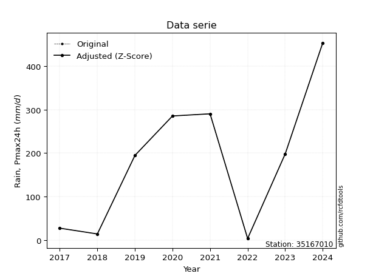</img>

</div>


> The initial value (value_initial) correspond to the initial obtained or null completed value, and value (value) is adjusted only when the initial value is outside the valid range (outlier) definite through the Z-Score value. If Z-Score is active, values out of range or outliers are replaced with the station mean value. A Z-Score (or standard score) measures how many standard deviations a data point is from the mean of a dataset, indicating its relative position; positive scores mean above the mean, negative mean below, and a score of zero is exactly at the mean, allowing for comparison of values from different distributions. It´s calculated using the formula $z=(x–μ)/σ$, where $x$ is the data point, $μ$ is the mean, and $σ$ is the standard deviation, helping identify outliers and understand probability.
>
> <sub>**Note**: In this study, "completing" (filling gaps in) and "extending" (forecasting or lengthening the historical record) rainfall data series are avoided for certain critical analyses because they introduce artificial bias and uncertainty, which can distort the statistics of rare events (extremes), alter day-to-day variability, and compromise the integrity and homogeneity of the original data. Some reasons against Completing/Extending rainfall data are: **Distortion of Extremes and Variability**: The primary issue is that most gap-filling or extension methods rely on averaging or regression with nearby stations, which inherently smooths the data. Rainfall is highly variable in space and time, with a large percentage of zero values and occasional large storms. Infilling methods often underestimate the highest values and overestimate the lowest (zero) values, which severely distorts analyses focused on flood frequency, drought severity, and intensity-duration-frequency (IDF) curves, **Loss of Data Homogeneity**: Infilled or extended data are synthetic estimates, not actual measurements. Combining these estimates with observed data can violate the assumption of data homogeneity, which requires that the data properties do not change over time. Inhomogeneity can lead to incorrect conclusions about long-term trends or changes in climate patterns, **Propagation of Errors**: Errors and biases from the original data (e.g., wind-induced undercatch, instrument errors, site changes) or the data used for imputation can propagate through the analysis, leading to unreliable hydrological models and inaccurate predictions, **Compromised Statistical Integrity**: For statistical analyses, especially those involving the frequency of events, using artificial data can introduce time bias or autocorrelation that doesn´t exist in reality, making it difficult to assess the true probability of events, **Difficulty in Validation**: It is difficult to accurately validate the quality of filled or extended data, especially for past periods where ground-truth measurements are unavailable. The reliability of imputation techniques heavily depends on the density of the surrounding station network and the complexity of the local topography.</sub>


### 4. Active continuous probability distributions from SciPy (80 of 104 available)

A Probability Density Function (PDF) describes the relative likelihood of a continuous random variable falling within a specific range, where the total area under its curve equals 1, and the area over any interval gives the actual probability for that range. Unlike discrete probabilities (like rolling a die), a PDF shows density, not direct probability for a single point (which is zero), with higher points indicating higher likelihood, often visualized as a bell curve for normal distributions.

A log of a probability density function (log-PDF) is simply the logarithm of the PDF´s value, denoted as $log(f(x))$, useful for converting multiplication of probabilities into addition, improving numerical stability with tiny numbers, and connecting to information theory concepts like entropy. Instead of dealing with very small probabilities (e.g., 0.000001), log-PDFs use negative numbers (e.g., $log(0.00001) ≈ -11.51$ that are easier for computers to handle, preventing underflow errors and simplifying complex calculations. In this study, each active probability distribution from SciPy is also evaluated in the $log$ form.

[scipy.stats](https://docs.scipy.org/doc/scipy/reference/stats.html) is a Python´s powerful submodule within the SciPy library for comprehensive statistical analysis, offering over 130 probability distributions (like Normal, Poisson, etc.), functions for descriptive stats (mean, variance), hypothesis testing (t-tests, chi-square), random variable generation, and statistical tests, making it essential for data science, modeling, and research. It provides tools to explore, model, and draw conclusions from data efficiently, working seamlessly with [NumPy](https://numpy.org/).

<div align="center">

|   id | p_dist           |   n_parameter | fit_method   | label                                                                       | active   | ref                                                                                                      |
|-----:|:-----------------|--------------:|:-------------|:----------------------------------------------------------------------------|:---------|:---------------------------------------------------------------------------------------------------------|
|    0 | alpha            |             3 | MLE          | Alpha                                                                       | True     | [:mortar_board:](https://docs.scipy.org/doc/scipy/reference/generated/scipy.stats.alpha.html)            |
|    1 | anglit           |             2 | MM           | Anglit                                                                      | True     | [:mortar_board:](https://docs.scipy.org/doc/scipy/reference/generated/scipy.stats.anglit.html)           |
|    2 | arcsine          |             2 | MM           | Arcsine                                                                     | True     | [:mortar_board:](https://docs.scipy.org/doc/scipy/reference/generated/scipy.stats.arcsine.html)          |
|    3 | argus            |             3 | MLE          | Argus                                                                       | True     | [:mortar_board:](https://docs.scipy.org/doc/scipy/reference/generated/scipy.stats.argus.html)            |
|    4 | beta             |             4 | MLE          | Beta                                                                        | True     | [:mortar_board:](https://docs.scipy.org/doc/scipy/reference/generated/scipy.stats.beta.html)             |
|    5 | betaprime        |             4 | MLE          | Beta prime                                                                  | True     | [:mortar_board:](https://docs.scipy.org/doc/scipy/reference/generated/scipy.stats.betaprime.html)        |
|    6 | bradford         |             3 | MLE          | Bradford                                                                    | True     | [:mortar_board:](https://docs.scipy.org/doc/scipy/reference/generated/scipy.stats.bradford.html)         |
|    7 | burr             |             4 | MLE          | Burr (Type III)                                                             | True     | [:mortar_board:](https://docs.scipy.org/doc/scipy/reference/generated/scipy.stats.burr.html)             |
|    8 | burr12           |             4 | MLE          | Burr (Type III) 12                                                          | True     | [:mortar_board:](https://docs.scipy.org/doc/scipy/reference/generated/scipy.stats.burr12.html)           |
|    9 | cosine           |             2 | MLE          | Cosine                                                                      | True     | [:mortar_board:](https://docs.scipy.org/doc/scipy/reference/generated/scipy.stats.cosine.html)           |
|   10 | crystalball      |             4 | MLE          | Crystalball                                                                 | True     | [:mortar_board:](https://docs.scipy.org/doc/scipy/reference/generated/scipy.stats.crystalball.html)      |
|   11 | dgamma           |             3 | MLE          | Double gamma                                                                | True     | [:mortar_board:](https://docs.scipy.org/doc/scipy/reference/generated/scipy.stats.dgamma.html)           |
|   12 | dweibull         |             3 | MLE          | Double Weibull                                                              | True     | [:mortar_board:](https://docs.scipy.org/doc/scipy/reference/generated/scipy.stats.dweibull.html)         |
|   13 | erlang           |             3 | MLE          | Erlang                                                                      | True     | [:mortar_board:](https://docs.scipy.org/doc/scipy/reference/generated/scipy.stats.erlang.html)           |
|   14 | exponnorm        |             3 | MLE          | Exponentially modified Normal                                               | True     | [:mortar_board:](https://docs.scipy.org/doc/scipy/reference/generated/scipy.stats.exponnorm.html)        |
|   15 | exponpow         |             3 | MLE          | Exponential power                                                           | True     | [:mortar_board:](https://docs.scipy.org/doc/scipy/reference/generated/scipy.stats.exponpow.html)         |
|   16 | exponweib        |             4 | MLE          | Exponentiated Weibull                                                       | True     | [:mortar_board:](https://docs.scipy.org/doc/scipy/reference/generated/scipy.stats.exponweib.html)        |
|   17 | f                |             4 | MLE          | F                                                                           | True     | [:mortar_board:](https://docs.scipy.org/doc/scipy/reference/generated/scipy.stats.f.html)                |
|   18 | fatiguelife      |             3 | MLE          | Fatigue-life (Birnbaum-Saunders)                                            | True     | [:mortar_board:](https://docs.scipy.org/doc/scipy/reference/generated/scipy.stats.fatiguelife.html)      |
|   19 | foldnorm         |             3 | MM           | Fold Normal                                                                 | True     | [:mortar_board:](https://docs.scipy.org/doc/scipy/reference/generated/scipy.stats.foldnorm.html)         |
|   20 | gamma            |             3 | MLE          | Gamma                                                                       | True     | [:mortar_board:](https://docs.scipy.org/doc/scipy/reference/generated/scipy.stats.gamma.html)            |
|   21 | gausshyper       |             6 | MLE          | Gauss hypergeometric                                                        | True     | [:mortar_board:](https://docs.scipy.org/doc/scipy/reference/generated/scipy.stats.gausshyper.html)       |
|   22 | genexpon         |             5 | MLE          | Generalized exponential                                                     | True     | [:mortar_board:](https://docs.scipy.org/doc/scipy/reference/generated/scipy.stats.genexpon.html)         |
|   23 | genextreme       |             3 | MLE          | Generalized exponential                                                     | True     | [:mortar_board:](https://docs.scipy.org/doc/scipy/reference/generated/scipy.stats.genextreme.html)       |
|   24 | gengamma         |             4 | MLE          | Generalized gamma                                                           | True     | [:mortar_board:](https://docs.scipy.org/doc/scipy/reference/generated/scipy.stats.gengamma.html)         |
|   25 | genhalflogistic  |             3 | MLE          | Generalized half-logistic                                                   | True     | [:mortar_board:](https://docs.scipy.org/doc/scipy/reference/generated/scipy.stats.genhalflogistic.html)  |
|   26 | genlogistic      |             3 | MLE          | Generalized logistic                                                        | True     | [:mortar_board:](https://docs.scipy.org/doc/scipy/reference/generated/scipy.stats.genlogistic.html)      |
|   27 | gennorm          |             3 | MLE          | Generalized Normal                                                          | True     | [:mortar_board:](https://docs.scipy.org/doc/scipy/reference/generated/scipy.stats.gennorm.html)          |
|   28 | genpareto        |             3 | MLE          | Generalized Pareto                                                          | True     | [:mortar_board:](https://docs.scipy.org/doc/scipy/reference/generated/scipy.stats.genpareto.html)        |
|   29 | gompertz         |             3 | MLE          | Gompertz (or truncated Gumbel)                                              | True     | [:mortar_board:](https://docs.scipy.org/doc/scipy/reference/generated/scipy.stats.gompertz.html)         |
|   30 | gumbel_l         |             2 | MM           | Gumbel Left Skew                                                            | True     | [:mortar_board:](https://docs.scipy.org/doc/scipy/reference/generated/scipy.stats.gumbel_l.html)         |
|   31 | gumbel_r         |             2 | MM           | Gumbel Right Skew                                                           | True     | [:mortar_board:](https://docs.scipy.org/doc/scipy/reference/generated/scipy.stats.gumbel_r.html)         |
|   32 | halfgennorm      |             3 | MLE          | Upper half of a generalized normal                                          | True     | [:mortar_board:](https://docs.scipy.org/doc/scipy/reference/generated/scipy.stats.halfgennorm.html)      |
|   33 | halflogistic     |             2 | MM           | Half-logistic                                                               | True     | [:mortar_board:](https://docs.scipy.org/doc/scipy/reference/generated/scipy.stats.halflogistic.html)     |
|   34 | halfnorm         |             2 | MM           | Half Normal                                                                 | True     | [:mortar_board:](https://docs.scipy.org/doc/scipy/reference/generated/scipy.stats.halfnorm.html)         |
|   35 | hypsecant        |             2 | MM           | hyperbolic secant                                                           | True     | [:mortar_board:](https://docs.scipy.org/doc/scipy/reference/generated/scipy.stats.hypsecant.html)        |
|   36 | invgamma         |             3 | MLE          | Inverted gamma                                                              | True     | [:mortar_board:](https://docs.scipy.org/doc/scipy/reference/generated/scipy.stats.invgamma.html)         |
|   37 | invgauss         |             3 | MLE          | Inverse Gaussian                                                            | True     | [:mortar_board:](https://docs.scipy.org/doc/scipy/reference/generated/scipy.stats.invgauss.html)         |
|   38 | invweibull       |             3 | MLE          | Inverted Weibull                                                            | True     | [:mortar_board:](https://docs.scipy.org/doc/scipy/reference/generated/scipy.stats.invweibull.html)       |
|   39 | johnsonsb        |             4 | MLE          | Johnson SB                                                                  | True     | [:mortar_board:](https://docs.scipy.org/doc/scipy/reference/generated/scipy.stats.johnsonsb.html)        |
|   40 | johnsonsu        |             4 | MLE          | Johnson Su                                                                  | True     | [:mortar_board:](https://docs.scipy.org/doc/scipy/reference/generated/scipy.stats.johnsonsu.html)        |
|   41 | kappa3           |             3 | MLE          | Kappa 3                                                                     | True     | [:mortar_board:](https://docs.scipy.org/doc/scipy/reference/generated/scipy.stats.kappa3.html)           |
|   42 | kappa4           |             4 | MLE          | Kappa 4                                                                     | True     | [:mortar_board:](https://docs.scipy.org/doc/scipy/reference/generated/scipy.stats.kappa4.html)           |
|   43 | ksone            |             3 | MLE          | Kolmogorov-Smirnov one-sided test statistic distribution                    | True     | [:mortar_board:](https://docs.scipy.org/doc/scipy/reference/generated/scipy.stats.ksone.html)            |
|   44 | kstwobign        |             2 | MLE          | Limiting distribution of scaled Kolmogorov-Smirnov two-sided test statistic | True     | [:mortar_board:](https://docs.scipy.org/doc/scipy/reference/generated/scipy.stats.kstwobign.html)        |
|   45 | laplace          |             2 | MM           | Laplace                                                                     | True     | [:mortar_board:](https://docs.scipy.org/doc/scipy/reference/generated/scipy.stats.laplace.html)          |
|   46 | levy_l           |             2 | MLE          | Left-skewed Levy                                                            | True     | [:mortar_board:](https://docs.scipy.org/doc/scipy/reference/generated/scipy.stats.levy_l.html)           |
|   47 | loggamma         |             3 | MLE          | Log gamma                                                                   | True     | [:mortar_board:](https://docs.scipy.org/doc/scipy/reference/generated/scipy.stats.loggamma.html)         |
|   48 | logistic         |             2 | MM           | Logistic (or Sech-squared)                                                  | True     | [:mortar_board:](https://docs.scipy.org/doc/scipy/reference/generated/scipy.stats.logistic.html)         |
|   49 | loglaplace       |             3 | MLE          | Log-Laplace                                                                 | True     | [:mortar_board:](https://docs.scipy.org/doc/scipy/reference/generated/scipy.stats.loglaplace.html)       |
|   50 | lomax            |             3 | MLE          | Lomax (Pareto of the second kind)                                           | True     | [:mortar_board:](https://docs.scipy.org/doc/scipy/reference/generated/scipy.stats.lomax.html)            |
|   51 | maxwell          |             2 | MM           | Maxwell                                                                     | True     | [:mortar_board:](https://docs.scipy.org/doc/scipy/reference/generated/scipy.stats.maxwell.html)          |
|   52 | mielke           |             4 | MLE          | Mielke Beta-Kappa / Dagum                                                   | True     | [:mortar_board:](https://docs.scipy.org/doc/scipy/reference/generated/scipy.stats.mielke.html)           |
|   53 | moyal            |             2 | MM           | Moyal                                                                       | True     | [:mortar_board:](https://docs.scipy.org/doc/scipy/reference/generated/scipy.stats.moyal.html)            |
|   54 | nakagami         |             3 | MLE          | Nakagami                                                                    | True     | [:mortar_board:](https://docs.scipy.org/doc/scipy/reference/generated/scipy.stats.nakagami.html)         |
|   55 | ncf              |             5 | MLE          | Non-central F distribution                                                  | True     | [:mortar_board:](https://docs.scipy.org/doc/scipy/reference/generated/scipy.stats.ncf.html)              |
|   56 | nct              |             4 | MLE          | Non-central Student’s t                                                     | True     | [:mortar_board:](https://docs.scipy.org/doc/scipy/reference/generated/scipy.stats.nct.html)              |
|   57 | norm             |             2 | MM           | Normal                                                                      | True     | [:mortar_board:](https://docs.scipy.org/doc/scipy/reference/generated/scipy.stats.norm.html)             |
|   58 | pearson3         |             3 | MM           | Pearson type III                                                            | True     | [:mortar_board:](https://docs.scipy.org/doc/scipy/reference/generated/scipy.stats.pearson3.html)         |
|   59 | powerlaw         |             3 | MLE          | Power-function                                                              | True     | [:mortar_board:](https://docs.scipy.org/doc/scipy/reference/generated/scipy.stats.powerlaw.html)         |
|   60 | rayleigh         |             2 | MM           | Rayleigh                                                                    | True     | [:mortar_board:](https://docs.scipy.org/doc/scipy/reference/generated/scipy.stats.rayleigh.html)         |
|   61 | rdist            |             3 | MLE          | R-distributed (symmetric beta)                                              | True     | [:mortar_board:](https://docs.scipy.org/doc/scipy/reference/generated/scipy.stats.rdist.html)            |
|   62 | rice             |             3 | MLE          | Rice                                                                        | True     | [:mortar_board:](https://docs.scipy.org/doc/scipy/reference/generated/scipy.stats.rice.html)             |
|   63 | semicircular     |             2 | MM           | Semicircular                                                                | True     | [:mortar_board:](https://docs.scipy.org/doc/scipy/reference/generated/scipy.stats.semicircular.html)     |
|   64 | skewnorm         |             3 | MLE          | Skew normal                                                                 | True     | [:mortar_board:](https://docs.scipy.org/doc/scipy/reference/generated/scipy.stats.skewnorm.html)         |
|   65 | t                |             3 | MLE          | Student’s t                                                                 | True     | [:mortar_board:](https://docs.scipy.org/doc/scipy/reference/generated/scipy.stats.t.html)                |
|   66 | trapezoid        |             4 | MLE          | Trapezoid                                                                   | True     | [:mortar_board:](https://docs.scipy.org/doc/scipy/reference/generated/scipy.stats.trapezoid.html)        |
|   67 | triang           |             3 | MLE          | Triangular                                                                  | True     | [:mortar_board:](https://docs.scipy.org/doc/scipy/reference/generated/scipy.stats.triang.html)           |
|   68 | truncexpon       |             3 | MLE          | Truncated exponential                                                       | True     | [:mortar_board:](https://docs.scipy.org/doc/scipy/reference/generated/scipy.stats.truncexpon.html)       |
|   69 | truncnorm        |             4 | MLE          | Truncated normal                                                            | True     | [:mortar_board:](https://docs.scipy.org/doc/scipy/reference/generated/scipy.stats.truncnorm.html)        |
|   70 | truncpareto      |             4 | MLE          | Upper truncated Pareto                                                      | True     | [:mortar_board:](https://docs.scipy.org/doc/scipy/reference/generated/scipy.stats.truncpareto.html)      |
|   71 | truncweibull_min |             5 | MLE          | Doubly truncated Weibull minimum                                            | True     | [:mortar_board:](https://docs.scipy.org/doc/scipy/reference/generated/scipy.stats.truncweibull_min.html) |
|   72 | tukeylambda      |             3 | MLE          | Tukey-Lamdba                                                                | True     | [:mortar_board:](https://docs.scipy.org/doc/scipy/reference/generated/scipy.stats.tukeylambda.html)      |
|   73 | uniform          |             2 | MLE          | Uniform                                                                     | True     | [:mortar_board:](https://docs.scipy.org/doc/scipy/reference/generated/scipy.stats.uniform.html)          |
|   74 | vonmises         |             3 | MLE          | Von Mises                                                                   | True     | [:mortar_board:](https://docs.scipy.org/doc/scipy/reference/generated/scipy.stats.vonmises.html)         |
|   75 | vonmises_line    |             3 | MLE          | Von Mises line                                                              | True     | [:mortar_board:](https://docs.scipy.org/doc/scipy/reference/generated/scipy.stats.vonmises_line.html)    |
|   76 | wald             |             2 | MM           | Wald                                                                        | True     | [:mortar_board:](https://docs.scipy.org/doc/scipy/reference/generated/scipy.stats.wald.html)             |
|   77 | weibull_max      |             3 | MLE          | Weibull maximum                                                             | True     | [:mortar_board:](https://docs.scipy.org/doc/scipy/reference/generated/scipy.stats.weibull_max.html)      |
|   78 | weibull_min      |             3 | MLE          | Weibull minimum                                                             | True     | [:mortar_board:](https://docs.scipy.org/doc/scipy/reference/generated/scipy.stats.weibull_min.html)      |
|   79 | wrapcauchy       |             3 | MLE          | Wrapped  Cauchy                                                             | True     | [:mortar_board:](https://docs.scipy.org/doc/scipy/reference/generated/scipy.stats.wrapcauchy.html)       |

</div>

> **n_parameter:** # arguments & localization & scale.
>
> **Fit methods:** (MLE) maximum likelihood, (MM) L-moments.
>
>**Inactive** (With the only purpose of prevent loops, zero divisions, infinite values, over high estimated values or horizontal trending for recurrence intervals estimations, the follow distributions were disabled.)**:** lognorm, norminvgauss, powernorm, powerlognorm, cauchy, halfcauchy, foldcauchy, skewcauchy, chi2, expon, fisk, genhyperbolic, geninvgauss, gibrat, kstwo, laplace_asymmetric, levy, levy_stable, ncx2, pareto, rel_breitwigner, recipinvgauss, studentized_range, loguniform, 


## B. Probability (PDF) vs. Empirical (EDF) distributions functions

A continuous probability distribution (CPD) describes probabilities for variables that can take any value within a range (like rain any time), unlike discrete variables with specific outcomes (like temperature). It uses a Probability Density Function (PDF), a curve where the total area under it equals 1, and the probability of the variable falling within an interval (a to b) is found by calculating the area under the curve between those points. A key feature is that the probability of hitting any single exact value is zero, so probabilities are always expressed for ranges, e.g., $P(a ≤ X ≤ b)$.

<div align="center">

Distributions parameters from station values
|     |   station | p_dist              |   n |              loc |           scale | shape                  | shape1                | shape2             | shape3            |
|----:|----------:|:--------------------|----:|-----------------:|----------------:|:-----------------------|:----------------------|:-------------------|:------------------|
|   0 |  35167010 | alpha               |   9 |    -58.7821      |   118.863       | 6.630739551657526e-05  |                       |                    |                   |
|   1 |  35167010 | anglit              |   9 |    198.343       |   431.816       |                        |                       |                    |                   |
|   2 |  35167010 | arcsine             |   9 |    -10.4076      |   417.502       |                        |                       |                    |                   |
|   3 |  35167010 | argus               |   9 |   -136.696       |   611.02        | 6.304957455095749e-07  |                       |                    |                   |
|   4 |  35167010 | beta                |   9 |      3.9         |   537.962       | 0.6838900874540627     | 1.9406893731449886    |                    |                   |
|   5 |  35167010 | betaprime           |   9 |      3.89994     |  3697.38        | 0.8196547339420167     | 21.800277362940285    |                    |                   |
|   6 |  35167010 | bradford            |   9 |      3.89467     |   449.505       | 2.388771047402874      |                       |                    |                   |
|   7 |  35167010 | burr                |   9 |     -4.73386     |   466.569       | 177.90266849961864     | 0.003931349094164623  |                    |                   |
|   8 |  35167010 | burr12              |   9 |      0.0355366   |     3.76273     | 148.13213094097102     | 0.002083572175566477  |                    |                   |
|   9 |  35167010 | cosine              |   9 |    201.675       |   121.427       |                        |                       |                    |                   |
|  10 |  35167010 | crystalball         |   9 |     -0.164091    |   247.317       | 4.405310286837135      | 2.396326526098924     |                    |                   |
|  11 |  35167010 | dgamma              |   9 |    198.2         |   153.109       | 0.7965570708561523     |                       |                    |                   |
|  12 |  35167010 | dweibull            |   9 |    198.2         |   120.786       | 0.9536625363152242     |                       |                    |                   |
|  13 |  35167010 | erlang              |   9 |  -6549.09        |     3.22511     | 2092.1498448545726     |                       |                    |                   |
|  14 |  35167010 | exponnorm           |   9 |    193.064       |   147.515       | 0.03578968054578685    |                       |                    |                   |
|  15 |  35167010 | exponpow            |   9 |      3.9         |   315.252       | 0.8801080568237722     |                       |                    |                   |
|  16 |  35167010 | exponweib           |   9 |      3.9         |     3.2147      | 4.043270593342221      | 0.18017195804979474   |                    |                   |
|  17 |  35167010 | f                   |   9 |      3.9         |   180.208       | 1.611264105763471      | 2546.0921635497116    |                    |                   |
|  18 |  35167010 | fatiguelife         |   9 |     -0.410052    |    61.4676      | 1.9182750708896363     |                       |                    |                   |
|  19 |  35167010 | foldnorm            |   9 |   -205.763       |   148.411       | 2.7209070987955934     |                       |                    |                   |
|  20 |  35167010 | gamma               |   9 |  -6555.42        |     3.22396     | 2094.846497085873      |                       |                    |                   |
|  21 |  35167010 | gausshyper          |   9 |    -28.4867      |   481.887       | 1.02042657407446       | 0.8478563327582269    | 0.9955421923815186 | 1.004482417053206 |
|  22 |  35167010 | genexpon            |   9 |      3.89995     |     2.51929     | 0.01321142857294424    | 3.120183686057521e-08 | 2.4645390904181794 |                   |
|  23 |  35167010 | genextreme          |   9 |    149.874       |   148.261       | 0.33441852515869663    |                       |                    |                   |
|  24 |  35167010 | gengamma            |   9 |     -9.49061e+08 |     9.49061e+08 | 0.0045889727773358625  | -1050907066.8981767   |                    |                   |
|  25 |  35167010 | genhalflogistic     |   9 |    -42.3795      |   516.013       | 1.0408118801569275     |                       |                    |                   |
|  26 |  35167010 | genlogistic         |   9 |   -703.881       |   131.232       | 554.3675073520835      |                       |                    |                   |
|  27 |  35167010 | gennorm             |   9 |    228.65        |   224.75        | 10226704.49106104      |                       |                    |                   |
|  28 |  35167010 | genpareto           |   9 |     -1.86523     |   489.223       | -1.0745899433140123    |                       |                    |                   |
|  29 |  35167010 | gompertz            |   9 |      3.9         |   351.458       | 1.1295429283230853     |                       |                    |                   |
|  30 |  35167010 | gumbel_l            |   9 |    264.775       |   115.09        |                        |                       |                    |                   |
|  31 |  35167010 | gumbel_r            |   9 |    131.911       |   115.09        |                        |                       |                    |                   |
|  32 |  35167010 | halfgennorm         |   9 |      3.9         |     4.34317     | 0.33104849341957165    |                       |                    |                   |
|  33 |  35167010 | halflogistic        |   9 |     23.3921      |   126.201       |                        |                       |                    |                   |
|  34 |  35167010 | halfnorm            |   9 |      2.96658     |   244.868       |                        |                       |                    |                   |
|  35 |  35167010 | hypsecant           |   9 |    198.343       |    93.9709      |                        |                       |                    |                   |
|  36 |  35167010 | invgamma            |   9 |  -1055.24        | 87251.4         | 70.58305733696105      |                       |                    |                   |
|  37 |  35167010 | invgauss            |   9 |   -200.862       |  2218.46        | 0.17966494861340054    |                       |                    |                   |
|  38 |  35167010 | invweibull          |   9 |     -1.24934e+10 |     1.24934e+10 | 95254804.38825086      |                       |                    |                   |
|  39 |  35167010 | johnsonsb           |   9 |      3.9         |   449.975       | 0.9210336187741529     | 0.12027541589112714   |                    |                   |
|  40 |  35167010 | johnsonsu           |   9 |  -2896.41        |  2069.59        | -30.02136266690964     | 25.196398989087122    |                    |                   |
|  41 |  35167010 | kappa3              |   9 |      3.9         |   310.783       | 8.473873519139488      |                       |                    |                   |
|  42 |  35167010 | kappa4              |   9 |    -55.2403      |   516.521       | 1.1294272516958455     | 1.0143648800035947    |                    |                   |
|  43 |  35167010 | ksone               |   9 |    -57.3233      |   511.333       | 1.0                    |                       |                    |                   |
|  44 |  35167010 | kstwobign           |   9 |   -322.473       |   593.721       |                        |                       |                    |                   |
|  45 |  35167010 | laplace             |   9 |    198.343       |   104.375       |                        |                       |                    |                   |
|  46 |  35167010 | levy_l              |   9 |    480.493       |   134.5         |                        |                       |                    |                   |
|  47 |  35167010 | loggamma            |   9 | -27305.3         |  4131.15        | 779.2369223266799      |                       |                    |                   |
|  48 |  35167010 | logistic            |   9 |    198.343       |    81.3812      |                        |                       |                    |                   |
|  49 |  35167010 | loglaplace          |   9 |     -0.619087    |   198.819       | 0.8667294365269018     |                       |                    |                   |
|  50 |  35167010 | lomax               |   9 |      3.9         |     3.81863e+08 | 1947438.981160615      |                       |                    |                   |
|  51 |  35167010 | maxwell             |   9 |   -151.429       |   219.187       |                        |                       |                    |                   |
|  52 |  35167010 | mielke              |   9 |      3.9         |   457.532       | 0.5423563771997877     | 202.36344375750872    |                    |                   |
|  53 |  35167010 | moyal               |   9 |    113.931       |    66.4475      |                        |                       |                    |                   |
|  54 |  35167010 | nakagami            |   9 |      3.9         |   354.28        | 0.21953113595042856    |                       |                    |                   |
|  55 |  35167010 | ncf                 |   9 |     -0.373684    |     7.26434     | 0.3481615768912444     | 30.167808676114234    | 7.807390252278882  |                   |
|  56 |  35167010 | nct                 |   9 |  -1159.71        |   127.364       | 171.1200802664938      | 10.615370843019491    |                    |                   |
|  57 |  35167010 | norm                |   9 |    198.343       |   147.609       |                        |                       |                    |                   |
|  58 |  35167010 | pearson3            |   9 |    198.343       |   147.609       | 0.0396364793327215     |                       |                    |                   |
|  59 |  35167010 | powerlaw            |   9 |      3.9         |   449.5         | 0.1759742626066669     |                       |                    |                   |
|  60 |  35167010 | rayleigh            |   9 |    -84.0417      |   225.311       |                        |                       |                    |                   |
|  61 |  35167010 | rdist               |   9 |    -41.5445      |   239.744       | 1.0854333757336319     |                       |                    |                   |
|  62 |  35167010 | rice                |   9 |    -80.798       |   180.509       | 1.0296046139422377     |                       |                    |                   |
|  63 |  35167010 | semicircular        |   9 |    198.343       |   295.218       |                        |                       |                    |                   |
|  64 |  35167010 | skewnorm            |   9 |    174.475       |   149.526       | 0.204186491882917      |                       |                    |                   |
|  65 |  35167010 | t                   |   9 |    198.313       |   147.623       | 1479986.4448591315     |                       |                    |                   |
|  66 |  35167010 | trapezoid           |   9 |    -43.1025      |   539.4         | 0.9999999999999999     | 1.0                   |                    |                   |
|  67 |  35167010 | triang              |   9 |   -182.514       |   635.919       | 0.9999913870518854     |                       |                    |                   |
|  68 |  35167010 | truncexpon          |   9 |    -21.6183      |   476.957       | 0.9959358804751504     |                       |                    |                   |
|  69 |  35167010 | truncnorm           |   9 |    198.343       |   147.609       | -410.6299799698869     | 784.6048409522099     |                    |                   |
|  70 |  35167010 | truncpareto         |   9 |      3.883       |     0.0170003   | 0.12538517092646612    | 26441.7193933993      |                    |                   |
|  71 |  35167010 | truncweibull_min    |   9 |      1.71834     |   573.435       | 0.6232336171491005     | 0.003804542949618119  | 0.7877315731851335 |                   |
|  72 |  35167010 | tukeylambda         |   9 |    228.262       |   243.509       | 1.08159991319701       |                       |                    |                   |
|  73 |  35167010 | uniform             |   9 |      3.9         |   449.5         |                        |                       |                    |                   |
|  74 |  35167010 | vonmises            |   9 |      2.31865     |     1           | 0.9731359096379676     |                       |                    |                   |
|  75 |  35167010 | vonmises_line       |   9 |    228.65        |    71.5402      | 0.5140682633782063     |                       |                    |                   |
|  76 |  35167010 | wald                |   9 |     50.7341      |   147.609       |                        |                       |                    |                   |
|  77 |  35167010 | weibull_max         |   9 |    453.4         |     1.69135     | 0.14708803263408243    |                       |                    |                   |
|  78 |  35167010 | weibull_min         |   9 |      3.9         |   170.037       | 0.20431158728964252    |                       |                    |                   |
|  79 |  35167010 | wrapcauchy          |   9 |      3.9         |    71.5401      | 0.10159317869397777    |                       |                    |                   |
|  80 |  35167010 | logalpha            |   9 |    -32.5435      |   812.418       | 21.958243110082662     |                       |                    |                   |
|  81 |  35167010 | loganglit           |   9 |      4.56669     |     4.64804     |                        |                       |                    |                   |
|  82 |  35167010 | logarcsine          |   9 |      2.31968     |     4.49401     |                        |                       |                    |                   |
|  83 |  35167010 | logargus            |   9 |     -0.380903    |     6.60471     | 2.510502073076754      |                       |                    |                   |
|  84 |  35167010 | logbeta             |   9 |      0.897092    |     5.21968     | 0.5204008777707412     | 0.22155465256612433   |                    |                   |
|  85 |  35167010 | logbetaprime        |   9 |    -98.407       |  1017.62        | 4465.9163429445125     | 44135.1824471662      |                    |                   |
|  86 |  35167010 | logbradford         |   9 |      1.36095     |     4.75586     | 0.8811936453515203     |                       |                    |                   |
|  87 |  35167010 | logburr             |   9 |    -16.8844      |    23.0251      | 3050.555928821384      | 0.004448049239695191  |                    |                   |
|  88 |  35167010 | logburr12           |   9 |  -9349.57        |  9369.09        | 9533.499013881472      | 1951361.9585646437    |                    |                   |
|  89 |  35167010 | logcosine           |   9 |      4.34352     |     1.33753     |                        |                       |                    |                   |
|  90 |  35167010 | logcrystalball      |   9 |      4.56669     |     1.58886     | 48.01594055069623      | 931.0370663932465     |                    |                   |
|  91 |  35167010 | logdgamma           |   9 |      5.27156     |     1.17169     | 0.8467292585582871     |                       |                    |                   |
|  92 |  35167010 | logdweibull         |   9 |      5.65389     |     1.35757     | 0.7224757337678385     |                       |                    |                   |
|  93 |  35167010 | logerlang           |   9 |    -23.5641      |     0.0958686   | 293.1289949109688      |                       |                    |                   |
|  94 |  35167010 | logexponnorm        |   9 |      4.56548     |     1.58886     | 0.0007561570643722991  |                       |                    |                   |
|  95 |  35167010 | logexponpow         |   9 |     -6.32738e+07 |     6.32738e+07 | 52014182.10850039      |                       |                    |                   |
|  96 |  35167010 | logexponweib        |   9 |     -7.94928e+07 |     7.94928e+07 | 1.156199928458976      | 60536284.017544664    |                    |                   |
|  97 |  35167010 | logf                |   9 |  -1910.49        |  1915.07        | 9763683.686905567      | 4135610.942340536     |                    |                   |
|  98 |  35167010 | logfatiguelife      |   9 |   -498.881       |   503.445       | 0.003151445587149252   |                       |                    |                   |
|  99 |  35167010 | logfoldnorm         |   9 |     -4.99453     |     1.46998     | 6.520266827092738      |                       |                    |                   |
| 100 |  35167010 | loggamma            |   9 |    -23.625       |     0.0940399   | 299.67343818195286     |                       |                    |                   |
| 101 |  35167010 | loggausshyper       |   9 |      0.971639    |     5.14514     | 1.2144710611700154     | 0.6267907415446639    | 1.1038542933693747 | 1.098792341559652 |
| 102 |  35167010 | loggenexpon         |   9 |      1.36098     |     6.23817e+11 | 127878704249.74744     | 109047381790.71997    | 495055501242.4551  |                   |
| 103 |  35167010 | loggenextreme       |   9 |      4.69688     |     1.59814     | 1.1255336320449463     |                       |                    |                   |
| 104 |  35167010 | loggengamma         |   9 |     -1.65072e+08 |     1.65072e+08 | 0.7260440852988213     | 180993894.28406358    |                    |                   |
| 105 |  35167010 | loggenhalflogistic  |   9 |      1.07619     |     5.38382     | 1.0680938669316928     |                       |                    |                   |
| 106 |  35167010 | loggenlogistic      |   9 |      6.11681     |     2.73065e-06 | 1.7647919696163914e-06 |                       |                    |                   |
| 107 |  35167010 | loggennorm          |   9 |      5.28928     |     1.68814e-08 | 0.12406007537908889    |                       |                    |                   |
| 108 |  35167010 | loggenpareto        |   9 |     -0.0133429   |    12.747       | -2.0794021105470764    |                       |                    |                   |
| 109 |  35167010 | loggompertz         |   9 |      1.36095     |     1.19278     | 0.040702529954393454   |                       |                    |                   |
| 110 |  35167010 | loggumbel_l         |   9 |      5.28176     |     1.23883     |                        |                       |                    |                   |
| 111 |  35167010 | loggumbel_r         |   9 |      3.85162     |     1.23883     |                        |                       |                    |                   |
| 112 |  35167010 | loghalfgennorm      |   9 |      1.36098     |     1.00005     | 0.5805216168914393     |                       |                    |                   |
| 113 |  35167010 | loghalflogistic     |   9 |      2.68352     |     1.35842     |                        |                       |                    |                   |
| 114 |  35167010 | loghalfnorm         |   9 |      2.46365     |     2.63576     |                        |                       |                    |                   |
| 115 |  35167010 | loghypsecant        |   9 |      4.56669     |     1.0115      |                        |                       |                    |                   |
| 116 |  35167010 | loginvgamma         |   9 |    -21.4877      |  6277.06        | 242.0274087923981      |                       |                    |                   |
| 117 |  35167010 | loginvgauss         |   9 |    -10.425       |  1113.34        | 0.013483236984466115   |                       |                    |                   |
| 118 |  35167010 | loginvweibull       |   9 |     -3.08547e+08 |     3.08547e+08 | 180898311.5416245      |                       |                    |                   |
| 119 |  35167010 | logjohnsonsb        |   9 |      1.36098     |     4.7558      | -0.6625789310270369    | 0.20204600628888186   |                    |                   |
| 120 |  35167010 | logjohnsonsu        |   9 |      6.22214     |     0.00334773  | 5.59738261168485       | 0.8815420239161926    |                    |                   |
| 121 |  35167010 | logkappa3           |   9 |      1.36094     |     4.75526     | 16154.954521621697     |                       |                    |                   |
| 122 |  35167010 | logkappa4           |   9 |      0.658923    |     6.7309      | 1.0279709655220823     | 1.233251601926947     |                    |                   |
| 123 |  35167010 | logksone            |   9 |      0.885397    |     5.70696     | 1.0                    |                       |                    |                   |
| 124 |  35167010 | logkstwobign        |   9 |     -2.37983     |     7.926       |                        |                       |                    |                   |
| 125 |  35167010 | loglaplace          |   9 |      4.56669     |     1.12349     |                        |                       |                    |                   |
| 126 |  35167010 | loglevy_l           |   9 |      6.21169     |     0.464565    |                        |                       |                    |                   |
| 127 |  35167010 | logloggamma         |   9 |      6.1171      |     9.62162e-06 | 6.187934151092846e-06  |                       |                    |                   |
| 128 |  35167010 | loglogistic         |   9 |      4.56669     |     0.875982    |                        |                       |                    |                   |
| 129 |  35167010 | logloglaplace       |   9 |     -0.00277464  |     5.29205     | 3.1265412969697315     |                       |                    |                   |
| 130 |  35167010 | loglomax            |   9 |      1.36098     |    98.917       | 30.091427406731498     |                       |                    |                   |
| 131 |  35167010 | logmaxwell          |   9 |      0.801771    |     2.35931     |                        |                       |                    |                   |
| 132 |  35167010 | logmielke           |   9 |     -4.08588e+07 |     4.08588e+07 | 26105558.38293116      | 9659257686.29199      |                    |                   |
| 133 |  35167010 | logmoyal            |   9 |      3.65808     |     0.715236    |                        |                       |                    |                   |
| 134 |  35167010 | lognakagami         |   9 |      2.12703     |     2.9966      | 1.162001432518958      |                       |                    |                   |
| 135 |  35167010 | logncf              |   9 |     -0.0602053   |     2.47915e-05 | 0.00014779692161402441 | 93.91887824131157     | 27.198635895056235 |                   |
| 136 |  35167010 | lognct              |   9 |    -91.6324      |     1.53366     | 25214.22572737398      | 62.72251099545505     |                    |                   |
| 137 |  35167010 | lognorm             |   9 |      4.56669     |     1.58886     |                        |                       |                    |                   |
| 138 |  35167010 | logpearson3         |   9 |      4.56669     |     1.58886     | -0.9154063624012977    |                       |                    |                   |
| 139 |  35167010 | logpowerlaw         |   9 |      1.36098     |     4.7558      | 0.22247022998843857    |                       |                    |                   |
| 140 |  35167010 | lograyleigh         |   9 |      1.5271      |     2.42524     |                        |                       |                    |                   |
| 141 |  35167010 | logrdist            |   9 |      2.18324     |     1.13349     | 1.3028170456160209     |                       |                    |                   |
| 142 |  35167010 | logrice             |   9 |      0.313024    |     1.70626     | 2.2543433380588045     |                       |                    |                   |
| 143 |  35167010 | logsemicircular     |   9 |      4.5667      |     3.17768     |                        |                       |                    |                   |
| 144 |  35167010 | logskewnorm         |   9 |      6.11678     |     2.21957     | -23694045.16689077     |                       |                    |                   |
| 145 |  35167010 | logt                |   9 |      4.56669     |     1.58886     | 21471515364.09468      |                       |                    |                   |
| 146 |  35167010 | logtrapezoid        |   9 |      0.0727296   |     6.74094     | 1.0                    | 1.0                   |                    |                   |
| 147 |  35167010 | logtriang           |   9 |      0.0829711   |     6.03389     | 0.9999924457675855     |                       |                    |                   |
| 148 |  35167010 | logtruncexpon       |   9 |      1.36085     |     8.48005     | 0.5608368152320689     |                       |                    |                   |
| 149 |  35167010 | logtruncnorm        |   9 |      0.177436    |     5.06178     | 0.21297546540941992    | 1.1733703891605753    |                    |                   |
| 150 |  35167010 | logtruncpareto      |   9 |      1.36056     |     0.000415656 | 0.1251574508467851     | 11442.66711219978     |                    |                   |
| 151 |  35167010 | logtruncweibull_min |   9 |      1.16051     |     7.2967      | 1.612500680362815      | 6.225996298084075e-12 | 0.679247949950033  |                   |
| 152 |  35167010 | logtukeylambda      |   9 |      2.33889     |     1.16758     | 1.1939394059740258     |                       |                    |                   |
| 153 |  35167010 | loguniform          |   9 |      1.36098     |     4.7558      |                        |                       |                    |                   |
| 154 |  35167010 | logvonmises         |   9 |     -0.660671    |     1           | 0.8924845635867404     |                       |                    |                   |
| 155 |  35167010 | logvonmises_line    |   9 |      5.01396     |     1.16278     | 0.9814369854389808     |                       |                    |                   |
| 156 |  35167010 | logwald             |   9 |      2.97783     |     1.58886     |                        |                       |                    |                   |
| 157 |  35167010 | logweibull_max      |   9 |      6.11677     |     1.8612      | 0.7567724061283965     |                       |                    |                   |
| 158 |  35167010 | logweibull_min      |   9 |     -6.29375e+07 |     6.29375e+07 | 59300772.034826845     |                       |                    |                   |
| 159 |  35167010 | logwrapcauchy       |   9 |      1.36098     |     0.756909    | 0.46204356598973045    |                       |                    |                   |

</div>

> **loc** (Location parameter): This shifts the distribution along the x-axis. For many common distributions, like the normal (Gaussian) distribution, loc represents the mean $μ$. For others, like the uniform distribution, it might represent the minimum value, or for the beta distribution, the left end of the support interval.
>
> **scale** (Scale parameter): This determines the width or spread of the distribution. For the normal distribution, scale represents the standard deviation $σ$. For a uniform distribution, it defines the length of the interval (from $loc$ to $loc + scale$).
>
> **shape** (Shape parameters): Refers to parameters that define the specific form of a probability distribution, distinct from its location (loc) and scale (scale). These parameters are required arguments for most distribution functions. For example, a normal (Gaussian) distribution is fully defined by its location (mean) and scale (standard deviation), so it has no specific shape parameters beyond loc and scale. However, other distributions have intrinsic properties that need specification, as Gamma distribution that takes a shape parameter, often named $a$ or $alpha$.


### 0. Cumulative distribution values - CDF (160 evaluated)

Cumulative Distribution Function (CDF), denoted as $F$<sub>$X$</sub>$(x)$, is a function that gives the probability that a random variable $X$ will take a value less than or equal to a specific value, $x$ (i.e., $(P(X≥x)$. It essentially "accumulates" probabilities from a given point up to the far right (positive infinity), providing a complete picture of the distribution´s probabilities for both discrete (like rain) and continuous (like temperature) variables, helping to find probabilities over ranges or above certain values. Each station is evaluated separately ordering the $x$ values ascending, calculating the CDF and PDF values for the activated distributions and their logarithmic forms.

<div align="center">

CDF ordered by x ascending and calculating $log(f(x))$ separately
|   id |   Station |   date |      x |   count |    mean |     std |       zscore |   Value_initial |   station |   m |    alpha |   alpha_pdf |   anglit |   anglit_pdf |   arcsine |   arcsine_pdf |     argus |   argus_pdf |        beta |       beta_pdf |   betaprime |   betaprime_pdf |    bradford |   bradford_pdf |      burr |     burr_pdf |     burr12 |   burr12_pdf |    cosine |   cosine_pdf |   crystalball |   crystalball_pdf |   dgamma |   dgamma_pdf |   dweibull |   dweibull_pdf |    erlang |   erlang_pdf |   exponnorm |   exponnorm_pdf |    exponpow |   exponpow_pdf |   exponweib |   exponweib_pdf |           f |       f_pdf |   fatiguelife |   fatiguelife_pdf |   foldnorm |   foldnorm_pdf |     gamma |   gamma_pdf |   gausshyper |   gausshyper_pdf |    genexpon |   genexpon_pdf |   genextreme |   genextreme_pdf |   gengamma |   gengamma_pdf |   genhalflogistic |   genhalflogistic_pdf |   genlogistic |   genlogistic_pdf |     gennorm |   gennorm_pdf |   genpareto |   genpareto_pdf |    gompertz |   gompertz_pdf |   gumbel_l |   gumbel_l_pdf |   gumbel_r |   gumbel_r_pdf |   halfgennorm |   halfgennorm_pdf |   halflogistic |   halflogistic_pdf |   halfnorm |   halfnorm_pdf |   hypsecant |   hypsecant_pdf |   invgamma |   invgamma_pdf |   invgauss |   invgauss_pdf |   invweibull |   invweibull_pdf |   johnsonsb |   johnsonsb_pdf |   johnsonsu |   johnsonsu_pdf |      kappa3 |   kappa3_pdf |      kappa4 |   kappa4_pdf |    ksone |   ksone_pdf |   kstwobign |   kstwobign_pdf |   laplace |   laplace_pdf |   levy_l |   levy_l_pdf |   loggamma |   loggamma_pdf |   logistic |   logistic_pdf |   loglaplace |   loglaplace_pdf |       lomax |   lomax_pdf |   maxwell |   maxwell_pdf |      mielke |     mielke_pdf |     moyal |   moyal_pdf |    nakagami |   nakagami_pdf |       ncf |     ncf_pdf |       nct |     nct_pdf |      norm |    norm_pdf |   pearson3 |   pearson3_pdf |    powerlaw |   powerlaw_pdf |   rayleigh |   rayleigh_pdf |    rdist |      rdist_pdf |      rice |    rice_pdf |   semicircular |   semicircular_pdf |   skewnorm |   skewnorm_pdf |         t |       t_pdf |   trapezoid |   trapezoid_pdf |    triang |   triang_pdf |   truncexpon |   truncexpon_pdf |   truncnorm |   truncnorm_pdf |   truncpareto |   truncpareto_pdf |   truncweibull_min |   truncweibull_min_pdf |   tukeylambda |   tukeylambda_pdf |   uniform |   uniform_pdf |   vonmises |   vonmises_pdf |   vonmises_line |   vonmises_line_pdf |     wald |    wald_pdf |   weibull_max |   weibull_max_pdf |   weibull_min |   weibull_min_pdf |   wrapcauchy |   wrapcauchy_pdf |   logalpha |   logalpha_pdf |   loganglit |   loganglit_pdf |   logarcsine |   logarcsine_pdf |   logargus |   logargus_pdf |   logbeta |   logbeta_pdf |   logbetaprime |   logbetaprime_pdf |   logbradford |   logbradford_pdf |   logburr |   logburr_pdf |   logburr12 |   logburr12_pdf |   logcosine |   logcosine_pdf |   logcrystalball |   logcrystalball_pdf |   logdgamma |   logdgamma_pdf |   logdweibull |   logdweibull_pdf |   logerlang |   logerlang_pdf |   logexponnorm |   logexponnorm_pdf |   logexponpow |   logexponpow_pdf |   logexponweib |   logexponweib_pdf |     logf |   logf_pdf |   logfatiguelife |   logfatiguelife_pdf |   logfoldnorm |   logfoldnorm_pdf |   loggausshyper |   loggausshyper_pdf |   loggenexpon |   loggenexpon_pdf |   loggenextreme |   loggenextreme_pdf |   loggengamma |   loggengamma_pdf |   loggenhalflogistic |   loggenhalflogistic_pdf |   loggenlogistic |   loggenlogistic_pdf |   loggennorm |   loggennorm_pdf |   loggenpareto |   loggenpareto_pdf |   loggompertz |   loggompertz_pdf |   loggumbel_l |   loggumbel_l_pdf |   loggumbel_r |   loggumbel_r_pdf |   loghalfgennorm |   loghalfgennorm_pdf |   loghalflogistic |   loghalflogistic_pdf |   loghalfnorm |   loghalfnorm_pdf |   loghypsecant |   loghypsecant_pdf |   loginvgamma |   loginvgamma_pdf |   loginvgauss |   loginvgauss_pdf |   loginvweibull |   loginvweibull_pdf |   logjohnsonsb |   logjohnsonsb_pdf |   logjohnsonsu |   logjohnsonsu_pdf |   logkappa3 |   logkappa3_pdf |   logkappa4 |   logkappa4_pdf |   logksone |   logksone_pdf |   logkstwobign |   logkstwobign_pdf |   loglevy_l |   loglevy_l_pdf |   logloggamma |   logloggamma_pdf |   loglogistic |   loglogistic_pdf |   logloglaplace |   logloglaplace_pdf |    loglomax |   loglomax_pdf |   logmaxwell |   logmaxwell_pdf |   logmielke |   logmielke_pdf |    logmoyal |   logmoyal_pdf |   lognakagami |   lognakagami_pdf |    logncf |   logncf_pdf |    lognct |   lognct_pdf |   lognorm |   lognorm_pdf |   logpearson3 |   logpearson3_pdf |   logpowerlaw |   logpowerlaw_pdf |   lograyleigh |   lograyleigh_pdf |   logrdist |   logrdist_pdf |   logrice |   logrice_pdf |   logsemicircular |   logsemicircular_pdf |   logskewnorm |   logskewnorm_pdf |      logt |   logt_pdf |   logtrapezoid |   logtrapezoid_pdf |   logtriang |   logtriang_pdf |   logtruncexpon |   logtruncexpon_pdf |   logtruncnorm |   logtruncnorm_pdf |   logtruncpareto |   logtruncpareto_pdf |   logtruncweibull_min |   logtruncweibull_min_pdf |   logtukeylambda |   logtukeylambda_pdf |   loguniform |   loguniform_pdf |   logvonmises |   logvonmises_pdf |   logvonmises_line |   logvonmises_line_pdf |   logwald |   logwald_pdf |   logweibull_max |   logweibull_max_pdf |   logweibull_min |   logweibull_min_pdf |   logwrapcauchy |   logwrapcauchy_pdf |
|-----:|----------:|-------:|-------:|--------:|--------:|--------:|-------------:|----------------:|----------:|----:|---------:|------------:|---------:|-------------:|----------:|--------------:|----------:|------------:|------------:|---------------:|------------:|----------------:|------------:|---------------:|----------:|-------------:|-----------:|-------------:|----------:|-------------:|--------------:|------------------:|---------:|-------------:|-----------:|---------------:|----------:|-------------:|------------:|----------------:|------------:|---------------:|------------:|----------------:|------------:|------------:|--------------:|------------------:|-----------:|---------------:|----------:|------------:|-------------:|-----------------:|------------:|---------------:|-------------:|-----------------:|-----------:|---------------:|------------------:|----------------------:|--------------:|------------------:|------------:|--------------:|------------:|----------------:|------------:|---------------:|-----------:|---------------:|-----------:|---------------:|--------------:|------------------:|---------------:|-------------------:|-----------:|---------------:|------------:|----------------:|-----------:|---------------:|-----------:|---------------:|-------------:|-----------------:|------------:|----------------:|------------:|----------------:|------------:|-------------:|------------:|-------------:|---------:|------------:|------------:|----------------:|----------:|--------------:|---------:|-------------:|-----------:|---------------:|-----------:|---------------:|-------------:|-----------------:|------------:|------------:|----------:|--------------:|------------:|---------------:|----------:|------------:|------------:|---------------:|----------:|------------:|----------:|------------:|----------:|------------:|-----------:|---------------:|------------:|---------------:|-----------:|---------------:|---------:|---------------:|----------:|------------:|---------------:|-------------------:|-----------:|---------------:|----------:|------------:|------------:|----------------:|----------:|-------------:|-------------:|-----------------:|------------:|----------------:|--------------:|------------------:|-------------------:|-----------------------:|--------------:|------------------:|----------:|--------------:|-----------:|---------------:|----------------:|--------------------:|---------:|------------:|--------------:|------------------:|--------------:|------------------:|-------------:|-----------------:|-----------:|---------------:|------------:|----------------:|-------------:|-----------------:|-----------:|---------------:|----------:|--------------:|---------------:|-------------------:|--------------:|------------------:|----------:|--------------:|------------:|----------------:|------------:|----------------:|-----------------:|---------------------:|------------:|----------------:|--------------:|------------------:|------------:|----------------:|---------------:|-------------------:|--------------:|------------------:|---------------:|-------------------:|---------:|-----------:|-----------------:|---------------------:|--------------:|------------------:|----------------:|--------------------:|--------------:|------------------:|----------------:|--------------------:|--------------:|------------------:|---------------------:|-------------------------:|-----------------:|---------------------:|-------------:|-----------------:|---------------:|-------------------:|--------------:|------------------:|--------------:|------------------:|--------------:|------------------:|-----------------:|---------------------:|------------------:|----------------------:|--------------:|------------------:|---------------:|-------------------:|--------------:|------------------:|--------------:|------------------:|----------------:|--------------------:|---------------:|-------------------:|---------------:|-------------------:|------------:|----------------:|------------:|----------------:|-----------:|---------------:|---------------:|-------------------:|------------:|----------------:|--------------:|------------------:|--------------:|------------------:|----------------:|--------------------:|------------:|---------------:|-------------:|-----------------:|------------:|----------------:|------------:|---------------:|--------------:|------------------:|----------:|-------------:|----------:|-------------:|----------:|--------------:|--------------:|------------------:|--------------:|------------------:|--------------:|------------------:|-----------:|---------------:|----------:|--------------:|------------------:|----------------------:|--------------:|------------------:|----------:|-----------:|---------------:|-------------------:|------------:|----------------:|----------------:|--------------------:|---------------:|-------------------:|-----------------:|---------------------:|----------------------:|--------------------------:|-----------------:|---------------------:|-------------:|-----------------:|--------------:|------------------:|-------------------:|-----------------------:|----------:|--------------:|-----------------:|---------------------:|-----------------:|---------------------:|----------------:|--------------------:|
|    0 |  35167010 |   2022 |   3.9  |       9 | 198.343 | 156.563 | -1.24195     |            3.9  |  35167010 |   1 | 0.057929 | 0.0039985   | 0.108155 |  0.00143847  |  0.118535 |    0.00419092 | 0.0783587 |  0.00109944 | 7.07518e-13 | 1089.57        | 5.82913e-06 |     0.0739154   | 2.32177e-05 |     0.00435413 | 0.0613969 | nan          | 0.00823949 |  0.0777155   | 0.0818881 |   0.00123478 |      0.506557 |       0.00161286  | 0.103713 |  0.000748684 |   0.103651 |    0.000800542 | 0.0928205 |  0.00114848  |   0.0938696 |     0.00113502  | 1.94547e-16 |    0.385559    | 2.78783e-12 |  4569.98        | 3.44729e-14 | 6.94867     |     0.0335786 |       0.0182517   |   0.095387 |    0.00114295  | 0.0929446 | 0.00114926  |    0.0777829 |       0.00238628 | 2.67664e-07 |    0.0052441   |    0.0961148 |      0.0011423   |  0.0120977 |    0.00481738  |         0.0470417 |            0.00106637 |     0.0808763 |       0.00154634  | 7.37393e-07 |    0.00222469 |   0.0117897 |      0.00204586 | 4.64697e-14 |    0.00321388  |  0.0984627 |    0.000811951 |  0.0477753 |    0.00126246  |   2.42932e-13 |       0.0373824   |      0         |        0           | 0.00304146 |    0.0032584   |   0.0799744 |     0.000842129 |  0.0850441 |    0.00130044  |  0.0761692 |    0.00178137  |    0.0805528 |      0.00154699  | 2.39598e-05 |     2.78265e+10 |   0.0920937 |     0.00116813  | 4.15604e-10 |  0.00250046  | 7.47711e-15 |   0.130616   | 0.119733 |  0.00195567 |   0.0768901 |      0.00168809 | 0.0776092 |   0.000743558 | 0.404744 |  0.000386161 |  0.0215426 |       0.03433  |  0.0839931 |    0.000945405 |    0.0288253 |        0.0256569 | 8.79693e-09 | 0.00509983  | 0.0815912 |   0.00142216  | 3.98784e-09 | 14494.8        | 0.0221008 | 0.00100144  | 1.08349e-08 |    1.07122e+07 | 0.0195862 | 0.0020139   | 0.0904658 | 0.00118054  | 0.0938716 | 0.001135    |  0.0930333 |    0.00114757  | 0.000678481 |    2.68854e+11 |  0.0733433 |    0.00160528  | 0.564192 |     0.00142843 | 0.0631275 | 0.00145162  |       0.113377 |         0.00162262 |  0.0938324 |    0.00113553  | 0.0939268 | 0.00113538  |  0.00759312 |     0.000323094 | 0.0859321 |  0.000921951 |     0.082611 |       0.00315149 |   0.0938716 |     0.001135    |      0        |      10.2286      |        1.33303e-11 |            0.0157153   |    0.00204571 |        0.00256155 | 0         |    0.00222469 |   0.888656 |      0.125908  |     4.19015e-08 |          0.00124676 | 0        | 0           |      0.102995 |       7.66084e-05 |   0.000255575 |       1.17567e+11 |  8.28689e-10 |       0.00272784 |  0.0225514 |      0.0378769 |  0.00913167 |       0.0409302 |     0        |         0        |  0.0228603 |      0.0287185 | 0.0983803 |   0.115779    |      0.0228109 |          0.0342447 |   7.71462e-06 |          0.293216 | 0.0425469 |    nan        |   0.0178531 |       0.0180382 |   0.0192822 |       0.0461208 |        0.0218151 |            0.0327989 |   0.0127636 |       0.0112963 |     0.0502618 |         0.0194329 |   0.0230787 |       0.0360767 |      0.0218155 |          0.0327994 |     0.0261996 |         0.0215324 |      0.0366758 |          0.0313487 | 0.021594 |  0.0325773 |        0.0213916 |            0.0325133 |     0.0140198 |         0.0243068 |       0.0436208 |            0.13259  |   2.59452e-15 |         0.204994  |       0.0535596 |           0.0292868 |     0.0368993 |         0.0292144 |            0.0272184 |                0.0983593 |         0        |            0.0298923 |    0.0768358 |        0.0117407 |       0.114921 |        0.0894994   |   1.05613e-06 |         0.0341249 |     0.0413387 |         0.0326699 |   0.000571657 |        0.00344564 |      2.15372e-10 |            0.635727  |          0        |              0        |     0         |          0        |      0.0267439 |          0.0264088 |     0.0209264 |          0.035746 |     0.0209736 |         0.0371685 |       0.0194277 |           0.0448898 |    3.14874e-07 |        133.044     |      0.0760801 |          0.0259514 | 6.82377e-06 |        0.210167 |   0.0863429 |        0.163302 |  0.0833333 |       0.175225 |      0.0208861 |          0.0562627 |    0.243037 |       0.0242621 |     0.0469444 |         0.0301913 |     0.0250975 |         0.0279317 |       0.0072075 |           0.0165239 | 2.14127e-14 |      0.304209  |   0.00348231 |        0.0184725 |   0.0474268 |       0.030302  | 6.29214e-07 |    1.13277e-05 |     0         |         0         | 0.0162604 |    0.0410544 | 0.0218958 |     0.032982 | 0.0218151 |     0.0327989 |     0.0402624 |         0.0354654 |   0.000232749 |       2.33195e+11 |      0        |          0        |   0.201715 |       0.435752 | 0.0169427 |     0.0361626 |          0        |              0        |     0.0321398 |         0.0362029 | 0.0218152 |  0.0327989 |      0.0365222 |          0.0567006 |   0.0448615 |       0.0702055 |     3.40375e-05 |            0.274705 |      0.0274603 |           0.259657 |         0        |          436.698     |            0.00731391 |                 0.0587414 |      7.10543e-15 |             0.854934 |     0        |          0.21027 |      0.927193 |         0.0892088 |        1.56791e-09 |              0.0408513 | 0         |     0         |         0.130823 |            0.0423406 |        0.0248545 |            0.0231249 |     5.85077e-08 |           0.571465  |
|    1 |  35167010 |   2018 |  14.3  |       9 | 198.343 | 156.563 | -1.17552     |           14.3  |  35167010 |   2 | 0.103867 | 0.00473125  | 0.123564 |  0.00152418  |  0.156439 |    0.00323111 | 0.0901903 |  0.00117569 | 0.110027    |    0.00715645  | 0.104908    |     0.00798302  | 0.0440991   |     0.00412609 | 0.106725  |   0.00392159 | 0.337217   |  0.0143408   | 0.0953132 |   0.00134699 |      0.52332  |       0.00161032  | 0.111816 |  0.000810324 |   0.112332 |    0.0008698   | 0.105333  |  0.00125847  |   0.106229  |     0.00124232  | 0.0496397   |    0.00419728  | 0.249427    |     0.00884601  | 0.08863     | 0.00669042  |     0.208796  |       0.0128934   |   0.107824 |    0.00124942  | 0.105465  | 0.00125923  |    0.102469  |       0.00236073 | 0.0530784   |    0.00496576  |    0.108526  |      0.00124489  |  0.0627744 |    0.00476244  |         0.0582558 |            0.00109033 |     0.0979175 |       0.00173012  | 0.5         |    0.00222469 |   0.0330839 |      0.00204919 | 0.0333548   |    0.00319998  |  0.107257  |    0.000880069 |  0.0621329 |    0.00149999  |   0.147769    |       0.00983684  |      0         |        0           | 0.0369159  |    0.00325493  |   0.089218  |     0.000937038 |  0.0992899 |    0.00143948  |  0.0958383 |    0.0019983   |    0.0976049 |      0.00173157  | 0.68108     |     0.0042276   |   0.104828  |     0.00128131  | 0.0260048   |  0.00250046  | 0.0351433   |   0.00299242 | 0.140072 |  0.00195567 |   0.095514  |      0.00189138 | 0.0857406 |   0.000821463 | 0.408821 |  0.0003979   |  0.120493  |       0.129098 |  0.0943624 |    0.0010501   |    0.0916269 |        0.0815555 | 0.0516563   | 0.00483639  | 0.0971197 |   0.00156368  | 0.128439    |     0.00669806 | 0.0343144 | 0.0013534   | 0.166751    |    0.0070387   | 0.041286  | 0.00224545  | 0.103349  | 0.00129756  | 0.10623   | 0.00124229  |  0.105535  |    0.00125722  | 0.515418    |    0.00872118  |  0.0908578 |    0.00176119  | 0.579111 |     0.00144102 | 0.0790399 | 0.00160726  |       0.130587 |         0.0016861  |  0.106197  |    0.00124293  | 0.106289  | 0.00124267  |  0.011325   |     0.000394583 | 0.0957879 |  0.000973386 |     0.115032 |       0.00308351 |   0.10623   |     0.00124229  |      0.766629 |       0.00746531  |        0.105656    |            0.00763705  |    0.0271921  |        0.00235618 | 0.0231368 |    0.00222469 |   2.31331  |      0.286327  |     0.0129898   |          0.00125353 | 0        | 0           |      0.103802 |       7.87663e-05 |   0.431653    |       0.00630869  |  0.0283444   |       0.00272061 |  0.131502  |      0.139782  |  0.134319   |       0.146726  |     0.177548 |         0.267632 |  0.0847877 |      0.0722885 | 0.213698  |   0.0782344   |      0.1189    |          0.124596  |   0.341366    |          0.236324 | 0.108205  |      0.075122 |   0.0654998 |       0.0645333 |   0.148249  |       0.155553  |        0.115093  |            0.122235  |   0.0405932 |       0.0364254 |     0.0851144 |         0.0363707 |   0.124906  |       0.131269  |      0.115095  |          0.122236  |     0.0761684 |         0.0624893 |      0.108798  |          0.088391  | 0.114496 |  0.121912  |        0.114542  |            0.122457  |     0.0946164 |         0.114638  |       0.238123  |            0.159059 |   0.296543    |         0.223321  |       0.110318  |           0.0625082 |     0.10252   |         0.0797747 |            0.174792  |                0.131295  |         0        |            0.0692217 |    0.0966475 |        0.0199554 |       0.240836 |        0.105623    |   0.0771374   |         0.093601  |     0.113521  |         0.0862262 |   0.0730868   |        0.154342   |      0.413195    |            0.198474  |          0        |              0        |     0.0594616 |          0.301874 |      0.0959471 |          0.0934266 |     0.125997  |          0.136573 |     0.129725  |         0.139593  |       0.15884   |           0.171339  |    0.19482     |          0.0589574 |      0.123474  |          0.0505116 | 0.273073    |        0.210167 |   0.300164  |        0.16752  |  0.311     |       0.175225 |      0.186497  |          0.188789  |    0.282407 |       0.038056  |     0.108264  |         0.0696274 |     0.101896  |         0.104469  |       0.05841   |           0.0685764 | 0.324755    |      0.202752  |   0.108278   |        0.153872  |   0.10878   |       0.0695019 | 0.0445562   |    0.148982    |     0.0195687 |         0.0838438 | 0.147829  |    0.164954  | 0.115635  |     0.122715 | 0.115093  |     0.122235  |     0.11922   |         0.0935603 |   0.749262    |       0.128293    |      0.103408 |          0.172733 |   0.663767 |       0.359463 | 0.118967  |     0.130685  |          0.142405 |              0.160281 |     0.119401  |         0.106919  | 0.115093  |  0.122235  |      0.147343  |          0.113887  |   0.182446  |       0.14158   |     0.330955    |            0.235681 |      0.351396  |           0.236606 |         0.920614 |            0.0510074 |            0.180829   |                 0.186941  |      0.657843    |             0.493874 |     0.2732   |          0.21027 |      1.00972  |         0.0546906 |        0.0652324   |              0.0709148 | 0         |     0         |         0.202392 |            0.0707903 |        0.082048  |            0.0740451 |     0.402033    |           0.122712  |
|    2 |  35167010 |   2017 |  27.57 |       9 | 198.343 | 156.563 | -1.09076     |           27.57 |  35167010 |   3 | 0.168682 | 0.004932    | 0.144488 |  0.0016284   |  0.195043 |    0.00265135 | 0.106429  |  0.00127136 | 0.191255    |    0.00538749  | 0.198629    |     0.00634832  | 0.0971006   |     0.00386764 | 0.154503  |   0.00334507 | 0.458976   |  0.00606454  | 0.114136  |   0.00148968 |      0.544646 |       0.00160296  | 0.123135 |  0.000897256 |   0.12451  |    0.000967447 | 0.122991  |  0.00140351  |   0.12365   |     0.00138408  | 0.102229    |    0.00378734  | 0.332123    |     0.00459017  | 0.167492    | 0.00537344  |     0.336898  |       0.00733609  |   0.125331 |    0.00138995  | 0.123132  | 0.00140421  |    0.133568  |       0.0023261  | 0.116734    |    0.00463195  |    0.125934  |      0.00137943  |  0.123888  |    0.0044519   |         0.0729339 |            0.00112214 |     0.122385  |       0.00195527  | 0.5         |    0.00222469 |   0.0603055 |      0.00205356 | 0.075676    |    0.00317762  |  0.11955   |    0.000974024 |  0.0840875 |    0.00180894  |   0.252458    |       0.00647744  |      0.0165511 |        0.00396086  | 0.0800336  |    0.00324202  |   0.102532  |     0.00107233  |  0.119578  |    0.00161828  |  0.124042  |    0.00224645  |    0.122098  |      0.00195767  | 0.716787    |     0.00181543  |   0.122813  |     0.00143012  | 0.0591858   |  0.00250046  | 0.0728048   |   0.0027244  | 0.166023 |  0.00195567 |   0.122222  |      0.00212934 | 0.0973647 |   0.000932831 | 0.414205 |  0.000413762 |  0.225552  |       0.190094 |  0.109249  |    0.00119577  |    0.164356  |        0.146291  | 0.113712    | 0.00451992  | 0.119043  |   0.00173931  | 0.200636    |     0.00459722 | 0.0554618 | 0.00183708  | 0.239234    |    0.00443406  | 0.0741863 | 0.00270412  | 0.121583  | 0.00145124  | 0.123651  | 0.00138404  |  0.123173  |    0.0014018   | 0.595678    |    0.00442856  |  0.115466  |    0.00194474  | 0.598364 |     0.00146158 | 0.101626  | 0.00179464  |       0.153455 |         0.00175902 |  0.123627  |    0.00138481  | 0.123715  | 0.00138441  |  0.0171664  |     0.000485801 | 0.10914   |  0.00103902  |     0.155386 |       0.00299891 |   0.123651  |     0.00138404  |      0.827333 |       0.00296174  |        0.19074     |            0.005525    |    0.0580131  |        0.00229699 | 0.0526585 |    0.00222469 |   4.53984  |      0.334329  |     0.0297883   |          0.00128201 | 0        | 0           |      0.104867 |       8.16842e-05 |   0.487474    |       0.00295699  |  0.0642754   |       0.00269109 |  0.242947  |      0.197703  |  0.243856   |       0.184769  |     0.312229 |         0.17047  |  0.14459   |      0.112935  | 0.265017  |   0.0791919   |      0.220673  |          0.185075  |   0.489364    |          0.215225 | 0.169406  |      0.113789 |   0.123902  |       0.118125  |   0.267292  |       0.204609  |        0.215727  |            0.18426   |   0.0734064 |       0.0666809 |     0.113746  |         0.0520618 |   0.231038  |       0.19103   |      0.215729  |          0.184261  |     0.130404  |         0.106558  |      0.183104  |          0.141039  | 0.214929 |  0.183987  |        0.215448  |            0.184845  |     0.193172  |         0.186486  |       0.344663  |            0.165681 |   0.43401     |         0.194007  |       0.160707  |           0.093224  |     0.169948  |         0.129085  |            0.26846   |                0.155135  |         0        |            0.105803  |    0.112326  |        0.0287046 |       0.313966 |        0.117826    |   0.155541    |         0.148506  |     0.185109  |         0.134651  |   0.214383    |        0.266501   |      0.524627    |            0.145289  |          0.228937 |              0.348783 |     0.253801  |          0.287268 |      0.180052  |          0.168663  |     0.235731  |          0.195947 |     0.240493  |         0.19557   |       0.285909  |           0.209881  |    0.231144    |          0.053428  |      0.163985  |          0.0750166 | 0.411042    |        0.210167 |   0.411756  |        0.172794 |  0.426029  |       0.175225 |      0.320107  |          0.212222  |    0.311279 |       0.0509475 |     0.165135  |         0.106203  |     0.193578  |         0.178206  |       0.116328  |           0.109566  | 0.445202    |      0.165502  |   0.231679   |        0.217721  |   0.165465  |       0.105719  | 0.204259    |    0.316323    |     0.116928  |         0.209581  | 0.272455  |    0.209729  | 0.216556  |     0.1846   | 0.215727  |     0.18426   |     0.195607  |         0.141182  |   0.820628    |       0.0933479   |      0.238344 |          0.231745 |   1        |   75492.5      | 0.224457  |     0.189861  |          0.256196 |              0.184191 |     0.207119  |         0.162215  | 0.215727  |  0.18426   |      0.23159   |          0.142781  |   0.287226  |       0.177642  |     0.479835    |            0.218125 |      0.501469  |           0.220164 |         0.947037 |            0.0321993 |            0.314982   |                 0.219445  |      0.999936    |             0.742325 |     0.411235 |          0.21027 |      1.05002  |         0.0723403 |        0.126656    |              0.121541  | 0.0760607 |     0.597406  |         0.256105 |            0.0942863 |        0.146927  |            0.127729  |     0.466589    |           0.0827922 |
|    3 |  35167010 |   2019 | 194.72 |       9 | 198.343 | 156.563 | -0.0231429   |          194.72 |  35167010 |   4 | 0.639167 | 0.00132213  | 0.491609 |  0.00231548  |  0.494475 |    0.00152506 | 0.407038  |  0.00223731 | 0.700061    |    0.00192432  | 0.73834     |     0.00161262  | 0.573687    |     0.0021619  | 0.551914  |   0.00193532 | 0.704173   |  0.00046899  | 0.481774  |   0.00261926 |      0.784651 |       0.00118255  | 0.473889 |  0.00590137  |   0.483306 |    0.00449758  | 0.493146  |  0.00270491  |   0.490214  |     0.00270188  | 0.594195    |    0.00228833  | 0.585359    |     0.000660511 | 0.664952    | 0.00169613  |     0.737686  |       0.0010198   |   0.491051 |    0.00268741  | 0.493287  | 0.00270414  |    0.489607  |       0.00196981 | 0.632371    |    0.00192789  |    0.483379  |      0.00263683  |  0.625297  |    0.00190402  |         0.302724  |            0.00168691 |     0.55514   |       0.00248831  | 0.5         |    0.00222469 |   0.409066  |      0.00212585 | 0.557123    |    0.00244967  |  0.419612  |    0.00274363  |  0.560225  |    0.00282042  |   0.674454    |       0.00113095  |      0.590733  |        0.00257936  | 0.566424   |    0.00239799  |   0.48773   |     0.00338481  |  0.521293  |    0.00266667  |  0.574055  |    0.00238788  |    0.555455  |      0.00249004  | 0.811711    |     0.000295337 |   0.497072  |     0.00270207  | 0.477031    |  0.00249518  | 0.463376    |   0.00215924 | 0.492914 |  0.00195567 |   0.566163  |      0.00246487 | 0.482941  |   0.00462695  | 0.507313 |  0.000756901 |  0.675416  |       0.217293 |  0.488871  |    0.00307044  |    0.733009  |        0.237644  | 0.622109    | 0.00192718  | 0.523622  |   0.0026089   | 0.622321    |     0.00176879 | 0.586108  | 0.00281865  | 0.591502    |    0.00129158  | 0.628922  | 0.00264437  | 0.500734  | 0.00271116  | 0.490208  | 0.00270188  |  0.492842  |    0.0027031   | 0.860041    |    0.00079313  |  0.534839  |    0.0025543   | 0.9545   |     0.00711127 | 0.516044  | 0.00266978  |       0.492187 |         0.00215627 |  0.490329  |    0.002702    | 0.490291  | 0.00270164  |  0.194395   |     0.00163479  | 0.351901  |  0.00186569  |     0.57824  |       0.00211234 |   0.490208  |     0.00270188  |      0.956129 |       0.000282993 |        0.671446    |            0.00180307  |    0.427101   |        0.00217454 | 0.424516  |    0.00222469 |  31.0404   |      0.0630095 |     0.383945    |          0.00329346 | 0.658126 | 0.00280448  |      0.122991 |       0.000146556 |   0.640787    |       0.00039378  |  0.438053    |       0.00184852 |  0.682353  |      0.20254   |  0.649335   |       0.205325  |     0.601567 |         0.14919  |  0.600949  |      0.403613  | 0.461123  |   0.151456    |      0.670533  |          0.222714  |   0.862445    |          0.170022 | 0.593266  |      0.363335 |   0.620909  |       0.374733  |   0.712209  |       0.210472  |        0.671346  |            0.227556  |   0.5       |      79.4591    |     0.335054  |         0.253457  |   0.678194  |       0.214648  |      0.671349  |          0.227555  |     0.601485  |         0.410311  |      0.647315  |          0.301915  | 0.670398 |  0.227708  |        0.67188   |            0.227414  |     0.678522  |         0.243744  |       0.707682  |            0.225025 |   0.72053     |         0.10395   |       0.532208  |           0.352854  |     0.637088  |         0.333696  |            0.683644  |                0.294999  |         0        |            0.374268  |    0.402701  |        2.42353   |       0.614364 |        0.219419    |   0.646351    |         0.320256  |     0.629092  |         0.296948  |   0.727717    |        0.186709   |      0.722612    |            0.0699515 |          0.740954 |              0.165997 |     0.713266  |          0.171631 |      0.705777  |          0.251192  |     0.678166  |          0.206223 |     0.671092  |         0.198807  |       0.67166   |           0.156729  |    0.362017    |          0.10897   |      0.502672  |          0.369959  | 0.821884    |        0.210167 |   0.77889   |        0.212898 |  0.768565  |       0.175225 |      0.690996  |          0.148851  |    0.517919 |       0.232997  |     0.580547  |         0.373366  |     0.690971  |         0.243761  |       0.494786  |           0.293301  | 0.688614    |      0.0911239 |   0.690629   |        0.201726  |   0.576944  |       0.368622  | 0.746164    |    0.171337    |     0.661397  |         0.253558  | 0.678376  |    0.171345  | 0.671561  |     0.226753 | 0.671346  |     0.227556  |     0.626224  |         0.276215  |   0.957402    |       0.0544658   |      0.696355 |          0.193306 |   1        |       0        | 0.674247  |     0.219194  |          0.640047 |              0.19535  |     0.703351  |         0.334336  | 0.671346  |  0.227556  |      0.594799  |          0.22882   |   0.739448  |       0.285028  |     0.860654    |            0.173217 |      0.875435  |           0.16082  |         0.988837 |            0.0147675 |            0.78888    |                 0.25213   |      1           |             0        |     0.822278 |          0.21027 |      1.38926  |         0.30428   |        0.574329    |              0.283958  | 0.799088  |     0.135219  |         0.576807 |            0.284176  |        0.633027  |            0.346621  |     0.66945     |           0.204653  |
|    4 |  35167010 |   2023 | 198.2  |       9 | 198.343 | 156.563 | -0.000915498 |          198.2  |  35167010 |   5 | 0.643713 | 0.00129037  | 0.499668 |  0.0023158   |  0.499781 |    0.00152483 | 0.414848  |  0.00225083 | 0.706707    |    0.00189531  | 0.743887    |     0.00157517  | 0.581176    |     0.00214223 | 0.558631  |   0.00192528 | 0.705787   |  0.000458242 | 0.490892  |   0.00262087 |      0.788743 |       0.0011694   | 0.5      |  4.4352      |   0.5      |    0.0209183   | 0.502558  |  0.00270433  |   0.499619  |     0.00270269  | 0.602113    |    0.00226202  | 0.587636    |     0.000648273 | 0.670799    | 0.0016641   |     0.7412    |       0.000999617 |   0.500404 |    0.00268809  | 0.502697  | 0.00270354  |    0.496453  |       0.00196481 | 0.639019    |    0.00189302  |    0.492562  |      0.00264042  |  0.631865  |    0.00187065  |         0.308622  |            0.00170313 |     0.563752  |       0.00246085  | 0.5         |    0.00222469 |   0.416467  |      0.00212785 | 0.565608    |    0.00242664  |  0.429225  |    0.00278101  |  0.569977  |    0.00278405  |   0.678348    |       0.00110746  |      0.599636  |        0.00253737  | 0.574723   |    0.00237121  |   0.499514  |     0.00338732  |  0.530549  |    0.0026528   |  0.582311  |    0.00235708  |    0.564073  |      0.00246246  | 0.812734    |     0.000293007 |   0.506472  |     0.00269968  | 0.485713    |  0.00249431  | 0.470883    |   0.00215517 | 0.49972  |  0.00195567 |   0.574693  |      0.00243748 | 0.499314  |   0.00478382  | 0.509967 |  0.000768707 |  0.679255  |       0.216137 |  0.49956   |    0.00307196  |    0.737186  |        0.233927  | 0.628757    | 0.00189328  | 0.532678  |   0.00259538  | 0.628451    |     0.00175422 | 0.595827  | 0.00276664  | 0.595969    |    0.00127556  | 0.638037  | 0.00259393  | 0.510162  | 0.00270697  | 0.499613  | 0.00270269  |  0.502248  |    0.00270265  | 0.86278     |    0.000781406 |  0.543698  |    0.00253694  | 1        | 14724.7        | 0.525312  | 0.00265689  |       0.499691 |         0.00215644 |  0.499734  |    0.00270276  | 0.499694  | 0.00270244  |  0.200125   |     0.00165871  | 0.358424  |  0.0018829   |     0.585564 |       0.00209698 |   0.499613  |     0.00270269  |      0.957104 |       0.000277296 |        0.677682    |            0.00178082  |    0.434667   |        0.0021742  | 0.432258  |    0.00222469 |  31.8122   |      0.197349  |     0.39547     |          0.00332947 | 0.667714 | 0.00270663  |      0.123505 |       0.000148879 |   0.642145    |       0.00038669  |  0.444474    |       0.00184187 |  0.685931  |      0.201377  |  0.652967   |       0.204829  |     0.604214 |         0.149606 |  0.608131  |      0.407242  | 0.463825  |   0.153676    |      0.674468  |          0.221604  |   0.865454    |          0.169699 | 0.599735  |      0.367003 |   0.627548  |       0.374876  |   0.715928  |       0.209456  |        0.675367  |            0.226419  |   0.515109  |       0.716317  |     0.339604  |         0.260303  |   0.681986  |       0.213498  |      0.675369  |          0.226419  |     0.608774  |         0.412645  |      0.65266   |          0.301567  | 0.674422 |  0.226575  |        0.675899  |            0.226266  |     0.682828  |         0.242369  |       0.711681  |            0.226518 |   0.722366    |         0.103297  |       0.538503  |           0.357871  |     0.643001  |         0.333906  |            0.688889  |                0.297242  |         0        |            0.378578  |    0.5       |      532.275     |       0.618272 |        0.221844    |   0.652021    |         0.319836  |     0.634352  |         0.296953  |   0.731008    |        0.184891   |      0.723847    |            0.0695471 |          0.74388  |              0.164398 |     0.716295  |          0.170402 |      0.710203  |          0.248532  |     0.681809  |          0.205062 |     0.674604  |         0.197722  |       0.674427  |           0.155749  |    0.363965    |          0.111002  |      0.509287  |          0.37689   | 0.825606    |        0.210167 |   0.782669  |        0.213724 |  0.771669  |       0.175225 |      0.693625  |          0.14797   |    0.522095 |       0.238606  |     0.587199  |         0.377644  |     0.695272  |         0.241864  |       0.5       |           0.2954    | 0.690224    |      0.0906372 |   0.694191   |        0.200451  |   0.583511  |       0.372818  | 0.749183    |    0.169445    |     0.665872  |         0.251784  | 0.681402  |    0.170308  | 0.675567  |     0.225616 | 0.675367  |     0.226419  |     0.631117  |         0.276248  |   0.958365    |       0.0542748   |      0.699768 |          0.192037 |   1        |       0        | 0.67812   |     0.218075  |          0.643505 |              0.195093 |     0.709283  |         0.335343  | 0.675367  |  0.226419  |      0.598859  |          0.2296    |   0.744506  |       0.286002  |     0.86372     |            0.172856 |      0.878279  |           0.160253 |         0.989098 |            0.0146926 |            0.793346   |                 0.252099  |      1           |             0        |     0.826002 |          0.21027 |      1.39467  |         0.305898  |        0.57935     |              0.282995  | 0.801466  |     0.133277  |         0.581876 |            0.288154  |        0.639167  |            0.346558  |     0.673119    |           0.209666  |
|    5 |  35167010 |   2020 | 285.4  |       9 | 198.343 | 156.563 |  0.556048    |          285.4  |  35167010 |   6 | 0.729844 | 0.00075422  | 0.696187 |  0.00213009  |  0.636931 |    0.00167768 | 0.622003  |  0.00245236 | 0.843818    |    0.00128002  | 0.848361    |     0.000892488 | 0.749452    |     0.0017445  | 0.717302  |   0.00172913 | 0.737106   |  0.000284341 | 0.710987  |   0.00232199 |      0.875883 |       0.00082823  | 0.770384 |  0.00177369  |   0.759748 |    0.00192576  | 0.724079  |  0.00224634  |   0.722334  |     0.00227119  | 0.770598    |    0.00160497  | 0.633909    |     0.000438252 | 0.786755    | 0.00104861  |     0.811205  |       0.000645878 |   0.721925 |    0.00226058  | 0.724139  | 0.00224547  |    0.663409  |       0.00187719 | 0.7715      |    0.00119828  |    0.714701  |      0.00233208  |  0.763642  |    0.00120104  |         0.477597  |            0.00220724 |     0.744546  |       0.00167313  | 0.5         |    0.00222469 |   0.604545  |      0.00219051 | 0.750098    |    0.00178915  |  0.697679  |    0.00314237  |  0.768344  |    0.00175924  |   0.755041    |       0.000699444 |      0.777121  |        0.00156926  | 0.751257   |    0.00167543  |   0.759978  |     0.00231895  |  0.736518  |    0.0019916   |  0.753138  |    0.00156924  |    0.744901  |      0.00167261  | 0.837141    |     0.000280886 |   0.725982  |     0.00221108  | 0.699758    |  0.00236515  | 0.655116    |   0.00207723 | 0.670254 |  0.00195567 |   0.75468   |      0.00168272 | 0.782861  |   0.00208036  | 0.593636 |  0.00120283  |  0.753283  |       0.188947 |  0.744547  |    0.00233711  |    0.810022  |        0.169097  | 0.762028    | 0.00121362  | 0.73548   |   0.00198446  | 0.768411    |     0.00148047 | 0.783163  | 0.00159086  | 0.692551    |    0.00096354  | 0.812622  | 0.00146917  | 0.728487  | 0.00218123  | 0.72233   | 0.00227125  |  0.723776  |    0.00224795  | 0.920944    |    0.00057571  |  0.73928   |    0.00189739  | 1        |     0          | 0.733902  | 0.00205049  |       0.684975 |         0.00206054 |  0.722401  |    0.00227019  | 0.72238   | 0.00227083  |  0.370899   |     0.00225812  | 0.541416  |  0.00231417  |     0.752679 |       0.00174661 |   0.72233   |     0.00227125  |      0.976621 |       0.000182711 |        0.81297     |            0.001359    |    0.624247   |        0.00217798 | 0.626251  |    0.00222469 |  45.6117   |      0.318588  |     0.687944    |          0.00298991 | 0.827723 | 0.0012086   |      0.139913 |       0.000240919 |   0.669942    |       0.000265543 |  0.604772    |       0.0019098  |  0.754692  |      0.175161  |  0.725466   |       0.192029  |     0.660761 |         0.161868 |  0.768779  |      0.467499  | 0.53172   |   0.232484    |      0.75059   |          0.194785  |   0.92615     |          0.163314 | 0.748294  |      0.450506 |   0.761193  |       0.348513  |   0.788074  |       0.185303  |        0.753096  |            0.19868   |   0.677383  |       0.327701  |     0.5       |      4355.43      |   0.755092  |       0.18657   |      0.753098  |          0.198679  |     0.763784  |         0.423736  |      0.759395  |          0.2789    | 0.752222 |  0.198912  |        0.753536  |            0.198346  |     0.765363  |         0.208873  |       0.801709  |            0.274015 |   0.757676    |         0.0906307 |       0.691142  |           0.490056  |     0.762883  |         0.316347  |            0.806798  |                0.353029  |         0        |            0.479176  |    0.778001  |        0.190659  |       0.711316 |        0.299925    |   0.764867    |         0.29339   |     0.740859  |         0.282477  |   0.791803    |        0.149206   |      0.747769    |            0.0618678 |          0.798085 |              0.133633 |     0.773862  |          0.145517 |      0.790584  |          0.19242   |     0.751893  |          0.178672 |     0.74235   |         0.173303  |       0.727544  |           0.135678  |    0.41583     |          0.188603  |      0.677334  |          0.556682  | 0.902237    |        0.210167 |   0.864487  |        0.237883 |  0.835558  |       0.175225 |      0.744284  |          0.129978  |    0.638552 |       0.430393  |     0.742378  |         0.477444  |     0.775759  |         0.198585  |       0.594025  |           0.224389  | 0.721517    |      0.0811933 |   0.762277   |        0.17259   |   0.736584  |       0.47062   | 0.804304    |    0.134028    |     0.750605  |         0.212182  | 0.739535  |    0.148461  | 0.753013  |     0.197952 | 0.753096  |     0.19868   |     0.730701  |         0.266584  |   0.977477    |       0.0506554   |      0.764894 |          0.164955 |   1        |       0        | 0.752961  |     0.19139   |          0.713482 |              0.188251 |     0.834802  |         0.351744  | 0.753096  |  0.19868   |      0.685501  |          0.245648  |   0.852438  |       0.306031  |     0.92541     |            0.165581 |      0.934587  |           0.148623 |         0.994192 |            0.0132963 |            0.885022   |                 0.250456  |      1           |             0        |     0.90267  |          0.21027 |      1.51008  |         0.32115   |        0.677426    |              0.251614  | 0.843632  |     0.0999642 |         0.705484 |            0.40239   |        0.762409  |            0.321736  |     0.774294    |           0.361981  |
|    6 |  35167010 |   2021 | 290.3  |       9 | 198.343 | 156.563 |  0.587345    |          290.3  |  35167010 |   7 | 0.733491 | 0.000734414 | 0.706573 |  0.00210892  |  0.645202 |    0.00169851 | 0.634025  |  0.00245424 | 0.850016    |    0.00125016  | 0.852667    |     0.000865287 | 0.757956    |     0.00172649 | 0.725754  |   0.00172045 | 0.738484   |  0.000278076 | 0.722281  |   0.00228753 |      0.879895 |       0.000809339 | 0.77889  |  0.00169882  |   0.768989 |    0.00184699  | 0.734975  |  0.00220052  |   0.733352  |     0.00222593  | 0.778374    |    0.00156895  | 0.636037    |     0.000430177 | 0.791829    | 0.00102247  |     0.814335  |       0.000631933 |   0.732893 |    0.00221587  | 0.735031  | 0.00219966  |    0.672601  |       0.00187474 | 0.777296    |    0.00116788  |    0.726037  |      0.0022946   |  0.769454  |    0.0011715   |         0.488499  |            0.00224253 |     0.752637  |       0.00162936  | 0.5         |    0.00222469 |   0.615289  |      0.00219502 | 0.758772    |    0.00175129  |  0.713007  |    0.00311279  |  0.77683   |    0.00170454  |   0.75843     |       0.00068368  |      0.784695  |        0.00152239  | 0.759372   |    0.00163687  |   0.771125  |     0.00223108  |  0.74616   |    0.00194408  |  0.760726  |    0.00152821  |    0.752989  |      0.00162877  | 0.838522    |     0.000282778 |   0.736703  |     0.00216483  | 0.711299    |  0.0023451   | 0.665286    |   0.00207396 | 0.679837 |  0.00195567 |   0.762822  |      0.00164087 | 0.79282   |   0.00198495  | 0.599617 |  0.00123857  |  0.756487  |       0.187551 |  0.75583   |    0.00226774  |    0.812878  |        0.166554  | 0.767901    | 0.00118366  | 0.745096  |   0.00194032  | 0.775637    |     0.00146883 | 0.790827  | 0.00153741  | 0.697238    |    0.000949624 | 0.819695  | 0.00141785  | 0.73906   | 0.00213398  | 0.733349  | 0.00222599  |  0.734679  |    0.00220225  | 0.923744    |    0.000567581 |  0.748472  |    0.00185477  | 1        |     0          | 0.743839  | 0.00200548  |       0.695044 |         0.00204915 |  0.733415  |    0.0022249   | 0.733397  | 0.00222557  |  0.382046   |     0.0022918   | 0.552815  |  0.00233841  |     0.761194 |       0.00172875 |   0.733349  |     0.00222599  |      0.977508 |       0.000179197 |        0.819585    |            0.00134094  |    0.634921   |        0.00217895 | 0.637152  |    0.00222469 |  46.1994   |      0.207287  |     0.702409    |          0.00291342 | 0.833524 | 0.00115986  |      0.141113 |       0.000249199 |   0.671232    |       0.000260899 |  0.614171    |       0.00192692 |  0.757663  |      0.173858  |  0.728729   |       0.191313  |     0.663523 |         0.162655 |  0.776751  |      0.468993  | 0.535732  |   0.238955    |      0.753894  |          0.19338   |   0.928928    |          0.163028 | 0.756     |      0.454801 |   0.767103  |       0.345834  |   0.791218  |       0.18404   |        0.756466  |            0.197217  |   0.682903  |       0.320825  |     0.520695  |         0.859895  |   0.758256  |       0.185191  |      0.756468  |          0.197216  |     0.770982  |         0.421891  |      0.764128  |          0.277107  | 0.755596 |  0.197453  |        0.7569    |            0.196877  |     0.768904  |         0.207116  |       0.806403  |            0.277533 |   0.759214    |         0.0900741 |       0.699553  |           0.498097  |     0.768252  |         0.314413  |            0.812835  |                0.356242  |         0        |            0.484477  |    0.781172  |        0.182063  |       0.716471 |        0.305816    |   0.769844    |         0.291308  |     0.745656  |         0.281084  |   0.79433     |        0.147639   |      0.74882     |            0.0615371 |          0.800349 |              0.132301 |     0.77633   |          0.144381 |      0.793838  |          0.189865  |     0.754924  |          0.177351 |     0.74529   |         0.17209   |       0.729846  |           0.134756  |    0.419098    |          0.195371  |      0.686895  |          0.566632  | 0.905814    |        0.210167 |   0.868551  |        0.239544 |  0.838541  |       0.175225 |      0.74649   |          0.129152  |    0.646002 |       0.445003  |     0.75055   |         0.4827    |     0.779121  |         0.196455  |       0.597822  |           0.221624  | 0.722896    |      0.080778  |   0.765204   |        0.171239  |   0.744639  |       0.475766  | 0.806573    |    0.132539    |     0.7542    |         0.210239  | 0.742053  |    0.147432  | 0.756371  |     0.196496 | 0.756466  |     0.197217  |     0.735231  |         0.265617  |   0.978338    |       0.0504998   |      0.767691 |          0.163665 |   1        |       0        | 0.756207  |     0.190005  |          0.716684 |              0.187857 |     0.840795  |         0.352297  | 0.756466  |  0.197217  |      0.689689  |          0.246397  |   0.857655  |       0.306966  |     0.928226    |            0.165249 |      0.937113  |           0.148083 |         0.994418 |            0.0132372 |            0.889285   |                 0.250336  |      1           |             0        |     0.906249 |          0.21027 |      1.51555  |         0.320956  |        0.681693    |              0.249708  | 0.845322  |     0.0986738 |         0.712398 |            0.410054  |        0.767867  |            0.319428  |     0.780537    |           0.371527  |
|    7 |  35167010 |   2025 | 317.3  |       9 | 198.343 | 156.563 |  0.7598      |          317.3  |  35167010 |   8 | 0.751971 | 0.000637845 | 0.761753 |  0.00197311  |  0.692999 |    0.00185559 | 0.70021   |  0.00244156 | 0.881612    |    0.00109198  | 0.874158    |     0.000730716 | 0.803294    |     0.00163356 | 0.771591  |   0.00167575 | 0.745565   |  0.000247522 | 0.781215  |   0.00207075 |      0.900365 |       0.000707715 | 0.819846 |  0.0013516   |   0.813594 |    0.00147272  | 0.790764  |  0.00192691  |   0.789848  |     0.00195324  | 0.818092    |    0.00137431  | 0.647095    |     0.000390164 | 0.81761     | 0.000890522 |     0.830433  |       0.000562387 |   0.789161 |    0.00194646  | 0.790798  | 0.00192618  |    0.723095  |       0.00186742 | 0.806699    |    0.00101369  |    0.784924  |      0.00206006  |  0.799011  |    0.00102131  |         0.551842  |            0.00245481 |     0.79347   |       0.00139846  | 0.5         |    0.00222469 |   0.674917  |      0.00222276 | 0.803237    |    0.00154254  |  0.793684  |    0.00282941  |  0.818955  |    0.0014212   |   0.775804    |       0.000605678 |      0.822484  |        0.00128177  | 0.800747   |    0.0014295   |   0.825024  |     0.00176966  |  0.795076  |    0.00167901  |  0.799048  |    0.00131388  |    0.793802  |      0.00139759  | 0.846357    |     0.000299551 |   0.791524  |     0.00189161  | 0.772689    |  0.00218825  | 0.721057    |   0.00205771 | 0.73264  |  0.00195567 |   0.804088  |      0.00141825 | 0.840042  |   0.00153252  | 0.636038 |  0.00146978  |  0.772838  |       0.180127 |  0.811796  |    0.00187738  |    0.827119  |        0.153878  | 0.797757    | 0.0010314   | 0.79414   |   0.0016916   | 0.814477    |     0.0014095  | 0.828621  | 0.00126957  | 0.721889    |    0.000877613 | 0.854404  | 0.00116023  | 0.793     | 0.00185802  | 0.789847  | 0.0019533   |  0.790523  |    0.00192911  | 0.938506    |    0.000526972 |  0.795356  |    0.0016179   | 1        |     0          | 0.794555  | 0.00174961  |       0.749401 |         0.00197362 |  0.789882  |    0.00195217  | 0.789884  | 0.00195291  |  0.44643    |     0.0024774   | 0.617755  |  0.00247194  |     0.806574 |       0.00163361 |   0.789847  |     0.0019533   |      0.982106 |       0.00016192  |        0.854521    |            0.00124896  |    0.693842   |        0.00218606 | 0.697219  |    0.00222469 |  50.75     |      0.246715  |     0.775061    |          0.00246449 | 0.861604 | 0.000930394 |      0.148562 |       0.000306141 |   0.677956    |       0.000237884 |  0.667707    |       0.00204532 |  0.772819  |      0.166981  |  0.745572   |       0.187408  |     0.678184 |         0.167175 |  0.818693  |      0.47311   | 0.558755  |   0.281634    |      0.77076   |          0.185875  |   0.94336     |          0.161548 | 0.797464  |      0.477862 |   0.79717   |       0.329755  |   0.807286  |       0.177276  |        0.773659  |            0.189396  |   0.709951  |       0.288351  |     0.573246  |         0.460928  |   0.774401  |       0.177868  |      0.773661  |          0.189395  |     0.80793   |         0.407734  |      0.788322  |          0.266714  | 0.772811 |  0.189647  |        0.774062  |            0.189028  |     0.786909  |         0.197743  |       0.832016  |            0.299638 |   0.767097    |         0.087216  |       0.745851  |           0.544404  |     0.79571   |         0.302622  |            0.845305  |                0.374391  |         0        |            0.513139  |    0.795693  |        0.146816  |       0.745239 |        0.343253    |   0.795229    |         0.279241  |     0.770296  |         0.272747  |   0.807101    |        0.139622   |      0.754217    |            0.0598468 |          0.81181  |              0.1255   |     0.788908  |          0.138495 |      0.810138  |          0.176771  |     0.770386  |          0.170373 |     0.76031   |         0.165686  |       0.741617  |           0.129972  |    0.438361    |          0.241234  |      0.739618  |          0.618981  | 0.924505    |        0.210167 |   0.890284  |        0.249665 |  0.854124  |       0.175225 |      0.757784  |          0.12486   |    0.689408 |       0.535416  |     0.794729  |         0.511112  |     0.796097  |         0.185308  |       0.616911  |           0.207847  | 0.729984    |      0.0786439 |   0.780118   |        0.164146  |   0.788176  |       0.503583  | 0.818021    |    0.124987    |     0.772444  |         0.20003   | 0.754926  |    0.142067  | 0.773502  |     0.188712 | 0.773659  |     0.189396  |     0.758604  |         0.259784  |   0.982793    |       0.0497042   |      0.781946 |          0.156919 |   1        |       0        | 0.772778  |     0.182621  |          0.733295 |              0.185682 |     0.872244  |         0.354859  | 0.773659  |  0.189396  |      0.711775  |          0.250311  |   0.885172  |       0.311852  |     0.942845    |            0.163525 |      0.950157  |           0.145264 |         0.995582 |            0.0129365 |            0.911518   |                 0.249644  |      1           |             0        |     0.924949 |          0.21027 |      1.544    |         0.318603  |        0.703443    |              0.2393    | 0.853808  |     0.0922525 |         0.750834 |            0.456207  |        0.795685  |            0.305722  |     0.815877    |           0.42378   |
|    8 |  35167010 |   2024 | 453.4  |       9 | 198.343 | 156.563 |  1.6291      |          453.4  |  35167010 |   9 | 0.816491 | 0.000351905 | 0.962554 |  0.000879316 |  1        |    0          | 0.982534  |  0.00123025 | 0.981878    |    0.000405618 | 0.941753    |     0.000321869 | 1           |     0.00128491 | 0.987173  |   0.00145055 | 0.772108   |  0.000155146 | 0.969436  |   0.00067972 |      0.966669 |       0.000300135 | 0.932902 |  0.000475846 |   0.93504  |    0.000495413 | 0.956831  |  0.000606214 |   0.957996  |     0.000607377 | 0.946146    |    0.000565034 | 0.69039     |     0.000261495 | 0.905435    | 0.000452005 |     0.889637  |       0.000333989 |   0.957335 |    0.000611809 | 0.956819  | 0.000606186 |    1         |       0.356497   | 0.905318    |    0.000496524 |    0.968778  |      0.000657216 |  0.899348  |    0.000511456 |         1         |            0.0163672  |     0.921256  |       0.000575722 | 0.999999    |    0.00222469 |   1         |      0.0261782  | 0.946538    |    0.000617333 |  0.994198  |    0.000259585 |  0.940621  |    0.000500306 |   0.839331    |       0.000359073 |      0.935866  |        0.000491895 | 0.934157   |    0.000600122 |   0.957881  |     0.000446909 |  0.942888  |    0.000597608 |  0.920526  |    0.000558886 |    0.921447  |      0.000574751 | 0.959533    |     0.0220616   |   0.955022  |     0.000606299 | 0.963406    |  0.000580554 | 0.998776    |   0.00213214 | 0.998807 |  0.00195567 |   0.934278  |      0.00057856 | 0.956578  |   0.000416016 | 0.974126 |  0.00274144  |  0.83162   |       0.149038 |  0.958278  |    0.000491289 |    0.874173  |        0.111996  | 0.898974    | 0.000515217 | 0.945309  |   0.000615626 | 0.990368    |     0.00116268 | 0.938037  | 0.000465319 | 0.821008    |    0.000597823 | 0.951562  | 0.000393308 | 0.953485  | 0.000601296 | 0.957999  | 0.000607379 |  0.956843  |    0.000607091 | 1           |    0.000391489 |  0.941861  |    0.000615513 | 1        |     0          | 0.949522  | 0.000613464 |       0.970506 |         0.0010859  |  0.957945  |    0.000607344 | 0.958002  | 0.000607278 |  0.847268   |     0.00341295  | 0.999991  |  0.00314505  |     1        |       0.00122807 |   0.957999  |     0.000607379 |      1        |       0.000107904 |        0.999971    |            0.000918178 |    1          |        0.00383774 | 1         |    0.00222469 |  72.1507   |      0.163799  |     1           |          0.00124676 | 0.940937 | 0.000347042 |      0.989626 |       2.67036e+10 |   0.704685    |       0.000163722 |  1           |       0.00272784 |  0.827411  |      0.138886  |  0.809309   |       0.169037  |     0.742322 |         0.195674 |  0.97469   |      0.337709  | 0.99973   |   5.16932e+10 |      0.831466  |          0.153948  |   0.999995    |          0.155868 | 0.985813  |      0.558145 |   0.899262  |       0.235612  |   0.865404  |       0.147857  |        0.835368  |            0.156008  |   0.794899  |       0.19548   |     0.684236  |         0.22652   |   0.832461  |       0.147267  |      0.835369  |          0.156007  |     0.932419  |         0.268217  |      0.874015  |          0.209865  | 0.834619 |  0.156312  |        0.835628  |            0.155593  |     0.850494  |         0.158265  |       1         |        75012        |   0.796286    |         0.0765531 |       1         |          37.6567    |     0.891751  |         0.229193  |            1         |                3.86445   |         0.999977 |            0.646274  |    0.83398   |        0.0798975 |       1        |        1.50142e+07 |   0.883895    |         0.21356   |     0.859443  |         0.222625  |   0.851582    |        0.110439   |      0.774444    |            0.0536407 |          0.852079 |              0.100838 |     0.834248  |          0.115852 |      0.864569  |          0.129888  |     0.826095  |          0.141719 |     0.814777  |         0.139462  |       0.784679  |           0.111553  |    1           |      93892.2       |      0.974146  |          0.502687  | 0.999519    |        0.210078 |   1         |      154.705    |  0.916667  |       0.175225 |      0.79935   |          0.108221  |    0.973058 |       0.804633  |     0.999796  |         0.642997  |     0.8544    |         0.142013  |       0.682532  |           0.162198  | 0.756601    |      0.0706475 |   0.833613   |        0.135697  |   0.989998  |       0.617192  | 0.857716    |    0.098405    |     0.836524  |         0.159251  | 0.801841  |    0.120977  | 0.835     |     0.155525 | 0.835368  |     0.156008  |     0.845405  |         0.223112  |   1           |       0.0467787   |      0.833157 |          0.130191 |   1        |       0        | 0.832437  |     0.151382  |          0.797747 |              0.174889 |     1         |         0.359477  | 0.835367  |  0.156008  |      0.803922  |          0.266021  |   0.999979  |       0.331459  |     1           |            0.156785 |      1         |           0.134061 |         1        |            0.0118495 |            1          |                 0.245909  |      1           |             0        |     1        |          0.21027 |      1.65328  |         0.288742  |        0.780743    |              0.193159  | 0.882757  |     0.0710663 |         1        |         2166.37      |        0.891711  |            0.226811  |     1           |           0.571465  |


</div>

An Empirical Distribution Function (EDF) is a step-function estimate of a true cumulative distribution function (CDF) based on observed sample data, representing the proportion of data points less than or equal to a given value. It is calculated by ordering your data and jumping up by $1/n$ (where $n$ is sample size) at each unique data point, allowing analysis without assuming an underlying population distribution, and it gets closer to the true CDF as the sample size grows. For the empirical probability calculations, the parameter $m$ correspond to the order number which means the position of the $x$ values in an ascending order list.

The Kolmogorov-Smirnov (K-S) test is a non-parametric statistical test used to determine if a sample data set comes from a specific theoretical distribution (one-sample) or if two different samples come from the same underlying distribution (two-sample), by comparing their cumulative distribution functions (CDFs). It calculates the maximum vertical difference (D statistic) between these functions, with a small p-value indicating a significant difference and rejection of the null hypothesis (that the data/samples match).


### 1. EDF California (1923)

California´s estimates the true probability distribution of water-related data (like rainfall, streamflow) using observed samples, crucial for risk assessment.

<div align="center">


$P=m/n$


</div>


**1.1. Empirical values**

<div align="center">

|                | 0                  | 1                  | 2                  | 3                  | 4                  | 5                  | 6                  | 7                  | 8              |
|:---------------|:-------------------|:-------------------|:-------------------|:-------------------|:-------------------|:-------------------|:-------------------|:-------------------|:---------------|
| date           | 2022               | 2018               | 2017               | 2019               | 2023               | 2020               | 2021               | 2025               | 2024           |
| x              | 3.9                | 14.3               | 27.57              | 194.72             | 198.2              | 285.4              | 290.3              | 317.3              | 453.4          |
| m              | 1                  | 2                  | 3                  | 4                  | 5                  | 6                  | 7                  | 8                  | 9              |
| empirical_dist | edf_california     | edf_california     | edf_california     | edf_california     | edf_california     | edf_california     | edf_california     | edf_california     | edf_california |
| empirical      | 0.1111111111111111 | 0.2222222222222222 | 0.3333333333333333 | 0.4444444444444444 | 0.5555555555555556 | 0.6666666666666666 | 0.7777777777777778 | 0.8888888888888888 | 1.0            |
| empirical_tr   | 1.125              | 1.2857142857142856 | 1.4999999999999998 | 1.7999999999999998 | 2.25               | 2.9999999999999996 | 4.5                | 8.999999999999996  | inf            |

</div>


**1.2. Kolmogorov-Smirnov fit test (sorted by Δ)**


<div align="center">

|                | 0                   | 1                   | 2                   | 3                   | 4                   | 5                   | 6                   | 7                   | 8                   | 9                   | 10                  | 11                  | 12                  | 13                  | 14                  | 15                  | 16                  | 17                  | 18                  | 19                  | 20                  | 21                  | 22                  | 23                  | 24                  | 25                  | 26                  | 27                  | 28                  | 29                  | 30                  | 31                  | 32                  | 33                  | 34                  | 35                  | 36                  | 37                  | 38                  | 39                  | 40                  | 41                  | 42                  | 43                  | 44                  | 45                  | 46                  | 47                  | 48                  | 49                  | 50                  | 51                  | 52                  | 53                  | 54                  | 55                  | 56                  | 57                  | 58                  | 59                  | 60                  | 61                  | 62                  | 63                  | 64                  | 65                  | 66                  | 67                  | 68                  | 69                  | 70                  | 71                  | 72                  | 73                  | 74                  | 75                  | 76                  | 77                  | 78                  | 79                  | 80                  | 81                  | 82                  | 83                  | 84                  | 85                  | 86                  | 87                  | 88                  | 89                  | 90                  | 91                  | 92                  | 93                  | 94                  | 95                  | 96                  | 97                  | 98                  | 99                  | 100                 | 101                 | 102                 | 103                 | 104                 | 105                 | 106                 | 107                 | 108                 | 109                 | 110                 | 111                 | 112                 | 113                 | 114                 | 115                 | 116                 | 117                 | 118                 | 119                 | 120                 | 121                 | 122                 | 123                 | 124                 | 125                 | 126                 | 127                 | 128                 | 129                 | 130                 | 131                 | 132                 | 133                 | 134                 | 135                 | 136                 | 137                 | 138                 | 139                 | 140                 | 141                 | 142                 | 143                 | 144                 | 145                 | 146                 | 147                 | 148                 | 149                 | 150                 | 151                 | 152                 | 153                 | 154                 | 155                 | 156                 | 157                 | 158                 | 159                 |
|:---------------|:--------------------|:--------------------|:--------------------|:--------------------|:--------------------|:--------------------|:--------------------|:--------------------|:--------------------|:--------------------|:--------------------|:--------------------|:--------------------|:--------------------|:--------------------|:--------------------|:--------------------|:--------------------|:--------------------|:--------------------|:--------------------|:--------------------|:--------------------|:--------------------|:--------------------|:--------------------|:--------------------|:--------------------|:--------------------|:--------------------|:--------------------|:--------------------|:--------------------|:--------------------|:--------------------|:--------------------|:--------------------|:--------------------|:--------------------|:--------------------|:--------------------|:--------------------|:--------------------|:--------------------|:--------------------|:--------------------|:--------------------|:--------------------|:--------------------|:--------------------|:--------------------|:--------------------|:--------------------|:--------------------|:--------------------|:--------------------|:--------------------|:--------------------|:--------------------|:--------------------|:--------------------|:--------------------|:--------------------|:--------------------|:--------------------|:--------------------|:--------------------|:--------------------|:--------------------|:--------------------|:--------------------|:--------------------|:--------------------|:--------------------|:--------------------|:--------------------|:--------------------|:--------------------|:--------------------|:--------------------|:--------------------|:--------------------|:--------------------|:--------------------|:--------------------|:--------------------|:--------------------|:--------------------|:--------------------|:--------------------|:--------------------|:--------------------|:--------------------|:--------------------|:--------------------|:--------------------|:--------------------|:--------------------|:--------------------|:--------------------|:--------------------|:--------------------|:--------------------|:--------------------|:--------------------|:--------------------|:--------------------|:--------------------|:--------------------|:--------------------|:--------------------|:--------------------|:--------------------|:--------------------|:--------------------|:--------------------|:--------------------|:--------------------|:--------------------|:--------------------|:--------------------|:--------------------|:--------------------|:--------------------|:--------------------|:--------------------|:--------------------|:--------------------|:--------------------|:--------------------|:--------------------|:--------------------|:--------------------|:--------------------|:--------------------|:--------------------|:--------------------|:--------------------|:--------------------|:--------------------|:--------------------|:--------------------|:--------------------|:--------------------|:--------------------|:--------------------|:--------------------|:--------------------|:--------------------|:--------------------|:--------------------|:--------------------|:--------------------|:--------------------|:--------------------|:--------------------|:--------------------|:--------------------|:--------------------|:--------------------|
| station        | 35167010            | 35167010            | 35167010            | 35167010            | 35167010            | 35167010            | 35167010            | 35167010            | 35167010            | 35167010            | 35167010            | 35167010            | 35167010            | 35167010            | 35167010            | 35167010            | 35167010            | 35167010            | 35167010            | 35167010            | 35167010            | 35167010            | 35167010            | 35167010            | 35167010            | 35167010            | 35167010            | 35167010            | 35167010            | 35167010            | 35167010            | 35167010            | 35167010            | 35167010            | 35167010            | 35167010            | 35167010            | 35167010            | 35167010            | 35167010            | 35167010            | 35167010            | 35167010            | 35167010            | 35167010            | 35167010            | 35167010            | 35167010            | 35167010            | 35167010            | 35167010            | 35167010            | 35167010            | 35167010            | 35167010            | 35167010            | 35167010            | 35167010            | 35167010            | 35167010            | 35167010            | 35167010            | 35167010            | 35167010            | 35167010            | 35167010            | 35167010            | 35167010            | 35167010            | 35167010            | 35167010            | 35167010            | 35167010            | 35167010            | 35167010            | 35167010            | 35167010            | 35167010            | 35167010            | 35167010            | 35167010            | 35167010            | 35167010            | 35167010            | 35167010            | 35167010            | 35167010            | 35167010            | 35167010            | 35167010            | 35167010            | 35167010            | 35167010            | 35167010            | 35167010            | 35167010            | 35167010            | 35167010            | 35167010            | 35167010            | 35167010            | 35167010            | 35167010            | 35167010            | 35167010            | 35167010            | 35167010            | 35167010            | 35167010            | 35167010            | 35167010            | 35167010            | 35167010            | 35167010            | 35167010            | 35167010            | 35167010            | 35167010            | 35167010            | 35167010            | 35167010            | 35167010            | 35167010            | 35167010            | 35167010            | 35167010            | 35167010            | 35167010            | 35167010            | 35167010            | 35167010            | 35167010            | 35167010            | 35167010            | 35167010            | 35167010            | 35167010            | 35167010            | 35167010            | 35167010            | 35167010            | 35167010            | 35167010            | 35167010            | 35167010            | 35167010            | 35167010            | 35167010            | 35167010            | 35167010            | 35167010            | 35167010            | 35167010            | 35167010            | 35167010            | 35167010            | 35167010            | 35167010            | 35167010            | 35167010            |
| empirical_dist | edf_california      | edf_california      | edf_california      | edf_california      | edf_california      | edf_california      | edf_california      | edf_california      | edf_california      | edf_california      | edf_california      | edf_california      | edf_california      | edf_california      | edf_california      | edf_california      | edf_california      | edf_california      | edf_california      | edf_california      | edf_california      | edf_california      | edf_california      | edf_california      | edf_california      | edf_california      | edf_california      | edf_california      | edf_california      | edf_california      | edf_california      | edf_california      | edf_california      | edf_california      | edf_california      | edf_california      | edf_california      | edf_california      | edf_california      | edf_california      | edf_california      | edf_california      | edf_california      | edf_california      | edf_california      | edf_california      | edf_california      | edf_california      | edf_california      | edf_california      | edf_california      | edf_california      | edf_california      | edf_california      | edf_california      | edf_california      | edf_california      | edf_california      | edf_california      | edf_california      | edf_california      | edf_california      | edf_california      | edf_california      | edf_california      | edf_california      | edf_california      | edf_california      | edf_california      | edf_california      | edf_california      | edf_california      | edf_california      | edf_california      | edf_california      | edf_california      | edf_california      | edf_california      | edf_california      | edf_california      | edf_california      | edf_california      | edf_california      | edf_california      | edf_california      | edf_california      | edf_california      | edf_california      | edf_california      | edf_california      | edf_california      | edf_california      | edf_california      | edf_california      | edf_california      | edf_california      | edf_california      | edf_california      | edf_california      | edf_california      | edf_california      | edf_california      | edf_california      | edf_california      | edf_california      | edf_california      | edf_california      | edf_california      | edf_california      | edf_california      | edf_california      | edf_california      | edf_california      | edf_california      | edf_california      | edf_california      | edf_california      | edf_california      | edf_california      | edf_california      | edf_california      | edf_california      | edf_california      | edf_california      | edf_california      | edf_california      | edf_california      | edf_california      | edf_california      | edf_california      | edf_california      | edf_california      | edf_california      | edf_california      | edf_california      | edf_california      | edf_california      | edf_california      | edf_california      | edf_california      | edf_california      | edf_california      | edf_california      | edf_california      | edf_california      | edf_california      | edf_california      | edf_california      | edf_california      | edf_california      | edf_california      | edf_california      | edf_california      | edf_california      | edf_california      | edf_california      | edf_california      | edf_california      | edf_california      | edf_california      |
| p_dist         | logweibull_max      | logburr             | ksone               | logmielke           | logloggamma         | logjohnsonsu        | loggenpareto        | loggenextreme       | mielke              | truncexpon          | burr                | nakagami            | semicircular        | logpearson3         | loggumbel_l         | logweibull_min      | logargus            | anglit              | loggengamma         | alpha               | arcsine             | logtrapezoid        | loglevy_l           | gausshyper          | loggompertz         | logsemicircular     | logexponweib        | logexponpow         | loganglit           | genextreme          | foldnorm            | dweibull            | invgauss            | logburr12           | gengamma            | t                   | norm                | truncnorm           | exponnorm           | skewnorm            | pearson3            | dgamma              | gamma               | erlang              | johnsonsu           | genlogistic         | kstwobign           | invweibull          | nct                 | invgamma            | gumbel_l            | maxwell             | genexpon            | lognakagami         | rayleigh            | cosine              | logvonmises_line    | lomax               | f                   | loggennorm          | logistic            | logwrapcauchy       | logf                | logbetaprime        | loginvgauss         | logt                | logcrystalball      | lognorm             | logexponnorm        | argus               | truncweibull_min    | lognct              | loginvweibull       | logfatiguelife      | logrice             | halfgennorm         | hypsecant           | loggamma            | loggamma            | exponpow            | rice                | loginvgamma         | logerlang           | logncf              | logfoldnorm         | laplace             | bradford            | logalpha            | loggenhalflogistic  | loglomax            | logmaxwell          | loglogistic         | logkstwobign        | gumbel_r            | lograyleigh         | halfnorm            | beta                | gompertz            | logarcsine          | logskewnorm         | ncf                 | burr12              | logdgamma           | kappa4              | loghypsecant        | loggausshyper       | logcosine           | loghalfnorm         | wrapcauchy          | triang              | genpareto           | kappa3              | tukeylambda         | loggenexpon         | moyal               | loghalfgennorm      | uniform             | loggumbel_r         | loglaplace          | loglaplace          | fatiguelife         | levy_l              | betaprime           | logtriang           | weibull_min         | loghalflogistic     | logmoyal            | vonmises_line       | exponweib           | logdweibull         | halflogistic        | logloglaplace       | logksone            | logbeta             | wald                | logkappa4           | genhalflogistic     | logtruncweibull_min | logwald             | logkappa3           | loguniform          | gennorm             | crystalball         | powerlaw            | logtruncexpon       | logbradford         | logtruncnorm        | trapezoid           | logjohnsonsb        | johnsonsb           | rdist               | logpowerlaw         | truncpareto         | logtukeylambda      | logrdist            | logtruncpareto      | weibull_max         | loggenlogistic      | logvonmises         | vonmises            |
| delta          | 0.13805523879122572 | 0.1639275914299337  | 0.16730987458638316 | 0.16786840629456856 | 0.16819839298180717 | 0.16934834110394043 | 0.16991949593913191 | 0.17262669360296742 | 0.17787637865343642 | 0.17794729994358358 | 0.1788307316352192  | 0.17899208742559725 | 0.17987813966649707 | 0.18177946583635607 | 0.18464731317629235 | 0.18858250745392868 | 0.18874380754364867 | 0.18884568567546658 | 0.19264355104386421 | 0.19472278649665142 | 0.1958903087163406  | 0.1960779993341032  | 0.19948073868735872 | 0.1997655108517507  | 0.20190690434134173 | 0.20225337648325303 | 0.2028704987202875  | 0.20292904495685268 | 0.20489017969460455 | 0.207399191820526   | 0.20800185131881083 | 0.20882370694037256 | 0.20929173423560482 | 0.20943174251329782 | 0.20944491953303288 | 0.20961841275993048 | 0.20968258247635946 | 0.20968258799505685 | 0.2096838001837535  | 0.20970632407211168 | 0.210160740066003   | 0.2101988202518876  | 0.210200847422545   | 0.2103426399626384  | 0.21051988482985623 | 0.21094789597848934 | 0.21111147911528222 | 0.21123487565359267 | 0.2117505575888861  | 0.2137550461763586  | 0.21378327301455302 | 0.2142906386319388  | 0.21659977467981678 | 0.21695205959229702 | 0.217866945236621   | 0.2191974317060798  | 0.21925730670336574 | 0.21962157913633534 | 0.2205075673030742  | 0.22100742772878607 | 0.2240844550166809  | 0.22500545221746582 | 0.22595371035489653 | 0.2260882778346236  | 0.2266472731247987  | 0.22690152256676965 | 0.22690183184953905 | 0.22690186821126068 | 0.22690412266066484 | 0.22690482310601606 | 0.22700133832735203 | 0.2271161435963136  | 0.22721531199873746 | 0.22743601308195538 | 0.22980227737892633 | 0.23000923948669394 | 0.23080141835911816 | 0.23097155752326082 | 0.23097155752326082 | 0.23110409697587753 | 0.2317071798404578  | 0.23372133177764243 | 0.23374984593887882 | 0.23393112738883237 | 0.23407789801917211 | 0.23596861851407053 | 0.23623276187062747 | 0.2379089334712683  | 0.2391995475932961  | 0.24416936841598136 | 0.24618480395544973 | 0.24652654440185562 | 0.24655137716318287 | 0.24924585701236743 | 0.25191050791868697 | 0.25329971537859275 | 0.2556165258023926  | 0.25765737298721747 | 0.2576780788973242  | 0.25890701182780185 | 0.25914704928005317 | 0.25972893435489675 | 0.25992694239824177 | 0.26052852647519864 | 0.2613323017520145  | 0.2632376881413132  | 0.2677645810231618  | 0.2688214090240568  | 0.26905796203480564 | 0.27113399598450283 | 0.2730278423011187  | 0.2741475200327866  | 0.2753202069250425  | 0.27608548669669464 | 0.2778715043226574  | 0.2781673157664132  | 0.2806748238783834  | 0.2832726728238394  | 0.2885644937008598  | 0.2885644937008598  | 0.293241928566669   | 0.293633038079332   | 0.29389571811653703 | 0.2950035908905062  | 0.2953150676963745  | 0.29650931542606596 | 0.30171988065750355 | 0.30354498521645196 | 0.30960981537683274 | 0.3157639152717303  | 0.3167822601327166  | 0.3174677892611095  | 0.32412017990696007 | 0.33013410402323984 | 0.3333333333333333  | 0.33444574034302965 | 0.337047300813758   | 0.34443599199916897 | 0.3546431075774834  | 0.3774391286092337  | 0.37783310477724097 | 0.38888888888888884 | 0.3954463779628377  | 0.4155961593823607  | 0.41621003450213523 | 0.41800068960103565 | 0.43099089692657144 | 0.442458545425615   | 0.4505278455119578  | 0.4588582215815311  | 0.5100551889104423  | 0.5270396795697011  | 0.544406873486455   | 0.666602462057585   | 0.6666666666374985  | 0.6983921272803081  | 0.7403270665983541  | 0.8888888888888888  | 0.9448177323138618  | 71.15074553147544   |
| deltao         | 0.41761268023100007 | 0.41761268023100007 | 0.41761268023100007 | 0.41761268023100007 | 0.41761268023100007 | 0.41761268023100007 | 0.41761268023100007 | 0.41761268023100007 | 0.41761268023100007 | 0.41761268023100007 | 0.41761268023100007 | 0.41761268023100007 | 0.41761268023100007 | 0.41761268023100007 | 0.41761268023100007 | 0.41761268023100007 | 0.41761268023100007 | 0.41761268023100007 | 0.41761268023100007 | 0.41761268023100007 | 0.41761268023100007 | 0.41761268023100007 | 0.41761268023100007 | 0.41761268023100007 | 0.41761268023100007 | 0.41761268023100007 | 0.41761268023100007 | 0.41761268023100007 | 0.41761268023100007 | 0.41761268023100007 | 0.41761268023100007 | 0.41761268023100007 | 0.41761268023100007 | 0.41761268023100007 | 0.41761268023100007 | 0.41761268023100007 | 0.41761268023100007 | 0.41761268023100007 | 0.41761268023100007 | 0.41761268023100007 | 0.41761268023100007 | 0.41761268023100007 | 0.41761268023100007 | 0.41761268023100007 | 0.41761268023100007 | 0.41761268023100007 | 0.41761268023100007 | 0.41761268023100007 | 0.41761268023100007 | 0.41761268023100007 | 0.41761268023100007 | 0.41761268023100007 | 0.41761268023100007 | 0.41761268023100007 | 0.41761268023100007 | 0.41761268023100007 | 0.41761268023100007 | 0.41761268023100007 | 0.41761268023100007 | 0.41761268023100007 | 0.41761268023100007 | 0.41761268023100007 | 0.41761268023100007 | 0.41761268023100007 | 0.41761268023100007 | 0.41761268023100007 | 0.41761268023100007 | 0.41761268023100007 | 0.41761268023100007 | 0.41761268023100007 | 0.41761268023100007 | 0.41761268023100007 | 0.41761268023100007 | 0.41761268023100007 | 0.41761268023100007 | 0.41761268023100007 | 0.41761268023100007 | 0.41761268023100007 | 0.41761268023100007 | 0.41761268023100007 | 0.41761268023100007 | 0.41761268023100007 | 0.41761268023100007 | 0.41761268023100007 | 0.41761268023100007 | 0.41761268023100007 | 0.41761268023100007 | 0.41761268023100007 | 0.41761268023100007 | 0.41761268023100007 | 0.41761268023100007 | 0.41761268023100007 | 0.41761268023100007 | 0.41761268023100007 | 0.41761268023100007 | 0.41761268023100007 | 0.41761268023100007 | 0.41761268023100007 | 0.41761268023100007 | 0.41761268023100007 | 0.41761268023100007 | 0.41761268023100007 | 0.41761268023100007 | 0.41761268023100007 | 0.41761268023100007 | 0.41761268023100007 | 0.41761268023100007 | 0.41761268023100007 | 0.41761268023100007 | 0.41761268023100007 | 0.41761268023100007 | 0.41761268023100007 | 0.41761268023100007 | 0.41761268023100007 | 0.41761268023100007 | 0.41761268023100007 | 0.41761268023100007 | 0.41761268023100007 | 0.41761268023100007 | 0.41761268023100007 | 0.41761268023100007 | 0.41761268023100007 | 0.41761268023100007 | 0.41761268023100007 | 0.41761268023100007 | 0.41761268023100007 | 0.41761268023100007 | 0.41761268023100007 | 0.41761268023100007 | 0.41761268023100007 | 0.41761268023100007 | 0.41761268023100007 | 0.41761268023100007 | 0.41761268023100007 | 0.41761268023100007 | 0.41761268023100007 | 0.41761268023100007 | 0.41761268023100007 | 0.41761268023100007 | 0.41761268023100007 | 0.41761268023100007 | 0.41761268023100007 | 0.41761268023100007 | 0.41761268023100007 | 0.41761268023100007 | 0.41761268023100007 | 0.41761268023100007 | 0.41761268023100007 | 0.41761268023100007 | 0.41761268023100007 | 0.41761268023100007 | 0.41761268023100007 | 0.41761268023100007 | 0.41761268023100007 | 0.41761268023100007 | 0.41761268023100007 | 0.41761268023100007 | 0.41761268023100007 | 0.41761268023100007 | 0.41761268023100007 |
| eval           | Δo > Δ              | Δo > Δ              | Δo > Δ              | Δo > Δ              | Δo > Δ              | Δo > Δ              | Δo > Δ              | Δo > Δ              | Δo > Δ              | Δo > Δ              | Δo > Δ              | Δo > Δ              | Δo > Δ              | Δo > Δ              | Δo > Δ              | Δo > Δ              | Δo > Δ              | Δo > Δ              | Δo > Δ              | Δo > Δ              | Δo > Δ              | Δo > Δ              | Δo > Δ              | Δo > Δ              | Δo > Δ              | Δo > Δ              | Δo > Δ              | Δo > Δ              | Δo > Δ              | Δo > Δ              | Δo > Δ              | Δo > Δ              | Δo > Δ              | Δo > Δ              | Δo > Δ              | Δo > Δ              | Δo > Δ              | Δo > Δ              | Δo > Δ              | Δo > Δ              | Δo > Δ              | Δo > Δ              | Δo > Δ              | Δo > Δ              | Δo > Δ              | Δo > Δ              | Δo > Δ              | Δo > Δ              | Δo > Δ              | Δo > Δ              | Δo > Δ              | Δo > Δ              | Δo > Δ              | Δo > Δ              | Δo > Δ              | Δo > Δ              | Δo > Δ              | Δo > Δ              | Δo > Δ              | Δo > Δ              | Δo > Δ              | Δo > Δ              | Δo > Δ              | Δo > Δ              | Δo > Δ              | Δo > Δ              | Δo > Δ              | Δo > Δ              | Δo > Δ              | Δo > Δ              | Δo > Δ              | Δo > Δ              | Δo > Δ              | Δo > Δ              | Δo > Δ              | Δo > Δ              | Δo > Δ              | Δo > Δ              | Δo > Δ              | Δo > Δ              | Δo > Δ              | Δo > Δ              | Δo > Δ              | Δo > Δ              | Δo > Δ              | Δo > Δ              | Δo > Δ              | Δo > Δ              | Δo > Δ              | Δo > Δ              | Δo > Δ              | Δo > Δ              | Δo > Δ              | Δo > Δ              | Δo > Δ              | Δo > Δ              | Δo > Δ              | Δo > Δ              | Δo > Δ              | Δo > Δ              | Δo > Δ              | Δo > Δ              | Δo > Δ              | Δo > Δ              | Δo > Δ              | Δo > Δ              | Δo > Δ              | Δo > Δ              | Δo > Δ              | Δo > Δ              | Δo > Δ              | Δo > Δ              | Δo > Δ              | Δo > Δ              | Δo > Δ              | Δo > Δ              | Δo > Δ              | Δo > Δ              | Δo > Δ              | Δo > Δ              | Δo > Δ              | Δo > Δ              | Δo > Δ              | Δo > Δ              | Δo > Δ              | Δo > Δ              | Δo > Δ              | Δo > Δ              | Δo > Δ              | Δo > Δ              | Δo > Δ              | Δo > Δ              | Δo > Δ              | Δo > Δ              | Δo > Δ              | Δo > Δ              | Δo > Δ              | Δo > Δ              | Δo > Δ              | Δo > Δ              | Δo > Δ              | Δo > Δ              | Δo > Δ              | Δo > Δ              | Δo > Δ              | Δo <= Δ             | Δo <= Δ             | Δo <= Δ             | Δo <= Δ             | Δo <= Δ             | Δo <= Δ             | Δo <= Δ             | Δo <= Δ             | Δo <= Δ             | Δo <= Δ             | Δo <= Δ             | Δo <= Δ             | Δo <= Δ             | Δo <= Δ             | Δo <= Δ             |
| fit            | 1                   | 1                   | 1                   | 1                   | 1                   | 1                   | 1                   | 1                   | 1                   | 1                   | 1                   | 1                   | 1                   | 1                   | 1                   | 1                   | 1                   | 1                   | 1                   | 1                   | 1                   | 1                   | 1                   | 1                   | 1                   | 1                   | 1                   | 1                   | 1                   | 1                   | 1                   | 1                   | 1                   | 1                   | 1                   | 1                   | 1                   | 1                   | 1                   | 1                   | 1                   | 1                   | 1                   | 1                   | 1                   | 1                   | 1                   | 1                   | 1                   | 1                   | 1                   | 1                   | 1                   | 1                   | 1                   | 1                   | 1                   | 1                   | 1                   | 1                   | 1                   | 1                   | 1                   | 1                   | 1                   | 1                   | 1                   | 1                   | 1                   | 1                   | 1                   | 1                   | 1                   | 1                   | 1                   | 1                   | 1                   | 1                   | 1                   | 1                   | 1                   | 1                   | 1                   | 1                   | 1                   | 1                   | 1                   | 1                   | 1                   | 1                   | 1                   | 1                   | 1                   | 1                   | 1                   | 1                   | 1                   | 1                   | 1                   | 1                   | 1                   | 1                   | 1                   | 1                   | 1                   | 1                   | 1                   | 1                   | 1                   | 1                   | 1                   | 1                   | 1                   | 1                   | 1                   | 1                   | 1                   | 1                   | 1                   | 1                   | 1                   | 1                   | 1                   | 1                   | 1                   | 1                   | 1                   | 1                   | 1                   | 1                   | 1                   | 1                   | 1                   | 1                   | 1                   | 1                   | 1                   | 1                   | 1                   | 1                   | 1                   | 1                   | 1                   | 1                   | 1                   | 0                   | 0                   | 0                   | 0                   | 0                   | 0                   | 0                   | 0                   | 0                   | 0                   | 0                   | 0                   | 0                   | 0                   | 0                   |
| n              | 9                   | 9                   | 9                   | 9                   | 9                   | 9                   | 9                   | 9                   | 9                   | 9                   | 9                   | 9                   | 9                   | 9                   | 9                   | 9                   | 9                   | 9                   | 9                   | 9                   | 9                   | 9                   | 9                   | 9                   | 9                   | 9                   | 9                   | 9                   | 9                   | 9                   | 9                   | 9                   | 9                   | 9                   | 9                   | 9                   | 9                   | 9                   | 9                   | 9                   | 9                   | 9                   | 9                   | 9                   | 9                   | 9                   | 9                   | 9                   | 9                   | 9                   | 9                   | 9                   | 9                   | 9                   | 9                   | 9                   | 9                   | 9                   | 9                   | 9                   | 9                   | 9                   | 9                   | 9                   | 9                   | 9                   | 9                   | 9                   | 9                   | 9                   | 9                   | 9                   | 9                   | 9                   | 9                   | 9                   | 9                   | 9                   | 9                   | 9                   | 9                   | 9                   | 9                   | 9                   | 9                   | 9                   | 9                   | 9                   | 9                   | 9                   | 9                   | 9                   | 9                   | 9                   | 9                   | 9                   | 9                   | 9                   | 9                   | 9                   | 9                   | 9                   | 9                   | 9                   | 9                   | 9                   | 9                   | 9                   | 9                   | 9                   | 9                   | 9                   | 9                   | 9                   | 9                   | 9                   | 9                   | 9                   | 9                   | 9                   | 9                   | 9                   | 9                   | 9                   | 9                   | 9                   | 9                   | 9                   | 9                   | 9                   | 9                   | 9                   | 9                   | 9                   | 9                   | 9                   | 9                   | 9                   | 9                   | 9                   | 9                   | 9                   | 9                   | 9                   | 9                   | 9                   | 9                   | 9                   | 9                   | 9                   | 9                   | 9                   | 9                   | 9                   | 9                   | 9                   | 9                   | 9                   | 9                   | 9                   |
| best_fit       | 1                   | 0                   | 0                   | 0                   | 0                   | 0                   | 0                   | 0                   | 0                   | 0                   | 0                   | 0                   | 0                   | 0                   | 0                   | 0                   | 0                   | 0                   | 0                   | 0                   | 0                   | 0                   | 0                   | 0                   | 0                   | 0                   | 0                   | 0                   | 0                   | 0                   | 0                   | 0                   | 0                   | 0                   | 0                   | 0                   | 0                   | 0                   | 0                   | 0                   | 0                   | 0                   | 0                   | 0                   | 0                   | 0                   | 0                   | 0                   | 0                   | 0                   | 0                   | 0                   | 0                   | 0                   | 0                   | 0                   | 0                   | 0                   | 0                   | 0                   | 0                   | 0                   | 0                   | 0                   | 0                   | 0                   | 0                   | 0                   | 0                   | 0                   | 0                   | 0                   | 0                   | 0                   | 0                   | 0                   | 0                   | 0                   | 0                   | 0                   | 0                   | 0                   | 0                   | 0                   | 0                   | 0                   | 0                   | 0                   | 0                   | 0                   | 0                   | 0                   | 0                   | 0                   | 0                   | 0                   | 0                   | 0                   | 0                   | 0                   | 0                   | 0                   | 0                   | 0                   | 0                   | 0                   | 0                   | 0                   | 0                   | 0                   | 0                   | 0                   | 0                   | 0                   | 0                   | 0                   | 0                   | 0                   | 0                   | 0                   | 0                   | 0                   | 0                   | 0                   | 0                   | 0                   | 0                   | 0                   | 0                   | 0                   | 0                   | 0                   | 0                   | 0                   | 0                   | 0                   | 0                   | 0                   | 0                   | 0                   | 0                   | 0                   | 0                   | 0                   | 0                   | 0                   | 0                   | 0                   | 0                   | 0                   | 0                   | 0                   | 0                   | 0                   | 0                   | 0                   | 0                   | 0                   | 0                   | 0                   |
| best_fit_sort  | 1                   | 2                   | 3                   | 4                   | 5                   | 6                   | 7                   | 8                   | 9                   | 10                  | 11                  | 12                  | 13                  | 14                  | 15                  | 16                  | 17                  | 18                  | 19                  | 20                  | 21                  | 22                  | 23                  | 24                  | 25                  | 26                  | 27                  | 28                  | 29                  | 30                  | 31                  | 32                  | 33                  | 34                  | 35                  | 36                  | 37                  | 38                  | 39                  | 40                  | 41                  | 42                  | 43                  | 44                  | 45                  | 46                  | 47                  | 48                  | 49                  | 50                  | 51                  | 52                  | 53                  | 54                  | 55                  | 56                  | 57                  | 58                  | 59                  | 60                  | 61                  | 62                  | 63                  | 64                  | 65                  | 66                  | 67                  | 68                  | 69                  | 70                  | 71                  | 72                  | 73                  | 74                  | 75                  | 76                  | 77                  | 78                  | 79                  | 80                  | 81                  | 82                  | 83                  | 84                  | 85                  | 86                  | 87                  | 88                  | 89                  | 90                  | 91                  | 92                  | 93                  | 94                  | 95                  | 96                  | 97                  | 98                  | 99                  | 100                 | 101                 | 102                 | 103                 | 104                 | 105                 | 106                 | 107                 | 108                 | 109                 | 110                 | 111                 | 112                 | 113                 | 114                 | 115                 | 116                 | 117                 | 118                 | 119                 | 120                 | 121                 | 122                 | 123                 | 124                 | 125                 | 126                 | 127                 | 128                 | 129                 | 130                 | 131                 | 132                 | 133                 | 134                 | 135                 | 136                 | 137                 | 138                 | 139                 | 140                 | 141                 | 142                 | 143                 | 144                 | 145                 | 146                 | 147                 | 148                 | 149                 | 150                 | 151                 | 152                 | 153                 | 154                 | 155                 | 156                 | 157                 | 158                 | 159                 | 160                 |

</div>


**1.3. Best fit**

<div align="center">

|   id |   station | empirical_dist   | p_dist         |    delta |   deltao | eval   |   fit |   n |   best_fit |   best_fit_sort |
|-----:|----------:|:-----------------|:---------------|---------:|---------:|:-------|------:|----:|-----------:|----------------:|
|    0 |  35167010 | edf_california   | logweibull_max | 0.138055 | 0.417613 | Δo > Δ |     1 |   9 |          1 |               1 |

</div>


<div align="center">

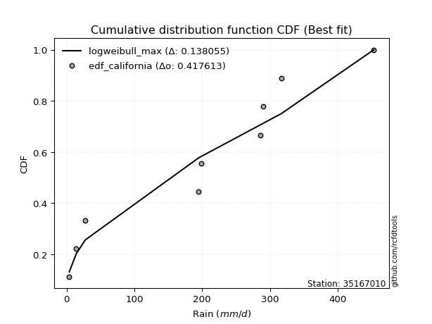</img>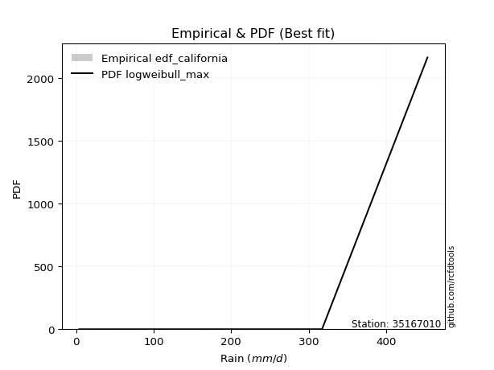</img>

</div>


### 2. EDF Hazen (1930)

Hazen method for plotting positions is a formula used to estimate the empirical cumulative probability distribution of flood events or other hydrological data. This formula often results in biased estimations, particularly when extrapolating to extreme events (high return periods).

<div align="center">


$P=(m-0.5)/n$


</div>


**2.1. Empirical values**

<div align="center">

|                | 0                   | 1                   | 2                  | 3                  | 4         | 5                  | 6                  | 7                  | 8                  |
|:---------------|:--------------------|:--------------------|:-------------------|:-------------------|:----------|:-------------------|:-------------------|:-------------------|:-------------------|
| date           | 2022                | 2018                | 2017               | 2019               | 2023      | 2020               | 2021               | 2025               | 2024               |
| x              | 3.9                 | 14.3                | 27.57              | 194.72             | 198.2     | 285.4              | 290.3              | 317.3              | 453.4              |
| m              | 1                   | 2                   | 3                  | 4                  | 5         | 6                  | 7                  | 8                  | 9                  |
| empirical_dist | edf_hazen           | edf_hazen           | edf_hazen          | edf_hazen          | edf_hazen | edf_hazen          | edf_hazen          | edf_hazen          | edf_hazen          |
| empirical      | 0.05555555555555555 | 0.16666666666666666 | 0.2777777777777778 | 0.3888888888888889 | 0.5       | 0.6111111111111112 | 0.7222222222222222 | 0.8333333333333334 | 0.9444444444444444 |
| empirical_tr   | 1.0588235294117647  | 1.2                 | 1.3846153846153846 | 1.6363636363636362 | 2.0       | 2.5714285714285716 | 3.5999999999999996 | 6.000000000000002  | 17.999999999999993 |

</div>


**2.2. Kolmogorov-Smirnov fit test (sorted by Δ)**


<div align="center">

|                | 0                   | 1                   | 2                   | 3                   | 4                   | 5                   | 6                   | 7                   | 8                   | 9                   | 10                  | 11                  | 12                  | 13                  | 14                  | 15                  | 16                  | 17                  | 18                  | 19                  | 20                  | 21                  | 22                  | 23                  | 24                  | 25                  | 26                  | 27                  | 28                  | 29                  | 30                  | 31                  | 32                  | 33                  | 34                  | 35                  | 36                  | 37                  | 38                  | 39                  | 40                  | 41                  | 42                  | 43                  | 44                  | 45                  | 46                  | 47                  | 48                  | 49                  | 50                  | 51                  | 52                  | 53                  | 54                  | 55                  | 56                  | 57                  | 58                  | 59                  | 60                  | 61                  | 62                  | 63                  | 64                  | 65                  | 66                  | 67                  | 68                  | 69                  | 70                  | 71                  | 72                  | 73                  | 74                  | 75                  | 76                  | 77                  | 78                  | 79                  | 80                  | 81                  | 82                  | 83                  | 84                  | 85                  | 86                  | 87                  | 88                  | 89                  | 90                  | 91                  | 92                  | 93                  | 94                  | 95                  | 96                  | 97                  | 98                  | 99                  | 100                 | 101                 | 102                 | 103                 | 104                 | 105                 | 106                 | 107                 | 108                 | 109                 | 110                 | 111                 | 112                 | 113                 | 114                 | 115                 | 116                 | 117                 | 118                 | 119                 | 120                 | 121                 | 122                 | 123                 | 124                 | 125                 | 126                 | 127                 | 128                 | 129                 | 130                 | 131                 | 132                 | 133                 | 134                 | 135                 | 136                 | 137                 | 138                 | 139                 | 140                 | 141                 | 142                 | 143                 | 144                 | 145                 | 146                 | 147                 | 148                 | 149                 | 150                 | 151                 | 152                 | 153                 | 154                 | 155                 | 156                 | 157                 | 158                 | 159                 |
|:---------------|:--------------------|:--------------------|:--------------------|:--------------------|:--------------------|:--------------------|:--------------------|:--------------------|:--------------------|:--------------------|:--------------------|:--------------------|:--------------------|:--------------------|:--------------------|:--------------------|:--------------------|:--------------------|:--------------------|:--------------------|:--------------------|:--------------------|:--------------------|:--------------------|:--------------------|:--------------------|:--------------------|:--------------------|:--------------------|:--------------------|:--------------------|:--------------------|:--------------------|:--------------------|:--------------------|:--------------------|:--------------------|:--------------------|:--------------------|:--------------------|:--------------------|:--------------------|:--------------------|:--------------------|:--------------------|:--------------------|:--------------------|:--------------------|:--------------------|:--------------------|:--------------------|:--------------------|:--------------------|:--------------------|:--------------------|:--------------------|:--------------------|:--------------------|:--------------------|:--------------------|:--------------------|:--------------------|:--------------------|:--------------------|:--------------------|:--------------------|:--------------------|:--------------------|:--------------------|:--------------------|:--------------------|:--------------------|:--------------------|:--------------------|:--------------------|:--------------------|:--------------------|:--------------------|:--------------------|:--------------------|:--------------------|:--------------------|:--------------------|:--------------------|:--------------------|:--------------------|:--------------------|:--------------------|:--------------------|:--------------------|:--------------------|:--------------------|:--------------------|:--------------------|:--------------------|:--------------------|:--------------------|:--------------------|:--------------------|:--------------------|:--------------------|:--------------------|:--------------------|:--------------------|:--------------------|:--------------------|:--------------------|:--------------------|:--------------------|:--------------------|:--------------------|:--------------------|:--------------------|:--------------------|:--------------------|:--------------------|:--------------------|:--------------------|:--------------------|:--------------------|:--------------------|:--------------------|:--------------------|:--------------------|:--------------------|:--------------------|:--------------------|:--------------------|:--------------------|:--------------------|:--------------------|:--------------------|:--------------------|:--------------------|:--------------------|:--------------------|:--------------------|:--------------------|:--------------------|:--------------------|:--------------------|:--------------------|:--------------------|:--------------------|:--------------------|:--------------------|:--------------------|:--------------------|:--------------------|:--------------------|:--------------------|:--------------------|:--------------------|:--------------------|:--------------------|:--------------------|:--------------------|:--------------------|:--------------------|:--------------------|
| station        | 35167010            | 35167010            | 35167010            | 35167010            | 35167010            | 35167010            | 35167010            | 35167010            | 35167010            | 35167010            | 35167010            | 35167010            | 35167010            | 35167010            | 35167010            | 35167010            | 35167010            | 35167010            | 35167010            | 35167010            | 35167010            | 35167010            | 35167010            | 35167010            | 35167010            | 35167010            | 35167010            | 35167010            | 35167010            | 35167010            | 35167010            | 35167010            | 35167010            | 35167010            | 35167010            | 35167010            | 35167010            | 35167010            | 35167010            | 35167010            | 35167010            | 35167010            | 35167010            | 35167010            | 35167010            | 35167010            | 35167010            | 35167010            | 35167010            | 35167010            | 35167010            | 35167010            | 35167010            | 35167010            | 35167010            | 35167010            | 35167010            | 35167010            | 35167010            | 35167010            | 35167010            | 35167010            | 35167010            | 35167010            | 35167010            | 35167010            | 35167010            | 35167010            | 35167010            | 35167010            | 35167010            | 35167010            | 35167010            | 35167010            | 35167010            | 35167010            | 35167010            | 35167010            | 35167010            | 35167010            | 35167010            | 35167010            | 35167010            | 35167010            | 35167010            | 35167010            | 35167010            | 35167010            | 35167010            | 35167010            | 35167010            | 35167010            | 35167010            | 35167010            | 35167010            | 35167010            | 35167010            | 35167010            | 35167010            | 35167010            | 35167010            | 35167010            | 35167010            | 35167010            | 35167010            | 35167010            | 35167010            | 35167010            | 35167010            | 35167010            | 35167010            | 35167010            | 35167010            | 35167010            | 35167010            | 35167010            | 35167010            | 35167010            | 35167010            | 35167010            | 35167010            | 35167010            | 35167010            | 35167010            | 35167010            | 35167010            | 35167010            | 35167010            | 35167010            | 35167010            | 35167010            | 35167010            | 35167010            | 35167010            | 35167010            | 35167010            | 35167010            | 35167010            | 35167010            | 35167010            | 35167010            | 35167010            | 35167010            | 35167010            | 35167010            | 35167010            | 35167010            | 35167010            | 35167010            | 35167010            | 35167010            | 35167010            | 35167010            | 35167010            | 35167010            | 35167010            | 35167010            | 35167010            | 35167010            | 35167010            |
| empirical_dist | edf_hazen           | edf_hazen           | edf_hazen           | edf_hazen           | edf_hazen           | edf_hazen           | edf_hazen           | edf_hazen           | edf_hazen           | edf_hazen           | edf_hazen           | edf_hazen           | edf_hazen           | edf_hazen           | edf_hazen           | edf_hazen           | edf_hazen           | edf_hazen           | edf_hazen           | edf_hazen           | edf_hazen           | edf_hazen           | edf_hazen           | edf_hazen           | edf_hazen           | edf_hazen           | edf_hazen           | edf_hazen           | edf_hazen           | edf_hazen           | edf_hazen           | edf_hazen           | edf_hazen           | edf_hazen           | edf_hazen           | edf_hazen           | edf_hazen           | edf_hazen           | edf_hazen           | edf_hazen           | edf_hazen           | edf_hazen           | edf_hazen           | edf_hazen           | edf_hazen           | edf_hazen           | edf_hazen           | edf_hazen           | edf_hazen           | edf_hazen           | edf_hazen           | edf_hazen           | edf_hazen           | edf_hazen           | edf_hazen           | edf_hazen           | edf_hazen           | edf_hazen           | edf_hazen           | edf_hazen           | edf_hazen           | edf_hazen           | edf_hazen           | edf_hazen           | edf_hazen           | edf_hazen           | edf_hazen           | edf_hazen           | edf_hazen           | edf_hazen           | edf_hazen           | edf_hazen           | edf_hazen           | edf_hazen           | edf_hazen           | edf_hazen           | edf_hazen           | edf_hazen           | edf_hazen           | edf_hazen           | edf_hazen           | edf_hazen           | edf_hazen           | edf_hazen           | edf_hazen           | edf_hazen           | edf_hazen           | edf_hazen           | edf_hazen           | edf_hazen           | edf_hazen           | edf_hazen           | edf_hazen           | edf_hazen           | edf_hazen           | edf_hazen           | edf_hazen           | edf_hazen           | edf_hazen           | edf_hazen           | edf_hazen           | edf_hazen           | edf_hazen           | edf_hazen           | edf_hazen           | edf_hazen           | edf_hazen           | edf_hazen           | edf_hazen           | edf_hazen           | edf_hazen           | edf_hazen           | edf_hazen           | edf_hazen           | edf_hazen           | edf_hazen           | edf_hazen           | edf_hazen           | edf_hazen           | edf_hazen           | edf_hazen           | edf_hazen           | edf_hazen           | edf_hazen           | edf_hazen           | edf_hazen           | edf_hazen           | edf_hazen           | edf_hazen           | edf_hazen           | edf_hazen           | edf_hazen           | edf_hazen           | edf_hazen           | edf_hazen           | edf_hazen           | edf_hazen           | edf_hazen           | edf_hazen           | edf_hazen           | edf_hazen           | edf_hazen           | edf_hazen           | edf_hazen           | edf_hazen           | edf_hazen           | edf_hazen           | edf_hazen           | edf_hazen           | edf_hazen           | edf_hazen           | edf_hazen           | edf_hazen           | edf_hazen           | edf_hazen           | edf_hazen           | edf_hazen           | edf_hazen           | edf_hazen           | edf_hazen           |
| p_dist         | ksone               | logjohnsonsu        | semicircular        | anglit              | arcsine             | loggenextreme       | gausshyper          | genextreme          | foldnorm            | dweibull            | t                   | norm                | truncnorm           | exponnorm           | skewnorm            | pearson3            | gamma               | erlang              | johnsonsu           | nct                 | invgamma            | gumbel_l            | maxwell             | dgamma              | rayleigh            | burr                | cosine              | genlogistic         | invweibull          | loggennorm          | logistic            | argus               | hypsecant           | rice                | kstwobign           | laplace             | bradford            | invgauss            | logvonmises_line    | loglevy_l           | logweibull_max      | logmielke           | truncexpon          | logloggamma         | gumbel_r            | halfnorm            | gompertz            | nakagami            | logdgamma           | logburr             | kappa4              | exponpow            | logtrapezoid        | logargus            | logexponpow         | logarcsine          | wrapcauchy          | triang              | genpareto           | kappa3              | tukeylambda         | moyal               | uniform             | loggenpareto        | logburr12           | lomax               | mielke              | gengamma            | logpearson3         | ncf                 | loggumbel_l         | genexpon            | logweibull_min      | vonmises_line       | loggengamma         | alpha               | logsemicircular     | exponweib           | loggompertz         | logexponweib        | logdweibull         | loganglit           | halflogistic        | logloglaplace       | weibull_min         | lognakagami         | logbeta             | f                   | wald                | logwrapcauchy       | genhalflogistic     | logf                | logbetaprime        | loginvgauss         | logt                | logcrystalball      | lognorm             | logexponnorm        | truncweibull_min    | lognct              | loginvweibull       | logfatiguelife      | logrice             | halfgennorm         | loggamma            | loggamma            | loginvgamma         | logerlang           | logncf              | logfoldnorm         | logalpha            | loggenhalflogistic  | loglomax            | logmaxwell          | loglogistic         | logkstwobign        | lograyleigh         | beta                | logskewnorm         | burr12              | loghypsecant        | loggausshyper       | logcosine           | loghalfnorm         | loggenexpon         | gennorm             | loghalfgennorm      | loggumbel_r         | loglaplace          | loglaplace          | fatiguelife         | levy_l              | betaprime           | logtriang           | loghalflogistic     | logmoyal            | logksone            | trapezoid           | logkappa4           | logjohnsonsb        | logtruncweibull_min | logwald             | logkappa3           | loguniform          | crystalball         | powerlaw            | logtruncexpon       | logbradford         | logtruncnorm        | johnsonsb           | rdist               | logpowerlaw         | truncpareto         | weibull_max         | logtukeylambda      | logrdist            | logtruncpareto      | loggenlogistic      | logvonmises         | vonmises            |
| delta          | 0.11175431903082764 | 0.1137927855483849  | 0.12432258411094155 | 0.13329013011991106 | 0.14033475316078514 | 0.14331901763298166 | 0.14420995529619518 | 0.15184363626497047 | 0.1524462957632553  | 0.15326815138481703 | 0.15406285720437496 | 0.15412702692080393 | 0.15412703243950132 | 0.15412824462819796 | 0.15415076851655615 | 0.15460518451044747 | 0.15464529186698947 | 0.1547870844070829  | 0.1549643292743007  | 0.1561950020333306  | 0.15819949062080307 | 0.1582277174589975  | 0.1587350830763833  | 0.15927269374344566 | 0.16231138968106548 | 0.16302466745723593 | 0.16364187615052428 | 0.16625140509794484 | 0.16656656454300217 | 0.16688993748931114 | 0.16852889946112537 | 0.17134926755046054 | 0.17524586280356264 | 0.17615162428490228 | 0.17727368487907974 | 0.180413062958515   | 0.18479836445455983 | 0.18516579470664613 | 0.18543990485685763 | 0.18748148748373475 | 0.1879184443161654  | 0.1880551746927433  | 0.18935075689513253 | 0.1916585446388948  | 0.1936903014568119  | 0.1977441598230372  | 0.20210181743166195 | 0.20261292902814493 | 0.20437138684268624 | 0.20437730468230747 | 0.2049729709196431  | 0.20530649646833293 | 0.20591014461898688 | 0.2120600125247431  | 0.21259631104338067 | 0.21267834673620173 | 0.21350240647925012 | 0.21557844042894736 | 0.21747228674556315 | 0.2185919644772311  | 0.21976465136948697 | 0.22231594876710187 | 0.22511926832282786 | 0.22547505149468744 | 0.23201966650494704 | 0.2332202531016308  | 0.23343193420899194 | 0.23640838738219466 | 0.2373350213919116  | 0.24003324254703745 | 0.24020286873184787 | 0.2434823475036419  | 0.2441380630094842  | 0.24798942966089643 | 0.24819910659941974 | 0.25027834205220695 | 0.2511578335405535  | 0.25405425982127716 | 0.25746245989689726 | 0.25842605427584303 | 0.26020835971617473 | 0.26044573525016007 | 0.2612267045771611  | 0.26191223370555394 | 0.2649859755193287  | 0.27250761514785254 | 0.27457854846768437 | 0.2760631228586297  | 0.2777777777777778  | 0.28056100777302134 | 0.28149174525820253 | 0.28150926591045206 | 0.2816438333901791  | 0.28220282868035423 | 0.2824570781223252  | 0.2824573874050946  | 0.2824574237668162  | 0.28245967821622037 | 0.28255689388290756 | 0.2826716991518691  | 0.282770867554293   | 0.2829915686375109  | 0.28535783293448186 | 0.28556479504224946 | 0.28652711307881634 | 0.28652711307881634 | 0.28927688733319795 | 0.28930540149443434 | 0.2894866829443879  | 0.28963345357472764 | 0.2934644890268238  | 0.2947551031488516  | 0.2997249239715369  | 0.30174035951100525 | 0.30208209995741114 | 0.3021069327187384  | 0.3074660634742425  | 0.3111720813579481  | 0.31446256738335737 | 0.31528448991045227 | 0.31688785730757    | 0.31879324369686873 | 0.32332013657871733 | 0.32437696457961235 | 0.33164104225225016 | 0.33333333333333337 | 0.3337228713219687  | 0.3388282283793949  | 0.3441200492564153  | 0.3441200492564153  | 0.3487974841222245  | 0.3491885936348875  | 0.34945127367209255 | 0.35055914644606173 | 0.3520648709816215  | 0.35727543621305907 | 0.3796757354625156  | 0.38690298987005955 | 0.3900012958985852  | 0.3949722899564023  | 0.3999915475547245  | 0.41019866313303893 | 0.4329946841647892  | 0.4333886603327965  | 0.45100193351839324 | 0.47115171493791624 | 0.47176559005769075 | 0.47355624515659117 | 0.48654645248212697 | 0.5144137771370867  | 0.5656107444659979  | 0.5825952351252567  | 0.5999624290420106  | 0.6847715110427987  | 0.7221580176131405  | 0.7222222221930541  | 0.7539476828358637  | 0.8333333333333334  | 1.0003732878694174  | 71.206301087031     |
| deltao         | 0.41761268023100007 | 0.41761268023100007 | 0.41761268023100007 | 0.41761268023100007 | 0.41761268023100007 | 0.41761268023100007 | 0.41761268023100007 | 0.41761268023100007 | 0.41761268023100007 | 0.41761268023100007 | 0.41761268023100007 | 0.41761268023100007 | 0.41761268023100007 | 0.41761268023100007 | 0.41761268023100007 | 0.41761268023100007 | 0.41761268023100007 | 0.41761268023100007 | 0.41761268023100007 | 0.41761268023100007 | 0.41761268023100007 | 0.41761268023100007 | 0.41761268023100007 | 0.41761268023100007 | 0.41761268023100007 | 0.41761268023100007 | 0.41761268023100007 | 0.41761268023100007 | 0.41761268023100007 | 0.41761268023100007 | 0.41761268023100007 | 0.41761268023100007 | 0.41761268023100007 | 0.41761268023100007 | 0.41761268023100007 | 0.41761268023100007 | 0.41761268023100007 | 0.41761268023100007 | 0.41761268023100007 | 0.41761268023100007 | 0.41761268023100007 | 0.41761268023100007 | 0.41761268023100007 | 0.41761268023100007 | 0.41761268023100007 | 0.41761268023100007 | 0.41761268023100007 | 0.41761268023100007 | 0.41761268023100007 | 0.41761268023100007 | 0.41761268023100007 | 0.41761268023100007 | 0.41761268023100007 | 0.41761268023100007 | 0.41761268023100007 | 0.41761268023100007 | 0.41761268023100007 | 0.41761268023100007 | 0.41761268023100007 | 0.41761268023100007 | 0.41761268023100007 | 0.41761268023100007 | 0.41761268023100007 | 0.41761268023100007 | 0.41761268023100007 | 0.41761268023100007 | 0.41761268023100007 | 0.41761268023100007 | 0.41761268023100007 | 0.41761268023100007 | 0.41761268023100007 | 0.41761268023100007 | 0.41761268023100007 | 0.41761268023100007 | 0.41761268023100007 | 0.41761268023100007 | 0.41761268023100007 | 0.41761268023100007 | 0.41761268023100007 | 0.41761268023100007 | 0.41761268023100007 | 0.41761268023100007 | 0.41761268023100007 | 0.41761268023100007 | 0.41761268023100007 | 0.41761268023100007 | 0.41761268023100007 | 0.41761268023100007 | 0.41761268023100007 | 0.41761268023100007 | 0.41761268023100007 | 0.41761268023100007 | 0.41761268023100007 | 0.41761268023100007 | 0.41761268023100007 | 0.41761268023100007 | 0.41761268023100007 | 0.41761268023100007 | 0.41761268023100007 | 0.41761268023100007 | 0.41761268023100007 | 0.41761268023100007 | 0.41761268023100007 | 0.41761268023100007 | 0.41761268023100007 | 0.41761268023100007 | 0.41761268023100007 | 0.41761268023100007 | 0.41761268023100007 | 0.41761268023100007 | 0.41761268023100007 | 0.41761268023100007 | 0.41761268023100007 | 0.41761268023100007 | 0.41761268023100007 | 0.41761268023100007 | 0.41761268023100007 | 0.41761268023100007 | 0.41761268023100007 | 0.41761268023100007 | 0.41761268023100007 | 0.41761268023100007 | 0.41761268023100007 | 0.41761268023100007 | 0.41761268023100007 | 0.41761268023100007 | 0.41761268023100007 | 0.41761268023100007 | 0.41761268023100007 | 0.41761268023100007 | 0.41761268023100007 | 0.41761268023100007 | 0.41761268023100007 | 0.41761268023100007 | 0.41761268023100007 | 0.41761268023100007 | 0.41761268023100007 | 0.41761268023100007 | 0.41761268023100007 | 0.41761268023100007 | 0.41761268023100007 | 0.41761268023100007 | 0.41761268023100007 | 0.41761268023100007 | 0.41761268023100007 | 0.41761268023100007 | 0.41761268023100007 | 0.41761268023100007 | 0.41761268023100007 | 0.41761268023100007 | 0.41761268023100007 | 0.41761268023100007 | 0.41761268023100007 | 0.41761268023100007 | 0.41761268023100007 | 0.41761268023100007 | 0.41761268023100007 | 0.41761268023100007 | 0.41761268023100007 | 0.41761268023100007 |
| eval           | Δo > Δ              | Δo > Δ              | Δo > Δ              | Δo > Δ              | Δo > Δ              | Δo > Δ              | Δo > Δ              | Δo > Δ              | Δo > Δ              | Δo > Δ              | Δo > Δ              | Δo > Δ              | Δo > Δ              | Δo > Δ              | Δo > Δ              | Δo > Δ              | Δo > Δ              | Δo > Δ              | Δo > Δ              | Δo > Δ              | Δo > Δ              | Δo > Δ              | Δo > Δ              | Δo > Δ              | Δo > Δ              | Δo > Δ              | Δo > Δ              | Δo > Δ              | Δo > Δ              | Δo > Δ              | Δo > Δ              | Δo > Δ              | Δo > Δ              | Δo > Δ              | Δo > Δ              | Δo > Δ              | Δo > Δ              | Δo > Δ              | Δo > Δ              | Δo > Δ              | Δo > Δ              | Δo > Δ              | Δo > Δ              | Δo > Δ              | Δo > Δ              | Δo > Δ              | Δo > Δ              | Δo > Δ              | Δo > Δ              | Δo > Δ              | Δo > Δ              | Δo > Δ              | Δo > Δ              | Δo > Δ              | Δo > Δ              | Δo > Δ              | Δo > Δ              | Δo > Δ              | Δo > Δ              | Δo > Δ              | Δo > Δ              | Δo > Δ              | Δo > Δ              | Δo > Δ              | Δo > Δ              | Δo > Δ              | Δo > Δ              | Δo > Δ              | Δo > Δ              | Δo > Δ              | Δo > Δ              | Δo > Δ              | Δo > Δ              | Δo > Δ              | Δo > Δ              | Δo > Δ              | Δo > Δ              | Δo > Δ              | Δo > Δ              | Δo > Δ              | Δo > Δ              | Δo > Δ              | Δo > Δ              | Δo > Δ              | Δo > Δ              | Δo > Δ              | Δo > Δ              | Δo > Δ              | Δo > Δ              | Δo > Δ              | Δo > Δ              | Δo > Δ              | Δo > Δ              | Δo > Δ              | Δo > Δ              | Δo > Δ              | Δo > Δ              | Δo > Δ              | Δo > Δ              | Δo > Δ              | Δo > Δ              | Δo > Δ              | Δo > Δ              | Δo > Δ              | Δo > Δ              | Δo > Δ              | Δo > Δ              | Δo > Δ              | Δo > Δ              | Δo > Δ              | Δo > Δ              | Δo > Δ              | Δo > Δ              | Δo > Δ              | Δo > Δ              | Δo > Δ              | Δo > Δ              | Δo > Δ              | Δo > Δ              | Δo > Δ              | Δo > Δ              | Δo > Δ              | Δo > Δ              | Δo > Δ              | Δo > Δ              | Δo > Δ              | Δo > Δ              | Δo > Δ              | Δo > Δ              | Δo > Δ              | Δo > Δ              | Δo > Δ              | Δo > Δ              | Δo > Δ              | Δo > Δ              | Δo > Δ              | Δo > Δ              | Δo > Δ              | Δo > Δ              | Δo > Δ              | Δo > Δ              | Δo > Δ              | Δo <= Δ             | Δo <= Δ             | Δo <= Δ             | Δo <= Δ             | Δo <= Δ             | Δo <= Δ             | Δo <= Δ             | Δo <= Δ             | Δo <= Δ             | Δo <= Δ             | Δo <= Δ             | Δo <= Δ             | Δo <= Δ             | Δo <= Δ             | Δo <= Δ             | Δo <= Δ             | Δo <= Δ             | Δo <= Δ             |
| fit            | 1                   | 1                   | 1                   | 1                   | 1                   | 1                   | 1                   | 1                   | 1                   | 1                   | 1                   | 1                   | 1                   | 1                   | 1                   | 1                   | 1                   | 1                   | 1                   | 1                   | 1                   | 1                   | 1                   | 1                   | 1                   | 1                   | 1                   | 1                   | 1                   | 1                   | 1                   | 1                   | 1                   | 1                   | 1                   | 1                   | 1                   | 1                   | 1                   | 1                   | 1                   | 1                   | 1                   | 1                   | 1                   | 1                   | 1                   | 1                   | 1                   | 1                   | 1                   | 1                   | 1                   | 1                   | 1                   | 1                   | 1                   | 1                   | 1                   | 1                   | 1                   | 1                   | 1                   | 1                   | 1                   | 1                   | 1                   | 1                   | 1                   | 1                   | 1                   | 1                   | 1                   | 1                   | 1                   | 1                   | 1                   | 1                   | 1                   | 1                   | 1                   | 1                   | 1                   | 1                   | 1                   | 1                   | 1                   | 1                   | 1                   | 1                   | 1                   | 1                   | 1                   | 1                   | 1                   | 1                   | 1                   | 1                   | 1                   | 1                   | 1                   | 1                   | 1                   | 1                   | 1                   | 1                   | 1                   | 1                   | 1                   | 1                   | 1                   | 1                   | 1                   | 1                   | 1                   | 1                   | 1                   | 1                   | 1                   | 1                   | 1                   | 1                   | 1                   | 1                   | 1                   | 1                   | 1                   | 1                   | 1                   | 1                   | 1                   | 1                   | 1                   | 1                   | 1                   | 1                   | 1                   | 1                   | 1                   | 1                   | 1                   | 1                   | 0                   | 0                   | 0                   | 0                   | 0                   | 0                   | 0                   | 0                   | 0                   | 0                   | 0                   | 0                   | 0                   | 0                   | 0                   | 0                   | 0                   | 0                   |
| n              | 9                   | 9                   | 9                   | 9                   | 9                   | 9                   | 9                   | 9                   | 9                   | 9                   | 9                   | 9                   | 9                   | 9                   | 9                   | 9                   | 9                   | 9                   | 9                   | 9                   | 9                   | 9                   | 9                   | 9                   | 9                   | 9                   | 9                   | 9                   | 9                   | 9                   | 9                   | 9                   | 9                   | 9                   | 9                   | 9                   | 9                   | 9                   | 9                   | 9                   | 9                   | 9                   | 9                   | 9                   | 9                   | 9                   | 9                   | 9                   | 9                   | 9                   | 9                   | 9                   | 9                   | 9                   | 9                   | 9                   | 9                   | 9                   | 9                   | 9                   | 9                   | 9                   | 9                   | 9                   | 9                   | 9                   | 9                   | 9                   | 9                   | 9                   | 9                   | 9                   | 9                   | 9                   | 9                   | 9                   | 9                   | 9                   | 9                   | 9                   | 9                   | 9                   | 9                   | 9                   | 9                   | 9                   | 9                   | 9                   | 9                   | 9                   | 9                   | 9                   | 9                   | 9                   | 9                   | 9                   | 9                   | 9                   | 9                   | 9                   | 9                   | 9                   | 9                   | 9                   | 9                   | 9                   | 9                   | 9                   | 9                   | 9                   | 9                   | 9                   | 9                   | 9                   | 9                   | 9                   | 9                   | 9                   | 9                   | 9                   | 9                   | 9                   | 9                   | 9                   | 9                   | 9                   | 9                   | 9                   | 9                   | 9                   | 9                   | 9                   | 9                   | 9                   | 9                   | 9                   | 9                   | 9                   | 9                   | 9                   | 9                   | 9                   | 9                   | 9                   | 9                   | 9                   | 9                   | 9                   | 9                   | 9                   | 9                   | 9                   | 9                   | 9                   | 9                   | 9                   | 9                   | 9                   | 9                   | 9                   |
| best_fit       | 1                   | 0                   | 0                   | 0                   | 0                   | 0                   | 0                   | 0                   | 0                   | 0                   | 0                   | 0                   | 0                   | 0                   | 0                   | 0                   | 0                   | 0                   | 0                   | 0                   | 0                   | 0                   | 0                   | 0                   | 0                   | 0                   | 0                   | 0                   | 0                   | 0                   | 0                   | 0                   | 0                   | 0                   | 0                   | 0                   | 0                   | 0                   | 0                   | 0                   | 0                   | 0                   | 0                   | 0                   | 0                   | 0                   | 0                   | 0                   | 0                   | 0                   | 0                   | 0                   | 0                   | 0                   | 0                   | 0                   | 0                   | 0                   | 0                   | 0                   | 0                   | 0                   | 0                   | 0                   | 0                   | 0                   | 0                   | 0                   | 0                   | 0                   | 0                   | 0                   | 0                   | 0                   | 0                   | 0                   | 0                   | 0                   | 0                   | 0                   | 0                   | 0                   | 0                   | 0                   | 0                   | 0                   | 0                   | 0                   | 0                   | 0                   | 0                   | 0                   | 0                   | 0                   | 0                   | 0                   | 0                   | 0                   | 0                   | 0                   | 0                   | 0                   | 0                   | 0                   | 0                   | 0                   | 0                   | 0                   | 0                   | 0                   | 0                   | 0                   | 0                   | 0                   | 0                   | 0                   | 0                   | 0                   | 0                   | 0                   | 0                   | 0                   | 0                   | 0                   | 0                   | 0                   | 0                   | 0                   | 0                   | 0                   | 0                   | 0                   | 0                   | 0                   | 0                   | 0                   | 0                   | 0                   | 0                   | 0                   | 0                   | 0                   | 0                   | 0                   | 0                   | 0                   | 0                   | 0                   | 0                   | 0                   | 0                   | 0                   | 0                   | 0                   | 0                   | 0                   | 0                   | 0                   | 0                   | 0                   |
| best_fit_sort  | 1                   | 2                   | 3                   | 4                   | 5                   | 6                   | 7                   | 8                   | 9                   | 10                  | 11                  | 12                  | 13                  | 14                  | 15                  | 16                  | 17                  | 18                  | 19                  | 20                  | 21                  | 22                  | 23                  | 24                  | 25                  | 26                  | 27                  | 28                  | 29                  | 30                  | 31                  | 32                  | 33                  | 34                  | 35                  | 36                  | 37                  | 38                  | 39                  | 40                  | 41                  | 42                  | 43                  | 44                  | 45                  | 46                  | 47                  | 48                  | 49                  | 50                  | 51                  | 52                  | 53                  | 54                  | 55                  | 56                  | 57                  | 58                  | 59                  | 60                  | 61                  | 62                  | 63                  | 64                  | 65                  | 66                  | 67                  | 68                  | 69                  | 70                  | 71                  | 72                  | 73                  | 74                  | 75                  | 76                  | 77                  | 78                  | 79                  | 80                  | 81                  | 82                  | 83                  | 84                  | 85                  | 86                  | 87                  | 88                  | 89                  | 90                  | 91                  | 92                  | 93                  | 94                  | 95                  | 96                  | 97                  | 98                  | 99                  | 100                 | 101                 | 102                 | 103                 | 104                 | 105                 | 106                 | 107                 | 108                 | 109                 | 110                 | 111                 | 112                 | 113                 | 114                 | 115                 | 116                 | 117                 | 118                 | 119                 | 120                 | 121                 | 122                 | 123                 | 124                 | 125                 | 126                 | 127                 | 128                 | 129                 | 130                 | 131                 | 132                 | 133                 | 134                 | 135                 | 136                 | 137                 | 138                 | 139                 | 140                 | 141                 | 142                 | 143                 | 144                 | 145                 | 146                 | 147                 | 148                 | 149                 | 150                 | 151                 | 152                 | 153                 | 154                 | 155                 | 156                 | 157                 | 158                 | 159                 | 160                 |

</div>


**2.3. Best fit**

<div align="center">

|   id |   station | empirical_dist   | p_dist   |    delta |   deltao | eval   |   fit |   n |   best_fit |   best_fit_sort |
|-----:|----------:|:-----------------|:---------|---------:|---------:|:-------|------:|----:|-----------:|----------------:|
|    0 |  35167010 | edf_hazen        | ksone    | 0.111754 | 0.417613 | Δo > Δ |     1 |   9 |          1 |               1 |

</div>


<div align="center">

</img>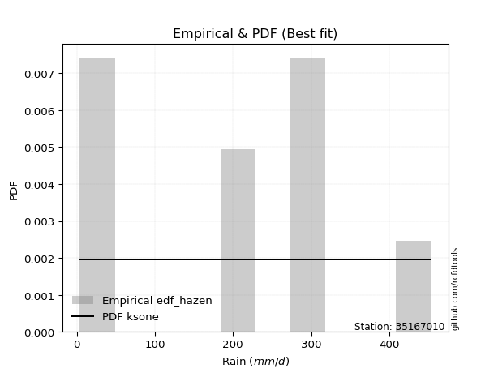</img>

</div>


### 3. EDF Weibull (1939)

Weibull plotting position formula is an empirical method used to estimate the non-exceedance probability or plotting position for a set of observed data, is often recommended or widely used in practice, particularly in flood frequency analysis.

<div align="center">


$P=m/(n+1)$


</div>


**3.1. Empirical values**

<div align="center">

|                | 0                  | 1           | 2                  | 3                  | 4           | 5           | 6                 | 7                 | 8                  |
|:---------------|:-------------------|:------------|:-------------------|:-------------------|:------------|:------------|:------------------|:------------------|:-------------------|
| date           | 2022               | 2018        | 2017               | 2019               | 2023        | 2020        | 2021              | 2025              | 2024               |
| x              | 3.9                | 14.3        | 27.57              | 194.72             | 198.2       | 285.4       | 290.3             | 317.3             | 453.4              |
| m              | 1                  | 2           | 3                  | 4                  | 5           | 6           | 7                 | 8                 | 9                  |
| empirical_dist | edf_weibull        | edf_weibull | edf_weibull        | edf_weibull        | edf_weibull | edf_weibull | edf_weibull       | edf_weibull       | edf_weibull        |
| empirical      | 0.1                | 0.2         | 0.3                | 0.4                | 0.5         | 0.6         | 0.7               | 0.8               | 0.9                |
| empirical_tr   | 1.1111111111111112 | 1.25        | 1.4285714285714286 | 1.6666666666666667 | 2.0         | 2.5         | 3.333333333333333 | 5.000000000000001 | 10.000000000000002 |

</div>


**3.2. Kolmogorov-Smirnov fit test (sorted by Δ)**


<div align="center">

|                | 0                   | 1                   | 2                   | 3                   | 4                   | 5                   | 6                   | 7                   | 8                   | 9                   | 10                  | 11                  | 12                  | 13                  | 14                  | 15                  | 16                  | 17                  | 18                  | 19                  | 20                  | 21                  | 22                  | 23                  | 24                  | 25                  | 26                  | 27                  | 28                  | 29                  | 30                  | 31                  | 32                  | 33                  | 34                  | 35                  | 36                  | 37                  | 38                  | 39                  | 40                  | 41                  | 42                  | 43                  | 44                  | 45                  | 46                  | 47                  | 48                  | 49                  | 50                  | 51                  | 52                  | 53                  | 54                  | 55                  | 56                  | 57                  | 58                  | 59                  | 60                  | 61                  | 62                  | 63                  | 64                  | 65                  | 66                  | 67                  | 68                  | 69                  | 70                  | 71                  | 72                  | 73                  | 74                  | 75                  | 76                  | 77                  | 78                  | 79                  | 80                  | 81                  | 82                  | 83                  | 84                  | 85                  | 86                  | 87                  | 88                  | 89                  | 90                  | 91                  | 92                  | 93                  | 94                  | 95                  | 96                  | 97                  | 98                  | 99                  | 100                 | 101                 | 102                 | 103                 | 104                 | 105                 | 106                 | 107                 | 108                 | 109                 | 110                 | 111                 | 112                 | 113                 | 114                 | 115                 | 116                 | 117                 | 118                 | 119                 | 120                 | 121                 | 122                 | 123                 | 124                 | 125                 | 126                 | 127                 | 128                 | 129                 | 130                 | 131                 | 132                 | 133                 | 134                 | 135                 | 136                 | 137                 | 138                 | 139                 | 140                 | 141                 | 142                 | 143                 | 144                 | 145                 | 146                 | 147                 | 148                 | 149                 | 150                 | 151                 | 152                 | 153                 | 154                 | 155                 | 156                 | 157                 | 158                 | 159                 |
|:---------------|:--------------------|:--------------------|:--------------------|:--------------------|:--------------------|:--------------------|:--------------------|:--------------------|:--------------------|:--------------------|:--------------------|:--------------------|:--------------------|:--------------------|:--------------------|:--------------------|:--------------------|:--------------------|:--------------------|:--------------------|:--------------------|:--------------------|:--------------------|:--------------------|:--------------------|:--------------------|:--------------------|:--------------------|:--------------------|:--------------------|:--------------------|:--------------------|:--------------------|:--------------------|:--------------------|:--------------------|:--------------------|:--------------------|:--------------------|:--------------------|:--------------------|:--------------------|:--------------------|:--------------------|:--------------------|:--------------------|:--------------------|:--------------------|:--------------------|:--------------------|:--------------------|:--------------------|:--------------------|:--------------------|:--------------------|:--------------------|:--------------------|:--------------------|:--------------------|:--------------------|:--------------------|:--------------------|:--------------------|:--------------------|:--------------------|:--------------------|:--------------------|:--------------------|:--------------------|:--------------------|:--------------------|:--------------------|:--------------------|:--------------------|:--------------------|:--------------------|:--------------------|:--------------------|:--------------------|:--------------------|:--------------------|:--------------------|:--------------------|:--------------------|:--------------------|:--------------------|:--------------------|:--------------------|:--------------------|:--------------------|:--------------------|:--------------------|:--------------------|:--------------------|:--------------------|:--------------------|:--------------------|:--------------------|:--------------------|:--------------------|:--------------------|:--------------------|:--------------------|:--------------------|:--------------------|:--------------------|:--------------------|:--------------------|:--------------------|:--------------------|:--------------------|:--------------------|:--------------------|:--------------------|:--------------------|:--------------------|:--------------------|:--------------------|:--------------------|:--------------------|:--------------------|:--------------------|:--------------------|:--------------------|:--------------------|:--------------------|:--------------------|:--------------------|:--------------------|:--------------------|:--------------------|:--------------------|:--------------------|:--------------------|:--------------------|:--------------------|:--------------------|:--------------------|:--------------------|:--------------------|:--------------------|:--------------------|:--------------------|:--------------------|:--------------------|:--------------------|:--------------------|:--------------------|:--------------------|:--------------------|:--------------------|:--------------------|:--------------------|:--------------------|:--------------------|:--------------------|:--------------------|:--------------------|:--------------------|:--------------------|
| station        | 35167010            | 35167010            | 35167010            | 35167010            | 35167010            | 35167010            | 35167010            | 35167010            | 35167010            | 35167010            | 35167010            | 35167010            | 35167010            | 35167010            | 35167010            | 35167010            | 35167010            | 35167010            | 35167010            | 35167010            | 35167010            | 35167010            | 35167010            | 35167010            | 35167010            | 35167010            | 35167010            | 35167010            | 35167010            | 35167010            | 35167010            | 35167010            | 35167010            | 35167010            | 35167010            | 35167010            | 35167010            | 35167010            | 35167010            | 35167010            | 35167010            | 35167010            | 35167010            | 35167010            | 35167010            | 35167010            | 35167010            | 35167010            | 35167010            | 35167010            | 35167010            | 35167010            | 35167010            | 35167010            | 35167010            | 35167010            | 35167010            | 35167010            | 35167010            | 35167010            | 35167010            | 35167010            | 35167010            | 35167010            | 35167010            | 35167010            | 35167010            | 35167010            | 35167010            | 35167010            | 35167010            | 35167010            | 35167010            | 35167010            | 35167010            | 35167010            | 35167010            | 35167010            | 35167010            | 35167010            | 35167010            | 35167010            | 35167010            | 35167010            | 35167010            | 35167010            | 35167010            | 35167010            | 35167010            | 35167010            | 35167010            | 35167010            | 35167010            | 35167010            | 35167010            | 35167010            | 35167010            | 35167010            | 35167010            | 35167010            | 35167010            | 35167010            | 35167010            | 35167010            | 35167010            | 35167010            | 35167010            | 35167010            | 35167010            | 35167010            | 35167010            | 35167010            | 35167010            | 35167010            | 35167010            | 35167010            | 35167010            | 35167010            | 35167010            | 35167010            | 35167010            | 35167010            | 35167010            | 35167010            | 35167010            | 35167010            | 35167010            | 35167010            | 35167010            | 35167010            | 35167010            | 35167010            | 35167010            | 35167010            | 35167010            | 35167010            | 35167010            | 35167010            | 35167010            | 35167010            | 35167010            | 35167010            | 35167010            | 35167010            | 35167010            | 35167010            | 35167010            | 35167010            | 35167010            | 35167010            | 35167010            | 35167010            | 35167010            | 35167010            | 35167010            | 35167010            | 35167010            | 35167010            | 35167010            | 35167010            |
| empirical_dist | edf_weibull         | edf_weibull         | edf_weibull         | edf_weibull         | edf_weibull         | edf_weibull         | edf_weibull         | edf_weibull         | edf_weibull         | edf_weibull         | edf_weibull         | edf_weibull         | edf_weibull         | edf_weibull         | edf_weibull         | edf_weibull         | edf_weibull         | edf_weibull         | edf_weibull         | edf_weibull         | edf_weibull         | edf_weibull         | edf_weibull         | edf_weibull         | edf_weibull         | edf_weibull         | edf_weibull         | edf_weibull         | edf_weibull         | edf_weibull         | edf_weibull         | edf_weibull         | edf_weibull         | edf_weibull         | edf_weibull         | edf_weibull         | edf_weibull         | edf_weibull         | edf_weibull         | edf_weibull         | edf_weibull         | edf_weibull         | edf_weibull         | edf_weibull         | edf_weibull         | edf_weibull         | edf_weibull         | edf_weibull         | edf_weibull         | edf_weibull         | edf_weibull         | edf_weibull         | edf_weibull         | edf_weibull         | edf_weibull         | edf_weibull         | edf_weibull         | edf_weibull         | edf_weibull         | edf_weibull         | edf_weibull         | edf_weibull         | edf_weibull         | edf_weibull         | edf_weibull         | edf_weibull         | edf_weibull         | edf_weibull         | edf_weibull         | edf_weibull         | edf_weibull         | edf_weibull         | edf_weibull         | edf_weibull         | edf_weibull         | edf_weibull         | edf_weibull         | edf_weibull         | edf_weibull         | edf_weibull         | edf_weibull         | edf_weibull         | edf_weibull         | edf_weibull         | edf_weibull         | edf_weibull         | edf_weibull         | edf_weibull         | edf_weibull         | edf_weibull         | edf_weibull         | edf_weibull         | edf_weibull         | edf_weibull         | edf_weibull         | edf_weibull         | edf_weibull         | edf_weibull         | edf_weibull         | edf_weibull         | edf_weibull         | edf_weibull         | edf_weibull         | edf_weibull         | edf_weibull         | edf_weibull         | edf_weibull         | edf_weibull         | edf_weibull         | edf_weibull         | edf_weibull         | edf_weibull         | edf_weibull         | edf_weibull         | edf_weibull         | edf_weibull         | edf_weibull         | edf_weibull         | edf_weibull         | edf_weibull         | edf_weibull         | edf_weibull         | edf_weibull         | edf_weibull         | edf_weibull         | edf_weibull         | edf_weibull         | edf_weibull         | edf_weibull         | edf_weibull         | edf_weibull         | edf_weibull         | edf_weibull         | edf_weibull         | edf_weibull         | edf_weibull         | edf_weibull         | edf_weibull         | edf_weibull         | edf_weibull         | edf_weibull         | edf_weibull         | edf_weibull         | edf_weibull         | edf_weibull         | edf_weibull         | edf_weibull         | edf_weibull         | edf_weibull         | edf_weibull         | edf_weibull         | edf_weibull         | edf_weibull         | edf_weibull         | edf_weibull         | edf_weibull         | edf_weibull         | edf_weibull         | edf_weibull         | edf_weibull         |
| p_dist         | arcsine             | ksone               | logjohnsonsu        | loggenextreme       | loglevy_l           | semicircular        | burr                | anglit              | gausshyper          | genextreme          | logvonmises_line    | foldnorm            | dweibull            | invgauss            | t                   | norm                | truncnorm           | exponnorm           | skewnorm            | logweibull_max      | pearson3            | dgamma              | gamma               | logmielke           | erlang              | johnsonsu           | genlogistic         | kstwobign           | invweibull          | truncexpon          | nct                 | invgamma            | gumbel_l            | logloggamma         | maxwell             | rayleigh            | cosine              | loggennorm          | logistic            | triang              | nakagami            | logburr             | argus               | logtrapezoid        | hypsecant           | exponpow            | rice                | logargus            | logexponpow         | logarcsine          | laplace             | bradford            | exponweib           | loggenpareto        | gumbel_r            | logloglaplace       | halfnorm            | logburr12           | lomax               | mielke              | gompertz            | gengamma            | logpearson3         | logdgamma           | logdweibull         | kappa4              | ncf                 | loggumbel_l         | genexpon            | logweibull_min      | wrapcauchy          | loggengamma         | alpha               | genpareto           | logsemicircular     | weibull_min         | kappa3              | logbeta             | tukeylambda         | moyal               | loggompertz         | logexponweib        | uniform             | genhalflogistic     | loganglit           | lognakagami         | f                   | logwrapcauchy       | vonmises_line       | logf                | logbetaprime        | loginvgauss         | logt                | logcrystalball      | lognorm             | logexponnorm        | truncweibull_min    | lognct              | loginvweibull       | logfatiguelife      | logrice             | halfgennorm         | loggamma            | loggamma            | loginvgamma         | logerlang           | logncf              | logfoldnorm         | logalpha            | halflogistic        | loggenhalflogistic  | loglomax            | logmaxwell          | loglogistic         | logkstwobign        | lograyleigh         | wald                | gennorm             | beta                | logskewnorm         | burr12              | levy_l              | loghypsecant        | loggausshyper       | logcosine           | loghalfnorm         | loggenexpon         | loghalfgennorm      | loggumbel_r         | loglaplace          | loglaplace          | fatiguelife         | betaprime           | logtriang           | loghalflogistic     | logmoyal            | trapezoid           | logjohnsonsb        | logksone            | logkappa4           | logtruncweibull_min | logwald             | crystalball         | logkappa3           | loguniform          | powerlaw            | logtruncexpon       | logbradford         | logtruncnorm        | johnsonsb           | rdist               | logpowerlaw         | truncpareto         | weibull_max         | logtukeylambda      | logrdist            | logtruncpareto      | loggenlogistic      | logvonmises         | vonmises            |
| delta          | 0.10700141982745182 | 0.13397654125304984 | 0.1360150077706071  | 0.1392933602696341  | 0.1430370430392903  | 0.14654480633316375 | 0.1519135563461248  | 0.15551235234213326 | 0.16643217751841738 | 0.17406585848719267 | 0.1743287937457465  | 0.1746685179854775  | 0.17549037360703923 | 0.1759584009022715  | 0.17628507942659716 | 0.17634924914302613 | 0.17634925466172352 | 0.17635046685042016 | 0.17637299073877835 | 0.17680733320505426 | 0.17682740673266967 | 0.17686548691855428 | 0.17686751408921167 | 0.17694406358163217 | 0.17700930662930509 | 0.1771865514965229  | 0.17761456264515602 | 0.1777781457819489  | 0.17790154232025934 | 0.1782396457840214  | 0.1784172242555528  | 0.18042171284302527 | 0.1804499396812197  | 0.18054743352778369 | 0.1809573052986055  | 0.18453361190328768 | 0.18586409837274648 | 0.18767409439545274 | 0.19075112168334757 | 0.19085986116602788 | 0.1915018179170338  | 0.19326619357119634 | 0.19357148977268274 | 0.19479903350787575 | 0.19746808502578483 | 0.1977707636425442  | 0.19837384650712447 | 0.20094890141363198 | 0.20148519993226954 | 0.2015672356250906  | 0.2026352851807372  | 0.20289942853729415 | 0.20960981537683276 | 0.2143639403835763  | 0.2159125236790341  | 0.21746778926110955 | 0.2199663820452594  | 0.22090855539383591 | 0.22210914199051968 | 0.22232082309788082 | 0.22432403965388414 | 0.22529727627108354 | 0.22622391028080047 | 0.22659360906490844 | 0.22675366864658963 | 0.2271951931418653  | 0.22892213143592632 | 0.22909175762073675 | 0.23237123639253077 | 0.23302695189837308 | 0.23572462870147232 | 0.2370879954883086  | 0.23916723094109582 | 0.23969450896778535 | 0.24004672242944236 | 0.24078695565724784 | 0.2408141866994533  | 0.24124521513435104 | 0.24198687359170917 | 0.24453817098932407 | 0.24635134878578613 | 0.2473149431647319  | 0.24734149054505006 | 0.2481584119248692  | 0.24933462413904894 | 0.2613965040367414  | 0.2649520117475186  | 0.2694498966619102  | 0.27021165188311863 | 0.27039815479934093 | 0.270532722279068   | 0.2710917175692431  | 0.27134596701121405 | 0.27134627629398345 | 0.2713463126557051  | 0.27134856710510924 | 0.27144578277179643 | 0.271560588040758   | 0.27165975644318185 | 0.2718804575263998  | 0.27424672182337073 | 0.27445368393113834 | 0.2754160019677052  | 0.2754160019677052  | 0.2781657762220868  | 0.2781942903833232  | 0.27837557183327677 | 0.2785223424636165  | 0.2823533779157127  | 0.28344892679938327 | 0.2836439920377405  | 0.28861381286042576 | 0.2906292483998941  | 0.2909709888463     | 0.29099582160762727 | 0.29635495236313136 | 0.3                 | 0.30000000000000004 | 0.300060970246837   | 0.30335145627224624 | 0.30417337879934114 | 0.3047441491904431  | 0.3057767461964589  | 0.3076821325857576  | 0.3122090254676062  | 0.3132658534685012  | 0.32052993114113904 | 0.3226117602108576  | 0.3277171172682838  | 0.3330089381453042  | 0.3330089381453042  | 0.33768637301111337 | 0.33834016256098143 | 0.3394480353349506  | 0.34095375987051035 | 0.34616432510194795 | 0.35356965653672623 | 0.361638956623069   | 0.36856462435140447 | 0.37889018478747405 | 0.38888043644361336 | 0.3990875520219278  | 0.40655748907394884 | 0.4218835730536781  | 0.42227754922168537 | 0.4600406038268051  | 0.4606544789465796  | 0.46244513404548004 | 0.47543534137101584 | 0.4810804438037533  | 0.5544996333548867  | 0.5574015609072649  | 0.5666290957086773  | 0.6514381777094653  | 0.6999357953909182  | 0.699999999970832   | 0.7206143495025303  | 0.8                 | 0.9892621767583062  | 71.25074553147543   |
| deltao         | 0.41761268023100007 | 0.41761268023100007 | 0.41761268023100007 | 0.41761268023100007 | 0.41761268023100007 | 0.41761268023100007 | 0.41761268023100007 | 0.41761268023100007 | 0.41761268023100007 | 0.41761268023100007 | 0.41761268023100007 | 0.41761268023100007 | 0.41761268023100007 | 0.41761268023100007 | 0.41761268023100007 | 0.41761268023100007 | 0.41761268023100007 | 0.41761268023100007 | 0.41761268023100007 | 0.41761268023100007 | 0.41761268023100007 | 0.41761268023100007 | 0.41761268023100007 | 0.41761268023100007 | 0.41761268023100007 | 0.41761268023100007 | 0.41761268023100007 | 0.41761268023100007 | 0.41761268023100007 | 0.41761268023100007 | 0.41761268023100007 | 0.41761268023100007 | 0.41761268023100007 | 0.41761268023100007 | 0.41761268023100007 | 0.41761268023100007 | 0.41761268023100007 | 0.41761268023100007 | 0.41761268023100007 | 0.41761268023100007 | 0.41761268023100007 | 0.41761268023100007 | 0.41761268023100007 | 0.41761268023100007 | 0.41761268023100007 | 0.41761268023100007 | 0.41761268023100007 | 0.41761268023100007 | 0.41761268023100007 | 0.41761268023100007 | 0.41761268023100007 | 0.41761268023100007 | 0.41761268023100007 | 0.41761268023100007 | 0.41761268023100007 | 0.41761268023100007 | 0.41761268023100007 | 0.41761268023100007 | 0.41761268023100007 | 0.41761268023100007 | 0.41761268023100007 | 0.41761268023100007 | 0.41761268023100007 | 0.41761268023100007 | 0.41761268023100007 | 0.41761268023100007 | 0.41761268023100007 | 0.41761268023100007 | 0.41761268023100007 | 0.41761268023100007 | 0.41761268023100007 | 0.41761268023100007 | 0.41761268023100007 | 0.41761268023100007 | 0.41761268023100007 | 0.41761268023100007 | 0.41761268023100007 | 0.41761268023100007 | 0.41761268023100007 | 0.41761268023100007 | 0.41761268023100007 | 0.41761268023100007 | 0.41761268023100007 | 0.41761268023100007 | 0.41761268023100007 | 0.41761268023100007 | 0.41761268023100007 | 0.41761268023100007 | 0.41761268023100007 | 0.41761268023100007 | 0.41761268023100007 | 0.41761268023100007 | 0.41761268023100007 | 0.41761268023100007 | 0.41761268023100007 | 0.41761268023100007 | 0.41761268023100007 | 0.41761268023100007 | 0.41761268023100007 | 0.41761268023100007 | 0.41761268023100007 | 0.41761268023100007 | 0.41761268023100007 | 0.41761268023100007 | 0.41761268023100007 | 0.41761268023100007 | 0.41761268023100007 | 0.41761268023100007 | 0.41761268023100007 | 0.41761268023100007 | 0.41761268023100007 | 0.41761268023100007 | 0.41761268023100007 | 0.41761268023100007 | 0.41761268023100007 | 0.41761268023100007 | 0.41761268023100007 | 0.41761268023100007 | 0.41761268023100007 | 0.41761268023100007 | 0.41761268023100007 | 0.41761268023100007 | 0.41761268023100007 | 0.41761268023100007 | 0.41761268023100007 | 0.41761268023100007 | 0.41761268023100007 | 0.41761268023100007 | 0.41761268023100007 | 0.41761268023100007 | 0.41761268023100007 | 0.41761268023100007 | 0.41761268023100007 | 0.41761268023100007 | 0.41761268023100007 | 0.41761268023100007 | 0.41761268023100007 | 0.41761268023100007 | 0.41761268023100007 | 0.41761268023100007 | 0.41761268023100007 | 0.41761268023100007 | 0.41761268023100007 | 0.41761268023100007 | 0.41761268023100007 | 0.41761268023100007 | 0.41761268023100007 | 0.41761268023100007 | 0.41761268023100007 | 0.41761268023100007 | 0.41761268023100007 | 0.41761268023100007 | 0.41761268023100007 | 0.41761268023100007 | 0.41761268023100007 | 0.41761268023100007 | 0.41761268023100007 | 0.41761268023100007 | 0.41761268023100007 | 0.41761268023100007 |
| eval           | Δo > Δ              | Δo > Δ              | Δo > Δ              | Δo > Δ              | Δo > Δ              | Δo > Δ              | Δo > Δ              | Δo > Δ              | Δo > Δ              | Δo > Δ              | Δo > Δ              | Δo > Δ              | Δo > Δ              | Δo > Δ              | Δo > Δ              | Δo > Δ              | Δo > Δ              | Δo > Δ              | Δo > Δ              | Δo > Δ              | Δo > Δ              | Δo > Δ              | Δo > Δ              | Δo > Δ              | Δo > Δ              | Δo > Δ              | Δo > Δ              | Δo > Δ              | Δo > Δ              | Δo > Δ              | Δo > Δ              | Δo > Δ              | Δo > Δ              | Δo > Δ              | Δo > Δ              | Δo > Δ              | Δo > Δ              | Δo > Δ              | Δo > Δ              | Δo > Δ              | Δo > Δ              | Δo > Δ              | Δo > Δ              | Δo > Δ              | Δo > Δ              | Δo > Δ              | Δo > Δ              | Δo > Δ              | Δo > Δ              | Δo > Δ              | Δo > Δ              | Δo > Δ              | Δo > Δ              | Δo > Δ              | Δo > Δ              | Δo > Δ              | Δo > Δ              | Δo > Δ              | Δo > Δ              | Δo > Δ              | Δo > Δ              | Δo > Δ              | Δo > Δ              | Δo > Δ              | Δo > Δ              | Δo > Δ              | Δo > Δ              | Δo > Δ              | Δo > Δ              | Δo > Δ              | Δo > Δ              | Δo > Δ              | Δo > Δ              | Δo > Δ              | Δo > Δ              | Δo > Δ              | Δo > Δ              | Δo > Δ              | Δo > Δ              | Δo > Δ              | Δo > Δ              | Δo > Δ              | Δo > Δ              | Δo > Δ              | Δo > Δ              | Δo > Δ              | Δo > Δ              | Δo > Δ              | Δo > Δ              | Δo > Δ              | Δo > Δ              | Δo > Δ              | Δo > Δ              | Δo > Δ              | Δo > Δ              | Δo > Δ              | Δo > Δ              | Δo > Δ              | Δo > Δ              | Δo > Δ              | Δo > Δ              | Δo > Δ              | Δo > Δ              | Δo > Δ              | Δo > Δ              | Δo > Δ              | Δo > Δ              | Δo > Δ              | Δo > Δ              | Δo > Δ              | Δo > Δ              | Δo > Δ              | Δo > Δ              | Δo > Δ              | Δo > Δ              | Δo > Δ              | Δo > Δ              | Δo > Δ              | Δo > Δ              | Δo > Δ              | Δo > Δ              | Δo > Δ              | Δo > Δ              | Δo > Δ              | Δo > Δ              | Δo > Δ              | Δo > Δ              | Δo > Δ              | Δo > Δ              | Δo > Δ              | Δo > Δ              | Δo > Δ              | Δo > Δ              | Δo > Δ              | Δo > Δ              | Δo > Δ              | Δo > Δ              | Δo > Δ              | Δo > Δ              | Δo > Δ              | Δo > Δ              | Δo > Δ              | Δo > Δ              | Δo <= Δ             | Δo <= Δ             | Δo <= Δ             | Δo <= Δ             | Δo <= Δ             | Δo <= Δ             | Δo <= Δ             | Δo <= Δ             | Δo <= Δ             | Δo <= Δ             | Δo <= Δ             | Δo <= Δ             | Δo <= Δ             | Δo <= Δ             | Δo <= Δ             | Δo <= Δ             | Δo <= Δ             |
| fit            | 1                   | 1                   | 1                   | 1                   | 1                   | 1                   | 1                   | 1                   | 1                   | 1                   | 1                   | 1                   | 1                   | 1                   | 1                   | 1                   | 1                   | 1                   | 1                   | 1                   | 1                   | 1                   | 1                   | 1                   | 1                   | 1                   | 1                   | 1                   | 1                   | 1                   | 1                   | 1                   | 1                   | 1                   | 1                   | 1                   | 1                   | 1                   | 1                   | 1                   | 1                   | 1                   | 1                   | 1                   | 1                   | 1                   | 1                   | 1                   | 1                   | 1                   | 1                   | 1                   | 1                   | 1                   | 1                   | 1                   | 1                   | 1                   | 1                   | 1                   | 1                   | 1                   | 1                   | 1                   | 1                   | 1                   | 1                   | 1                   | 1                   | 1                   | 1                   | 1                   | 1                   | 1                   | 1                   | 1                   | 1                   | 1                   | 1                   | 1                   | 1                   | 1                   | 1                   | 1                   | 1                   | 1                   | 1                   | 1                   | 1                   | 1                   | 1                   | 1                   | 1                   | 1                   | 1                   | 1                   | 1                   | 1                   | 1                   | 1                   | 1                   | 1                   | 1                   | 1                   | 1                   | 1                   | 1                   | 1                   | 1                   | 1                   | 1                   | 1                   | 1                   | 1                   | 1                   | 1                   | 1                   | 1                   | 1                   | 1                   | 1                   | 1                   | 1                   | 1                   | 1                   | 1                   | 1                   | 1                   | 1                   | 1                   | 1                   | 1                   | 1                   | 1                   | 1                   | 1                   | 1                   | 1                   | 1                   | 1                   | 1                   | 1                   | 1                   | 0                   | 0                   | 0                   | 0                   | 0                   | 0                   | 0                   | 0                   | 0                   | 0                   | 0                   | 0                   | 0                   | 0                   | 0                   | 0                   | 0                   |
| n              | 9                   | 9                   | 9                   | 9                   | 9                   | 9                   | 9                   | 9                   | 9                   | 9                   | 9                   | 9                   | 9                   | 9                   | 9                   | 9                   | 9                   | 9                   | 9                   | 9                   | 9                   | 9                   | 9                   | 9                   | 9                   | 9                   | 9                   | 9                   | 9                   | 9                   | 9                   | 9                   | 9                   | 9                   | 9                   | 9                   | 9                   | 9                   | 9                   | 9                   | 9                   | 9                   | 9                   | 9                   | 9                   | 9                   | 9                   | 9                   | 9                   | 9                   | 9                   | 9                   | 9                   | 9                   | 9                   | 9                   | 9                   | 9                   | 9                   | 9                   | 9                   | 9                   | 9                   | 9                   | 9                   | 9                   | 9                   | 9                   | 9                   | 9                   | 9                   | 9                   | 9                   | 9                   | 9                   | 9                   | 9                   | 9                   | 9                   | 9                   | 9                   | 9                   | 9                   | 9                   | 9                   | 9                   | 9                   | 9                   | 9                   | 9                   | 9                   | 9                   | 9                   | 9                   | 9                   | 9                   | 9                   | 9                   | 9                   | 9                   | 9                   | 9                   | 9                   | 9                   | 9                   | 9                   | 9                   | 9                   | 9                   | 9                   | 9                   | 9                   | 9                   | 9                   | 9                   | 9                   | 9                   | 9                   | 9                   | 9                   | 9                   | 9                   | 9                   | 9                   | 9                   | 9                   | 9                   | 9                   | 9                   | 9                   | 9                   | 9                   | 9                   | 9                   | 9                   | 9                   | 9                   | 9                   | 9                   | 9                   | 9                   | 9                   | 9                   | 9                   | 9                   | 9                   | 9                   | 9                   | 9                   | 9                   | 9                   | 9                   | 9                   | 9                   | 9                   | 9                   | 9                   | 9                   | 9                   | 9                   |
| best_fit       | 1                   | 0                   | 0                   | 0                   | 0                   | 0                   | 0                   | 0                   | 0                   | 0                   | 0                   | 0                   | 0                   | 0                   | 0                   | 0                   | 0                   | 0                   | 0                   | 0                   | 0                   | 0                   | 0                   | 0                   | 0                   | 0                   | 0                   | 0                   | 0                   | 0                   | 0                   | 0                   | 0                   | 0                   | 0                   | 0                   | 0                   | 0                   | 0                   | 0                   | 0                   | 0                   | 0                   | 0                   | 0                   | 0                   | 0                   | 0                   | 0                   | 0                   | 0                   | 0                   | 0                   | 0                   | 0                   | 0                   | 0                   | 0                   | 0                   | 0                   | 0                   | 0                   | 0                   | 0                   | 0                   | 0                   | 0                   | 0                   | 0                   | 0                   | 0                   | 0                   | 0                   | 0                   | 0                   | 0                   | 0                   | 0                   | 0                   | 0                   | 0                   | 0                   | 0                   | 0                   | 0                   | 0                   | 0                   | 0                   | 0                   | 0                   | 0                   | 0                   | 0                   | 0                   | 0                   | 0                   | 0                   | 0                   | 0                   | 0                   | 0                   | 0                   | 0                   | 0                   | 0                   | 0                   | 0                   | 0                   | 0                   | 0                   | 0                   | 0                   | 0                   | 0                   | 0                   | 0                   | 0                   | 0                   | 0                   | 0                   | 0                   | 0                   | 0                   | 0                   | 0                   | 0                   | 0                   | 0                   | 0                   | 0                   | 0                   | 0                   | 0                   | 0                   | 0                   | 0                   | 0                   | 0                   | 0                   | 0                   | 0                   | 0                   | 0                   | 0                   | 0                   | 0                   | 0                   | 0                   | 0                   | 0                   | 0                   | 0                   | 0                   | 0                   | 0                   | 0                   | 0                   | 0                   | 0                   | 0                   |
| best_fit_sort  | 1                   | 2                   | 3                   | 4                   | 5                   | 6                   | 7                   | 8                   | 9                   | 10                  | 11                  | 12                  | 13                  | 14                  | 15                  | 16                  | 17                  | 18                  | 19                  | 20                  | 21                  | 22                  | 23                  | 24                  | 25                  | 26                  | 27                  | 28                  | 29                  | 30                  | 31                  | 32                  | 33                  | 34                  | 35                  | 36                  | 37                  | 38                  | 39                  | 40                  | 41                  | 42                  | 43                  | 44                  | 45                  | 46                  | 47                  | 48                  | 49                  | 50                  | 51                  | 52                  | 53                  | 54                  | 55                  | 56                  | 57                  | 58                  | 59                  | 60                  | 61                  | 62                  | 63                  | 64                  | 65                  | 66                  | 67                  | 68                  | 69                  | 70                  | 71                  | 72                  | 73                  | 74                  | 75                  | 76                  | 77                  | 78                  | 79                  | 80                  | 81                  | 82                  | 83                  | 84                  | 85                  | 86                  | 87                  | 88                  | 89                  | 90                  | 91                  | 92                  | 93                  | 94                  | 95                  | 96                  | 97                  | 98                  | 99                  | 100                 | 101                 | 102                 | 103                 | 104                 | 105                 | 106                 | 107                 | 108                 | 109                 | 110                 | 111                 | 112                 | 113                 | 114                 | 115                 | 116                 | 117                 | 118                 | 119                 | 120                 | 121                 | 122                 | 123                 | 124                 | 125                 | 126                 | 127                 | 128                 | 129                 | 130                 | 131                 | 132                 | 133                 | 134                 | 135                 | 136                 | 137                 | 138                 | 139                 | 140                 | 141                 | 142                 | 143                 | 144                 | 145                 | 146                 | 147                 | 148                 | 149                 | 150                 | 151                 | 152                 | 153                 | 154                 | 155                 | 156                 | 157                 | 158                 | 159                 | 160                 |

</div>


**3.3. Best fit**

<div align="center">

|   id |   station | empirical_dist   | p_dist   |    delta |   deltao | eval   |   fit |   n |   best_fit |   best_fit_sort |
|-----:|----------:|:-----------------|:---------|---------:|---------:|:-------|------:|----:|-----------:|----------------:|
|    0 |  35167010 | edf_weibull      | arcsine  | 0.107001 | 0.417613 | Δo > Δ |     1 |   9 |          1 |               1 |

</div>


<div align="center">

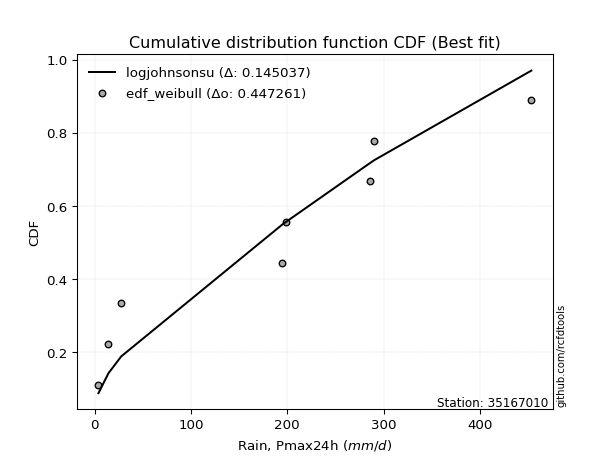</img>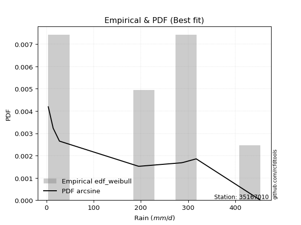</img>

</div>


### 4. EDF Beard (1943)

The Beard formula (or Beard´s plotting position formula) in hydrology is used to estimate the empirical non-exceedance probability _(P)_ of a flood event (or other extreme hydrological data point) within a given dataset.

<div align="center">


$P=(m-0.31)/(n+0.38)$


</div>


**4.1. Empirical values**

<div align="center">

|                | 0                   | 1                   | 2                  | 3                   | 4         | 5                  | 6                  | 7                  | 8                  |
|:---------------|:--------------------|:--------------------|:-------------------|:--------------------|:----------|:-------------------|:-------------------|:-------------------|:-------------------|
| date           | 2022                | 2018                | 2017               | 2019                | 2023      | 2020               | 2021               | 2025               | 2024               |
| x              | 3.9                 | 14.3                | 27.57              | 194.72              | 198.2     | 285.4              | 290.3              | 317.3              | 453.4              |
| m              | 1                   | 2                   | 3                  | 4                   | 5         | 6                  | 7                  | 8                  | 9                  |
| empirical_dist | edf_beard           | edf_beard           | edf_beard          | edf_beard           | edf_beard | edf_beard          | edf_beard          | edf_beard          | edf_beard          |
| empirical      | 0.07356076759061833 | 0.18017057569296374 | 0.2867803837953091 | 0.39339019189765456 | 0.5       | 0.6066098081023454 | 0.7132196162046908 | 0.8198294243070362 | 0.9264392324093815 |
| empirical_tr   | 1.0794016110471807  | 1.2197659297789336  | 1.4020926756352765 | 1.6485061511423549  | 2.0       | 2.542005420054201  | 3.486988847583642  | 5.550295857988164  | 13.5942028985507   |

</div>


**4.2. Kolmogorov-Smirnov fit test (sorted by Δ)**


<div align="center">

|                | 0                   | 1                   | 2                   | 3                   | 4                   | 5                   | 6                   | 7                   | 8                   | 9                   | 10                  | 11                  | 12                  | 13                  | 14                  | 15                  | 16                  | 17                  | 18                  | 19                  | 20                  | 21                  | 22                  | 23                  | 24                  | 25                  | 26                  | 27                  | 28                  | 29                  | 30                  | 31                  | 32                  | 33                  | 34                  | 35                  | 36                  | 37                  | 38                  | 39                  | 40                  | 41                  | 42                  | 43                  | 44                  | 45                  | 46                  | 47                  | 48                  | 49                  | 50                  | 51                  | 52                  | 53                  | 54                  | 55                  | 56                  | 57                  | 58                  | 59                  | 60                  | 61                  | 62                  | 63                  | 64                  | 65                  | 66                  | 67                  | 68                  | 69                  | 70                  | 71                  | 72                  | 73                  | 74                  | 75                  | 76                  | 77                  | 78                  | 79                  | 80                  | 81                  | 82                  | 83                  | 84                  | 85                  | 86                  | 87                  | 88                  | 89                  | 90                  | 91                  | 92                  | 93                  | 94                  | 95                  | 96                  | 97                  | 98                  | 99                  | 100                 | 101                 | 102                 | 103                 | 104                 | 105                 | 106                 | 107                 | 108                 | 109                 | 110                 | 111                 | 112                 | 113                 | 114                 | 115                 | 116                 | 117                 | 118                 | 119                 | 120                 | 121                 | 122                 | 123                 | 124                 | 125                 | 126                 | 127                 | 128                 | 129                 | 130                 | 131                 | 132                 | 133                 | 134                 | 135                 | 136                 | 137                 | 138                 | 139                 | 140                 | 141                 | 142                 | 143                 | 144                 | 145                 | 146                 | 147                 | 148                 | 149                 | 150                 | 151                 | 152                 | 153                 | 154                 | 155                 | 156                 | 157                 | 158                 | 159                 |
|:---------------|:--------------------|:--------------------|:--------------------|:--------------------|:--------------------|:--------------------|:--------------------|:--------------------|:--------------------|:--------------------|:--------------------|:--------------------|:--------------------|:--------------------|:--------------------|:--------------------|:--------------------|:--------------------|:--------------------|:--------------------|:--------------------|:--------------------|:--------------------|:--------------------|:--------------------|:--------------------|:--------------------|:--------------------|:--------------------|:--------------------|:--------------------|:--------------------|:--------------------|:--------------------|:--------------------|:--------------------|:--------------------|:--------------------|:--------------------|:--------------------|:--------------------|:--------------------|:--------------------|:--------------------|:--------------------|:--------------------|:--------------------|:--------------------|:--------------------|:--------------------|:--------------------|:--------------------|:--------------------|:--------------------|:--------------------|:--------------------|:--------------------|:--------------------|:--------------------|:--------------------|:--------------------|:--------------------|:--------------------|:--------------------|:--------------------|:--------------------|:--------------------|:--------------------|:--------------------|:--------------------|:--------------------|:--------------------|:--------------------|:--------------------|:--------------------|:--------------------|:--------------------|:--------------------|:--------------------|:--------------------|:--------------------|:--------------------|:--------------------|:--------------------|:--------------------|:--------------------|:--------------------|:--------------------|:--------------------|:--------------------|:--------------------|:--------------------|:--------------------|:--------------------|:--------------------|:--------------------|:--------------------|:--------------------|:--------------------|:--------------------|:--------------------|:--------------------|:--------------------|:--------------------|:--------------------|:--------------------|:--------------------|:--------------------|:--------------------|:--------------------|:--------------------|:--------------------|:--------------------|:--------------------|:--------------------|:--------------------|:--------------------|:--------------------|:--------------------|:--------------------|:--------------------|:--------------------|:--------------------|:--------------------|:--------------------|:--------------------|:--------------------|:--------------------|:--------------------|:--------------------|:--------------------|:--------------------|:--------------------|:--------------------|:--------------------|:--------------------|:--------------------|:--------------------|:--------------------|:--------------------|:--------------------|:--------------------|:--------------------|:--------------------|:--------------------|:--------------------|:--------------------|:--------------------|:--------------------|:--------------------|:--------------------|:--------------------|:--------------------|:--------------------|:--------------------|:--------------------|:--------------------|:--------------------|:--------------------|:--------------------|
| station        | 35167010            | 35167010            | 35167010            | 35167010            | 35167010            | 35167010            | 35167010            | 35167010            | 35167010            | 35167010            | 35167010            | 35167010            | 35167010            | 35167010            | 35167010            | 35167010            | 35167010            | 35167010            | 35167010            | 35167010            | 35167010            | 35167010            | 35167010            | 35167010            | 35167010            | 35167010            | 35167010            | 35167010            | 35167010            | 35167010            | 35167010            | 35167010            | 35167010            | 35167010            | 35167010            | 35167010            | 35167010            | 35167010            | 35167010            | 35167010            | 35167010            | 35167010            | 35167010            | 35167010            | 35167010            | 35167010            | 35167010            | 35167010            | 35167010            | 35167010            | 35167010            | 35167010            | 35167010            | 35167010            | 35167010            | 35167010            | 35167010            | 35167010            | 35167010            | 35167010            | 35167010            | 35167010            | 35167010            | 35167010            | 35167010            | 35167010            | 35167010            | 35167010            | 35167010            | 35167010            | 35167010            | 35167010            | 35167010            | 35167010            | 35167010            | 35167010            | 35167010            | 35167010            | 35167010            | 35167010            | 35167010            | 35167010            | 35167010            | 35167010            | 35167010            | 35167010            | 35167010            | 35167010            | 35167010            | 35167010            | 35167010            | 35167010            | 35167010            | 35167010            | 35167010            | 35167010            | 35167010            | 35167010            | 35167010            | 35167010            | 35167010            | 35167010            | 35167010            | 35167010            | 35167010            | 35167010            | 35167010            | 35167010            | 35167010            | 35167010            | 35167010            | 35167010            | 35167010            | 35167010            | 35167010            | 35167010            | 35167010            | 35167010            | 35167010            | 35167010            | 35167010            | 35167010            | 35167010            | 35167010            | 35167010            | 35167010            | 35167010            | 35167010            | 35167010            | 35167010            | 35167010            | 35167010            | 35167010            | 35167010            | 35167010            | 35167010            | 35167010            | 35167010            | 35167010            | 35167010            | 35167010            | 35167010            | 35167010            | 35167010            | 35167010            | 35167010            | 35167010            | 35167010            | 35167010            | 35167010            | 35167010            | 35167010            | 35167010            | 35167010            | 35167010            | 35167010            | 35167010            | 35167010            | 35167010            | 35167010            |
| empirical_dist | edf_beard           | edf_beard           | edf_beard           | edf_beard           | edf_beard           | edf_beard           | edf_beard           | edf_beard           | edf_beard           | edf_beard           | edf_beard           | edf_beard           | edf_beard           | edf_beard           | edf_beard           | edf_beard           | edf_beard           | edf_beard           | edf_beard           | edf_beard           | edf_beard           | edf_beard           | edf_beard           | edf_beard           | edf_beard           | edf_beard           | edf_beard           | edf_beard           | edf_beard           | edf_beard           | edf_beard           | edf_beard           | edf_beard           | edf_beard           | edf_beard           | edf_beard           | edf_beard           | edf_beard           | edf_beard           | edf_beard           | edf_beard           | edf_beard           | edf_beard           | edf_beard           | edf_beard           | edf_beard           | edf_beard           | edf_beard           | edf_beard           | edf_beard           | edf_beard           | edf_beard           | edf_beard           | edf_beard           | edf_beard           | edf_beard           | edf_beard           | edf_beard           | edf_beard           | edf_beard           | edf_beard           | edf_beard           | edf_beard           | edf_beard           | edf_beard           | edf_beard           | edf_beard           | edf_beard           | edf_beard           | edf_beard           | edf_beard           | edf_beard           | edf_beard           | edf_beard           | edf_beard           | edf_beard           | edf_beard           | edf_beard           | edf_beard           | edf_beard           | edf_beard           | edf_beard           | edf_beard           | edf_beard           | edf_beard           | edf_beard           | edf_beard           | edf_beard           | edf_beard           | edf_beard           | edf_beard           | edf_beard           | edf_beard           | edf_beard           | edf_beard           | edf_beard           | edf_beard           | edf_beard           | edf_beard           | edf_beard           | edf_beard           | edf_beard           | edf_beard           | edf_beard           | edf_beard           | edf_beard           | edf_beard           | edf_beard           | edf_beard           | edf_beard           | edf_beard           | edf_beard           | edf_beard           | edf_beard           | edf_beard           | edf_beard           | edf_beard           | edf_beard           | edf_beard           | edf_beard           | edf_beard           | edf_beard           | edf_beard           | edf_beard           | edf_beard           | edf_beard           | edf_beard           | edf_beard           | edf_beard           | edf_beard           | edf_beard           | edf_beard           | edf_beard           | edf_beard           | edf_beard           | edf_beard           | edf_beard           | edf_beard           | edf_beard           | edf_beard           | edf_beard           | edf_beard           | edf_beard           | edf_beard           | edf_beard           | edf_beard           | edf_beard           | edf_beard           | edf_beard           | edf_beard           | edf_beard           | edf_beard           | edf_beard           | edf_beard           | edf_beard           | edf_beard           | edf_beard           | edf_beard           | edf_beard           | edf_beard           |
| p_dist         | ksone               | logjohnsonsu        | arcsine             | semicircular        | loggenextreme       | anglit              | gausshyper          | burr                | genextreme          | foldnorm            | dweibull            | t                   | norm                | truncnorm           | exponnorm           | skewnorm            | pearson3            | gamma               | dgamma              | erlang              | johnsonsu           | genlogistic         | invweibull          | nct                 | invgamma            | gumbel_l            | maxwell             | loglevy_l           | rayleigh            | cosine              | kstwobign           | loggennorm          | logistic            | argus               | invgauss            | logvonmises_line    | logweibull_max      | logmielke           | hypsecant           | truncexpon          | rice                | logloggamma         | laplace             | bradford            | nakagami            | logburr             | exponpow            | logtrapezoid        | triang              | gumbel_r            | halfnorm            | logargus            | logexponpow         | logarcsine          | gompertz            | logdgamma           | kappa4              | loggenpareto        | wrapcauchy          | genpareto           | logburr12           | kappa3              | lomax               | tukeylambda         | mielke              | moyal               | gengamma            | logpearson3         | uniform             | ncf                 | loggumbel_l         | exponweib           | genexpon            | logweibull_min      | loggengamma         | logloglaplace       | alpha               | logdweibull         | logsemicircular     | weibull_min         | loggompertz         | logexponweib        | loganglit           | vonmises_line       | logbeta             | genhalflogistic     | lognakagami         | halflogistic        | f                   | logwrapcauchy       | logf                | logbetaprime        | loginvgauss         | logt                | logcrystalball      | lognorm             | logexponnorm        | truncweibull_min    | lognct              | loginvweibull       | logfatiguelife      | logrice             | halfgennorm         | loggamma            | loggamma            | loginvgamma         | logerlang           | logncf              | logfoldnorm         | wald                | logalpha            | loggenhalflogistic  | loglomax            | logmaxwell          | loglogistic         | logkstwobign        | lograyleigh         | beta                | logskewnorm         | burr12              | loghypsecant        | loggausshyper       | logcosine           | gennorm             | loghalfnorm         | loggenexpon         | loghalfgennorm      | levy_l              | loggumbel_r         | loglaplace          | loglaplace          | fatiguelife         | betaprime           | logtriang           | loghalflogistic     | logmoyal            | trapezoid           | logksone            | logjohnsonsb        | logkappa4           | logtruncweibull_min | logwald             | logkappa3           | loguniform          | crystalball         | powerlaw            | logtruncexpon       | logbradford         | logtruncnorm        | johnsonsb           | rdist               | logpowerlaw         | truncpareto         | weibull_max         | logtukeylambda      | logrdist            | logtruncpareto      | loggenlogistic      | logvonmises         | vonmises            |
| delta          | 0.12075692504835897 | 0.12279539156591623 | 0.12683084413448797 | 0.13332519012847288 | 0.138817714624216   | 0.1422927361374424  | 0.15321256131372651 | 0.15852336444847026 | 0.1608462422825018  | 0.16144890178078664 | 0.16227075740234836 | 0.1630654632219063  | 0.16312963293833527 | 0.16312963845703266 | 0.1631308506457293  | 0.1631533745340875  | 0.1636077905279788  | 0.1636478978845208  | 0.16377399675221138 | 0.16378969042461422 | 0.16396693529183204 | 0.16439494644046515 | 0.16468192611556848 | 0.16519760805086192 | 0.1672020966383344  | 0.16723032347652883 | 0.16773768909391462 | 0.16947627544867197 | 0.17131399569859682 | 0.1726444821680556  | 0.17277238187031407 | 0.17445447819076187 | 0.1775315054786567  | 0.18035187356799187 | 0.18066449169788046 | 0.18093860184809196 | 0.18341714130739972 | 0.18355387168397763 | 0.18424846882109397 | 0.18484945388636687 | 0.1851542303024336  | 0.18715724163012915 | 0.18941566897604634 | 0.18967981233260328 | 0.19811162601937926 | 0.1998760016735418  | 0.20080519345956727 | 0.2014088416102212  | 0.2020745314026502  | 0.20269290747434324 | 0.20674676584056853 | 0.20755870951597744 | 0.208095008034615   | 0.20817704372743606 | 0.21110442344919328 | 0.21337399286021758 | 0.21397557693717442 | 0.22097374848592177 | 0.22250501249678145 | 0.2264748927630945  | 0.22751836349618138 | 0.22759457049476242 | 0.22871895009286514 | 0.2287672573870183  | 0.22893063120022628 | 0.2313185547846332  | 0.231907084373429   | 0.23283371838314593 | 0.2341218743403592  | 0.23553193953827178 | 0.2357015657230822  | 0.23604904778621427 | 0.23898104449487623 | 0.23963676000071854 | 0.24369780359065407 | 0.24390702167049105 | 0.24577703904344128 | 0.2465830929536258  | 0.24665653053178782 | 0.25148206649303156 | 0.2529611568881316  | 0.25392475126707736 | 0.2559444322413944  | 0.25699203567842777 | 0.2610746394413872  | 0.26798783623190536 | 0.2680063121390869  | 0.2702293105946924  | 0.27156181984986405 | 0.2760597047642557  | 0.2770079629016864  | 0.27714253038141345 | 0.27770152567158857 | 0.2779557751135595  | 0.2779560843963289  | 0.27795612075805054 | 0.2779583752074547  | 0.2780555908741419  | 0.27817039614310346 | 0.2782695645455273  | 0.27849026562874524 | 0.2808565299257162  | 0.2810634920334838  | 0.2820258100700507  | 0.2820258100700507  | 0.2847755843244323  | 0.2848040984856687  | 0.28498537993562223 | 0.285132150565962   | 0.2867803837953091  | 0.28896318601805815 | 0.29025380014008595 | 0.2952236209627712  | 0.2972390565022396  | 0.2975807969486455  | 0.29760562970997273 | 0.3029647604654768  | 0.30667077834918244 | 0.3099612643745917  | 0.3107831869016866  | 0.31238655429880435 | 0.31429194068810307 | 0.31881883356995167 | 0.31982942430703626 | 0.3198756615708467  | 0.3271397392434845  | 0.32922156831320304 | 0.33118338159982474 | 0.33432692537062925 | 0.33961874624764965 | 0.33961874624764965 | 0.34429618111345883 | 0.3449499706633269  | 0.34605784343729606 | 0.3475635679728558  | 0.3527741332042934  | 0.3733990808437624  | 0.37517443245374993 | 0.38146838093010516 | 0.3854999928898195  | 0.3954902445459588  | 0.40569736012427327 | 0.42849338115602353 | 0.4288873573240308  | 0.43299672148333046 | 0.4666504119291506  | 0.4672642870489251  | 0.4690549421478255  | 0.4820451494733613  | 0.5009098681107895  | 0.5611094414572322  | 0.5690913260989596  | 0.5864585200157135  | 0.6712676020165015  | 0.7131554115956091  | 0.7132196161755228  | 0.7404437738095666  | 0.8198294243070362  | 0.9958719848606516  | 71.22430629906606   |
| deltao         | 0.41761268023100007 | 0.41761268023100007 | 0.41761268023100007 | 0.41761268023100007 | 0.41761268023100007 | 0.41761268023100007 | 0.41761268023100007 | 0.41761268023100007 | 0.41761268023100007 | 0.41761268023100007 | 0.41761268023100007 | 0.41761268023100007 | 0.41761268023100007 | 0.41761268023100007 | 0.41761268023100007 | 0.41761268023100007 | 0.41761268023100007 | 0.41761268023100007 | 0.41761268023100007 | 0.41761268023100007 | 0.41761268023100007 | 0.41761268023100007 | 0.41761268023100007 | 0.41761268023100007 | 0.41761268023100007 | 0.41761268023100007 | 0.41761268023100007 | 0.41761268023100007 | 0.41761268023100007 | 0.41761268023100007 | 0.41761268023100007 | 0.41761268023100007 | 0.41761268023100007 | 0.41761268023100007 | 0.41761268023100007 | 0.41761268023100007 | 0.41761268023100007 | 0.41761268023100007 | 0.41761268023100007 | 0.41761268023100007 | 0.41761268023100007 | 0.41761268023100007 | 0.41761268023100007 | 0.41761268023100007 | 0.41761268023100007 | 0.41761268023100007 | 0.41761268023100007 | 0.41761268023100007 | 0.41761268023100007 | 0.41761268023100007 | 0.41761268023100007 | 0.41761268023100007 | 0.41761268023100007 | 0.41761268023100007 | 0.41761268023100007 | 0.41761268023100007 | 0.41761268023100007 | 0.41761268023100007 | 0.41761268023100007 | 0.41761268023100007 | 0.41761268023100007 | 0.41761268023100007 | 0.41761268023100007 | 0.41761268023100007 | 0.41761268023100007 | 0.41761268023100007 | 0.41761268023100007 | 0.41761268023100007 | 0.41761268023100007 | 0.41761268023100007 | 0.41761268023100007 | 0.41761268023100007 | 0.41761268023100007 | 0.41761268023100007 | 0.41761268023100007 | 0.41761268023100007 | 0.41761268023100007 | 0.41761268023100007 | 0.41761268023100007 | 0.41761268023100007 | 0.41761268023100007 | 0.41761268023100007 | 0.41761268023100007 | 0.41761268023100007 | 0.41761268023100007 | 0.41761268023100007 | 0.41761268023100007 | 0.41761268023100007 | 0.41761268023100007 | 0.41761268023100007 | 0.41761268023100007 | 0.41761268023100007 | 0.41761268023100007 | 0.41761268023100007 | 0.41761268023100007 | 0.41761268023100007 | 0.41761268023100007 | 0.41761268023100007 | 0.41761268023100007 | 0.41761268023100007 | 0.41761268023100007 | 0.41761268023100007 | 0.41761268023100007 | 0.41761268023100007 | 0.41761268023100007 | 0.41761268023100007 | 0.41761268023100007 | 0.41761268023100007 | 0.41761268023100007 | 0.41761268023100007 | 0.41761268023100007 | 0.41761268023100007 | 0.41761268023100007 | 0.41761268023100007 | 0.41761268023100007 | 0.41761268023100007 | 0.41761268023100007 | 0.41761268023100007 | 0.41761268023100007 | 0.41761268023100007 | 0.41761268023100007 | 0.41761268023100007 | 0.41761268023100007 | 0.41761268023100007 | 0.41761268023100007 | 0.41761268023100007 | 0.41761268023100007 | 0.41761268023100007 | 0.41761268023100007 | 0.41761268023100007 | 0.41761268023100007 | 0.41761268023100007 | 0.41761268023100007 | 0.41761268023100007 | 0.41761268023100007 | 0.41761268023100007 | 0.41761268023100007 | 0.41761268023100007 | 0.41761268023100007 | 0.41761268023100007 | 0.41761268023100007 | 0.41761268023100007 | 0.41761268023100007 | 0.41761268023100007 | 0.41761268023100007 | 0.41761268023100007 | 0.41761268023100007 | 0.41761268023100007 | 0.41761268023100007 | 0.41761268023100007 | 0.41761268023100007 | 0.41761268023100007 | 0.41761268023100007 | 0.41761268023100007 | 0.41761268023100007 | 0.41761268023100007 | 0.41761268023100007 | 0.41761268023100007 | 0.41761268023100007 | 0.41761268023100007 |
| eval           | Δo > Δ              | Δo > Δ              | Δo > Δ              | Δo > Δ              | Δo > Δ              | Δo > Δ              | Δo > Δ              | Δo > Δ              | Δo > Δ              | Δo > Δ              | Δo > Δ              | Δo > Δ              | Δo > Δ              | Δo > Δ              | Δo > Δ              | Δo > Δ              | Δo > Δ              | Δo > Δ              | Δo > Δ              | Δo > Δ              | Δo > Δ              | Δo > Δ              | Δo > Δ              | Δo > Δ              | Δo > Δ              | Δo > Δ              | Δo > Δ              | Δo > Δ              | Δo > Δ              | Δo > Δ              | Δo > Δ              | Δo > Δ              | Δo > Δ              | Δo > Δ              | Δo > Δ              | Δo > Δ              | Δo > Δ              | Δo > Δ              | Δo > Δ              | Δo > Δ              | Δo > Δ              | Δo > Δ              | Δo > Δ              | Δo > Δ              | Δo > Δ              | Δo > Δ              | Δo > Δ              | Δo > Δ              | Δo > Δ              | Δo > Δ              | Δo > Δ              | Δo > Δ              | Δo > Δ              | Δo > Δ              | Δo > Δ              | Δo > Δ              | Δo > Δ              | Δo > Δ              | Δo > Δ              | Δo > Δ              | Δo > Δ              | Δo > Δ              | Δo > Δ              | Δo > Δ              | Δo > Δ              | Δo > Δ              | Δo > Δ              | Δo > Δ              | Δo > Δ              | Δo > Δ              | Δo > Δ              | Δo > Δ              | Δo > Δ              | Δo > Δ              | Δo > Δ              | Δo > Δ              | Δo > Δ              | Δo > Δ              | Δo > Δ              | Δo > Δ              | Δo > Δ              | Δo > Δ              | Δo > Δ              | Δo > Δ              | Δo > Δ              | Δo > Δ              | Δo > Δ              | Δo > Δ              | Δo > Δ              | Δo > Δ              | Δo > Δ              | Δo > Δ              | Δo > Δ              | Δo > Δ              | Δo > Δ              | Δo > Δ              | Δo > Δ              | Δo > Δ              | Δo > Δ              | Δo > Δ              | Δo > Δ              | Δo > Δ              | Δo > Δ              | Δo > Δ              | Δo > Δ              | Δo > Δ              | Δo > Δ              | Δo > Δ              | Δo > Δ              | Δo > Δ              | Δo > Δ              | Δo > Δ              | Δo > Δ              | Δo > Δ              | Δo > Δ              | Δo > Δ              | Δo > Δ              | Δo > Δ              | Δo > Δ              | Δo > Δ              | Δo > Δ              | Δo > Δ              | Δo > Δ              | Δo > Δ              | Δo > Δ              | Δo > Δ              | Δo > Δ              | Δo > Δ              | Δo > Δ              | Δo > Δ              | Δo > Δ              | Δo > Δ              | Δo > Δ              | Δo > Δ              | Δo > Δ              | Δo > Δ              | Δo > Δ              | Δo > Δ              | Δo > Δ              | Δo > Δ              | Δo > Δ              | Δo > Δ              | Δo <= Δ             | Δo <= Δ             | Δo <= Δ             | Δo <= Δ             | Δo <= Δ             | Δo <= Δ             | Δo <= Δ             | Δo <= Δ             | Δo <= Δ             | Δo <= Δ             | Δo <= Δ             | Δo <= Δ             | Δo <= Δ             | Δo <= Δ             | Δo <= Δ             | Δo <= Δ             | Δo <= Δ             | Δo <= Δ             |
| fit            | 1                   | 1                   | 1                   | 1                   | 1                   | 1                   | 1                   | 1                   | 1                   | 1                   | 1                   | 1                   | 1                   | 1                   | 1                   | 1                   | 1                   | 1                   | 1                   | 1                   | 1                   | 1                   | 1                   | 1                   | 1                   | 1                   | 1                   | 1                   | 1                   | 1                   | 1                   | 1                   | 1                   | 1                   | 1                   | 1                   | 1                   | 1                   | 1                   | 1                   | 1                   | 1                   | 1                   | 1                   | 1                   | 1                   | 1                   | 1                   | 1                   | 1                   | 1                   | 1                   | 1                   | 1                   | 1                   | 1                   | 1                   | 1                   | 1                   | 1                   | 1                   | 1                   | 1                   | 1                   | 1                   | 1                   | 1                   | 1                   | 1                   | 1                   | 1                   | 1                   | 1                   | 1                   | 1                   | 1                   | 1                   | 1                   | 1                   | 1                   | 1                   | 1                   | 1                   | 1                   | 1                   | 1                   | 1                   | 1                   | 1                   | 1                   | 1                   | 1                   | 1                   | 1                   | 1                   | 1                   | 1                   | 1                   | 1                   | 1                   | 1                   | 1                   | 1                   | 1                   | 1                   | 1                   | 1                   | 1                   | 1                   | 1                   | 1                   | 1                   | 1                   | 1                   | 1                   | 1                   | 1                   | 1                   | 1                   | 1                   | 1                   | 1                   | 1                   | 1                   | 1                   | 1                   | 1                   | 1                   | 1                   | 1                   | 1                   | 1                   | 1                   | 1                   | 1                   | 1                   | 1                   | 1                   | 1                   | 1                   | 1                   | 1                   | 0                   | 0                   | 0                   | 0                   | 0                   | 0                   | 0                   | 0                   | 0                   | 0                   | 0                   | 0                   | 0                   | 0                   | 0                   | 0                   | 0                   | 0                   |
| n              | 9                   | 9                   | 9                   | 9                   | 9                   | 9                   | 9                   | 9                   | 9                   | 9                   | 9                   | 9                   | 9                   | 9                   | 9                   | 9                   | 9                   | 9                   | 9                   | 9                   | 9                   | 9                   | 9                   | 9                   | 9                   | 9                   | 9                   | 9                   | 9                   | 9                   | 9                   | 9                   | 9                   | 9                   | 9                   | 9                   | 9                   | 9                   | 9                   | 9                   | 9                   | 9                   | 9                   | 9                   | 9                   | 9                   | 9                   | 9                   | 9                   | 9                   | 9                   | 9                   | 9                   | 9                   | 9                   | 9                   | 9                   | 9                   | 9                   | 9                   | 9                   | 9                   | 9                   | 9                   | 9                   | 9                   | 9                   | 9                   | 9                   | 9                   | 9                   | 9                   | 9                   | 9                   | 9                   | 9                   | 9                   | 9                   | 9                   | 9                   | 9                   | 9                   | 9                   | 9                   | 9                   | 9                   | 9                   | 9                   | 9                   | 9                   | 9                   | 9                   | 9                   | 9                   | 9                   | 9                   | 9                   | 9                   | 9                   | 9                   | 9                   | 9                   | 9                   | 9                   | 9                   | 9                   | 9                   | 9                   | 9                   | 9                   | 9                   | 9                   | 9                   | 9                   | 9                   | 9                   | 9                   | 9                   | 9                   | 9                   | 9                   | 9                   | 9                   | 9                   | 9                   | 9                   | 9                   | 9                   | 9                   | 9                   | 9                   | 9                   | 9                   | 9                   | 9                   | 9                   | 9                   | 9                   | 9                   | 9                   | 9                   | 9                   | 9                   | 9                   | 9                   | 9                   | 9                   | 9                   | 9                   | 9                   | 9                   | 9                   | 9                   | 9                   | 9                   | 9                   | 9                   | 9                   | 9                   | 9                   |
| best_fit       | 1                   | 0                   | 0                   | 0                   | 0                   | 0                   | 0                   | 0                   | 0                   | 0                   | 0                   | 0                   | 0                   | 0                   | 0                   | 0                   | 0                   | 0                   | 0                   | 0                   | 0                   | 0                   | 0                   | 0                   | 0                   | 0                   | 0                   | 0                   | 0                   | 0                   | 0                   | 0                   | 0                   | 0                   | 0                   | 0                   | 0                   | 0                   | 0                   | 0                   | 0                   | 0                   | 0                   | 0                   | 0                   | 0                   | 0                   | 0                   | 0                   | 0                   | 0                   | 0                   | 0                   | 0                   | 0                   | 0                   | 0                   | 0                   | 0                   | 0                   | 0                   | 0                   | 0                   | 0                   | 0                   | 0                   | 0                   | 0                   | 0                   | 0                   | 0                   | 0                   | 0                   | 0                   | 0                   | 0                   | 0                   | 0                   | 0                   | 0                   | 0                   | 0                   | 0                   | 0                   | 0                   | 0                   | 0                   | 0                   | 0                   | 0                   | 0                   | 0                   | 0                   | 0                   | 0                   | 0                   | 0                   | 0                   | 0                   | 0                   | 0                   | 0                   | 0                   | 0                   | 0                   | 0                   | 0                   | 0                   | 0                   | 0                   | 0                   | 0                   | 0                   | 0                   | 0                   | 0                   | 0                   | 0                   | 0                   | 0                   | 0                   | 0                   | 0                   | 0                   | 0                   | 0                   | 0                   | 0                   | 0                   | 0                   | 0                   | 0                   | 0                   | 0                   | 0                   | 0                   | 0                   | 0                   | 0                   | 0                   | 0                   | 0                   | 0                   | 0                   | 0                   | 0                   | 0                   | 0                   | 0                   | 0                   | 0                   | 0                   | 0                   | 0                   | 0                   | 0                   | 0                   | 0                   | 0                   | 0                   |
| best_fit_sort  | 1                   | 2                   | 3                   | 4                   | 5                   | 6                   | 7                   | 8                   | 9                   | 10                  | 11                  | 12                  | 13                  | 14                  | 15                  | 16                  | 17                  | 18                  | 19                  | 20                  | 21                  | 22                  | 23                  | 24                  | 25                  | 26                  | 27                  | 28                  | 29                  | 30                  | 31                  | 32                  | 33                  | 34                  | 35                  | 36                  | 37                  | 38                  | 39                  | 40                  | 41                  | 42                  | 43                  | 44                  | 45                  | 46                  | 47                  | 48                  | 49                  | 50                  | 51                  | 52                  | 53                  | 54                  | 55                  | 56                  | 57                  | 58                  | 59                  | 60                  | 61                  | 62                  | 63                  | 64                  | 65                  | 66                  | 67                  | 68                  | 69                  | 70                  | 71                  | 72                  | 73                  | 74                  | 75                  | 76                  | 77                  | 78                  | 79                  | 80                  | 81                  | 82                  | 83                  | 84                  | 85                  | 86                  | 87                  | 88                  | 89                  | 90                  | 91                  | 92                  | 93                  | 94                  | 95                  | 96                  | 97                  | 98                  | 99                  | 100                 | 101                 | 102                 | 103                 | 104                 | 105                 | 106                 | 107                 | 108                 | 109                 | 110                 | 111                 | 112                 | 113                 | 114                 | 115                 | 116                 | 117                 | 118                 | 119                 | 120                 | 121                 | 122                 | 123                 | 124                 | 125                 | 126                 | 127                 | 128                 | 129                 | 130                 | 131                 | 132                 | 133                 | 134                 | 135                 | 136                 | 137                 | 138                 | 139                 | 140                 | 141                 | 142                 | 143                 | 144                 | 145                 | 146                 | 147                 | 148                 | 149                 | 150                 | 151                 | 152                 | 153                 | 154                 | 155                 | 156                 | 157                 | 158                 | 159                 | 160                 |

</div>


**4.3. Best fit**

<div align="center">

|   id |   station | empirical_dist   | p_dist   |    delta |   deltao | eval   |   fit |   n |   best_fit |   best_fit_sort |
|-----:|----------:|:-----------------|:---------|---------:|---------:|:-------|------:|----:|-----------:|----------------:|
|    0 |  35167010 | edf_beard        | ksone    | 0.120757 | 0.417613 | Δo > Δ |     1 |   9 |          1 |               1 |

</div>


<div align="center">

</img>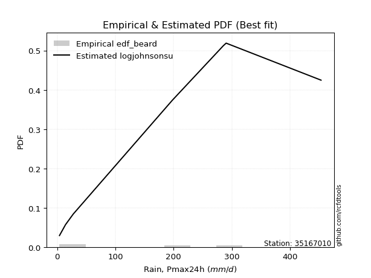</img>

</div>


### 5. EDF Chegodayev (1955)

The Chegodayev formula is an empirical plotting position formula used in hydrological frequency analysis to estimate the exceedance probability or return period of a specific event from a set of observed data. It is primarily used for plotting observed data points on probability paper to fit a theoretical distribution, particularly for analyzing extreme events like maximum flood flows or rainfall intensities. The constant _b_ value in the generalized plotting position formula is 0.3.

<div align="center">


$P=(m-b)/(n+1-2b)$


</div>


**5.1. Empirical values**

<div align="center">

|                | 0                   | 1                   | 2                  | 3                   | 4              | 5                  | 6                  | 7                  | 8                  |
|:---------------|:--------------------|:--------------------|:-------------------|:--------------------|:---------------|:-------------------|:-------------------|:-------------------|:-------------------|
| date           | 2022                | 2018                | 2017               | 2019                | 2023           | 2020               | 2021               | 2025               | 2024               |
| x              | 3.9                 | 14.3                | 27.57              | 194.72              | 198.2          | 285.4              | 290.3              | 317.3              | 453.4              |
| m              | 1                   | 2                   | 3                  | 4                   | 5              | 6                  | 7                  | 8                  | 9                  |
| empirical_dist | edf_chegodayev      | edf_chegodayev      | edf_chegodayev     | edf_chegodayev      | edf_chegodayev | edf_chegodayev     | edf_chegodayev     | edf_chegodayev     | edf_chegodayev     |
| empirical      | 0.07446808510638298 | 0.18085106382978722 | 0.2872340425531915 | 0.39361702127659576 | 0.5            | 0.6063829787234043 | 0.7127659574468085 | 0.8191489361702128 | 0.9255319148936169 |
| empirical_tr   | 1.0804597701149425  | 1.2207792207792207  | 1.4029850746268657 | 1.6491228070175437  | 2.0            | 2.540540540540541  | 3.481481481481481  | 5.529411764705883  | 13.428571428571399 |

</div>


**5.2. Kolmogorov-Smirnov fit test (sorted by Δ)**


<div align="center">

|                | 0                   | 1                   | 2                   | 3                   | 4                   | 5                   | 6                   | 7                   | 8                   | 9                   | 10                  | 11                  | 12                  | 13                  | 14                  | 15                  | 16                  | 17                  | 18                  | 19                  | 20                  | 21                  | 22                  | 23                  | 24                  | 25                  | 26                  | 27                  | 28                  | 29                  | 30                  | 31                  | 32                  | 33                  | 34                  | 35                  | 36                  | 37                  | 38                  | 39                  | 40                  | 41                  | 42                  | 43                  | 44                  | 45                  | 46                  | 47                  | 48                  | 49                  | 50                  | 51                  | 52                  | 53                  | 54                  | 55                  | 56                  | 57                  | 58                  | 59                  | 60                  | 61                  | 62                  | 63                  | 64                  | 65                  | 66                  | 67                  | 68                  | 69                  | 70                  | 71                  | 72                  | 73                  | 74                  | 75                  | 76                  | 77                  | 78                  | 79                  | 80                  | 81                  | 82                  | 83                  | 84                  | 85                  | 86                  | 87                  | 88                  | 89                  | 90                  | 91                  | 92                  | 93                  | 94                  | 95                  | 96                  | 97                  | 98                  | 99                  | 100                 | 101                 | 102                 | 103                 | 104                 | 105                 | 106                 | 107                 | 108                 | 109                 | 110                 | 111                 | 112                 | 113                 | 114                 | 115                 | 116                 | 117                 | 118                 | 119                 | 120                 | 121                 | 122                 | 123                 | 124                 | 125                 | 126                 | 127                 | 128                 | 129                 | 130                 | 131                 | 132                 | 133                 | 134                 | 135                 | 136                 | 137                 | 138                 | 139                 | 140                 | 141                 | 142                 | 143                 | 144                 | 145                 | 146                 | 147                 | 148                 | 149                 | 150                 | 151                 | 152                 | 153                 | 154                 | 155                 | 156                 | 157                 | 158                 | 159                 |
|:---------------|:--------------------|:--------------------|:--------------------|:--------------------|:--------------------|:--------------------|:--------------------|:--------------------|:--------------------|:--------------------|:--------------------|:--------------------|:--------------------|:--------------------|:--------------------|:--------------------|:--------------------|:--------------------|:--------------------|:--------------------|:--------------------|:--------------------|:--------------------|:--------------------|:--------------------|:--------------------|:--------------------|:--------------------|:--------------------|:--------------------|:--------------------|:--------------------|:--------------------|:--------------------|:--------------------|:--------------------|:--------------------|:--------------------|:--------------------|:--------------------|:--------------------|:--------------------|:--------------------|:--------------------|:--------------------|:--------------------|:--------------------|:--------------------|:--------------------|:--------------------|:--------------------|:--------------------|:--------------------|:--------------------|:--------------------|:--------------------|:--------------------|:--------------------|:--------------------|:--------------------|:--------------------|:--------------------|:--------------------|:--------------------|:--------------------|:--------------------|:--------------------|:--------------------|:--------------------|:--------------------|:--------------------|:--------------------|:--------------------|:--------------------|:--------------------|:--------------------|:--------------------|:--------------------|:--------------------|:--------------------|:--------------------|:--------------------|:--------------------|:--------------------|:--------------------|:--------------------|:--------------------|:--------------------|:--------------------|:--------------------|:--------------------|:--------------------|:--------------------|:--------------------|:--------------------|:--------------------|:--------------------|:--------------------|:--------------------|:--------------------|:--------------------|:--------------------|:--------------------|:--------------------|:--------------------|:--------------------|:--------------------|:--------------------|:--------------------|:--------------------|:--------------------|:--------------------|:--------------------|:--------------------|:--------------------|:--------------------|:--------------------|:--------------------|:--------------------|:--------------------|:--------------------|:--------------------|:--------------------|:--------------------|:--------------------|:--------------------|:--------------------|:--------------------|:--------------------|:--------------------|:--------------------|:--------------------|:--------------------|:--------------------|:--------------------|:--------------------|:--------------------|:--------------------|:--------------------|:--------------------|:--------------------|:--------------------|:--------------------|:--------------------|:--------------------|:--------------------|:--------------------|:--------------------|:--------------------|:--------------------|:--------------------|:--------------------|:--------------------|:--------------------|:--------------------|:--------------------|:--------------------|:--------------------|:--------------------|:--------------------|
| station        | 35167010            | 35167010            | 35167010            | 35167010            | 35167010            | 35167010            | 35167010            | 35167010            | 35167010            | 35167010            | 35167010            | 35167010            | 35167010            | 35167010            | 35167010            | 35167010            | 35167010            | 35167010            | 35167010            | 35167010            | 35167010            | 35167010            | 35167010            | 35167010            | 35167010            | 35167010            | 35167010            | 35167010            | 35167010            | 35167010            | 35167010            | 35167010            | 35167010            | 35167010            | 35167010            | 35167010            | 35167010            | 35167010            | 35167010            | 35167010            | 35167010            | 35167010            | 35167010            | 35167010            | 35167010            | 35167010            | 35167010            | 35167010            | 35167010            | 35167010            | 35167010            | 35167010            | 35167010            | 35167010            | 35167010            | 35167010            | 35167010            | 35167010            | 35167010            | 35167010            | 35167010            | 35167010            | 35167010            | 35167010            | 35167010            | 35167010            | 35167010            | 35167010            | 35167010            | 35167010            | 35167010            | 35167010            | 35167010            | 35167010            | 35167010            | 35167010            | 35167010            | 35167010            | 35167010            | 35167010            | 35167010            | 35167010            | 35167010            | 35167010            | 35167010            | 35167010            | 35167010            | 35167010            | 35167010            | 35167010            | 35167010            | 35167010            | 35167010            | 35167010            | 35167010            | 35167010            | 35167010            | 35167010            | 35167010            | 35167010            | 35167010            | 35167010            | 35167010            | 35167010            | 35167010            | 35167010            | 35167010            | 35167010            | 35167010            | 35167010            | 35167010            | 35167010            | 35167010            | 35167010            | 35167010            | 35167010            | 35167010            | 35167010            | 35167010            | 35167010            | 35167010            | 35167010            | 35167010            | 35167010            | 35167010            | 35167010            | 35167010            | 35167010            | 35167010            | 35167010            | 35167010            | 35167010            | 35167010            | 35167010            | 35167010            | 35167010            | 35167010            | 35167010            | 35167010            | 35167010            | 35167010            | 35167010            | 35167010            | 35167010            | 35167010            | 35167010            | 35167010            | 35167010            | 35167010            | 35167010            | 35167010            | 35167010            | 35167010            | 35167010            | 35167010            | 35167010            | 35167010            | 35167010            | 35167010            | 35167010            |
| empirical_dist | edf_chegodayev      | edf_chegodayev      | edf_chegodayev      | edf_chegodayev      | edf_chegodayev      | edf_chegodayev      | edf_chegodayev      | edf_chegodayev      | edf_chegodayev      | edf_chegodayev      | edf_chegodayev      | edf_chegodayev      | edf_chegodayev      | edf_chegodayev      | edf_chegodayev      | edf_chegodayev      | edf_chegodayev      | edf_chegodayev      | edf_chegodayev      | edf_chegodayev      | edf_chegodayev      | edf_chegodayev      | edf_chegodayev      | edf_chegodayev      | edf_chegodayev      | edf_chegodayev      | edf_chegodayev      | edf_chegodayev      | edf_chegodayev      | edf_chegodayev      | edf_chegodayev      | edf_chegodayev      | edf_chegodayev      | edf_chegodayev      | edf_chegodayev      | edf_chegodayev      | edf_chegodayev      | edf_chegodayev      | edf_chegodayev      | edf_chegodayev      | edf_chegodayev      | edf_chegodayev      | edf_chegodayev      | edf_chegodayev      | edf_chegodayev      | edf_chegodayev      | edf_chegodayev      | edf_chegodayev      | edf_chegodayev      | edf_chegodayev      | edf_chegodayev      | edf_chegodayev      | edf_chegodayev      | edf_chegodayev      | edf_chegodayev      | edf_chegodayev      | edf_chegodayev      | edf_chegodayev      | edf_chegodayev      | edf_chegodayev      | edf_chegodayev      | edf_chegodayev      | edf_chegodayev      | edf_chegodayev      | edf_chegodayev      | edf_chegodayev      | edf_chegodayev      | edf_chegodayev      | edf_chegodayev      | edf_chegodayev      | edf_chegodayev      | edf_chegodayev      | edf_chegodayev      | edf_chegodayev      | edf_chegodayev      | edf_chegodayev      | edf_chegodayev      | edf_chegodayev      | edf_chegodayev      | edf_chegodayev      | edf_chegodayev      | edf_chegodayev      | edf_chegodayev      | edf_chegodayev      | edf_chegodayev      | edf_chegodayev      | edf_chegodayev      | edf_chegodayev      | edf_chegodayev      | edf_chegodayev      | edf_chegodayev      | edf_chegodayev      | edf_chegodayev      | edf_chegodayev      | edf_chegodayev      | edf_chegodayev      | edf_chegodayev      | edf_chegodayev      | edf_chegodayev      | edf_chegodayev      | edf_chegodayev      | edf_chegodayev      | edf_chegodayev      | edf_chegodayev      | edf_chegodayev      | edf_chegodayev      | edf_chegodayev      | edf_chegodayev      | edf_chegodayev      | edf_chegodayev      | edf_chegodayev      | edf_chegodayev      | edf_chegodayev      | edf_chegodayev      | edf_chegodayev      | edf_chegodayev      | edf_chegodayev      | edf_chegodayev      | edf_chegodayev      | edf_chegodayev      | edf_chegodayev      | edf_chegodayev      | edf_chegodayev      | edf_chegodayev      | edf_chegodayev      | edf_chegodayev      | edf_chegodayev      | edf_chegodayev      | edf_chegodayev      | edf_chegodayev      | edf_chegodayev      | edf_chegodayev      | edf_chegodayev      | edf_chegodayev      | edf_chegodayev      | edf_chegodayev      | edf_chegodayev      | edf_chegodayev      | edf_chegodayev      | edf_chegodayev      | edf_chegodayev      | edf_chegodayev      | edf_chegodayev      | edf_chegodayev      | edf_chegodayev      | edf_chegodayev      | edf_chegodayev      | edf_chegodayev      | edf_chegodayev      | edf_chegodayev      | edf_chegodayev      | edf_chegodayev      | edf_chegodayev      | edf_chegodayev      | edf_chegodayev      | edf_chegodayev      | edf_chegodayev      | edf_chegodayev      | edf_chegodayev      | edf_chegodayev      |
| p_dist         | ksone               | logjohnsonsu        | arcsine             | semicircular        | loggenextreme       | anglit              | gausshyper          | burr                | genextreme          | foldnorm            | dweibull            | t                   | norm                | truncnorm           | exponnorm           | skewnorm            | pearson3            | dgamma              | gamma               | erlang              | johnsonsu           | genlogistic         | invweibull          | nct                 | invgamma            | gumbel_l            | maxwell             | loglevy_l           | rayleigh            | kstwobign           | cosine              | loggennorm          | logistic            | invgauss            | logvonmises_line    | argus               | logweibull_max      | logmielke           | truncexpon          | hypsecant           | rice                | logloggamma         | laplace             | bradford            | nakagami            | logburr             | exponpow            | logtrapezoid        | triang              | gumbel_r            | halfnorm            | logargus            | logexponpow         | logarcsine          | gompertz            | logdgamma           | kappa4              | loggenpareto        | wrapcauchy          | genpareto           | logburr12           | kappa3              | lomax               | mielke              | tukeylambda         | gengamma            | moyal               | logpearson3         | uniform             | exponweib           | ncf                 | loggumbel_l         | genexpon            | logweibull_min      | logloglaplace       | loggengamma         | alpha               | logdweibull         | logsemicircular     | weibull_min         | loggompertz         | logexponweib        | loganglit           | vonmises_line       | logbeta             | genhalflogistic     | lognakagami         | halflogistic        | f                   | logwrapcauchy       | logf                | logbetaprime        | loginvgauss         | logt                | logcrystalball      | lognorm             | logexponnorm        | truncweibull_min    | lognct              | loginvweibull       | logfatiguelife      | logrice             | halfgennorm         | loggamma            | loggamma            | loginvgamma         | logerlang           | logncf              | logfoldnorm         | wald                | logalpha            | loggenhalflogistic  | loglomax            | logmaxwell          | loglogistic         | logkstwobign        | lograyleigh         | beta                | logskewnorm         | burr12              | loghypsecant        | loggausshyper       | logcosine           | gennorm             | loghalfnorm         | loggenexpon         | loghalfgennorm      | levy_l              | loggumbel_r         | loglaplace          | loglaplace          | fatiguelife         | betaprime           | logtriang           | loghalflogistic     | logmoyal            | trapezoid           | logksone            | logjohnsonsb        | logkappa4           | logtruncweibull_min | logwald             | logkappa3           | loguniform          | crystalball         | powerlaw            | logtruncexpon       | logbradford         | logtruncnorm        | johnsonsb           | rdist               | logpowerlaw         | truncpareto         | weibull_max         | logtukeylambda      | logrdist            | logtruncpareto      | loggenlogistic      | logvonmises         | vonmises            |
| delta          | 0.12121058380624136 | 0.12324905032379863 | 0.12615035599766455 | 0.13377884888635527 | 0.1385908852452748  | 0.14274639489532479 | 0.1536662200716089  | 0.15829653506952907 | 0.1612999010403842  | 0.16190256053866903 | 0.16272441616023076 | 0.16351912197978868 | 0.16358329169621766 | 0.16358329721491505 | 0.1635845094036117  | 0.16360703329196988 | 0.1640614492858612  | 0.1640995294717458  | 0.1641015566424032  | 0.1642433491824966  | 0.16442059404971443 | 0.16484860519834754 | 0.16513558487345087 | 0.1656512668087443  | 0.1676557553962168  | 0.16768398223441122 | 0.168191347851797   | 0.16856895793290733 | 0.1717676544564792  | 0.17254555249137288 | 0.173098140925938   | 0.17490813694864427 | 0.1779851642365391  | 0.18043766231893926 | 0.18071177246915077 | 0.18080553232587426 | 0.18319031192845853 | 0.18332704230503644 | 0.18462262450742567 | 0.18470212757897636 | 0.185607889060316   | 0.18693041225118795 | 0.18986932773392873 | 0.19013347109048567 | 0.19788479664043807 | 0.1996491722946006  | 0.20057836408062607 | 0.20118201223128002 | 0.20139404326582677 | 0.20314656623222563 | 0.20720042459845092 | 0.20733188013703624 | 0.2078681786556738  | 0.20795021434849487 | 0.21155808220707567 | 0.21382765161809997 | 0.2144292356950568  | 0.22074691910698058 | 0.22295867125466384 | 0.22692855152097688 | 0.22729153411724018 | 0.2280482292526448  | 0.22849212071392394 | 0.22870380182128508 | 0.2292209161449007  | 0.2316802549944878  | 0.2317722135425156  | 0.23260688900420473 | 0.23457553309824158 | 0.2351417302704496  | 0.2353051101593306  | 0.235474736344141   | 0.23875421511593503 | 0.23940993062177734 | 0.24299970415472638 | 0.24347097421171288 | 0.24555020966450009 | 0.24590260481680237 | 0.24642970115284663 | 0.2508015783562081  | 0.2527343275091904  | 0.25369792188813617 | 0.2557176028624532  | 0.25744569443631016 | 0.2603941513045638  | 0.26730734809508194 | 0.2677794827601457  | 0.2706829693525748  | 0.27133499047092285 | 0.2758328753853145  | 0.2767811335227452  | 0.27691570100247226 | 0.27747469629264737 | 0.2777289457346183  | 0.2777292550173877  | 0.27772929137910934 | 0.2777315458285135  | 0.2778287614952007  | 0.27794356676416226 | 0.2780427351665861  | 0.27826343624980404 | 0.280629700546775   | 0.2808366626545426  | 0.2817989806911095  | 0.2817989806911095  | 0.2845487549454911  | 0.2845772691067275  | 0.28475855055668103 | 0.2849053211870208  | 0.2872340425531915  | 0.28873635663911695 | 0.29002697076114475 | 0.29499679158383    | 0.2970122271232984  | 0.2973539675697043  | 0.29737880033103153 | 0.3027379310865356  | 0.30644394897024124 | 0.3097344349956505  | 0.3105563575227454  | 0.31215972491986316 | 0.31406511130916187 | 0.31859200419101047 | 0.3191489361702128  | 0.3196488321919055  | 0.3269129098645433  | 0.32899473893426184 | 0.33027606408406013 | 0.33410009599168805 | 0.33939191686870845 | 0.33939191686870845 | 0.34406935173451764 | 0.3447231412843857  | 0.34583101405835487 | 0.3473367385939146  | 0.3525473038253522  | 0.37271859270693897 | 0.37494760307480873 | 0.38078789279328173 | 0.3852731635108783  | 0.39526341516701763 | 0.40547053074533207 | 0.42826655177708234 | 0.42866052794508963 | 0.43208940396756584 | 0.4664235825502094  | 0.4670374576699839  | 0.4688281127688843  | 0.4818183200944201  | 0.5002293799739661  | 0.560882612078291   | 0.5684108379621361  | 0.58577803187889    | 0.6705871138796781  | 0.7127017528377267  | 0.7127659574176404  | 0.7397632856727431  | 0.8191489361702128  | 0.9956451554817105  | 71.22521361658183   |
| deltao         | 0.41761268023100007 | 0.41761268023100007 | 0.41761268023100007 | 0.41761268023100007 | 0.41761268023100007 | 0.41761268023100007 | 0.41761268023100007 | 0.41761268023100007 | 0.41761268023100007 | 0.41761268023100007 | 0.41761268023100007 | 0.41761268023100007 | 0.41761268023100007 | 0.41761268023100007 | 0.41761268023100007 | 0.41761268023100007 | 0.41761268023100007 | 0.41761268023100007 | 0.41761268023100007 | 0.41761268023100007 | 0.41761268023100007 | 0.41761268023100007 | 0.41761268023100007 | 0.41761268023100007 | 0.41761268023100007 | 0.41761268023100007 | 0.41761268023100007 | 0.41761268023100007 | 0.41761268023100007 | 0.41761268023100007 | 0.41761268023100007 | 0.41761268023100007 | 0.41761268023100007 | 0.41761268023100007 | 0.41761268023100007 | 0.41761268023100007 | 0.41761268023100007 | 0.41761268023100007 | 0.41761268023100007 | 0.41761268023100007 | 0.41761268023100007 | 0.41761268023100007 | 0.41761268023100007 | 0.41761268023100007 | 0.41761268023100007 | 0.41761268023100007 | 0.41761268023100007 | 0.41761268023100007 | 0.41761268023100007 | 0.41761268023100007 | 0.41761268023100007 | 0.41761268023100007 | 0.41761268023100007 | 0.41761268023100007 | 0.41761268023100007 | 0.41761268023100007 | 0.41761268023100007 | 0.41761268023100007 | 0.41761268023100007 | 0.41761268023100007 | 0.41761268023100007 | 0.41761268023100007 | 0.41761268023100007 | 0.41761268023100007 | 0.41761268023100007 | 0.41761268023100007 | 0.41761268023100007 | 0.41761268023100007 | 0.41761268023100007 | 0.41761268023100007 | 0.41761268023100007 | 0.41761268023100007 | 0.41761268023100007 | 0.41761268023100007 | 0.41761268023100007 | 0.41761268023100007 | 0.41761268023100007 | 0.41761268023100007 | 0.41761268023100007 | 0.41761268023100007 | 0.41761268023100007 | 0.41761268023100007 | 0.41761268023100007 | 0.41761268023100007 | 0.41761268023100007 | 0.41761268023100007 | 0.41761268023100007 | 0.41761268023100007 | 0.41761268023100007 | 0.41761268023100007 | 0.41761268023100007 | 0.41761268023100007 | 0.41761268023100007 | 0.41761268023100007 | 0.41761268023100007 | 0.41761268023100007 | 0.41761268023100007 | 0.41761268023100007 | 0.41761268023100007 | 0.41761268023100007 | 0.41761268023100007 | 0.41761268023100007 | 0.41761268023100007 | 0.41761268023100007 | 0.41761268023100007 | 0.41761268023100007 | 0.41761268023100007 | 0.41761268023100007 | 0.41761268023100007 | 0.41761268023100007 | 0.41761268023100007 | 0.41761268023100007 | 0.41761268023100007 | 0.41761268023100007 | 0.41761268023100007 | 0.41761268023100007 | 0.41761268023100007 | 0.41761268023100007 | 0.41761268023100007 | 0.41761268023100007 | 0.41761268023100007 | 0.41761268023100007 | 0.41761268023100007 | 0.41761268023100007 | 0.41761268023100007 | 0.41761268023100007 | 0.41761268023100007 | 0.41761268023100007 | 0.41761268023100007 | 0.41761268023100007 | 0.41761268023100007 | 0.41761268023100007 | 0.41761268023100007 | 0.41761268023100007 | 0.41761268023100007 | 0.41761268023100007 | 0.41761268023100007 | 0.41761268023100007 | 0.41761268023100007 | 0.41761268023100007 | 0.41761268023100007 | 0.41761268023100007 | 0.41761268023100007 | 0.41761268023100007 | 0.41761268023100007 | 0.41761268023100007 | 0.41761268023100007 | 0.41761268023100007 | 0.41761268023100007 | 0.41761268023100007 | 0.41761268023100007 | 0.41761268023100007 | 0.41761268023100007 | 0.41761268023100007 | 0.41761268023100007 | 0.41761268023100007 | 0.41761268023100007 | 0.41761268023100007 | 0.41761268023100007 | 0.41761268023100007 |
| eval           | Δo > Δ              | Δo > Δ              | Δo > Δ              | Δo > Δ              | Δo > Δ              | Δo > Δ              | Δo > Δ              | Δo > Δ              | Δo > Δ              | Δo > Δ              | Δo > Δ              | Δo > Δ              | Δo > Δ              | Δo > Δ              | Δo > Δ              | Δo > Δ              | Δo > Δ              | Δo > Δ              | Δo > Δ              | Δo > Δ              | Δo > Δ              | Δo > Δ              | Δo > Δ              | Δo > Δ              | Δo > Δ              | Δo > Δ              | Δo > Δ              | Δo > Δ              | Δo > Δ              | Δo > Δ              | Δo > Δ              | Δo > Δ              | Δo > Δ              | Δo > Δ              | Δo > Δ              | Δo > Δ              | Δo > Δ              | Δo > Δ              | Δo > Δ              | Δo > Δ              | Δo > Δ              | Δo > Δ              | Δo > Δ              | Δo > Δ              | Δo > Δ              | Δo > Δ              | Δo > Δ              | Δo > Δ              | Δo > Δ              | Δo > Δ              | Δo > Δ              | Δo > Δ              | Δo > Δ              | Δo > Δ              | Δo > Δ              | Δo > Δ              | Δo > Δ              | Δo > Δ              | Δo > Δ              | Δo > Δ              | Δo > Δ              | Δo > Δ              | Δo > Δ              | Δo > Δ              | Δo > Δ              | Δo > Δ              | Δo > Δ              | Δo > Δ              | Δo > Δ              | Δo > Δ              | Δo > Δ              | Δo > Δ              | Δo > Δ              | Δo > Δ              | Δo > Δ              | Δo > Δ              | Δo > Δ              | Δo > Δ              | Δo > Δ              | Δo > Δ              | Δo > Δ              | Δo > Δ              | Δo > Δ              | Δo > Δ              | Δo > Δ              | Δo > Δ              | Δo > Δ              | Δo > Δ              | Δo > Δ              | Δo > Δ              | Δo > Δ              | Δo > Δ              | Δo > Δ              | Δo > Δ              | Δo > Δ              | Δo > Δ              | Δo > Δ              | Δo > Δ              | Δo > Δ              | Δo > Δ              | Δo > Δ              | Δo > Δ              | Δo > Δ              | Δo > Δ              | Δo > Δ              | Δo > Δ              | Δo > Δ              | Δo > Δ              | Δo > Δ              | Δo > Δ              | Δo > Δ              | Δo > Δ              | Δo > Δ              | Δo > Δ              | Δo > Δ              | Δo > Δ              | Δo > Δ              | Δo > Δ              | Δo > Δ              | Δo > Δ              | Δo > Δ              | Δo > Δ              | Δo > Δ              | Δo > Δ              | Δo > Δ              | Δo > Δ              | Δo > Δ              | Δo > Δ              | Δo > Δ              | Δo > Δ              | Δo > Δ              | Δo > Δ              | Δo > Δ              | Δo > Δ              | Δo > Δ              | Δo > Δ              | Δo > Δ              | Δo > Δ              | Δo > Δ              | Δo > Δ              | Δo > Δ              | Δo > Δ              | Δo <= Δ             | Δo <= Δ             | Δo <= Δ             | Δo <= Δ             | Δo <= Δ             | Δo <= Δ             | Δo <= Δ             | Δo <= Δ             | Δo <= Δ             | Δo <= Δ             | Δo <= Δ             | Δo <= Δ             | Δo <= Δ             | Δo <= Δ             | Δo <= Δ             | Δo <= Δ             | Δo <= Δ             | Δo <= Δ             |
| fit            | 1                   | 1                   | 1                   | 1                   | 1                   | 1                   | 1                   | 1                   | 1                   | 1                   | 1                   | 1                   | 1                   | 1                   | 1                   | 1                   | 1                   | 1                   | 1                   | 1                   | 1                   | 1                   | 1                   | 1                   | 1                   | 1                   | 1                   | 1                   | 1                   | 1                   | 1                   | 1                   | 1                   | 1                   | 1                   | 1                   | 1                   | 1                   | 1                   | 1                   | 1                   | 1                   | 1                   | 1                   | 1                   | 1                   | 1                   | 1                   | 1                   | 1                   | 1                   | 1                   | 1                   | 1                   | 1                   | 1                   | 1                   | 1                   | 1                   | 1                   | 1                   | 1                   | 1                   | 1                   | 1                   | 1                   | 1                   | 1                   | 1                   | 1                   | 1                   | 1                   | 1                   | 1                   | 1                   | 1                   | 1                   | 1                   | 1                   | 1                   | 1                   | 1                   | 1                   | 1                   | 1                   | 1                   | 1                   | 1                   | 1                   | 1                   | 1                   | 1                   | 1                   | 1                   | 1                   | 1                   | 1                   | 1                   | 1                   | 1                   | 1                   | 1                   | 1                   | 1                   | 1                   | 1                   | 1                   | 1                   | 1                   | 1                   | 1                   | 1                   | 1                   | 1                   | 1                   | 1                   | 1                   | 1                   | 1                   | 1                   | 1                   | 1                   | 1                   | 1                   | 1                   | 1                   | 1                   | 1                   | 1                   | 1                   | 1                   | 1                   | 1                   | 1                   | 1                   | 1                   | 1                   | 1                   | 1                   | 1                   | 1                   | 1                   | 0                   | 0                   | 0                   | 0                   | 0                   | 0                   | 0                   | 0                   | 0                   | 0                   | 0                   | 0                   | 0                   | 0                   | 0                   | 0                   | 0                   | 0                   |
| n              | 9                   | 9                   | 9                   | 9                   | 9                   | 9                   | 9                   | 9                   | 9                   | 9                   | 9                   | 9                   | 9                   | 9                   | 9                   | 9                   | 9                   | 9                   | 9                   | 9                   | 9                   | 9                   | 9                   | 9                   | 9                   | 9                   | 9                   | 9                   | 9                   | 9                   | 9                   | 9                   | 9                   | 9                   | 9                   | 9                   | 9                   | 9                   | 9                   | 9                   | 9                   | 9                   | 9                   | 9                   | 9                   | 9                   | 9                   | 9                   | 9                   | 9                   | 9                   | 9                   | 9                   | 9                   | 9                   | 9                   | 9                   | 9                   | 9                   | 9                   | 9                   | 9                   | 9                   | 9                   | 9                   | 9                   | 9                   | 9                   | 9                   | 9                   | 9                   | 9                   | 9                   | 9                   | 9                   | 9                   | 9                   | 9                   | 9                   | 9                   | 9                   | 9                   | 9                   | 9                   | 9                   | 9                   | 9                   | 9                   | 9                   | 9                   | 9                   | 9                   | 9                   | 9                   | 9                   | 9                   | 9                   | 9                   | 9                   | 9                   | 9                   | 9                   | 9                   | 9                   | 9                   | 9                   | 9                   | 9                   | 9                   | 9                   | 9                   | 9                   | 9                   | 9                   | 9                   | 9                   | 9                   | 9                   | 9                   | 9                   | 9                   | 9                   | 9                   | 9                   | 9                   | 9                   | 9                   | 9                   | 9                   | 9                   | 9                   | 9                   | 9                   | 9                   | 9                   | 9                   | 9                   | 9                   | 9                   | 9                   | 9                   | 9                   | 9                   | 9                   | 9                   | 9                   | 9                   | 9                   | 9                   | 9                   | 9                   | 9                   | 9                   | 9                   | 9                   | 9                   | 9                   | 9                   | 9                   | 9                   |
| best_fit       | 1                   | 0                   | 0                   | 0                   | 0                   | 0                   | 0                   | 0                   | 0                   | 0                   | 0                   | 0                   | 0                   | 0                   | 0                   | 0                   | 0                   | 0                   | 0                   | 0                   | 0                   | 0                   | 0                   | 0                   | 0                   | 0                   | 0                   | 0                   | 0                   | 0                   | 0                   | 0                   | 0                   | 0                   | 0                   | 0                   | 0                   | 0                   | 0                   | 0                   | 0                   | 0                   | 0                   | 0                   | 0                   | 0                   | 0                   | 0                   | 0                   | 0                   | 0                   | 0                   | 0                   | 0                   | 0                   | 0                   | 0                   | 0                   | 0                   | 0                   | 0                   | 0                   | 0                   | 0                   | 0                   | 0                   | 0                   | 0                   | 0                   | 0                   | 0                   | 0                   | 0                   | 0                   | 0                   | 0                   | 0                   | 0                   | 0                   | 0                   | 0                   | 0                   | 0                   | 0                   | 0                   | 0                   | 0                   | 0                   | 0                   | 0                   | 0                   | 0                   | 0                   | 0                   | 0                   | 0                   | 0                   | 0                   | 0                   | 0                   | 0                   | 0                   | 0                   | 0                   | 0                   | 0                   | 0                   | 0                   | 0                   | 0                   | 0                   | 0                   | 0                   | 0                   | 0                   | 0                   | 0                   | 0                   | 0                   | 0                   | 0                   | 0                   | 0                   | 0                   | 0                   | 0                   | 0                   | 0                   | 0                   | 0                   | 0                   | 0                   | 0                   | 0                   | 0                   | 0                   | 0                   | 0                   | 0                   | 0                   | 0                   | 0                   | 0                   | 0                   | 0                   | 0                   | 0                   | 0                   | 0                   | 0                   | 0                   | 0                   | 0                   | 0                   | 0                   | 0                   | 0                   | 0                   | 0                   | 0                   |
| best_fit_sort  | 1                   | 2                   | 3                   | 4                   | 5                   | 6                   | 7                   | 8                   | 9                   | 10                  | 11                  | 12                  | 13                  | 14                  | 15                  | 16                  | 17                  | 18                  | 19                  | 20                  | 21                  | 22                  | 23                  | 24                  | 25                  | 26                  | 27                  | 28                  | 29                  | 30                  | 31                  | 32                  | 33                  | 34                  | 35                  | 36                  | 37                  | 38                  | 39                  | 40                  | 41                  | 42                  | 43                  | 44                  | 45                  | 46                  | 47                  | 48                  | 49                  | 50                  | 51                  | 52                  | 53                  | 54                  | 55                  | 56                  | 57                  | 58                  | 59                  | 60                  | 61                  | 62                  | 63                  | 64                  | 65                  | 66                  | 67                  | 68                  | 69                  | 70                  | 71                  | 72                  | 73                  | 74                  | 75                  | 76                  | 77                  | 78                  | 79                  | 80                  | 81                  | 82                  | 83                  | 84                  | 85                  | 86                  | 87                  | 88                  | 89                  | 90                  | 91                  | 92                  | 93                  | 94                  | 95                  | 96                  | 97                  | 98                  | 99                  | 100                 | 101                 | 102                 | 103                 | 104                 | 105                 | 106                 | 107                 | 108                 | 109                 | 110                 | 111                 | 112                 | 113                 | 114                 | 115                 | 116                 | 117                 | 118                 | 119                 | 120                 | 121                 | 122                 | 123                 | 124                 | 125                 | 126                 | 127                 | 128                 | 129                 | 130                 | 131                 | 132                 | 133                 | 134                 | 135                 | 136                 | 137                 | 138                 | 139                 | 140                 | 141                 | 142                 | 143                 | 144                 | 145                 | 146                 | 147                 | 148                 | 149                 | 150                 | 151                 | 152                 | 153                 | 154                 | 155                 | 156                 | 157                 | 158                 | 159                 | 160                 |

</div>


**5.3. Best fit**

<div align="center">

|   id |   station | empirical_dist   | p_dist   |    delta |   deltao | eval   |   fit |   n |   best_fit |   best_fit_sort |
|-----:|----------:|:-----------------|:---------|---------:|---------:|:-------|------:|----:|-----------:|----------------:|
|    0 |  35167010 | edf_chegodayev   | ksone    | 0.121211 | 0.417613 | Δo > Δ |     1 |   9 |          1 |               1 |

</div>


<div align="center">

</img>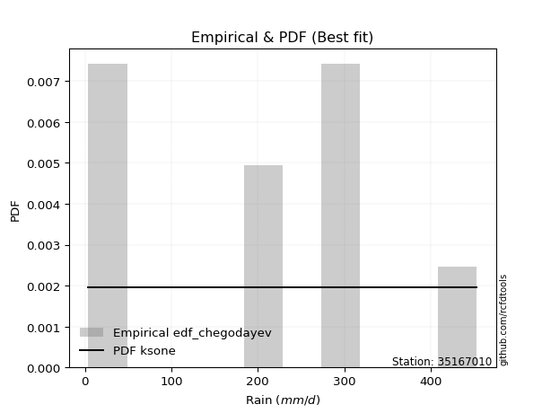</img>

</div>


### 6. EDF Blom (1958)

The Blom formula is a specific "plotting position" formula used in hydrology and statistical analysis to estimate the empirical cumulative probability (or non-exceedance probability) of a data series. It is particularly recommended for data that are approximately normally distributed. The constant _a_ is set to 0.375 (or 3/8).

<div align="center">


$P=(m-a)/(n+1-2a)$


</div>


**6.1. Empirical values**

<div align="center">

|                | 0                   | 1                   | 2                   | 3                  | 4        | 5                  | 6                  | 7                  | 8                  |
|:---------------|:--------------------|:--------------------|:--------------------|:-------------------|:---------|:-------------------|:-------------------|:-------------------|:-------------------|
| date           | 2022                | 2018                | 2017                | 2019               | 2023     | 2020               | 2021               | 2025               | 2024               |
| x              | 3.9                 | 14.3                | 27.57               | 194.72             | 198.2    | 285.4              | 290.3              | 317.3              | 453.4              |
| m              | 1                   | 2                   | 3                   | 4                  | 5        | 6                  | 7                  | 8                  | 9                  |
| empirical_dist | edf_blom            | edf_blom            | edf_blom            | edf_blom           | edf_blom | edf_blom           | edf_blom           | edf_blom           | edf_blom           |
| empirical      | 0.06756756756756757 | 0.17567567567567569 | 0.28378378378378377 | 0.3918918918918919 | 0.5      | 0.6081081081081081 | 0.7162162162162162 | 0.8243243243243243 | 0.9324324324324325 |
| empirical_tr   | 1.072463768115942   | 1.2131147540983607  | 1.3962264150943395  | 1.6444444444444444 | 2.0      | 2.5517241379310347 | 3.523809523809524  | 5.6923076923076925 | 14.800000000000006 |

</div>


**6.2. Kolmogorov-Smirnov fit test (sorted by Δ)**


<div align="center">

|                | 0                   | 1                   | 2                   | 3                   | 4                   | 5                   | 6                   | 7                   | 8                   | 9                   | 10                  | 11                  | 12                  | 13                  | 14                  | 15                  | 16                  | 17                  | 18                  | 19                  | 20                  | 21                  | 22                  | 23                  | 24                  | 25                  | 26                  | 27                  | 28                  | 29                  | 30                  | 31                  | 32                  | 33                  | 34                  | 35                  | 36                  | 37                  | 38                  | 39                  | 40                  | 41                  | 42                  | 43                  | 44                  | 45                  | 46                  | 47                  | 48                  | 49                  | 50                  | 51                  | 52                  | 53                  | 54                  | 55                  | 56                  | 57                  | 58                  | 59                  | 60                  | 61                  | 62                  | 63                  | 64                  | 65                  | 66                  | 67                  | 68                  | 69                  | 70                  | 71                  | 72                  | 73                  | 74                  | 75                  | 76                  | 77                  | 78                  | 79                  | 80                  | 81                  | 82                  | 83                  | 84                  | 85                  | 86                  | 87                  | 88                  | 89                  | 90                  | 91                  | 92                  | 93                  | 94                  | 95                  | 96                  | 97                  | 98                  | 99                  | 100                 | 101                 | 102                 | 103                 | 104                 | 105                 | 106                 | 107                 | 108                 | 109                 | 110                 | 111                 | 112                 | 113                 | 114                 | 115                 | 116                 | 117                 | 118                 | 119                 | 120                 | 121                 | 122                 | 123                 | 124                 | 125                 | 126                 | 127                 | 128                 | 129                 | 130                 | 131                 | 132                 | 133                 | 134                 | 135                 | 136                 | 137                 | 138                 | 139                 | 140                 | 141                 | 142                 | 143                 | 144                 | 145                 | 146                 | 147                 | 148                 | 149                 | 150                 | 151                 | 152                 | 153                 | 154                 | 155                 | 156                 | 157                 | 158                 | 159                 |
|:---------------|:--------------------|:--------------------|:--------------------|:--------------------|:--------------------|:--------------------|:--------------------|:--------------------|:--------------------|:--------------------|:--------------------|:--------------------|:--------------------|:--------------------|:--------------------|:--------------------|:--------------------|:--------------------|:--------------------|:--------------------|:--------------------|:--------------------|:--------------------|:--------------------|:--------------------|:--------------------|:--------------------|:--------------------|:--------------------|:--------------------|:--------------------|:--------------------|:--------------------|:--------------------|:--------------------|:--------------------|:--------------------|:--------------------|:--------------------|:--------------------|:--------------------|:--------------------|:--------------------|:--------------------|:--------------------|:--------------------|:--------------------|:--------------------|:--------------------|:--------------------|:--------------------|:--------------------|:--------------------|:--------------------|:--------------------|:--------------------|:--------------------|:--------------------|:--------------------|:--------------------|:--------------------|:--------------------|:--------------------|:--------------------|:--------------------|:--------------------|:--------------------|:--------------------|:--------------------|:--------------------|:--------------------|:--------------------|:--------------------|:--------------------|:--------------------|:--------------------|:--------------------|:--------------------|:--------------------|:--------------------|:--------------------|:--------------------|:--------------------|:--------------------|:--------------------|:--------------------|:--------------------|:--------------------|:--------------------|:--------------------|:--------------------|:--------------------|:--------------------|:--------------------|:--------------------|:--------------------|:--------------------|:--------------------|:--------------------|:--------------------|:--------------------|:--------------------|:--------------------|:--------------------|:--------------------|:--------------------|:--------------------|:--------------------|:--------------------|:--------------------|:--------------------|:--------------------|:--------------------|:--------------------|:--------------------|:--------------------|:--------------------|:--------------------|:--------------------|:--------------------|:--------------------|:--------------------|:--------------------|:--------------------|:--------------------|:--------------------|:--------------------|:--------------------|:--------------------|:--------------------|:--------------------|:--------------------|:--------------------|:--------------------|:--------------------|:--------------------|:--------------------|:--------------------|:--------------------|:--------------------|:--------------------|:--------------------|:--------------------|:--------------------|:--------------------|:--------------------|:--------------------|:--------------------|:--------------------|:--------------------|:--------------------|:--------------------|:--------------------|:--------------------|:--------------------|:--------------------|:--------------------|:--------------------|:--------------------|:--------------------|
| station        | 35167010            | 35167010            | 35167010            | 35167010            | 35167010            | 35167010            | 35167010            | 35167010            | 35167010            | 35167010            | 35167010            | 35167010            | 35167010            | 35167010            | 35167010            | 35167010            | 35167010            | 35167010            | 35167010            | 35167010            | 35167010            | 35167010            | 35167010            | 35167010            | 35167010            | 35167010            | 35167010            | 35167010            | 35167010            | 35167010            | 35167010            | 35167010            | 35167010            | 35167010            | 35167010            | 35167010            | 35167010            | 35167010            | 35167010            | 35167010            | 35167010            | 35167010            | 35167010            | 35167010            | 35167010            | 35167010            | 35167010            | 35167010            | 35167010            | 35167010            | 35167010            | 35167010            | 35167010            | 35167010            | 35167010            | 35167010            | 35167010            | 35167010            | 35167010            | 35167010            | 35167010            | 35167010            | 35167010            | 35167010            | 35167010            | 35167010            | 35167010            | 35167010            | 35167010            | 35167010            | 35167010            | 35167010            | 35167010            | 35167010            | 35167010            | 35167010            | 35167010            | 35167010            | 35167010            | 35167010            | 35167010            | 35167010            | 35167010            | 35167010            | 35167010            | 35167010            | 35167010            | 35167010            | 35167010            | 35167010            | 35167010            | 35167010            | 35167010            | 35167010            | 35167010            | 35167010            | 35167010            | 35167010            | 35167010            | 35167010            | 35167010            | 35167010            | 35167010            | 35167010            | 35167010            | 35167010            | 35167010            | 35167010            | 35167010            | 35167010            | 35167010            | 35167010            | 35167010            | 35167010            | 35167010            | 35167010            | 35167010            | 35167010            | 35167010            | 35167010            | 35167010            | 35167010            | 35167010            | 35167010            | 35167010            | 35167010            | 35167010            | 35167010            | 35167010            | 35167010            | 35167010            | 35167010            | 35167010            | 35167010            | 35167010            | 35167010            | 35167010            | 35167010            | 35167010            | 35167010            | 35167010            | 35167010            | 35167010            | 35167010            | 35167010            | 35167010            | 35167010            | 35167010            | 35167010            | 35167010            | 35167010            | 35167010            | 35167010            | 35167010            | 35167010            | 35167010            | 35167010            | 35167010            | 35167010            | 35167010            |
| empirical_dist | edf_blom            | edf_blom            | edf_blom            | edf_blom            | edf_blom            | edf_blom            | edf_blom            | edf_blom            | edf_blom            | edf_blom            | edf_blom            | edf_blom            | edf_blom            | edf_blom            | edf_blom            | edf_blom            | edf_blom            | edf_blom            | edf_blom            | edf_blom            | edf_blom            | edf_blom            | edf_blom            | edf_blom            | edf_blom            | edf_blom            | edf_blom            | edf_blom            | edf_blom            | edf_blom            | edf_blom            | edf_blom            | edf_blom            | edf_blom            | edf_blom            | edf_blom            | edf_blom            | edf_blom            | edf_blom            | edf_blom            | edf_blom            | edf_blom            | edf_blom            | edf_blom            | edf_blom            | edf_blom            | edf_blom            | edf_blom            | edf_blom            | edf_blom            | edf_blom            | edf_blom            | edf_blom            | edf_blom            | edf_blom            | edf_blom            | edf_blom            | edf_blom            | edf_blom            | edf_blom            | edf_blom            | edf_blom            | edf_blom            | edf_blom            | edf_blom            | edf_blom            | edf_blom            | edf_blom            | edf_blom            | edf_blom            | edf_blom            | edf_blom            | edf_blom            | edf_blom            | edf_blom            | edf_blom            | edf_blom            | edf_blom            | edf_blom            | edf_blom            | edf_blom            | edf_blom            | edf_blom            | edf_blom            | edf_blom            | edf_blom            | edf_blom            | edf_blom            | edf_blom            | edf_blom            | edf_blom            | edf_blom            | edf_blom            | edf_blom            | edf_blom            | edf_blom            | edf_blom            | edf_blom            | edf_blom            | edf_blom            | edf_blom            | edf_blom            | edf_blom            | edf_blom            | edf_blom            | edf_blom            | edf_blom            | edf_blom            | edf_blom            | edf_blom            | edf_blom            | edf_blom            | edf_blom            | edf_blom            | edf_blom            | edf_blom            | edf_blom            | edf_blom            | edf_blom            | edf_blom            | edf_blom            | edf_blom            | edf_blom            | edf_blom            | edf_blom            | edf_blom            | edf_blom            | edf_blom            | edf_blom            | edf_blom            | edf_blom            | edf_blom            | edf_blom            | edf_blom            | edf_blom            | edf_blom            | edf_blom            | edf_blom            | edf_blom            | edf_blom            | edf_blom            | edf_blom            | edf_blom            | edf_blom            | edf_blom            | edf_blom            | edf_blom            | edf_blom            | edf_blom            | edf_blom            | edf_blom            | edf_blom            | edf_blom            | edf_blom            | edf_blom            | edf_blom            | edf_blom            | edf_blom            | edf_blom            | edf_blom            |
| p_dist         | ksone               | logjohnsonsu        | semicircular        | arcsine             | anglit              | loggenextreme       | gausshyper          | genextreme          | foldnorm            | dweibull            | burr                | t                   | norm                | truncnorm           | exponnorm           | skewnorm            | pearson3            | gamma               | erlang              | johnsonsu           | nct                 | dgamma              | genlogistic         | invweibull          | invgamma            | gumbel_l            | maxwell             | rayleigh            | cosine              | loggennorm          | kstwobign           | logistic            | loglevy_l           | argus               | hypsecant           | rice                | invgauss            | logvonmises_line    | logweibull_max      | logmielke           | truncexpon          | laplace             | bradford            | logloggamma         | nakagami            | gumbel_r            | logburr             | exponpow            | logtrapezoid        | halfnorm            | triang              | gompertz            | logargus            | logexponpow         | logarcsine          | logdgamma           | kappa4              | wrapcauchy          | loggenpareto        | genpareto           | kappa3              | tukeylambda         | moyal               | logburr12           | lomax               | mielke              | uniform             | gengamma            | logpearson3         | ncf                 | loggumbel_l         | genexpon            | logweibull_min      | exponweib           | loggengamma         | alpha               | logsemicircular     | logloglaplace       | logdweibull         | vonmises_line       | loggompertz         | logexponweib        | weibull_min         | loganglit           | logbeta             | halflogistic        | lognakagami         | genhalflogistic     | f                   | logwrapcauchy       | logf                | logbetaprime        | loginvgauss         | logt                | logcrystalball      | lognorm             | logexponnorm        | truncweibull_min    | lognct              | loginvweibull       | logfatiguelife      | logrice             | halfgennorm         | loggamma            | loggamma            | wald                | loginvgamma         | logerlang           | logncf              | logfoldnorm         | logalpha            | loggenhalflogistic  | loglomax            | logmaxwell          | loglogistic         | logkstwobign        | lograyleigh         | beta                | logskewnorm         | burr12              | loghypsecant        | loggausshyper       | logcosine           | loghalfnorm         | gennorm             | loggenexpon         | loghalfgennorm      | loggumbel_r         | levy_l              | loglaplace          | loglaplace          | fatiguelife         | betaprime           | logtriang           | loghalflogistic     | logmoyal            | logksone            | trapezoid           | logjohnsonsb        | logkappa4           | logtruncweibull_min | logwald             | logkappa3           | loguniform          | crystalball         | powerlaw            | logtruncexpon       | logbradford         | logtruncnorm        | johnsonsb           | rdist               | logpowerlaw         | truncpareto         | weibull_max         | logtukeylambda      | logrdist            | logtruncpareto      | loggenlogistic      | logvonmises         | vonmises            |
| delta          | 0.11776032503683362 | 0.11979879155439088 | 0.13032859011694753 | 0.1313257441517761  | 0.13929613612591704 | 0.14031601462997867 | 0.15021596130220116 | 0.15784964227097645 | 0.15845230176926128 | 0.159274157390823   | 0.16002166445423294 | 0.16006886321038094 | 0.16013303292680992 | 0.1601330384455073  | 0.16013425063420395 | 0.16015677452256213 | 0.16061119051645345 | 0.16065129787299545 | 0.16079309041308887 | 0.1609703352803067  | 0.16220100803933657 | 0.1622756967464487  | 0.16324840209494185 | 0.16356356153999918 | 0.16420549662680906 | 0.16423372346500348 | 0.16474108908238927 | 0.16831739568707146 | 0.16964788215653026 | 0.17145787817923652 | 0.17427068187607675 | 0.17453490546713135 | 0.17546947547172273 | 0.17735527355646652 | 0.18125186880956862 | 0.18215763029090826 | 0.18216279170364313 | 0.18243690185385464 | 0.1849154413131624  | 0.1850521716897403  | 0.18634775389212954 | 0.18641906896452098 | 0.18668321232107793 | 0.18865554163589182 | 0.19960992602514194 | 0.19969630746281788 | 0.20137430167930448 | 0.20230349346532994 | 0.2029071416159839  | 0.20375016582904318 | 0.20656943141993833 | 0.20810782343766793 | 0.2090570095217401  | 0.20959330804037768 | 0.20967534373319874 | 0.21037739284869222 | 0.21097897692564907 | 0.2195084124852561  | 0.22247204849168445 | 0.22347829275156914 | 0.22459797048323707 | 0.22577065737549296 | 0.22832195477310785 | 0.22901666350194405 | 0.2302172500986278  | 0.23042893120598895 | 0.23112527432883384 | 0.23340538437919167 | 0.2343320183889086  | 0.23703023954403446 | 0.23719986572884488 | 0.2404793445006389  | 0.24113506000648122 | 0.2420422478092652  | 0.24519610359641675 | 0.24727533904920396 | 0.2481548305375505  | 0.24990022169354198 | 0.25107799297091393 | 0.2539954356669024  | 0.25445945689389426 | 0.25542305127284004 | 0.25597696651031965 | 0.2574427322471571  | 0.26556953945867534 | 0.26723271058316705 | 0.26950461214484955 | 0.2724827362491935  | 0.2730601198556267  | 0.27755800477001835 | 0.27850626290744906 | 0.27864083038717613 | 0.27919982567735124 | 0.2794540751193222  | 0.2794543844020916  | 0.2794544207638132  | 0.2794566752132174  | 0.27955389087990457 | 0.27966869614886614 | 0.27976786455129    | 0.2799885656345079  | 0.28235482993147887 | 0.2825617920392465  | 0.28352411007581335 | 0.28352411007581335 | 0.28378378378378377 | 0.28627388433019496 | 0.28630239849143135 | 0.2864836799413849  | 0.28663045057172465 | 0.2904614860238208  | 0.2917521001458486  | 0.2967219209685339  | 0.29873735650800226 | 0.29907909695440815 | 0.2991039297157354  | 0.3044630604712395  | 0.3081690783549451  | 0.3114595643803544  | 0.3122814869074493  | 0.31388485430456703 | 0.31579024069386574 | 0.32031713357571434 | 0.32137396157660936 | 0.32432432432432434 | 0.32863803924924717 | 0.3307198683189657  | 0.3358252253763919  | 0.33717658162287556 | 0.3411170462534123  | 0.3411170462534123  | 0.3457944811192215  | 0.34644827066908956 | 0.34755614344305874 | 0.3490618679786185  | 0.3542724332100561  | 0.3766727324595126  | 0.3778939808610505  | 0.3859632809473933  | 0.3869982928955822  | 0.3969885445517215  | 0.40719566013003594 | 0.4299916811617862  | 0.4303856573297935  | 0.4389899215063813  | 0.46814871193491325 | 0.46876258705468776 | 0.4705532421535882  | 0.483543449479124   | 0.5054047681280777  | 0.5626077414629949  | 0.5735862261162477  | 0.5909534200330016  | 0.6757625020337896  | 0.7161520116071345  | 0.7162162161870481  | 0.7449386738268546  | 0.8243243243243243  | 0.9973702848664143  | 71.218313099043     |
| deltao         | 0.41761268023100007 | 0.41761268023100007 | 0.41761268023100007 | 0.41761268023100007 | 0.41761268023100007 | 0.41761268023100007 | 0.41761268023100007 | 0.41761268023100007 | 0.41761268023100007 | 0.41761268023100007 | 0.41761268023100007 | 0.41761268023100007 | 0.41761268023100007 | 0.41761268023100007 | 0.41761268023100007 | 0.41761268023100007 | 0.41761268023100007 | 0.41761268023100007 | 0.41761268023100007 | 0.41761268023100007 | 0.41761268023100007 | 0.41761268023100007 | 0.41761268023100007 | 0.41761268023100007 | 0.41761268023100007 | 0.41761268023100007 | 0.41761268023100007 | 0.41761268023100007 | 0.41761268023100007 | 0.41761268023100007 | 0.41761268023100007 | 0.41761268023100007 | 0.41761268023100007 | 0.41761268023100007 | 0.41761268023100007 | 0.41761268023100007 | 0.41761268023100007 | 0.41761268023100007 | 0.41761268023100007 | 0.41761268023100007 | 0.41761268023100007 | 0.41761268023100007 | 0.41761268023100007 | 0.41761268023100007 | 0.41761268023100007 | 0.41761268023100007 | 0.41761268023100007 | 0.41761268023100007 | 0.41761268023100007 | 0.41761268023100007 | 0.41761268023100007 | 0.41761268023100007 | 0.41761268023100007 | 0.41761268023100007 | 0.41761268023100007 | 0.41761268023100007 | 0.41761268023100007 | 0.41761268023100007 | 0.41761268023100007 | 0.41761268023100007 | 0.41761268023100007 | 0.41761268023100007 | 0.41761268023100007 | 0.41761268023100007 | 0.41761268023100007 | 0.41761268023100007 | 0.41761268023100007 | 0.41761268023100007 | 0.41761268023100007 | 0.41761268023100007 | 0.41761268023100007 | 0.41761268023100007 | 0.41761268023100007 | 0.41761268023100007 | 0.41761268023100007 | 0.41761268023100007 | 0.41761268023100007 | 0.41761268023100007 | 0.41761268023100007 | 0.41761268023100007 | 0.41761268023100007 | 0.41761268023100007 | 0.41761268023100007 | 0.41761268023100007 | 0.41761268023100007 | 0.41761268023100007 | 0.41761268023100007 | 0.41761268023100007 | 0.41761268023100007 | 0.41761268023100007 | 0.41761268023100007 | 0.41761268023100007 | 0.41761268023100007 | 0.41761268023100007 | 0.41761268023100007 | 0.41761268023100007 | 0.41761268023100007 | 0.41761268023100007 | 0.41761268023100007 | 0.41761268023100007 | 0.41761268023100007 | 0.41761268023100007 | 0.41761268023100007 | 0.41761268023100007 | 0.41761268023100007 | 0.41761268023100007 | 0.41761268023100007 | 0.41761268023100007 | 0.41761268023100007 | 0.41761268023100007 | 0.41761268023100007 | 0.41761268023100007 | 0.41761268023100007 | 0.41761268023100007 | 0.41761268023100007 | 0.41761268023100007 | 0.41761268023100007 | 0.41761268023100007 | 0.41761268023100007 | 0.41761268023100007 | 0.41761268023100007 | 0.41761268023100007 | 0.41761268023100007 | 0.41761268023100007 | 0.41761268023100007 | 0.41761268023100007 | 0.41761268023100007 | 0.41761268023100007 | 0.41761268023100007 | 0.41761268023100007 | 0.41761268023100007 | 0.41761268023100007 | 0.41761268023100007 | 0.41761268023100007 | 0.41761268023100007 | 0.41761268023100007 | 0.41761268023100007 | 0.41761268023100007 | 0.41761268023100007 | 0.41761268023100007 | 0.41761268023100007 | 0.41761268023100007 | 0.41761268023100007 | 0.41761268023100007 | 0.41761268023100007 | 0.41761268023100007 | 0.41761268023100007 | 0.41761268023100007 | 0.41761268023100007 | 0.41761268023100007 | 0.41761268023100007 | 0.41761268023100007 | 0.41761268023100007 | 0.41761268023100007 | 0.41761268023100007 | 0.41761268023100007 | 0.41761268023100007 | 0.41761268023100007 | 0.41761268023100007 | 0.41761268023100007 |
| eval           | Δo > Δ              | Δo > Δ              | Δo > Δ              | Δo > Δ              | Δo > Δ              | Δo > Δ              | Δo > Δ              | Δo > Δ              | Δo > Δ              | Δo > Δ              | Δo > Δ              | Δo > Δ              | Δo > Δ              | Δo > Δ              | Δo > Δ              | Δo > Δ              | Δo > Δ              | Δo > Δ              | Δo > Δ              | Δo > Δ              | Δo > Δ              | Δo > Δ              | Δo > Δ              | Δo > Δ              | Δo > Δ              | Δo > Δ              | Δo > Δ              | Δo > Δ              | Δo > Δ              | Δo > Δ              | Δo > Δ              | Δo > Δ              | Δo > Δ              | Δo > Δ              | Δo > Δ              | Δo > Δ              | Δo > Δ              | Δo > Δ              | Δo > Δ              | Δo > Δ              | Δo > Δ              | Δo > Δ              | Δo > Δ              | Δo > Δ              | Δo > Δ              | Δo > Δ              | Δo > Δ              | Δo > Δ              | Δo > Δ              | Δo > Δ              | Δo > Δ              | Δo > Δ              | Δo > Δ              | Δo > Δ              | Δo > Δ              | Δo > Δ              | Δo > Δ              | Δo > Δ              | Δo > Δ              | Δo > Δ              | Δo > Δ              | Δo > Δ              | Δo > Δ              | Δo > Δ              | Δo > Δ              | Δo > Δ              | Δo > Δ              | Δo > Δ              | Δo > Δ              | Δo > Δ              | Δo > Δ              | Δo > Δ              | Δo > Δ              | Δo > Δ              | Δo > Δ              | Δo > Δ              | Δo > Δ              | Δo > Δ              | Δo > Δ              | Δo > Δ              | Δo > Δ              | Δo > Δ              | Δo > Δ              | Δo > Δ              | Δo > Δ              | Δo > Δ              | Δo > Δ              | Δo > Δ              | Δo > Δ              | Δo > Δ              | Δo > Δ              | Δo > Δ              | Δo > Δ              | Δo > Δ              | Δo > Δ              | Δo > Δ              | Δo > Δ              | Δo > Δ              | Δo > Δ              | Δo > Δ              | Δo > Δ              | Δo > Δ              | Δo > Δ              | Δo > Δ              | Δo > Δ              | Δo > Δ              | Δo > Δ              | Δo > Δ              | Δo > Δ              | Δo > Δ              | Δo > Δ              | Δo > Δ              | Δo > Δ              | Δo > Δ              | Δo > Δ              | Δo > Δ              | Δo > Δ              | Δo > Δ              | Δo > Δ              | Δo > Δ              | Δo > Δ              | Δo > Δ              | Δo > Δ              | Δo > Δ              | Δo > Δ              | Δo > Δ              | Δo > Δ              | Δo > Δ              | Δo > Δ              | Δo > Δ              | Δo > Δ              | Δo > Δ              | Δo > Δ              | Δo > Δ              | Δo > Δ              | Δo > Δ              | Δo > Δ              | Δo > Δ              | Δo > Δ              | Δo > Δ              | Δo > Δ              | Δo > Δ              | Δo <= Δ             | Δo <= Δ             | Δo <= Δ             | Δo <= Δ             | Δo <= Δ             | Δo <= Δ             | Δo <= Δ             | Δo <= Δ             | Δo <= Δ             | Δo <= Δ             | Δo <= Δ             | Δo <= Δ             | Δo <= Δ             | Δo <= Δ             | Δo <= Δ             | Δo <= Δ             | Δo <= Δ             | Δo <= Δ             |
| fit            | 1                   | 1                   | 1                   | 1                   | 1                   | 1                   | 1                   | 1                   | 1                   | 1                   | 1                   | 1                   | 1                   | 1                   | 1                   | 1                   | 1                   | 1                   | 1                   | 1                   | 1                   | 1                   | 1                   | 1                   | 1                   | 1                   | 1                   | 1                   | 1                   | 1                   | 1                   | 1                   | 1                   | 1                   | 1                   | 1                   | 1                   | 1                   | 1                   | 1                   | 1                   | 1                   | 1                   | 1                   | 1                   | 1                   | 1                   | 1                   | 1                   | 1                   | 1                   | 1                   | 1                   | 1                   | 1                   | 1                   | 1                   | 1                   | 1                   | 1                   | 1                   | 1                   | 1                   | 1                   | 1                   | 1                   | 1                   | 1                   | 1                   | 1                   | 1                   | 1                   | 1                   | 1                   | 1                   | 1                   | 1                   | 1                   | 1                   | 1                   | 1                   | 1                   | 1                   | 1                   | 1                   | 1                   | 1                   | 1                   | 1                   | 1                   | 1                   | 1                   | 1                   | 1                   | 1                   | 1                   | 1                   | 1                   | 1                   | 1                   | 1                   | 1                   | 1                   | 1                   | 1                   | 1                   | 1                   | 1                   | 1                   | 1                   | 1                   | 1                   | 1                   | 1                   | 1                   | 1                   | 1                   | 1                   | 1                   | 1                   | 1                   | 1                   | 1                   | 1                   | 1                   | 1                   | 1                   | 1                   | 1                   | 1                   | 1                   | 1                   | 1                   | 1                   | 1                   | 1                   | 1                   | 1                   | 1                   | 1                   | 1                   | 1                   | 0                   | 0                   | 0                   | 0                   | 0                   | 0                   | 0                   | 0                   | 0                   | 0                   | 0                   | 0                   | 0                   | 0                   | 0                   | 0                   | 0                   | 0                   |
| n              | 9                   | 9                   | 9                   | 9                   | 9                   | 9                   | 9                   | 9                   | 9                   | 9                   | 9                   | 9                   | 9                   | 9                   | 9                   | 9                   | 9                   | 9                   | 9                   | 9                   | 9                   | 9                   | 9                   | 9                   | 9                   | 9                   | 9                   | 9                   | 9                   | 9                   | 9                   | 9                   | 9                   | 9                   | 9                   | 9                   | 9                   | 9                   | 9                   | 9                   | 9                   | 9                   | 9                   | 9                   | 9                   | 9                   | 9                   | 9                   | 9                   | 9                   | 9                   | 9                   | 9                   | 9                   | 9                   | 9                   | 9                   | 9                   | 9                   | 9                   | 9                   | 9                   | 9                   | 9                   | 9                   | 9                   | 9                   | 9                   | 9                   | 9                   | 9                   | 9                   | 9                   | 9                   | 9                   | 9                   | 9                   | 9                   | 9                   | 9                   | 9                   | 9                   | 9                   | 9                   | 9                   | 9                   | 9                   | 9                   | 9                   | 9                   | 9                   | 9                   | 9                   | 9                   | 9                   | 9                   | 9                   | 9                   | 9                   | 9                   | 9                   | 9                   | 9                   | 9                   | 9                   | 9                   | 9                   | 9                   | 9                   | 9                   | 9                   | 9                   | 9                   | 9                   | 9                   | 9                   | 9                   | 9                   | 9                   | 9                   | 9                   | 9                   | 9                   | 9                   | 9                   | 9                   | 9                   | 9                   | 9                   | 9                   | 9                   | 9                   | 9                   | 9                   | 9                   | 9                   | 9                   | 9                   | 9                   | 9                   | 9                   | 9                   | 9                   | 9                   | 9                   | 9                   | 9                   | 9                   | 9                   | 9                   | 9                   | 9                   | 9                   | 9                   | 9                   | 9                   | 9                   | 9                   | 9                   | 9                   |
| best_fit       | 1                   | 0                   | 0                   | 0                   | 0                   | 0                   | 0                   | 0                   | 0                   | 0                   | 0                   | 0                   | 0                   | 0                   | 0                   | 0                   | 0                   | 0                   | 0                   | 0                   | 0                   | 0                   | 0                   | 0                   | 0                   | 0                   | 0                   | 0                   | 0                   | 0                   | 0                   | 0                   | 0                   | 0                   | 0                   | 0                   | 0                   | 0                   | 0                   | 0                   | 0                   | 0                   | 0                   | 0                   | 0                   | 0                   | 0                   | 0                   | 0                   | 0                   | 0                   | 0                   | 0                   | 0                   | 0                   | 0                   | 0                   | 0                   | 0                   | 0                   | 0                   | 0                   | 0                   | 0                   | 0                   | 0                   | 0                   | 0                   | 0                   | 0                   | 0                   | 0                   | 0                   | 0                   | 0                   | 0                   | 0                   | 0                   | 0                   | 0                   | 0                   | 0                   | 0                   | 0                   | 0                   | 0                   | 0                   | 0                   | 0                   | 0                   | 0                   | 0                   | 0                   | 0                   | 0                   | 0                   | 0                   | 0                   | 0                   | 0                   | 0                   | 0                   | 0                   | 0                   | 0                   | 0                   | 0                   | 0                   | 0                   | 0                   | 0                   | 0                   | 0                   | 0                   | 0                   | 0                   | 0                   | 0                   | 0                   | 0                   | 0                   | 0                   | 0                   | 0                   | 0                   | 0                   | 0                   | 0                   | 0                   | 0                   | 0                   | 0                   | 0                   | 0                   | 0                   | 0                   | 0                   | 0                   | 0                   | 0                   | 0                   | 0                   | 0                   | 0                   | 0                   | 0                   | 0                   | 0                   | 0                   | 0                   | 0                   | 0                   | 0                   | 0                   | 0                   | 0                   | 0                   | 0                   | 0                   | 0                   |
| best_fit_sort  | 1                   | 2                   | 3                   | 4                   | 5                   | 6                   | 7                   | 8                   | 9                   | 10                  | 11                  | 12                  | 13                  | 14                  | 15                  | 16                  | 17                  | 18                  | 19                  | 20                  | 21                  | 22                  | 23                  | 24                  | 25                  | 26                  | 27                  | 28                  | 29                  | 30                  | 31                  | 32                  | 33                  | 34                  | 35                  | 36                  | 37                  | 38                  | 39                  | 40                  | 41                  | 42                  | 43                  | 44                  | 45                  | 46                  | 47                  | 48                  | 49                  | 50                  | 51                  | 52                  | 53                  | 54                  | 55                  | 56                  | 57                  | 58                  | 59                  | 60                  | 61                  | 62                  | 63                  | 64                  | 65                  | 66                  | 67                  | 68                  | 69                  | 70                  | 71                  | 72                  | 73                  | 74                  | 75                  | 76                  | 77                  | 78                  | 79                  | 80                  | 81                  | 82                  | 83                  | 84                  | 85                  | 86                  | 87                  | 88                  | 89                  | 90                  | 91                  | 92                  | 93                  | 94                  | 95                  | 96                  | 97                  | 98                  | 99                  | 100                 | 101                 | 102                 | 103                 | 104                 | 105                 | 106                 | 107                 | 108                 | 109                 | 110                 | 111                 | 112                 | 113                 | 114                 | 115                 | 116                 | 117                 | 118                 | 119                 | 120                 | 121                 | 122                 | 123                 | 124                 | 125                 | 126                 | 127                 | 128                 | 129                 | 130                 | 131                 | 132                 | 133                 | 134                 | 135                 | 136                 | 137                 | 138                 | 139                 | 140                 | 141                 | 142                 | 143                 | 144                 | 145                 | 146                 | 147                 | 148                 | 149                 | 150                 | 151                 | 152                 | 153                 | 154                 | 155                 | 156                 | 157                 | 158                 | 159                 | 160                 |

</div>


**6.3. Best fit**

<div align="center">

|   id |   station | empirical_dist   | p_dist   |   delta |   deltao | eval   |   fit |   n |   best_fit |   best_fit_sort |
|-----:|----------:|:-----------------|:---------|--------:|---------:|:-------|------:|----:|-----------:|----------------:|
|    0 |  35167010 | edf_blom         | ksone    | 0.11776 | 0.417613 | Δo > Δ |     1 |   9 |          1 |               1 |

</div>


<div align="center">

</img>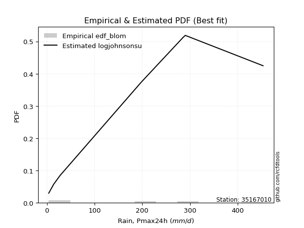</img>

</div>


### 7. EDF Tukey (1962)

In hydrology, the Tukey formula is used as a plotting position formula to estimate the empirical probability or frequency of a flood event (or other hydrological data). The formula parameter is given as _c=0.333_ (or 1/3).

<div align="center">


$P=(m-c)/(n+1-2c)$


</div>


**7.1. Empirical values**

<div align="center">

|                | 0                   | 1                   | 2                  | 3                   | 4         | 5                  | 6                  | 7                  | 8                  |
|:---------------|:--------------------|:--------------------|:-------------------|:--------------------|:----------|:-------------------|:-------------------|:-------------------|:-------------------|
| date           | 2022                | 2018                | 2017               | 2019                | 2023      | 2020               | 2021               | 2025               | 2024               |
| x              | 3.9                 | 14.3                | 27.57              | 194.72              | 198.2     | 285.4              | 290.3              | 317.3              | 453.4              |
| m              | 1                   | 2                   | 3                  | 4                   | 5         | 6                  | 7                  | 8                  | 9                  |
| empirical_dist | edf_tukey           | edf_tukey           | edf_tukey          | edf_tukey           | edf_tukey | edf_tukey          | edf_tukey          | edf_tukey          | edf_tukey          |
| empirical      | 0.07142857142857142 | 0.17857142857142858 | 0.2857142857142857 | 0.39285714285714285 | 0.5       | 0.6071428571428571 | 0.7142857142857143 | 0.8214285714285714 | 0.9285714285714286 |
| empirical_tr   | 1.0769230769230769  | 1.2173913043478262  | 1.4                | 1.6470588235294117  | 2.0       | 2.545454545454545  | 3.5                | 5.599999999999999  | 14.000000000000007 |

</div>


**7.2. Kolmogorov-Smirnov fit test (sorted by Δ)**


<div align="center">

|                | 0                   | 1                   | 2                   | 3                   | 4                   | 5                   | 6                   | 7                   | 8                   | 9                   | 10                  | 11                  | 12                  | 13                  | 14                  | 15                  | 16                  | 17                  | 18                  | 19                  | 20                  | 21                  | 22                  | 23                  | 24                  | 25                  | 26                  | 27                  | 28                  | 29                  | 30                  | 31                  | 32                  | 33                  | 34                  | 35                  | 36                  | 37                  | 38                  | 39                  | 40                  | 41                  | 42                  | 43                  | 44                  | 45                  | 46                  | 47                  | 48                  | 49                  | 50                  | 51                  | 52                  | 53                  | 54                  | 55                  | 56                  | 57                  | 58                  | 59                  | 60                  | 61                  | 62                  | 63                  | 64                  | 65                  | 66                  | 67                  | 68                  | 69                  | 70                  | 71                  | 72                  | 73                  | 74                  | 75                  | 76                  | 77                  | 78                  | 79                  | 80                  | 81                  | 82                  | 83                  | 84                  | 85                  | 86                  | 87                  | 88                  | 89                  | 90                  | 91                  | 92                  | 93                  | 94                  | 95                  | 96                  | 97                  | 98                  | 99                  | 100                 | 101                 | 102                 | 103                 | 104                 | 105                 | 106                 | 107                 | 108                 | 109                 | 110                 | 111                 | 112                 | 113                 | 114                 | 115                 | 116                 | 117                 | 118                 | 119                 | 120                 | 121                 | 122                 | 123                 | 124                 | 125                 | 126                 | 127                 | 128                 | 129                 | 130                 | 131                 | 132                 | 133                 | 134                 | 135                 | 136                 | 137                 | 138                 | 139                 | 140                 | 141                 | 142                 | 143                 | 144                 | 145                 | 146                 | 147                 | 148                 | 149                 | 150                 | 151                 | 152                 | 153                 | 154                 | 155                 | 156                 | 157                 | 158                 | 159                 |
|:---------------|:--------------------|:--------------------|:--------------------|:--------------------|:--------------------|:--------------------|:--------------------|:--------------------|:--------------------|:--------------------|:--------------------|:--------------------|:--------------------|:--------------------|:--------------------|:--------------------|:--------------------|:--------------------|:--------------------|:--------------------|:--------------------|:--------------------|:--------------------|:--------------------|:--------------------|:--------------------|:--------------------|:--------------------|:--------------------|:--------------------|:--------------------|:--------------------|:--------------------|:--------------------|:--------------------|:--------------------|:--------------------|:--------------------|:--------------------|:--------------------|:--------------------|:--------------------|:--------------------|:--------------------|:--------------------|:--------------------|:--------------------|:--------------------|:--------------------|:--------------------|:--------------------|:--------------------|:--------------------|:--------------------|:--------------------|:--------------------|:--------------------|:--------------------|:--------------------|:--------------------|:--------------------|:--------------------|:--------------------|:--------------------|:--------------------|:--------------------|:--------------------|:--------------------|:--------------------|:--------------------|:--------------------|:--------------------|:--------------------|:--------------------|:--------------------|:--------------------|:--------------------|:--------------------|:--------------------|:--------------------|:--------------------|:--------------------|:--------------------|:--------------------|:--------------------|:--------------------|:--------------------|:--------------------|:--------------------|:--------------------|:--------------------|:--------------------|:--------------------|:--------------------|:--------------------|:--------------------|:--------------------|:--------------------|:--------------------|:--------------------|:--------------------|:--------------------|:--------------------|:--------------------|:--------------------|:--------------------|:--------------------|:--------------------|:--------------------|:--------------------|:--------------------|:--------------------|:--------------------|:--------------------|:--------------------|:--------------------|:--------------------|:--------------------|:--------------------|:--------------------|:--------------------|:--------------------|:--------------------|:--------------------|:--------------------|:--------------------|:--------------------|:--------------------|:--------------------|:--------------------|:--------------------|:--------------------|:--------------------|:--------------------|:--------------------|:--------------------|:--------------------|:--------------------|:--------------------|:--------------------|:--------------------|:--------------------|:--------------------|:--------------------|:--------------------|:--------------------|:--------------------|:--------------------|:--------------------|:--------------------|:--------------------|:--------------------|:--------------------|:--------------------|:--------------------|:--------------------|:--------------------|:--------------------|:--------------------|:--------------------|
| station        | 35167010            | 35167010            | 35167010            | 35167010            | 35167010            | 35167010            | 35167010            | 35167010            | 35167010            | 35167010            | 35167010            | 35167010            | 35167010            | 35167010            | 35167010            | 35167010            | 35167010            | 35167010            | 35167010            | 35167010            | 35167010            | 35167010            | 35167010            | 35167010            | 35167010            | 35167010            | 35167010            | 35167010            | 35167010            | 35167010            | 35167010            | 35167010            | 35167010            | 35167010            | 35167010            | 35167010            | 35167010            | 35167010            | 35167010            | 35167010            | 35167010            | 35167010            | 35167010            | 35167010            | 35167010            | 35167010            | 35167010            | 35167010            | 35167010            | 35167010            | 35167010            | 35167010            | 35167010            | 35167010            | 35167010            | 35167010            | 35167010            | 35167010            | 35167010            | 35167010            | 35167010            | 35167010            | 35167010            | 35167010            | 35167010            | 35167010            | 35167010            | 35167010            | 35167010            | 35167010            | 35167010            | 35167010            | 35167010            | 35167010            | 35167010            | 35167010            | 35167010            | 35167010            | 35167010            | 35167010            | 35167010            | 35167010            | 35167010            | 35167010            | 35167010            | 35167010            | 35167010            | 35167010            | 35167010            | 35167010            | 35167010            | 35167010            | 35167010            | 35167010            | 35167010            | 35167010            | 35167010            | 35167010            | 35167010            | 35167010            | 35167010            | 35167010            | 35167010            | 35167010            | 35167010            | 35167010            | 35167010            | 35167010            | 35167010            | 35167010            | 35167010            | 35167010            | 35167010            | 35167010            | 35167010            | 35167010            | 35167010            | 35167010            | 35167010            | 35167010            | 35167010            | 35167010            | 35167010            | 35167010            | 35167010            | 35167010            | 35167010            | 35167010            | 35167010            | 35167010            | 35167010            | 35167010            | 35167010            | 35167010            | 35167010            | 35167010            | 35167010            | 35167010            | 35167010            | 35167010            | 35167010            | 35167010            | 35167010            | 35167010            | 35167010            | 35167010            | 35167010            | 35167010            | 35167010            | 35167010            | 35167010            | 35167010            | 35167010            | 35167010            | 35167010            | 35167010            | 35167010            | 35167010            | 35167010            | 35167010            |
| empirical_dist | edf_tukey           | edf_tukey           | edf_tukey           | edf_tukey           | edf_tukey           | edf_tukey           | edf_tukey           | edf_tukey           | edf_tukey           | edf_tukey           | edf_tukey           | edf_tukey           | edf_tukey           | edf_tukey           | edf_tukey           | edf_tukey           | edf_tukey           | edf_tukey           | edf_tukey           | edf_tukey           | edf_tukey           | edf_tukey           | edf_tukey           | edf_tukey           | edf_tukey           | edf_tukey           | edf_tukey           | edf_tukey           | edf_tukey           | edf_tukey           | edf_tukey           | edf_tukey           | edf_tukey           | edf_tukey           | edf_tukey           | edf_tukey           | edf_tukey           | edf_tukey           | edf_tukey           | edf_tukey           | edf_tukey           | edf_tukey           | edf_tukey           | edf_tukey           | edf_tukey           | edf_tukey           | edf_tukey           | edf_tukey           | edf_tukey           | edf_tukey           | edf_tukey           | edf_tukey           | edf_tukey           | edf_tukey           | edf_tukey           | edf_tukey           | edf_tukey           | edf_tukey           | edf_tukey           | edf_tukey           | edf_tukey           | edf_tukey           | edf_tukey           | edf_tukey           | edf_tukey           | edf_tukey           | edf_tukey           | edf_tukey           | edf_tukey           | edf_tukey           | edf_tukey           | edf_tukey           | edf_tukey           | edf_tukey           | edf_tukey           | edf_tukey           | edf_tukey           | edf_tukey           | edf_tukey           | edf_tukey           | edf_tukey           | edf_tukey           | edf_tukey           | edf_tukey           | edf_tukey           | edf_tukey           | edf_tukey           | edf_tukey           | edf_tukey           | edf_tukey           | edf_tukey           | edf_tukey           | edf_tukey           | edf_tukey           | edf_tukey           | edf_tukey           | edf_tukey           | edf_tukey           | edf_tukey           | edf_tukey           | edf_tukey           | edf_tukey           | edf_tukey           | edf_tukey           | edf_tukey           | edf_tukey           | edf_tukey           | edf_tukey           | edf_tukey           | edf_tukey           | edf_tukey           | edf_tukey           | edf_tukey           | edf_tukey           | edf_tukey           | edf_tukey           | edf_tukey           | edf_tukey           | edf_tukey           | edf_tukey           | edf_tukey           | edf_tukey           | edf_tukey           | edf_tukey           | edf_tukey           | edf_tukey           | edf_tukey           | edf_tukey           | edf_tukey           | edf_tukey           | edf_tukey           | edf_tukey           | edf_tukey           | edf_tukey           | edf_tukey           | edf_tukey           | edf_tukey           | edf_tukey           | edf_tukey           | edf_tukey           | edf_tukey           | edf_tukey           | edf_tukey           | edf_tukey           | edf_tukey           | edf_tukey           | edf_tukey           | edf_tukey           | edf_tukey           | edf_tukey           | edf_tukey           | edf_tukey           | edf_tukey           | edf_tukey           | edf_tukey           | edf_tukey           | edf_tukey           | edf_tukey           | edf_tukey           | edf_tukey           |
| p_dist         | ksone               | logjohnsonsu        | arcsine             | semicircular        | loggenextreme       | anglit              | gausshyper          | burr                | genextreme          | foldnorm            | dweibull            | t                   | norm                | truncnorm           | exponnorm           | skewnorm            | pearson3            | gamma               | erlang              | johnsonsu           | dgamma              | genlogistic         | invweibull          | nct                 | invgamma            | gumbel_l            | maxwell             | rayleigh            | cosine              | loglevy_l           | kstwobign           | loggennorm          | logistic            | argus               | invgauss            | logvonmises_line    | hypsecant           | logweibull_max      | logmielke           | rice                | truncexpon          | logloggamma         | laplace             | bradford            | nakagami            | logburr             | exponpow            | gumbel_r            | logtrapezoid        | triang              | halfnorm            | logargus            | logexponpow         | logarcsine          | gompertz            | logdgamma           | kappa4              | wrapcauchy          | loggenpareto        | genpareto           | kappa3              | tukeylambda         | logburr12           | lomax               | mielke              | moyal               | gengamma            | uniform             | logpearson3         | ncf                 | loggumbel_l         | exponweib           | genexpon            | logweibull_min      | loggengamma         | logloglaplace       | alpha               | logsemicircular     | logdweibull         | weibull_min         | loggompertz         | logexponweib        | vonmises_line       | loganglit           | logbeta             | lognakagami         | halflogistic        | genhalflogistic     | f                   | logwrapcauchy       | logf                | logbetaprime        | loginvgauss         | logt                | logcrystalball      | lognorm             | logexponnorm        | truncweibull_min    | lognct              | loginvweibull       | logfatiguelife      | logrice             | halfgennorm         | loggamma            | loggamma            | loginvgamma         | logerlang           | logncf              | logfoldnorm         | wald                | logalpha            | loggenhalflogistic  | loglomax            | logmaxwell          | loglogistic         | logkstwobign        | lograyleigh         | beta                | logskewnorm         | burr12              | loghypsecant        | loggausshyper       | logcosine           | loghalfnorm         | gennorm             | loggenexpon         | loghalfgennorm      | levy_l              | loggumbel_r         | loglaplace          | loglaplace          | fatiguelife         | betaprime           | logtriang           | loghalflogistic     | logmoyal            | trapezoid           | logksone            | logjohnsonsb        | logkappa4           | logtruncweibull_min | logwald             | logkappa3           | loguniform          | crystalball         | powerlaw            | logtruncexpon       | logbradford         | logtruncnorm        | johnsonsb           | rdist               | logpowerlaw         | truncpareto         | weibull_max         | logtukeylambda      | logrdist            | logtruncpareto      | loggenlogistic      | logvonmises         | vonmises            |
| delta          | 0.11969082696733555 | 0.12172929348489281 | 0.12842999125602317 | 0.13225909204744946 | 0.1393507636647277  | 0.14122663805641897 | 0.1521464632327031  | 0.15905641348898197 | 0.15978014420147837 | 0.1603828036997632  | 0.16120465932132494 | 0.16199936514088287 | 0.16206353485731184 | 0.16206354037600923 | 0.16206475256470587 | 0.16208727645306406 | 0.16254169244695538 | 0.16258179980349738 | 0.1627235923435908  | 0.1629008372108086  | 0.16324094771169972 | 0.16332884835944173 | 0.16361582803454505 | 0.1641315099698385  | 0.16613599855731098 | 0.1661642253955054  | 0.1666715910128912  | 0.1702478976175734  | 0.1715783840870322  | 0.17160847161071888 | 0.1733054309108258  | 0.17338838010973845 | 0.17646540739763328 | 0.17928577548696845 | 0.18119754073839217 | 0.18147165088860367 | 0.18318237074007054 | 0.18395019034791144 | 0.18408692072448934 | 0.18408813222141018 | 0.18538250292687858 | 0.18769029067064086 | 0.1883495708950229  | 0.18861371425157986 | 0.19864467505989097 | 0.20040905071405352 | 0.20133824250007898 | 0.2016268093933198  | 0.20194189065073292 | 0.2036736785241854  | 0.2056806677595451  | 0.20809175855648915 | 0.20862805707512672 | 0.20871009276794777 | 0.21003832536816985 | 0.21230789477919415 | 0.212909478856151   | 0.22143891441575803 | 0.22150679752643349 | 0.22540879468207106 | 0.226528472413739   | 0.22770115930599488 | 0.2280514125366931  | 0.22925199913337685 | 0.229463680240738   | 0.23025245670360978 | 0.2324401334139407  | 0.23305577625933577 | 0.23336676742365764 | 0.2360649885787835  | 0.23623461476359392 | 0.23818124394826135 | 0.23951409353538794 | 0.24016980904123025 | 0.24423085263116578 | 0.24603921783253813 | 0.246310088083953   | 0.24718957957229953 | 0.248182240075161   | 0.2530812136145667  | 0.2534942059286433  | 0.2544578003075891  | 0.25592593759740434 | 0.2564774812819061  | 0.2626737865629224  | 0.2685393611795986  | 0.269163212513669   | 0.26958698335344056 | 0.27209486889037576 | 0.2765927538047674  | 0.2775410119421981  | 0.27767557942192517 | 0.2782345747121003  | 0.2784888241540712  | 0.2784891334368406  | 0.27848916979856225 | 0.2784914242479664  | 0.2785886399146536  | 0.2787034451836152  | 0.278802613586039   | 0.27902331466925695 | 0.2813895789662279  | 0.2815965410739955  | 0.2825588591105624  | 0.2825588591105624  | 0.285308633364944   | 0.2853371475261804  | 0.28551842897613394 | 0.2856651996064737  | 0.2857142857142857  | 0.28949623505856986 | 0.29078684918059766 | 0.29575667000328293 | 0.2977721055427513  | 0.2981138459891572  | 0.29813867875048444 | 0.30349780950598854 | 0.30720382738969415 | 0.3104943134151034  | 0.3113162359421983  | 0.31291960333931607 | 0.3148249897286148  | 0.3193518826104634  | 0.3204087106113584  | 0.3214285714285714  | 0.3276727882839962  | 0.32975461735371475 | 0.3333155777618717  | 0.33485997441114096 | 0.34015179528816136 | 0.34015179528816136 | 0.34482923015397055 | 0.3454830197038386  | 0.3465908924778078  | 0.3480966170133675  | 0.3533071822448051  | 0.3749982279652976  | 0.37570748149426164 | 0.38306752805164035 | 0.3860330419303312  | 0.39602329358647054 | 0.406230409164785   | 0.42902643019653525 | 0.42942040636454254 | 0.4351289176453774  | 0.4671834609696623  | 0.4677973360894368  | 0.4695879911883372  | 0.482578198513873   | 0.5025090152323247  | 0.561642490497744   | 0.5706904732204947  | 0.5880576671372486  | 0.6728667491380367  | 0.7142215096766326  | 0.7142857142565462  | 0.7420429209311017  | 0.8214285714285714  | 0.9964050339011634  | 71.222174102904     |
| deltao         | 0.41761268023100007 | 0.41761268023100007 | 0.41761268023100007 | 0.41761268023100007 | 0.41761268023100007 | 0.41761268023100007 | 0.41761268023100007 | 0.41761268023100007 | 0.41761268023100007 | 0.41761268023100007 | 0.41761268023100007 | 0.41761268023100007 | 0.41761268023100007 | 0.41761268023100007 | 0.41761268023100007 | 0.41761268023100007 | 0.41761268023100007 | 0.41761268023100007 | 0.41761268023100007 | 0.41761268023100007 | 0.41761268023100007 | 0.41761268023100007 | 0.41761268023100007 | 0.41761268023100007 | 0.41761268023100007 | 0.41761268023100007 | 0.41761268023100007 | 0.41761268023100007 | 0.41761268023100007 | 0.41761268023100007 | 0.41761268023100007 | 0.41761268023100007 | 0.41761268023100007 | 0.41761268023100007 | 0.41761268023100007 | 0.41761268023100007 | 0.41761268023100007 | 0.41761268023100007 | 0.41761268023100007 | 0.41761268023100007 | 0.41761268023100007 | 0.41761268023100007 | 0.41761268023100007 | 0.41761268023100007 | 0.41761268023100007 | 0.41761268023100007 | 0.41761268023100007 | 0.41761268023100007 | 0.41761268023100007 | 0.41761268023100007 | 0.41761268023100007 | 0.41761268023100007 | 0.41761268023100007 | 0.41761268023100007 | 0.41761268023100007 | 0.41761268023100007 | 0.41761268023100007 | 0.41761268023100007 | 0.41761268023100007 | 0.41761268023100007 | 0.41761268023100007 | 0.41761268023100007 | 0.41761268023100007 | 0.41761268023100007 | 0.41761268023100007 | 0.41761268023100007 | 0.41761268023100007 | 0.41761268023100007 | 0.41761268023100007 | 0.41761268023100007 | 0.41761268023100007 | 0.41761268023100007 | 0.41761268023100007 | 0.41761268023100007 | 0.41761268023100007 | 0.41761268023100007 | 0.41761268023100007 | 0.41761268023100007 | 0.41761268023100007 | 0.41761268023100007 | 0.41761268023100007 | 0.41761268023100007 | 0.41761268023100007 | 0.41761268023100007 | 0.41761268023100007 | 0.41761268023100007 | 0.41761268023100007 | 0.41761268023100007 | 0.41761268023100007 | 0.41761268023100007 | 0.41761268023100007 | 0.41761268023100007 | 0.41761268023100007 | 0.41761268023100007 | 0.41761268023100007 | 0.41761268023100007 | 0.41761268023100007 | 0.41761268023100007 | 0.41761268023100007 | 0.41761268023100007 | 0.41761268023100007 | 0.41761268023100007 | 0.41761268023100007 | 0.41761268023100007 | 0.41761268023100007 | 0.41761268023100007 | 0.41761268023100007 | 0.41761268023100007 | 0.41761268023100007 | 0.41761268023100007 | 0.41761268023100007 | 0.41761268023100007 | 0.41761268023100007 | 0.41761268023100007 | 0.41761268023100007 | 0.41761268023100007 | 0.41761268023100007 | 0.41761268023100007 | 0.41761268023100007 | 0.41761268023100007 | 0.41761268023100007 | 0.41761268023100007 | 0.41761268023100007 | 0.41761268023100007 | 0.41761268023100007 | 0.41761268023100007 | 0.41761268023100007 | 0.41761268023100007 | 0.41761268023100007 | 0.41761268023100007 | 0.41761268023100007 | 0.41761268023100007 | 0.41761268023100007 | 0.41761268023100007 | 0.41761268023100007 | 0.41761268023100007 | 0.41761268023100007 | 0.41761268023100007 | 0.41761268023100007 | 0.41761268023100007 | 0.41761268023100007 | 0.41761268023100007 | 0.41761268023100007 | 0.41761268023100007 | 0.41761268023100007 | 0.41761268023100007 | 0.41761268023100007 | 0.41761268023100007 | 0.41761268023100007 | 0.41761268023100007 | 0.41761268023100007 | 0.41761268023100007 | 0.41761268023100007 | 0.41761268023100007 | 0.41761268023100007 | 0.41761268023100007 | 0.41761268023100007 | 0.41761268023100007 | 0.41761268023100007 | 0.41761268023100007 |
| eval           | Δo > Δ              | Δo > Δ              | Δo > Δ              | Δo > Δ              | Δo > Δ              | Δo > Δ              | Δo > Δ              | Δo > Δ              | Δo > Δ              | Δo > Δ              | Δo > Δ              | Δo > Δ              | Δo > Δ              | Δo > Δ              | Δo > Δ              | Δo > Δ              | Δo > Δ              | Δo > Δ              | Δo > Δ              | Δo > Δ              | Δo > Δ              | Δo > Δ              | Δo > Δ              | Δo > Δ              | Δo > Δ              | Δo > Δ              | Δo > Δ              | Δo > Δ              | Δo > Δ              | Δo > Δ              | Δo > Δ              | Δo > Δ              | Δo > Δ              | Δo > Δ              | Δo > Δ              | Δo > Δ              | Δo > Δ              | Δo > Δ              | Δo > Δ              | Δo > Δ              | Δo > Δ              | Δo > Δ              | Δo > Δ              | Δo > Δ              | Δo > Δ              | Δo > Δ              | Δo > Δ              | Δo > Δ              | Δo > Δ              | Δo > Δ              | Δo > Δ              | Δo > Δ              | Δo > Δ              | Δo > Δ              | Δo > Δ              | Δo > Δ              | Δo > Δ              | Δo > Δ              | Δo > Δ              | Δo > Δ              | Δo > Δ              | Δo > Δ              | Δo > Δ              | Δo > Δ              | Δo > Δ              | Δo > Δ              | Δo > Δ              | Δo > Δ              | Δo > Δ              | Δo > Δ              | Δo > Δ              | Δo > Δ              | Δo > Δ              | Δo > Δ              | Δo > Δ              | Δo > Δ              | Δo > Δ              | Δo > Δ              | Δo > Δ              | Δo > Δ              | Δo > Δ              | Δo > Δ              | Δo > Δ              | Δo > Δ              | Δo > Δ              | Δo > Δ              | Δo > Δ              | Δo > Δ              | Δo > Δ              | Δo > Δ              | Δo > Δ              | Δo > Δ              | Δo > Δ              | Δo > Δ              | Δo > Δ              | Δo > Δ              | Δo > Δ              | Δo > Δ              | Δo > Δ              | Δo > Δ              | Δo > Δ              | Δo > Δ              | Δo > Δ              | Δo > Δ              | Δo > Δ              | Δo > Δ              | Δo > Δ              | Δo > Δ              | Δo > Δ              | Δo > Δ              | Δo > Δ              | Δo > Δ              | Δo > Δ              | Δo > Δ              | Δo > Δ              | Δo > Δ              | Δo > Δ              | Δo > Δ              | Δo > Δ              | Δo > Δ              | Δo > Δ              | Δo > Δ              | Δo > Δ              | Δo > Δ              | Δo > Δ              | Δo > Δ              | Δo > Δ              | Δo > Δ              | Δo > Δ              | Δo > Δ              | Δo > Δ              | Δo > Δ              | Δo > Δ              | Δo > Δ              | Δo > Δ              | Δo > Δ              | Δo > Δ              | Δo > Δ              | Δo > Δ              | Δo > Δ              | Δo > Δ              | Δo > Δ              | Δo <= Δ             | Δo <= Δ             | Δo <= Δ             | Δo <= Δ             | Δo <= Δ             | Δo <= Δ             | Δo <= Δ             | Δo <= Δ             | Δo <= Δ             | Δo <= Δ             | Δo <= Δ             | Δo <= Δ             | Δo <= Δ             | Δo <= Δ             | Δo <= Δ             | Δo <= Δ             | Δo <= Δ             | Δo <= Δ             |
| fit            | 1                   | 1                   | 1                   | 1                   | 1                   | 1                   | 1                   | 1                   | 1                   | 1                   | 1                   | 1                   | 1                   | 1                   | 1                   | 1                   | 1                   | 1                   | 1                   | 1                   | 1                   | 1                   | 1                   | 1                   | 1                   | 1                   | 1                   | 1                   | 1                   | 1                   | 1                   | 1                   | 1                   | 1                   | 1                   | 1                   | 1                   | 1                   | 1                   | 1                   | 1                   | 1                   | 1                   | 1                   | 1                   | 1                   | 1                   | 1                   | 1                   | 1                   | 1                   | 1                   | 1                   | 1                   | 1                   | 1                   | 1                   | 1                   | 1                   | 1                   | 1                   | 1                   | 1                   | 1                   | 1                   | 1                   | 1                   | 1                   | 1                   | 1                   | 1                   | 1                   | 1                   | 1                   | 1                   | 1                   | 1                   | 1                   | 1                   | 1                   | 1                   | 1                   | 1                   | 1                   | 1                   | 1                   | 1                   | 1                   | 1                   | 1                   | 1                   | 1                   | 1                   | 1                   | 1                   | 1                   | 1                   | 1                   | 1                   | 1                   | 1                   | 1                   | 1                   | 1                   | 1                   | 1                   | 1                   | 1                   | 1                   | 1                   | 1                   | 1                   | 1                   | 1                   | 1                   | 1                   | 1                   | 1                   | 1                   | 1                   | 1                   | 1                   | 1                   | 1                   | 1                   | 1                   | 1                   | 1                   | 1                   | 1                   | 1                   | 1                   | 1                   | 1                   | 1                   | 1                   | 1                   | 1                   | 1                   | 1                   | 1                   | 1                   | 0                   | 0                   | 0                   | 0                   | 0                   | 0                   | 0                   | 0                   | 0                   | 0                   | 0                   | 0                   | 0                   | 0                   | 0                   | 0                   | 0                   | 0                   |
| n              | 9                   | 9                   | 9                   | 9                   | 9                   | 9                   | 9                   | 9                   | 9                   | 9                   | 9                   | 9                   | 9                   | 9                   | 9                   | 9                   | 9                   | 9                   | 9                   | 9                   | 9                   | 9                   | 9                   | 9                   | 9                   | 9                   | 9                   | 9                   | 9                   | 9                   | 9                   | 9                   | 9                   | 9                   | 9                   | 9                   | 9                   | 9                   | 9                   | 9                   | 9                   | 9                   | 9                   | 9                   | 9                   | 9                   | 9                   | 9                   | 9                   | 9                   | 9                   | 9                   | 9                   | 9                   | 9                   | 9                   | 9                   | 9                   | 9                   | 9                   | 9                   | 9                   | 9                   | 9                   | 9                   | 9                   | 9                   | 9                   | 9                   | 9                   | 9                   | 9                   | 9                   | 9                   | 9                   | 9                   | 9                   | 9                   | 9                   | 9                   | 9                   | 9                   | 9                   | 9                   | 9                   | 9                   | 9                   | 9                   | 9                   | 9                   | 9                   | 9                   | 9                   | 9                   | 9                   | 9                   | 9                   | 9                   | 9                   | 9                   | 9                   | 9                   | 9                   | 9                   | 9                   | 9                   | 9                   | 9                   | 9                   | 9                   | 9                   | 9                   | 9                   | 9                   | 9                   | 9                   | 9                   | 9                   | 9                   | 9                   | 9                   | 9                   | 9                   | 9                   | 9                   | 9                   | 9                   | 9                   | 9                   | 9                   | 9                   | 9                   | 9                   | 9                   | 9                   | 9                   | 9                   | 9                   | 9                   | 9                   | 9                   | 9                   | 9                   | 9                   | 9                   | 9                   | 9                   | 9                   | 9                   | 9                   | 9                   | 9                   | 9                   | 9                   | 9                   | 9                   | 9                   | 9                   | 9                   | 9                   |
| best_fit       | 1                   | 0                   | 0                   | 0                   | 0                   | 0                   | 0                   | 0                   | 0                   | 0                   | 0                   | 0                   | 0                   | 0                   | 0                   | 0                   | 0                   | 0                   | 0                   | 0                   | 0                   | 0                   | 0                   | 0                   | 0                   | 0                   | 0                   | 0                   | 0                   | 0                   | 0                   | 0                   | 0                   | 0                   | 0                   | 0                   | 0                   | 0                   | 0                   | 0                   | 0                   | 0                   | 0                   | 0                   | 0                   | 0                   | 0                   | 0                   | 0                   | 0                   | 0                   | 0                   | 0                   | 0                   | 0                   | 0                   | 0                   | 0                   | 0                   | 0                   | 0                   | 0                   | 0                   | 0                   | 0                   | 0                   | 0                   | 0                   | 0                   | 0                   | 0                   | 0                   | 0                   | 0                   | 0                   | 0                   | 0                   | 0                   | 0                   | 0                   | 0                   | 0                   | 0                   | 0                   | 0                   | 0                   | 0                   | 0                   | 0                   | 0                   | 0                   | 0                   | 0                   | 0                   | 0                   | 0                   | 0                   | 0                   | 0                   | 0                   | 0                   | 0                   | 0                   | 0                   | 0                   | 0                   | 0                   | 0                   | 0                   | 0                   | 0                   | 0                   | 0                   | 0                   | 0                   | 0                   | 0                   | 0                   | 0                   | 0                   | 0                   | 0                   | 0                   | 0                   | 0                   | 0                   | 0                   | 0                   | 0                   | 0                   | 0                   | 0                   | 0                   | 0                   | 0                   | 0                   | 0                   | 0                   | 0                   | 0                   | 0                   | 0                   | 0                   | 0                   | 0                   | 0                   | 0                   | 0                   | 0                   | 0                   | 0                   | 0                   | 0                   | 0                   | 0                   | 0                   | 0                   | 0                   | 0                   | 0                   |
| best_fit_sort  | 1                   | 2                   | 3                   | 4                   | 5                   | 6                   | 7                   | 8                   | 9                   | 10                  | 11                  | 12                  | 13                  | 14                  | 15                  | 16                  | 17                  | 18                  | 19                  | 20                  | 21                  | 22                  | 23                  | 24                  | 25                  | 26                  | 27                  | 28                  | 29                  | 30                  | 31                  | 32                  | 33                  | 34                  | 35                  | 36                  | 37                  | 38                  | 39                  | 40                  | 41                  | 42                  | 43                  | 44                  | 45                  | 46                  | 47                  | 48                  | 49                  | 50                  | 51                  | 52                  | 53                  | 54                  | 55                  | 56                  | 57                  | 58                  | 59                  | 60                  | 61                  | 62                  | 63                  | 64                  | 65                  | 66                  | 67                  | 68                  | 69                  | 70                  | 71                  | 72                  | 73                  | 74                  | 75                  | 76                  | 77                  | 78                  | 79                  | 80                  | 81                  | 82                  | 83                  | 84                  | 85                  | 86                  | 87                  | 88                  | 89                  | 90                  | 91                  | 92                  | 93                  | 94                  | 95                  | 96                  | 97                  | 98                  | 99                  | 100                 | 101                 | 102                 | 103                 | 104                 | 105                 | 106                 | 107                 | 108                 | 109                 | 110                 | 111                 | 112                 | 113                 | 114                 | 115                 | 116                 | 117                 | 118                 | 119                 | 120                 | 121                 | 122                 | 123                 | 124                 | 125                 | 126                 | 127                 | 128                 | 129                 | 130                 | 131                 | 132                 | 133                 | 134                 | 135                 | 136                 | 137                 | 138                 | 139                 | 140                 | 141                 | 142                 | 143                 | 144                 | 145                 | 146                 | 147                 | 148                 | 149                 | 150                 | 151                 | 152                 | 153                 | 154                 | 155                 | 156                 | 157                 | 158                 | 159                 | 160                 |

</div>


**7.3. Best fit**

<div align="center">

|   id |   station | empirical_dist   | p_dist   |    delta |   deltao | eval   |   fit |   n |   best_fit |   best_fit_sort |
|-----:|----------:|:-----------------|:---------|---------:|---------:|:-------|------:|----:|-----------:|----------------:|
|    0 |  35167010 | edf_tukey        | ksone    | 0.119691 | 0.417613 | Δo > Δ |     1 |   9 |          1 |               1 |

</div>


<div align="center">

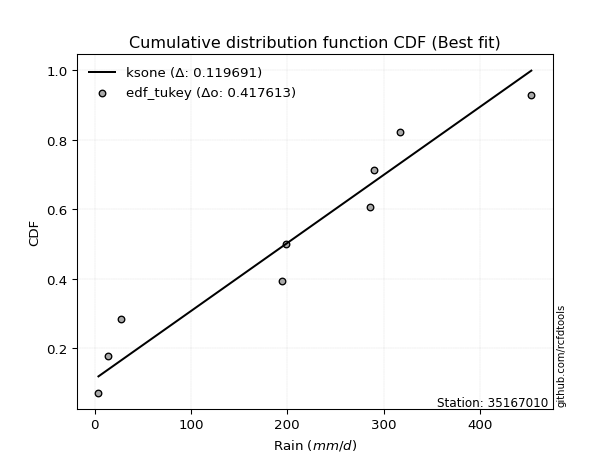</img>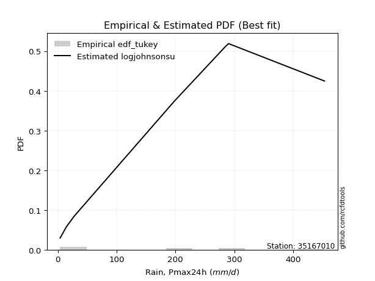</img>

</div>


### 8. EDF Gringorten (1963)

Gringorten plotting position formula is essential for estimating the probability and return periods of extreme events like floods and heavy rainfall. The constant _a=0.44_.

<div align="center">


$P=(m-a)/(n+1-2a)$


</div>


**8.1. Empirical values**

<div align="center">

|                | 0                    | 1                  | 2                   | 3                  | 4              | 5                  | 6                  | 7                  | 8                  |
|:---------------|:---------------------|:-------------------|:--------------------|:-------------------|:---------------|:-------------------|:-------------------|:-------------------|:-------------------|
| date           | 2022                 | 2018               | 2017                | 2019               | 2023           | 2020               | 2021               | 2025               | 2024               |
| x              | 3.9                  | 14.3               | 27.57               | 194.72             | 198.2          | 285.4              | 290.3              | 317.3              | 453.4              |
| m              | 1                    | 2                  | 3                   | 4                  | 5              | 6                  | 7                  | 8                  | 9                  |
| empirical_dist | edf_gringorten       | edf_gringorten     | edf_gringorten      | edf_gringorten     | edf_gringorten | edf_gringorten     | edf_gringorten     | edf_gringorten     | edf_gringorten     |
| empirical      | 0.061403508771929835 | 0.1710526315789474 | 0.28070175438596495 | 0.3903508771929825 | 0.5            | 0.6096491228070176 | 0.7192982456140351 | 0.8289473684210527 | 0.9385964912280703 |
| empirical_tr   | 1.0654205607476634   | 1.2063492063492063 | 1.3902439024390243  | 1.6402877697841727 | 2.0            | 2.561797752808989  | 3.5625             | 5.846153846153847  | 16.285714285714324 |

</div>


**8.2. Kolmogorov-Smirnov fit test (sorted by Δ)**


<div align="center">

|                | 0                   | 1                   | 2                   | 3                   | 4                   | 5                   | 6                   | 7                   | 8                   | 9                   | 10                  | 11                  | 12                  | 13                  | 14                  | 15                  | 16                  | 17                  | 18                  | 19                  | 20                  | 21                  | 22                  | 23                  | 24                  | 25                  | 26                  | 27                  | 28                  | 29                  | 30                  | 31                  | 32                  | 33                  | 34                  | 35                  | 36                  | 37                  | 38                  | 39                  | 40                  | 41                  | 42                  | 43                  | 44                  | 45                  | 46                  | 47                  | 48                  | 49                  | 50                  | 51                  | 52                  | 53                  | 54                  | 55                  | 56                  | 57                  | 58                  | 59                  | 60                  | 61                  | 62                  | 63                  | 64                  | 65                  | 66                  | 67                  | 68                  | 69                  | 70                  | 71                  | 72                  | 73                  | 74                  | 75                  | 76                  | 77                  | 78                  | 79                  | 80                  | 81                  | 82                  | 83                  | 84                  | 85                  | 86                  | 87                  | 88                  | 89                  | 90                  | 91                  | 92                  | 93                  | 94                  | 95                  | 96                  | 97                  | 98                  | 99                  | 100                 | 101                 | 102                 | 103                 | 104                 | 105                 | 106                 | 107                 | 108                 | 109                 | 110                 | 111                 | 112                 | 113                 | 114                 | 115                 | 116                 | 117                 | 118                 | 119                 | 120                 | 121                 | 122                 | 123                 | 124                 | 125                 | 126                 | 127                 | 128                 | 129                 | 130                 | 131                 | 132                 | 133                 | 134                 | 135                 | 136                 | 137                 | 138                 | 139                 | 140                 | 141                 | 142                 | 143                 | 144                 | 145                 | 146                 | 147                 | 148                 | 149                 | 150                 | 151                 | 152                 | 153                 | 154                 | 155                 | 156                 | 157                 | 158                 | 159                 |
|:---------------|:--------------------|:--------------------|:--------------------|:--------------------|:--------------------|:--------------------|:--------------------|:--------------------|:--------------------|:--------------------|:--------------------|:--------------------|:--------------------|:--------------------|:--------------------|:--------------------|:--------------------|:--------------------|:--------------------|:--------------------|:--------------------|:--------------------|:--------------------|:--------------------|:--------------------|:--------------------|:--------------------|:--------------------|:--------------------|:--------------------|:--------------------|:--------------------|:--------------------|:--------------------|:--------------------|:--------------------|:--------------------|:--------------------|:--------------------|:--------------------|:--------------------|:--------------------|:--------------------|:--------------------|:--------------------|:--------------------|:--------------------|:--------------------|:--------------------|:--------------------|:--------------------|:--------------------|:--------------------|:--------------------|:--------------------|:--------------------|:--------------------|:--------------------|:--------------------|:--------------------|:--------------------|:--------------------|:--------------------|:--------------------|:--------------------|:--------------------|:--------------------|:--------------------|:--------------------|:--------------------|:--------------------|:--------------------|:--------------------|:--------------------|:--------------------|:--------------------|:--------------------|:--------------------|:--------------------|:--------------------|:--------------------|:--------------------|:--------------------|:--------------------|:--------------------|:--------------------|:--------------------|:--------------------|:--------------------|:--------------------|:--------------------|:--------------------|:--------------------|:--------------------|:--------------------|:--------------------|:--------------------|:--------------------|:--------------------|:--------------------|:--------------------|:--------------------|:--------------------|:--------------------|:--------------------|:--------------------|:--------------------|:--------------------|:--------------------|:--------------------|:--------------------|:--------------------|:--------------------|:--------------------|:--------------------|:--------------------|:--------------------|:--------------------|:--------------------|:--------------------|:--------------------|:--------------------|:--------------------|:--------------------|:--------------------|:--------------------|:--------------------|:--------------------|:--------------------|:--------------------|:--------------------|:--------------------|:--------------------|:--------------------|:--------------------|:--------------------|:--------------------|:--------------------|:--------------------|:--------------------|:--------------------|:--------------------|:--------------------|:--------------------|:--------------------|:--------------------|:--------------------|:--------------------|:--------------------|:--------------------|:--------------------|:--------------------|:--------------------|:--------------------|:--------------------|:--------------------|:--------------------|:--------------------|:--------------------|:--------------------|
| station        | 35167010            | 35167010            | 35167010            | 35167010            | 35167010            | 35167010            | 35167010            | 35167010            | 35167010            | 35167010            | 35167010            | 35167010            | 35167010            | 35167010            | 35167010            | 35167010            | 35167010            | 35167010            | 35167010            | 35167010            | 35167010            | 35167010            | 35167010            | 35167010            | 35167010            | 35167010            | 35167010            | 35167010            | 35167010            | 35167010            | 35167010            | 35167010            | 35167010            | 35167010            | 35167010            | 35167010            | 35167010            | 35167010            | 35167010            | 35167010            | 35167010            | 35167010            | 35167010            | 35167010            | 35167010            | 35167010            | 35167010            | 35167010            | 35167010            | 35167010            | 35167010            | 35167010            | 35167010            | 35167010            | 35167010            | 35167010            | 35167010            | 35167010            | 35167010            | 35167010            | 35167010            | 35167010            | 35167010            | 35167010            | 35167010            | 35167010            | 35167010            | 35167010            | 35167010            | 35167010            | 35167010            | 35167010            | 35167010            | 35167010            | 35167010            | 35167010            | 35167010            | 35167010            | 35167010            | 35167010            | 35167010            | 35167010            | 35167010            | 35167010            | 35167010            | 35167010            | 35167010            | 35167010            | 35167010            | 35167010            | 35167010            | 35167010            | 35167010            | 35167010            | 35167010            | 35167010            | 35167010            | 35167010            | 35167010            | 35167010            | 35167010            | 35167010            | 35167010            | 35167010            | 35167010            | 35167010            | 35167010            | 35167010            | 35167010            | 35167010            | 35167010            | 35167010            | 35167010            | 35167010            | 35167010            | 35167010            | 35167010            | 35167010            | 35167010            | 35167010            | 35167010            | 35167010            | 35167010            | 35167010            | 35167010            | 35167010            | 35167010            | 35167010            | 35167010            | 35167010            | 35167010            | 35167010            | 35167010            | 35167010            | 35167010            | 35167010            | 35167010            | 35167010            | 35167010            | 35167010            | 35167010            | 35167010            | 35167010            | 35167010            | 35167010            | 35167010            | 35167010            | 35167010            | 35167010            | 35167010            | 35167010            | 35167010            | 35167010            | 35167010            | 35167010            | 35167010            | 35167010            | 35167010            | 35167010            | 35167010            |
| empirical_dist | edf_gringorten      | edf_gringorten      | edf_gringorten      | edf_gringorten      | edf_gringorten      | edf_gringorten      | edf_gringorten      | edf_gringorten      | edf_gringorten      | edf_gringorten      | edf_gringorten      | edf_gringorten      | edf_gringorten      | edf_gringorten      | edf_gringorten      | edf_gringorten      | edf_gringorten      | edf_gringorten      | edf_gringorten      | edf_gringorten      | edf_gringorten      | edf_gringorten      | edf_gringorten      | edf_gringorten      | edf_gringorten      | edf_gringorten      | edf_gringorten      | edf_gringorten      | edf_gringorten      | edf_gringorten      | edf_gringorten      | edf_gringorten      | edf_gringorten      | edf_gringorten      | edf_gringorten      | edf_gringorten      | edf_gringorten      | edf_gringorten      | edf_gringorten      | edf_gringorten      | edf_gringorten      | edf_gringorten      | edf_gringorten      | edf_gringorten      | edf_gringorten      | edf_gringorten      | edf_gringorten      | edf_gringorten      | edf_gringorten      | edf_gringorten      | edf_gringorten      | edf_gringorten      | edf_gringorten      | edf_gringorten      | edf_gringorten      | edf_gringorten      | edf_gringorten      | edf_gringorten      | edf_gringorten      | edf_gringorten      | edf_gringorten      | edf_gringorten      | edf_gringorten      | edf_gringorten      | edf_gringorten      | edf_gringorten      | edf_gringorten      | edf_gringorten      | edf_gringorten      | edf_gringorten      | edf_gringorten      | edf_gringorten      | edf_gringorten      | edf_gringorten      | edf_gringorten      | edf_gringorten      | edf_gringorten      | edf_gringorten      | edf_gringorten      | edf_gringorten      | edf_gringorten      | edf_gringorten      | edf_gringorten      | edf_gringorten      | edf_gringorten      | edf_gringorten      | edf_gringorten      | edf_gringorten      | edf_gringorten      | edf_gringorten      | edf_gringorten      | edf_gringorten      | edf_gringorten      | edf_gringorten      | edf_gringorten      | edf_gringorten      | edf_gringorten      | edf_gringorten      | edf_gringorten      | edf_gringorten      | edf_gringorten      | edf_gringorten      | edf_gringorten      | edf_gringorten      | edf_gringorten      | edf_gringorten      | edf_gringorten      | edf_gringorten      | edf_gringorten      | edf_gringorten      | edf_gringorten      | edf_gringorten      | edf_gringorten      | edf_gringorten      | edf_gringorten      | edf_gringorten      | edf_gringorten      | edf_gringorten      | edf_gringorten      | edf_gringorten      | edf_gringorten      | edf_gringorten      | edf_gringorten      | edf_gringorten      | edf_gringorten      | edf_gringorten      | edf_gringorten      | edf_gringorten      | edf_gringorten      | edf_gringorten      | edf_gringorten      | edf_gringorten      | edf_gringorten      | edf_gringorten      | edf_gringorten      | edf_gringorten      | edf_gringorten      | edf_gringorten      | edf_gringorten      | edf_gringorten      | edf_gringorten      | edf_gringorten      | edf_gringorten      | edf_gringorten      | edf_gringorten      | edf_gringorten      | edf_gringorten      | edf_gringorten      | edf_gringorten      | edf_gringorten      | edf_gringorten      | edf_gringorten      | edf_gringorten      | edf_gringorten      | edf_gringorten      | edf_gringorten      | edf_gringorten      | edf_gringorten      | edf_gringorten      | edf_gringorten      |
| p_dist         | ksone               | logjohnsonsu        | semicircular        | arcsine             | anglit              | loggenextreme       | gausshyper          | genextreme          | foldnorm            | dweibull            | t                   | norm                | truncnorm           | exponnorm           | skewnorm            | pearson3            | gamma               | erlang              | johnsonsu           | nct                 | dgamma              | invgamma            | gumbel_l            | burr                | maxwell             | genlogistic         | invweibull          | rayleigh            | cosine              | loggennorm          | logistic            | argus               | kstwobign           | hypsecant           | rice                | loglevy_l           | laplace             | bradford            | invgauss            | logvonmises_line    | logweibull_max      | logmielke           | truncexpon          | logloggamma         | gumbel_r            | halfnorm            | nakagami            | logburr             | exponpow            | logtrapezoid        | gompertz            | logdgamma           | kappa4              | logargus            | logexponpow         | triang              | logarcsine          | wrapcauchy          | genpareto           | kappa3              | tukeylambda         | loggenpareto        | moyal               | uniform             | logburr12           | lomax               | mielke              | gengamma            | logpearson3         | ncf                 | loggumbel_l         | genexpon            | logweibull_min      | loggengamma         | exponweib           | alpha               | logsemicircular     | vonmises_line       | logdweibull         | loggompertz         | logloglaplace       | logexponweib        | loganglit           | weibull_min         | halflogistic        | logbeta             | lognakagami         | f                   | genhalflogistic     | logwrapcauchy       | logf                | logbetaprime        | wald                | loginvgauss         | logt                | logcrystalball      | lognorm             | logexponnorm        | truncweibull_min    | lognct              | loginvweibull       | logfatiguelife      | logrice             | halfgennorm         | loggamma            | loggamma            | loginvgamma         | logerlang           | logncf              | logfoldnorm         | logalpha            | loggenhalflogistic  | loglomax            | logmaxwell          | loglogistic         | logkstwobign        | lograyleigh         | beta                | logskewnorm         | burr12              | loghypsecant        | loggausshyper       | logcosine           | loghalfnorm         | gennorm             | loggenexpon         | loghalfgennorm      | loggumbel_r         | loglaplace          | loglaplace          | levy_l              | fatiguelife         | betaprime           | logtriang           | loghalflogistic     | logmoyal            | logksone            | trapezoid           | logkappa4           | logjohnsonsb        | logtruncweibull_min | logwald             | logkappa3           | loguniform          | crystalball         | powerlaw            | logtruncexpon       | logbradford         | logtruncnorm        | johnsonsb           | rdist               | logpowerlaw         | truncpareto         | weibull_max         | logtukeylambda      | logrdist            | logtruncpareto      | loggenlogistic      | logvonmises         | vonmises            |
| delta          | 0.1146782956390148  | 0.11671676215657206 | 0.1272465607191287  | 0.13594878824850443 | 0.13621410672809822 | 0.14185702932888805 | 0.14713393190438234 | 0.15476761287315763 | 0.15537027237144246 | 0.1561921279930042  | 0.15698683381256212 | 0.1570510035289911  | 0.15705100904768848 | 0.15705222123638513 | 0.15707474512474331 | 0.15752916111863463 | 0.15756926847517663 | 0.15771106101527005 | 0.15788830588248787 | 0.15911897864151775 | 0.16073468204753927 | 0.16112346722899024 | 0.16115169406718466 | 0.16156267915314232 | 0.16165905968457045 | 0.16478941679385123 | 0.16510457623890856 | 0.16523536628925264 | 0.16656585275871144 | 0.1683758487814177  | 0.17145287606931253 | 0.1742732441586477  | 0.17581169657498613 | 0.1781698394117498  | 0.17907560089308944 | 0.18163353426736045 | 0.18333703956670216 | 0.1836011829232591  | 0.18370380640255252 | 0.18397791655276402 | 0.18645645601207178 | 0.1865931863886497  | 0.18788876859103892 | 0.1901965563348012  | 0.19661427806499907 | 0.20066813643122436 | 0.20115094072405132 | 0.20291531637821386 | 0.20384450816423932 | 0.20444815631489327 | 0.2050257940398491  | 0.2072953634508734  | 0.20789694752783025 | 0.2105980242206495  | 0.21113432273928706 | 0.21119247551666664 | 0.21121635843210812 | 0.21642638308743728 | 0.22039626335375032 | 0.22151594108541825 | 0.22268862797767414 | 0.22401306319059383 | 0.22523992537528903 | 0.22804324493101502 | 0.23055767820085343 | 0.2317582647975372  | 0.23196994590489833 | 0.23494639907810105 | 0.23587303308781798 | 0.23857125424294384 | 0.23874088042775427 | 0.24202035919954829 | 0.2426760747053906  | 0.24673711829532613 | 0.24820630660490306 | 0.24881635374811334 | 0.24969584523645988 | 0.2509134062690836  | 0.25570103706764225 | 0.25600047159280365 | 0.25606428048917984 | 0.2569640659717494  | 0.25898374694606646 | 0.2606000106070479  | 0.26415068118534824 | 0.27019258355540365 | 0.27104562684375894 | 0.2746011345545361  | 0.2771057803459218  | 0.27909901946892773 | 0.28004727760635845 | 0.2801818450860855  | 0.28070175438596495 | 0.2807408403762606  | 0.28099508981823157 | 0.28099539910100096 | 0.2809954354627226  | 0.28099768991212676 | 0.28109490557881395 | 0.2812097108477755  | 0.2813088792501994  | 0.2815295803334173  | 0.28389584463038825 | 0.28410280673815586 | 0.28506512477472273 | 0.28506512477472273 | 0.28781489902910434 | 0.28784341319034074 | 0.2880246946402943  | 0.28817146527063403 | 0.2920025007227302  | 0.293293114844758   | 0.2982629356674433  | 0.30027837120691164 | 0.30062011165331753 | 0.3006449444146448  | 0.3060040751701489  | 0.3097100930538545  | 0.31300057907926376 | 0.31382250160635866 | 0.3154258690034764  | 0.3173312553927751  | 0.3218581482746237  | 0.32291497627551874 | 0.32894736842105265 | 0.33017905394815655 | 0.3322608830178751  | 0.3373662400753013  | 0.3426580609523217  | 0.3426580609523217  | 0.34334064041851325 | 0.3473354958181309  | 0.34798928536799895 | 0.3490971581419681  | 0.35060288267752787 | 0.35581344790896546 | 0.378213747158422   | 0.38251702495777884 | 0.38853930759449157 | 0.3905863250441216  | 0.3985295592506309  | 0.4087366748289453  | 0.4315326958606956  | 0.4319266720287029  | 0.44515398030201897 | 0.46968972663382264 | 0.47030360175359714 | 0.47209425685249756 | 0.48508446417803336 | 0.5100278122248059  | 0.5641487561619043  | 0.578209270212976   | 0.5955764641297299  | 0.6803855461305179  | 0.7192340410049534  | 0.7192982455848669  | 0.749561717923583   | 0.8289473684210527  | 0.9989112995653238  | 71.21214904024737   |
| deltao         | 0.41761268023100007 | 0.41761268023100007 | 0.41761268023100007 | 0.41761268023100007 | 0.41761268023100007 | 0.41761268023100007 | 0.41761268023100007 | 0.41761268023100007 | 0.41761268023100007 | 0.41761268023100007 | 0.41761268023100007 | 0.41761268023100007 | 0.41761268023100007 | 0.41761268023100007 | 0.41761268023100007 | 0.41761268023100007 | 0.41761268023100007 | 0.41761268023100007 | 0.41761268023100007 | 0.41761268023100007 | 0.41761268023100007 | 0.41761268023100007 | 0.41761268023100007 | 0.41761268023100007 | 0.41761268023100007 | 0.41761268023100007 | 0.41761268023100007 | 0.41761268023100007 | 0.41761268023100007 | 0.41761268023100007 | 0.41761268023100007 | 0.41761268023100007 | 0.41761268023100007 | 0.41761268023100007 | 0.41761268023100007 | 0.41761268023100007 | 0.41761268023100007 | 0.41761268023100007 | 0.41761268023100007 | 0.41761268023100007 | 0.41761268023100007 | 0.41761268023100007 | 0.41761268023100007 | 0.41761268023100007 | 0.41761268023100007 | 0.41761268023100007 | 0.41761268023100007 | 0.41761268023100007 | 0.41761268023100007 | 0.41761268023100007 | 0.41761268023100007 | 0.41761268023100007 | 0.41761268023100007 | 0.41761268023100007 | 0.41761268023100007 | 0.41761268023100007 | 0.41761268023100007 | 0.41761268023100007 | 0.41761268023100007 | 0.41761268023100007 | 0.41761268023100007 | 0.41761268023100007 | 0.41761268023100007 | 0.41761268023100007 | 0.41761268023100007 | 0.41761268023100007 | 0.41761268023100007 | 0.41761268023100007 | 0.41761268023100007 | 0.41761268023100007 | 0.41761268023100007 | 0.41761268023100007 | 0.41761268023100007 | 0.41761268023100007 | 0.41761268023100007 | 0.41761268023100007 | 0.41761268023100007 | 0.41761268023100007 | 0.41761268023100007 | 0.41761268023100007 | 0.41761268023100007 | 0.41761268023100007 | 0.41761268023100007 | 0.41761268023100007 | 0.41761268023100007 | 0.41761268023100007 | 0.41761268023100007 | 0.41761268023100007 | 0.41761268023100007 | 0.41761268023100007 | 0.41761268023100007 | 0.41761268023100007 | 0.41761268023100007 | 0.41761268023100007 | 0.41761268023100007 | 0.41761268023100007 | 0.41761268023100007 | 0.41761268023100007 | 0.41761268023100007 | 0.41761268023100007 | 0.41761268023100007 | 0.41761268023100007 | 0.41761268023100007 | 0.41761268023100007 | 0.41761268023100007 | 0.41761268023100007 | 0.41761268023100007 | 0.41761268023100007 | 0.41761268023100007 | 0.41761268023100007 | 0.41761268023100007 | 0.41761268023100007 | 0.41761268023100007 | 0.41761268023100007 | 0.41761268023100007 | 0.41761268023100007 | 0.41761268023100007 | 0.41761268023100007 | 0.41761268023100007 | 0.41761268023100007 | 0.41761268023100007 | 0.41761268023100007 | 0.41761268023100007 | 0.41761268023100007 | 0.41761268023100007 | 0.41761268023100007 | 0.41761268023100007 | 0.41761268023100007 | 0.41761268023100007 | 0.41761268023100007 | 0.41761268023100007 | 0.41761268023100007 | 0.41761268023100007 | 0.41761268023100007 | 0.41761268023100007 | 0.41761268023100007 | 0.41761268023100007 | 0.41761268023100007 | 0.41761268023100007 | 0.41761268023100007 | 0.41761268023100007 | 0.41761268023100007 | 0.41761268023100007 | 0.41761268023100007 | 0.41761268023100007 | 0.41761268023100007 | 0.41761268023100007 | 0.41761268023100007 | 0.41761268023100007 | 0.41761268023100007 | 0.41761268023100007 | 0.41761268023100007 | 0.41761268023100007 | 0.41761268023100007 | 0.41761268023100007 | 0.41761268023100007 | 0.41761268023100007 | 0.41761268023100007 | 0.41761268023100007 | 0.41761268023100007 |
| eval           | Δo > Δ              | Δo > Δ              | Δo > Δ              | Δo > Δ              | Δo > Δ              | Δo > Δ              | Δo > Δ              | Δo > Δ              | Δo > Δ              | Δo > Δ              | Δo > Δ              | Δo > Δ              | Δo > Δ              | Δo > Δ              | Δo > Δ              | Δo > Δ              | Δo > Δ              | Δo > Δ              | Δo > Δ              | Δo > Δ              | Δo > Δ              | Δo > Δ              | Δo > Δ              | Δo > Δ              | Δo > Δ              | Δo > Δ              | Δo > Δ              | Δo > Δ              | Δo > Δ              | Δo > Δ              | Δo > Δ              | Δo > Δ              | Δo > Δ              | Δo > Δ              | Δo > Δ              | Δo > Δ              | Δo > Δ              | Δo > Δ              | Δo > Δ              | Δo > Δ              | Δo > Δ              | Δo > Δ              | Δo > Δ              | Δo > Δ              | Δo > Δ              | Δo > Δ              | Δo > Δ              | Δo > Δ              | Δo > Δ              | Δo > Δ              | Δo > Δ              | Δo > Δ              | Δo > Δ              | Δo > Δ              | Δo > Δ              | Δo > Δ              | Δo > Δ              | Δo > Δ              | Δo > Δ              | Δo > Δ              | Δo > Δ              | Δo > Δ              | Δo > Δ              | Δo > Δ              | Δo > Δ              | Δo > Δ              | Δo > Δ              | Δo > Δ              | Δo > Δ              | Δo > Δ              | Δo > Δ              | Δo > Δ              | Δo > Δ              | Δo > Δ              | Δo > Δ              | Δo > Δ              | Δo > Δ              | Δo > Δ              | Δo > Δ              | Δo > Δ              | Δo > Δ              | Δo > Δ              | Δo > Δ              | Δo > Δ              | Δo > Δ              | Δo > Δ              | Δo > Δ              | Δo > Δ              | Δo > Δ              | Δo > Δ              | Δo > Δ              | Δo > Δ              | Δo > Δ              | Δo > Δ              | Δo > Δ              | Δo > Δ              | Δo > Δ              | Δo > Δ              | Δo > Δ              | Δo > Δ              | Δo > Δ              | Δo > Δ              | Δo > Δ              | Δo > Δ              | Δo > Δ              | Δo > Δ              | Δo > Δ              | Δo > Δ              | Δo > Δ              | Δo > Δ              | Δo > Δ              | Δo > Δ              | Δo > Δ              | Δo > Δ              | Δo > Δ              | Δo > Δ              | Δo > Δ              | Δo > Δ              | Δo > Δ              | Δo > Δ              | Δo > Δ              | Δo > Δ              | Δo > Δ              | Δo > Δ              | Δo > Δ              | Δo > Δ              | Δo > Δ              | Δo > Δ              | Δo > Δ              | Δo > Δ              | Δo > Δ              | Δo > Δ              | Δo > Δ              | Δo > Δ              | Δo > Δ              | Δo > Δ              | Δo > Δ              | Δo > Δ              | Δo > Δ              | Δo > Δ              | Δo > Δ              | Δo > Δ              | Δo <= Δ             | Δo <= Δ             | Δo <= Δ             | Δo <= Δ             | Δo <= Δ             | Δo <= Δ             | Δo <= Δ             | Δo <= Δ             | Δo <= Δ             | Δo <= Δ             | Δo <= Δ             | Δo <= Δ             | Δo <= Δ             | Δo <= Δ             | Δo <= Δ             | Δo <= Δ             | Δo <= Δ             | Δo <= Δ             |
| fit            | 1                   | 1                   | 1                   | 1                   | 1                   | 1                   | 1                   | 1                   | 1                   | 1                   | 1                   | 1                   | 1                   | 1                   | 1                   | 1                   | 1                   | 1                   | 1                   | 1                   | 1                   | 1                   | 1                   | 1                   | 1                   | 1                   | 1                   | 1                   | 1                   | 1                   | 1                   | 1                   | 1                   | 1                   | 1                   | 1                   | 1                   | 1                   | 1                   | 1                   | 1                   | 1                   | 1                   | 1                   | 1                   | 1                   | 1                   | 1                   | 1                   | 1                   | 1                   | 1                   | 1                   | 1                   | 1                   | 1                   | 1                   | 1                   | 1                   | 1                   | 1                   | 1                   | 1                   | 1                   | 1                   | 1                   | 1                   | 1                   | 1                   | 1                   | 1                   | 1                   | 1                   | 1                   | 1                   | 1                   | 1                   | 1                   | 1                   | 1                   | 1                   | 1                   | 1                   | 1                   | 1                   | 1                   | 1                   | 1                   | 1                   | 1                   | 1                   | 1                   | 1                   | 1                   | 1                   | 1                   | 1                   | 1                   | 1                   | 1                   | 1                   | 1                   | 1                   | 1                   | 1                   | 1                   | 1                   | 1                   | 1                   | 1                   | 1                   | 1                   | 1                   | 1                   | 1                   | 1                   | 1                   | 1                   | 1                   | 1                   | 1                   | 1                   | 1                   | 1                   | 1                   | 1                   | 1                   | 1                   | 1                   | 1                   | 1                   | 1                   | 1                   | 1                   | 1                   | 1                   | 1                   | 1                   | 1                   | 1                   | 1                   | 1                   | 0                   | 0                   | 0                   | 0                   | 0                   | 0                   | 0                   | 0                   | 0                   | 0                   | 0                   | 0                   | 0                   | 0                   | 0                   | 0                   | 0                   | 0                   |
| n              | 9                   | 9                   | 9                   | 9                   | 9                   | 9                   | 9                   | 9                   | 9                   | 9                   | 9                   | 9                   | 9                   | 9                   | 9                   | 9                   | 9                   | 9                   | 9                   | 9                   | 9                   | 9                   | 9                   | 9                   | 9                   | 9                   | 9                   | 9                   | 9                   | 9                   | 9                   | 9                   | 9                   | 9                   | 9                   | 9                   | 9                   | 9                   | 9                   | 9                   | 9                   | 9                   | 9                   | 9                   | 9                   | 9                   | 9                   | 9                   | 9                   | 9                   | 9                   | 9                   | 9                   | 9                   | 9                   | 9                   | 9                   | 9                   | 9                   | 9                   | 9                   | 9                   | 9                   | 9                   | 9                   | 9                   | 9                   | 9                   | 9                   | 9                   | 9                   | 9                   | 9                   | 9                   | 9                   | 9                   | 9                   | 9                   | 9                   | 9                   | 9                   | 9                   | 9                   | 9                   | 9                   | 9                   | 9                   | 9                   | 9                   | 9                   | 9                   | 9                   | 9                   | 9                   | 9                   | 9                   | 9                   | 9                   | 9                   | 9                   | 9                   | 9                   | 9                   | 9                   | 9                   | 9                   | 9                   | 9                   | 9                   | 9                   | 9                   | 9                   | 9                   | 9                   | 9                   | 9                   | 9                   | 9                   | 9                   | 9                   | 9                   | 9                   | 9                   | 9                   | 9                   | 9                   | 9                   | 9                   | 9                   | 9                   | 9                   | 9                   | 9                   | 9                   | 9                   | 9                   | 9                   | 9                   | 9                   | 9                   | 9                   | 9                   | 9                   | 9                   | 9                   | 9                   | 9                   | 9                   | 9                   | 9                   | 9                   | 9                   | 9                   | 9                   | 9                   | 9                   | 9                   | 9                   | 9                   | 9                   |
| best_fit       | 1                   | 0                   | 0                   | 0                   | 0                   | 0                   | 0                   | 0                   | 0                   | 0                   | 0                   | 0                   | 0                   | 0                   | 0                   | 0                   | 0                   | 0                   | 0                   | 0                   | 0                   | 0                   | 0                   | 0                   | 0                   | 0                   | 0                   | 0                   | 0                   | 0                   | 0                   | 0                   | 0                   | 0                   | 0                   | 0                   | 0                   | 0                   | 0                   | 0                   | 0                   | 0                   | 0                   | 0                   | 0                   | 0                   | 0                   | 0                   | 0                   | 0                   | 0                   | 0                   | 0                   | 0                   | 0                   | 0                   | 0                   | 0                   | 0                   | 0                   | 0                   | 0                   | 0                   | 0                   | 0                   | 0                   | 0                   | 0                   | 0                   | 0                   | 0                   | 0                   | 0                   | 0                   | 0                   | 0                   | 0                   | 0                   | 0                   | 0                   | 0                   | 0                   | 0                   | 0                   | 0                   | 0                   | 0                   | 0                   | 0                   | 0                   | 0                   | 0                   | 0                   | 0                   | 0                   | 0                   | 0                   | 0                   | 0                   | 0                   | 0                   | 0                   | 0                   | 0                   | 0                   | 0                   | 0                   | 0                   | 0                   | 0                   | 0                   | 0                   | 0                   | 0                   | 0                   | 0                   | 0                   | 0                   | 0                   | 0                   | 0                   | 0                   | 0                   | 0                   | 0                   | 0                   | 0                   | 0                   | 0                   | 0                   | 0                   | 0                   | 0                   | 0                   | 0                   | 0                   | 0                   | 0                   | 0                   | 0                   | 0                   | 0                   | 0                   | 0                   | 0                   | 0                   | 0                   | 0                   | 0                   | 0                   | 0                   | 0                   | 0                   | 0                   | 0                   | 0                   | 0                   | 0                   | 0                   | 0                   |
| best_fit_sort  | 1                   | 2                   | 3                   | 4                   | 5                   | 6                   | 7                   | 8                   | 9                   | 10                  | 11                  | 12                  | 13                  | 14                  | 15                  | 16                  | 17                  | 18                  | 19                  | 20                  | 21                  | 22                  | 23                  | 24                  | 25                  | 26                  | 27                  | 28                  | 29                  | 30                  | 31                  | 32                  | 33                  | 34                  | 35                  | 36                  | 37                  | 38                  | 39                  | 40                  | 41                  | 42                  | 43                  | 44                  | 45                  | 46                  | 47                  | 48                  | 49                  | 50                  | 51                  | 52                  | 53                  | 54                  | 55                  | 56                  | 57                  | 58                  | 59                  | 60                  | 61                  | 62                  | 63                  | 64                  | 65                  | 66                  | 67                  | 68                  | 69                  | 70                  | 71                  | 72                  | 73                  | 74                  | 75                  | 76                  | 77                  | 78                  | 79                  | 80                  | 81                  | 82                  | 83                  | 84                  | 85                  | 86                  | 87                  | 88                  | 89                  | 90                  | 91                  | 92                  | 93                  | 94                  | 95                  | 96                  | 97                  | 98                  | 99                  | 100                 | 101                 | 102                 | 103                 | 104                 | 105                 | 106                 | 107                 | 108                 | 109                 | 110                 | 111                 | 112                 | 113                 | 114                 | 115                 | 116                 | 117                 | 118                 | 119                 | 120                 | 121                 | 122                 | 123                 | 124                 | 125                 | 126                 | 127                 | 128                 | 129                 | 130                 | 131                 | 132                 | 133                 | 134                 | 135                 | 136                 | 137                 | 138                 | 139                 | 140                 | 141                 | 142                 | 143                 | 144                 | 145                 | 146                 | 147                 | 148                 | 149                 | 150                 | 151                 | 152                 | 153                 | 154                 | 155                 | 156                 | 157                 | 158                 | 159                 | 160                 |

</div>


**8.3. Best fit**

<div align="center">

|   id |   station | empirical_dist   | p_dist   |    delta |   deltao | eval   |   fit |   n |   best_fit |   best_fit_sort |
|-----:|----------:|:-----------------|:---------|---------:|---------:|:-------|------:|----:|-----------:|----------------:|
|    0 |  35167010 | edf_gringorten   | ksone    | 0.114678 | 0.417613 | Δo > Δ |     1 |   9 |          1 |               1 |

</div>


<div align="center">

</img>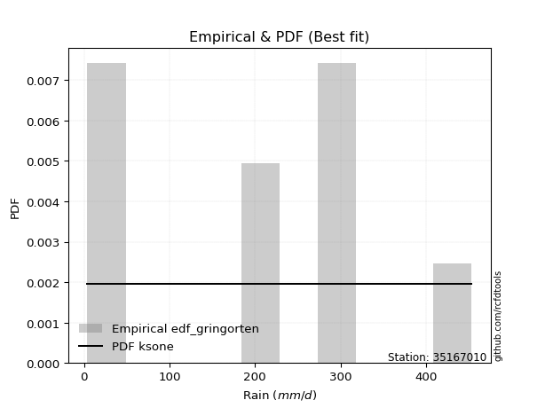</img>

</div>


### 9. EDF Filliben (1975)

The specific values of the constants (0.3175) (often denoted as $alpha$) and (0.365) are derived from a method proposed by James J. Filliben in a 1975 paper. This particular formula is the mean value of the $i$-th order statistic of the normal distribution and is considered a robust and effective plotting position formula for the normal probability plot correlation coefficient test for normality.

<div align="center">


$P=(m-0.3175)/(n+0.365)$


</div>


**9.1. Empirical values**

<div align="center">

|                | 0                   | 1                  | 2                   | 3                   | 4            | 5                  | 6                  | 7                  | 8                  |
|:---------------|:--------------------|:-------------------|:--------------------|:--------------------|:-------------|:-------------------|:-------------------|:-------------------|:-------------------|
| date           | 2022                | 2018               | 2017                | 2019                | 2023         | 2020               | 2021               | 2025               | 2024               |
| x              | 3.9                 | 14.3               | 27.57               | 194.72              | 198.2        | 285.4              | 290.3              | 317.3              | 453.4              |
| m              | 1                   | 2                  | 3                   | 4                   | 5            | 6                  | 7                  | 8                  | 9                  |
| empirical_dist | edf_filliben        | edf_filliben       | edf_filliben        | edf_filliben        | edf_filliben | edf_filliben       | edf_filliben       | edf_filliben       | edf_filliben       |
| empirical      | 0.07287773625200214 | 0.1796583021890016 | 0.28643886812600106 | 0.39321943406300053 | 0.5          | 0.6067805659369995 | 0.7135611318739989 | 0.8203416978109984 | 0.9271222637479978 |
| empirical_tr   | 1.0786063921681543  | 1.219004230393752  | 1.401421623643846   | 1.6480422349318082  | 2.0          | 2.5431093007467753 | 3.491146318732526  | 5.566121842496286  | 13.721611721611705 |

</div>


**9.2. Kolmogorov-Smirnov fit test (sorted by Δ)**


<div align="center">

|                | 0                   | 1                   | 2                   | 3                   | 4                   | 5                   | 6                   | 7                   | 8                   | 9                   | 10                  | 11                  | 12                  | 13                  | 14                  | 15                  | 16                  | 17                  | 18                  | 19                  | 20                  | 21                  | 22                  | 23                  | 24                  | 25                  | 26                  | 27                  | 28                  | 29                  | 30                  | 31                  | 32                  | 33                  | 34                  | 35                  | 36                  | 37                  | 38                  | 39                  | 40                  | 41                  | 42                  | 43                  | 44                  | 45                  | 46                  | 47                  | 48                  | 49                  | 50                  | 51                  | 52                  | 53                  | 54                  | 55                  | 56                  | 57                  | 58                  | 59                  | 60                  | 61                  | 62                  | 63                  | 64                  | 65                  | 66                  | 67                  | 68                  | 69                  | 70                  | 71                  | 72                  | 73                  | 74                  | 75                  | 76                  | 77                  | 78                  | 79                  | 80                  | 81                  | 82                  | 83                  | 84                  | 85                  | 86                  | 87                  | 88                  | 89                  | 90                  | 91                  | 92                  | 93                  | 94                  | 95                  | 96                  | 97                  | 98                  | 99                  | 100                 | 101                 | 102                 | 103                 | 104                 | 105                 | 106                 | 107                 | 108                 | 109                 | 110                 | 111                 | 112                 | 113                 | 114                 | 115                 | 116                 | 117                 | 118                 | 119                 | 120                 | 121                 | 122                 | 123                 | 124                 | 125                 | 126                 | 127                 | 128                 | 129                 | 130                 | 131                 | 132                 | 133                 | 134                 | 135                 | 136                 | 137                 | 138                 | 139                 | 140                 | 141                 | 142                 | 143                 | 144                 | 145                 | 146                 | 147                 | 148                 | 149                 | 150                 | 151                 | 152                 | 153                 | 154                 | 155                 | 156                 | 157                 | 158                 | 159                 |
|:---------------|:--------------------|:--------------------|:--------------------|:--------------------|:--------------------|:--------------------|:--------------------|:--------------------|:--------------------|:--------------------|:--------------------|:--------------------|:--------------------|:--------------------|:--------------------|:--------------------|:--------------------|:--------------------|:--------------------|:--------------------|:--------------------|:--------------------|:--------------------|:--------------------|:--------------------|:--------------------|:--------------------|:--------------------|:--------------------|:--------------------|:--------------------|:--------------------|:--------------------|:--------------------|:--------------------|:--------------------|:--------------------|:--------------------|:--------------------|:--------------------|:--------------------|:--------------------|:--------------------|:--------------------|:--------------------|:--------------------|:--------------------|:--------------------|:--------------------|:--------------------|:--------------------|:--------------------|:--------------------|:--------------------|:--------------------|:--------------------|:--------------------|:--------------------|:--------------------|:--------------------|:--------------------|:--------------------|:--------------------|:--------------------|:--------------------|:--------------------|:--------------------|:--------------------|:--------------------|:--------------------|:--------------------|:--------------------|:--------------------|:--------------------|:--------------------|:--------------------|:--------------------|:--------------------|:--------------------|:--------------------|:--------------------|:--------------------|:--------------------|:--------------------|:--------------------|:--------------------|:--------------------|:--------------------|:--------------------|:--------------------|:--------------------|:--------------------|:--------------------|:--------------------|:--------------------|:--------------------|:--------------------|:--------------------|:--------------------|:--------------------|:--------------------|:--------------------|:--------------------|:--------------------|:--------------------|:--------------------|:--------------------|:--------------------|:--------------------|:--------------------|:--------------------|:--------------------|:--------------------|:--------------------|:--------------------|:--------------------|:--------------------|:--------------------|:--------------------|:--------------------|:--------------------|:--------------------|:--------------------|:--------------------|:--------------------|:--------------------|:--------------------|:--------------------|:--------------------|:--------------------|:--------------------|:--------------------|:--------------------|:--------------------|:--------------------|:--------------------|:--------------------|:--------------------|:--------------------|:--------------------|:--------------------|:--------------------|:--------------------|:--------------------|:--------------------|:--------------------|:--------------------|:--------------------|:--------------------|:--------------------|:--------------------|:--------------------|:--------------------|:--------------------|:--------------------|:--------------------|:--------------------|:--------------------|:--------------------|:--------------------|
| station        | 35167010            | 35167010            | 35167010            | 35167010            | 35167010            | 35167010            | 35167010            | 35167010            | 35167010            | 35167010            | 35167010            | 35167010            | 35167010            | 35167010            | 35167010            | 35167010            | 35167010            | 35167010            | 35167010            | 35167010            | 35167010            | 35167010            | 35167010            | 35167010            | 35167010            | 35167010            | 35167010            | 35167010            | 35167010            | 35167010            | 35167010            | 35167010            | 35167010            | 35167010            | 35167010            | 35167010            | 35167010            | 35167010            | 35167010            | 35167010            | 35167010            | 35167010            | 35167010            | 35167010            | 35167010            | 35167010            | 35167010            | 35167010            | 35167010            | 35167010            | 35167010            | 35167010            | 35167010            | 35167010            | 35167010            | 35167010            | 35167010            | 35167010            | 35167010            | 35167010            | 35167010            | 35167010            | 35167010            | 35167010            | 35167010            | 35167010            | 35167010            | 35167010            | 35167010            | 35167010            | 35167010            | 35167010            | 35167010            | 35167010            | 35167010            | 35167010            | 35167010            | 35167010            | 35167010            | 35167010            | 35167010            | 35167010            | 35167010            | 35167010            | 35167010            | 35167010            | 35167010            | 35167010            | 35167010            | 35167010            | 35167010            | 35167010            | 35167010            | 35167010            | 35167010            | 35167010            | 35167010            | 35167010            | 35167010            | 35167010            | 35167010            | 35167010            | 35167010            | 35167010            | 35167010            | 35167010            | 35167010            | 35167010            | 35167010            | 35167010            | 35167010            | 35167010            | 35167010            | 35167010            | 35167010            | 35167010            | 35167010            | 35167010            | 35167010            | 35167010            | 35167010            | 35167010            | 35167010            | 35167010            | 35167010            | 35167010            | 35167010            | 35167010            | 35167010            | 35167010            | 35167010            | 35167010            | 35167010            | 35167010            | 35167010            | 35167010            | 35167010            | 35167010            | 35167010            | 35167010            | 35167010            | 35167010            | 35167010            | 35167010            | 35167010            | 35167010            | 35167010            | 35167010            | 35167010            | 35167010            | 35167010            | 35167010            | 35167010            | 35167010            | 35167010            | 35167010            | 35167010            | 35167010            | 35167010            | 35167010            |
| empirical_dist | edf_filliben        | edf_filliben        | edf_filliben        | edf_filliben        | edf_filliben        | edf_filliben        | edf_filliben        | edf_filliben        | edf_filliben        | edf_filliben        | edf_filliben        | edf_filliben        | edf_filliben        | edf_filliben        | edf_filliben        | edf_filliben        | edf_filliben        | edf_filliben        | edf_filliben        | edf_filliben        | edf_filliben        | edf_filliben        | edf_filliben        | edf_filliben        | edf_filliben        | edf_filliben        | edf_filliben        | edf_filliben        | edf_filliben        | edf_filliben        | edf_filliben        | edf_filliben        | edf_filliben        | edf_filliben        | edf_filliben        | edf_filliben        | edf_filliben        | edf_filliben        | edf_filliben        | edf_filliben        | edf_filliben        | edf_filliben        | edf_filliben        | edf_filliben        | edf_filliben        | edf_filliben        | edf_filliben        | edf_filliben        | edf_filliben        | edf_filliben        | edf_filliben        | edf_filliben        | edf_filliben        | edf_filliben        | edf_filliben        | edf_filliben        | edf_filliben        | edf_filliben        | edf_filliben        | edf_filliben        | edf_filliben        | edf_filliben        | edf_filliben        | edf_filliben        | edf_filliben        | edf_filliben        | edf_filliben        | edf_filliben        | edf_filliben        | edf_filliben        | edf_filliben        | edf_filliben        | edf_filliben        | edf_filliben        | edf_filliben        | edf_filliben        | edf_filliben        | edf_filliben        | edf_filliben        | edf_filliben        | edf_filliben        | edf_filliben        | edf_filliben        | edf_filliben        | edf_filliben        | edf_filliben        | edf_filliben        | edf_filliben        | edf_filliben        | edf_filliben        | edf_filliben        | edf_filliben        | edf_filliben        | edf_filliben        | edf_filliben        | edf_filliben        | edf_filliben        | edf_filliben        | edf_filliben        | edf_filliben        | edf_filliben        | edf_filliben        | edf_filliben        | edf_filliben        | edf_filliben        | edf_filliben        | edf_filliben        | edf_filliben        | edf_filliben        | edf_filliben        | edf_filliben        | edf_filliben        | edf_filliben        | edf_filliben        | edf_filliben        | edf_filliben        | edf_filliben        | edf_filliben        | edf_filliben        | edf_filliben        | edf_filliben        | edf_filliben        | edf_filliben        | edf_filliben        | edf_filliben        | edf_filliben        | edf_filliben        | edf_filliben        | edf_filliben        | edf_filliben        | edf_filliben        | edf_filliben        | edf_filliben        | edf_filliben        | edf_filliben        | edf_filliben        | edf_filliben        | edf_filliben        | edf_filliben        | edf_filliben        | edf_filliben        | edf_filliben        | edf_filliben        | edf_filliben        | edf_filliben        | edf_filliben        | edf_filliben        | edf_filliben        | edf_filliben        | edf_filliben        | edf_filliben        | edf_filliben        | edf_filliben        | edf_filliben        | edf_filliben        | edf_filliben        | edf_filliben        | edf_filliben        | edf_filliben        | edf_filliben        |
| p_dist         | ksone               | logjohnsonsu        | arcsine             | semicircular        | loggenextreme       | anglit              | gausshyper          | burr                | genextreme          | foldnorm            | dweibull            | t                   | norm                | truncnorm           | exponnorm           | skewnorm            | pearson3            | gamma               | erlang              | dgamma              | johnsonsu           | genlogistic         | invweibull          | nct                 | invgamma            | gumbel_l            | maxwell             | loglevy_l           | rayleigh            | cosine              | kstwobign           | loggennorm          | logistic            | argus               | invgauss            | logvonmises_line    | logweibull_max      | logmielke           | hypsecant           | rice                | truncexpon          | logloggamma         | laplace             | bradford            | nakagami            | logburr             | exponpow            | logtrapezoid        | gumbel_r            | triang              | halfnorm            | logargus            | logexponpow         | logarcsine          | gompertz            | logdgamma           | kappa4              | loggenpareto        | wrapcauchy          | genpareto           | kappa3              | logburr12           | tukeylambda         | lomax               | mielke              | moyal               | gengamma            | logpearson3         | uniform             | ncf                 | loggumbel_l         | exponweib           | genexpon            | logweibull_min      | loggengamma         | logloglaplace       | alpha               | logsemicircular     | logdweibull         | weibull_min         | loggompertz         | logexponweib        | loganglit           | vonmises_line       | logbeta             | lognakagami         | genhalflogistic     | halflogistic        | f                   | logwrapcauchy       | logf                | logbetaprime        | loginvgauss         | logt                | logcrystalball      | lognorm             | logexponnorm        | truncweibull_min    | lognct              | loginvweibull       | logfatiguelife      | logrice             | halfgennorm         | loggamma            | loggamma            | loginvgamma         | logerlang           | logncf              | logfoldnorm         | wald                | logalpha            | loggenhalflogistic  | loglomax            | logmaxwell          | loglogistic         | logkstwobign        | lograyleigh         | beta                | logskewnorm         | burr12              | loghypsecant        | loggausshyper       | logcosine           | loghalfnorm         | gennorm             | loggenexpon         | loghalfgennorm      | levy_l              | loggumbel_r         | loglaplace          | loglaplace          | fatiguelife         | betaprime           | logtriang           | loghalflogistic     | logmoyal            | trapezoid           | logksone            | logjohnsonsb        | logkappa4           | logtruncweibull_min | logwald             | logkappa3           | loguniform          | crystalball         | powerlaw            | logtruncexpon       | logbradford         | logtruncnorm        | johnsonsb           | rdist               | logpowerlaw         | truncpareto         | weibull_max         | logtukeylambda      | logrdist            | logtruncpareto      | loggenlogistic      | logvonmises         | vonmises            |
| delta          | 0.1204154093790509  | 0.12245387589660817 | 0.1273431176384502  | 0.1329836744591648  | 0.13898847245887003 | 0.14195122046813433 | 0.15287104564441845 | 0.1586941222831243  | 0.16050472661319373 | 0.16110738611147857 | 0.1619292417330403  | 0.16272394755259822 | 0.1627881172690272  | 0.1627881227877246  | 0.16278933497642123 | 0.16281185886477942 | 0.16326627485867073 | 0.16330638221521274 | 0.16344817475530615 | 0.16360323891755735 | 0.16362541962252397 | 0.16405343077115708 | 0.1643404104462604  | 0.16485609238155385 | 0.16686058096902634 | 0.16688880780722076 | 0.16739617342460655 | 0.17015930678728816 | 0.17097248002928875 | 0.17230296649874755 | 0.1729431397049681  | 0.1741129625214538  | 0.17718998980934864 | 0.1800103578986838  | 0.1808352495325345  | 0.181109359682746   | 0.18358789914205376 | 0.18372462951863167 | 0.1839069531517859  | 0.18481271463312554 | 0.1850202117210209  | 0.18732799946478318 | 0.18907415330673827 | 0.1893382966632952  | 0.1982823838540333  | 0.20004675950819584 | 0.2009759512942213  | 0.20157959944487525 | 0.20235139180503517 | 0.2025868049066124  | 0.20640525017126046 | 0.20772946735063147 | 0.20826576586926904 | 0.2083478015620901  | 0.2107629077798852  | 0.2130324771909095  | 0.21363406126786635 | 0.2211445063205758  | 0.22216349682747338 | 0.22613337709378642 | 0.22725305482545435 | 0.2276891213308354  | 0.22842574171771024 | 0.22888970792751917 | 0.2291013890348803  | 0.23097703911532513 | 0.23207784220808303 | 0.23300447621779996 | 0.23378035867105112 | 0.23570269737292582 | 0.23587232355773624 | 0.23673207912483052 | 0.23915180232953026 | 0.23980751783537257 | 0.2438685614253081  | 0.2445900530091073  | 0.24594779687809531 | 0.24682728836644185 | 0.247095366457588   | 0.2519943399969937  | 0.2531319147227856  | 0.2540955091017314  | 0.25611519007604844 | 0.2566505200091197  | 0.2615869129453494  | 0.2681770699737409  | 0.2685001097358676  | 0.26988779492538434 | 0.2717325776845181  | 0.2762304625989097  | 0.2771787207363404  | 0.2773132882160675  | 0.2778722835062426  | 0.27812653294821355 | 0.27812684223098294 | 0.2781268785927046  | 0.27812913304210873 | 0.2782263487087959  | 0.2783411539777575  | 0.27844032238018135 | 0.27866102346339927 | 0.2810272877603702  | 0.28123424986813783 | 0.2821965679047047  | 0.2821965679047047  | 0.2849463421590863  | 0.2849748563203227  | 0.28515613777027626 | 0.285302908400616   | 0.28643886812600106 | 0.2891339438527122  | 0.29042455797474    | 0.29539437879742525 | 0.2974098143368936  | 0.2977515547832995  | 0.29777638754462676 | 0.30313551830013086 | 0.30684153618383647 | 0.31013202220924574 | 0.31095394473634064 | 0.3125573121334584  | 0.3144626985227571  | 0.3189895914046057  | 0.3200464194055007  | 0.3203416978109984  | 0.32731049707813853 | 0.3293923261478571  | 0.331866412938441   | 0.3344976832052833  | 0.3397895040823037  | 0.3397895040823037  | 0.34446693894811287 | 0.3451207284979809  | 0.3462286012719501  | 0.34773432580750985 | 0.35294489103894744 | 0.3739113543477246  | 0.37534519028840396 | 0.38198065443406737 | 0.38567075072447354 | 0.39566100238061286 | 0.4058681179589273  | 0.42866413899067757 | 0.42905811515868486 | 0.4336797528219467  | 0.4668211697638046  | 0.4674350448835791  | 0.46922569998247954 | 0.48221590730801533 | 0.5014221416147517  | 0.5612801992918862  | 0.5696035996029217  | 0.5869707935196756  | 0.6717798755204637  | 0.7134969272649172  | 0.7135611318448308  | 0.7409560473135287  | 0.8203416978109984  | 0.9960427426953057  | 71.22362326772743   |
| deltao         | 0.41761268023100007 | 0.41761268023100007 | 0.41761268023100007 | 0.41761268023100007 | 0.41761268023100007 | 0.41761268023100007 | 0.41761268023100007 | 0.41761268023100007 | 0.41761268023100007 | 0.41761268023100007 | 0.41761268023100007 | 0.41761268023100007 | 0.41761268023100007 | 0.41761268023100007 | 0.41761268023100007 | 0.41761268023100007 | 0.41761268023100007 | 0.41761268023100007 | 0.41761268023100007 | 0.41761268023100007 | 0.41761268023100007 | 0.41761268023100007 | 0.41761268023100007 | 0.41761268023100007 | 0.41761268023100007 | 0.41761268023100007 | 0.41761268023100007 | 0.41761268023100007 | 0.41761268023100007 | 0.41761268023100007 | 0.41761268023100007 | 0.41761268023100007 | 0.41761268023100007 | 0.41761268023100007 | 0.41761268023100007 | 0.41761268023100007 | 0.41761268023100007 | 0.41761268023100007 | 0.41761268023100007 | 0.41761268023100007 | 0.41761268023100007 | 0.41761268023100007 | 0.41761268023100007 | 0.41761268023100007 | 0.41761268023100007 | 0.41761268023100007 | 0.41761268023100007 | 0.41761268023100007 | 0.41761268023100007 | 0.41761268023100007 | 0.41761268023100007 | 0.41761268023100007 | 0.41761268023100007 | 0.41761268023100007 | 0.41761268023100007 | 0.41761268023100007 | 0.41761268023100007 | 0.41761268023100007 | 0.41761268023100007 | 0.41761268023100007 | 0.41761268023100007 | 0.41761268023100007 | 0.41761268023100007 | 0.41761268023100007 | 0.41761268023100007 | 0.41761268023100007 | 0.41761268023100007 | 0.41761268023100007 | 0.41761268023100007 | 0.41761268023100007 | 0.41761268023100007 | 0.41761268023100007 | 0.41761268023100007 | 0.41761268023100007 | 0.41761268023100007 | 0.41761268023100007 | 0.41761268023100007 | 0.41761268023100007 | 0.41761268023100007 | 0.41761268023100007 | 0.41761268023100007 | 0.41761268023100007 | 0.41761268023100007 | 0.41761268023100007 | 0.41761268023100007 | 0.41761268023100007 | 0.41761268023100007 | 0.41761268023100007 | 0.41761268023100007 | 0.41761268023100007 | 0.41761268023100007 | 0.41761268023100007 | 0.41761268023100007 | 0.41761268023100007 | 0.41761268023100007 | 0.41761268023100007 | 0.41761268023100007 | 0.41761268023100007 | 0.41761268023100007 | 0.41761268023100007 | 0.41761268023100007 | 0.41761268023100007 | 0.41761268023100007 | 0.41761268023100007 | 0.41761268023100007 | 0.41761268023100007 | 0.41761268023100007 | 0.41761268023100007 | 0.41761268023100007 | 0.41761268023100007 | 0.41761268023100007 | 0.41761268023100007 | 0.41761268023100007 | 0.41761268023100007 | 0.41761268023100007 | 0.41761268023100007 | 0.41761268023100007 | 0.41761268023100007 | 0.41761268023100007 | 0.41761268023100007 | 0.41761268023100007 | 0.41761268023100007 | 0.41761268023100007 | 0.41761268023100007 | 0.41761268023100007 | 0.41761268023100007 | 0.41761268023100007 | 0.41761268023100007 | 0.41761268023100007 | 0.41761268023100007 | 0.41761268023100007 | 0.41761268023100007 | 0.41761268023100007 | 0.41761268023100007 | 0.41761268023100007 | 0.41761268023100007 | 0.41761268023100007 | 0.41761268023100007 | 0.41761268023100007 | 0.41761268023100007 | 0.41761268023100007 | 0.41761268023100007 | 0.41761268023100007 | 0.41761268023100007 | 0.41761268023100007 | 0.41761268023100007 | 0.41761268023100007 | 0.41761268023100007 | 0.41761268023100007 | 0.41761268023100007 | 0.41761268023100007 | 0.41761268023100007 | 0.41761268023100007 | 0.41761268023100007 | 0.41761268023100007 | 0.41761268023100007 | 0.41761268023100007 | 0.41761268023100007 | 0.41761268023100007 | 0.41761268023100007 |
| eval           | Δo > Δ              | Δo > Δ              | Δo > Δ              | Δo > Δ              | Δo > Δ              | Δo > Δ              | Δo > Δ              | Δo > Δ              | Δo > Δ              | Δo > Δ              | Δo > Δ              | Δo > Δ              | Δo > Δ              | Δo > Δ              | Δo > Δ              | Δo > Δ              | Δo > Δ              | Δo > Δ              | Δo > Δ              | Δo > Δ              | Δo > Δ              | Δo > Δ              | Δo > Δ              | Δo > Δ              | Δo > Δ              | Δo > Δ              | Δo > Δ              | Δo > Δ              | Δo > Δ              | Δo > Δ              | Δo > Δ              | Δo > Δ              | Δo > Δ              | Δo > Δ              | Δo > Δ              | Δo > Δ              | Δo > Δ              | Δo > Δ              | Δo > Δ              | Δo > Δ              | Δo > Δ              | Δo > Δ              | Δo > Δ              | Δo > Δ              | Δo > Δ              | Δo > Δ              | Δo > Δ              | Δo > Δ              | Δo > Δ              | Δo > Δ              | Δo > Δ              | Δo > Δ              | Δo > Δ              | Δo > Δ              | Δo > Δ              | Δo > Δ              | Δo > Δ              | Δo > Δ              | Δo > Δ              | Δo > Δ              | Δo > Δ              | Δo > Δ              | Δo > Δ              | Δo > Δ              | Δo > Δ              | Δo > Δ              | Δo > Δ              | Δo > Δ              | Δo > Δ              | Δo > Δ              | Δo > Δ              | Δo > Δ              | Δo > Δ              | Δo > Δ              | Δo > Δ              | Δo > Δ              | Δo > Δ              | Δo > Δ              | Δo > Δ              | Δo > Δ              | Δo > Δ              | Δo > Δ              | Δo > Δ              | Δo > Δ              | Δo > Δ              | Δo > Δ              | Δo > Δ              | Δo > Δ              | Δo > Δ              | Δo > Δ              | Δo > Δ              | Δo > Δ              | Δo > Δ              | Δo > Δ              | Δo > Δ              | Δo > Δ              | Δo > Δ              | Δo > Δ              | Δo > Δ              | Δo > Δ              | Δo > Δ              | Δo > Δ              | Δo > Δ              | Δo > Δ              | Δo > Δ              | Δo > Δ              | Δo > Δ              | Δo > Δ              | Δo > Δ              | Δo > Δ              | Δo > Δ              | Δo > Δ              | Δo > Δ              | Δo > Δ              | Δo > Δ              | Δo > Δ              | Δo > Δ              | Δo > Δ              | Δo > Δ              | Δo > Δ              | Δo > Δ              | Δo > Δ              | Δo > Δ              | Δo > Δ              | Δo > Δ              | Δo > Δ              | Δo > Δ              | Δo > Δ              | Δo > Δ              | Δo > Δ              | Δo > Δ              | Δo > Δ              | Δo > Δ              | Δo > Δ              | Δo > Δ              | Δo > Δ              | Δo > Δ              | Δo > Δ              | Δo > Δ              | Δo > Δ              | Δo > Δ              | Δo > Δ              | Δo <= Δ             | Δo <= Δ             | Δo <= Δ             | Δo <= Δ             | Δo <= Δ             | Δo <= Δ             | Δo <= Δ             | Δo <= Δ             | Δo <= Δ             | Δo <= Δ             | Δo <= Δ             | Δo <= Δ             | Δo <= Δ             | Δo <= Δ             | Δo <= Δ             | Δo <= Δ             | Δo <= Δ             | Δo <= Δ             |
| fit            | 1                   | 1                   | 1                   | 1                   | 1                   | 1                   | 1                   | 1                   | 1                   | 1                   | 1                   | 1                   | 1                   | 1                   | 1                   | 1                   | 1                   | 1                   | 1                   | 1                   | 1                   | 1                   | 1                   | 1                   | 1                   | 1                   | 1                   | 1                   | 1                   | 1                   | 1                   | 1                   | 1                   | 1                   | 1                   | 1                   | 1                   | 1                   | 1                   | 1                   | 1                   | 1                   | 1                   | 1                   | 1                   | 1                   | 1                   | 1                   | 1                   | 1                   | 1                   | 1                   | 1                   | 1                   | 1                   | 1                   | 1                   | 1                   | 1                   | 1                   | 1                   | 1                   | 1                   | 1                   | 1                   | 1                   | 1                   | 1                   | 1                   | 1                   | 1                   | 1                   | 1                   | 1                   | 1                   | 1                   | 1                   | 1                   | 1                   | 1                   | 1                   | 1                   | 1                   | 1                   | 1                   | 1                   | 1                   | 1                   | 1                   | 1                   | 1                   | 1                   | 1                   | 1                   | 1                   | 1                   | 1                   | 1                   | 1                   | 1                   | 1                   | 1                   | 1                   | 1                   | 1                   | 1                   | 1                   | 1                   | 1                   | 1                   | 1                   | 1                   | 1                   | 1                   | 1                   | 1                   | 1                   | 1                   | 1                   | 1                   | 1                   | 1                   | 1                   | 1                   | 1                   | 1                   | 1                   | 1                   | 1                   | 1                   | 1                   | 1                   | 1                   | 1                   | 1                   | 1                   | 1                   | 1                   | 1                   | 1                   | 1                   | 1                   | 0                   | 0                   | 0                   | 0                   | 0                   | 0                   | 0                   | 0                   | 0                   | 0                   | 0                   | 0                   | 0                   | 0                   | 0                   | 0                   | 0                   | 0                   |
| n              | 9                   | 9                   | 9                   | 9                   | 9                   | 9                   | 9                   | 9                   | 9                   | 9                   | 9                   | 9                   | 9                   | 9                   | 9                   | 9                   | 9                   | 9                   | 9                   | 9                   | 9                   | 9                   | 9                   | 9                   | 9                   | 9                   | 9                   | 9                   | 9                   | 9                   | 9                   | 9                   | 9                   | 9                   | 9                   | 9                   | 9                   | 9                   | 9                   | 9                   | 9                   | 9                   | 9                   | 9                   | 9                   | 9                   | 9                   | 9                   | 9                   | 9                   | 9                   | 9                   | 9                   | 9                   | 9                   | 9                   | 9                   | 9                   | 9                   | 9                   | 9                   | 9                   | 9                   | 9                   | 9                   | 9                   | 9                   | 9                   | 9                   | 9                   | 9                   | 9                   | 9                   | 9                   | 9                   | 9                   | 9                   | 9                   | 9                   | 9                   | 9                   | 9                   | 9                   | 9                   | 9                   | 9                   | 9                   | 9                   | 9                   | 9                   | 9                   | 9                   | 9                   | 9                   | 9                   | 9                   | 9                   | 9                   | 9                   | 9                   | 9                   | 9                   | 9                   | 9                   | 9                   | 9                   | 9                   | 9                   | 9                   | 9                   | 9                   | 9                   | 9                   | 9                   | 9                   | 9                   | 9                   | 9                   | 9                   | 9                   | 9                   | 9                   | 9                   | 9                   | 9                   | 9                   | 9                   | 9                   | 9                   | 9                   | 9                   | 9                   | 9                   | 9                   | 9                   | 9                   | 9                   | 9                   | 9                   | 9                   | 9                   | 9                   | 9                   | 9                   | 9                   | 9                   | 9                   | 9                   | 9                   | 9                   | 9                   | 9                   | 9                   | 9                   | 9                   | 9                   | 9                   | 9                   | 9                   | 9                   |
| best_fit       | 1                   | 0                   | 0                   | 0                   | 0                   | 0                   | 0                   | 0                   | 0                   | 0                   | 0                   | 0                   | 0                   | 0                   | 0                   | 0                   | 0                   | 0                   | 0                   | 0                   | 0                   | 0                   | 0                   | 0                   | 0                   | 0                   | 0                   | 0                   | 0                   | 0                   | 0                   | 0                   | 0                   | 0                   | 0                   | 0                   | 0                   | 0                   | 0                   | 0                   | 0                   | 0                   | 0                   | 0                   | 0                   | 0                   | 0                   | 0                   | 0                   | 0                   | 0                   | 0                   | 0                   | 0                   | 0                   | 0                   | 0                   | 0                   | 0                   | 0                   | 0                   | 0                   | 0                   | 0                   | 0                   | 0                   | 0                   | 0                   | 0                   | 0                   | 0                   | 0                   | 0                   | 0                   | 0                   | 0                   | 0                   | 0                   | 0                   | 0                   | 0                   | 0                   | 0                   | 0                   | 0                   | 0                   | 0                   | 0                   | 0                   | 0                   | 0                   | 0                   | 0                   | 0                   | 0                   | 0                   | 0                   | 0                   | 0                   | 0                   | 0                   | 0                   | 0                   | 0                   | 0                   | 0                   | 0                   | 0                   | 0                   | 0                   | 0                   | 0                   | 0                   | 0                   | 0                   | 0                   | 0                   | 0                   | 0                   | 0                   | 0                   | 0                   | 0                   | 0                   | 0                   | 0                   | 0                   | 0                   | 0                   | 0                   | 0                   | 0                   | 0                   | 0                   | 0                   | 0                   | 0                   | 0                   | 0                   | 0                   | 0                   | 0                   | 0                   | 0                   | 0                   | 0                   | 0                   | 0                   | 0                   | 0                   | 0                   | 0                   | 0                   | 0                   | 0                   | 0                   | 0                   | 0                   | 0                   | 0                   |
| best_fit_sort  | 1                   | 2                   | 3                   | 4                   | 5                   | 6                   | 7                   | 8                   | 9                   | 10                  | 11                  | 12                  | 13                  | 14                  | 15                  | 16                  | 17                  | 18                  | 19                  | 20                  | 21                  | 22                  | 23                  | 24                  | 25                  | 26                  | 27                  | 28                  | 29                  | 30                  | 31                  | 32                  | 33                  | 34                  | 35                  | 36                  | 37                  | 38                  | 39                  | 40                  | 41                  | 42                  | 43                  | 44                  | 45                  | 46                  | 47                  | 48                  | 49                  | 50                  | 51                  | 52                  | 53                  | 54                  | 55                  | 56                  | 57                  | 58                  | 59                  | 60                  | 61                  | 62                  | 63                  | 64                  | 65                  | 66                  | 67                  | 68                  | 69                  | 70                  | 71                  | 72                  | 73                  | 74                  | 75                  | 76                  | 77                  | 78                  | 79                  | 80                  | 81                  | 82                  | 83                  | 84                  | 85                  | 86                  | 87                  | 88                  | 89                  | 90                  | 91                  | 92                  | 93                  | 94                  | 95                  | 96                  | 97                  | 98                  | 99                  | 100                 | 101                 | 102                 | 103                 | 104                 | 105                 | 106                 | 107                 | 108                 | 109                 | 110                 | 111                 | 112                 | 113                 | 114                 | 115                 | 116                 | 117                 | 118                 | 119                 | 120                 | 121                 | 122                 | 123                 | 124                 | 125                 | 126                 | 127                 | 128                 | 129                 | 130                 | 131                 | 132                 | 133                 | 134                 | 135                 | 136                 | 137                 | 138                 | 139                 | 140                 | 141                 | 142                 | 143                 | 144                 | 145                 | 146                 | 147                 | 148                 | 149                 | 150                 | 151                 | 152                 | 153                 | 154                 | 155                 | 156                 | 157                 | 158                 | 159                 | 160                 |

</div>


**9.3. Best fit**

<div align="center">

|   id |   station | empirical_dist   | p_dist   |    delta |   deltao | eval   |   fit |   n |   best_fit |   best_fit_sort |
|-----:|----------:|:-----------------|:---------|---------:|---------:|:-------|------:|----:|-----------:|----------------:|
|    0 |  35167010 | edf_filliben     | ksone    | 0.120415 | 0.417613 | Δo > Δ |     1 |   9 |          1 |               1 |

</div>


<div align="center">

</img></img>

</div>


### 10. EDF Jenkinson (1977)

The Jenkinson formula in hydrology is an empirical plotting position formula used to estimate the non-exceedance probability _(P)_ or return period _(T)_ of a given ordered observation within a sample. It is a widely used method in the frequency analysis of extreme events such as floods and rainfall, as it provides a distribution-free way to plot data. _a≈0.31_ and _b≈0.38_ are constants derived to approximate the median of the probability distribution for the given rank.

<div align="center">


$P=(m-a)/(n+b)$


</div>


**10.1. Empirical values**

<div align="center">

|                | 0                   | 1                   | 2                  | 3                   | 4             | 5                  | 6                  | 7                  | 8                  |
|:---------------|:--------------------|:--------------------|:-------------------|:--------------------|:--------------|:-------------------|:-------------------|:-------------------|:-------------------|
| date           | 2022                | 2018                | 2017               | 2019                | 2023          | 2020               | 2021               | 2025               | 2024               |
| x              | 3.9                 | 14.3                | 27.57              | 194.72              | 198.2         | 285.4              | 290.3              | 317.3              | 453.4              |
| m              | 1                   | 2                   | 3                  | 4                   | 5             | 6                  | 7                  | 8                  | 9                  |
| empirical_dist | edf_jenkinson       | edf_jenkinson       | edf_jenkinson      | edf_jenkinson       | edf_jenkinson | edf_jenkinson      | edf_jenkinson      | edf_jenkinson      | edf_jenkinson      |
| empirical      | 0.07356076759061833 | 0.18017057569296374 | 0.2867803837953091 | 0.39339019189765456 | 0.5           | 0.6066098081023454 | 0.7132196162046908 | 0.8198294243070362 | 0.9264392324093815 |
| empirical_tr   | 1.0794016110471807  | 1.2197659297789336  | 1.4020926756352765 | 1.6485061511423549  | 2.0           | 2.542005420054201  | 3.486988847583642  | 5.550295857988164  | 13.5942028985507   |

</div>


**10.2. Kolmogorov-Smirnov fit test (sorted by Δ)**


<div align="center">

|                | 0                   | 1                   | 2                   | 3                   | 4                   | 5                   | 6                   | 7                   | 8                   | 9                   | 10                  | 11                  | 12                  | 13                  | 14                  | 15                  | 16                  | 17                  | 18                  | 19                  | 20                  | 21                  | 22                  | 23                  | 24                  | 25                  | 26                  | 27                  | 28                  | 29                  | 30                  | 31                  | 32                  | 33                  | 34                  | 35                  | 36                  | 37                  | 38                  | 39                  | 40                  | 41                  | 42                  | 43                  | 44                  | 45                  | 46                  | 47                  | 48                  | 49                  | 50                  | 51                  | 52                  | 53                  | 54                  | 55                  | 56                  | 57                  | 58                  | 59                  | 60                  | 61                  | 62                  | 63                  | 64                  | 65                  | 66                  | 67                  | 68                  | 69                  | 70                  | 71                  | 72                  | 73                  | 74                  | 75                  | 76                  | 77                  | 78                  | 79                  | 80                  | 81                  | 82                  | 83                  | 84                  | 85                  | 86                  | 87                  | 88                  | 89                  | 90                  | 91                  | 92                  | 93                  | 94                  | 95                  | 96                  | 97                  | 98                  | 99                  | 100                 | 101                 | 102                 | 103                 | 104                 | 105                 | 106                 | 107                 | 108                 | 109                 | 110                 | 111                 | 112                 | 113                 | 114                 | 115                 | 116                 | 117                 | 118                 | 119                 | 120                 | 121                 | 122                 | 123                 | 124                 | 125                 | 126                 | 127                 | 128                 | 129                 | 130                 | 131                 | 132                 | 133                 | 134                 | 135                 | 136                 | 137                 | 138                 | 139                 | 140                 | 141                 | 142                 | 143                 | 144                 | 145                 | 146                 | 147                 | 148                 | 149                 | 150                 | 151                 | 152                 | 153                 | 154                 | 155                 | 156                 | 157                 | 158                 | 159                 |
|:---------------|:--------------------|:--------------------|:--------------------|:--------------------|:--------------------|:--------------------|:--------------------|:--------------------|:--------------------|:--------------------|:--------------------|:--------------------|:--------------------|:--------------------|:--------------------|:--------------------|:--------------------|:--------------------|:--------------------|:--------------------|:--------------------|:--------------------|:--------------------|:--------------------|:--------------------|:--------------------|:--------------------|:--------------------|:--------------------|:--------------------|:--------------------|:--------------------|:--------------------|:--------------------|:--------------------|:--------------------|:--------------------|:--------------------|:--------------------|:--------------------|:--------------------|:--------------------|:--------------------|:--------------------|:--------------------|:--------------------|:--------------------|:--------------------|:--------------------|:--------------------|:--------------------|:--------------------|:--------------------|:--------------------|:--------------------|:--------------------|:--------------------|:--------------------|:--------------------|:--------------------|:--------------------|:--------------------|:--------------------|:--------------------|:--------------------|:--------------------|:--------------------|:--------------------|:--------------------|:--------------------|:--------------------|:--------------------|:--------------------|:--------------------|:--------------------|:--------------------|:--------------------|:--------------------|:--------------------|:--------------------|:--------------------|:--------------------|:--------------------|:--------------------|:--------------------|:--------------------|:--------------------|:--------------------|:--------------------|:--------------------|:--------------------|:--------------------|:--------------------|:--------------------|:--------------------|:--------------------|:--------------------|:--------------------|:--------------------|:--------------------|:--------------------|:--------------------|:--------------------|:--------------------|:--------------------|:--------------------|:--------------------|:--------------------|:--------------------|:--------------------|:--------------------|:--------------------|:--------------------|:--------------------|:--------------------|:--------------------|:--------------------|:--------------------|:--------------------|:--------------------|:--------------------|:--------------------|:--------------------|:--------------------|:--------------------|:--------------------|:--------------------|:--------------------|:--------------------|:--------------------|:--------------------|:--------------------|:--------------------|:--------------------|:--------------------|:--------------------|:--------------------|:--------------------|:--------------------|:--------------------|:--------------------|:--------------------|:--------------------|:--------------------|:--------------------|:--------------------|:--------------------|:--------------------|:--------------------|:--------------------|:--------------------|:--------------------|:--------------------|:--------------------|:--------------------|:--------------------|:--------------------|:--------------------|:--------------------|:--------------------|
| station        | 35167010            | 35167010            | 35167010            | 35167010            | 35167010            | 35167010            | 35167010            | 35167010            | 35167010            | 35167010            | 35167010            | 35167010            | 35167010            | 35167010            | 35167010            | 35167010            | 35167010            | 35167010            | 35167010            | 35167010            | 35167010            | 35167010            | 35167010            | 35167010            | 35167010            | 35167010            | 35167010            | 35167010            | 35167010            | 35167010            | 35167010            | 35167010            | 35167010            | 35167010            | 35167010            | 35167010            | 35167010            | 35167010            | 35167010            | 35167010            | 35167010            | 35167010            | 35167010            | 35167010            | 35167010            | 35167010            | 35167010            | 35167010            | 35167010            | 35167010            | 35167010            | 35167010            | 35167010            | 35167010            | 35167010            | 35167010            | 35167010            | 35167010            | 35167010            | 35167010            | 35167010            | 35167010            | 35167010            | 35167010            | 35167010            | 35167010            | 35167010            | 35167010            | 35167010            | 35167010            | 35167010            | 35167010            | 35167010            | 35167010            | 35167010            | 35167010            | 35167010            | 35167010            | 35167010            | 35167010            | 35167010            | 35167010            | 35167010            | 35167010            | 35167010            | 35167010            | 35167010            | 35167010            | 35167010            | 35167010            | 35167010            | 35167010            | 35167010            | 35167010            | 35167010            | 35167010            | 35167010            | 35167010            | 35167010            | 35167010            | 35167010            | 35167010            | 35167010            | 35167010            | 35167010            | 35167010            | 35167010            | 35167010            | 35167010            | 35167010            | 35167010            | 35167010            | 35167010            | 35167010            | 35167010            | 35167010            | 35167010            | 35167010            | 35167010            | 35167010            | 35167010            | 35167010            | 35167010            | 35167010            | 35167010            | 35167010            | 35167010            | 35167010            | 35167010            | 35167010            | 35167010            | 35167010            | 35167010            | 35167010            | 35167010            | 35167010            | 35167010            | 35167010            | 35167010            | 35167010            | 35167010            | 35167010            | 35167010            | 35167010            | 35167010            | 35167010            | 35167010            | 35167010            | 35167010            | 35167010            | 35167010            | 35167010            | 35167010            | 35167010            | 35167010            | 35167010            | 35167010            | 35167010            | 35167010            | 35167010            |
| empirical_dist | edf_jenkinson       | edf_jenkinson       | edf_jenkinson       | edf_jenkinson       | edf_jenkinson       | edf_jenkinson       | edf_jenkinson       | edf_jenkinson       | edf_jenkinson       | edf_jenkinson       | edf_jenkinson       | edf_jenkinson       | edf_jenkinson       | edf_jenkinson       | edf_jenkinson       | edf_jenkinson       | edf_jenkinson       | edf_jenkinson       | edf_jenkinson       | edf_jenkinson       | edf_jenkinson       | edf_jenkinson       | edf_jenkinson       | edf_jenkinson       | edf_jenkinson       | edf_jenkinson       | edf_jenkinson       | edf_jenkinson       | edf_jenkinson       | edf_jenkinson       | edf_jenkinson       | edf_jenkinson       | edf_jenkinson       | edf_jenkinson       | edf_jenkinson       | edf_jenkinson       | edf_jenkinson       | edf_jenkinson       | edf_jenkinson       | edf_jenkinson       | edf_jenkinson       | edf_jenkinson       | edf_jenkinson       | edf_jenkinson       | edf_jenkinson       | edf_jenkinson       | edf_jenkinson       | edf_jenkinson       | edf_jenkinson       | edf_jenkinson       | edf_jenkinson       | edf_jenkinson       | edf_jenkinson       | edf_jenkinson       | edf_jenkinson       | edf_jenkinson       | edf_jenkinson       | edf_jenkinson       | edf_jenkinson       | edf_jenkinson       | edf_jenkinson       | edf_jenkinson       | edf_jenkinson       | edf_jenkinson       | edf_jenkinson       | edf_jenkinson       | edf_jenkinson       | edf_jenkinson       | edf_jenkinson       | edf_jenkinson       | edf_jenkinson       | edf_jenkinson       | edf_jenkinson       | edf_jenkinson       | edf_jenkinson       | edf_jenkinson       | edf_jenkinson       | edf_jenkinson       | edf_jenkinson       | edf_jenkinson       | edf_jenkinson       | edf_jenkinson       | edf_jenkinson       | edf_jenkinson       | edf_jenkinson       | edf_jenkinson       | edf_jenkinson       | edf_jenkinson       | edf_jenkinson       | edf_jenkinson       | edf_jenkinson       | edf_jenkinson       | edf_jenkinson       | edf_jenkinson       | edf_jenkinson       | edf_jenkinson       | edf_jenkinson       | edf_jenkinson       | edf_jenkinson       | edf_jenkinson       | edf_jenkinson       | edf_jenkinson       | edf_jenkinson       | edf_jenkinson       | edf_jenkinson       | edf_jenkinson       | edf_jenkinson       | edf_jenkinson       | edf_jenkinson       | edf_jenkinson       | edf_jenkinson       | edf_jenkinson       | edf_jenkinson       | edf_jenkinson       | edf_jenkinson       | edf_jenkinson       | edf_jenkinson       | edf_jenkinson       | edf_jenkinson       | edf_jenkinson       | edf_jenkinson       | edf_jenkinson       | edf_jenkinson       | edf_jenkinson       | edf_jenkinson       | edf_jenkinson       | edf_jenkinson       | edf_jenkinson       | edf_jenkinson       | edf_jenkinson       | edf_jenkinson       | edf_jenkinson       | edf_jenkinson       | edf_jenkinson       | edf_jenkinson       | edf_jenkinson       | edf_jenkinson       | edf_jenkinson       | edf_jenkinson       | edf_jenkinson       | edf_jenkinson       | edf_jenkinson       | edf_jenkinson       | edf_jenkinson       | edf_jenkinson       | edf_jenkinson       | edf_jenkinson       | edf_jenkinson       | edf_jenkinson       | edf_jenkinson       | edf_jenkinson       | edf_jenkinson       | edf_jenkinson       | edf_jenkinson       | edf_jenkinson       | edf_jenkinson       | edf_jenkinson       | edf_jenkinson       | edf_jenkinson       | edf_jenkinson       |
| p_dist         | ksone               | logjohnsonsu        | arcsine             | semicircular        | loggenextreme       | anglit              | gausshyper          | burr                | genextreme          | foldnorm            | dweibull            | t                   | norm                | truncnorm           | exponnorm           | skewnorm            | pearson3            | gamma               | dgamma              | erlang              | johnsonsu           | genlogistic         | invweibull          | nct                 | invgamma            | gumbel_l            | maxwell             | loglevy_l           | rayleigh            | cosine              | kstwobign           | loggennorm          | logistic            | argus               | invgauss            | logvonmises_line    | logweibull_max      | logmielke           | hypsecant           | truncexpon          | rice                | logloggamma         | laplace             | bradford            | nakagami            | logburr             | exponpow            | logtrapezoid        | triang              | gumbel_r            | halfnorm            | logargus            | logexponpow         | logarcsine          | gompertz            | logdgamma           | kappa4              | loggenpareto        | wrapcauchy          | genpareto           | logburr12           | kappa3              | lomax               | tukeylambda         | mielke              | moyal               | gengamma            | logpearson3         | uniform             | ncf                 | loggumbel_l         | exponweib           | genexpon            | logweibull_min      | loggengamma         | logloglaplace       | alpha               | logdweibull         | logsemicircular     | weibull_min         | loggompertz         | logexponweib        | loganglit           | vonmises_line       | logbeta             | genhalflogistic     | lognakagami         | halflogistic        | f                   | logwrapcauchy       | logf                | logbetaprime        | loginvgauss         | logt                | logcrystalball      | lognorm             | logexponnorm        | truncweibull_min    | lognct              | loginvweibull       | logfatiguelife      | logrice             | halfgennorm         | loggamma            | loggamma            | loginvgamma         | logerlang           | logncf              | logfoldnorm         | wald                | logalpha            | loggenhalflogistic  | loglomax            | logmaxwell          | loglogistic         | logkstwobign        | lograyleigh         | beta                | logskewnorm         | burr12              | loghypsecant        | loggausshyper       | logcosine           | gennorm             | loghalfnorm         | loggenexpon         | loghalfgennorm      | levy_l              | loggumbel_r         | loglaplace          | loglaplace          | fatiguelife         | betaprime           | logtriang           | loghalflogistic     | logmoyal            | trapezoid           | logksone            | logjohnsonsb        | logkappa4           | logtruncweibull_min | logwald             | logkappa3           | loguniform          | crystalball         | powerlaw            | logtruncexpon       | logbradford         | logtruncnorm        | johnsonsb           | rdist               | logpowerlaw         | truncpareto         | weibull_max         | logtukeylambda      | logrdist            | logtruncpareto      | loggenlogistic      | logvonmises         | vonmises            |
| delta          | 0.12075692504835897 | 0.12279539156591623 | 0.12683084413448797 | 0.13332519012847288 | 0.138817714624216   | 0.1422927361374424  | 0.15321256131372651 | 0.15852336444847026 | 0.1608462422825018  | 0.16144890178078664 | 0.16227075740234836 | 0.1630654632219063  | 0.16312963293833527 | 0.16312963845703266 | 0.1631308506457293  | 0.1631533745340875  | 0.1636077905279788  | 0.1636478978845208  | 0.16377399675221138 | 0.16378969042461422 | 0.16396693529183204 | 0.16439494644046515 | 0.16468192611556848 | 0.16519760805086192 | 0.1672020966383344  | 0.16723032347652883 | 0.16773768909391462 | 0.16947627544867197 | 0.17131399569859682 | 0.1726444821680556  | 0.17277238187031407 | 0.17445447819076187 | 0.1775315054786567  | 0.18035187356799187 | 0.18066449169788046 | 0.18093860184809196 | 0.18341714130739972 | 0.18355387168397763 | 0.18424846882109397 | 0.18484945388636687 | 0.1851542303024336  | 0.18715724163012915 | 0.18941566897604634 | 0.18967981233260328 | 0.19811162601937926 | 0.1998760016735418  | 0.20080519345956727 | 0.2014088416102212  | 0.2020745314026502  | 0.20269290747434324 | 0.20674676584056853 | 0.20755870951597744 | 0.208095008034615   | 0.20817704372743606 | 0.21110442344919328 | 0.21337399286021758 | 0.21397557693717442 | 0.22097374848592177 | 0.22250501249678145 | 0.2264748927630945  | 0.22751836349618138 | 0.22759457049476242 | 0.22871895009286514 | 0.2287672573870183  | 0.22893063120022628 | 0.2313185547846332  | 0.231907084373429   | 0.23283371838314593 | 0.2341218743403592  | 0.23553193953827178 | 0.2357015657230822  | 0.23604904778621427 | 0.23898104449487623 | 0.23963676000071854 | 0.24369780359065407 | 0.24390702167049105 | 0.24577703904344128 | 0.2465830929536258  | 0.24665653053178782 | 0.25148206649303156 | 0.2529611568881316  | 0.25392475126707736 | 0.2559444322413944  | 0.25699203567842777 | 0.2610746394413872  | 0.26798783623190536 | 0.2680063121390869  | 0.2702293105946924  | 0.27156181984986405 | 0.2760597047642557  | 0.2770079629016864  | 0.27714253038141345 | 0.27770152567158857 | 0.2779557751135595  | 0.2779560843963289  | 0.27795612075805054 | 0.2779583752074547  | 0.2780555908741419  | 0.27817039614310346 | 0.2782695645455273  | 0.27849026562874524 | 0.2808565299257162  | 0.2810634920334838  | 0.2820258100700507  | 0.2820258100700507  | 0.2847755843244323  | 0.2848040984856687  | 0.28498537993562223 | 0.285132150565962   | 0.2867803837953091  | 0.28896318601805815 | 0.29025380014008595 | 0.2952236209627712  | 0.2972390565022396  | 0.2975807969486455  | 0.29760562970997273 | 0.3029647604654768  | 0.30667077834918244 | 0.3099612643745917  | 0.3107831869016866  | 0.31238655429880435 | 0.31429194068810307 | 0.31881883356995167 | 0.31982942430703626 | 0.3198756615708467  | 0.3271397392434845  | 0.32922156831320304 | 0.33118338159982474 | 0.33432692537062925 | 0.33961874624764965 | 0.33961874624764965 | 0.34429618111345883 | 0.3449499706633269  | 0.34605784343729606 | 0.3475635679728558  | 0.3527741332042934  | 0.3733990808437624  | 0.37517443245374993 | 0.38146838093010516 | 0.3854999928898195  | 0.3954902445459588  | 0.40569736012427327 | 0.42849338115602353 | 0.4288873573240308  | 0.43299672148333046 | 0.4666504119291506  | 0.4672642870489251  | 0.4690549421478255  | 0.4820451494733613  | 0.5009098681107895  | 0.5611094414572322  | 0.5690913260989596  | 0.5864585200157135  | 0.6712676020165015  | 0.7131554115956091  | 0.7132196161755228  | 0.7404437738095666  | 0.8198294243070362  | 0.9958719848606516  | 71.22430629906606   |
| deltao         | 0.41761268023100007 | 0.41761268023100007 | 0.41761268023100007 | 0.41761268023100007 | 0.41761268023100007 | 0.41761268023100007 | 0.41761268023100007 | 0.41761268023100007 | 0.41761268023100007 | 0.41761268023100007 | 0.41761268023100007 | 0.41761268023100007 | 0.41761268023100007 | 0.41761268023100007 | 0.41761268023100007 | 0.41761268023100007 | 0.41761268023100007 | 0.41761268023100007 | 0.41761268023100007 | 0.41761268023100007 | 0.41761268023100007 | 0.41761268023100007 | 0.41761268023100007 | 0.41761268023100007 | 0.41761268023100007 | 0.41761268023100007 | 0.41761268023100007 | 0.41761268023100007 | 0.41761268023100007 | 0.41761268023100007 | 0.41761268023100007 | 0.41761268023100007 | 0.41761268023100007 | 0.41761268023100007 | 0.41761268023100007 | 0.41761268023100007 | 0.41761268023100007 | 0.41761268023100007 | 0.41761268023100007 | 0.41761268023100007 | 0.41761268023100007 | 0.41761268023100007 | 0.41761268023100007 | 0.41761268023100007 | 0.41761268023100007 | 0.41761268023100007 | 0.41761268023100007 | 0.41761268023100007 | 0.41761268023100007 | 0.41761268023100007 | 0.41761268023100007 | 0.41761268023100007 | 0.41761268023100007 | 0.41761268023100007 | 0.41761268023100007 | 0.41761268023100007 | 0.41761268023100007 | 0.41761268023100007 | 0.41761268023100007 | 0.41761268023100007 | 0.41761268023100007 | 0.41761268023100007 | 0.41761268023100007 | 0.41761268023100007 | 0.41761268023100007 | 0.41761268023100007 | 0.41761268023100007 | 0.41761268023100007 | 0.41761268023100007 | 0.41761268023100007 | 0.41761268023100007 | 0.41761268023100007 | 0.41761268023100007 | 0.41761268023100007 | 0.41761268023100007 | 0.41761268023100007 | 0.41761268023100007 | 0.41761268023100007 | 0.41761268023100007 | 0.41761268023100007 | 0.41761268023100007 | 0.41761268023100007 | 0.41761268023100007 | 0.41761268023100007 | 0.41761268023100007 | 0.41761268023100007 | 0.41761268023100007 | 0.41761268023100007 | 0.41761268023100007 | 0.41761268023100007 | 0.41761268023100007 | 0.41761268023100007 | 0.41761268023100007 | 0.41761268023100007 | 0.41761268023100007 | 0.41761268023100007 | 0.41761268023100007 | 0.41761268023100007 | 0.41761268023100007 | 0.41761268023100007 | 0.41761268023100007 | 0.41761268023100007 | 0.41761268023100007 | 0.41761268023100007 | 0.41761268023100007 | 0.41761268023100007 | 0.41761268023100007 | 0.41761268023100007 | 0.41761268023100007 | 0.41761268023100007 | 0.41761268023100007 | 0.41761268023100007 | 0.41761268023100007 | 0.41761268023100007 | 0.41761268023100007 | 0.41761268023100007 | 0.41761268023100007 | 0.41761268023100007 | 0.41761268023100007 | 0.41761268023100007 | 0.41761268023100007 | 0.41761268023100007 | 0.41761268023100007 | 0.41761268023100007 | 0.41761268023100007 | 0.41761268023100007 | 0.41761268023100007 | 0.41761268023100007 | 0.41761268023100007 | 0.41761268023100007 | 0.41761268023100007 | 0.41761268023100007 | 0.41761268023100007 | 0.41761268023100007 | 0.41761268023100007 | 0.41761268023100007 | 0.41761268023100007 | 0.41761268023100007 | 0.41761268023100007 | 0.41761268023100007 | 0.41761268023100007 | 0.41761268023100007 | 0.41761268023100007 | 0.41761268023100007 | 0.41761268023100007 | 0.41761268023100007 | 0.41761268023100007 | 0.41761268023100007 | 0.41761268023100007 | 0.41761268023100007 | 0.41761268023100007 | 0.41761268023100007 | 0.41761268023100007 | 0.41761268023100007 | 0.41761268023100007 | 0.41761268023100007 | 0.41761268023100007 | 0.41761268023100007 | 0.41761268023100007 | 0.41761268023100007 |
| eval           | Δo > Δ              | Δo > Δ              | Δo > Δ              | Δo > Δ              | Δo > Δ              | Δo > Δ              | Δo > Δ              | Δo > Δ              | Δo > Δ              | Δo > Δ              | Δo > Δ              | Δo > Δ              | Δo > Δ              | Δo > Δ              | Δo > Δ              | Δo > Δ              | Δo > Δ              | Δo > Δ              | Δo > Δ              | Δo > Δ              | Δo > Δ              | Δo > Δ              | Δo > Δ              | Δo > Δ              | Δo > Δ              | Δo > Δ              | Δo > Δ              | Δo > Δ              | Δo > Δ              | Δo > Δ              | Δo > Δ              | Δo > Δ              | Δo > Δ              | Δo > Δ              | Δo > Δ              | Δo > Δ              | Δo > Δ              | Δo > Δ              | Δo > Δ              | Δo > Δ              | Δo > Δ              | Δo > Δ              | Δo > Δ              | Δo > Δ              | Δo > Δ              | Δo > Δ              | Δo > Δ              | Δo > Δ              | Δo > Δ              | Δo > Δ              | Δo > Δ              | Δo > Δ              | Δo > Δ              | Δo > Δ              | Δo > Δ              | Δo > Δ              | Δo > Δ              | Δo > Δ              | Δo > Δ              | Δo > Δ              | Δo > Δ              | Δo > Δ              | Δo > Δ              | Δo > Δ              | Δo > Δ              | Δo > Δ              | Δo > Δ              | Δo > Δ              | Δo > Δ              | Δo > Δ              | Δo > Δ              | Δo > Δ              | Δo > Δ              | Δo > Δ              | Δo > Δ              | Δo > Δ              | Δo > Δ              | Δo > Δ              | Δo > Δ              | Δo > Δ              | Δo > Δ              | Δo > Δ              | Δo > Δ              | Δo > Δ              | Δo > Δ              | Δo > Δ              | Δo > Δ              | Δo > Δ              | Δo > Δ              | Δo > Δ              | Δo > Δ              | Δo > Δ              | Δo > Δ              | Δo > Δ              | Δo > Δ              | Δo > Δ              | Δo > Δ              | Δo > Δ              | Δo > Δ              | Δo > Δ              | Δo > Δ              | Δo > Δ              | Δo > Δ              | Δo > Δ              | Δo > Δ              | Δo > Δ              | Δo > Δ              | Δo > Δ              | Δo > Δ              | Δo > Δ              | Δo > Δ              | Δo > Δ              | Δo > Δ              | Δo > Δ              | Δo > Δ              | Δo > Δ              | Δo > Δ              | Δo > Δ              | Δo > Δ              | Δo > Δ              | Δo > Δ              | Δo > Δ              | Δo > Δ              | Δo > Δ              | Δo > Δ              | Δo > Δ              | Δo > Δ              | Δo > Δ              | Δo > Δ              | Δo > Δ              | Δo > Δ              | Δo > Δ              | Δo > Δ              | Δo > Δ              | Δo > Δ              | Δo > Δ              | Δo > Δ              | Δo > Δ              | Δo > Δ              | Δo > Δ              | Δo > Δ              | Δo > Δ              | Δo <= Δ             | Δo <= Δ             | Δo <= Δ             | Δo <= Δ             | Δo <= Δ             | Δo <= Δ             | Δo <= Δ             | Δo <= Δ             | Δo <= Δ             | Δo <= Δ             | Δo <= Δ             | Δo <= Δ             | Δo <= Δ             | Δo <= Δ             | Δo <= Δ             | Δo <= Δ             | Δo <= Δ             | Δo <= Δ             |
| fit            | 1                   | 1                   | 1                   | 1                   | 1                   | 1                   | 1                   | 1                   | 1                   | 1                   | 1                   | 1                   | 1                   | 1                   | 1                   | 1                   | 1                   | 1                   | 1                   | 1                   | 1                   | 1                   | 1                   | 1                   | 1                   | 1                   | 1                   | 1                   | 1                   | 1                   | 1                   | 1                   | 1                   | 1                   | 1                   | 1                   | 1                   | 1                   | 1                   | 1                   | 1                   | 1                   | 1                   | 1                   | 1                   | 1                   | 1                   | 1                   | 1                   | 1                   | 1                   | 1                   | 1                   | 1                   | 1                   | 1                   | 1                   | 1                   | 1                   | 1                   | 1                   | 1                   | 1                   | 1                   | 1                   | 1                   | 1                   | 1                   | 1                   | 1                   | 1                   | 1                   | 1                   | 1                   | 1                   | 1                   | 1                   | 1                   | 1                   | 1                   | 1                   | 1                   | 1                   | 1                   | 1                   | 1                   | 1                   | 1                   | 1                   | 1                   | 1                   | 1                   | 1                   | 1                   | 1                   | 1                   | 1                   | 1                   | 1                   | 1                   | 1                   | 1                   | 1                   | 1                   | 1                   | 1                   | 1                   | 1                   | 1                   | 1                   | 1                   | 1                   | 1                   | 1                   | 1                   | 1                   | 1                   | 1                   | 1                   | 1                   | 1                   | 1                   | 1                   | 1                   | 1                   | 1                   | 1                   | 1                   | 1                   | 1                   | 1                   | 1                   | 1                   | 1                   | 1                   | 1                   | 1                   | 1                   | 1                   | 1                   | 1                   | 1                   | 0                   | 0                   | 0                   | 0                   | 0                   | 0                   | 0                   | 0                   | 0                   | 0                   | 0                   | 0                   | 0                   | 0                   | 0                   | 0                   | 0                   | 0                   |
| n              | 9                   | 9                   | 9                   | 9                   | 9                   | 9                   | 9                   | 9                   | 9                   | 9                   | 9                   | 9                   | 9                   | 9                   | 9                   | 9                   | 9                   | 9                   | 9                   | 9                   | 9                   | 9                   | 9                   | 9                   | 9                   | 9                   | 9                   | 9                   | 9                   | 9                   | 9                   | 9                   | 9                   | 9                   | 9                   | 9                   | 9                   | 9                   | 9                   | 9                   | 9                   | 9                   | 9                   | 9                   | 9                   | 9                   | 9                   | 9                   | 9                   | 9                   | 9                   | 9                   | 9                   | 9                   | 9                   | 9                   | 9                   | 9                   | 9                   | 9                   | 9                   | 9                   | 9                   | 9                   | 9                   | 9                   | 9                   | 9                   | 9                   | 9                   | 9                   | 9                   | 9                   | 9                   | 9                   | 9                   | 9                   | 9                   | 9                   | 9                   | 9                   | 9                   | 9                   | 9                   | 9                   | 9                   | 9                   | 9                   | 9                   | 9                   | 9                   | 9                   | 9                   | 9                   | 9                   | 9                   | 9                   | 9                   | 9                   | 9                   | 9                   | 9                   | 9                   | 9                   | 9                   | 9                   | 9                   | 9                   | 9                   | 9                   | 9                   | 9                   | 9                   | 9                   | 9                   | 9                   | 9                   | 9                   | 9                   | 9                   | 9                   | 9                   | 9                   | 9                   | 9                   | 9                   | 9                   | 9                   | 9                   | 9                   | 9                   | 9                   | 9                   | 9                   | 9                   | 9                   | 9                   | 9                   | 9                   | 9                   | 9                   | 9                   | 9                   | 9                   | 9                   | 9                   | 9                   | 9                   | 9                   | 9                   | 9                   | 9                   | 9                   | 9                   | 9                   | 9                   | 9                   | 9                   | 9                   | 9                   |
| best_fit       | 1                   | 0                   | 0                   | 0                   | 0                   | 0                   | 0                   | 0                   | 0                   | 0                   | 0                   | 0                   | 0                   | 0                   | 0                   | 0                   | 0                   | 0                   | 0                   | 0                   | 0                   | 0                   | 0                   | 0                   | 0                   | 0                   | 0                   | 0                   | 0                   | 0                   | 0                   | 0                   | 0                   | 0                   | 0                   | 0                   | 0                   | 0                   | 0                   | 0                   | 0                   | 0                   | 0                   | 0                   | 0                   | 0                   | 0                   | 0                   | 0                   | 0                   | 0                   | 0                   | 0                   | 0                   | 0                   | 0                   | 0                   | 0                   | 0                   | 0                   | 0                   | 0                   | 0                   | 0                   | 0                   | 0                   | 0                   | 0                   | 0                   | 0                   | 0                   | 0                   | 0                   | 0                   | 0                   | 0                   | 0                   | 0                   | 0                   | 0                   | 0                   | 0                   | 0                   | 0                   | 0                   | 0                   | 0                   | 0                   | 0                   | 0                   | 0                   | 0                   | 0                   | 0                   | 0                   | 0                   | 0                   | 0                   | 0                   | 0                   | 0                   | 0                   | 0                   | 0                   | 0                   | 0                   | 0                   | 0                   | 0                   | 0                   | 0                   | 0                   | 0                   | 0                   | 0                   | 0                   | 0                   | 0                   | 0                   | 0                   | 0                   | 0                   | 0                   | 0                   | 0                   | 0                   | 0                   | 0                   | 0                   | 0                   | 0                   | 0                   | 0                   | 0                   | 0                   | 0                   | 0                   | 0                   | 0                   | 0                   | 0                   | 0                   | 0                   | 0                   | 0                   | 0                   | 0                   | 0                   | 0                   | 0                   | 0                   | 0                   | 0                   | 0                   | 0                   | 0                   | 0                   | 0                   | 0                   | 0                   |
| best_fit_sort  | 1                   | 2                   | 3                   | 4                   | 5                   | 6                   | 7                   | 8                   | 9                   | 10                  | 11                  | 12                  | 13                  | 14                  | 15                  | 16                  | 17                  | 18                  | 19                  | 20                  | 21                  | 22                  | 23                  | 24                  | 25                  | 26                  | 27                  | 28                  | 29                  | 30                  | 31                  | 32                  | 33                  | 34                  | 35                  | 36                  | 37                  | 38                  | 39                  | 40                  | 41                  | 42                  | 43                  | 44                  | 45                  | 46                  | 47                  | 48                  | 49                  | 50                  | 51                  | 52                  | 53                  | 54                  | 55                  | 56                  | 57                  | 58                  | 59                  | 60                  | 61                  | 62                  | 63                  | 64                  | 65                  | 66                  | 67                  | 68                  | 69                  | 70                  | 71                  | 72                  | 73                  | 74                  | 75                  | 76                  | 77                  | 78                  | 79                  | 80                  | 81                  | 82                  | 83                  | 84                  | 85                  | 86                  | 87                  | 88                  | 89                  | 90                  | 91                  | 92                  | 93                  | 94                  | 95                  | 96                  | 97                  | 98                  | 99                  | 100                 | 101                 | 102                 | 103                 | 104                 | 105                 | 106                 | 107                 | 108                 | 109                 | 110                 | 111                 | 112                 | 113                 | 114                 | 115                 | 116                 | 117                 | 118                 | 119                 | 120                 | 121                 | 122                 | 123                 | 124                 | 125                 | 126                 | 127                 | 128                 | 129                 | 130                 | 131                 | 132                 | 133                 | 134                 | 135                 | 136                 | 137                 | 138                 | 139                 | 140                 | 141                 | 142                 | 143                 | 144                 | 145                 | 146                 | 147                 | 148                 | 149                 | 150                 | 151                 | 152                 | 153                 | 154                 | 155                 | 156                 | 157                 | 158                 | 159                 | 160                 |

</div>


**10.3. Best fit**

<div align="center">

|   id |   station | empirical_dist   | p_dist   |    delta |   deltao | eval   |   fit |   n |   best_fit |   best_fit_sort |
|-----:|----------:|:-----------------|:---------|---------:|---------:|:-------|------:|----:|-----------:|----------------:|
|    0 |  35167010 | edf_jenkinson    | ksone    | 0.120757 | 0.417613 | Δo > Δ |     1 |   9 |          1 |               1 |

</div>


<div align="center">

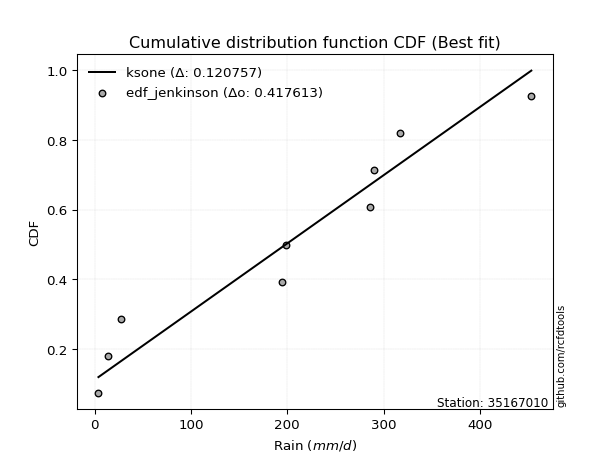</img></img>

</div>


### 11. EDF Cunnane (1978)

Cunnane´s work in statistical hydrology has focused on the performance and evaluation of different probability distributions (such as GEV, Gumbel, Lognormal) for flood frequency estimation. _b_ is a constant, typically set to 0.4.

<div align="center">


$P=(m-b)/(n+1-2b)$


</div>


**11.1. Empirical values**

<div align="center">

|                | 0                   | 1                  | 2                   | 3                  | 4           | 5                  | 6                 | 7                  | 8                  |
|:---------------|:--------------------|:-------------------|:--------------------|:-------------------|:------------|:-------------------|:------------------|:-------------------|:-------------------|
| date           | 2022                | 2018               | 2017                | 2019               | 2023        | 2020               | 2021              | 2025               | 2024               |
| x              | 3.9                 | 14.3               | 27.57               | 194.72             | 198.2       | 285.4              | 290.3             | 317.3              | 453.4              |
| m              | 1                   | 2                  | 3                   | 4                  | 5           | 6                  | 7                 | 8                  | 9                  |
| empirical_dist | edf_cunnane         | edf_cunnane        | edf_cunnane         | edf_cunnane        | edf_cunnane | edf_cunnane        | edf_cunnane       | edf_cunnane        | edf_cunnane        |
| empirical      | 0.06521739130434782 | 0.1739130434782609 | 0.28260869565217395 | 0.391304347826087  | 0.5         | 0.6086956521739131 | 0.717391304347826 | 0.8260869565217391 | 0.9347826086956522 |
| empirical_tr   | 1.069767441860465   | 1.2105263157894737 | 1.393939393939394   | 1.6428571428571428 | 2.0         | 2.555555555555556  | 3.538461538461538 | 5.75               | 15.333333333333343 |

</div>


**11.2. Kolmogorov-Smirnov fit test (sorted by Δ)**


<div align="center">

|                | 0                   | 1                   | 2                   | 3                   | 4                   | 5                   | 6                   | 7                   | 8                   | 9                   | 10                  | 11                  | 12                  | 13                  | 14                  | 15                  | 16                  | 17                  | 18                  | 19                  | 20                  | 21                  | 22                  | 23                  | 24                  | 25                  | 26                  | 27                  | 28                  | 29                  | 30                  | 31                  | 32                  | 33                  | 34                  | 35                  | 36                  | 37                  | 38                  | 39                  | 40                  | 41                  | 42                  | 43                  | 44                  | 45                  | 46                  | 47                  | 48                  | 49                  | 50                  | 51                  | 52                  | 53                  | 54                  | 55                  | 56                  | 57                  | 58                  | 59                  | 60                  | 61                  | 62                  | 63                  | 64                  | 65                  | 66                  | 67                  | 68                  | 69                  | 70                  | 71                  | 72                  | 73                  | 74                  | 75                  | 76                  | 77                  | 78                  | 79                  | 80                  | 81                  | 82                  | 83                  | 84                  | 85                  | 86                  | 87                  | 88                  | 89                  | 90                  | 91                  | 92                  | 93                  | 94                  | 95                  | 96                  | 97                  | 98                  | 99                  | 100                 | 101                 | 102                 | 103                 | 104                 | 105                 | 106                 | 107                 | 108                 | 109                 | 110                 | 111                 | 112                 | 113                 | 114                 | 115                 | 116                 | 117                 | 118                 | 119                 | 120                 | 121                 | 122                 | 123                 | 124                 | 125                 | 126                 | 127                 | 128                 | 129                 | 130                 | 131                 | 132                 | 133                 | 134                 | 135                 | 136                 | 137                 | 138                 | 139                 | 140                 | 141                 | 142                 | 143                 | 144                 | 145                 | 146                 | 147                 | 148                 | 149                 | 150                 | 151                 | 152                 | 153                 | 154                 | 155                 | 156                 | 157                 | 158                 | 159                 |
|:---------------|:--------------------|:--------------------|:--------------------|:--------------------|:--------------------|:--------------------|:--------------------|:--------------------|:--------------------|:--------------------|:--------------------|:--------------------|:--------------------|:--------------------|:--------------------|:--------------------|:--------------------|:--------------------|:--------------------|:--------------------|:--------------------|:--------------------|:--------------------|:--------------------|:--------------------|:--------------------|:--------------------|:--------------------|:--------------------|:--------------------|:--------------------|:--------------------|:--------------------|:--------------------|:--------------------|:--------------------|:--------------------|:--------------------|:--------------------|:--------------------|:--------------------|:--------------------|:--------------------|:--------------------|:--------------------|:--------------------|:--------------------|:--------------------|:--------------------|:--------------------|:--------------------|:--------------------|:--------------------|:--------------------|:--------------------|:--------------------|:--------------------|:--------------------|:--------------------|:--------------------|:--------------------|:--------------------|:--------------------|:--------------------|:--------------------|:--------------------|:--------------------|:--------------------|:--------------------|:--------------------|:--------------------|:--------------------|:--------------------|:--------------------|:--------------------|:--------------------|:--------------------|:--------------------|:--------------------|:--------------------|:--------------------|:--------------------|:--------------------|:--------------------|:--------------------|:--------------------|:--------------------|:--------------------|:--------------------|:--------------------|:--------------------|:--------------------|:--------------------|:--------------------|:--------------------|:--------------------|:--------------------|:--------------------|:--------------------|:--------------------|:--------------------|:--------------------|:--------------------|:--------------------|:--------------------|:--------------------|:--------------------|:--------------------|:--------------------|:--------------------|:--------------------|:--------------------|:--------------------|:--------------------|:--------------------|:--------------------|:--------------------|:--------------------|:--------------------|:--------------------|:--------------------|:--------------------|:--------------------|:--------------------|:--------------------|:--------------------|:--------------------|:--------------------|:--------------------|:--------------------|:--------------------|:--------------------|:--------------------|:--------------------|:--------------------|:--------------------|:--------------------|:--------------------|:--------------------|:--------------------|:--------------------|:--------------------|:--------------------|:--------------------|:--------------------|:--------------------|:--------------------|:--------------------|:--------------------|:--------------------|:--------------------|:--------------------|:--------------------|:--------------------|:--------------------|:--------------------|:--------------------|:--------------------|:--------------------|:--------------------|
| station        | 35167010            | 35167010            | 35167010            | 35167010            | 35167010            | 35167010            | 35167010            | 35167010            | 35167010            | 35167010            | 35167010            | 35167010            | 35167010            | 35167010            | 35167010            | 35167010            | 35167010            | 35167010            | 35167010            | 35167010            | 35167010            | 35167010            | 35167010            | 35167010            | 35167010            | 35167010            | 35167010            | 35167010            | 35167010            | 35167010            | 35167010            | 35167010            | 35167010            | 35167010            | 35167010            | 35167010            | 35167010            | 35167010            | 35167010            | 35167010            | 35167010            | 35167010            | 35167010            | 35167010            | 35167010            | 35167010            | 35167010            | 35167010            | 35167010            | 35167010            | 35167010            | 35167010            | 35167010            | 35167010            | 35167010            | 35167010            | 35167010            | 35167010            | 35167010            | 35167010            | 35167010            | 35167010            | 35167010            | 35167010            | 35167010            | 35167010            | 35167010            | 35167010            | 35167010            | 35167010            | 35167010            | 35167010            | 35167010            | 35167010            | 35167010            | 35167010            | 35167010            | 35167010            | 35167010            | 35167010            | 35167010            | 35167010            | 35167010            | 35167010            | 35167010            | 35167010            | 35167010            | 35167010            | 35167010            | 35167010            | 35167010            | 35167010            | 35167010            | 35167010            | 35167010            | 35167010            | 35167010            | 35167010            | 35167010            | 35167010            | 35167010            | 35167010            | 35167010            | 35167010            | 35167010            | 35167010            | 35167010            | 35167010            | 35167010            | 35167010            | 35167010            | 35167010            | 35167010            | 35167010            | 35167010            | 35167010            | 35167010            | 35167010            | 35167010            | 35167010            | 35167010            | 35167010            | 35167010            | 35167010            | 35167010            | 35167010            | 35167010            | 35167010            | 35167010            | 35167010            | 35167010            | 35167010            | 35167010            | 35167010            | 35167010            | 35167010            | 35167010            | 35167010            | 35167010            | 35167010            | 35167010            | 35167010            | 35167010            | 35167010            | 35167010            | 35167010            | 35167010            | 35167010            | 35167010            | 35167010            | 35167010            | 35167010            | 35167010            | 35167010            | 35167010            | 35167010            | 35167010            | 35167010            | 35167010            | 35167010            |
| empirical_dist | edf_cunnane         | edf_cunnane         | edf_cunnane         | edf_cunnane         | edf_cunnane         | edf_cunnane         | edf_cunnane         | edf_cunnane         | edf_cunnane         | edf_cunnane         | edf_cunnane         | edf_cunnane         | edf_cunnane         | edf_cunnane         | edf_cunnane         | edf_cunnane         | edf_cunnane         | edf_cunnane         | edf_cunnane         | edf_cunnane         | edf_cunnane         | edf_cunnane         | edf_cunnane         | edf_cunnane         | edf_cunnane         | edf_cunnane         | edf_cunnane         | edf_cunnane         | edf_cunnane         | edf_cunnane         | edf_cunnane         | edf_cunnane         | edf_cunnane         | edf_cunnane         | edf_cunnane         | edf_cunnane         | edf_cunnane         | edf_cunnane         | edf_cunnane         | edf_cunnane         | edf_cunnane         | edf_cunnane         | edf_cunnane         | edf_cunnane         | edf_cunnane         | edf_cunnane         | edf_cunnane         | edf_cunnane         | edf_cunnane         | edf_cunnane         | edf_cunnane         | edf_cunnane         | edf_cunnane         | edf_cunnane         | edf_cunnane         | edf_cunnane         | edf_cunnane         | edf_cunnane         | edf_cunnane         | edf_cunnane         | edf_cunnane         | edf_cunnane         | edf_cunnane         | edf_cunnane         | edf_cunnane         | edf_cunnane         | edf_cunnane         | edf_cunnane         | edf_cunnane         | edf_cunnane         | edf_cunnane         | edf_cunnane         | edf_cunnane         | edf_cunnane         | edf_cunnane         | edf_cunnane         | edf_cunnane         | edf_cunnane         | edf_cunnane         | edf_cunnane         | edf_cunnane         | edf_cunnane         | edf_cunnane         | edf_cunnane         | edf_cunnane         | edf_cunnane         | edf_cunnane         | edf_cunnane         | edf_cunnane         | edf_cunnane         | edf_cunnane         | edf_cunnane         | edf_cunnane         | edf_cunnane         | edf_cunnane         | edf_cunnane         | edf_cunnane         | edf_cunnane         | edf_cunnane         | edf_cunnane         | edf_cunnane         | edf_cunnane         | edf_cunnane         | edf_cunnane         | edf_cunnane         | edf_cunnane         | edf_cunnane         | edf_cunnane         | edf_cunnane         | edf_cunnane         | edf_cunnane         | edf_cunnane         | edf_cunnane         | edf_cunnane         | edf_cunnane         | edf_cunnane         | edf_cunnane         | edf_cunnane         | edf_cunnane         | edf_cunnane         | edf_cunnane         | edf_cunnane         | edf_cunnane         | edf_cunnane         | edf_cunnane         | edf_cunnane         | edf_cunnane         | edf_cunnane         | edf_cunnane         | edf_cunnane         | edf_cunnane         | edf_cunnane         | edf_cunnane         | edf_cunnane         | edf_cunnane         | edf_cunnane         | edf_cunnane         | edf_cunnane         | edf_cunnane         | edf_cunnane         | edf_cunnane         | edf_cunnane         | edf_cunnane         | edf_cunnane         | edf_cunnane         | edf_cunnane         | edf_cunnane         | edf_cunnane         | edf_cunnane         | edf_cunnane         | edf_cunnane         | edf_cunnane         | edf_cunnane         | edf_cunnane         | edf_cunnane         | edf_cunnane         | edf_cunnane         | edf_cunnane         | edf_cunnane         | edf_cunnane         |
| p_dist         | ksone               | logjohnsonsu        | semicircular        | arcsine             | anglit              | loggenextreme       | gausshyper          | genextreme          | foldnorm            | dweibull            | t                   | norm                | truncnorm           | exponnorm           | skewnorm            | pearson3            | gamma               | erlang              | johnsonsu           | burr                | nct                 | dgamma              | invgamma            | gumbel_l            | maxwell             | genlogistic         | invweibull          | rayleigh            | cosine              | loggennorm          | logistic            | kstwobign           | argus               | loglevy_l           | hypsecant           | rice                | invgauss            | logvonmises_line    | laplace             | logweibull_max      | bradford            | logmielke           | truncexpon          | logloggamma         | gumbel_r            | nakagami            | logburr             | halfnorm            | exponpow            | logtrapezoid        | gompertz            | triang              | logdgamma           | logargus            | kappa4              | logexponpow         | logarcsine          | wrapcauchy          | genpareto           | loggenpareto        | kappa3              | tukeylambda         | moyal               | logburr12           | uniform             | lomax               | mielke              | gengamma            | logpearson3         | ncf                 | loggumbel_l         | genexpon            | logweibull_min      | exponweib           | loggengamma         | alpha               | logsemicircular     | logloglaplace       | vonmises_line       | logdweibull         | loggompertz         | logexponweib        | weibull_min         | loganglit           | halflogistic        | logbeta             | lognakagami         | f                   | genhalflogistic     | logwrapcauchy       | logf                | logbetaprime        | loginvgauss         | logt                | logcrystalball      | lognorm             | logexponnorm        | truncweibull_min    | lognct              | loginvweibull       | logfatiguelife      | wald                | logrice             | halfgennorm         | loggamma            | loggamma            | loginvgamma         | logerlang           | logncf              | logfoldnorm         | logalpha            | loggenhalflogistic  | loglomax            | logmaxwell          | loglogistic         | logkstwobign        | lograyleigh         | beta                | logskewnorm         | burr12              | loghypsecant        | loggausshyper       | logcosine           | loghalfnorm         | gennorm             | loggenexpon         | loghalfgennorm      | loggumbel_r         | levy_l              | loglaplace          | loglaplace          | fatiguelife         | betaprime           | logtriang           | loghalflogistic     | logmoyal            | logksone            | trapezoid           | logkappa4           | logjohnsonsb        | logtruncweibull_min | logwald             | logkappa3           | loguniform          | crystalball         | powerlaw            | logtruncexpon       | logbradford         | logtruncnorm        | johnsonsb           | rdist               | logpowerlaw         | truncpareto         | weibull_max         | logtukeylambda      | logrdist            | logtruncpareto      | loggenlogistic      | logvonmises         | vonmises            |
| delta          | 0.1165852369052238  | 0.11862370342278106 | 0.1291535019853377  | 0.1330883763491909  | 0.13812104799430722 | 0.14090355869578358 | 0.14904087317059134 | 0.15667455413936662 | 0.15727721363765146 | 0.1580990692592132  | 0.15889377507877112 | 0.1589579447952001  | 0.15895795031389748 | 0.15895916250259412 | 0.1589816863909523  | 0.15943610238484363 | 0.15947620974138563 | 0.15961800228147904 | 0.15979524714869686 | 0.16060920852003785 | 0.16102591990772674 | 0.16168815268064374 | 0.16303040849519923 | 0.16305863533339365 | 0.16356600095077944 | 0.16383594616074676 | 0.1641511056058041  | 0.16714230755546164 | 0.16847279402492044 | 0.1702827900476267  | 0.17335981733552153 | 0.17485822594188166 | 0.1761801854248567  | 0.17781965173494246 | 0.1800767806779588  | 0.18098254215929843 | 0.18275033576944805 | 0.18302444591965955 | 0.18524398083291116 | 0.1855029853789673  | 0.1855081241894681  | 0.18563971575554522 | 0.18693529795793445 | 0.18924308570169673 | 0.19852121933120806 | 0.20019747009094685 | 0.2019618457451094  | 0.20257507769743335 | 0.20289103753113485 | 0.2034946856817888  | 0.2069327353060581  | 0.20833206361735312 | 0.2092023047170824  | 0.20964455358754502 | 0.20980388879403924 | 0.2101808521061826  | 0.21026288779900365 | 0.21833332435364627 | 0.2223032046199593  | 0.22305959255748936 | 0.22342288235162724 | 0.22459556924388313 | 0.22714686664149802 | 0.22960420756774896 | 0.22995018619722402 | 0.23080479416443273 | 0.23101647527179386 | 0.23399292844499658 | 0.23491956245471352 | 0.23761778360983937 | 0.2377874097946498  | 0.24106688856644382 | 0.24172260407228613 | 0.24439242407248496 | 0.24578364766222166 | 0.24786288311500887 | 0.2487423746033554  | 0.25225039795676174 | 0.2528203475352926  | 0.2528406251683287  | 0.2550470009596992  | 0.25601059533864495 | 0.25773959870773444 | 0.258030276312962   | 0.26605762245155723 | 0.26733217165609013 | 0.27009215621065447 | 0.27364766392143164 | 0.2742453684466083  | 0.27814554883582326 | 0.279093806973254   | 0.27922837445298104 | 0.27978736974315616 | 0.2800416191851271  | 0.2800419284678965  | 0.28004196482961813 | 0.2800442192790223  | 0.2801414349457095  | 0.28025624021467105 | 0.2803554086170949  | 0.2805761097003128  | 0.28260869565217395 | 0.2829423739972838  | 0.2831493361050514  | 0.28411165414161826 | 0.28411165414161826 | 0.2868614283959999  | 0.28688994255723627 | 0.2870712240071898  | 0.28721799463752956 | 0.29104903008962574 | 0.29233964421165354 | 0.2973094650343388  | 0.2993249005738072  | 0.29966664102021306 | 0.2996914737815403  | 0.3050506045370444  | 0.30875662242075    | 0.3120471084461593  | 0.3128690309732542  | 0.31447239837037194 | 0.31637778475967065 | 0.32090467764151925 | 0.32196150564241427 | 0.32608695652173914 | 0.3292255833150521  | 0.3313074123847706  | 0.33641276944219684 | 0.33952675788609527 | 0.34170459031921724 | 0.34170459031921724 | 0.3463820251850264  | 0.3470358147348945  | 0.34814368750886365 | 0.3496494120444234  | 0.354859977275861   | 0.3772602765253175  | 0.3796566130584653  | 0.3875858369613871  | 0.3877259131448081  | 0.3975760886175264  | 0.40778320419584085 | 0.4305792252275911  | 0.4309732013955984  | 0.441340097769601   | 0.46873625600071817 | 0.4693501311204927  | 0.4711407862193931  | 0.4841309935449289  | 0.5071674003254925  | 0.5631952855287998  | 0.5753488583136624  | 0.5927160522304163  | 0.6775251342312044  | 0.7173270997387443  | 0.7173913043186579  | 0.7467013060242694  | 0.8260869565217391  | 0.9979578289322193  | 71.21596292277978   |
| deltao         | 0.41761268023100007 | 0.41761268023100007 | 0.41761268023100007 | 0.41761268023100007 | 0.41761268023100007 | 0.41761268023100007 | 0.41761268023100007 | 0.41761268023100007 | 0.41761268023100007 | 0.41761268023100007 | 0.41761268023100007 | 0.41761268023100007 | 0.41761268023100007 | 0.41761268023100007 | 0.41761268023100007 | 0.41761268023100007 | 0.41761268023100007 | 0.41761268023100007 | 0.41761268023100007 | 0.41761268023100007 | 0.41761268023100007 | 0.41761268023100007 | 0.41761268023100007 | 0.41761268023100007 | 0.41761268023100007 | 0.41761268023100007 | 0.41761268023100007 | 0.41761268023100007 | 0.41761268023100007 | 0.41761268023100007 | 0.41761268023100007 | 0.41761268023100007 | 0.41761268023100007 | 0.41761268023100007 | 0.41761268023100007 | 0.41761268023100007 | 0.41761268023100007 | 0.41761268023100007 | 0.41761268023100007 | 0.41761268023100007 | 0.41761268023100007 | 0.41761268023100007 | 0.41761268023100007 | 0.41761268023100007 | 0.41761268023100007 | 0.41761268023100007 | 0.41761268023100007 | 0.41761268023100007 | 0.41761268023100007 | 0.41761268023100007 | 0.41761268023100007 | 0.41761268023100007 | 0.41761268023100007 | 0.41761268023100007 | 0.41761268023100007 | 0.41761268023100007 | 0.41761268023100007 | 0.41761268023100007 | 0.41761268023100007 | 0.41761268023100007 | 0.41761268023100007 | 0.41761268023100007 | 0.41761268023100007 | 0.41761268023100007 | 0.41761268023100007 | 0.41761268023100007 | 0.41761268023100007 | 0.41761268023100007 | 0.41761268023100007 | 0.41761268023100007 | 0.41761268023100007 | 0.41761268023100007 | 0.41761268023100007 | 0.41761268023100007 | 0.41761268023100007 | 0.41761268023100007 | 0.41761268023100007 | 0.41761268023100007 | 0.41761268023100007 | 0.41761268023100007 | 0.41761268023100007 | 0.41761268023100007 | 0.41761268023100007 | 0.41761268023100007 | 0.41761268023100007 | 0.41761268023100007 | 0.41761268023100007 | 0.41761268023100007 | 0.41761268023100007 | 0.41761268023100007 | 0.41761268023100007 | 0.41761268023100007 | 0.41761268023100007 | 0.41761268023100007 | 0.41761268023100007 | 0.41761268023100007 | 0.41761268023100007 | 0.41761268023100007 | 0.41761268023100007 | 0.41761268023100007 | 0.41761268023100007 | 0.41761268023100007 | 0.41761268023100007 | 0.41761268023100007 | 0.41761268023100007 | 0.41761268023100007 | 0.41761268023100007 | 0.41761268023100007 | 0.41761268023100007 | 0.41761268023100007 | 0.41761268023100007 | 0.41761268023100007 | 0.41761268023100007 | 0.41761268023100007 | 0.41761268023100007 | 0.41761268023100007 | 0.41761268023100007 | 0.41761268023100007 | 0.41761268023100007 | 0.41761268023100007 | 0.41761268023100007 | 0.41761268023100007 | 0.41761268023100007 | 0.41761268023100007 | 0.41761268023100007 | 0.41761268023100007 | 0.41761268023100007 | 0.41761268023100007 | 0.41761268023100007 | 0.41761268023100007 | 0.41761268023100007 | 0.41761268023100007 | 0.41761268023100007 | 0.41761268023100007 | 0.41761268023100007 | 0.41761268023100007 | 0.41761268023100007 | 0.41761268023100007 | 0.41761268023100007 | 0.41761268023100007 | 0.41761268023100007 | 0.41761268023100007 | 0.41761268023100007 | 0.41761268023100007 | 0.41761268023100007 | 0.41761268023100007 | 0.41761268023100007 | 0.41761268023100007 | 0.41761268023100007 | 0.41761268023100007 | 0.41761268023100007 | 0.41761268023100007 | 0.41761268023100007 | 0.41761268023100007 | 0.41761268023100007 | 0.41761268023100007 | 0.41761268023100007 | 0.41761268023100007 | 0.41761268023100007 | 0.41761268023100007 |
| eval           | Δo > Δ              | Δo > Δ              | Δo > Δ              | Δo > Δ              | Δo > Δ              | Δo > Δ              | Δo > Δ              | Δo > Δ              | Δo > Δ              | Δo > Δ              | Δo > Δ              | Δo > Δ              | Δo > Δ              | Δo > Δ              | Δo > Δ              | Δo > Δ              | Δo > Δ              | Δo > Δ              | Δo > Δ              | Δo > Δ              | Δo > Δ              | Δo > Δ              | Δo > Δ              | Δo > Δ              | Δo > Δ              | Δo > Δ              | Δo > Δ              | Δo > Δ              | Δo > Δ              | Δo > Δ              | Δo > Δ              | Δo > Δ              | Δo > Δ              | Δo > Δ              | Δo > Δ              | Δo > Δ              | Δo > Δ              | Δo > Δ              | Δo > Δ              | Δo > Δ              | Δo > Δ              | Δo > Δ              | Δo > Δ              | Δo > Δ              | Δo > Δ              | Δo > Δ              | Δo > Δ              | Δo > Δ              | Δo > Δ              | Δo > Δ              | Δo > Δ              | Δo > Δ              | Δo > Δ              | Δo > Δ              | Δo > Δ              | Δo > Δ              | Δo > Δ              | Δo > Δ              | Δo > Δ              | Δo > Δ              | Δo > Δ              | Δo > Δ              | Δo > Δ              | Δo > Δ              | Δo > Δ              | Δo > Δ              | Δo > Δ              | Δo > Δ              | Δo > Δ              | Δo > Δ              | Δo > Δ              | Δo > Δ              | Δo > Δ              | Δo > Δ              | Δo > Δ              | Δo > Δ              | Δo > Δ              | Δo > Δ              | Δo > Δ              | Δo > Δ              | Δo > Δ              | Δo > Δ              | Δo > Δ              | Δo > Δ              | Δo > Δ              | Δo > Δ              | Δo > Δ              | Δo > Δ              | Δo > Δ              | Δo > Δ              | Δo > Δ              | Δo > Δ              | Δo > Δ              | Δo > Δ              | Δo > Δ              | Δo > Δ              | Δo > Δ              | Δo > Δ              | Δo > Δ              | Δo > Δ              | Δo > Δ              | Δo > Δ              | Δo > Δ              | Δo > Δ              | Δo > Δ              | Δo > Δ              | Δo > Δ              | Δo > Δ              | Δo > Δ              | Δo > Δ              | Δo > Δ              | Δo > Δ              | Δo > Δ              | Δo > Δ              | Δo > Δ              | Δo > Δ              | Δo > Δ              | Δo > Δ              | Δo > Δ              | Δo > Δ              | Δo > Δ              | Δo > Δ              | Δo > Δ              | Δo > Δ              | Δo > Δ              | Δo > Δ              | Δo > Δ              | Δo > Δ              | Δo > Δ              | Δo > Δ              | Δo > Δ              | Δo > Δ              | Δo > Δ              | Δo > Δ              | Δo > Δ              | Δo > Δ              | Δo > Δ              | Δo > Δ              | Δo > Δ              | Δo > Δ              | Δo > Δ              | Δo > Δ              | Δo <= Δ             | Δo <= Δ             | Δo <= Δ             | Δo <= Δ             | Δo <= Δ             | Δo <= Δ             | Δo <= Δ             | Δo <= Δ             | Δo <= Δ             | Δo <= Δ             | Δo <= Δ             | Δo <= Δ             | Δo <= Δ             | Δo <= Δ             | Δo <= Δ             | Δo <= Δ             | Δo <= Δ             | Δo <= Δ             |
| fit            | 1                   | 1                   | 1                   | 1                   | 1                   | 1                   | 1                   | 1                   | 1                   | 1                   | 1                   | 1                   | 1                   | 1                   | 1                   | 1                   | 1                   | 1                   | 1                   | 1                   | 1                   | 1                   | 1                   | 1                   | 1                   | 1                   | 1                   | 1                   | 1                   | 1                   | 1                   | 1                   | 1                   | 1                   | 1                   | 1                   | 1                   | 1                   | 1                   | 1                   | 1                   | 1                   | 1                   | 1                   | 1                   | 1                   | 1                   | 1                   | 1                   | 1                   | 1                   | 1                   | 1                   | 1                   | 1                   | 1                   | 1                   | 1                   | 1                   | 1                   | 1                   | 1                   | 1                   | 1                   | 1                   | 1                   | 1                   | 1                   | 1                   | 1                   | 1                   | 1                   | 1                   | 1                   | 1                   | 1                   | 1                   | 1                   | 1                   | 1                   | 1                   | 1                   | 1                   | 1                   | 1                   | 1                   | 1                   | 1                   | 1                   | 1                   | 1                   | 1                   | 1                   | 1                   | 1                   | 1                   | 1                   | 1                   | 1                   | 1                   | 1                   | 1                   | 1                   | 1                   | 1                   | 1                   | 1                   | 1                   | 1                   | 1                   | 1                   | 1                   | 1                   | 1                   | 1                   | 1                   | 1                   | 1                   | 1                   | 1                   | 1                   | 1                   | 1                   | 1                   | 1                   | 1                   | 1                   | 1                   | 1                   | 1                   | 1                   | 1                   | 1                   | 1                   | 1                   | 1                   | 1                   | 1                   | 1                   | 1                   | 1                   | 1                   | 0                   | 0                   | 0                   | 0                   | 0                   | 0                   | 0                   | 0                   | 0                   | 0                   | 0                   | 0                   | 0                   | 0                   | 0                   | 0                   | 0                   | 0                   |
| n              | 9                   | 9                   | 9                   | 9                   | 9                   | 9                   | 9                   | 9                   | 9                   | 9                   | 9                   | 9                   | 9                   | 9                   | 9                   | 9                   | 9                   | 9                   | 9                   | 9                   | 9                   | 9                   | 9                   | 9                   | 9                   | 9                   | 9                   | 9                   | 9                   | 9                   | 9                   | 9                   | 9                   | 9                   | 9                   | 9                   | 9                   | 9                   | 9                   | 9                   | 9                   | 9                   | 9                   | 9                   | 9                   | 9                   | 9                   | 9                   | 9                   | 9                   | 9                   | 9                   | 9                   | 9                   | 9                   | 9                   | 9                   | 9                   | 9                   | 9                   | 9                   | 9                   | 9                   | 9                   | 9                   | 9                   | 9                   | 9                   | 9                   | 9                   | 9                   | 9                   | 9                   | 9                   | 9                   | 9                   | 9                   | 9                   | 9                   | 9                   | 9                   | 9                   | 9                   | 9                   | 9                   | 9                   | 9                   | 9                   | 9                   | 9                   | 9                   | 9                   | 9                   | 9                   | 9                   | 9                   | 9                   | 9                   | 9                   | 9                   | 9                   | 9                   | 9                   | 9                   | 9                   | 9                   | 9                   | 9                   | 9                   | 9                   | 9                   | 9                   | 9                   | 9                   | 9                   | 9                   | 9                   | 9                   | 9                   | 9                   | 9                   | 9                   | 9                   | 9                   | 9                   | 9                   | 9                   | 9                   | 9                   | 9                   | 9                   | 9                   | 9                   | 9                   | 9                   | 9                   | 9                   | 9                   | 9                   | 9                   | 9                   | 9                   | 9                   | 9                   | 9                   | 9                   | 9                   | 9                   | 9                   | 9                   | 9                   | 9                   | 9                   | 9                   | 9                   | 9                   | 9                   | 9                   | 9                   | 9                   |
| best_fit       | 1                   | 0                   | 0                   | 0                   | 0                   | 0                   | 0                   | 0                   | 0                   | 0                   | 0                   | 0                   | 0                   | 0                   | 0                   | 0                   | 0                   | 0                   | 0                   | 0                   | 0                   | 0                   | 0                   | 0                   | 0                   | 0                   | 0                   | 0                   | 0                   | 0                   | 0                   | 0                   | 0                   | 0                   | 0                   | 0                   | 0                   | 0                   | 0                   | 0                   | 0                   | 0                   | 0                   | 0                   | 0                   | 0                   | 0                   | 0                   | 0                   | 0                   | 0                   | 0                   | 0                   | 0                   | 0                   | 0                   | 0                   | 0                   | 0                   | 0                   | 0                   | 0                   | 0                   | 0                   | 0                   | 0                   | 0                   | 0                   | 0                   | 0                   | 0                   | 0                   | 0                   | 0                   | 0                   | 0                   | 0                   | 0                   | 0                   | 0                   | 0                   | 0                   | 0                   | 0                   | 0                   | 0                   | 0                   | 0                   | 0                   | 0                   | 0                   | 0                   | 0                   | 0                   | 0                   | 0                   | 0                   | 0                   | 0                   | 0                   | 0                   | 0                   | 0                   | 0                   | 0                   | 0                   | 0                   | 0                   | 0                   | 0                   | 0                   | 0                   | 0                   | 0                   | 0                   | 0                   | 0                   | 0                   | 0                   | 0                   | 0                   | 0                   | 0                   | 0                   | 0                   | 0                   | 0                   | 0                   | 0                   | 0                   | 0                   | 0                   | 0                   | 0                   | 0                   | 0                   | 0                   | 0                   | 0                   | 0                   | 0                   | 0                   | 0                   | 0                   | 0                   | 0                   | 0                   | 0                   | 0                   | 0                   | 0                   | 0                   | 0                   | 0                   | 0                   | 0                   | 0                   | 0                   | 0                   | 0                   |
| best_fit_sort  | 1                   | 2                   | 3                   | 4                   | 5                   | 6                   | 7                   | 8                   | 9                   | 10                  | 11                  | 12                  | 13                  | 14                  | 15                  | 16                  | 17                  | 18                  | 19                  | 20                  | 21                  | 22                  | 23                  | 24                  | 25                  | 26                  | 27                  | 28                  | 29                  | 30                  | 31                  | 32                  | 33                  | 34                  | 35                  | 36                  | 37                  | 38                  | 39                  | 40                  | 41                  | 42                  | 43                  | 44                  | 45                  | 46                  | 47                  | 48                  | 49                  | 50                  | 51                  | 52                  | 53                  | 54                  | 55                  | 56                  | 57                  | 58                  | 59                  | 60                  | 61                  | 62                  | 63                  | 64                  | 65                  | 66                  | 67                  | 68                  | 69                  | 70                  | 71                  | 72                  | 73                  | 74                  | 75                  | 76                  | 77                  | 78                  | 79                  | 80                  | 81                  | 82                  | 83                  | 84                  | 85                  | 86                  | 87                  | 88                  | 89                  | 90                  | 91                  | 92                  | 93                  | 94                  | 95                  | 96                  | 97                  | 98                  | 99                  | 100                 | 101                 | 102                 | 103                 | 104                 | 105                 | 106                 | 107                 | 108                 | 109                 | 110                 | 111                 | 112                 | 113                 | 114                 | 115                 | 116                 | 117                 | 118                 | 119                 | 120                 | 121                 | 122                 | 123                 | 124                 | 125                 | 126                 | 127                 | 128                 | 129                 | 130                 | 131                 | 132                 | 133                 | 134                 | 135                 | 136                 | 137                 | 138                 | 139                 | 140                 | 141                 | 142                 | 143                 | 144                 | 145                 | 146                 | 147                 | 148                 | 149                 | 150                 | 151                 | 152                 | 153                 | 154                 | 155                 | 156                 | 157                 | 158                 | 159                 | 160                 |

</div>


**11.3. Best fit**

<div align="center">

|   id |   station | empirical_dist   | p_dist   |    delta |   deltao | eval   |   fit |   n |   best_fit |   best_fit_sort |
|-----:|----------:|:-----------------|:---------|---------:|---------:|:-------|------:|----:|-----------:|----------------:|
|    0 |  35167010 | edf_cunnane      | ksone    | 0.116585 | 0.417613 | Δo > Δ |     1 |   9 |          1 |               1 |

</div>


<div align="center">

</img></img>

</div>


### 12. EDF Adamowski (1981)

The Adamowski formula in hydrology refers to a specific plotting position formula used for estimating the non-parametric empirical distribution of hydrological events (like flood peaks) to calculate their return periods. This formula provides an alternative to traditional parametric methods (like the Gumbel or Log Pearson Type III distributions). 

<div align="center">


$P=(m-0.25)/(n+0.5)$


</div>


**12.1. Empirical values**

<div align="center">

|                | 0                   | 1                   | 2                  | 3                   | 4             | 5                  | 6                  | 7                  | 8                  |
|:---------------|:--------------------|:--------------------|:-------------------|:--------------------|:--------------|:-------------------|:-------------------|:-------------------|:-------------------|
| date           | 2022                | 2018                | 2017               | 2019                | 2023          | 2020               | 2021               | 2025               | 2024               |
| x              | 3.9                 | 14.3                | 27.57              | 194.72              | 198.2         | 285.4              | 290.3              | 317.3              | 453.4              |
| m              | 1                   | 2                   | 3                  | 4                   | 5             | 6                  | 7                  | 8                  | 9                  |
| empirical_dist | edf_adamowski       | edf_adamowski       | edf_adamowski      | edf_adamowski       | edf_adamowski | edf_adamowski      | edf_adamowski      | edf_adamowski      | edf_adamowski      |
| empirical      | 0.07894736842105263 | 0.18421052631578946 | 0.2894736842105263 | 0.39473684210526316 | 0.5           | 0.6052631578947368 | 0.7105263157894737 | 0.8157894736842105 | 0.9210526315789473 |
| empirical_tr   | 1.0857142857142856  | 1.2258064516129032  | 1.4074074074074074 | 1.6521739130434783  | 2.0           | 2.533333333333333  | 3.4545454545454546 | 5.428571428571428  | 12.666666666666663 |

</div>


**12.2. Kolmogorov-Smirnov fit test (sorted by Δ)**


<div align="center">

|                | 0                   | 1                   | 2                   | 3                   | 4                   | 5                   | 6                   | 7                   | 8                   | 9                   | 10                  | 11                  | 12                  | 13                  | 14                  | 15                  | 16                  | 17                  | 18                  | 19                  | 20                  | 21                  | 22                  | 23                  | 24                  | 25                  | 26                  | 27                  | 28                  | 29                  | 30                  | 31                  | 32                  | 33                  | 34                  | 35                  | 36                  | 37                  | 38                  | 39                  | 40                  | 41                  | 42                  | 43                  | 44                  | 45                  | 46                  | 47                  | 48                  | 49                  | 50                  | 51                  | 52                  | 53                  | 54                  | 55                  | 56                  | 57                  | 58                  | 59                  | 60                  | 61                  | 62                  | 63                  | 64                  | 65                  | 66                  | 67                  | 68                  | 69                  | 70                  | 71                  | 72                  | 73                  | 74                  | 75                  | 76                  | 77                  | 78                  | 79                  | 80                  | 81                  | 82                  | 83                  | 84                  | 85                  | 86                  | 87                  | 88                  | 89                  | 90                  | 91                  | 92                  | 93                  | 94                  | 95                  | 96                  | 97                  | 98                  | 99                  | 100                 | 101                 | 102                 | 103                 | 104                 | 105                 | 106                 | 107                 | 108                 | 109                 | 110                 | 111                 | 112                 | 113                 | 114                 | 115                 | 116                 | 117                 | 118                 | 119                 | 120                 | 121                 | 122                 | 123                 | 124                 | 125                 | 126                 | 127                 | 128                 | 129                 | 130                 | 131                 | 132                 | 133                 | 134                 | 135                 | 136                 | 137                 | 138                 | 139                 | 140                 | 141                 | 142                 | 143                 | 144                 | 145                 | 146                 | 147                 | 148                 | 149                 | 150                 | 151                 | 152                 | 153                 | 154                 | 155                 | 156                 | 157                 | 158                 | 159                 |
|:---------------|:--------------------|:--------------------|:--------------------|:--------------------|:--------------------|:--------------------|:--------------------|:--------------------|:--------------------|:--------------------|:--------------------|:--------------------|:--------------------|:--------------------|:--------------------|:--------------------|:--------------------|:--------------------|:--------------------|:--------------------|:--------------------|:--------------------|:--------------------|:--------------------|:--------------------|:--------------------|:--------------------|:--------------------|:--------------------|:--------------------|:--------------------|:--------------------|:--------------------|:--------------------|:--------------------|:--------------------|:--------------------|:--------------------|:--------------------|:--------------------|:--------------------|:--------------------|:--------------------|:--------------------|:--------------------|:--------------------|:--------------------|:--------------------|:--------------------|:--------------------|:--------------------|:--------------------|:--------------------|:--------------------|:--------------------|:--------------------|:--------------------|:--------------------|:--------------------|:--------------------|:--------------------|:--------------------|:--------------------|:--------------------|:--------------------|:--------------------|:--------------------|:--------------------|:--------------------|:--------------------|:--------------------|:--------------------|:--------------------|:--------------------|:--------------------|:--------------------|:--------------------|:--------------------|:--------------------|:--------------------|:--------------------|:--------------------|:--------------------|:--------------------|:--------------------|:--------------------|:--------------------|:--------------------|:--------------------|:--------------------|:--------------------|:--------------------|:--------------------|:--------------------|:--------------------|:--------------------|:--------------------|:--------------------|:--------------------|:--------------------|:--------------------|:--------------------|:--------------------|:--------------------|:--------------------|:--------------------|:--------------------|:--------------------|:--------------------|:--------------------|:--------------------|:--------------------|:--------------------|:--------------------|:--------------------|:--------------------|:--------------------|:--------------------|:--------------------|:--------------------|:--------------------|:--------------------|:--------------------|:--------------------|:--------------------|:--------------------|:--------------------|:--------------------|:--------------------|:--------------------|:--------------------|:--------------------|:--------------------|:--------------------|:--------------------|:--------------------|:--------------------|:--------------------|:--------------------|:--------------------|:--------------------|:--------------------|:--------------------|:--------------------|:--------------------|:--------------------|:--------------------|:--------------------|:--------------------|:--------------------|:--------------------|:--------------------|:--------------------|:--------------------|:--------------------|:--------------------|:--------------------|:--------------------|:--------------------|:--------------------|
| station        | 35167010            | 35167010            | 35167010            | 35167010            | 35167010            | 35167010            | 35167010            | 35167010            | 35167010            | 35167010            | 35167010            | 35167010            | 35167010            | 35167010            | 35167010            | 35167010            | 35167010            | 35167010            | 35167010            | 35167010            | 35167010            | 35167010            | 35167010            | 35167010            | 35167010            | 35167010            | 35167010            | 35167010            | 35167010            | 35167010            | 35167010            | 35167010            | 35167010            | 35167010            | 35167010            | 35167010            | 35167010            | 35167010            | 35167010            | 35167010            | 35167010            | 35167010            | 35167010            | 35167010            | 35167010            | 35167010            | 35167010            | 35167010            | 35167010            | 35167010            | 35167010            | 35167010            | 35167010            | 35167010            | 35167010            | 35167010            | 35167010            | 35167010            | 35167010            | 35167010            | 35167010            | 35167010            | 35167010            | 35167010            | 35167010            | 35167010            | 35167010            | 35167010            | 35167010            | 35167010            | 35167010            | 35167010            | 35167010            | 35167010            | 35167010            | 35167010            | 35167010            | 35167010            | 35167010            | 35167010            | 35167010            | 35167010            | 35167010            | 35167010            | 35167010            | 35167010            | 35167010            | 35167010            | 35167010            | 35167010            | 35167010            | 35167010            | 35167010            | 35167010            | 35167010            | 35167010            | 35167010            | 35167010            | 35167010            | 35167010            | 35167010            | 35167010            | 35167010            | 35167010            | 35167010            | 35167010            | 35167010            | 35167010            | 35167010            | 35167010            | 35167010            | 35167010            | 35167010            | 35167010            | 35167010            | 35167010            | 35167010            | 35167010            | 35167010            | 35167010            | 35167010            | 35167010            | 35167010            | 35167010            | 35167010            | 35167010            | 35167010            | 35167010            | 35167010            | 35167010            | 35167010            | 35167010            | 35167010            | 35167010            | 35167010            | 35167010            | 35167010            | 35167010            | 35167010            | 35167010            | 35167010            | 35167010            | 35167010            | 35167010            | 35167010            | 35167010            | 35167010            | 35167010            | 35167010            | 35167010            | 35167010            | 35167010            | 35167010            | 35167010            | 35167010            | 35167010            | 35167010            | 35167010            | 35167010            | 35167010            |
| empirical_dist | edf_adamowski       | edf_adamowski       | edf_adamowski       | edf_adamowski       | edf_adamowski       | edf_adamowski       | edf_adamowski       | edf_adamowski       | edf_adamowski       | edf_adamowski       | edf_adamowski       | edf_adamowski       | edf_adamowski       | edf_adamowski       | edf_adamowski       | edf_adamowski       | edf_adamowski       | edf_adamowski       | edf_adamowski       | edf_adamowski       | edf_adamowski       | edf_adamowski       | edf_adamowski       | edf_adamowski       | edf_adamowski       | edf_adamowski       | edf_adamowski       | edf_adamowski       | edf_adamowski       | edf_adamowski       | edf_adamowski       | edf_adamowski       | edf_adamowski       | edf_adamowski       | edf_adamowski       | edf_adamowski       | edf_adamowski       | edf_adamowski       | edf_adamowski       | edf_adamowski       | edf_adamowski       | edf_adamowski       | edf_adamowski       | edf_adamowski       | edf_adamowski       | edf_adamowski       | edf_adamowski       | edf_adamowski       | edf_adamowski       | edf_adamowski       | edf_adamowski       | edf_adamowski       | edf_adamowski       | edf_adamowski       | edf_adamowski       | edf_adamowski       | edf_adamowski       | edf_adamowski       | edf_adamowski       | edf_adamowski       | edf_adamowski       | edf_adamowski       | edf_adamowski       | edf_adamowski       | edf_adamowski       | edf_adamowski       | edf_adamowski       | edf_adamowski       | edf_adamowski       | edf_adamowski       | edf_adamowski       | edf_adamowski       | edf_adamowski       | edf_adamowski       | edf_adamowski       | edf_adamowski       | edf_adamowski       | edf_adamowski       | edf_adamowski       | edf_adamowski       | edf_adamowski       | edf_adamowski       | edf_adamowski       | edf_adamowski       | edf_adamowski       | edf_adamowski       | edf_adamowski       | edf_adamowski       | edf_adamowski       | edf_adamowski       | edf_adamowski       | edf_adamowski       | edf_adamowski       | edf_adamowski       | edf_adamowski       | edf_adamowski       | edf_adamowski       | edf_adamowski       | edf_adamowski       | edf_adamowski       | edf_adamowski       | edf_adamowski       | edf_adamowski       | edf_adamowski       | edf_adamowski       | edf_adamowski       | edf_adamowski       | edf_adamowski       | edf_adamowski       | edf_adamowski       | edf_adamowski       | edf_adamowski       | edf_adamowski       | edf_adamowski       | edf_adamowski       | edf_adamowski       | edf_adamowski       | edf_adamowski       | edf_adamowski       | edf_adamowski       | edf_adamowski       | edf_adamowski       | edf_adamowski       | edf_adamowski       | edf_adamowski       | edf_adamowski       | edf_adamowski       | edf_adamowski       | edf_adamowski       | edf_adamowski       | edf_adamowski       | edf_adamowski       | edf_adamowski       | edf_adamowski       | edf_adamowski       | edf_adamowski       | edf_adamowski       | edf_adamowski       | edf_adamowski       | edf_adamowski       | edf_adamowski       | edf_adamowski       | edf_adamowski       | edf_adamowski       | edf_adamowski       | edf_adamowski       | edf_adamowski       | edf_adamowski       | edf_adamowski       | edf_adamowski       | edf_adamowski       | edf_adamowski       | edf_adamowski       | edf_adamowski       | edf_adamowski       | edf_adamowski       | edf_adamowski       | edf_adamowski       | edf_adamowski       | edf_adamowski       |
| p_dist         | arcsine             | ksone               | logjohnsonsu        | semicircular        | loggenextreme       | anglit              | gausshyper          | burr                | genextreme          | loglevy_l           | foldnorm            | dweibull            | t                   | norm                | truncnorm           | exponnorm           | skewnorm            | pearson3            | dgamma              | gamma               | erlang              | johnsonsu           | genlogistic         | invweibull          | nct                 | invgamma            | gumbel_l            | maxwell             | kstwobign           | rayleigh            | cosine              | loggennorm          | invgauss            | logvonmises_line    | logistic            | logweibull_max      | logmielke           | argus               | truncexpon          | logloggamma         | hypsecant           | rice                | laplace             | bradford            | nakagami            | triang              | logburr             | exponpow            | logtrapezoid        | gumbel_r            | logargus            | logexponpow         | logarcsine          | halfnorm            | gompertz            | logdgamma           | kappa4              | loggenpareto        | wrapcauchy          | logburr12           | lomax               | mielke              | genpareto           | kappa3              | gengamma            | exponweib           | tukeylambda         | logpearson3         | moyal               | ncf                 | loggumbel_l         | uniform             | genexpon            | logweibull_min      | logloglaplace       | loggengamma         | logdweibull         | alpha               | logsemicircular     | weibull_min         | loggompertz         | logexponweib        | loganglit           | logbeta             | vonmises_line       | genhalflogistic     | lognakagami         | f                   | halflogistic        | logwrapcauchy       | logf                | logbetaprime        | loginvgauss         | logt                | logcrystalball      | lognorm             | logexponnorm        | truncweibull_min    | lognct              | loginvweibull       | logfatiguelife      | logrice             | halfgennorm         | loggamma            | loggamma            | loginvgamma         | logerlang           | logncf              | logfoldnorm         | logalpha            | loggenhalflogistic  | wald                | loglomax            | logmaxwell          | loglogistic         | logkstwobign        | lograyleigh         | beta                | logskewnorm         | burr12              | loghypsecant        | loggausshyper       | gennorm             | logcosine           | loghalfnorm         | loggenexpon         | levy_l              | loghalfgennorm      | loggumbel_r         | loglaplace          | loglaplace          | fatiguelife         | betaprime           | logtriang           | loghalflogistic     | logmoyal            | trapezoid           | logksone            | logjohnsonsb        | logkappa4           | logtruncweibull_min | logwald             | logkappa3           | loguniform          | crystalball         | powerlaw            | logtruncexpon       | logbradford         | logtruncnorm        | johnsonsb           | rdist               | logpowerlaw         | truncpareto         | weibull_max         | logtukeylambda      | logrdist            | logtruncpareto      | loggenlogistic      | logvonmises         | vonmises            |
| delta          | 0.12279089351166228 | 0.12345022546357617 | 0.12548869198113344 | 0.13601849054369008 | 0.1374710644166074  | 0.1449860365526596  | 0.15590586172894372 | 0.15717671424086166 | 0.163539542697719   | 0.16408967461823767 | 0.16414220219600384 | 0.16496405781756557 | 0.1657587636371235  | 0.16582293335355247 | 0.16582293887224986 | 0.1658241510609465  | 0.1658466749493047  | 0.166301090943196   | 0.16633917112908062 | 0.166341198299738   | 0.16648299083983142 | 0.16666023570704924 | 0.16708824685568235 | 0.16737522653078568 | 0.16789090846607913 | 0.1698953970535516  | 0.16992362389174603 | 0.17043098950913182 | 0.17142573166270547 | 0.17400729611381402 | 0.17533778258327282 | 0.17714777860597908 | 0.17931784149027186 | 0.17959195164048336 | 0.1802248058938739  | 0.18207049109979112 | 0.18220722147636903 | 0.18304517398320908 | 0.18350280367875826 | 0.18581059142252054 | 0.18694176923631117 | 0.1878475307176508  | 0.19210896939126354 | 0.19237311274782048 | 0.19676497581177066 | 0.1980345807798245  | 0.1985293514659332  | 0.19945854325195866 | 0.2000621914026126  | 0.20538620788956044 | 0.20621205930836883 | 0.2067483578270064  | 0.20683039351982746 | 0.20944006625578573 | 0.21379772386441048 | 0.21606729327543478 | 0.21666887735239163 | 0.21962709827831317 | 0.22519831291199865 | 0.22617171328857277 | 0.22737229988525653 | 0.22758398099261767 | 0.2291681931783117  | 0.23028787090997963 | 0.2305604341658204  | 0.2306624469557801  | 0.2314605578022355  | 0.23148706817553732 | 0.2340118551998504  | 0.23418528933066318 | 0.2343549155154736  | 0.2368151747555764  | 0.23763439428726763 | 0.23829010979310994 | 0.23852042084005687 | 0.24235115338304547 | 0.2425431423308001  | 0.24443038883583268 | 0.24530988032417922 | 0.24744211587020584 | 0.251614506680523   | 0.25257810105946876 | 0.2545977820337858  | 0.2570346888185615  | 0.25968533609364497 | 0.26394788560907967 | 0.2666596619314783  | 0.27021516964225545 | 0.2729226110099096  | 0.2747130545566471  | 0.2756613126940778  | 0.27579588017380485 | 0.27635487546397997 | 0.2766091249059509  | 0.2766094341887203  | 0.27660947055044194 | 0.2766117249998461  | 0.2767089406665333  | 0.27682374593549486 | 0.2769229143379187  | 0.27714361542113664 | 0.2795098797181076  | 0.2797168418258752  | 0.2806791598624421  | 0.2806791598624421  | 0.2834289341168237  | 0.2834574482780601  | 0.2836387297280136  | 0.28378550035835337 | 0.28761653581044955 | 0.28890714993247735 | 0.2894736842105263  | 0.2938769707551626  | 0.295892406294631   | 0.2962341467410369  | 0.29625897950236413 | 0.3016181102578682  | 0.30532412814157384 | 0.3086146141669831  | 0.309436536694078   | 0.31103990409119575 | 0.31294529048049446 | 0.3157894736842105  | 0.31747218336234306 | 0.3185290113632381  | 0.3257930890358759  | 0.32579678076939045 | 0.32787491810559444 | 0.33298027516302064 | 0.33827209604004105 | 0.33827209604004105 | 0.34294953090585023 | 0.3436033204557183  | 0.34471119322968746 | 0.3462169177652472  | 0.3514274829966848  | 0.3693591302209367  | 0.3738277822461413  | 0.37742843030727946 | 0.3841533426822109  | 0.3941435943383502  | 0.40435070991666466 | 0.42714673094841493 | 0.4275407071164222  | 0.42761012065289616 | 0.465303761721542   | 0.4659176368413165  | 0.4677082919402169  | 0.4806984992657527  | 0.49686991748796383 | 0.5597627912496236  | 0.5650513754761338  | 0.5824185693928877  | 0.6672276513936758  | 0.7104621111803919  | 0.7105263157603056  | 0.7364038231867408  | 0.8157894736842105  | 0.994525334653043   | 71.22969289989649   |
| deltao         | 0.41761268023100007 | 0.41761268023100007 | 0.41761268023100007 | 0.41761268023100007 | 0.41761268023100007 | 0.41761268023100007 | 0.41761268023100007 | 0.41761268023100007 | 0.41761268023100007 | 0.41761268023100007 | 0.41761268023100007 | 0.41761268023100007 | 0.41761268023100007 | 0.41761268023100007 | 0.41761268023100007 | 0.41761268023100007 | 0.41761268023100007 | 0.41761268023100007 | 0.41761268023100007 | 0.41761268023100007 | 0.41761268023100007 | 0.41761268023100007 | 0.41761268023100007 | 0.41761268023100007 | 0.41761268023100007 | 0.41761268023100007 | 0.41761268023100007 | 0.41761268023100007 | 0.41761268023100007 | 0.41761268023100007 | 0.41761268023100007 | 0.41761268023100007 | 0.41761268023100007 | 0.41761268023100007 | 0.41761268023100007 | 0.41761268023100007 | 0.41761268023100007 | 0.41761268023100007 | 0.41761268023100007 | 0.41761268023100007 | 0.41761268023100007 | 0.41761268023100007 | 0.41761268023100007 | 0.41761268023100007 | 0.41761268023100007 | 0.41761268023100007 | 0.41761268023100007 | 0.41761268023100007 | 0.41761268023100007 | 0.41761268023100007 | 0.41761268023100007 | 0.41761268023100007 | 0.41761268023100007 | 0.41761268023100007 | 0.41761268023100007 | 0.41761268023100007 | 0.41761268023100007 | 0.41761268023100007 | 0.41761268023100007 | 0.41761268023100007 | 0.41761268023100007 | 0.41761268023100007 | 0.41761268023100007 | 0.41761268023100007 | 0.41761268023100007 | 0.41761268023100007 | 0.41761268023100007 | 0.41761268023100007 | 0.41761268023100007 | 0.41761268023100007 | 0.41761268023100007 | 0.41761268023100007 | 0.41761268023100007 | 0.41761268023100007 | 0.41761268023100007 | 0.41761268023100007 | 0.41761268023100007 | 0.41761268023100007 | 0.41761268023100007 | 0.41761268023100007 | 0.41761268023100007 | 0.41761268023100007 | 0.41761268023100007 | 0.41761268023100007 | 0.41761268023100007 | 0.41761268023100007 | 0.41761268023100007 | 0.41761268023100007 | 0.41761268023100007 | 0.41761268023100007 | 0.41761268023100007 | 0.41761268023100007 | 0.41761268023100007 | 0.41761268023100007 | 0.41761268023100007 | 0.41761268023100007 | 0.41761268023100007 | 0.41761268023100007 | 0.41761268023100007 | 0.41761268023100007 | 0.41761268023100007 | 0.41761268023100007 | 0.41761268023100007 | 0.41761268023100007 | 0.41761268023100007 | 0.41761268023100007 | 0.41761268023100007 | 0.41761268023100007 | 0.41761268023100007 | 0.41761268023100007 | 0.41761268023100007 | 0.41761268023100007 | 0.41761268023100007 | 0.41761268023100007 | 0.41761268023100007 | 0.41761268023100007 | 0.41761268023100007 | 0.41761268023100007 | 0.41761268023100007 | 0.41761268023100007 | 0.41761268023100007 | 0.41761268023100007 | 0.41761268023100007 | 0.41761268023100007 | 0.41761268023100007 | 0.41761268023100007 | 0.41761268023100007 | 0.41761268023100007 | 0.41761268023100007 | 0.41761268023100007 | 0.41761268023100007 | 0.41761268023100007 | 0.41761268023100007 | 0.41761268023100007 | 0.41761268023100007 | 0.41761268023100007 | 0.41761268023100007 | 0.41761268023100007 | 0.41761268023100007 | 0.41761268023100007 | 0.41761268023100007 | 0.41761268023100007 | 0.41761268023100007 | 0.41761268023100007 | 0.41761268023100007 | 0.41761268023100007 | 0.41761268023100007 | 0.41761268023100007 | 0.41761268023100007 | 0.41761268023100007 | 0.41761268023100007 | 0.41761268023100007 | 0.41761268023100007 | 0.41761268023100007 | 0.41761268023100007 | 0.41761268023100007 | 0.41761268023100007 | 0.41761268023100007 | 0.41761268023100007 | 0.41761268023100007 |
| eval           | Δo > Δ              | Δo > Δ              | Δo > Δ              | Δo > Δ              | Δo > Δ              | Δo > Δ              | Δo > Δ              | Δo > Δ              | Δo > Δ              | Δo > Δ              | Δo > Δ              | Δo > Δ              | Δo > Δ              | Δo > Δ              | Δo > Δ              | Δo > Δ              | Δo > Δ              | Δo > Δ              | Δo > Δ              | Δo > Δ              | Δo > Δ              | Δo > Δ              | Δo > Δ              | Δo > Δ              | Δo > Δ              | Δo > Δ              | Δo > Δ              | Δo > Δ              | Δo > Δ              | Δo > Δ              | Δo > Δ              | Δo > Δ              | Δo > Δ              | Δo > Δ              | Δo > Δ              | Δo > Δ              | Δo > Δ              | Δo > Δ              | Δo > Δ              | Δo > Δ              | Δo > Δ              | Δo > Δ              | Δo > Δ              | Δo > Δ              | Δo > Δ              | Δo > Δ              | Δo > Δ              | Δo > Δ              | Δo > Δ              | Δo > Δ              | Δo > Δ              | Δo > Δ              | Δo > Δ              | Δo > Δ              | Δo > Δ              | Δo > Δ              | Δo > Δ              | Δo > Δ              | Δo > Δ              | Δo > Δ              | Δo > Δ              | Δo > Δ              | Δo > Δ              | Δo > Δ              | Δo > Δ              | Δo > Δ              | Δo > Δ              | Δo > Δ              | Δo > Δ              | Δo > Δ              | Δo > Δ              | Δo > Δ              | Δo > Δ              | Δo > Δ              | Δo > Δ              | Δo > Δ              | Δo > Δ              | Δo > Δ              | Δo > Δ              | Δo > Δ              | Δo > Δ              | Δo > Δ              | Δo > Δ              | Δo > Δ              | Δo > Δ              | Δo > Δ              | Δo > Δ              | Δo > Δ              | Δo > Δ              | Δo > Δ              | Δo > Δ              | Δo > Δ              | Δo > Δ              | Δo > Δ              | Δo > Δ              | Δo > Δ              | Δo > Δ              | Δo > Δ              | Δo > Δ              | Δo > Δ              | Δo > Δ              | Δo > Δ              | Δo > Δ              | Δo > Δ              | Δo > Δ              | Δo > Δ              | Δo > Δ              | Δo > Δ              | Δo > Δ              | Δo > Δ              | Δo > Δ              | Δo > Δ              | Δo > Δ              | Δo > Δ              | Δo > Δ              | Δo > Δ              | Δo > Δ              | Δo > Δ              | Δo > Δ              | Δo > Δ              | Δo > Δ              | Δo > Δ              | Δo > Δ              | Δo > Δ              | Δo > Δ              | Δo > Δ              | Δo > Δ              | Δo > Δ              | Δo > Δ              | Δo > Δ              | Δo > Δ              | Δo > Δ              | Δo > Δ              | Δo > Δ              | Δo > Δ              | Δo > Δ              | Δo > Δ              | Δo > Δ              | Δo > Δ              | Δo > Δ              | Δo > Δ              | Δo > Δ              | Δo <= Δ             | Δo <= Δ             | Δo <= Δ             | Δo <= Δ             | Δo <= Δ             | Δo <= Δ             | Δo <= Δ             | Δo <= Δ             | Δo <= Δ             | Δo <= Δ             | Δo <= Δ             | Δo <= Δ             | Δo <= Δ             | Δo <= Δ             | Δo <= Δ             | Δo <= Δ             | Δo <= Δ             | Δo <= Δ             |
| fit            | 1                   | 1                   | 1                   | 1                   | 1                   | 1                   | 1                   | 1                   | 1                   | 1                   | 1                   | 1                   | 1                   | 1                   | 1                   | 1                   | 1                   | 1                   | 1                   | 1                   | 1                   | 1                   | 1                   | 1                   | 1                   | 1                   | 1                   | 1                   | 1                   | 1                   | 1                   | 1                   | 1                   | 1                   | 1                   | 1                   | 1                   | 1                   | 1                   | 1                   | 1                   | 1                   | 1                   | 1                   | 1                   | 1                   | 1                   | 1                   | 1                   | 1                   | 1                   | 1                   | 1                   | 1                   | 1                   | 1                   | 1                   | 1                   | 1                   | 1                   | 1                   | 1                   | 1                   | 1                   | 1                   | 1                   | 1                   | 1                   | 1                   | 1                   | 1                   | 1                   | 1                   | 1                   | 1                   | 1                   | 1                   | 1                   | 1                   | 1                   | 1                   | 1                   | 1                   | 1                   | 1                   | 1                   | 1                   | 1                   | 1                   | 1                   | 1                   | 1                   | 1                   | 1                   | 1                   | 1                   | 1                   | 1                   | 1                   | 1                   | 1                   | 1                   | 1                   | 1                   | 1                   | 1                   | 1                   | 1                   | 1                   | 1                   | 1                   | 1                   | 1                   | 1                   | 1                   | 1                   | 1                   | 1                   | 1                   | 1                   | 1                   | 1                   | 1                   | 1                   | 1                   | 1                   | 1                   | 1                   | 1                   | 1                   | 1                   | 1                   | 1                   | 1                   | 1                   | 1                   | 1                   | 1                   | 1                   | 1                   | 1                   | 1                   | 0                   | 0                   | 0                   | 0                   | 0                   | 0                   | 0                   | 0                   | 0                   | 0                   | 0                   | 0                   | 0                   | 0                   | 0                   | 0                   | 0                   | 0                   |
| n              | 9                   | 9                   | 9                   | 9                   | 9                   | 9                   | 9                   | 9                   | 9                   | 9                   | 9                   | 9                   | 9                   | 9                   | 9                   | 9                   | 9                   | 9                   | 9                   | 9                   | 9                   | 9                   | 9                   | 9                   | 9                   | 9                   | 9                   | 9                   | 9                   | 9                   | 9                   | 9                   | 9                   | 9                   | 9                   | 9                   | 9                   | 9                   | 9                   | 9                   | 9                   | 9                   | 9                   | 9                   | 9                   | 9                   | 9                   | 9                   | 9                   | 9                   | 9                   | 9                   | 9                   | 9                   | 9                   | 9                   | 9                   | 9                   | 9                   | 9                   | 9                   | 9                   | 9                   | 9                   | 9                   | 9                   | 9                   | 9                   | 9                   | 9                   | 9                   | 9                   | 9                   | 9                   | 9                   | 9                   | 9                   | 9                   | 9                   | 9                   | 9                   | 9                   | 9                   | 9                   | 9                   | 9                   | 9                   | 9                   | 9                   | 9                   | 9                   | 9                   | 9                   | 9                   | 9                   | 9                   | 9                   | 9                   | 9                   | 9                   | 9                   | 9                   | 9                   | 9                   | 9                   | 9                   | 9                   | 9                   | 9                   | 9                   | 9                   | 9                   | 9                   | 9                   | 9                   | 9                   | 9                   | 9                   | 9                   | 9                   | 9                   | 9                   | 9                   | 9                   | 9                   | 9                   | 9                   | 9                   | 9                   | 9                   | 9                   | 9                   | 9                   | 9                   | 9                   | 9                   | 9                   | 9                   | 9                   | 9                   | 9                   | 9                   | 9                   | 9                   | 9                   | 9                   | 9                   | 9                   | 9                   | 9                   | 9                   | 9                   | 9                   | 9                   | 9                   | 9                   | 9                   | 9                   | 9                   | 9                   |
| best_fit       | 1                   | 0                   | 0                   | 0                   | 0                   | 0                   | 0                   | 0                   | 0                   | 0                   | 0                   | 0                   | 0                   | 0                   | 0                   | 0                   | 0                   | 0                   | 0                   | 0                   | 0                   | 0                   | 0                   | 0                   | 0                   | 0                   | 0                   | 0                   | 0                   | 0                   | 0                   | 0                   | 0                   | 0                   | 0                   | 0                   | 0                   | 0                   | 0                   | 0                   | 0                   | 0                   | 0                   | 0                   | 0                   | 0                   | 0                   | 0                   | 0                   | 0                   | 0                   | 0                   | 0                   | 0                   | 0                   | 0                   | 0                   | 0                   | 0                   | 0                   | 0                   | 0                   | 0                   | 0                   | 0                   | 0                   | 0                   | 0                   | 0                   | 0                   | 0                   | 0                   | 0                   | 0                   | 0                   | 0                   | 0                   | 0                   | 0                   | 0                   | 0                   | 0                   | 0                   | 0                   | 0                   | 0                   | 0                   | 0                   | 0                   | 0                   | 0                   | 0                   | 0                   | 0                   | 0                   | 0                   | 0                   | 0                   | 0                   | 0                   | 0                   | 0                   | 0                   | 0                   | 0                   | 0                   | 0                   | 0                   | 0                   | 0                   | 0                   | 0                   | 0                   | 0                   | 0                   | 0                   | 0                   | 0                   | 0                   | 0                   | 0                   | 0                   | 0                   | 0                   | 0                   | 0                   | 0                   | 0                   | 0                   | 0                   | 0                   | 0                   | 0                   | 0                   | 0                   | 0                   | 0                   | 0                   | 0                   | 0                   | 0                   | 0                   | 0                   | 0                   | 0                   | 0                   | 0                   | 0                   | 0                   | 0                   | 0                   | 0                   | 0                   | 0                   | 0                   | 0                   | 0                   | 0                   | 0                   | 0                   |
| best_fit_sort  | 1                   | 2                   | 3                   | 4                   | 5                   | 6                   | 7                   | 8                   | 9                   | 10                  | 11                  | 12                  | 13                  | 14                  | 15                  | 16                  | 17                  | 18                  | 19                  | 20                  | 21                  | 22                  | 23                  | 24                  | 25                  | 26                  | 27                  | 28                  | 29                  | 30                  | 31                  | 32                  | 33                  | 34                  | 35                  | 36                  | 37                  | 38                  | 39                  | 40                  | 41                  | 42                  | 43                  | 44                  | 45                  | 46                  | 47                  | 48                  | 49                  | 50                  | 51                  | 52                  | 53                  | 54                  | 55                  | 56                  | 57                  | 58                  | 59                  | 60                  | 61                  | 62                  | 63                  | 64                  | 65                  | 66                  | 67                  | 68                  | 69                  | 70                  | 71                  | 72                  | 73                  | 74                  | 75                  | 76                  | 77                  | 78                  | 79                  | 80                  | 81                  | 82                  | 83                  | 84                  | 85                  | 86                  | 87                  | 88                  | 89                  | 90                  | 91                  | 92                  | 93                  | 94                  | 95                  | 96                  | 97                  | 98                  | 99                  | 100                 | 101                 | 102                 | 103                 | 104                 | 105                 | 106                 | 107                 | 108                 | 109                 | 110                 | 111                 | 112                 | 113                 | 114                 | 115                 | 116                 | 117                 | 118                 | 119                 | 120                 | 121                 | 122                 | 123                 | 124                 | 125                 | 126                 | 127                 | 128                 | 129                 | 130                 | 131                 | 132                 | 133                 | 134                 | 135                 | 136                 | 137                 | 138                 | 139                 | 140                 | 141                 | 142                 | 143                 | 144                 | 145                 | 146                 | 147                 | 148                 | 149                 | 150                 | 151                 | 152                 | 153                 | 154                 | 155                 | 156                 | 157                 | 158                 | 159                 | 160                 |

</div>


**12.3. Best fit**

<div align="center">

|   id |   station | empirical_dist   | p_dist   |    delta |   deltao | eval   |   fit |   n |   best_fit |   best_fit_sort |
|-----:|----------:|:-----------------|:---------|---------:|---------:|:-------|------:|----:|-----------:|----------------:|
|    0 |  35167010 | edf_adamowski    | arcsine  | 0.122791 | 0.417613 | Δo > Δ |     1 |   9 |          1 |               1 |

</div>


<div align="center">

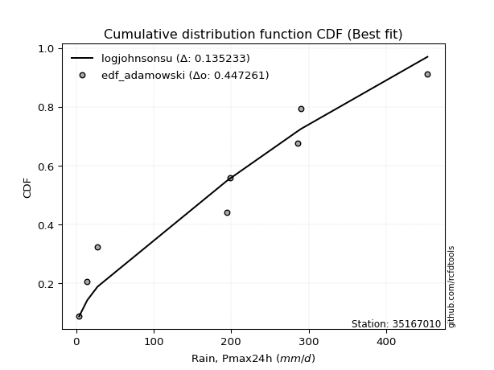</img></img>

</div>


## C. Best fit & Estimate extreme values for specific return periods - Tr

Best fit in probability distribution analysis means finding the theoretical distribution (like Normal, Poisson, Exponential, etc.) that most accurately mirrors your real-world data´s patterns (shape, center, spread) for better predictions, using methods like visual checks (Q-Q plots), goodness-of-fit tests (Kolmogorov-Smirnov, Chi-Squared), and information criteria (AIC) to score and select the simplest, most representative model.


### 1. Best fit (ordered by delta Δ)

:file_folder:Table: [bestfit_35167010.csv](table/bestfit_35167010.csv)

<div align="center">

|   id |   station | empirical_dist   | p_dist         |    delta |   deltao | eval   |   fit |   n |   best_fit |   best_fit_sort |
|-----:|----------:|:-----------------|:---------------|---------:|---------:|:-------|------:|----:|-----------:|----------------:|
|    0 |  35167010 | edf_weibull      | arcsine        | 0.107001 | 0.417613 | Δo > Δ |     1 |   9 |          1 |               1 |
|    1 |  35167010 | edf_hazen        | ksone          | 0.111754 | 0.417613 | Δo > Δ |     1 |   9 |          1 |               2 |
|    2 |  35167010 | edf_gringorten   | ksone          | 0.114678 | 0.417613 | Δo > Δ |     1 |   9 |          1 |               3 |
|    3 |  35167010 | edf_cunnane      | ksone          | 0.116585 | 0.417613 | Δo > Δ |     1 |   9 |          1 |               4 |
|    4 |  35167010 | edf_blom         | ksone          | 0.11776  | 0.417613 | Δo > Δ |     1 |   9 |          1 |               5 |
|    5 |  35167010 | edf_tukey        | ksone          | 0.119691 | 0.417613 | Δo > Δ |     1 |   9 |          1 |               6 |
|    6 |  35167010 | edf_filliben     | ksone          | 0.120415 | 0.417613 | Δo > Δ |     1 |   9 |          1 |               7 |
|    7 |  35167010 | edf_jenkinson    | ksone          | 0.120757 | 0.417613 | Δo > Δ |     1 |   9 |          1 |               8 |
|    8 |  35167010 | edf_beard        | ksone          | 0.120757 | 0.417613 | Δo > Δ |     1 |   9 |          1 |               9 |
|    9 |  35167010 | edf_chegodayev   | ksone          | 0.121211 | 0.417613 | Δo > Δ |     1 |   9 |          1 |              10 |
|   10 |  35167010 | edf_adamowski    | arcsine        | 0.122791 | 0.417613 | Δo > Δ |     1 |   9 |          1 |              11 |
|   11 |  35167010 | edf_california   | logweibull_max | 0.138055 | 0.417613 | Δo > Δ |     1 |   9 |          1 |              12 |

</div>


### 2. Extreme values and % difference analysis

In hydrology, a return period (or recurrence interval $Tr$) is the statistical average time between extreme events like floods or droughts of a specific magnitude, indicating how rare an event is, with a 100-year flood, for example, having a 1% chance of occurring in any given year, not that it happens exactly every century. It is a key tool for infrastructure design (like bridges or dams) and risk assessment, calculated from historical data to determine the probability of future events, although it is important to remember it is statistical average, and events can cluster or be missed.

The extreme value porcentage difference is evaluated as $pdiff = 1 - (ETrBf / ETr) * 100$, where _ETrBf_ correspond to the bestfit extreme value for a specific recurrence interval and _ETr_ correspond to the extreme value for one of the most used PDFsused in hydrology.

> risk_rate: assuming the return period as the project useful life.

:file_folder:Table: [extreme_35167010.csv](table/extreme_35167010.csv), all PDFs.  
:file_folder:Table: [extremepdiff_35167010.csv](table/extremepdiff_35167010.csv), % difference between bestfit and most used PDFs in Hydrology.

<div align="center">

Extreme values table for only best fit PDFs
|   id |      tr |   prob_l |     prob_g |     alpha |   anglit |   arcsine |   argus |    beta |   betaprime |   bradford |    burr |   burr12 |   cosine |   crystalball |   dgamma |   dweibull |   erlang |   exponnorm |   exponpow |   exponweib |        f |   fatiguelife |   foldnorm |   gamma |   gausshyper |   genexpon |   genextreme |   gengamma |   genhalflogistic |   genlogistic |   gennorm |   genpareto |   gompertz |   gumbel_l |   gumbel_r |   halfgennorm |   halflogistic |   halfnorm |   hypsecant |   invgamma |   invgauss |   invweibull |   johnsonsb |   johnsonsu |   kappa3 |   kappa4 |   ksone |   kstwobign |   laplace |   levy_l |   loggamma |   logistic |   loglaplace |    lomax |   maxwell |   mielke |    moyal |   nakagami |     ncf |     nct |    norm |   pearson3 |   powerlaw |   rayleigh |     rdist |    rice |   semicircular |   skewnorm |       t |   trapezoid |   triang |   truncexpon |   truncnorm |   truncpareto |   truncweibull_min |   tukeylambda |   uniform |   vonmises |   vonmises_line |     wald |   weibull_max |      weibull_min |   wrapcauchy |   logalpha |   loganglit |   logarcsine |   logargus |   logbeta |   logbetaprime |   logbradford |   logburr |   logburr12 |   logcosine |   logcrystalball |   logdgamma |      logdweibull |   logerlang |   logexponnorm |   logexponpow |   logexponweib |       logf |   logfatiguelife |   logfoldnorm |   loggausshyper |      loggenexpon |   loggenextreme |   loggengamma |   loggenhalflogistic |   loggenlogistic |        loggennorm |   loggenpareto |   loggompertz |   loggumbel_l |   loggumbel_r |   loghalfgennorm |   loghalflogistic |   loghalfnorm |   loghypsecant |   loginvgamma |   loginvgauss |    loginvweibull |   logjohnsonsb |   logjohnsonsu |   logkappa3 |   logkappa4 |   logksone |   logkstwobign |   loglevy_l |   logloggamma |   loglogistic |    logloglaplace |         loglomax |   logmaxwell |   logmielke |    logmoyal |   lognakagami |      logncf |     lognct |    lognorm |   logpearson3 |   logpowerlaw |   lograyleigh |   logrdist |    logrice |   logsemicircular |   logskewnorm |       logt |   logtrapezoid |   logtriang |   logtruncexpon |   logtruncnorm |   logtruncpareto |   logtruncweibull_min |   logtukeylambda |   loguniform |   logvonmises |   logvonmises_line |          logwald |   logweibull_max |   logweibull_min |   logwrapcauchy |   station |   n |   risk_rate |
|-----:|--------:|---------:|-----------:|----------:|---------:|----------:|--------:|--------:|------------:|-----------:|--------:|---------:|---------:|--------------:|---------:|-----------:|---------:|------------:|-----------:|------------:|---------:|--------------:|-----------:|--------:|-------------:|-----------:|-------------:|-----------:|------------------:|--------------:|----------:|------------:|-----------:|-----------:|-----------:|--------------:|---------------:|-----------:|------------:|-----------:|-----------:|-------------:|------------:|------------:|---------:|---------:|--------:|------------:|----------:|---------:|-----------:|-----------:|-------------:|---------:|----------:|---------:|---------:|-----------:|--------:|--------:|--------:|-----------:|-----------:|-----------:|----------:|--------:|---------------:|-----------:|--------:|------------:|---------:|-------------:|------------:|--------------:|-------------------:|--------------:|----------:|-----------:|----------------:|---------:|--------------:|-----------------:|-------------:|-----------:|------------:|-------------:|-----------:|----------:|---------------:|--------------:|----------:|------------:|------------:|-----------------:|------------:|-----------------:|------------:|---------------:|--------------:|---------------:|-----------:|-----------------:|--------------:|----------------:|-----------------:|----------------:|--------------:|---------------------:|-----------------:|------------------:|---------------:|--------------:|--------------:|--------------:|-----------------:|------------------:|--------------:|---------------:|--------------:|--------------:|-----------------:|---------------:|---------------:|------------:|------------:|-----------:|---------------:|------------:|--------------:|--------------:|-----------------:|-----------------:|-------------:|------------:|------------:|--------------:|------------:|-----------:|-----------:|--------------:|--------------:|--------------:|-----------:|-----------:|------------------:|--------------:|-----------:|---------------:|------------:|----------------:|---------------:|-----------------:|----------------------:|-----------------:|-------------:|--------------:|-------------------:|-----------------:|-----------------:|-----------------:|----------------:|----------:|----:|------------:|
|    0 |    2    | 0.5      | 0.5        |   117.438 |  198.343 |   198.343 | 234.993 | 109.426 |     93.5255 |    162.123 | 168.448 |  35.5851 |  201.675 |     -0.165396 |  198.2   |    198.2   |  197.254 |     198.341 |    156.021 |     101.058 |  117.27  |       61.0575 |    198.05  | 197.203 |      200.006 |    136.076 |      201.016 |    137.949 |           295.386 |       173.237 |    228.65 |     237.237 |    172.073 |    222.593 |    174.093 |       90.6474 |        162.038 |    168.128 |     198.343 |    186.777 |    165.239 |      173.135 |     4.11246 |     195.804 |  203.93  |  211.758 | 198.343 |     168.875 |   198.343 |  184.848 |    92.2928 |    198.343 |      96.2253 |  139.816 |   185.719 |  131.362 |  166.265 |    132.217 | 151.091 | 194.449 | 198.343 |    197.368 |    12.6515 |    181.241 | -41.5445  | 188.733 |        198.343 |    198.298 | 198.313 |     338.311 |  267.147 |      159.049 |     198.343 |       4.48434 |            114.293 |       228.262 |   228.65  |    2.31865 |         228.65  |  150.495 |       453.26  |     32.1792      |      228.65  |    86.0364 |     96.2253 |      96.2247 |    148.824 |   245.227 |        95.2123 |       28.9716 |   147.532 |     140.027 |     76.9781 |          96.2253 |     194.72  |    285.4         |     90.5429 |        96.2243 |       150.066 |        118.859 |    96.5904 |          96.0493 |       98.5066 |         68.0489 |     39.3862      |         177.122 |       127.468 |              95.3626 |          inf     |    198.2          |        106.305 |       122.791 |       124.925 |       74.1187 |     23.413       |           65.0984 |       69.5082 |        96.2253 |       88.5286 |       88.7657 |     75.5887      |        381.535 |        193.313 |     3.89987 |     45.5876 |    42.0507 |        65.3348 |     179.563 |       154.365 |       96.2253 |    198.2         |     39.0931      |      83.9989 |     155.638 |     68.1289 |       108.974 |     78.0573 |    95.9485 |    96.2253 |       122.224 |       4.81573 |       80.0464 |    8.87498 |    93.0052 |           96.2258 |       101.463 |    96.2254 |        126.38  |     77.4443 |         30.2556 |        27.3867 |          3.94615 |               61.1394 |          10.3698 |      42.0507 |      0.516505 |            150.499 |     57.4924      |          144.034 |          131.625 |         42.0507 |  35167010 |   9 |    0.75     |
|    1 |    2.33 | 0.570815 | 0.429185   |   150.899 |  229.026 |   244.403 | 264.452 | 135.923 |    116.59   |    193.394 | 204.558 |  58.3436 |  228.802 |     43.9686   |  210.783 |    215.037 |  223.61  |     224.682 |    184.67  |     173.958 |  146.381 |       86.0064 |    224.534 | 223.566 |      236.536 |    165.199 |      227.868 |    168.004 |           324.927 |       201.084 |    228.65 |     269.954 |    200.352 |    245.51  |    198.501 |      123.279  |        187.133 |    196.557 |     219.424 |    213.589 |    193.367 |      200.95  |     4.83528 |     222.234 |  232.418 |  245.105 | 234.554 |     196.613 |   214.284 |  265.303 |   123.505  |    221.552 |     114.237  |  169.762 |   213.085 |  166.622 |  189.37  |    179.157 | 173.928 | 220.828 | 224.684 |    223.738 |    22.4772 |    209.013 |   8.52829 | 215.575 |        231.251 |    224.64  | 224.657 |     364.427 |  297.936 |      191.218 |     224.684 |       5.0508  |            144.166 |       260.846 |   260.482 |    2.53055 |         249.108 |  167.767 |       453.367 |     78.8425      |      267.364 |   116.502  |    133.882  |     157.98   |    180.443 |   330.562 |       127.094  |       40.6536 |   182.849 |     170.242 |    103.785  |         127.769  |     218.407 |    315.647       |    121.456  |       127.768  |       180.515 |        151.145 |   128.282  |         127.494  |      128.053  |         99.8563 |     60.4745      |         216.249 |       159.344 |             128.512  |          inf     |    199.971        |        157.742 |       153.852 |       159.875 |       96.3891 |     38.8016      |           85.2872 |       94.3915 |       120.736  |      119.545  |      121.227  |    108.53        |        421.523 |        230.406 |     3.89987 |     67.3932 |    62.9925 |        94.6161 |     237.085 |       189.668 |      123.532  |    258.318       |     65.4297      |     112.773  |     191.492 |     87.3658 |       139.047 |    109.612  |   127.489  |   127.769  |       159.189 |       5.71741 |      107.936  |   10.9489  |   124.425  |          137.127  |       128.845 |   127.769  |        175.155 |    103.72   |         42.2852 |        38.0218 |          3.98754 |               81.6237 |          11.9817 |      58.8893 |      0.644908 |            192.328 |     69.2393      |          190.624 |          162.6   |         96.8679 |  35167010 |   9 |    0.729209 |
|    2 |    5    | 0.8      | 0.2        |   410.366 |  337.28  |   367.226 | 358.948 | 253.654 |    238.868  |    315.288 | 334.386 | inf      |  326.557 |    207.982    |  303.446 |    308.406 |  322.159 |     322.574 |    304.556 |    1245.02  |  298.46  |      268.7    |    322.955 | 322.142 |      358.38  |    310.804 |      324.747 |    318.271 |           403.038 |       322.035 |    228.65 |     372.647 |    315.212 |    319.545 |    304.54  |      361.058  |        300.683 |    316.778 |     303.983 |    320.258 |    318.026 |      321.793 |   157.198   |     321.838 |  330.079 |  355.842 | 351.743 |     314.441 |   293.982 |  398.599 |   371.1    |    311.162 |     269.384  |  319.487 |   320.798 |  307.106 |  296.395 |    419.89  | 277.064 | 321.109 | 322.574 |    322.281 |   130.381  |    320.193 | 146.572   | 320.439 |        343.55  |    322.559 | 322.556 |     439.352 |  386.267 |      313.293 |     322.574 |      20.0753  |            275.98  |       365.637 |   363.5   |    3.36088 |         327.79  |  264.456 |       453.4   |   1750.16        |      376.865 |   375.918  |    429.319  |     592.619  |    304.998 |   448.751 |       373.695  |      135.835  |   318.986 |     320.042 |    304.633  |         366.467  |     465.554 |    950.269       |    368.353  |       366.463  |       311.216 |        331.659 |   368.156  |         365.744  |      339.437  |        283.622  |    476.146       |         348.735 |       321.846 |             279.929  |          inf     |    327.066        |        365.398 |       322.793 |       354.71  |      301.807  |    757.892       |          289.536  |      344.301  |       300.004  |      380.459  |      408.962  |    522.446       |        452.142 |        348.437 |     3.89987 |    214.782  |   232.982  |       456.135  |     375.714 |       320.578 |      324.103  |   1201.59        |    893.892       |     359.524  |     324.782 |    276.473  |       366.339 |    446.576  |   366.991  |   366.467  |       373.692 |      22.3148  |      357.196  |   20.2757  |   370.374  |          459.287  |       258.386 |   366.467  |        446.756 |    239.805  |        138.163  |       124.278  |          5.01732 |              203.501  |          19.0097 |     175.145  |      1.53983  |            502.764 |    196.042       |          350.836 |          321.828 |        305.312  |  35167010 |   9 |    0.67232  |
|    3 |   10    | 0.9      | 0.1        |   887.069 |  398.554 |   396.877 | 404.516 | 334.937 |    357.201  |    380.135 | 396.587 | inf      |  385.617 |    316.785    |  397.555 |    397.146 |  388.057 |     387.513 |    389.773 |    4317.9   |  441.717 |      486.245  |    388.246 | 388.058 |      410.188 |    442.98  |      384.332 |    454.679 |           430.261 |       420.529 |    228.65 |     415.058 |    394.499 |    360.764 |    390.907 |      692.883  |        394.982 |    405.739 |     371.506 |    397.67  |    420.531 |      420.218 |   432.482   |     389.139 |  386.92  |  405.035 | 402.877 |     404.151 |   366.329 |  430.78  |   781.867  |    377.156 |     586.916  |  455.402 |   396.6   |  380.65  |  389.577 |    619.698 | 364.076 | 389.735 | 387.512 |    388.127 |   250.905  |    399.467 | 183.455   | 393.048 |        401.173 |    387.539 | 387.5   |     468.617 |  420.77  |      378.22  |     387.512 |      75.7242  |            355.471 |       410.494 |   408.45  |    3.99429 |         379.981 |  367.066 |       453.4   |  10082.6         |      416.337 |   852.305  |    830.264  |     815.43   |    377.64  |   453.195 |       767.705  |      243.493  |   388.622 |     454.826 |    583.86   |         737.225  |     979.993 |   3932.65        |    781.121  |       737.218  |       406.529 |        517.219 |   741.181  |         736.756  |      648.056  |        387.37   |   2982.67        |         405.042 |       470.37  |             364.92   |          inf     |   2337.8          |        430.831 |       490.446 |       552.793 |      764.664  |  19795.7         |          798.962  |      897.033  |       620.551  |      851.538  |      965.123  |   1878.97        |        453.257 |        402.751 |     3.89987 |    329.758  |   412.262  |      1510.8    |     419.885 |       385.009 |      659.46   |   6989.3         |  10169.9         |     812.985  |     390.528 |    753.794  |       728.243 |   1298.37   |   740.746  |   737.225  |       592.659 |      75.3918  |      838.479  |   24.7437  |   768.102  |          853.988  |       343.045 |   737.227  |        644.034 |    332.686  |        245.134  |       227.398  |         10.1609  |              303.004  |          23.0727 |     281.799  |      2.97241  |           1046.98  |    591.595       |          412.252 |          470.656 |        378.663  |  35167010 |   9 |    0.651322 |
|    4 |   15    | 0.933333 | 0.0666667  |  1362.07  |  424.719 |   402.533 | 421.84  | 372.211 |    429.065  |    403.57  | 418.007 | inf      |  412.52  |    371.079    |  454.31  |    450     |  421.098 |     419.92  |    432.543 |    7875.45  |  526.833 |      626.153  |    420.827 | 421.109 |      426.373 |    520.298 |      411.909 |    534.473 |           438.499 |       476.095 |    228.65 |     428.6   |    433.745 |    379.432 |    439.635 |      942.768  |        448.347 |    452.034 |     410.041 |    438.464 |    478.284 |      475.748 |   450.284   |     423.097 |  414.842 |  421.46  | 419.921 |     451.777 |   408.65  |  440.502 |  1139.31   |    413.113 |     925.577  |  534.908 |   435.493 |  406.779 |  443.656 |    726.425 | 414.085 | 424.655 | 419.917 |    421.128 |   307.61   |    440.313 | 191.181   | 429.886 |        423.644 |    419.972 | 419.908 |     478.007 |  431.84  |      401.987 |     419.917 |     130.366   |            385.834 |       425.178 |   423.433 |    4.33357 |         402.204 |  432.957 |       453.4   |  22297.3         |      428.841 |  1299.32   |   1100.35   |     866.61   |    407.387 |   453.367 |      1101.07   |      298.263  |   413.196 |     533.302 |    785.245  |        1044.93   |    1529.27  |  10239           |   1142.01   |      1044.92   |       454.953 |        633.577 |  1051.04   |        1045.34   |      894.878  |        417.416  |   8689.35        |         422.734 |       557.046 |             394.878  |          inf     |  27806.4          |        443.546 |       593.284 |       675.813 |     1291.99   | 166953           |         1419.03   |     1476.48   |       939.545  |     1288.03   |     1505.38   |   3868.48        |        453.352 |        423.124 |     3.89987 |    373.731  |   498.643  |      2853.16   |     434.224 |       407.408 |      971.129  |  23819.8         |  43294.2         |    1235.65   |     413.402 |   1349.14   |      1036.98  |   2311.69   |  1051.96   |  1044.93   |       724.721 |     127.572   |     1301.47   |   26.0081  |  1106.75   |         1087.67   |       376.57  |  1044.93   |        724.224 |    369.533  |        299.43   |       283.004  |         18.8938  |              346.321  |          24.5553 |     330.208  |      4.18606  |           1552.44  |   1202.4         |          429.405 |          559.068 |        402.872  |  35167010 |   9 |    0.644736 |
|    5 |   20    | 0.95     | 0.05       |  1836.65  |  440.11  |   404.524 | 431.349 | 394.724 |    481.151  |    415.65  | 428.842 | inf      |  429.065 |    406.636    |  495.064 |    487.823 |  442.792 |     441.143 |    460.418 |   11590.4   |  587.652 |      729.307  |    442.164 | 442.809 |      434.068 |    575.156 |      429.021 |    591.087 |           442.453 |       515     |    228.65 |     435.195 |    459.151 |    391.051 |    473.752 |     1146.62   |        485.736 |    482.9   |     437.226 |    466.004 |    518.632 |      514.629 |   452.782   |     445.472 |  433.577 |  429.659 | 428.443 |     483.859 |   438.677 |  445.48  |  1460.31   |    437.965 |    1278.73   |  591.318 |   461.305 |  420.144 |  481.955 |    798.075 | 449.492 | 447.777 | 441.139 |    442.791 |   339.746  |    467.462 | 194.061   | 454.182 |        436.107 |    441.214 | 441.132 |     482.64  |  437.301 |      414.33  |     441.139 |     174.382   |            401.836 |       432.434 |   430.925 |    4.5515  |         414.304 |  482.059 |       453.4   |  36544.9         |      435.02  |  1721.01   |   1298.62   |     885.389  |    424.212 |   453.391 |      1395.05   |      330.642  |   425.738 |     588.847 |    942.217  |        1313.08   |    2102.78  |  21169.5         |   1467      |      1313.06   |       486.7   |        719.251 |  1321.23   |        1314.65   |     1105.47   |        430.286  |  18543.7         |         431.217 |       618.377 |             409.962  |          inf     | 396659            |        447.955 |       668.074 |       765.851 |     1865.3    | 832954           |         2122.15   |     2058.33   |      1258.92   |     1696.36   |     2026.05   |   6414.02        |        453.376 |        434.382 |     3.89987 |    395.92   |   548.401  |      4378.53   |     441.755 |       418.776 |     1268.98   |  62935.9         | 122450           |    1631.4    |     425.014 |   2037.48   |      1311.4   |   3430.46   |  1323.74   |  1313.08   |       818.617 |     170.288   |     1743.21   |   26.5534  |  1406.37   |         1243.83   |       394.49  |  1313.08   |        767.386 |    389.185  |        331.53   |       316.958  |         30.3023  |              370.341  |          25.3143 |     357.446  |      5.18273  |           2000.89  |   2039.81        |          437.04  |          622.3   |        415.156  |  35167010 |   9 |    0.641514 |
|    6 |   25    | 0.96     | 0.04       |  2311.07  |  450.541 |   405.448 | 437.481 | 410.196 |    522.162  |    423.017 | 435.382 | inf      |  440.667 |    432.81     |  526.895 |    517.322 |  458.791 |     456.765 |    480.82  |   15348.1   |  635.033 |      811.111  |    457.871 | 458.812 |      438.505 |    617.708 |      441.092 |    635.001 |           444.768 |       544.966 |    228.65 |     439.076 |    477.665 |    399.32  |    500.032 |     1320.51   |        514.542 |    505.865 |     458.265 |    486.707 |    549.652 |      544.578 |   453.421   |     462.012 |  447.781 |  434.57  | 433.557 |     507.89  |   461.967 |  448.605 |  1754.57   |    456.977 |    1643.08   |  635.073 |   480.468 |  428.259 |  511.641 |    851.537 | 476.993 | 464.929 | 456.761 |    458.763 |   360.337  |    487.633 | 195.454   | 472.144 |        444.193 |    456.853 | 456.755 |     485.399 |  440.555 |      421.892 |     456.761 |     208.967   |            411.713 |       436.75  |   435.42  |    4.70258 |         421.845 |  521.389 |       453.4   |  51943           |      438.711 |  2122.03   |   1452.92   |     894.239  |    435.248 |   453.397 |      1660.95   |      351.916  |   433.345 |     631.863 |   1070.66   |        1553.52   |    2695.32  |  38120.7         |   1765.51   |      1553.51   |       510.024 |        787.376 |  1563.61   |        1556.41   |     1291.54   |        437.072  |  33378.8         |         436.147 |       665.841 |             418.993  |          inf     |      6.04e+06     |        449.969 |       727.041 |       837.138 |     2475.13   |      3.05311e+06 |         2893.6    |     2635.54   |      1578.88   |     2082.25   |     2528.9    |   9468.31        |        453.386 |        441.729 |   375.68    |    409.037  |   580.608  |      6034.64   |     446.549 |       425.65  |     1557.15   | 142563           | 276171           |    2005.13   |     432.037 |   2804.58   |      1561.24  |   4628.02   |  1567.8    |  1553.52   |       891.1   |     204.281   |     2165.93   |   26.8436  |  1677.93   |         1356.93   |       405.636 |  1553.53   |        794.314 |    401.388  |        352.627  |       339.718  |         43.3894  |              385.58   |          25.7733 |     374.856  |      5.98949  |           2386.77  |   3114.92        |          441.243 |          671.606 |        422.614  |  35167010 |   9 |    0.639603 |
|    7 |   50    | 0.98     | 0.02       |  4682.41  |  476.217 |   406.682 | 451.383 | 448.885 |    652.869  |    438.023 | 448.566 | inf      |  471.048 |    507.763    |  626.714 |    609.72  |  504.74  |     501.503 |    538.481 |   33711.8   |  783.15  |     1073.04   |    502.849 | 504.773 |      446.794 |    749.884 |      472.979 |    inf     |           449.248 |       637.278 |    228.65 |     446.599 |    529.648 |    421.765 |    580.987 |     1952.97   |        603.299 |    572.616 |     523.493 |    548.089 |    644.881 |      636.835 |   453.838   |     509.705 |  491.413 |  444.351 | 443.783 |     578.455 |   534.315 |  455.64  |  2979.93   |    515.064 |    3579.83   |  770.989 |   536.044 |  444.704 |  603.799 |   1007.26  | 563.073 | 514.683 | 501.496 |    504.624 |   404.647  |    546.186 | 197.433   | 523.892 |        462.665 |    501.642 | 501.494 |     490.876 |  447.011 |      437.386 |     501.496 |     304.594   |            432.119 |       445.262 |   444.41  |    5.05514 |         437.427 |  649.801 |       453.4   | 134914           |      446.065 |  3913.79   |   1915.45   |     906.198  |    460.81  |   453.4   |      2740.45   |      399.135  |   448.776 |     765.146 |   1496.2    |        2514.44   |    5858.99  | 268542           |   3012.87   |      2514.41   |       576.314 |       1007.63  |  2533.05   |        2524.66   |     2016.44   |        447.924  | 207117           |         445.5   |       812.629 |             436.828  |          inf     |      4.30739e+12  |        452.586 |       915.033 |      1065.91  |     5916.17   |      2.28512e+08 |         7522.35   |     5406.46   |      3186.2    |     3785.38   |     4840.59   |  31428.1         |        453.397 |        458.955 |   413.187   |    433.964  |   650.808  |     15480      |     457.533 |       439.518 |     2909.85   |      2.71331e+06 |      3.59113e+06 |    3647.06   |     446.208 |   7562.73   |      2589.68  |  11392.9    |  2545.92   |  2514.44   |      1111.69  |     300.043   |     4067.85   |   27.3167  |  2783.98   |         1655.41   |       428.861 |  2514.44   |        850.585 |    426.748  |        399.479  |       391.541  |        112.343   |              418.053  |          26.6916 |     412.262  |      8.30779  |           3607.05  |  12409.1         |          448.561 |          826.049 |        437.789  |  35167010 |   9 |    0.63583  |
|    8 |   75    | 0.986667 | 0.0133333  |  7053.42  |  487.517 |   406.911 | 456.897 | 466.119 |    731.619  |    443.107 | 453.052 | inf      |  485.556 |    547.98     |  685.617 |    664.236 |  529.477 |     525.508 |    568.85  |   50872.5   |  870.334 |     1230.55   |    526.982 | 529.516 |      449.3   |    827.202 |      488.344 |    inf     |           450.687 |       690.933 |    228.65 |     449.001 |    556.834 |    433.115 |    628.041 |     2391.03   |        654.893 |    608.952 |     561.612 |    582.357 |    700.019 |      690.459 |   453.865   |     535.498 |  517.29  |  447.59  | 447.192 |     617.28  |   576.636 |  458.531 |  3969.12   |    548.613 |    5645.45   |  850.495 |   566.259 |  450.262 |  657.691 |   1092.05  | 614.143 | 541.779 | 525.499 |    529.306 |   420.388  |    578.041 | 197.837   | 551.823 |        470.043 |    525.678 | 525.5   |     492.689 |  449.149 |      442.665 |     525.499 |     346.947   |            439.12  |       448.044 |   447.407 |    5.18624 |         442.726 |  728.82  |       453.4   | 218615           |      448.511 |  5477.82   |   2163.2    |     908.433  |    471.155 |   453.4   |      3587.7    |      416.39   |   454.097 |     842.903 |   1755.48   |        3255.74   |    9254.05  | 911362           |   4023.49   |      3255.71   |       611.435 |       1142.08  |  3281.61   |        3273.46   |     2560.94   |        450.524  | 602397           |         448.398 |       898.027 |             442.621  |          inf     |      1.35546e+18  |        453.049 |      1028.07  |      1204.43  |     9817.61   |      3.44894e+09 |        13108.2    |     7994.23   |      4802.52   |     5251.76   |     6919.44   |  63120.4         |        453.399 |        466.221 |   426.503   |    441.509  |   676.046  |     25993.6    |     462.125 |       444.176 |     4175.45   |      2.11111e+07 |      1.65541e+07 |    5048.85   |     450.981 |  13508.5    |      3410.26  |  18993.3    |  3302.83   |  3255.74   |      1236     |     343.2     |     5731.65   |   27.4338  |  3654.56   |         1792.25   |       436.891 |  3255.74   |        870.079 |    435.492  |        416.612  |       410.937  |        168.623   |              429.502  |          26.9942 |     425.542  |      9.35409  |           4207.54  |  29049.1         |          450.575 |          917.196 |        442.939  |  35167010 |   9 |    0.634587 |
|    9 |  100    | 0.99     | 0.01       |  9424.34  |  494.237 |   406.991 | 459.975 | 476.404 |    788.513  |    445.665 | 455.387 | inf      |  494.65  |    575.181    |  727.589 |    703.098 |  546.24  |     541.744 |    589.133 |   66907.9   |  932.392 |     1343.82   |    543.305 | 546.284 |      450.478 |    882.06  |      498.017 |    inf     |           451.393 |       728.907 |    228.65 |     450.171 |    574.923 |    440.539 |    661.344 |     2733.89   |        691.411 |    633.706 |     588.652 |    606.083 |    738.961 |      728.411 |   453.871   |     553.025 |  536.036 |  449.203 | 448.897 |     643.882 |   606.663 |  460.221 |  4822.96   |    572.3   |    7799.49   |  906.905 |   586.84  |  453.084 |  695.925 |   1149.78  | 650.796 | 560.27  | 541.734 |    546.03  |   428.447  |    599.743 | 197.986   | 570.77  |        474.176 |    541.937 | 541.736 |     493.594 |  450.215 |      445.326 |     541.734 |     370.614   |            442.658 |       449.42  |   448.905 |    5.25365 |         445.388 |  786.432 |       453.4   | 299775           |      449.734 |  6898.17   |   2325.45   |     909.216  |    476.981 |   453.4   |      4305.94   |      425.324  |   456.908 |     897.99  |   1940.42   |        3877.42   |   12812     |      2.2411e+06  |   4897.77   |      3877.38   |       634.967 |       1239.82  |  3909.75   |        3902.43   |     3010.33   |        451.58   |      1.28484e+06 |         449.783 |       958.408 |             445.461  |          inf     |      1.86228e+23  |        453.207 |      1109.52  |      1304.63  |    14050.4    |      2.56883e+10 |        19420.1    |    10435      |      6424.99   |     6571.41   |     8842.59   | 103399           |        453.399 |        470.482 |   433.322   |    445.027  |   689.03   |     37076      |     464.83  |       446.511 |     5388.03   |      1.07289e+08 |      4.95729e+07 |    6300.9    |     453.401 |  20386.5    |      4113.61  |  27146.5    |  3938.84   |  3877.41   |      1321.55  |     367.494   |     7239.88   |   27.4823  |  4393.63   |         1873.77   |       440.961 |  3877.43   |        879.967 |    439.92   |        425.486  |       421.077  |        210.867   |              435.35   |          27.1437 |     432.342  |      9.93811  |           4554.6   |  54007.7         |          451.471 |          982.189 |        445.533  |  35167010 |   9 |    0.633968 |
|   10 |  200    | 0.995    | 0.005      | 18907.8   |  506.931 |   407.069 | 465.325 | 495.87  |    929.073  |    449.521 | 459.357 | inf      |  513.14  |    636.882    |  829.215 |    797.287 |  584.363 |     578.573 |    634.315 |  122951     | 1082.5   |     1620.92   |    580.331 | 584.417 |      452.109 |   1014.24  |      517.776 |    inf     |           452.427 |       820.201 |    228.65 |     451.867 |    615.026 |    456.676 |    741.409 |     3674.61   |        779.203 |    690.321 |     653.794 |    661.604 |    832.351 |      819.653 |   453.874   |     593.025 |  583.037 |  451.607 | 451.453 |     705.15  |   679.01  |  463.423 |  7525.22   |    629.119 |   16993      | 1042.82  |   633.927 |  457.598 |  788.043 |   1281.6   | 740.8   | 602.713 | 578.559 |    584.052 |   440.777  |    649.4   | 198.14    | 613.9   |        481.38  |    578.822 | 578.566 |     494.947 |  451.811 |      449.346 |     578.559 |     409.639   |            448.015 |       451.452 |   451.152 |    5.35641 |         449.391 |  929.938 |       453.4   | 595428           |      451.567 | 11750.7    |   2665.94   |     909.973  |    487.193 |   453.4   |      6519.33   |      439.122  |   461.808 |    1030.46  |   2378.75   |        5763.58   |   28134.9   |      2.17318e+07 |   7673.42   |      5763.53   |       687.591 |       1482.79  |  5817.15   |        5815.28   |     4343.94   |        452.797  |      7.96999e+06 |         451.743 |      1103.19  |             449.606  |          inf     |      1.53746e+41  |        453.354 |      1309.7   |      1552.1   |    33263.4    |      4.2565e+12  |        49964.1    |    19193.4    |     12953.6    |    11017.4    |    15591.5    | 338710           |        453.4   |        478.49  |   443.754   |    449.819  |   708.975  |     84006.3    |     469.999 |       450.023 |     9932.16   |      1.0568e+10  |      7.27481e+08 |   10459.7    |     457.272 |  54950.3    |      6317.64  |  63256.5    |  5873.98   |  5763.58   |      1517.46  |     407.817   |    12355.6    |   27.5397  |  6674.87   |         2024.85   |       447.137 |  5763.6    |        894.979 |    446.631  |        439.195  |       436.871  |        303.42    |              444.279  |          27.364  |     442.746  |     10.8949   |           5139.78  | 253110           |          452.63  |         1139.78  |        449.45   |  35167010 |   9 |    0.633042 |
|   11 |  250    | 0.996    | 0.004      | 23649.5   |  510.162 |   407.078 | 466.577 | 500.822 |    975.375  |    450.295 | 460.337 | inf      |  518.208 |    655.738    |  862.059 |    827.762 |  596.04  |     589.828 |    647.884 |  147540     | 1130.97  |     1711.2    |    591.646 | 596.097 |      452.407 |   1056.79  |      523.213 |    inf     |           452.629 |       849.55  |    228.65 |     452.194 |    627.02  |    461.424 |    767.148 |     4013.31   |        807.427 |    707.738 |     674.763 |    679.056 |    862.319 |      848.986 |   453.875   |     605.317 |  598.826 |  452.085 | 451.965 |     724.112 |   702.301 |  464.256 |  8628.04   |    647.36  |   21834.8    | 1086.58  |   648.421 |  458.633 |  817.698 |   1322.09  | 770.343 | 615.826 | 589.813 |    595.696 |   443.278  |    664.686 | 198.16    | 627.118 |        483.07  |    590.095 | 589.821 |     495.218 |  452.13  |      450.154 |     589.813 |     417.993   |            449.094 |       451.852 |   451.602 |    5.37712 |         450.192 |  977.414 |       453.4   | 728649           |      451.934 | 13866      |   2760.28   |     910.063  |    489.599 |   453.4   |      7402.07   |      441.94   |   463.048 |    1073.04  |   2515.34   |        6505.8    |   36269     |      4.65067e+07 |   8809.14   |      6505.74   |       703.448 |       1563.15  |  6568.29   |        6569.58   |     4859.1    |        452.977  |      1.43423e+07 |         452.111 |      1149.59  |             450.41   |          inf     |      1.06174e+49  |        453.371 |      1375.25  |      1633.49  |    43882.4    |      2.38911e+13 |        67701.5    |    23151.2    |     16233.7    |    12932.2    |    18598.5    | 496013           |        453.4   |        480.541 |   445.871   |    450.678  |   713.032  |    108204      |     471.354 |       450.726 |    12087      |      5.82972e+10 |      1.75037e+09 |   12225.8    |     458.16  |  75613.3    |      7209.64  |  82763.2    |  6637.35   |  6505.8    |      1577.25  |     416.49    |    14565.3    |   27.5485  |  7585.62   |         2062.02   |       448.383 |  6505.82   |        898.008 |    447.984  |        441.996  |       440.117  |        327.765   |              446.088  |          27.4071 |     444.856  |     11.0983   |           5266.58  | 421935           |          452.827 |         1190.79  |        450.237  |  35167010 |   9 |    0.632858 |
|   12 |  500    | 0.998    | 0.002      | 47358     |  518.173 |   407.09  | 469.455 | 513.074 |   1122.5    |    451.845 | 462.91  | inf      |  531.697 |    711.654    |  964.4   |    922.849 |  630.744 |     623.204 |    687.443 |  250809     | 1281.96  |     1994.32   |    625.201 | 630.81  |      452.962 |   1188.96  |      537.714 |    inf     |           453.026 |       940.645 |    228.65 |     452.827 |    661.862 |    475.034 |    847.038 |     5182.49   |        895.029 |    759.667 |     739.9   |    732.203 |    955.209 |      940.029 |   453.875   |     641.958 |  650.262 |  453.035 | 452.987 |     780.935 |   774.648 |  466.408 | 12972      |    703.933 |   47572.1    | 1222.49  |   691.673 |  461.195 |  909.814 |   1442.58  | 864.092 | 655.115 | 623.187 |    630.295 |   448.315  |    710.293 | 198.189   | 666.407 |        486.961 |    623.529 | 623.197 |     495.758 |  452.767 |      451.774 |     623.187 |     435.288   |            451.258 |       452.642 |   452.501 |    5.41865 |         451.796 | 1128.37  |       453.4   |      1.29986e+06 |      452.667 | 22830.1    |   3008.86   |     910.185  |    495.153 |   453.4   |     10794      |      447.637  |   466.362 |    1205.1   |   2918.25   |        9317.75   |   79967.8   |      5.38186e+08 |  13294.9    |      9317.67   |       749.81  |       1818.97  |  9416.34   |        9433.8    |     6774.76   |        453.26   |      8.89651e+07 |         452.81  |      1293.12  |             451.973  |          inf     |      6.87757e+81  |        453.393 |      1582.05  |      1891.22  |   103694      |      6.46056e+15 |       173826      |    40488.3    |     32727.5    |    20935.8    |    31643.2    |      1.62063e+06 |        453.4   |        485.718 |   450.134   |    452.24   |   721.217  |    231039      |     474.871 |       452.134 |    22221.7    |      2.74105e+13 |      2.7911e+10  |   19474.5    |     460.361 | 203805      |     10692.2   | 189167      |  9536.97   |  9317.75   |      1752.39  |     434.488   |    23797.1    |   27.5626  | 11087.6    |         2150.22   |       450.885 |  9317.78   |        904.091 |    450.699  |        447.657  |       446.698  |        384.257   |              449.728  |          27.4919 |     449.108  |     11.5171   |           5530.29  |      2.14256e+06 |          453.171 |         1350.04  |        451.816  |  35167010 |   9 |    0.632489 |
|   13 |  750    | 0.998667 | 0.00133333 | 71066.5   |  521.72  |   407.092 | 470.612 | 518.476 |   1210.9    |    452.363 | 464.218 | inf      |  538.234 |    742.716    | 1024.46  |    978.746 |  650.07  |     641.745 |    708.973 |  334601     | 1370.54  |     2161.57   |    643.841 | 650.141 |      453.128 |   1266.28  |      544.758 |    inf     |           453.155 |       993.899 |    228.65 |     453.03  |    680.749 |    482.309 |    893.742 |     5951.81   |        946.241 |    788.678 |     778.002 |    762.652 |   1009.45  |      993.253 |   453.875   |     662.435 |  682.196 |  453.349 | 453.328 |     812.856 |   816.969 |  467.429 | 16293.3    |    736.984 |   75022.2    | 1302     |   715.864 |  462.424 |  963.699 |   1509.75  | 920.43  | 677.206 | 641.726 |    649.558 |   450.005  |    735.796 | 198.195   | 688.287 |        488.527 |    642.105 | 641.738 |     495.938 |  452.979 |      452.316 |     641.726 |     441.232   |            451.981 |       452.9   |   452.801 |    5.43251 |         452.331 | 1218.88  |       453.4   |      1.77111e+06 |      452.911 | 30271.9    |   3125.95   |     910.207  |    497.394 |   453.4   |     13315.9    |      449.553  |   468.075 |    1282.22  |   3136.12   |       11375.7    |  127132     |      2.38591e+09 |  16734.9    |     11375.6    |       775.123 |       1972.78  | 11502.6    |       11535.4    |     8148.46   |        453.327  |      2.58738e+08 |         453.026 |      1376.67  |             452.474  |          inf     |      2.32729e+108 |        453.397 |      1705.12  |      2045.25  |   171427      |      2.01801e+17 |       301660      |    55328.2    |     49320.8    |    27477.3    |    42745.5    |      3.23801e+06 |        453.4   |        488.089 |   451.564   |    452.696  |   723.967  |    353800      |     476.548 |       452.604 |    31716.4    |      1.98988e+15 |      1.45288e+11 |   25266.9    |     461.417 | 364007      |     13328.6   | 305404      | 11665.3    | 11375.7    |      1847.33  |     440.688   |    31314.5    |   27.566   | 13692.4    |         2186.77   |       451.722 | 11375.7    |        906.126 |    451.607  |        449.563  |       448.918  |        405.749   |              450.949  |          27.5195 |     450.534  |     11.6603   |           5621.23  |      5.67607e+06 |          453.266 |         1443.7   |        452.343  |  35167010 |   9 |    0.632366 |
|   14 | 1000    | 0.999    | 0.001      | 94774.9   |  523.833 |   407.093 | 471.261 | 521.684 |   1274.69   |    452.622 | 465.095 | inf      |  542.357 |    764.103    | 1067.15  |   1018.52  |  663.396 |     654.511 |    723.61  |  406956     | 1433.49  |     2280.85   |    656.674 | 663.471 |      453.206 |   1321.14  |      549.205 |    inf     |           453.218 |      1031.67  |    228.65 |     453.128 |    693.559 |    487.204 |    926.87  |     6537.42   |        982.568 |    808.713 |     805.036 |    784.013 |   1047.91  |     1031.01  |   453.875   |     676.585 |  705.75  |  453.505 | 453.499 |     834.971 |   846.996 |  468.071 | 19073.7    |    760.424 |  103647      | 1358.41  |   732.584 |  463.228 | 1001.93  |   1556.07  | 961.121 | 692.529 | 654.49  |    662.839 |   450.852  |    753.421 | 198.197   | 703.373 |        489.407 |    654.895 | 654.504 |     496.028 |  453.085 |      452.586 |     654.49  |     444.239   |            452.343 |       453.028 |   452.95  |    5.43944 |         452.598 | 1283.99  |       453.4   |      2.18106e+06 |      453.033 | 36842.7    |   3197.88   |     910.215  |    498.655 |   453.4   |     15389.7    |      450.515  |   469.232 |    1336.89  |   3281.84   |       13051.1    |  176721     |      7.03076e+09 |  19619.7    |     13051      |       792.363 |       2083.67  | 13202      |       13249.3    |     9252.96   |        453.354  |      5.51848e+08 |         453.129 |      1435.76  |             452.719  |          452.715 |      1.70088e+131 |        453.398 |      1793.32  |      2155.92  |   244876      |      2.49441e+18 |       446001      |    68644.5    |     65979      |    33194.2    |    52701.2    |      5.29056e+06 |        453.4   |        489.543 |   452.281   |    452.906  |   725.345  |    475307      |     477.605 |       452.839 |    40818.3    |      5.93509e+16 |      4.7473e+11  |   30249.1    |     462.109 | 549328      |     15521.6   | 428355      | 13401.3    | 13051.1    |      1911.36  |     443.827   |    37855.9    |   27.5674  | 15834.5    |         2207.58   |       452.141 | 13051.1    |        907.145 |    452.062  |        450.519  |       450.033  |        417.055   |              451.56   |          27.5331 |     451.249  |     11.7326   |           5667.27  |      1.14395e+07 |          453.308 |         1510.38  |        452.607  |  35167010 |   9 |    0.632305 |


</div>


<div align="center">

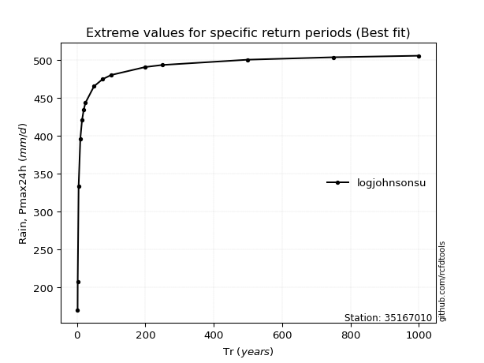</img>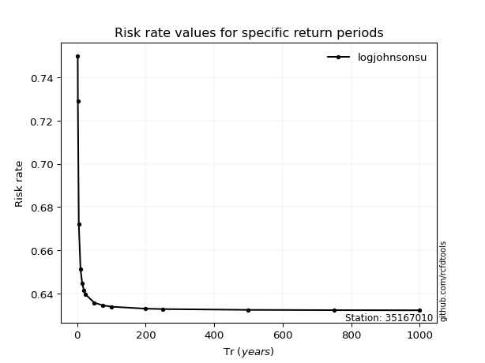</img>

</div>


<sub>**APP DISCLAIMER**: NO WARRANTY - This software is provided by [github.com/rcfdtools](https://github.com/rcfdtools) "as is", without any express or implied warranty, including warranties of merchantability, fitness for a particular purpose, or non-infringement. There is no guarantee that the software will be error-free or operate without interruption. LIMITATION OF LIABILITY - Neither the authors nor copyright holders will be liable for claims or damages arising from the software or its use. You are responsible for determining if the software is appropriate for your use and assume all associated risks, including errors, legal compliance, and data loss. NO PROFESSIONAL ADVICE - The software provides general information and does not offer professional advice. It should not replace consultation with professional advisors.</sub>