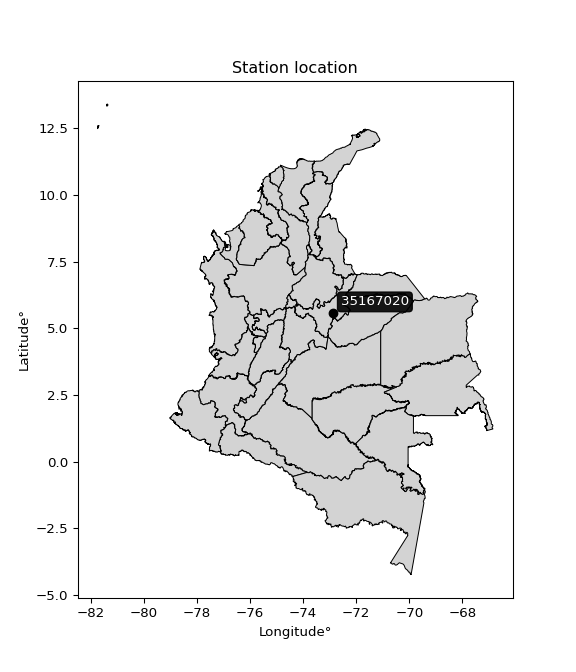

<div align="center">


</div>

# PMax24h Station (Rain): 35167020

Maximum Precipitation in 24 hours (PMax24h) is the greatest amount of rainfall for a specific duration that is meteorologically possible for a given location, acting as a "worst-case" scenario for extreme storms, crucial for designing safety-critical infrastructure like bridges, river deviations, dams, spillways, and nuclear plants to prevent catastrophic failure. The PMax24h is related with the Probable Maximum Precipitation (PMP) and it is calculated by hydrologists using meteorological data to determine the upper limit of extreme rainfall, often leading to the Probable Maximum Flood (PMF) for flood control design, and is increasingly being studied for climate change impacts. Probable Maximum Precipitation (PMP) is the theoretical upper limit of rainfall, a deterministic estimate for extreme events, while probability distributions (like GEV, Gumbel) describe the likelihood and frequency of various precipitation amounts, including rare ones, showing how often events occur, with PMP representing the extreme end of these distributions, used for critical infrastructure design to ensure safety against the worst conceivable weather, unlike standard statistical forecasts which cover typical probabilities.

The most common probability distributions in hydrology, used for analyzing floods, rainfall, and streamflow, include the Normal, Log-Normal, Gumbel, Gamma (including Log-Pearson Type III), and Generalized Extreme Value (GEV) distributions, often chosen based on the data´s skewness and whether modeling extremes or general conditions, with Gumbel and GEV popular for extreme events like floods, while the Normal distribution serves as a baseline, though often requiring transformations for skewed hydrological data. These distributions help in designing water infrastructure, managing water resources, and forecasting hydrologic events.

> Hydrological data often isn´t perfectly normal (it´s skewed), so different distributions are needed for different applications, such as: **Flood Frequency Analysis**: Using Gumbel, GEV, or Log-Pearson Type III for predicting extreme flood magnitudes and their return periods, **Rainfall Analysis**: Normal for annual totals, but Log-Normal, Weibull, or GEV for intensity or extreme daily rainfall, **Streamflow Modeling**: Gamma and Log-Normal for maximum flows, GEV for minimum flows, and Kappa for daily flows.

<div align="center">

</img>

</div>


## A. General information


### 1. General running parameters

• app_version: _v20260225_. • runtime: _2026-02-28 16:54:07.457399_. • Python version: _3.14.0_. • SciPy version: _1.16.3_. • Pandas version: _2.3.3_. • NumPy version: _2.3.5_. • Stations dataset (station_dataset_file): _dataset/pmax24h_in/automatic_colombia_2003_2025.csv_. • Stations catalog (station_catalog_file): _dataset/CNE.xls_. • Minimum year to eval til year_max (date_min): _1900_. • Maximum year to eval since year_min (date_max): _2025_. • Creates, save and include plots into reports (create_plot): _False_. • Plot only fit distributions with Δo > Δ (plot_only_fit): _True_. • Plot only simple graphs avoiding multiple CDFs and multiple Extreme values plots (plot_only_simple): _False_. • Eval low extreme values, if False, evaluates high extreme values (low_extreme): _False_. • Eval every SciPy distribution as logarithmic (pdist_logarithmic_on): _True_. • Standard deviation normalized (ddof): _1.0_. • Return periods to eval in years (Tr): _[2, 2.33, 5, 10, 15, 20, 25, 50, 75, 100, 200, 250, 500, 750, 1000]_. • Minimum data sample per station, 0 means any (minimum_sample): _5_. • Z-Score maximum threshold to adjust a value, 0 means disable (zscore_max): _3.5_. • Z-Score minimum threshold to adjust a value, 0 means disable (zscore_min): _-2.5_. • Avoid zeros, e.g. rain = 0 (avoid_zeros): _True_. • Avoid null values (avoid_nans): _True_. 

:file_folder:Table: [dataset.csv](../../dataset/pmax24h_in/automatic_colombia_2003_2025.csv)

> Delta Degrees of Freedom (DDOF): is a parameter used in the formulas for calculating variance and standard deviation. When ddof=0, the divisor is $N$ (the total number of observations) and this is used when your data set is the entire population. When ddof=1, the divisor is $N-1$ and this is used when your data set is a sample drawn from a larger population. Using $N-1$ provides an unbiased estimate of the population variance (known as Bessel´s correction).


### 2. Station info and location

|   id |   CODIGO | NOMBRE                   | CATEGORIA    | TECNOLOGIA                | ESTADO   | FECHA_INSTALACION   |   FECHA_SUSPENSION |   ALTITUD |   LATITUD |   LONGITUD | DEPARTAMENTO   | MUNICIPIO   | AREA_OPERATIVA                              | ENTIDAD                                                     | AREA_HIDROGRAFICA   | ZONA_HIDROGRAFICA   | SUBZONA_HIDROGRAFICA   | CORRIENTE          | Catalogo   |   Version |
|-----:|---------:|:-------------------------|:-------------|:--------------------------|:---------|:--------------------|-------------------:|----------:|----------:|-----------:|:---------------|:------------|:--------------------------------------------|:------------------------------------------------------------|:--------------------|:--------------------|:-----------------------|:-------------------|:-----------|----------:|
|    0 | 35167020 | CRIADERO -AUT [35167020] | Limnigráfica | Automática con Telemetría | Activa   | 31/12/2016          |                nan |      3025 |     5.557 |   -72.8805 | Boyacá         | Aquitania   | Area Operativa 06 - Boyacá-Casanare-Vichada | INSTITUTO DE HIDROLOGIA METEOROLOGIA Y ESTUDIOS AMBIENTALES | Orinoco             | Meta                | Lago de Tota           | QUEBRADA LOS POZOS | CNE_IDEAM  |  20251226 |

<div align="center">

Dynamic map: [:earth_americas:Google](http://maps.google.com/maps?q=5.557,-72.88047222) [:earth_americas:OSM](https://www.openstreetmap.org/#map=18/5.557/-72.88047222&layers=P) [:earth_americas:Bing](https://www.bing.com/maps?cp=5.557~-72.88047222&lvl=18) [:earth_americas:Apple](https://maps.apple.com/frame?center=5.557%2C-72.88047222&span=0.003%2C0.006)

</div>


<div align="center">

```geojson
{
  "type": "Feature",
  "geometry": {
    "type": "Point", 
    "coordinates": [-72.88047222, 5.557]
  }, 
  "properties": {
    "Name": "35167020"
  }
}
```

</div>


### 3. Discrete values table and plot

<div align="center">

|               |           0 |           1 |           2 |         3 |           4 |           5 |           6 |
|:--------------|------------:|------------:|------------:|----------:|------------:|------------:|------------:|
| Date          | 2017        | 2018        | 2019        | 2020      | 2021        | 2022        | 2024        |
| Value         |   54.5      |   18.9      |  258.9      |  453.7    |   48.9      |   41.03     |    6        |
| Value_initial |   54.5      |   18.9      |  258.9      |  453.7    |   48.9      |   41.03     |    6        |
| count         |    7        |    7        |    7        |    7      |    7        |    7        |    7        |
| mean          |  125.99     |  125.99     |  125.99     |  125.99   |  125.99     |  125.99     |  125.99     |
| std           |  167.927    |  167.927    |  167.927    |  167.927  |  167.927    |  167.927    |  167.927    |
| zscore        |   -0.425721 |   -0.637718 |    0.791475 |    1.9515 |   -0.459069 |   -0.505934 |   -0.714537 |


</div>


> The initial value (value_initial) correspond to the initial obtained or null completed value, and value (value) is adjusted only when the initial value is outside the valid range (outlier) definite through the Z-Score value. If Z-Score is active, values out of range or outliers are replaced with the station mean value. A Z-Score (or standard score) measures how many standard deviations a data point is from the mean of a dataset, indicating its relative position; positive scores mean above the mean, negative mean below, and a score of zero is exactly at the mean, allowing for comparison of values from different distributions. It´s calculated using the formula $z=(x–μ)/σ$, where $x$ is the data point, $μ$ is the mean, and $σ$ is the standard deviation, helping identify outliers and understand probability.
>
> <sub>**Note**: In this study, "completing" (filling gaps in) and "extending" (forecasting or lengthening the historical record) rainfall data series are avoided for certain critical analyses because they introduce artificial bias and uncertainty, which can distort the statistics of rare events (extremes), alter day-to-day variability, and compromise the integrity and homogeneity of the original data. Some reasons against Completing/Extending rainfall data are: **Distortion of Extremes and Variability**: The primary issue is that most gap-filling or extension methods rely on averaging or regression with nearby stations, which inherently smooths the data. Rainfall is highly variable in space and time, with a large percentage of zero values and occasional large storms. Infilling methods often underestimate the highest values and overestimate the lowest (zero) values, which severely distorts analyses focused on flood frequency, drought severity, and intensity-duration-frequency (IDF) curves, **Loss of Data Homogeneity**: Infilled or extended data are synthetic estimates, not actual measurements. Combining these estimates with observed data can violate the assumption of data homogeneity, which requires that the data properties do not change over time. Inhomogeneity can lead to incorrect conclusions about long-term trends or changes in climate patterns, **Propagation of Errors**: Errors and biases from the original data (e.g., wind-induced undercatch, instrument errors, site changes) or the data used for imputation can propagate through the analysis, leading to unreliable hydrological models and inaccurate predictions, **Compromised Statistical Integrity**: For statistical analyses, especially those involving the frequency of events, using artificial data can introduce time bias or autocorrelation that doesn´t exist in reality, making it difficult to assess the true probability of events, **Difficulty in Validation**: It is difficult to accurately validate the quality of filled or extended data, especially for past periods where ground-truth measurements are unavailable. The reliability of imputation techniques heavily depends on the density of the surrounding station network and the complexity of the local topography.</sub>


### 4. Active continuous probability distributions from SciPy (80 of 104 available)

A Probability Density Function (PDF) describes the relative likelihood of a continuous random variable falling within a specific range, where the total area under its curve equals 1, and the area over any interval gives the actual probability for that range. Unlike discrete probabilities (like rolling a die), a PDF shows density, not direct probability for a single point (which is zero), with higher points indicating higher likelihood, often visualized as a bell curve for normal distributions.

A log of a probability density function (log-PDF) is simply the logarithm of the PDF´s value, denoted as $log(f(x))$, useful for converting multiplication of probabilities into addition, improving numerical stability with tiny numbers, and connecting to information theory concepts like entropy. Instead of dealing with very small probabilities (e.g., 0.000001), log-PDFs use negative numbers (e.g., $log(0.00001) ≈ -11.51$ that are easier for computers to handle, preventing underflow errors and simplifying complex calculations. In this study, each active probability distribution from SciPy is also evaluated in the $log$ form.

[scipy.stats](https://docs.scipy.org/doc/scipy/reference/stats.html) is a Python´s powerful submodule within the SciPy library for comprehensive statistical analysis, offering over 130 probability distributions (like Normal, Poisson, etc.), functions for descriptive stats (mean, variance), hypothesis testing (t-tests, chi-square), random variable generation, and statistical tests, making it essential for data science, modeling, and research. It provides tools to explore, model, and draw conclusions from data efficiently, working seamlessly with [NumPy](https://numpy.org/).

<div align="center">

|   id | p_dist           |   n_parameter | fit_method   | label                                                                       | active   | ref                                                                                                      |
|-----:|:-----------------|--------------:|:-------------|:----------------------------------------------------------------------------|:---------|:---------------------------------------------------------------------------------------------------------|
|    0 | alpha            |             3 | MLE          | Alpha                                                                       | True     | [:mortar_board:](https://docs.scipy.org/doc/scipy/reference/generated/scipy.stats.alpha.html)            |
|    1 | anglit           |             2 | MM           | Anglit                                                                      | True     | [:mortar_board:](https://docs.scipy.org/doc/scipy/reference/generated/scipy.stats.anglit.html)           |
|    2 | arcsine          |             2 | MM           | Arcsine                                                                     | True     | [:mortar_board:](https://docs.scipy.org/doc/scipy/reference/generated/scipy.stats.arcsine.html)          |
|    3 | argus            |             3 | MLE          | Argus                                                                       | True     | [:mortar_board:](https://docs.scipy.org/doc/scipy/reference/generated/scipy.stats.argus.html)            |
|    4 | beta             |             4 | MLE          | Beta                                                                        | True     | [:mortar_board:](https://docs.scipy.org/doc/scipy/reference/generated/scipy.stats.beta.html)             |
|    5 | betaprime        |             4 | MLE          | Beta prime                                                                  | True     | [:mortar_board:](https://docs.scipy.org/doc/scipy/reference/generated/scipy.stats.betaprime.html)        |
|    6 | bradford         |             3 | MLE          | Bradford                                                                    | True     | [:mortar_board:](https://docs.scipy.org/doc/scipy/reference/generated/scipy.stats.bradford.html)         |
|    7 | burr             |             4 | MLE          | Burr (Type III)                                                             | True     | [:mortar_board:](https://docs.scipy.org/doc/scipy/reference/generated/scipy.stats.burr.html)             |
|    8 | burr12           |             4 | MLE          | Burr (Type III) 12                                                          | True     | [:mortar_board:](https://docs.scipy.org/doc/scipy/reference/generated/scipy.stats.burr12.html)           |
|    9 | cosine           |             2 | MLE          | Cosine                                                                      | True     | [:mortar_board:](https://docs.scipy.org/doc/scipy/reference/generated/scipy.stats.cosine.html)           |
|   10 | crystalball      |             4 | MLE          | Crystalball                                                                 | True     | [:mortar_board:](https://docs.scipy.org/doc/scipy/reference/generated/scipy.stats.crystalball.html)      |
|   11 | dgamma           |             3 | MLE          | Double gamma                                                                | True     | [:mortar_board:](https://docs.scipy.org/doc/scipy/reference/generated/scipy.stats.dgamma.html)           |
|   12 | dweibull         |             3 | MLE          | Double Weibull                                                              | True     | [:mortar_board:](https://docs.scipy.org/doc/scipy/reference/generated/scipy.stats.dweibull.html)         |
|   13 | erlang           |             3 | MLE          | Erlang                                                                      | True     | [:mortar_board:](https://docs.scipy.org/doc/scipy/reference/generated/scipy.stats.erlang.html)           |
|   14 | exponnorm        |             3 | MLE          | Exponentially modified Normal                                               | True     | [:mortar_board:](https://docs.scipy.org/doc/scipy/reference/generated/scipy.stats.exponnorm.html)        |
|   15 | exponpow         |             3 | MLE          | Exponential power                                                           | True     | [:mortar_board:](https://docs.scipy.org/doc/scipy/reference/generated/scipy.stats.exponpow.html)         |
|   16 | exponweib        |             4 | MLE          | Exponentiated Weibull                                                       | True     | [:mortar_board:](https://docs.scipy.org/doc/scipy/reference/generated/scipy.stats.exponweib.html)        |
|   17 | f                |             4 | MLE          | F                                                                           | True     | [:mortar_board:](https://docs.scipy.org/doc/scipy/reference/generated/scipy.stats.f.html)                |
|   18 | fatiguelife      |             3 | MLE          | Fatigue-life (Birnbaum-Saunders)                                            | True     | [:mortar_board:](https://docs.scipy.org/doc/scipy/reference/generated/scipy.stats.fatiguelife.html)      |
|   19 | foldnorm         |             3 | MM           | Fold Normal                                                                 | True     | [:mortar_board:](https://docs.scipy.org/doc/scipy/reference/generated/scipy.stats.foldnorm.html)         |
|   20 | gamma            |             3 | MLE          | Gamma                                                                       | True     | [:mortar_board:](https://docs.scipy.org/doc/scipy/reference/generated/scipy.stats.gamma.html)            |
|   21 | gausshyper       |             6 | MLE          | Gauss hypergeometric                                                        | True     | [:mortar_board:](https://docs.scipy.org/doc/scipy/reference/generated/scipy.stats.gausshyper.html)       |
|   22 | genexpon         |             5 | MLE          | Generalized exponential                                                     | True     | [:mortar_board:](https://docs.scipy.org/doc/scipy/reference/generated/scipy.stats.genexpon.html)         |
|   23 | genextreme       |             3 | MLE          | Generalized exponential                                                     | True     | [:mortar_board:](https://docs.scipy.org/doc/scipy/reference/generated/scipy.stats.genextreme.html)       |
|   24 | gengamma         |             4 | MLE          | Generalized gamma                                                           | True     | [:mortar_board:](https://docs.scipy.org/doc/scipy/reference/generated/scipy.stats.gengamma.html)         |
|   25 | genhalflogistic  |             3 | MLE          | Generalized half-logistic                                                   | True     | [:mortar_board:](https://docs.scipy.org/doc/scipy/reference/generated/scipy.stats.genhalflogistic.html)  |
|   26 | genlogistic      |             3 | MLE          | Generalized logistic                                                        | True     | [:mortar_board:](https://docs.scipy.org/doc/scipy/reference/generated/scipy.stats.genlogistic.html)      |
|   27 | gennorm          |             3 | MLE          | Generalized Normal                                                          | True     | [:mortar_board:](https://docs.scipy.org/doc/scipy/reference/generated/scipy.stats.gennorm.html)          |
|   28 | genpareto        |             3 | MLE          | Generalized Pareto                                                          | True     | [:mortar_board:](https://docs.scipy.org/doc/scipy/reference/generated/scipy.stats.genpareto.html)        |
|   29 | gompertz         |             3 | MLE          | Gompertz (or truncated Gumbel)                                              | True     | [:mortar_board:](https://docs.scipy.org/doc/scipy/reference/generated/scipy.stats.gompertz.html)         |
|   30 | gumbel_l         |             2 | MM           | Gumbel Left Skew                                                            | True     | [:mortar_board:](https://docs.scipy.org/doc/scipy/reference/generated/scipy.stats.gumbel_l.html)         |
|   31 | gumbel_r         |             2 | MM           | Gumbel Right Skew                                                           | True     | [:mortar_board:](https://docs.scipy.org/doc/scipy/reference/generated/scipy.stats.gumbel_r.html)         |
|   32 | halfgennorm      |             3 | MLE          | Upper half of a generalized normal                                          | True     | [:mortar_board:](https://docs.scipy.org/doc/scipy/reference/generated/scipy.stats.halfgennorm.html)      |
|   33 | halflogistic     |             2 | MM           | Half-logistic                                                               | True     | [:mortar_board:](https://docs.scipy.org/doc/scipy/reference/generated/scipy.stats.halflogistic.html)     |
|   34 | halfnorm         |             2 | MM           | Half Normal                                                                 | True     | [:mortar_board:](https://docs.scipy.org/doc/scipy/reference/generated/scipy.stats.halfnorm.html)         |
|   35 | hypsecant        |             2 | MM           | hyperbolic secant                                                           | True     | [:mortar_board:](https://docs.scipy.org/doc/scipy/reference/generated/scipy.stats.hypsecant.html)        |
|   36 | invgamma         |             3 | MLE          | Inverted gamma                                                              | True     | [:mortar_board:](https://docs.scipy.org/doc/scipy/reference/generated/scipy.stats.invgamma.html)         |
|   37 | invgauss         |             3 | MLE          | Inverse Gaussian                                                            | True     | [:mortar_board:](https://docs.scipy.org/doc/scipy/reference/generated/scipy.stats.invgauss.html)         |
|   38 | invweibull       |             3 | MLE          | Inverted Weibull                                                            | True     | [:mortar_board:](https://docs.scipy.org/doc/scipy/reference/generated/scipy.stats.invweibull.html)       |
|   39 | johnsonsb        |             4 | MLE          | Johnson SB                                                                  | True     | [:mortar_board:](https://docs.scipy.org/doc/scipy/reference/generated/scipy.stats.johnsonsb.html)        |
|   40 | johnsonsu        |             4 | MLE          | Johnson Su                                                                  | True     | [:mortar_board:](https://docs.scipy.org/doc/scipy/reference/generated/scipy.stats.johnsonsu.html)        |
|   41 | kappa3           |             3 | MLE          | Kappa 3                                                                     | True     | [:mortar_board:](https://docs.scipy.org/doc/scipy/reference/generated/scipy.stats.kappa3.html)           |
|   42 | kappa4           |             4 | MLE          | Kappa 4                                                                     | True     | [:mortar_board:](https://docs.scipy.org/doc/scipy/reference/generated/scipy.stats.kappa4.html)           |
|   43 | ksone            |             3 | MLE          | Kolmogorov-Smirnov one-sided test statistic distribution                    | True     | [:mortar_board:](https://docs.scipy.org/doc/scipy/reference/generated/scipy.stats.ksone.html)            |
|   44 | kstwobign        |             2 | MLE          | Limiting distribution of scaled Kolmogorov-Smirnov two-sided test statistic | True     | [:mortar_board:](https://docs.scipy.org/doc/scipy/reference/generated/scipy.stats.kstwobign.html)        |
|   45 | laplace          |             2 | MM           | Laplace                                                                     | True     | [:mortar_board:](https://docs.scipy.org/doc/scipy/reference/generated/scipy.stats.laplace.html)          |
|   46 | levy_l           |             2 | MLE          | Left-skewed Levy                                                            | True     | [:mortar_board:](https://docs.scipy.org/doc/scipy/reference/generated/scipy.stats.levy_l.html)           |
|   47 | loggamma         |             3 | MLE          | Log gamma                                                                   | True     | [:mortar_board:](https://docs.scipy.org/doc/scipy/reference/generated/scipy.stats.loggamma.html)         |
|   48 | logistic         |             2 | MM           | Logistic (or Sech-squared)                                                  | True     | [:mortar_board:](https://docs.scipy.org/doc/scipy/reference/generated/scipy.stats.logistic.html)         |
|   49 | loglaplace       |             3 | MLE          | Log-Laplace                                                                 | True     | [:mortar_board:](https://docs.scipy.org/doc/scipy/reference/generated/scipy.stats.loglaplace.html)       |
|   50 | lomax            |             3 | MLE          | Lomax (Pareto of the second kind)                                           | True     | [:mortar_board:](https://docs.scipy.org/doc/scipy/reference/generated/scipy.stats.lomax.html)            |
|   51 | maxwell          |             2 | MM           | Maxwell                                                                     | True     | [:mortar_board:](https://docs.scipy.org/doc/scipy/reference/generated/scipy.stats.maxwell.html)          |
|   52 | mielke           |             4 | MLE          | Mielke Beta-Kappa / Dagum                                                   | True     | [:mortar_board:](https://docs.scipy.org/doc/scipy/reference/generated/scipy.stats.mielke.html)           |
|   53 | moyal            |             2 | MM           | Moyal                                                                       | True     | [:mortar_board:](https://docs.scipy.org/doc/scipy/reference/generated/scipy.stats.moyal.html)            |
|   54 | nakagami         |             3 | MLE          | Nakagami                                                                    | True     | [:mortar_board:](https://docs.scipy.org/doc/scipy/reference/generated/scipy.stats.nakagami.html)         |
|   55 | ncf              |             5 | MLE          | Non-central F distribution                                                  | True     | [:mortar_board:](https://docs.scipy.org/doc/scipy/reference/generated/scipy.stats.ncf.html)              |
|   56 | nct              |             4 | MLE          | Non-central Student’s t                                                     | True     | [:mortar_board:](https://docs.scipy.org/doc/scipy/reference/generated/scipy.stats.nct.html)              |
|   57 | norm             |             2 | MM           | Normal                                                                      | True     | [:mortar_board:](https://docs.scipy.org/doc/scipy/reference/generated/scipy.stats.norm.html)             |
|   58 | pearson3         |             3 | MM           | Pearson type III                                                            | True     | [:mortar_board:](https://docs.scipy.org/doc/scipy/reference/generated/scipy.stats.pearson3.html)         |
|   59 | powerlaw         |             3 | MLE          | Power-function                                                              | True     | [:mortar_board:](https://docs.scipy.org/doc/scipy/reference/generated/scipy.stats.powerlaw.html)         |
|   60 | rayleigh         |             2 | MM           | Rayleigh                                                                    | True     | [:mortar_board:](https://docs.scipy.org/doc/scipy/reference/generated/scipy.stats.rayleigh.html)         |
|   61 | rdist            |             3 | MLE          | R-distributed (symmetric beta)                                              | True     | [:mortar_board:](https://docs.scipy.org/doc/scipy/reference/generated/scipy.stats.rdist.html)            |
|   62 | rice             |             3 | MLE          | Rice                                                                        | True     | [:mortar_board:](https://docs.scipy.org/doc/scipy/reference/generated/scipy.stats.rice.html)             |
|   63 | semicircular     |             2 | MM           | Semicircular                                                                | True     | [:mortar_board:](https://docs.scipy.org/doc/scipy/reference/generated/scipy.stats.semicircular.html)     |
|   64 | skewnorm         |             3 | MLE          | Skew normal                                                                 | True     | [:mortar_board:](https://docs.scipy.org/doc/scipy/reference/generated/scipy.stats.skewnorm.html)         |
|   65 | t                |             3 | MLE          | Student’s t                                                                 | True     | [:mortar_board:](https://docs.scipy.org/doc/scipy/reference/generated/scipy.stats.t.html)                |
|   66 | trapezoid        |             4 | MLE          | Trapezoid                                                                   | True     | [:mortar_board:](https://docs.scipy.org/doc/scipy/reference/generated/scipy.stats.trapezoid.html)        |
|   67 | triang           |             3 | MLE          | Triangular                                                                  | True     | [:mortar_board:](https://docs.scipy.org/doc/scipy/reference/generated/scipy.stats.triang.html)           |
|   68 | truncexpon       |             3 | MLE          | Truncated exponential                                                       | True     | [:mortar_board:](https://docs.scipy.org/doc/scipy/reference/generated/scipy.stats.truncexpon.html)       |
|   69 | truncnorm        |             4 | MLE          | Truncated normal                                                            | True     | [:mortar_board:](https://docs.scipy.org/doc/scipy/reference/generated/scipy.stats.truncnorm.html)        |
|   70 | truncpareto      |             4 | MLE          | Upper truncated Pareto                                                      | True     | [:mortar_board:](https://docs.scipy.org/doc/scipy/reference/generated/scipy.stats.truncpareto.html)      |
|   71 | truncweibull_min |             5 | MLE          | Doubly truncated Weibull minimum                                            | True     | [:mortar_board:](https://docs.scipy.org/doc/scipy/reference/generated/scipy.stats.truncweibull_min.html) |
|   72 | tukeylambda      |             3 | MLE          | Tukey-Lamdba                                                                | True     | [:mortar_board:](https://docs.scipy.org/doc/scipy/reference/generated/scipy.stats.tukeylambda.html)      |
|   73 | uniform          |             2 | MLE          | Uniform                                                                     | True     | [:mortar_board:](https://docs.scipy.org/doc/scipy/reference/generated/scipy.stats.uniform.html)          |
|   74 | vonmises         |             3 | MLE          | Von Mises                                                                   | True     | [:mortar_board:](https://docs.scipy.org/doc/scipy/reference/generated/scipy.stats.vonmises.html)         |
|   75 | vonmises_line    |             3 | MLE          | Von Mises line                                                              | True     | [:mortar_board:](https://docs.scipy.org/doc/scipy/reference/generated/scipy.stats.vonmises_line.html)    |
|   76 | wald             |             2 | MM           | Wald                                                                        | True     | [:mortar_board:](https://docs.scipy.org/doc/scipy/reference/generated/scipy.stats.wald.html)             |
|   77 | weibull_max      |             3 | MLE          | Weibull maximum                                                             | True     | [:mortar_board:](https://docs.scipy.org/doc/scipy/reference/generated/scipy.stats.weibull_max.html)      |
|   78 | weibull_min      |             3 | MLE          | Weibull minimum                                                             | True     | [:mortar_board:](https://docs.scipy.org/doc/scipy/reference/generated/scipy.stats.weibull_min.html)      |
|   79 | wrapcauchy       |             3 | MLE          | Wrapped  Cauchy                                                             | True     | [:mortar_board:](https://docs.scipy.org/doc/scipy/reference/generated/scipy.stats.wrapcauchy.html)       |

</div>

> **n_parameter:** # arguments & localization & scale.
>
> **Fit methods:** (MLE) maximum likelihood, (MM) L-moments.
>
>**Inactive** (With the only purpose of prevent loops, zero divisions, infinite values, over high estimated values or horizontal trending for recurrence intervals estimations, the follow distributions were disabled.)**:** lognorm, norminvgauss, powernorm, powerlognorm, cauchy, halfcauchy, foldcauchy, skewcauchy, chi2, expon, fisk, genhyperbolic, geninvgauss, gibrat, kstwo, laplace_asymmetric, levy, levy_stable, ncx2, pareto, rel_breitwigner, recipinvgauss, studentized_range, loguniform, 


## B. Probability (PDF) vs. Empirical (EDF) distributions functions

A continuous probability distribution (CPD) describes probabilities for variables that can take any value within a range (like rain any time), unlike discrete variables with specific outcomes (like temperature). It uses a Probability Density Function (PDF), a curve where the total area under it equals 1, and the probability of the variable falling within an interval (a to b) is found by calculating the area under the curve between those points. A key feature is that the probability of hitting any single exact value is zero, so probabilities are always expressed for ranges, e.g., $P(a ≤ X ≤ b)$.

<div align="center">

Distributions parameters from station values
|     |   station | p_dist              |   n |              loc |          scale | shape                  | shape1                | shape2                 | shape3             |
|----:|----------:|:--------------------|----:|-----------------:|---------------:|:-----------------------|:----------------------|:-----------------------|:-------------------|
|   0 |  35167020 | alpha               |   7 |     -0.0342646   |   14.9008      | 4.664835224380667e-10  |                       |                        |                    |
|   1 |  35167020 | anglit              |   7 |    125.99        |  454.812       |                        |                       |                        |                    |
|   2 |  35167020 | arcsine             |   7 |    -93.8779      |  439.736       |                        |                       |                        |                    |
|   3 |  35167020 | argus               |   7 |   -223.98        |  704.617       | 2.1816889669232483e-08 |                       |                        |                    |
|   4 |  35167020 | beta                |   7 |    -39.3396      |  493.04        | 0.13386864840765497    | 0.4201145163142872    |                        |                    |
|   5 |  35167020 | betaprime           |   7 |      6           |   41.429       | 0.6034765464192587     | 1.1009405912694459    |                        |                    |
|   6 |  35167020 | bradford            |   7 |      6           |  447.7         | 1.8091126564410145     |                       |                        |                    |
|   7 |  35167020 | burr                |   7 |      5.99998     |   42.5832      | 0.7122320053054236     | 0.8887080171785997    |                        |                    |
|   8 |  35167020 | burr12              |   7 |     -0.562344    |    6.40994     | 166.58339850157063     | 0.00277197537376633   |                        |                    |
|   9 |  35167020 | cosine              |   7 |    154.656       |  134.798       |                        |                       |                        |                    |
|  10 |  35167020 | crystalball         |   7 |    125.99        |  155.47        | 11003.932476059681     | 533.1638634576641     |                        |                    |
|  11 |  35167020 | dgamma              |   7 |    169.676       |   18.4525      | 8.14679107143715       |                       |                        |                    |
|  12 |  35167020 | dweibull            |   7 |     48.9         |   82.2027      | 0.6860803627416288     |                       |                        |                    |
|  13 |  35167020 | erlang              |   7 |      6           |  129.653       | 0.6119724684153576     |                       |                        |                    |
|  14 |  35167020 | exponnorm           |   7 |      5.86765     |    0.0415988   | 2862.1783824643708     |                       |                        |                    |
|  15 |  35167020 | exponpow            |   7 |      6           |  263.188       | 0.32095155627945504    |                       |                        |                    |
|  16 |  35167020 | exponweib           |   7 |      6           |   36.7923      | 1.4903281079382649     | 0.41011603381008743   |                        |                    |
|  17 |  35167020 | f                   |   7 |      6           |   92.6107      | 0.6198272973908578     | 5.052727531679423     |                        |                    |
|  18 |  35167020 | fatiguelife         |   7 |      3.12596     |   40.559       | 1.9596828167782976     |                       |                        |                    |
|  19 |  35167020 | foldnorm            |   7 |    -85.6684      |  264.576       | 0.003304892882266799   |                       |                        |                    |
|  20 |  35167020 | gamma               |   7 |      6           |  110.52        | 0.5241752125104358     |                       |                        |                    |
|  21 |  35167020 | gausshyper          |   7 |      6           |  771.814       | 0.7576836460333728     | 2.4877596930984796    | 2.390942607786468      | 1.5297849178206482 |
|  22 |  35167020 | genexpon            |   7 |      5.99103     |  426.689       | 3.802657463451923      | 2.177335826631393e-05 | 3.33622498112739e-07   |                    |
|  23 |  35167020 | genextreme          |   7 |     30.5502      |   36.7445      | -1.06948056798753      |                       |                        |                    |
|  24 |  35167020 | gengamma            |   7 |      6           |  119.117       | 0.48900853167834646    | 1.023994278877708     |                        |                    |
|  25 |  35167020 | genhalflogistic     |   7 |    -39.994       |  517.328       | 1.0478715811118675     |                       |                        |                    |
|  26 |  35167020 | genlogistic         |   7 |   -655.042       |   91.4845      | 2502.7643676672833     |                       |                        |                    |
|  27 |  35167020 | gennorm             |   7 |     48.9         |    2.58453     | 0.36990012379426085    |                       |                        |                    |
|  28 |  35167020 | genpareto           |   7 |      6           |   47.3528      | 0.8050393402279992     |                       |                        |                    |
|  29 |  35167020 | gompertz            |   7 |      6           |    7.24086e+12 | 60332158042.347916     |                       |                        |                    |
|  30 |  35167020 | gumbel_l            |   7 |    195.96        |  121.22        |                        |                       |                        |                    |
|  31 |  35167020 | gumbel_r            |   7 |     56.0202      |  121.22        |                        |                       |                        |                    |
|  32 |  35167020 | halfgennorm         |   7 |      6           |    1.60114e-06 | 0.1261971569017859     |                       |                        |                    |
|  33 |  35167020 | halflogistic        |   7 |    -58.2782      |  132.921       |                        |                       |                        |                    |
|  34 |  35167020 | halfnorm            |   7 |    -79.7915      |  257.909       |                        |                       |                        |                    |
|  35 |  35167020 | hypsecant           |   7 |    125.99        |   98.9753      |                        |                       |                        |                    |
|  36 |  35167020 | invgamma            |   7 |     -5.31645     |   36.0772      | 0.9914208352119165     |                       |                        |                    |
|  37 |  35167020 | invgauss            |   7 |     -1.72678     |   36.8324      | 3.4675076395374687     |                       |                        |                    |
|  38 |  35167020 | invweibull          |   7 |     -3.8071      |   34.3573      | 0.9350317024030186     |                       |                        |                    |
|  39 |  35167020 | johnsonsb           |   7 |      6           |  763.92        | 0.8541546568989408     | 0.06414674106224294   |                        |                    |
|  40 |  35167020 | johnsonsu           |   7 |      5.99995     |    3.52875e-06 | -4.136850187793324     | 0.2798790144333528    |                        |                    |
|  41 |  35167020 | kappa3              |   7 |      5.99993     |   40.6681      | 0.9525966031242898     |                       |                        |                    |
|  42 |  35167020 | kappa4              |   7 |    -37.367       |  504.335       | 1.0941942862815468     | 1.0254443868528837    |                        |                    |
|  43 |  35167020 | ksone               |   7 |    -38.77        |  537.24        | 1.0                    |                       |                        |                    |
|  44 |  35167020 | kstwobign           |   7 |   -279.325       |  470.4         |                        |                       |                        |                    |
|  45 |  35167020 | laplace             |   7 |    125.99        |  109.934       |                        |                       |                        |                    |
|  46 |  35167020 | levy_l              |   7 |    491.242       |  167.104       |                        |                       |                        |                    |
|  47 |  35167020 | loggamma            |   7 | -36242.7         | 5203.27        | 1086.2576773007968     |                       |                        |                    |
|  48 |  35167020 | logistic            |   7 |    125.99        |   85.7152      |                        |                       |                        |                    |
|  49 |  35167020 | loglaplace          |   7 |     -0.129347    |   49.0294      | 0.9717572527267697     |                       |                        |                    |
|  50 |  35167020 | lomax               |   7 |      6           |   72.9927      | 1.4965725079688201     |                       |                        |                    |
|  51 |  35167020 | maxwell             |   7 |   -242.409       |  230.86        |                        |                       |                        |                    |
|  52 |  35167020 | mielke              |   7 |      6           |   31.3647      | 0.6907838028677709     | 0.9482839323773655    |                        |                    |
|  53 |  35167020 | moyal               |   7 |     37.0822      |   69.9861      |                        |                       |                        |                    |
|  54 |  35167020 | nakagami            |   7 |      6           |  259.131       | 0.15665246701343782    |                       |                        |                    |
|  55 |  35167020 | ncf                 |   7 |     -0.0845512   |   34.3288      | 4.098901818573159      | 2.2665423504168127    | 0.9474679378636806     |                    |
|  56 |  35167020 | nct                 |   7 |    -13.1038      |    4.26051     | 0.9441335195782312     | 9.315362397995294     |                        |                    |
|  57 |  35167020 | norm                |   7 |    125.99        |  155.47        |                        |                       |                        |                    |
|  58 |  35167020 | pearson3            |   7 |    125.99        |  155.47        | 1.260191739220333      |                       |                        |                    |
|  59 |  35167020 | powerlaw            |   7 |      6           |  447.7         | 0.1346277152368239     |                       |                        |                    |
|  60 |  35167020 | rayleigh            |   7 |   -171.433       |  237.31        |                        |                       |                        |                    |
|  61 |  35167020 | rdist               |   7 |    -41.7539      |   96.2539      | 1.3835111091316201     |                       |                        |                    |
|  62 |  35167020 | rice                |   7 |   -102.845       |  195.623       | 0.0002940803623205657  |                       |                        |                    |
|  63 |  35167020 | semicircular        |   7 |    125.99        |  310.94        |                        |                       |                        |                    |
|  64 |  35167020 | skewnorm            |   7 |      5.99999     |  196.395       | 105159830.51582527     |                       |                        |                    |
|  65 |  35167020 | t                   |   7 |     44.4281      |   14.8093      | 0.5882442177573215     |                       |                        |                    |
|  66 |  35167020 | trapezoid           |   7 |    -40.7085      |  537.24        | 1.0                    | 1.0                   |                        |                    |
|  67 |  35167020 | triang              |   7 |   -285.617       |  739.32        | 0.9999977447516746     |                       |                        |                    |
|  68 |  35167020 | truncexpon          |   7 |      5.99994     |  330.053       | 1.3564501692962159     |                       |                        |                    |
|  69 |  35167020 | truncnorm           |   7 |  -4989.25        |  798.803       | 6.253418376739594      | 132.766269938437      |                        |                    |
|  70 |  35167020 | truncpareto         |   7 |      5.93145     |    0.0685516   | 0.16874508736425586    | 6531.851596831124     |                        |                    |
|  71 |  35167020 | truncweibull_min    |   7 |      2.87009     |  614.582       | 0.2165673845597397     | 0.0050927491001650105 | 0.7335550408426033     |                    |
|  72 |  35167020 | tukeylambda         |   7 |    -45.2018      |  125.802       | 1.2617845860273382     |                       |                        |                    |
|  73 |  35167020 | uniform             |   7 |      6           |  447.7         |                        |                       |                        |                    |
|  74 |  35167020 | vonmises            |   7 |     -0.277085    |    1           | 0.37966586952979103    |                       |                        |                    |
|  75 |  35167020 | vonmises_line       |   7 |     84.8226      |  117.417       | 1.1908006553911763     |                       |                        |                    |
|  76 |  35167020 | wald                |   7 |    -29.4801      |  155.47        |                        |                       |                        |                    |
|  77 |  35167020 | weibull_max         |   7 |    453.7         |    1.6782      | 0.1623162684171917     |                       |                        |                    |
|  78 |  35167020 | weibull_min         |   7 |      6           |   64.0747      | 0.552492751108689      |                       |                        |                    |
|  79 |  35167020 | wrapcauchy          |   7 |      5.99644     |   71.2543      | 0.71234522640151       |                       |                        |                    |
|  80 |  35167020 | logalpha            |   7 |    -14.9523      |  262.477       | 13.92066732163881      |                       |                        |                    |
|  81 |  35167020 | loganglit           |   7 |      4.00101     |    3.98688     |                        |                       |                        |                    |
|  82 |  35167020 | logarcsine          |   7 |      2.07364     |    3.85474     |                        |                       |                        |                    |
|  83 |  35167020 | logargus            |   7 |      0.876107    |    5.49936     | 8.479596907416762e-05  |                       |                        |                    |
|  84 |  35167020 | logbeta             |   7 |      0.96175     |    5.15569     | 1.0151864143189397     | 0.4509326369533665    |                        |                    |
|  85 |  35167020 | logbetaprime        |   7 |    -11.3043      |  383.297       | 130.72101420075924     | 3274.6916219959303    |                        |                    |
|  86 |  35167020 | logbradford         |   7 |      1.79173     |    4.32572     | 1.046135332487415      |                       |                        |                    |
|  87 |  35167020 | logburr             |   7 |      0.00568576  |    4.81956     | 6.86547139113781       | 0.43938145710680376   |                        |                    |
|  88 |  35167020 | logburr12           |   7 |      0.86592     |   16.0726      | 2.5109462906156903     | 45.220089608398       |                        |                    |
|  89 |  35167020 | logcosine           |   7 |      4.0035      |    1.13512     |                        |                       |                        |                    |
|  90 |  35167020 | logcrystalball      |   7 |      4.00101     |    1.36285     | 7.63370418408347       | 66.04267120443191     |                        |                    |
|  91 |  35167020 | logdgamma           |   7 |      3.88978     |    1.17347     | 0.6430340562452825     |                       |                        |                    |
|  92 |  35167020 | logdweibull         |   7 |      3.88978     |    1.03734     | 0.9109560915457686     |                       |                        |                    |
|  93 |  35167020 | logerlang           |   7 |    -27.4532      |    0.0589982   | 533.1025038198889      |                       |                        |                    |
|  94 |  35167020 | logexponnorm        |   7 |      3.8974      |    1.35891     | 0.07624685428440717    |                       |                        |                    |
|  95 |  35167020 | logexponpow         |   7 |      1.79176     |    1.29824     | 0.34295236763562326    |                       |                        |                    |
|  96 |  35167020 | logexponweib        |   7 |      1.79176     |    1.17486     | 1.0281311320593338     | 0.557700453490593     |                        |                    |
|  97 |  35167020 | logf                |   7 |    -10.9768      |   14.9735      | 246.81052113607217     | 9315.181032145683     |                        |                    |
|  98 |  35167020 | logfatiguelife      |   7 |    -20.9742      |   24.9381      | 0.05461673864856782    |                       |                        |                    |
|  99 |  35167020 | logfoldnorm         |   7 |      0.5736      |    1.37734     | 2.484223491808197      |                       |                        |                    |
| 100 |  35167020 | loggamma            |   7 |    -27.5453      |    0.0588336   | 536.1706426687274      |                       |                        |                    |
| 101 |  35167020 | loggausshyper       |   7 |      1.7663      |    4.35114     | 1.238232248476041      | 0.6284791621674415    | 0.8736033210915264     | 0.9007831836006646 |
| 102 |  35167020 | loggenexpon         |   7 |      1.78546     |    0.142779    | 0.02767900819057198    | 8.395648245145804     | 0.00041037649726554423 |                    |
| 103 |  35167020 | loggenextreme       |   7 |      3.57934     |    1.38823     | 0.37024519976058146    |                       |                        |                    |
| 104 |  35167020 | loggengamma         |   7 |      1.79176     |    1.03389     | 1.1201059984254726     | 0.6655746133533079    |                        |                    |
| 105 |  35167020 | loggenhalflogistic  |   7 |      1.37112     |    4.96246     | 1.0455374286585037     |                       |                        |                    |
| 106 |  35167020 | loggenlogistic      |   7 |      3.09227     |    0.956301    | 1.9510726882247607     |                       |                        |                    |
| 107 |  35167020 | loggennorm          |   7 |      3.88979     |    1.03223     | 0.9772986566494248     |                       |                        |                    |
| 108 |  35167020 | loggenpareto        |   7 |      0.039976    |   10.9388      | -1.7999003598639807    |                       |                        |                    |
| 109 |  35167020 | loggompertz         |   7 |      1.79176     |    1.98363     | 0.35256253956647043    |                       |                        |                    |
| 110 |  35167020 | loggumbel_l         |   7 |      4.61437     |    1.06261     |                        |                       |                        |                    |
| 111 |  35167020 | loggumbel_r         |   7 |      3.38766     |    1.06261     |                        |                       |                        |                    |
| 112 |  35167020 | loghalfgennorm      |   7 |      1.79171     |    4.32723     | 25130.857821555554     |                       |                        |                    |
| 113 |  35167020 | loghalflogistic     |   7 |      2.38575     |    1.16517     |                        |                       |                        |                    |
| 114 |  35167020 | loghalfnorm         |   7 |      2.1971      |    2.26085     |                        |                       |                        |                    |
| 115 |  35167020 | loghypsecant        |   7 |      4.00101     |    0.867617    |                        |                       |                        |                    |
| 116 |  35167020 | loginvgamma         |   7 |    -12.4472      | 2337.49        | 143.15938968528184     |                       |                        |                    |
| 117 |  35167020 | loginvgauss         |   7 |     -4.41428     |  303.453       | 0.02768035507729668    |                       |                        |                    |
| 118 |  35167020 | loginvweibull       |   7 |     -1.07861e+08 |    1.07861e+08 | 86364640.44721891      |                       |                        |                    |
| 119 |  35167020 | logjohnsonsb        |   7 |      1.79176     |    4.35099     | 0.03683508272744158    | 0.13680366999432397   |                        |                    |
| 120 |  35167020 | logjohnsonsu        |   7 |      2.97759e+06 |    1.58282e+07 | 2210276.020814538      | 11817943.79484256     |                        |                    |
| 121 |  35167020 | logkappa3           |   7 |      1.7917      |    4.32375     | 3414.6751888944573     |                       |                        |                    |
| 122 |  35167020 | logkappa4           |   7 |      1.70891     |    4.62438     | 1.017036774912246      | 1.0489634704049835    |                        |                    |
| 123 |  35167020 | logksone            |   7 |      1.64049     |    4.72105     | 1.0                    |                       |                        |                    |
| 124 |  35167020 | logkstwobign        |   7 |     -1.10256     |    5.84323     |                        |                       |                        |                    |
| 125 |  35167020 | loglaplace          |   7 |      4.00101     |    0.96368     |                        |                       |                        |                    |
| 126 |  35167020 | loglevy_l           |   7 |      6.31088     |    0.849148    |                        |                       |                        |                    |
| 127 |  35167020 | logloggamma         |   7 |   -262.413       |   39.6089      | 834.3469388028147      |                       |                        |                    |
| 128 |  35167020 | loglogistic         |   7 |      4.00101     |    0.751379    |                        |                       |                        |                    |
| 129 |  35167020 | logloglaplace       |   7 |     -0.0354138   |    3.92519     | 3.6497082107780296     |                       |                        |                    |
| 130 |  35167020 | loglomax            |   7 |      1.78565     |  217.001       | 98.01683638997758      |                       |                        |                    |
| 131 |  35167020 | logmaxwell          |   7 |      0.77163     |    2.02372     |                        |                       |                        |                    |
| 132 |  35167020 | logmielke           |   7 |      1.79176     |    3.83354     | 0.7894963563474797     | 7.222193095333719     |                        |                    |
| 133 |  35167020 | logmoyal            |   7 |      3.22165     |    0.613498    |                        |                       |                        |                    |
| 134 |  35167020 | lognakagami         |   7 |      2.93916     |    1.71968     | 0.3530725805660927     |                       |                        |                    |
| 135 |  35167020 | logncf              |   7 |     -0.466028    |    2.41112e-06 | 3.005044389544083e-05  | 90.9760095744893      | 54.54685889805275      |                    |
| 136 |  35167020 | lognct              |   7 |    -50.2429      |    1.3307      | 16939.53903924507      | 40.76140478589937     |                        |                    |
| 137 |  35167020 | lognorm             |   7 |      4.00101     |    1.36285     |                        |                       |                        |                    |
| 138 |  35167020 | logpearson3         |   7 |      4.00101     |    1.36285     | 0.0698682916292227     |                       |                        |                    |
| 139 |  35167020 | logpowerlaw         |   7 |      1.79176     |    4.32568     | 0.1699776801068424     |                       |                        |                    |
| 140 |  35167020 | lograyleigh         |   7 |      1.3938      |    2.08025     |                        |                       |                        |                    |
| 141 |  35167020 | logrdist            |   7 |      2.82818     |    1.17002     | 1.1389351533862504     |                       |                        |                    |
| 142 |  35167020 | logrice             |   7 |      1.12715     |    1.58897     | 1.4166204517090049     |                       |                        |                    |
| 143 |  35167020 | logsemicircular     |   7 |      4.00101     |    2.7257      |                        |                       |                        |                    |
| 144 |  35167020 | logskewnorm         |   7 |      3.46691     |    1.46377     | 0.5140707824051379     |                       |                        |                    |
| 145 |  35167020 | logt                |   7 |      4.00101     |    1.36285     | 1833167229.921515      |                       |                        |                    |
| 146 |  35167020 | logtrapezoid        |   7 |      1.35919     |    5.19081     | 1.0                    | 1.0                   |                        |                    |
| 147 |  35167020 | logtriang           |   7 |      0.558388    |    5.5591      | 0.9999914064302098     |                       |                        |                    |
| 148 |  35167020 | logtruncexpon       |   7 |      1.79176     |    4.98109     | 0.8684226169461551     |                       |                        |                    |
| 149 |  35167020 | logtruncnorm        |   7 |      0.18346     |    3.83308     | 0.4195834054805584     | 1.5480979432624595    |                        |                    |
| 150 |  35167020 | logtruncpareto      |   7 |      1.78951     |    0.00225373  | 0.1679014755540123     | 1920.341426721065     |                        |                    |
| 151 |  35167020 | logtruncweibull_min |   7 |      1.77986     |    6.92335     | 0.8389984332243428     | 0.001719253582847244  | 0.6265144124888267     |                    |
| 152 |  35167020 | logtukeylambda      |   7 |      3.97844     |    2.3628      | 1.080540720533686      |                       |                        |                    |
| 153 |  35167020 | loguniform          |   7 |      1.79176     |    4.32568     |                        |                       |                        |                    |
| 154 |  35167020 | logvonmises         |   7 |     -2.37513     |    1           | 0.7135413581232352     |                       |                        |                    |
| 155 |  35167020 | logvonmises_line    |   7 |      3.9546      |    0.688453    | 0.11224944979992305    |                       |                        |                    |
| 156 |  35167020 | logwald             |   7 |      2.63813     |    1.36287     |                        |                       |                        |                    |
| 157 |  35167020 | logweibull_max      |   7 |      6.11744     |    1.62143     | 0.636727642548         |                       |                        |                    |
| 158 |  35167020 | logweibull_min      |   7 |      0.8148      |    3.59284     | 2.5402392653147676     |                       |                        |                    |
| 159 |  35167020 | logwrapcauchy       |   7 |      1.79174     |    0.692317    | 0.00014561311322061214 |                       |                        |                    |

</div>

> **loc** (Location parameter): This shifts the distribution along the x-axis. For many common distributions, like the normal (Gaussian) distribution, loc represents the mean $μ$. For others, like the uniform distribution, it might represent the minimum value, or for the beta distribution, the left end of the support interval.
>
> **scale** (Scale parameter): This determines the width or spread of the distribution. For the normal distribution, scale represents the standard deviation $σ$. For a uniform distribution, it defines the length of the interval (from $loc$ to $loc + scale$).
>
> **shape** (Shape parameters): Refers to parameters that define the specific form of a probability distribution, distinct from its location (loc) and scale (scale). These parameters are required arguments for most distribution functions. For example, a normal (Gaussian) distribution is fully defined by its location (mean) and scale (standard deviation), so it has no specific shape parameters beyond loc and scale. However, other distributions have intrinsic properties that need specification, as Gamma distribution that takes a shape parameter, often named $a$ or $alpha$.


### 0. Cumulative distribution values - CDF (160 evaluated)

Cumulative Distribution Function (CDF), denoted as $F$<sub>$X$</sub>$(x)$, is a function that gives the probability that a random variable $X$ will take a value less than or equal to a specific value, $x$ (i.e., $(P(X≥x)$. It essentially "accumulates" probabilities from a given point up to the far right (positive infinity), providing a complete picture of the distribution´s probabilities for both discrete (like rain) and continuous (like temperature) variables, helping to find probabilities over ranges or above certain values. Each station is evaluated separately ordering the $x$ values ascending, calculating the CDF and PDF values for the activated distributions and their logarithmic forms.

<div align="center">

CDF ordered by x ascending and calculating $log(f(x))$ separately
|   id |   Station |   date |      x |   count |   mean |     std |    zscore |   Value_initial |   station |   m |     alpha |   alpha_pdf |   anglit |   anglit_pdf |   arcsine |   arcsine_pdf |    argus |   argus_pdf |     beta |         beta_pdf |   betaprime |   betaprime_pdf |    bradford |   bradford_pdf |        burr |    burr_pdf |    burr12 |   burr12_pdf |   cosine |   cosine_pdf |   crystalball |   crystalball_pdf |   dgamma |   dgamma_pdf |   dweibull |   dweibull_pdf |      erlang |      erlang_pdf |   exponnorm |   exponnorm_pdf |    exponpow |   exponpow_pdf |   exponweib |   exponweib_pdf |           f |       f_pdf |   fatiguelife |   fatiguelife_pdf |   foldnorm |   foldnorm_pdf |      gamma |        gamma_pdf |   gausshyper |   gausshyper_pdf |    genexpon |   genexpon_pdf |   genextreme |   genextreme_pdf |    gengamma |   gengamma_pdf |   genhalflogistic |   genhalflogistic_pdf |   genlogistic |   genlogistic_pdf |   gennorm |   gennorm_pdf |   genpareto |   genpareto_pdf |    gompertz |   gompertz_pdf |   gumbel_l |   gumbel_l_pdf |   gumbel_r |   gumbel_r_pdf |   halfgennorm |   halfgennorm_pdf |   halflogistic |   halflogistic_pdf |   halfnorm |   halfnorm_pdf |   hypsecant |   hypsecant_pdf |   invgamma |   invgamma_pdf |   invgauss |   invgauss_pdf |   invweibull |   invweibull_pdf |   johnsonsb |   johnsonsb_pdf |   johnsonsu |   johnsonsu_pdf |      kappa3 |   kappa3_pdf |      kappa4 |   kappa4_pdf |     ksone |   ksone_pdf |   kstwobign |   kstwobign_pdf |   laplace |   laplace_pdf |   levy_l |   levy_l_pdf |   loggamma |   loggamma_pdf |   logistic |   logistic_pdf |   loglaplace |   loglaplace_pdf |       lomax |   lomax_pdf |   maxwell |   maxwell_pdf |      mielke |   mielke_pdf |    moyal |   moyal_pdf |    nakagami |   nakagami_pdf |       ncf |     ncf_pdf |       nct |     nct_pdf |     norm |    norm_pdf |   pearson3 |   pearson3_pdf |   powerlaw |   powerlaw_pdf |   rayleigh |   rayleigh_pdf |    rdist |    rdist_pdf |     rice |    rice_pdf |   semicircular |   semicircular_pdf |   skewnorm |   skewnorm_pdf |        t |       t_pdf |   trapezoid |   trapezoid_pdf |   triang |   triang_pdf |   truncexpon |   truncexpon_pdf |   truncnorm |   truncnorm_pdf |   truncpareto |   truncpareto_pdf |   truncweibull_min |   truncweibull_min_pdf |   tukeylambda |   tukeylambda_pdf |   uniform |   uniform_pdf |   vonmises |   vonmises_pdf |   vonmises_line |   vonmises_line_pdf |      wald |    wald_pdf |   weibull_max |   weibull_max_pdf |   weibull_min |   weibull_min_pdf |   wrapcauchy |   wrapcauchy_pdf |   logalpha |   logalpha_pdf |   loganglit |   loganglit_pdf |   logarcsine |   logarcsine_pdf |   logargus |   logargus_pdf |   logbeta |   logbeta_pdf |   logbetaprime |   logbetaprime_pdf |   logbradford |   logbradford_pdf |   logburr |   logburr_pdf |   logburr12 |   logburr12_pdf |   logcosine |   logcosine_pdf |   logcrystalball |   logcrystalball_pdf |   logdgamma |   logdgamma_pdf |   logdweibull |   logdweibull_pdf |   logerlang |   logerlang_pdf |   logexponnorm |   logexponnorm_pdf |   logexponpow |   logexponpow_pdf |   logexponweib |   logexponweib_pdf |      logf |   logf_pdf |   logfatiguelife |   logfatiguelife_pdf |   logfoldnorm |   logfoldnorm_pdf |   loggausshyper |   loggausshyper_pdf |   loggenexpon |   loggenexpon_pdf |   loggenextreme |   loggenextreme_pdf |   loggengamma |   loggengamma_pdf |   loggenhalflogistic |   loggenhalflogistic_pdf |   loggenlogistic |   loggenlogistic_pdf |   loggennorm |   loggennorm_pdf |   loggenpareto |   loggenpareto_pdf |   loggompertz |   loggompertz_pdf |   loggumbel_l |   loggumbel_l_pdf |   loggumbel_r |   loggumbel_r_pdf |   loghalfgennorm |   loghalfgennorm_pdf |   loghalflogistic |   loghalflogistic_pdf |   loghalfnorm |   loghalfnorm_pdf |   loghypsecant |   loghypsecant_pdf |   loginvgamma |   loginvgamma_pdf |   loginvgauss |   loginvgauss_pdf |   loginvweibull |   loginvweibull_pdf |   logjohnsonsb |   logjohnsonsb_pdf |   logjohnsonsu |   logjohnsonsu_pdf |   logkappa3 |   logkappa3_pdf |   logkappa4 |   logkappa4_pdf |   logksone |   logksone_pdf |   logkstwobign |   logkstwobign_pdf |   loglevy_l |   loglevy_l_pdf |   logloggamma |   logloggamma_pdf |   loglogistic |   loglogistic_pdf |   logloglaplace |   logloglaplace_pdf |   loglomax |   loglomax_pdf |   logmaxwell |   logmaxwell_pdf |   logmielke |   logmielke_pdf |   logmoyal |   logmoyal_pdf |   lognakagami |   lognakagami_pdf |    logncf |   logncf_pdf |    lognct |   lognct_pdf |   lognorm |   lognorm_pdf |   logpearson3 |   logpearson3_pdf |   logpowerlaw |   logpowerlaw_pdf |   lograyleigh |   lograyleigh_pdf |   logrdist |   logrdist_pdf |   logrice |   logrice_pdf |   logsemicircular |   logsemicircular_pdf |   logskewnorm |   logskewnorm_pdf |      logt |   logt_pdf |   logtrapezoid |   logtrapezoid_pdf |   logtriang |   logtriang_pdf |   logtruncexpon |   logtruncexpon_pdf |   logtruncnorm |   logtruncnorm_pdf |   logtruncpareto |   logtruncpareto_pdf |   logtruncweibull_min |   logtruncweibull_min_pdf |   logtukeylambda |   logtukeylambda_pdf |   loguniform |   loguniform_pdf |   logvonmises |   logvonmises_pdf |   logvonmises_line |   logvonmises_line_pdf |   logwald |   logwald_pdf |   logweibull_max |   logweibull_max_pdf |   logweibull_min |   logweibull_min_pdf |   logwrapcauchy |   logwrapcauchy_pdf |
|-----:|----------:|-------:|-------:|--------:|-------:|--------:|----------:|----------------:|----------:|----:|----------:|------------:|---------:|-------------:|----------:|--------------:|---------:|------------:|---------:|-----------------:|------------:|----------------:|------------:|---------------:|------------:|------------:|----------:|-------------:|---------:|-------------:|--------------:|------------------:|---------:|-------------:|-----------:|---------------:|------------:|----------------:|------------:|----------------:|------------:|---------------:|------------:|----------------:|------------:|------------:|--------------:|------------------:|-----------:|---------------:|-----------:|-----------------:|-------------:|-----------------:|------------:|---------------:|-------------:|-----------------:|------------:|---------------:|------------------:|----------------------:|--------------:|------------------:|----------:|--------------:|------------:|----------------:|------------:|---------------:|-----------:|---------------:|-----------:|---------------:|--------------:|------------------:|---------------:|-------------------:|-----------:|---------------:|------------:|----------------:|-----------:|---------------:|-----------:|---------------:|-------------:|-----------------:|------------:|----------------:|------------:|----------------:|------------:|-------------:|------------:|-------------:|----------:|------------:|------------:|----------------:|----------:|--------------:|---------:|-------------:|-----------:|---------------:|-----------:|---------------:|-------------:|-----------------:|------------:|------------:|----------:|--------------:|------------:|-------------:|---------:|------------:|------------:|---------------:|----------:|------------:|----------:|------------:|---------:|------------:|-----------:|---------------:|-----------:|---------------:|-----------:|---------------:|---------:|-------------:|---------:|------------:|---------------:|-------------------:|-----------:|---------------:|---------:|------------:|------------:|----------------:|---------:|-------------:|-------------:|-----------------:|------------:|----------------:|--------------:|------------------:|-------------------:|-----------------------:|--------------:|------------------:|----------:|--------------:|-----------:|---------------:|----------------:|--------------------:|----------:|------------:|--------------:|------------------:|--------------:|------------------:|-------------:|-----------------:|-----------:|---------------:|------------:|----------------:|-------------:|-----------------:|-----------:|---------------:|----------:|--------------:|---------------:|-------------------:|--------------:|------------------:|----------:|--------------:|------------:|----------------:|------------:|----------------:|-----------------:|---------------------:|------------:|----------------:|--------------:|------------------:|------------:|----------------:|---------------:|-------------------:|--------------:|------------------:|---------------:|-------------------:|----------:|-----------:|-----------------:|---------------------:|--------------:|------------------:|----------------:|--------------------:|--------------:|------------------:|----------------:|--------------------:|--------------:|------------------:|---------------------:|-------------------------:|-----------------:|---------------------:|-------------:|-----------------:|---------------:|-------------------:|--------------:|------------------:|--------------:|------------------:|--------------:|------------------:|-----------------:|---------------------:|------------------:|----------------------:|--------------:|------------------:|---------------:|-------------------:|--------------:|------------------:|--------------:|------------------:|----------------:|--------------------:|---------------:|-------------------:|---------------:|-------------------:|------------:|----------------:|------------:|----------------:|-----------:|---------------:|---------------:|-------------------:|------------:|----------------:|--------------:|------------------:|--------------:|------------------:|----------------:|--------------------:|-----------:|---------------:|-------------:|-----------------:|------------:|----------------:|-----------:|---------------:|--------------:|------------------:|----------:|-------------:|----------:|-------------:|----------:|--------------:|--------------:|------------------:|--------------:|------------------:|--------------:|------------------:|-----------:|---------------:|----------:|--------------:|------------------:|----------------------:|--------------:|------------------:|----------:|-----------:|---------------:|-------------------:|------------:|----------------:|----------------:|--------------------:|---------------:|-------------------:|-----------------:|---------------------:|----------------------:|--------------------------:|-----------------:|---------------------:|-------------:|-----------------:|--------------:|------------------:|-------------------:|-----------------------:|----------:|--------------:|-----------------:|---------------------:|-----------------:|---------------------:|----------------:|--------------------:|
|    0 |  35167020 |   2024 |   6    |       7 | 125.99 | 167.927 | -0.714537 |            6    |  35167020 |   1 | 0.0135352 | 0.0154806   | 0.248249 |  0.00189967  |  0.31625  |    0.00172769 | 0.155461 |  0.00131355 | 0.592765 |      0.00183883  | 1.05212e-06 |   137.992       | 1.43647e-08 |     0.00391231 | 0.000110775 | 2.92271     | 0.0108461 |  0.0682411   | 0.182442 |  0.00171329  |      0.22012  |       0.0019051   | 0.17923  |  0.00334021  |   0.263626 |    0.00269859  | 3.50065e-11 | 24120.2         |  0.00111096 |     0.00838341  | 3.08337e-06 |    5.57102e+08 | 6.97282e-11 | 47984           | 7.22813e-06 | 3.60303e+08 |     0.0374466 |       0.0291648   |   0.271011 |    0.00284001  | 1.7742e-09 | 523538           |  9.29107e-14 |     79.3185      | 7.99605e-05 |    0.00891129  |    0.0395864 |      0.0121881   | 2.99337e-09 |    1.68762e+06 |         0.0466286 |            0.00106348 |      0.16196  |        0.00322159 |  0.19536  |   0.00273495  | 3.89313e-13 |     0.0211181   | 1.47373e-13 |    0.00833218  |   0.188325 |     0.00139714 |   0.220733 |    0.00275107  |   1.01303e-08 |      12.4332      |       0.237186 |        0.00355     |   0.260596 |    0.00292716  |    0.184089 |     0.00175799  |  0.0405535 |    0.0114491   |  0.0384517 |    0.0137524   |    0.0395863 |      0.0121881   |   0.0363398 |     5.75516e+12 | 0.000652464 |    13.3579      | 1.78269e-06 |  0.0258752   | 2.62343e-15 |   0.0469607  | 0.0833333 |  0.00186137 |    0.144518 |     0.00289036  |  0.167861 |   0.00152692  | 0.442684 |  0.00040615  |  0.0499254 |      0.0793714 |   0.197837 |    0.00185145  |     0.050506 |        0.0524095 | 3.79868e-14 | 0.020503    |  0.23686  |   0.00224292  | 1.19708e-06 |  9.85633     | 0.211795 | 0.00326422  | 2.71093e-06 |    9.56281e+08 | 0.0456095 | 0.0121587   | 0.0446455 | 0.0104346   | 0.22012  | 0.0019051   |   0.232513 |     0.00307298 | 0.00413766 |    6.27175e+11 |   0.243852 |    0.00238238  | 0.701993 |   0.00448852 | 0.143407 | 0.00243638  |       0.260573 |         0.00188882 |  0         |     0.00406266 | 0.176793 | 0.00257098  |  0.00755884 |     0.00032366  | 0.155583 |   0.00106703 |  2.49829e-07 |       0.00408097 | 2.43701e-07 |     0.00801954  |      0        |       3.18489     |        8.39231e-12 |            0.0479295   |      0.746032 |        0.00489262 | 0         |    0.00223364 |    1.49863 |       0.224488 |        0.267155 |         0.00248253  | 0.0905554 | 0.00638232  |     0.084054  |       7.54633e-05 |    4.8526e-10 |  301857           |  4.73845e-05 |      0.0132962   |  0.0396164 |      0.0800464 |   0.0525379 |        0.111922 |     0        |         0        |  0.0412946 |      0.0895617 | 0.0735633 |   0.0944803   |      0.0469078 |          0.0799875 |   8.38029e-06 |          0.337786 | 0.0500411 |     0.0844235 |   0.0342899 |       0.0913486 |   0.0419534 |       0.088507  |        0.0525031 |            0.0786755 |    0.042494 |       0.0414375 |     0.0748185 |         0.0617087 |   0.0499576 |       0.0794288 |      0.0524772 |          0.0786788 |   3.91471e-06 |       6.04634e+09 |    9.64467e-10 |        2.49056e+06 | 0.0470307 |  0.0802094 |        0.0475532 |            0.0797685 |     0.0544446 |         0.0815542 |      0.00149523 |           0.0726354 |    0.00122294 |         0.194685  |       0.0569221 |           0.0795793 |    1.9735e-12 |      6626.01      |            0.0443505 |                 0.110337 |        0.0450896 |            0.0732035 |    0.0702487 |        0.0648995 |       0.172139 |        0.10633     |    1.2387e-10 |         0.177736  |     0.0677998 |         0.0615914 |      0.01122  |         0.0474101 |         0        |             0.2311   |          0        |             0         |      0        |          0        |      0.0497886 |          0.0571518 |     0.0442208 |         0.0822294 |     0.0400629 |         0.0848331 |       0.0329565 |           0.0900521 |    1.74163e-07 |        5.66419e+08 |      0.0525011 |          0.0786745 | 1.47582e-05 |        0.230731 |  0.00133377 |        0.242276 |  0.0320423 |       0.211817 |      0.0331458 |          0.103717  |    0.335331 |       0.0348352 |     0.0548124 |         0.0794049 |     0.0501986 |         0.063455  |       0.0306882 |           0.0612984 | 0.00275707 |      0.45043   |    0.0315843 |        0.0882317 | 1.51643e-13 |     539.177     | 0.00134097 |      0.012184  |   0           |          0        | 0.0303152 |    0.0780584 | 0.0523392 |    0.0787627 | 0.0525031 |     0.0786755 |     0.0503988 |         0.0791799 |    0.00170267 |       1.30341e+12 |     0.0181321 |         0.090294  |   0.132969 |       0.576073 | 0.0320547 |     0.0963572 |         0.0480708 |              0.136798 |     0.0517445 |         0.0787728 | 0.0525027 |  0.0786752 |     0.00694444 |           0.032108 |   0.0492247 |       0.0798214 |     7.03484e-07 |            0.345906 |    1.69074e-06 |           0.344579 |         0        |          103.616     |           1.45724e-07 |                  0.691125 |      7.10543e-15 |             0.394609 |     0        |         0.231178 |       1.07999 |         0.0971454 |        5.39859e-07 |               0.205982 | 0         |     0         |         0.154454 |            0.0424661 |        0.0359269 |            0.0917166 |     4.41246e-06 |            0.229954 |
|    1 |  35167020 |   2018 |  18.9  |       7 | 125.99 | 167.927 | -0.637718 |           18.9  |  35167020 |   2 | 0.431296  | 0.0243314   | 0.273147 |  0.00195938  |  0.338067 |    0.00165765 | 0.172821 |  0.00137766 | 0.614168 |      0.00150564  | 0.444906    |     0.015594    | 0.0491974   |     0.00371848 | 0.342318    | 0.0117691   | 0.401214  |  0.0142068   | 0.205183 |  0.00181154  |      0.24547  |       0.00202411  | 0.225016 |  0.00373752  |   0.303025 |    0.00347049  | 0.262235    |     0.0116905   |  0.103679   |     0.0075281   | 0.370055    |    0.0087055   | 0.333134    |     0.0112022   | 0.399074    | 0.00924169  |     0.30853   |       0.0126826   |   0.307325 |    0.00278912  | 0.351403   |      0.0132182   |  0.15785     |      0.00882936  | 0.108674    |    0.0079435   |    0.22926   |      0.0139048   | 0.358719    |    0.0129907   |         0.0605391 |            0.0010934  |      0.205756 |        0.00355482 |  0.237334 |   0.00388232  | 0.218317    |     0.0135385   | 0.10191     |    0.00748305  |   0.207121 |     0.00151803 |   0.257101 |    0.00288086  |   0.477482    |       0.0107045   |       0.282425 |        0.00346158  |   0.298028 |    0.00287526  |    0.208029 |     0.00195537  |  0.222668  |    0.0137514   |  0.238643  |    0.0137962   |    0.22926   |      0.0139048   |   0.72356   |     0.00169206  | 0.612799    |     0.00830711  | 0.243284    |  0.013953    | 0.038169    |   0.00270511 | 0.107345  |  0.00186137 |    0.183646 |     0.00316448  |  0.18876  |   0.00171703  | 0.448018 |  0.000420917 |  0.219808  |      0.222242  |   0.222809 |    0.00202024  |     0.166125 |        0.172386  | 0.216161    | 0.0136574   |  0.266394 |   0.00233345  | 0.417028    |  0.0156096   | 0.254823 | 0.00339426  | 0.313876    |    0.00762061  | 0.220179  | 0.0128663   | 0.217631  | 0.0136859   | 0.24547  | 0.00202411  |   0.272511 |     0.00312103 | 0.620326   |    0.00647388  |   0.275041 |    0.00245018  | 0.761777 |   0.00480854 | 0.17606  | 0.00262125  |       0.285159 |         0.00192214 |  0.0523707 |     0.0040539  | 0.220898 | 0.00455838  |  0.0123106  |     0.000413049 | 0.169652 |   0.00111424 |  0.0516292   |       0.00392454 | 0.098396    |     0.00724827  |      0.759683 |       0.00695039  |        0.274966    |            0.0116437   |      0.809711 |        0.00498706 | 0.0288139 |    0.00223364 |    3.57303 |       0.220004 |        0.300453 |         0.00267746  | 0.177727  | 0.00689682  |     0.0850452 |       7.82463e-05 |    0.337999   |       0.0116952   |  0.157723    |      0.0103751   |  0.226674  |      0.246952  |   0.246082  |        0.216072 |     0.314273 |         0.197894 |  0.203489  |      0.189702  | 0.192083  |   0.113388    |      0.221736  |          0.228977  |   0.342063    |          0.264415 | 0.220467  |     0.21945   |   0.231624  |       0.244477  |   0.222464  |       0.223171  |        0.217949  |            0.216093  |    0.13606  |       0.146139  |     0.198554  |         0.175724  |   0.219944  |       0.22235   |      0.217961  |          0.21615   |   0.799683    |       0.149666    |    0.619092    |        0.181428    | 0.222177  |  0.229207  |        0.221171  |            0.227446  |     0.221606  |         0.215923  |      0.163876   |           0.168526  |    0.285383   |         0.277645  |       0.216374  |           0.203793  |    0.607747   |         0.227494  |            0.189465  |                 0.145065 |        0.219849  |            0.242186  |    0.203918  |        0.19061   |       0.302434 |        0.12194     |    0.241296   |         0.240469  |     0.186734  |         0.158195  |      0.217596 |         0.312306  |         0        |             0.2311   |          0.233114 |             0.405803  |      0.257256 |          0.334407 |      0.18209   |          0.198613  |     0.227999  |         0.239647  |     0.235692  |         0.253042  |       0.256224  |           0.279366  |    0.458731    |        0.0642557   |      0.217948  |          0.216096  | 0.264756    |        0.230731 |  0.261402   |        0.22465  |  0.275082  |       0.211817 |      0.274985  |          0.28284   |    0.384221 |       0.0523525 |     0.219259  |         0.213552  |     0.19573   |         0.209508  |       0.181725  |           0.222971  | 0.405271   |      0.267212  |    0.234302  |        0.254868  | 0.385822    |       0.26543   | 0.208073   |      0.370638  |   7.64163e-12 |      12150.9      | 0.2307    |    0.265923  | 0.218157  |    0.216581  | 0.217949  |     0.216093  |     0.219274  |         0.220872  |    0.79806    |       0.118226    |     0.241133  |         0.270996  |   0.533048 |       0.298566 | 0.231817  |     0.242648  |         0.258417  |              0.21511  |     0.218343  |         0.217841  | 0.217948  |  0.216093  |     0.0926461  |           0.117276 |   0.183414  |       0.154079  |     0.354498    |            0.274737 |    0.366246    |           0.290592 |         0.90257  |            0.0713083 |           0.401639    |                  0.265775 |      0.266779    |             0.225798 |     0.265254 |         0.231178 |       1.24883 |         0.210701  |        0.247454    |               0.23294  | 0.0833514 |     0.713594  |         0.215454 |            0.0662563 |        0.231416  |            0.241898  |     0.263824    |            0.229882 |
|    2 |  35167020 |   2022 |  41.03 |       7 | 125.99 | 167.927 | -0.505934 |           41.03 |  35167020 |   3 | 0.716705  | 0.00660131  | 0.317513 |  0.00204704  |  0.373714 |    0.00156965 | 0.204492 |  0.00148375 | 0.643444 |      0.00117416  | 0.654451    |     0.0058613   | 0.128177    |     0.00342718 | 0.506644    | 0.0048951   | 0.57833   |  0.00468145  | 0.247018 |  0.00196617  |      0.292371 |       0.00221012  | 0.311764 |  0.00398807  |   0.409381 |    0.00713631  | 0.454225    |     0.00668897  |  0.25571    |     0.00625121  | 0.497367    |    0.0040691   | 0.49602     |     0.00509547  | 0.533775    | 0.00427916  |     0.486218  |       0.00537067  |   0.367969 |    0.002689    | 0.555856   |      0.00672627  |  0.316688    |      0.00600056  | 0.268214    |    0.00652168  |    0.458572  |      0.00745572  | 0.558795    |    0.00657046  |         0.0853309 |            0.00114785 |      0.288969 |        0.00392031 |  0.372828 |   0.0102095   | 0.440303    |     0.00740797  | 0.253139    |    0.00622298  |   0.243133 |     0.00173931 |   0.322506 |    0.00301072  |   0.616847    |       0.00393973  |       0.357102 |        0.00328193  |   0.360549 |    0.00277216  |    0.255214 |     0.00231104  |  0.455064  |    0.00768937  |  0.460216  |    0.00715715  |    0.458572  |      0.00745572  |   0.745196  |     0.000616026 | 0.714376    |     0.00271533  | 0.459362    |  0.0068633   | 0.0951623   |   0.00248528 | 0.148537  |  0.00186137 |    0.257456 |     0.0034718   |  0.230853 |   0.00209992  | 0.457632 |  0.000448415 |  0.422454  |      0.289023  |   0.270677 |    0.00230311  |     0.371331 |        0.385326  | 0.443801    | 0.00770571  |  0.319432 |   0.00245183  | 0.626407    |  0.00585295  | 0.330956 | 0.00345471  | 0.429082    |    0.00382818  | 0.443475  | 0.00763972  | 0.455089  | 0.00793938  | 0.292371 | 0.00221012  |   0.341683 |     0.00311324 | 0.709624   |    0.00272723  |   0.330204 |    0.00252695  | 0.880302 |   0.00622953 | 0.236971 | 0.00286872  |       0.328242 |         0.00196949 |  0.141564  |     0.00399854 | 0.436759 | 0.0177883   |  0.0231482  |     0.000566396 | 0.195206 |   0.00119521 |  0.135632    |       0.00367003 | 0.245624    |     0.00609024  |      0.842292 |       0.00217093  |        0.444956    |            0.00537344  |      0.923218 |        0.00533483 | 0.0782444 |    0.00223364 |    7.04967 |       0.109404 |        0.362995 |         0.00296181  | 0.322716  | 0.00604468  |     0.0868334 |       8.34652e-05 |    0.511456   |       0.00551951  |  0.312205    |      0.00437446  |  0.444075  |      0.29756   |   0.428335  |        0.248233 |     0.452473 |         0.167011 |  0.37161   |      0.241147  | 0.286998  |   0.132865    |      0.428368  |          0.291259  |   0.53331     |          0.230579 | 0.424139  |     0.296009  |   0.441717  |       0.285025  |   0.419341  |       0.275894  |        0.416688  |            0.28632   |    0.34529  |       0.517107  |     0.410121  |         0.421894  |   0.422657  |       0.289075  |      0.416739  |          0.286351  |   0.882316    |       0.0754138   |    0.725419    |        0.104345    | 0.428871  |  0.291168  |        0.426962  |            0.290893  |     0.419194  |         0.283689  |      0.302793   |           0.189755  |    0.497287   |         0.260882  |       0.404247  |           0.273594  |    0.740524   |         0.128563  |            0.314451  |                 0.179323 |        0.440761  |            0.308342  |    0.422949  |        0.401783  |       0.402786 |        0.138071    |    0.438273   |         0.263161  |     0.348636  |         0.262778  |      0.479335 |         0.331713  |         0        |             0.2311   |          0.515441 |             0.315114  |      0.497827 |          0.281759 |      0.396677  |          0.347719  |     0.44015   |         0.292963  |     0.454157  |         0.294096  |       0.480928  |           0.281894  |    0.501946    |        0.0508612   |      0.41669   |          0.286325  | 0.443604    |        0.230731 |  0.435799   |        0.225628 |  0.43927   |       0.211817 |      0.494919  |          0.270321  |    0.432584 |       0.0746083 |     0.415768  |         0.283677  |     0.405747  |         0.320899  |       0.423135  |           0.411849  | 0.579917   |      0.188075  |    0.450993  |        0.289629  | 0.579489    |       0.23635   | 0.503301   |      0.347893  |   0.434659    |          0.375445 | 0.457858  |    0.300994  | 0.417198  |    0.286514  | 0.416688  |     0.28632   |     0.421038  |         0.288378  |    0.87124    |       0.0770288   |     0.463216  |         0.287839  |   0.793536 |       0.42926  | 0.440294  |     0.283782  |         0.43316   |              0.232266 |     0.418279  |         0.287282  | 0.416687  |  0.28632   |     0.205851   |           0.174812 |   0.322289  |       0.204245  |     0.551715    |            0.235144 |    0.574519    |           0.246186 |         0.943042 |            0.039061  |           0.587351    |                  0.217111 |      0.440886    |             0.22388  |     0.444449 |         0.231178 |       1.44461 |         0.283332  |        0.438186    |               0.256088 | 0.569041  |     0.405644  |         0.276732 |            0.0941974 |        0.440132  |            0.284515  |     0.441989    |            0.229825 |
|    3 |  35167020 |   2021 |  48.9  |       7 | 125.99 | 167.927 | -0.459069 |           48.9  |  35167020 |   4 | 0.760742  | 0.00474012  | 0.333729 |  0.00207358  |  0.385971 |    0.00154587 | 0.216313 |  0.0015202  | 0.652364 |      0.00109506  | 0.695206    |     0.00457692  | 0.15478     |     0.0033343  | 0.541364    | 0.00398323  | 0.610758  |  0.00363385  | 0.262691 |  0.00201627  |      0.31     |       0.0022692   | 0.34284  |  0.00389096  |   0.5      |  460.302       | 0.503299    |     0.00581895  |  0.303316   |     0.00585137  | 0.526847    |    0.00345748  | 0.532614    |     0.00425153  | 0.564702    | 0.0036175   |     0.524624  |       0.00444703  |   0.388978 |    0.0026498   | 0.604514   |      0.00568811  |  0.361596    |      0.00543111  | 0.317781    |    0.00607994  |    0.511591  |      0.00608281  | 0.606337    |    0.00555967  |         0.0944443 |            0.00116824 |      0.320098 |        0.00398482 |  0.5      |   0.0461821   | 0.493579    |     0.00618424  | 0.300543    |    0.00582801  |   0.257144 |     0.00182163 |   0.346284 |    0.00302948  |   0.644608    |       0.00316608  |       0.382653 |        0.00321083  |   0.382207 |    0.00273154  |    0.273903 |     0.0024383   |  0.509868  |    0.00629969  |  0.511297  |    0.00588704  |    0.511591  |      0.00608281  |   0.749573  |     0.000503887 | 0.733337    |     0.00214367  | 0.508275    |  0.00562959  | 0.114551    |   0.00244341 | 0.163186  |  0.00186137 |    0.285034 |     0.00353264  |  0.247985 |   0.00225576  | 0.461202 |  0.000458917 |  0.473577  |      0.292864  |   0.289179 |    0.00239811  |     0.445493 |        0.462283  | 0.499363    | 0.00646495  |  0.338851 |   0.00248228  | 0.667139    |  0.00457941  | 0.358076 | 0.00343417  | 0.457122    |    0.00332606  | 0.498392  | 0.00636628  | 0.511609  | 0.00648603  | 0.31     | 0.0022692   |   0.366091 |     0.00308783 | 0.729252   |    0.00228852  |   0.350156 |    0.00254249  | 0.935124 |   0.00805737 | 0.259817 | 0.00293505  |       0.343798 |         0.00198348 |  0.172912  |     0.00396688 | 0.581922 | 0.0169823   |  0.0278203  |     0.00062093  | 0.204726 |   0.00122401 |  0.164173    |       0.00358355 | 0.292097    |     0.0057236   |      0.857447 |       0.00171379  |        0.483753    |            0.00453519  |      0.966322 |        0.00566701 | 0.0958231 |    0.00223364 |    8.2719  |       0.183147 |        0.386627 |         0.00304157  | 0.36861   | 0.00561726  |     0.0874982 |       8.54717e-05 |    0.551209   |       0.00463077  |  0.34214     |      0.00330098  |  0.496132  |      0.294932  |   0.472114  |        0.250432 |     0.48162  |         0.165428 |  0.414725  |      0.250061  | 0.310809  |   0.138644    |      0.479727  |          0.293292  |   0.573195    |          0.224088 | 0.476663  |     0.301639  |   0.491653  |       0.283477  |   0.468137  |       0.279717  |        0.467475  |            0.291753  |    0.5      |   76138.5       |     0.5       |        10.2568    |   0.473788  |       0.292894  |      0.46753   |          0.29177   |   0.894697    |       0.0659723   |    0.742803    |        0.0940689   | 0.480208  |  0.293128  |        0.478292  |            0.293339  |     0.46949   |         0.288802  |      0.33653    |           0.19483   |    0.542229   |         0.251058  |       0.453021  |           0.281719  |    0.76185    |         0.114862  |            0.346743  |                 0.188865 |        0.494727  |            0.305644  |    0.499996  |        0.479566  |       0.427422 |        0.142803    |    0.484538   |         0.263822  |     0.396891  |         0.286998  |      0.536108 |         0.314528  |         0        |             0.2311   |          0.568573 |             0.290398  |      0.545955 |          0.266655 |      0.459302  |          0.363884  |     0.491544  |         0.292002  |     0.505448  |         0.289729  |       0.529362  |           0.269611  |    0.510805    |        0.0502195   |      0.467478  |          0.291758  | 0.484092    |        0.230731 |  0.47543    |        0.226092 |  0.476439  |       0.211817 |      0.541311  |          0.258081  |    0.446299 |       0.0818884 |     0.466127  |         0.28955   |     0.463057  |         0.330905  |       0.5       |           0.464908  | 0.611644   |      0.173731  |    0.501521  |        0.285602  | 0.620455    |       0.230516  | 0.561836   |      0.318812  |   0.497447    |          0.341038 | 0.510115  |    0.293835  | 0.468008  |    0.291815  | 0.467475  |     0.291753  |     0.472078  |         0.292555  |    0.884271   |       0.0716421   |     0.513156  |         0.280801  |   0.88214  |       0.627173 | 0.49008   |     0.283025  |         0.474027  |              0.233367 |     0.469196  |         0.292267  | 0.467474  |  0.291754  |     0.237668   |           0.187837 |   0.359125  |       0.215601  |     0.592259    |            0.227004 |    0.616805    |           0.235773 |         0.949554 |            0.035277  |           0.624693    |                  0.208618 |      0.480161    |             0.223776 |     0.485015 |         0.231178 |       1.49475 |         0.287106  |        0.483291    |               0.257699 | 0.633447  |     0.33139   |         0.294006 |            0.102872  |        0.490043  |            0.283699  |     0.482317    |            0.229821 |
|    4 |  35167020 |   2017 |  54.5  |       7 | 125.99 | 167.927 | -0.425721 |           54.5  |  35167020 |   5 | 0.784671  | 0.00385123  | 0.345391 |  0.00209095  |  0.394585 |    0.00153092 | 0.224898 |  0.00154571 | 0.658358 |      0.00104665  | 0.718886    |     0.00390708  | 0.173274    |     0.00327121 | 0.562264    | 0.00349914  | 0.629566  |  0.00310654  | 0.274078 |  0.00205019  |      0.322819 |       0.0023086   | 0.364272 |  0.00375406  |   0.573214 |    0.00827844  | 0.534434    |     0.00531386  |  0.335325   |     0.00558253  | 0.545251    |    0.00312675  | 0.555098    |     0.00379448  | 0.58392     | 0.00325853  |     0.548115  |       0.00396125  |   0.403736 |    0.00262084  | 0.634674   |      0.00510045  |  0.391026    |      0.00508657  | 0.350993    |    0.00578395  |    0.543434  |      0.00531463  | 0.635826    |    0.00498901  |         0.101028  |            0.00118309 |      0.342493 |        0.00401056 |  0.601879 |   0.0122053   | 0.526194    |     0.00548405  | 0.33243     |    0.00556232  |   0.267512 |     0.00188113 |   0.363266 |    0.00303458  |   0.661172    |       0.002766    |       0.400487 |        0.0031583   |   0.39742  |    0.00270147  |    0.287808 |     0.00252755  |  0.542874  |    0.00551267  |  0.542226  |    0.00518252  |    0.543434  |      0.00531463  |   0.752228  |     0.000446655 | 0.744498    |     0.00185493  | 0.537827    |  0.00494718  | 0.128162    |   0.00241854 | 0.17361   |  0.00186137 |    0.304903 |     0.00356151  |  0.260945 |   0.00237365  | 0.463793 |  0.00046664  |  0.505344  |      0.292809  |   0.302791 |    0.00246291  |     0.498544 |        0.517333  | 0.533499    | 0.00574645  |  0.352804 |   0.00250016  | 0.690855    |  0.00391735  | 0.37724  | 0.0034084   | 0.474959    |    0.00305366  | 0.531913  | 0.0056262   | 0.545541  | 0.00565776  | 0.322819 | 0.0023086   |   0.383317 |     0.00306371 | 0.741398   |    0.00205799  |   0.364416 |    0.0025499   | 1        | 179.399      | 0.276368 | 0.00297531  |       0.354931 |         0.00199255 |  0.195054  |     0.00394065 | 0.663113 | 0.0120119   |  0.0314062  |     0.000659734 | 0.211637 |   0.0012445  |  0.184072    |       0.00352326 | 0.323451    |     0.0054759   |      0.866376 |       0.00148517  |        0.507847    |            0.00408597  |      1        |        0.00794741 | 0.108331  |    0.00223364 |    9.16106 |       0.142372 |        0.403799 |         0.00309003  | 0.399217  | 0.00531457  |     0.0879809 |       8.6952e-05  |    0.575733   |       0.00414385  |  0.359012    |      0.00274863  |  0.527905  |      0.290867  |   0.499295  |        0.250822 |     0.499536 |         0.165153 |  0.442107  |      0.254953  | 0.326052  |   0.142573    |      0.511479  |          0.292108  |   0.597283    |          0.220257 | 0.509409  |     0.30197   |   0.522245  |       0.280597  |   0.498515  |       0.280418  |        0.499177  |            0.292726  |    0.616014 |       0.650179  |     0.559986  |         0.472472  |   0.505557  |       0.292824  |      0.499234  |          0.292733  |   0.90157     |       0.0608968   |    0.752694    |        0.0884752   | 0.51194   |  0.291903  |        0.510063  |            0.292405  |     0.500864  |         0.289648  |      0.357833   |           0.198147  |    0.569082   |         0.244178  |       0.48375   |           0.284876  |    0.773892   |         0.107371  |            0.367559  |                 0.195172 |        0.527624  |            0.300791  |    0.549191  |        0.429383  |       0.443077 |        0.146005    |    0.513116   |         0.263195  |     0.428777  |         0.301024  |      0.569528 |         0.301723  |         0        |             0.2311   |          0.599226 |             0.275037  |      0.574343 |          0.256955 |      0.498969  |          0.366876  |     0.523058  |         0.28902   |     0.536609  |         0.284808  |       0.558115  |           0.260619  |    0.516244    |        0.0501427   |      0.499181  |          0.292731  | 0.509108    |        0.230731 |  0.499962   |        0.226425 |  0.499405  |       0.211817 |      0.568837  |          0.249588  |    0.455449 |       0.0869959 |     0.497608  |         0.290858  |     0.499065  |         0.332721  |       0.547331  |           0.409586  | 0.630026   |      0.165426  |    0.53226   |        0.281174  | 0.645242    |       0.226682  | 0.595381   |      0.299914  |   0.533375    |          0.3219   | 0.541628  |    0.287198  | 0.499712  |    0.292703  | 0.499177  |     0.292726  |     0.503823  |         0.292716  |    0.891877   |       0.0687076   |     0.54329   |         0.274863  |   1        |  898481        | 0.520651  |     0.280656  |         0.499343  |              0.233562 |     0.500938  |         0.292939  | 0.499177  |  0.292726  |     0.258471   |           0.195885 |   0.382882  |       0.222618  |     0.616605    |            0.222117 |    0.642019    |           0.22932  |         0.953268 |            0.033263  |           0.647043    |                  0.203688 |      0.504422    |             0.223764 |     0.51008  |         0.231178 |       1.52586 |         0.286309  |        0.511241    |               0.257769 | 0.66728   |     0.293626  |         0.305479 |            0.108841  |        0.520683  |            0.281272  |     0.507235    |            0.22982  |
|    5 |  35167020 |   2019 | 258.9  |       7 | 125.99 | 167.927 |  0.791475 |          258.9  |  35167020 |   6 | 0.95411   | 0.000177032 | 0.775875 |  0.00183375  |  0.706627 |    0.00181738 | 0.61377  |  0.00212489 | 0.802151 |      0.000582827 | 0.93015     |     0.000269031 | 0.681655    |     0.00193493 | 0.80237     | 0.000440702 | 0.818932  |  0.000322247 | 0.734253 |  0.00202557  |      0.803694 |       0.00178059  | 0.552966 |  0.00247091  |   0.925448 |    0.000463532 | 0.934572    |     0.000578682 |  0.88059    |     0.00100291  | 0.814358    |    0.000624282 | 0.840169    |     0.000554908 | 0.847258    | 0.000548139 |     0.859536  |       0.000647427 |   0.807197 |    0.00129149  | 0.965126   |      0.000365716 |  0.870672    |      0.000980531 | 0.895014    |    0.000935638 |    0.861345  |      0.000457589 | 0.96366     |    0.000375085 |         0.416731  |            0.00202409 |      0.891589 |        0.0011183  |  0.956077 |   0.000285399 | 0.874       |     0.000502098 | 0.878423    |    0.001013    |   0.813761 |     0.00258223 |   0.828979 |    0.00128266  |   0.851583    |       0.000360605 |       0.831539 |        0.00116062  |   0.810892 |    0.00130615  |    0.83741  |     0.00157223  |  0.869662  |    0.000456304 |  0.877397  |    0.000533043 |    0.861345  |      0.000457589 |   0.790752  |     0.000109047 | 0.868531    |     0.000235938 | 0.850302    |  0.000481254 | 0.583725    |   0.00213423 | 0.554073  |  0.00186137 |    0.854206 |     0.00141684  |  0.850752 |   0.00135762  | 0.603599 |  0.00101633  |  0.872623  |      0.148265  |   0.825    |    0.00168435  |     0.90046  |        0.103291  | 0.893455    | 0.00048928  |  0.806133 |   0.00154234  | 0.910037    |  0.000301734 | 0.837569 | 0.00114428  | 0.781922    |    0.000850944 | 0.875771  | 0.000478028 | 0.871751  | 0.000442027 | 0.803694 | 0.00178059  |   0.826539 |     0.00123015 | 0.925992   |    0.000492939 |   0.806829 |    0.0014761   | 1        |   0          | 0.819092 | 0.0017101   |       0.76359  |         0.00185094 |  0.802154  |     0.00177311 | 0.934747 | 0.000178666 |  0.311008   |     0.0020761   | 0.542449 |   0.0019924  |  0.720938    |       0.00189666 | 0.874716    |     0.00105331  |      0.970278 |       0.000215836 |        0.866387    |            0.00091459  |      1        |        0          | 0.564887  |    0.00223364 |   41.8086  |       0.153822 |        0.898731 |         0.00108525  | 0.868144  | 0.000834119 |     0.114931  |       0.000207182 |    0.881775   |       0.000551467 |  0.51105     |      0.000390788 |  0.869147  |      0.132611  |   0.851737  |        0.178265 |     0.798923 |         0.279674 |  0.855252  |      0.243769  | 0.629252  |   0.297648    |      0.871222  |          0.143972  |   0.90417     |          0.17681  | 0.868268  |     0.129728  |   0.865666  |       0.141201  |   0.873635  |       0.168437  |        0.873129  |            0.152619  |    0.934971 |       0.0649707 |     0.892835  |         0.0902173 |   0.872738  |       0.148168  |      0.873122  |          0.152573  |   0.96019     |       0.0220678   |    0.848766    |        0.0427932   | 0.871244  |  0.143783  |        0.871531  |            0.144867  |     0.8715    |         0.152359  |      0.727495   |           0.309444  |    0.854618   |         0.12034   |       0.876206  |           0.176459  |    0.885079   |         0.0462027 |            0.770357  |                 0.346567 |        0.866796  |            0.124939  |    0.895282  |        0.0971    |       0.733867 |        0.263568    |    0.864615   |         0.16054   |     0.91168   |         0.201706  |      0.878184 |         0.107354  |         0        |             0.2311   |          0.876536 |             0.0994214 |      0.862687 |          0.117016 |      0.894966  |          0.118875  |     0.869103  |         0.136743  |     0.868208  |         0.129622  |       0.845799  |           0.113419  |    0.614563    |        0.103116    |      0.873135  |          0.152617  | 0.868642    |        0.230731 |  0.859718   |        0.238703 |  0.829467  |       0.211817 |      0.851131  |          0.115992  |    0.711271 |       0.319565  |     0.872355  |         0.154308  |     0.887963  |         0.132403  |       0.862587  |           0.0896871 | 0.815221   |      0.082037  |    0.866661  |        0.134684  | 0.920203    |       0.102795  | 0.881441   |      0.0959108 |   0.86628     |          0.124516 | 0.86658   |    0.124472  | 0.873068  |    0.152244  | 0.873129  |     0.152619  |     0.872458  |         0.14924   |    0.976666   |       0.044097    |     0.864942  |         0.129914  |   1        |       0        | 0.86711   |     0.1429    |         0.842475  |              0.191799 |     0.872972  |         0.151218  | 0.873129  |  0.15262   |     0.653821   |           0.311547 |   0.808346  |       0.323464  |     0.913809    |            0.16245  |    0.928788    |           0.14088  |         0.990783 |            0.0178312 |           0.91951     |                  0.150563 |      0.855742    |             0.229623 |     0.870311 |         0.231178 |       1.86679 |         0.133103  |        0.883042    |               0.213372 | 0.899837  |     0.0689207 |         0.601245 |            0.347179  |        0.867792  |            0.143312  |     0.865422    |            0.229932 |
|    6 |  35167020 |   2020 | 453.7  |       7 | 125.99 | 167.927 |  1.9515   |          453.7  |  35167020 |   7 | 0.973802  | 5.77182e-05 | 0.995799 |  0.000284412 |  1        |    0          | 0.979462 |  0.0011214  | 1        | 393025           | 0.960574    |     9.02549e-05 | 1           |     0.00139272 | 0.858567    | 0.000191393 | 0.860194  |  0.000142115 | 0.980004 |  0.000468355 |      0.982479 |       0.000278264 | 0.991933 |  0.000252359 |   0.974742 |    0.000127805 | 0.987744    |     0.000103199 |  0.976746   |     0.000195304 | 0.897064    |    0.000286484 | 0.909551    |     0.000227265 | 0.915995    | 0.000223902 |     0.939153  |       0.000247771 |   0.95851  |    0.000377526 | 0.995188   |      4.78238e-05 |  0.974988    |      0.000245247 | 0.9815      |    0.000164872 |    0.914981  |      0.000166154 | 0.994861    |    5.06036e-05 |         1         |            0.0207082  |      0.986447 |        0.00014714 |  0.984642 |   7.05421e-05 | 0.931058    |     0.00016907  | 0.976015    |    0.000199849 |   0.999771 |     1.5815e-05 |   0.963095 |    0.000298762 |   0.898154    |       0.000160516 |       0.958398 |        0.000306471 |   0.96141  |    0.000364203 |    0.976787 |     0.000234323 |  0.922453  |    0.000160969 |  0.940015  |    0.000190885 |    0.91498   |      0.000166154 |   0.809609  |     9.40478e-05 | 0.899608    |     0.000110026 | 0.907429    |  0.000179141 | 0.998199    |   0.00232909 | 0.916667  |  0.00186137 |    0.984446 |     0.000206099 |  0.974628 |   0.000230791 | 0.965121 |  0.00242148  |  0.937663  |      0.0862788 |   0.978611 |    0.000244202 |     0.944387 |        0.0577091 | 0.947159    | 0.000151876 |  0.971907 |   0.000333391 | 0.945236    |  0.000108513 | 0.959346 | 0.000290193 | 0.900101    |    0.000418119 | 0.930146  | 0.000161944 | 0.922811  | 0.000155744 | 0.982479 | 0.000278264 |   0.96038  |     0.00031588 | 1          |    0.00030071  |   0.968872 |    0.000345537 | 1        |   0          | 0.982525 | 0.000254141 |       1        |         0          |  0.977368  |     0.00030227 | 0.955365 | 6.41232e-05 |  0.846906   |     0.00342594  | 0.999993 |   0.00270518 |  1           |       0.00105115 | 0.976343    |     0.000205977 |      1        |       0.000110736 |        1           |            0.000527092 |      1        |        0          | 1         |    0.00223364 |   72.8118  |       0.152586 |        1        |         0.000297027 | 0.957231  | 0.000229155 |     0.993511  |       1.84683e+10 |    0.94646    |       0.000193415 |  0.999994    |      0.0132962   |  0.928284  |      0.0808769 |   0.936591  |        0.122249 |     1        |         0        |  0.972259  |      0.157391  | 1         |   3.47048e+07 |      0.934754  |          0.0851713 |   0.999996    |          0.165086 | 0.924445  |     0.0747046 |   0.92913   |       0.0871175 |   0.948836  |       0.0999137 |        0.939781  |            0.0876566 |    0.962538 |       0.0363178 |     0.932749  |         0.0551716 |   0.937728  |       0.086203  |      0.939757  |          0.0876412 |   0.97073     |       0.0158881   |    0.870335    |        0.034516    | 0.934707  |  0.0851068 |        0.93537   |            0.0853853 |     0.938319  |         0.0883769 |      1          |       92479.6       |    0.910993   |         0.0820163 |       0.953819  |           0.10055   |    0.907827   |         0.0354726 |            1         |                 1.99628  |        0.92238   |            0.0763405 |    0.937676  |        0.0575214 |       1        |        1.12582e+06 |    0.937242   |         0.0987434 |     0.983665  |         0.0632487 |      0.926245 |         0.0667845 |         0.999676 |             0.231063 |          0.921872 |             0.0644339 |      0.917083 |          0.078479 |      0.944616  |          0.0635131 |     0.929999  |         0.0829339 |     0.926422  |         0.0803737 |       0.89864   |           0.0768994 |    0.770401    |        1.64933     |      0.939786  |          0.0876532 | 0.99808     |        0.230404 |  1          |        1.20136  |  0.948295  |       0.211817 |      0.905623  |          0.0798031 |    0.963842 |       0.481251  |     0.939789  |         0.0886633 |     0.943573  |         0.0708606 |       0.903063  |           0.0575006 | 0.855914   |      0.0638082 |    0.927396  |        0.0839994 | 0.962542    |       0.0517859 | 0.92478    |      0.0611221 |   0.922955    |          0.079774 | 0.922678  |    0.0780359 | 0.939584  |    0.087548  | 0.939781  |     0.0876566 |     0.937891  |         0.0866959 |    1          |       0.039295    |     0.924078  |         0.0828731 |   1        |       0        | 0.931122  |     0.0873858 |         0.938739  |              0.14718  |     0.939092  |         0.0871816 | 0.939781  |  0.0876566 |     0.840278   |           0.353188 |   0.999991  |       0.359771  |     0.999998    |            0.145147 |    1           |           0.113527 |         1        |            0.0151623 |           1           |                  0.136726 |      0.98776     |             0.248892 |     1        |         0.231178 |       1.9288  |         0.0919382 |        1           |               0.205982 | 0.931147  |     0.0447482 |         1        |       137436         |        0.931987  |            0.0875816 |     0.994421    |            0.229954 |


</div>

An Empirical Distribution Function (EDF) is a step-function estimate of a true cumulative distribution function (CDF) based on observed sample data, representing the proportion of data points less than or equal to a given value. It is calculated by ordering your data and jumping up by $1/n$ (where $n$ is sample size) at each unique data point, allowing analysis without assuming an underlying population distribution, and it gets closer to the true CDF as the sample size grows. For the empirical probability calculations, the parameter $m$ correspond to the order number which means the position of the $x$ values in an ascending order list.

The Kolmogorov-Smirnov (K-S) test is a non-parametric statistical test used to determine if a sample data set comes from a specific theoretical distribution (one-sample) or if two different samples come from the same underlying distribution (two-sample), by comparing their cumulative distribution functions (CDFs). It calculates the maximum vertical difference (D statistic) between these functions, with a small p-value indicating a significant difference and rejection of the null hypothesis (that the data/samples match).


### 1. EDF California (1923)

California´s estimates the true probability distribution of water-related data (like rainfall, streamflow) using observed samples, crucial for risk assessment.

<div align="center">


$P=m/n$


</div>


**1.1. Empirical values**

<div align="center">

|                | 0                   | 1                  | 2                   | 3                  | 4                  | 5                  | 6              |
|:---------------|:--------------------|:-------------------|:--------------------|:-------------------|:-------------------|:-------------------|:---------------|
| date           | 2024                | 2018               | 2022                | 2021               | 2017               | 2019               | 2020           |
| x              | 6.0                 | 18.9               | 41.03               | 48.9               | 54.5               | 258.9              | 453.7          |
| m              | 1                   | 2                  | 3                   | 4                  | 5                  | 6                  | 7              |
| empirical_dist | edf_california      | edf_california     | edf_california      | edf_california     | edf_california     | edf_california     | edf_california |
| empirical      | 0.14285714285714285 | 0.2857142857142857 | 0.42857142857142855 | 0.5714285714285714 | 0.7142857142857143 | 0.8571428571428571 | 1.0            |
| empirical_tr   | 1.1666666666666665  | 1.4                | 1.75                | 2.333333333333333  | 3.5                | 6.999999999999997  | inf            |

</div>


**1.2. Kolmogorov-Smirnov fit test (sorted by Δ)**


<div align="center">

|                | 0                   | 1                   | 2                   | 3                   | 4                   | 5                   | 6                   | 7                   | 8                   | 9                   | 10                  | 11                  | 12                  | 13                  | 14                  | 15                  | 16                  | 17                  | 18                  | 19                  | 20                  | 21                  | 22                  | 23                  | 24                  | 25                  | 26                  | 27                  | 28                  | 29                  | 30                  | 31                  | 32                  | 33                  | 34                  | 35                  | 36                  | 37                  | 38                  | 39                  | 40                  | 41                  | 42                  | 43                  | 44                  | 45                  | 46                  | 47                  | 48                  | 49                  | 50                  | 51                  | 52                  | 53                  | 54                  | 55                  | 56                  | 57                  | 58                  | 59                  | 60                  | 61                  | 62                  | 63                  | 64                  | 65                  | 66                  | 67                  | 68                  | 69                  | 70                  | 71                  | 72                  | 73                  | 74                  | 75                  | 76                  | 77                  | 78                  | 79                  | 80                  | 81                  | 82                  | 83                  | 84                  | 85                  | 86                  | 87                  | 88                  | 89                  | 90                  | 91                  | 92                  | 93                  | 94                  | 95                  | 96                  | 97                  | 98                  | 99                  | 100                 | 101                 | 102                 | 103                 | 104                 | 105                 | 106                 | 107                 | 108                 | 109                 | 110                 | 111                 | 112                 | 113                 | 114                 | 115                 | 116                 | 117                 | 118                 | 119                 | 120                 | 121                 | 122                 | 123                 | 124                 | 125                 | 126                 | 127                 | 128                 | 129                 | 130                 | 131                 | 132                 | 133                 | 134                 | 135                 | 136                 | 137                 | 138                 | 139                 | 140                 | 141                 | 142                 | 143                 | 144                 | 145                 | 146                 | 147                 | 148                 | 149                 | 150                 | 151                 | 152                 | 153                 | 154                 | 155                 | 156                 | 157                 | 158                 | 159                 |
|:---------------|:--------------------|:--------------------|:--------------------|:--------------------|:--------------------|:--------------------|:--------------------|:--------------------|:--------------------|:--------------------|:--------------------|:--------------------|:--------------------|:--------------------|:--------------------|:--------------------|:--------------------|:--------------------|:--------------------|:--------------------|:--------------------|:--------------------|:--------------------|:--------------------|:--------------------|:--------------------|:--------------------|:--------------------|:--------------------|:--------------------|:--------------------|:--------------------|:--------------------|:--------------------|:--------------------|:--------------------|:--------------------|:--------------------|:--------------------|:--------------------|:--------------------|:--------------------|:--------------------|:--------------------|:--------------------|:--------------------|:--------------------|:--------------------|:--------------------|:--------------------|:--------------------|:--------------------|:--------------------|:--------------------|:--------------------|:--------------------|:--------------------|:--------------------|:--------------------|:--------------------|:--------------------|:--------------------|:--------------------|:--------------------|:--------------------|:--------------------|:--------------------|:--------------------|:--------------------|:--------------------|:--------------------|:--------------------|:--------------------|:--------------------|:--------------------|:--------------------|:--------------------|:--------------------|:--------------------|:--------------------|:--------------------|:--------------------|:--------------------|:--------------------|:--------------------|:--------------------|:--------------------|:--------------------|:--------------------|:--------------------|:--------------------|:--------------------|:--------------------|:--------------------|:--------------------|:--------------------|:--------------------|:--------------------|:--------------------|:--------------------|:--------------------|:--------------------|:--------------------|:--------------------|:--------------------|:--------------------|:--------------------|:--------------------|:--------------------|:--------------------|:--------------------|:--------------------|:--------------------|:--------------------|:--------------------|:--------------------|:--------------------|:--------------------|:--------------------|:--------------------|:--------------------|:--------------------|:--------------------|:--------------------|:--------------------|:--------------------|:--------------------|:--------------------|:--------------------|:--------------------|:--------------------|:--------------------|:--------------------|:--------------------|:--------------------|:--------------------|:--------------------|:--------------------|:--------------------|:--------------------|:--------------------|:--------------------|:--------------------|:--------------------|:--------------------|:--------------------|:--------------------|:--------------------|:--------------------|:--------------------|:--------------------|:--------------------|:--------------------|:--------------------|:--------------------|:--------------------|:--------------------|:--------------------|:--------------------|:--------------------|
| station        | 35167020            | 35167020            | 35167020            | 35167020            | 35167020            | 35167020            | 35167020            | 35167020            | 35167020            | 35167020            | 35167020            | 35167020            | 35167020            | 35167020            | 35167020            | 35167020            | 35167020            | 35167020            | 35167020            | 35167020            | 35167020            | 35167020            | 35167020            | 35167020            | 35167020            | 35167020            | 35167020            | 35167020            | 35167020            | 35167020            | 35167020            | 35167020            | 35167020            | 35167020            | 35167020            | 35167020            | 35167020            | 35167020            | 35167020            | 35167020            | 35167020            | 35167020            | 35167020            | 35167020            | 35167020            | 35167020            | 35167020            | 35167020            | 35167020            | 35167020            | 35167020            | 35167020            | 35167020            | 35167020            | 35167020            | 35167020            | 35167020            | 35167020            | 35167020            | 35167020            | 35167020            | 35167020            | 35167020            | 35167020            | 35167020            | 35167020            | 35167020            | 35167020            | 35167020            | 35167020            | 35167020            | 35167020            | 35167020            | 35167020            | 35167020            | 35167020            | 35167020            | 35167020            | 35167020            | 35167020            | 35167020            | 35167020            | 35167020            | 35167020            | 35167020            | 35167020            | 35167020            | 35167020            | 35167020            | 35167020            | 35167020            | 35167020            | 35167020            | 35167020            | 35167020            | 35167020            | 35167020            | 35167020            | 35167020            | 35167020            | 35167020            | 35167020            | 35167020            | 35167020            | 35167020            | 35167020            | 35167020            | 35167020            | 35167020            | 35167020            | 35167020            | 35167020            | 35167020            | 35167020            | 35167020            | 35167020            | 35167020            | 35167020            | 35167020            | 35167020            | 35167020            | 35167020            | 35167020            | 35167020            | 35167020            | 35167020            | 35167020            | 35167020            | 35167020            | 35167020            | 35167020            | 35167020            | 35167020            | 35167020            | 35167020            | 35167020            | 35167020            | 35167020            | 35167020            | 35167020            | 35167020            | 35167020            | 35167020            | 35167020            | 35167020            | 35167020            | 35167020            | 35167020            | 35167020            | 35167020            | 35167020            | 35167020            | 35167020            | 35167020            | 35167020            | 35167020            | 35167020            | 35167020            | 35167020            | 35167020            |
| empirical_dist | edf_california      | edf_california      | edf_california      | edf_california      | edf_california      | edf_california      | edf_california      | edf_california      | edf_california      | edf_california      | edf_california      | edf_california      | edf_california      | edf_california      | edf_california      | edf_california      | edf_california      | edf_california      | edf_california      | edf_california      | edf_california      | edf_california      | edf_california      | edf_california      | edf_california      | edf_california      | edf_california      | edf_california      | edf_california      | edf_california      | edf_california      | edf_california      | edf_california      | edf_california      | edf_california      | edf_california      | edf_california      | edf_california      | edf_california      | edf_california      | edf_california      | edf_california      | edf_california      | edf_california      | edf_california      | edf_california      | edf_california      | edf_california      | edf_california      | edf_california      | edf_california      | edf_california      | edf_california      | edf_california      | edf_california      | edf_california      | edf_california      | edf_california      | edf_california      | edf_california      | edf_california      | edf_california      | edf_california      | edf_california      | edf_california      | edf_california      | edf_california      | edf_california      | edf_california      | edf_california      | edf_california      | edf_california      | edf_california      | edf_california      | edf_california      | edf_california      | edf_california      | edf_california      | edf_california      | edf_california      | edf_california      | edf_california      | edf_california      | edf_california      | edf_california      | edf_california      | edf_california      | edf_california      | edf_california      | edf_california      | edf_california      | edf_california      | edf_california      | edf_california      | edf_california      | edf_california      | edf_california      | edf_california      | edf_california      | edf_california      | edf_california      | edf_california      | edf_california      | edf_california      | edf_california      | edf_california      | edf_california      | edf_california      | edf_california      | edf_california      | edf_california      | edf_california      | edf_california      | edf_california      | edf_california      | edf_california      | edf_california      | edf_california      | edf_california      | edf_california      | edf_california      | edf_california      | edf_california      | edf_california      | edf_california      | edf_california      | edf_california      | edf_california      | edf_california      | edf_california      | edf_california      | edf_california      | edf_california      | edf_california      | edf_california      | edf_california      | edf_california      | edf_california      | edf_california      | edf_california      | edf_california      | edf_california      | edf_california      | edf_california      | edf_california      | edf_california      | edf_california      | edf_california      | edf_california      | edf_california      | edf_california      | edf_california      | edf_california      | edf_california      | edf_california      | edf_california      | edf_california      | edf_california      | edf_california      | edf_california      |
| p_dist         | t                   | gennorm             | dweibull            | logmoyal            | logbradford         | f                   | logtruncexpon       | gengamma            | gamma               | weibull_min         | loghalfnorm         | loghalflogistic     | loggumbel_r         | loggenexpon         | logkstwobign        | logtruncnorm        | logdgamma           | burr12              | logmielke           | loglomax            | burr                | logdweibull         | loginvweibull       | logtruncweibull_min | exponweib           | loggennorm          | fatiguelife         | logloglaplace       | nct                 | exponpow            | genextreme          | invweibull          | lograyleigh         | invgamma            | invgauss            | logncf              | kappa3              | loginvgauss         | erlang              | lomax               | logmaxwell          | ncf                 | logalpha            | loggenlogistic      | genpareto           | loginvgamma         | halfgennorm         | logburr12           | logweibull_min      | logrice             | mielke              | loggompertz         | logf                | logwald             | logbetaprime        | logvonmises_line    | loguniform          | logfatiguelife      | logburr             | logkappa3           | truncweibull_min    | logwrapcauchy       | logerlang           | loggamma            | loggamma            | logtukeylambda      | logpearson3         | logskewnorm         | logfoldnorm         | logkappa4           | lognct              | logarcsine          | logksone            | logsemicircular     | loganglit           | logexponnorm        | logjohnsonsu        | lognorm             | logcrystalball      | logt                | loglogistic         | loghypsecant        | loglaplace          | loglaplace          | logcosine           | logloggamma         | betaprime           | loggenextreme       | nakagami            | logjohnsonsb        | loglevy_l           | loggenpareto        | logargus            | loggumbel_l         | lognakagami         | alpha               | levy_l              | vonmises_line       | foldnorm            | halflogistic        | wald                | halfnorm            | arcsine             | loggengamma         | gausshyper          | johnsonsu           | pearson3            | logtriang           | logexponweib        | powerlaw            | moyal               | loggenhalflogistic  | rayleigh            | dgamma              | gumbel_r            | wrapcauchy          | loggausshyper       | semicircular        | maxwell             | genexpon            | logrdist            | anglit              | genlogistic         | exponnorm           | gompertz            | logbeta             | truncnorm           | norm                | crystalball         | logweibull_max      | kstwobign           | logistic            | hypsecant           | johnsonsb           | rice                | cosine              | gumbel_l            | beta                | laplace             | logtrapezoid        | truncpareto         | argus               | triang              | logpowerlaw         | logexponpow         | skewnorm            | truncexpon          | ksone               | bradford            | rdist               | kappa4              | tukeylambda         | uniform             | genhalflogistic     | logtruncpareto      | trapezoid           | weibull_max         | loghalfgennorm      | logvonmises         | vonmises            |
| delta          | 0.07760408140103314 | 0.11240629230123456 | 0.14107155756811662 | 0.14151617217113435 | 0.1428487625645028  | 0.14284991472993705 | 0.1428564393732478  | 0.14285713986376988 | 0.14285714108294476 | 0.14285714237188293 | 0.14285714285714285 | 0.14285714285714285 | 0.14475732986465328 | 0.14520420537346346 | 0.14544826310540815 | 0.14594710780730907 | 0.1496544272009757  | 0.14975816104051703 | 0.15091735014169955 | 0.15134542175334637 | 0.15202140181918766 | 0.15429996791769862 | 0.15617115709185703 | 0.15877920414635666 | 0.1591875696042867  | 0.1650950263071992  | 0.1661709186387349  | 0.16695486321550368 | 0.16874476789599913 | 0.1690346143558109  | 0.17085176268254954 | 0.17085180064890026 | 0.17099621173250346 | 0.17141132666756864 | 0.17205922021629405 | 0.17265757255040937 | 0.17645888605544202 | 0.1776766265503309  | 0.17985127806556844 | 0.18078633877821415 | 0.1820256739860947  | 0.18237228694669716 | 0.18638023380787172 | 0.1866616733623111  | 0.18809196637994663 | 0.19122742201283405 | 0.19176818379079097 | 0.19204072930309224 | 0.19360223118982622 | 0.19363470198329513 | 0.1978358123501242  | 0.20116937237191568 | 0.20234613249484135 | 0.2023628481741693  | 0.2028069544169685  | 0.2030443748305879  | 0.2042057021700614  | 0.20422257190848025 | 0.20487712605524955 | 0.20517753247312798 | 0.20643878858582254 | 0.20705058755419536 | 0.20872829470489185 | 0.20894136647531192 | 0.20894136647531192 | 0.20986360517761582 | 0.21046240870145816 | 0.21334763749843433 | 0.2134212683178639  | 0.21432393023889584 | 0.21457383630152238 | 0.21474956716158888 | 0.21488110712818426 | 0.21494222872571145 | 0.2149907464949698  | 0.21505191303793053 | 0.21510487189372907 | 0.21510853267719    | 0.21510853334578928 | 0.21510907267720408 | 0.21522095408495773 | 0.21531696313532034 | 0.21574199805692312 | 0.21574199805692312 | 0.2157709958123719  | 0.21667732370214798 | 0.22587917024067022 | 0.23053541714418418 | 0.23932655996253788 | 0.242579523491251   | 0.2588362791489197  | 0.2712090610226893  | 0.2721791164060243  | 0.28550835050408263 | 0.2857142857066441  | 0.2881337861653292  | 0.2998269667136086  | 0.3104867725317987  | 0.3105494694412665  | 0.3137986733340896  | 0.31506904418016385 | 0.3168659449457333  | 0.31970042805021387 | 0.32203225536090496 | 0.3232601681221705  | 0.3270847799221098  | 0.330968527137489   | 0.3314036905628819  | 0.33337780229212555 | 0.33461147903511657 | 0.3370459484068207  | 0.3467265993090963  | 0.34986970460161176 | 0.3500132518202316  | 0.3510196284977315  | 0.35527380002413195 | 0.35645291332708023 | 0.3593546014804879  | 0.3614820241645185  | 0.3632925030013411  | 0.36496453076104834 | 0.36889516910052733 | 0.3717928283149054  | 0.378960262498091   | 0.38185578796315095 | 0.3882337782726493  | 0.39083472485794624 | 0.39146701184701893 | 0.391467020621312   | 0.40880690444585904 | 0.4093823036425948  | 0.41149451756193267 | 0.42647725559953015 | 0.43784542584402686 | 0.43791729909440297 | 0.4402077665615331  | 0.4467738478931724  | 0.4499082413203868  | 0.4533409862144584  | 0.4558151440197177  | 0.47396885295646973 | 0.48938771678015314 | 0.5026483993470893  | 0.5123453679093605  | 0.513968349148563   | 0.5192313467373786  | 0.5302139502327439  | 0.5406761543125179  | 0.5410118429159176  | 0.5591354004688651  | 0.5861233524297528  | 0.6031751773134633  | 0.6059542423178788  | 0.613257839641206   | 0.6168554174158168  | 0.6828795596268202  | 0.7422120253623153  | 0.8571428571428571  | 1.0160406008163847  | 71.81183889991011   |
| deltao         | 0.48442053926100004 | 0.48442053926100004 | 0.48442053926100004 | 0.48442053926100004 | 0.48442053926100004 | 0.48442053926100004 | 0.48442053926100004 | 0.48442053926100004 | 0.48442053926100004 | 0.48442053926100004 | 0.48442053926100004 | 0.48442053926100004 | 0.48442053926100004 | 0.48442053926100004 | 0.48442053926100004 | 0.48442053926100004 | 0.48442053926100004 | 0.48442053926100004 | 0.48442053926100004 | 0.48442053926100004 | 0.48442053926100004 | 0.48442053926100004 | 0.48442053926100004 | 0.48442053926100004 | 0.48442053926100004 | 0.48442053926100004 | 0.48442053926100004 | 0.48442053926100004 | 0.48442053926100004 | 0.48442053926100004 | 0.48442053926100004 | 0.48442053926100004 | 0.48442053926100004 | 0.48442053926100004 | 0.48442053926100004 | 0.48442053926100004 | 0.48442053926100004 | 0.48442053926100004 | 0.48442053926100004 | 0.48442053926100004 | 0.48442053926100004 | 0.48442053926100004 | 0.48442053926100004 | 0.48442053926100004 | 0.48442053926100004 | 0.48442053926100004 | 0.48442053926100004 | 0.48442053926100004 | 0.48442053926100004 | 0.48442053926100004 | 0.48442053926100004 | 0.48442053926100004 | 0.48442053926100004 | 0.48442053926100004 | 0.48442053926100004 | 0.48442053926100004 | 0.48442053926100004 | 0.48442053926100004 | 0.48442053926100004 | 0.48442053926100004 | 0.48442053926100004 | 0.48442053926100004 | 0.48442053926100004 | 0.48442053926100004 | 0.48442053926100004 | 0.48442053926100004 | 0.48442053926100004 | 0.48442053926100004 | 0.48442053926100004 | 0.48442053926100004 | 0.48442053926100004 | 0.48442053926100004 | 0.48442053926100004 | 0.48442053926100004 | 0.48442053926100004 | 0.48442053926100004 | 0.48442053926100004 | 0.48442053926100004 | 0.48442053926100004 | 0.48442053926100004 | 0.48442053926100004 | 0.48442053926100004 | 0.48442053926100004 | 0.48442053926100004 | 0.48442053926100004 | 0.48442053926100004 | 0.48442053926100004 | 0.48442053926100004 | 0.48442053926100004 | 0.48442053926100004 | 0.48442053926100004 | 0.48442053926100004 | 0.48442053926100004 | 0.48442053926100004 | 0.48442053926100004 | 0.48442053926100004 | 0.48442053926100004 | 0.48442053926100004 | 0.48442053926100004 | 0.48442053926100004 | 0.48442053926100004 | 0.48442053926100004 | 0.48442053926100004 | 0.48442053926100004 | 0.48442053926100004 | 0.48442053926100004 | 0.48442053926100004 | 0.48442053926100004 | 0.48442053926100004 | 0.48442053926100004 | 0.48442053926100004 | 0.48442053926100004 | 0.48442053926100004 | 0.48442053926100004 | 0.48442053926100004 | 0.48442053926100004 | 0.48442053926100004 | 0.48442053926100004 | 0.48442053926100004 | 0.48442053926100004 | 0.48442053926100004 | 0.48442053926100004 | 0.48442053926100004 | 0.48442053926100004 | 0.48442053926100004 | 0.48442053926100004 | 0.48442053926100004 | 0.48442053926100004 | 0.48442053926100004 | 0.48442053926100004 | 0.48442053926100004 | 0.48442053926100004 | 0.48442053926100004 | 0.48442053926100004 | 0.48442053926100004 | 0.48442053926100004 | 0.48442053926100004 | 0.48442053926100004 | 0.48442053926100004 | 0.48442053926100004 | 0.48442053926100004 | 0.48442053926100004 | 0.48442053926100004 | 0.48442053926100004 | 0.48442053926100004 | 0.48442053926100004 | 0.48442053926100004 | 0.48442053926100004 | 0.48442053926100004 | 0.48442053926100004 | 0.48442053926100004 | 0.48442053926100004 | 0.48442053926100004 | 0.48442053926100004 | 0.48442053926100004 | 0.48442053926100004 | 0.48442053926100004 | 0.48442053926100004 | 0.48442053926100004 | 0.48442053926100004 |
| eval           | Δo > Δ              | Δo > Δ              | Δo > Δ              | Δo > Δ              | Δo > Δ              | Δo > Δ              | Δo > Δ              | Δo > Δ              | Δo > Δ              | Δo > Δ              | Δo > Δ              | Δo > Δ              | Δo > Δ              | Δo > Δ              | Δo > Δ              | Δo > Δ              | Δo > Δ              | Δo > Δ              | Δo > Δ              | Δo > Δ              | Δo > Δ              | Δo > Δ              | Δo > Δ              | Δo > Δ              | Δo > Δ              | Δo > Δ              | Δo > Δ              | Δo > Δ              | Δo > Δ              | Δo > Δ              | Δo > Δ              | Δo > Δ              | Δo > Δ              | Δo > Δ              | Δo > Δ              | Δo > Δ              | Δo > Δ              | Δo > Δ              | Δo > Δ              | Δo > Δ              | Δo > Δ              | Δo > Δ              | Δo > Δ              | Δo > Δ              | Δo > Δ              | Δo > Δ              | Δo > Δ              | Δo > Δ              | Δo > Δ              | Δo > Δ              | Δo > Δ              | Δo > Δ              | Δo > Δ              | Δo > Δ              | Δo > Δ              | Δo > Δ              | Δo > Δ              | Δo > Δ              | Δo > Δ              | Δo > Δ              | Δo > Δ              | Δo > Δ              | Δo > Δ              | Δo > Δ              | Δo > Δ              | Δo > Δ              | Δo > Δ              | Δo > Δ              | Δo > Δ              | Δo > Δ              | Δo > Δ              | Δo > Δ              | Δo > Δ              | Δo > Δ              | Δo > Δ              | Δo > Δ              | Δo > Δ              | Δo > Δ              | Δo > Δ              | Δo > Δ              | Δo > Δ              | Δo > Δ              | Δo > Δ              | Δo > Δ              | Δo > Δ              | Δo > Δ              | Δo > Δ              | Δo > Δ              | Δo > Δ              | Δo > Δ              | Δo > Δ              | Δo > Δ              | Δo > Δ              | Δo > Δ              | Δo > Δ              | Δo > Δ              | Δo > Δ              | Δo > Δ              | Δo > Δ              | Δo > Δ              | Δo > Δ              | Δo > Δ              | Δo > Δ              | Δo > Δ              | Δo > Δ              | Δo > Δ              | Δo > Δ              | Δo > Δ              | Δo > Δ              | Δo > Δ              | Δo > Δ              | Δo > Δ              | Δo > Δ              | Δo > Δ              | Δo > Δ              | Δo > Δ              | Δo > Δ              | Δo > Δ              | Δo > Δ              | Δo > Δ              | Δo > Δ              | Δo > Δ              | Δo > Δ              | Δo > Δ              | Δo > Δ              | Δo > Δ              | Δo > Δ              | Δo > Δ              | Δo > Δ              | Δo > Δ              | Δo > Δ              | Δo > Δ              | Δo > Δ              | Δo > Δ              | Δo > Δ              | Δo > Δ              | Δo > Δ              | Δo > Δ              | Δo > Δ              | Δo > Δ              | Δo > Δ              | Δo <= Δ             | Δo <= Δ             | Δo <= Δ             | Δo <= Δ             | Δo <= Δ             | Δo <= Δ             | Δo <= Δ             | Δo <= Δ             | Δo <= Δ             | Δo <= Δ             | Δo <= Δ             | Δo <= Δ             | Δo <= Δ             | Δo <= Δ             | Δo <= Δ             | Δo <= Δ             | Δo <= Δ             | Δo <= Δ             | Δo <= Δ             |
| fit            | 1                   | 1                   | 1                   | 1                   | 1                   | 1                   | 1                   | 1                   | 1                   | 1                   | 1                   | 1                   | 1                   | 1                   | 1                   | 1                   | 1                   | 1                   | 1                   | 1                   | 1                   | 1                   | 1                   | 1                   | 1                   | 1                   | 1                   | 1                   | 1                   | 1                   | 1                   | 1                   | 1                   | 1                   | 1                   | 1                   | 1                   | 1                   | 1                   | 1                   | 1                   | 1                   | 1                   | 1                   | 1                   | 1                   | 1                   | 1                   | 1                   | 1                   | 1                   | 1                   | 1                   | 1                   | 1                   | 1                   | 1                   | 1                   | 1                   | 1                   | 1                   | 1                   | 1                   | 1                   | 1                   | 1                   | 1                   | 1                   | 1                   | 1                   | 1                   | 1                   | 1                   | 1                   | 1                   | 1                   | 1                   | 1                   | 1                   | 1                   | 1                   | 1                   | 1                   | 1                   | 1                   | 1                   | 1                   | 1                   | 1                   | 1                   | 1                   | 1                   | 1                   | 1                   | 1                   | 1                   | 1                   | 1                   | 1                   | 1                   | 1                   | 1                   | 1                   | 1                   | 1                   | 1                   | 1                   | 1                   | 1                   | 1                   | 1                   | 1                   | 1                   | 1                   | 1                   | 1                   | 1                   | 1                   | 1                   | 1                   | 1                   | 1                   | 1                   | 1                   | 1                   | 1                   | 1                   | 1                   | 1                   | 1                   | 1                   | 1                   | 1                   | 1                   | 1                   | 1                   | 1                   | 1                   | 1                   | 1                   | 1                   | 0                   | 0                   | 0                   | 0                   | 0                   | 0                   | 0                   | 0                   | 0                   | 0                   | 0                   | 0                   | 0                   | 0                   | 0                   | 0                   | 0                   | 0                   | 0                   |
| n              | 7                   | 7                   | 7                   | 7                   | 7                   | 7                   | 7                   | 7                   | 7                   | 7                   | 7                   | 7                   | 7                   | 7                   | 7                   | 7                   | 7                   | 7                   | 7                   | 7                   | 7                   | 7                   | 7                   | 7                   | 7                   | 7                   | 7                   | 7                   | 7                   | 7                   | 7                   | 7                   | 7                   | 7                   | 7                   | 7                   | 7                   | 7                   | 7                   | 7                   | 7                   | 7                   | 7                   | 7                   | 7                   | 7                   | 7                   | 7                   | 7                   | 7                   | 7                   | 7                   | 7                   | 7                   | 7                   | 7                   | 7                   | 7                   | 7                   | 7                   | 7                   | 7                   | 7                   | 7                   | 7                   | 7                   | 7                   | 7                   | 7                   | 7                   | 7                   | 7                   | 7                   | 7                   | 7                   | 7                   | 7                   | 7                   | 7                   | 7                   | 7                   | 7                   | 7                   | 7                   | 7                   | 7                   | 7                   | 7                   | 7                   | 7                   | 7                   | 7                   | 7                   | 7                   | 7                   | 7                   | 7                   | 7                   | 7                   | 7                   | 7                   | 7                   | 7                   | 7                   | 7                   | 7                   | 7                   | 7                   | 7                   | 7                   | 7                   | 7                   | 7                   | 7                   | 7                   | 7                   | 7                   | 7                   | 7                   | 7                   | 7                   | 7                   | 7                   | 7                   | 7                   | 7                   | 7                   | 7                   | 7                   | 7                   | 7                   | 7                   | 7                   | 7                   | 7                   | 7                   | 7                   | 7                   | 7                   | 7                   | 7                   | 7                   | 7                   | 7                   | 7                   | 7                   | 7                   | 7                   | 7                   | 7                   | 7                   | 7                   | 7                   | 7                   | 7                   | 7                   | 7                   | 7                   | 7                   | 7                   |
| best_fit       | 1                   | 0                   | 0                   | 0                   | 0                   | 0                   | 0                   | 0                   | 0                   | 0                   | 0                   | 0                   | 0                   | 0                   | 0                   | 0                   | 0                   | 0                   | 0                   | 0                   | 0                   | 0                   | 0                   | 0                   | 0                   | 0                   | 0                   | 0                   | 0                   | 0                   | 0                   | 0                   | 0                   | 0                   | 0                   | 0                   | 0                   | 0                   | 0                   | 0                   | 0                   | 0                   | 0                   | 0                   | 0                   | 0                   | 0                   | 0                   | 0                   | 0                   | 0                   | 0                   | 0                   | 0                   | 0                   | 0                   | 0                   | 0                   | 0                   | 0                   | 0                   | 0                   | 0                   | 0                   | 0                   | 0                   | 0                   | 0                   | 0                   | 0                   | 0                   | 0                   | 0                   | 0                   | 0                   | 0                   | 0                   | 0                   | 0                   | 0                   | 0                   | 0                   | 0                   | 0                   | 0                   | 0                   | 0                   | 0                   | 0                   | 0                   | 0                   | 0                   | 0                   | 0                   | 0                   | 0                   | 0                   | 0                   | 0                   | 0                   | 0                   | 0                   | 0                   | 0                   | 0                   | 0                   | 0                   | 0                   | 0                   | 0                   | 0                   | 0                   | 0                   | 0                   | 0                   | 0                   | 0                   | 0                   | 0                   | 0                   | 0                   | 0                   | 0                   | 0                   | 0                   | 0                   | 0                   | 0                   | 0                   | 0                   | 0                   | 0                   | 0                   | 0                   | 0                   | 0                   | 0                   | 0                   | 0                   | 0                   | 0                   | 0                   | 0                   | 0                   | 0                   | 0                   | 0                   | 0                   | 0                   | 0                   | 0                   | 0                   | 0                   | 0                   | 0                   | 0                   | 0                   | 0                   | 0                   | 0                   |
| best_fit_sort  | 1                   | 2                   | 3                   | 4                   | 5                   | 6                   | 7                   | 8                   | 9                   | 10                  | 11                  | 12                  | 13                  | 14                  | 15                  | 16                  | 17                  | 18                  | 19                  | 20                  | 21                  | 22                  | 23                  | 24                  | 25                  | 26                  | 27                  | 28                  | 29                  | 30                  | 31                  | 32                  | 33                  | 34                  | 35                  | 36                  | 37                  | 38                  | 39                  | 40                  | 41                  | 42                  | 43                  | 44                  | 45                  | 46                  | 47                  | 48                  | 49                  | 50                  | 51                  | 52                  | 53                  | 54                  | 55                  | 56                  | 57                  | 58                  | 59                  | 60                  | 61                  | 62                  | 63                  | 64                  | 65                  | 66                  | 67                  | 68                  | 69                  | 70                  | 71                  | 72                  | 73                  | 74                  | 75                  | 76                  | 77                  | 78                  | 79                  | 80                  | 81                  | 82                  | 83                  | 84                  | 85                  | 86                  | 87                  | 88                  | 89                  | 90                  | 91                  | 92                  | 93                  | 94                  | 95                  | 96                  | 97                  | 98                  | 99                  | 100                 | 101                 | 102                 | 103                 | 104                 | 105                 | 106                 | 107                 | 108                 | 109                 | 110                 | 111                 | 112                 | 113                 | 114                 | 115                 | 116                 | 117                 | 118                 | 119                 | 120                 | 121                 | 122                 | 123                 | 124                 | 125                 | 126                 | 127                 | 128                 | 129                 | 130                 | 131                 | 132                 | 133                 | 134                 | 135                 | 136                 | 137                 | 138                 | 139                 | 140                 | 141                 | 142                 | 143                 | 144                 | 145                 | 146                 | 147                 | 148                 | 149                 | 150                 | 151                 | 152                 | 153                 | 154                 | 155                 | 156                 | 157                 | 158                 | 159                 | 160                 |

</div>


**1.3. Best fit**

<div align="center">

|   id |   station | empirical_dist   | p_dist   |     delta |   deltao | eval   |   fit |   n |   best_fit |   best_fit_sort |
|-----:|----------:|:-----------------|:---------|----------:|---------:|:-------|------:|----:|-----------:|----------------:|
|    0 |  35167020 | edf_california   | t        | 0.0776041 | 0.484421 | Δo > Δ |     1 |   7 |          1 |               1 |

</div>


### 2. EDF Hazen (1930)

Hazen method for plotting positions is a formula used to estimate the empirical cumulative probability distribution of flood events or other hydrological data. This formula often results in biased estimations, particularly when extrapolating to extreme events (high return periods).

<div align="center">


$P=(m-0.5)/n$


</div>


**2.1. Empirical values**

<div align="center">

|                | 0                   | 1                   | 2                   | 3         | 4                  | 5                  | 6                  |
|:---------------|:--------------------|:--------------------|:--------------------|:----------|:-------------------|:-------------------|:-------------------|
| date           | 2024                | 2018                | 2022                | 2021      | 2017               | 2019               | 2020               |
| x              | 6.0                 | 18.9                | 41.03               | 48.9      | 54.5               | 258.9              | 453.7              |
| m              | 1                   | 2                   | 3                   | 4         | 5                  | 6                  | 7                  |
| empirical_dist | edf_hazen           | edf_hazen           | edf_hazen           | edf_hazen | edf_hazen          | edf_hazen          | edf_hazen          |
| empirical      | 0.07142857142857142 | 0.21428571428571427 | 0.35714285714285715 | 0.5       | 0.6428571428571429 | 0.7857142857142857 | 0.9285714285714286 |
| empirical_tr   | 1.0769230769230769  | 1.2727272727272727  | 1.5555555555555558  | 2.0       | 2.8000000000000003 | 4.666666666666666  | 14.000000000000007 |

</div>


**2.2. Kolmogorov-Smirnov fit test (sorted by Δ)**


<div align="center">

|                | 0                   | 1                   | 2                   | 3                   | 4                   | 5                   | 6                   | 7                   | 8                   | 9                   | 10                  | 11                  | 12                  | 13                  | 14                  | 15                  | 16                  | 17                  | 18                  | 19                  | 20                  | 21                  | 22                  | 23                  | 24                  | 25                  | 26                  | 27                  | 28                  | 29                  | 30                  | 31                  | 32                  | 33                  | 34                  | 35                  | 36                  | 37                  | 38                  | 39                  | 40                  | 41                  | 42                  | 43                  | 44                  | 45                  | 46                  | 47                  | 48                  | 49                  | 50                  | 51                  | 52                  | 53                  | 54                  | 55                  | 56                  | 57                  | 58                  | 59                  | 60                  | 61                  | 62                  | 63                  | 64                  | 65                  | 66                  | 67                  | 68                  | 69                  | 70                  | 71                  | 72                  | 73                  | 74                  | 75                  | 76                  | 77                  | 78                  | 79                  | 80                  | 81                  | 82                  | 83                  | 84                  | 85                  | 86                  | 87                  | 88                  | 89                  | 90                  | 91                  | 92                  | 93                  | 94                  | 95                  | 96                  | 97                  | 98                  | 99                  | 100                 | 101                 | 102                 | 103                 | 104                 | 105                 | 106                 | 107                 | 108                 | 109                 | 110                 | 111                 | 112                 | 113                 | 114                 | 115                 | 116                 | 117                 | 118                 | 119                 | 120                 | 121                 | 122                 | 123                 | 124                 | 125                 | 126                 | 127                 | 128                 | 129                 | 130                 | 131                 | 132                 | 133                 | 134                 | 135                 | 136                 | 137                 | 138                 | 139                 | 140                 | 141                 | 142                 | 143                 | 144                 | 145                 | 146                 | 147                 | 148                 | 149                 | 150                 | 151                 | 152                 | 153                 | 154                 | 155                 | 156                 | 157                 | 158                 | 159                 |
|:---------------|:--------------------|:--------------------|:--------------------|:--------------------|:--------------------|:--------------------|:--------------------|:--------------------|:--------------------|:--------------------|:--------------------|:--------------------|:--------------------|:--------------------|:--------------------|:--------------------|:--------------------|:--------------------|:--------------------|:--------------------|:--------------------|:--------------------|:--------------------|:--------------------|:--------------------|:--------------------|:--------------------|:--------------------|:--------------------|:--------------------|:--------------------|:--------------------|:--------------------|:--------------------|:--------------------|:--------------------|:--------------------|:--------------------|:--------------------|:--------------------|:--------------------|:--------------------|:--------------------|:--------------------|:--------------------|:--------------------|:--------------------|:--------------------|:--------------------|:--------------------|:--------------------|:--------------------|:--------------------|:--------------------|:--------------------|:--------------------|:--------------------|:--------------------|:--------------------|:--------------------|:--------------------|:--------------------|:--------------------|:--------------------|:--------------------|:--------------------|:--------------------|:--------------------|:--------------------|:--------------------|:--------------------|:--------------------|:--------------------|:--------------------|:--------------------|:--------------------|:--------------------|:--------------------|:--------------------|:--------------------|:--------------------|:--------------------|:--------------------|:--------------------|:--------------------|:--------------------|:--------------------|:--------------------|:--------------------|:--------------------|:--------------------|:--------------------|:--------------------|:--------------------|:--------------------|:--------------------|:--------------------|:--------------------|:--------------------|:--------------------|:--------------------|:--------------------|:--------------------|:--------------------|:--------------------|:--------------------|:--------------------|:--------------------|:--------------------|:--------------------|:--------------------|:--------------------|:--------------------|:--------------------|:--------------------|:--------------------|:--------------------|:--------------------|:--------------------|:--------------------|:--------------------|:--------------------|:--------------------|:--------------------|:--------------------|:--------------------|:--------------------|:--------------------|:--------------------|:--------------------|:--------------------|:--------------------|:--------------------|:--------------------|:--------------------|:--------------------|:--------------------|:--------------------|:--------------------|:--------------------|:--------------------|:--------------------|:--------------------|:--------------------|:--------------------|:--------------------|:--------------------|:--------------------|:--------------------|:--------------------|:--------------------|:--------------------|:--------------------|:--------------------|:--------------------|:--------------------|:--------------------|:--------------------|:--------------------|:--------------------|
| station        | 35167020            | 35167020            | 35167020            | 35167020            | 35167020            | 35167020            | 35167020            | 35167020            | 35167020            | 35167020            | 35167020            | 35167020            | 35167020            | 35167020            | 35167020            | 35167020            | 35167020            | 35167020            | 35167020            | 35167020            | 35167020            | 35167020            | 35167020            | 35167020            | 35167020            | 35167020            | 35167020            | 35167020            | 35167020            | 35167020            | 35167020            | 35167020            | 35167020            | 35167020            | 35167020            | 35167020            | 35167020            | 35167020            | 35167020            | 35167020            | 35167020            | 35167020            | 35167020            | 35167020            | 35167020            | 35167020            | 35167020            | 35167020            | 35167020            | 35167020            | 35167020            | 35167020            | 35167020            | 35167020            | 35167020            | 35167020            | 35167020            | 35167020            | 35167020            | 35167020            | 35167020            | 35167020            | 35167020            | 35167020            | 35167020            | 35167020            | 35167020            | 35167020            | 35167020            | 35167020            | 35167020            | 35167020            | 35167020            | 35167020            | 35167020            | 35167020            | 35167020            | 35167020            | 35167020            | 35167020            | 35167020            | 35167020            | 35167020            | 35167020            | 35167020            | 35167020            | 35167020            | 35167020            | 35167020            | 35167020            | 35167020            | 35167020            | 35167020            | 35167020            | 35167020            | 35167020            | 35167020            | 35167020            | 35167020            | 35167020            | 35167020            | 35167020            | 35167020            | 35167020            | 35167020            | 35167020            | 35167020            | 35167020            | 35167020            | 35167020            | 35167020            | 35167020            | 35167020            | 35167020            | 35167020            | 35167020            | 35167020            | 35167020            | 35167020            | 35167020            | 35167020            | 35167020            | 35167020            | 35167020            | 35167020            | 35167020            | 35167020            | 35167020            | 35167020            | 35167020            | 35167020            | 35167020            | 35167020            | 35167020            | 35167020            | 35167020            | 35167020            | 35167020            | 35167020            | 35167020            | 35167020            | 35167020            | 35167020            | 35167020            | 35167020            | 35167020            | 35167020            | 35167020            | 35167020            | 35167020            | 35167020            | 35167020            | 35167020            | 35167020            | 35167020            | 35167020            | 35167020            | 35167020            | 35167020            | 35167020            |
| empirical_dist | edf_hazen           | edf_hazen           | edf_hazen           | edf_hazen           | edf_hazen           | edf_hazen           | edf_hazen           | edf_hazen           | edf_hazen           | edf_hazen           | edf_hazen           | edf_hazen           | edf_hazen           | edf_hazen           | edf_hazen           | edf_hazen           | edf_hazen           | edf_hazen           | edf_hazen           | edf_hazen           | edf_hazen           | edf_hazen           | edf_hazen           | edf_hazen           | edf_hazen           | edf_hazen           | edf_hazen           | edf_hazen           | edf_hazen           | edf_hazen           | edf_hazen           | edf_hazen           | edf_hazen           | edf_hazen           | edf_hazen           | edf_hazen           | edf_hazen           | edf_hazen           | edf_hazen           | edf_hazen           | edf_hazen           | edf_hazen           | edf_hazen           | edf_hazen           | edf_hazen           | edf_hazen           | edf_hazen           | edf_hazen           | edf_hazen           | edf_hazen           | edf_hazen           | edf_hazen           | edf_hazen           | edf_hazen           | edf_hazen           | edf_hazen           | edf_hazen           | edf_hazen           | edf_hazen           | edf_hazen           | edf_hazen           | edf_hazen           | edf_hazen           | edf_hazen           | edf_hazen           | edf_hazen           | edf_hazen           | edf_hazen           | edf_hazen           | edf_hazen           | edf_hazen           | edf_hazen           | edf_hazen           | edf_hazen           | edf_hazen           | edf_hazen           | edf_hazen           | edf_hazen           | edf_hazen           | edf_hazen           | edf_hazen           | edf_hazen           | edf_hazen           | edf_hazen           | edf_hazen           | edf_hazen           | edf_hazen           | edf_hazen           | edf_hazen           | edf_hazen           | edf_hazen           | edf_hazen           | edf_hazen           | edf_hazen           | edf_hazen           | edf_hazen           | edf_hazen           | edf_hazen           | edf_hazen           | edf_hazen           | edf_hazen           | edf_hazen           | edf_hazen           | edf_hazen           | edf_hazen           | edf_hazen           | edf_hazen           | edf_hazen           | edf_hazen           | edf_hazen           | edf_hazen           | edf_hazen           | edf_hazen           | edf_hazen           | edf_hazen           | edf_hazen           | edf_hazen           | edf_hazen           | edf_hazen           | edf_hazen           | edf_hazen           | edf_hazen           | edf_hazen           | edf_hazen           | edf_hazen           | edf_hazen           | edf_hazen           | edf_hazen           | edf_hazen           | edf_hazen           | edf_hazen           | edf_hazen           | edf_hazen           | edf_hazen           | edf_hazen           | edf_hazen           | edf_hazen           | edf_hazen           | edf_hazen           | edf_hazen           | edf_hazen           | edf_hazen           | edf_hazen           | edf_hazen           | edf_hazen           | edf_hazen           | edf_hazen           | edf_hazen           | edf_hazen           | edf_hazen           | edf_hazen           | edf_hazen           | edf_hazen           | edf_hazen           | edf_hazen           | edf_hazen           | edf_hazen           | edf_hazen           | edf_hazen           | edf_hazen           |
| p_dist         | logloglaplace       | nct                 | invgamma            | logncf              | genextreme          | invweibull          | invgauss            | kappa3              | lograyleigh         | loginvgauss         | logdweibull         | lomax               | loggennorm          | logmaxwell          | ncf                 | logalpha            | loggenlogistic      | genpareto           | loginvgamma         | logburr12           | logweibull_min      | loggumbel_r         | logrice             | loginvweibull       | fatiguelife         | loggompertz         | logf                | logbetaprime        | logvonmises_line    | loguniform          | logfatiguelife      | logburr             | logkappa3           | truncweibull_min    | logwrapcauchy       | logerlang           | loggamma            | loggamma            | logkstwobign        | logtukeylambda      | exponweib           | logpearson3         | loggenexpon         | loghalfnorm         | logskewnorm         | logfoldnorm         | logkappa4           | lognct              | logarcsine          | logksone            | logsemicircular     | loganglit           | logexponnorm        | logjohnsonsu        | lognorm             | logcrystalball      | logt                | loglogistic         | loghypsecant        | loglaplace          | loglaplace          | logcosine           | logloggamma         | logmoyal            | erlang              | t                   | logdgamma           | burr                | weibull_min         | exponpow            | loghalflogistic     | loggenextreme       | nakagami            | gennorm             | logbradford         | f                   | dweibull            | logtruncexpon       | gamma               | loggenpareto        | logargus            | gengamma            | logwald             | loggumbel_l         | lognakagami         | logtruncnorm        | burr12              | logmielke           | loglomax            | logtruncweibull_min | vonmises_line       | foldnorm            | halflogistic        | wald                | logjohnsonsb        | halfnorm            | arcsine             | gausshyper          | pearson3            | logtriang           | halfgennorm         | loglevy_l           | moyal               | mielke              | loggenhalflogistic  | rayleigh            | dgamma              | gumbel_r            | wrapcauchy          | loggausshyper       | semicircular        | maxwell             | genexpon            | betaprime           | anglit              | genlogistic         | exponnorm           | gompertz            | logbeta             | truncnorm           | norm                | crystalball         | logweibull_max      | kstwobign           | logistic            | hypsecant           | alpha               | rice                | cosine              | levy_l              | gumbel_l            | laplace             | logtrapezoid        | loggengamma         | johnsonsu           | logexponweib        | powerlaw            | argus               | triang              | logrdist            | skewnorm            | truncexpon          | ksone               | bradford            | johnsonsb           | kappa4              | beta                | uniform             | genhalflogistic     | truncpareto         | logpowerlaw         | logexponpow         | trapezoid           | rdist               | weibull_max         | tukeylambda         | logtruncpareto      | loghalfgennorm      | logvonmises         | vonmises            |
| delta          | 0.09552629178693228 | 0.09794619178881864 | 0.09998275523899725 | 0.10122900112183797 | 0.10142900616813644 | 0.10142904453999946 | 0.10307347671031625 | 0.10503031462687062 | 0.10607317456456461 | 0.1062480551217595  | 0.10712112846371336 | 0.10935776734964275 | 0.10956736465278649 | 0.11059710255752331 | 0.11094371551812576 | 0.11495166237930032 | 0.1152331019337397  | 0.11666339495137523 | 0.11979885058426265 | 0.12061215787452084 | 0.12217365976125483 | 0.12219195772387831 | 0.12220613055472374 | 0.1237850550919462  | 0.12907508270953294 | 0.12974080094334428 | 0.13091756106626995 | 0.1313783829883971  | 0.1316158034020165  | 0.13277713074149    | 0.13279400047990886 | 0.13344855462667815 | 0.13374896104455658 | 0.13501021715725114 | 0.13562201612562397 | 0.13729972327632045 | 0.13751279504674052 | 0.13751279504674052 | 0.13777630684016734 | 0.13843503374904442 | 0.13887752936390518 | 0.13903383727288676 | 0.1401445523633808  | 0.14068438182392573 | 0.14191906606986293 | 0.1419926968892925  | 0.14289535881032445 | 0.14314526487295098 | 0.1433209957330175  | 0.14345253569961286 | 0.14351365729714005 | 0.1435621750663984  | 0.14362334160935913 | 0.14367630046515767 | 0.1436799612486186  | 0.14367996191721788 | 0.14368050124863269 | 0.14379238265638633 | 0.14388839170674894 | 0.14431342662835173 | 0.14431342662835173 | 0.14434242438380052 | 0.1452487522735766  | 0.14615779354167008 | 0.14885801204796978 | 0.14903265282960454 | 0.1492566141307673  | 0.1495010222623197  | 0.1543134335491228  | 0.15576947634476598 | 0.1582983123103507  | 0.1591068457156128  | 0.16789798853396648 | 0.17036271656307977 | 0.1761667560053764  | 0.18478868087560138 | 0.19219768737841245 | 0.19457238198805954 | 0.19871360848713976 | 0.19978048959411793 | 0.20075054497745293 | 0.2016525034673416  | 0.21189837577210108 | 0.21407977907551123 | 0.21428571427807264 | 0.21737567923588047 | 0.22118673246908843 | 0.22234592157027094 | 0.22277399318191776 | 0.23020777557492805 | 0.23905820110322729 | 0.2391208980126951  | 0.24237010190551822 | 0.24364047275159245 | 0.2444454919688768  | 0.24543737351716188 | 0.24827185662164247 | 0.2518315966935991  | 0.2595399557089176  | 0.2599751191343105  | 0.26319675521936237 | 0.2639021645178852  | 0.2656173769782493  | 0.2692643837786956  | 0.2752980278805249  | 0.27844113317304037 | 0.2785846803916602  | 0.2795910570691601  | 0.28384522859556055 | 0.28502434189850884 | 0.2879260300519165  | 0.2900534527359471  | 0.2918639315727697  | 0.2973077416692416  | 0.29746659767195593 | 0.300364256886334   | 0.3075316910695196  | 0.31042721653457955 | 0.3168052068440779  | 0.31940615342937484 | 0.32003844041844753 | 0.3200384491927406  | 0.33737833301728765 | 0.3379537322140234  | 0.3400659461333613  | 0.35504868417095875 | 0.3595623575939006  | 0.36648872766583157 | 0.3687791951329617  | 0.37125553814218004 | 0.37534527646460103 | 0.381912414785887   | 0.3843865725911463  | 0.39346082678947636 | 0.3985133513506812  | 0.40480637372069694 | 0.40604005046368796 | 0.41795914535158174 | 0.4312198279185179  | 0.43639310218961974 | 0.44780277530880713 | 0.4587853788041725  | 0.4692475828839465  | 0.46958327148734624 | 0.5092739972725983  | 0.5146947810011814  | 0.5213368127489583  | 0.5345256708893074  | 0.5418292682126346  | 0.5453974243850411  | 0.5837739393379319  | 0.5853969205771344  | 0.6114509881982488  | 0.6305639718974365  | 0.670783453933744   | 0.6746037487420347  | 0.6882839888443882  | 0.7857142857142857  | 1.087469172244956   | 71.88326747133868   |
| deltao         | 0.48442053926100004 | 0.48442053926100004 | 0.48442053926100004 | 0.48442053926100004 | 0.48442053926100004 | 0.48442053926100004 | 0.48442053926100004 | 0.48442053926100004 | 0.48442053926100004 | 0.48442053926100004 | 0.48442053926100004 | 0.48442053926100004 | 0.48442053926100004 | 0.48442053926100004 | 0.48442053926100004 | 0.48442053926100004 | 0.48442053926100004 | 0.48442053926100004 | 0.48442053926100004 | 0.48442053926100004 | 0.48442053926100004 | 0.48442053926100004 | 0.48442053926100004 | 0.48442053926100004 | 0.48442053926100004 | 0.48442053926100004 | 0.48442053926100004 | 0.48442053926100004 | 0.48442053926100004 | 0.48442053926100004 | 0.48442053926100004 | 0.48442053926100004 | 0.48442053926100004 | 0.48442053926100004 | 0.48442053926100004 | 0.48442053926100004 | 0.48442053926100004 | 0.48442053926100004 | 0.48442053926100004 | 0.48442053926100004 | 0.48442053926100004 | 0.48442053926100004 | 0.48442053926100004 | 0.48442053926100004 | 0.48442053926100004 | 0.48442053926100004 | 0.48442053926100004 | 0.48442053926100004 | 0.48442053926100004 | 0.48442053926100004 | 0.48442053926100004 | 0.48442053926100004 | 0.48442053926100004 | 0.48442053926100004 | 0.48442053926100004 | 0.48442053926100004 | 0.48442053926100004 | 0.48442053926100004 | 0.48442053926100004 | 0.48442053926100004 | 0.48442053926100004 | 0.48442053926100004 | 0.48442053926100004 | 0.48442053926100004 | 0.48442053926100004 | 0.48442053926100004 | 0.48442053926100004 | 0.48442053926100004 | 0.48442053926100004 | 0.48442053926100004 | 0.48442053926100004 | 0.48442053926100004 | 0.48442053926100004 | 0.48442053926100004 | 0.48442053926100004 | 0.48442053926100004 | 0.48442053926100004 | 0.48442053926100004 | 0.48442053926100004 | 0.48442053926100004 | 0.48442053926100004 | 0.48442053926100004 | 0.48442053926100004 | 0.48442053926100004 | 0.48442053926100004 | 0.48442053926100004 | 0.48442053926100004 | 0.48442053926100004 | 0.48442053926100004 | 0.48442053926100004 | 0.48442053926100004 | 0.48442053926100004 | 0.48442053926100004 | 0.48442053926100004 | 0.48442053926100004 | 0.48442053926100004 | 0.48442053926100004 | 0.48442053926100004 | 0.48442053926100004 | 0.48442053926100004 | 0.48442053926100004 | 0.48442053926100004 | 0.48442053926100004 | 0.48442053926100004 | 0.48442053926100004 | 0.48442053926100004 | 0.48442053926100004 | 0.48442053926100004 | 0.48442053926100004 | 0.48442053926100004 | 0.48442053926100004 | 0.48442053926100004 | 0.48442053926100004 | 0.48442053926100004 | 0.48442053926100004 | 0.48442053926100004 | 0.48442053926100004 | 0.48442053926100004 | 0.48442053926100004 | 0.48442053926100004 | 0.48442053926100004 | 0.48442053926100004 | 0.48442053926100004 | 0.48442053926100004 | 0.48442053926100004 | 0.48442053926100004 | 0.48442053926100004 | 0.48442053926100004 | 0.48442053926100004 | 0.48442053926100004 | 0.48442053926100004 | 0.48442053926100004 | 0.48442053926100004 | 0.48442053926100004 | 0.48442053926100004 | 0.48442053926100004 | 0.48442053926100004 | 0.48442053926100004 | 0.48442053926100004 | 0.48442053926100004 | 0.48442053926100004 | 0.48442053926100004 | 0.48442053926100004 | 0.48442053926100004 | 0.48442053926100004 | 0.48442053926100004 | 0.48442053926100004 | 0.48442053926100004 | 0.48442053926100004 | 0.48442053926100004 | 0.48442053926100004 | 0.48442053926100004 | 0.48442053926100004 | 0.48442053926100004 | 0.48442053926100004 | 0.48442053926100004 | 0.48442053926100004 | 0.48442053926100004 | 0.48442053926100004 | 0.48442053926100004 |
| eval           | Δo > Δ              | Δo > Δ              | Δo > Δ              | Δo > Δ              | Δo > Δ              | Δo > Δ              | Δo > Δ              | Δo > Δ              | Δo > Δ              | Δo > Δ              | Δo > Δ              | Δo > Δ              | Δo > Δ              | Δo > Δ              | Δo > Δ              | Δo > Δ              | Δo > Δ              | Δo > Δ              | Δo > Δ              | Δo > Δ              | Δo > Δ              | Δo > Δ              | Δo > Δ              | Δo > Δ              | Δo > Δ              | Δo > Δ              | Δo > Δ              | Δo > Δ              | Δo > Δ              | Δo > Δ              | Δo > Δ              | Δo > Δ              | Δo > Δ              | Δo > Δ              | Δo > Δ              | Δo > Δ              | Δo > Δ              | Δo > Δ              | Δo > Δ              | Δo > Δ              | Δo > Δ              | Δo > Δ              | Δo > Δ              | Δo > Δ              | Δo > Δ              | Δo > Δ              | Δo > Δ              | Δo > Δ              | Δo > Δ              | Δo > Δ              | Δo > Δ              | Δo > Δ              | Δo > Δ              | Δo > Δ              | Δo > Δ              | Δo > Δ              | Δo > Δ              | Δo > Δ              | Δo > Δ              | Δo > Δ              | Δo > Δ              | Δo > Δ              | Δo > Δ              | Δo > Δ              | Δo > Δ              | Δo > Δ              | Δo > Δ              | Δo > Δ              | Δo > Δ              | Δo > Δ              | Δo > Δ              | Δo > Δ              | Δo > Δ              | Δo > Δ              | Δo > Δ              | Δo > Δ              | Δo > Δ              | Δo > Δ              | Δo > Δ              | Δo > Δ              | Δo > Δ              | Δo > Δ              | Δo > Δ              | Δo > Δ              | Δo > Δ              | Δo > Δ              | Δo > Δ              | Δo > Δ              | Δo > Δ              | Δo > Δ              | Δo > Δ              | Δo > Δ              | Δo > Δ              | Δo > Δ              | Δo > Δ              | Δo > Δ              | Δo > Δ              | Δo > Δ              | Δo > Δ              | Δo > Δ              | Δo > Δ              | Δo > Δ              | Δo > Δ              | Δo > Δ              | Δo > Δ              | Δo > Δ              | Δo > Δ              | Δo > Δ              | Δo > Δ              | Δo > Δ              | Δo > Δ              | Δo > Δ              | Δo > Δ              | Δo > Δ              | Δo > Δ              | Δo > Δ              | Δo > Δ              | Δo > Δ              | Δo > Δ              | Δo > Δ              | Δo > Δ              | Δo > Δ              | Δo > Δ              | Δo > Δ              | Δo > Δ              | Δo > Δ              | Δo > Δ              | Δo > Δ              | Δo > Δ              | Δo > Δ              | Δo > Δ              | Δo > Δ              | Δo > Δ              | Δo > Δ              | Δo > Δ              | Δo > Δ              | Δo > Δ              | Δo > Δ              | Δo > Δ              | Δo > Δ              | Δo > Δ              | Δo > Δ              | Δo > Δ              | Δo > Δ              | Δo <= Δ             | Δo <= Δ             | Δo <= Δ             | Δo <= Δ             | Δo <= Δ             | Δo <= Δ             | Δo <= Δ             | Δo <= Δ             | Δo <= Δ             | Δo <= Δ             | Δo <= Δ             | Δo <= Δ             | Δo <= Δ             | Δo <= Δ             | Δo <= Δ             | Δo <= Δ             |
| fit            | 1                   | 1                   | 1                   | 1                   | 1                   | 1                   | 1                   | 1                   | 1                   | 1                   | 1                   | 1                   | 1                   | 1                   | 1                   | 1                   | 1                   | 1                   | 1                   | 1                   | 1                   | 1                   | 1                   | 1                   | 1                   | 1                   | 1                   | 1                   | 1                   | 1                   | 1                   | 1                   | 1                   | 1                   | 1                   | 1                   | 1                   | 1                   | 1                   | 1                   | 1                   | 1                   | 1                   | 1                   | 1                   | 1                   | 1                   | 1                   | 1                   | 1                   | 1                   | 1                   | 1                   | 1                   | 1                   | 1                   | 1                   | 1                   | 1                   | 1                   | 1                   | 1                   | 1                   | 1                   | 1                   | 1                   | 1                   | 1                   | 1                   | 1                   | 1                   | 1                   | 1                   | 1                   | 1                   | 1                   | 1                   | 1                   | 1                   | 1                   | 1                   | 1                   | 1                   | 1                   | 1                   | 1                   | 1                   | 1                   | 1                   | 1                   | 1                   | 1                   | 1                   | 1                   | 1                   | 1                   | 1                   | 1                   | 1                   | 1                   | 1                   | 1                   | 1                   | 1                   | 1                   | 1                   | 1                   | 1                   | 1                   | 1                   | 1                   | 1                   | 1                   | 1                   | 1                   | 1                   | 1                   | 1                   | 1                   | 1                   | 1                   | 1                   | 1                   | 1                   | 1                   | 1                   | 1                   | 1                   | 1                   | 1                   | 1                   | 1                   | 1                   | 1                   | 1                   | 1                   | 1                   | 1                   | 1                   | 1                   | 1                   | 1                   | 1                   | 1                   | 0                   | 0                   | 0                   | 0                   | 0                   | 0                   | 0                   | 0                   | 0                   | 0                   | 0                   | 0                   | 0                   | 0                   | 0                   | 0                   |
| n              | 7                   | 7                   | 7                   | 7                   | 7                   | 7                   | 7                   | 7                   | 7                   | 7                   | 7                   | 7                   | 7                   | 7                   | 7                   | 7                   | 7                   | 7                   | 7                   | 7                   | 7                   | 7                   | 7                   | 7                   | 7                   | 7                   | 7                   | 7                   | 7                   | 7                   | 7                   | 7                   | 7                   | 7                   | 7                   | 7                   | 7                   | 7                   | 7                   | 7                   | 7                   | 7                   | 7                   | 7                   | 7                   | 7                   | 7                   | 7                   | 7                   | 7                   | 7                   | 7                   | 7                   | 7                   | 7                   | 7                   | 7                   | 7                   | 7                   | 7                   | 7                   | 7                   | 7                   | 7                   | 7                   | 7                   | 7                   | 7                   | 7                   | 7                   | 7                   | 7                   | 7                   | 7                   | 7                   | 7                   | 7                   | 7                   | 7                   | 7                   | 7                   | 7                   | 7                   | 7                   | 7                   | 7                   | 7                   | 7                   | 7                   | 7                   | 7                   | 7                   | 7                   | 7                   | 7                   | 7                   | 7                   | 7                   | 7                   | 7                   | 7                   | 7                   | 7                   | 7                   | 7                   | 7                   | 7                   | 7                   | 7                   | 7                   | 7                   | 7                   | 7                   | 7                   | 7                   | 7                   | 7                   | 7                   | 7                   | 7                   | 7                   | 7                   | 7                   | 7                   | 7                   | 7                   | 7                   | 7                   | 7                   | 7                   | 7                   | 7                   | 7                   | 7                   | 7                   | 7                   | 7                   | 7                   | 7                   | 7                   | 7                   | 7                   | 7                   | 7                   | 7                   | 7                   | 7                   | 7                   | 7                   | 7                   | 7                   | 7                   | 7                   | 7                   | 7                   | 7                   | 7                   | 7                   | 7                   | 7                   |
| best_fit       | 1                   | 0                   | 0                   | 0                   | 0                   | 0                   | 0                   | 0                   | 0                   | 0                   | 0                   | 0                   | 0                   | 0                   | 0                   | 0                   | 0                   | 0                   | 0                   | 0                   | 0                   | 0                   | 0                   | 0                   | 0                   | 0                   | 0                   | 0                   | 0                   | 0                   | 0                   | 0                   | 0                   | 0                   | 0                   | 0                   | 0                   | 0                   | 0                   | 0                   | 0                   | 0                   | 0                   | 0                   | 0                   | 0                   | 0                   | 0                   | 0                   | 0                   | 0                   | 0                   | 0                   | 0                   | 0                   | 0                   | 0                   | 0                   | 0                   | 0                   | 0                   | 0                   | 0                   | 0                   | 0                   | 0                   | 0                   | 0                   | 0                   | 0                   | 0                   | 0                   | 0                   | 0                   | 0                   | 0                   | 0                   | 0                   | 0                   | 0                   | 0                   | 0                   | 0                   | 0                   | 0                   | 0                   | 0                   | 0                   | 0                   | 0                   | 0                   | 0                   | 0                   | 0                   | 0                   | 0                   | 0                   | 0                   | 0                   | 0                   | 0                   | 0                   | 0                   | 0                   | 0                   | 0                   | 0                   | 0                   | 0                   | 0                   | 0                   | 0                   | 0                   | 0                   | 0                   | 0                   | 0                   | 0                   | 0                   | 0                   | 0                   | 0                   | 0                   | 0                   | 0                   | 0                   | 0                   | 0                   | 0                   | 0                   | 0                   | 0                   | 0                   | 0                   | 0                   | 0                   | 0                   | 0                   | 0                   | 0                   | 0                   | 0                   | 0                   | 0                   | 0                   | 0                   | 0                   | 0                   | 0                   | 0                   | 0                   | 0                   | 0                   | 0                   | 0                   | 0                   | 0                   | 0                   | 0                   | 0                   |
| best_fit_sort  | 1                   | 2                   | 3                   | 4                   | 5                   | 6                   | 7                   | 8                   | 9                   | 10                  | 11                  | 12                  | 13                  | 14                  | 15                  | 16                  | 17                  | 18                  | 19                  | 20                  | 21                  | 22                  | 23                  | 24                  | 25                  | 26                  | 27                  | 28                  | 29                  | 30                  | 31                  | 32                  | 33                  | 34                  | 35                  | 36                  | 37                  | 38                  | 39                  | 40                  | 41                  | 42                  | 43                  | 44                  | 45                  | 46                  | 47                  | 48                  | 49                  | 50                  | 51                  | 52                  | 53                  | 54                  | 55                  | 56                  | 57                  | 58                  | 59                  | 60                  | 61                  | 62                  | 63                  | 64                  | 65                  | 66                  | 67                  | 68                  | 69                  | 70                  | 71                  | 72                  | 73                  | 74                  | 75                  | 76                  | 77                  | 78                  | 79                  | 80                  | 81                  | 82                  | 83                  | 84                  | 85                  | 86                  | 87                  | 88                  | 89                  | 90                  | 91                  | 92                  | 93                  | 94                  | 95                  | 96                  | 97                  | 98                  | 99                  | 100                 | 101                 | 102                 | 103                 | 104                 | 105                 | 106                 | 107                 | 108                 | 109                 | 110                 | 111                 | 112                 | 113                 | 114                 | 115                 | 116                 | 117                 | 118                 | 119                 | 120                 | 121                 | 122                 | 123                 | 124                 | 125                 | 126                 | 127                 | 128                 | 129                 | 130                 | 131                 | 132                 | 133                 | 134                 | 135                 | 136                 | 137                 | 138                 | 139                 | 140                 | 141                 | 142                 | 143                 | 144                 | 145                 | 146                 | 147                 | 148                 | 149                 | 150                 | 151                 | 152                 | 153                 | 154                 | 155                 | 156                 | 157                 | 158                 | 159                 | 160                 |

</div>


**2.3. Best fit**

<div align="center">

|   id |   station | empirical_dist   | p_dist        |     delta |   deltao | eval   |   fit |   n |   best_fit |   best_fit_sort |
|-----:|----------:|:-----------------|:--------------|----------:|---------:|:-------|------:|----:|-----------:|----------------:|
|    0 |  35167020 | edf_hazen        | logloglaplace | 0.0955263 | 0.484421 | Δo > Δ |     1 |   7 |          1 |               1 |

</div>


### 3. EDF Weibull (1939)

Weibull plotting position formula is an empirical method used to estimate the non-exceedance probability or plotting position for a set of observed data, is often recommended or widely used in practice, particularly in flood frequency analysis.

<div align="center">


$P=m/(n+1)$


</div>


**3.1. Empirical values**

<div align="center">

|                | 0                  | 1                  | 2           | 3           | 4                  | 5           | 6           |
|:---------------|:-------------------|:-------------------|:------------|:------------|:-------------------|:------------|:------------|
| date           | 2024               | 2018               | 2022        | 2021        | 2017               | 2019        | 2020        |
| x              | 6.0                | 18.9               | 41.03       | 48.9        | 54.5               | 258.9       | 453.7       |
| m              | 1                  | 2                  | 3           | 4           | 5                  | 6           | 7           |
| empirical_dist | edf_weibull        | edf_weibull        | edf_weibull | edf_weibull | edf_weibull        | edf_weibull | edf_weibull |
| empirical      | 0.125              | 0.25               | 0.375       | 0.5         | 0.625              | 0.75        | 0.875       |
| empirical_tr   | 1.1428571428571428 | 1.3333333333333333 | 1.6         | 2.0         | 2.6666666666666665 | 4.0         | 8.0         |

</div>


**3.2. Kolmogorov-Smirnov fit test (sorted by Δ)**


<div align="center">

|                | 0                   | 1                   | 2                   | 3                   | 4                   | 5                   | 6                   | 7                   | 8                   | 9                   | 10                  | 11                  | 12                  | 13                  | 14                  | 15                  | 16                  | 17                  | 18                  | 19                  | 20                  | 21                  | 22                  | 23                  | 24                  | 25                  | 26                  | 27                  | 28                  | 29                  | 30                  | 31                  | 32                  | 33                  | 34                  | 35                  | 36                  | 37                  | 38                  | 39                  | 40                  | 41                  | 42                  | 43                  | 44                  | 45                  | 46                  | 47                  | 48                  | 49                  | 50                  | 51                  | 52                  | 53                  | 54                  | 55                  | 56                  | 57                  | 58                  | 59                  | 60                  | 61                  | 62                  | 63                  | 64                  | 65                  | 66                  | 67                  | 68                  | 69                  | 70                  | 71                  | 72                  | 73                  | 74                  | 75                  | 76                  | 77                  | 78                  | 79                  | 80                  | 81                  | 82                  | 83                  | 84                  | 85                  | 86                  | 87                  | 88                  | 89                  | 90                  | 91                  | 92                  | 93                  | 94                  | 95                  | 96                  | 97                  | 98                  | 99                  | 100                 | 101                 | 102                 | 103                 | 104                 | 105                 | 106                 | 107                 | 108                 | 109                 | 110                 | 111                 | 112                 | 113                 | 114                 | 115                 | 116                 | 117                 | 118                 | 119                 | 120                 | 121                 | 122                 | 123                 | 124                 | 125                 | 126                 | 127                 | 128                 | 129                 | 130                 | 131                 | 132                 | 133                 | 134                 | 135                 | 136                 | 137                 | 138                 | 139                 | 140                 | 141                 | 142                 | 143                 | 144                 | 145                 | 146                 | 147                 | 148                 | 149                 | 150                 | 151                 | 152                 | 153                 | 154                 | 155                 | 156                 | 157                 | 158                 | 159                 |
|:---------------|:--------------------|:--------------------|:--------------------|:--------------------|:--------------------|:--------------------|:--------------------|:--------------------|:--------------------|:--------------------|:--------------------|:--------------------|:--------------------|:--------------------|:--------------------|:--------------------|:--------------------|:--------------------|:--------------------|:--------------------|:--------------------|:--------------------|:--------------------|:--------------------|:--------------------|:--------------------|:--------------------|:--------------------|:--------------------|:--------------------|:--------------------|:--------------------|:--------------------|:--------------------|:--------------------|:--------------------|:--------------------|:--------------------|:--------------------|:--------------------|:--------------------|:--------------------|:--------------------|:--------------------|:--------------------|:--------------------|:--------------------|:--------------------|:--------------------|:--------------------|:--------------------|:--------------------|:--------------------|:--------------------|:--------------------|:--------------------|:--------------------|:--------------------|:--------------------|:--------------------|:--------------------|:--------------------|:--------------------|:--------------------|:--------------------|:--------------------|:--------------------|:--------------------|:--------------------|:--------------------|:--------------------|:--------------------|:--------------------|:--------------------|:--------------------|:--------------------|:--------------------|:--------------------|:--------------------|:--------------------|:--------------------|:--------------------|:--------------------|:--------------------|:--------------------|:--------------------|:--------------------|:--------------------|:--------------------|:--------------------|:--------------------|:--------------------|:--------------------|:--------------------|:--------------------|:--------------------|:--------------------|:--------------------|:--------------------|:--------------------|:--------------------|:--------------------|:--------------------|:--------------------|:--------------------|:--------------------|:--------------------|:--------------------|:--------------------|:--------------------|:--------------------|:--------------------|:--------------------|:--------------------|:--------------------|:--------------------|:--------------------|:--------------------|:--------------------|:--------------------|:--------------------|:--------------------|:--------------------|:--------------------|:--------------------|:--------------------|:--------------------|:--------------------|:--------------------|:--------------------|:--------------------|:--------------------|:--------------------|:--------------------|:--------------------|:--------------------|:--------------------|:--------------------|:--------------------|:--------------------|:--------------------|:--------------------|:--------------------|:--------------------|:--------------------|:--------------------|:--------------------|:--------------------|:--------------------|:--------------------|:--------------------|:--------------------|:--------------------|:--------------------|:--------------------|:--------------------|:--------------------|:--------------------|:--------------------|:--------------------|
| station        | 35167020            | 35167020            | 35167020            | 35167020            | 35167020            | 35167020            | 35167020            | 35167020            | 35167020            | 35167020            | 35167020            | 35167020            | 35167020            | 35167020            | 35167020            | 35167020            | 35167020            | 35167020            | 35167020            | 35167020            | 35167020            | 35167020            | 35167020            | 35167020            | 35167020            | 35167020            | 35167020            | 35167020            | 35167020            | 35167020            | 35167020            | 35167020            | 35167020            | 35167020            | 35167020            | 35167020            | 35167020            | 35167020            | 35167020            | 35167020            | 35167020            | 35167020            | 35167020            | 35167020            | 35167020            | 35167020            | 35167020            | 35167020            | 35167020            | 35167020            | 35167020            | 35167020            | 35167020            | 35167020            | 35167020            | 35167020            | 35167020            | 35167020            | 35167020            | 35167020            | 35167020            | 35167020            | 35167020            | 35167020            | 35167020            | 35167020            | 35167020            | 35167020            | 35167020            | 35167020            | 35167020            | 35167020            | 35167020            | 35167020            | 35167020            | 35167020            | 35167020            | 35167020            | 35167020            | 35167020            | 35167020            | 35167020            | 35167020            | 35167020            | 35167020            | 35167020            | 35167020            | 35167020            | 35167020            | 35167020            | 35167020            | 35167020            | 35167020            | 35167020            | 35167020            | 35167020            | 35167020            | 35167020            | 35167020            | 35167020            | 35167020            | 35167020            | 35167020            | 35167020            | 35167020            | 35167020            | 35167020            | 35167020            | 35167020            | 35167020            | 35167020            | 35167020            | 35167020            | 35167020            | 35167020            | 35167020            | 35167020            | 35167020            | 35167020            | 35167020            | 35167020            | 35167020            | 35167020            | 35167020            | 35167020            | 35167020            | 35167020            | 35167020            | 35167020            | 35167020            | 35167020            | 35167020            | 35167020            | 35167020            | 35167020            | 35167020            | 35167020            | 35167020            | 35167020            | 35167020            | 35167020            | 35167020            | 35167020            | 35167020            | 35167020            | 35167020            | 35167020            | 35167020            | 35167020            | 35167020            | 35167020            | 35167020            | 35167020            | 35167020            | 35167020            | 35167020            | 35167020            | 35167020            | 35167020            | 35167020            |
| empirical_dist | edf_weibull         | edf_weibull         | edf_weibull         | edf_weibull         | edf_weibull         | edf_weibull         | edf_weibull         | edf_weibull         | edf_weibull         | edf_weibull         | edf_weibull         | edf_weibull         | edf_weibull         | edf_weibull         | edf_weibull         | edf_weibull         | edf_weibull         | edf_weibull         | edf_weibull         | edf_weibull         | edf_weibull         | edf_weibull         | edf_weibull         | edf_weibull         | edf_weibull         | edf_weibull         | edf_weibull         | edf_weibull         | edf_weibull         | edf_weibull         | edf_weibull         | edf_weibull         | edf_weibull         | edf_weibull         | edf_weibull         | edf_weibull         | edf_weibull         | edf_weibull         | edf_weibull         | edf_weibull         | edf_weibull         | edf_weibull         | edf_weibull         | edf_weibull         | edf_weibull         | edf_weibull         | edf_weibull         | edf_weibull         | edf_weibull         | edf_weibull         | edf_weibull         | edf_weibull         | edf_weibull         | edf_weibull         | edf_weibull         | edf_weibull         | edf_weibull         | edf_weibull         | edf_weibull         | edf_weibull         | edf_weibull         | edf_weibull         | edf_weibull         | edf_weibull         | edf_weibull         | edf_weibull         | edf_weibull         | edf_weibull         | edf_weibull         | edf_weibull         | edf_weibull         | edf_weibull         | edf_weibull         | edf_weibull         | edf_weibull         | edf_weibull         | edf_weibull         | edf_weibull         | edf_weibull         | edf_weibull         | edf_weibull         | edf_weibull         | edf_weibull         | edf_weibull         | edf_weibull         | edf_weibull         | edf_weibull         | edf_weibull         | edf_weibull         | edf_weibull         | edf_weibull         | edf_weibull         | edf_weibull         | edf_weibull         | edf_weibull         | edf_weibull         | edf_weibull         | edf_weibull         | edf_weibull         | edf_weibull         | edf_weibull         | edf_weibull         | edf_weibull         | edf_weibull         | edf_weibull         | edf_weibull         | edf_weibull         | edf_weibull         | edf_weibull         | edf_weibull         | edf_weibull         | edf_weibull         | edf_weibull         | edf_weibull         | edf_weibull         | edf_weibull         | edf_weibull         | edf_weibull         | edf_weibull         | edf_weibull         | edf_weibull         | edf_weibull         | edf_weibull         | edf_weibull         | edf_weibull         | edf_weibull         | edf_weibull         | edf_weibull         | edf_weibull         | edf_weibull         | edf_weibull         | edf_weibull         | edf_weibull         | edf_weibull         | edf_weibull         | edf_weibull         | edf_weibull         | edf_weibull         | edf_weibull         | edf_weibull         | edf_weibull         | edf_weibull         | edf_weibull         | edf_weibull         | edf_weibull         | edf_weibull         | edf_weibull         | edf_weibull         | edf_weibull         | edf_weibull         | edf_weibull         | edf_weibull         | edf_weibull         | edf_weibull         | edf_weibull         | edf_weibull         | edf_weibull         | edf_weibull         | edf_weibull         | edf_weibull         |
| p_dist         | loginvweibull       | fatiguelife         | invweibull          | genextreme          | logloglaplace       | lograyleigh         | logburr12           | logncf              | logmaxwell          | loggenlogistic      | logrice             | logweibull_min      | loginvgauss         | logburr             | loginvgamma         | logalpha            | invgamma            | logkstwobign        | logbetaprime        | logf                | logfatiguelife      | nct                 | logpearson3         | loggamma            | loggamma            | logerlang           | loggenexpon         | logskewnorm         | logfoldnorm         | logkappa3           | logwrapcauchy       | exponpow            | kappa3              | loggompertz         | exponweib           | truncweibull_min    | genpareto           | logtukeylambda      | loghalfnorm         | loguniform          | logkappa4           | lognct              | logarcsine          | logksone            | logsemicircular     | loganglit           | logexponnorm        | ncf                 | logjohnsonsu        | lognorm             | logcrystalball      | logt                | logcosine           | logloggamma         | invgauss            | loggumbel_r         | logmoyal            | burr                | logvonmises_line    | weibull_min         | loglogistic         | loghalflogistic     | loggenextreme       | logdweibull         | lomax               | loghypsecant        | loggennorm          | nakagami            | loglaplace          | loglaplace          | logbradford         | f                   | dweibull            | logtruncexpon       | loggenpareto        | logargus            | erlang              | t                   | logdgamma           | logwald             | loggumbel_l         | logtruncnorm        | burr12              | logmielke           | loglomax            | gennorm             | logjohnsonsb        | loglevy_l           | logtruncweibull_min | gengamma            | gamma               | vonmises_line       | foldnorm            | halflogistic        | wald                | halfnorm            | arcsine             | gausshyper          | pearson3            | halfgennorm         | logtriang           | moyal               | lognakagami         | mielke              | loggenhalflogistic  | rayleigh            | dgamma              | gumbel_r            | wrapcauchy          | loggausshyper       | semicircular        | maxwell             | genexpon            | betaprime           | anglit              | genlogistic         | exponnorm           | gompertz            | logbeta             | truncnorm           | norm                | crystalball         | levy_l              | logweibull_max      | kstwobign           | logistic            | hypsecant           | alpha               | rice                | cosine              | gumbel_l            | johnsonsu           | laplace             | loggengamma         | logtrapezoid        | logexponweib        | powerlaw            | argus               | triang              | logrdist            | skewnorm            | truncexpon          | ksone               | bradford            | beta                | johnsonsb           | kappa4              | truncpareto         | uniform             | genhalflogistic     | logpowerlaw         | logexponpow         | rdist               | trapezoid           | tukeylambda         | weibull_max         | logtruncpareto      | loghalfgennorm      | logvonmises         | vonmises            |
| delta          | 0.10592791223480336 | 0.11121793985239009 | 0.11134505635296799 | 0.11134531988657037 | 0.11258707581239269 | 0.11494220161838009 | 0.11566639234284137 | 0.1165802999354415  | 0.11666067606743402 | 0.1167964580465145  | 0.11710981180951208 | 0.11779164372570994 | 0.11820848691101471 | 0.11826787030471952 | 0.11910301922403965 | 0.11914706525508256 | 0.11966153908536414 | 0.11991916398302449 | 0.12122162506263512 | 0.12124446521225829 | 0.12153104332539133 | 0.12175064975985506 | 0.12245802128057626 | 0.12262345505834793 | 0.12262345505834793 | 0.1227383127640721  | 0.12377706127532896 | 0.12406192321272003 | 0.1241355540321496  | 0.12498524181373413 | 0.12499558753892137 | 0.12499691663029987 | 0.1249982173051819  | 0.12499999987612956 | 0.12499999993027179 | 0.12499999999809541 | 0.12499999999961069 | 0.1249999999999929  | 0.125               | 0.125               | 0.12503821595318154 | 0.12528812201580808 | 0.12546385287587458 | 0.12559539284246996 | 0.12565651443999715 | 0.1257050322092555  | 0.12576619875221623 | 0.12577135518374383 | 0.12581915760801476 | 0.1258228183914757  | 0.12582281906007498 | 0.12582335839148978 | 0.1264852815266576  | 0.12739160941643368 | 0.12739661005784886 | 0.12818422503482296 | 0.13144141163258238 | 0.13164387940517686 | 0.13304153413174158 | 0.13645629069197995 | 0.13796312627695972 | 0.14044116945320784 | 0.14124970285846988 | 0.14283541417799905 | 0.14345470369076374 | 0.1449664383392142  | 0.1452816503670722  | 0.15004084567682358 | 0.15046034996959134 | 0.15046034996959134 | 0.15830961314823355 | 0.15877496303808158 | 0.1754477786237093  | 0.1767152391309167  | 0.18192334673697502 | 0.18289340212031002 | 0.18457229776225548 | 0.18474693854389024 | 0.184970899845053   | 0.19404123291495823 | 0.19622263621836833 | 0.19951853637873762 | 0.20332958961194558 | 0.2044887787131281  | 0.2049168503247749  | 0.20607700227736547 | 0.20873120625459107 | 0.21033073594645657 | 0.2123506327177852  | 0.21366033230887016 | 0.21512580085052369 | 0.22120105824608438 | 0.2212637551555522  | 0.22451295904837532 | 0.22578332989444955 | 0.22758023066001898 | 0.23041471376449957 | 0.2339744538364562  | 0.24168281285177468 | 0.2418467002319774  | 0.24211797627716758 | 0.24776023412110637 | 0.24999999999235836 | 0.25140724092155275 | 0.25744088502338197 | 0.26058399031589746 | 0.2607275375345173  | 0.2617339142120172  | 0.26598808573841765 | 0.26716719904136593 | 0.2700688871947736  | 0.2721963098788042  | 0.2740067887156268  | 0.27945059881209877 | 0.27960945481481303 | 0.2825071140291911  | 0.2896745482123767  | 0.29257007367743665 | 0.298948063986935   | 0.30154901057223193 | 0.30218129756130463 | 0.3021813063355977  | 0.31768410957075144 | 0.31952119016014474 | 0.3200965893568805  | 0.32220880327621837 | 0.33719154131381585 | 0.34170521473675775 | 0.34863158480868867 | 0.3509220522758188  | 0.3574881336074581  | 0.3627990656363955  | 0.3640552719287441  | 0.36552367237035477 | 0.3665294297340034  | 0.36909208800641125 | 0.37032576474940226 | 0.40010200249443884 | 0.41336268506137497 | 0.4185359593324769  | 0.42994563245166423 | 0.44092823594702957 | 0.4513904400268036  | 0.45172612863020334 | 0.46776538417752966 | 0.47355971155831256 | 0.4968376381440385  | 0.5096831386707554  | 0.5166685280321643  | 0.5239721253554916  | 0.5480596536236462  | 0.5496826348628487  | 0.5769925433260079  | 0.5935938453411059  | 0.6210323201706061  | 0.6350691682194582  | 0.6525697031301025  | 0.75                | 1.1167879819854902  | 71.93683889991011   |
| deltao         | 0.48442053926100004 | 0.48442053926100004 | 0.48442053926100004 | 0.48442053926100004 | 0.48442053926100004 | 0.48442053926100004 | 0.48442053926100004 | 0.48442053926100004 | 0.48442053926100004 | 0.48442053926100004 | 0.48442053926100004 | 0.48442053926100004 | 0.48442053926100004 | 0.48442053926100004 | 0.48442053926100004 | 0.48442053926100004 | 0.48442053926100004 | 0.48442053926100004 | 0.48442053926100004 | 0.48442053926100004 | 0.48442053926100004 | 0.48442053926100004 | 0.48442053926100004 | 0.48442053926100004 | 0.48442053926100004 | 0.48442053926100004 | 0.48442053926100004 | 0.48442053926100004 | 0.48442053926100004 | 0.48442053926100004 | 0.48442053926100004 | 0.48442053926100004 | 0.48442053926100004 | 0.48442053926100004 | 0.48442053926100004 | 0.48442053926100004 | 0.48442053926100004 | 0.48442053926100004 | 0.48442053926100004 | 0.48442053926100004 | 0.48442053926100004 | 0.48442053926100004 | 0.48442053926100004 | 0.48442053926100004 | 0.48442053926100004 | 0.48442053926100004 | 0.48442053926100004 | 0.48442053926100004 | 0.48442053926100004 | 0.48442053926100004 | 0.48442053926100004 | 0.48442053926100004 | 0.48442053926100004 | 0.48442053926100004 | 0.48442053926100004 | 0.48442053926100004 | 0.48442053926100004 | 0.48442053926100004 | 0.48442053926100004 | 0.48442053926100004 | 0.48442053926100004 | 0.48442053926100004 | 0.48442053926100004 | 0.48442053926100004 | 0.48442053926100004 | 0.48442053926100004 | 0.48442053926100004 | 0.48442053926100004 | 0.48442053926100004 | 0.48442053926100004 | 0.48442053926100004 | 0.48442053926100004 | 0.48442053926100004 | 0.48442053926100004 | 0.48442053926100004 | 0.48442053926100004 | 0.48442053926100004 | 0.48442053926100004 | 0.48442053926100004 | 0.48442053926100004 | 0.48442053926100004 | 0.48442053926100004 | 0.48442053926100004 | 0.48442053926100004 | 0.48442053926100004 | 0.48442053926100004 | 0.48442053926100004 | 0.48442053926100004 | 0.48442053926100004 | 0.48442053926100004 | 0.48442053926100004 | 0.48442053926100004 | 0.48442053926100004 | 0.48442053926100004 | 0.48442053926100004 | 0.48442053926100004 | 0.48442053926100004 | 0.48442053926100004 | 0.48442053926100004 | 0.48442053926100004 | 0.48442053926100004 | 0.48442053926100004 | 0.48442053926100004 | 0.48442053926100004 | 0.48442053926100004 | 0.48442053926100004 | 0.48442053926100004 | 0.48442053926100004 | 0.48442053926100004 | 0.48442053926100004 | 0.48442053926100004 | 0.48442053926100004 | 0.48442053926100004 | 0.48442053926100004 | 0.48442053926100004 | 0.48442053926100004 | 0.48442053926100004 | 0.48442053926100004 | 0.48442053926100004 | 0.48442053926100004 | 0.48442053926100004 | 0.48442053926100004 | 0.48442053926100004 | 0.48442053926100004 | 0.48442053926100004 | 0.48442053926100004 | 0.48442053926100004 | 0.48442053926100004 | 0.48442053926100004 | 0.48442053926100004 | 0.48442053926100004 | 0.48442053926100004 | 0.48442053926100004 | 0.48442053926100004 | 0.48442053926100004 | 0.48442053926100004 | 0.48442053926100004 | 0.48442053926100004 | 0.48442053926100004 | 0.48442053926100004 | 0.48442053926100004 | 0.48442053926100004 | 0.48442053926100004 | 0.48442053926100004 | 0.48442053926100004 | 0.48442053926100004 | 0.48442053926100004 | 0.48442053926100004 | 0.48442053926100004 | 0.48442053926100004 | 0.48442053926100004 | 0.48442053926100004 | 0.48442053926100004 | 0.48442053926100004 | 0.48442053926100004 | 0.48442053926100004 | 0.48442053926100004 | 0.48442053926100004 | 0.48442053926100004 | 0.48442053926100004 |
| eval           | Δo > Δ              | Δo > Δ              | Δo > Δ              | Δo > Δ              | Δo > Δ              | Δo > Δ              | Δo > Δ              | Δo > Δ              | Δo > Δ              | Δo > Δ              | Δo > Δ              | Δo > Δ              | Δo > Δ              | Δo > Δ              | Δo > Δ              | Δo > Δ              | Δo > Δ              | Δo > Δ              | Δo > Δ              | Δo > Δ              | Δo > Δ              | Δo > Δ              | Δo > Δ              | Δo > Δ              | Δo > Δ              | Δo > Δ              | Δo > Δ              | Δo > Δ              | Δo > Δ              | Δo > Δ              | Δo > Δ              | Δo > Δ              | Δo > Δ              | Δo > Δ              | Δo > Δ              | Δo > Δ              | Δo > Δ              | Δo > Δ              | Δo > Δ              | Δo > Δ              | Δo > Δ              | Δo > Δ              | Δo > Δ              | Δo > Δ              | Δo > Δ              | Δo > Δ              | Δo > Δ              | Δo > Δ              | Δo > Δ              | Δo > Δ              | Δo > Δ              | Δo > Δ              | Δo > Δ              | Δo > Δ              | Δo > Δ              | Δo > Δ              | Δo > Δ              | Δo > Δ              | Δo > Δ              | Δo > Δ              | Δo > Δ              | Δo > Δ              | Δo > Δ              | Δo > Δ              | Δo > Δ              | Δo > Δ              | Δo > Δ              | Δo > Δ              | Δo > Δ              | Δo > Δ              | Δo > Δ              | Δo > Δ              | Δo > Δ              | Δo > Δ              | Δo > Δ              | Δo > Δ              | Δo > Δ              | Δo > Δ              | Δo > Δ              | Δo > Δ              | Δo > Δ              | Δo > Δ              | Δo > Δ              | Δo > Δ              | Δo > Δ              | Δo > Δ              | Δo > Δ              | Δo > Δ              | Δo > Δ              | Δo > Δ              | Δo > Δ              | Δo > Δ              | Δo > Δ              | Δo > Δ              | Δo > Δ              | Δo > Δ              | Δo > Δ              | Δo > Δ              | Δo > Δ              | Δo > Δ              | Δo > Δ              | Δo > Δ              | Δo > Δ              | Δo > Δ              | Δo > Δ              | Δo > Δ              | Δo > Δ              | Δo > Δ              | Δo > Δ              | Δo > Δ              | Δo > Δ              | Δo > Δ              | Δo > Δ              | Δo > Δ              | Δo > Δ              | Δo > Δ              | Δo > Δ              | Δo > Δ              | Δo > Δ              | Δo > Δ              | Δo > Δ              | Δo > Δ              | Δo > Δ              | Δo > Δ              | Δo > Δ              | Δo > Δ              | Δo > Δ              | Δo > Δ              | Δo > Δ              | Δo > Δ              | Δo > Δ              | Δo > Δ              | Δo > Δ              | Δo > Δ              | Δo > Δ              | Δo > Δ              | Δo > Δ              | Δo > Δ              | Δo > Δ              | Δo > Δ              | Δo > Δ              | Δo > Δ              | Δo > Δ              | Δo > Δ              | Δo > Δ              | Δo > Δ              | Δo <= Δ             | Δo <= Δ             | Δo <= Δ             | Δo <= Δ             | Δo <= Δ             | Δo <= Δ             | Δo <= Δ             | Δo <= Δ             | Δo <= Δ             | Δo <= Δ             | Δo <= Δ             | Δo <= Δ             | Δo <= Δ             | Δo <= Δ             |
| fit            | 1                   | 1                   | 1                   | 1                   | 1                   | 1                   | 1                   | 1                   | 1                   | 1                   | 1                   | 1                   | 1                   | 1                   | 1                   | 1                   | 1                   | 1                   | 1                   | 1                   | 1                   | 1                   | 1                   | 1                   | 1                   | 1                   | 1                   | 1                   | 1                   | 1                   | 1                   | 1                   | 1                   | 1                   | 1                   | 1                   | 1                   | 1                   | 1                   | 1                   | 1                   | 1                   | 1                   | 1                   | 1                   | 1                   | 1                   | 1                   | 1                   | 1                   | 1                   | 1                   | 1                   | 1                   | 1                   | 1                   | 1                   | 1                   | 1                   | 1                   | 1                   | 1                   | 1                   | 1                   | 1                   | 1                   | 1                   | 1                   | 1                   | 1                   | 1                   | 1                   | 1                   | 1                   | 1                   | 1                   | 1                   | 1                   | 1                   | 1                   | 1                   | 1                   | 1                   | 1                   | 1                   | 1                   | 1                   | 1                   | 1                   | 1                   | 1                   | 1                   | 1                   | 1                   | 1                   | 1                   | 1                   | 1                   | 1                   | 1                   | 1                   | 1                   | 1                   | 1                   | 1                   | 1                   | 1                   | 1                   | 1                   | 1                   | 1                   | 1                   | 1                   | 1                   | 1                   | 1                   | 1                   | 1                   | 1                   | 1                   | 1                   | 1                   | 1                   | 1                   | 1                   | 1                   | 1                   | 1                   | 1                   | 1                   | 1                   | 1                   | 1                   | 1                   | 1                   | 1                   | 1                   | 1                   | 1                   | 1                   | 1                   | 1                   | 1                   | 1                   | 1                   | 1                   | 0                   | 0                   | 0                   | 0                   | 0                   | 0                   | 0                   | 0                   | 0                   | 0                   | 0                   | 0                   | 0                   | 0                   |
| n              | 7                   | 7                   | 7                   | 7                   | 7                   | 7                   | 7                   | 7                   | 7                   | 7                   | 7                   | 7                   | 7                   | 7                   | 7                   | 7                   | 7                   | 7                   | 7                   | 7                   | 7                   | 7                   | 7                   | 7                   | 7                   | 7                   | 7                   | 7                   | 7                   | 7                   | 7                   | 7                   | 7                   | 7                   | 7                   | 7                   | 7                   | 7                   | 7                   | 7                   | 7                   | 7                   | 7                   | 7                   | 7                   | 7                   | 7                   | 7                   | 7                   | 7                   | 7                   | 7                   | 7                   | 7                   | 7                   | 7                   | 7                   | 7                   | 7                   | 7                   | 7                   | 7                   | 7                   | 7                   | 7                   | 7                   | 7                   | 7                   | 7                   | 7                   | 7                   | 7                   | 7                   | 7                   | 7                   | 7                   | 7                   | 7                   | 7                   | 7                   | 7                   | 7                   | 7                   | 7                   | 7                   | 7                   | 7                   | 7                   | 7                   | 7                   | 7                   | 7                   | 7                   | 7                   | 7                   | 7                   | 7                   | 7                   | 7                   | 7                   | 7                   | 7                   | 7                   | 7                   | 7                   | 7                   | 7                   | 7                   | 7                   | 7                   | 7                   | 7                   | 7                   | 7                   | 7                   | 7                   | 7                   | 7                   | 7                   | 7                   | 7                   | 7                   | 7                   | 7                   | 7                   | 7                   | 7                   | 7                   | 7                   | 7                   | 7                   | 7                   | 7                   | 7                   | 7                   | 7                   | 7                   | 7                   | 7                   | 7                   | 7                   | 7                   | 7                   | 7                   | 7                   | 7                   | 7                   | 7                   | 7                   | 7                   | 7                   | 7                   | 7                   | 7                   | 7                   | 7                   | 7                   | 7                   | 7                   | 7                   |
| best_fit       | 1                   | 0                   | 0                   | 0                   | 0                   | 0                   | 0                   | 0                   | 0                   | 0                   | 0                   | 0                   | 0                   | 0                   | 0                   | 0                   | 0                   | 0                   | 0                   | 0                   | 0                   | 0                   | 0                   | 0                   | 0                   | 0                   | 0                   | 0                   | 0                   | 0                   | 0                   | 0                   | 0                   | 0                   | 0                   | 0                   | 0                   | 0                   | 0                   | 0                   | 0                   | 0                   | 0                   | 0                   | 0                   | 0                   | 0                   | 0                   | 0                   | 0                   | 0                   | 0                   | 0                   | 0                   | 0                   | 0                   | 0                   | 0                   | 0                   | 0                   | 0                   | 0                   | 0                   | 0                   | 0                   | 0                   | 0                   | 0                   | 0                   | 0                   | 0                   | 0                   | 0                   | 0                   | 0                   | 0                   | 0                   | 0                   | 0                   | 0                   | 0                   | 0                   | 0                   | 0                   | 0                   | 0                   | 0                   | 0                   | 0                   | 0                   | 0                   | 0                   | 0                   | 0                   | 0                   | 0                   | 0                   | 0                   | 0                   | 0                   | 0                   | 0                   | 0                   | 0                   | 0                   | 0                   | 0                   | 0                   | 0                   | 0                   | 0                   | 0                   | 0                   | 0                   | 0                   | 0                   | 0                   | 0                   | 0                   | 0                   | 0                   | 0                   | 0                   | 0                   | 0                   | 0                   | 0                   | 0                   | 0                   | 0                   | 0                   | 0                   | 0                   | 0                   | 0                   | 0                   | 0                   | 0                   | 0                   | 0                   | 0                   | 0                   | 0                   | 0                   | 0                   | 0                   | 0                   | 0                   | 0                   | 0                   | 0                   | 0                   | 0                   | 0                   | 0                   | 0                   | 0                   | 0                   | 0                   | 0                   |
| best_fit_sort  | 1                   | 2                   | 3                   | 4                   | 5                   | 6                   | 7                   | 8                   | 9                   | 10                  | 11                  | 12                  | 13                  | 14                  | 15                  | 16                  | 17                  | 18                  | 19                  | 20                  | 21                  | 22                  | 23                  | 24                  | 25                  | 26                  | 27                  | 28                  | 29                  | 30                  | 31                  | 32                  | 33                  | 34                  | 35                  | 36                  | 37                  | 38                  | 39                  | 40                  | 41                  | 42                  | 43                  | 44                  | 45                  | 46                  | 47                  | 48                  | 49                  | 50                  | 51                  | 52                  | 53                  | 54                  | 55                  | 56                  | 57                  | 58                  | 59                  | 60                  | 61                  | 62                  | 63                  | 64                  | 65                  | 66                  | 67                  | 68                  | 69                  | 70                  | 71                  | 72                  | 73                  | 74                  | 75                  | 76                  | 77                  | 78                  | 79                  | 80                  | 81                  | 82                  | 83                  | 84                  | 85                  | 86                  | 87                  | 88                  | 89                  | 90                  | 91                  | 92                  | 93                  | 94                  | 95                  | 96                  | 97                  | 98                  | 99                  | 100                 | 101                 | 102                 | 103                 | 104                 | 105                 | 106                 | 107                 | 108                 | 109                 | 110                 | 111                 | 112                 | 113                 | 114                 | 115                 | 116                 | 117                 | 118                 | 119                 | 120                 | 121                 | 122                 | 123                 | 124                 | 125                 | 126                 | 127                 | 128                 | 129                 | 130                 | 131                 | 132                 | 133                 | 134                 | 135                 | 136                 | 137                 | 138                 | 139                 | 140                 | 141                 | 142                 | 143                 | 144                 | 145                 | 146                 | 147                 | 148                 | 149                 | 150                 | 151                 | 152                 | 153                 | 154                 | 155                 | 156                 | 157                 | 158                 | 159                 | 160                 |

</div>


**3.3. Best fit**

<div align="center">

|   id |   station | empirical_dist   | p_dist        |    delta |   deltao | eval   |   fit |   n |   best_fit |   best_fit_sort |
|-----:|----------:|:-----------------|:--------------|---------:|---------:|:-------|------:|----:|-----------:|----------------:|
|    0 |  35167020 | edf_weibull      | loginvweibull | 0.105928 | 0.484421 | Δo > Δ |     1 |   7 |          1 |               1 |

</div>


### 4. EDF Beard (1943)

The Beard formula (or Beard´s plotting position formula) in hydrology is used to estimate the empirical non-exceedance probability _(P)_ of a flood event (or other extreme hydrological data point) within a given dataset.

<div align="center">


$P=(m-0.31)/(n+0.38)$


</div>


**4.1. Empirical values**

<div align="center">

|                | 0                   | 1                   | 2                   | 3         | 4                  | 5                  | 6                  |
|:---------------|:--------------------|:--------------------|:--------------------|:----------|:-------------------|:-------------------|:-------------------|
| date           | 2024                | 2018                | 2022                | 2021      | 2017               | 2019               | 2020               |
| x              | 6.0                 | 18.9                | 41.03               | 48.9      | 54.5               | 258.9              | 453.7              |
| m              | 1                   | 2                   | 3                   | 4         | 5                  | 6                  | 7                  |
| empirical_dist | edf_beard           | edf_beard           | edf_beard           | edf_beard | edf_beard          | edf_beard          | edf_beard          |
| empirical      | 0.09349593495934959 | 0.22899728997289973 | 0.36449864498644985 | 0.5       | 0.6355013550135502 | 0.7710027100271003 | 0.9065040650406505 |
| empirical_tr   | 1.1031390134529149  | 1.29701230228471    | 1.5735607675906182  | 2.0       | 2.743494423791822  | 4.366863905325444  | 10.695652173913055 |

</div>


**4.2. Kolmogorov-Smirnov fit test (sorted by Δ)**


<div align="center">

|                | 0                   | 1                   | 2                   | 3                   | 4                   | 5                   | 6                   | 7                   | 8                   | 9                   | 10                  | 11                  | 12                  | 13                  | 14                  | 15                  | 16                  | 17                  | 18                  | 19                  | 20                  | 21                  | 22                  | 23                  | 24                  | 25                  | 26                  | 27                  | 28                  | 29                  | 30                  | 31                  | 32                  | 33                  | 34                  | 35                  | 36                  | 37                  | 38                  | 39                  | 40                  | 41                  | 42                  | 43                  | 44                  | 45                  | 46                  | 47                  | 48                  | 49                  | 50                  | 51                  | 52                  | 53                  | 54                  | 55                  | 56                  | 57                  | 58                  | 59                  | 60                  | 61                  | 62                  | 63                  | 64                  | 65                  | 66                  | 67                  | 68                  | 69                  | 70                  | 71                  | 72                  | 73                  | 74                  | 75                  | 76                  | 77                  | 78                  | 79                  | 80                  | 81                  | 82                  | 83                  | 84                  | 85                  | 86                  | 87                  | 88                  | 89                  | 90                  | 91                  | 92                  | 93                  | 94                  | 95                  | 96                  | 97                  | 98                  | 99                  | 100                 | 101                 | 102                 | 103                 | 104                 | 105                 | 106                 | 107                 | 108                 | 109                 | 110                 | 111                 | 112                 | 113                 | 114                 | 115                 | 116                 | 117                 | 118                 | 119                 | 120                 | 121                 | 122                 | 123                 | 124                 | 125                 | 126                 | 127                 | 128                 | 129                 | 130                 | 131                 | 132                 | 133                 | 134                 | 135                 | 136                 | 137                 | 138                 | 139                 | 140                 | 141                 | 142                 | 143                 | 144                 | 145                 | 146                 | 147                 | 148                 | 149                 | 150                 | 151                 | 152                 | 153                 | 154                 | 155                 | 156                 | 157                 | 158                 | 159                 |
|:---------------|:--------------------|:--------------------|:--------------------|:--------------------|:--------------------|:--------------------|:--------------------|:--------------------|:--------------------|:--------------------|:--------------------|:--------------------|:--------------------|:--------------------|:--------------------|:--------------------|:--------------------|:--------------------|:--------------------|:--------------------|:--------------------|:--------------------|:--------------------|:--------------------|:--------------------|:--------------------|:--------------------|:--------------------|:--------------------|:--------------------|:--------------------|:--------------------|:--------------------|:--------------------|:--------------------|:--------------------|:--------------------|:--------------------|:--------------------|:--------------------|:--------------------|:--------------------|:--------------------|:--------------------|:--------------------|:--------------------|:--------------------|:--------------------|:--------------------|:--------------------|:--------------------|:--------------------|:--------------------|:--------------------|:--------------------|:--------------------|:--------------------|:--------------------|:--------------------|:--------------------|:--------------------|:--------------------|:--------------------|:--------------------|:--------------------|:--------------------|:--------------------|:--------------------|:--------------------|:--------------------|:--------------------|:--------------------|:--------------------|:--------------------|:--------------------|:--------------------|:--------------------|:--------------------|:--------------------|:--------------------|:--------------------|:--------------------|:--------------------|:--------------------|:--------------------|:--------------------|:--------------------|:--------------------|:--------------------|:--------------------|:--------------------|:--------------------|:--------------------|:--------------------|:--------------------|:--------------------|:--------------------|:--------------------|:--------------------|:--------------------|:--------------------|:--------------------|:--------------------|:--------------------|:--------------------|:--------------------|:--------------------|:--------------------|:--------------------|:--------------------|:--------------------|:--------------------|:--------------------|:--------------------|:--------------------|:--------------------|:--------------------|:--------------------|:--------------------|:--------------------|:--------------------|:--------------------|:--------------------|:--------------------|:--------------------|:--------------------|:--------------------|:--------------------|:--------------------|:--------------------|:--------------------|:--------------------|:--------------------|:--------------------|:--------------------|:--------------------|:--------------------|:--------------------|:--------------------|:--------------------|:--------------------|:--------------------|:--------------------|:--------------------|:--------------------|:--------------------|:--------------------|:--------------------|:--------------------|:--------------------|:--------------------|:--------------------|:--------------------|:--------------------|:--------------------|:--------------------|:--------------------|:--------------------|:--------------------|:--------------------|
| station        | 35167020            | 35167020            | 35167020            | 35167020            | 35167020            | 35167020            | 35167020            | 35167020            | 35167020            | 35167020            | 35167020            | 35167020            | 35167020            | 35167020            | 35167020            | 35167020            | 35167020            | 35167020            | 35167020            | 35167020            | 35167020            | 35167020            | 35167020            | 35167020            | 35167020            | 35167020            | 35167020            | 35167020            | 35167020            | 35167020            | 35167020            | 35167020            | 35167020            | 35167020            | 35167020            | 35167020            | 35167020            | 35167020            | 35167020            | 35167020            | 35167020            | 35167020            | 35167020            | 35167020            | 35167020            | 35167020            | 35167020            | 35167020            | 35167020            | 35167020            | 35167020            | 35167020            | 35167020            | 35167020            | 35167020            | 35167020            | 35167020            | 35167020            | 35167020            | 35167020            | 35167020            | 35167020            | 35167020            | 35167020            | 35167020            | 35167020            | 35167020            | 35167020            | 35167020            | 35167020            | 35167020            | 35167020            | 35167020            | 35167020            | 35167020            | 35167020            | 35167020            | 35167020            | 35167020            | 35167020            | 35167020            | 35167020            | 35167020            | 35167020            | 35167020            | 35167020            | 35167020            | 35167020            | 35167020            | 35167020            | 35167020            | 35167020            | 35167020            | 35167020            | 35167020            | 35167020            | 35167020            | 35167020            | 35167020            | 35167020            | 35167020            | 35167020            | 35167020            | 35167020            | 35167020            | 35167020            | 35167020            | 35167020            | 35167020            | 35167020            | 35167020            | 35167020            | 35167020            | 35167020            | 35167020            | 35167020            | 35167020            | 35167020            | 35167020            | 35167020            | 35167020            | 35167020            | 35167020            | 35167020            | 35167020            | 35167020            | 35167020            | 35167020            | 35167020            | 35167020            | 35167020            | 35167020            | 35167020            | 35167020            | 35167020            | 35167020            | 35167020            | 35167020            | 35167020            | 35167020            | 35167020            | 35167020            | 35167020            | 35167020            | 35167020            | 35167020            | 35167020            | 35167020            | 35167020            | 35167020            | 35167020            | 35167020            | 35167020            | 35167020            | 35167020            | 35167020            | 35167020            | 35167020            | 35167020            | 35167020            |
| empirical_dist | edf_beard           | edf_beard           | edf_beard           | edf_beard           | edf_beard           | edf_beard           | edf_beard           | edf_beard           | edf_beard           | edf_beard           | edf_beard           | edf_beard           | edf_beard           | edf_beard           | edf_beard           | edf_beard           | edf_beard           | edf_beard           | edf_beard           | edf_beard           | edf_beard           | edf_beard           | edf_beard           | edf_beard           | edf_beard           | edf_beard           | edf_beard           | edf_beard           | edf_beard           | edf_beard           | edf_beard           | edf_beard           | edf_beard           | edf_beard           | edf_beard           | edf_beard           | edf_beard           | edf_beard           | edf_beard           | edf_beard           | edf_beard           | edf_beard           | edf_beard           | edf_beard           | edf_beard           | edf_beard           | edf_beard           | edf_beard           | edf_beard           | edf_beard           | edf_beard           | edf_beard           | edf_beard           | edf_beard           | edf_beard           | edf_beard           | edf_beard           | edf_beard           | edf_beard           | edf_beard           | edf_beard           | edf_beard           | edf_beard           | edf_beard           | edf_beard           | edf_beard           | edf_beard           | edf_beard           | edf_beard           | edf_beard           | edf_beard           | edf_beard           | edf_beard           | edf_beard           | edf_beard           | edf_beard           | edf_beard           | edf_beard           | edf_beard           | edf_beard           | edf_beard           | edf_beard           | edf_beard           | edf_beard           | edf_beard           | edf_beard           | edf_beard           | edf_beard           | edf_beard           | edf_beard           | edf_beard           | edf_beard           | edf_beard           | edf_beard           | edf_beard           | edf_beard           | edf_beard           | edf_beard           | edf_beard           | edf_beard           | edf_beard           | edf_beard           | edf_beard           | edf_beard           | edf_beard           | edf_beard           | edf_beard           | edf_beard           | edf_beard           | edf_beard           | edf_beard           | edf_beard           | edf_beard           | edf_beard           | edf_beard           | edf_beard           | edf_beard           | edf_beard           | edf_beard           | edf_beard           | edf_beard           | edf_beard           | edf_beard           | edf_beard           | edf_beard           | edf_beard           | edf_beard           | edf_beard           | edf_beard           | edf_beard           | edf_beard           | edf_beard           | edf_beard           | edf_beard           | edf_beard           | edf_beard           | edf_beard           | edf_beard           | edf_beard           | edf_beard           | edf_beard           | edf_beard           | edf_beard           | edf_beard           | edf_beard           | edf_beard           | edf_beard           | edf_beard           | edf_beard           | edf_beard           | edf_beard           | edf_beard           | edf_beard           | edf_beard           | edf_beard           | edf_beard           | edf_beard           | edf_beard           | edf_beard           | edf_beard           |
| p_dist         | logloglaplace       | genextreme          | invweibull          | logncf              | kappa3              | invgamma            | lograyleigh         | loginvgauss         | nct                 | logmaxwell          | ncf                 | invgauss            | logalpha            | loggenlogistic      | genpareto           | loginvgamma         | logburr12           | logweibull_min      | loggumbel_r         | logrice             | loginvweibull       | fatiguelife         | logdweibull         | loggompertz         | lomax               | logf                | logbetaprime        | logvonmises_line    | loggennorm          | loguniform          | logfatiguelife      | logburr             | logkappa3           | truncweibull_min    | logwrapcauchy       | logerlang           | loggamma            | loggamma            | logkstwobign        | logtukeylambda      | exponweib           | logpearson3         | loggenexpon         | loghalfnorm         | logskewnorm         | logfoldnorm         | logkappa4           | lognct              | logarcsine          | logksone            | logsemicircular     | loganglit           | logexponnorm        | logjohnsonsu        | lognorm             | logcrystalball      | logt                | loglogistic         | loghypsecant        | loglaplace          | loglaplace          | logcosine           | logloggamma         | logmoyal            | exponpow            | burr                | weibull_min         | loghalflogistic     | loggenextreme       | nakagami            | erlang              | t                   | logdgamma           | logbradford         | f                   | dweibull            | gennorm             | logtruncexpon       | loggenpareto        | logargus            | gamma               | gengamma            | logwald             | loggumbel_l         | logtruncnorm        | burr12              | logmielke           | loglomax            | logtruncweibull_min | lognakagami         | logjohnsonsb        | vonmises_line       | foldnorm            | halflogistic        | wald                | halfnorm            | arcsine             | loglevy_l           | gausshyper          | pearson3            | halfgennorm         | logtriang           | moyal               | mielke              | loggenhalflogistic  | rayleigh            | dgamma              | gumbel_r            | wrapcauchy          | loggausshyper       | semicircular        | maxwell             | genexpon            | betaprime           | anglit              | genlogistic         | exponnorm           | gompertz            | logbeta             | truncnorm           | norm                | crystalball         | logweibull_max      | kstwobign           | logistic            | hypsecant           | levy_l              | alpha               | rice                | cosine              | gumbel_l            | laplace             | logtrapezoid        | loggengamma         | johnsonsu           | logexponweib        | powerlaw            | argus               | triang              | logrdist            | skewnorm            | truncexpon          | ksone               | bradford            | johnsonsb           | beta                | kappa4              | uniform             | truncpareto         | genhalflogistic     | logpowerlaw         | logexponpow         | trapezoid           | rdist               | tukeylambda         | weibull_max         | logtruncpareto      | loghalfgennorm      | logvonmises         | vonmises            |
| delta          | 0.09158436578529239 | 0.09407321832454374 | 0.09407325669640676 | 0.0955775899083412  | 0.09767452678327793 | 0.09865882905826384 | 0.09871738672097191 | 0.0988922672781668  | 0.10074793973275475 | 0.10324131471393061 | 0.10476864515664353 | 0.10639390003074856 | 0.10759587453570763 | 0.107877314090147   | 0.10930760710778253 | 0.11244306274066995 | 0.11325637003092814 | 0.11481787191766213 | 0.11483616988028561 | 0.11485034271113104 | 0.11642926724835351 | 0.12171929486594024 | 0.12183270415089875 | 0.12238501309975158 | 0.12245199366366344 | 0.12356177322267725 | 0.1240225951448044  | 0.12426001555842381 | 0.12427894033997189 | 0.1254213428978973  | 0.12543821263631616 | 0.12609276678308545 | 0.12639317320096388 | 0.12765442931365845 | 0.12826622828203127 | 0.12994393543272775 | 0.13015700720314782 | 0.13015700720314782 | 0.13042051899657464 | 0.13107924590545172 | 0.13152174152031249 | 0.13167804942929406 | 0.1327887645197881  | 0.13332859398033303 | 0.13456327822627023 | 0.1346369090456998  | 0.13553957096673175 | 0.13578947702935829 | 0.1359652078894248  | 0.13609674785602016 | 0.13615786945354735 | 0.1362063872228057  | 0.13626755376576644 | 0.13632051262156497 | 0.1363241734050259  | 0.13632417407362518 | 0.13632471340504    | 0.13643659481279363 | 0.13653260386315624 | 0.13695763878475903 | 0.13695763878475903 | 0.13698663654020782 | 0.1378929644299839  | 0.13880200569807738 | 0.14105790065758053 | 0.142145234418727   | 0.1469576457055301  | 0.150942524466758   | 0.1517510578720201  | 0.16054220069037378 | 0.16356958773515518 | 0.16374422851678994 | 0.1639681898179527  | 0.1688109681617837  | 0.17007710518841593 | 0.17013032384763427 | 0.18507429225026517 | 0.18721659414446684 | 0.19242470175052523 | 0.19339475713386023 | 0.19412309082342338 | 0.1942967156237489  | 0.20454258792850838 | 0.20672399123191854 | 0.21001989139228777 | 0.21383094462549573 | 0.21499013372667825 | 0.21541820533832506 | 0.22285198773133535 | 0.2289972899652581  | 0.22973391628169135 | 0.2317024132596346  | 0.2317651101691024  | 0.23501431406192552 | 0.23628468490799975 | 0.23808158567356918 | 0.24091606877804977 | 0.24183480098710697 | 0.24447580885000642 | 0.2521841678653249  | 0.25234805524552756 | 0.2526193312907178  | 0.2582615891346566  | 0.2619085959351029  | 0.2679422400369322  | 0.27108534532944767 | 0.2712288925480675  | 0.2722352692255674  | 0.27648944075196785 | 0.27766855405491614 | 0.28057024220832383 | 0.2826976648923544  | 0.284508143729177   | 0.2899519538256489  | 0.29011080982836324 | 0.2930084690427413  | 0.3001759032259269  | 0.30307142869098685 | 0.3094494190004852  | 0.31205036558578214 | 0.31268265257485484 | 0.3126826613491479  | 0.33002254517369495 | 0.3305979443704307  | 0.3327101582897686  | 0.34769289632736605 | 0.34918817461140184 | 0.3522065697503079  | 0.3591329398222389  | 0.361423407289369   | 0.36798948862100833 | 0.3745566269422943  | 0.3770307847475536  | 0.37874925110229096 | 0.3838017756634958  | 0.39009479803351155 | 0.39132847477650257 | 0.41060335750798904 | 0.4238640400749252  | 0.42903731434602704 | 0.44044698746521443 | 0.4514295909605798  | 0.4618917950403538  | 0.46222748364375355 | 0.49456242158541286 | 0.49926944921818006 | 0.5073389931575887  | 0.5271698830457145  | 0.5306858486978557  | 0.5344734803690419  | 0.5690623636507465  | 0.570685344889949   | 0.6040952003546561  | 0.6084966083666583  | 0.6525363852112565  | 0.6560718782465585  | 0.6735724131572028  | 0.7710027100271003  | 1.0957852719583898  | 71.90533483486946   |
| deltao         | 0.48442053926100004 | 0.48442053926100004 | 0.48442053926100004 | 0.48442053926100004 | 0.48442053926100004 | 0.48442053926100004 | 0.48442053926100004 | 0.48442053926100004 | 0.48442053926100004 | 0.48442053926100004 | 0.48442053926100004 | 0.48442053926100004 | 0.48442053926100004 | 0.48442053926100004 | 0.48442053926100004 | 0.48442053926100004 | 0.48442053926100004 | 0.48442053926100004 | 0.48442053926100004 | 0.48442053926100004 | 0.48442053926100004 | 0.48442053926100004 | 0.48442053926100004 | 0.48442053926100004 | 0.48442053926100004 | 0.48442053926100004 | 0.48442053926100004 | 0.48442053926100004 | 0.48442053926100004 | 0.48442053926100004 | 0.48442053926100004 | 0.48442053926100004 | 0.48442053926100004 | 0.48442053926100004 | 0.48442053926100004 | 0.48442053926100004 | 0.48442053926100004 | 0.48442053926100004 | 0.48442053926100004 | 0.48442053926100004 | 0.48442053926100004 | 0.48442053926100004 | 0.48442053926100004 | 0.48442053926100004 | 0.48442053926100004 | 0.48442053926100004 | 0.48442053926100004 | 0.48442053926100004 | 0.48442053926100004 | 0.48442053926100004 | 0.48442053926100004 | 0.48442053926100004 | 0.48442053926100004 | 0.48442053926100004 | 0.48442053926100004 | 0.48442053926100004 | 0.48442053926100004 | 0.48442053926100004 | 0.48442053926100004 | 0.48442053926100004 | 0.48442053926100004 | 0.48442053926100004 | 0.48442053926100004 | 0.48442053926100004 | 0.48442053926100004 | 0.48442053926100004 | 0.48442053926100004 | 0.48442053926100004 | 0.48442053926100004 | 0.48442053926100004 | 0.48442053926100004 | 0.48442053926100004 | 0.48442053926100004 | 0.48442053926100004 | 0.48442053926100004 | 0.48442053926100004 | 0.48442053926100004 | 0.48442053926100004 | 0.48442053926100004 | 0.48442053926100004 | 0.48442053926100004 | 0.48442053926100004 | 0.48442053926100004 | 0.48442053926100004 | 0.48442053926100004 | 0.48442053926100004 | 0.48442053926100004 | 0.48442053926100004 | 0.48442053926100004 | 0.48442053926100004 | 0.48442053926100004 | 0.48442053926100004 | 0.48442053926100004 | 0.48442053926100004 | 0.48442053926100004 | 0.48442053926100004 | 0.48442053926100004 | 0.48442053926100004 | 0.48442053926100004 | 0.48442053926100004 | 0.48442053926100004 | 0.48442053926100004 | 0.48442053926100004 | 0.48442053926100004 | 0.48442053926100004 | 0.48442053926100004 | 0.48442053926100004 | 0.48442053926100004 | 0.48442053926100004 | 0.48442053926100004 | 0.48442053926100004 | 0.48442053926100004 | 0.48442053926100004 | 0.48442053926100004 | 0.48442053926100004 | 0.48442053926100004 | 0.48442053926100004 | 0.48442053926100004 | 0.48442053926100004 | 0.48442053926100004 | 0.48442053926100004 | 0.48442053926100004 | 0.48442053926100004 | 0.48442053926100004 | 0.48442053926100004 | 0.48442053926100004 | 0.48442053926100004 | 0.48442053926100004 | 0.48442053926100004 | 0.48442053926100004 | 0.48442053926100004 | 0.48442053926100004 | 0.48442053926100004 | 0.48442053926100004 | 0.48442053926100004 | 0.48442053926100004 | 0.48442053926100004 | 0.48442053926100004 | 0.48442053926100004 | 0.48442053926100004 | 0.48442053926100004 | 0.48442053926100004 | 0.48442053926100004 | 0.48442053926100004 | 0.48442053926100004 | 0.48442053926100004 | 0.48442053926100004 | 0.48442053926100004 | 0.48442053926100004 | 0.48442053926100004 | 0.48442053926100004 | 0.48442053926100004 | 0.48442053926100004 | 0.48442053926100004 | 0.48442053926100004 | 0.48442053926100004 | 0.48442053926100004 | 0.48442053926100004 | 0.48442053926100004 | 0.48442053926100004 |
| eval           | Δo > Δ              | Δo > Δ              | Δo > Δ              | Δo > Δ              | Δo > Δ              | Δo > Δ              | Δo > Δ              | Δo > Δ              | Δo > Δ              | Δo > Δ              | Δo > Δ              | Δo > Δ              | Δo > Δ              | Δo > Δ              | Δo > Δ              | Δo > Δ              | Δo > Δ              | Δo > Δ              | Δo > Δ              | Δo > Δ              | Δo > Δ              | Δo > Δ              | Δo > Δ              | Δo > Δ              | Δo > Δ              | Δo > Δ              | Δo > Δ              | Δo > Δ              | Δo > Δ              | Δo > Δ              | Δo > Δ              | Δo > Δ              | Δo > Δ              | Δo > Δ              | Δo > Δ              | Δo > Δ              | Δo > Δ              | Δo > Δ              | Δo > Δ              | Δo > Δ              | Δo > Δ              | Δo > Δ              | Δo > Δ              | Δo > Δ              | Δo > Δ              | Δo > Δ              | Δo > Δ              | Δo > Δ              | Δo > Δ              | Δo > Δ              | Δo > Δ              | Δo > Δ              | Δo > Δ              | Δo > Δ              | Δo > Δ              | Δo > Δ              | Δo > Δ              | Δo > Δ              | Δo > Δ              | Δo > Δ              | Δo > Δ              | Δo > Δ              | Δo > Δ              | Δo > Δ              | Δo > Δ              | Δo > Δ              | Δo > Δ              | Δo > Δ              | Δo > Δ              | Δo > Δ              | Δo > Δ              | Δo > Δ              | Δo > Δ              | Δo > Δ              | Δo > Δ              | Δo > Δ              | Δo > Δ              | Δo > Δ              | Δo > Δ              | Δo > Δ              | Δo > Δ              | Δo > Δ              | Δo > Δ              | Δo > Δ              | Δo > Δ              | Δo > Δ              | Δo > Δ              | Δo > Δ              | Δo > Δ              | Δo > Δ              | Δo > Δ              | Δo > Δ              | Δo > Δ              | Δo > Δ              | Δo > Δ              | Δo > Δ              | Δo > Δ              | Δo > Δ              | Δo > Δ              | Δo > Δ              | Δo > Δ              | Δo > Δ              | Δo > Δ              | Δo > Δ              | Δo > Δ              | Δo > Δ              | Δo > Δ              | Δo > Δ              | Δo > Δ              | Δo > Δ              | Δo > Δ              | Δo > Δ              | Δo > Δ              | Δo > Δ              | Δo > Δ              | Δo > Δ              | Δo > Δ              | Δo > Δ              | Δo > Δ              | Δo > Δ              | Δo > Δ              | Δo > Δ              | Δo > Δ              | Δo > Δ              | Δo > Δ              | Δo > Δ              | Δo > Δ              | Δo > Δ              | Δo > Δ              | Δo > Δ              | Δo > Δ              | Δo > Δ              | Δo > Δ              | Δo > Δ              | Δo > Δ              | Δo > Δ              | Δo > Δ              | Δo > Δ              | Δo > Δ              | Δo > Δ              | Δo > Δ              | Δo > Δ              | Δo > Δ              | Δo > Δ              | Δo <= Δ             | Δo <= Δ             | Δo <= Δ             | Δo <= Δ             | Δo <= Δ             | Δo <= Δ             | Δo <= Δ             | Δo <= Δ             | Δo <= Δ             | Δo <= Δ             | Δo <= Δ             | Δo <= Δ             | Δo <= Δ             | Δo <= Δ             | Δo <= Δ             | Δo <= Δ             |
| fit            | 1                   | 1                   | 1                   | 1                   | 1                   | 1                   | 1                   | 1                   | 1                   | 1                   | 1                   | 1                   | 1                   | 1                   | 1                   | 1                   | 1                   | 1                   | 1                   | 1                   | 1                   | 1                   | 1                   | 1                   | 1                   | 1                   | 1                   | 1                   | 1                   | 1                   | 1                   | 1                   | 1                   | 1                   | 1                   | 1                   | 1                   | 1                   | 1                   | 1                   | 1                   | 1                   | 1                   | 1                   | 1                   | 1                   | 1                   | 1                   | 1                   | 1                   | 1                   | 1                   | 1                   | 1                   | 1                   | 1                   | 1                   | 1                   | 1                   | 1                   | 1                   | 1                   | 1                   | 1                   | 1                   | 1                   | 1                   | 1                   | 1                   | 1                   | 1                   | 1                   | 1                   | 1                   | 1                   | 1                   | 1                   | 1                   | 1                   | 1                   | 1                   | 1                   | 1                   | 1                   | 1                   | 1                   | 1                   | 1                   | 1                   | 1                   | 1                   | 1                   | 1                   | 1                   | 1                   | 1                   | 1                   | 1                   | 1                   | 1                   | 1                   | 1                   | 1                   | 1                   | 1                   | 1                   | 1                   | 1                   | 1                   | 1                   | 1                   | 1                   | 1                   | 1                   | 1                   | 1                   | 1                   | 1                   | 1                   | 1                   | 1                   | 1                   | 1                   | 1                   | 1                   | 1                   | 1                   | 1                   | 1                   | 1                   | 1                   | 1                   | 1                   | 1                   | 1                   | 1                   | 1                   | 1                   | 1                   | 1                   | 1                   | 1                   | 1                   | 1                   | 0                   | 0                   | 0                   | 0                   | 0                   | 0                   | 0                   | 0                   | 0                   | 0                   | 0                   | 0                   | 0                   | 0                   | 0                   | 0                   |
| n              | 7                   | 7                   | 7                   | 7                   | 7                   | 7                   | 7                   | 7                   | 7                   | 7                   | 7                   | 7                   | 7                   | 7                   | 7                   | 7                   | 7                   | 7                   | 7                   | 7                   | 7                   | 7                   | 7                   | 7                   | 7                   | 7                   | 7                   | 7                   | 7                   | 7                   | 7                   | 7                   | 7                   | 7                   | 7                   | 7                   | 7                   | 7                   | 7                   | 7                   | 7                   | 7                   | 7                   | 7                   | 7                   | 7                   | 7                   | 7                   | 7                   | 7                   | 7                   | 7                   | 7                   | 7                   | 7                   | 7                   | 7                   | 7                   | 7                   | 7                   | 7                   | 7                   | 7                   | 7                   | 7                   | 7                   | 7                   | 7                   | 7                   | 7                   | 7                   | 7                   | 7                   | 7                   | 7                   | 7                   | 7                   | 7                   | 7                   | 7                   | 7                   | 7                   | 7                   | 7                   | 7                   | 7                   | 7                   | 7                   | 7                   | 7                   | 7                   | 7                   | 7                   | 7                   | 7                   | 7                   | 7                   | 7                   | 7                   | 7                   | 7                   | 7                   | 7                   | 7                   | 7                   | 7                   | 7                   | 7                   | 7                   | 7                   | 7                   | 7                   | 7                   | 7                   | 7                   | 7                   | 7                   | 7                   | 7                   | 7                   | 7                   | 7                   | 7                   | 7                   | 7                   | 7                   | 7                   | 7                   | 7                   | 7                   | 7                   | 7                   | 7                   | 7                   | 7                   | 7                   | 7                   | 7                   | 7                   | 7                   | 7                   | 7                   | 7                   | 7                   | 7                   | 7                   | 7                   | 7                   | 7                   | 7                   | 7                   | 7                   | 7                   | 7                   | 7                   | 7                   | 7                   | 7                   | 7                   | 7                   |
| best_fit       | 1                   | 0                   | 0                   | 0                   | 0                   | 0                   | 0                   | 0                   | 0                   | 0                   | 0                   | 0                   | 0                   | 0                   | 0                   | 0                   | 0                   | 0                   | 0                   | 0                   | 0                   | 0                   | 0                   | 0                   | 0                   | 0                   | 0                   | 0                   | 0                   | 0                   | 0                   | 0                   | 0                   | 0                   | 0                   | 0                   | 0                   | 0                   | 0                   | 0                   | 0                   | 0                   | 0                   | 0                   | 0                   | 0                   | 0                   | 0                   | 0                   | 0                   | 0                   | 0                   | 0                   | 0                   | 0                   | 0                   | 0                   | 0                   | 0                   | 0                   | 0                   | 0                   | 0                   | 0                   | 0                   | 0                   | 0                   | 0                   | 0                   | 0                   | 0                   | 0                   | 0                   | 0                   | 0                   | 0                   | 0                   | 0                   | 0                   | 0                   | 0                   | 0                   | 0                   | 0                   | 0                   | 0                   | 0                   | 0                   | 0                   | 0                   | 0                   | 0                   | 0                   | 0                   | 0                   | 0                   | 0                   | 0                   | 0                   | 0                   | 0                   | 0                   | 0                   | 0                   | 0                   | 0                   | 0                   | 0                   | 0                   | 0                   | 0                   | 0                   | 0                   | 0                   | 0                   | 0                   | 0                   | 0                   | 0                   | 0                   | 0                   | 0                   | 0                   | 0                   | 0                   | 0                   | 0                   | 0                   | 0                   | 0                   | 0                   | 0                   | 0                   | 0                   | 0                   | 0                   | 0                   | 0                   | 0                   | 0                   | 0                   | 0                   | 0                   | 0                   | 0                   | 0                   | 0                   | 0                   | 0                   | 0                   | 0                   | 0                   | 0                   | 0                   | 0                   | 0                   | 0                   | 0                   | 0                   | 0                   |
| best_fit_sort  | 1                   | 2                   | 3                   | 4                   | 5                   | 6                   | 7                   | 8                   | 9                   | 10                  | 11                  | 12                  | 13                  | 14                  | 15                  | 16                  | 17                  | 18                  | 19                  | 20                  | 21                  | 22                  | 23                  | 24                  | 25                  | 26                  | 27                  | 28                  | 29                  | 30                  | 31                  | 32                  | 33                  | 34                  | 35                  | 36                  | 37                  | 38                  | 39                  | 40                  | 41                  | 42                  | 43                  | 44                  | 45                  | 46                  | 47                  | 48                  | 49                  | 50                  | 51                  | 52                  | 53                  | 54                  | 55                  | 56                  | 57                  | 58                  | 59                  | 60                  | 61                  | 62                  | 63                  | 64                  | 65                  | 66                  | 67                  | 68                  | 69                  | 70                  | 71                  | 72                  | 73                  | 74                  | 75                  | 76                  | 77                  | 78                  | 79                  | 80                  | 81                  | 82                  | 83                  | 84                  | 85                  | 86                  | 87                  | 88                  | 89                  | 90                  | 91                  | 92                  | 93                  | 94                  | 95                  | 96                  | 97                  | 98                  | 99                  | 100                 | 101                 | 102                 | 103                 | 104                 | 105                 | 106                 | 107                 | 108                 | 109                 | 110                 | 111                 | 112                 | 113                 | 114                 | 115                 | 116                 | 117                 | 118                 | 119                 | 120                 | 121                 | 122                 | 123                 | 124                 | 125                 | 126                 | 127                 | 128                 | 129                 | 130                 | 131                 | 132                 | 133                 | 134                 | 135                 | 136                 | 137                 | 138                 | 139                 | 140                 | 141                 | 142                 | 143                 | 144                 | 145                 | 146                 | 147                 | 148                 | 149                 | 150                 | 151                 | 152                 | 153                 | 154                 | 155                 | 156                 | 157                 | 158                 | 159                 | 160                 |

</div>


**4.3. Best fit**

<div align="center">

|   id |   station | empirical_dist   | p_dist        |     delta |   deltao | eval   |   fit |   n |   best_fit |   best_fit_sort |
|-----:|----------:|:-----------------|:--------------|----------:|---------:|:-------|------:|----:|-----------:|----------------:|
|    0 |  35167020 | edf_beard        | logloglaplace | 0.0915844 | 0.484421 | Δo > Δ |     1 |   7 |          1 |               1 |

</div>


### 5. EDF Chegodayev (1955)

The Chegodayev formula is an empirical plotting position formula used in hydrological frequency analysis to estimate the exceedance probability or return period of a specific event from a set of observed data. It is primarily used for plotting observed data points on probability paper to fit a theoretical distribution, particularly for analyzing extreme events like maximum flood flows or rainfall intensities. The constant _b_ value in the generalized plotting position formula is 0.3.

<div align="center">


$P=(m-b)/(n+1-2b)$


</div>


**5.1. Empirical values**

<div align="center">

|                | 0                   | 1                   | 2                   | 3              | 4                  | 5                  | 6                  |
|:---------------|:--------------------|:--------------------|:--------------------|:---------------|:-------------------|:-------------------|:-------------------|
| date           | 2024                | 2018                | 2022                | 2021           | 2017               | 2019               | 2020               |
| x              | 6.0                 | 18.9                | 41.03               | 48.9           | 54.5               | 258.9              | 453.7              |
| m              | 1                   | 2                   | 3                   | 4              | 5                  | 6                  | 7                  |
| empirical_dist | edf_chegodayev      | edf_chegodayev      | edf_chegodayev      | edf_chegodayev | edf_chegodayev     | edf_chegodayev     | edf_chegodayev     |
| empirical      | 0.09459459459459459 | 0.22972972972972971 | 0.36486486486486486 | 0.5            | 0.6351351351351351 | 0.7702702702702703 | 0.9054054054054054 |
| empirical_tr   | 1.1044776119402986  | 1.2982456140350878  | 1.574468085106383   | 2.0            | 2.7407407407407405 | 4.352941176470589  | 10.571428571428568 |

</div>


**5.2. Kolmogorov-Smirnov fit test (sorted by Δ)**


<div align="center">

|                | 0                   | 1                   | 2                   | 3                   | 4                   | 5                   | 6                   | 7                   | 8                   | 9                   | 10                  | 11                  | 12                  | 13                  | 14                  | 15                  | 16                  | 17                  | 18                  | 19                  | 20                  | 21                  | 22                  | 23                  | 24                  | 25                  | 26                  | 27                  | 28                  | 29                  | 30                  | 31                  | 32                  | 33                  | 34                  | 35                  | 36                  | 37                  | 38                  | 39                  | 40                  | 41                  | 42                  | 43                  | 44                  | 45                  | 46                  | 47                  | 48                  | 49                  | 50                  | 51                  | 52                  | 53                  | 54                  | 55                  | 56                  | 57                  | 58                  | 59                  | 60                  | 61                  | 62                  | 63                  | 64                  | 65                  | 66                  | 67                  | 68                  | 69                  | 70                  | 71                  | 72                  | 73                  | 74                  | 75                  | 76                  | 77                  | 78                  | 79                  | 80                  | 81                  | 82                  | 83                  | 84                  | 85                  | 86                  | 87                  | 88                  | 89                  | 90                  | 91                  | 92                  | 93                  | 94                  | 95                  | 96                  | 97                  | 98                  | 99                  | 100                 | 101                 | 102                 | 103                 | 104                 | 105                 | 106                 | 107                 | 108                 | 109                 | 110                 | 111                 | 112                 | 113                 | 114                 | 115                 | 116                 | 117                 | 118                 | 119                 | 120                 | 121                 | 122                 | 123                 | 124                 | 125                 | 126                 | 127                 | 128                 | 129                 | 130                 | 131                 | 132                 | 133                 | 134                 | 135                 | 136                 | 137                 | 138                 | 139                 | 140                 | 141                 | 142                 | 143                 | 144                 | 145                 | 146                 | 147                 | 148                 | 149                 | 150                 | 151                 | 152                 | 153                 | 154                 | 155                 | 156                 | 157                 | 158                 | 159                 |
|:---------------|:--------------------|:--------------------|:--------------------|:--------------------|:--------------------|:--------------------|:--------------------|:--------------------|:--------------------|:--------------------|:--------------------|:--------------------|:--------------------|:--------------------|:--------------------|:--------------------|:--------------------|:--------------------|:--------------------|:--------------------|:--------------------|:--------------------|:--------------------|:--------------------|:--------------------|:--------------------|:--------------------|:--------------------|:--------------------|:--------------------|:--------------------|:--------------------|:--------------------|:--------------------|:--------------------|:--------------------|:--------------------|:--------------------|:--------------------|:--------------------|:--------------------|:--------------------|:--------------------|:--------------------|:--------------------|:--------------------|:--------------------|:--------------------|:--------------------|:--------------------|:--------------------|:--------------------|:--------------------|:--------------------|:--------------------|:--------------------|:--------------------|:--------------------|:--------------------|:--------------------|:--------------------|:--------------------|:--------------------|:--------------------|:--------------------|:--------------------|:--------------------|:--------------------|:--------------------|:--------------------|:--------------------|:--------------------|:--------------------|:--------------------|:--------------------|:--------------------|:--------------------|:--------------------|:--------------------|:--------------------|:--------------------|:--------------------|:--------------------|:--------------------|:--------------------|:--------------------|:--------------------|:--------------------|:--------------------|:--------------------|:--------------------|:--------------------|:--------------------|:--------------------|:--------------------|:--------------------|:--------------------|:--------------------|:--------------------|:--------------------|:--------------------|:--------------------|:--------------------|:--------------------|:--------------------|:--------------------|:--------------------|:--------------------|:--------------------|:--------------------|:--------------------|:--------------------|:--------------------|:--------------------|:--------------------|:--------------------|:--------------------|:--------------------|:--------------------|:--------------------|:--------------------|:--------------------|:--------------------|:--------------------|:--------------------|:--------------------|:--------------------|:--------------------|:--------------------|:--------------------|:--------------------|:--------------------|:--------------------|:--------------------|:--------------------|:--------------------|:--------------------|:--------------------|:--------------------|:--------------------|:--------------------|:--------------------|:--------------------|:--------------------|:--------------------|:--------------------|:--------------------|:--------------------|:--------------------|:--------------------|:--------------------|:--------------------|:--------------------|:--------------------|:--------------------|:--------------------|:--------------------|:--------------------|:--------------------|:--------------------|
| station        | 35167020            | 35167020            | 35167020            | 35167020            | 35167020            | 35167020            | 35167020            | 35167020            | 35167020            | 35167020            | 35167020            | 35167020            | 35167020            | 35167020            | 35167020            | 35167020            | 35167020            | 35167020            | 35167020            | 35167020            | 35167020            | 35167020            | 35167020            | 35167020            | 35167020            | 35167020            | 35167020            | 35167020            | 35167020            | 35167020            | 35167020            | 35167020            | 35167020            | 35167020            | 35167020            | 35167020            | 35167020            | 35167020            | 35167020            | 35167020            | 35167020            | 35167020            | 35167020            | 35167020            | 35167020            | 35167020            | 35167020            | 35167020            | 35167020            | 35167020            | 35167020            | 35167020            | 35167020            | 35167020            | 35167020            | 35167020            | 35167020            | 35167020            | 35167020            | 35167020            | 35167020            | 35167020            | 35167020            | 35167020            | 35167020            | 35167020            | 35167020            | 35167020            | 35167020            | 35167020            | 35167020            | 35167020            | 35167020            | 35167020            | 35167020            | 35167020            | 35167020            | 35167020            | 35167020            | 35167020            | 35167020            | 35167020            | 35167020            | 35167020            | 35167020            | 35167020            | 35167020            | 35167020            | 35167020            | 35167020            | 35167020            | 35167020            | 35167020            | 35167020            | 35167020            | 35167020            | 35167020            | 35167020            | 35167020            | 35167020            | 35167020            | 35167020            | 35167020            | 35167020            | 35167020            | 35167020            | 35167020            | 35167020            | 35167020            | 35167020            | 35167020            | 35167020            | 35167020            | 35167020            | 35167020            | 35167020            | 35167020            | 35167020            | 35167020            | 35167020            | 35167020            | 35167020            | 35167020            | 35167020            | 35167020            | 35167020            | 35167020            | 35167020            | 35167020            | 35167020            | 35167020            | 35167020            | 35167020            | 35167020            | 35167020            | 35167020            | 35167020            | 35167020            | 35167020            | 35167020            | 35167020            | 35167020            | 35167020            | 35167020            | 35167020            | 35167020            | 35167020            | 35167020            | 35167020            | 35167020            | 35167020            | 35167020            | 35167020            | 35167020            | 35167020            | 35167020            | 35167020            | 35167020            | 35167020            | 35167020            |
| empirical_dist | edf_chegodayev      | edf_chegodayev      | edf_chegodayev      | edf_chegodayev      | edf_chegodayev      | edf_chegodayev      | edf_chegodayev      | edf_chegodayev      | edf_chegodayev      | edf_chegodayev      | edf_chegodayev      | edf_chegodayev      | edf_chegodayev      | edf_chegodayev      | edf_chegodayev      | edf_chegodayev      | edf_chegodayev      | edf_chegodayev      | edf_chegodayev      | edf_chegodayev      | edf_chegodayev      | edf_chegodayev      | edf_chegodayev      | edf_chegodayev      | edf_chegodayev      | edf_chegodayev      | edf_chegodayev      | edf_chegodayev      | edf_chegodayev      | edf_chegodayev      | edf_chegodayev      | edf_chegodayev      | edf_chegodayev      | edf_chegodayev      | edf_chegodayev      | edf_chegodayev      | edf_chegodayev      | edf_chegodayev      | edf_chegodayev      | edf_chegodayev      | edf_chegodayev      | edf_chegodayev      | edf_chegodayev      | edf_chegodayev      | edf_chegodayev      | edf_chegodayev      | edf_chegodayev      | edf_chegodayev      | edf_chegodayev      | edf_chegodayev      | edf_chegodayev      | edf_chegodayev      | edf_chegodayev      | edf_chegodayev      | edf_chegodayev      | edf_chegodayev      | edf_chegodayev      | edf_chegodayev      | edf_chegodayev      | edf_chegodayev      | edf_chegodayev      | edf_chegodayev      | edf_chegodayev      | edf_chegodayev      | edf_chegodayev      | edf_chegodayev      | edf_chegodayev      | edf_chegodayev      | edf_chegodayev      | edf_chegodayev      | edf_chegodayev      | edf_chegodayev      | edf_chegodayev      | edf_chegodayev      | edf_chegodayev      | edf_chegodayev      | edf_chegodayev      | edf_chegodayev      | edf_chegodayev      | edf_chegodayev      | edf_chegodayev      | edf_chegodayev      | edf_chegodayev      | edf_chegodayev      | edf_chegodayev      | edf_chegodayev      | edf_chegodayev      | edf_chegodayev      | edf_chegodayev      | edf_chegodayev      | edf_chegodayev      | edf_chegodayev      | edf_chegodayev      | edf_chegodayev      | edf_chegodayev      | edf_chegodayev      | edf_chegodayev      | edf_chegodayev      | edf_chegodayev      | edf_chegodayev      | edf_chegodayev      | edf_chegodayev      | edf_chegodayev      | edf_chegodayev      | edf_chegodayev      | edf_chegodayev      | edf_chegodayev      | edf_chegodayev      | edf_chegodayev      | edf_chegodayev      | edf_chegodayev      | edf_chegodayev      | edf_chegodayev      | edf_chegodayev      | edf_chegodayev      | edf_chegodayev      | edf_chegodayev      | edf_chegodayev      | edf_chegodayev      | edf_chegodayev      | edf_chegodayev      | edf_chegodayev      | edf_chegodayev      | edf_chegodayev      | edf_chegodayev      | edf_chegodayev      | edf_chegodayev      | edf_chegodayev      | edf_chegodayev      | edf_chegodayev      | edf_chegodayev      | edf_chegodayev      | edf_chegodayev      | edf_chegodayev      | edf_chegodayev      | edf_chegodayev      | edf_chegodayev      | edf_chegodayev      | edf_chegodayev      | edf_chegodayev      | edf_chegodayev      | edf_chegodayev      | edf_chegodayev      | edf_chegodayev      | edf_chegodayev      | edf_chegodayev      | edf_chegodayev      | edf_chegodayev      | edf_chegodayev      | edf_chegodayev      | edf_chegodayev      | edf_chegodayev      | edf_chegodayev      | edf_chegodayev      | edf_chegodayev      | edf_chegodayev      | edf_chegodayev      | edf_chegodayev      | edf_chegodayev      | edf_chegodayev      |
| p_dist         | logloglaplace       | genextreme          | invweibull          | logncf              | kappa3              | lograyleigh         | loginvgauss         | invgamma            | nct                 | logmaxwell          | ncf                 | invgauss            | logalpha            | loggenlogistic      | genpareto           | loginvgamma         | logburr12           | logweibull_min      | loggumbel_r         | logrice             | loginvweibull       | fatiguelife         | loggompertz         | logdweibull         | lomax               | logf                | logbetaprime        | logvonmises_line    | loggennorm          | loguniform          | logfatiguelife      | logburr             | logkappa3           | truncweibull_min    | logwrapcauchy       | logerlang           | loggamma            | loggamma            | logkstwobign        | logtukeylambda      | exponweib           | logpearson3         | loggenexpon         | loghalfnorm         | logskewnorm         | logfoldnorm         | logkappa4           | lognct              | logarcsine          | logksone            | logsemicircular     | loganglit           | logexponnorm        | logjohnsonsu        | lognorm             | logcrystalball      | logt                | loglogistic         | loghypsecant        | loglaplace          | loglaplace          | logcosine           | logloggamma         | logmoyal            | exponpow            | burr                | weibull_min         | loghalflogistic     | loggenextreme       | nakagami            | erlang              | t                   | logdgamma           | logbradford         | dweibull            | f                   | gennorm             | logtruncexpon       | loggenpareto        | logargus            | gengamma            | gamma               | logwald             | loggumbel_l         | logtruncnorm        | burr12              | logmielke           | loglomax            | logtruncweibull_min | logjohnsonsb        | lognakagami         | vonmises_line       | foldnorm            | halflogistic        | wald                | halfnorm            | arcsine             | loglevy_l           | gausshyper          | pearson3            | halfgennorm         | logtriang           | moyal               | mielke              | loggenhalflogistic  | rayleigh            | dgamma              | gumbel_r            | wrapcauchy          | loggausshyper       | semicircular        | maxwell             | genexpon            | betaprime           | anglit              | genlogistic         | exponnorm           | gompertz            | logbeta             | truncnorm           | norm                | crystalball         | logweibull_max      | kstwobign           | logistic            | hypsecant           | levy_l              | alpha               | rice                | cosine              | gumbel_l            | laplace             | logtrapezoid        | loggengamma         | johnsonsu           | logexponweib        | powerlaw            | argus               | triang              | logrdist            | skewnorm            | truncexpon          | ksone               | bradford            | johnsonsb           | beta                | kappa4              | uniform             | truncpareto         | genhalflogistic     | logpowerlaw         | logexponpow         | trapezoid           | rdist               | tukeylambda         | weibull_max         | logtruncpareto      | loghalfgennorm      | logvonmises         | vonmises            |
| delta          | 0.0923168055421224  | 0.09370699844612873 | 0.09370703681799175 | 0.09631002966517122 | 0.0973083069048628  | 0.0983511668425569  | 0.09852604739975168 | 0.09939126881509386 | 0.10148037948958477 | 0.10287509483551549 | 0.10550108491347354 | 0.10712633978757857 | 0.1072296546572925  | 0.10751109421173188 | 0.10894138722936741 | 0.11207684286225483 | 0.11289015015251302 | 0.11445165203924701 | 0.1144699500018706  | 0.11448412283271592 | 0.1160630473699385  | 0.12135307498752523 | 0.12201879322133646 | 0.12256514390772877 | 0.12318443342049346 | 0.12319555334426213 | 0.12365637526638928 | 0.12389379568000869 | 0.1250113800968019  | 0.12505512301948218 | 0.12507199275790104 | 0.12572654690467033 | 0.12602695332254876 | 0.12728820943524333 | 0.12790000840361615 | 0.12957771555431263 | 0.1297907873247327  | 0.1297907873247327  | 0.13005429911815963 | 0.1307130260270366  | 0.13115552164189748 | 0.13131182955087894 | 0.1324225446413731  | 0.13296237410191802 | 0.1341970583478551  | 0.13427068916728468 | 0.13517335108831663 | 0.13542325715094317 | 0.13559898801100967 | 0.13573052797760504 | 0.13579164957513223 | 0.13584016734439058 | 0.13590133388735132 | 0.13595429274314985 | 0.13595795352661078 | 0.13595795419521006 | 0.13595849352662487 | 0.1360703749343785  | 0.13616638398474112 | 0.1365914189063439  | 0.1365914189063439  | 0.1366204166617927  | 0.13752674455156877 | 0.13843578581966237 | 0.14032546090075054 | 0.141779014540312   | 0.1465914258271151  | 0.15057630458834298 | 0.15138483799360497 | 0.16017598081195866 | 0.1643020274919852  | 0.16447666827361995 | 0.1647006295747827  | 0.1684447482833687  | 0.1690316642123893  | 0.16934466543158594 | 0.1858067320070952  | 0.18685037426605183 | 0.1920584818721101  | 0.1930285372554451  | 0.1939304957453339  | 0.1948555305802534  | 0.20417636805009337 | 0.20635777135350342 | 0.20965367151387276 | 0.21346472474708073 | 0.21462391384826324 | 0.21505198545991006 | 0.22248576785292035 | 0.22900147652486136 | 0.22972972972208808 | 0.23133619338121947 | 0.23139889029068728 | 0.2346480941835104  | 0.23591846502958463 | 0.23771536579515407 | 0.24054984889963466 | 0.240736141351862   | 0.2441095889715913  | 0.25181794798690976 | 0.25198183536711255 | 0.25225311141230267 | 0.25789536925624146 | 0.2615423760566879  | 0.26757602015851706 | 0.27071912545103255 | 0.27086267266965236 | 0.2718690493471523  | 0.27612322087355273 | 0.277302334176501   | 0.2802040223299087  | 0.2823314450139393  | 0.28414192385076187 | 0.2895857339472339  | 0.2897445899499481  | 0.2926422491643262  | 0.2998096833475118  | 0.30270520881257174 | 0.3090831991220701  | 0.311684145707367   | 0.3123164326964397  | 0.3123164414707328  | 0.32965632529527983 | 0.3302317244920156  | 0.33234393841135346 | 0.34732667644895093 | 0.34808951497615687 | 0.3518403498718929  | 0.35876671994382375 | 0.3610571874109539  | 0.3676232687425932  | 0.3741904070638792  | 0.37666456486913846 | 0.37801681134546095 | 0.3830693359066658  | 0.38936235827668153 | 0.39059603501967255 | 0.4102371376295739  | 0.42349782019651006 | 0.42867109446761203 | 0.4400807675867993  | 0.45106337108216465 | 0.4615255751619387  | 0.4618612637653384  | 0.49382998182858284 | 0.4981707895829351  | 0.5069727732791736  | 0.5268036631672994  | 0.5299534089410257  | 0.5341072604906267  | 0.5683299238939165  | 0.569952905133119   | 0.603728980476241   | 0.6073979487314133  | 0.6514377255760114  | 0.6553394384897285  | 0.6728399734003728  | 0.7702702702702703  | 1.09651771171522    | 71.90643349450471   |
| deltao         | 0.48442053926100004 | 0.48442053926100004 | 0.48442053926100004 | 0.48442053926100004 | 0.48442053926100004 | 0.48442053926100004 | 0.48442053926100004 | 0.48442053926100004 | 0.48442053926100004 | 0.48442053926100004 | 0.48442053926100004 | 0.48442053926100004 | 0.48442053926100004 | 0.48442053926100004 | 0.48442053926100004 | 0.48442053926100004 | 0.48442053926100004 | 0.48442053926100004 | 0.48442053926100004 | 0.48442053926100004 | 0.48442053926100004 | 0.48442053926100004 | 0.48442053926100004 | 0.48442053926100004 | 0.48442053926100004 | 0.48442053926100004 | 0.48442053926100004 | 0.48442053926100004 | 0.48442053926100004 | 0.48442053926100004 | 0.48442053926100004 | 0.48442053926100004 | 0.48442053926100004 | 0.48442053926100004 | 0.48442053926100004 | 0.48442053926100004 | 0.48442053926100004 | 0.48442053926100004 | 0.48442053926100004 | 0.48442053926100004 | 0.48442053926100004 | 0.48442053926100004 | 0.48442053926100004 | 0.48442053926100004 | 0.48442053926100004 | 0.48442053926100004 | 0.48442053926100004 | 0.48442053926100004 | 0.48442053926100004 | 0.48442053926100004 | 0.48442053926100004 | 0.48442053926100004 | 0.48442053926100004 | 0.48442053926100004 | 0.48442053926100004 | 0.48442053926100004 | 0.48442053926100004 | 0.48442053926100004 | 0.48442053926100004 | 0.48442053926100004 | 0.48442053926100004 | 0.48442053926100004 | 0.48442053926100004 | 0.48442053926100004 | 0.48442053926100004 | 0.48442053926100004 | 0.48442053926100004 | 0.48442053926100004 | 0.48442053926100004 | 0.48442053926100004 | 0.48442053926100004 | 0.48442053926100004 | 0.48442053926100004 | 0.48442053926100004 | 0.48442053926100004 | 0.48442053926100004 | 0.48442053926100004 | 0.48442053926100004 | 0.48442053926100004 | 0.48442053926100004 | 0.48442053926100004 | 0.48442053926100004 | 0.48442053926100004 | 0.48442053926100004 | 0.48442053926100004 | 0.48442053926100004 | 0.48442053926100004 | 0.48442053926100004 | 0.48442053926100004 | 0.48442053926100004 | 0.48442053926100004 | 0.48442053926100004 | 0.48442053926100004 | 0.48442053926100004 | 0.48442053926100004 | 0.48442053926100004 | 0.48442053926100004 | 0.48442053926100004 | 0.48442053926100004 | 0.48442053926100004 | 0.48442053926100004 | 0.48442053926100004 | 0.48442053926100004 | 0.48442053926100004 | 0.48442053926100004 | 0.48442053926100004 | 0.48442053926100004 | 0.48442053926100004 | 0.48442053926100004 | 0.48442053926100004 | 0.48442053926100004 | 0.48442053926100004 | 0.48442053926100004 | 0.48442053926100004 | 0.48442053926100004 | 0.48442053926100004 | 0.48442053926100004 | 0.48442053926100004 | 0.48442053926100004 | 0.48442053926100004 | 0.48442053926100004 | 0.48442053926100004 | 0.48442053926100004 | 0.48442053926100004 | 0.48442053926100004 | 0.48442053926100004 | 0.48442053926100004 | 0.48442053926100004 | 0.48442053926100004 | 0.48442053926100004 | 0.48442053926100004 | 0.48442053926100004 | 0.48442053926100004 | 0.48442053926100004 | 0.48442053926100004 | 0.48442053926100004 | 0.48442053926100004 | 0.48442053926100004 | 0.48442053926100004 | 0.48442053926100004 | 0.48442053926100004 | 0.48442053926100004 | 0.48442053926100004 | 0.48442053926100004 | 0.48442053926100004 | 0.48442053926100004 | 0.48442053926100004 | 0.48442053926100004 | 0.48442053926100004 | 0.48442053926100004 | 0.48442053926100004 | 0.48442053926100004 | 0.48442053926100004 | 0.48442053926100004 | 0.48442053926100004 | 0.48442053926100004 | 0.48442053926100004 | 0.48442053926100004 | 0.48442053926100004 | 0.48442053926100004 |
| eval           | Δo > Δ              | Δo > Δ              | Δo > Δ              | Δo > Δ              | Δo > Δ              | Δo > Δ              | Δo > Δ              | Δo > Δ              | Δo > Δ              | Δo > Δ              | Δo > Δ              | Δo > Δ              | Δo > Δ              | Δo > Δ              | Δo > Δ              | Δo > Δ              | Δo > Δ              | Δo > Δ              | Δo > Δ              | Δo > Δ              | Δo > Δ              | Δo > Δ              | Δo > Δ              | Δo > Δ              | Δo > Δ              | Δo > Δ              | Δo > Δ              | Δo > Δ              | Δo > Δ              | Δo > Δ              | Δo > Δ              | Δo > Δ              | Δo > Δ              | Δo > Δ              | Δo > Δ              | Δo > Δ              | Δo > Δ              | Δo > Δ              | Δo > Δ              | Δo > Δ              | Δo > Δ              | Δo > Δ              | Δo > Δ              | Δo > Δ              | Δo > Δ              | Δo > Δ              | Δo > Δ              | Δo > Δ              | Δo > Δ              | Δo > Δ              | Δo > Δ              | Δo > Δ              | Δo > Δ              | Δo > Δ              | Δo > Δ              | Δo > Δ              | Δo > Δ              | Δo > Δ              | Δo > Δ              | Δo > Δ              | Δo > Δ              | Δo > Δ              | Δo > Δ              | Δo > Δ              | Δo > Δ              | Δo > Δ              | Δo > Δ              | Δo > Δ              | Δo > Δ              | Δo > Δ              | Δo > Δ              | Δo > Δ              | Δo > Δ              | Δo > Δ              | Δo > Δ              | Δo > Δ              | Δo > Δ              | Δo > Δ              | Δo > Δ              | Δo > Δ              | Δo > Δ              | Δo > Δ              | Δo > Δ              | Δo > Δ              | Δo > Δ              | Δo > Δ              | Δo > Δ              | Δo > Δ              | Δo > Δ              | Δo > Δ              | Δo > Δ              | Δo > Δ              | Δo > Δ              | Δo > Δ              | Δo > Δ              | Δo > Δ              | Δo > Δ              | Δo > Δ              | Δo > Δ              | Δo > Δ              | Δo > Δ              | Δo > Δ              | Δo > Δ              | Δo > Δ              | Δo > Δ              | Δo > Δ              | Δo > Δ              | Δo > Δ              | Δo > Δ              | Δo > Δ              | Δo > Δ              | Δo > Δ              | Δo > Δ              | Δo > Δ              | Δo > Δ              | Δo > Δ              | Δo > Δ              | Δo > Δ              | Δo > Δ              | Δo > Δ              | Δo > Δ              | Δo > Δ              | Δo > Δ              | Δo > Δ              | Δo > Δ              | Δo > Δ              | Δo > Δ              | Δo > Δ              | Δo > Δ              | Δo > Δ              | Δo > Δ              | Δo > Δ              | Δo > Δ              | Δo > Δ              | Δo > Δ              | Δo > Δ              | Δo > Δ              | Δo > Δ              | Δo > Δ              | Δo > Δ              | Δo > Δ              | Δo > Δ              | Δo > Δ              | Δo > Δ              | Δo <= Δ             | Δo <= Δ             | Δo <= Δ             | Δo <= Δ             | Δo <= Δ             | Δo <= Δ             | Δo <= Δ             | Δo <= Δ             | Δo <= Δ             | Δo <= Δ             | Δo <= Δ             | Δo <= Δ             | Δo <= Δ             | Δo <= Δ             | Δo <= Δ             | Δo <= Δ             |
| fit            | 1                   | 1                   | 1                   | 1                   | 1                   | 1                   | 1                   | 1                   | 1                   | 1                   | 1                   | 1                   | 1                   | 1                   | 1                   | 1                   | 1                   | 1                   | 1                   | 1                   | 1                   | 1                   | 1                   | 1                   | 1                   | 1                   | 1                   | 1                   | 1                   | 1                   | 1                   | 1                   | 1                   | 1                   | 1                   | 1                   | 1                   | 1                   | 1                   | 1                   | 1                   | 1                   | 1                   | 1                   | 1                   | 1                   | 1                   | 1                   | 1                   | 1                   | 1                   | 1                   | 1                   | 1                   | 1                   | 1                   | 1                   | 1                   | 1                   | 1                   | 1                   | 1                   | 1                   | 1                   | 1                   | 1                   | 1                   | 1                   | 1                   | 1                   | 1                   | 1                   | 1                   | 1                   | 1                   | 1                   | 1                   | 1                   | 1                   | 1                   | 1                   | 1                   | 1                   | 1                   | 1                   | 1                   | 1                   | 1                   | 1                   | 1                   | 1                   | 1                   | 1                   | 1                   | 1                   | 1                   | 1                   | 1                   | 1                   | 1                   | 1                   | 1                   | 1                   | 1                   | 1                   | 1                   | 1                   | 1                   | 1                   | 1                   | 1                   | 1                   | 1                   | 1                   | 1                   | 1                   | 1                   | 1                   | 1                   | 1                   | 1                   | 1                   | 1                   | 1                   | 1                   | 1                   | 1                   | 1                   | 1                   | 1                   | 1                   | 1                   | 1                   | 1                   | 1                   | 1                   | 1                   | 1                   | 1                   | 1                   | 1                   | 1                   | 1                   | 1                   | 0                   | 0                   | 0                   | 0                   | 0                   | 0                   | 0                   | 0                   | 0                   | 0                   | 0                   | 0                   | 0                   | 0                   | 0                   | 0                   |
| n              | 7                   | 7                   | 7                   | 7                   | 7                   | 7                   | 7                   | 7                   | 7                   | 7                   | 7                   | 7                   | 7                   | 7                   | 7                   | 7                   | 7                   | 7                   | 7                   | 7                   | 7                   | 7                   | 7                   | 7                   | 7                   | 7                   | 7                   | 7                   | 7                   | 7                   | 7                   | 7                   | 7                   | 7                   | 7                   | 7                   | 7                   | 7                   | 7                   | 7                   | 7                   | 7                   | 7                   | 7                   | 7                   | 7                   | 7                   | 7                   | 7                   | 7                   | 7                   | 7                   | 7                   | 7                   | 7                   | 7                   | 7                   | 7                   | 7                   | 7                   | 7                   | 7                   | 7                   | 7                   | 7                   | 7                   | 7                   | 7                   | 7                   | 7                   | 7                   | 7                   | 7                   | 7                   | 7                   | 7                   | 7                   | 7                   | 7                   | 7                   | 7                   | 7                   | 7                   | 7                   | 7                   | 7                   | 7                   | 7                   | 7                   | 7                   | 7                   | 7                   | 7                   | 7                   | 7                   | 7                   | 7                   | 7                   | 7                   | 7                   | 7                   | 7                   | 7                   | 7                   | 7                   | 7                   | 7                   | 7                   | 7                   | 7                   | 7                   | 7                   | 7                   | 7                   | 7                   | 7                   | 7                   | 7                   | 7                   | 7                   | 7                   | 7                   | 7                   | 7                   | 7                   | 7                   | 7                   | 7                   | 7                   | 7                   | 7                   | 7                   | 7                   | 7                   | 7                   | 7                   | 7                   | 7                   | 7                   | 7                   | 7                   | 7                   | 7                   | 7                   | 7                   | 7                   | 7                   | 7                   | 7                   | 7                   | 7                   | 7                   | 7                   | 7                   | 7                   | 7                   | 7                   | 7                   | 7                   | 7                   |
| best_fit       | 1                   | 0                   | 0                   | 0                   | 0                   | 0                   | 0                   | 0                   | 0                   | 0                   | 0                   | 0                   | 0                   | 0                   | 0                   | 0                   | 0                   | 0                   | 0                   | 0                   | 0                   | 0                   | 0                   | 0                   | 0                   | 0                   | 0                   | 0                   | 0                   | 0                   | 0                   | 0                   | 0                   | 0                   | 0                   | 0                   | 0                   | 0                   | 0                   | 0                   | 0                   | 0                   | 0                   | 0                   | 0                   | 0                   | 0                   | 0                   | 0                   | 0                   | 0                   | 0                   | 0                   | 0                   | 0                   | 0                   | 0                   | 0                   | 0                   | 0                   | 0                   | 0                   | 0                   | 0                   | 0                   | 0                   | 0                   | 0                   | 0                   | 0                   | 0                   | 0                   | 0                   | 0                   | 0                   | 0                   | 0                   | 0                   | 0                   | 0                   | 0                   | 0                   | 0                   | 0                   | 0                   | 0                   | 0                   | 0                   | 0                   | 0                   | 0                   | 0                   | 0                   | 0                   | 0                   | 0                   | 0                   | 0                   | 0                   | 0                   | 0                   | 0                   | 0                   | 0                   | 0                   | 0                   | 0                   | 0                   | 0                   | 0                   | 0                   | 0                   | 0                   | 0                   | 0                   | 0                   | 0                   | 0                   | 0                   | 0                   | 0                   | 0                   | 0                   | 0                   | 0                   | 0                   | 0                   | 0                   | 0                   | 0                   | 0                   | 0                   | 0                   | 0                   | 0                   | 0                   | 0                   | 0                   | 0                   | 0                   | 0                   | 0                   | 0                   | 0                   | 0                   | 0                   | 0                   | 0                   | 0                   | 0                   | 0                   | 0                   | 0                   | 0                   | 0                   | 0                   | 0                   | 0                   | 0                   | 0                   |
| best_fit_sort  | 1                   | 2                   | 3                   | 4                   | 5                   | 6                   | 7                   | 8                   | 9                   | 10                  | 11                  | 12                  | 13                  | 14                  | 15                  | 16                  | 17                  | 18                  | 19                  | 20                  | 21                  | 22                  | 23                  | 24                  | 25                  | 26                  | 27                  | 28                  | 29                  | 30                  | 31                  | 32                  | 33                  | 34                  | 35                  | 36                  | 37                  | 38                  | 39                  | 40                  | 41                  | 42                  | 43                  | 44                  | 45                  | 46                  | 47                  | 48                  | 49                  | 50                  | 51                  | 52                  | 53                  | 54                  | 55                  | 56                  | 57                  | 58                  | 59                  | 60                  | 61                  | 62                  | 63                  | 64                  | 65                  | 66                  | 67                  | 68                  | 69                  | 70                  | 71                  | 72                  | 73                  | 74                  | 75                  | 76                  | 77                  | 78                  | 79                  | 80                  | 81                  | 82                  | 83                  | 84                  | 85                  | 86                  | 87                  | 88                  | 89                  | 90                  | 91                  | 92                  | 93                  | 94                  | 95                  | 96                  | 97                  | 98                  | 99                  | 100                 | 101                 | 102                 | 103                 | 104                 | 105                 | 106                 | 107                 | 108                 | 109                 | 110                 | 111                 | 112                 | 113                 | 114                 | 115                 | 116                 | 117                 | 118                 | 119                 | 120                 | 121                 | 122                 | 123                 | 124                 | 125                 | 126                 | 127                 | 128                 | 129                 | 130                 | 131                 | 132                 | 133                 | 134                 | 135                 | 136                 | 137                 | 138                 | 139                 | 140                 | 141                 | 142                 | 143                 | 144                 | 145                 | 146                 | 147                 | 148                 | 149                 | 150                 | 151                 | 152                 | 153                 | 154                 | 155                 | 156                 | 157                 | 158                 | 159                 | 160                 |

</div>


**5.3. Best fit**

<div align="center">

|   id |   station | empirical_dist   | p_dist        |     delta |   deltao | eval   |   fit |   n |   best_fit |   best_fit_sort |
|-----:|----------:|:-----------------|:--------------|----------:|---------:|:-------|------:|----:|-----------:|----------------:|
|    0 |  35167020 | edf_chegodayev   | logloglaplace | 0.0923168 | 0.484421 | Δo > Δ |     1 |   7 |          1 |               1 |

</div>


### 6. EDF Blom (1958)

The Blom formula is a specific "plotting position" formula used in hydrology and statistical analysis to estimate the empirical cumulative probability (or non-exceedance probability) of a data series. It is particularly recommended for data that are approximately normally distributed. The constant _a_ is set to 0.375 (or 3/8).

<div align="center">


$P=(m-a)/(n+1-2a)$


</div>


**6.1. Empirical values**

<div align="center">

|                | 0                   | 1                   | 2                  | 3        | 4                  | 5                  | 6                  |
|:---------------|:--------------------|:--------------------|:-------------------|:---------|:-------------------|:-------------------|:-------------------|
| date           | 2024                | 2018                | 2022               | 2021     | 2017               | 2019               | 2020               |
| x              | 6.0                 | 18.9                | 41.03              | 48.9     | 54.5               | 258.9              | 453.7              |
| m              | 1                   | 2                   | 3                  | 4        | 5                  | 6                  | 7                  |
| empirical_dist | edf_blom            | edf_blom            | edf_blom           | edf_blom | edf_blom           | edf_blom           | edf_blom           |
| empirical      | 0.08620689655172414 | 0.22413793103448276 | 0.3620689655172414 | 0.5      | 0.6379310344827587 | 0.7758620689655172 | 0.9137931034482759 |
| empirical_tr   | 1.0943396226415094  | 1.288888888888889   | 1.5675675675675675 | 2.0      | 2.7619047619047623 | 4.461538461538462  | 11.600000000000007 |

</div>


**6.2. Kolmogorov-Smirnov fit test (sorted by Δ)**


<div align="center">

|                | 0                   | 1                   | 2                   | 3                   | 4                   | 5                   | 6                   | 7                   | 8                   | 9                   | 10                  | 11                  | 12                  | 13                  | 14                  | 15                  | 16                  | 17                  | 18                  | 19                  | 20                  | 21                  | 22                  | 23                  | 24                  | 25                  | 26                  | 27                  | 28                  | 29                  | 30                  | 31                  | 32                  | 33                  | 34                  | 35                  | 36                  | 37                  | 38                  | 39                  | 40                  | 41                  | 42                  | 43                  | 44                  | 45                  | 46                  | 47                  | 48                  | 49                  | 50                  | 51                  | 52                  | 53                  | 54                  | 55                  | 56                  | 57                  | 58                  | 59                  | 60                  | 61                  | 62                  | 63                  | 64                  | 65                  | 66                  | 67                  | 68                  | 69                  | 70                  | 71                  | 72                  | 73                  | 74                  | 75                  | 76                  | 77                  | 78                  | 79                  | 80                  | 81                  | 82                  | 83                  | 84                  | 85                  | 86                  | 87                  | 88                  | 89                  | 90                  | 91                  | 92                  | 93                  | 94                  | 95                  | 96                  | 97                  | 98                  | 99                  | 100                 | 101                 | 102                 | 103                 | 104                 | 105                 | 106                 | 107                 | 108                 | 109                 | 110                 | 111                 | 112                 | 113                 | 114                 | 115                 | 116                 | 117                 | 118                 | 119                 | 120                 | 121                 | 122                 | 123                 | 124                 | 125                 | 126                 | 127                 | 128                 | 129                 | 130                 | 131                 | 132                 | 133                 | 134                 | 135                 | 136                 | 137                 | 138                 | 139                 | 140                 | 141                 | 142                 | 143                 | 144                 | 145                 | 146                 | 147                 | 148                 | 149                 | 150                 | 151                 | 152                 | 153                 | 154                 | 155                 | 156                 | 157                 | 158                 | 159                 |
|:---------------|:--------------------|:--------------------|:--------------------|:--------------------|:--------------------|:--------------------|:--------------------|:--------------------|:--------------------|:--------------------|:--------------------|:--------------------|:--------------------|:--------------------|:--------------------|:--------------------|:--------------------|:--------------------|:--------------------|:--------------------|:--------------------|:--------------------|:--------------------|:--------------------|:--------------------|:--------------------|:--------------------|:--------------------|:--------------------|:--------------------|:--------------------|:--------------------|:--------------------|:--------------------|:--------------------|:--------------------|:--------------------|:--------------------|:--------------------|:--------------------|:--------------------|:--------------------|:--------------------|:--------------------|:--------------------|:--------------------|:--------------------|:--------------------|:--------------------|:--------------------|:--------------------|:--------------------|:--------------------|:--------------------|:--------------------|:--------------------|:--------------------|:--------------------|:--------------------|:--------------------|:--------------------|:--------------------|:--------------------|:--------------------|:--------------------|:--------------------|:--------------------|:--------------------|:--------------------|:--------------------|:--------------------|:--------------------|:--------------------|:--------------------|:--------------------|:--------------------|:--------------------|:--------------------|:--------------------|:--------------------|:--------------------|:--------------------|:--------------------|:--------------------|:--------------------|:--------------------|:--------------------|:--------------------|:--------------------|:--------------------|:--------------------|:--------------------|:--------------------|:--------------------|:--------------------|:--------------------|:--------------------|:--------------------|:--------------------|:--------------------|:--------------------|:--------------------|:--------------------|:--------------------|:--------------------|:--------------------|:--------------------|:--------------------|:--------------------|:--------------------|:--------------------|:--------------------|:--------------------|:--------------------|:--------------------|:--------------------|:--------------------|:--------------------|:--------------------|:--------------------|:--------------------|:--------------------|:--------------------|:--------------------|:--------------------|:--------------------|:--------------------|:--------------------|:--------------------|:--------------------|:--------------------|:--------------------|:--------------------|:--------------------|:--------------------|:--------------------|:--------------------|:--------------------|:--------------------|:--------------------|:--------------------|:--------------------|:--------------------|:--------------------|:--------------------|:--------------------|:--------------------|:--------------------|:--------------------|:--------------------|:--------------------|:--------------------|:--------------------|:--------------------|:--------------------|:--------------------|:--------------------|:--------------------|:--------------------|:--------------------|
| station        | 35167020            | 35167020            | 35167020            | 35167020            | 35167020            | 35167020            | 35167020            | 35167020            | 35167020            | 35167020            | 35167020            | 35167020            | 35167020            | 35167020            | 35167020            | 35167020            | 35167020            | 35167020            | 35167020            | 35167020            | 35167020            | 35167020            | 35167020            | 35167020            | 35167020            | 35167020            | 35167020            | 35167020            | 35167020            | 35167020            | 35167020            | 35167020            | 35167020            | 35167020            | 35167020            | 35167020            | 35167020            | 35167020            | 35167020            | 35167020            | 35167020            | 35167020            | 35167020            | 35167020            | 35167020            | 35167020            | 35167020            | 35167020            | 35167020            | 35167020            | 35167020            | 35167020            | 35167020            | 35167020            | 35167020            | 35167020            | 35167020            | 35167020            | 35167020            | 35167020            | 35167020            | 35167020            | 35167020            | 35167020            | 35167020            | 35167020            | 35167020            | 35167020            | 35167020            | 35167020            | 35167020            | 35167020            | 35167020            | 35167020            | 35167020            | 35167020            | 35167020            | 35167020            | 35167020            | 35167020            | 35167020            | 35167020            | 35167020            | 35167020            | 35167020            | 35167020            | 35167020            | 35167020            | 35167020            | 35167020            | 35167020            | 35167020            | 35167020            | 35167020            | 35167020            | 35167020            | 35167020            | 35167020            | 35167020            | 35167020            | 35167020            | 35167020            | 35167020            | 35167020            | 35167020            | 35167020            | 35167020            | 35167020            | 35167020            | 35167020            | 35167020            | 35167020            | 35167020            | 35167020            | 35167020            | 35167020            | 35167020            | 35167020            | 35167020            | 35167020            | 35167020            | 35167020            | 35167020            | 35167020            | 35167020            | 35167020            | 35167020            | 35167020            | 35167020            | 35167020            | 35167020            | 35167020            | 35167020            | 35167020            | 35167020            | 35167020            | 35167020            | 35167020            | 35167020            | 35167020            | 35167020            | 35167020            | 35167020            | 35167020            | 35167020            | 35167020            | 35167020            | 35167020            | 35167020            | 35167020            | 35167020            | 35167020            | 35167020            | 35167020            | 35167020            | 35167020            | 35167020            | 35167020            | 35167020            | 35167020            |
| empirical_dist | edf_blom            | edf_blom            | edf_blom            | edf_blom            | edf_blom            | edf_blom            | edf_blom            | edf_blom            | edf_blom            | edf_blom            | edf_blom            | edf_blom            | edf_blom            | edf_blom            | edf_blom            | edf_blom            | edf_blom            | edf_blom            | edf_blom            | edf_blom            | edf_blom            | edf_blom            | edf_blom            | edf_blom            | edf_blom            | edf_blom            | edf_blom            | edf_blom            | edf_blom            | edf_blom            | edf_blom            | edf_blom            | edf_blom            | edf_blom            | edf_blom            | edf_blom            | edf_blom            | edf_blom            | edf_blom            | edf_blom            | edf_blom            | edf_blom            | edf_blom            | edf_blom            | edf_blom            | edf_blom            | edf_blom            | edf_blom            | edf_blom            | edf_blom            | edf_blom            | edf_blom            | edf_blom            | edf_blom            | edf_blom            | edf_blom            | edf_blom            | edf_blom            | edf_blom            | edf_blom            | edf_blom            | edf_blom            | edf_blom            | edf_blom            | edf_blom            | edf_blom            | edf_blom            | edf_blom            | edf_blom            | edf_blom            | edf_blom            | edf_blom            | edf_blom            | edf_blom            | edf_blom            | edf_blom            | edf_blom            | edf_blom            | edf_blom            | edf_blom            | edf_blom            | edf_blom            | edf_blom            | edf_blom            | edf_blom            | edf_blom            | edf_blom            | edf_blom            | edf_blom            | edf_blom            | edf_blom            | edf_blom            | edf_blom            | edf_blom            | edf_blom            | edf_blom            | edf_blom            | edf_blom            | edf_blom            | edf_blom            | edf_blom            | edf_blom            | edf_blom            | edf_blom            | edf_blom            | edf_blom            | edf_blom            | edf_blom            | edf_blom            | edf_blom            | edf_blom            | edf_blom            | edf_blom            | edf_blom            | edf_blom            | edf_blom            | edf_blom            | edf_blom            | edf_blom            | edf_blom            | edf_blom            | edf_blom            | edf_blom            | edf_blom            | edf_blom            | edf_blom            | edf_blom            | edf_blom            | edf_blom            | edf_blom            | edf_blom            | edf_blom            | edf_blom            | edf_blom            | edf_blom            | edf_blom            | edf_blom            | edf_blom            | edf_blom            | edf_blom            | edf_blom            | edf_blom            | edf_blom            | edf_blom            | edf_blom            | edf_blom            | edf_blom            | edf_blom            | edf_blom            | edf_blom            | edf_blom            | edf_blom            | edf_blom            | edf_blom            | edf_blom            | edf_blom            | edf_blom            | edf_blom            | edf_blom            | edf_blom            |
| p_dist         | logloglaplace       | invgamma            | nct                 | logncf              | genextreme          | invweibull          | kappa3              | lograyleigh         | loginvgauss         | invgauss            | logmaxwell          | ncf                 | logalpha            | loggenlogistic      | genpareto           | loginvgamma         | logburr12           | logdweibull         | logweibull_min      | loggumbel_r         | logrice             | lomax               | loginvweibull       | loggennorm          | fatiguelife         | loggompertz         | logf                | logbetaprime        | logvonmises_line    | loguniform          | logfatiguelife      | logburr             | logkappa3           | truncweibull_min    | logwrapcauchy       | logerlang           | loggamma            | loggamma            | logkstwobign        | logtukeylambda      | exponweib           | logpearson3         | loggenexpon         | loghalfnorm         | logskewnorm         | logfoldnorm         | logkappa4           | lognct              | logarcsine          | logksone            | logsemicircular     | loganglit           | logexponnorm        | logjohnsonsu        | lognorm             | logcrystalball      | logt                | loglogistic         | loghypsecant        | loglaplace          | loglaplace          | logcosine           | logloggamma         | logmoyal            | burr                | exponpow            | weibull_min         | loghalflogistic     | loggenextreme       | erlang              | t                   | logdgamma           | nakagami            | logbradford         | f                   | dweibull            | gennorm             | logtruncexpon       | gamma               | loggenpareto        | logargus            | gengamma            | logwald             | loggumbel_l         | logtruncnorm        | burr12              | logmielke           | loglomax            | lognakagami         | logtruncweibull_min | vonmises_line       | foldnorm            | logjohnsonsb        | halflogistic        | wald                | halfnorm            | arcsine             | gausshyper          | loglevy_l           | pearson3            | halfgennorm         | logtriang           | moyal               | mielke              | loggenhalflogistic  | rayleigh            | dgamma              | gumbel_r            | wrapcauchy          | loggausshyper       | semicircular        | maxwell             | genexpon            | betaprime           | anglit              | genlogistic         | exponnorm           | gompertz            | logbeta             | truncnorm           | norm                | crystalball         | logweibull_max      | kstwobign           | logistic            | hypsecant           | alpha               | levy_l              | rice                | cosine              | gumbel_l            | laplace             | logtrapezoid        | loggengamma         | johnsonsu           | logexponweib        | powerlaw            | argus               | triang              | logrdist            | skewnorm            | truncexpon          | ksone               | bradford            | johnsonsb           | beta                | kappa4              | uniform             | truncpareto         | genhalflogistic     | logpowerlaw         | logexponpow         | trapezoid           | rdist               | tukeylambda         | weibull_max         | logtruncpareto      | loghalfgennorm      | logvonmises         | vonmises            |
| delta          | 0.09060018341254805 | 0.09505664686461301 | 0.09588858079433782 | 0.09630289274745374 | 0.09650289779375221 | 0.09650293616561523 | 0.1001042062524864  | 0.10114706619018038 | 0.10132194674737527 | 0.10153454109233162 | 0.10567099418313908 | 0.10601760714374153 | 0.11002555400491609 | 0.11030699355935547 | 0.111737286576991   | 0.11487274220987842 | 0.11568604950013661 | 0.11697334521248182 | 0.1172475513868706  | 0.11726584934949408 | 0.1172800221803395  | 0.1175926347252465  | 0.11885894671756198 | 0.11941958140155495 | 0.12414897433514871 | 0.12481469256896005 | 0.12599145269188572 | 0.12645227461401287 | 0.12668969502763228 | 0.12785102236710577 | 0.12786789210552463 | 0.12852244625229392 | 0.12882285267017235 | 0.13008410878286691 | 0.13069590775123974 | 0.13237361490193622 | 0.1325866866723563  | 0.1325866866723563  | 0.1328501984657831  | 0.1335089253746602  | 0.13395142098952095 | 0.13410772889850253 | 0.13521844398899657 | 0.1357582734495415  | 0.1369929576954787  | 0.13706658851490827 | 0.13796925043594022 | 0.13821915649856675 | 0.13839488735863326 | 0.13852642732522863 | 0.13858754892275582 | 0.13863606669201417 | 0.1386972332349749  | 0.13875019209077344 | 0.13875385287423436 | 0.13875385354283365 | 0.13875439287424846 | 0.1388662742820021  | 0.1389622833323647  | 0.1393873182539675  | 0.1393873182539675  | 0.13941631600941629 | 0.14032264389919236 | 0.14123168516728585 | 0.14457491388793547 | 0.1459172595959975  | 0.14938732517473857 | 0.15337220393596646 | 0.15418073734122856 | 0.15871022879673824 | 0.158884869578373   | 0.15910883087953576 | 0.16297188015958225 | 0.17124064763099217 | 0.1749364641268329  | 0.17741936225525973 | 0.18021493331184824 | 0.1896462736136753  | 0.19378750011275553 | 0.1948543812197337  | 0.1958244366030687  | 0.19672639509295736 | 0.20697226739771685 | 0.209153670701127   | 0.21244957086149624 | 0.2162606240947042  | 0.2174198131958867  | 0.21784788480753353 | 0.22413793102684113 | 0.22528166720054382 | 0.23413209272884306 | 0.23419478963831086 | 0.2345932752201083  | 0.237443993531134   | 0.23871436437720822 | 0.24051126514277765 | 0.24334574824725824 | 0.24690548831921488 | 0.24912383939473243 | 0.25461384733453335 | 0.254777734714736   | 0.25504901075992625 | 0.26069126860386505 | 0.2643382754043114  | 0.27037191950614065 | 0.27351502479865614 | 0.27365857201727595 | 0.27466494869477587 | 0.2789191202211763  | 0.2800982335241246  | 0.2829999216775323  | 0.2851273443615629  | 0.28693782319838546 | 0.2923816332948574  | 0.2925404892975717  | 0.29543814851194977 | 0.3026055826951354  | 0.3055011081601953  | 0.3118790984696937  | 0.3144800450549906  | 0.3151123320440633  | 0.3151123408183564  | 0.3324522246429034  | 0.3330276238396392  | 0.33513983775897704 | 0.3501225757965745  | 0.35463624921951636 | 0.3564772130190273  | 0.36156261929144734 | 0.36385308675857747 | 0.3704191680902168  | 0.37698630641150277 | 0.37946046421676205 | 0.3836086100407079  | 0.38866113460191276 | 0.3949541569719285  | 0.3961878337149195  | 0.4130330369771975  | 0.42629371954413364 | 0.4314669938152355  | 0.4428766669344229  | 0.45385927042978824 | 0.4643214745095623  | 0.464657163112962   | 0.4994217805238298  | 0.5065584876258056  | 0.5097686726267971  | 0.529599562514923   | 0.5355452076362727  | 0.5369031598382503  | 0.5739217225891634  | 0.575544703828366   | 0.6065248798238646  | 0.6157856467742837  | 0.6598254236188819  | 0.6609312371849755  | 0.6784317720956198  | 0.7758620689655172  | 1.0909259130199729  | 71.89804579646184   |
| deltao         | 0.48442053926100004 | 0.48442053926100004 | 0.48442053926100004 | 0.48442053926100004 | 0.48442053926100004 | 0.48442053926100004 | 0.48442053926100004 | 0.48442053926100004 | 0.48442053926100004 | 0.48442053926100004 | 0.48442053926100004 | 0.48442053926100004 | 0.48442053926100004 | 0.48442053926100004 | 0.48442053926100004 | 0.48442053926100004 | 0.48442053926100004 | 0.48442053926100004 | 0.48442053926100004 | 0.48442053926100004 | 0.48442053926100004 | 0.48442053926100004 | 0.48442053926100004 | 0.48442053926100004 | 0.48442053926100004 | 0.48442053926100004 | 0.48442053926100004 | 0.48442053926100004 | 0.48442053926100004 | 0.48442053926100004 | 0.48442053926100004 | 0.48442053926100004 | 0.48442053926100004 | 0.48442053926100004 | 0.48442053926100004 | 0.48442053926100004 | 0.48442053926100004 | 0.48442053926100004 | 0.48442053926100004 | 0.48442053926100004 | 0.48442053926100004 | 0.48442053926100004 | 0.48442053926100004 | 0.48442053926100004 | 0.48442053926100004 | 0.48442053926100004 | 0.48442053926100004 | 0.48442053926100004 | 0.48442053926100004 | 0.48442053926100004 | 0.48442053926100004 | 0.48442053926100004 | 0.48442053926100004 | 0.48442053926100004 | 0.48442053926100004 | 0.48442053926100004 | 0.48442053926100004 | 0.48442053926100004 | 0.48442053926100004 | 0.48442053926100004 | 0.48442053926100004 | 0.48442053926100004 | 0.48442053926100004 | 0.48442053926100004 | 0.48442053926100004 | 0.48442053926100004 | 0.48442053926100004 | 0.48442053926100004 | 0.48442053926100004 | 0.48442053926100004 | 0.48442053926100004 | 0.48442053926100004 | 0.48442053926100004 | 0.48442053926100004 | 0.48442053926100004 | 0.48442053926100004 | 0.48442053926100004 | 0.48442053926100004 | 0.48442053926100004 | 0.48442053926100004 | 0.48442053926100004 | 0.48442053926100004 | 0.48442053926100004 | 0.48442053926100004 | 0.48442053926100004 | 0.48442053926100004 | 0.48442053926100004 | 0.48442053926100004 | 0.48442053926100004 | 0.48442053926100004 | 0.48442053926100004 | 0.48442053926100004 | 0.48442053926100004 | 0.48442053926100004 | 0.48442053926100004 | 0.48442053926100004 | 0.48442053926100004 | 0.48442053926100004 | 0.48442053926100004 | 0.48442053926100004 | 0.48442053926100004 | 0.48442053926100004 | 0.48442053926100004 | 0.48442053926100004 | 0.48442053926100004 | 0.48442053926100004 | 0.48442053926100004 | 0.48442053926100004 | 0.48442053926100004 | 0.48442053926100004 | 0.48442053926100004 | 0.48442053926100004 | 0.48442053926100004 | 0.48442053926100004 | 0.48442053926100004 | 0.48442053926100004 | 0.48442053926100004 | 0.48442053926100004 | 0.48442053926100004 | 0.48442053926100004 | 0.48442053926100004 | 0.48442053926100004 | 0.48442053926100004 | 0.48442053926100004 | 0.48442053926100004 | 0.48442053926100004 | 0.48442053926100004 | 0.48442053926100004 | 0.48442053926100004 | 0.48442053926100004 | 0.48442053926100004 | 0.48442053926100004 | 0.48442053926100004 | 0.48442053926100004 | 0.48442053926100004 | 0.48442053926100004 | 0.48442053926100004 | 0.48442053926100004 | 0.48442053926100004 | 0.48442053926100004 | 0.48442053926100004 | 0.48442053926100004 | 0.48442053926100004 | 0.48442053926100004 | 0.48442053926100004 | 0.48442053926100004 | 0.48442053926100004 | 0.48442053926100004 | 0.48442053926100004 | 0.48442053926100004 | 0.48442053926100004 | 0.48442053926100004 | 0.48442053926100004 | 0.48442053926100004 | 0.48442053926100004 | 0.48442053926100004 | 0.48442053926100004 | 0.48442053926100004 | 0.48442053926100004 | 0.48442053926100004 |
| eval           | Δo > Δ              | Δo > Δ              | Δo > Δ              | Δo > Δ              | Δo > Δ              | Δo > Δ              | Δo > Δ              | Δo > Δ              | Δo > Δ              | Δo > Δ              | Δo > Δ              | Δo > Δ              | Δo > Δ              | Δo > Δ              | Δo > Δ              | Δo > Δ              | Δo > Δ              | Δo > Δ              | Δo > Δ              | Δo > Δ              | Δo > Δ              | Δo > Δ              | Δo > Δ              | Δo > Δ              | Δo > Δ              | Δo > Δ              | Δo > Δ              | Δo > Δ              | Δo > Δ              | Δo > Δ              | Δo > Δ              | Δo > Δ              | Δo > Δ              | Δo > Δ              | Δo > Δ              | Δo > Δ              | Δo > Δ              | Δo > Δ              | Δo > Δ              | Δo > Δ              | Δo > Δ              | Δo > Δ              | Δo > Δ              | Δo > Δ              | Δo > Δ              | Δo > Δ              | Δo > Δ              | Δo > Δ              | Δo > Δ              | Δo > Δ              | Δo > Δ              | Δo > Δ              | Δo > Δ              | Δo > Δ              | Δo > Δ              | Δo > Δ              | Δo > Δ              | Δo > Δ              | Δo > Δ              | Δo > Δ              | Δo > Δ              | Δo > Δ              | Δo > Δ              | Δo > Δ              | Δo > Δ              | Δo > Δ              | Δo > Δ              | Δo > Δ              | Δo > Δ              | Δo > Δ              | Δo > Δ              | Δo > Δ              | Δo > Δ              | Δo > Δ              | Δo > Δ              | Δo > Δ              | Δo > Δ              | Δo > Δ              | Δo > Δ              | Δo > Δ              | Δo > Δ              | Δo > Δ              | Δo > Δ              | Δo > Δ              | Δo > Δ              | Δo > Δ              | Δo > Δ              | Δo > Δ              | Δo > Δ              | Δo > Δ              | Δo > Δ              | Δo > Δ              | Δo > Δ              | Δo > Δ              | Δo > Δ              | Δo > Δ              | Δo > Δ              | Δo > Δ              | Δo > Δ              | Δo > Δ              | Δo > Δ              | Δo > Δ              | Δo > Δ              | Δo > Δ              | Δo > Δ              | Δo > Δ              | Δo > Δ              | Δo > Δ              | Δo > Δ              | Δo > Δ              | Δo > Δ              | Δo > Δ              | Δo > Δ              | Δo > Δ              | Δo > Δ              | Δo > Δ              | Δo > Δ              | Δo > Δ              | Δo > Δ              | Δo > Δ              | Δo > Δ              | Δo > Δ              | Δo > Δ              | Δo > Δ              | Δo > Δ              | Δo > Δ              | Δo > Δ              | Δo > Δ              | Δo > Δ              | Δo > Δ              | Δo > Δ              | Δo > Δ              | Δo > Δ              | Δo > Δ              | Δo > Δ              | Δo > Δ              | Δo > Δ              | Δo > Δ              | Δo > Δ              | Δo > Δ              | Δo > Δ              | Δo > Δ              | Δo > Δ              | Δo > Δ              | Δo <= Δ             | Δo <= Δ             | Δo <= Δ             | Δo <= Δ             | Δo <= Δ             | Δo <= Δ             | Δo <= Δ             | Δo <= Δ             | Δo <= Δ             | Δo <= Δ             | Δo <= Δ             | Δo <= Δ             | Δo <= Δ             | Δo <= Δ             | Δo <= Δ             | Δo <= Δ             |
| fit            | 1                   | 1                   | 1                   | 1                   | 1                   | 1                   | 1                   | 1                   | 1                   | 1                   | 1                   | 1                   | 1                   | 1                   | 1                   | 1                   | 1                   | 1                   | 1                   | 1                   | 1                   | 1                   | 1                   | 1                   | 1                   | 1                   | 1                   | 1                   | 1                   | 1                   | 1                   | 1                   | 1                   | 1                   | 1                   | 1                   | 1                   | 1                   | 1                   | 1                   | 1                   | 1                   | 1                   | 1                   | 1                   | 1                   | 1                   | 1                   | 1                   | 1                   | 1                   | 1                   | 1                   | 1                   | 1                   | 1                   | 1                   | 1                   | 1                   | 1                   | 1                   | 1                   | 1                   | 1                   | 1                   | 1                   | 1                   | 1                   | 1                   | 1                   | 1                   | 1                   | 1                   | 1                   | 1                   | 1                   | 1                   | 1                   | 1                   | 1                   | 1                   | 1                   | 1                   | 1                   | 1                   | 1                   | 1                   | 1                   | 1                   | 1                   | 1                   | 1                   | 1                   | 1                   | 1                   | 1                   | 1                   | 1                   | 1                   | 1                   | 1                   | 1                   | 1                   | 1                   | 1                   | 1                   | 1                   | 1                   | 1                   | 1                   | 1                   | 1                   | 1                   | 1                   | 1                   | 1                   | 1                   | 1                   | 1                   | 1                   | 1                   | 1                   | 1                   | 1                   | 1                   | 1                   | 1                   | 1                   | 1                   | 1                   | 1                   | 1                   | 1                   | 1                   | 1                   | 1                   | 1                   | 1                   | 1                   | 1                   | 1                   | 1                   | 1                   | 1                   | 0                   | 0                   | 0                   | 0                   | 0                   | 0                   | 0                   | 0                   | 0                   | 0                   | 0                   | 0                   | 0                   | 0                   | 0                   | 0                   |
| n              | 7                   | 7                   | 7                   | 7                   | 7                   | 7                   | 7                   | 7                   | 7                   | 7                   | 7                   | 7                   | 7                   | 7                   | 7                   | 7                   | 7                   | 7                   | 7                   | 7                   | 7                   | 7                   | 7                   | 7                   | 7                   | 7                   | 7                   | 7                   | 7                   | 7                   | 7                   | 7                   | 7                   | 7                   | 7                   | 7                   | 7                   | 7                   | 7                   | 7                   | 7                   | 7                   | 7                   | 7                   | 7                   | 7                   | 7                   | 7                   | 7                   | 7                   | 7                   | 7                   | 7                   | 7                   | 7                   | 7                   | 7                   | 7                   | 7                   | 7                   | 7                   | 7                   | 7                   | 7                   | 7                   | 7                   | 7                   | 7                   | 7                   | 7                   | 7                   | 7                   | 7                   | 7                   | 7                   | 7                   | 7                   | 7                   | 7                   | 7                   | 7                   | 7                   | 7                   | 7                   | 7                   | 7                   | 7                   | 7                   | 7                   | 7                   | 7                   | 7                   | 7                   | 7                   | 7                   | 7                   | 7                   | 7                   | 7                   | 7                   | 7                   | 7                   | 7                   | 7                   | 7                   | 7                   | 7                   | 7                   | 7                   | 7                   | 7                   | 7                   | 7                   | 7                   | 7                   | 7                   | 7                   | 7                   | 7                   | 7                   | 7                   | 7                   | 7                   | 7                   | 7                   | 7                   | 7                   | 7                   | 7                   | 7                   | 7                   | 7                   | 7                   | 7                   | 7                   | 7                   | 7                   | 7                   | 7                   | 7                   | 7                   | 7                   | 7                   | 7                   | 7                   | 7                   | 7                   | 7                   | 7                   | 7                   | 7                   | 7                   | 7                   | 7                   | 7                   | 7                   | 7                   | 7                   | 7                   | 7                   |
| best_fit       | 1                   | 0                   | 0                   | 0                   | 0                   | 0                   | 0                   | 0                   | 0                   | 0                   | 0                   | 0                   | 0                   | 0                   | 0                   | 0                   | 0                   | 0                   | 0                   | 0                   | 0                   | 0                   | 0                   | 0                   | 0                   | 0                   | 0                   | 0                   | 0                   | 0                   | 0                   | 0                   | 0                   | 0                   | 0                   | 0                   | 0                   | 0                   | 0                   | 0                   | 0                   | 0                   | 0                   | 0                   | 0                   | 0                   | 0                   | 0                   | 0                   | 0                   | 0                   | 0                   | 0                   | 0                   | 0                   | 0                   | 0                   | 0                   | 0                   | 0                   | 0                   | 0                   | 0                   | 0                   | 0                   | 0                   | 0                   | 0                   | 0                   | 0                   | 0                   | 0                   | 0                   | 0                   | 0                   | 0                   | 0                   | 0                   | 0                   | 0                   | 0                   | 0                   | 0                   | 0                   | 0                   | 0                   | 0                   | 0                   | 0                   | 0                   | 0                   | 0                   | 0                   | 0                   | 0                   | 0                   | 0                   | 0                   | 0                   | 0                   | 0                   | 0                   | 0                   | 0                   | 0                   | 0                   | 0                   | 0                   | 0                   | 0                   | 0                   | 0                   | 0                   | 0                   | 0                   | 0                   | 0                   | 0                   | 0                   | 0                   | 0                   | 0                   | 0                   | 0                   | 0                   | 0                   | 0                   | 0                   | 0                   | 0                   | 0                   | 0                   | 0                   | 0                   | 0                   | 0                   | 0                   | 0                   | 0                   | 0                   | 0                   | 0                   | 0                   | 0                   | 0                   | 0                   | 0                   | 0                   | 0                   | 0                   | 0                   | 0                   | 0                   | 0                   | 0                   | 0                   | 0                   | 0                   | 0                   | 0                   |
| best_fit_sort  | 1                   | 2                   | 3                   | 4                   | 5                   | 6                   | 7                   | 8                   | 9                   | 10                  | 11                  | 12                  | 13                  | 14                  | 15                  | 16                  | 17                  | 18                  | 19                  | 20                  | 21                  | 22                  | 23                  | 24                  | 25                  | 26                  | 27                  | 28                  | 29                  | 30                  | 31                  | 32                  | 33                  | 34                  | 35                  | 36                  | 37                  | 38                  | 39                  | 40                  | 41                  | 42                  | 43                  | 44                  | 45                  | 46                  | 47                  | 48                  | 49                  | 50                  | 51                  | 52                  | 53                  | 54                  | 55                  | 56                  | 57                  | 58                  | 59                  | 60                  | 61                  | 62                  | 63                  | 64                  | 65                  | 66                  | 67                  | 68                  | 69                  | 70                  | 71                  | 72                  | 73                  | 74                  | 75                  | 76                  | 77                  | 78                  | 79                  | 80                  | 81                  | 82                  | 83                  | 84                  | 85                  | 86                  | 87                  | 88                  | 89                  | 90                  | 91                  | 92                  | 93                  | 94                  | 95                  | 96                  | 97                  | 98                  | 99                  | 100                 | 101                 | 102                 | 103                 | 104                 | 105                 | 106                 | 107                 | 108                 | 109                 | 110                 | 111                 | 112                 | 113                 | 114                 | 115                 | 116                 | 117                 | 118                 | 119                 | 120                 | 121                 | 122                 | 123                 | 124                 | 125                 | 126                 | 127                 | 128                 | 129                 | 130                 | 131                 | 132                 | 133                 | 134                 | 135                 | 136                 | 137                 | 138                 | 139                 | 140                 | 141                 | 142                 | 143                 | 144                 | 145                 | 146                 | 147                 | 148                 | 149                 | 150                 | 151                 | 152                 | 153                 | 154                 | 155                 | 156                 | 157                 | 158                 | 159                 | 160                 |

</div>


**6.3. Best fit**

<div align="center">

|   id |   station | empirical_dist   | p_dist        |     delta |   deltao | eval   |   fit |   n |   best_fit |   best_fit_sort |
|-----:|----------:|:-----------------|:--------------|----------:|---------:|:-------|------:|----:|-----------:|----------------:|
|    0 |  35167020 | edf_blom         | logloglaplace | 0.0906002 | 0.484421 | Δo > Δ |     1 |   7 |          1 |               1 |

</div>


### 7. EDF Tukey (1962)

In hydrology, the Tukey formula is used as a plotting position formula to estimate the empirical probability or frequency of a flood event (or other hydrological data). The formula parameter is given as _c=0.333_ (or 1/3).

<div align="center">


$P=(m-c)/(n+1-2c)$


</div>


**7.1. Empirical values**

<div align="center">

|                | 0                   | 1                   | 2                   | 3         | 4                  | 5                  | 6                  |
|:---------------|:--------------------|:--------------------|:--------------------|:----------|:-------------------|:-------------------|:-------------------|
| date           | 2024                | 2018                | 2022                | 2021      | 2017               | 2019               | 2020               |
| x              | 6.0                 | 18.9                | 41.03               | 48.9      | 54.5               | 258.9              | 453.7              |
| m              | 1                   | 2                   | 3                   | 4         | 5                  | 6                  | 7                  |
| empirical_dist | edf_tukey           | edf_tukey           | edf_tukey           | edf_tukey | edf_tukey          | edf_tukey          | edf_tukey          |
| empirical      | 0.09090909090909091 | 0.22727272727272727 | 0.36363636363636365 | 0.5       | 0.6363636363636364 | 0.7727272727272727 | 0.9090909090909091 |
| empirical_tr   | 1.1                 | 1.2941176470588236  | 1.5714285714285714  | 2.0       | 2.75               | 4.3999999999999995 | 10.999999999999996 |

</div>


**7.2. Kolmogorov-Smirnov fit test (sorted by Δ)**


<div align="center">

|                | 0                   | 1                   | 2                   | 3                   | 4                   | 5                   | 6                   | 7                   | 8                   | 9                   | 10                  | 11                  | 12                  | 13                  | 14                  | 15                  | 16                  | 17                  | 18                  | 19                  | 20                  | 21                  | 22                  | 23                  | 24                  | 25                  | 26                  | 27                  | 28                  | 29                  | 30                  | 31                  | 32                  | 33                  | 34                  | 35                  | 36                  | 37                  | 38                  | 39                  | 40                  | 41                  | 42                  | 43                  | 44                  | 45                  | 46                  | 47                  | 48                  | 49                  | 50                  | 51                  | 52                  | 53                  | 54                  | 55                  | 56                  | 57                  | 58                  | 59                  | 60                  | 61                  | 62                  | 63                  | 64                  | 65                  | 66                  | 67                  | 68                  | 69                  | 70                  | 71                  | 72                  | 73                  | 74                  | 75                  | 76                  | 77                  | 78                  | 79                  | 80                  | 81                  | 82                  | 83                  | 84                  | 85                  | 86                  | 87                  | 88                  | 89                  | 90                  | 91                  | 92                  | 93                  | 94                  | 95                  | 96                  | 97                  | 98                  | 99                  | 100                 | 101                 | 102                 | 103                 | 104                 | 105                 | 106                 | 107                 | 108                 | 109                 | 110                 | 111                 | 112                 | 113                 | 114                 | 115                 | 116                 | 117                 | 118                 | 119                 | 120                 | 121                 | 122                 | 123                 | 124                 | 125                 | 126                 | 127                 | 128                 | 129                 | 130                 | 131                 | 132                 | 133                 | 134                 | 135                 | 136                 | 137                 | 138                 | 139                 | 140                 | 141                 | 142                 | 143                 | 144                 | 145                 | 146                 | 147                 | 148                 | 149                 | 150                 | 151                 | 152                 | 153                 | 154                 | 155                 | 156                 | 157                 | 158                 | 159                 |
|:---------------|:--------------------|:--------------------|:--------------------|:--------------------|:--------------------|:--------------------|:--------------------|:--------------------|:--------------------|:--------------------|:--------------------|:--------------------|:--------------------|:--------------------|:--------------------|:--------------------|:--------------------|:--------------------|:--------------------|:--------------------|:--------------------|:--------------------|:--------------------|:--------------------|:--------------------|:--------------------|:--------------------|:--------------------|:--------------------|:--------------------|:--------------------|:--------------------|:--------------------|:--------------------|:--------------------|:--------------------|:--------------------|:--------------------|:--------------------|:--------------------|:--------------------|:--------------------|:--------------------|:--------------------|:--------------------|:--------------------|:--------------------|:--------------------|:--------------------|:--------------------|:--------------------|:--------------------|:--------------------|:--------------------|:--------------------|:--------------------|:--------------------|:--------------------|:--------------------|:--------------------|:--------------------|:--------------------|:--------------------|:--------------------|:--------------------|:--------------------|:--------------------|:--------------------|:--------------------|:--------------------|:--------------------|:--------------------|:--------------------|:--------------------|:--------------------|:--------------------|:--------------------|:--------------------|:--------------------|:--------------------|:--------------------|:--------------------|:--------------------|:--------------------|:--------------------|:--------------------|:--------------------|:--------------------|:--------------------|:--------------------|:--------------------|:--------------------|:--------------------|:--------------------|:--------------------|:--------------------|:--------------------|:--------------------|:--------------------|:--------------------|:--------------------|:--------------------|:--------------------|:--------------------|:--------------------|:--------------------|:--------------------|:--------------------|:--------------------|:--------------------|:--------------------|:--------------------|:--------------------|:--------------------|:--------------------|:--------------------|:--------------------|:--------------------|:--------------------|:--------------------|:--------------------|:--------------------|:--------------------|:--------------------|:--------------------|:--------------------|:--------------------|:--------------------|:--------------------|:--------------------|:--------------------|:--------------------|:--------------------|:--------------------|:--------------------|:--------------------|:--------------------|:--------------------|:--------------------|:--------------------|:--------------------|:--------------------|:--------------------|:--------------------|:--------------------|:--------------------|:--------------------|:--------------------|:--------------------|:--------------------|:--------------------|:--------------------|:--------------------|:--------------------|:--------------------|:--------------------|:--------------------|:--------------------|:--------------------|:--------------------|
| station        | 35167020            | 35167020            | 35167020            | 35167020            | 35167020            | 35167020            | 35167020            | 35167020            | 35167020            | 35167020            | 35167020            | 35167020            | 35167020            | 35167020            | 35167020            | 35167020            | 35167020            | 35167020            | 35167020            | 35167020            | 35167020            | 35167020            | 35167020            | 35167020            | 35167020            | 35167020            | 35167020            | 35167020            | 35167020            | 35167020            | 35167020            | 35167020            | 35167020            | 35167020            | 35167020            | 35167020            | 35167020            | 35167020            | 35167020            | 35167020            | 35167020            | 35167020            | 35167020            | 35167020            | 35167020            | 35167020            | 35167020            | 35167020            | 35167020            | 35167020            | 35167020            | 35167020            | 35167020            | 35167020            | 35167020            | 35167020            | 35167020            | 35167020            | 35167020            | 35167020            | 35167020            | 35167020            | 35167020            | 35167020            | 35167020            | 35167020            | 35167020            | 35167020            | 35167020            | 35167020            | 35167020            | 35167020            | 35167020            | 35167020            | 35167020            | 35167020            | 35167020            | 35167020            | 35167020            | 35167020            | 35167020            | 35167020            | 35167020            | 35167020            | 35167020            | 35167020            | 35167020            | 35167020            | 35167020            | 35167020            | 35167020            | 35167020            | 35167020            | 35167020            | 35167020            | 35167020            | 35167020            | 35167020            | 35167020            | 35167020            | 35167020            | 35167020            | 35167020            | 35167020            | 35167020            | 35167020            | 35167020            | 35167020            | 35167020            | 35167020            | 35167020            | 35167020            | 35167020            | 35167020            | 35167020            | 35167020            | 35167020            | 35167020            | 35167020            | 35167020            | 35167020            | 35167020            | 35167020            | 35167020            | 35167020            | 35167020            | 35167020            | 35167020            | 35167020            | 35167020            | 35167020            | 35167020            | 35167020            | 35167020            | 35167020            | 35167020            | 35167020            | 35167020            | 35167020            | 35167020            | 35167020            | 35167020            | 35167020            | 35167020            | 35167020            | 35167020            | 35167020            | 35167020            | 35167020            | 35167020            | 35167020            | 35167020            | 35167020            | 35167020            | 35167020            | 35167020            | 35167020            | 35167020            | 35167020            | 35167020            |
| empirical_dist | edf_tukey           | edf_tukey           | edf_tukey           | edf_tukey           | edf_tukey           | edf_tukey           | edf_tukey           | edf_tukey           | edf_tukey           | edf_tukey           | edf_tukey           | edf_tukey           | edf_tukey           | edf_tukey           | edf_tukey           | edf_tukey           | edf_tukey           | edf_tukey           | edf_tukey           | edf_tukey           | edf_tukey           | edf_tukey           | edf_tukey           | edf_tukey           | edf_tukey           | edf_tukey           | edf_tukey           | edf_tukey           | edf_tukey           | edf_tukey           | edf_tukey           | edf_tukey           | edf_tukey           | edf_tukey           | edf_tukey           | edf_tukey           | edf_tukey           | edf_tukey           | edf_tukey           | edf_tukey           | edf_tukey           | edf_tukey           | edf_tukey           | edf_tukey           | edf_tukey           | edf_tukey           | edf_tukey           | edf_tukey           | edf_tukey           | edf_tukey           | edf_tukey           | edf_tukey           | edf_tukey           | edf_tukey           | edf_tukey           | edf_tukey           | edf_tukey           | edf_tukey           | edf_tukey           | edf_tukey           | edf_tukey           | edf_tukey           | edf_tukey           | edf_tukey           | edf_tukey           | edf_tukey           | edf_tukey           | edf_tukey           | edf_tukey           | edf_tukey           | edf_tukey           | edf_tukey           | edf_tukey           | edf_tukey           | edf_tukey           | edf_tukey           | edf_tukey           | edf_tukey           | edf_tukey           | edf_tukey           | edf_tukey           | edf_tukey           | edf_tukey           | edf_tukey           | edf_tukey           | edf_tukey           | edf_tukey           | edf_tukey           | edf_tukey           | edf_tukey           | edf_tukey           | edf_tukey           | edf_tukey           | edf_tukey           | edf_tukey           | edf_tukey           | edf_tukey           | edf_tukey           | edf_tukey           | edf_tukey           | edf_tukey           | edf_tukey           | edf_tukey           | edf_tukey           | edf_tukey           | edf_tukey           | edf_tukey           | edf_tukey           | edf_tukey           | edf_tukey           | edf_tukey           | edf_tukey           | edf_tukey           | edf_tukey           | edf_tukey           | edf_tukey           | edf_tukey           | edf_tukey           | edf_tukey           | edf_tukey           | edf_tukey           | edf_tukey           | edf_tukey           | edf_tukey           | edf_tukey           | edf_tukey           | edf_tukey           | edf_tukey           | edf_tukey           | edf_tukey           | edf_tukey           | edf_tukey           | edf_tukey           | edf_tukey           | edf_tukey           | edf_tukey           | edf_tukey           | edf_tukey           | edf_tukey           | edf_tukey           | edf_tukey           | edf_tukey           | edf_tukey           | edf_tukey           | edf_tukey           | edf_tukey           | edf_tukey           | edf_tukey           | edf_tukey           | edf_tukey           | edf_tukey           | edf_tukey           | edf_tukey           | edf_tukey           | edf_tukey           | edf_tukey           | edf_tukey           | edf_tukey           | edf_tukey           | edf_tukey           |
| p_dist         | logloglaplace       | logncf              | genextreme          | invweibull          | invgamma            | kappa3              | nct                 | lograyleigh         | loginvgauss         | logmaxwell          | ncf                 | invgauss            | logalpha            | loggenlogistic      | genpareto           | loginvgamma         | logburr12           | logweibull_min      | loggumbel_r         | logrice             | loginvweibull       | logdweibull         | lomax               | loggennorm          | fatiguelife         | loggompertz         | logf                | logbetaprime        | logvonmises_line    | loguniform          | logfatiguelife      | logburr             | logkappa3           | truncweibull_min    | logwrapcauchy       | logerlang           | loggamma            | loggamma            | logkstwobign        | logtukeylambda      | exponweib           | logpearson3         | loggenexpon         | loghalfnorm         | logskewnorm         | logfoldnorm         | logkappa4           | lognct              | logarcsine          | logksone            | logsemicircular     | loganglit           | logexponnorm        | logjohnsonsu        | lognorm             | logcrystalball      | logt                | loglogistic         | loghypsecant        | loglaplace          | loglaplace          | logcosine           | logloggamma         | logmoyal            | exponpow            | burr                | weibull_min         | loghalflogistic     | loggenextreme       | nakagami            | erlang              | t                   | logdgamma           | logbradford         | f                   | dweibull            | gennorm             | logtruncexpon       | gamma               | loggenpareto        | logargus            | gengamma            | logwald             | loggumbel_l         | logtruncnorm        | burr12              | logmielke           | loglomax            | logtruncweibull_min | lognakagami         | logjohnsonsb        | vonmises_line       | foldnorm            | halflogistic        | wald                | halfnorm            | arcsine             | loglevy_l           | gausshyper          | pearson3            | halfgennorm         | logtriang           | moyal               | mielke              | loggenhalflogistic  | rayleigh            | dgamma              | gumbel_r            | wrapcauchy          | loggausshyper       | semicircular        | maxwell             | genexpon            | betaprime           | anglit              | genlogistic         | exponnorm           | gompertz            | logbeta             | truncnorm           | norm                | crystalball         | logweibull_max      | kstwobign           | logistic            | hypsecant           | levy_l              | alpha               | rice                | cosine              | gumbel_l            | laplace             | logtrapezoid        | loggengamma         | johnsonsu           | logexponweib        | powerlaw            | argus               | triang              | logrdist            | skewnorm            | truncexpon          | ksone               | bradford            | johnsonsb           | beta                | kappa4              | uniform             | truncpareto         | genhalflogistic     | logpowerlaw         | logexponpow         | trapezoid           | rdist               | tukeylambda         | weibull_max         | logtruncpareto      | loghalfgennorm      | logvonmises         | vonmises            |
| delta          | 0.08985980308511998 | 0.09473549462833142 | 0.09493549967462994 | 0.09493553804649296 | 0.09693426635809144 | 0.09853680813336407 | 0.09902337703258235 | 0.09957966807105811 | 0.09975454862825295 | 0.10410359606401676 | 0.10445020902461921 | 0.10466933733057615 | 0.10845815588579377 | 0.10873959544023315 | 0.11016988845786868 | 0.1133053440907561  | 0.11411865138101429 | 0.11568015326774828 | 0.11569845123037181 | 0.11571262406121718 | 0.11729154859843971 | 0.12010814145072635 | 0.12072743096349103 | 0.12255437763979948 | 0.12258157621602644 | 0.12324729444983773 | 0.1244240545727634  | 0.12488487649489055 | 0.12512229690850996 | 0.12628362424798345 | 0.1263004939864023  | 0.1269550481331716  | 0.12725545455105003 | 0.1285167106637446  | 0.12912850963211742 | 0.1308062167828139  | 0.13101928855323397 | 0.13101928855323397 | 0.13128280034666084 | 0.13194152725553787 | 0.1323840228703987  | 0.1325403307793802  | 0.1336510458698743  | 0.13419087533041923 | 0.13542555957635638 | 0.13549919039578595 | 0.1364018523168179  | 0.13665175837944443 | 0.13682748923951094 | 0.1369590292061063  | 0.1370201508036335  | 0.13706866857289185 | 0.13712983511585258 | 0.13718279397165112 | 0.13718645475511204 | 0.13718645542371133 | 0.13718699475512613 | 0.13729887616287978 | 0.1373948852132424  | 0.13781992013484518 | 0.13781992013484518 | 0.13784891789029396 | 0.13875524578007004 | 0.13966428704816358 | 0.142782463357753   | 0.1430075157688132  | 0.1478199270556163  | 0.1518048058168442  | 0.15261333922210624 | 0.16140448204045993 | 0.16184502503498277 | 0.16201966581661753 | 0.1622436271177803  | 0.1696732495118699  | 0.1718016678885884  | 0.17271716789789296 | 0.18334972955009277 | 0.18807887549455304 | 0.19239852812325098 | 0.19328698310061138 | 0.19425703848394638 | 0.1951589969738351  | 0.20540486927859458 | 0.20758627258200468 | 0.21088217274237397 | 0.21469322597558194 | 0.21585241507676445 | 0.21628048668841127 | 0.22371426908142156 | 0.22727272726508563 | 0.2314584789818638  | 0.23256469460972073 | 0.23262739151918854 | 0.23587659541201167 | 0.2371469662580859  | 0.23894386702365533 | 0.24177835012813592 | 0.24442164503736566 | 0.24533809020009256 | 0.25304644921541103 | 0.25321033659561376 | 0.25348161264080393 | 0.2591238704847427  | 0.2627708772851891  | 0.2688045213870183  | 0.2719476266795338  | 0.2720911738981536  | 0.27309755057565355 | 0.277351722102054   | 0.2785308354050023  | 0.28143252355841    | 0.2835599462424406  | 0.28537042507926313 | 0.2908142351757351  | 0.2909730911784494  | 0.29387075039282745 | 0.30103818457601306 | 0.303933710041073   | 0.3103117003505714  | 0.3129126469358683  | 0.313544933924941   | 0.31354494269923405 | 0.3308848265237811  | 0.33146022572051687 | 0.3335724396398547  | 0.3485551776774522  | 0.3517750186616605  | 0.3530688511003941  | 0.359995221172325   | 0.36228568863945515 | 0.3688517699710945  | 0.37541890829238045 | 0.37789306609763973 | 0.38047381380246337 | 0.38552633836366823 | 0.39181936073368395 | 0.39305303747667497 | 0.4114656388580752  | 0.4247263214250113  | 0.42989959569611325 | 0.4413092688153006  | 0.4522918723106659  | 0.46275407639044    | 0.4630897649938397  | 0.49628698428558526 | 0.5018562932684387  | 0.5082012745076748  | 0.5280321643958008  | 0.5324104113980281  | 0.535335761719128   | 0.5707869263509189  | 0.5724099075901214  | 0.6049574817047423  | 0.611083452416917   | 0.6551232292615151  | 0.657796440946731   | 0.6752969758573752  | 0.7727272727272727  | 1.0940607092582175  | 71.90274799081921   |
| deltao         | 0.48442053926100004 | 0.48442053926100004 | 0.48442053926100004 | 0.48442053926100004 | 0.48442053926100004 | 0.48442053926100004 | 0.48442053926100004 | 0.48442053926100004 | 0.48442053926100004 | 0.48442053926100004 | 0.48442053926100004 | 0.48442053926100004 | 0.48442053926100004 | 0.48442053926100004 | 0.48442053926100004 | 0.48442053926100004 | 0.48442053926100004 | 0.48442053926100004 | 0.48442053926100004 | 0.48442053926100004 | 0.48442053926100004 | 0.48442053926100004 | 0.48442053926100004 | 0.48442053926100004 | 0.48442053926100004 | 0.48442053926100004 | 0.48442053926100004 | 0.48442053926100004 | 0.48442053926100004 | 0.48442053926100004 | 0.48442053926100004 | 0.48442053926100004 | 0.48442053926100004 | 0.48442053926100004 | 0.48442053926100004 | 0.48442053926100004 | 0.48442053926100004 | 0.48442053926100004 | 0.48442053926100004 | 0.48442053926100004 | 0.48442053926100004 | 0.48442053926100004 | 0.48442053926100004 | 0.48442053926100004 | 0.48442053926100004 | 0.48442053926100004 | 0.48442053926100004 | 0.48442053926100004 | 0.48442053926100004 | 0.48442053926100004 | 0.48442053926100004 | 0.48442053926100004 | 0.48442053926100004 | 0.48442053926100004 | 0.48442053926100004 | 0.48442053926100004 | 0.48442053926100004 | 0.48442053926100004 | 0.48442053926100004 | 0.48442053926100004 | 0.48442053926100004 | 0.48442053926100004 | 0.48442053926100004 | 0.48442053926100004 | 0.48442053926100004 | 0.48442053926100004 | 0.48442053926100004 | 0.48442053926100004 | 0.48442053926100004 | 0.48442053926100004 | 0.48442053926100004 | 0.48442053926100004 | 0.48442053926100004 | 0.48442053926100004 | 0.48442053926100004 | 0.48442053926100004 | 0.48442053926100004 | 0.48442053926100004 | 0.48442053926100004 | 0.48442053926100004 | 0.48442053926100004 | 0.48442053926100004 | 0.48442053926100004 | 0.48442053926100004 | 0.48442053926100004 | 0.48442053926100004 | 0.48442053926100004 | 0.48442053926100004 | 0.48442053926100004 | 0.48442053926100004 | 0.48442053926100004 | 0.48442053926100004 | 0.48442053926100004 | 0.48442053926100004 | 0.48442053926100004 | 0.48442053926100004 | 0.48442053926100004 | 0.48442053926100004 | 0.48442053926100004 | 0.48442053926100004 | 0.48442053926100004 | 0.48442053926100004 | 0.48442053926100004 | 0.48442053926100004 | 0.48442053926100004 | 0.48442053926100004 | 0.48442053926100004 | 0.48442053926100004 | 0.48442053926100004 | 0.48442053926100004 | 0.48442053926100004 | 0.48442053926100004 | 0.48442053926100004 | 0.48442053926100004 | 0.48442053926100004 | 0.48442053926100004 | 0.48442053926100004 | 0.48442053926100004 | 0.48442053926100004 | 0.48442053926100004 | 0.48442053926100004 | 0.48442053926100004 | 0.48442053926100004 | 0.48442053926100004 | 0.48442053926100004 | 0.48442053926100004 | 0.48442053926100004 | 0.48442053926100004 | 0.48442053926100004 | 0.48442053926100004 | 0.48442053926100004 | 0.48442053926100004 | 0.48442053926100004 | 0.48442053926100004 | 0.48442053926100004 | 0.48442053926100004 | 0.48442053926100004 | 0.48442053926100004 | 0.48442053926100004 | 0.48442053926100004 | 0.48442053926100004 | 0.48442053926100004 | 0.48442053926100004 | 0.48442053926100004 | 0.48442053926100004 | 0.48442053926100004 | 0.48442053926100004 | 0.48442053926100004 | 0.48442053926100004 | 0.48442053926100004 | 0.48442053926100004 | 0.48442053926100004 | 0.48442053926100004 | 0.48442053926100004 | 0.48442053926100004 | 0.48442053926100004 | 0.48442053926100004 | 0.48442053926100004 | 0.48442053926100004 | 0.48442053926100004 |
| eval           | Δo > Δ              | Δo > Δ              | Δo > Δ              | Δo > Δ              | Δo > Δ              | Δo > Δ              | Δo > Δ              | Δo > Δ              | Δo > Δ              | Δo > Δ              | Δo > Δ              | Δo > Δ              | Δo > Δ              | Δo > Δ              | Δo > Δ              | Δo > Δ              | Δo > Δ              | Δo > Δ              | Δo > Δ              | Δo > Δ              | Δo > Δ              | Δo > Δ              | Δo > Δ              | Δo > Δ              | Δo > Δ              | Δo > Δ              | Δo > Δ              | Δo > Δ              | Δo > Δ              | Δo > Δ              | Δo > Δ              | Δo > Δ              | Δo > Δ              | Δo > Δ              | Δo > Δ              | Δo > Δ              | Δo > Δ              | Δo > Δ              | Δo > Δ              | Δo > Δ              | Δo > Δ              | Δo > Δ              | Δo > Δ              | Δo > Δ              | Δo > Δ              | Δo > Δ              | Δo > Δ              | Δo > Δ              | Δo > Δ              | Δo > Δ              | Δo > Δ              | Δo > Δ              | Δo > Δ              | Δo > Δ              | Δo > Δ              | Δo > Δ              | Δo > Δ              | Δo > Δ              | Δo > Δ              | Δo > Δ              | Δo > Δ              | Δo > Δ              | Δo > Δ              | Δo > Δ              | Δo > Δ              | Δo > Δ              | Δo > Δ              | Δo > Δ              | Δo > Δ              | Δo > Δ              | Δo > Δ              | Δo > Δ              | Δo > Δ              | Δo > Δ              | Δo > Δ              | Δo > Δ              | Δo > Δ              | Δo > Δ              | Δo > Δ              | Δo > Δ              | Δo > Δ              | Δo > Δ              | Δo > Δ              | Δo > Δ              | Δo > Δ              | Δo > Δ              | Δo > Δ              | Δo > Δ              | Δo > Δ              | Δo > Δ              | Δo > Δ              | Δo > Δ              | Δo > Δ              | Δo > Δ              | Δo > Δ              | Δo > Δ              | Δo > Δ              | Δo > Δ              | Δo > Δ              | Δo > Δ              | Δo > Δ              | Δo > Δ              | Δo > Δ              | Δo > Δ              | Δo > Δ              | Δo > Δ              | Δo > Δ              | Δo > Δ              | Δo > Δ              | Δo > Δ              | Δo > Δ              | Δo > Δ              | Δo > Δ              | Δo > Δ              | Δo > Δ              | Δo > Δ              | Δo > Δ              | Δo > Δ              | Δo > Δ              | Δo > Δ              | Δo > Δ              | Δo > Δ              | Δo > Δ              | Δo > Δ              | Δo > Δ              | Δo > Δ              | Δo > Δ              | Δo > Δ              | Δo > Δ              | Δo > Δ              | Δo > Δ              | Δo > Δ              | Δo > Δ              | Δo > Δ              | Δo > Δ              | Δo > Δ              | Δo > Δ              | Δo > Δ              | Δo > Δ              | Δo > Δ              | Δo > Δ              | Δo > Δ              | Δo > Δ              | Δo > Δ              | Δo <= Δ             | Δo <= Δ             | Δo <= Δ             | Δo <= Δ             | Δo <= Δ             | Δo <= Δ             | Δo <= Δ             | Δo <= Δ             | Δo <= Δ             | Δo <= Δ             | Δo <= Δ             | Δo <= Δ             | Δo <= Δ             | Δo <= Δ             | Δo <= Δ             | Δo <= Δ             |
| fit            | 1                   | 1                   | 1                   | 1                   | 1                   | 1                   | 1                   | 1                   | 1                   | 1                   | 1                   | 1                   | 1                   | 1                   | 1                   | 1                   | 1                   | 1                   | 1                   | 1                   | 1                   | 1                   | 1                   | 1                   | 1                   | 1                   | 1                   | 1                   | 1                   | 1                   | 1                   | 1                   | 1                   | 1                   | 1                   | 1                   | 1                   | 1                   | 1                   | 1                   | 1                   | 1                   | 1                   | 1                   | 1                   | 1                   | 1                   | 1                   | 1                   | 1                   | 1                   | 1                   | 1                   | 1                   | 1                   | 1                   | 1                   | 1                   | 1                   | 1                   | 1                   | 1                   | 1                   | 1                   | 1                   | 1                   | 1                   | 1                   | 1                   | 1                   | 1                   | 1                   | 1                   | 1                   | 1                   | 1                   | 1                   | 1                   | 1                   | 1                   | 1                   | 1                   | 1                   | 1                   | 1                   | 1                   | 1                   | 1                   | 1                   | 1                   | 1                   | 1                   | 1                   | 1                   | 1                   | 1                   | 1                   | 1                   | 1                   | 1                   | 1                   | 1                   | 1                   | 1                   | 1                   | 1                   | 1                   | 1                   | 1                   | 1                   | 1                   | 1                   | 1                   | 1                   | 1                   | 1                   | 1                   | 1                   | 1                   | 1                   | 1                   | 1                   | 1                   | 1                   | 1                   | 1                   | 1                   | 1                   | 1                   | 1                   | 1                   | 1                   | 1                   | 1                   | 1                   | 1                   | 1                   | 1                   | 1                   | 1                   | 1                   | 1                   | 1                   | 1                   | 0                   | 0                   | 0                   | 0                   | 0                   | 0                   | 0                   | 0                   | 0                   | 0                   | 0                   | 0                   | 0                   | 0                   | 0                   | 0                   |
| n              | 7                   | 7                   | 7                   | 7                   | 7                   | 7                   | 7                   | 7                   | 7                   | 7                   | 7                   | 7                   | 7                   | 7                   | 7                   | 7                   | 7                   | 7                   | 7                   | 7                   | 7                   | 7                   | 7                   | 7                   | 7                   | 7                   | 7                   | 7                   | 7                   | 7                   | 7                   | 7                   | 7                   | 7                   | 7                   | 7                   | 7                   | 7                   | 7                   | 7                   | 7                   | 7                   | 7                   | 7                   | 7                   | 7                   | 7                   | 7                   | 7                   | 7                   | 7                   | 7                   | 7                   | 7                   | 7                   | 7                   | 7                   | 7                   | 7                   | 7                   | 7                   | 7                   | 7                   | 7                   | 7                   | 7                   | 7                   | 7                   | 7                   | 7                   | 7                   | 7                   | 7                   | 7                   | 7                   | 7                   | 7                   | 7                   | 7                   | 7                   | 7                   | 7                   | 7                   | 7                   | 7                   | 7                   | 7                   | 7                   | 7                   | 7                   | 7                   | 7                   | 7                   | 7                   | 7                   | 7                   | 7                   | 7                   | 7                   | 7                   | 7                   | 7                   | 7                   | 7                   | 7                   | 7                   | 7                   | 7                   | 7                   | 7                   | 7                   | 7                   | 7                   | 7                   | 7                   | 7                   | 7                   | 7                   | 7                   | 7                   | 7                   | 7                   | 7                   | 7                   | 7                   | 7                   | 7                   | 7                   | 7                   | 7                   | 7                   | 7                   | 7                   | 7                   | 7                   | 7                   | 7                   | 7                   | 7                   | 7                   | 7                   | 7                   | 7                   | 7                   | 7                   | 7                   | 7                   | 7                   | 7                   | 7                   | 7                   | 7                   | 7                   | 7                   | 7                   | 7                   | 7                   | 7                   | 7                   | 7                   |
| best_fit       | 1                   | 0                   | 0                   | 0                   | 0                   | 0                   | 0                   | 0                   | 0                   | 0                   | 0                   | 0                   | 0                   | 0                   | 0                   | 0                   | 0                   | 0                   | 0                   | 0                   | 0                   | 0                   | 0                   | 0                   | 0                   | 0                   | 0                   | 0                   | 0                   | 0                   | 0                   | 0                   | 0                   | 0                   | 0                   | 0                   | 0                   | 0                   | 0                   | 0                   | 0                   | 0                   | 0                   | 0                   | 0                   | 0                   | 0                   | 0                   | 0                   | 0                   | 0                   | 0                   | 0                   | 0                   | 0                   | 0                   | 0                   | 0                   | 0                   | 0                   | 0                   | 0                   | 0                   | 0                   | 0                   | 0                   | 0                   | 0                   | 0                   | 0                   | 0                   | 0                   | 0                   | 0                   | 0                   | 0                   | 0                   | 0                   | 0                   | 0                   | 0                   | 0                   | 0                   | 0                   | 0                   | 0                   | 0                   | 0                   | 0                   | 0                   | 0                   | 0                   | 0                   | 0                   | 0                   | 0                   | 0                   | 0                   | 0                   | 0                   | 0                   | 0                   | 0                   | 0                   | 0                   | 0                   | 0                   | 0                   | 0                   | 0                   | 0                   | 0                   | 0                   | 0                   | 0                   | 0                   | 0                   | 0                   | 0                   | 0                   | 0                   | 0                   | 0                   | 0                   | 0                   | 0                   | 0                   | 0                   | 0                   | 0                   | 0                   | 0                   | 0                   | 0                   | 0                   | 0                   | 0                   | 0                   | 0                   | 0                   | 0                   | 0                   | 0                   | 0                   | 0                   | 0                   | 0                   | 0                   | 0                   | 0                   | 0                   | 0                   | 0                   | 0                   | 0                   | 0                   | 0                   | 0                   | 0                   | 0                   |
| best_fit_sort  | 1                   | 2                   | 3                   | 4                   | 5                   | 6                   | 7                   | 8                   | 9                   | 10                  | 11                  | 12                  | 13                  | 14                  | 15                  | 16                  | 17                  | 18                  | 19                  | 20                  | 21                  | 22                  | 23                  | 24                  | 25                  | 26                  | 27                  | 28                  | 29                  | 30                  | 31                  | 32                  | 33                  | 34                  | 35                  | 36                  | 37                  | 38                  | 39                  | 40                  | 41                  | 42                  | 43                  | 44                  | 45                  | 46                  | 47                  | 48                  | 49                  | 50                  | 51                  | 52                  | 53                  | 54                  | 55                  | 56                  | 57                  | 58                  | 59                  | 60                  | 61                  | 62                  | 63                  | 64                  | 65                  | 66                  | 67                  | 68                  | 69                  | 70                  | 71                  | 72                  | 73                  | 74                  | 75                  | 76                  | 77                  | 78                  | 79                  | 80                  | 81                  | 82                  | 83                  | 84                  | 85                  | 86                  | 87                  | 88                  | 89                  | 90                  | 91                  | 92                  | 93                  | 94                  | 95                  | 96                  | 97                  | 98                  | 99                  | 100                 | 101                 | 102                 | 103                 | 104                 | 105                 | 106                 | 107                 | 108                 | 109                 | 110                 | 111                 | 112                 | 113                 | 114                 | 115                 | 116                 | 117                 | 118                 | 119                 | 120                 | 121                 | 122                 | 123                 | 124                 | 125                 | 126                 | 127                 | 128                 | 129                 | 130                 | 131                 | 132                 | 133                 | 134                 | 135                 | 136                 | 137                 | 138                 | 139                 | 140                 | 141                 | 142                 | 143                 | 144                 | 145                 | 146                 | 147                 | 148                 | 149                 | 150                 | 151                 | 152                 | 153                 | 154                 | 155                 | 156                 | 157                 | 158                 | 159                 | 160                 |

</div>


**7.3. Best fit**

<div align="center">

|   id |   station | empirical_dist   | p_dist        |     delta |   deltao | eval   |   fit |   n |   best_fit |   best_fit_sort |
|-----:|----------:|:-----------------|:--------------|----------:|---------:|:-------|------:|----:|-----------:|----------------:|
|    0 |  35167020 | edf_tukey        | logloglaplace | 0.0898598 | 0.484421 | Δo > Δ |     1 |   7 |          1 |               1 |

</div>


### 8. EDF Gringorten (1963)

Gringorten plotting position formula is essential for estimating the probability and return periods of extreme events like floods and heavy rainfall. The constant _a=0.44_.

<div align="center">


$P=(m-a)/(n+1-2a)$


</div>


**8.1. Empirical values**

<div align="center">

|                | 0                   | 1                   | 2                  | 3              | 4                  | 5                  | 6                  |
|:---------------|:--------------------|:--------------------|:-------------------|:---------------|:-------------------|:-------------------|:-------------------|
| date           | 2024                | 2018                | 2022               | 2021           | 2017               | 2019               | 2020               |
| x              | 6.0                 | 18.9                | 41.03              | 48.9           | 54.5               | 258.9              | 453.7              |
| m              | 1                   | 2                   | 3                  | 4              | 5                  | 6                  | 7                  |
| empirical_dist | edf_gringorten      | edf_gringorten      | edf_gringorten     | edf_gringorten | edf_gringorten     | edf_gringorten     | edf_gringorten     |
| empirical      | 0.07865168539325844 | 0.21910112359550563 | 0.3595505617977528 | 0.5            | 0.6404494382022471 | 0.7808988764044943 | 0.9213483146067415 |
| empirical_tr   | 1.0853658536585364  | 1.2805755395683454  | 1.5614035087719298 | 2.0            | 2.781249999999999  | 4.564102564102562  | 12.714285714285701 |

</div>


**8.2. Kolmogorov-Smirnov fit test (sorted by Δ)**


<div align="center">

|                | 0                   | 1                   | 2                   | 3                   | 4                   | 5                   | 6                   | 7                   | 8                   | 9                   | 10                  | 11                  | 12                  | 13                  | 14                  | 15                  | 16                  | 17                  | 18                  | 19                  | 20                  | 21                  | 22                  | 23                  | 24                  | 25                  | 26                  | 27                  | 28                  | 29                  | 30                  | 31                  | 32                  | 33                  | 34                  | 35                  | 36                  | 37                  | 38                  | 39                  | 40                  | 41                  | 42                  | 43                  | 44                  | 45                  | 46                  | 47                  | 48                  | 49                  | 50                  | 51                  | 52                  | 53                  | 54                  | 55                  | 56                  | 57                  | 58                  | 59                  | 60                  | 61                  | 62                  | 63                  | 64                  | 65                  | 66                  | 67                  | 68                  | 69                  | 70                  | 71                  | 72                  | 73                  | 74                  | 75                  | 76                  | 77                  | 78                  | 79                  | 80                  | 81                  | 82                  | 83                  | 84                  | 85                  | 86                  | 87                  | 88                  | 89                  | 90                  | 91                  | 92                  | 93                  | 94                  | 95                  | 96                  | 97                  | 98                  | 99                  | 100                 | 101                 | 102                 | 103                 | 104                 | 105                 | 106                 | 107                 | 108                 | 109                 | 110                 | 111                 | 112                 | 113                 | 114                 | 115                 | 116                 | 117                 | 118                 | 119                 | 120                 | 121                 | 122                 | 123                 | 124                 | 125                 | 126                 | 127                 | 128                 | 129                 | 130                 | 131                 | 132                 | 133                 | 134                 | 135                 | 136                 | 137                 | 138                 | 139                 | 140                 | 141                 | 142                 | 143                 | 144                 | 145                 | 146                 | 147                 | 148                 | 149                 | 150                 | 151                 | 152                 | 153                 | 154                 | 155                 | 156                 | 157                 | 158                 | 159                 |
|:---------------|:--------------------|:--------------------|:--------------------|:--------------------|:--------------------|:--------------------|:--------------------|:--------------------|:--------------------|:--------------------|:--------------------|:--------------------|:--------------------|:--------------------|:--------------------|:--------------------|:--------------------|:--------------------|:--------------------|:--------------------|:--------------------|:--------------------|:--------------------|:--------------------|:--------------------|:--------------------|:--------------------|:--------------------|:--------------------|:--------------------|:--------------------|:--------------------|:--------------------|:--------------------|:--------------------|:--------------------|:--------------------|:--------------------|:--------------------|:--------------------|:--------------------|:--------------------|:--------------------|:--------------------|:--------------------|:--------------------|:--------------------|:--------------------|:--------------------|:--------------------|:--------------------|:--------------------|:--------------------|:--------------------|:--------------------|:--------------------|:--------------------|:--------------------|:--------------------|:--------------------|:--------------------|:--------------------|:--------------------|:--------------------|:--------------------|:--------------------|:--------------------|:--------------------|:--------------------|:--------------------|:--------------------|:--------------------|:--------------------|:--------------------|:--------------------|:--------------------|:--------------------|:--------------------|:--------------------|:--------------------|:--------------------|:--------------------|:--------------------|:--------------------|:--------------------|:--------------------|:--------------------|:--------------------|:--------------------|:--------------------|:--------------------|:--------------------|:--------------------|:--------------------|:--------------------|:--------------------|:--------------------|:--------------------|:--------------------|:--------------------|:--------------------|:--------------------|:--------------------|:--------------------|:--------------------|:--------------------|:--------------------|:--------------------|:--------------------|:--------------------|:--------------------|:--------------------|:--------------------|:--------------------|:--------------------|:--------------------|:--------------------|:--------------------|:--------------------|:--------------------|:--------------------|:--------------------|:--------------------|:--------------------|:--------------------|:--------------------|:--------------------|:--------------------|:--------------------|:--------------------|:--------------------|:--------------------|:--------------------|:--------------------|:--------------------|:--------------------|:--------------------|:--------------------|:--------------------|:--------------------|:--------------------|:--------------------|:--------------------|:--------------------|:--------------------|:--------------------|:--------------------|:--------------------|:--------------------|:--------------------|:--------------------|:--------------------|:--------------------|:--------------------|:--------------------|:--------------------|:--------------------|:--------------------|:--------------------|:--------------------|
| station        | 35167020            | 35167020            | 35167020            | 35167020            | 35167020            | 35167020            | 35167020            | 35167020            | 35167020            | 35167020            | 35167020            | 35167020            | 35167020            | 35167020            | 35167020            | 35167020            | 35167020            | 35167020            | 35167020            | 35167020            | 35167020            | 35167020            | 35167020            | 35167020            | 35167020            | 35167020            | 35167020            | 35167020            | 35167020            | 35167020            | 35167020            | 35167020            | 35167020            | 35167020            | 35167020            | 35167020            | 35167020            | 35167020            | 35167020            | 35167020            | 35167020            | 35167020            | 35167020            | 35167020            | 35167020            | 35167020            | 35167020            | 35167020            | 35167020            | 35167020            | 35167020            | 35167020            | 35167020            | 35167020            | 35167020            | 35167020            | 35167020            | 35167020            | 35167020            | 35167020            | 35167020            | 35167020            | 35167020            | 35167020            | 35167020            | 35167020            | 35167020            | 35167020            | 35167020            | 35167020            | 35167020            | 35167020            | 35167020            | 35167020            | 35167020            | 35167020            | 35167020            | 35167020            | 35167020            | 35167020            | 35167020            | 35167020            | 35167020            | 35167020            | 35167020            | 35167020            | 35167020            | 35167020            | 35167020            | 35167020            | 35167020            | 35167020            | 35167020            | 35167020            | 35167020            | 35167020            | 35167020            | 35167020            | 35167020            | 35167020            | 35167020            | 35167020            | 35167020            | 35167020            | 35167020            | 35167020            | 35167020            | 35167020            | 35167020            | 35167020            | 35167020            | 35167020            | 35167020            | 35167020            | 35167020            | 35167020            | 35167020            | 35167020            | 35167020            | 35167020            | 35167020            | 35167020            | 35167020            | 35167020            | 35167020            | 35167020            | 35167020            | 35167020            | 35167020            | 35167020            | 35167020            | 35167020            | 35167020            | 35167020            | 35167020            | 35167020            | 35167020            | 35167020            | 35167020            | 35167020            | 35167020            | 35167020            | 35167020            | 35167020            | 35167020            | 35167020            | 35167020            | 35167020            | 35167020            | 35167020            | 35167020            | 35167020            | 35167020            | 35167020            | 35167020            | 35167020            | 35167020            | 35167020            | 35167020            | 35167020            |
| empirical_dist | edf_gringorten      | edf_gringorten      | edf_gringorten      | edf_gringorten      | edf_gringorten      | edf_gringorten      | edf_gringorten      | edf_gringorten      | edf_gringorten      | edf_gringorten      | edf_gringorten      | edf_gringorten      | edf_gringorten      | edf_gringorten      | edf_gringorten      | edf_gringorten      | edf_gringorten      | edf_gringorten      | edf_gringorten      | edf_gringorten      | edf_gringorten      | edf_gringorten      | edf_gringorten      | edf_gringorten      | edf_gringorten      | edf_gringorten      | edf_gringorten      | edf_gringorten      | edf_gringorten      | edf_gringorten      | edf_gringorten      | edf_gringorten      | edf_gringorten      | edf_gringorten      | edf_gringorten      | edf_gringorten      | edf_gringorten      | edf_gringorten      | edf_gringorten      | edf_gringorten      | edf_gringorten      | edf_gringorten      | edf_gringorten      | edf_gringorten      | edf_gringorten      | edf_gringorten      | edf_gringorten      | edf_gringorten      | edf_gringorten      | edf_gringorten      | edf_gringorten      | edf_gringorten      | edf_gringorten      | edf_gringorten      | edf_gringorten      | edf_gringorten      | edf_gringorten      | edf_gringorten      | edf_gringorten      | edf_gringorten      | edf_gringorten      | edf_gringorten      | edf_gringorten      | edf_gringorten      | edf_gringorten      | edf_gringorten      | edf_gringorten      | edf_gringorten      | edf_gringorten      | edf_gringorten      | edf_gringorten      | edf_gringorten      | edf_gringorten      | edf_gringorten      | edf_gringorten      | edf_gringorten      | edf_gringorten      | edf_gringorten      | edf_gringorten      | edf_gringorten      | edf_gringorten      | edf_gringorten      | edf_gringorten      | edf_gringorten      | edf_gringorten      | edf_gringorten      | edf_gringorten      | edf_gringorten      | edf_gringorten      | edf_gringorten      | edf_gringorten      | edf_gringorten      | edf_gringorten      | edf_gringorten      | edf_gringorten      | edf_gringorten      | edf_gringorten      | edf_gringorten      | edf_gringorten      | edf_gringorten      | edf_gringorten      | edf_gringorten      | edf_gringorten      | edf_gringorten      | edf_gringorten      | edf_gringorten      | edf_gringorten      | edf_gringorten      | edf_gringorten      | edf_gringorten      | edf_gringorten      | edf_gringorten      | edf_gringorten      | edf_gringorten      | edf_gringorten      | edf_gringorten      | edf_gringorten      | edf_gringorten      | edf_gringorten      | edf_gringorten      | edf_gringorten      | edf_gringorten      | edf_gringorten      | edf_gringorten      | edf_gringorten      | edf_gringorten      | edf_gringorten      | edf_gringorten      | edf_gringorten      | edf_gringorten      | edf_gringorten      | edf_gringorten      | edf_gringorten      | edf_gringorten      | edf_gringorten      | edf_gringorten      | edf_gringorten      | edf_gringorten      | edf_gringorten      | edf_gringorten      | edf_gringorten      | edf_gringorten      | edf_gringorten      | edf_gringorten      | edf_gringorten      | edf_gringorten      | edf_gringorten      | edf_gringorten      | edf_gringorten      | edf_gringorten      | edf_gringorten      | edf_gringorten      | edf_gringorten      | edf_gringorten      | edf_gringorten      | edf_gringorten      | edf_gringorten      | edf_gringorten      | edf_gringorten      | edf_gringorten      |
| p_dist         | logloglaplace       | nct                 | invgamma            | logncf              | genextreme          | invweibull          | invgauss            | kappa3              | lograyleigh         | loginvgauss         | logmaxwell          | ncf                 | logdweibull         | logalpha            | lomax               | loggenlogistic      | genpareto           | loggennorm          | loginvgamma         | logburr12           | logweibull_min      | loggumbel_r         | logrice             | loginvweibull       | fatiguelife         | loggompertz         | logf                | logbetaprime        | logvonmises_line    | loguniform          | logfatiguelife      | logburr             | logkappa3           | truncweibull_min    | logwrapcauchy       | logerlang           | loggamma            | loggamma            | logkstwobign        | logtukeylambda      | exponweib           | logpearson3         | loggenexpon         | loghalfnorm         | logskewnorm         | logfoldnorm         | logkappa4           | lognct              | logarcsine          | logksone            | logsemicircular     | loganglit           | logexponnorm        | logjohnsonsu        | lognorm             | logcrystalball      | logt                | loglogistic         | loghypsecant        | loglaplace          | loglaplace          | logcosine           | logloggamma         | logmoyal            | burr                | exponpow            | weibull_min         | erlang              | t                   | logdgamma           | loghalflogistic     | loggenextreme       | nakagami            | logbradford         | gennorm             | f                   | dweibull            | logtruncexpon       | gamma               | loggenpareto        | logargus            | gengamma            | logwald             | loggumbel_l         | logtruncnorm        | burr12              | lognakagami         | logmielke           | loglomax            | logtruncweibull_min | vonmises_line       | foldnorm            | logjohnsonsb        | halflogistic        | wald                | halfnorm            | arcsine             | gausshyper          | loglevy_l           | pearson3            | logtriang           | halfgennorm         | moyal               | mielke              | loggenhalflogistic  | rayleigh            | dgamma              | gumbel_r            | wrapcauchy          | loggausshyper       | semicircular        | maxwell             | genexpon            | betaprime           | anglit              | genlogistic         | exponnorm           | gompertz            | logbeta             | truncnorm           | norm                | crystalball         | logweibull_max      | kstwobign           | logistic            | hypsecant           | alpha               | levy_l              | rice                | cosine              | gumbel_l            | laplace             | logtrapezoid        | loggengamma         | johnsonsu           | logexponweib        | powerlaw            | argus               | triang              | logrdist            | skewnorm            | truncexpon          | ksone               | bradford            | johnsonsb           | kappa4              | beta                | uniform             | genhalflogistic     | truncpareto         | logpowerlaw         | logexponpow         | trapezoid           | rdist               | weibull_max         | tukeylambda         | logtruncpareto      | loghalfgennorm      | logvonmises         | vonmises            |
| delta          | 0.09311858713203647 | 0.09553848713392299 | 0.09757505058410143 | 0.09882129646694215 | 0.09902130151324079 | 0.09902133988510381 | 0.1006657720554206  | 0.10262260997197481 | 0.10366546990966896 | 0.10384035046686368 | 0.1081893979026275  | 0.10853601086322995 | 0.11193653777350476 | 0.11254395772440451 | 0.11255582728626945 | 0.11282539727884389 | 0.11425569029647942 | 0.1143827739625779  | 0.11739114592936684 | 0.11820445321962503 | 0.11976595510635901 | 0.11978425306898266 | 0.11979842589982792 | 0.12137735043705056 | 0.1266673780546373  | 0.12733309628844847 | 0.12850985641137413 | 0.1289706783335013  | 0.1292080987471207  | 0.1303694260865942  | 0.13038629582501304 | 0.13104084997178234 | 0.13134125638966077 | 0.13260251250235533 | 0.13321431147072815 | 0.13489201862142464 | 0.1351050903918447  | 0.1351050903918447  | 0.1353686021852717  | 0.1360273290941486  | 0.13646982470900954 | 0.13662613261799095 | 0.13773684770848516 | 0.13827667716903008 | 0.13951136141496712 | 0.1395849922343967  | 0.14048765415542863 | 0.14073756021805517 | 0.14091329107812167 | 0.14104483104471705 | 0.14110595264224424 | 0.14115447041150259 | 0.14121563695446332 | 0.14126859581026185 | 0.14127225659372278 | 0.14127225726232207 | 0.14127279659373687 | 0.14138467800149052 | 0.14148068705185313 | 0.1419057219734559  | 0.1419057219734559  | 0.1419347197289047  | 0.14284104761868077 | 0.14375008888677443 | 0.14709331760742406 | 0.15095406703497463 | 0.15190572889422715 | 0.1536734213577612  | 0.15384806213939595 | 0.1540720234405587  | 0.15589060765545504 | 0.15669914106071697 | 0.16549028387907067 | 0.17375905135048075 | 0.17517812587287118 | 0.17997327156581003 | 0.18497457341372542 | 0.1921646773331639  | 0.1963059038322441  | 0.1973727849392221  | 0.1983428403225571  | 0.19924479881244594 | 0.20949067111720543 | 0.21167207442061542 | 0.21496797458098482 | 0.21877902781419278 | 0.219101123587864   | 0.2199382169153753  | 0.22036628852702211 | 0.2278000709200324  | 0.23665049644833147 | 0.23671319335779928 | 0.23963008265908545 | 0.2399623972506224  | 0.24123276809669664 | 0.24302966886226607 | 0.24586415196674666 | 0.2494238920387033  | 0.2566790505531981  | 0.25713225105402177 | 0.25756741447941467 | 0.25838134590957107 | 0.26320967232335346 | 0.26685667912379996 | 0.27289032322562906 | 0.27603342851814455 | 0.27617697573676436 | 0.2771833524142643  | 0.28143752394066474 | 0.282616637243613   | 0.2855183253970207  | 0.2876457480810513  | 0.28945622691787387 | 0.294900037014346   | 0.2950588930170601  | 0.2979565522314382  | 0.3051239864146238  | 0.30801951187968374 | 0.3143975021891821  | 0.316998448774479   | 0.3176307357635517  | 0.3176307445378448  | 0.33497062836239183 | 0.3355460275591276  | 0.33765824147846546 | 0.35264097951606294 | 0.35715465293900495 | 0.364032424177493   | 0.36408102301093576 | 0.3663714904780659  | 0.3729375718097052  | 0.3795047101309912  | 0.38197886793625047 | 0.38864541747968506 | 0.3936979420408899  | 0.39999096441090565 | 0.40122464115389667 | 0.4155514406966859  | 0.42881212326362206 | 0.4339853975347241  | 0.4453950706539113  | 0.45637767414927666 | 0.4668398782290507  | 0.46717556683245043 | 0.504458587962807   | 0.5122870763462856  | 0.5141136987842713  | 0.5321179662344115  | 0.5394215635577387  | 0.5405820150752498  | 0.5789585300281406  | 0.5805815112673431  | 0.609043283543353   | 0.6233408579327495  | 0.6659680446239525  | 0.6673806347773477  | 0.6834685795345969  | 0.7808988764044943  | 1.0858891055809958  | 71.89049058530337   |
| deltao         | 0.48442053926100004 | 0.48442053926100004 | 0.48442053926100004 | 0.48442053926100004 | 0.48442053926100004 | 0.48442053926100004 | 0.48442053926100004 | 0.48442053926100004 | 0.48442053926100004 | 0.48442053926100004 | 0.48442053926100004 | 0.48442053926100004 | 0.48442053926100004 | 0.48442053926100004 | 0.48442053926100004 | 0.48442053926100004 | 0.48442053926100004 | 0.48442053926100004 | 0.48442053926100004 | 0.48442053926100004 | 0.48442053926100004 | 0.48442053926100004 | 0.48442053926100004 | 0.48442053926100004 | 0.48442053926100004 | 0.48442053926100004 | 0.48442053926100004 | 0.48442053926100004 | 0.48442053926100004 | 0.48442053926100004 | 0.48442053926100004 | 0.48442053926100004 | 0.48442053926100004 | 0.48442053926100004 | 0.48442053926100004 | 0.48442053926100004 | 0.48442053926100004 | 0.48442053926100004 | 0.48442053926100004 | 0.48442053926100004 | 0.48442053926100004 | 0.48442053926100004 | 0.48442053926100004 | 0.48442053926100004 | 0.48442053926100004 | 0.48442053926100004 | 0.48442053926100004 | 0.48442053926100004 | 0.48442053926100004 | 0.48442053926100004 | 0.48442053926100004 | 0.48442053926100004 | 0.48442053926100004 | 0.48442053926100004 | 0.48442053926100004 | 0.48442053926100004 | 0.48442053926100004 | 0.48442053926100004 | 0.48442053926100004 | 0.48442053926100004 | 0.48442053926100004 | 0.48442053926100004 | 0.48442053926100004 | 0.48442053926100004 | 0.48442053926100004 | 0.48442053926100004 | 0.48442053926100004 | 0.48442053926100004 | 0.48442053926100004 | 0.48442053926100004 | 0.48442053926100004 | 0.48442053926100004 | 0.48442053926100004 | 0.48442053926100004 | 0.48442053926100004 | 0.48442053926100004 | 0.48442053926100004 | 0.48442053926100004 | 0.48442053926100004 | 0.48442053926100004 | 0.48442053926100004 | 0.48442053926100004 | 0.48442053926100004 | 0.48442053926100004 | 0.48442053926100004 | 0.48442053926100004 | 0.48442053926100004 | 0.48442053926100004 | 0.48442053926100004 | 0.48442053926100004 | 0.48442053926100004 | 0.48442053926100004 | 0.48442053926100004 | 0.48442053926100004 | 0.48442053926100004 | 0.48442053926100004 | 0.48442053926100004 | 0.48442053926100004 | 0.48442053926100004 | 0.48442053926100004 | 0.48442053926100004 | 0.48442053926100004 | 0.48442053926100004 | 0.48442053926100004 | 0.48442053926100004 | 0.48442053926100004 | 0.48442053926100004 | 0.48442053926100004 | 0.48442053926100004 | 0.48442053926100004 | 0.48442053926100004 | 0.48442053926100004 | 0.48442053926100004 | 0.48442053926100004 | 0.48442053926100004 | 0.48442053926100004 | 0.48442053926100004 | 0.48442053926100004 | 0.48442053926100004 | 0.48442053926100004 | 0.48442053926100004 | 0.48442053926100004 | 0.48442053926100004 | 0.48442053926100004 | 0.48442053926100004 | 0.48442053926100004 | 0.48442053926100004 | 0.48442053926100004 | 0.48442053926100004 | 0.48442053926100004 | 0.48442053926100004 | 0.48442053926100004 | 0.48442053926100004 | 0.48442053926100004 | 0.48442053926100004 | 0.48442053926100004 | 0.48442053926100004 | 0.48442053926100004 | 0.48442053926100004 | 0.48442053926100004 | 0.48442053926100004 | 0.48442053926100004 | 0.48442053926100004 | 0.48442053926100004 | 0.48442053926100004 | 0.48442053926100004 | 0.48442053926100004 | 0.48442053926100004 | 0.48442053926100004 | 0.48442053926100004 | 0.48442053926100004 | 0.48442053926100004 | 0.48442053926100004 | 0.48442053926100004 | 0.48442053926100004 | 0.48442053926100004 | 0.48442053926100004 | 0.48442053926100004 | 0.48442053926100004 | 0.48442053926100004 |
| eval           | Δo > Δ              | Δo > Δ              | Δo > Δ              | Δo > Δ              | Δo > Δ              | Δo > Δ              | Δo > Δ              | Δo > Δ              | Δo > Δ              | Δo > Δ              | Δo > Δ              | Δo > Δ              | Δo > Δ              | Δo > Δ              | Δo > Δ              | Δo > Δ              | Δo > Δ              | Δo > Δ              | Δo > Δ              | Δo > Δ              | Δo > Δ              | Δo > Δ              | Δo > Δ              | Δo > Δ              | Δo > Δ              | Δo > Δ              | Δo > Δ              | Δo > Δ              | Δo > Δ              | Δo > Δ              | Δo > Δ              | Δo > Δ              | Δo > Δ              | Δo > Δ              | Δo > Δ              | Δo > Δ              | Δo > Δ              | Δo > Δ              | Δo > Δ              | Δo > Δ              | Δo > Δ              | Δo > Δ              | Δo > Δ              | Δo > Δ              | Δo > Δ              | Δo > Δ              | Δo > Δ              | Δo > Δ              | Δo > Δ              | Δo > Δ              | Δo > Δ              | Δo > Δ              | Δo > Δ              | Δo > Δ              | Δo > Δ              | Δo > Δ              | Δo > Δ              | Δo > Δ              | Δo > Δ              | Δo > Δ              | Δo > Δ              | Δo > Δ              | Δo > Δ              | Δo > Δ              | Δo > Δ              | Δo > Δ              | Δo > Δ              | Δo > Δ              | Δo > Δ              | Δo > Δ              | Δo > Δ              | Δo > Δ              | Δo > Δ              | Δo > Δ              | Δo > Δ              | Δo > Δ              | Δo > Δ              | Δo > Δ              | Δo > Δ              | Δo > Δ              | Δo > Δ              | Δo > Δ              | Δo > Δ              | Δo > Δ              | Δo > Δ              | Δo > Δ              | Δo > Δ              | Δo > Δ              | Δo > Δ              | Δo > Δ              | Δo > Δ              | Δo > Δ              | Δo > Δ              | Δo > Δ              | Δo > Δ              | Δo > Δ              | Δo > Δ              | Δo > Δ              | Δo > Δ              | Δo > Δ              | Δo > Δ              | Δo > Δ              | Δo > Δ              | Δo > Δ              | Δo > Δ              | Δo > Δ              | Δo > Δ              | Δo > Δ              | Δo > Δ              | Δo > Δ              | Δo > Δ              | Δo > Δ              | Δo > Δ              | Δo > Δ              | Δo > Δ              | Δo > Δ              | Δo > Δ              | Δo > Δ              | Δo > Δ              | Δo > Δ              | Δo > Δ              | Δo > Δ              | Δo > Δ              | Δo > Δ              | Δo > Δ              | Δo > Δ              | Δo > Δ              | Δo > Δ              | Δo > Δ              | Δo > Δ              | Δo > Δ              | Δo > Δ              | Δo > Δ              | Δo > Δ              | Δo > Δ              | Δo > Δ              | Δo > Δ              | Δo > Δ              | Δo > Δ              | Δo > Δ              | Δo > Δ              | Δo > Δ              | Δo > Δ              | Δo > Δ              | Δo <= Δ             | Δo <= Δ             | Δo <= Δ             | Δo <= Δ             | Δo <= Δ             | Δo <= Δ             | Δo <= Δ             | Δo <= Δ             | Δo <= Δ             | Δo <= Δ             | Δo <= Δ             | Δo <= Δ             | Δo <= Δ             | Δo <= Δ             | Δo <= Δ             | Δo <= Δ             |
| fit            | 1                   | 1                   | 1                   | 1                   | 1                   | 1                   | 1                   | 1                   | 1                   | 1                   | 1                   | 1                   | 1                   | 1                   | 1                   | 1                   | 1                   | 1                   | 1                   | 1                   | 1                   | 1                   | 1                   | 1                   | 1                   | 1                   | 1                   | 1                   | 1                   | 1                   | 1                   | 1                   | 1                   | 1                   | 1                   | 1                   | 1                   | 1                   | 1                   | 1                   | 1                   | 1                   | 1                   | 1                   | 1                   | 1                   | 1                   | 1                   | 1                   | 1                   | 1                   | 1                   | 1                   | 1                   | 1                   | 1                   | 1                   | 1                   | 1                   | 1                   | 1                   | 1                   | 1                   | 1                   | 1                   | 1                   | 1                   | 1                   | 1                   | 1                   | 1                   | 1                   | 1                   | 1                   | 1                   | 1                   | 1                   | 1                   | 1                   | 1                   | 1                   | 1                   | 1                   | 1                   | 1                   | 1                   | 1                   | 1                   | 1                   | 1                   | 1                   | 1                   | 1                   | 1                   | 1                   | 1                   | 1                   | 1                   | 1                   | 1                   | 1                   | 1                   | 1                   | 1                   | 1                   | 1                   | 1                   | 1                   | 1                   | 1                   | 1                   | 1                   | 1                   | 1                   | 1                   | 1                   | 1                   | 1                   | 1                   | 1                   | 1                   | 1                   | 1                   | 1                   | 1                   | 1                   | 1                   | 1                   | 1                   | 1                   | 1                   | 1                   | 1                   | 1                   | 1                   | 1                   | 1                   | 1                   | 1                   | 1                   | 1                   | 1                   | 1                   | 1                   | 0                   | 0                   | 0                   | 0                   | 0                   | 0                   | 0                   | 0                   | 0                   | 0                   | 0                   | 0                   | 0                   | 0                   | 0                   | 0                   |
| n              | 7                   | 7                   | 7                   | 7                   | 7                   | 7                   | 7                   | 7                   | 7                   | 7                   | 7                   | 7                   | 7                   | 7                   | 7                   | 7                   | 7                   | 7                   | 7                   | 7                   | 7                   | 7                   | 7                   | 7                   | 7                   | 7                   | 7                   | 7                   | 7                   | 7                   | 7                   | 7                   | 7                   | 7                   | 7                   | 7                   | 7                   | 7                   | 7                   | 7                   | 7                   | 7                   | 7                   | 7                   | 7                   | 7                   | 7                   | 7                   | 7                   | 7                   | 7                   | 7                   | 7                   | 7                   | 7                   | 7                   | 7                   | 7                   | 7                   | 7                   | 7                   | 7                   | 7                   | 7                   | 7                   | 7                   | 7                   | 7                   | 7                   | 7                   | 7                   | 7                   | 7                   | 7                   | 7                   | 7                   | 7                   | 7                   | 7                   | 7                   | 7                   | 7                   | 7                   | 7                   | 7                   | 7                   | 7                   | 7                   | 7                   | 7                   | 7                   | 7                   | 7                   | 7                   | 7                   | 7                   | 7                   | 7                   | 7                   | 7                   | 7                   | 7                   | 7                   | 7                   | 7                   | 7                   | 7                   | 7                   | 7                   | 7                   | 7                   | 7                   | 7                   | 7                   | 7                   | 7                   | 7                   | 7                   | 7                   | 7                   | 7                   | 7                   | 7                   | 7                   | 7                   | 7                   | 7                   | 7                   | 7                   | 7                   | 7                   | 7                   | 7                   | 7                   | 7                   | 7                   | 7                   | 7                   | 7                   | 7                   | 7                   | 7                   | 7                   | 7                   | 7                   | 7                   | 7                   | 7                   | 7                   | 7                   | 7                   | 7                   | 7                   | 7                   | 7                   | 7                   | 7                   | 7                   | 7                   | 7                   |
| best_fit       | 1                   | 0                   | 0                   | 0                   | 0                   | 0                   | 0                   | 0                   | 0                   | 0                   | 0                   | 0                   | 0                   | 0                   | 0                   | 0                   | 0                   | 0                   | 0                   | 0                   | 0                   | 0                   | 0                   | 0                   | 0                   | 0                   | 0                   | 0                   | 0                   | 0                   | 0                   | 0                   | 0                   | 0                   | 0                   | 0                   | 0                   | 0                   | 0                   | 0                   | 0                   | 0                   | 0                   | 0                   | 0                   | 0                   | 0                   | 0                   | 0                   | 0                   | 0                   | 0                   | 0                   | 0                   | 0                   | 0                   | 0                   | 0                   | 0                   | 0                   | 0                   | 0                   | 0                   | 0                   | 0                   | 0                   | 0                   | 0                   | 0                   | 0                   | 0                   | 0                   | 0                   | 0                   | 0                   | 0                   | 0                   | 0                   | 0                   | 0                   | 0                   | 0                   | 0                   | 0                   | 0                   | 0                   | 0                   | 0                   | 0                   | 0                   | 0                   | 0                   | 0                   | 0                   | 0                   | 0                   | 0                   | 0                   | 0                   | 0                   | 0                   | 0                   | 0                   | 0                   | 0                   | 0                   | 0                   | 0                   | 0                   | 0                   | 0                   | 0                   | 0                   | 0                   | 0                   | 0                   | 0                   | 0                   | 0                   | 0                   | 0                   | 0                   | 0                   | 0                   | 0                   | 0                   | 0                   | 0                   | 0                   | 0                   | 0                   | 0                   | 0                   | 0                   | 0                   | 0                   | 0                   | 0                   | 0                   | 0                   | 0                   | 0                   | 0                   | 0                   | 0                   | 0                   | 0                   | 0                   | 0                   | 0                   | 0                   | 0                   | 0                   | 0                   | 0                   | 0                   | 0                   | 0                   | 0                   | 0                   |
| best_fit_sort  | 1                   | 2                   | 3                   | 4                   | 5                   | 6                   | 7                   | 8                   | 9                   | 10                  | 11                  | 12                  | 13                  | 14                  | 15                  | 16                  | 17                  | 18                  | 19                  | 20                  | 21                  | 22                  | 23                  | 24                  | 25                  | 26                  | 27                  | 28                  | 29                  | 30                  | 31                  | 32                  | 33                  | 34                  | 35                  | 36                  | 37                  | 38                  | 39                  | 40                  | 41                  | 42                  | 43                  | 44                  | 45                  | 46                  | 47                  | 48                  | 49                  | 50                  | 51                  | 52                  | 53                  | 54                  | 55                  | 56                  | 57                  | 58                  | 59                  | 60                  | 61                  | 62                  | 63                  | 64                  | 65                  | 66                  | 67                  | 68                  | 69                  | 70                  | 71                  | 72                  | 73                  | 74                  | 75                  | 76                  | 77                  | 78                  | 79                  | 80                  | 81                  | 82                  | 83                  | 84                  | 85                  | 86                  | 87                  | 88                  | 89                  | 90                  | 91                  | 92                  | 93                  | 94                  | 95                  | 96                  | 97                  | 98                  | 99                  | 100                 | 101                 | 102                 | 103                 | 104                 | 105                 | 106                 | 107                 | 108                 | 109                 | 110                 | 111                 | 112                 | 113                 | 114                 | 115                 | 116                 | 117                 | 118                 | 119                 | 120                 | 121                 | 122                 | 123                 | 124                 | 125                 | 126                 | 127                 | 128                 | 129                 | 130                 | 131                 | 132                 | 133                 | 134                 | 135                 | 136                 | 137                 | 138                 | 139                 | 140                 | 141                 | 142                 | 143                 | 144                 | 145                 | 146                 | 147                 | 148                 | 149                 | 150                 | 151                 | 152                 | 153                 | 154                 | 155                 | 156                 | 157                 | 158                 | 159                 | 160                 |

</div>


**8.3. Best fit**

<div align="center">

|   id |   station | empirical_dist   | p_dist        |     delta |   deltao | eval   |   fit |   n |   best_fit |   best_fit_sort |
|-----:|----------:|:-----------------|:--------------|----------:|---------:|:-------|------:|----:|-----------:|----------------:|
|    0 |  35167020 | edf_gringorten   | logloglaplace | 0.0931186 | 0.484421 | Δo > Δ |     1 |   7 |          1 |               1 |

</div>


### 9. EDF Filliben (1975)

The specific values of the constants (0.3175) (often denoted as $alpha$) and (0.365) are derived from a method proposed by James J. Filliben in a 1975 paper. This particular formula is the mean value of the $i$-th order statistic of the normal distribution and is considered a robust and effective plotting position formula for the normal probability plot correlation coefficient test for normality.

<div align="center">


$P=(m-0.3175)/(n+0.365)$


</div>


**9.1. Empirical values**

<div align="center">

|                | 0                   | 1                   | 2                   | 3            | 4                  | 5                  | 6                  |
|:---------------|:--------------------|:--------------------|:--------------------|:-------------|:-------------------|:-------------------|:-------------------|
| date           | 2024                | 2018                | 2022                | 2021         | 2017               | 2019               | 2020               |
| x              | 6.0                 | 18.9                | 41.03               | 48.9         | 54.5               | 258.9              | 453.7              |
| m              | 1                   | 2                   | 3                   | 4            | 5                  | 6                  | 7                  |
| empirical_dist | edf_filliben        | edf_filliben        | edf_filliben        | edf_filliben | edf_filliben       | edf_filliben       | edf_filliben       |
| empirical      | 0.09266802443991853 | 0.22844534962661237 | 0.36422267481330617 | 0.5          | 0.6357773251866938 | 0.7715546503733877 | 0.9073319755600815 |
| empirical_tr   | 1.1021324354657687  | 1.2960844698636163  | 1.5728777362520021  | 2.0          | 2.7455731593662627 | 4.377414561664191  | 10.791208791208794 |

</div>


**9.2. Kolmogorov-Smirnov fit test (sorted by Δ)**


<div align="center">

|                | 0                   | 1                   | 2                   | 3                   | 4                   | 5                   | 6                   | 7                   | 8                   | 9                   | 10                  | 11                  | 12                  | 13                  | 14                  | 15                  | 16                  | 17                  | 18                  | 19                  | 20                  | 21                  | 22                  | 23                  | 24                  | 25                  | 26                  | 27                  | 28                  | 29                  | 30                  | 31                  | 32                  | 33                  | 34                  | 35                  | 36                  | 37                  | 38                  | 39                  | 40                  | 41                  | 42                  | 43                  | 44                  | 45                  | 46                  | 47                  | 48                  | 49                  | 50                  | 51                  | 52                  | 53                  | 54                  | 55                  | 56                  | 57                  | 58                  | 59                  | 60                  | 61                  | 62                  | 63                  | 64                  | 65                  | 66                  | 67                  | 68                  | 69                  | 70                  | 71                  | 72                  | 73                  | 74                  | 75                  | 76                  | 77                  | 78                  | 79                  | 80                  | 81                  | 82                  | 83                  | 84                  | 85                  | 86                  | 87                  | 88                  | 89                  | 90                  | 91                  | 92                  | 93                  | 94                  | 95                  | 96                  | 97                  | 98                  | 99                  | 100                 | 101                 | 102                 | 103                 | 104                 | 105                 | 106                 | 107                 | 108                 | 109                 | 110                 | 111                 | 112                 | 113                 | 114                 | 115                 | 116                 | 117                 | 118                 | 119                 | 120                 | 121                 | 122                 | 123                 | 124                 | 125                 | 126                 | 127                 | 128                 | 129                 | 130                 | 131                 | 132                 | 133                 | 134                 | 135                 | 136                 | 137                 | 138                 | 139                 | 140                 | 141                 | 142                 | 143                 | 144                 | 145                 | 146                 | 147                 | 148                 | 149                 | 150                 | 151                 | 152                 | 153                 | 154                 | 155                 | 156                 | 157                 | 158                 | 159                 |
|:---------------|:--------------------|:--------------------|:--------------------|:--------------------|:--------------------|:--------------------|:--------------------|:--------------------|:--------------------|:--------------------|:--------------------|:--------------------|:--------------------|:--------------------|:--------------------|:--------------------|:--------------------|:--------------------|:--------------------|:--------------------|:--------------------|:--------------------|:--------------------|:--------------------|:--------------------|:--------------------|:--------------------|:--------------------|:--------------------|:--------------------|:--------------------|:--------------------|:--------------------|:--------------------|:--------------------|:--------------------|:--------------------|:--------------------|:--------------------|:--------------------|:--------------------|:--------------------|:--------------------|:--------------------|:--------------------|:--------------------|:--------------------|:--------------------|:--------------------|:--------------------|:--------------------|:--------------------|:--------------------|:--------------------|:--------------------|:--------------------|:--------------------|:--------------------|:--------------------|:--------------------|:--------------------|:--------------------|:--------------------|:--------------------|:--------------------|:--------------------|:--------------------|:--------------------|:--------------------|:--------------------|:--------------------|:--------------------|:--------------------|:--------------------|:--------------------|:--------------------|:--------------------|:--------------------|:--------------------|:--------------------|:--------------------|:--------------------|:--------------------|:--------------------|:--------------------|:--------------------|:--------------------|:--------------------|:--------------------|:--------------------|:--------------------|:--------------------|:--------------------|:--------------------|:--------------------|:--------------------|:--------------------|:--------------------|:--------------------|:--------------------|:--------------------|:--------------------|:--------------------|:--------------------|:--------------------|:--------------------|:--------------------|:--------------------|:--------------------|:--------------------|:--------------------|:--------------------|:--------------------|:--------------------|:--------------------|:--------------------|:--------------------|:--------------------|:--------------------|:--------------------|:--------------------|:--------------------|:--------------------|:--------------------|:--------------------|:--------------------|:--------------------|:--------------------|:--------------------|:--------------------|:--------------------|:--------------------|:--------------------|:--------------------|:--------------------|:--------------------|:--------------------|:--------------------|:--------------------|:--------------------|:--------------------|:--------------------|:--------------------|:--------------------|:--------------------|:--------------------|:--------------------|:--------------------|:--------------------|:--------------------|:--------------------|:--------------------|:--------------------|:--------------------|:--------------------|:--------------------|:--------------------|:--------------------|:--------------------|:--------------------|
| station        | 35167020            | 35167020            | 35167020            | 35167020            | 35167020            | 35167020            | 35167020            | 35167020            | 35167020            | 35167020            | 35167020            | 35167020            | 35167020            | 35167020            | 35167020            | 35167020            | 35167020            | 35167020            | 35167020            | 35167020            | 35167020            | 35167020            | 35167020            | 35167020            | 35167020            | 35167020            | 35167020            | 35167020            | 35167020            | 35167020            | 35167020            | 35167020            | 35167020            | 35167020            | 35167020            | 35167020            | 35167020            | 35167020            | 35167020            | 35167020            | 35167020            | 35167020            | 35167020            | 35167020            | 35167020            | 35167020            | 35167020            | 35167020            | 35167020            | 35167020            | 35167020            | 35167020            | 35167020            | 35167020            | 35167020            | 35167020            | 35167020            | 35167020            | 35167020            | 35167020            | 35167020            | 35167020            | 35167020            | 35167020            | 35167020            | 35167020            | 35167020            | 35167020            | 35167020            | 35167020            | 35167020            | 35167020            | 35167020            | 35167020            | 35167020            | 35167020            | 35167020            | 35167020            | 35167020            | 35167020            | 35167020            | 35167020            | 35167020            | 35167020            | 35167020            | 35167020            | 35167020            | 35167020            | 35167020            | 35167020            | 35167020            | 35167020            | 35167020            | 35167020            | 35167020            | 35167020            | 35167020            | 35167020            | 35167020            | 35167020            | 35167020            | 35167020            | 35167020            | 35167020            | 35167020            | 35167020            | 35167020            | 35167020            | 35167020            | 35167020            | 35167020            | 35167020            | 35167020            | 35167020            | 35167020            | 35167020            | 35167020            | 35167020            | 35167020            | 35167020            | 35167020            | 35167020            | 35167020            | 35167020            | 35167020            | 35167020            | 35167020            | 35167020            | 35167020            | 35167020            | 35167020            | 35167020            | 35167020            | 35167020            | 35167020            | 35167020            | 35167020            | 35167020            | 35167020            | 35167020            | 35167020            | 35167020            | 35167020            | 35167020            | 35167020            | 35167020            | 35167020            | 35167020            | 35167020            | 35167020            | 35167020            | 35167020            | 35167020            | 35167020            | 35167020            | 35167020            | 35167020            | 35167020            | 35167020            | 35167020            |
| empirical_dist | edf_filliben        | edf_filliben        | edf_filliben        | edf_filliben        | edf_filliben        | edf_filliben        | edf_filliben        | edf_filliben        | edf_filliben        | edf_filliben        | edf_filliben        | edf_filliben        | edf_filliben        | edf_filliben        | edf_filliben        | edf_filliben        | edf_filliben        | edf_filliben        | edf_filliben        | edf_filliben        | edf_filliben        | edf_filliben        | edf_filliben        | edf_filliben        | edf_filliben        | edf_filliben        | edf_filliben        | edf_filliben        | edf_filliben        | edf_filliben        | edf_filliben        | edf_filliben        | edf_filliben        | edf_filliben        | edf_filliben        | edf_filliben        | edf_filliben        | edf_filliben        | edf_filliben        | edf_filliben        | edf_filliben        | edf_filliben        | edf_filliben        | edf_filliben        | edf_filliben        | edf_filliben        | edf_filliben        | edf_filliben        | edf_filliben        | edf_filliben        | edf_filliben        | edf_filliben        | edf_filliben        | edf_filliben        | edf_filliben        | edf_filliben        | edf_filliben        | edf_filliben        | edf_filliben        | edf_filliben        | edf_filliben        | edf_filliben        | edf_filliben        | edf_filliben        | edf_filliben        | edf_filliben        | edf_filliben        | edf_filliben        | edf_filliben        | edf_filliben        | edf_filliben        | edf_filliben        | edf_filliben        | edf_filliben        | edf_filliben        | edf_filliben        | edf_filliben        | edf_filliben        | edf_filliben        | edf_filliben        | edf_filliben        | edf_filliben        | edf_filliben        | edf_filliben        | edf_filliben        | edf_filliben        | edf_filliben        | edf_filliben        | edf_filliben        | edf_filliben        | edf_filliben        | edf_filliben        | edf_filliben        | edf_filliben        | edf_filliben        | edf_filliben        | edf_filliben        | edf_filliben        | edf_filliben        | edf_filliben        | edf_filliben        | edf_filliben        | edf_filliben        | edf_filliben        | edf_filliben        | edf_filliben        | edf_filliben        | edf_filliben        | edf_filliben        | edf_filliben        | edf_filliben        | edf_filliben        | edf_filliben        | edf_filliben        | edf_filliben        | edf_filliben        | edf_filliben        | edf_filliben        | edf_filliben        | edf_filliben        | edf_filliben        | edf_filliben        | edf_filliben        | edf_filliben        | edf_filliben        | edf_filliben        | edf_filliben        | edf_filliben        | edf_filliben        | edf_filliben        | edf_filliben        | edf_filliben        | edf_filliben        | edf_filliben        | edf_filliben        | edf_filliben        | edf_filliben        | edf_filliben        | edf_filliben        | edf_filliben        | edf_filliben        | edf_filliben        | edf_filliben        | edf_filliben        | edf_filliben        | edf_filliben        | edf_filliben        | edf_filliben        | edf_filliben        | edf_filliben        | edf_filliben        | edf_filliben        | edf_filliben        | edf_filliben        | edf_filliben        | edf_filliben        | edf_filliben        | edf_filliben        | edf_filliben        | edf_filliben        |
| p_dist         | logloglaplace       | genextreme          | invweibull          | logncf              | kappa3              | invgamma            | lograyleigh         | loginvgauss         | nct                 | logmaxwell          | ncf                 | invgauss            | logalpha            | loggenlogistic      | genpareto           | loginvgamma         | logburr12           | logweibull_min      | loggumbel_r         | logrice             | loginvweibull       | logdweibull         | lomax               | fatiguelife         | loggompertz         | loggennorm          | logf                | logbetaprime        | logvonmises_line    | loguniform          | logfatiguelife      | logburr             | logkappa3           | truncweibull_min    | logwrapcauchy       | logerlang           | loggamma            | loggamma            | logkstwobign        | logtukeylambda      | exponweib           | logpearson3         | loggenexpon         | loghalfnorm         | logskewnorm         | logfoldnorm         | logkappa4           | lognct              | logarcsine          | logksone            | logsemicircular     | loganglit           | logexponnorm        | logjohnsonsu        | lognorm             | logcrystalball      | logt                | loglogistic         | loghypsecant        | loglaplace          | loglaplace          | logcosine           | logloggamma         | logmoyal            | exponpow            | burr                | weibull_min         | loghalflogistic     | loggenextreme       | nakagami            | erlang              | t                   | logdgamma           | logbradford         | f                   | dweibull            | gennorm             | logtruncexpon       | loggenpareto        | gamma               | logargus            | gengamma            | logwald             | loggumbel_l         | logtruncnorm        | burr12              | logmielke           | loglomax            | logtruncweibull_min | lognakagami         | logjohnsonsb        | vonmises_line       | foldnorm            | halflogistic        | wald                | halfnorm            | arcsine             | loglevy_l           | gausshyper          | pearson3            | halfgennorm         | logtriang           | moyal               | mielke              | loggenhalflogistic  | rayleigh            | dgamma              | gumbel_r            | wrapcauchy          | loggausshyper       | semicircular        | maxwell             | genexpon            | betaprime           | anglit              | genlogistic         | exponnorm           | gompertz            | logbeta             | truncnorm           | norm                | crystalball         | logweibull_max      | kstwobign           | logistic            | hypsecant           | levy_l              | alpha               | rice                | cosine              | gumbel_l            | laplace             | logtrapezoid        | loggengamma         | johnsonsu           | logexponweib        | powerlaw            | argus               | triang              | logrdist            | skewnorm            | truncexpon          | ksone               | bradford            | johnsonsb           | beta                | kappa4              | uniform             | truncpareto         | genhalflogistic     | logpowerlaw         | logexponpow         | trapezoid           | rdist               | tukeylambda         | weibull_max         | logtruncpareto      | loghalfgennorm      | logvonmises         | vonmises            |
| delta          | 0.09103242543900503 | 0.09434918849768742 | 0.09434922686955044 | 0.09502564956205384 | 0.09795049695642155 | 0.09810688871197648 | 0.09899335689411559 | 0.09916823745131043 | 0.1001959993864674  | 0.10351728488707423 | 0.10421670481035616 | 0.1058419596844612  | 0.10787184470885125 | 0.10815328426329063 | 0.10958357728092616 | 0.11271903291381358 | 0.11353234020407177 | 0.11509384209080575 | 0.11511214005342929 | 0.11512631288427466 | 0.11670523742149719 | 0.12128076380461139 | 0.12190005331737608 | 0.12199526503908392 | 0.12266098327289521 | 0.12372699999368453 | 0.12383774339582088 | 0.12429856531794803 | 0.12453598573156743 | 0.12569731307104093 | 0.12571418280945978 | 0.12636873695622908 | 0.1266691433741075  | 0.12793039948680207 | 0.1285421984551749  | 0.13021990560587138 | 0.13043297737629145 | 0.13043297737629145 | 0.13069648916971832 | 0.13135521607859535 | 0.13179771169345617 | 0.1319540196024377  | 0.13306473469293179 | 0.1336045641534767  | 0.13483924839941386 | 0.13491287921884343 | 0.13581554113987537 | 0.1360654472025019  | 0.1362411780625684  | 0.1363727180291638  | 0.13643383962669098 | 0.13648235739594933 | 0.13654352393891006 | 0.1365964827947086  | 0.13660014357816952 | 0.1366001442467688  | 0.1366006835781836  | 0.13671256498593726 | 0.13680857403629987 | 0.13723360895790265 | 0.13723360895790265 | 0.13726260671335144 | 0.1381689346031275  | 0.13907797587122106 | 0.1416098410038679  | 0.1424212045918707  | 0.14723361587867378 | 0.15121849463990167 | 0.15202702804516371 | 0.1608181708635174  | 0.16301764738886781 | 0.16319228817050258 | 0.16341624947166533 | 0.16908693833492738 | 0.1706290455347033  | 0.17095823436706534 | 0.1845223519039778  | 0.18749256431761052 | 0.19270067192366885 | 0.19357115047713602 | 0.19367072730700385 | 0.19457268579689257 | 0.20481855810165206 | 0.20699996140506216 | 0.21029586156543145 | 0.21410691479863941 | 0.21526610389982193 | 0.21569417551146874 | 0.22312795790447904 | 0.22844534961897073 | 0.2302858566279787  | 0.2319783834327782  | 0.23204108034224602 | 0.23529028423506915 | 0.23656065508114338 | 0.2383575558467128  | 0.2411920389511934  | 0.24266271150653804 | 0.24475177902315004 | 0.2524601380384685  | 0.25262402541867124 | 0.2528953014638614  | 0.2585375593078002  | 0.2621845661082466  | 0.2682182102100758  | 0.2713613155025913  | 0.2715048627212111  | 0.272511239398711   | 0.2767654109251115  | 0.27794452422805976 | 0.28084621238146745 | 0.28297363506549805 | 0.2847841139023206  | 0.2902279239987926  | 0.29038678000150686 | 0.29328443921588493 | 0.30045187339907053 | 0.3033473988641305  | 0.30972538917362885 | 0.31232633575892577 | 0.31295862274799846 | 0.31295863152229153 | 0.3302985153468386  | 0.33087391454357434 | 0.3329861284629122  | 0.3479688665005097  | 0.35001608513083293 | 0.3524825399234516  | 0.3594089099953825  | 0.36169937746251263 | 0.36826545879415196 | 0.3748325971154379  | 0.3773067549206972  | 0.3793011914485783  | 0.3843537160097832  | 0.3906467383797989  | 0.3918804151227899  | 0.41087932768113267 | 0.4241400102480688  | 0.4293132845191707  | 0.44072295763835806 | 0.4517055611337234  | 0.46216776521349745 | 0.46250345381689717 | 0.4951143619317002  | 0.5000973597376112  | 0.5076149633307323  | 0.5274458532188582  | 0.5312377890441431  | 0.5347494505421855  | 0.5696143039970338  | 0.5712372852362364  | 0.6043711705277998  | 0.6093245188860894  | 0.6533642957306875  | 0.6566238185928459  | 0.6741243535034902  | 0.7715546503733877  | 1.0952333316121026  | 71.90450692435003   |
| deltao         | 0.48442053926100004 | 0.48442053926100004 | 0.48442053926100004 | 0.48442053926100004 | 0.48442053926100004 | 0.48442053926100004 | 0.48442053926100004 | 0.48442053926100004 | 0.48442053926100004 | 0.48442053926100004 | 0.48442053926100004 | 0.48442053926100004 | 0.48442053926100004 | 0.48442053926100004 | 0.48442053926100004 | 0.48442053926100004 | 0.48442053926100004 | 0.48442053926100004 | 0.48442053926100004 | 0.48442053926100004 | 0.48442053926100004 | 0.48442053926100004 | 0.48442053926100004 | 0.48442053926100004 | 0.48442053926100004 | 0.48442053926100004 | 0.48442053926100004 | 0.48442053926100004 | 0.48442053926100004 | 0.48442053926100004 | 0.48442053926100004 | 0.48442053926100004 | 0.48442053926100004 | 0.48442053926100004 | 0.48442053926100004 | 0.48442053926100004 | 0.48442053926100004 | 0.48442053926100004 | 0.48442053926100004 | 0.48442053926100004 | 0.48442053926100004 | 0.48442053926100004 | 0.48442053926100004 | 0.48442053926100004 | 0.48442053926100004 | 0.48442053926100004 | 0.48442053926100004 | 0.48442053926100004 | 0.48442053926100004 | 0.48442053926100004 | 0.48442053926100004 | 0.48442053926100004 | 0.48442053926100004 | 0.48442053926100004 | 0.48442053926100004 | 0.48442053926100004 | 0.48442053926100004 | 0.48442053926100004 | 0.48442053926100004 | 0.48442053926100004 | 0.48442053926100004 | 0.48442053926100004 | 0.48442053926100004 | 0.48442053926100004 | 0.48442053926100004 | 0.48442053926100004 | 0.48442053926100004 | 0.48442053926100004 | 0.48442053926100004 | 0.48442053926100004 | 0.48442053926100004 | 0.48442053926100004 | 0.48442053926100004 | 0.48442053926100004 | 0.48442053926100004 | 0.48442053926100004 | 0.48442053926100004 | 0.48442053926100004 | 0.48442053926100004 | 0.48442053926100004 | 0.48442053926100004 | 0.48442053926100004 | 0.48442053926100004 | 0.48442053926100004 | 0.48442053926100004 | 0.48442053926100004 | 0.48442053926100004 | 0.48442053926100004 | 0.48442053926100004 | 0.48442053926100004 | 0.48442053926100004 | 0.48442053926100004 | 0.48442053926100004 | 0.48442053926100004 | 0.48442053926100004 | 0.48442053926100004 | 0.48442053926100004 | 0.48442053926100004 | 0.48442053926100004 | 0.48442053926100004 | 0.48442053926100004 | 0.48442053926100004 | 0.48442053926100004 | 0.48442053926100004 | 0.48442053926100004 | 0.48442053926100004 | 0.48442053926100004 | 0.48442053926100004 | 0.48442053926100004 | 0.48442053926100004 | 0.48442053926100004 | 0.48442053926100004 | 0.48442053926100004 | 0.48442053926100004 | 0.48442053926100004 | 0.48442053926100004 | 0.48442053926100004 | 0.48442053926100004 | 0.48442053926100004 | 0.48442053926100004 | 0.48442053926100004 | 0.48442053926100004 | 0.48442053926100004 | 0.48442053926100004 | 0.48442053926100004 | 0.48442053926100004 | 0.48442053926100004 | 0.48442053926100004 | 0.48442053926100004 | 0.48442053926100004 | 0.48442053926100004 | 0.48442053926100004 | 0.48442053926100004 | 0.48442053926100004 | 0.48442053926100004 | 0.48442053926100004 | 0.48442053926100004 | 0.48442053926100004 | 0.48442053926100004 | 0.48442053926100004 | 0.48442053926100004 | 0.48442053926100004 | 0.48442053926100004 | 0.48442053926100004 | 0.48442053926100004 | 0.48442053926100004 | 0.48442053926100004 | 0.48442053926100004 | 0.48442053926100004 | 0.48442053926100004 | 0.48442053926100004 | 0.48442053926100004 | 0.48442053926100004 | 0.48442053926100004 | 0.48442053926100004 | 0.48442053926100004 | 0.48442053926100004 | 0.48442053926100004 | 0.48442053926100004 | 0.48442053926100004 |
| eval           | Δo > Δ              | Δo > Δ              | Δo > Δ              | Δo > Δ              | Δo > Δ              | Δo > Δ              | Δo > Δ              | Δo > Δ              | Δo > Δ              | Δo > Δ              | Δo > Δ              | Δo > Δ              | Δo > Δ              | Δo > Δ              | Δo > Δ              | Δo > Δ              | Δo > Δ              | Δo > Δ              | Δo > Δ              | Δo > Δ              | Δo > Δ              | Δo > Δ              | Δo > Δ              | Δo > Δ              | Δo > Δ              | Δo > Δ              | Δo > Δ              | Δo > Δ              | Δo > Δ              | Δo > Δ              | Δo > Δ              | Δo > Δ              | Δo > Δ              | Δo > Δ              | Δo > Δ              | Δo > Δ              | Δo > Δ              | Δo > Δ              | Δo > Δ              | Δo > Δ              | Δo > Δ              | Δo > Δ              | Δo > Δ              | Δo > Δ              | Δo > Δ              | Δo > Δ              | Δo > Δ              | Δo > Δ              | Δo > Δ              | Δo > Δ              | Δo > Δ              | Δo > Δ              | Δo > Δ              | Δo > Δ              | Δo > Δ              | Δo > Δ              | Δo > Δ              | Δo > Δ              | Δo > Δ              | Δo > Δ              | Δo > Δ              | Δo > Δ              | Δo > Δ              | Δo > Δ              | Δo > Δ              | Δo > Δ              | Δo > Δ              | Δo > Δ              | Δo > Δ              | Δo > Δ              | Δo > Δ              | Δo > Δ              | Δo > Δ              | Δo > Δ              | Δo > Δ              | Δo > Δ              | Δo > Δ              | Δo > Δ              | Δo > Δ              | Δo > Δ              | Δo > Δ              | Δo > Δ              | Δo > Δ              | Δo > Δ              | Δo > Δ              | Δo > Δ              | Δo > Δ              | Δo > Δ              | Δo > Δ              | Δo > Δ              | Δo > Δ              | Δo > Δ              | Δo > Δ              | Δo > Δ              | Δo > Δ              | Δo > Δ              | Δo > Δ              | Δo > Δ              | Δo > Δ              | Δo > Δ              | Δo > Δ              | Δo > Δ              | Δo > Δ              | Δo > Δ              | Δo > Δ              | Δo > Δ              | Δo > Δ              | Δo > Δ              | Δo > Δ              | Δo > Δ              | Δo > Δ              | Δo > Δ              | Δo > Δ              | Δo > Δ              | Δo > Δ              | Δo > Δ              | Δo > Δ              | Δo > Δ              | Δo > Δ              | Δo > Δ              | Δo > Δ              | Δo > Δ              | Δo > Δ              | Δo > Δ              | Δo > Δ              | Δo > Δ              | Δo > Δ              | Δo > Δ              | Δo > Δ              | Δo > Δ              | Δo > Δ              | Δo > Δ              | Δo > Δ              | Δo > Δ              | Δo > Δ              | Δo > Δ              | Δo > Δ              | Δo > Δ              | Δo > Δ              | Δo > Δ              | Δo > Δ              | Δo > Δ              | Δo > Δ              | Δo > Δ              | Δo <= Δ             | Δo <= Δ             | Δo <= Δ             | Δo <= Δ             | Δo <= Δ             | Δo <= Δ             | Δo <= Δ             | Δo <= Δ             | Δo <= Δ             | Δo <= Δ             | Δo <= Δ             | Δo <= Δ             | Δo <= Δ             | Δo <= Δ             | Δo <= Δ             | Δo <= Δ             |
| fit            | 1                   | 1                   | 1                   | 1                   | 1                   | 1                   | 1                   | 1                   | 1                   | 1                   | 1                   | 1                   | 1                   | 1                   | 1                   | 1                   | 1                   | 1                   | 1                   | 1                   | 1                   | 1                   | 1                   | 1                   | 1                   | 1                   | 1                   | 1                   | 1                   | 1                   | 1                   | 1                   | 1                   | 1                   | 1                   | 1                   | 1                   | 1                   | 1                   | 1                   | 1                   | 1                   | 1                   | 1                   | 1                   | 1                   | 1                   | 1                   | 1                   | 1                   | 1                   | 1                   | 1                   | 1                   | 1                   | 1                   | 1                   | 1                   | 1                   | 1                   | 1                   | 1                   | 1                   | 1                   | 1                   | 1                   | 1                   | 1                   | 1                   | 1                   | 1                   | 1                   | 1                   | 1                   | 1                   | 1                   | 1                   | 1                   | 1                   | 1                   | 1                   | 1                   | 1                   | 1                   | 1                   | 1                   | 1                   | 1                   | 1                   | 1                   | 1                   | 1                   | 1                   | 1                   | 1                   | 1                   | 1                   | 1                   | 1                   | 1                   | 1                   | 1                   | 1                   | 1                   | 1                   | 1                   | 1                   | 1                   | 1                   | 1                   | 1                   | 1                   | 1                   | 1                   | 1                   | 1                   | 1                   | 1                   | 1                   | 1                   | 1                   | 1                   | 1                   | 1                   | 1                   | 1                   | 1                   | 1                   | 1                   | 1                   | 1                   | 1                   | 1                   | 1                   | 1                   | 1                   | 1                   | 1                   | 1                   | 1                   | 1                   | 1                   | 1                   | 1                   | 0                   | 0                   | 0                   | 0                   | 0                   | 0                   | 0                   | 0                   | 0                   | 0                   | 0                   | 0                   | 0                   | 0                   | 0                   | 0                   |
| n              | 7                   | 7                   | 7                   | 7                   | 7                   | 7                   | 7                   | 7                   | 7                   | 7                   | 7                   | 7                   | 7                   | 7                   | 7                   | 7                   | 7                   | 7                   | 7                   | 7                   | 7                   | 7                   | 7                   | 7                   | 7                   | 7                   | 7                   | 7                   | 7                   | 7                   | 7                   | 7                   | 7                   | 7                   | 7                   | 7                   | 7                   | 7                   | 7                   | 7                   | 7                   | 7                   | 7                   | 7                   | 7                   | 7                   | 7                   | 7                   | 7                   | 7                   | 7                   | 7                   | 7                   | 7                   | 7                   | 7                   | 7                   | 7                   | 7                   | 7                   | 7                   | 7                   | 7                   | 7                   | 7                   | 7                   | 7                   | 7                   | 7                   | 7                   | 7                   | 7                   | 7                   | 7                   | 7                   | 7                   | 7                   | 7                   | 7                   | 7                   | 7                   | 7                   | 7                   | 7                   | 7                   | 7                   | 7                   | 7                   | 7                   | 7                   | 7                   | 7                   | 7                   | 7                   | 7                   | 7                   | 7                   | 7                   | 7                   | 7                   | 7                   | 7                   | 7                   | 7                   | 7                   | 7                   | 7                   | 7                   | 7                   | 7                   | 7                   | 7                   | 7                   | 7                   | 7                   | 7                   | 7                   | 7                   | 7                   | 7                   | 7                   | 7                   | 7                   | 7                   | 7                   | 7                   | 7                   | 7                   | 7                   | 7                   | 7                   | 7                   | 7                   | 7                   | 7                   | 7                   | 7                   | 7                   | 7                   | 7                   | 7                   | 7                   | 7                   | 7                   | 7                   | 7                   | 7                   | 7                   | 7                   | 7                   | 7                   | 7                   | 7                   | 7                   | 7                   | 7                   | 7                   | 7                   | 7                   | 7                   |
| best_fit       | 1                   | 0                   | 0                   | 0                   | 0                   | 0                   | 0                   | 0                   | 0                   | 0                   | 0                   | 0                   | 0                   | 0                   | 0                   | 0                   | 0                   | 0                   | 0                   | 0                   | 0                   | 0                   | 0                   | 0                   | 0                   | 0                   | 0                   | 0                   | 0                   | 0                   | 0                   | 0                   | 0                   | 0                   | 0                   | 0                   | 0                   | 0                   | 0                   | 0                   | 0                   | 0                   | 0                   | 0                   | 0                   | 0                   | 0                   | 0                   | 0                   | 0                   | 0                   | 0                   | 0                   | 0                   | 0                   | 0                   | 0                   | 0                   | 0                   | 0                   | 0                   | 0                   | 0                   | 0                   | 0                   | 0                   | 0                   | 0                   | 0                   | 0                   | 0                   | 0                   | 0                   | 0                   | 0                   | 0                   | 0                   | 0                   | 0                   | 0                   | 0                   | 0                   | 0                   | 0                   | 0                   | 0                   | 0                   | 0                   | 0                   | 0                   | 0                   | 0                   | 0                   | 0                   | 0                   | 0                   | 0                   | 0                   | 0                   | 0                   | 0                   | 0                   | 0                   | 0                   | 0                   | 0                   | 0                   | 0                   | 0                   | 0                   | 0                   | 0                   | 0                   | 0                   | 0                   | 0                   | 0                   | 0                   | 0                   | 0                   | 0                   | 0                   | 0                   | 0                   | 0                   | 0                   | 0                   | 0                   | 0                   | 0                   | 0                   | 0                   | 0                   | 0                   | 0                   | 0                   | 0                   | 0                   | 0                   | 0                   | 0                   | 0                   | 0                   | 0                   | 0                   | 0                   | 0                   | 0                   | 0                   | 0                   | 0                   | 0                   | 0                   | 0                   | 0                   | 0                   | 0                   | 0                   | 0                   | 0                   |
| best_fit_sort  | 1                   | 2                   | 3                   | 4                   | 5                   | 6                   | 7                   | 8                   | 9                   | 10                  | 11                  | 12                  | 13                  | 14                  | 15                  | 16                  | 17                  | 18                  | 19                  | 20                  | 21                  | 22                  | 23                  | 24                  | 25                  | 26                  | 27                  | 28                  | 29                  | 30                  | 31                  | 32                  | 33                  | 34                  | 35                  | 36                  | 37                  | 38                  | 39                  | 40                  | 41                  | 42                  | 43                  | 44                  | 45                  | 46                  | 47                  | 48                  | 49                  | 50                  | 51                  | 52                  | 53                  | 54                  | 55                  | 56                  | 57                  | 58                  | 59                  | 60                  | 61                  | 62                  | 63                  | 64                  | 65                  | 66                  | 67                  | 68                  | 69                  | 70                  | 71                  | 72                  | 73                  | 74                  | 75                  | 76                  | 77                  | 78                  | 79                  | 80                  | 81                  | 82                  | 83                  | 84                  | 85                  | 86                  | 87                  | 88                  | 89                  | 90                  | 91                  | 92                  | 93                  | 94                  | 95                  | 96                  | 97                  | 98                  | 99                  | 100                 | 101                 | 102                 | 103                 | 104                 | 105                 | 106                 | 107                 | 108                 | 109                 | 110                 | 111                 | 112                 | 113                 | 114                 | 115                 | 116                 | 117                 | 118                 | 119                 | 120                 | 121                 | 122                 | 123                 | 124                 | 125                 | 126                 | 127                 | 128                 | 129                 | 130                 | 131                 | 132                 | 133                 | 134                 | 135                 | 136                 | 137                 | 138                 | 139                 | 140                 | 141                 | 142                 | 143                 | 144                 | 145                 | 146                 | 147                 | 148                 | 149                 | 150                 | 151                 | 152                 | 153                 | 154                 | 155                 | 156                 | 157                 | 158                 | 159                 | 160                 |

</div>


**9.3. Best fit**

<div align="center">

|   id |   station | empirical_dist   | p_dist        |     delta |   deltao | eval   |   fit |   n |   best_fit |   best_fit_sort |
|-----:|----------:|:-----------------|:--------------|----------:|---------:|:-------|------:|----:|-----------:|----------------:|
|    0 |  35167020 | edf_filliben     | logloglaplace | 0.0910324 | 0.484421 | Δo > Δ |     1 |   7 |          1 |               1 |

</div>


### 10. EDF Jenkinson (1977)

The Jenkinson formula in hydrology is an empirical plotting position formula used to estimate the non-exceedance probability _(P)_ or return period _(T)_ of a given ordered observation within a sample. It is a widely used method in the frequency analysis of extreme events such as floods and rainfall, as it provides a distribution-free way to plot data. _a≈0.31_ and _b≈0.38_ are constants derived to approximate the median of the probability distribution for the given rank.

<div align="center">


$P=(m-a)/(n+b)$


</div>


**10.1. Empirical values**

<div align="center">

|                | 0                   | 1                   | 2                   | 3             | 4                  | 5                  | 6                  |
|:---------------|:--------------------|:--------------------|:--------------------|:--------------|:-------------------|:-------------------|:-------------------|
| date           | 2024                | 2018                | 2022                | 2021          | 2017               | 2019               | 2020               |
| x              | 6.0                 | 18.9                | 41.03               | 48.9          | 54.5               | 258.9              | 453.7              |
| m              | 1                   | 2                   | 3                   | 4             | 5                  | 6                  | 7                  |
| empirical_dist | edf_jenkinson       | edf_jenkinson       | edf_jenkinson       | edf_jenkinson | edf_jenkinson      | edf_jenkinson      | edf_jenkinson      |
| empirical      | 0.09349593495934959 | 0.22899728997289973 | 0.36449864498644985 | 0.5           | 0.6355013550135502 | 0.7710027100271003 | 0.9065040650406505 |
| empirical_tr   | 1.1031390134529149  | 1.29701230228471    | 1.5735607675906182  | 2.0           | 2.743494423791822  | 4.366863905325444  | 10.695652173913055 |

</div>


**10.2. Kolmogorov-Smirnov fit test (sorted by Δ)**


<div align="center">

|                | 0                   | 1                   | 2                   | 3                   | 4                   | 5                   | 6                   | 7                   | 8                   | 9                   | 10                  | 11                  | 12                  | 13                  | 14                  | 15                  | 16                  | 17                  | 18                  | 19                  | 20                  | 21                  | 22                  | 23                  | 24                  | 25                  | 26                  | 27                  | 28                  | 29                  | 30                  | 31                  | 32                  | 33                  | 34                  | 35                  | 36                  | 37                  | 38                  | 39                  | 40                  | 41                  | 42                  | 43                  | 44                  | 45                  | 46                  | 47                  | 48                  | 49                  | 50                  | 51                  | 52                  | 53                  | 54                  | 55                  | 56                  | 57                  | 58                  | 59                  | 60                  | 61                  | 62                  | 63                  | 64                  | 65                  | 66                  | 67                  | 68                  | 69                  | 70                  | 71                  | 72                  | 73                  | 74                  | 75                  | 76                  | 77                  | 78                  | 79                  | 80                  | 81                  | 82                  | 83                  | 84                  | 85                  | 86                  | 87                  | 88                  | 89                  | 90                  | 91                  | 92                  | 93                  | 94                  | 95                  | 96                  | 97                  | 98                  | 99                  | 100                 | 101                 | 102                 | 103                 | 104                 | 105                 | 106                 | 107                 | 108                 | 109                 | 110                 | 111                 | 112                 | 113                 | 114                 | 115                 | 116                 | 117                 | 118                 | 119                 | 120                 | 121                 | 122                 | 123                 | 124                 | 125                 | 126                 | 127                 | 128                 | 129                 | 130                 | 131                 | 132                 | 133                 | 134                 | 135                 | 136                 | 137                 | 138                 | 139                 | 140                 | 141                 | 142                 | 143                 | 144                 | 145                 | 146                 | 147                 | 148                 | 149                 | 150                 | 151                 | 152                 | 153                 | 154                 | 155                 | 156                 | 157                 | 158                 | 159                 |
|:---------------|:--------------------|:--------------------|:--------------------|:--------------------|:--------------------|:--------------------|:--------------------|:--------------------|:--------------------|:--------------------|:--------------------|:--------------------|:--------------------|:--------------------|:--------------------|:--------------------|:--------------------|:--------------------|:--------------------|:--------------------|:--------------------|:--------------------|:--------------------|:--------------------|:--------------------|:--------------------|:--------------------|:--------------------|:--------------------|:--------------------|:--------------------|:--------------------|:--------------------|:--------------------|:--------------------|:--------------------|:--------------------|:--------------------|:--------------------|:--------------------|:--------------------|:--------------------|:--------------------|:--------------------|:--------------------|:--------------------|:--------------------|:--------------------|:--------------------|:--------------------|:--------------------|:--------------------|:--------------------|:--------------------|:--------------------|:--------------------|:--------------------|:--------------------|:--------------------|:--------------------|:--------------------|:--------------------|:--------------------|:--------------------|:--------------------|:--------------------|:--------------------|:--------------------|:--------------------|:--------------------|:--------------------|:--------------------|:--------------------|:--------------------|:--------------------|:--------------------|:--------------------|:--------------------|:--------------------|:--------------------|:--------------------|:--------------------|:--------------------|:--------------------|:--------------------|:--------------------|:--------------------|:--------------------|:--------------------|:--------------------|:--------------------|:--------------------|:--------------------|:--------------------|:--------------------|:--------------------|:--------------------|:--------------------|:--------------------|:--------------------|:--------------------|:--------------------|:--------------------|:--------------------|:--------------------|:--------------------|:--------------------|:--------------------|:--------------------|:--------------------|:--------------------|:--------------------|:--------------------|:--------------------|:--------------------|:--------------------|:--------------------|:--------------------|:--------------------|:--------------------|:--------------------|:--------------------|:--------------------|:--------------------|:--------------------|:--------------------|:--------------------|:--------------------|:--------------------|:--------------------|:--------------------|:--------------------|:--------------------|:--------------------|:--------------------|:--------------------|:--------------------|:--------------------|:--------------------|:--------------------|:--------------------|:--------------------|:--------------------|:--------------------|:--------------------|:--------------------|:--------------------|:--------------------|:--------------------|:--------------------|:--------------------|:--------------------|:--------------------|:--------------------|:--------------------|:--------------------|:--------------------|:--------------------|:--------------------|:--------------------|
| station        | 35167020            | 35167020            | 35167020            | 35167020            | 35167020            | 35167020            | 35167020            | 35167020            | 35167020            | 35167020            | 35167020            | 35167020            | 35167020            | 35167020            | 35167020            | 35167020            | 35167020            | 35167020            | 35167020            | 35167020            | 35167020            | 35167020            | 35167020            | 35167020            | 35167020            | 35167020            | 35167020            | 35167020            | 35167020            | 35167020            | 35167020            | 35167020            | 35167020            | 35167020            | 35167020            | 35167020            | 35167020            | 35167020            | 35167020            | 35167020            | 35167020            | 35167020            | 35167020            | 35167020            | 35167020            | 35167020            | 35167020            | 35167020            | 35167020            | 35167020            | 35167020            | 35167020            | 35167020            | 35167020            | 35167020            | 35167020            | 35167020            | 35167020            | 35167020            | 35167020            | 35167020            | 35167020            | 35167020            | 35167020            | 35167020            | 35167020            | 35167020            | 35167020            | 35167020            | 35167020            | 35167020            | 35167020            | 35167020            | 35167020            | 35167020            | 35167020            | 35167020            | 35167020            | 35167020            | 35167020            | 35167020            | 35167020            | 35167020            | 35167020            | 35167020            | 35167020            | 35167020            | 35167020            | 35167020            | 35167020            | 35167020            | 35167020            | 35167020            | 35167020            | 35167020            | 35167020            | 35167020            | 35167020            | 35167020            | 35167020            | 35167020            | 35167020            | 35167020            | 35167020            | 35167020            | 35167020            | 35167020            | 35167020            | 35167020            | 35167020            | 35167020            | 35167020            | 35167020            | 35167020            | 35167020            | 35167020            | 35167020            | 35167020            | 35167020            | 35167020            | 35167020            | 35167020            | 35167020            | 35167020            | 35167020            | 35167020            | 35167020            | 35167020            | 35167020            | 35167020            | 35167020            | 35167020            | 35167020            | 35167020            | 35167020            | 35167020            | 35167020            | 35167020            | 35167020            | 35167020            | 35167020            | 35167020            | 35167020            | 35167020            | 35167020            | 35167020            | 35167020            | 35167020            | 35167020            | 35167020            | 35167020            | 35167020            | 35167020            | 35167020            | 35167020            | 35167020            | 35167020            | 35167020            | 35167020            | 35167020            |
| empirical_dist | edf_jenkinson       | edf_jenkinson       | edf_jenkinson       | edf_jenkinson       | edf_jenkinson       | edf_jenkinson       | edf_jenkinson       | edf_jenkinson       | edf_jenkinson       | edf_jenkinson       | edf_jenkinson       | edf_jenkinson       | edf_jenkinson       | edf_jenkinson       | edf_jenkinson       | edf_jenkinson       | edf_jenkinson       | edf_jenkinson       | edf_jenkinson       | edf_jenkinson       | edf_jenkinson       | edf_jenkinson       | edf_jenkinson       | edf_jenkinson       | edf_jenkinson       | edf_jenkinson       | edf_jenkinson       | edf_jenkinson       | edf_jenkinson       | edf_jenkinson       | edf_jenkinson       | edf_jenkinson       | edf_jenkinson       | edf_jenkinson       | edf_jenkinson       | edf_jenkinson       | edf_jenkinson       | edf_jenkinson       | edf_jenkinson       | edf_jenkinson       | edf_jenkinson       | edf_jenkinson       | edf_jenkinson       | edf_jenkinson       | edf_jenkinson       | edf_jenkinson       | edf_jenkinson       | edf_jenkinson       | edf_jenkinson       | edf_jenkinson       | edf_jenkinson       | edf_jenkinson       | edf_jenkinson       | edf_jenkinson       | edf_jenkinson       | edf_jenkinson       | edf_jenkinson       | edf_jenkinson       | edf_jenkinson       | edf_jenkinson       | edf_jenkinson       | edf_jenkinson       | edf_jenkinson       | edf_jenkinson       | edf_jenkinson       | edf_jenkinson       | edf_jenkinson       | edf_jenkinson       | edf_jenkinson       | edf_jenkinson       | edf_jenkinson       | edf_jenkinson       | edf_jenkinson       | edf_jenkinson       | edf_jenkinson       | edf_jenkinson       | edf_jenkinson       | edf_jenkinson       | edf_jenkinson       | edf_jenkinson       | edf_jenkinson       | edf_jenkinson       | edf_jenkinson       | edf_jenkinson       | edf_jenkinson       | edf_jenkinson       | edf_jenkinson       | edf_jenkinson       | edf_jenkinson       | edf_jenkinson       | edf_jenkinson       | edf_jenkinson       | edf_jenkinson       | edf_jenkinson       | edf_jenkinson       | edf_jenkinson       | edf_jenkinson       | edf_jenkinson       | edf_jenkinson       | edf_jenkinson       | edf_jenkinson       | edf_jenkinson       | edf_jenkinson       | edf_jenkinson       | edf_jenkinson       | edf_jenkinson       | edf_jenkinson       | edf_jenkinson       | edf_jenkinson       | edf_jenkinson       | edf_jenkinson       | edf_jenkinson       | edf_jenkinson       | edf_jenkinson       | edf_jenkinson       | edf_jenkinson       | edf_jenkinson       | edf_jenkinson       | edf_jenkinson       | edf_jenkinson       | edf_jenkinson       | edf_jenkinson       | edf_jenkinson       | edf_jenkinson       | edf_jenkinson       | edf_jenkinson       | edf_jenkinson       | edf_jenkinson       | edf_jenkinson       | edf_jenkinson       | edf_jenkinson       | edf_jenkinson       | edf_jenkinson       | edf_jenkinson       | edf_jenkinson       | edf_jenkinson       | edf_jenkinson       | edf_jenkinson       | edf_jenkinson       | edf_jenkinson       | edf_jenkinson       | edf_jenkinson       | edf_jenkinson       | edf_jenkinson       | edf_jenkinson       | edf_jenkinson       | edf_jenkinson       | edf_jenkinson       | edf_jenkinson       | edf_jenkinson       | edf_jenkinson       | edf_jenkinson       | edf_jenkinson       | edf_jenkinson       | edf_jenkinson       | edf_jenkinson       | edf_jenkinson       | edf_jenkinson       | edf_jenkinson       | edf_jenkinson       |
| p_dist         | logloglaplace       | genextreme          | invweibull          | logncf              | kappa3              | invgamma            | lograyleigh         | loginvgauss         | nct                 | logmaxwell          | ncf                 | invgauss            | logalpha            | loggenlogistic      | genpareto           | loginvgamma         | logburr12           | logweibull_min      | loggumbel_r         | logrice             | loginvweibull       | fatiguelife         | logdweibull         | loggompertz         | lomax               | logf                | logbetaprime        | logvonmises_line    | loggennorm          | loguniform          | logfatiguelife      | logburr             | logkappa3           | truncweibull_min    | logwrapcauchy       | logerlang           | loggamma            | loggamma            | logkstwobign        | logtukeylambda      | exponweib           | logpearson3         | loggenexpon         | loghalfnorm         | logskewnorm         | logfoldnorm         | logkappa4           | lognct              | logarcsine          | logksone            | logsemicircular     | loganglit           | logexponnorm        | logjohnsonsu        | lognorm             | logcrystalball      | logt                | loglogistic         | loghypsecant        | loglaplace          | loglaplace          | logcosine           | logloggamma         | logmoyal            | exponpow            | burr                | weibull_min         | loghalflogistic     | loggenextreme       | nakagami            | erlang              | t                   | logdgamma           | logbradford         | f                   | dweibull            | gennorm             | logtruncexpon       | loggenpareto        | logargus            | gamma               | gengamma            | logwald             | loggumbel_l         | logtruncnorm        | burr12              | logmielke           | loglomax            | logtruncweibull_min | lognakagami         | logjohnsonsb        | vonmises_line       | foldnorm            | halflogistic        | wald                | halfnorm            | arcsine             | loglevy_l           | gausshyper          | pearson3            | halfgennorm         | logtriang           | moyal               | mielke              | loggenhalflogistic  | rayleigh            | dgamma              | gumbel_r            | wrapcauchy          | loggausshyper       | semicircular        | maxwell             | genexpon            | betaprime           | anglit              | genlogistic         | exponnorm           | gompertz            | logbeta             | truncnorm           | norm                | crystalball         | logweibull_max      | kstwobign           | logistic            | hypsecant           | levy_l              | alpha               | rice                | cosine              | gumbel_l            | laplace             | logtrapezoid        | loggengamma         | johnsonsu           | logexponweib        | powerlaw            | argus               | triang              | logrdist            | skewnorm            | truncexpon          | ksone               | bradford            | johnsonsb           | beta                | kappa4              | uniform             | truncpareto         | genhalflogistic     | logpowerlaw         | logexponpow         | trapezoid           | rdist               | tukeylambda         | weibull_max         | logtruncpareto      | loghalfgennorm      | logvonmises         | vonmises            |
| delta          | 0.09158436578529239 | 0.09407321832454374 | 0.09407325669640676 | 0.0955775899083412  | 0.09767452678327793 | 0.09865882905826384 | 0.09871738672097191 | 0.0988922672781668  | 0.10074793973275475 | 0.10324131471393061 | 0.10476864515664353 | 0.10639390003074856 | 0.10759587453570763 | 0.107877314090147   | 0.10930760710778253 | 0.11244306274066995 | 0.11325637003092814 | 0.11481787191766213 | 0.11483616988028561 | 0.11485034271113104 | 0.11642926724835351 | 0.12171929486594024 | 0.12183270415089875 | 0.12238501309975158 | 0.12245199366366344 | 0.12356177322267725 | 0.1240225951448044  | 0.12426001555842381 | 0.12427894033997189 | 0.1254213428978973  | 0.12543821263631616 | 0.12609276678308545 | 0.12639317320096388 | 0.12765442931365845 | 0.12826622828203127 | 0.12994393543272775 | 0.13015700720314782 | 0.13015700720314782 | 0.13042051899657464 | 0.13107924590545172 | 0.13152174152031249 | 0.13167804942929406 | 0.1327887645197881  | 0.13332859398033303 | 0.13456327822627023 | 0.1346369090456998  | 0.13553957096673175 | 0.13578947702935829 | 0.1359652078894248  | 0.13609674785602016 | 0.13615786945354735 | 0.1362063872228057  | 0.13626755376576644 | 0.13632051262156497 | 0.1363241734050259  | 0.13632417407362518 | 0.13632471340504    | 0.13643659481279363 | 0.13653260386315624 | 0.13695763878475903 | 0.13695763878475903 | 0.13698663654020782 | 0.1378929644299839  | 0.13880200569807738 | 0.14105790065758053 | 0.142145234418727   | 0.1469576457055301  | 0.150942524466758   | 0.1517510578720201  | 0.16054220069037378 | 0.16356958773515518 | 0.16374422851678994 | 0.1639681898179527  | 0.1688109681617837  | 0.17007710518841593 | 0.17013032384763427 | 0.18507429225026517 | 0.18721659414446684 | 0.19242470175052523 | 0.19339475713386023 | 0.19412309082342338 | 0.1942967156237489  | 0.20454258792850838 | 0.20672399123191854 | 0.21001989139228777 | 0.21383094462549573 | 0.21499013372667825 | 0.21541820533832506 | 0.22285198773133535 | 0.2289972899652581  | 0.22973391628169135 | 0.2317024132596346  | 0.2317651101691024  | 0.23501431406192552 | 0.23628468490799975 | 0.23808158567356918 | 0.24091606877804977 | 0.24183480098710697 | 0.24447580885000642 | 0.2521841678653249  | 0.25234805524552756 | 0.2526193312907178  | 0.2582615891346566  | 0.2619085959351029  | 0.2679422400369322  | 0.27108534532944767 | 0.2712288925480675  | 0.2722352692255674  | 0.27648944075196785 | 0.27766855405491614 | 0.28057024220832383 | 0.2826976648923544  | 0.284508143729177   | 0.2899519538256489  | 0.29011080982836324 | 0.2930084690427413  | 0.3001759032259269  | 0.30307142869098685 | 0.3094494190004852  | 0.31205036558578214 | 0.31268265257485484 | 0.3126826613491479  | 0.33002254517369495 | 0.3305979443704307  | 0.3327101582897686  | 0.34769289632736605 | 0.34918817461140184 | 0.3522065697503079  | 0.3591329398222389  | 0.361423407289369   | 0.36798948862100833 | 0.3745566269422943  | 0.3770307847475536  | 0.37874925110229096 | 0.3838017756634958  | 0.39009479803351155 | 0.39132847477650257 | 0.41060335750798904 | 0.4238640400749252  | 0.42903731434602704 | 0.44044698746521443 | 0.4514295909605798  | 0.4618917950403538  | 0.46222748364375355 | 0.49456242158541286 | 0.49926944921818006 | 0.5073389931575887  | 0.5271698830457145  | 0.5306858486978557  | 0.5344734803690419  | 0.5690623636507465  | 0.570685344889949   | 0.6040952003546561  | 0.6084966083666583  | 0.6525363852112565  | 0.6560718782465585  | 0.6735724131572028  | 0.7710027100271003  | 1.0957852719583898  | 71.90533483486946   |
| deltao         | 0.48442053926100004 | 0.48442053926100004 | 0.48442053926100004 | 0.48442053926100004 | 0.48442053926100004 | 0.48442053926100004 | 0.48442053926100004 | 0.48442053926100004 | 0.48442053926100004 | 0.48442053926100004 | 0.48442053926100004 | 0.48442053926100004 | 0.48442053926100004 | 0.48442053926100004 | 0.48442053926100004 | 0.48442053926100004 | 0.48442053926100004 | 0.48442053926100004 | 0.48442053926100004 | 0.48442053926100004 | 0.48442053926100004 | 0.48442053926100004 | 0.48442053926100004 | 0.48442053926100004 | 0.48442053926100004 | 0.48442053926100004 | 0.48442053926100004 | 0.48442053926100004 | 0.48442053926100004 | 0.48442053926100004 | 0.48442053926100004 | 0.48442053926100004 | 0.48442053926100004 | 0.48442053926100004 | 0.48442053926100004 | 0.48442053926100004 | 0.48442053926100004 | 0.48442053926100004 | 0.48442053926100004 | 0.48442053926100004 | 0.48442053926100004 | 0.48442053926100004 | 0.48442053926100004 | 0.48442053926100004 | 0.48442053926100004 | 0.48442053926100004 | 0.48442053926100004 | 0.48442053926100004 | 0.48442053926100004 | 0.48442053926100004 | 0.48442053926100004 | 0.48442053926100004 | 0.48442053926100004 | 0.48442053926100004 | 0.48442053926100004 | 0.48442053926100004 | 0.48442053926100004 | 0.48442053926100004 | 0.48442053926100004 | 0.48442053926100004 | 0.48442053926100004 | 0.48442053926100004 | 0.48442053926100004 | 0.48442053926100004 | 0.48442053926100004 | 0.48442053926100004 | 0.48442053926100004 | 0.48442053926100004 | 0.48442053926100004 | 0.48442053926100004 | 0.48442053926100004 | 0.48442053926100004 | 0.48442053926100004 | 0.48442053926100004 | 0.48442053926100004 | 0.48442053926100004 | 0.48442053926100004 | 0.48442053926100004 | 0.48442053926100004 | 0.48442053926100004 | 0.48442053926100004 | 0.48442053926100004 | 0.48442053926100004 | 0.48442053926100004 | 0.48442053926100004 | 0.48442053926100004 | 0.48442053926100004 | 0.48442053926100004 | 0.48442053926100004 | 0.48442053926100004 | 0.48442053926100004 | 0.48442053926100004 | 0.48442053926100004 | 0.48442053926100004 | 0.48442053926100004 | 0.48442053926100004 | 0.48442053926100004 | 0.48442053926100004 | 0.48442053926100004 | 0.48442053926100004 | 0.48442053926100004 | 0.48442053926100004 | 0.48442053926100004 | 0.48442053926100004 | 0.48442053926100004 | 0.48442053926100004 | 0.48442053926100004 | 0.48442053926100004 | 0.48442053926100004 | 0.48442053926100004 | 0.48442053926100004 | 0.48442053926100004 | 0.48442053926100004 | 0.48442053926100004 | 0.48442053926100004 | 0.48442053926100004 | 0.48442053926100004 | 0.48442053926100004 | 0.48442053926100004 | 0.48442053926100004 | 0.48442053926100004 | 0.48442053926100004 | 0.48442053926100004 | 0.48442053926100004 | 0.48442053926100004 | 0.48442053926100004 | 0.48442053926100004 | 0.48442053926100004 | 0.48442053926100004 | 0.48442053926100004 | 0.48442053926100004 | 0.48442053926100004 | 0.48442053926100004 | 0.48442053926100004 | 0.48442053926100004 | 0.48442053926100004 | 0.48442053926100004 | 0.48442053926100004 | 0.48442053926100004 | 0.48442053926100004 | 0.48442053926100004 | 0.48442053926100004 | 0.48442053926100004 | 0.48442053926100004 | 0.48442053926100004 | 0.48442053926100004 | 0.48442053926100004 | 0.48442053926100004 | 0.48442053926100004 | 0.48442053926100004 | 0.48442053926100004 | 0.48442053926100004 | 0.48442053926100004 | 0.48442053926100004 | 0.48442053926100004 | 0.48442053926100004 | 0.48442053926100004 | 0.48442053926100004 | 0.48442053926100004 | 0.48442053926100004 |
| eval           | Δo > Δ              | Δo > Δ              | Δo > Δ              | Δo > Δ              | Δo > Δ              | Δo > Δ              | Δo > Δ              | Δo > Δ              | Δo > Δ              | Δo > Δ              | Δo > Δ              | Δo > Δ              | Δo > Δ              | Δo > Δ              | Δo > Δ              | Δo > Δ              | Δo > Δ              | Δo > Δ              | Δo > Δ              | Δo > Δ              | Δo > Δ              | Δo > Δ              | Δo > Δ              | Δo > Δ              | Δo > Δ              | Δo > Δ              | Δo > Δ              | Δo > Δ              | Δo > Δ              | Δo > Δ              | Δo > Δ              | Δo > Δ              | Δo > Δ              | Δo > Δ              | Δo > Δ              | Δo > Δ              | Δo > Δ              | Δo > Δ              | Δo > Δ              | Δo > Δ              | Δo > Δ              | Δo > Δ              | Δo > Δ              | Δo > Δ              | Δo > Δ              | Δo > Δ              | Δo > Δ              | Δo > Δ              | Δo > Δ              | Δo > Δ              | Δo > Δ              | Δo > Δ              | Δo > Δ              | Δo > Δ              | Δo > Δ              | Δo > Δ              | Δo > Δ              | Δo > Δ              | Δo > Δ              | Δo > Δ              | Δo > Δ              | Δo > Δ              | Δo > Δ              | Δo > Δ              | Δo > Δ              | Δo > Δ              | Δo > Δ              | Δo > Δ              | Δo > Δ              | Δo > Δ              | Δo > Δ              | Δo > Δ              | Δo > Δ              | Δo > Δ              | Δo > Δ              | Δo > Δ              | Δo > Δ              | Δo > Δ              | Δo > Δ              | Δo > Δ              | Δo > Δ              | Δo > Δ              | Δo > Δ              | Δo > Δ              | Δo > Δ              | Δo > Δ              | Δo > Δ              | Δo > Δ              | Δo > Δ              | Δo > Δ              | Δo > Δ              | Δo > Δ              | Δo > Δ              | Δo > Δ              | Δo > Δ              | Δo > Δ              | Δo > Δ              | Δo > Δ              | Δo > Δ              | Δo > Δ              | Δo > Δ              | Δo > Δ              | Δo > Δ              | Δo > Δ              | Δo > Δ              | Δo > Δ              | Δo > Δ              | Δo > Δ              | Δo > Δ              | Δo > Δ              | Δo > Δ              | Δo > Δ              | Δo > Δ              | Δo > Δ              | Δo > Δ              | Δo > Δ              | Δo > Δ              | Δo > Δ              | Δo > Δ              | Δo > Δ              | Δo > Δ              | Δo > Δ              | Δo > Δ              | Δo > Δ              | Δo > Δ              | Δo > Δ              | Δo > Δ              | Δo > Δ              | Δo > Δ              | Δo > Δ              | Δo > Δ              | Δo > Δ              | Δo > Δ              | Δo > Δ              | Δo > Δ              | Δo > Δ              | Δo > Δ              | Δo > Δ              | Δo > Δ              | Δo > Δ              | Δo > Δ              | Δo > Δ              | Δo > Δ              | Δo > Δ              | Δo <= Δ             | Δo <= Δ             | Δo <= Δ             | Δo <= Δ             | Δo <= Δ             | Δo <= Δ             | Δo <= Δ             | Δo <= Δ             | Δo <= Δ             | Δo <= Δ             | Δo <= Δ             | Δo <= Δ             | Δo <= Δ             | Δo <= Δ             | Δo <= Δ             | Δo <= Δ             |
| fit            | 1                   | 1                   | 1                   | 1                   | 1                   | 1                   | 1                   | 1                   | 1                   | 1                   | 1                   | 1                   | 1                   | 1                   | 1                   | 1                   | 1                   | 1                   | 1                   | 1                   | 1                   | 1                   | 1                   | 1                   | 1                   | 1                   | 1                   | 1                   | 1                   | 1                   | 1                   | 1                   | 1                   | 1                   | 1                   | 1                   | 1                   | 1                   | 1                   | 1                   | 1                   | 1                   | 1                   | 1                   | 1                   | 1                   | 1                   | 1                   | 1                   | 1                   | 1                   | 1                   | 1                   | 1                   | 1                   | 1                   | 1                   | 1                   | 1                   | 1                   | 1                   | 1                   | 1                   | 1                   | 1                   | 1                   | 1                   | 1                   | 1                   | 1                   | 1                   | 1                   | 1                   | 1                   | 1                   | 1                   | 1                   | 1                   | 1                   | 1                   | 1                   | 1                   | 1                   | 1                   | 1                   | 1                   | 1                   | 1                   | 1                   | 1                   | 1                   | 1                   | 1                   | 1                   | 1                   | 1                   | 1                   | 1                   | 1                   | 1                   | 1                   | 1                   | 1                   | 1                   | 1                   | 1                   | 1                   | 1                   | 1                   | 1                   | 1                   | 1                   | 1                   | 1                   | 1                   | 1                   | 1                   | 1                   | 1                   | 1                   | 1                   | 1                   | 1                   | 1                   | 1                   | 1                   | 1                   | 1                   | 1                   | 1                   | 1                   | 1                   | 1                   | 1                   | 1                   | 1                   | 1                   | 1                   | 1                   | 1                   | 1                   | 1                   | 1                   | 1                   | 0                   | 0                   | 0                   | 0                   | 0                   | 0                   | 0                   | 0                   | 0                   | 0                   | 0                   | 0                   | 0                   | 0                   | 0                   | 0                   |
| n              | 7                   | 7                   | 7                   | 7                   | 7                   | 7                   | 7                   | 7                   | 7                   | 7                   | 7                   | 7                   | 7                   | 7                   | 7                   | 7                   | 7                   | 7                   | 7                   | 7                   | 7                   | 7                   | 7                   | 7                   | 7                   | 7                   | 7                   | 7                   | 7                   | 7                   | 7                   | 7                   | 7                   | 7                   | 7                   | 7                   | 7                   | 7                   | 7                   | 7                   | 7                   | 7                   | 7                   | 7                   | 7                   | 7                   | 7                   | 7                   | 7                   | 7                   | 7                   | 7                   | 7                   | 7                   | 7                   | 7                   | 7                   | 7                   | 7                   | 7                   | 7                   | 7                   | 7                   | 7                   | 7                   | 7                   | 7                   | 7                   | 7                   | 7                   | 7                   | 7                   | 7                   | 7                   | 7                   | 7                   | 7                   | 7                   | 7                   | 7                   | 7                   | 7                   | 7                   | 7                   | 7                   | 7                   | 7                   | 7                   | 7                   | 7                   | 7                   | 7                   | 7                   | 7                   | 7                   | 7                   | 7                   | 7                   | 7                   | 7                   | 7                   | 7                   | 7                   | 7                   | 7                   | 7                   | 7                   | 7                   | 7                   | 7                   | 7                   | 7                   | 7                   | 7                   | 7                   | 7                   | 7                   | 7                   | 7                   | 7                   | 7                   | 7                   | 7                   | 7                   | 7                   | 7                   | 7                   | 7                   | 7                   | 7                   | 7                   | 7                   | 7                   | 7                   | 7                   | 7                   | 7                   | 7                   | 7                   | 7                   | 7                   | 7                   | 7                   | 7                   | 7                   | 7                   | 7                   | 7                   | 7                   | 7                   | 7                   | 7                   | 7                   | 7                   | 7                   | 7                   | 7                   | 7                   | 7                   | 7                   |
| best_fit       | 1                   | 0                   | 0                   | 0                   | 0                   | 0                   | 0                   | 0                   | 0                   | 0                   | 0                   | 0                   | 0                   | 0                   | 0                   | 0                   | 0                   | 0                   | 0                   | 0                   | 0                   | 0                   | 0                   | 0                   | 0                   | 0                   | 0                   | 0                   | 0                   | 0                   | 0                   | 0                   | 0                   | 0                   | 0                   | 0                   | 0                   | 0                   | 0                   | 0                   | 0                   | 0                   | 0                   | 0                   | 0                   | 0                   | 0                   | 0                   | 0                   | 0                   | 0                   | 0                   | 0                   | 0                   | 0                   | 0                   | 0                   | 0                   | 0                   | 0                   | 0                   | 0                   | 0                   | 0                   | 0                   | 0                   | 0                   | 0                   | 0                   | 0                   | 0                   | 0                   | 0                   | 0                   | 0                   | 0                   | 0                   | 0                   | 0                   | 0                   | 0                   | 0                   | 0                   | 0                   | 0                   | 0                   | 0                   | 0                   | 0                   | 0                   | 0                   | 0                   | 0                   | 0                   | 0                   | 0                   | 0                   | 0                   | 0                   | 0                   | 0                   | 0                   | 0                   | 0                   | 0                   | 0                   | 0                   | 0                   | 0                   | 0                   | 0                   | 0                   | 0                   | 0                   | 0                   | 0                   | 0                   | 0                   | 0                   | 0                   | 0                   | 0                   | 0                   | 0                   | 0                   | 0                   | 0                   | 0                   | 0                   | 0                   | 0                   | 0                   | 0                   | 0                   | 0                   | 0                   | 0                   | 0                   | 0                   | 0                   | 0                   | 0                   | 0                   | 0                   | 0                   | 0                   | 0                   | 0                   | 0                   | 0                   | 0                   | 0                   | 0                   | 0                   | 0                   | 0                   | 0                   | 0                   | 0                   | 0                   |
| best_fit_sort  | 1                   | 2                   | 3                   | 4                   | 5                   | 6                   | 7                   | 8                   | 9                   | 10                  | 11                  | 12                  | 13                  | 14                  | 15                  | 16                  | 17                  | 18                  | 19                  | 20                  | 21                  | 22                  | 23                  | 24                  | 25                  | 26                  | 27                  | 28                  | 29                  | 30                  | 31                  | 32                  | 33                  | 34                  | 35                  | 36                  | 37                  | 38                  | 39                  | 40                  | 41                  | 42                  | 43                  | 44                  | 45                  | 46                  | 47                  | 48                  | 49                  | 50                  | 51                  | 52                  | 53                  | 54                  | 55                  | 56                  | 57                  | 58                  | 59                  | 60                  | 61                  | 62                  | 63                  | 64                  | 65                  | 66                  | 67                  | 68                  | 69                  | 70                  | 71                  | 72                  | 73                  | 74                  | 75                  | 76                  | 77                  | 78                  | 79                  | 80                  | 81                  | 82                  | 83                  | 84                  | 85                  | 86                  | 87                  | 88                  | 89                  | 90                  | 91                  | 92                  | 93                  | 94                  | 95                  | 96                  | 97                  | 98                  | 99                  | 100                 | 101                 | 102                 | 103                 | 104                 | 105                 | 106                 | 107                 | 108                 | 109                 | 110                 | 111                 | 112                 | 113                 | 114                 | 115                 | 116                 | 117                 | 118                 | 119                 | 120                 | 121                 | 122                 | 123                 | 124                 | 125                 | 126                 | 127                 | 128                 | 129                 | 130                 | 131                 | 132                 | 133                 | 134                 | 135                 | 136                 | 137                 | 138                 | 139                 | 140                 | 141                 | 142                 | 143                 | 144                 | 145                 | 146                 | 147                 | 148                 | 149                 | 150                 | 151                 | 152                 | 153                 | 154                 | 155                 | 156                 | 157                 | 158                 | 159                 | 160                 |

</div>


**10.3. Best fit**

<div align="center">

|   id |   station | empirical_dist   | p_dist        |     delta |   deltao | eval   |   fit |   n |   best_fit |   best_fit_sort |
|-----:|----------:|:-----------------|:--------------|----------:|---------:|:-------|------:|----:|-----------:|----------------:|
|    0 |  35167020 | edf_jenkinson    | logloglaplace | 0.0915844 | 0.484421 | Δo > Δ |     1 |   7 |          1 |               1 |

</div>


### 11. EDF Cunnane (1978)

Cunnane´s work in statistical hydrology has focused on the performance and evaluation of different probability distributions (such as GEV, Gumbel, Lognormal) for flood frequency estimation. _b_ is a constant, typically set to 0.4.

<div align="center">


$P=(m-b)/(n+1-2b)$


</div>


**11.1. Empirical values**

<div align="center">

|                | 0                   | 1                   | 2                  | 3           | 4                  | 5                  | 6                  |
|:---------------|:--------------------|:--------------------|:-------------------|:------------|:-------------------|:-------------------|:-------------------|
| date           | 2024                | 2018                | 2022               | 2021        | 2017               | 2019               | 2020               |
| x              | 6.0                 | 18.9                | 41.03              | 48.9        | 54.5               | 258.9              | 453.7              |
| m              | 1                   | 2                   | 3                  | 4           | 5                  | 6                  | 7                  |
| empirical_dist | edf_cunnane         | edf_cunnane         | edf_cunnane        | edf_cunnane | edf_cunnane        | edf_cunnane        | edf_cunnane        |
| empirical      | 0.08333333333333333 | 0.22222222222222224 | 0.3611111111111111 | 0.5         | 0.6388888888888888 | 0.7777777777777777 | 0.9166666666666666 |
| empirical_tr   | 1.090909090909091   | 1.2857142857142856  | 1.565217391304348  | 2.0         | 2.7692307692307687 | 4.499999999999998  | 11.999999999999995 |

</div>


**11.2. Kolmogorov-Smirnov fit test (sorted by Δ)**


<div align="center">

|                | 0                   | 1                   | 2                   | 3                   | 4                   | 5                   | 6                   | 7                   | 8                   | 9                   | 10                  | 11                  | 12                  | 13                  | 14                  | 15                  | 16                  | 17                  | 18                  | 19                  | 20                  | 21                  | 22                  | 23                  | 24                  | 25                  | 26                  | 27                  | 28                  | 29                  | 30                  | 31                  | 32                  | 33                  | 34                  | 35                  | 36                  | 37                  | 38                  | 39                  | 40                  | 41                  | 42                  | 43                  | 44                  | 45                  | 46                  | 47                  | 48                  | 49                  | 50                  | 51                  | 52                  | 53                  | 54                  | 55                  | 56                  | 57                  | 58                  | 59                  | 60                  | 61                  | 62                  | 63                  | 64                  | 65                  | 66                  | 67                  | 68                  | 69                  | 70                  | 71                  | 72                  | 73                  | 74                  | 75                  | 76                  | 77                  | 78                  | 79                  | 80                  | 81                  | 82                  | 83                  | 84                  | 85                  | 86                  | 87                  | 88                  | 89                  | 90                  | 91                  | 92                  | 93                  | 94                  | 95                  | 96                  | 97                  | 98                  | 99                  | 100                 | 101                 | 102                 | 103                 | 104                 | 105                 | 106                 | 107                 | 108                 | 109                 | 110                 | 111                 | 112                 | 113                 | 114                 | 115                 | 116                 | 117                 | 118                 | 119                 | 120                 | 121                 | 122                 | 123                 | 124                 | 125                 | 126                 | 127                 | 128                 | 129                 | 130                 | 131                 | 132                 | 133                 | 134                 | 135                 | 136                 | 137                 | 138                 | 139                 | 140                 | 141                 | 142                 | 143                 | 144                 | 145                 | 146                 | 147                 | 148                 | 149                 | 150                 | 151                 | 152                 | 153                 | 154                 | 155                 | 156                 | 157                 | 158                 | 159                 |
|:---------------|:--------------------|:--------------------|:--------------------|:--------------------|:--------------------|:--------------------|:--------------------|:--------------------|:--------------------|:--------------------|:--------------------|:--------------------|:--------------------|:--------------------|:--------------------|:--------------------|:--------------------|:--------------------|:--------------------|:--------------------|:--------------------|:--------------------|:--------------------|:--------------------|:--------------------|:--------------------|:--------------------|:--------------------|:--------------------|:--------------------|:--------------------|:--------------------|:--------------------|:--------------------|:--------------------|:--------------------|:--------------------|:--------------------|:--------------------|:--------------------|:--------------------|:--------------------|:--------------------|:--------------------|:--------------------|:--------------------|:--------------------|:--------------------|:--------------------|:--------------------|:--------------------|:--------------------|:--------------------|:--------------------|:--------------------|:--------------------|:--------------------|:--------------------|:--------------------|:--------------------|:--------------------|:--------------------|:--------------------|:--------------------|:--------------------|:--------------------|:--------------------|:--------------------|:--------------------|:--------------------|:--------------------|:--------------------|:--------------------|:--------------------|:--------------------|:--------------------|:--------------------|:--------------------|:--------------------|:--------------------|:--------------------|:--------------------|:--------------------|:--------------------|:--------------------|:--------------------|:--------------------|:--------------------|:--------------------|:--------------------|:--------------------|:--------------------|:--------------------|:--------------------|:--------------------|:--------------------|:--------------------|:--------------------|:--------------------|:--------------------|:--------------------|:--------------------|:--------------------|:--------------------|:--------------------|:--------------------|:--------------------|:--------------------|:--------------------|:--------------------|:--------------------|:--------------------|:--------------------|:--------------------|:--------------------|:--------------------|:--------------------|:--------------------|:--------------------|:--------------------|:--------------------|:--------------------|:--------------------|:--------------------|:--------------------|:--------------------|:--------------------|:--------------------|:--------------------|:--------------------|:--------------------|:--------------------|:--------------------|:--------------------|:--------------------|:--------------------|:--------------------|:--------------------|:--------------------|:--------------------|:--------------------|:--------------------|:--------------------|:--------------------|:--------------------|:--------------------|:--------------------|:--------------------|:--------------------|:--------------------|:--------------------|:--------------------|:--------------------|:--------------------|:--------------------|:--------------------|:--------------------|:--------------------|:--------------------|:--------------------|
| station        | 35167020            | 35167020            | 35167020            | 35167020            | 35167020            | 35167020            | 35167020            | 35167020            | 35167020            | 35167020            | 35167020            | 35167020            | 35167020            | 35167020            | 35167020            | 35167020            | 35167020            | 35167020            | 35167020            | 35167020            | 35167020            | 35167020            | 35167020            | 35167020            | 35167020            | 35167020            | 35167020            | 35167020            | 35167020            | 35167020            | 35167020            | 35167020            | 35167020            | 35167020            | 35167020            | 35167020            | 35167020            | 35167020            | 35167020            | 35167020            | 35167020            | 35167020            | 35167020            | 35167020            | 35167020            | 35167020            | 35167020            | 35167020            | 35167020            | 35167020            | 35167020            | 35167020            | 35167020            | 35167020            | 35167020            | 35167020            | 35167020            | 35167020            | 35167020            | 35167020            | 35167020            | 35167020            | 35167020            | 35167020            | 35167020            | 35167020            | 35167020            | 35167020            | 35167020            | 35167020            | 35167020            | 35167020            | 35167020            | 35167020            | 35167020            | 35167020            | 35167020            | 35167020            | 35167020            | 35167020            | 35167020            | 35167020            | 35167020            | 35167020            | 35167020            | 35167020            | 35167020            | 35167020            | 35167020            | 35167020            | 35167020            | 35167020            | 35167020            | 35167020            | 35167020            | 35167020            | 35167020            | 35167020            | 35167020            | 35167020            | 35167020            | 35167020            | 35167020            | 35167020            | 35167020            | 35167020            | 35167020            | 35167020            | 35167020            | 35167020            | 35167020            | 35167020            | 35167020            | 35167020            | 35167020            | 35167020            | 35167020            | 35167020            | 35167020            | 35167020            | 35167020            | 35167020            | 35167020            | 35167020            | 35167020            | 35167020            | 35167020            | 35167020            | 35167020            | 35167020            | 35167020            | 35167020            | 35167020            | 35167020            | 35167020            | 35167020            | 35167020            | 35167020            | 35167020            | 35167020            | 35167020            | 35167020            | 35167020            | 35167020            | 35167020            | 35167020            | 35167020            | 35167020            | 35167020            | 35167020            | 35167020            | 35167020            | 35167020            | 35167020            | 35167020            | 35167020            | 35167020            | 35167020            | 35167020            | 35167020            |
| empirical_dist | edf_cunnane         | edf_cunnane         | edf_cunnane         | edf_cunnane         | edf_cunnane         | edf_cunnane         | edf_cunnane         | edf_cunnane         | edf_cunnane         | edf_cunnane         | edf_cunnane         | edf_cunnane         | edf_cunnane         | edf_cunnane         | edf_cunnane         | edf_cunnane         | edf_cunnane         | edf_cunnane         | edf_cunnane         | edf_cunnane         | edf_cunnane         | edf_cunnane         | edf_cunnane         | edf_cunnane         | edf_cunnane         | edf_cunnane         | edf_cunnane         | edf_cunnane         | edf_cunnane         | edf_cunnane         | edf_cunnane         | edf_cunnane         | edf_cunnane         | edf_cunnane         | edf_cunnane         | edf_cunnane         | edf_cunnane         | edf_cunnane         | edf_cunnane         | edf_cunnane         | edf_cunnane         | edf_cunnane         | edf_cunnane         | edf_cunnane         | edf_cunnane         | edf_cunnane         | edf_cunnane         | edf_cunnane         | edf_cunnane         | edf_cunnane         | edf_cunnane         | edf_cunnane         | edf_cunnane         | edf_cunnane         | edf_cunnane         | edf_cunnane         | edf_cunnane         | edf_cunnane         | edf_cunnane         | edf_cunnane         | edf_cunnane         | edf_cunnane         | edf_cunnane         | edf_cunnane         | edf_cunnane         | edf_cunnane         | edf_cunnane         | edf_cunnane         | edf_cunnane         | edf_cunnane         | edf_cunnane         | edf_cunnane         | edf_cunnane         | edf_cunnane         | edf_cunnane         | edf_cunnane         | edf_cunnane         | edf_cunnane         | edf_cunnane         | edf_cunnane         | edf_cunnane         | edf_cunnane         | edf_cunnane         | edf_cunnane         | edf_cunnane         | edf_cunnane         | edf_cunnane         | edf_cunnane         | edf_cunnane         | edf_cunnane         | edf_cunnane         | edf_cunnane         | edf_cunnane         | edf_cunnane         | edf_cunnane         | edf_cunnane         | edf_cunnane         | edf_cunnane         | edf_cunnane         | edf_cunnane         | edf_cunnane         | edf_cunnane         | edf_cunnane         | edf_cunnane         | edf_cunnane         | edf_cunnane         | edf_cunnane         | edf_cunnane         | edf_cunnane         | edf_cunnane         | edf_cunnane         | edf_cunnane         | edf_cunnane         | edf_cunnane         | edf_cunnane         | edf_cunnane         | edf_cunnane         | edf_cunnane         | edf_cunnane         | edf_cunnane         | edf_cunnane         | edf_cunnane         | edf_cunnane         | edf_cunnane         | edf_cunnane         | edf_cunnane         | edf_cunnane         | edf_cunnane         | edf_cunnane         | edf_cunnane         | edf_cunnane         | edf_cunnane         | edf_cunnane         | edf_cunnane         | edf_cunnane         | edf_cunnane         | edf_cunnane         | edf_cunnane         | edf_cunnane         | edf_cunnane         | edf_cunnane         | edf_cunnane         | edf_cunnane         | edf_cunnane         | edf_cunnane         | edf_cunnane         | edf_cunnane         | edf_cunnane         | edf_cunnane         | edf_cunnane         | edf_cunnane         | edf_cunnane         | edf_cunnane         | edf_cunnane         | edf_cunnane         | edf_cunnane         | edf_cunnane         | edf_cunnane         | edf_cunnane         | edf_cunnane         |
| p_dist         | logloglaplace       | nct                 | invgamma            | logncf              | genextreme          | invweibull          | invgauss            | kappa3              | lograyleigh         | loginvgauss         | logmaxwell          | ncf                 | logalpha            | loggenlogistic      | genpareto           | logdweibull         | lomax               | loginvgamma         | logburr12           | loggennorm          | logweibull_min      | loggumbel_r         | logrice             | loginvweibull       | fatiguelife         | loggompertz         | logf                | logbetaprime        | logvonmises_line    | loguniform          | logfatiguelife      | logburr             | logkappa3           | truncweibull_min    | logwrapcauchy       | logerlang           | loggamma            | loggamma            | logkstwobign        | logtukeylambda      | exponweib           | logpearson3         | loggenexpon         | loghalfnorm         | logskewnorm         | logfoldnorm         | logkappa4           | lognct              | logarcsine          | logksone            | logsemicircular     | loganglit           | logexponnorm        | logjohnsonsu        | lognorm             | logcrystalball      | logt                | loglogistic         | loghypsecant        | loglaplace          | loglaplace          | logcosine           | logloggamma         | logmoyal            | burr                | exponpow            | weibull_min         | loghalflogistic     | loggenextreme       | erlang              | t                   | logdgamma           | nakagami            | logbradford         | f                   | gennorm             | dweibull            | logtruncexpon       | gamma               | loggenpareto        | logargus            | gengamma            | logwald             | loggumbel_l         | logtruncnorm        | burr12              | logmielke           | loglomax            | lognakagami         | logtruncweibull_min | vonmises_line       | foldnorm            | logjohnsonsb        | halflogistic        | wald                | halfnorm            | arcsine             | gausshyper          | loglevy_l           | pearson3            | halfgennorm         | logtriang           | moyal               | mielke              | loggenhalflogistic  | rayleigh            | dgamma              | gumbel_r            | wrapcauchy          | loggausshyper       | semicircular        | maxwell             | genexpon            | betaprime           | anglit              | genlogistic         | exponnorm           | gompertz            | logbeta             | truncnorm           | norm                | crystalball         | logweibull_max      | kstwobign           | logistic            | hypsecant           | alpha               | levy_l              | rice                | cosine              | gumbel_l            | laplace             | logtrapezoid        | loggengamma         | johnsonsu           | logexponweib        | powerlaw            | argus               | triang              | logrdist            | skewnorm            | truncexpon          | ksone               | bradford            | johnsonsb           | beta                | kappa4              | uniform             | truncpareto         | genhalflogistic     | logpowerlaw         | logexponpow         | trapezoid           | rdist               | tukeylambda         | weibull_max         | logtruncpareto      | loghalfgennorm      | logvonmises         | vonmises            |
| delta          | 0.09155803781867822 | 0.09397793782056468 | 0.09601450127074318 | 0.0972607471535839  | 0.09746075219988248 | 0.0974607905717455  | 0.09961883228007118 | 0.10106206065861656 | 0.10210492059631066 | 0.10227980115350543 | 0.10662884858926924 | 0.1069754615498717  | 0.11098340841104626 | 0.11126484796548564 | 0.11269514098312117 | 0.11505763640022137 | 0.11567692591298606 | 0.11583059661600859 | 0.11664390390626678 | 0.11750387258929451 | 0.11820540579300076 | 0.11822370375562435 | 0.11823787658646967 | 0.11981680112369225 | 0.12510682874127899 | 0.12577254697509022 | 0.12694930709801588 | 0.12741012902014304 | 0.12764754943376244 | 0.12880887677323594 | 0.1288257465116548  | 0.12948030065842409 | 0.12978070707630252 | 0.13104196318899708 | 0.1316537621573699  | 0.13333146930806639 | 0.13354454107848646 | 0.13354454107848646 | 0.13380805287191339 | 0.13446677978079036 | 0.13490927539565123 | 0.1350655833046327  | 0.13617629839512685 | 0.13671612785567178 | 0.13795081210160887 | 0.13802444292103844 | 0.13892710484207038 | 0.13917701090469692 | 0.13935274176476342 | 0.1394842817313588  | 0.139545403328886   | 0.13959392109814434 | 0.13965508764110507 | 0.1397080464969036  | 0.13971170728036453 | 0.13971170794896381 | 0.13971224728037862 | 0.13982412868813227 | 0.13992013773849488 | 0.14034517266009766 | 0.14034517266009766 | 0.14037417041554645 | 0.14128049830532252 | 0.14218953957341612 | 0.14553276829406575 | 0.14783296840825802 | 0.15034517958086885 | 0.15433005834209673 | 0.15513859174735872 | 0.1567945199844778  | 0.15696916076611256 | 0.15719312206727531 | 0.16392973456571241 | 0.17219850203712245 | 0.17685217293909342 | 0.1782992244995878  | 0.18029292547365056 | 0.19060412801980559 | 0.1947453545188858  | 0.19581223562586386 | 0.19678229100919886 | 0.19768424949908764 | 0.20793012180384712 | 0.21011152510725717 | 0.21340742526762652 | 0.21721847850083448 | 0.218377667602017   | 0.2188057392136638  | 0.2222222222145806  | 0.2262395216066741  | 0.23508994713497322 | 0.23515264404444103 | 0.23650898403236884 | 0.23840184793726416 | 0.2396722187833384  | 0.24146911954890782 | 0.2443036026533884  | 0.24786334272534505 | 0.25199740261312326 | 0.2555717017406635  | 0.2557355891208663  | 0.2560068651660564  | 0.2616491230099952  | 0.26529612981044165 | 0.2713297739122708  | 0.2744728792047863  | 0.2746164264234061  | 0.27562280310090603 | 0.2798769746273065  | 0.28105608793025477 | 0.28395777608366246 | 0.28608519876769306 | 0.2878956776045156  | 0.29333948770098767 | 0.29349834370370187 | 0.29639600291807994 | 0.30356343710126554 | 0.3064589625663255  | 0.31283695287582386 | 0.3154378994611208  | 0.31607018645019347 | 0.31607019522448654 | 0.3334100790490336  | 0.33398547824576935 | 0.3360976921651072  | 0.3510804302027047  | 0.35559410362564664 | 0.3593507762374181  | 0.3625204736975775  | 0.36481094116470764 | 0.37137702249634696 | 0.37794416081763293 | 0.3804183186228922  | 0.38552431885296845 | 0.3905768434141733  | 0.39686986578418904 | 0.39810354252718005 | 0.4139908913833277  | 0.4272515739502638  | 0.4324248482213658  | 0.44383452134055307 | 0.4548171248359184  | 0.46527932891569246 | 0.4656150175190922  | 0.5013374893360903  | 0.5094320508441963  | 0.5107265270329273  | 0.5305574169210532  | 0.5374609164485332  | 0.5378610142443805  | 0.575837431401424   | 0.5774604126406265  | 0.6074827342299948  | 0.6186592099926745  | 0.6626989868372727  | 0.6628469459972359  | 0.6803474809078803  | 0.7777777777777777  | 1.0890102042077126  | 71.89517223324344   |
| deltao         | 0.48442053926100004 | 0.48442053926100004 | 0.48442053926100004 | 0.48442053926100004 | 0.48442053926100004 | 0.48442053926100004 | 0.48442053926100004 | 0.48442053926100004 | 0.48442053926100004 | 0.48442053926100004 | 0.48442053926100004 | 0.48442053926100004 | 0.48442053926100004 | 0.48442053926100004 | 0.48442053926100004 | 0.48442053926100004 | 0.48442053926100004 | 0.48442053926100004 | 0.48442053926100004 | 0.48442053926100004 | 0.48442053926100004 | 0.48442053926100004 | 0.48442053926100004 | 0.48442053926100004 | 0.48442053926100004 | 0.48442053926100004 | 0.48442053926100004 | 0.48442053926100004 | 0.48442053926100004 | 0.48442053926100004 | 0.48442053926100004 | 0.48442053926100004 | 0.48442053926100004 | 0.48442053926100004 | 0.48442053926100004 | 0.48442053926100004 | 0.48442053926100004 | 0.48442053926100004 | 0.48442053926100004 | 0.48442053926100004 | 0.48442053926100004 | 0.48442053926100004 | 0.48442053926100004 | 0.48442053926100004 | 0.48442053926100004 | 0.48442053926100004 | 0.48442053926100004 | 0.48442053926100004 | 0.48442053926100004 | 0.48442053926100004 | 0.48442053926100004 | 0.48442053926100004 | 0.48442053926100004 | 0.48442053926100004 | 0.48442053926100004 | 0.48442053926100004 | 0.48442053926100004 | 0.48442053926100004 | 0.48442053926100004 | 0.48442053926100004 | 0.48442053926100004 | 0.48442053926100004 | 0.48442053926100004 | 0.48442053926100004 | 0.48442053926100004 | 0.48442053926100004 | 0.48442053926100004 | 0.48442053926100004 | 0.48442053926100004 | 0.48442053926100004 | 0.48442053926100004 | 0.48442053926100004 | 0.48442053926100004 | 0.48442053926100004 | 0.48442053926100004 | 0.48442053926100004 | 0.48442053926100004 | 0.48442053926100004 | 0.48442053926100004 | 0.48442053926100004 | 0.48442053926100004 | 0.48442053926100004 | 0.48442053926100004 | 0.48442053926100004 | 0.48442053926100004 | 0.48442053926100004 | 0.48442053926100004 | 0.48442053926100004 | 0.48442053926100004 | 0.48442053926100004 | 0.48442053926100004 | 0.48442053926100004 | 0.48442053926100004 | 0.48442053926100004 | 0.48442053926100004 | 0.48442053926100004 | 0.48442053926100004 | 0.48442053926100004 | 0.48442053926100004 | 0.48442053926100004 | 0.48442053926100004 | 0.48442053926100004 | 0.48442053926100004 | 0.48442053926100004 | 0.48442053926100004 | 0.48442053926100004 | 0.48442053926100004 | 0.48442053926100004 | 0.48442053926100004 | 0.48442053926100004 | 0.48442053926100004 | 0.48442053926100004 | 0.48442053926100004 | 0.48442053926100004 | 0.48442053926100004 | 0.48442053926100004 | 0.48442053926100004 | 0.48442053926100004 | 0.48442053926100004 | 0.48442053926100004 | 0.48442053926100004 | 0.48442053926100004 | 0.48442053926100004 | 0.48442053926100004 | 0.48442053926100004 | 0.48442053926100004 | 0.48442053926100004 | 0.48442053926100004 | 0.48442053926100004 | 0.48442053926100004 | 0.48442053926100004 | 0.48442053926100004 | 0.48442053926100004 | 0.48442053926100004 | 0.48442053926100004 | 0.48442053926100004 | 0.48442053926100004 | 0.48442053926100004 | 0.48442053926100004 | 0.48442053926100004 | 0.48442053926100004 | 0.48442053926100004 | 0.48442053926100004 | 0.48442053926100004 | 0.48442053926100004 | 0.48442053926100004 | 0.48442053926100004 | 0.48442053926100004 | 0.48442053926100004 | 0.48442053926100004 | 0.48442053926100004 | 0.48442053926100004 | 0.48442053926100004 | 0.48442053926100004 | 0.48442053926100004 | 0.48442053926100004 | 0.48442053926100004 | 0.48442053926100004 | 0.48442053926100004 | 0.48442053926100004 |
| eval           | Δo > Δ              | Δo > Δ              | Δo > Δ              | Δo > Δ              | Δo > Δ              | Δo > Δ              | Δo > Δ              | Δo > Δ              | Δo > Δ              | Δo > Δ              | Δo > Δ              | Δo > Δ              | Δo > Δ              | Δo > Δ              | Δo > Δ              | Δo > Δ              | Δo > Δ              | Δo > Δ              | Δo > Δ              | Δo > Δ              | Δo > Δ              | Δo > Δ              | Δo > Δ              | Δo > Δ              | Δo > Δ              | Δo > Δ              | Δo > Δ              | Δo > Δ              | Δo > Δ              | Δo > Δ              | Δo > Δ              | Δo > Δ              | Δo > Δ              | Δo > Δ              | Δo > Δ              | Δo > Δ              | Δo > Δ              | Δo > Δ              | Δo > Δ              | Δo > Δ              | Δo > Δ              | Δo > Δ              | Δo > Δ              | Δo > Δ              | Δo > Δ              | Δo > Δ              | Δo > Δ              | Δo > Δ              | Δo > Δ              | Δo > Δ              | Δo > Δ              | Δo > Δ              | Δo > Δ              | Δo > Δ              | Δo > Δ              | Δo > Δ              | Δo > Δ              | Δo > Δ              | Δo > Δ              | Δo > Δ              | Δo > Δ              | Δo > Δ              | Δo > Δ              | Δo > Δ              | Δo > Δ              | Δo > Δ              | Δo > Δ              | Δo > Δ              | Δo > Δ              | Δo > Δ              | Δo > Δ              | Δo > Δ              | Δo > Δ              | Δo > Δ              | Δo > Δ              | Δo > Δ              | Δo > Δ              | Δo > Δ              | Δo > Δ              | Δo > Δ              | Δo > Δ              | Δo > Δ              | Δo > Δ              | Δo > Δ              | Δo > Δ              | Δo > Δ              | Δo > Δ              | Δo > Δ              | Δo > Δ              | Δo > Δ              | Δo > Δ              | Δo > Δ              | Δo > Δ              | Δo > Δ              | Δo > Δ              | Δo > Δ              | Δo > Δ              | Δo > Δ              | Δo > Δ              | Δo > Δ              | Δo > Δ              | Δo > Δ              | Δo > Δ              | Δo > Δ              | Δo > Δ              | Δo > Δ              | Δo > Δ              | Δo > Δ              | Δo > Δ              | Δo > Δ              | Δo > Δ              | Δo > Δ              | Δo > Δ              | Δo > Δ              | Δo > Δ              | Δo > Δ              | Δo > Δ              | Δo > Δ              | Δo > Δ              | Δo > Δ              | Δo > Δ              | Δo > Δ              | Δo > Δ              | Δo > Δ              | Δo > Δ              | Δo > Δ              | Δo > Δ              | Δo > Δ              | Δo > Δ              | Δo > Δ              | Δo > Δ              | Δo > Δ              | Δo > Δ              | Δo > Δ              | Δo > Δ              | Δo > Δ              | Δo > Δ              | Δo > Δ              | Δo > Δ              | Δo > Δ              | Δo > Δ              | Δo > Δ              | Δo > Δ              | Δo > Δ              | Δo <= Δ             | Δo <= Δ             | Δo <= Δ             | Δo <= Δ             | Δo <= Δ             | Δo <= Δ             | Δo <= Δ             | Δo <= Δ             | Δo <= Δ             | Δo <= Δ             | Δo <= Δ             | Δo <= Δ             | Δo <= Δ             | Δo <= Δ             | Δo <= Δ             | Δo <= Δ             |
| fit            | 1                   | 1                   | 1                   | 1                   | 1                   | 1                   | 1                   | 1                   | 1                   | 1                   | 1                   | 1                   | 1                   | 1                   | 1                   | 1                   | 1                   | 1                   | 1                   | 1                   | 1                   | 1                   | 1                   | 1                   | 1                   | 1                   | 1                   | 1                   | 1                   | 1                   | 1                   | 1                   | 1                   | 1                   | 1                   | 1                   | 1                   | 1                   | 1                   | 1                   | 1                   | 1                   | 1                   | 1                   | 1                   | 1                   | 1                   | 1                   | 1                   | 1                   | 1                   | 1                   | 1                   | 1                   | 1                   | 1                   | 1                   | 1                   | 1                   | 1                   | 1                   | 1                   | 1                   | 1                   | 1                   | 1                   | 1                   | 1                   | 1                   | 1                   | 1                   | 1                   | 1                   | 1                   | 1                   | 1                   | 1                   | 1                   | 1                   | 1                   | 1                   | 1                   | 1                   | 1                   | 1                   | 1                   | 1                   | 1                   | 1                   | 1                   | 1                   | 1                   | 1                   | 1                   | 1                   | 1                   | 1                   | 1                   | 1                   | 1                   | 1                   | 1                   | 1                   | 1                   | 1                   | 1                   | 1                   | 1                   | 1                   | 1                   | 1                   | 1                   | 1                   | 1                   | 1                   | 1                   | 1                   | 1                   | 1                   | 1                   | 1                   | 1                   | 1                   | 1                   | 1                   | 1                   | 1                   | 1                   | 1                   | 1                   | 1                   | 1                   | 1                   | 1                   | 1                   | 1                   | 1                   | 1                   | 1                   | 1                   | 1                   | 1                   | 1                   | 1                   | 0                   | 0                   | 0                   | 0                   | 0                   | 0                   | 0                   | 0                   | 0                   | 0                   | 0                   | 0                   | 0                   | 0                   | 0                   | 0                   |
| n              | 7                   | 7                   | 7                   | 7                   | 7                   | 7                   | 7                   | 7                   | 7                   | 7                   | 7                   | 7                   | 7                   | 7                   | 7                   | 7                   | 7                   | 7                   | 7                   | 7                   | 7                   | 7                   | 7                   | 7                   | 7                   | 7                   | 7                   | 7                   | 7                   | 7                   | 7                   | 7                   | 7                   | 7                   | 7                   | 7                   | 7                   | 7                   | 7                   | 7                   | 7                   | 7                   | 7                   | 7                   | 7                   | 7                   | 7                   | 7                   | 7                   | 7                   | 7                   | 7                   | 7                   | 7                   | 7                   | 7                   | 7                   | 7                   | 7                   | 7                   | 7                   | 7                   | 7                   | 7                   | 7                   | 7                   | 7                   | 7                   | 7                   | 7                   | 7                   | 7                   | 7                   | 7                   | 7                   | 7                   | 7                   | 7                   | 7                   | 7                   | 7                   | 7                   | 7                   | 7                   | 7                   | 7                   | 7                   | 7                   | 7                   | 7                   | 7                   | 7                   | 7                   | 7                   | 7                   | 7                   | 7                   | 7                   | 7                   | 7                   | 7                   | 7                   | 7                   | 7                   | 7                   | 7                   | 7                   | 7                   | 7                   | 7                   | 7                   | 7                   | 7                   | 7                   | 7                   | 7                   | 7                   | 7                   | 7                   | 7                   | 7                   | 7                   | 7                   | 7                   | 7                   | 7                   | 7                   | 7                   | 7                   | 7                   | 7                   | 7                   | 7                   | 7                   | 7                   | 7                   | 7                   | 7                   | 7                   | 7                   | 7                   | 7                   | 7                   | 7                   | 7                   | 7                   | 7                   | 7                   | 7                   | 7                   | 7                   | 7                   | 7                   | 7                   | 7                   | 7                   | 7                   | 7                   | 7                   | 7                   |
| best_fit       | 1                   | 0                   | 0                   | 0                   | 0                   | 0                   | 0                   | 0                   | 0                   | 0                   | 0                   | 0                   | 0                   | 0                   | 0                   | 0                   | 0                   | 0                   | 0                   | 0                   | 0                   | 0                   | 0                   | 0                   | 0                   | 0                   | 0                   | 0                   | 0                   | 0                   | 0                   | 0                   | 0                   | 0                   | 0                   | 0                   | 0                   | 0                   | 0                   | 0                   | 0                   | 0                   | 0                   | 0                   | 0                   | 0                   | 0                   | 0                   | 0                   | 0                   | 0                   | 0                   | 0                   | 0                   | 0                   | 0                   | 0                   | 0                   | 0                   | 0                   | 0                   | 0                   | 0                   | 0                   | 0                   | 0                   | 0                   | 0                   | 0                   | 0                   | 0                   | 0                   | 0                   | 0                   | 0                   | 0                   | 0                   | 0                   | 0                   | 0                   | 0                   | 0                   | 0                   | 0                   | 0                   | 0                   | 0                   | 0                   | 0                   | 0                   | 0                   | 0                   | 0                   | 0                   | 0                   | 0                   | 0                   | 0                   | 0                   | 0                   | 0                   | 0                   | 0                   | 0                   | 0                   | 0                   | 0                   | 0                   | 0                   | 0                   | 0                   | 0                   | 0                   | 0                   | 0                   | 0                   | 0                   | 0                   | 0                   | 0                   | 0                   | 0                   | 0                   | 0                   | 0                   | 0                   | 0                   | 0                   | 0                   | 0                   | 0                   | 0                   | 0                   | 0                   | 0                   | 0                   | 0                   | 0                   | 0                   | 0                   | 0                   | 0                   | 0                   | 0                   | 0                   | 0                   | 0                   | 0                   | 0                   | 0                   | 0                   | 0                   | 0                   | 0                   | 0                   | 0                   | 0                   | 0                   | 0                   | 0                   |
| best_fit_sort  | 1                   | 2                   | 3                   | 4                   | 5                   | 6                   | 7                   | 8                   | 9                   | 10                  | 11                  | 12                  | 13                  | 14                  | 15                  | 16                  | 17                  | 18                  | 19                  | 20                  | 21                  | 22                  | 23                  | 24                  | 25                  | 26                  | 27                  | 28                  | 29                  | 30                  | 31                  | 32                  | 33                  | 34                  | 35                  | 36                  | 37                  | 38                  | 39                  | 40                  | 41                  | 42                  | 43                  | 44                  | 45                  | 46                  | 47                  | 48                  | 49                  | 50                  | 51                  | 52                  | 53                  | 54                  | 55                  | 56                  | 57                  | 58                  | 59                  | 60                  | 61                  | 62                  | 63                  | 64                  | 65                  | 66                  | 67                  | 68                  | 69                  | 70                  | 71                  | 72                  | 73                  | 74                  | 75                  | 76                  | 77                  | 78                  | 79                  | 80                  | 81                  | 82                  | 83                  | 84                  | 85                  | 86                  | 87                  | 88                  | 89                  | 90                  | 91                  | 92                  | 93                  | 94                  | 95                  | 96                  | 97                  | 98                  | 99                  | 100                 | 101                 | 102                 | 103                 | 104                 | 105                 | 106                 | 107                 | 108                 | 109                 | 110                 | 111                 | 112                 | 113                 | 114                 | 115                 | 116                 | 117                 | 118                 | 119                 | 120                 | 121                 | 122                 | 123                 | 124                 | 125                 | 126                 | 127                 | 128                 | 129                 | 130                 | 131                 | 132                 | 133                 | 134                 | 135                 | 136                 | 137                 | 138                 | 139                 | 140                 | 141                 | 142                 | 143                 | 144                 | 145                 | 146                 | 147                 | 148                 | 149                 | 150                 | 151                 | 152                 | 153                 | 154                 | 155                 | 156                 | 157                 | 158                 | 159                 | 160                 |

</div>


**11.3. Best fit**

<div align="center">

|   id |   station | empirical_dist   | p_dist        |    delta |   deltao | eval   |   fit |   n |   best_fit |   best_fit_sort |
|-----:|----------:|:-----------------|:--------------|---------:|---------:|:-------|------:|----:|-----------:|----------------:|
|    0 |  35167020 | edf_cunnane      | logloglaplace | 0.091558 | 0.484421 | Δo > Δ |     1 |   7 |          1 |               1 |

</div>


### 12. EDF Adamowski (1981)

The Adamowski formula in hydrology refers to a specific plotting position formula used for estimating the non-parametric empirical distribution of hydrological events (like flood peaks) to calculate their return periods. This formula provides an alternative to traditional parametric methods (like the Gumbel or Log Pearson Type III distributions). 

<div align="center">


$P=(m-0.25)/(n+0.5)$


</div>


**12.1. Empirical values**

<div align="center">

|                | 0                  | 1                   | 2                   | 3             | 4                  | 5                  | 6                  |
|:---------------|:-------------------|:--------------------|:--------------------|:--------------|:-------------------|:-------------------|:-------------------|
| date           | 2024               | 2018                | 2022                | 2021          | 2017               | 2019               | 2020               |
| x              | 6.0                | 18.9                | 41.03               | 48.9          | 54.5               | 258.9              | 453.7              |
| m              | 1                  | 2                   | 3                   | 4             | 5                  | 6                  | 7                  |
| empirical_dist | edf_adamowski      | edf_adamowski       | edf_adamowski       | edf_adamowski | edf_adamowski      | edf_adamowski      | edf_adamowski      |
| empirical      | 0.1                | 0.23333333333333334 | 0.36666666666666664 | 0.5           | 0.6333333333333333 | 0.7666666666666667 | 0.9                |
| empirical_tr   | 1.1111111111111112 | 1.3043478260869565  | 1.5789473684210527  | 2.0           | 2.727272727272727  | 4.2857142857142865 | 10.000000000000002 |

</div>


**12.2. Kolmogorov-Smirnov fit test (sorted by Δ)**


<div align="center">

|                | 0                   | 1                   | 2                   | 3                   | 4                   | 5                   | 6                   | 7                   | 8                   | 9                   | 10                  | 11                  | 12                  | 13                  | 14                  | 15                  | 16                  | 17                  | 18                  | 19                  | 20                  | 21                  | 22                  | 23                  | 24                  | 25                  | 26                  | 27                  | 28                  | 29                  | 30                  | 31                  | 32                  | 33                  | 34                  | 35                  | 36                  | 37                  | 38                  | 39                  | 40                  | 41                  | 42                  | 43                  | 44                  | 45                  | 46                  | 47                  | 48                  | 49                  | 50                  | 51                  | 52                  | 53                  | 54                  | 55                  | 56                  | 57                  | 58                  | 59                  | 60                  | 61                  | 62                  | 63                  | 64                  | 65                  | 66                  | 67                  | 68                  | 69                  | 70                  | 71                  | 72                  | 73                  | 74                  | 75                  | 76                  | 77                  | 78                  | 79                  | 80                  | 81                  | 82                  | 83                  | 84                  | 85                  | 86                  | 87                  | 88                  | 89                  | 90                  | 91                  | 92                  | 93                  | 94                  | 95                  | 96                  | 97                  | 98                  | 99                  | 100                 | 101                 | 102                 | 103                 | 104                 | 105                 | 106                 | 107                 | 108                 | 109                 | 110                 | 111                 | 112                 | 113                 | 114                 | 115                 | 116                 | 117                 | 118                 | 119                 | 120                 | 121                 | 122                 | 123                 | 124                 | 125                 | 126                 | 127                 | 128                 | 129                 | 130                 | 131                 | 132                 | 133                 | 134                 | 135                 | 136                 | 137                 | 138                 | 139                 | 140                 | 141                 | 142                 | 143                 | 144                 | 145                 | 146                 | 147                 | 148                 | 149                 | 150                 | 151                 | 152                 | 153                 | 154                 | 155                 | 156                 | 157                 | 158                 | 159                 |
|:---------------|:--------------------|:--------------------|:--------------------|:--------------------|:--------------------|:--------------------|:--------------------|:--------------------|:--------------------|:--------------------|:--------------------|:--------------------|:--------------------|:--------------------|:--------------------|:--------------------|:--------------------|:--------------------|:--------------------|:--------------------|:--------------------|:--------------------|:--------------------|:--------------------|:--------------------|:--------------------|:--------------------|:--------------------|:--------------------|:--------------------|:--------------------|:--------------------|:--------------------|:--------------------|:--------------------|:--------------------|:--------------------|:--------------------|:--------------------|:--------------------|:--------------------|:--------------------|:--------------------|:--------------------|:--------------------|:--------------------|:--------------------|:--------------------|:--------------------|:--------------------|:--------------------|:--------------------|:--------------------|:--------------------|:--------------------|:--------------------|:--------------------|:--------------------|:--------------------|:--------------------|:--------------------|:--------------------|:--------------------|:--------------------|:--------------------|:--------------------|:--------------------|:--------------------|:--------------------|:--------------------|:--------------------|:--------------------|:--------------------|:--------------------|:--------------------|:--------------------|:--------------------|:--------------------|:--------------------|:--------------------|:--------------------|:--------------------|:--------------------|:--------------------|:--------------------|:--------------------|:--------------------|:--------------------|:--------------------|:--------------------|:--------------------|:--------------------|:--------------------|:--------------------|:--------------------|:--------------------|:--------------------|:--------------------|:--------------------|:--------------------|:--------------------|:--------------------|:--------------------|:--------------------|:--------------------|:--------------------|:--------------------|:--------------------|:--------------------|:--------------------|:--------------------|:--------------------|:--------------------|:--------------------|:--------------------|:--------------------|:--------------------|:--------------------|:--------------------|:--------------------|:--------------------|:--------------------|:--------------------|:--------------------|:--------------------|:--------------------|:--------------------|:--------------------|:--------------------|:--------------------|:--------------------|:--------------------|:--------------------|:--------------------|:--------------------|:--------------------|:--------------------|:--------------------|:--------------------|:--------------------|:--------------------|:--------------------|:--------------------|:--------------------|:--------------------|:--------------------|:--------------------|:--------------------|:--------------------|:--------------------|:--------------------|:--------------------|:--------------------|:--------------------|:--------------------|:--------------------|:--------------------|:--------------------|:--------------------|:--------------------|
| station        | 35167020            | 35167020            | 35167020            | 35167020            | 35167020            | 35167020            | 35167020            | 35167020            | 35167020            | 35167020            | 35167020            | 35167020            | 35167020            | 35167020            | 35167020            | 35167020            | 35167020            | 35167020            | 35167020            | 35167020            | 35167020            | 35167020            | 35167020            | 35167020            | 35167020            | 35167020            | 35167020            | 35167020            | 35167020            | 35167020            | 35167020            | 35167020            | 35167020            | 35167020            | 35167020            | 35167020            | 35167020            | 35167020            | 35167020            | 35167020            | 35167020            | 35167020            | 35167020            | 35167020            | 35167020            | 35167020            | 35167020            | 35167020            | 35167020            | 35167020            | 35167020            | 35167020            | 35167020            | 35167020            | 35167020            | 35167020            | 35167020            | 35167020            | 35167020            | 35167020            | 35167020            | 35167020            | 35167020            | 35167020            | 35167020            | 35167020            | 35167020            | 35167020            | 35167020            | 35167020            | 35167020            | 35167020            | 35167020            | 35167020            | 35167020            | 35167020            | 35167020            | 35167020            | 35167020            | 35167020            | 35167020            | 35167020            | 35167020            | 35167020            | 35167020            | 35167020            | 35167020            | 35167020            | 35167020            | 35167020            | 35167020            | 35167020            | 35167020            | 35167020            | 35167020            | 35167020            | 35167020            | 35167020            | 35167020            | 35167020            | 35167020            | 35167020            | 35167020            | 35167020            | 35167020            | 35167020            | 35167020            | 35167020            | 35167020            | 35167020            | 35167020            | 35167020            | 35167020            | 35167020            | 35167020            | 35167020            | 35167020            | 35167020            | 35167020            | 35167020            | 35167020            | 35167020            | 35167020            | 35167020            | 35167020            | 35167020            | 35167020            | 35167020            | 35167020            | 35167020            | 35167020            | 35167020            | 35167020            | 35167020            | 35167020            | 35167020            | 35167020            | 35167020            | 35167020            | 35167020            | 35167020            | 35167020            | 35167020            | 35167020            | 35167020            | 35167020            | 35167020            | 35167020            | 35167020            | 35167020            | 35167020            | 35167020            | 35167020            | 35167020            | 35167020            | 35167020            | 35167020            | 35167020            | 35167020            | 35167020            |
| empirical_dist | edf_adamowski       | edf_adamowski       | edf_adamowski       | edf_adamowski       | edf_adamowski       | edf_adamowski       | edf_adamowski       | edf_adamowski       | edf_adamowski       | edf_adamowski       | edf_adamowski       | edf_adamowski       | edf_adamowski       | edf_adamowski       | edf_adamowski       | edf_adamowski       | edf_adamowski       | edf_adamowski       | edf_adamowski       | edf_adamowski       | edf_adamowski       | edf_adamowski       | edf_adamowski       | edf_adamowski       | edf_adamowski       | edf_adamowski       | edf_adamowski       | edf_adamowski       | edf_adamowski       | edf_adamowski       | edf_adamowski       | edf_adamowski       | edf_adamowski       | edf_adamowski       | edf_adamowski       | edf_adamowski       | edf_adamowski       | edf_adamowski       | edf_adamowski       | edf_adamowski       | edf_adamowski       | edf_adamowski       | edf_adamowski       | edf_adamowski       | edf_adamowski       | edf_adamowski       | edf_adamowski       | edf_adamowski       | edf_adamowski       | edf_adamowski       | edf_adamowski       | edf_adamowski       | edf_adamowski       | edf_adamowski       | edf_adamowski       | edf_adamowski       | edf_adamowski       | edf_adamowski       | edf_adamowski       | edf_adamowski       | edf_adamowski       | edf_adamowski       | edf_adamowski       | edf_adamowski       | edf_adamowski       | edf_adamowski       | edf_adamowski       | edf_adamowski       | edf_adamowski       | edf_adamowski       | edf_adamowski       | edf_adamowski       | edf_adamowski       | edf_adamowski       | edf_adamowski       | edf_adamowski       | edf_adamowski       | edf_adamowski       | edf_adamowski       | edf_adamowski       | edf_adamowski       | edf_adamowski       | edf_adamowski       | edf_adamowski       | edf_adamowski       | edf_adamowski       | edf_adamowski       | edf_adamowski       | edf_adamowski       | edf_adamowski       | edf_adamowski       | edf_adamowski       | edf_adamowski       | edf_adamowski       | edf_adamowski       | edf_adamowski       | edf_adamowski       | edf_adamowski       | edf_adamowski       | edf_adamowski       | edf_adamowski       | edf_adamowski       | edf_adamowski       | edf_adamowski       | edf_adamowski       | edf_adamowski       | edf_adamowski       | edf_adamowski       | edf_adamowski       | edf_adamowski       | edf_adamowski       | edf_adamowski       | edf_adamowski       | edf_adamowski       | edf_adamowski       | edf_adamowski       | edf_adamowski       | edf_adamowski       | edf_adamowski       | edf_adamowski       | edf_adamowski       | edf_adamowski       | edf_adamowski       | edf_adamowski       | edf_adamowski       | edf_adamowski       | edf_adamowski       | edf_adamowski       | edf_adamowski       | edf_adamowski       | edf_adamowski       | edf_adamowski       | edf_adamowski       | edf_adamowski       | edf_adamowski       | edf_adamowski       | edf_adamowski       | edf_adamowski       | edf_adamowski       | edf_adamowski       | edf_adamowski       | edf_adamowski       | edf_adamowski       | edf_adamowski       | edf_adamowski       | edf_adamowski       | edf_adamowski       | edf_adamowski       | edf_adamowski       | edf_adamowski       | edf_adamowski       | edf_adamowski       | edf_adamowski       | edf_adamowski       | edf_adamowski       | edf_adamowski       | edf_adamowski       | edf_adamowski       | edf_adamowski       | edf_adamowski       |
| p_dist         | invweibull          | genextreme          | logloglaplace       | lograyleigh         | logncf              | kappa3              | logmaxwell          | loginvgauss         | invgamma            | nct                 | logalpha            | loggenlogistic      | genpareto           | ncf                 | loginvgamma         | invgauss            | logburr12           | logweibull_min      | loggumbel_r         | logrice             | loginvweibull       | fatiguelife         | loggompertz         | logf                | logbetaprime        | logvonmises_line    | loguniform          | logfatiguelife      | logburr             | logkappa3           | truncweibull_min    | logwrapcauchy       | logdweibull         | lomax               | logerlang           | loggamma            | loggamma            | logkstwobign        | loggennorm          | logtukeylambda      | exponweib           | logpearson3         | loggenexpon         | loghalfnorm         | logskewnorm         | logfoldnorm         | logkappa4           | lognct              | logarcsine          | logksone            | logsemicircular     | loganglit           | logexponnorm        | logjohnsonsu        | lognorm             | logcrystalball      | logt                | loglogistic         | loghypsecant        | loglaplace          | loglaplace          | logcosine           | logloggamma         | logmoyal            | exponpow            | burr                | weibull_min         | loghalflogistic     | loggenextreme       | nakagami            | dweibull            | logbradford         | f                   | erlang              | t                   | logdgamma           | logtruncexpon       | gennorm             | loggenpareto        | logargus            | gengamma            | gamma               | logwald             | loggumbel_l         | logtruncnorm        | burr12              | logmielke           | loglomax            | logtruncweibull_min | logjohnsonsb        | vonmises_line       | foldnorm            | halflogistic        | lognakagami         | wald                | loglevy_l           | halfnorm            | arcsine             | gausshyper          | pearson3            | halfgennorm         | logtriang           | moyal               | mielke              | loggenhalflogistic  | rayleigh            | dgamma              | gumbel_r            | wrapcauchy          | loggausshyper       | semicircular        | maxwell             | genexpon            | betaprime           | anglit              | genlogistic         | exponnorm           | gompertz            | logbeta             | truncnorm           | norm                | crystalball         | logweibull_max      | kstwobign           | logistic            | levy_l              | hypsecant           | alpha               | rice                | cosine              | gumbel_l            | laplace             | loggengamma         | logtrapezoid        | johnsonsu           | logexponweib        | powerlaw            | argus               | triang              | logrdist            | skewnorm            | truncexpon          | ksone               | bradford            | johnsonsb           | beta                | kappa4              | uniform             | truncpareto         | genhalflogistic     | logpowerlaw         | logexponpow         | trapezoid           | rdist               | tukeylambda         | weibull_max         | logtruncpareto      | loghalfgennorm      | logvonmises         | vonmises            |
| delta          | 0.09467838968630127 | 0.09467865321990365 | 0.09592040914572597 | 0.09827553495171337 | 0.09991363326877478 | 0.09999821730518191 | 0.10107329303371371 | 0.10154182024434799 | 0.10299487241869743 | 0.10508398309318834 | 0.10542785285549072 | 0.1057092924099301  | 0.10733326984143099 | 0.10910468851707711 | 0.11027504106045305 | 0.11072994339118214 | 0.11108834835071124 | 0.11264985023744523 | 0.11266814820006882 | 0.11268232103091413 | 0.11426124556813672 | 0.11955127318572345 | 0.12021699141953468 | 0.12139375154246035 | 0.1218545734645875  | 0.1220919938782069  | 0.1232533212176804  | 0.12327019095609926 | 0.12392474510286855 | 0.12422515152074698 | 0.12548640763344154 | 0.12609820660181437 | 0.12616874751133234 | 0.12678803702409702 | 0.12777591375251085 | 0.12798898552293092 | 0.12798898552293092 | 0.12825249731635785 | 0.12861498370040547 | 0.12891122422523482 | 0.1293537198400957  | 0.12951002774907716 | 0.1306207428395713  | 0.13116057230011624 | 0.13239525654605333 | 0.1324688873654829  | 0.13337154928651485 | 0.13362145534914138 | 0.13379718620920789 | 0.13392872617580326 | 0.13398984777333045 | 0.1340383655425888  | 0.13409953208554953 | 0.13415249094134807 | 0.134156151724809   | 0.13415615239340828 | 0.13415669172482309 | 0.13426857313257673 | 0.13436458218293934 | 0.13478961710454213 | 0.13478961710454213 | 0.13481861485999092 | 0.13572494274976699 | 0.1366339840178606  | 0.13672185729714692 | 0.13997721273851021 | 0.1447896240253133  | 0.1487745027865412  | 0.1495830361918032  | 0.15837417901015688 | 0.16362625880698387 | 0.1666429464815669  | 0.16710829637141494 | 0.16790563109558876 | 0.16808027187722352 | 0.16830423317838628 | 0.18504857246425005 | 0.18941033561069875 | 0.19025668007030833 | 0.19122673545364333 | 0.19699366564220344 | 0.19845913418385697 | 0.2023745662482916  | 0.20455596955170163 | 0.20785186971207098 | 0.21166292294527894 | 0.21282211204646145 | 0.21325018365810827 | 0.22068396605111856 | 0.22539787292125774 | 0.22953439157941768 | 0.2295970884888855  | 0.23284629238170862 | 0.2333333333256917  | 0.23411666322778285 | 0.23533073594645657 | 0.23591356399335228 | 0.23874804709783287 | 0.2423077871697895  | 0.250016146185108   | 0.25018003356531077 | 0.2504513096105009  | 0.2560935674544397  | 0.2597405742548861  | 0.2657742183567153  | 0.26891732364923077 | 0.2690608708678506  | 0.2700672475453505  | 0.27432141907175095 | 0.27550053237469924 | 0.2784022205281069  | 0.2805296432121375  | 0.2823401220489601  | 0.28778393214543213 | 0.28794278814814633 | 0.2908404473625244  | 0.29800788154571    | 0.30090340701076995 | 0.3072813973202683  | 0.30988234390556524 | 0.31051463089463793 | 0.310514639668931   | 0.32785452349347805 | 0.3284299226902138  | 0.3305421366095517  | 0.34268410957075146 | 0.34552487464714915 | 0.3500385480700911  | 0.35696491814202197 | 0.3592553856091521  | 0.36582146694079143 | 0.3723886052620774  | 0.3744132077418573  | 0.3748627630673367  | 0.3794657323030622  | 0.3857587546730779  | 0.3869924314160689  | 0.40843533582777214 | 0.42169601839470827 | 0.42686929266581025 | 0.43827896578499753 | 0.44926156928036287 | 0.4597237733601369  | 0.46005946196353664 | 0.4902263782249792  | 0.4927653841775297  | 0.5051709714773718  | 0.5250018613654976  | 0.526349805337422   | 0.532305458688825   | 0.5647263202903128  | 0.5663493015295153  | 0.6019271786744392  | 0.6019925433260079  | 0.6460323201706061  | 0.651735834886125   | 0.6692363697967691  | 0.7666666666666667  | 1.1001213153188236  | 71.91183889991011   |
| deltao         | 0.48442053926100004 | 0.48442053926100004 | 0.48442053926100004 | 0.48442053926100004 | 0.48442053926100004 | 0.48442053926100004 | 0.48442053926100004 | 0.48442053926100004 | 0.48442053926100004 | 0.48442053926100004 | 0.48442053926100004 | 0.48442053926100004 | 0.48442053926100004 | 0.48442053926100004 | 0.48442053926100004 | 0.48442053926100004 | 0.48442053926100004 | 0.48442053926100004 | 0.48442053926100004 | 0.48442053926100004 | 0.48442053926100004 | 0.48442053926100004 | 0.48442053926100004 | 0.48442053926100004 | 0.48442053926100004 | 0.48442053926100004 | 0.48442053926100004 | 0.48442053926100004 | 0.48442053926100004 | 0.48442053926100004 | 0.48442053926100004 | 0.48442053926100004 | 0.48442053926100004 | 0.48442053926100004 | 0.48442053926100004 | 0.48442053926100004 | 0.48442053926100004 | 0.48442053926100004 | 0.48442053926100004 | 0.48442053926100004 | 0.48442053926100004 | 0.48442053926100004 | 0.48442053926100004 | 0.48442053926100004 | 0.48442053926100004 | 0.48442053926100004 | 0.48442053926100004 | 0.48442053926100004 | 0.48442053926100004 | 0.48442053926100004 | 0.48442053926100004 | 0.48442053926100004 | 0.48442053926100004 | 0.48442053926100004 | 0.48442053926100004 | 0.48442053926100004 | 0.48442053926100004 | 0.48442053926100004 | 0.48442053926100004 | 0.48442053926100004 | 0.48442053926100004 | 0.48442053926100004 | 0.48442053926100004 | 0.48442053926100004 | 0.48442053926100004 | 0.48442053926100004 | 0.48442053926100004 | 0.48442053926100004 | 0.48442053926100004 | 0.48442053926100004 | 0.48442053926100004 | 0.48442053926100004 | 0.48442053926100004 | 0.48442053926100004 | 0.48442053926100004 | 0.48442053926100004 | 0.48442053926100004 | 0.48442053926100004 | 0.48442053926100004 | 0.48442053926100004 | 0.48442053926100004 | 0.48442053926100004 | 0.48442053926100004 | 0.48442053926100004 | 0.48442053926100004 | 0.48442053926100004 | 0.48442053926100004 | 0.48442053926100004 | 0.48442053926100004 | 0.48442053926100004 | 0.48442053926100004 | 0.48442053926100004 | 0.48442053926100004 | 0.48442053926100004 | 0.48442053926100004 | 0.48442053926100004 | 0.48442053926100004 | 0.48442053926100004 | 0.48442053926100004 | 0.48442053926100004 | 0.48442053926100004 | 0.48442053926100004 | 0.48442053926100004 | 0.48442053926100004 | 0.48442053926100004 | 0.48442053926100004 | 0.48442053926100004 | 0.48442053926100004 | 0.48442053926100004 | 0.48442053926100004 | 0.48442053926100004 | 0.48442053926100004 | 0.48442053926100004 | 0.48442053926100004 | 0.48442053926100004 | 0.48442053926100004 | 0.48442053926100004 | 0.48442053926100004 | 0.48442053926100004 | 0.48442053926100004 | 0.48442053926100004 | 0.48442053926100004 | 0.48442053926100004 | 0.48442053926100004 | 0.48442053926100004 | 0.48442053926100004 | 0.48442053926100004 | 0.48442053926100004 | 0.48442053926100004 | 0.48442053926100004 | 0.48442053926100004 | 0.48442053926100004 | 0.48442053926100004 | 0.48442053926100004 | 0.48442053926100004 | 0.48442053926100004 | 0.48442053926100004 | 0.48442053926100004 | 0.48442053926100004 | 0.48442053926100004 | 0.48442053926100004 | 0.48442053926100004 | 0.48442053926100004 | 0.48442053926100004 | 0.48442053926100004 | 0.48442053926100004 | 0.48442053926100004 | 0.48442053926100004 | 0.48442053926100004 | 0.48442053926100004 | 0.48442053926100004 | 0.48442053926100004 | 0.48442053926100004 | 0.48442053926100004 | 0.48442053926100004 | 0.48442053926100004 | 0.48442053926100004 | 0.48442053926100004 | 0.48442053926100004 | 0.48442053926100004 |
| eval           | Δo > Δ              | Δo > Δ              | Δo > Δ              | Δo > Δ              | Δo > Δ              | Δo > Δ              | Δo > Δ              | Δo > Δ              | Δo > Δ              | Δo > Δ              | Δo > Δ              | Δo > Δ              | Δo > Δ              | Δo > Δ              | Δo > Δ              | Δo > Δ              | Δo > Δ              | Δo > Δ              | Δo > Δ              | Δo > Δ              | Δo > Δ              | Δo > Δ              | Δo > Δ              | Δo > Δ              | Δo > Δ              | Δo > Δ              | Δo > Δ              | Δo > Δ              | Δo > Δ              | Δo > Δ              | Δo > Δ              | Δo > Δ              | Δo > Δ              | Δo > Δ              | Δo > Δ              | Δo > Δ              | Δo > Δ              | Δo > Δ              | Δo > Δ              | Δo > Δ              | Δo > Δ              | Δo > Δ              | Δo > Δ              | Δo > Δ              | Δo > Δ              | Δo > Δ              | Δo > Δ              | Δo > Δ              | Δo > Δ              | Δo > Δ              | Δo > Δ              | Δo > Δ              | Δo > Δ              | Δo > Δ              | Δo > Δ              | Δo > Δ              | Δo > Δ              | Δo > Δ              | Δo > Δ              | Δo > Δ              | Δo > Δ              | Δo > Δ              | Δo > Δ              | Δo > Δ              | Δo > Δ              | Δo > Δ              | Δo > Δ              | Δo > Δ              | Δo > Δ              | Δo > Δ              | Δo > Δ              | Δo > Δ              | Δo > Δ              | Δo > Δ              | Δo > Δ              | Δo > Δ              | Δo > Δ              | Δo > Δ              | Δo > Δ              | Δo > Δ              | Δo > Δ              | Δo > Δ              | Δo > Δ              | Δo > Δ              | Δo > Δ              | Δo > Δ              | Δo > Δ              | Δo > Δ              | Δo > Δ              | Δo > Δ              | Δo > Δ              | Δo > Δ              | Δo > Δ              | Δo > Δ              | Δo > Δ              | Δo > Δ              | Δo > Δ              | Δo > Δ              | Δo > Δ              | Δo > Δ              | Δo > Δ              | Δo > Δ              | Δo > Δ              | Δo > Δ              | Δo > Δ              | Δo > Δ              | Δo > Δ              | Δo > Δ              | Δo > Δ              | Δo > Δ              | Δo > Δ              | Δo > Δ              | Δo > Δ              | Δo > Δ              | Δo > Δ              | Δo > Δ              | Δo > Δ              | Δo > Δ              | Δo > Δ              | Δo > Δ              | Δo > Δ              | Δo > Δ              | Δo > Δ              | Δo > Δ              | Δo > Δ              | Δo > Δ              | Δo > Δ              | Δo > Δ              | Δo > Δ              | Δo > Δ              | Δo > Δ              | Δo > Δ              | Δo > Δ              | Δo > Δ              | Δo > Δ              | Δo > Δ              | Δo > Δ              | Δo > Δ              | Δo > Δ              | Δo > Δ              | Δo > Δ              | Δo > Δ              | Δo > Δ              | Δo > Δ              | Δo <= Δ             | Δo <= Δ             | Δo <= Δ             | Δo <= Δ             | Δo <= Δ             | Δo <= Δ             | Δo <= Δ             | Δo <= Δ             | Δo <= Δ             | Δo <= Δ             | Δo <= Δ             | Δo <= Δ             | Δo <= Δ             | Δo <= Δ             | Δo <= Δ             | Δo <= Δ             |
| fit            | 1                   | 1                   | 1                   | 1                   | 1                   | 1                   | 1                   | 1                   | 1                   | 1                   | 1                   | 1                   | 1                   | 1                   | 1                   | 1                   | 1                   | 1                   | 1                   | 1                   | 1                   | 1                   | 1                   | 1                   | 1                   | 1                   | 1                   | 1                   | 1                   | 1                   | 1                   | 1                   | 1                   | 1                   | 1                   | 1                   | 1                   | 1                   | 1                   | 1                   | 1                   | 1                   | 1                   | 1                   | 1                   | 1                   | 1                   | 1                   | 1                   | 1                   | 1                   | 1                   | 1                   | 1                   | 1                   | 1                   | 1                   | 1                   | 1                   | 1                   | 1                   | 1                   | 1                   | 1                   | 1                   | 1                   | 1                   | 1                   | 1                   | 1                   | 1                   | 1                   | 1                   | 1                   | 1                   | 1                   | 1                   | 1                   | 1                   | 1                   | 1                   | 1                   | 1                   | 1                   | 1                   | 1                   | 1                   | 1                   | 1                   | 1                   | 1                   | 1                   | 1                   | 1                   | 1                   | 1                   | 1                   | 1                   | 1                   | 1                   | 1                   | 1                   | 1                   | 1                   | 1                   | 1                   | 1                   | 1                   | 1                   | 1                   | 1                   | 1                   | 1                   | 1                   | 1                   | 1                   | 1                   | 1                   | 1                   | 1                   | 1                   | 1                   | 1                   | 1                   | 1                   | 1                   | 1                   | 1                   | 1                   | 1                   | 1                   | 1                   | 1                   | 1                   | 1                   | 1                   | 1                   | 1                   | 1                   | 1                   | 1                   | 1                   | 1                   | 1                   | 0                   | 0                   | 0                   | 0                   | 0                   | 0                   | 0                   | 0                   | 0                   | 0                   | 0                   | 0                   | 0                   | 0                   | 0                   | 0                   |
| n              | 7                   | 7                   | 7                   | 7                   | 7                   | 7                   | 7                   | 7                   | 7                   | 7                   | 7                   | 7                   | 7                   | 7                   | 7                   | 7                   | 7                   | 7                   | 7                   | 7                   | 7                   | 7                   | 7                   | 7                   | 7                   | 7                   | 7                   | 7                   | 7                   | 7                   | 7                   | 7                   | 7                   | 7                   | 7                   | 7                   | 7                   | 7                   | 7                   | 7                   | 7                   | 7                   | 7                   | 7                   | 7                   | 7                   | 7                   | 7                   | 7                   | 7                   | 7                   | 7                   | 7                   | 7                   | 7                   | 7                   | 7                   | 7                   | 7                   | 7                   | 7                   | 7                   | 7                   | 7                   | 7                   | 7                   | 7                   | 7                   | 7                   | 7                   | 7                   | 7                   | 7                   | 7                   | 7                   | 7                   | 7                   | 7                   | 7                   | 7                   | 7                   | 7                   | 7                   | 7                   | 7                   | 7                   | 7                   | 7                   | 7                   | 7                   | 7                   | 7                   | 7                   | 7                   | 7                   | 7                   | 7                   | 7                   | 7                   | 7                   | 7                   | 7                   | 7                   | 7                   | 7                   | 7                   | 7                   | 7                   | 7                   | 7                   | 7                   | 7                   | 7                   | 7                   | 7                   | 7                   | 7                   | 7                   | 7                   | 7                   | 7                   | 7                   | 7                   | 7                   | 7                   | 7                   | 7                   | 7                   | 7                   | 7                   | 7                   | 7                   | 7                   | 7                   | 7                   | 7                   | 7                   | 7                   | 7                   | 7                   | 7                   | 7                   | 7                   | 7                   | 7                   | 7                   | 7                   | 7                   | 7                   | 7                   | 7                   | 7                   | 7                   | 7                   | 7                   | 7                   | 7                   | 7                   | 7                   | 7                   |
| best_fit       | 1                   | 0                   | 0                   | 0                   | 0                   | 0                   | 0                   | 0                   | 0                   | 0                   | 0                   | 0                   | 0                   | 0                   | 0                   | 0                   | 0                   | 0                   | 0                   | 0                   | 0                   | 0                   | 0                   | 0                   | 0                   | 0                   | 0                   | 0                   | 0                   | 0                   | 0                   | 0                   | 0                   | 0                   | 0                   | 0                   | 0                   | 0                   | 0                   | 0                   | 0                   | 0                   | 0                   | 0                   | 0                   | 0                   | 0                   | 0                   | 0                   | 0                   | 0                   | 0                   | 0                   | 0                   | 0                   | 0                   | 0                   | 0                   | 0                   | 0                   | 0                   | 0                   | 0                   | 0                   | 0                   | 0                   | 0                   | 0                   | 0                   | 0                   | 0                   | 0                   | 0                   | 0                   | 0                   | 0                   | 0                   | 0                   | 0                   | 0                   | 0                   | 0                   | 0                   | 0                   | 0                   | 0                   | 0                   | 0                   | 0                   | 0                   | 0                   | 0                   | 0                   | 0                   | 0                   | 0                   | 0                   | 0                   | 0                   | 0                   | 0                   | 0                   | 0                   | 0                   | 0                   | 0                   | 0                   | 0                   | 0                   | 0                   | 0                   | 0                   | 0                   | 0                   | 0                   | 0                   | 0                   | 0                   | 0                   | 0                   | 0                   | 0                   | 0                   | 0                   | 0                   | 0                   | 0                   | 0                   | 0                   | 0                   | 0                   | 0                   | 0                   | 0                   | 0                   | 0                   | 0                   | 0                   | 0                   | 0                   | 0                   | 0                   | 0                   | 0                   | 0                   | 0                   | 0                   | 0                   | 0                   | 0                   | 0                   | 0                   | 0                   | 0                   | 0                   | 0                   | 0                   | 0                   | 0                   | 0                   |
| best_fit_sort  | 1                   | 2                   | 3                   | 4                   | 5                   | 6                   | 7                   | 8                   | 9                   | 10                  | 11                  | 12                  | 13                  | 14                  | 15                  | 16                  | 17                  | 18                  | 19                  | 20                  | 21                  | 22                  | 23                  | 24                  | 25                  | 26                  | 27                  | 28                  | 29                  | 30                  | 31                  | 32                  | 33                  | 34                  | 35                  | 36                  | 37                  | 38                  | 39                  | 40                  | 41                  | 42                  | 43                  | 44                  | 45                  | 46                  | 47                  | 48                  | 49                  | 50                  | 51                  | 52                  | 53                  | 54                  | 55                  | 56                  | 57                  | 58                  | 59                  | 60                  | 61                  | 62                  | 63                  | 64                  | 65                  | 66                  | 67                  | 68                  | 69                  | 70                  | 71                  | 72                  | 73                  | 74                  | 75                  | 76                  | 77                  | 78                  | 79                  | 80                  | 81                  | 82                  | 83                  | 84                  | 85                  | 86                  | 87                  | 88                  | 89                  | 90                  | 91                  | 92                  | 93                  | 94                  | 95                  | 96                  | 97                  | 98                  | 99                  | 100                 | 101                 | 102                 | 103                 | 104                 | 105                 | 106                 | 107                 | 108                 | 109                 | 110                 | 111                 | 112                 | 113                 | 114                 | 115                 | 116                 | 117                 | 118                 | 119                 | 120                 | 121                 | 122                 | 123                 | 124                 | 125                 | 126                 | 127                 | 128                 | 129                 | 130                 | 131                 | 132                 | 133                 | 134                 | 135                 | 136                 | 137                 | 138                 | 139                 | 140                 | 141                 | 142                 | 143                 | 144                 | 145                 | 146                 | 147                 | 148                 | 149                 | 150                 | 151                 | 152                 | 153                 | 154                 | 155                 | 156                 | 157                 | 158                 | 159                 | 160                 |

</div>


**12.3. Best fit**

<div align="center">

|   id |   station | empirical_dist   | p_dist     |     delta |   deltao | eval   |   fit |   n |   best_fit |   best_fit_sort |
|-----:|----------:|:-----------------|:-----------|----------:|---------:|:-------|------:|----:|-----------:|----------------:|
|    0 |  35167020 | edf_adamowski    | invweibull | 0.0946784 | 0.484421 | Δo > Δ |     1 |   7 |          1 |               1 |

</div>


## C. Best fit & Estimate extreme values for specific return periods - Tr

Best fit in probability distribution analysis means finding the theoretical distribution (like Normal, Poisson, Exponential, etc.) that most accurately mirrors your real-world data´s patterns (shape, center, spread) for better predictions, using methods like visual checks (Q-Q plots), goodness-of-fit tests (Kolmogorov-Smirnov, Chi-Squared), and information criteria (AIC) to score and select the simplest, most representative model.


### 1. Best fit (ordered by delta Δ)

:file_folder:Table: [bestfit_35167020.csv](table/bestfit_35167020.csv)

<div align="center">

|   id |   station | empirical_dist   | p_dist        |     delta |   deltao | eval   |   fit |   n |   best_fit |   best_fit_sort |
|-----:|----------:|:-----------------|:--------------|----------:|---------:|:-------|------:|----:|-----------:|----------------:|
|    0 |  35167020 | edf_california   | t             | 0.0776041 | 0.484421 | Δo > Δ |     1 |   7 |          1 |               1 |
|    1 |  35167020 | edf_tukey        | logloglaplace | 0.0898598 | 0.484421 | Δo > Δ |     1 |   7 |          1 |               2 |
|    2 |  35167020 | edf_blom         | logloglaplace | 0.0906002 | 0.484421 | Δo > Δ |     1 |   7 |          1 |               3 |
|    3 |  35167020 | edf_filliben     | logloglaplace | 0.0910324 | 0.484421 | Δo > Δ |     1 |   7 |          1 |               4 |
|    4 |  35167020 | edf_cunnane      | logloglaplace | 0.091558  | 0.484421 | Δo > Δ |     1 |   7 |          1 |               5 |
|    5 |  35167020 | edf_jenkinson    | logloglaplace | 0.0915844 | 0.484421 | Δo > Δ |     1 |   7 |          1 |               6 |
|    6 |  35167020 | edf_beard        | logloglaplace | 0.0915844 | 0.484421 | Δo > Δ |     1 |   7 |          1 |               7 |
|    7 |  35167020 | edf_chegodayev   | logloglaplace | 0.0923168 | 0.484421 | Δo > Δ |     1 |   7 |          1 |               8 |
|    8 |  35167020 | edf_gringorten   | logloglaplace | 0.0931186 | 0.484421 | Δo > Δ |     1 |   7 |          1 |               9 |
|    9 |  35167020 | edf_adamowski    | invweibull    | 0.0946784 | 0.484421 | Δo > Δ |     1 |   7 |          1 |              10 |
|   10 |  35167020 | edf_hazen        | logloglaplace | 0.0955263 | 0.484421 | Δo > Δ |     1 |   7 |          1 |              11 |
|   11 |  35167020 | edf_weibull      | loginvweibull | 0.105928  | 0.484421 | Δo > Δ |     1 |   7 |          1 |              12 |

</div>


### 2. Extreme values and % difference analysis

In hydrology, a return period (or recurrence interval $Tr$) is the statistical average time between extreme events like floods or droughts of a specific magnitude, indicating how rare an event is, with a 100-year flood, for example, having a 1% chance of occurring in any given year, not that it happens exactly every century. It is a key tool for infrastructure design (like bridges or dams) and risk assessment, calculated from historical data to determine the probability of future events, although it is important to remember it is statistical average, and events can cluster or be missed.

The extreme value porcentage difference is evaluated as $pdiff = 1 - (ETrBf / ETr) * 100$, where _ETrBf_ correspond to the bestfit extreme value for a specific recurrence interval and _ETr_ correspond to the extreme value for one of the most used PDFsused in hydrology.

> risk_rate: assuming the return period as the project useful life.

:file_folder:Table: [extreme_35167020.csv](table/extreme_35167020.csv), all PDFs.  
:file_folder:Table: [extremepdiff_35167020.csv](table/extremepdiff_35167020.csv), % difference between bestfit and most used PDFs in Hydrology.

<div align="center">

Extreme values table for only best fit PDFs
|   id |      tr |   prob_l |     prob_g |      alpha |   anglit |   arcsine |   argus |      beta |   betaprime |   bradford |        burr |   burr12 |   cosine |   crystalball |   dgamma |   dweibull |   erlang |   exponnorm |   exponpow |   exponweib |         f |   fatiguelife |   foldnorm |    gamma |   gausshyper |   genexpon |   genextreme |   gengamma |   genhalflogistic |   genlogistic |   gennorm |   genpareto |   gompertz |   gumbel_l |   gumbel_r |   halfgennorm |   halflogistic |   halfnorm |   hypsecant |   invgamma |   invgauss |   invweibull |   johnsonsb |   johnsonsu |     kappa3 |   kappa4 |   ksone |   kstwobign |   laplace |   levy_l |   loggamma |   logistic |   loglaplace |     lomax |   maxwell |     mielke |    moyal |   nakagami |        ncf |        nct |    norm |   pearson3 |   powerlaw |   rayleigh |    rdist |    rice |   semicircular |   skewnorm |           t |   trapezoid |   triang |   truncexpon |   truncnorm |   truncpareto |   truncweibull_min |   tukeylambda |   uniform |   vonmises |   vonmises_line |      wald |   weibull_max |   weibull_min |   wrapcauchy |   logalpha |   loganglit |   logarcsine |   logargus |   logbeta |   logbetaprime |   logbradford |     logburr |   logburr12 |   logcosine |   logcrystalball |   logdgamma |   logdweibull |   logerlang |   logexponnorm |   logexponpow |    logexponweib |      logf |   logfatiguelife |   logfoldnorm |   loggausshyper |   loggenexpon |   loggenextreme |      loggengamma |   loggenhalflogistic |   loggenlogistic |   loggennorm |   loggenpareto |   loggompertz |   loggumbel_l |   loggumbel_r |   loghalfgennorm |   loghalflogistic |   loghalfnorm |   loghypsecant |   loginvgamma |   loginvgauss |   loginvweibull |   logjohnsonsb |   logjohnsonsu |   logkappa3 |   logkappa4 |   logksone |   logkstwobign |   loglevy_l |   logloggamma |   loglogistic |   logloglaplace |         loglomax |   logmaxwell |   logmielke |   logmoyal |   lognakagami |     logncf |    lognct |   lognorm |   logpearson3 |   logpowerlaw |   lograyleigh |   logrdist |   logrice |   logsemicircular |   logskewnorm |      logt |   logtrapezoid |   logtriang |   logtruncexpon |   logtruncnorm |   logtruncpareto |   logtruncweibull_min |   logtukeylambda |   loguniform |   logvonmises |   logvonmises_line |          logwald |   logweibull_max |   logweibull_min |   logwrapcauchy |   station |   n |   risk_rate |
|-----:|--------:|---------:|-----------:|-----------:|---------:|----------:|--------:|----------:|------------:|-----------:|------------:|---------:|---------:|--------------:|---------:|-----------:|---------:|------------:|-----------:|------------:|----------:|--------------:|-----------:|---------:|-------------:|-----------:|-------------:|-----------:|------------------:|--------------:|----------:|------------:|-----------:|-----------:|-----------:|--------------:|---------------:|-----------:|------------:|-----------:|-----------:|-------------:|------------:|------------:|-----------:|---------:|--------:|------------:|----------:|---------:|-----------:|-----------:|-------------:|----------:|----------:|-----------:|---------:|-----------:|-----------:|-----------:|--------:|-----------:|-----------:|-----------:|---------:|--------:|---------------:|-----------:|------------:|------------:|---------:|-------------:|------------:|--------------:|-------------------:|--------------:|----------:|-----------:|----------------:|----------:|--------------:|--------------:|-------------:|-----------:|------------:|-------------:|-----------:|----------:|---------------:|--------------:|------------:|------------:|------------:|-----------------:|------------:|--------------:|------------:|---------------:|--------------:|----------------:|----------:|-----------------:|--------------:|----------------:|--------------:|----------------:|-----------------:|---------------------:|-----------------:|-------------:|---------------:|--------------:|--------------:|--------------:|-----------------:|------------------:|--------------:|---------------:|--------------:|--------------:|----------------:|---------------:|---------------:|------------:|------------:|-----------:|---------------:|------------:|--------------:|--------------:|----------------:|-----------------:|-------------:|------------:|-----------:|--------------:|-----------:|----------:|----------:|--------------:|--------------:|--------------:|-----------:|----------:|------------------:|--------------:|----------:|---------------:|------------:|----------------:|---------------:|-----------------:|----------------------:|-----------------:|-------------:|--------------:|-------------------:|-----------------:|-----------------:|-----------------:|----------------:|----------:|----:|------------:|
|    0 |    2    | 0.5      | 0.5        |    22.0577 |  125.99  |   125.99  | 204.644 | -26.1709  |     22.8595 |    173.299 |     39.6985 |  28.1961 |  154.656 |       125.99  |  169.676 |    48.9    |  48.3357 |     88.3961 |    41.6817 |     41.8187 |   33.8225 |        43.685 |    92.7867 |  33.4508 |      78.8269 |    83.7678 |      47.0385 |    32.9193 |           297.567 |       94.3554 |   48.9    |     49.9503 |    89.1891 |    151.531 |    100.449 |       21.1738 |        87.7509 |    94.1654 |     125.99  |    47.363  |    47.0236 |      47.0385 |     6.00126 |     10.6326 |    47.4555 |  219.857 | 229.85  |     109.966 |   125.99  |  123.929 |    53.5145 |    125.99  |      54.6534 |   48.9987 |   112.693 |    25.2379 |  92.2031 |    63.1957 |    49.1533 |    47.1491 | 125.99  |    94.2167 |    8.59997 |    107.977 | -41.7539 | 127.483 |        125.99  |    138.466 |     44.4281 |     339.178 |  237.161 |      159.132 |      91.73  |       7.17088 |            52.6117 |      -45.2018 |   229.85  | -0.277085  |         84.8226 |   75.593  |       453.525 |       39.0053 |      229.848 |    49.5459 |     54.6534 |      54.6533 |    68.1299 |   152.504 |        52.4023 |       35.5718 |     52.8286 |      50.363 |     54.7894 |          54.6534 |     48.9    |       48.9    |     53.4757 |        54.6428 |       7.32901 |    11.3758      |   52.3184 |          52.6579 |       54.3376 |         107.129 |       41.4593 |         57.6926 |     12.7419      |              100.739 |          49.7517 |      48.9004 |        79.2037 |       51.8526 |       68.3681 |       43.6899 |          5.99971 |           39.0882 |       41.348  |        54.6534 |       50.3382 |       47.9902 |         43.9249 |        39.4932 |        54.6527 |     5.99962 |     54.5092 |    54.6534 |        41.8102 |     85.1454 |       54.95   |       54.6534 |    48.9         |     27.8173      |      48.6403 |     29.5322 |    40.6434 |       49.2681 |    47.2502 |   54.5537 |   54.6534 |       53.7929 |       6.45627 |       46.6705 |    16.9147 |   50.6462 |           54.6534 |       54.3258 |   54.6535 |        152.88  |     89.0542 |         33.0853 |        30.6256 |          6.1812  |               27.9446 |          53.4335 |      52.1747 |     0.0930027 |            52.1747 |     35.1356      |          182.293 |          50.6487 |         52.811  |  35167020 |   7 |    0.75     |
|    1 |    2.33 | 0.570815 | 0.429185   |    26.2527 |  158.306 |   174.502 | 238.616 |  -4.72787 |     29.5388 |    204.774 |     57.0113 |  39.4691 |  184.77  |       153.734 |  265.562 |    54.2134 |  61.7335 |    106.58   |    63.2715 |     58.8139 |   50.6184 |        60.564 |   123.504  |  43.3111 |      98.4299 |   100.904  |      59.9834 |    42.8979 |           326.934 |      113.759  |   52.2259 |     63.3951 |   107.518  |    175.669 |    126.156 |       31.1645 |       114.182  |   124.108  |     148.193 |    59.8865 |    60.3716 |      59.9834 |     6.02034 |     14.7647 |    61.7028 |  252.855 | 267.895 |     131.943 |   142.779 |  223.888 |    68.2786 |    150.434 |      63.319  |   61.4603 |   141.517 |    32.8424 | 116.539  |    93.6794 |    61.9764 |    59.2195 | 153.734 |   120.812  |   12.9545  |    137.227 | -24.598  | 151.595 |        160.65  |    161.267 |     48.2556 |     365.189 |  272.956 |      187.952 |     110.434 |       8.08772 |            72.1928 |      -30.3507 |   261.554 |  0.0403697 |        107.009  |   93.7849 |       453.652 |       53.3267 |      362.674 |    63.2912 |     72.5515 |      83.6189 |    88.8153 |   208.713 |        66.9186 |       48.3839 |     66.8979 |      64.941 |     70.6037 |          69.7009 |     51.346  |       55.7913 |     68.2278 |        69.6874 |       8.19317 |    14.89        |   66.8218 |          67.226  |       69.4775 |         145.119 |       54.8888 |         73.8729 |     16.2362      |              133.624 |          63.0577 |      57.3898 |       120.484  |       67.9524 |       84.4783 |       54.7332 |          5.99971 |           49.2798 |       53.7586 |        66.3966 |       64.4277 |       61.5471 |         57.2451 |       148.774  |        69.6997 |     5.99962 |     74.4667 |    76.3505 |        54.9342 |    141.501  |       70.1695 |       67.7137 |    57.8302      |     39.1121      |      62.6223 |     39.5553 |    50.3079 |       61.4518 |    60.4105 |   69.5786 |   69.7009 |       68.6342 |       7.03943 |       60.3113 |    21.4319 |   65.3008 |           74.0573 |       69.2835 |   69.701  |        196.561 |    116.559  |         44.5317 |        40.4185 |          6.30867 |               38.0466 |          73.3201 |      70.8753 |     0.11923   |            68.7225 |     41.2103      |          236.02  |          65.2689 |         71.8694 |  35167020 |   7 |    0.729209 |
|    2 |    5    | 0.8      | 0.2        |    58.7815 |  272.326 |   303.867 | 347.587 | 255.209   |     83.3783 |    323.958 |    253.601  | 208.63   |  293.29  |       256.837 |  327.32  |   121.268  | 136.773  |    197.493  |   237.104  |    198.888  |  189.234  |       185.556 |   253.402  | 101.313  |     200.621  |   186.583  |     167.075  |   102.062  |           404.322 |      198.055  |   90.138  |    162.075  |   199.159  |    253.646 |    237.842 |      156.699  |       233.78   |   250.732  |     237.256 |   159.487  |   160.581  |     167.075  |   350.763   |     99.7122 |   181.296  |  361.01  | 391.022 |     225.296 |   226.721 |  389.497 |   170.72   |    244.816 |     132.161  |  146.964  |   254.965 |    98.5441 | 229.263  |   281.065  |   157.74   |   155.845  | 256.837 |   238.639  |   91.3395  |    254.329 |  26.623  | 248.126 |        278.93  |    257.69  |     75.1594 |     439.814 |  375.65  |      303.462 |     202.981 |      26.579   |           195.376  |       16.9494 |   364.16  |  1.23419   |        193.604  |  195.623  |       453.7   |      157.622  |      436.393 |   166.703  |    197.116  |     259.896  |   207.899  |   393.401 |       170.027  |      146.747  |    168.006  |     173.077 |    176.076  |         172.09   |     89.4164 |      125.487  |    170.587  |       172.077  |      18.9402  |   102.133       |  169.92   |         170.168  |      173.194  |         321.404 |      173.265  |        177.166  |     70.8947      |              281.541 |         165.775  |     129.175  |       324.398  |      180.664  |      167.343  |      145.694  |          5.99971 |          140.595  |      163.122  |       144.947  |      168.56   |      165.841  |        180.914  |       459.736  |       172.084  |     5.99962 |    201.162  |   225.276  |       175.17   |    328.276  |      173.316  |      154.879  |   149.9         |    216.637       |     169.289  |    114.165  |   135.139  |      164.794  |   164.874  |  171.987  |  172.09   |      171.253  |      19.2146  |      168.348  |    41.6463 |  172.537  |          208.863  |      171.664  |  172.09   |        404.235 |    252.288  |        134.417  |       117.04   |          8.66063 |              123.315  |         202.848  |     191.005  |     0.314711  |           177.187  |    100.627       |          389.039 |         172.068  |        194.785  |  35167020 |   7 |    0.67232  |
|    3 |   10    | 0.9      | 0.1        |   118.545  |  336.863 |   335.097 | 400.135 | 405.303   |    179.435  |    385.482 |    787.607  | inf      |  358.854 |       325.233 |  361.61  |   213.384  | 211.443  |    280.021  |   464.132  |    414.763  |  390.906  |       335.107 |   349.524  | 161.192  |     292.438  |   264.36   |     377.475  |   163.267  |           431.132 |      266.71   |  151.609  |    322.643  |   282.348  |    297.061 |    328.809 |      465.424  |       333.101  |   344.431  |     308.375 |   345.629  |   308.26   |     377.476  |   768.945   |    457.28   |   415.393  |  408.302 | 444.746 |     296.373 |   302.922 |  429.479 |   316.572  |    314.325 |     257.751  |  273.003  |   334.805 |   229.072  | 327.408  |   453.459  |   321.017  |   341.426  | 325.233 |   334.277  |  210.694   |    337.825 |  44.0817 | 316.954 |        339.621 |    329.041 |    147.936  |     468.962 |  415.763 |      370.106 |     285.646 |      84.8544  |           298.313  |       36.6321 |   408.93  |  1.95968   |        260.076  |  303.698  |       453.7   |      295.927  |      445.93  |   335.204  |    347.067  |     341.738  |   313.305  |   440.004 |       322.292  |      252.874  |    341.996  |     339.107 |    305.827  |         313.429  |    169.484  |      281.129  |    316.328  |       313.465  |      53.1258  |  1263.15        |  322.326  |         321.016  |      317.458  |         404.384 |      399.242  |        298.587  |    367.711       |              364.664 |         349.86   |     272.101  |       412.029  |      329.231  |      244.843  |      323.409  |          5.99971 |          335.8    |      370.878  |       270.371  |      332.446  |      340.179  |        461.845  |       465.103  |       313.416  |   296.59    |    306.112  |   361.2    |       423.547  |    402.23   |      314.553  |      284.849  |   430.616       |   1036.63        |     340.863  |    216.389  |   319.462  |      350.547  |   350.165  |  313.734  |  313.429  |      316.541  |      61.5029  |      350.007  |    50.2339 |  333.834  |          355.562  |      314.408  |  313.429  |        535.729 |    341.104  |        237.972  |       212.573  |         18.2429  |              227.767  |         313.615  |     294.379  |     0.636086  |           280.418  |    259.515       |          432.734 |         331.615  |        300.913  |  35167020 |   7 |    0.651322 |
|    4 |   15    | 0.933333 | 0.0666667  |   178.095  |  364.421 |   341.053 | 420.113 | 434.542   |    271.27   |    407.443 |   1464.26   | inf      |  388.719 |       359.364 |  378.801 |   277.12   | 256.78   |    328.297  |   617.188  |    584.666  |  545.184  |       431.373 |   399.545  | 198.065  |     343.393  |   309.857  |     595.84   |   200.907  |           439.211 |      305.444  |  199.705  |    467.569  |   331.011  |    316.722 |    380.131 |      791.381  |       389.308  |   393.191  |     348.962 |   532.371  |   421.15   |     595.843  |   769.888   |    994.786  |   656.384  |  423.95  | 462.654 |     334.106 |   347.496 |  441.557 |   432.069  |    352.197 |     380.975  |  378.803  |   375.769 |   364.101  | 384.366  |   547.673  |   474.267  |   532.257  | 359.364 |   387.473  |  274.178   |    380.846 |  48.6765 | 352.418 |        363.289 |    366.171 |    251.213  |     478.315 |  428.633 |      395.688 |     333.431 |     139.223   |           343.169  |       42.9162 |   423.853 |  2.245     |        297.389  |  373.098  |       453.7   |      394.853  |      448.614 |   483.876  |    441.906  |     360.056  |   366.169  |   448.076 |       446.261  |      305.856  |    515.078  |     476.685 |    393.275  |         422.744  |    252.54   |      458.551  |    431.741  |       422.846  |     104.373   |  7537.29        |  446.496  |         443.136  |      429.541  |         427.088 |      615.625  |        378.236  |   1079.77        |              394.27  |         529.215  |     421.776  |       433.113  |      436.445  |      290.897  |      507.152  |          5.99971 |          549.613  |      568.677  |       385.901  |      472.702  |      496.245  |        783.676  |       465.284  |       422.724  |   342.687   |    350.79   |   422.758  |       676.802  |    427.691  |      423.039  |      397.002  |   881.874       |   2603.56        |     488.126  |    297.055  |   526.335  |      520.823  |   524.843  |  423.587  |  422.744  |      431.095  |     107.158   |      510.338  |    52.353  |  465.479  |          437.541  |      425.687  |  422.743  |        586.394 |    375.764  |        292.394  |       267.44   |         32.5721  |              284.007  |         361.701  |     340.038  |     0.890696  |           328.684  |    476.844       |          442.793 |         460.783  |        347.854  |  35167020 |   7 |    0.644736 |
|    5 |   20    | 0.95     | 0.05       |   237.593  |  380.632 |   343.151 | 431.078 | 443.925   |    360.356  |    418.71  |   2248.52   | inf      |  407.085 |       381.716 |  390.21  |   326.127  | 289.482  |    362.55   |   732.453  |    726.147  |  673.024  |       502.367 |   432.895  | 224.823  |     377.807  |   342.137  |     819.544  |   228.19   |           443.078 |      332.564  |  239.445  |    603.187  |   365.537  |    328.961 |    416.066 |     1114.1    |       428.688  |   425.701  |     377.594 |   719.607  |   512.784  |     819.547  |   769.916   |   1658.68   |   901.778  |  431.724 | 471.608 |     359.525 |   379.122 |  447.742 |   530.232  |    378.373 |     502.687  |  473.288  |   402.956 |   501.919  | 424.705  |   611.298  |   621.445  |   726.824  | 381.716 |   424.332  |  311.858   |    409.44  |  50.6505 | 375.99  |        376.416 |    390.927 |    381.841  |     482.928 |  434.983 |      409.263 |     367.087 |     182.383   |           368.017  |       45.976  |   431.315 |  2.39513   |        322.914  |  424.815  |       453.7   |      472.817  |      449.91  |   619.765  |    509.385  |     366.738  |   398.887  |   450.72  |       553.538  |      336.953  |    691.712  |     596.696 |    459.055  |         514.245  |    337.535  |      652.777  |    529.835  |       514.419  |     172.295   | 30653.4         |  553.992  |         548.429  |      523.603  |         436.667 |      821.675  |        437.182  |   2429.04        |              409.295 |         705.738  |     576.147  |       441.319  |      521.58   |      323.84   |      694.933  |          5.99971 |          776.203  |      756.189  |       495.999  |      598.162  |      639.975  |       1134.81   |       465.313  |       514.219  |   368.357   |    375.091  |   457.366  |       928.084  |    441.347  |      513.427  |      499.396  |  1542.52        |   5015.78        |     619.487  |    367.769  |   749.607  |      678.541  |   691.739  |  515.66   |  514.245  |      528.183  |     147.032   |      655.72   |    53.1918 |  579.198  |          490.903  |      519.322  |  514.244  |        613.125 |    394.138  |        325.173  |       302.28   |         49.5241  |              318.182  |         388.124  |     365.458  |     1.08368   |           356.116  |    750.358       |          446.822 |         571.662  |        374.002  |  35167020 |   7 |    0.641514 |
|    6 |   25    | 0.96     | 0.04       |   297.069  |  391.619 |   344.124 | 438.149 | 447.924   |    447.428  |    425.564 |   3121.96   | inf      |  419.965 |       398.169 |  398.707 |   366.139  | 315.101  |    389.118  |   824.986  |    848.358  |  783.767  |       558.675 |   457.708  | 245.862  |     403.376  |   367.175  |    1047.29   |   249.62   |           445.337 |      353.453  |  273.555  |    732.28   |   392.318  |    337.669 |    443.745 |     1428.83   |       459.028  |   449.889  |     399.753 |   907.231  |   590.179  |    1047.29   |   769.919   |   2418.19   |  1150.44   |  436.364 | 476.98  |     378.564 |   403.653 |  451.624 |   616.804  |    398.397 |     623.287  |  560.161  |   423.139 |   641.787  | 455.972  |   658.885  |   764.286  |   924.267  | 398.169 |   452.501  |  336.598   |    430.686 |  51.7091 | 393.503 |        384.932 |    409.345 |    537.587  |     485.677 |  438.765 |      417.685 |     393.053 |     216.109   |           383.766  |       47.7774 |   435.792 |  2.48716   |        341.699  |  466.24   |       453.7   |      537.643  |      450.677 |   746.413  |    560.882  |     369.881  |   421.52   |   451.881 |       649.422  |      357.308  |    873.109  |     704.466 |    511.645  |         594.032  |    424.075  |      861.083  |    616.347  |       594.28   |     256.689   | 98166           |  650.099  |         642.288  |      605.771  |         441.686 |     1018.65   |        483.745  |   4671.77        |              418.344 |         880.228  |     734.175  |       445.376  |      592.79   |      349.531  |      885.764  |          5.99971 |         1012.7    |      934.793  |       602.339  |      713.138  |      774.573  |       1509.29   |       465.322  |       594.001  |   384.673   |    390.279  |   479.476  |      1175.71   |    450.14   |      591.968  |      595.221  |  2455.9         |   8352.18        |     739.385  |    432.641  |   985.979  |      826.29   |   852.598  |  596.025  |  594.032  |      613.627  |     180.172   |      789.951  |    53.6116 |  680.578  |          528.953  |      601.29   |  594.031  |        629.627 |    405.509  |        346.963  |       326.237  |         67.4832  |              341.002  |         404.749  |     381.614  |     1.23025   |           373.73   |   1078.88        |          448.884 |         670.008  |        390.626  |  35167020 |   7 |    0.639603 |
|    7 |   50    | 0.98     | 0.02       |   594.36   |  418.662 |   345.424 | 454.182 | 452.584   |    863.705  |    439.487 |   8509.89   | inf      |  453.692 |       445.287 |  423.592 |   500.644  | 395.829  |    471.646  |  1125.95   |   1300.97   | 1202.16   |       738.991 |   529.832  | 312.489  |     475.943  |   444.952  |    2226.43   |   317.365  |           449.698 |      417.804  |  398.394  |   1318.9    |   475.508  |    361.31  |    529.011 |     2872.54   |       552.512  |   520.194  |     468.456 |  1849.27   |   863.198  |    2226.44   |   769.92    |   7129.31   |  2425.79   |  445.558 | 487.725 |     434.473 |   479.854 |  460.365 |   953.469  |    459.578 |    1215.58   |  929.605  |   481.675 |  1361.14   | 553.038  |   797.755  |  1438.26   |  1940.58   | 445.287 |   538.094  |  391.314   |    492.357 |  53.4736 | 444.341 |        404.388 |    462.883 |   1646.91   |     491.132 |  446.272 |      435.201 |     472.956 |     309.03    |           417.286  |       51.2745 |   444.746 |  2.67457   |        390.193  |  601.49   |       453.7   |      762.694  |      452.194 |  1294.76   |    710.929  |     374.119  |   477.706  |   453.308 |      1031.8    |      402.29   |   1859.44   |    1137.02  |    679.69   |         897.814  |    873.705  |     2065.38   |    952.794  |       898.42   |     921.583   |     5.50606e+06 | 1033.57   |        1014.73   |      919.584  |         449.675 |     1903.82   |        629.296  |  40655.2         |              436.394 |        1733.53   |    1562.37   |       451.294  |      842.767  |      430.017  |     1870.38   |        416.671   |         2298.09   |     1731.31   |      1100      |     1194.29   |     1361.46   |       3633.24   |       465.328  |       897.76   |   419.504   |    421.849  |   526.955  |      2354.57   |    470.584  |      889.023  |     1017.64   | 12661.7         |  41015.3         |    1235.14   |    715.103  |  2308.86   |     1465.5    |  1596.56   |  902.569  |  897.814  |      944.606  |     279.412   |     1356.39   |    54.2351 | 1081.89   |          627.311  |      915.69   |  897.812  |        663.702 |    429.056  |        396.045  |       382.679  |        149.096   |              392.655  |         439.653  |     416.099  |     1.61461   |           411.734  |   3530.9         |          452.099 |        1055.25   |        426.121  |  35167020 |   7 |    0.63583  |
|    8 |   75    | 0.986667 | 0.0133333  |   891.609  |  430.564 |   345.665 | 460.54  | 453.275   |   1260.5    |    444.192 |  15185.3    | inf      |  469.798 |       470.568 |  437.326 |   585.923  | 443.701  |    519.922  |  1309.17   |   1619.5    | 1508.28   |       847.435 |   569.093  | 352.186  |     513.375  |   490.449  |    3449.6    |   357.642  |           451.092 |      455.208  |  485.116  |   1848.37   |   524.17   |    373.264 |    578.571 |     4142.31   |       606.853  |   558.466  |     508.605 |  2795.55   |  1043.6    |    3449.62   |   769.92    |  12741.4    |  3735.48   |  448.583 | 491.307 |     465.233 |   524.428 |  463.957 |  1206.32   |    494.914 |    1796.72   | 1239.73   |   513.499 |  2101.88   | 609.8    |   873.413  |  2071.85   |  2988.69   | 470.568 |   587.071  |  411.215   |    525.908 |  53.9286 | 471.999 |        412.159 |    492.026 |   3237.07   |     492.938 |  448.757 |      441.253 |     519.18  |     350.157   |           429.091  |       52.3963 |   447.731 |  2.73772   |        410.031  |  684.717  |       453.7   |      910.568  |      452.697 |  1760.56   |    789.11   |     374.91   |   502.01   |   453.541 |      1327.25   |      418.668  |   2976.89   |    1472.88  |    778.419  |        1120.56   |   1343.59   |     3476.42   |   1205.49   |      1121.49   |    1984.31    |     7.6935e+07  | 1330.04   |        1300.91   |     1150.44   |         451.584 |     2677.71   |        712.522  | 157263           |              442.337 |        2567.16   |    2433.67   |       452.539  |     1009.14   |      477.526  |     2888.05   |        428.866   |         3700.36   |     2421.45   |      1564.01   |     1587.03   |     1862.66   |       6054.08   |       465.329  |      1120.49   |   431.802   |    432.621  |   543.804  |      3450.31   |    479.253  |     1105.17   |     1387.13   | 38578.8         | 104595           |    1632.58   |    966.029  |  3797.45   |     2002      |  2276.83   | 1127.81   | 1120.56   |     1192.08   |     326.68    |     1820.19   |    54.3698 | 1388.61   |          671.538  |     1148.18   | 1120.55   |        675.385 |    437.149  |        414.231  |       404.509  |        207.19    |              411.871  |         451.709  |     428.273  |     1.77508   |           425.267  |   7323.82        |          452.857 |        1345.96   |        438.656  |  35167020 |   7 |    0.634587 |
|    9 |  100    | 0.99     | 0.01       |  1188.85   |  437.641 |   345.749 | 464.09  | 453.485   |   1645.12   |    446.557 |  22854.4    | inf      |  479.893 |       487.668 |  446.779 |   649.166  | 477.903  |    554.175  |  1441.52   |   1870.72   | 1758.12   |       925.423 |   595.839  | 380.613  |     537.682  |   522.729  |    4702.16   |   386.447  |           451.774 |      481.68   |  552.991  |   2343.84   |   558.697  |    381.084 |    613.648 |     5288.07   |       645.315  |   584.538  |     537.085 |  3744.6    |  1179.85   |    4702.19   |   769.92    |  18872      |  5067.81   |  450.082 | 493.098 |     486.309 |   556.054 |  466.057 |  1415.2    |    519.861 |    2370.73   | 1516.68   |   535.176 |  2856.7    | 650.07   |   924.903  |  2680.57   |  4058.06   | 487.668 |   621.42   |  421.495   |    548.766 |  54.1229 | 490.841 |        416.512 |    511.879 |   5250.9    |     493.839 |  449.997 |      444.321 |     551.751 |     373.149   |           435.116  |       52.945  |   449.223 |  2.76938   |        420.562  |  745.398  |       453.7   |     1022.59   |      452.948 |  2177.9    |    839.616  |     375.188  |   516.112  |   453.616 |      1575.8    |      427.135  |   4219.22   |    1755.96  |    847.484  |        1301.76   |   1828.18   |     5047.77   |   1414.25   |      1303      |    3438.06    |     5.65154e+08 | 1579.54   |        1540.82   |     1338.6    |         452.36  |     3379.23   |        769.718  | 426075           |              445.276 |        3388.37   |    3334.84   |       453.008  |     1136.19   |      511.405  |     3927.74   |        435.096   |         5184.03   |     3043.22   |      2007.54   |     1929.52   |     2312.6    |       8689.56   |       465.329  |      1301.68   |   438.086   |    438.015  |   552.43   |      4482.87   |    484.393  |     1280.13   |     1726.21   | 91992.2         | 203703           |    1974.23   |   1202.83   |  5405.08   |     2475.91   |  2916.72   | 1311.29   | 1301.76   |     1395.93   |     353.925   |     2224.01   |    54.4214 | 1644.47   |          697.654  |     1338.35   | 1301.76   |        681.288 |    441.243  |        423.699  |       416.079  |        247.852   |              421.889  |         457.789  |     434.493  |     1.86213   |           432.202  |  12466.8         |          453.164 |        1586.37   |        445.061  |  35167020 |   7 |    0.633968 |
|   10 |  200    | 0.995    | 0.005      |  2377.78   |  451.012 |   345.831 | 470.259 | 453.659   |   3111.78   |    450.119 |  60928.4    | inf      |  500.419 |       526.454 |  468.743 |   810.283  | 560.981  |    636.703  |  1766.26   |   2565.65   | 2493.32   |      1116.23  |   657.011  | 449.85   |     588.862  |   600.506  |    9899.11   |   456.477  |           452.771 |      545.323  |  738.877  |   4134.61   |   641.886  |    398.08  |    697.976 |     9110.56   |       737.783  |   644.167  |     605.695 |  7558.02   |  1533      |    9899.19   |   769.92    |  46011      | 10539.1    |  452.306 | 495.784 |     534.852 |   632.255 |  470.035 |  2036.67   |    579.706 |    4623.58   | 2449.6    |   584.77  |  5964.51   | 747.094  |  1042.39   |  4970.65   |  8470.24   | 526.454 |   703.03   |  437.337   |    601.068 |  54.3615 | 533.955 |        424.099 |    557.287 |  16960      |     495.187 |  451.852 |      448.977 |     629.483 |     411.093   |           444.312  |       53.7469 |   451.462 |  2.81692   |        436.935  |  896.546  |       453.7   |     1316.27   |      453.324 |  3583      |    944.022  |     375.456  |   541.569  |   453.682 |      2335.41   |      440.199  |  10349.5    |    2622.32  |   1007.39   |        1828.92   |   3867.65   |    12531.8    |   2035.39   |      1831.2    |   13070.4     |     1.04067e+11 | 2342.43   |        2270.24   |     1887.49   |         453.255 |     5759.69   |        898.804  |      5.30125e+06 |              449.61  |        6598.53   |    7136.42   |       453.501  |     1472.94   |      593.567  |     8225.86   |        444.613   |        11659.7    |     5132.72   |      3663.24   |     3034.52   |     3828.33   |      20716.6    |       465.329  |      1828.79   |   447.683   |    446.05   |   565.625  |      8192.8    |    494.285  |     1785.41   |     2916.93   |     1.01191e+06 |      1.02326e+06 |    3049.33   |   2094.93   | 12652.5    |     4024.04   |  5238.78   | 1846.1    | 1828.92   |     1999.91   |     400.109   |     3517.62   |    54.4767 | 2415.37   |          745.634  |     1896.02   | 1828.91   |        690.22  |    447.441  |        438.394  |       434.319  |        330.914   |              437.457  |         466.926  |     443.993  |     2.00163   |           442.82   |  46901.7         |          453.52  |        2301.11   |        454.844  |  35167020 |   7 |    0.633042 |
|   11 |  250    | 0.996    | 0.004      |  2972.24   |  454.415 |   345.841 | 471.702 | 453.676   |   3817.15   |    450.834 |  83468.9    | inf      |  506.046 |       538.308 |  475.606 |   864.647  | 587.9    |    663.271  |  1872.11   |   2817.25   | 2776.82   |      1178.39  |   675.83   | 472.331  |     603.235  |   625.544  |   12575      |   479.18   |           452.965 |      565.783  |  805.627  |   4958.64   |   668.667  |    403.081 |    725.086 |    10729.2    |       767.51   |   662.512  |     627.782 |  9471.71   |  1653.4    |   12575.1    |   769.92    |  60416.1    | 13333.1    |  452.745 | 496.321 |     549.875 |   656.786 |  471.07  |  2277.47   |    598.919 |    5732.82   | 2854.25   |   600.037 |  7554.81   | 778.329  |  1078.44   |  6059.9    | 10732      | 538.308 |   729.001  |  440.568   |    617.167 |  54.3997 | 547.226 |        425.879 |    571.256 |  24763.5    |     495.456 |  452.222 |      449.916 |     654.287 |     419.222   |           446.174  |       53.9031 |   451.909 |  2.82644   |        440.268  |  946.55   |       453.7   |     1417.85   |      453.4   |  4190.14   |    972.606  |     375.488  |   547.706  |   453.689 |      2636.74   |      442.865  |  14075.7    |    2966.12  |   1056.27   |        2029.18   |   4931.91   |    16843.6    |   2276.07   |      2031.9    |   20127.7     |     6.2997e+11  | 2645.19   |        2558.31   |     2096.47   |         453.388 |     6788.55   |        937.301  |      1.23558e+07 |              450.46  |        8174.06   |    9121.36   |       453.567  |     1590.55   |      620.166  |    10432.5    |        446.541   |        15130.6    |     6028.18   |      4445.79   |     3494.25   |     4482.52   |      27391.9    |       465.329  |      2029.02   |   449.627   |    447.636  |   568.302  |      9873.62   |    496.892  |     1976.1    |     3451.99   |     2.42506e+06 |      1.7247e+06  |    3485.97   |   2528.31   | 16637.4    |     4672.13   |  6308.51   | 2049.62   | 2029.18   |     2233.07   |     410.194   |     4050.8    |    54.4843 | 2717.04   |          757.36   |     2109.37   | 2029.17   |        692.018 |    448.689  |        441.406  |       438.101  |        351.695   |              440.651  |         468.746  |     445.917  |     2.03084   |           444.975  |  72704           |          453.574 |        2577.43   |        456.826  |  35167020 |   7 |    0.632858 |
|   12 |  500    | 0.998    | 0.002      |  5944.52   |  462.852 |   345.854 | 475.022 | 453.695   |   7188.39   |    452.265 | 221545      | inf      |  521.02  |       573.458 |  496.386 |  1040.81   | 671.969  |    745.8    |  2203.52   |   3689.05   | 3836.85   |      1373.34  |   731.939  | 542.663  |     641.964  |   703.321  |   26423.4    |   550.097  |           453.345 |      629.287  | 1035.19   |   8703.17   |   751.856  |    417.416 |    809.231 |    17299.3    |       859.777  |   717.207  |     696.387 | 19081.1    |  2045.42   |   26423.6    |   769.92    | 135507      | 27652.5    |  453.614 | 497.396 |     594.895 |   732.986 |  473.744 |  3176.69   |    658.505 |   11180.6    | 4575.1    |   645.592 | 15724.7    | 875.35   |  1185.62   | 11200.2    | 22377      | 573.458 |   808.883  |  447.092   |    665.204 |  54.4632 | 586.824 |        429.978 |    612.905 |  80355.5    |     495.994 |  452.963 |      451.803 |     730.676 |     436.057   |           449.921  |       54.2093 |   452.805 |  2.84547   |        446.971  | 1105.55   |       453.7   |     1754.83   |      453.55  |  6750.71   |   1047.27   |     375.531  |   562.081  |   453.698 |      3790.66   |      448.251  |  39004.3    |    4281.87  |   1198.22   |        2761.46   |  10543.1    |    42555.5    |   3174.89   |      2766.02   |   77024       |     2.44983e+14 | 3805.11   |        3656.21   |     2862.4    |         453.596 |    11091.2    |       1046.4    |      1.89599e+08 |              452.129 |       15883.4    |   19576      |       453.662  |     1984.45   |      703.207  |    21813.8    |        450.422   |        33971.4    |     9736.73   |      8112.07   |     5349.84   |     7231.31   |      65181.3    |       465.329  |      2761.24   |   453.542   |    450.759  |   573.693  |     17272.2    |    503.689  |     2668.57   |     5819.85   |     5.28824e+07 |      8.79605e+06 |    5197      |   4691.46   | 38944.8    |     7290.36   | 11164      | 2795.19   | 2761.46   |     3100.35   |     431.293   |     6171.85   |    54.4953 | 3853.84   |          785.065  |     2895.43   | 2761.45   |        695.625 |    451.194  |        447.505  |       445.805  |        398.555   |              447.12   |         472.36   |     449.792  |     2.09059   |           449.317  | 293004           |          453.657 |        3604.84   |        460.817  |  35167020 |   7 |    0.632489 |
|   13 |  750    | 0.998667 | 0.00133333 |  8916.81   |  466.588 |   345.856 | 476.356 | 453.698   |  10401.4    |    452.743 | 391858      | inf      |  528.276 |       592.985 |  508.214 |  1148.73   | 721.422  |    794.076  |  2398.58   |   4264.3    | 4606.71   |      1488.5   |   763.285  | 584.108  |     660.861  |   748.818  |   40784.2    |   591.814  |           453.468 |      666.411  | 1185.5    |  12082.9    |   800.518  |    425.078 |    858.422 |    22453.3    |       913.717  |   747.762  |     736.518 | 28734.1    |  2285.98   |   40784.6    |   769.92    | 212249      | 42349.9    |  453.9   | 497.754 |     620.186 |   777.56  |  475.012 |  3825.13   |    693.316 |   16525.7    | 6019.63   |   671.071 | 24131.3    | 932.104  |  1245.29   | 16032.9    | 34387.5    | 592.985 |   855.124  |  449.285   |    692.065 |  54.4795 | 608.967 |        431.627 |    636.173 | 160047      |     496.173 |  453.209 |      452.434 |     774.908 |     441.846   |           451.177  |       54.3088 |   453.103 |  2.85182   |        449.212  | 1200.88   |       453.7   |     1966.79   |      453.6   |  8873.9    |   1082.13   |     375.539  |   567.964  |   453.699 |      4646.96   |      450.063  |  74310.4    |    5256.88  |   1273.72   |        3277      |  16489.3    |    73580.1    |   3823.07   |      3283.03   |  168640       |     1.0353e+16  | 4666.27   |        4466.58   |     3402.98   |         453.646 |    14599.5    |       1102.7    |      1.00377e+09 |              452.671 |       23417.9    |   30628.6    |       453.682  |     2234.87   |      752.057  |    33573.8    |        451.723   |        54507.8    |    12727.4    |     11532.2    |     6812.18   |     9496.2    |     108199      |       465.329  |      3276.73   |   454.86    |    451.776  |   575.502  |     23647.7    |    506.946  |     3152.19   |     7896.62   |     4.29158e+08 |      2.2936e+07  |    6497.61   |   6915.43   | 64049      |     9345.76   | 15534.2    | 3321.19   | 3277      |     3722.95   |     438.612   |     7810.48   |    54.4977 | 4681.17   |          796.5    |     3453.62   | 3276.99   |        696.83  |    452.032  |        449.561  |       448.415  |        415.937   |              449.301  |         473.549  |     451.091  |     2.11091   |           450.773  | 675781           |          453.678 |        4340.9    |        462.155  |  35167020 |   7 |    0.632366 |
|   14 | 1000    | 0.999    | 0.001      | 11889.1    |  468.814 |   345.857 | 477.105 | 453.699   |  13515.7    |    452.982 | 587166      | inf      |  532.853 |       606.429 |  516.479 |  1227.4    | 756.617  |    828.328  |  2537.25   |   4702.59   | 5233.19   |      1570.64  |   784.932  | 613.632  |     672.773  |   781.098  |   55488      |   621.5    |           453.528 |      692.745  | 1299.52   |  15245.6    |   835.045  |    430.234 |    893.314 |    26819      |       951.978  |   768.864  |     764.992 | 38415.5    |  2461.11   |   55488.7    |   769.92    | 289085      | 57298.2    |  454.042 | 497.933 |     637.708 |   809.187 |  475.809 |  4348.6    |    718.004 |   21805.3    | 7309.67   |   688.681 | 32695.4    | 972.372  |  1286.41   | 20676      | 46641.9    | 606.429 |   887.739  |  450.385   |    710.628 |  54.4865 | 624.269 |        432.554 |    652.242 | 260971      |     496.263 |  453.333 |      452.75  |     806.093 |     444.775   |           451.807  |       54.3579 |   453.252 |  2.85499   |        450.334  | 1269.45   |       453.7   |     2123.72   |      453.625 | 10751.9    |   1103.46   |     375.541  |   571.293  |   453.699 |      5351.01   |      450.971  | 120170      |    6057.49  |   1323.78   |        3686.87   |  22671.6    |   108757      |   4346.34   |      3694.15   |  293655       |     1.65054e+17 | 5374.53   |        5130.61   |     3833.41   |         453.666 |    17655.4    |       1139.34   |      3.3741e+09  |              452.939 |       30841.3    |   42094.1    |       453.689  |     2421.48   |      786.831  |    45586.8    |        452.375   |        76228.5    |    15313.6    |     14801.7    |     8062.45   |    11488.5    |     155007      |       465.329  |      3686.56   |   455.531   |    452.276  |   576.408  |     29397.6    |    509.003  |     3534.72   |     9804.52   |     2.19719e+09 |      4.5382e+07  |    7582.21   |   9225.39   | 91161.6    |    11093.6    | 19613.4    | 3739.94   | 3686.87   |     4224.12   |     442.327   |     9190.64   |    54.4986 | 5352.49   |          802.997  |     3899.83   | 3686.86   |        697.434 |    452.451  |        450.592  |       449.728  |        424.99    |              450.396  |         474.139  |     451.742  |     2.12115   |           451.503  |      1.23275e+06 |          453.686 |        4932.09   |        462.825  |  35167020 |   7 |    0.632305 |


</div>


<sub>**APP DISCLAIMER**: NO WARRANTY - This software is provided by [github.com/rcfdtools](https://github.com/rcfdtools) "as is", without any express or implied warranty, including warranties of merchantability, fitness for a particular purpose, or non-infringement. There is no guarantee that the software will be error-free or operate without interruption. LIMITATION OF LIABILITY - Neither the authors nor copyright holders will be liable for claims or damages arising from the software or its use. You are responsible for determining if the software is appropriate for your use and assume all associated risks, including errors, legal compliance, and data loss. NO PROFESSIONAL ADVICE - The software provides general information and does not offer professional advice. It should not replace consultation with professional advisors.</sub>