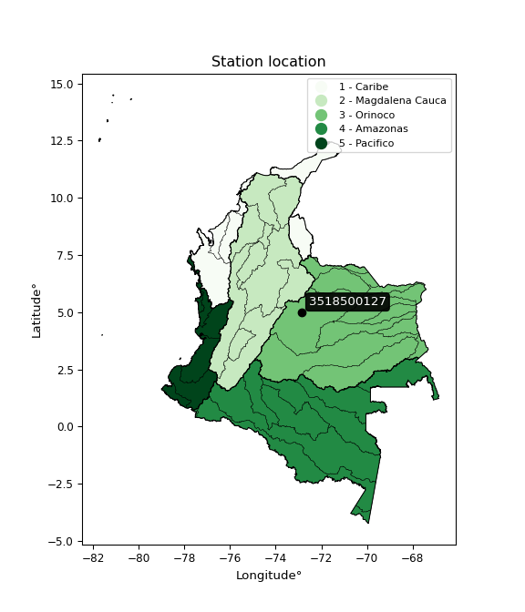

<div align="center">


</div>

# PMax24h Station (Rain, Pmax24h): 3518500127

Maximum Precipitation in 24 hours (PMax24h) is the greatest amount of rainfall for a specific duration that is meteorologically possible for a given location, acting as a "worst-case" scenario for extreme storms, crucial for designing safety-critical infrastructure like bridges, river deviations, dams, spillways, and nuclear plants to prevent catastrophic failure. The PMax24h is related with the Probable Maximum Precipitation (PMP) and it is calculated by hydrologists using meteorological data to determine the upper limit of extreme rainfall, often leading to the Probable Maximum Flood (PMF) for flood control design, and is increasingly being studied for climate change impacts. Probable Maximum Precipitation (PMP) is the theoretical upper limit of rainfall, a deterministic estimate for extreme events, while probability distributions (like GEV, Gumbel) describe the likelihood and frequency of various precipitation amounts, including rare ones, showing how often events occur, with PMP representing the extreme end of these distributions, used for critical infrastructure design to ensure safety against the worst conceivable weather, unlike standard statistical forecasts which cover typical probabilities.

The most common probability distributions in hydrology, used for analyzing floods, rainfall, and streamflow, include the Normal, Log-Normal, Gumbel, Gamma (including Log-Pearson Type III), and Generalized Extreme Value (GEV) distributions, often chosen based on the data´s skewness and whether modeling extremes or general conditions, with Gumbel and GEV popular for extreme events like floods, while the Normal distribution serves as a baseline, though often requiring transformations for skewed hydrological data. These distributions help in designing water infrastructure, managing water resources, and forecasting hydrologic events.

> Hydrological data often isn´t perfectly normal (it´s skewed), so different distributions are needed for different applications, such as: **Flood Frequency Analysis**: Using Gumbel, GEV, or Log-Pearson Type III for predicting extreme flood magnitudes and their return periods, **Rainfall Analysis**: Normal for annual totals, but Log-Normal, Weibull, or GEV for intensity or extreme daily rainfall, **Streamflow Modeling**: Gamma and Log-Normal for maximum flows, GEV for minimum flows, and Kappa for daily flows.

<div align="center">

</img>

</div>


## A. General information


### 1. General running parameters

• app_version: _v20260225_. • runtime: _2026-02-27 14:50:08.749431_. • Python version: _3.14.0_. • SciPy version: _1.16.3_. • Pandas version: _2.3.3_. • NumPy version: _2.3.5_. • Stations dataset (station_dataset_file): _dataset/pmax24h_in/automatic_colombia_2003_2025.csv_. • Stations catalog (station_catalog_file): _dataset/CNE.xls_. • Minimum year to eval til year_max (date_min): _1900_. • Maximum year to eval since year_min (date_max): _2025_. • Creates, save and include plots into reports (create_plot): _False_. • Plot only fit distributions with Δo > Δ (plot_only_fit): _True_. • Plot only simple graphs avoiding multiple CDFs and multiple Extreme values plots (plot_only_simple): _False_. • Eval low extreme values, if False, evaluates high extreme values (low_extreme): _False_. • Eval every SciPy distribution as logarithmic (pdist_logarithmic_on): _True_. • Standard deviation normalized (ddof): _1.0_. • Return periods to eval in years (Tr): _[2, 2.33, 5, 10, 15, 20, 25, 50, 75, 100, 200, 250, 500, 750, 1000]_. • Minimum data sample per station, 0 means any (minimum_sample): _5_. • Z-Score maximum threshold to adjust a value, 0 means disable (zscore_max): _3.5_. • Z-Score minimum threshold to adjust a value, 0 means disable (zscore_min): _-2.5_. • Avoid zeros, e.g. rain = 0 (avoid_zeros): _True_. • Avoid null values (avoid_nans): _True_. 

:file_folder:Table: [dataset.csv](../../dataset/pmax24h_in/automatic_colombia_2003_2025.csv)

> Delta Degrees of Freedom (DDOF): is a parameter used in the formulas for calculating variance and standard deviation. When ddof=0, the divisor is $N$ (the total number of observations) and this is used when your data set is the entire population. When ddof=1, the divisor is $N-1$ and this is used when your data set is a sample drawn from a larger population. Using $N-1$ provides an unbiased estimate of the population variance (known as Bessel´s correction).


### 2. Station info and location

|   id |     CODIGO | NOMBRE                        | CATEGORIA               | TECNOLOGIA                | ESTADO   | FECHA_INSTALACION   |   FECHA_SUSPENSION |   ALTITUD |   LATITUD |   LONGITUD | DEPARTAMENTO   | MUNICIPIO   | AREA_OPERATIVA                              | ENTIDAD                                                     | AREA_HIDROGRAFICA   | ZONA_HIDROGRAFICA   | SUBZONA_HIDROGRAFICA             |   CORRIENTE | Catalogo   |   Version |
|-----:|-----------:|:------------------------------|:------------------------|:--------------------------|:---------|:--------------------|-------------------:|----------:|----------:|-----------:|:---------------|:------------|:--------------------------------------------|:------------------------------------------------------------|:--------------------|:--------------------|:---------------------------------|------------:|:-----------|----------:|
|    0 | 3518500127 | GUADUALITO - AUT [3518500127] | Climatológica Principal | Automática con Telemetría | Activa   | 19/09/2018          |                nan |       784 |   4.98708 |   -72.8651 | Casanare       | Monterrey   | Area Operativa 06 - Boyacá-Casanare-Vichada | INSTITUTO DE HIDROLOGIA METEOROLOGIA Y ESTUDIOS AMBIENTALES | Orinoco             | Meta                | Río Túa y otros directos al Meta |         nan | CNE_IDEAM  |  20251226 |

<div align="center">

Dynamic map: [:earth_americas:Google](http://maps.google.com/maps?q=4.987080556,-72.8651) [:earth_americas:OSM](https://www.openstreetmap.org/#map=18/4.987080556/-72.8651&layers=P) [:earth_americas:Bing](https://www.bing.com/maps?cp=4.987080556~-72.8651&lvl=18) [:earth_americas:Apple](https://maps.apple.com/frame?center=4.987080556%2C-72.8651&span=0.003%2C0.006)

</div>


<div align="center">

```geojson
{
  "type": "Feature",
  "geometry": {
    "type": "Point", 
    "coordinates": [-72.8651, 4.987080556]
  }, 
  "properties": {
    "Name": "3518500127"
  }
}
```

</div>


### 3. Discrete values table and plot

<div align="center">

|               |           0 |          1 |           2 |           3 |           4 |
|:--------------|------------:|-----------:|------------:|------------:|------------:|
| Date          | 2019        | 2020       | 2021        | 2022        | 2025        |
| Value         |  175.2      |  194.8     |    2.2      |    0.6      |    5.6      |
| Value_initial |  175.2      |  194.8     |    2.2      |    0.6      |    5.6      |
| count         |    5        |    5       |    5        |    5        |    5        |
| mean          |   75.68     |   75.68    |   75.68     |   75.68     |   75.68     |
| std           |  100.052    |  100.052   |  100.052    |  100.052    |  100.052    |
| zscore        |    0.994686 |    1.19059 |   -0.734421 |   -0.750412 |   -0.700438 |


</div>


> The initial value (value_initial) correspond to the initial obtained or null completed value, and value (value) is adjusted only when the initial value is outside the valid range (outlier) definite through the Z-Score value. If Z-Score is active, values out of range or outliers are replaced with the station mean value. A Z-Score (or standard score) measures how many standard deviations a data point is from the mean of a dataset, indicating its relative position; positive scores mean above the mean, negative mean below, and a score of zero is exactly at the mean, allowing for comparison of values from different distributions. It´s calculated using the formula $z=(x–μ)/σ$, where $x$ is the data point, $μ$ is the mean, and $σ$ is the standard deviation, helping identify outliers and understand probability.
>
> <sub>**Note**: In this study, "completing" (filling gaps in) and "extending" (forecasting or lengthening the historical record) rainfall data series are avoided for certain critical analyses because they introduce artificial bias and uncertainty, which can distort the statistics of rare events (extremes), alter day-to-day variability, and compromise the integrity and homogeneity of the original data. Some reasons against Completing/Extending rainfall data are: **Distortion of Extremes and Variability**: The primary issue is that most gap-filling or extension methods rely on averaging or regression with nearby stations, which inherently smooths the data. Rainfall is highly variable in space and time, with a large percentage of zero values and occasional large storms. Infilling methods often underestimate the highest values and overestimate the lowest (zero) values, which severely distorts analyses focused on flood frequency, drought severity, and intensity-duration-frequency (IDF) curves, **Loss of Data Homogeneity**: Infilled or extended data are synthetic estimates, not actual measurements. Combining these estimates with observed data can violate the assumption of data homogeneity, which requires that the data properties do not change over time. Inhomogeneity can lead to incorrect conclusions about long-term trends or changes in climate patterns, **Propagation of Errors**: Errors and biases from the original data (e.g., wind-induced undercatch, instrument errors, site changes) or the data used for imputation can propagate through the analysis, leading to unreliable hydrological models and inaccurate predictions, **Compromised Statistical Integrity**: For statistical analyses, especially those involving the frequency of events, using artificial data can introduce time bias or autocorrelation that doesn´t exist in reality, making it difficult to assess the true probability of events, **Difficulty in Validation**: It is difficult to accurately validate the quality of filled or extended data, especially for past periods where ground-truth measurements are unavailable. The reliability of imputation techniques heavily depends on the density of the surrounding station network and the complexity of the local topography.</sub>


### 4. Active continuous probability distributions from SciPy (80 of 104 available)

A Probability Density Function (PDF) describes the relative likelihood of a continuous random variable falling within a specific range, where the total area under its curve equals 1, and the area over any interval gives the actual probability for that range. Unlike discrete probabilities (like rolling a die), a PDF shows density, not direct probability for a single point (which is zero), with higher points indicating higher likelihood, often visualized as a bell curve for normal distributions.

A log of a probability density function (log-PDF) is simply the logarithm of the PDF´s value, denoted as $log(f(x))$, useful for converting multiplication of probabilities into addition, improving numerical stability with tiny numbers, and connecting to information theory concepts like entropy. Instead of dealing with very small probabilities (e.g., 0.000001), log-PDFs use negative numbers (e.g., $log(0.00001) ≈ -11.51$ that are easier for computers to handle, preventing underflow errors and simplifying complex calculations. In this study, each active probability distribution from SciPy is also evaluated in the $log$ form.

[scipy.stats](https://docs.scipy.org/doc/scipy/reference/stats.html) is a Python´s powerful submodule within the SciPy library for comprehensive statistical analysis, offering over 130 probability distributions (like Normal, Poisson, etc.), functions for descriptive stats (mean, variance), hypothesis testing (t-tests, chi-square), random variable generation, and statistical tests, making it essential for data science, modeling, and research. It provides tools to explore, model, and draw conclusions from data efficiently, working seamlessly with [NumPy](https://numpy.org/).

<div align="center">

|   id | p_dist           |   n_parameter | fit_method   | label                                                                       | active   | ref                                                                                                      |
|-----:|:-----------------|--------------:|:-------------|:----------------------------------------------------------------------------|:---------|:---------------------------------------------------------------------------------------------------------|
|    0 | alpha            |             3 | MLE          | Alpha                                                                       | True     | [:mortar_board:](https://docs.scipy.org/doc/scipy/reference/generated/scipy.stats.alpha.html)            |
|    1 | anglit           |             2 | MM           | Anglit                                                                      | True     | [:mortar_board:](https://docs.scipy.org/doc/scipy/reference/generated/scipy.stats.anglit.html)           |
|    2 | arcsine          |             2 | MM           | Arcsine                                                                     | True     | [:mortar_board:](https://docs.scipy.org/doc/scipy/reference/generated/scipy.stats.arcsine.html)          |
|    3 | argus            |             3 | MLE          | Argus                                                                       | True     | [:mortar_board:](https://docs.scipy.org/doc/scipy/reference/generated/scipy.stats.argus.html)            |
|    4 | beta             |             4 | MLE          | Beta                                                                        | True     | [:mortar_board:](https://docs.scipy.org/doc/scipy/reference/generated/scipy.stats.beta.html)             |
|    5 | betaprime        |             4 | MLE          | Beta prime                                                                  | True     | [:mortar_board:](https://docs.scipy.org/doc/scipy/reference/generated/scipy.stats.betaprime.html)        |
|    6 | bradford         |             3 | MLE          | Bradford                                                                    | True     | [:mortar_board:](https://docs.scipy.org/doc/scipy/reference/generated/scipy.stats.bradford.html)         |
|    7 | burr             |             4 | MLE          | Burr (Type III)                                                             | True     | [:mortar_board:](https://docs.scipy.org/doc/scipy/reference/generated/scipy.stats.burr.html)             |
|    8 | burr12           |             4 | MLE          | Burr (Type III) 12                                                          | True     | [:mortar_board:](https://docs.scipy.org/doc/scipy/reference/generated/scipy.stats.burr12.html)           |
|    9 | cosine           |             2 | MLE          | Cosine                                                                      | True     | [:mortar_board:](https://docs.scipy.org/doc/scipy/reference/generated/scipy.stats.cosine.html)           |
|   10 | crystalball      |             4 | MLE          | Crystalball                                                                 | True     | [:mortar_board:](https://docs.scipy.org/doc/scipy/reference/generated/scipy.stats.crystalball.html)      |
|   11 | dgamma           |             3 | MLE          | Double gamma                                                                | True     | [:mortar_board:](https://docs.scipy.org/doc/scipy/reference/generated/scipy.stats.dgamma.html)           |
|   12 | dweibull         |             3 | MLE          | Double Weibull                                                              | True     | [:mortar_board:](https://docs.scipy.org/doc/scipy/reference/generated/scipy.stats.dweibull.html)         |
|   13 | erlang           |             3 | MLE          | Erlang                                                                      | True     | [:mortar_board:](https://docs.scipy.org/doc/scipy/reference/generated/scipy.stats.erlang.html)           |
|   14 | exponnorm        |             3 | MLE          | Exponentially modified Normal                                               | True     | [:mortar_board:](https://docs.scipy.org/doc/scipy/reference/generated/scipy.stats.exponnorm.html)        |
|   15 | exponpow         |             3 | MLE          | Exponential power                                                           | True     | [:mortar_board:](https://docs.scipy.org/doc/scipy/reference/generated/scipy.stats.exponpow.html)         |
|   16 | exponweib        |             4 | MLE          | Exponentiated Weibull                                                       | True     | [:mortar_board:](https://docs.scipy.org/doc/scipy/reference/generated/scipy.stats.exponweib.html)        |
|   17 | f                |             4 | MLE          | F                                                                           | True     | [:mortar_board:](https://docs.scipy.org/doc/scipy/reference/generated/scipy.stats.f.html)                |
|   18 | fatiguelife      |             3 | MLE          | Fatigue-life (Birnbaum-Saunders)                                            | True     | [:mortar_board:](https://docs.scipy.org/doc/scipy/reference/generated/scipy.stats.fatiguelife.html)      |
|   19 | foldnorm         |             3 | MM           | Fold Normal                                                                 | True     | [:mortar_board:](https://docs.scipy.org/doc/scipy/reference/generated/scipy.stats.foldnorm.html)         |
|   20 | gamma            |             3 | MLE          | Gamma                                                                       | True     | [:mortar_board:](https://docs.scipy.org/doc/scipy/reference/generated/scipy.stats.gamma.html)            |
|   21 | gausshyper       |             6 | MLE          | Gauss hypergeometric                                                        | True     | [:mortar_board:](https://docs.scipy.org/doc/scipy/reference/generated/scipy.stats.gausshyper.html)       |
|   22 | genexpon         |             5 | MLE          | Generalized exponential                                                     | True     | [:mortar_board:](https://docs.scipy.org/doc/scipy/reference/generated/scipy.stats.genexpon.html)         |
|   23 | genextreme       |             3 | MLE          | Generalized exponential                                                     | True     | [:mortar_board:](https://docs.scipy.org/doc/scipy/reference/generated/scipy.stats.genextreme.html)       |
|   24 | gengamma         |             4 | MLE          | Generalized gamma                                                           | True     | [:mortar_board:](https://docs.scipy.org/doc/scipy/reference/generated/scipy.stats.gengamma.html)         |
|   25 | genhalflogistic  |             3 | MLE          | Generalized half-logistic                                                   | True     | [:mortar_board:](https://docs.scipy.org/doc/scipy/reference/generated/scipy.stats.genhalflogistic.html)  |
|   26 | genlogistic      |             3 | MLE          | Generalized logistic                                                        | True     | [:mortar_board:](https://docs.scipy.org/doc/scipy/reference/generated/scipy.stats.genlogistic.html)      |
|   27 | gennorm          |             3 | MLE          | Generalized Normal                                                          | True     | [:mortar_board:](https://docs.scipy.org/doc/scipy/reference/generated/scipy.stats.gennorm.html)          |
|   28 | genpareto        |             3 | MLE          | Generalized Pareto                                                          | True     | [:mortar_board:](https://docs.scipy.org/doc/scipy/reference/generated/scipy.stats.genpareto.html)        |
|   29 | gompertz         |             3 | MLE          | Gompertz (or truncated Gumbel)                                              | True     | [:mortar_board:](https://docs.scipy.org/doc/scipy/reference/generated/scipy.stats.gompertz.html)         |
|   30 | gumbel_l         |             2 | MM           | Gumbel Left Skew                                                            | True     | [:mortar_board:](https://docs.scipy.org/doc/scipy/reference/generated/scipy.stats.gumbel_l.html)         |
|   31 | gumbel_r         |             2 | MM           | Gumbel Right Skew                                                           | True     | [:mortar_board:](https://docs.scipy.org/doc/scipy/reference/generated/scipy.stats.gumbel_r.html)         |
|   32 | halfgennorm      |             3 | MLE          | Upper half of a generalized normal                                          | True     | [:mortar_board:](https://docs.scipy.org/doc/scipy/reference/generated/scipy.stats.halfgennorm.html)      |
|   33 | halflogistic     |             2 | MM           | Half-logistic                                                               | True     | [:mortar_board:](https://docs.scipy.org/doc/scipy/reference/generated/scipy.stats.halflogistic.html)     |
|   34 | halfnorm         |             2 | MM           | Half Normal                                                                 | True     | [:mortar_board:](https://docs.scipy.org/doc/scipy/reference/generated/scipy.stats.halfnorm.html)         |
|   35 | hypsecant        |             2 | MM           | hyperbolic secant                                                           | True     | [:mortar_board:](https://docs.scipy.org/doc/scipy/reference/generated/scipy.stats.hypsecant.html)        |
|   36 | invgamma         |             3 | MLE          | Inverted gamma                                                              | True     | [:mortar_board:](https://docs.scipy.org/doc/scipy/reference/generated/scipy.stats.invgamma.html)         |
|   37 | invgauss         |             3 | MLE          | Inverse Gaussian                                                            | True     | [:mortar_board:](https://docs.scipy.org/doc/scipy/reference/generated/scipy.stats.invgauss.html)         |
|   38 | invweibull       |             3 | MLE          | Inverted Weibull                                                            | True     | [:mortar_board:](https://docs.scipy.org/doc/scipy/reference/generated/scipy.stats.invweibull.html)       |
|   39 | johnsonsb        |             4 | MLE          | Johnson SB                                                                  | True     | [:mortar_board:](https://docs.scipy.org/doc/scipy/reference/generated/scipy.stats.johnsonsb.html)        |
|   40 | johnsonsu        |             4 | MLE          | Johnson Su                                                                  | True     | [:mortar_board:](https://docs.scipy.org/doc/scipy/reference/generated/scipy.stats.johnsonsu.html)        |
|   41 | kappa3           |             3 | MLE          | Kappa 3                                                                     | True     | [:mortar_board:](https://docs.scipy.org/doc/scipy/reference/generated/scipy.stats.kappa3.html)           |
|   42 | kappa4           |             4 | MLE          | Kappa 4                                                                     | True     | [:mortar_board:](https://docs.scipy.org/doc/scipy/reference/generated/scipy.stats.kappa4.html)           |
|   43 | ksone            |             3 | MLE          | Kolmogorov-Smirnov one-sided test statistic distribution                    | True     | [:mortar_board:](https://docs.scipy.org/doc/scipy/reference/generated/scipy.stats.ksone.html)            |
|   44 | kstwobign        |             2 | MLE          | Limiting distribution of scaled Kolmogorov-Smirnov two-sided test statistic | True     | [:mortar_board:](https://docs.scipy.org/doc/scipy/reference/generated/scipy.stats.kstwobign.html)        |
|   45 | laplace          |             2 | MM           | Laplace                                                                     | True     | [:mortar_board:](https://docs.scipy.org/doc/scipy/reference/generated/scipy.stats.laplace.html)          |
|   46 | levy_l           |             2 | MLE          | Left-skewed Levy                                                            | True     | [:mortar_board:](https://docs.scipy.org/doc/scipy/reference/generated/scipy.stats.levy_l.html)           |
|   47 | loggamma         |             3 | MLE          | Log gamma                                                                   | True     | [:mortar_board:](https://docs.scipy.org/doc/scipy/reference/generated/scipy.stats.loggamma.html)         |
|   48 | logistic         |             2 | MM           | Logistic (or Sech-squared)                                                  | True     | [:mortar_board:](https://docs.scipy.org/doc/scipy/reference/generated/scipy.stats.logistic.html)         |
|   49 | loglaplace       |             3 | MLE          | Log-Laplace                                                                 | True     | [:mortar_board:](https://docs.scipy.org/doc/scipy/reference/generated/scipy.stats.loglaplace.html)       |
|   50 | lomax            |             3 | MLE          | Lomax (Pareto of the second kind)                                           | True     | [:mortar_board:](https://docs.scipy.org/doc/scipy/reference/generated/scipy.stats.lomax.html)            |
|   51 | maxwell          |             2 | MM           | Maxwell                                                                     | True     | [:mortar_board:](https://docs.scipy.org/doc/scipy/reference/generated/scipy.stats.maxwell.html)          |
|   52 | mielke           |             4 | MLE          | Mielke Beta-Kappa / Dagum                                                   | True     | [:mortar_board:](https://docs.scipy.org/doc/scipy/reference/generated/scipy.stats.mielke.html)           |
|   53 | moyal            |             2 | MM           | Moyal                                                                       | True     | [:mortar_board:](https://docs.scipy.org/doc/scipy/reference/generated/scipy.stats.moyal.html)            |
|   54 | nakagami         |             3 | MLE          | Nakagami                                                                    | True     | [:mortar_board:](https://docs.scipy.org/doc/scipy/reference/generated/scipy.stats.nakagami.html)         |
|   55 | ncf              |             5 | MLE          | Non-central F distribution                                                  | True     | [:mortar_board:](https://docs.scipy.org/doc/scipy/reference/generated/scipy.stats.ncf.html)              |
|   56 | nct              |             4 | MLE          | Non-central Student’s t                                                     | True     | [:mortar_board:](https://docs.scipy.org/doc/scipy/reference/generated/scipy.stats.nct.html)              |
|   57 | norm             |             2 | MM           | Normal                                                                      | True     | [:mortar_board:](https://docs.scipy.org/doc/scipy/reference/generated/scipy.stats.norm.html)             |
|   58 | pearson3         |             3 | MM           | Pearson type III                                                            | True     | [:mortar_board:](https://docs.scipy.org/doc/scipy/reference/generated/scipy.stats.pearson3.html)         |
|   59 | powerlaw         |             3 | MLE          | Power-function                                                              | True     | [:mortar_board:](https://docs.scipy.org/doc/scipy/reference/generated/scipy.stats.powerlaw.html)         |
|   60 | rayleigh         |             2 | MM           | Rayleigh                                                                    | True     | [:mortar_board:](https://docs.scipy.org/doc/scipy/reference/generated/scipy.stats.rayleigh.html)         |
|   61 | rdist            |             3 | MLE          | R-distributed (symmetric beta)                                              | True     | [:mortar_board:](https://docs.scipy.org/doc/scipy/reference/generated/scipy.stats.rdist.html)            |
|   62 | rice             |             3 | MLE          | Rice                                                                        | True     | [:mortar_board:](https://docs.scipy.org/doc/scipy/reference/generated/scipy.stats.rice.html)             |
|   63 | semicircular     |             2 | MM           | Semicircular                                                                | True     | [:mortar_board:](https://docs.scipy.org/doc/scipy/reference/generated/scipy.stats.semicircular.html)     |
|   64 | skewnorm         |             3 | MLE          | Skew normal                                                                 | True     | [:mortar_board:](https://docs.scipy.org/doc/scipy/reference/generated/scipy.stats.skewnorm.html)         |
|   65 | t                |             3 | MLE          | Student’s t                                                                 | True     | [:mortar_board:](https://docs.scipy.org/doc/scipy/reference/generated/scipy.stats.t.html)                |
|   66 | trapezoid        |             4 | MLE          | Trapezoid                                                                   | True     | [:mortar_board:](https://docs.scipy.org/doc/scipy/reference/generated/scipy.stats.trapezoid.html)        |
|   67 | triang           |             3 | MLE          | Triangular                                                                  | True     | [:mortar_board:](https://docs.scipy.org/doc/scipy/reference/generated/scipy.stats.triang.html)           |
|   68 | truncexpon       |             3 | MLE          | Truncated exponential                                                       | True     | [:mortar_board:](https://docs.scipy.org/doc/scipy/reference/generated/scipy.stats.truncexpon.html)       |
|   69 | truncnorm        |             4 | MLE          | Truncated normal                                                            | True     | [:mortar_board:](https://docs.scipy.org/doc/scipy/reference/generated/scipy.stats.truncnorm.html)        |
|   70 | truncpareto      |             4 | MLE          | Upper truncated Pareto                                                      | True     | [:mortar_board:](https://docs.scipy.org/doc/scipy/reference/generated/scipy.stats.truncpareto.html)      |
|   71 | truncweibull_min |             5 | MLE          | Doubly truncated Weibull minimum                                            | True     | [:mortar_board:](https://docs.scipy.org/doc/scipy/reference/generated/scipy.stats.truncweibull_min.html) |
|   72 | tukeylambda      |             3 | MLE          | Tukey-Lamdba                                                                | True     | [:mortar_board:](https://docs.scipy.org/doc/scipy/reference/generated/scipy.stats.tukeylambda.html)      |
|   73 | uniform          |             2 | MLE          | Uniform                                                                     | True     | [:mortar_board:](https://docs.scipy.org/doc/scipy/reference/generated/scipy.stats.uniform.html)          |
|   74 | vonmises         |             3 | MLE          | Von Mises                                                                   | True     | [:mortar_board:](https://docs.scipy.org/doc/scipy/reference/generated/scipy.stats.vonmises.html)         |
|   75 | vonmises_line    |             3 | MLE          | Von Mises line                                                              | True     | [:mortar_board:](https://docs.scipy.org/doc/scipy/reference/generated/scipy.stats.vonmises_line.html)    |
|   76 | wald             |             2 | MM           | Wald                                                                        | True     | [:mortar_board:](https://docs.scipy.org/doc/scipy/reference/generated/scipy.stats.wald.html)             |
|   77 | weibull_max      |             3 | MLE          | Weibull maximum                                                             | True     | [:mortar_board:](https://docs.scipy.org/doc/scipy/reference/generated/scipy.stats.weibull_max.html)      |
|   78 | weibull_min      |             3 | MLE          | Weibull minimum                                                             | True     | [:mortar_board:](https://docs.scipy.org/doc/scipy/reference/generated/scipy.stats.weibull_min.html)      |
|   79 | wrapcauchy       |             3 | MLE          | Wrapped  Cauchy                                                             | True     | [:mortar_board:](https://docs.scipy.org/doc/scipy/reference/generated/scipy.stats.wrapcauchy.html)       |

</div>

> **n_parameter:** # arguments & localization & scale.
>
> **Fit methods:** (MLE) maximum likelihood, (MM) L-moments.
>
>**Inactive** (With the only purpose of prevent loops, zero divisions, infinite values, over high estimated values or horizontal trending for recurrence intervals estimations, the follow distributions were disabled.)**:** lognorm, norminvgauss, powernorm, powerlognorm, cauchy, halfcauchy, foldcauchy, skewcauchy, chi2, expon, fisk, genhyperbolic, geninvgauss, gibrat, kstwo, laplace_asymmetric, levy, levy_stable, ncx2, pareto, rel_breitwigner, recipinvgauss, studentized_range, loguniform, 


## B. Probability (PDF) vs. Empirical (EDF) distributions functions

A continuous probability distribution (CPD) describes probabilities for variables that can take any value within a range (like rain any time), unlike discrete variables with specific outcomes (like temperature). It uses a Probability Density Function (PDF), a curve where the total area under it equals 1, and the probability of the variable falling within an interval (a to b) is found by calculating the area under the curve between those points. A key feature is that the probability of hitting any single exact value is zero, so probabilities are always expressed for ranges, e.g., $P(a ≤ X ≤ b)$.

<div align="center">

Distributions parameters from station values
|     |    station | p_dist              |   n |              loc |          scale | shape                  | shape1                 | shape2             | shape3             |
|----:|-----------:|:--------------------|----:|-----------------:|---------------:|:-----------------------|:-----------------------|:-------------------|:-------------------|
|   0 | 3518500127 | alpha               |   5 |      0.00128692  |    1.29099     | 4.110198732915425e-08  |                        |                    |                    |
|   1 | 3518500127 | anglit              |   5 |     75.68        |  261.791       |                        |                        |                    |                    |
|   2 | 3518500127 | arcsine             |   5 |    -50.8764      |  253.113       |                        |                        |                    |                    |
|   3 | 3518500127 | argus               |   5 |    -96.5557      |  312.718       | 9.64816822769744e-07   |                        |                    |                    |
|   4 | 3518500127 | beta                |   5 |    -18.426       |  213.226       | 0.013597045701102465   | 0.01846404951467459    |                    |                    |
|   5 | 3518500127 | betaprime           |   5 |      0.6         |    2.51989e-13 | 171.65054959970797     | 0.1729425911439305     |                    |                    |
|   6 | 3518500127 | bradford            |   5 |    -64.1959      |  258.996       | 3.393260002828142e-06  |                        |                    |                    |
|   7 | 3518500127 | burr                |   5 |      0.45035     |    4.90509e-06 | 0.29318931099841783    | 51.96190993054074      |                    |                    |
|   8 | 3518500127 | burr12              |   5 |      0.533933    |    0.0600912   | 83.68099421631814      | 0.002815417903279816   |                    |                    |
|   9 | 3518500127 | cosine              |   5 |     80.6986      |   69.3532      |                        |                        |                    |                    |
|  10 | 3518500127 | crystalball         |   5 |     75.68        |   89.4889      | 5179.027721633067      | 6862.166388041558      |                    |                    |
|  11 | 3518500127 | dgamma              |   5 |     93.3996      |    0.450412    | 202.0369473439887      |                        |                    |                    |
|  12 | 3518500127 | dweibull            |   5 |     96.7147      |   94.5282      | 20.14028672757045      |                        |                    |                    |
|  13 | 3518500127 | erlang              |   5 |      0.6         |   51.9141      | 0.34234649440263576    |                        |                    |                    |
|  14 | 3518500127 | exponnorm           |   5 |      0.534426    |    0.0193984   | 3852.1792061990154     |                        |                    |                    |
|  15 | 3518500127 | exponpow            |   5 |      0.6         |  131.779       | 0.33301082083218586    |                        |                    |                    |
|  16 | 3518500127 | exponweib           |   5 |      0.6         |  127.708       | 0.8312004714401597     | 0.5144926988550245     |                    |                    |
|  17 | 3518500127 | f                   |   5 |      0.6         |    2.6127e-15  | 360.95970843779196     | 0.33783977989920466    |                    |                    |
|  18 | 3518500127 | fatiguelife         |   5 |      0.6         |    9.08289e-06 | 2394.45403361666       |                        |                    |                    |
|  19 | 3518500127 | foldnorm            |   5 |    -76.3186      |   99.4192      | 1.4654836209123911     |                        |                    |                    |
|  20 | 3518500127 | gamma               |   5 |      0.6         |   44.3983      | 0.3112161120131368     |                        |                    |                    |
|  21 | 3518500127 | gausshyper          |   5 |    -46.7042      |  241.504       | 1.4210733181723776     | 0.7682396771956217     | 1.1144294325458404 | 1.0673394537235912 |
|  22 | 3518500127 | genexpon            |   5 |      0.6         |  169.186       | 2.2534057648137162     | 1.4809465876395448e-12 | 0.6594079769973562 |                    |
|  23 | 3518500127 | genextreme          |   5 |      0.672461    |    0.642925    | -8.872733872526066     |                        |                    |                    |
|  24 | 3518500127 | gengamma            |   5 |      0.6         |  153.351       | 0.10330350621848086    | 1.0371728118818075     |                    |                    |
|  25 | 3518500127 | genhalflogistic     |   5 |   -118.163       |  335.668       | 1.0725487113235173     |                        |                    |                    |
|  26 | 3518500127 | genlogistic         |   5 |   -461.234       |   65.6586      | 1875.7524702338487     |                        |                    |                    |
|  27 | 3518500127 | gennorm             |   5 |      2.2         |    1.16762     | 0.35252664644001086    |                        |                    |                    |
|  28 | 3518500127 | genpareto           |   5 |      0.6         |    7.91614e-06 | 5.9628325347418425     |                        |                    |                    |
|  29 | 3518500127 | gompertz            |   5 |      0.6         |    8.61121e+08 | 11447601.353848135     |                        |                    |                    |
|  30 | 3518500127 | gumbel_l            |   5 |    115.955       |   69.7742      |                        |                        |                    |                    |
|  31 | 3518500127 | gumbel_r            |   5 |     35.4052      |   69.7742      |                        |                        |                    |                    |
|  32 | 3518500127 | halfgennorm         |   5 |      0.6         |    0.000502842 | 0.17322126264807025    |                        |                    |                    |
|  33 | 3518500127 | halflogistic        |   5 |    -30.3852      |   76.5098      |                        |                        |                    |                    |
|  34 | 3518500127 | halfnorm            |   5 |    -42.7683      |  148.453       |                        |                        |                    |                    |
|  35 | 3518500127 | hypsecant           |   5 |     75.68        |   56.9704      |                        |                        |                    |                    |
|  36 | 3518500127 | invgamma            |   5 |      0.6         |    7.08627e-15 | 0.11291718534550245    |                        |                    |                    |
|  37 | 3518500127 | invgauss            |   5 |      0.0612398   |    2.0417      | 37.03719422172733      |                        |                    |                    |
|  38 | 3518500127 | invweibull          |   5 |      0.6         |    3.32639     | 0.038862132359073875   |                        |                    |                    |
|  39 | 3518500127 | johnsonsb           |   5 |      0.6         | 1094.42        | 0.7062203967145306     | 0.06441698328782611    |                    |                    |
|  40 | 3518500127 | johnsonsu           |   5 |    194.8         |    5.78154e-11 | 3.158267573416212      | 0.1455678809887551     |                    |                    |
|  41 | 3518500127 | kappa3              |   5 |      0.6         |    4.95387     | 0.30919287524535743    |                        |                    |                    |
|  42 | 3518500127 | kappa4              |   5 |    -68.569       |  267.685       | 1.3480379413222043     | 0.9941175741058469     |                    |                    |
|  43 | 3518500127 | ksone               |   5 |    -79.3193      |  309.999       | 1.0                    |                        |                    |                    |
|  44 | 3518500127 | kstwobign           |   5 |   -188.85        |  302.166       |                        |                        |                    |                    |
|  45 | 3518500127 | laplace             |   5 |     75.68        |   63.2782      |                        |                        |                    |                    |
|  46 | 3518500127 | levy_l              |   5 |    200.869       |   22.843       |                        |                        |                    |                    |
|  47 | 3518500127 | loggamma            |   5 | -27324.3         | 3698.39        | 1650.7635750624177     |                        |                    |                    |
|  48 | 3518500127 | logistic            |   5 |     75.68        |   49.3378      |                        |                        |                    |                    |
|  49 | 3518500127 | loglaplace          |   5 |     -0.00471828  |    5.6047      | 0.49441236359855445    |                        |                    |                    |
|  50 | 3518500127 | lomax               |   5 |      0.6         |    2.54415e-13 | 0.1071536811427129     |                        |                    |                    |
|  51 | 3518500127 | maxwell             |   5 |   -136.371       |  132.883       |                        |                        |                    |                    |
|  52 | 3518500127 | mielke              |   5 |      0.224008    |    0.177303    | 2.31284009209255       | 0.4904925394773745     |                    |                    |
|  53 | 3518500127 | moyal               |   5 |     24.5045      |   40.2842      |                        |                        |                    |                    |
|  54 | 3518500127 | nakagami            |   5 |      0.6         |  142.828       | 0.13795758389240703    |                        |                    |                    |
|  55 | 3518500127 | ncf                 |   5 |      0.0798894   |    8.03549e-06 | 7.516904694216019e-05  | 0.8203466916841172     | 21.13837294563661  |                    |
|  56 | 3518500127 | nct                 |   5 |      0.6         |    3.82542e-08 | 0.20174026011546514    | 6.012546338676914      |                    |                    |
|  57 | 3518500127 | norm                |   5 |     75.68        |   89.4889      |                        |                        |                    |                    |
|  58 | 3518500127 | pearson3            |   5 |     75.68        |   89.4889      | 0.42190220635708336    |                        |                    |                    |
|  59 | 3518500127 | powerlaw            |   5 |      0.6         |  194.2         | 0.09887203693866779    |                        |                    |                    |
|  60 | 3518500127 | rayleigh            |   5 |    -95.5175      |  136.596       |                        |                        |                    |                    |
|  61 | 3518500127 | rdist               |   5 |     78.2647      |  116.535       | 1.080809367813662      |                        |                    |                    |
|  62 | 3518500127 | rice                |   5 |    -68.3797      |  119.92        | 0.0015124056500959385  |                        |                    |                    |
|  63 | 3518500127 | semicircular        |   5 |     75.68        |  178.978       |                        |                        |                    |                    |
|  64 | 3518500127 | skewnorm            |   5 |      0.599949    |  116.811       | 11492757.95888104      |                        |                    |                    |
|  65 | 3518500127 | t                   |   5 |      2.06661     |    1.22763     | 0.3075875493484329     |                        |                    |                    |
|  66 | 3518500127 | trapezoid           |   5 |   -181.869       |  379.669       | 0.9999999999999998     | 1.0                    |                    |                    |
|  67 | 3518500127 | triang              |   5 |   -179.621       |  374.421       | 0.9999996997659002     |                        |                    |                    |
|  68 | 3518500127 | truncexpon          |   5 |      0.599999    |  203.946       | 0.9522115697489666     |                        |                    |                    |
|  69 | 3518500127 | truncnorm           |   5 |   -229.352       |  165.009       | 1.3935700940346623     | 508.3531010652325      |                    |                    |
|  70 | 3518500127 | truncpareto         |   5 |     -4.29497e+09 |    4.29497e+09 | 57205212.84396571      | 1.000000045215711      |                    |                    |
|  71 | 3518500127 | truncweibull_min    |   5 |    -22.1297      |  301.329       | 1.266872684104912      | 0.019145528316945652   | 0.7199244285947244 |                    |
|  72 | 3518500127 | tukeylambda         |   5 |     97.9202      |  111.133       | 1.14193217522992       |                        |                    |                    |
|  73 | 3518500127 | uniform             |   5 |      0.6         |  194.2         |                        |                        |                    |                    |
|  74 | 3518500127 | vonmises            |   5 |      0.0351071   |    1           | 1.3325007260309367     |                        |                    |                    |
|  75 | 3518500127 | vonmises_line       |   5 |     97.7067      |   30.91        | 0.0002574685120847294  |                        |                    |                    |
|  76 | 3518500127 | wald                |   5 |    -13.8089      |   89.4889      |                        |                        |                    |                    |
|  77 | 3518500127 | weibull_max         |   5 |    194.8         |    1.79285     | 0.183266544690106      |                        |                    |                    |
|  78 | 3518500127 | weibull_min         |   5 |      0.6         |   27.2556      | 0.7822545639509895     |                        |                    |                    |
|  79 | 3518500127 | wrapcauchy          |   5 |      0.59752     |   30.9083      | 0.9564156069208067     |                        |                    |                    |
|  80 | 3518500127 | logalpha            |   5 |    -17.152       |  163.566       | 8.444950328007717      |                        |                    |                    |
|  81 | 3518500127 | loganglit           |   5 |      2.48766     |    6.84678     |                        |                        |                    |                    |
|  82 | 3518500127 | logarcsine          |   5 |     -0.822252    |    6.61982     |                        |                        |                    |                    |
|  83 | 3518500127 | logargus            |   5 |     -2.44231     |    8.31452     | 0.9398157671900049     |                        |                    |                    |
|  84 | 3518500127 | logbeta             |   5 |     -1.15799     |    6.42996     | 1.6300574477140874     | 0.7735309463244271     |                    |                    |
|  85 | 3518500127 | logbetaprime        |   5 |     -0.510826    |    3.91346     | 0.3069624557167737     | 1.2128008889345514     |                    |                    |
|  86 | 3518500127 | logbradford         |   5 |     -0.576312    |    5.84829     | 0.00021781662249589285 |                        |                    |                    |
|  87 | 3518500127 | logburr             |   5 |     -0.510826    |    2.57759     | 1.2290785322666629     | 0.13836773604438107    |                    |                    |
|  88 | 3518500127 | logburr12           |   5 |     -0.510826    |    1.36683     | 0.7756588333614762     | 1.120137229205889      |                    |                    |
|  89 | 3518500127 | logcosine           |   5 |      2.51755     |    1.83974     |                        |                        |                    |                    |
|  90 | 3518500127 | logcrystalball      |   5 |      2.48766     |    2.34046     | 14.543546365043188     | 849.658763469364       |                    |                    |
|  91 | 3518500127 | logdgamma           |   5 |      3.11105     |    0.215711    | 10.707418023648188     |                        |                    |                    |
|  92 | 3518500127 | logdweibull         |   5 |      2.90763     |    2.52345     | 3.5304226888061674     |                        |                    |                    |
|  93 | 3518500127 | logerlang           |   5 |    -14.2083      |    0.333721    | 49.99961710211781      |                        |                    |                    |
|  94 | 3518500127 | logexponnorm        |   5 |      2.30087     |    2.333       | 0.080061110346513      |                        |                    |                    |
|  95 | 3518500127 | logexponpow         |   5 |     -0.510826    |    5.57056     | 0.6183407384509632     |                        |                    |                    |
|  96 | 3518500127 | logexponweib        |   5 |     -0.510826    |    1.5144      | 1.8661847756979597     | 0.24930446469152848    |                    |                    |
|  97 | 3518500127 | logf                |   5 |     -0.510826    |    1.19521     | 1.274680209621968      | 1.091258196809442      |                    |                    |
|  98 | 3518500127 | logfatiguelife      |   5 |     -1.61889     |    3.26966     | 0.7104380785827801     |                        |                    |                    |
|  99 | 3518500127 | logfoldnorm         |   5 |     -2.7625      |    2.39498     | 2.181860591682793      |                        |                    |                    |
| 100 | 3518500127 | loggamma            |   5 |    -14.1587      |    0.321877    | 51.661383360477856     |                        |                    |                    |
| 101 | 3518500127 | loggausshyper       |   5 |     -1.27001     |    6.54198     | 1.5117835724229134     | 0.5112367815914507     | 1.0817323475017253 | 1.009739887995514  |
| 102 | 3518500127 | loggenexpon         |   5 |     -0.510829    |    0.87303     | 0.28986351280339917    | 1.2952562843971334e-06 | 1.139064420829348  |                    |
| 103 | 3518500127 | loggenextreme       |   5 |      2.75197     |    3.56794     | 1.4158478700774104     |                        |                    |                    |
| 104 | 3518500127 | loggengamma         |   5 |     -0.510826    |    1.54437     | 1.5051941046556385     | 0.5872279548484565     |                    |                    |
| 105 | 3518500127 | loggenhalflogistic  |   5 |     -1.94822     |    7.91152     | 1.0957479885197736     |                        |                    |                    |
| 106 | 3518500127 | loggenlogistic      |   5 |    -12.0764      |    1.96408     | 926.7828597174962      |                        |                    |                    |
| 107 | 3518500127 | loggennorm          |   5 |      2.38057     |    2.8914      | 12762587.115775414     |                        |                    |                    |
| 108 | 3518500127 | loggenpareto        |   5 |     -0.657407    |    8.08191     | -1.3630279248606048    |                        |                    |                    |
| 109 | 3518500127 | loggompertz         |   5 |     -0.510826    |    5.04186     | 0.9836735444574081     |                        |                    |                    |
| 110 | 3518500127 | loggumbel_l         |   5 |      3.54099     |    1.82485     |                        |                        |                    |                    |
| 111 | 3518500127 | loggumbel_r         |   5 |      1.43433     |    1.82485     |                        |                        |                    |                    |
| 112 | 3518500127 | loghalfgennorm      |   5 |     -0.510826    |    1.27483     | 0.6455827041596764     |                        |                    |                    |
| 113 | 3518500127 | loghalflogistic     |   5 |     -0.286301    |    2.001       |                        |                        |                    |                    |
| 114 | 3518500127 | loghalfnorm         |   5 |     -0.610193    |    3.88258     |                        |                        |                    |                    |
| 115 | 3518500127 | loghypsecant        |   5 |      2.48766     |    1.48998     |                        |                        |                    |                    |
| 116 | 3518500127 | loginvgamma         |   5 |     -6.1991      |  108.707       | 13.486352378913736     |                        |                    |                    |
| 117 | 3518500127 | loginvgauss         |   5 |     -2.34569     |   14.7154      | 0.328456041787844      |                        |                    |                    |
| 118 | 3518500127 | loginvweibull       |   5 |     -9.67643e+07 |    9.67643e+07 | 49291060.83635169      |                        |                    |                    |
| 119 | 3518500127 | logjohnsonsb        |   5 |     -0.510826    |    5.78373     | 0.3357669986919509     | 0.09915352224767654    |                    |                    |
| 120 | 3518500127 | logjohnsonsu        |   5 |      3.84258e+07 |    4.8194e+06  | 45585511.95986089      | 16438249.579678658     |                    |                    |
| 121 | 3518500127 | logkappa3           |   5 |     -0.510826    |    1.36783     | 0.9762130864803278     |                        |                    |                    |
| 122 | 3518500127 | logkappa4           |   5 |     -1.45435     |    7.64749     | 1.1421757446711012     | 1.1369373036680952     |                    |                    |
| 123 | 3518500127 | logksone            |   5 |     -1.56614     |    8.10759     | 1.0                    |                        |                    |                    |
| 124 | 3518500127 | logkstwobign        |   5 |     -5.38673     |    8.9845      |                        |                        |                    |                    |
| 125 | 3518500127 | loglaplace          |   5 |      2.48766     |    1.65496     |                        |                        |                    |                    |
| 126 | 3518500127 | loglevy_l           |   5 |      5.32259     |    0.186478    |                        |                        |                    |                    |
| 127 | 3518500127 | logloggamma         |   5 |   -499.037       |   73.0397      | 959.9685550785343      |                        |                    |                    |
| 128 | 3518500127 | loglogistic         |   5 |      2.48766     |    1.29036     |                        |                        |                    |                    |
| 129 | 3518500127 | logloglaplace       |   5 |     -0.510826    |    1.57872     | 0.7531674953946683     |                        |                    |                    |
| 130 | 3518500127 | loglomax            |   5 |     -0.510826    |    1.64716e+11 | 55550771936.05604      |                        |                    |                    |
| 131 | 3518500127 | logmaxwell          |   5 |     -3.05825     |    3.47538     |                        |                        |                    |                    |
| 132 | 3518500127 | logmielke           |   5 |     -0.510826    |    2.95375     | 0.3540834937441613     | 1.5149152097558627     |                    |                    |
| 133 | 3518500127 | logmoyal            |   5 |      1.14923     |    1.05358     |                        |                        |                    |                    |
| 134 | 3518500127 | lognakagami         |   5 |     -0.510826    |    4.48141     | 0.14892914102029292    |                        |                    |                    |
| 135 | 3518500127 | logncf              |   5 |     -0.510826    |    1.1628      | 1.2533388469281954     | 1.2564047749133274     | 0.8794664771372661 |                    |
| 136 | 3518500127 | lognct              |   5 |   -137.683       |    2.32629     | 146258.92521595984     | 60.25471694451497      |                    |                    |
| 137 | 3518500127 | lognorm             |   5 |      2.48766     |    2.34046     |                        |                        |                    |                    |
| 138 | 3518500127 | logpearson3         |   5 |      2.48764     |    2.34048     | 0.1323369126873537     |                        |                    |                    |
| 139 | 3518500127 | logpowerlaw         |   5 |     -0.510826    |    5.7828      | 0.1220865611073074     |                        |                    |                    |
| 140 | 3518500127 | lograyleigh         |   5 |     -1.98978     |    3.57248     |                        |                        |                    |                    |
| 141 | 3518500127 | logrdist            |   5 |      2.50422     |    3.01504     | 1.0872229983171715     |                        |                    |                    |
| 142 | 3518500127 | logrice             |   5 |     -1.73819     |    3.00653     | 0.7626297734925521     |                        |                    |                    |
| 143 | 3518500127 | logsemicircular     |   5 |      2.48766     |    4.68092     |                        |                        |                    |                    |
| 144 | 3518500127 | logskewnorm         |   5 |     -0.510834    |    3.80335     | 2239623.246409814      |                        |                    |                    |
| 145 | 3518500127 | logt                |   5 |      2.48766     |    2.34047     | 3058047632.946903      |                        |                    |                    |
| 146 | 3518500127 | logtrapezoid        |   5 |     -4.33877     |    9.92974     | 1.0                    | 1.0                    |                    |                    |
| 147 | 3518500127 | logtriang           |   5 |     -4.44344     |    9.71546     | 0.9999994579553533     |                        |                    |                    |
| 148 | 3518500127 | logtruncexpon       |   5 |     -1.01989     |    8.63168     | 0.7289274754595941     |                        |                    |                    |
| 149 | 3518500127 | logtruncnorm        |   5 |      0.463705    |    3.39803     | -0.2867925449231563    | 13.62731525468693      |                    |                    |
| 150 | 3518500127 | logtruncpareto      |   5 |     -0.541644    |    0.0308113   | 6.609385233664332e-10  | 189.20853261146954     |                    |                    |
| 151 | 3518500127 | logtruncweibull_min |   5 |     -0.921492    |    8.51333     | 1.2355438809163761     | 0.0005127925764804766  | 0.727502526427612  |                    |
| 152 | 3518500127 | logtukeylambda      |   5 |      2.34668     |    3.46886     | 1.1858178610404608     |                        |                    |                    |
| 153 | 3518500127 | loguniform          |   5 |     -0.510826    |    5.7828      |                        |                        |                    |                    |
| 154 | 3518500127 | logvonmises         |   5 |     -0.220792    |    1           | 1.1310232560115645     |                        |                    |                    |
| 155 | 3518500127 | logvonmises_line    |   5 |      2.38048     |    0.920392    | 0.12075885319523166    |                        |                    |                    |
| 156 | 3518500127 | logwald             |   5 |      0.147209    |    2.34045     |                        |                        |                    |                    |
| 157 | 3518500127 | logweibull_max      |   5 |      5.27197     |    1.65151     | 0.4389782742762659     |                        |                    |                    |
| 158 | 3518500127 | logweibull_min      |   5 |     -0.510826    |    3.36128     | 0.2753554510834676     |                        |                    |                    |
| 159 | 3518500127 | logwrapcauchy       |   5 |     -0.510839    |    0.920364    | 0.884913167449064      |                        |                    |                    |

</div>

> **loc** (Location parameter): This shifts the distribution along the x-axis. For many common distributions, like the normal (Gaussian) distribution, loc represents the mean $μ$. For others, like the uniform distribution, it might represent the minimum value, or for the beta distribution, the left end of the support interval.
>
> **scale** (Scale parameter): This determines the width or spread of the distribution. For the normal distribution, scale represents the standard deviation $σ$. For a uniform distribution, it defines the length of the interval (from $loc$ to $loc + scale$).
>
> **shape** (Shape parameters): Refers to parameters that define the specific form of a probability distribution, distinct from its location (loc) and scale (scale). These parameters are required arguments for most distribution functions. For example, a normal (Gaussian) distribution is fully defined by its location (mean) and scale (standard deviation), so it has no specific shape parameters beyond loc and scale. However, other distributions have intrinsic properties that need specification, as Gamma distribution that takes a shape parameter, often named $a$ or $alpha$.


### 0. Cumulative distribution values - CDF (160 evaluated)

Cumulative Distribution Function (CDF), denoted as $F$<sub>$X$</sub>$(x)$, is a function that gives the probability that a random variable $X$ will take a value less than or equal to a specific value, $x$ (i.e., $(P(X≥x)$. It essentially "accumulates" probabilities from a given point up to the far right (positive infinity), providing a complete picture of the distribution´s probabilities for both discrete (like rain) and continuous (like temperature) variables, helping to find probabilities over ranges or above certain values. Each station is evaluated separately ordering the $x$ values ascending, calculating the CDF and PDF values for the activated distributions and their logarithmic forms.

<div align="center">

CDF ordered by x ascending and calculating $log(f(x))$ separately
|   id |    Station |   date |     x |   count |   mean |     std |    zscore |   Value_initial |    station |   m |     alpha |   alpha_pdf |   anglit |   anglit_pdf |   arcsine |   arcsine_pdf |    argus |   argus_pdf |     beta |    beta_pdf |   betaprime |   betaprime_pdf |   bradford |   bradford_pdf |      burr |    burr_pdf |    burr12 |   burr12_pdf |   cosine |   cosine_pdf |   crystalball |   crystalball_pdf |   dgamma |   dgamma_pdf |   dweibull |   dweibull_pdf |    erlang |   erlang_pdf |   exponnorm |   exponnorm_pdf |    exponpow |   exponpow_pdf |   exponweib |   exponweib_pdf |         f |       f_pdf |   fatiguelife |   fatiguelife_pdf |   foldnorm |   foldnorm_pdf |       gamma |   gamma_pdf |   gausshyper |   gausshyper_pdf |    genexpon |   genexpon_pdf |   genextreme |   genextreme_pdf |   gengamma |   gengamma_pdf |   genhalflogistic |   genhalflogistic_pdf |   genlogistic |   genlogistic_pdf |   gennorm |   gennorm_pdf |   genpareto |    genpareto_pdf |    gompertz |   gompertz_pdf |   gumbel_l |   gumbel_l_pdf |   gumbel_r |   gumbel_r_pdf |   halfgennorm |   halfgennorm_pdf |   halflogistic |   halflogistic_pdf |   halfnorm |   halfnorm_pdf |   hypsecant |   hypsecant_pdf |   invgamma |   invgamma_pdf |   invgauss |   invgauss_pdf |   invweibull |   invweibull_pdf |   johnsonsb |   johnsonsb_pdf |   johnsonsu |   johnsonsu_pdf |   kappa3 |   kappa3_pdf |    kappa4 |   kappa4_pdf |    ksone |   ksone_pdf |   kstwobign |   kstwobign_pdf |   laplace |   laplace_pdf |   levy_l |   levy_l_pdf |   loggamma |   loggamma_pdf |   logistic |   logistic_pdf |   loglaplace |   loglaplace_pdf |       lomax |   lomax_pdf |   maxwell |   maxwell_pdf |    mielke |   mielke_pdf |    moyal |   moyal_pdf |    nakagami |   nakagami_pdf |       ncf |     ncf_pdf |       nct |     nct_pdf |     norm |   norm_pdf |   pearson3 |   pearson3_pdf |   powerlaw |   powerlaw_pdf |   rayleigh |   rayleigh_pdf |    rdist |      rdist_pdf |     rice |   rice_pdf |   semicircular |   semicircular_pdf |   skewnorm |   skewnorm_pdf |        t |       t_pdf |   trapezoid |   trapezoid_pdf |   triang |   triang_pdf |   truncexpon |   truncexpon_pdf |   truncnorm |   truncnorm_pdf |   truncpareto |   truncpareto_pdf |   truncweibull_min |   truncweibull_min_pdf |   tukeylambda |   tukeylambda_pdf |    uniform |   uniform_pdf |   vonmises |   vonmises_pdf |   vonmises_line |   vonmises_line_pdf |      wald |    wald_pdf |   weibull_max |   weibull_max_pdf |   weibull_min |   weibull_min_pdf |   wrapcauchy |   wrapcauchy_pdf |   logalpha |   logalpha_pdf |   loganglit |   loganglit_pdf |   logarcsine |   logarcsine_pdf |   logargus |   logargus_pdf |   logbeta |   logbeta_pdf |   logbetaprime |   logbetaprime_pdf |   logbradford |   logbradford_pdf |    logburr |   logburr_pdf |   logburr12 |   logburr12_pdf |   logcosine |   logcosine_pdf |   logcrystalball |   logcrystalball_pdf |   logdgamma |   logdgamma_pdf |   logdweibull |   logdweibull_pdf |   logerlang |   logerlang_pdf |   logexponnorm |   logexponnorm_pdf |   logexponpow |   logexponpow_pdf |   logexponweib |   logexponweib_pdf |        logf |       logf_pdf |   logfatiguelife |   logfatiguelife_pdf |   logfoldnorm |   logfoldnorm_pdf |   loggausshyper |   loggausshyper_pdf |   loggenexpon |   loggenexpon_pdf |   loggenextreme |   loggenextreme_pdf |   loggengamma |   loggengamma_pdf |   loggenhalflogistic |   loggenhalflogistic_pdf |   loggenlogistic |   loggenlogistic_pdf |   loggennorm |   loggennorm_pdf |   loggenpareto |   loggenpareto_pdf |   loggompertz |   loggompertz_pdf |   loggumbel_l |   loggumbel_l_pdf |   loggumbel_r |   loggumbel_r_pdf |   loghalfgennorm |   loghalfgennorm_pdf |   loghalflogistic |   loghalflogistic_pdf |   loghalfnorm |   loghalfnorm_pdf |   loghypsecant |   loghypsecant_pdf |   loginvgamma |   loginvgamma_pdf |   loginvgauss |   loginvgauss_pdf |   loginvweibull |   loginvweibull_pdf |   logjohnsonsb |   logjohnsonsb_pdf |   logjohnsonsu |   logjohnsonsu_pdf |   logkappa3 |   logkappa3_pdf |   logkappa4 |   logkappa4_pdf |   logksone |   logksone_pdf |   logkstwobign |   logkstwobign_pdf |   loglevy_l |   loglevy_l_pdf |   logloggamma |   logloggamma_pdf |   loglogistic |   loglogistic_pdf |   logloglaplace |   logloglaplace_pdf |    loglomax |   loglomax_pdf |   logmaxwell |   logmaxwell_pdf |   logmielke |   logmielke_pdf |   logmoyal |   logmoyal_pdf |   lognakagami |   lognakagami_pdf |      logncf |     logncf_pdf |   lognct |   lognct_pdf |   lognorm |   lognorm_pdf |   logpearson3 |   logpearson3_pdf |   logpowerlaw |   logpowerlaw_pdf |   lograyleigh |   lograyleigh_pdf |    logrdist |   logrdist_pdf |   logrice |   logrice_pdf |   logsemicircular |   logsemicircular_pdf |   logskewnorm |   logskewnorm_pdf |     logt |   logt_pdf |   logtrapezoid |   logtrapezoid_pdf |   logtriang |   logtriang_pdf |   logtruncexpon |   logtruncexpon_pdf |   logtruncnorm |   logtruncnorm_pdf |   logtruncpareto |   logtruncpareto_pdf |   logtruncweibull_min |   logtruncweibull_min_pdf |   logtukeylambda |   logtukeylambda_pdf |   loguniform |   loguniform_pdf |   logvonmises |   logvonmises_pdf |   logvonmises_line |   logvonmises_line_pdf |   logwald |   logwald_pdf |   logweibull_max |   logweibull_max_pdf |   logweibull_min |   logweibull_min_pdf |   logwrapcauchy |   logwrapcauchy_pdf |
|-----:|-----------:|-------:|------:|--------:|-------:|--------:|----------:|----------------:|-----------:|----:|----------:|------------:|---------:|-------------:|----------:|--------------:|---------:|------------:|---------:|------------:|------------:|----------------:|-----------:|---------------:|----------:|------------:|----------:|-------------:|---------:|-------------:|--------------:|------------------:|---------:|-------------:|-----------:|---------------:|----------:|-------------:|------------:|----------------:|------------:|---------------:|------------:|----------------:|----------:|------------:|--------------:|------------------:|-----------:|---------------:|------------:|------------:|-------------:|-----------------:|------------:|---------------:|-------------:|-----------------:|-----------:|---------------:|------------------:|----------------------:|--------------:|------------------:|----------:|--------------:|------------:|-----------------:|------------:|---------------:|-----------:|---------------:|-----------:|---------------:|--------------:|------------------:|---------------:|-------------------:|-----------:|---------------:|------------:|----------------:|-----------:|---------------:|-----------:|---------------:|-------------:|-----------------:|------------:|----------------:|------------:|----------------:|---------:|-------------:|----------:|-------------:|---------:|------------:|------------:|----------------:|----------:|--------------:|---------:|-------------:|-----------:|---------------:|-----------:|---------------:|-------------:|-----------------:|------------:|------------:|----------:|--------------:|----------:|-------------:|---------:|------------:|------------:|---------------:|----------:|------------:|----------:|------------:|---------:|-----------:|-----------:|---------------:|-----------:|---------------:|-----------:|---------------:|---------:|---------------:|---------:|-----------:|---------------:|-------------------:|-----------:|---------------:|---------:|------------:|------------:|----------------:|---------:|-------------:|-------------:|-----------------:|------------:|----------------:|--------------:|------------------:|-------------------:|-----------------------:|--------------:|------------------:|-----------:|--------------:|-----------:|---------------:|----------------:|--------------------:|----------:|------------:|--------------:|------------------:|--------------:|------------------:|-------------:|-----------------:|-----------:|---------------:|------------:|----------------:|-------------:|-----------------:|-----------:|---------------:|----------:|--------------:|---------------:|-------------------:|--------------:|------------------:|-----------:|--------------:|------------:|----------------:|------------:|----------------:|-----------------:|---------------------:|------------:|----------------:|--------------:|------------------:|------------:|----------------:|---------------:|-------------------:|--------------:|------------------:|---------------:|-------------------:|------------:|---------------:|-----------------:|---------------------:|--------------:|------------------:|----------------:|--------------------:|--------------:|------------------:|----------------:|--------------------:|--------------:|------------------:|---------------------:|-------------------------:|-----------------:|---------------------:|-------------:|-----------------:|---------------:|-------------------:|--------------:|------------------:|--------------:|------------------:|--------------:|------------------:|-----------------:|---------------------:|------------------:|----------------------:|--------------:|------------------:|---------------:|-------------------:|--------------:|------------------:|--------------:|------------------:|----------------:|--------------------:|---------------:|-------------------:|---------------:|-------------------:|------------:|----------------:|------------:|----------------:|-----------:|---------------:|---------------:|-------------------:|------------:|----------------:|--------------:|------------------:|--------------:|------------------:|----------------:|--------------------:|------------:|---------------:|-------------:|-----------------:|------------:|----------------:|-----------:|---------------:|--------------:|------------------:|------------:|---------------:|---------:|-------------:|----------:|--------------:|--------------:|------------------:|--------------:|------------------:|--------------:|------------------:|------------:|---------------:|----------:|--------------:|------------------:|----------------------:|--------------:|------------------:|---------:|-----------:|---------------:|-------------------:|------------:|----------------:|----------------:|--------------------:|---------------:|-------------------:|-----------------:|---------------------:|----------------------:|--------------------------:|-----------------:|---------------------:|-------------:|-----------------:|--------------:|------------------:|-------------------:|-----------------------:|----------:|--------------:|-----------------:|---------------------:|-----------------:|---------------------:|----------------:|--------------------:|
|    0 | 3518500127 |   2022 |   0.6 |       5 |  75.68 | 100.052 | -0.750412 |             0.6 | 3518500127 |   1 | 0.0310624 | 0.281059    | 0.228675 |   0.00320851 |  0.297843 |    0.00312436 | 0.141232 |  0.00283297 | 0.558198 | 0.00043671  |   0.0355893 |     1.61475e+09 |   0.250181 |     0.00386107 | 0.0856042 | 0.402643    | 0.0220876 |  3.48604     | 0.170596 |   0.00322191 |      0.200738 |        0.00313539 | 0.190532 |          nan |   0.123517 |     0.0361894  | 1.001e-06 |  3.08668e+09 | 0.000877137 |      0.0133656  | 9.57233e-07 |    2.87121e+09 | 1.88954e-08 |     7.27833e+07 | 0.0268847 | 1.52979e+14 |     0.0163326 |       1.25338e+11 |   0.231958 |     0.00348586 | 3.71331e-06 | 1.04091e+10 |     0.111872 |       0.00315544 | 7.13982e-13 |     0.0133191  |  0.000159849 | 491439           |  0.0119853 |    1.15666e+13 |          0.218861 |            0.00228553 |      0.191519 |        0.00481883 |  0.437236 |   0.0285525   |   0.0150902 | 113634           | 6.29792e-09 |     0.0132938  |   0.174219 |     0.00226553 |   0.192668 |     0.00454728 |   3.24588e-15 |       4.17107     |       0.199768 |         0.00627431 |   0.229816 |     0.00515015 |    0.16652  |      0.00279142 |  0.0562634 |    5.16836e+12 |   0.052979 |    0.222634    |    0.0126725 |      1.93773e+13 |   0.0173843 |     2.49335e+13 |    0.126894 |     0.00015593  | 0        |  8.9902      | 0         |  49.0666     | 0.257805 |  0.00322582 |    0.173319 |      0.00482751 |  0.152643 |    0.00241225 | 0.264434 |  0.000635476 |   0.092176 |      0.0815492 |   0.179203 |     0.00298127 |    0.0816781 |        0.0493536 | 0.000326768 | 4.19758e+11 |  0.213859 |    0.00375037 | 0.0838427 |  0.210863    | 0.178493 |  0.00538972 | 8.18212e-06 |    2.03344e+10 | 0.0695875 | 0.209736    | 0.0475068 | 1.16491e+06 | 0.200738 | 0.00313539 |   0.205301 |     0.00361782 |  0.0157142 |    1.39945e+13 |   0.219305 |     0.00402169 | 0.256906 |     0.00377428 | 0.152476 | 0.0040653  |       0.240996 |         0.00322887 |  0         |     0.00683056 | 0.323723 | 0.0608056   |    0.230975 |      0.00253167 | 0.231681 |   0.00257108 |  5.32823e-09 |       0.00798428 | 8.64954e-09 |      0.0112033  |     0         |        0.0144034  |          0.0640384 |             0.00426463 |   7.10543e-15 |        0.00891076 | 0          |    0.00514933 |   0.712906 |       0.327933 |      1.4855e-07 |          0.00514765 | 0.0323509 | 0.00775444  |     0.0944298 |       0.000210299 |   2.49206e-14 |     175.588       |  0.000573317 |       0.231139   |  0.0831723 |      0.0904218 |    0.115946 |       0.0935213 |     0.139187 |        0.227098  |  0.0672588 |      0.0694999 | 0.0171195 |     0.0435244 |    9.00952e-06 |        2.49102e+10 |     0.0111987 |          0.171008 | 0.00164722 |   2.52323e+12 | 3.70412e-13 |    2587.89      |   0.0793125 |       0.080002  |         0.10007  |            0.0750229 |   0.0227941 |       0.0504175 |     0.0269579 |         0.0813046 |   0.0962629 |       0.0825393 |       0.100049 |          0.0750423 |   4.71419e-11 |    262558         |    3.11358e-08 |        1.30471e+08 | 4.21789e-11 | 242134         |        0.0549657 |            0.162422  |      0.106276 |         0.07833   |       0.0287966 |         0.0560921   |   1.20206e-06 |         0.33202   |        0.165633 |           0.0363728 |   4.03463e-15 |        32.1213    |             0.100953 |                0.0781038 |        0.0769506 |            0.100339  |  7.18804e-07 |         0.172926 |      0.0181973 |           0.124561 |   2.37097e-11 |         0.195101  |      0.102884 |         0.0533744 |     0.0548297 |         0.0872396 |      1.12689e-09 |            0.569768  |          0        |             0         |     0.0204182 |         0.205436  |      0.0845916 |          0.0561076 |     0.0739346 |         0.101665  |      0.060076 |         0.131568  |       0.0764258 |           0.100108  |    0.000249926 |        8.33307e+11 |       0.101553 |          0.0753352 | 2.88064e-09 |       0.749338  | 1.07499e-14 |       12.8938   |   0.130163 |       0.123341 |      0.0700435 |          0.10598   |    0.141901 |       0.0120337 |      0.102751 |         0.074891  |     0.0891748 |         0.0629456 |     3.41299e-13 |        2315.35      | 1.90057e-13 |      0.337251  |    0.0893709 |        0.0942902 | 1.52824e-06 |     4.87402e+09 |  0.0279065 |      0.0742566 |   9.13126e-06 |        2.4498e+10 | 4.15449e-11 | 234502         | 0.100055 |    0.0750458 |  0.10007  |     0.0750229 |     0.0973125 |         0.0779824 |    0.00910148 |       1.00085e+13 |     0.0821229 |         0.106365  | 9.59523e-10 |    1.55826e+06 | 0.0604931 |     0.0956804 |          0.122121 |              0.104436 |   1.82254e-06 |         0.209785  | 0.100071 |  0.0750232 |       0.148613 |          0.0776462 |    0.163846 |       0.0833268 |        0.110653 |            0.211018 |    1.02921e-10 |          0.183847  |       4.4919e-05 |            6.18899   |             0.0473903 |                  0.141424 |        0.0141508 |             0.198724 |     0        |         0.172927 |      0.395405 |          0.34943  |        2.90571e-05 |               0.152693 |  0        |     0         |         0.17667  |          0.023248    |      2.89624e-05 |          7.18309e+10 |      3.7487e-05 |           2.83222   |
|    1 | 3518500127 |   2021 |   2.2 |       5 |  75.68 | 100.052 | -0.734421 |             2.2 | 3518500127 |   2 | 0.557099  | 0.179334    | 0.233829 |   0.00323361 |  0.302814 |    0.00308919 | 0.145798 |  0.00287452 | 0.558872 | 0.000406564 |   0.983945  |     0.00173542  |   0.256359 |     0.00386107 | 0.298233  | 0.0597652   | 0.542847  |  0.0646456   | 0.17579  |   0.00327009 |      0.205793 |        0.00318227 | 0.239112 |          nan |   0.184471 |     0.0391959  | 0.338     |  0.0706764   | 0.0220425   |      0.0130872  | 0.22803     |    0.0465523   | 0.147156    |     0.0373022   | 1         | 0.000267926 |     0.569571  |       0.0215195   |   0.237554 |     0.00350919 | 0.393477    | 0.0744565   |     0.116945 |       0.00318532 | 0.0210851   |     0.0130383  |  0.493841    |      0.0245433   |  0.645051  |    0.0428522   |          0.22253  |            0.00230059 |      0.19929  |        0.00489373 |  0.5      |   0.0872453   |   0.904463  |      0.0100138   | 0.0210455   |     0.0130141  |   0.177877 |     0.00230781 |   0.199997 |     0.00461324 |   0.253115    |       0.0738168   |       0.209786 |         0.0062475  |   0.238044 |     0.00513366 |    0.171041 |      0.00285988 |  0.974695  |    0.00178585  |   0.337472 |    0.116126    |    0.357417  |      0.00893171  |   0.612485  |     0.0154415   |    0.127145 |     0.000157441 | 0.308507 |  0.0587784   | 0.0279386 |   0.012953   | 0.262967 |  0.00322582 |    0.181103 |      0.00490285 |  0.156552 |    0.00247402 | 0.265456 |  0.000642873 |   0.240077 |      0.144263  |   0.184023 |     0.00304348 |    0.179087  |        0.108213  | 0.957481    | 0.00284756  |  0.219893 |    0.00379088 | 0.283476  |  0.0778376   | 0.187184 |  0.00547327 | 0.235125    |    0.0405459   | 0.308717  | 0.096292    | 0.965331  | 0.00437131  | 0.205793 | 0.00318227 |   0.211128 |     0.00366669 |  0.622211  |    0.0384496   |   0.225767 |     0.0040548  | 0.2629   |     0.00371907 | 0.159031 | 0.00412742 |       0.246174 |         0.00324338 |  0.0109289 |     0.00682992 | 0.524928 | 0.183837    |    0.235044 |      0.00255387 | 0.235813 |   0.0025939  |  0.0127249   |       0.00792188 | 0.0178044   |      0.0110524  |     0.0228016 |        0.0140997  |          0.0709131 |             0.00432799 |   0.00990068  |        0.00592764 | 0.00823893 |    0.00514933 |   0.965897 |       0.050473 |      0.00823639 |          0.00514765 | 0.0457464 | 0.00895075  |     0.0947681 |       0.000212483 |   0.103125    |       0.0477246   |  0.274064    |       0.0982288  |  0.250725  |      0.161739  |    0.26189  |       0.128429  |     0.328398 |        0.112063  |  0.187313  |      0.114951  | 0.106566  |     0.0922728 |    0.696724    |        0.117822    |     0.233382  |          0.171    | 0.846982   |   0.0774797   | 0.529811    |       0.154121  |   0.221903  |       0.137542  |         0.233916 |            0.130964  |   0.22607   |       0.278803  |     0.291411  |         0.262095  |   0.243865  |       0.142653  |       0.233936 |          0.131004  |   0.394434    |         0.175924  |    0.407419    |        0.0867711   | 0.495678    |      0.13665   |        0.332642  |            0.214917  |      0.242091 |         0.130654  |       0.124539  |         0.088524    |   0.350395    |         0.215683  |        0.222641 |           0.0526861 |   0.384664    |         0.177317  |             0.214058 |                0.0971115 |        0.265967  |            0.179214  |  0.5         |         0.172926 |      0.185407  |           0.133296 |   0.2511      |         0.189061  |      0.198501 |         0.0971857 |     0.240591  |         0.187829  |      0.414544    |            0.207035  |          0.262281 |             0.232686  |     0.28133   |         0.192593  |      0.196982  |          0.123926  |     0.265268  |         0.180362  |      0.301248 |         0.206352  |       0.265378  |           0.179332  |    0.584311    |        0.0383856   |       0.235378 |          0.130555  | 0.485051    |       0.189098  | 0.244948    |        0.167709 |   0.290418 |       0.123341 |      0.267766  |          0.18312   |    0.160708 |       0.0174805 |      0.235506 |         0.129483  |     0.211345  |         0.129171  |     0.43177     |           0.250288  | 0.354793    |      0.217598  |    0.25301   |        0.152434  | 0.704699    |     0.149082    |  0.235328  |      0.222218  |   0.55706     |        0.126321   | 0.40637     |      0.142081  | 0.233941 |    0.130997  |  0.233916 |     0.130964  |     0.237054  |         0.136324  |    0.833364   |       0.0783067   |     0.260951  |         0.16088   | 0.297021    |    0.13369     | 0.233369  |     0.162279  |          0.274084 |              0.126726 |   0.267362    |         0.197894  | 0.233917 |  0.130964  |       0.266618 |          0.104001  |    0.289996 |       0.110857  |        0.365188 |            0.181529 |    0.246276    |          0.190693  |       0.718145   |            0.1434    |             0.261814  |                  0.176576 |        0.242674  |             0.167769 |     0.224681 |         0.172927 |      0.811878 |          0.215893 |        0.205857    |               0.169031 |  0.137905 |     0.454223  |         0.212196 |          0.0322078   |      0.536857    |          0.0755505   |      0.477237   |           0.0249632 |
|    2 | 3518500127 |   2025 |   5.6 |       5 |  75.68 | 100.052 | -0.700438 |             5.6 | 3518500127 |   3 | 0.817636  | 0.0319993   | 0.244912 |   0.00328533 |  0.313198 |    0.00302054 | 0.155721 |  0.00296192 | 0.560163 | 0.000355922 |   0.986816  |     0.00045601  |   0.269487 |     0.00386107 | 0.412958  | 0.0206176   | 0.648218  |  0.0163596   | 0.18708  |   0.00337072 |      0.21678  |        0.00328074 | 0.34261  |          nan |   0.310397 |     0.0327107  | 0.491155  |  0.031289    | 0.0655419   |      0.0125051  | 0.329595    |    0.0210255   | 0.231556    |     0.0179941   | 1         | 7.07253e-05 |     0.621666  |       0.0117823   |   0.249569 |     0.00355835 | 0.551089    | 0.031463    |     0.127878 |       0.00324559 | 0.0644265   |     0.012461   |  0.537669    |      0.00752035  |  0.727464  |    0.015188    |          0.230407 |            0.00233315 |      0.216183 |        0.00504089 |  0.605736 |   0.0203202   |   0.921081  |      0.00264704  | 0.0643082   |     0.0124389  |   0.185879 |     0.00239947 |   0.215907 |     0.00474338 |   0.408823    |       0.030549    |       0.230925 |         0.00618661 |   0.255436 |     0.00509683 |    0.181017 |      0.00300887 |  0.97775   |    0.000502479 |   0.558433 |    0.0373283   |    0.373706  |      0.00285896  |   0.640353  |     0.00484039  |    0.127686 |     0.000160744 | 0.419308 |  0.0197623   | 0.0650544 |   0.00965099 | 0.273935 |  0.00322582 |    0.198027 |      0.00504939 |  0.165194 |    0.00261059 | 0.26767  |  0.000659076 |   0.389221 |      0.170825  |   0.194597 |     0.00317665 |    0.314953  |        0.190309  | 0.962368    | 0.000806487 |  0.232923 |    0.00387315 | 0.444546  |  0.0302101   | 0.206068 |  0.00562982 | 0.321978    |    0.0177651   | 0.496926  | 0.0328998   | 0.972451  | 0.00111155  | 0.21678  | 0.00328074 |   0.223767 |     0.00376718 |  0.69641   |    0.0137711   |   0.239667 |     0.00412055 | 0.275361 |     0.00361317 | 0.17328  | 0.00425295 |       0.257252 |         0.00327297 |  0.0341427 |     0.00682431 | 0.749471 | 0.0213633   |    0.243807 |      0.00260104 | 0.244715 |   0.00264241 |  0.039436    |       0.00779091 | 0.0548418   |      0.0107351  |     0.0696712 |        0.0134754  |          0.0858382 |             0.00444855 |   0.0294288   |        0.00561671 | 0.0257467  |    0.00514933 |   1.23964  |       0.290209 |      0.0257384  |          0.00514767 | 0.0794904 | 0.0107346   |     0.0954986 |       0.000217258 |   0.233091    |       0.0318422   |  0.414669    |       0.0163234  |  0.412584  |      0.178749  |    0.389211 |       0.142424  |     0.42577  |        0.0988442 |  0.309192  |      0.145479  | 0.207807  |     0.124547  |    0.776894    |        0.0629999   |     0.393146  |          0.170994 | 0.897067   |   0.0371497   | 0.63577     |       0.0841731 |   0.364606  |       0.165071  |         0.371905 |            0.161591  |   0.461799  |       0.143482  |     0.466514  |         0.096358  |   0.390704  |       0.167692  |       0.371959 |          0.16162   |   0.534795    |         0.129201  |    0.470587    |        0.0537449   | 0.589927    |      0.0752615 |        0.51223   |            0.167974  |      0.378604 |         0.158849  |       0.216038  |         0.107413    |   0.523649    |         0.158159  |        0.279811 |           0.0709192 |   0.519884    |         0.118698  |             0.313166 |                0.115958  |        0.438997  |            0.183928  |  0.5         |         0.172926 |      0.313749  |           0.141856 |   0.422061    |         0.175606  |      0.308725 |         0.139864  |     0.425795  |         0.199218  |      0.571147    |            0.1355    |          0.463702 |             0.196147  |     0.452079  |         0.17156   |      0.343331  |          0.188275  |     0.438535  |         0.183426  |      0.483286 |         0.17823   |       0.438575  |           0.184138  |    0.614024    |        0.0276654   |       0.372717 |          0.160644  | 0.615975    |       0.103936  | 0.397938    |        0.160997 |   0.405657 |       0.123341 |      0.441651  |          0.182667  |    0.180043 |       0.0245785 |      0.371914 |         0.159845  |     0.355999  |         0.177674  |     0.614994    |           0.129824  | 0.529181    |      0.158784  |    0.404984  |        0.168664  | 0.805184    |     0.077133    |  0.44623   |      0.215797  |   0.652565    |        0.0842616  | 0.509101    |      0.0857259 | 0.371953 |    0.161603  |  0.371905 |     0.161591  |     0.379387  |         0.164972  |    0.890352   |       0.048666    |     0.417238  |         0.169521  | 0.411695    |    0.11543     | 0.394251  |     0.177412  |          0.396437 |              0.134175 |   0.442979    |         0.176556  | 0.371905 |  0.16159   |       0.372641 |          0.122953  |    0.402819 |       0.130654  |        0.525936 |            0.162906 |    0.419945    |          0.178857  |       0.819628   |            0.084232  |             0.427915  |                  0.177368 |        0.397598  |             0.164484 |     0.386248 |         0.172927 |      0.939741 |          0.078305 |        0.373406    |               0.188747 |  0.498232 |     0.285073  |         0.246818 |          0.0427109   |      0.590804    |          0.045076    |      0.492744   |           0.0120241 |
|    3 | 3518500127 |   2019 | 175.2 |       5 |  75.68 | 100.052 |  0.994686 |           175.2 | 3518500127 |   4 | 0.994121  | 3.35574e-05 | 0.84457  |   0.00276797 |  0.788041 |    0.00407144 | 0.878866 |  0.00412492 | 0.593322 | 0.00042061  |   0.992869  |     7.06377e-06 |   0.924323 |     0.00386106 | 0.728753  | 0.000385705 | 0.847231  |  0.000206061 | 0.872585 |   0.00276916 |      0.866951 |        0.00240206 | 0.535746 |          nan |   0.51167  |     0.00295938 | 0.994842  |  0.000115285 | 0.903423    |      0.00129242 | 0.86451     |    0.000851082 | 0.735529    |     0.000946021 | 1         | 1.11133e-06 |     0.966454  |       0.000391281 |   0.856393 |     0.0022787  | 0.997689    | 5.96987e-05 |     0.849522 |       0.00593799 | 0.902267    |     0.00130172 |  0.659841    |      0.000177083 |  0.980059  |    0.000208623 |          0.859539 |            0.00621239 |      0.890701 |        0.00157013 |  0.970455 |   0.000257917 |   0.956509  |      4.17739e-05 | 0.901835    |     0.00130499 |   0.903435 |     0.00323507 |   0.87384  |     0.00168894 |   0.906799    |       0.000463025 |       0.872515 |         0.00156004 |   0.857968 |     0.00182905 |    0.890129 |      0.00189049 |  0.985103  |    9.63395e-06 |   0.936639 |    0.000243471 |    0.424288  |      8.09651e-05 |   0.725474  |     0.000146348 |    0.20973  |     0.00213884  | 0.72877  |  0.000388989 | 0.905006  |   0.00381421 | 0.821034 |  0.00322582 |    0.890313 |      0.00174853 |  0.896262 |    0.0016394  | 0.6545   |  0.00939588  |   0.875648 |      0.0802124 |   0.882582 |     0.00210043 |    0.900885  |        0.0598895 | 0.974283    | 1.57825e-05 |  0.861218 |    0.00211278 | 0.854187  |  0.000371142 | 0.877562 |  0.0015077  | 0.837883    |    0.00110354  | 0.872003  | 0.000298587 | 0.986547  | 1.55438e-05 | 0.866951 | 0.00240206 |   0.86531  |     0.00210485 |  0.989536  |    0.000560352 |   0.859695 |     0.0020357  | 0.825137 |     0.00495014 | 0.872911 | 0.00215263 |       0.834792 |         0.00295638 |  0.865013  |     0.00223515 | 0.924079 | 0.00013488  |    0.884489 |      0.00495417 | 0.898045 |   0.00506196 |  0.936615    |       0.00339182 | 0.913008    |      0.00146496 |     0.975717  |        0.00140768 |          0.915934  |             0.0043932  |   0.889536    |        0.00524676 | 0.899073   |    0.00514933 |  28.2266   |       0.278442 |      0.899036   |          0.00514791 | 0.89705   | 0.00108373  |     0.212226  |       0.003076    |   0.986091    |       0.000266416 |  0.521577    |       0.00117467 |  0.867799  |      0.070279  |    0.852472 |       0.103591  |     0.800081 |        0.163669  |  0.918627  |      0.160447  | 0.937575  |     0.452657  |    0.888597    |        0.0167893   |     0.981869  |          0.170972 | 0.956515   |   0.00787459  | 0.78939     |       0.0242111 |   0.886895  |       0.097832  |         0.873757 |            0.0885634 |   0.69637   |       0.293754  |     0.745614  |         0.268737  |   0.87072   |       0.080843  |       0.873752 |          0.0885315 |   0.826295    |         0.052651  |    0.585981    |        0.0221398   | 0.730151    |      0.0228592 |        0.853257  |            0.0508767 |      0.870461 |         0.0881115 |       0.868933  |         0.632066    |   0.848141    |         0.0504203 |        0.898786 |           0.638787  |   0.767398    |         0.0430541 |             0.958407 |                0.350503  |        0.867035  |            0.0629788 |  0.5         |         0.172926 |      0.947771  |           0.361342 |   0.871144    |         0.0775084 |      0.912509 |         0.116802  |     0.878626  |         0.0623012 |      0.835722    |            0.0413671 |          0.876944 |             0.0577137 |     0.86317   |         0.0679544 |      0.895456  |          0.0689101 |     0.864352  |         0.0628543 |      0.858267 |         0.0550272 |       0.867042  |           0.0630115 |    0.76717     |        0.288708    |       0.872198 |          0.0887382 | 0.800041    |       0.0275809 | 0.973947    |        0.216347 |   0.830341 |       0.123341 |      0.873334  |          0.0661857 |    0.724742 |       1.53219   |      0.872848 |         0.0894423 |     0.888508  |         0.0767702 |     0.809295    |           0.0253019 | 0.852583    |      0.0497166 |    0.867215  |        0.0781837 | 0.928793    |     0.0156981   |  0.881836  |      0.0556655 |   0.840478    |        0.0357666  | 0.67756     |      0.0286385 | 0.873703 |    0.0885395 |  0.873757 |     0.0885634 |     0.872562  |         0.0849141 |    0.997743   |       0.0214579   |     0.865477  |         0.0754239 | 0.857711    |    0.222876    | 0.871318  |     0.0787849 |          0.843266 |              0.111541 |   0.86445     |         0.0688686 | 0.873757 |  0.0885634 |       0.916224 |          0.192794  |    0.97828  |       0.20361   |        0.988478 |            0.10932  |    0.86423     |          0.0735356 |       0.99596    |            0.0334181 |             0.985109  |                  0.141137 |        0.978345  |             0.193927 |     0.981662 |         0.172927 |      1.2138   |          0.239536 |        0.983803    |               0.152816 |  0.900122 |     0.0400002 |         0.741102 |          0.919171    |      0.685016    |          0.0176503   |      0.759062   |           1.50167   |
|    4 | 3518500127 |   2020 | 194.8 |       5 |  75.68 | 100.052 |  1.19059  |           194.8 | 3518500127 |   5 | 0.994712  | 2.71444e-05 | 0.894764 |   0.00234429 |  0.890338 |    0.00744708 | 0.952066 |  0.00324679 | 0.784695 | 1.67931e+11 |   0.992999  |     6.23507e-06 |   1        |     0.00386106 | 0.735843  | 0.000339498 | 0.851012  |  0.000180686 | 0.92056  |   0.00212421 |      0.908424 |        0.00183817 | 0.972025 |          nan |   0.939033 |     0.0263426  | 0.996663  |  7.36918e-05 | 0.925704    |      0.00099424 | 0.87997     |    0.000730694 | 0.752967    |     0.000836953 | 1         | 9.81375e-07 |     0.973265  |       0.000307368 |   0.896429 |     0.00181134 | 0.998603    | 3.56793e-05 |     1        |      16.3406     | 0.924722    |     0.00100263 |  0.663119    |      0.000158094 |  0.983712  |    0.000166013 |          1        |            0.0715008  |      0.917708 |        0.00120025 |  0.974977 |   0.000206037 |   0.957278  |      3.68936e-05 | 0.924352    |     0.00100565 |   0.954755 |     0.00200737 |   0.903182 |     0.00131814 |   0.915136    |       0.000390819 |       0.899884 |         0.00124304 |   0.890467 |     0.00149365 |    0.921727 |      0.00136012 |  0.985281  |    8.55819e-06 |   0.941038 |    0.000207051 |    0.425792  |      7.27501e-05 |   0.728214  |     0.000133776 |    0.999292 |     6.01945e+06 | 0.735924 |  0.000342768 | 0.978497  |   0.00367995 | 0.88426  |  0.00322582 |    0.920423 |      0.00133724 |  0.923894 |    0.00120272 | 0.947634 |  0.0194216   |   0.883937 |      0.0761319 |   0.917917 |     0.00152713 |    0.907037  |        0.0561723 | 0.974575    | 1.40288e-05 |  0.898218 |    0.0016708  | 0.860937  |  0.000319857 | 0.903855 |  0.00118754 | 0.858201    |    0.000972979 | 0.877433  | 0.000257245 | 0.986833  | 1.36782e-05 | 0.908424 | 0.00183817 |   0.901912 |     0.00164027 |  1         |    0.000509125 |   0.895504 |     0.00162591 | 1        | 32776.9        | 0.910024 | 0.00164665 |       0.889922 |         0.00265474 |  0.903591  |     0.00171503 | 0.926543 | 0.000117232 |    0.984256 |      0.00522611 | 1        |   0.00534158 |  1           |       0.00308103 | 0.937864    |      0.00108715 |     1         |        0.00108425 |          0.999983  |             0.00418194 |   0.997131    |        0.0062693  | 1          |    0.00514933 |  31.4944   |       0.403305 |      0.999931   |          0.00514765 | 0.915961  | 0.000856531 |     0.997047  |       1.90147e+10 |   0.990402    |       0.000179624 |  0.999989    |       0.23114    |  0.875073  |      0.0669342 |    0.863286 |       0.100352  |     0.818153 |        0.177854  |  0.935211  |      0.152042  | 1         |   740.986     |    0.890351    |        0.0163006   |     1         |          0.170972 | 0.957335   |   0.00760984  | 0.791923    |       0.0235648 |   0.897007  |       0.0928723 |         0.882907 |            0.0840022 |   0.727536  |       0.292833  |     0.774119  |         0.268005  |   0.879082  |       0.0768773 |       0.882898 |          0.0839723 |   0.831802    |         0.0512159 |    0.588307    |        0.0217343   | 0.732545    |      0.0222883 |        0.858553  |            0.0490015 |      0.879572 |         0.0837345 |       1         |         5.29147e+06 |   0.853395    |         0.048676  |        1        |       13601.8       |   0.771906    |         0.0419651 |             1        |                6.26476   |        0.873561  |            0.0601182 |  0.999999    |         0.172926 |      1         |        2196.95     |   0.879188    |         0.0742143 |      0.924377 |         0.107     |     0.885068  |         0.059215  |      0.84004     |            0.0400833 |          0.882924 |             0.055084  |     0.870231  |         0.0652242 |      0.902522  |          0.0644045 |     0.870866  |         0.0600214 |      0.863985 |         0.0528277 |       0.873571  |           0.0601475 |    0.885261    |       20.6246      |       0.881368 |          0.0842261 | 0.802923    |       0.0267799 | 0.999957    |        0.518272 |   0.84342  |       0.123341 |      0.880195  |          0.0632369 |    0.945076 |       2.39759   |      0.88209  |         0.0848705 |     0.896393  |         0.071974  |     0.811935    |           0.0244941 | 0.857762    |      0.0479696 |    0.875315  |        0.0745904 | 0.930427    |     0.0151238   |  0.887596  |      0.0529895 |   0.84423     |        0.034988   | 0.68056     |      0.0279515 | 0.88285  |    0.0839816 |  0.882907 |     0.0840022 |     0.881338  |         0.0806221 |    1          |       0.021112    |     0.873298  |         0.0720916 | 0.883145    |    0.260092    | 0.879473  |     0.0750359 |          0.854978 |              0.109327 |   0.871603    |         0.0660357 | 0.882906 |  0.0840022 |       0.936783 |          0.194945  |    0.999991 |       0.205857  |        1        |            0.107985 |    0.871861    |          0.0703933 |       0.999471   |            0.0328085 |             1         |                  0.139707 |        1         |             0.287603 |     1        |         0.172927 |      1.24039  |          0.261974 |        0.999999    |               0.152693 |  0.904261 |     0.03808   |         1        |          9.79525e+07 |      0.68687     |          0.0173127   |      0.999993   |           2.83222   |


</div>

An Empirical Distribution Function (EDF) is a step-function estimate of a true cumulative distribution function (CDF) based on observed sample data, representing the proportion of data points less than or equal to a given value. It is calculated by ordering your data and jumping up by $1/n$ (where $n$ is sample size) at each unique data point, allowing analysis without assuming an underlying population distribution, and it gets closer to the true CDF as the sample size grows. For the empirical probability calculations, the parameter $m$ correspond to the order number which means the position of the $x$ values in an ascending order list.

The Kolmogorov-Smirnov (K-S) test is a non-parametric statistical test used to determine if a sample data set comes from a specific theoretical distribution (one-sample) or if two different samples come from the same underlying distribution (two-sample), by comparing their cumulative distribution functions (CDFs). It calculates the maximum vertical difference (D statistic) between these functions, with a small p-value indicating a significant difference and rejection of the null hypothesis (that the data/samples match).


### 1. EDF California (1923)

California´s estimates the true probability distribution of water-related data (like rainfall, streamflow) using observed samples, crucial for risk assessment.

<div align="center">


$P=m/n$


</div>


**1.1. Empirical values**

<div align="center">

|                | 0              | 1                  | 2              | 3                 | 4              |
|:---------------|:---------------|:-------------------|:---------------|:------------------|:---------------|
| date           | 2022           | 2021               | 2025           | 2019              | 2020           |
| x              | 0.6            | 2.2                | 5.6            | 175.2             | 194.8          |
| m              | 1              | 2                  | 3              | 4                 | 5              |
| empirical_dist | edf_california | edf_california     | edf_california | edf_california    | edf_california |
| empirical      | 0.2            | 0.4                | 0.6            | 0.8               | 1.0            |
| empirical_tr   | 1.25           | 1.6666666666666667 | 2.5            | 5.000000000000001 | inf            |

</div>


**1.2. Kolmogorov-Smirnov fit test (sorted by Δ)**


<div align="center">

|                | 0                   | 1                  | 2                   | 3                   | 4                  | 5                   | 6                   | 7                   | 8                   | 9                  | 10                  | 11                  | 12                  | 13                  | 14                  | 15                 | 16                  | 17                  | 18                  | 19                  | 20                  | 21                  | 22                 | 23                  | 24                  | 25                  | 26                  | 27                 | 28                  | 29                  | 30                  | 31                  | 32                  | 33                  | 34                  | 35                 | 36                 | 37                  | 38                  | 39                 | 40                  | 41                  | 42                  | 43                  | 44                 | 45                  | 46                  | 47                  | 48                  | 49                  | 50                  | 51                  | 52                  | 53                  | 54                 | 55                 | 56                 | 57                  | 58                 | 59                  | 60                 | 61                  | 62                  | 63                  | 64                  | 65                  | 66                  | 67                  | 68                  | 69                  | 70                  | 71                 | 72                  | 73                  | 74                  | 75                 | 76                  | 77                  | 78                  | 79                 | 80                 | 81                  | 82                  | 83                 | 84                 | 85                 | 86                 | 87                 | 88                  | 89                 | 90                  | 91                 | 92                  | 93                 | 94                  | 95                 | 96                  | 97                 | 98                 | 99                 | 100                | 101                 | 102                 | 103                 | 104                | 105                 | 106                 | 107                | 108                 | 109                | 110                | 111                 | 112                | 113                 | 114                | 115                 | 116                | 117                | 118                | 119                 | 120                 | 121                | 122                | 123                | 124                 | 125                 | 126                 | 127                | 128                 | 129                | 130                | 131                 | 132                | 133                | 134                 | 135                 | 136                 | 137                | 138                | 139                | 140                | 141                | 142                | 143                | 144                | 145                | 146                | 147                | 148                | 149                | 150                | 151                | 152                | 153                | 154                | 155                | 156                | 157                | 158                | 159                |
|:---------------|:--------------------|:-------------------|:--------------------|:--------------------|:-------------------|:--------------------|:--------------------|:--------------------|:--------------------|:-------------------|:--------------------|:--------------------|:--------------------|:--------------------|:--------------------|:-------------------|:--------------------|:--------------------|:--------------------|:--------------------|:--------------------|:--------------------|:-------------------|:--------------------|:--------------------|:--------------------|:--------------------|:-------------------|:--------------------|:--------------------|:--------------------|:--------------------|:--------------------|:--------------------|:--------------------|:-------------------|:-------------------|:--------------------|:--------------------|:-------------------|:--------------------|:--------------------|:--------------------|:--------------------|:-------------------|:--------------------|:--------------------|:--------------------|:--------------------|:--------------------|:--------------------|:--------------------|:--------------------|:--------------------|:-------------------|:-------------------|:-------------------|:--------------------|:-------------------|:--------------------|:-------------------|:--------------------|:--------------------|:--------------------|:--------------------|:--------------------|:--------------------|:--------------------|:--------------------|:--------------------|:--------------------|:-------------------|:--------------------|:--------------------|:--------------------|:-------------------|:--------------------|:--------------------|:--------------------|:-------------------|:-------------------|:--------------------|:--------------------|:-------------------|:-------------------|:-------------------|:-------------------|:-------------------|:--------------------|:-------------------|:--------------------|:-------------------|:--------------------|:-------------------|:--------------------|:-------------------|:--------------------|:-------------------|:-------------------|:-------------------|:-------------------|:--------------------|:--------------------|:--------------------|:-------------------|:--------------------|:--------------------|:-------------------|:--------------------|:-------------------|:-------------------|:--------------------|:-------------------|:--------------------|:-------------------|:--------------------|:-------------------|:-------------------|:-------------------|:--------------------|:--------------------|:-------------------|:-------------------|:-------------------|:--------------------|:--------------------|:--------------------|:-------------------|:--------------------|:-------------------|:-------------------|:--------------------|:-------------------|:-------------------|:--------------------|:--------------------|:--------------------|:-------------------|:-------------------|:-------------------|:-------------------|:-------------------|:-------------------|:-------------------|:-------------------|:-------------------|:-------------------|:-------------------|:-------------------|:-------------------|:-------------------|:-------------------|:-------------------|:-------------------|:-------------------|:-------------------|:-------------------|:-------------------|:-------------------|:-------------------|
| station        | 3518500127          | 3518500127         | 3518500127          | 3518500127          | 3518500127         | 3518500127          | 3518500127          | 3518500127          | 3518500127          | 3518500127         | 3518500127          | 3518500127          | 3518500127          | 3518500127          | 3518500127          | 3518500127         | 3518500127          | 3518500127          | 3518500127          | 3518500127          | 3518500127          | 3518500127          | 3518500127         | 3518500127          | 3518500127          | 3518500127          | 3518500127          | 3518500127         | 3518500127          | 3518500127          | 3518500127          | 3518500127          | 3518500127          | 3518500127          | 3518500127          | 3518500127         | 3518500127         | 3518500127          | 3518500127          | 3518500127         | 3518500127          | 3518500127          | 3518500127          | 3518500127          | 3518500127         | 3518500127          | 3518500127          | 3518500127          | 3518500127          | 3518500127          | 3518500127          | 3518500127          | 3518500127          | 3518500127          | 3518500127         | 3518500127         | 3518500127         | 3518500127          | 3518500127         | 3518500127          | 3518500127         | 3518500127          | 3518500127          | 3518500127          | 3518500127          | 3518500127          | 3518500127          | 3518500127          | 3518500127          | 3518500127          | 3518500127          | 3518500127         | 3518500127          | 3518500127          | 3518500127          | 3518500127         | 3518500127          | 3518500127          | 3518500127          | 3518500127         | 3518500127         | 3518500127          | 3518500127          | 3518500127         | 3518500127         | 3518500127         | 3518500127         | 3518500127         | 3518500127          | 3518500127         | 3518500127          | 3518500127         | 3518500127          | 3518500127         | 3518500127          | 3518500127         | 3518500127          | 3518500127         | 3518500127         | 3518500127         | 3518500127         | 3518500127          | 3518500127          | 3518500127          | 3518500127         | 3518500127          | 3518500127          | 3518500127         | 3518500127          | 3518500127         | 3518500127         | 3518500127          | 3518500127         | 3518500127          | 3518500127         | 3518500127          | 3518500127         | 3518500127         | 3518500127         | 3518500127          | 3518500127          | 3518500127         | 3518500127         | 3518500127         | 3518500127          | 3518500127          | 3518500127          | 3518500127         | 3518500127          | 3518500127         | 3518500127         | 3518500127          | 3518500127         | 3518500127         | 3518500127          | 3518500127          | 3518500127          | 3518500127         | 3518500127         | 3518500127         | 3518500127         | 3518500127         | 3518500127         | 3518500127         | 3518500127         | 3518500127         | 3518500127         | 3518500127         | 3518500127         | 3518500127         | 3518500127         | 3518500127         | 3518500127         | 3518500127         | 3518500127         | 3518500127         | 3518500127         | 3518500127         | 3518500127         | 3518500127         |
| empirical_dist | edf_california      | edf_california     | edf_california      | edf_california      | edf_california     | edf_california      | edf_california      | edf_california      | edf_california      | edf_california     | edf_california      | edf_california      | edf_california      | edf_california      | edf_california      | edf_california     | edf_california      | edf_california      | edf_california      | edf_california      | edf_california      | edf_california      | edf_california     | edf_california      | edf_california      | edf_california      | edf_california      | edf_california     | edf_california      | edf_california      | edf_california      | edf_california      | edf_california      | edf_california      | edf_california      | edf_california     | edf_california     | edf_california      | edf_california      | edf_california     | edf_california      | edf_california      | edf_california      | edf_california      | edf_california     | edf_california      | edf_california      | edf_california      | edf_california      | edf_california      | edf_california      | edf_california      | edf_california      | edf_california      | edf_california     | edf_california     | edf_california     | edf_california      | edf_california     | edf_california      | edf_california     | edf_california      | edf_california      | edf_california      | edf_california      | edf_california      | edf_california      | edf_california      | edf_california      | edf_california      | edf_california      | edf_california     | edf_california      | edf_california      | edf_california      | edf_california     | edf_california      | edf_california      | edf_california      | edf_california     | edf_california     | edf_california      | edf_california      | edf_california     | edf_california     | edf_california     | edf_california     | edf_california     | edf_california      | edf_california     | edf_california      | edf_california     | edf_california      | edf_california     | edf_california      | edf_california     | edf_california      | edf_california     | edf_california     | edf_california     | edf_california     | edf_california      | edf_california      | edf_california      | edf_california     | edf_california      | edf_california      | edf_california     | edf_california      | edf_california     | edf_california     | edf_california      | edf_california     | edf_california      | edf_california     | edf_california      | edf_california     | edf_california     | edf_california     | edf_california      | edf_california      | edf_california     | edf_california     | edf_california     | edf_california      | edf_california      | edf_california      | edf_california     | edf_california      | edf_california     | edf_california     | edf_california      | edf_california     | edf_california     | edf_california      | edf_california      | edf_california      | edf_california     | edf_california     | edf_california     | edf_california     | edf_california     | edf_california     | edf_california     | edf_california     | edf_california     | edf_california     | edf_california     | edf_california     | edf_california     | edf_california     | edf_california     | edf_california     | edf_california     | edf_california     | edf_california     | edf_california     | edf_california     | edf_california     | edf_california     |
| p_dist         | ncf                 | loginvgauss        | logfatiguelife      | invgauss            | t                  | mielke              | logkstwobign        | loggenlogistic      | loginvweibull       | loginvgamma        | logmoyal            | loggumbel_r         | burr12              | loghalfnorm         | logarcsine          | lograyleigh        | fatiguelife         | logtruncweibull_min | logalpha            | logtruncexpon       | logksone            | logmaxwell          | logtriang          | logjohnsonsb        | logwrapcauchy       | lognakagami         | gamma               | logskewnorm        | loggenexpon         | erlang              | logkappa3           | loghalfgennorm      | logrdist            | logtruncnorm        | logexponpow         | loggompertz        | logloglaplace      | loglomax            | halfgennorm         | loghalflogistic    | logkappa4           | logtukeylambda      | logsemicircular     | logrice             | logbradford        | logburr12           | logerlang           | loggamma            | loggamma            | loganglit           | loguniform          | alpha               | logpearson3         | logfoldnorm         | powerlaw           | logdweibull        | logvonmises_line   | logjohnsonsu        | logtrapezoid       | logexponnorm        | lognct             | logloggamma         | loggengamma         | logt                | lognorm             | logcrystalball      | logcosine           | gennorm             | loglogistic         | gengamma            | loghypsecant        | logwald            | kappa3              | burr                | dgamma              | logf               | exponpow            | johnsonsb           | logdgamma           | nakagami           | wrapcauchy         | loglaplace          | loglaplace          | loggenpareto       | arcsine            | loggenhalflogistic | dweibull           | logargus           | loggumbel_l         | logbetaprime       | loggennorm          | logmielke          | logweibull_min      | logtruncpareto     | logncf              | loggenextreme      | rdist               | ksone              | bradford           | levy_l             | genextreme         | semicircular        | halfnorm            | foldnorm            | logweibull_max     | anglit              | triang              | trapezoid          | beta                | rayleigh           | weibull_min        | maxwell             | exponweib          | halflogistic        | genhalflogistic    | pearson3            | norm               | crystalball        | genlogistic        | loggausshyper       | gumbel_r            | logbeta            | moyal              | kstwobign          | logistic            | logexponweib        | cosine              | logvonmises        | gumbel_l            | hypsecant          | loglevy_l          | rice                | logpowerlaw        | laplace            | argus               | logburr             | gausshyper          | genpareto          | truncweibull_min   | wald               | truncpareto        | exponnorm          | kappa4             | genexpon           | gompertz           | truncnorm          | lomax              | truncexpon         | nct                | skewnorm           | tukeylambda        | invweibull         | uniform            | vonmises_line      | invgamma           | betaprime          | weibull_max        | johnsonsu          | f                  | vonmises           |
| delta          | 0.13041252950848392 | 0.1399240194157275 | 0.14503433083197825 | 0.14702102051404947 | 0.1494705950871139 | 0.15545368285404398 | 0.15834865269149384 | 0.16100254834666855 | 0.16142504581401285 | 0.1614651354777843 | 0.17209354984067352 | 0.17420498432982634 | 0.17791236043373587 | 0.17958184451543502 | 0.18184691104138762 | 0.1827624929757461 | 0.18366736042853732 | 0.18510892025012116 | 0.18741649632249274 | 0.18847808096308594 | 0.19434282301695932 | 0.19501646137542605 | 0.1971813665183852 | 0.19975007377197251 | 0.19996251299671172 | 0.19999086873985622 | 0.19999628669432068 | 0.1999981774591007 | 0.19999879794406683 | 0.19999899899515014 | 0.19999999711936114 | 0.19999999887311187 | 0.19999999904047686 | 0.19999999989707862 | 0.19999999995285808 | 0.1999999999762903 | 0.1999999999996587 | 0.19999999999980994 | 0.19999999999999676 | 0.2                | 0.20206244717798888 | 0.20240206476760958 | 0.20356302316258096 | 0.20574893706085734 | 0.2068540890311914 | 0.20807665251361307 | 0.20929588139363925 | 0.21077935492226824 | 0.21077935492226824 | 0.21078855047986889 | 0.21375240333906492 | 0.21763598464174483 | 0.22061252835117134 | 0.22139601572826884 | 0.2222113034795692 | 0.2258810544898342 | 0.2265941782143509 | 0.22728280317610827 | 0.2273592317633561 | 0.22804074046091544 | 0.2280466844333227 | 0.22808567680872294 | 0.22809403151550456 | 0.22809454286696823 | 0.22809538434383236 | 0.22809540139028295 | 0.23539429410549234 | 0.23723556542221685 | 0.24400124815022184 | 0.24505129782376467 | 0.25666876335786765 | 0.2620945814495861 | 0.26407562483408364 | 0.26415724005896457 | 0.26425449203818896 | 0.2674549357127102 | 0.27040451184724795 | 0.27178582600890067 | 0.27246435541932534 | 0.2780216497212588 | 0.278422697107818  | 0.28504664646265326 | 0.28504664646265326 | 0.2862512893955916 | 0.2868017818659862 | 0.2868340292782838 | 0.2896025354248693 | 0.2908080491959365 | 0.29127514538200716 | 0.2967239801881786 | 0.30000000000000004 | 0.30469889534718   | 0.31313048769325613 | 0.3181454041681725 | 0.31943982636562007 | 0.3201886543046105 | 0.32463910767591747 | 0.3260654721457039 | 0.3305132163166388 | 0.3323304671798045 | 0.3368810254454453 | 0.34274807261879164 | 0.34456392397132823 | 0.35043130890288976 | 0.3531820481667574 | 0.35508797118633545 | 0.35528547629455964 | 0.3561928025320824 | 0.35819753459266374 | 0.3603334262553424 | 0.3669085252822414 | 0.36707710194373167 | 0.3684444973909063 | 0.36907451572078676 | 0.3695932010004056 | 0.37623271019537163 | 0.3832198463364801 | 0.3832198525760907 | 0.3838165828932837 | 0.38396173804467193 | 0.38409316302372115 | 0.3921934813658955 | 0.3939323649804808 | 0.4019725813949729 | 0.40540287981601675 | 0.41169297500511726 | 0.41292035134490285 | 0.4137999488496824 | 0.41412106664587817 | 0.4189831319456248 | 0.4199565480424218 | 0.42672007904689646 | 0.4333642776776844 | 0.4348064217115282 | 0.44427928518529214 | 0.44698234811998827 | 0.47212170216202765 | 0.5044627594766353 | 0.5141617536565326 | 0.5205095510591256 | 0.5303287655742625 | 0.5344580527986919 | 0.5349455851899205 | 0.5355734993405961 | 0.5356917548579544 | 0.5451581581029686 | 0.5574807824429886 | 0.5605639947994914 | 0.5653311653499625 | 0.5658572677373475 | 0.5705712429694628 | 0.5742083371228809 | 0.5742533470648815 | 0.5742615748143957 | 0.5746950635456706 | 0.5839445317333867 | 0.5877742364983176 | 0.5902696287289807 | 0.6                | 30.494413097004447 |
| deltao         | 0.5865427407550001  | 0.5865427407550001 | 0.5865427407550001  | 0.5865427407550001  | 0.5865427407550001 | 0.5865427407550001  | 0.5865427407550001  | 0.5865427407550001  | 0.5865427407550001  | 0.5865427407550001 | 0.5865427407550001  | 0.5865427407550001  | 0.5865427407550001  | 0.5865427407550001  | 0.5865427407550001  | 0.5865427407550001 | 0.5865427407550001  | 0.5865427407550001  | 0.5865427407550001  | 0.5865427407550001  | 0.5865427407550001  | 0.5865427407550001  | 0.5865427407550001 | 0.5865427407550001  | 0.5865427407550001  | 0.5865427407550001  | 0.5865427407550001  | 0.5865427407550001 | 0.5865427407550001  | 0.5865427407550001  | 0.5865427407550001  | 0.5865427407550001  | 0.5865427407550001  | 0.5865427407550001  | 0.5865427407550001  | 0.5865427407550001 | 0.5865427407550001 | 0.5865427407550001  | 0.5865427407550001  | 0.5865427407550001 | 0.5865427407550001  | 0.5865427407550001  | 0.5865427407550001  | 0.5865427407550001  | 0.5865427407550001 | 0.5865427407550001  | 0.5865427407550001  | 0.5865427407550001  | 0.5865427407550001  | 0.5865427407550001  | 0.5865427407550001  | 0.5865427407550001  | 0.5865427407550001  | 0.5865427407550001  | 0.5865427407550001 | 0.5865427407550001 | 0.5865427407550001 | 0.5865427407550001  | 0.5865427407550001 | 0.5865427407550001  | 0.5865427407550001 | 0.5865427407550001  | 0.5865427407550001  | 0.5865427407550001  | 0.5865427407550001  | 0.5865427407550001  | 0.5865427407550001  | 0.5865427407550001  | 0.5865427407550001  | 0.5865427407550001  | 0.5865427407550001  | 0.5865427407550001 | 0.5865427407550001  | 0.5865427407550001  | 0.5865427407550001  | 0.5865427407550001 | 0.5865427407550001  | 0.5865427407550001  | 0.5865427407550001  | 0.5865427407550001 | 0.5865427407550001 | 0.5865427407550001  | 0.5865427407550001  | 0.5865427407550001 | 0.5865427407550001 | 0.5865427407550001 | 0.5865427407550001 | 0.5865427407550001 | 0.5865427407550001  | 0.5865427407550001 | 0.5865427407550001  | 0.5865427407550001 | 0.5865427407550001  | 0.5865427407550001 | 0.5865427407550001  | 0.5865427407550001 | 0.5865427407550001  | 0.5865427407550001 | 0.5865427407550001 | 0.5865427407550001 | 0.5865427407550001 | 0.5865427407550001  | 0.5865427407550001  | 0.5865427407550001  | 0.5865427407550001 | 0.5865427407550001  | 0.5865427407550001  | 0.5865427407550001 | 0.5865427407550001  | 0.5865427407550001 | 0.5865427407550001 | 0.5865427407550001  | 0.5865427407550001 | 0.5865427407550001  | 0.5865427407550001 | 0.5865427407550001  | 0.5865427407550001 | 0.5865427407550001 | 0.5865427407550001 | 0.5865427407550001  | 0.5865427407550001  | 0.5865427407550001 | 0.5865427407550001 | 0.5865427407550001 | 0.5865427407550001  | 0.5865427407550001  | 0.5865427407550001  | 0.5865427407550001 | 0.5865427407550001  | 0.5865427407550001 | 0.5865427407550001 | 0.5865427407550001  | 0.5865427407550001 | 0.5865427407550001 | 0.5865427407550001  | 0.5865427407550001  | 0.5865427407550001  | 0.5865427407550001 | 0.5865427407550001 | 0.5865427407550001 | 0.5865427407550001 | 0.5865427407550001 | 0.5865427407550001 | 0.5865427407550001 | 0.5865427407550001 | 0.5865427407550001 | 0.5865427407550001 | 0.5865427407550001 | 0.5865427407550001 | 0.5865427407550001 | 0.5865427407550001 | 0.5865427407550001 | 0.5865427407550001 | 0.5865427407550001 | 0.5865427407550001 | 0.5865427407550001 | 0.5865427407550001 | 0.5865427407550001 | 0.5865427407550001 | 0.5865427407550001 |
| eval           | Δo > Δ              | Δo > Δ             | Δo > Δ              | Δo > Δ              | Δo > Δ             | Δo > Δ              | Δo > Δ              | Δo > Δ              | Δo > Δ              | Δo > Δ             | Δo > Δ              | Δo > Δ              | Δo > Δ              | Δo > Δ              | Δo > Δ              | Δo > Δ             | Δo > Δ              | Δo > Δ              | Δo > Δ              | Δo > Δ              | Δo > Δ              | Δo > Δ              | Δo > Δ             | Δo > Δ              | Δo > Δ              | Δo > Δ              | Δo > Δ              | Δo > Δ             | Δo > Δ              | Δo > Δ              | Δo > Δ              | Δo > Δ              | Δo > Δ              | Δo > Δ              | Δo > Δ              | Δo > Δ             | Δo > Δ             | Δo > Δ              | Δo > Δ              | Δo > Δ             | Δo > Δ              | Δo > Δ              | Δo > Δ              | Δo > Δ              | Δo > Δ             | Δo > Δ              | Δo > Δ              | Δo > Δ              | Δo > Δ              | Δo > Δ              | Δo > Δ              | Δo > Δ              | Δo > Δ              | Δo > Δ              | Δo > Δ             | Δo > Δ             | Δo > Δ             | Δo > Δ              | Δo > Δ             | Δo > Δ              | Δo > Δ             | Δo > Δ              | Δo > Δ              | Δo > Δ              | Δo > Δ              | Δo > Δ              | Δo > Δ              | Δo > Δ              | Δo > Δ              | Δo > Δ              | Δo > Δ              | Δo > Δ             | Δo > Δ              | Δo > Δ              | Δo > Δ              | Δo > Δ             | Δo > Δ              | Δo > Δ              | Δo > Δ              | Δo > Δ             | Δo > Δ             | Δo > Δ              | Δo > Δ              | Δo > Δ             | Δo > Δ             | Δo > Δ             | Δo > Δ             | Δo > Δ             | Δo > Δ              | Δo > Δ             | Δo > Δ              | Δo > Δ             | Δo > Δ              | Δo > Δ             | Δo > Δ              | Δo > Δ             | Δo > Δ              | Δo > Δ             | Δo > Δ             | Δo > Δ             | Δo > Δ             | Δo > Δ              | Δo > Δ              | Δo > Δ              | Δo > Δ             | Δo > Δ              | Δo > Δ              | Δo > Δ             | Δo > Δ              | Δo > Δ             | Δo > Δ             | Δo > Δ              | Δo > Δ             | Δo > Δ              | Δo > Δ             | Δo > Δ              | Δo > Δ             | Δo > Δ             | Δo > Δ             | Δo > Δ              | Δo > Δ              | Δo > Δ             | Δo > Δ             | Δo > Δ             | Δo > Δ              | Δo > Δ              | Δo > Δ              | Δo > Δ             | Δo > Δ              | Δo > Δ             | Δo > Δ             | Δo > Δ              | Δo > Δ             | Δo > Δ             | Δo > Δ              | Δo > Δ              | Δo > Δ              | Δo > Δ             | Δo > Δ             | Δo > Δ             | Δo > Δ             | Δo > Δ             | Δo > Δ             | Δo > Δ             | Δo > Δ             | Δo > Δ             | Δo > Δ             | Δo > Δ             | Δo > Δ             | Δo > Δ             | Δo > Δ             | Δo > Δ             | Δo > Δ             | Δo > Δ             | Δo > Δ             | Δo > Δ             | Δo <= Δ            | Δo <= Δ            | Δo <= Δ            | Δo <= Δ            |
| fit            | 1                   | 1                  | 1                   | 1                   | 1                  | 1                   | 1                   | 1                   | 1                   | 1                  | 1                   | 1                   | 1                   | 1                   | 1                   | 1                  | 1                   | 1                   | 1                   | 1                   | 1                   | 1                   | 1                  | 1                   | 1                   | 1                   | 1                   | 1                  | 1                   | 1                   | 1                   | 1                   | 1                   | 1                   | 1                   | 1                  | 1                  | 1                   | 1                   | 1                  | 1                   | 1                   | 1                   | 1                   | 1                  | 1                   | 1                   | 1                   | 1                   | 1                   | 1                   | 1                   | 1                   | 1                   | 1                  | 1                  | 1                  | 1                   | 1                  | 1                   | 1                  | 1                   | 1                   | 1                   | 1                   | 1                   | 1                   | 1                   | 1                   | 1                   | 1                   | 1                  | 1                   | 1                   | 1                   | 1                  | 1                   | 1                   | 1                   | 1                  | 1                  | 1                   | 1                   | 1                  | 1                  | 1                  | 1                  | 1                  | 1                   | 1                  | 1                   | 1                  | 1                   | 1                  | 1                   | 1                  | 1                   | 1                  | 1                  | 1                  | 1                  | 1                   | 1                   | 1                   | 1                  | 1                   | 1                   | 1                  | 1                   | 1                  | 1                  | 1                   | 1                  | 1                   | 1                  | 1                   | 1                  | 1                  | 1                  | 1                   | 1                   | 1                  | 1                  | 1                  | 1                   | 1                   | 1                   | 1                  | 1                   | 1                  | 1                  | 1                   | 1                  | 1                  | 1                   | 1                   | 1                   | 1                  | 1                  | 1                  | 1                  | 1                  | 1                  | 1                  | 1                  | 1                  | 1                  | 1                  | 1                  | 1                  | 1                  | 1                  | 1                  | 1                  | 1                  | 1                  | 0                  | 0                  | 0                  | 0                  |
| n              | 5                   | 5                  | 5                   | 5                   | 5                  | 5                   | 5                   | 5                   | 5                   | 5                  | 5                   | 5                   | 5                   | 5                   | 5                   | 5                  | 5                   | 5                   | 5                   | 5                   | 5                   | 5                   | 5                  | 5                   | 5                   | 5                   | 5                   | 5                  | 5                   | 5                   | 5                   | 5                   | 5                   | 5                   | 5                   | 5                  | 5                  | 5                   | 5                   | 5                  | 5                   | 5                   | 5                   | 5                   | 5                  | 5                   | 5                   | 5                   | 5                   | 5                   | 5                   | 5                   | 5                   | 5                   | 5                  | 5                  | 5                  | 5                   | 5                  | 5                   | 5                  | 5                   | 5                   | 5                   | 5                   | 5                   | 5                   | 5                   | 5                   | 5                   | 5                   | 5                  | 5                   | 5                   | 5                   | 5                  | 5                   | 5                   | 5                   | 5                  | 5                  | 5                   | 5                   | 5                  | 5                  | 5                  | 5                  | 5                  | 5                   | 5                  | 5                   | 5                  | 5                   | 5                  | 5                   | 5                  | 5                   | 5                  | 5                  | 5                  | 5                  | 5                   | 5                   | 5                   | 5                  | 5                   | 5                   | 5                  | 5                   | 5                  | 5                  | 5                   | 5                  | 5                   | 5                  | 5                   | 5                  | 5                  | 5                  | 5                   | 5                   | 5                  | 5                  | 5                  | 5                   | 5                   | 5                   | 5                  | 5                   | 5                  | 5                  | 5                   | 5                  | 5                  | 5                   | 5                   | 5                   | 5                  | 5                  | 5                  | 5                  | 5                  | 5                  | 5                  | 5                  | 5                  | 5                  | 5                  | 5                  | 5                  | 5                  | 5                  | 5                  | 5                  | 5                  | 5                  | 5                  | 5                  | 5                  | 5                  |
| best_fit       | 1                   | 0                  | 0                   | 0                   | 0                  | 0                   | 0                   | 0                   | 0                   | 0                  | 0                   | 0                   | 0                   | 0                   | 0                   | 0                  | 0                   | 0                   | 0                   | 0                   | 0                   | 0                   | 0                  | 0                   | 0                   | 0                   | 0                   | 0                  | 0                   | 0                   | 0                   | 0                   | 0                   | 0                   | 0                   | 0                  | 0                  | 0                   | 0                   | 0                  | 0                   | 0                   | 0                   | 0                   | 0                  | 0                   | 0                   | 0                   | 0                   | 0                   | 0                   | 0                   | 0                   | 0                   | 0                  | 0                  | 0                  | 0                   | 0                  | 0                   | 0                  | 0                   | 0                   | 0                   | 0                   | 0                   | 0                   | 0                   | 0                   | 0                   | 0                   | 0                  | 0                   | 0                   | 0                   | 0                  | 0                   | 0                   | 0                   | 0                  | 0                  | 0                   | 0                   | 0                  | 0                  | 0                  | 0                  | 0                  | 0                   | 0                  | 0                   | 0                  | 0                   | 0                  | 0                   | 0                  | 0                   | 0                  | 0                  | 0                  | 0                  | 0                   | 0                   | 0                   | 0                  | 0                   | 0                   | 0                  | 0                   | 0                  | 0                  | 0                   | 0                  | 0                   | 0                  | 0                   | 0                  | 0                  | 0                  | 0                   | 0                   | 0                  | 0                  | 0                  | 0                   | 0                   | 0                   | 0                  | 0                   | 0                  | 0                  | 0                   | 0                  | 0                  | 0                   | 0                   | 0                   | 0                  | 0                  | 0                  | 0                  | 0                  | 0                  | 0                  | 0                  | 0                  | 0                  | 0                  | 0                  | 0                  | 0                  | 0                  | 0                  | 0                  | 0                  | 0                  | 0                  | 0                  | 0                  | 0                  |
| best_fit_sort  | 1                   | 2                  | 3                   | 4                   | 5                  | 6                   | 7                   | 8                   | 9                   | 10                 | 11                  | 12                  | 13                  | 14                  | 15                  | 16                 | 17                  | 18                  | 19                  | 20                  | 21                  | 22                  | 23                 | 24                  | 25                  | 26                  | 27                  | 28                 | 29                  | 30                  | 31                  | 32                  | 33                  | 34                  | 35                  | 36                 | 37                 | 38                  | 39                  | 40                 | 41                  | 42                  | 43                  | 44                  | 45                 | 46                  | 47                  | 48                  | 49                  | 50                  | 51                  | 52                  | 53                  | 54                  | 55                 | 56                 | 57                 | 58                  | 59                 | 60                  | 61                 | 62                  | 63                  | 64                  | 65                  | 66                  | 67                  | 68                  | 69                  | 70                  | 71                  | 72                 | 73                  | 74                  | 75                  | 76                 | 77                  | 78                  | 79                  | 80                 | 81                 | 82                  | 83                  | 84                 | 85                 | 86                 | 87                 | 88                 | 89                  | 90                 | 91                  | 92                 | 93                  | 94                 | 95                  | 96                 | 97                  | 98                 | 99                 | 100                | 101                | 102                 | 103                 | 104                 | 105                | 106                 | 107                 | 108                | 109                 | 110                | 111                | 112                 | 113                | 114                 | 115                | 116                 | 117                | 118                | 119                | 120                 | 121                 | 122                | 123                | 124                | 125                 | 126                 | 127                 | 128                | 129                 | 130                | 131                | 132                 | 133                | 134                | 135                 | 136                 | 137                 | 138                | 139                | 140                | 141                | 142                | 143                | 144                | 145                | 146                | 147                | 148                | 149                | 150                | 151                | 152                | 153                | 154                | 155                | 156                | 157                | 158                | 159                | 160                |

</div>


**1.3. Best fit**

<div align="center">

|   id |    station | empirical_dist   | p_dist   |    delta |   deltao | eval   |   fit |   n |   best_fit |   best_fit_sort |
|-----:|-----------:|:-----------------|:---------|---------:|---------:|:-------|------:|----:|-----------:|----------------:|
|    0 | 3518500127 | edf_california   | ncf      | 0.130413 | 0.586543 | Δo > Δ |     1 |   5 |          1 |               1 |

</div>


### 2. EDF Hazen (1930)

Hazen method for plotting positions is a formula used to estimate the empirical cumulative probability distribution of flood events or other hydrological data. This formula often results in biased estimations, particularly when extrapolating to extreme events (high return periods).

<div align="center">


$P=(m-0.5)/n$


</div>


**2.1. Empirical values**

<div align="center">

|                | 0                  | 1                  | 2         | 3                 | 4                  |
|:---------------|:-------------------|:-------------------|:----------|:------------------|:-------------------|
| date           | 2022               | 2021               | 2025      | 2019              | 2020               |
| x              | 0.6                | 2.2                | 5.6       | 175.2             | 194.8              |
| m              | 1                  | 2                  | 3         | 4                 | 5                  |
| empirical_dist | edf_hazen          | edf_hazen          | edf_hazen | edf_hazen         | edf_hazen          |
| empirical      | 0.1                | 0.3                | 0.5       | 0.7               | 0.9                |
| empirical_tr   | 1.1111111111111112 | 1.4285714285714286 | 2.0       | 3.333333333333333 | 10.000000000000002 |

</div>


**2.2. Kolmogorov-Smirnov fit test (sorted by Δ)**


<div align="center">

|                | 0                  | 1                   | 2                   | 3                   | 4                   | 5                   | 6                   | 7                   | 8                  | 9                  | 10                  | 11                  | 12                 | 13                  | 14                  | 15                  | 16                  | 17                 | 18                  | 19                  | 20                  | 21                  | 22                  | 23                  | 24                  | 25                  | 26                 | 27                  | 28                  | 29                 | 30                  | 31                  | 32                  | 33                 | 34                  | 35                 | 36                  | 37                 | 38                  | 39                 | 40                 | 41                  | 42                  | 43                  | 44                  | 45                 | 46                 | 47                  | 48                  | 49                  | 50                  | 51                  | 52                  | 53                  | 54                  | 55                  | 56                 | 57                  | 58                 | 59                 | 60                 | 61                 | 62                 | 63                  | 64                  | 65                 | 66                 | 67                  | 68                 | 69                  | 70                  | 71                  | 72                  | 73                 | 74                  | 75                  | 76                  | 77                  | 78                  | 79                  | 80                 | 81                 | 82                  | 83                  | 84                  | 85                  | 86                 | 87                 | 88                  | 89                 | 90                 | 91                 | 92                  | 93                 | 94                 | 95                  | 96                 | 97                 | 98                 | 99                 | 100                | 101                | 102                 | 103                | 104                 | 105                | 106                | 107                 | 108                | 109                | 110                | 111                | 112                 | 113                | 114                | 115                 | 116                | 117                | 118                 | 119                | 120                | 121                 | 122                | 123                | 124                | 125                 | 126                | 127                 | 128                | 129                 | 130                | 131                | 132                | 133                 | 134                | 135                | 136                | 137                 | 138                | 139                | 140                 | 141                 | 142                 | 143                 | 144                 | 145                | 146                | 147                | 148                 | 149                | 150                | 151                | 152                | 153                | 154                | 155                | 156                | 157                | 158                | 159                |
|:---------------|:-------------------|:--------------------|:--------------------|:--------------------|:--------------------|:--------------------|:--------------------|:--------------------|:-------------------|:-------------------|:--------------------|:--------------------|:-------------------|:--------------------|:--------------------|:--------------------|:--------------------|:-------------------|:--------------------|:--------------------|:--------------------|:--------------------|:--------------------|:--------------------|:--------------------|:--------------------|:-------------------|:--------------------|:--------------------|:-------------------|:--------------------|:--------------------|:--------------------|:-------------------|:--------------------|:-------------------|:--------------------|:-------------------|:--------------------|:-------------------|:-------------------|:--------------------|:--------------------|:--------------------|:--------------------|:-------------------|:-------------------|:--------------------|:--------------------|:--------------------|:--------------------|:--------------------|:--------------------|:--------------------|:--------------------|:--------------------|:-------------------|:--------------------|:-------------------|:-------------------|:-------------------|:-------------------|:-------------------|:--------------------|:--------------------|:-------------------|:-------------------|:--------------------|:-------------------|:--------------------|:--------------------|:--------------------|:--------------------|:-------------------|:--------------------|:--------------------|:--------------------|:--------------------|:--------------------|:--------------------|:-------------------|:-------------------|:--------------------|:--------------------|:--------------------|:--------------------|:-------------------|:-------------------|:--------------------|:-------------------|:-------------------|:-------------------|:--------------------|:-------------------|:-------------------|:--------------------|:-------------------|:-------------------|:-------------------|:-------------------|:-------------------|:-------------------|:--------------------|:-------------------|:--------------------|:-------------------|:-------------------|:--------------------|:-------------------|:-------------------|:-------------------|:-------------------|:--------------------|:-------------------|:-------------------|:--------------------|:-------------------|:-------------------|:--------------------|:-------------------|:-------------------|:--------------------|:-------------------|:-------------------|:-------------------|:--------------------|:-------------------|:--------------------|:-------------------|:--------------------|:-------------------|:-------------------|:-------------------|:--------------------|:-------------------|:-------------------|:-------------------|:--------------------|:-------------------|:-------------------|:--------------------|:--------------------|:--------------------|:--------------------|:--------------------|:-------------------|:-------------------|:-------------------|:--------------------|:-------------------|:-------------------|:-------------------|:-------------------|:-------------------|:-------------------|:-------------------|:-------------------|:-------------------|:-------------------|:-------------------|
| station        | 3518500127         | 3518500127          | 3518500127          | 3518500127          | 3518500127          | 3518500127          | 3518500127          | 3518500127          | 3518500127         | 3518500127         | 3518500127          | 3518500127          | 3518500127         | 3518500127          | 3518500127          | 3518500127          | 3518500127          | 3518500127         | 3518500127          | 3518500127          | 3518500127          | 3518500127          | 3518500127          | 3518500127          | 3518500127          | 3518500127          | 3518500127         | 3518500127          | 3518500127          | 3518500127         | 3518500127          | 3518500127          | 3518500127          | 3518500127         | 3518500127          | 3518500127         | 3518500127          | 3518500127         | 3518500127          | 3518500127         | 3518500127         | 3518500127          | 3518500127          | 3518500127          | 3518500127          | 3518500127         | 3518500127         | 3518500127          | 3518500127          | 3518500127          | 3518500127          | 3518500127          | 3518500127          | 3518500127          | 3518500127          | 3518500127          | 3518500127         | 3518500127          | 3518500127         | 3518500127         | 3518500127         | 3518500127         | 3518500127         | 3518500127          | 3518500127          | 3518500127         | 3518500127         | 3518500127          | 3518500127         | 3518500127          | 3518500127          | 3518500127          | 3518500127          | 3518500127         | 3518500127          | 3518500127          | 3518500127          | 3518500127          | 3518500127          | 3518500127          | 3518500127         | 3518500127         | 3518500127          | 3518500127          | 3518500127          | 3518500127          | 3518500127         | 3518500127         | 3518500127          | 3518500127         | 3518500127         | 3518500127         | 3518500127          | 3518500127         | 3518500127         | 3518500127          | 3518500127         | 3518500127         | 3518500127         | 3518500127         | 3518500127         | 3518500127         | 3518500127          | 3518500127         | 3518500127          | 3518500127         | 3518500127         | 3518500127          | 3518500127         | 3518500127         | 3518500127         | 3518500127         | 3518500127          | 3518500127         | 3518500127         | 3518500127          | 3518500127         | 3518500127         | 3518500127          | 3518500127         | 3518500127         | 3518500127          | 3518500127         | 3518500127         | 3518500127         | 3518500127          | 3518500127         | 3518500127          | 3518500127         | 3518500127          | 3518500127         | 3518500127         | 3518500127         | 3518500127          | 3518500127         | 3518500127         | 3518500127         | 3518500127          | 3518500127         | 3518500127         | 3518500127          | 3518500127          | 3518500127          | 3518500127          | 3518500127          | 3518500127         | 3518500127         | 3518500127         | 3518500127          | 3518500127         | 3518500127         | 3518500127         | 3518500127         | 3518500127         | 3518500127         | 3518500127         | 3518500127         | 3518500127         | 3518500127         | 3518500127         |
| empirical_dist | edf_hazen          | edf_hazen           | edf_hazen           | edf_hazen           | edf_hazen           | edf_hazen           | edf_hazen           | edf_hazen           | edf_hazen          | edf_hazen          | edf_hazen           | edf_hazen           | edf_hazen          | edf_hazen           | edf_hazen           | edf_hazen           | edf_hazen           | edf_hazen          | edf_hazen           | edf_hazen           | edf_hazen           | edf_hazen           | edf_hazen           | edf_hazen           | edf_hazen           | edf_hazen           | edf_hazen          | edf_hazen           | edf_hazen           | edf_hazen          | edf_hazen           | edf_hazen           | edf_hazen           | edf_hazen          | edf_hazen           | edf_hazen          | edf_hazen           | edf_hazen          | edf_hazen           | edf_hazen          | edf_hazen          | edf_hazen           | edf_hazen           | edf_hazen           | edf_hazen           | edf_hazen          | edf_hazen          | edf_hazen           | edf_hazen           | edf_hazen           | edf_hazen           | edf_hazen           | edf_hazen           | edf_hazen           | edf_hazen           | edf_hazen           | edf_hazen          | edf_hazen           | edf_hazen          | edf_hazen          | edf_hazen          | edf_hazen          | edf_hazen          | edf_hazen           | edf_hazen           | edf_hazen          | edf_hazen          | edf_hazen           | edf_hazen          | edf_hazen           | edf_hazen           | edf_hazen           | edf_hazen           | edf_hazen          | edf_hazen           | edf_hazen           | edf_hazen           | edf_hazen           | edf_hazen           | edf_hazen           | edf_hazen          | edf_hazen          | edf_hazen           | edf_hazen           | edf_hazen           | edf_hazen           | edf_hazen          | edf_hazen          | edf_hazen           | edf_hazen          | edf_hazen          | edf_hazen          | edf_hazen           | edf_hazen          | edf_hazen          | edf_hazen           | edf_hazen          | edf_hazen          | edf_hazen          | edf_hazen          | edf_hazen          | edf_hazen          | edf_hazen           | edf_hazen          | edf_hazen           | edf_hazen          | edf_hazen          | edf_hazen           | edf_hazen          | edf_hazen          | edf_hazen          | edf_hazen          | edf_hazen           | edf_hazen          | edf_hazen          | edf_hazen           | edf_hazen          | edf_hazen          | edf_hazen           | edf_hazen          | edf_hazen          | edf_hazen           | edf_hazen          | edf_hazen          | edf_hazen          | edf_hazen           | edf_hazen          | edf_hazen           | edf_hazen          | edf_hazen           | edf_hazen          | edf_hazen          | edf_hazen          | edf_hazen           | edf_hazen          | edf_hazen          | edf_hazen          | edf_hazen           | edf_hazen          | edf_hazen          | edf_hazen           | edf_hazen           | edf_hazen           | edf_hazen           | edf_hazen           | edf_hazen          | edf_hazen          | edf_hazen          | edf_hazen           | edf_hazen          | edf_hazen          | edf_hazen          | edf_hazen          | edf_hazen          | edf_hazen          | edf_hazen          | edf_hazen          | edf_hazen          | edf_hazen          | edf_hazen          |
| p_dist         | logarcsine         | logdweibull         | logexponpow         | loggengamma         | logksone            | logloglaplace       | loghalfgennorm      | logsemicircular     | loggenexpon        | loganglit          | loglomax            | logfatiguelife      | mielke             | logrdist            | loginvgauss         | loghalfnorm         | kappa3              | burr               | logtruncnorm        | dgamma              | loginvgamma         | logskewnorm         | lograyleigh         | loggenlogistic      | loginvweibull       | logmaxwell          | logalpha           | exponpow            | logfoldnorm         | logerlang          | loggompertz         | logrice             | ncf                 | logjohnsonsu       | logdgamma           | logpearson3        | logloggamma         | logkstwobign       | lognct              | logexponnorm       | logt               | lognorm             | logcrystalball      | loggamma            | loggamma            | loghalflogistic    | logwrapcauchy      | nakagami            | wrapcauchy          | loggumbel_r         | logmoyal            | logkappa3           | logcosine           | loglogistic         | dweibull            | loghypsecant        | logf               | arcsine             | loggennorm         | logwald            | loglaplace         | loglaplace         | halfgennorm        | loggumbel_l         | logtrapezoid        | logargus           | logncf             | loggenextreme       | rdist              | ksone               | logburr12           | bradford            | levy_l              | invgauss           | logweibull_min      | genextreme          | semicircular        | burr12              | halfnorm            | loggenpareto        | t                  | foldnorm           | logweibull_max      | anglit              | triang              | trapezoid           | lognakagami        | loggenhalflogistic | rayleigh            | maxwell            | exponweib          | halflogistic       | fatiguelife         | genhalflogistic    | logkappa4          | pearson3            | logtriang          | logtukeylambda     | loguniform         | logbradford        | norm               | crystalball        | logvonmises_line    | genlogistic        | loggausshyper       | gumbel_r           | logjohnsonsb       | logtruncweibull_min | weibull_min        | logtruncexpon      | logbeta            | moyal              | erlang              | gamma              | kstwobign          | logistic            | logexponweib       | johnsonsb          | cosine              | gumbel_l           | alpha              | hypsecant           | loglevy_l          | powerlaw           | rice               | laplace             | gennorm            | argus               | gengamma           | gausshyper          | logbetaprime       | logmielke          | truncweibull_min   | logtruncpareto      | wald               | truncpareto        | exponnorm          | kappa4              | genexpon           | gompertz           | truncnorm           | beta                | truncexpon          | skewnorm            | tukeylambda         | invweibull         | uniform            | vonmises_line      | weibull_max         | johnsonsu          | logvonmises        | logpowerlaw        | logburr            | genpareto          | lomax              | nct                | invgamma           | betaprime          | f                  | vonmises           |
| delta          | 0.1000807341284059 | 0.12588105448983422 | 0.12629491847851915 | 0.12809403151550458 | 0.13034065682859508 | 0.13176951865914738 | 0.13572205337367316 | 0.14326561944434824 | 0.148141424869645  | 0.1524717801706027 | 0.15258306141458933 | 0.15325745136847657 | 0.1541866742122654 | 0.15771068458078974 | 0.15826726973307614 | 0.16317013455361895 | 0.16407562483408367 | 0.1641572400589646 | 0.16422981223001654 | 0.16425449203818887 | 0.16435211087172574 | 0.16445021337714794 | 0.16547724921173868 | 0.16703500258839932 | 0.16704187290387218 | 0.16721533427658164 | 0.167799050492903  | 0.17040451184724797 | 0.17046102261020746 | 0.1707199338773039 | 0.17114371665232953 | 0.17131762072704892 | 0.17200298811393055 | 0.1721977614673127 | 0.17246435541932537 | 0.1725615376814571 | 0.17284825719224917 | 0.1733335281975925 | 0.17370272440003387 | 0.1737515869378895 | 0.1737570216873684 | 0.17375734366045403 | 0.17375734786417996 | 0.17564802005435398 | 0.17564802005435398 | 0.1769437929097325 | 0.1772373843475536 | 0.17802164972125883 | 0.17842269710781788 | 0.17862627041356827 | 0.18183635677184617 | 0.18505141047069634 | 0.18689541537061483 | 0.18850807422710913 | 0.18960253542486932 | 0.19545564964442652 | 0.1956781059905971 | 0.19784332767663002 | 0.2                | 0.2001224633930293 | 0.2008854752326662 | 0.2008854752326662 | 0.2067987653263046 | 0.21250938642530526 | 0.21622361000697232 | 0.2186271832906045 | 0.2194398263656201 | 0.22018865430461054 | 0.2246391076759175 | 0.22606547214570394 | 0.22981090432472667 | 0.23051321631663885 | 0.23233046717980455 | 0.2366389759885681 | 0.23685736680299135 | 0.23688102544544531 | 0.24274807261879167 | 0.24284704577386723 | 0.24456392397132826 | 0.24777065562429013 | 0.2494705950871139 | 0.2504313089028898 | 0.25318204816675743 | 0.25508797118633547 | 0.25528547629455967 | 0.25619280253208243 | 0.2570601141929923 | 0.2584070144293168 | 0.26033342625534245 | 0.2670771019437317 | 0.2684444973909063 | 0.2690745157207868 | 0.26957122845505926 | 0.2695932010004056 | 0.2739470245725004 | 0.27623271019537166 | 0.2782800883927674 | 0.2783446907591227 | 0.2816619577419963 | 0.2818688019561302 | 0.2832198463364801 | 0.2832198525760907 | 0.28380256775262547 | 0.2838165828932837 | 0.28396173804467195 | 0.2840931630237212 | 0.2843113001029544 | 0.28510892025012124 | 0.2860909107449108 | 0.288478080963086  | 0.2921934813658955 | 0.2939323649804808 | 0.29484205293417176 | 0.2976888344429659 | 0.3019725813949729 | 0.30540287981601677 | 0.3116929750051173 | 0.312485167579271  | 0.31292035134490287 | 0.3141210666458782 | 0.3176359846417448 | 0.31898313194562483 | 0.3199565480424218 | 0.3222113034795692 | 0.3267200790468965 | 0.33480642171152825 | 0.3372355654222169 | 0.34427928518529216 | 0.3450512978237647 | 0.37212170216202767 | 0.3967239801881786 | 0.40469889534718   | 0.4141617536565326 | 0.41814540416817253 | 0.4205095510591256 | 0.4303287655742625 | 0.4344580527986919 | 0.43494558518992055 | 0.4355734993405961 | 0.4356917548579544 | 0.44515815810296866 | 0.45819753459266377 | 0.46056399479949134 | 0.46585726773734754 | 0.47057124296946284 | 0.4742083371228809 | 0.4742533470648816 | 0.4742615748143956 | 0.48777423649831747 | 0.4902696287289806 | 0.5137999488496825 | 0.5333642776776844 | 0.5469823481199882 | 0.6044627594766354 | 0.6574807824429887 | 0.6653311653499625 | 0.6746950635456705 | 0.6839445317333868 | 0.7                | 30.59441309700445  |
| deltao         | 0.5865427407550001 | 0.5865427407550001  | 0.5865427407550001  | 0.5865427407550001  | 0.5865427407550001  | 0.5865427407550001  | 0.5865427407550001  | 0.5865427407550001  | 0.5865427407550001 | 0.5865427407550001 | 0.5865427407550001  | 0.5865427407550001  | 0.5865427407550001 | 0.5865427407550001  | 0.5865427407550001  | 0.5865427407550001  | 0.5865427407550001  | 0.5865427407550001 | 0.5865427407550001  | 0.5865427407550001  | 0.5865427407550001  | 0.5865427407550001  | 0.5865427407550001  | 0.5865427407550001  | 0.5865427407550001  | 0.5865427407550001  | 0.5865427407550001 | 0.5865427407550001  | 0.5865427407550001  | 0.5865427407550001 | 0.5865427407550001  | 0.5865427407550001  | 0.5865427407550001  | 0.5865427407550001 | 0.5865427407550001  | 0.5865427407550001 | 0.5865427407550001  | 0.5865427407550001 | 0.5865427407550001  | 0.5865427407550001 | 0.5865427407550001 | 0.5865427407550001  | 0.5865427407550001  | 0.5865427407550001  | 0.5865427407550001  | 0.5865427407550001 | 0.5865427407550001 | 0.5865427407550001  | 0.5865427407550001  | 0.5865427407550001  | 0.5865427407550001  | 0.5865427407550001  | 0.5865427407550001  | 0.5865427407550001  | 0.5865427407550001  | 0.5865427407550001  | 0.5865427407550001 | 0.5865427407550001  | 0.5865427407550001 | 0.5865427407550001 | 0.5865427407550001 | 0.5865427407550001 | 0.5865427407550001 | 0.5865427407550001  | 0.5865427407550001  | 0.5865427407550001 | 0.5865427407550001 | 0.5865427407550001  | 0.5865427407550001 | 0.5865427407550001  | 0.5865427407550001  | 0.5865427407550001  | 0.5865427407550001  | 0.5865427407550001 | 0.5865427407550001  | 0.5865427407550001  | 0.5865427407550001  | 0.5865427407550001  | 0.5865427407550001  | 0.5865427407550001  | 0.5865427407550001 | 0.5865427407550001 | 0.5865427407550001  | 0.5865427407550001  | 0.5865427407550001  | 0.5865427407550001  | 0.5865427407550001 | 0.5865427407550001 | 0.5865427407550001  | 0.5865427407550001 | 0.5865427407550001 | 0.5865427407550001 | 0.5865427407550001  | 0.5865427407550001 | 0.5865427407550001 | 0.5865427407550001  | 0.5865427407550001 | 0.5865427407550001 | 0.5865427407550001 | 0.5865427407550001 | 0.5865427407550001 | 0.5865427407550001 | 0.5865427407550001  | 0.5865427407550001 | 0.5865427407550001  | 0.5865427407550001 | 0.5865427407550001 | 0.5865427407550001  | 0.5865427407550001 | 0.5865427407550001 | 0.5865427407550001 | 0.5865427407550001 | 0.5865427407550001  | 0.5865427407550001 | 0.5865427407550001 | 0.5865427407550001  | 0.5865427407550001 | 0.5865427407550001 | 0.5865427407550001  | 0.5865427407550001 | 0.5865427407550001 | 0.5865427407550001  | 0.5865427407550001 | 0.5865427407550001 | 0.5865427407550001 | 0.5865427407550001  | 0.5865427407550001 | 0.5865427407550001  | 0.5865427407550001 | 0.5865427407550001  | 0.5865427407550001 | 0.5865427407550001 | 0.5865427407550001 | 0.5865427407550001  | 0.5865427407550001 | 0.5865427407550001 | 0.5865427407550001 | 0.5865427407550001  | 0.5865427407550001 | 0.5865427407550001 | 0.5865427407550001  | 0.5865427407550001  | 0.5865427407550001  | 0.5865427407550001  | 0.5865427407550001  | 0.5865427407550001 | 0.5865427407550001 | 0.5865427407550001 | 0.5865427407550001  | 0.5865427407550001 | 0.5865427407550001 | 0.5865427407550001 | 0.5865427407550001 | 0.5865427407550001 | 0.5865427407550001 | 0.5865427407550001 | 0.5865427407550001 | 0.5865427407550001 | 0.5865427407550001 | 0.5865427407550001 |
| eval           | Δo > Δ             | Δo > Δ              | Δo > Δ              | Δo > Δ              | Δo > Δ              | Δo > Δ              | Δo > Δ              | Δo > Δ              | Δo > Δ             | Δo > Δ             | Δo > Δ              | Δo > Δ              | Δo > Δ             | Δo > Δ              | Δo > Δ              | Δo > Δ              | Δo > Δ              | Δo > Δ             | Δo > Δ              | Δo > Δ              | Δo > Δ              | Δo > Δ              | Δo > Δ              | Δo > Δ              | Δo > Δ              | Δo > Δ              | Δo > Δ             | Δo > Δ              | Δo > Δ              | Δo > Δ             | Δo > Δ              | Δo > Δ              | Δo > Δ              | Δo > Δ             | Δo > Δ              | Δo > Δ             | Δo > Δ              | Δo > Δ             | Δo > Δ              | Δo > Δ             | Δo > Δ             | Δo > Δ              | Δo > Δ              | Δo > Δ              | Δo > Δ              | Δo > Δ             | Δo > Δ             | Δo > Δ              | Δo > Δ              | Δo > Δ              | Δo > Δ              | Δo > Δ              | Δo > Δ              | Δo > Δ              | Δo > Δ              | Δo > Δ              | Δo > Δ             | Δo > Δ              | Δo > Δ             | Δo > Δ             | Δo > Δ             | Δo > Δ             | Δo > Δ             | Δo > Δ              | Δo > Δ              | Δo > Δ             | Δo > Δ             | Δo > Δ              | Δo > Δ             | Δo > Δ              | Δo > Δ              | Δo > Δ              | Δo > Δ              | Δo > Δ             | Δo > Δ              | Δo > Δ              | Δo > Δ              | Δo > Δ              | Δo > Δ              | Δo > Δ              | Δo > Δ             | Δo > Δ             | Δo > Δ              | Δo > Δ              | Δo > Δ              | Δo > Δ              | Δo > Δ             | Δo > Δ             | Δo > Δ              | Δo > Δ             | Δo > Δ             | Δo > Δ             | Δo > Δ              | Δo > Δ             | Δo > Δ             | Δo > Δ              | Δo > Δ             | Δo > Δ             | Δo > Δ             | Δo > Δ             | Δo > Δ             | Δo > Δ             | Δo > Δ              | Δo > Δ             | Δo > Δ              | Δo > Δ             | Δo > Δ             | Δo > Δ              | Δo > Δ             | Δo > Δ             | Δo > Δ             | Δo > Δ             | Δo > Δ              | Δo > Δ             | Δo > Δ             | Δo > Δ              | Δo > Δ             | Δo > Δ             | Δo > Δ              | Δo > Δ             | Δo > Δ             | Δo > Δ              | Δo > Δ             | Δo > Δ             | Δo > Δ             | Δo > Δ              | Δo > Δ             | Δo > Δ              | Δo > Δ             | Δo > Δ              | Δo > Δ             | Δo > Δ             | Δo > Δ             | Δo > Δ              | Δo > Δ             | Δo > Δ             | Δo > Δ             | Δo > Δ              | Δo > Δ             | Δo > Δ             | Δo > Δ              | Δo > Δ              | Δo > Δ              | Δo > Δ              | Δo > Δ              | Δo > Δ             | Δo > Δ             | Δo > Δ             | Δo > Δ              | Δo > Δ             | Δo > Δ             | Δo > Δ             | Δo > Δ             | Δo <= Δ            | Δo <= Δ            | Δo <= Δ            | Δo <= Δ            | Δo <= Δ            | Δo <= Δ            | Δo <= Δ            |
| fit            | 1                  | 1                   | 1                   | 1                   | 1                   | 1                   | 1                   | 1                   | 1                  | 1                  | 1                   | 1                   | 1                  | 1                   | 1                   | 1                   | 1                   | 1                  | 1                   | 1                   | 1                   | 1                   | 1                   | 1                   | 1                   | 1                   | 1                  | 1                   | 1                   | 1                  | 1                   | 1                   | 1                   | 1                  | 1                   | 1                  | 1                   | 1                  | 1                   | 1                  | 1                  | 1                   | 1                   | 1                   | 1                   | 1                  | 1                  | 1                   | 1                   | 1                   | 1                   | 1                   | 1                   | 1                   | 1                   | 1                   | 1                  | 1                   | 1                  | 1                  | 1                  | 1                  | 1                  | 1                   | 1                   | 1                  | 1                  | 1                   | 1                  | 1                   | 1                   | 1                   | 1                   | 1                  | 1                   | 1                   | 1                   | 1                   | 1                   | 1                   | 1                  | 1                  | 1                   | 1                   | 1                   | 1                   | 1                  | 1                  | 1                   | 1                  | 1                  | 1                  | 1                   | 1                  | 1                  | 1                   | 1                  | 1                  | 1                  | 1                  | 1                  | 1                  | 1                   | 1                  | 1                   | 1                  | 1                  | 1                   | 1                  | 1                  | 1                  | 1                  | 1                   | 1                  | 1                  | 1                   | 1                  | 1                  | 1                   | 1                  | 1                  | 1                   | 1                  | 1                  | 1                  | 1                   | 1                  | 1                   | 1                  | 1                   | 1                  | 1                  | 1                  | 1                   | 1                  | 1                  | 1                  | 1                   | 1                  | 1                  | 1                   | 1                   | 1                   | 1                   | 1                   | 1                  | 1                  | 1                  | 1                   | 1                  | 1                  | 1                  | 1                  | 0                  | 0                  | 0                  | 0                  | 0                  | 0                  | 0                  |
| n              | 5                  | 5                   | 5                   | 5                   | 5                   | 5                   | 5                   | 5                   | 5                  | 5                  | 5                   | 5                   | 5                  | 5                   | 5                   | 5                   | 5                   | 5                  | 5                   | 5                   | 5                   | 5                   | 5                   | 5                   | 5                   | 5                   | 5                  | 5                   | 5                   | 5                  | 5                   | 5                   | 5                   | 5                  | 5                   | 5                  | 5                   | 5                  | 5                   | 5                  | 5                  | 5                   | 5                   | 5                   | 5                   | 5                  | 5                  | 5                   | 5                   | 5                   | 5                   | 5                   | 5                   | 5                   | 5                   | 5                   | 5                  | 5                   | 5                  | 5                  | 5                  | 5                  | 5                  | 5                   | 5                   | 5                  | 5                  | 5                   | 5                  | 5                   | 5                   | 5                   | 5                   | 5                  | 5                   | 5                   | 5                   | 5                   | 5                   | 5                   | 5                  | 5                  | 5                   | 5                   | 5                   | 5                   | 5                  | 5                  | 5                   | 5                  | 5                  | 5                  | 5                   | 5                  | 5                  | 5                   | 5                  | 5                  | 5                  | 5                  | 5                  | 5                  | 5                   | 5                  | 5                   | 5                  | 5                  | 5                   | 5                  | 5                  | 5                  | 5                  | 5                   | 5                  | 5                  | 5                   | 5                  | 5                  | 5                   | 5                  | 5                  | 5                   | 5                  | 5                  | 5                  | 5                   | 5                  | 5                   | 5                  | 5                   | 5                  | 5                  | 5                  | 5                   | 5                  | 5                  | 5                  | 5                   | 5                  | 5                  | 5                   | 5                   | 5                   | 5                   | 5                   | 5                  | 5                  | 5                  | 5                   | 5                  | 5                  | 5                  | 5                  | 5                  | 5                  | 5                  | 5                  | 5                  | 5                  | 5                  |
| best_fit       | 1                  | 0                   | 0                   | 0                   | 0                   | 0                   | 0                   | 0                   | 0                  | 0                  | 0                   | 0                   | 0                  | 0                   | 0                   | 0                   | 0                   | 0                  | 0                   | 0                   | 0                   | 0                   | 0                   | 0                   | 0                   | 0                   | 0                  | 0                   | 0                   | 0                  | 0                   | 0                   | 0                   | 0                  | 0                   | 0                  | 0                   | 0                  | 0                   | 0                  | 0                  | 0                   | 0                   | 0                   | 0                   | 0                  | 0                  | 0                   | 0                   | 0                   | 0                   | 0                   | 0                   | 0                   | 0                   | 0                   | 0                  | 0                   | 0                  | 0                  | 0                  | 0                  | 0                  | 0                   | 0                   | 0                  | 0                  | 0                   | 0                  | 0                   | 0                   | 0                   | 0                   | 0                  | 0                   | 0                   | 0                   | 0                   | 0                   | 0                   | 0                  | 0                  | 0                   | 0                   | 0                   | 0                   | 0                  | 0                  | 0                   | 0                  | 0                  | 0                  | 0                   | 0                  | 0                  | 0                   | 0                  | 0                  | 0                  | 0                  | 0                  | 0                  | 0                   | 0                  | 0                   | 0                  | 0                  | 0                   | 0                  | 0                  | 0                  | 0                  | 0                   | 0                  | 0                  | 0                   | 0                  | 0                  | 0                   | 0                  | 0                  | 0                   | 0                  | 0                  | 0                  | 0                   | 0                  | 0                   | 0                  | 0                   | 0                  | 0                  | 0                  | 0                   | 0                  | 0                  | 0                  | 0                   | 0                  | 0                  | 0                   | 0                   | 0                   | 0                   | 0                   | 0                  | 0                  | 0                  | 0                   | 0                  | 0                  | 0                  | 0                  | 0                  | 0                  | 0                  | 0                  | 0                  | 0                  | 0                  |
| best_fit_sort  | 1                  | 2                   | 3                   | 4                   | 5                   | 6                   | 7                   | 8                   | 9                  | 10                 | 11                  | 12                  | 13                 | 14                  | 15                  | 16                  | 17                  | 18                 | 19                  | 20                  | 21                  | 22                  | 23                  | 24                  | 25                  | 26                  | 27                 | 28                  | 29                  | 30                 | 31                  | 32                  | 33                  | 34                 | 35                  | 36                 | 37                  | 38                 | 39                  | 40                 | 41                 | 42                  | 43                  | 44                  | 45                  | 46                 | 47                 | 48                  | 49                  | 50                  | 51                  | 52                  | 53                  | 54                  | 55                  | 56                  | 57                 | 58                  | 59                 | 60                 | 61                 | 62                 | 63                 | 64                  | 65                  | 66                 | 67                 | 68                  | 69                 | 70                  | 71                  | 72                  | 73                  | 74                 | 75                  | 76                  | 77                  | 78                  | 79                  | 80                  | 81                 | 82                 | 83                  | 84                  | 85                  | 86                  | 87                 | 88                 | 89                  | 90                 | 91                 | 92                 | 93                  | 94                 | 95                 | 96                  | 97                 | 98                 | 99                 | 100                | 101                | 102                | 103                 | 104                | 105                 | 106                | 107                | 108                 | 109                | 110                | 111                | 112                | 113                 | 114                | 115                | 116                 | 117                | 118                | 119                 | 120                | 121                | 122                 | 123                | 124                | 125                | 126                 | 127                | 128                 | 129                | 130                 | 131                | 132                | 133                | 134                 | 135                | 136                | 137                | 138                 | 139                | 140                | 141                 | 142                 | 143                 | 144                 | 145                 | 146                | 147                | 148                | 149                 | 150                | 151                | 152                | 153                | 154                | 155                | 156                | 157                | 158                | 159                | 160                |

</div>


**2.3. Best fit**

<div align="center">

|   id |    station | empirical_dist   | p_dist     |    delta |   deltao | eval   |   fit |   n |   best_fit |   best_fit_sort |
|-----:|-----------:|:-----------------|:-----------|---------:|---------:|:-------|------:|----:|-----------:|----------------:|
|    0 | 3518500127 | edf_hazen        | logarcsine | 0.100081 | 0.586543 | Δo > Δ |     1 |   5 |          1 |               1 |

</div>


### 3. EDF Weibull (1939)

Weibull plotting position formula is an empirical method used to estimate the non-exceedance probability or plotting position for a set of observed data, is often recommended or widely used in practice, particularly in flood frequency analysis.

<div align="center">


$P=m/(n+1)$


</div>


**3.1. Empirical values**

<div align="center">

|                | 0                   | 1                  | 2           | 3                  | 4                  |
|:---------------|:--------------------|:-------------------|:------------|:-------------------|:-------------------|
| date           | 2022                | 2021               | 2025        | 2019               | 2020               |
| x              | 0.6                 | 2.2                | 5.6         | 175.2              | 194.8              |
| m              | 1                   | 2                  | 3           | 4                  | 5                  |
| empirical_dist | edf_weibull         | edf_weibull        | edf_weibull | edf_weibull        | edf_weibull        |
| empirical      | 0.16666666666666666 | 0.3333333333333333 | 0.5         | 0.6666666666666666 | 0.8333333333333334 |
| empirical_tr   | 1.2                 | 1.4999999999999998 | 2.0         | 2.9999999999999996 | 6.000000000000002  |

</div>


**3.2. Kolmogorov-Smirnov fit test (sorted by Δ)**


<div align="center">

|                | 0                   | 1                   | 2                  | 3                   | 4                  | 5                  | 6                   | 7                  | 8                  | 9                   | 10                 | 11                  | 12                  | 13                  | 14                  | 15                  | 16                  | 17                  | 18                  | 19                  | 20                  | 21                  | 22                  | 23                 | 24                  | 25                  | 26                  | 27                  | 28                  | 29                  | 30                  | 31                  | 32                  | 33                  | 34                  | 35                 | 36                  | 37                 | 38                  | 39                  | 40                  | 41                  | 42                 | 43                  | 44                  | 45                  | 46                  | 47                  | 48                 | 49                  | 50                 | 51                  | 52                  | 53                  | 54                  | 55                 | 56                 | 57                 | 58                  | 59                 | 60                 | 61                  | 62                  | 63                  | 64                 | 65                  | 66                  | 67                 | 68                  | 69                  | 70                  | 71                  | 72                  | 73                  | 74                  | 75                  | 76                  | 77                  | 78                 | 79                 | 80                 | 81                  | 82                  | 83                  | 84                  | 85                 | 86                  | 87                  | 88                 | 89                 | 90                 | 91                 | 92                 | 93                  | 94                  | 95                  | 96                 | 97                 | 98                 | 99                  | 100                | 101                | 102                | 103                | 104                 | 105                | 106                | 107                 | 108                 | 109                 | 110                 | 111                 | 112                | 113                | 114                 | 115                | 116                | 117                 | 118                 | 119                | 120                | 121                 | 122                | 123                | 124                | 125                | 126                | 127                 | 128                 | 129                | 130                | 131                 | 132                | 133                | 134                 | 135                | 136                | 137                | 138                | 139                 | 140                | 141                | 142                 | 143                 | 144                | 145                 | 146                 | 147                 | 148                | 149                | 150                | 151                | 152                | 153                | 154                | 155                | 156                | 157                | 158                | 159                |
|:---------------|:--------------------|:--------------------|:-------------------|:--------------------|:-------------------|:-------------------|:--------------------|:-------------------|:-------------------|:--------------------|:-------------------|:--------------------|:--------------------|:--------------------|:--------------------|:--------------------|:--------------------|:--------------------|:--------------------|:--------------------|:--------------------|:--------------------|:--------------------|:-------------------|:--------------------|:--------------------|:--------------------|:--------------------|:--------------------|:--------------------|:--------------------|:--------------------|:--------------------|:--------------------|:--------------------|:-------------------|:--------------------|:-------------------|:--------------------|:--------------------|:--------------------|:--------------------|:-------------------|:--------------------|:--------------------|:--------------------|:--------------------|:--------------------|:-------------------|:--------------------|:-------------------|:--------------------|:--------------------|:--------------------|:--------------------|:-------------------|:-------------------|:-------------------|:--------------------|:-------------------|:-------------------|:--------------------|:--------------------|:--------------------|:-------------------|:--------------------|:--------------------|:-------------------|:--------------------|:--------------------|:--------------------|:--------------------|:--------------------|:--------------------|:--------------------|:--------------------|:--------------------|:--------------------|:-------------------|:-------------------|:-------------------|:--------------------|:--------------------|:--------------------|:--------------------|:-------------------|:--------------------|:--------------------|:-------------------|:-------------------|:-------------------|:-------------------|:-------------------|:--------------------|:--------------------|:--------------------|:-------------------|:-------------------|:-------------------|:--------------------|:-------------------|:-------------------|:-------------------|:-------------------|:--------------------|:-------------------|:-------------------|:--------------------|:--------------------|:--------------------|:--------------------|:--------------------|:-------------------|:-------------------|:--------------------|:-------------------|:-------------------|:--------------------|:--------------------|:-------------------|:-------------------|:--------------------|:-------------------|:-------------------|:-------------------|:-------------------|:-------------------|:--------------------|:--------------------|:-------------------|:-------------------|:--------------------|:-------------------|:-------------------|:--------------------|:-------------------|:-------------------|:-------------------|:-------------------|:--------------------|:-------------------|:-------------------|:--------------------|:--------------------|:-------------------|:--------------------|:--------------------|:--------------------|:-------------------|:-------------------|:-------------------|:-------------------|:-------------------|:-------------------|:-------------------|:-------------------|:-------------------|:-------------------|:-------------------|:-------------------|
| station        | 3518500127          | 3518500127          | 3518500127         | 3518500127          | 3518500127         | 3518500127         | 3518500127          | 3518500127         | 3518500127         | 3518500127          | 3518500127         | 3518500127          | 3518500127          | 3518500127          | 3518500127          | 3518500127          | 3518500127          | 3518500127          | 3518500127          | 3518500127          | 3518500127          | 3518500127          | 3518500127          | 3518500127         | 3518500127          | 3518500127          | 3518500127          | 3518500127          | 3518500127          | 3518500127          | 3518500127          | 3518500127          | 3518500127          | 3518500127          | 3518500127          | 3518500127         | 3518500127          | 3518500127         | 3518500127          | 3518500127          | 3518500127          | 3518500127          | 3518500127         | 3518500127          | 3518500127          | 3518500127          | 3518500127          | 3518500127          | 3518500127         | 3518500127          | 3518500127         | 3518500127          | 3518500127          | 3518500127          | 3518500127          | 3518500127         | 3518500127         | 3518500127         | 3518500127          | 3518500127         | 3518500127         | 3518500127          | 3518500127          | 3518500127          | 3518500127         | 3518500127          | 3518500127          | 3518500127         | 3518500127          | 3518500127          | 3518500127          | 3518500127          | 3518500127          | 3518500127          | 3518500127          | 3518500127          | 3518500127          | 3518500127          | 3518500127         | 3518500127         | 3518500127         | 3518500127          | 3518500127          | 3518500127          | 3518500127          | 3518500127         | 3518500127          | 3518500127          | 3518500127         | 3518500127         | 3518500127         | 3518500127         | 3518500127         | 3518500127          | 3518500127          | 3518500127          | 3518500127         | 3518500127         | 3518500127         | 3518500127          | 3518500127         | 3518500127         | 3518500127         | 3518500127         | 3518500127          | 3518500127         | 3518500127         | 3518500127          | 3518500127          | 3518500127          | 3518500127          | 3518500127          | 3518500127         | 3518500127         | 3518500127          | 3518500127         | 3518500127         | 3518500127          | 3518500127          | 3518500127         | 3518500127         | 3518500127          | 3518500127         | 3518500127         | 3518500127         | 3518500127         | 3518500127         | 3518500127          | 3518500127          | 3518500127         | 3518500127         | 3518500127          | 3518500127         | 3518500127         | 3518500127          | 3518500127         | 3518500127         | 3518500127         | 3518500127         | 3518500127          | 3518500127         | 3518500127         | 3518500127          | 3518500127          | 3518500127         | 3518500127          | 3518500127          | 3518500127          | 3518500127         | 3518500127         | 3518500127         | 3518500127         | 3518500127         | 3518500127         | 3518500127         | 3518500127         | 3518500127         | 3518500127         | 3518500127         | 3518500127         |
| empirical_dist | edf_weibull         | edf_weibull         | edf_weibull        | edf_weibull         | edf_weibull        | edf_weibull        | edf_weibull         | edf_weibull        | edf_weibull        | edf_weibull         | edf_weibull        | edf_weibull         | edf_weibull         | edf_weibull         | edf_weibull         | edf_weibull         | edf_weibull         | edf_weibull         | edf_weibull         | edf_weibull         | edf_weibull         | edf_weibull         | edf_weibull         | edf_weibull        | edf_weibull         | edf_weibull         | edf_weibull         | edf_weibull         | edf_weibull         | edf_weibull         | edf_weibull         | edf_weibull         | edf_weibull         | edf_weibull         | edf_weibull         | edf_weibull        | edf_weibull         | edf_weibull        | edf_weibull         | edf_weibull         | edf_weibull         | edf_weibull         | edf_weibull        | edf_weibull         | edf_weibull         | edf_weibull         | edf_weibull         | edf_weibull         | edf_weibull        | edf_weibull         | edf_weibull        | edf_weibull         | edf_weibull         | edf_weibull         | edf_weibull         | edf_weibull        | edf_weibull        | edf_weibull        | edf_weibull         | edf_weibull        | edf_weibull        | edf_weibull         | edf_weibull         | edf_weibull         | edf_weibull        | edf_weibull         | edf_weibull         | edf_weibull        | edf_weibull         | edf_weibull         | edf_weibull         | edf_weibull         | edf_weibull         | edf_weibull         | edf_weibull         | edf_weibull         | edf_weibull         | edf_weibull         | edf_weibull        | edf_weibull        | edf_weibull        | edf_weibull         | edf_weibull         | edf_weibull         | edf_weibull         | edf_weibull        | edf_weibull         | edf_weibull         | edf_weibull        | edf_weibull        | edf_weibull        | edf_weibull        | edf_weibull        | edf_weibull         | edf_weibull         | edf_weibull         | edf_weibull        | edf_weibull        | edf_weibull        | edf_weibull         | edf_weibull        | edf_weibull        | edf_weibull        | edf_weibull        | edf_weibull         | edf_weibull        | edf_weibull        | edf_weibull         | edf_weibull         | edf_weibull         | edf_weibull         | edf_weibull         | edf_weibull        | edf_weibull        | edf_weibull         | edf_weibull        | edf_weibull        | edf_weibull         | edf_weibull         | edf_weibull        | edf_weibull        | edf_weibull         | edf_weibull        | edf_weibull        | edf_weibull        | edf_weibull        | edf_weibull        | edf_weibull         | edf_weibull         | edf_weibull        | edf_weibull        | edf_weibull         | edf_weibull        | edf_weibull        | edf_weibull         | edf_weibull        | edf_weibull        | edf_weibull        | edf_weibull        | edf_weibull         | edf_weibull        | edf_weibull        | edf_weibull         | edf_weibull         | edf_weibull        | edf_weibull         | edf_weibull         | edf_weibull         | edf_weibull        | edf_weibull        | edf_weibull        | edf_weibull        | edf_weibull        | edf_weibull        | edf_weibull        | edf_weibull        | edf_weibull        | edf_weibull        | edf_weibull        | edf_weibull        |
| p_dist         | burr                | logarcsine          | logdweibull        | logdgamma           | dgamma             | logksone           | wrapcauchy          | logwrapcauchy      | logkappa3          | logexponpow         | logf               | logncf              | logloglaplace       | loggengamma         | kappa3              | loggennorm          | loghalfgennorm      | genextreme          | logsemicircular     | nakagami            | loggenexpon         | loganglit           | loglomax            | logfatiguelife     | arcsine             | mielke              | dweibull            | logrdist            | loginvgauss         | logburr12           | loghalfnorm         | logtruncnorm        | loginvgamma         | logskewnorm         | exponpow            | lograyleigh        | loggenlogistic      | loginvweibull      | logmaxwell          | logalpha            | logweibull_min      | logfoldnorm         | logerlang          | loggompertz         | logrice             | ncf                 | logjohnsonsu        | logpearson3         | logloggamma        | logkstwobign        | lognct             | logexponnorm        | logt                | lognorm             | logcrystalball      | loggamma           | loggamma           | burr12             | loghalflogistic     | loggumbel_r        | logmoyal           | logcosine           | loglogistic         | lognakagami         | rdist              | ksone               | loghypsecant        | loggenextreme      | levy_l              | logwald             | loglaplace          | loglaplace          | halfgennorm         | semicircular        | halfnorm            | logexponweib        | loggumbel_l         | logtrapezoid        | foldnorm           | logjohnsonsb       | logargus           | logweibull_max      | anglit              | triang              | trapezoid           | t                  | bradford            | rayleigh            | maxwell            | exponweib          | halflogistic       | genhalflogistic    | invgauss           | pearson3            | johnsonsb           | loggenpareto        | norm               | crystalball        | genlogistic        | loggausshyper       | gumbel_r           | loggenhalflogistic | logbeta            | moyal              | fatiguelife         | kstwobign          | gennorm            | logistic            | logkappa4           | logtriang           | logtukeylambda      | cosine              | gengamma           | gumbel_l           | loguniform          | logbradford        | logvonmises_line   | logtruncweibull_min | hypsecant           | weibull_min        | loglevy_l          | logtruncexpon       | powerlaw           | rice               | alpha              | erlang             | gamma              | laplace             | argus               | logbetaprime       | logmielke          | gausshyper          | logtruncpareto     | beta               | invweibull          | truncweibull_min   | wald               | truncpareto        | exponnorm          | kappa4              | genexpon           | gompertz           | truncnorm           | weibull_max         | johnsonsu          | truncexpon          | skewnorm            | tukeylambda         | uniform            | vonmises_line      | logpowerlaw        | logburr            | logvonmises        | genpareto          | lomax              | nct                | invgamma           | betaprime          | f                  | vonmises           |
| delta          | 0.09749057339229794 | 0.13341406746173923 | 0.1397087896014164 | 0.14387258671524666 | 0.1573902162652977 | 0.1636739901619284 | 0.16665598257810854 | 0.1666592924026592 | 0.1666666637860278 | 0.16666666661952473 | 0.1666666666244878 | 0.16666666662512178 | 0.16666666666632535 | 0.16666666666666263 | 0.16666666666666666 | 0.16666666666666669 | 0.16905538670700648 | 0.17021435877877866 | 0.17659895277768156 | 0.17802164972125883 | 0.18147475820297831 | 0.18580511350393603 | 0.18591639474792265 | 0.1865907847018099 | 0.18680178186598623 | 0.18752000754559872 | 0.18960253542486932 | 0.19104401791412307 | 0.19160060306640947 | 0.19647757099139335 | 0.19650346788695228 | 0.19756314556334986 | 0.19768544420505907 | 0.19778354671048126 | 0.19784294682830084 | 0.198810582545072  | 0.20036833592173264 | 0.2003752062372055 | 0.20054866760991497 | 0.20113238382623633 | 0.20352403346965803 | 0.20379435594354078 | 0.2040532672106372 | 0.20447704998566285 | 0.20465095406038225 | 0.20533632144726388 | 0.20553109480064602 | 0.20589487101479043 | 0.2061815905255825 | 0.20666686153092584 | 0.2070360577333672 | 0.20708492027122283 | 0.20709035502070172 | 0.20709067699378736 | 0.20709068119751328 | 0.2089813533876873 | 0.2089813533876873 | 0.2095137124405339 | 0.21027712624306583 | 0.2119596037469016 | 0.2151696901051795 | 0.22022874870394815 | 0.22184140756044246 | 0.22372678085965897 | 0.2246391076759175 | 0.22606547214570394 | 0.22878898297775985 | 0.2321190789296701 | 0.23233046717980455 | 0.23345579672636263 | 0.23421880856599953 | 0.23421880856599953 | 0.24013209865963792 | 0.24274807261879167 | 0.24456392397132826 | 0.24502630833845063 | 0.24584271975863858 | 0.24955694334030565 | 0.2504313089028898 | 0.2509779667696211 | 0.2519605166239378 | 0.25318204816675743 | 0.25508797118633547 | 0.25528547629455967 | 0.25619280253208243 | 0.2574123339466817 | 0.25765627660498924 | 0.26033342625534245 | 0.2670771019437317 | 0.2684444973909063 | 0.2690745157207868 | 0.2695932010004056 | 0.2699723093219014 | 0.27623271019537166 | 0.27915183424593765 | 0.28110398895762345 | 0.2832198463364801 | 0.2832198525760907 | 0.2838165828932837 | 0.28396173804467195 | 0.2840931630237212 | 0.2917403477626501 | 0.2921934813658955 | 0.2939323649804808 | 0.29978783162417466 | 0.3019725813949729 | 0.3037880930251641 | 0.30540287981601677 | 0.30728035790583375 | 0.31161342172610074 | 0.31167802409245604 | 0.31292035134490287 | 0.3133927414277079 | 0.3141210666458782 | 0.31499529107532964 | 0.3152021352894635 | 0.3171359010859588 | 0.31844225358345457 | 0.31898313194562483 | 0.3194242440782441 | 0.3199565480424218 | 0.32181141429641935 | 0.3228693792125218 | 0.3267200790468965 | 0.327454008160186  | 0.3281753862675051 | 0.3310221677762992 | 0.33480642171152825 | 0.34427928518529216 | 0.3633906468548453 | 0.3713655620138467 | 0.37212170216202767 | 0.3848120708348392 | 0.3915308679259971 | 0.40754167045621426 | 0.4141617536565326 | 0.4205095510591256 | 0.4303287655742625 | 0.4344580527986919 | 0.43494558518992055 | 0.4355734993405961 | 0.4356917548579544 | 0.44515815810296866 | 0.45444090316498414 | 0.4569362953956473 | 0.46056399479949134 | 0.46585726773734754 | 0.47057124296946284 | 0.4742533470648816 | 0.4742615748143956 | 0.5000309443443511 | 0.513649014786655  | 0.5471332821830158 | 0.571129426143302  | 0.6241474491096553 | 0.6319978320166293 | 0.6413617302123373 | 0.6506111984000533 | 0.6666666666666667 | 30.661079763671115 |
| deltao         | 0.5865427407550001  | 0.5865427407550001  | 0.5865427407550001 | 0.5865427407550001  | 0.5865427407550001 | 0.5865427407550001 | 0.5865427407550001  | 0.5865427407550001 | 0.5865427407550001 | 0.5865427407550001  | 0.5865427407550001 | 0.5865427407550001  | 0.5865427407550001  | 0.5865427407550001  | 0.5865427407550001  | 0.5865427407550001  | 0.5865427407550001  | 0.5865427407550001  | 0.5865427407550001  | 0.5865427407550001  | 0.5865427407550001  | 0.5865427407550001  | 0.5865427407550001  | 0.5865427407550001 | 0.5865427407550001  | 0.5865427407550001  | 0.5865427407550001  | 0.5865427407550001  | 0.5865427407550001  | 0.5865427407550001  | 0.5865427407550001  | 0.5865427407550001  | 0.5865427407550001  | 0.5865427407550001  | 0.5865427407550001  | 0.5865427407550001 | 0.5865427407550001  | 0.5865427407550001 | 0.5865427407550001  | 0.5865427407550001  | 0.5865427407550001  | 0.5865427407550001  | 0.5865427407550001 | 0.5865427407550001  | 0.5865427407550001  | 0.5865427407550001  | 0.5865427407550001  | 0.5865427407550001  | 0.5865427407550001 | 0.5865427407550001  | 0.5865427407550001 | 0.5865427407550001  | 0.5865427407550001  | 0.5865427407550001  | 0.5865427407550001  | 0.5865427407550001 | 0.5865427407550001 | 0.5865427407550001 | 0.5865427407550001  | 0.5865427407550001 | 0.5865427407550001 | 0.5865427407550001  | 0.5865427407550001  | 0.5865427407550001  | 0.5865427407550001 | 0.5865427407550001  | 0.5865427407550001  | 0.5865427407550001 | 0.5865427407550001  | 0.5865427407550001  | 0.5865427407550001  | 0.5865427407550001  | 0.5865427407550001  | 0.5865427407550001  | 0.5865427407550001  | 0.5865427407550001  | 0.5865427407550001  | 0.5865427407550001  | 0.5865427407550001 | 0.5865427407550001 | 0.5865427407550001 | 0.5865427407550001  | 0.5865427407550001  | 0.5865427407550001  | 0.5865427407550001  | 0.5865427407550001 | 0.5865427407550001  | 0.5865427407550001  | 0.5865427407550001 | 0.5865427407550001 | 0.5865427407550001 | 0.5865427407550001 | 0.5865427407550001 | 0.5865427407550001  | 0.5865427407550001  | 0.5865427407550001  | 0.5865427407550001 | 0.5865427407550001 | 0.5865427407550001 | 0.5865427407550001  | 0.5865427407550001 | 0.5865427407550001 | 0.5865427407550001 | 0.5865427407550001 | 0.5865427407550001  | 0.5865427407550001 | 0.5865427407550001 | 0.5865427407550001  | 0.5865427407550001  | 0.5865427407550001  | 0.5865427407550001  | 0.5865427407550001  | 0.5865427407550001 | 0.5865427407550001 | 0.5865427407550001  | 0.5865427407550001 | 0.5865427407550001 | 0.5865427407550001  | 0.5865427407550001  | 0.5865427407550001 | 0.5865427407550001 | 0.5865427407550001  | 0.5865427407550001 | 0.5865427407550001 | 0.5865427407550001 | 0.5865427407550001 | 0.5865427407550001 | 0.5865427407550001  | 0.5865427407550001  | 0.5865427407550001 | 0.5865427407550001 | 0.5865427407550001  | 0.5865427407550001 | 0.5865427407550001 | 0.5865427407550001  | 0.5865427407550001 | 0.5865427407550001 | 0.5865427407550001 | 0.5865427407550001 | 0.5865427407550001  | 0.5865427407550001 | 0.5865427407550001 | 0.5865427407550001  | 0.5865427407550001  | 0.5865427407550001 | 0.5865427407550001  | 0.5865427407550001  | 0.5865427407550001  | 0.5865427407550001 | 0.5865427407550001 | 0.5865427407550001 | 0.5865427407550001 | 0.5865427407550001 | 0.5865427407550001 | 0.5865427407550001 | 0.5865427407550001 | 0.5865427407550001 | 0.5865427407550001 | 0.5865427407550001 | 0.5865427407550001 |
| eval           | Δo > Δ              | Δo > Δ              | Δo > Δ             | Δo > Δ              | Δo > Δ             | Δo > Δ             | Δo > Δ              | Δo > Δ             | Δo > Δ             | Δo > Δ              | Δo > Δ             | Δo > Δ              | Δo > Δ              | Δo > Δ              | Δo > Δ              | Δo > Δ              | Δo > Δ              | Δo > Δ              | Δo > Δ              | Δo > Δ              | Δo > Δ              | Δo > Δ              | Δo > Δ              | Δo > Δ             | Δo > Δ              | Δo > Δ              | Δo > Δ              | Δo > Δ              | Δo > Δ              | Δo > Δ              | Δo > Δ              | Δo > Δ              | Δo > Δ              | Δo > Δ              | Δo > Δ              | Δo > Δ             | Δo > Δ              | Δo > Δ             | Δo > Δ              | Δo > Δ              | Δo > Δ              | Δo > Δ              | Δo > Δ             | Δo > Δ              | Δo > Δ              | Δo > Δ              | Δo > Δ              | Δo > Δ              | Δo > Δ             | Δo > Δ              | Δo > Δ             | Δo > Δ              | Δo > Δ              | Δo > Δ              | Δo > Δ              | Δo > Δ             | Δo > Δ             | Δo > Δ             | Δo > Δ              | Δo > Δ             | Δo > Δ             | Δo > Δ              | Δo > Δ              | Δo > Δ              | Δo > Δ             | Δo > Δ              | Δo > Δ              | Δo > Δ             | Δo > Δ              | Δo > Δ              | Δo > Δ              | Δo > Δ              | Δo > Δ              | Δo > Δ              | Δo > Δ              | Δo > Δ              | Δo > Δ              | Δo > Δ              | Δo > Δ             | Δo > Δ             | Δo > Δ             | Δo > Δ              | Δo > Δ              | Δo > Δ              | Δo > Δ              | Δo > Δ             | Δo > Δ              | Δo > Δ              | Δo > Δ             | Δo > Δ             | Δo > Δ             | Δo > Δ             | Δo > Δ             | Δo > Δ              | Δo > Δ              | Δo > Δ              | Δo > Δ             | Δo > Δ             | Δo > Δ             | Δo > Δ              | Δo > Δ             | Δo > Δ             | Δo > Δ             | Δo > Δ             | Δo > Δ              | Δo > Δ             | Δo > Δ             | Δo > Δ              | Δo > Δ              | Δo > Δ              | Δo > Δ              | Δo > Δ              | Δo > Δ             | Δo > Δ             | Δo > Δ              | Δo > Δ             | Δo > Δ             | Δo > Δ              | Δo > Δ              | Δo > Δ             | Δo > Δ             | Δo > Δ              | Δo > Δ             | Δo > Δ             | Δo > Δ             | Δo > Δ             | Δo > Δ             | Δo > Δ              | Δo > Δ              | Δo > Δ             | Δo > Δ             | Δo > Δ              | Δo > Δ             | Δo > Δ             | Δo > Δ              | Δo > Δ             | Δo > Δ             | Δo > Δ             | Δo > Δ             | Δo > Δ              | Δo > Δ             | Δo > Δ             | Δo > Δ              | Δo > Δ              | Δo > Δ             | Δo > Δ              | Δo > Δ              | Δo > Δ              | Δo > Δ             | Δo > Δ             | Δo > Δ             | Δo > Δ             | Δo > Δ             | Δo > Δ             | Δo <= Δ            | Δo <= Δ            | Δo <= Δ            | Δo <= Δ            | Δo <= Δ            | Δo <= Δ            |
| fit            | 1                   | 1                   | 1                  | 1                   | 1                  | 1                  | 1                   | 1                  | 1                  | 1                   | 1                  | 1                   | 1                   | 1                   | 1                   | 1                   | 1                   | 1                   | 1                   | 1                   | 1                   | 1                   | 1                   | 1                  | 1                   | 1                   | 1                   | 1                   | 1                   | 1                   | 1                   | 1                   | 1                   | 1                   | 1                   | 1                  | 1                   | 1                  | 1                   | 1                   | 1                   | 1                   | 1                  | 1                   | 1                   | 1                   | 1                   | 1                   | 1                  | 1                   | 1                  | 1                   | 1                   | 1                   | 1                   | 1                  | 1                  | 1                  | 1                   | 1                  | 1                  | 1                   | 1                   | 1                   | 1                  | 1                   | 1                   | 1                  | 1                   | 1                   | 1                   | 1                   | 1                   | 1                   | 1                   | 1                   | 1                   | 1                   | 1                  | 1                  | 1                  | 1                   | 1                   | 1                   | 1                   | 1                  | 1                   | 1                   | 1                  | 1                  | 1                  | 1                  | 1                  | 1                   | 1                   | 1                   | 1                  | 1                  | 1                  | 1                   | 1                  | 1                  | 1                  | 1                  | 1                   | 1                  | 1                  | 1                   | 1                   | 1                   | 1                   | 1                   | 1                  | 1                  | 1                   | 1                  | 1                  | 1                   | 1                   | 1                  | 1                  | 1                   | 1                  | 1                  | 1                  | 1                  | 1                  | 1                   | 1                   | 1                  | 1                  | 1                   | 1                  | 1                  | 1                   | 1                  | 1                  | 1                  | 1                  | 1                   | 1                  | 1                  | 1                   | 1                   | 1                  | 1                   | 1                   | 1                   | 1                  | 1                  | 1                  | 1                  | 1                  | 1                  | 0                  | 0                  | 0                  | 0                  | 0                  | 0                  |
| n              | 5                   | 5                   | 5                  | 5                   | 5                  | 5                  | 5                   | 5                  | 5                  | 5                   | 5                  | 5                   | 5                   | 5                   | 5                   | 5                   | 5                   | 5                   | 5                   | 5                   | 5                   | 5                   | 5                   | 5                  | 5                   | 5                   | 5                   | 5                   | 5                   | 5                   | 5                   | 5                   | 5                   | 5                   | 5                   | 5                  | 5                   | 5                  | 5                   | 5                   | 5                   | 5                   | 5                  | 5                   | 5                   | 5                   | 5                   | 5                   | 5                  | 5                   | 5                  | 5                   | 5                   | 5                   | 5                   | 5                  | 5                  | 5                  | 5                   | 5                  | 5                  | 5                   | 5                   | 5                   | 5                  | 5                   | 5                   | 5                  | 5                   | 5                   | 5                   | 5                   | 5                   | 5                   | 5                   | 5                   | 5                   | 5                   | 5                  | 5                  | 5                  | 5                   | 5                   | 5                   | 5                   | 5                  | 5                   | 5                   | 5                  | 5                  | 5                  | 5                  | 5                  | 5                   | 5                   | 5                   | 5                  | 5                  | 5                  | 5                   | 5                  | 5                  | 5                  | 5                  | 5                   | 5                  | 5                  | 5                   | 5                   | 5                   | 5                   | 5                   | 5                  | 5                  | 5                   | 5                  | 5                  | 5                   | 5                   | 5                  | 5                  | 5                   | 5                  | 5                  | 5                  | 5                  | 5                  | 5                   | 5                   | 5                  | 5                  | 5                   | 5                  | 5                  | 5                   | 5                  | 5                  | 5                  | 5                  | 5                   | 5                  | 5                  | 5                   | 5                   | 5                  | 5                   | 5                   | 5                   | 5                  | 5                  | 5                  | 5                  | 5                  | 5                  | 5                  | 5                  | 5                  | 5                  | 5                  | 5                  |
| best_fit       | 1                   | 0                   | 0                  | 0                   | 0                  | 0                  | 0                   | 0                  | 0                  | 0                   | 0                  | 0                   | 0                   | 0                   | 0                   | 0                   | 0                   | 0                   | 0                   | 0                   | 0                   | 0                   | 0                   | 0                  | 0                   | 0                   | 0                   | 0                   | 0                   | 0                   | 0                   | 0                   | 0                   | 0                   | 0                   | 0                  | 0                   | 0                  | 0                   | 0                   | 0                   | 0                   | 0                  | 0                   | 0                   | 0                   | 0                   | 0                   | 0                  | 0                   | 0                  | 0                   | 0                   | 0                   | 0                   | 0                  | 0                  | 0                  | 0                   | 0                  | 0                  | 0                   | 0                   | 0                   | 0                  | 0                   | 0                   | 0                  | 0                   | 0                   | 0                   | 0                   | 0                   | 0                   | 0                   | 0                   | 0                   | 0                   | 0                  | 0                  | 0                  | 0                   | 0                   | 0                   | 0                   | 0                  | 0                   | 0                   | 0                  | 0                  | 0                  | 0                  | 0                  | 0                   | 0                   | 0                   | 0                  | 0                  | 0                  | 0                   | 0                  | 0                  | 0                  | 0                  | 0                   | 0                  | 0                  | 0                   | 0                   | 0                   | 0                   | 0                   | 0                  | 0                  | 0                   | 0                  | 0                  | 0                   | 0                   | 0                  | 0                  | 0                   | 0                  | 0                  | 0                  | 0                  | 0                  | 0                   | 0                   | 0                  | 0                  | 0                   | 0                  | 0                  | 0                   | 0                  | 0                  | 0                  | 0                  | 0                   | 0                  | 0                  | 0                   | 0                   | 0                  | 0                   | 0                   | 0                   | 0                  | 0                  | 0                  | 0                  | 0                  | 0                  | 0                  | 0                  | 0                  | 0                  | 0                  | 0                  |
| best_fit_sort  | 1                   | 2                   | 3                  | 4                   | 5                  | 6                  | 7                   | 8                  | 9                  | 10                  | 11                 | 12                  | 13                  | 14                  | 15                  | 16                  | 17                  | 18                  | 19                  | 20                  | 21                  | 22                  | 23                  | 24                 | 25                  | 26                  | 27                  | 28                  | 29                  | 30                  | 31                  | 32                  | 33                  | 34                  | 35                  | 36                 | 37                  | 38                 | 39                  | 40                  | 41                  | 42                  | 43                 | 44                  | 45                  | 46                  | 47                  | 48                  | 49                 | 50                  | 51                 | 52                  | 53                  | 54                  | 55                  | 56                 | 57                 | 58                 | 59                  | 60                 | 61                 | 62                  | 63                  | 64                  | 65                 | 66                  | 67                  | 68                 | 69                  | 70                  | 71                  | 72                  | 73                  | 74                  | 75                  | 76                  | 77                  | 78                  | 79                 | 80                 | 81                 | 82                  | 83                  | 84                  | 85                  | 86                 | 87                  | 88                  | 89                 | 90                 | 91                 | 92                 | 93                 | 94                  | 95                  | 96                  | 97                 | 98                 | 99                 | 100                 | 101                | 102                | 103                | 104                | 105                 | 106                | 107                | 108                 | 109                 | 110                 | 111                 | 112                 | 113                | 114                | 115                 | 116                | 117                | 118                 | 119                 | 120                | 121                | 122                 | 123                | 124                | 125                | 126                | 127                | 128                 | 129                 | 130                | 131                | 132                 | 133                | 134                | 135                 | 136                | 137                | 138                | 139                | 140                 | 141                | 142                | 143                 | 144                 | 145                | 146                 | 147                 | 148                 | 149                | 150                | 151                | 152                | 153                | 154                | 155                | 156                | 157                | 158                | 159                | 160                |

</div>


**3.3. Best fit**

<div align="center">

|   id |    station | empirical_dist   | p_dist   |     delta |   deltao | eval   |   fit |   n |   best_fit |   best_fit_sort |
|-----:|-----------:|:-----------------|:---------|----------:|---------:|:-------|------:|----:|-----------:|----------------:|
|    0 | 3518500127 | edf_weibull      | burr     | 0.0974906 | 0.586543 | Δo > Δ |     1 |   5 |          1 |               1 |

</div>


### 4. EDF Beard (1943)

The Beard formula (or Beard´s plotting position formula) in hydrology is used to estimate the empirical non-exceedance probability _(P)_ of a flood event (or other extreme hydrological data point) within a given dataset.

<div align="center">


$P=(m-0.31)/(n+0.38)$


</div>


**4.1. Empirical values**

<div align="center">

|                | 0                   | 1                  | 2         | 3                  | 4                  |
|:---------------|:--------------------|:-------------------|:----------|:-------------------|:-------------------|
| date           | 2022                | 2021               | 2025      | 2019               | 2020               |
| x              | 0.6                 | 2.2                | 5.6       | 175.2              | 194.8              |
| m              | 1                   | 2                  | 3         | 4                  | 5                  |
| empirical_dist | edf_beard           | edf_beard          | edf_beard | edf_beard          | edf_beard          |
| empirical      | 0.12825278810408922 | 0.3141263940520446 | 0.5       | 0.6858736059479554 | 0.8717472118959109 |
| empirical_tr   | 1.1471215351812367  | 1.4579945799457996 | 2.0       | 3.183431952662722  | 7.797101449275368  |

</div>


**4.2. Kolmogorov-Smirnov fit test (sorted by Δ)**


<div align="center">

|                | 0                   | 1                   | 2                  | 3                  | 4                  | 5                   | 6                   | 7                  | 8                  | 9                   | 10                 | 11                  | 12                 | 13                  | 14                  | 15                  | 16                  | 17                 | 18                  | 19                 | 20                  | 21                  | 22                  | 23                  | 24                  | 25                  | 26                  | 27                  | 28                 | 29                  | 30                 | 31                  | 32                  | 33                  | 34                  | 35                 | 36                  | 37                  | 38                  | 39                  | 40                  | 41                  | 42                  | 43                 | 44                  | 45                 | 46                  | 47                  | 48                  | 49                  | 50                  | 51                 | 52                 | 53                  | 54                  | 55                 | 56                 | 57                  | 58                  | 59                  | 60                  | 61                  | 62                  | 63                  | 64                  | 65                  | 66                 | 67                  | 68                 | 69                  | 70                  | 71                 | 72                  | 73                  | 74                 | 75                  | 76                  | 77                  | 78                  | 79                 | 80                 | 81                 | 82                  | 83                  | 84                  | 85                  | 86                  | 87                  | 88                 | 89                 | 90                 | 91                 | 92                 | 93                 | 94                  | 95                  | 96                 | 97                 | 98                 | 99                 | 100                 | 101                | 102                 | 103                | 104                 | 105                 | 106                | 107                 | 108                | 109                | 110                 | 111                 | 112                | 113                | 114                 | 115                 | 116                | 117                | 118                | 119                | 120                 | 121                | 122                | 123                 | 124                | 125                | 126                 | 127                 | 128                 | 129                 | 130                | 131                | 132                | 133                | 134                | 135                | 136                | 137                | 138                 | 139                | 140                | 141                 | 142                 | 143                 | 144                 | 145                 | 146                 | 147                | 148                | 149                | 150                | 151                | 152                | 153                | 154                | 155                | 156                | 157                | 158                | 159                |
|:---------------|:--------------------|:--------------------|:-------------------|:-------------------|:-------------------|:--------------------|:--------------------|:-------------------|:-------------------|:--------------------|:-------------------|:--------------------|:-------------------|:--------------------|:--------------------|:--------------------|:--------------------|:-------------------|:--------------------|:-------------------|:--------------------|:--------------------|:--------------------|:--------------------|:--------------------|:--------------------|:--------------------|:--------------------|:-------------------|:--------------------|:-------------------|:--------------------|:--------------------|:--------------------|:--------------------|:-------------------|:--------------------|:--------------------|:--------------------|:--------------------|:--------------------|:--------------------|:--------------------|:-------------------|:--------------------|:-------------------|:--------------------|:--------------------|:--------------------|:--------------------|:--------------------|:-------------------|:-------------------|:--------------------|:--------------------|:-------------------|:-------------------|:--------------------|:--------------------|:--------------------|:--------------------|:--------------------|:--------------------|:--------------------|:--------------------|:--------------------|:-------------------|:--------------------|:-------------------|:--------------------|:--------------------|:-------------------|:--------------------|:--------------------|:-------------------|:--------------------|:--------------------|:--------------------|:--------------------|:-------------------|:-------------------|:-------------------|:--------------------|:--------------------|:--------------------|:--------------------|:--------------------|:--------------------|:-------------------|:-------------------|:-------------------|:-------------------|:-------------------|:-------------------|:--------------------|:--------------------|:-------------------|:-------------------|:-------------------|:-------------------|:--------------------|:-------------------|:--------------------|:-------------------|:--------------------|:--------------------|:-------------------|:--------------------|:-------------------|:-------------------|:--------------------|:--------------------|:-------------------|:-------------------|:--------------------|:--------------------|:-------------------|:-------------------|:-------------------|:-------------------|:--------------------|:-------------------|:-------------------|:--------------------|:-------------------|:-------------------|:--------------------|:--------------------|:--------------------|:--------------------|:-------------------|:-------------------|:-------------------|:-------------------|:-------------------|:-------------------|:-------------------|:-------------------|:--------------------|:-------------------|:-------------------|:--------------------|:--------------------|:--------------------|:--------------------|:--------------------|:--------------------|:-------------------|:-------------------|:-------------------|:-------------------|:-------------------|:-------------------|:-------------------|:-------------------|:-------------------|:-------------------|:-------------------|:-------------------|:-------------------|
| station        | 3518500127          | 3518500127          | 3518500127         | 3518500127         | 3518500127         | 3518500127          | 3518500127          | 3518500127         | 3518500127         | 3518500127          | 3518500127         | 3518500127          | 3518500127         | 3518500127          | 3518500127          | 3518500127          | 3518500127          | 3518500127         | 3518500127          | 3518500127         | 3518500127          | 3518500127          | 3518500127          | 3518500127          | 3518500127          | 3518500127          | 3518500127          | 3518500127          | 3518500127         | 3518500127          | 3518500127         | 3518500127          | 3518500127          | 3518500127          | 3518500127          | 3518500127         | 3518500127          | 3518500127          | 3518500127          | 3518500127          | 3518500127          | 3518500127          | 3518500127          | 3518500127         | 3518500127          | 3518500127         | 3518500127          | 3518500127          | 3518500127          | 3518500127          | 3518500127          | 3518500127         | 3518500127         | 3518500127          | 3518500127          | 3518500127         | 3518500127         | 3518500127          | 3518500127          | 3518500127          | 3518500127          | 3518500127          | 3518500127          | 3518500127          | 3518500127          | 3518500127          | 3518500127         | 3518500127          | 3518500127         | 3518500127          | 3518500127          | 3518500127         | 3518500127          | 3518500127          | 3518500127         | 3518500127          | 3518500127          | 3518500127          | 3518500127          | 3518500127         | 3518500127         | 3518500127         | 3518500127          | 3518500127          | 3518500127          | 3518500127          | 3518500127          | 3518500127          | 3518500127         | 3518500127         | 3518500127         | 3518500127         | 3518500127         | 3518500127         | 3518500127          | 3518500127          | 3518500127         | 3518500127         | 3518500127         | 3518500127         | 3518500127          | 3518500127         | 3518500127          | 3518500127         | 3518500127          | 3518500127          | 3518500127         | 3518500127          | 3518500127         | 3518500127         | 3518500127          | 3518500127          | 3518500127         | 3518500127         | 3518500127          | 3518500127          | 3518500127         | 3518500127         | 3518500127         | 3518500127         | 3518500127          | 3518500127         | 3518500127         | 3518500127          | 3518500127         | 3518500127         | 3518500127          | 3518500127          | 3518500127          | 3518500127          | 3518500127         | 3518500127         | 3518500127         | 3518500127         | 3518500127         | 3518500127         | 3518500127         | 3518500127         | 3518500127          | 3518500127         | 3518500127         | 3518500127          | 3518500127          | 3518500127          | 3518500127          | 3518500127          | 3518500127          | 3518500127         | 3518500127         | 3518500127         | 3518500127         | 3518500127         | 3518500127         | 3518500127         | 3518500127         | 3518500127         | 3518500127         | 3518500127         | 3518500127         | 3518500127         |
| empirical_dist | edf_beard           | edf_beard           | edf_beard          | edf_beard          | edf_beard          | edf_beard           | edf_beard           | edf_beard          | edf_beard          | edf_beard           | edf_beard          | edf_beard           | edf_beard          | edf_beard           | edf_beard           | edf_beard           | edf_beard           | edf_beard          | edf_beard           | edf_beard          | edf_beard           | edf_beard           | edf_beard           | edf_beard           | edf_beard           | edf_beard           | edf_beard           | edf_beard           | edf_beard          | edf_beard           | edf_beard          | edf_beard           | edf_beard           | edf_beard           | edf_beard           | edf_beard          | edf_beard           | edf_beard           | edf_beard           | edf_beard           | edf_beard           | edf_beard           | edf_beard           | edf_beard          | edf_beard           | edf_beard          | edf_beard           | edf_beard           | edf_beard           | edf_beard           | edf_beard           | edf_beard          | edf_beard          | edf_beard           | edf_beard           | edf_beard          | edf_beard          | edf_beard           | edf_beard           | edf_beard           | edf_beard           | edf_beard           | edf_beard           | edf_beard           | edf_beard           | edf_beard           | edf_beard          | edf_beard           | edf_beard          | edf_beard           | edf_beard           | edf_beard          | edf_beard           | edf_beard           | edf_beard          | edf_beard           | edf_beard           | edf_beard           | edf_beard           | edf_beard          | edf_beard          | edf_beard          | edf_beard           | edf_beard           | edf_beard           | edf_beard           | edf_beard           | edf_beard           | edf_beard          | edf_beard          | edf_beard          | edf_beard          | edf_beard          | edf_beard          | edf_beard           | edf_beard           | edf_beard          | edf_beard          | edf_beard          | edf_beard          | edf_beard           | edf_beard          | edf_beard           | edf_beard          | edf_beard           | edf_beard           | edf_beard          | edf_beard           | edf_beard          | edf_beard          | edf_beard           | edf_beard           | edf_beard          | edf_beard          | edf_beard           | edf_beard           | edf_beard          | edf_beard          | edf_beard          | edf_beard          | edf_beard           | edf_beard          | edf_beard          | edf_beard           | edf_beard          | edf_beard          | edf_beard           | edf_beard           | edf_beard           | edf_beard           | edf_beard          | edf_beard          | edf_beard          | edf_beard          | edf_beard          | edf_beard          | edf_beard          | edf_beard          | edf_beard           | edf_beard          | edf_beard          | edf_beard           | edf_beard           | edf_beard           | edf_beard           | edf_beard           | edf_beard           | edf_beard          | edf_beard          | edf_beard          | edf_beard          | edf_beard          | edf_beard          | edf_beard          | edf_beard          | edf_beard          | edf_beard          | edf_beard          | edf_beard          | edf_beard          |
| p_dist         | logdweibull         | logarcsine          | logloglaplace      | loggengamma        | kappa3             | burr                | logexponpow         | logdgamma          | logksone           | loghalfgennorm      | dgamma             | logsemicircular     | loggenexpon        | logwrapcauchy       | wrapcauchy          | loganglit           | loglomax            | logfatiguelife     | mielke              | logkappa3          | logrdist            | loginvgauss         | loghalfnorm         | nakagami            | logtruncnorm        | loginvgamma         | logskewnorm         | exponpow            | lograyleigh        | loggenlogistic      | loginvweibull      | logmaxwell          | logf                | logalpha            | logfoldnorm         | logerlang          | loggompertz         | logrice             | loggennorm          | ncf                 | logjohnsonsu        | logpearson3         | arcsine             | logloggamma        | logkstwobign        | lognct             | logexponnorm        | logt                | lognorm             | logcrystalball      | dweibull            | loggamma           | loggamma           | loghalflogistic     | logncf              | loggumbel_r        | logmoyal           | logcosine           | loglogistic         | genextreme          | loghypsecant        | logwald             | loglaplace          | loglaplace          | logburr12           | loggenextreme       | halfgennorm        | logweibull_min      | rdist              | ksone               | loggumbel_l         | burr12             | logtrapezoid        | levy_l              | logargus           | bradford            | semicircular        | lognakagami         | halfnorm            | t                  | foldnorm           | invgauss           | logweibull_max      | anglit              | triang              | trapezoid           | rayleigh            | loggenpareto        | maxwell            | exponweib          | halflogistic       | genhalflogistic    | logjohnsonsb       | loggenhalflogistic | pearson3            | fatiguelife         | norm               | crystalball        | logexponweib       | genlogistic        | loggausshyper       | gumbel_r           | logkappa4           | logbeta            | logtriang           | logtukeylambda      | moyal              | loguniform          | logbradford        | logvonmises_line   | johnsonsb           | logtruncweibull_min | weibull_min        | kstwobign          | logtruncexpon       | logistic            | powerlaw           | erlang             | gennorm            | gamma              | cosine              | gumbel_l           | alpha              | hypsecant           | loglevy_l          | rice               | gengamma            | laplace             | argus               | gausshyper          | logbetaprime       | logmielke          | logtruncpareto     | truncweibull_min   | wald               | beta               | truncpareto        | exponnorm          | kappa4              | genexpon           | gompertz           | truncnorm           | invweibull          | truncexpon          | skewnorm            | tukeylambda         | weibull_max         | uniform            | vonmises_line      | johnsonsu          | logpowerlaw        | logvonmises        | logburr            | genpareto          | lomax              | nct                | invgamma           | betaprime          | f                  | vonmises           |
| delta          | 0.10129491103883893 | 0.11420712818045042 | 0.1282527881037479 | 0.1282527881040852 | 0.1358228367299945 | 0.13590445195487544 | 0.14042131253056367 | 0.1442115673152362 | 0.1444670508806396 | 0.14984844742571768 | 0.1573902162652977 | 0.15739201349639276 | 0.1622678189216895 | 0.16311099029550896 | 0.16429630305577336 | 0.16659817422264722 | 0.16670945546663385 | 0.1673838454205211 | 0.16831306826430992 | 0.1709250164186517 | 0.17183707863283426 | 0.17239366378512067 | 0.17729652860566347 | 0.17802164972125883 | 0.17835620628206106 | 0.17847850492377026 | 0.17857660742919246 | 0.17863600754701203 | 0.1796036432637832 | 0.18116139664044384 | 0.1811682669559167 | 0.18134172832862616 | 0.18155171193855246 | 0.18192544454494752 | 0.18458741666225198 | 0.1848463279293484 | 0.18527011070437405 | 0.18544401477909345 | 0.18587360594795543 | 0.18612938216597508 | 0.18632415551935722 | 0.18668793173350162 | 0.18680178186598623 | 0.1869746512442937 | 0.18745992224963703 | 0.1878291184520784 | 0.18787798098993402 | 0.18788341573941292 | 0.18788373771249856 | 0.18788374191622448 | 0.18960253542486932 | 0.1897744141063985 | 0.1897744141063985 | 0.19107018696177702 | 0.19118703826153094 | 0.1927526644656128 | 0.1959627508238907 | 0.20102180942265935 | 0.20263446827915366 | 0.20862823734135616 | 0.20958204369647104 | 0.21424885744507383 | 0.21501186928471072 | 0.21501186928471072 | 0.21568451027268204 | 0.22018865430461054 | 0.2209251593783491 | 0.22273097275094672 | 0.2246391076759175 | 0.22606547214570394 | 0.22663578047734978 | 0.2287206517218226 | 0.23035000405901684 | 0.23233046717980455 | 0.232753577342649  | 0.23844933732370044 | 0.24274807261879167 | 0.24293372014094766 | 0.24456392397132826 | 0.2494705950871139 | 0.2504313089028898 | 0.2507653700406126 | 0.25318204816675743 | 0.25508797118633547 | 0.25528547629455967 | 0.25619280253208243 | 0.26033342625534245 | 0.26189704967633465 | 0.2670771019437317 | 0.2684444973909063 | 0.2690745157207868 | 0.2695932010004056 | 0.2701849060509098 | 0.2725334084813613 | 0.27623271019537166 | 0.28058089234288586 | 0.2832198463364801 | 0.2832198525760907 | 0.2834401869010281 | 0.2838165828932837 | 0.28396173804467195 | 0.2840931630237212 | 0.28807341862454494 | 0.2921934813658955 | 0.29240648244481193 | 0.29247108481116724 | 0.2939323649804808 | 0.29578835179404084 | 0.2959951960081747 | 0.29792896180467   | 0.29835877352722634 | 0.29923531430216577 | 0.3002173047969553 | 0.3019725813949729 | 0.30260447501513055 | 0.30540287981601677 | 0.3080849094275246 | 0.3089684469862163 | 0.3089827773181276 | 0.3118152284950104 | 0.31292035134490287 | 0.3141210666458782 | 0.3176359846417448 | 0.31898313194562483 | 0.3199565480424218 | 0.3267200790468965 | 0.33092490377172007 | 0.33480642171152825 | 0.34427928518529216 | 0.37212170216202767 | 0.382597586136134  | 0.3905725012951354 | 0.4040190101161279 | 0.4141617536565326 | 0.4205095510591256 | 0.4299447464885745 | 0.4303287655742625 | 0.4344580527986919 | 0.43494558518992055 | 0.4355734993405961 | 0.4356917548579544 | 0.44515815810296866 | 0.44595554901879175 | 0.46056399479949134 | 0.46585726773734754 | 0.47057124296946284 | 0.47364784244627295 | 0.4742533470648816 | 0.4742615748143956 | 0.4761432346769361 | 0.5192378836256397 | 0.527926342901727  | 0.5328559540679436 | 0.5903363654245908 | 0.643354388390944  | 0.6512047712979179 | 0.6605686694936259 | 0.6698181376813421 | 0.6858736059479553 | 30.622665885108535 |
| deltao         | 0.5865427407550001  | 0.5865427407550001  | 0.5865427407550001 | 0.5865427407550001 | 0.5865427407550001 | 0.5865427407550001  | 0.5865427407550001  | 0.5865427407550001 | 0.5865427407550001 | 0.5865427407550001  | 0.5865427407550001 | 0.5865427407550001  | 0.5865427407550001 | 0.5865427407550001  | 0.5865427407550001  | 0.5865427407550001  | 0.5865427407550001  | 0.5865427407550001 | 0.5865427407550001  | 0.5865427407550001 | 0.5865427407550001  | 0.5865427407550001  | 0.5865427407550001  | 0.5865427407550001  | 0.5865427407550001  | 0.5865427407550001  | 0.5865427407550001  | 0.5865427407550001  | 0.5865427407550001 | 0.5865427407550001  | 0.5865427407550001 | 0.5865427407550001  | 0.5865427407550001  | 0.5865427407550001  | 0.5865427407550001  | 0.5865427407550001 | 0.5865427407550001  | 0.5865427407550001  | 0.5865427407550001  | 0.5865427407550001  | 0.5865427407550001  | 0.5865427407550001  | 0.5865427407550001  | 0.5865427407550001 | 0.5865427407550001  | 0.5865427407550001 | 0.5865427407550001  | 0.5865427407550001  | 0.5865427407550001  | 0.5865427407550001  | 0.5865427407550001  | 0.5865427407550001 | 0.5865427407550001 | 0.5865427407550001  | 0.5865427407550001  | 0.5865427407550001 | 0.5865427407550001 | 0.5865427407550001  | 0.5865427407550001  | 0.5865427407550001  | 0.5865427407550001  | 0.5865427407550001  | 0.5865427407550001  | 0.5865427407550001  | 0.5865427407550001  | 0.5865427407550001  | 0.5865427407550001 | 0.5865427407550001  | 0.5865427407550001 | 0.5865427407550001  | 0.5865427407550001  | 0.5865427407550001 | 0.5865427407550001  | 0.5865427407550001  | 0.5865427407550001 | 0.5865427407550001  | 0.5865427407550001  | 0.5865427407550001  | 0.5865427407550001  | 0.5865427407550001 | 0.5865427407550001 | 0.5865427407550001 | 0.5865427407550001  | 0.5865427407550001  | 0.5865427407550001  | 0.5865427407550001  | 0.5865427407550001  | 0.5865427407550001  | 0.5865427407550001 | 0.5865427407550001 | 0.5865427407550001 | 0.5865427407550001 | 0.5865427407550001 | 0.5865427407550001 | 0.5865427407550001  | 0.5865427407550001  | 0.5865427407550001 | 0.5865427407550001 | 0.5865427407550001 | 0.5865427407550001 | 0.5865427407550001  | 0.5865427407550001 | 0.5865427407550001  | 0.5865427407550001 | 0.5865427407550001  | 0.5865427407550001  | 0.5865427407550001 | 0.5865427407550001  | 0.5865427407550001 | 0.5865427407550001 | 0.5865427407550001  | 0.5865427407550001  | 0.5865427407550001 | 0.5865427407550001 | 0.5865427407550001  | 0.5865427407550001  | 0.5865427407550001 | 0.5865427407550001 | 0.5865427407550001 | 0.5865427407550001 | 0.5865427407550001  | 0.5865427407550001 | 0.5865427407550001 | 0.5865427407550001  | 0.5865427407550001 | 0.5865427407550001 | 0.5865427407550001  | 0.5865427407550001  | 0.5865427407550001  | 0.5865427407550001  | 0.5865427407550001 | 0.5865427407550001 | 0.5865427407550001 | 0.5865427407550001 | 0.5865427407550001 | 0.5865427407550001 | 0.5865427407550001 | 0.5865427407550001 | 0.5865427407550001  | 0.5865427407550001 | 0.5865427407550001 | 0.5865427407550001  | 0.5865427407550001  | 0.5865427407550001  | 0.5865427407550001  | 0.5865427407550001  | 0.5865427407550001  | 0.5865427407550001 | 0.5865427407550001 | 0.5865427407550001 | 0.5865427407550001 | 0.5865427407550001 | 0.5865427407550001 | 0.5865427407550001 | 0.5865427407550001 | 0.5865427407550001 | 0.5865427407550001 | 0.5865427407550001 | 0.5865427407550001 | 0.5865427407550001 |
| eval           | Δo > Δ              | Δo > Δ              | Δo > Δ             | Δo > Δ             | Δo > Δ             | Δo > Δ              | Δo > Δ              | Δo > Δ             | Δo > Δ             | Δo > Δ              | Δo > Δ             | Δo > Δ              | Δo > Δ             | Δo > Δ              | Δo > Δ              | Δo > Δ              | Δo > Δ              | Δo > Δ             | Δo > Δ              | Δo > Δ             | Δo > Δ              | Δo > Δ              | Δo > Δ              | Δo > Δ              | Δo > Δ              | Δo > Δ              | Δo > Δ              | Δo > Δ              | Δo > Δ             | Δo > Δ              | Δo > Δ             | Δo > Δ              | Δo > Δ              | Δo > Δ              | Δo > Δ              | Δo > Δ             | Δo > Δ              | Δo > Δ              | Δo > Δ              | Δo > Δ              | Δo > Δ              | Δo > Δ              | Δo > Δ              | Δo > Δ             | Δo > Δ              | Δo > Δ             | Δo > Δ              | Δo > Δ              | Δo > Δ              | Δo > Δ              | Δo > Δ              | Δo > Δ             | Δo > Δ             | Δo > Δ              | Δo > Δ              | Δo > Δ             | Δo > Δ             | Δo > Δ              | Δo > Δ              | Δo > Δ              | Δo > Δ              | Δo > Δ              | Δo > Δ              | Δo > Δ              | Δo > Δ              | Δo > Δ              | Δo > Δ             | Δo > Δ              | Δo > Δ             | Δo > Δ              | Δo > Δ              | Δo > Δ             | Δo > Δ              | Δo > Δ              | Δo > Δ             | Δo > Δ              | Δo > Δ              | Δo > Δ              | Δo > Δ              | Δo > Δ             | Δo > Δ             | Δo > Δ             | Δo > Δ              | Δo > Δ              | Δo > Δ              | Δo > Δ              | Δo > Δ              | Δo > Δ              | Δo > Δ             | Δo > Δ             | Δo > Δ             | Δo > Δ             | Δo > Δ             | Δo > Δ             | Δo > Δ              | Δo > Δ              | Δo > Δ             | Δo > Δ             | Δo > Δ             | Δo > Δ             | Δo > Δ              | Δo > Δ             | Δo > Δ              | Δo > Δ             | Δo > Δ              | Δo > Δ              | Δo > Δ             | Δo > Δ              | Δo > Δ             | Δo > Δ             | Δo > Δ              | Δo > Δ              | Δo > Δ             | Δo > Δ             | Δo > Δ              | Δo > Δ              | Δo > Δ             | Δo > Δ             | Δo > Δ             | Δo > Δ             | Δo > Δ              | Δo > Δ             | Δo > Δ             | Δo > Δ              | Δo > Δ             | Δo > Δ             | Δo > Δ              | Δo > Δ              | Δo > Δ              | Δo > Δ              | Δo > Δ             | Δo > Δ             | Δo > Δ             | Δo > Δ             | Δo > Δ             | Δo > Δ             | Δo > Δ             | Δo > Δ             | Δo > Δ              | Δo > Δ             | Δo > Δ             | Δo > Δ              | Δo > Δ              | Δo > Δ              | Δo > Δ              | Δo > Δ              | Δo > Δ              | Δo > Δ             | Δo > Δ             | Δo > Δ             | Δo > Δ             | Δo > Δ             | Δo > Δ             | Δo <= Δ            | Δo <= Δ            | Δo <= Δ            | Δo <= Δ            | Δo <= Δ            | Δo <= Δ            | Δo <= Δ            |
| fit            | 1                   | 1                   | 1                  | 1                  | 1                  | 1                   | 1                   | 1                  | 1                  | 1                   | 1                  | 1                   | 1                  | 1                   | 1                   | 1                   | 1                   | 1                  | 1                   | 1                  | 1                   | 1                   | 1                   | 1                   | 1                   | 1                   | 1                   | 1                   | 1                  | 1                   | 1                  | 1                   | 1                   | 1                   | 1                   | 1                  | 1                   | 1                   | 1                   | 1                   | 1                   | 1                   | 1                   | 1                  | 1                   | 1                  | 1                   | 1                   | 1                   | 1                   | 1                   | 1                  | 1                  | 1                   | 1                   | 1                  | 1                  | 1                   | 1                   | 1                   | 1                   | 1                   | 1                   | 1                   | 1                   | 1                   | 1                  | 1                   | 1                  | 1                   | 1                   | 1                  | 1                   | 1                   | 1                  | 1                   | 1                   | 1                   | 1                   | 1                  | 1                  | 1                  | 1                   | 1                   | 1                   | 1                   | 1                   | 1                   | 1                  | 1                  | 1                  | 1                  | 1                  | 1                  | 1                   | 1                   | 1                  | 1                  | 1                  | 1                  | 1                   | 1                  | 1                   | 1                  | 1                   | 1                   | 1                  | 1                   | 1                  | 1                  | 1                   | 1                   | 1                  | 1                  | 1                   | 1                   | 1                  | 1                  | 1                  | 1                  | 1                   | 1                  | 1                  | 1                   | 1                  | 1                  | 1                   | 1                   | 1                   | 1                   | 1                  | 1                  | 1                  | 1                  | 1                  | 1                  | 1                  | 1                  | 1                   | 1                  | 1                  | 1                   | 1                   | 1                   | 1                   | 1                   | 1                   | 1                  | 1                  | 1                  | 1                  | 1                  | 1                  | 0                  | 0                  | 0                  | 0                  | 0                  | 0                  | 0                  |
| n              | 5                   | 5                   | 5                  | 5                  | 5                  | 5                   | 5                   | 5                  | 5                  | 5                   | 5                  | 5                   | 5                  | 5                   | 5                   | 5                   | 5                   | 5                  | 5                   | 5                  | 5                   | 5                   | 5                   | 5                   | 5                   | 5                   | 5                   | 5                   | 5                  | 5                   | 5                  | 5                   | 5                   | 5                   | 5                   | 5                  | 5                   | 5                   | 5                   | 5                   | 5                   | 5                   | 5                   | 5                  | 5                   | 5                  | 5                   | 5                   | 5                   | 5                   | 5                   | 5                  | 5                  | 5                   | 5                   | 5                  | 5                  | 5                   | 5                   | 5                   | 5                   | 5                   | 5                   | 5                   | 5                   | 5                   | 5                  | 5                   | 5                  | 5                   | 5                   | 5                  | 5                   | 5                   | 5                  | 5                   | 5                   | 5                   | 5                   | 5                  | 5                  | 5                  | 5                   | 5                   | 5                   | 5                   | 5                   | 5                   | 5                  | 5                  | 5                  | 5                  | 5                  | 5                  | 5                   | 5                   | 5                  | 5                  | 5                  | 5                  | 5                   | 5                  | 5                   | 5                  | 5                   | 5                   | 5                  | 5                   | 5                  | 5                  | 5                   | 5                   | 5                  | 5                  | 5                   | 5                   | 5                  | 5                  | 5                  | 5                  | 5                   | 5                  | 5                  | 5                   | 5                  | 5                  | 5                   | 5                   | 5                   | 5                   | 5                  | 5                  | 5                  | 5                  | 5                  | 5                  | 5                  | 5                  | 5                   | 5                  | 5                  | 5                   | 5                   | 5                   | 5                   | 5                   | 5                   | 5                  | 5                  | 5                  | 5                  | 5                  | 5                  | 5                  | 5                  | 5                  | 5                  | 5                  | 5                  | 5                  |
| best_fit       | 1                   | 0                   | 0                  | 0                  | 0                  | 0                   | 0                   | 0                  | 0                  | 0                   | 0                  | 0                   | 0                  | 0                   | 0                   | 0                   | 0                   | 0                  | 0                   | 0                  | 0                   | 0                   | 0                   | 0                   | 0                   | 0                   | 0                   | 0                   | 0                  | 0                   | 0                  | 0                   | 0                   | 0                   | 0                   | 0                  | 0                   | 0                   | 0                   | 0                   | 0                   | 0                   | 0                   | 0                  | 0                   | 0                  | 0                   | 0                   | 0                   | 0                   | 0                   | 0                  | 0                  | 0                   | 0                   | 0                  | 0                  | 0                   | 0                   | 0                   | 0                   | 0                   | 0                   | 0                   | 0                   | 0                   | 0                  | 0                   | 0                  | 0                   | 0                   | 0                  | 0                   | 0                   | 0                  | 0                   | 0                   | 0                   | 0                   | 0                  | 0                  | 0                  | 0                   | 0                   | 0                   | 0                   | 0                   | 0                   | 0                  | 0                  | 0                  | 0                  | 0                  | 0                  | 0                   | 0                   | 0                  | 0                  | 0                  | 0                  | 0                   | 0                  | 0                   | 0                  | 0                   | 0                   | 0                  | 0                   | 0                  | 0                  | 0                   | 0                   | 0                  | 0                  | 0                   | 0                   | 0                  | 0                  | 0                  | 0                  | 0                   | 0                  | 0                  | 0                   | 0                  | 0                  | 0                   | 0                   | 0                   | 0                   | 0                  | 0                  | 0                  | 0                  | 0                  | 0                  | 0                  | 0                  | 0                   | 0                  | 0                  | 0                   | 0                   | 0                   | 0                   | 0                   | 0                   | 0                  | 0                  | 0                  | 0                  | 0                  | 0                  | 0                  | 0                  | 0                  | 0                  | 0                  | 0                  | 0                  |
| best_fit_sort  | 1                   | 2                   | 3                  | 4                  | 5                  | 6                   | 7                   | 8                  | 9                  | 10                  | 11                 | 12                  | 13                 | 14                  | 15                  | 16                  | 17                  | 18                 | 19                  | 20                 | 21                  | 22                  | 23                  | 24                  | 25                  | 26                  | 27                  | 28                  | 29                 | 30                  | 31                 | 32                  | 33                  | 34                  | 35                  | 36                 | 37                  | 38                  | 39                  | 40                  | 41                  | 42                  | 43                  | 44                 | 45                  | 46                 | 47                  | 48                  | 49                  | 50                  | 51                  | 52                 | 53                 | 54                  | 55                  | 56                 | 57                 | 58                  | 59                  | 60                  | 61                  | 62                  | 63                  | 64                  | 65                  | 66                  | 67                 | 68                  | 69                 | 70                  | 71                  | 72                 | 73                  | 74                  | 75                 | 76                  | 77                  | 78                  | 79                  | 80                 | 81                 | 82                 | 83                  | 84                  | 85                  | 86                  | 87                  | 88                  | 89                 | 90                 | 91                 | 92                 | 93                 | 94                 | 95                  | 96                  | 97                 | 98                 | 99                 | 100                | 101                 | 102                | 103                 | 104                | 105                 | 106                 | 107                | 108                 | 109                | 110                | 111                 | 112                 | 113                | 114                | 115                 | 116                 | 117                | 118                | 119                | 120                | 121                 | 122                | 123                | 124                 | 125                | 126                | 127                 | 128                 | 129                 | 130                 | 131                | 132                | 133                | 134                | 135                | 136                | 137                | 138                | 139                 | 140                | 141                | 142                 | 143                 | 144                 | 145                 | 146                 | 147                 | 148                | 149                | 150                | 151                | 152                | 153                | 154                | 155                | 156                | 157                | 158                | 159                | 160                |

</div>


**4.3. Best fit**

<div align="center">

|   id |    station | empirical_dist   | p_dist      |    delta |   deltao | eval   |   fit |   n |   best_fit |   best_fit_sort |
|-----:|-----------:|:-----------------|:------------|---------:|---------:|:-------|------:|----:|-----------:|----------------:|
|    0 | 3518500127 | edf_beard        | logdweibull | 0.101295 | 0.586543 | Δo > Δ |     1 |   5 |          1 |               1 |

</div>


### 5. EDF Chegodayev (1955)

The Chegodayev formula is an empirical plotting position formula used in hydrological frequency analysis to estimate the exceedance probability or return period of a specific event from a set of observed data. It is primarily used for plotting observed data points on probability paper to fit a theoretical distribution, particularly for analyzing extreme events like maximum flood flows or rainfall intensities. The constant _b_ value in the generalized plotting position formula is 0.3.

<div align="center">


$P=(m-b)/(n+1-2b)$


</div>


**5.1. Empirical values**

<div align="center">

|                | 0                   | 1                   | 2              | 3                  | 4                  |
|:---------------|:--------------------|:--------------------|:---------------|:-------------------|:-------------------|
| date           | 2022                | 2021                | 2025           | 2019               | 2020               |
| x              | 0.6                 | 2.2                 | 5.6            | 175.2              | 194.8              |
| m              | 1                   | 2                   | 3              | 4                  | 5                  |
| empirical_dist | edf_chegodayev      | edf_chegodayev      | edf_chegodayev | edf_chegodayev     | edf_chegodayev     |
| empirical      | 0.12962962962962962 | 0.31481481481481477 | 0.5            | 0.6851851851851851 | 0.8703703703703703 |
| empirical_tr   | 1.148936170212766   | 1.4594594594594594  | 2.0            | 3.1764705882352935 | 7.714285714285713  |

</div>


**5.2. Kolmogorov-Smirnov fit test (sorted by Δ)**


<div align="center">

|                | 0                   | 1                   | 2                  | 3                  | 4                  | 5                   | 6                   | 7                  | 8                   | 9                  | 10                 | 11                  | 12                  | 13                  | 14                  | 15                  | 16                  | 17                 | 18                  | 19                  | 20                  | 21                  | 22                 | 23                  | 24                  | 25                  | 26                  | 27                  | 28                 | 29                  | 30                  | 31                  | 32                  | 33                  | 34                  | 35                 | 36                  | 37                  | 38                  | 39                  | 40                 | 41                  | 42                  | 43                 | 44                  | 45                 | 46                  | 47                  | 48                  | 49                 | 50                  | 51                  | 52                  | 53                  | 54                  | 55                 | 56                 | 57                  | 58                  | 59                  | 60                  | 61                  | 62                 | 63                  | 64                  | 65                  | 66                  | 67                  | 68                 | 69                  | 70                 | 71                  | 72                  | 73                  | 74                  | 75                  | 76                  | 77                  | 78                  | 79                 | 80                 | 81                 | 82                  | 83                  | 84                  | 85                  | 86                  | 87                  | 88                 | 89                 | 90                 | 91                  | 92                 | 93                  | 94                  | 95                  | 96                 | 97                 | 98                 | 99                 | 100                 | 101                | 102                 | 103                | 104                 | 105                 | 106                | 107                 | 108                | 109                | 110                | 111                 | 112                | 113                | 114                 | 115                 | 116                 | 117                | 118                | 119                 | 120                 | 121                | 122                | 123                 | 124                | 125                | 126                | 127                 | 128                 | 129                 | 130                 | 131                 | 132                 | 133                | 134                | 135                | 136                | 137                | 138                 | 139                | 140                | 141                 | 142                 | 143                 | 144                 | 145                 | 146                 | 147                | 148                | 149                | 150                | 151                | 152                | 153                | 154                | 155                | 156                | 157                | 158                | 159                |
|:---------------|:--------------------|:--------------------|:-------------------|:-------------------|:-------------------|:--------------------|:--------------------|:-------------------|:--------------------|:-------------------|:-------------------|:--------------------|:--------------------|:--------------------|:--------------------|:--------------------|:--------------------|:-------------------|:--------------------|:--------------------|:--------------------|:--------------------|:-------------------|:--------------------|:--------------------|:--------------------|:--------------------|:--------------------|:-------------------|:--------------------|:--------------------|:--------------------|:--------------------|:--------------------|:--------------------|:-------------------|:--------------------|:--------------------|:--------------------|:--------------------|:-------------------|:--------------------|:--------------------|:-------------------|:--------------------|:-------------------|:--------------------|:--------------------|:--------------------|:-------------------|:--------------------|:--------------------|:--------------------|:--------------------|:--------------------|:-------------------|:-------------------|:--------------------|:--------------------|:--------------------|:--------------------|:--------------------|:-------------------|:--------------------|:--------------------|:--------------------|:--------------------|:--------------------|:-------------------|:--------------------|:-------------------|:--------------------|:--------------------|:--------------------|:--------------------|:--------------------|:--------------------|:--------------------|:--------------------|:-------------------|:-------------------|:-------------------|:--------------------|:--------------------|:--------------------|:--------------------|:--------------------|:--------------------|:-------------------|:-------------------|:-------------------|:--------------------|:-------------------|:--------------------|:--------------------|:--------------------|:-------------------|:-------------------|:-------------------|:-------------------|:--------------------|:-------------------|:--------------------|:-------------------|:--------------------|:--------------------|:-------------------|:--------------------|:-------------------|:-------------------|:-------------------|:--------------------|:-------------------|:-------------------|:--------------------|:--------------------|:--------------------|:-------------------|:-------------------|:--------------------|:--------------------|:-------------------|:-------------------|:--------------------|:-------------------|:-------------------|:-------------------|:--------------------|:--------------------|:--------------------|:--------------------|:--------------------|:--------------------|:-------------------|:-------------------|:-------------------|:-------------------|:-------------------|:--------------------|:-------------------|:-------------------|:--------------------|:--------------------|:--------------------|:--------------------|:--------------------|:--------------------|:-------------------|:-------------------|:-------------------|:-------------------|:-------------------|:-------------------|:-------------------|:-------------------|:-------------------|:-------------------|:-------------------|:-------------------|:-------------------|
| station        | 3518500127          | 3518500127          | 3518500127         | 3518500127         | 3518500127         | 3518500127          | 3518500127          | 3518500127         | 3518500127          | 3518500127         | 3518500127         | 3518500127          | 3518500127          | 3518500127          | 3518500127          | 3518500127          | 3518500127          | 3518500127         | 3518500127          | 3518500127          | 3518500127          | 3518500127          | 3518500127         | 3518500127          | 3518500127          | 3518500127          | 3518500127          | 3518500127          | 3518500127         | 3518500127          | 3518500127          | 3518500127          | 3518500127          | 3518500127          | 3518500127          | 3518500127         | 3518500127          | 3518500127          | 3518500127          | 3518500127          | 3518500127         | 3518500127          | 3518500127          | 3518500127         | 3518500127          | 3518500127         | 3518500127          | 3518500127          | 3518500127          | 3518500127         | 3518500127          | 3518500127          | 3518500127          | 3518500127          | 3518500127          | 3518500127         | 3518500127         | 3518500127          | 3518500127          | 3518500127          | 3518500127          | 3518500127          | 3518500127         | 3518500127          | 3518500127          | 3518500127          | 3518500127          | 3518500127          | 3518500127         | 3518500127          | 3518500127         | 3518500127          | 3518500127          | 3518500127          | 3518500127          | 3518500127          | 3518500127          | 3518500127          | 3518500127          | 3518500127         | 3518500127         | 3518500127         | 3518500127          | 3518500127          | 3518500127          | 3518500127          | 3518500127          | 3518500127          | 3518500127         | 3518500127         | 3518500127         | 3518500127          | 3518500127         | 3518500127          | 3518500127          | 3518500127          | 3518500127         | 3518500127         | 3518500127         | 3518500127         | 3518500127          | 3518500127         | 3518500127          | 3518500127         | 3518500127          | 3518500127          | 3518500127         | 3518500127          | 3518500127         | 3518500127         | 3518500127         | 3518500127          | 3518500127         | 3518500127         | 3518500127          | 3518500127          | 3518500127          | 3518500127         | 3518500127         | 3518500127          | 3518500127          | 3518500127         | 3518500127         | 3518500127          | 3518500127         | 3518500127         | 3518500127         | 3518500127          | 3518500127          | 3518500127          | 3518500127          | 3518500127          | 3518500127          | 3518500127         | 3518500127         | 3518500127         | 3518500127         | 3518500127         | 3518500127          | 3518500127         | 3518500127         | 3518500127          | 3518500127          | 3518500127          | 3518500127          | 3518500127          | 3518500127          | 3518500127         | 3518500127         | 3518500127         | 3518500127         | 3518500127         | 3518500127         | 3518500127         | 3518500127         | 3518500127         | 3518500127         | 3518500127         | 3518500127         | 3518500127         |
| empirical_dist | edf_chegodayev      | edf_chegodayev      | edf_chegodayev     | edf_chegodayev     | edf_chegodayev     | edf_chegodayev      | edf_chegodayev      | edf_chegodayev     | edf_chegodayev      | edf_chegodayev     | edf_chegodayev     | edf_chegodayev      | edf_chegodayev      | edf_chegodayev      | edf_chegodayev      | edf_chegodayev      | edf_chegodayev      | edf_chegodayev     | edf_chegodayev      | edf_chegodayev      | edf_chegodayev      | edf_chegodayev      | edf_chegodayev     | edf_chegodayev      | edf_chegodayev      | edf_chegodayev      | edf_chegodayev      | edf_chegodayev      | edf_chegodayev     | edf_chegodayev      | edf_chegodayev      | edf_chegodayev      | edf_chegodayev      | edf_chegodayev      | edf_chegodayev      | edf_chegodayev     | edf_chegodayev      | edf_chegodayev      | edf_chegodayev      | edf_chegodayev      | edf_chegodayev     | edf_chegodayev      | edf_chegodayev      | edf_chegodayev     | edf_chegodayev      | edf_chegodayev     | edf_chegodayev      | edf_chegodayev      | edf_chegodayev      | edf_chegodayev     | edf_chegodayev      | edf_chegodayev      | edf_chegodayev      | edf_chegodayev      | edf_chegodayev      | edf_chegodayev     | edf_chegodayev     | edf_chegodayev      | edf_chegodayev      | edf_chegodayev      | edf_chegodayev      | edf_chegodayev      | edf_chegodayev     | edf_chegodayev      | edf_chegodayev      | edf_chegodayev      | edf_chegodayev      | edf_chegodayev      | edf_chegodayev     | edf_chegodayev      | edf_chegodayev     | edf_chegodayev      | edf_chegodayev      | edf_chegodayev      | edf_chegodayev      | edf_chegodayev      | edf_chegodayev      | edf_chegodayev      | edf_chegodayev      | edf_chegodayev     | edf_chegodayev     | edf_chegodayev     | edf_chegodayev      | edf_chegodayev      | edf_chegodayev      | edf_chegodayev      | edf_chegodayev      | edf_chegodayev      | edf_chegodayev     | edf_chegodayev     | edf_chegodayev     | edf_chegodayev      | edf_chegodayev     | edf_chegodayev      | edf_chegodayev      | edf_chegodayev      | edf_chegodayev     | edf_chegodayev     | edf_chegodayev     | edf_chegodayev     | edf_chegodayev      | edf_chegodayev     | edf_chegodayev      | edf_chegodayev     | edf_chegodayev      | edf_chegodayev      | edf_chegodayev     | edf_chegodayev      | edf_chegodayev     | edf_chegodayev     | edf_chegodayev     | edf_chegodayev      | edf_chegodayev     | edf_chegodayev     | edf_chegodayev      | edf_chegodayev      | edf_chegodayev      | edf_chegodayev     | edf_chegodayev     | edf_chegodayev      | edf_chegodayev      | edf_chegodayev     | edf_chegodayev     | edf_chegodayev      | edf_chegodayev     | edf_chegodayev     | edf_chegodayev     | edf_chegodayev      | edf_chegodayev      | edf_chegodayev      | edf_chegodayev      | edf_chegodayev      | edf_chegodayev      | edf_chegodayev     | edf_chegodayev     | edf_chegodayev     | edf_chegodayev     | edf_chegodayev     | edf_chegodayev      | edf_chegodayev     | edf_chegodayev     | edf_chegodayev      | edf_chegodayev      | edf_chegodayev      | edf_chegodayev      | edf_chegodayev      | edf_chegodayev      | edf_chegodayev     | edf_chegodayev     | edf_chegodayev     | edf_chegodayev     | edf_chegodayev     | edf_chegodayev     | edf_chegodayev     | edf_chegodayev     | edf_chegodayev     | edf_chegodayev     | edf_chegodayev     | edf_chegodayev     | edf_chegodayev     |
| p_dist         | logdweibull         | logarcsine          | logloglaplace      | loggengamma        | kappa3             | burr                | logexponpow         | logdgamma          | logksone            | loghalfgennorm     | dgamma             | logsemicircular     | logwrapcauchy       | loggenexpon         | wrapcauchy          | loganglit           | loglomax            | logfatiguelife     | mielke              | logkappa3           | logrdist            | loginvgauss         | loghalfnorm        | nakagami            | logtruncnorm        | loginvgamma         | logskewnorm         | exponpow            | lograyleigh        | logf                | loggenlogistic      | loginvweibull       | logmaxwell          | logalpha            | loggennorm          | logfoldnorm        | logerlang           | loggompertz         | logrice             | arcsine             | ncf                | logjohnsonsu        | logpearson3         | logloggamma        | logkstwobign        | lognct             | logexponnorm        | logt                | lognorm             | logcrystalball     | dweibull            | logncf              | loggamma            | loggamma            | loghalflogistic     | loggumbel_r        | logmoyal           | logcosine           | loglogistic         | genextreme          | loghypsecant        | logwald             | logburr12          | loglaplace          | loglaplace          | loggenextreme       | halfgennorm         | logweibull_min      | rdist              | ksone               | loggumbel_l        | burr12              | logtrapezoid        | levy_l              | logargus            | bradford            | lognakagami         | semicircular        | halfnorm            | t                  | foldnorm           | invgauss           | logweibull_max      | anglit              | triang              | trapezoid           | rayleigh            | loggenpareto        | maxwell            | exponweib          | halflogistic       | logjohnsonsb        | genhalflogistic    | loggenhalflogistic  | pearson3            | fatiguelife         | logexponweib       | norm               | crystalball        | genlogistic        | loggausshyper       | gumbel_r           | logkappa4           | logbeta            | logtriang           | logtukeylambda      | moyal              | loguniform          | logbradford        | johnsonsb          | logvonmises_line   | logtruncweibull_min | weibull_min        | kstwobign          | logtruncexpon       | logistic            | powerlaw            | gennorm            | erlang             | gamma               | cosine              | gumbel_l           | alpha              | hypsecant           | loglevy_l          | rice               | gengamma           | laplace             | argus               | gausshyper          | logbetaprime        | logmielke           | logtruncpareto      | truncweibull_min   | wald               | beta               | truncpareto        | exponnorm          | kappa4              | genexpon           | gompertz           | invweibull          | truncnorm           | truncexpon          | skewnorm            | tukeylambda         | weibull_max         | uniform            | vonmises_line      | johnsonsu          | logpowerlaw        | logvonmises        | logburr            | genpareto          | lomax              | nct                | invgamma           | betaprime          | f                  | vonmises           |
| delta          | 0.10267175256437934 | 0.11489554894322074 | 0.1296296296292883 | 0.1296296296296256 | 0.134445995204454  | 0.13452761042933492 | 0.14110973329333398 | 0.1428347257896957 | 0.14515547164340992 | 0.150536868188488  | 0.1573902162652977 | 0.15808043425916307 | 0.16242256953273881 | 0.16295623968445982 | 0.16360788229300305 | 0.16728659498541754 | 0.16739787622940416 | 0.1680722661832914 | 0.16900148902708023 | 0.17023659565588156 | 0.17252549939560458 | 0.17308208454789098 | 0.1779849493684338 | 0.17802164972125883 | 0.17904462704483137 | 0.17916692568654058 | 0.17926502819196277 | 0.17932442830978235 | 0.1802920640265535 | 0.18086329117578231 | 0.18184981740321415 | 0.18185668771868702 | 0.18203014909139648 | 0.18261386530771784 | 0.18518518518518523 | 0.1852758374250223 | 0.18553474869211872 | 0.18595853146714436 | 0.18613243554186376 | 0.18680178186598623 | 0.1868178029287454 | 0.18701257628212753 | 0.18737635249627194 | 0.187663072007064  | 0.18814834301240735 | 0.1885175392148487 | 0.18856640175270434 | 0.18857183650218323 | 0.18857215847526887 | 0.1885721626789948 | 0.18960253542486932 | 0.18981019673599042 | 0.19046283486916882 | 0.19046283486916882 | 0.19175860772454734 | 0.1934410852283831 | 0.196651171586661  | 0.20171023018542966 | 0.20332288904192397 | 0.20725139581581564 | 0.21027046445924136 | 0.21493727820784414 | 0.2149960895099119 | 0.21570029004748104 | 0.21570029004748104 | 0.22018865430461054 | 0.22161358014111943 | 0.22204255198817657 | 0.2246391076759175 | 0.22606547214570394 | 0.2273242012401201 | 0.22803223095905245 | 0.23103842482178716 | 0.23233046717980455 | 0.23344199810541932 | 0.23913775808647075 | 0.24224529937817751 | 0.24274807261879167 | 0.24456392397132826 | 0.2494705950871139 | 0.2504313089028898 | 0.2514537908033829 | 0.25318204816675743 | 0.25508797118633547 | 0.25528547629455967 | 0.25619280253208243 | 0.26033342625534245 | 0.26258547043910496 | 0.2670771019437317 | 0.2684444973909063 | 0.2690745157207868 | 0.26949648528813963 | 0.2695932010004056 | 0.27322182924413163 | 0.27623271019537166 | 0.28126931310565617 | 0.2820633453754876 | 0.2832198463364801 | 0.2832198525760907 | 0.2838165828932837 | 0.28396173804467195 | 0.2840931630237212 | 0.28876183938731526 | 0.2921934813658955 | 0.29309490320758225 | 0.29315950557393755 | 0.2939323649804808 | 0.29647677255681115 | 0.296683616770945  | 0.2976703527644562 | 0.2986173825674403 | 0.2999237350649361  | 0.3009057255597256 | 0.3019725813949729 | 0.30329289577790086 | 0.30540287981601677 | 0.30739648866475444 | 0.3076059357925872 | 0.3096568677489866 | 0.31250364925778074 | 0.31292035134490287 | 0.3141210666458782 | 0.3176359846417448 | 0.31898313194562483 | 0.3199565480424218 | 0.3267200790468965 | 0.3302364830089499 | 0.33480642171152825 | 0.34427928518529216 | 0.37212170216202767 | 0.38190916537336383 | 0.38988408053236523 | 0.40333058935335775 | 0.4141617536565326 | 0.4205095510591256 | 0.4285679049630341 | 0.4303287655742625 | 0.4344580527986919 | 0.43494558518992055 | 0.4355734993405961 | 0.4356917548579544 | 0.44457870749325124 | 0.44515815810296866 | 0.46056399479949134 | 0.46585726773734754 | 0.47057124296946284 | 0.47295942168350263 | 0.4742533470648816 | 0.4742615748143956 | 0.4754548139141658 | 0.5185494628628696 | 0.5286147636644973 | 0.5321675333051735 | 0.5896479446618206 | 0.6426659676281739 | 0.6505163505351478 | 0.6598802487308558 | 0.6691297169185719 | 0.6851851851851852 | 30.624042726634077 |
| deltao         | 0.5865427407550001  | 0.5865427407550001  | 0.5865427407550001 | 0.5865427407550001 | 0.5865427407550001 | 0.5865427407550001  | 0.5865427407550001  | 0.5865427407550001 | 0.5865427407550001  | 0.5865427407550001 | 0.5865427407550001 | 0.5865427407550001  | 0.5865427407550001  | 0.5865427407550001  | 0.5865427407550001  | 0.5865427407550001  | 0.5865427407550001  | 0.5865427407550001 | 0.5865427407550001  | 0.5865427407550001  | 0.5865427407550001  | 0.5865427407550001  | 0.5865427407550001 | 0.5865427407550001  | 0.5865427407550001  | 0.5865427407550001  | 0.5865427407550001  | 0.5865427407550001  | 0.5865427407550001 | 0.5865427407550001  | 0.5865427407550001  | 0.5865427407550001  | 0.5865427407550001  | 0.5865427407550001  | 0.5865427407550001  | 0.5865427407550001 | 0.5865427407550001  | 0.5865427407550001  | 0.5865427407550001  | 0.5865427407550001  | 0.5865427407550001 | 0.5865427407550001  | 0.5865427407550001  | 0.5865427407550001 | 0.5865427407550001  | 0.5865427407550001 | 0.5865427407550001  | 0.5865427407550001  | 0.5865427407550001  | 0.5865427407550001 | 0.5865427407550001  | 0.5865427407550001  | 0.5865427407550001  | 0.5865427407550001  | 0.5865427407550001  | 0.5865427407550001 | 0.5865427407550001 | 0.5865427407550001  | 0.5865427407550001  | 0.5865427407550001  | 0.5865427407550001  | 0.5865427407550001  | 0.5865427407550001 | 0.5865427407550001  | 0.5865427407550001  | 0.5865427407550001  | 0.5865427407550001  | 0.5865427407550001  | 0.5865427407550001 | 0.5865427407550001  | 0.5865427407550001 | 0.5865427407550001  | 0.5865427407550001  | 0.5865427407550001  | 0.5865427407550001  | 0.5865427407550001  | 0.5865427407550001  | 0.5865427407550001  | 0.5865427407550001  | 0.5865427407550001 | 0.5865427407550001 | 0.5865427407550001 | 0.5865427407550001  | 0.5865427407550001  | 0.5865427407550001  | 0.5865427407550001  | 0.5865427407550001  | 0.5865427407550001  | 0.5865427407550001 | 0.5865427407550001 | 0.5865427407550001 | 0.5865427407550001  | 0.5865427407550001 | 0.5865427407550001  | 0.5865427407550001  | 0.5865427407550001  | 0.5865427407550001 | 0.5865427407550001 | 0.5865427407550001 | 0.5865427407550001 | 0.5865427407550001  | 0.5865427407550001 | 0.5865427407550001  | 0.5865427407550001 | 0.5865427407550001  | 0.5865427407550001  | 0.5865427407550001 | 0.5865427407550001  | 0.5865427407550001 | 0.5865427407550001 | 0.5865427407550001 | 0.5865427407550001  | 0.5865427407550001 | 0.5865427407550001 | 0.5865427407550001  | 0.5865427407550001  | 0.5865427407550001  | 0.5865427407550001 | 0.5865427407550001 | 0.5865427407550001  | 0.5865427407550001  | 0.5865427407550001 | 0.5865427407550001 | 0.5865427407550001  | 0.5865427407550001 | 0.5865427407550001 | 0.5865427407550001 | 0.5865427407550001  | 0.5865427407550001  | 0.5865427407550001  | 0.5865427407550001  | 0.5865427407550001  | 0.5865427407550001  | 0.5865427407550001 | 0.5865427407550001 | 0.5865427407550001 | 0.5865427407550001 | 0.5865427407550001 | 0.5865427407550001  | 0.5865427407550001 | 0.5865427407550001 | 0.5865427407550001  | 0.5865427407550001  | 0.5865427407550001  | 0.5865427407550001  | 0.5865427407550001  | 0.5865427407550001  | 0.5865427407550001 | 0.5865427407550001 | 0.5865427407550001 | 0.5865427407550001 | 0.5865427407550001 | 0.5865427407550001 | 0.5865427407550001 | 0.5865427407550001 | 0.5865427407550001 | 0.5865427407550001 | 0.5865427407550001 | 0.5865427407550001 | 0.5865427407550001 |
| eval           | Δo > Δ              | Δo > Δ              | Δo > Δ             | Δo > Δ             | Δo > Δ             | Δo > Δ              | Δo > Δ              | Δo > Δ             | Δo > Δ              | Δo > Δ             | Δo > Δ             | Δo > Δ              | Δo > Δ              | Δo > Δ              | Δo > Δ              | Δo > Δ              | Δo > Δ              | Δo > Δ             | Δo > Δ              | Δo > Δ              | Δo > Δ              | Δo > Δ              | Δo > Δ             | Δo > Δ              | Δo > Δ              | Δo > Δ              | Δo > Δ              | Δo > Δ              | Δo > Δ             | Δo > Δ              | Δo > Δ              | Δo > Δ              | Δo > Δ              | Δo > Δ              | Δo > Δ              | Δo > Δ             | Δo > Δ              | Δo > Δ              | Δo > Δ              | Δo > Δ              | Δo > Δ             | Δo > Δ              | Δo > Δ              | Δo > Δ             | Δo > Δ              | Δo > Δ             | Δo > Δ              | Δo > Δ              | Δo > Δ              | Δo > Δ             | Δo > Δ              | Δo > Δ              | Δo > Δ              | Δo > Δ              | Δo > Δ              | Δo > Δ             | Δo > Δ             | Δo > Δ              | Δo > Δ              | Δo > Δ              | Δo > Δ              | Δo > Δ              | Δo > Δ             | Δo > Δ              | Δo > Δ              | Δo > Δ              | Δo > Δ              | Δo > Δ              | Δo > Δ             | Δo > Δ              | Δo > Δ             | Δo > Δ              | Δo > Δ              | Δo > Δ              | Δo > Δ              | Δo > Δ              | Δo > Δ              | Δo > Δ              | Δo > Δ              | Δo > Δ             | Δo > Δ             | Δo > Δ             | Δo > Δ              | Δo > Δ              | Δo > Δ              | Δo > Δ              | Δo > Δ              | Δo > Δ              | Δo > Δ             | Δo > Δ             | Δo > Δ             | Δo > Δ              | Δo > Δ             | Δo > Δ              | Δo > Δ              | Δo > Δ              | Δo > Δ             | Δo > Δ             | Δo > Δ             | Δo > Δ             | Δo > Δ              | Δo > Δ             | Δo > Δ              | Δo > Δ             | Δo > Δ              | Δo > Δ              | Δo > Δ             | Δo > Δ              | Δo > Δ             | Δo > Δ             | Δo > Δ             | Δo > Δ              | Δo > Δ             | Δo > Δ             | Δo > Δ              | Δo > Δ              | Δo > Δ              | Δo > Δ             | Δo > Δ             | Δo > Δ              | Δo > Δ              | Δo > Δ             | Δo > Δ             | Δo > Δ              | Δo > Δ             | Δo > Δ             | Δo > Δ             | Δo > Δ              | Δo > Δ              | Δo > Δ              | Δo > Δ              | Δo > Δ              | Δo > Δ              | Δo > Δ             | Δo > Δ             | Δo > Δ             | Δo > Δ             | Δo > Δ             | Δo > Δ              | Δo > Δ             | Δo > Δ             | Δo > Δ              | Δo > Δ              | Δo > Δ              | Δo > Δ              | Δo > Δ              | Δo > Δ              | Δo > Δ             | Δo > Δ             | Δo > Δ             | Δo > Δ             | Δo > Δ             | Δo > Δ             | Δo <= Δ            | Δo <= Δ            | Δo <= Δ            | Δo <= Δ            | Δo <= Δ            | Δo <= Δ            | Δo <= Δ            |
| fit            | 1                   | 1                   | 1                  | 1                  | 1                  | 1                   | 1                   | 1                  | 1                   | 1                  | 1                  | 1                   | 1                   | 1                   | 1                   | 1                   | 1                   | 1                  | 1                   | 1                   | 1                   | 1                   | 1                  | 1                   | 1                   | 1                   | 1                   | 1                   | 1                  | 1                   | 1                   | 1                   | 1                   | 1                   | 1                   | 1                  | 1                   | 1                   | 1                   | 1                   | 1                  | 1                   | 1                   | 1                  | 1                   | 1                  | 1                   | 1                   | 1                   | 1                  | 1                   | 1                   | 1                   | 1                   | 1                   | 1                  | 1                  | 1                   | 1                   | 1                   | 1                   | 1                   | 1                  | 1                   | 1                   | 1                   | 1                   | 1                   | 1                  | 1                   | 1                  | 1                   | 1                   | 1                   | 1                   | 1                   | 1                   | 1                   | 1                   | 1                  | 1                  | 1                  | 1                   | 1                   | 1                   | 1                   | 1                   | 1                   | 1                  | 1                  | 1                  | 1                   | 1                  | 1                   | 1                   | 1                   | 1                  | 1                  | 1                  | 1                  | 1                   | 1                  | 1                   | 1                  | 1                   | 1                   | 1                  | 1                   | 1                  | 1                  | 1                  | 1                   | 1                  | 1                  | 1                   | 1                   | 1                   | 1                  | 1                  | 1                   | 1                   | 1                  | 1                  | 1                   | 1                  | 1                  | 1                  | 1                   | 1                   | 1                   | 1                   | 1                   | 1                   | 1                  | 1                  | 1                  | 1                  | 1                  | 1                   | 1                  | 1                  | 1                   | 1                   | 1                   | 1                   | 1                   | 1                   | 1                  | 1                  | 1                  | 1                  | 1                  | 1                  | 0                  | 0                  | 0                  | 0                  | 0                  | 0                  | 0                  |
| n              | 5                   | 5                   | 5                  | 5                  | 5                  | 5                   | 5                   | 5                  | 5                   | 5                  | 5                  | 5                   | 5                   | 5                   | 5                   | 5                   | 5                   | 5                  | 5                   | 5                   | 5                   | 5                   | 5                  | 5                   | 5                   | 5                   | 5                   | 5                   | 5                  | 5                   | 5                   | 5                   | 5                   | 5                   | 5                   | 5                  | 5                   | 5                   | 5                   | 5                   | 5                  | 5                   | 5                   | 5                  | 5                   | 5                  | 5                   | 5                   | 5                   | 5                  | 5                   | 5                   | 5                   | 5                   | 5                   | 5                  | 5                  | 5                   | 5                   | 5                   | 5                   | 5                   | 5                  | 5                   | 5                   | 5                   | 5                   | 5                   | 5                  | 5                   | 5                  | 5                   | 5                   | 5                   | 5                   | 5                   | 5                   | 5                   | 5                   | 5                  | 5                  | 5                  | 5                   | 5                   | 5                   | 5                   | 5                   | 5                   | 5                  | 5                  | 5                  | 5                   | 5                  | 5                   | 5                   | 5                   | 5                  | 5                  | 5                  | 5                  | 5                   | 5                  | 5                   | 5                  | 5                   | 5                   | 5                  | 5                   | 5                  | 5                  | 5                  | 5                   | 5                  | 5                  | 5                   | 5                   | 5                   | 5                  | 5                  | 5                   | 5                   | 5                  | 5                  | 5                   | 5                  | 5                  | 5                  | 5                   | 5                   | 5                   | 5                   | 5                   | 5                   | 5                  | 5                  | 5                  | 5                  | 5                  | 5                   | 5                  | 5                  | 5                   | 5                   | 5                   | 5                   | 5                   | 5                   | 5                  | 5                  | 5                  | 5                  | 5                  | 5                  | 5                  | 5                  | 5                  | 5                  | 5                  | 5                  | 5                  |
| best_fit       | 1                   | 0                   | 0                  | 0                  | 0                  | 0                   | 0                   | 0                  | 0                   | 0                  | 0                  | 0                   | 0                   | 0                   | 0                   | 0                   | 0                   | 0                  | 0                   | 0                   | 0                   | 0                   | 0                  | 0                   | 0                   | 0                   | 0                   | 0                   | 0                  | 0                   | 0                   | 0                   | 0                   | 0                   | 0                   | 0                  | 0                   | 0                   | 0                   | 0                   | 0                  | 0                   | 0                   | 0                  | 0                   | 0                  | 0                   | 0                   | 0                   | 0                  | 0                   | 0                   | 0                   | 0                   | 0                   | 0                  | 0                  | 0                   | 0                   | 0                   | 0                   | 0                   | 0                  | 0                   | 0                   | 0                   | 0                   | 0                   | 0                  | 0                   | 0                  | 0                   | 0                   | 0                   | 0                   | 0                   | 0                   | 0                   | 0                   | 0                  | 0                  | 0                  | 0                   | 0                   | 0                   | 0                   | 0                   | 0                   | 0                  | 0                  | 0                  | 0                   | 0                  | 0                   | 0                   | 0                   | 0                  | 0                  | 0                  | 0                  | 0                   | 0                  | 0                   | 0                  | 0                   | 0                   | 0                  | 0                   | 0                  | 0                  | 0                  | 0                   | 0                  | 0                  | 0                   | 0                   | 0                   | 0                  | 0                  | 0                   | 0                   | 0                  | 0                  | 0                   | 0                  | 0                  | 0                  | 0                   | 0                   | 0                   | 0                   | 0                   | 0                   | 0                  | 0                  | 0                  | 0                  | 0                  | 0                   | 0                  | 0                  | 0                   | 0                   | 0                   | 0                   | 0                   | 0                   | 0                  | 0                  | 0                  | 0                  | 0                  | 0                  | 0                  | 0                  | 0                  | 0                  | 0                  | 0                  | 0                  |
| best_fit_sort  | 1                   | 2                   | 3                  | 4                  | 5                  | 6                   | 7                   | 8                  | 9                   | 10                 | 11                 | 12                  | 13                  | 14                  | 15                  | 16                  | 17                  | 18                 | 19                  | 20                  | 21                  | 22                  | 23                 | 24                  | 25                  | 26                  | 27                  | 28                  | 29                 | 30                  | 31                  | 32                  | 33                  | 34                  | 35                  | 36                 | 37                  | 38                  | 39                  | 40                  | 41                 | 42                  | 43                  | 44                 | 45                  | 46                 | 47                  | 48                  | 49                  | 50                 | 51                  | 52                  | 53                  | 54                  | 55                  | 56                 | 57                 | 58                  | 59                  | 60                  | 61                  | 62                  | 63                 | 64                  | 65                  | 66                  | 67                  | 68                  | 69                 | 70                  | 71                 | 72                  | 73                  | 74                  | 75                  | 76                  | 77                  | 78                  | 79                  | 80                 | 81                 | 82                 | 83                  | 84                  | 85                  | 86                  | 87                  | 88                  | 89                 | 90                 | 91                 | 92                  | 93                 | 94                  | 95                  | 96                  | 97                 | 98                 | 99                 | 100                | 101                 | 102                | 103                 | 104                | 105                 | 106                 | 107                | 108                 | 109                | 110                | 111                | 112                 | 113                | 114                | 115                 | 116                 | 117                 | 118                | 119                | 120                 | 121                 | 122                | 123                | 124                 | 125                | 126                | 127                | 128                 | 129                 | 130                 | 131                 | 132                 | 133                 | 134                | 135                | 136                | 137                | 138                | 139                 | 140                | 141                | 142                 | 143                 | 144                 | 145                 | 146                 | 147                 | 148                | 149                | 150                | 151                | 152                | 153                | 154                | 155                | 156                | 157                | 158                | 159                | 160                |

</div>


**5.3. Best fit**

<div align="center">

|   id |    station | empirical_dist   | p_dist      |    delta |   deltao | eval   |   fit |   n |   best_fit |   best_fit_sort |
|-----:|-----------:|:-----------------|:------------|---------:|---------:|:-------|------:|----:|-----------:|----------------:|
|    0 | 3518500127 | edf_chegodayev   | logdweibull | 0.102672 | 0.586543 | Δo > Δ |     1 |   5 |          1 |               1 |

</div>


### 6. EDF Blom (1958)

The Blom formula is a specific "plotting position" formula used in hydrology and statistical analysis to estimate the empirical cumulative probability (or non-exceedance probability) of a data series. It is particularly recommended for data that are approximately normally distributed. The constant _a_ is set to 0.375 (or 3/8).

<div align="center">


$P=(m-a)/(n+1-2a)$


</div>


**6.1. Empirical values**

<div align="center">

|                | 0                   | 1                   | 2        | 3                  | 4                  |
|:---------------|:--------------------|:--------------------|:---------|:-------------------|:-------------------|
| date           | 2022                | 2021                | 2025     | 2019               | 2020               |
| x              | 0.6                 | 2.2                 | 5.6      | 175.2              | 194.8              |
| m              | 1                   | 2                   | 3        | 4                  | 5                  |
| empirical_dist | edf_blom            | edf_blom            | edf_blom | edf_blom           | edf_blom           |
| empirical      | 0.11904761904761904 | 0.30952380952380953 | 0.5      | 0.6904761904761905 | 0.8809523809523809 |
| empirical_tr   | 1.135135135135135   | 1.4482758620689655  | 2.0      | 3.230769230769231  | 8.399999999999999  |

</div>


**6.2. Kolmogorov-Smirnov fit test (sorted by Δ)**


<div align="center">

|                | 0                   | 1                   | 2                  | 3                   | 4                   | 5                   | 6                   | 7                  | 8                   | 9                   | 10                  | 11                 | 12                  | 13                 | 14                  | 15                  | 16                  | 17                  | 18                  | 19                  | 20                 | 21                  | 22                  | 23                  | 24                  | 25                 | 26                  | 27                 | 28                 | 29                  | 30                  | 31                 | 32                  | 33                  | 34                  | 35                  | 36                  | 37                  | 38                  | 39                 | 40                  | 41                 | 42                  | 43                 | 44                  | 45                  | 46                  | 47                  | 48                  | 49                  | 50                 | 51                  | 52                  | 53                  | 54                  | 55                  | 56                  | 57                  | 58                 | 59                 | 60                 | 61                 | 62                 | 63                  | 64                  | 65                  | 66                  | 67                  | 68                 | 69                 | 70                  | 71                 | 72                  | 73                  | 74                 | 75                 | 76                  | 77                  | 78                  | 79                  | 80                 | 81                 | 82                  | 83                  | 84                  | 85                  | 86                 | 87                  | 88                 | 89                 | 90                 | 91                 | 92                 | 93                  | 94                 | 95                  | 96                 | 97                 | 98                 | 99                 | 100                 | 101                | 102                | 103                | 104                | 105                 | 106                | 107                | 108                 | 109                | 110                 | 111                 | 112                | 113                | 114                | 115                 | 116                 | 117                | 118                | 119                 | 120                | 121                | 122                | 123                 | 124                | 125                | 126                 | 127                 | 128                 | 129                 | 130                 | 131                 | 132                | 133                | 134                | 135                | 136                | 137                 | 138                | 139                | 140                | 141                 | 142                | 143                 | 144                 | 145                 | 146                | 147                | 148                | 149                | 150                | 151                | 152                | 153                | 154                | 155                | 156                | 157                | 158                | 159                |
|:---------------|:--------------------|:--------------------|:-------------------|:--------------------|:--------------------|:--------------------|:--------------------|:-------------------|:--------------------|:--------------------|:--------------------|:-------------------|:--------------------|:-------------------|:--------------------|:--------------------|:--------------------|:--------------------|:--------------------|:--------------------|:-------------------|:--------------------|:--------------------|:--------------------|:--------------------|:-------------------|:--------------------|:-------------------|:-------------------|:--------------------|:--------------------|:-------------------|:--------------------|:--------------------|:--------------------|:--------------------|:--------------------|:--------------------|:--------------------|:-------------------|:--------------------|:-------------------|:--------------------|:-------------------|:--------------------|:--------------------|:--------------------|:--------------------|:--------------------|:--------------------|:-------------------|:--------------------|:--------------------|:--------------------|:--------------------|:--------------------|:--------------------|:--------------------|:-------------------|:-------------------|:-------------------|:-------------------|:-------------------|:--------------------|:--------------------|:--------------------|:--------------------|:--------------------|:-------------------|:-------------------|:--------------------|:-------------------|:--------------------|:--------------------|:-------------------|:-------------------|:--------------------|:--------------------|:--------------------|:--------------------|:-------------------|:-------------------|:--------------------|:--------------------|:--------------------|:--------------------|:-------------------|:--------------------|:-------------------|:-------------------|:-------------------|:-------------------|:-------------------|:--------------------|:-------------------|:--------------------|:-------------------|:-------------------|:-------------------|:-------------------|:--------------------|:-------------------|:-------------------|:-------------------|:-------------------|:--------------------|:-------------------|:-------------------|:--------------------|:-------------------|:--------------------|:--------------------|:-------------------|:-------------------|:-------------------|:--------------------|:--------------------|:-------------------|:-------------------|:--------------------|:-------------------|:-------------------|:-------------------|:--------------------|:-------------------|:-------------------|:--------------------|:--------------------|:--------------------|:--------------------|:--------------------|:--------------------|:-------------------|:-------------------|:-------------------|:-------------------|:-------------------|:--------------------|:-------------------|:-------------------|:-------------------|:--------------------|:-------------------|:--------------------|:--------------------|:--------------------|:-------------------|:-------------------|:-------------------|:-------------------|:-------------------|:-------------------|:-------------------|:-------------------|:-------------------|:-------------------|:-------------------|:-------------------|:-------------------|:-------------------|
| station        | 3518500127          | 3518500127          | 3518500127         | 3518500127          | 3518500127          | 3518500127          | 3518500127          | 3518500127         | 3518500127          | 3518500127          | 3518500127          | 3518500127         | 3518500127          | 3518500127         | 3518500127          | 3518500127          | 3518500127          | 3518500127          | 3518500127          | 3518500127          | 3518500127         | 3518500127          | 3518500127          | 3518500127          | 3518500127          | 3518500127         | 3518500127          | 3518500127         | 3518500127         | 3518500127          | 3518500127          | 3518500127         | 3518500127          | 3518500127          | 3518500127          | 3518500127          | 3518500127          | 3518500127          | 3518500127          | 3518500127         | 3518500127          | 3518500127         | 3518500127          | 3518500127         | 3518500127          | 3518500127          | 3518500127          | 3518500127          | 3518500127          | 3518500127          | 3518500127         | 3518500127          | 3518500127          | 3518500127          | 3518500127          | 3518500127          | 3518500127          | 3518500127          | 3518500127         | 3518500127         | 3518500127         | 3518500127         | 3518500127         | 3518500127          | 3518500127          | 3518500127          | 3518500127          | 3518500127          | 3518500127         | 3518500127         | 3518500127          | 3518500127         | 3518500127          | 3518500127          | 3518500127         | 3518500127         | 3518500127          | 3518500127          | 3518500127          | 3518500127          | 3518500127         | 3518500127         | 3518500127          | 3518500127          | 3518500127          | 3518500127          | 3518500127         | 3518500127          | 3518500127         | 3518500127         | 3518500127         | 3518500127         | 3518500127         | 3518500127          | 3518500127         | 3518500127          | 3518500127         | 3518500127         | 3518500127         | 3518500127         | 3518500127          | 3518500127         | 3518500127         | 3518500127         | 3518500127         | 3518500127          | 3518500127         | 3518500127         | 3518500127          | 3518500127         | 3518500127          | 3518500127          | 3518500127         | 3518500127         | 3518500127         | 3518500127          | 3518500127          | 3518500127         | 3518500127         | 3518500127          | 3518500127         | 3518500127         | 3518500127         | 3518500127          | 3518500127         | 3518500127         | 3518500127          | 3518500127          | 3518500127          | 3518500127          | 3518500127          | 3518500127          | 3518500127         | 3518500127         | 3518500127         | 3518500127         | 3518500127         | 3518500127          | 3518500127         | 3518500127         | 3518500127         | 3518500127          | 3518500127         | 3518500127          | 3518500127          | 3518500127          | 3518500127         | 3518500127         | 3518500127         | 3518500127         | 3518500127         | 3518500127         | 3518500127         | 3518500127         | 3518500127         | 3518500127         | 3518500127         | 3518500127         | 3518500127         | 3518500127         |
| empirical_dist | edf_blom            | edf_blom            | edf_blom           | edf_blom            | edf_blom            | edf_blom            | edf_blom            | edf_blom           | edf_blom            | edf_blom            | edf_blom            | edf_blom           | edf_blom            | edf_blom           | edf_blom            | edf_blom            | edf_blom            | edf_blom            | edf_blom            | edf_blom            | edf_blom           | edf_blom            | edf_blom            | edf_blom            | edf_blom            | edf_blom           | edf_blom            | edf_blom           | edf_blom           | edf_blom            | edf_blom            | edf_blom           | edf_blom            | edf_blom            | edf_blom            | edf_blom            | edf_blom            | edf_blom            | edf_blom            | edf_blom           | edf_blom            | edf_blom           | edf_blom            | edf_blom           | edf_blom            | edf_blom            | edf_blom            | edf_blom            | edf_blom            | edf_blom            | edf_blom           | edf_blom            | edf_blom            | edf_blom            | edf_blom            | edf_blom            | edf_blom            | edf_blom            | edf_blom           | edf_blom           | edf_blom           | edf_blom           | edf_blom           | edf_blom            | edf_blom            | edf_blom            | edf_blom            | edf_blom            | edf_blom           | edf_blom           | edf_blom            | edf_blom           | edf_blom            | edf_blom            | edf_blom           | edf_blom           | edf_blom            | edf_blom            | edf_blom            | edf_blom            | edf_blom           | edf_blom           | edf_blom            | edf_blom            | edf_blom            | edf_blom            | edf_blom           | edf_blom            | edf_blom           | edf_blom           | edf_blom           | edf_blom           | edf_blom           | edf_blom            | edf_blom           | edf_blom            | edf_blom           | edf_blom           | edf_blom           | edf_blom           | edf_blom            | edf_blom           | edf_blom           | edf_blom           | edf_blom           | edf_blom            | edf_blom           | edf_blom           | edf_blom            | edf_blom           | edf_blom            | edf_blom            | edf_blom           | edf_blom           | edf_blom           | edf_blom            | edf_blom            | edf_blom           | edf_blom           | edf_blom            | edf_blom           | edf_blom           | edf_blom           | edf_blom            | edf_blom           | edf_blom           | edf_blom            | edf_blom            | edf_blom            | edf_blom            | edf_blom            | edf_blom            | edf_blom           | edf_blom           | edf_blom           | edf_blom           | edf_blom           | edf_blom            | edf_blom           | edf_blom           | edf_blom           | edf_blom            | edf_blom           | edf_blom            | edf_blom            | edf_blom            | edf_blom           | edf_blom           | edf_blom           | edf_blom           | edf_blom           | edf_blom           | edf_blom           | edf_blom           | edf_blom           | edf_blom           | edf_blom           | edf_blom           | edf_blom           | edf_blom           |
| p_dist         | logdweibull         | logarcsine          | loggengamma        | logloglaplace       | logexponpow         | logksone            | kappa3              | burr               | loghalfgennorm      | logsemicircular     | logdgamma           | dgamma             | loggenexpon         | loganglit          | loglomax            | logfatiguelife      | mielke              | logrdist            | logwrapcauchy       | loginvgauss         | wrapcauchy         | loghalfnorm         | logtruncnorm        | loginvgamma         | logskewnorm         | exponpow           | lograyleigh         | logkappa3          | loggenlogistic     | loginvweibull       | logmaxwell          | logalpha           | nakagami            | logfoldnorm         | logerlang           | loggompertz         | logrice             | ncf                 | logjohnsonsu        | logpearson3        | logloggamma         | logkstwobign       | lognct              | logexponnorm       | logt                | lognorm             | logcrystalball      | loggamma            | loggamma            | logf                | loghalflogistic    | arcsine             | loggumbel_r         | dweibull            | loggennorm          | logmoyal            | logcosine           | loglogistic         | logncf             | loghypsecant       | logwald            | loglaplace         | loglaplace         | halfgennorm         | genextreme          | loggenextreme       | logburr12           | loggumbel_l         | rdist              | logtrapezoid       | ksone               | logweibull_min     | logargus            | levy_l              | burr12             | bradford           | semicircular        | halfnorm            | invgauss            | lognakagami         | t                  | foldnorm           | logweibull_max      | anglit              | triang              | trapezoid           | loggenpareto       | rayleigh            | maxwell            | loggenhalflogistic | exponweib          | halflogistic       | genhalflogistic    | logjohnsonsb        | fatiguelife        | pearson3            | norm               | crystalball        | logkappa4          | genlogistic        | loggausshyper       | gumbel_r           | logtriang          | logtukeylambda     | loguniform         | logbradford         | logbeta            | logexponweib       | logvonmises_line    | moyal              | logtruncweibull_min | weibull_min         | logtruncexpon      | kstwobign          | johnsonsb          | erlang              | logistic            | gamma              | powerlaw           | cosine              | gumbel_l           | alpha              | gennorm            | hypsecant           | loglevy_l          | rice               | laplace             | gengamma            | argus               | gausshyper          | logbetaprime        | logmielke           | logtruncpareto     | truncweibull_min   | wald               | truncpareto        | exponnorm          | kappa4              | genexpon           | gompertz           | beta               | truncnorm           | invweibull         | truncexpon          | skewnorm            | tukeylambda         | uniform            | vonmises_line      | weibull_max        | johnsonsu          | logvonmises        | logpowerlaw        | logburr            | genpareto          | lomax              | nct                | invgamma           | betaprime          | f                  | vonmises           |
| delta          | 0.10683343544221513 | 0.10960454365221539 | 0.119047619047615  | 0.12224570913533783 | 0.13581872800232864 | 0.13986446635240457 | 0.14502800578646458 | 0.1451096210113455 | 0.14524586289748265 | 0.15278942896815773 | 0.15341673637170627 | 0.1573902162652977 | 0.15766523439345448 | 0.1619955896944122 | 0.16210687093839882 | 0.16278126089228606 | 0.16371048373607489 | 0.16723449410459923 | 0.16771357482374405 | 0.16779107925688563 | 0.1688988875840084 | 0.17269394407742844 | 0.17375362175382603 | 0.17387592039553523 | 0.17397402290095743 | 0.174033423018777  | 0.17500105873554817 | 0.1755276009468868 | 0.1765588121122088 | 0.17656568242768167 | 0.17673914380039113 | 0.1773228600167125 | 0.17802164972125883 | 0.17998483213401695 | 0.18024374340111338 | 0.18066752617613901 | 0.18084143025085841 | 0.18152679763774004 | 0.18172157099112218 | 0.1820853472052666 | 0.18237206671605866 | 0.182857337721402  | 0.18322653392384336 | 0.183275396461699  | 0.18328083121117789 | 0.18328115318426352 | 0.18328115738798945 | 0.18517182957816347 | 0.18517182957816347 | 0.18615429646678755 | 0.186467602433542  | 0.18680178186598623 | 0.18815007993737776 | 0.18960253542486932 | 0.19047619047619047 | 0.19136016629565566 | 0.19641922489442432 | 0.19803188375091862 | 0.200392207318001  | 0.204979459168236  | 0.2096462729168388 | 0.2104092847564757 | 0.2104092847564757 | 0.21632257485011408 | 0.21783340639782622 | 0.22018865430461054 | 0.22028709480091713 | 0.22203319594911475 | 0.2246391076759175 | 0.2257474195307818 | 0.22606547214570394 | 0.2273335572791818 | 0.22815099281441398 | 0.23233046717980455 | 0.2333232362500577 | 0.2338467527954654 | 0.24274807261879167 | 0.24456392397132826 | 0.24616278551237758 | 0.24753630466918275 | 0.2494705950871139 | 0.2504313089028898 | 0.25318204816675743 | 0.25508797118633547 | 0.25528547629455967 | 0.25619280253208243 | 0.2572944651480996 | 0.26033342625534245 | 0.2670771019437317 | 0.2679308239531263 | 0.2684444973909063 | 0.2690745157207868 | 0.2695932010004056 | 0.27478749057914487 | 0.2759783078146508 | 0.27623271019537166 | 0.2832198463364801 | 0.2832198525760907 | 0.2834708340963099 | 0.2838165828932837 | 0.28396173804467195 | 0.2840931630237212 | 0.2878038979165769 | 0.2878685002829322 | 0.2911857672658058 | 0.29139261147993967 | 0.2921934813658955 | 0.2926453559574982 | 0.29332637727643496 | 0.2939323649804808 | 0.29463272977393073 | 0.29561472026872027 | 0.2980018904868955 | 0.3019725813949729 | 0.3029613580554614 | 0.30436586245798125 | 0.30540287981601677 | 0.3072126439667754 | 0.3126874939557597 | 0.31292035134490287 | 0.3141210666458782 | 0.3176359846417448 | 0.3181879463745978 | 0.31898313194562483 | 0.3199565480424218 | 0.3267200790468965 | 0.33480642171152825 | 0.33552748829995516 | 0.34427928518529216 | 0.37212170216202767 | 0.38720017066436907 | 0.39517508582337046 | 0.408621594644363  | 0.4141617536565326 | 0.4205095510591256 | 0.4303287655742625 | 0.4344580527986919 | 0.43494558518992055 | 0.4355734993405961 | 0.4356917548579544 | 0.4391499155450447 | 0.44515815810296866 | 0.4551607180752618 | 0.46056399479949134 | 0.46585726773734754 | 0.47057124296946284 | 0.4742533470648816 | 0.4742615748143956 | 0.478250426974508  | 0.4807458192051711 | 0.523323758373492  | 0.5238404681538749 | 0.5374585385961788 | 0.5949389499528258 | 0.6479569729191791 | 0.655807355826153  | 0.6651712540218611 | 0.6744207222095772 | 0.6904761904761905 | 30.613460716052067 |
| deltao         | 0.5865427407550001  | 0.5865427407550001  | 0.5865427407550001 | 0.5865427407550001  | 0.5865427407550001  | 0.5865427407550001  | 0.5865427407550001  | 0.5865427407550001 | 0.5865427407550001  | 0.5865427407550001  | 0.5865427407550001  | 0.5865427407550001 | 0.5865427407550001  | 0.5865427407550001 | 0.5865427407550001  | 0.5865427407550001  | 0.5865427407550001  | 0.5865427407550001  | 0.5865427407550001  | 0.5865427407550001  | 0.5865427407550001 | 0.5865427407550001  | 0.5865427407550001  | 0.5865427407550001  | 0.5865427407550001  | 0.5865427407550001 | 0.5865427407550001  | 0.5865427407550001 | 0.5865427407550001 | 0.5865427407550001  | 0.5865427407550001  | 0.5865427407550001 | 0.5865427407550001  | 0.5865427407550001  | 0.5865427407550001  | 0.5865427407550001  | 0.5865427407550001  | 0.5865427407550001  | 0.5865427407550001  | 0.5865427407550001 | 0.5865427407550001  | 0.5865427407550001 | 0.5865427407550001  | 0.5865427407550001 | 0.5865427407550001  | 0.5865427407550001  | 0.5865427407550001  | 0.5865427407550001  | 0.5865427407550001  | 0.5865427407550001  | 0.5865427407550001 | 0.5865427407550001  | 0.5865427407550001  | 0.5865427407550001  | 0.5865427407550001  | 0.5865427407550001  | 0.5865427407550001  | 0.5865427407550001  | 0.5865427407550001 | 0.5865427407550001 | 0.5865427407550001 | 0.5865427407550001 | 0.5865427407550001 | 0.5865427407550001  | 0.5865427407550001  | 0.5865427407550001  | 0.5865427407550001  | 0.5865427407550001  | 0.5865427407550001 | 0.5865427407550001 | 0.5865427407550001  | 0.5865427407550001 | 0.5865427407550001  | 0.5865427407550001  | 0.5865427407550001 | 0.5865427407550001 | 0.5865427407550001  | 0.5865427407550001  | 0.5865427407550001  | 0.5865427407550001  | 0.5865427407550001 | 0.5865427407550001 | 0.5865427407550001  | 0.5865427407550001  | 0.5865427407550001  | 0.5865427407550001  | 0.5865427407550001 | 0.5865427407550001  | 0.5865427407550001 | 0.5865427407550001 | 0.5865427407550001 | 0.5865427407550001 | 0.5865427407550001 | 0.5865427407550001  | 0.5865427407550001 | 0.5865427407550001  | 0.5865427407550001 | 0.5865427407550001 | 0.5865427407550001 | 0.5865427407550001 | 0.5865427407550001  | 0.5865427407550001 | 0.5865427407550001 | 0.5865427407550001 | 0.5865427407550001 | 0.5865427407550001  | 0.5865427407550001 | 0.5865427407550001 | 0.5865427407550001  | 0.5865427407550001 | 0.5865427407550001  | 0.5865427407550001  | 0.5865427407550001 | 0.5865427407550001 | 0.5865427407550001 | 0.5865427407550001  | 0.5865427407550001  | 0.5865427407550001 | 0.5865427407550001 | 0.5865427407550001  | 0.5865427407550001 | 0.5865427407550001 | 0.5865427407550001 | 0.5865427407550001  | 0.5865427407550001 | 0.5865427407550001 | 0.5865427407550001  | 0.5865427407550001  | 0.5865427407550001  | 0.5865427407550001  | 0.5865427407550001  | 0.5865427407550001  | 0.5865427407550001 | 0.5865427407550001 | 0.5865427407550001 | 0.5865427407550001 | 0.5865427407550001 | 0.5865427407550001  | 0.5865427407550001 | 0.5865427407550001 | 0.5865427407550001 | 0.5865427407550001  | 0.5865427407550001 | 0.5865427407550001  | 0.5865427407550001  | 0.5865427407550001  | 0.5865427407550001 | 0.5865427407550001 | 0.5865427407550001 | 0.5865427407550001 | 0.5865427407550001 | 0.5865427407550001 | 0.5865427407550001 | 0.5865427407550001 | 0.5865427407550001 | 0.5865427407550001 | 0.5865427407550001 | 0.5865427407550001 | 0.5865427407550001 | 0.5865427407550001 |
| eval           | Δo > Δ              | Δo > Δ              | Δo > Δ             | Δo > Δ              | Δo > Δ              | Δo > Δ              | Δo > Δ              | Δo > Δ             | Δo > Δ              | Δo > Δ              | Δo > Δ              | Δo > Δ             | Δo > Δ              | Δo > Δ             | Δo > Δ              | Δo > Δ              | Δo > Δ              | Δo > Δ              | Δo > Δ              | Δo > Δ              | Δo > Δ             | Δo > Δ              | Δo > Δ              | Δo > Δ              | Δo > Δ              | Δo > Δ             | Δo > Δ              | Δo > Δ             | Δo > Δ             | Δo > Δ              | Δo > Δ              | Δo > Δ             | Δo > Δ              | Δo > Δ              | Δo > Δ              | Δo > Δ              | Δo > Δ              | Δo > Δ              | Δo > Δ              | Δo > Δ             | Δo > Δ              | Δo > Δ             | Δo > Δ              | Δo > Δ             | Δo > Δ              | Δo > Δ              | Δo > Δ              | Δo > Δ              | Δo > Δ              | Δo > Δ              | Δo > Δ             | Δo > Δ              | Δo > Δ              | Δo > Δ              | Δo > Δ              | Δo > Δ              | Δo > Δ              | Δo > Δ              | Δo > Δ             | Δo > Δ             | Δo > Δ             | Δo > Δ             | Δo > Δ             | Δo > Δ              | Δo > Δ              | Δo > Δ              | Δo > Δ              | Δo > Δ              | Δo > Δ             | Δo > Δ             | Δo > Δ              | Δo > Δ             | Δo > Δ              | Δo > Δ              | Δo > Δ             | Δo > Δ             | Δo > Δ              | Δo > Δ              | Δo > Δ              | Δo > Δ              | Δo > Δ             | Δo > Δ             | Δo > Δ              | Δo > Δ              | Δo > Δ              | Δo > Δ              | Δo > Δ             | Δo > Δ              | Δo > Δ             | Δo > Δ             | Δo > Δ             | Δo > Δ             | Δo > Δ             | Δo > Δ              | Δo > Δ             | Δo > Δ              | Δo > Δ             | Δo > Δ             | Δo > Δ             | Δo > Δ             | Δo > Δ              | Δo > Δ             | Δo > Δ             | Δo > Δ             | Δo > Δ             | Δo > Δ              | Δo > Δ             | Δo > Δ             | Δo > Δ              | Δo > Δ             | Δo > Δ              | Δo > Δ              | Δo > Δ             | Δo > Δ             | Δo > Δ             | Δo > Δ              | Δo > Δ              | Δo > Δ             | Δo > Δ             | Δo > Δ              | Δo > Δ             | Δo > Δ             | Δo > Δ             | Δo > Δ              | Δo > Δ             | Δo > Δ             | Δo > Δ              | Δo > Δ              | Δo > Δ              | Δo > Δ              | Δo > Δ              | Δo > Δ              | Δo > Δ             | Δo > Δ             | Δo > Δ             | Δo > Δ             | Δo > Δ             | Δo > Δ              | Δo > Δ             | Δo > Δ             | Δo > Δ             | Δo > Δ              | Δo > Δ             | Δo > Δ              | Δo > Δ              | Δo > Δ              | Δo > Δ             | Δo > Δ             | Δo > Δ             | Δo > Δ             | Δo > Δ             | Δo > Δ             | Δo > Δ             | Δo <= Δ            | Δo <= Δ            | Δo <= Δ            | Δo <= Δ            | Δo <= Δ            | Δo <= Δ            | Δo <= Δ            |
| fit            | 1                   | 1                   | 1                  | 1                   | 1                   | 1                   | 1                   | 1                  | 1                   | 1                   | 1                   | 1                  | 1                   | 1                  | 1                   | 1                   | 1                   | 1                   | 1                   | 1                   | 1                  | 1                   | 1                   | 1                   | 1                   | 1                  | 1                   | 1                  | 1                  | 1                   | 1                   | 1                  | 1                   | 1                   | 1                   | 1                   | 1                   | 1                   | 1                   | 1                  | 1                   | 1                  | 1                   | 1                  | 1                   | 1                   | 1                   | 1                   | 1                   | 1                   | 1                  | 1                   | 1                   | 1                   | 1                   | 1                   | 1                   | 1                   | 1                  | 1                  | 1                  | 1                  | 1                  | 1                   | 1                   | 1                   | 1                   | 1                   | 1                  | 1                  | 1                   | 1                  | 1                   | 1                   | 1                  | 1                  | 1                   | 1                   | 1                   | 1                   | 1                  | 1                  | 1                   | 1                   | 1                   | 1                   | 1                  | 1                   | 1                  | 1                  | 1                  | 1                  | 1                  | 1                   | 1                  | 1                   | 1                  | 1                  | 1                  | 1                  | 1                   | 1                  | 1                  | 1                  | 1                  | 1                   | 1                  | 1                  | 1                   | 1                  | 1                   | 1                   | 1                  | 1                  | 1                  | 1                   | 1                   | 1                  | 1                  | 1                   | 1                  | 1                  | 1                  | 1                   | 1                  | 1                  | 1                   | 1                   | 1                   | 1                   | 1                   | 1                   | 1                  | 1                  | 1                  | 1                  | 1                  | 1                   | 1                  | 1                  | 1                  | 1                   | 1                  | 1                   | 1                   | 1                   | 1                  | 1                  | 1                  | 1                  | 1                  | 1                  | 1                  | 0                  | 0                  | 0                  | 0                  | 0                  | 0                  | 0                  |
| n              | 5                   | 5                   | 5                  | 5                   | 5                   | 5                   | 5                   | 5                  | 5                   | 5                   | 5                   | 5                  | 5                   | 5                  | 5                   | 5                   | 5                   | 5                   | 5                   | 5                   | 5                  | 5                   | 5                   | 5                   | 5                   | 5                  | 5                   | 5                  | 5                  | 5                   | 5                   | 5                  | 5                   | 5                   | 5                   | 5                   | 5                   | 5                   | 5                   | 5                  | 5                   | 5                  | 5                   | 5                  | 5                   | 5                   | 5                   | 5                   | 5                   | 5                   | 5                  | 5                   | 5                   | 5                   | 5                   | 5                   | 5                   | 5                   | 5                  | 5                  | 5                  | 5                  | 5                  | 5                   | 5                   | 5                   | 5                   | 5                   | 5                  | 5                  | 5                   | 5                  | 5                   | 5                   | 5                  | 5                  | 5                   | 5                   | 5                   | 5                   | 5                  | 5                  | 5                   | 5                   | 5                   | 5                   | 5                  | 5                   | 5                  | 5                  | 5                  | 5                  | 5                  | 5                   | 5                  | 5                   | 5                  | 5                  | 5                  | 5                  | 5                   | 5                  | 5                  | 5                  | 5                  | 5                   | 5                  | 5                  | 5                   | 5                  | 5                   | 5                   | 5                  | 5                  | 5                  | 5                   | 5                   | 5                  | 5                  | 5                   | 5                  | 5                  | 5                  | 5                   | 5                  | 5                  | 5                   | 5                   | 5                   | 5                   | 5                   | 5                   | 5                  | 5                  | 5                  | 5                  | 5                  | 5                   | 5                  | 5                  | 5                  | 5                   | 5                  | 5                   | 5                   | 5                   | 5                  | 5                  | 5                  | 5                  | 5                  | 5                  | 5                  | 5                  | 5                  | 5                  | 5                  | 5                  | 5                  | 5                  |
| best_fit       | 1                   | 0                   | 0                  | 0                   | 0                   | 0                   | 0                   | 0                  | 0                   | 0                   | 0                   | 0                  | 0                   | 0                  | 0                   | 0                   | 0                   | 0                   | 0                   | 0                   | 0                  | 0                   | 0                   | 0                   | 0                   | 0                  | 0                   | 0                  | 0                  | 0                   | 0                   | 0                  | 0                   | 0                   | 0                   | 0                   | 0                   | 0                   | 0                   | 0                  | 0                   | 0                  | 0                   | 0                  | 0                   | 0                   | 0                   | 0                   | 0                   | 0                   | 0                  | 0                   | 0                   | 0                   | 0                   | 0                   | 0                   | 0                   | 0                  | 0                  | 0                  | 0                  | 0                  | 0                   | 0                   | 0                   | 0                   | 0                   | 0                  | 0                  | 0                   | 0                  | 0                   | 0                   | 0                  | 0                  | 0                   | 0                   | 0                   | 0                   | 0                  | 0                  | 0                   | 0                   | 0                   | 0                   | 0                  | 0                   | 0                  | 0                  | 0                  | 0                  | 0                  | 0                   | 0                  | 0                   | 0                  | 0                  | 0                  | 0                  | 0                   | 0                  | 0                  | 0                  | 0                  | 0                   | 0                  | 0                  | 0                   | 0                  | 0                   | 0                   | 0                  | 0                  | 0                  | 0                   | 0                   | 0                  | 0                  | 0                   | 0                  | 0                  | 0                  | 0                   | 0                  | 0                  | 0                   | 0                   | 0                   | 0                   | 0                   | 0                   | 0                  | 0                  | 0                  | 0                  | 0                  | 0                   | 0                  | 0                  | 0                  | 0                   | 0                  | 0                   | 0                   | 0                   | 0                  | 0                  | 0                  | 0                  | 0                  | 0                  | 0                  | 0                  | 0                  | 0                  | 0                  | 0                  | 0                  | 0                  |
| best_fit_sort  | 1                   | 2                   | 3                  | 4                   | 5                   | 6                   | 7                   | 8                  | 9                   | 10                  | 11                  | 12                 | 13                  | 14                 | 15                  | 16                  | 17                  | 18                  | 19                  | 20                  | 21                 | 22                  | 23                  | 24                  | 25                  | 26                 | 27                  | 28                 | 29                 | 30                  | 31                  | 32                 | 33                  | 34                  | 35                  | 36                  | 37                  | 38                  | 39                  | 40                 | 41                  | 42                 | 43                  | 44                 | 45                  | 46                  | 47                  | 48                  | 49                  | 50                  | 51                 | 52                  | 53                  | 54                  | 55                  | 56                  | 57                  | 58                  | 59                 | 60                 | 61                 | 62                 | 63                 | 64                  | 65                  | 66                  | 67                  | 68                  | 69                 | 70                 | 71                  | 72                 | 73                  | 74                  | 75                 | 76                 | 77                  | 78                  | 79                  | 80                  | 81                 | 82                 | 83                  | 84                  | 85                  | 86                  | 87                 | 88                  | 89                 | 90                 | 91                 | 92                 | 93                 | 94                  | 95                 | 96                  | 97                 | 98                 | 99                 | 100                | 101                 | 102                | 103                | 104                | 105                | 106                 | 107                | 108                | 109                 | 110                | 111                 | 112                 | 113                | 114                | 115                | 116                 | 117                 | 118                | 119                | 120                 | 121                | 122                | 123                | 124                 | 125                | 126                | 127                 | 128                 | 129                 | 130                 | 131                 | 132                 | 133                | 134                | 135                | 136                | 137                | 138                 | 139                | 140                | 141                | 142                 | 143                | 144                 | 145                 | 146                 | 147                | 148                | 149                | 150                | 151                | 152                | 153                | 154                | 155                | 156                | 157                | 158                | 159                | 160                |

</div>


**6.3. Best fit**

<div align="center">

|   id |    station | empirical_dist   | p_dist      |    delta |   deltao | eval   |   fit |   n |   best_fit |   best_fit_sort |
|-----:|-----------:|:-----------------|:------------|---------:|---------:|:-------|------:|----:|-----------:|----------------:|
|    0 | 3518500127 | edf_blom         | logdweibull | 0.106833 | 0.586543 | Δo > Δ |     1 |   5 |          1 |               1 |

</div>


### 7. EDF Tukey (1962)

In hydrology, the Tukey formula is used as a plotting position formula to estimate the empirical probability or frequency of a flood event (or other hydrological data). The formula parameter is given as _c=0.333_ (or 1/3).

<div align="center">


$P=(m-c)/(n+1-2c)$


</div>


**7.1. Empirical values**

<div align="center">

|                | 0                  | 1                  | 2         | 3         | 4         |
|:---------------|:-------------------|:-------------------|:----------|:----------|:----------|
| date           | 2022               | 2021               | 2025      | 2019      | 2020      |
| x              | 0.6                | 2.2                | 5.6       | 175.2     | 194.8     |
| m              | 1                  | 2                  | 3         | 4         | 5         |
| empirical_dist | edf_tukey          | edf_tukey          | edf_tukey | edf_tukey | edf_tukey |
| empirical      | 0.125              | 0.3125             | 0.5       | 0.6875    | 0.875     |
| empirical_tr   | 1.1428571428571428 | 1.4545454545454546 | 2.0       | 3.2       | 8.0       |

</div>


**7.2. Kolmogorov-Smirnov fit test (sorted by Δ)**


<div align="center">

|                | 0                  | 1                   | 2                  | 3                   | 4                  | 5                   | 6                   | 7                   | 8                   | 9                  | 10                 | 11                 | 12                  | 13                  | 14                  | 15                  | 16                  | 17                  | 18                  | 19                 | 20                 | 21                  | 22                 | 23                 | 24                 | 25                 | 26                  | 27                  | 28                  | 29                  | 30                  | 31                 | 32                  | 33                 | 34                  | 35                  | 36                  | 37                  | 38                 | 39                  | 40                  | 41                  | 42                  | 43                  | 44                  | 45                  | 46                 | 47                 | 48                  | 49                 | 50                  | 51                  | 52                  | 53                  | 54                  | 55                  | 56                  | 57                  | 58                 | 59                  | 60                 | 61                  | 62                  | 63                  | 64                  | 65                  | 66                  | 67                  | 68                 | 69                 | 70                  | 71                  | 72                  | 73                  | 74                  | 75                  | 76                  | 77                  | 78                  | 79                  | 80                 | 81                 | 82                  | 83                  | 84                  | 85                  | 86                 | 87                  | 88                 | 89                 | 90                 | 91                 | 92                  | 93                 | 94                  | 95                 | 96                 | 97                 | 98                 | 99                  | 100                | 101                | 102                 | 103                 | 104                 | 105                | 106                | 107                 | 108                 | 109                | 110                 | 111                 | 112                 | 113                | 114                | 115                 | 116                | 117                | 118                 | 119                 | 120                 | 121                | 122                | 123                 | 124                | 125                | 126                | 127                 | 128                 | 129                 | 130                | 131                | 132                | 133                | 134                | 135                | 136                 | 137                | 138                 | 139                | 140                | 141                 | 142                | 143                 | 144                 | 145                 | 146                | 147                | 148                | 149                 | 150                | 151                | 152                | 153                | 154                | 155                | 156                | 157                | 158                | 159                |
|:---------------|:-------------------|:--------------------|:-------------------|:--------------------|:-------------------|:--------------------|:--------------------|:--------------------|:--------------------|:-------------------|:-------------------|:-------------------|:--------------------|:--------------------|:--------------------|:--------------------|:--------------------|:--------------------|:--------------------|:-------------------|:-------------------|:--------------------|:-------------------|:-------------------|:-------------------|:-------------------|:--------------------|:--------------------|:--------------------|:--------------------|:--------------------|:-------------------|:--------------------|:-------------------|:--------------------|:--------------------|:--------------------|:--------------------|:-------------------|:--------------------|:--------------------|:--------------------|:--------------------|:--------------------|:--------------------|:--------------------|:-------------------|:-------------------|:--------------------|:-------------------|:--------------------|:--------------------|:--------------------|:--------------------|:--------------------|:--------------------|:--------------------|:--------------------|:-------------------|:--------------------|:-------------------|:--------------------|:--------------------|:--------------------|:--------------------|:--------------------|:--------------------|:--------------------|:-------------------|:-------------------|:--------------------|:--------------------|:--------------------|:--------------------|:--------------------|:--------------------|:--------------------|:--------------------|:--------------------|:--------------------|:-------------------|:-------------------|:--------------------|:--------------------|:--------------------|:--------------------|:-------------------|:--------------------|:-------------------|:-------------------|:-------------------|:-------------------|:--------------------|:-------------------|:--------------------|:-------------------|:-------------------|:-------------------|:-------------------|:--------------------|:-------------------|:-------------------|:--------------------|:--------------------|:--------------------|:-------------------|:-------------------|:--------------------|:--------------------|:-------------------|:--------------------|:--------------------|:--------------------|:-------------------|:-------------------|:--------------------|:-------------------|:-------------------|:--------------------|:--------------------|:--------------------|:-------------------|:-------------------|:--------------------|:-------------------|:-------------------|:-------------------|:--------------------|:--------------------|:--------------------|:-------------------|:-------------------|:-------------------|:-------------------|:-------------------|:-------------------|:--------------------|:-------------------|:--------------------|:-------------------|:-------------------|:--------------------|:-------------------|:--------------------|:--------------------|:--------------------|:-------------------|:-------------------|:-------------------|:--------------------|:-------------------|:-------------------|:-------------------|:-------------------|:-------------------|:-------------------|:-------------------|:-------------------|:-------------------|:-------------------|
| station        | 3518500127         | 3518500127          | 3518500127         | 3518500127          | 3518500127         | 3518500127          | 3518500127          | 3518500127          | 3518500127          | 3518500127         | 3518500127         | 3518500127         | 3518500127          | 3518500127          | 3518500127          | 3518500127          | 3518500127          | 3518500127          | 3518500127          | 3518500127         | 3518500127         | 3518500127          | 3518500127         | 3518500127         | 3518500127         | 3518500127         | 3518500127          | 3518500127          | 3518500127          | 3518500127          | 3518500127          | 3518500127         | 3518500127          | 3518500127         | 3518500127          | 3518500127          | 3518500127          | 3518500127          | 3518500127         | 3518500127          | 3518500127          | 3518500127          | 3518500127          | 3518500127          | 3518500127          | 3518500127          | 3518500127         | 3518500127         | 3518500127          | 3518500127         | 3518500127          | 3518500127          | 3518500127          | 3518500127          | 3518500127          | 3518500127          | 3518500127          | 3518500127          | 3518500127         | 3518500127          | 3518500127         | 3518500127          | 3518500127          | 3518500127          | 3518500127          | 3518500127          | 3518500127          | 3518500127          | 3518500127         | 3518500127         | 3518500127          | 3518500127          | 3518500127          | 3518500127          | 3518500127          | 3518500127          | 3518500127          | 3518500127          | 3518500127          | 3518500127          | 3518500127         | 3518500127         | 3518500127          | 3518500127          | 3518500127          | 3518500127          | 3518500127         | 3518500127          | 3518500127         | 3518500127         | 3518500127         | 3518500127         | 3518500127          | 3518500127         | 3518500127          | 3518500127         | 3518500127         | 3518500127         | 3518500127         | 3518500127          | 3518500127         | 3518500127         | 3518500127          | 3518500127          | 3518500127          | 3518500127         | 3518500127         | 3518500127          | 3518500127          | 3518500127         | 3518500127          | 3518500127          | 3518500127          | 3518500127         | 3518500127         | 3518500127          | 3518500127         | 3518500127         | 3518500127          | 3518500127          | 3518500127          | 3518500127         | 3518500127         | 3518500127          | 3518500127         | 3518500127         | 3518500127         | 3518500127          | 3518500127          | 3518500127          | 3518500127         | 3518500127         | 3518500127         | 3518500127         | 3518500127         | 3518500127         | 3518500127          | 3518500127         | 3518500127          | 3518500127         | 3518500127         | 3518500127          | 3518500127         | 3518500127          | 3518500127          | 3518500127          | 3518500127         | 3518500127         | 3518500127         | 3518500127          | 3518500127         | 3518500127         | 3518500127         | 3518500127         | 3518500127         | 3518500127         | 3518500127         | 3518500127         | 3518500127         | 3518500127         |
| empirical_dist | edf_tukey          | edf_tukey           | edf_tukey          | edf_tukey           | edf_tukey          | edf_tukey           | edf_tukey           | edf_tukey           | edf_tukey           | edf_tukey          | edf_tukey          | edf_tukey          | edf_tukey           | edf_tukey           | edf_tukey           | edf_tukey           | edf_tukey           | edf_tukey           | edf_tukey           | edf_tukey          | edf_tukey          | edf_tukey           | edf_tukey          | edf_tukey          | edf_tukey          | edf_tukey          | edf_tukey           | edf_tukey           | edf_tukey           | edf_tukey           | edf_tukey           | edf_tukey          | edf_tukey           | edf_tukey          | edf_tukey           | edf_tukey           | edf_tukey           | edf_tukey           | edf_tukey          | edf_tukey           | edf_tukey           | edf_tukey           | edf_tukey           | edf_tukey           | edf_tukey           | edf_tukey           | edf_tukey          | edf_tukey          | edf_tukey           | edf_tukey          | edf_tukey           | edf_tukey           | edf_tukey           | edf_tukey           | edf_tukey           | edf_tukey           | edf_tukey           | edf_tukey           | edf_tukey          | edf_tukey           | edf_tukey          | edf_tukey           | edf_tukey           | edf_tukey           | edf_tukey           | edf_tukey           | edf_tukey           | edf_tukey           | edf_tukey          | edf_tukey          | edf_tukey           | edf_tukey           | edf_tukey           | edf_tukey           | edf_tukey           | edf_tukey           | edf_tukey           | edf_tukey           | edf_tukey           | edf_tukey           | edf_tukey          | edf_tukey          | edf_tukey           | edf_tukey           | edf_tukey           | edf_tukey           | edf_tukey          | edf_tukey           | edf_tukey          | edf_tukey          | edf_tukey          | edf_tukey          | edf_tukey           | edf_tukey          | edf_tukey           | edf_tukey          | edf_tukey          | edf_tukey          | edf_tukey          | edf_tukey           | edf_tukey          | edf_tukey          | edf_tukey           | edf_tukey           | edf_tukey           | edf_tukey          | edf_tukey          | edf_tukey           | edf_tukey           | edf_tukey          | edf_tukey           | edf_tukey           | edf_tukey           | edf_tukey          | edf_tukey          | edf_tukey           | edf_tukey          | edf_tukey          | edf_tukey           | edf_tukey           | edf_tukey           | edf_tukey          | edf_tukey          | edf_tukey           | edf_tukey          | edf_tukey          | edf_tukey          | edf_tukey           | edf_tukey           | edf_tukey           | edf_tukey          | edf_tukey          | edf_tukey          | edf_tukey          | edf_tukey          | edf_tukey          | edf_tukey           | edf_tukey          | edf_tukey           | edf_tukey          | edf_tukey          | edf_tukey           | edf_tukey          | edf_tukey           | edf_tukey           | edf_tukey           | edf_tukey          | edf_tukey          | edf_tukey          | edf_tukey           | edf_tukey          | edf_tukey          | edf_tukey          | edf_tukey          | edf_tukey          | edf_tukey          | edf_tukey          | edf_tukey          | edf_tukey          | edf_tukey          |
| p_dist         | logdweibull        | logarcsine          | logloglaplace      | loggengamma         | logexponpow        | kappa3              | burr                | logksone            | logdgamma           | loghalfgennorm     | logsemicircular    | dgamma             | loggenexpon         | logwrapcauchy       | loganglit           | loglomax            | logfatiguelife      | wrapcauchy          | mielke              | logrdist           | loginvgauss        | logkappa3           | loghalfnorm        | logtruncnorm       | loginvgamma        | logskewnorm        | exponpow            | lograyleigh         | nakagami            | loggenlogistic      | loginvweibull       | logmaxwell         | logalpha            | logfoldnorm        | logf                | logerlang           | loggompertz         | logrice             | ncf                | logjohnsonsu        | logpearson3         | logloggamma         | logkstwobign        | lognct              | logexponnorm        | logt                | lognorm            | logcrystalball     | arcsine             | loggennorm         | loggamma            | loggamma            | loghalflogistic     | dweibull            | loggumbel_r         | logmoyal            | logncf              | logcosine           | loglogistic        | loghypsecant        | genextreme         | logwald             | loglaplace          | loglaplace          | logburr12           | halfgennorm         | loggenextreme       | logweibull_min      | rdist              | loggumbel_l        | ksone               | logtrapezoid        | burr12              | logargus            | levy_l              | bradford            | semicircular        | lognakagami         | halfnorm            | invgauss            | t                  | foldnorm           | logweibull_max      | anglit              | triang              | trapezoid           | loggenpareto       | rayleigh            | maxwell            | exponweib          | halflogistic       | genhalflogistic    | loggenhalflogistic  | logjohnsonsb       | pearson3            | fatiguelife        | norm               | crystalball        | genlogistic        | loggausshyper       | gumbel_r           | logkappa4          | logexponweib        | logtriang           | logtukeylambda      | logbeta            | moyal              | loguniform          | logbradford         | logvonmises_line   | logtruncweibull_min | weibull_min         | johnsonsb           | logtruncexpon      | kstwobign          | logistic            | erlang             | powerlaw           | gamma               | gennorm             | cosine              | gumbel_l           | alpha              | hypsecant           | loglevy_l          | rice               | gengamma           | laplace             | argus               | gausshyper          | logbetaprime       | logmielke          | logtruncpareto     | truncweibull_min   | wald               | truncpareto        | beta                | exponnorm          | kappa4              | genexpon           | gompertz           | truncnorm           | invweibull         | truncexpon          | skewnorm            | tukeylambda         | uniform            | vonmises_line      | weibull_max        | johnsonsu           | logpowerlaw        | logvonmises        | logburr            | genpareto          | lomax              | nct                | invgamma           | betaprime          | f                  | vonmises           |
| delta          | 0.1008810544898342 | 0.11258073412840586 | 0.1249999999996587 | 0.12499999999999596 | 0.1387949184785191 | 0.13907562483408364 | 0.13915724005896457 | 0.14284065682859504 | 0.14746435541932534 | 0.1482220533736731 | 0.1557656194443482 | 0.1573902162652977 | 0.16064142486964494 | 0.16473738434755358 | 0.16497178017060266 | 0.16508306141458928 | 0.16575745136847653 | 0.16592269710781793 | 0.16668667421226535 | 0.1702106845807897 | 0.1707672697330761 | 0.17255141047069633 | 0.1756701345536189 | 0.1767298122300165 | 0.1768521108717257 | 0.1769502133771479 | 0.17700961349496747 | 0.17797724921173863 | 0.17802164972125883 | 0.17953500258839927 | 0.17954187290387214 | 0.1797153342765816 | 0.18029905049290296 | 0.1829610226102074 | 0.18317810599059708 | 0.18321993387730384 | 0.18364371665232948 | 0.18381762072704888 | 0.1845029881139305 | 0.18469776146731265 | 0.18506153768145706 | 0.18534825719224912 | 0.18583352819759247 | 0.18620272440003383 | 0.18625158693788946 | 0.18625702168736835 | 0.186257343660454  | 0.1862573478641799 | 0.18680178186598623 | 0.1875             | 0.18814802005435394 | 0.18814802005435394 | 0.18944379290973246 | 0.18960253542486932 | 0.19112627041356822 | 0.19433635677184613 | 0.19443982636562007 | 0.19939541537061478 | 0.2010080742271091 | 0.20795564964442648 | 0.2118810254454453 | 0.21262246339302926 | 0.21338547523266616 | 0.21338547523266616 | 0.21731090432472666 | 0.21929876532630455 | 0.22018865430461054 | 0.22435736680299134 | 0.2246391076759175 | 0.2250093864253052 | 0.22606547214570394 | 0.22872361000697228 | 0.23034704577386722 | 0.23112718329060444 | 0.23233046717980455 | 0.23682294327165587 | 0.24274807261879167 | 0.24456011419299228 | 0.24456392397132826 | 0.24913897598856805 | 0.2494705950871139 | 0.2504313089028898 | 0.25318204816675743 | 0.25508797118633547 | 0.25528547629455967 | 0.25619280253208243 | 0.2602706556242901 | 0.26033342625534245 | 0.2670771019437317 | 0.2684444973909063 | 0.2690745157207868 | 0.2695932010004056 | 0.27090701442931675 | 0.2718113001029544 | 0.27623271019537166 | 0.2789544982908413 | 0.2832198463364801 | 0.2832198525760907 | 0.2838165828932837 | 0.28396173804467195 | 0.2840931630237212 | 0.2864470245725004 | 0.28669297500511726 | 0.29078008839276737 | 0.29084469075912267 | 0.2921934813658955 | 0.2939323649804808 | 0.29416195774199627 | 0.29436880195613013 | 0.2963025677526254 | 0.2976089202501212  | 0.29859091074491073 | 0.29998516757927096 | 0.300978080963086  | 0.3019725813949729 | 0.30540287981601677 | 0.3073420529341717 | 0.3097113034795692 | 0.31018883444296586 | 0.31223556542221687 | 0.31292035134490287 | 0.3141210666458782 | 0.3176359846417448 | 0.31898313194562483 | 0.3199565480424218 | 0.3267200790468965 | 0.3325512978237647 | 0.33480642171152825 | 0.34427928518529216 | 0.37212170216202767 | 0.3842239801881786 | 0.39219889534718   | 0.4056454041681725 | 0.4141617536565326 | 0.4205095510591256 | 0.4303287655742625 | 0.43319753459266375 | 0.4344580527986919 | 0.43494558518992055 | 0.4355734993405961 | 0.4356917548579544 | 0.44515815810296866 | 0.4492083371228809 | 0.46056399479949134 | 0.46585726773734754 | 0.47057124296946284 | 0.4742533470648816 | 0.4742615748143956 | 0.4752742364983175 | 0.47776962872898066 | 0.5208642776776844 | 0.5262999488496825 | 0.5344823481199883 | 0.5919627594766353 | 0.6449807824429886 | 0.6528311653499625 | 0.6621950635456706 | 0.6714445317333867 | 0.6875             | 30.619413097004447 |
| deltao         | 0.5865427407550001 | 0.5865427407550001  | 0.5865427407550001 | 0.5865427407550001  | 0.5865427407550001 | 0.5865427407550001  | 0.5865427407550001  | 0.5865427407550001  | 0.5865427407550001  | 0.5865427407550001 | 0.5865427407550001 | 0.5865427407550001 | 0.5865427407550001  | 0.5865427407550001  | 0.5865427407550001  | 0.5865427407550001  | 0.5865427407550001  | 0.5865427407550001  | 0.5865427407550001  | 0.5865427407550001 | 0.5865427407550001 | 0.5865427407550001  | 0.5865427407550001 | 0.5865427407550001 | 0.5865427407550001 | 0.5865427407550001 | 0.5865427407550001  | 0.5865427407550001  | 0.5865427407550001  | 0.5865427407550001  | 0.5865427407550001  | 0.5865427407550001 | 0.5865427407550001  | 0.5865427407550001 | 0.5865427407550001  | 0.5865427407550001  | 0.5865427407550001  | 0.5865427407550001  | 0.5865427407550001 | 0.5865427407550001  | 0.5865427407550001  | 0.5865427407550001  | 0.5865427407550001  | 0.5865427407550001  | 0.5865427407550001  | 0.5865427407550001  | 0.5865427407550001 | 0.5865427407550001 | 0.5865427407550001  | 0.5865427407550001 | 0.5865427407550001  | 0.5865427407550001  | 0.5865427407550001  | 0.5865427407550001  | 0.5865427407550001  | 0.5865427407550001  | 0.5865427407550001  | 0.5865427407550001  | 0.5865427407550001 | 0.5865427407550001  | 0.5865427407550001 | 0.5865427407550001  | 0.5865427407550001  | 0.5865427407550001  | 0.5865427407550001  | 0.5865427407550001  | 0.5865427407550001  | 0.5865427407550001  | 0.5865427407550001 | 0.5865427407550001 | 0.5865427407550001  | 0.5865427407550001  | 0.5865427407550001  | 0.5865427407550001  | 0.5865427407550001  | 0.5865427407550001  | 0.5865427407550001  | 0.5865427407550001  | 0.5865427407550001  | 0.5865427407550001  | 0.5865427407550001 | 0.5865427407550001 | 0.5865427407550001  | 0.5865427407550001  | 0.5865427407550001  | 0.5865427407550001  | 0.5865427407550001 | 0.5865427407550001  | 0.5865427407550001 | 0.5865427407550001 | 0.5865427407550001 | 0.5865427407550001 | 0.5865427407550001  | 0.5865427407550001 | 0.5865427407550001  | 0.5865427407550001 | 0.5865427407550001 | 0.5865427407550001 | 0.5865427407550001 | 0.5865427407550001  | 0.5865427407550001 | 0.5865427407550001 | 0.5865427407550001  | 0.5865427407550001  | 0.5865427407550001  | 0.5865427407550001 | 0.5865427407550001 | 0.5865427407550001  | 0.5865427407550001  | 0.5865427407550001 | 0.5865427407550001  | 0.5865427407550001  | 0.5865427407550001  | 0.5865427407550001 | 0.5865427407550001 | 0.5865427407550001  | 0.5865427407550001 | 0.5865427407550001 | 0.5865427407550001  | 0.5865427407550001  | 0.5865427407550001  | 0.5865427407550001 | 0.5865427407550001 | 0.5865427407550001  | 0.5865427407550001 | 0.5865427407550001 | 0.5865427407550001 | 0.5865427407550001  | 0.5865427407550001  | 0.5865427407550001  | 0.5865427407550001 | 0.5865427407550001 | 0.5865427407550001 | 0.5865427407550001 | 0.5865427407550001 | 0.5865427407550001 | 0.5865427407550001  | 0.5865427407550001 | 0.5865427407550001  | 0.5865427407550001 | 0.5865427407550001 | 0.5865427407550001  | 0.5865427407550001 | 0.5865427407550001  | 0.5865427407550001  | 0.5865427407550001  | 0.5865427407550001 | 0.5865427407550001 | 0.5865427407550001 | 0.5865427407550001  | 0.5865427407550001 | 0.5865427407550001 | 0.5865427407550001 | 0.5865427407550001 | 0.5865427407550001 | 0.5865427407550001 | 0.5865427407550001 | 0.5865427407550001 | 0.5865427407550001 | 0.5865427407550001 |
| eval           | Δo > Δ             | Δo > Δ              | Δo > Δ             | Δo > Δ              | Δo > Δ             | Δo > Δ              | Δo > Δ              | Δo > Δ              | Δo > Δ              | Δo > Δ             | Δo > Δ             | Δo > Δ             | Δo > Δ              | Δo > Δ              | Δo > Δ              | Δo > Δ              | Δo > Δ              | Δo > Δ              | Δo > Δ              | Δo > Δ             | Δo > Δ             | Δo > Δ              | Δo > Δ             | Δo > Δ             | Δo > Δ             | Δo > Δ             | Δo > Δ              | Δo > Δ              | Δo > Δ              | Δo > Δ              | Δo > Δ              | Δo > Δ             | Δo > Δ              | Δo > Δ             | Δo > Δ              | Δo > Δ              | Δo > Δ              | Δo > Δ              | Δo > Δ             | Δo > Δ              | Δo > Δ              | Δo > Δ              | Δo > Δ              | Δo > Δ              | Δo > Δ              | Δo > Δ              | Δo > Δ             | Δo > Δ             | Δo > Δ              | Δo > Δ             | Δo > Δ              | Δo > Δ              | Δo > Δ              | Δo > Δ              | Δo > Δ              | Δo > Δ              | Δo > Δ              | Δo > Δ              | Δo > Δ             | Δo > Δ              | Δo > Δ             | Δo > Δ              | Δo > Δ              | Δo > Δ              | Δo > Δ              | Δo > Δ              | Δo > Δ              | Δo > Δ              | Δo > Δ             | Δo > Δ             | Δo > Δ              | Δo > Δ              | Δo > Δ              | Δo > Δ              | Δo > Δ              | Δo > Δ              | Δo > Δ              | Δo > Δ              | Δo > Δ              | Δo > Δ              | Δo > Δ             | Δo > Δ             | Δo > Δ              | Δo > Δ              | Δo > Δ              | Δo > Δ              | Δo > Δ             | Δo > Δ              | Δo > Δ             | Δo > Δ             | Δo > Δ             | Δo > Δ             | Δo > Δ              | Δo > Δ             | Δo > Δ              | Δo > Δ             | Δo > Δ             | Δo > Δ             | Δo > Δ             | Δo > Δ              | Δo > Δ             | Δo > Δ             | Δo > Δ              | Δo > Δ              | Δo > Δ              | Δo > Δ             | Δo > Δ             | Δo > Δ              | Δo > Δ              | Δo > Δ             | Δo > Δ              | Δo > Δ              | Δo > Δ              | Δo > Δ             | Δo > Δ             | Δo > Δ              | Δo > Δ             | Δo > Δ             | Δo > Δ              | Δo > Δ              | Δo > Δ              | Δo > Δ             | Δo > Δ             | Δo > Δ              | Δo > Δ             | Δo > Δ             | Δo > Δ             | Δo > Δ              | Δo > Δ              | Δo > Δ              | Δo > Δ             | Δo > Δ             | Δo > Δ             | Δo > Δ             | Δo > Δ             | Δo > Δ             | Δo > Δ              | Δo > Δ             | Δo > Δ              | Δo > Δ             | Δo > Δ             | Δo > Δ              | Δo > Δ             | Δo > Δ              | Δo > Δ              | Δo > Δ              | Δo > Δ             | Δo > Δ             | Δo > Δ             | Δo > Δ              | Δo > Δ             | Δo > Δ             | Δo > Δ             | Δo <= Δ            | Δo <= Δ            | Δo <= Δ            | Δo <= Δ            | Δo <= Δ            | Δo <= Δ            | Δo <= Δ            |
| fit            | 1                  | 1                   | 1                  | 1                   | 1                  | 1                   | 1                   | 1                   | 1                   | 1                  | 1                  | 1                  | 1                   | 1                   | 1                   | 1                   | 1                   | 1                   | 1                   | 1                  | 1                  | 1                   | 1                  | 1                  | 1                  | 1                  | 1                   | 1                   | 1                   | 1                   | 1                   | 1                  | 1                   | 1                  | 1                   | 1                   | 1                   | 1                   | 1                  | 1                   | 1                   | 1                   | 1                   | 1                   | 1                   | 1                   | 1                  | 1                  | 1                   | 1                  | 1                   | 1                   | 1                   | 1                   | 1                   | 1                   | 1                   | 1                   | 1                  | 1                   | 1                  | 1                   | 1                   | 1                   | 1                   | 1                   | 1                   | 1                   | 1                  | 1                  | 1                   | 1                   | 1                   | 1                   | 1                   | 1                   | 1                   | 1                   | 1                   | 1                   | 1                  | 1                  | 1                   | 1                   | 1                   | 1                   | 1                  | 1                   | 1                  | 1                  | 1                  | 1                  | 1                   | 1                  | 1                   | 1                  | 1                  | 1                  | 1                  | 1                   | 1                  | 1                  | 1                   | 1                   | 1                   | 1                  | 1                  | 1                   | 1                   | 1                  | 1                   | 1                   | 1                   | 1                  | 1                  | 1                   | 1                  | 1                  | 1                   | 1                   | 1                   | 1                  | 1                  | 1                   | 1                  | 1                  | 1                  | 1                   | 1                   | 1                   | 1                  | 1                  | 1                  | 1                  | 1                  | 1                  | 1                   | 1                  | 1                   | 1                  | 1                  | 1                   | 1                  | 1                   | 1                   | 1                   | 1                  | 1                  | 1                  | 1                   | 1                  | 1                  | 1                  | 0                  | 0                  | 0                  | 0                  | 0                  | 0                  | 0                  |
| n              | 5                  | 5                   | 5                  | 5                   | 5                  | 5                   | 5                   | 5                   | 5                   | 5                  | 5                  | 5                  | 5                   | 5                   | 5                   | 5                   | 5                   | 5                   | 5                   | 5                  | 5                  | 5                   | 5                  | 5                  | 5                  | 5                  | 5                   | 5                   | 5                   | 5                   | 5                   | 5                  | 5                   | 5                  | 5                   | 5                   | 5                   | 5                   | 5                  | 5                   | 5                   | 5                   | 5                   | 5                   | 5                   | 5                   | 5                  | 5                  | 5                   | 5                  | 5                   | 5                   | 5                   | 5                   | 5                   | 5                   | 5                   | 5                   | 5                  | 5                   | 5                  | 5                   | 5                   | 5                   | 5                   | 5                   | 5                   | 5                   | 5                  | 5                  | 5                   | 5                   | 5                   | 5                   | 5                   | 5                   | 5                   | 5                   | 5                   | 5                   | 5                  | 5                  | 5                   | 5                   | 5                   | 5                   | 5                  | 5                   | 5                  | 5                  | 5                  | 5                  | 5                   | 5                  | 5                   | 5                  | 5                  | 5                  | 5                  | 5                   | 5                  | 5                  | 5                   | 5                   | 5                   | 5                  | 5                  | 5                   | 5                   | 5                  | 5                   | 5                   | 5                   | 5                  | 5                  | 5                   | 5                  | 5                  | 5                   | 5                   | 5                   | 5                  | 5                  | 5                   | 5                  | 5                  | 5                  | 5                   | 5                   | 5                   | 5                  | 5                  | 5                  | 5                  | 5                  | 5                  | 5                   | 5                  | 5                   | 5                  | 5                  | 5                   | 5                  | 5                   | 5                   | 5                   | 5                  | 5                  | 5                  | 5                   | 5                  | 5                  | 5                  | 5                  | 5                  | 5                  | 5                  | 5                  | 5                  | 5                  |
| best_fit       | 1                  | 0                   | 0                  | 0                   | 0                  | 0                   | 0                   | 0                   | 0                   | 0                  | 0                  | 0                  | 0                   | 0                   | 0                   | 0                   | 0                   | 0                   | 0                   | 0                  | 0                  | 0                   | 0                  | 0                  | 0                  | 0                  | 0                   | 0                   | 0                   | 0                   | 0                   | 0                  | 0                   | 0                  | 0                   | 0                   | 0                   | 0                   | 0                  | 0                   | 0                   | 0                   | 0                   | 0                   | 0                   | 0                   | 0                  | 0                  | 0                   | 0                  | 0                   | 0                   | 0                   | 0                   | 0                   | 0                   | 0                   | 0                   | 0                  | 0                   | 0                  | 0                   | 0                   | 0                   | 0                   | 0                   | 0                   | 0                   | 0                  | 0                  | 0                   | 0                   | 0                   | 0                   | 0                   | 0                   | 0                   | 0                   | 0                   | 0                   | 0                  | 0                  | 0                   | 0                   | 0                   | 0                   | 0                  | 0                   | 0                  | 0                  | 0                  | 0                  | 0                   | 0                  | 0                   | 0                  | 0                  | 0                  | 0                  | 0                   | 0                  | 0                  | 0                   | 0                   | 0                   | 0                  | 0                  | 0                   | 0                   | 0                  | 0                   | 0                   | 0                   | 0                  | 0                  | 0                   | 0                  | 0                  | 0                   | 0                   | 0                   | 0                  | 0                  | 0                   | 0                  | 0                  | 0                  | 0                   | 0                   | 0                   | 0                  | 0                  | 0                  | 0                  | 0                  | 0                  | 0                   | 0                  | 0                   | 0                  | 0                  | 0                   | 0                  | 0                   | 0                   | 0                   | 0                  | 0                  | 0                  | 0                   | 0                  | 0                  | 0                  | 0                  | 0                  | 0                  | 0                  | 0                  | 0                  | 0                  |
| best_fit_sort  | 1                  | 2                   | 3                  | 4                   | 5                  | 6                   | 7                   | 8                   | 9                   | 10                 | 11                 | 12                 | 13                  | 14                  | 15                  | 16                  | 17                  | 18                  | 19                  | 20                 | 21                 | 22                  | 23                 | 24                 | 25                 | 26                 | 27                  | 28                  | 29                  | 30                  | 31                  | 32                 | 33                  | 34                 | 35                  | 36                  | 37                  | 38                  | 39                 | 40                  | 41                  | 42                  | 43                  | 44                  | 45                  | 46                  | 47                 | 48                 | 49                  | 50                 | 51                  | 52                  | 53                  | 54                  | 55                  | 56                  | 57                  | 58                  | 59                 | 60                  | 61                 | 62                  | 63                  | 64                  | 65                  | 66                  | 67                  | 68                  | 69                 | 70                 | 71                  | 72                  | 73                  | 74                  | 75                  | 76                  | 77                  | 78                  | 79                  | 80                  | 81                 | 82                 | 83                  | 84                  | 85                  | 86                  | 87                 | 88                  | 89                 | 90                 | 91                 | 92                 | 93                  | 94                 | 95                  | 96                 | 97                 | 98                 | 99                 | 100                 | 101                | 102                | 103                 | 104                 | 105                 | 106                | 107                | 108                 | 109                 | 110                | 111                 | 112                 | 113                 | 114                | 115                | 116                 | 117                | 118                | 119                 | 120                 | 121                 | 122                | 123                | 124                 | 125                | 126                | 127                | 128                 | 129                 | 130                 | 131                | 132                | 133                | 134                | 135                | 136                | 137                 | 138                | 139                 | 140                | 141                | 142                 | 143                | 144                 | 145                 | 146                 | 147                | 148                | 149                | 150                 | 151                | 152                | 153                | 154                | 155                | 156                | 157                | 158                | 159                | 160                |

</div>


**7.3. Best fit**

<div align="center">

|   id |    station | empirical_dist   | p_dist      |    delta |   deltao | eval   |   fit |   n |   best_fit |   best_fit_sort |
|-----:|-----------:|:-----------------|:------------|---------:|---------:|:-------|------:|----:|-----------:|----------------:|
|    0 | 3518500127 | edf_tukey        | logdweibull | 0.100881 | 0.586543 | Δo > Δ |     1 |   5 |          1 |               1 |

</div>


### 8. EDF Gringorten (1963)

Gringorten plotting position formula is essential for estimating the probability and return periods of extreme events like floods and heavy rainfall. The constant _a=0.44_.

<div align="center">


$P=(m-a)/(n+1-2a)$


</div>


**8.1. Empirical values**

<div align="center">

|                | 0                   | 1                  | 2              | 3                 | 4                  |
|:---------------|:--------------------|:-------------------|:---------------|:------------------|:-------------------|
| date           | 2022                | 2021               | 2025           | 2019              | 2020               |
| x              | 0.6                 | 2.2                | 5.6            | 175.2             | 194.8              |
| m              | 1                   | 2                  | 3              | 4                 | 5                  |
| empirical_dist | edf_gringorten      | edf_gringorten     | edf_gringorten | edf_gringorten    | edf_gringorten     |
| empirical      | 0.10937500000000001 | 0.3046875          | 0.5            | 0.6953125         | 0.8906249999999999 |
| empirical_tr   | 1.1228070175438596  | 1.4382022471910112 | 2.0            | 3.282051282051282 | 9.142857142857133  |

</div>


**8.2. Kolmogorov-Smirnov fit test (sorted by Δ)**


<div align="center">

|                | 0                   | 1                   | 2                   | 3                   | 4                  | 5                   | 6                  | 7                  | 8                   | 9                   | 10                  | 11                  | 12                  | 13                  | 14                  | 15                  | 16                 | 17                 | 18                  | 19                 | 20                 | 21                 | 22                 | 23                  | 24                  | 25                  | 26                  | 27                 | 28                  | 29                  | 30                  | 31                 | 32                  | 33                  | 34                  | 35                 | 36                  | 37                  | 38                  | 39                  | 40                  | 41                  | 42                  | 43                  | 44                 | 45                 | 46                  | 47                  | 48                  | 49                  | 50                  | 51                  | 52                  | 53                  | 54                  | 55                  | 56                 | 57                 | 58                  | 59                  | 60                  | 61                  | 62                  | 63                  | 64                 | 65                  | 66                  | 67                  | 68                 | 69                  | 70                  | 71                  | 72                  | 73                  | 74                  | 75                  | 76                  | 77                  | 78                  | 79                 | 80                 | 81                 | 82                 | 83                  | 84                  | 85                  | 86                  | 87                  | 88                  | 89                 | 90                 | 91                 | 92                 | 93                 | 94                  | 95                 | 96                 | 97                  | 98                  | 99                 | 100                | 101                | 102                 | 103                | 104                 | 105                 | 106                | 107                 | 108                 | 109                | 110                | 111                | 112                | 113                | 114                 | 115                 | 116                 | 117                 | 118                 | 119                | 120                | 121                | 122                 | 123                | 124                | 125                 | 126                 | 127                | 128                 | 129                 | 130                | 131                | 132                | 133                | 134                | 135                | 136                | 137                 | 138                | 139                | 140                 | 141                 | 142                 | 143                | 144                 | 145                 | 146                | 147                | 148                | 149                 | 150                | 151                | 152                | 153                | 154                | 155                | 156                | 157                | 158                | 159                |
|:---------------|:--------------------|:--------------------|:--------------------|:--------------------|:-------------------|:--------------------|:-------------------|:-------------------|:--------------------|:--------------------|:--------------------|:--------------------|:--------------------|:--------------------|:--------------------|:--------------------|:-------------------|:-------------------|:--------------------|:-------------------|:-------------------|:-------------------|:-------------------|:--------------------|:--------------------|:--------------------|:--------------------|:-------------------|:--------------------|:--------------------|:--------------------|:-------------------|:--------------------|:--------------------|:--------------------|:-------------------|:--------------------|:--------------------|:--------------------|:--------------------|:--------------------|:--------------------|:--------------------|:--------------------|:-------------------|:-------------------|:--------------------|:--------------------|:--------------------|:--------------------|:--------------------|:--------------------|:--------------------|:--------------------|:--------------------|:--------------------|:-------------------|:-------------------|:--------------------|:--------------------|:--------------------|:--------------------|:--------------------|:--------------------|:-------------------|:--------------------|:--------------------|:--------------------|:-------------------|:--------------------|:--------------------|:--------------------|:--------------------|:--------------------|:--------------------|:--------------------|:--------------------|:--------------------|:--------------------|:-------------------|:-------------------|:-------------------|:-------------------|:--------------------|:--------------------|:--------------------|:--------------------|:--------------------|:--------------------|:-------------------|:-------------------|:-------------------|:-------------------|:-------------------|:--------------------|:-------------------|:-------------------|:--------------------|:--------------------|:-------------------|:-------------------|:-------------------|:--------------------|:-------------------|:--------------------|:--------------------|:-------------------|:--------------------|:--------------------|:-------------------|:-------------------|:-------------------|:-------------------|:-------------------|:--------------------|:--------------------|:--------------------|:--------------------|:--------------------|:-------------------|:-------------------|:-------------------|:--------------------|:-------------------|:-------------------|:--------------------|:--------------------|:-------------------|:--------------------|:--------------------|:-------------------|:-------------------|:-------------------|:-------------------|:-------------------|:-------------------|:-------------------|:--------------------|:-------------------|:-------------------|:--------------------|:--------------------|:--------------------|:-------------------|:--------------------|:--------------------|:-------------------|:-------------------|:-------------------|:--------------------|:-------------------|:-------------------|:-------------------|:-------------------|:-------------------|:-------------------|:-------------------|:-------------------|:-------------------|:-------------------|
| station        | 3518500127          | 3518500127          | 3518500127          | 3518500127          | 3518500127         | 3518500127          | 3518500127         | 3518500127         | 3518500127          | 3518500127          | 3518500127          | 3518500127          | 3518500127          | 3518500127          | 3518500127          | 3518500127          | 3518500127         | 3518500127         | 3518500127          | 3518500127         | 3518500127         | 3518500127         | 3518500127         | 3518500127          | 3518500127          | 3518500127          | 3518500127          | 3518500127         | 3518500127          | 3518500127          | 3518500127          | 3518500127         | 3518500127          | 3518500127          | 3518500127          | 3518500127         | 3518500127          | 3518500127          | 3518500127          | 3518500127          | 3518500127          | 3518500127          | 3518500127          | 3518500127          | 3518500127         | 3518500127         | 3518500127          | 3518500127          | 3518500127          | 3518500127          | 3518500127          | 3518500127          | 3518500127          | 3518500127          | 3518500127          | 3518500127          | 3518500127         | 3518500127         | 3518500127          | 3518500127          | 3518500127          | 3518500127          | 3518500127          | 3518500127          | 3518500127         | 3518500127          | 3518500127          | 3518500127          | 3518500127         | 3518500127          | 3518500127          | 3518500127          | 3518500127          | 3518500127          | 3518500127          | 3518500127          | 3518500127          | 3518500127          | 3518500127          | 3518500127         | 3518500127         | 3518500127         | 3518500127         | 3518500127          | 3518500127          | 3518500127          | 3518500127          | 3518500127          | 3518500127          | 3518500127         | 3518500127         | 3518500127         | 3518500127         | 3518500127         | 3518500127          | 3518500127         | 3518500127         | 3518500127          | 3518500127          | 3518500127         | 3518500127         | 3518500127         | 3518500127          | 3518500127         | 3518500127          | 3518500127          | 3518500127         | 3518500127          | 3518500127          | 3518500127         | 3518500127         | 3518500127         | 3518500127         | 3518500127         | 3518500127          | 3518500127          | 3518500127          | 3518500127          | 3518500127          | 3518500127         | 3518500127         | 3518500127         | 3518500127          | 3518500127         | 3518500127         | 3518500127          | 3518500127          | 3518500127         | 3518500127          | 3518500127          | 3518500127         | 3518500127         | 3518500127         | 3518500127         | 3518500127         | 3518500127         | 3518500127         | 3518500127          | 3518500127         | 3518500127         | 3518500127          | 3518500127          | 3518500127          | 3518500127         | 3518500127          | 3518500127          | 3518500127         | 3518500127         | 3518500127         | 3518500127          | 3518500127         | 3518500127         | 3518500127         | 3518500127         | 3518500127         | 3518500127         | 3518500127         | 3518500127         | 3518500127         | 3518500127         |
| empirical_dist | edf_gringorten      | edf_gringorten      | edf_gringorten      | edf_gringorten      | edf_gringorten     | edf_gringorten      | edf_gringorten     | edf_gringorten     | edf_gringorten      | edf_gringorten      | edf_gringorten      | edf_gringorten      | edf_gringorten      | edf_gringorten      | edf_gringorten      | edf_gringorten      | edf_gringorten     | edf_gringorten     | edf_gringorten      | edf_gringorten     | edf_gringorten     | edf_gringorten     | edf_gringorten     | edf_gringorten      | edf_gringorten      | edf_gringorten      | edf_gringorten      | edf_gringorten     | edf_gringorten      | edf_gringorten      | edf_gringorten      | edf_gringorten     | edf_gringorten      | edf_gringorten      | edf_gringorten      | edf_gringorten     | edf_gringorten      | edf_gringorten      | edf_gringorten      | edf_gringorten      | edf_gringorten      | edf_gringorten      | edf_gringorten      | edf_gringorten      | edf_gringorten     | edf_gringorten     | edf_gringorten      | edf_gringorten      | edf_gringorten      | edf_gringorten      | edf_gringorten      | edf_gringorten      | edf_gringorten      | edf_gringorten      | edf_gringorten      | edf_gringorten      | edf_gringorten     | edf_gringorten     | edf_gringorten      | edf_gringorten      | edf_gringorten      | edf_gringorten      | edf_gringorten      | edf_gringorten      | edf_gringorten     | edf_gringorten      | edf_gringorten      | edf_gringorten      | edf_gringorten     | edf_gringorten      | edf_gringorten      | edf_gringorten      | edf_gringorten      | edf_gringorten      | edf_gringorten      | edf_gringorten      | edf_gringorten      | edf_gringorten      | edf_gringorten      | edf_gringorten     | edf_gringorten     | edf_gringorten     | edf_gringorten     | edf_gringorten      | edf_gringorten      | edf_gringorten      | edf_gringorten      | edf_gringorten      | edf_gringorten      | edf_gringorten     | edf_gringorten     | edf_gringorten     | edf_gringorten     | edf_gringorten     | edf_gringorten      | edf_gringorten     | edf_gringorten     | edf_gringorten      | edf_gringorten      | edf_gringorten     | edf_gringorten     | edf_gringorten     | edf_gringorten      | edf_gringorten     | edf_gringorten      | edf_gringorten      | edf_gringorten     | edf_gringorten      | edf_gringorten      | edf_gringorten     | edf_gringorten     | edf_gringorten     | edf_gringorten     | edf_gringorten     | edf_gringorten      | edf_gringorten      | edf_gringorten      | edf_gringorten      | edf_gringorten      | edf_gringorten     | edf_gringorten     | edf_gringorten     | edf_gringorten      | edf_gringorten     | edf_gringorten     | edf_gringorten      | edf_gringorten      | edf_gringorten     | edf_gringorten      | edf_gringorten      | edf_gringorten     | edf_gringorten     | edf_gringorten     | edf_gringorten     | edf_gringorten     | edf_gringorten     | edf_gringorten     | edf_gringorten      | edf_gringorten     | edf_gringorten     | edf_gringorten      | edf_gringorten      | edf_gringorten      | edf_gringorten     | edf_gringorten      | edf_gringorten      | edf_gringorten     | edf_gringorten     | edf_gringorten     | edf_gringorten      | edf_gringorten     | edf_gringorten     | edf_gringorten     | edf_gringorten     | edf_gringorten     | edf_gringorten     | edf_gringorten     | edf_gringorten     | edf_gringorten     | edf_gringorten     |
| p_dist         | logarcsine          | logdweibull         | loggengamma         | logloglaplace       | logexponpow        | logksone            | loghalfgennorm     | logsemicircular    | loggenexpon         | kappa3              | burr                | loganglit           | loglomax            | logfatiguelife      | mielke              | dgamma              | logrdist           | loginvgauss        | logdgamma           | loghalfnorm        | logtruncnorm       | loginvgamma        | logskewnorm        | lograyleigh         | exponpow            | loggenlogistic      | loginvweibull       | logmaxwell         | logalpha            | logwrapcauchy       | wrapcauchy          | logfoldnorm        | logerlang           | loggompertz         | logrice             | ncf                | logjohnsonsu        | logpearson3         | logloggamma         | logkstwobign        | nakagami            | lognct              | logexponnorm        | logt                | lognorm            | logcrystalball     | loggamma            | loggamma            | logkappa3           | loghalflogistic     | loggumbel_r         | logmoyal            | arcsine             | dweibull            | logf                | logcosine           | loglogistic        | loggennorm         | loghypsecant        | logwald             | loglaplace          | loglaplace          | logncf              | halfgennorm         | loggumbel_l        | loggenextreme       | logtrapezoid        | logargus            | rdist              | logburr12           | ksone               | genextreme          | bradford            | logweibull_min      | levy_l              | burr12              | invgauss            | semicircular        | halfnorm            | t                  | foldnorm           | lognakagami        | loggenpareto       | logweibull_max      | anglit              | triang              | trapezoid           | rayleigh            | loggenhalflogistic  | maxwell            | exponweib          | halflogistic       | genhalflogistic    | fatiguelife        | pearson3            | logkappa4          | logjohnsonsb       | logtriang           | logtukeylambda      | norm               | crystalball        | genlogistic        | loggausshyper       | gumbel_r           | loguniform          | logbradford         | logvonmises_line   | logtruncweibull_min | weibull_min         | logbeta            | logtruncexpon      | moyal              | erlang             | kstwobign          | logexponweib        | gamma               | logistic            | johnsonsb           | cosine              | gumbel_l           | powerlaw           | alpha              | hypsecant           | loglevy_l          | rice               | gennorm             | laplace             | gengamma           | argus               | gausshyper          | logbetaprime       | logmielke          | logtruncpareto     | truncweibull_min   | wald               | truncpareto        | exponnorm          | kappa4              | genexpon           | gompertz           | truncnorm           | beta                | truncexpon          | invweibull         | skewnorm            | tukeylambda         | uniform            | vonmises_line      | weibull_max        | johnsonsu           | logvonmises        | logpowerlaw        | logburr            | genpareto          | lomax              | nct                | invgamma           | betaprime          | f                  | vonmises           |
| delta          | 0.10476823412840586 | 0.11650605448983409 | 0.11871903151550445 | 0.12708201865914737 | 0.1309824184785191 | 0.13502815682859504 | 0.1404095533736731 | 0.1479531194443482 | 0.15282892486964494 | 0.15470062483408353 | 0.15478224005896446 | 0.15715928017060266 | 0.15727056141458928 | 0.15794495136847653 | 0.15887417421226535 | 0.15956699203818892 | 0.1623981845807897 | 0.1629547697330761 | 0.16308935541932523 | 0.1678576345536189 | 0.1689173122300165 | 0.1690396108717257 | 0.1691377133771479 | 0.17016474921173863 | 0.17040451184724797 | 0.17172250258839927 | 0.17172937290387214 | 0.1719028342765816 | 0.17248655049290296 | 0.17254988434755358 | 0.17373519710781793 | 0.1751485226102074 | 0.17540743387730384 | 0.17583121665232948 | 0.17600512072704888 | 0.1766904881139305 | 0.17688526146731265 | 0.17724903768145706 | 0.17753575719224912 | 0.17802102819759247 | 0.17802164972125883 | 0.17839022440003383 | 0.17843908693788946 | 0.17844452168736835 | 0.178444843660454  | 0.1784448478641799 | 0.18033552005435394 | 0.18033552005435394 | 0.18036391047069633 | 0.18163129290973246 | 0.18331377041356822 | 0.18652385677184613 | 0.18846832767663002 | 0.18960253542486932 | 0.19099060599059708 | 0.19158291537061478 | 0.1931955742271091 | 0.1953125          | 0.20014314964442648 | 0.20480996339302926 | 0.20557297523266616 | 0.20557297523266616 | 0.21006482636561996 | 0.21148626532630455 | 0.2171968864253052 | 0.22018865430461054 | 0.22091111000697228 | 0.22331468329060444 | 0.2246391076759175 | 0.22512340432472666 | 0.22606547214570394 | 0.22750602544544518 | 0.23051321631663885 | 0.23216986680299134 | 0.23233046717980455 | 0.23815954577386722 | 0.24132647598856805 | 0.24274807261879167 | 0.24456392397132826 | 0.2494705950871139 | 0.2504313089028898 | 0.2523726141929923 | 0.2524581556242901 | 0.25318204816675743 | 0.25508797118633547 | 0.25528547629455967 | 0.25619280253208243 | 0.26033342625534245 | 0.26309451442931675 | 0.2670771019437317 | 0.2684444973909063 | 0.2690745157207868 | 0.2695932010004056 | 0.2711419982908413 | 0.27623271019537166 | 0.2786345245725004 | 0.2796238001029544 | 0.28296758839276737 | 0.28303219075912267 | 0.2832198463364801 | 0.2832198525760907 | 0.2838165828932837 | 0.28396173804467195 | 0.2840931630237212 | 0.28634945774199627 | 0.28655630195613013 | 0.2884900677526254 | 0.2897964202501212  | 0.29077841074491073 | 0.2921934813658955 | 0.293165580963086  | 0.2939323649804808 | 0.2995295529341717 | 0.3019725813949729 | 0.30231797500511715 | 0.30237633444296586 | 0.30540287981601677 | 0.30779766757927096 | 0.31292035134490287 | 0.3141210666458782 | 0.3175238034795692 | 0.3176359846417448 | 0.31898313194562483 | 0.3199565480424218 | 0.3267200790468965 | 0.32786056542221687 | 0.33480642171152825 | 0.3403637978237647 | 0.34427928518529216 | 0.37212170216202767 | 0.3920364801881786 | 0.40001139534718   | 0.4134579041681725 | 0.4141617536565326 | 0.4205095510591256 | 0.4303287655742625 | 0.4344580527986919 | 0.43494558518992055 | 0.4355734993405961 | 0.4356917548579544 | 0.44515815810296866 | 0.44882253459266375 | 0.46056399479949134 | 0.4648333371228808 | 0.46585726773734754 | 0.47057124296946284 | 0.4742533470648816 | 0.4742615748143956 | 0.4830867364983175 | 0.48558212872898066 | 0.5184874488496825 | 0.5286767776776844 | 0.5422948481199883 | 0.5997752594766353 | 0.6527932824429886 | 0.6606436653499625 | 0.6700075635456706 | 0.6792570317333867 | 0.6953125          | 30.603788097004447 |
| deltao         | 0.5865427407550001  | 0.5865427407550001  | 0.5865427407550001  | 0.5865427407550001  | 0.5865427407550001 | 0.5865427407550001  | 0.5865427407550001 | 0.5865427407550001 | 0.5865427407550001  | 0.5865427407550001  | 0.5865427407550001  | 0.5865427407550001  | 0.5865427407550001  | 0.5865427407550001  | 0.5865427407550001  | 0.5865427407550001  | 0.5865427407550001 | 0.5865427407550001 | 0.5865427407550001  | 0.5865427407550001 | 0.5865427407550001 | 0.5865427407550001 | 0.5865427407550001 | 0.5865427407550001  | 0.5865427407550001  | 0.5865427407550001  | 0.5865427407550001  | 0.5865427407550001 | 0.5865427407550001  | 0.5865427407550001  | 0.5865427407550001  | 0.5865427407550001 | 0.5865427407550001  | 0.5865427407550001  | 0.5865427407550001  | 0.5865427407550001 | 0.5865427407550001  | 0.5865427407550001  | 0.5865427407550001  | 0.5865427407550001  | 0.5865427407550001  | 0.5865427407550001  | 0.5865427407550001  | 0.5865427407550001  | 0.5865427407550001 | 0.5865427407550001 | 0.5865427407550001  | 0.5865427407550001  | 0.5865427407550001  | 0.5865427407550001  | 0.5865427407550001  | 0.5865427407550001  | 0.5865427407550001  | 0.5865427407550001  | 0.5865427407550001  | 0.5865427407550001  | 0.5865427407550001 | 0.5865427407550001 | 0.5865427407550001  | 0.5865427407550001  | 0.5865427407550001  | 0.5865427407550001  | 0.5865427407550001  | 0.5865427407550001  | 0.5865427407550001 | 0.5865427407550001  | 0.5865427407550001  | 0.5865427407550001  | 0.5865427407550001 | 0.5865427407550001  | 0.5865427407550001  | 0.5865427407550001  | 0.5865427407550001  | 0.5865427407550001  | 0.5865427407550001  | 0.5865427407550001  | 0.5865427407550001  | 0.5865427407550001  | 0.5865427407550001  | 0.5865427407550001 | 0.5865427407550001 | 0.5865427407550001 | 0.5865427407550001 | 0.5865427407550001  | 0.5865427407550001  | 0.5865427407550001  | 0.5865427407550001  | 0.5865427407550001  | 0.5865427407550001  | 0.5865427407550001 | 0.5865427407550001 | 0.5865427407550001 | 0.5865427407550001 | 0.5865427407550001 | 0.5865427407550001  | 0.5865427407550001 | 0.5865427407550001 | 0.5865427407550001  | 0.5865427407550001  | 0.5865427407550001 | 0.5865427407550001 | 0.5865427407550001 | 0.5865427407550001  | 0.5865427407550001 | 0.5865427407550001  | 0.5865427407550001  | 0.5865427407550001 | 0.5865427407550001  | 0.5865427407550001  | 0.5865427407550001 | 0.5865427407550001 | 0.5865427407550001 | 0.5865427407550001 | 0.5865427407550001 | 0.5865427407550001  | 0.5865427407550001  | 0.5865427407550001  | 0.5865427407550001  | 0.5865427407550001  | 0.5865427407550001 | 0.5865427407550001 | 0.5865427407550001 | 0.5865427407550001  | 0.5865427407550001 | 0.5865427407550001 | 0.5865427407550001  | 0.5865427407550001  | 0.5865427407550001 | 0.5865427407550001  | 0.5865427407550001  | 0.5865427407550001 | 0.5865427407550001 | 0.5865427407550001 | 0.5865427407550001 | 0.5865427407550001 | 0.5865427407550001 | 0.5865427407550001 | 0.5865427407550001  | 0.5865427407550001 | 0.5865427407550001 | 0.5865427407550001  | 0.5865427407550001  | 0.5865427407550001  | 0.5865427407550001 | 0.5865427407550001  | 0.5865427407550001  | 0.5865427407550001 | 0.5865427407550001 | 0.5865427407550001 | 0.5865427407550001  | 0.5865427407550001 | 0.5865427407550001 | 0.5865427407550001 | 0.5865427407550001 | 0.5865427407550001 | 0.5865427407550001 | 0.5865427407550001 | 0.5865427407550001 | 0.5865427407550001 | 0.5865427407550001 |
| eval           | Δo > Δ              | Δo > Δ              | Δo > Δ              | Δo > Δ              | Δo > Δ             | Δo > Δ              | Δo > Δ             | Δo > Δ             | Δo > Δ              | Δo > Δ              | Δo > Δ              | Δo > Δ              | Δo > Δ              | Δo > Δ              | Δo > Δ              | Δo > Δ              | Δo > Δ             | Δo > Δ             | Δo > Δ              | Δo > Δ             | Δo > Δ             | Δo > Δ             | Δo > Δ             | Δo > Δ              | Δo > Δ              | Δo > Δ              | Δo > Δ              | Δo > Δ             | Δo > Δ              | Δo > Δ              | Δo > Δ              | Δo > Δ             | Δo > Δ              | Δo > Δ              | Δo > Δ              | Δo > Δ             | Δo > Δ              | Δo > Δ              | Δo > Δ              | Δo > Δ              | Δo > Δ              | Δo > Δ              | Δo > Δ              | Δo > Δ              | Δo > Δ             | Δo > Δ             | Δo > Δ              | Δo > Δ              | Δo > Δ              | Δo > Δ              | Δo > Δ              | Δo > Δ              | Δo > Δ              | Δo > Δ              | Δo > Δ              | Δo > Δ              | Δo > Δ             | Δo > Δ             | Δo > Δ              | Δo > Δ              | Δo > Δ              | Δo > Δ              | Δo > Δ              | Δo > Δ              | Δo > Δ             | Δo > Δ              | Δo > Δ              | Δo > Δ              | Δo > Δ             | Δo > Δ              | Δo > Δ              | Δo > Δ              | Δo > Δ              | Δo > Δ              | Δo > Δ              | Δo > Δ              | Δo > Δ              | Δo > Δ              | Δo > Δ              | Δo > Δ             | Δo > Δ             | Δo > Δ             | Δo > Δ             | Δo > Δ              | Δo > Δ              | Δo > Δ              | Δo > Δ              | Δo > Δ              | Δo > Δ              | Δo > Δ             | Δo > Δ             | Δo > Δ             | Δo > Δ             | Δo > Δ             | Δo > Δ              | Δo > Δ             | Δo > Δ             | Δo > Δ              | Δo > Δ              | Δo > Δ             | Δo > Δ             | Δo > Δ             | Δo > Δ              | Δo > Δ             | Δo > Δ              | Δo > Δ              | Δo > Δ             | Δo > Δ              | Δo > Δ              | Δo > Δ             | Δo > Δ             | Δo > Δ             | Δo > Δ             | Δo > Δ             | Δo > Δ              | Δo > Δ              | Δo > Δ              | Δo > Δ              | Δo > Δ              | Δo > Δ             | Δo > Δ             | Δo > Δ             | Δo > Δ              | Δo > Δ             | Δo > Δ             | Δo > Δ              | Δo > Δ              | Δo > Δ             | Δo > Δ              | Δo > Δ              | Δo > Δ             | Δo > Δ             | Δo > Δ             | Δo > Δ             | Δo > Δ             | Δo > Δ             | Δo > Δ             | Δo > Δ              | Δo > Δ             | Δo > Δ             | Δo > Δ              | Δo > Δ              | Δo > Δ              | Δo > Δ             | Δo > Δ              | Δo > Δ              | Δo > Δ             | Δo > Δ             | Δo > Δ             | Δo > Δ              | Δo > Δ             | Δo > Δ             | Δo > Δ             | Δo <= Δ            | Δo <= Δ            | Δo <= Δ            | Δo <= Δ            | Δo <= Δ            | Δo <= Δ            | Δo <= Δ            |
| fit            | 1                   | 1                   | 1                   | 1                   | 1                  | 1                   | 1                  | 1                  | 1                   | 1                   | 1                   | 1                   | 1                   | 1                   | 1                   | 1                   | 1                  | 1                  | 1                   | 1                  | 1                  | 1                  | 1                  | 1                   | 1                   | 1                   | 1                   | 1                  | 1                   | 1                   | 1                   | 1                  | 1                   | 1                   | 1                   | 1                  | 1                   | 1                   | 1                   | 1                   | 1                   | 1                   | 1                   | 1                   | 1                  | 1                  | 1                   | 1                   | 1                   | 1                   | 1                   | 1                   | 1                   | 1                   | 1                   | 1                   | 1                  | 1                  | 1                   | 1                   | 1                   | 1                   | 1                   | 1                   | 1                  | 1                   | 1                   | 1                   | 1                  | 1                   | 1                   | 1                   | 1                   | 1                   | 1                   | 1                   | 1                   | 1                   | 1                   | 1                  | 1                  | 1                  | 1                  | 1                   | 1                   | 1                   | 1                   | 1                   | 1                   | 1                  | 1                  | 1                  | 1                  | 1                  | 1                   | 1                  | 1                  | 1                   | 1                   | 1                  | 1                  | 1                  | 1                   | 1                  | 1                   | 1                   | 1                  | 1                   | 1                   | 1                  | 1                  | 1                  | 1                  | 1                  | 1                   | 1                   | 1                   | 1                   | 1                   | 1                  | 1                  | 1                  | 1                   | 1                  | 1                  | 1                   | 1                   | 1                  | 1                   | 1                   | 1                  | 1                  | 1                  | 1                  | 1                  | 1                  | 1                  | 1                   | 1                  | 1                  | 1                   | 1                   | 1                   | 1                  | 1                   | 1                   | 1                  | 1                  | 1                  | 1                   | 1                  | 1                  | 1                  | 0                  | 0                  | 0                  | 0                  | 0                  | 0                  | 0                  |
| n              | 5                   | 5                   | 5                   | 5                   | 5                  | 5                   | 5                  | 5                  | 5                   | 5                   | 5                   | 5                   | 5                   | 5                   | 5                   | 5                   | 5                  | 5                  | 5                   | 5                  | 5                  | 5                  | 5                  | 5                   | 5                   | 5                   | 5                   | 5                  | 5                   | 5                   | 5                   | 5                  | 5                   | 5                   | 5                   | 5                  | 5                   | 5                   | 5                   | 5                   | 5                   | 5                   | 5                   | 5                   | 5                  | 5                  | 5                   | 5                   | 5                   | 5                   | 5                   | 5                   | 5                   | 5                   | 5                   | 5                   | 5                  | 5                  | 5                   | 5                   | 5                   | 5                   | 5                   | 5                   | 5                  | 5                   | 5                   | 5                   | 5                  | 5                   | 5                   | 5                   | 5                   | 5                   | 5                   | 5                   | 5                   | 5                   | 5                   | 5                  | 5                  | 5                  | 5                  | 5                   | 5                   | 5                   | 5                   | 5                   | 5                   | 5                  | 5                  | 5                  | 5                  | 5                  | 5                   | 5                  | 5                  | 5                   | 5                   | 5                  | 5                  | 5                  | 5                   | 5                  | 5                   | 5                   | 5                  | 5                   | 5                   | 5                  | 5                  | 5                  | 5                  | 5                  | 5                   | 5                   | 5                   | 5                   | 5                   | 5                  | 5                  | 5                  | 5                   | 5                  | 5                  | 5                   | 5                   | 5                  | 5                   | 5                   | 5                  | 5                  | 5                  | 5                  | 5                  | 5                  | 5                  | 5                   | 5                  | 5                  | 5                   | 5                   | 5                   | 5                  | 5                   | 5                   | 5                  | 5                  | 5                  | 5                   | 5                  | 5                  | 5                  | 5                  | 5                  | 5                  | 5                  | 5                  | 5                  | 5                  |
| best_fit       | 1                   | 0                   | 0                   | 0                   | 0                  | 0                   | 0                  | 0                  | 0                   | 0                   | 0                   | 0                   | 0                   | 0                   | 0                   | 0                   | 0                  | 0                  | 0                   | 0                  | 0                  | 0                  | 0                  | 0                   | 0                   | 0                   | 0                   | 0                  | 0                   | 0                   | 0                   | 0                  | 0                   | 0                   | 0                   | 0                  | 0                   | 0                   | 0                   | 0                   | 0                   | 0                   | 0                   | 0                   | 0                  | 0                  | 0                   | 0                   | 0                   | 0                   | 0                   | 0                   | 0                   | 0                   | 0                   | 0                   | 0                  | 0                  | 0                   | 0                   | 0                   | 0                   | 0                   | 0                   | 0                  | 0                   | 0                   | 0                   | 0                  | 0                   | 0                   | 0                   | 0                   | 0                   | 0                   | 0                   | 0                   | 0                   | 0                   | 0                  | 0                  | 0                  | 0                  | 0                   | 0                   | 0                   | 0                   | 0                   | 0                   | 0                  | 0                  | 0                  | 0                  | 0                  | 0                   | 0                  | 0                  | 0                   | 0                   | 0                  | 0                  | 0                  | 0                   | 0                  | 0                   | 0                   | 0                  | 0                   | 0                   | 0                  | 0                  | 0                  | 0                  | 0                  | 0                   | 0                   | 0                   | 0                   | 0                   | 0                  | 0                  | 0                  | 0                   | 0                  | 0                  | 0                   | 0                   | 0                  | 0                   | 0                   | 0                  | 0                  | 0                  | 0                  | 0                  | 0                  | 0                  | 0                   | 0                  | 0                  | 0                   | 0                   | 0                   | 0                  | 0                   | 0                   | 0                  | 0                  | 0                  | 0                   | 0                  | 0                  | 0                  | 0                  | 0                  | 0                  | 0                  | 0                  | 0                  | 0                  |
| best_fit_sort  | 1                   | 2                   | 3                   | 4                   | 5                  | 6                   | 7                  | 8                  | 9                   | 10                  | 11                  | 12                  | 13                  | 14                  | 15                  | 16                  | 17                 | 18                 | 19                  | 20                 | 21                 | 22                 | 23                 | 24                  | 25                  | 26                  | 27                  | 28                 | 29                  | 30                  | 31                  | 32                 | 33                  | 34                  | 35                  | 36                 | 37                  | 38                  | 39                  | 40                  | 41                  | 42                  | 43                  | 44                  | 45                 | 46                 | 47                  | 48                  | 49                  | 50                  | 51                  | 52                  | 53                  | 54                  | 55                  | 56                  | 57                 | 58                 | 59                  | 60                  | 61                  | 62                  | 63                  | 64                  | 65                 | 66                  | 67                  | 68                  | 69                 | 70                  | 71                  | 72                  | 73                  | 74                  | 75                  | 76                  | 77                  | 78                  | 79                  | 80                 | 81                 | 82                 | 83                 | 84                  | 85                  | 86                  | 87                  | 88                  | 89                  | 90                 | 91                 | 92                 | 93                 | 94                 | 95                  | 96                 | 97                 | 98                  | 99                  | 100                | 101                | 102                | 103                 | 104                | 105                 | 106                 | 107                | 108                 | 109                 | 110                | 111                | 112                | 113                | 114                | 115                 | 116                 | 117                 | 118                 | 119                 | 120                | 121                | 122                | 123                 | 124                | 125                | 126                 | 127                 | 128                | 129                 | 130                 | 131                | 132                | 133                | 134                | 135                | 136                | 137                | 138                 | 139                | 140                | 141                 | 142                 | 143                 | 144                | 145                 | 146                 | 147                | 148                | 149                | 150                 | 151                | 152                | 153                | 154                | 155                | 156                | 157                | 158                | 159                | 160                |

</div>


**8.3. Best fit**

<div align="center">

|   id |    station | empirical_dist   | p_dist     |    delta |   deltao | eval   |   fit |   n |   best_fit |   best_fit_sort |
|-----:|-----------:|:-----------------|:-----------|---------:|---------:|:-------|------:|----:|-----------:|----------------:|
|    0 | 3518500127 | edf_gringorten   | logarcsine | 0.104768 | 0.586543 | Δo > Δ |     1 |   5 |          1 |               1 |

</div>


### 9. EDF Filliben (1975)

The specific values of the constants (0.3175) (often denoted as $alpha$) and (0.365) are derived from a method proposed by James J. Filliben in a 1975 paper. This particular formula is the mean value of the $i$-th order statistic of the normal distribution and is considered a robust and effective plotting position formula for the normal probability plot correlation coefficient test for normality.

<div align="center">


$P=(m-0.3175)/(n+0.365)$


</div>


**9.1. Empirical values**

<div align="center">

|                | 0                   | 1                  | 2            | 3                  | 4                  |
|:---------------|:--------------------|:-------------------|:-------------|:-------------------|:-------------------|
| date           | 2022                | 2021               | 2025         | 2019               | 2020               |
| x              | 0.6                 | 2.2                | 5.6          | 175.2              | 194.8              |
| m              | 1                   | 2                  | 3            | 4                  | 5                  |
| empirical_dist | edf_filliben        | edf_filliben       | edf_filliben | edf_filliben       | edf_filliben       |
| empirical      | 0.12721342031686858 | 0.3136067101584343 | 0.5          | 0.6863932898415657 | 0.8727865796831314 |
| empirical_tr   | 1.1457554725040042  | 1.456890699253225  | 2.0          | 3.188707280832095  | 7.860805860805863  |

</div>


**9.2. Kolmogorov-Smirnov fit test (sorted by Δ)**


<div align="center">

|                | 0                  | 1                   | 2                   | 3                   | 4                  | 5                   | 6                   | 7                   | 8                  | 9                   | 10                  | 11                 | 12                  | 13                 | 14                 | 15                 | 16                  | 17                  | 18                  | 19                  | 20                  | 21                  | 22                  | 23                  | 24                  | 25                  | 26                  | 27                 | 28                  | 29                 | 30                  | 31                  | 32                 | 33                 | 34                  | 35                  | 36                 | 37                 | 38                  | 39                  | 40                 | 41                  | 42                  | 43                  | 44                 | 45                  | 46                 | 47                  | 48                  | 49                  | 50                  | 51                  | 52                  | 53                 | 54                  | 55                  | 56                  | 57                 | 58                  | 59                 | 60                  | 61                 | 62                 | 63                 | 64                  | 65                  | 66                  | 67                  | 68                 | 69                  | 70                  | 71                  | 72                 | 73                  | 74                  | 75                 | 76                  | 77                 | 78                  | 79                 | 80                 | 81                 | 82                  | 83                  | 84                  | 85                  | 86                  | 87                 | 88                 | 89                 | 90                 | 91                 | 92                 | 93                 | 94                  | 95                 | 96                 | 97                 | 98                 | 99                  | 100                | 101                | 102                | 103                | 104                | 105                | 106                | 107                | 108                 | 109                 | 110                 | 111                | 112                 | 113                | 114                | 115                 | 116                 | 117                 | 118                | 119                | 120                 | 121                | 122                | 123                 | 124                | 125                | 126                | 127                 | 128                 | 129                 | 130                 | 131                | 132                 | 133                | 134                | 135                | 136                | 137                | 138                 | 139                | 140                | 141                 | 142                 | 143                 | 144                 | 145                 | 146                | 147                | 148                | 149                | 150                | 151                | 152                | 153                | 154                | 155                | 156                | 157                | 158                | 159                |
|:---------------|:-------------------|:--------------------|:--------------------|:--------------------|:-------------------|:--------------------|:--------------------|:--------------------|:-------------------|:--------------------|:--------------------|:-------------------|:--------------------|:-------------------|:-------------------|:-------------------|:--------------------|:--------------------|:--------------------|:--------------------|:--------------------|:--------------------|:--------------------|:--------------------|:--------------------|:--------------------|:--------------------|:-------------------|:--------------------|:-------------------|:--------------------|:--------------------|:-------------------|:-------------------|:--------------------|:--------------------|:-------------------|:-------------------|:--------------------|:--------------------|:-------------------|:--------------------|:--------------------|:--------------------|:-------------------|:--------------------|:-------------------|:--------------------|:--------------------|:--------------------|:--------------------|:--------------------|:--------------------|:-------------------|:--------------------|:--------------------|:--------------------|:-------------------|:--------------------|:-------------------|:--------------------|:-------------------|:-------------------|:-------------------|:--------------------|:--------------------|:--------------------|:--------------------|:-------------------|:--------------------|:--------------------|:--------------------|:-------------------|:--------------------|:--------------------|:-------------------|:--------------------|:-------------------|:--------------------|:-------------------|:-------------------|:-------------------|:--------------------|:--------------------|:--------------------|:--------------------|:--------------------|:-------------------|:-------------------|:-------------------|:-------------------|:-------------------|:-------------------|:-------------------|:--------------------|:-------------------|:-------------------|:-------------------|:-------------------|:--------------------|:-------------------|:-------------------|:-------------------|:-------------------|:-------------------|:-------------------|:-------------------|:-------------------|:--------------------|:--------------------|:--------------------|:-------------------|:--------------------|:-------------------|:-------------------|:--------------------|:--------------------|:--------------------|:-------------------|:-------------------|:--------------------|:-------------------|:-------------------|:--------------------|:-------------------|:-------------------|:-------------------|:--------------------|:--------------------|:--------------------|:--------------------|:-------------------|:--------------------|:-------------------|:-------------------|:-------------------|:-------------------|:-------------------|:--------------------|:-------------------|:-------------------|:--------------------|:--------------------|:--------------------|:--------------------|:--------------------|:-------------------|:-------------------|:-------------------|:-------------------|:-------------------|:-------------------|:-------------------|:-------------------|:-------------------|:-------------------|:-------------------|:-------------------|:-------------------|:-------------------|
| station        | 3518500127         | 3518500127          | 3518500127          | 3518500127          | 3518500127         | 3518500127          | 3518500127          | 3518500127          | 3518500127         | 3518500127          | 3518500127          | 3518500127         | 3518500127          | 3518500127         | 3518500127         | 3518500127         | 3518500127          | 3518500127          | 3518500127          | 3518500127          | 3518500127          | 3518500127          | 3518500127          | 3518500127          | 3518500127          | 3518500127          | 3518500127          | 3518500127         | 3518500127          | 3518500127         | 3518500127          | 3518500127          | 3518500127         | 3518500127         | 3518500127          | 3518500127          | 3518500127         | 3518500127         | 3518500127          | 3518500127          | 3518500127         | 3518500127          | 3518500127          | 3518500127          | 3518500127         | 3518500127          | 3518500127         | 3518500127          | 3518500127          | 3518500127          | 3518500127          | 3518500127          | 3518500127          | 3518500127         | 3518500127          | 3518500127          | 3518500127          | 3518500127         | 3518500127          | 3518500127         | 3518500127          | 3518500127         | 3518500127         | 3518500127         | 3518500127          | 3518500127          | 3518500127          | 3518500127          | 3518500127         | 3518500127          | 3518500127          | 3518500127          | 3518500127         | 3518500127          | 3518500127          | 3518500127         | 3518500127          | 3518500127         | 3518500127          | 3518500127         | 3518500127         | 3518500127         | 3518500127          | 3518500127          | 3518500127          | 3518500127          | 3518500127          | 3518500127         | 3518500127         | 3518500127         | 3518500127         | 3518500127         | 3518500127         | 3518500127         | 3518500127          | 3518500127         | 3518500127         | 3518500127         | 3518500127         | 3518500127          | 3518500127         | 3518500127         | 3518500127         | 3518500127         | 3518500127         | 3518500127         | 3518500127         | 3518500127         | 3518500127          | 3518500127          | 3518500127          | 3518500127         | 3518500127          | 3518500127         | 3518500127         | 3518500127          | 3518500127          | 3518500127          | 3518500127         | 3518500127         | 3518500127          | 3518500127         | 3518500127         | 3518500127          | 3518500127         | 3518500127         | 3518500127         | 3518500127          | 3518500127          | 3518500127          | 3518500127          | 3518500127         | 3518500127          | 3518500127         | 3518500127         | 3518500127         | 3518500127         | 3518500127         | 3518500127          | 3518500127         | 3518500127         | 3518500127          | 3518500127          | 3518500127          | 3518500127          | 3518500127          | 3518500127         | 3518500127         | 3518500127         | 3518500127         | 3518500127         | 3518500127         | 3518500127         | 3518500127         | 3518500127         | 3518500127         | 3518500127         | 3518500127         | 3518500127         | 3518500127         |
| empirical_dist | edf_filliben       | edf_filliben        | edf_filliben        | edf_filliben        | edf_filliben       | edf_filliben        | edf_filliben        | edf_filliben        | edf_filliben       | edf_filliben        | edf_filliben        | edf_filliben       | edf_filliben        | edf_filliben       | edf_filliben       | edf_filliben       | edf_filliben        | edf_filliben        | edf_filliben        | edf_filliben        | edf_filliben        | edf_filliben        | edf_filliben        | edf_filliben        | edf_filliben        | edf_filliben        | edf_filliben        | edf_filliben       | edf_filliben        | edf_filliben       | edf_filliben        | edf_filliben        | edf_filliben       | edf_filliben       | edf_filliben        | edf_filliben        | edf_filliben       | edf_filliben       | edf_filliben        | edf_filliben        | edf_filliben       | edf_filliben        | edf_filliben        | edf_filliben        | edf_filliben       | edf_filliben        | edf_filliben       | edf_filliben        | edf_filliben        | edf_filliben        | edf_filliben        | edf_filliben        | edf_filliben        | edf_filliben       | edf_filliben        | edf_filliben        | edf_filliben        | edf_filliben       | edf_filliben        | edf_filliben       | edf_filliben        | edf_filliben       | edf_filliben       | edf_filliben       | edf_filliben        | edf_filliben        | edf_filliben        | edf_filliben        | edf_filliben       | edf_filliben        | edf_filliben        | edf_filliben        | edf_filliben       | edf_filliben        | edf_filliben        | edf_filliben       | edf_filliben        | edf_filliben       | edf_filliben        | edf_filliben       | edf_filliben       | edf_filliben       | edf_filliben        | edf_filliben        | edf_filliben        | edf_filliben        | edf_filliben        | edf_filliben       | edf_filliben       | edf_filliben       | edf_filliben       | edf_filliben       | edf_filliben       | edf_filliben       | edf_filliben        | edf_filliben       | edf_filliben       | edf_filliben       | edf_filliben       | edf_filliben        | edf_filliben       | edf_filliben       | edf_filliben       | edf_filliben       | edf_filliben       | edf_filliben       | edf_filliben       | edf_filliben       | edf_filliben        | edf_filliben        | edf_filliben        | edf_filliben       | edf_filliben        | edf_filliben       | edf_filliben       | edf_filliben        | edf_filliben        | edf_filliben        | edf_filliben       | edf_filliben       | edf_filliben        | edf_filliben       | edf_filliben       | edf_filliben        | edf_filliben       | edf_filliben       | edf_filliben       | edf_filliben        | edf_filliben        | edf_filliben        | edf_filliben        | edf_filliben       | edf_filliben        | edf_filliben       | edf_filliben       | edf_filliben       | edf_filliben       | edf_filliben       | edf_filliben        | edf_filliben       | edf_filliben       | edf_filliben        | edf_filliben        | edf_filliben        | edf_filliben        | edf_filliben        | edf_filliben       | edf_filliben       | edf_filliben       | edf_filliben       | edf_filliben       | edf_filliben       | edf_filliben       | edf_filliben       | edf_filliben       | edf_filliben       | edf_filliben       | edf_filliben       | edf_filliben       | edf_filliben       |
| p_dist         | logdweibull        | logarcsine          | logloglaplace       | loggengamma         | kappa3             | burr                | logexponpow         | logksone            | logdgamma          | loghalfgennorm      | logsemicircular     | dgamma             | loggenexpon         | logwrapcauchy      | wrapcauchy         | loganglit          | loglomax            | logfatiguelife      | mielke              | logrdist            | logkappa3           | loginvgauss         | loghalfnorm         | logtruncnorm        | loginvgamma         | nakagami            | logskewnorm         | exponpow           | lograyleigh         | loggenlogistic     | loginvweibull       | logmaxwell          | logalpha           | logf               | logfoldnorm         | logerlang           | loggompertz        | logrice            | ncf                 | logjohnsonsu        | logpearson3        | loggennorm          | logloggamma         | arcsine             | logkstwobign       | lognct              | logexponnorm       | logt                | lognorm             | logcrystalball      | loggamma            | loggamma            | dweibull            | loghalflogistic    | logncf              | loggumbel_r         | logmoyal            | logcosine          | loglogistic         | loghypsecant       | genextreme          | logwald            | loglaplace         | loglaplace         | logburr12           | loggenextreme       | halfgennorm         | logweibull_min      | rdist              | ksone               | loggumbel_l         | burr12              | logtrapezoid       | logargus            | levy_l              | bradford           | semicircular        | lognakagami        | halfnorm            | t                  | invgauss           | foldnorm           | logweibull_max      | anglit              | triang              | trapezoid           | rayleigh            | loggenpareto       | maxwell            | exponweib          | halflogistic       | genhalflogistic    | logjohnsonsb       | loggenhalflogistic | pearson3            | fatiguelife        | norm               | crystalball        | genlogistic        | loggausshyper       | gumbel_r           | logexponweib       | logkappa4          | logtriang          | logtukeylambda     | logbeta            | moyal              | loguniform         | logbradford         | logvonmises_line    | logtruncweibull_min | johnsonsb          | weibull_min         | kstwobign          | logtruncexpon      | logistic            | erlang              | powerlaw            | gennorm            | gamma              | cosine              | gumbel_l           | alpha              | hypsecant           | loglevy_l          | rice               | gengamma           | laplace             | argus               | gausshyper          | logbetaprime        | logmielke          | logtruncpareto      | truncweibull_min   | wald               | truncpareto        | beta               | exponnorm          | kappa4              | genexpon           | gompertz           | truncnorm           | invweibull          | truncexpon          | skewnorm            | tukeylambda         | weibull_max        | uniform            | vonmises_line      | johnsonsu          | logpowerlaw        | logvonmises        | logburr            | genpareto          | lomax              | nct                | invgamma           | betaprime          | f                  | vonmises           |
| delta          | 0.1002555432516183 | 0.11368744428684019 | 0.12721342031652727 | 0.12721342031686456 | 0.1368622045172151 | 0.13694381974209602 | 0.13990162863695343 | 0.14394736698702937 | 0.1452509351024568 | 0.14932876353210744 | 0.15687232960278252 | 0.1573902162652977 | 0.16174813502807928 | 0.1636306741891193 | 0.1648159869493836 | 0.166078490329037  | 0.16618977157302361 | 0.16686416152691086 | 0.16779338437069968 | 0.17131739473922403 | 0.17144470031226205 | 0.17187397989151043 | 0.17677684471205324 | 0.17783652238845082 | 0.17795882103016003 | 0.17802164972125883 | 0.17805692353558222 | 0.1781163236534018 | 0.17908395937017296 | 0.1806417127468336 | 0.18064858306230647 | 0.18082204443501593 | 0.1814057606513373 | 0.1820713958321628 | 0.18406773276864175 | 0.18432664403573817 | 0.1847504268107638 | 0.1849243308854832 | 0.18560969827236484 | 0.18580447162574698 | 0.1861682478398914 | 0.18639328984156572 | 0.18645496735068345 | 0.18680178186598623 | 0.1869402383560268 | 0.18730943455846816 | 0.1873582970963238 | 0.18736373184580268 | 0.18736405381888832 | 0.18736405802261424 | 0.18925473021278827 | 0.18925473021278827 | 0.18960253542486932 | 0.1905505030681668 | 0.19222640604875152 | 0.19223298057200255 | 0.19544306693028046 | 0.2005021255290491 | 0.20211478438554342 | 0.2090623598028608 | 0.20966760512857674 | 0.2137291735514636 | 0.2144921853911005 | 0.2144921853911005 | 0.21620419416629238 | 0.22018865430461054 | 0.22040547548473888 | 0.22325065664455707 | 0.2246391076759175 | 0.22606547214570394 | 0.22611609658373955 | 0.22924033561543294 | 0.2298303201654066 | 0.23223389344903878 | 0.23233046717980455 | 0.2379296534300902 | 0.24274807261879167 | 0.243453404034558  | 0.24456392397132826 | 0.2494705950871139 | 0.2502456861470024 | 0.2504313089028898 | 0.25318204816675743 | 0.25508797118633547 | 0.25528547629455967 | 0.25619280253208243 | 0.26033342625534245 | 0.2613773657827244 | 0.2670771019437317 | 0.2684444973909063 | 0.2690745157207868 | 0.2695932010004056 | 0.2707045899445201 | 0.2720137245877511 | 0.27623271019537166 | 0.2800612084492756 | 0.2832198463364801 | 0.2832198525760907 | 0.2838165828932837 | 0.28396173804467195 | 0.2840931630237212 | 0.2844795546882487 | 0.2875537347309347 | 0.2918867985512017 | 0.291951400917557  | 0.2921934813658955 | 0.2939323649804808 | 0.2952686679004306 | 0.29547551211456446 | 0.29740927791105976 | 0.29871563040855553 | 0.2988784574208367 | 0.29969762090334506 | 0.3019725813949729 | 0.3020847911215203 | 0.30540287981601677 | 0.30844876309260605 | 0.30860459332113493 | 0.3100221451053483 | 0.3112955446014002 | 0.31292035134490287 | 0.3141210666458782 | 0.3176359846417448 | 0.31898313194562483 | 0.3199565480424218 | 0.3267200790468965 | 0.3314445876653304 | 0.33480642171152825 | 0.34427928518529216 | 0.37212170216202767 | 0.38311727002974433 | 0.3910921851887457 | 0.40453869400973824 | 0.4141617536565326 | 0.4205095510591256 | 0.4303287655742625 | 0.4309841142757952 | 0.4344580527986919 | 0.43494558518992055 | 0.4355734993405961 | 0.4356917548579544 | 0.44515815810296866 | 0.44699491680601233 | 0.46056399479949134 | 0.46585726773734754 | 0.47057124296946284 | 0.4741675263398832 | 0.4742533470648816 | 0.4742615748143956 | 0.4766629185705463 | 0.5197575675192501 | 0.5274066590081168 | 0.533375637961554  | 0.5908560493182011 | 0.6438740722845544 | 0.6517244551915282 | 0.6610883533872363 | 0.6703378215749525 | 0.6863932898415657 | 30.621626517321314 |
| deltao         | 0.5865427407550001 | 0.5865427407550001  | 0.5865427407550001  | 0.5865427407550001  | 0.5865427407550001 | 0.5865427407550001  | 0.5865427407550001  | 0.5865427407550001  | 0.5865427407550001 | 0.5865427407550001  | 0.5865427407550001  | 0.5865427407550001 | 0.5865427407550001  | 0.5865427407550001 | 0.5865427407550001 | 0.5865427407550001 | 0.5865427407550001  | 0.5865427407550001  | 0.5865427407550001  | 0.5865427407550001  | 0.5865427407550001  | 0.5865427407550001  | 0.5865427407550001  | 0.5865427407550001  | 0.5865427407550001  | 0.5865427407550001  | 0.5865427407550001  | 0.5865427407550001 | 0.5865427407550001  | 0.5865427407550001 | 0.5865427407550001  | 0.5865427407550001  | 0.5865427407550001 | 0.5865427407550001 | 0.5865427407550001  | 0.5865427407550001  | 0.5865427407550001 | 0.5865427407550001 | 0.5865427407550001  | 0.5865427407550001  | 0.5865427407550001 | 0.5865427407550001  | 0.5865427407550001  | 0.5865427407550001  | 0.5865427407550001 | 0.5865427407550001  | 0.5865427407550001 | 0.5865427407550001  | 0.5865427407550001  | 0.5865427407550001  | 0.5865427407550001  | 0.5865427407550001  | 0.5865427407550001  | 0.5865427407550001 | 0.5865427407550001  | 0.5865427407550001  | 0.5865427407550001  | 0.5865427407550001 | 0.5865427407550001  | 0.5865427407550001 | 0.5865427407550001  | 0.5865427407550001 | 0.5865427407550001 | 0.5865427407550001 | 0.5865427407550001  | 0.5865427407550001  | 0.5865427407550001  | 0.5865427407550001  | 0.5865427407550001 | 0.5865427407550001  | 0.5865427407550001  | 0.5865427407550001  | 0.5865427407550001 | 0.5865427407550001  | 0.5865427407550001  | 0.5865427407550001 | 0.5865427407550001  | 0.5865427407550001 | 0.5865427407550001  | 0.5865427407550001 | 0.5865427407550001 | 0.5865427407550001 | 0.5865427407550001  | 0.5865427407550001  | 0.5865427407550001  | 0.5865427407550001  | 0.5865427407550001  | 0.5865427407550001 | 0.5865427407550001 | 0.5865427407550001 | 0.5865427407550001 | 0.5865427407550001 | 0.5865427407550001 | 0.5865427407550001 | 0.5865427407550001  | 0.5865427407550001 | 0.5865427407550001 | 0.5865427407550001 | 0.5865427407550001 | 0.5865427407550001  | 0.5865427407550001 | 0.5865427407550001 | 0.5865427407550001 | 0.5865427407550001 | 0.5865427407550001 | 0.5865427407550001 | 0.5865427407550001 | 0.5865427407550001 | 0.5865427407550001  | 0.5865427407550001  | 0.5865427407550001  | 0.5865427407550001 | 0.5865427407550001  | 0.5865427407550001 | 0.5865427407550001 | 0.5865427407550001  | 0.5865427407550001  | 0.5865427407550001  | 0.5865427407550001 | 0.5865427407550001 | 0.5865427407550001  | 0.5865427407550001 | 0.5865427407550001 | 0.5865427407550001  | 0.5865427407550001 | 0.5865427407550001 | 0.5865427407550001 | 0.5865427407550001  | 0.5865427407550001  | 0.5865427407550001  | 0.5865427407550001  | 0.5865427407550001 | 0.5865427407550001  | 0.5865427407550001 | 0.5865427407550001 | 0.5865427407550001 | 0.5865427407550001 | 0.5865427407550001 | 0.5865427407550001  | 0.5865427407550001 | 0.5865427407550001 | 0.5865427407550001  | 0.5865427407550001  | 0.5865427407550001  | 0.5865427407550001  | 0.5865427407550001  | 0.5865427407550001 | 0.5865427407550001 | 0.5865427407550001 | 0.5865427407550001 | 0.5865427407550001 | 0.5865427407550001 | 0.5865427407550001 | 0.5865427407550001 | 0.5865427407550001 | 0.5865427407550001 | 0.5865427407550001 | 0.5865427407550001 | 0.5865427407550001 | 0.5865427407550001 |
| eval           | Δo > Δ             | Δo > Δ              | Δo > Δ              | Δo > Δ              | Δo > Δ             | Δo > Δ              | Δo > Δ              | Δo > Δ              | Δo > Δ             | Δo > Δ              | Δo > Δ              | Δo > Δ             | Δo > Δ              | Δo > Δ             | Δo > Δ             | Δo > Δ             | Δo > Δ              | Δo > Δ              | Δo > Δ              | Δo > Δ              | Δo > Δ              | Δo > Δ              | Δo > Δ              | Δo > Δ              | Δo > Δ              | Δo > Δ              | Δo > Δ              | Δo > Δ             | Δo > Δ              | Δo > Δ             | Δo > Δ              | Δo > Δ              | Δo > Δ             | Δo > Δ             | Δo > Δ              | Δo > Δ              | Δo > Δ             | Δo > Δ             | Δo > Δ              | Δo > Δ              | Δo > Δ             | Δo > Δ              | Δo > Δ              | Δo > Δ              | Δo > Δ             | Δo > Δ              | Δo > Δ             | Δo > Δ              | Δo > Δ              | Δo > Δ              | Δo > Δ              | Δo > Δ              | Δo > Δ              | Δo > Δ             | Δo > Δ              | Δo > Δ              | Δo > Δ              | Δo > Δ             | Δo > Δ              | Δo > Δ             | Δo > Δ              | Δo > Δ             | Δo > Δ             | Δo > Δ             | Δo > Δ              | Δo > Δ              | Δo > Δ              | Δo > Δ              | Δo > Δ             | Δo > Δ              | Δo > Δ              | Δo > Δ              | Δo > Δ             | Δo > Δ              | Δo > Δ              | Δo > Δ             | Δo > Δ              | Δo > Δ             | Δo > Δ              | Δo > Δ             | Δo > Δ             | Δo > Δ             | Δo > Δ              | Δo > Δ              | Δo > Δ              | Δo > Δ              | Δo > Δ              | Δo > Δ             | Δo > Δ             | Δo > Δ             | Δo > Δ             | Δo > Δ             | Δo > Δ             | Δo > Δ             | Δo > Δ              | Δo > Δ             | Δo > Δ             | Δo > Δ             | Δo > Δ             | Δo > Δ              | Δo > Δ             | Δo > Δ             | Δo > Δ             | Δo > Δ             | Δo > Δ             | Δo > Δ             | Δo > Δ             | Δo > Δ             | Δo > Δ              | Δo > Δ              | Δo > Δ              | Δo > Δ             | Δo > Δ              | Δo > Δ             | Δo > Δ             | Δo > Δ              | Δo > Δ              | Δo > Δ              | Δo > Δ             | Δo > Δ             | Δo > Δ              | Δo > Δ             | Δo > Δ             | Δo > Δ              | Δo > Δ             | Δo > Δ             | Δo > Δ             | Δo > Δ              | Δo > Δ              | Δo > Δ              | Δo > Δ              | Δo > Δ             | Δo > Δ              | Δo > Δ             | Δo > Δ             | Δo > Δ             | Δo > Δ             | Δo > Δ             | Δo > Δ              | Δo > Δ             | Δo > Δ             | Δo > Δ              | Δo > Δ              | Δo > Δ              | Δo > Δ              | Δo > Δ              | Δo > Δ             | Δo > Δ             | Δo > Δ             | Δo > Δ             | Δo > Δ             | Δo > Δ             | Δo > Δ             | Δo <= Δ            | Δo <= Δ            | Δo <= Δ            | Δo <= Δ            | Δo <= Δ            | Δo <= Δ            | Δo <= Δ            |
| fit            | 1                  | 1                   | 1                   | 1                   | 1                  | 1                   | 1                   | 1                   | 1                  | 1                   | 1                   | 1                  | 1                   | 1                  | 1                  | 1                  | 1                   | 1                   | 1                   | 1                   | 1                   | 1                   | 1                   | 1                   | 1                   | 1                   | 1                   | 1                  | 1                   | 1                  | 1                   | 1                   | 1                  | 1                  | 1                   | 1                   | 1                  | 1                  | 1                   | 1                   | 1                  | 1                   | 1                   | 1                   | 1                  | 1                   | 1                  | 1                   | 1                   | 1                   | 1                   | 1                   | 1                   | 1                  | 1                   | 1                   | 1                   | 1                  | 1                   | 1                  | 1                   | 1                  | 1                  | 1                  | 1                   | 1                   | 1                   | 1                   | 1                  | 1                   | 1                   | 1                   | 1                  | 1                   | 1                   | 1                  | 1                   | 1                  | 1                   | 1                  | 1                  | 1                  | 1                   | 1                   | 1                   | 1                   | 1                   | 1                  | 1                  | 1                  | 1                  | 1                  | 1                  | 1                  | 1                   | 1                  | 1                  | 1                  | 1                  | 1                   | 1                  | 1                  | 1                  | 1                  | 1                  | 1                  | 1                  | 1                  | 1                   | 1                   | 1                   | 1                  | 1                   | 1                  | 1                  | 1                   | 1                   | 1                   | 1                  | 1                  | 1                   | 1                  | 1                  | 1                   | 1                  | 1                  | 1                  | 1                   | 1                   | 1                   | 1                   | 1                  | 1                   | 1                  | 1                  | 1                  | 1                  | 1                  | 1                   | 1                  | 1                  | 1                   | 1                   | 1                   | 1                   | 1                   | 1                  | 1                  | 1                  | 1                  | 1                  | 1                  | 1                  | 0                  | 0                  | 0                  | 0                  | 0                  | 0                  | 0                  |
| n              | 5                  | 5                   | 5                   | 5                   | 5                  | 5                   | 5                   | 5                   | 5                  | 5                   | 5                   | 5                  | 5                   | 5                  | 5                  | 5                  | 5                   | 5                   | 5                   | 5                   | 5                   | 5                   | 5                   | 5                   | 5                   | 5                   | 5                   | 5                  | 5                   | 5                  | 5                   | 5                   | 5                  | 5                  | 5                   | 5                   | 5                  | 5                  | 5                   | 5                   | 5                  | 5                   | 5                   | 5                   | 5                  | 5                   | 5                  | 5                   | 5                   | 5                   | 5                   | 5                   | 5                   | 5                  | 5                   | 5                   | 5                   | 5                  | 5                   | 5                  | 5                   | 5                  | 5                  | 5                  | 5                   | 5                   | 5                   | 5                   | 5                  | 5                   | 5                   | 5                   | 5                  | 5                   | 5                   | 5                  | 5                   | 5                  | 5                   | 5                  | 5                  | 5                  | 5                   | 5                   | 5                   | 5                   | 5                   | 5                  | 5                  | 5                  | 5                  | 5                  | 5                  | 5                  | 5                   | 5                  | 5                  | 5                  | 5                  | 5                   | 5                  | 5                  | 5                  | 5                  | 5                  | 5                  | 5                  | 5                  | 5                   | 5                   | 5                   | 5                  | 5                   | 5                  | 5                  | 5                   | 5                   | 5                   | 5                  | 5                  | 5                   | 5                  | 5                  | 5                   | 5                  | 5                  | 5                  | 5                   | 5                   | 5                   | 5                   | 5                  | 5                   | 5                  | 5                  | 5                  | 5                  | 5                  | 5                   | 5                  | 5                  | 5                   | 5                   | 5                   | 5                   | 5                   | 5                  | 5                  | 5                  | 5                  | 5                  | 5                  | 5                  | 5                  | 5                  | 5                  | 5                  | 5                  | 5                  | 5                  |
| best_fit       | 1                  | 0                   | 0                   | 0                   | 0                  | 0                   | 0                   | 0                   | 0                  | 0                   | 0                   | 0                  | 0                   | 0                  | 0                  | 0                  | 0                   | 0                   | 0                   | 0                   | 0                   | 0                   | 0                   | 0                   | 0                   | 0                   | 0                   | 0                  | 0                   | 0                  | 0                   | 0                   | 0                  | 0                  | 0                   | 0                   | 0                  | 0                  | 0                   | 0                   | 0                  | 0                   | 0                   | 0                   | 0                  | 0                   | 0                  | 0                   | 0                   | 0                   | 0                   | 0                   | 0                   | 0                  | 0                   | 0                   | 0                   | 0                  | 0                   | 0                  | 0                   | 0                  | 0                  | 0                  | 0                   | 0                   | 0                   | 0                   | 0                  | 0                   | 0                   | 0                   | 0                  | 0                   | 0                   | 0                  | 0                   | 0                  | 0                   | 0                  | 0                  | 0                  | 0                   | 0                   | 0                   | 0                   | 0                   | 0                  | 0                  | 0                  | 0                  | 0                  | 0                  | 0                  | 0                   | 0                  | 0                  | 0                  | 0                  | 0                   | 0                  | 0                  | 0                  | 0                  | 0                  | 0                  | 0                  | 0                  | 0                   | 0                   | 0                   | 0                  | 0                   | 0                  | 0                  | 0                   | 0                   | 0                   | 0                  | 0                  | 0                   | 0                  | 0                  | 0                   | 0                  | 0                  | 0                  | 0                   | 0                   | 0                   | 0                   | 0                  | 0                   | 0                  | 0                  | 0                  | 0                  | 0                  | 0                   | 0                  | 0                  | 0                   | 0                   | 0                   | 0                   | 0                   | 0                  | 0                  | 0                  | 0                  | 0                  | 0                  | 0                  | 0                  | 0                  | 0                  | 0                  | 0                  | 0                  | 0                  |
| best_fit_sort  | 1                  | 2                   | 3                   | 4                   | 5                  | 6                   | 7                   | 8                   | 9                  | 10                  | 11                  | 12                 | 13                  | 14                 | 15                 | 16                 | 17                  | 18                  | 19                  | 20                  | 21                  | 22                  | 23                  | 24                  | 25                  | 26                  | 27                  | 28                 | 29                  | 30                 | 31                  | 32                  | 33                 | 34                 | 35                  | 36                  | 37                 | 38                 | 39                  | 40                  | 41                 | 42                  | 43                  | 44                  | 45                 | 46                  | 47                 | 48                  | 49                  | 50                  | 51                  | 52                  | 53                  | 54                 | 55                  | 56                  | 57                  | 58                 | 59                  | 60                 | 61                  | 62                 | 63                 | 64                 | 65                  | 66                  | 67                  | 68                  | 69                 | 70                  | 71                  | 72                  | 73                 | 74                  | 75                  | 76                 | 77                  | 78                 | 79                  | 80                 | 81                 | 82                 | 83                  | 84                  | 85                  | 86                  | 87                  | 88                 | 89                 | 90                 | 91                 | 92                 | 93                 | 94                 | 95                  | 96                 | 97                 | 98                 | 99                 | 100                 | 101                | 102                | 103                | 104                | 105                | 106                | 107                | 108                | 109                 | 110                 | 111                 | 112                | 113                 | 114                | 115                | 116                 | 117                 | 118                 | 119                | 120                | 121                 | 122                | 123                | 124                 | 125                | 126                | 127                | 128                 | 129                 | 130                 | 131                 | 132                | 133                 | 134                | 135                | 136                | 137                | 138                | 139                 | 140                | 141                | 142                 | 143                 | 144                 | 145                 | 146                 | 147                | 148                | 149                | 150                | 151                | 152                | 153                | 154                | 155                | 156                | 157                | 158                | 159                | 160                |

</div>


**9.3. Best fit**

<div align="center">

|   id |    station | empirical_dist   | p_dist      |    delta |   deltao | eval   |   fit |   n |   best_fit |   best_fit_sort |
|-----:|-----------:|:-----------------|:------------|---------:|---------:|:-------|------:|----:|-----------:|----------------:|
|    0 | 3518500127 | edf_filliben     | logdweibull | 0.100256 | 0.586543 | Δo > Δ |     1 |   5 |          1 |               1 |

</div>


### 10. EDF Jenkinson (1977)

The Jenkinson formula in hydrology is an empirical plotting position formula used to estimate the non-exceedance probability _(P)_ or return period _(T)_ of a given ordered observation within a sample. It is a widely used method in the frequency analysis of extreme events such as floods and rainfall, as it provides a distribution-free way to plot data. _a≈0.31_ and _b≈0.38_ are constants derived to approximate the median of the probability distribution for the given rank.

<div align="center">


$P=(m-a)/(n+b)$


</div>


**10.1. Empirical values**

<div align="center">

|                | 0                   | 1                  | 2             | 3                  | 4                  |
|:---------------|:--------------------|:-------------------|:--------------|:-------------------|:-------------------|
| date           | 2022                | 2021               | 2025          | 2019               | 2020               |
| x              | 0.6                 | 2.2                | 5.6           | 175.2              | 194.8              |
| m              | 1                   | 2                  | 3             | 4                  | 5                  |
| empirical_dist | edf_jenkinson       | edf_jenkinson      | edf_jenkinson | edf_jenkinson      | edf_jenkinson      |
| empirical      | 0.12825278810408922 | 0.3141263940520446 | 0.5           | 0.6858736059479554 | 0.8717472118959109 |
| empirical_tr   | 1.1471215351812367  | 1.4579945799457996 | 2.0           | 3.183431952662722  | 7.797101449275368  |

</div>


**10.2. Kolmogorov-Smirnov fit test (sorted by Δ)**


<div align="center">

|                | 0                   | 1                   | 2                  | 3                  | 4                  | 5                   | 6                   | 7                  | 8                  | 9                   | 10                 | 11                  | 12                 | 13                  | 14                  | 15                  | 16                  | 17                 | 18                  | 19                 | 20                  | 21                  | 22                  | 23                  | 24                  | 25                  | 26                  | 27                  | 28                 | 29                  | 30                 | 31                  | 32                  | 33                  | 34                  | 35                 | 36                  | 37                  | 38                  | 39                  | 40                  | 41                  | 42                  | 43                 | 44                  | 45                 | 46                  | 47                  | 48                  | 49                  | 50                  | 51                 | 52                 | 53                  | 54                  | 55                 | 56                 | 57                  | 58                  | 59                  | 60                  | 61                  | 62                  | 63                  | 64                  | 65                  | 66                 | 67                  | 68                 | 69                  | 70                  | 71                 | 72                  | 73                  | 74                 | 75                  | 76                  | 77                  | 78                  | 79                 | 80                 | 81                 | 82                  | 83                  | 84                  | 85                  | 86                  | 87                  | 88                 | 89                 | 90                 | 91                 | 92                 | 93                 | 94                  | 95                  | 96                 | 97                 | 98                 | 99                 | 100                 | 101                | 102                 | 103                | 104                 | 105                 | 106                | 107                 | 108                | 109                | 110                 | 111                 | 112                | 113                | 114                 | 115                 | 116                | 117                | 118                | 119                | 120                 | 121                | 122                | 123                 | 124                | 125                | 126                 | 127                 | 128                 | 129                 | 130                | 131                | 132                | 133                | 134                | 135                | 136                | 137                | 138                 | 139                | 140                | 141                 | 142                 | 143                 | 144                 | 145                 | 146                 | 147                | 148                | 149                | 150                | 151                | 152                | 153                | 154                | 155                | 156                | 157                | 158                | 159                |
|:---------------|:--------------------|:--------------------|:-------------------|:-------------------|:-------------------|:--------------------|:--------------------|:-------------------|:-------------------|:--------------------|:-------------------|:--------------------|:-------------------|:--------------------|:--------------------|:--------------------|:--------------------|:-------------------|:--------------------|:-------------------|:--------------------|:--------------------|:--------------------|:--------------------|:--------------------|:--------------------|:--------------------|:--------------------|:-------------------|:--------------------|:-------------------|:--------------------|:--------------------|:--------------------|:--------------------|:-------------------|:--------------------|:--------------------|:--------------------|:--------------------|:--------------------|:--------------------|:--------------------|:-------------------|:--------------------|:-------------------|:--------------------|:--------------------|:--------------------|:--------------------|:--------------------|:-------------------|:-------------------|:--------------------|:--------------------|:-------------------|:-------------------|:--------------------|:--------------------|:--------------------|:--------------------|:--------------------|:--------------------|:--------------------|:--------------------|:--------------------|:-------------------|:--------------------|:-------------------|:--------------------|:--------------------|:-------------------|:--------------------|:--------------------|:-------------------|:--------------------|:--------------------|:--------------------|:--------------------|:-------------------|:-------------------|:-------------------|:--------------------|:--------------------|:--------------------|:--------------------|:--------------------|:--------------------|:-------------------|:-------------------|:-------------------|:-------------------|:-------------------|:-------------------|:--------------------|:--------------------|:-------------------|:-------------------|:-------------------|:-------------------|:--------------------|:-------------------|:--------------------|:-------------------|:--------------------|:--------------------|:-------------------|:--------------------|:-------------------|:-------------------|:--------------------|:--------------------|:-------------------|:-------------------|:--------------------|:--------------------|:-------------------|:-------------------|:-------------------|:-------------------|:--------------------|:-------------------|:-------------------|:--------------------|:-------------------|:-------------------|:--------------------|:--------------------|:--------------------|:--------------------|:-------------------|:-------------------|:-------------------|:-------------------|:-------------------|:-------------------|:-------------------|:-------------------|:--------------------|:-------------------|:-------------------|:--------------------|:--------------------|:--------------------|:--------------------|:--------------------|:--------------------|:-------------------|:-------------------|:-------------------|:-------------------|:-------------------|:-------------------|:-------------------|:-------------------|:-------------------|:-------------------|:-------------------|:-------------------|:-------------------|
| station        | 3518500127          | 3518500127          | 3518500127         | 3518500127         | 3518500127         | 3518500127          | 3518500127          | 3518500127         | 3518500127         | 3518500127          | 3518500127         | 3518500127          | 3518500127         | 3518500127          | 3518500127          | 3518500127          | 3518500127          | 3518500127         | 3518500127          | 3518500127         | 3518500127          | 3518500127          | 3518500127          | 3518500127          | 3518500127          | 3518500127          | 3518500127          | 3518500127          | 3518500127         | 3518500127          | 3518500127         | 3518500127          | 3518500127          | 3518500127          | 3518500127          | 3518500127         | 3518500127          | 3518500127          | 3518500127          | 3518500127          | 3518500127          | 3518500127          | 3518500127          | 3518500127         | 3518500127          | 3518500127         | 3518500127          | 3518500127          | 3518500127          | 3518500127          | 3518500127          | 3518500127         | 3518500127         | 3518500127          | 3518500127          | 3518500127         | 3518500127         | 3518500127          | 3518500127          | 3518500127          | 3518500127          | 3518500127          | 3518500127          | 3518500127          | 3518500127          | 3518500127          | 3518500127         | 3518500127          | 3518500127         | 3518500127          | 3518500127          | 3518500127         | 3518500127          | 3518500127          | 3518500127         | 3518500127          | 3518500127          | 3518500127          | 3518500127          | 3518500127         | 3518500127         | 3518500127         | 3518500127          | 3518500127          | 3518500127          | 3518500127          | 3518500127          | 3518500127          | 3518500127         | 3518500127         | 3518500127         | 3518500127         | 3518500127         | 3518500127         | 3518500127          | 3518500127          | 3518500127         | 3518500127         | 3518500127         | 3518500127         | 3518500127          | 3518500127         | 3518500127          | 3518500127         | 3518500127          | 3518500127          | 3518500127         | 3518500127          | 3518500127         | 3518500127         | 3518500127          | 3518500127          | 3518500127         | 3518500127         | 3518500127          | 3518500127          | 3518500127         | 3518500127         | 3518500127         | 3518500127         | 3518500127          | 3518500127         | 3518500127         | 3518500127          | 3518500127         | 3518500127         | 3518500127          | 3518500127          | 3518500127          | 3518500127          | 3518500127         | 3518500127         | 3518500127         | 3518500127         | 3518500127         | 3518500127         | 3518500127         | 3518500127         | 3518500127          | 3518500127         | 3518500127         | 3518500127          | 3518500127          | 3518500127          | 3518500127          | 3518500127          | 3518500127          | 3518500127         | 3518500127         | 3518500127         | 3518500127         | 3518500127         | 3518500127         | 3518500127         | 3518500127         | 3518500127         | 3518500127         | 3518500127         | 3518500127         | 3518500127         |
| empirical_dist | edf_jenkinson       | edf_jenkinson       | edf_jenkinson      | edf_jenkinson      | edf_jenkinson      | edf_jenkinson       | edf_jenkinson       | edf_jenkinson      | edf_jenkinson      | edf_jenkinson       | edf_jenkinson      | edf_jenkinson       | edf_jenkinson      | edf_jenkinson       | edf_jenkinson       | edf_jenkinson       | edf_jenkinson       | edf_jenkinson      | edf_jenkinson       | edf_jenkinson      | edf_jenkinson       | edf_jenkinson       | edf_jenkinson       | edf_jenkinson       | edf_jenkinson       | edf_jenkinson       | edf_jenkinson       | edf_jenkinson       | edf_jenkinson      | edf_jenkinson       | edf_jenkinson      | edf_jenkinson       | edf_jenkinson       | edf_jenkinson       | edf_jenkinson       | edf_jenkinson      | edf_jenkinson       | edf_jenkinson       | edf_jenkinson       | edf_jenkinson       | edf_jenkinson       | edf_jenkinson       | edf_jenkinson       | edf_jenkinson      | edf_jenkinson       | edf_jenkinson      | edf_jenkinson       | edf_jenkinson       | edf_jenkinson       | edf_jenkinson       | edf_jenkinson       | edf_jenkinson      | edf_jenkinson      | edf_jenkinson       | edf_jenkinson       | edf_jenkinson      | edf_jenkinson      | edf_jenkinson       | edf_jenkinson       | edf_jenkinson       | edf_jenkinson       | edf_jenkinson       | edf_jenkinson       | edf_jenkinson       | edf_jenkinson       | edf_jenkinson       | edf_jenkinson      | edf_jenkinson       | edf_jenkinson      | edf_jenkinson       | edf_jenkinson       | edf_jenkinson      | edf_jenkinson       | edf_jenkinson       | edf_jenkinson      | edf_jenkinson       | edf_jenkinson       | edf_jenkinson       | edf_jenkinson       | edf_jenkinson      | edf_jenkinson      | edf_jenkinson      | edf_jenkinson       | edf_jenkinson       | edf_jenkinson       | edf_jenkinson       | edf_jenkinson       | edf_jenkinson       | edf_jenkinson      | edf_jenkinson      | edf_jenkinson      | edf_jenkinson      | edf_jenkinson      | edf_jenkinson      | edf_jenkinson       | edf_jenkinson       | edf_jenkinson      | edf_jenkinson      | edf_jenkinson      | edf_jenkinson      | edf_jenkinson       | edf_jenkinson      | edf_jenkinson       | edf_jenkinson      | edf_jenkinson       | edf_jenkinson       | edf_jenkinson      | edf_jenkinson       | edf_jenkinson      | edf_jenkinson      | edf_jenkinson       | edf_jenkinson       | edf_jenkinson      | edf_jenkinson      | edf_jenkinson       | edf_jenkinson       | edf_jenkinson      | edf_jenkinson      | edf_jenkinson      | edf_jenkinson      | edf_jenkinson       | edf_jenkinson      | edf_jenkinson      | edf_jenkinson       | edf_jenkinson      | edf_jenkinson      | edf_jenkinson       | edf_jenkinson       | edf_jenkinson       | edf_jenkinson       | edf_jenkinson      | edf_jenkinson      | edf_jenkinson      | edf_jenkinson      | edf_jenkinson      | edf_jenkinson      | edf_jenkinson      | edf_jenkinson      | edf_jenkinson       | edf_jenkinson      | edf_jenkinson      | edf_jenkinson       | edf_jenkinson       | edf_jenkinson       | edf_jenkinson       | edf_jenkinson       | edf_jenkinson       | edf_jenkinson      | edf_jenkinson      | edf_jenkinson      | edf_jenkinson      | edf_jenkinson      | edf_jenkinson      | edf_jenkinson      | edf_jenkinson      | edf_jenkinson      | edf_jenkinson      | edf_jenkinson      | edf_jenkinson      | edf_jenkinson      |
| p_dist         | logdweibull         | logarcsine          | logloglaplace      | loggengamma        | kappa3             | burr                | logexponpow         | logdgamma          | logksone           | loghalfgennorm      | dgamma             | logsemicircular     | loggenexpon        | logwrapcauchy       | wrapcauchy          | loganglit           | loglomax            | logfatiguelife     | mielke              | logkappa3          | logrdist            | loginvgauss         | loghalfnorm         | nakagami            | logtruncnorm        | loginvgamma         | logskewnorm         | exponpow            | lograyleigh        | loggenlogistic      | loginvweibull      | logmaxwell          | logf                | logalpha            | logfoldnorm         | logerlang          | loggompertz         | logrice             | loggennorm          | ncf                 | logjohnsonsu        | logpearson3         | arcsine             | logloggamma        | logkstwobign        | lognct             | logexponnorm        | logt                | lognorm             | logcrystalball      | dweibull            | loggamma           | loggamma           | loghalflogistic     | logncf              | loggumbel_r        | logmoyal           | logcosine           | loglogistic         | genextreme          | loghypsecant        | logwald             | loglaplace          | loglaplace          | logburr12           | loggenextreme       | halfgennorm        | logweibull_min      | rdist              | ksone               | loggumbel_l         | burr12             | logtrapezoid        | levy_l              | logargus           | bradford            | semicircular        | lognakagami         | halfnorm            | t                  | foldnorm           | invgauss           | logweibull_max      | anglit              | triang              | trapezoid           | rayleigh            | loggenpareto        | maxwell            | exponweib          | halflogistic       | genhalflogistic    | logjohnsonsb       | loggenhalflogistic | pearson3            | fatiguelife         | norm               | crystalball        | logexponweib       | genlogistic        | loggausshyper       | gumbel_r           | logkappa4           | logbeta            | logtriang           | logtukeylambda      | moyal              | loguniform          | logbradford        | logvonmises_line   | johnsonsb           | logtruncweibull_min | weibull_min        | kstwobign          | logtruncexpon       | logistic            | powerlaw           | erlang             | gennorm            | gamma              | cosine              | gumbel_l           | alpha              | hypsecant           | loglevy_l          | rice               | gengamma            | laplace             | argus               | gausshyper          | logbetaprime       | logmielke          | logtruncpareto     | truncweibull_min   | wald               | beta               | truncpareto        | exponnorm          | kappa4              | genexpon           | gompertz           | truncnorm           | invweibull          | truncexpon          | skewnorm            | tukeylambda         | weibull_max         | uniform            | vonmises_line      | johnsonsu          | logpowerlaw        | logvonmises        | logburr            | genpareto          | lomax              | nct                | invgamma           | betaprime          | f                  | vonmises           |
| delta          | 0.10129491103883893 | 0.11420712818045042 | 0.1282527881037479 | 0.1282527881040852 | 0.1358228367299945 | 0.13590445195487544 | 0.14042131253056367 | 0.1442115673152362 | 0.1444670508806396 | 0.14984844742571768 | 0.1573902162652977 | 0.15739201349639276 | 0.1622678189216895 | 0.16311099029550896 | 0.16429630305577336 | 0.16659817422264722 | 0.16670945546663385 | 0.1673838454205211 | 0.16831306826430992 | 0.1709250164186517 | 0.17183707863283426 | 0.17239366378512067 | 0.17729652860566347 | 0.17802164972125883 | 0.17835620628206106 | 0.17847850492377026 | 0.17857660742919246 | 0.17863600754701203 | 0.1796036432637832 | 0.18116139664044384 | 0.1811682669559167 | 0.18134172832862616 | 0.18155171193855246 | 0.18192544454494752 | 0.18458741666225198 | 0.1848463279293484 | 0.18527011070437405 | 0.18544401477909345 | 0.18587360594795543 | 0.18612938216597508 | 0.18632415551935722 | 0.18668793173350162 | 0.18680178186598623 | 0.1869746512442937 | 0.18745992224963703 | 0.1878291184520784 | 0.18787798098993402 | 0.18788341573941292 | 0.18788373771249856 | 0.18788374191622448 | 0.18960253542486932 | 0.1897744141063985 | 0.1897744141063985 | 0.19107018696177702 | 0.19118703826153094 | 0.1927526644656128 | 0.1959627508238907 | 0.20102180942265935 | 0.20263446827915366 | 0.20862823734135616 | 0.20958204369647104 | 0.21424885744507383 | 0.21501186928471072 | 0.21501186928471072 | 0.21568451027268204 | 0.22018865430461054 | 0.2209251593783491 | 0.22273097275094672 | 0.2246391076759175 | 0.22606547214570394 | 0.22663578047734978 | 0.2287206517218226 | 0.23035000405901684 | 0.23233046717980455 | 0.232753577342649  | 0.23844933732370044 | 0.24274807261879167 | 0.24293372014094766 | 0.24456392397132826 | 0.2494705950871139 | 0.2504313089028898 | 0.2507653700406126 | 0.25318204816675743 | 0.25508797118633547 | 0.25528547629455967 | 0.25619280253208243 | 0.26033342625534245 | 0.26189704967633465 | 0.2670771019437317 | 0.2684444973909063 | 0.2690745157207868 | 0.2695932010004056 | 0.2701849060509098 | 0.2725334084813613 | 0.27623271019537166 | 0.28058089234288586 | 0.2832198463364801 | 0.2832198525760907 | 0.2834401869010281 | 0.2838165828932837 | 0.28396173804467195 | 0.2840931630237212 | 0.28807341862454494 | 0.2921934813658955 | 0.29240648244481193 | 0.29247108481116724 | 0.2939323649804808 | 0.29578835179404084 | 0.2959951960081747 | 0.29792896180467   | 0.29835877352722634 | 0.29923531430216577 | 0.3002173047969553 | 0.3019725813949729 | 0.30260447501513055 | 0.30540287981601677 | 0.3080849094275246 | 0.3089684469862163 | 0.3089827773181276 | 0.3118152284950104 | 0.31292035134490287 | 0.3141210666458782 | 0.3176359846417448 | 0.31898313194562483 | 0.3199565480424218 | 0.3267200790468965 | 0.33092490377172007 | 0.33480642171152825 | 0.34427928518529216 | 0.37212170216202767 | 0.382597586136134  | 0.3905725012951354 | 0.4040190101161279 | 0.4141617536565326 | 0.4205095510591256 | 0.4299447464885745 | 0.4303287655742625 | 0.4344580527986919 | 0.43494558518992055 | 0.4355734993405961 | 0.4356917548579544 | 0.44515815810296866 | 0.44595554901879175 | 0.46056399479949134 | 0.46585726773734754 | 0.47057124296946284 | 0.47364784244627295 | 0.4742533470648816 | 0.4742615748143956 | 0.4761432346769361 | 0.5192378836256397 | 0.527926342901727  | 0.5328559540679436 | 0.5903363654245908 | 0.643354388390944  | 0.6512047712979179 | 0.6605686694936259 | 0.6698181376813421 | 0.6858736059479553 | 30.622665885108535 |
| deltao         | 0.5865427407550001  | 0.5865427407550001  | 0.5865427407550001 | 0.5865427407550001 | 0.5865427407550001 | 0.5865427407550001  | 0.5865427407550001  | 0.5865427407550001 | 0.5865427407550001 | 0.5865427407550001  | 0.5865427407550001 | 0.5865427407550001  | 0.5865427407550001 | 0.5865427407550001  | 0.5865427407550001  | 0.5865427407550001  | 0.5865427407550001  | 0.5865427407550001 | 0.5865427407550001  | 0.5865427407550001 | 0.5865427407550001  | 0.5865427407550001  | 0.5865427407550001  | 0.5865427407550001  | 0.5865427407550001  | 0.5865427407550001  | 0.5865427407550001  | 0.5865427407550001  | 0.5865427407550001 | 0.5865427407550001  | 0.5865427407550001 | 0.5865427407550001  | 0.5865427407550001  | 0.5865427407550001  | 0.5865427407550001  | 0.5865427407550001 | 0.5865427407550001  | 0.5865427407550001  | 0.5865427407550001  | 0.5865427407550001  | 0.5865427407550001  | 0.5865427407550001  | 0.5865427407550001  | 0.5865427407550001 | 0.5865427407550001  | 0.5865427407550001 | 0.5865427407550001  | 0.5865427407550001  | 0.5865427407550001  | 0.5865427407550001  | 0.5865427407550001  | 0.5865427407550001 | 0.5865427407550001 | 0.5865427407550001  | 0.5865427407550001  | 0.5865427407550001 | 0.5865427407550001 | 0.5865427407550001  | 0.5865427407550001  | 0.5865427407550001  | 0.5865427407550001  | 0.5865427407550001  | 0.5865427407550001  | 0.5865427407550001  | 0.5865427407550001  | 0.5865427407550001  | 0.5865427407550001 | 0.5865427407550001  | 0.5865427407550001 | 0.5865427407550001  | 0.5865427407550001  | 0.5865427407550001 | 0.5865427407550001  | 0.5865427407550001  | 0.5865427407550001 | 0.5865427407550001  | 0.5865427407550001  | 0.5865427407550001  | 0.5865427407550001  | 0.5865427407550001 | 0.5865427407550001 | 0.5865427407550001 | 0.5865427407550001  | 0.5865427407550001  | 0.5865427407550001  | 0.5865427407550001  | 0.5865427407550001  | 0.5865427407550001  | 0.5865427407550001 | 0.5865427407550001 | 0.5865427407550001 | 0.5865427407550001 | 0.5865427407550001 | 0.5865427407550001 | 0.5865427407550001  | 0.5865427407550001  | 0.5865427407550001 | 0.5865427407550001 | 0.5865427407550001 | 0.5865427407550001 | 0.5865427407550001  | 0.5865427407550001 | 0.5865427407550001  | 0.5865427407550001 | 0.5865427407550001  | 0.5865427407550001  | 0.5865427407550001 | 0.5865427407550001  | 0.5865427407550001 | 0.5865427407550001 | 0.5865427407550001  | 0.5865427407550001  | 0.5865427407550001 | 0.5865427407550001 | 0.5865427407550001  | 0.5865427407550001  | 0.5865427407550001 | 0.5865427407550001 | 0.5865427407550001 | 0.5865427407550001 | 0.5865427407550001  | 0.5865427407550001 | 0.5865427407550001 | 0.5865427407550001  | 0.5865427407550001 | 0.5865427407550001 | 0.5865427407550001  | 0.5865427407550001  | 0.5865427407550001  | 0.5865427407550001  | 0.5865427407550001 | 0.5865427407550001 | 0.5865427407550001 | 0.5865427407550001 | 0.5865427407550001 | 0.5865427407550001 | 0.5865427407550001 | 0.5865427407550001 | 0.5865427407550001  | 0.5865427407550001 | 0.5865427407550001 | 0.5865427407550001  | 0.5865427407550001  | 0.5865427407550001  | 0.5865427407550001  | 0.5865427407550001  | 0.5865427407550001  | 0.5865427407550001 | 0.5865427407550001 | 0.5865427407550001 | 0.5865427407550001 | 0.5865427407550001 | 0.5865427407550001 | 0.5865427407550001 | 0.5865427407550001 | 0.5865427407550001 | 0.5865427407550001 | 0.5865427407550001 | 0.5865427407550001 | 0.5865427407550001 |
| eval           | Δo > Δ              | Δo > Δ              | Δo > Δ             | Δo > Δ             | Δo > Δ             | Δo > Δ              | Δo > Δ              | Δo > Δ             | Δo > Δ             | Δo > Δ              | Δo > Δ             | Δo > Δ              | Δo > Δ             | Δo > Δ              | Δo > Δ              | Δo > Δ              | Δo > Δ              | Δo > Δ             | Δo > Δ              | Δo > Δ             | Δo > Δ              | Δo > Δ              | Δo > Δ              | Δo > Δ              | Δo > Δ              | Δo > Δ              | Δo > Δ              | Δo > Δ              | Δo > Δ             | Δo > Δ              | Δo > Δ             | Δo > Δ              | Δo > Δ              | Δo > Δ              | Δo > Δ              | Δo > Δ             | Δo > Δ              | Δo > Δ              | Δo > Δ              | Δo > Δ              | Δo > Δ              | Δo > Δ              | Δo > Δ              | Δo > Δ             | Δo > Δ              | Δo > Δ             | Δo > Δ              | Δo > Δ              | Δo > Δ              | Δo > Δ              | Δo > Δ              | Δo > Δ             | Δo > Δ             | Δo > Δ              | Δo > Δ              | Δo > Δ             | Δo > Δ             | Δo > Δ              | Δo > Δ              | Δo > Δ              | Δo > Δ              | Δo > Δ              | Δo > Δ              | Δo > Δ              | Δo > Δ              | Δo > Δ              | Δo > Δ             | Δo > Δ              | Δo > Δ             | Δo > Δ              | Δo > Δ              | Δo > Δ             | Δo > Δ              | Δo > Δ              | Δo > Δ             | Δo > Δ              | Δo > Δ              | Δo > Δ              | Δo > Δ              | Δo > Δ             | Δo > Δ             | Δo > Δ             | Δo > Δ              | Δo > Δ              | Δo > Δ              | Δo > Δ              | Δo > Δ              | Δo > Δ              | Δo > Δ             | Δo > Δ             | Δo > Δ             | Δo > Δ             | Δo > Δ             | Δo > Δ             | Δo > Δ              | Δo > Δ              | Δo > Δ             | Δo > Δ             | Δo > Δ             | Δo > Δ             | Δo > Δ              | Δo > Δ             | Δo > Δ              | Δo > Δ             | Δo > Δ              | Δo > Δ              | Δo > Δ             | Δo > Δ              | Δo > Δ             | Δo > Δ             | Δo > Δ              | Δo > Δ              | Δo > Δ             | Δo > Δ             | Δo > Δ              | Δo > Δ              | Δo > Δ             | Δo > Δ             | Δo > Δ             | Δo > Δ             | Δo > Δ              | Δo > Δ             | Δo > Δ             | Δo > Δ              | Δo > Δ             | Δo > Δ             | Δo > Δ              | Δo > Δ              | Δo > Δ              | Δo > Δ              | Δo > Δ             | Δo > Δ             | Δo > Δ             | Δo > Δ             | Δo > Δ             | Δo > Δ             | Δo > Δ             | Δo > Δ             | Δo > Δ              | Δo > Δ             | Δo > Δ             | Δo > Δ              | Δo > Δ              | Δo > Δ              | Δo > Δ              | Δo > Δ              | Δo > Δ              | Δo > Δ             | Δo > Δ             | Δo > Δ             | Δo > Δ             | Δo > Δ             | Δo > Δ             | Δo <= Δ            | Δo <= Δ            | Δo <= Δ            | Δo <= Δ            | Δo <= Δ            | Δo <= Δ            | Δo <= Δ            |
| fit            | 1                   | 1                   | 1                  | 1                  | 1                  | 1                   | 1                   | 1                  | 1                  | 1                   | 1                  | 1                   | 1                  | 1                   | 1                   | 1                   | 1                   | 1                  | 1                   | 1                  | 1                   | 1                   | 1                   | 1                   | 1                   | 1                   | 1                   | 1                   | 1                  | 1                   | 1                  | 1                   | 1                   | 1                   | 1                   | 1                  | 1                   | 1                   | 1                   | 1                   | 1                   | 1                   | 1                   | 1                  | 1                   | 1                  | 1                   | 1                   | 1                   | 1                   | 1                   | 1                  | 1                  | 1                   | 1                   | 1                  | 1                  | 1                   | 1                   | 1                   | 1                   | 1                   | 1                   | 1                   | 1                   | 1                   | 1                  | 1                   | 1                  | 1                   | 1                   | 1                  | 1                   | 1                   | 1                  | 1                   | 1                   | 1                   | 1                   | 1                  | 1                  | 1                  | 1                   | 1                   | 1                   | 1                   | 1                   | 1                   | 1                  | 1                  | 1                  | 1                  | 1                  | 1                  | 1                   | 1                   | 1                  | 1                  | 1                  | 1                  | 1                   | 1                  | 1                   | 1                  | 1                   | 1                   | 1                  | 1                   | 1                  | 1                  | 1                   | 1                   | 1                  | 1                  | 1                   | 1                   | 1                  | 1                  | 1                  | 1                  | 1                   | 1                  | 1                  | 1                   | 1                  | 1                  | 1                   | 1                   | 1                   | 1                   | 1                  | 1                  | 1                  | 1                  | 1                  | 1                  | 1                  | 1                  | 1                   | 1                  | 1                  | 1                   | 1                   | 1                   | 1                   | 1                   | 1                   | 1                  | 1                  | 1                  | 1                  | 1                  | 1                  | 0                  | 0                  | 0                  | 0                  | 0                  | 0                  | 0                  |
| n              | 5                   | 5                   | 5                  | 5                  | 5                  | 5                   | 5                   | 5                  | 5                  | 5                   | 5                  | 5                   | 5                  | 5                   | 5                   | 5                   | 5                   | 5                  | 5                   | 5                  | 5                   | 5                   | 5                   | 5                   | 5                   | 5                   | 5                   | 5                   | 5                  | 5                   | 5                  | 5                   | 5                   | 5                   | 5                   | 5                  | 5                   | 5                   | 5                   | 5                   | 5                   | 5                   | 5                   | 5                  | 5                   | 5                  | 5                   | 5                   | 5                   | 5                   | 5                   | 5                  | 5                  | 5                   | 5                   | 5                  | 5                  | 5                   | 5                   | 5                   | 5                   | 5                   | 5                   | 5                   | 5                   | 5                   | 5                  | 5                   | 5                  | 5                   | 5                   | 5                  | 5                   | 5                   | 5                  | 5                   | 5                   | 5                   | 5                   | 5                  | 5                  | 5                  | 5                   | 5                   | 5                   | 5                   | 5                   | 5                   | 5                  | 5                  | 5                  | 5                  | 5                  | 5                  | 5                   | 5                   | 5                  | 5                  | 5                  | 5                  | 5                   | 5                  | 5                   | 5                  | 5                   | 5                   | 5                  | 5                   | 5                  | 5                  | 5                   | 5                   | 5                  | 5                  | 5                   | 5                   | 5                  | 5                  | 5                  | 5                  | 5                   | 5                  | 5                  | 5                   | 5                  | 5                  | 5                   | 5                   | 5                   | 5                   | 5                  | 5                  | 5                  | 5                  | 5                  | 5                  | 5                  | 5                  | 5                   | 5                  | 5                  | 5                   | 5                   | 5                   | 5                   | 5                   | 5                   | 5                  | 5                  | 5                  | 5                  | 5                  | 5                  | 5                  | 5                  | 5                  | 5                  | 5                  | 5                  | 5                  |
| best_fit       | 1                   | 0                   | 0                  | 0                  | 0                  | 0                   | 0                   | 0                  | 0                  | 0                   | 0                  | 0                   | 0                  | 0                   | 0                   | 0                   | 0                   | 0                  | 0                   | 0                  | 0                   | 0                   | 0                   | 0                   | 0                   | 0                   | 0                   | 0                   | 0                  | 0                   | 0                  | 0                   | 0                   | 0                   | 0                   | 0                  | 0                   | 0                   | 0                   | 0                   | 0                   | 0                   | 0                   | 0                  | 0                   | 0                  | 0                   | 0                   | 0                   | 0                   | 0                   | 0                  | 0                  | 0                   | 0                   | 0                  | 0                  | 0                   | 0                   | 0                   | 0                   | 0                   | 0                   | 0                   | 0                   | 0                   | 0                  | 0                   | 0                  | 0                   | 0                   | 0                  | 0                   | 0                   | 0                  | 0                   | 0                   | 0                   | 0                   | 0                  | 0                  | 0                  | 0                   | 0                   | 0                   | 0                   | 0                   | 0                   | 0                  | 0                  | 0                  | 0                  | 0                  | 0                  | 0                   | 0                   | 0                  | 0                  | 0                  | 0                  | 0                   | 0                  | 0                   | 0                  | 0                   | 0                   | 0                  | 0                   | 0                  | 0                  | 0                   | 0                   | 0                  | 0                  | 0                   | 0                   | 0                  | 0                  | 0                  | 0                  | 0                   | 0                  | 0                  | 0                   | 0                  | 0                  | 0                   | 0                   | 0                   | 0                   | 0                  | 0                  | 0                  | 0                  | 0                  | 0                  | 0                  | 0                  | 0                   | 0                  | 0                  | 0                   | 0                   | 0                   | 0                   | 0                   | 0                   | 0                  | 0                  | 0                  | 0                  | 0                  | 0                  | 0                  | 0                  | 0                  | 0                  | 0                  | 0                  | 0                  |
| best_fit_sort  | 1                   | 2                   | 3                  | 4                  | 5                  | 6                   | 7                   | 8                  | 9                  | 10                  | 11                 | 12                  | 13                 | 14                  | 15                  | 16                  | 17                  | 18                 | 19                  | 20                 | 21                  | 22                  | 23                  | 24                  | 25                  | 26                  | 27                  | 28                  | 29                 | 30                  | 31                 | 32                  | 33                  | 34                  | 35                  | 36                 | 37                  | 38                  | 39                  | 40                  | 41                  | 42                  | 43                  | 44                 | 45                  | 46                 | 47                  | 48                  | 49                  | 50                  | 51                  | 52                 | 53                 | 54                  | 55                  | 56                 | 57                 | 58                  | 59                  | 60                  | 61                  | 62                  | 63                  | 64                  | 65                  | 66                  | 67                 | 68                  | 69                 | 70                  | 71                  | 72                 | 73                  | 74                  | 75                 | 76                  | 77                  | 78                  | 79                  | 80                 | 81                 | 82                 | 83                  | 84                  | 85                  | 86                  | 87                  | 88                  | 89                 | 90                 | 91                 | 92                 | 93                 | 94                 | 95                  | 96                  | 97                 | 98                 | 99                 | 100                | 101                 | 102                | 103                 | 104                | 105                 | 106                 | 107                | 108                 | 109                | 110                | 111                 | 112                 | 113                | 114                | 115                 | 116                 | 117                | 118                | 119                | 120                | 121                 | 122                | 123                | 124                 | 125                | 126                | 127                 | 128                 | 129                 | 130                 | 131                | 132                | 133                | 134                | 135                | 136                | 137                | 138                | 139                 | 140                | 141                | 142                 | 143                 | 144                 | 145                 | 146                 | 147                 | 148                | 149                | 150                | 151                | 152                | 153                | 154                | 155                | 156                | 157                | 158                | 159                | 160                |

</div>


**10.3. Best fit**

<div align="center">

|   id |    station | empirical_dist   | p_dist      |    delta |   deltao | eval   |   fit |   n |   best_fit |   best_fit_sort |
|-----:|-----------:|:-----------------|:------------|---------:|---------:|:-------|------:|----:|-----------:|----------------:|
|    0 | 3518500127 | edf_jenkinson    | logdweibull | 0.101295 | 0.586543 | Δo > Δ |     1 |   5 |          1 |               1 |

</div>


### 11. EDF Cunnane (1978)

Cunnane´s work in statistical hydrology has focused on the performance and evaluation of different probability distributions (such as GEV, Gumbel, Lognormal) for flood frequency estimation. _b_ is a constant, typically set to 0.4.

<div align="center">


$P=(m-b)/(n+1-2b)$


</div>


**11.1. Empirical values**

<div align="center">

|                | 0                   | 1                  | 2           | 3                  | 4                  |
|:---------------|:--------------------|:-------------------|:------------|:-------------------|:-------------------|
| date           | 2022                | 2021               | 2025        | 2019               | 2020               |
| x              | 0.6                 | 2.2                | 5.6         | 175.2              | 194.8              |
| m              | 1                   | 2                  | 3           | 4                  | 5                  |
| empirical_dist | edf_cunnane         | edf_cunnane        | edf_cunnane | edf_cunnane        | edf_cunnane        |
| empirical      | 0.11538461538461538 | 0.3076923076923077 | 0.5         | 0.6923076923076923 | 0.8846153846153845 |
| empirical_tr   | 1.1304347826086958  | 1.4444444444444444 | 2.0         | 3.25               | 8.666666666666655  |

</div>


**11.2. Kolmogorov-Smirnov fit test (sorted by Δ)**


<div align="center">

|                | 0                   | 1                   | 2                   | 3                   | 4                  | 5                   | 6                   | 7                   | 8                   | 9                  | 10                  | 11                 | 12                 | 13                  | 14                 | 15                  | 16                  | 17                 | 18                 | 19                  | 20                  | 21                  | 22                 | 23                 | 24                 | 25                  | 26                  | 27                  | 28                  | 29                 | 30                  | 31                  | 32                  | 33                  | 34                  | 35                 | 36                 | 37                  | 38                  | 39                  | 40                  | 41                  | 42                  | 43                  | 44                  | 45                 | 46                  | 47                  | 48                  | 49                  | 50                  | 51                  | 52                  | 53                  | 54                  | 55                 | 56                 | 57                 | 58                 | 59                  | 60                  | 61                  | 62                  | 63                  | 64                  | 65                  | 66                  | 67                  | 68                 | 69                 | 70                  | 71                  | 72                  | 73                  | 74                  | 75                 | 76                  | 77                  | 78                  | 79                  | 80                 | 81                 | 82                  | 83                  | 84                  | 85                 | 86                  | 87                  | 88                  | 89                 | 90                 | 91                 | 92                 | 93                 | 94                  | 95                 | 96                 | 97                 | 98                 | 99                 | 100                 | 101                | 102                | 103                | 104                | 105                 | 106                 | 107                | 108                 | 109                 | 110                | 111                | 112                | 113                | 114                | 115                 | 116                 | 117                 | 118                 | 119                | 120                | 121                | 122                 | 123                | 124                | 125                | 126                 | 127                | 128                 | 129                 | 130                | 131                | 132                | 133                | 134                | 135                | 136                | 137                 | 138                | 139                | 140                | 141                 | 142                 | 143                 | 144                 | 145                 | 146                | 147                | 148                | 149                 | 150                | 151                | 152                | 153                | 154                | 155                | 156                | 157                | 158                | 159                |
|:---------------|:--------------------|:--------------------|:--------------------|:--------------------|:-------------------|:--------------------|:--------------------|:--------------------|:--------------------|:-------------------|:--------------------|:-------------------|:-------------------|:--------------------|:-------------------|:--------------------|:--------------------|:-------------------|:-------------------|:--------------------|:--------------------|:--------------------|:-------------------|:-------------------|:-------------------|:--------------------|:--------------------|:--------------------|:--------------------|:-------------------|:--------------------|:--------------------|:--------------------|:--------------------|:--------------------|:-------------------|:-------------------|:--------------------|:--------------------|:--------------------|:--------------------|:--------------------|:--------------------|:--------------------|:--------------------|:-------------------|:--------------------|:--------------------|:--------------------|:--------------------|:--------------------|:--------------------|:--------------------|:--------------------|:--------------------|:-------------------|:-------------------|:-------------------|:-------------------|:--------------------|:--------------------|:--------------------|:--------------------|:--------------------|:--------------------|:--------------------|:--------------------|:--------------------|:-------------------|:-------------------|:--------------------|:--------------------|:--------------------|:--------------------|:--------------------|:-------------------|:--------------------|:--------------------|:--------------------|:--------------------|:-------------------|:-------------------|:--------------------|:--------------------|:--------------------|:-------------------|:--------------------|:--------------------|:--------------------|:-------------------|:-------------------|:-------------------|:-------------------|:-------------------|:--------------------|:-------------------|:-------------------|:-------------------|:-------------------|:-------------------|:--------------------|:-------------------|:-------------------|:-------------------|:-------------------|:--------------------|:--------------------|:-------------------|:--------------------|:--------------------|:-------------------|:-------------------|:-------------------|:-------------------|:-------------------|:--------------------|:--------------------|:--------------------|:--------------------|:-------------------|:-------------------|:-------------------|:--------------------|:-------------------|:-------------------|:-------------------|:--------------------|:-------------------|:--------------------|:--------------------|:-------------------|:-------------------|:-------------------|:-------------------|:-------------------|:-------------------|:-------------------|:--------------------|:-------------------|:-------------------|:-------------------|:--------------------|:--------------------|:--------------------|:--------------------|:--------------------|:-------------------|:-------------------|:-------------------|:--------------------|:-------------------|:-------------------|:-------------------|:-------------------|:-------------------|:-------------------|:-------------------|:-------------------|:-------------------|:-------------------|
| station        | 3518500127          | 3518500127          | 3518500127          | 3518500127          | 3518500127         | 3518500127          | 3518500127          | 3518500127          | 3518500127          | 3518500127         | 3518500127          | 3518500127         | 3518500127         | 3518500127          | 3518500127         | 3518500127          | 3518500127          | 3518500127         | 3518500127         | 3518500127          | 3518500127          | 3518500127          | 3518500127         | 3518500127         | 3518500127         | 3518500127          | 3518500127          | 3518500127          | 3518500127          | 3518500127         | 3518500127          | 3518500127          | 3518500127          | 3518500127          | 3518500127          | 3518500127         | 3518500127         | 3518500127          | 3518500127          | 3518500127          | 3518500127          | 3518500127          | 3518500127          | 3518500127          | 3518500127          | 3518500127         | 3518500127          | 3518500127          | 3518500127          | 3518500127          | 3518500127          | 3518500127          | 3518500127          | 3518500127          | 3518500127          | 3518500127         | 3518500127         | 3518500127         | 3518500127         | 3518500127          | 3518500127          | 3518500127          | 3518500127          | 3518500127          | 3518500127          | 3518500127          | 3518500127          | 3518500127          | 3518500127         | 3518500127         | 3518500127          | 3518500127          | 3518500127          | 3518500127          | 3518500127          | 3518500127         | 3518500127          | 3518500127          | 3518500127          | 3518500127          | 3518500127         | 3518500127         | 3518500127          | 3518500127          | 3518500127          | 3518500127         | 3518500127          | 3518500127          | 3518500127          | 3518500127         | 3518500127         | 3518500127         | 3518500127         | 3518500127         | 3518500127          | 3518500127         | 3518500127         | 3518500127         | 3518500127         | 3518500127         | 3518500127          | 3518500127         | 3518500127         | 3518500127         | 3518500127         | 3518500127          | 3518500127          | 3518500127         | 3518500127          | 3518500127          | 3518500127         | 3518500127         | 3518500127         | 3518500127         | 3518500127         | 3518500127          | 3518500127          | 3518500127          | 3518500127          | 3518500127         | 3518500127         | 3518500127         | 3518500127          | 3518500127         | 3518500127         | 3518500127         | 3518500127          | 3518500127         | 3518500127          | 3518500127          | 3518500127         | 3518500127         | 3518500127         | 3518500127         | 3518500127         | 3518500127         | 3518500127         | 3518500127          | 3518500127         | 3518500127         | 3518500127         | 3518500127          | 3518500127          | 3518500127          | 3518500127          | 3518500127          | 3518500127         | 3518500127         | 3518500127         | 3518500127          | 3518500127         | 3518500127         | 3518500127         | 3518500127         | 3518500127         | 3518500127         | 3518500127         | 3518500127         | 3518500127         | 3518500127         |
| empirical_dist | edf_cunnane         | edf_cunnane         | edf_cunnane         | edf_cunnane         | edf_cunnane        | edf_cunnane         | edf_cunnane         | edf_cunnane         | edf_cunnane         | edf_cunnane        | edf_cunnane         | edf_cunnane        | edf_cunnane        | edf_cunnane         | edf_cunnane        | edf_cunnane         | edf_cunnane         | edf_cunnane        | edf_cunnane        | edf_cunnane         | edf_cunnane         | edf_cunnane         | edf_cunnane        | edf_cunnane        | edf_cunnane        | edf_cunnane         | edf_cunnane         | edf_cunnane         | edf_cunnane         | edf_cunnane        | edf_cunnane         | edf_cunnane         | edf_cunnane         | edf_cunnane         | edf_cunnane         | edf_cunnane        | edf_cunnane        | edf_cunnane         | edf_cunnane         | edf_cunnane         | edf_cunnane         | edf_cunnane         | edf_cunnane         | edf_cunnane         | edf_cunnane         | edf_cunnane        | edf_cunnane         | edf_cunnane         | edf_cunnane         | edf_cunnane         | edf_cunnane         | edf_cunnane         | edf_cunnane         | edf_cunnane         | edf_cunnane         | edf_cunnane        | edf_cunnane        | edf_cunnane        | edf_cunnane        | edf_cunnane         | edf_cunnane         | edf_cunnane         | edf_cunnane         | edf_cunnane         | edf_cunnane         | edf_cunnane         | edf_cunnane         | edf_cunnane         | edf_cunnane        | edf_cunnane        | edf_cunnane         | edf_cunnane         | edf_cunnane         | edf_cunnane         | edf_cunnane         | edf_cunnane        | edf_cunnane         | edf_cunnane         | edf_cunnane         | edf_cunnane         | edf_cunnane        | edf_cunnane        | edf_cunnane         | edf_cunnane         | edf_cunnane         | edf_cunnane        | edf_cunnane         | edf_cunnane         | edf_cunnane         | edf_cunnane        | edf_cunnane        | edf_cunnane        | edf_cunnane        | edf_cunnane        | edf_cunnane         | edf_cunnane        | edf_cunnane        | edf_cunnane        | edf_cunnane        | edf_cunnane        | edf_cunnane         | edf_cunnane        | edf_cunnane        | edf_cunnane        | edf_cunnane        | edf_cunnane         | edf_cunnane         | edf_cunnane        | edf_cunnane         | edf_cunnane         | edf_cunnane        | edf_cunnane        | edf_cunnane        | edf_cunnane        | edf_cunnane        | edf_cunnane         | edf_cunnane         | edf_cunnane         | edf_cunnane         | edf_cunnane        | edf_cunnane        | edf_cunnane        | edf_cunnane         | edf_cunnane        | edf_cunnane        | edf_cunnane        | edf_cunnane         | edf_cunnane        | edf_cunnane         | edf_cunnane         | edf_cunnane        | edf_cunnane        | edf_cunnane        | edf_cunnane        | edf_cunnane        | edf_cunnane        | edf_cunnane        | edf_cunnane         | edf_cunnane        | edf_cunnane        | edf_cunnane        | edf_cunnane         | edf_cunnane         | edf_cunnane         | edf_cunnane         | edf_cunnane         | edf_cunnane        | edf_cunnane        | edf_cunnane        | edf_cunnane         | edf_cunnane        | edf_cunnane        | edf_cunnane        | edf_cunnane        | edf_cunnane        | edf_cunnane        | edf_cunnane        | edf_cunnane        | edf_cunnane        | edf_cunnane        |
| p_dist         | logarcsine          | logdweibull         | loggengamma         | logloglaplace       | logexponpow        | logksone            | loghalfgennorm      | kappa3              | burr                | logsemicircular    | loggenexpon         | logdgamma          | dgamma             | loganglit           | loglomax           | logfatiguelife      | mielke              | logrdist           | loginvgauss        | logwrapcauchy       | wrapcauchy          | loghalfnorm         | logtruncnorm       | loginvgamma        | logskewnorm        | exponpow            | lograyleigh         | loggenlogistic      | loginvweibull       | logmaxwell         | logalpha            | logkappa3           | nakagami            | logfoldnorm         | logerlang           | loggompertz        | logrice            | ncf                 | logjohnsonsu        | logpearson3         | logloggamma         | logkstwobign        | lognct              | logexponnorm        | logt                | lognorm            | logcrystalball      | loggamma            | loggamma            | loghalflogistic     | loggumbel_r         | arcsine             | logf                | logmoyal            | dweibull            | loggennorm         | logcosine          | loglogistic        | loghypsecant       | logncf              | logwald             | loglaplace          | loglaplace          | halfgennorm         | loggenextreme       | loggumbel_l         | genextreme          | logburr12           | logtrapezoid       | rdist              | ksone               | logargus            | logweibull_min      | bradford            | levy_l              | burr12             | semicircular        | invgauss            | halfnorm            | lognakagami         | t                  | foldnorm           | logweibull_max      | anglit              | triang              | loggenpareto       | trapezoid           | rayleigh            | loggenhalflogistic  | maxwell            | exponweib          | halflogistic       | genhalflogistic    | fatiguelife        | pearson3            | logjohnsonsb       | logkappa4          | norm               | crystalball        | genlogistic        | loggausshyper       | gumbel_r           | logtriang          | logtukeylambda     | loguniform         | logbradford         | logvonmises_line    | logbeta            | logtruncweibull_min | weibull_min         | moyal              | logtruncexpon      | logexponweib       | kstwobign          | erlang             | johnsonsb           | gamma               | logistic            | cosine              | gumbel_l           | powerlaw           | alpha              | hypsecant           | loglevy_l          | gennorm            | rice               | laplace             | gengamma           | argus               | gausshyper          | logbetaprime       | logmielke          | logtruncpareto     | truncweibull_min   | wald               | truncpareto        | exponnorm          | kappa4              | genexpon           | gompertz           | beta               | truncnorm           | invweibull          | truncexpon          | skewnorm            | tukeylambda         | uniform            | vonmises_line      | weibull_max        | johnsonsu           | logvonmises        | logpowerlaw        | logburr            | genpareto          | lomax              | nct                | invgamma           | betaprime          | f                  | vonmises           |
| delta          | 0.10777304182071357 | 0.11049643910521867 | 0.11538461538461134 | 0.12407721096683966 | 0.1339872261708268 | 0.13803296452090275 | 0.14341436106598082 | 0.14869100944946811 | 0.14877262467434904 | 0.1509579271366559 | 0.15583373256195265 | 0.1570797400347098 | 0.1573902162652977 | 0.16016408786291036 | 0.160275369106897  | 0.16094975906078424 | 0.16187898190457306 | 0.1654029922730974 | 0.1659595774253838 | 0.16954507665524587 | 0.17073038941551022 | 0.17086244224592662 | 0.1719221199223242 | 0.1720444185640334 | 0.1721425210694556 | 0.17220192118727518 | 0.17316955690404634 | 0.17472731028070698 | 0.17473418059617984 | 0.1749076419688893 | 0.17549135818521067 | 0.17735910277838862 | 0.17802164972125883 | 0.17815333030251512 | 0.17841224156961155 | 0.1788360243446372 | 0.1790099284193566 | 0.17969529580623822 | 0.17989006915962036 | 0.18025384537376477 | 0.18054056488455683 | 0.18102583588990018 | 0.18139503209234153 | 0.18144389463019717 | 0.18144932937967606 | 0.1814496513527617 | 0.18144965555648762 | 0.18334032774666165 | 0.18334032774666165 | 0.18463610060204017 | 0.18631857810587593 | 0.18680178186598623 | 0.18798579829828937 | 0.18952866446415384 | 0.18960253542486932 | 0.1923076923076923 | 0.1945877230629225 | 0.1962003819194168 | 0.2031479573367342 | 0.20405521098100454 | 0.20781477108533697 | 0.20857778292497386 | 0.20857778292497386 | 0.21449107301861225 | 0.22018865430461054 | 0.22020169411761292 | 0.22149641006082976 | 0.22211859663241895 | 0.22391591769928   | 0.2246391076759175 | 0.22606547214570394 | 0.22631949098291215 | 0.22916505911068363 | 0.23201525096396358 | 0.23233046717980455 | 0.2351547380815595 | 0.24274807261879167 | 0.24433128368087575 | 0.24456392397132826 | 0.24936780650068457 | 0.2494705950871139 | 0.2504313089028898 | 0.25318204816675743 | 0.25508797118633547 | 0.25528547629455967 | 0.2554629633165978 | 0.25619280253208243 | 0.26033342625534245 | 0.26609932212162446 | 0.2670771019437317 | 0.2684444973909063 | 0.2690745157207868 | 0.2695932010004056 | 0.274146805983149  | 0.27623271019537166 | 0.2766189924106467 | 0.2816393322648081 | 0.2832198463364801 | 0.2832198525760907 | 0.2838165828932837 | 0.28396173804467195 | 0.2840931630237212 | 0.2859723960850751 | 0.2860369984514304 | 0.289354265434304  | 0.28956110964843784 | 0.29149487544493313 | 0.2921934813658955 | 0.2928012279424289  | 0.29378321843721844 | 0.2939323649804808 | 0.2961703886553937 | 0.2963083596205017 | 0.3019725813949729 | 0.3025343606264794 | 0.30479285988696325 | 0.30538114213527356 | 0.30540287981601677 | 0.31292035134490287 | 0.3141210666458782 | 0.3145189957872615 | 0.3176359846417448 | 0.31898313194562483 | 0.3199565480424218 | 0.3218509500376015 | 0.3267200790468965 | 0.33480642171152825 | 0.337358990131457  | 0.34427928518529216 | 0.37212170216202767 | 0.3890316724958709 | 0.3970065876548723 | 0.4104530964758648 | 0.4141617536565326 | 0.4205095510591256 | 0.4303287655742625 | 0.4344580527986919 | 0.43494558518992055 | 0.4355734993405961 | 0.4356917548579544 | 0.4428129192080484 | 0.44515815810296866 | 0.45882372173826536 | 0.46056399479949134 | 0.46585726773734754 | 0.47057124296946284 | 0.4742533470648816 | 0.4742615748143956 | 0.4800819288060098 | 0.48257732103667295 | 0.5214922565419902 | 0.5256719699853767 | 0.5392900404276806 | 0.5967704517843276 | 0.6497884747506809 | 0.6576388576576548 | 0.6670027558533629 | 0.676252224041079  | 0.6923076923076923 | 30.609797712389064 |
| deltao         | 0.5865427407550001  | 0.5865427407550001  | 0.5865427407550001  | 0.5865427407550001  | 0.5865427407550001 | 0.5865427407550001  | 0.5865427407550001  | 0.5865427407550001  | 0.5865427407550001  | 0.5865427407550001 | 0.5865427407550001  | 0.5865427407550001 | 0.5865427407550001 | 0.5865427407550001  | 0.5865427407550001 | 0.5865427407550001  | 0.5865427407550001  | 0.5865427407550001 | 0.5865427407550001 | 0.5865427407550001  | 0.5865427407550001  | 0.5865427407550001  | 0.5865427407550001 | 0.5865427407550001 | 0.5865427407550001 | 0.5865427407550001  | 0.5865427407550001  | 0.5865427407550001  | 0.5865427407550001  | 0.5865427407550001 | 0.5865427407550001  | 0.5865427407550001  | 0.5865427407550001  | 0.5865427407550001  | 0.5865427407550001  | 0.5865427407550001 | 0.5865427407550001 | 0.5865427407550001  | 0.5865427407550001  | 0.5865427407550001  | 0.5865427407550001  | 0.5865427407550001  | 0.5865427407550001  | 0.5865427407550001  | 0.5865427407550001  | 0.5865427407550001 | 0.5865427407550001  | 0.5865427407550001  | 0.5865427407550001  | 0.5865427407550001  | 0.5865427407550001  | 0.5865427407550001  | 0.5865427407550001  | 0.5865427407550001  | 0.5865427407550001  | 0.5865427407550001 | 0.5865427407550001 | 0.5865427407550001 | 0.5865427407550001 | 0.5865427407550001  | 0.5865427407550001  | 0.5865427407550001  | 0.5865427407550001  | 0.5865427407550001  | 0.5865427407550001  | 0.5865427407550001  | 0.5865427407550001  | 0.5865427407550001  | 0.5865427407550001 | 0.5865427407550001 | 0.5865427407550001  | 0.5865427407550001  | 0.5865427407550001  | 0.5865427407550001  | 0.5865427407550001  | 0.5865427407550001 | 0.5865427407550001  | 0.5865427407550001  | 0.5865427407550001  | 0.5865427407550001  | 0.5865427407550001 | 0.5865427407550001 | 0.5865427407550001  | 0.5865427407550001  | 0.5865427407550001  | 0.5865427407550001 | 0.5865427407550001  | 0.5865427407550001  | 0.5865427407550001  | 0.5865427407550001 | 0.5865427407550001 | 0.5865427407550001 | 0.5865427407550001 | 0.5865427407550001 | 0.5865427407550001  | 0.5865427407550001 | 0.5865427407550001 | 0.5865427407550001 | 0.5865427407550001 | 0.5865427407550001 | 0.5865427407550001  | 0.5865427407550001 | 0.5865427407550001 | 0.5865427407550001 | 0.5865427407550001 | 0.5865427407550001  | 0.5865427407550001  | 0.5865427407550001 | 0.5865427407550001  | 0.5865427407550001  | 0.5865427407550001 | 0.5865427407550001 | 0.5865427407550001 | 0.5865427407550001 | 0.5865427407550001 | 0.5865427407550001  | 0.5865427407550001  | 0.5865427407550001  | 0.5865427407550001  | 0.5865427407550001 | 0.5865427407550001 | 0.5865427407550001 | 0.5865427407550001  | 0.5865427407550001 | 0.5865427407550001 | 0.5865427407550001 | 0.5865427407550001  | 0.5865427407550001 | 0.5865427407550001  | 0.5865427407550001  | 0.5865427407550001 | 0.5865427407550001 | 0.5865427407550001 | 0.5865427407550001 | 0.5865427407550001 | 0.5865427407550001 | 0.5865427407550001 | 0.5865427407550001  | 0.5865427407550001 | 0.5865427407550001 | 0.5865427407550001 | 0.5865427407550001  | 0.5865427407550001  | 0.5865427407550001  | 0.5865427407550001  | 0.5865427407550001  | 0.5865427407550001 | 0.5865427407550001 | 0.5865427407550001 | 0.5865427407550001  | 0.5865427407550001 | 0.5865427407550001 | 0.5865427407550001 | 0.5865427407550001 | 0.5865427407550001 | 0.5865427407550001 | 0.5865427407550001 | 0.5865427407550001 | 0.5865427407550001 | 0.5865427407550001 |
| eval           | Δo > Δ              | Δo > Δ              | Δo > Δ              | Δo > Δ              | Δo > Δ             | Δo > Δ              | Δo > Δ              | Δo > Δ              | Δo > Δ              | Δo > Δ             | Δo > Δ              | Δo > Δ             | Δo > Δ             | Δo > Δ              | Δo > Δ             | Δo > Δ              | Δo > Δ              | Δo > Δ             | Δo > Δ             | Δo > Δ              | Δo > Δ              | Δo > Δ              | Δo > Δ             | Δo > Δ             | Δo > Δ             | Δo > Δ              | Δo > Δ              | Δo > Δ              | Δo > Δ              | Δo > Δ             | Δo > Δ              | Δo > Δ              | Δo > Δ              | Δo > Δ              | Δo > Δ              | Δo > Δ             | Δo > Δ             | Δo > Δ              | Δo > Δ              | Δo > Δ              | Δo > Δ              | Δo > Δ              | Δo > Δ              | Δo > Δ              | Δo > Δ              | Δo > Δ             | Δo > Δ              | Δo > Δ              | Δo > Δ              | Δo > Δ              | Δo > Δ              | Δo > Δ              | Δo > Δ              | Δo > Δ              | Δo > Δ              | Δo > Δ             | Δo > Δ             | Δo > Δ             | Δo > Δ             | Δo > Δ              | Δo > Δ              | Δo > Δ              | Δo > Δ              | Δo > Δ              | Δo > Δ              | Δo > Δ              | Δo > Δ              | Δo > Δ              | Δo > Δ             | Δo > Δ             | Δo > Δ              | Δo > Δ              | Δo > Δ              | Δo > Δ              | Δo > Δ              | Δo > Δ             | Δo > Δ              | Δo > Δ              | Δo > Δ              | Δo > Δ              | Δo > Δ             | Δo > Δ             | Δo > Δ              | Δo > Δ              | Δo > Δ              | Δo > Δ             | Δo > Δ              | Δo > Δ              | Δo > Δ              | Δo > Δ             | Δo > Δ             | Δo > Δ             | Δo > Δ             | Δo > Δ             | Δo > Δ              | Δo > Δ             | Δo > Δ             | Δo > Δ             | Δo > Δ             | Δo > Δ             | Δo > Δ              | Δo > Δ             | Δo > Δ             | Δo > Δ             | Δo > Δ             | Δo > Δ              | Δo > Δ              | Δo > Δ             | Δo > Δ              | Δo > Δ              | Δo > Δ             | Δo > Δ             | Δo > Δ             | Δo > Δ             | Δo > Δ             | Δo > Δ              | Δo > Δ              | Δo > Δ              | Δo > Δ              | Δo > Δ             | Δo > Δ             | Δo > Δ             | Δo > Δ              | Δo > Δ             | Δo > Δ             | Δo > Δ             | Δo > Δ              | Δo > Δ             | Δo > Δ              | Δo > Δ              | Δo > Δ             | Δo > Δ             | Δo > Δ             | Δo > Δ             | Δo > Δ             | Δo > Δ             | Δo > Δ             | Δo > Δ              | Δo > Δ             | Δo > Δ             | Δo > Δ             | Δo > Δ              | Δo > Δ              | Δo > Δ              | Δo > Δ              | Δo > Δ              | Δo > Δ             | Δo > Δ             | Δo > Δ             | Δo > Δ              | Δo > Δ             | Δo > Δ             | Δo > Δ             | Δo <= Δ            | Δo <= Δ            | Δo <= Δ            | Δo <= Δ            | Δo <= Δ            | Δo <= Δ            | Δo <= Δ            |
| fit            | 1                   | 1                   | 1                   | 1                   | 1                  | 1                   | 1                   | 1                   | 1                   | 1                  | 1                   | 1                  | 1                  | 1                   | 1                  | 1                   | 1                   | 1                  | 1                  | 1                   | 1                   | 1                   | 1                  | 1                  | 1                  | 1                   | 1                   | 1                   | 1                   | 1                  | 1                   | 1                   | 1                   | 1                   | 1                   | 1                  | 1                  | 1                   | 1                   | 1                   | 1                   | 1                   | 1                   | 1                   | 1                   | 1                  | 1                   | 1                   | 1                   | 1                   | 1                   | 1                   | 1                   | 1                   | 1                   | 1                  | 1                  | 1                  | 1                  | 1                   | 1                   | 1                   | 1                   | 1                   | 1                   | 1                   | 1                   | 1                   | 1                  | 1                  | 1                   | 1                   | 1                   | 1                   | 1                   | 1                  | 1                   | 1                   | 1                   | 1                   | 1                  | 1                  | 1                   | 1                   | 1                   | 1                  | 1                   | 1                   | 1                   | 1                  | 1                  | 1                  | 1                  | 1                  | 1                   | 1                  | 1                  | 1                  | 1                  | 1                  | 1                   | 1                  | 1                  | 1                  | 1                  | 1                   | 1                   | 1                  | 1                   | 1                   | 1                  | 1                  | 1                  | 1                  | 1                  | 1                   | 1                   | 1                   | 1                   | 1                  | 1                  | 1                  | 1                   | 1                  | 1                  | 1                  | 1                   | 1                  | 1                   | 1                   | 1                  | 1                  | 1                  | 1                  | 1                  | 1                  | 1                  | 1                   | 1                  | 1                  | 1                  | 1                   | 1                   | 1                   | 1                   | 1                   | 1                  | 1                  | 1                  | 1                   | 1                  | 1                  | 1                  | 0                  | 0                  | 0                  | 0                  | 0                  | 0                  | 0                  |
| n              | 5                   | 5                   | 5                   | 5                   | 5                  | 5                   | 5                   | 5                   | 5                   | 5                  | 5                   | 5                  | 5                  | 5                   | 5                  | 5                   | 5                   | 5                  | 5                  | 5                   | 5                   | 5                   | 5                  | 5                  | 5                  | 5                   | 5                   | 5                   | 5                   | 5                  | 5                   | 5                   | 5                   | 5                   | 5                   | 5                  | 5                  | 5                   | 5                   | 5                   | 5                   | 5                   | 5                   | 5                   | 5                   | 5                  | 5                   | 5                   | 5                   | 5                   | 5                   | 5                   | 5                   | 5                   | 5                   | 5                  | 5                  | 5                  | 5                  | 5                   | 5                   | 5                   | 5                   | 5                   | 5                   | 5                   | 5                   | 5                   | 5                  | 5                  | 5                   | 5                   | 5                   | 5                   | 5                   | 5                  | 5                   | 5                   | 5                   | 5                   | 5                  | 5                  | 5                   | 5                   | 5                   | 5                  | 5                   | 5                   | 5                   | 5                  | 5                  | 5                  | 5                  | 5                  | 5                   | 5                  | 5                  | 5                  | 5                  | 5                  | 5                   | 5                  | 5                  | 5                  | 5                  | 5                   | 5                   | 5                  | 5                   | 5                   | 5                  | 5                  | 5                  | 5                  | 5                  | 5                   | 5                   | 5                   | 5                   | 5                  | 5                  | 5                  | 5                   | 5                  | 5                  | 5                  | 5                   | 5                  | 5                   | 5                   | 5                  | 5                  | 5                  | 5                  | 5                  | 5                  | 5                  | 5                   | 5                  | 5                  | 5                  | 5                   | 5                   | 5                   | 5                   | 5                   | 5                  | 5                  | 5                  | 5                   | 5                  | 5                  | 5                  | 5                  | 5                  | 5                  | 5                  | 5                  | 5                  | 5                  |
| best_fit       | 1                   | 0                   | 0                   | 0                   | 0                  | 0                   | 0                   | 0                   | 0                   | 0                  | 0                   | 0                  | 0                  | 0                   | 0                  | 0                   | 0                   | 0                  | 0                  | 0                   | 0                   | 0                   | 0                  | 0                  | 0                  | 0                   | 0                   | 0                   | 0                   | 0                  | 0                   | 0                   | 0                   | 0                   | 0                   | 0                  | 0                  | 0                   | 0                   | 0                   | 0                   | 0                   | 0                   | 0                   | 0                   | 0                  | 0                   | 0                   | 0                   | 0                   | 0                   | 0                   | 0                   | 0                   | 0                   | 0                  | 0                  | 0                  | 0                  | 0                   | 0                   | 0                   | 0                   | 0                   | 0                   | 0                   | 0                   | 0                   | 0                  | 0                  | 0                   | 0                   | 0                   | 0                   | 0                   | 0                  | 0                   | 0                   | 0                   | 0                   | 0                  | 0                  | 0                   | 0                   | 0                   | 0                  | 0                   | 0                   | 0                   | 0                  | 0                  | 0                  | 0                  | 0                  | 0                   | 0                  | 0                  | 0                  | 0                  | 0                  | 0                   | 0                  | 0                  | 0                  | 0                  | 0                   | 0                   | 0                  | 0                   | 0                   | 0                  | 0                  | 0                  | 0                  | 0                  | 0                   | 0                   | 0                   | 0                   | 0                  | 0                  | 0                  | 0                   | 0                  | 0                  | 0                  | 0                   | 0                  | 0                   | 0                   | 0                  | 0                  | 0                  | 0                  | 0                  | 0                  | 0                  | 0                   | 0                  | 0                  | 0                  | 0                   | 0                   | 0                   | 0                   | 0                   | 0                  | 0                  | 0                  | 0                   | 0                  | 0                  | 0                  | 0                  | 0                  | 0                  | 0                  | 0                  | 0                  | 0                  |
| best_fit_sort  | 1                   | 2                   | 3                   | 4                   | 5                  | 6                   | 7                   | 8                   | 9                   | 10                 | 11                  | 12                 | 13                 | 14                  | 15                 | 16                  | 17                  | 18                 | 19                 | 20                  | 21                  | 22                  | 23                 | 24                 | 25                 | 26                  | 27                  | 28                  | 29                  | 30                 | 31                  | 32                  | 33                  | 34                  | 35                  | 36                 | 37                 | 38                  | 39                  | 40                  | 41                  | 42                  | 43                  | 44                  | 45                  | 46                 | 47                  | 48                  | 49                  | 50                  | 51                  | 52                  | 53                  | 54                  | 55                  | 56                 | 57                 | 58                 | 59                 | 60                  | 61                  | 62                  | 63                  | 64                  | 65                  | 66                  | 67                  | 68                  | 69                 | 70                 | 71                  | 72                  | 73                  | 74                  | 75                  | 76                 | 77                  | 78                  | 79                  | 80                  | 81                 | 82                 | 83                  | 84                  | 85                  | 86                 | 87                  | 88                  | 89                  | 90                 | 91                 | 92                 | 93                 | 94                 | 95                  | 96                 | 97                 | 98                 | 99                 | 100                | 101                 | 102                | 103                | 104                | 105                | 106                 | 107                 | 108                | 109                 | 110                 | 111                | 112                | 113                | 114                | 115                | 116                 | 117                 | 118                 | 119                 | 120                | 121                | 122                | 123                 | 124                | 125                | 126                | 127                 | 128                | 129                 | 130                 | 131                | 132                | 133                | 134                | 135                | 136                | 137                | 138                 | 139                | 140                | 141                | 142                 | 143                 | 144                 | 145                 | 146                 | 147                | 148                | 149                | 150                 | 151                | 152                | 153                | 154                | 155                | 156                | 157                | 158                | 159                | 160                |

</div>


**11.3. Best fit**

<div align="center">

|   id |    station | empirical_dist   | p_dist     |    delta |   deltao | eval   |   fit |   n |   best_fit |   best_fit_sort |
|-----:|-----------:|:-----------------|:-----------|---------:|---------:|:-------|------:|----:|-----------:|----------------:|
|    0 | 3518500127 | edf_cunnane      | logarcsine | 0.107773 | 0.586543 | Δo > Δ |     1 |   5 |          1 |               1 |

</div>


### 12. EDF Adamowski (1981)

The Adamowski formula in hydrology refers to a specific plotting position formula used for estimating the non-parametric empirical distribution of hydrological events (like flood peaks) to calculate their return periods. This formula provides an alternative to traditional parametric methods (like the Gumbel or Log Pearson Type III distributions). 

<div align="center">


$P=(m-0.25)/(n+0.5)$


</div>


**12.1. Empirical values**

<div align="center">

|                | 0                   | 1                  | 2             | 3                  | 4                  |
|:---------------|:--------------------|:-------------------|:--------------|:-------------------|:-------------------|
| date           | 2022                | 2021               | 2025          | 2019               | 2020               |
| x              | 0.6                 | 2.2                | 5.6           | 175.2              | 194.8              |
| m              | 1                   | 2                  | 3             | 4                  | 5                  |
| empirical_dist | edf_adamowski       | edf_adamowski      | edf_adamowski | edf_adamowski      | edf_adamowski      |
| empirical      | 0.13636363636363635 | 0.3181818181818182 | 0.5           | 0.6818181818181818 | 0.8636363636363636 |
| empirical_tr   | 1.1578947368421053  | 1.4666666666666666 | 2.0           | 3.1428571428571423 | 7.333333333333334  |

</div>


**12.2. Kolmogorov-Smirnov fit test (sorted by Δ)**


<div align="center">

|                | 0                   | 1                   | 2                   | 3                  | 4                   | 5                   | 6                   | 7                   | 8                   | 9                   | 10                 | 11                 | 12                 | 13                  | 14                  | 15                  | 16                 | 17                  | 18                  | 19                  | 20                  | 21                  | 22                 | 23                  | 24                  | 25                  | 26                  | 27                  | 28                  | 29                 | 30                  | 31                  | 32                 | 33                  | 34                  | 35                 | 36                  | 37                  | 38                  | 39                 | 40                 | 41                  | 42                  | 43                  | 44                 | 45                  | 46                 | 47                  | 48                 | 49                  | 50                  | 51                  | 52                  | 53                  | 54                 | 55                  | 56                  | 57                  | 58                 | 59                  | 60                  | 61                 | 62                 | 63                  | 64                 | 65                 | 66                  | 67                 | 68                  | 69                  | 70                  | 71                  | 72                  | 73                 | 74                  | 75                 | 76                 | 77                  | 78                  | 79                 | 80                 | 81                  | 82                 | 83                  | 84                  | 85                  | 86                  | 87                 | 88                 | 89                 | 90                 | 91                 | 92                 | 93                 | 94                  | 95                 | 96                 | 97                 | 98                 | 99                  | 100                | 101                | 102                | 103                | 104                | 105                | 106                | 107                | 108                | 109                 | 110                | 111                | 112                 | 113                 | 114                 | 115                 | 116                | 117                 | 118                 | 119                 | 120                | 121                | 122                | 123                 | 124                | 125                | 126                | 127                 | 128                 | 129                 | 130                | 131                | 132                 | 133                | 134                | 135                | 136                | 137                | 138                 | 139                | 140                | 141                 | 142                 | 143                 | 144                 | 145                | 146                 | 147                | 148                | 149                | 150                | 151                | 152                | 153                | 154                | 155                | 156                | 157                | 158                | 159                |
|:---------------|:--------------------|:--------------------|:--------------------|:-------------------|:--------------------|:--------------------|:--------------------|:--------------------|:--------------------|:--------------------|:-------------------|:-------------------|:-------------------|:--------------------|:--------------------|:--------------------|:-------------------|:--------------------|:--------------------|:--------------------|:--------------------|:--------------------|:-------------------|:--------------------|:--------------------|:--------------------|:--------------------|:--------------------|:--------------------|:-------------------|:--------------------|:--------------------|:-------------------|:--------------------|:--------------------|:-------------------|:--------------------|:--------------------|:--------------------|:-------------------|:-------------------|:--------------------|:--------------------|:--------------------|:-------------------|:--------------------|:-------------------|:--------------------|:-------------------|:--------------------|:--------------------|:--------------------|:--------------------|:--------------------|:-------------------|:--------------------|:--------------------|:--------------------|:-------------------|:--------------------|:--------------------|:-------------------|:-------------------|:--------------------|:-------------------|:-------------------|:--------------------|:-------------------|:--------------------|:--------------------|:--------------------|:--------------------|:--------------------|:-------------------|:--------------------|:-------------------|:-------------------|:--------------------|:--------------------|:-------------------|:-------------------|:--------------------|:-------------------|:--------------------|:--------------------|:--------------------|:--------------------|:-------------------|:-------------------|:-------------------|:-------------------|:-------------------|:-------------------|:-------------------|:--------------------|:-------------------|:-------------------|:-------------------|:-------------------|:--------------------|:-------------------|:-------------------|:-------------------|:-------------------|:-------------------|:-------------------|:-------------------|:-------------------|:-------------------|:--------------------|:-------------------|:-------------------|:--------------------|:--------------------|:--------------------|:--------------------|:-------------------|:--------------------|:--------------------|:--------------------|:-------------------|:-------------------|:-------------------|:--------------------|:-------------------|:-------------------|:-------------------|:--------------------|:--------------------|:--------------------|:-------------------|:-------------------|:--------------------|:-------------------|:-------------------|:-------------------|:-------------------|:-------------------|:--------------------|:-------------------|:-------------------|:--------------------|:--------------------|:--------------------|:--------------------|:-------------------|:--------------------|:-------------------|:-------------------|:-------------------|:-------------------|:-------------------|:-------------------|:-------------------|:-------------------|:-------------------|:-------------------|:-------------------|:-------------------|:-------------------|
| station        | 3518500127          | 3518500127          | 3518500127          | 3518500127         | 3518500127          | 3518500127          | 3518500127          | 3518500127          | 3518500127          | 3518500127          | 3518500127         | 3518500127         | 3518500127         | 3518500127          | 3518500127          | 3518500127          | 3518500127         | 3518500127          | 3518500127          | 3518500127          | 3518500127          | 3518500127          | 3518500127         | 3518500127          | 3518500127          | 3518500127          | 3518500127          | 3518500127          | 3518500127          | 3518500127         | 3518500127          | 3518500127          | 3518500127         | 3518500127          | 3518500127          | 3518500127         | 3518500127          | 3518500127          | 3518500127          | 3518500127         | 3518500127         | 3518500127          | 3518500127          | 3518500127          | 3518500127         | 3518500127          | 3518500127         | 3518500127          | 3518500127         | 3518500127          | 3518500127          | 3518500127          | 3518500127          | 3518500127          | 3518500127         | 3518500127          | 3518500127          | 3518500127          | 3518500127         | 3518500127          | 3518500127          | 3518500127         | 3518500127         | 3518500127          | 3518500127         | 3518500127         | 3518500127          | 3518500127         | 3518500127          | 3518500127          | 3518500127          | 3518500127          | 3518500127          | 3518500127         | 3518500127          | 3518500127         | 3518500127         | 3518500127          | 3518500127          | 3518500127         | 3518500127         | 3518500127          | 3518500127         | 3518500127          | 3518500127          | 3518500127          | 3518500127          | 3518500127         | 3518500127         | 3518500127         | 3518500127         | 3518500127         | 3518500127         | 3518500127         | 3518500127          | 3518500127         | 3518500127         | 3518500127         | 3518500127         | 3518500127          | 3518500127         | 3518500127         | 3518500127         | 3518500127         | 3518500127         | 3518500127         | 3518500127         | 3518500127         | 3518500127         | 3518500127          | 3518500127         | 3518500127         | 3518500127          | 3518500127          | 3518500127          | 3518500127          | 3518500127         | 3518500127          | 3518500127          | 3518500127          | 3518500127         | 3518500127         | 3518500127         | 3518500127          | 3518500127         | 3518500127         | 3518500127         | 3518500127          | 3518500127          | 3518500127          | 3518500127         | 3518500127         | 3518500127          | 3518500127         | 3518500127         | 3518500127         | 3518500127         | 3518500127         | 3518500127          | 3518500127         | 3518500127         | 3518500127          | 3518500127          | 3518500127          | 3518500127          | 3518500127         | 3518500127          | 3518500127         | 3518500127         | 3518500127         | 3518500127         | 3518500127         | 3518500127         | 3518500127         | 3518500127         | 3518500127         | 3518500127         | 3518500127         | 3518500127         | 3518500127         |
| empirical_dist | edf_adamowski       | edf_adamowski       | edf_adamowski       | edf_adamowski      | edf_adamowski       | edf_adamowski       | edf_adamowski       | edf_adamowski       | edf_adamowski       | edf_adamowski       | edf_adamowski      | edf_adamowski      | edf_adamowski      | edf_adamowski       | edf_adamowski       | edf_adamowski       | edf_adamowski      | edf_adamowski       | edf_adamowski       | edf_adamowski       | edf_adamowski       | edf_adamowski       | edf_adamowski      | edf_adamowski       | edf_adamowski       | edf_adamowski       | edf_adamowski       | edf_adamowski       | edf_adamowski       | edf_adamowski      | edf_adamowski       | edf_adamowski       | edf_adamowski      | edf_adamowski       | edf_adamowski       | edf_adamowski      | edf_adamowski       | edf_adamowski       | edf_adamowski       | edf_adamowski      | edf_adamowski      | edf_adamowski       | edf_adamowski       | edf_adamowski       | edf_adamowski      | edf_adamowski       | edf_adamowski      | edf_adamowski       | edf_adamowski      | edf_adamowski       | edf_adamowski       | edf_adamowski       | edf_adamowski       | edf_adamowski       | edf_adamowski      | edf_adamowski       | edf_adamowski       | edf_adamowski       | edf_adamowski      | edf_adamowski       | edf_adamowski       | edf_adamowski      | edf_adamowski      | edf_adamowski       | edf_adamowski      | edf_adamowski      | edf_adamowski       | edf_adamowski      | edf_adamowski       | edf_adamowski       | edf_adamowski       | edf_adamowski       | edf_adamowski       | edf_adamowski      | edf_adamowski       | edf_adamowski      | edf_adamowski      | edf_adamowski       | edf_adamowski       | edf_adamowski      | edf_adamowski      | edf_adamowski       | edf_adamowski      | edf_adamowski       | edf_adamowski       | edf_adamowski       | edf_adamowski       | edf_adamowski      | edf_adamowski      | edf_adamowski      | edf_adamowski      | edf_adamowski      | edf_adamowski      | edf_adamowski      | edf_adamowski       | edf_adamowski      | edf_adamowski      | edf_adamowski      | edf_adamowski      | edf_adamowski       | edf_adamowski      | edf_adamowski      | edf_adamowski      | edf_adamowski      | edf_adamowski      | edf_adamowski      | edf_adamowski      | edf_adamowski      | edf_adamowski      | edf_adamowski       | edf_adamowski      | edf_adamowski      | edf_adamowski       | edf_adamowski       | edf_adamowski       | edf_adamowski       | edf_adamowski      | edf_adamowski       | edf_adamowski       | edf_adamowski       | edf_adamowski      | edf_adamowski      | edf_adamowski      | edf_adamowski       | edf_adamowski      | edf_adamowski      | edf_adamowski      | edf_adamowski       | edf_adamowski       | edf_adamowski       | edf_adamowski      | edf_adamowski      | edf_adamowski       | edf_adamowski      | edf_adamowski      | edf_adamowski      | edf_adamowski      | edf_adamowski      | edf_adamowski       | edf_adamowski      | edf_adamowski      | edf_adamowski       | edf_adamowski       | edf_adamowski       | edf_adamowski       | edf_adamowski      | edf_adamowski       | edf_adamowski      | edf_adamowski      | edf_adamowski      | edf_adamowski      | edf_adamowski      | edf_adamowski      | edf_adamowski      | edf_adamowski      | edf_adamowski      | edf_adamowski      | edf_adamowski      | edf_adamowski      | edf_adamowski      |
| p_dist         | logdweibull         | logarcsine          | burr                | logdgamma          | logloglaplace       | loggengamma         | kappa3              | logexponpow         | logksone            | loghalfgennorm      | dgamma             | logwrapcauchy      | wrapcauchy         | logsemicircular     | loggenexpon         | logkappa3           | loganglit          | loglomax            | logfatiguelife      | mielke              | logrdist            | loginvgauss         | logf               | nakagami            | loghalfnorm         | loggennorm          | logtruncnorm        | loginvgamma         | logskewnorm         | exponpow           | logncf              | lograyleigh         | loggenlogistic     | loginvweibull       | logmaxwell          | logalpha           | arcsine             | logfoldnorm         | logerlang           | loggompertz        | logrice            | dweibull            | ncf                 | logjohnsonsu        | logpearson3        | logloggamma         | logkstwobign       | lognct              | logexponnorm       | logt                | lognorm             | logcrystalball      | loggamma            | loggamma            | loghalflogistic    | loggumbel_r         | logmoyal            | genextreme          | logcosine          | loglogistic         | logburr12           | loghypsecant       | logwald            | logweibull_min      | loglaplace         | loglaplace         | loggenextreme       | rdist              | burr12              | halfgennorm         | ksone               | loggumbel_l         | levy_l              | logtrapezoid       | logargus            | lognakagami        | bradford           | semicircular        | halfnorm            | t                  | foldnorm           | logweibull_max      | invgauss           | anglit              | triang              | trapezoid           | rayleigh            | loggenpareto       | logjohnsonsb       | maxwell            | exponweib          | halflogistic       | genhalflogistic    | logexponweib       | pearson3            | loggenhalflogistic | norm               | crystalball        | genlogistic        | loggausshyper       | gumbel_r           | fatiguelife        | logkappa4          | logbeta            | moyal              | johnsonsb          | logtriang          | logtukeylambda     | loguniform         | logbradford         | gennorm            | kstwobign          | logvonmises_line    | logtruncweibull_min | weibull_min         | logistic            | logtruncexpon      | powerlaw            | cosine              | erlang              | gumbel_l           | gamma              | alpha              | hypsecant           | loglevy_l          | rice               | gengamma           | laplace             | argus               | gausshyper          | logbetaprime       | logmielke          | logtruncpareto      | truncweibull_min   | wald               | beta               | truncpareto        | exponnorm          | kappa4              | genexpon           | gompertz           | invweibull          | truncnorm           | truncexpon          | skewnorm            | weibull_max        | tukeylambda         | johnsonsu          | uniform            | vonmises_line      | logpowerlaw        | logburr            | logvonmises        | genpareto          | lomax              | nct                | invgamma           | betaprime          | f                  | vonmises           |
| delta          | 0.10940575929838607 | 0.11826255231022409 | 0.12779360369532822 | 0.136100719055689  | 0.13636363636329504 | 0.13636363636363233 | 0.13636363636363635 | 0.14447673666033733 | 0.14852247501041327 | 0.15390387155549135 | 0.1573902162652977 | 0.1590555661657354 | 0.1602408789259997 | 0.16144743762616642 | 0.16632324305146318 | 0.16686959228887815 | 0.1706535983524209 | 0.17076487959640752 | 0.17143926955029476 | 0.17236849239408358 | 0.17589250276260793 | 0.17644908791489433 | 0.1774962878087789 | 0.17802164972125883 | 0.18135195273543714 | 0.18181818181818182 | 0.18241163041183472 | 0.18253392905354393 | 0.18263203155896612 | 0.1826914316767857 | 0.18307619000198372 | 0.18365906739355686 | 0.1852168207702175 | 0.18522369108569037 | 0.18539715245839983 | 0.1859808686747212 | 0.18680178186598623 | 0.18864284079202565 | 0.18890175205912207 | 0.1893255348341477 | 0.1894994389088671 | 0.18960253542486932 | 0.19018480629574874 | 0.19037957964913088 | 0.1907433558632753 | 0.19103007537406735 | 0.1915153463794107 | 0.19188454258185206 | 0.1919334051197077 | 0.19193883986918658 | 0.19193916184227222 | 0.19193916604599814 | 0.19382983823617217 | 0.19382983823617217 | 0.1951256110915507 | 0.19680808859538645 | 0.20001817495366436 | 0.20051738908180894 | 0.205077233552433  | 0.20668989240892732 | 0.21162908614290848 | 0.2136374678262447 | 0.2183042815748475 | 0.21867554862117317 | 0.2190672934144844 | 0.2190672934144844 | 0.22018865430461054 | 0.2246391076759175 | 0.22466522759204904 | 0.22498058350812278 | 0.22606547214570394 | 0.23069120460712345 | 0.23233046717980455 | 0.2344054281887905 | 0.23680900147242268 | 0.2388782960111741 | 0.2425047614534741 | 0.24274807261879167 | 0.24456392397132826 | 0.2494705950871139 | 0.2504313089028898 | 0.25318204816675743 | 0.2548207941703863 | 0.25508797118633547 | 0.25528547629455967 | 0.25619280253208243 | 0.26033342625534245 | 0.2659524738061083 | 0.2661294819211362 | 0.2670771019437317 | 0.2684444973909063 | 0.2690745157207868 | 0.2695932010004056 | 0.2753293386414809 | 0.27623271019537166 | 0.276588832611135  | 0.2832198463364801 | 0.2832198525760907 | 0.2838165828932837 | 0.28396173804467195 | 0.2840931630237212 | 0.2846363164726595 | 0.2921288427543186 | 0.2921934813658955 | 0.2939323649804808 | 0.2943033493974528 | 0.2964619065745856 | 0.2965265089409409 | 0.2998437759238145 | 0.30005062013794837 | 0.3008719290585805 | 0.3019725813949729 | 0.30198438593444366 | 0.30329073843193943 | 0.30427272892672896 | 0.30540287981601677 | 0.3066598991449042 | 0.30771786406100665 | 0.31292035134490287 | 0.31302387111598995 | 0.3141210666458782 | 0.3158706526247841 | 0.3176359846417448 | 0.31898313194562483 | 0.3199565480424218 | 0.3267200790468965 | 0.3268694796419465 | 0.33480642171152825 | 0.34427928518529216 | 0.37212170216202767 | 0.3785421620063604 | 0.3865170771653618 | 0.39996358598635434 | 0.4141617536565326 | 0.4205095510591256 | 0.4218338982290274 | 0.4303287655742625 | 0.4344580527986919 | 0.43494558518992055 | 0.4355734993405961 | 0.4356917548579544 | 0.43784470075924453 | 0.44515815810296866 | 0.46056399479949134 | 0.46585726773734754 | 0.4695924183164993 | 0.47057124296946284 | 0.4720878105471624 | 0.4742533470648816 | 0.4742615748143956 | 0.5151824594958663 | 0.5288005299381702 | 0.5319817670315007 | 0.5862809412948171 | 0.6392989642611704 | 0.6471493471681444 | 0.6565132453638525 | 0.6657627135515685 | 0.6818181818181819 | 30.630776733368084 |
| deltao         | 0.5865427407550001  | 0.5865427407550001  | 0.5865427407550001  | 0.5865427407550001 | 0.5865427407550001  | 0.5865427407550001  | 0.5865427407550001  | 0.5865427407550001  | 0.5865427407550001  | 0.5865427407550001  | 0.5865427407550001 | 0.5865427407550001 | 0.5865427407550001 | 0.5865427407550001  | 0.5865427407550001  | 0.5865427407550001  | 0.5865427407550001 | 0.5865427407550001  | 0.5865427407550001  | 0.5865427407550001  | 0.5865427407550001  | 0.5865427407550001  | 0.5865427407550001 | 0.5865427407550001  | 0.5865427407550001  | 0.5865427407550001  | 0.5865427407550001  | 0.5865427407550001  | 0.5865427407550001  | 0.5865427407550001 | 0.5865427407550001  | 0.5865427407550001  | 0.5865427407550001 | 0.5865427407550001  | 0.5865427407550001  | 0.5865427407550001 | 0.5865427407550001  | 0.5865427407550001  | 0.5865427407550001  | 0.5865427407550001 | 0.5865427407550001 | 0.5865427407550001  | 0.5865427407550001  | 0.5865427407550001  | 0.5865427407550001 | 0.5865427407550001  | 0.5865427407550001 | 0.5865427407550001  | 0.5865427407550001 | 0.5865427407550001  | 0.5865427407550001  | 0.5865427407550001  | 0.5865427407550001  | 0.5865427407550001  | 0.5865427407550001 | 0.5865427407550001  | 0.5865427407550001  | 0.5865427407550001  | 0.5865427407550001 | 0.5865427407550001  | 0.5865427407550001  | 0.5865427407550001 | 0.5865427407550001 | 0.5865427407550001  | 0.5865427407550001 | 0.5865427407550001 | 0.5865427407550001  | 0.5865427407550001 | 0.5865427407550001  | 0.5865427407550001  | 0.5865427407550001  | 0.5865427407550001  | 0.5865427407550001  | 0.5865427407550001 | 0.5865427407550001  | 0.5865427407550001 | 0.5865427407550001 | 0.5865427407550001  | 0.5865427407550001  | 0.5865427407550001 | 0.5865427407550001 | 0.5865427407550001  | 0.5865427407550001 | 0.5865427407550001  | 0.5865427407550001  | 0.5865427407550001  | 0.5865427407550001  | 0.5865427407550001 | 0.5865427407550001 | 0.5865427407550001 | 0.5865427407550001 | 0.5865427407550001 | 0.5865427407550001 | 0.5865427407550001 | 0.5865427407550001  | 0.5865427407550001 | 0.5865427407550001 | 0.5865427407550001 | 0.5865427407550001 | 0.5865427407550001  | 0.5865427407550001 | 0.5865427407550001 | 0.5865427407550001 | 0.5865427407550001 | 0.5865427407550001 | 0.5865427407550001 | 0.5865427407550001 | 0.5865427407550001 | 0.5865427407550001 | 0.5865427407550001  | 0.5865427407550001 | 0.5865427407550001 | 0.5865427407550001  | 0.5865427407550001  | 0.5865427407550001  | 0.5865427407550001  | 0.5865427407550001 | 0.5865427407550001  | 0.5865427407550001  | 0.5865427407550001  | 0.5865427407550001 | 0.5865427407550001 | 0.5865427407550001 | 0.5865427407550001  | 0.5865427407550001 | 0.5865427407550001 | 0.5865427407550001 | 0.5865427407550001  | 0.5865427407550001  | 0.5865427407550001  | 0.5865427407550001 | 0.5865427407550001 | 0.5865427407550001  | 0.5865427407550001 | 0.5865427407550001 | 0.5865427407550001 | 0.5865427407550001 | 0.5865427407550001 | 0.5865427407550001  | 0.5865427407550001 | 0.5865427407550001 | 0.5865427407550001  | 0.5865427407550001  | 0.5865427407550001  | 0.5865427407550001  | 0.5865427407550001 | 0.5865427407550001  | 0.5865427407550001 | 0.5865427407550001 | 0.5865427407550001 | 0.5865427407550001 | 0.5865427407550001 | 0.5865427407550001 | 0.5865427407550001 | 0.5865427407550001 | 0.5865427407550001 | 0.5865427407550001 | 0.5865427407550001 | 0.5865427407550001 | 0.5865427407550001 |
| eval           | Δo > Δ              | Δo > Δ              | Δo > Δ              | Δo > Δ             | Δo > Δ              | Δo > Δ              | Δo > Δ              | Δo > Δ              | Δo > Δ              | Δo > Δ              | Δo > Δ             | Δo > Δ             | Δo > Δ             | Δo > Δ              | Δo > Δ              | Δo > Δ              | Δo > Δ             | Δo > Δ              | Δo > Δ              | Δo > Δ              | Δo > Δ              | Δo > Δ              | Δo > Δ             | Δo > Δ              | Δo > Δ              | Δo > Δ              | Δo > Δ              | Δo > Δ              | Δo > Δ              | Δo > Δ             | Δo > Δ              | Δo > Δ              | Δo > Δ             | Δo > Δ              | Δo > Δ              | Δo > Δ             | Δo > Δ              | Δo > Δ              | Δo > Δ              | Δo > Δ             | Δo > Δ             | Δo > Δ              | Δo > Δ              | Δo > Δ              | Δo > Δ             | Δo > Δ              | Δo > Δ             | Δo > Δ              | Δo > Δ             | Δo > Δ              | Δo > Δ              | Δo > Δ              | Δo > Δ              | Δo > Δ              | Δo > Δ             | Δo > Δ              | Δo > Δ              | Δo > Δ              | Δo > Δ             | Δo > Δ              | Δo > Δ              | Δo > Δ             | Δo > Δ             | Δo > Δ              | Δo > Δ             | Δo > Δ             | Δo > Δ              | Δo > Δ             | Δo > Δ              | Δo > Δ              | Δo > Δ              | Δo > Δ              | Δo > Δ              | Δo > Δ             | Δo > Δ              | Δo > Δ             | Δo > Δ             | Δo > Δ              | Δo > Δ              | Δo > Δ             | Δo > Δ             | Δo > Δ              | Δo > Δ             | Δo > Δ              | Δo > Δ              | Δo > Δ              | Δo > Δ              | Δo > Δ             | Δo > Δ             | Δo > Δ             | Δo > Δ             | Δo > Δ             | Δo > Δ             | Δo > Δ             | Δo > Δ              | Δo > Δ             | Δo > Δ             | Δo > Δ             | Δo > Δ             | Δo > Δ              | Δo > Δ             | Δo > Δ             | Δo > Δ             | Δo > Δ             | Δo > Δ             | Δo > Δ             | Δo > Δ             | Δo > Δ             | Δo > Δ             | Δo > Δ              | Δo > Δ             | Δo > Δ             | Δo > Δ              | Δo > Δ              | Δo > Δ              | Δo > Δ              | Δo > Δ             | Δo > Δ              | Δo > Δ              | Δo > Δ              | Δo > Δ             | Δo > Δ             | Δo > Δ             | Δo > Δ              | Δo > Δ             | Δo > Δ             | Δo > Δ             | Δo > Δ              | Δo > Δ              | Δo > Δ              | Δo > Δ             | Δo > Δ             | Δo > Δ              | Δo > Δ             | Δo > Δ             | Δo > Δ             | Δo > Δ             | Δo > Δ             | Δo > Δ              | Δo > Δ             | Δo > Δ             | Δo > Δ              | Δo > Δ              | Δo > Δ              | Δo > Δ              | Δo > Δ             | Δo > Δ              | Δo > Δ             | Δo > Δ             | Δo > Δ             | Δo > Δ             | Δo > Δ             | Δo > Δ             | Δo > Δ             | Δo <= Δ            | Δo <= Δ            | Δo <= Δ            | Δo <= Δ            | Δo <= Δ            | Δo <= Δ            |
| fit            | 1                   | 1                   | 1                   | 1                  | 1                   | 1                   | 1                   | 1                   | 1                   | 1                   | 1                  | 1                  | 1                  | 1                   | 1                   | 1                   | 1                  | 1                   | 1                   | 1                   | 1                   | 1                   | 1                  | 1                   | 1                   | 1                   | 1                   | 1                   | 1                   | 1                  | 1                   | 1                   | 1                  | 1                   | 1                   | 1                  | 1                   | 1                   | 1                   | 1                  | 1                  | 1                   | 1                   | 1                   | 1                  | 1                   | 1                  | 1                   | 1                  | 1                   | 1                   | 1                   | 1                   | 1                   | 1                  | 1                   | 1                   | 1                   | 1                  | 1                   | 1                   | 1                  | 1                  | 1                   | 1                  | 1                  | 1                   | 1                  | 1                   | 1                   | 1                   | 1                   | 1                   | 1                  | 1                   | 1                  | 1                  | 1                   | 1                   | 1                  | 1                  | 1                   | 1                  | 1                   | 1                   | 1                   | 1                   | 1                  | 1                  | 1                  | 1                  | 1                  | 1                  | 1                  | 1                   | 1                  | 1                  | 1                  | 1                  | 1                   | 1                  | 1                  | 1                  | 1                  | 1                  | 1                  | 1                  | 1                  | 1                  | 1                   | 1                  | 1                  | 1                   | 1                   | 1                   | 1                   | 1                  | 1                   | 1                   | 1                   | 1                  | 1                  | 1                  | 1                   | 1                  | 1                  | 1                  | 1                   | 1                   | 1                   | 1                  | 1                  | 1                   | 1                  | 1                  | 1                  | 1                  | 1                  | 1                   | 1                  | 1                  | 1                   | 1                   | 1                   | 1                   | 1                  | 1                   | 1                  | 1                  | 1                  | 1                  | 1                  | 1                  | 1                  | 0                  | 0                  | 0                  | 0                  | 0                  | 0                  |
| n              | 5                   | 5                   | 5                   | 5                  | 5                   | 5                   | 5                   | 5                   | 5                   | 5                   | 5                  | 5                  | 5                  | 5                   | 5                   | 5                   | 5                  | 5                   | 5                   | 5                   | 5                   | 5                   | 5                  | 5                   | 5                   | 5                   | 5                   | 5                   | 5                   | 5                  | 5                   | 5                   | 5                  | 5                   | 5                   | 5                  | 5                   | 5                   | 5                   | 5                  | 5                  | 5                   | 5                   | 5                   | 5                  | 5                   | 5                  | 5                   | 5                  | 5                   | 5                   | 5                   | 5                   | 5                   | 5                  | 5                   | 5                   | 5                   | 5                  | 5                   | 5                   | 5                  | 5                  | 5                   | 5                  | 5                  | 5                   | 5                  | 5                   | 5                   | 5                   | 5                   | 5                   | 5                  | 5                   | 5                  | 5                  | 5                   | 5                   | 5                  | 5                  | 5                   | 5                  | 5                   | 5                   | 5                   | 5                   | 5                  | 5                  | 5                  | 5                  | 5                  | 5                  | 5                  | 5                   | 5                  | 5                  | 5                  | 5                  | 5                   | 5                  | 5                  | 5                  | 5                  | 5                  | 5                  | 5                  | 5                  | 5                  | 5                   | 5                  | 5                  | 5                   | 5                   | 5                   | 5                   | 5                  | 5                   | 5                   | 5                   | 5                  | 5                  | 5                  | 5                   | 5                  | 5                  | 5                  | 5                   | 5                   | 5                   | 5                  | 5                  | 5                   | 5                  | 5                  | 5                  | 5                  | 5                  | 5                   | 5                  | 5                  | 5                   | 5                   | 5                   | 5                   | 5                  | 5                   | 5                  | 5                  | 5                  | 5                  | 5                  | 5                  | 5                  | 5                  | 5                  | 5                  | 5                  | 5                  | 5                  |
| best_fit       | 1                   | 0                   | 0                   | 0                  | 0                   | 0                   | 0                   | 0                   | 0                   | 0                   | 0                  | 0                  | 0                  | 0                   | 0                   | 0                   | 0                  | 0                   | 0                   | 0                   | 0                   | 0                   | 0                  | 0                   | 0                   | 0                   | 0                   | 0                   | 0                   | 0                  | 0                   | 0                   | 0                  | 0                   | 0                   | 0                  | 0                   | 0                   | 0                   | 0                  | 0                  | 0                   | 0                   | 0                   | 0                  | 0                   | 0                  | 0                   | 0                  | 0                   | 0                   | 0                   | 0                   | 0                   | 0                  | 0                   | 0                   | 0                   | 0                  | 0                   | 0                   | 0                  | 0                  | 0                   | 0                  | 0                  | 0                   | 0                  | 0                   | 0                   | 0                   | 0                   | 0                   | 0                  | 0                   | 0                  | 0                  | 0                   | 0                   | 0                  | 0                  | 0                   | 0                  | 0                   | 0                   | 0                   | 0                   | 0                  | 0                  | 0                  | 0                  | 0                  | 0                  | 0                  | 0                   | 0                  | 0                  | 0                  | 0                  | 0                   | 0                  | 0                  | 0                  | 0                  | 0                  | 0                  | 0                  | 0                  | 0                  | 0                   | 0                  | 0                  | 0                   | 0                   | 0                   | 0                   | 0                  | 0                   | 0                   | 0                   | 0                  | 0                  | 0                  | 0                   | 0                  | 0                  | 0                  | 0                   | 0                   | 0                   | 0                  | 0                  | 0                   | 0                  | 0                  | 0                  | 0                  | 0                  | 0                   | 0                  | 0                  | 0                   | 0                   | 0                   | 0                   | 0                  | 0                   | 0                  | 0                  | 0                  | 0                  | 0                  | 0                  | 0                  | 0                  | 0                  | 0                  | 0                  | 0                  | 0                  |
| best_fit_sort  | 1                   | 2                   | 3                   | 4                  | 5                   | 6                   | 7                   | 8                   | 9                   | 10                  | 11                 | 12                 | 13                 | 14                  | 15                  | 16                  | 17                 | 18                  | 19                  | 20                  | 21                  | 22                  | 23                 | 24                  | 25                  | 26                  | 27                  | 28                  | 29                  | 30                 | 31                  | 32                  | 33                 | 34                  | 35                  | 36                 | 37                  | 38                  | 39                  | 40                 | 41                 | 42                  | 43                  | 44                  | 45                 | 46                  | 47                 | 48                  | 49                 | 50                  | 51                  | 52                  | 53                  | 54                  | 55                 | 56                  | 57                  | 58                  | 59                 | 60                  | 61                  | 62                 | 63                 | 64                  | 65                 | 66                 | 67                  | 68                 | 69                  | 70                  | 71                  | 72                  | 73                  | 74                 | 75                  | 76                 | 77                 | 78                  | 79                  | 80                 | 81                 | 82                  | 83                 | 84                  | 85                  | 86                  | 87                  | 88                 | 89                 | 90                 | 91                 | 92                 | 93                 | 94                 | 95                  | 96                 | 97                 | 98                 | 99                 | 100                 | 101                | 102                | 103                | 104                | 105                | 106                | 107                | 108                | 109                | 110                 | 111                | 112                | 113                 | 114                 | 115                 | 116                 | 117                | 118                 | 119                 | 120                 | 121                | 122                | 123                | 124                 | 125                | 126                | 127                | 128                 | 129                 | 130                 | 131                | 132                | 133                 | 134                | 135                | 136                | 137                | 138                | 139                 | 140                | 141                | 142                 | 143                 | 144                 | 145                 | 146                | 147                 | 148                | 149                | 150                | 151                | 152                | 153                | 154                | 155                | 156                | 157                | 158                | 159                | 160                |

</div>


**12.3. Best fit**

<div align="center">

|   id |    station | empirical_dist   | p_dist      |    delta |   deltao | eval   |   fit |   n |   best_fit |   best_fit_sort |
|-----:|-----------:|:-----------------|:------------|---------:|---------:|:-------|------:|----:|-----------:|----------------:|
|    0 | 3518500127 | edf_adamowski    | logdweibull | 0.109406 | 0.586543 | Δo > Δ |     1 |   5 |          1 |               1 |

</div>


## C. Best fit & Estimate extreme values for specific return periods - Tr

Best fit in probability distribution analysis means finding the theoretical distribution (like Normal, Poisson, Exponential, etc.) that most accurately mirrors your real-world data´s patterns (shape, center, spread) for better predictions, using methods like visual checks (Q-Q plots), goodness-of-fit tests (Kolmogorov-Smirnov, Chi-Squared), and information criteria (AIC) to score and select the simplest, most representative model.


### 1. Best fit (ordered by delta Δ)

:file_folder:Table: [bestfit_3518500127.csv](table/bestfit_3518500127.csv)

<div align="center">

|   id |    station | empirical_dist   | p_dist      |     delta |   deltao | eval   |   fit |   n |   best_fit |   best_fit_sort |
|-----:|-----------:|:-----------------|:------------|----------:|---------:|:-------|------:|----:|-----------:|----------------:|
|    0 | 3518500127 | edf_weibull      | burr        | 0.0974906 | 0.586543 | Δo > Δ |     1 |   5 |          1 |               1 |
|    1 | 3518500127 | edf_hazen        | logarcsine  | 0.100081  | 0.586543 | Δo > Δ |     1 |   5 |          1 |               2 |
|    2 | 3518500127 | edf_filliben     | logdweibull | 0.100256  | 0.586543 | Δo > Δ |     1 |   5 |          1 |               3 |
|    3 | 3518500127 | edf_tukey        | logdweibull | 0.100881  | 0.586543 | Δo > Δ |     1 |   5 |          1 |               4 |
|    4 | 3518500127 | edf_jenkinson    | logdweibull | 0.101295  | 0.586543 | Δo > Δ |     1 |   5 |          1 |               5 |
|    5 | 3518500127 | edf_beard        | logdweibull | 0.101295  | 0.586543 | Δo > Δ |     1 |   5 |          1 |               6 |
|    6 | 3518500127 | edf_chegodayev   | logdweibull | 0.102672  | 0.586543 | Δo > Δ |     1 |   5 |          1 |               7 |
|    7 | 3518500127 | edf_gringorten   | logarcsine  | 0.104768  | 0.586543 | Δo > Δ |     1 |   5 |          1 |               8 |
|    8 | 3518500127 | edf_blom         | logdweibull | 0.106833  | 0.586543 | Δo > Δ |     1 |   5 |          1 |               9 |
|    9 | 3518500127 | edf_cunnane      | logarcsine  | 0.107773  | 0.586543 | Δo > Δ |     1 |   5 |          1 |              10 |
|   10 | 3518500127 | edf_adamowski    | logdweibull | 0.109406  | 0.586543 | Δo > Δ |     1 |   5 |          1 |              11 |
|   11 | 3518500127 | edf_california   | ncf         | 0.130413  | 0.586543 | Δo > Δ |     1 |   5 |          1 |              12 |

</div>


### 2. Extreme values and % difference analysis

In hydrology, a return period (or recurrence interval $Tr$) is the statistical average time between extreme events like floods or droughts of a specific magnitude, indicating how rare an event is, with a 100-year flood, for example, having a 1% chance of occurring in any given year, not that it happens exactly every century. It is a key tool for infrastructure design (like bridges or dams) and risk assessment, calculated from historical data to determine the probability of future events, although it is important to remember it is statistical average, and events can cluster or be missed.

The extreme value porcentage difference is evaluated as $pdiff = 1 - (ETrBf / ETr) * 100$, where _ETrBf_ correspond to the bestfit extreme value for a specific recurrence interval and _ETr_ correspond to the extreme value for one of the most used PDFsused in hydrology.

> risk_rate: assuming the return period as the project useful life.

:file_folder:Table: [extreme_3518500127.csv](table/extreme_3518500127.csv), all PDFs.  
:file_folder:Table: [extremepdiff_3518500127.csv](table/extremepdiff_3518500127.csv), % difference between bestfit and most used PDFs in Hydrology.

<div align="center">

Extreme values table for only best fit PDFs
|   id |      tr |   prob_l |     prob_g |      alpha |   anglit |   arcsine |    argus |     beta |        betaprime |   bradford |             burr |    burr12 |   cosine |   crystalball |   dgamma |   dweibull |    erlang |   exponnorm |   exponpow |   exponweib |          f |   fatiguelife |   foldnorm |    gamma |   gausshyper |   genexpon |      genextreme |   gengamma |   genhalflogistic |   genlogistic |   gennorm |        genpareto |   gompertz |   gumbel_l |   gumbel_r |   halfgennorm |   halflogistic |   halfnorm |   hypsecant |       invgamma |   invgauss |      invweibull |   johnsonsb |   johnsonsu |           kappa3 |   kappa4 |    ksone |   kstwobign |   laplace |   levy_l |   loggamma |   logistic |   loglaplace |           lomax |   maxwell |           mielke |    moyal |   nakagami |              ncf |             nct |     norm |   pearson3 |   powerlaw |   rayleigh |    rdist |     rice |   semicircular |   skewnorm |                t |   trapezoid |   triang |   truncexpon |   truncnorm |   truncpareto |   truncweibull_min |   tukeylambda |   uniform |   vonmises |   vonmises_line |     wald |   weibull_max |   weibull_min |   wrapcauchy |     logalpha |   loganglit |   logarcsine |   logargus |   logbeta |      logbetaprime |   logbradford |         logburr |      logburr12 |   logcosine |   logcrystalball |   logdgamma |   logdweibull |   logerlang |   logexponnorm |      logexponpow |   logexponweib |            logf |   logfatiguelife |   logfoldnorm |   loggausshyper |      loggenexpon |   loggenextreme |      loggengamma |   loggenhalflogistic |   loggenlogistic |   loggennorm |   loggenpareto |   loggompertz |   loggumbel_l |      loggumbel_r |   loghalfgennorm |   loghalflogistic |   loghalfnorm |   loghypsecant |      loginvgamma |      loginvgauss |    loginvweibull |   logjohnsonsb |   logjohnsonsu |         logkappa3 |   logkappa4 |   logksone |   logkstwobign |   loglevy_l |   logloggamma |   loglogistic |     logloglaplace |         loglomax |   logmaxwell |      logmielke |         logmoyal |      lognakagami |           logncf |     lognct |    lognorm |   logpearson3 |   logpowerlaw |   lograyleigh |   logrdist |    logrice |   logsemicircular |   logskewnorm |       logt |   logtrapezoid |   logtriang |   logtruncexpon |   logtruncnorm |   logtruncpareto |   logtruncweibull_min |   logtukeylambda |   loguniform |   logvonmises |   logvonmises_line |          logwald |   logweibull_max |   logweibull_min |   logwrapcauchy |    station |   n |   risk_rate |
|-----:|--------:|---------:|-----------:|-----------:|---------:|----------:|---------:|---------:|-----------------:|-----------:|-----------------:|----------:|---------:|--------------:|---------:|-----------:|----------:|------------:|-----------:|------------:|-----------:|--------------:|-----------:|---------:|-------------:|-----------:|----------------:|-----------:|------------------:|--------------:|----------:|-----------------:|-----------:|-----------:|-----------:|--------------:|---------------:|-----------:|------------:|---------------:|-----------:|----------------:|------------:|------------:|-----------------:|---------:|---------:|------------:|----------:|---------:|-----------:|-----------:|-------------:|----------------:|----------:|-----------------:|---------:|-----------:|-----------------:|----------------:|---------:|-----------:|-----------:|-----------:|---------:|---------:|---------------:|-----------:|-----------------:|------------:|---------:|-------------:|------------:|--------------:|-------------------:|--------------:|----------:|-----------:|----------------:|---------:|--------------:|--------------:|-------------:|-------------:|------------:|-------------:|-----------:|----------:|------------------:|--------------:|----------------:|---------------:|------------:|-----------------:|------------:|--------------:|------------:|---------------:|-----------------:|---------------:|----------------:|-----------------:|--------------:|----------------:|-----------------:|----------------:|-----------------:|---------------------:|-----------------:|-------------:|---------------:|--------------:|--------------:|-----------------:|-----------------:|------------------:|--------------:|---------------:|-----------------:|-----------------:|-----------------:|---------------:|---------------:|------------------:|------------:|-----------:|---------------:|------------:|--------------:|--------------:|------------------:|-----------------:|-------------:|---------------:|-----------------:|-----------------:|-----------------:|-----------:|-----------:|--------------:|--------------:|--------------:|-----------:|-----------:|------------------:|--------------:|-----------:|---------------:|------------:|----------------:|---------------:|-----------------:|----------------------:|-----------------:|-------------:|--------------:|-------------------:|-----------------:|-----------------:|-----------------:|----------------:|-----------:|----:|------------:|
|    0 |    2    | 0.5      | 0.5        |    1.91531 |  75.68   |    75.68  |  93.6733 | -18.4196 |      0.6         |    65.302  |     12.348       |   1.67299 |  80.6986 |       75.68   |  93.3996 |    96.7147 |   5.8888  |     52.3306 |    19.8067 |     43.3946 |   0.6      |      0.600009 |    69.794  |   4.1718 |      103.21  |    52.6415 |     2.47248     |   0.747428 |           98.4709 |       57.6717 |   2.2     |      0.600081    |    52.7405 |    90.3816 |    60.9784 |       9.50275 |        53.6695 |    57.3617 |     75.68   |    0.6         |    4.2838  | 41481.8         |    0.618962 |     194.724 |     11.9907      |  78.8475 |  75.68   |     61.2141 |   75.68   |  150.657 |    10.6203 |    75.68   |      12.0331 |     0.6         |   68.0263 |      7.81847     |  56.2322 |    25.2879 |      5.6944      |     0.600003    |  75.68   |    69.4043 |   0.775229 |    65.3118 |  78.2647 |  72.8149 |        75.68   |    79.3878 |      2.06661     |      86.598 |  85.1347 |      75.4089 |     57.8914 |       47.1923 |            88.4146 |       97.9202 |    97.7   |  0.0351071 |         97.7067 |  46.6714 |       194.557 |       17.6598 |      97.6988 |      9.17511 |     12.0331 |      12.0331 |    18.1437 |   34.8823 |      0.851443     |       10.4612 |     0.626992    |   1.83845      |     12.3982 |          12.0331 |     22.4446 |       18.3133 |     10.6598 |        12.0283 |      4.32176     |  10.3365       |     2.2716      |      5.21097     |       11.7406 |         45.5647 |      4.83959     |         43.4743 |      4.76075     |              22.3214 |      7.85216     |      10.8111 |        19.4303 |       8.83132 |       17.6752 |      8.19201     |      3.48676     |       6.76672     |       7.45265 |        12.0331 |      7.88309     |      6.15725     |      7.86781     |       0.725023 |        12.0329 |      2.38673      |     10.592  |    12.0331 |        7.75706 |     136.004 |       12.1169 |       12.0331 |      2.90923      |      4.68544     |      9.85017 |    0.9241      |      7.23572     |      1.47782     |      5.04872     |    12.0297 |    12.0331 |       11.4276 |      0.611992 |       9.17511 |    12.234  |    10.2091 |           12.0331 |       7.80282 |    12.033  |        14.6232 |     11.3184 |         4.78272 |        8.87352 |         0.888852 |               8.42667 |          10.4508 |      10.8111 |      0.801883 |            10.8101 |      5.63491     |          95.1418 |     1.45823      |          10.811 | 3518500127 |   5 |    0.75     |
|    1 |    2.33 | 0.570815 | 0.429185   |    2.27876 |  94.2814 |   103.604 | 108.751  |  53.8608 |      0.6         |    83.6429 |     25.0822      |   2.71198 |  96.1921 |       91.6494 | 177.558  |   182.822  |   8.69415 |     63.7428 |    30.9042 |     66.6086 |   0.6      |      2.25836  |    87.3555 |   6.2595 |      119.423 |    64.1078 |    12.892       |   1.10842  |          116.973  |       71.5986 |   4.09185 |      0.600204    |    64.2286 |   104.275  |    75.7758 |      14.3383  |        68.8835 |    74.5968 |     88.4603 |    0.6         |    5.94527 |     9.72409e+06 |    0.902607 |     194.778 |     24.8171      |  94.1746 |  97.6327 |     75.3312 |   85.3439 |  164.322 |    16.0785 |    89.7501 |      15.4933 |     0.6         |   84.6174 |     12.274       |  70.2398 |    40.6176 |      8.5628      |     0.600006    |  91.6494 |    85.4359 |   1.269    |    82.1483 | 102.673  |  87.596  |        95.6303 |    92.9493 |      2.46865     |     104.98  | 103.263  |      88.6278 |     69.4711 |       56.9438 |           102.386  |      112.18   |   111.452 |  0.21189   |        111.457  |  57.1427 |       194.724 |       22.6051 |     188.732  |     13.9378  |     19.5731 |      24.9773 |    26.809  |   48.9095 |      1.06229      |       15.8287 |     0.66094     |   2.96084      |     18.7005 |          18.271  |    108.403  |       80.6058 |     16.2727 |        18.2637 |      7.4882      |  91.874        |     4.41419     |      8.1043      |       18.0008 |         66.3177 |      7.66606     |         64.1477 |      8.93181     |              34.1138 |     11.911       |      10.8111 |        29.965  |      13.7053  |       25.4198 |     12.0633      |      5.58634     |      10.0736      |      11.697   |        16.8089 |     11.99        |      9.46896     |     11.9306      |       1.60259  |        18.3212 |      3.7992       |     16.5063 |    21.366  |       11.803   |     152.054 |       18.4476 |       17.3856 |      4.14861      |      7.36915     |     15.2017  |    1.14428     |     10.4372      |      2.46137     |     13.2293      |    18.267  |    18.271  |       17.3742 |      0.636186 |      14.251   |    22.9484 |    15.5113 |           20.2759 |      12.1344  |    18.271  |        23.6503 |     18.1163 |         7.40942 |       13.7103  |         1.07543  |              12.6654  |          16.093  |      16.2824 |      0.974234 |            15.5785 |      7.41008     |         125.202  |     3.74099      |         119.908 | 3518500127 |   5 |    0.729209 |
|    2 |    5    | 0.8      | 0.2        |    5.09702 | 159.911  |   178.066 | 157.113  | 194.8    |      0.600001    |   143.001  |    577.338       |  56.2031  | 152.025  |      150.996  | 185.879  |   190.833  |  28.6319  |    120.801  |   116.86   |    262.237  |   0.6      |     37.4868   |   153.081  |  21.9749 |      166.499 |   121.437  | 43646.2         |  13.2311   |          165.15   |      132.099  |  26.8297  |      0.619538    |   121.666  |   149.159  |   140.062  |      63.5501  |       137.724  |   147.482  |    139.725  |    0.6         |   26.0851  |     1.92395e+17 |  975.828    |     194.8   |    566.887       | 148.305  | 168.68   |    135.298  |  133.661  |  186.96  |    79.7765 |   144.077  |      54.8214 |     0.600001    |  149.919  |     85.1232      | 135.124  |   144.276  |     58.5975      |     0.60027     | 150.996  |   148.584  |  20.9279   |   149.552  | 169.854  | 146.771  |       163.712  |   150.299  |      9.47476     |     157.718 | 155.271  |     138.443  |    123.088  |      101.674  |           149.579  |      157.86   |   155.96  |  0.899418  |        155.963  | 115.761  |       194.799 |       50.6794 |     193.8    |     78.2893  |    108.92   |     175.114  |    89.6527 |  119.554  |      8.4239       |       60.4742 |     1.37825     | 278.724        |     82.2399 |          86.2665 |    252.009  |      214.724  |     83.4536 |        86.2519 |    109.536       |   7.0116e+14   | 19547.4         |     71.9318      |       88.1186 |        152.885  |     76.4442      |        144.114  |    403.709       |             101.69   |     72.7791      |      10.8111 |       100.568  |      79.547   |       82.221  |     64.8122      |     81.366       |      60.9671      |      78.6917  |        64.2426 |     74.791       |     71.9846      |     72.8086      |     188.278    |        87.3933 |    174.94         |     67.4499 |   136.994  |       70.2025  |     182.919 |       87.3539 |       71.9869 |    123.759        |     70.9093      |     83.87    |    5.24321     |     56.9599      |     63.5014      | 555608           |    86.2887 |    86.2665 |       84.85   |      1.5203   |      83.0703  |   130.124  |    81.3948 |          120.305  |      78.5199  |    86.2667 |        93.9397 |     69.8485 |        36.3812  |       82.5141  |         4.48765  |              50.7203  |          63.9457 |      61.2776 |      2.08512  |            54.9946 |     34.3264      |         184.524  |     9.95323e+07  |         179.536 | 3518500127 |   5 |    0.67232  |
|    3 |   10    | 0.9      | 0.1        |   10.2748  | 197.059  |   196.042 | 180.435  | 194.8    |      0.600041    |   168.9    |   7488.37        | inf       | 185.757  |      190.365  | 189.739  |   193.503  |  52.0937  |    172.598  |   225.429  |    554.922  |   0.6      |     86.1282   |   196.797  |  41.1675 |      183.253 |   173.478  |     3.40112e+07 |  45.3196   |          181.496  |      181.373  |  64.9336  |      1.81869     |   173.807  |   174.149  |   192.423  |     161.432   |       194.893  |   201.415  |    180.661  |    0.600008    |   86.089   |     4.68183e+25 | 1094.87     |     194.8   |   6806.49        | 173.889  | 199.679  |    180.955  |  177.522  |  192.426 |   243.516  |   184.086  |     172.64   |     0.600547    |  195.874  |    402.453       | 191.616  |   244.89   |    320.327       |     0.608388    | 190.365  |   193.644  |  67.5043   |   197.613  | 187.714  | 188.964  |       198.647  |   192.737  |     72.7659      |     178.317 | 175.586  |     164.681  |    166.856  |      134.639  |           171.589  |      177.189  |   175.38  |  1.4245    |        175.387  | 177.969  |       194.8   |       79.7582 |     194.353  |    293.408   |    287.768  |     280.219  |   156.417  |  160.13   |    371.203        |      108.537  |     6.07285     |   6.62405e+06  |    201.233  |         241.551  |    397.171  |      328.723  |    260.906  |       241.6    |   1009.05        |   1.01315e+47  |     5.22217e+16 |    532.081       |      252.727  |        183.002  |    616.598       |        175.532  |  29495.3         |             146.25   |    317.81        |      10.8111 |       150.648  |     262.623   |      158.06   |    254.91        |   1372.54        |     271.92        |     322.495   |       187.41   |    336.428       |    429.807       |    317.67        |     194.9      |       246.374  | 266645            |    119.749  |   308.184  |      272.852   |     191.265 |      243.583  |      204.973  | 386827            |    553.736       |    278.99    |   43.4787      |    249.59        |   1342.56        |      9.94318e+18 |   241.747  |   241.551  |      249.209  |      6.882    |     291.967   |   207.061  |   261.159  |          299.97   |     312.66    |   241.552  |       161      |    118.327  |        80.8265  |      302.017   |        18.3467   |              97.438   |         114.171  |     109.256  |      3.74035  |           101.845  |    174.665       |         192.899  |     9.1074e+29   |         187.816 | 3518500127 |   5 |    0.651322 |
|    4 |   15    | 0.933333 | 0.0666667  |   15.4342  | 212.921  |   199.471 | 189.301  | 194.8    |      0.600426    |   177.534  |  31771.4         | inf       | 201.123  |      210.011  | 191.54   |   194.589  |  67.2445  |    202.896  |   297.427  |    776.449  |   0.6      |    117.941    |   218.619  |  53.7227 |      187.977 |   203.921  |     1.45574e+09 |  72.1992   |          186.347  |      209.173  |  95.2552  |     14.274       |   204.307  |   185.466  |   221.964  |     252.467   |       227.246  |   229.482  |    204.023  |    0.600301    |  162.385   |     2.52262e+30 | 1095.01     |     194.8   |  27259.4         | 182.674  | 210.013  |    205.193  |  203.179  |  194.077 |   431.911  |   205.885  |     337.726  |     0.624059    |  219.453  |    961.336       | 224.402  |   300.549  |    861.865       |     0.662592    | 210.011  |   217.094  |  97.2493   |   222.375  | 191.437  | 210.704  |       212.27   |   214.821  |    266.257       |     184.927 | 182.104  |     174.235  |    190.762  |      149.883  |           179.18   |      183.45   |   181.853 |  1.72264   |        181.863  | 217.916  |       194.8   |       97.9968 |     194.507  |    603.931   |    435.73   |     306.507  |   192.418  |  173.549  |  12575.1          |      131.901  |    23.6913      |   4.56163e+11  |    302.495  |         403.789  |    497.673  |      397.408  |    468.592  |       403.973  |   3345.88        |   2.3878e+80   |     5.85301e+35 |   1739.9         |      427.558  |        189.37   |   2091.04        |        183.972  | 503307           |             162.653  |    730.006       |      10.8111 |       168.019  |     472.156   |      212.504  |    551.987       |   8334.91        |     633.742       |     671.916   |       345.261  |    792.298       |   1220.62        |    729.361       |     194.973    |       413.249  |      4.51479e+08  |    143.203  |   403.813  |      560.945   |     193.861 |      405.613  |      362.493  |      5.37766e+09  |   1842.64        |    516.904   |  237.651       |    588.327       |   7168.61        |      9.61118e+36 |   404.257  |   403.789  |      429.904  |     16.0468   |     557.956   |   228.261  |   473.849  |          428.365  |     641.738   |   403.792  |       191.381  |    140.132  |       107.306   |      589.377   |        35.4627   |             122.152   |         137.589  |     132.483  |      5.1774   |           126.13   |    496.521       |         194.073  |     1.48844e+54  |         190.202 | 3518500127 |   5 |    0.644736 |
|    5 |   20    | 0.95     | 0.05       |   20.589   | 222.253  |   200.678 | 194.168  | 194.8    |      0.602246    |   181.85   |  87377.3         | inf       | 210.572  |      222.876  | 192.695  |   195.24   |  78.4578  |    224.394  |   351.206  |    955.935  |   0.6      |    141.494    |   232.911  |  63.0631 |      190.105 |   225.52   |     2.02019e+10 |  94.0625   |          188.648  |      228.637  | 120.536   |     76.6125      |   225.947  |   192.51   |   242.648  |     336.214   |       249.913  |   248.194  |    220.504  |    0.603844    |  246.772   |     5.18419e+33 | 1095.02     |     194.8   |  71738.5         | 187.117  | 215.179  |    221.521  |  221.383  |  194.922 |   632.298  |   220.952  |     543.667  |     0.952584    |  235.102  |   1765.93        | 247.621  |   338.254  |   1738.6         |     0.860511    | 222.876  |   232.803  | 116.196    |   238.835  | 192.822  | 225.153  |       219.826  |   229.545  |    675.209       |     188.187 | 185.32   |     179.185  |    207.075  |      158.848  |           183.028  |      186.523  |   185.09  |  1.93171   |        185.1    | 247.684  |       194.8   |      111.414  |     194.582  |    993.733   |    556.167  |     316.341  |   215.363  |  179.917  | 353535            |      145.406  |    84.4564      |   6.26326e+16  |    388.671  |         565.311  |    577.598  |      447.432  |    691.806  |       565.677  |   7516.13        |   6.51529e+112 |     9.75446e+60 |   4057.82        |      603.298  |        191.688  |   4973.47        |        187.614  |      4.32164e+06 |             170.991  |   1306.77        |      10.8111 |       176.276  |     689.278   |      255.493  |    948.127       |  31903.4         |    1146.5         |    1096.12    |       531.304  |   1450.26        |   2565.02        |   1305.21        |     194.98     |       579.84   |      8.16803e+11  |    155.993  |   462.237  |      911.514   |     195.204 |      566.06   |      537.569  |      2.29113e+14  |   4324.16        |    778.312   | 1049.19        |   1079.82        |  22248.9         |      8.88838e+58 |   566.109  |   565.311  |      616.097  |     26.795    |     858.122   |   236.719  |   702.846  |          521.964  |    1036.48    |   565.315  |       208.416  |    152.325  |       124.081   |      918.611   |        51.6136   |             137.009   |         150.734  |     145.887  |      6.44645  |           140.52   |   1081.58        |         194.43   |     1.83616e+78  |         191.364 | 3518500127 |   5 |    0.641514 |
|    6 |   25    | 0.96     | 0.04       |   25.742   | 228.576  |   201.238 | 197.306  | 194.8    |      0.608162    |   184.44   | 190449           | inf       | 217.199  |      232.347  | 193.535  |   195.693  |  87.3754  |    241.068  |   394.152  |   1107.83   |   0.6      |    160.208    |   243.432  |  70.5133 |      191.287 |   242.273  |     1.53204e+11 | 112.342    |          189.984  |      243.63   | 142.367   |    288.17        |   242.733  |   197.523  |   258.58   |     413.83    |       267.377  |   262.117  |    233.259  |    0.627737    |  334.932   |     1.84684e+36 | 1095.02     |     194.8   | 150923           | 189.8    | 218.279  |    233.751  |  235.504  |  195.453 |   839.594  |   232.478  |     786.529  |     3.4292      |  246.72   |   2819.12        | 265.619  |   366.492  |   2995.93        |     1.3874      | 232.347  |   244.547  | 129.111    |   251.063  | 193.49   | 235.889  |       224.728  |   240.5    |   1392.57        |     190.13  | 187.235  |     182.214  |    219.392  |      164.791  |           185.356  |      188.343  |   187.032 |  2.09026   |        187.043  | 271.528  |       194.8   |      122.074  |     194.626  |   1453.51    |    656.194  |     321.01   |   231.499  |  183.548  |      8.66189e+06  |      154.164  |   282.293       |   1.44671e+22  |    463.367  |         724.203  |    645.121  |      487.048  |    924.434  |       724.786  |  13775.5         |   8.71789e+143 |     1.22574e+92 |   7852.52        |      777.34   |        192.783  |   9739.54        |        189.572  |      2.47116e+07 |             175.996  |   2046.32        |      10.8111 |       180.956  |     907.526   |      291.284  |   1438.24        |  93503.9         |    1810.24        |    1577.6     |       741.681  |   2317.81        |   4570.61        |   2043.42        |     194.981    |       744.031  |      1.55155e+15  |    163.934  |   501.274  |     1311.27    |     196.051 |      723.23   |      726.694  |      2.44591e+19  |   8380.21        |   1054.65    | 4040.15        |   1728.91        |  51925.4         |      2.79222e+84 |   725.371  |   724.204  |      804.079  |     37.6541   |    1181.54    |   240.924  |   941.24   |          593.361  |    1480.72    |   724.209  |       219.278  |    160.088  |       135.542   |     1276.89    |        65.7082   |             146.864   |         159.079  |     154.572  |      7.55667  |           149.971  |   2017.83        |         194.58   |     4.58716e+101 |         192.054 | 3518500127 |   5 |    0.639603 |
|    7 |   50    | 0.98     | 0.02       |   51.4989  | 244.143  |   201.987 | 204.421  | 194.8    |      1.04921     |   189.62   |      2.09898e+06 | inf       | 234.551  |      259.468  | 195.912  |   196.892  | 116.063   |    292.865  |   532.713  |   1649.69   |   0.600008 |    220.25     |   273.561  |  94.5762 |      193.374 |   294.315  |     7.86598e+13 | 174.916    |          192.535  |      289.814  | 223.073   |  17937           |   294.873  |   211.131  |   307.66   |     739.345   |       321.187  |   302.585  |    272.804  |   13.4525      |  775.564   |     1.34016e+44 | 1095.02     |     194.8   |      1.48336e+06 | 195.209  | 224.479  |    269.664  |  279.365  |  196.648 |  1917.91   |   267.694  |    2476.89   |  1824.47        |  280.413  |  11880.6         | 321.49   |   448.983  |  16237.3         |    25.0547      | 259.468  |   279.022  | 158.91     |   286.562  | 194.436  | 267.054  |       235.926  |   272.343  |  13241           |     193.985 | 191.037  |     188.41   |    255.981  |      178.306  |           190.051  |      191.904  |   190.916 |  2.52863   |        190.928  | 349.379  |       194.8   |      156.467  |     194.713  |   4630.2     |    985.917  |     327.353  |   272.394  |  190.136  |      2.11186e+13  |      173.295  | 66384.8         |   1.80964e+51  |    734.228  |        1472      |    890.347  |      615.008  |   2151.41   |      1473.95   |  80972.9         |   5.73289e+281 |   inf           |  62087.6         |     1606.33   |        194.278  |  78559           |        192.852  |      8.34769e+09 |             185.861  |   8146.65        |      10.8111 |       189.296  |    1959.49    |      415.793  |   5191.51        |      3.16222e+06 |    7394.65        |    4546.2     |      2086.35   |  10036.2         |  27810.9         |   8129.44        |     194.982    |      1519.4    |      6.15912e+31  |    180.087  |   589.518  |     3814.61    |     197.973 |     1456.61   |     1825.34   |      1.00298e+49  |  65441.7         |   2545.72    |    1.1286e+06  |   7453.77        | 616456           |      1.7134e+256 |  1475.31   |  1472      |     1735.13   |     80.6426   |    2989.85    |   247.036  |  2188.72   |          795.27   |    4175.86    |  1472.02   |       242.54   |    176.686  |       162.182   |     3313.53    |       110.807    |             168.982   |         176.698  |     173.524  |     11.255    |           170.895  |  15457.4         |         194.756  |     4.43831e+206 |         193.428 | 3518500127 |   5 |    0.63583  |
|    8 |   75    | 0.986667 | 0.0133333  |   77.2522  | 250.993  |   202.125 | 207.243  | 194.8    |      5.28444     |   191.347  |      8.4668e+06  | inf       | 242.838  |      274.02   | 197.174  |   197.484  | 133.401   |    323.163  |   616.377  |   2015.38   |   0.600087 |    256.411    |   289.728  | 109.17   |      193.958 |   324.757  |     2.9593e+15  | 214.667    |          193.339  |      316.659  | 279.722   | 201251           |   325.374  |   218.012  |   336.187  |    1000.8     |       352.466  |   324.614  |    295.914  |  466.681       | 1176.64    |     4.9672e+48  | 1095.02     |     194.8   |      5.58452e+06 | 197.026  | 226.546  |    289.423  |  305.022  |  197.139 |  3013.58   |   288.033  |    4845.4    | 80232.3         |  298.731  |  27382.4         | 354.162  |   493.941  |  43635           |   183.083       | 274.02   |   298.042  | 170.146    |   305.874  | 194.628  | 284.008  |       240.4    |   289.677  |  49472.3         |     195.261 | 192.296  |     190.518  |    276.343  |      183.412  |           191.629  |      193.057  |   192.211 |  2.72312   |        192.223  | 397.285  |       194.8   |      177.41   |     194.742  |   9031.83    |   1179.38   |     328.543  |   290.42   |  192.026  |      1.43127e+19  |      180.186  |     9.06093e+06 |   7.60923e+82  |    914.739  |        2153.76   |   1062.61   |      693.486  |   3415.55   |      2157.29   | 212858           | inf            |   inf           | 210345           |     2371.23   |        194.564  | 266414           |        193.706  |      3.31022e+11 |             189.041  |  18185.4         |      10.8111 |       191.614  |    2926.66    |      497.777  |  10947.5         |      2.79839e+07 |   16757           |    8088.43    |      3818.37   |  23936.6         |  80677           |  18139.7         |     194.982    |      2228.69   |      4.03507e+48  |    185.387  |   622.259  |     6864.45    |     198.768 |     2118.8    |     3107.18   |      1.27599e+84  | 217767           |   4110.33    |    1.19233e+08 |  17517.9         |      2.3735e+06  |    inf           |  2159.42   |  2153.76   |     2632.18   |    106.685    |    4954.59    |   248.302  |  3456.03   |          893.978  |    7342.69    |  2153.78   |       250.772  |    182.551  |       172.324   |     5557.68    |       133.555    |             177.145   |         182.782  |     180.345  |     13.183    |           178.515  |  54108.2         |         194.783  |     5.52414e+295 |         193.885 | 3518500127 |   5 |    0.634587 |
|    9 |  100    | 0.99     | 0.01       |  103.005   | 255.067  |   202.174 | 208.818  | 194.8    |     25.3222      |   192.21   |      2.27194e+07 | inf       | 248.032  |      283.862  | 198.026  |   197.867  | 145.903   |    344.661  |   676.542  |   2296.49   |   0.600477 |    282.43     |   300.662  | 119.711  |      194.221 |   346.356  |     3.85676e+16 | 243.955    |          193.729  |      335.658  | 324.325   |      1.11873e+06 |   347.014  |   222.513  |   356.377  |    1224.23    |       374.605  |   339.621  |    312.307  | 5956.19        | 1533.83    |     8.5083e+51  | 1095.02     |     194.8   |      1.42614e+07 | 197.938  | 227.579  |    302.962  |  323.226  |  197.426 |  4105.04   |   302.393  |    7800.05   |     1.17577e+06 |  311.208  |  49430.9         | 377.342  |   524.536  |  87990.9         |   760.1         | 283.862  |   311.114  | 176.03     |   319.031  | 194.699  | 295.559  |       242.905  |   301.485  | 126049           |     195.897 | 192.923  |     191.58   |    290.375  |      186.101  |           192.42   |      193.624  |   192.858 |  2.82992   |        192.871  | 432.212  |       194.8   |      192.608  |     194.757  |  14480.5     |   1311.97   |     328.961  |   300.964  |  192.884  |      4.47195e+24  |      183.734  |     9.00959e+08 |   1.70689e+116 |   1049.86   |        2786.07   |   1199.76   |      750.855  |   4685.79   |      2791.29   | 410999           | inf            |   inf           | 502066           |     3085.83   |        194.665  | 633656           |        194.073  |      5.07359e+12 |             190.588  |  32103.3         |      10.8111 |       192.642  |    3820.21    |      559.96   |  18562.7         |      1.38399e+08 |   29898.9         |   11976.2     |      5862.41   |  44678.9         | 172455           |  32013.7         |     194.982    |      2887.9    |      3.66356e+65  |    187.968  |   639.305  |    10266.6     |     199.234 |     2729.02   |     4523.48   |      2.14552e+123 | 511039           |   5696.38    |    7.43542e+09 |  32119.2         |      5.9407e+06  |    inf           |  2794.14   |  2786.07   |     3494.79   |    123.346    |    6989.57    |   248.773  |  4713.63   |          954.512  |   10785.3     |  2786.1    |       254.981  |    185.549  |       177.658   |     7899.74    |       146.988    |             181.388   |         185.84   |     183.855  |     14.3244   |           182.453  | 134891           |         194.791  |   inf            |         194.114 | 3518500127 |   5 |    0.633968 |
|   10 |  200    | 0.995    | 0.005      |  206.012   | 262.763  |   202.221 | 211.556  | 194.8    |   1361.17        |   193.505  |      2.43746e+08 | inf       | 258.592  |      306.188  | 199.952  |   198.689  | 176.592   |    396.457  |   823.352  |   3047.1    |   0.62888  |    346.119    |   325.466  | 145.636  |      194.565 |   398.398  |     1.84874e+19 | 317.447    |          194.292  |      381.335  | 447.456   |      6.97778e+07 |   399.154  |   232.296  |   404.916  |    1915.28    |       427.829  |   373.944  |    351.799  |    2.7597e+06  | 2651.01    |     5.05892e+59 | 1095.02     |     194.8   |      1.35641e+08 | 199.313  | 229.129  |    334.144  |  367.087  |  197.97  |  8361.73   |   336.84   |   24563.4    |     7.57971e+08 |  339.755  | 204375           | 433.189  |   594.324  | 476814           | 23588.8         | 306.188  |   341.391  | 185.2      |   349.136  | 194.772  | 321.989  |       247.272  |   328.492  |      1.20009e+06 |     196.85  | 193.863  |     193.184  |    322.916  |      190.325  |           193.61   |      194.456  |   193.829 |  2.99983   |        193.842  | 519.214  |       194.8   |      230.3    |     194.778  |  45111.3     |   1604.5    |     329.364  |   320.148  |  194.016  |      5.20166e+44  |      189.186  |     1.52544e+16 |   8.7611e+260  |   1389.3    |        4995.48   |   1589.13   |      895.003  |   9703.67   |      5007.77   |      1.84261e+06 | inf            |   inf           |      4.13704e+06 |     5608.74   |        194.765  |      5.11106e+06 |        194.528  |      5.39039e+15 |             192.823  | 125877           |      10.8111 |       193.958  |    6887.94    |      723.23   |  66064.8         |      7.70885e+09 |  120281           |   29388.2     |     16468.2    | 207243           |      1.09029e+06 | 125441           |     194.982    |      5198.04   |      1.88265e+134 |    191.67   |   665.753  |    25946.9     |     200.121 |     4840.14   |    11136.1    |    inf            |      3.99074e+06 |  12018.2     |    7.38726e+15 | 138388           |      4.81835e+07 |    inf           |  5013.26   |  4995.48   |     6679.57   |    154.37     |   15360       |   249.261  |  9564.49   |         1070.01   |   25985.4     |  4995.54   |       261.415  |    190.128  |       186.009   |    17625.4     |       170.253    |             187.963   |         190.409  |     189.248  |     16.2836   |           188.526  |      1.31272e+06 |         194.798  |   inf            |         194.457 | 3518500127 |   5 |    0.633042 |
|   11 |  250    | 0.996    | 0.004      |  257.515   | 264.722  |   202.226 | 212.197  | 194.8    |   4944.63        |   193.764  |      5.22677e+08 | inf       | 261.487  |      313.011  | 200.54   |   198.929  | 186.618   |    413.132  |   870.984  |   3310.67   |   0.708218 |    366.875    |   333.045  | 154.117  |      194.624 |   415.152  |     1.34483e+20 | 341.829    |          194.4    |      396.019  | 491.969   |      2.63983e+08 |   415.94   |   235.174  |   420.521  |    2190.35    |       444.94   |   384.503  |    364.512  |    1.99114e+07 | 3086.7     |     1.59718e+62 | 1095.02     |     194.8   |      2.79732e+08 | 199.588  | 229.439  |    343.794  |  381.207  |  198.111 | 10422.4    |   347.899  |   35536.2    |     6.08212e+09 |  348.542  | 322510           | 451.167  |   615.729  | 821515           | 71296.5         | 313.011  |   350.818  | 187.085    |   358.403  | 194.781  | 330.124  |       248.297  |   336.801  |      2.47902e+06 |     197.041 | 194.05   |     193.506  |    333.043  |      191.199  |           193.849  |      194.618  |   194.023 |  3.03485   |        194.036  | 547.996  |       194.8   |      242.739  |     194.783  |  65099.5     |   1688.83   |     329.412  |   324.801  |  194.212  |      1.06626e+54  |      190.296  |     3.2801e+19  | inf            |   1500.2    |        5971.33   |   1734.52   |      943.224  |  12157.6    |      5987.19   |      2.91793e+06 | inf            |   inf           |      8.18599e+06 |     6732.32   |        194.778  |      1.0009e+07  |        194.602  |      5.69849e+16 |             193.251  | 195305           |      10.8111 |       194.178  |    8213.32    |      779.777  |  99360.5         |      2.95334e+10 |  188169           |   38735.4     |     22963.9    | 343203           |      1.98204e+06 | 194586           |     194.982    |      6220.78   |      9.71585e+168 |    192.37   |   671.173  |    34569.9     |     200.352 |     5764.66   |    14871.2    |    inf            |      7.73404e+06 |  15123.4     |    2.8493e+18  | 221466           |      9.15764e+07 |    inf           |  5993.88   |  5971.34   |     8152.68   |    161.614    |   19572.6     |   249.325  | 11884.2    |         1099.07   |   34057.8     |  5971.41   |       262.719  |    191.056  |       187.731   |    22551.1     |       175.412    |             189.309   |         191.313  |     190.346  |     16.7126   |           189.764  |      2.78671e+06 |         194.799  |   inf            |         194.526 | 3518500127 |   5 |    0.632858 |
|   12 |  500    | 0.998    | 0.002      |  515.031   | 269.578  |   202.234 | 213.67   | 194.8    | 272093           |   194.282  |      5.57814e+09 | inf       | 269.191  |      333.244  | 202.284  |   199.612  | 218.134   |    464.928  |  1019.51   |   4197.06   |   7.15221  |    431.988    |   355.523  | 180.808  |      194.729 |   467.193  |     6.36047e+22 | 419.328    |          194.61   |      441.596  | 646.042   |      1.64652e+10 |   468.08   |   243.425  |   468.955  |    3238.76    |       498.05   |   415.986  |    404.002  |    9.2265e+09  | 4660.3     |     9.13393e+69 | 1095.02     |     194.8   |      2.64354e+09 | 200.142  | 230.059  |    372.713  |  425.068  |  198.477 | 20190.1    |   382.196  |  111908      |     3.92089e+12 |  374.764  |      1.32846e+06 | 507.013  |   679.341  |      4.45169e+06 |     2.21427e+06 | 333.244  |   379.257  | 190.907    |   386.052  | 194.795  | 354.398  |       250.656  |   361.573  |      2.36026e+07 |     197.421 | 194.425  |     194.152  |    363.526  |      192.978  |           194.326  |      194.938  |   194.412 |  3.10554   |        194.425  | 639.515  |       194.8   |      282.257  |     194.791  | 204935       |   1917.56   |     329.477  |   335.739  |  194.56   |      5.59599e+96  |      192.535  |     5.05693e+34 | inf            |   1840.36   |       10136.4    |   2259.43   |     1098.78   |  23921.8    |     10169.6    |      1.1409e+07  | inf            |   inf           |      6.88431e+07 |    11569.9    |        194.794  |      8.07323e+07 |        194.726  |      1.22292e+20 |             194.075  | 763512           |      10.8111 |       194.558  |   13684.3     |      967.597  | 352649           |      2.21687e+12 |  754705           |   88246.6     |     64503.2    |      1.70654e+06 |      1.28414e+07 | 760196           |     194.982    |     10596.7    |    inf            |    193.699  |   682.145  |    81684.1     |     200.951 |     9672.62   |    36467.7    |    inf            |      6.03957e+07 |  30025.2     |    2.47912e+29 | 954171           |      6.17738e+08 |    inf           | 10181.5    | 10136.4    |    14776.4    |    177.313    |   40337.2     |   249.416  | 22678.4    |         1169.02   |   76297.3     | 10136.5    |       265.344  |    192.924  |       191.229   |    46969.9     |       186.291    |             192.033   |         193.097  |     192.56   |     17.6088   |           192.266  |      3.05206e+07 |         194.8    |   inf            |         194.663 | 3518500127 |   5 |    0.632489 |
|   13 |  750    | 0.998667 | 0.00133333 |  772.546   | 271.729  |   202.235 | 214.262  | 194.8    |      2.83742e+06 |   194.455  |      2.22638e+10 | inf       | 272.924  |      344.483  | 203.254  |   199.975  | 236.798   |    495.227  |  1106.54   |   4762.8    |  72.8507   |    470.459    |   368.01   | 196.632  |      194.758 |   497.636  |     2.32909e+24 | 465.686    |          194.677  |      468.24   | 747.634   |      1.84744e+11 |   498.581  |   247.835  |   497.269  |    4007.46    |       529.097  |   433.573  |    427.101  |    3.34587e+11 | 5722.38    |     3.13016e+74 | 1095.02     |     194.8   |      9.82469e+09 | 200.327  | 230.266  |    388.959  |  450.725  |  198.65  | 29302.7    |   402.234  |  218920      |     1.72479e+14 |  389.43   |      3.0389e+06  | 539.681  |   714.738  |      1.19628e+07 |     1.65231e+07 | 344.483  |   395.368  | 192.197    |   401.514  | 194.798  | 367.972  |       251.605  |   375.412  |      8.81965e+07 |     197.547 | 194.55   |     194.368  |    380.732  |      193.58   |           194.485  |      195.042  |   194.541 |  3.12923   |        194.554  | 694.387  |       194.8   |      305.959  |     194.794  | 403798       |   2028.49   |     329.489  |   340.232  |  194.658  |      5.08138e+135 |      193.287  |     2.90028e+48 | inf            |   2031.95   |       13600.2    |   2625.2    |     1193.89   |  35027.6    |     13649.9    |      2.43078e+07 | inf            |   inf           |      2.40687e+08 |    15630.3    |        194.797  |      2.73784e+08 |        194.758  |      1.37849e+22 |             194.335  |      1.69418e+06 |      10.8111 |       194.661  |   18039       |     1085.89   | 739516           |      3.06166e+13 |       1.69991e+06 |  139787       |    118020      |      4.48583e+06 |      3.86196e+07 |      1.68616e+06 |     194.982    |     14245.5    |    inf            |    194.11   |   685.842  |   132412       |     201.235 |    12887.7    |    61589.2    |    inf            |      2.00975e+08 |  44062.3     |    3.37467e+38 |      2.24222e+06 |      1.78751e+09 |    inf           | 13666.1    | 13600.2    |    20609.8    |    182.933    |   60439.9     |   249.434  | 32515      |         1198.41   |  119730       | 13600.4    |       266.225  |    193.55   |       192.411   |    70723.7     |       190.092    |             192.951   |         193.68   |     193.304  |     17.9189   |           193.107  |      1.2819e+08  |         194.8    |   inf            |         194.709 | 3518500127 |   5 |    0.632366 |
|   14 | 1000    | 0.999    | 0.001      | 1030.06    | 273.01   |   202.236 | 214.595  | 194.8    |      1.49745e+07 |   194.541  |      5.94276e+10 | inf       | 275.28   |      352.222  | 203.922  |   200.218  | 250.128   |    516.724  |  1168.26   |   5185.25   | 397.312    |    497.901    |   376.607  | 207.941  |      194.771 |   519.235  |     2.99486e+25 | 498.958    |          194.71   |      487.14   | 825.023   |      1.02697e+12 |   520.221  |   250.804  |   517.354  |    4632.26    |       551.12   |   445.72   |    443.491  |    4.27536e+12 | 6532.84    |     5.15648e+77 | 1095.02     |     194.8   |      2.49291e+10 | 200.42   | 230.369  |    400.214  |  468.929  |  198.759 | 37950.6    |   416.444  |  352414      |     2.52763e+15 |  399.566  |      5.46533e+06 | 562.859  |   739.123  |      2.41232e+07 |     6.87696e+07 | 352.222  |   406.592  | 192.845    |   412.199  | 194.799  | 377.352  |       252.139  |   384.97   |      2.24719e+08 |     197.611 | 194.613  |     194.476  |    392.683  |      193.883  |           194.565  |      195.093  |   194.606 |  3.14109   |        194.619  | 733.859  |       194.8   |      323.024  |     194.796  | 656134       |   2097.62   |     329.493  |   342.779  |  194.702  |      2.54493e+172 |      193.664  |     2.347e+61   | inf            |   2162.95   |       16651      |   2914.85   |     1263.23   |  45646.4    |     16716.4    |      4.08807e+07 | inf            |   inf           |      5.86402e+08 |    19226.9    |        194.799  |      6.51185e+08 |        194.772  |      4.36999e+23 |             194.46   |      2.98188e+06 |      10.8111 |       194.706  |   21753.4     |     1173.54   |      1.25047e+06 |      2.05919e+14 |       3.02393e+06 |  192058       |    181181      |      9.02755e+06 |      8.46414e+07 |      2.96695e+06 |     194.982    |     17464.4    |    inf            |    194.306  |   687.698  |   185040       |     201.414 |    15699.5    |    89311.6    |    inf            |      4.71634e+08 |  57438.3     |    4.5629e+46  |      4.11097e+06 |      3.71708e+09 |    inf           | 16736.4    | 16651      |    25941.5    |    185.82     |   79925.3     |   249.441  | 41689.7    |         1215.25   |  163437       | 16651.3    |       266.666  |    193.864  |       193.005   |    93802.7     |       192.027    |             193.411   |         193.968  |     193.677  |     18.0761   |           193.529  |      3.599e+08   |         194.8    |   inf            |         194.732 | 3518500127 |   5 |    0.632305 |


</div>


<sub>**APP DISCLAIMER**: NO WARRANTY - This software is provided by [github.com/rcfdtools](https://github.com/rcfdtools) "as is", without any express or implied warranty, including warranties of merchantability, fitness for a particular purpose, or non-infringement. There is no guarantee that the software will be error-free or operate without interruption. LIMITATION OF LIABILITY - Neither the authors nor copyright holders will be liable for claims or damages arising from the software or its use. You are responsible for determining if the software is appropriate for your use and assume all associated risks, including errors, legal compliance, and data loss. NO PROFESSIONAL ADVICE - The software provides general information and does not offer professional advice. It should not replace consultation with professional advisors.</sub>