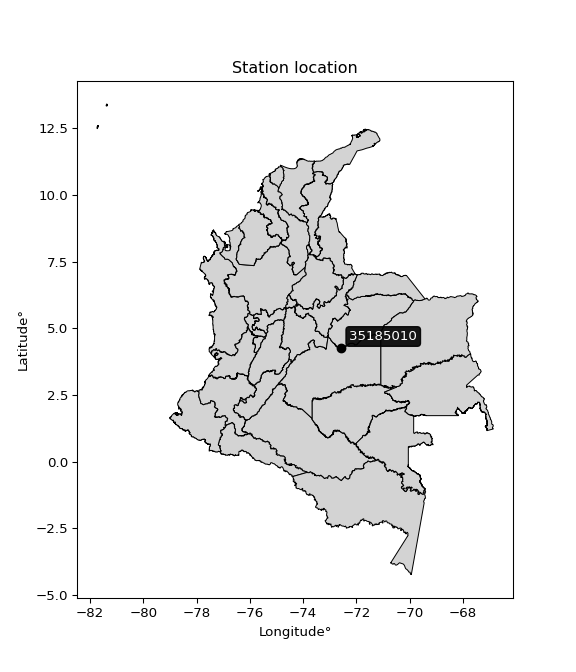

<div align="center">


</div>

# PMP Station (Rain, Pmax24h): 35185010

Probable Maximum Precipitation (PMP) is the greatest amount of rainfall for a specific duration that is meteorologically possible for a given location, acting as a "worst-case" scenario for extreme storms, crucial for designing safety-critical infrastructure like bridges, river deviations, dams, spillways, and nuclear plants to prevent catastrophic failure. PMP is calculated by hydrologists using meteorological data to determine the upper limit of extreme rainfall, often leading to the Probable Maximum Flood (PMF) for flood control design, and is increasingly being studied for climate change impacts. Probable Maximum Precipitation (PMP) is the theoretical upper limit of rainfall, a deterministic estimate for extreme events, while probability distributions (like GEV, Gumbel) describe the likelihood and frequency of various precipitation amounts, including rare ones, showing how often events occur, with PMP representing the extreme end of these distributions, used for critical infrastructure design to ensure safety against the worst conceivable weather, unlike standard statistical forecasts which cover typical probabilities.

The most common probability distributions in hydrology, used for analyzing floods, rainfall, and streamflow, include the Normal, Log-Normal, Gumbel, Gamma (including Log-Pearson Type III), and Generalized Extreme Value (GEV) distributions, often chosen based on the data´s skewness and whether modeling extremes or general conditions, with Gumbel and GEV popular for extreme events like floods, while the Normal distribution serves as a baseline, though often requiring transformations for skewed hydrological data. These distributions help in designing water infrastructure, managing water resources, and forecasting hydrologic events.

> Hydrological data often isn´t perfectly normal (it´s skewed), so different distributions are needed for different applications, such as: **Flood Frequency Analysis**: Using Gumbel, GEV, or Log-Pearson Type III for predicting extreme flood magnitudes and their return periods, **Rainfall Analysis**: Normal for annual totals, but Log-Normal, Weibull, or GEV for intensity or extreme daily rainfall, **Streamflow Modeling**: Gamma and Log-Normal for maximum flows, GEV for minimum flows, and Kappa for daily flows.

<div align="center">

</img>

</div>


## A. General information


### 1. General running parameters

• app_version: _v20260108_. • runtime: _2026-01-09 11:32:22.148588_. • Python version: _3.14.0_. • SciPy version: _1.16.3_. • Pandas version: _2.3.3_. • NumPy version: _2.3.5_. • Stations dataset (station_dataset_file): _dataset/pmax24h_in/automatic_colombia_2003_2024.csv_. • Stations catalog (station_catalog_file): _dataset/CNE.xls_. • Minimum year to eval til year_max (date_min): _1900_. • Maximum year to eval since year_min (date_max): _2024_. • Creates, save and include plots into reports (create_plot): _False_. • Plot only fit distributions with Δo > Δ (plot_only_fit): _True_. • Plot only simple graphs avoiding multiple CDFs and multiple Extreme values plots (plot_only_simple): _True_. • Eval low extreme values, if False, evaluates high extreme values (low_extreme): _False_. • Eval every SciPy distribution as logarithmic (pdist_logarithmic_on): _True_. • Standard deviation normalized (ddof): _1.0_. • Return periods to eval in years (Tr): _[2, 2.33, 5, 10, 15, 20, 25, 50, 75, 100, 200, 250, 500, 750, 1000]_. • Minimum data sample per station, 0 means any (minimum_sample): _5_. • Z-Score maximum threshold to adjust a value, 0 means disable (zscore_max): _3.5_. • Z-Score minimum threshold to adjust a value, 0 means disable (zscore_min): _-2.5_. • Avoid zeros, e.g. rain = 0 (avoid_zeros): _True_. • Avoid null values (avoid_nans): _True_. 

:file_folder:Table: [dataset.csv](../../dataset/pmax24h_in/automatic_colombia_2003_2024.csv)

> Delta Degrees of Freedom (DDOF): is a parameter used in the formulas for calculating variance and standard deviation. When ddof=0, the divisor is $N$ (the total number of observations) and this is used when your data set is the entire population. When ddof=1, the divisor is $N-1$ and this is used when your data set is a sample drawn from a larger population. Using $N-1$ provides an unbiased estimate of the population variance (known as Bessel´s correction).


### 2. Station info and location

|   id |   CODIGO | NOMBRE                       | CATEGORIA         | TECNOLOGIA                | ESTADO           | FECHA_INSTALACION   |   FECHA_SUSPENSION |   ALTITUD |   LATITUD |   LONGITUD | DEPARTAMENTO   | MUNICIPIO    | AREA_OPERATIVA                            | ENTIDAD                                                     | AREA_HIDROGRAFICA   | ZONA_HIDROGRAFICA   | SUBZONA_HIDROGRAFICA                             |   CORRIENTE | Catalogo   |   Version |
|-----:|---------:|:-----------------------------|:------------------|:--------------------------|:-----------------|:--------------------|-------------------:|----------:|----------:|-----------:|:---------------|:-------------|:------------------------------------------|:------------------------------------------------------------|:--------------------|:--------------------|:-------------------------------------------------|------------:|:-----------|----------:|
|    0 | 35185010 | LA PALOMERA - AUT [35185010] | Agrometeorológica | Automática con Telemetría | En Mantenimiento | 18/05/2005          |                nan |       182 |   4.26032 |   -72.5645 | Meta           | Puerto López | Area Operativa 03 - Meta-Guaviare-Guainía | INSTITUTO DE HIDROLOGIA METEOROLOGIA Y ESTUDIOS AMBIENTALES | Orinoco             | Meta                | Directos Rio Metica entre ríos Guayuriba y Yucao |         nan | CNE_IDEAM  |  20251226 |

<div align="center">

Dynamic map: [:earth_americas:Google](http://maps.google.com/maps?q=4.260321,-72.564525) [:earth_americas:OSM](https://www.openstreetmap.org/#map=18/4.260321/-72.564525&layers=P) [:earth_americas:Bing](https://www.bing.com/maps?cp=4.260321~-72.564525&lvl=18) [:earth_americas:Apple](https://maps.apple.com/frame?center=4.260321%2C-72.564525&span=0.003%2C0.006)

</div>


<div align="center">

```geojson
{
  "type": "Feature",
  "geometry": {
    "type": "Point", 
    "coordinates": [-72.564525, 4.260321]
  }, 
  "properties": {
    "Name": "35185010"
  }
}
```

</div>


### 3. Discrete values table and plot

<div align="center">

|               |           0 |           1 |          2 |          3 |         4 |           5 |          6 |
|:--------------|------------:|------------:|-----------:|-----------:|----------:|------------:|-----------:|
| Date          | 2017        | 2018        | 2019       | 2020       | 2021      | 2022        | 2023       |
| Value         |   73.7      |   69.8      |  104.7     |   15.2     |  113.3    |   16.3      |    7.9     |
| Value_initial |   73.7      |   69.8      |  104.7     |   15.2     |  113.3    |   16.3      |    7.9     |
| count         |    7        |    7        |    7       |    7       |    7      |    7        |    7       |
| mean          |   57.2714   |   57.2714   |   57.2714  |   57.2714  |   57.2714 |   57.2714   |   57.2714  |
| std           |   44.1621   |   44.1621   |   44.1621  |   44.1621  |   44.1621 |   44.1621   |   44.1621  |
| zscore        |    0.372006 |    0.283695 |    1.07397 |   -0.95266 |    1.2687 |   -0.927751 |   -1.11796 |


</div>


> The initial value (value_initial) correspond to the initial obtained or null completed value, and value (value) is adjusted only when the initial value is outside the valid range (outlier) definite through the Z-Score value. If Z-Score is active, values out of range or outliers are replaced with the station mean value. A Z-Score (or standard score) measures how many standard deviations a data point is from the mean of a dataset, indicating its relative position; positive scores mean above the mean, negative mean below, and a score of zero is exactly at the mean, allowing for comparison of values from different distributions. It´s calculated using the formula $z=(x–μ)/σ$, where $x$ is the data point, $μ$ is the mean, and $σ$ is the standard deviation, helping identify outliers and understand probability.
>
> <sub>**Note**: In this study, "completing" (filling gaps in) and "extending" (forecasting or lengthening the historical record) rainfall data series are avoided for certain critical analyses because they introduce artificial bias and uncertainty, which can distort the statistics of rare events (extremes), alter day-to-day variability, and compromise the integrity and homogeneity of the original data. Some reasons against Completing/Extending rainfall data are: **Distortion of Extremes and Variability**: The primary issue is that most gap-filling or extension methods rely on averaging or regression with nearby stations, which inherently smooths the data. Rainfall is highly variable in space and time, with a large percentage of zero values and occasional large storms. Infilling methods often underestimate the highest values and overestimate the lowest (zero) values, which severely distorts analyses focused on flood frequency, drought severity, and intensity-duration-frequency (IDF) curves, **Loss of Data Homogeneity**: Infilled or extended data are synthetic estimates, not actual measurements. Combining these estimates with observed data can violate the assumption of data homogeneity, which requires that the data properties do not change over time. Inhomogeneity can lead to incorrect conclusions about long-term trends or changes in climate patterns, **Propagation of Errors**: Errors and biases from the original data (e.g., wind-induced undercatch, instrument errors, site changes) or the data used for imputation can propagate through the analysis, leading to unreliable hydrological models and inaccurate predictions, **Compromised Statistical Integrity**: For statistical analyses, especially those involving the frequency of events, using artificial data can introduce time bias or autocorrelation that doesn´t exist in reality, making it difficult to assess the true probability of events, **Difficulty in Validation**: It is difficult to accurately validate the quality of filled or extended data, especially for past periods where ground-truth measurements are unavailable. The reliability of imputation techniques heavily depends on the density of the surrounding station network and the complexity of the local topography.</sub>


### 4. Active continuous probability distributions from SciPy (45 of 104 available)

A Probability Density Function (PDF) describes the relative likelihood of a continuous random variable falling within a specific range, where the total area under its curve equals 1, and the area over any interval gives the actual probability for that range. Unlike discrete probabilities (like rolling a die), a PDF shows density, not direct probability for a single point (which is zero), with higher points indicating higher likelihood, often visualized as a bell curve for normal distributions.

A log of a probability density function (log-PDF) is simply the logarithm of the PDF´s value, denoted as $log(f(x))$, useful for converting multiplication of probabilities into addition, improving numerical stability with tiny numbers, and connecting to information theory concepts like entropy. Instead of dealing with very small probabilities (e.g., 0.000001), log-PDFs use negative numbers (e.g., $log(0.00001) ≈ -11.51$ that are easier for computers to handle, preventing underflow errors and simplifying complex calculations. In this study, each active probability distribution from SciPy is also evaluated in the $log$ form.

[scipy.stats](https://docs.scipy.org/doc/scipy/reference/stats.html) is a Python´s powerful submodule within the SciPy library for comprehensive statistical analysis, offering over 130 probability distributions (like Normal, Poisson), functions for descriptive stats (mean, variance), hypothesis testing (t-tests, chi-square), random variable generation, and statistical tests, making it essential for data science, modeling, and research. It provides tools to explore, model, and draw conclusions from data efficiently, working seamlessly with NumPy.

<div align="center">

|   id | p_dist             |   n_parameter | fit_method   | label                                                                       | active   | ref                                                                                                        |
|-----:|:-------------------|--------------:|:-------------|:----------------------------------------------------------------------------|:---------|:-----------------------------------------------------------------------------------------------------------|
|    0 | alpha              |             3 | MLE          | Alpha                                                                       | True     | [:mortar_board:](https://docs.scipy.org/doc/scipy/reference/generated/scipy.stats.alpha.html)              |
|    1 | betaprime          |             4 | MLE          | Beta prime                                                                  | True     | [:mortar_board:](https://docs.scipy.org/doc/scipy/reference/generated/scipy.stats.betaprime.html)          |
|    2 | chi2               |             3 | MLE          | Chi²                                                                        | True     | [:mortar_board:](https://docs.scipy.org/doc/scipy/reference/generated/scipy.stats.chi2.html)               |
|    3 | crystalball        |             4 | MLE          | Crystalball                                                                 | True     | [:mortar_board:](https://docs.scipy.org/doc/scipy/reference/generated/scipy.stats.crystalball.html)        |
|    4 | dweibull           |             3 | MLE          | Double Weibull                                                              | True     | [:mortar_board:](https://docs.scipy.org/doc/scipy/reference/generated/scipy.stats.dweibull.html)           |
|    5 | erlang             |             3 | MLE          | Erlang                                                                      | True     | [:mortar_board:](https://docs.scipy.org/doc/scipy/reference/generated/scipy.stats.erlang.html)             |
|    6 | expon              |             2 | MLE          | Exponential                                                                 | True     | [:mortar_board:](https://docs.scipy.org/doc/scipy/reference/generated/scipy.stats.expon.html)              |
|    7 | exponnorm          |             3 | MLE          | Exponentially modified Normal                                               | True     | [:mortar_board:](https://docs.scipy.org/doc/scipy/reference/generated/scipy.stats.exponnorm.html)          |
|    8 | f                  |             4 | MLE          | F                                                                           | True     | [:mortar_board:](https://docs.scipy.org/doc/scipy/reference/generated/scipy.stats.f.html)                  |
|    9 | fatiguelife        |             3 | MLE          | Fatigue-life (Birnbaum-Saunders)                                            | True     | [:mortar_board:](https://docs.scipy.org/doc/scipy/reference/generated/scipy.stats.fatiguelife.html)        |
|   10 | fisk               |             3 | MLE          | Fisk                                                                        | True     | [:mortar_board:](https://docs.scipy.org/doc/scipy/reference/generated/scipy.stats.fisk.html)               |
|   11 | gamma              |             3 | MLE          | Gamma                                                                       | True     | [:mortar_board:](https://docs.scipy.org/doc/scipy/reference/generated/scipy.stats.gamma.html)              |
|   12 | genexpon           |             5 | MLE          | Generalized exponential                                                     | True     | [:mortar_board:](https://docs.scipy.org/doc/scipy/reference/generated/scipy.stats.genexpon.html)           |
|   13 | genlogistic        |             3 | MLE          | Generalized logistic                                                        | True     | [:mortar_board:](https://docs.scipy.org/doc/scipy/reference/generated/scipy.stats.genlogistic.html)        |
|   14 | gibrat             |             2 | MM           | Gibrat                                                                      | True     | [:mortar_board:](https://docs.scipy.org/doc/scipy/reference/generated/scipy.stats.gibrat.html)             |
|   15 | gompertz           |             3 | MLE          | Gompertz (or truncated Gumbel)                                              | True     | [:mortar_board:](https://docs.scipy.org/doc/scipy/reference/generated/scipy.stats.gompertz.html)           |
|   16 | gumbel_l           |             2 | MM           | Gumbel Left Skew                                                            | True     | [:mortar_board:](https://docs.scipy.org/doc/scipy/reference/generated/scipy.stats.gumbel_l.html)           |
|   17 | gumbel_r           |             2 | MM           | Gumbel Right Skew                                                           | True     | [:mortar_board:](https://docs.scipy.org/doc/scipy/reference/generated/scipy.stats.gumbel_r.html)           |
|   18 | halflogistic       |             2 | MM           | Half-logistic                                                               | True     | [:mortar_board:](https://docs.scipy.org/doc/scipy/reference/generated/scipy.stats.halflogistic.html)       |
|   19 | halfnorm           |             2 | MM           | Half Normal                                                                 | True     | [:mortar_board:](https://docs.scipy.org/doc/scipy/reference/generated/scipy.stats.halfnorm.html)           |
|   20 | hypsecant          |             2 | MM           | hyperbolic secant                                                           | True     | [:mortar_board:](https://docs.scipy.org/doc/scipy/reference/generated/scipy.stats.hypsecant.html)          |
|   21 | invgamma           |             3 | MLE          | Inverted gamma                                                              | True     | [:mortar_board:](https://docs.scipy.org/doc/scipy/reference/generated/scipy.stats.invgamma.html)           |
|   22 | invgauss           |             3 | MLE          | Inverse Gaussian                                                            | True     | [:mortar_board:](https://docs.scipy.org/doc/scipy/reference/generated/scipy.stats.invgauss.html)           |
|   23 | invweibull         |             3 | MLE          | Inverted Weibull                                                            | True     | [:mortar_board:](https://docs.scipy.org/doc/scipy/reference/generated/scipy.stats.invweibull.html)         |
|   24 | kappa4             |             4 | MLE          | Kappa 4                                                                     | True     | [:mortar_board:](https://docs.scipy.org/doc/scipy/reference/generated/scipy.stats.kappa4.html)             |
|   25 | kstwobign          |             2 | MLE          | Limiting distribution of scaled Kolmogorov-Smirnov two-sided test statistic | True     | [:mortar_board:](https://docs.scipy.org/doc/scipy/reference/generated/scipy.stats.kstwobign.html)          |
|   26 | laplace            |             2 | MM           | Laplace                                                                     | True     | [:mortar_board:](https://docs.scipy.org/doc/scipy/reference/generated/scipy.stats.laplace.html)            |
|   27 | laplace_asymmetric |             3 | MLE          | Asymmetric Laplace                                                          | True     | [:mortar_board:](https://docs.scipy.org/doc/scipy/reference/generated/scipy.stats.laplace_asymmetric.html) |
|   28 | loggamma           |             3 | MLE          | Log gamma                                                                   | True     | [:mortar_board:](https://docs.scipy.org/doc/scipy/reference/generated/scipy.stats.loggamma.html)           |
|   29 | logistic           |             2 | MM           | Logistic (or Sech-squared)                                                  | True     | [:mortar_board:](https://docs.scipy.org/doc/scipy/reference/generated/scipy.stats.logistic.html)           |
|   30 | lognorm            |             3 | MLE          | Log Normal                                                                  | True     | [:mortar_board:](https://docs.scipy.org/doc/scipy/reference/generated/scipy.stats.lognorm.html)            |
|   31 | maxwell            |             2 | MM           | Maxwell                                                                     | True     | [:mortar_board:](https://docs.scipy.org/doc/scipy/reference/generated/scipy.stats.maxwell.html)            |
|   32 | mielke             |             4 | MLE          | Mielke Beta-Kappa / Dagum                                                   | True     | [:mortar_board:](https://docs.scipy.org/doc/scipy/reference/generated/scipy.stats.mielke.html)             |
|   33 | moyal              |             2 | MM           | Moyal                                                                       | True     | [:mortar_board:](https://docs.scipy.org/doc/scipy/reference/generated/scipy.stats.moyal.html)              |
|   34 | nakagami           |             3 | MLE          | Nakagami                                                                    | True     | [:mortar_board:](https://docs.scipy.org/doc/scipy/reference/generated/scipy.stats.nakagami.html)           |
|   35 | ncf                |             5 | MLE          | Non-central F distribution                                                  | True     | [:mortar_board:](https://docs.scipy.org/doc/scipy/reference/generated/scipy.stats.ncf.html)                |
|   36 | nct                |             4 | MLE          | Non-central Student’s t                                                     | True     | [:mortar_board:](https://docs.scipy.org/doc/scipy/reference/generated/scipy.stats.nct.html)                |
|   37 | norm               |             2 | MM           | Normal                                                                      | True     | [:mortar_board:](https://docs.scipy.org/doc/scipy/reference/generated/scipy.stats.norm.html)               |
|   38 | pearson3           |             3 | MM           | Pearson type III                                                            | True     | [:mortar_board:](https://docs.scipy.org/doc/scipy/reference/generated/scipy.stats.pearson3.html)           |
|   39 | rayleigh           |             2 | MM           | Rayleigh                                                                    | True     | [:mortar_board:](https://docs.scipy.org/doc/scipy/reference/generated/scipy.stats.rayleigh.html)           |
|   40 | rice               |             3 | MLE          | Rice                                                                        | True     | [:mortar_board:](https://docs.scipy.org/doc/scipy/reference/generated/scipy.stats.rice.html)               |
|   41 | t                  |             3 | MLE          | Student’s t                                                                 | True     | [:mortar_board:](https://docs.scipy.org/doc/scipy/reference/generated/scipy.stats.t.html)                  |
|   42 | truncnorm          |             4 | MLE          | Truncated normal                                                            | True     | [:mortar_board:](https://docs.scipy.org/doc/scipy/reference/generated/scipy.stats.truncnorm.html)          |
|   43 | wald               |             2 | MM           | Wald                                                                        | True     | [:mortar_board:](https://docs.scipy.org/doc/scipy/reference/generated/scipy.stats.wald.html)               |
|   44 | weibull_min        |             3 | MLE          | Weibull minimum                                                             | True     | [:mortar_board:](https://docs.scipy.org/doc/scipy/reference/generated/scipy.stats.weibull_min.html)        |

</div>

> **n_parameter:** # arguments & localization & scale.
>
> **Fit methods:** (MLE) maximum likelihood, (MM) L-moments.
>
>**Inactive** (With the only purpose of prevent loops, zero divisions, infinite values, over high estimated values or horizontal trending for recurrence intervals estimations, the follow distributions were disabled.)**:** foldnorm, gennorm, norminvgauss, powernorm, powerlognorm, skewnorm, genextreme, anglit, arcsine, argus, beta, bradford, burr, burr12, cauchy, cosine, halfcauchy, foldcauchy, skewcauchy, wrapcauchy, dgamma, gengamma, exponweib, exponpow, truncexpon, gausshyper, genhalflogistic, genhyperbolic, geninvgauss, halfgennorm, johnsonsb, johnsonsu, kappa3, ksone, kstwo, loglaplace, levy, levy_l, levy_stable, ncx2, pareto, genpareto, truncpareto, lomax, powerlaw, rdist, rel_breitwigner, recipinvgauss, semicircular, studentized_range, trapezoid, triang, truncweibull_min, tukeylambda, uniform, loguniform, vonmises, vonmises_line, weibull_max, 


## B. Probability (PDF) vs. Empirical (EDF) distributions functions

A continuous probability distribution (CPD) describes probabilities for variables that can take any value within a range (like rain any time), unlike discrete variables with specific outcomes (like temperature). It uses a Probability Density Function (PDF), a curve where the total area under it equals 1, and the probability of the variable falling within an interval (a to b) is found by calculating the area under the curve between those points. A key feature is that the probability of hitting any single exact value is zero, so probabilities are always expressed for ranges, e.g., $P(a ≤ X ≤ b)$.

<div align="center">

Distributions parameters from station values
|    |   station | p_dist                |   n |               loc |            scale | shape                  | shape1              | shape2             | shape3   |
|---:|----------:|:----------------------|----:|------------------:|-----------------:|:-----------------------|:--------------------|:-------------------|:---------|
|  0 |  35185010 | alpha                 |   7 |      -0.0421068   |     16.9243      | 2.2808141392904357e-11 |                     |                    |          |
|  1 |  35185010 | betaprime             |   7 |       7.89997     |   3196.29        | 0.6807834839317937     | 61.21858961133033   |                    |          |
|  2 |  35185010 | chi2                  |   7 |       7.9         |      7.05423     | 1.4127560013297167     |                     |                    |          |
|  3 |  35185010 | crystalball           |   7 |      57.2714      |     40.8861      | 4496.531555903682      | 128.44413175349217  |                    |          |
|  4 |  35185010 | dweibull              |   7 |      51.4081      |     43.4839      | 2.960352878304523      |                     |                    |          |
|  5 |  35185010 | erlang                |   7 |   -1276.81        |      1.2483      | 1068.697688998198      |                     |                    |          |
|  6 |  35185010 | expon                 |   7 |       7.9         |     49.3714      |                        |                     |                    |          |
|  7 |  35185010 | exponnorm             |   7 |      55.9294      |     40.8641      | 0.03284210767237994    |                     |                    |          |
|  8 |  35185010 | f                     |   7 |      -0.65051     |     57.0912      | 2.8930955107712446     | 117.6299336606557   |                    |          |
|  9 |  35185010 | fatiguelife           |   7 |       7.9         |      2.49439e-05 | 1332.7288860489134     |                     |                    |          |
| 10 |  35185010 | fisk                  |   7 |       7.9         |     15.5639      | 0.4526366195956665     |                     |                    |          |
| 11 |  35185010 | gamma                 |   7 |   -1247.18        |      1.27805     | 1020.6419408842139     |                     |                    |          |
| 12 |  35185010 | genexpon              |   7 |       6.40375     |      2.71397     | 1.1126704261551521e-08 | 0.05398733037297879 | 4.586078449716667  |          |
| 13 |  35185010 | genlogistic           |   7 |    -186.715       |     34.8348      | 616.3849054251582      |                     |                    |          |
| 14 |  35185010 | gibrat                |   7 |      26.0804      |     18.9183      |                        |                     |                    |          |
| 15 |  35185010 | gompertz              |   7 |       7.9         |    103.924       | 1.3592169144097621     |                     |                    |          |
| 16 |  35185010 | gumbel_l              |   7 |      75.6724      |     31.8788      |                        |                     |                    |          |
| 17 |  35185010 | gumbel_r              |   7 |      38.8705      |     31.8788      |                        |                     |                    |          |
| 18 |  35185010 | halflogistic          |   7 |       8.81189     |     34.9562      |                        |                     |                    |          |
| 19 |  35185010 | halfnorm              |   7 |       3.1542      |     67.8259      |                        |                     |                    |          |
| 20 |  35185010 | hypsecant             |   7 |      57.2714      |     26.0289      |                        |                     |                    |          |
| 21 |  35185010 | invgamma              |   7 |     -11.117       |     86.3505      | 2.0708897410946783     |                     |                    |          |
| 22 |  35185010 | invgauss              |   7 |       0.855619    |     35.1589      | 1.6045949534850108     |                     |                    |          |
| 23 |  35185010 | invweibull            |   7 |      -0.615094    |     23.7282      | 1.0800526907002987     |                     |                    |          |
| 24 |  35185010 | kappa4                |   7 |     -12.855       |    127.534       | 1.194533205828666      | 1.0079166776753037  |                    |          |
| 25 |  35185010 | kstwobign             |   7 |     -80.3165      |    156.641       |                        |                     |                    |          |
| 26 |  35185010 | laplace               |   7 |      57.2714      |     28.9109      |                        |                     |                    |          |
| 27 |  35185010 | laplace_asymmetric    |   7 |      73.7         |     33.6651      | 1.273340122428904      |                     |                    |          |
| 28 |  35185010 | loggamma              |   7 |   -6991.71        |   1078.2         | 691.2237724399156      |                     |                    |          |
| 29 |  35185010 | logistic              |   7 |      57.2714      |     22.5417      |                        |                     |                    |          |
| 30 |  35185010 | lognorm               |   7 |       7.9         |      0.156147    | 13.430386995710943     |                     |                    |          |
| 31 |  35185010 | maxwell               |   7 |     -39.6116      |     60.7124      |                        |                     |                    |          |
| 32 |  35185010 | mielke                |   7 |      -0.219514    |      0.33463     | 98.49143615367507      | 1.066306768645863   |                    |          |
| 33 |  35185010 | moyal                 |   7 |      33.8901      |     18.4052      |                        |                     |                    |          |
| 34 |  35185010 | nakagami              |   7 |       7.9         |     86.999       | 0.12776524116458324    |                     |                    |          |
| 35 |  35185010 | ncf                   |   7 |      -0.630023    |     33.9336      | 2.5870465848990616     | 100.94684065086139  | 1.7652283826814577 |          |
| 36 |  35185010 | nct                   |   7 |      -0.0950801   |      0.328104    | 0.8059948085607278     | 51.89146188355221   |                    |          |
| 37 |  35185010 | norm                  |   7 |      57.2714      |     40.8861      |                        |                     |                    |          |
| 38 |  35185010 | pearson3              |   7 |      57.2714      |     40.8862      | 0.05306130484139239    |                     |                    |          |
| 39 |  35185010 | rayleigh              |   7 |     -20.9461      |     62.4086      |                        |                     |                    |          |
| 40 |  35185010 | rice                  |   7 |     -16.1316      |     51.3044      | 0.8258997985611543     |                     |                    |          |
| 41 |  35185010 | t                     |   7 |      57.2714      |     40.8863      | 1934252002.4172063     |                     |                    |          |
| 42 |  35185010 | truncnorm             |   7 |      82.1968      |     31.8903      | -274.66428417121904    | 0.9753191253467091  |                    |          |
| 43 |  35185010 | wald                  |   7 |      16.3853      |     40.8861      |                        |                     |                    |          |
| 44 |  35185010 | weibull_min           |   7 |       7.9         |     57.117       | 0.3271780871264791     |                     |                    |          |
| 45 |  35185010 | logalpha              |   7 |     -12.9736      |    263.934       | 15.941838368028243     |                     |                    |          |
| 46 |  35185010 | logbetaprime          |   7 |      -8.82966     |    171.115       | 163.35223114185362     | 2245.407957770482   |                    |          |
| 47 |  35185010 | logchi2               |   7 |       2.06686     |      1.01809     | 1.1989082594519402     |                     |                    |          |
| 48 |  35185010 | logcrystalball        |   7 |       3.64373     |      1.00371     | 2012.4899811004666     | 66.81180047699783   |                    |          |
| 49 |  35185010 | logdweibull           |   7 |       3.48807     |      1.08313     | 4.000040254899501      |                     |                    |          |
| 50 |  35185010 | logerlang             |   7 |     -11.7998      |      0.0675165   | 228.7375487885521      |                     |                    |          |
| 51 |  35185010 | logexpon              |   7 |       2.06686     |      1.57687     |                        |                     |                    |          |
| 52 |  35185010 | logexponnorm          |   7 |       3.64296     |      1.00372     | 0.0007747437395118511  |                     |                    |          |
| 53 |  35185010 | logf                  |   7 |    -261.853       |    265.498       | 375766.42515226407     | 222238.45458058838  |                    |          |
| 54 |  35185010 | logfatiguelife        |   7 |    -248.314       |    251.953       | 0.003990469417315684   |                     |                    |          |
| 55 |  35185010 | logfisk               |   7 | -187077           | 187081           | 297846.5009664042      |                     |                    |          |
| 56 |  35185010 | loggamma              |   7 |     -12.3717      |      0.0642317   | 249.2202134617425      |                     |                    |          |
| 57 |  35185010 | loggenexpon           |   7 |       2.06686     |      5.25709e+07 | 19788369.92807346      | 36452971.81633341   | 23327659.23584833  |          |
| 58 |  35185010 | loggenlogistic        |   7 |       4.73019     |      1.64061e-06 | 1.5148615623408594e-06 |                     |                    |          |
| 59 |  35185010 | loggibrat             |   7 |       2.87798     |      0.464441    |                        |                     |                    |          |
| 60 |  35185010 | loggompertz           |   7 |       2.06686     |      1.47537     | 0.393834819304413      |                     |                    |          |
| 61 |  35185010 | loggumbel_l           |   7 |       4.09545     |      0.782593    |                        |                     |                    |          |
| 62 |  35185010 | loggumbel_r           |   7 |       3.192       |      0.782593    |                        |                     |                    |          |
| 63 |  35185010 | loghalflogistic       |   7 |       2.45413     |      0.858115    |                        |                     |                    |          |
| 64 |  35185010 | loghalfnorm           |   7 |       2.31521     |      1.66505     |                        |                     |                    |          |
| 65 |  35185010 | loghypsecant          |   7 |       3.64373     |      0.638985    |                        |                     |                    |          |
| 66 |  35185010 | loginvgamma           |   7 |     -10.4494      |   2592.31        | 184.91256229146524     |                     |                    |          |
| 67 |  35185010 | loginvgauss           |   7 |      -3.56286     |    331.001       | 0.021746918144197998   |                     |                    |          |
| 68 |  35185010 | loginvweibull         |   7 |      -1.22286e+08 |      1.22286e+08 | 130487451.81548834     |                     |                    |          |
| 69 |  35185010 | logkappa4             |   7 |       2.05146     |      2.91405     | 1.0041027807566258     | 1.0879083969520165  |                    |          |
| 70 |  35185010 | logkstwobign          |   7 |      -0.128271    |      4.29299     |                        |                     |                    |          |
| 71 |  35185010 | loglaplace            |   7 |       3.64373     |      0.709734    |                        |                     |                    |          |
| 72 |  35185010 | loglaplace_asymmetric |   7 |       4.73004     |      0.0188389   | 57.551911931531535     |                     |                    |          |
| 73 |  35185010 | logloggamma           |   7 |       4.73005     |      7.00152e-07 | 6.45818220776217e-07   |                     |                    |          |
| 74 |  35185010 | loglogistic           |   7 |       3.64373     |      0.553377    |                        |                     |                    |          |
| 75 |  35185010 | loglognorm            |   7 |       2.06686     |      0.00951266  | 12.543428341366743     |                     |                    |          |
| 76 |  35185010 | logmaxwell            |   7 |       1.26535     |      1.49043     |                        |                     |                    |          |
| 77 |  35185010 | logmielke             |   7 |       2.01618     |      2.72822     | 0.9913545489444955     | 211.74817911229889  |                    |          |
| 78 |  35185010 | logmoyal              |   7 |       3.06974     |      0.45183     |                        |                     |                    |          |
| 79 |  35185010 | lognakagami           |   7 |       2.7213      |      1.58119     | 0.1700585468989374     |                     |                    |          |
| 80 |  35185010 | logncf                |   7 |     -26.2728      |     29.8778      | 2225.275479658727      | 8049.7194119819615  | 2.530080054144081  |          |
| 81 |  35185010 | lognct                |   7 |     -53.0229      |      0.991831    | 63937.635636711915     | 57.13260022698611   |                    |          |
| 82 |  35185010 | lognorm               |   7 |       3.64373     |      1.00371     |                        |                     |                    |          |
| 83 |  35185010 | logpearson3           |   7 |       3.64373     |      1.00372     | -0.35614080671011583   |                     |                    |          |
| 84 |  35185010 | lograyleigh           |   7 |       1.72356     |      1.53207     |                        |                     |                    |          |
| 85 |  35185010 | logrice               |   7 |       1.55458     |      1.16839     | 1.3910770023385153     |                     |                    |          |
| 86 |  35185010 | logt                  |   7 |       3.64373     |      1.00372     | 3743731709.912583      |                     |                    |          |
| 87 |  35185010 | logtruncnorm          |   7 |      -0.0714317   |      2.93508     | 0.9514671814456899     | 1.6358883953183958  |                    |          |
| 88 |  35185010 | logwald               |   7 |       2.63999     |      1.00373     |                        |                     |                    |          |
| 89 |  35185010 | logweibull_min        |   7 |      -8.53863e+07 |      8.53863e+07 | 109107953.21086307     |                     |                    |          |

</div>

> **loc** (Location parameter): This shifts the distribution along the x-axis. For many common distributions, like the normal (Gaussian) distribution, loc represents the mean $μ$. For others, like the uniform distribution, it might represent the minimum value, or for the beta distribution, the left end of the support interval.
>
> **scale** (Scale parameter): This determines the width or spread of the distribution. For the normal distribution, scale represents the standard deviation $σ$. For a uniform distribution, it defines the length of the interval (from $loc$ to $loc + scale$).
>
> **shape** (Shape parameters): Refers to parameters that define the specific form of a probability distribution, distinct from its location (loc) and scale (scale). These parameters are required arguments for most distribution functions. For example, a normal (Gaussian) distribution is fully defined by its location (mean) and scale (standard deviation), so it has no specific shape parameters beyond loc and scale. However, other distributions have intrinsic properties that need specification, as Gamma distribution that takes a shape parameter, often named $a$ or $alpha$.


### 0. Cumulative distribution values - CDF (90 evaluated)

Cumulative Distribution Function (CDF), denoted as $F$<sub>$X$</sub>$(x)$, is a function that gives the probability that a random variable $X$ will take a value less than or equal to a specific value, $x$ (i.e., $(P(X≥x)$. It essentially "accumulates" probabilities from a given point up to the far right (positive infinity), providing a complete picture of the distribution´s probabilities for both discrete (like rain) and continuous (like temperature) variables, helping to find probabilities over ranges or above certain values. Each station is evaluated separately ordering the $x$ values ascending, calculating the CDF and PDF values for the activated distributions and their logarithmic forms.

<div align="center">

CDF ordered by x ascending and calculating $log(f(x))$ separately
|   id |   Station |   date |     x |   count |    mean |     std |    zscore |   Value_initial |   station |   m |     alpha |   alpha_pdf |   betaprime |   betaprime_pdf |        chi2 |       chi2_pdf |   crystalball |   crystalball_pdf |   dweibull |   dweibull_pdf |   erlang |   erlang_pdf |    expon |   expon_pdf |   exponnorm |   exponnorm_pdf |         f |      f_pdf |   fatiguelife |   fatiguelife_pdf |        fisk |    fisk_pdf |    gamma |   gamma_pdf |   genexpon |   genexpon_pdf |   genlogistic |   genlogistic_pdf |   gibrat |   gibrat_pdf |    gompertz |   gompertz_pdf |   gumbel_l |   gumbel_l_pdf |   gumbel_r |   gumbel_r_pdf |   halflogistic |   halflogistic_pdf |   halfnorm |   halfnorm_pdf |   hypsecant |   hypsecant_pdf |   invgamma |   invgamma_pdf |   invgauss |   invgauss_pdf |   invweibull |   invweibull_pdf |      kappa4 |   kappa4_pdf |   kstwobign |   kstwobign_pdf |   laplace |   laplace_pdf |   laplace_asymmetric |   laplace_asymmetric_pdf |   loggamma |   loggamma_pdf |   logistic |   logistic_pdf |   lognorm |   lognorm_pdf |   maxwell |   maxwell_pdf |    mielke |   mielke_pdf |     moyal |   moyal_pdf |    nakagami |   nakagami_pdf |       ncf |    ncf_pdf |       nct |    nct_pdf |     norm |   norm_pdf |   pearson3 |   pearson3_pdf |   rayleigh |   rayleigh_pdf |      rice |   rice_pdf |        t |      t_pdf |   truncnorm |   truncnorm_pdf |     wald |   wald_pdf |   weibull_min |   weibull_min_pdf |   logalpha |   logalpha_pdf |   logbetaprime |   logbetaprime_pdf |     logchi2 |    logchi2_pdf |   logcrystalball |   logcrystalball_pdf |   logdweibull |   logdweibull_pdf |   logerlang |   logerlang_pdf |   logexpon |   logexpon_pdf |   logexponnorm |   logexponnorm_pdf |      logf |   logf_pdf |   logfatiguelife |   logfatiguelife_pdf |   logfisk |   logfisk_pdf |   loggenexpon |   loggenexpon_pdf |   loggenlogistic |   loggenlogistic_pdf |   loggibrat |   loggibrat_pdf |   loggompertz |   loggompertz_pdf |   loggumbel_l |   loggumbel_l_pdf |   loggumbel_r |   loggumbel_r_pdf |   loghalflogistic |   loghalflogistic_pdf |   loghalfnorm |   loghalfnorm_pdf |   loghypsecant |   loghypsecant_pdf |   loginvgamma |   loginvgamma_pdf |   loginvgauss |   loginvgauss_pdf |   loginvweibull |   loginvweibull_pdf |   logkappa4 |   logkappa4_pdf |   logkstwobign |   logkstwobign_pdf |   loglaplace |   loglaplace_pdf |   loglaplace_asymmetric |   loglaplace_asymmetric_pdf |   logloggamma |   logloggamma_pdf |   loglogistic |   loglogistic_pdf |   loglognorm |   loglognorm_pdf |   logmaxwell |   logmaxwell_pdf |   logmielke |   logmielke_pdf |   logmoyal |   logmoyal_pdf |   lognakagami |   lognakagami_pdf |    logncf |   logncf_pdf |    lognct |   lognct_pdf |   logpearson3 |   logpearson3_pdf |   lograyleigh |   lograyleigh_pdf |   logrice |   logrice_pdf |      logt |   logt_pdf |   logtruncnorm |   logtruncnorm_pdf |    logwald |   logwald_pdf |   logweibull_min |   logweibull_min_pdf |
|-----:|----------:|-------:|------:|--------:|--------:|--------:|----------:|----------------:|----------:|----:|----------:|------------:|------------:|----------------:|------------:|---------------:|--------------:|------------------:|-----------:|---------------:|---------:|-------------:|---------:|------------:|------------:|----------------:|----------:|-----------:|--------------:|------------------:|------------:|------------:|---------:|------------:|-----------:|---------------:|--------------:|------------------:|---------:|-------------:|------------:|---------------:|-----------:|---------------:|-----------:|---------------:|---------------:|-------------------:|-----------:|---------------:|------------:|----------------:|-----------:|---------------:|-----------:|---------------:|-------------:|-----------------:|------------:|-------------:|------------:|----------------:|----------:|--------------:|---------------------:|-------------------------:|-----------:|---------------:|-----------:|---------------:|----------:|--------------:|----------:|--------------:|----------:|-------------:|----------:|------------:|------------:|---------------:|----------:|-----------:|----------:|-----------:|---------:|-----------:|-----------:|---------------:|-----------:|---------------:|----------:|-----------:|---------:|-----------:|------------:|----------------:|---------:|-----------:|--------------:|------------------:|-----------:|---------------:|---------------:|-------------------:|------------:|---------------:|-----------------:|---------------------:|--------------:|------------------:|------------:|----------------:|-----------:|---------------:|---------------:|-------------------:|----------:|-----------:|-----------------:|---------------------:|----------:|--------------:|--------------:|------------------:|-----------------:|---------------------:|------------:|----------------:|--------------:|------------------:|--------------:|------------------:|--------------:|------------------:|------------------:|----------------------:|--------------:|------------------:|---------------:|-------------------:|--------------:|------------------:|--------------:|------------------:|----------------:|--------------------:|------------:|----------------:|---------------:|-------------------:|-------------:|-----------------:|------------------------:|----------------------------:|--------------:|------------------:|--------------:|------------------:|-------------:|-----------------:|-------------:|-----------------:|------------:|----------------:|-----------:|---------------:|--------------:|------------------:|----------:|-------------:|----------:|-------------:|--------------:|------------------:|--------------:|------------------:|----------:|--------------:|----------:|-----------:|---------------:|-------------------:|-----------:|--------------:|-----------------:|---------------------:|
|    0 |  35185010 |   2023 |   7.9 |       7 | 57.2714 | 44.1621 | -1.11796  |             7.9 |  35185010 |   1 | 0.0330925 |  0.0221063  | 6.71554e-05 |      1.36257    | 3.95375e-12 | 3144.46        |      0.113613 |        0.00470655 |   0.183637 |     0.0125155  | 0.112353 |   0.00479725 | 0        |  0.0202546  |    0.113612 |      0.00470665 | 0.0754601 | 0.0116414  |     0.0351566 |       1.63699e+10 | 4.44164e-08 | 2.26356e+07 | 0.112431 |  0.00479982 |  0.0187532 |     0.0179619  |     0.0997266 |        0.00658745 | 0        |   0          | 1.63327e-14 |     0.013079   |   0.112477 |     0.00332196 |  0.0712241 |     0.00590263 |      0         |         0          |  0.0557827 |     0.011735   |    0.094817 |      0.00358912 |  0.0647231 |     0.0124732  |  0.0461002 |     0.0187123  |     0.048565 |       0.018633   | 4.40212e-14 |   3.11342    |   0.0910242 |      0.00699523 | 0.0906401 |    0.00313516 |             0.133268 |               0.00310886 |  0.0570615 |       0.120999 |   0.100632 |     0.004015   | 0.0580879 |      0.115705 |  0.106415 |    0.00592547 | 0.0482715 |   0.0189021  | 0.0427671 |  0.00564033 | 3.72084e-05 |    1.07049e+10 | 0.0784117 | 0.0112779  | 0.0412008 | 0.0233165  | 0.113613 | 0.00470655 |   0.112793 |     0.00478509 |   0.101313 |     0.00665591 | 0.0752415 | 0.00603687 | 0.113614 | 0.00470657 |   0.0118631 |     0.000992605 | 0        | 0          |    3.1674e-06 |       1.16677e+09 |  0.0540945 |       0.128097 |      0.0561031 |           0.123135 | 4.57793e-10 | 617952         |        0.0580879 |             0.115705 |     0.0257979 |          0.215235 |    0.057286 |        0.120895 |   0        |       0.634169 |      0.0580877 |           0.115704 | 0.0575437 |   0.115477 |        0.0583674 |             0.116675 | 0.0681415 |      0.101095 |   3.57181e-11 |          0.376413 |         0        |             0.07895  |    0        |       0         |   7.04669e-09 |          0.266939 |     0.0721264 |         0.0887567 |     0.0148311 |          0.079804 |          0        |              0        |      0        |          0        |       0.05384  |          0.0838575 |     0.0552493 |          0.125989 |     0.0545668 |          0.134548 |        0.045846 |            0.150796 |  0.00124044 |        0.352882 |      0.0437677 |           0.168223 |    0.0542085 |        0.0763786 |               0.0857245 |                   0.0790659 |     0.0857331 |         0.0790799 |     0.0547055 |         0.0934495 |   0.00719998 |      3.58634e+12 |    0.0379538 |         0.133977 |   0.0192288 |        0.37611  | 0.00241549 |      0.0268776 |   0           |       0           | 0.0571285 |     0.118184 | 0.0581564 |     0.115888 |     0.0664561 |          0.109112 |     0.0247924 |          0.142631 | 0.0364447 |      0.141866 | 0.0580884 |   0.115705 |    0           |           0        | 0          |     0         |        0.0699014 |            0.0861238 |
|    1 |  35185010 |   2020 |  15.2 |       7 | 57.2714 | 44.1621 | -0.95266  |            15.2 |  35185010 |   2 | 0.266842  |  0.0313789  | 0.273127    |      0.0233983  | 0.563615    |    0.0398007   |      0.151742 |        0.00574664 |   0.279516 |     0.0132901  | 0.151266 |   0.00586961 | 0.137447 |  0.0174707  |    0.151742 |      0.00574677 | 0.165507  | 0.0127007  |     0.657598  |       0.0102145   | 0.415158    | 0.0150549   | 0.151362 |  0.00587178 |  0.150584  |     0.0168969  |     0.154102  |        0.00826057 | 0        |   0          | 0.0941754   |     0.0127094  |   0.139314 |     0.00405051 |  0.122308  |     0.00806163 |      0.0911197 |         0.0141849  |  0.140962  |     0.0115797  |    0.124824 |      0.00467363 |  0.173158  |     0.0162069  |  0.2077    |     0.0220248  |     0.212274 |       0.0224682  | 0.105986    |   0.0121577  |   0.148927  |      0.00878719 | 0.116675  |    0.0040357  |             0.15801  |               0.00368603 |  0.184401  |       0.273219 |   0.133961 |     0.0051467  | 0.179043  |      0.260554 |  0.154138 |    0.0071263  | 0.213957  |   0.0226254  | 0.096607  |  0.00905738 | 0.433829    |    0.0151737   | 0.164481  | 0.0120718  | 0.254312  | 0.027243   | 0.151742 | 0.00574664 |   0.151589 |     0.00584976 |   0.154416 |     0.00784747 | 0.124727  | 0.00747762 | 0.151743 | 0.00574665 |   0.0213418 |     0.0016482   | 0        | 0          |    0.399586   |       0.0137277   |  0.190875  |       0.29158  |      0.186735  |           0.280641 | 0.50478     |      0.376473  |        0.179043  |             0.260554 |     0.388947  |          0.509617 |    0.184095 |        0.271531 |   0.339674 |       0.418759 |      0.179042  |           0.260552 | 0.178512  |   0.260783 |        0.180232  |             0.262154 | 0.171692  |      0.226416 |   0.263824    |          0.405761 |         0        |             0.144472 |    0        |       0         |   0.197371    |          0.333863 |     0.158653  |         0.185721  |     0.161249  |          0.375992 |          0.154422 |              0.568778 |      0.192681 |          0.465154 |       0.14759  |          0.222788  |     0.188822  |          0.284962 |     0.197451  |          0.301307 |        0.215827 |            0.353117 |  0.230664   |        0.353358 |      0.229619  |           0.370684 |    0.136308  |        0.192056  |               0.156764  |                   0.144587  |     0.156787  |         0.144619  |     0.158836  |         0.241439  |   0.632062   |      0.0459114   |    0.187684  |         0.317016 |   0.261494  |        0.367646 | 0.141431   |      0.440405  |   4.10101e-06 |       3.14086e+09 | 0.181202  |     0.266715 | 0.179262  |     0.260781 |     0.175716  |          0.232683 |     0.191077  |          0.343846 | 0.184842  |      0.304542 | 0.179044  |   0.260555 |    6.52649e-05 |           0.721792 | 0.00115959 |     0.093861  |        0.153991  |            0.180778  |
|    2 |  35185010 |   2022 |  16.3 |       7 | 57.2714 | 44.1621 | -0.927751 |            16.3 |  35185010 |   3 | 0.300377  |  0.029576   | 0.29802     |      0.0219027  | 0.604868    |    0.0353291   |      0.158151 |        0.00590581 |   0.294071 |     0.0131616  | 0.157813 |   0.00603287 | 0.156452 |  0.0170857  |    0.158151 |      0.00590595 | 0.179492  | 0.0127211  |     0.668373  |       0.00940475  | 0.430662    | 0.0132123   | 0.15791  |  0.00603495 |  0.168969  |     0.0165312  |     0.163312  |        0.00848294 | 0        |   0          | 0.108121    |     0.0126468  |   0.143836 |     0.00417068 |  0.131343  |     0.0083635  |      0.106699  |         0.0141408  |  0.153681  |     0.0115448  |    0.130067 |      0.00485911 |  0.191046  |     0.0163027  |  0.231582  |     0.021382   |     0.236618 |       0.0217759  | 0.119205    |   0.0118839  |   0.158718  |      0.00901143 | 0.1212    |    0.00419221 |             0.162117 |               0.00378183 |  0.20407   |       0.289722 |   0.139724 |     0.0053324  | 0.197827  |      0.277095 |  0.16207  |    0.0072937  | 0.238453  |   0.021895   | 0.106828  |  0.00952364 | 0.449656    |    0.0136642   | 0.177773  | 0.0120922  | 0.2834    | 0.0256399  | 0.158151 | 0.00590581 |   0.158113 |     0.00601192 |   0.163134 |     0.00800292 | 0.133059  | 0.00767139 | 0.158152 | 0.00590582 |   0.0232218 |     0.00177102  | 0        | 0          |    0.413808   |       0.0121948   |  0.211813  |       0.307613 |      0.206931  |           0.297372 | 0.530114    |      0.34929   |        0.197827  |             0.277095 |     0.421247  |          0.414388 |    0.20364  |        0.287832 |   0.368294 |       0.400609 |      0.197826  |           0.277093 | 0.197313  |   0.277341 |        0.199127  |             0.278661 | 0.188094  |      0.243134 |   0.292029    |          0.401425 |         0        |             0.1541   |    0        |       0         |   0.220908    |          0.339789 |     0.172117  |         0.199815  |     0.188446  |          0.401876 |          0.193892 |              0.560768 |      0.225006 |          0.460012 |       0.163936 |          0.245364  |     0.2093    |          0.301069 |     0.219048  |          0.316705 |        0.240961 |            0.365915 |  0.255383   |        0.354223 |      0.255857  |           0.379946 |    0.15041   |        0.211924  |               0.167198  |                   0.154211  |     0.167224  |         0.154247  |     0.17644   |         0.262586  |   0.635106   |      0.0413682   |    0.210373  |         0.332223 |   0.28717   |        0.367345 | 0.173491   |      0.475934  |   0.276344    |       1.34483     | 0.200415  |     0.283181 | 0.198062  |     0.277305 |     0.192509  |          0.248033 |     0.215564  |          0.356787 | 0.206613  |      0.318489 | 0.197828  |   0.277096 |    0.0499251   |           0.705427 | 0.0255     |     0.619904  |        0.1671    |            0.194598  |
|    3 |  35185010 |   2018 |  69.8 |       7 | 57.2714 | 44.1621 |  0.283695 |            69.8 |  35185010 |   4 | 0.80853   |  0.00268822 | 0.811728    |      0.00415457 | 0.994081    |    0.000443173 |      0.62036  |        0.00930989 |   0.537652 |     0.00582632 | 0.624371 |   0.00923894 | 0.714571 |  0.00578126 |    0.620364 |      0.0093098  | 0.699662  | 0.00614804 |     0.881399  |       0.00189419  | 0.651331    | 0.00166064  | 0.624337 |  0.00923289 |  0.713304  |     0.00570308 |     0.67668   |        0.00758431 | 0.798891 |   0.00642489 | 0.66933     |     0.00784596 |   0.564718 |     0.0113571  |  0.684546  |     0.0081384  |      0.702567  |         0.00724336 |  0.674196  |     0.00725918 |    0.647618 |      0.0109374  |  0.730851  |     0.00471242 |  0.758727  |     0.00408055 |     0.734273 |       0.00347871 | 0.635923    |   0.00863441 |   0.682657  |      0.00767163 | 0.675834  |    0.0112126  |             0.564735 |               0.0131741  |  0.730627  |       0.317662 |   0.635479 |     0.0102763  | 0.72564   |      0.332055 |  0.645007 |    0.00841419 | 0.734023  |   0.00345069 | 0.706181  |  0.00761093 | 0.743788    |    0.00289902  | 0.691879  | 0.00636641 | 0.751328  | 0.00281899 | 0.62036  | 0.00930989 |   0.623406 |     0.0092366  |   0.652556 |     0.00809513 | 0.642537  | 0.00878428 | 0.62036  | 0.00930985 |   0.417499  |     0.0138866   | 0.766778 | 0.00630377 |    0.641799   |       0.00194378  |  0.730396  |       0.29411  |      0.73686   |           0.312334 | 0.819433    |      0.109998  |        0.72564   |             0.332055 |     0.606411  |          0.49732  |    0.727047 |        0.317346 |   0.748851 |       0.159271 |      0.725636  |           0.332056 | 0.724773  |   0.331413 |        0.726611  |             0.33012  | 0.701234  |      0.333546 |   0.743983    |          0.20638  |         0        |             0.590278 |    0.859933 |       0.162797  |   0.735699    |          0.308931 |     0.702265  |         0.460931  |     0.770903  |          0.256306 |          0.779407 |              0.228714 |      0.753697 |          0.2447   |       0.763347 |          0.337169  |     0.729298  |          0.301568 |     0.734615  |          0.28564  |        0.739747 |            0.23795  |  0.792262   |        0.394395 |      0.749659  |           0.236243 |    0.78588   |        0.30169   |               0.639492  |                   0.58982   |     0.639656  |         0.590017  |     0.747948  |         0.340676  |   0.667568   |      0.0132902   |    0.73837   |         0.289912 |   0.81861   |        0.364005 | 0.785476   |      0.231589  |   0.77116     |       0.150219    | 0.725848  |     0.323511 | 0.725636  |     0.33165  |     0.713116  |          0.365645 |     0.742043  |          0.277171 | 0.732002  |      0.304434 | 0.72564   |   0.332055 |    0.835205    |           0.384796 | 0.829477   |     0.175562  |        0.690507  |            0.463821  |
|    4 |  35185010 |   2017 |  73.7 |       7 | 57.2714 | 44.1621 |  0.372006 |            73.7 |  35185010 |   5 | 0.818475  |  0.0024187  | 0.827194    |      0.00378353 | 0.995578    |    0.000330164 |      0.656089 |        0.00900067 |   0.5646   |     0.00799915 | 0.65978  |   0.00890777 | 0.73625  |  0.00534215 |    0.656093 |      0.00900055 | 0.722774  | 0.00570881 |     0.888517  |       0.00175809  | 0.657585    | 0.00154892  | 0.659722 |  0.00890188 |  0.734705  |     0.00527736 |     0.705251  |        0.00706778 | 0.822026 |   0.00547123 | 0.699085    |     0.00741297 |   0.609374 |     0.0115183  |  0.715083  |     0.00752249 |      0.729723  |         0.006687   |  0.701707  |     0.00684908 |    0.688759 |      0.0101412  |  0.748376  |     0.00428327 |  0.773939  |     0.00372774 |     0.747213 |       0.00316453 | 0.66944     |   0.00855482 |   0.711607  |      0.00717515 | 0.716742  |    0.00979764 |             0.618524 |               0.0144288  |  0.747597  |       0.306538 |   0.674544 |     0.00973904 | 0.743394  |      0.320971 |  0.677068 |    0.00802163 | 0.74686   |   0.00313961 | 0.73454   |  0.00693934 | 0.754793    |    0.00274692  | 0.715855  | 0.00593243 | 0.761809  | 0.00256198 | 0.656089 | 0.00900067 |   0.658815 |     0.00891027 |   0.683354 |     0.00769463 | 0.675976  | 0.00835777 | 0.656089 | 0.00900063 |   0.472825  |     0.0144542   | 0.789854 | 0.00554995 |    0.649148   |       0.00182722  |  0.746096  |       0.283401 |      0.753532  |           0.300921 | 0.825305    |      0.106048  |        0.743394  |             0.320971 |     0.635381  |          0.5672   |    0.744007 |        0.306462 |   0.757363 |       0.153873 |      0.743391  |           0.320972 | 0.742494  |   0.320365 |        0.74426   |             0.319029 | 0.719047  |      0.321627 |   0.755004    |          0.199036 |         0        |             0.620667 |    0.86843  |       0.150003  |   0.752266    |          0.300436 |     0.727117  |         0.452849  |     0.784483  |          0.243316 |          0.791538 |              0.217609 |      0.76675  |          0.235484 |       0.781107 |          0.316195  |     0.745403  |          0.290816 |     0.74986   |          0.275124 |        0.752424 |            0.228385 |  0.813805   |        0.398163 |      0.76226   |           0.227336 |    0.80167   |        0.279442  |               0.672378  |                   0.620151  |     0.672553  |         0.620361  |     0.766015  |         0.323895  |   0.668281   |      0.0129555   |    0.753843  |         0.279255 |   0.838398  |        0.363929 | 0.797722   |      0.218984  |   0.779187    |       0.14511     | 0.743141  |     0.312538 | 0.743369  |     0.320579 |     0.732733  |          0.355776 |     0.756834  |          0.266911 | 0.748272  |      0.294026 | 0.743395  |   0.320971 |    0.855843    |           0.374389 | 0.838709   |     0.164218  |        0.71555   |            0.45696   |
|    5 |  35185010 |   2019 | 104.7 |       7 | 57.2714 | 44.1621 |  1.07397  |           104.7 |  35185010 |   6 | 0.871636  |  0.0012149  | 0.910852    |      0.0018626  | 0.999555    |    3.27525e-05 |      0.876979 |        0.00497889 |   0.91947  |     0.00816839 | 0.8769   |   0.00487572 | 0.859233 |  0.00285119 |    0.876978 |      0.00497877 | 0.8552    | 0.00307355 |     0.930314  |       0.00102159  | 0.69578     | 0.00098977  | 0.876732 |  0.00487522 |  0.856809  |     0.00284841 |     0.866375  |        0.00356702 | 0.922848 |   0.00183971 | 0.876403    |     0.00410302 |   0.916734 |     0.00649256 |  0.880893  |     0.00350434 |      0.879044  |         0.00325094 |  0.865647  |     0.00383544 |    0.897956 |      0.00385361 |  0.843525  |     0.00216104 |  0.858662  |     0.00198331 |     0.818757 |       0.00167908 | 0.927037    |   0.0081246  |   0.877216  |      0.00370086 | 0.903059  |    0.00335308 |             0.881902 |               0.0044669  |  0.841729  |       0.22868  |   0.891295 |     0.00429818 | 0.842224  |      0.240197 |  0.870062 |    0.00440384 | 0.817899  |   0.00166911 | 0.883862  |  0.00313265 | 0.825423    |    0.0018927   | 0.854443  | 0.00322654 | 0.819903  | 0.00137467 | 0.876979 | 0.00497889 |   0.876394 |     0.00489556 |   0.868224 |     0.00425105 | 0.875135  | 0.00447298 | 0.876978 | 0.00497889 |   0.909609  |     0.0116758   | 0.901577 | 0.00225098 |    0.695289   |       0.00122393  |  0.833137  |       0.212453 |      0.845546  |           0.22262  | 0.858528    |      0.0841813 |        0.842224  |             0.240197 |     0.867676  |          0.604999 |    0.838364 |        0.229969 |   0.805796 |       0.123159 |      0.842221  |           0.240199 | 0.841176  |   0.240005 |        0.842452  |             0.238607 | 0.817382  |      0.237646 |   0.81703     |          0.15544  |         0        |             0.858323 |    0.909822 |       0.0917193 |   0.846817    |          0.235683 |     0.869189  |         0.339985  |     0.856429  |          0.169606 |          0.856515 |              0.155214 |      0.839351 |          0.17912  |       0.870242 |          0.197491  |     0.834819  |          0.218226 |     0.83435   |          0.206429 |        0.822363 |            0.171619 |  0.960816   |        0.456304 |      0.832421  |           0.173525 |    0.879066  |        0.170393  |               0.929498  |                   0.8573    |     0.929764  |         0.857611  |     0.860615  |         0.216773  |   0.672495   |      0.0111381   |    0.839582  |         0.209285 |   0.966089  |        0.363249 | 0.862036   |      0.151142  |   0.824964    |       0.116885    | 0.83938   |     0.234332 | 0.842085  |     0.239955 |     0.843806  |          0.272136 |     0.838887  |          0.200944 | 0.839034  |      0.222243 | 0.842225  |   0.240197 |    0.975972    |           0.311059 | 0.885873   |     0.108994  |        0.860403  |            0.351229  |
|    6 |  35185010 |   2021 | 113.3 |       7 | 57.2714 | 44.1621 |  1.2687   |           113.3 |  35185010 |   7 | 0.881301  |  0.00103951 | 0.925447    |      0.00154243 | 0.999763    |    1.73644e-05 |      0.914712 |        0.00381556 |   0.970886 |     0.00395956 | 0.913889 |   0.00374631 | 0.881736 |  0.00239539 |    0.914711 |      0.00381549 | 0.879416  | 0.00257199 |     0.938511  |       0.000888475 | 0.703872    | 0.000895121 | 0.913723 |  0.00374739 |  0.879325  |     0.00240052 |     0.893989  |        0.00287565 | 0.936781 |   0.00142267 | 0.908221    |     0.00330964 |   0.961437 |     0.00393805 |  0.907707  |     0.0027572  |      0.90416   |         0.00261033 |  0.895613  |     0.00314689 |    0.926363 |      0.00280388 |  0.860617  |     0.00182607 |  0.874461  |     0.00170041 |     0.832174 |       0.0014495  | 0.996882    |   0.0082126  |   0.905827  |      0.00297156 | 0.928002  |    0.00249033 |             0.914695 |               0.00322654 |  0.85908   |       0.210977 |   0.923123 |     0.00314826 | 0.860438  |      0.221281 |  0.903955 |    0.00349563 | 0.831241  |   0.00144175 | 0.907937  |  0.00248987 | 0.840965    |    0.0017251   | 0.879842  | 0.00269428 | 0.83092   | 0.00119402 | 0.914712 | 0.00381556 |   0.913544 |     0.00376396 |   0.901094 |     0.00340908 | 0.909367  | 0.00350741 | 0.914711 | 0.00381557 |   1         |     0.00930785  | 0.918908 | 0.00179921 |    0.705345   |       0.00111766  |  0.849294  |       0.196961 |      0.862426  |           0.205107 | 0.865007    |      0.0800101 |        0.860438  |             0.221281 |     0.911244  |          0.49417  |    0.855827 |        0.212499 |   0.815278 |       0.117145 |      0.860435  |           0.221283 | 0.85938   |   0.221208 |        0.860546  |             0.21984  | 0.835399  |      0.218921 |   0.82895     |          0.146611 |         0.999858 |             0.923223 |    0.916701 |       0.0827541 |   0.864784    |          0.219473 |     0.894588  |         0.303049  |     0.86926   |          0.155629 |          0.868295 |              0.143375 |      0.853025 |          0.167406 |       0.884975 |          0.17612   |     0.851409  |          0.202136 |     0.850057  |          0.191572 |        0.835459 |            0.160267 |  1          |        6.67902  |      0.845681  |           0.162497 |    0.891796  |        0.152457  |               0.999698  |                   0.922047  |     0.999989  |         0.922387  |     0.876863  |         0.195118  |   0.67336    |      0.0107963   |    0.855498  |         0.194042 |   0.993464  |        0.27347  | 0.873475   |      0.138834  |   0.833974    |       0.111451    | 0.857165  |     0.216297 | 0.860281  |     0.221083 |     0.864431  |          0.250324 |     0.854187  |          0.186765 | 0.855934  |      0.205967 | 0.860438  |   0.22128  |    1           |           0.297777 | 0.89411    |     0.0998471 |        0.886729  |            0.315239  |


</div>

An Empirical Distribution Function (EDF) is a step-function estimate of a true cumulative distribution function (CDF) based on observed sample data, representing the proportion of data points less than or equal to a given value. It is calculated by ordering your data and jumping up by $1/n$ (where $n$ is sample size) at each unique data point, allowing analysis without assuming an underlying population distribution, and it gets closer to the true CDF as the sample size grows. For the empirical probability calculations, the parameter $m$ correspond to the order number which means the position of the $x$ values in an ascending order list.

The Kolmogorov-Smirnov (K-S) test is a non-parametric statistical test used to determine if a sample data set comes from a specific theoretical distribution (one-sample) or if two different samples come from the same underlying distribution (two-sample), by comparing their cumulative distribution functions (CDFs). It calculates the maximum vertical difference (D statistic) between these functions, with a small p-value indicating a significant difference and rejection of the null hypothesis (that the data/samples match).


### 1. EDF California (1923)

California´s estimates the true probability distribution of water-related data (like rainfall, streamflow) using observed samples, crucial for risk assessment.

<div align="center">


$P=m/n$


</div>


**1.1. Empirical values**

<div align="center">

|                | 0                   | 1                  | 2                   | 3                  | 4                  | 5                  | 6              |
|:---------------|:--------------------|:-------------------|:--------------------|:-------------------|:-------------------|:-------------------|:---------------|
| date           | 2023                | 2020               | 2022                | 2018               | 2017               | 2019               | 2021           |
| x              | 7.9                 | 15.2               | 16.3                | 69.8               | 73.7               | 104.7              | 113.3          |
| m              | 1                   | 2                  | 3                   | 4                  | 5                  | 6                  | 7              |
| empirical_dist | edf_california      | edf_california     | edf_california      | edf_california     | edf_california     | edf_california     | edf_california |
| empirical      | 0.14285714285714285 | 0.2857142857142857 | 0.42857142857142855 | 0.5714285714285714 | 0.7142857142857143 | 0.8571428571428571 | 1.0            |
| empirical_tr   | 1.1666666666666665  | 1.4                | 1.75                | 2.333333333333333  | 3.5                | 6.999999999999997  | inf            |

</div>


**1.2. Kolmogorov-Smirnov fit test (sorted by Δ)**


<div align="center">

|                | 0                   | 1                   | 2                   | 3                   | 4                   | 5                   | 6                   | 7                   | 8                   | 9                   | 10                  | 11                  | 12                  | 13                  | 14                  | 15                  | 16                  | 17                  | 18                  | 19                  | 20                  | 21                  | 22                  | 23                  | 24                  | 25                  | 26                  | 27                  | 28                  | 29                  | 30                  | 31                  | 32                  | 33                  | 34                  | 35                  | 36                  | 37                  | 38                  | 39                  | 40                  | 41                  | 42                  | 43                  | 44                  | 45                  | 46                  | 47                  | 48                  | 49                    | 50                  | 51                  | 52                  | 53                  | 54                  | 55                  | 56                  | 57                  | 58                  | 59                  | 60                  | 61                  | 62                  | 63                  | 64                  | 65                  | 66                  | 67                  | 68                  | 69                  | 70                  | 71                  | 72                  | 73                  | 74                  | 75                  | 76                  | 77                  | 78                  | 79                  | 80                  | 81                  | 82                  | 83                  | 84                  | 85                  | 86                  | 87                  | 88                  | 89                  |
|:---------------|:--------------------|:--------------------|:--------------------|:--------------------|:--------------------|:--------------------|:--------------------|:--------------------|:--------------------|:--------------------|:--------------------|:--------------------|:--------------------|:--------------------|:--------------------|:--------------------|:--------------------|:--------------------|:--------------------|:--------------------|:--------------------|:--------------------|:--------------------|:--------------------|:--------------------|:--------------------|:--------------------|:--------------------|:--------------------|:--------------------|:--------------------|:--------------------|:--------------------|:--------------------|:--------------------|:--------------------|:--------------------|:--------------------|:--------------------|:--------------------|:--------------------|:--------------------|:--------------------|:--------------------|:--------------------|:--------------------|:--------------------|:--------------------|:--------------------|:----------------------|:--------------------|:--------------------|:--------------------|:--------------------|:--------------------|:--------------------|:--------------------|:--------------------|:--------------------|:--------------------|:--------------------|:--------------------|:--------------------|:--------------------|:--------------------|:--------------------|:--------------------|:--------------------|:--------------------|:--------------------|:--------------------|:--------------------|:--------------------|:--------------------|:--------------------|:--------------------|:--------------------|:--------------------|:--------------------|:--------------------|:--------------------|:--------------------|:--------------------|:--------------------|:--------------------|:--------------------|:--------------------|:--------------------|:--------------------|:--------------------|
| station        | 35185010            | 35185010            | 35185010            | 35185010            | 35185010            | 35185010            | 35185010            | 35185010            | 35185010            | 35185010            | 35185010            | 35185010            | 35185010            | 35185010            | 35185010            | 35185010            | 35185010            | 35185010            | 35185010            | 35185010            | 35185010            | 35185010            | 35185010            | 35185010            | 35185010            | 35185010            | 35185010            | 35185010            | 35185010            | 35185010            | 35185010            | 35185010            | 35185010            | 35185010            | 35185010            | 35185010            | 35185010            | 35185010            | 35185010            | 35185010            | 35185010            | 35185010            | 35185010            | 35185010            | 35185010            | 35185010            | 35185010            | 35185010            | 35185010            | 35185010              | 35185010            | 35185010            | 35185010            | 35185010            | 35185010            | 35185010            | 35185010            | 35185010            | 35185010            | 35185010            | 35185010            | 35185010            | 35185010            | 35185010            | 35185010            | 35185010            | 35185010            | 35185010            | 35185010            | 35185010            | 35185010            | 35185010            | 35185010            | 35185010            | 35185010            | 35185010            | 35185010            | 35185010            | 35185010            | 35185010            | 35185010            | 35185010            | 35185010            | 35185010            | 35185010            | 35185010            | 35185010            | 35185010            | 35185010            | 35185010            |
| empirical_dist | edf_california      | edf_california      | edf_california      | edf_california      | edf_california      | edf_california      | edf_california      | edf_california      | edf_california      | edf_california      | edf_california      | edf_california      | edf_california      | edf_california      | edf_california      | edf_california      | edf_california      | edf_california      | edf_california      | edf_california      | edf_california      | edf_california      | edf_california      | edf_california      | edf_california      | edf_california      | edf_california      | edf_california      | edf_california      | edf_california      | edf_california      | edf_california      | edf_california      | edf_california      | edf_california      | edf_california      | edf_california      | edf_california      | edf_california      | edf_california      | edf_california      | edf_california      | edf_california      | edf_california      | edf_california      | edf_california      | edf_california      | edf_california      | edf_california      | edf_california        | edf_california      | edf_california      | edf_california      | edf_california      | edf_california      | edf_california      | edf_california      | edf_california      | edf_california      | edf_california      | edf_california      | edf_california      | edf_california      | edf_california      | edf_california      | edf_california      | edf_california      | edf_california      | edf_california      | edf_california      | edf_california      | edf_california      | edf_california      | edf_california      | edf_california      | edf_california      | edf_california      | edf_california      | edf_california      | edf_california      | edf_california      | edf_california      | edf_california      | edf_california      | edf_california      | edf_california      | edf_california      | edf_california      | edf_california      | edf_california      |
| p_dist         | logdweibull         | dweibull            | nakagami            | loggenexpon         | logkstwobign        | nct                 | logexpon            | loginvweibull       | mielke              | invweibull          | invgauss            | loghalfnorm         | loggompertz         | loginvgauss         | lograyleigh         | logalpha            | logmaxwell          | loginvgamma         | logkappa4           | logbetaprime        | logrice             | loggamma            | loggamma            | logerlang           | logncf              | logfatiguelife      | lognct              | logt                | lognorm             | lognorm             | logcrystalball      | logexponnorm        | logf                | loghalflogistic     | logpearson3         | alpha               | invgamma            | loggumbel_r         | betaprime           | logfisk             | logmielke           | logchi2             | f                   | ncf                 | loglogistic         | logmoyal            | loggumbel_l         | genexpon            | logloggamma         | loglaplace_asymmetric | logweibull_min      | loghypsecant        | genlogistic         | rayleigh            | laplace_asymmetric  | maxwell             | kstwobign           | t                   | norm                | crystalball         | exponnorm           | pearson3            | gamma               | erlang              | expon               | halfnorm            | loglaplace          | gumbel_l            | lognakagami         | logistic            | weibull_min         | rice                | fisk                | gumbel_r            | hypsecant           | laplace             | kappa4              | gompertz            | moyal               | halflogistic        | loglognorm          | fatiguelife         | logtruncnorm        | logwald             | truncnorm           | chi2                | wald                | gibrat              | loggibrat           | loggenlogistic      |
| delta          | 0.11705929044740136 | 0.14968551110014439 | 0.17235963946570776 | 0.1725548176207019  | 0.17823031027844616 | 0.17989944563727556 | 0.1847216550834846  | 0.18761052932513675 | 0.1901187864750151  | 0.19195332244976399 | 0.19698991109113628 | 0.2035655266414452  | 0.2076639262763274  | 0.20952353456073888 | 0.21300737931752348 | 0.21675795518372404 | 0.21819830419419034 | 0.21927145157517683 | 0.22083305363541927 | 0.22164007239933628 | 0.22195815364865265 | 0.22450157088715592 | 0.22450157088715592 | 0.22493190668603297 | 0.22815642430784902 | 0.22944451188347437 | 0.23050988318271548 | 0.23074338523527688 | 0.23074421101662396 | 0.23074421101662396 | 0.23074423187198267 | 0.23074563608482235 | 0.2312583804908654  | 0.2346791024604747  | 0.23606262257308225 | 0.23710182468701801 | 0.2375251437316713  | 0.24012579168440815 | 0.24029944542248216 | 0.24047758140836312 | 0.24718125838981875 | 0.24800421446551535 | 0.24907964947076658 | 0.2507982015397068  | 0.25213138913920496 | 0.2550808212335793  | 0.2564541576344762  | 0.2596023121459514  | 0.26134765476068034 | 0.2613730248784646    | 0.26147096917389345 | 0.26463581328899954 | 0.2652596160644157  | 0.26543706027095776 | 0.26645482783053875 | 0.2665017497412546  | 0.2698537907694837  | 0.2704191890513309  | 0.2704204081178188  | 0.27042041276155915 | 0.27042055775452545 | 0.2704580194049535  | 0.27066114159204724 | 0.27075863283477775 | 0.272119077635663   | 0.2748907596526634  | 0.2781615456432407  | 0.28473562247960327 | 0.28571018470742954 | 0.2888472840347519  | 0.2946545612776581  | 0.29551192898718104 | 0.2961275601650969  | 0.2972289271735652  | 0.29850459936131407 | 0.30737114251438014 | 0.3093663320350596  | 0.3204499456108155  | 0.3217429816479279  | 0.3218719672351023  | 0.34634773914451855 | 0.3718834301391326  | 0.3786463158960763  | 0.40307145478616013 | 0.405349650988086   | 0.4226527224472212  | 0.42857142857142855 | 0.42857142857142855 | 0.42857142857142855 | 0.8571428571428571  |
| deltao         | 0.48442053926100004 | 0.48442053926100004 | 0.48442053926100004 | 0.48442053926100004 | 0.48442053926100004 | 0.48442053926100004 | 0.48442053926100004 | 0.48442053926100004 | 0.48442053926100004 | 0.48442053926100004 | 0.48442053926100004 | 0.48442053926100004 | 0.48442053926100004 | 0.48442053926100004 | 0.48442053926100004 | 0.48442053926100004 | 0.48442053926100004 | 0.48442053926100004 | 0.48442053926100004 | 0.48442053926100004 | 0.48442053926100004 | 0.48442053926100004 | 0.48442053926100004 | 0.48442053926100004 | 0.48442053926100004 | 0.48442053926100004 | 0.48442053926100004 | 0.48442053926100004 | 0.48442053926100004 | 0.48442053926100004 | 0.48442053926100004 | 0.48442053926100004 | 0.48442053926100004 | 0.48442053926100004 | 0.48442053926100004 | 0.48442053926100004 | 0.48442053926100004 | 0.48442053926100004 | 0.48442053926100004 | 0.48442053926100004 | 0.48442053926100004 | 0.48442053926100004 | 0.48442053926100004 | 0.48442053926100004 | 0.48442053926100004 | 0.48442053926100004 | 0.48442053926100004 | 0.48442053926100004 | 0.48442053926100004 | 0.48442053926100004   | 0.48442053926100004 | 0.48442053926100004 | 0.48442053926100004 | 0.48442053926100004 | 0.48442053926100004 | 0.48442053926100004 | 0.48442053926100004 | 0.48442053926100004 | 0.48442053926100004 | 0.48442053926100004 | 0.48442053926100004 | 0.48442053926100004 | 0.48442053926100004 | 0.48442053926100004 | 0.48442053926100004 | 0.48442053926100004 | 0.48442053926100004 | 0.48442053926100004 | 0.48442053926100004 | 0.48442053926100004 | 0.48442053926100004 | 0.48442053926100004 | 0.48442053926100004 | 0.48442053926100004 | 0.48442053926100004 | 0.48442053926100004 | 0.48442053926100004 | 0.48442053926100004 | 0.48442053926100004 | 0.48442053926100004 | 0.48442053926100004 | 0.48442053926100004 | 0.48442053926100004 | 0.48442053926100004 | 0.48442053926100004 | 0.48442053926100004 | 0.48442053926100004 | 0.48442053926100004 | 0.48442053926100004 | 0.48442053926100004 |
| eval           | Δo > Δ              | Δo > Δ              | Δo > Δ              | Δo > Δ              | Δo > Δ              | Δo > Δ              | Δo > Δ              | Δo > Δ              | Δo > Δ              | Δo > Δ              | Δo > Δ              | Δo > Δ              | Δo > Δ              | Δo > Δ              | Δo > Δ              | Δo > Δ              | Δo > Δ              | Δo > Δ              | Δo > Δ              | Δo > Δ              | Δo > Δ              | Δo > Δ              | Δo > Δ              | Δo > Δ              | Δo > Δ              | Δo > Δ              | Δo > Δ              | Δo > Δ              | Δo > Δ              | Δo > Δ              | Δo > Δ              | Δo > Δ              | Δo > Δ              | Δo > Δ              | Δo > Δ              | Δo > Δ              | Δo > Δ              | Δo > Δ              | Δo > Δ              | Δo > Δ              | Δo > Δ              | Δo > Δ              | Δo > Δ              | Δo > Δ              | Δo > Δ              | Δo > Δ              | Δo > Δ              | Δo > Δ              | Δo > Δ              | Δo > Δ                | Δo > Δ              | Δo > Δ              | Δo > Δ              | Δo > Δ              | Δo > Δ              | Δo > Δ              | Δo > Δ              | Δo > Δ              | Δo > Δ              | Δo > Δ              | Δo > Δ              | Δo > Δ              | Δo > Δ              | Δo > Δ              | Δo > Δ              | Δo > Δ              | Δo > Δ              | Δo > Δ              | Δo > Δ              | Δo > Δ              | Δo > Δ              | Δo > Δ              | Δo > Δ              | Δo > Δ              | Δo > Δ              | Δo > Δ              | Δo > Δ              | Δo > Δ              | Δo > Δ              | Δo > Δ              | Δo > Δ              | Δo > Δ              | Δo > Δ              | Δo > Δ              | Δo > Δ              | Δo > Δ              | Δo > Δ              | Δo > Δ              | Δo > Δ              | Δo <= Δ             |
| fit            | 1                   | 1                   | 1                   | 1                   | 1                   | 1                   | 1                   | 1                   | 1                   | 1                   | 1                   | 1                   | 1                   | 1                   | 1                   | 1                   | 1                   | 1                   | 1                   | 1                   | 1                   | 1                   | 1                   | 1                   | 1                   | 1                   | 1                   | 1                   | 1                   | 1                   | 1                   | 1                   | 1                   | 1                   | 1                   | 1                   | 1                   | 1                   | 1                   | 1                   | 1                   | 1                   | 1                   | 1                   | 1                   | 1                   | 1                   | 1                   | 1                   | 1                     | 1                   | 1                   | 1                   | 1                   | 1                   | 1                   | 1                   | 1                   | 1                   | 1                   | 1                   | 1                   | 1                   | 1                   | 1                   | 1                   | 1                   | 1                   | 1                   | 1                   | 1                   | 1                   | 1                   | 1                   | 1                   | 1                   | 1                   | 1                   | 1                   | 1                   | 1                   | 1                   | 1                   | 1                   | 1                   | 1                   | 1                   | 1                   | 1                   | 0                   |
| n              | 7                   | 7                   | 7                   | 7                   | 7                   | 7                   | 7                   | 7                   | 7                   | 7                   | 7                   | 7                   | 7                   | 7                   | 7                   | 7                   | 7                   | 7                   | 7                   | 7                   | 7                   | 7                   | 7                   | 7                   | 7                   | 7                   | 7                   | 7                   | 7                   | 7                   | 7                   | 7                   | 7                   | 7                   | 7                   | 7                   | 7                   | 7                   | 7                   | 7                   | 7                   | 7                   | 7                   | 7                   | 7                   | 7                   | 7                   | 7                   | 7                   | 7                     | 7                   | 7                   | 7                   | 7                   | 7                   | 7                   | 7                   | 7                   | 7                   | 7                   | 7                   | 7                   | 7                   | 7                   | 7                   | 7                   | 7                   | 7                   | 7                   | 7                   | 7                   | 7                   | 7                   | 7                   | 7                   | 7                   | 7                   | 7                   | 7                   | 7                   | 7                   | 7                   | 7                   | 7                   | 7                   | 7                   | 7                   | 7                   | 7                   | 7                   |
| best_fit       | 1                   | 0                   | 0                   | 0                   | 0                   | 0                   | 0                   | 0                   | 0                   | 0                   | 0                   | 0                   | 0                   | 0                   | 0                   | 0                   | 0                   | 0                   | 0                   | 0                   | 0                   | 0                   | 0                   | 0                   | 0                   | 0                   | 0                   | 0                   | 0                   | 0                   | 0                   | 0                   | 0                   | 0                   | 0                   | 0                   | 0                   | 0                   | 0                   | 0                   | 0                   | 0                   | 0                   | 0                   | 0                   | 0                   | 0                   | 0                   | 0                   | 0                     | 0                   | 0                   | 0                   | 0                   | 0                   | 0                   | 0                   | 0                   | 0                   | 0                   | 0                   | 0                   | 0                   | 0                   | 0                   | 0                   | 0                   | 0                   | 0                   | 0                   | 0                   | 0                   | 0                   | 0                   | 0                   | 0                   | 0                   | 0                   | 0                   | 0                   | 0                   | 0                   | 0                   | 0                   | 0                   | 0                   | 0                   | 0                   | 0                   | 0                   |
| best_fit_sort  | 1                   | 2                   | 3                   | 4                   | 5                   | 6                   | 7                   | 8                   | 9                   | 10                  | 11                  | 12                  | 13                  | 14                  | 15                  | 16                  | 17                  | 18                  | 19                  | 20                  | 21                  | 22                  | 23                  | 24                  | 25                  | 26                  | 27                  | 28                  | 29                  | 30                  | 31                  | 32                  | 33                  | 34                  | 35                  | 36                  | 37                  | 38                  | 39                  | 40                  | 41                  | 42                  | 43                  | 44                  | 45                  | 46                  | 47                  | 48                  | 49                  | 50                    | 51                  | 52                  | 53                  | 54                  | 55                  | 56                  | 57                  | 58                  | 59                  | 60                  | 61                  | 62                  | 63                  | 64                  | 65                  | 66                  | 67                  | 68                  | 69                  | 70                  | 71                  | 72                  | 73                  | 74                  | 75                  | 76                  | 77                  | 78                  | 79                  | 80                  | 81                  | 82                  | 83                  | 84                  | 85                  | 86                  | 87                  | 88                  | 89                  | 90                  |

</div>


**1.3. Best fit**

<div align="center">

|   id |   station | empirical_dist   | p_dist      |    delta |   deltao | eval   |   fit |   n |   best_fit |   best_fit_sort |
|-----:|----------:|:-----------------|:------------|---------:|---------:|:-------|------:|----:|-----------:|----------------:|
|    0 |  35185010 | edf_california   | logdweibull | 0.117059 | 0.484421 | Δo > Δ |     1 |   7 |          1 |               1 |

</div>


### 2. EDF Hazen (1930)

Hazen method for plotting positions is a formula used to estimate the empirical cumulative probability distribution of flood events or other hydrological data. This formula often results in biased estimations, particularly when extrapolating to extreme events (high return periods).

<div align="center">


$P=(m-0.5)/n$


</div>


**2.1. Empirical values**

<div align="center">

|                | 0                   | 1                   | 2                   | 3         | 4                  | 5                  | 6                  |
|:---------------|:--------------------|:--------------------|:--------------------|:----------|:-------------------|:-------------------|:-------------------|
| date           | 2023                | 2020                | 2022                | 2018      | 2017               | 2019               | 2021               |
| x              | 7.9                 | 15.2                | 16.3                | 69.8      | 73.7               | 104.7              | 113.3              |
| m              | 1                   | 2                   | 3                   | 4         | 5                  | 6                  | 7                  |
| empirical_dist | edf_hazen           | edf_hazen           | edf_hazen           | edf_hazen | edf_hazen          | edf_hazen          | edf_hazen          |
| empirical      | 0.07142857142857142 | 0.21428571428571427 | 0.35714285714285715 | 0.5       | 0.6428571428571429 | 0.7857142857142857 | 0.9285714285714286 |
| empirical_tr   | 1.0769230769230769  | 1.2727272727272727  | 1.5555555555555558  | 2.0       | 2.8000000000000003 | 4.666666666666666  | 14.000000000000007 |

</div>


**2.2. Kolmogorov-Smirnov fit test (sorted by Δ)**


<div align="center">

|                | 0                   | 1                   | 2                   | 3                     | 4                   | 5                   | 6                   | 7                   | 8                   | 9                   | 10                  | 11                  | 12                  | 13                  | 14                  | 15                  | 16                  | 17                  | 18                  | 19                  | 20                  | 21                  | 22                  | 23                  | 24                  | 25                  | 26                  | 27                  | 28                  | 29                  | 30                  | 31                  | 32                  | 33                  | 34                  | 35                  | 36                  | 37                  | 38                  | 39                  | 40                  | 41                  | 42                  | 43                  | 44                  | 45                  | 46                  | 47                  | 48                  | 49                  | 50                  | 51                  | 52                  | 53                  | 54                  | 55                  | 56                  | 57                  | 58                  | 59                  | 60                  | 61                  | 62                  | 63                  | 64                  | 65                  | 66                  | 67                  | 68                  | 69                  | 70                  | 71                  | 72                  | 73                  | 74                  | 75                  | 76                  | 77                  | 78                  | 79                  | 80                  | 81                  | 82                  | 83                  | 84                  | 85                  | 86                  | 87                  | 88                  | 89                  |
|:---------------|:--------------------|:--------------------|:--------------------|:----------------------|:--------------------|:--------------------|:--------------------|:--------------------|:--------------------|:--------------------|:--------------------|:--------------------|:--------------------|:--------------------|:--------------------|:--------------------|:--------------------|:--------------------|:--------------------|:--------------------|:--------------------|:--------------------|:--------------------|:--------------------|:--------------------|:--------------------|:--------------------|:--------------------|:--------------------|:--------------------|:--------------------|:--------------------|:--------------------|:--------------------|:--------------------|:--------------------|:--------------------|:--------------------|:--------------------|:--------------------|:--------------------|:--------------------|:--------------------|:--------------------|:--------------------|:--------------------|:--------------------|:--------------------|:--------------------|:--------------------|:--------------------|:--------------------|:--------------------|:--------------------|:--------------------|:--------------------|:--------------------|:--------------------|:--------------------|:--------------------|:--------------------|:--------------------|:--------------------|:--------------------|:--------------------|:--------------------|:--------------------|:--------------------|:--------------------|:--------------------|:--------------------|:--------------------|:--------------------|:--------------------|:--------------------|:--------------------|:--------------------|:--------------------|:--------------------|:--------------------|:--------------------|:--------------------|:--------------------|:--------------------|:--------------------|:--------------------|:--------------------|:--------------------|:--------------------|:--------------------|
| station        | 35185010            | 35185010            | 35185010            | 35185010              | 35185010            | 35185010            | 35185010            | 35185010            | 35185010            | 35185010            | 35185010            | 35185010            | 35185010            | 35185010            | 35185010            | 35185010            | 35185010            | 35185010            | 35185010            | 35185010            | 35185010            | 35185010            | 35185010            | 35185010            | 35185010            | 35185010            | 35185010            | 35185010            | 35185010            | 35185010            | 35185010            | 35185010            | 35185010            | 35185010            | 35185010            | 35185010            | 35185010            | 35185010            | 35185010            | 35185010            | 35185010            | 35185010            | 35185010            | 35185010            | 35185010            | 35185010            | 35185010            | 35185010            | 35185010            | 35185010            | 35185010            | 35185010            | 35185010            | 35185010            | 35185010            | 35185010            | 35185010            | 35185010            | 35185010            | 35185010            | 35185010            | 35185010            | 35185010            | 35185010            | 35185010            | 35185010            | 35185010            | 35185010            | 35185010            | 35185010            | 35185010            | 35185010            | 35185010            | 35185010            | 35185010            | 35185010            | 35185010            | 35185010            | 35185010            | 35185010            | 35185010            | 35185010            | 35185010            | 35185010            | 35185010            | 35185010            | 35185010            | 35185010            | 35185010            | 35185010            |
| empirical_dist | edf_hazen           | edf_hazen           | edf_hazen           | edf_hazen             | edf_hazen           | edf_hazen           | edf_hazen           | edf_hazen           | edf_hazen           | edf_hazen           | edf_hazen           | edf_hazen           | edf_hazen           | edf_hazen           | edf_hazen           | edf_hazen           | edf_hazen           | edf_hazen           | edf_hazen           | edf_hazen           | edf_hazen           | edf_hazen           | edf_hazen           | edf_hazen           | edf_hazen           | edf_hazen           | edf_hazen           | edf_hazen           | edf_hazen           | edf_hazen           | edf_hazen           | edf_hazen           | edf_hazen           | edf_hazen           | edf_hazen           | edf_hazen           | edf_hazen           | edf_hazen           | edf_hazen           | edf_hazen           | edf_hazen           | edf_hazen           | edf_hazen           | edf_hazen           | edf_hazen           | edf_hazen           | edf_hazen           | edf_hazen           | edf_hazen           | edf_hazen           | edf_hazen           | edf_hazen           | edf_hazen           | edf_hazen           | edf_hazen           | edf_hazen           | edf_hazen           | edf_hazen           | edf_hazen           | edf_hazen           | edf_hazen           | edf_hazen           | edf_hazen           | edf_hazen           | edf_hazen           | edf_hazen           | edf_hazen           | edf_hazen           | edf_hazen           | edf_hazen           | edf_hazen           | edf_hazen           | edf_hazen           | edf_hazen           | edf_hazen           | edf_hazen           | edf_hazen           | edf_hazen           | edf_hazen           | edf_hazen           | edf_hazen           | edf_hazen           | edf_hazen           | edf_hazen           | edf_hazen           | edf_hazen           | edf_hazen           | edf_hazen           | edf_hazen           | edf_hazen           |
| p_dist         | dweibull            | logdweibull         | logloggamma         | loglaplace_asymmetric | logweibull_min      | ncf                 | genlogistic         | rayleigh            | laplace_asymmetric  | maxwell             | kstwobign           | t                   | norm                | crystalball         | exponnorm           | pearson3            | gamma               | erlang              | f                   | logfisk             | loggumbel_l         | halfnorm            | logpearson3         | genexpon            | gumbel_l            | expon               | logistic            | weibull_min         | rice                | fisk                | logf                | logexponnorm        | lognct              | logcrystalball      | lognorm             | lognorm             | logt                | gumbel_r            | logncf              | logfatiguelife      | logerlang           | hypsecant           | loginvgamma         | logalpha            | loggamma            | loggamma            | invgamma            | logrice             | mielke              | invweibull          | loginvgauss         | loggompertz         | laplace             | logbetaprime        | kappa4              | logmaxwell          | loginvweibull       | lograyleigh         | nakagami            | loggenexpon         | loglogistic         | logexpon            | gompertz            | logkstwobign        | moyal               | halflogistic        | nct                 | loghalfnorm         | invgauss            | loghypsecant        | loggumbel_r         | lognakagami         | loghalflogistic     | logmoyal            | loglaplace          | logkappa4           | alpha               | betaprime           | logmielke           | logchi2             | logwald             | truncnorm           | logtruncnorm        | gibrat              | wald                | loggibrat           | loglognorm          | fatiguelife         | chi2                | loggenlogistic      |
| delta          | 0.1337554615286558  | 0.17466115013864977 | 0.18991908333210897 | 0.1899444534498932    | 0.1905074731803278  | 0.19187908677834797 | 0.19383104463584436 | 0.19400848884238636 | 0.19502625640196738 | 0.19507317831268325 | 0.19842521934091228 | 0.19899061762275952 | 0.19899183668924741 | 0.19899184133298772 | 0.19899198632595405 | 0.19902944797638208 | 0.19923257016347584 | 0.19933006140620638 | 0.19966195562246236 | 0.20123371461902717 | 0.20226479153887    | 0.20346218822409198 | 0.2131164894078491  | 0.21330395543818004 | 0.21330705105103187 | 0.21457088775373823 | 0.21741871260618054 | 0.2232259898490867  | 0.22408335755860967 | 0.2246989887365255  | 0.22477301025675733 | 0.22563574070900239 | 0.22563600626654878 | 0.22563953458619623 | 0.22563954711295342 | 0.22563954711295342 | 0.2256400102371119  | 0.22580035574499377 | 0.22584795940914615 | 0.22661085741557996 | 0.22704743056345866 | 0.22707602793274267 | 0.22929843124956284 | 0.23039599415282508 | 0.23062682461474782 | 0.23062682461474782 | 0.2308510133410664  | 0.23200157868741356 | 0.23402328530200245 | 0.23427323643277242 | 0.23461507754487143 | 0.23569869192320714 | 0.23594257108580874 | 0.23685982516534998 | 0.2379377606064882  | 0.23836997259631132 | 0.23974736624898063 | 0.2420430214787499  | 0.24378821089427916 | 0.2439833890492733  | 0.24794750791727083 | 0.24885132755908934 | 0.24902137418224413 | 0.24965888170701755 | 0.2503144102193565  | 0.2504433958065309  | 0.25132801706584695 | 0.25369718940583164 | 0.25872695924950284 | 0.26334736047881924 | 0.27090296061486785 | 0.27115984896526046 | 0.27940690403476587 | 0.28547618082980675 | 0.2858802474203759  | 0.29226162506399067 | 0.3085303961155894  | 0.31172801685105356 | 0.31860982981839014 | 0.31943278589408675 | 0.33164288335758874 | 0.3339210795595146  | 0.3352052140345162  | 0.35714285714285715 | 0.35714285714285715 | 0.3599325748738835  | 0.41777631057308995 | 0.443312001567704   | 0.4940812938757926  | 0.7857142857142857  |
| deltao         | 0.48442053926100004 | 0.48442053926100004 | 0.48442053926100004 | 0.48442053926100004   | 0.48442053926100004 | 0.48442053926100004 | 0.48442053926100004 | 0.48442053926100004 | 0.48442053926100004 | 0.48442053926100004 | 0.48442053926100004 | 0.48442053926100004 | 0.48442053926100004 | 0.48442053926100004 | 0.48442053926100004 | 0.48442053926100004 | 0.48442053926100004 | 0.48442053926100004 | 0.48442053926100004 | 0.48442053926100004 | 0.48442053926100004 | 0.48442053926100004 | 0.48442053926100004 | 0.48442053926100004 | 0.48442053926100004 | 0.48442053926100004 | 0.48442053926100004 | 0.48442053926100004 | 0.48442053926100004 | 0.48442053926100004 | 0.48442053926100004 | 0.48442053926100004 | 0.48442053926100004 | 0.48442053926100004 | 0.48442053926100004 | 0.48442053926100004 | 0.48442053926100004 | 0.48442053926100004 | 0.48442053926100004 | 0.48442053926100004 | 0.48442053926100004 | 0.48442053926100004 | 0.48442053926100004 | 0.48442053926100004 | 0.48442053926100004 | 0.48442053926100004 | 0.48442053926100004 | 0.48442053926100004 | 0.48442053926100004 | 0.48442053926100004 | 0.48442053926100004 | 0.48442053926100004 | 0.48442053926100004 | 0.48442053926100004 | 0.48442053926100004 | 0.48442053926100004 | 0.48442053926100004 | 0.48442053926100004 | 0.48442053926100004 | 0.48442053926100004 | 0.48442053926100004 | 0.48442053926100004 | 0.48442053926100004 | 0.48442053926100004 | 0.48442053926100004 | 0.48442053926100004 | 0.48442053926100004 | 0.48442053926100004 | 0.48442053926100004 | 0.48442053926100004 | 0.48442053926100004 | 0.48442053926100004 | 0.48442053926100004 | 0.48442053926100004 | 0.48442053926100004 | 0.48442053926100004 | 0.48442053926100004 | 0.48442053926100004 | 0.48442053926100004 | 0.48442053926100004 | 0.48442053926100004 | 0.48442053926100004 | 0.48442053926100004 | 0.48442053926100004 | 0.48442053926100004 | 0.48442053926100004 | 0.48442053926100004 | 0.48442053926100004 | 0.48442053926100004 | 0.48442053926100004 |
| eval           | Δo > Δ              | Δo > Δ              | Δo > Δ              | Δo > Δ                | Δo > Δ              | Δo > Δ              | Δo > Δ              | Δo > Δ              | Δo > Δ              | Δo > Δ              | Δo > Δ              | Δo > Δ              | Δo > Δ              | Δo > Δ              | Δo > Δ              | Δo > Δ              | Δo > Δ              | Δo > Δ              | Δo > Δ              | Δo > Δ              | Δo > Δ              | Δo > Δ              | Δo > Δ              | Δo > Δ              | Δo > Δ              | Δo > Δ              | Δo > Δ              | Δo > Δ              | Δo > Δ              | Δo > Δ              | Δo > Δ              | Δo > Δ              | Δo > Δ              | Δo > Δ              | Δo > Δ              | Δo > Δ              | Δo > Δ              | Δo > Δ              | Δo > Δ              | Δo > Δ              | Δo > Δ              | Δo > Δ              | Δo > Δ              | Δo > Δ              | Δo > Δ              | Δo > Δ              | Δo > Δ              | Δo > Δ              | Δo > Δ              | Δo > Δ              | Δo > Δ              | Δo > Δ              | Δo > Δ              | Δo > Δ              | Δo > Δ              | Δo > Δ              | Δo > Δ              | Δo > Δ              | Δo > Δ              | Δo > Δ              | Δo > Δ              | Δo > Δ              | Δo > Δ              | Δo > Δ              | Δo > Δ              | Δo > Δ              | Δo > Δ              | Δo > Δ              | Δo > Δ              | Δo > Δ              | Δo > Δ              | Δo > Δ              | Δo > Δ              | Δo > Δ              | Δo > Δ              | Δo > Δ              | Δo > Δ              | Δo > Δ              | Δo > Δ              | Δo > Δ              | Δo > Δ              | Δo > Δ              | Δo > Δ              | Δo > Δ              | Δo > Δ              | Δo > Δ              | Δo > Δ              | Δo > Δ              | Δo <= Δ             | Δo <= Δ             |
| fit            | 1                   | 1                   | 1                   | 1                     | 1                   | 1                   | 1                   | 1                   | 1                   | 1                   | 1                   | 1                   | 1                   | 1                   | 1                   | 1                   | 1                   | 1                   | 1                   | 1                   | 1                   | 1                   | 1                   | 1                   | 1                   | 1                   | 1                   | 1                   | 1                   | 1                   | 1                   | 1                   | 1                   | 1                   | 1                   | 1                   | 1                   | 1                   | 1                   | 1                   | 1                   | 1                   | 1                   | 1                   | 1                   | 1                   | 1                   | 1                   | 1                   | 1                   | 1                   | 1                   | 1                   | 1                   | 1                   | 1                   | 1                   | 1                   | 1                   | 1                   | 1                   | 1                   | 1                   | 1                   | 1                   | 1                   | 1                   | 1                   | 1                   | 1                   | 1                   | 1                   | 1                   | 1                   | 1                   | 1                   | 1                   | 1                   | 1                   | 1                   | 1                   | 1                   | 1                   | 1                   | 1                   | 1                   | 1                   | 1                   | 0                   | 0                   |
| n              | 7                   | 7                   | 7                   | 7                     | 7                   | 7                   | 7                   | 7                   | 7                   | 7                   | 7                   | 7                   | 7                   | 7                   | 7                   | 7                   | 7                   | 7                   | 7                   | 7                   | 7                   | 7                   | 7                   | 7                   | 7                   | 7                   | 7                   | 7                   | 7                   | 7                   | 7                   | 7                   | 7                   | 7                   | 7                   | 7                   | 7                   | 7                   | 7                   | 7                   | 7                   | 7                   | 7                   | 7                   | 7                   | 7                   | 7                   | 7                   | 7                   | 7                   | 7                   | 7                   | 7                   | 7                   | 7                   | 7                   | 7                   | 7                   | 7                   | 7                   | 7                   | 7                   | 7                   | 7                   | 7                   | 7                   | 7                   | 7                   | 7                   | 7                   | 7                   | 7                   | 7                   | 7                   | 7                   | 7                   | 7                   | 7                   | 7                   | 7                   | 7                   | 7                   | 7                   | 7                   | 7                   | 7                   | 7                   | 7                   | 7                   | 7                   |
| best_fit       | 1                   | 0                   | 0                   | 0                     | 0                   | 0                   | 0                   | 0                   | 0                   | 0                   | 0                   | 0                   | 0                   | 0                   | 0                   | 0                   | 0                   | 0                   | 0                   | 0                   | 0                   | 0                   | 0                   | 0                   | 0                   | 0                   | 0                   | 0                   | 0                   | 0                   | 0                   | 0                   | 0                   | 0                   | 0                   | 0                   | 0                   | 0                   | 0                   | 0                   | 0                   | 0                   | 0                   | 0                   | 0                   | 0                   | 0                   | 0                   | 0                   | 0                   | 0                   | 0                   | 0                   | 0                   | 0                   | 0                   | 0                   | 0                   | 0                   | 0                   | 0                   | 0                   | 0                   | 0                   | 0                   | 0                   | 0                   | 0                   | 0                   | 0                   | 0                   | 0                   | 0                   | 0                   | 0                   | 0                   | 0                   | 0                   | 0                   | 0                   | 0                   | 0                   | 0                   | 0                   | 0                   | 0                   | 0                   | 0                   | 0                   | 0                   |
| best_fit_sort  | 1                   | 2                   | 3                   | 4                     | 5                   | 6                   | 7                   | 8                   | 9                   | 10                  | 11                  | 12                  | 13                  | 14                  | 15                  | 16                  | 17                  | 18                  | 19                  | 20                  | 21                  | 22                  | 23                  | 24                  | 25                  | 26                  | 27                  | 28                  | 29                  | 30                  | 31                  | 32                  | 33                  | 34                  | 35                  | 36                  | 37                  | 38                  | 39                  | 40                  | 41                  | 42                  | 43                  | 44                  | 45                  | 46                  | 47                  | 48                  | 49                  | 50                  | 51                  | 52                  | 53                  | 54                  | 55                  | 56                  | 57                  | 58                  | 59                  | 60                  | 61                  | 62                  | 63                  | 64                  | 65                  | 66                  | 67                  | 68                  | 69                  | 70                  | 71                  | 72                  | 73                  | 74                  | 75                  | 76                  | 77                  | 78                  | 79                  | 80                  | 81                  | 82                  | 83                  | 84                  | 85                  | 86                  | 87                  | 88                  | 89                  | 90                  |

</div>


**2.3. Best fit**

<div align="center">

|   id |   station | empirical_dist   | p_dist   |    delta |   deltao | eval   |   fit |   n |   best_fit |   best_fit_sort |
|-----:|----------:|:-----------------|:---------|---------:|---------:|:-------|------:|----:|-----------:|----------------:|
|    0 |  35185010 | edf_hazen        | dweibull | 0.133755 | 0.484421 | Δo > Δ |     1 |   7 |          1 |               1 |

</div>


### 3. EDF Weibull (1939)

Weibull plotting position formula is an empirical method used to estimate the non-exceedance probability or plotting position for a set of observed data, is often recommended or widely used in practice, particularly in flood frequency analysis.

<div align="center">


$P=m/(n+1)$


</div>


**3.1. Empirical values**

<div align="center">

|                | 0                  | 1                  | 2           | 3           | 4                  | 5           | 6           |
|:---------------|:-------------------|:-------------------|:------------|:------------|:-------------------|:------------|:------------|
| date           | 2023               | 2020               | 2022        | 2018        | 2017               | 2019        | 2021        |
| x              | 7.9                | 15.2               | 16.3        | 69.8        | 73.7               | 104.7       | 113.3       |
| m              | 1                  | 2                  | 3           | 4           | 5                  | 6           | 7           |
| empirical_dist | edf_weibull        | edf_weibull        | edf_weibull | edf_weibull | edf_weibull        | edf_weibull | edf_weibull |
| empirical      | 0.125              | 0.25               | 0.375       | 0.5         | 0.625              | 0.75        | 0.875       |
| empirical_tr   | 1.1428571428571428 | 1.3333333333333333 | 1.6         | 2.0         | 2.6666666666666665 | 4.0         | 8.0         |

</div>


**3.2. Kolmogorov-Smirnov fit test (sorted by Δ)**


<div align="center">

|                | 0                   | 1                   | 2                   | 3                   | 4                   | 5                   | 6                   | 7                   | 8                   | 9                     | 10                  | 11                  | 12                  | 13                  | 14                  | 15                  | 16                  | 17                  | 18                  | 19                  | 20                  | 21                  | 22                  | 23                  | 24                  | 25                  | 26                  | 27                  | 28                  | 29                  | 30                  | 31                  | 32                  | 33                  | 34                  | 35                  | 36                  | 37                  | 38                  | 39                  | 40                  | 41                  | 42                  | 43                  | 44                  | 45                  | 46                  | 47                  | 48                  | 49                  | 50                  | 51                  | 52                  | 53                  | 54                  | 55                  | 56                  | 57                  | 58                  | 59                  | 60                  | 61                  | 62                  | 63                  | 64                  | 65                  | 66                  | 67                  | 68                  | 69                  | 70                  | 71                  | 72                  | 73                  | 74                  | 75                  | 76                  | 77                  | 78                  | 79                  | 80                  | 81                  | 82                  | 83                  | 84                  | 85                  | 86                  | 87                  | 88                  | 89                  |
|:---------------|:--------------------|:--------------------|:--------------------|:--------------------|:--------------------|:--------------------|:--------------------|:--------------------|:--------------------|:----------------------|:--------------------|:--------------------|:--------------------|:--------------------|:--------------------|:--------------------|:--------------------|:--------------------|:--------------------|:--------------------|:--------------------|:--------------------|:--------------------|:--------------------|:--------------------|:--------------------|:--------------------|:--------------------|:--------------------|:--------------------|:--------------------|:--------------------|:--------------------|:--------------------|:--------------------|:--------------------|:--------------------|:--------------------|:--------------------|:--------------------|:--------------------|:--------------------|:--------------------|:--------------------|:--------------------|:--------------------|:--------------------|:--------------------|:--------------------|:--------------------|:--------------------|:--------------------|:--------------------|:--------------------|:--------------------|:--------------------|:--------------------|:--------------------|:--------------------|:--------------------|:--------------------|:--------------------|:--------------------|:--------------------|:--------------------|:--------------------|:--------------------|:--------------------|:--------------------|:--------------------|:--------------------|:--------------------|:--------------------|:--------------------|:--------------------|:--------------------|:--------------------|:--------------------|:--------------------|:--------------------|:--------------------|:--------------------|:--------------------|:--------------------|:--------------------|:--------------------|:--------------------|:--------------------|:--------------------|:--------------------|
| station        | 35185010            | 35185010            | 35185010            | 35185010            | 35185010            | 35185010            | 35185010            | 35185010            | 35185010            | 35185010              | 35185010            | 35185010            | 35185010            | 35185010            | 35185010            | 35185010            | 35185010            | 35185010            | 35185010            | 35185010            | 35185010            | 35185010            | 35185010            | 35185010            | 35185010            | 35185010            | 35185010            | 35185010            | 35185010            | 35185010            | 35185010            | 35185010            | 35185010            | 35185010            | 35185010            | 35185010            | 35185010            | 35185010            | 35185010            | 35185010            | 35185010            | 35185010            | 35185010            | 35185010            | 35185010            | 35185010            | 35185010            | 35185010            | 35185010            | 35185010            | 35185010            | 35185010            | 35185010            | 35185010            | 35185010            | 35185010            | 35185010            | 35185010            | 35185010            | 35185010            | 35185010            | 35185010            | 35185010            | 35185010            | 35185010            | 35185010            | 35185010            | 35185010            | 35185010            | 35185010            | 35185010            | 35185010            | 35185010            | 35185010            | 35185010            | 35185010            | 35185010            | 35185010            | 35185010            | 35185010            | 35185010            | 35185010            | 35185010            | 35185010            | 35185010            | 35185010            | 35185010            | 35185010            | 35185010            | 35185010            |
| empirical_dist | edf_weibull         | edf_weibull         | edf_weibull         | edf_weibull         | edf_weibull         | edf_weibull         | edf_weibull         | edf_weibull         | edf_weibull         | edf_weibull           | edf_weibull         | edf_weibull         | edf_weibull         | edf_weibull         | edf_weibull         | edf_weibull         | edf_weibull         | edf_weibull         | edf_weibull         | edf_weibull         | edf_weibull         | edf_weibull         | edf_weibull         | edf_weibull         | edf_weibull         | edf_weibull         | edf_weibull         | edf_weibull         | edf_weibull         | edf_weibull         | edf_weibull         | edf_weibull         | edf_weibull         | edf_weibull         | edf_weibull         | edf_weibull         | edf_weibull         | edf_weibull         | edf_weibull         | edf_weibull         | edf_weibull         | edf_weibull         | edf_weibull         | edf_weibull         | edf_weibull         | edf_weibull         | edf_weibull         | edf_weibull         | edf_weibull         | edf_weibull         | edf_weibull         | edf_weibull         | edf_weibull         | edf_weibull         | edf_weibull         | edf_weibull         | edf_weibull         | edf_weibull         | edf_weibull         | edf_weibull         | edf_weibull         | edf_weibull         | edf_weibull         | edf_weibull         | edf_weibull         | edf_weibull         | edf_weibull         | edf_weibull         | edf_weibull         | edf_weibull         | edf_weibull         | edf_weibull         | edf_weibull         | edf_weibull         | edf_weibull         | edf_weibull         | edf_weibull         | edf_weibull         | edf_weibull         | edf_weibull         | edf_weibull         | edf_weibull         | edf_weibull         | edf_weibull         | edf_weibull         | edf_weibull         | edf_weibull         | edf_weibull         | edf_weibull         | edf_weibull         |
| p_dist         | logdweibull         | dweibull            | weibull_min         | fisk                | ncf                 | f                   | logfisk             | loggumbel_l         | logloggamma         | loglaplace_asymmetric | logweibull_min      | genlogistic         | rayleigh            | laplace_asymmetric  | maxwell             | logpearson3         | genexpon            | kstwobign           | t                   | norm                | crystalball         | exponnorm           | pearson3            | gamma               | erlang              | expon               | halfnorm            | logf                | logexponnorm        | lognct              | logcrystalball      | lognorm             | lognorm             | logt                | logncf              | logfatiguelife      | logerlang           | loginvgamma         | logalpha            | loggamma            | loggamma            | invgamma            | gumbel_l            | logrice             | mielke              | invweibull          | loginvgauss         | logistic            | loggompertz         | logbetaprime        | logmaxwell          | loginvweibull       | rice                | lograyleigh         | gumbel_r            | nakagami            | loggenexpon         | hypsecant           | loglogistic         | logexpon            | logkstwobign        | nct                 | loghalfnorm         | laplace             | kappa4              | invgauss            | loghypsecant        | gompertz            | moyal               | halflogistic        | loggumbel_r         | lognakagami         | loghalflogistic     | logmoyal            | loglaplace          | logkappa4           | alpha               | betaprime           | logmielke           | logchi2             | logtruncnorm        | logwald             | truncnorm           | gibrat              | wald                | loggibrat           | loglognorm          | fatiguelife         | chi2                | loggenlogistic      |
| delta          | 0.13894686442436405 | 0.1694697472429415  | 0.1696545612776581  | 0.1711275601650969  | 0.19722677296827823 | 0.19966195562246236 | 0.20123371461902717 | 0.20288272906304766 | 0.20777622618925182 | 0.20780159630703604   | 0.20789954060246493 | 0.2116881874929872  | 0.2118656316995292  | 0.21288339925911023 | 0.2129303211698261  | 0.2131164894078491  | 0.21330395543818004 | 0.21628236219805513 | 0.21684776047990237 | 0.21684897954639026 | 0.21684898419013057 | 0.2168491291830969  | 0.21688659083352493 | 0.2170897130206187  | 0.21718720426334923 | 0.2185476490642345  | 0.22131933108123483 | 0.22477301025675733 | 0.22563574070900239 | 0.22563600626654878 | 0.22563953458619623 | 0.22563954711295342 | 0.22563954711295342 | 0.2256400102371119  | 0.22584795940914615 | 0.22661085741557996 | 0.22704743056345866 | 0.22929843124956284 | 0.23039599415282508 | 0.23062682461474782 | 0.23062682461474782 | 0.2308510133410664  | 0.23116419390817472 | 0.23200157868741356 | 0.23402328530200245 | 0.23427323643277242 | 0.23461507754487143 | 0.23527585546332339 | 0.23569869192320714 | 0.23685982516534998 | 0.23836997259631132 | 0.23974736624898063 | 0.24194050041575252 | 0.2420430214787499  | 0.24365749860213662 | 0.24378821089427916 | 0.2439833890492733  | 0.24493317078988552 | 0.24794750791727083 | 0.24885132755908934 | 0.24965888170701755 | 0.25132801706584695 | 0.25369718940583164 | 0.2537997139429516  | 0.25579490346363104 | 0.25872695924950284 | 0.26334736047881924 | 0.266878517039387   | 0.26817155307649937 | 0.26830053866367376 | 0.27090296061486785 | 0.27115984896526046 | 0.27940690403476587 | 0.28547618082980675 | 0.2858802474203759  | 0.29226162506399067 | 0.3085303961155894  | 0.31172801685105356 | 0.31860982981839014 | 0.31943278589408675 | 0.3352052140345162  | 0.3495000262147316  | 0.35177822241665746 | 0.375               | 0.375               | 0.375               | 0.38206202485880425 | 0.4075977158534183  | 0.4940812938757926  | 0.75                |
| deltao         | 0.48442053926100004 | 0.48442053926100004 | 0.48442053926100004 | 0.48442053926100004 | 0.48442053926100004 | 0.48442053926100004 | 0.48442053926100004 | 0.48442053926100004 | 0.48442053926100004 | 0.48442053926100004   | 0.48442053926100004 | 0.48442053926100004 | 0.48442053926100004 | 0.48442053926100004 | 0.48442053926100004 | 0.48442053926100004 | 0.48442053926100004 | 0.48442053926100004 | 0.48442053926100004 | 0.48442053926100004 | 0.48442053926100004 | 0.48442053926100004 | 0.48442053926100004 | 0.48442053926100004 | 0.48442053926100004 | 0.48442053926100004 | 0.48442053926100004 | 0.48442053926100004 | 0.48442053926100004 | 0.48442053926100004 | 0.48442053926100004 | 0.48442053926100004 | 0.48442053926100004 | 0.48442053926100004 | 0.48442053926100004 | 0.48442053926100004 | 0.48442053926100004 | 0.48442053926100004 | 0.48442053926100004 | 0.48442053926100004 | 0.48442053926100004 | 0.48442053926100004 | 0.48442053926100004 | 0.48442053926100004 | 0.48442053926100004 | 0.48442053926100004 | 0.48442053926100004 | 0.48442053926100004 | 0.48442053926100004 | 0.48442053926100004 | 0.48442053926100004 | 0.48442053926100004 | 0.48442053926100004 | 0.48442053926100004 | 0.48442053926100004 | 0.48442053926100004 | 0.48442053926100004 | 0.48442053926100004 | 0.48442053926100004 | 0.48442053926100004 | 0.48442053926100004 | 0.48442053926100004 | 0.48442053926100004 | 0.48442053926100004 | 0.48442053926100004 | 0.48442053926100004 | 0.48442053926100004 | 0.48442053926100004 | 0.48442053926100004 | 0.48442053926100004 | 0.48442053926100004 | 0.48442053926100004 | 0.48442053926100004 | 0.48442053926100004 | 0.48442053926100004 | 0.48442053926100004 | 0.48442053926100004 | 0.48442053926100004 | 0.48442053926100004 | 0.48442053926100004 | 0.48442053926100004 | 0.48442053926100004 | 0.48442053926100004 | 0.48442053926100004 | 0.48442053926100004 | 0.48442053926100004 | 0.48442053926100004 | 0.48442053926100004 | 0.48442053926100004 | 0.48442053926100004 |
| eval           | Δo > Δ              | Δo > Δ              | Δo > Δ              | Δo > Δ              | Δo > Δ              | Δo > Δ              | Δo > Δ              | Δo > Δ              | Δo > Δ              | Δo > Δ                | Δo > Δ              | Δo > Δ              | Δo > Δ              | Δo > Δ              | Δo > Δ              | Δo > Δ              | Δo > Δ              | Δo > Δ              | Δo > Δ              | Δo > Δ              | Δo > Δ              | Δo > Δ              | Δo > Δ              | Δo > Δ              | Δo > Δ              | Δo > Δ              | Δo > Δ              | Δo > Δ              | Δo > Δ              | Δo > Δ              | Δo > Δ              | Δo > Δ              | Δo > Δ              | Δo > Δ              | Δo > Δ              | Δo > Δ              | Δo > Δ              | Δo > Δ              | Δo > Δ              | Δo > Δ              | Δo > Δ              | Δo > Δ              | Δo > Δ              | Δo > Δ              | Δo > Δ              | Δo > Δ              | Δo > Δ              | Δo > Δ              | Δo > Δ              | Δo > Δ              | Δo > Δ              | Δo > Δ              | Δo > Δ              | Δo > Δ              | Δo > Δ              | Δo > Δ              | Δo > Δ              | Δo > Δ              | Δo > Δ              | Δo > Δ              | Δo > Δ              | Δo > Δ              | Δo > Δ              | Δo > Δ              | Δo > Δ              | Δo > Δ              | Δo > Δ              | Δo > Δ              | Δo > Δ              | Δo > Δ              | Δo > Δ              | Δo > Δ              | Δo > Δ              | Δo > Δ              | Δo > Δ              | Δo > Δ              | Δo > Δ              | Δo > Δ              | Δo > Δ              | Δo > Δ              | Δo > Δ              | Δo > Δ              | Δo > Δ              | Δo > Δ              | Δo > Δ              | Δo > Δ              | Δo > Δ              | Δo > Δ              | Δo <= Δ             | Δo <= Δ             |
| fit            | 1                   | 1                   | 1                   | 1                   | 1                   | 1                   | 1                   | 1                   | 1                   | 1                     | 1                   | 1                   | 1                   | 1                   | 1                   | 1                   | 1                   | 1                   | 1                   | 1                   | 1                   | 1                   | 1                   | 1                   | 1                   | 1                   | 1                   | 1                   | 1                   | 1                   | 1                   | 1                   | 1                   | 1                   | 1                   | 1                   | 1                   | 1                   | 1                   | 1                   | 1                   | 1                   | 1                   | 1                   | 1                   | 1                   | 1                   | 1                   | 1                   | 1                   | 1                   | 1                   | 1                   | 1                   | 1                   | 1                   | 1                   | 1                   | 1                   | 1                   | 1                   | 1                   | 1                   | 1                   | 1                   | 1                   | 1                   | 1                   | 1                   | 1                   | 1                   | 1                   | 1                   | 1                   | 1                   | 1                   | 1                   | 1                   | 1                   | 1                   | 1                   | 1                   | 1                   | 1                   | 1                   | 1                   | 1                   | 1                   | 0                   | 0                   |
| n              | 7                   | 7                   | 7                   | 7                   | 7                   | 7                   | 7                   | 7                   | 7                   | 7                     | 7                   | 7                   | 7                   | 7                   | 7                   | 7                   | 7                   | 7                   | 7                   | 7                   | 7                   | 7                   | 7                   | 7                   | 7                   | 7                   | 7                   | 7                   | 7                   | 7                   | 7                   | 7                   | 7                   | 7                   | 7                   | 7                   | 7                   | 7                   | 7                   | 7                   | 7                   | 7                   | 7                   | 7                   | 7                   | 7                   | 7                   | 7                   | 7                   | 7                   | 7                   | 7                   | 7                   | 7                   | 7                   | 7                   | 7                   | 7                   | 7                   | 7                   | 7                   | 7                   | 7                   | 7                   | 7                   | 7                   | 7                   | 7                   | 7                   | 7                   | 7                   | 7                   | 7                   | 7                   | 7                   | 7                   | 7                   | 7                   | 7                   | 7                   | 7                   | 7                   | 7                   | 7                   | 7                   | 7                   | 7                   | 7                   | 7                   | 7                   |
| best_fit       | 1                   | 0                   | 0                   | 0                   | 0                   | 0                   | 0                   | 0                   | 0                   | 0                     | 0                   | 0                   | 0                   | 0                   | 0                   | 0                   | 0                   | 0                   | 0                   | 0                   | 0                   | 0                   | 0                   | 0                   | 0                   | 0                   | 0                   | 0                   | 0                   | 0                   | 0                   | 0                   | 0                   | 0                   | 0                   | 0                   | 0                   | 0                   | 0                   | 0                   | 0                   | 0                   | 0                   | 0                   | 0                   | 0                   | 0                   | 0                   | 0                   | 0                   | 0                   | 0                   | 0                   | 0                   | 0                   | 0                   | 0                   | 0                   | 0                   | 0                   | 0                   | 0                   | 0                   | 0                   | 0                   | 0                   | 0                   | 0                   | 0                   | 0                   | 0                   | 0                   | 0                   | 0                   | 0                   | 0                   | 0                   | 0                   | 0                   | 0                   | 0                   | 0                   | 0                   | 0                   | 0                   | 0                   | 0                   | 0                   | 0                   | 0                   |
| best_fit_sort  | 1                   | 2                   | 3                   | 4                   | 5                   | 6                   | 7                   | 8                   | 9                   | 10                    | 11                  | 12                  | 13                  | 14                  | 15                  | 16                  | 17                  | 18                  | 19                  | 20                  | 21                  | 22                  | 23                  | 24                  | 25                  | 26                  | 27                  | 28                  | 29                  | 30                  | 31                  | 32                  | 33                  | 34                  | 35                  | 36                  | 37                  | 38                  | 39                  | 40                  | 41                  | 42                  | 43                  | 44                  | 45                  | 46                  | 47                  | 48                  | 49                  | 50                  | 51                  | 52                  | 53                  | 54                  | 55                  | 56                  | 57                  | 58                  | 59                  | 60                  | 61                  | 62                  | 63                  | 64                  | 65                  | 66                  | 67                  | 68                  | 69                  | 70                  | 71                  | 72                  | 73                  | 74                  | 75                  | 76                  | 77                  | 78                  | 79                  | 80                  | 81                  | 82                  | 83                  | 84                  | 85                  | 86                  | 87                  | 88                  | 89                  | 90                  |

</div>


**3.3. Best fit**

<div align="center">

|   id |   station | empirical_dist   | p_dist      |    delta |   deltao | eval   |   fit |   n |   best_fit |   best_fit_sort |
|-----:|----------:|:-----------------|:------------|---------:|---------:|:-------|------:|----:|-----------:|----------------:|
|    0 |  35185010 | edf_weibull      | logdweibull | 0.138947 | 0.484421 | Δo > Δ |     1 |   7 |          1 |               1 |

</div>


### 4. EDF Beard (1943)

The Beard formula (or Beard´s plotting position formula) in hydrology is used to estimate the empirical non-exceedance probability _(P)_ of a flood event (or other extreme hydrological data point) within a given dataset.

<div align="center">


$P=(m-0.31)/(n+0.38)$


</div>


**4.1. Empirical values**

<div align="center">

|                | 0                   | 1                   | 2                   | 3         | 4                  | 5                  | 6                  |
|:---------------|:--------------------|:--------------------|:--------------------|:----------|:-------------------|:-------------------|:-------------------|
| date           | 2023                | 2020                | 2022                | 2018      | 2017               | 2019               | 2021               |
| x              | 7.9                 | 15.2                | 16.3                | 69.8      | 73.7               | 104.7              | 113.3              |
| m              | 1                   | 2                   | 3                   | 4         | 5                  | 6                  | 7                  |
| empirical_dist | edf_beard           | edf_beard           | edf_beard           | edf_beard | edf_beard          | edf_beard          | edf_beard          |
| empirical      | 0.09349593495934959 | 0.22899728997289973 | 0.36449864498644985 | 0.5       | 0.6355013550135502 | 0.7710027100271003 | 0.9065040650406505 |
| empirical_tr   | 1.1031390134529149  | 1.29701230228471    | 1.5735607675906182  | 2.0       | 2.743494423791822  | 4.366863905325444  | 10.695652173913055 |

</div>


**4.2. Kolmogorov-Smirnov fit test (sorted by Δ)**


<div align="center">

|                | 0                   | 1                   | 2                   | 3                   | 4                     | 5                   | 6                   | 7                   | 8                   | 9                   | 10                  | 11                  | 12                  | 13                  | 14                  | 15                  | 16                  | 17                  | 18                  | 19                  | 20                  | 21                  | 22                  | 23                  | 24                  | 25                  | 26                  | 27                  | 28                  | 29                  | 30                  | 31                  | 32                  | 33                  | 34                  | 35                  | 36                  | 37                  | 38                  | 39                  | 40                  | 41                  | 42                  | 43                  | 44                  | 45                  | 46                  | 47                  | 48                  | 49                  | 50                  | 51                  | 52                  | 53                  | 54                  | 55                  | 56                  | 57                  | 58                  | 59                  | 60                  | 61                  | 62                  | 63                  | 64                  | 65                  | 66                  | 67                  | 68                  | 69                  | 70                  | 71                  | 72                  | 73                  | 74                  | 75                  | 76                  | 77                  | 78                  | 79                  | 80                  | 81                  | 82                  | 83                  | 84                  | 85                  | 86                  | 87                  | 88                  | 89                  |
|:---------------|:--------------------|:--------------------|:--------------------|:--------------------|:----------------------|:--------------------|:--------------------|:--------------------|:--------------------|:--------------------|:--------------------|:--------------------|:--------------------|:--------------------|:--------------------|:--------------------|:--------------------|:--------------------|:--------------------|:--------------------|:--------------------|:--------------------|:--------------------|:--------------------|:--------------------|:--------------------|:--------------------|:--------------------|:--------------------|:--------------------|:--------------------|:--------------------|:--------------------|:--------------------|:--------------------|:--------------------|:--------------------|:--------------------|:--------------------|:--------------------|:--------------------|:--------------------|:--------------------|:--------------------|:--------------------|:--------------------|:--------------------|:--------------------|:--------------------|:--------------------|:--------------------|:--------------------|:--------------------|:--------------------|:--------------------|:--------------------|:--------------------|:--------------------|:--------------------|:--------------------|:--------------------|:--------------------|:--------------------|:--------------------|:--------------------|:--------------------|:--------------------|:--------------------|:--------------------|:--------------------|:--------------------|:--------------------|:--------------------|:--------------------|:--------------------|:--------------------|:--------------------|:--------------------|:--------------------|:--------------------|:--------------------|:--------------------|:--------------------|:--------------------|:--------------------|:--------------------|:--------------------|:--------------------|:--------------------|:--------------------|
| station        | 35185010            | 35185010            | 35185010            | 35185010            | 35185010              | 35185010            | 35185010            | 35185010            | 35185010            | 35185010            | 35185010            | 35185010            | 35185010            | 35185010            | 35185010            | 35185010            | 35185010            | 35185010            | 35185010            | 35185010            | 35185010            | 35185010            | 35185010            | 35185010            | 35185010            | 35185010            | 35185010            | 35185010            | 35185010            | 35185010            | 35185010            | 35185010            | 35185010            | 35185010            | 35185010            | 35185010            | 35185010            | 35185010            | 35185010            | 35185010            | 35185010            | 35185010            | 35185010            | 35185010            | 35185010            | 35185010            | 35185010            | 35185010            | 35185010            | 35185010            | 35185010            | 35185010            | 35185010            | 35185010            | 35185010            | 35185010            | 35185010            | 35185010            | 35185010            | 35185010            | 35185010            | 35185010            | 35185010            | 35185010            | 35185010            | 35185010            | 35185010            | 35185010            | 35185010            | 35185010            | 35185010            | 35185010            | 35185010            | 35185010            | 35185010            | 35185010            | 35185010            | 35185010            | 35185010            | 35185010            | 35185010            | 35185010            | 35185010            | 35185010            | 35185010            | 35185010            | 35185010            | 35185010            | 35185010            | 35185010            |
| empirical_dist | edf_beard           | edf_beard           | edf_beard           | edf_beard           | edf_beard             | edf_beard           | edf_beard           | edf_beard           | edf_beard           | edf_beard           | edf_beard           | edf_beard           | edf_beard           | edf_beard           | edf_beard           | edf_beard           | edf_beard           | edf_beard           | edf_beard           | edf_beard           | edf_beard           | edf_beard           | edf_beard           | edf_beard           | edf_beard           | edf_beard           | edf_beard           | edf_beard           | edf_beard           | edf_beard           | edf_beard           | edf_beard           | edf_beard           | edf_beard           | edf_beard           | edf_beard           | edf_beard           | edf_beard           | edf_beard           | edf_beard           | edf_beard           | edf_beard           | edf_beard           | edf_beard           | edf_beard           | edf_beard           | edf_beard           | edf_beard           | edf_beard           | edf_beard           | edf_beard           | edf_beard           | edf_beard           | edf_beard           | edf_beard           | edf_beard           | edf_beard           | edf_beard           | edf_beard           | edf_beard           | edf_beard           | edf_beard           | edf_beard           | edf_beard           | edf_beard           | edf_beard           | edf_beard           | edf_beard           | edf_beard           | edf_beard           | edf_beard           | edf_beard           | edf_beard           | edf_beard           | edf_beard           | edf_beard           | edf_beard           | edf_beard           | edf_beard           | edf_beard           | edf_beard           | edf_beard           | edf_beard           | edf_beard           | edf_beard           | edf_beard           | edf_beard           | edf_beard           | edf_beard           | edf_beard           |
| p_dist         | dweibull            | logdweibull         | ncf                 | logloggamma         | loglaplace_asymmetric | logweibull_min      | f                   | weibull_min         | genlogistic         | logfisk             | rayleigh            | loggumbel_l         | laplace_asymmetric  | maxwell             | fisk                | kstwobign           | t                   | norm                | crystalball         | exponnorm           | pearson3            | gamma               | erlang              | halfnorm            | logpearson3         | genexpon            | expon               | gumbel_l            | logf                | logistic            | logexponnorm        | lognct              | logcrystalball      | lognorm             | lognorm             | logt                | logncf              | logfatiguelife      | logerlang           | loginvgamma         | logalpha            | loggamma            | loggamma            | invgamma            | rice                | logrice             | gumbel_r            | mielke              | invweibull          | hypsecant           | loginvgauss         | loggompertz         | logbetaprime        | logmaxwell          | loginvweibull       | lograyleigh         | laplace             | nakagami            | loggenexpon         | kappa4              | loglogistic         | logexpon            | logkstwobign        | nct                 | loghalfnorm         | gompertz            | moyal               | halflogistic        | invgauss            | loghypsecant        | loggumbel_r         | lognakagami         | loghalflogistic     | logmoyal            | loglaplace          | logkappa4           | alpha               | betaprime           | logmielke           | logchi2             | logtruncnorm        | logwald             | truncnorm           | gibrat              | wald                | loggibrat           | loglognorm          | fatiguelife         | chi2                | loggenlogistic      |
| delta          | 0.1484670372158412  | 0.15994957445146432 | 0.19187908677834797 | 0.19727487117570167 | 0.1973002412934859    | 0.19739818558891478 | 0.19966195562246236 | 0.2011586263183086  | 0.20118683247943706 | 0.20123371461902717 | 0.20136427668597906 | 0.20226479153887    | 0.20238204424556008 | 0.20242896615627595 | 0.2026316252057474  | 0.20578100718450498 | 0.20634640546635222 | 0.2063476245328401  | 0.20634762917658042 | 0.20634777416954675 | 0.20638523581997478 | 0.20658835800706854 | 0.20668584924979908 | 0.21081797606768468 | 0.2131164894078491  | 0.21330395543818004 | 0.21457088775373823 | 0.22066283889462457 | 0.22477301025675733 | 0.22477450044977323 | 0.22563574070900239 | 0.22563600626654878 | 0.22563953458619623 | 0.22563954711295342 | 0.22563954711295342 | 0.2256400102371119  | 0.22584795940914615 | 0.22661085741557996 | 0.22704743056345866 | 0.22929843124956284 | 0.23039599415282508 | 0.23062682461474782 | 0.23062682461474782 | 0.2308510133410664  | 0.23143914540220237 | 0.23200157868741356 | 0.23315614358858647 | 0.23402328530200245 | 0.23427323643277242 | 0.23443181577633537 | 0.23461507754487143 | 0.23569869192320714 | 0.23685982516534998 | 0.23836997259631132 | 0.23974736624898063 | 0.2420430214787499  | 0.24329835892940144 | 0.24378821089427916 | 0.2439833890492733  | 0.2452935484500809  | 0.24794750791727083 | 0.24885132755908934 | 0.24965888170701755 | 0.25132801706584695 | 0.25369718940583164 | 0.2563771620258368  | 0.2576701980629492  | 0.2577991836501236  | 0.25872695924950284 | 0.26334736047881924 | 0.27090296061486785 | 0.27115984896526046 | 0.27940690403476587 | 0.28547618082980675 | 0.2858802474203759  | 0.29226162506399067 | 0.3085303961155894  | 0.31172801685105356 | 0.31860982981839014 | 0.31943278589408675 | 0.3352052140345162  | 0.33899867120118143 | 0.3412768674031073  | 0.36449864498644985 | 0.36449864498644985 | 0.36449864498644985 | 0.40306473488590455 | 0.4286004258805186  | 0.4940812938757926  | 0.7710027100271003  |
| deltao         | 0.48442053926100004 | 0.48442053926100004 | 0.48442053926100004 | 0.48442053926100004 | 0.48442053926100004   | 0.48442053926100004 | 0.48442053926100004 | 0.48442053926100004 | 0.48442053926100004 | 0.48442053926100004 | 0.48442053926100004 | 0.48442053926100004 | 0.48442053926100004 | 0.48442053926100004 | 0.48442053926100004 | 0.48442053926100004 | 0.48442053926100004 | 0.48442053926100004 | 0.48442053926100004 | 0.48442053926100004 | 0.48442053926100004 | 0.48442053926100004 | 0.48442053926100004 | 0.48442053926100004 | 0.48442053926100004 | 0.48442053926100004 | 0.48442053926100004 | 0.48442053926100004 | 0.48442053926100004 | 0.48442053926100004 | 0.48442053926100004 | 0.48442053926100004 | 0.48442053926100004 | 0.48442053926100004 | 0.48442053926100004 | 0.48442053926100004 | 0.48442053926100004 | 0.48442053926100004 | 0.48442053926100004 | 0.48442053926100004 | 0.48442053926100004 | 0.48442053926100004 | 0.48442053926100004 | 0.48442053926100004 | 0.48442053926100004 | 0.48442053926100004 | 0.48442053926100004 | 0.48442053926100004 | 0.48442053926100004 | 0.48442053926100004 | 0.48442053926100004 | 0.48442053926100004 | 0.48442053926100004 | 0.48442053926100004 | 0.48442053926100004 | 0.48442053926100004 | 0.48442053926100004 | 0.48442053926100004 | 0.48442053926100004 | 0.48442053926100004 | 0.48442053926100004 | 0.48442053926100004 | 0.48442053926100004 | 0.48442053926100004 | 0.48442053926100004 | 0.48442053926100004 | 0.48442053926100004 | 0.48442053926100004 | 0.48442053926100004 | 0.48442053926100004 | 0.48442053926100004 | 0.48442053926100004 | 0.48442053926100004 | 0.48442053926100004 | 0.48442053926100004 | 0.48442053926100004 | 0.48442053926100004 | 0.48442053926100004 | 0.48442053926100004 | 0.48442053926100004 | 0.48442053926100004 | 0.48442053926100004 | 0.48442053926100004 | 0.48442053926100004 | 0.48442053926100004 | 0.48442053926100004 | 0.48442053926100004 | 0.48442053926100004 | 0.48442053926100004 | 0.48442053926100004 |
| eval           | Δo > Δ              | Δo > Δ              | Δo > Δ              | Δo > Δ              | Δo > Δ                | Δo > Δ              | Δo > Δ              | Δo > Δ              | Δo > Δ              | Δo > Δ              | Δo > Δ              | Δo > Δ              | Δo > Δ              | Δo > Δ              | Δo > Δ              | Δo > Δ              | Δo > Δ              | Δo > Δ              | Δo > Δ              | Δo > Δ              | Δo > Δ              | Δo > Δ              | Δo > Δ              | Δo > Δ              | Δo > Δ              | Δo > Δ              | Δo > Δ              | Δo > Δ              | Δo > Δ              | Δo > Δ              | Δo > Δ              | Δo > Δ              | Δo > Δ              | Δo > Δ              | Δo > Δ              | Δo > Δ              | Δo > Δ              | Δo > Δ              | Δo > Δ              | Δo > Δ              | Δo > Δ              | Δo > Δ              | Δo > Δ              | Δo > Δ              | Δo > Δ              | Δo > Δ              | Δo > Δ              | Δo > Δ              | Δo > Δ              | Δo > Δ              | Δo > Δ              | Δo > Δ              | Δo > Δ              | Δo > Δ              | Δo > Δ              | Δo > Δ              | Δo > Δ              | Δo > Δ              | Δo > Δ              | Δo > Δ              | Δo > Δ              | Δo > Δ              | Δo > Δ              | Δo > Δ              | Δo > Δ              | Δo > Δ              | Δo > Δ              | Δo > Δ              | Δo > Δ              | Δo > Δ              | Δo > Δ              | Δo > Δ              | Δo > Δ              | Δo > Δ              | Δo > Δ              | Δo > Δ              | Δo > Δ              | Δo > Δ              | Δo > Δ              | Δo > Δ              | Δo > Δ              | Δo > Δ              | Δo > Δ              | Δo > Δ              | Δo > Δ              | Δo > Δ              | Δo > Δ              | Δo > Δ              | Δo <= Δ             | Δo <= Δ             |
| fit            | 1                   | 1                   | 1                   | 1                   | 1                     | 1                   | 1                   | 1                   | 1                   | 1                   | 1                   | 1                   | 1                   | 1                   | 1                   | 1                   | 1                   | 1                   | 1                   | 1                   | 1                   | 1                   | 1                   | 1                   | 1                   | 1                   | 1                   | 1                   | 1                   | 1                   | 1                   | 1                   | 1                   | 1                   | 1                   | 1                   | 1                   | 1                   | 1                   | 1                   | 1                   | 1                   | 1                   | 1                   | 1                   | 1                   | 1                   | 1                   | 1                   | 1                   | 1                   | 1                   | 1                   | 1                   | 1                   | 1                   | 1                   | 1                   | 1                   | 1                   | 1                   | 1                   | 1                   | 1                   | 1                   | 1                   | 1                   | 1                   | 1                   | 1                   | 1                   | 1                   | 1                   | 1                   | 1                   | 1                   | 1                   | 1                   | 1                   | 1                   | 1                   | 1                   | 1                   | 1                   | 1                   | 1                   | 1                   | 1                   | 0                   | 0                   |
| n              | 7                   | 7                   | 7                   | 7                   | 7                     | 7                   | 7                   | 7                   | 7                   | 7                   | 7                   | 7                   | 7                   | 7                   | 7                   | 7                   | 7                   | 7                   | 7                   | 7                   | 7                   | 7                   | 7                   | 7                   | 7                   | 7                   | 7                   | 7                   | 7                   | 7                   | 7                   | 7                   | 7                   | 7                   | 7                   | 7                   | 7                   | 7                   | 7                   | 7                   | 7                   | 7                   | 7                   | 7                   | 7                   | 7                   | 7                   | 7                   | 7                   | 7                   | 7                   | 7                   | 7                   | 7                   | 7                   | 7                   | 7                   | 7                   | 7                   | 7                   | 7                   | 7                   | 7                   | 7                   | 7                   | 7                   | 7                   | 7                   | 7                   | 7                   | 7                   | 7                   | 7                   | 7                   | 7                   | 7                   | 7                   | 7                   | 7                   | 7                   | 7                   | 7                   | 7                   | 7                   | 7                   | 7                   | 7                   | 7                   | 7                   | 7                   |
| best_fit       | 1                   | 0                   | 0                   | 0                   | 0                     | 0                   | 0                   | 0                   | 0                   | 0                   | 0                   | 0                   | 0                   | 0                   | 0                   | 0                   | 0                   | 0                   | 0                   | 0                   | 0                   | 0                   | 0                   | 0                   | 0                   | 0                   | 0                   | 0                   | 0                   | 0                   | 0                   | 0                   | 0                   | 0                   | 0                   | 0                   | 0                   | 0                   | 0                   | 0                   | 0                   | 0                   | 0                   | 0                   | 0                   | 0                   | 0                   | 0                   | 0                   | 0                   | 0                   | 0                   | 0                   | 0                   | 0                   | 0                   | 0                   | 0                   | 0                   | 0                   | 0                   | 0                   | 0                   | 0                   | 0                   | 0                   | 0                   | 0                   | 0                   | 0                   | 0                   | 0                   | 0                   | 0                   | 0                   | 0                   | 0                   | 0                   | 0                   | 0                   | 0                   | 0                   | 0                   | 0                   | 0                   | 0                   | 0                   | 0                   | 0                   | 0                   |
| best_fit_sort  | 1                   | 2                   | 3                   | 4                   | 5                     | 6                   | 7                   | 8                   | 9                   | 10                  | 11                  | 12                  | 13                  | 14                  | 15                  | 16                  | 17                  | 18                  | 19                  | 20                  | 21                  | 22                  | 23                  | 24                  | 25                  | 26                  | 27                  | 28                  | 29                  | 30                  | 31                  | 32                  | 33                  | 34                  | 35                  | 36                  | 37                  | 38                  | 39                  | 40                  | 41                  | 42                  | 43                  | 44                  | 45                  | 46                  | 47                  | 48                  | 49                  | 50                  | 51                  | 52                  | 53                  | 54                  | 55                  | 56                  | 57                  | 58                  | 59                  | 60                  | 61                  | 62                  | 63                  | 64                  | 65                  | 66                  | 67                  | 68                  | 69                  | 70                  | 71                  | 72                  | 73                  | 74                  | 75                  | 76                  | 77                  | 78                  | 79                  | 80                  | 81                  | 82                  | 83                  | 84                  | 85                  | 86                  | 87                  | 88                  | 89                  | 90                  |

</div>


**4.3. Best fit**

<div align="center">

|   id |   station | empirical_dist   | p_dist   |    delta |   deltao | eval   |   fit |   n |   best_fit |   best_fit_sort |
|-----:|----------:|:-----------------|:---------|---------:|---------:|:-------|------:|----:|-----------:|----------------:|
|    0 |  35185010 | edf_beard        | dweibull | 0.148467 | 0.484421 | Δo > Δ |     1 |   7 |          1 |               1 |

</div>


### 5. EDF Chegodayev (1955)

The Chegodayev formula is an empirical plotting position formula used in hydrological frequency analysis to estimate the exceedance probability or return period of a specific event from a set of observed data. It is primarily used for plotting observed data points on probability paper to fit a theoretical distribution, particularly for analyzing extreme events like maximum flood flows or rainfall intensities. The constant _b_ value in the generalized plotting position formula is 0.3.

<div align="center">


$P=(m-b)/(n+1-2b)$


</div>


**5.1. Empirical values**

<div align="center">

|                | 0                   | 1                   | 2                   | 3              | 4                  | 5                  | 6                  |
|:---------------|:--------------------|:--------------------|:--------------------|:---------------|:-------------------|:-------------------|:-------------------|
| date           | 2023                | 2020                | 2022                | 2018           | 2017               | 2019               | 2021               |
| x              | 7.9                 | 15.2                | 16.3                | 69.8           | 73.7               | 104.7              | 113.3              |
| m              | 1                   | 2                   | 3                   | 4              | 5                  | 6                  | 7                  |
| empirical_dist | edf_chegodayev      | edf_chegodayev      | edf_chegodayev      | edf_chegodayev | edf_chegodayev     | edf_chegodayev     | edf_chegodayev     |
| empirical      | 0.09459459459459459 | 0.22972972972972971 | 0.36486486486486486 | 0.5            | 0.6351351351351351 | 0.7702702702702703 | 0.9054054054054054 |
| empirical_tr   | 1.1044776119402986  | 1.2982456140350878  | 1.574468085106383   | 2.0            | 2.7407407407407405 | 4.352941176470589  | 10.571428571428568 |

</div>


**5.2. Kolmogorov-Smirnov fit test (sorted by Δ)**


<div align="center">

|                | 0                   | 1                   | 2                   | 3                   | 4                     | 5                   | 6                   | 7                   | 8                   | 9                   | 10                  | 11                  | 12                  | 13                  | 14                  | 15                  | 16                  | 17                  | 18                  | 19                  | 20                  | 21                  | 22                  | 23                  | 24                  | 25                  | 26                  | 27                  | 28                  | 29                  | 30                  | 31                  | 32                  | 33                  | 34                  | 35                  | 36                  | 37                  | 38                  | 39                  | 40                  | 41                  | 42                  | 43                  | 44                  | 45                  | 46                  | 47                  | 48                  | 49                  | 50                  | 51                  | 52                  | 53                  | 54                  | 55                  | 56                  | 57                  | 58                  | 59                  | 60                  | 61                  | 62                  | 63                  | 64                  | 65                  | 66                  | 67                  | 68                  | 69                  | 70                  | 71                  | 72                  | 73                  | 74                  | 75                  | 76                  | 77                  | 78                  | 79                  | 80                  | 81                  | 82                  | 83                  | 84                  | 85                  | 86                  | 87                  | 88                  | 89                  |
|:---------------|:--------------------|:--------------------|:--------------------|:--------------------|:----------------------|:--------------------|:--------------------|:--------------------|:--------------------|:--------------------|:--------------------|:--------------------|:--------------------|:--------------------|:--------------------|:--------------------|:--------------------|:--------------------|:--------------------|:--------------------|:--------------------|:--------------------|:--------------------|:--------------------|:--------------------|:--------------------|:--------------------|:--------------------|:--------------------|:--------------------|:--------------------|:--------------------|:--------------------|:--------------------|:--------------------|:--------------------|:--------------------|:--------------------|:--------------------|:--------------------|:--------------------|:--------------------|:--------------------|:--------------------|:--------------------|:--------------------|:--------------------|:--------------------|:--------------------|:--------------------|:--------------------|:--------------------|:--------------------|:--------------------|:--------------------|:--------------------|:--------------------|:--------------------|:--------------------|:--------------------|:--------------------|:--------------------|:--------------------|:--------------------|:--------------------|:--------------------|:--------------------|:--------------------|:--------------------|:--------------------|:--------------------|:--------------------|:--------------------|:--------------------|:--------------------|:--------------------|:--------------------|:--------------------|:--------------------|:--------------------|:--------------------|:--------------------|:--------------------|:--------------------|:--------------------|:--------------------|:--------------------|:--------------------|:--------------------|:--------------------|
| station        | 35185010            | 35185010            | 35185010            | 35185010            | 35185010              | 35185010            | 35185010            | 35185010            | 35185010            | 35185010            | 35185010            | 35185010            | 35185010            | 35185010            | 35185010            | 35185010            | 35185010            | 35185010            | 35185010            | 35185010            | 35185010            | 35185010            | 35185010            | 35185010            | 35185010            | 35185010            | 35185010            | 35185010            | 35185010            | 35185010            | 35185010            | 35185010            | 35185010            | 35185010            | 35185010            | 35185010            | 35185010            | 35185010            | 35185010            | 35185010            | 35185010            | 35185010            | 35185010            | 35185010            | 35185010            | 35185010            | 35185010            | 35185010            | 35185010            | 35185010            | 35185010            | 35185010            | 35185010            | 35185010            | 35185010            | 35185010            | 35185010            | 35185010            | 35185010            | 35185010            | 35185010            | 35185010            | 35185010            | 35185010            | 35185010            | 35185010            | 35185010            | 35185010            | 35185010            | 35185010            | 35185010            | 35185010            | 35185010            | 35185010            | 35185010            | 35185010            | 35185010            | 35185010            | 35185010            | 35185010            | 35185010            | 35185010            | 35185010            | 35185010            | 35185010            | 35185010            | 35185010            | 35185010            | 35185010            | 35185010            |
| empirical_dist | edf_chegodayev      | edf_chegodayev      | edf_chegodayev      | edf_chegodayev      | edf_chegodayev        | edf_chegodayev      | edf_chegodayev      | edf_chegodayev      | edf_chegodayev      | edf_chegodayev      | edf_chegodayev      | edf_chegodayev      | edf_chegodayev      | edf_chegodayev      | edf_chegodayev      | edf_chegodayev      | edf_chegodayev      | edf_chegodayev      | edf_chegodayev      | edf_chegodayev      | edf_chegodayev      | edf_chegodayev      | edf_chegodayev      | edf_chegodayev      | edf_chegodayev      | edf_chegodayev      | edf_chegodayev      | edf_chegodayev      | edf_chegodayev      | edf_chegodayev      | edf_chegodayev      | edf_chegodayev      | edf_chegodayev      | edf_chegodayev      | edf_chegodayev      | edf_chegodayev      | edf_chegodayev      | edf_chegodayev      | edf_chegodayev      | edf_chegodayev      | edf_chegodayev      | edf_chegodayev      | edf_chegodayev      | edf_chegodayev      | edf_chegodayev      | edf_chegodayev      | edf_chegodayev      | edf_chegodayev      | edf_chegodayev      | edf_chegodayev      | edf_chegodayev      | edf_chegodayev      | edf_chegodayev      | edf_chegodayev      | edf_chegodayev      | edf_chegodayev      | edf_chegodayev      | edf_chegodayev      | edf_chegodayev      | edf_chegodayev      | edf_chegodayev      | edf_chegodayev      | edf_chegodayev      | edf_chegodayev      | edf_chegodayev      | edf_chegodayev      | edf_chegodayev      | edf_chegodayev      | edf_chegodayev      | edf_chegodayev      | edf_chegodayev      | edf_chegodayev      | edf_chegodayev      | edf_chegodayev      | edf_chegodayev      | edf_chegodayev      | edf_chegodayev      | edf_chegodayev      | edf_chegodayev      | edf_chegodayev      | edf_chegodayev      | edf_chegodayev      | edf_chegodayev      | edf_chegodayev      | edf_chegodayev      | edf_chegodayev      | edf_chegodayev      | edf_chegodayev      | edf_chegodayev      | edf_chegodayev      |
| p_dist         | dweibull            | logdweibull         | ncf                 | logloggamma         | loglaplace_asymmetric | logweibull_min      | f                   | weibull_min         | logfisk             | fisk                | genlogistic         | rayleigh            | loggumbel_l         | laplace_asymmetric  | maxwell             | kstwobign           | t                   | norm                | crystalball         | exponnorm           | pearson3            | gamma               | erlang              | halfnorm            | logpearson3         | genexpon            | expon               | gumbel_l            | logf                | logistic            | logexponnorm        | lognct              | logcrystalball      | lognorm             | lognorm             | logt                | logncf              | logfatiguelife      | logerlang           | loginvgamma         | logalpha            | loggamma            | loggamma            | invgamma            | rice                | logrice             | gumbel_r            | mielke              | invweibull          | loginvgauss         | hypsecant           | loggompertz         | logbetaprime        | logmaxwell          | loginvweibull       | lograyleigh         | laplace             | nakagami            | loggenexpon         | kappa4              | loglogistic         | logexpon            | logkstwobign        | nct                 | loghalfnorm         | gompertz            | moyal               | halflogistic        | invgauss            | loghypsecant        | loggumbel_r         | lognakagami         | loghalflogistic     | logmoyal            | loglaplace          | logkappa4           | alpha               | betaprime           | logmielke           | logchi2             | logtruncnorm        | logwald             | truncnorm           | gibrat              | wald                | loggibrat           | loglognorm          | fatiguelife         | chi2                | loggenlogistic      |
| delta          | 0.14919947697267122 | 0.15921713469463433 | 0.19187908677834797 | 0.19764109105411667 | 0.1976664611719009    | 0.1977644054673298  | 0.19966195562246236 | 0.20005996668306347 | 0.20123371461902717 | 0.20153296557050226 | 0.20155305235785206 | 0.20173049656439407 | 0.20226479153887    | 0.2027482641239751  | 0.20279518603469096 | 0.20614722706292    | 0.20671262534476723 | 0.20671384441125512 | 0.20671384905499543 | 0.20671399404796176 | 0.2067514556983898  | 0.20695457788548355 | 0.20705206912821408 | 0.2111841959460997  | 0.2131164894078491  | 0.21330395543818004 | 0.21457088775373823 | 0.22102905877303958 | 0.22477301025675733 | 0.22514072032818824 | 0.22563574070900239 | 0.22563600626654878 | 0.22563953458619623 | 0.22563954711295342 | 0.22563954711295342 | 0.2256400102371119  | 0.22584795940914615 | 0.22661085741557996 | 0.22704743056345866 | 0.22929843124956284 | 0.23039599415282508 | 0.23062682461474782 | 0.23062682461474782 | 0.2308510133410664  | 0.23180536528061738 | 0.23200157868741356 | 0.23352236346700148 | 0.23402328530200245 | 0.23427323643277242 | 0.23461507754487143 | 0.23479803565475038 | 0.23569869192320714 | 0.23685982516534998 | 0.23836997259631132 | 0.23974736624898063 | 0.2420430214787499  | 0.24366457880781645 | 0.24378821089427916 | 0.2439833890492733  | 0.2456597683284959  | 0.24794750791727083 | 0.24885132755908934 | 0.24965888170701755 | 0.25132801706584695 | 0.25369718940583164 | 0.25674338190425183 | 0.2580364179413642  | 0.2581654035285386  | 0.25872695924950284 | 0.26334736047881924 | 0.27090296061486785 | 0.27115984896526046 | 0.27940690403476587 | 0.28547618082980675 | 0.2858802474203759  | 0.29226162506399067 | 0.3085303961155894  | 0.31172801685105356 | 0.31860982981839014 | 0.31943278589408675 | 0.3352052140345162  | 0.33936489107959644 | 0.3416430872815223  | 0.36486486486486486 | 0.36486486486486486 | 0.36486486486486486 | 0.40233229512907454 | 0.4278679861236886  | 0.4940812938757926  | 0.7702702702702703  |
| deltao         | 0.48442053926100004 | 0.48442053926100004 | 0.48442053926100004 | 0.48442053926100004 | 0.48442053926100004   | 0.48442053926100004 | 0.48442053926100004 | 0.48442053926100004 | 0.48442053926100004 | 0.48442053926100004 | 0.48442053926100004 | 0.48442053926100004 | 0.48442053926100004 | 0.48442053926100004 | 0.48442053926100004 | 0.48442053926100004 | 0.48442053926100004 | 0.48442053926100004 | 0.48442053926100004 | 0.48442053926100004 | 0.48442053926100004 | 0.48442053926100004 | 0.48442053926100004 | 0.48442053926100004 | 0.48442053926100004 | 0.48442053926100004 | 0.48442053926100004 | 0.48442053926100004 | 0.48442053926100004 | 0.48442053926100004 | 0.48442053926100004 | 0.48442053926100004 | 0.48442053926100004 | 0.48442053926100004 | 0.48442053926100004 | 0.48442053926100004 | 0.48442053926100004 | 0.48442053926100004 | 0.48442053926100004 | 0.48442053926100004 | 0.48442053926100004 | 0.48442053926100004 | 0.48442053926100004 | 0.48442053926100004 | 0.48442053926100004 | 0.48442053926100004 | 0.48442053926100004 | 0.48442053926100004 | 0.48442053926100004 | 0.48442053926100004 | 0.48442053926100004 | 0.48442053926100004 | 0.48442053926100004 | 0.48442053926100004 | 0.48442053926100004 | 0.48442053926100004 | 0.48442053926100004 | 0.48442053926100004 | 0.48442053926100004 | 0.48442053926100004 | 0.48442053926100004 | 0.48442053926100004 | 0.48442053926100004 | 0.48442053926100004 | 0.48442053926100004 | 0.48442053926100004 | 0.48442053926100004 | 0.48442053926100004 | 0.48442053926100004 | 0.48442053926100004 | 0.48442053926100004 | 0.48442053926100004 | 0.48442053926100004 | 0.48442053926100004 | 0.48442053926100004 | 0.48442053926100004 | 0.48442053926100004 | 0.48442053926100004 | 0.48442053926100004 | 0.48442053926100004 | 0.48442053926100004 | 0.48442053926100004 | 0.48442053926100004 | 0.48442053926100004 | 0.48442053926100004 | 0.48442053926100004 | 0.48442053926100004 | 0.48442053926100004 | 0.48442053926100004 | 0.48442053926100004 |
| eval           | Δo > Δ              | Δo > Δ              | Δo > Δ              | Δo > Δ              | Δo > Δ                | Δo > Δ              | Δo > Δ              | Δo > Δ              | Δo > Δ              | Δo > Δ              | Δo > Δ              | Δo > Δ              | Δo > Δ              | Δo > Δ              | Δo > Δ              | Δo > Δ              | Δo > Δ              | Δo > Δ              | Δo > Δ              | Δo > Δ              | Δo > Δ              | Δo > Δ              | Δo > Δ              | Δo > Δ              | Δo > Δ              | Δo > Δ              | Δo > Δ              | Δo > Δ              | Δo > Δ              | Δo > Δ              | Δo > Δ              | Δo > Δ              | Δo > Δ              | Δo > Δ              | Δo > Δ              | Δo > Δ              | Δo > Δ              | Δo > Δ              | Δo > Δ              | Δo > Δ              | Δo > Δ              | Δo > Δ              | Δo > Δ              | Δo > Δ              | Δo > Δ              | Δo > Δ              | Δo > Δ              | Δo > Δ              | Δo > Δ              | Δo > Δ              | Δo > Δ              | Δo > Δ              | Δo > Δ              | Δo > Δ              | Δo > Δ              | Δo > Δ              | Δo > Δ              | Δo > Δ              | Δo > Δ              | Δo > Δ              | Δo > Δ              | Δo > Δ              | Δo > Δ              | Δo > Δ              | Δo > Δ              | Δo > Δ              | Δo > Δ              | Δo > Δ              | Δo > Δ              | Δo > Δ              | Δo > Δ              | Δo > Δ              | Δo > Δ              | Δo > Δ              | Δo > Δ              | Δo > Δ              | Δo > Δ              | Δo > Δ              | Δo > Δ              | Δo > Δ              | Δo > Δ              | Δo > Δ              | Δo > Δ              | Δo > Δ              | Δo > Δ              | Δo > Δ              | Δo > Δ              | Δo > Δ              | Δo <= Δ             | Δo <= Δ             |
| fit            | 1                   | 1                   | 1                   | 1                   | 1                     | 1                   | 1                   | 1                   | 1                   | 1                   | 1                   | 1                   | 1                   | 1                   | 1                   | 1                   | 1                   | 1                   | 1                   | 1                   | 1                   | 1                   | 1                   | 1                   | 1                   | 1                   | 1                   | 1                   | 1                   | 1                   | 1                   | 1                   | 1                   | 1                   | 1                   | 1                   | 1                   | 1                   | 1                   | 1                   | 1                   | 1                   | 1                   | 1                   | 1                   | 1                   | 1                   | 1                   | 1                   | 1                   | 1                   | 1                   | 1                   | 1                   | 1                   | 1                   | 1                   | 1                   | 1                   | 1                   | 1                   | 1                   | 1                   | 1                   | 1                   | 1                   | 1                   | 1                   | 1                   | 1                   | 1                   | 1                   | 1                   | 1                   | 1                   | 1                   | 1                   | 1                   | 1                   | 1                   | 1                   | 1                   | 1                   | 1                   | 1                   | 1                   | 1                   | 1                   | 0                   | 0                   |
| n              | 7                   | 7                   | 7                   | 7                   | 7                     | 7                   | 7                   | 7                   | 7                   | 7                   | 7                   | 7                   | 7                   | 7                   | 7                   | 7                   | 7                   | 7                   | 7                   | 7                   | 7                   | 7                   | 7                   | 7                   | 7                   | 7                   | 7                   | 7                   | 7                   | 7                   | 7                   | 7                   | 7                   | 7                   | 7                   | 7                   | 7                   | 7                   | 7                   | 7                   | 7                   | 7                   | 7                   | 7                   | 7                   | 7                   | 7                   | 7                   | 7                   | 7                   | 7                   | 7                   | 7                   | 7                   | 7                   | 7                   | 7                   | 7                   | 7                   | 7                   | 7                   | 7                   | 7                   | 7                   | 7                   | 7                   | 7                   | 7                   | 7                   | 7                   | 7                   | 7                   | 7                   | 7                   | 7                   | 7                   | 7                   | 7                   | 7                   | 7                   | 7                   | 7                   | 7                   | 7                   | 7                   | 7                   | 7                   | 7                   | 7                   | 7                   |
| best_fit       | 1                   | 0                   | 0                   | 0                   | 0                     | 0                   | 0                   | 0                   | 0                   | 0                   | 0                   | 0                   | 0                   | 0                   | 0                   | 0                   | 0                   | 0                   | 0                   | 0                   | 0                   | 0                   | 0                   | 0                   | 0                   | 0                   | 0                   | 0                   | 0                   | 0                   | 0                   | 0                   | 0                   | 0                   | 0                   | 0                   | 0                   | 0                   | 0                   | 0                   | 0                   | 0                   | 0                   | 0                   | 0                   | 0                   | 0                   | 0                   | 0                   | 0                   | 0                   | 0                   | 0                   | 0                   | 0                   | 0                   | 0                   | 0                   | 0                   | 0                   | 0                   | 0                   | 0                   | 0                   | 0                   | 0                   | 0                   | 0                   | 0                   | 0                   | 0                   | 0                   | 0                   | 0                   | 0                   | 0                   | 0                   | 0                   | 0                   | 0                   | 0                   | 0                   | 0                   | 0                   | 0                   | 0                   | 0                   | 0                   | 0                   | 0                   |
| best_fit_sort  | 1                   | 2                   | 3                   | 4                   | 5                     | 6                   | 7                   | 8                   | 9                   | 10                  | 11                  | 12                  | 13                  | 14                  | 15                  | 16                  | 17                  | 18                  | 19                  | 20                  | 21                  | 22                  | 23                  | 24                  | 25                  | 26                  | 27                  | 28                  | 29                  | 30                  | 31                  | 32                  | 33                  | 34                  | 35                  | 36                  | 37                  | 38                  | 39                  | 40                  | 41                  | 42                  | 43                  | 44                  | 45                  | 46                  | 47                  | 48                  | 49                  | 50                  | 51                  | 52                  | 53                  | 54                  | 55                  | 56                  | 57                  | 58                  | 59                  | 60                  | 61                  | 62                  | 63                  | 64                  | 65                  | 66                  | 67                  | 68                  | 69                  | 70                  | 71                  | 72                  | 73                  | 74                  | 75                  | 76                  | 77                  | 78                  | 79                  | 80                  | 81                  | 82                  | 83                  | 84                  | 85                  | 86                  | 87                  | 88                  | 89                  | 90                  |

</div>


**5.3. Best fit**

<div align="center">

|   id |   station | empirical_dist   | p_dist   |    delta |   deltao | eval   |   fit |   n |   best_fit |   best_fit_sort |
|-----:|----------:|:-----------------|:---------|---------:|---------:|:-------|------:|----:|-----------:|----------------:|
|    0 |  35185010 | edf_chegodayev   | dweibull | 0.149199 | 0.484421 | Δo > Δ |     1 |   7 |          1 |               1 |

</div>


### 6. EDF Blom (1958)

The Blom formula is a specific "plotting position" formula used in hydrology and statistical analysis to estimate the empirical cumulative probability (or non-exceedance probability) of a data series. It is particularly recommended for data that are approximately normally distributed. The constant _a_ is set to 0.375 (or 3/8).

<div align="center">


$P=(m-a)/(n+1-2a)$


</div>


**6.1. Empirical values**

<div align="center">

|                | 0                   | 1                   | 2                  | 3        | 4                  | 5                  | 6                  |
|:---------------|:--------------------|:--------------------|:-------------------|:---------|:-------------------|:-------------------|:-------------------|
| date           | 2023                | 2020                | 2022               | 2018     | 2017               | 2019               | 2021               |
| x              | 7.9                 | 15.2                | 16.3               | 69.8     | 73.7               | 104.7              | 113.3              |
| m              | 1                   | 2                   | 3                  | 4        | 5                  | 6                  | 7                  |
| empirical_dist | edf_blom            | edf_blom            | edf_blom           | edf_blom | edf_blom           | edf_blom           | edf_blom           |
| empirical      | 0.08620689655172414 | 0.22413793103448276 | 0.3620689655172414 | 0.5      | 0.6379310344827587 | 0.7758620689655172 | 0.9137931034482759 |
| empirical_tr   | 1.0943396226415094  | 1.288888888888889   | 1.5675675675675675 | 2.0      | 2.7619047619047623 | 4.461538461538462  | 11.600000000000007 |

</div>


**6.2. Kolmogorov-Smirnov fit test (sorted by Δ)**


<div align="center">

|                | 0                   | 1                   | 2                   | 3                   | 4                     | 5                   | 6                   | 7                   | 8                   | 9                   | 10                  | 11                  | 12                  | 13                  | 14                  | 15                  | 16                  | 17                  | 18                  | 19                  | 20                  | 21                  | 22                  | 23                  | 24                  | 25                  | 26                  | 27                  | 28                  | 29                  | 30                  | 31                  | 32                  | 33                  | 34                  | 35                  | 36                  | 37                  | 38                  | 39                  | 40                  | 41                  | 42                  | 43                  | 44                  | 45                  | 46                  | 47                  | 48                  | 49                  | 50                  | 51                  | 52                  | 53                  | 54                  | 55                  | 56                  | 57                  | 58                  | 59                  | 60                  | 61                  | 62                  | 63                  | 64                  | 65                  | 66                  | 67                  | 68                  | 69                  | 70                  | 71                  | 72                  | 73                  | 74                  | 75                  | 76                  | 77                  | 78                  | 79                  | 80                  | 81                  | 82                  | 83                  | 84                  | 85                  | 86                  | 87                  | 88                  | 89                  |
|:---------------|:--------------------|:--------------------|:--------------------|:--------------------|:----------------------|:--------------------|:--------------------|:--------------------|:--------------------|:--------------------|:--------------------|:--------------------|:--------------------|:--------------------|:--------------------|:--------------------|:--------------------|:--------------------|:--------------------|:--------------------|:--------------------|:--------------------|:--------------------|:--------------------|:--------------------|:--------------------|:--------------------|:--------------------|:--------------------|:--------------------|:--------------------|:--------------------|:--------------------|:--------------------|:--------------------|:--------------------|:--------------------|:--------------------|:--------------------|:--------------------|:--------------------|:--------------------|:--------------------|:--------------------|:--------------------|:--------------------|:--------------------|:--------------------|:--------------------|:--------------------|:--------------------|:--------------------|:--------------------|:--------------------|:--------------------|:--------------------|:--------------------|:--------------------|:--------------------|:--------------------|:--------------------|:--------------------|:--------------------|:--------------------|:--------------------|:--------------------|:--------------------|:--------------------|:--------------------|:--------------------|:--------------------|:--------------------|:--------------------|:--------------------|:--------------------|:--------------------|:--------------------|:--------------------|:--------------------|:--------------------|:--------------------|:--------------------|:--------------------|:--------------------|:--------------------|:--------------------|:--------------------|:--------------------|:--------------------|:--------------------|
| station        | 35185010            | 35185010            | 35185010            | 35185010            | 35185010              | 35185010            | 35185010            | 35185010            | 35185010            | 35185010            | 35185010            | 35185010            | 35185010            | 35185010            | 35185010            | 35185010            | 35185010            | 35185010            | 35185010            | 35185010            | 35185010            | 35185010            | 35185010            | 35185010            | 35185010            | 35185010            | 35185010            | 35185010            | 35185010            | 35185010            | 35185010            | 35185010            | 35185010            | 35185010            | 35185010            | 35185010            | 35185010            | 35185010            | 35185010            | 35185010            | 35185010            | 35185010            | 35185010            | 35185010            | 35185010            | 35185010            | 35185010            | 35185010            | 35185010            | 35185010            | 35185010            | 35185010            | 35185010            | 35185010            | 35185010            | 35185010            | 35185010            | 35185010            | 35185010            | 35185010            | 35185010            | 35185010            | 35185010            | 35185010            | 35185010            | 35185010            | 35185010            | 35185010            | 35185010            | 35185010            | 35185010            | 35185010            | 35185010            | 35185010            | 35185010            | 35185010            | 35185010            | 35185010            | 35185010            | 35185010            | 35185010            | 35185010            | 35185010            | 35185010            | 35185010            | 35185010            | 35185010            | 35185010            | 35185010            | 35185010            |
| empirical_dist | edf_blom            | edf_blom            | edf_blom            | edf_blom            | edf_blom              | edf_blom            | edf_blom            | edf_blom            | edf_blom            | edf_blom            | edf_blom            | edf_blom            | edf_blom            | edf_blom            | edf_blom            | edf_blom            | edf_blom            | edf_blom            | edf_blom            | edf_blom            | edf_blom            | edf_blom            | edf_blom            | edf_blom            | edf_blom            | edf_blom            | edf_blom            | edf_blom            | edf_blom            | edf_blom            | edf_blom            | edf_blom            | edf_blom            | edf_blom            | edf_blom            | edf_blom            | edf_blom            | edf_blom            | edf_blom            | edf_blom            | edf_blom            | edf_blom            | edf_blom            | edf_blom            | edf_blom            | edf_blom            | edf_blom            | edf_blom            | edf_blom            | edf_blom            | edf_blom            | edf_blom            | edf_blom            | edf_blom            | edf_blom            | edf_blom            | edf_blom            | edf_blom            | edf_blom            | edf_blom            | edf_blom            | edf_blom            | edf_blom            | edf_blom            | edf_blom            | edf_blom            | edf_blom            | edf_blom            | edf_blom            | edf_blom            | edf_blom            | edf_blom            | edf_blom            | edf_blom            | edf_blom            | edf_blom            | edf_blom            | edf_blom            | edf_blom            | edf_blom            | edf_blom            | edf_blom            | edf_blom            | edf_blom            | edf_blom            | edf_blom            | edf_blom            | edf_blom            | edf_blom            | edf_blom            |
| p_dist         | dweibull            | logdweibull         | ncf                 | logloggamma         | loglaplace_asymmetric | logweibull_min      | genlogistic         | rayleigh            | f                   | laplace_asymmetric  | maxwell             | logfisk             | loggumbel_l         | kstwobign           | t                   | norm                | crystalball         | exponnorm           | pearson3            | gamma               | erlang              | halfnorm            | weibull_min         | fisk                | logpearson3         | genexpon            | expon               | gumbel_l            | logistic            | logf                | logexponnorm        | lognct              | logcrystalball      | lognorm             | lognorm             | logt                | logncf              | logfatiguelife      | logerlang           | rice                | loginvgamma         | logalpha            | loggamma            | loggamma            | gumbel_r            | invgamma            | logrice             | hypsecant           | mielke              | invweibull          | loginvgauss         | loggompertz         | logbetaprime        | logmaxwell          | loginvweibull       | laplace             | lograyleigh         | kappa4              | nakagami            | loggenexpon         | loglogistic         | logexpon            | logkstwobign        | nct                 | loghalfnorm         | gompertz            | moyal               | halflogistic        | invgauss            | loghypsecant        | loggumbel_r         | lognakagami         | loghalflogistic     | logmoyal            | loglaplace          | logkappa4           | alpha               | betaprime           | logmielke           | logchi2             | logtruncnorm        | logwald             | truncnorm           | gibrat              | wald                | loggibrat           | loglognorm          | fatiguelife         | chi2                | loggenlogistic      |
| delta          | 0.14360767827742427 | 0.16480893338988128 | 0.19187908677834797 | 0.1948451917064932  | 0.19487056182427742   | 0.19496850611970631 | 0.1987571530102286  | 0.1989345972167706  | 0.19966195562246236 | 0.19995236477635162 | 0.19999928668706748 | 0.20123371461902717 | 0.20226479153887    | 0.20335132771529651 | 0.20391672599714375 | 0.20391794506363164 | 0.20391794970737195 | 0.20391809470033828 | 0.20395555635076631 | 0.20415867853786007 | 0.2042561697805906  | 0.2083882965984762  | 0.208447664725934   | 0.2099206636133728  | 0.2131164894078491  | 0.21330395543818004 | 0.21457088775373823 | 0.2182331594254161  | 0.22234482098056477 | 0.22477301025675733 | 0.22563574070900239 | 0.22563600626654878 | 0.22563953458619623 | 0.22563954711295342 | 0.22563954711295342 | 0.2256400102371119  | 0.22584795940914615 | 0.22661085741557996 | 0.22704743056345866 | 0.2290094659329939  | 0.22929843124956284 | 0.23039599415282508 | 0.23062682461474782 | 0.23062682461474782 | 0.230726464119378   | 0.2308510133410664  | 0.23200157868741356 | 0.2320021363071269  | 0.23402328530200245 | 0.23427323643277242 | 0.23461507754487143 | 0.23569869192320714 | 0.23685982516534998 | 0.23836997259631132 | 0.23974736624898063 | 0.24086867946019297 | 0.2420430214787499  | 0.24286386898087242 | 0.24378821089427916 | 0.2439833890492733  | 0.24794750791727083 | 0.24885132755908934 | 0.24965888170701755 | 0.25132801706584695 | 0.25369718940583164 | 0.25394748255662836 | 0.25524051859374075 | 0.25536950418091514 | 0.25872695924950284 | 0.26334736047881924 | 0.27090296061486785 | 0.27115984896526046 | 0.27940690403476587 | 0.28547618082980675 | 0.2858802474203759  | 0.29226162506399067 | 0.3085303961155894  | 0.31172801685105356 | 0.31860982981839014 | 0.31943278589408675 | 0.3352052140345162  | 0.33656899173197297 | 0.33884718793389884 | 0.3620689655172414  | 0.3620689655172414  | 0.3620689655172414  | 0.4079240938243215  | 0.43345978481893555 | 0.4940812938757926  | 0.7758620689655172  |
| deltao         | 0.48442053926100004 | 0.48442053926100004 | 0.48442053926100004 | 0.48442053926100004 | 0.48442053926100004   | 0.48442053926100004 | 0.48442053926100004 | 0.48442053926100004 | 0.48442053926100004 | 0.48442053926100004 | 0.48442053926100004 | 0.48442053926100004 | 0.48442053926100004 | 0.48442053926100004 | 0.48442053926100004 | 0.48442053926100004 | 0.48442053926100004 | 0.48442053926100004 | 0.48442053926100004 | 0.48442053926100004 | 0.48442053926100004 | 0.48442053926100004 | 0.48442053926100004 | 0.48442053926100004 | 0.48442053926100004 | 0.48442053926100004 | 0.48442053926100004 | 0.48442053926100004 | 0.48442053926100004 | 0.48442053926100004 | 0.48442053926100004 | 0.48442053926100004 | 0.48442053926100004 | 0.48442053926100004 | 0.48442053926100004 | 0.48442053926100004 | 0.48442053926100004 | 0.48442053926100004 | 0.48442053926100004 | 0.48442053926100004 | 0.48442053926100004 | 0.48442053926100004 | 0.48442053926100004 | 0.48442053926100004 | 0.48442053926100004 | 0.48442053926100004 | 0.48442053926100004 | 0.48442053926100004 | 0.48442053926100004 | 0.48442053926100004 | 0.48442053926100004 | 0.48442053926100004 | 0.48442053926100004 | 0.48442053926100004 | 0.48442053926100004 | 0.48442053926100004 | 0.48442053926100004 | 0.48442053926100004 | 0.48442053926100004 | 0.48442053926100004 | 0.48442053926100004 | 0.48442053926100004 | 0.48442053926100004 | 0.48442053926100004 | 0.48442053926100004 | 0.48442053926100004 | 0.48442053926100004 | 0.48442053926100004 | 0.48442053926100004 | 0.48442053926100004 | 0.48442053926100004 | 0.48442053926100004 | 0.48442053926100004 | 0.48442053926100004 | 0.48442053926100004 | 0.48442053926100004 | 0.48442053926100004 | 0.48442053926100004 | 0.48442053926100004 | 0.48442053926100004 | 0.48442053926100004 | 0.48442053926100004 | 0.48442053926100004 | 0.48442053926100004 | 0.48442053926100004 | 0.48442053926100004 | 0.48442053926100004 | 0.48442053926100004 | 0.48442053926100004 | 0.48442053926100004 |
| eval           | Δo > Δ              | Δo > Δ              | Δo > Δ              | Δo > Δ              | Δo > Δ                | Δo > Δ              | Δo > Δ              | Δo > Δ              | Δo > Δ              | Δo > Δ              | Δo > Δ              | Δo > Δ              | Δo > Δ              | Δo > Δ              | Δo > Δ              | Δo > Δ              | Δo > Δ              | Δo > Δ              | Δo > Δ              | Δo > Δ              | Δo > Δ              | Δo > Δ              | Δo > Δ              | Δo > Δ              | Δo > Δ              | Δo > Δ              | Δo > Δ              | Δo > Δ              | Δo > Δ              | Δo > Δ              | Δo > Δ              | Δo > Δ              | Δo > Δ              | Δo > Δ              | Δo > Δ              | Δo > Δ              | Δo > Δ              | Δo > Δ              | Δo > Δ              | Δo > Δ              | Δo > Δ              | Δo > Δ              | Δo > Δ              | Δo > Δ              | Δo > Δ              | Δo > Δ              | Δo > Δ              | Δo > Δ              | Δo > Δ              | Δo > Δ              | Δo > Δ              | Δo > Δ              | Δo > Δ              | Δo > Δ              | Δo > Δ              | Δo > Δ              | Δo > Δ              | Δo > Δ              | Δo > Δ              | Δo > Δ              | Δo > Δ              | Δo > Δ              | Δo > Δ              | Δo > Δ              | Δo > Δ              | Δo > Δ              | Δo > Δ              | Δo > Δ              | Δo > Δ              | Δo > Δ              | Δo > Δ              | Δo > Δ              | Δo > Δ              | Δo > Δ              | Δo > Δ              | Δo > Δ              | Δo > Δ              | Δo > Δ              | Δo > Δ              | Δo > Δ              | Δo > Δ              | Δo > Δ              | Δo > Δ              | Δo > Δ              | Δo > Δ              | Δo > Δ              | Δo > Δ              | Δo > Δ              | Δo <= Δ             | Δo <= Δ             |
| fit            | 1                   | 1                   | 1                   | 1                   | 1                     | 1                   | 1                   | 1                   | 1                   | 1                   | 1                   | 1                   | 1                   | 1                   | 1                   | 1                   | 1                   | 1                   | 1                   | 1                   | 1                   | 1                   | 1                   | 1                   | 1                   | 1                   | 1                   | 1                   | 1                   | 1                   | 1                   | 1                   | 1                   | 1                   | 1                   | 1                   | 1                   | 1                   | 1                   | 1                   | 1                   | 1                   | 1                   | 1                   | 1                   | 1                   | 1                   | 1                   | 1                   | 1                   | 1                   | 1                   | 1                   | 1                   | 1                   | 1                   | 1                   | 1                   | 1                   | 1                   | 1                   | 1                   | 1                   | 1                   | 1                   | 1                   | 1                   | 1                   | 1                   | 1                   | 1                   | 1                   | 1                   | 1                   | 1                   | 1                   | 1                   | 1                   | 1                   | 1                   | 1                   | 1                   | 1                   | 1                   | 1                   | 1                   | 1                   | 1                   | 0                   | 0                   |
| n              | 7                   | 7                   | 7                   | 7                   | 7                     | 7                   | 7                   | 7                   | 7                   | 7                   | 7                   | 7                   | 7                   | 7                   | 7                   | 7                   | 7                   | 7                   | 7                   | 7                   | 7                   | 7                   | 7                   | 7                   | 7                   | 7                   | 7                   | 7                   | 7                   | 7                   | 7                   | 7                   | 7                   | 7                   | 7                   | 7                   | 7                   | 7                   | 7                   | 7                   | 7                   | 7                   | 7                   | 7                   | 7                   | 7                   | 7                   | 7                   | 7                   | 7                   | 7                   | 7                   | 7                   | 7                   | 7                   | 7                   | 7                   | 7                   | 7                   | 7                   | 7                   | 7                   | 7                   | 7                   | 7                   | 7                   | 7                   | 7                   | 7                   | 7                   | 7                   | 7                   | 7                   | 7                   | 7                   | 7                   | 7                   | 7                   | 7                   | 7                   | 7                   | 7                   | 7                   | 7                   | 7                   | 7                   | 7                   | 7                   | 7                   | 7                   |
| best_fit       | 1                   | 0                   | 0                   | 0                   | 0                     | 0                   | 0                   | 0                   | 0                   | 0                   | 0                   | 0                   | 0                   | 0                   | 0                   | 0                   | 0                   | 0                   | 0                   | 0                   | 0                   | 0                   | 0                   | 0                   | 0                   | 0                   | 0                   | 0                   | 0                   | 0                   | 0                   | 0                   | 0                   | 0                   | 0                   | 0                   | 0                   | 0                   | 0                   | 0                   | 0                   | 0                   | 0                   | 0                   | 0                   | 0                   | 0                   | 0                   | 0                   | 0                   | 0                   | 0                   | 0                   | 0                   | 0                   | 0                   | 0                   | 0                   | 0                   | 0                   | 0                   | 0                   | 0                   | 0                   | 0                   | 0                   | 0                   | 0                   | 0                   | 0                   | 0                   | 0                   | 0                   | 0                   | 0                   | 0                   | 0                   | 0                   | 0                   | 0                   | 0                   | 0                   | 0                   | 0                   | 0                   | 0                   | 0                   | 0                   | 0                   | 0                   |
| best_fit_sort  | 1                   | 2                   | 3                   | 4                   | 5                     | 6                   | 7                   | 8                   | 9                   | 10                  | 11                  | 12                  | 13                  | 14                  | 15                  | 16                  | 17                  | 18                  | 19                  | 20                  | 21                  | 22                  | 23                  | 24                  | 25                  | 26                  | 27                  | 28                  | 29                  | 30                  | 31                  | 32                  | 33                  | 34                  | 35                  | 36                  | 37                  | 38                  | 39                  | 40                  | 41                  | 42                  | 43                  | 44                  | 45                  | 46                  | 47                  | 48                  | 49                  | 50                  | 51                  | 52                  | 53                  | 54                  | 55                  | 56                  | 57                  | 58                  | 59                  | 60                  | 61                  | 62                  | 63                  | 64                  | 65                  | 66                  | 67                  | 68                  | 69                  | 70                  | 71                  | 72                  | 73                  | 74                  | 75                  | 76                  | 77                  | 78                  | 79                  | 80                  | 81                  | 82                  | 83                  | 84                  | 85                  | 86                  | 87                  | 88                  | 89                  | 90                  |

</div>


**6.3. Best fit**

<div align="center">

|   id |   station | empirical_dist   | p_dist   |    delta |   deltao | eval   |   fit |   n |   best_fit |   best_fit_sort |
|-----:|----------:|:-----------------|:---------|---------:|---------:|:-------|------:|----:|-----------:|----------------:|
|    0 |  35185010 | edf_blom         | dweibull | 0.143608 | 0.484421 | Δo > Δ |     1 |   7 |          1 |               1 |

</div>


### 7. EDF Tukey (1962)

In hydrology, the Tukey formula is used as a plotting position formula to estimate the empirical probability or frequency of a flood event (or other hydrological data). The formula parameter is given as _c=0.333_ (or 1/3).

<div align="center">


$P=(m-c)/(n+1-2c)$


</div>


**7.1. Empirical values**

<div align="center">

|                | 0                   | 1                   | 2                   | 3         | 4                  | 5                  | 6                  |
|:---------------|:--------------------|:--------------------|:--------------------|:----------|:-------------------|:-------------------|:-------------------|
| date           | 2023                | 2020                | 2022                | 2018      | 2017               | 2019               | 2021               |
| x              | 7.9                 | 15.2                | 16.3                | 69.8      | 73.7               | 104.7              | 113.3              |
| m              | 1                   | 2                   | 3                   | 4         | 5                  | 6                  | 7                  |
| empirical_dist | edf_tukey           | edf_tukey           | edf_tukey           | edf_tukey | edf_tukey          | edf_tukey          | edf_tukey          |
| empirical      | 0.09090909090909091 | 0.22727272727272727 | 0.36363636363636365 | 0.5       | 0.6363636363636364 | 0.7727272727272727 | 0.9090909090909091 |
| empirical_tr   | 1.1                 | 1.2941176470588236  | 1.5714285714285714  | 2.0       | 2.75               | 4.3999999999999995 | 10.999999999999996 |

</div>


**7.2. Kolmogorov-Smirnov fit test (sorted by Δ)**


<div align="center">

|                | 0                   | 1                   | 2                   | 3                   | 4                     | 5                   | 6                   | 7                   | 8                   | 9                   | 10                  | 11                  | 12                  | 13                  | 14                  | 15                  | 16                  | 17                  | 18                  | 19                  | 20                  | 21                  | 22                  | 23                  | 24                  | 25                  | 26                  | 27                  | 28                  | 29                  | 30                  | 31                  | 32                  | 33                  | 34                  | 35                  | 36                  | 37                  | 38                  | 39                  | 40                  | 41                  | 42                  | 43                  | 44                  | 45                  | 46                  | 47                  | 48                  | 49                  | 50                  | 51                  | 52                  | 53                  | 54                  | 55                  | 56                  | 57                  | 58                  | 59                  | 60                  | 61                  | 62                  | 63                  | 64                  | 65                  | 66                  | 67                  | 68                  | 69                  | 70                  | 71                  | 72                  | 73                  | 74                  | 75                  | 76                  | 77                  | 78                  | 79                  | 80                  | 81                  | 82                  | 83                  | 84                  | 85                  | 86                  | 87                  | 88                  | 89                  |
|:---------------|:--------------------|:--------------------|:--------------------|:--------------------|:----------------------|:--------------------|:--------------------|:--------------------|:--------------------|:--------------------|:--------------------|:--------------------|:--------------------|:--------------------|:--------------------|:--------------------|:--------------------|:--------------------|:--------------------|:--------------------|:--------------------|:--------------------|:--------------------|:--------------------|:--------------------|:--------------------|:--------------------|:--------------------|:--------------------|:--------------------|:--------------------|:--------------------|:--------------------|:--------------------|:--------------------|:--------------------|:--------------------|:--------------------|:--------------------|:--------------------|:--------------------|:--------------------|:--------------------|:--------------------|:--------------------|:--------------------|:--------------------|:--------------------|:--------------------|:--------------------|:--------------------|:--------------------|:--------------------|:--------------------|:--------------------|:--------------------|:--------------------|:--------------------|:--------------------|:--------------------|:--------------------|:--------------------|:--------------------|:--------------------|:--------------------|:--------------------|:--------------------|:--------------------|:--------------------|:--------------------|:--------------------|:--------------------|:--------------------|:--------------------|:--------------------|:--------------------|:--------------------|:--------------------|:--------------------|:--------------------|:--------------------|:--------------------|:--------------------|:--------------------|:--------------------|:--------------------|:--------------------|:--------------------|:--------------------|:--------------------|
| station        | 35185010            | 35185010            | 35185010            | 35185010            | 35185010              | 35185010            | 35185010            | 35185010            | 35185010            | 35185010            | 35185010            | 35185010            | 35185010            | 35185010            | 35185010            | 35185010            | 35185010            | 35185010            | 35185010            | 35185010            | 35185010            | 35185010            | 35185010            | 35185010            | 35185010            | 35185010            | 35185010            | 35185010            | 35185010            | 35185010            | 35185010            | 35185010            | 35185010            | 35185010            | 35185010            | 35185010            | 35185010            | 35185010            | 35185010            | 35185010            | 35185010            | 35185010            | 35185010            | 35185010            | 35185010            | 35185010            | 35185010            | 35185010            | 35185010            | 35185010            | 35185010            | 35185010            | 35185010            | 35185010            | 35185010            | 35185010            | 35185010            | 35185010            | 35185010            | 35185010            | 35185010            | 35185010            | 35185010            | 35185010            | 35185010            | 35185010            | 35185010            | 35185010            | 35185010            | 35185010            | 35185010            | 35185010            | 35185010            | 35185010            | 35185010            | 35185010            | 35185010            | 35185010            | 35185010            | 35185010            | 35185010            | 35185010            | 35185010            | 35185010            | 35185010            | 35185010            | 35185010            | 35185010            | 35185010            | 35185010            |
| empirical_dist | edf_tukey           | edf_tukey           | edf_tukey           | edf_tukey           | edf_tukey             | edf_tukey           | edf_tukey           | edf_tukey           | edf_tukey           | edf_tukey           | edf_tukey           | edf_tukey           | edf_tukey           | edf_tukey           | edf_tukey           | edf_tukey           | edf_tukey           | edf_tukey           | edf_tukey           | edf_tukey           | edf_tukey           | edf_tukey           | edf_tukey           | edf_tukey           | edf_tukey           | edf_tukey           | edf_tukey           | edf_tukey           | edf_tukey           | edf_tukey           | edf_tukey           | edf_tukey           | edf_tukey           | edf_tukey           | edf_tukey           | edf_tukey           | edf_tukey           | edf_tukey           | edf_tukey           | edf_tukey           | edf_tukey           | edf_tukey           | edf_tukey           | edf_tukey           | edf_tukey           | edf_tukey           | edf_tukey           | edf_tukey           | edf_tukey           | edf_tukey           | edf_tukey           | edf_tukey           | edf_tukey           | edf_tukey           | edf_tukey           | edf_tukey           | edf_tukey           | edf_tukey           | edf_tukey           | edf_tukey           | edf_tukey           | edf_tukey           | edf_tukey           | edf_tukey           | edf_tukey           | edf_tukey           | edf_tukey           | edf_tukey           | edf_tukey           | edf_tukey           | edf_tukey           | edf_tukey           | edf_tukey           | edf_tukey           | edf_tukey           | edf_tukey           | edf_tukey           | edf_tukey           | edf_tukey           | edf_tukey           | edf_tukey           | edf_tukey           | edf_tukey           | edf_tukey           | edf_tukey           | edf_tukey           | edf_tukey           | edf_tukey           | edf_tukey           | edf_tukey           |
| p_dist         | dweibull            | logdweibull         | ncf                 | logloggamma         | loglaplace_asymmetric | logweibull_min      | f                   | genlogistic         | rayleigh            | logfisk             | laplace_asymmetric  | maxwell             | loggumbel_l         | weibull_min         | kstwobign           | fisk                | t                   | norm                | crystalball         | exponnorm           | pearson3            | gamma               | erlang              | halfnorm            | logpearson3         | genexpon            | expon               | gumbel_l            | logistic            | logf                | logexponnorm        | lognct              | logcrystalball      | lognorm             | lognorm             | logt                | logncf              | logfatiguelife      | logerlang           | loginvgamma         | logalpha            | rice                | loggamma            | loggamma            | invgamma            | logrice             | gumbel_r            | hypsecant           | mielke              | invweibull          | loginvgauss         | loggompertz         | logbetaprime        | logmaxwell          | loginvweibull       | lograyleigh         | laplace             | nakagami            | loggenexpon         | kappa4              | loglogistic         | logexpon            | logkstwobign        | nct                 | loghalfnorm         | gompertz            | moyal               | halflogistic        | invgauss            | loghypsecant        | loggumbel_r         | lognakagami         | loghalflogistic     | logmoyal            | loglaplace          | logkappa4           | alpha               | betaprime           | logmielke           | logchi2             | logtruncnorm        | logwald             | truncnorm           | gibrat              | wald                | loggibrat           | loglognorm          | fatiguelife         | chi2                | loggenlogistic      |
| delta          | 0.1467424745156688  | 0.16167413715163678 | 0.19187908677834797 | 0.19641258982561546 | 0.1964379599433997    | 0.19653590423882858 | 0.19966195562246236 | 0.20032455112935085 | 0.20050199533589286 | 0.20123371461902717 | 0.20151976289547388 | 0.20156668480618975 | 0.20226479153887    | 0.20374547036856716 | 0.20491872583441878 | 0.20521846925600595 | 0.20548412411626601 | 0.2054853431827539  | 0.20548534782649422 | 0.20548549281946055 | 0.20552295446988858 | 0.20572607665698234 | 0.20582356789971287 | 0.20995569471759848 | 0.2131164894078491  | 0.21330395543818004 | 0.21457088775373823 | 0.21980055754453837 | 0.22391221909968703 | 0.22477301025675733 | 0.22563574070900239 | 0.22563600626654878 | 0.22563953458619623 | 0.22563954711295342 | 0.22563954711295342 | 0.2256400102371119  | 0.22584795940914615 | 0.22661085741557996 | 0.22704743056345866 | 0.22929843124956284 | 0.23039599415282508 | 0.23057686405211616 | 0.23062682461474782 | 0.23062682461474782 | 0.2308510133410664  | 0.23200157868741356 | 0.23229386223850026 | 0.23356953442624917 | 0.23402328530200245 | 0.23427323643277242 | 0.23461507754487143 | 0.23569869192320714 | 0.23685982516534998 | 0.23836997259631132 | 0.23974736624898063 | 0.2420430214787499  | 0.24243607757931523 | 0.24378821089427916 | 0.2439833890492733  | 0.2444312670999947  | 0.24794750791727083 | 0.24885132755908934 | 0.24965888170701755 | 0.25132801706584695 | 0.25369718940583164 | 0.2555148806757506  | 0.256807916712863   | 0.2569369023000374  | 0.25872695924950284 | 0.26334736047881924 | 0.27090296061486785 | 0.27115984896526046 | 0.27940690403476587 | 0.28547618082980675 | 0.2858802474203759  | 0.29226162506399067 | 0.3085303961155894  | 0.31172801685105356 | 0.31860982981839014 | 0.31943278589408675 | 0.3352052140345162  | 0.33813638985109523 | 0.3404145860530211  | 0.36363636363636365 | 0.36363636363636365 | 0.36363636363636365 | 0.40478929758607696 | 0.430324988580691   | 0.4940812938757926  | 0.7727272727272727  |
| deltao         | 0.48442053926100004 | 0.48442053926100004 | 0.48442053926100004 | 0.48442053926100004 | 0.48442053926100004   | 0.48442053926100004 | 0.48442053926100004 | 0.48442053926100004 | 0.48442053926100004 | 0.48442053926100004 | 0.48442053926100004 | 0.48442053926100004 | 0.48442053926100004 | 0.48442053926100004 | 0.48442053926100004 | 0.48442053926100004 | 0.48442053926100004 | 0.48442053926100004 | 0.48442053926100004 | 0.48442053926100004 | 0.48442053926100004 | 0.48442053926100004 | 0.48442053926100004 | 0.48442053926100004 | 0.48442053926100004 | 0.48442053926100004 | 0.48442053926100004 | 0.48442053926100004 | 0.48442053926100004 | 0.48442053926100004 | 0.48442053926100004 | 0.48442053926100004 | 0.48442053926100004 | 0.48442053926100004 | 0.48442053926100004 | 0.48442053926100004 | 0.48442053926100004 | 0.48442053926100004 | 0.48442053926100004 | 0.48442053926100004 | 0.48442053926100004 | 0.48442053926100004 | 0.48442053926100004 | 0.48442053926100004 | 0.48442053926100004 | 0.48442053926100004 | 0.48442053926100004 | 0.48442053926100004 | 0.48442053926100004 | 0.48442053926100004 | 0.48442053926100004 | 0.48442053926100004 | 0.48442053926100004 | 0.48442053926100004 | 0.48442053926100004 | 0.48442053926100004 | 0.48442053926100004 | 0.48442053926100004 | 0.48442053926100004 | 0.48442053926100004 | 0.48442053926100004 | 0.48442053926100004 | 0.48442053926100004 | 0.48442053926100004 | 0.48442053926100004 | 0.48442053926100004 | 0.48442053926100004 | 0.48442053926100004 | 0.48442053926100004 | 0.48442053926100004 | 0.48442053926100004 | 0.48442053926100004 | 0.48442053926100004 | 0.48442053926100004 | 0.48442053926100004 | 0.48442053926100004 | 0.48442053926100004 | 0.48442053926100004 | 0.48442053926100004 | 0.48442053926100004 | 0.48442053926100004 | 0.48442053926100004 | 0.48442053926100004 | 0.48442053926100004 | 0.48442053926100004 | 0.48442053926100004 | 0.48442053926100004 | 0.48442053926100004 | 0.48442053926100004 | 0.48442053926100004 |
| eval           | Δo > Δ              | Δo > Δ              | Δo > Δ              | Δo > Δ              | Δo > Δ                | Δo > Δ              | Δo > Δ              | Δo > Δ              | Δo > Δ              | Δo > Δ              | Δo > Δ              | Δo > Δ              | Δo > Δ              | Δo > Δ              | Δo > Δ              | Δo > Δ              | Δo > Δ              | Δo > Δ              | Δo > Δ              | Δo > Δ              | Δo > Δ              | Δo > Δ              | Δo > Δ              | Δo > Δ              | Δo > Δ              | Δo > Δ              | Δo > Δ              | Δo > Δ              | Δo > Δ              | Δo > Δ              | Δo > Δ              | Δo > Δ              | Δo > Δ              | Δo > Δ              | Δo > Δ              | Δo > Δ              | Δo > Δ              | Δo > Δ              | Δo > Δ              | Δo > Δ              | Δo > Δ              | Δo > Δ              | Δo > Δ              | Δo > Δ              | Δo > Δ              | Δo > Δ              | Δo > Δ              | Δo > Δ              | Δo > Δ              | Δo > Δ              | Δo > Δ              | Δo > Δ              | Δo > Δ              | Δo > Δ              | Δo > Δ              | Δo > Δ              | Δo > Δ              | Δo > Δ              | Δo > Δ              | Δo > Δ              | Δo > Δ              | Δo > Δ              | Δo > Δ              | Δo > Δ              | Δo > Δ              | Δo > Δ              | Δo > Δ              | Δo > Δ              | Δo > Δ              | Δo > Δ              | Δo > Δ              | Δo > Δ              | Δo > Δ              | Δo > Δ              | Δo > Δ              | Δo > Δ              | Δo > Δ              | Δo > Δ              | Δo > Δ              | Δo > Δ              | Δo > Δ              | Δo > Δ              | Δo > Δ              | Δo > Δ              | Δo > Δ              | Δo > Δ              | Δo > Δ              | Δo > Δ              | Δo <= Δ             | Δo <= Δ             |
| fit            | 1                   | 1                   | 1                   | 1                   | 1                     | 1                   | 1                   | 1                   | 1                   | 1                   | 1                   | 1                   | 1                   | 1                   | 1                   | 1                   | 1                   | 1                   | 1                   | 1                   | 1                   | 1                   | 1                   | 1                   | 1                   | 1                   | 1                   | 1                   | 1                   | 1                   | 1                   | 1                   | 1                   | 1                   | 1                   | 1                   | 1                   | 1                   | 1                   | 1                   | 1                   | 1                   | 1                   | 1                   | 1                   | 1                   | 1                   | 1                   | 1                   | 1                   | 1                   | 1                   | 1                   | 1                   | 1                   | 1                   | 1                   | 1                   | 1                   | 1                   | 1                   | 1                   | 1                   | 1                   | 1                   | 1                   | 1                   | 1                   | 1                   | 1                   | 1                   | 1                   | 1                   | 1                   | 1                   | 1                   | 1                   | 1                   | 1                   | 1                   | 1                   | 1                   | 1                   | 1                   | 1                   | 1                   | 1                   | 1                   | 0                   | 0                   |
| n              | 7                   | 7                   | 7                   | 7                   | 7                     | 7                   | 7                   | 7                   | 7                   | 7                   | 7                   | 7                   | 7                   | 7                   | 7                   | 7                   | 7                   | 7                   | 7                   | 7                   | 7                   | 7                   | 7                   | 7                   | 7                   | 7                   | 7                   | 7                   | 7                   | 7                   | 7                   | 7                   | 7                   | 7                   | 7                   | 7                   | 7                   | 7                   | 7                   | 7                   | 7                   | 7                   | 7                   | 7                   | 7                   | 7                   | 7                   | 7                   | 7                   | 7                   | 7                   | 7                   | 7                   | 7                   | 7                   | 7                   | 7                   | 7                   | 7                   | 7                   | 7                   | 7                   | 7                   | 7                   | 7                   | 7                   | 7                   | 7                   | 7                   | 7                   | 7                   | 7                   | 7                   | 7                   | 7                   | 7                   | 7                   | 7                   | 7                   | 7                   | 7                   | 7                   | 7                   | 7                   | 7                   | 7                   | 7                   | 7                   | 7                   | 7                   |
| best_fit       | 1                   | 0                   | 0                   | 0                   | 0                     | 0                   | 0                   | 0                   | 0                   | 0                   | 0                   | 0                   | 0                   | 0                   | 0                   | 0                   | 0                   | 0                   | 0                   | 0                   | 0                   | 0                   | 0                   | 0                   | 0                   | 0                   | 0                   | 0                   | 0                   | 0                   | 0                   | 0                   | 0                   | 0                   | 0                   | 0                   | 0                   | 0                   | 0                   | 0                   | 0                   | 0                   | 0                   | 0                   | 0                   | 0                   | 0                   | 0                   | 0                   | 0                   | 0                   | 0                   | 0                   | 0                   | 0                   | 0                   | 0                   | 0                   | 0                   | 0                   | 0                   | 0                   | 0                   | 0                   | 0                   | 0                   | 0                   | 0                   | 0                   | 0                   | 0                   | 0                   | 0                   | 0                   | 0                   | 0                   | 0                   | 0                   | 0                   | 0                   | 0                   | 0                   | 0                   | 0                   | 0                   | 0                   | 0                   | 0                   | 0                   | 0                   |
| best_fit_sort  | 1                   | 2                   | 3                   | 4                   | 5                     | 6                   | 7                   | 8                   | 9                   | 10                  | 11                  | 12                  | 13                  | 14                  | 15                  | 16                  | 17                  | 18                  | 19                  | 20                  | 21                  | 22                  | 23                  | 24                  | 25                  | 26                  | 27                  | 28                  | 29                  | 30                  | 31                  | 32                  | 33                  | 34                  | 35                  | 36                  | 37                  | 38                  | 39                  | 40                  | 41                  | 42                  | 43                  | 44                  | 45                  | 46                  | 47                  | 48                  | 49                  | 50                  | 51                  | 52                  | 53                  | 54                  | 55                  | 56                  | 57                  | 58                  | 59                  | 60                  | 61                  | 62                  | 63                  | 64                  | 65                  | 66                  | 67                  | 68                  | 69                  | 70                  | 71                  | 72                  | 73                  | 74                  | 75                  | 76                  | 77                  | 78                  | 79                  | 80                  | 81                  | 82                  | 83                  | 84                  | 85                  | 86                  | 87                  | 88                  | 89                  | 90                  |

</div>


**7.3. Best fit**

<div align="center">

|   id |   station | empirical_dist   | p_dist   |    delta |   deltao | eval   |   fit |   n |   best_fit |   best_fit_sort |
|-----:|----------:|:-----------------|:---------|---------:|---------:|:-------|------:|----:|-----------:|----------------:|
|    0 |  35185010 | edf_tukey        | dweibull | 0.146742 | 0.484421 | Δo > Δ |     1 |   7 |          1 |               1 |

</div>


### 8. EDF Gringorten (1963)

Gringorten plotting position formula is essential for estimating the probability and return periods of extreme events like floods and heavy rainfall. The constant _a=0.44_.

<div align="center">


$P=(m-a)/(n+1-2a)$


</div>


**8.1. Empirical values**

<div align="center">

|                | 0                   | 1                   | 2                  | 3              | 4                  | 5                  | 6                  |
|:---------------|:--------------------|:--------------------|:-------------------|:---------------|:-------------------|:-------------------|:-------------------|
| date           | 2023                | 2020                | 2022               | 2018           | 2017               | 2019               | 2021               |
| x              | 7.9                 | 15.2                | 16.3               | 69.8           | 73.7               | 104.7              | 113.3              |
| m              | 1                   | 2                   | 3                  | 4              | 5                  | 6                  | 7                  |
| empirical_dist | edf_gringorten      | edf_gringorten      | edf_gringorten     | edf_gringorten | edf_gringorten     | edf_gringorten     | edf_gringorten     |
| empirical      | 0.07865168539325844 | 0.21910112359550563 | 0.3595505617977528 | 0.5            | 0.6404494382022471 | 0.7808988764044943 | 0.9213483146067415 |
| empirical_tr   | 1.0853658536585364  | 1.2805755395683454  | 1.5614035087719298 | 2.0            | 2.781249999999999  | 4.564102564102562  | 12.714285714285701 |

</div>


**8.2. Kolmogorov-Smirnov fit test (sorted by Δ)**


<div align="center">

|                | 0                   | 1                   | 2                   | 3                   | 4                     | 5                   | 6                   | 7                   | 8                   | 9                   | 10                  | 11                  | 12                  | 13                  | 14                  | 15                  | 16                  | 17                  | 18                  | 19                  | 20                  | 21                  | 22                  | 23                  | 24                  | 25                  | 26                  | 27                  | 28                  | 29                  | 30                  | 31                  | 32                  | 33                  | 34                  | 35                  | 36                  | 37                  | 38                  | 39                  | 40                  | 41                  | 42                  | 43                  | 44                  | 45                  | 46                  | 47                  | 48                  | 49                  | 50                  | 51                  | 52                  | 53                  | 54                  | 55                  | 56                  | 57                  | 58                  | 59                  | 60                  | 61                  | 62                  | 63                  | 64                  | 65                  | 66                  | 67                  | 68                  | 69                  | 70                  | 71                  | 72                  | 73                  | 74                  | 75                  | 76                  | 77                  | 78                  | 79                  | 80                  | 81                  | 82                  | 83                  | 84                  | 85                  | 86                  | 87                  | 88                  | 89                  |
|:---------------|:--------------------|:--------------------|:--------------------|:--------------------|:----------------------|:--------------------|:--------------------|:--------------------|:--------------------|:--------------------|:--------------------|:--------------------|:--------------------|:--------------------|:--------------------|:--------------------|:--------------------|:--------------------|:--------------------|:--------------------|:--------------------|:--------------------|:--------------------|:--------------------|:--------------------|:--------------------|:--------------------|:--------------------|:--------------------|:--------------------|:--------------------|:--------------------|:--------------------|:--------------------|:--------------------|:--------------------|:--------------------|:--------------------|:--------------------|:--------------------|:--------------------|:--------------------|:--------------------|:--------------------|:--------------------|:--------------------|:--------------------|:--------------------|:--------------------|:--------------------|:--------------------|:--------------------|:--------------------|:--------------------|:--------------------|:--------------------|:--------------------|:--------------------|:--------------------|:--------------------|:--------------------|:--------------------|:--------------------|:--------------------|:--------------------|:--------------------|:--------------------|:--------------------|:--------------------|:--------------------|:--------------------|:--------------------|:--------------------|:--------------------|:--------------------|:--------------------|:--------------------|:--------------------|:--------------------|:--------------------|:--------------------|:--------------------|:--------------------|:--------------------|:--------------------|:--------------------|:--------------------|:--------------------|:--------------------|:--------------------|
| station        | 35185010            | 35185010            | 35185010            | 35185010            | 35185010              | 35185010            | 35185010            | 35185010            | 35185010            | 35185010            | 35185010            | 35185010            | 35185010            | 35185010            | 35185010            | 35185010            | 35185010            | 35185010            | 35185010            | 35185010            | 35185010            | 35185010            | 35185010            | 35185010            | 35185010            | 35185010            | 35185010            | 35185010            | 35185010            | 35185010            | 35185010            | 35185010            | 35185010            | 35185010            | 35185010            | 35185010            | 35185010            | 35185010            | 35185010            | 35185010            | 35185010            | 35185010            | 35185010            | 35185010            | 35185010            | 35185010            | 35185010            | 35185010            | 35185010            | 35185010            | 35185010            | 35185010            | 35185010            | 35185010            | 35185010            | 35185010            | 35185010            | 35185010            | 35185010            | 35185010            | 35185010            | 35185010            | 35185010            | 35185010            | 35185010            | 35185010            | 35185010            | 35185010            | 35185010            | 35185010            | 35185010            | 35185010            | 35185010            | 35185010            | 35185010            | 35185010            | 35185010            | 35185010            | 35185010            | 35185010            | 35185010            | 35185010            | 35185010            | 35185010            | 35185010            | 35185010            | 35185010            | 35185010            | 35185010            | 35185010            |
| empirical_dist | edf_gringorten      | edf_gringorten      | edf_gringorten      | edf_gringorten      | edf_gringorten        | edf_gringorten      | edf_gringorten      | edf_gringorten      | edf_gringorten      | edf_gringorten      | edf_gringorten      | edf_gringorten      | edf_gringorten      | edf_gringorten      | edf_gringorten      | edf_gringorten      | edf_gringorten      | edf_gringorten      | edf_gringorten      | edf_gringorten      | edf_gringorten      | edf_gringorten      | edf_gringorten      | edf_gringorten      | edf_gringorten      | edf_gringorten      | edf_gringorten      | edf_gringorten      | edf_gringorten      | edf_gringorten      | edf_gringorten      | edf_gringorten      | edf_gringorten      | edf_gringorten      | edf_gringorten      | edf_gringorten      | edf_gringorten      | edf_gringorten      | edf_gringorten      | edf_gringorten      | edf_gringorten      | edf_gringorten      | edf_gringorten      | edf_gringorten      | edf_gringorten      | edf_gringorten      | edf_gringorten      | edf_gringorten      | edf_gringorten      | edf_gringorten      | edf_gringorten      | edf_gringorten      | edf_gringorten      | edf_gringorten      | edf_gringorten      | edf_gringorten      | edf_gringorten      | edf_gringorten      | edf_gringorten      | edf_gringorten      | edf_gringorten      | edf_gringorten      | edf_gringorten      | edf_gringorten      | edf_gringorten      | edf_gringorten      | edf_gringorten      | edf_gringorten      | edf_gringorten      | edf_gringorten      | edf_gringorten      | edf_gringorten      | edf_gringorten      | edf_gringorten      | edf_gringorten      | edf_gringorten      | edf_gringorten      | edf_gringorten      | edf_gringorten      | edf_gringorten      | edf_gringorten      | edf_gringorten      | edf_gringorten      | edf_gringorten      | edf_gringorten      | edf_gringorten      | edf_gringorten      | edf_gringorten      | edf_gringorten      | edf_gringorten      |
| p_dist         | dweibull            | logdweibull         | ncf                 | logloggamma         | loglaplace_asymmetric | logweibull_min      | genlogistic         | rayleigh            | laplace_asymmetric  | maxwell             | f                   | kstwobign           | logfisk             | t                   | norm                | crystalball         | exponnorm           | pearson3            | gamma               | erlang              | loggumbel_l         | halfnorm            | logpearson3         | genexpon            | expon               | gumbel_l            | weibull_min         | fisk                | logistic            | logf                | logexponnorm        | lognct              | logcrystalball      | lognorm             | lognorm             | logt                | logncf              | rice                | logfatiguelife      | logerlang           | gumbel_r            | loginvgamma         | hypsecant           | logalpha            | loggamma            | loggamma            | invgamma            | logrice             | mielke              | invweibull          | loginvgauss         | loggompertz         | logbetaprime        | laplace             | logmaxwell          | loginvweibull       | kappa4              | lograyleigh         | nakagami            | loggenexpon         | loglogistic         | logexpon            | logkstwobign        | nct                 | gompertz            | moyal               | halflogistic        | loghalfnorm         | invgauss            | loghypsecant        | loggumbel_r         | lognakagami         | loghalflogistic     | logmoyal            | loglaplace          | logkappa4           | alpha               | betaprime           | logmielke           | logchi2             | logwald             | logtruncnorm        | truncnorm           | gibrat              | wald                | loggibrat           | loglognorm          | fatiguelife         | chi2                | loggenlogistic      |
| delta          | 0.1385708708384472  | 0.16984574082885842 | 0.19187908677834797 | 0.19232678798700462 | 0.19235215810478884   | 0.19245010240021773 | 0.19623874929074    | 0.196416193497282   | 0.19743396105686303 | 0.1974808829675789  | 0.19966195562246236 | 0.20083292399580793 | 0.20123371461902717 | 0.20139832227765517 | 0.20139954134414306 | 0.20139954598788337 | 0.2013996909808497  | 0.20143715263127773 | 0.2016402748183715  | 0.20173776606110203 | 0.20226479153887    | 0.20586989287898763 | 0.2131164894078491  | 0.21330395543818004 | 0.21457088775373823 | 0.21571475570592752 | 0.2160028758843996  | 0.21747587477183838 | 0.21982641726107618 | 0.22477301025675733 | 0.22563574070900239 | 0.22563600626654878 | 0.22563953458619623 | 0.22563954711295342 | 0.22563954711295342 | 0.2256400102371119  | 0.22584795940914615 | 0.22649106221350532 | 0.22661085741557996 | 0.22704743056345866 | 0.22820806039988942 | 0.22929843124956284 | 0.22948373258763832 | 0.23039599415282508 | 0.23062682461474782 | 0.23062682461474782 | 0.2308510133410664  | 0.23200157868741356 | 0.23402328530200245 | 0.23427323643277242 | 0.23461507754487143 | 0.23569869192320714 | 0.23685982516534998 | 0.2383502757407044  | 0.23836997259631132 | 0.23974736624898063 | 0.24034546526138384 | 0.2420430214787499  | 0.24378821089427916 | 0.2439833890492733  | 0.24794750791727083 | 0.24885132755908934 | 0.24965888170701755 | 0.25132801706584695 | 0.2514290788371398  | 0.25272211487425217 | 0.25285110046142656 | 0.25369718940583164 | 0.25872695924950284 | 0.26334736047881924 | 0.27090296061486785 | 0.27115984896526046 | 0.27940690403476587 | 0.28547618082980675 | 0.2858802474203759  | 0.29226162506399067 | 0.3085303961155894  | 0.31172801685105356 | 0.31860982981839014 | 0.31943278589408675 | 0.3340505880124844  | 0.3352052140345162  | 0.33632878421441026 | 0.3595505617977528  | 0.3595505617977528  | 0.3599325748738835  | 0.41296090126329865 | 0.4384965922579127  | 0.4940812938757926  | 0.7808988764044943  |
| deltao         | 0.48442053926100004 | 0.48442053926100004 | 0.48442053926100004 | 0.48442053926100004 | 0.48442053926100004   | 0.48442053926100004 | 0.48442053926100004 | 0.48442053926100004 | 0.48442053926100004 | 0.48442053926100004 | 0.48442053926100004 | 0.48442053926100004 | 0.48442053926100004 | 0.48442053926100004 | 0.48442053926100004 | 0.48442053926100004 | 0.48442053926100004 | 0.48442053926100004 | 0.48442053926100004 | 0.48442053926100004 | 0.48442053926100004 | 0.48442053926100004 | 0.48442053926100004 | 0.48442053926100004 | 0.48442053926100004 | 0.48442053926100004 | 0.48442053926100004 | 0.48442053926100004 | 0.48442053926100004 | 0.48442053926100004 | 0.48442053926100004 | 0.48442053926100004 | 0.48442053926100004 | 0.48442053926100004 | 0.48442053926100004 | 0.48442053926100004 | 0.48442053926100004 | 0.48442053926100004 | 0.48442053926100004 | 0.48442053926100004 | 0.48442053926100004 | 0.48442053926100004 | 0.48442053926100004 | 0.48442053926100004 | 0.48442053926100004 | 0.48442053926100004 | 0.48442053926100004 | 0.48442053926100004 | 0.48442053926100004 | 0.48442053926100004 | 0.48442053926100004 | 0.48442053926100004 | 0.48442053926100004 | 0.48442053926100004 | 0.48442053926100004 | 0.48442053926100004 | 0.48442053926100004 | 0.48442053926100004 | 0.48442053926100004 | 0.48442053926100004 | 0.48442053926100004 | 0.48442053926100004 | 0.48442053926100004 | 0.48442053926100004 | 0.48442053926100004 | 0.48442053926100004 | 0.48442053926100004 | 0.48442053926100004 | 0.48442053926100004 | 0.48442053926100004 | 0.48442053926100004 | 0.48442053926100004 | 0.48442053926100004 | 0.48442053926100004 | 0.48442053926100004 | 0.48442053926100004 | 0.48442053926100004 | 0.48442053926100004 | 0.48442053926100004 | 0.48442053926100004 | 0.48442053926100004 | 0.48442053926100004 | 0.48442053926100004 | 0.48442053926100004 | 0.48442053926100004 | 0.48442053926100004 | 0.48442053926100004 | 0.48442053926100004 | 0.48442053926100004 | 0.48442053926100004 |
| eval           | Δo > Δ              | Δo > Δ              | Δo > Δ              | Δo > Δ              | Δo > Δ                | Δo > Δ              | Δo > Δ              | Δo > Δ              | Δo > Δ              | Δo > Δ              | Δo > Δ              | Δo > Δ              | Δo > Δ              | Δo > Δ              | Δo > Δ              | Δo > Δ              | Δo > Δ              | Δo > Δ              | Δo > Δ              | Δo > Δ              | Δo > Δ              | Δo > Δ              | Δo > Δ              | Δo > Δ              | Δo > Δ              | Δo > Δ              | Δo > Δ              | Δo > Δ              | Δo > Δ              | Δo > Δ              | Δo > Δ              | Δo > Δ              | Δo > Δ              | Δo > Δ              | Δo > Δ              | Δo > Δ              | Δo > Δ              | Δo > Δ              | Δo > Δ              | Δo > Δ              | Δo > Δ              | Δo > Δ              | Δo > Δ              | Δo > Δ              | Δo > Δ              | Δo > Δ              | Δo > Δ              | Δo > Δ              | Δo > Δ              | Δo > Δ              | Δo > Δ              | Δo > Δ              | Δo > Δ              | Δo > Δ              | Δo > Δ              | Δo > Δ              | Δo > Δ              | Δo > Δ              | Δo > Δ              | Δo > Δ              | Δo > Δ              | Δo > Δ              | Δo > Δ              | Δo > Δ              | Δo > Δ              | Δo > Δ              | Δo > Δ              | Δo > Δ              | Δo > Δ              | Δo > Δ              | Δo > Δ              | Δo > Δ              | Δo > Δ              | Δo > Δ              | Δo > Δ              | Δo > Δ              | Δo > Δ              | Δo > Δ              | Δo > Δ              | Δo > Δ              | Δo > Δ              | Δo > Δ              | Δo > Δ              | Δo > Δ              | Δo > Δ              | Δo > Δ              | Δo > Δ              | Δo > Δ              | Δo <= Δ             | Δo <= Δ             |
| fit            | 1                   | 1                   | 1                   | 1                   | 1                     | 1                   | 1                   | 1                   | 1                   | 1                   | 1                   | 1                   | 1                   | 1                   | 1                   | 1                   | 1                   | 1                   | 1                   | 1                   | 1                   | 1                   | 1                   | 1                   | 1                   | 1                   | 1                   | 1                   | 1                   | 1                   | 1                   | 1                   | 1                   | 1                   | 1                   | 1                   | 1                   | 1                   | 1                   | 1                   | 1                   | 1                   | 1                   | 1                   | 1                   | 1                   | 1                   | 1                   | 1                   | 1                   | 1                   | 1                   | 1                   | 1                   | 1                   | 1                   | 1                   | 1                   | 1                   | 1                   | 1                   | 1                   | 1                   | 1                   | 1                   | 1                   | 1                   | 1                   | 1                   | 1                   | 1                   | 1                   | 1                   | 1                   | 1                   | 1                   | 1                   | 1                   | 1                   | 1                   | 1                   | 1                   | 1                   | 1                   | 1                   | 1                   | 1                   | 1                   | 0                   | 0                   |
| n              | 7                   | 7                   | 7                   | 7                   | 7                     | 7                   | 7                   | 7                   | 7                   | 7                   | 7                   | 7                   | 7                   | 7                   | 7                   | 7                   | 7                   | 7                   | 7                   | 7                   | 7                   | 7                   | 7                   | 7                   | 7                   | 7                   | 7                   | 7                   | 7                   | 7                   | 7                   | 7                   | 7                   | 7                   | 7                   | 7                   | 7                   | 7                   | 7                   | 7                   | 7                   | 7                   | 7                   | 7                   | 7                   | 7                   | 7                   | 7                   | 7                   | 7                   | 7                   | 7                   | 7                   | 7                   | 7                   | 7                   | 7                   | 7                   | 7                   | 7                   | 7                   | 7                   | 7                   | 7                   | 7                   | 7                   | 7                   | 7                   | 7                   | 7                   | 7                   | 7                   | 7                   | 7                   | 7                   | 7                   | 7                   | 7                   | 7                   | 7                   | 7                   | 7                   | 7                   | 7                   | 7                   | 7                   | 7                   | 7                   | 7                   | 7                   |
| best_fit       | 1                   | 0                   | 0                   | 0                   | 0                     | 0                   | 0                   | 0                   | 0                   | 0                   | 0                   | 0                   | 0                   | 0                   | 0                   | 0                   | 0                   | 0                   | 0                   | 0                   | 0                   | 0                   | 0                   | 0                   | 0                   | 0                   | 0                   | 0                   | 0                   | 0                   | 0                   | 0                   | 0                   | 0                   | 0                   | 0                   | 0                   | 0                   | 0                   | 0                   | 0                   | 0                   | 0                   | 0                   | 0                   | 0                   | 0                   | 0                   | 0                   | 0                   | 0                   | 0                   | 0                   | 0                   | 0                   | 0                   | 0                   | 0                   | 0                   | 0                   | 0                   | 0                   | 0                   | 0                   | 0                   | 0                   | 0                   | 0                   | 0                   | 0                   | 0                   | 0                   | 0                   | 0                   | 0                   | 0                   | 0                   | 0                   | 0                   | 0                   | 0                   | 0                   | 0                   | 0                   | 0                   | 0                   | 0                   | 0                   | 0                   | 0                   |
| best_fit_sort  | 1                   | 2                   | 3                   | 4                   | 5                     | 6                   | 7                   | 8                   | 9                   | 10                  | 11                  | 12                  | 13                  | 14                  | 15                  | 16                  | 17                  | 18                  | 19                  | 20                  | 21                  | 22                  | 23                  | 24                  | 25                  | 26                  | 27                  | 28                  | 29                  | 30                  | 31                  | 32                  | 33                  | 34                  | 35                  | 36                  | 37                  | 38                  | 39                  | 40                  | 41                  | 42                  | 43                  | 44                  | 45                  | 46                  | 47                  | 48                  | 49                  | 50                  | 51                  | 52                  | 53                  | 54                  | 55                  | 56                  | 57                  | 58                  | 59                  | 60                  | 61                  | 62                  | 63                  | 64                  | 65                  | 66                  | 67                  | 68                  | 69                  | 70                  | 71                  | 72                  | 73                  | 74                  | 75                  | 76                  | 77                  | 78                  | 79                  | 80                  | 81                  | 82                  | 83                  | 84                  | 85                  | 86                  | 87                  | 88                  | 89                  | 90                  |

</div>


**8.3. Best fit**

<div align="center">

|   id |   station | empirical_dist   | p_dist   |    delta |   deltao | eval   |   fit |   n |   best_fit |   best_fit_sort |
|-----:|----------:|:-----------------|:---------|---------:|---------:|:-------|------:|----:|-----------:|----------------:|
|    0 |  35185010 | edf_gringorten   | dweibull | 0.138571 | 0.484421 | Δo > Δ |     1 |   7 |          1 |               1 |

</div>


### 9. EDF Filliben (1975)

The specific values of the constants (0.3175) (often denoted as $alpha$) and (0.365) are derived from a method proposed by James J. Filliben in a 1975 paper. This particular formula is the mean value of the $i$-th order statistic of the normal distribution and is considered a robust and effective plotting position formula for the normal probability plot correlation coefficient test for normality.

<div align="center">


$P=(m-0.3175)/(n+0.365)$


</div>


**9.1. Empirical values**

<div align="center">

|                | 0                   | 1                   | 2                   | 3            | 4                  | 5                  | 6                  |
|:---------------|:--------------------|:--------------------|:--------------------|:-------------|:-------------------|:-------------------|:-------------------|
| date           | 2023                | 2020                | 2022                | 2018         | 2017               | 2019               | 2021               |
| x              | 7.9                 | 15.2                | 16.3                | 69.8         | 73.7               | 104.7              | 113.3              |
| m              | 1                   | 2                   | 3                   | 4            | 5                  | 6                  | 7                  |
| empirical_dist | edf_filliben        | edf_filliben        | edf_filliben        | edf_filliben | edf_filliben       | edf_filliben       | edf_filliben       |
| empirical      | 0.09266802443991853 | 0.22844534962661237 | 0.36422267481330617 | 0.5          | 0.6357773251866938 | 0.7715546503733877 | 0.9073319755600815 |
| empirical_tr   | 1.1021324354657687  | 1.2960844698636163  | 1.5728777362520021  | 2.0          | 2.7455731593662627 | 4.377414561664191  | 10.791208791208794 |

</div>


**9.2. Kolmogorov-Smirnov fit test (sorted by Δ)**


<div align="center">

|                | 0                   | 1                   | 2                   | 3                   | 4                     | 5                   | 6                   | 7                   | 8                   | 9                   | 10                  | 11                  | 12                  | 13                  | 14                  | 15                  | 16                  | 17                  | 18                  | 19                  | 20                  | 21                  | 22                  | 23                  | 24                  | 25                  | 26                  | 27                  | 28                  | 29                  | 30                  | 31                  | 32                  | 33                  | 34                  | 35                  | 36                  | 37                  | 38                  | 39                  | 40                  | 41                  | 42                  | 43                  | 44                  | 45                  | 46                  | 47                  | 48                  | 49                  | 50                  | 51                  | 52                  | 53                  | 54                  | 55                  | 56                  | 57                  | 58                  | 59                  | 60                  | 61                  | 62                  | 63                  | 64                  | 65                  | 66                  | 67                  | 68                  | 69                  | 70                  | 71                  | 72                  | 73                  | 74                  | 75                  | 76                  | 77                  | 78                  | 79                  | 80                  | 81                  | 82                  | 83                  | 84                  | 85                  | 86                  | 87                  | 88                  | 89                  |
|:---------------|:--------------------|:--------------------|:--------------------|:--------------------|:----------------------|:--------------------|:--------------------|:--------------------|:--------------------|:--------------------|:--------------------|:--------------------|:--------------------|:--------------------|:--------------------|:--------------------|:--------------------|:--------------------|:--------------------|:--------------------|:--------------------|:--------------------|:--------------------|:--------------------|:--------------------|:--------------------|:--------------------|:--------------------|:--------------------|:--------------------|:--------------------|:--------------------|:--------------------|:--------------------|:--------------------|:--------------------|:--------------------|:--------------------|:--------------------|:--------------------|:--------------------|:--------------------|:--------------------|:--------------------|:--------------------|:--------------------|:--------------------|:--------------------|:--------------------|:--------------------|:--------------------|:--------------------|:--------------------|:--------------------|:--------------------|:--------------------|:--------------------|:--------------------|:--------------------|:--------------------|:--------------------|:--------------------|:--------------------|:--------------------|:--------------------|:--------------------|:--------------------|:--------------------|:--------------------|:--------------------|:--------------------|:--------------------|:--------------------|:--------------------|:--------------------|:--------------------|:--------------------|:--------------------|:--------------------|:--------------------|:--------------------|:--------------------|:--------------------|:--------------------|:--------------------|:--------------------|:--------------------|:--------------------|:--------------------|:--------------------|
| station        | 35185010            | 35185010            | 35185010            | 35185010            | 35185010              | 35185010            | 35185010            | 35185010            | 35185010            | 35185010            | 35185010            | 35185010            | 35185010            | 35185010            | 35185010            | 35185010            | 35185010            | 35185010            | 35185010            | 35185010            | 35185010            | 35185010            | 35185010            | 35185010            | 35185010            | 35185010            | 35185010            | 35185010            | 35185010            | 35185010            | 35185010            | 35185010            | 35185010            | 35185010            | 35185010            | 35185010            | 35185010            | 35185010            | 35185010            | 35185010            | 35185010            | 35185010            | 35185010            | 35185010            | 35185010            | 35185010            | 35185010            | 35185010            | 35185010            | 35185010            | 35185010            | 35185010            | 35185010            | 35185010            | 35185010            | 35185010            | 35185010            | 35185010            | 35185010            | 35185010            | 35185010            | 35185010            | 35185010            | 35185010            | 35185010            | 35185010            | 35185010            | 35185010            | 35185010            | 35185010            | 35185010            | 35185010            | 35185010            | 35185010            | 35185010            | 35185010            | 35185010            | 35185010            | 35185010            | 35185010            | 35185010            | 35185010            | 35185010            | 35185010            | 35185010            | 35185010            | 35185010            | 35185010            | 35185010            | 35185010            |
| empirical_dist | edf_filliben        | edf_filliben        | edf_filliben        | edf_filliben        | edf_filliben          | edf_filliben        | edf_filliben        | edf_filliben        | edf_filliben        | edf_filliben        | edf_filliben        | edf_filliben        | edf_filliben        | edf_filliben        | edf_filliben        | edf_filliben        | edf_filliben        | edf_filliben        | edf_filliben        | edf_filliben        | edf_filliben        | edf_filliben        | edf_filliben        | edf_filliben        | edf_filliben        | edf_filliben        | edf_filliben        | edf_filliben        | edf_filliben        | edf_filliben        | edf_filliben        | edf_filliben        | edf_filliben        | edf_filliben        | edf_filliben        | edf_filliben        | edf_filliben        | edf_filliben        | edf_filliben        | edf_filliben        | edf_filliben        | edf_filliben        | edf_filliben        | edf_filliben        | edf_filliben        | edf_filliben        | edf_filliben        | edf_filliben        | edf_filliben        | edf_filliben        | edf_filliben        | edf_filliben        | edf_filliben        | edf_filliben        | edf_filliben        | edf_filliben        | edf_filliben        | edf_filliben        | edf_filliben        | edf_filliben        | edf_filliben        | edf_filliben        | edf_filliben        | edf_filliben        | edf_filliben        | edf_filliben        | edf_filliben        | edf_filliben        | edf_filliben        | edf_filliben        | edf_filliben        | edf_filliben        | edf_filliben        | edf_filliben        | edf_filliben        | edf_filliben        | edf_filliben        | edf_filliben        | edf_filliben        | edf_filliben        | edf_filliben        | edf_filliben        | edf_filliben        | edf_filliben        | edf_filliben        | edf_filliben        | edf_filliben        | edf_filliben        | edf_filliben        | edf_filliben        |
| p_dist         | dweibull            | logdweibull         | ncf                 | logloggamma         | loglaplace_asymmetric | logweibull_min      | f                   | genlogistic         | rayleigh            | logfisk             | weibull_min         | laplace_asymmetric  | maxwell             | loggumbel_l         | fisk                | kstwobign           | t                   | norm                | crystalball         | exponnorm           | pearson3            | gamma               | erlang              | halfnorm            | logpearson3         | genexpon            | expon               | gumbel_l            | logistic            | logf                | logexponnorm        | lognct              | logcrystalball      | lognorm             | lognorm             | logt                | logncf              | logfatiguelife      | logerlang           | loginvgamma         | logalpha            | loggamma            | loggamma            | invgamma            | rice                | logrice             | gumbel_r            | mielke              | hypsecant           | invweibull          | loginvgauss         | loggompertz         | logbetaprime        | logmaxwell          | loginvweibull       | lograyleigh         | laplace             | nakagami            | loggenexpon         | kappa4              | loglogistic         | logexpon            | logkstwobign        | nct                 | loghalfnorm         | gompertz            | moyal               | halflogistic        | invgauss            | loghypsecant        | loggumbel_r         | lognakagami         | loghalflogistic     | logmoyal            | loglaplace          | logkappa4           | alpha               | betaprime           | logmielke           | logchi2             | logtruncnorm        | logwald             | truncnorm           | gibrat              | wald                | loggibrat           | loglognorm          | fatiguelife         | chi2                | loggenlogistic      |
| delta          | 0.14791509686955384 | 0.16050151479775168 | 0.19187908677834797 | 0.19699890100255799 | 0.1970242711203422    | 0.1971222154157711  | 0.19966195562246236 | 0.20091086230629338 | 0.20108830651283538 | 0.20123371461902717 | 0.2019865368377396  | 0.2021060740724164  | 0.20215299598313227 | 0.20226479153887    | 0.2034595357251784  | 0.2055050370113613  | 0.20607043529320854 | 0.20607165435969643 | 0.20607165900343674 | 0.20607180399640307 | 0.2061092656468311  | 0.20631238783392486 | 0.2064098790766554  | 0.210542005894541   | 0.2131164894078491  | 0.21330395543818004 | 0.21457088775373823 | 0.2203868687214809  | 0.22449853027662955 | 0.22477301025675733 | 0.22563574070900239 | 0.22563600626654878 | 0.22563953458619623 | 0.22563954711295342 | 0.22563954711295342 | 0.2256400102371119  | 0.22584795940914615 | 0.22661085741557996 | 0.22704743056345866 | 0.22929843124956284 | 0.23039599415282508 | 0.23062682461474782 | 0.23062682461474782 | 0.2308510133410664  | 0.2311631752290587  | 0.23200157868741356 | 0.2328801734154428  | 0.23402328530200245 | 0.2341558456031917  | 0.23427323643277242 | 0.23461507754487143 | 0.23569869192320714 | 0.23685982516534998 | 0.23836997259631132 | 0.23974736624898063 | 0.2420430214787499  | 0.24302238875625776 | 0.24378821089427916 | 0.2439833890492733  | 0.2450175782769372  | 0.24794750791727083 | 0.24885132755908934 | 0.24965888170701755 | 0.25132801706584695 | 0.25369718940583164 | 0.25610119185269314 | 0.25739422788980554 | 0.25752321347697993 | 0.25872695924950284 | 0.26334736047881924 | 0.27090296061486785 | 0.27115984896526046 | 0.27940690403476587 | 0.28547618082980675 | 0.2858802474203759  | 0.29226162506399067 | 0.3085303961155894  | 0.31172801685105356 | 0.31860982981839014 | 0.31943278589408675 | 0.3352052140345162  | 0.33872270102803775 | 0.34100089722996363 | 0.36422267481330617 | 0.36422267481330617 | 0.36422267481330617 | 0.4036166752321919  | 0.42915236622680597 | 0.4940812938757926  | 0.7715546503733877  |
| deltao         | 0.48442053926100004 | 0.48442053926100004 | 0.48442053926100004 | 0.48442053926100004 | 0.48442053926100004   | 0.48442053926100004 | 0.48442053926100004 | 0.48442053926100004 | 0.48442053926100004 | 0.48442053926100004 | 0.48442053926100004 | 0.48442053926100004 | 0.48442053926100004 | 0.48442053926100004 | 0.48442053926100004 | 0.48442053926100004 | 0.48442053926100004 | 0.48442053926100004 | 0.48442053926100004 | 0.48442053926100004 | 0.48442053926100004 | 0.48442053926100004 | 0.48442053926100004 | 0.48442053926100004 | 0.48442053926100004 | 0.48442053926100004 | 0.48442053926100004 | 0.48442053926100004 | 0.48442053926100004 | 0.48442053926100004 | 0.48442053926100004 | 0.48442053926100004 | 0.48442053926100004 | 0.48442053926100004 | 0.48442053926100004 | 0.48442053926100004 | 0.48442053926100004 | 0.48442053926100004 | 0.48442053926100004 | 0.48442053926100004 | 0.48442053926100004 | 0.48442053926100004 | 0.48442053926100004 | 0.48442053926100004 | 0.48442053926100004 | 0.48442053926100004 | 0.48442053926100004 | 0.48442053926100004 | 0.48442053926100004 | 0.48442053926100004 | 0.48442053926100004 | 0.48442053926100004 | 0.48442053926100004 | 0.48442053926100004 | 0.48442053926100004 | 0.48442053926100004 | 0.48442053926100004 | 0.48442053926100004 | 0.48442053926100004 | 0.48442053926100004 | 0.48442053926100004 | 0.48442053926100004 | 0.48442053926100004 | 0.48442053926100004 | 0.48442053926100004 | 0.48442053926100004 | 0.48442053926100004 | 0.48442053926100004 | 0.48442053926100004 | 0.48442053926100004 | 0.48442053926100004 | 0.48442053926100004 | 0.48442053926100004 | 0.48442053926100004 | 0.48442053926100004 | 0.48442053926100004 | 0.48442053926100004 | 0.48442053926100004 | 0.48442053926100004 | 0.48442053926100004 | 0.48442053926100004 | 0.48442053926100004 | 0.48442053926100004 | 0.48442053926100004 | 0.48442053926100004 | 0.48442053926100004 | 0.48442053926100004 | 0.48442053926100004 | 0.48442053926100004 | 0.48442053926100004 |
| eval           | Δo > Δ              | Δo > Δ              | Δo > Δ              | Δo > Δ              | Δo > Δ                | Δo > Δ              | Δo > Δ              | Δo > Δ              | Δo > Δ              | Δo > Δ              | Δo > Δ              | Δo > Δ              | Δo > Δ              | Δo > Δ              | Δo > Δ              | Δo > Δ              | Δo > Δ              | Δo > Δ              | Δo > Δ              | Δo > Δ              | Δo > Δ              | Δo > Δ              | Δo > Δ              | Δo > Δ              | Δo > Δ              | Δo > Δ              | Δo > Δ              | Δo > Δ              | Δo > Δ              | Δo > Δ              | Δo > Δ              | Δo > Δ              | Δo > Δ              | Δo > Δ              | Δo > Δ              | Δo > Δ              | Δo > Δ              | Δo > Δ              | Δo > Δ              | Δo > Δ              | Δo > Δ              | Δo > Δ              | Δo > Δ              | Δo > Δ              | Δo > Δ              | Δo > Δ              | Δo > Δ              | Δo > Δ              | Δo > Δ              | Δo > Δ              | Δo > Δ              | Δo > Δ              | Δo > Δ              | Δo > Δ              | Δo > Δ              | Δo > Δ              | Δo > Δ              | Δo > Δ              | Δo > Δ              | Δo > Δ              | Δo > Δ              | Δo > Δ              | Δo > Δ              | Δo > Δ              | Δo > Δ              | Δo > Δ              | Δo > Δ              | Δo > Δ              | Δo > Δ              | Δo > Δ              | Δo > Δ              | Δo > Δ              | Δo > Δ              | Δo > Δ              | Δo > Δ              | Δo > Δ              | Δo > Δ              | Δo > Δ              | Δo > Δ              | Δo > Δ              | Δo > Δ              | Δo > Δ              | Δo > Δ              | Δo > Δ              | Δo > Δ              | Δo > Δ              | Δo > Δ              | Δo > Δ              | Δo <= Δ             | Δo <= Δ             |
| fit            | 1                   | 1                   | 1                   | 1                   | 1                     | 1                   | 1                   | 1                   | 1                   | 1                   | 1                   | 1                   | 1                   | 1                   | 1                   | 1                   | 1                   | 1                   | 1                   | 1                   | 1                   | 1                   | 1                   | 1                   | 1                   | 1                   | 1                   | 1                   | 1                   | 1                   | 1                   | 1                   | 1                   | 1                   | 1                   | 1                   | 1                   | 1                   | 1                   | 1                   | 1                   | 1                   | 1                   | 1                   | 1                   | 1                   | 1                   | 1                   | 1                   | 1                   | 1                   | 1                   | 1                   | 1                   | 1                   | 1                   | 1                   | 1                   | 1                   | 1                   | 1                   | 1                   | 1                   | 1                   | 1                   | 1                   | 1                   | 1                   | 1                   | 1                   | 1                   | 1                   | 1                   | 1                   | 1                   | 1                   | 1                   | 1                   | 1                   | 1                   | 1                   | 1                   | 1                   | 1                   | 1                   | 1                   | 1                   | 1                   | 0                   | 0                   |
| n              | 7                   | 7                   | 7                   | 7                   | 7                     | 7                   | 7                   | 7                   | 7                   | 7                   | 7                   | 7                   | 7                   | 7                   | 7                   | 7                   | 7                   | 7                   | 7                   | 7                   | 7                   | 7                   | 7                   | 7                   | 7                   | 7                   | 7                   | 7                   | 7                   | 7                   | 7                   | 7                   | 7                   | 7                   | 7                   | 7                   | 7                   | 7                   | 7                   | 7                   | 7                   | 7                   | 7                   | 7                   | 7                   | 7                   | 7                   | 7                   | 7                   | 7                   | 7                   | 7                   | 7                   | 7                   | 7                   | 7                   | 7                   | 7                   | 7                   | 7                   | 7                   | 7                   | 7                   | 7                   | 7                   | 7                   | 7                   | 7                   | 7                   | 7                   | 7                   | 7                   | 7                   | 7                   | 7                   | 7                   | 7                   | 7                   | 7                   | 7                   | 7                   | 7                   | 7                   | 7                   | 7                   | 7                   | 7                   | 7                   | 7                   | 7                   |
| best_fit       | 1                   | 0                   | 0                   | 0                   | 0                     | 0                   | 0                   | 0                   | 0                   | 0                   | 0                   | 0                   | 0                   | 0                   | 0                   | 0                   | 0                   | 0                   | 0                   | 0                   | 0                   | 0                   | 0                   | 0                   | 0                   | 0                   | 0                   | 0                   | 0                   | 0                   | 0                   | 0                   | 0                   | 0                   | 0                   | 0                   | 0                   | 0                   | 0                   | 0                   | 0                   | 0                   | 0                   | 0                   | 0                   | 0                   | 0                   | 0                   | 0                   | 0                   | 0                   | 0                   | 0                   | 0                   | 0                   | 0                   | 0                   | 0                   | 0                   | 0                   | 0                   | 0                   | 0                   | 0                   | 0                   | 0                   | 0                   | 0                   | 0                   | 0                   | 0                   | 0                   | 0                   | 0                   | 0                   | 0                   | 0                   | 0                   | 0                   | 0                   | 0                   | 0                   | 0                   | 0                   | 0                   | 0                   | 0                   | 0                   | 0                   | 0                   |
| best_fit_sort  | 1                   | 2                   | 3                   | 4                   | 5                     | 6                   | 7                   | 8                   | 9                   | 10                  | 11                  | 12                  | 13                  | 14                  | 15                  | 16                  | 17                  | 18                  | 19                  | 20                  | 21                  | 22                  | 23                  | 24                  | 25                  | 26                  | 27                  | 28                  | 29                  | 30                  | 31                  | 32                  | 33                  | 34                  | 35                  | 36                  | 37                  | 38                  | 39                  | 40                  | 41                  | 42                  | 43                  | 44                  | 45                  | 46                  | 47                  | 48                  | 49                  | 50                  | 51                  | 52                  | 53                  | 54                  | 55                  | 56                  | 57                  | 58                  | 59                  | 60                  | 61                  | 62                  | 63                  | 64                  | 65                  | 66                  | 67                  | 68                  | 69                  | 70                  | 71                  | 72                  | 73                  | 74                  | 75                  | 76                  | 77                  | 78                  | 79                  | 80                  | 81                  | 82                  | 83                  | 84                  | 85                  | 86                  | 87                  | 88                  | 89                  | 90                  |

</div>


**9.3. Best fit**

<div align="center">

|   id |   station | empirical_dist   | p_dist   |    delta |   deltao | eval   |   fit |   n |   best_fit |   best_fit_sort |
|-----:|----------:|:-----------------|:---------|---------:|---------:|:-------|------:|----:|-----------:|----------------:|
|    0 |  35185010 | edf_filliben     | dweibull | 0.147915 | 0.484421 | Δo > Δ |     1 |   7 |          1 |               1 |

</div>


### 10. EDF Jenkinson (1977)

The Jenkinson formula in hydrology is an empirical plotting position formula used to estimate the non-exceedance probability _(P)_ or return period _(T)_ of a given ordered observation within a sample. It is a widely used method in the frequency analysis of extreme events such as floods and rainfall, as it provides a distribution-free way to plot data. _a≈0.31_ and _b≈0.38_ are constants derived to approximate the median of the probability distribution for the given rank.

<div align="center">


$P=(m-a)/(n+b)$


</div>


**10.1. Empirical values**

<div align="center">

|                | 0                   | 1                   | 2                   | 3             | 4                  | 5                  | 6                  |
|:---------------|:--------------------|:--------------------|:--------------------|:--------------|:-------------------|:-------------------|:-------------------|
| date           | 2023                | 2020                | 2022                | 2018          | 2017               | 2019               | 2021               |
| x              | 7.9                 | 15.2                | 16.3                | 69.8          | 73.7               | 104.7              | 113.3              |
| m              | 1                   | 2                   | 3                   | 4             | 5                  | 6                  | 7                  |
| empirical_dist | edf_jenkinson       | edf_jenkinson       | edf_jenkinson       | edf_jenkinson | edf_jenkinson      | edf_jenkinson      | edf_jenkinson      |
| empirical      | 0.09349593495934959 | 0.22899728997289973 | 0.36449864498644985 | 0.5           | 0.6355013550135502 | 0.7710027100271003 | 0.9065040650406505 |
| empirical_tr   | 1.1031390134529149  | 1.29701230228471    | 1.5735607675906182  | 2.0           | 2.743494423791822  | 4.366863905325444  | 10.695652173913055 |

</div>


**10.2. Kolmogorov-Smirnov fit test (sorted by Δ)**


<div align="center">

|                | 0                   | 1                   | 2                   | 3                   | 4                     | 5                   | 6                   | 7                   | 8                   | 9                   | 10                  | 11                  | 12                  | 13                  | 14                  | 15                  | 16                  | 17                  | 18                  | 19                  | 20                  | 21                  | 22                  | 23                  | 24                  | 25                  | 26                  | 27                  | 28                  | 29                  | 30                  | 31                  | 32                  | 33                  | 34                  | 35                  | 36                  | 37                  | 38                  | 39                  | 40                  | 41                  | 42                  | 43                  | 44                  | 45                  | 46                  | 47                  | 48                  | 49                  | 50                  | 51                  | 52                  | 53                  | 54                  | 55                  | 56                  | 57                  | 58                  | 59                  | 60                  | 61                  | 62                  | 63                  | 64                  | 65                  | 66                  | 67                  | 68                  | 69                  | 70                  | 71                  | 72                  | 73                  | 74                  | 75                  | 76                  | 77                  | 78                  | 79                  | 80                  | 81                  | 82                  | 83                  | 84                  | 85                  | 86                  | 87                  | 88                  | 89                  |
|:---------------|:--------------------|:--------------------|:--------------------|:--------------------|:----------------------|:--------------------|:--------------------|:--------------------|:--------------------|:--------------------|:--------------------|:--------------------|:--------------------|:--------------------|:--------------------|:--------------------|:--------------------|:--------------------|:--------------------|:--------------------|:--------------------|:--------------------|:--------------------|:--------------------|:--------------------|:--------------------|:--------------------|:--------------------|:--------------------|:--------------------|:--------------------|:--------------------|:--------------------|:--------------------|:--------------------|:--------------------|:--------------------|:--------------------|:--------------------|:--------------------|:--------------------|:--------------------|:--------------------|:--------------------|:--------------------|:--------------------|:--------------------|:--------------------|:--------------------|:--------------------|:--------------------|:--------------------|:--------------------|:--------------------|:--------------------|:--------------------|:--------------------|:--------------------|:--------------------|:--------------------|:--------------------|:--------------------|:--------------------|:--------------------|:--------------------|:--------------------|:--------------------|:--------------------|:--------------------|:--------------------|:--------------------|:--------------------|:--------------------|:--------------------|:--------------------|:--------------------|:--------------------|:--------------------|:--------------------|:--------------------|:--------------------|:--------------------|:--------------------|:--------------------|:--------------------|:--------------------|:--------------------|:--------------------|:--------------------|:--------------------|
| station        | 35185010            | 35185010            | 35185010            | 35185010            | 35185010              | 35185010            | 35185010            | 35185010            | 35185010            | 35185010            | 35185010            | 35185010            | 35185010            | 35185010            | 35185010            | 35185010            | 35185010            | 35185010            | 35185010            | 35185010            | 35185010            | 35185010            | 35185010            | 35185010            | 35185010            | 35185010            | 35185010            | 35185010            | 35185010            | 35185010            | 35185010            | 35185010            | 35185010            | 35185010            | 35185010            | 35185010            | 35185010            | 35185010            | 35185010            | 35185010            | 35185010            | 35185010            | 35185010            | 35185010            | 35185010            | 35185010            | 35185010            | 35185010            | 35185010            | 35185010            | 35185010            | 35185010            | 35185010            | 35185010            | 35185010            | 35185010            | 35185010            | 35185010            | 35185010            | 35185010            | 35185010            | 35185010            | 35185010            | 35185010            | 35185010            | 35185010            | 35185010            | 35185010            | 35185010            | 35185010            | 35185010            | 35185010            | 35185010            | 35185010            | 35185010            | 35185010            | 35185010            | 35185010            | 35185010            | 35185010            | 35185010            | 35185010            | 35185010            | 35185010            | 35185010            | 35185010            | 35185010            | 35185010            | 35185010            | 35185010            |
| empirical_dist | edf_jenkinson       | edf_jenkinson       | edf_jenkinson       | edf_jenkinson       | edf_jenkinson         | edf_jenkinson       | edf_jenkinson       | edf_jenkinson       | edf_jenkinson       | edf_jenkinson       | edf_jenkinson       | edf_jenkinson       | edf_jenkinson       | edf_jenkinson       | edf_jenkinson       | edf_jenkinson       | edf_jenkinson       | edf_jenkinson       | edf_jenkinson       | edf_jenkinson       | edf_jenkinson       | edf_jenkinson       | edf_jenkinson       | edf_jenkinson       | edf_jenkinson       | edf_jenkinson       | edf_jenkinson       | edf_jenkinson       | edf_jenkinson       | edf_jenkinson       | edf_jenkinson       | edf_jenkinson       | edf_jenkinson       | edf_jenkinson       | edf_jenkinson       | edf_jenkinson       | edf_jenkinson       | edf_jenkinson       | edf_jenkinson       | edf_jenkinson       | edf_jenkinson       | edf_jenkinson       | edf_jenkinson       | edf_jenkinson       | edf_jenkinson       | edf_jenkinson       | edf_jenkinson       | edf_jenkinson       | edf_jenkinson       | edf_jenkinson       | edf_jenkinson       | edf_jenkinson       | edf_jenkinson       | edf_jenkinson       | edf_jenkinson       | edf_jenkinson       | edf_jenkinson       | edf_jenkinson       | edf_jenkinson       | edf_jenkinson       | edf_jenkinson       | edf_jenkinson       | edf_jenkinson       | edf_jenkinson       | edf_jenkinson       | edf_jenkinson       | edf_jenkinson       | edf_jenkinson       | edf_jenkinson       | edf_jenkinson       | edf_jenkinson       | edf_jenkinson       | edf_jenkinson       | edf_jenkinson       | edf_jenkinson       | edf_jenkinson       | edf_jenkinson       | edf_jenkinson       | edf_jenkinson       | edf_jenkinson       | edf_jenkinson       | edf_jenkinson       | edf_jenkinson       | edf_jenkinson       | edf_jenkinson       | edf_jenkinson       | edf_jenkinson       | edf_jenkinson       | edf_jenkinson       | edf_jenkinson       |
| p_dist         | dweibull            | logdweibull         | ncf                 | logloggamma         | loglaplace_asymmetric | logweibull_min      | f                   | weibull_min         | genlogistic         | logfisk             | rayleigh            | loggumbel_l         | laplace_asymmetric  | maxwell             | fisk                | kstwobign           | t                   | norm                | crystalball         | exponnorm           | pearson3            | gamma               | erlang              | halfnorm            | logpearson3         | genexpon            | expon               | gumbel_l            | logf                | logistic            | logexponnorm        | lognct              | logcrystalball      | lognorm             | lognorm             | logt                | logncf              | logfatiguelife      | logerlang           | loginvgamma         | logalpha            | loggamma            | loggamma            | invgamma            | rice                | logrice             | gumbel_r            | mielke              | invweibull          | hypsecant           | loginvgauss         | loggompertz         | logbetaprime        | logmaxwell          | loginvweibull       | lograyleigh         | laplace             | nakagami            | loggenexpon         | kappa4              | loglogistic         | logexpon            | logkstwobign        | nct                 | loghalfnorm         | gompertz            | moyal               | halflogistic        | invgauss            | loghypsecant        | loggumbel_r         | lognakagami         | loghalflogistic     | logmoyal            | loglaplace          | logkappa4           | alpha               | betaprime           | logmielke           | logchi2             | logtruncnorm        | logwald             | truncnorm           | gibrat              | wald                | loggibrat           | loglognorm          | fatiguelife         | chi2                | loggenlogistic      |
| delta          | 0.1484670372158412  | 0.15994957445146432 | 0.19187908677834797 | 0.19727487117570167 | 0.1973002412934859    | 0.19739818558891478 | 0.19966195562246236 | 0.2011586263183086  | 0.20118683247943706 | 0.20123371461902717 | 0.20136427668597906 | 0.20226479153887    | 0.20238204424556008 | 0.20242896615627595 | 0.2026316252057474  | 0.20578100718450498 | 0.20634640546635222 | 0.2063476245328401  | 0.20634762917658042 | 0.20634777416954675 | 0.20638523581997478 | 0.20658835800706854 | 0.20668584924979908 | 0.21081797606768468 | 0.2131164894078491  | 0.21330395543818004 | 0.21457088775373823 | 0.22066283889462457 | 0.22477301025675733 | 0.22477450044977323 | 0.22563574070900239 | 0.22563600626654878 | 0.22563953458619623 | 0.22563954711295342 | 0.22563954711295342 | 0.2256400102371119  | 0.22584795940914615 | 0.22661085741557996 | 0.22704743056345866 | 0.22929843124956284 | 0.23039599415282508 | 0.23062682461474782 | 0.23062682461474782 | 0.2308510133410664  | 0.23143914540220237 | 0.23200157868741356 | 0.23315614358858647 | 0.23402328530200245 | 0.23427323643277242 | 0.23443181577633537 | 0.23461507754487143 | 0.23569869192320714 | 0.23685982516534998 | 0.23836997259631132 | 0.23974736624898063 | 0.2420430214787499  | 0.24329835892940144 | 0.24378821089427916 | 0.2439833890492733  | 0.2452935484500809  | 0.24794750791727083 | 0.24885132755908934 | 0.24965888170701755 | 0.25132801706584695 | 0.25369718940583164 | 0.2563771620258368  | 0.2576701980629492  | 0.2577991836501236  | 0.25872695924950284 | 0.26334736047881924 | 0.27090296061486785 | 0.27115984896526046 | 0.27940690403476587 | 0.28547618082980675 | 0.2858802474203759  | 0.29226162506399067 | 0.3085303961155894  | 0.31172801685105356 | 0.31860982981839014 | 0.31943278589408675 | 0.3352052140345162  | 0.33899867120118143 | 0.3412768674031073  | 0.36449864498644985 | 0.36449864498644985 | 0.36449864498644985 | 0.40306473488590455 | 0.4286004258805186  | 0.4940812938757926  | 0.7710027100271003  |
| deltao         | 0.48442053926100004 | 0.48442053926100004 | 0.48442053926100004 | 0.48442053926100004 | 0.48442053926100004   | 0.48442053926100004 | 0.48442053926100004 | 0.48442053926100004 | 0.48442053926100004 | 0.48442053926100004 | 0.48442053926100004 | 0.48442053926100004 | 0.48442053926100004 | 0.48442053926100004 | 0.48442053926100004 | 0.48442053926100004 | 0.48442053926100004 | 0.48442053926100004 | 0.48442053926100004 | 0.48442053926100004 | 0.48442053926100004 | 0.48442053926100004 | 0.48442053926100004 | 0.48442053926100004 | 0.48442053926100004 | 0.48442053926100004 | 0.48442053926100004 | 0.48442053926100004 | 0.48442053926100004 | 0.48442053926100004 | 0.48442053926100004 | 0.48442053926100004 | 0.48442053926100004 | 0.48442053926100004 | 0.48442053926100004 | 0.48442053926100004 | 0.48442053926100004 | 0.48442053926100004 | 0.48442053926100004 | 0.48442053926100004 | 0.48442053926100004 | 0.48442053926100004 | 0.48442053926100004 | 0.48442053926100004 | 0.48442053926100004 | 0.48442053926100004 | 0.48442053926100004 | 0.48442053926100004 | 0.48442053926100004 | 0.48442053926100004 | 0.48442053926100004 | 0.48442053926100004 | 0.48442053926100004 | 0.48442053926100004 | 0.48442053926100004 | 0.48442053926100004 | 0.48442053926100004 | 0.48442053926100004 | 0.48442053926100004 | 0.48442053926100004 | 0.48442053926100004 | 0.48442053926100004 | 0.48442053926100004 | 0.48442053926100004 | 0.48442053926100004 | 0.48442053926100004 | 0.48442053926100004 | 0.48442053926100004 | 0.48442053926100004 | 0.48442053926100004 | 0.48442053926100004 | 0.48442053926100004 | 0.48442053926100004 | 0.48442053926100004 | 0.48442053926100004 | 0.48442053926100004 | 0.48442053926100004 | 0.48442053926100004 | 0.48442053926100004 | 0.48442053926100004 | 0.48442053926100004 | 0.48442053926100004 | 0.48442053926100004 | 0.48442053926100004 | 0.48442053926100004 | 0.48442053926100004 | 0.48442053926100004 | 0.48442053926100004 | 0.48442053926100004 | 0.48442053926100004 |
| eval           | Δo > Δ              | Δo > Δ              | Δo > Δ              | Δo > Δ              | Δo > Δ                | Δo > Δ              | Δo > Δ              | Δo > Δ              | Δo > Δ              | Δo > Δ              | Δo > Δ              | Δo > Δ              | Δo > Δ              | Δo > Δ              | Δo > Δ              | Δo > Δ              | Δo > Δ              | Δo > Δ              | Δo > Δ              | Δo > Δ              | Δo > Δ              | Δo > Δ              | Δo > Δ              | Δo > Δ              | Δo > Δ              | Δo > Δ              | Δo > Δ              | Δo > Δ              | Δo > Δ              | Δo > Δ              | Δo > Δ              | Δo > Δ              | Δo > Δ              | Δo > Δ              | Δo > Δ              | Δo > Δ              | Δo > Δ              | Δo > Δ              | Δo > Δ              | Δo > Δ              | Δo > Δ              | Δo > Δ              | Δo > Δ              | Δo > Δ              | Δo > Δ              | Δo > Δ              | Δo > Δ              | Δo > Δ              | Δo > Δ              | Δo > Δ              | Δo > Δ              | Δo > Δ              | Δo > Δ              | Δo > Δ              | Δo > Δ              | Δo > Δ              | Δo > Δ              | Δo > Δ              | Δo > Δ              | Δo > Δ              | Δo > Δ              | Δo > Δ              | Δo > Δ              | Δo > Δ              | Δo > Δ              | Δo > Δ              | Δo > Δ              | Δo > Δ              | Δo > Δ              | Δo > Δ              | Δo > Δ              | Δo > Δ              | Δo > Δ              | Δo > Δ              | Δo > Δ              | Δo > Δ              | Δo > Δ              | Δo > Δ              | Δo > Δ              | Δo > Δ              | Δo > Δ              | Δo > Δ              | Δo > Δ              | Δo > Δ              | Δo > Δ              | Δo > Δ              | Δo > Δ              | Δo > Δ              | Δo <= Δ             | Δo <= Δ             |
| fit            | 1                   | 1                   | 1                   | 1                   | 1                     | 1                   | 1                   | 1                   | 1                   | 1                   | 1                   | 1                   | 1                   | 1                   | 1                   | 1                   | 1                   | 1                   | 1                   | 1                   | 1                   | 1                   | 1                   | 1                   | 1                   | 1                   | 1                   | 1                   | 1                   | 1                   | 1                   | 1                   | 1                   | 1                   | 1                   | 1                   | 1                   | 1                   | 1                   | 1                   | 1                   | 1                   | 1                   | 1                   | 1                   | 1                   | 1                   | 1                   | 1                   | 1                   | 1                   | 1                   | 1                   | 1                   | 1                   | 1                   | 1                   | 1                   | 1                   | 1                   | 1                   | 1                   | 1                   | 1                   | 1                   | 1                   | 1                   | 1                   | 1                   | 1                   | 1                   | 1                   | 1                   | 1                   | 1                   | 1                   | 1                   | 1                   | 1                   | 1                   | 1                   | 1                   | 1                   | 1                   | 1                   | 1                   | 1                   | 1                   | 0                   | 0                   |
| n              | 7                   | 7                   | 7                   | 7                   | 7                     | 7                   | 7                   | 7                   | 7                   | 7                   | 7                   | 7                   | 7                   | 7                   | 7                   | 7                   | 7                   | 7                   | 7                   | 7                   | 7                   | 7                   | 7                   | 7                   | 7                   | 7                   | 7                   | 7                   | 7                   | 7                   | 7                   | 7                   | 7                   | 7                   | 7                   | 7                   | 7                   | 7                   | 7                   | 7                   | 7                   | 7                   | 7                   | 7                   | 7                   | 7                   | 7                   | 7                   | 7                   | 7                   | 7                   | 7                   | 7                   | 7                   | 7                   | 7                   | 7                   | 7                   | 7                   | 7                   | 7                   | 7                   | 7                   | 7                   | 7                   | 7                   | 7                   | 7                   | 7                   | 7                   | 7                   | 7                   | 7                   | 7                   | 7                   | 7                   | 7                   | 7                   | 7                   | 7                   | 7                   | 7                   | 7                   | 7                   | 7                   | 7                   | 7                   | 7                   | 7                   | 7                   |
| best_fit       | 1                   | 0                   | 0                   | 0                   | 0                     | 0                   | 0                   | 0                   | 0                   | 0                   | 0                   | 0                   | 0                   | 0                   | 0                   | 0                   | 0                   | 0                   | 0                   | 0                   | 0                   | 0                   | 0                   | 0                   | 0                   | 0                   | 0                   | 0                   | 0                   | 0                   | 0                   | 0                   | 0                   | 0                   | 0                   | 0                   | 0                   | 0                   | 0                   | 0                   | 0                   | 0                   | 0                   | 0                   | 0                   | 0                   | 0                   | 0                   | 0                   | 0                   | 0                   | 0                   | 0                   | 0                   | 0                   | 0                   | 0                   | 0                   | 0                   | 0                   | 0                   | 0                   | 0                   | 0                   | 0                   | 0                   | 0                   | 0                   | 0                   | 0                   | 0                   | 0                   | 0                   | 0                   | 0                   | 0                   | 0                   | 0                   | 0                   | 0                   | 0                   | 0                   | 0                   | 0                   | 0                   | 0                   | 0                   | 0                   | 0                   | 0                   |
| best_fit_sort  | 1                   | 2                   | 3                   | 4                   | 5                     | 6                   | 7                   | 8                   | 9                   | 10                  | 11                  | 12                  | 13                  | 14                  | 15                  | 16                  | 17                  | 18                  | 19                  | 20                  | 21                  | 22                  | 23                  | 24                  | 25                  | 26                  | 27                  | 28                  | 29                  | 30                  | 31                  | 32                  | 33                  | 34                  | 35                  | 36                  | 37                  | 38                  | 39                  | 40                  | 41                  | 42                  | 43                  | 44                  | 45                  | 46                  | 47                  | 48                  | 49                  | 50                  | 51                  | 52                  | 53                  | 54                  | 55                  | 56                  | 57                  | 58                  | 59                  | 60                  | 61                  | 62                  | 63                  | 64                  | 65                  | 66                  | 67                  | 68                  | 69                  | 70                  | 71                  | 72                  | 73                  | 74                  | 75                  | 76                  | 77                  | 78                  | 79                  | 80                  | 81                  | 82                  | 83                  | 84                  | 85                  | 86                  | 87                  | 88                  | 89                  | 90                  |

</div>


**10.3. Best fit**

<div align="center">

|   id |   station | empirical_dist   | p_dist   |    delta |   deltao | eval   |   fit |   n |   best_fit |   best_fit_sort |
|-----:|----------:|:-----------------|:---------|---------:|---------:|:-------|------:|----:|-----------:|----------------:|
|    0 |  35185010 | edf_jenkinson    | dweibull | 0.148467 | 0.484421 | Δo > Δ |     1 |   7 |          1 |               1 |

</div>


### 11. EDF Cunnane (1978)

Cunnane´s work in statistical hydrology has focused on the performance and evaluation of different probability distributions (such as GEV, Gumbel, Lognormal) for flood frequency estimation. _b_ is a constant, typically set to 0.4.

<div align="center">


$P=(m-b)/(n+1-2b)$


</div>


**11.1. Empirical values**

<div align="center">

|                | 0                   | 1                   | 2                  | 3           | 4                  | 5                  | 6                  |
|:---------------|:--------------------|:--------------------|:-------------------|:------------|:-------------------|:-------------------|:-------------------|
| date           | 2023                | 2020                | 2022               | 2018        | 2017               | 2019               | 2021               |
| x              | 7.9                 | 15.2                | 16.3               | 69.8        | 73.7               | 104.7              | 113.3              |
| m              | 1                   | 2                   | 3                  | 4           | 5                  | 6                  | 7                  |
| empirical_dist | edf_cunnane         | edf_cunnane         | edf_cunnane        | edf_cunnane | edf_cunnane        | edf_cunnane        | edf_cunnane        |
| empirical      | 0.08333333333333333 | 0.22222222222222224 | 0.3611111111111111 | 0.5         | 0.6388888888888888 | 0.7777777777777777 | 0.9166666666666666 |
| empirical_tr   | 1.090909090909091   | 1.2857142857142856  | 1.565217391304348  | 2.0         | 2.7692307692307687 | 4.499999999999998  | 11.999999999999995 |

</div>


**11.2. Kolmogorov-Smirnov fit test (sorted by Δ)**


<div align="center">

|                | 0                   | 1                   | 2                   | 3                   | 4                     | 5                   | 6                   | 7                   | 8                   | 9                   | 10                  | 11                  | 12                  | 13                  | 14                  | 15                  | 16                  | 17                  | 18                  | 19                  | 20                  | 21                  | 22                  | 23                  | 24                  | 25                  | 26                  | 27                  | 28                  | 29                  | 30                  | 31                  | 32                  | 33                  | 34                  | 35                  | 36                  | 37                  | 38                  | 39                  | 40                  | 41                  | 42                  | 43                  | 44                  | 45                  | 46                  | 47                  | 48                  | 49                  | 50                  | 51                  | 52                  | 53                  | 54                  | 55                  | 56                  | 57                  | 58                  | 59                  | 60                  | 61                  | 62                  | 63                  | 64                  | 65                  | 66                  | 67                  | 68                  | 69                  | 70                  | 71                  | 72                  | 73                  | 74                  | 75                  | 76                  | 77                  | 78                  | 79                  | 80                  | 81                  | 82                  | 83                  | 84                  | 85                  | 86                  | 87                  | 88                  | 89                  |
|:---------------|:--------------------|:--------------------|:--------------------|:--------------------|:----------------------|:--------------------|:--------------------|:--------------------|:--------------------|:--------------------|:--------------------|:--------------------|:--------------------|:--------------------|:--------------------|:--------------------|:--------------------|:--------------------|:--------------------|:--------------------|:--------------------|:--------------------|:--------------------|:--------------------|:--------------------|:--------------------|:--------------------|:--------------------|:--------------------|:--------------------|:--------------------|:--------------------|:--------------------|:--------------------|:--------------------|:--------------------|:--------------------|:--------------------|:--------------------|:--------------------|:--------------------|:--------------------|:--------------------|:--------------------|:--------------------|:--------------------|:--------------------|:--------------------|:--------------------|:--------------------|:--------------------|:--------------------|:--------------------|:--------------------|:--------------------|:--------------------|:--------------------|:--------------------|:--------------------|:--------------------|:--------------------|:--------------------|:--------------------|:--------------------|:--------------------|:--------------------|:--------------------|:--------------------|:--------------------|:--------------------|:--------------------|:--------------------|:--------------------|:--------------------|:--------------------|:--------------------|:--------------------|:--------------------|:--------------------|:--------------------|:--------------------|:--------------------|:--------------------|:--------------------|:--------------------|:--------------------|:--------------------|:--------------------|:--------------------|:--------------------|
| station        | 35185010            | 35185010            | 35185010            | 35185010            | 35185010              | 35185010            | 35185010            | 35185010            | 35185010            | 35185010            | 35185010            | 35185010            | 35185010            | 35185010            | 35185010            | 35185010            | 35185010            | 35185010            | 35185010            | 35185010            | 35185010            | 35185010            | 35185010            | 35185010            | 35185010            | 35185010            | 35185010            | 35185010            | 35185010            | 35185010            | 35185010            | 35185010            | 35185010            | 35185010            | 35185010            | 35185010            | 35185010            | 35185010            | 35185010            | 35185010            | 35185010            | 35185010            | 35185010            | 35185010            | 35185010            | 35185010            | 35185010            | 35185010            | 35185010            | 35185010            | 35185010            | 35185010            | 35185010            | 35185010            | 35185010            | 35185010            | 35185010            | 35185010            | 35185010            | 35185010            | 35185010            | 35185010            | 35185010            | 35185010            | 35185010            | 35185010            | 35185010            | 35185010            | 35185010            | 35185010            | 35185010            | 35185010            | 35185010            | 35185010            | 35185010            | 35185010            | 35185010            | 35185010            | 35185010            | 35185010            | 35185010            | 35185010            | 35185010            | 35185010            | 35185010            | 35185010            | 35185010            | 35185010            | 35185010            | 35185010            |
| empirical_dist | edf_cunnane         | edf_cunnane         | edf_cunnane         | edf_cunnane         | edf_cunnane           | edf_cunnane         | edf_cunnane         | edf_cunnane         | edf_cunnane         | edf_cunnane         | edf_cunnane         | edf_cunnane         | edf_cunnane         | edf_cunnane         | edf_cunnane         | edf_cunnane         | edf_cunnane         | edf_cunnane         | edf_cunnane         | edf_cunnane         | edf_cunnane         | edf_cunnane         | edf_cunnane         | edf_cunnane         | edf_cunnane         | edf_cunnane         | edf_cunnane         | edf_cunnane         | edf_cunnane         | edf_cunnane         | edf_cunnane         | edf_cunnane         | edf_cunnane         | edf_cunnane         | edf_cunnane         | edf_cunnane         | edf_cunnane         | edf_cunnane         | edf_cunnane         | edf_cunnane         | edf_cunnane         | edf_cunnane         | edf_cunnane         | edf_cunnane         | edf_cunnane         | edf_cunnane         | edf_cunnane         | edf_cunnane         | edf_cunnane         | edf_cunnane         | edf_cunnane         | edf_cunnane         | edf_cunnane         | edf_cunnane         | edf_cunnane         | edf_cunnane         | edf_cunnane         | edf_cunnane         | edf_cunnane         | edf_cunnane         | edf_cunnane         | edf_cunnane         | edf_cunnane         | edf_cunnane         | edf_cunnane         | edf_cunnane         | edf_cunnane         | edf_cunnane         | edf_cunnane         | edf_cunnane         | edf_cunnane         | edf_cunnane         | edf_cunnane         | edf_cunnane         | edf_cunnane         | edf_cunnane         | edf_cunnane         | edf_cunnane         | edf_cunnane         | edf_cunnane         | edf_cunnane         | edf_cunnane         | edf_cunnane         | edf_cunnane         | edf_cunnane         | edf_cunnane         | edf_cunnane         | edf_cunnane         | edf_cunnane         | edf_cunnane         |
| p_dist         | dweibull            | logdweibull         | ncf                 | logloggamma         | loglaplace_asymmetric | logweibull_min      | genlogistic         | rayleigh            | laplace_asymmetric  | maxwell             | f                   | logfisk             | loggumbel_l         | kstwobign           | t                   | norm                | crystalball         | exponnorm           | pearson3            | gamma               | erlang              | halfnorm            | weibull_min         | fisk                | logpearson3         | genexpon            | expon               | gumbel_l            | logistic            | logf                | logexponnorm        | lognct              | logcrystalball      | lognorm             | lognorm             | logt                | logncf              | logfatiguelife      | logerlang           | rice                | loginvgamma         | gumbel_r            | logalpha            | loggamma            | loggamma            | invgamma            | hypsecant           | logrice             | mielke              | invweibull          | loginvgauss         | loggompertz         | logbetaprime        | logmaxwell          | loginvweibull       | laplace             | kappa4              | lograyleigh         | nakagami            | loggenexpon         | loglogistic         | logexpon            | logkstwobign        | nct                 | gompertz            | loghalfnorm         | moyal               | halflogistic        | invgauss            | loghypsecant        | loggumbel_r         | lognakagami         | loghalflogistic     | logmoyal            | loglaplace          | logkappa4           | alpha               | betaprime           | logmielke           | logchi2             | logtruncnorm        | logwald             | truncnorm           | gibrat              | wald                | loggibrat           | loglognorm          | fatiguelife         | chi2                | loggenlogistic      |
| delta          | 0.14169196946516383 | 0.1667246422021418  | 0.19187908677834797 | 0.19388733730036292 | 0.19391270741814715   | 0.19401065171357604 | 0.1977992986040983  | 0.19797674281064032 | 0.19899451037022134 | 0.1990414322809372  | 0.19966195562246236 | 0.20123371461902717 | 0.20226479153887    | 0.20239347330916624 | 0.20295887159101347 | 0.20296009065750137 | 0.20296009530124168 | 0.202960240294208   | 0.20299770194463604 | 0.2032008241317298  | 0.20329831537446033 | 0.20743044219234594 | 0.21132122794432473 | 0.21279422683176352 | 0.2131164894078491  | 0.21330395543818004 | 0.21457088775373823 | 0.21727530501928582 | 0.2213869665744345  | 0.22477301025675733 | 0.22563574070900239 | 0.22563600626654878 | 0.22563953458619623 | 0.22563954711295342 | 0.22563954711295342 | 0.2256400102371119  | 0.22584795940914615 | 0.22661085741557996 | 0.22704743056345866 | 0.22805161152686362 | 0.22929843124956284 | 0.22976860971324772 | 0.23039599415282508 | 0.23062682461474782 | 0.23062682461474782 | 0.2308510133410664  | 0.23104428190099663 | 0.23200157868741356 | 0.23402328530200245 | 0.23427323643277242 | 0.23461507754487143 | 0.23569869192320714 | 0.23685982516534998 | 0.23836997259631132 | 0.23974736624898063 | 0.2399108250540627  | 0.24190601457474215 | 0.2420430214787499  | 0.24378821089427916 | 0.2439833890492733  | 0.24794750791727083 | 0.24885132755908934 | 0.24965888170701755 | 0.25132801706584695 | 0.2529896281504981  | 0.25369718940583164 | 0.2542826641876105  | 0.25441164977478486 | 0.25872695924950284 | 0.26334736047881924 | 0.27090296061486785 | 0.27115984896526046 | 0.27940690403476587 | 0.28547618082980675 | 0.2858802474203759  | 0.29226162506399067 | 0.3085303961155894  | 0.31172801685105356 | 0.31860982981839014 | 0.31943278589408675 | 0.3352052140345162  | 0.3356111373258427  | 0.33788933352776857 | 0.3611111111111111  | 0.3611111111111111  | 0.3611111111111111  | 0.40983980263658204 | 0.4353754936311961  | 0.4940812938757926  | 0.7777777777777777  |
| deltao         | 0.48442053926100004 | 0.48442053926100004 | 0.48442053926100004 | 0.48442053926100004 | 0.48442053926100004   | 0.48442053926100004 | 0.48442053926100004 | 0.48442053926100004 | 0.48442053926100004 | 0.48442053926100004 | 0.48442053926100004 | 0.48442053926100004 | 0.48442053926100004 | 0.48442053926100004 | 0.48442053926100004 | 0.48442053926100004 | 0.48442053926100004 | 0.48442053926100004 | 0.48442053926100004 | 0.48442053926100004 | 0.48442053926100004 | 0.48442053926100004 | 0.48442053926100004 | 0.48442053926100004 | 0.48442053926100004 | 0.48442053926100004 | 0.48442053926100004 | 0.48442053926100004 | 0.48442053926100004 | 0.48442053926100004 | 0.48442053926100004 | 0.48442053926100004 | 0.48442053926100004 | 0.48442053926100004 | 0.48442053926100004 | 0.48442053926100004 | 0.48442053926100004 | 0.48442053926100004 | 0.48442053926100004 | 0.48442053926100004 | 0.48442053926100004 | 0.48442053926100004 | 0.48442053926100004 | 0.48442053926100004 | 0.48442053926100004 | 0.48442053926100004 | 0.48442053926100004 | 0.48442053926100004 | 0.48442053926100004 | 0.48442053926100004 | 0.48442053926100004 | 0.48442053926100004 | 0.48442053926100004 | 0.48442053926100004 | 0.48442053926100004 | 0.48442053926100004 | 0.48442053926100004 | 0.48442053926100004 | 0.48442053926100004 | 0.48442053926100004 | 0.48442053926100004 | 0.48442053926100004 | 0.48442053926100004 | 0.48442053926100004 | 0.48442053926100004 | 0.48442053926100004 | 0.48442053926100004 | 0.48442053926100004 | 0.48442053926100004 | 0.48442053926100004 | 0.48442053926100004 | 0.48442053926100004 | 0.48442053926100004 | 0.48442053926100004 | 0.48442053926100004 | 0.48442053926100004 | 0.48442053926100004 | 0.48442053926100004 | 0.48442053926100004 | 0.48442053926100004 | 0.48442053926100004 | 0.48442053926100004 | 0.48442053926100004 | 0.48442053926100004 | 0.48442053926100004 | 0.48442053926100004 | 0.48442053926100004 | 0.48442053926100004 | 0.48442053926100004 | 0.48442053926100004 |
| eval           | Δo > Δ              | Δo > Δ              | Δo > Δ              | Δo > Δ              | Δo > Δ                | Δo > Δ              | Δo > Δ              | Δo > Δ              | Δo > Δ              | Δo > Δ              | Δo > Δ              | Δo > Δ              | Δo > Δ              | Δo > Δ              | Δo > Δ              | Δo > Δ              | Δo > Δ              | Δo > Δ              | Δo > Δ              | Δo > Δ              | Δo > Δ              | Δo > Δ              | Δo > Δ              | Δo > Δ              | Δo > Δ              | Δo > Δ              | Δo > Δ              | Δo > Δ              | Δo > Δ              | Δo > Δ              | Δo > Δ              | Δo > Δ              | Δo > Δ              | Δo > Δ              | Δo > Δ              | Δo > Δ              | Δo > Δ              | Δo > Δ              | Δo > Δ              | Δo > Δ              | Δo > Δ              | Δo > Δ              | Δo > Δ              | Δo > Δ              | Δo > Δ              | Δo > Δ              | Δo > Δ              | Δo > Δ              | Δo > Δ              | Δo > Δ              | Δo > Δ              | Δo > Δ              | Δo > Δ              | Δo > Δ              | Δo > Δ              | Δo > Δ              | Δo > Δ              | Δo > Δ              | Δo > Δ              | Δo > Δ              | Δo > Δ              | Δo > Δ              | Δo > Δ              | Δo > Δ              | Δo > Δ              | Δo > Δ              | Δo > Δ              | Δo > Δ              | Δo > Δ              | Δo > Δ              | Δo > Δ              | Δo > Δ              | Δo > Δ              | Δo > Δ              | Δo > Δ              | Δo > Δ              | Δo > Δ              | Δo > Δ              | Δo > Δ              | Δo > Δ              | Δo > Δ              | Δo > Δ              | Δo > Δ              | Δo > Δ              | Δo > Δ              | Δo > Δ              | Δo > Δ              | Δo > Δ              | Δo <= Δ             | Δo <= Δ             |
| fit            | 1                   | 1                   | 1                   | 1                   | 1                     | 1                   | 1                   | 1                   | 1                   | 1                   | 1                   | 1                   | 1                   | 1                   | 1                   | 1                   | 1                   | 1                   | 1                   | 1                   | 1                   | 1                   | 1                   | 1                   | 1                   | 1                   | 1                   | 1                   | 1                   | 1                   | 1                   | 1                   | 1                   | 1                   | 1                   | 1                   | 1                   | 1                   | 1                   | 1                   | 1                   | 1                   | 1                   | 1                   | 1                   | 1                   | 1                   | 1                   | 1                   | 1                   | 1                   | 1                   | 1                   | 1                   | 1                   | 1                   | 1                   | 1                   | 1                   | 1                   | 1                   | 1                   | 1                   | 1                   | 1                   | 1                   | 1                   | 1                   | 1                   | 1                   | 1                   | 1                   | 1                   | 1                   | 1                   | 1                   | 1                   | 1                   | 1                   | 1                   | 1                   | 1                   | 1                   | 1                   | 1                   | 1                   | 1                   | 1                   | 0                   | 0                   |
| n              | 7                   | 7                   | 7                   | 7                   | 7                     | 7                   | 7                   | 7                   | 7                   | 7                   | 7                   | 7                   | 7                   | 7                   | 7                   | 7                   | 7                   | 7                   | 7                   | 7                   | 7                   | 7                   | 7                   | 7                   | 7                   | 7                   | 7                   | 7                   | 7                   | 7                   | 7                   | 7                   | 7                   | 7                   | 7                   | 7                   | 7                   | 7                   | 7                   | 7                   | 7                   | 7                   | 7                   | 7                   | 7                   | 7                   | 7                   | 7                   | 7                   | 7                   | 7                   | 7                   | 7                   | 7                   | 7                   | 7                   | 7                   | 7                   | 7                   | 7                   | 7                   | 7                   | 7                   | 7                   | 7                   | 7                   | 7                   | 7                   | 7                   | 7                   | 7                   | 7                   | 7                   | 7                   | 7                   | 7                   | 7                   | 7                   | 7                   | 7                   | 7                   | 7                   | 7                   | 7                   | 7                   | 7                   | 7                   | 7                   | 7                   | 7                   |
| best_fit       | 1                   | 0                   | 0                   | 0                   | 0                     | 0                   | 0                   | 0                   | 0                   | 0                   | 0                   | 0                   | 0                   | 0                   | 0                   | 0                   | 0                   | 0                   | 0                   | 0                   | 0                   | 0                   | 0                   | 0                   | 0                   | 0                   | 0                   | 0                   | 0                   | 0                   | 0                   | 0                   | 0                   | 0                   | 0                   | 0                   | 0                   | 0                   | 0                   | 0                   | 0                   | 0                   | 0                   | 0                   | 0                   | 0                   | 0                   | 0                   | 0                   | 0                   | 0                   | 0                   | 0                   | 0                   | 0                   | 0                   | 0                   | 0                   | 0                   | 0                   | 0                   | 0                   | 0                   | 0                   | 0                   | 0                   | 0                   | 0                   | 0                   | 0                   | 0                   | 0                   | 0                   | 0                   | 0                   | 0                   | 0                   | 0                   | 0                   | 0                   | 0                   | 0                   | 0                   | 0                   | 0                   | 0                   | 0                   | 0                   | 0                   | 0                   |
| best_fit_sort  | 1                   | 2                   | 3                   | 4                   | 5                     | 6                   | 7                   | 8                   | 9                   | 10                  | 11                  | 12                  | 13                  | 14                  | 15                  | 16                  | 17                  | 18                  | 19                  | 20                  | 21                  | 22                  | 23                  | 24                  | 25                  | 26                  | 27                  | 28                  | 29                  | 30                  | 31                  | 32                  | 33                  | 34                  | 35                  | 36                  | 37                  | 38                  | 39                  | 40                  | 41                  | 42                  | 43                  | 44                  | 45                  | 46                  | 47                  | 48                  | 49                  | 50                  | 51                  | 52                  | 53                  | 54                  | 55                  | 56                  | 57                  | 58                  | 59                  | 60                  | 61                  | 62                  | 63                  | 64                  | 65                  | 66                  | 67                  | 68                  | 69                  | 70                  | 71                  | 72                  | 73                  | 74                  | 75                  | 76                  | 77                  | 78                  | 79                  | 80                  | 81                  | 82                  | 83                  | 84                  | 85                  | 86                  | 87                  | 88                  | 89                  | 90                  |

</div>


**11.3. Best fit**

<div align="center">

|   id |   station | empirical_dist   | p_dist   |    delta |   deltao | eval   |   fit |   n |   best_fit |   best_fit_sort |
|-----:|----------:|:-----------------|:---------|---------:|---------:|:-------|------:|----:|-----------:|----------------:|
|    0 |  35185010 | edf_cunnane      | dweibull | 0.141692 | 0.484421 | Δo > Δ |     1 |   7 |          1 |               1 |

</div>


### 12. EDF Adamowski (1981)

The Adamowski formula in hydrology refers to a specific plotting position formula used for estimating the non-parametric empirical distribution of hydrological events (like flood peaks) to calculate their return periods. This formula provides an alternative to traditional parametric methods (like the Gumbel or Log Pearson Type III distributions). 

<div align="center">


$P=(m-0.25)/(n+0.5)$


</div>


**12.1. Empirical values**

<div align="center">

|                | 0                  | 1                   | 2                   | 3             | 4                  | 5                  | 6                  |
|:---------------|:-------------------|:--------------------|:--------------------|:--------------|:-------------------|:-------------------|:-------------------|
| date           | 2023               | 2020                | 2022                | 2018          | 2017               | 2019               | 2021               |
| x              | 7.9                | 15.2                | 16.3                | 69.8          | 73.7               | 104.7              | 113.3              |
| m              | 1                  | 2                   | 3                   | 4             | 5                  | 6                  | 7                  |
| empirical_dist | edf_adamowski      | edf_adamowski       | edf_adamowski       | edf_adamowski | edf_adamowski      | edf_adamowski      | edf_adamowski      |
| empirical      | 0.1                | 0.23333333333333334 | 0.36666666666666664 | 0.5           | 0.6333333333333333 | 0.7666666666666667 | 0.9                |
| empirical_tr   | 1.1111111111111112 | 1.3043478260869565  | 1.5789473684210527  | 2.0           | 2.727272727272727  | 4.2857142857142865 | 10.000000000000002 |

</div>


**12.2. Kolmogorov-Smirnov fit test (sorted by Δ)**


<div align="center">

|                | 0                   | 1                   | 2                   | 3                   | 4                   | 5                   | 6                     | 7                   | 8                   | 9                   | 10                  | 11                  | 12                  | 13                  | 14                  | 15                  | 16                  | 17                  | 18                  | 19                  | 20                  | 21                  | 22                  | 23                  | 24                  | 25                  | 26                  | 27                  | 28                  | 29                  | 30                  | 31                  | 32                  | 33                  | 34                  | 35                  | 36                  | 37                  | 38                  | 39                  | 40                  | 41                  | 42                  | 43                  | 44                  | 45                  | 46                  | 47                  | 48                  | 49                  | 50                  | 51                  | 52                  | 53                  | 54                  | 55                  | 56                  | 57                  | 58                  | 59                  | 60                  | 61                  | 62                  | 63                  | 64                  | 65                  | 66                  | 67                  | 68                  | 69                  | 70                  | 71                  | 72                  | 73                  | 74                  | 75                  | 76                  | 77                  | 78                  | 79                  | 80                  | 81                  | 82                  | 83                  | 84                  | 85                  | 86                  | 87                  | 88                  | 89                  |
|:---------------|:--------------------|:--------------------|:--------------------|:--------------------|:--------------------|:--------------------|:----------------------|:--------------------|:--------------------|:--------------------|:--------------------|:--------------------|:--------------------|:--------------------|:--------------------|:--------------------|:--------------------|:--------------------|:--------------------|:--------------------|:--------------------|:--------------------|:--------------------|:--------------------|:--------------------|:--------------------|:--------------------|:--------------------|:--------------------|:--------------------|:--------------------|:--------------------|:--------------------|:--------------------|:--------------------|:--------------------|:--------------------|:--------------------|:--------------------|:--------------------|:--------------------|:--------------------|:--------------------|:--------------------|:--------------------|:--------------------|:--------------------|:--------------------|:--------------------|:--------------------|:--------------------|:--------------------|:--------------------|:--------------------|:--------------------|:--------------------|:--------------------|:--------------------|:--------------------|:--------------------|:--------------------|:--------------------|:--------------------|:--------------------|:--------------------|:--------------------|:--------------------|:--------------------|:--------------------|:--------------------|:--------------------|:--------------------|:--------------------|:--------------------|:--------------------|:--------------------|:--------------------|:--------------------|:--------------------|:--------------------|:--------------------|:--------------------|:--------------------|:--------------------|:--------------------|:--------------------|:--------------------|:--------------------|:--------------------|:--------------------|
| station        | 35185010            | 35185010            | 35185010            | 35185010            | 35185010            | 35185010            | 35185010              | 35185010            | 35185010            | 35185010            | 35185010            | 35185010            | 35185010            | 35185010            | 35185010            | 35185010            | 35185010            | 35185010            | 35185010            | 35185010            | 35185010            | 35185010            | 35185010            | 35185010            | 35185010            | 35185010            | 35185010            | 35185010            | 35185010            | 35185010            | 35185010            | 35185010            | 35185010            | 35185010            | 35185010            | 35185010            | 35185010            | 35185010            | 35185010            | 35185010            | 35185010            | 35185010            | 35185010            | 35185010            | 35185010            | 35185010            | 35185010            | 35185010            | 35185010            | 35185010            | 35185010            | 35185010            | 35185010            | 35185010            | 35185010            | 35185010            | 35185010            | 35185010            | 35185010            | 35185010            | 35185010            | 35185010            | 35185010            | 35185010            | 35185010            | 35185010            | 35185010            | 35185010            | 35185010            | 35185010            | 35185010            | 35185010            | 35185010            | 35185010            | 35185010            | 35185010            | 35185010            | 35185010            | 35185010            | 35185010            | 35185010            | 35185010            | 35185010            | 35185010            | 35185010            | 35185010            | 35185010            | 35185010            | 35185010            | 35185010            |
| empirical_dist | edf_adamowski       | edf_adamowski       | edf_adamowski       | edf_adamowski       | edf_adamowski       | edf_adamowski       | edf_adamowski         | edf_adamowski       | edf_adamowski       | edf_adamowski       | edf_adamowski       | edf_adamowski       | edf_adamowski       | edf_adamowski       | edf_adamowski       | edf_adamowski       | edf_adamowski       | edf_adamowski       | edf_adamowski       | edf_adamowski       | edf_adamowski       | edf_adamowski       | edf_adamowski       | edf_adamowski       | edf_adamowski       | edf_adamowski       | edf_adamowski       | edf_adamowski       | edf_adamowski       | edf_adamowski       | edf_adamowski       | edf_adamowski       | edf_adamowski       | edf_adamowski       | edf_adamowski       | edf_adamowski       | edf_adamowski       | edf_adamowski       | edf_adamowski       | edf_adamowski       | edf_adamowski       | edf_adamowski       | edf_adamowski       | edf_adamowski       | edf_adamowski       | edf_adamowski       | edf_adamowski       | edf_adamowski       | edf_adamowski       | edf_adamowski       | edf_adamowski       | edf_adamowski       | edf_adamowski       | edf_adamowski       | edf_adamowski       | edf_adamowski       | edf_adamowski       | edf_adamowski       | edf_adamowski       | edf_adamowski       | edf_adamowski       | edf_adamowski       | edf_adamowski       | edf_adamowski       | edf_adamowski       | edf_adamowski       | edf_adamowski       | edf_adamowski       | edf_adamowski       | edf_adamowski       | edf_adamowski       | edf_adamowski       | edf_adamowski       | edf_adamowski       | edf_adamowski       | edf_adamowski       | edf_adamowski       | edf_adamowski       | edf_adamowski       | edf_adamowski       | edf_adamowski       | edf_adamowski       | edf_adamowski       | edf_adamowski       | edf_adamowski       | edf_adamowski       | edf_adamowski       | edf_adamowski       | edf_adamowski       | edf_adamowski       |
| p_dist         | dweibull            | logdweibull         | ncf                 | weibull_min         | fisk                | logloggamma         | loglaplace_asymmetric | logweibull_min      | f                   | logfisk             | loggumbel_l         | genlogistic         | rayleigh            | laplace_asymmetric  | maxwell             | kstwobign           | t                   | norm                | crystalball         | exponnorm           | pearson3            | gamma               | erlang              | halfnorm            | logpearson3         | genexpon            | expon               | gumbel_l            | logf                | logexponnorm        | lognct              | logcrystalball      | lognorm             | lognorm             | logt                | logncf              | logfatiguelife      | logistic            | logerlang           | loginvgamma         | logalpha            | loggamma            | loggamma            | invgamma            | logrice             | rice                | mielke              | invweibull          | loginvgauss         | gumbel_r            | loggompertz         | hypsecant           | logbetaprime        | logmaxwell          | loginvweibull       | lograyleigh         | nakagami            | loggenexpon         | laplace             | kappa4              | loglogistic         | logexpon            | logkstwobign        | nct                 | loghalfnorm         | gompertz            | invgauss            | moyal               | halflogistic        | loghypsecant        | loggumbel_r         | lognakagami         | loghalflogistic     | logmoyal            | loglaplace          | logkappa4           | alpha               | betaprime           | logmielke           | logchi2             | logtruncnorm        | logwald             | truncnorm           | gibrat              | wald                | loggibrat           | loglognorm          | fatiguelife         | chi2                | loggenlogistic      |
| delta          | 0.15280308057627479 | 0.1556135310910307  | 0.19187908677834797 | 0.19465456127765812 | 0.19612756016509691 | 0.19944289285591846 | 0.19946826297370268   | 0.19956620726913157 | 0.19966195562246236 | 0.20123371461902717 | 0.20226479153887    | 0.20335485415965385 | 0.20353229836619585 | 0.20455006592577687 | 0.20459698783649274 | 0.20794902886472177 | 0.208514427146569   | 0.2085156462130569  | 0.2085156508567972  | 0.20851579584976354 | 0.20855325750019157 | 0.20875637968728533 | 0.20885387093001587 | 0.21298599774790147 | 0.2131164894078491  | 0.21330395543818004 | 0.21457088775373823 | 0.22283086057484136 | 0.22477301025675733 | 0.22563574070900239 | 0.22563600626654878 | 0.22563953458619623 | 0.22563954711295342 | 0.22563954711295342 | 0.2256400102371119  | 0.22584795940914615 | 0.22661085741557996 | 0.22694252212999003 | 0.22704743056345866 | 0.22929843124956284 | 0.23039599415282508 | 0.23062682461474782 | 0.23062682461474782 | 0.2308510133410664  | 0.23200157868741356 | 0.23360716708241916 | 0.23402328530200245 | 0.23427323643277242 | 0.23461507754487143 | 0.23532416526880326 | 0.23569869192320714 | 0.23659983745655216 | 0.23685982516534998 | 0.23836997259631132 | 0.23974736624898063 | 0.2420430214787499  | 0.24378821089427916 | 0.2439833890492733  | 0.24546638060961823 | 0.24746157013029768 | 0.24794750791727083 | 0.24885132755908934 | 0.24965888170701755 | 0.25132801706584695 | 0.25369718940583164 | 0.2585451837060536  | 0.25872695924950284 | 0.259838219743166   | 0.2599672053303404  | 0.26334736047881924 | 0.27090296061486785 | 0.27115984896526046 | 0.27940690403476587 | 0.28547618082980675 | 0.2858802474203759  | 0.29226162506399067 | 0.3085303961155894  | 0.31172801685105356 | 0.31860982981839014 | 0.31943278589408675 | 0.3352052140345162  | 0.3411666928813982  | 0.3434448890833241  | 0.36666666666666664 | 0.36666666666666664 | 0.36666666666666664 | 0.3987286915254709  | 0.42426438252008497 | 0.4940812938757926  | 0.7666666666666667  |
| deltao         | 0.48442053926100004 | 0.48442053926100004 | 0.48442053926100004 | 0.48442053926100004 | 0.48442053926100004 | 0.48442053926100004 | 0.48442053926100004   | 0.48442053926100004 | 0.48442053926100004 | 0.48442053926100004 | 0.48442053926100004 | 0.48442053926100004 | 0.48442053926100004 | 0.48442053926100004 | 0.48442053926100004 | 0.48442053926100004 | 0.48442053926100004 | 0.48442053926100004 | 0.48442053926100004 | 0.48442053926100004 | 0.48442053926100004 | 0.48442053926100004 | 0.48442053926100004 | 0.48442053926100004 | 0.48442053926100004 | 0.48442053926100004 | 0.48442053926100004 | 0.48442053926100004 | 0.48442053926100004 | 0.48442053926100004 | 0.48442053926100004 | 0.48442053926100004 | 0.48442053926100004 | 0.48442053926100004 | 0.48442053926100004 | 0.48442053926100004 | 0.48442053926100004 | 0.48442053926100004 | 0.48442053926100004 | 0.48442053926100004 | 0.48442053926100004 | 0.48442053926100004 | 0.48442053926100004 | 0.48442053926100004 | 0.48442053926100004 | 0.48442053926100004 | 0.48442053926100004 | 0.48442053926100004 | 0.48442053926100004 | 0.48442053926100004 | 0.48442053926100004 | 0.48442053926100004 | 0.48442053926100004 | 0.48442053926100004 | 0.48442053926100004 | 0.48442053926100004 | 0.48442053926100004 | 0.48442053926100004 | 0.48442053926100004 | 0.48442053926100004 | 0.48442053926100004 | 0.48442053926100004 | 0.48442053926100004 | 0.48442053926100004 | 0.48442053926100004 | 0.48442053926100004 | 0.48442053926100004 | 0.48442053926100004 | 0.48442053926100004 | 0.48442053926100004 | 0.48442053926100004 | 0.48442053926100004 | 0.48442053926100004 | 0.48442053926100004 | 0.48442053926100004 | 0.48442053926100004 | 0.48442053926100004 | 0.48442053926100004 | 0.48442053926100004 | 0.48442053926100004 | 0.48442053926100004 | 0.48442053926100004 | 0.48442053926100004 | 0.48442053926100004 | 0.48442053926100004 | 0.48442053926100004 | 0.48442053926100004 | 0.48442053926100004 | 0.48442053926100004 | 0.48442053926100004 |
| eval           | Δo > Δ              | Δo > Δ              | Δo > Δ              | Δo > Δ              | Δo > Δ              | Δo > Δ              | Δo > Δ                | Δo > Δ              | Δo > Δ              | Δo > Δ              | Δo > Δ              | Δo > Δ              | Δo > Δ              | Δo > Δ              | Δo > Δ              | Δo > Δ              | Δo > Δ              | Δo > Δ              | Δo > Δ              | Δo > Δ              | Δo > Δ              | Δo > Δ              | Δo > Δ              | Δo > Δ              | Δo > Δ              | Δo > Δ              | Δo > Δ              | Δo > Δ              | Δo > Δ              | Δo > Δ              | Δo > Δ              | Δo > Δ              | Δo > Δ              | Δo > Δ              | Δo > Δ              | Δo > Δ              | Δo > Δ              | Δo > Δ              | Δo > Δ              | Δo > Δ              | Δo > Δ              | Δo > Δ              | Δo > Δ              | Δo > Δ              | Δo > Δ              | Δo > Δ              | Δo > Δ              | Δo > Δ              | Δo > Δ              | Δo > Δ              | Δo > Δ              | Δo > Δ              | Δo > Δ              | Δo > Δ              | Δo > Δ              | Δo > Δ              | Δo > Δ              | Δo > Δ              | Δo > Δ              | Δo > Δ              | Δo > Δ              | Δo > Δ              | Δo > Δ              | Δo > Δ              | Δo > Δ              | Δo > Δ              | Δo > Δ              | Δo > Δ              | Δo > Δ              | Δo > Δ              | Δo > Δ              | Δo > Δ              | Δo > Δ              | Δo > Δ              | Δo > Δ              | Δo > Δ              | Δo > Δ              | Δo > Δ              | Δo > Δ              | Δo > Δ              | Δo > Δ              | Δo > Δ              | Δo > Δ              | Δo > Δ              | Δo > Δ              | Δo > Δ              | Δo > Δ              | Δo > Δ              | Δo <= Δ             | Δo <= Δ             |
| fit            | 1                   | 1                   | 1                   | 1                   | 1                   | 1                   | 1                     | 1                   | 1                   | 1                   | 1                   | 1                   | 1                   | 1                   | 1                   | 1                   | 1                   | 1                   | 1                   | 1                   | 1                   | 1                   | 1                   | 1                   | 1                   | 1                   | 1                   | 1                   | 1                   | 1                   | 1                   | 1                   | 1                   | 1                   | 1                   | 1                   | 1                   | 1                   | 1                   | 1                   | 1                   | 1                   | 1                   | 1                   | 1                   | 1                   | 1                   | 1                   | 1                   | 1                   | 1                   | 1                   | 1                   | 1                   | 1                   | 1                   | 1                   | 1                   | 1                   | 1                   | 1                   | 1                   | 1                   | 1                   | 1                   | 1                   | 1                   | 1                   | 1                   | 1                   | 1                   | 1                   | 1                   | 1                   | 1                   | 1                   | 1                   | 1                   | 1                   | 1                   | 1                   | 1                   | 1                   | 1                   | 1                   | 1                   | 1                   | 1                   | 0                   | 0                   |
| n              | 7                   | 7                   | 7                   | 7                   | 7                   | 7                   | 7                     | 7                   | 7                   | 7                   | 7                   | 7                   | 7                   | 7                   | 7                   | 7                   | 7                   | 7                   | 7                   | 7                   | 7                   | 7                   | 7                   | 7                   | 7                   | 7                   | 7                   | 7                   | 7                   | 7                   | 7                   | 7                   | 7                   | 7                   | 7                   | 7                   | 7                   | 7                   | 7                   | 7                   | 7                   | 7                   | 7                   | 7                   | 7                   | 7                   | 7                   | 7                   | 7                   | 7                   | 7                   | 7                   | 7                   | 7                   | 7                   | 7                   | 7                   | 7                   | 7                   | 7                   | 7                   | 7                   | 7                   | 7                   | 7                   | 7                   | 7                   | 7                   | 7                   | 7                   | 7                   | 7                   | 7                   | 7                   | 7                   | 7                   | 7                   | 7                   | 7                   | 7                   | 7                   | 7                   | 7                   | 7                   | 7                   | 7                   | 7                   | 7                   | 7                   | 7                   |
| best_fit       | 1                   | 0                   | 0                   | 0                   | 0                   | 0                   | 0                     | 0                   | 0                   | 0                   | 0                   | 0                   | 0                   | 0                   | 0                   | 0                   | 0                   | 0                   | 0                   | 0                   | 0                   | 0                   | 0                   | 0                   | 0                   | 0                   | 0                   | 0                   | 0                   | 0                   | 0                   | 0                   | 0                   | 0                   | 0                   | 0                   | 0                   | 0                   | 0                   | 0                   | 0                   | 0                   | 0                   | 0                   | 0                   | 0                   | 0                   | 0                   | 0                   | 0                   | 0                   | 0                   | 0                   | 0                   | 0                   | 0                   | 0                   | 0                   | 0                   | 0                   | 0                   | 0                   | 0                   | 0                   | 0                   | 0                   | 0                   | 0                   | 0                   | 0                   | 0                   | 0                   | 0                   | 0                   | 0                   | 0                   | 0                   | 0                   | 0                   | 0                   | 0                   | 0                   | 0                   | 0                   | 0                   | 0                   | 0                   | 0                   | 0                   | 0                   |
| best_fit_sort  | 1                   | 2                   | 3                   | 4                   | 5                   | 6                   | 7                     | 8                   | 9                   | 10                  | 11                  | 12                  | 13                  | 14                  | 15                  | 16                  | 17                  | 18                  | 19                  | 20                  | 21                  | 22                  | 23                  | 24                  | 25                  | 26                  | 27                  | 28                  | 29                  | 30                  | 31                  | 32                  | 33                  | 34                  | 35                  | 36                  | 37                  | 38                  | 39                  | 40                  | 41                  | 42                  | 43                  | 44                  | 45                  | 46                  | 47                  | 48                  | 49                  | 50                  | 51                  | 52                  | 53                  | 54                  | 55                  | 56                  | 57                  | 58                  | 59                  | 60                  | 61                  | 62                  | 63                  | 64                  | 65                  | 66                  | 67                  | 68                  | 69                  | 70                  | 71                  | 72                  | 73                  | 74                  | 75                  | 76                  | 77                  | 78                  | 79                  | 80                  | 81                  | 82                  | 83                  | 84                  | 85                  | 86                  | 87                  | 88                  | 89                  | 90                  |

</div>


**12.3. Best fit**

<div align="center">

|   id |   station | empirical_dist   | p_dist   |    delta |   deltao | eval   |   fit |   n |   best_fit |   best_fit_sort |
|-----:|----------:|:-----------------|:---------|---------:|---------:|:-------|------:|----:|-----------:|----------------:|
|    0 |  35185010 | edf_adamowski    | dweibull | 0.152803 | 0.484421 | Δo > Δ |     1 |   7 |          1 |               1 |

</div>


## C. Best fit & Estimate extreme values for specific return periods - Tr

Best fit in probability distribution analysis means finding the theoretical distribution (like Normal, Poisson, Exponential) that most accurately mirrors your real-world data´s patterns (shape, center, spread) for better predictions, using methods like visual checks (Q-Q plots), goodness-of-fit tests (Kolmogorov-Smirnov, Chi-Squared), and information criteria (AIC) to score and select the simplest, most representative model.


### 1. Best fit (ordered by delta Δ)

:file_folder:Table: [bestfit_35185010.csv](table/bestfit_35185010.csv)

<div align="center">

|   id |   station | empirical_dist   | p_dist      |    delta |   deltao | eval   |   fit |   n |   best_fit |   best_fit_sort |
|-----:|----------:|:-----------------|:------------|---------:|---------:|:-------|------:|----:|-----------:|----------------:|
|    0 |  35185010 | edf_california   | logdweibull | 0.117059 | 0.484421 | Δo > Δ |     1 |   7 |          1 |               1 |
|    1 |  35185010 | edf_hazen        | dweibull    | 0.133755 | 0.484421 | Δo > Δ |     1 |   7 |          1 |               2 |
|    2 |  35185010 | edf_gringorten   | dweibull    | 0.138571 | 0.484421 | Δo > Δ |     1 |   7 |          1 |               3 |
|    3 |  35185010 | edf_weibull      | logdweibull | 0.138947 | 0.484421 | Δo > Δ |     1 |   7 |          1 |               4 |
|    4 |  35185010 | edf_cunnane      | dweibull    | 0.141692 | 0.484421 | Δo > Δ |     1 |   7 |          1 |               5 |
|    5 |  35185010 | edf_blom         | dweibull    | 0.143608 | 0.484421 | Δo > Δ |     1 |   7 |          1 |               6 |
|    6 |  35185010 | edf_tukey        | dweibull    | 0.146742 | 0.484421 | Δo > Δ |     1 |   7 |          1 |               7 |
|    7 |  35185010 | edf_filliben     | dweibull    | 0.147915 | 0.484421 | Δo > Δ |     1 |   7 |          1 |               8 |
|    8 |  35185010 | edf_jenkinson    | dweibull    | 0.148467 | 0.484421 | Δo > Δ |     1 |   7 |          1 |               9 |
|    9 |  35185010 | edf_beard        | dweibull    | 0.148467 | 0.484421 | Δo > Δ |     1 |   7 |          1 |              10 |
|   10 |  35185010 | edf_chegodayev   | dweibull    | 0.149199 | 0.484421 | Δo > Δ |     1 |   7 |          1 |              11 |
|   11 |  35185010 | edf_adamowski    | dweibull    | 0.152803 | 0.484421 | Δo > Δ |     1 |   7 |          1 |              12 |

</div>


### 2. Extreme values and % difference analysis

In hydrology, a return period (or recurrence interval $Tr$) is the statistical average time between extreme events like floods or droughts of a specific magnitude, indicating how rare an event is, with a 100-year flood, for example, having a 1% chance of occurring in any given year, not that it happens exactly every century. It is a key tool for infrastructure design (like bridges or dams) and risk assessment, calculated from historical data to determine the probability of future events, although it is important to remember it is statistical average, and events can cluster or be missed.

The extreme value porcentage difference is evaluated as $pdiff = 1 - (ETrBf / ETr) * 100$, where _ETrBf_ correspond to the bestfit extreme value for a specific recurrence interval and _ETr_ correspond to the extreme value for one of the most used PDFsused in hydrology.

> risk_rate: assuming the return period as the project useful life.

:file_folder:Table: [extreme_35185010.csv](table/extreme_35185010.csv), all PDFs.  
:file_folder:Table: [extremepdiff_35185010.csv](table/extremepdiff_35185010.csv), % difference between bestfit and most used PDFs in Hydrology.

<div align="center">

Extreme values table for only best fit PDFs
|   id |      tr |   prob_l |     prob_g |      alpha |   betaprime |    chi2 |   crystalball |   dweibull |   erlang |    expon |   exponnorm |        f |   fatiguelife |             fisk |    gamma |   genexpon |   genlogistic |   gibrat |   gompertz |   gumbel_l |   gumbel_r |   halflogistic |   halfnorm |   hypsecant |   invgamma |   invgauss |   invweibull |   kappa4 |   kstwobign |   laplace |   laplace_asymmetric |   loggamma |   logistic |   lognorm |   maxwell |     mielke |    moyal |   nakagami |      ncf |        nct |     norm |   pearson3 |   rayleigh |     rice |        t |   truncnorm |     wald |   weibull_min |   logalpha |   logbetaprime |     logchi2 |   logcrystalball |   logdweibull |   logerlang |    logexpon |   logexponnorm |     logf |   logfatiguelife |   logfisk |   loggenexpon |   loggenlogistic |   loggibrat |   loggompertz |   loggumbel_l |   loggumbel_r |   loghalflogistic |   loghalfnorm |   loghypsecant |   loginvgamma |   loginvgauss |   loginvweibull |   logkappa4 |   logkstwobign |   loglaplace |   loglaplace_asymmetric |   logloggamma |   loglogistic |     loglognorm |   logmaxwell |   logmielke |   logmoyal |   lognakagami |   logncf |   lognct |   logpearson3 |   lograyleigh |   logrice |     logt |   logtruncnorm |    logwald |   logweibull_min |   station |   n |   risk_rate |
|-----:|--------:|---------:|-----------:|-----------:|------------:|--------:|--------------:|-----------:|---------:|---------:|------------:|---------:|--------------:|-----------------:|---------:|-----------:|--------------:|---------:|-----------:|-----------:|-----------:|---------------:|-----------:|------------:|-----------:|-----------:|-------------:|---------:|------------:|----------:|---------------------:|-----------:|-----------:|----------:|----------:|-----------:|---------:|-----------:|---------:|-----------:|---------:|-----------:|-----------:|---------:|---------:|------------:|---------:|--------------:|-----------:|---------------:|------------:|-----------------:|--------------:|------------:|------------:|---------------:|---------:|-----------------:|----------:|--------------:|-----------------:|------------:|--------------:|--------------:|--------------:|------------------:|--------------:|---------------:|--------------:|--------------:|----------------:|------------:|---------------:|-------------:|------------------------:|--------------:|--------------:|---------------:|-------------:|------------:|-----------:|--------------:|---------:|---------:|--------------:|--------------:|----------:|---------:|---------------:|-----------:|-----------------:|----------:|----:|------------:|
|    0 |    2    | 0.5      | 0.5        |    25.0499 |     28.3595 | 13.7318 |       57.2714 |    51.4081 |  56.8251 |  42.1217 |     57.2709 |  44.2175 |       7.90002 |     23.4639      |  56.8209 |    41.8403 |       49.8078 |  44.9987 |    50.7254 |    63.9884 |    50.5545 |        47.2152 |    48.9021 |     57.2714 |    38.2605 |    32.8817 |      32.7    |  54.387  |     49.3152 |   57.2714 |              64.581  |    37.1396 |    57.2714 |   38.2341 |   53.7746 |    32.5602 |  48.386  |    20.6334 |  45.3984 |    28.0518 |  57.2714 |    56.9098 |    52.5344 |  54.7183 |  57.2714 |     75.5665 |  44.0178 |       26.5319 |    35.9606 |        36.4269 |     15.0095 |          38.2341 |       32.7229 |     37.3846 |     23.5674 |        38.2345 |  38.2819 |          38.0557 |   40.8432 |       28.4524 |          inf     |     28.2876 |       35.3289 |       45.0883 |       32.4219 |           29.8705 |       31.1331 |        38.2341 |       36.4175 |       35.0965 |         31.9866 |     32.1896 |        30.7071 |      38.2341 |                 53.4553 |       53.4415 |       38.2341 |   7.97551      |      35.0889 |     29.1388 |    30.7411 |       22.7039 |  37.8065 |  38.2124 |       40.5766 |       34.0367 |   36.2007 |  38.234  |        33.6482 |    27.6149 |          46.2496 |  35185010 |   7 |    0.75     |
|    1 |    2.33 | 0.570815 | 0.429185   |    29.8146 |     34.3413 | 15.3827 |       64.5676 |    74.4571 |  64.1192 |  49.6617 |     64.5671 |  52.0597 |       9.31091 |     37.1241      |  64.1193 |    49.5177 |       57.1991 |  48.6947 |    58.1844 |    70.3361 |    57.3152 |        54.1662 |    56.7765 |     63.1105 |    45.4324 |    39.6155 |      39.928  |  62.3321 |     56.6334 |   61.6867 |              70.2591 |    44.5306 |    63.6998 |   45.734  |   61.3548 |    39.8002 |  54.7859 |    29.3304 |  53.3432 |    34.513  |  64.5676 |    64.2165 |    60.2267 |  61.9729 |  64.5676 |     80.3414 |  48.802  |       42.1429 |    43.3734 |        43.6437 |     18.4521 |          45.734  |       64.4042 |     44.8823 |     29.9846 |        45.7344 |  45.8027 |          45.5372 |   48.8554 |       35.4374 |          inf     |     30.9743 |       42.8911 |       52.6915 |       38.2752 |           35.4282 |       37.7725 |        44.127  |       43.8651 |       42.4133 |         39.0196 |     39.0181 |        37.527  |      42.6113 |                 61.7107 |       61.6942 |       44.7701 |   8.63716      |      42.2655 |     35.3711 |    35.9709 |       27.5752 |  45.3177 |  45.7144 |       48.3908 |       41.1111 |   43.609  |  45.7339 |        38.5299 |    31.0564 |          54.0485 |  35185010 |   7 |    0.729209 |
|    2 |    5    | 0.8      | 0.2        |    66.7607 |     67.0695 | 24.2768 |       91.6821 |    93.6267 |  91.4592 |  87.3602 |     91.6819 |  89.4001 |      39.2821  |    340.741       |  91.4805 |    87.9026 |       89.3038 |  69.9732 |    89.0854 |    90.843  |    86.6868 |        85.6184 |    90.0766 |     86.5326 |    87.8757 |    81.3016 |      94.5324 |  89.2097 |     87.7197 |   83.7622 |              90.7721 |    88.4696 |    88.5209 |   88.9857 |   91.1899 |    94.9011 |  84.4307 |    92.1851 |  90.202  |    91.8157 |  91.6821 |    91.5724 |    91.0225 |  90.6395 |  91.6822 |     96.0709 |  75.5838 |      252.498  |    90.4851 |        86.8508 |     59.0745 |          88.9857 |       94.423  |     89.6525 |     99.956  |        88.9869 |  89.3057 |          88.8231 |   97.5623 |       94.2257 |          inf     |     52.224  |       87.0699 |       87.1715 |       78.716  |           76.6773 |       85.5467 |        78.4185 |       90.2059 |       89.6541 |         92.5276 |     71.1808 |        87.973  |      73.2626 |                 88.9817 |       88.9553 |       82.3412 |   4.99595e+159 |      87.9171 |     66.3215 |    74.4748 |       85.6522 |  89.5661 |  89.0156 |       90.1164 |       87.5565 |   88.9359 |  88.9856 |        63.8263 |    59.9364 |          89.4161 |  35185010 |   7 |    0.67232  |
|    3 |   10    | 0.9      | 0.1        |   134.64   |     99.2206 | 32.8629 |      109.669  |   102.475  | 109.799  | 121.582  |    109.669  | 122.058  |      80.6647  |   2004.57        | 109.839  |   122.747  |      115.448  |  94.2284 |   110.893  |   102.26   |   110.609  |       111.738  |   114.718  |    105.236  |   140.691  |   130.638  |     189.996  | 101.377  |    111.388  |  103.802  |             109.098  |   140.973  |   106.801  |  138.385  |  112.186  |   192.167  | 110.241  |   155.51   | 121.45   |   217.983  | 109.669  |   109.896  |   112.981  | 110.73   | 109.669  |    103.884  | 104.006  |      738.796  |   152.886  |       139.096  |    189.064  |         138.385  |      110.835  |    143.45   |    298.19   |       138.387  | 139.215  |         138.495  |  162.365  |      208.031  |          inf     |     94.7273 |      134.977  |      115.372  |      141.617  |          145.591  |      156.644  |       124.115  |      149.512  |      153.425  |        186.937  |     91.0415 |       168.291  |     119.821  |                101.102  |      101.071  |      128.975  | inf            |     147.206  |     87.2977 |   140.342  |      235.649  | 141.712  | 138.532  |      132.387  |      150.105  |  144.388  | 138.385  |        83.2344 |   120.425  |         118.342  |  35185010 |   7 |    0.651322 |
|    4 |   15    | 0.933333 | 0.0666667  |   202.277  |    118.72   | 38.0142 |      118.645  |   106.502  | 119.012  | 141.6    |    118.646  | 140.934  |     107.73    |   5307.39        | 119.063  |   143.13   |      130.198  | 110.958  |   121.807  |   107.431  |   124.106  |       126.52   |   127.541  |    115.909  |   180.449  |   164.138  |     281.478  | 105.475  |    123.953  |  115.524  |             119.818  |   178.435  |   116.76   |  172.499  |  122.959  |   285.997  | 125.22   |   190.843  | 139.208  |   360.759  | 118.645  |   119.093  |   124.294  | 120.979  | 118.645  |    106.781  | 122.257  |     1207.83   |   201.017  |       176.721  |    383.623  |         172.499  |      118.929  |    181.975  |    565.152  |       172.502  | 173.793  |         172.912  |  214.299  |      322.897  |          inf     |    142.84   |      165.966  |      130.987  |      197.248  |          209.277  |      214.6    |       161.295  |      194.031  |      203.161  |        277.979  |     98.4273 |       237.474  |     159.776  |                105.168  |      105.136  |      164.699  | inf            |     191.771  |     95.678  |   202.716  |      408.198  | 178.544  | 172.756  |      159.102  |      198.16   |  184.315  | 172.499  |        91.7334 |   188.497  |         134.359  |  35185010 |   7 |    0.644736 |
|    5 |   20    | 0.95     | 0.05       |   269.854  |    132.802  | 41.7106 |      124.523  |   109.043  | 125.067  | 155.804  |    124.524  | 154.275  |     127.768   |  10412.9         | 125.126  |   157.592  |      140.525  | 124.082  |   128.909  |   110.649  |   133.557  |       136.876  |   136.09   |    123.439  |   213.655  |   189.787  |     370.573  | 107.529  |    132.417  |  123.841  |             127.424  |   208.449  |   123.644  |  199.276  |  130.109  |   377.763  | 135.829  |   214.832  | 151.651  |   515.625  | 124.523  |   125.134  |   131.814  | 127.755  | 124.523  |    108.307  | 135.858  |     1641.58   |   241.574  |       207.047  |    639.343  |         199.276  |      124.252  |    212.908  |    889.563  |       199.28   | 200.99   |         199.985  |  259.612  |      437.825  |          inf     |    197.138  |      189.169  |      141.756  |      248.752  |          269.857  |      264.715  |       194.044  |      230.874  |      245.325  |        366.998  |    102.22   |       299.476  |     195.968  |                107.206  |      107.173  |      195.022  | inf            |     228.565  |    100.166  |   263.021  |      591.192  | 207.864  | 199.634  |      178.937  |      238.336  |  216.415  | 199.276  |        96.4909 |   263.216  |         145.405  |  35185010 |   7 |    0.641514 |
|    6 |   25    | 0.96     | 0.04       |   337.407  |    143.85   | 44.5974 |      128.85   |   110.872  | 129.535  | 166.82   |    128.851  | 164.606  |     143.689   |  17441.6         | 129.6    |   168.81   |      148.479  | 135.022  |   134.103  |   112.94   |   140.836  |       144.855  |   142.452  |    129.267  |   242.734  |   210.678  |     457.96   | 108.762  |    138.757  |  130.292  |             133.323  |   233.859  |   128.91   |  221.61   |  135.417  |   468.049  | 144.051  |   232.814  | 161.232  |   680.172  | 128.85   |   129.591  |   137.401  | 132.773  | 128.85   |    109.252  | 146.752  |     2042.75   |   277.231  |       232.838  |    954.118  |         221.61   |      128.191  |    239.136  |   1264.71   |       221.613  | 223.706  |         222.598  |  300.643  |      552.541  |          inf     |    257.879  |      207.826  |      149.954  |      297.423  |          328.246  |      309.454  |       223.888  |      262.824  |      282.539  |        454.566  |    104.513  |       356.306  |     229.596  |                108.43   |      108.396  |      221.936  | inf            |     260.375  |    102.96   |   321.853  |      779.75   | 232.572  | 222.06   |      194.819  |      273.374  |  243.639  | 221.61   |        99.5301 |   343.922  |         153.815  |  35185010 |   7 |    0.639603 |
|    7 |   50    | 0.98     | 0.02       |   675.069  |    178.787  | 53.6539 |      141.241  |   115.948  | 142.384  | 201.042  |    141.243  | 196.668  |     194.772   |  84386.3         | 142.467  |   203.655  |      172.983  | 173.588  |   148.754  |   119.157  |   163.26   |       169.44   |   160.941  |    147.334  |   355.662  |   280.579  |     878.919  | 111.228  |    157.374  |  150.332  |             151.649  |   325.98   |   145      |  300.398  |  150.811  |   905.573  | 169.578  |   285.384  | 190.71   |  1607.59   | 141.241  |   142.4    |   153.62   | 147.259  | 141.242  |    111.217  | 182.32   |     3701.11   |   416.007  |       327.128  |   3371.48   |         300.398  |      139.611  |    334.481  |   3772.89   |       300.403  | 304.061  |         302.593  |  470.716  |     1121.27   |          inf     |    664.653  |      269.254  |      174.68   |      515.756  |          600.207  |      487.213  |       348.866  |      383.942  |      428.268  |        878.783  |    109.077  |       593.494  |     375.505  |                110.882  |      110.847  |      329.433  | inf            |     379.945  |    108.803  |   602.296  |     1748.26   | 321.379  | 301.229  |      246.871  |      407.073  |  342.488  | 300.398  |       106.07   |   823.538  |         179.176  |  35185010 |   7 |    0.63583  |
|    8 |   75    | 0.986667 | 0.0133333  |  1012.68   |    199.613  | 59.0021 |      147.89   |   118.587  | 149.31   | 221.061  |    147.892  | 215.438  |     225.536   | 209791           | 149.403  |   224.037  |      187.225  | 199.635  |   156.455  |   122.301  |   176.293  |       183.731  |   171.006  |    157.893  |   441.401  |   324.592  |    1283.64   | 112.049  |    167.617  |  162.054  |             162.369  |   390.22   |   154.292  |  353.656  |  159.18   |  1328.89   | 184.506  |   314.043  | 207.814  |  2658.68   | 147.89   |   149.301  |   162.444  | 155.094  | 147.89   |    111.898  | 204.208  |     5000.32   |   521.056  |       393.523  |   7130.48   |         353.656  |      145.844  |    401.169  |   7150.67   |       353.663  | 358.546  |         356.838  |  609.839  |     1682.29   |          inf     |   1259.81   |      307.486  |      188.695  |      710.234  |          852.433  |      623.77   |       452.094  |      472.84   |      539.194  |       1289.08   |    110.565  |       785.843  |     500.719  |                111.7    |      111.664  |      413.848  | inf            |     466.607  |    110.881  |   868.879  |     2713.98   | 382.705  | 354.786  |      279.182  |      505.527  |  411.425  | 353.656  |       108.398  |  1409.42   |         193.552  |  35185010 |   7 |    0.634587 |
|    9 |  100    | 0.99     | 0.01       |  1350.29   |    214.547  | 62.8151 |      152.387  |   120.343  | 154.007  | 235.264  |    152.389  | 228.775  |     247.672   | 399061           | 154.108  |   238.499  |      197.305  | 219.813  |   161.593  |   124.357  |   185.518  |       193.846  |   177.862  |    165.383  |   513.219  |   357.051  |    1678.22   | 112.458  |    174.636  |  170.371  |             169.975  |   440.995  |   160.853  |  394.934  |  164.881  |  1743.29   | 195.096  |   333.546  | 219.911  |  3799.13   | 152.387  |   153.979  |   168.455  | 160.415  | 152.387  |    112.243  | 220.166  |     6088.35   |   608.619  |       446.331  |  12178.6    |         394.934  |      150.107  |    453.976  |  11255.3    |       394.941  | 400.856  |         398.962  |  732.17   |     2237.01   |          inf     |   2067.47   |      335.585  |      198.465  |      890.737  |         1092.69   |      738.116  |       543.351  |      545.448  |      631.901  |       1690.64   |    111.294  |       952.51   |     614.14   |                112.109  |      112.073  |      486.172  | inf            |     536.697  |    111.997  |  1126.86   |     3661.06   | 430.878  | 396.317  |      302.918  |      585.914  |  465.865  | 394.934  |       109.592  |  2085.35   |         203.574  |  35185010 |   7 |    0.633968 |
|   10 |  200    | 0.995    | 0.005      |  2700.67   |    251.031  | 72.0546 |      162.587  |   124.248  | 164.699  | 269.485  |    162.59   | 261.011  |     301.856   |      1.86606e+06 | 164.818  |   273.344  |      221.539  | 274.709  |   173.019  |   128.827  |   207.695  |       218.163  |   193.544  |    183.426  |   733.236  |   438.975  |    3196.34   | 113.07   |    190.8    |  190.411  |             188.3    |   583.176  |   176.592  |  507.312  |  177.923  |  3347.67   | 220.612  |   378.024  | 248.977  |  8978.01   | 162.587  |   164.624  |   182.209  | 172.542  | 162.588  |    112.767  | 259.915  |     9341.5    |   873.945  |       595.564  |  44719.6    |         507.312  |      159.932  |    602.232  |  33577      |       507.322  | 516.362  |         513.968  | 1135.19   |     4410.87   |          inf     |   7956.67   |      406.446  |      221.482  |     1535.28   |         1984.95   |     1084.71   |       846.157  |      758.787  |      913.565  |       3244.79   |    112.352  |      1483.43   |    1004.43   |                112.723  |      112.687  |      715.457  | inf            |     739.233  |    113.981  |  2108.17   |     7249.31   | 564.58   | 509.461  |      362.8    |      821.252  |  617.944  | 507.313  |       111.422  |  5533.21   |         227.183  |  35185010 |   7 |    0.633042 |
|   11 |  250    | 0.996    | 0.004      |  3375.85   |    262.92   | 75.0427 |      165.704  |   125.422  | 167.978  | 280.502  |    165.707  | 271.426  |     319.515   |      3.06189e+06 | 168.102  |   284.562  |      229.329  | 294.405  |   176.445  |   130.142  |   214.824  |       225.981  |   198.368  |    189.235  |   821.209  |   466.352  |    3931.85   | 113.192  |    195.803  |  196.862  |             194.2    |   635.518  |   181.644  |  547.658  |  181.938  |  4128.93   | 228.826  |   391.663  | 258.322  | 11841.8    | 165.704  |   167.886  |   186.443  | 176.262  | 165.705  |    112.873  | 273.065  |    10595.8    |   978.773  |       650.956  |  68169.4    |         547.658  |      162.981  |    656.935  |  47737.1    |       547.669  | 557.933  |         555.36   | 1306.82   |     5478.01   |          inf     |  12904.4    |      430.171  |      228.749  |     1828.94   |         2404.9    |     1221.09   |       975.836  |      840.768  |     1025      |       4001.38   |    112.555  |      1701.42   |    1176.79   |                112.846  |      112.81   |      809.94   | inf            |     815.803  |    114.491  |  2579.18   |     8940.3    | 613.412  | 550.107  |      382.867  |      911.206  |  673.769  | 547.658  |       111.794  |  7641.55   |         234.637  |  35185010 |   7 |    0.632858 |
|   12 |  500    | 0.998    | 0.002      |  6751.77   |    300.268  | 84.3597 |      174.948  |   128.853  | 177.728  | 314.724  |    174.952  | 303.916  |     374.911   |      1.42224e+07 | 177.87   |   319.406  |      253.51   | 362.477  |   186.419  |   133.912  |   236.953  |       250.246  |   212.752  |    207.277  |  1163.51   |   554.107  |    7477.4    | 113.436  |    210.794  |  216.902  |             212.526  |   821.275  |   197.314  |  687.17   |  193.918  |  7917.22   | 254.341  |   432.186  | 287.358  | 27983.9    | 174.948  |   177.585  |   199.076  | 187.329  | 174.949  |    113.086  | 314.879  |    15205.9    |  1380.24   |       849.244  | 254402      |         687.17   |      172.154  |    851.514  | 142410      |       687.185  | 702.05   |         698.86   | 2022.3    |    10689.1    |          inf     |  68628.9    |      506.571  |      250.93   |     3148.65   |         4363.03   |     1738.21   |      1519.61   |     1145.27   |     1451.87   |       7668.8    |    112.949  |      2565.95   |    1924.64   |                113.091  |      113.056  |     1189.92   | inf            |    1094.75   |    115.874  |  4825.16   |    16677.9    | 785.295  | 690.748  |      447.569  |     1242.51   |  871.104  | 687.171  |       112.543  | 21329.8    |         257.389  |  35185010 |   7 |    0.632489 |
|   13 |  750    | 0.998667 | 0.00133333 | 10127.7    |    322.399  | 89.8314 |      180.084  |   130.729  | 183.163  | 334.742  |    180.088  | 323.029  |     407.641   |      3.48857e+07 | 183.315  |   339.789  |      267.646  | 407.495  |   191.839  |   135.927  |   249.889  |       264.431  |   220.788  |    217.831  |  1423.74   |   607.146  |   10887.7    | 113.517  |    219.216  |  228.624  |             223.246  |   947.936  |   206.469  |  779.495  |  200.619  | 11583.9    | 269.267  |   454.727  | 304.365  | 46279.2    | 180.084  |   182.989  |   206.14   | 193.497  | 180.084  |    113.157  | 339.949  |    18444.6    |  1679.31   |       985.815  | 552118      |         779.495  |      177.339  |    984.538  | 269906      |       779.512  | 797.701  |         794.105  | 2609.97   |    15762.9    |          inf     | 207246      |      553.088  |      263.654  |     4325.6    |         6180.43   |     2117.25   |      1969.03   |     1364.12   |     1769.55   |      11217.3    |    113.074  |      3232.13   |    2566.42   |                113.173  |      113.138  |     1489.78   | inf            |    1290.48   |    116.598  |  6960.47   |    23601.7    | 901.394  | 783.887  |      487.028  |     1477.8    | 1004.95   | 779.496  |       112.794  | 39471.1    |         270.44   |  35185010 |   7 |    0.632366 |
|   14 | 1000    | 0.999    | 0.001      | 13503.6    |    338.225  | 93.7221 |      183.619  |   132.009  | 186.913  | 348.946  |    183.623  | 336.642  |     430.988   |      6.59162e+07 | 187.073  |   354.251  |      277.673  | 441.946  |   195.52   |   137.283  |   259.065  |       274.493  |   226.337  |    225.319  |  1641.82   |   645.458  |   14213      | 113.557  |    225.051  |  236.941  |             230.851  |  1046.75   |   212.961  |  850.174  |  205.25   | 15173.8    | 279.856  |   470.252  | 316.449  | 66130      | 183.619  |   186.717  |   211.022  | 197.752  | 183.62   |    113.193  | 357.983  |    21004.4    |  1926.39   |      1093.05   | 958412      |         850.174  |      180.948  |   1088.49   | 424838      |       850.193  | 871.063  |         867.156  | 3127.55   |    20745.3    |          113.195 | 482827      |      586.882  |      272.579  |     5418.5    |         7912.12   |     2426.27   |      2366.4    |     1540.73   |     2031.62   |      14690.7    |    113.135  |      3792.59   |    3147.75   |                113.214  |      113.178  |     1747.2    | inf            |    1445.87   |    117.09   |  9026.94   |    29983.8    | 991.43   | 855.223  |      515.724  |     1665.95   | 1108.97   | 850.175  |       112.921  | 61454.2    |         279.594  |  35185010 |   7 |    0.632305 |


</div>


<sub>**APP DISCLAIMER**: NO WARRANTY - This software is provided by [github.com/rcfdtools](https://github.com/rcfdtools) "as is", without any express or implied warranty, including warranties of merchantability, fitness for a particular purpose, or non-infringement. There is no guarantee that the software will be error-free or operate without interruption. LIMITATION OF LIABILITY - Neither the authors nor copyright holders will be liable for claims or damages arising from the software or its use. You are responsible for determining if the software is appropriate for your use and assume all associated risks, including errors, legal compliance, and data loss. NO PROFESSIONAL ADVICE - The software provides general information and does not offer professional advice. It should not replace consultation with professional advisors.</sub>