<div align="center">


</div>

# PMax24h Station (Rain): 35185010

Maximum Precipitation in 24 hours (PMax24h) is the greatest amount of rainfall for a specific duration that is meteorologically possible for a given location, acting as a "worst-case" scenario for extreme storms, crucial for designing safety-critical infrastructure like bridges, river deviations, dams, spillways, and nuclear plants to prevent catastrophic failure. The PMax24h is related with the Probable Maximum Precipitation (PMP) and it is calculated by hydrologists using meteorological data to determine the upper limit of extreme rainfall, often leading to the Probable Maximum Flood (PMF) for flood control design, and is increasingly being studied for climate change impacts. Probable Maximum Precipitation (PMP) is the theoretical upper limit of rainfall, a deterministic estimate for extreme events, while probability distributions (like GEV, Gumbel) describe the likelihood and frequency of various precipitation amounts, including rare ones, showing how often events occur, with PMP representing the extreme end of these distributions, used for critical infrastructure design to ensure safety against the worst conceivable weather, unlike standard statistical forecasts which cover typical probabilities.

The most common probability distributions in hydrology, used for analyzing floods, rainfall, and streamflow, include the Normal, Log-Normal, Gumbel, Gamma (including Log-Pearson Type III), and Generalized Extreme Value (GEV) distributions, often chosen based on the data´s skewness and whether modeling extremes or general conditions, with Gumbel and GEV popular for extreme events like floods, while the Normal distribution serves as a baseline, though often requiring transformations for skewed hydrological data. These distributions help in designing water infrastructure, managing water resources, and forecasting hydrologic events.

> Hydrological data often isn´t perfectly normal (it´s skewed), so different distributions are needed for different applications, such as: **Flood Frequency Analysis**: Using Gumbel, GEV, or Log-Pearson Type III for predicting extreme flood magnitudes and their return periods, **Rainfall Analysis**: Normal for annual totals, but Log-Normal, Weibull, or GEV for intensity or extreme daily rainfall, **Streamflow Modeling**: Gamma and Log-Normal for maximum flows, GEV for minimum flows, and Kappa for daily flows.

<div align="center">

</img>

</div>


## A. General information


### 1. General running parameters

• app_version: _v20260312_. • runtime: _2026-03-12 07:15:23.203550_. • Python version: _3.14.0_. • SciPy version: _1.16.3_. • Pandas version: _2.3.3_. • NumPy version: _2.3.5_. • Stations dataset (station_dataset_file): _dataset/pmax24h_in/automatic_colombia_2003_2025.csv_. • Stations catalog (station_catalog_file): _dataset/CNE.xls_. • Minimum year to eval til year_max (date_min): _1900_. • Maximum year to eval since year_min (date_max): _2025_. • Creates, save and include plots into reports (create_plot): _True_. • Plot only fit distributions with Δo > Δ (plot_only_fit): _True_. • Plot only simple graphs avoiding multiple CDFs and multiple Extreme values plots (plot_only_simple): _True_. • Eval low extreme values, if False, evaluates high extreme values (low_extreme): _False_. • Eval every SciPy distribution as logarithmic (pdist_logarithmic_on): _True_. • Standard deviation normalized (ddof): _1.0_. • Return periods to eval in years (Tr): _[2, 2.33, 5, 10, 15, 20, 25, 50, 75, 100, 200, 250, 500, 750, 1000]_. • Minimum data sample per station, 0 means any (minimum_sample): _5_. • Z-Score maximum threshold to adjust a value, 0 means disable (zscore_max): _3.5_. • Z-Score minimum threshold to adjust a value, 0 means disable (zscore_min): _-2.5_. • Avoid zeros, e.g. rain = 0 (avoid_zeros): _True_. • Avoid null values (avoid_nans): _True_. 

:file_folder:Table: [dataset.csv](../../dataset/pmax24h_in/automatic_colombia_2003_2025.csv)

> Delta Degrees of Freedom (DDOF): is a parameter used in the formulas for calculating variance and standard deviation. When ddof=0, the divisor is $N$ (the total number of observations) and this is used when your data set is the entire population. When ddof=1, the divisor is $N-1$ and this is used when your data set is a sample drawn from a larger population. Using $N-1$ provides an unbiased estimate of the population variance (known as Bessel´s correction).


### 2. Station info and location

|   id |   CODIGO | NOMBRE                       | CATEGORIA         | TECNOLOGIA                | ESTADO           | FECHA_INSTALACION   |   FECHA_SUSPENSION |   ALTITUD |   LATITUD |   LONGITUD | DEPARTAMENTO   | MUNICIPIO    | AREA_OPERATIVA                            | ENTIDAD                                                     | AREA_HIDROGRAFICA   | ZONA_HIDROGRAFICA   | SUBZONA_HIDROGRAFICA                             |   CORRIENTE | Catalogo   |   Version |
|-----:|---------:|:-----------------------------|:------------------|:--------------------------|:-----------------|:--------------------|-------------------:|----------:|----------:|-----------:|:---------------|:-------------|:------------------------------------------|:------------------------------------------------------------|:--------------------|:--------------------|:-------------------------------------------------|------------:|:-----------|----------:|
|    0 | 35185010 | LA PALOMERA - AUT [35185010] | Agrometeorológica | Automática con Telemetría | En Mantenimiento | 18/05/2005          |                nan |       182 |   4.26032 |   -72.5645 | Meta           | Puerto López | Area Operativa 03 - Meta-Guaviare-Guainía | INSTITUTO DE HIDROLOGIA METEOROLOGIA Y ESTUDIOS AMBIENTALES | Orinoco             | Meta                | Directos Rio Metica entre ríos Guayuriba y Yucao |         nan | CNE_IDEAM  |  20251226 |

<div align="center">

Dynamic map: [:earth_americas:Google](http://maps.google.com/maps?q=4.260321,-72.564525) [:earth_americas:OSM](https://www.openstreetmap.org/#map=18/4.260321/-72.564525&layers=P) [:earth_americas:Bing](https://www.bing.com/maps?cp=4.260321~-72.564525&lvl=18) [:earth_americas:Apple](https://maps.apple.com/frame?center=4.260321%2C-72.564525&span=0.003%2C0.006)

</div>


<div align="center">

```geojson
{
  "type": "Feature",
  "geometry": {
    "type": "Point", 
    "coordinates": [-72.564525, 4.260321]
  }, 
  "properties": {
    "Name": "35185010"
  }
}
```

</div>


### 3. Discrete values table and plot

<div align="center">

|               |           0 |           1 |          2 |           3 |          4 |           5 |          6 |           7 |
|:--------------|------------:|------------:|-----------:|------------:|-----------:|------------:|-----------:|------------:|
| Date          | 2017        | 2018        | 2019       | 2020        | 2021       | 2022        | 2023       | 2025        |
| Value         |   73.7      |   69.8      |  104.7     |   15.2      |  113.3     |   16.3      |    7.9     |   13.2      |
| Value_initial |   73.7      |   69.8      |  104.7     |   15.2      |  113.3     |   16.3      |    7.9     |   13.2      |
| count         |    8        |    8        |    8       |    8        |    8       |    8        |    8       |    8        |
| mean          |   51.7625   |   51.7625   |   51.7625  |   51.7625   |   51.7625  |   51.7625   |   51.7625  |   51.7625   |
| std           |   43.7546   |   43.7546   |   43.7546  |   43.7546   |   43.7546  |   43.7546   |   43.7546  |   43.7546   |
| zscore        |    0.501376 |    0.412243 |    1.20987 |   -0.835627 |    1.40642 |   -0.810487 |   -1.00247 |   -0.881336 |


</div>


<div align="center">

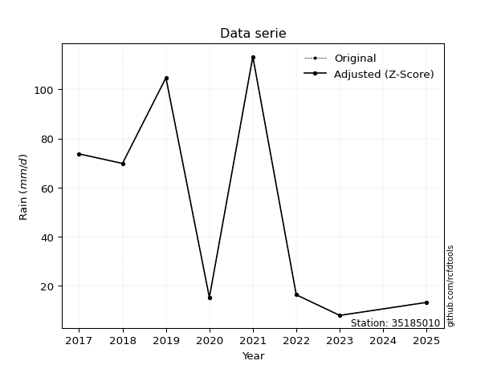</img>

</div>


> The initial value (value_initial) correspond to the initial obtained or null completed value, and value (value) is adjusted only when the initial value is outside the valid range (outlier) definite through the Z-Score value. If Z-Score is active, values out of range or outliers are replaced with the station mean value. A Z-Score (or standard score) measures how many standard deviations a data point is from the mean of a dataset, indicating its relative position; positive scores mean above the mean, negative mean below, and a score of zero is exactly at the mean, allowing for comparison of values from different distributions. It´s calculated using the formula $z=(x–μ)/σ$, where $x$ is the data point, $μ$ is the mean, and $σ$ is the standard deviation, helping identify outliers and understand probability.
>
> <sub>**Note**: In this study, "completing" (filling gaps in) and "extending" (forecasting or lengthening the historical record) rainfall data series are avoided for certain critical analyses because they introduce artificial bias and uncertainty, which can distort the statistics of rare events (extremes), alter day-to-day variability, and compromise the integrity and homogeneity of the original data. Some reasons against Completing/Extending rainfall data are: **Distortion of Extremes and Variability**: The primary issue is that most gap-filling or extension methods rely on averaging or regression with nearby stations, which inherently smooths the data. Rainfall is highly variable in space and time, with a large percentage of zero values and occasional large storms. Infilling methods often underestimate the highest values and overestimate the lowest (zero) values, which severely distorts analyses focused on flood frequency, drought severity, and intensity-duration-frequency (IDF) curves, **Loss of Data Homogeneity**: Infilled or extended data are synthetic estimates, not actual measurements. Combining these estimates with observed data can violate the assumption of data homogeneity, which requires that the data properties do not change over time. Inhomogeneity can lead to incorrect conclusions about long-term trends or changes in climate patterns, **Propagation of Errors**: Errors and biases from the original data (e.g., wind-induced undercatch, instrument errors, site changes) or the data used for imputation can propagate through the analysis, leading to unreliable hydrological models and inaccurate predictions, **Compromised Statistical Integrity**: For statistical analyses, especially those involving the frequency of events, using artificial data can introduce time bias or autocorrelation that doesn´t exist in reality, making it difficult to assess the true probability of events, **Difficulty in Validation**: It is difficult to accurately validate the quality of filled or extended data, especially for past periods where ground-truth measurements are unavailable. The reliability of imputation techniques heavily depends on the density of the surrounding station network and the complexity of the local topography.</sub>


### 4. Active continuous probability distributions from SciPy (80 of 104 available)

A Probability Density Function (PDF) describes the relative likelihood of a continuous random variable falling within a specific range, where the total area under its curve equals 1, and the area over any interval gives the actual probability for that range. Unlike discrete probabilities (like rolling a die), a PDF shows density, not direct probability for a single point (which is zero), with higher points indicating higher likelihood, often visualized as a bell curve for normal distributions.

A log of a probability density function (log-PDF) is simply the logarithm of the PDF´s value, denoted as $log(f(x))$, useful for converting multiplication of probabilities into addition, improving numerical stability with tiny numbers, and connecting to information theory concepts like entropy. Instead of dealing with very small probabilities (e.g., 0.000001), log-PDFs use negative numbers (e.g., $log(0.00001) ≈ -11.51$ that are easier for computers to handle, preventing underflow errors and simplifying complex calculations. In this study, each active probability distribution from SciPy is also evaluated in the $log$ form.

[scipy.stats](https://docs.scipy.org/doc/scipy/reference/stats.html) is a Python´s powerful submodule within the SciPy library for comprehensive statistical analysis, offering over 130 probability distributions (like Normal, Poisson, etc.), functions for descriptive stats (mean, variance), hypothesis testing (t-tests, chi-square), random variable generation, and statistical tests, making it essential for data science, modeling, and research. It provides tools to explore, model, and draw conclusions from data efficiently, working seamlessly with [NumPy](https://numpy.org/).

<div align="center">

|   id | p_dist           |   n_parameter | fit_method   | label                                                                       | active   | ref                                                                                                      |
|-----:|:-----------------|--------------:|:-------------|:----------------------------------------------------------------------------|:---------|:---------------------------------------------------------------------------------------------------------|
|    0 | alpha            |             3 | MLE          | Alpha                                                                       | True     | [:mortar_board:](https://docs.scipy.org/doc/scipy/reference/generated/scipy.stats.alpha.html)            |
|    1 | anglit           |             2 | MM           | Anglit                                                                      | True     | [:mortar_board:](https://docs.scipy.org/doc/scipy/reference/generated/scipy.stats.anglit.html)           |
|    2 | arcsine          |             2 | MM           | Arcsine                                                                     | True     | [:mortar_board:](https://docs.scipy.org/doc/scipy/reference/generated/scipy.stats.arcsine.html)          |
|    3 | argus            |             3 | MLE          | Argus                                                                       | True     | [:mortar_board:](https://docs.scipy.org/doc/scipy/reference/generated/scipy.stats.argus.html)            |
|    4 | beta             |             4 | MLE          | Beta                                                                        | True     | [:mortar_board:](https://docs.scipy.org/doc/scipy/reference/generated/scipy.stats.beta.html)             |
|    5 | betaprime        |             4 | MLE          | Beta prime                                                                  | True     | [:mortar_board:](https://docs.scipy.org/doc/scipy/reference/generated/scipy.stats.betaprime.html)        |
|    6 | bradford         |             3 | MLE          | Bradford                                                                    | True     | [:mortar_board:](https://docs.scipy.org/doc/scipy/reference/generated/scipy.stats.bradford.html)         |
|    7 | burr             |             4 | MLE          | Burr (Type III)                                                             | True     | [:mortar_board:](https://docs.scipy.org/doc/scipy/reference/generated/scipy.stats.burr.html)             |
|    8 | burr12           |             4 | MLE          | Burr (Type III) 12                                                          | True     | [:mortar_board:](https://docs.scipy.org/doc/scipy/reference/generated/scipy.stats.burr12.html)           |
|    9 | cosine           |             2 | MLE          | Cosine                                                                      | True     | [:mortar_board:](https://docs.scipy.org/doc/scipy/reference/generated/scipy.stats.cosine.html)           |
|   10 | crystalball      |             4 | MLE          | Crystalball                                                                 | True     | [:mortar_board:](https://docs.scipy.org/doc/scipy/reference/generated/scipy.stats.crystalball.html)      |
|   11 | dgamma           |             3 | MLE          | Double gamma                                                                | True     | [:mortar_board:](https://docs.scipy.org/doc/scipy/reference/generated/scipy.stats.dgamma.html)           |
|   12 | dweibull         |             3 | MLE          | Double Weibull                                                              | True     | [:mortar_board:](https://docs.scipy.org/doc/scipy/reference/generated/scipy.stats.dweibull.html)         |
|   13 | erlang           |             3 | MLE          | Erlang                                                                      | True     | [:mortar_board:](https://docs.scipy.org/doc/scipy/reference/generated/scipy.stats.erlang.html)           |
|   14 | exponnorm        |             3 | MLE          | Exponentially modified Normal                                               | True     | [:mortar_board:](https://docs.scipy.org/doc/scipy/reference/generated/scipy.stats.exponnorm.html)        |
|   15 | exponpow         |             3 | MLE          | Exponential power                                                           | True     | [:mortar_board:](https://docs.scipy.org/doc/scipy/reference/generated/scipy.stats.exponpow.html)         |
|   16 | exponweib        |             4 | MLE          | Exponentiated Weibull                                                       | True     | [:mortar_board:](https://docs.scipy.org/doc/scipy/reference/generated/scipy.stats.exponweib.html)        |
|   17 | f                |             4 | MLE          | F                                                                           | True     | [:mortar_board:](https://docs.scipy.org/doc/scipy/reference/generated/scipy.stats.f.html)                |
|   18 | fatiguelife      |             3 | MLE          | Fatigue-life (Birnbaum-Saunders)                                            | True     | [:mortar_board:](https://docs.scipy.org/doc/scipy/reference/generated/scipy.stats.fatiguelife.html)      |
|   19 | foldnorm         |             3 | MM           | Fold Normal                                                                 | True     | [:mortar_board:](https://docs.scipy.org/doc/scipy/reference/generated/scipy.stats.foldnorm.html)         |
|   20 | gamma            |             3 | MLE          | Gamma                                                                       | True     | [:mortar_board:](https://docs.scipy.org/doc/scipy/reference/generated/scipy.stats.gamma.html)            |
|   21 | gausshyper       |             6 | MLE          | Gauss hypergeometric                                                        | True     | [:mortar_board:](https://docs.scipy.org/doc/scipy/reference/generated/scipy.stats.gausshyper.html)       |
|   22 | genexpon         |             5 | MLE          | Generalized exponential                                                     | True     | [:mortar_board:](https://docs.scipy.org/doc/scipy/reference/generated/scipy.stats.genexpon.html)         |
|   23 | genextreme       |             3 | MLE          | Generalized exponential                                                     | True     | [:mortar_board:](https://docs.scipy.org/doc/scipy/reference/generated/scipy.stats.genextreme.html)       |
|   24 | gengamma         |             4 | MLE          | Generalized gamma                                                           | True     | [:mortar_board:](https://docs.scipy.org/doc/scipy/reference/generated/scipy.stats.gengamma.html)         |
|   25 | genhalflogistic  |             3 | MLE          | Generalized half-logistic                                                   | True     | [:mortar_board:](https://docs.scipy.org/doc/scipy/reference/generated/scipy.stats.genhalflogistic.html)  |
|   26 | genlogistic      |             3 | MLE          | Generalized logistic                                                        | True     | [:mortar_board:](https://docs.scipy.org/doc/scipy/reference/generated/scipy.stats.genlogistic.html)      |
|   27 | gennorm          |             3 | MLE          | Generalized Normal                                                          | True     | [:mortar_board:](https://docs.scipy.org/doc/scipy/reference/generated/scipy.stats.gennorm.html)          |
|   28 | genpareto        |             3 | MLE          | Generalized Pareto                                                          | True     | [:mortar_board:](https://docs.scipy.org/doc/scipy/reference/generated/scipy.stats.genpareto.html)        |
|   29 | gompertz         |             3 | MLE          | Gompertz (or truncated Gumbel)                                              | True     | [:mortar_board:](https://docs.scipy.org/doc/scipy/reference/generated/scipy.stats.gompertz.html)         |
|   30 | gumbel_l         |             2 | MM           | Gumbel Left Skew                                                            | True     | [:mortar_board:](https://docs.scipy.org/doc/scipy/reference/generated/scipy.stats.gumbel_l.html)         |
|   31 | gumbel_r         |             2 | MM           | Gumbel Right Skew                                                           | True     | [:mortar_board:](https://docs.scipy.org/doc/scipy/reference/generated/scipy.stats.gumbel_r.html)         |
|   32 | halfgennorm      |             3 | MLE          | Upper half of a generalized normal                                          | True     | [:mortar_board:](https://docs.scipy.org/doc/scipy/reference/generated/scipy.stats.halfgennorm.html)      |
|   33 | halflogistic     |             2 | MM           | Half-logistic                                                               | True     | [:mortar_board:](https://docs.scipy.org/doc/scipy/reference/generated/scipy.stats.halflogistic.html)     |
|   34 | halfnorm         |             2 | MM           | Half Normal                                                                 | True     | [:mortar_board:](https://docs.scipy.org/doc/scipy/reference/generated/scipy.stats.halfnorm.html)         |
|   35 | hypsecant        |             2 | MM           | hyperbolic secant                                                           | True     | [:mortar_board:](https://docs.scipy.org/doc/scipy/reference/generated/scipy.stats.hypsecant.html)        |
|   36 | invgamma         |             3 | MLE          | Inverted gamma                                                              | True     | [:mortar_board:](https://docs.scipy.org/doc/scipy/reference/generated/scipy.stats.invgamma.html)         |
|   37 | invgauss         |             3 | MLE          | Inverse Gaussian                                                            | True     | [:mortar_board:](https://docs.scipy.org/doc/scipy/reference/generated/scipy.stats.invgauss.html)         |
|   38 | invweibull       |             3 | MLE          | Inverted Weibull                                                            | True     | [:mortar_board:](https://docs.scipy.org/doc/scipy/reference/generated/scipy.stats.invweibull.html)       |
|   39 | johnsonsb        |             4 | MLE          | Johnson SB                                                                  | True     | [:mortar_board:](https://docs.scipy.org/doc/scipy/reference/generated/scipy.stats.johnsonsb.html)        |
|   40 | johnsonsu        |             4 | MLE          | Johnson Su                                                                  | True     | [:mortar_board:](https://docs.scipy.org/doc/scipy/reference/generated/scipy.stats.johnsonsu.html)        |
|   41 | kappa3           |             3 | MLE          | Kappa 3                                                                     | True     | [:mortar_board:](https://docs.scipy.org/doc/scipy/reference/generated/scipy.stats.kappa3.html)           |
|   42 | kappa4           |             4 | MLE          | Kappa 4                                                                     | True     | [:mortar_board:](https://docs.scipy.org/doc/scipy/reference/generated/scipy.stats.kappa4.html)           |
|   43 | ksone            |             3 | MLE          | Kolmogorov-Smirnov one-sided test statistic distribution                    | True     | [:mortar_board:](https://docs.scipy.org/doc/scipy/reference/generated/scipy.stats.ksone.html)            |
|   44 | kstwobign        |             2 | MLE          | Limiting distribution of scaled Kolmogorov-Smirnov two-sided test statistic | True     | [:mortar_board:](https://docs.scipy.org/doc/scipy/reference/generated/scipy.stats.kstwobign.html)        |
|   45 | laplace          |             2 | MM           | Laplace                                                                     | True     | [:mortar_board:](https://docs.scipy.org/doc/scipy/reference/generated/scipy.stats.laplace.html)          |
|   46 | levy_l           |             2 | MLE          | Left-skewed Levy                                                            | True     | [:mortar_board:](https://docs.scipy.org/doc/scipy/reference/generated/scipy.stats.levy_l.html)           |
|   47 | loggamma         |             3 | MLE          | Log gamma                                                                   | True     | [:mortar_board:](https://docs.scipy.org/doc/scipy/reference/generated/scipy.stats.loggamma.html)         |
|   48 | logistic         |             2 | MM           | Logistic (or Sech-squared)                                                  | True     | [:mortar_board:](https://docs.scipy.org/doc/scipy/reference/generated/scipy.stats.logistic.html)         |
|   49 | loglaplace       |             3 | MLE          | Log-Laplace                                                                 | True     | [:mortar_board:](https://docs.scipy.org/doc/scipy/reference/generated/scipy.stats.loglaplace.html)       |
|   50 | lomax            |             3 | MLE          | Lomax (Pareto of the second kind)                                           | True     | [:mortar_board:](https://docs.scipy.org/doc/scipy/reference/generated/scipy.stats.lomax.html)            |
|   51 | maxwell          |             2 | MM           | Maxwell                                                                     | True     | [:mortar_board:](https://docs.scipy.org/doc/scipy/reference/generated/scipy.stats.maxwell.html)          |
|   52 | mielke           |             4 | MLE          | Mielke Beta-Kappa / Dagum                                                   | True     | [:mortar_board:](https://docs.scipy.org/doc/scipy/reference/generated/scipy.stats.mielke.html)           |
|   53 | moyal            |             2 | MM           | Moyal                                                                       | True     | [:mortar_board:](https://docs.scipy.org/doc/scipy/reference/generated/scipy.stats.moyal.html)            |
|   54 | nakagami         |             3 | MLE          | Nakagami                                                                    | True     | [:mortar_board:](https://docs.scipy.org/doc/scipy/reference/generated/scipy.stats.nakagami.html)         |
|   55 | ncf              |             5 | MLE          | Non-central F distribution                                                  | True     | [:mortar_board:](https://docs.scipy.org/doc/scipy/reference/generated/scipy.stats.ncf.html)              |
|   56 | nct              |             4 | MLE          | Non-central Student’s t                                                     | True     | [:mortar_board:](https://docs.scipy.org/doc/scipy/reference/generated/scipy.stats.nct.html)              |
|   57 | norm             |             2 | MM           | Normal                                                                      | True     | [:mortar_board:](https://docs.scipy.org/doc/scipy/reference/generated/scipy.stats.norm.html)             |
|   58 | pearson3         |             3 | MM           | Pearson type III                                                            | True     | [:mortar_board:](https://docs.scipy.org/doc/scipy/reference/generated/scipy.stats.pearson3.html)         |
|   59 | powerlaw         |             3 | MLE          | Power-function                                                              | True     | [:mortar_board:](https://docs.scipy.org/doc/scipy/reference/generated/scipy.stats.powerlaw.html)         |
|   60 | rayleigh         |             2 | MM           | Rayleigh                                                                    | True     | [:mortar_board:](https://docs.scipy.org/doc/scipy/reference/generated/scipy.stats.rayleigh.html)         |
|   61 | rdist            |             3 | MLE          | R-distributed (symmetric beta)                                              | True     | [:mortar_board:](https://docs.scipy.org/doc/scipy/reference/generated/scipy.stats.rdist.html)            |
|   62 | rice             |             3 | MLE          | Rice                                                                        | True     | [:mortar_board:](https://docs.scipy.org/doc/scipy/reference/generated/scipy.stats.rice.html)             |
|   63 | semicircular     |             2 | MM           | Semicircular                                                                | True     | [:mortar_board:](https://docs.scipy.org/doc/scipy/reference/generated/scipy.stats.semicircular.html)     |
|   64 | skewnorm         |             3 | MLE          | Skew normal                                                                 | True     | [:mortar_board:](https://docs.scipy.org/doc/scipy/reference/generated/scipy.stats.skewnorm.html)         |
|   65 | t                |             3 | MLE          | Student’s t                                                                 | True     | [:mortar_board:](https://docs.scipy.org/doc/scipy/reference/generated/scipy.stats.t.html)                |
|   66 | trapezoid        |             4 | MLE          | Trapezoid                                                                   | True     | [:mortar_board:](https://docs.scipy.org/doc/scipy/reference/generated/scipy.stats.trapezoid.html)        |
|   67 | triang           |             3 | MLE          | Triangular                                                                  | True     | [:mortar_board:](https://docs.scipy.org/doc/scipy/reference/generated/scipy.stats.triang.html)           |
|   68 | truncexpon       |             3 | MLE          | Truncated exponential                                                       | True     | [:mortar_board:](https://docs.scipy.org/doc/scipy/reference/generated/scipy.stats.truncexpon.html)       |
|   69 | truncnorm        |             4 | MLE          | Truncated normal                                                            | True     | [:mortar_board:](https://docs.scipy.org/doc/scipy/reference/generated/scipy.stats.truncnorm.html)        |
|   70 | truncpareto      |             4 | MLE          | Upper truncated Pareto                                                      | True     | [:mortar_board:](https://docs.scipy.org/doc/scipy/reference/generated/scipy.stats.truncpareto.html)      |
|   71 | truncweibull_min |             5 | MLE          | Doubly truncated Weibull minimum                                            | True     | [:mortar_board:](https://docs.scipy.org/doc/scipy/reference/generated/scipy.stats.truncweibull_min.html) |
|   72 | tukeylambda      |             3 | MLE          | Tukey-Lamdba                                                                | True     | [:mortar_board:](https://docs.scipy.org/doc/scipy/reference/generated/scipy.stats.tukeylambda.html)      |
|   73 | uniform          |             2 | MLE          | Uniform                                                                     | True     | [:mortar_board:](https://docs.scipy.org/doc/scipy/reference/generated/scipy.stats.uniform.html)          |
|   74 | vonmises         |             3 | MLE          | Von Mises                                                                   | True     | [:mortar_board:](https://docs.scipy.org/doc/scipy/reference/generated/scipy.stats.vonmises.html)         |
|   75 | vonmises_line    |             3 | MLE          | Von Mises line                                                              | True     | [:mortar_board:](https://docs.scipy.org/doc/scipy/reference/generated/scipy.stats.vonmises_line.html)    |
|   76 | wald             |             2 | MM           | Wald                                                                        | True     | [:mortar_board:](https://docs.scipy.org/doc/scipy/reference/generated/scipy.stats.wald.html)             |
|   77 | weibull_max      |             3 | MLE          | Weibull maximum                                                             | True     | [:mortar_board:](https://docs.scipy.org/doc/scipy/reference/generated/scipy.stats.weibull_max.html)      |
|   78 | weibull_min      |             3 | MLE          | Weibull minimum                                                             | True     | [:mortar_board:](https://docs.scipy.org/doc/scipy/reference/generated/scipy.stats.weibull_min.html)      |
|   79 | wrapcauchy       |             3 | MLE          | Wrapped  Cauchy                                                             | True     | [:mortar_board:](https://docs.scipy.org/doc/scipy/reference/generated/scipy.stats.wrapcauchy.html)       |

</div>

> **n_parameter:** # arguments & localization & scale.
>
> **Fit methods:** (MLE) maximum likelihood, (MM) L-moments.
>
>**Inactive** (With the only purpose of prevent loops, zero divisions, infinite values, over high estimated values or horizontal trending for recurrence intervals estimations, the follow distributions were disabled.)**:** lognorm, norminvgauss, powernorm, powerlognorm, cauchy, halfcauchy, foldcauchy, skewcauchy, chi2, expon, fisk, genhyperbolic, geninvgauss, gibrat, kstwo, laplace_asymmetric, levy, levy_stable, ncx2, pareto, rel_breitwigner, recipinvgauss, studentized_range, loguniform, 


## B. Probability (PDF) vs. Empirical (EDF) distributions functions

A continuous probability distribution (CPD) describes probabilities for variables that can take any value within a range (like rain any time), unlike discrete variables with specific outcomes (like temperature). It uses a Probability Density Function (PDF), a curve where the total area under it equals 1, and the probability of the variable falling within an interval (a to b) is found by calculating the area under the curve between those points. A key feature is that the probability of hitting any single exact value is zero, so probabilities are always expressed for ranges, e.g., $P(a ≤ X ≤ b)$.

<div align="center">

Distributions parameters from station values
|     |   station | p_dist              |   n |             loc |          scale | shape                  | shape1                | shape2             | shape3             |
|----:|----------:|:--------------------|----:|----------------:|---------------:|:-----------------------|:----------------------|:-------------------|:-------------------|
|   0 |  35185010 | alpha               |   8 |    -0.0418808   |   16.2869      | 1.2657348914559467e-09 |                       |                    |                    |
|   1 |  35185010 | anglit              |   8 |    51.7625      |  119.733       |                        |                       |                    |                    |
|   2 |  35185010 | arcsine             |   8 |    -6.11938     |  115.764       |                        |                       |                    |                    |
|   3 |  35185010 | argus               |   8 |   -32.0483      |  152.582       | 2.3353491033168537e-06 |                       |                    |                    |
|   4 |  35185010 | beta                |   8 |    -2.69246     |  115.992       | 0.2634981640211133     | 0.34945594942214464   |                    |                    |
|   5 |  35185010 | betaprime           |   8 |     0.181073    |    0.728951    | 35.957183335785004     | 1.2104512216821597    |                    |                    |
|   6 |  35185010 | bradford            |   8 |     7.9         |  105.4         | 0.39777893778537265    |                       |                    |                    |
|   7 |  35185010 | burr                |   8 |    -0.0989072   |    0.293886    | 1.1441377369706132     | 128.8869408009847     |                    |                    |
|   8 |  35185010 | burr12              |   8 |    -0.976789    |    8.75428     | 276.2788285354817      | 0.002612566637604086  |                    |                    |
|   9 |  35185010 | cosine              |   8 |    53.6356      |   32.3708      |                        |                       |                    |                    |
|  10 |  35185010 | crystalball         |   8 |    51.7625      |   40.9287      | 9740.769674713894      | 183.8574240577937     |                    |                    |
|  11 |  35185010 | dgamma              |   8 |    47.7306      |    4.68775     | 8.2369092788948        |                       |                    |                    |
|  12 |  35185010 | dweibull            |   8 |    51.7255      |   43.2416      | 3.1668724341538628     |                       |                    |                    |
|  13 |  35185010 | erlang              |   8 |     7.9         |   27.5756      | 0.8102661025541382     |                       |                    |                    |
|  14 |  35185010 | exponnorm           |   8 |    43.3829      |   40.0654      | 0.20914747473541612    |                       |                    |                    |
|  15 |  35185010 | exponpow            |   8 |     7.9         |   75.2462      | 0.547113033835158      |                       |                    |                    |
|  16 |  35185010 | exponweib           |   8 |     7.9         |    8.62423     | 1.654274804243571      | 0.49860842244782744   |                    |                    |
|  17 |  35185010 | f                   |   8 |     7.9         |   17.2854      | 0.7994442552462138     | 1.7090143515777887    |                    |                    |
|  18 |  35185010 | fatiguelife         |   8 |     7.9         |    6.85518e-05 | 814.2346881801789      |                       |                    |                    |
|  19 |  35185010 | foldnorm            |   8 |   -24.7406      |   43.6758      | 1.716481327555294      |                       |                    |                    |
|  20 |  35185010 | gamma               |   8 |     7.9         |   71.4134      | 0.3515917631088714     |                       |                    |                    |
|  21 |  35185010 | gausshyper          |   8 |    -7.35082     |  120.651       | 1.0350087283942289     | 0.44024216941925753   | 1.5477619792022592 | 1.2730661832470842 |
|  22 |  35185010 | genexpon            |   8 |     7.9         |    1.68401e+07 | 359483.9224612344      | 990239.30635003       | 10448.680311206455 |                    |
|  23 |  35185010 | genextreme          |   8 |     9.11401     |    7.30748     | -6.019230602876327     |                       |                    |                    |
|  24 |  35185010 | gengamma            |   8 |     7.44368     |    5.69373e-07 | 15.7701115085243       | 0.15799088089062074   |                    |                    |
|  25 |  35185010 | genhalflogistic     |   8 |    -2.72542     |  121.327       | 1.045691182844819      |                       |                    |                    |
|  26 |  35185010 | genlogistic         |   8 |  -199.613       |   32.3481      | 1290.8971233508223     |                       |                    |                    |
|  27 |  35185010 | gennorm             |   8 |    60.6         |   52.7         | 30425830.82177393      |                       |                    |                    |
|  28 |  35185010 | genpareto           |   8 |    -0.565303    |  179.086       | -1.5727849334753703    |                       |                    |                    |
|  29 |  35185010 | gompertz            |   8 |     7.9         |  108.807       | 1.5857322327646688     |                       |                    |                    |
|  30 |  35185010 | gumbel_l            |   8 |    70.1826      |   31.9119      |                        |                       |                    |                    |
|  31 |  35185010 | gumbel_r            |   8 |    33.3424      |   31.9119      |                        |                       |                    |                    |
|  32 |  35185010 | halfgennorm         |   8 |     7.9         |    0.327063    | 0.2844557678668911     |                       |                    |                    |
|  33 |  35185010 | halflogistic        |   8 |     3.25253     |   34.9925      |                        |                       |                    |                    |
|  34 |  35185010 | halfnorm            |   8 |    -2.411       |   67.8964      |                        |                       |                    |                    |
|  35 |  35185010 | hypsecant           |   8 |    51.7625      |   26.056       |                        |                       |                    |                    |
|  36 |  35185010 | invgamma            |   8 |     3.44281     |   13.9518      | 0.9381839300577741     |                       |                    |                    |
|  37 |  35185010 | invgauss            |   8 |     4.34846     |   17.7588      | 2.669885032950538      |                       |                    |                    |
|  38 |  35185010 | invweibull          |   8 |     4.67364     |   13.3215      | 0.8504490148089817     |                       |                    |                    |
|  39 |  35185010 | johnsonsb           |   8 |     7.9         |  355.31        | 1.0769511781614387     | 0.13694463299328072   |                    |                    |
|  40 |  35185010 | johnsonsu           |   8 |     1.2393e+09  |    1.08215e+09 | 39261482.54717783      | 40045447.89880878     |                    |                    |
|  41 |  35185010 | kappa3              |   8 |     7.88874     |  105.406       | 46342.93566295448      |                       |                    |                    |
|  42 |  35185010 | kappa4              |   8 |   -12.7411      |  139.574       | 1.175268267562649      | 1.1067695051565631    |                    |                    |
|  43 |  35185010 | ksone               |   8 |   -19.128       |  141.781       | 1.0                    |                       |                    |                    |
|  44 |  35185010 | kstwobign           |   8 |   -77.3805      |  147.314       |                        |                       |                    |                    |
|  45 |  35185010 | laplace             |   8 |    51.7625      |   28.9409      |                        |                       |                    |                    |
|  46 |  35185010 | levy_l              |   8 |   118.199       |   22.255       |                        |                       |                    |                    |
|  47 |  35185010 | loggamma            |   8 | -9858.08        | 1404.81        | 1158.2614742929409     |                       |                    |                    |
|  48 |  35185010 | logistic            |   8 |    51.7625      |   22.5652      |                        |                       |                    |                    |
|  49 |  35185010 | loglaplace          |   8 |     0.0465476   |   16.2535      | 0.9992050204057599     |                       |                    |                    |
|  50 |  35185010 | lomax               |   8 |     7.9         | 1236.78        | 28.67657034115655      |                       |                    |                    |
|  51 |  35185010 | maxwell             |   8 |   -45.2212      |   60.7755      |                        |                       |                    |                    |
|  52 |  35185010 | mielke              |   8 |    -0.219813    |    0.303947    | 144.18839623910242     | 1.1466030036434924    |                    |                    |
|  53 |  35185010 | moyal               |   8 |    28.3569      |   18.4244      |                        |                       |                    |                    |
|  54 |  35185010 | nakagami            |   8 |     7.9         |   54.0858      | 0.24900283447843186    |                       |                    |                    |
|  55 |  35185010 | ncf                 |   8 |    -0.0570309   |   20.8819      | 444.1593742853231      | 2.5092401021210646    | 12.62379808658578  |                    |
|  56 |  35185010 | nct                 |   8 |    -0.188779    |    0.61525     | 0.9051437292867269     | 26.87831976888427     |                    |                    |
|  57 |  35185010 | norm                |   8 |    51.7625      |   40.9287      |                        |                       |                    |                    |
|  58 |  35185010 | pearson3            |   8 |    51.7625      |   40.9286      | 0.2964621460499682     |                       |                    |                    |
|  59 |  35185010 | powerlaw            |   8 |     7.9         |  105.4         | 0.16463243538949063    |                       |                    |                    |
|  60 |  35185010 | rayleigh            |   8 |   -26.5364      |   62.4735      |                        |                       |                    |                    |
|  61 |  35185010 | rdist               |   8 |    -1.84249     |   18.1425      | 1.4618138253633461     |                       |                    |                    |
|  62 |  35185010 | rice                |   8 |   -17.321       |   54.6045      | 0.40306168506744483    |                       |                    |                    |
|  63 |  35185010 | semicircular        |   8 |    51.7625      |   81.8573      |                        |                       |                    |                    |
|  64 |  35185010 | skewnorm            |   8 |     7.89997     |   60.0008      | 10571136.349773433     |                       |                    |                    |
|  65 |  35185010 | t                   |   8 |    51.7634      |   40.9285      | 282049926.9701042      |                       |                    |                    |
|  66 |  35185010 | trapezoid           |   8 |    -2.772       |  126.48        | 0.9999999999999999     | 1.0                   |                    |                    |
|  67 |  35185010 | triang              |   8 |    -2.84655     |  116.147       | 0.9999998040326561     |                       |                    |                    |
|  68 |  35185010 | truncexpon          |   8 |    -8.7322      |  115.25        | 1.0588493741428033     |                       |                    |                    |
|  69 |  35185010 | truncnorm           |   8 |    83.692       |   34.1284      | -307.0959186537399     | 0.8675465701111493    |                    |                    |
|  70 |  35185010 | truncpareto         |   8 |     7.89017     |    0.0098263   | 0.14365214962395       | 10727.316822795448    |                    |                    |
|  71 |  35185010 | truncweibull_min    |   8 |    -7.19757     |  140.11        | 1.2416602027283838     | 1.977349108839671e-09 | 0.8600208035952595 |                    |
|  72 |  35185010 | tukeylambda         |   8 |    60.6503      |   59.2815      | 1.1238136806759158     |                       |                    |                    |
|  73 |  35185010 | uniform             |   8 |     7.9         |  105.4         |                        |                       |                    |                    |
|  74 |  35185010 | vonmises            |   8 |     1.25305     |    1           | 0.13330664130008088    |                       |                    |                    |
|  75 |  35185010 | vonmises_line       |   8 |    60.7104      |   16.8424      | 1.0374482851064612e-06 |                       |                    |                    |
|  76 |  35185010 | wald                |   8 |    10.8339      |   40.9286      |                        |                       |                    |                    |
|  77 |  35185010 | weibull_max         |   8 |   113.3         |    1.68518     | 0.24017057094596234    |                       |                    |                    |
|  78 |  35185010 | weibull_min         |   8 |     7.9         |   62.484       | 0.4942362188413618     |                       |                    |                    |
|  79 |  35185010 | wrapcauchy          |   8 |     7.9         |   16.7749      | 0.6375104605264494     |                       |                    |                    |
|  80 |  35185010 | logalpha            |   8 |   -13.1288      |  275.548       | 16.62770335633285      |                       |                    |                    |
|  81 |  35185010 | loganglit           |   8 |     3.51079     |    2.93303     |                        |                       |                    |                    |
|  82 |  35185010 | logarcsine          |   8 |     2.09288     |    2.83581     |                        |                       |                    |                    |
|  83 |  35185010 | logargus            |   8 |     1.27923     |    3.61373     | 1.28580335304173       |                       |                    |                    |
|  84 |  35185010 | logbeta             |   8 |     1.83308     |    2.89696     | 0.25824847210635254    | 0.24167225600086795   |                    |                    |
|  85 |  35185010 | logbetaprime        |   8 |   -16.27        |    4.50628     | 2074.0490408415444     | 473.39647522156724    |                    |                    |
|  86 |  35185010 | logbradford         |   8 |     2.06685     |    2.66319     | 1.1090231388482699     |                       |                    |                    |
|  87 |  35185010 | logburr             |   8 |  -232.81        |  228.083       | 269.5238487936801      | 8025.747713835233     |                    |                    |
|  88 |  35185010 | logburr12           |   8 |     1.64728     |  152.071       | 1.998918839607808      | 5241.3067426417       |                    |                    |
|  89 |  35185010 | logcosine           |   8 |     3.49846     |    0.787082    |                        |                       |                    |                    |
|  90 |  35185010 | logcrystalball      |   8 |     3.51079     |    1.00261     | 69.59501664515999      | 1749.891474176177     |                    |                    |
|  91 |  35185010 | logdgamma           |   8 |     3.52056     |    0.0597194   | 16.25776501828311      |                       |                    |                    |
|  92 |  35185010 | logdweibull         |   8 |     3.49769     |    1.06939     | 4.126272486301124      |                       |                    |                    |
|  93 |  35185010 | logerlang           |   8 |   -34.4973      |    0.0265406   | 1432.0892294765017     |                       |                    |                    |
|  94 |  35185010 | logexponnorm        |   8 |     3.50985     |    1.00261     | 0.0009403421029014741  |                       |                    |                    |
|  95 |  35185010 | logexponpow         |   8 |     2.06686     |    1.38794     | 0.3839119321536908     |                       |                    |                    |
|  96 |  35185010 | logexponweib        |   8 |     2.06686     |    1.31237     | 0.4188964386851187     | 0.45970775121789376   |                    |                    |
|  97 |  35185010 | logf                |   8 |     2.06686     |    1.45491     | 1.2051179015939208     | 263.10547731634506    |                    |                    |
|  98 |  35185010 | logfatiguelife      |   8 |     0.512412    |    2.81381     | 0.36194026122508194    |                       |                    |                    |
|  99 |  35185010 | logfoldnorm         |   8 |    -3.48591     |    0.998548    | 7.007575520499472      |                       |                    |                    |
| 100 |  35185010 | loggamma            |   8 |   -34.5777      |    0.0264411   | 1440.4855368799917     |                       |                    |                    |
| 101 |  35185010 | loggausshyper       |   8 |     1.96481     |    2.76523     | 1.3242352255012761     | 0.891114143628332     | 0.7622989021571906 | 1.0413892785478176 |
| 102 |  35185010 | loggenexpon         |   8 |     2.06686     |    1.50328     | 0.7561538946507937     | 0.6452148845980945    | 0.9107749321845532 |                    |
| 103 |  35185010 | loggenextreme       |   8 |     3.41534     |    1.5842      | 1.204992601873561      |                       |                    |                    |
| 104 |  35185010 | loggengamma         |   8 |     2.06686     |    1.0652      | 1.0014875666071121     | 0.895811122619693     |                    |                    |
| 105 |  35185010 | loggenhalflogistic  |   8 |     1.42673     |    3.47407     | 1.0516932818167941     |                       |                    |                    |
| 106 |  35185010 | loggenlogistic      |   8 |    -2.72262     |    0.878504    | 682.8998316615159      |                       |                    |                    |
| 107 |  35185010 | loggennorm          |   8 |     3.39845     |    1.33159     | 11638784.904270817     |                       |                    |                    |
| 108 |  35185010 | loggenpareto        |   8 |    -0.00242593  |    8.31009     | -1.7559740749132593    |                       |                    |                    |
| 109 |  35185010 | loggompertz         |   8 |     2.06686     |    1.48947     | 0.44365884113319143    |                       |                    |                    |
| 110 |  35185010 | loggumbel_l         |   8 |     3.96202     |    0.78173     |                        |                       |                    |                    |
| 111 |  35185010 | loggumbel_r         |   8 |     3.05956     |    0.78173     |                        |                       |                    |                    |
| 112 |  35185010 | loghalfgennorm      |   8 |     2.06686     |    2.9966      | 8.250591376341585      |                       |                    |                    |
| 113 |  35185010 | loghalflogistic     |   8 |     2.32245     |    0.857206    |                        |                       |                    |                    |
| 114 |  35185010 | loghalfnorm         |   8 |     2.18375     |    1.66321     |                        |                       |                    |                    |
| 115 |  35185010 | loghypsecant        |   8 |     3.51079     |    0.63828     |                        |                       |                    |                    |
| 116 |  35185010 | loginvgamma         |   8 |    -7.09049     | 1159.4         | 110.46152566210313     |                       |                    |                    |
| 117 |  35185010 | loginvgauss         |   8 |    -0.322161    |   49.9264      | 0.07677727664718201    |                       |                    |                    |
| 118 |  35185010 | loginvweibull       |   8 |    -4.51941e+07 |    4.51941e+07 | 51190424.83696155      |                       |                    |                    |
| 119 |  35185010 | logjohnsonsb        |   8 |     1.42569     |    3.30434     | -0.9233540617347556    | 0.11781712903717045   |                    |                    |
| 120 |  35185010 | logjohnsonsu        |   8 |     4.78151     |    0.00834394  | 3.728122580078069      | 0.7345297945483402    |                    |                    |
| 121 |  35185010 | logkappa3           |   8 |     2.06686     |    2.63912     | 201.26549756368925     |                       |                    |                    |
| 122 |  35185010 | logkappa4           |   8 |     1.82043     |    3.03779     | 1.0884373372910416     | 1.0379759873102992    |                    |                    |
| 123 |  35185010 | logksone            |   8 |     1.77422     |    3.47314     | 1.0                    |                       |                    |                    |
| 124 |  35185010 | logkstwobign        |   8 |     0.00763178  |    3.99038     |                        |                       |                    |                    |
| 125 |  35185010 | loglaplace          |   8 |     3.51079     |    0.708951    |                        |                       |                    |                    |
| 126 |  35185010 | loglevy_l           |   8 |     4.7949      |    0.285611    |                        |                       |                    |                    |
| 127 |  35185010 | logloggamma         |   8 |     4.73011     |    1.79184e-06 | 1.4696921515608121e-06 |                       |                    |                    |
| 128 |  35185010 | loglogistic         |   8 |     3.51079     |    0.552767    |                        |                       |                    |                    |
| 129 |  35185010 | logloglaplace       |   8 |     0.192083    |    2.59908     | 3.2740597035873646     |                       |                    |                    |
| 130 |  35185010 | loglomax            |   8 |     2.06686     |   42.3905      | 29.71899450137478      |                       |                    |                    |
| 131 |  35185010 | logmaxwell          |   8 |     1.13503     |    1.48879     |                        |                       |                    |                    |
| 132 |  35185010 | logmielke           |   8 |  -133.802       |  131.95        | 42786.943593467295     | 155.25084959916416    |                    |                    |
| 133 |  35185010 | logmoyal            |   8 |     2.93743     |    0.451332    |                        |                       |                    |                    |
| 134 |  35185010 | lognakagami         |   8 |     2.58022     |    1.75657     | 0.1208738449940046     |                       |                    |                    |
| 135 |  35185010 | logncf              |   8 |    -1.52736     |    2.65726     | 41.45371581136642      | 624.6592478147907     | 36.89770394906539  |                    |
| 136 |  35185010 | lognct              |   8 |   -37.4984      |    0.954566    | 8652.26550461524       | 42.95689214652498     |                    |                    |
| 137 |  35185010 | lognorm             |   8 |     3.51079     |    1.00261     |                        |                       |                    |                    |
| 138 |  35185010 | logpearson3         |   8 |     3.51079     |    1.00261     | -0.06172392495275203   |                       |                    |                    |
| 139 |  35185010 | logpowerlaw         |   8 |     2.06686     |    2.66318     | 0.1946999478220038     |                       |                    |                    |
| 140 |  35185010 | lograyleigh         |   8 |     1.59274     |    1.53038     |                        |                       |                    |                    |
| 141 |  35185010 | logrdist            |   8 |     3.18197     |    1.11803     | 1.1474098002375464     |                       |                    |                    |
| 142 |  35185010 | logrice             |   8 |     1.60951     |    1.23481     | 1.014921131199515      |                       |                    |                    |
| 143 |  35185010 | logsemicircular     |   8 |     3.51079     |    2.00522     |                        |                       |                    |                    |
| 144 |  35185010 | logskewnorm         |   8 |     3.67909     |    1.01663     | -0.21208914631901343   |                       |                    |                    |
| 145 |  35185010 | logt                |   8 |     3.51081     |    1.00262     | 273110600.26795846     |                       |                    |                    |
| 146 |  35185010 | logtrapezoid        |   8 |     0.674986    |    4.2537      | 1.0                    | 1.0                   |                    |                    |
| 147 |  35185010 | logtriang           |   8 |     0.802855    |    3.92723     | 0.9999886873361024     |                       |                    |                    |
| 148 |  35185010 | logtruncexpon       |   8 |     2.06686     |    3.13265     | 0.8501375703738006     |                       |                    |                    |
| 149 |  35185010 | logtruncnorm        |   8 |     0.403263    |    2.16775     | 1.0042458532823066     | 90.98771589071139     |                    |                    |
| 150 |  35185010 | logtruncpareto      |   8 |     2.0664      |    0.000465591 | 0.143353113074193      | 5720.988716955495     |                    |                    |
| 151 |  35185010 | logtruncweibull_min |   8 |     1.41553     |    2.92467     | 1.0400746210773575     | 0.22270262435821564   | 1.1332929365324935 |                    |
| 152 |  35185010 | logtukeylambda      |   8 |     3.39845     |    1.55946     | 1.1711251831202825     |                       |                    |                    |
| 153 |  35185010 | loguniform          |   8 |     2.06686     |    2.66318     |                        |                       |                    |                    |
| 154 |  35185010 | logvonmises         |   8 |    -2.75762     |    1           | 1.3206836741202805     |                       |                    |                    |
| 155 |  35185010 | logvonmises_line    |   8 |     3.39827     |    0.423917    | 0.0008356192280143732  |                       |                    |                    |
| 156 |  35185010 | logwald             |   8 |     2.50817     |    1.00262     |                        |                       |                    |                    |
| 157 |  35185010 | logweibull_max      |   8 |     4.73004     |    1.48501     | 0.6507601716434621     |                       |                    |                    |
| 158 |  35185010 | logweibull_min      |   8 |     1.94226     |    1.71549     | 1.440187031380948      |                       |                    |                    |
| 159 |  35185010 | logwrapcauchy       |   8 |     2.06686     |    0.423858    | 0.5                    |                       |                    |                    |

</div>

> **loc** (Location parameter): This shifts the distribution along the x-axis. For many common distributions, like the normal (Gaussian) distribution, loc represents the mean $μ$. For others, like the uniform distribution, it might represent the minimum value, or for the beta distribution, the left end of the support interval.
>
> **scale** (Scale parameter): This determines the width or spread of the distribution. For the normal distribution, scale represents the standard deviation $σ$. For a uniform distribution, it defines the length of the interval (from $loc$ to $loc + scale$).
>
> **shape** (Shape parameters): Refers to parameters that define the specific form of a probability distribution, distinct from its location (loc) and scale (scale). These parameters are required arguments for most distribution functions. For example, a normal (Gaussian) distribution is fully defined by its location (mean) and scale (standard deviation), so it has no specific shape parameters beyond loc and scale. However, other distributions have intrinsic properties that need specification, as Gamma distribution that takes a shape parameter, often named $a$ or $alpha$.


### 0. Cumulative distribution values - CDF (160 evaluated)

Cumulative Distribution Function (CDF), denoted as $F$<sub>$X$</sub>$(x)$, is a function that gives the probability that a random variable $X$ will take a value less than or equal to a specific value, $x$ (i.e., $(P(X≥x)$. It essentially "accumulates" probabilities from a given point up to the far right (positive infinity), providing a complete picture of the distribution´s probabilities for both discrete (like rain) and continuous (like temperature) variables, helping to find probabilities over ranges or above certain values. Each station is evaluated separately ordering the $x$ values ascending, calculating the CDF and PDF values for the activated distributions and their logarithmic forms.

<div align="center">

CDF ordered by x ascending and calculating $log(f(x))$ separately
|   id |   Station |   date |     x |   count |    mean |     std |    zscore |   Value_initial |   station |   m |    alpha |   alpha_pdf |   anglit |   anglit_pdf |   arcsine |   arcsine_pdf |    argus |   argus_pdf |     beta |    beta_pdf |   betaprime |   betaprime_pdf |    bradford |   bradford_pdf |      burr |   burr_pdf |   burr12 |   burr12_pdf |   cosine |   cosine_pdf |   crystalball |   crystalball_pdf |   dgamma |   dgamma_pdf |   dweibull |   dweibull_pdf |      erlang |   erlang_pdf |   exponnorm |   exponnorm_pdf |   exponpow |    exponpow_pdf |   exponweib |   exponweib_pdf |         f |           f_pdf |   fatiguelife |   fatiguelife_pdf |   foldnorm |   foldnorm_pdf |       gamma |   gamma_pdf |   gausshyper |   gausshyper_pdf |    genexpon |   genexpon_pdf |   genextreme |   genextreme_pdf |   gengamma |   gengamma_pdf |   genhalflogistic |   genhalflogistic_pdf |   genlogistic |   genlogistic_pdf |     gennorm |   gennorm_pdf |   genpareto |   genpareto_pdf |    gompertz |   gompertz_pdf |   gumbel_l |   gumbel_l_pdf |   gumbel_r |   gumbel_r_pdf |   halfgennorm |   halfgennorm_pdf |   halflogistic |   halflogistic_pdf |   halfnorm |   halfnorm_pdf |   hypsecant |   hypsecant_pdf |   invgamma |   invgamma_pdf |   invgauss |   invgauss_pdf |   invweibull |   invweibull_pdf |   johnsonsb |   johnsonsb_pdf |   johnsonsu |   johnsonsu_pdf |     kappa3 |   kappa3_pdf |    kappa4 |   kappa4_pdf |    ksone |   ksone_pdf |   kstwobign |   kstwobign_pdf |   laplace |   laplace_pdf |   levy_l |   levy_l_pdf |   loggamma |   loggamma_pdf |   logistic |   logistic_pdf |   loglaplace |   loglaplace_pdf |       lomax |   lomax_pdf |   maxwell |   maxwell_pdf |      mielke |   mielke_pdf |     moyal |   moyal_pdf |   nakagami |   nakagami_pdf |       ncf |    ncf_pdf |       nct |    nct_pdf |     norm |   norm_pdf |   pearson3 |   pearson3_pdf |   powerlaw |   powerlaw_pdf |   rayleigh |   rayleigh_pdf |    rdist |   rdist_pdf |      rice |   rice_pdf |   semicircular |   semicircular_pdf |   skewnorm |   skewnorm_pdf |        t |      t_pdf |   trapezoid |   trapezoid_pdf |     triang |   triang_pdf |   truncexpon |   truncexpon_pdf |   truncnorm |   truncnorm_pdf |   truncpareto |   truncpareto_pdf |   truncweibull_min |   truncweibull_min_pdf |   tukeylambda |   tukeylambda_pdf |   uniform |   uniform_pdf |   vonmises |   vonmises_pdf |   vonmises_line |   vonmises_line_pdf |        wald |    wald_pdf |   weibull_max |   weibull_max_pdf |   weibull_min |   weibull_min_pdf |   wrapcauchy |   wrapcauchy_pdf |   logalpha |   logalpha_pdf |   loganglit |   loganglit_pdf |   logarcsine |   logarcsine_pdf |   logargus |   logargus_pdf |   logbeta |   logbeta_pdf |   logbetaprime |   logbetaprime_pdf |   logbradford |   logbradford_pdf |   logburr |   logburr_pdf |   logburr12 |   logburr12_pdf |   logcosine |   logcosine_pdf |   logcrystalball |   logcrystalball_pdf |   logdgamma |   logdgamma_pdf |   logdweibull |   logdweibull_pdf |   logerlang |   logerlang_pdf |   logexponnorm |   logexponnorm_pdf |   logexponpow |   logexponpow_pdf |   logexponweib |   logexponweib_pdf |        logf |       logf_pdf |   logfatiguelife |   logfatiguelife_pdf |   logfoldnorm |   logfoldnorm_pdf |   loggausshyper |   loggausshyper_pdf |   loggenexpon |   loggenexpon_pdf |   loggenextreme |   loggenextreme_pdf |   loggengamma |   loggengamma_pdf |   loggenhalflogistic |   loggenhalflogistic_pdf |   loggenlogistic |   loggenlogistic_pdf |   loggennorm |   loggennorm_pdf |   loggenpareto |   loggenpareto_pdf |   loggompertz |   loggompertz_pdf |   loggumbel_l |   loggumbel_l_pdf |   loggumbel_r |   loggumbel_r_pdf |   loghalfgennorm |   loghalfgennorm_pdf |   loghalflogistic |   loghalflogistic_pdf |   loghalfnorm |   loghalfnorm_pdf |   loghypsecant |   loghypsecant_pdf |   loginvgamma |   loginvgamma_pdf |   loginvgauss |   loginvgauss_pdf |   loginvweibull |   loginvweibull_pdf |   logjohnsonsb |   logjohnsonsb_pdf |   logjohnsonsu |   logjohnsonsu_pdf |   logkappa3 |   logkappa3_pdf |   logkappa4 |   logkappa4_pdf |   logksone |   logksone_pdf |   logkstwobign |   logkstwobign_pdf |   loglevy_l |   loglevy_l_pdf |   logloggamma |   logloggamma_pdf |   loglogistic |   loglogistic_pdf |   logloglaplace |   logloglaplace_pdf |    loglomax |   loglomax_pdf |   logmaxwell |   logmaxwell_pdf |   logmielke |   logmielke_pdf |   logmoyal |   logmoyal_pdf |   lognakagami |   lognakagami_pdf |   logncf |   logncf_pdf |    lognct |   lognct_pdf |   lognorm |   lognorm_pdf |   logpearson3 |   logpearson3_pdf |   logpowerlaw |   logpowerlaw_pdf |   lograyleigh |   lograyleigh_pdf |   logrdist |   logrdist_pdf |   logrice |   logrice_pdf |   logsemicircular |   logsemicircular_pdf |   logskewnorm |   logskewnorm_pdf |      logt |   logt_pdf |   logtrapezoid |   logtrapezoid_pdf |   logtriang |   logtriang_pdf |   logtruncexpon |   logtruncexpon_pdf |   logtruncnorm |   logtruncnorm_pdf |   logtruncpareto |   logtruncpareto_pdf |   logtruncweibull_min |   logtruncweibull_min_pdf |   logtukeylambda |   logtukeylambda_pdf |   loguniform |   loguniform_pdf |   logvonmises |   logvonmises_pdf |   logvonmises_line |   logvonmises_line_pdf |     logwald |   logwald_pdf |   logweibull_max |   logweibull_max_pdf |   logweibull_min |   logweibull_min_pdf |   logwrapcauchy |   logwrapcauchy_pdf |
|-----:|----------:|-------:|------:|--------:|--------:|--------:|----------:|----------------:|----------:|----:|---------:|------------:|---------:|-------------:|----------:|--------------:|---------:|------------:|---------:|------------:|------------:|----------------:|------------:|---------------:|----------:|-----------:|---------:|-------------:|---------:|-------------:|--------------:|------------------:|---------:|-------------:|-----------:|---------------:|------------:|-------------:|------------:|----------------:|-----------:|----------------:|------------:|----------------:|----------:|----------------:|--------------:|------------------:|-----------:|---------------:|------------:|------------:|-------------:|-----------------:|------------:|---------------:|-------------:|-----------------:|-----------:|---------------:|------------------:|----------------------:|--------------:|------------------:|------------:|--------------:|------------:|----------------:|------------:|---------------:|-----------:|---------------:|-----------:|---------------:|--------------:|------------------:|---------------:|-------------------:|-----------:|---------------:|------------:|----------------:|-----------:|---------------:|-----------:|---------------:|-------------:|-----------------:|------------:|----------------:|------------:|----------------:|-----------:|-------------:|----------:|-------------:|---------:|------------:|------------:|----------------:|----------:|--------------:|---------:|-------------:|-----------:|---------------:|-----------:|---------------:|-------------:|-----------------:|------------:|------------:|----------:|--------------:|------------:|-------------:|----------:|------------:|-----------:|---------------:|----------:|-----------:|----------:|-----------:|---------:|-----------:|-----------:|---------------:|-----------:|---------------:|-----------:|---------------:|---------:|------------:|----------:|-----------:|---------------:|-------------------:|-----------:|---------------:|---------:|-----------:|------------:|----------------:|-----------:|-------------:|-------------:|-----------------:|------------:|----------------:|--------------:|------------------:|-------------------:|-----------------------:|--------------:|------------------:|----------:|--------------:|-----------:|---------------:|----------------:|--------------------:|------------:|------------:|--------------:|------------------:|--------------:|------------------:|-------------:|-----------------:|-----------:|---------------:|------------:|----------------:|-------------:|-----------------:|-----------:|---------------:|----------:|--------------:|---------------:|-------------------:|--------------:|------------------:|----------:|--------------:|------------:|----------------:|------------:|----------------:|-----------------:|---------------------:|------------:|----------------:|--------------:|------------------:|------------:|----------------:|---------------:|-------------------:|--------------:|------------------:|---------------:|-------------------:|------------:|---------------:|-----------------:|---------------------:|--------------:|------------------:|----------------:|--------------------:|--------------:|------------------:|----------------:|--------------------:|--------------:|------------------:|---------------------:|-------------------------:|-----------------:|---------------------:|-------------:|-----------------:|---------------:|-------------------:|--------------:|------------------:|--------------:|------------------:|--------------:|------------------:|-----------------:|---------------------:|------------------:|----------------------:|--------------:|------------------:|---------------:|-------------------:|--------------:|------------------:|--------------:|------------------:|----------------:|--------------------:|---------------:|-------------------:|---------------:|-------------------:|------------:|----------------:|------------:|----------------:|-----------:|---------------:|---------------:|-------------------:|------------:|----------------:|--------------:|------------------:|--------------:|------------------:|----------------:|--------------------:|------------:|---------------:|-------------:|-----------------:|------------:|----------------:|-----------:|---------------:|--------------:|------------------:|---------:|-------------:|----------:|-------------:|----------:|--------------:|--------------:|------------------:|--------------:|------------------:|--------------:|------------------:|-----------:|---------------:|----------:|--------------:|------------------:|----------------------:|--------------:|------------------:|----------:|-----------:|---------------:|-------------------:|------------:|----------------:|----------------:|--------------------:|---------------:|-------------------:|-----------------:|---------------------:|----------------------:|--------------------------:|-----------------:|---------------------:|-------------:|-----------------:|--------------:|------------------:|-------------------:|-----------------------:|------------:|--------------:|-----------------:|---------------------:|-----------------:|---------------------:|----------------:|--------------------:|
|    0 |  35185010 |   2023 |   7.9 |       8 | 51.7625 | 43.7546 | -1.00247  |             7.9 |  35185010 |   1 | 0.04029  |  0.0251589  | 0.16557  |   0.00620874 |  0.226278 |    0.00842812 | 0.101038 |  0.00496813 | 0.341577 | 0.00892773  |   0.0569852 |      0.0217955  | 1.78272e-08 |     0.0112695  | 0.0545708 | 0.0224466  | 0.010036 |  0.0788023   | 0.117961 |   0.00568988 |      0.141931 |        0.00548894 | 0.209244 |   0.0141713  |   0.176128 |     0.0132795  | 4.64147e-14 | 42.3432      |    0.14171  |      0.0055134  | 5.4762e-10 | 337331          | 6.50393e-14 |    60.4008      | 4.094e-05 | 34198.8         |     0.0598234 |       2.16615e+09 |   0.159364 |     0.00615009 | 5.80198e-06 | 3.10372e+07 |     0.114194 |      0.00720019  | 1.34567e-10 |     0.0213469  |  0.000917238 |    106.684       |  0.0173159 |     0.0484711  |         0.0458927 |            0.004527   |      0.121085 |        0.00789638 | 2.45963e-07 |    0.00948766 |   0.0479321 |      0.00574325 | 1.04713e-12 |     0.0145738  |   0.132407 |     0.00386145 |   0.108666 |     0.00755774 |   1.59929e-15 |        0.257227   |      0.0663091 |         0.0142259  |   0.120706 |     0.0116168  |    0.116915 |      0.00438685 |  0.0385733 |     0.0275139  |  0.0364571 |     0.0295638  |    0.0354385 |       0.0311998  | 3.84815e-06 |     2.77609e+09 |    0.142851 |      0.00549197 | 0.00010681 |   0.0094849  | 0         |   1.74581    | 0.190632 |  0.00705313 |    0.109077 |      0.0081379  |  0.10984  |    0.0037953  | 0.346704 |   0.00146877 |  0.0737837 |       0.142944 |   0.125229 |     0.00485469 |    0.0652287 |        0.0920073 | 1.02939e-07 |  0.0231865  |  0.141937 |    0.00684534 |   0.0564192 |    0.0226448 | 0.0814706 |  0.00827006 | 3.4152e-09 |    1.91492e+06 | 0.0554462 | 0.0218546  | 0.0453288 | 0.0254928  | 0.141931 | 0.00548894 |   0.139132 |     0.00607859 | 0.00154529 |    2.86434e+11 |   0.140943 |     0.00757964 | 0.726845 |   0.0247911 | 0.0936811 | 0.00707063 |       0.175985 |         0.00656643 |  0         |     0.0132979  | 0.141925 | 0.0054888  |  0.00711947 |      0.00133423 | 0.00856102 |   0.00159326 |     0.20575  |       0.0114994  |   0.0163318 |      0.00122992 |      0        |      19.8533      |           0.108154 |             0.00861806 |   7.10543e-15 |        0.0165751  | 0         |    0.00948767 |    1.56567 |       0.179473 |     0.000959242 |          0.00944967 | 0           | 0           |     0.0671933 |       0.000413426 |   4.71487e-09 |       2.62364e+06 |  3.88836e-08 |       0.0428596  |  0.0660842 |       0.15326  |   0.0834751 |        0.18861  |     0        |         0        |  0.0503653 |       0.128835 |  0.27576  |   0.320492    |      0.0704809 |           0.146725 |   4.55251e-06 |          0.558042 | 0.0527877 |      0.178146 |   0.0393609 |        0.183775 |   0.0562361 |        0.152561 |        0.0749095 |             0.141057 |   0.0170157 |        0.120133 |     0.0179879 |          0.172477 |   0.0738438 |        0.142924 |      0.0749096 |           0.141057 |   1.12544e-06 |       9.72937e+08 |     0.00104913 |        4.54934e+11 | 3.68872e-10 | 500502         |        0.0480858 |             0.185564 |     0.0739857 |          0.140295 |       0.0153916 |            0.197624 |   6.51362e-10 |          0.503003 |        0.165883 |           0.0928621 |   1.59108e-14 |        32.1428    |             0.102053 |                 0.176658 |        0.0538146 |             0.178624 |  5.85545e-07 |         0.375491 |       0.279213 |           0.154131 |   8.82972e-10 |          0.297863 |      0.084733 |          0.103664 |     0.0284272 |          0.129472 |       5.0996e-11 |             0.353829 |          0        |              0        |      0        |          0        |      0.0660466 |           0.102735 |     0.0669846 |          0.155927 |     0.0544931 |          0.173218 |       0.0541108 |            0.178766 |       0.137609 |        0.0501542   |       0.151462 |          0.0634966 | 7.85056e-14 |        0.369058 | 2.19658e-15 |        6.53396  |  0.0842585 |       0.287924 |      0.0472579 |           0.189682 |    0.253733 |       0.0449042 |      0.112541 |         0.0923081 |     0.0683586 |          0.115213 |        0.171585 |           0.299651  | 4.54557e-14 |       0.701077 |     0.058059 |         0.172604 |         nan |             nan | 0.00870737 |      0.0742823 |    0          |       0           | 0.065333 |     0.156147 | 0.0749584 |     0.141826 | 0.0749095 |      0.141057 |     0.0764127 |          0.13912  |   0.000847301 |       3.71478e+11 |     0.0468565 |          0.192952 |  0.0149565 |    2.94008     | 0.0403042 |      0.173299 |         0.0850569 |              0.220296 |     0.0749587 |          0.140986 | 0.0749101 |   0.141056 |       0.10707  |           0.153849 |    0.103593 |        0.163912 |     9.35321e-09 |            0.557448 |    0           |           0        |         0        |          433.23      |           6.30491e-07 |                  0.553313 |      7.10543e-15 |             0.638827 |     0        |         0.375491 |       1.09209 |          0.124157 |        0.000137991 |               0.375126 | 0           |     0         |         0.231669 |            0.0827883 |        0.0226401 |             0.258689 |        0        |            1.12647  |
|    1 |  35185010 |   2025 |  13.2 |       8 | 51.7625 | 43.7546 | -0.881336 |            13.2 |  35185010 |   2 | 0.218714 |  0.0347842  | 0.199743 |   0.00667833 |  0.267908 |    0.0073742  | 0.128969 |  0.00556836 | 0.382716 | 0.00684779  |   0.191045  |      0.0259284  | 0.0591391   |     0.0110485  | 0.195202  | 0.0272631  | 0.293867 |  0.035952    | 0.150201 |   0.00647096 |      0.173048 |        0.00625341 | 0.289102 |   0.0156188  |   0.249862 |     0.014248   | 0.258567    |  0.0354906   |    0.172971 |      0.0062833  | 0.23196    |      0.02347    | 0.364859    |     0.0373933   | 0.403831  |     0.0270136   |     0.633631  |       0.0121246   |   0.19341  |     0.00669985 | 0.441281    | 0.0277034   |     0.151717 |      0.006963    | 0.10743     |     0.019226   |  0.457112    |      0.0112168   |  0.235814  |     0.0312752  |         0.0704772 |            0.00475302 |      0.166556 |        0.00922254 | 0.5         |    0.00948766 |   0.0786567 |      0.00585219 | 0.0761017   |     0.0141368  |   0.154387 |     0.00444359 |   0.152614 |     0.00899007 |   0.266253    |        0.0282649  |      0.141187  |         0.0140039  |   0.181849 |     0.0114449  |    0.142492 |      0.00528788 |  0.218846  |     0.0329974  |  0.222787  |     0.0328782  |    0.231881  |       0.0338032  | 0.692559    |     0.0092202   |    0.173969 |      0.00625066 | 0.0503768  |   0.0094849  | 0.0721565 |   0.0116132  | 0.228014 |  0.00705313 |    0.156015 |      0.00951814 |  0.131914 |    0.00455805 | 0.354761 |   0.00157334 |  0.177297  |       0.263299 |   0.153301 |     0.00575223 |    0.134559  |        0.1898    | 0.115406    |  0.0204231  |  0.180374 |    0.00764268 |   0.197093  |    0.0271734 | 0.131345  |  0.0104667  | 0.245265   |    0.0230018   | 0.191731  | 0.0265352  | 0.215045  | 0.0323179  | 0.173048 | 0.00625341 |   0.173615 |     0.00692766 | 0.611243   |    0.0189869   |   0.183135 |     0.00831663 | 0.870621 |   0.0309354 | 0.134164  | 0.00817555 |       0.211587 |         0.00686013 |  0.0703878 |     0.0132461  | 0.173041 | 0.00625328 |  0.0159468  |      0.00199685 | 0.0190876  |   0.00237902 |     0.265316 |       0.0109825  |   0.0240818 |      0.00171561 |      0.808044 |       0.0148794   |           0.154948 |             0.00900774 |   0.0552479   |        0.00997158 | 0.0502846 |    0.00948767 |    2.38879 |       0.176616 |     0.0510425   |          0.00944967 | 8.46196e-05 | 0.000324687 |     0.0694651 |       0.000444492 |   0.255776    |       0.0205018   |  0.198555    |       0.0289533  |  0.180614  |       0.293623 |   0.203593  |        0.274576 |     0.27212  |         0.297539 |  0.139094  |       0.217713 |  0.384437 |   0.159244    |      0.177896  |           0.273863 |   0.259623    |          0.459758 | 0.195299  |      0.365183 |   0.17992   |        0.34852  |   0.167992  |        0.281727 |        0.176664  |             0.258651 |   0.259025  |        0.843966 |     0.293886  |          0.702389 |   0.177304  |        0.2631   |      0.176664  |           0.25865  |   0.624322    |       0.379533    |     0.733845   |        0.195489    | 0.406643    |      0.416955  |        0.19642   |             0.374411 |     0.175505  |          0.258622 |       0.155958  |            0.318019 |   0.25113     |          0.462599 |        0.222243 |           0.129028  |   0.404759    |         0.539418  |             0.201422 |                 0.212174 |        0.195816  |             0.363018 |  0.5         |         0.375491 |       0.361962 |           0.169015 |   0.166871    |          0.350276 |      0.156959 |          0.18413  |     0.157819  |          0.372741 |       0.18164    |             0.353829 |          0.14923  |              0.570301 |      0.188411 |          0.466289 |      0.145561  |           0.220186 |     0.18298   |          0.296075 |     0.189304  |          0.343301 |       0.195797  |            0.361644 |       0.159479 |        0.0380825   |       0.190457 |          0.0906825 | 0.189458    |        0.369058 | 0.212418    |        0.381698 |  0.232066  |       0.287924 |      0.199824  |           0.383436 |    0.28049  |       0.0606492 |      0.171465 |         0.140639  |     0.156635  |          0.238981 |        0.378975 |           0.519564  | 0.300744    |       0.484366 |     0.184787 |         0.315265 |         nan |             nan | 0.137417   |      0.435626  |    0.00013927 |       7.58142e+10 | 0.181593 |     0.296371 | 0.177259  |     0.259887 | 0.176664  |      0.258651 |     0.176263  |          0.253461 |   0.72576     |       0.275259    |     0.187933  |          0.342388 |  0.302862  |    0.361903    | 0.17112   |      0.32551  |         0.215537  |              0.281224 |     0.176647  |          0.258473 | 0.176663  |   0.258646 |       0.200614 |           0.210592 |    0.204825 |        0.230482 |     0.263951    |            0.47319  |    4.60743e-13 |           0.705126 |         0.8917   |            0.143786  |           0.264049    |                  0.475852 |      0.201833    |             0.372257 |     0.19276  |         0.375491 |       1.18159 |          0.232067 |        0.192747    |               0.375329 | 0.000503405 |     0.0515229 |         0.28021  |            0.10791   |        0.213847  |             0.427008 |        0.357175 |            0.313588 |
|    2 |  35185010 |   2020 |  15.2 |       8 | 51.7625 | 43.7546 | -0.835627 |            15.2 |  35185010 |   3 | 0.285266 |  0.0316051  | 0.213265 |   0.00684213 |  0.282368 |    0.00709373 | 0.140327 |  0.0057891  | 0.395904 | 0.00635825  |   0.241683  |      0.0246016  | 0.0811548   |     0.0109674  | 0.248315  | 0.0257303  | 0.358027 |  0.0286444   | 0.163429 |   0.006756   |      0.185842 |        0.00654024 | 0.320326 |   0.0155386  |   0.278291 |     0.014138   | 0.324914    |  0.0310622   |    0.185826 |      0.00657187 | 0.275213   |      0.0200374  | 0.431407    |     0.0297089   | 0.451375  |     0.0210341   |     0.655706  |       0.0101061   |   0.207019 |     0.00690895 | 0.490372    | 0.0218883   |     0.165559 |      0.00687951  | 0.145128    |     0.0184761  |  0.476029    |      0.00804145  |  0.293176  |     0.0263341  |         0.0800727 |            0.00484288 |      0.185439 |        0.00965331 | 0.5         |    0.00948766 |   0.090404  |      0.00589536 | 0.104201    |     0.0139611  |   0.163509 |     0.00467996 |   0.171077 |     0.00946543 |   0.317024    |        0.0228979  |      0.169075  |         0.0138803  |   0.204658 |     0.0113628  |    0.153441 |      0.00566345 |  0.281212  |     0.02932    |  0.284559  |     0.028911   |    0.294717  |       0.0290907  | 0.708068    |     0.00657654  |    0.186755 |      0.00653513 | 0.0693466  |   0.0094849  | 0.0948285 |   0.0110917  | 0.24212  |  0.00705313 |    0.175488 |      0.00994619 |  0.141353 |    0.00488418 | 0.35795  |   0.00161606 |  0.21682   |       0.296696 |   0.165162 |     0.00611047 |    0.164186  |        0.23159   | 0.155292    |  0.0194709  |  0.195935 |    0.00791608 |   0.250012  |    0.0256297 | 0.152973  |  0.0111453  | 0.287538   |    0.0195447   | 0.243596  | 0.0252121  | 0.276804  | 0.02932    | 0.185842 | 0.00654024 |   0.187779 |     0.00723586 | 0.644326   |    0.0145311   |   0.20001  |     0.00855477 | 0.939724 |   0.0402439 | 0.150888  | 0.0085436  |       0.225407 |         0.00695827 |  0.0968362 |     0.0131998  | 0.185835 | 0.00654011 |  0.0201906  |      0.00224689 | 0.0241421  |   0.00267554 |     0.287092 |       0.0107936  |   0.0277272 |      0.00193304 |      0.832728 |       0.0103232   |           0.17307  |             0.00911055 |   0.0750412   |        0.00982981 | 0.06926   |    0.00948767 |    2.74064 |       0.162495 |     0.0699418   |          0.00944967 | 0.00571601  | 0.00664272  |     0.0703667 |       0.00045722  |   0.29253     |       0.0165757   |  0.249799    |       0.0225057  |  0.224554  |       0.328578 |   0.243641  |        0.29272  |     0.312028 |         0.270263 |  0.171592  |       0.243059 |  0.406015 |   0.147468    |      0.21895   |           0.307687 |   0.322964    |          0.438532 | 0.249152  |      0.396181 |   0.231132  |        0.376105 |   0.210022  |        0.313599 |        0.215512  |             0.291833 |   0.375189  |        0.750156 |     0.382901  |          0.542997 |   0.216795  |        0.296442 |      0.215512  |           0.291832 |   0.672249    |       0.304772    |     0.758101   |        0.151791    | 0.461025    |      0.357055  |        0.251303  |             0.401496 |     0.21437   |          0.292116 |       0.201828  |            0.3317   |   0.314894    |          0.440861 |        0.241325 |           0.141734  |   0.475326    |         0.463667  |             0.232172 |                 0.223919 |        0.249345  |             0.393815 |  0.5         |         0.375491 |       0.386155 |           0.174027 |   0.217124    |          0.361848 |      0.184952 |          0.213224 |     0.214073  |          0.422115 |       0.231557   |             0.353828 |          0.228535 |              0.552826 |      0.253456 |          0.455314 |      0.179855  |           0.267025 |     0.227221  |          0.330344 |     0.240072  |          0.374813 |       0.249112  |            0.392167 |       0.164775 |        0.0371      |       0.203959 |          0.100992  | 0.241524    |        0.369058 | 0.265781    |        0.37513  |  0.272686  |       0.287924 |      0.255865  |           0.408762 |    0.289458 |       0.0666497 |      0.1925   |         0.157891  |     0.19337   |          0.282177 |        0.457322 |           0.592002  | 0.365744    |       0.437902 |     0.231425 |         0.34489  |         nan |             nan | 0.203891   |      0.501033  |    0.446318   |       0.764264    | 0.225844 |     0.330157 | 0.216279  |     0.293021 | 0.215512  |      0.291833 |     0.21435   |          0.286295 |   0.760893    |       0.226373    |     0.238073  |          0.367144 |  0.352143  |    0.33862     | 0.219154  |      0.354357 |         0.255985  |              0.291839 |     0.215468  |          0.291646 | 0.21551   |   0.291827 |       0.231424 |           0.226186 |    0.238632 |        0.248777 |     0.329227    |            0.452352 |    0.0962302   |           0.659117 |         0.909316 |            0.108956  |           0.329734    |                  0.455421 |      0.254039    |             0.368098 |     0.245734 |         0.375491 |       1.21683 |          0.267708 |        0.245705    |               0.375431 | 0.0753753   |     0.944331  |         0.296045 |            0.116743  |        0.274446  |             0.43032  |        0.394996 |            0.230231 |
|    3 |  35185010 |   2022 |  16.3 |       8 | 51.7625 | 43.7546 | -0.810487 |            16.3 |  35185010 |   4 | 0.318941 |  0.0296132  | 0.220839 |   0.00692898 |  0.290095 |    0.00695816 | 0.146761 |  0.00590906 | 0.40277  | 0.00612971  |   0.26824   |      0.023669   | 0.0931946   |     0.0109233  | 0.276042  | 0.0246671  | 0.387798 |  0.0255768   | 0.170945 |   0.00690985 |      0.193123 |        0.00669674 | 0.33731  |   0.0153182  |   0.293756 |     0.0139668  | 0.357961    |  0.0290632   |    0.193142 |      0.00672924 | 0.296473   |      0.0186629  | 0.462333    |     0.0266222   | 0.473208  |     0.0187482   |     0.666369  |       0.00930789  |   0.214682 |     0.00702345 | 0.513188    | 0.0196787   |     0.173102 |      0.00683518  | 0.16523     |     0.018075   |  0.484243    |      0.00694515  |  0.320921  |     0.0241652  |         0.0854276 |            0.00489343 |      0.196179 |        0.00987138 | 0.5         |    0.00948766 |   0.0969022 |      0.00591962 | 0.119503    |     0.0138621  |   0.16873  |     0.00481385 |   0.181624 |     0.00970849 |   0.34099     |        0.0207492  |      0.184302  |         0.0138034  |   0.217131 |     0.0113136  |    0.159788 |      0.00587815 |  0.31234   |     0.027288   |  0.315216  |     0.0268525  |    0.325396  |       0.026723   | 0.71478     |     0.00567096  |    0.194029 |      0.00669031 | 0.07978    |   0.0094849  | 0.106906  |   0.0108729  | 0.249878 |  0.00705313 |    0.186547 |      0.0101584  |  0.146829 |    0.0050734  | 0.359741 |   0.00164039 |  0.238102  |       0.312378 |   0.171994 |     0.00631115 |    0.181191  |        0.255577  | 0.176431    |  0.0189668  |  0.204722 |    0.00805926 |   0.277629  |    0.024568  | 0.165418  |  0.0114771  | 0.308266   |    0.0181883   | 0.270815  | 0.0242613  | 0.308058  | 0.027501   | 0.193123 | 0.00669674 |   0.19583  |     0.00740135 | 0.659388   |    0.0129234   |   0.209488 |     0.00867621 | 1        | 253.976     | 0.160391  | 0.00873406 |       0.233089 |         0.00700948 |  0.111339  |     0.0131682  | 0.193115 | 0.00669662 |  0.0227378  |      0.00238442 | 0.0271749  |   0.00283862 |     0.298908 |       0.0106911  |   0.0299234 |      0.00206114 |      0.8432   |       0.00879407  |           0.183118 |             0.00915888 |   0.0858196   |        0.00976877 | 0.0796964 |    0.00948767 |    2.90746 |       0.142624 |     0.0803364   |          0.00944967 | 0.0159782   | 0.0120163   |     0.0708737 |       0.000464476 |   0.3099      |       0.0150607   |  0.272893    |       0.0195585  |  0.248061  |       0.344061 |   0.264377  |        0.300714 |     0.33056  |         0.260542 |  0.189017  |       0.255749 |  0.416165 |   0.143207    |      0.240997  |           0.32323  |   0.353259    |          0.42873  | 0.277223  |      0.406835 |   0.257791  |        0.386655 |   0.232446  |        0.328122 |        0.236455  |             0.307547 |   0.422608  |        0.598556 |     0.417293  |          0.440672 |   0.238059  |        0.312099 |      0.236455  |           0.307546 |   0.692536    |       0.276698    |     0.768148   |        0.136288    | 0.485119    |      0.333141  |        0.279677  |             0.410183 |     0.235338  |          0.307993 |       0.225206  |            0.337402 |   0.34529     |          0.429135 |        0.251465 |           0.148582  |   0.506581    |         0.431491  |             0.248032 |                 0.230121 |        0.277251  |             0.404475 |  0.5         |         0.375491 |       0.398406 |           0.1767   |   0.242585    |          0.366893 |      0.200388 |          0.228744 |     0.24423   |          0.440405 |       0.256279   |             0.353827 |          0.266783 |              0.541776 |      0.285045 |          0.448778 |      0.19939   |           0.292354 |     0.250837  |          0.345408 |     0.266692  |          0.38674  |       0.2769    |            0.402743 |       0.167357 |        0.0368384   |       0.211213 |          0.106719  | 0.26731     |        0.369058 | 0.291898    |        0.372511 |  0.292803  |       0.287924 |      0.284709  |           0.416373 |    0.29423  |       0.0699977 |      0.203854 |         0.167204  |     0.213852  |          0.304142 |        0.5      |           0.629849  | 0.39559     |       0.416619 |     0.255962 |         0.357212 |         nan |             nan | 0.239631   |      0.520625  |    0.491854   |       0.562791    | 0.249437 |     0.344935 | 0.237303  |     0.308674 | 0.236455  |      0.307547 |     0.234904  |          0.301986 |   0.77607     |       0.208616    |     0.264065  |          0.376574 |  0.375514  |    0.330668    | 0.244335  |      0.366189 |         0.276536  |              0.296333 |     0.236398  |          0.307361 | 0.236453  |   0.30754  |       0.247497 |           0.233909 |    0.25633  |        0.257837 |     0.360482    |            0.442375 |    0.14149     |           0.636457 |         0.916497 |            0.0970317 |           0.361207    |                  0.445514 |      0.279701    |             0.36653  |     0.271969 |         0.375491 |       1.23616 |          0.285452 |        0.271938    |               0.375483 | 0.146723    |     1.06533   |         0.304367 |            0.121518  |        0.304458  |             0.428416 |        0.410088 |            0.202954 |
|    4 |  35185010 |   2018 |  69.8 |       8 | 51.7625 | 43.7546 |  0.412243 |            69.8 |  35185010 |   5 | 0.815608 |  0.00259262 | 0.648379 |   0.00797571 |  0.600874 |    0.00578749 | 0.587153 |  0.00977231 | 0.630602 | 0.00385107  |   0.774204  |      0.00327718 | 0.626918    |     0.00913541 | 0.781898  | 0.00314582 | 0.778769 |  0.00225616  | 0.655686 |   0.0092329  |      0.670287 |        0.0088452  | 0.544454 |   0.00873288 |   0.530592 |     0.00519267 | 0.925867    |  0.00285878  |    0.671235 |      0.00882256 | 0.76692    |      0.00454772 | 0.888244    |     0.00234852  | 0.790003  |     0.00212742  |     0.878403  |       0.00190338  |   0.672914 |     0.00826649 | 0.876235    | 0.00254803  |     0.508531 |      0.00626759  | 0.751021    |     0.00586657 |  0.594287    |      0.000830034 |  0.777308  |     0.00316809 |         0.437464  |            0.00888842 |      0.732169 |        0.00705518 | 0.5         |    0.00948766 |   0.457635  |      0.00792744 | 0.703342    |     0.00763656 |   0.62771  |     0.0115271  |   0.726847 |     0.00726664 |   0.736432    |        0.00302409 |      0.740181  |         0.0064604  |   0.712466 |     0.00667531 |    0.704607 |      0.00977831 |  0.785202  |     0.00271959 |  0.805909  |     0.00311322 |    0.771562  |       0.00261294 | 0.806167    |     0.000735954 |    0.66968  |      0.00881802 | 0.587222   |   0.0094849  | 0.601407  |   0.00867816 | 0.627221 |  0.00705313 |    0.72903  |      0.00729559 |  0.731901 |    0.00926366 | 0.502295 |   0.00444145 |  0.769375  |       0.299196 |   0.689836 |     0.00948198 |    0.822657  |        0.250148  | 0.753522    |  0.00544256 |  0.68969  |    0.00784399 | nan         |  nan         | 0.745366  |  0.00667071 | 0.784794   |    0.00484527  | 0.783913  | 0.00324953 | 0.788002  | 0.00269417 | 0.670287 | 0.0088452  |   0.684611 |     0.00832112 | 0.916105   |    0.00243652  |   0.695456 |     0.00751709 | 1        |   0         | 0.691427  | 0.0083447  |       0.639137 |         0.00758603 |  0.697766  |     0.00781036 | 0.670279 | 0.00884532 |  0.329226   |      0.00907309 | 0.391216   |   0.0107704  |     0.756487 |       0.00672075 |   0.42368   |      0.0133304  |      0.971556 |       0.000896757 |           0.671452 |             0.00845661 |   0.58413     |        0.00920446 | 0.587287  |    0.00948767 |   11.3979  |       0.177294 |     0.585894    |          0.00944968 | 0.798458    | 0.00526922  |     0.112686  |       0.00135827  |   0.630413    |       0.00293728  |  0.519796    |       0.00225769 |  0.778854  |       0.27108  |   0.740188  |        0.29903  |     0.67342  |         0.262496 |  0.745304  |       0.476525 |  0.628838 |   0.206653    |      0.77031   |           0.287981 |   0.865274    |          0.292583 | 0.783291  |      0.21752  |   0.784912  |        0.254238 |   0.780481  |        0.319945 |        0.7682    |             0.304179 |   0.574826  |        0.587691 |     0.60223   |          0.50194  |   0.768972  |        0.299235 |      0.7682    |           0.304179 |   0.898107    |       0.0701021   |     0.869934   |        0.0383057   | 0.774462    |      0.11774   |        0.783411  |             0.219343 |     0.768893  |          0.304907 |       0.773769  |            0.417959 |   0.779506    |          0.180266 |        0.646187 |           0.483409  |   0.849845    |         0.117139  |             0.722425 |                 0.469237 |        0.782569  |             0.21836  |  0.5         |         0.375491 |       0.726927 |           0.321035 |   0.770543    |          0.295119 |      0.762446 |          0.436789 |     0.803067  |          0.225303 |       0.765017   |             0.329214 |          0.808185 |              0.202306 |      0.784916 |          0.222467 |      0.805017  |           0.286733 |     0.778502  |          0.26858  |     0.78105   |          0.23624  |       0.780952  |            0.218702 |       0.237053 |        0.0880018   |       0.564174 |          0.53968   | 0.804094    |        0.369058 | 0.815644    |        0.357519 |  0.71158   |       0.287924 |      0.790688  |           0.222067 |    0.529151 |       0.403836  |      0.672083 |         0.551253  |     0.79074   |          0.299349 |        0.883312 |           0.0942489 | 0.774521    |       0.150351 |     0.775385 |         0.263752 |         nan |             nan | 0.814408   |      0.201855  |    0.801447   |       0.10556     | 0.775049 |     0.269029 | 0.768309  |     0.302571 | 0.7682    |      0.304179 |     0.766762  |          0.309915 |   0.961666    |       0.0859367   |     0.777424  |          0.252115 |  0.919643  |    0.85362     | 0.775075  |      0.271486 |         0.727967  |              0.295395 |     0.768157  |          0.304366 | 0.768191  |   0.304181 |       0.704627 |           0.394677 |    0.768511 |        0.446448 |     0.8752      |            0.278067 |    0.757949    |           0.242676 |         0.988117 |            0.0275594 |           0.877089    |                  0.275365 |      0.808959    |             0.373319 |     0.81811  |         0.375491 |       1.75973 |          0.289068 |        0.818255    |               0.375309 | 0.851138    |     0.14938   |         0.61731  |            0.400044  |        0.783174  |             0.207241 |        0.652239 |            0.33727  |
|    5 |  35185010 |   2017 |  73.7 |       8 | 51.7625 | 43.7546 |  0.501376 |            73.7 |  35185010 |   6 | 0.825198 |  0.00233216 | 0.679148 |   0.00779744 |  0.623734 |    0.00594265 | 0.625379 |  0.00982316 | 0.645782 | 0.00393875  |   0.786362  |      0.00296517 | 0.662335    |     0.0090277  | 0.79356   | 0.00284221 | 0.78717  |  0.00205713  | 0.691102 |   0.00891865 |      0.704018 |        0.00844303 | 0.585793 |   0.0123392  |   0.555304 |     0.00751222 | 0.936205    |  0.00245315  |    0.704867 |      0.00841508 | 0.784021   |      0.00422621 | 0.896917    |     0.00210506  | 0.797953  |     0.00195365  |     0.885559  |       0.00176858  |   0.704473 |     0.00790941 | 0.885716    | 0.0023189   |     0.533204 |      0.00639156  | 0.772942    |     0.00538113 |  0.597418    |      0.000777025 |  0.789127  |     0.00289856 |         0.47306   |            0.00937245 |      0.758555 |        0.00647941 | 0.5         |    0.00948766 |   0.489079  |      0.00820332 | 0.732166    |     0.00714617 |   0.672585 |     0.0114555  |   0.75402  |     0.00667109 |   0.747775    |        0.00279745 |      0.764355  |         0.00594072 |   0.737707 |     0.00626936 |    0.741    |      0.00887904 |  0.795296  |     0.0024632  |  0.81749   |     0.00283223 |    0.781279  |       0.00237589 | 0.808957    |     0.000695468 |    0.703313 |      0.00842006 | 0.624213   |   0.0094849  | 0.635239  |   0.00867342 | 0.654728 |  0.00705313 |    0.756408 |      0.00674634 |  0.765701 |    0.00809577 | 0.520556 |   0.00493745 |  0.785311  |       0.28696  |   0.725555 |     0.00882445 |    0.835749  |        0.231682  | 0.773831    |  0.00497917 |  0.719444 |    0.00741075 | nan         |  nan         | 0.770179  |  0.00606145 | 0.803018   |    0.00450388  | 0.795957  | 0.00293439 | 0.797993  | 0.00243608 | 0.704019 | 0.00844303 |   0.716183 |     0.00786357 | 0.925367   |    0.00231528  |   0.723944 |     0.00708976 | 1        |   0         | 0.722974  | 0.00782952 |       0.668547 |         0.0074927  |  0.727207  |     0.00728839 | 0.704011 | 0.00844316 |  0.365562   |      0.00956068 | 0.434349   |   0.0113486  |     0.78226  |       0.00649713 |   0.47678   |      0.0138743  |      0.974932 |       0.000836243 |           0.704138 |             0.00830453 |   0.620056    |        0.00921975 | 0.624288  |    0.00948767 |   12.0264  |       0.139009 |     0.622748    |          0.00944968 | 0.817797    | 0.0046632   |     0.11831   |       0.00153155  |   0.641521    |       0.0027623   |  0.528922    |       0.00243583 |  0.793265  |       0.259026 |   0.756277  |        0.292754 |     0.687896 |         0.27022  |  0.771208  |       0.476057 |  0.640488 |   0.222469    |      0.785641  |           0.275957 |   0.881088    |          0.289151 | 0.794843  |      0.207451 |   0.798436  |        0.24323  |   0.797562  |        0.308317 |        0.784406  |             0.291897 |   0.610302  |        0.712672 |     0.63164   |          0.578848 |   0.78491   |        0.287028 |      0.784405  |           0.291897 |   0.901841    |       0.0672717   |     0.871985   |        0.0371376   | 0.780761    |      0.114002  |        0.795068  |             0.209509 |     0.785135  |          0.292509 |       0.79663   |            0.423111 |   0.789113    |          0.173195 |        0.673285 |           0.513986  |   0.856073    |         0.111994  |             0.748396 |                 0.486332 |        0.794167  |             0.208302 |  0.5         |         0.375491 |       0.744827 |           0.337918 |   0.786316    |          0.285049 |      0.785809 |          0.422197 |     0.814988  |          0.213285 |       0.782775   |             0.323904 |          0.818906 |              0.192132 |      0.796768 |          0.213518 |      0.82007   |           0.267124 |     0.792782  |          0.25673  |     0.793605  |          0.225657 |       0.792569  |            0.208699 |       0.242108 |        0.0983793   |       0.594886 |          0.591197  | 0.824159    |        0.369058 | 0.835102    |        0.358276 |  0.727234  |       0.287924 |      0.802496  |           0.212346 |    0.552551 |       0.458883  |      0.702733 |         0.576392  |     0.806551  |          0.282265 |        0.888293 |           0.0890319 | 0.782544    |       0.144824 |     0.789428 |         0.252825 |         nan |             nan | 0.825076   |      0.190651  |    0.807097   |       0.10228     | 0.78936  |     0.257413 | 0.784428  |     0.290338 | 0.784406  |      0.291897 |     0.78328   |          0.297616 |   0.966292    |       0.0842478   |     0.790849  |          0.241763 |  1         |    1.09641e+06 | 0.789531  |      0.260297 |         0.743933  |              0.291858 |     0.784373  |          0.292082 | 0.784397  |   0.2919   |       0.726249 |           0.400687 |    0.792976 |        0.453499 |     0.890187    |            0.273283 |    0.770853    |           0.23205  |         0.989594 |            0.0267938 |           0.891922    |                  0.270303 |      0.829315    |             0.375566 |     0.838525 |         0.375491 |       1.77507 |          0.275302 |        0.838659    |               0.375274 | 0.859002    |     0.140038  |         0.639914 |            0.432298  |        0.794209  |             0.198724 |        0.671958 |            0.390042 |
|    6 |  35185010 |   2019 | 104.7 |       8 | 51.7625 | 43.7546 |  1.20987  |           104.7 |  35185010 |   7 | 0.876431 |  0.00117027 | 0.886724 |   0.00529397 |  0.867477 |    0.0135984  | 0.912711 |  0.00781668 | 0.804723 | 0.0082766   |   0.852283  |      0.00151836 | 0.929845    |     0.00825412 | 0.856545  | 0.00144716 | 0.834351 |  0.00113142  | 0.910216 |   0.00488374 |      0.902065 |        0.00422295 | 0.952114 |   0.00487963 |   0.925364 |     0.00848631 | 0.980433    |  0.000740777 |    0.90188  |      0.00419648 | 0.883645   |      0.00237848 | 0.942002    |     0.000985683 | 0.8436    |     0.00111324  |     0.927774  |       0.00103678  |   0.893834 |     0.0041968  | 0.937356    | 0.00116964  |     0.778596 |      0.0118197   | 0.892895    |     0.00265349 |  0.616845    |      0.000511482 |  0.855704  |     0.00158554 |         0.846642  |            0.0157455  |      0.899431 |        0.00294699 | 0.5         |    0.00948766 |   0.806499  |      0.0143059  | 0.897139    |     0.00364917 |   0.947636 |     0.00483988 |   0.898636 |     0.00300964 |   0.814443    |        0.00165523 |      0.895605  |         0.00282761 |   0.885334 |     0.00338592 |    0.917003 |      0.00314935 |  0.850512  |     0.00128898 |  0.881482  |     0.00149771 |    0.835233  |       0.00127856 | 0.827014    |     0.000497559 |    0.901211 |      0.00423369 | 0.918245   |   0.0094849  | 0.910281  |   0.0094303  | 0.873375 |  0.00705313 |    0.905804 |      0.00316034 |  0.919726 |    0.00277373 | 0.800863 |   0.0166411  |  0.871671  |       0.204848 |   0.912615 |     0.00353418 |    0.899901  |        0.141193  | 0.884784    |  0.00247754 |  0.892458 |    0.00381166 | nan         |  nan         | 0.899764  |  0.00270584 | 0.907701   |    0.00241595  | 0.860792  | 0.00148288 | 0.852364  | 0.00126416 | 0.902065 | 0.00422294 |   0.897532 |     0.00388403 | 0.986085   |    0.00167708  |   0.889905 |     0.00370194 | 1        |   0         | 0.90079   | 0.00376995 |       0.880865 |         0.00593198 |  0.893323  |     0.00361907 | 0.902062 | 0.00422306 |  0.722016   |      0.0134364  | 0.857393   |   0.0159446  |     0.958857 |       0.00496483 |   0.905508  |      0.0119824  |      0.995596 |       0.000537803 |           0.941499 |             0.00698951 |   0.911246    |        0.00975361 | 0.918406  |    0.00948767 |   16.9687  |       0.139144 |     0.915688    |          0.00944967 | 0.913013    | 0.00194879  |     0.227837  |       0.00941131  |   0.711058    |       0.00183158  |  0.723243    |       0.0190698  |  0.870761  |       0.183643 |   0.850773  |        0.242965 |     0.797416 |         0.377722 |  0.929998  |       0.401405 |  0.765798 |   0.728941    |      0.868678  |           0.197453 |   0.978946    |          0.268788 | 0.857187  |      0.149926 |   0.87169   |        0.175287 |   0.891331  |        0.223672 |        0.872303  |             0.208395 |   0.8808    |        0.580477 |     0.872474  |          0.623327 |   0.871322  |        0.205059 |      0.872302  |           0.208396 |   0.922631    |       0.0519346   |     0.883859   |        0.0308249   | 0.816959    |      0.0930565 |        0.858288  |             0.152614 |     0.873119  |          0.208311 |       0.955251  |            0.505629 |   0.842549    |          0.132656 |        0.907656 |           0.924521  |   0.890248    |         0.0841159 |             0.94418  |                 0.6536   |        0.856804  |             0.150711 |  0.5         |         0.375491 |       0.90282  |           0.701069 |   0.873993    |          0.212772 |      0.910586 |          0.276167 |     0.877603  |          0.146573 |       0.887367   |             0.263492 |          0.875993 |              0.135694 |      0.862056 |          0.159627 |      0.894322  |           0.162541 |     0.869713  |          0.182706 |     0.861515  |          0.163038 |       0.855393  |            0.151335 |       0.313399 |        0.541979    |       0.884719 |          1.09295   | 0.953734    |        0.369032 | 0.962776    |        0.374284 |  0.828323  |       0.287924 |      0.866731  |           0.155316 |    0.84125  |       1.4483    |      0.937251 |         0.768748  |     0.887246  |          0.180982 |        0.914598 |           0.062707  | 0.827726    |       0.113837 |     0.865932 |         0.183819 |         nan |             nan | 0.880922   |      0.130934  |    0.839709   |       0.084328    | 0.866753 |     0.184535 | 0.871871  |     0.207435 | 0.872303  |      0.208395 |     0.872984  |          0.212628 |   0.994159    |       0.0749013   |     0.864239  |          0.177282 |  1         |    0           | 0.868247  |      0.188742 |         0.841438  |              0.261149 |     0.872327  |          0.208527 | 0.872295  |   0.208401 |       0.873741 |           0.439495 |    0.96019  |        0.499028 |     0.980955    |            0.244308 |    0.841251    |           0.171176 |         0.998241 |            0.0226747 |           0.981339    |                  0.239623 |      0.965715    |             0.412244 |     0.970359 |         0.375491 |       1.8563  |          0.189168 |        0.970386    |               0.375131 | 0.899463    |     0.0940911 |         0.862317 |            1.05303   |        0.854961  |             0.148883 |        0.913048 |            1.0536   |
|    7 |  35185010 |   2021 | 113.3 |       8 | 51.7625 | 43.7546 |  1.40642  |           113.3 |  35185010 |   8 | 0.88574  |  0.00100118 | 0.928112 |   0.00431466 |  1        |    0          | 0.971835 |  0.00569852 | 0.999999 | 3.44592e+07 |   0.864367  |      0.00130008 | 1           |     0.00806246 | 0.86806   | 0.00123857 | 0.843446 |  0.000988828 | 0.946636 |   0.00359403 |      0.933649 |        0.00314774 | 0.981129 |   0.00215539 |   0.976621 |     0.00368277 | 0.985863    |  0.000533618 |    0.933277 |      0.00313107 | 0.902541   |      0.00202469 | 0.949739    |     0.000819864 | 0.852574  |     0.000978265 |     0.936104  |       0.000903883 |   0.925643 |     0.00321987 | 0.946577    | 0.00098126  |     1        |      2.16269e+06 | 0.913558    |     0.00216705 |  0.621043    |      0.000466305 |  0.868401  |     0.00137437 |         1         |            0.0820738  |      0.921964 |        0.00231565 | 1           |    0.00948766 |   1         |   3608.81       | 0.925119    |     0.00287502 |   0.97897  |     0.00254491 |   0.921614 |     0.00235744 |   0.827824    |        0.00146269 |      0.917413  |         0.00226267 |   0.911662 |     0.0027505  |    0.940172 |      0.00228265 |  0.86081   |     0.00111253 |  0.893432  |     0.00128868 |    0.845483  |       0.00111105 | 0.831151    |     0.000465423 |    0.932908 |      0.00316281 | 0.999815   |   0.00948307 | 0.998879  |   0.014801   | 0.934032 |  0.00705313 |    0.929895 |      0.00246363 |  0.940362 |    0.00206068 | 0.966949 |   0.0179055  |  0.88713   |       0.186891 |   0.938607 |     0.00255366 |    0.910449  |        0.126315  | 0.90418     |  0.00204726 |  0.92156  |    0.0029759  | nan         |  nan         | 0.92055   |  0.00214896 | 0.926631   |    0.0019964   | 0.872576  | 0.0012658  | 0.862458  | 0.00108972 | 0.933649 | 0.00314774 |   0.926889 |     0.00296757 | 1          |    0.00156198  |   0.91833  |     0.00292612 | 1        |   0         | 0.929277  | 0.00287946 |       0.928595 |         0.00512852 |  0.921022  |     0.00284256 | 0.933647 | 0.00314783 |  0.842192   |      0.0145115  | 0.999999   |   0.0172196  |     1        |       0.00460784 |   1         |      0.0099401  |      1        |       0.000487924 |           1        |             0.00661582 |   0.998777    |        0.0117489  | 1         |    0.00948767 |   18.3142  |       0.169309 |     0.996955    |          0.00944967 | 0.928059    | 0.00156667  |     0.999583  |       7.03966e+09 |   0.726067    |       0.00166328  |  0.999998    |       0.0428596  |  0.884639  |       0.16807  |   0.869435  |        0.229744 |     0.82947  |         0.439773 |  0.959836  |       0.350821 |  0.999922 |   5.83562e+10 |      0.883597  |           0.180638 |   0.999998    |          0.264599 | 0.868581  |      0.138855 |   0.88497   |        0.161267 |   0.908189  |        0.203432 |        0.888022  |             0.189955 |   0.920769  |        0.433473 |     0.916974  |          0.49913  |   0.886798  |        0.187122 |      0.888022  |           0.189956 |   0.926616    |       0.0490731   |     0.886245   |        0.0296454   | 0.824144    |      0.0890033 |        0.869892  |             0.141507 |     0.888827  |          0.189746 |       1         |           18.7118   |   0.852705    |          0.124717 |        1        |         326.87      |   0.896682    |         0.0789382 |             1        |                 3.50266  |        0.868259  |             0.139604 |  0.999999    |         0.375491 |       1        |      889391        |   0.890113    |          0.19565  |      0.930819 |          0.236378 |     0.888678  |          0.134167 |       0.907356   |             0.242489 |          0.886283 |              0.125118 |      0.874219 |          0.148607 |      0.906429  |           0.144497 |     0.883528  |          0.16741  |     0.873891  |          0.150608 |       0.866897  |            0.140252 |       0.999669 |        3.89228e+11 |       0.969794 |          0.963993  | 0.982719    |        0.357953 | 0.99297     |        0.397633 |  0.851052  |       0.287924 |      0.878541  |           0.14399  |    0.964127 |       1.42774   |      0.999944 |         0.82017   |     0.900762  |          0.161713 |        0.919366 |           0.0581758 | 0.836475    |       0.107867 |     0.879866 |         0.169309 |         nan |             nan | 0.890828   |      0.120186  |    0.84623    |       0.0809066   | 0.880719 |     0.169392 | 0.887522  |     0.189168 | 0.888022  |      0.189955 |     0.889016  |          0.193625 |   1           |       0.0731082   |     0.877699  |          0.163827 |  1         |    0           | 0.882543  |      0.17353  |         0.8617    |              0.252051 |     0.888056  |          0.190069 | 0.888015  |   0.189961 |       0.908779 |           0.448221 |    0.999987 |        0.509264 |     0.999999    |            0.238229 |    0.85429     |           0.159281 |         1        |            0.021908  |           1           |                  0.233185 |      1           |             0.606029 |     1        |         0.375491 |       1.87054 |          0.171893 |        0.999999    |               0.375126 | 0.906582    |     0.0863964 |         1        |        90834.3       |        0.86632   |             0.13897  |        1        |            1.12647  |


</div>

An Empirical Distribution Function (EDF) is a step-function estimate of a true cumulative distribution function (CDF) based on observed sample data, representing the proportion of data points less than or equal to a given value. It is calculated by ordering your data and jumping up by $1/n$ (where $n$ is sample size) at each unique data point, allowing analysis without assuming an underlying population distribution, and it gets closer to the true CDF as the sample size grows. For the empirical probability calculations, the parameter $m$ correspond to the order number which means the position of the $x$ values in an ascending order list.

The Kolmogorov-Smirnov (K-S) test is a non-parametric statistical test used to determine if a sample data set comes from a specific theoretical distribution (one-sample) or if two different samples come from the same underlying distribution (two-sample), by comparing their cumulative distribution functions (CDFs). It calculates the maximum vertical difference (D statistic) between these functions, with a small p-value indicating a significant difference and rejection of the null hypothesis (that the data/samples match).


### 1. EDF California (1923)

California´s estimates the true probability distribution of water-related data (like rainfall, streamflow) using observed samples, crucial for risk assessment.

<div align="center">


$P=m/n$


</div>


**1.1. Empirical values**

<div align="center">

|                | 0                  | 1                  | 2              | 3              | 4                  | 5              | 6              | 7              |
|:---------------|:-------------------|:-------------------|:---------------|:---------------|:-------------------|:---------------|:---------------|:---------------|
| date           | 2023               | 2025               | 2020           | 2022           | 2018               | 2017           | 2019           | 2021           |
| x              | 7.9                | 13.2               | 15.2           | 16.3           | 69.8               | 73.7           | 104.7          | 113.3          |
| m              | 1                  | 2                  | 3              | 4              | 5                  | 6              | 7              | 8              |
| empirical_dist | edf_california     | edf_california     | edf_california | edf_california | edf_california     | edf_california | edf_california | edf_california |
| empirical      | 0.125              | 0.25               | 0.375          | 0.5            | 0.625              | 0.75           | 0.875          | 1.0            |
| empirical_tr   | 1.1428571428571428 | 1.3333333333333333 | 1.6            | 2.0            | 2.6666666666666665 | 4.0            | 8.0            | inf            |

</div>


**1.2. Kolmogorov-Smirnov fit test (sorted by Δ)**


<div align="center">

|                | 0                   | 1                  | 2                   | 3                   | 4                  | 5                  | 6                  | 7                   | 8                  | 9                  | 10                 | 11                  | 12                  | 13                  | 14                  | 15                 | 16                  | 17                 | 18                  | 19                 | 20                  | 21                 | 22                 | 23                  | 24                  | 25                 | 26                  | 27                 | 28                  | 29                  | 30                  | 31                  | 32                  | 33                 | 34                 | 35                  | 36                  | 37                  | 38                  | 39                  | 40                  | 41                  | 42                 | 43                  | 44                  | 45                  | 46                  | 47                  | 48                  | 49                  | 50                  | 51                  | 52                  | 53                  | 54                  | 55                 | 56                  | 57                  | 58                 | 59                  | 60                 | 61                 | 62                  | 63                  | 64                  | 65                  | 66                  | 67                  | 68                  | 69                 | 70                 | 71                 | 72                 | 73                  | 74                 | 75                 | 76                  | 77                  | 78                  | 79                  | 80                 | 81                 | 82                  | 83                 | 84                  | 85                 | 86                  | 87                 | 88                 | 89                 | 90                  | 91                 | 92                 | 93                  | 94                  | 95                 | 96                  | 97                 | 98                 | 99                  | 100                 | 101                 | 102                | 103                 | 104                 | 105                | 106                 | 107                 | 108                | 109                | 110                | 111                | 112                 | 113                 | 114                 | 115                 | 116                 | 117                | 118                | 119                | 120                | 121                | 122                 | 123                | 124                 | 125                | 126                 | 127                 | 128                | 129                 | 130                | 131                | 132                | 133                 | 134                | 135                | 136                | 137                 | 138                 | 139                | 140                 | 141                 | 142                | 143                | 144                 | 145                 | 146                 | 147                | 148                | 149                | 150                | 151                 | 152                | 153                | 154                | 155                | 156                | 157                | 158                | 159                |
|:---------------|:--------------------|:-------------------|:--------------------|:--------------------|:-------------------|:-------------------|:-------------------|:--------------------|:-------------------|:-------------------|:-------------------|:--------------------|:--------------------|:--------------------|:--------------------|:-------------------|:--------------------|:-------------------|:--------------------|:-------------------|:--------------------|:-------------------|:-------------------|:--------------------|:--------------------|:-------------------|:--------------------|:-------------------|:--------------------|:--------------------|:--------------------|:--------------------|:--------------------|:-------------------|:-------------------|:--------------------|:--------------------|:--------------------|:--------------------|:--------------------|:--------------------|:--------------------|:-------------------|:--------------------|:--------------------|:--------------------|:--------------------|:--------------------|:--------------------|:--------------------|:--------------------|:--------------------|:--------------------|:--------------------|:--------------------|:-------------------|:--------------------|:--------------------|:-------------------|:--------------------|:-------------------|:-------------------|:--------------------|:--------------------|:--------------------|:--------------------|:--------------------|:--------------------|:--------------------|:-------------------|:-------------------|:-------------------|:-------------------|:--------------------|:-------------------|:-------------------|:--------------------|:--------------------|:--------------------|:--------------------|:-------------------|:-------------------|:--------------------|:-------------------|:--------------------|:-------------------|:--------------------|:-------------------|:-------------------|:-------------------|:--------------------|:-------------------|:-------------------|:--------------------|:--------------------|:-------------------|:--------------------|:-------------------|:-------------------|:--------------------|:--------------------|:--------------------|:-------------------|:--------------------|:--------------------|:-------------------|:--------------------|:--------------------|:-------------------|:-------------------|:-------------------|:-------------------|:--------------------|:--------------------|:--------------------|:--------------------|:--------------------|:-------------------|:-------------------|:-------------------|:-------------------|:-------------------|:--------------------|:-------------------|:--------------------|:-------------------|:--------------------|:--------------------|:-------------------|:--------------------|:-------------------|:-------------------|:-------------------|:--------------------|:-------------------|:-------------------|:-------------------|:--------------------|:--------------------|:-------------------|:--------------------|:--------------------|:-------------------|:-------------------|:--------------------|:--------------------|:--------------------|:-------------------|:-------------------|:-------------------|:-------------------|:--------------------|:-------------------|:-------------------|:-------------------|:-------------------|:-------------------|:-------------------|:-------------------|:-------------------|
| station        | 35185010            | 35185010           | 35185010            | 35185010            | 35185010           | 35185010           | 35185010           | 35185010            | 35185010           | 35185010           | 35185010           | 35185010            | 35185010            | 35185010            | 35185010            | 35185010           | 35185010            | 35185010           | 35185010            | 35185010           | 35185010            | 35185010           | 35185010           | 35185010            | 35185010            | 35185010           | 35185010            | 35185010           | 35185010            | 35185010            | 35185010            | 35185010            | 35185010            | 35185010           | 35185010           | 35185010            | 35185010            | 35185010            | 35185010            | 35185010            | 35185010            | 35185010            | 35185010           | 35185010            | 35185010            | 35185010            | 35185010            | 35185010            | 35185010            | 35185010            | 35185010            | 35185010            | 35185010            | 35185010            | 35185010            | 35185010           | 35185010            | 35185010            | 35185010           | 35185010            | 35185010           | 35185010           | 35185010            | 35185010            | 35185010            | 35185010            | 35185010            | 35185010            | 35185010            | 35185010           | 35185010           | 35185010           | 35185010           | 35185010            | 35185010           | 35185010           | 35185010            | 35185010            | 35185010            | 35185010            | 35185010           | 35185010           | 35185010            | 35185010           | 35185010            | 35185010           | 35185010            | 35185010           | 35185010           | 35185010           | 35185010            | 35185010           | 35185010           | 35185010            | 35185010            | 35185010           | 35185010            | 35185010           | 35185010           | 35185010            | 35185010            | 35185010            | 35185010           | 35185010            | 35185010            | 35185010           | 35185010            | 35185010            | 35185010           | 35185010           | 35185010           | 35185010           | 35185010            | 35185010            | 35185010            | 35185010            | 35185010            | 35185010           | 35185010           | 35185010           | 35185010           | 35185010           | 35185010            | 35185010           | 35185010            | 35185010           | 35185010            | 35185010            | 35185010           | 35185010            | 35185010           | 35185010           | 35185010           | 35185010            | 35185010           | 35185010           | 35185010           | 35185010            | 35185010            | 35185010           | 35185010            | 35185010            | 35185010           | 35185010           | 35185010            | 35185010            | 35185010            | 35185010           | 35185010           | 35185010           | 35185010           | 35185010            | 35185010           | 35185010           | 35185010           | 35185010           | 35185010           | 35185010           | 35185010           | 35185010           |
| empirical_dist | edf_california      | edf_california     | edf_california      | edf_california      | edf_california     | edf_california     | edf_california     | edf_california      | edf_california     | edf_california     | edf_california     | edf_california      | edf_california      | edf_california      | edf_california      | edf_california     | edf_california      | edf_california     | edf_california      | edf_california     | edf_california      | edf_california     | edf_california     | edf_california      | edf_california      | edf_california     | edf_california      | edf_california     | edf_california      | edf_california      | edf_california      | edf_california      | edf_california      | edf_california     | edf_california     | edf_california      | edf_california      | edf_california      | edf_california      | edf_california      | edf_california      | edf_california      | edf_california     | edf_california      | edf_california      | edf_california      | edf_california      | edf_california      | edf_california      | edf_california      | edf_california      | edf_california      | edf_california      | edf_california      | edf_california      | edf_california     | edf_california      | edf_california      | edf_california     | edf_california      | edf_california     | edf_california     | edf_california      | edf_california      | edf_california      | edf_california      | edf_california      | edf_california      | edf_california      | edf_california     | edf_california     | edf_california     | edf_california     | edf_california      | edf_california     | edf_california     | edf_california      | edf_california      | edf_california      | edf_california      | edf_california     | edf_california     | edf_california      | edf_california     | edf_california      | edf_california     | edf_california      | edf_california     | edf_california     | edf_california     | edf_california      | edf_california     | edf_california     | edf_california      | edf_california      | edf_california     | edf_california      | edf_california     | edf_california     | edf_california      | edf_california      | edf_california      | edf_california     | edf_california      | edf_california      | edf_california     | edf_california      | edf_california      | edf_california     | edf_california     | edf_california     | edf_california     | edf_california      | edf_california      | edf_california      | edf_california      | edf_california      | edf_california     | edf_california     | edf_california     | edf_california     | edf_california     | edf_california      | edf_california     | edf_california      | edf_california     | edf_california      | edf_california      | edf_california     | edf_california      | edf_california     | edf_california     | edf_california     | edf_california      | edf_california     | edf_california     | edf_california     | edf_california      | edf_california      | edf_california     | edf_california      | edf_california      | edf_california     | edf_california     | edf_california      | edf_california      | edf_california      | edf_california     | edf_california     | edf_california     | edf_california     | edf_california      | edf_california     | edf_california     | edf_california     | edf_california     | edf_california     | edf_california     | edf_california     | edf_california     |
| p_dist         | logdweibull         | logwrapcauchy      | logdgamma           | logbeta             | loggenpareto       | loggenexpon        | burr12             | loglomax            | dgamma             | f                  | logarcsine         | halfgennorm         | invweibull          | logf                | gengamma            | invgauss           | invgamma            | alpha              | nakagami            | nct                | logweibull_min      | logweibull_max     | truncexpon         | exponpow            | loglevy_l           | dweibull           | logksone            | logkappa4          | arcsine             | loghalfnorm         | logkstwobign        | beta                | logtukeylambda      | logfatiguelife     | mielke             | loggenlogistic      | logburr             | loginvweibull       | logsemicircular     | burr                | loggengamma         | wrapcauchy          | loguniform         | logvonmises_line    | ncf                 | levy_l              | betaprime           | logkappa3           | loghalflogistic     | loginvgauss         | loganglit           | lograyleigh         | logbradford         | logburr12           | logtriang           | loghalfgennorm     | logmaxwell          | loggenextreme       | loginvgamma        | lognakagami         | ksone              | logtruncexpon      | logncf              | gamma               | logalpha            | loggenhalflogistic  | logtruncweibull_min | logtrapezoid        | logrice             | loggumbel_r        | loggompertz        | logloglaplace      | logbetaprime       | logmoyal            | loggamma           | loggamma           | logerlang           | lognct              | exponweib           | lognorm             | logcrystalball     | logexponnorm       | logt                | logskewnorm        | logfoldnorm         | logpearson3        | semicircular        | logcosine          | weibull_min        | loggausshyper      | anglit              | halfnorm           | foldnorm           | loglogistic         | logjohnsonsu        | rayleigh           | logrdist            | maxwell            | logloggamma        | loggumbel_l         | loghypsecant        | erlang              | genlogistic        | pearson3            | johnsonsu           | exponnorm          | norm                | crystalball         | t                  | logargus           | kstwobign          | halflogistic       | truncweibull_min    | gumbel_r            | loglaplace          | loglaplace          | lomax               | gausshyper         | logistic           | cosine             | gumbel_l           | moyal              | genexpon            | rice               | hypsecant           | laplace            | argus               | logwald             | logtruncnorm       | powerlaw            | logexponpow        | loggennorm         | gennorm            | genextreme          | gompertz           | fatiguelife        | skewnorm           | kappa4              | genpareto           | bradford           | tukeylambda         | genhalflogistic     | vonmises_line      | kappa3             | uniform             | johnsonsb           | truncnorm           | triang             | logpowerlaw        | trapezoid          | logexponweib       | wald                | truncpareto        | logjohnsonsb       | rdist              | logtruncpareto     | weibull_max        | logvonmises        | vonmises           | logmielke          |
| delta          | 0.11836041060361024 | 0.125              | 0.13969830659494675 | 0.15075998855462686 | 0.154213157805206  | 0.1547095055919815 | 0.1565539456245315 | 0.16352523399486074 | 0.1642069293307672 | 0.1650025730769954 | 0.1705302506177344 | 0.17217579617947554 | 0.17460444930340174 | 0.17585639115262597 | 0.17907926854983625 | 0.1847840188832814 | 0.18766036990292817 | 0.1906084427625805 | 0.19173440512926754 | 0.191942339869288  | 0.19554169552422068 | 0.1956326868805362 | 0.2010916850380074 | 0.20352676334080444 | 0.20576982836429236 | 0.206243993288655  | 0.20719730142488213 | 0.20810227793427   | 0.20990457185923184 | 0.21495524657728027 | 0.21529051730748977 | 0.21657744136512153 | 0.22029852542706152 | 0.2203229478058441 | 0.2223712107865612 | 0.22274854526540683 | 0.22277690650866838 | 0.22310023252730604 | 0.22346418172897964 | 0.22395813929667518 | 0.22484503980272996 | 0.22710659895200086 | 0.2280306531661157 | 0.22806208272762635 | 0.22918483928475758 | 0.22944394229272502 | 0.23176035133424672 | 0.23269013696232255 | 0.23321676248797868 | 0.23330833738948542 | 0.23562345935573797 | 0.23593484502913675 | 0.24027388926898496 | 0.24220864741202563 | 0.24366956521528588 | 0.2437207538207244 | 0.24403758171672335 | 0.24853467452238548 | 0.2491633237273589 | 0.24986072977904145 | 0.2501216281654022 | 0.2501995621412808 | 0.25056340713275516 | 0.25123455985051024 | 0.25193903678474455 | 0.25196816405543465 | 0.2520889104147428  | 0.25250292533154356 | 0.25566460400832064 | 0.2557699585692661 | 0.2574145574849612 | 0.2583121643904306 | 0.2590030288582129 | 0.26036861838792913 | 0.2618977918273232 | 0.2618977918273232 | 0.26194147052755035 | 0.26269703874217326 | 0.26324425674095053 | 0.26354504899099324 | 0.2635450500948595 | 0.2635452101169653 | 0.26354736925287475 | 0.2636016686966569 | 0.26466167535602325 | 0.2650955779524678 | 0.26691064908481743 | 0.2675544757480739 | 0.2739327947959105 | 0.2747935565741284 | 0.27916081778413165 | 0.2828694701433877 | 0.2853184774427301 | 0.28614769017437713 | 0.28878742159821125 | 0.2905123660102683 | 0.29464292122979296 | 0.2952780772638256 | 0.2961459934753859 | 0.29961212333312137 | 0.30061021454473547 | 0.30086726000294195 | 0.3038210346844722 | 0.30416976392782996 | 0.30597110128567734 | 0.3068578470697431 | 0.30687738812119325 | 0.30687741409506286 | 0.3068845560108517 | 0.310982927600135  | 0.3134530444345598 | 0.3156982171833601 | 0.31688161832205297 | 0.31837645607305004 | 0.31880881051473464 | 0.31880881051473464 | 0.32356880314018205 | 0.3268979635200031 | 0.3280059616690698 | 0.3290546895152537 | 0.3312698545281777 | 0.3345818326660833 | 0.33476976641838363 | 0.3396085848522847 | 0.34021205644069596 | 0.3531711866505116 | 0.35323892132764323 | 0.35327698594682755 | 0.3585098055637439 | 0.36124331744118676 | 0.3743219265903206 | 0.375              | 0.375              | 0.37895650261287317 | 0.380496500975169  | 0.3836312032736323 | 0.3886610101068184 | 0.39309435471375004 | 0.40309778900587745 | 0.4068054072061928 | 0.41418042158459656 | 0.41457240352501135 | 0.4196635593312398 | 0.4202200129766992 | 0.42030360531309297 | 0.44255947719710664 | 0.47007660542907354 | 0.4728250822361487 | 0.4757597212564829 | 0.4772621832393768 | 0.4838452275872652 | 0.48402177016319303 | 0.5580436947063262 | 0.5616007063118722 | 0.6206207910088447 | 0.6417001696215024 | 0.6471633930960745 | 1.134725587926848  | 17.31415449325725  | nan                |
| deltao         | 0.4472608134160001  | 0.4472608134160001 | 0.4472608134160001  | 0.4472608134160001  | 0.4472608134160001 | 0.4472608134160001 | 0.4472608134160001 | 0.4472608134160001  | 0.4472608134160001 | 0.4472608134160001 | 0.4472608134160001 | 0.4472608134160001  | 0.4472608134160001  | 0.4472608134160001  | 0.4472608134160001  | 0.4472608134160001 | 0.4472608134160001  | 0.4472608134160001 | 0.4472608134160001  | 0.4472608134160001 | 0.4472608134160001  | 0.4472608134160001 | 0.4472608134160001 | 0.4472608134160001  | 0.4472608134160001  | 0.4472608134160001 | 0.4472608134160001  | 0.4472608134160001 | 0.4472608134160001  | 0.4472608134160001  | 0.4472608134160001  | 0.4472608134160001  | 0.4472608134160001  | 0.4472608134160001 | 0.4472608134160001 | 0.4472608134160001  | 0.4472608134160001  | 0.4472608134160001  | 0.4472608134160001  | 0.4472608134160001  | 0.4472608134160001  | 0.4472608134160001  | 0.4472608134160001 | 0.4472608134160001  | 0.4472608134160001  | 0.4472608134160001  | 0.4472608134160001  | 0.4472608134160001  | 0.4472608134160001  | 0.4472608134160001  | 0.4472608134160001  | 0.4472608134160001  | 0.4472608134160001  | 0.4472608134160001  | 0.4472608134160001  | 0.4472608134160001 | 0.4472608134160001  | 0.4472608134160001  | 0.4472608134160001 | 0.4472608134160001  | 0.4472608134160001 | 0.4472608134160001 | 0.4472608134160001  | 0.4472608134160001  | 0.4472608134160001  | 0.4472608134160001  | 0.4472608134160001  | 0.4472608134160001  | 0.4472608134160001  | 0.4472608134160001 | 0.4472608134160001 | 0.4472608134160001 | 0.4472608134160001 | 0.4472608134160001  | 0.4472608134160001 | 0.4472608134160001 | 0.4472608134160001  | 0.4472608134160001  | 0.4472608134160001  | 0.4472608134160001  | 0.4472608134160001 | 0.4472608134160001 | 0.4472608134160001  | 0.4472608134160001 | 0.4472608134160001  | 0.4472608134160001 | 0.4472608134160001  | 0.4472608134160001 | 0.4472608134160001 | 0.4472608134160001 | 0.4472608134160001  | 0.4472608134160001 | 0.4472608134160001 | 0.4472608134160001  | 0.4472608134160001  | 0.4472608134160001 | 0.4472608134160001  | 0.4472608134160001 | 0.4472608134160001 | 0.4472608134160001  | 0.4472608134160001  | 0.4472608134160001  | 0.4472608134160001 | 0.4472608134160001  | 0.4472608134160001  | 0.4472608134160001 | 0.4472608134160001  | 0.4472608134160001  | 0.4472608134160001 | 0.4472608134160001 | 0.4472608134160001 | 0.4472608134160001 | 0.4472608134160001  | 0.4472608134160001  | 0.4472608134160001  | 0.4472608134160001  | 0.4472608134160001  | 0.4472608134160001 | 0.4472608134160001 | 0.4472608134160001 | 0.4472608134160001 | 0.4472608134160001 | 0.4472608134160001  | 0.4472608134160001 | 0.4472608134160001  | 0.4472608134160001 | 0.4472608134160001  | 0.4472608134160001  | 0.4472608134160001 | 0.4472608134160001  | 0.4472608134160001 | 0.4472608134160001 | 0.4472608134160001 | 0.4472608134160001  | 0.4472608134160001 | 0.4472608134160001 | 0.4472608134160001 | 0.4472608134160001  | 0.4472608134160001  | 0.4472608134160001 | 0.4472608134160001  | 0.4472608134160001  | 0.4472608134160001 | 0.4472608134160001 | 0.4472608134160001  | 0.4472608134160001  | 0.4472608134160001  | 0.4472608134160001 | 0.4472608134160001 | 0.4472608134160001 | 0.4472608134160001 | 0.4472608134160001  | 0.4472608134160001 | 0.4472608134160001 | 0.4472608134160001 | 0.4472608134160001 | 0.4472608134160001 | 0.4472608134160001 | 0.4472608134160001 | 0.4472608134160001 |
| eval           | Δo > Δ              | Δo > Δ             | Δo > Δ              | Δo > Δ              | Δo > Δ             | Δo > Δ             | Δo > Δ             | Δo > Δ              | Δo > Δ             | Δo > Δ             | Δo > Δ             | Δo > Δ              | Δo > Δ              | Δo > Δ              | Δo > Δ              | Δo > Δ             | Δo > Δ              | Δo > Δ             | Δo > Δ              | Δo > Δ             | Δo > Δ              | Δo > Δ             | Δo > Δ             | Δo > Δ              | Δo > Δ              | Δo > Δ             | Δo > Δ              | Δo > Δ             | Δo > Δ              | Δo > Δ              | Δo > Δ              | Δo > Δ              | Δo > Δ              | Δo > Δ             | Δo > Δ             | Δo > Δ              | Δo > Δ              | Δo > Δ              | Δo > Δ              | Δo > Δ              | Δo > Δ              | Δo > Δ              | Δo > Δ             | Δo > Δ              | Δo > Δ              | Δo > Δ              | Δo > Δ              | Δo > Δ              | Δo > Δ              | Δo > Δ              | Δo > Δ              | Δo > Δ              | Δo > Δ              | Δo > Δ              | Δo > Δ              | Δo > Δ             | Δo > Δ              | Δo > Δ              | Δo > Δ             | Δo > Δ              | Δo > Δ             | Δo > Δ             | Δo > Δ              | Δo > Δ              | Δo > Δ              | Δo > Δ              | Δo > Δ              | Δo > Δ              | Δo > Δ              | Δo > Δ             | Δo > Δ             | Δo > Δ             | Δo > Δ             | Δo > Δ              | Δo > Δ             | Δo > Δ             | Δo > Δ              | Δo > Δ              | Δo > Δ              | Δo > Δ              | Δo > Δ             | Δo > Δ             | Δo > Δ              | Δo > Δ             | Δo > Δ              | Δo > Δ             | Δo > Δ              | Δo > Δ             | Δo > Δ             | Δo > Δ             | Δo > Δ              | Δo > Δ             | Δo > Δ             | Δo > Δ              | Δo > Δ              | Δo > Δ             | Δo > Δ              | Δo > Δ             | Δo > Δ             | Δo > Δ              | Δo > Δ              | Δo > Δ              | Δo > Δ             | Δo > Δ              | Δo > Δ              | Δo > Δ             | Δo > Δ              | Δo > Δ              | Δo > Δ             | Δo > Δ             | Δo > Δ             | Δo > Δ             | Δo > Δ              | Δo > Δ              | Δo > Δ              | Δo > Δ              | Δo > Δ              | Δo > Δ             | Δo > Δ             | Δo > Δ             | Δo > Δ             | Δo > Δ             | Δo > Δ              | Δo > Δ             | Δo > Δ              | Δo > Δ             | Δo > Δ              | Δo > Δ              | Δo > Δ             | Δo > Δ              | Δo > Δ             | Δo > Δ             | Δo > Δ             | Δo > Δ              | Δo > Δ             | Δo > Δ             | Δo > Δ             | Δo > Δ              | Δo > Δ              | Δo > Δ             | Δo > Δ              | Δo > Δ              | Δo > Δ             | Δo > Δ             | Δo > Δ              | Δo > Δ              | Δo <= Δ             | Δo <= Δ            | Δo <= Δ            | Δo <= Δ            | Δo <= Δ            | Δo <= Δ             | Δo <= Δ            | Δo <= Δ            | Δo <= Δ            | Δo <= Δ            | Δo <= Δ            | Δo <= Δ            | Δo <= Δ            | Δo <= Δ            |
| fit            | 1                   | 1                  | 1                   | 1                   | 1                  | 1                  | 1                  | 1                   | 1                  | 1                  | 1                  | 1                   | 1                   | 1                   | 1                   | 1                  | 1                   | 1                  | 1                   | 1                  | 1                   | 1                  | 1                  | 1                   | 1                   | 1                  | 1                   | 1                  | 1                   | 1                   | 1                   | 1                   | 1                   | 1                  | 1                  | 1                   | 1                   | 1                   | 1                   | 1                   | 1                   | 1                   | 1                  | 1                   | 1                   | 1                   | 1                   | 1                   | 1                   | 1                   | 1                   | 1                   | 1                   | 1                   | 1                   | 1                  | 1                   | 1                   | 1                  | 1                   | 1                  | 1                  | 1                   | 1                   | 1                   | 1                   | 1                   | 1                   | 1                   | 1                  | 1                  | 1                  | 1                  | 1                   | 1                  | 1                  | 1                   | 1                   | 1                   | 1                   | 1                  | 1                  | 1                   | 1                  | 1                   | 1                  | 1                   | 1                  | 1                  | 1                  | 1                   | 1                  | 1                  | 1                   | 1                   | 1                  | 1                   | 1                  | 1                  | 1                   | 1                   | 1                   | 1                  | 1                   | 1                   | 1                  | 1                   | 1                   | 1                  | 1                  | 1                  | 1                  | 1                   | 1                   | 1                   | 1                   | 1                   | 1                  | 1                  | 1                  | 1                  | 1                  | 1                   | 1                  | 1                   | 1                  | 1                   | 1                   | 1                  | 1                   | 1                  | 1                  | 1                  | 1                   | 1                  | 1                  | 1                  | 1                   | 1                   | 1                  | 1                   | 1                   | 1                  | 1                  | 1                   | 1                   | 0                   | 0                  | 0                  | 0                  | 0                  | 0                   | 0                  | 0                  | 0                  | 0                  | 0                  | 0                  | 0                  | 0                  |
| n              | 8                   | 8                  | 8                   | 8                   | 8                  | 8                  | 8                  | 8                   | 8                  | 8                  | 8                  | 8                   | 8                   | 8                   | 8                   | 8                  | 8                   | 8                  | 8                   | 8                  | 8                   | 8                  | 8                  | 8                   | 8                   | 8                  | 8                   | 8                  | 8                   | 8                   | 8                   | 8                   | 8                   | 8                  | 8                  | 8                   | 8                   | 8                   | 8                   | 8                   | 8                   | 8                   | 8                  | 8                   | 8                   | 8                   | 8                   | 8                   | 8                   | 8                   | 8                   | 8                   | 8                   | 8                   | 8                   | 8                  | 8                   | 8                   | 8                  | 8                   | 8                  | 8                  | 8                   | 8                   | 8                   | 8                   | 8                   | 8                   | 8                   | 8                  | 8                  | 8                  | 8                  | 8                   | 8                  | 8                  | 8                   | 8                   | 8                   | 8                   | 8                  | 8                  | 8                   | 8                  | 8                   | 8                  | 8                   | 8                  | 8                  | 8                  | 8                   | 8                  | 8                  | 8                   | 8                   | 8                  | 8                   | 8                  | 8                  | 8                   | 8                   | 8                   | 8                  | 8                   | 8                   | 8                  | 8                   | 8                   | 8                  | 8                  | 8                  | 8                  | 8                   | 8                   | 8                   | 8                   | 8                   | 8                  | 8                  | 8                  | 8                  | 8                  | 8                   | 8                  | 8                   | 8                  | 8                   | 8                   | 8                  | 8                   | 8                  | 8                  | 8                  | 8                   | 8                  | 8                  | 8                  | 8                   | 8                   | 8                  | 8                   | 8                   | 8                  | 8                  | 8                   | 8                   | 8                   | 8                  | 8                  | 8                  | 8                  | 8                   | 8                  | 8                  | 8                  | 8                  | 8                  | 8                  | 8                  | 8                  |
| best_fit       | 1                   | 0                  | 0                   | 0                   | 0                  | 0                  | 0                  | 0                   | 0                  | 0                  | 0                  | 0                   | 0                   | 0                   | 0                   | 0                  | 0                   | 0                  | 0                   | 0                  | 0                   | 0                  | 0                  | 0                   | 0                   | 0                  | 0                   | 0                  | 0                   | 0                   | 0                   | 0                   | 0                   | 0                  | 0                  | 0                   | 0                   | 0                   | 0                   | 0                   | 0                   | 0                   | 0                  | 0                   | 0                   | 0                   | 0                   | 0                   | 0                   | 0                   | 0                   | 0                   | 0                   | 0                   | 0                   | 0                  | 0                   | 0                   | 0                  | 0                   | 0                  | 0                  | 0                   | 0                   | 0                   | 0                   | 0                   | 0                   | 0                   | 0                  | 0                  | 0                  | 0                  | 0                   | 0                  | 0                  | 0                   | 0                   | 0                   | 0                   | 0                  | 0                  | 0                   | 0                  | 0                   | 0                  | 0                   | 0                  | 0                  | 0                  | 0                   | 0                  | 0                  | 0                   | 0                   | 0                  | 0                   | 0                  | 0                  | 0                   | 0                   | 0                   | 0                  | 0                   | 0                   | 0                  | 0                   | 0                   | 0                  | 0                  | 0                  | 0                  | 0                   | 0                   | 0                   | 0                   | 0                   | 0                  | 0                  | 0                  | 0                  | 0                  | 0                   | 0                  | 0                   | 0                  | 0                   | 0                   | 0                  | 0                   | 0                  | 0                  | 0                  | 0                   | 0                  | 0                  | 0                  | 0                   | 0                   | 0                  | 0                   | 0                   | 0                  | 0                  | 0                   | 0                   | 0                   | 0                  | 0                  | 0                  | 0                  | 0                   | 0                  | 0                  | 0                  | 0                  | 0                  | 0                  | 0                  | 0                  |
| best_fit_sort  | 1                   | 2                  | 3                   | 4                   | 5                  | 6                  | 7                  | 8                   | 9                  | 10                 | 11                 | 12                  | 13                  | 14                  | 15                  | 16                 | 17                  | 18                 | 19                  | 20                 | 21                  | 22                 | 23                 | 24                  | 25                  | 26                 | 27                  | 28                 | 29                  | 30                  | 31                  | 32                  | 33                  | 34                 | 35                 | 36                  | 37                  | 38                  | 39                  | 40                  | 41                  | 42                  | 43                 | 44                  | 45                  | 46                  | 47                  | 48                  | 49                  | 50                  | 51                  | 52                  | 53                  | 54                  | 55                  | 56                 | 57                  | 58                  | 59                 | 60                  | 61                 | 62                 | 63                  | 64                  | 65                  | 66                  | 67                  | 68                  | 69                  | 70                 | 71                 | 72                 | 73                 | 74                  | 75                 | 76                 | 77                  | 78                  | 79                  | 80                  | 81                 | 82                 | 83                  | 84                 | 85                  | 86                 | 87                  | 88                 | 89                 | 90                 | 91                  | 92                 | 93                 | 94                  | 95                  | 96                 | 97                  | 98                 | 99                 | 100                 | 101                 | 102                 | 103                | 104                 | 105                 | 106                | 107                 | 108                 | 109                | 110                | 111                | 112                | 113                 | 114                 | 115                 | 116                 | 117                 | 118                | 119                | 120                | 121                | 122                | 123                 | 124                | 125                 | 126                | 127                 | 128                 | 129                | 130                 | 131                | 132                | 133                | 134                 | 135                | 136                | 137                | 138                 | 139                 | 140                | 141                 | 142                 | 143                | 144                | 145                 | 146                 | 147                 | 148                | 149                | 150                | 151                | 152                 | 153                | 154                | 155                | 156                | 157                | 158                | 159                | 160                |

</div>


**1.3. Best fit**

<div align="center">

|   id |   station | empirical_dist   | p_dist      |   delta |   deltao | eval   |   fit |   n |   best_fit |   best_fit_sort |
|-----:|----------:|:-----------------|:------------|--------:|---------:|:-------|------:|----:|-----------:|----------------:|
|    0 |  35185010 | edf_california   | logdweibull | 0.11836 | 0.447261 | Δo > Δ |     1 |   8 |          1 |               1 |

</div>


<div align="center">

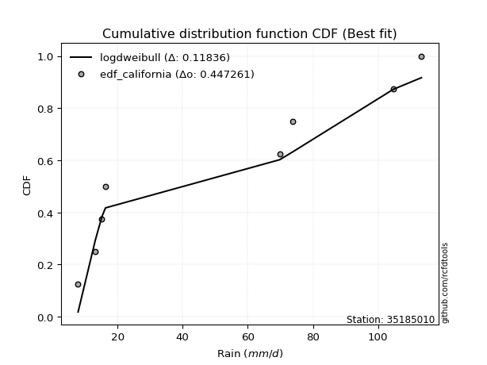</img>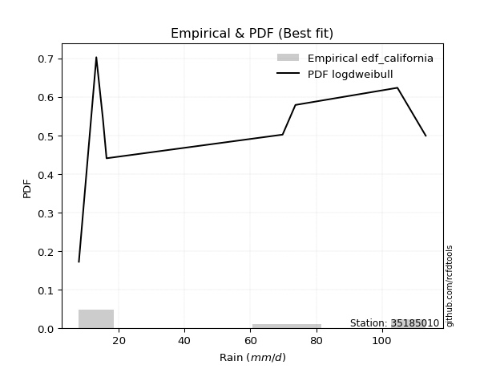</img>

</div>


### 2. EDF Hazen (1930)

Hazen method for plotting positions is a formula used to estimate the empirical cumulative probability distribution of flood events or other hydrological data. This formula often results in biased estimations, particularly when extrapolating to extreme events (high return periods).

<div align="center">


$P=(m-0.5)/n$


</div>


**2.1. Empirical values**

<div align="center">

|                | 0                  | 1                  | 2                  | 3                  | 4                  | 5         | 6                 | 7         |
|:---------------|:-------------------|:-------------------|:-------------------|:-------------------|:-------------------|:----------|:------------------|:----------|
| date           | 2023               | 2025               | 2020               | 2022               | 2018               | 2017      | 2019              | 2021      |
| x              | 7.9                | 13.2               | 15.2               | 16.3               | 69.8               | 73.7      | 104.7             | 113.3     |
| m              | 1                  | 2                  | 3                  | 4                  | 5                  | 6         | 7                 | 8         |
| empirical_dist | edf_hazen          | edf_hazen          | edf_hazen          | edf_hazen          | edf_hazen          | edf_hazen | edf_hazen         | edf_hazen |
| empirical      | 0.0625             | 0.1875             | 0.3125             | 0.4375             | 0.5625             | 0.6875    | 0.8125            | 0.9375    |
| empirical_tr   | 1.0666666666666667 | 1.2307692307692308 | 1.4545454545454546 | 1.7777777777777777 | 2.2857142857142856 | 3.2       | 5.333333333333333 | 16.0      |

</div>


**2.2. Kolmogorov-Smirnov fit test (sorted by Δ)**


<div align="center">

|                | 0                   | 1                   | 2                   | 3                  | 4                  | 5                  | 6                  | 7                   | 8                   | 9                  | 10                  | 11                  | 12                  | 13                  | 14                  | 15                 | 16                  | 17                  | 18                  | 19                  | 20                  | 21                  | 22                  | 23                  | 24                  | 25                  | 26                 | 27                 | 28                 | 29                  | 30                  | 31                 | 32                  | 33                  | 34                  | 35                  | 36                  | 37                  | 38                  | 39                  | 40                 | 41                 | 42                  | 43                  | 44                  | 45                  | 46                  | 47                  | 48                 | 49                  | 50                  | 51                  | 52                 | 53                  | 54                  | 55                  | 56                  | 57                  | 58                  | 59                 | 60                  | 61                 | 62                 | 63                  | 64                  | 65                  | 66                 | 67                  | 68                  | 69                 | 70                  | 71                  | 72                 | 73                  | 74                  | 75                  | 76                  | 77                 | 78                  | 79                  | 80                  | 81                  | 82                  | 83                  | 84                  | 85                 | 86                  | 87                  | 88                  | 89                  | 90                  | 91                  | 92                  | 93                  | 94                 | 95                 | 96                 | 97                  | 98                 | 99                  | 100                | 101                | 102                 | 103                 | 104                 | 105                 | 106                | 107                | 108                | 109                | 110                | 111                 | 112                | 113                 | 114                | 115                 | 116                 | 117                | 118                 | 119                 | 120                | 121                 | 122                | 123                | 124                | 125                 | 126                 | 127                 | 128                | 129                | 130                 | 131                | 132                 | 133                 | 134                | 135                 | 136                 | 137                 | 138                | 139                | 140                 | 141                 | 142                 | 143                | 144                | 145                 | 146                 | 147                | 148                | 149                 | 150                | 151                | 152                | 153                | 154                | 155                | 156                | 157                | 158                | 159                |
|:---------------|:--------------------|:--------------------|:--------------------|:-------------------|:-------------------|:-------------------|:-------------------|:--------------------|:--------------------|:-------------------|:--------------------|:--------------------|:--------------------|:--------------------|:--------------------|:-------------------|:--------------------|:--------------------|:--------------------|:--------------------|:--------------------|:--------------------|:--------------------|:--------------------|:--------------------|:--------------------|:-------------------|:-------------------|:-------------------|:--------------------|:--------------------|:-------------------|:--------------------|:--------------------|:--------------------|:--------------------|:--------------------|:--------------------|:--------------------|:--------------------|:-------------------|:-------------------|:--------------------|:--------------------|:--------------------|:--------------------|:--------------------|:--------------------|:-------------------|:--------------------|:--------------------|:--------------------|:-------------------|:--------------------|:--------------------|:--------------------|:--------------------|:--------------------|:--------------------|:-------------------|:--------------------|:-------------------|:-------------------|:--------------------|:--------------------|:--------------------|:-------------------|:--------------------|:--------------------|:-------------------|:--------------------|:--------------------|:-------------------|:--------------------|:--------------------|:--------------------|:--------------------|:-------------------|:--------------------|:--------------------|:--------------------|:--------------------|:--------------------|:--------------------|:--------------------|:-------------------|:--------------------|:--------------------|:--------------------|:--------------------|:--------------------|:--------------------|:--------------------|:--------------------|:-------------------|:-------------------|:-------------------|:--------------------|:-------------------|:--------------------|:-------------------|:-------------------|:--------------------|:--------------------|:--------------------|:--------------------|:-------------------|:-------------------|:-------------------|:-------------------|:-------------------|:--------------------|:-------------------|:--------------------|:-------------------|:--------------------|:--------------------|:-------------------|:--------------------|:--------------------|:-------------------|:--------------------|:-------------------|:-------------------|:-------------------|:--------------------|:--------------------|:--------------------|:-------------------|:-------------------|:--------------------|:-------------------|:--------------------|:--------------------|:-------------------|:--------------------|:--------------------|:--------------------|:-------------------|:-------------------|:--------------------|:--------------------|:--------------------|:-------------------|:-------------------|:--------------------|:--------------------|:-------------------|:-------------------|:--------------------|:-------------------|:-------------------|:-------------------|:-------------------|:-------------------|:-------------------|:-------------------|:-------------------|:-------------------|:-------------------|
| station        | 35185010            | 35185010            | 35185010            | 35185010           | 35185010           | 35185010           | 35185010           | 35185010            | 35185010            | 35185010           | 35185010            | 35185010            | 35185010            | 35185010            | 35185010            | 35185010           | 35185010            | 35185010            | 35185010            | 35185010            | 35185010            | 35185010            | 35185010            | 35185010            | 35185010            | 35185010            | 35185010           | 35185010           | 35185010           | 35185010            | 35185010            | 35185010           | 35185010            | 35185010            | 35185010            | 35185010            | 35185010            | 35185010            | 35185010            | 35185010            | 35185010           | 35185010           | 35185010            | 35185010            | 35185010            | 35185010            | 35185010            | 35185010            | 35185010           | 35185010            | 35185010            | 35185010            | 35185010           | 35185010            | 35185010            | 35185010            | 35185010            | 35185010            | 35185010            | 35185010           | 35185010            | 35185010           | 35185010           | 35185010            | 35185010            | 35185010            | 35185010           | 35185010            | 35185010            | 35185010           | 35185010            | 35185010            | 35185010           | 35185010            | 35185010            | 35185010            | 35185010            | 35185010           | 35185010            | 35185010            | 35185010            | 35185010            | 35185010            | 35185010            | 35185010            | 35185010           | 35185010            | 35185010            | 35185010            | 35185010            | 35185010            | 35185010            | 35185010            | 35185010            | 35185010           | 35185010           | 35185010           | 35185010            | 35185010           | 35185010            | 35185010           | 35185010           | 35185010            | 35185010            | 35185010            | 35185010            | 35185010           | 35185010           | 35185010           | 35185010           | 35185010           | 35185010            | 35185010           | 35185010            | 35185010           | 35185010            | 35185010            | 35185010           | 35185010            | 35185010            | 35185010           | 35185010            | 35185010           | 35185010           | 35185010           | 35185010            | 35185010            | 35185010            | 35185010           | 35185010           | 35185010            | 35185010           | 35185010            | 35185010            | 35185010           | 35185010            | 35185010            | 35185010            | 35185010           | 35185010           | 35185010            | 35185010            | 35185010            | 35185010           | 35185010           | 35185010            | 35185010            | 35185010           | 35185010           | 35185010            | 35185010           | 35185010           | 35185010           | 35185010           | 35185010           | 35185010           | 35185010           | 35185010           | 35185010           | 35185010           |
| empirical_dist | edf_hazen           | edf_hazen           | edf_hazen           | edf_hazen          | edf_hazen          | edf_hazen          | edf_hazen          | edf_hazen           | edf_hazen           | edf_hazen          | edf_hazen           | edf_hazen           | edf_hazen           | edf_hazen           | edf_hazen           | edf_hazen          | edf_hazen           | edf_hazen           | edf_hazen           | edf_hazen           | edf_hazen           | edf_hazen           | edf_hazen           | edf_hazen           | edf_hazen           | edf_hazen           | edf_hazen          | edf_hazen          | edf_hazen          | edf_hazen           | edf_hazen           | edf_hazen          | edf_hazen           | edf_hazen           | edf_hazen           | edf_hazen           | edf_hazen           | edf_hazen           | edf_hazen           | edf_hazen           | edf_hazen          | edf_hazen          | edf_hazen           | edf_hazen           | edf_hazen           | edf_hazen           | edf_hazen           | edf_hazen           | edf_hazen          | edf_hazen           | edf_hazen           | edf_hazen           | edf_hazen          | edf_hazen           | edf_hazen           | edf_hazen           | edf_hazen           | edf_hazen           | edf_hazen           | edf_hazen          | edf_hazen           | edf_hazen          | edf_hazen          | edf_hazen           | edf_hazen           | edf_hazen           | edf_hazen          | edf_hazen           | edf_hazen           | edf_hazen          | edf_hazen           | edf_hazen           | edf_hazen          | edf_hazen           | edf_hazen           | edf_hazen           | edf_hazen           | edf_hazen          | edf_hazen           | edf_hazen           | edf_hazen           | edf_hazen           | edf_hazen           | edf_hazen           | edf_hazen           | edf_hazen          | edf_hazen           | edf_hazen           | edf_hazen           | edf_hazen           | edf_hazen           | edf_hazen           | edf_hazen           | edf_hazen           | edf_hazen          | edf_hazen          | edf_hazen          | edf_hazen           | edf_hazen          | edf_hazen           | edf_hazen          | edf_hazen          | edf_hazen           | edf_hazen           | edf_hazen           | edf_hazen           | edf_hazen          | edf_hazen          | edf_hazen          | edf_hazen          | edf_hazen          | edf_hazen           | edf_hazen          | edf_hazen           | edf_hazen          | edf_hazen           | edf_hazen           | edf_hazen          | edf_hazen           | edf_hazen           | edf_hazen          | edf_hazen           | edf_hazen          | edf_hazen          | edf_hazen          | edf_hazen           | edf_hazen           | edf_hazen           | edf_hazen          | edf_hazen          | edf_hazen           | edf_hazen          | edf_hazen           | edf_hazen           | edf_hazen          | edf_hazen           | edf_hazen           | edf_hazen           | edf_hazen          | edf_hazen          | edf_hazen           | edf_hazen           | edf_hazen           | edf_hazen          | edf_hazen          | edf_hazen           | edf_hazen           | edf_hazen          | edf_hazen          | edf_hazen           | edf_hazen          | edf_hazen          | edf_hazen          | edf_hazen          | edf_hazen          | edf_hazen          | edf_hazen          | edf_hazen          | edf_hazen          | edf_hazen          |
| p_dist         | logdgamma           | logdweibull         | logarcsine          | dweibull           | dgamma             | logksone           | mielke             | arcsine             | wrapcauchy          | logsemicircular    | logweibull_max      | logwrapcauchy       | halfgennorm         | loganglit           | loggenextreme       | ksone              | loggenhalflogistic  | logtrapezoid        | loglevy_l           | truncexpon          | loghalfgennorm      | logpearson3         | semicircular        | exponpow            | logskewnorm         | logt                | logexponnorm       | lognorm            | logcrystalball     | lognct              | logtriang           | logfoldnorm        | logerlang           | loggamma            | loggamma            | logbetaprime        | loggompertz         | invweibull          | weibull_min         | betaprime           | loglomax           | loggausshyper      | logncf              | logrice             | logmaxwell          | logbeta             | gengamma            | lograyleigh         | loginvgamma        | burr12              | logalpha            | anglit              | loggenpareto       | loggenexpon         | logcosine           | loginvweibull       | loginvgauss         | logf                | burr                | loggenlogistic     | halfnorm            | logweibull_min     | logburr            | logfatiguelife      | ncf                 | nakagami            | logburr12          | loghalfnorm         | invgamma            | foldnorm           | nct                 | logjohnsonsu        | f                  | rayleigh            | logkstwobign        | loglogistic         | maxwell             | logloggamma        | loggumbel_l         | lognakagami         | loggumbel_r         | genlogistic         | logkappa3           | pearson3            | loghypsecant        | invgauss           | johnsonsu           | exponnorm           | norm                | crystalball         | t                   | loghalflogistic     | logtukeylambda      | logargus            | kstwobign          | logmoyal           | alpha              | logkappa4           | halflogistic       | truncweibull_min    | loguniform         | logvonmises_line   | gumbel_r            | loglaplace          | loglaplace          | lomax               | gausshyper         | logistic           | cosine             | gumbel_l           | moyal              | genexpon            | rice               | hypsecant           | beta               | levy_l              | loggengamma         | laplace            | argus               | logwald             | logtruncnorm       | logbradford         | gennorm            | loggennorm         | logtruncexpon      | gamma               | logtruncweibull_min | genextreme          | gompertz           | logloglaplace      | exponweib           | skewnorm           | kappa4              | genpareto           | bradford           | tukeylambda         | genhalflogistic     | logrdist            | vonmises_line      | kappa3             | uniform             | erlang              | truncnorm           | triang             | trapezoid          | wald                | powerlaw            | logexponpow        | fatiguelife        | logjohnsonsb        | johnsonsb          | logpowerlaw        | logexponweib       | weibull_max        | truncpareto        | rdist              | logtruncpareto     | logvonmises        | vonmises           | logmielke          |
| delta          | 0.07719830659494675 | 0.10638575264728561 | 0.11091964689540446 | 0.143743993288655  | 0.1467435070727122 | 0.149079598878748  | 0.1598712107865612 | 0.16377753613032378 | 0.16460659895200086 | 0.1654673532463995 | 0.16916936240682204 | 0.16967462093188007 | 0.17393238567531277 | 0.17768764163739992 | 0.18603467452238548 | 0.1876216281654022 | 0.18946816405543465 | 0.19000292533154356 | 0.19123286308326914 | 0.19398715115300647 | 0.20251688156117975 | 0.20426241290838532 | 0.20441064908481743 | 0.20442007728828104 | 0.20565681484740062 | 0.20569104549743855 | 0.2056995694871676 | 0.2057004228584911 | 0.2057004447067371 | 0.20580893878710316 | 0.20601118557008558 | 0.2063926210467244 | 0.20647161436593442 | 0.20687521867140124 | 0.20687521867140124 | 0.20781002962059703 | 0.20804253887876856 | 0.20906187559456635 | 0.21143279479591048 | 0.21170381023364693 | 0.2120207132544889 | 0.2122935565741284 | 0.21254928874989765 | 0.21257483705332703 | 0.21288542525262566 | 0.21325998855462686 | 0.21480796136054447 | 0.21492379563755148 | 0.2160020621269123 | 0.21626886467836204 | 0.21635401239273833 | 0.21666081778413165 | 0.216713157805206  | 0.21700572552016129 | 0.21798060064851943 | 0.21845205367652643 | 0.21854964046894676 | 0.21914264192262922 | 0.21939779584935049 | 0.2200692349048371 | 0.22036947014338767 | 0.2206741433031867 | 0.2207912842456351 | 0.22091079755008725 | 0.22141276289595324 | 0.22229442929815424 | 0.2224123848977645 | 0.22241616541306974 | 0.22270218291510524 | 0.2228184774427301 | 0.22550201210969778 | 0.22628742159821125 | 0.2275025730769954 | 0.22801236601026828 | 0.22818789591622957 | 0.22824034898365486 | 0.23277807726382563 | 0.2336459934753859 | 0.23711212333312134 | 0.23894748999487436 | 0.24056744855740264 | 0.24132103468447216 | 0.24159382330703372 | 0.24166976392782996 | 0.24251709001111355 | 0.2434086333998442 | 0.24347110128567734 | 0.24435784706974312 | 0.24437738812119325 | 0.24437741409506286 | 0.24438455601085168 | 0.24568544800566938 | 0.24645890689179595 | 0.24848292760013502 | 0.2509530444345598 | 0.2519084984852933 | 0.2531084427625805 | 0.25314433470630127 | 0.2531982171833601 | 0.25438161832205297 | 0.2556099995071762 | 0.2557553319131587 | 0.25587645607305004 | 0.26015730618512034 | 0.26015730618512034 | 0.26106880314018205 | 0.2643979635200031 | 0.2655059616690698 | 0.2665546895152537 | 0.2687698545281777 | 0.2720818326660833 | 0.27226976641838363 | 0.2771085848522847 | 0.27771205644069596 | 0.2790774413651215 | 0.28420434329240507 | 0.28734503980272996 | 0.2906711866505116 | 0.29073892132764323 | 0.29077698594682755 | 0.2960098055637439 | 0.30277388926898496 | 0.3125             | 0.3125             | 0.3126995621412808 | 0.31373455985051024 | 0.3145889104147428  | 0.31645650261287317 | 0.317996500975169  | 0.3208121643904306 | 0.32574425674095053 | 0.3261610101068184 | 0.33059435471375004 | 0.34059778900587745 | 0.3443054072061928 | 0.35168042158459656 | 0.35207240352501135 | 0.35714292122979296 | 0.3571635593312398 | 0.3577200129766992 | 0.35780360531309297 | 0.36336726000294195 | 0.40757660542907354 | 0.4103250822361487 | 0.4147621832393768 | 0.42152177016319303 | 0.42374331744118676 | 0.4368219265903206 | 0.4461312032736323 | 0.49910070631187214 | 0.5050594771971066 | 0.5382597212564829 | 0.5463452275872652 | 0.5846633930960745 | 0.6205436947063262 | 0.6831207910088447 | 0.7042001696215024 | 1.197225587926848  | 17.37665449325725  | nan                |
| deltao         | 0.4472608134160001  | 0.4472608134160001  | 0.4472608134160001  | 0.4472608134160001 | 0.4472608134160001 | 0.4472608134160001 | 0.4472608134160001 | 0.4472608134160001  | 0.4472608134160001  | 0.4472608134160001 | 0.4472608134160001  | 0.4472608134160001  | 0.4472608134160001  | 0.4472608134160001  | 0.4472608134160001  | 0.4472608134160001 | 0.4472608134160001  | 0.4472608134160001  | 0.4472608134160001  | 0.4472608134160001  | 0.4472608134160001  | 0.4472608134160001  | 0.4472608134160001  | 0.4472608134160001  | 0.4472608134160001  | 0.4472608134160001  | 0.4472608134160001 | 0.4472608134160001 | 0.4472608134160001 | 0.4472608134160001  | 0.4472608134160001  | 0.4472608134160001 | 0.4472608134160001  | 0.4472608134160001  | 0.4472608134160001  | 0.4472608134160001  | 0.4472608134160001  | 0.4472608134160001  | 0.4472608134160001  | 0.4472608134160001  | 0.4472608134160001 | 0.4472608134160001 | 0.4472608134160001  | 0.4472608134160001  | 0.4472608134160001  | 0.4472608134160001  | 0.4472608134160001  | 0.4472608134160001  | 0.4472608134160001 | 0.4472608134160001  | 0.4472608134160001  | 0.4472608134160001  | 0.4472608134160001 | 0.4472608134160001  | 0.4472608134160001  | 0.4472608134160001  | 0.4472608134160001  | 0.4472608134160001  | 0.4472608134160001  | 0.4472608134160001 | 0.4472608134160001  | 0.4472608134160001 | 0.4472608134160001 | 0.4472608134160001  | 0.4472608134160001  | 0.4472608134160001  | 0.4472608134160001 | 0.4472608134160001  | 0.4472608134160001  | 0.4472608134160001 | 0.4472608134160001  | 0.4472608134160001  | 0.4472608134160001 | 0.4472608134160001  | 0.4472608134160001  | 0.4472608134160001  | 0.4472608134160001  | 0.4472608134160001 | 0.4472608134160001  | 0.4472608134160001  | 0.4472608134160001  | 0.4472608134160001  | 0.4472608134160001  | 0.4472608134160001  | 0.4472608134160001  | 0.4472608134160001 | 0.4472608134160001  | 0.4472608134160001  | 0.4472608134160001  | 0.4472608134160001  | 0.4472608134160001  | 0.4472608134160001  | 0.4472608134160001  | 0.4472608134160001  | 0.4472608134160001 | 0.4472608134160001 | 0.4472608134160001 | 0.4472608134160001  | 0.4472608134160001 | 0.4472608134160001  | 0.4472608134160001 | 0.4472608134160001 | 0.4472608134160001  | 0.4472608134160001  | 0.4472608134160001  | 0.4472608134160001  | 0.4472608134160001 | 0.4472608134160001 | 0.4472608134160001 | 0.4472608134160001 | 0.4472608134160001 | 0.4472608134160001  | 0.4472608134160001 | 0.4472608134160001  | 0.4472608134160001 | 0.4472608134160001  | 0.4472608134160001  | 0.4472608134160001 | 0.4472608134160001  | 0.4472608134160001  | 0.4472608134160001 | 0.4472608134160001  | 0.4472608134160001 | 0.4472608134160001 | 0.4472608134160001 | 0.4472608134160001  | 0.4472608134160001  | 0.4472608134160001  | 0.4472608134160001 | 0.4472608134160001 | 0.4472608134160001  | 0.4472608134160001 | 0.4472608134160001  | 0.4472608134160001  | 0.4472608134160001 | 0.4472608134160001  | 0.4472608134160001  | 0.4472608134160001  | 0.4472608134160001 | 0.4472608134160001 | 0.4472608134160001  | 0.4472608134160001  | 0.4472608134160001  | 0.4472608134160001 | 0.4472608134160001 | 0.4472608134160001  | 0.4472608134160001  | 0.4472608134160001 | 0.4472608134160001 | 0.4472608134160001  | 0.4472608134160001 | 0.4472608134160001 | 0.4472608134160001 | 0.4472608134160001 | 0.4472608134160001 | 0.4472608134160001 | 0.4472608134160001 | 0.4472608134160001 | 0.4472608134160001 | 0.4472608134160001 |
| eval           | Δo > Δ              | Δo > Δ              | Δo > Δ              | Δo > Δ             | Δo > Δ             | Δo > Δ             | Δo > Δ             | Δo > Δ              | Δo > Δ              | Δo > Δ             | Δo > Δ              | Δo > Δ              | Δo > Δ              | Δo > Δ              | Δo > Δ              | Δo > Δ             | Δo > Δ              | Δo > Δ              | Δo > Δ              | Δo > Δ              | Δo > Δ              | Δo > Δ              | Δo > Δ              | Δo > Δ              | Δo > Δ              | Δo > Δ              | Δo > Δ             | Δo > Δ             | Δo > Δ             | Δo > Δ              | Δo > Δ              | Δo > Δ             | Δo > Δ              | Δo > Δ              | Δo > Δ              | Δo > Δ              | Δo > Δ              | Δo > Δ              | Δo > Δ              | Δo > Δ              | Δo > Δ             | Δo > Δ             | Δo > Δ              | Δo > Δ              | Δo > Δ              | Δo > Δ              | Δo > Δ              | Δo > Δ              | Δo > Δ             | Δo > Δ              | Δo > Δ              | Δo > Δ              | Δo > Δ             | Δo > Δ              | Δo > Δ              | Δo > Δ              | Δo > Δ              | Δo > Δ              | Δo > Δ              | Δo > Δ             | Δo > Δ              | Δo > Δ             | Δo > Δ             | Δo > Δ              | Δo > Δ              | Δo > Δ              | Δo > Δ             | Δo > Δ              | Δo > Δ              | Δo > Δ             | Δo > Δ              | Δo > Δ              | Δo > Δ             | Δo > Δ              | Δo > Δ              | Δo > Δ              | Δo > Δ              | Δo > Δ             | Δo > Δ              | Δo > Δ              | Δo > Δ              | Δo > Δ              | Δo > Δ              | Δo > Δ              | Δo > Δ              | Δo > Δ             | Δo > Δ              | Δo > Δ              | Δo > Δ              | Δo > Δ              | Δo > Δ              | Δo > Δ              | Δo > Δ              | Δo > Δ              | Δo > Δ             | Δo > Δ             | Δo > Δ             | Δo > Δ              | Δo > Δ             | Δo > Δ              | Δo > Δ             | Δo > Δ             | Δo > Δ              | Δo > Δ              | Δo > Δ              | Δo > Δ              | Δo > Δ             | Δo > Δ             | Δo > Δ             | Δo > Δ             | Δo > Δ             | Δo > Δ              | Δo > Δ             | Δo > Δ              | Δo > Δ             | Δo > Δ              | Δo > Δ              | Δo > Δ             | Δo > Δ              | Δo > Δ              | Δo > Δ             | Δo > Δ              | Δo > Δ             | Δo > Δ             | Δo > Δ             | Δo > Δ              | Δo > Δ              | Δo > Δ              | Δo > Δ             | Δo > Δ             | Δo > Δ              | Δo > Δ             | Δo > Δ              | Δo > Δ              | Δo > Δ             | Δo > Δ              | Δo > Δ              | Δo > Δ              | Δo > Δ             | Δo > Δ             | Δo > Δ              | Δo > Δ              | Δo > Δ              | Δo > Δ             | Δo > Δ             | Δo > Δ              | Δo > Δ              | Δo > Δ             | Δo > Δ             | Δo <= Δ             | Δo <= Δ            | Δo <= Δ            | Δo <= Δ            | Δo <= Δ            | Δo <= Δ            | Δo <= Δ            | Δo <= Δ            | Δo <= Δ            | Δo <= Δ            | Δo <= Δ            |
| fit            | 1                   | 1                   | 1                   | 1                  | 1                  | 1                  | 1                  | 1                   | 1                   | 1                  | 1                   | 1                   | 1                   | 1                   | 1                   | 1                  | 1                   | 1                   | 1                   | 1                   | 1                   | 1                   | 1                   | 1                   | 1                   | 1                   | 1                  | 1                  | 1                  | 1                   | 1                   | 1                  | 1                   | 1                   | 1                   | 1                   | 1                   | 1                   | 1                   | 1                   | 1                  | 1                  | 1                   | 1                   | 1                   | 1                   | 1                   | 1                   | 1                  | 1                   | 1                   | 1                   | 1                  | 1                   | 1                   | 1                   | 1                   | 1                   | 1                   | 1                  | 1                   | 1                  | 1                  | 1                   | 1                   | 1                   | 1                  | 1                   | 1                   | 1                  | 1                   | 1                   | 1                  | 1                   | 1                   | 1                   | 1                   | 1                  | 1                   | 1                   | 1                   | 1                   | 1                   | 1                   | 1                   | 1                  | 1                   | 1                   | 1                   | 1                   | 1                   | 1                   | 1                   | 1                   | 1                  | 1                  | 1                  | 1                   | 1                  | 1                   | 1                  | 1                  | 1                   | 1                   | 1                   | 1                   | 1                  | 1                  | 1                  | 1                  | 1                  | 1                   | 1                  | 1                   | 1                  | 1                   | 1                   | 1                  | 1                   | 1                   | 1                  | 1                   | 1                  | 1                  | 1                  | 1                   | 1                   | 1                   | 1                  | 1                  | 1                   | 1                  | 1                   | 1                   | 1                  | 1                   | 1                   | 1                   | 1                  | 1                  | 1                   | 1                   | 1                   | 1                  | 1                  | 1                   | 1                   | 1                  | 1                  | 0                   | 0                  | 0                  | 0                  | 0                  | 0                  | 0                  | 0                  | 0                  | 0                  | 0                  |
| n              | 8                   | 8                   | 8                   | 8                  | 8                  | 8                  | 8                  | 8                   | 8                   | 8                  | 8                   | 8                   | 8                   | 8                   | 8                   | 8                  | 8                   | 8                   | 8                   | 8                   | 8                   | 8                   | 8                   | 8                   | 8                   | 8                   | 8                  | 8                  | 8                  | 8                   | 8                   | 8                  | 8                   | 8                   | 8                   | 8                   | 8                   | 8                   | 8                   | 8                   | 8                  | 8                  | 8                   | 8                   | 8                   | 8                   | 8                   | 8                   | 8                  | 8                   | 8                   | 8                   | 8                  | 8                   | 8                   | 8                   | 8                   | 8                   | 8                   | 8                  | 8                   | 8                  | 8                  | 8                   | 8                   | 8                   | 8                  | 8                   | 8                   | 8                  | 8                   | 8                   | 8                  | 8                   | 8                   | 8                   | 8                   | 8                  | 8                   | 8                   | 8                   | 8                   | 8                   | 8                   | 8                   | 8                  | 8                   | 8                   | 8                   | 8                   | 8                   | 8                   | 8                   | 8                   | 8                  | 8                  | 8                  | 8                   | 8                  | 8                   | 8                  | 8                  | 8                   | 8                   | 8                   | 8                   | 8                  | 8                  | 8                  | 8                  | 8                  | 8                   | 8                  | 8                   | 8                  | 8                   | 8                   | 8                  | 8                   | 8                   | 8                  | 8                   | 8                  | 8                  | 8                  | 8                   | 8                   | 8                   | 8                  | 8                  | 8                   | 8                  | 8                   | 8                   | 8                  | 8                   | 8                   | 8                   | 8                  | 8                  | 8                   | 8                   | 8                   | 8                  | 8                  | 8                   | 8                   | 8                  | 8                  | 8                   | 8                  | 8                  | 8                  | 8                  | 8                  | 8                  | 8                  | 8                  | 8                  | 8                  |
| best_fit       | 1                   | 0                   | 0                   | 0                  | 0                  | 0                  | 0                  | 0                   | 0                   | 0                  | 0                   | 0                   | 0                   | 0                   | 0                   | 0                  | 0                   | 0                   | 0                   | 0                   | 0                   | 0                   | 0                   | 0                   | 0                   | 0                   | 0                  | 0                  | 0                  | 0                   | 0                   | 0                  | 0                   | 0                   | 0                   | 0                   | 0                   | 0                   | 0                   | 0                   | 0                  | 0                  | 0                   | 0                   | 0                   | 0                   | 0                   | 0                   | 0                  | 0                   | 0                   | 0                   | 0                  | 0                   | 0                   | 0                   | 0                   | 0                   | 0                   | 0                  | 0                   | 0                  | 0                  | 0                   | 0                   | 0                   | 0                  | 0                   | 0                   | 0                  | 0                   | 0                   | 0                  | 0                   | 0                   | 0                   | 0                   | 0                  | 0                   | 0                   | 0                   | 0                   | 0                   | 0                   | 0                   | 0                  | 0                   | 0                   | 0                   | 0                   | 0                   | 0                   | 0                   | 0                   | 0                  | 0                  | 0                  | 0                   | 0                  | 0                   | 0                  | 0                  | 0                   | 0                   | 0                   | 0                   | 0                  | 0                  | 0                  | 0                  | 0                  | 0                   | 0                  | 0                   | 0                  | 0                   | 0                   | 0                  | 0                   | 0                   | 0                  | 0                   | 0                  | 0                  | 0                  | 0                   | 0                   | 0                   | 0                  | 0                  | 0                   | 0                  | 0                   | 0                   | 0                  | 0                   | 0                   | 0                   | 0                  | 0                  | 0                   | 0                   | 0                   | 0                  | 0                  | 0                   | 0                   | 0                  | 0                  | 0                   | 0                  | 0                  | 0                  | 0                  | 0                  | 0                  | 0                  | 0                  | 0                  | 0                  |
| best_fit_sort  | 1                   | 2                   | 3                   | 4                  | 5                  | 6                  | 7                  | 8                   | 9                   | 10                 | 11                  | 12                  | 13                  | 14                  | 15                  | 16                 | 17                  | 18                  | 19                  | 20                  | 21                  | 22                  | 23                  | 24                  | 25                  | 26                  | 27                 | 28                 | 29                 | 30                  | 31                  | 32                 | 33                  | 34                  | 35                  | 36                  | 37                  | 38                  | 39                  | 40                  | 41                 | 42                 | 43                  | 44                  | 45                  | 46                  | 47                  | 48                  | 49                 | 50                  | 51                  | 52                  | 53                 | 54                  | 55                  | 56                  | 57                  | 58                  | 59                  | 60                 | 61                  | 62                 | 63                 | 64                  | 65                  | 66                  | 67                 | 68                  | 69                  | 70                 | 71                  | 72                  | 73                 | 74                  | 75                  | 76                  | 77                  | 78                 | 79                  | 80                  | 81                  | 82                  | 83                  | 84                  | 85                  | 86                 | 87                  | 88                  | 89                  | 90                  | 91                  | 92                  | 93                  | 94                  | 95                 | 96                 | 97                 | 98                  | 99                 | 100                 | 101                | 102                | 103                 | 104                 | 105                 | 106                 | 107                | 108                | 109                | 110                | 111                | 112                 | 113                | 114                 | 115                | 116                 | 117                 | 118                | 119                 | 120                 | 121                | 122                 | 123                | 124                | 125                | 126                 | 127                 | 128                 | 129                | 130                | 131                 | 132                | 133                 | 134                 | 135                | 136                 | 137                 | 138                 | 139                | 140                | 141                 | 142                 | 143                 | 144                | 145                | 146                 | 147                 | 148                | 149                | 150                 | 151                | 152                | 153                | 154                | 155                | 156                | 157                | 158                | 159                | 160                |

</div>


**2.3. Best fit**

<div align="center">

|   id |   station | empirical_dist   | p_dist    |     delta |   deltao | eval   |   fit |   n |   best_fit |   best_fit_sort |
|-----:|----------:|:-----------------|:----------|----------:|---------:|:-------|------:|----:|-----------:|----------------:|
|    0 |  35185010 | edf_hazen        | logdgamma | 0.0771983 | 0.447261 | Δo > Δ |     1 |   8 |          1 |               1 |

</div>


<div align="center">

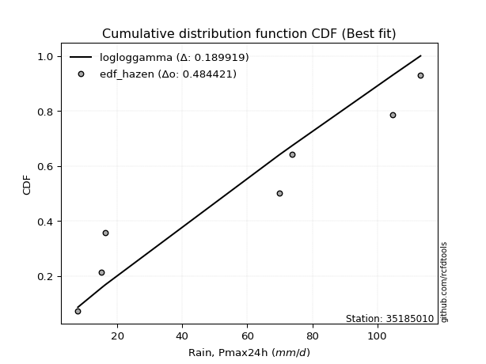</img>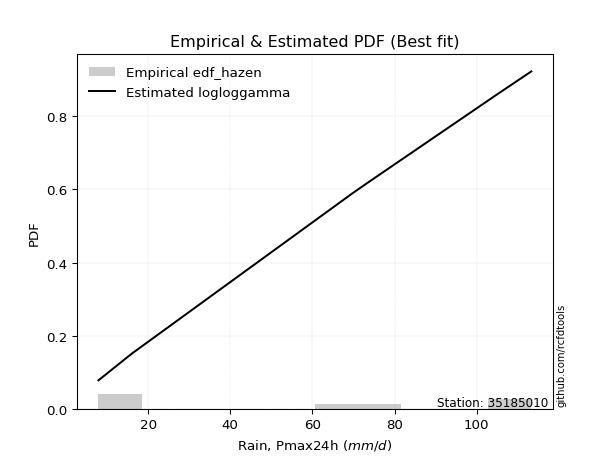</img>

</div>


### 3. EDF Weibull (1939)

Weibull plotting position formula is an empirical method used to estimate the non-exceedance probability or plotting position for a set of observed data, is often recommended or widely used in practice, particularly in flood frequency analysis.

<div align="center">


$P=m/(n+1)$


</div>


**3.1. Empirical values**

<div align="center">

|                | 0                  | 1                  | 2                  | 3                  | 4                  | 5                  | 6                  | 7                  |
|:---------------|:-------------------|:-------------------|:-------------------|:-------------------|:-------------------|:-------------------|:-------------------|:-------------------|
| date           | 2023               | 2025               | 2020               | 2022               | 2018               | 2017               | 2019               | 2021               |
| x              | 7.9                | 13.2               | 15.2               | 16.3               | 69.8               | 73.7               | 104.7              | 113.3              |
| m              | 1                  | 2                  | 3                  | 4                  | 5                  | 6                  | 7                  | 8                  |
| empirical_dist | edf_weibull        | edf_weibull        | edf_weibull        | edf_weibull        | edf_weibull        | edf_weibull        | edf_weibull        | edf_weibull        |
| empirical      | 0.1111111111111111 | 0.2222222222222222 | 0.3333333333333333 | 0.4444444444444444 | 0.5555555555555556 | 0.6666666666666666 | 0.7777777777777778 | 0.8888888888888888 |
| empirical_tr   | 1.125              | 1.2857142857142856 | 1.4999999999999998 | 1.7999999999999998 | 2.25               | 2.9999999999999996 | 4.5                | 8.999999999999996  |

</div>


**3.2. Kolmogorov-Smirnov fit test (sorted by Δ)**


<div align="center">

|                | 0                   | 1                   | 2                   | 3                  | 4                   | 5                   | 6                   | 7                   | 8                   | 9                   | 10                  | 11                 | 12                  | 13                  | 14                  | 15                  | 16                 | 17                  | 18                 | 19                  | 20                  | 21                  | 22                  | 23                  | 24                  | 25                  | 26                  | 27                  | 28                  | 29                  | 30                  | 31                  | 32                  | 33                 | 34                  | 35                  | 36                  | 37                  | 38                  | 39                  | 40                  | 41                  | 42                  | 43                  | 44                  | 45                  | 46                  | 47                  | 48                 | 49                 | 50                  | 51                  | 52                  | 53                  | 54                 | 55                  | 56                  | 57                  | 58                 | 59                  | 60                 | 61                 | 62                  | 63                  | 64                  | 65                  | 66                 | 67                  | 68                  | 69                 | 70                  | 71                 | 72                  | 73                  | 74                 | 75                  | 76                  | 77                  | 78                  | 79                 | 80                  | 81                  | 82                  | 83                  | 84                  | 85                  | 86                  | 87                 | 88                  | 89                  | 90                  | 91                 | 92                 | 93                 | 94                  | 95                  | 96                 | 97                 | 98                 | 99                 | 100                 | 101                | 102                 | 103                | 104                 | 105                 | 106                 | 107                | 108                 | 109                 | 110                 | 111                | 112                | 113                | 114                | 115                 | 116                 | 117                | 118                | 119                | 120                 | 121                 | 122                 | 123                | 124                | 125                | 126                 | 127                 | 128                 | 129                | 130                 | 131                 | 132                 | 133                 | 134                | 135                | 136                 | 137                | 138                | 139                | 140                | 141                 | 142                 | 143                | 144                | 145                 | 146                 | 147                | 148                 | 149                 | 150                 | 151                | 152                | 153                | 154                | 155                | 156                | 157                | 158                | 159                |
|:---------------|:--------------------|:--------------------|:--------------------|:-------------------|:--------------------|:--------------------|:--------------------|:--------------------|:--------------------|:--------------------|:--------------------|:-------------------|:--------------------|:--------------------|:--------------------|:--------------------|:-------------------|:--------------------|:-------------------|:--------------------|:--------------------|:--------------------|:--------------------|:--------------------|:--------------------|:--------------------|:--------------------|:--------------------|:--------------------|:--------------------|:--------------------|:--------------------|:--------------------|:-------------------|:--------------------|:--------------------|:--------------------|:--------------------|:--------------------|:--------------------|:--------------------|:--------------------|:--------------------|:--------------------|:--------------------|:--------------------|:--------------------|:--------------------|:-------------------|:-------------------|:--------------------|:--------------------|:--------------------|:--------------------|:-------------------|:--------------------|:--------------------|:--------------------|:-------------------|:--------------------|:-------------------|:-------------------|:--------------------|:--------------------|:--------------------|:--------------------|:-------------------|:--------------------|:--------------------|:-------------------|:--------------------|:-------------------|:--------------------|:--------------------|:-------------------|:--------------------|:--------------------|:--------------------|:--------------------|:-------------------|:--------------------|:--------------------|:--------------------|:--------------------|:--------------------|:--------------------|:--------------------|:-------------------|:--------------------|:--------------------|:--------------------|:-------------------|:-------------------|:-------------------|:--------------------|:--------------------|:-------------------|:-------------------|:-------------------|:-------------------|:--------------------|:-------------------|:--------------------|:-------------------|:--------------------|:--------------------|:--------------------|:-------------------|:--------------------|:--------------------|:--------------------|:-------------------|:-------------------|:-------------------|:-------------------|:--------------------|:--------------------|:-------------------|:-------------------|:-------------------|:--------------------|:--------------------|:--------------------|:-------------------|:-------------------|:-------------------|:--------------------|:--------------------|:--------------------|:-------------------|:--------------------|:--------------------|:--------------------|:--------------------|:-------------------|:-------------------|:--------------------|:-------------------|:-------------------|:-------------------|:-------------------|:--------------------|:--------------------|:-------------------|:-------------------|:--------------------|:--------------------|:-------------------|:--------------------|:--------------------|:--------------------|:-------------------|:-------------------|:-------------------|:-------------------|:-------------------|:-------------------|:-------------------|:-------------------|:-------------------|
| station        | 35185010            | 35185010            | 35185010            | 35185010           | 35185010            | 35185010            | 35185010            | 35185010            | 35185010            | 35185010            | 35185010            | 35185010           | 35185010            | 35185010            | 35185010            | 35185010            | 35185010           | 35185010            | 35185010           | 35185010            | 35185010            | 35185010            | 35185010            | 35185010            | 35185010            | 35185010            | 35185010            | 35185010            | 35185010            | 35185010            | 35185010            | 35185010            | 35185010            | 35185010           | 35185010            | 35185010            | 35185010            | 35185010            | 35185010            | 35185010            | 35185010            | 35185010            | 35185010            | 35185010            | 35185010            | 35185010            | 35185010            | 35185010            | 35185010           | 35185010           | 35185010            | 35185010            | 35185010            | 35185010            | 35185010           | 35185010            | 35185010            | 35185010            | 35185010           | 35185010            | 35185010           | 35185010           | 35185010            | 35185010            | 35185010            | 35185010            | 35185010           | 35185010            | 35185010            | 35185010           | 35185010            | 35185010           | 35185010            | 35185010            | 35185010           | 35185010            | 35185010            | 35185010            | 35185010            | 35185010           | 35185010            | 35185010            | 35185010            | 35185010            | 35185010            | 35185010            | 35185010            | 35185010           | 35185010            | 35185010            | 35185010            | 35185010           | 35185010           | 35185010           | 35185010            | 35185010            | 35185010           | 35185010           | 35185010           | 35185010           | 35185010            | 35185010           | 35185010            | 35185010           | 35185010            | 35185010            | 35185010            | 35185010           | 35185010            | 35185010            | 35185010            | 35185010           | 35185010           | 35185010           | 35185010           | 35185010            | 35185010            | 35185010           | 35185010           | 35185010           | 35185010            | 35185010            | 35185010            | 35185010           | 35185010           | 35185010           | 35185010            | 35185010            | 35185010            | 35185010           | 35185010            | 35185010            | 35185010            | 35185010            | 35185010           | 35185010           | 35185010            | 35185010           | 35185010           | 35185010           | 35185010           | 35185010            | 35185010            | 35185010           | 35185010           | 35185010            | 35185010            | 35185010           | 35185010            | 35185010            | 35185010            | 35185010           | 35185010           | 35185010           | 35185010           | 35185010           | 35185010           | 35185010           | 35185010           | 35185010           |
| empirical_dist | edf_weibull         | edf_weibull         | edf_weibull         | edf_weibull        | edf_weibull         | edf_weibull         | edf_weibull         | edf_weibull         | edf_weibull         | edf_weibull         | edf_weibull         | edf_weibull        | edf_weibull         | edf_weibull         | edf_weibull         | edf_weibull         | edf_weibull        | edf_weibull         | edf_weibull        | edf_weibull         | edf_weibull         | edf_weibull         | edf_weibull         | edf_weibull         | edf_weibull         | edf_weibull         | edf_weibull         | edf_weibull         | edf_weibull         | edf_weibull         | edf_weibull         | edf_weibull         | edf_weibull         | edf_weibull        | edf_weibull         | edf_weibull         | edf_weibull         | edf_weibull         | edf_weibull         | edf_weibull         | edf_weibull         | edf_weibull         | edf_weibull         | edf_weibull         | edf_weibull         | edf_weibull         | edf_weibull         | edf_weibull         | edf_weibull        | edf_weibull        | edf_weibull         | edf_weibull         | edf_weibull         | edf_weibull         | edf_weibull        | edf_weibull         | edf_weibull         | edf_weibull         | edf_weibull        | edf_weibull         | edf_weibull        | edf_weibull        | edf_weibull         | edf_weibull         | edf_weibull         | edf_weibull         | edf_weibull        | edf_weibull         | edf_weibull         | edf_weibull        | edf_weibull         | edf_weibull        | edf_weibull         | edf_weibull         | edf_weibull        | edf_weibull         | edf_weibull         | edf_weibull         | edf_weibull         | edf_weibull        | edf_weibull         | edf_weibull         | edf_weibull         | edf_weibull         | edf_weibull         | edf_weibull         | edf_weibull         | edf_weibull        | edf_weibull         | edf_weibull         | edf_weibull         | edf_weibull        | edf_weibull        | edf_weibull        | edf_weibull         | edf_weibull         | edf_weibull        | edf_weibull        | edf_weibull        | edf_weibull        | edf_weibull         | edf_weibull        | edf_weibull         | edf_weibull        | edf_weibull         | edf_weibull         | edf_weibull         | edf_weibull        | edf_weibull         | edf_weibull         | edf_weibull         | edf_weibull        | edf_weibull        | edf_weibull        | edf_weibull        | edf_weibull         | edf_weibull         | edf_weibull        | edf_weibull        | edf_weibull        | edf_weibull         | edf_weibull         | edf_weibull         | edf_weibull        | edf_weibull        | edf_weibull        | edf_weibull         | edf_weibull         | edf_weibull         | edf_weibull        | edf_weibull         | edf_weibull         | edf_weibull         | edf_weibull         | edf_weibull        | edf_weibull        | edf_weibull         | edf_weibull        | edf_weibull        | edf_weibull        | edf_weibull        | edf_weibull         | edf_weibull         | edf_weibull        | edf_weibull        | edf_weibull         | edf_weibull         | edf_weibull        | edf_weibull         | edf_weibull         | edf_weibull         | edf_weibull        | edf_weibull        | edf_weibull        | edf_weibull        | edf_weibull        | edf_weibull        | edf_weibull        | edf_weibull        | edf_weibull        |
| p_dist         | logdweibull         | logdgamma           | logarcsine          | logwrapcauchy      | logweibull_max      | loglevy_l           | dweibull            | arcsine             | logksone            | weibull_min         | logbeta             | mielke             | loggenpareto        | wrapcauchy          | logsemicircular     | dgamma              | halfgennorm        | loganglit           | loggenextreme      | ksone               | loggenhalflogistic  | logtrapezoid        | truncexpon          | loghalfgennorm      | logpearson3         | semicircular        | exponpow            | logskewnorm         | logt                | logexponnorm        | lognorm             | logcrystalball      | lognct              | logtriang          | logfoldnorm         | logerlang           | loggamma            | loggamma            | logbetaprime        | loggompertz         | invweibull          | betaprime           | logf                | loglomax            | loggausshyper       | logncf              | logrice             | logmaxwell          | gengamma           | lograyleigh        | loginvgamma         | burr12              | logalpha            | anglit              | loggenexpon        | logcosine           | loginvweibull       | loginvgauss         | burr               | loggenlogistic      | halfnorm           | logweibull_min     | logburr             | logfatiguelife      | ncf                 | nakagami            | logburr12          | loghalfnorm         | invgamma            | foldnorm           | beta                | nct                | logjohnsonsu        | f                   | rayleigh           | logkstwobign        | loglogistic         | levy_l              | maxwell             | logloggamma        | loggumbel_l         | lognakagami         | loggumbel_r         | genlogistic         | logkappa3           | pearson3            | loghypsecant        | invgauss           | johnsonsu           | exponnorm           | norm                | crystalball        | t                  | loghalflogistic    | logtukeylambda      | logargus            | kstwobign          | logmoyal           | alpha              | logkappa4          | halflogistic        | truncweibull_min   | loguniform          | logvonmises_line   | gumbel_r            | loglaplace          | loglaplace          | genextreme         | lomax               | gausshyper          | logistic            | cosine             | gumbel_l           | gennorm            | loggennorm         | moyal               | genexpon            | rice               | hypsecant          | loggengamma        | laplace             | argus               | logwald             | logtruncnorm       | logbradford        | logtruncexpon      | gamma               | logtruncweibull_min | gompertz            | logloglaplace      | exponweib           | skewnorm            | kappa4              | genpareto           | bradford           | tukeylambda        | genhalflogistic     | logrdist           | vonmises_line      | kappa3             | uniform            | erlang              | powerlaw            | logexponpow        | fatiguelife        | truncnorm           | triang              | trapezoid          | wald                | logjohnsonsb        | johnsonsb           | logpowerlaw        | logexponweib       | weibull_max        | truncpareto        | rdist              | logtruncpareto     | logvonmises        | vonmises           | logmielke          |
| delta          | 0.09469610262791817 | 0.10302192164421797 | 0.11786409133984888 | 0.1352697557855127 | 0.14007713132498062 | 0.15021427280873678 | 0.15068843773309942 | 0.15434901630367626 | 0.15602404332319242 | 0.16282168368479932 | 0.16464887744351575 | 0.1668156552310056 | 0.17137100777905734 | 0.17155104339644528 | 0.17241179769084392 | 0.17433640842200082 | 0.1808768301197572 | 0.18463208608184434 | 0.1929791189668299 | 0.19456607260984662 | 0.19641260849987907 | 0.19694736977598798 | 0.20093159559745088 | 0.20946132600562417 | 0.21120685735282974 | 0.21135509352926185 | 0.21136452173272546 | 0.21260125929184504 | 0.21263548994188297 | 0.21264401393161203 | 0.21264486730293553 | 0.21264488915118152 | 0.21275338323154758 | 0.21295563001453   | 0.21333706549116882 | 0.21341605881037884 | 0.21381966311584566 | 0.21381966311584566 | 0.21475447406504145 | 0.21498698332321298 | 0.21600632003901077 | 0.21864825467809135 | 0.21890608759649355 | 0.21896515769893332 | 0.21923800101857283 | 0.21949373319434207 | 0.21951928149777145 | 0.21982986969707008 | 0.2217524058049889 | 0.2218682400819959 | 0.22294650657135673 | 0.22321330912280646 | 0.22329845683718275 | 0.22360526222857607 | 0.2239501699646057 | 0.22492504509296385 | 0.22539649812097085 | 0.22549408491339118 | 0.2263422402937949 | 0.22701367934928152 | 0.2273139145878321 | 0.2276185877476311 | 0.22773572869007952 | 0.22785524199453167 | 0.22835720734039766 | 0.22923887374259866 | 0.2293568293422089 | 0.22936060985751416 | 0.22964662735954966 | 0.2297629218871745 | 0.23046633025401042 | 0.2324464565541422 | 0.23323186604265567 | 0.23444701752143982 | 0.2349568104547127 | 0.23513234036067399 | 0.23518479342809928 | 0.23559323218129397 | 0.23972252170827005 | 0.2405904379198303 | 0.24405656777756576 | 0.24589193443931878 | 0.24751189300184706 | 0.24826547912891658 | 0.24853826775147814 | 0.24861420837227438 | 0.24946153445555797 | 0.2503530778442886 | 0.25041554573012176 | 0.25130229151418754 | 0.25132183256563767 | 0.2513218585395073 | 0.2513290004552961 | 0.2526298924501138 | 0.25340335133624037 | 0.25542737204457944 | 0.2578974888790042 | 0.2588529429297377 | 0.2600528872070249 | 0.2600887791507457 | 0.26014266162780453 | 0.2613260627664974 | 0.26255444395162064 | 0.2626997763576031 | 0.26282090051749446 | 0.26710175062956476 | 0.26710175062956476 | 0.267845391501762  | 0.26801324758462647 | 0.27134240796444753 | 0.27245040611351423 | 0.2734991339596981 | 0.2757142989726221 | 0.2777777777777778 | 0.2777777777777778 | 0.27902627711052774 | 0.27921421086282805 | 0.2840530292967291 | 0.2846565008851404 | 0.2942894842471744 | 0.29761563109495603 | 0.29768336577208765 | 0.29772143039127197 | 0.3029542500081883 | 0.3097183337134294 | 0.3196440065857252 | 0.32067900429495466 | 0.3215333548591872  | 0.32494094541961344 | 0.327756608834875  | 0.33268870118539495 | 0.33310545455126284 | 0.33753879915819446 | 0.34754223345032187 | 0.3512498516506372 | 0.358624866029041  | 0.35901684796945577 | 0.3640873656742374 | 0.3641080037756842 | 0.3646644574211436 | 0.3647480497575374 | 0.37031170444738637 | 0.38902109521896455 | 0.4020997043680984 | 0.4114089810514101 | 0.41452104987351795 | 0.41726952668059314 | 0.4217066276838212 | 0.42846621460763745 | 0.46437848408964993 | 0.47033725497488443 | 0.5035374990342607 | 0.511623005365043  | 0.5499411708738524 | 0.585821472484104  | 0.6483985687866225 | 0.6694779473992802 | 1.2041700323712925 | 17.42526560436836  | nan                |
| deltao         | 0.4472608134160001  | 0.4472608134160001  | 0.4472608134160001  | 0.4472608134160001 | 0.4472608134160001  | 0.4472608134160001  | 0.4472608134160001  | 0.4472608134160001  | 0.4472608134160001  | 0.4472608134160001  | 0.4472608134160001  | 0.4472608134160001 | 0.4472608134160001  | 0.4472608134160001  | 0.4472608134160001  | 0.4472608134160001  | 0.4472608134160001 | 0.4472608134160001  | 0.4472608134160001 | 0.4472608134160001  | 0.4472608134160001  | 0.4472608134160001  | 0.4472608134160001  | 0.4472608134160001  | 0.4472608134160001  | 0.4472608134160001  | 0.4472608134160001  | 0.4472608134160001  | 0.4472608134160001  | 0.4472608134160001  | 0.4472608134160001  | 0.4472608134160001  | 0.4472608134160001  | 0.4472608134160001 | 0.4472608134160001  | 0.4472608134160001  | 0.4472608134160001  | 0.4472608134160001  | 0.4472608134160001  | 0.4472608134160001  | 0.4472608134160001  | 0.4472608134160001  | 0.4472608134160001  | 0.4472608134160001  | 0.4472608134160001  | 0.4472608134160001  | 0.4472608134160001  | 0.4472608134160001  | 0.4472608134160001 | 0.4472608134160001 | 0.4472608134160001  | 0.4472608134160001  | 0.4472608134160001  | 0.4472608134160001  | 0.4472608134160001 | 0.4472608134160001  | 0.4472608134160001  | 0.4472608134160001  | 0.4472608134160001 | 0.4472608134160001  | 0.4472608134160001 | 0.4472608134160001 | 0.4472608134160001  | 0.4472608134160001  | 0.4472608134160001  | 0.4472608134160001  | 0.4472608134160001 | 0.4472608134160001  | 0.4472608134160001  | 0.4472608134160001 | 0.4472608134160001  | 0.4472608134160001 | 0.4472608134160001  | 0.4472608134160001  | 0.4472608134160001 | 0.4472608134160001  | 0.4472608134160001  | 0.4472608134160001  | 0.4472608134160001  | 0.4472608134160001 | 0.4472608134160001  | 0.4472608134160001  | 0.4472608134160001  | 0.4472608134160001  | 0.4472608134160001  | 0.4472608134160001  | 0.4472608134160001  | 0.4472608134160001 | 0.4472608134160001  | 0.4472608134160001  | 0.4472608134160001  | 0.4472608134160001 | 0.4472608134160001 | 0.4472608134160001 | 0.4472608134160001  | 0.4472608134160001  | 0.4472608134160001 | 0.4472608134160001 | 0.4472608134160001 | 0.4472608134160001 | 0.4472608134160001  | 0.4472608134160001 | 0.4472608134160001  | 0.4472608134160001 | 0.4472608134160001  | 0.4472608134160001  | 0.4472608134160001  | 0.4472608134160001 | 0.4472608134160001  | 0.4472608134160001  | 0.4472608134160001  | 0.4472608134160001 | 0.4472608134160001 | 0.4472608134160001 | 0.4472608134160001 | 0.4472608134160001  | 0.4472608134160001  | 0.4472608134160001 | 0.4472608134160001 | 0.4472608134160001 | 0.4472608134160001  | 0.4472608134160001  | 0.4472608134160001  | 0.4472608134160001 | 0.4472608134160001 | 0.4472608134160001 | 0.4472608134160001  | 0.4472608134160001  | 0.4472608134160001  | 0.4472608134160001 | 0.4472608134160001  | 0.4472608134160001  | 0.4472608134160001  | 0.4472608134160001  | 0.4472608134160001 | 0.4472608134160001 | 0.4472608134160001  | 0.4472608134160001 | 0.4472608134160001 | 0.4472608134160001 | 0.4472608134160001 | 0.4472608134160001  | 0.4472608134160001  | 0.4472608134160001 | 0.4472608134160001 | 0.4472608134160001  | 0.4472608134160001  | 0.4472608134160001 | 0.4472608134160001  | 0.4472608134160001  | 0.4472608134160001  | 0.4472608134160001 | 0.4472608134160001 | 0.4472608134160001 | 0.4472608134160001 | 0.4472608134160001 | 0.4472608134160001 | 0.4472608134160001 | 0.4472608134160001 | 0.4472608134160001 |
| eval           | Δo > Δ              | Δo > Δ              | Δo > Δ              | Δo > Δ             | Δo > Δ              | Δo > Δ              | Δo > Δ              | Δo > Δ              | Δo > Δ              | Δo > Δ              | Δo > Δ              | Δo > Δ             | Δo > Δ              | Δo > Δ              | Δo > Δ              | Δo > Δ              | Δo > Δ             | Δo > Δ              | Δo > Δ             | Δo > Δ              | Δo > Δ              | Δo > Δ              | Δo > Δ              | Δo > Δ              | Δo > Δ              | Δo > Δ              | Δo > Δ              | Δo > Δ              | Δo > Δ              | Δo > Δ              | Δo > Δ              | Δo > Δ              | Δo > Δ              | Δo > Δ             | Δo > Δ              | Δo > Δ              | Δo > Δ              | Δo > Δ              | Δo > Δ              | Δo > Δ              | Δo > Δ              | Δo > Δ              | Δo > Δ              | Δo > Δ              | Δo > Δ              | Δo > Δ              | Δo > Δ              | Δo > Δ              | Δo > Δ             | Δo > Δ             | Δo > Δ              | Δo > Δ              | Δo > Δ              | Δo > Δ              | Δo > Δ             | Δo > Δ              | Δo > Δ              | Δo > Δ              | Δo > Δ             | Δo > Δ              | Δo > Δ             | Δo > Δ             | Δo > Δ              | Δo > Δ              | Δo > Δ              | Δo > Δ              | Δo > Δ             | Δo > Δ              | Δo > Δ              | Δo > Δ             | Δo > Δ              | Δo > Δ             | Δo > Δ              | Δo > Δ              | Δo > Δ             | Δo > Δ              | Δo > Δ              | Δo > Δ              | Δo > Δ              | Δo > Δ             | Δo > Δ              | Δo > Δ              | Δo > Δ              | Δo > Δ              | Δo > Δ              | Δo > Δ              | Δo > Δ              | Δo > Δ             | Δo > Δ              | Δo > Δ              | Δo > Δ              | Δo > Δ             | Δo > Δ             | Δo > Δ             | Δo > Δ              | Δo > Δ              | Δo > Δ             | Δo > Δ             | Δo > Δ             | Δo > Δ             | Δo > Δ              | Δo > Δ             | Δo > Δ              | Δo > Δ             | Δo > Δ              | Δo > Δ              | Δo > Δ              | Δo > Δ             | Δo > Δ              | Δo > Δ              | Δo > Δ              | Δo > Δ             | Δo > Δ             | Δo > Δ             | Δo > Δ             | Δo > Δ              | Δo > Δ              | Δo > Δ             | Δo > Δ             | Δo > Δ             | Δo > Δ              | Δo > Δ              | Δo > Δ              | Δo > Δ             | Δo > Δ             | Δo > Δ             | Δo > Δ              | Δo > Δ              | Δo > Δ              | Δo > Δ             | Δo > Δ              | Δo > Δ              | Δo > Δ              | Δo > Δ              | Δo > Δ             | Δo > Δ             | Δo > Δ              | Δo > Δ             | Δo > Δ             | Δo > Δ             | Δo > Δ             | Δo > Δ              | Δo > Δ              | Δo > Δ             | Δo > Δ             | Δo > Δ              | Δo > Δ              | Δo > Δ             | Δo > Δ              | Δo <= Δ             | Δo <= Δ             | Δo <= Δ            | Δo <= Δ            | Δo <= Δ            | Δo <= Δ            | Δo <= Δ            | Δo <= Δ            | Δo <= Δ            | Δo <= Δ            | Δo <= Δ            |
| fit            | 1                   | 1                   | 1                   | 1                  | 1                   | 1                   | 1                   | 1                   | 1                   | 1                   | 1                   | 1                  | 1                   | 1                   | 1                   | 1                   | 1                  | 1                   | 1                  | 1                   | 1                   | 1                   | 1                   | 1                   | 1                   | 1                   | 1                   | 1                   | 1                   | 1                   | 1                   | 1                   | 1                   | 1                  | 1                   | 1                   | 1                   | 1                   | 1                   | 1                   | 1                   | 1                   | 1                   | 1                   | 1                   | 1                   | 1                   | 1                   | 1                  | 1                  | 1                   | 1                   | 1                   | 1                   | 1                  | 1                   | 1                   | 1                   | 1                  | 1                   | 1                  | 1                  | 1                   | 1                   | 1                   | 1                   | 1                  | 1                   | 1                   | 1                  | 1                   | 1                  | 1                   | 1                   | 1                  | 1                   | 1                   | 1                   | 1                   | 1                  | 1                   | 1                   | 1                   | 1                   | 1                   | 1                   | 1                   | 1                  | 1                   | 1                   | 1                   | 1                  | 1                  | 1                  | 1                   | 1                   | 1                  | 1                  | 1                  | 1                  | 1                   | 1                  | 1                   | 1                  | 1                   | 1                   | 1                   | 1                  | 1                   | 1                   | 1                   | 1                  | 1                  | 1                  | 1                  | 1                   | 1                   | 1                  | 1                  | 1                  | 1                   | 1                   | 1                   | 1                  | 1                  | 1                  | 1                   | 1                   | 1                   | 1                  | 1                   | 1                   | 1                   | 1                   | 1                  | 1                  | 1                   | 1                  | 1                  | 1                  | 1                  | 1                   | 1                   | 1                  | 1                  | 1                   | 1                   | 1                  | 1                   | 0                   | 0                   | 0                  | 0                  | 0                  | 0                  | 0                  | 0                  | 0                  | 0                  | 0                  |
| n              | 8                   | 8                   | 8                   | 8                  | 8                   | 8                   | 8                   | 8                   | 8                   | 8                   | 8                   | 8                  | 8                   | 8                   | 8                   | 8                   | 8                  | 8                   | 8                  | 8                   | 8                   | 8                   | 8                   | 8                   | 8                   | 8                   | 8                   | 8                   | 8                   | 8                   | 8                   | 8                   | 8                   | 8                  | 8                   | 8                   | 8                   | 8                   | 8                   | 8                   | 8                   | 8                   | 8                   | 8                   | 8                   | 8                   | 8                   | 8                   | 8                  | 8                  | 8                   | 8                   | 8                   | 8                   | 8                  | 8                   | 8                   | 8                   | 8                  | 8                   | 8                  | 8                  | 8                   | 8                   | 8                   | 8                   | 8                  | 8                   | 8                   | 8                  | 8                   | 8                  | 8                   | 8                   | 8                  | 8                   | 8                   | 8                   | 8                   | 8                  | 8                   | 8                   | 8                   | 8                   | 8                   | 8                   | 8                   | 8                  | 8                   | 8                   | 8                   | 8                  | 8                  | 8                  | 8                   | 8                   | 8                  | 8                  | 8                  | 8                  | 8                   | 8                  | 8                   | 8                  | 8                   | 8                   | 8                   | 8                  | 8                   | 8                   | 8                   | 8                  | 8                  | 8                  | 8                  | 8                   | 8                   | 8                  | 8                  | 8                  | 8                   | 8                   | 8                   | 8                  | 8                  | 8                  | 8                   | 8                   | 8                   | 8                  | 8                   | 8                   | 8                   | 8                   | 8                  | 8                  | 8                   | 8                  | 8                  | 8                  | 8                  | 8                   | 8                   | 8                  | 8                  | 8                   | 8                   | 8                  | 8                   | 8                   | 8                   | 8                  | 8                  | 8                  | 8                  | 8                  | 8                  | 8                  | 8                  | 8                  |
| best_fit       | 1                   | 0                   | 0                   | 0                  | 0                   | 0                   | 0                   | 0                   | 0                   | 0                   | 0                   | 0                  | 0                   | 0                   | 0                   | 0                   | 0                  | 0                   | 0                  | 0                   | 0                   | 0                   | 0                   | 0                   | 0                   | 0                   | 0                   | 0                   | 0                   | 0                   | 0                   | 0                   | 0                   | 0                  | 0                   | 0                   | 0                   | 0                   | 0                   | 0                   | 0                   | 0                   | 0                   | 0                   | 0                   | 0                   | 0                   | 0                   | 0                  | 0                  | 0                   | 0                   | 0                   | 0                   | 0                  | 0                   | 0                   | 0                   | 0                  | 0                   | 0                  | 0                  | 0                   | 0                   | 0                   | 0                   | 0                  | 0                   | 0                   | 0                  | 0                   | 0                  | 0                   | 0                   | 0                  | 0                   | 0                   | 0                   | 0                   | 0                  | 0                   | 0                   | 0                   | 0                   | 0                   | 0                   | 0                   | 0                  | 0                   | 0                   | 0                   | 0                  | 0                  | 0                  | 0                   | 0                   | 0                  | 0                  | 0                  | 0                  | 0                   | 0                  | 0                   | 0                  | 0                   | 0                   | 0                   | 0                  | 0                   | 0                   | 0                   | 0                  | 0                  | 0                  | 0                  | 0                   | 0                   | 0                  | 0                  | 0                  | 0                   | 0                   | 0                   | 0                  | 0                  | 0                  | 0                   | 0                   | 0                   | 0                  | 0                   | 0                   | 0                   | 0                   | 0                  | 0                  | 0                   | 0                  | 0                  | 0                  | 0                  | 0                   | 0                   | 0                  | 0                  | 0                   | 0                   | 0                  | 0                   | 0                   | 0                   | 0                  | 0                  | 0                  | 0                  | 0                  | 0                  | 0                  | 0                  | 0                  |
| best_fit_sort  | 1                   | 2                   | 3                   | 4                  | 5                   | 6                   | 7                   | 8                   | 9                   | 10                  | 11                  | 12                 | 13                  | 14                  | 15                  | 16                  | 17                 | 18                  | 19                 | 20                  | 21                  | 22                  | 23                  | 24                  | 25                  | 26                  | 27                  | 28                  | 29                  | 30                  | 31                  | 32                  | 33                  | 34                 | 35                  | 36                  | 37                  | 38                  | 39                  | 40                  | 41                  | 42                  | 43                  | 44                  | 45                  | 46                  | 47                  | 48                  | 49                 | 50                 | 51                  | 52                  | 53                  | 54                  | 55                 | 56                  | 57                  | 58                  | 59                 | 60                  | 61                 | 62                 | 63                  | 64                  | 65                  | 66                  | 67                 | 68                  | 69                  | 70                 | 71                  | 72                 | 73                  | 74                  | 75                 | 76                  | 77                  | 78                  | 79                  | 80                 | 81                  | 82                  | 83                  | 84                  | 85                  | 86                  | 87                  | 88                 | 89                  | 90                  | 91                  | 92                 | 93                 | 94                 | 95                  | 96                  | 97                 | 98                 | 99                 | 100                | 101                 | 102                | 103                 | 104                | 105                 | 106                 | 107                 | 108                | 109                 | 110                 | 111                 | 112                | 113                | 114                | 115                | 116                 | 117                 | 118                | 119                | 120                | 121                 | 122                 | 123                 | 124                | 125                | 126                | 127                 | 128                 | 129                 | 130                | 131                 | 132                 | 133                 | 134                 | 135                | 136                | 137                 | 138                | 139                | 140                | 141                | 142                 | 143                 | 144                | 145                | 146                 | 147                 | 148                | 149                 | 150                 | 151                 | 152                | 153                | 154                | 155                | 156                | 157                | 158                | 159                | 160                |

</div>


**3.3. Best fit**

<div align="center">

|   id |   station | empirical_dist   | p_dist      |     delta |   deltao | eval   |   fit |   n |   best_fit |   best_fit_sort |
|-----:|----------:|:-----------------|:------------|----------:|---------:|:-------|------:|----:|-----------:|----------------:|
|    0 |  35185010 | edf_weibull      | logdweibull | 0.0946961 | 0.447261 | Δo > Δ |     1 |   8 |          1 |               1 |

</div>


<div align="center">

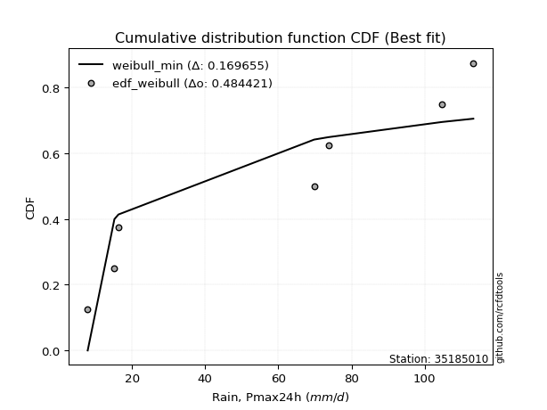</img>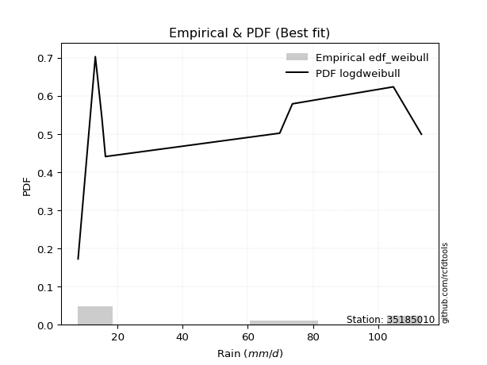</img>

</div>


### 4. EDF Beard (1943)

The Beard formula (or Beard´s plotting position formula) in hydrology is used to estimate the empirical non-exceedance probability _(P)_ of a flood event (or other extreme hydrological data point) within a given dataset.

<div align="center">


$P=(m-0.31)/(n+0.38)$


</div>


**4.1. Empirical values**

<div align="center">

|                | 0                   | 1                   | 2                  | 3                   | 4                  | 5                  | 6                  | 7                  |
|:---------------|:--------------------|:--------------------|:-------------------|:--------------------|:-------------------|:-------------------|:-------------------|:-------------------|
| date           | 2023                | 2025                | 2020               | 2022                | 2018               | 2017               | 2019               | 2021               |
| x              | 7.9                 | 13.2                | 15.2               | 16.3                | 69.8               | 73.7               | 104.7              | 113.3              |
| m              | 1                   | 2                   | 3                  | 4                   | 5                  | 6                  | 7                  | 8                  |
| empirical_dist | edf_beard           | edf_beard           | edf_beard          | edf_beard           | edf_beard          | edf_beard          | edf_beard          | edf_beard          |
| empirical      | 0.08233890214797135 | 0.20167064439140808 | 0.3210023866348448 | 0.44033412887828155 | 0.5596658711217184 | 0.6789976133651551 | 0.7983293556085919 | 0.9176610978520287 |
| empirical_tr   | 1.0897269180754225  | 1.2526158445440956  | 1.4727592267135323 | 1.7867803837953091  | 2.2710027100271004 | 3.115241635687732  | 4.958579881656804  | 12.144927536231886 |

</div>


**4.2. Kolmogorov-Smirnov fit test (sorted by Δ)**


<div align="center">

|                | 0                  | 1                   | 2                   | 3                   | 4                  | 5                  | 6                  | 7                   | 8                  | 9                   | 10                 | 11                 | 12                 | 13                  | 14                  | 15                  | 16                  | 17                  | 18                 | 19                 | 20                 | 21                  | 22                  | 23                  | 24                  | 25                  | 26                  | 27                  | 28                  | 29                  | 30                 | 31                 | 32                  | 33                  | 34                 | 35                  | 36                  | 37                  | 38                  | 39                  | 40                  | 41                  | 42                  | 43                 | 44                  | 45                  | 46                  | 47                  | 48                  | 49                 | 50                  | 51                  | 52                  | 53                 | 54                 | 55                  | 56                  | 57                  | 58                 | 59                 | 60                  | 61                 | 62                 | 63                  | 64                  | 65                  | 66                 | 67                  | 68                  | 69                  | 70                  | 71                 | 72                 | 73                  | 74                  | 75                  | 76                  | 77                  | 78                 | 79                  | 80                  | 81                 | 82                  | 83                 | 84                  | 85                 | 86                 | 87                  | 88                 | 89                 | 90                  | 91                 | 92                  | 93                  | 94                 | 95                 | 96                 | 97                  | 98                 | 99                 | 100                | 101                | 102                | 103                | 104                 | 105                 | 106                | 107                | 108                | 109                 | 110                 | 111                 | 112                | 113                | 114                 | 115                | 116                 | 117                | 118                | 119                 | 120                | 121                | 122                | 123                 | 124                 | 125                | 126                 | 127                 | 128                 | 129                | 130                 | 131                 | 132                | 133                | 134                 | 135                | 136                | 137                 | 138                | 139                | 140                | 141                 | 142                | 143                | 144                 | 145                 | 146                | 147                | 148                 | 149                | 150                 | 151                | 152                | 153                | 154                | 155                | 156                | 157                | 158                | 159                |
|:---------------|:-------------------|:--------------------|:--------------------|:--------------------|:-------------------|:-------------------|:-------------------|:--------------------|:-------------------|:--------------------|:-------------------|:-------------------|:-------------------|:--------------------|:--------------------|:--------------------|:--------------------|:--------------------|:-------------------|:-------------------|:-------------------|:--------------------|:--------------------|:--------------------|:--------------------|:--------------------|:--------------------|:--------------------|:--------------------|:--------------------|:-------------------|:-------------------|:--------------------|:--------------------|:-------------------|:--------------------|:--------------------|:--------------------|:--------------------|:--------------------|:--------------------|:--------------------|:--------------------|:-------------------|:--------------------|:--------------------|:--------------------|:--------------------|:--------------------|:-------------------|:--------------------|:--------------------|:--------------------|:-------------------|:-------------------|:--------------------|:--------------------|:--------------------|:-------------------|:-------------------|:--------------------|:-------------------|:-------------------|:--------------------|:--------------------|:--------------------|:-------------------|:--------------------|:--------------------|:--------------------|:--------------------|:-------------------|:-------------------|:--------------------|:--------------------|:--------------------|:--------------------|:--------------------|:-------------------|:--------------------|:--------------------|:-------------------|:--------------------|:-------------------|:--------------------|:-------------------|:-------------------|:--------------------|:-------------------|:-------------------|:--------------------|:-------------------|:--------------------|:--------------------|:-------------------|:-------------------|:-------------------|:--------------------|:-------------------|:-------------------|:-------------------|:-------------------|:-------------------|:-------------------|:--------------------|:--------------------|:-------------------|:-------------------|:-------------------|:--------------------|:--------------------|:--------------------|:-------------------|:-------------------|:--------------------|:-------------------|:--------------------|:-------------------|:-------------------|:--------------------|:-------------------|:-------------------|:-------------------|:--------------------|:--------------------|:-------------------|:--------------------|:--------------------|:--------------------|:-------------------|:--------------------|:--------------------|:-------------------|:-------------------|:--------------------|:-------------------|:-------------------|:--------------------|:-------------------|:-------------------|:-------------------|:--------------------|:-------------------|:-------------------|:--------------------|:--------------------|:-------------------|:-------------------|:--------------------|:-------------------|:--------------------|:-------------------|:-------------------|:-------------------|:-------------------|:-------------------|:-------------------|:-------------------|:-------------------|:-------------------|
| station        | 35185010           | 35185010            | 35185010            | 35185010            | 35185010           | 35185010           | 35185010           | 35185010            | 35185010           | 35185010            | 35185010           | 35185010           | 35185010           | 35185010            | 35185010            | 35185010            | 35185010            | 35185010            | 35185010           | 35185010           | 35185010           | 35185010            | 35185010            | 35185010            | 35185010            | 35185010            | 35185010            | 35185010            | 35185010            | 35185010            | 35185010           | 35185010           | 35185010            | 35185010            | 35185010           | 35185010            | 35185010            | 35185010            | 35185010            | 35185010            | 35185010            | 35185010            | 35185010            | 35185010           | 35185010            | 35185010            | 35185010            | 35185010            | 35185010            | 35185010           | 35185010            | 35185010            | 35185010            | 35185010           | 35185010           | 35185010            | 35185010            | 35185010            | 35185010           | 35185010           | 35185010            | 35185010           | 35185010           | 35185010            | 35185010            | 35185010            | 35185010           | 35185010            | 35185010            | 35185010            | 35185010            | 35185010           | 35185010           | 35185010            | 35185010            | 35185010            | 35185010            | 35185010            | 35185010           | 35185010            | 35185010            | 35185010           | 35185010            | 35185010           | 35185010            | 35185010           | 35185010           | 35185010            | 35185010           | 35185010           | 35185010            | 35185010           | 35185010            | 35185010            | 35185010           | 35185010           | 35185010           | 35185010            | 35185010           | 35185010           | 35185010           | 35185010           | 35185010           | 35185010           | 35185010            | 35185010            | 35185010           | 35185010           | 35185010           | 35185010            | 35185010            | 35185010            | 35185010           | 35185010           | 35185010            | 35185010           | 35185010            | 35185010           | 35185010           | 35185010            | 35185010           | 35185010           | 35185010           | 35185010            | 35185010            | 35185010           | 35185010            | 35185010            | 35185010            | 35185010           | 35185010            | 35185010            | 35185010           | 35185010           | 35185010            | 35185010           | 35185010           | 35185010            | 35185010           | 35185010           | 35185010           | 35185010            | 35185010           | 35185010           | 35185010            | 35185010            | 35185010           | 35185010           | 35185010            | 35185010           | 35185010            | 35185010           | 35185010           | 35185010           | 35185010           | 35185010           | 35185010           | 35185010           | 35185010           | 35185010           |
| empirical_dist | edf_beard          | edf_beard           | edf_beard           | edf_beard           | edf_beard          | edf_beard          | edf_beard          | edf_beard           | edf_beard          | edf_beard           | edf_beard          | edf_beard          | edf_beard          | edf_beard           | edf_beard           | edf_beard           | edf_beard           | edf_beard           | edf_beard          | edf_beard          | edf_beard          | edf_beard           | edf_beard           | edf_beard           | edf_beard           | edf_beard           | edf_beard           | edf_beard           | edf_beard           | edf_beard           | edf_beard          | edf_beard          | edf_beard           | edf_beard           | edf_beard          | edf_beard           | edf_beard           | edf_beard           | edf_beard           | edf_beard           | edf_beard           | edf_beard           | edf_beard           | edf_beard          | edf_beard           | edf_beard           | edf_beard           | edf_beard           | edf_beard           | edf_beard          | edf_beard           | edf_beard           | edf_beard           | edf_beard          | edf_beard          | edf_beard           | edf_beard           | edf_beard           | edf_beard          | edf_beard          | edf_beard           | edf_beard          | edf_beard          | edf_beard           | edf_beard           | edf_beard           | edf_beard          | edf_beard           | edf_beard           | edf_beard           | edf_beard           | edf_beard          | edf_beard          | edf_beard           | edf_beard           | edf_beard           | edf_beard           | edf_beard           | edf_beard          | edf_beard           | edf_beard           | edf_beard          | edf_beard           | edf_beard          | edf_beard           | edf_beard          | edf_beard          | edf_beard           | edf_beard          | edf_beard          | edf_beard           | edf_beard          | edf_beard           | edf_beard           | edf_beard          | edf_beard          | edf_beard          | edf_beard           | edf_beard          | edf_beard          | edf_beard          | edf_beard          | edf_beard          | edf_beard          | edf_beard           | edf_beard           | edf_beard          | edf_beard          | edf_beard          | edf_beard           | edf_beard           | edf_beard           | edf_beard          | edf_beard          | edf_beard           | edf_beard          | edf_beard           | edf_beard          | edf_beard          | edf_beard           | edf_beard          | edf_beard          | edf_beard          | edf_beard           | edf_beard           | edf_beard          | edf_beard           | edf_beard           | edf_beard           | edf_beard          | edf_beard           | edf_beard           | edf_beard          | edf_beard          | edf_beard           | edf_beard          | edf_beard          | edf_beard           | edf_beard          | edf_beard          | edf_beard          | edf_beard           | edf_beard          | edf_beard          | edf_beard           | edf_beard           | edf_beard          | edf_beard          | edf_beard           | edf_beard          | edf_beard           | edf_beard          | edf_beard          | edf_beard          | edf_beard          | edf_beard          | edf_beard          | edf_beard          | edf_beard          | edf_beard          |
| p_dist         | logdgamma          | logdweibull         | logarcsine          | dweibull            | logweibull_max     | arcsine            | logksone           | dgamma              | logwrapcauchy      | mielke              | wrapcauchy         | logsemicircular    | loglevy_l          | halfgennorm         | loganglit           | loggenextreme       | ksone               | weibull_min         | loggenhalflogistic | logtrapezoid       | logbeta            | truncexpon          | loggenpareto        | loghalfgennorm      | logpearson3         | semicircular        | exponpow            | logskewnorm         | logt                | logexponnorm        | lognorm            | logcrystalball     | lognct              | logtriang           | logfoldnorm        | logerlang           | loggamma            | loggamma            | logbetaprime        | loggompertz         | invweibull          | betaprime           | logf                | loglomax           | loggausshyper       | logncf              | logrice             | logmaxwell          | gengamma            | lograyleigh        | loginvgamma         | burr12              | logalpha            | anglit             | loggenexpon        | logcosine           | loginvweibull       | loginvgauss         | burr               | loggenlogistic     | halfnorm            | logweibull_min     | logburr            | logfatiguelife      | ncf                 | nakagami            | logburr12          | loghalfnorm         | invgamma            | foldnorm            | nct                 | logjohnsonsu       | f                  | rayleigh            | logkstwobign        | loglogistic         | maxwell             | logloggamma         | loggumbel_l        | lognakagami         | loggumbel_r         | genlogistic        | logkappa3           | pearson3           | loghypsecant        | invgauss           | johnsonsu          | exponnorm           | norm               | crystalball        | t                   | loghalflogistic    | logtukeylambda      | logargus            | kstwobign          | logmoyal           | alpha              | logkappa4           | halflogistic       | truncweibull_min   | loguniform         | logvonmises_line   | gumbel_r           | beta               | loglaplace          | loglaplace          | lomax              | levy_l             | gausshyper         | logistic            | cosine              | gumbel_l            | moyal              | genexpon           | rice                | hypsecant          | loggengamma         | laplace            | argus              | logwald             | genextreme         | loggennorm         | gennorm            | logtruncnorm        | logbradford         | logtruncexpon      | gamma               | logtruncweibull_min | gompertz            | logloglaplace      | exponweib           | skewnorm            | kappa4             | genpareto          | bradford            | tukeylambda        | genhalflogistic    | logrdist            | vonmises_line      | kappa3             | uniform            | erlang              | powerlaw           | truncnorm          | triang              | trapezoid           | logexponpow        | wald               | fatiguelife         | logjohnsonsb       | johnsonsb           | logpowerlaw        | logexponweib       | weibull_max        | truncpareto        | rdist              | logtruncpareto     | logvonmises        | vonmises           | logmielke          |
| delta          | 0.0824703438134039 | 0.09221510825587753 | 0.11375377577368606 | 0.14657812216693655 | 0.1493304602588507 | 0.1502387007375134 | 0.1519137277570296 | 0.15378483059118675 | 0.155503976540472  | 0.16270533966484274 | 0.1674407278302824 | 0.1683014821246811 | 0.1713939609352978 | 0.17676651455359438 | 0.18052177051568152 | 0.18886880340066703 | 0.19045575704368375 | 0.19159389264793913 | 0.1923022929337162 | 0.1928370542098251 | 0.1934210864066555 | 0.19682128003128807 | 0.19687425565723465 | 0.20535101043946136 | 0.20709654178666692 | 0.20724477796309898 | 0.20725420616656265 | 0.20849094372568222 | 0.20852517437572016 | 0.20853369836544922 | 0.2085345517367727 | 0.2085345735850187 | 0.20864306766538476 | 0.20884531444836718 | 0.209226749925006  | 0.20930574324421602 | 0.20970934754968285 | 0.20970934754968285 | 0.21064415849887863 | 0.21087666775705016 | 0.21189600447284795 | 0.21453793911192853 | 0.21479577203033073 | 0.2148548421327705 | 0.21512768545240996 | 0.21538341762817925 | 0.21540896593160863 | 0.21571955413090727 | 0.21764209023882608 | 0.2177579245158331 | 0.21883619100519391 | 0.21910299355664364 | 0.21918814127101993 | 0.2194949466624132 | 0.2198398543984429 | 0.22081472952680103 | 0.22128618255480803 | 0.22138376934722837 | 0.2222319247276321 | 0.2229033637831187 | 0.22320359902166922 | 0.2235082721814683 | 0.2236254131239167 | 0.22374492642836885 | 0.22424689177423485 | 0.22512855817643584 | 0.2252465137760461 | 0.22525029429135135 | 0.22553631179338685 | 0.22565260632101164 | 0.22833614098797939 | 0.2291215504764928 | 0.230336701955277  | 0.23084649488854983 | 0.23102202479451117 | 0.23107447786193647 | 0.23561220614210718 | 0.23648012235366744 | 0.2399462522114029 | 0.24178161887315597 | 0.24340157743568425 | 0.2441551635627537 | 0.24442795218531532 | 0.2445038928061115 | 0.24535121888939515 | 0.2462427622781258 | 0.2463052301639589 | 0.24719197594802467 | 0.2472115169994748 | 0.2472115429733444 | 0.24721868488913323 | 0.248519576883951  | 0.24929303577007755 | 0.25131705647841657 | 0.2537871733128414 | 0.2547426273635749 | 0.2559425716408621 | 0.25597846358458287 | 0.2560323460616417 | 0.2572157472003346 | 0.2584441283854578 | 0.2585894607914403 | 0.2587105849513316 | 0.2592385392171502 | 0.26299143506340195 | 0.26299143506340195 | 0.2639029320184636 | 0.2643654411444337 | 0.2672320923982846 | 0.26834009054735136 | 0.26938881839353523 | 0.27160398340645925 | 0.2749159615443649 | 0.2751038952966652 | 0.27994271373056623 | 0.2805461853189775 | 0.29017916868101157 | 0.2935053155287931 | 0.2935730502059248 | 0.29361111482510904 | 0.2966176004649018 | 0.2983293556085919 | 0.2983293556085919 | 0.29884393444202545 | 0.30560801814726657 | 0.3155336910195624 | 0.31656868872879185 | 0.3174230392930244  | 0.32083062985345057 | 0.3236462932687122 | 0.32857838561923214 | 0.32899513898509997 | 0.3334284835920316 | 0.343431917884159  | 0.34713953608447434 | 0.3545145504628781 | 0.3549065324032929 | 0.35997705010807457 | 0.3599976882095213 | 0.3605541418549808 | 0.3606377341913745 | 0.36620138888122356 | 0.4095726730497787 | 0.4104107343073551 | 0.41315921111443027 | 0.41759631211765835 | 0.4226512821989125 | 0.4243558990414746 | 0.43196055888222423 | 0.484930061920464  | 0.49088883280569856 | 0.5240890768650748 | 0.5321745831958571 | 0.5704927487046665 | 0.6063730503149181 | 0.6689501466174366 | 0.6900295252300943 | 1.2000597168051297 | 17.39649339540522  | nan                |
| deltao         | 0.4472608134160001 | 0.4472608134160001  | 0.4472608134160001  | 0.4472608134160001  | 0.4472608134160001 | 0.4472608134160001 | 0.4472608134160001 | 0.4472608134160001  | 0.4472608134160001 | 0.4472608134160001  | 0.4472608134160001 | 0.4472608134160001 | 0.4472608134160001 | 0.4472608134160001  | 0.4472608134160001  | 0.4472608134160001  | 0.4472608134160001  | 0.4472608134160001  | 0.4472608134160001 | 0.4472608134160001 | 0.4472608134160001 | 0.4472608134160001  | 0.4472608134160001  | 0.4472608134160001  | 0.4472608134160001  | 0.4472608134160001  | 0.4472608134160001  | 0.4472608134160001  | 0.4472608134160001  | 0.4472608134160001  | 0.4472608134160001 | 0.4472608134160001 | 0.4472608134160001  | 0.4472608134160001  | 0.4472608134160001 | 0.4472608134160001  | 0.4472608134160001  | 0.4472608134160001  | 0.4472608134160001  | 0.4472608134160001  | 0.4472608134160001  | 0.4472608134160001  | 0.4472608134160001  | 0.4472608134160001 | 0.4472608134160001  | 0.4472608134160001  | 0.4472608134160001  | 0.4472608134160001  | 0.4472608134160001  | 0.4472608134160001 | 0.4472608134160001  | 0.4472608134160001  | 0.4472608134160001  | 0.4472608134160001 | 0.4472608134160001 | 0.4472608134160001  | 0.4472608134160001  | 0.4472608134160001  | 0.4472608134160001 | 0.4472608134160001 | 0.4472608134160001  | 0.4472608134160001 | 0.4472608134160001 | 0.4472608134160001  | 0.4472608134160001  | 0.4472608134160001  | 0.4472608134160001 | 0.4472608134160001  | 0.4472608134160001  | 0.4472608134160001  | 0.4472608134160001  | 0.4472608134160001 | 0.4472608134160001 | 0.4472608134160001  | 0.4472608134160001  | 0.4472608134160001  | 0.4472608134160001  | 0.4472608134160001  | 0.4472608134160001 | 0.4472608134160001  | 0.4472608134160001  | 0.4472608134160001 | 0.4472608134160001  | 0.4472608134160001 | 0.4472608134160001  | 0.4472608134160001 | 0.4472608134160001 | 0.4472608134160001  | 0.4472608134160001 | 0.4472608134160001 | 0.4472608134160001  | 0.4472608134160001 | 0.4472608134160001  | 0.4472608134160001  | 0.4472608134160001 | 0.4472608134160001 | 0.4472608134160001 | 0.4472608134160001  | 0.4472608134160001 | 0.4472608134160001 | 0.4472608134160001 | 0.4472608134160001 | 0.4472608134160001 | 0.4472608134160001 | 0.4472608134160001  | 0.4472608134160001  | 0.4472608134160001 | 0.4472608134160001 | 0.4472608134160001 | 0.4472608134160001  | 0.4472608134160001  | 0.4472608134160001  | 0.4472608134160001 | 0.4472608134160001 | 0.4472608134160001  | 0.4472608134160001 | 0.4472608134160001  | 0.4472608134160001 | 0.4472608134160001 | 0.4472608134160001  | 0.4472608134160001 | 0.4472608134160001 | 0.4472608134160001 | 0.4472608134160001  | 0.4472608134160001  | 0.4472608134160001 | 0.4472608134160001  | 0.4472608134160001  | 0.4472608134160001  | 0.4472608134160001 | 0.4472608134160001  | 0.4472608134160001  | 0.4472608134160001 | 0.4472608134160001 | 0.4472608134160001  | 0.4472608134160001 | 0.4472608134160001 | 0.4472608134160001  | 0.4472608134160001 | 0.4472608134160001 | 0.4472608134160001 | 0.4472608134160001  | 0.4472608134160001 | 0.4472608134160001 | 0.4472608134160001  | 0.4472608134160001  | 0.4472608134160001 | 0.4472608134160001 | 0.4472608134160001  | 0.4472608134160001 | 0.4472608134160001  | 0.4472608134160001 | 0.4472608134160001 | 0.4472608134160001 | 0.4472608134160001 | 0.4472608134160001 | 0.4472608134160001 | 0.4472608134160001 | 0.4472608134160001 | 0.4472608134160001 |
| eval           | Δo > Δ             | Δo > Δ              | Δo > Δ              | Δo > Δ              | Δo > Δ             | Δo > Δ             | Δo > Δ             | Δo > Δ              | Δo > Δ             | Δo > Δ              | Δo > Δ             | Δo > Δ             | Δo > Δ             | Δo > Δ              | Δo > Δ              | Δo > Δ              | Δo > Δ              | Δo > Δ              | Δo > Δ             | Δo > Δ             | Δo > Δ             | Δo > Δ              | Δo > Δ              | Δo > Δ              | Δo > Δ              | Δo > Δ              | Δo > Δ              | Δo > Δ              | Δo > Δ              | Δo > Δ              | Δo > Δ             | Δo > Δ             | Δo > Δ              | Δo > Δ              | Δo > Δ             | Δo > Δ              | Δo > Δ              | Δo > Δ              | Δo > Δ              | Δo > Δ              | Δo > Δ              | Δo > Δ              | Δo > Δ              | Δo > Δ             | Δo > Δ              | Δo > Δ              | Δo > Δ              | Δo > Δ              | Δo > Δ              | Δo > Δ             | Δo > Δ              | Δo > Δ              | Δo > Δ              | Δo > Δ             | Δo > Δ             | Δo > Δ              | Δo > Δ              | Δo > Δ              | Δo > Δ             | Δo > Δ             | Δo > Δ              | Δo > Δ             | Δo > Δ             | Δo > Δ              | Δo > Δ              | Δo > Δ              | Δo > Δ             | Δo > Δ              | Δo > Δ              | Δo > Δ              | Δo > Δ              | Δo > Δ             | Δo > Δ             | Δo > Δ              | Δo > Δ              | Δo > Δ              | Δo > Δ              | Δo > Δ              | Δo > Δ             | Δo > Δ              | Δo > Δ              | Δo > Δ             | Δo > Δ              | Δo > Δ             | Δo > Δ              | Δo > Δ             | Δo > Δ             | Δo > Δ              | Δo > Δ             | Δo > Δ             | Δo > Δ              | Δo > Δ             | Δo > Δ              | Δo > Δ              | Δo > Δ             | Δo > Δ             | Δo > Δ             | Δo > Δ              | Δo > Δ             | Δo > Δ             | Δo > Δ             | Δo > Δ             | Δo > Δ             | Δo > Δ             | Δo > Δ              | Δo > Δ              | Δo > Δ             | Δo > Δ             | Δo > Δ             | Δo > Δ              | Δo > Δ              | Δo > Δ              | Δo > Δ             | Δo > Δ             | Δo > Δ              | Δo > Δ             | Δo > Δ              | Δo > Δ             | Δo > Δ             | Δo > Δ              | Δo > Δ             | Δo > Δ             | Δo > Δ             | Δo > Δ              | Δo > Δ              | Δo > Δ             | Δo > Δ              | Δo > Δ              | Δo > Δ              | Δo > Δ             | Δo > Δ              | Δo > Δ              | Δo > Δ             | Δo > Δ             | Δo > Δ              | Δo > Δ             | Δo > Δ             | Δo > Δ              | Δo > Δ             | Δo > Δ             | Δo > Δ             | Δo > Δ              | Δo > Δ             | Δo > Δ             | Δo > Δ              | Δo > Δ              | Δo > Δ             | Δo > Δ             | Δo > Δ              | Δo <= Δ            | Δo <= Δ             | Δo <= Δ            | Δo <= Δ            | Δo <= Δ            | Δo <= Δ            | Δo <= Δ            | Δo <= Δ            | Δo <= Δ            | Δo <= Δ            | Δo <= Δ            |
| fit            | 1                  | 1                   | 1                   | 1                   | 1                  | 1                  | 1                  | 1                   | 1                  | 1                   | 1                  | 1                  | 1                  | 1                   | 1                   | 1                   | 1                   | 1                   | 1                  | 1                  | 1                  | 1                   | 1                   | 1                   | 1                   | 1                   | 1                   | 1                   | 1                   | 1                   | 1                  | 1                  | 1                   | 1                   | 1                  | 1                   | 1                   | 1                   | 1                   | 1                   | 1                   | 1                   | 1                   | 1                  | 1                   | 1                   | 1                   | 1                   | 1                   | 1                  | 1                   | 1                   | 1                   | 1                  | 1                  | 1                   | 1                   | 1                   | 1                  | 1                  | 1                   | 1                  | 1                  | 1                   | 1                   | 1                   | 1                  | 1                   | 1                   | 1                   | 1                   | 1                  | 1                  | 1                   | 1                   | 1                   | 1                   | 1                   | 1                  | 1                   | 1                   | 1                  | 1                   | 1                  | 1                   | 1                  | 1                  | 1                   | 1                  | 1                  | 1                   | 1                  | 1                   | 1                   | 1                  | 1                  | 1                  | 1                   | 1                  | 1                  | 1                  | 1                  | 1                  | 1                  | 1                   | 1                   | 1                  | 1                  | 1                  | 1                   | 1                   | 1                   | 1                  | 1                  | 1                   | 1                  | 1                   | 1                  | 1                  | 1                   | 1                  | 1                  | 1                  | 1                   | 1                   | 1                  | 1                   | 1                   | 1                   | 1                  | 1                   | 1                   | 1                  | 1                  | 1                   | 1                  | 1                  | 1                   | 1                  | 1                  | 1                  | 1                   | 1                  | 1                  | 1                   | 1                   | 1                  | 1                  | 1                   | 0                  | 0                   | 0                  | 0                  | 0                  | 0                  | 0                  | 0                  | 0                  | 0                  | 0                  |
| n              | 8                  | 8                   | 8                   | 8                   | 8                  | 8                  | 8                  | 8                   | 8                  | 8                   | 8                  | 8                  | 8                  | 8                   | 8                   | 8                   | 8                   | 8                   | 8                  | 8                  | 8                  | 8                   | 8                   | 8                   | 8                   | 8                   | 8                   | 8                   | 8                   | 8                   | 8                  | 8                  | 8                   | 8                   | 8                  | 8                   | 8                   | 8                   | 8                   | 8                   | 8                   | 8                   | 8                   | 8                  | 8                   | 8                   | 8                   | 8                   | 8                   | 8                  | 8                   | 8                   | 8                   | 8                  | 8                  | 8                   | 8                   | 8                   | 8                  | 8                  | 8                   | 8                  | 8                  | 8                   | 8                   | 8                   | 8                  | 8                   | 8                   | 8                   | 8                   | 8                  | 8                  | 8                   | 8                   | 8                   | 8                   | 8                   | 8                  | 8                   | 8                   | 8                  | 8                   | 8                  | 8                   | 8                  | 8                  | 8                   | 8                  | 8                  | 8                   | 8                  | 8                   | 8                   | 8                  | 8                  | 8                  | 8                   | 8                  | 8                  | 8                  | 8                  | 8                  | 8                  | 8                   | 8                   | 8                  | 8                  | 8                  | 8                   | 8                   | 8                   | 8                  | 8                  | 8                   | 8                  | 8                   | 8                  | 8                  | 8                   | 8                  | 8                  | 8                  | 8                   | 8                   | 8                  | 8                   | 8                   | 8                   | 8                  | 8                   | 8                   | 8                  | 8                  | 8                   | 8                  | 8                  | 8                   | 8                  | 8                  | 8                  | 8                   | 8                  | 8                  | 8                   | 8                   | 8                  | 8                  | 8                   | 8                  | 8                   | 8                  | 8                  | 8                  | 8                  | 8                  | 8                  | 8                  | 8                  | 8                  |
| best_fit       | 1                  | 0                   | 0                   | 0                   | 0                  | 0                  | 0                  | 0                   | 0                  | 0                   | 0                  | 0                  | 0                  | 0                   | 0                   | 0                   | 0                   | 0                   | 0                  | 0                  | 0                  | 0                   | 0                   | 0                   | 0                   | 0                   | 0                   | 0                   | 0                   | 0                   | 0                  | 0                  | 0                   | 0                   | 0                  | 0                   | 0                   | 0                   | 0                   | 0                   | 0                   | 0                   | 0                   | 0                  | 0                   | 0                   | 0                   | 0                   | 0                   | 0                  | 0                   | 0                   | 0                   | 0                  | 0                  | 0                   | 0                   | 0                   | 0                  | 0                  | 0                   | 0                  | 0                  | 0                   | 0                   | 0                   | 0                  | 0                   | 0                   | 0                   | 0                   | 0                  | 0                  | 0                   | 0                   | 0                   | 0                   | 0                   | 0                  | 0                   | 0                   | 0                  | 0                   | 0                  | 0                   | 0                  | 0                  | 0                   | 0                  | 0                  | 0                   | 0                  | 0                   | 0                   | 0                  | 0                  | 0                  | 0                   | 0                  | 0                  | 0                  | 0                  | 0                  | 0                  | 0                   | 0                   | 0                  | 0                  | 0                  | 0                   | 0                   | 0                   | 0                  | 0                  | 0                   | 0                  | 0                   | 0                  | 0                  | 0                   | 0                  | 0                  | 0                  | 0                   | 0                   | 0                  | 0                   | 0                   | 0                   | 0                  | 0                   | 0                   | 0                  | 0                  | 0                   | 0                  | 0                  | 0                   | 0                  | 0                  | 0                  | 0                   | 0                  | 0                  | 0                   | 0                   | 0                  | 0                  | 0                   | 0                  | 0                   | 0                  | 0                  | 0                  | 0                  | 0                  | 0                  | 0                  | 0                  | 0                  |
| best_fit_sort  | 1                  | 2                   | 3                   | 4                   | 5                  | 6                  | 7                  | 8                   | 9                  | 10                  | 11                 | 12                 | 13                 | 14                  | 15                  | 16                  | 17                  | 18                  | 19                 | 20                 | 21                 | 22                  | 23                  | 24                  | 25                  | 26                  | 27                  | 28                  | 29                  | 30                  | 31                 | 32                 | 33                  | 34                  | 35                 | 36                  | 37                  | 38                  | 39                  | 40                  | 41                  | 42                  | 43                  | 44                 | 45                  | 46                  | 47                  | 48                  | 49                  | 50                 | 51                  | 52                  | 53                  | 54                 | 55                 | 56                  | 57                  | 58                  | 59                 | 60                 | 61                  | 62                 | 63                 | 64                  | 65                  | 66                  | 67                 | 68                  | 69                  | 70                  | 71                  | 72                 | 73                 | 74                  | 75                  | 76                  | 77                  | 78                  | 79                 | 80                  | 81                  | 82                 | 83                  | 84                 | 85                  | 86                 | 87                 | 88                  | 89                 | 90                 | 91                  | 92                 | 93                  | 94                  | 95                 | 96                 | 97                 | 98                  | 99                 | 100                | 101                | 102                | 103                | 104                | 105                 | 106                 | 107                | 108                | 109                | 110                 | 111                 | 112                 | 113                | 114                | 115                 | 116                | 117                 | 118                | 119                | 120                 | 121                | 122                | 123                | 124                 | 125                 | 126                | 127                 | 128                 | 129                 | 130                | 131                 | 132                 | 133                | 134                | 135                 | 136                | 137                | 138                 | 139                | 140                | 141                | 142                 | 143                | 144                | 145                 | 146                 | 147                | 148                | 149                 | 150                | 151                 | 152                | 153                | 154                | 155                | 156                | 157                | 158                | 159                | 160                |

</div>


**4.3. Best fit**

<div align="center">

|   id |   station | empirical_dist   | p_dist    |     delta |   deltao | eval   |   fit |   n |   best_fit |   best_fit_sort |
|-----:|----------:|:-----------------|:----------|----------:|---------:|:-------|------:|----:|-----------:|----------------:|
|    0 |  35185010 | edf_beard        | logdgamma | 0.0824703 | 0.447261 | Δo > Δ |     1 |   8 |          1 |               1 |

</div>


<div align="center">

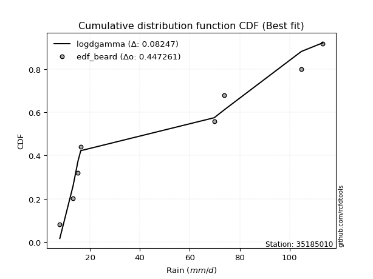</img>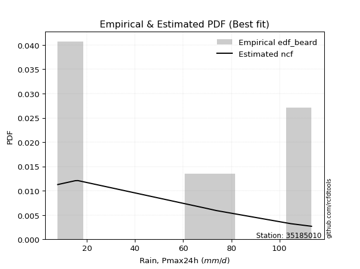</img>

</div>


### 5. EDF Chegodayev (1955)

The Chegodayev formula is an empirical plotting position formula used in hydrological frequency analysis to estimate the exceedance probability or return period of a specific event from a set of observed data. It is primarily used for plotting observed data points on probability paper to fit a theoretical distribution, particularly for analyzing extreme events like maximum flood flows or rainfall intensities. The constant _b_ value in the generalized plotting position formula is 0.3.

<div align="center">


$P=(m-b)/(n+1-2b)$


</div>


**5.1. Empirical values**

<div align="center">

|                | 0                   | 1                   | 2                   | 3                   | 4                  | 5                  | 6                  | 7                  |
|:---------------|:--------------------|:--------------------|:--------------------|:--------------------|:-------------------|:-------------------|:-------------------|:-------------------|
| date           | 2023                | 2025                | 2020                | 2022                | 2018               | 2017               | 2019               | 2021               |
| x              | 7.9                 | 13.2                | 15.2                | 16.3                | 69.8               | 73.7               | 104.7              | 113.3              |
| m              | 1                   | 2                   | 3                   | 4                   | 5                  | 6                  | 7                  | 8                  |
| empirical_dist | edf_chegodayev      | edf_chegodayev      | edf_chegodayev      | edf_chegodayev      | edf_chegodayev     | edf_chegodayev     | edf_chegodayev     | edf_chegodayev     |
| empirical      | 0.08333333333333333 | 0.20238095238095236 | 0.32142857142857145 | 0.44047619047619047 | 0.5595238095238095 | 0.6785714285714286 | 0.7976190476190476 | 0.9166666666666666 |
| empirical_tr   | 1.090909090909091   | 1.253731343283582   | 1.4736842105263157  | 1.7872340425531914  | 2.27027027027027   | 3.1111111111111116 | 4.941176470588234  | 11.999999999999995 |

</div>


**5.2. Kolmogorov-Smirnov fit test (sorted by Δ)**


<div align="center">

|                | 0                  | 1                   | 2                   | 3                   | 4                  | 5                  | 6                   | 7                   | 8                   | 9                   | 10                  | 11                  | 12                  | 13                  | 14                  | 15                  | 16                  | 17                 | 18                  | 19                  | 20                  | 21                 | 22                  | 23                  | 24                  | 25                 | 26                 | 27                  | 28                  | 29                  | 30                  | 31                  | 32                  | 33                  | 34                  | 35                  | 36                 | 37                 | 38                 | 39                  | 40                  | 41                 | 42                 | 43                  | 44                  | 45                 | 46                 | 47                  | 48                  | 49                  | 50                  | 51                 | 52                 | 53                  | 54                  | 55                 | 56                 | 57                  | 58                  | 59                  | 60                  | 61                  | 62                  | 63                 | 64                 | 65                 | 66                  | 67                 | 68                 | 69                  | 70                  | 71                 | 72                  | 73                  | 74                  | 75                  | 76                 | 77                  | 78                 | 79                  | 80                 | 81                  | 82                  | 83                  | 84                 | 85                  | 86                 | 87                  | 88                  | 89                  | 90                  | 91                  | 92                 | 93                 | 94                  | 95                  | 96                  | 97                  | 98                 | 99                  | 100                | 101                | 102                 | 103                | 104                | 105                | 106                 | 107                | 108                | 109                | 110                 | 111                 | 112                | 113                | 114                 | 115                 | 116                 | 117                | 118                | 119                | 120                | 121                 | 122                 | 123                 | 124                 | 125                | 126                | 127                 | 128                | 129                 | 130                | 131                | 132                | 133                | 134                 | 135                | 136                | 137                 | 138                 | 139                 | 140                 | 141                | 142                 | 143                | 144                | 145                 | 146                 | 147                | 148                | 149                | 150                | 151                | 152                | 153                | 154                | 155                | 156                | 157                | 158                | 159                |
|:---------------|:-------------------|:--------------------|:--------------------|:--------------------|:-------------------|:-------------------|:--------------------|:--------------------|:--------------------|:--------------------|:--------------------|:--------------------|:--------------------|:--------------------|:--------------------|:--------------------|:--------------------|:-------------------|:--------------------|:--------------------|:--------------------|:-------------------|:--------------------|:--------------------|:--------------------|:-------------------|:-------------------|:--------------------|:--------------------|:--------------------|:--------------------|:--------------------|:--------------------|:--------------------|:--------------------|:--------------------|:-------------------|:-------------------|:-------------------|:--------------------|:--------------------|:-------------------|:-------------------|:--------------------|:--------------------|:-------------------|:-------------------|:--------------------|:--------------------|:--------------------|:--------------------|:-------------------|:-------------------|:--------------------|:--------------------|:-------------------|:-------------------|:--------------------|:--------------------|:--------------------|:--------------------|:--------------------|:--------------------|:-------------------|:-------------------|:-------------------|:--------------------|:-------------------|:-------------------|:--------------------|:--------------------|:-------------------|:--------------------|:--------------------|:--------------------|:--------------------|:-------------------|:--------------------|:-------------------|:--------------------|:-------------------|:--------------------|:--------------------|:--------------------|:-------------------|:--------------------|:-------------------|:--------------------|:--------------------|:--------------------|:--------------------|:--------------------|:-------------------|:-------------------|:--------------------|:--------------------|:--------------------|:--------------------|:-------------------|:--------------------|:-------------------|:-------------------|:--------------------|:-------------------|:-------------------|:-------------------|:--------------------|:-------------------|:-------------------|:-------------------|:--------------------|:--------------------|:-------------------|:-------------------|:--------------------|:--------------------|:--------------------|:-------------------|:-------------------|:-------------------|:-------------------|:--------------------|:--------------------|:--------------------|:--------------------|:-------------------|:-------------------|:--------------------|:-------------------|:--------------------|:-------------------|:-------------------|:-------------------|:-------------------|:--------------------|:-------------------|:-------------------|:--------------------|:--------------------|:--------------------|:--------------------|:-------------------|:--------------------|:-------------------|:-------------------|:--------------------|:--------------------|:-------------------|:-------------------|:-------------------|:-------------------|:-------------------|:-------------------|:-------------------|:-------------------|:-------------------|:-------------------|:-------------------|:-------------------|:-------------------|
| station        | 35185010           | 35185010            | 35185010            | 35185010            | 35185010           | 35185010           | 35185010            | 35185010            | 35185010            | 35185010            | 35185010            | 35185010            | 35185010            | 35185010            | 35185010            | 35185010            | 35185010            | 35185010           | 35185010            | 35185010            | 35185010            | 35185010           | 35185010            | 35185010            | 35185010            | 35185010           | 35185010           | 35185010            | 35185010            | 35185010            | 35185010            | 35185010            | 35185010            | 35185010            | 35185010            | 35185010            | 35185010           | 35185010           | 35185010           | 35185010            | 35185010            | 35185010           | 35185010           | 35185010            | 35185010            | 35185010           | 35185010           | 35185010            | 35185010            | 35185010            | 35185010            | 35185010           | 35185010           | 35185010            | 35185010            | 35185010           | 35185010           | 35185010            | 35185010            | 35185010            | 35185010            | 35185010            | 35185010            | 35185010           | 35185010           | 35185010           | 35185010            | 35185010           | 35185010           | 35185010            | 35185010            | 35185010           | 35185010            | 35185010            | 35185010            | 35185010            | 35185010           | 35185010            | 35185010           | 35185010            | 35185010           | 35185010            | 35185010            | 35185010            | 35185010           | 35185010            | 35185010           | 35185010            | 35185010            | 35185010            | 35185010            | 35185010            | 35185010           | 35185010           | 35185010            | 35185010            | 35185010            | 35185010            | 35185010           | 35185010            | 35185010           | 35185010           | 35185010            | 35185010           | 35185010           | 35185010           | 35185010            | 35185010           | 35185010           | 35185010           | 35185010            | 35185010            | 35185010           | 35185010           | 35185010            | 35185010            | 35185010            | 35185010           | 35185010           | 35185010           | 35185010           | 35185010            | 35185010            | 35185010            | 35185010            | 35185010           | 35185010           | 35185010            | 35185010           | 35185010            | 35185010           | 35185010           | 35185010           | 35185010           | 35185010            | 35185010           | 35185010           | 35185010            | 35185010            | 35185010            | 35185010            | 35185010           | 35185010            | 35185010           | 35185010           | 35185010            | 35185010            | 35185010           | 35185010           | 35185010           | 35185010           | 35185010           | 35185010           | 35185010           | 35185010           | 35185010           | 35185010           | 35185010           | 35185010           | 35185010           |
| empirical_dist | edf_chegodayev     | edf_chegodayev      | edf_chegodayev      | edf_chegodayev      | edf_chegodayev     | edf_chegodayev     | edf_chegodayev      | edf_chegodayev      | edf_chegodayev      | edf_chegodayev      | edf_chegodayev      | edf_chegodayev      | edf_chegodayev      | edf_chegodayev      | edf_chegodayev      | edf_chegodayev      | edf_chegodayev      | edf_chegodayev     | edf_chegodayev      | edf_chegodayev      | edf_chegodayev      | edf_chegodayev     | edf_chegodayev      | edf_chegodayev      | edf_chegodayev      | edf_chegodayev     | edf_chegodayev     | edf_chegodayev      | edf_chegodayev      | edf_chegodayev      | edf_chegodayev      | edf_chegodayev      | edf_chegodayev      | edf_chegodayev      | edf_chegodayev      | edf_chegodayev      | edf_chegodayev     | edf_chegodayev     | edf_chegodayev     | edf_chegodayev      | edf_chegodayev      | edf_chegodayev     | edf_chegodayev     | edf_chegodayev      | edf_chegodayev      | edf_chegodayev     | edf_chegodayev     | edf_chegodayev      | edf_chegodayev      | edf_chegodayev      | edf_chegodayev      | edf_chegodayev     | edf_chegodayev     | edf_chegodayev      | edf_chegodayev      | edf_chegodayev     | edf_chegodayev     | edf_chegodayev      | edf_chegodayev      | edf_chegodayev      | edf_chegodayev      | edf_chegodayev      | edf_chegodayev      | edf_chegodayev     | edf_chegodayev     | edf_chegodayev     | edf_chegodayev      | edf_chegodayev     | edf_chegodayev     | edf_chegodayev      | edf_chegodayev      | edf_chegodayev     | edf_chegodayev      | edf_chegodayev      | edf_chegodayev      | edf_chegodayev      | edf_chegodayev     | edf_chegodayev      | edf_chegodayev     | edf_chegodayev      | edf_chegodayev     | edf_chegodayev      | edf_chegodayev      | edf_chegodayev      | edf_chegodayev     | edf_chegodayev      | edf_chegodayev     | edf_chegodayev      | edf_chegodayev      | edf_chegodayev      | edf_chegodayev      | edf_chegodayev      | edf_chegodayev     | edf_chegodayev     | edf_chegodayev      | edf_chegodayev      | edf_chegodayev      | edf_chegodayev      | edf_chegodayev     | edf_chegodayev      | edf_chegodayev     | edf_chegodayev     | edf_chegodayev      | edf_chegodayev     | edf_chegodayev     | edf_chegodayev     | edf_chegodayev      | edf_chegodayev     | edf_chegodayev     | edf_chegodayev     | edf_chegodayev      | edf_chegodayev      | edf_chegodayev     | edf_chegodayev     | edf_chegodayev      | edf_chegodayev      | edf_chegodayev      | edf_chegodayev     | edf_chegodayev     | edf_chegodayev     | edf_chegodayev     | edf_chegodayev      | edf_chegodayev      | edf_chegodayev      | edf_chegodayev      | edf_chegodayev     | edf_chegodayev     | edf_chegodayev      | edf_chegodayev     | edf_chegodayev      | edf_chegodayev     | edf_chegodayev     | edf_chegodayev     | edf_chegodayev     | edf_chegodayev      | edf_chegodayev     | edf_chegodayev     | edf_chegodayev      | edf_chegodayev      | edf_chegodayev      | edf_chegodayev      | edf_chegodayev     | edf_chegodayev      | edf_chegodayev     | edf_chegodayev     | edf_chegodayev      | edf_chegodayev      | edf_chegodayev     | edf_chegodayev     | edf_chegodayev     | edf_chegodayev     | edf_chegodayev     | edf_chegodayev     | edf_chegodayev     | edf_chegodayev     | edf_chegodayev     | edf_chegodayev     | edf_chegodayev     | edf_chegodayev     | edf_chegodayev     |
| p_dist         | logdgamma          | logdweibull         | logarcsine          | dweibull            | logweibull_max     | arcsine            | logksone            | dgamma              | logwrapcauchy       | mielke              | wrapcauchy          | logsemicircular     | loglevy_l           | halfgennorm         | loganglit           | loggenextreme       | ksone               | weibull_min        | logbeta             | loggenhalflogistic  | logtrapezoid        | loggenpareto       | truncexpon          | loghalfgennorm      | logpearson3         | semicircular       | exponpow           | logskewnorm         | logt                | logexponnorm        | lognorm             | logcrystalball      | lognct              | logtriang           | logfoldnorm         | logerlang           | loggamma           | loggamma           | logbetaprime       | loggompertz         | invweibull          | betaprime          | logf               | loglomax            | loggausshyper       | logncf             | logrice            | logmaxwell          | gengamma            | lograyleigh         | loginvgamma         | burr12             | logalpha           | anglit              | loggenexpon         | logcosine          | loginvweibull      | loginvgauss         | burr                | loggenlogistic      | halfnorm            | logweibull_min      | logburr             | logfatiguelife     | ncf                | nakagami           | logburr12           | loghalfnorm        | invgamma           | foldnorm            | nct                 | logjohnsonsu       | f                   | rayleigh            | logkstwobign        | loglogistic         | maxwell            | logloggamma         | loggumbel_l        | lognakagami         | loggumbel_r        | genlogistic         | logkappa3           | pearson3            | loghypsecant       | invgauss            | johnsonsu          | exponnorm           | norm                | crystalball         | t                   | loghalflogistic     | logtukeylambda     | logargus           | kstwobign           | logmoyal            | alpha               | logkappa4           | halflogistic       | truncweibull_min    | beta               | loguniform         | logvonmises_line    | gumbel_r           | loglaplace         | loglaplace         | levy_l              | lomax              | gausshyper         | logistic           | cosine              | gumbel_l            | moyal              | genexpon           | rice                | hypsecant           | loggengamma         | laplace            | argus              | logwald            | genextreme         | loggennorm          | gennorm             | logtruncnorm        | logbradford         | logtruncexpon      | gamma              | logtruncweibull_min | gompertz           | logloglaplace       | exponweib          | skewnorm           | kappa4             | genpareto          | bradford            | tukeylambda        | genhalflogistic    | logrdist            | vonmises_line       | kappa3              | uniform             | erlang             | powerlaw            | truncnorm          | triang             | trapezoid           | logexponpow         | wald               | fatiguelife        | logjohnsonsb       | johnsonsb          | logpowerlaw        | logexponweib       | weibull_max        | truncpareto        | rdist              | logtruncpareto     | logvonmises        | vonmises           | logmielke          |
| delta          | 0.0831806518029482 | 0.09150480026633326 | 0.11389583737159492 | 0.14672018376484547 | 0.1483360290734887 | 0.1503807623354223 | 0.15205578935493846 | 0.15449513858073105 | 0.15479366855092772 | 0.16284740126275166 | 0.16758278942819133 | 0.16844354372258996 | 0.17039952974993583 | 0.17690857615150324 | 0.18066383211359038 | 0.18901086499857594 | 0.19059781864159267 | 0.1905994614625771 | 0.19242665522129354 | 0.19244435453162512 | 0.19297911580773403 | 0.1958798244718727 | 0.19696334162919693 | 0.20549307203737022 | 0.20723860338457578 | 0.2073868395610079 | 0.2073962677644715 | 0.20863300532359108 | 0.20866723597362902 | 0.20867575996335808 | 0.20867661333468157 | 0.20867663518292756 | 0.20878512926329362 | 0.20898737604627604 | 0.20936881152291487 | 0.20944780484212489 | 0.2098514091475917 | 0.2098514091475917 | 0.2107862200967875 | 0.21101872935495902 | 0.21203806607075681 | 0.2146800007098374 | 0.2149378336282396 | 0.21499690373067937 | 0.21526974705031887 | 0.2155254792260881 | 0.2155510275295175 | 0.21586161572881613 | 0.21778415183673494 | 0.21789998611374195 | 0.21897825260310277 | 0.2192450551545525 | 0.2193302028689288 | 0.21963700826032212 | 0.21998191599635175 | 0.2209567911247099 | 0.2214282441527169 | 0.22152583094513723 | 0.22237398632554095 | 0.22304542538102756 | 0.22334566061957814 | 0.22365033377937715 | 0.22376747472182557 | 0.2238869880262777 | 0.2243889533721437 | 0.2252706197743447 | 0.22538857537395496 | 0.2253923558892602 | 0.2256783733912957 | 0.22579466791892056 | 0.22847820258588825 | 0.2292636120744017 | 0.23047876355318586 | 0.23098855648645875 | 0.23116408639242003 | 0.23121653945984533 | 0.2357542677400161 | 0.23662218395157636 | 0.2400883138093118 | 0.24192368047106483 | 0.2435436390335931 | 0.24429722516066263 | 0.24457001378322418 | 0.24464595440402043 | 0.245493280487304  | 0.24638482387603466 | 0.2464472917618678 | 0.24733403754593358 | 0.24735357859738372 | 0.24735360457125333 | 0.24736074648704215 | 0.24866163848185985 | 0.2494350973679864 | 0.2514591180763255 | 0.25392923491075026 | 0.25488468896148375 | 0.25608463323877095 | 0.25612052518249173 | 0.2561744076595506 | 0.25735780879824344 | 0.2582441080317882 | 0.2585861899833667 | 0.25873152238934916 | 0.2588526465492405 | 0.2631334966613108 | 0.2631334966613108 | 0.26337100995907176 | 0.2640449936163725 | 0.2673741539961936 | 0.2684821521452603 | 0.26953087999144415 | 0.27174604500436816 | 0.2750580231422738 | 0.2752459568945741 | 0.28008477532847514 | 0.28068824691688643 | 0.29032123027892043 | 0.2936473771267021 | 0.2937151118038337 | 0.293753176423018  | 0.2956231692795398 | 0.29761904761904767 | 0.29761904761904767 | 0.29898599603993437 | 0.30575007974517543 | 0.3156757526174713 | 0.3167107503267007 | 0.31756510089093326 | 0.3209726914513595 | 0.32378835486662105 | 0.328720447217141  | 0.3291372005830089 | 0.3335705451899405 | 0.3435739794820679 | 0.34728159768238326 | 0.354656612060787  | 0.3550485940012018 | 0.36011911170598343 | 0.36013974980743024 | 0.36069620345288966 | 0.36077979578928343 | 0.3663434504791324 | 0.40886236506023443 | 0.410552795905264  | 0.4133012727123392 | 0.41773837371556727 | 0.42194097420936827 | 0.4244979606393835 | 0.43125025089268   | 0.4842197539309197 | 0.4901785248161543 | 0.5233787688755306 | 0.5314642752063129 | 0.5697824407151222 | 0.6056627423253739 | 0.6682398386278924 | 0.6893192172405501 | 1.2002017784030385 | 17.39748782659058  | nan                |
| deltao         | 0.4472608134160001 | 0.4472608134160001  | 0.4472608134160001  | 0.4472608134160001  | 0.4472608134160001 | 0.4472608134160001 | 0.4472608134160001  | 0.4472608134160001  | 0.4472608134160001  | 0.4472608134160001  | 0.4472608134160001  | 0.4472608134160001  | 0.4472608134160001  | 0.4472608134160001  | 0.4472608134160001  | 0.4472608134160001  | 0.4472608134160001  | 0.4472608134160001 | 0.4472608134160001  | 0.4472608134160001  | 0.4472608134160001  | 0.4472608134160001 | 0.4472608134160001  | 0.4472608134160001  | 0.4472608134160001  | 0.4472608134160001 | 0.4472608134160001 | 0.4472608134160001  | 0.4472608134160001  | 0.4472608134160001  | 0.4472608134160001  | 0.4472608134160001  | 0.4472608134160001  | 0.4472608134160001  | 0.4472608134160001  | 0.4472608134160001  | 0.4472608134160001 | 0.4472608134160001 | 0.4472608134160001 | 0.4472608134160001  | 0.4472608134160001  | 0.4472608134160001 | 0.4472608134160001 | 0.4472608134160001  | 0.4472608134160001  | 0.4472608134160001 | 0.4472608134160001 | 0.4472608134160001  | 0.4472608134160001  | 0.4472608134160001  | 0.4472608134160001  | 0.4472608134160001 | 0.4472608134160001 | 0.4472608134160001  | 0.4472608134160001  | 0.4472608134160001 | 0.4472608134160001 | 0.4472608134160001  | 0.4472608134160001  | 0.4472608134160001  | 0.4472608134160001  | 0.4472608134160001  | 0.4472608134160001  | 0.4472608134160001 | 0.4472608134160001 | 0.4472608134160001 | 0.4472608134160001  | 0.4472608134160001 | 0.4472608134160001 | 0.4472608134160001  | 0.4472608134160001  | 0.4472608134160001 | 0.4472608134160001  | 0.4472608134160001  | 0.4472608134160001  | 0.4472608134160001  | 0.4472608134160001 | 0.4472608134160001  | 0.4472608134160001 | 0.4472608134160001  | 0.4472608134160001 | 0.4472608134160001  | 0.4472608134160001  | 0.4472608134160001  | 0.4472608134160001 | 0.4472608134160001  | 0.4472608134160001 | 0.4472608134160001  | 0.4472608134160001  | 0.4472608134160001  | 0.4472608134160001  | 0.4472608134160001  | 0.4472608134160001 | 0.4472608134160001 | 0.4472608134160001  | 0.4472608134160001  | 0.4472608134160001  | 0.4472608134160001  | 0.4472608134160001 | 0.4472608134160001  | 0.4472608134160001 | 0.4472608134160001 | 0.4472608134160001  | 0.4472608134160001 | 0.4472608134160001 | 0.4472608134160001 | 0.4472608134160001  | 0.4472608134160001 | 0.4472608134160001 | 0.4472608134160001 | 0.4472608134160001  | 0.4472608134160001  | 0.4472608134160001 | 0.4472608134160001 | 0.4472608134160001  | 0.4472608134160001  | 0.4472608134160001  | 0.4472608134160001 | 0.4472608134160001 | 0.4472608134160001 | 0.4472608134160001 | 0.4472608134160001  | 0.4472608134160001  | 0.4472608134160001  | 0.4472608134160001  | 0.4472608134160001 | 0.4472608134160001 | 0.4472608134160001  | 0.4472608134160001 | 0.4472608134160001  | 0.4472608134160001 | 0.4472608134160001 | 0.4472608134160001 | 0.4472608134160001 | 0.4472608134160001  | 0.4472608134160001 | 0.4472608134160001 | 0.4472608134160001  | 0.4472608134160001  | 0.4472608134160001  | 0.4472608134160001  | 0.4472608134160001 | 0.4472608134160001  | 0.4472608134160001 | 0.4472608134160001 | 0.4472608134160001  | 0.4472608134160001  | 0.4472608134160001 | 0.4472608134160001 | 0.4472608134160001 | 0.4472608134160001 | 0.4472608134160001 | 0.4472608134160001 | 0.4472608134160001 | 0.4472608134160001 | 0.4472608134160001 | 0.4472608134160001 | 0.4472608134160001 | 0.4472608134160001 | 0.4472608134160001 |
| eval           | Δo > Δ             | Δo > Δ              | Δo > Δ              | Δo > Δ              | Δo > Δ             | Δo > Δ             | Δo > Δ              | Δo > Δ              | Δo > Δ              | Δo > Δ              | Δo > Δ              | Δo > Δ              | Δo > Δ              | Δo > Δ              | Δo > Δ              | Δo > Δ              | Δo > Δ              | Δo > Δ             | Δo > Δ              | Δo > Δ              | Δo > Δ              | Δo > Δ             | Δo > Δ              | Δo > Δ              | Δo > Δ              | Δo > Δ             | Δo > Δ             | Δo > Δ              | Δo > Δ              | Δo > Δ              | Δo > Δ              | Δo > Δ              | Δo > Δ              | Δo > Δ              | Δo > Δ              | Δo > Δ              | Δo > Δ             | Δo > Δ             | Δo > Δ             | Δo > Δ              | Δo > Δ              | Δo > Δ             | Δo > Δ             | Δo > Δ              | Δo > Δ              | Δo > Δ             | Δo > Δ             | Δo > Δ              | Δo > Δ              | Δo > Δ              | Δo > Δ              | Δo > Δ             | Δo > Δ             | Δo > Δ              | Δo > Δ              | Δo > Δ             | Δo > Δ             | Δo > Δ              | Δo > Δ              | Δo > Δ              | Δo > Δ              | Δo > Δ              | Δo > Δ              | Δo > Δ             | Δo > Δ             | Δo > Δ             | Δo > Δ              | Δo > Δ             | Δo > Δ             | Δo > Δ              | Δo > Δ              | Δo > Δ             | Δo > Δ              | Δo > Δ              | Δo > Δ              | Δo > Δ              | Δo > Δ             | Δo > Δ              | Δo > Δ             | Δo > Δ              | Δo > Δ             | Δo > Δ              | Δo > Δ              | Δo > Δ              | Δo > Δ             | Δo > Δ              | Δo > Δ             | Δo > Δ              | Δo > Δ              | Δo > Δ              | Δo > Δ              | Δo > Δ              | Δo > Δ             | Δo > Δ             | Δo > Δ              | Δo > Δ              | Δo > Δ              | Δo > Δ              | Δo > Δ             | Δo > Δ              | Δo > Δ             | Δo > Δ             | Δo > Δ              | Δo > Δ             | Δo > Δ             | Δo > Δ             | Δo > Δ              | Δo > Δ             | Δo > Δ             | Δo > Δ             | Δo > Δ              | Δo > Δ              | Δo > Δ             | Δo > Δ             | Δo > Δ              | Δo > Δ              | Δo > Δ              | Δo > Δ             | Δo > Δ             | Δo > Δ             | Δo > Δ             | Δo > Δ              | Δo > Δ              | Δo > Δ              | Δo > Δ              | Δo > Δ             | Δo > Δ             | Δo > Δ              | Δo > Δ             | Δo > Δ              | Δo > Δ             | Δo > Δ             | Δo > Δ             | Δo > Δ             | Δo > Δ              | Δo > Δ             | Δo > Δ             | Δo > Δ              | Δo > Δ              | Δo > Δ              | Δo > Δ              | Δo > Δ             | Δo > Δ              | Δo > Δ             | Δo > Δ             | Δo > Δ              | Δo > Δ              | Δo > Δ             | Δo > Δ             | Δo <= Δ            | Δo <= Δ            | Δo <= Δ            | Δo <= Δ            | Δo <= Δ            | Δo <= Δ            | Δo <= Δ            | Δo <= Δ            | Δo <= Δ            | Δo <= Δ            | Δo <= Δ            |
| fit            | 1                  | 1                   | 1                   | 1                   | 1                  | 1                  | 1                   | 1                   | 1                   | 1                   | 1                   | 1                   | 1                   | 1                   | 1                   | 1                   | 1                   | 1                  | 1                   | 1                   | 1                   | 1                  | 1                   | 1                   | 1                   | 1                  | 1                  | 1                   | 1                   | 1                   | 1                   | 1                   | 1                   | 1                   | 1                   | 1                   | 1                  | 1                  | 1                  | 1                   | 1                   | 1                  | 1                  | 1                   | 1                   | 1                  | 1                  | 1                   | 1                   | 1                   | 1                   | 1                  | 1                  | 1                   | 1                   | 1                  | 1                  | 1                   | 1                   | 1                   | 1                   | 1                   | 1                   | 1                  | 1                  | 1                  | 1                   | 1                  | 1                  | 1                   | 1                   | 1                  | 1                   | 1                   | 1                   | 1                   | 1                  | 1                   | 1                  | 1                   | 1                  | 1                   | 1                   | 1                   | 1                  | 1                   | 1                  | 1                   | 1                   | 1                   | 1                   | 1                   | 1                  | 1                  | 1                   | 1                   | 1                   | 1                   | 1                  | 1                   | 1                  | 1                  | 1                   | 1                  | 1                  | 1                  | 1                   | 1                  | 1                  | 1                  | 1                   | 1                   | 1                  | 1                  | 1                   | 1                   | 1                   | 1                  | 1                  | 1                  | 1                  | 1                   | 1                   | 1                   | 1                   | 1                  | 1                  | 1                   | 1                  | 1                   | 1                  | 1                  | 1                  | 1                  | 1                   | 1                  | 1                  | 1                   | 1                   | 1                   | 1                   | 1                  | 1                   | 1                  | 1                  | 1                   | 1                   | 1                  | 1                  | 0                  | 0                  | 0                  | 0                  | 0                  | 0                  | 0                  | 0                  | 0                  | 0                  | 0                  |
| n              | 8                  | 8                   | 8                   | 8                   | 8                  | 8                  | 8                   | 8                   | 8                   | 8                   | 8                   | 8                   | 8                   | 8                   | 8                   | 8                   | 8                   | 8                  | 8                   | 8                   | 8                   | 8                  | 8                   | 8                   | 8                   | 8                  | 8                  | 8                   | 8                   | 8                   | 8                   | 8                   | 8                   | 8                   | 8                   | 8                   | 8                  | 8                  | 8                  | 8                   | 8                   | 8                  | 8                  | 8                   | 8                   | 8                  | 8                  | 8                   | 8                   | 8                   | 8                   | 8                  | 8                  | 8                   | 8                   | 8                  | 8                  | 8                   | 8                   | 8                   | 8                   | 8                   | 8                   | 8                  | 8                  | 8                  | 8                   | 8                  | 8                  | 8                   | 8                   | 8                  | 8                   | 8                   | 8                   | 8                   | 8                  | 8                   | 8                  | 8                   | 8                  | 8                   | 8                   | 8                   | 8                  | 8                   | 8                  | 8                   | 8                   | 8                   | 8                   | 8                   | 8                  | 8                  | 8                   | 8                   | 8                   | 8                   | 8                  | 8                   | 8                  | 8                  | 8                   | 8                  | 8                  | 8                  | 8                   | 8                  | 8                  | 8                  | 8                   | 8                   | 8                  | 8                  | 8                   | 8                   | 8                   | 8                  | 8                  | 8                  | 8                  | 8                   | 8                   | 8                   | 8                   | 8                  | 8                  | 8                   | 8                  | 8                   | 8                  | 8                  | 8                  | 8                  | 8                   | 8                  | 8                  | 8                   | 8                   | 8                   | 8                   | 8                  | 8                   | 8                  | 8                  | 8                   | 8                   | 8                  | 8                  | 8                  | 8                  | 8                  | 8                  | 8                  | 8                  | 8                  | 8                  | 8                  | 8                  | 8                  |
| best_fit       | 1                  | 0                   | 0                   | 0                   | 0                  | 0                  | 0                   | 0                   | 0                   | 0                   | 0                   | 0                   | 0                   | 0                   | 0                   | 0                   | 0                   | 0                  | 0                   | 0                   | 0                   | 0                  | 0                   | 0                   | 0                   | 0                  | 0                  | 0                   | 0                   | 0                   | 0                   | 0                   | 0                   | 0                   | 0                   | 0                   | 0                  | 0                  | 0                  | 0                   | 0                   | 0                  | 0                  | 0                   | 0                   | 0                  | 0                  | 0                   | 0                   | 0                   | 0                   | 0                  | 0                  | 0                   | 0                   | 0                  | 0                  | 0                   | 0                   | 0                   | 0                   | 0                   | 0                   | 0                  | 0                  | 0                  | 0                   | 0                  | 0                  | 0                   | 0                   | 0                  | 0                   | 0                   | 0                   | 0                   | 0                  | 0                   | 0                  | 0                   | 0                  | 0                   | 0                   | 0                   | 0                  | 0                   | 0                  | 0                   | 0                   | 0                   | 0                   | 0                   | 0                  | 0                  | 0                   | 0                   | 0                   | 0                   | 0                  | 0                   | 0                  | 0                  | 0                   | 0                  | 0                  | 0                  | 0                   | 0                  | 0                  | 0                  | 0                   | 0                   | 0                  | 0                  | 0                   | 0                   | 0                   | 0                  | 0                  | 0                  | 0                  | 0                   | 0                   | 0                   | 0                   | 0                  | 0                  | 0                   | 0                  | 0                   | 0                  | 0                  | 0                  | 0                  | 0                   | 0                  | 0                  | 0                   | 0                   | 0                   | 0                   | 0                  | 0                   | 0                  | 0                  | 0                   | 0                   | 0                  | 0                  | 0                  | 0                  | 0                  | 0                  | 0                  | 0                  | 0                  | 0                  | 0                  | 0                  | 0                  |
| best_fit_sort  | 1                  | 2                   | 3                   | 4                   | 5                  | 6                  | 7                   | 8                   | 9                   | 10                  | 11                  | 12                  | 13                  | 14                  | 15                  | 16                  | 17                  | 18                 | 19                  | 20                  | 21                  | 22                 | 23                  | 24                  | 25                  | 26                 | 27                 | 28                  | 29                  | 30                  | 31                  | 32                  | 33                  | 34                  | 35                  | 36                  | 37                 | 38                 | 39                 | 40                  | 41                  | 42                 | 43                 | 44                  | 45                  | 46                 | 47                 | 48                  | 49                  | 50                  | 51                  | 52                 | 53                 | 54                  | 55                  | 56                 | 57                 | 58                  | 59                  | 60                  | 61                  | 62                  | 63                  | 64                 | 65                 | 66                 | 67                  | 68                 | 69                 | 70                  | 71                  | 72                 | 73                  | 74                  | 75                  | 76                  | 77                 | 78                  | 79                 | 80                  | 81                 | 82                  | 83                  | 84                  | 85                 | 86                  | 87                 | 88                  | 89                  | 90                  | 91                  | 92                  | 93                 | 94                 | 95                  | 96                  | 97                  | 98                  | 99                 | 100                 | 101                | 102                | 103                 | 104                | 105                | 106                | 107                 | 108                | 109                | 110                | 111                 | 112                 | 113                | 114                | 115                 | 116                 | 117                 | 118                | 119                | 120                | 121                | 122                 | 123                 | 124                 | 125                 | 126                | 127                | 128                 | 129                | 130                 | 131                | 132                | 133                | 134                | 135                 | 136                | 137                | 138                 | 139                 | 140                 | 141                 | 142                | 143                 | 144                | 145                | 146                 | 147                 | 148                | 149                | 150                | 151                | 152                | 153                | 154                | 155                | 156                | 157                | 158                | 159                | 160                |

</div>


**5.3. Best fit**

<div align="center">

|   id |   station | empirical_dist   | p_dist    |     delta |   deltao | eval   |   fit |   n |   best_fit |   best_fit_sort |
|-----:|----------:|:-----------------|:----------|----------:|---------:|:-------|------:|----:|-----------:|----------------:|
|    0 |  35185010 | edf_chegodayev   | logdgamma | 0.0831807 | 0.447261 | Δo > Δ |     1 |   8 |          1 |               1 |

</div>


<div align="center">

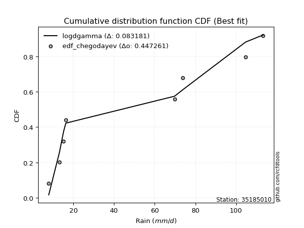</img></img>

</div>


### 6. EDF Blom (1958)

The Blom formula is a specific "plotting position" formula used in hydrology and statistical analysis to estimate the empirical cumulative probability (or non-exceedance probability) of a data series. It is particularly recommended for data that are approximately normally distributed. The constant _a_ is set to 0.375 (or 3/8).

<div align="center">


$P=(m-a)/(n+1-2a)$


</div>


**6.1. Empirical values**

<div align="center">

|                | 0                   | 1                   | 2                  | 3                  | 4                  | 5                  | 6                 | 7                  |
|:---------------|:--------------------|:--------------------|:-------------------|:-------------------|:-------------------|:-------------------|:------------------|:-------------------|
| date           | 2023                | 2025                | 2020               | 2022               | 2018               | 2017               | 2019              | 2021               |
| x              | 7.9                 | 13.2                | 15.2               | 16.3               | 69.8               | 73.7               | 104.7             | 113.3              |
| m              | 1                   | 2                   | 3                  | 4                  | 5                  | 6                  | 7                 | 8                  |
| empirical_dist | edf_blom            | edf_blom            | edf_blom           | edf_blom           | edf_blom           | edf_blom           | edf_blom          | edf_blom           |
| empirical      | 0.07575757575757576 | 0.19696969696969696 | 0.3181818181818182 | 0.4393939393939394 | 0.5606060606060606 | 0.6818181818181818 | 0.803030303030303 | 0.9242424242424242 |
| empirical_tr   | 1.0819672131147542  | 1.2452830188679247  | 1.4666666666666666 | 1.783783783783784  | 2.275862068965517  | 3.1428571428571423 | 5.076923076923076 | 13.199999999999992 |

</div>


**6.2. Kolmogorov-Smirnov fit test (sorted by Δ)**


<div align="center">

|                | 0                   | 1                   | 2                  | 3                  | 4                   | 5                  | 6                   | 7                   | 8                  | 9                   | 10                  | 11                  | 12                  | 13                 | 14                  | 15                  | 16                 | 17                  | 18                  | 19                 | 20                  | 21                 | 22                  | 23                 | 24                  | 25                  | 26                 | 27                  | 28                 | 29                  | 30                  | 31                  | 32                 | 33                  | 34                  | 35                  | 36                 | 37                 | 38                  | 39                 | 40                 | 41                  | 42                  | 43                  | 44                 | 45                 | 46                  | 47                 | 48                  | 49                  | 50                  | 51                  | 52                  | 53                  | 54                  | 55                  | 56                  | 57                 | 58                  | 59                  | 60                  | 61                  | 62                  | 63                 | 64                 | 65                 | 66                  | 67                 | 68                 | 69                  | 70                  | 71                  | 72                  | 73                  | 74                  | 75                 | 76                  | 77                  | 78                  | 79                 | 80                 | 81                  | 82                  | 83                  | 84                 | 85                  | 86                  | 87                 | 88                  | 89                  | 90                  | 91                  | 92                 | 93                 | 94                  | 95                  | 96                  | 97                 | 98                  | 99                 | 100                 | 101                 | 102                 | 103                | 104                | 105                 | 106                | 107                 | 108                | 109                | 110                | 111                | 112                | 113                | 114                 | 115                 | 116                | 117                 | 118                | 119                | 120                | 121                 | 122                 | 123                 | 124                | 125                 | 126                | 127                 | 128                | 129                 | 130                | 131                | 132                 | 133                 | 134                | 135                 | 136                 | 137                | 138                 | 139                 | 140                 | 141                | 142                | 143                | 144                | 145                | 146                | 147                 | 148                 | 149                | 150                | 151                | 152                | 153                | 154                | 155                | 156                | 157                | 158                | 159                |
|:---------------|:--------------------|:--------------------|:-------------------|:-------------------|:--------------------|:-------------------|:--------------------|:--------------------|:-------------------|:--------------------|:--------------------|:--------------------|:--------------------|:-------------------|:--------------------|:--------------------|:-------------------|:--------------------|:--------------------|:-------------------|:--------------------|:-------------------|:--------------------|:-------------------|:--------------------|:--------------------|:-------------------|:--------------------|:-------------------|:--------------------|:--------------------|:--------------------|:-------------------|:--------------------|:--------------------|:--------------------|:-------------------|:-------------------|:--------------------|:-------------------|:-------------------|:--------------------|:--------------------|:--------------------|:-------------------|:-------------------|:--------------------|:-------------------|:--------------------|:--------------------|:--------------------|:--------------------|:--------------------|:--------------------|:--------------------|:--------------------|:--------------------|:-------------------|:--------------------|:--------------------|:--------------------|:--------------------|:--------------------|:-------------------|:-------------------|:-------------------|:--------------------|:-------------------|:-------------------|:--------------------|:--------------------|:--------------------|:--------------------|:--------------------|:--------------------|:-------------------|:--------------------|:--------------------|:--------------------|:-------------------|:-------------------|:--------------------|:--------------------|:--------------------|:-------------------|:--------------------|:--------------------|:-------------------|:--------------------|:--------------------|:--------------------|:--------------------|:-------------------|:-------------------|:--------------------|:--------------------|:--------------------|:-------------------|:--------------------|:-------------------|:--------------------|:--------------------|:--------------------|:-------------------|:-------------------|:--------------------|:-------------------|:--------------------|:-------------------|:-------------------|:-------------------|:-------------------|:-------------------|:-------------------|:--------------------|:--------------------|:-------------------|:--------------------|:-------------------|:-------------------|:-------------------|:--------------------|:--------------------|:--------------------|:-------------------|:--------------------|:-------------------|:--------------------|:-------------------|:--------------------|:-------------------|:-------------------|:--------------------|:--------------------|:-------------------|:--------------------|:--------------------|:-------------------|:--------------------|:--------------------|:--------------------|:-------------------|:-------------------|:-------------------|:-------------------|:-------------------|:-------------------|:--------------------|:--------------------|:-------------------|:-------------------|:-------------------|:-------------------|:-------------------|:-------------------|:-------------------|:-------------------|:-------------------|:-------------------|:-------------------|
| station        | 35185010            | 35185010            | 35185010           | 35185010           | 35185010            | 35185010           | 35185010            | 35185010            | 35185010           | 35185010            | 35185010            | 35185010            | 35185010            | 35185010           | 35185010            | 35185010            | 35185010           | 35185010            | 35185010            | 35185010           | 35185010            | 35185010           | 35185010            | 35185010           | 35185010            | 35185010            | 35185010           | 35185010            | 35185010           | 35185010            | 35185010            | 35185010            | 35185010           | 35185010            | 35185010            | 35185010            | 35185010           | 35185010           | 35185010            | 35185010           | 35185010           | 35185010            | 35185010            | 35185010            | 35185010           | 35185010           | 35185010            | 35185010           | 35185010            | 35185010            | 35185010            | 35185010            | 35185010            | 35185010            | 35185010            | 35185010            | 35185010            | 35185010           | 35185010            | 35185010            | 35185010            | 35185010            | 35185010            | 35185010           | 35185010           | 35185010           | 35185010            | 35185010           | 35185010           | 35185010            | 35185010            | 35185010            | 35185010            | 35185010            | 35185010            | 35185010           | 35185010            | 35185010            | 35185010            | 35185010           | 35185010           | 35185010            | 35185010            | 35185010            | 35185010           | 35185010            | 35185010            | 35185010           | 35185010            | 35185010            | 35185010            | 35185010            | 35185010           | 35185010           | 35185010            | 35185010            | 35185010            | 35185010           | 35185010            | 35185010           | 35185010            | 35185010            | 35185010            | 35185010           | 35185010           | 35185010            | 35185010           | 35185010            | 35185010           | 35185010           | 35185010           | 35185010           | 35185010           | 35185010           | 35185010            | 35185010            | 35185010           | 35185010            | 35185010           | 35185010           | 35185010           | 35185010            | 35185010            | 35185010            | 35185010           | 35185010            | 35185010           | 35185010            | 35185010           | 35185010            | 35185010           | 35185010           | 35185010            | 35185010            | 35185010           | 35185010            | 35185010            | 35185010           | 35185010            | 35185010            | 35185010            | 35185010           | 35185010           | 35185010           | 35185010           | 35185010           | 35185010           | 35185010            | 35185010            | 35185010           | 35185010           | 35185010           | 35185010           | 35185010           | 35185010           | 35185010           | 35185010           | 35185010           | 35185010           | 35185010           |
| empirical_dist | edf_blom            | edf_blom            | edf_blom           | edf_blom           | edf_blom            | edf_blom           | edf_blom            | edf_blom            | edf_blom           | edf_blom            | edf_blom            | edf_blom            | edf_blom            | edf_blom           | edf_blom            | edf_blom            | edf_blom           | edf_blom            | edf_blom            | edf_blom           | edf_blom            | edf_blom           | edf_blom            | edf_blom           | edf_blom            | edf_blom            | edf_blom           | edf_blom            | edf_blom           | edf_blom            | edf_blom            | edf_blom            | edf_blom           | edf_blom            | edf_blom            | edf_blom            | edf_blom           | edf_blom           | edf_blom            | edf_blom           | edf_blom           | edf_blom            | edf_blom            | edf_blom            | edf_blom           | edf_blom           | edf_blom            | edf_blom           | edf_blom            | edf_blom            | edf_blom            | edf_blom            | edf_blom            | edf_blom            | edf_blom            | edf_blom            | edf_blom            | edf_blom           | edf_blom            | edf_blom            | edf_blom            | edf_blom            | edf_blom            | edf_blom           | edf_blom           | edf_blom           | edf_blom            | edf_blom           | edf_blom           | edf_blom            | edf_blom            | edf_blom            | edf_blom            | edf_blom            | edf_blom            | edf_blom           | edf_blom            | edf_blom            | edf_blom            | edf_blom           | edf_blom           | edf_blom            | edf_blom            | edf_blom            | edf_blom           | edf_blom            | edf_blom            | edf_blom           | edf_blom            | edf_blom            | edf_blom            | edf_blom            | edf_blom           | edf_blom           | edf_blom            | edf_blom            | edf_blom            | edf_blom           | edf_blom            | edf_blom           | edf_blom            | edf_blom            | edf_blom            | edf_blom           | edf_blom           | edf_blom            | edf_blom           | edf_blom            | edf_blom           | edf_blom           | edf_blom           | edf_blom           | edf_blom           | edf_blom           | edf_blom            | edf_blom            | edf_blom           | edf_blom            | edf_blom           | edf_blom           | edf_blom           | edf_blom            | edf_blom            | edf_blom            | edf_blom           | edf_blom            | edf_blom           | edf_blom            | edf_blom           | edf_blom            | edf_blom           | edf_blom           | edf_blom            | edf_blom            | edf_blom           | edf_blom            | edf_blom            | edf_blom           | edf_blom            | edf_blom            | edf_blom            | edf_blom           | edf_blom           | edf_blom           | edf_blom           | edf_blom           | edf_blom           | edf_blom            | edf_blom            | edf_blom           | edf_blom           | edf_blom           | edf_blom           | edf_blom           | edf_blom           | edf_blom           | edf_blom           | edf_blom           | edf_blom           | edf_blom           |
| p_dist         | logdgamma           | logdweibull         | logarcsine         | dweibull           | dgamma              | arcsine            | logksone            | logweibull_max      | logwrapcauchy      | mielke              | wrapcauchy          | logsemicircular     | halfgennorm         | loglevy_l          | loganglit           | loggenextreme       | ksone              | loggenhalflogistic  | logtrapezoid        | truncexpon         | weibull_min         | logbeta            | loggenpareto        | loghalfgennorm     | logpearson3         | semicircular        | exponpow           | logskewnorm         | logt               | logexponnorm        | lognorm             | logcrystalball      | lognct             | logtriang           | logfoldnorm         | logerlang           | loggamma           | loggamma           | logbetaprime        | loggompertz        | invweibull         | betaprime           | logf                | loglomax            | loggausshyper      | logncf             | logrice             | logmaxwell         | gengamma            | lograyleigh         | loginvgamma         | burr12              | logalpha            | anglit              | loggenexpon         | logcosine           | loginvweibull       | loginvgauss        | burr                | loggenlogistic      | halfnorm            | logweibull_min      | logburr             | logfatiguelife     | ncf                | nakagami           | logburr12           | loghalfnorm        | invgamma           | foldnorm            | nct                 | logjohnsonsu        | f                   | rayleigh            | logkstwobign        | loglogistic        | maxwell             | logloggamma         | loggumbel_l         | lognakagami        | loggumbel_r        | genlogistic         | logkappa3           | pearson3            | loghypsecant       | invgauss            | johnsonsu           | exponnorm          | norm                | crystalball         | t                   | loghalflogistic     | logtukeylambda     | logargus           | kstwobign           | logmoyal            | alpha               | logkappa4          | halflogistic        | truncweibull_min   | loguniform          | logvonmises_line    | gumbel_r            | loglaplace         | loglaplace         | lomax               | beta               | gausshyper          | logistic           | cosine             | gumbel_l           | levy_l             | moyal              | genexpon           | rice                | hypsecant           | loggengamma        | laplace             | argus              | logwald            | logtruncnorm       | loggennorm          | gennorm             | genextreme          | logbradford        | logtruncexpon       | gamma              | logtruncweibull_min | gompertz           | logloglaplace       | exponweib          | skewnorm           | kappa4              | genpareto           | bradford           | tukeylambda         | genhalflogistic     | logrdist           | vonmises_line       | kappa3              | uniform             | erlang             | truncnorm          | triang             | powerlaw           | trapezoid          | wald               | logexponpow         | fatiguelife         | logjohnsonsb       | johnsonsb          | logpowerlaw        | logexponweib       | weibull_max        | truncpareto        | rdist              | logtruncpareto     | logvonmises        | vonmises           | logmielke          |
| delta          | 0.07776939639169278 | 0.09691605567758865 | 0.1128135862893439 | 0.1456379326825944 | 0.14908388316947563 | 0.150519960372748  | 0.15097353827268745 | 0.15591178664924626 | 0.1602049239621831 | 0.16176515018050058 | 0.16650053834594025 | 0.16736129264033894 | 0.17582632506925222 | 0.1779752873256934 | 0.17958158103133937 | 0.18792861391632487 | 0.1895155675593416 | 0.19136210344937404 | 0.19189686472548295 | 0.1958810905469459 | 0.19817521903833468 | 0.2000024127970511 | 0.20345558204763026 | 0.2044108209551192 | 0.20615635230232476 | 0.20630458847875682 | 0.2063140166822205 | 0.20755075424134006 | 0.207584984891378  | 0.20759350888110706 | 0.20759436225243055 | 0.20759438410067654 | 0.2077028781810426 | 0.20790512496402502 | 0.20828656044066385 | 0.20836555375987387 | 0.2087691580653407 | 0.2087691580653407 | 0.20970396901453647 | 0.209936478272708  | 0.2109558149885058 | 0.21359774962758638 | 0.21385558254598858 | 0.21391465264842835 | 0.2141874959680678 | 0.2144432281438371 | 0.21446877644726647 | 0.2147793646465651 | 0.21670190075448392 | 0.21681773503149093 | 0.21789600152085176 | 0.21816280407230149 | 0.21824795178667777 | 0.21855475717807105 | 0.21889966491410073 | 0.21987454004245888 | 0.22034599307046587 | 0.2204435798628862 | 0.22129173524328993 | 0.22196317429877654 | 0.22226340953732707 | 0.22256808269712614 | 0.22268522363957455 | 0.2228047369440267 | 0.2233067022898927 | 0.2241883686920937 | 0.22430632429170394 | 0.2243101048070092 | 0.2245961223090447 | 0.22471241683666948 | 0.22739595150363723 | 0.22818136099215064 | 0.22939651247093484 | 0.22990630540420767 | 0.23008183531016901 | 0.2301342883775943 | 0.23467201665776502 | 0.23553993286932529 | 0.23900606272706074 | 0.2408414293888138 | 0.2424613879513421 | 0.24321497407841156 | 0.24348776270097316 | 0.24356370332176935 | 0.244411029405053  | 0.24530257279378365 | 0.24536504067961673 | 0.2462517864636825 | 0.24627132751513264 | 0.24627135348900225 | 0.24627849540479108 | 0.24757938739960883 | 0.2483528462857354 | 0.2503768669940744 | 0.25284698382849924 | 0.25380243787923273 | 0.25500238215651994 | 0.2550382741002407 | 0.25509215657729956 | 0.2562755577159924 | 0.25750393890111567 | 0.25764927130709814 | 0.25777039546698943 | 0.2620512455790598 | 0.2620512455790598 | 0.26296274253412144 | 0.2658198656075458 | 0.26629190291394245 | 0.2673999010630092 | 0.2684486289091931 | 0.2706637939221171 | 0.2709467675348293 | 0.2739757720600227 | 0.274163705812323  | 0.27900252424622407 | 0.27960599583463536 | 0.2892389791966694 | 0.29256512604445095 | 0.2926328607215826 | 0.2926709253407669 | 0.2979037449576833 | 0.30303030303030304 | 0.30303030303030304 | 0.30319892685529737 | 0.3046678286629244 | 0.31459350153522025 | 0.3156284992444497 | 0.31648284980868224 | 0.3198904403691084 | 0.32270610378437004 | 0.32763819613489   | 0.3280549495007578 | 0.33248829410768943 | 0.34249172839981684 | 0.3461993466001322 | 0.35357436097853595 | 0.35396634291895074 | 0.3590368606237324 | 0.35905749872517917 | 0.35961395237063865 | 0.35969754470703236 | 0.3652611993968814 | 0.4094705448230129 | 0.4122190216300881 | 0.4142736204714898 | 0.4166561226333162 | 0.4234157095571324 | 0.42735222962062364 | 0.43666150630393535 | 0.4896310093421751 | 0.4955897802274097 | 0.528790024286786  | 0.5368755306175683 | 0.5751936961263775 | 0.6110739977366293 | 0.6736510940391478 | 0.6947304726518055 | 1.1991195273207875 | 17.389912069014823 | nan                |
| deltao         | 0.4472608134160001  | 0.4472608134160001  | 0.4472608134160001 | 0.4472608134160001 | 0.4472608134160001  | 0.4472608134160001 | 0.4472608134160001  | 0.4472608134160001  | 0.4472608134160001 | 0.4472608134160001  | 0.4472608134160001  | 0.4472608134160001  | 0.4472608134160001  | 0.4472608134160001 | 0.4472608134160001  | 0.4472608134160001  | 0.4472608134160001 | 0.4472608134160001  | 0.4472608134160001  | 0.4472608134160001 | 0.4472608134160001  | 0.4472608134160001 | 0.4472608134160001  | 0.4472608134160001 | 0.4472608134160001  | 0.4472608134160001  | 0.4472608134160001 | 0.4472608134160001  | 0.4472608134160001 | 0.4472608134160001  | 0.4472608134160001  | 0.4472608134160001  | 0.4472608134160001 | 0.4472608134160001  | 0.4472608134160001  | 0.4472608134160001  | 0.4472608134160001 | 0.4472608134160001 | 0.4472608134160001  | 0.4472608134160001 | 0.4472608134160001 | 0.4472608134160001  | 0.4472608134160001  | 0.4472608134160001  | 0.4472608134160001 | 0.4472608134160001 | 0.4472608134160001  | 0.4472608134160001 | 0.4472608134160001  | 0.4472608134160001  | 0.4472608134160001  | 0.4472608134160001  | 0.4472608134160001  | 0.4472608134160001  | 0.4472608134160001  | 0.4472608134160001  | 0.4472608134160001  | 0.4472608134160001 | 0.4472608134160001  | 0.4472608134160001  | 0.4472608134160001  | 0.4472608134160001  | 0.4472608134160001  | 0.4472608134160001 | 0.4472608134160001 | 0.4472608134160001 | 0.4472608134160001  | 0.4472608134160001 | 0.4472608134160001 | 0.4472608134160001  | 0.4472608134160001  | 0.4472608134160001  | 0.4472608134160001  | 0.4472608134160001  | 0.4472608134160001  | 0.4472608134160001 | 0.4472608134160001  | 0.4472608134160001  | 0.4472608134160001  | 0.4472608134160001 | 0.4472608134160001 | 0.4472608134160001  | 0.4472608134160001  | 0.4472608134160001  | 0.4472608134160001 | 0.4472608134160001  | 0.4472608134160001  | 0.4472608134160001 | 0.4472608134160001  | 0.4472608134160001  | 0.4472608134160001  | 0.4472608134160001  | 0.4472608134160001 | 0.4472608134160001 | 0.4472608134160001  | 0.4472608134160001  | 0.4472608134160001  | 0.4472608134160001 | 0.4472608134160001  | 0.4472608134160001 | 0.4472608134160001  | 0.4472608134160001  | 0.4472608134160001  | 0.4472608134160001 | 0.4472608134160001 | 0.4472608134160001  | 0.4472608134160001 | 0.4472608134160001  | 0.4472608134160001 | 0.4472608134160001 | 0.4472608134160001 | 0.4472608134160001 | 0.4472608134160001 | 0.4472608134160001 | 0.4472608134160001  | 0.4472608134160001  | 0.4472608134160001 | 0.4472608134160001  | 0.4472608134160001 | 0.4472608134160001 | 0.4472608134160001 | 0.4472608134160001  | 0.4472608134160001  | 0.4472608134160001  | 0.4472608134160001 | 0.4472608134160001  | 0.4472608134160001 | 0.4472608134160001  | 0.4472608134160001 | 0.4472608134160001  | 0.4472608134160001 | 0.4472608134160001 | 0.4472608134160001  | 0.4472608134160001  | 0.4472608134160001 | 0.4472608134160001  | 0.4472608134160001  | 0.4472608134160001 | 0.4472608134160001  | 0.4472608134160001  | 0.4472608134160001  | 0.4472608134160001 | 0.4472608134160001 | 0.4472608134160001 | 0.4472608134160001 | 0.4472608134160001 | 0.4472608134160001 | 0.4472608134160001  | 0.4472608134160001  | 0.4472608134160001 | 0.4472608134160001 | 0.4472608134160001 | 0.4472608134160001 | 0.4472608134160001 | 0.4472608134160001 | 0.4472608134160001 | 0.4472608134160001 | 0.4472608134160001 | 0.4472608134160001 | 0.4472608134160001 |
| eval           | Δo > Δ              | Δo > Δ              | Δo > Δ             | Δo > Δ             | Δo > Δ              | Δo > Δ             | Δo > Δ              | Δo > Δ              | Δo > Δ             | Δo > Δ              | Δo > Δ              | Δo > Δ              | Δo > Δ              | Δo > Δ             | Δo > Δ              | Δo > Δ              | Δo > Δ             | Δo > Δ              | Δo > Δ              | Δo > Δ             | Δo > Δ              | Δo > Δ             | Δo > Δ              | Δo > Δ             | Δo > Δ              | Δo > Δ              | Δo > Δ             | Δo > Δ              | Δo > Δ             | Δo > Δ              | Δo > Δ              | Δo > Δ              | Δo > Δ             | Δo > Δ              | Δo > Δ              | Δo > Δ              | Δo > Δ             | Δo > Δ             | Δo > Δ              | Δo > Δ             | Δo > Δ             | Δo > Δ              | Δo > Δ              | Δo > Δ              | Δo > Δ             | Δo > Δ             | Δo > Δ              | Δo > Δ             | Δo > Δ              | Δo > Δ              | Δo > Δ              | Δo > Δ              | Δo > Δ              | Δo > Δ              | Δo > Δ              | Δo > Δ              | Δo > Δ              | Δo > Δ             | Δo > Δ              | Δo > Δ              | Δo > Δ              | Δo > Δ              | Δo > Δ              | Δo > Δ             | Δo > Δ             | Δo > Δ             | Δo > Δ              | Δo > Δ             | Δo > Δ             | Δo > Δ              | Δo > Δ              | Δo > Δ              | Δo > Δ              | Δo > Δ              | Δo > Δ              | Δo > Δ             | Δo > Δ              | Δo > Δ              | Δo > Δ              | Δo > Δ             | Δo > Δ             | Δo > Δ              | Δo > Δ              | Δo > Δ              | Δo > Δ             | Δo > Δ              | Δo > Δ              | Δo > Δ             | Δo > Δ              | Δo > Δ              | Δo > Δ              | Δo > Δ              | Δo > Δ             | Δo > Δ             | Δo > Δ              | Δo > Δ              | Δo > Δ              | Δo > Δ             | Δo > Δ              | Δo > Δ             | Δo > Δ              | Δo > Δ              | Δo > Δ              | Δo > Δ             | Δo > Δ             | Δo > Δ              | Δo > Δ             | Δo > Δ              | Δo > Δ             | Δo > Δ             | Δo > Δ             | Δo > Δ             | Δo > Δ             | Δo > Δ             | Δo > Δ              | Δo > Δ              | Δo > Δ             | Δo > Δ              | Δo > Δ             | Δo > Δ             | Δo > Δ             | Δo > Δ              | Δo > Δ              | Δo > Δ              | Δo > Δ             | Δo > Δ              | Δo > Δ             | Δo > Δ              | Δo > Δ             | Δo > Δ              | Δo > Δ             | Δo > Δ             | Δo > Δ              | Δo > Δ              | Δo > Δ             | Δo > Δ              | Δo > Δ              | Δo > Δ             | Δo > Δ              | Δo > Δ              | Δo > Δ              | Δo > Δ             | Δo > Δ             | Δo > Δ             | Δo > Δ             | Δo > Δ             | Δo > Δ             | Δo > Δ              | Δo > Δ              | Δo <= Δ            | Δo <= Δ            | Δo <= Δ            | Δo <= Δ            | Δo <= Δ            | Δo <= Δ            | Δo <= Δ            | Δo <= Δ            | Δo <= Δ            | Δo <= Δ            | Δo <= Δ            |
| fit            | 1                   | 1                   | 1                  | 1                  | 1                   | 1                  | 1                   | 1                   | 1                  | 1                   | 1                   | 1                   | 1                   | 1                  | 1                   | 1                   | 1                  | 1                   | 1                   | 1                  | 1                   | 1                  | 1                   | 1                  | 1                   | 1                   | 1                  | 1                   | 1                  | 1                   | 1                   | 1                   | 1                  | 1                   | 1                   | 1                   | 1                  | 1                  | 1                   | 1                  | 1                  | 1                   | 1                   | 1                   | 1                  | 1                  | 1                   | 1                  | 1                   | 1                   | 1                   | 1                   | 1                   | 1                   | 1                   | 1                   | 1                   | 1                  | 1                   | 1                   | 1                   | 1                   | 1                   | 1                  | 1                  | 1                  | 1                   | 1                  | 1                  | 1                   | 1                   | 1                   | 1                   | 1                   | 1                   | 1                  | 1                   | 1                   | 1                   | 1                  | 1                  | 1                   | 1                   | 1                   | 1                  | 1                   | 1                   | 1                  | 1                   | 1                   | 1                   | 1                   | 1                  | 1                  | 1                   | 1                   | 1                   | 1                  | 1                   | 1                  | 1                   | 1                   | 1                   | 1                  | 1                  | 1                   | 1                  | 1                   | 1                  | 1                  | 1                  | 1                  | 1                  | 1                  | 1                   | 1                   | 1                  | 1                   | 1                  | 1                  | 1                  | 1                   | 1                   | 1                   | 1                  | 1                   | 1                  | 1                   | 1                  | 1                   | 1                  | 1                  | 1                   | 1                   | 1                  | 1                   | 1                   | 1                  | 1                   | 1                   | 1                   | 1                  | 1                  | 1                  | 1                  | 1                  | 1                  | 1                   | 1                   | 0                  | 0                  | 0                  | 0                  | 0                  | 0                  | 0                  | 0                  | 0                  | 0                  | 0                  |
| n              | 8                   | 8                   | 8                  | 8                  | 8                   | 8                  | 8                   | 8                   | 8                  | 8                   | 8                   | 8                   | 8                   | 8                  | 8                   | 8                   | 8                  | 8                   | 8                   | 8                  | 8                   | 8                  | 8                   | 8                  | 8                   | 8                   | 8                  | 8                   | 8                  | 8                   | 8                   | 8                   | 8                  | 8                   | 8                   | 8                   | 8                  | 8                  | 8                   | 8                  | 8                  | 8                   | 8                   | 8                   | 8                  | 8                  | 8                   | 8                  | 8                   | 8                   | 8                   | 8                   | 8                   | 8                   | 8                   | 8                   | 8                   | 8                  | 8                   | 8                   | 8                   | 8                   | 8                   | 8                  | 8                  | 8                  | 8                   | 8                  | 8                  | 8                   | 8                   | 8                   | 8                   | 8                   | 8                   | 8                  | 8                   | 8                   | 8                   | 8                  | 8                  | 8                   | 8                   | 8                   | 8                  | 8                   | 8                   | 8                  | 8                   | 8                   | 8                   | 8                   | 8                  | 8                  | 8                   | 8                   | 8                   | 8                  | 8                   | 8                  | 8                   | 8                   | 8                   | 8                  | 8                  | 8                   | 8                  | 8                   | 8                  | 8                  | 8                  | 8                  | 8                  | 8                  | 8                   | 8                   | 8                  | 8                   | 8                  | 8                  | 8                  | 8                   | 8                   | 8                   | 8                  | 8                   | 8                  | 8                   | 8                  | 8                   | 8                  | 8                  | 8                   | 8                   | 8                  | 8                   | 8                   | 8                  | 8                   | 8                   | 8                   | 8                  | 8                  | 8                  | 8                  | 8                  | 8                  | 8                   | 8                   | 8                  | 8                  | 8                  | 8                  | 8                  | 8                  | 8                  | 8                  | 8                  | 8                  | 8                  |
| best_fit       | 1                   | 0                   | 0                  | 0                  | 0                   | 0                  | 0                   | 0                   | 0                  | 0                   | 0                   | 0                   | 0                   | 0                  | 0                   | 0                   | 0                  | 0                   | 0                   | 0                  | 0                   | 0                  | 0                   | 0                  | 0                   | 0                   | 0                  | 0                   | 0                  | 0                   | 0                   | 0                   | 0                  | 0                   | 0                   | 0                   | 0                  | 0                  | 0                   | 0                  | 0                  | 0                   | 0                   | 0                   | 0                  | 0                  | 0                   | 0                  | 0                   | 0                   | 0                   | 0                   | 0                   | 0                   | 0                   | 0                   | 0                   | 0                  | 0                   | 0                   | 0                   | 0                   | 0                   | 0                  | 0                  | 0                  | 0                   | 0                  | 0                  | 0                   | 0                   | 0                   | 0                   | 0                   | 0                   | 0                  | 0                   | 0                   | 0                   | 0                  | 0                  | 0                   | 0                   | 0                   | 0                  | 0                   | 0                   | 0                  | 0                   | 0                   | 0                   | 0                   | 0                  | 0                  | 0                   | 0                   | 0                   | 0                  | 0                   | 0                  | 0                   | 0                   | 0                   | 0                  | 0                  | 0                   | 0                  | 0                   | 0                  | 0                  | 0                  | 0                  | 0                  | 0                  | 0                   | 0                   | 0                  | 0                   | 0                  | 0                  | 0                  | 0                   | 0                   | 0                   | 0                  | 0                   | 0                  | 0                   | 0                  | 0                   | 0                  | 0                  | 0                   | 0                   | 0                  | 0                   | 0                   | 0                  | 0                   | 0                   | 0                   | 0                  | 0                  | 0                  | 0                  | 0                  | 0                  | 0                   | 0                   | 0                  | 0                  | 0                  | 0                  | 0                  | 0                  | 0                  | 0                  | 0                  | 0                  | 0                  |
| best_fit_sort  | 1                   | 2                   | 3                  | 4                  | 5                   | 6                  | 7                   | 8                   | 9                  | 10                  | 11                  | 12                  | 13                  | 14                 | 15                  | 16                  | 17                 | 18                  | 19                  | 20                 | 21                  | 22                 | 23                  | 24                 | 25                  | 26                  | 27                 | 28                  | 29                 | 30                  | 31                  | 32                  | 33                 | 34                  | 35                  | 36                  | 37                 | 38                 | 39                  | 40                 | 41                 | 42                  | 43                  | 44                  | 45                 | 46                 | 47                  | 48                 | 49                  | 50                  | 51                  | 52                  | 53                  | 54                  | 55                  | 56                  | 57                  | 58                 | 59                  | 60                  | 61                  | 62                  | 63                  | 64                 | 65                 | 66                 | 67                  | 68                 | 69                 | 70                  | 71                  | 72                  | 73                  | 74                  | 75                  | 76                 | 77                  | 78                  | 79                  | 80                 | 81                 | 82                  | 83                  | 84                  | 85                 | 86                  | 87                  | 88                 | 89                  | 90                  | 91                  | 92                  | 93                 | 94                 | 95                  | 96                  | 97                  | 98                 | 99                  | 100                | 101                 | 102                 | 103                 | 104                | 105                | 106                 | 107                | 108                 | 109                | 110                | 111                | 112                | 113                | 114                | 115                 | 116                 | 117                | 118                 | 119                | 120                | 121                | 122                 | 123                 | 124                 | 125                | 126                 | 127                | 128                 | 129                | 130                 | 131                | 132                | 133                 | 134                 | 135                | 136                 | 137                 | 138                | 139                 | 140                 | 141                 | 142                | 143                | 144                | 145                | 146                | 147                | 148                 | 149                 | 150                | 151                | 152                | 153                | 154                | 155                | 156                | 157                | 158                | 159                | 160                |

</div>


**6.3. Best fit**

<div align="center">

|   id |   station | empirical_dist   | p_dist    |     delta |   deltao | eval   |   fit |   n |   best_fit |   best_fit_sort |
|-----:|----------:|:-----------------|:----------|----------:|---------:|:-------|------:|----:|-----------:|----------------:|
|    0 |  35185010 | edf_blom         | logdgamma | 0.0777694 | 0.447261 | Δo > Δ |     1 |   8 |          1 |               1 |

</div>


<div align="center">

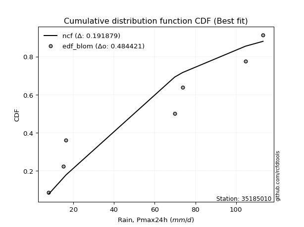</img>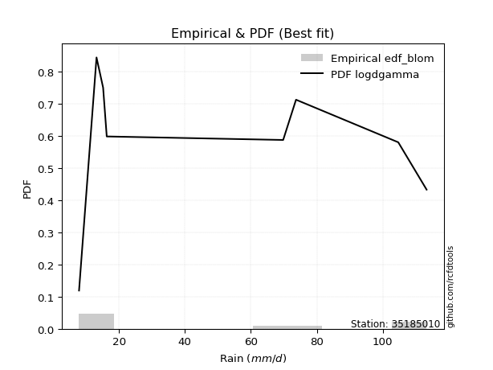</img>

</div>


### 7. EDF Tukey (1962)

In hydrology, the Tukey formula is used as a plotting position formula to estimate the empirical probability or frequency of a flood event (or other hydrological data). The formula parameter is given as _c=0.333_ (or 1/3).

<div align="center">


$P=(m-c)/(n+1-2c)$


</div>


**7.1. Empirical values**

<div align="center">

|                | 0                  | 1         | 2                  | 3                  | 4                 | 5                  | 6                 | 7                  |
|:---------------|:-------------------|:----------|:-------------------|:-------------------|:------------------|:-------------------|:------------------|:-------------------|
| date           | 2023               | 2025      | 2020               | 2022               | 2018              | 2017               | 2019              | 2021               |
| x              | 7.9                | 13.2      | 15.2               | 16.3               | 69.8              | 73.7               | 104.7             | 113.3              |
| m              | 1                  | 2         | 3                  | 4                  | 5                 | 6                  | 7                 | 8                  |
| empirical_dist | edf_tukey          | edf_tukey | edf_tukey          | edf_tukey          | edf_tukey         | edf_tukey          | edf_tukey         | edf_tukey          |
| empirical      | 0.08               | 0.2       | 0.32               | 0.44               | 0.56              | 0.68               | 0.8               | 0.92               |
| empirical_tr   | 1.0869565217391304 | 1.25      | 1.4705882352941178 | 1.7857142857142856 | 2.272727272727273 | 3.1250000000000004 | 5.000000000000001 | 12.500000000000007 |

</div>


**7.2. Kolmogorov-Smirnov fit test (sorted by Δ)**


<div align="center">

|                | 0                   | 1                  | 2                  | 3                  | 4                   | 5                   | 6                   | 7                   | 8                   | 9                  | 10                  | 11                  | 12                  | 13                  | 14                  | 15                  | 16                 | 17                  | 18                  | 19                  | 20                  | 21                 | 22                 | 23                 | 24                  | 25                  | 26                 | 27                  | 28                 | 29                  | 30                  | 31                  | 32                 | 33                  | 34                  | 35                  | 36                 | 37                 | 38                  | 39                 | 40                 | 41                  | 42                  | 43                  | 44                 | 45                 | 46                  | 47                 | 48                  | 49                  | 50                  | 51                  | 52                  | 53                  | 54                  | 55                  | 56                  | 57                 | 58                  | 59                  | 60                  | 61                  | 62                  | 63                 | 64                 | 65                  | 66                  | 67                 | 68                 | 69                 | 70                  | 71                  | 72                  | 73                  | 74                 | 75                 | 76                  | 77                 | 78                  | 79                 | 80                 | 81                  | 82                  | 83                  | 84                 | 85                  | 86                  | 87                  | 88                  | 89                  | 90                  | 91                  | 92                 | 93                 | 94                  | 95                  | 96                  | 97                 | 98                  | 99                  | 100                 | 101                 | 102                 | 103                | 104                | 105                | 106                 | 107                 | 108                 | 109                | 110                | 111                | 112                | 113                 | 114                | 115                 | 116                | 117                 | 118                 | 119                | 120                | 121                | 122                 | 123                 | 124                | 125                 | 126                | 127                 | 128                | 129                 | 130                | 131                | 132                 | 133                 | 134                | 135                 | 136                 | 137                | 138                | 139                 | 140                 | 141                | 142                 | 143                 | 144                | 145                | 146                 | 147                | 148                | 149                | 150                 | 151                | 152                | 153                | 154                | 155                | 156                | 157                | 158                | 159                |
|:---------------|:--------------------|:-------------------|:-------------------|:-------------------|:--------------------|:--------------------|:--------------------|:--------------------|:--------------------|:-------------------|:--------------------|:--------------------|:--------------------|:--------------------|:--------------------|:--------------------|:-------------------|:--------------------|:--------------------|:--------------------|:--------------------|:-------------------|:-------------------|:-------------------|:--------------------|:--------------------|:-------------------|:--------------------|:-------------------|:--------------------|:--------------------|:--------------------|:-------------------|:--------------------|:--------------------|:--------------------|:-------------------|:-------------------|:--------------------|:-------------------|:-------------------|:--------------------|:--------------------|:--------------------|:-------------------|:-------------------|:--------------------|:-------------------|:--------------------|:--------------------|:--------------------|:--------------------|:--------------------|:--------------------|:--------------------|:--------------------|:--------------------|:-------------------|:--------------------|:--------------------|:--------------------|:--------------------|:--------------------|:-------------------|:-------------------|:--------------------|:--------------------|:-------------------|:-------------------|:-------------------|:--------------------|:--------------------|:--------------------|:--------------------|:-------------------|:-------------------|:--------------------|:-------------------|:--------------------|:-------------------|:-------------------|:--------------------|:--------------------|:--------------------|:-------------------|:--------------------|:--------------------|:--------------------|:--------------------|:--------------------|:--------------------|:--------------------|:-------------------|:-------------------|:--------------------|:--------------------|:--------------------|:-------------------|:--------------------|:--------------------|:--------------------|:--------------------|:--------------------|:-------------------|:-------------------|:-------------------|:--------------------|:--------------------|:--------------------|:-------------------|:-------------------|:-------------------|:-------------------|:--------------------|:-------------------|:--------------------|:-------------------|:--------------------|:--------------------|:-------------------|:-------------------|:-------------------|:--------------------|:--------------------|:-------------------|:--------------------|:-------------------|:--------------------|:-------------------|:--------------------|:-------------------|:-------------------|:--------------------|:--------------------|:-------------------|:--------------------|:--------------------|:-------------------|:-------------------|:--------------------|:--------------------|:-------------------|:--------------------|:--------------------|:-------------------|:-------------------|:--------------------|:-------------------|:-------------------|:-------------------|:--------------------|:-------------------|:-------------------|:-------------------|:-------------------|:-------------------|:-------------------|:-------------------|:-------------------|:-------------------|
| station        | 35185010            | 35185010           | 35185010           | 35185010           | 35185010            | 35185010            | 35185010            | 35185010            | 35185010            | 35185010           | 35185010            | 35185010            | 35185010            | 35185010            | 35185010            | 35185010            | 35185010           | 35185010            | 35185010            | 35185010            | 35185010            | 35185010           | 35185010           | 35185010           | 35185010            | 35185010            | 35185010           | 35185010            | 35185010           | 35185010            | 35185010            | 35185010            | 35185010           | 35185010            | 35185010            | 35185010            | 35185010           | 35185010           | 35185010            | 35185010           | 35185010           | 35185010            | 35185010            | 35185010            | 35185010           | 35185010           | 35185010            | 35185010           | 35185010            | 35185010            | 35185010            | 35185010            | 35185010            | 35185010            | 35185010            | 35185010            | 35185010            | 35185010           | 35185010            | 35185010            | 35185010            | 35185010            | 35185010            | 35185010           | 35185010           | 35185010            | 35185010            | 35185010           | 35185010           | 35185010           | 35185010            | 35185010            | 35185010            | 35185010            | 35185010           | 35185010           | 35185010            | 35185010           | 35185010            | 35185010           | 35185010           | 35185010            | 35185010            | 35185010            | 35185010           | 35185010            | 35185010            | 35185010            | 35185010            | 35185010            | 35185010            | 35185010            | 35185010           | 35185010           | 35185010            | 35185010            | 35185010            | 35185010           | 35185010            | 35185010            | 35185010            | 35185010            | 35185010            | 35185010           | 35185010           | 35185010           | 35185010            | 35185010            | 35185010            | 35185010           | 35185010           | 35185010           | 35185010           | 35185010            | 35185010           | 35185010            | 35185010           | 35185010            | 35185010            | 35185010           | 35185010           | 35185010           | 35185010            | 35185010            | 35185010           | 35185010            | 35185010           | 35185010            | 35185010           | 35185010            | 35185010           | 35185010           | 35185010            | 35185010            | 35185010           | 35185010            | 35185010            | 35185010           | 35185010           | 35185010            | 35185010            | 35185010           | 35185010            | 35185010            | 35185010           | 35185010           | 35185010            | 35185010           | 35185010           | 35185010           | 35185010            | 35185010           | 35185010           | 35185010           | 35185010           | 35185010           | 35185010           | 35185010           | 35185010           | 35185010           |
| empirical_dist | edf_tukey           | edf_tukey          | edf_tukey          | edf_tukey          | edf_tukey           | edf_tukey           | edf_tukey           | edf_tukey           | edf_tukey           | edf_tukey          | edf_tukey           | edf_tukey           | edf_tukey           | edf_tukey           | edf_tukey           | edf_tukey           | edf_tukey          | edf_tukey           | edf_tukey           | edf_tukey           | edf_tukey           | edf_tukey          | edf_tukey          | edf_tukey          | edf_tukey           | edf_tukey           | edf_tukey          | edf_tukey           | edf_tukey          | edf_tukey           | edf_tukey           | edf_tukey           | edf_tukey          | edf_tukey           | edf_tukey           | edf_tukey           | edf_tukey          | edf_tukey          | edf_tukey           | edf_tukey          | edf_tukey          | edf_tukey           | edf_tukey           | edf_tukey           | edf_tukey          | edf_tukey          | edf_tukey           | edf_tukey          | edf_tukey           | edf_tukey           | edf_tukey           | edf_tukey           | edf_tukey           | edf_tukey           | edf_tukey           | edf_tukey           | edf_tukey           | edf_tukey          | edf_tukey           | edf_tukey           | edf_tukey           | edf_tukey           | edf_tukey           | edf_tukey          | edf_tukey          | edf_tukey           | edf_tukey           | edf_tukey          | edf_tukey          | edf_tukey          | edf_tukey           | edf_tukey           | edf_tukey           | edf_tukey           | edf_tukey          | edf_tukey          | edf_tukey           | edf_tukey          | edf_tukey           | edf_tukey          | edf_tukey          | edf_tukey           | edf_tukey           | edf_tukey           | edf_tukey          | edf_tukey           | edf_tukey           | edf_tukey           | edf_tukey           | edf_tukey           | edf_tukey           | edf_tukey           | edf_tukey          | edf_tukey          | edf_tukey           | edf_tukey           | edf_tukey           | edf_tukey          | edf_tukey           | edf_tukey           | edf_tukey           | edf_tukey           | edf_tukey           | edf_tukey          | edf_tukey          | edf_tukey          | edf_tukey           | edf_tukey           | edf_tukey           | edf_tukey          | edf_tukey          | edf_tukey          | edf_tukey          | edf_tukey           | edf_tukey          | edf_tukey           | edf_tukey          | edf_tukey           | edf_tukey           | edf_tukey          | edf_tukey          | edf_tukey          | edf_tukey           | edf_tukey           | edf_tukey          | edf_tukey           | edf_tukey          | edf_tukey           | edf_tukey          | edf_tukey           | edf_tukey          | edf_tukey          | edf_tukey           | edf_tukey           | edf_tukey          | edf_tukey           | edf_tukey           | edf_tukey          | edf_tukey          | edf_tukey           | edf_tukey           | edf_tukey          | edf_tukey           | edf_tukey           | edf_tukey          | edf_tukey          | edf_tukey           | edf_tukey          | edf_tukey          | edf_tukey          | edf_tukey           | edf_tukey          | edf_tukey          | edf_tukey          | edf_tukey          | edf_tukey          | edf_tukey          | edf_tukey          | edf_tukey          | edf_tukey          |
| p_dist         | logdgamma           | logdweibull        | logarcsine         | dweibull           | arcsine             | logksone            | logweibull_max      | dgamma              | logwrapcauchy       | mielke             | wrapcauchy          | logsemicircular     | loglevy_l           | halfgennorm         | loganglit           | loggenextreme       | ksone              | loggenhalflogistic  | logtrapezoid        | weibull_min         | logbeta             | truncexpon         | loggenpareto       | loghalfgennorm     | logpearson3         | semicircular        | exponpow           | logskewnorm         | logt               | logexponnorm        | lognorm             | logcrystalball      | lognct             | logtriang           | logfoldnorm         | logerlang           | loggamma           | loggamma           | logbetaprime        | loggompertz        | invweibull         | betaprime           | logf                | loglomax            | loggausshyper      | logncf             | logrice             | logmaxwell         | gengamma            | lograyleigh         | loginvgamma         | burr12              | logalpha            | anglit              | loggenexpon         | logcosine           | loginvweibull       | loginvgauss        | burr                | loggenlogistic      | halfnorm            | logweibull_min      | logburr             | logfatiguelife     | ncf                | nakagami            | logburr12           | loghalfnorm        | invgamma           | foldnorm           | nct                 | logjohnsonsu        | f                   | rayleigh            | logkstwobign       | loglogistic        | maxwell             | logloggamma        | loggumbel_l         | lognakagami        | loggumbel_r        | genlogistic         | logkappa3           | pearson3            | loghypsecant       | invgauss            | johnsonsu           | exponnorm           | norm                | crystalball         | t                   | loghalflogistic     | logtukeylambda     | logargus           | kstwobign           | logmoyal            | alpha               | logkappa4          | halflogistic        | truncweibull_min    | loguniform          | logvonmises_line    | gumbel_r            | beta               | loglaplace         | loglaplace         | lomax               | levy_l              | gausshyper          | logistic           | cosine             | gumbel_l           | moyal              | genexpon            | rice               | hypsecant           | loggengamma        | laplace             | argus               | logwald            | logtruncnorm       | genextreme         | loggennorm          | gennorm             | logbradford        | logtruncexpon       | gamma              | logtruncweibull_min | gompertz           | logloglaplace       | exponweib          | skewnorm           | kappa4              | genpareto           | bradford           | tukeylambda         | genhalflogistic     | logrdist           | vonmises_line      | kappa3              | uniform             | erlang             | truncnorm           | powerlaw            | triang             | trapezoid          | wald                | logexponpow        | fatiguelife        | logjohnsonsb       | johnsonsb           | logpowerlaw        | logexponweib       | weibull_max        | truncpareto        | rdist              | logtruncpareto     | logvonmises        | vonmises           | logmielke          |
| delta          | 0.08079969942199572 | 0.0938857526472856 | 0.1134196468954044 | 0.146243993288655  | 0.14990457185923184 | 0.15157959887874795 | 0.15166936240682205 | 0.15211418619977857 | 0.15717462093188006 | 0.1623712107865612 | 0.16710659895200086 | 0.16796735324639944 | 0.17373286308326913 | 0.17643238567531272 | 0.18018764163739986 | 0.18853467452238548 | 0.1901216281654022 | 0.19196816405543465 | 0.19250292533154356 | 0.19393279479591052 | 0.19575998855462684 | 0.1964871511530064 | 0.199213157805206  | 0.2050168815611797 | 0.20676241290838526 | 0.20691064908481743 | 0.206920077288281  | 0.20815681484740056 | 0.2081910454974385 | 0.20819956948716756 | 0.20820042285849105 | 0.20820044470673704 | 0.2083089387871031 | 0.20851118557008552 | 0.20889262104672435 | 0.20897161436593437 | 0.2093752186714012 | 0.2093752186714012 | 0.21031002962059697 | 0.2105425388787685 | 0.2115618755945663 | 0.21420381023364687 | 0.21446164315204908 | 0.21452071325448885 | 0.2147935565741284 | 0.2150492887498976 | 0.21507483705332697 | 0.2153854252526256 | 0.21730796136054442 | 0.21742379563755143 | 0.21850206212691226 | 0.21876886467836199 | 0.21885401239273827 | 0.21916081778413166 | 0.21950572552016123 | 0.22048060064851938 | 0.22095205367652637 | 0.2210496404689467 | 0.22189779584935043 | 0.22256923490483704 | 0.22286947014338768 | 0.22317414330318663 | 0.22329128424563505 | 0.2234107975500872 | 0.2239127628959532 | 0.22479442929815419 | 0.22491238489776444 | 0.2249161654130697 | 0.2252021829151052 | 0.2253184774427301 | 0.22800201210969773 | 0.22878742159821125 | 0.23000257307699534 | 0.23051236601026828 | 0.2306878959162295 | 0.2307403489836548 | 0.23527807726382563 | 0.2361459934753859 | 0.23961212333312135 | 0.2414474899948743 | 0.2430674485574026 | 0.24382103468447217 | 0.24409382330703366 | 0.24416976392782996 | 0.2450170900111135 | 0.24590863339984415 | 0.24597110128567734 | 0.24685784706974312 | 0.24687738812119325 | 0.24687741409506286 | 0.24688455601085169 | 0.24818544800566933 | 0.2489589068917959 | 0.250982927600135  | 0.25345304443455985 | 0.25440849848529323 | 0.25560844276258043 | 0.2556443347063012 | 0.25569821718336017 | 0.25688161832205303 | 0.25810999950717617 | 0.25825533191315864 | 0.25837645607305004 | 0.2615774413651215 | 0.2626573061851203 | 0.2626573061851203 | 0.26356880314018205 | 0.26670434329240505 | 0.26689796352000306 | 0.2680059616690698 | 0.2690546895152537 | 0.2712698545281777 | 0.2745818326660833 | 0.27476976641838363 | 0.2796085848522847 | 0.28021205644069597 | 0.2898450398027299 | 0.29317118665051156 | 0.29323892132764323 | 0.2932769859468275 | 0.2985098055637439 | 0.2989565026128732 | 0.30000000000000004 | 0.30000000000000004 | 0.3052738892689849 | 0.31519956214128075 | 0.3162345598505102 | 0.31708891041474274 | 0.320496500975169  | 0.32331216439043053 | 0.3282442567409505 | 0.3286610101068184 | 0.33309435471375004 | 0.34309778900587745 | 0.3468054072061928 | 0.35418042158459656 | 0.35457240352501135 | 0.3596429212297929 | 0.3596635593312398 | 0.36022001297669926 | 0.36030360531309297 | 0.3658672600029419 | 0.41007660542907354 | 0.41124331744118675 | 0.4128250822361487 | 0.4172621832393768 | 0.42402177016319303 | 0.4243219265903206 | 0.4336312032736323 | 0.4866007063118722 | 0.49255947719710663 | 0.5257597212564828 | 0.5338452275872652 | 0.5721633930960746 | 0.6080436947063261 | 0.6706207910088446 | 0.6917001696215024 | 1.199725587926848  | 17.394154493257247 | nan                |
| deltao         | 0.4472608134160001  | 0.4472608134160001 | 0.4472608134160001 | 0.4472608134160001 | 0.4472608134160001  | 0.4472608134160001  | 0.4472608134160001  | 0.4472608134160001  | 0.4472608134160001  | 0.4472608134160001 | 0.4472608134160001  | 0.4472608134160001  | 0.4472608134160001  | 0.4472608134160001  | 0.4472608134160001  | 0.4472608134160001  | 0.4472608134160001 | 0.4472608134160001  | 0.4472608134160001  | 0.4472608134160001  | 0.4472608134160001  | 0.4472608134160001 | 0.4472608134160001 | 0.4472608134160001 | 0.4472608134160001  | 0.4472608134160001  | 0.4472608134160001 | 0.4472608134160001  | 0.4472608134160001 | 0.4472608134160001  | 0.4472608134160001  | 0.4472608134160001  | 0.4472608134160001 | 0.4472608134160001  | 0.4472608134160001  | 0.4472608134160001  | 0.4472608134160001 | 0.4472608134160001 | 0.4472608134160001  | 0.4472608134160001 | 0.4472608134160001 | 0.4472608134160001  | 0.4472608134160001  | 0.4472608134160001  | 0.4472608134160001 | 0.4472608134160001 | 0.4472608134160001  | 0.4472608134160001 | 0.4472608134160001  | 0.4472608134160001  | 0.4472608134160001  | 0.4472608134160001  | 0.4472608134160001  | 0.4472608134160001  | 0.4472608134160001  | 0.4472608134160001  | 0.4472608134160001  | 0.4472608134160001 | 0.4472608134160001  | 0.4472608134160001  | 0.4472608134160001  | 0.4472608134160001  | 0.4472608134160001  | 0.4472608134160001 | 0.4472608134160001 | 0.4472608134160001  | 0.4472608134160001  | 0.4472608134160001 | 0.4472608134160001 | 0.4472608134160001 | 0.4472608134160001  | 0.4472608134160001  | 0.4472608134160001  | 0.4472608134160001  | 0.4472608134160001 | 0.4472608134160001 | 0.4472608134160001  | 0.4472608134160001 | 0.4472608134160001  | 0.4472608134160001 | 0.4472608134160001 | 0.4472608134160001  | 0.4472608134160001  | 0.4472608134160001  | 0.4472608134160001 | 0.4472608134160001  | 0.4472608134160001  | 0.4472608134160001  | 0.4472608134160001  | 0.4472608134160001  | 0.4472608134160001  | 0.4472608134160001  | 0.4472608134160001 | 0.4472608134160001 | 0.4472608134160001  | 0.4472608134160001  | 0.4472608134160001  | 0.4472608134160001 | 0.4472608134160001  | 0.4472608134160001  | 0.4472608134160001  | 0.4472608134160001  | 0.4472608134160001  | 0.4472608134160001 | 0.4472608134160001 | 0.4472608134160001 | 0.4472608134160001  | 0.4472608134160001  | 0.4472608134160001  | 0.4472608134160001 | 0.4472608134160001 | 0.4472608134160001 | 0.4472608134160001 | 0.4472608134160001  | 0.4472608134160001 | 0.4472608134160001  | 0.4472608134160001 | 0.4472608134160001  | 0.4472608134160001  | 0.4472608134160001 | 0.4472608134160001 | 0.4472608134160001 | 0.4472608134160001  | 0.4472608134160001  | 0.4472608134160001 | 0.4472608134160001  | 0.4472608134160001 | 0.4472608134160001  | 0.4472608134160001 | 0.4472608134160001  | 0.4472608134160001 | 0.4472608134160001 | 0.4472608134160001  | 0.4472608134160001  | 0.4472608134160001 | 0.4472608134160001  | 0.4472608134160001  | 0.4472608134160001 | 0.4472608134160001 | 0.4472608134160001  | 0.4472608134160001  | 0.4472608134160001 | 0.4472608134160001  | 0.4472608134160001  | 0.4472608134160001 | 0.4472608134160001 | 0.4472608134160001  | 0.4472608134160001 | 0.4472608134160001 | 0.4472608134160001 | 0.4472608134160001  | 0.4472608134160001 | 0.4472608134160001 | 0.4472608134160001 | 0.4472608134160001 | 0.4472608134160001 | 0.4472608134160001 | 0.4472608134160001 | 0.4472608134160001 | 0.4472608134160001 |
| eval           | Δo > Δ              | Δo > Δ             | Δo > Δ             | Δo > Δ             | Δo > Δ              | Δo > Δ              | Δo > Δ              | Δo > Δ              | Δo > Δ              | Δo > Δ             | Δo > Δ              | Δo > Δ              | Δo > Δ              | Δo > Δ              | Δo > Δ              | Δo > Δ              | Δo > Δ             | Δo > Δ              | Δo > Δ              | Δo > Δ              | Δo > Δ              | Δo > Δ             | Δo > Δ             | Δo > Δ             | Δo > Δ              | Δo > Δ              | Δo > Δ             | Δo > Δ              | Δo > Δ             | Δo > Δ              | Δo > Δ              | Δo > Δ              | Δo > Δ             | Δo > Δ              | Δo > Δ              | Δo > Δ              | Δo > Δ             | Δo > Δ             | Δo > Δ              | Δo > Δ             | Δo > Δ             | Δo > Δ              | Δo > Δ              | Δo > Δ              | Δo > Δ             | Δo > Δ             | Δo > Δ              | Δo > Δ             | Δo > Δ              | Δo > Δ              | Δo > Δ              | Δo > Δ              | Δo > Δ              | Δo > Δ              | Δo > Δ              | Δo > Δ              | Δo > Δ              | Δo > Δ             | Δo > Δ              | Δo > Δ              | Δo > Δ              | Δo > Δ              | Δo > Δ              | Δo > Δ             | Δo > Δ             | Δo > Δ              | Δo > Δ              | Δo > Δ             | Δo > Δ             | Δo > Δ             | Δo > Δ              | Δo > Δ              | Δo > Δ              | Δo > Δ              | Δo > Δ             | Δo > Δ             | Δo > Δ              | Δo > Δ             | Δo > Δ              | Δo > Δ             | Δo > Δ             | Δo > Δ              | Δo > Δ              | Δo > Δ              | Δo > Δ             | Δo > Δ              | Δo > Δ              | Δo > Δ              | Δo > Δ              | Δo > Δ              | Δo > Δ              | Δo > Δ              | Δo > Δ             | Δo > Δ             | Δo > Δ              | Δo > Δ              | Δo > Δ              | Δo > Δ             | Δo > Δ              | Δo > Δ              | Δo > Δ              | Δo > Δ              | Δo > Δ              | Δo > Δ             | Δo > Δ             | Δo > Δ             | Δo > Δ              | Δo > Δ              | Δo > Δ              | Δo > Δ             | Δo > Δ             | Δo > Δ             | Δo > Δ             | Δo > Δ              | Δo > Δ             | Δo > Δ              | Δo > Δ             | Δo > Δ              | Δo > Δ              | Δo > Δ             | Δo > Δ             | Δo > Δ             | Δo > Δ              | Δo > Δ              | Δo > Δ             | Δo > Δ              | Δo > Δ             | Δo > Δ              | Δo > Δ             | Δo > Δ              | Δo > Δ             | Δo > Δ             | Δo > Δ              | Δo > Δ              | Δo > Δ             | Δo > Δ              | Δo > Δ              | Δo > Δ             | Δo > Δ             | Δo > Δ              | Δo > Δ              | Δo > Δ             | Δo > Δ              | Δo > Δ              | Δo > Δ             | Δo > Δ             | Δo > Δ              | Δo > Δ             | Δo > Δ             | Δo <= Δ            | Δo <= Δ             | Δo <= Δ            | Δo <= Δ            | Δo <= Δ            | Δo <= Δ            | Δo <= Δ            | Δo <= Δ            | Δo <= Δ            | Δo <= Δ            | Δo <= Δ            |
| fit            | 1                   | 1                  | 1                  | 1                  | 1                   | 1                   | 1                   | 1                   | 1                   | 1                  | 1                   | 1                   | 1                   | 1                   | 1                   | 1                   | 1                  | 1                   | 1                   | 1                   | 1                   | 1                  | 1                  | 1                  | 1                   | 1                   | 1                  | 1                   | 1                  | 1                   | 1                   | 1                   | 1                  | 1                   | 1                   | 1                   | 1                  | 1                  | 1                   | 1                  | 1                  | 1                   | 1                   | 1                   | 1                  | 1                  | 1                   | 1                  | 1                   | 1                   | 1                   | 1                   | 1                   | 1                   | 1                   | 1                   | 1                   | 1                  | 1                   | 1                   | 1                   | 1                   | 1                   | 1                  | 1                  | 1                   | 1                   | 1                  | 1                  | 1                  | 1                   | 1                   | 1                   | 1                   | 1                  | 1                  | 1                   | 1                  | 1                   | 1                  | 1                  | 1                   | 1                   | 1                   | 1                  | 1                   | 1                   | 1                   | 1                   | 1                   | 1                   | 1                   | 1                  | 1                  | 1                   | 1                   | 1                   | 1                  | 1                   | 1                   | 1                   | 1                   | 1                   | 1                  | 1                  | 1                  | 1                   | 1                   | 1                   | 1                  | 1                  | 1                  | 1                  | 1                   | 1                  | 1                   | 1                  | 1                   | 1                   | 1                  | 1                  | 1                  | 1                   | 1                   | 1                  | 1                   | 1                  | 1                   | 1                  | 1                   | 1                  | 1                  | 1                   | 1                   | 1                  | 1                   | 1                   | 1                  | 1                  | 1                   | 1                   | 1                  | 1                   | 1                   | 1                  | 1                  | 1                   | 1                  | 1                  | 0                  | 0                   | 0                  | 0                  | 0                  | 0                  | 0                  | 0                  | 0                  | 0                  | 0                  |
| n              | 8                   | 8                  | 8                  | 8                  | 8                   | 8                   | 8                   | 8                   | 8                   | 8                  | 8                   | 8                   | 8                   | 8                   | 8                   | 8                   | 8                  | 8                   | 8                   | 8                   | 8                   | 8                  | 8                  | 8                  | 8                   | 8                   | 8                  | 8                   | 8                  | 8                   | 8                   | 8                   | 8                  | 8                   | 8                   | 8                   | 8                  | 8                  | 8                   | 8                  | 8                  | 8                   | 8                   | 8                   | 8                  | 8                  | 8                   | 8                  | 8                   | 8                   | 8                   | 8                   | 8                   | 8                   | 8                   | 8                   | 8                   | 8                  | 8                   | 8                   | 8                   | 8                   | 8                   | 8                  | 8                  | 8                   | 8                   | 8                  | 8                  | 8                  | 8                   | 8                   | 8                   | 8                   | 8                  | 8                  | 8                   | 8                  | 8                   | 8                  | 8                  | 8                   | 8                   | 8                   | 8                  | 8                   | 8                   | 8                   | 8                   | 8                   | 8                   | 8                   | 8                  | 8                  | 8                   | 8                   | 8                   | 8                  | 8                   | 8                   | 8                   | 8                   | 8                   | 8                  | 8                  | 8                  | 8                   | 8                   | 8                   | 8                  | 8                  | 8                  | 8                  | 8                   | 8                  | 8                   | 8                  | 8                   | 8                   | 8                  | 8                  | 8                  | 8                   | 8                   | 8                  | 8                   | 8                  | 8                   | 8                  | 8                   | 8                  | 8                  | 8                   | 8                   | 8                  | 8                   | 8                   | 8                  | 8                  | 8                   | 8                   | 8                  | 8                   | 8                   | 8                  | 8                  | 8                   | 8                  | 8                  | 8                  | 8                   | 8                  | 8                  | 8                  | 8                  | 8                  | 8                  | 8                  | 8                  | 8                  |
| best_fit       | 1                   | 0                  | 0                  | 0                  | 0                   | 0                   | 0                   | 0                   | 0                   | 0                  | 0                   | 0                   | 0                   | 0                   | 0                   | 0                   | 0                  | 0                   | 0                   | 0                   | 0                   | 0                  | 0                  | 0                  | 0                   | 0                   | 0                  | 0                   | 0                  | 0                   | 0                   | 0                   | 0                  | 0                   | 0                   | 0                   | 0                  | 0                  | 0                   | 0                  | 0                  | 0                   | 0                   | 0                   | 0                  | 0                  | 0                   | 0                  | 0                   | 0                   | 0                   | 0                   | 0                   | 0                   | 0                   | 0                   | 0                   | 0                  | 0                   | 0                   | 0                   | 0                   | 0                   | 0                  | 0                  | 0                   | 0                   | 0                  | 0                  | 0                  | 0                   | 0                   | 0                   | 0                   | 0                  | 0                  | 0                   | 0                  | 0                   | 0                  | 0                  | 0                   | 0                   | 0                   | 0                  | 0                   | 0                   | 0                   | 0                   | 0                   | 0                   | 0                   | 0                  | 0                  | 0                   | 0                   | 0                   | 0                  | 0                   | 0                   | 0                   | 0                   | 0                   | 0                  | 0                  | 0                  | 0                   | 0                   | 0                   | 0                  | 0                  | 0                  | 0                  | 0                   | 0                  | 0                   | 0                  | 0                   | 0                   | 0                  | 0                  | 0                  | 0                   | 0                   | 0                  | 0                   | 0                  | 0                   | 0                  | 0                   | 0                  | 0                  | 0                   | 0                   | 0                  | 0                   | 0                   | 0                  | 0                  | 0                   | 0                   | 0                  | 0                   | 0                   | 0                  | 0                  | 0                   | 0                  | 0                  | 0                  | 0                   | 0                  | 0                  | 0                  | 0                  | 0                  | 0                  | 0                  | 0                  | 0                  |
| best_fit_sort  | 1                   | 2                  | 3                  | 4                  | 5                   | 6                   | 7                   | 8                   | 9                   | 10                 | 11                  | 12                  | 13                  | 14                  | 15                  | 16                  | 17                 | 18                  | 19                  | 20                  | 21                  | 22                 | 23                 | 24                 | 25                  | 26                  | 27                 | 28                  | 29                 | 30                  | 31                  | 32                  | 33                 | 34                  | 35                  | 36                  | 37                 | 38                 | 39                  | 40                 | 41                 | 42                  | 43                  | 44                  | 45                 | 46                 | 47                  | 48                 | 49                  | 50                  | 51                  | 52                  | 53                  | 54                  | 55                  | 56                  | 57                  | 58                 | 59                  | 60                  | 61                  | 62                  | 63                  | 64                 | 65                 | 66                  | 67                  | 68                 | 69                 | 70                 | 71                  | 72                  | 73                  | 74                  | 75                 | 76                 | 77                  | 78                 | 79                  | 80                 | 81                 | 82                  | 83                  | 84                  | 85                 | 86                  | 87                  | 88                  | 89                  | 90                  | 91                  | 92                  | 93                 | 94                 | 95                  | 96                  | 97                  | 98                 | 99                  | 100                 | 101                 | 102                 | 103                 | 104                | 105                | 106                | 107                 | 108                 | 109                 | 110                | 111                | 112                | 113                | 114                 | 115                | 116                 | 117                | 118                 | 119                 | 120                | 121                | 122                | 123                 | 124                 | 125                | 126                 | 127                | 128                 | 129                | 130                 | 131                | 132                | 133                 | 134                 | 135                | 136                 | 137                 | 138                | 139                | 140                 | 141                 | 142                | 143                 | 144                 | 145                | 146                | 147                 | 148                | 149                | 150                | 151                 | 152                | 153                | 154                | 155                | 156                | 157                | 158                | 159                | 160                |

</div>


**7.3. Best fit**

<div align="center">

|   id |   station | empirical_dist   | p_dist    |     delta |   deltao | eval   |   fit |   n |   best_fit |   best_fit_sort |
|-----:|----------:|:-----------------|:----------|----------:|---------:|:-------|------:|----:|-----------:|----------------:|
|    0 |  35185010 | edf_tukey        | logdgamma | 0.0807997 | 0.447261 | Δo > Δ |     1 |   8 |          1 |               1 |

</div>


<div align="center">

</img></img>

</div>


### 8. EDF Gringorten (1963)

Gringorten plotting position formula is essential for estimating the probability and return periods of extreme events like floods and heavy rainfall. The constant _a=0.44_.

<div align="center">


$P=(m-a)/(n+1-2a)$


</div>


**8.1. Empirical values**

<div align="center">

|                | 0                   | 1                   | 2                  | 3                  | 4                  | 5                  | 6                  | 7                  |
|:---------------|:--------------------|:--------------------|:-------------------|:-------------------|:-------------------|:-------------------|:-------------------|:-------------------|
| date           | 2023                | 2025                | 2020               | 2022               | 2018               | 2017               | 2019               | 2021               |
| x              | 7.9                 | 13.2                | 15.2               | 16.3               | 69.8               | 73.7               | 104.7              | 113.3              |
| m              | 1                   | 2                   | 3                  | 4                  | 5                  | 6                  | 7                  | 8                  |
| empirical_dist | edf_gringorten      | edf_gringorten      | edf_gringorten     | edf_gringorten     | edf_gringorten     | edf_gringorten     | edf_gringorten     | edf_gringorten     |
| empirical      | 0.06896551724137932 | 0.19211822660098524 | 0.3152709359605912 | 0.4384236453201971 | 0.5615763546798029 | 0.6847290640394089 | 0.8078817733990148 | 0.9310344827586208 |
| empirical_tr   | 1.0740740740740742  | 1.2378048780487805  | 1.460431654676259  | 1.780701754385965  | 2.2808988764044944 | 3.1718750000000004 | 5.205128205128205  | 14.500000000000018 |

</div>


**8.2. Kolmogorov-Smirnov fit test (sorted by Δ)**


<div align="center">

|                | 0                   | 1                   | 2                   | 3                   | 4                   | 5                   | 6                   | 7                  | 8                   | 9                   | 10                  | 11                  | 12                  | 13                  | 14                 | 15                 | 16                  | 17                  | 18                  | 19                  | 20                  | 21                  | 22                  | 23                  | 24                 | 25                  | 26                  | 27                  | 28                  | 29                  | 30                  | 31                  | 32                  | 33                  | 34                  | 35                 | 36                 | 37                 | 38                  | 39                 | 40                  | 41                 | 42                  | 43                  | 44                 | 45                 | 46                  | 47                  | 48                  | 49                  | 50                  | 51                 | 52                 | 53                  | 54                  | 55                 | 56                 | 57                  | 58                  | 59                  | 60                 | 61                  | 62                  | 63                 | 64                 | 65                 | 66                  | 67                 | 68                 | 69                 | 70                  | 71                  | 72                  | 73                 | 74                  | 75                  | 76                  | 77                 | 78                  | 79                  | 80                 | 81                  | 82                  | 83                  | 84                 | 85                  | 86                  | 87                  | 88                  | 89                  | 90                 | 91                  | 92                 | 93                  | 94                  | 95                  | 96                  | 97                  | 98                 | 99                  | 100                | 101                 | 102                 | 103                | 104                | 105                 | 106                | 107                 | 108                | 109                | 110                | 111                 | 112                 | 113                 | 114                | 115                | 116                | 117                | 118                 | 119                | 120                | 121                | 122                | 123                | 124                 | 125                 | 126                | 127                 | 128                 | 129                 | 130                | 131                 | 132                 | 133                 | 134                | 135                | 136                 | 137                 | 138                | 139                | 140                | 141                | 142                 | 143                 | 144                | 145                 | 146                 | 147                | 148                | 149                 | 150                | 151                | 152                | 153                | 154                | 155                | 156                | 157                | 158                | 159                |
|:---------------|:--------------------|:--------------------|:--------------------|:--------------------|:--------------------|:--------------------|:--------------------|:-------------------|:--------------------|:--------------------|:--------------------|:--------------------|:--------------------|:--------------------|:-------------------|:-------------------|:--------------------|:--------------------|:--------------------|:--------------------|:--------------------|:--------------------|:--------------------|:--------------------|:-------------------|:--------------------|:--------------------|:--------------------|:--------------------|:--------------------|:--------------------|:--------------------|:--------------------|:--------------------|:--------------------|:-------------------|:-------------------|:-------------------|:--------------------|:-------------------|:--------------------|:-------------------|:--------------------|:--------------------|:-------------------|:-------------------|:--------------------|:--------------------|:--------------------|:--------------------|:--------------------|:-------------------|:-------------------|:--------------------|:--------------------|:-------------------|:-------------------|:--------------------|:--------------------|:--------------------|:-------------------|:--------------------|:--------------------|:-------------------|:-------------------|:-------------------|:--------------------|:-------------------|:-------------------|:-------------------|:--------------------|:--------------------|:--------------------|:-------------------|:--------------------|:--------------------|:--------------------|:-------------------|:--------------------|:--------------------|:-------------------|:--------------------|:--------------------|:--------------------|:-------------------|:--------------------|:--------------------|:--------------------|:--------------------|:--------------------|:-------------------|:--------------------|:-------------------|:--------------------|:--------------------|:--------------------|:--------------------|:--------------------|:-------------------|:--------------------|:-------------------|:--------------------|:--------------------|:-------------------|:-------------------|:--------------------|:-------------------|:--------------------|:-------------------|:-------------------|:-------------------|:--------------------|:--------------------|:--------------------|:-------------------|:-------------------|:-------------------|:-------------------|:--------------------|:-------------------|:-------------------|:-------------------|:-------------------|:-------------------|:--------------------|:--------------------|:-------------------|:--------------------|:--------------------|:--------------------|:-------------------|:--------------------|:--------------------|:--------------------|:-------------------|:-------------------|:--------------------|:--------------------|:-------------------|:-------------------|:-------------------|:-------------------|:--------------------|:--------------------|:-------------------|:--------------------|:--------------------|:-------------------|:-------------------|:--------------------|:-------------------|:-------------------|:-------------------|:-------------------|:-------------------|:-------------------|:-------------------|:-------------------|:-------------------|:-------------------|
| station        | 35185010            | 35185010            | 35185010            | 35185010            | 35185010            | 35185010            | 35185010            | 35185010           | 35185010            | 35185010            | 35185010            | 35185010            | 35185010            | 35185010            | 35185010           | 35185010           | 35185010            | 35185010            | 35185010            | 35185010            | 35185010            | 35185010            | 35185010            | 35185010            | 35185010           | 35185010            | 35185010            | 35185010            | 35185010            | 35185010            | 35185010            | 35185010            | 35185010            | 35185010            | 35185010            | 35185010           | 35185010           | 35185010           | 35185010            | 35185010           | 35185010            | 35185010           | 35185010            | 35185010            | 35185010           | 35185010           | 35185010            | 35185010            | 35185010            | 35185010            | 35185010            | 35185010           | 35185010           | 35185010            | 35185010            | 35185010           | 35185010           | 35185010            | 35185010            | 35185010            | 35185010           | 35185010            | 35185010            | 35185010           | 35185010           | 35185010           | 35185010            | 35185010           | 35185010           | 35185010           | 35185010            | 35185010            | 35185010            | 35185010           | 35185010            | 35185010            | 35185010            | 35185010           | 35185010            | 35185010            | 35185010           | 35185010            | 35185010            | 35185010            | 35185010           | 35185010            | 35185010            | 35185010            | 35185010            | 35185010            | 35185010           | 35185010            | 35185010           | 35185010            | 35185010            | 35185010            | 35185010            | 35185010            | 35185010           | 35185010            | 35185010           | 35185010            | 35185010            | 35185010           | 35185010           | 35185010            | 35185010           | 35185010            | 35185010           | 35185010           | 35185010           | 35185010            | 35185010            | 35185010            | 35185010           | 35185010           | 35185010           | 35185010           | 35185010            | 35185010           | 35185010           | 35185010           | 35185010           | 35185010           | 35185010            | 35185010            | 35185010           | 35185010            | 35185010            | 35185010            | 35185010           | 35185010            | 35185010            | 35185010            | 35185010           | 35185010           | 35185010            | 35185010            | 35185010           | 35185010           | 35185010           | 35185010           | 35185010            | 35185010            | 35185010           | 35185010            | 35185010            | 35185010           | 35185010           | 35185010            | 35185010           | 35185010           | 35185010           | 35185010           | 35185010           | 35185010           | 35185010           | 35185010           | 35185010           | 35185010           |
| empirical_dist | edf_gringorten      | edf_gringorten      | edf_gringorten      | edf_gringorten      | edf_gringorten      | edf_gringorten      | edf_gringorten      | edf_gringorten     | edf_gringorten      | edf_gringorten      | edf_gringorten      | edf_gringorten      | edf_gringorten      | edf_gringorten      | edf_gringorten     | edf_gringorten     | edf_gringorten      | edf_gringorten      | edf_gringorten      | edf_gringorten      | edf_gringorten      | edf_gringorten      | edf_gringorten      | edf_gringorten      | edf_gringorten     | edf_gringorten      | edf_gringorten      | edf_gringorten      | edf_gringorten      | edf_gringorten      | edf_gringorten      | edf_gringorten      | edf_gringorten      | edf_gringorten      | edf_gringorten      | edf_gringorten     | edf_gringorten     | edf_gringorten     | edf_gringorten      | edf_gringorten     | edf_gringorten      | edf_gringorten     | edf_gringorten      | edf_gringorten      | edf_gringorten     | edf_gringorten     | edf_gringorten      | edf_gringorten      | edf_gringorten      | edf_gringorten      | edf_gringorten      | edf_gringorten     | edf_gringorten     | edf_gringorten      | edf_gringorten      | edf_gringorten     | edf_gringorten     | edf_gringorten      | edf_gringorten      | edf_gringorten      | edf_gringorten     | edf_gringorten      | edf_gringorten      | edf_gringorten     | edf_gringorten     | edf_gringorten     | edf_gringorten      | edf_gringorten     | edf_gringorten     | edf_gringorten     | edf_gringorten      | edf_gringorten      | edf_gringorten      | edf_gringorten     | edf_gringorten      | edf_gringorten      | edf_gringorten      | edf_gringorten     | edf_gringorten      | edf_gringorten      | edf_gringorten     | edf_gringorten      | edf_gringorten      | edf_gringorten      | edf_gringorten     | edf_gringorten      | edf_gringorten      | edf_gringorten      | edf_gringorten      | edf_gringorten      | edf_gringorten     | edf_gringorten      | edf_gringorten     | edf_gringorten      | edf_gringorten      | edf_gringorten      | edf_gringorten      | edf_gringorten      | edf_gringorten     | edf_gringorten      | edf_gringorten     | edf_gringorten      | edf_gringorten      | edf_gringorten     | edf_gringorten     | edf_gringorten      | edf_gringorten     | edf_gringorten      | edf_gringorten     | edf_gringorten     | edf_gringorten     | edf_gringorten      | edf_gringorten      | edf_gringorten      | edf_gringorten     | edf_gringorten     | edf_gringorten     | edf_gringorten     | edf_gringorten      | edf_gringorten     | edf_gringorten     | edf_gringorten     | edf_gringorten     | edf_gringorten     | edf_gringorten      | edf_gringorten      | edf_gringorten     | edf_gringorten      | edf_gringorten      | edf_gringorten      | edf_gringorten     | edf_gringorten      | edf_gringorten      | edf_gringorten      | edf_gringorten     | edf_gringorten     | edf_gringorten      | edf_gringorten      | edf_gringorten     | edf_gringorten     | edf_gringorten     | edf_gringorten     | edf_gringorten      | edf_gringorten      | edf_gringorten     | edf_gringorten      | edf_gringorten      | edf_gringorten     | edf_gringorten     | edf_gringorten      | edf_gringorten     | edf_gringorten     | edf_gringorten     | edf_gringorten     | edf_gringorten     | edf_gringorten     | edf_gringorten     | edf_gringorten     | edf_gringorten     | edf_gringorten     |
| p_dist         | logdgamma           | logdweibull         | logarcsine          | dgamma              | dweibull            | logksone            | arcsine             | mielke             | logweibull_max      | logwrapcauchy       | wrapcauchy          | logsemicircular     | halfgennorm         | loganglit           | loglevy_l          | loggenextreme      | ksone               | loggenhalflogistic  | logtrapezoid        | truncexpon          | loghalfgennorm      | weibull_min         | logpearson3         | semicircular        | exponpow           | logskewnorm         | logt                | logexponnorm        | lognorm             | logcrystalball      | lognct              | logbeta             | logtriang           | logfoldnorm         | logerlang           | loggamma           | loggamma           | logbetaprime       | loggompertz         | invweibull         | loggenpareto        | betaprime          | loglomax            | loggausshyper       | logncf             | logrice            | logmaxwell          | logf                | gengamma            | lograyleigh         | loginvgamma         | burr12             | logalpha           | anglit              | loggenexpon         | logcosine          | loginvweibull      | loginvgauss         | burr                | loggenlogistic      | halfnorm           | logweibull_min      | logburr             | logfatiguelife     | ncf                | nakagami           | logburr12           | loghalfnorm        | invgamma           | foldnorm           | nct                 | logjohnsonsu        | f                   | rayleigh           | logkstwobign        | loglogistic         | maxwell             | logloggamma        | loggumbel_l         | lognakagami         | loggumbel_r        | genlogistic         | logkappa3           | pearson3            | loghypsecant       | invgauss            | johnsonsu           | exponnorm           | norm                | crystalball         | t                  | loghalflogistic     | logtukeylambda     | logargus            | kstwobign           | logmoyal            | alpha               | logkappa4           | halflogistic       | truncweibull_min    | loguniform         | logvonmises_line    | gumbel_r            | loglaplace         | loglaplace         | lomax               | gausshyper         | logistic            | cosine             | gumbel_l           | beta               | moyal               | genexpon            | levy_l              | rice               | hypsecant          | loggengamma        | laplace            | argus               | logwald            | logtruncnorm       | logbradford        | gennorm            | loggennorm         | genextreme          | logtruncexpon       | gamma              | logtruncweibull_min | gompertz            | logloglaplace       | exponweib          | skewnorm            | kappa4              | genpareto           | bradford           | tukeylambda        | genhalflogistic     | logrdist            | vonmises_line      | kappa3             | uniform            | erlang             | truncnorm           | triang              | trapezoid          | powerlaw            | wald                | logexponpow        | fatiguelife        | logjohnsonsb        | johnsonsb          | logpowerlaw        | logexponweib       | weibull_max        | truncpareto        | rdist              | logtruncpareto     | logvonmises        | vonmises           | logmielke          |
| delta          | 0.07442737063435567 | 0.10176752604630038 | 0.11184329221560152 | 0.14423241280076382 | 0.14466763860885212 | 0.15000324419894506 | 0.15731201888894447 | 0.1607948561067583 | 0.16270384516544273 | 0.16505639433089483 | 0.16553024427219798 | 0.16639099856659656 | 0.17485603099550984 | 0.17861128695759698 | 0.1847673458418898 | 0.1869583198425826 | 0.18854527348559932 | 0.19039180937563177 | 0.19092657065174068 | 0.19491079647320353 | 0.20344052688137682 | 0.20496727755453126 | 0.20518605822858238 | 0.20533429440501455 | 0.2053437226084781 | 0.20658046016759768 | 0.20661469081763562 | 0.20662321480736467 | 0.20662406817868817 | 0.20662409002693416 | 0.20673258410730022 | 0.20679447131324752 | 0.20693483089028264 | 0.20731626636692146 | 0.20739525968613148 | 0.2077988639915983 | 0.2077988639915983 | 0.2087336749407941 | 0.20896618419896562 | 0.2099855209147634 | 0.21024764056382667 | 0.212627455553844  | 0.21294435857468597 | 0.21321720189432553 | 0.2134729340700947 | 0.2134984823735241 | 0.21380907057282272 | 0.21452441532164399 | 0.21573160668074154 | 0.21584744095774855 | 0.21692570744710937 | 0.2171925099985591 | 0.2172776577129354 | 0.21758446310432877 | 0.21792937084035835 | 0.2189042459687165 | 0.2193756989967235 | 0.21947328578914382 | 0.22032144116954755 | 0.22099288022503416 | 0.2212931154635848 | 0.22159778862338375 | 0.22171492956583216 | 0.2218344428702843 | 0.2223364082161503 | 0.2232180746183513 | 0.22333603021796156 | 0.2233398107332668 | 0.2236258282353023 | 0.2237421227629272 | 0.22642565742989484 | 0.22721106691840837 | 0.22842621839719246 | 0.2289360113304654 | 0.22911154123642663 | 0.22916399430385193 | 0.23370172258402275 | 0.234569638795583  | 0.23803576865331846 | 0.23987113531507143 | 0.2414910938775997 | 0.24224468000466928 | 0.24251746862723078 | 0.24259340924802708 | 0.2434407353313106 | 0.24433227872004126 | 0.24439474660587446 | 0.24528149238994024 | 0.24530103344139037 | 0.24530105941525998 | 0.2453082013310488 | 0.24660909332586645 | 0.247382552211993  | 0.24940657292033214 | 0.25187668975475697 | 0.25283214380549035 | 0.25403208808277755 | 0.25406798002649833 | 0.2541218625035573 | 0.25530526364225015 | 0.2565336448273733 | 0.25667897723335575 | 0.25680010139324716 | 0.2610809515053174 | 0.2610809515053174 | 0.26199244846037917 | 0.2653216088402002 | 0.26642960698926693 | 0.2674783348354508 | 0.2696934998483748 | 0.2726119241237422 | 0.27300547798628044 | 0.27319341173858075 | 0.27773882605102573 | 0.2780322301724818 | 0.2786357017608931 | 0.288268685122927  | 0.2915948319707087 | 0.29166256664784035 | 0.2917006312670246 | 0.296933450883941  | 0.303697534589182  | 0.3078817733990148 | 0.3078817733990148 | 0.30999098537149394 | 0.31362320746147787 | 0.3146582051707073 | 0.31551255573493986 | 0.31892014629536614 | 0.32173580971062765 | 0.3266679020611476 | 0.32708465542701554 | 0.33151800003394716 | 0.34152143432607457 | 0.3452290525263899 | 0.3526040669047937 | 0.35299604884520847 | 0.35806656654999003 | 0.3580872046514369 | 0.3586436582968964 | 0.3587272506332901 | 0.364290905323139  | 0.40850025074927065 | 0.41124872755634584 | 0.4156858285595739 | 0.41912509084020155 | 0.42244541548339015 | 0.4322036999893354 | 0.4415129766726471 | 0.49448247971088694 | 0.5004412505961214 | 0.5336414946554977 | 0.54172700098628   | 0.5800451664950894 | 0.615925468105341  | 0.6785025644078595 | 0.6995819430205172 | 1.1981492332470451 | 17.38312001049863  | nan                |
| deltao         | 0.4472608134160001  | 0.4472608134160001  | 0.4472608134160001  | 0.4472608134160001  | 0.4472608134160001  | 0.4472608134160001  | 0.4472608134160001  | 0.4472608134160001 | 0.4472608134160001  | 0.4472608134160001  | 0.4472608134160001  | 0.4472608134160001  | 0.4472608134160001  | 0.4472608134160001  | 0.4472608134160001 | 0.4472608134160001 | 0.4472608134160001  | 0.4472608134160001  | 0.4472608134160001  | 0.4472608134160001  | 0.4472608134160001  | 0.4472608134160001  | 0.4472608134160001  | 0.4472608134160001  | 0.4472608134160001 | 0.4472608134160001  | 0.4472608134160001  | 0.4472608134160001  | 0.4472608134160001  | 0.4472608134160001  | 0.4472608134160001  | 0.4472608134160001  | 0.4472608134160001  | 0.4472608134160001  | 0.4472608134160001  | 0.4472608134160001 | 0.4472608134160001 | 0.4472608134160001 | 0.4472608134160001  | 0.4472608134160001 | 0.4472608134160001  | 0.4472608134160001 | 0.4472608134160001  | 0.4472608134160001  | 0.4472608134160001 | 0.4472608134160001 | 0.4472608134160001  | 0.4472608134160001  | 0.4472608134160001  | 0.4472608134160001  | 0.4472608134160001  | 0.4472608134160001 | 0.4472608134160001 | 0.4472608134160001  | 0.4472608134160001  | 0.4472608134160001 | 0.4472608134160001 | 0.4472608134160001  | 0.4472608134160001  | 0.4472608134160001  | 0.4472608134160001 | 0.4472608134160001  | 0.4472608134160001  | 0.4472608134160001 | 0.4472608134160001 | 0.4472608134160001 | 0.4472608134160001  | 0.4472608134160001 | 0.4472608134160001 | 0.4472608134160001 | 0.4472608134160001  | 0.4472608134160001  | 0.4472608134160001  | 0.4472608134160001 | 0.4472608134160001  | 0.4472608134160001  | 0.4472608134160001  | 0.4472608134160001 | 0.4472608134160001  | 0.4472608134160001  | 0.4472608134160001 | 0.4472608134160001  | 0.4472608134160001  | 0.4472608134160001  | 0.4472608134160001 | 0.4472608134160001  | 0.4472608134160001  | 0.4472608134160001  | 0.4472608134160001  | 0.4472608134160001  | 0.4472608134160001 | 0.4472608134160001  | 0.4472608134160001 | 0.4472608134160001  | 0.4472608134160001  | 0.4472608134160001  | 0.4472608134160001  | 0.4472608134160001  | 0.4472608134160001 | 0.4472608134160001  | 0.4472608134160001 | 0.4472608134160001  | 0.4472608134160001  | 0.4472608134160001 | 0.4472608134160001 | 0.4472608134160001  | 0.4472608134160001 | 0.4472608134160001  | 0.4472608134160001 | 0.4472608134160001 | 0.4472608134160001 | 0.4472608134160001  | 0.4472608134160001  | 0.4472608134160001  | 0.4472608134160001 | 0.4472608134160001 | 0.4472608134160001 | 0.4472608134160001 | 0.4472608134160001  | 0.4472608134160001 | 0.4472608134160001 | 0.4472608134160001 | 0.4472608134160001 | 0.4472608134160001 | 0.4472608134160001  | 0.4472608134160001  | 0.4472608134160001 | 0.4472608134160001  | 0.4472608134160001  | 0.4472608134160001  | 0.4472608134160001 | 0.4472608134160001  | 0.4472608134160001  | 0.4472608134160001  | 0.4472608134160001 | 0.4472608134160001 | 0.4472608134160001  | 0.4472608134160001  | 0.4472608134160001 | 0.4472608134160001 | 0.4472608134160001 | 0.4472608134160001 | 0.4472608134160001  | 0.4472608134160001  | 0.4472608134160001 | 0.4472608134160001  | 0.4472608134160001  | 0.4472608134160001 | 0.4472608134160001 | 0.4472608134160001  | 0.4472608134160001 | 0.4472608134160001 | 0.4472608134160001 | 0.4472608134160001 | 0.4472608134160001 | 0.4472608134160001 | 0.4472608134160001 | 0.4472608134160001 | 0.4472608134160001 | 0.4472608134160001 |
| eval           | Δo > Δ              | Δo > Δ              | Δo > Δ              | Δo > Δ              | Δo > Δ              | Δo > Δ              | Δo > Δ              | Δo > Δ             | Δo > Δ              | Δo > Δ              | Δo > Δ              | Δo > Δ              | Δo > Δ              | Δo > Δ              | Δo > Δ             | Δo > Δ             | Δo > Δ              | Δo > Δ              | Δo > Δ              | Δo > Δ              | Δo > Δ              | Δo > Δ              | Δo > Δ              | Δo > Δ              | Δo > Δ             | Δo > Δ              | Δo > Δ              | Δo > Δ              | Δo > Δ              | Δo > Δ              | Δo > Δ              | Δo > Δ              | Δo > Δ              | Δo > Δ              | Δo > Δ              | Δo > Δ             | Δo > Δ             | Δo > Δ             | Δo > Δ              | Δo > Δ             | Δo > Δ              | Δo > Δ             | Δo > Δ              | Δo > Δ              | Δo > Δ             | Δo > Δ             | Δo > Δ              | Δo > Δ              | Δo > Δ              | Δo > Δ              | Δo > Δ              | Δo > Δ             | Δo > Δ             | Δo > Δ              | Δo > Δ              | Δo > Δ             | Δo > Δ             | Δo > Δ              | Δo > Δ              | Δo > Δ              | Δo > Δ             | Δo > Δ              | Δo > Δ              | Δo > Δ             | Δo > Δ             | Δo > Δ             | Δo > Δ              | Δo > Δ             | Δo > Δ             | Δo > Δ             | Δo > Δ              | Δo > Δ              | Δo > Δ              | Δo > Δ             | Δo > Δ              | Δo > Δ              | Δo > Δ              | Δo > Δ             | Δo > Δ              | Δo > Δ              | Δo > Δ             | Δo > Δ              | Δo > Δ              | Δo > Δ              | Δo > Δ             | Δo > Δ              | Δo > Δ              | Δo > Δ              | Δo > Δ              | Δo > Δ              | Δo > Δ             | Δo > Δ              | Δo > Δ             | Δo > Δ              | Δo > Δ              | Δo > Δ              | Δo > Δ              | Δo > Δ              | Δo > Δ             | Δo > Δ              | Δo > Δ             | Δo > Δ              | Δo > Δ              | Δo > Δ             | Δo > Δ             | Δo > Δ              | Δo > Δ             | Δo > Δ              | Δo > Δ             | Δo > Δ             | Δo > Δ             | Δo > Δ              | Δo > Δ              | Δo > Δ              | Δo > Δ             | Δo > Δ             | Δo > Δ             | Δo > Δ             | Δo > Δ              | Δo > Δ             | Δo > Δ             | Δo > Δ             | Δo > Δ             | Δo > Δ             | Δo > Δ              | Δo > Δ              | Δo > Δ             | Δo > Δ              | Δo > Δ              | Δo > Δ              | Δo > Δ             | Δo > Δ              | Δo > Δ              | Δo > Δ              | Δo > Δ             | Δo > Δ             | Δo > Δ              | Δo > Δ              | Δo > Δ             | Δo > Δ             | Δo > Δ             | Δo > Δ             | Δo > Δ              | Δo > Δ              | Δo > Δ             | Δo > Δ              | Δo > Δ              | Δo > Δ             | Δo > Δ             | Δo <= Δ             | Δo <= Δ            | Δo <= Δ            | Δo <= Δ            | Δo <= Δ            | Δo <= Δ            | Δo <= Δ            | Δo <= Δ            | Δo <= Δ            | Δo <= Δ            | Δo <= Δ            |
| fit            | 1                   | 1                   | 1                   | 1                   | 1                   | 1                   | 1                   | 1                  | 1                   | 1                   | 1                   | 1                   | 1                   | 1                   | 1                  | 1                  | 1                   | 1                   | 1                   | 1                   | 1                   | 1                   | 1                   | 1                   | 1                  | 1                   | 1                   | 1                   | 1                   | 1                   | 1                   | 1                   | 1                   | 1                   | 1                   | 1                  | 1                  | 1                  | 1                   | 1                  | 1                   | 1                  | 1                   | 1                   | 1                  | 1                  | 1                   | 1                   | 1                   | 1                   | 1                   | 1                  | 1                  | 1                   | 1                   | 1                  | 1                  | 1                   | 1                   | 1                   | 1                  | 1                   | 1                   | 1                  | 1                  | 1                  | 1                   | 1                  | 1                  | 1                  | 1                   | 1                   | 1                   | 1                  | 1                   | 1                   | 1                   | 1                  | 1                   | 1                   | 1                  | 1                   | 1                   | 1                   | 1                  | 1                   | 1                   | 1                   | 1                   | 1                   | 1                  | 1                   | 1                  | 1                   | 1                   | 1                   | 1                   | 1                   | 1                  | 1                   | 1                  | 1                   | 1                   | 1                  | 1                  | 1                   | 1                  | 1                   | 1                  | 1                  | 1                  | 1                   | 1                   | 1                   | 1                  | 1                  | 1                  | 1                  | 1                   | 1                  | 1                  | 1                  | 1                  | 1                  | 1                   | 1                   | 1                  | 1                   | 1                   | 1                   | 1                  | 1                   | 1                   | 1                   | 1                  | 1                  | 1                   | 1                   | 1                  | 1                  | 1                  | 1                  | 1                   | 1                   | 1                  | 1                   | 1                   | 1                  | 1                  | 0                   | 0                  | 0                  | 0                  | 0                  | 0                  | 0                  | 0                  | 0                  | 0                  | 0                  |
| n              | 8                   | 8                   | 8                   | 8                   | 8                   | 8                   | 8                   | 8                  | 8                   | 8                   | 8                   | 8                   | 8                   | 8                   | 8                  | 8                  | 8                   | 8                   | 8                   | 8                   | 8                   | 8                   | 8                   | 8                   | 8                  | 8                   | 8                   | 8                   | 8                   | 8                   | 8                   | 8                   | 8                   | 8                   | 8                   | 8                  | 8                  | 8                  | 8                   | 8                  | 8                   | 8                  | 8                   | 8                   | 8                  | 8                  | 8                   | 8                   | 8                   | 8                   | 8                   | 8                  | 8                  | 8                   | 8                   | 8                  | 8                  | 8                   | 8                   | 8                   | 8                  | 8                   | 8                   | 8                  | 8                  | 8                  | 8                   | 8                  | 8                  | 8                  | 8                   | 8                   | 8                   | 8                  | 8                   | 8                   | 8                   | 8                  | 8                   | 8                   | 8                  | 8                   | 8                   | 8                   | 8                  | 8                   | 8                   | 8                   | 8                   | 8                   | 8                  | 8                   | 8                  | 8                   | 8                   | 8                   | 8                   | 8                   | 8                  | 8                   | 8                  | 8                   | 8                   | 8                  | 8                  | 8                   | 8                  | 8                   | 8                  | 8                  | 8                  | 8                   | 8                   | 8                   | 8                  | 8                  | 8                  | 8                  | 8                   | 8                  | 8                  | 8                  | 8                  | 8                  | 8                   | 8                   | 8                  | 8                   | 8                   | 8                   | 8                  | 8                   | 8                   | 8                   | 8                  | 8                  | 8                   | 8                   | 8                  | 8                  | 8                  | 8                  | 8                   | 8                   | 8                  | 8                   | 8                   | 8                  | 8                  | 8                   | 8                  | 8                  | 8                  | 8                  | 8                  | 8                  | 8                  | 8                  | 8                  | 8                  |
| best_fit       | 1                   | 0                   | 0                   | 0                   | 0                   | 0                   | 0                   | 0                  | 0                   | 0                   | 0                   | 0                   | 0                   | 0                   | 0                  | 0                  | 0                   | 0                   | 0                   | 0                   | 0                   | 0                   | 0                   | 0                   | 0                  | 0                   | 0                   | 0                   | 0                   | 0                   | 0                   | 0                   | 0                   | 0                   | 0                   | 0                  | 0                  | 0                  | 0                   | 0                  | 0                   | 0                  | 0                   | 0                   | 0                  | 0                  | 0                   | 0                   | 0                   | 0                   | 0                   | 0                  | 0                  | 0                   | 0                   | 0                  | 0                  | 0                   | 0                   | 0                   | 0                  | 0                   | 0                   | 0                  | 0                  | 0                  | 0                   | 0                  | 0                  | 0                  | 0                   | 0                   | 0                   | 0                  | 0                   | 0                   | 0                   | 0                  | 0                   | 0                   | 0                  | 0                   | 0                   | 0                   | 0                  | 0                   | 0                   | 0                   | 0                   | 0                   | 0                  | 0                   | 0                  | 0                   | 0                   | 0                   | 0                   | 0                   | 0                  | 0                   | 0                  | 0                   | 0                   | 0                  | 0                  | 0                   | 0                  | 0                   | 0                  | 0                  | 0                  | 0                   | 0                   | 0                   | 0                  | 0                  | 0                  | 0                  | 0                   | 0                  | 0                  | 0                  | 0                  | 0                  | 0                   | 0                   | 0                  | 0                   | 0                   | 0                   | 0                  | 0                   | 0                   | 0                   | 0                  | 0                  | 0                   | 0                   | 0                  | 0                  | 0                  | 0                  | 0                   | 0                   | 0                  | 0                   | 0                   | 0                  | 0                  | 0                   | 0                  | 0                  | 0                  | 0                  | 0                  | 0                  | 0                  | 0                  | 0                  | 0                  |
| best_fit_sort  | 1                   | 2                   | 3                   | 4                   | 5                   | 6                   | 7                   | 8                  | 9                   | 10                  | 11                  | 12                  | 13                  | 14                  | 15                 | 16                 | 17                  | 18                  | 19                  | 20                  | 21                  | 22                  | 23                  | 24                  | 25                 | 26                  | 27                  | 28                  | 29                  | 30                  | 31                  | 32                  | 33                  | 34                  | 35                  | 36                 | 37                 | 38                 | 39                  | 40                 | 41                  | 42                 | 43                  | 44                  | 45                 | 46                 | 47                  | 48                  | 49                  | 50                  | 51                  | 52                 | 53                 | 54                  | 55                  | 56                 | 57                 | 58                  | 59                  | 60                  | 61                 | 62                  | 63                  | 64                 | 65                 | 66                 | 67                  | 68                 | 69                 | 70                 | 71                  | 72                  | 73                  | 74                 | 75                  | 76                  | 77                  | 78                 | 79                  | 80                  | 81                 | 82                  | 83                  | 84                  | 85                 | 86                  | 87                  | 88                  | 89                  | 90                  | 91                 | 92                  | 93                 | 94                  | 95                  | 96                  | 97                  | 98                  | 99                 | 100                 | 101                | 102                 | 103                 | 104                | 105                | 106                 | 107                | 108                 | 109                | 110                | 111                | 112                 | 113                 | 114                 | 115                | 116                | 117                | 118                | 119                 | 120                | 121                | 122                | 123                | 124                | 125                 | 126                 | 127                | 128                 | 129                 | 130                 | 131                | 132                 | 133                 | 134                 | 135                | 136                | 137                 | 138                 | 139                | 140                | 141                | 142                | 143                 | 144                 | 145                | 146                 | 147                 | 148                | 149                | 150                 | 151                | 152                | 153                | 154                | 155                | 156                | 157                | 158                | 159                | 160                |

</div>


**8.3. Best fit**

<div align="center">

|   id |   station | empirical_dist   | p_dist    |     delta |   deltao | eval   |   fit |   n |   best_fit |   best_fit_sort |
|-----:|----------:|:-----------------|:----------|----------:|---------:|:-------|------:|----:|-----------:|----------------:|
|    0 |  35185010 | edf_gringorten   | logdgamma | 0.0744274 | 0.447261 | Δo > Δ |     1 |   8 |          1 |               1 |

</div>


<div align="center">

</img>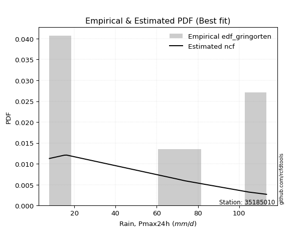</img>

</div>


### 9. EDF Filliben (1975)

The specific values of the constants (0.3175) (often denoted as $alpha$) and (0.365) are derived from a method proposed by James J. Filliben in a 1975 paper. This particular formula is the mean value of the $i$-th order statistic of the normal distribution and is considered a robust and effective plotting position formula for the normal probability plot correlation coefficient test for normality.

<div align="center">


$P=(m-0.3175)/(n+0.365)$


</div>


**9.1. Empirical values**

<div align="center">

|                | 0                  | 1                   | 2                  | 3                   | 4                  | 5                  | 6                  | 7                  |
|:---------------|:-------------------|:--------------------|:-------------------|:--------------------|:-------------------|:-------------------|:-------------------|:-------------------|
| date           | 2023               | 2025                | 2020               | 2022                | 2018               | 2017               | 2019               | 2021               |
| x              | 7.9                | 13.2                | 15.2               | 16.3                | 69.8               | 73.7               | 104.7              | 113.3              |
| m              | 1                  | 2                   | 3                  | 4                   | 5                  | 6                  | 7                  | 8                  |
| empirical_dist | edf_filliben       | edf_filliben        | edf_filliben       | edf_filliben        | edf_filliben       | edf_filliben       | edf_filliben       | edf_filliben       |
| empirical      | 0.0815899581589958 | 0.20113568439928273 | 0.3206814106395696 | 0.44022713687985654 | 0.5597728631201434 | 0.6793185893604303 | 0.7988643156007172 | 0.9184100418410042 |
| empirical_tr   | 1.0888382687927107 | 1.2517770295548074  | 1.4720633523977125 | 1.7864388681260008  | 2.271554650373387  | 3.118359739049394  | 4.971768202080237  | 12.256410256410254 |

</div>


**9.2. Kolmogorov-Smirnov fit test (sorted by Δ)**


<div align="center">

|                | 0                   | 1                   | 2                   | 3                   | 4                   | 5                   | 6                  | 7                   | 8                   | 9                   | 10                 | 11                 | 12                  | 13                  | 14                 | 15                  | 16                  | 17                 | 18                  | 19                 | 20                  | 21                  | 22                 | 23                  | 24                 | 25                  | 26                  | 27                 | 28                  | 29                 | 30                 | 31                 | 32                  | 33                  | 34                 | 35                  | 36                  | 37                  | 38                  | 39                  | 40                  | 41                  | 42                  | 43                 | 44                  | 45                  | 46                  | 47                  | 48                  | 49                  | 50                 | 51                  | 52                  | 53                 | 54                  | 55                  | 56                  | 57                  | 58                  | 59                 | 60                  | 61                  | 62                 | 63                  | 64                  | 65                  | 66                 | 67                  | 68                  | 69                  | 70                  | 71                 | 72                 | 73                  | 74                  | 75                  | 76                  | 77                  | 78                  | 79                  | 80                  | 81                 | 82                 | 83                 | 84                  | 85                 | 86                  | 87                  | 88                 | 89                 | 90                  | 91                  | 92                  | 93                  | 94                 | 95                 | 96                 | 97                  | 98                 | 99                  | 100                | 101                | 102                | 103                 | 104                 | 105                 | 106                | 107                 | 108                | 109                 | 110                | 111                 | 112                 | 113                 | 114                | 115                | 116                 | 117                | 118                 | 119                 | 120                 | 121                 | 122                 | 123                 | 124                 | 125                | 126                 | 127                 | 128                 | 129                | 130                 | 131                 | 132                | 133                | 134                 | 135                | 136                | 137                 | 138                | 139                | 140                | 141                 | 142                | 143                | 144                 | 145                 | 146                 | 147                | 148                 | 149                | 150                | 151                | 152                | 153                | 154                | 155                | 156                | 157                | 158                | 159                |
|:---------------|:--------------------|:--------------------|:--------------------|:--------------------|:--------------------|:--------------------|:-------------------|:--------------------|:--------------------|:--------------------|:-------------------|:-------------------|:--------------------|:--------------------|:-------------------|:--------------------|:--------------------|:-------------------|:--------------------|:-------------------|:--------------------|:--------------------|:-------------------|:--------------------|:-------------------|:--------------------|:--------------------|:-------------------|:--------------------|:-------------------|:-------------------|:-------------------|:--------------------|:--------------------|:-------------------|:--------------------|:--------------------|:--------------------|:--------------------|:--------------------|:--------------------|:--------------------|:--------------------|:-------------------|:--------------------|:--------------------|:--------------------|:--------------------|:--------------------|:--------------------|:-------------------|:--------------------|:--------------------|:-------------------|:--------------------|:--------------------|:--------------------|:--------------------|:--------------------|:-------------------|:--------------------|:--------------------|:-------------------|:--------------------|:--------------------|:--------------------|:-------------------|:--------------------|:--------------------|:--------------------|:--------------------|:-------------------|:-------------------|:--------------------|:--------------------|:--------------------|:--------------------|:--------------------|:--------------------|:--------------------|:--------------------|:-------------------|:-------------------|:-------------------|:--------------------|:-------------------|:--------------------|:--------------------|:-------------------|:-------------------|:--------------------|:--------------------|:--------------------|:--------------------|:-------------------|:-------------------|:-------------------|:--------------------|:-------------------|:--------------------|:-------------------|:-------------------|:-------------------|:--------------------|:--------------------|:--------------------|:-------------------|:--------------------|:-------------------|:--------------------|:-------------------|:--------------------|:--------------------|:--------------------|:-------------------|:-------------------|:--------------------|:-------------------|:--------------------|:--------------------|:--------------------|:--------------------|:--------------------|:--------------------|:--------------------|:-------------------|:--------------------|:--------------------|:--------------------|:-------------------|:--------------------|:--------------------|:-------------------|:-------------------|:--------------------|:-------------------|:-------------------|:--------------------|:-------------------|:-------------------|:-------------------|:--------------------|:-------------------|:-------------------|:--------------------|:--------------------|:--------------------|:-------------------|:--------------------|:-------------------|:-------------------|:-------------------|:-------------------|:-------------------|:-------------------|:-------------------|:-------------------|:-------------------|:-------------------|:-------------------|
| station        | 35185010            | 35185010            | 35185010            | 35185010            | 35185010            | 35185010            | 35185010           | 35185010            | 35185010            | 35185010            | 35185010           | 35185010           | 35185010            | 35185010            | 35185010           | 35185010            | 35185010            | 35185010           | 35185010            | 35185010           | 35185010            | 35185010            | 35185010           | 35185010            | 35185010           | 35185010            | 35185010            | 35185010           | 35185010            | 35185010           | 35185010           | 35185010           | 35185010            | 35185010            | 35185010           | 35185010            | 35185010            | 35185010            | 35185010            | 35185010            | 35185010            | 35185010            | 35185010            | 35185010           | 35185010            | 35185010            | 35185010            | 35185010            | 35185010            | 35185010            | 35185010           | 35185010            | 35185010            | 35185010           | 35185010            | 35185010            | 35185010            | 35185010            | 35185010            | 35185010           | 35185010            | 35185010            | 35185010           | 35185010            | 35185010            | 35185010            | 35185010           | 35185010            | 35185010            | 35185010            | 35185010            | 35185010           | 35185010           | 35185010            | 35185010            | 35185010            | 35185010            | 35185010            | 35185010            | 35185010            | 35185010            | 35185010           | 35185010           | 35185010           | 35185010            | 35185010           | 35185010            | 35185010            | 35185010           | 35185010           | 35185010            | 35185010            | 35185010            | 35185010            | 35185010           | 35185010           | 35185010           | 35185010            | 35185010           | 35185010            | 35185010           | 35185010           | 35185010           | 35185010            | 35185010            | 35185010            | 35185010           | 35185010            | 35185010           | 35185010            | 35185010           | 35185010            | 35185010            | 35185010            | 35185010           | 35185010           | 35185010            | 35185010           | 35185010            | 35185010            | 35185010            | 35185010            | 35185010            | 35185010            | 35185010            | 35185010           | 35185010            | 35185010            | 35185010            | 35185010           | 35185010            | 35185010            | 35185010           | 35185010           | 35185010            | 35185010           | 35185010           | 35185010            | 35185010           | 35185010           | 35185010           | 35185010            | 35185010           | 35185010           | 35185010            | 35185010            | 35185010            | 35185010           | 35185010            | 35185010           | 35185010           | 35185010           | 35185010           | 35185010           | 35185010           | 35185010           | 35185010           | 35185010           | 35185010           | 35185010           |
| empirical_dist | edf_filliben        | edf_filliben        | edf_filliben        | edf_filliben        | edf_filliben        | edf_filliben        | edf_filliben       | edf_filliben        | edf_filliben        | edf_filliben        | edf_filliben       | edf_filliben       | edf_filliben        | edf_filliben        | edf_filliben       | edf_filliben        | edf_filliben        | edf_filliben       | edf_filliben        | edf_filliben       | edf_filliben        | edf_filliben        | edf_filliben       | edf_filliben        | edf_filliben       | edf_filliben        | edf_filliben        | edf_filliben       | edf_filliben        | edf_filliben       | edf_filliben       | edf_filliben       | edf_filliben        | edf_filliben        | edf_filliben       | edf_filliben        | edf_filliben        | edf_filliben        | edf_filliben        | edf_filliben        | edf_filliben        | edf_filliben        | edf_filliben        | edf_filliben       | edf_filliben        | edf_filliben        | edf_filliben        | edf_filliben        | edf_filliben        | edf_filliben        | edf_filliben       | edf_filliben        | edf_filliben        | edf_filliben       | edf_filliben        | edf_filliben        | edf_filliben        | edf_filliben        | edf_filliben        | edf_filliben       | edf_filliben        | edf_filliben        | edf_filliben       | edf_filliben        | edf_filliben        | edf_filliben        | edf_filliben       | edf_filliben        | edf_filliben        | edf_filliben        | edf_filliben        | edf_filliben       | edf_filliben       | edf_filliben        | edf_filliben        | edf_filliben        | edf_filliben        | edf_filliben        | edf_filliben        | edf_filliben        | edf_filliben        | edf_filliben       | edf_filliben       | edf_filliben       | edf_filliben        | edf_filliben       | edf_filliben        | edf_filliben        | edf_filliben       | edf_filliben       | edf_filliben        | edf_filliben        | edf_filliben        | edf_filliben        | edf_filliben       | edf_filliben       | edf_filliben       | edf_filliben        | edf_filliben       | edf_filliben        | edf_filliben       | edf_filliben       | edf_filliben       | edf_filliben        | edf_filliben        | edf_filliben        | edf_filliben       | edf_filliben        | edf_filliben       | edf_filliben        | edf_filliben       | edf_filliben        | edf_filliben        | edf_filliben        | edf_filliben       | edf_filliben       | edf_filliben        | edf_filliben       | edf_filliben        | edf_filliben        | edf_filliben        | edf_filliben        | edf_filliben        | edf_filliben        | edf_filliben        | edf_filliben       | edf_filliben        | edf_filliben        | edf_filliben        | edf_filliben       | edf_filliben        | edf_filliben        | edf_filliben       | edf_filliben       | edf_filliben        | edf_filliben       | edf_filliben       | edf_filliben        | edf_filliben       | edf_filliben       | edf_filliben       | edf_filliben        | edf_filliben       | edf_filliben       | edf_filliben        | edf_filliben        | edf_filliben        | edf_filliben       | edf_filliben        | edf_filliben       | edf_filliben       | edf_filliben       | edf_filliben       | edf_filliben       | edf_filliben       | edf_filliben       | edf_filliben       | edf_filliben       | edf_filliben       | edf_filliben       |
| p_dist         | logdgamma           | logdweibull         | logarcsine          | dweibull            | logweibull_max      | arcsine             | logksone           | dgamma              | logwrapcauchy       | mielke              | wrapcauchy         | logsemicircular    | loglevy_l           | halfgennorm         | loganglit          | loggenextreme       | ksone               | loggenhalflogistic | weibull_min         | logtrapezoid       | logbeta             | truncexpon          | loggenpareto       | loghalfgennorm      | logpearson3        | semicircular        | exponpow            | logskewnorm        | logt                | logexponnorm       | lognorm            | logcrystalball     | lognct              | logtriang           | logfoldnorm        | logerlang           | loggamma            | loggamma            | logbetaprime        | loggompertz         | invweibull          | betaprime           | logf                | loglomax           | loggausshyper       | logncf              | logrice             | logmaxwell          | gengamma            | lograyleigh         | loginvgamma        | burr12              | logalpha            | anglit             | loggenexpon         | logcosine           | loginvweibull       | loginvgauss         | burr                | loggenlogistic     | halfnorm            | logweibull_min      | logburr            | logfatiguelife      | ncf                 | nakagami            | logburr12          | loghalfnorm         | invgamma            | foldnorm            | nct                 | logjohnsonsu       | f                  | rayleigh            | logkstwobign        | loglogistic         | maxwell             | logloggamma         | loggumbel_l         | lognakagami         | loggumbel_r         | genlogistic        | logkappa3          | pearson3           | loghypsecant        | invgauss           | johnsonsu           | exponnorm           | norm               | crystalball        | t                   | loghalflogistic     | logtukeylambda      | logargus            | kstwobign          | logmoyal           | alpha              | logkappa4           | halflogistic       | truncweibull_min    | loguniform         | logvonmises_line   | gumbel_r           | beta                | loglaplace          | loglaplace          | lomax              | levy_l              | gausshyper         | logistic            | cosine             | gumbel_l            | moyal               | genexpon            | rice               | hypsecant          | loggengamma         | laplace            | argus               | logwald             | genextreme          | logtruncnorm        | loggennorm          | gennorm             | logbradford         | logtruncexpon      | gamma               | logtruncweibull_min | gompertz            | logloglaplace      | exponweib           | skewnorm            | kappa4             | genpareto          | bradford            | tukeylambda        | genhalflogistic    | logrdist            | vonmises_line      | kappa3             | uniform            | erlang              | powerlaw           | truncnorm          | triang              | trapezoid           | logexponpow         | wald               | fatiguelife         | logjohnsonsb       | johnsonsb          | logpowerlaw        | logexponweib       | weibull_max        | truncpareto        | rdist              | logtruncpareto     | logvonmises        | vonmises           | logmielke          |
| delta          | 0.08193538382127852 | 0.09275006824800289 | 0.11364678377526105 | 0.14647113016851154 | 0.15007940424782623 | 0.15013170873908838 | 0.1518067357586046 | 0.15324987059906137 | 0.15603893653259734 | 0.16259834766641773 | 0.1673337358318574 | 0.1681944901262561 | 0.17214290492427334 | 0.17665952255516937 | 0.1804147785172565 | 0.18876181140224202 | 0.19034876504525874 | 0.1921953009352912 | 0.19234283663691465 | 0.1927300622114001 | 0.19417003039563105 | 0.19671428803286306 | 0.1976231996462102 | 0.20524401844103635 | 0.2069895497882419 | 0.20713778596467397 | 0.20714721416813764 | 0.2083839517272572 | 0.20841818237729515 | 0.2084267063670242 | 0.2084275597383477 | 0.2084275815865937 | 0.20853607566695975 | 0.20873832244994217 | 0.209119757926581  | 0.20919875124579101 | 0.20960235555125784 | 0.20960235555125784 | 0.21053716650045362 | 0.21076967575862515 | 0.21178901247442294 | 0.21443094711350352 | 0.21468878003190572 | 0.2147478501343455 | 0.21502069345398495 | 0.21527642562975424 | 0.21530197393318362 | 0.21561256213248225 | 0.21753509824040107 | 0.21765093251740808 | 0.2187291990067689 | 0.21899600155821863 | 0.21908114927259492 | 0.2193879546639882 | 0.21973286240001788 | 0.22070773752837602 | 0.22117919055638302 | 0.22127677734880336 | 0.22212493272920708 | 0.2227963717846937 | 0.22309660702324421 | 0.22340128018304328 | 0.2235184211254917 | 0.22363793442994384 | 0.22413989977580984 | 0.22502156617801083 | 0.2251395217776211 | 0.22514330229292634 | 0.22542931979496184 | 0.22554561432258663 | 0.22822914898955438 | 0.2290145584780678 | 0.230229709956852  | 0.23073950289012482 | 0.23091503279608616 | 0.23096748586351146 | 0.23550521414368217 | 0.23637313035524243 | 0.23983926021297788 | 0.24167462687473096 | 0.24329458543725924 | 0.2440481715643287 | 0.2443209601868903 | 0.2443969008076865 | 0.24524422689097014 | 0.2461357702797008 | 0.24619823816553388 | 0.24708498394959966 | 0.2471045250010498 | 0.2471045509749194 | 0.24711169289070822 | 0.24841258488552598 | 0.24918604377165254 | 0.25121006447999156 | 0.2536801813144164 | 0.2546356353651499 | 0.2558355796424371 | 0.25587147158615786 | 0.2559253540632167 | 0.25710875520190957 | 0.2583371363870328 | 0.2584824687930153 | 0.2586035929529066 | 0.25998748320612575 | 0.26288444306497694 | 0.26288444306497694 | 0.2637959400200386 | 0.26511438513340924 | 0.2671251003998596 | 0.26823309854892635 | 0.2692818263951102 | 0.27149699140803424 | 0.27480896954593986 | 0.27499690329824017 | 0.2798357217321412 | 0.2804391933205525 | 0.29007217668258656 | 0.2933983235303681 | 0.29346605820749977 | 0.29350412282668403 | 0.29736654445387734 | 0.29873694244360044 | 0.29886431560071725 | 0.29886431560071725 | 0.30550102614884156 | 0.3154266990211374 | 0.31646169673036684 | 0.3173160472945994  | 0.32072363785502556 | 0.3235393012702872 | 0.32847139362080713 | 0.32888814698667496 | 0.3333214915936066 | 0.343324925885734  | 0.34703254408604933 | 0.3544075584644531 | 0.3547995404048679 | 0.35987005810964956 | 0.3598906962110963 | 0.3604471498565558 | 0.3605307421929495 | 0.36609439688279855 | 0.410107633041904  | 0.4103037423089301 | 0.41305221911600526 | 0.41748932011923334 | 0.42318624219103784 | 0.4242489070430496 | 0.43249551887434956 | 0.4854650219125894 | 0.4914237927978239 | 0.5246240368572002 | 0.5327095431879825 | 0.5710277086967919 | 0.6069080103070434 | 0.669485106609562  | 0.6905644852222197 | 1.1999527248067046 | 17.395744451416245 | nan                |
| deltao         | 0.4472608134160001  | 0.4472608134160001  | 0.4472608134160001  | 0.4472608134160001  | 0.4472608134160001  | 0.4472608134160001  | 0.4472608134160001 | 0.4472608134160001  | 0.4472608134160001  | 0.4472608134160001  | 0.4472608134160001 | 0.4472608134160001 | 0.4472608134160001  | 0.4472608134160001  | 0.4472608134160001 | 0.4472608134160001  | 0.4472608134160001  | 0.4472608134160001 | 0.4472608134160001  | 0.4472608134160001 | 0.4472608134160001  | 0.4472608134160001  | 0.4472608134160001 | 0.4472608134160001  | 0.4472608134160001 | 0.4472608134160001  | 0.4472608134160001  | 0.4472608134160001 | 0.4472608134160001  | 0.4472608134160001 | 0.4472608134160001 | 0.4472608134160001 | 0.4472608134160001  | 0.4472608134160001  | 0.4472608134160001 | 0.4472608134160001  | 0.4472608134160001  | 0.4472608134160001  | 0.4472608134160001  | 0.4472608134160001  | 0.4472608134160001  | 0.4472608134160001  | 0.4472608134160001  | 0.4472608134160001 | 0.4472608134160001  | 0.4472608134160001  | 0.4472608134160001  | 0.4472608134160001  | 0.4472608134160001  | 0.4472608134160001  | 0.4472608134160001 | 0.4472608134160001  | 0.4472608134160001  | 0.4472608134160001 | 0.4472608134160001  | 0.4472608134160001  | 0.4472608134160001  | 0.4472608134160001  | 0.4472608134160001  | 0.4472608134160001 | 0.4472608134160001  | 0.4472608134160001  | 0.4472608134160001 | 0.4472608134160001  | 0.4472608134160001  | 0.4472608134160001  | 0.4472608134160001 | 0.4472608134160001  | 0.4472608134160001  | 0.4472608134160001  | 0.4472608134160001  | 0.4472608134160001 | 0.4472608134160001 | 0.4472608134160001  | 0.4472608134160001  | 0.4472608134160001  | 0.4472608134160001  | 0.4472608134160001  | 0.4472608134160001  | 0.4472608134160001  | 0.4472608134160001  | 0.4472608134160001 | 0.4472608134160001 | 0.4472608134160001 | 0.4472608134160001  | 0.4472608134160001 | 0.4472608134160001  | 0.4472608134160001  | 0.4472608134160001 | 0.4472608134160001 | 0.4472608134160001  | 0.4472608134160001  | 0.4472608134160001  | 0.4472608134160001  | 0.4472608134160001 | 0.4472608134160001 | 0.4472608134160001 | 0.4472608134160001  | 0.4472608134160001 | 0.4472608134160001  | 0.4472608134160001 | 0.4472608134160001 | 0.4472608134160001 | 0.4472608134160001  | 0.4472608134160001  | 0.4472608134160001  | 0.4472608134160001 | 0.4472608134160001  | 0.4472608134160001 | 0.4472608134160001  | 0.4472608134160001 | 0.4472608134160001  | 0.4472608134160001  | 0.4472608134160001  | 0.4472608134160001 | 0.4472608134160001 | 0.4472608134160001  | 0.4472608134160001 | 0.4472608134160001  | 0.4472608134160001  | 0.4472608134160001  | 0.4472608134160001  | 0.4472608134160001  | 0.4472608134160001  | 0.4472608134160001  | 0.4472608134160001 | 0.4472608134160001  | 0.4472608134160001  | 0.4472608134160001  | 0.4472608134160001 | 0.4472608134160001  | 0.4472608134160001  | 0.4472608134160001 | 0.4472608134160001 | 0.4472608134160001  | 0.4472608134160001 | 0.4472608134160001 | 0.4472608134160001  | 0.4472608134160001 | 0.4472608134160001 | 0.4472608134160001 | 0.4472608134160001  | 0.4472608134160001 | 0.4472608134160001 | 0.4472608134160001  | 0.4472608134160001  | 0.4472608134160001  | 0.4472608134160001 | 0.4472608134160001  | 0.4472608134160001 | 0.4472608134160001 | 0.4472608134160001 | 0.4472608134160001 | 0.4472608134160001 | 0.4472608134160001 | 0.4472608134160001 | 0.4472608134160001 | 0.4472608134160001 | 0.4472608134160001 | 0.4472608134160001 |
| eval           | Δo > Δ              | Δo > Δ              | Δo > Δ              | Δo > Δ              | Δo > Δ              | Δo > Δ              | Δo > Δ             | Δo > Δ              | Δo > Δ              | Δo > Δ              | Δo > Δ             | Δo > Δ             | Δo > Δ              | Δo > Δ              | Δo > Δ             | Δo > Δ              | Δo > Δ              | Δo > Δ             | Δo > Δ              | Δo > Δ             | Δo > Δ              | Δo > Δ              | Δo > Δ             | Δo > Δ              | Δo > Δ             | Δo > Δ              | Δo > Δ              | Δo > Δ             | Δo > Δ              | Δo > Δ             | Δo > Δ             | Δo > Δ             | Δo > Δ              | Δo > Δ              | Δo > Δ             | Δo > Δ              | Δo > Δ              | Δo > Δ              | Δo > Δ              | Δo > Δ              | Δo > Δ              | Δo > Δ              | Δo > Δ              | Δo > Δ             | Δo > Δ              | Δo > Δ              | Δo > Δ              | Δo > Δ              | Δo > Δ              | Δo > Δ              | Δo > Δ             | Δo > Δ              | Δo > Δ              | Δo > Δ             | Δo > Δ              | Δo > Δ              | Δo > Δ              | Δo > Δ              | Δo > Δ              | Δo > Δ             | Δo > Δ              | Δo > Δ              | Δo > Δ             | Δo > Δ              | Δo > Δ              | Δo > Δ              | Δo > Δ             | Δo > Δ              | Δo > Δ              | Δo > Δ              | Δo > Δ              | Δo > Δ             | Δo > Δ             | Δo > Δ              | Δo > Δ              | Δo > Δ              | Δo > Δ              | Δo > Δ              | Δo > Δ              | Δo > Δ              | Δo > Δ              | Δo > Δ             | Δo > Δ             | Δo > Δ             | Δo > Δ              | Δo > Δ             | Δo > Δ              | Δo > Δ              | Δo > Δ             | Δo > Δ             | Δo > Δ              | Δo > Δ              | Δo > Δ              | Δo > Δ              | Δo > Δ             | Δo > Δ             | Δo > Δ             | Δo > Δ              | Δo > Δ             | Δo > Δ              | Δo > Δ             | Δo > Δ             | Δo > Δ             | Δo > Δ              | Δo > Δ              | Δo > Δ              | Δo > Δ             | Δo > Δ              | Δo > Δ             | Δo > Δ              | Δo > Δ             | Δo > Δ              | Δo > Δ              | Δo > Δ              | Δo > Δ             | Δo > Δ             | Δo > Δ              | Δo > Δ             | Δo > Δ              | Δo > Δ              | Δo > Δ              | Δo > Δ              | Δo > Δ              | Δo > Δ              | Δo > Δ              | Δo > Δ             | Δo > Δ              | Δo > Δ              | Δo > Δ              | Δo > Δ             | Δo > Δ              | Δo > Δ              | Δo > Δ             | Δo > Δ             | Δo > Δ              | Δo > Δ             | Δo > Δ             | Δo > Δ              | Δo > Δ             | Δo > Δ             | Δo > Δ             | Δo > Δ              | Δo > Δ             | Δo > Δ             | Δo > Δ              | Δo > Δ              | Δo > Δ              | Δo > Δ             | Δo > Δ              | Δo <= Δ            | Δo <= Δ            | Δo <= Δ            | Δo <= Δ            | Δo <= Δ            | Δo <= Δ            | Δo <= Δ            | Δo <= Δ            | Δo <= Δ            | Δo <= Δ            | Δo <= Δ            |
| fit            | 1                   | 1                   | 1                   | 1                   | 1                   | 1                   | 1                  | 1                   | 1                   | 1                   | 1                  | 1                  | 1                   | 1                   | 1                  | 1                   | 1                   | 1                  | 1                   | 1                  | 1                   | 1                   | 1                  | 1                   | 1                  | 1                   | 1                   | 1                  | 1                   | 1                  | 1                  | 1                  | 1                   | 1                   | 1                  | 1                   | 1                   | 1                   | 1                   | 1                   | 1                   | 1                   | 1                   | 1                  | 1                   | 1                   | 1                   | 1                   | 1                   | 1                   | 1                  | 1                   | 1                   | 1                  | 1                   | 1                   | 1                   | 1                   | 1                   | 1                  | 1                   | 1                   | 1                  | 1                   | 1                   | 1                   | 1                  | 1                   | 1                   | 1                   | 1                   | 1                  | 1                  | 1                   | 1                   | 1                   | 1                   | 1                   | 1                   | 1                   | 1                   | 1                  | 1                  | 1                  | 1                   | 1                  | 1                   | 1                   | 1                  | 1                  | 1                   | 1                   | 1                   | 1                   | 1                  | 1                  | 1                  | 1                   | 1                  | 1                   | 1                  | 1                  | 1                  | 1                   | 1                   | 1                   | 1                  | 1                   | 1                  | 1                   | 1                  | 1                   | 1                   | 1                   | 1                  | 1                  | 1                   | 1                  | 1                   | 1                   | 1                   | 1                   | 1                   | 1                   | 1                   | 1                  | 1                   | 1                   | 1                   | 1                  | 1                   | 1                   | 1                  | 1                  | 1                   | 1                  | 1                  | 1                   | 1                  | 1                  | 1                  | 1                   | 1                  | 1                  | 1                   | 1                   | 1                   | 1                  | 1                   | 0                  | 0                  | 0                  | 0                  | 0                  | 0                  | 0                  | 0                  | 0                  | 0                  | 0                  |
| n              | 8                   | 8                   | 8                   | 8                   | 8                   | 8                   | 8                  | 8                   | 8                   | 8                   | 8                  | 8                  | 8                   | 8                   | 8                  | 8                   | 8                   | 8                  | 8                   | 8                  | 8                   | 8                   | 8                  | 8                   | 8                  | 8                   | 8                   | 8                  | 8                   | 8                  | 8                  | 8                  | 8                   | 8                   | 8                  | 8                   | 8                   | 8                   | 8                   | 8                   | 8                   | 8                   | 8                   | 8                  | 8                   | 8                   | 8                   | 8                   | 8                   | 8                   | 8                  | 8                   | 8                   | 8                  | 8                   | 8                   | 8                   | 8                   | 8                   | 8                  | 8                   | 8                   | 8                  | 8                   | 8                   | 8                   | 8                  | 8                   | 8                   | 8                   | 8                   | 8                  | 8                  | 8                   | 8                   | 8                   | 8                   | 8                   | 8                   | 8                   | 8                   | 8                  | 8                  | 8                  | 8                   | 8                  | 8                   | 8                   | 8                  | 8                  | 8                   | 8                   | 8                   | 8                   | 8                  | 8                  | 8                  | 8                   | 8                  | 8                   | 8                  | 8                  | 8                  | 8                   | 8                   | 8                   | 8                  | 8                   | 8                  | 8                   | 8                  | 8                   | 8                   | 8                   | 8                  | 8                  | 8                   | 8                  | 8                   | 8                   | 8                   | 8                   | 8                   | 8                   | 8                   | 8                  | 8                   | 8                   | 8                   | 8                  | 8                   | 8                   | 8                  | 8                  | 8                   | 8                  | 8                  | 8                   | 8                  | 8                  | 8                  | 8                   | 8                  | 8                  | 8                   | 8                   | 8                   | 8                  | 8                   | 8                  | 8                  | 8                  | 8                  | 8                  | 8                  | 8                  | 8                  | 8                  | 8                  | 8                  |
| best_fit       | 1                   | 0                   | 0                   | 0                   | 0                   | 0                   | 0                  | 0                   | 0                   | 0                   | 0                  | 0                  | 0                   | 0                   | 0                  | 0                   | 0                   | 0                  | 0                   | 0                  | 0                   | 0                   | 0                  | 0                   | 0                  | 0                   | 0                   | 0                  | 0                   | 0                  | 0                  | 0                  | 0                   | 0                   | 0                  | 0                   | 0                   | 0                   | 0                   | 0                   | 0                   | 0                   | 0                   | 0                  | 0                   | 0                   | 0                   | 0                   | 0                   | 0                   | 0                  | 0                   | 0                   | 0                  | 0                   | 0                   | 0                   | 0                   | 0                   | 0                  | 0                   | 0                   | 0                  | 0                   | 0                   | 0                   | 0                  | 0                   | 0                   | 0                   | 0                   | 0                  | 0                  | 0                   | 0                   | 0                   | 0                   | 0                   | 0                   | 0                   | 0                   | 0                  | 0                  | 0                  | 0                   | 0                  | 0                   | 0                   | 0                  | 0                  | 0                   | 0                   | 0                   | 0                   | 0                  | 0                  | 0                  | 0                   | 0                  | 0                   | 0                  | 0                  | 0                  | 0                   | 0                   | 0                   | 0                  | 0                   | 0                  | 0                   | 0                  | 0                   | 0                   | 0                   | 0                  | 0                  | 0                   | 0                  | 0                   | 0                   | 0                   | 0                   | 0                   | 0                   | 0                   | 0                  | 0                   | 0                   | 0                   | 0                  | 0                   | 0                   | 0                  | 0                  | 0                   | 0                  | 0                  | 0                   | 0                  | 0                  | 0                  | 0                   | 0                  | 0                  | 0                   | 0                   | 0                   | 0                  | 0                   | 0                  | 0                  | 0                  | 0                  | 0                  | 0                  | 0                  | 0                  | 0                  | 0                  | 0                  |
| best_fit_sort  | 1                   | 2                   | 3                   | 4                   | 5                   | 6                   | 7                  | 8                   | 9                   | 10                  | 11                 | 12                 | 13                  | 14                  | 15                 | 16                  | 17                  | 18                 | 19                  | 20                 | 21                  | 22                  | 23                 | 24                  | 25                 | 26                  | 27                  | 28                 | 29                  | 30                 | 31                 | 32                 | 33                  | 34                  | 35                 | 36                  | 37                  | 38                  | 39                  | 40                  | 41                  | 42                  | 43                  | 44                 | 45                  | 46                  | 47                  | 48                  | 49                  | 50                  | 51                 | 52                  | 53                  | 54                 | 55                  | 56                  | 57                  | 58                  | 59                  | 60                 | 61                  | 62                  | 63                 | 64                  | 65                  | 66                  | 67                 | 68                  | 69                  | 70                  | 71                  | 72                 | 73                 | 74                  | 75                  | 76                  | 77                  | 78                  | 79                  | 80                  | 81                  | 82                 | 83                 | 84                 | 85                  | 86                 | 87                  | 88                  | 89                 | 90                 | 91                  | 92                  | 93                  | 94                  | 95                 | 96                 | 97                 | 98                  | 99                 | 100                 | 101                | 102                | 103                | 104                 | 105                 | 106                 | 107                | 108                 | 109                | 110                 | 111                | 112                 | 113                 | 114                 | 115                | 116                | 117                 | 118                | 119                 | 120                 | 121                 | 122                 | 123                 | 124                 | 125                 | 126                | 127                 | 128                 | 129                 | 130                | 131                 | 132                 | 133                | 134                | 135                 | 136                | 137                | 138                 | 139                | 140                | 141                | 142                 | 143                | 144                | 145                 | 146                 | 147                 | 148                | 149                 | 150                | 151                | 152                | 153                | 154                | 155                | 156                | 157                | 158                | 159                | 160                |

</div>


**9.3. Best fit**

<div align="center">

|   id |   station | empirical_dist   | p_dist    |     delta |   deltao | eval   |   fit |   n |   best_fit |   best_fit_sort |
|-----:|----------:|:-----------------|:----------|----------:|---------:|:-------|------:|----:|-----------:|----------------:|
|    0 |  35185010 | edf_filliben     | logdgamma | 0.0819354 | 0.447261 | Δo > Δ |     1 |   8 |          1 |               1 |

</div>


<div align="center">

</img></img>

</div>


### 10. EDF Jenkinson (1977)

The Jenkinson formula in hydrology is an empirical plotting position formula used to estimate the non-exceedance probability _(P)_ or return period _(T)_ of a given ordered observation within a sample. It is a widely used method in the frequency analysis of extreme events such as floods and rainfall, as it provides a distribution-free way to plot data. _a≈0.31_ and _b≈0.38_ are constants derived to approximate the median of the probability distribution for the given rank.

<div align="center">


$P=(m-a)/(n+b)$


</div>


**10.1. Empirical values**

<div align="center">

|                | 0                   | 1                   | 2                  | 3                   | 4                  | 5                  | 6                  | 7                  |
|:---------------|:--------------------|:--------------------|:-------------------|:--------------------|:-------------------|:-------------------|:-------------------|:-------------------|
| date           | 2023                | 2025                | 2020               | 2022                | 2018               | 2017               | 2019               | 2021               |
| x              | 7.9                 | 13.2                | 15.2               | 16.3                | 69.8               | 73.7               | 104.7              | 113.3              |
| m              | 1                   | 2                   | 3                  | 4                   | 5                  | 6                  | 7                  | 8                  |
| empirical_dist | edf_jenkinson       | edf_jenkinson       | edf_jenkinson      | edf_jenkinson       | edf_jenkinson      | edf_jenkinson      | edf_jenkinson      | edf_jenkinson      |
| empirical      | 0.08233890214797135 | 0.20167064439140808 | 0.3210023866348448 | 0.44033412887828155 | 0.5596658711217184 | 0.6789976133651551 | 0.7983293556085919 | 0.9176610978520287 |
| empirical_tr   | 1.0897269180754225  | 1.2526158445440956  | 1.4727592267135323 | 1.7867803837953091  | 2.2710027100271004 | 3.115241635687732  | 4.958579881656804  | 12.144927536231886 |

</div>


**10.2. Kolmogorov-Smirnov fit test (sorted by Δ)**


<div align="center">

|                | 0                  | 1                   | 2                   | 3                   | 4                  | 5                  | 6                  | 7                   | 8                  | 9                   | 10                 | 11                 | 12                 | 13                  | 14                  | 15                  | 16                  | 17                  | 18                 | 19                 | 20                 | 21                  | 22                  | 23                  | 24                  | 25                  | 26                  | 27                  | 28                  | 29                  | 30                 | 31                 | 32                  | 33                  | 34                 | 35                  | 36                  | 37                  | 38                  | 39                  | 40                  | 41                  | 42                  | 43                 | 44                  | 45                  | 46                  | 47                  | 48                  | 49                 | 50                  | 51                  | 52                  | 53                 | 54                 | 55                  | 56                  | 57                  | 58                 | 59                 | 60                  | 61                 | 62                 | 63                  | 64                  | 65                  | 66                 | 67                  | 68                  | 69                  | 70                  | 71                 | 72                 | 73                  | 74                  | 75                  | 76                  | 77                  | 78                 | 79                  | 80                  | 81                 | 82                  | 83                 | 84                  | 85                 | 86                 | 87                  | 88                 | 89                 | 90                  | 91                 | 92                  | 93                  | 94                 | 95                 | 96                 | 97                  | 98                 | 99                 | 100                | 101                | 102                | 103                | 104                 | 105                 | 106                | 107                | 108                | 109                 | 110                 | 111                 | 112                | 113                | 114                 | 115                | 116                 | 117                | 118                | 119                 | 120                | 121                | 122                | 123                 | 124                 | 125                | 126                 | 127                 | 128                 | 129                | 130                 | 131                 | 132                | 133                | 134                 | 135                | 136                | 137                 | 138                | 139                | 140                | 141                 | 142                | 143                | 144                 | 145                 | 146                | 147                | 148                 | 149                | 150                 | 151                | 152                | 153                | 154                | 155                | 156                | 157                | 158                | 159                |
|:---------------|:-------------------|:--------------------|:--------------------|:--------------------|:-------------------|:-------------------|:-------------------|:--------------------|:-------------------|:--------------------|:-------------------|:-------------------|:-------------------|:--------------------|:--------------------|:--------------------|:--------------------|:--------------------|:-------------------|:-------------------|:-------------------|:--------------------|:--------------------|:--------------------|:--------------------|:--------------------|:--------------------|:--------------------|:--------------------|:--------------------|:-------------------|:-------------------|:--------------------|:--------------------|:-------------------|:--------------------|:--------------------|:--------------------|:--------------------|:--------------------|:--------------------|:--------------------|:--------------------|:-------------------|:--------------------|:--------------------|:--------------------|:--------------------|:--------------------|:-------------------|:--------------------|:--------------------|:--------------------|:-------------------|:-------------------|:--------------------|:--------------------|:--------------------|:-------------------|:-------------------|:--------------------|:-------------------|:-------------------|:--------------------|:--------------------|:--------------------|:-------------------|:--------------------|:--------------------|:--------------------|:--------------------|:-------------------|:-------------------|:--------------------|:--------------------|:--------------------|:--------------------|:--------------------|:-------------------|:--------------------|:--------------------|:-------------------|:--------------------|:-------------------|:--------------------|:-------------------|:-------------------|:--------------------|:-------------------|:-------------------|:--------------------|:-------------------|:--------------------|:--------------------|:-------------------|:-------------------|:-------------------|:--------------------|:-------------------|:-------------------|:-------------------|:-------------------|:-------------------|:-------------------|:--------------------|:--------------------|:-------------------|:-------------------|:-------------------|:--------------------|:--------------------|:--------------------|:-------------------|:-------------------|:--------------------|:-------------------|:--------------------|:-------------------|:-------------------|:--------------------|:-------------------|:-------------------|:-------------------|:--------------------|:--------------------|:-------------------|:--------------------|:--------------------|:--------------------|:-------------------|:--------------------|:--------------------|:-------------------|:-------------------|:--------------------|:-------------------|:-------------------|:--------------------|:-------------------|:-------------------|:-------------------|:--------------------|:-------------------|:-------------------|:--------------------|:--------------------|:-------------------|:-------------------|:--------------------|:-------------------|:--------------------|:-------------------|:-------------------|:-------------------|:-------------------|:-------------------|:-------------------|:-------------------|:-------------------|:-------------------|
| station        | 35185010           | 35185010            | 35185010            | 35185010            | 35185010           | 35185010           | 35185010           | 35185010            | 35185010           | 35185010            | 35185010           | 35185010           | 35185010           | 35185010            | 35185010            | 35185010            | 35185010            | 35185010            | 35185010           | 35185010           | 35185010           | 35185010            | 35185010            | 35185010            | 35185010            | 35185010            | 35185010            | 35185010            | 35185010            | 35185010            | 35185010           | 35185010           | 35185010            | 35185010            | 35185010           | 35185010            | 35185010            | 35185010            | 35185010            | 35185010            | 35185010            | 35185010            | 35185010            | 35185010           | 35185010            | 35185010            | 35185010            | 35185010            | 35185010            | 35185010           | 35185010            | 35185010            | 35185010            | 35185010           | 35185010           | 35185010            | 35185010            | 35185010            | 35185010           | 35185010           | 35185010            | 35185010           | 35185010           | 35185010            | 35185010            | 35185010            | 35185010           | 35185010            | 35185010            | 35185010            | 35185010            | 35185010           | 35185010           | 35185010            | 35185010            | 35185010            | 35185010            | 35185010            | 35185010           | 35185010            | 35185010            | 35185010           | 35185010            | 35185010           | 35185010            | 35185010           | 35185010           | 35185010            | 35185010           | 35185010           | 35185010            | 35185010           | 35185010            | 35185010            | 35185010           | 35185010           | 35185010           | 35185010            | 35185010           | 35185010           | 35185010           | 35185010           | 35185010           | 35185010           | 35185010            | 35185010            | 35185010           | 35185010           | 35185010           | 35185010            | 35185010            | 35185010            | 35185010           | 35185010           | 35185010            | 35185010           | 35185010            | 35185010           | 35185010           | 35185010            | 35185010           | 35185010           | 35185010           | 35185010            | 35185010            | 35185010           | 35185010            | 35185010            | 35185010            | 35185010           | 35185010            | 35185010            | 35185010           | 35185010           | 35185010            | 35185010           | 35185010           | 35185010            | 35185010           | 35185010           | 35185010           | 35185010            | 35185010           | 35185010           | 35185010            | 35185010            | 35185010           | 35185010           | 35185010            | 35185010           | 35185010            | 35185010           | 35185010           | 35185010           | 35185010           | 35185010           | 35185010           | 35185010           | 35185010           | 35185010           |
| empirical_dist | edf_jenkinson      | edf_jenkinson       | edf_jenkinson       | edf_jenkinson       | edf_jenkinson      | edf_jenkinson      | edf_jenkinson      | edf_jenkinson       | edf_jenkinson      | edf_jenkinson       | edf_jenkinson      | edf_jenkinson      | edf_jenkinson      | edf_jenkinson       | edf_jenkinson       | edf_jenkinson       | edf_jenkinson       | edf_jenkinson       | edf_jenkinson      | edf_jenkinson      | edf_jenkinson      | edf_jenkinson       | edf_jenkinson       | edf_jenkinson       | edf_jenkinson       | edf_jenkinson       | edf_jenkinson       | edf_jenkinson       | edf_jenkinson       | edf_jenkinson       | edf_jenkinson      | edf_jenkinson      | edf_jenkinson       | edf_jenkinson       | edf_jenkinson      | edf_jenkinson       | edf_jenkinson       | edf_jenkinson       | edf_jenkinson       | edf_jenkinson       | edf_jenkinson       | edf_jenkinson       | edf_jenkinson       | edf_jenkinson      | edf_jenkinson       | edf_jenkinson       | edf_jenkinson       | edf_jenkinson       | edf_jenkinson       | edf_jenkinson      | edf_jenkinson       | edf_jenkinson       | edf_jenkinson       | edf_jenkinson      | edf_jenkinson      | edf_jenkinson       | edf_jenkinson       | edf_jenkinson       | edf_jenkinson      | edf_jenkinson      | edf_jenkinson       | edf_jenkinson      | edf_jenkinson      | edf_jenkinson       | edf_jenkinson       | edf_jenkinson       | edf_jenkinson      | edf_jenkinson       | edf_jenkinson       | edf_jenkinson       | edf_jenkinson       | edf_jenkinson      | edf_jenkinson      | edf_jenkinson       | edf_jenkinson       | edf_jenkinson       | edf_jenkinson       | edf_jenkinson       | edf_jenkinson      | edf_jenkinson       | edf_jenkinson       | edf_jenkinson      | edf_jenkinson       | edf_jenkinson      | edf_jenkinson       | edf_jenkinson      | edf_jenkinson      | edf_jenkinson       | edf_jenkinson      | edf_jenkinson      | edf_jenkinson       | edf_jenkinson      | edf_jenkinson       | edf_jenkinson       | edf_jenkinson      | edf_jenkinson      | edf_jenkinson      | edf_jenkinson       | edf_jenkinson      | edf_jenkinson      | edf_jenkinson      | edf_jenkinson      | edf_jenkinson      | edf_jenkinson      | edf_jenkinson       | edf_jenkinson       | edf_jenkinson      | edf_jenkinson      | edf_jenkinson      | edf_jenkinson       | edf_jenkinson       | edf_jenkinson       | edf_jenkinson      | edf_jenkinson      | edf_jenkinson       | edf_jenkinson      | edf_jenkinson       | edf_jenkinson      | edf_jenkinson      | edf_jenkinson       | edf_jenkinson      | edf_jenkinson      | edf_jenkinson      | edf_jenkinson       | edf_jenkinson       | edf_jenkinson      | edf_jenkinson       | edf_jenkinson       | edf_jenkinson       | edf_jenkinson      | edf_jenkinson       | edf_jenkinson       | edf_jenkinson      | edf_jenkinson      | edf_jenkinson       | edf_jenkinson      | edf_jenkinson      | edf_jenkinson       | edf_jenkinson      | edf_jenkinson      | edf_jenkinson      | edf_jenkinson       | edf_jenkinson      | edf_jenkinson      | edf_jenkinson       | edf_jenkinson       | edf_jenkinson      | edf_jenkinson      | edf_jenkinson       | edf_jenkinson      | edf_jenkinson       | edf_jenkinson      | edf_jenkinson      | edf_jenkinson      | edf_jenkinson      | edf_jenkinson      | edf_jenkinson      | edf_jenkinson      | edf_jenkinson      | edf_jenkinson      |
| p_dist         | logdgamma          | logdweibull         | logarcsine          | dweibull            | logweibull_max     | arcsine            | logksone           | dgamma              | logwrapcauchy      | mielke              | wrapcauchy         | logsemicircular    | loglevy_l          | halfgennorm         | loganglit           | loggenextreme       | ksone               | weibull_min         | loggenhalflogistic | logtrapezoid       | logbeta            | truncexpon          | loggenpareto        | loghalfgennorm      | logpearson3         | semicircular        | exponpow            | logskewnorm         | logt                | logexponnorm        | lognorm            | logcrystalball     | lognct              | logtriang           | logfoldnorm        | logerlang           | loggamma            | loggamma            | logbetaprime        | loggompertz         | invweibull          | betaprime           | logf                | loglomax           | loggausshyper       | logncf              | logrice             | logmaxwell          | gengamma            | lograyleigh        | loginvgamma         | burr12              | logalpha            | anglit             | loggenexpon        | logcosine           | loginvweibull       | loginvgauss         | burr               | loggenlogistic     | halfnorm            | logweibull_min     | logburr            | logfatiguelife      | ncf                 | nakagami            | logburr12          | loghalfnorm         | invgamma            | foldnorm            | nct                 | logjohnsonsu       | f                  | rayleigh            | logkstwobign        | loglogistic         | maxwell             | logloggamma         | loggumbel_l        | lognakagami         | loggumbel_r         | genlogistic        | logkappa3           | pearson3           | loghypsecant        | invgauss           | johnsonsu          | exponnorm           | norm               | crystalball        | t                   | loghalflogistic    | logtukeylambda      | logargus            | kstwobign          | logmoyal           | alpha              | logkappa4           | halflogistic       | truncweibull_min   | loguniform         | logvonmises_line   | gumbel_r           | beta               | loglaplace          | loglaplace          | lomax              | levy_l             | gausshyper         | logistic            | cosine              | gumbel_l            | moyal              | genexpon           | rice                | hypsecant          | loggengamma         | laplace            | argus              | logwald             | genextreme         | loggennorm         | gennorm            | logtruncnorm        | logbradford         | logtruncexpon      | gamma               | logtruncweibull_min | gompertz            | logloglaplace      | exponweib           | skewnorm            | kappa4             | genpareto          | bradford            | tukeylambda        | genhalflogistic    | logrdist            | vonmises_line      | kappa3             | uniform            | erlang              | powerlaw           | truncnorm          | triang              | trapezoid           | logexponpow        | wald               | fatiguelife         | logjohnsonsb       | johnsonsb           | logpowerlaw        | logexponweib       | weibull_max        | truncpareto        | rdist              | logtruncpareto     | logvonmises        | vonmises           | logmielke          |
| delta          | 0.0824703438134039 | 0.09221510825587753 | 0.11375377577368606 | 0.14657812216693655 | 0.1493304602588507 | 0.1502387007375134 | 0.1519137277570296 | 0.15378483059118675 | 0.155503976540472  | 0.16270533966484274 | 0.1674407278302824 | 0.1683014821246811 | 0.1713939609352978 | 0.17676651455359438 | 0.18052177051568152 | 0.18886880340066703 | 0.19045575704368375 | 0.19159389264793913 | 0.1923022929337162 | 0.1928370542098251 | 0.1934210864066555 | 0.19682128003128807 | 0.19687425565723465 | 0.20535101043946136 | 0.20709654178666692 | 0.20724477796309898 | 0.20725420616656265 | 0.20849094372568222 | 0.20852517437572016 | 0.20853369836544922 | 0.2085345517367727 | 0.2085345735850187 | 0.20864306766538476 | 0.20884531444836718 | 0.209226749925006  | 0.20930574324421602 | 0.20970934754968285 | 0.20970934754968285 | 0.21064415849887863 | 0.21087666775705016 | 0.21189600447284795 | 0.21453793911192853 | 0.21479577203033073 | 0.2148548421327705 | 0.21512768545240996 | 0.21538341762817925 | 0.21540896593160863 | 0.21571955413090727 | 0.21764209023882608 | 0.2177579245158331 | 0.21883619100519391 | 0.21910299355664364 | 0.21918814127101993 | 0.2194949466624132 | 0.2198398543984429 | 0.22081472952680103 | 0.22128618255480803 | 0.22138376934722837 | 0.2222319247276321 | 0.2229033637831187 | 0.22320359902166922 | 0.2235082721814683 | 0.2236254131239167 | 0.22374492642836885 | 0.22424689177423485 | 0.22512855817643584 | 0.2252465137760461 | 0.22525029429135135 | 0.22553631179338685 | 0.22565260632101164 | 0.22833614098797939 | 0.2291215504764928 | 0.230336701955277  | 0.23084649488854983 | 0.23102202479451117 | 0.23107447786193647 | 0.23561220614210718 | 0.23648012235366744 | 0.2399462522114029 | 0.24178161887315597 | 0.24340157743568425 | 0.2441551635627537 | 0.24442795218531532 | 0.2445038928061115 | 0.24535121888939515 | 0.2462427622781258 | 0.2463052301639589 | 0.24719197594802467 | 0.2472115169994748 | 0.2472115429733444 | 0.24721868488913323 | 0.248519576883951  | 0.24929303577007755 | 0.25131705647841657 | 0.2537871733128414 | 0.2547426273635749 | 0.2559425716408621 | 0.25597846358458287 | 0.2560323460616417 | 0.2572157472003346 | 0.2584441283854578 | 0.2585894607914403 | 0.2587105849513316 | 0.2592385392171502 | 0.26299143506340195 | 0.26299143506340195 | 0.2639029320184636 | 0.2643654411444337 | 0.2672320923982846 | 0.26834009054735136 | 0.26938881839353523 | 0.27160398340645925 | 0.2749159615443649 | 0.2751038952966652 | 0.27994271373056623 | 0.2805461853189775 | 0.29017916868101157 | 0.2935053155287931 | 0.2935730502059248 | 0.29361111482510904 | 0.2966176004649018 | 0.2983293556085919 | 0.2983293556085919 | 0.29884393444202545 | 0.30560801814726657 | 0.3155336910195624 | 0.31656868872879185 | 0.3174230392930244  | 0.32083062985345057 | 0.3236462932687122 | 0.32857838561923214 | 0.32899513898509997 | 0.3334284835920316 | 0.343431917884159  | 0.34713953608447434 | 0.3545145504628781 | 0.3549065324032929 | 0.35997705010807457 | 0.3599976882095213 | 0.3605541418549808 | 0.3606377341913745 | 0.36620138888122356 | 0.4095726730497787 | 0.4104107343073551 | 0.41315921111443027 | 0.41759631211765835 | 0.4226512821989125 | 0.4243558990414746 | 0.43196055888222423 | 0.484930061920464  | 0.49088883280569856 | 0.5240890768650748 | 0.5321745831958571 | 0.5704927487046665 | 0.6063730503149181 | 0.6689501466174366 | 0.6900295252300943 | 1.2000597168051297 | 17.39649339540522  | nan                |
| deltao         | 0.4472608134160001 | 0.4472608134160001  | 0.4472608134160001  | 0.4472608134160001  | 0.4472608134160001 | 0.4472608134160001 | 0.4472608134160001 | 0.4472608134160001  | 0.4472608134160001 | 0.4472608134160001  | 0.4472608134160001 | 0.4472608134160001 | 0.4472608134160001 | 0.4472608134160001  | 0.4472608134160001  | 0.4472608134160001  | 0.4472608134160001  | 0.4472608134160001  | 0.4472608134160001 | 0.4472608134160001 | 0.4472608134160001 | 0.4472608134160001  | 0.4472608134160001  | 0.4472608134160001  | 0.4472608134160001  | 0.4472608134160001  | 0.4472608134160001  | 0.4472608134160001  | 0.4472608134160001  | 0.4472608134160001  | 0.4472608134160001 | 0.4472608134160001 | 0.4472608134160001  | 0.4472608134160001  | 0.4472608134160001 | 0.4472608134160001  | 0.4472608134160001  | 0.4472608134160001  | 0.4472608134160001  | 0.4472608134160001  | 0.4472608134160001  | 0.4472608134160001  | 0.4472608134160001  | 0.4472608134160001 | 0.4472608134160001  | 0.4472608134160001  | 0.4472608134160001  | 0.4472608134160001  | 0.4472608134160001  | 0.4472608134160001 | 0.4472608134160001  | 0.4472608134160001  | 0.4472608134160001  | 0.4472608134160001 | 0.4472608134160001 | 0.4472608134160001  | 0.4472608134160001  | 0.4472608134160001  | 0.4472608134160001 | 0.4472608134160001 | 0.4472608134160001  | 0.4472608134160001 | 0.4472608134160001 | 0.4472608134160001  | 0.4472608134160001  | 0.4472608134160001  | 0.4472608134160001 | 0.4472608134160001  | 0.4472608134160001  | 0.4472608134160001  | 0.4472608134160001  | 0.4472608134160001 | 0.4472608134160001 | 0.4472608134160001  | 0.4472608134160001  | 0.4472608134160001  | 0.4472608134160001  | 0.4472608134160001  | 0.4472608134160001 | 0.4472608134160001  | 0.4472608134160001  | 0.4472608134160001 | 0.4472608134160001  | 0.4472608134160001 | 0.4472608134160001  | 0.4472608134160001 | 0.4472608134160001 | 0.4472608134160001  | 0.4472608134160001 | 0.4472608134160001 | 0.4472608134160001  | 0.4472608134160001 | 0.4472608134160001  | 0.4472608134160001  | 0.4472608134160001 | 0.4472608134160001 | 0.4472608134160001 | 0.4472608134160001  | 0.4472608134160001 | 0.4472608134160001 | 0.4472608134160001 | 0.4472608134160001 | 0.4472608134160001 | 0.4472608134160001 | 0.4472608134160001  | 0.4472608134160001  | 0.4472608134160001 | 0.4472608134160001 | 0.4472608134160001 | 0.4472608134160001  | 0.4472608134160001  | 0.4472608134160001  | 0.4472608134160001 | 0.4472608134160001 | 0.4472608134160001  | 0.4472608134160001 | 0.4472608134160001  | 0.4472608134160001 | 0.4472608134160001 | 0.4472608134160001  | 0.4472608134160001 | 0.4472608134160001 | 0.4472608134160001 | 0.4472608134160001  | 0.4472608134160001  | 0.4472608134160001 | 0.4472608134160001  | 0.4472608134160001  | 0.4472608134160001  | 0.4472608134160001 | 0.4472608134160001  | 0.4472608134160001  | 0.4472608134160001 | 0.4472608134160001 | 0.4472608134160001  | 0.4472608134160001 | 0.4472608134160001 | 0.4472608134160001  | 0.4472608134160001 | 0.4472608134160001 | 0.4472608134160001 | 0.4472608134160001  | 0.4472608134160001 | 0.4472608134160001 | 0.4472608134160001  | 0.4472608134160001  | 0.4472608134160001 | 0.4472608134160001 | 0.4472608134160001  | 0.4472608134160001 | 0.4472608134160001  | 0.4472608134160001 | 0.4472608134160001 | 0.4472608134160001 | 0.4472608134160001 | 0.4472608134160001 | 0.4472608134160001 | 0.4472608134160001 | 0.4472608134160001 | 0.4472608134160001 |
| eval           | Δo > Δ             | Δo > Δ              | Δo > Δ              | Δo > Δ              | Δo > Δ             | Δo > Δ             | Δo > Δ             | Δo > Δ              | Δo > Δ             | Δo > Δ              | Δo > Δ             | Δo > Δ             | Δo > Δ             | Δo > Δ              | Δo > Δ              | Δo > Δ              | Δo > Δ              | Δo > Δ              | Δo > Δ             | Δo > Δ             | Δo > Δ             | Δo > Δ              | Δo > Δ              | Δo > Δ              | Δo > Δ              | Δo > Δ              | Δo > Δ              | Δo > Δ              | Δo > Δ              | Δo > Δ              | Δo > Δ             | Δo > Δ             | Δo > Δ              | Δo > Δ              | Δo > Δ             | Δo > Δ              | Δo > Δ              | Δo > Δ              | Δo > Δ              | Δo > Δ              | Δo > Δ              | Δo > Δ              | Δo > Δ              | Δo > Δ             | Δo > Δ              | Δo > Δ              | Δo > Δ              | Δo > Δ              | Δo > Δ              | Δo > Δ             | Δo > Δ              | Δo > Δ              | Δo > Δ              | Δo > Δ             | Δo > Δ             | Δo > Δ              | Δo > Δ              | Δo > Δ              | Δo > Δ             | Δo > Δ             | Δo > Δ              | Δo > Δ             | Δo > Δ             | Δo > Δ              | Δo > Δ              | Δo > Δ              | Δo > Δ             | Δo > Δ              | Δo > Δ              | Δo > Δ              | Δo > Δ              | Δo > Δ             | Δo > Δ             | Δo > Δ              | Δo > Δ              | Δo > Δ              | Δo > Δ              | Δo > Δ              | Δo > Δ             | Δo > Δ              | Δo > Δ              | Δo > Δ             | Δo > Δ              | Δo > Δ             | Δo > Δ              | Δo > Δ             | Δo > Δ             | Δo > Δ              | Δo > Δ             | Δo > Δ             | Δo > Δ              | Δo > Δ             | Δo > Δ              | Δo > Δ              | Δo > Δ             | Δo > Δ             | Δo > Δ             | Δo > Δ              | Δo > Δ             | Δo > Δ             | Δo > Δ             | Δo > Δ             | Δo > Δ             | Δo > Δ             | Δo > Δ              | Δo > Δ              | Δo > Δ             | Δo > Δ             | Δo > Δ             | Δo > Δ              | Δo > Δ              | Δo > Δ              | Δo > Δ             | Δo > Δ             | Δo > Δ              | Δo > Δ             | Δo > Δ              | Δo > Δ             | Δo > Δ             | Δo > Δ              | Δo > Δ             | Δo > Δ             | Δo > Δ             | Δo > Δ              | Δo > Δ              | Δo > Δ             | Δo > Δ              | Δo > Δ              | Δo > Δ              | Δo > Δ             | Δo > Δ              | Δo > Δ              | Δo > Δ             | Δo > Δ             | Δo > Δ              | Δo > Δ             | Δo > Δ             | Δo > Δ              | Δo > Δ             | Δo > Δ             | Δo > Δ             | Δo > Δ              | Δo > Δ             | Δo > Δ             | Δo > Δ              | Δo > Δ              | Δo > Δ             | Δo > Δ             | Δo > Δ              | Δo <= Δ            | Δo <= Δ             | Δo <= Δ            | Δo <= Δ            | Δo <= Δ            | Δo <= Δ            | Δo <= Δ            | Δo <= Δ            | Δo <= Δ            | Δo <= Δ            | Δo <= Δ            |
| fit            | 1                  | 1                   | 1                   | 1                   | 1                  | 1                  | 1                  | 1                   | 1                  | 1                   | 1                  | 1                  | 1                  | 1                   | 1                   | 1                   | 1                   | 1                   | 1                  | 1                  | 1                  | 1                   | 1                   | 1                   | 1                   | 1                   | 1                   | 1                   | 1                   | 1                   | 1                  | 1                  | 1                   | 1                   | 1                  | 1                   | 1                   | 1                   | 1                   | 1                   | 1                   | 1                   | 1                   | 1                  | 1                   | 1                   | 1                   | 1                   | 1                   | 1                  | 1                   | 1                   | 1                   | 1                  | 1                  | 1                   | 1                   | 1                   | 1                  | 1                  | 1                   | 1                  | 1                  | 1                   | 1                   | 1                   | 1                  | 1                   | 1                   | 1                   | 1                   | 1                  | 1                  | 1                   | 1                   | 1                   | 1                   | 1                   | 1                  | 1                   | 1                   | 1                  | 1                   | 1                  | 1                   | 1                  | 1                  | 1                   | 1                  | 1                  | 1                   | 1                  | 1                   | 1                   | 1                  | 1                  | 1                  | 1                   | 1                  | 1                  | 1                  | 1                  | 1                  | 1                  | 1                   | 1                   | 1                  | 1                  | 1                  | 1                   | 1                   | 1                   | 1                  | 1                  | 1                   | 1                  | 1                   | 1                  | 1                  | 1                   | 1                  | 1                  | 1                  | 1                   | 1                   | 1                  | 1                   | 1                   | 1                   | 1                  | 1                   | 1                   | 1                  | 1                  | 1                   | 1                  | 1                  | 1                   | 1                  | 1                  | 1                  | 1                   | 1                  | 1                  | 1                   | 1                   | 1                  | 1                  | 1                   | 0                  | 0                   | 0                  | 0                  | 0                  | 0                  | 0                  | 0                  | 0                  | 0                  | 0                  |
| n              | 8                  | 8                   | 8                   | 8                   | 8                  | 8                  | 8                  | 8                   | 8                  | 8                   | 8                  | 8                  | 8                  | 8                   | 8                   | 8                   | 8                   | 8                   | 8                  | 8                  | 8                  | 8                   | 8                   | 8                   | 8                   | 8                   | 8                   | 8                   | 8                   | 8                   | 8                  | 8                  | 8                   | 8                   | 8                  | 8                   | 8                   | 8                   | 8                   | 8                   | 8                   | 8                   | 8                   | 8                  | 8                   | 8                   | 8                   | 8                   | 8                   | 8                  | 8                   | 8                   | 8                   | 8                  | 8                  | 8                   | 8                   | 8                   | 8                  | 8                  | 8                   | 8                  | 8                  | 8                   | 8                   | 8                   | 8                  | 8                   | 8                   | 8                   | 8                   | 8                  | 8                  | 8                   | 8                   | 8                   | 8                   | 8                   | 8                  | 8                   | 8                   | 8                  | 8                   | 8                  | 8                   | 8                  | 8                  | 8                   | 8                  | 8                  | 8                   | 8                  | 8                   | 8                   | 8                  | 8                  | 8                  | 8                   | 8                  | 8                  | 8                  | 8                  | 8                  | 8                  | 8                   | 8                   | 8                  | 8                  | 8                  | 8                   | 8                   | 8                   | 8                  | 8                  | 8                   | 8                  | 8                   | 8                  | 8                  | 8                   | 8                  | 8                  | 8                  | 8                   | 8                   | 8                  | 8                   | 8                   | 8                   | 8                  | 8                   | 8                   | 8                  | 8                  | 8                   | 8                  | 8                  | 8                   | 8                  | 8                  | 8                  | 8                   | 8                  | 8                  | 8                   | 8                   | 8                  | 8                  | 8                   | 8                  | 8                   | 8                  | 8                  | 8                  | 8                  | 8                  | 8                  | 8                  | 8                  | 8                  |
| best_fit       | 1                  | 0                   | 0                   | 0                   | 0                  | 0                  | 0                  | 0                   | 0                  | 0                   | 0                  | 0                  | 0                  | 0                   | 0                   | 0                   | 0                   | 0                   | 0                  | 0                  | 0                  | 0                   | 0                   | 0                   | 0                   | 0                   | 0                   | 0                   | 0                   | 0                   | 0                  | 0                  | 0                   | 0                   | 0                  | 0                   | 0                   | 0                   | 0                   | 0                   | 0                   | 0                   | 0                   | 0                  | 0                   | 0                   | 0                   | 0                   | 0                   | 0                  | 0                   | 0                   | 0                   | 0                  | 0                  | 0                   | 0                   | 0                   | 0                  | 0                  | 0                   | 0                  | 0                  | 0                   | 0                   | 0                   | 0                  | 0                   | 0                   | 0                   | 0                   | 0                  | 0                  | 0                   | 0                   | 0                   | 0                   | 0                   | 0                  | 0                   | 0                   | 0                  | 0                   | 0                  | 0                   | 0                  | 0                  | 0                   | 0                  | 0                  | 0                   | 0                  | 0                   | 0                   | 0                  | 0                  | 0                  | 0                   | 0                  | 0                  | 0                  | 0                  | 0                  | 0                  | 0                   | 0                   | 0                  | 0                  | 0                  | 0                   | 0                   | 0                   | 0                  | 0                  | 0                   | 0                  | 0                   | 0                  | 0                  | 0                   | 0                  | 0                  | 0                  | 0                   | 0                   | 0                  | 0                   | 0                   | 0                   | 0                  | 0                   | 0                   | 0                  | 0                  | 0                   | 0                  | 0                  | 0                   | 0                  | 0                  | 0                  | 0                   | 0                  | 0                  | 0                   | 0                   | 0                  | 0                  | 0                   | 0                  | 0                   | 0                  | 0                  | 0                  | 0                  | 0                  | 0                  | 0                  | 0                  | 0                  |
| best_fit_sort  | 1                  | 2                   | 3                   | 4                   | 5                  | 6                  | 7                  | 8                   | 9                  | 10                  | 11                 | 12                 | 13                 | 14                  | 15                  | 16                  | 17                  | 18                  | 19                 | 20                 | 21                 | 22                  | 23                  | 24                  | 25                  | 26                  | 27                  | 28                  | 29                  | 30                  | 31                 | 32                 | 33                  | 34                  | 35                 | 36                  | 37                  | 38                  | 39                  | 40                  | 41                  | 42                  | 43                  | 44                 | 45                  | 46                  | 47                  | 48                  | 49                  | 50                 | 51                  | 52                  | 53                  | 54                 | 55                 | 56                  | 57                  | 58                  | 59                 | 60                 | 61                  | 62                 | 63                 | 64                  | 65                  | 66                  | 67                 | 68                  | 69                  | 70                  | 71                  | 72                 | 73                 | 74                  | 75                  | 76                  | 77                  | 78                  | 79                 | 80                  | 81                  | 82                 | 83                  | 84                 | 85                  | 86                 | 87                 | 88                  | 89                 | 90                 | 91                  | 92                 | 93                  | 94                  | 95                 | 96                 | 97                 | 98                  | 99                 | 100                | 101                | 102                | 103                | 104                | 105                 | 106                 | 107                | 108                | 109                | 110                 | 111                 | 112                 | 113                | 114                | 115                 | 116                | 117                 | 118                | 119                | 120                 | 121                | 122                | 123                | 124                 | 125                 | 126                | 127                 | 128                 | 129                 | 130                | 131                 | 132                 | 133                | 134                | 135                 | 136                | 137                | 138                 | 139                | 140                | 141                | 142                 | 143                | 144                | 145                 | 146                 | 147                | 148                | 149                 | 150                | 151                 | 152                | 153                | 154                | 155                | 156                | 157                | 158                | 159                | 160                |

</div>


**10.3. Best fit**

<div align="center">

|   id |   station | empirical_dist   | p_dist    |     delta |   deltao | eval   |   fit |   n |   best_fit |   best_fit_sort |
|-----:|----------:|:-----------------|:----------|----------:|---------:|:-------|------:|----:|-----------:|----------------:|
|    0 |  35185010 | edf_jenkinson    | logdgamma | 0.0824703 | 0.447261 | Δo > Δ |     1 |   8 |          1 |               1 |

</div>


<div align="center">

</img>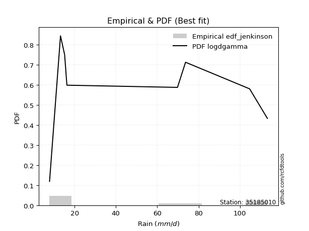</img>

</div>


### 11. EDF Cunnane (1978)

Cunnane´s work in statistical hydrology has focused on the performance and evaluation of different probability distributions (such as GEV, Gumbel, Lognormal) for flood frequency estimation. _b_ is a constant, typically set to 0.4.

<div align="center">


$P=(m-b)/(n+1-2b)$


</div>


**11.1. Empirical values**

<div align="center">

|                | 0                   | 1                   | 2                  | 3                  | 4                  | 5                  | 6                  | 7                  |
|:---------------|:--------------------|:--------------------|:-------------------|:-------------------|:-------------------|:-------------------|:-------------------|:-------------------|
| date           | 2023                | 2025                | 2020               | 2022               | 2018               | 2017               | 2019               | 2021               |
| x              | 7.9                 | 13.2                | 15.2               | 16.3               | 69.8               | 73.7               | 104.7              | 113.3              |
| m              | 1                   | 2                   | 3                  | 4                  | 5                  | 6                  | 7                  | 8                  |
| empirical_dist | edf_cunnane         | edf_cunnane         | edf_cunnane        | edf_cunnane        | edf_cunnane        | edf_cunnane        | edf_cunnane        | edf_cunnane        |
| empirical      | 0.07317073170731708 | 0.19512195121951223 | 0.3170731707317074 | 0.4390243902439025 | 0.5609756097560976 | 0.6829268292682927 | 0.8048780487804879 | 0.926829268292683  |
| empirical_tr   | 1.0789473684210527  | 1.2424242424242424  | 1.4642857142857144 | 1.782608695652174  | 2.277777777777778  | 3.153846153846154  | 5.125000000000001  | 13.666666666666675 |

</div>


**11.2. Kolmogorov-Smirnov fit test (sorted by Δ)**


<div align="center">

|                | 0                   | 1                   | 2                   | 3                  | 4                   | 5                   | 6                  | 7                   | 8                  | 9                   | 10                  | 11                  | 12                  | 13                 | 14                  | 15                  | 16                 | 17                  | 18                  | 19                  | 20                  | 21                  | 22                  | 23                 | 24                  | 25                  | 26                  | 27                 | 28                  | 29                 | 30                 | 31                  | 32                  | 33                  | 34                  | 35                 | 36                  | 37                  | 38                 | 39                  | 40                  | 41                 | 42                 | 43                 | 44                 | 45                  | 46                 | 47                  | 48                  | 49                  | 50                 | 51                  | 52                 | 53                  | 54                  | 55                  | 56                 | 57                  | 58                  | 59                  | 60                  | 61                  | 62                  | 63                  | 64                  | 65                  | 66                  | 67                  | 68                  | 69                  | 70                  | 71                  | 72                  | 73                  | 74                  | 75                  | 76                  | 77                 | 78                  | 79                  | 80                  | 81                  | 82                 | 83                  | 84                  | 85                  | 86                  | 87                 | 88                  | 89                  | 90                  | 91                  | 92                  | 93                 | 94                 | 95                  | 96                 | 97                  | 98                 | 99                  | 100                | 101                | 102                 | 103                | 104                | 105                 | 106                | 107                | 108                | 109                 | 110                | 111                | 112                | 113                | 114                | 115                 | 116                 | 117                | 118                | 119                 | 120                | 121                 | 122                 | 123                 | 124                 | 125                | 126                | 127                 | 128                | 129                | 130                | 131                | 132                 | 133                 | 134                | 135                 | 136                 | 137                 | 138                | 139                | 140                 | 141                 | 142                 | 143                | 144                | 145                | 146                 | 147                 | 148                 | 149                | 150                | 151                | 152                | 153                | 154                | 155                | 156                | 157                | 158                | 159                |
|:---------------|:--------------------|:--------------------|:--------------------|:-------------------|:--------------------|:--------------------|:-------------------|:--------------------|:-------------------|:--------------------|:--------------------|:--------------------|:--------------------|:-------------------|:--------------------|:--------------------|:-------------------|:--------------------|:--------------------|:--------------------|:--------------------|:--------------------|:--------------------|:-------------------|:--------------------|:--------------------|:--------------------|:-------------------|:--------------------|:-------------------|:-------------------|:--------------------|:--------------------|:--------------------|:--------------------|:-------------------|:--------------------|:--------------------|:-------------------|:--------------------|:--------------------|:-------------------|:-------------------|:-------------------|:-------------------|:--------------------|:-------------------|:--------------------|:--------------------|:--------------------|:-------------------|:--------------------|:-------------------|:--------------------|:--------------------|:--------------------|:-------------------|:--------------------|:--------------------|:--------------------|:--------------------|:--------------------|:--------------------|:--------------------|:--------------------|:--------------------|:--------------------|:--------------------|:--------------------|:--------------------|:--------------------|:--------------------|:--------------------|:--------------------|:--------------------|:--------------------|:--------------------|:-------------------|:--------------------|:--------------------|:--------------------|:--------------------|:-------------------|:--------------------|:--------------------|:--------------------|:--------------------|:-------------------|:--------------------|:--------------------|:--------------------|:--------------------|:--------------------|:-------------------|:-------------------|:--------------------|:-------------------|:--------------------|:-------------------|:--------------------|:-------------------|:-------------------|:--------------------|:-------------------|:-------------------|:--------------------|:-------------------|:-------------------|:-------------------|:--------------------|:-------------------|:-------------------|:-------------------|:-------------------|:-------------------|:--------------------|:--------------------|:-------------------|:-------------------|:--------------------|:-------------------|:--------------------|:--------------------|:--------------------|:--------------------|:-------------------|:-------------------|:--------------------|:-------------------|:-------------------|:-------------------|:-------------------|:--------------------|:--------------------|:-------------------|:--------------------|:--------------------|:--------------------|:-------------------|:-------------------|:--------------------|:--------------------|:--------------------|:-------------------|:-------------------|:-------------------|:--------------------|:--------------------|:--------------------|:-------------------|:-------------------|:-------------------|:-------------------|:-------------------|:-------------------|:-------------------|:-------------------|:-------------------|:-------------------|:-------------------|
| station        | 35185010            | 35185010            | 35185010            | 35185010           | 35185010            | 35185010            | 35185010           | 35185010            | 35185010           | 35185010            | 35185010            | 35185010            | 35185010            | 35185010           | 35185010            | 35185010            | 35185010           | 35185010            | 35185010            | 35185010            | 35185010            | 35185010            | 35185010            | 35185010           | 35185010            | 35185010            | 35185010            | 35185010           | 35185010            | 35185010           | 35185010           | 35185010            | 35185010            | 35185010            | 35185010            | 35185010           | 35185010            | 35185010            | 35185010           | 35185010            | 35185010            | 35185010           | 35185010           | 35185010           | 35185010           | 35185010            | 35185010           | 35185010            | 35185010            | 35185010            | 35185010           | 35185010            | 35185010           | 35185010            | 35185010            | 35185010            | 35185010           | 35185010            | 35185010            | 35185010            | 35185010            | 35185010            | 35185010            | 35185010            | 35185010            | 35185010            | 35185010            | 35185010            | 35185010            | 35185010            | 35185010            | 35185010            | 35185010            | 35185010            | 35185010            | 35185010            | 35185010            | 35185010           | 35185010            | 35185010            | 35185010            | 35185010            | 35185010           | 35185010            | 35185010            | 35185010            | 35185010            | 35185010           | 35185010            | 35185010            | 35185010            | 35185010            | 35185010            | 35185010           | 35185010           | 35185010            | 35185010           | 35185010            | 35185010           | 35185010            | 35185010           | 35185010           | 35185010            | 35185010           | 35185010           | 35185010            | 35185010           | 35185010           | 35185010           | 35185010            | 35185010           | 35185010           | 35185010           | 35185010           | 35185010           | 35185010            | 35185010            | 35185010           | 35185010           | 35185010            | 35185010           | 35185010            | 35185010            | 35185010            | 35185010            | 35185010           | 35185010           | 35185010            | 35185010           | 35185010           | 35185010           | 35185010           | 35185010            | 35185010            | 35185010           | 35185010            | 35185010            | 35185010            | 35185010           | 35185010           | 35185010            | 35185010            | 35185010            | 35185010           | 35185010           | 35185010           | 35185010            | 35185010            | 35185010            | 35185010           | 35185010           | 35185010           | 35185010           | 35185010           | 35185010           | 35185010           | 35185010           | 35185010           | 35185010           | 35185010           |
| empirical_dist | edf_cunnane         | edf_cunnane         | edf_cunnane         | edf_cunnane        | edf_cunnane         | edf_cunnane         | edf_cunnane        | edf_cunnane         | edf_cunnane        | edf_cunnane         | edf_cunnane         | edf_cunnane         | edf_cunnane         | edf_cunnane        | edf_cunnane         | edf_cunnane         | edf_cunnane        | edf_cunnane         | edf_cunnane         | edf_cunnane         | edf_cunnane         | edf_cunnane         | edf_cunnane         | edf_cunnane        | edf_cunnane         | edf_cunnane         | edf_cunnane         | edf_cunnane        | edf_cunnane         | edf_cunnane        | edf_cunnane        | edf_cunnane         | edf_cunnane         | edf_cunnane         | edf_cunnane         | edf_cunnane        | edf_cunnane         | edf_cunnane         | edf_cunnane        | edf_cunnane         | edf_cunnane         | edf_cunnane        | edf_cunnane        | edf_cunnane        | edf_cunnane        | edf_cunnane         | edf_cunnane        | edf_cunnane         | edf_cunnane         | edf_cunnane         | edf_cunnane        | edf_cunnane         | edf_cunnane        | edf_cunnane         | edf_cunnane         | edf_cunnane         | edf_cunnane        | edf_cunnane         | edf_cunnane         | edf_cunnane         | edf_cunnane         | edf_cunnane         | edf_cunnane         | edf_cunnane         | edf_cunnane         | edf_cunnane         | edf_cunnane         | edf_cunnane         | edf_cunnane         | edf_cunnane         | edf_cunnane         | edf_cunnane         | edf_cunnane         | edf_cunnane         | edf_cunnane         | edf_cunnane         | edf_cunnane         | edf_cunnane        | edf_cunnane         | edf_cunnane         | edf_cunnane         | edf_cunnane         | edf_cunnane        | edf_cunnane         | edf_cunnane         | edf_cunnane         | edf_cunnane         | edf_cunnane        | edf_cunnane         | edf_cunnane         | edf_cunnane         | edf_cunnane         | edf_cunnane         | edf_cunnane        | edf_cunnane        | edf_cunnane         | edf_cunnane        | edf_cunnane         | edf_cunnane        | edf_cunnane         | edf_cunnane        | edf_cunnane        | edf_cunnane         | edf_cunnane        | edf_cunnane        | edf_cunnane         | edf_cunnane        | edf_cunnane        | edf_cunnane        | edf_cunnane         | edf_cunnane        | edf_cunnane        | edf_cunnane        | edf_cunnane        | edf_cunnane        | edf_cunnane         | edf_cunnane         | edf_cunnane        | edf_cunnane        | edf_cunnane         | edf_cunnane        | edf_cunnane         | edf_cunnane         | edf_cunnane         | edf_cunnane         | edf_cunnane        | edf_cunnane        | edf_cunnane         | edf_cunnane        | edf_cunnane        | edf_cunnane        | edf_cunnane        | edf_cunnane         | edf_cunnane         | edf_cunnane        | edf_cunnane         | edf_cunnane         | edf_cunnane         | edf_cunnane        | edf_cunnane        | edf_cunnane         | edf_cunnane         | edf_cunnane         | edf_cunnane        | edf_cunnane        | edf_cunnane        | edf_cunnane         | edf_cunnane         | edf_cunnane         | edf_cunnane        | edf_cunnane        | edf_cunnane        | edf_cunnane        | edf_cunnane        | edf_cunnane        | edf_cunnane        | edf_cunnane        | edf_cunnane        | edf_cunnane        | edf_cunnane        |
| p_dist         | logdgamma           | logdweibull         | logarcsine          | dweibull           | dgamma              | logksone            | arcsine            | logweibull_max      | mielke             | logwrapcauchy       | wrapcauchy          | logsemicircular     | halfgennorm         | loganglit          | loglevy_l           | loggenextreme       | ksone              | loggenhalflogistic  | logtrapezoid        | truncexpon          | weibull_min         | logbeta             | loghalfgennorm      | logpearson3        | semicircular        | exponpow            | loggenpareto        | logskewnorm        | logt                | logexponnorm       | lognorm            | logcrystalball      | lognct              | logtriang           | logfoldnorm         | logerlang          | loggamma            | loggamma            | logbetaprime       | loggompertz         | invweibull          | betaprime          | logf               | loglomax           | loggausshyper      | logncf              | logrice            | logmaxwell          | gengamma            | lograyleigh         | loginvgamma        | burr12              | logalpha           | anglit              | loggenexpon         | logcosine           | loginvweibull      | loginvgauss         | burr                | loggenlogistic      | halfnorm            | logweibull_min      | logburr             | logfatiguelife      | ncf                 | nakagami            | logburr12           | loghalfnorm         | invgamma            | foldnorm            | nct                 | logjohnsonsu        | f                   | rayleigh            | logkstwobign        | loglogistic         | maxwell             | logloggamma        | loggumbel_l         | lognakagami         | loggumbel_r         | genlogistic         | logkappa3          | pearson3            | loghypsecant        | invgauss            | johnsonsu           | exponnorm          | norm                | crystalball         | t                   | loghalflogistic     | logtukeylambda      | logargus           | kstwobign          | logmoyal            | alpha              | logkappa4           | halflogistic       | truncweibull_min    | loguniform         | logvonmises_line   | gumbel_r            | loglaplace         | loglaplace         | lomax               | gausshyper         | logistic           | cosine             | beta                | gumbel_l           | levy_l             | moyal              | genexpon           | rice               | hypsecant           | loggengamma         | laplace            | argus              | logwald             | logtruncnorm       | logbradford         | gennorm             | loggennorm          | genextreme          | logtruncexpon      | gamma              | logtruncweibull_min | gompertz           | logloglaplace      | exponweib          | skewnorm           | kappa4              | genpareto           | bradford           | tukeylambda         | genhalflogistic     | logrdist            | vonmises_line      | kappa3             | uniform             | erlang              | truncnorm           | triang             | powerlaw           | trapezoid          | wald                | logexponpow         | fatiguelife         | logjohnsonsb       | johnsonsb          | logpowerlaw        | logexponweib       | weibull_max        | truncpareto        | rdist              | logtruncpareto     | logvonmises        | vonmises           | logmielke          |
| delta          | 0.07592165064150791 | 0.09876380142777338 | 0.11244403713930684 | 0.1452683835325575 | 0.14723613741929076 | 0.15060398912265038 | 0.1531068044230067 | 0.15849863069950496 | 0.1613956010304637 | 0.16205266971236784 | 0.16613098919590336 | 0.16699174349030188 | 0.17545677591921516 | 0.1792120318813023 | 0.18056213137595206 | 0.18755906476628798 | 0.1891460184093047 | 0.19099255429933715 | 0.19152731557544606 | 0.19551154139690885 | 0.20076206308859346 | 0.20258925684730977 | 0.20404127180508214 | 0.2057868031522877 | 0.20593503932871993 | 0.20594446753218343 | 0.20604242609788892 | 0.207181205091303  | 0.20721543574134094 | 0.20722395973107   | 0.2072248131023935 | 0.20722483495063948 | 0.20733332903100554 | 0.20753557581398796 | 0.20791701129062679 | 0.2079960046098368 | 0.20839960891530362 | 0.20839960891530362 | 0.2093344198644994 | 0.20956692912267094 | 0.21058626583846873 | 0.2132282004775493 | 0.2134860333959515 | 0.2135451034983913 | 0.2138179468180309 | 0.21407367899380003 | 0.2140992272972294 | 0.21440981549652804 | 0.21633235160444686 | 0.21644818588145387 | 0.2175264523708147 | 0.21779325492226442 | 0.2178784026366407 | 0.21818520802803415 | 0.21853011576406367 | 0.21950499089242181 | 0.2199764439204288 | 0.22007403071284914 | 0.22092218609325287 | 0.22159362514873948 | 0.22189386038729017 | 0.22219853354708907 | 0.22231567448953748 | 0.22243518779398963 | 0.22293715313985563 | 0.22381881954205662 | 0.22393677514166688 | 0.22394055565697213 | 0.22422657315900762 | 0.22434286768663259 | 0.22702640235360017 | 0.22781181184211374 | 0.22902696332089778 | 0.22953675625417078 | 0.22971228616013195 | 0.22976473922755725 | 0.23430246750772812 | 0.2351703837192884 | 0.23863651357702384 | 0.24047188023877675 | 0.24209183880130503 | 0.24284542492837466 | 0.2431182135509361 | 0.24319415417173246 | 0.24404148025501593 | 0.24493302364374658 | 0.24499549152957983 | 0.2458822373136456 | 0.24590177836509575 | 0.24590180433896536 | 0.24590894625475418 | 0.24720983824957177 | 0.24798329713569833 | 0.2500073178440375 | 0.2524774346784623 | 0.25343288872919567 | 0.2546328330064829 | 0.25466872495020365 | 0.2547226074272626 | 0.25590600856595547 | 0.2571343897510786 | 0.2572797221570611 | 0.25740084631695254 | 0.2616816964290227 | 0.2616816964290227 | 0.26259319338408454 | 0.2659223537639056 | 0.2670303519129723 | 0.2680790797591562 | 0.26840670965780444 | 0.2702942447720802 | 0.273533611585088  | 0.2736062229099858 | 0.2737941566622861 | 0.2786329750961872 | 0.27923644668459846 | 0.28886943004663235 | 0.2921955768944141 | 0.2922633115715457 | 0.29230137619073004 | 0.2975341958076464 | 0.30429827951288735 | 0.30487804878048785 | 0.30487804878048785 | 0.30578577090555614 | 0.3142239523851832 | 0.3152589500944126 | 0.3161133006586452  | 0.3195208912190715 | 0.322336554634333  | 0.3272686469848529 | 0.3276854003507209 | 0.33211874495765253 | 0.34212217924977995 | 0.3458297974500953 | 0.35320481182849905 | 0.35359679376891384 | 0.35866731147369535 | 0.3586879495751423 | 0.3592444032206017 | 0.35932799555699546 | 0.36489165024684433 | 0.40910099567297603 | 0.4118494724800512 | 0.4161213662216745 | 0.4162865734832793 | 0.42304616040709553 | 0.42919997537080834 | 0.43850925205412006 | 0.49147875509236   | 0.4974375259775944 | 0.5306377700369707 | 0.538723276367753  | 0.5770414418765624 | 0.6129217434868139 | 0.6754988397893325 | 0.6965782184019902 | 1.1987499781707505 | 17.387325224964567 | nan                |
| deltao         | 0.4472608134160001  | 0.4472608134160001  | 0.4472608134160001  | 0.4472608134160001 | 0.4472608134160001  | 0.4472608134160001  | 0.4472608134160001 | 0.4472608134160001  | 0.4472608134160001 | 0.4472608134160001  | 0.4472608134160001  | 0.4472608134160001  | 0.4472608134160001  | 0.4472608134160001 | 0.4472608134160001  | 0.4472608134160001  | 0.4472608134160001 | 0.4472608134160001  | 0.4472608134160001  | 0.4472608134160001  | 0.4472608134160001  | 0.4472608134160001  | 0.4472608134160001  | 0.4472608134160001 | 0.4472608134160001  | 0.4472608134160001  | 0.4472608134160001  | 0.4472608134160001 | 0.4472608134160001  | 0.4472608134160001 | 0.4472608134160001 | 0.4472608134160001  | 0.4472608134160001  | 0.4472608134160001  | 0.4472608134160001  | 0.4472608134160001 | 0.4472608134160001  | 0.4472608134160001  | 0.4472608134160001 | 0.4472608134160001  | 0.4472608134160001  | 0.4472608134160001 | 0.4472608134160001 | 0.4472608134160001 | 0.4472608134160001 | 0.4472608134160001  | 0.4472608134160001 | 0.4472608134160001  | 0.4472608134160001  | 0.4472608134160001  | 0.4472608134160001 | 0.4472608134160001  | 0.4472608134160001 | 0.4472608134160001  | 0.4472608134160001  | 0.4472608134160001  | 0.4472608134160001 | 0.4472608134160001  | 0.4472608134160001  | 0.4472608134160001  | 0.4472608134160001  | 0.4472608134160001  | 0.4472608134160001  | 0.4472608134160001  | 0.4472608134160001  | 0.4472608134160001  | 0.4472608134160001  | 0.4472608134160001  | 0.4472608134160001  | 0.4472608134160001  | 0.4472608134160001  | 0.4472608134160001  | 0.4472608134160001  | 0.4472608134160001  | 0.4472608134160001  | 0.4472608134160001  | 0.4472608134160001  | 0.4472608134160001 | 0.4472608134160001  | 0.4472608134160001  | 0.4472608134160001  | 0.4472608134160001  | 0.4472608134160001 | 0.4472608134160001  | 0.4472608134160001  | 0.4472608134160001  | 0.4472608134160001  | 0.4472608134160001 | 0.4472608134160001  | 0.4472608134160001  | 0.4472608134160001  | 0.4472608134160001  | 0.4472608134160001  | 0.4472608134160001 | 0.4472608134160001 | 0.4472608134160001  | 0.4472608134160001 | 0.4472608134160001  | 0.4472608134160001 | 0.4472608134160001  | 0.4472608134160001 | 0.4472608134160001 | 0.4472608134160001  | 0.4472608134160001 | 0.4472608134160001 | 0.4472608134160001  | 0.4472608134160001 | 0.4472608134160001 | 0.4472608134160001 | 0.4472608134160001  | 0.4472608134160001 | 0.4472608134160001 | 0.4472608134160001 | 0.4472608134160001 | 0.4472608134160001 | 0.4472608134160001  | 0.4472608134160001  | 0.4472608134160001 | 0.4472608134160001 | 0.4472608134160001  | 0.4472608134160001 | 0.4472608134160001  | 0.4472608134160001  | 0.4472608134160001  | 0.4472608134160001  | 0.4472608134160001 | 0.4472608134160001 | 0.4472608134160001  | 0.4472608134160001 | 0.4472608134160001 | 0.4472608134160001 | 0.4472608134160001 | 0.4472608134160001  | 0.4472608134160001  | 0.4472608134160001 | 0.4472608134160001  | 0.4472608134160001  | 0.4472608134160001  | 0.4472608134160001 | 0.4472608134160001 | 0.4472608134160001  | 0.4472608134160001  | 0.4472608134160001  | 0.4472608134160001 | 0.4472608134160001 | 0.4472608134160001 | 0.4472608134160001  | 0.4472608134160001  | 0.4472608134160001  | 0.4472608134160001 | 0.4472608134160001 | 0.4472608134160001 | 0.4472608134160001 | 0.4472608134160001 | 0.4472608134160001 | 0.4472608134160001 | 0.4472608134160001 | 0.4472608134160001 | 0.4472608134160001 | 0.4472608134160001 |
| eval           | Δo > Δ              | Δo > Δ              | Δo > Δ              | Δo > Δ             | Δo > Δ              | Δo > Δ              | Δo > Δ             | Δo > Δ              | Δo > Δ             | Δo > Δ              | Δo > Δ              | Δo > Δ              | Δo > Δ              | Δo > Δ             | Δo > Δ              | Δo > Δ              | Δo > Δ             | Δo > Δ              | Δo > Δ              | Δo > Δ              | Δo > Δ              | Δo > Δ              | Δo > Δ              | Δo > Δ             | Δo > Δ              | Δo > Δ              | Δo > Δ              | Δo > Δ             | Δo > Δ              | Δo > Δ             | Δo > Δ             | Δo > Δ              | Δo > Δ              | Δo > Δ              | Δo > Δ              | Δo > Δ             | Δo > Δ              | Δo > Δ              | Δo > Δ             | Δo > Δ              | Δo > Δ              | Δo > Δ             | Δo > Δ             | Δo > Δ             | Δo > Δ             | Δo > Δ              | Δo > Δ             | Δo > Δ              | Δo > Δ              | Δo > Δ              | Δo > Δ             | Δo > Δ              | Δo > Δ             | Δo > Δ              | Δo > Δ              | Δo > Δ              | Δo > Δ             | Δo > Δ              | Δo > Δ              | Δo > Δ              | Δo > Δ              | Δo > Δ              | Δo > Δ              | Δo > Δ              | Δo > Δ              | Δo > Δ              | Δo > Δ              | Δo > Δ              | Δo > Δ              | Δo > Δ              | Δo > Δ              | Δo > Δ              | Δo > Δ              | Δo > Δ              | Δo > Δ              | Δo > Δ              | Δo > Δ              | Δo > Δ             | Δo > Δ              | Δo > Δ              | Δo > Δ              | Δo > Δ              | Δo > Δ             | Δo > Δ              | Δo > Δ              | Δo > Δ              | Δo > Δ              | Δo > Δ             | Δo > Δ              | Δo > Δ              | Δo > Δ              | Δo > Δ              | Δo > Δ              | Δo > Δ             | Δo > Δ             | Δo > Δ              | Δo > Δ             | Δo > Δ              | Δo > Δ             | Δo > Δ              | Δo > Δ             | Δo > Δ             | Δo > Δ              | Δo > Δ             | Δo > Δ             | Δo > Δ              | Δo > Δ             | Δo > Δ             | Δo > Δ             | Δo > Δ              | Δo > Δ             | Δo > Δ             | Δo > Δ             | Δo > Δ             | Δo > Δ             | Δo > Δ              | Δo > Δ              | Δo > Δ             | Δo > Δ             | Δo > Δ              | Δo > Δ             | Δo > Δ              | Δo > Δ              | Δo > Δ              | Δo > Δ              | Δo > Δ             | Δo > Δ             | Δo > Δ              | Δo > Δ             | Δo > Δ             | Δo > Δ             | Δo > Δ             | Δo > Δ              | Δo > Δ              | Δo > Δ             | Δo > Δ              | Δo > Δ              | Δo > Δ              | Δo > Δ             | Δo > Δ             | Δo > Δ              | Δo > Δ              | Δo > Δ              | Δo > Δ             | Δo > Δ             | Δo > Δ             | Δo > Δ              | Δo > Δ              | Δo > Δ              | Δo <= Δ            | Δo <= Δ            | Δo <= Δ            | Δo <= Δ            | Δo <= Δ            | Δo <= Δ            | Δo <= Δ            | Δo <= Δ            | Δo <= Δ            | Δo <= Δ            | Δo <= Δ            |
| fit            | 1                   | 1                   | 1                   | 1                  | 1                   | 1                   | 1                  | 1                   | 1                  | 1                   | 1                   | 1                   | 1                   | 1                  | 1                   | 1                   | 1                  | 1                   | 1                   | 1                   | 1                   | 1                   | 1                   | 1                  | 1                   | 1                   | 1                   | 1                  | 1                   | 1                  | 1                  | 1                   | 1                   | 1                   | 1                   | 1                  | 1                   | 1                   | 1                  | 1                   | 1                   | 1                  | 1                  | 1                  | 1                  | 1                   | 1                  | 1                   | 1                   | 1                   | 1                  | 1                   | 1                  | 1                   | 1                   | 1                   | 1                  | 1                   | 1                   | 1                   | 1                   | 1                   | 1                   | 1                   | 1                   | 1                   | 1                   | 1                   | 1                   | 1                   | 1                   | 1                   | 1                   | 1                   | 1                   | 1                   | 1                   | 1                  | 1                   | 1                   | 1                   | 1                   | 1                  | 1                   | 1                   | 1                   | 1                   | 1                  | 1                   | 1                   | 1                   | 1                   | 1                   | 1                  | 1                  | 1                   | 1                  | 1                   | 1                  | 1                   | 1                  | 1                  | 1                   | 1                  | 1                  | 1                   | 1                  | 1                  | 1                  | 1                   | 1                  | 1                  | 1                  | 1                  | 1                  | 1                   | 1                   | 1                  | 1                  | 1                   | 1                  | 1                   | 1                   | 1                   | 1                   | 1                  | 1                  | 1                   | 1                  | 1                  | 1                  | 1                  | 1                   | 1                   | 1                  | 1                   | 1                   | 1                   | 1                  | 1                  | 1                   | 1                   | 1                   | 1                  | 1                  | 1                  | 1                   | 1                   | 1                   | 0                  | 0                  | 0                  | 0                  | 0                  | 0                  | 0                  | 0                  | 0                  | 0                  | 0                  |
| n              | 8                   | 8                   | 8                   | 8                  | 8                   | 8                   | 8                  | 8                   | 8                  | 8                   | 8                   | 8                   | 8                   | 8                  | 8                   | 8                   | 8                  | 8                   | 8                   | 8                   | 8                   | 8                   | 8                   | 8                  | 8                   | 8                   | 8                   | 8                  | 8                   | 8                  | 8                  | 8                   | 8                   | 8                   | 8                   | 8                  | 8                   | 8                   | 8                  | 8                   | 8                   | 8                  | 8                  | 8                  | 8                  | 8                   | 8                  | 8                   | 8                   | 8                   | 8                  | 8                   | 8                  | 8                   | 8                   | 8                   | 8                  | 8                   | 8                   | 8                   | 8                   | 8                   | 8                   | 8                   | 8                   | 8                   | 8                   | 8                   | 8                   | 8                   | 8                   | 8                   | 8                   | 8                   | 8                   | 8                   | 8                   | 8                  | 8                   | 8                   | 8                   | 8                   | 8                  | 8                   | 8                   | 8                   | 8                   | 8                  | 8                   | 8                   | 8                   | 8                   | 8                   | 8                  | 8                  | 8                   | 8                  | 8                   | 8                  | 8                   | 8                  | 8                  | 8                   | 8                  | 8                  | 8                   | 8                  | 8                  | 8                  | 8                   | 8                  | 8                  | 8                  | 8                  | 8                  | 8                   | 8                   | 8                  | 8                  | 8                   | 8                  | 8                   | 8                   | 8                   | 8                   | 8                  | 8                  | 8                   | 8                  | 8                  | 8                  | 8                  | 8                   | 8                   | 8                  | 8                   | 8                   | 8                   | 8                  | 8                  | 8                   | 8                   | 8                   | 8                  | 8                  | 8                  | 8                   | 8                   | 8                   | 8                  | 8                  | 8                  | 8                  | 8                  | 8                  | 8                  | 8                  | 8                  | 8                  | 8                  |
| best_fit       | 1                   | 0                   | 0                   | 0                  | 0                   | 0                   | 0                  | 0                   | 0                  | 0                   | 0                   | 0                   | 0                   | 0                  | 0                   | 0                   | 0                  | 0                   | 0                   | 0                   | 0                   | 0                   | 0                   | 0                  | 0                   | 0                   | 0                   | 0                  | 0                   | 0                  | 0                  | 0                   | 0                   | 0                   | 0                   | 0                  | 0                   | 0                   | 0                  | 0                   | 0                   | 0                  | 0                  | 0                  | 0                  | 0                   | 0                  | 0                   | 0                   | 0                   | 0                  | 0                   | 0                  | 0                   | 0                   | 0                   | 0                  | 0                   | 0                   | 0                   | 0                   | 0                   | 0                   | 0                   | 0                   | 0                   | 0                   | 0                   | 0                   | 0                   | 0                   | 0                   | 0                   | 0                   | 0                   | 0                   | 0                   | 0                  | 0                   | 0                   | 0                   | 0                   | 0                  | 0                   | 0                   | 0                   | 0                   | 0                  | 0                   | 0                   | 0                   | 0                   | 0                   | 0                  | 0                  | 0                   | 0                  | 0                   | 0                  | 0                   | 0                  | 0                  | 0                   | 0                  | 0                  | 0                   | 0                  | 0                  | 0                  | 0                   | 0                  | 0                  | 0                  | 0                  | 0                  | 0                   | 0                   | 0                  | 0                  | 0                   | 0                  | 0                   | 0                   | 0                   | 0                   | 0                  | 0                  | 0                   | 0                  | 0                  | 0                  | 0                  | 0                   | 0                   | 0                  | 0                   | 0                   | 0                   | 0                  | 0                  | 0                   | 0                   | 0                   | 0                  | 0                  | 0                  | 0                   | 0                   | 0                   | 0                  | 0                  | 0                  | 0                  | 0                  | 0                  | 0                  | 0                  | 0                  | 0                  | 0                  |
| best_fit_sort  | 1                   | 2                   | 3                   | 4                  | 5                   | 6                   | 7                  | 8                   | 9                  | 10                  | 11                  | 12                  | 13                  | 14                 | 15                  | 16                  | 17                 | 18                  | 19                  | 20                  | 21                  | 22                  | 23                  | 24                 | 25                  | 26                  | 27                  | 28                 | 29                  | 30                 | 31                 | 32                  | 33                  | 34                  | 35                  | 36                 | 37                  | 38                  | 39                 | 40                  | 41                  | 42                 | 43                 | 44                 | 45                 | 46                  | 47                 | 48                  | 49                  | 50                  | 51                 | 52                  | 53                 | 54                  | 55                  | 56                  | 57                 | 58                  | 59                  | 60                  | 61                  | 62                  | 63                  | 64                  | 65                  | 66                  | 67                  | 68                  | 69                  | 70                  | 71                  | 72                  | 73                  | 74                  | 75                  | 76                  | 77                  | 78                 | 79                  | 80                  | 81                  | 82                  | 83                 | 84                  | 85                  | 86                  | 87                  | 88                 | 89                  | 90                  | 91                  | 92                  | 93                  | 94                 | 95                 | 96                  | 97                 | 98                  | 99                 | 100                 | 101                | 102                | 103                 | 104                | 105                | 106                 | 107                | 108                | 109                | 110                 | 111                | 112                | 113                | 114                | 115                | 116                 | 117                 | 118                | 119                | 120                 | 121                | 122                 | 123                 | 124                 | 125                 | 126                | 127                | 128                 | 129                | 130                | 131                | 132                | 133                 | 134                 | 135                | 136                 | 137                 | 138                 | 139                | 140                | 141                 | 142                 | 143                 | 144                | 145                | 146                | 147                 | 148                 | 149                 | 150                | 151                | 152                | 153                | 154                | 155                | 156                | 157                | 158                | 159                | 160                |

</div>


**11.3. Best fit**

<div align="center">

|   id |   station | empirical_dist   | p_dist    |     delta |   deltao | eval   |   fit |   n |   best_fit |   best_fit_sort |
|-----:|----------:|:-----------------|:----------|----------:|---------:|:-------|------:|----:|-----------:|----------------:|
|    0 |  35185010 | edf_cunnane      | logdgamma | 0.0759217 | 0.447261 | Δo > Δ |     1 |   8 |          1 |               1 |

</div>


<div align="center">

</img></img>

</div>


### 12. EDF Adamowski (1981)

The Adamowski formula in hydrology refers to a specific plotting position formula used for estimating the non-parametric empirical distribution of hydrological events (like flood peaks) to calculate their return periods. This formula provides an alternative to traditional parametric methods (like the Gumbel or Log Pearson Type III distributions). 

<div align="center">


$P=(m-0.25)/(n+0.5)$


</div>


**12.1. Empirical values**

<div align="center">

|                | 0                   | 1                   | 2                  | 3                  | 4                  | 5                  | 6                  | 7                  |
|:---------------|:--------------------|:--------------------|:-------------------|:-------------------|:-------------------|:-------------------|:-------------------|:-------------------|
| date           | 2023                | 2025                | 2020               | 2022               | 2018               | 2017               | 2019               | 2021               |
| x              | 7.9                 | 13.2                | 15.2               | 16.3               | 69.8               | 73.7               | 104.7              | 113.3              |
| m              | 1                   | 2                   | 3                  | 4                  | 5                  | 6                  | 7                  | 8                  |
| empirical_dist | edf_adamowski       | edf_adamowski       | edf_adamowski      | edf_adamowski      | edf_adamowski      | edf_adamowski      | edf_adamowski      | edf_adamowski      |
| empirical      | 0.08823529411764706 | 0.20588235294117646 | 0.3235294117647059 | 0.4411764705882353 | 0.5588235294117647 | 0.6764705882352942 | 0.7941176470588235 | 0.9117647058823529 |
| empirical_tr   | 1.096774193548387   | 1.259259259259259   | 1.4782608695652173 | 1.7894736842105263 | 2.2666666666666666 | 3.0909090909090913 | 4.857142857142856  | 11.33333333333333  |

</div>


**12.2. Kolmogorov-Smirnov fit test (sorted by Δ)**


<div align="center">

|                | 0                   | 1                   | 2                   | 3                  | 4                   | 5                   | 6                  | 7                   | 8                   | 9                   | 10                  | 11                  | 12                  | 13                  | 14                 | 15                 | 16                  | 17                  | 18                  | 19                  | 20                  | 21                  | 22                  | 23                  | 24                 | 25                 | 26                  | 27                 | 28                  | 29                 | 30                 | 31                  | 32                  | 33                  | 34                  | 35                 | 36                  | 37                  | 38                 | 39                  | 40                  | 41                 | 42                 | 43                  | 44                 | 45                  | 46                 | 47                  | 48                  | 49                  | 50                 | 51                  | 52                 | 53                  | 54                  | 55                 | 56                 | 57                  | 58                  | 59                  | 60                  | 61                  | 62                  | 63                  | 64                  | 65                  | 66                  | 67                  | 68                  | 69                  | 70                  | 71                  | 72                  | 73                  | 74                  | 75                  | 76                 | 77                  | 78                  | 79                  | 80                  | 81                  | 82                 | 83                  | 84                  | 85                  | 86                  | 87                 | 88                  | 89                  | 90                  | 91                  | 92                  | 93                 | 94                  | 95                  | 96                  | 97                  | 98                  | 99                 | 100                 | 101                | 102                | 103                 | 104                | 105                | 106                | 107                 | 108                | 109                | 110                 | 111                | 112                | 113                | 114                 | 115                 | 116                | 117                 | 118                 | 119                 | 120                | 121                | 122                 | 123                | 124                 | 125                | 126                | 127                 | 128                | 129                 | 130                | 131                | 132                | 133                 | 134                | 135                 | 136                | 137                 | 138                 | 139                | 140                 | 141                 | 142                | 143                | 144                | 145                | 146                 | 147                | 148                 | 149                 | 150                | 151                | 152                | 153                | 154                | 155                | 156                | 157                | 158                | 159                |
|:---------------|:--------------------|:--------------------|:--------------------|:-------------------|:--------------------|:--------------------|:-------------------|:--------------------|:--------------------|:--------------------|:--------------------|:--------------------|:--------------------|:--------------------|:-------------------|:-------------------|:--------------------|:--------------------|:--------------------|:--------------------|:--------------------|:--------------------|:--------------------|:--------------------|:-------------------|:-------------------|:--------------------|:-------------------|:--------------------|:-------------------|:-------------------|:--------------------|:--------------------|:--------------------|:--------------------|:-------------------|:--------------------|:--------------------|:-------------------|:--------------------|:--------------------|:-------------------|:-------------------|:--------------------|:-------------------|:--------------------|:-------------------|:--------------------|:--------------------|:--------------------|:-------------------|:--------------------|:-------------------|:--------------------|:--------------------|:-------------------|:-------------------|:--------------------|:--------------------|:--------------------|:--------------------|:--------------------|:--------------------|:--------------------|:--------------------|:--------------------|:--------------------|:--------------------|:--------------------|:--------------------|:--------------------|:--------------------|:--------------------|:--------------------|:--------------------|:--------------------|:-------------------|:--------------------|:--------------------|:--------------------|:--------------------|:--------------------|:-------------------|:--------------------|:--------------------|:--------------------|:--------------------|:-------------------|:--------------------|:--------------------|:--------------------|:--------------------|:--------------------|:-------------------|:--------------------|:--------------------|:--------------------|:--------------------|:--------------------|:-------------------|:--------------------|:-------------------|:-------------------|:--------------------|:-------------------|:-------------------|:-------------------|:--------------------|:-------------------|:-------------------|:--------------------|:-------------------|:-------------------|:-------------------|:--------------------|:--------------------|:-------------------|:--------------------|:--------------------|:--------------------|:-------------------|:-------------------|:--------------------|:-------------------|:--------------------|:-------------------|:-------------------|:--------------------|:-------------------|:--------------------|:-------------------|:-------------------|:-------------------|:--------------------|:-------------------|:--------------------|:-------------------|:--------------------|:--------------------|:-------------------|:--------------------|:--------------------|:-------------------|:-------------------|:-------------------|:-------------------|:--------------------|:-------------------|:--------------------|:--------------------|:-------------------|:-------------------|:-------------------|:-------------------|:-------------------|:-------------------|:-------------------|:-------------------|:-------------------|:-------------------|
| station        | 35185010            | 35185010            | 35185010            | 35185010           | 35185010            | 35185010            | 35185010           | 35185010            | 35185010            | 35185010            | 35185010            | 35185010            | 35185010            | 35185010            | 35185010           | 35185010           | 35185010            | 35185010            | 35185010            | 35185010            | 35185010            | 35185010            | 35185010            | 35185010            | 35185010           | 35185010           | 35185010            | 35185010           | 35185010            | 35185010           | 35185010           | 35185010            | 35185010            | 35185010            | 35185010            | 35185010           | 35185010            | 35185010            | 35185010           | 35185010            | 35185010            | 35185010           | 35185010           | 35185010            | 35185010           | 35185010            | 35185010           | 35185010            | 35185010            | 35185010            | 35185010           | 35185010            | 35185010           | 35185010            | 35185010            | 35185010           | 35185010           | 35185010            | 35185010            | 35185010            | 35185010            | 35185010            | 35185010            | 35185010            | 35185010            | 35185010            | 35185010            | 35185010            | 35185010            | 35185010            | 35185010            | 35185010            | 35185010            | 35185010            | 35185010            | 35185010            | 35185010           | 35185010            | 35185010            | 35185010            | 35185010            | 35185010            | 35185010           | 35185010            | 35185010            | 35185010            | 35185010            | 35185010           | 35185010            | 35185010            | 35185010            | 35185010            | 35185010            | 35185010           | 35185010            | 35185010            | 35185010            | 35185010            | 35185010            | 35185010           | 35185010            | 35185010           | 35185010           | 35185010            | 35185010           | 35185010           | 35185010           | 35185010            | 35185010           | 35185010           | 35185010            | 35185010           | 35185010           | 35185010           | 35185010            | 35185010            | 35185010           | 35185010            | 35185010            | 35185010            | 35185010           | 35185010           | 35185010            | 35185010           | 35185010            | 35185010           | 35185010           | 35185010            | 35185010           | 35185010            | 35185010           | 35185010           | 35185010           | 35185010            | 35185010           | 35185010            | 35185010           | 35185010            | 35185010            | 35185010           | 35185010            | 35185010            | 35185010           | 35185010           | 35185010           | 35185010           | 35185010            | 35185010           | 35185010            | 35185010            | 35185010           | 35185010           | 35185010           | 35185010           | 35185010           | 35185010           | 35185010           | 35185010           | 35185010           | 35185010           |
| empirical_dist | edf_adamowski       | edf_adamowski       | edf_adamowski       | edf_adamowski      | edf_adamowski       | edf_adamowski       | edf_adamowski      | edf_adamowski       | edf_adamowski       | edf_adamowski       | edf_adamowski       | edf_adamowski       | edf_adamowski       | edf_adamowski       | edf_adamowski      | edf_adamowski      | edf_adamowski       | edf_adamowski       | edf_adamowski       | edf_adamowski       | edf_adamowski       | edf_adamowski       | edf_adamowski       | edf_adamowski       | edf_adamowski      | edf_adamowski      | edf_adamowski       | edf_adamowski      | edf_adamowski       | edf_adamowski      | edf_adamowski      | edf_adamowski       | edf_adamowski       | edf_adamowski       | edf_adamowski       | edf_adamowski      | edf_adamowski       | edf_adamowski       | edf_adamowski      | edf_adamowski       | edf_adamowski       | edf_adamowski      | edf_adamowski      | edf_adamowski       | edf_adamowski      | edf_adamowski       | edf_adamowski      | edf_adamowski       | edf_adamowski       | edf_adamowski       | edf_adamowski      | edf_adamowski       | edf_adamowski      | edf_adamowski       | edf_adamowski       | edf_adamowski      | edf_adamowski      | edf_adamowski       | edf_adamowski       | edf_adamowski       | edf_adamowski       | edf_adamowski       | edf_adamowski       | edf_adamowski       | edf_adamowski       | edf_adamowski       | edf_adamowski       | edf_adamowski       | edf_adamowski       | edf_adamowski       | edf_adamowski       | edf_adamowski       | edf_adamowski       | edf_adamowski       | edf_adamowski       | edf_adamowski       | edf_adamowski      | edf_adamowski       | edf_adamowski       | edf_adamowski       | edf_adamowski       | edf_adamowski       | edf_adamowski      | edf_adamowski       | edf_adamowski       | edf_adamowski       | edf_adamowski       | edf_adamowski      | edf_adamowski       | edf_adamowski       | edf_adamowski       | edf_adamowski       | edf_adamowski       | edf_adamowski      | edf_adamowski       | edf_adamowski       | edf_adamowski       | edf_adamowski       | edf_adamowski       | edf_adamowski      | edf_adamowski       | edf_adamowski      | edf_adamowski      | edf_adamowski       | edf_adamowski      | edf_adamowski      | edf_adamowski      | edf_adamowski       | edf_adamowski      | edf_adamowski      | edf_adamowski       | edf_adamowski      | edf_adamowski      | edf_adamowski      | edf_adamowski       | edf_adamowski       | edf_adamowski      | edf_adamowski       | edf_adamowski       | edf_adamowski       | edf_adamowski      | edf_adamowski      | edf_adamowski       | edf_adamowski      | edf_adamowski       | edf_adamowski      | edf_adamowski      | edf_adamowski       | edf_adamowski      | edf_adamowski       | edf_adamowski      | edf_adamowski      | edf_adamowski      | edf_adamowski       | edf_adamowski      | edf_adamowski       | edf_adamowski      | edf_adamowski       | edf_adamowski       | edf_adamowski      | edf_adamowski       | edf_adamowski       | edf_adamowski      | edf_adamowski      | edf_adamowski      | edf_adamowski      | edf_adamowski       | edf_adamowski      | edf_adamowski       | edf_adamowski       | edf_adamowski      | edf_adamowski      | edf_adamowski      | edf_adamowski      | edf_adamowski      | edf_adamowski      | edf_adamowski      | edf_adamowski      | edf_adamowski      | edf_adamowski      |
| p_dist         | logdgamma           | logdweibull         | logarcsine          | logweibull_max     | dweibull            | arcsine             | logwrapcauchy      | logksone            | dgamma              | mielke              | loglevy_l           | wrapcauchy          | logsemicircular     | halfgennorm         | loganglit          | weibull_min        | logbeta             | loggenextreme       | loggenpareto        | ksone               | loggenhalflogistic  | logtrapezoid        | truncexpon          | loghalfgennorm      | logpearson3        | semicircular       | exponpow            | logskewnorm        | logt                | logexponnorm       | lognorm            | logcrystalball      | lognct              | logtriang           | logfoldnorm         | logerlang          | loggamma            | loggamma            | logbetaprime       | loggompertz         | invweibull          | betaprime          | logf               | loglomax            | loggausshyper      | logncf              | logrice            | logmaxwell          | gengamma            | lograyleigh         | loginvgamma        | burr12              | logalpha           | anglit              | loggenexpon         | logcosine          | loginvweibull      | loginvgauss         | burr                | loggenlogistic      | halfnorm            | logweibull_min      | logburr             | logfatiguelife      | ncf                 | nakagami            | logburr12           | loghalfnorm         | invgamma            | foldnorm            | nct                 | logjohnsonsu        | f                   | rayleigh            | logkstwobign        | loglogistic         | maxwell            | logloggamma         | loggumbel_l         | lognakagami         | loggumbel_r         | genlogistic         | logkappa3          | pearson3            | loghypsecant        | invgauss            | johnsonsu           | exponnorm          | norm                | crystalball         | t                   | loghalflogistic     | logtukeylambda      | logargus           | beta                | kstwobign           | logmoyal            | alpha               | logkappa4           | halflogistic       | truncweibull_min    | levy_l             | loguniform         | logvonmises_line    | gumbel_r           | loglaplace         | loglaplace         | lomax               | gausshyper         | logistic           | cosine              | gumbel_l           | moyal              | genexpon           | rice                | hypsecant           | genextreme         | loggengamma         | loggennorm          | gennorm             | laplace            | argus              | logwald             | logtruncnorm       | logbradford         | logtruncexpon      | gamma              | logtruncweibull_min | gompertz           | logloglaplace       | exponweib          | skewnorm           | kappa4             | genpareto           | bradford           | tukeylambda         | genhalflogistic    | logrdist            | vonmises_line       | kappa3             | uniform             | erlang              | powerlaw           | truncnorm          | triang             | trapezoid          | logexponpow         | wald               | fatiguelife         | logjohnsonsb        | johnsonsb          | logpowerlaw        | logexponweib       | weibull_max        | truncpareto        | rdist              | logtruncpareto     | logvonmises        | vonmises           | logmielke          |
| delta          | 0.08668205236317228 | 0.08800339970610915 | 0.11459611748363974 | 0.143434068289175  | 0.14742046387689028 | 0.15108104244746712 | 0.1512922679907036 | 0.15275606946698328 | 0.15799653914095513 | 0.16354768137479647 | 0.16549756896562207 | 0.16828306954023614 | 0.16914382383463478 | 0.17760885626354805 | 0.1813641122256352 | 0.1856975006782634 | 0.18752469443697978 | 0.18971114511062076 | 0.19097786368755892 | 0.19129809875363749 | 0.19314463464366993 | 0.19367939591977884 | 0.19766362174124175 | 0.20619335214941503 | 0.2079388834966206 | 0.2080871196730527 | 0.20809654787651632 | 0.2093332854356359 | 0.20936751608567383 | 0.2093760400754029 | 0.2093768934467264 | 0.20937691529497238 | 0.20948540937533844 | 0.20968765615832086 | 0.21006909163495968 | 0.2101480849541697 | 0.21055168925963652 | 0.21055168925963652 | 0.2114865002088323 | 0.21171900946700384 | 0.21273834618280163 | 0.2153802808218822 | 0.2156381137402844 | 0.21569718384272418 | 0.2159700271623637 | 0.21622575933813293 | 0.2162513076415623 | 0.21656189584086094 | 0.21848443194877976 | 0.21860026622578677 | 0.2196785327151476 | 0.21994533526659732 | 0.2200304829809736 | 0.22033728837236694 | 0.22068219610839657 | 0.2216570712367547 | 0.2221285242647617 | 0.22222611105718204 | 0.22307426643758577 | 0.22374570549307238 | 0.22404594073162296 | 0.22435061389142197 | 0.22446775483387038 | 0.22458726813832253 | 0.22508923348418852 | 0.22597089988638952 | 0.22608885548599977 | 0.22609263600130503 | 0.22637865350334052 | 0.22649494803096537 | 0.22917848269793306 | 0.22996389218644653 | 0.23117904366523068 | 0.23168883659850356 | 0.23186436650446485 | 0.23191681957189014 | 0.2364545478520609 | 0.23732246406362117 | 0.24078859392135663 | 0.24262396058310964 | 0.24424391914563792 | 0.24499750527270744 | 0.245270293895269  | 0.24534623451606524 | 0.24619356059934883 | 0.24708510398807948 | 0.24714757187391262 | 0.2480343176579784 | 0.24805385870942853 | 0.24805388468329814 | 0.24806102659908696 | 0.24936191859390466 | 0.25013537748003123 | 0.2521593981883703 | 0.25334214724747445 | 0.25462951502279507 | 0.25558496907352857 | 0.25678491335081577 | 0.25682080529453655 | 0.2568746877715954 | 0.25805808891028825 | 0.258469049174758  | 0.2592864700954115 | 0.25943180250139397 | 0.2595529266612853 | 0.2638337767733556 | 0.2638337767733556 | 0.26474527372841733 | 0.2680744341082384 | 0.2691824322573051 | 0.27023116010348897 | 0.272446325116413  | 0.2757583032543186 | 0.2759462370066189 | 0.28078505544051996 | 0.28138852702893125 | 0.2907212084952261 | 0.29102151039096524 | 0.29411764705882354 | 0.29411764705882354 | 0.2943476572387469 | 0.2944153919158785 | 0.29445345653506283 | 0.2996862761519792 | 0.30645035985722024 | 0.3163760327295161 | 0.3174110304387455 | 0.3182653810029781  | 0.3216729715634043 | 0.32448863497866587 | 0.3294207273291858 | 0.3298374806950537 | 0.3342708253019853 | 0.34427425959411273 | 0.3479818777944281 | 0.35535689217283184 | 0.3557488741132466 | 0.36081939181802825 | 0.36084002991947506 | 0.3613964835649345 | 0.36148007590132825 | 0.36704373059117723 | 0.4053609645000103 | 0.4112530760173088 | 0.414001552824384  | 0.4184386538276121 | 0.41843957364914414 | 0.4251982407514283 | 0.42774885033245585 | 0.48071835337069563 | 0.4866771242559302 | 0.5198773683153064 | 0.5279628746460887 | 0.5662810401548981 | 0.6021613417651497 | 0.6647384380676682 | 0.6858178166803259 | 1.2009020585150834 | 17.402389787374897 | nan                |
| deltao         | 0.4472608134160001  | 0.4472608134160001  | 0.4472608134160001  | 0.4472608134160001 | 0.4472608134160001  | 0.4472608134160001  | 0.4472608134160001 | 0.4472608134160001  | 0.4472608134160001  | 0.4472608134160001  | 0.4472608134160001  | 0.4472608134160001  | 0.4472608134160001  | 0.4472608134160001  | 0.4472608134160001 | 0.4472608134160001 | 0.4472608134160001  | 0.4472608134160001  | 0.4472608134160001  | 0.4472608134160001  | 0.4472608134160001  | 0.4472608134160001  | 0.4472608134160001  | 0.4472608134160001  | 0.4472608134160001 | 0.4472608134160001 | 0.4472608134160001  | 0.4472608134160001 | 0.4472608134160001  | 0.4472608134160001 | 0.4472608134160001 | 0.4472608134160001  | 0.4472608134160001  | 0.4472608134160001  | 0.4472608134160001  | 0.4472608134160001 | 0.4472608134160001  | 0.4472608134160001  | 0.4472608134160001 | 0.4472608134160001  | 0.4472608134160001  | 0.4472608134160001 | 0.4472608134160001 | 0.4472608134160001  | 0.4472608134160001 | 0.4472608134160001  | 0.4472608134160001 | 0.4472608134160001  | 0.4472608134160001  | 0.4472608134160001  | 0.4472608134160001 | 0.4472608134160001  | 0.4472608134160001 | 0.4472608134160001  | 0.4472608134160001  | 0.4472608134160001 | 0.4472608134160001 | 0.4472608134160001  | 0.4472608134160001  | 0.4472608134160001  | 0.4472608134160001  | 0.4472608134160001  | 0.4472608134160001  | 0.4472608134160001  | 0.4472608134160001  | 0.4472608134160001  | 0.4472608134160001  | 0.4472608134160001  | 0.4472608134160001  | 0.4472608134160001  | 0.4472608134160001  | 0.4472608134160001  | 0.4472608134160001  | 0.4472608134160001  | 0.4472608134160001  | 0.4472608134160001  | 0.4472608134160001 | 0.4472608134160001  | 0.4472608134160001  | 0.4472608134160001  | 0.4472608134160001  | 0.4472608134160001  | 0.4472608134160001 | 0.4472608134160001  | 0.4472608134160001  | 0.4472608134160001  | 0.4472608134160001  | 0.4472608134160001 | 0.4472608134160001  | 0.4472608134160001  | 0.4472608134160001  | 0.4472608134160001  | 0.4472608134160001  | 0.4472608134160001 | 0.4472608134160001  | 0.4472608134160001  | 0.4472608134160001  | 0.4472608134160001  | 0.4472608134160001  | 0.4472608134160001 | 0.4472608134160001  | 0.4472608134160001 | 0.4472608134160001 | 0.4472608134160001  | 0.4472608134160001 | 0.4472608134160001 | 0.4472608134160001 | 0.4472608134160001  | 0.4472608134160001 | 0.4472608134160001 | 0.4472608134160001  | 0.4472608134160001 | 0.4472608134160001 | 0.4472608134160001 | 0.4472608134160001  | 0.4472608134160001  | 0.4472608134160001 | 0.4472608134160001  | 0.4472608134160001  | 0.4472608134160001  | 0.4472608134160001 | 0.4472608134160001 | 0.4472608134160001  | 0.4472608134160001 | 0.4472608134160001  | 0.4472608134160001 | 0.4472608134160001 | 0.4472608134160001  | 0.4472608134160001 | 0.4472608134160001  | 0.4472608134160001 | 0.4472608134160001 | 0.4472608134160001 | 0.4472608134160001  | 0.4472608134160001 | 0.4472608134160001  | 0.4472608134160001 | 0.4472608134160001  | 0.4472608134160001  | 0.4472608134160001 | 0.4472608134160001  | 0.4472608134160001  | 0.4472608134160001 | 0.4472608134160001 | 0.4472608134160001 | 0.4472608134160001 | 0.4472608134160001  | 0.4472608134160001 | 0.4472608134160001  | 0.4472608134160001  | 0.4472608134160001 | 0.4472608134160001 | 0.4472608134160001 | 0.4472608134160001 | 0.4472608134160001 | 0.4472608134160001 | 0.4472608134160001 | 0.4472608134160001 | 0.4472608134160001 | 0.4472608134160001 |
| eval           | Δo > Δ              | Δo > Δ              | Δo > Δ              | Δo > Δ             | Δo > Δ              | Δo > Δ              | Δo > Δ             | Δo > Δ              | Δo > Δ              | Δo > Δ              | Δo > Δ              | Δo > Δ              | Δo > Δ              | Δo > Δ              | Δo > Δ             | Δo > Δ             | Δo > Δ              | Δo > Δ              | Δo > Δ              | Δo > Δ              | Δo > Δ              | Δo > Δ              | Δo > Δ              | Δo > Δ              | Δo > Δ             | Δo > Δ             | Δo > Δ              | Δo > Δ             | Δo > Δ              | Δo > Δ             | Δo > Δ             | Δo > Δ              | Δo > Δ              | Δo > Δ              | Δo > Δ              | Δo > Δ             | Δo > Δ              | Δo > Δ              | Δo > Δ             | Δo > Δ              | Δo > Δ              | Δo > Δ             | Δo > Δ             | Δo > Δ              | Δo > Δ             | Δo > Δ              | Δo > Δ             | Δo > Δ              | Δo > Δ              | Δo > Δ              | Δo > Δ             | Δo > Δ              | Δo > Δ             | Δo > Δ              | Δo > Δ              | Δo > Δ             | Δo > Δ             | Δo > Δ              | Δo > Δ              | Δo > Δ              | Δo > Δ              | Δo > Δ              | Δo > Δ              | Δo > Δ              | Δo > Δ              | Δo > Δ              | Δo > Δ              | Δo > Δ              | Δo > Δ              | Δo > Δ              | Δo > Δ              | Δo > Δ              | Δo > Δ              | Δo > Δ              | Δo > Δ              | Δo > Δ              | Δo > Δ             | Δo > Δ              | Δo > Δ              | Δo > Δ              | Δo > Δ              | Δo > Δ              | Δo > Δ             | Δo > Δ              | Δo > Δ              | Δo > Δ              | Δo > Δ              | Δo > Δ             | Δo > Δ              | Δo > Δ              | Δo > Δ              | Δo > Δ              | Δo > Δ              | Δo > Δ             | Δo > Δ              | Δo > Δ              | Δo > Δ              | Δo > Δ              | Δo > Δ              | Δo > Δ             | Δo > Δ              | Δo > Δ             | Δo > Δ             | Δo > Δ              | Δo > Δ             | Δo > Δ             | Δo > Δ             | Δo > Δ              | Δo > Δ             | Δo > Δ             | Δo > Δ              | Δo > Δ             | Δo > Δ             | Δo > Δ             | Δo > Δ              | Δo > Δ              | Δo > Δ             | Δo > Δ              | Δo > Δ              | Δo > Δ              | Δo > Δ             | Δo > Δ             | Δo > Δ              | Δo > Δ             | Δo > Δ              | Δo > Δ             | Δo > Δ             | Δo > Δ              | Δo > Δ             | Δo > Δ              | Δo > Δ             | Δo > Δ             | Δo > Δ             | Δo > Δ              | Δo > Δ             | Δo > Δ              | Δo > Δ             | Δo > Δ              | Δo > Δ              | Δo > Δ             | Δo > Δ              | Δo > Δ              | Δo > Δ             | Δo > Δ             | Δo > Δ             | Δo > Δ             | Δo > Δ              | Δo > Δ             | Δo > Δ              | Δo <= Δ             | Δo <= Δ            | Δo <= Δ            | Δo <= Δ            | Δo <= Δ            | Δo <= Δ            | Δo <= Δ            | Δo <= Δ            | Δo <= Δ            | Δo <= Δ            | Δo <= Δ            |
| fit            | 1                   | 1                   | 1                   | 1                  | 1                   | 1                   | 1                  | 1                   | 1                   | 1                   | 1                   | 1                   | 1                   | 1                   | 1                  | 1                  | 1                   | 1                   | 1                   | 1                   | 1                   | 1                   | 1                   | 1                   | 1                  | 1                  | 1                   | 1                  | 1                   | 1                  | 1                  | 1                   | 1                   | 1                   | 1                   | 1                  | 1                   | 1                   | 1                  | 1                   | 1                   | 1                  | 1                  | 1                   | 1                  | 1                   | 1                  | 1                   | 1                   | 1                   | 1                  | 1                   | 1                  | 1                   | 1                   | 1                  | 1                  | 1                   | 1                   | 1                   | 1                   | 1                   | 1                   | 1                   | 1                   | 1                   | 1                   | 1                   | 1                   | 1                   | 1                   | 1                   | 1                   | 1                   | 1                   | 1                   | 1                  | 1                   | 1                   | 1                   | 1                   | 1                   | 1                  | 1                   | 1                   | 1                   | 1                   | 1                  | 1                   | 1                   | 1                   | 1                   | 1                   | 1                  | 1                   | 1                   | 1                   | 1                   | 1                   | 1                  | 1                   | 1                  | 1                  | 1                   | 1                  | 1                  | 1                  | 1                   | 1                  | 1                  | 1                   | 1                  | 1                  | 1                  | 1                   | 1                   | 1                  | 1                   | 1                   | 1                   | 1                  | 1                  | 1                   | 1                  | 1                   | 1                  | 1                  | 1                   | 1                  | 1                   | 1                  | 1                  | 1                  | 1                   | 1                  | 1                   | 1                  | 1                   | 1                   | 1                  | 1                   | 1                   | 1                  | 1                  | 1                  | 1                  | 1                   | 1                  | 1                   | 0                   | 0                  | 0                  | 0                  | 0                  | 0                  | 0                  | 0                  | 0                  | 0                  | 0                  |
| n              | 8                   | 8                   | 8                   | 8                  | 8                   | 8                   | 8                  | 8                   | 8                   | 8                   | 8                   | 8                   | 8                   | 8                   | 8                  | 8                  | 8                   | 8                   | 8                   | 8                   | 8                   | 8                   | 8                   | 8                   | 8                  | 8                  | 8                   | 8                  | 8                   | 8                  | 8                  | 8                   | 8                   | 8                   | 8                   | 8                  | 8                   | 8                   | 8                  | 8                   | 8                   | 8                  | 8                  | 8                   | 8                  | 8                   | 8                  | 8                   | 8                   | 8                   | 8                  | 8                   | 8                  | 8                   | 8                   | 8                  | 8                  | 8                   | 8                   | 8                   | 8                   | 8                   | 8                   | 8                   | 8                   | 8                   | 8                   | 8                   | 8                   | 8                   | 8                   | 8                   | 8                   | 8                   | 8                   | 8                   | 8                  | 8                   | 8                   | 8                   | 8                   | 8                   | 8                  | 8                   | 8                   | 8                   | 8                   | 8                  | 8                   | 8                   | 8                   | 8                   | 8                   | 8                  | 8                   | 8                   | 8                   | 8                   | 8                   | 8                  | 8                   | 8                  | 8                  | 8                   | 8                  | 8                  | 8                  | 8                   | 8                  | 8                  | 8                   | 8                  | 8                  | 8                  | 8                   | 8                   | 8                  | 8                   | 8                   | 8                   | 8                  | 8                  | 8                   | 8                  | 8                   | 8                  | 8                  | 8                   | 8                  | 8                   | 8                  | 8                  | 8                  | 8                   | 8                  | 8                   | 8                  | 8                   | 8                   | 8                  | 8                   | 8                   | 8                  | 8                  | 8                  | 8                  | 8                   | 8                  | 8                   | 8                   | 8                  | 8                  | 8                  | 8                  | 8                  | 8                  | 8                  | 8                  | 8                  | 8                  |
| best_fit       | 1                   | 0                   | 0                   | 0                  | 0                   | 0                   | 0                  | 0                   | 0                   | 0                   | 0                   | 0                   | 0                   | 0                   | 0                  | 0                  | 0                   | 0                   | 0                   | 0                   | 0                   | 0                   | 0                   | 0                   | 0                  | 0                  | 0                   | 0                  | 0                   | 0                  | 0                  | 0                   | 0                   | 0                   | 0                   | 0                  | 0                   | 0                   | 0                  | 0                   | 0                   | 0                  | 0                  | 0                   | 0                  | 0                   | 0                  | 0                   | 0                   | 0                   | 0                  | 0                   | 0                  | 0                   | 0                   | 0                  | 0                  | 0                   | 0                   | 0                   | 0                   | 0                   | 0                   | 0                   | 0                   | 0                   | 0                   | 0                   | 0                   | 0                   | 0                   | 0                   | 0                   | 0                   | 0                   | 0                   | 0                  | 0                   | 0                   | 0                   | 0                   | 0                   | 0                  | 0                   | 0                   | 0                   | 0                   | 0                  | 0                   | 0                   | 0                   | 0                   | 0                   | 0                  | 0                   | 0                   | 0                   | 0                   | 0                   | 0                  | 0                   | 0                  | 0                  | 0                   | 0                  | 0                  | 0                  | 0                   | 0                  | 0                  | 0                   | 0                  | 0                  | 0                  | 0                   | 0                   | 0                  | 0                   | 0                   | 0                   | 0                  | 0                  | 0                   | 0                  | 0                   | 0                  | 0                  | 0                   | 0                  | 0                   | 0                  | 0                  | 0                  | 0                   | 0                  | 0                   | 0                  | 0                   | 0                   | 0                  | 0                   | 0                   | 0                  | 0                  | 0                  | 0                  | 0                   | 0                  | 0                   | 0                   | 0                  | 0                  | 0                  | 0                  | 0                  | 0                  | 0                  | 0                  | 0                  | 0                  |
| best_fit_sort  | 1                   | 2                   | 3                   | 4                  | 5                   | 6                   | 7                  | 8                   | 9                   | 10                  | 11                  | 12                  | 13                  | 14                  | 15                 | 16                 | 17                  | 18                  | 19                  | 20                  | 21                  | 22                  | 23                  | 24                  | 25                 | 26                 | 27                  | 28                 | 29                  | 30                 | 31                 | 32                  | 33                  | 34                  | 35                  | 36                 | 37                  | 38                  | 39                 | 40                  | 41                  | 42                 | 43                 | 44                  | 45                 | 46                  | 47                 | 48                  | 49                  | 50                  | 51                 | 52                  | 53                 | 54                  | 55                  | 56                 | 57                 | 58                  | 59                  | 60                  | 61                  | 62                  | 63                  | 64                  | 65                  | 66                  | 67                  | 68                  | 69                  | 70                  | 71                  | 72                  | 73                  | 74                  | 75                  | 76                  | 77                 | 78                  | 79                  | 80                  | 81                  | 82                  | 83                 | 84                  | 85                  | 86                  | 87                  | 88                 | 89                  | 90                  | 91                  | 92                  | 93                  | 94                 | 95                  | 96                  | 97                  | 98                  | 99                  | 100                | 101                 | 102                | 103                | 104                 | 105                | 106                | 107                | 108                 | 109                | 110                | 111                 | 112                | 113                | 114                | 115                 | 116                 | 117                | 118                 | 119                 | 120                 | 121                | 122                | 123                 | 124                | 125                 | 126                | 127                | 128                 | 129                | 130                 | 131                | 132                | 133                | 134                 | 135                | 136                 | 137                | 138                 | 139                 | 140                | 141                 | 142                 | 143                | 144                | 145                | 146                | 147                 | 148                | 149                 | 150                 | 151                | 152                | 153                | 154                | 155                | 156                | 157                | 158                | 159                | 160                |

</div>


**12.3. Best fit**

<div align="center">

|   id |   station | empirical_dist   | p_dist    |     delta |   deltao | eval   |   fit |   n |   best_fit |   best_fit_sort |
|-----:|----------:|:-----------------|:----------|----------:|---------:|:-------|------:|----:|-----------:|----------------:|
|    0 |  35185010 | edf_adamowski    | logdgamma | 0.0866821 | 0.447261 | Δo > Δ |     1 |   8 |          1 |               1 |

</div>


<div align="center">

</img>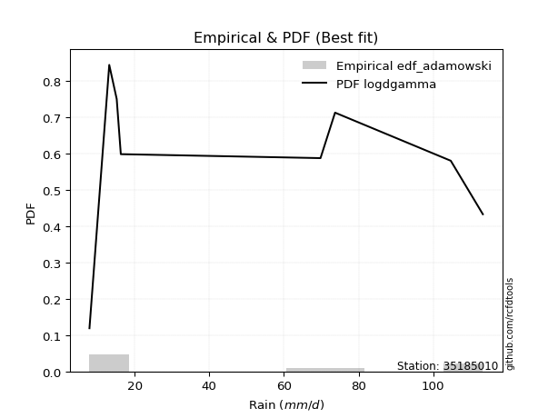</img>

</div>


## C. Best fit & Estimate extreme values for specific return periods - Tr

Best fit in probability distribution analysis means finding the theoretical distribution (like Normal, Poisson, Exponential, etc.) that most accurately mirrors your real-world data´s patterns (shape, center, spread) for better predictions, using methods like visual checks (Q-Q plots), goodness-of-fit tests (Kolmogorov-Smirnov, Chi-Squared), and information criteria (AIC) to score and select the simplest, most representative model.


### 1. Best fit (ordered by delta Δ)

:file_folder:Table: [bestfit_35185010.csv](table/bestfit_35185010.csv)

<div align="center">

|   id |   station | empirical_dist   | p_dist      |     delta |   deltao | eval   |   fit |   n |   best_fit |   best_fit_sort |
|-----:|----------:|:-----------------|:------------|----------:|---------:|:-------|------:|----:|-----------:|----------------:|
|    0 |  35185010 | edf_gringorten   | logdgamma   | 0.0744274 | 0.447261 | Δo > Δ |     1 |   8 |          1 |               1 |
|    1 |  35185010 | edf_cunnane      | logdgamma   | 0.0759217 | 0.447261 | Δo > Δ |     1 |   8 |          1 |               2 |
|    2 |  35185010 | edf_hazen        | logdgamma   | 0.0771983 | 0.447261 | Δo > Δ |     1 |   8 |          1 |               3 |
|    3 |  35185010 | edf_blom         | logdgamma   | 0.0777694 | 0.447261 | Δo > Δ |     1 |   8 |          1 |               4 |
|    4 |  35185010 | edf_tukey        | logdgamma   | 0.0807997 | 0.447261 | Δo > Δ |     1 |   8 |          1 |               5 |
|    5 |  35185010 | edf_filliben     | logdgamma   | 0.0819354 | 0.447261 | Δo > Δ |     1 |   8 |          1 |               6 |
|    6 |  35185010 | edf_beard        | logdgamma   | 0.0824703 | 0.447261 | Δo > Δ |     1 |   8 |          1 |               7 |
|    7 |  35185010 | edf_jenkinson    | logdgamma   | 0.0824703 | 0.447261 | Δo > Δ |     1 |   8 |          1 |               8 |
|    8 |  35185010 | edf_chegodayev   | logdgamma   | 0.0831807 | 0.447261 | Δo > Δ |     1 |   8 |          1 |               9 |
|    9 |  35185010 | edf_adamowski    | logdgamma   | 0.0866821 | 0.447261 | Δo > Δ |     1 |   8 |          1 |              10 |
|   10 |  35185010 | edf_weibull      | logdweibull | 0.0946961 | 0.447261 | Δo > Δ |     1 |   8 |          1 |              11 |
|   11 |  35185010 | edf_california   | logdweibull | 0.11836   | 0.447261 | Δo > Δ |     1 |   8 |          1 |              12 |

</div>


### 2. Extreme values and % difference analysis

In hydrology, a return period (or recurrence interval $Tr$) is the statistical average time between extreme events like floods or droughts of a specific magnitude, indicating how rare an event is, with a 100-year flood, for example, having a 1% chance of occurring in any given year, not that it happens exactly every century. It is a key tool for infrastructure design (like bridges or dams) and risk assessment, calculated from historical data to determine the probability of future events, although it is important to remember it is statistical average, and events can cluster or be missed.

The extreme value porcentage difference is evaluated as $pdiff = 1 - (ETrBf / ETr) * 100$, where _ETrBf_ correspond to the bestfit extreme value for a specific recurrence interval and _ETr_ correspond to the extreme value for one of the most used PDFsused in hydrology.

> risk_rate: assuming the return period as the project useful life.

:file_folder:Table: [extreme_35185010.csv](table/extreme_35185010.csv), all PDFs.  
:file_folder:Table: [extremepdiff_35185010.csv](table/extremepdiff_35185010.csv), % difference between bestfit and most used PDFs in Hydrology.

<div align="center">

Extreme values table for only best fit PDFs
|   id |      tr |   prob_l |     prob_g |      alpha |   anglit |   arcsine |    argus |     beta |   betaprime |   bradford |      burr |   burr12 |   cosine |   crystalball |   dgamma |   dweibull |   erlang |   exponnorm |   exponpow |   exponweib |          f |   fatiguelife |   foldnorm |    gamma |   gausshyper |   genexpon |       genextreme |   gengamma |   genhalflogistic |   genlogistic |   gennorm |   genpareto |   gompertz |   gumbel_l |   gumbel_r |   halfgennorm |   halflogistic |   halfnorm |   hypsecant |   invgamma |   invgauss |   invweibull |   johnsonsb |   johnsonsu |    kappa3 |   kappa4 |    ksone |   kstwobign |   laplace |   levy_l |   loggamma |   logistic |   loglaplace |    lomax |   maxwell |    mielke |    moyal |   nakagami |       ncf |        nct |     norm |   pearson3 |   powerlaw |   rayleigh |    rdist |     rice |   semicircular |   skewnorm |        t |   trapezoid |   triang |   truncexpon |   truncnorm |   truncpareto |   truncweibull_min |   tukeylambda |   uniform |   vonmises |   vonmises_line |     wald |   weibull_max |   weibull_min |   wrapcauchy |   logalpha |   loganglit |   logarcsine |   logargus |   logbeta |   logbetaprime |   logbradford |   logburr |   logburr12 |   logcosine |   logcrystalball |   logdgamma |   logdweibull |   logerlang |   logexponnorm |   logexponpow |    logexponweib |             logf |   logfatiguelife |   logfoldnorm |   loggausshyper |   loggenexpon |   loggenextreme |   loggengamma |   loggenhalflogistic |   loggenlogistic |   loggennorm |   loggenpareto |   loggompertz |   loggumbel_l |   loggumbel_r |   loghalfgennorm |   loghalflogistic |   loghalfnorm |   loghypsecant |   loginvgamma |   loginvgauss |   loginvweibull |   logjohnsonsb |   logjohnsonsu |   logkappa3 |   logkappa4 |   logksone |   logkstwobign |   loglevy_l |   logloggamma |   loglogistic |    logloglaplace |    loglomax |   logmaxwell |   logmielke |   logmoyal |   lognakagami |    logncf |   lognct |   lognorm |   logpearson3 |   logpowerlaw |   lograyleigh |   logrdist |   logrice |   logsemicircular |   logskewnorm |     logt |   logtrapezoid |   logtriang |   logtruncexpon |   logtruncnorm |   logtruncpareto |   logtruncweibull_min |   logtukeylambda |   loguniform |   logvonmises |   logvonmises_line |    logwald |   logweibull_max |   logweibull_min |   logwrapcauchy |   station |   n |   risk_rate |
|-----:|--------:|---------:|-----------:|-----------:|---------:|----------:|---------:|---------:|------------:|-----------:|----------:|---------:|---------:|--------------:|---------:|-----------:|---------:|------------:|-----------:|------------:|-----------:|--------------:|-----------:|---------:|-------------:|-----------:|-----------------:|-----------:|------------------:|--------------:|----------:|------------:|-----------:|-----------:|-----------:|--------------:|---------------:|-----------:|------------:|-----------:|-----------:|-------------:|------------:|------------:|----------:|---------:|---------:|------------:|----------:|---------:|-----------:|-----------:|-------------:|---------:|----------:|----------:|---------:|-----------:|----------:|-----------:|---------:|-----------:|-----------:|-----------:|---------:|---------:|---------------:|-----------:|---------:|------------:|---------:|-------------:|------------:|--------------:|-------------------:|--------------:|----------:|-----------:|----------------:|---------:|--------------:|--------------:|-------------:|-----------:|------------:|-------------:|-----------:|----------:|---------------:|--------------:|----------:|------------:|------------:|-----------------:|------------:|--------------:|------------:|---------------:|--------------:|----------------:|-----------------:|-----------------:|--------------:|----------------:|--------------:|----------------:|--------------:|---------------------:|-----------------:|-------------:|---------------:|--------------:|--------------:|--------------:|-----------------:|------------------:|--------------:|---------------:|--------------:|--------------:|----------------:|---------------:|---------------:|------------:|------------:|-----------:|---------------:|------------:|--------------:|--------------:|-----------------:|------------:|-------------:|------------:|-----------:|--------------:|----------:|---------:|----------:|--------------:|--------------:|--------------:|-----------:|----------:|------------------:|--------------:|---------:|---------------:|------------:|----------------:|---------------:|-----------------:|----------------------:|-----------------:|-------------:|--------------:|-------------------:|-----------:|-----------------:|-----------------:|----------------:|----------:|----:|------------:|
|    0 |    2    | 0.5      | 0.5        |    24.1051 |  51.7625 |   51.7625 |  60.7687 |  35.9839 |     29.0857 |    56.1982 |   28.1269 |  21.8938 |  53.6356 |       51.7625 |  47.7306 |    51.7255 |  21.9935 |     51.6528 |    31.2022 |     17.816  |    17.8357 |       7.90007 |    50.2607 |  15.6499 |      68.435  |    39.5216 |     18.9239      |    26.4356 |           76.5183 |       43.9471 |      60.6 |     75.0232 |    47.3575 |    58.4864 |    45.0386 |       27.1715 |        41.6958 |    43.3844 |     51.7625 |    25.4678 |    25.3887 |      25.1719 |     8.03649 |     51.7624 |   7.88874 |  58.1589 |  51.7625 |     44.5324 |   51.7625 |  69.2797 |    33.1666 |    51.7625 |      33.4747 |  38.1587 |   48.262  |   28.0714 |  42.8679 |    30.414  |   28.5178 |    25.4979 |  51.7625 |    49.7429 |    9.46438 |    47.0205 | -1.84249 |  49.5964 |        51.7625 |    48.3699 |  51.7634 |     86.6629 |  79.2815 |      36.8347 |     75.3623 |       8.13034 |            50.3166 |       60.6503 |   60.6    |    1.25305 |         60.7104 |  38.4951 |       112.934 |       37.6651 |      60.6    |    31.2744 |     33.4747 |      33.4747 |    40.7228 |   30.4146 |        32.5806 |       23.4033 |   27.9379 |     29.7227 |     33.0643 |          33.4747 |     33.8034 |       33.0391 |     33.1904 |        33.4747 |       10.2574 |     8.26367     |     17.0613      |          27.8329 |       33.4984 |         34.965  |       24.1474 |         48.6532 |       16.0552 |              40.0338 |          28.0037 |      29.9177 |        27.9072 |       32.0834 |       39.4685 |       28.3911 |          32.4689 |           26.1588 |       27.2639 |        33.4747 |       31.1003 |       29.0827 |         28.0928 |        113.152 |        61.1779 |     30.6203 |     28.8219 |    33.4747 |        27.3841 |     64.5281 |       48.6683 |       33.4747 |     16.3         |     21.4811 |      30.7239 |     28.0235 |    26.9209 |       16.544  |   31.2948 |  33.3813 |   33.4747 |       33.8217 |       8.52152 |       29.8035 |    24.0942 |   31.2614 |           33.4747 |       33.4861 |  33.4753 |        39.7579 |     35.8668 |         22.7275 |        32.0239 |          7.97534 |               22.6302 |          29.9177 |      29.9177 |     0.0634427 |            29.9123 |    24.1862 |          48.6429 |          26.3718 |         29.9177 |  35185010 |   8 |    0.75     |
|    1 |    2.33 | 0.570815 | 0.429185   |    28.6904 |  60.27   |   64.5337 |  68.1252 |  53.9755 |     35.1228 |    63.7162 |   33.8903 |  27.2829 |  60.8673 |       59.0662 |  72.4315 |    75.6148 |  25.5964 |     58.9522 |    38.6571 |     21.3194 |    23.1567 |       9.34742 |    58.039  |  19.6536 |      79.4733 |    46.2762 |     47.4117      |    32.6935 |           83.4238 |       50.809  |      60.6 |     83.1963 |    54.4154 |    64.8408 |    51.8063 |       35.0472 |        48.6541 |    51.2671 |     57.6077 |    30.9208 |    30.7001 |      30.9774 |     8.40184 |     59.0941 |   7.88874 |  66.2775 |  61.8028 |     51.4149 |   56.1824 |  82.5923 |    39.6814 |    58.1976 |      37.3025 |  44.9244 |   55.8501 |   33.835  |  49.2744 |    37.6469 |   34.2805 |    30.8156 |  59.0662 |    57.0799 |   11.3975  |    54.7208 |  1.27944 |  56.5924 |        60.887  |    55.3359 |  59.0671 |     92.7866 |  84.9049 |      45.0353 |     80.3288 |       8.32762 |            58.1916 |       68.3531 |   68.0639 |    1.64553 |         68.2043 |  43.2843 |       113.149 |       52.4327 |      87.3137 |    37.434  |     41.2311 |      45.7706 |    47.9527 |   50.2586 |        39.0291 |       28.2791 |   33.6453 |     35.6828 |     39.4206 |          40.033  |     69.3181 |       65.0973 |     39.7158 |        40.0331 |       11.6431 |     8.71805     |     21.8434      |          33.5797 |       40.0324 |         42.0693 |       29.7888 |         58.8708 |       19.1514 |              48.7177 |          33.7415 |      29.9177 |        38.802  |       38.7098 |       46.1161 |       33.5106 |          39.6929 |           31.0203 |       33.071  |        38.6279 |       37.2719 |       35.0057 |         33.8773 |        113.268 |        70.6556 |     37.0973 |     35.1158 |    42.8087 |        32.9962 |     76.5503 |       57.1981 |       39.1902 |     18.4539      |     26.8623 |      37.0001 |     33.8086 |    31.4953 |       19.5207 |   37.5542 |  39.9357 |   40.0331 |       40.4335 |       9.1742  |       35.9906 |    30.176  |   37.5386 |           41.859  |       40.0461 |  40.0339 |        48.8502 |     43.378  |         27.2986 |        38.1227 |          8.03616 |               27.1437 |          36.3982 |      36.1272 |     0.0757823 |            36.116  |    27.1968 |          61.5384 |          32.1209 |         49.5958 |  35185010 |   8 |    0.729209 |
|    2 |    5    | 0.8      | 0.2        |    64.2451 |  90.2865 |   98.5899 |  91.7225 | 104.118  |     78.582  |    89.3062 |   76.0332 |  80.4177 |  86.9275 |       86.2089 |  88.2205 |    93.7897 |  44.3885 |     86.1456 |    77.6212 |     45.004  |    74.7595 |      40.0924  |    86.9881 |  47.6873 |     106.415  |    79.0331 |  10129.5         |    77.6156 |          101.64   |       80.6172 |      60.6 |    104.241  |    84.1296 |    85.369  |    81.2084 |       96.5048 |        80.139  |    84.6018 |     81.0541 |    75.6559 |    67.9457 |      82.3912 |    61.9331  |     86.3406 |   7.88874 |  92.5653 |  94.2968 |     80.6501 |   78.2808 | 104.648  |    77.6556 |    83.0444 |      64.0968 |  79.2976 |   85.7162 |   75.9292 |  78.95   |    73.034  |   75.1027 |    74.5324 |  86.2089 |    85.4882 |   35.0766  |    85.5487 | 10.7387  |  84.5724 |        92.025  |    84.7941 |  86.2097 |    110.355  | 101.038  |      76.4634 |     96.451  |      12.6896  |            85.5898 |       93.0567 |   92.22   |    3.00807 |         92.4575 |  70.0939 |       113.297 |      171.558  |     107.95   |    75.6639 |     86.0125 |     105.415  |    78.3072 |  108.705  |        77.7254 |       56.142  |   75.5761 |     74.1769 |     74.2868 |          77.8361 |     93.0548 |       94.1283 |     77.7677 |        77.8363 |       27.4363 |    21.5717      |     88.0331      |          75.4737 |       77.6255 |         74.2887 |       78.6002 |         91.3161 |       48.4999 |              81.6476 |          75.8197 |      29.9177 |        85.5996 |       77.3861 |       76.251  |       68.8624 |          77.7638 |           67.0825 |       74.8309 |        68.6025 |       75.8274 |       75.845  |         76.4145 |        113.3   |        96.4732 |     69.03   |     66.8095 |    94.8911 |        72.8429 |    101.596  |       86.3193 |       72.0303 |     37.7331      |     83.5819 |      76.9024 |     76.603  |    65.1562 |       68.8532 |   76.8665 |  77.8532 |   77.8361 |       78.0597 |      18.4198  |       76.5874 |    56.8517 |   76.7754 |           89.7545 |       77.8427 |  77.8386 |        88.2007 |     74.8479 |         53.852  |        84.1609 |          9.30304 |               53.4218 |          68.1429 |      66.5134 |     0.151302  |            66.4863 |    52.4496 |          97.6981 |          75.9048 |         92.6304 |  35185010 |   8 |    0.67232  |
|    3 |   10    | 0.9      | 0.1        |   129.568  | 107.276  |  106.811  | 103.102  | 111.987  |    149.425  |   101.102  |  146.655  | inf      | 102.672  |      104.215  |  96.9761 |   101.979  |  62.063  |    104.255  |   112.06   |     75.1947 |   187.523  |      82.5434  |   106.201  |  80.3549 |     111.836  |   107.465  | 926739           |   141.612  |          107.962  |      104.894  |      60.6 |    110.255  |   105.492  |    96.7982 |   105.156  |      188.912  |       106.286  |   109.269  |     99.7767 |   162.877  |   118.628  |     192.491  |   298.076   |    104.415  |   7.88874 | 103.605  | 108.475  |    102.909  |   98.3411 | 109.973  |   121.75   |   101.343  |     104.774  | 111.303  |  106.734  |  146.361  | 104.787  |   101.617  |  140.193  |   161.48   | 104.215  |   105.342  |   63.4781  |   107.53   | 14.1117  | 104.491  |       108.002  |   106.592  | 104.215  |    117.217  | 107.34   |      93.4162 |    104.242  |      26.8662  |            98.8687 |      103.544  |  102.76   |    3.68147 |        103.04   |  98.5453 |       113.3   |      345.692  |     110.891  |   124.797  |    130.41   |     128.934  |    97.4425 |  113.032  |       124.724  |       78.7181 |  146.396  |    125.005  |    108.936  |         120.987  |    108.438  |      109.706  |    121.975  |       120.987  |       71.7305 |   191.077       |    356.232       |         143.844  |      120.444  |         93.2871 |      177.986  |        103.825  |      118.25   |              97.5854 |         146.597  |      29.9177 |       104.275  |      119.351  |      100.887  |      123.809  |         109.971  |          127.286  |      136.931  |       108.524  |      125.772  |      137.162  |        148.22   |        113.3   |       106.166  |     90.5137 |     88.2512 |   134.296  |       133.119  |    108.781  |       99.6489 |      112.769  |     84.8839      |    240.279  |     128.69   |    149.63   |   122.696  |      254.64   |  127.983  | 121.368  |  120.987  |      120.166  |      37.2276  |      131.221  |    68.0778 |  126.059  |          132.75   |      120.959  | 120.992  |       111.097  |     92.6226 |         76.4103 |       158.337  |         14.0389  |               75.9474 |          88.7367 |      86.81   |     0.256632  |            86.7889 |   105.301  |         108.124  |         148.929  |        103.398  |  35185010 |   8 |    0.651322 |
|    4 |   15    | 0.933333 | 0.0666667  |   194.657  | 114.531  |  108.38   | 107.428  | 112.887  |    213.914  |   105.123  |  212.398  | inf      | 109.844  |      113.2    | 101.363  |   105.674  |  72.5555 |    113.318  |   131.249  |     96.6702 |   311.28   |     110.307   |   115.789  | 101.378  |     112.715  |   123.59   |      1.18504e+07 |   191.288  |          109.87   |      118.59   |      60.6 |    111.691  |   116.285  |   101.974  |   118.667  |      261.653  |       121.083  |   122.105  |    110.462  |   253.057  |   155.69   |     313.663  |   347.851   |    113.435  |   7.88874 | 107.114  | 113.201  |    114.726  |  110.076  | 111.581  |   152.576  |   111.313  |     139.666  | 130.387  |  117.519  |  211.859  | 119.782  |   116.793  |  198.523  |   253.086  | 113.2    |   115.554  |   77.217   |   118.855  | 15.0383  | 114.743  |       114.233  |   117.936  | 113.201  |    119.419  | 109.362  |      99.6705 |    107.074  |      40.0001  |           103.536  |      106.95   |  106.273  |    3.91632 |        106.567  | 116.816  |       113.3   |      476.901  |     111.723  |   161.949  |    155.773  |     133.983  |   105.578  |  113.25   |       158.7    |       88.6112 |  212.758  |    163.58   |    129.689  |         150.775  |    116.858  |      117.327  |    152.888  |       150.776  |      130.849  |  1446.82        |    835.841       |         205.544  |      149.965  |        100.146  |      282.824  |        107.513  |      202.256  |             102.959  |         212.652  |      29.9177 |       108.778  |      146.524  |      114.526  |      172.382  |         127.154  |          182.896  |      187.527  |       140.993  |      163.716  |      189.132  |        215.398  |        113.3   |       109.42   |     99.0695 |     96.6973 |   150.779  |       183.338  |    111.05   |      104.167  |      143.965  |    148.634       |    450.799  |     167.601  |    218.61   |   177.155  |      530.92   |  166.832  | 151.525  |  150.775  |      148.811  |      51.1835  |      173.178  |    70.8574 |  162.132  |          154.64   |      150.71   | 150.782  |       119.636  |     99.1764 |         86.6607 |       222.677  |         19.9074  |               86.2599 |          96.6243 |      94.8687 |     0.346363  |            94.8529 |   164.743  |         110.569  |         214.518  |        106.706  |  35185010 |   8 |    0.644736 |
|    5 |   20    | 0.95     | 0.05       |   259.689  | 118.799  |  108.932  | 109.802  | 113.118  |    274.654  |   107.15   |  275.263  | inf      | 114.255  |      119.084  | 104.275  |   107.996  |  80.0497 |    119.264  |   144.406  |    113.62   |   442.508  |     130.863   |   122.068  | 116.916  |     112.995  |   134.823  |      7.0578e+07  |   232.742  |          110.784  |      128.179  |      60.6 |    112.276  |   123.341  |   105.196  |   128.127  |      322.495  |       131.45   |   130.664  |    117.999  |   345.257  |   185.113  |     442.525  |   357.679   |    119.342  |   7.88874 | 108.812  | 115.564  |    122.686  |  118.401  | 112.405  |   176.96   |   118.204  |     171.264  | 144.091  |  124.676  |  274.447  | 130.402  |   126.965  |  252.916  |   347.957  | 119.084  |   122.353  |   85.0846  |   126.383  | 15.4473  | 121.552  |       117.689  |   125.499  | 119.085  |    120.505  | 110.359  |     102.93   |    108.552  |      50.3202  |           105.921  |      108.626  |  108.03   |    4.03512 |        108.331  | 130.43   |       113.3   |      583.193  |     112.124  |   192.881  |    172.94   |     135.808  |   110.256  |  113.285  |       186.158  |       94.1194 |  276.513  |    195.601  |    144.37   |         174.153  |    122.732  |      122.318  |    177.346  |       174.153  |      202.4    |  8773.55        |   1549.02        |         263.137  |      173.116  |        103.611  |      391.088  |        109.219  |      297.716  |             105.631  |         275.915  |      29.9177 |       110.549  |      166.883  |      123.931  |      217.338  |         138.664  |          235.775  |      231.266  |       169.585  |      195.39   |      235.685  |        279.836  |        113.3   |       111.121  |    103.646  |    101.168  |   159.764  |       227.456  |    112.231  |      106.439  |      170.439  |    231.18        |    708.177  |     199.718  |    285.245  |   229.791  |      875.127  |  199.239  | 175.249  |  174.153  |      171.084  |      61.1446  |      208.247  |    71.9618 |  191.412  |          168.302  |      174.052  | 174.161  |       124.087  |    102.578  |         92.4707 |       280.616  |         25.8816  |               92.1276 |         100.739  |      99.1744 |     0.427273  |            99.162  |   229.961  |         111.561  |         275.116  |        108.346  |  35185010 |   8 |    0.641514 |
|    6 |   25    | 0.96     | 0.04       |   324.699  | 121.691  |  109.188  | 111.333  | 113.204  |    332.765  |   108.372  |  336.097  | inf      | 117.348  |      123.416  | 106.442  |   109.663  |  85.8861 |    123.646  |   154.353  |    127.749  |   579.541  |     147.195   |   126.691  | 129.263  |     113.116  |   143.424  |      2.78981e+08 |   268.738  |          111.318  |      135.566  |      60.6 |    112.579  |   128.516  |   107.489  |   135.414  |      375.296  |       139.437  |   137.031  |    123.833  |   438.996  |   209.624  |     577.38   |   360.634   |    123.69   |   7.88874 | 109.805  | 116.982  |    128.648  |  124.859  | 112.922  |   197.414  |   123.476  |     200.619  | 154.817  |  129.989  |  334.984  | 138.633  |   134.55   |  304.569  |   445.351  | 123.416  |   127.414  |   90.1534  |   131.976  | 15.671   | 126.609  |       119.931  |   131.126  | 123.416  |    121.153  | 110.953  |     104.931  |    109.461  |      58.3202  |           107.369  |      109.619  |  109.084  |    4.10673 |        109.389  | 141.336  |       113.3   |      673.203  |     112.362  |   219.84   |    185.638  |     136.663  |   113.353  |  113.294  |       209.556  |       97.6226 |  338.439  |    223.389  |    155.646  |         193.648  |    127.262  |      126.002  |    197.864  |       193.649  |      284.912  | 44140.4         |   2514.18        |         317.79   |      192.412  |        105.682  |      501.862  |        110.187  |      403.034  |             107.223  |         337.207  |      29.9177 |       111.434  |      183.263  |      131.09   |      259.811  |         147.239  |          286.73   |      270.306  |       195.636  |      223.045  |      278.518  |        342.337  |        113.3   |       112.191  |    106.493  |    103.925  |   165.411  |       267.325  |    112.978  |      107.806  |      193.933  |    334.81        |   1008.34   |     227.481  |    350.241  |   281.127  |     1273.16   |  227.509  | 195.068  |  193.648  |      189.533  |      68.4643  |      238.826  |    72.5163 |  216.409  |          177.803  |      193.513  | 193.657  |       126.817  |    104.66   |         96.205  |       333.92   |         31.5513  |               95.9076 |         103.252  |     101.851  |     0.500839  |           101.841  |   300.381  |         112.073  |         332.01   |        109.329  |  35185010 |   8 |    0.639603 |
|    7 |   50    | 0.98     | 0.02       |   649.644  | 128.811  |  109.53   | 114.805  | 113.287  |    599.482  |   110.828  |  621.661  | inf      | 125.447  |      135.82   | 112.79   |   114.274  | 104.122  |    136.226  |   183.868  |    177.128  |  1325.35   |     199.596   |   139.927  | 168.941  |     113.262  |   169.555  |      1.92467e+10 |   404.227  |          112.35   |      158.32   |      60.6 |    113.058  |   143.179  |   113.712  |   157.861  |      573.024  |       164.047  |   155.54   |    141.919  |   923.19   |   294.363  |    1314.26   |   362.926   |    136.141  |   7.88874 | 111.711  | 119.817  |    146.157  |  144.92   | 114.086  |   270.324  |   139.582  |     327.935  | 188.67   |  145.399  |  618.887  | 164.186  |   156.634  |  538.299  |   958.189  | 135.82   |   142.174  |  101.128   |   148.211  | 16.0559  | 141.277  |       125.053  |   147.483  | 135.82   |    122.437  | 112.133  |     109.039  |    111.337  |      80.092   |           110.306  |      111.567  |  111.192  |    4.25049 |        111.506  | 176.941  |       113.3   |      995.063  |     112.833  |   323.131  |    221.007  |     137.813  |   120.616  |  113.3    |       295.434  |      105.112  |  631.405  |    328.504  |    189.523  |         262.406  |    141.338  |      136.637  |    271.02   |       262.408  |      832.508  |     2.35016e+07 |  11629.7         |         563.964  |      260.412  |        109.733  |     1079.98   |        111.956  |     1048.21   |             110.358  |         625.564  |      29.9177 |       112.744  |      237.243  |      152.679  |      450.26   |         172.166  |          523.959  |      425.362  |       304.694  |      329.297  |      460.239  |        637.023  |        113.3   |       114.568  |    112.449  |    109.582  |   177.309  |       429.549  |    114.678  |      110.551  |      287.74   |   1260.22        |   3074.2    |     331.808  |    660.409  |   525.72   |     3812.06   |  335.86   | 265.196  |  262.406  |      253.802  |      87.1432  |      355.471  |    73.3439 |  308.227  |          201.571  |      262.127  | 262.42   |       132.415  |    108.918  |        104.292  |       558.03   |         53.123   |              104.117  |         108.339  |     107.423  |     0.775193  |           107.418  |   718.583  |         112.882  |         581.337  |        111.304  |  35185010 |   8 |    0.63583  |
|    8 |   75    | 0.986667 | 0.0133333  |   974.544  | 131.944  |  109.594  | 116.182  | 113.296  |    842.875  |   111.65   |  888.741  | inf      | 129.315  |      142.475  | 116.292  |   116.662  | 114.85   |    142.996  |   200.225  |    209.877  |  2140.43   |     231.155   |   147.03   | 192.897  |     113.285  |   184.46   |      2.2549e+11  |   501.938  |          112.68   |      171.545  |      60.6 |    113.172  |   150.922  |   116.859  |   170.908  |      714.248  |       178.353  |   165.615  |    152.489  |  1424.33   |   349.344  |    2122.64   |   363.123   |    142.822  | 111.914   | 112.309  | 120.763  |    155.79   |  156.654  | 114.565  |   320.202  |   148.884  |     437.147  | 208.855  |  153.777  |  884.148  | 179.129  |   168.658  |  748.334  |  1499.82   | 142.475  |   150.257  |  105.047   |   157.044  | 16.1598  | 149.249  |       127.099  |   156.386  | 142.476  |    122.862  | 112.523  |     110.442  |    111.981  |      89.6123  |           111.298  |      112.199  |  111.895  |    4.29852 |        112.211  | 198.852  |       113.3   |     1213.07   |     112.989  |   399.973  |    238.639  |     138.028  |   123.59   |  113.3    |       356.189  |      107.76   |  907.921  |    405.198  |    208.212  |         308.874  |    149.656  |      142.414  |    321.077  |       308.875  |     1561.5    |     2.2988e+09  |  28952.6         |         783.355  |      306.324  |        111.023  |     1683.72   |        112.477  |     1850.84   |             111.377  |         895.901  |      29.9177 |       113.027  |      270.876  |      164.915  |      619.822  |         185.723  |          743.867  |      544.434  |       394.74   |      408.559  |      611.762  |        913.935  |        113.3   |       115.511  |    114.578  |    111.495  |   181.462  |       557.62   |    115.384  |      111.469  |      361.381  |   3149.2         |   5973.18   |     407.398  |    956.056  |   758.104  |     6932.3    |  416.381  | 312.765  |  308.874  |      296.623  |      94.8807  |      441.34   |    73.5241 |  373.064  |          211.931  |      308.477  | 308.89   |       134.322  |    110.365  |        107.186  |       741.291  |         66.2697  |              107.063  |         110.034  |     109.347  |     0.93968   |           109.344  |  1229.07   |         113.077  |         795.379  |        111.966  |  35185010 |   8 |    0.634587 |
|    9 |  100    | 0.99     | 0.01       |  1299.43   | 133.807  |  109.616  | 116.951  | 113.298  |   1072.27   |   112.062  | 1144.53   | inf      | 131.739  |      146.977  | 118.703  |   118.247  | 122.484  |    147.584  |   211.454  |    234.849  |  3003.98   |     253.862   |   151.833  | 210.164  |     113.292  |   194.876  |      1.28695e+12 |   580.444  |          112.842  |      180.906  |      60.6 |    113.219  |   156.099  |   118.918  |   180.142  |      826.802  |       188.479  |   172.479  |    159.986  |  1936.8    |   390.498  |    2981.05   |   363.171   |    147.341  | 112.265   | 112.598  | 121.235  |    162.391  |  164.98   | 114.844  |   359.153  |   155.452  |     536.047  | 223.351  |  159.484  | 1138.04   | 189.73   |   176.845  |  944.335  |  2061.06   | 146.977  |   155.79   |  107.058   |   163.062  | 16.2054  | 154.677  |       128.244  |   162.452  | 146.977  |    123.074  | 112.718  |     111.15   |    112.306  |      94.906   |           111.796  |      112.51   |  112.246  |    4.32254 |        112.564  | 214.826  |       113.3   |     1381.09   |     113.067  |   463.331  |    249.782  |     138.103  |   125.274  |  113.3    |       404.661  |      109.114  | 1174.45   |    467.471  |    220.854  |         344.883  |    155.622  |      146.355  |    360.173  |       344.884  |     2437.29   |     9.02655e+10 |  55646.8         |         986.62   |      341.883  |        111.647  |     2304.16   |        112.718  |     2781.1    |             111.878  |        1155.21   |      29.9177 |       113.135  |      295.611  |      173.445  |      777.153  |         194.952  |          953.274  |      644.116  |       474.323  |      474.005  |      746.178  |       1179.95   |        113.3   |       116.047  |    115.73   |    112.451  |   183.575  |       666.781  |    115.799  |      111.928  |      424.46   |   6483.72        |   9622.35   |     468.521  |   1242.95   |   982.911  |    10413.8    |  482.669  | 349.714  |  344.883  |      329.509  |      99.0926  |      511.436  |    73.5934 |  424.653  |          217.964  |      344.386  | 344.902  |       135.283  |    111.094  |        108.673  |       900.944  |         74.829   |              108.578  |         110.875  |     110.322  |     1.04404   |           110.32   |  1817.72   |         113.157  |         988.108  |        112.298  |  35185010 |   8 |    0.633968 |
|   10 |  200    | 0.995    | 0.005      |  2598.96   | 137.327  |  109.637  | 118.287  | 113.3    |   1910.46   |   112.68   | 2102.4    | inf      | 136.668  |      157.188  | 124.303  |   121.764  | 140.939  |    158.021  |   237.322  |    300.95   |  6781.87   |     309.445   |   162.729  | 252.527  |     113.298  |   219.469  |      8.47438e+13 |   804.233  |          113.079  |      203.409  |      60.6 |    113.273  |   167.646  |   123.392  |   202.342  |     1143.26   |       212.822  |   188.177  |    178.048  |  4058.73   |   496.11   |    6748.99   |   363.203   |    157.591  | 112.792   | 113.01   | 121.944  |    177.593  |  185.04   | 115.374  |   466.353  |   171.207  |     876.23   | 258.881  |  172.54   | 2087.83   | 215.273  |   195.546  | 1649.8    |  4432.93   | 157.188  |   168.535  |  110.139   |   176.83   | 16.2633  | 167.089  |       130.242  |   176.324  | 157.188  |    123.391  | 113.009  |     112.22   |    112.8    |     103.599   |           112.546  |      112.967  |  112.773  |    4.35859 |        113.093  | 254.617  |       113.3   |     1831.52   |     113.183  |   652.309  |    272.276  |     138.175  |   128.24   |  113.3    |       542.283  |      111.184  | 2183.1    |    648.38   |    248.974  |         442.896  |    170.29   |      155.407  |    467.795  |       442.899  |     7073.28   |     2.68647e+15 | 273679           |        1708.52   |      438.599  |        112.537  |     4890.06   |        113.048  |     7507.17   |             112.614  |        2128.53   |      29.9177 |       113.251  |      358.046  |      193.536  |     1338.71   |         216.048  |         1730.6    |      946.168  |       738.3    |      669.54   |     1193.01   |       2180.71   |        113.3   |       117.02   |    117.801  |    113.876  |   186.791  |      1006.51   |    116.589  |      112.617  |      624.375  |  49083.6         |  30940.2    |     645.101  |   2340.57   |  1837.6    |    26340      |  679.679  | 450.622  |  442.896  |      417.881  |     105.885   |      716.593  |    73.6681 |  570.273  |          228.894  |      442.09   | 442.923  |       136.735  |    112.195  |        110.955  |      1413.62   |         91.1578  |              110.905  |         112.119  |     111.801  |     1.234     |           111.8    |  4817.89   |         113.251  |        1639.75   |        112.798  |  35185010 |   8 |    0.633042 |
|   11 |  250    | 0.996    | 0.004      |  3248.71   | 138.223  |  109.64   | 118.599  | 113.3    |   2299.65   |   112.804  | 2556.3    | inf      | 138.019  |      160.308  | 126.052  |   122.818  | 146.897  |    161.219  |   245.317  |    324.017  |  8810.71   |     327.56    |   166.059  | 266.361  |     113.299  |   227.242  |      3.25644e+14 |   887.612  |          113.125  |      210.644  |      60.6 |    113.281  |   171.117  |   124.709  |   209.479  |     1259.58   |       220.647  |   193.006  |    183.863  |  5149.57   |   531.85   |    8777.63   |   363.206   |    160.723  | 112.898   | 113.089  | 122.086  |    182.297  |  191.498  | 115.512  |   505.216  |   176.265  |    1026.41   | 270.503  |  176.559  | 2537.55   | 223.495  |   201.291  | 1973.3    |  5672.33   | 160.308  |   172.484  |  110.765   |   181.069  | 16.273   | 170.907  |       130.711  |   180.592  | 160.309  |    123.455  | 113.068  |     112.435  |    112.9    |     105.455   |           112.697  |      113.057  |  112.878  |    4.3658  |        113.199  | 267.781  |       113.3   |     1990.27   |     113.207  |   725.958  |    278.317  |     138.184  |   128.942  |  113.3    |       593.584  |      111.604  | 2665.5    |    717.08   |    257.29   |         478.079  |    175.114  |      158.208  |    506.817  |       478.082  |     9938.23   |     1.15562e+17 | 459380           |        2035.4    |      473.294  |        112.706  |     6225.67   |        113.108  |    10369.4    |             112.757  |        2590.64   |      29.9177 |       113.267  |      378.967  |      199.879  |     1594.46   |         222.536  |         2096.31   |     1064.99   |       851.315  |      745.832  |     1384.25   |       2656.73   |        113.3   |       117.263  |    118.34   |    114.158  |   187.441  |      1143.31   |    116.796  |      112.755  |      706.733  | 103731           |  45326.5    |     711.844  |   2870.44   |  2247.65   |    35008.5    |  756.149  | 486.952  |  478.079  |      449.238  |     107.316   |      794.992  |    73.6784 |  624.207  |          231.537  |      477.15   | 478.108  |       137.027  |    112.416  |        111.419  |      1625.56   |         95.0503  |              111.379  |         112.363  |     112.099  |     1.2772    |           112.099  |  6651.29   |         113.265  |        1921.69   |        112.898  |  35185010 |   8 |    0.632858 |
|   12 |  500    | 0.998    | 0.002      |  6497.49   | 140.444  |  109.643  | 119.318  | 113.3    |   4086.49   |   113.052  | 4689.31   | inf      | 141.615  |      169.562  | 131.348  |   125.894  | 165.445  |    170.732  |   269.213  |    401.235  | 19850.1    |     384.386   |   175.934  | 309.837  |     113.3    |   250.976  |      2.12487e+16 |  1185.86   |          113.215  |      233.098  |      60.6 |    113.294  |   181.243  |   128.483  |   231.631  |     1669.29   |       244.937  |   207.405  |    201.924  | 10784.5    |   647.548  |   19848.4    |   363.209   |    170.012  | 113.109   | 113.239  | 122.369  |    196.396  |  211.559  | 115.868  |   640.959  |   191.951  |    1677.79   | 307.186  |  188.552  | 4648.95   | 249.037  |   218.396  | 3437.64   | 12199.6    | 169.562  |   184.346  |  112.026   |   193.714  | 16.2895  | 182.291  |       131.79   |   193.316  | 169.562  |    123.581  | 113.184  |     112.867  |    113.099  |     109.291   |           112.998  |      113.233  |  113.089  |    4.38022 |        113.411  | 309.638  |       113.3   |     2526.17   |     113.253  |  1003.95   |    293.88   |     138.196  |   130.566  |  113.3    |       778.086  |      112.448  | 4958.48   |    968.455  |    280.799  |         599.716  |    190.469  |      166.611  |    643.139  |       599.72   |    28264.8    |     5.62017e+22 |      2.32831e+06 |        3491.06   |      593.169  |        113.027  |    13159      |        113.217  |    28550.1    |             113.038  |        4767.01   |      29.9177 |       113.29   |      446.387  |      219.239  |     2743.33   |         241.886  |         3800.78   |     1515.4    |      1325.06   |     1034.03   |     2183.44   |       4903.43   |        113.3   |       117.866  |    119.811  |    114.715  |   188.748  |      1675.04   |    117.331  |      113.032  |     1037.85   |      1.50984e+06 | 151174      |     954.93   |   5418.06   |  4202.03   |    81508.6    | 1043.18   | 612.946  |  599.716  |      556.372  |     110.255   |     1083.67   |    73.6935 |  816.563  |          237.738  |      598.322  | 599.756  |       137.612  |    112.859  |        112.354  |      2472.35   |        103.597   |              112.334  |         112.843  |     112.698  |     1.36903   |           112.698  | 18544.6    |         113.288  |        3108.23   |        113.099  |  35185010 |   8 |    0.632489 |
|   13 |  750    | 0.998667 | 0.00133333 |  9746.26   | 141.427  |  109.644  | 119.607  | 113.3    |   5717.31   |   113.135  | 6685.7    | inf      | 143.358  |      174.702  | 134.363  |   127.572  | 176.321  |    176.035  |   282.579  |    450.312  | 31913.8    |     417.961   |   181.42   | 335.574  |     113.3    |   264.586  |      2.44422e+17 |  1390.33   |          113.245  |      246.225  |      60.6 |    113.297  |   186.757  |   130.5    |   244.581  |     1944.93   |       259.137  |   215.449  |    212.489  | 16616.8    |   718.151  |   31982.7    |   363.209   |    175.172  | 113.179   | 113.286  | 122.464  |    204.317  |  223.293  | 116.037  |   731.841  |   201.115  |    2236.55   | 329.06   |  195.259  | 6623.15   | 263.978  |   227.934  | 4753.75   | 19093.9    | 174.702  |   191.034  |  112.449   |   200.786  | 16.294   | 188.653  |       132.224  |   200.425  | 174.703  |    123.624  | 113.223  |     113.011  |    113.166  |     110.607   |           113.099  |      113.291  |  113.159  |    4.38503 |        113.481  | 334.734  |       113.3   |     2869.71   |     113.269  |  1207.67   |    301.046  |     138.198  |   131.223  |  113.3    |       905.866  |      112.732  | 7132.82   |   1145.69   |    292.951  |         680.196  |    199.734  |      171.347  |    734.425  |       680.201  |    51651.4    |     3.25095e+26 |      6.07256e+06 |        4774.31   |      672.428  |        113.126  |    20369.4    |        113.249  |    51951.9    |             113.129  |        6808.8    |      29.9177 |       113.295  |      487.473  |      230.343  |     3767.44   |         252.703  |         5381.99   |     1845.46   |      1716.45   |     1245.33   |     2839.99   |       7016.04   |        113.3   |       118.141  |    120.586  |    114.898  |   189.185  |      2075.87   |    117.585  |      113.124  |     1299.08   |      9.60603e+06 | 309878      |    1125.46   |   7865.08   |  6059.14   |   130412      | 1251.96   | 696.606  |  680.196  |      626.286  |     111.258   |     1288.64   |    73.6968 |  948.334  |          240.281  |      678.463  | 680.242  |       137.807  |    113.006  |        112.669  |      3130.19   |        106.694   |              112.655  |         113      |     112.898  |     1.40125   |           112.898  | 34293.8    |         113.294  |        4086.54   |        113.166  |  35185010 |   8 |    0.632366 |
|   14 | 1000    | 0.999    | 0.001      | 12995      | 142.013  |  109.644  | 119.769  | 113.3    |   7254.42   |   113.176  | 8598.27   | inf      | 144.457  |      178.242  | 136.469  |   128.716  | 184.048  |    179.696  |   291.81   |    486.883  | 44694.7    |     441.911   |   185.196  | 353.953  |     113.3    |   274.127  |      1.38233e+18 |  1550.05   |          113.259  |      255.536  |      60.6 |    113.298  |   190.506  |   131.857  |   253.766  |     2157.57   |       269.21   |   221.004  |    219.984  | 22581.1    |   769.405  |   44863.2    |   363.21    |    178.725  | 113.214   | 113.308  | 122.511  |    209.804  |  231.619  | 116.143  |   801.931  |   207.614  |    2742.54   | 344.767  |  199.895  | 8513.26   | 274.579  |   234.514  | 5981.99   | 26237.8    | 178.242  |   195.679  |  112.661   |   205.673  | 16.2959  | 193.047  |       132.468  |   205.334  | 178.242  |    123.645  | 113.242  |     113.083  |    113.2    |     111.273   |           113.149  |      113.319  |  113.195  |    4.38743 |        113.516  | 352.787  |       113.3   |     3126.93   |     113.277  |  1374.22   |    305.399  |     138.199  |   131.593  |  113.3    |      1006.56   |      112.874  | 9234.62   |   1286.8    |    300.887  |         741.801  |    206.446  |      174.636  |    804.834  |       741.805  |    78904.8    |     2.39385e+29 |      1.20346e+07 |        5955.96   |      733.071  |        113.174  |    27764.3    |        113.264  |    79653      |             113.174  |        8767.86   |      29.9177 |       113.297  |      517.336  |      238.131  |     4718.15   |         260.179  |         6888.16   |     2114.49   |      2062.42   |     1418.08   |     3417.48   |       9046.07   |        113.3   |       118.311  |    121.114  |    114.988  |   189.404  |      2408.52   |    117.746  |      113.17   |     1523.27   |      4.13219e+07 | 518737      |    1260.82   |  10251.2    |  7855.77   |   180255      | 1421.7    | 760.79   |  741.801  |      679.338  |     111.764   |     1452.51   |    73.6981 | 1051.37   |          241.721  |      739.792  | 741.852  |       137.905  |    113.081  |        112.826  |      3686.47   |        108.293   |              112.816  |         113.077  |     112.999  |     1.41766   |           112.999  | 53367.3    |         113.296  |        4946.84   |        113.199  |  35185010 |   8 |    0.632305 |


</div>


<div align="center">

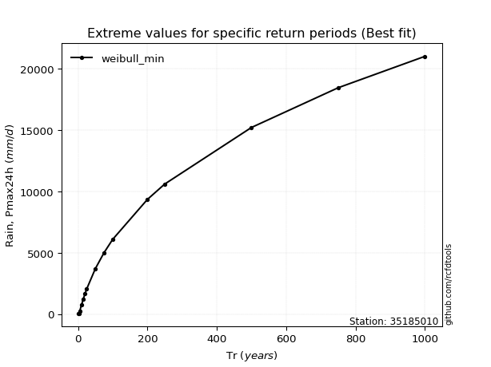</img>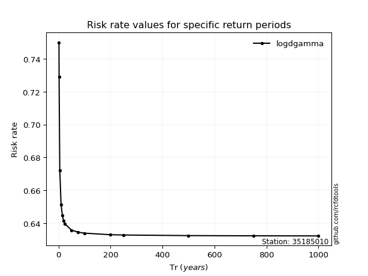</img>

</div>


<sub>**APP DISCLAIMER**: NO WARRANTY - This software is provided by [github.com/rcfdtools](https://github.com/rcfdtools) "as is", without any express or implied warranty, including warranties of merchantability, fitness for a particular purpose, or non-infringement. There is no guarantee that the software will be error-free or operate without interruption. LIMITATION OF LIABILITY - Neither the authors nor copyright holders will be liable for claims or damages arising from the software or its use. You are responsible for determining if the software is appropriate for your use and assume all associated risks, including errors, legal compliance, and data loss. NO PROFESSIONAL ADVICE - The software provides general information and does not offer professional advice. It should not replace consultation with professional advisors.</sub>