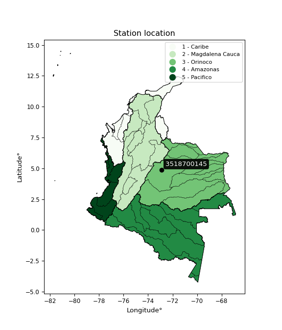

<div align="center">


</div>

# PMax24h Station (Rain, Pmax24h): 3518700145

Maximum Precipitation in 24 hours (PMax24h) is the greatest amount of rainfall for a specific duration that is meteorologically possible for a given location, acting as a "worst-case" scenario for extreme storms, crucial for designing safety-critical infrastructure like bridges, river deviations, dams, spillways, and nuclear plants to prevent catastrophic failure. The PMax24h is related with the Probable Maximum Precipitation (PMP) and it is calculated by hydrologists using meteorological data to determine the upper limit of extreme rainfall, often leading to the Probable Maximum Flood (PMF) for flood control design, and is increasingly being studied for climate change impacts. Probable Maximum Precipitation (PMP) is the theoretical upper limit of rainfall, a deterministic estimate for extreme events, while probability distributions (like GEV, Gumbel) describe the likelihood and frequency of various precipitation amounts, including rare ones, showing how often events occur, with PMP representing the extreme end of these distributions, used for critical infrastructure design to ensure safety against the worst conceivable weather, unlike standard statistical forecasts which cover typical probabilities.

The most common probability distributions in hydrology, used for analyzing floods, rainfall, and streamflow, include the Normal, Log-Normal, Gumbel, Gamma (including Log-Pearson Type III), and Generalized Extreme Value (GEV) distributions, often chosen based on the data´s skewness and whether modeling extremes or general conditions, with Gumbel and GEV popular for extreme events like floods, while the Normal distribution serves as a baseline, though often requiring transformations for skewed hydrological data. These distributions help in designing water infrastructure, managing water resources, and forecasting hydrologic events.

> Hydrological data often isn´t perfectly normal (it´s skewed), so different distributions are needed for different applications, such as: **Flood Frequency Analysis**: Using Gumbel, GEV, or Log-Pearson Type III for predicting extreme flood magnitudes and their return periods, **Rainfall Analysis**: Normal for annual totals, but Log-Normal, Weibull, or GEV for intensity or extreme daily rainfall, **Streamflow Modeling**: Gamma and Log-Normal for maximum flows, GEV for minimum flows, and Kappa for daily flows.

<div align="center">

</img>

</div>


## A. General information


### 1. General running parameters

• app_version: _v20260225_. • runtime: _2026-02-27 14:50:08.749431_. • Python version: _3.14.0_. • SciPy version: _1.16.3_. • Pandas version: _2.3.3_. • NumPy version: _2.3.5_. • Stations dataset (station_dataset_file): _dataset/pmax24h_in/automatic_colombia_2003_2025.csv_. • Stations catalog (station_catalog_file): _dataset/CNE.xls_. • Minimum year to eval til year_max (date_min): _1900_. • Maximum year to eval since year_min (date_max): _2025_. • Creates, save and include plots into reports (create_plot): _False_. • Plot only fit distributions with Δo > Δ (plot_only_fit): _True_. • Plot only simple graphs avoiding multiple CDFs and multiple Extreme values plots (plot_only_simple): _False_. • Eval low extreme values, if False, evaluates high extreme values (low_extreme): _False_. • Eval every SciPy distribution as logarithmic (pdist_logarithmic_on): _True_. • Standard deviation normalized (ddof): _1.0_. • Return periods to eval in years (Tr): _[2, 2.33, 5, 10, 15, 20, 25, 50, 75, 100, 200, 250, 500, 750, 1000]_. • Minimum data sample per station, 0 means any (minimum_sample): _5_. • Z-Score maximum threshold to adjust a value, 0 means disable (zscore_max): _3.5_. • Z-Score minimum threshold to adjust a value, 0 means disable (zscore_min): _-2.5_. • Avoid zeros, e.g. rain = 0 (avoid_zeros): _True_. • Avoid null values (avoid_nans): _True_. 

:file_folder:Table: [dataset.csv](../../dataset/pmax24h_in/automatic_colombia_2003_2025.csv)

> Delta Degrees of Freedom (DDOF): is a parameter used in the formulas for calculating variance and standard deviation. When ddof=0, the divisor is $N$ (the total number of observations) and this is used when your data set is the entire population. When ddof=1, the divisor is $N-1$ and this is used when your data set is a sample drawn from a larger population. Using $N-1$ provides an unbiased estimate of the population variance (known as Bessel´s correction).


### 2. Station info and location

|   id |     CODIGO | NOMBRE                           | CATEGORIA    | TECNOLOGIA                              | ESTADO           | FECHA_INSTALACION   |   FECHA_SUSPENSION |   ALTITUD |   LATITUD |   LONGITUD | DEPARTAMENTO   | MUNICIPIO   | AREA_OPERATIVA                              | ENTIDAD                                                     | AREA_HIDROGRAFICA   | ZONA_HIDROGRAFICA   | SUBZONA_HIDROGRAFICA             | CORRIENTE   | Catalogo   |   Version |
|-----:|-----------:|:---------------------------------|:-------------|:----------------------------------------|:-----------------|:--------------------|-------------------:|----------:|----------:|-----------:|:---------------|:------------|:--------------------------------------------|:------------------------------------------------------------|:--------------------|:--------------------|:---------------------------------|:------------|:-----------|----------:|
|    0 | 3518700145 | TUA BALNEARIO - AUT [3518700145] | Limnigráfica | Automática con Telemetría, Convencional | En Mantenimiento | 18/09/2018          |                nan |       412 |   4.88565 |   -72.9009 | Casanare       | Monterrey   | Area Operativa 06 - Boyacá-Casanare-Vichada | INSTITUTO DE HIDROLOGIA METEOROLOGIA Y ESTUDIOS AMBIENTALES | Orinoco             | Meta                | Río Túa y otros directos al Meta | Río Túa     | CNE_IDEAM  |  20251226 |

<div align="center">

Dynamic map: [:earth_americas:Google](http://maps.google.com/maps?q=4.88565,-72.900888889) [:earth_americas:OSM](https://www.openstreetmap.org/#map=18/4.88565/-72.900888889&layers=P) [:earth_americas:Bing](https://www.bing.com/maps?cp=4.88565~-72.900888889&lvl=18) [:earth_americas:Apple](https://maps.apple.com/frame?center=4.88565%2C-72.900888889&span=0.003%2C0.006)

</div>


<div align="center">

```geojson
{
  "type": "Feature",
  "geometry": {
    "type": "Point", 
    "coordinates": [-72.900888889, 4.88565]
  }, 
  "properties": {
    "Name": "3518700145"
  }
}
```

</div>


### 3. Discrete values table and plot

<div align="center">

|               |         0 |            1 |           2 |           3 |          4 |           5 |
|:--------------|----------:|-------------:|------------:|------------:|-----------:|------------:|
| Date          | 2019      | 2020         | 2021        | 2022        | 2023       | 2025        |
| Value         |  229.2    |  107.2       |  143        |  112.2      |    5.6     |   22.6      |
| Value_initial |  229.2    |  107.2       |  143        |  112.2      |    5.6     |   22.6      |
| count         |    6      |    6         |    6        |    6        |    6       |    6        |
| mean          |  103.3    |  103.3       |  103.3      |  103.3      |  103.3     |  103.3      |
| std           |   81.9501 |   81.9501    |   81.9501   |   81.9501   |   81.9501  |   81.9501   |
| zscore        |    1.5363 |    0.0475899 |    0.484441 |    0.108603 |   -1.19219 |   -0.984746 |


</div>


> The initial value (value_initial) correspond to the initial obtained or null completed value, and value (value) is adjusted only when the initial value is outside the valid range (outlier) definite through the Z-Score value. If Z-Score is active, values out of range or outliers are replaced with the station mean value. A Z-Score (or standard score) measures how many standard deviations a data point is from the mean of a dataset, indicating its relative position; positive scores mean above the mean, negative mean below, and a score of zero is exactly at the mean, allowing for comparison of values from different distributions. It´s calculated using the formula $z=(x–μ)/σ$, where $x$ is the data point, $μ$ is the mean, and $σ$ is the standard deviation, helping identify outliers and understand probability.
>
> <sub>**Note**: In this study, "completing" (filling gaps in) and "extending" (forecasting or lengthening the historical record) rainfall data series are avoided for certain critical analyses because they introduce artificial bias and uncertainty, which can distort the statistics of rare events (extremes), alter day-to-day variability, and compromise the integrity and homogeneity of the original data. Some reasons against Completing/Extending rainfall data are: **Distortion of Extremes and Variability**: The primary issue is that most gap-filling or extension methods rely on averaging or regression with nearby stations, which inherently smooths the data. Rainfall is highly variable in space and time, with a large percentage of zero values and occasional large storms. Infilling methods often underestimate the highest values and overestimate the lowest (zero) values, which severely distorts analyses focused on flood frequency, drought severity, and intensity-duration-frequency (IDF) curves, **Loss of Data Homogeneity**: Infilled or extended data are synthetic estimates, not actual measurements. Combining these estimates with observed data can violate the assumption of data homogeneity, which requires that the data properties do not change over time. Inhomogeneity can lead to incorrect conclusions about long-term trends or changes in climate patterns, **Propagation of Errors**: Errors and biases from the original data (e.g., wind-induced undercatch, instrument errors, site changes) or the data used for imputation can propagate through the analysis, leading to unreliable hydrological models and inaccurate predictions, **Compromised Statistical Integrity**: For statistical analyses, especially those involving the frequency of events, using artificial data can introduce time bias or autocorrelation that doesn´t exist in reality, making it difficult to assess the true probability of events, **Difficulty in Validation**: It is difficult to accurately validate the quality of filled or extended data, especially for past periods where ground-truth measurements are unavailable. The reliability of imputation techniques heavily depends on the density of the surrounding station network and the complexity of the local topography.</sub>


### 4. Active continuous probability distributions from SciPy (80 of 104 available)

A Probability Density Function (PDF) describes the relative likelihood of a continuous random variable falling within a specific range, where the total area under its curve equals 1, and the area over any interval gives the actual probability for that range. Unlike discrete probabilities (like rolling a die), a PDF shows density, not direct probability for a single point (which is zero), with higher points indicating higher likelihood, often visualized as a bell curve for normal distributions.

A log of a probability density function (log-PDF) is simply the logarithm of the PDF´s value, denoted as $log(f(x))$, useful for converting multiplication of probabilities into addition, improving numerical stability with tiny numbers, and connecting to information theory concepts like entropy. Instead of dealing with very small probabilities (e.g., 0.000001), log-PDFs use negative numbers (e.g., $log(0.00001) ≈ -11.51$ that are easier for computers to handle, preventing underflow errors and simplifying complex calculations. In this study, each active probability distribution from SciPy is also evaluated in the $log$ form.

[scipy.stats](https://docs.scipy.org/doc/scipy/reference/stats.html) is a Python´s powerful submodule within the SciPy library for comprehensive statistical analysis, offering over 130 probability distributions (like Normal, Poisson, etc.), functions for descriptive stats (mean, variance), hypothesis testing (t-tests, chi-square), random variable generation, and statistical tests, making it essential for data science, modeling, and research. It provides tools to explore, model, and draw conclusions from data efficiently, working seamlessly with [NumPy](https://numpy.org/).

<div align="center">

|   id | p_dist           |   n_parameter | fit_method   | label                                                                       | active   | ref                                                                                                      |
|-----:|:-----------------|--------------:|:-------------|:----------------------------------------------------------------------------|:---------|:---------------------------------------------------------------------------------------------------------|
|    0 | alpha            |             3 | MLE          | Alpha                                                                       | True     | [:mortar_board:](https://docs.scipy.org/doc/scipy/reference/generated/scipy.stats.alpha.html)            |
|    1 | anglit           |             2 | MM           | Anglit                                                                      | True     | [:mortar_board:](https://docs.scipy.org/doc/scipy/reference/generated/scipy.stats.anglit.html)           |
|    2 | arcsine          |             2 | MM           | Arcsine                                                                     | True     | [:mortar_board:](https://docs.scipy.org/doc/scipy/reference/generated/scipy.stats.arcsine.html)          |
|    3 | argus            |             3 | MLE          | Argus                                                                       | True     | [:mortar_board:](https://docs.scipy.org/doc/scipy/reference/generated/scipy.stats.argus.html)            |
|    4 | beta             |             4 | MLE          | Beta                                                                        | True     | [:mortar_board:](https://docs.scipy.org/doc/scipy/reference/generated/scipy.stats.beta.html)             |
|    5 | betaprime        |             4 | MLE          | Beta prime                                                                  | True     | [:mortar_board:](https://docs.scipy.org/doc/scipy/reference/generated/scipy.stats.betaprime.html)        |
|    6 | bradford         |             3 | MLE          | Bradford                                                                    | True     | [:mortar_board:](https://docs.scipy.org/doc/scipy/reference/generated/scipy.stats.bradford.html)         |
|    7 | burr             |             4 | MLE          | Burr (Type III)                                                             | True     | [:mortar_board:](https://docs.scipy.org/doc/scipy/reference/generated/scipy.stats.burr.html)             |
|    8 | burr12           |             4 | MLE          | Burr (Type III) 12                                                          | True     | [:mortar_board:](https://docs.scipy.org/doc/scipy/reference/generated/scipy.stats.burr12.html)           |
|    9 | cosine           |             2 | MLE          | Cosine                                                                      | True     | [:mortar_board:](https://docs.scipy.org/doc/scipy/reference/generated/scipy.stats.cosine.html)           |
|   10 | crystalball      |             4 | MLE          | Crystalball                                                                 | True     | [:mortar_board:](https://docs.scipy.org/doc/scipy/reference/generated/scipy.stats.crystalball.html)      |
|   11 | dgamma           |             3 | MLE          | Double gamma                                                                | True     | [:mortar_board:](https://docs.scipy.org/doc/scipy/reference/generated/scipy.stats.dgamma.html)           |
|   12 | dweibull         |             3 | MLE          | Double Weibull                                                              | True     | [:mortar_board:](https://docs.scipy.org/doc/scipy/reference/generated/scipy.stats.dweibull.html)         |
|   13 | erlang           |             3 | MLE          | Erlang                                                                      | True     | [:mortar_board:](https://docs.scipy.org/doc/scipy/reference/generated/scipy.stats.erlang.html)           |
|   14 | exponnorm        |             3 | MLE          | Exponentially modified Normal                                               | True     | [:mortar_board:](https://docs.scipy.org/doc/scipy/reference/generated/scipy.stats.exponnorm.html)        |
|   15 | exponpow         |             3 | MLE          | Exponential power                                                           | True     | [:mortar_board:](https://docs.scipy.org/doc/scipy/reference/generated/scipy.stats.exponpow.html)         |
|   16 | exponweib        |             4 | MLE          | Exponentiated Weibull                                                       | True     | [:mortar_board:](https://docs.scipy.org/doc/scipy/reference/generated/scipy.stats.exponweib.html)        |
|   17 | f                |             4 | MLE          | F                                                                           | True     | [:mortar_board:](https://docs.scipy.org/doc/scipy/reference/generated/scipy.stats.f.html)                |
|   18 | fatiguelife      |             3 | MLE          | Fatigue-life (Birnbaum-Saunders)                                            | True     | [:mortar_board:](https://docs.scipy.org/doc/scipy/reference/generated/scipy.stats.fatiguelife.html)      |
|   19 | foldnorm         |             3 | MM           | Fold Normal                                                                 | True     | [:mortar_board:](https://docs.scipy.org/doc/scipy/reference/generated/scipy.stats.foldnorm.html)         |
|   20 | gamma            |             3 | MLE          | Gamma                                                                       | True     | [:mortar_board:](https://docs.scipy.org/doc/scipy/reference/generated/scipy.stats.gamma.html)            |
|   21 | gausshyper       |             6 | MLE          | Gauss hypergeometric                                                        | True     | [:mortar_board:](https://docs.scipy.org/doc/scipy/reference/generated/scipy.stats.gausshyper.html)       |
|   22 | genexpon         |             5 | MLE          | Generalized exponential                                                     | True     | [:mortar_board:](https://docs.scipy.org/doc/scipy/reference/generated/scipy.stats.genexpon.html)         |
|   23 | genextreme       |             3 | MLE          | Generalized exponential                                                     | True     | [:mortar_board:](https://docs.scipy.org/doc/scipy/reference/generated/scipy.stats.genextreme.html)       |
|   24 | gengamma         |             4 | MLE          | Generalized gamma                                                           | True     | [:mortar_board:](https://docs.scipy.org/doc/scipy/reference/generated/scipy.stats.gengamma.html)         |
|   25 | genhalflogistic  |             3 | MLE          | Generalized half-logistic                                                   | True     | [:mortar_board:](https://docs.scipy.org/doc/scipy/reference/generated/scipy.stats.genhalflogistic.html)  |
|   26 | genlogistic      |             3 | MLE          | Generalized logistic                                                        | True     | [:mortar_board:](https://docs.scipy.org/doc/scipy/reference/generated/scipy.stats.genlogistic.html)      |
|   27 | gennorm          |             3 | MLE          | Generalized Normal                                                          | True     | [:mortar_board:](https://docs.scipy.org/doc/scipy/reference/generated/scipy.stats.gennorm.html)          |
|   28 | genpareto        |             3 | MLE          | Generalized Pareto                                                          | True     | [:mortar_board:](https://docs.scipy.org/doc/scipy/reference/generated/scipy.stats.genpareto.html)        |
|   29 | gompertz         |             3 | MLE          | Gompertz (or truncated Gumbel)                                              | True     | [:mortar_board:](https://docs.scipy.org/doc/scipy/reference/generated/scipy.stats.gompertz.html)         |
|   30 | gumbel_l         |             2 | MM           | Gumbel Left Skew                                                            | True     | [:mortar_board:](https://docs.scipy.org/doc/scipy/reference/generated/scipy.stats.gumbel_l.html)         |
|   31 | gumbel_r         |             2 | MM           | Gumbel Right Skew                                                           | True     | [:mortar_board:](https://docs.scipy.org/doc/scipy/reference/generated/scipy.stats.gumbel_r.html)         |
|   32 | halfgennorm      |             3 | MLE          | Upper half of a generalized normal                                          | True     | [:mortar_board:](https://docs.scipy.org/doc/scipy/reference/generated/scipy.stats.halfgennorm.html)      |
|   33 | halflogistic     |             2 | MM           | Half-logistic                                                               | True     | [:mortar_board:](https://docs.scipy.org/doc/scipy/reference/generated/scipy.stats.halflogistic.html)     |
|   34 | halfnorm         |             2 | MM           | Half Normal                                                                 | True     | [:mortar_board:](https://docs.scipy.org/doc/scipy/reference/generated/scipy.stats.halfnorm.html)         |
|   35 | hypsecant        |             2 | MM           | hyperbolic secant                                                           | True     | [:mortar_board:](https://docs.scipy.org/doc/scipy/reference/generated/scipy.stats.hypsecant.html)        |
|   36 | invgamma         |             3 | MLE          | Inverted gamma                                                              | True     | [:mortar_board:](https://docs.scipy.org/doc/scipy/reference/generated/scipy.stats.invgamma.html)         |
|   37 | invgauss         |             3 | MLE          | Inverse Gaussian                                                            | True     | [:mortar_board:](https://docs.scipy.org/doc/scipy/reference/generated/scipy.stats.invgauss.html)         |
|   38 | invweibull       |             3 | MLE          | Inverted Weibull                                                            | True     | [:mortar_board:](https://docs.scipy.org/doc/scipy/reference/generated/scipy.stats.invweibull.html)       |
|   39 | johnsonsb        |             4 | MLE          | Johnson SB                                                                  | True     | [:mortar_board:](https://docs.scipy.org/doc/scipy/reference/generated/scipy.stats.johnsonsb.html)        |
|   40 | johnsonsu        |             4 | MLE          | Johnson Su                                                                  | True     | [:mortar_board:](https://docs.scipy.org/doc/scipy/reference/generated/scipy.stats.johnsonsu.html)        |
|   41 | kappa3           |             3 | MLE          | Kappa 3                                                                     | True     | [:mortar_board:](https://docs.scipy.org/doc/scipy/reference/generated/scipy.stats.kappa3.html)           |
|   42 | kappa4           |             4 | MLE          | Kappa 4                                                                     | True     | [:mortar_board:](https://docs.scipy.org/doc/scipy/reference/generated/scipy.stats.kappa4.html)           |
|   43 | ksone            |             3 | MLE          | Kolmogorov-Smirnov one-sided test statistic distribution                    | True     | [:mortar_board:](https://docs.scipy.org/doc/scipy/reference/generated/scipy.stats.ksone.html)            |
|   44 | kstwobign        |             2 | MLE          | Limiting distribution of scaled Kolmogorov-Smirnov two-sided test statistic | True     | [:mortar_board:](https://docs.scipy.org/doc/scipy/reference/generated/scipy.stats.kstwobign.html)        |
|   45 | laplace          |             2 | MM           | Laplace                                                                     | True     | [:mortar_board:](https://docs.scipy.org/doc/scipy/reference/generated/scipy.stats.laplace.html)          |
|   46 | levy_l           |             2 | MLE          | Left-skewed Levy                                                            | True     | [:mortar_board:](https://docs.scipy.org/doc/scipy/reference/generated/scipy.stats.levy_l.html)           |
|   47 | loggamma         |             3 | MLE          | Log gamma                                                                   | True     | [:mortar_board:](https://docs.scipy.org/doc/scipy/reference/generated/scipy.stats.loggamma.html)         |
|   48 | logistic         |             2 | MM           | Logistic (or Sech-squared)                                                  | True     | [:mortar_board:](https://docs.scipy.org/doc/scipy/reference/generated/scipy.stats.logistic.html)         |
|   49 | loglaplace       |             3 | MLE          | Log-Laplace                                                                 | True     | [:mortar_board:](https://docs.scipy.org/doc/scipy/reference/generated/scipy.stats.loglaplace.html)       |
|   50 | lomax            |             3 | MLE          | Lomax (Pareto of the second kind)                                           | True     | [:mortar_board:](https://docs.scipy.org/doc/scipy/reference/generated/scipy.stats.lomax.html)            |
|   51 | maxwell          |             2 | MM           | Maxwell                                                                     | True     | [:mortar_board:](https://docs.scipy.org/doc/scipy/reference/generated/scipy.stats.maxwell.html)          |
|   52 | mielke           |             4 | MLE          | Mielke Beta-Kappa / Dagum                                                   | True     | [:mortar_board:](https://docs.scipy.org/doc/scipy/reference/generated/scipy.stats.mielke.html)           |
|   53 | moyal            |             2 | MM           | Moyal                                                                       | True     | [:mortar_board:](https://docs.scipy.org/doc/scipy/reference/generated/scipy.stats.moyal.html)            |
|   54 | nakagami         |             3 | MLE          | Nakagami                                                                    | True     | [:mortar_board:](https://docs.scipy.org/doc/scipy/reference/generated/scipy.stats.nakagami.html)         |
|   55 | ncf              |             5 | MLE          | Non-central F distribution                                                  | True     | [:mortar_board:](https://docs.scipy.org/doc/scipy/reference/generated/scipy.stats.ncf.html)              |
|   56 | nct              |             4 | MLE          | Non-central Student’s t                                                     | True     | [:mortar_board:](https://docs.scipy.org/doc/scipy/reference/generated/scipy.stats.nct.html)              |
|   57 | norm             |             2 | MM           | Normal                                                                      | True     | [:mortar_board:](https://docs.scipy.org/doc/scipy/reference/generated/scipy.stats.norm.html)             |
|   58 | pearson3         |             3 | MM           | Pearson type III                                                            | True     | [:mortar_board:](https://docs.scipy.org/doc/scipy/reference/generated/scipy.stats.pearson3.html)         |
|   59 | powerlaw         |             3 | MLE          | Power-function                                                              | True     | [:mortar_board:](https://docs.scipy.org/doc/scipy/reference/generated/scipy.stats.powerlaw.html)         |
|   60 | rayleigh         |             2 | MM           | Rayleigh                                                                    | True     | [:mortar_board:](https://docs.scipy.org/doc/scipy/reference/generated/scipy.stats.rayleigh.html)         |
|   61 | rdist            |             3 | MLE          | R-distributed (symmetric beta)                                              | True     | [:mortar_board:](https://docs.scipy.org/doc/scipy/reference/generated/scipy.stats.rdist.html)            |
|   62 | rice             |             3 | MLE          | Rice                                                                        | True     | [:mortar_board:](https://docs.scipy.org/doc/scipy/reference/generated/scipy.stats.rice.html)             |
|   63 | semicircular     |             2 | MM           | Semicircular                                                                | True     | [:mortar_board:](https://docs.scipy.org/doc/scipy/reference/generated/scipy.stats.semicircular.html)     |
|   64 | skewnorm         |             3 | MLE          | Skew normal                                                                 | True     | [:mortar_board:](https://docs.scipy.org/doc/scipy/reference/generated/scipy.stats.skewnorm.html)         |
|   65 | t                |             3 | MLE          | Student’s t                                                                 | True     | [:mortar_board:](https://docs.scipy.org/doc/scipy/reference/generated/scipy.stats.t.html)                |
|   66 | trapezoid        |             4 | MLE          | Trapezoid                                                                   | True     | [:mortar_board:](https://docs.scipy.org/doc/scipy/reference/generated/scipy.stats.trapezoid.html)        |
|   67 | triang           |             3 | MLE          | Triangular                                                                  | True     | [:mortar_board:](https://docs.scipy.org/doc/scipy/reference/generated/scipy.stats.triang.html)           |
|   68 | truncexpon       |             3 | MLE          | Truncated exponential                                                       | True     | [:mortar_board:](https://docs.scipy.org/doc/scipy/reference/generated/scipy.stats.truncexpon.html)       |
|   69 | truncnorm        |             4 | MLE          | Truncated normal                                                            | True     | [:mortar_board:](https://docs.scipy.org/doc/scipy/reference/generated/scipy.stats.truncnorm.html)        |
|   70 | truncpareto      |             4 | MLE          | Upper truncated Pareto                                                      | True     | [:mortar_board:](https://docs.scipy.org/doc/scipy/reference/generated/scipy.stats.truncpareto.html)      |
|   71 | truncweibull_min |             5 | MLE          | Doubly truncated Weibull minimum                                            | True     | [:mortar_board:](https://docs.scipy.org/doc/scipy/reference/generated/scipy.stats.truncweibull_min.html) |
|   72 | tukeylambda      |             3 | MLE          | Tukey-Lamdba                                                                | True     | [:mortar_board:](https://docs.scipy.org/doc/scipy/reference/generated/scipy.stats.tukeylambda.html)      |
|   73 | uniform          |             2 | MLE          | Uniform                                                                     | True     | [:mortar_board:](https://docs.scipy.org/doc/scipy/reference/generated/scipy.stats.uniform.html)          |
|   74 | vonmises         |             3 | MLE          | Von Mises                                                                   | True     | [:mortar_board:](https://docs.scipy.org/doc/scipy/reference/generated/scipy.stats.vonmises.html)         |
|   75 | vonmises_line    |             3 | MLE          | Von Mises line                                                              | True     | [:mortar_board:](https://docs.scipy.org/doc/scipy/reference/generated/scipy.stats.vonmises_line.html)    |
|   76 | wald             |             2 | MM           | Wald                                                                        | True     | [:mortar_board:](https://docs.scipy.org/doc/scipy/reference/generated/scipy.stats.wald.html)             |
|   77 | weibull_max      |             3 | MLE          | Weibull maximum                                                             | True     | [:mortar_board:](https://docs.scipy.org/doc/scipy/reference/generated/scipy.stats.weibull_max.html)      |
|   78 | weibull_min      |             3 | MLE          | Weibull minimum                                                             | True     | [:mortar_board:](https://docs.scipy.org/doc/scipy/reference/generated/scipy.stats.weibull_min.html)      |
|   79 | wrapcauchy       |             3 | MLE          | Wrapped  Cauchy                                                             | True     | [:mortar_board:](https://docs.scipy.org/doc/scipy/reference/generated/scipy.stats.wrapcauchy.html)       |

</div>

> **n_parameter:** # arguments & localization & scale.
>
> **Fit methods:** (MLE) maximum likelihood, (MM) L-moments.
>
>**Inactive** (With the only purpose of prevent loops, zero divisions, infinite values, over high estimated values or horizontal trending for recurrence intervals estimations, the follow distributions were disabled.)**:** lognorm, norminvgauss, powernorm, powerlognorm, cauchy, halfcauchy, foldcauchy, skewcauchy, chi2, expon, fisk, genhyperbolic, geninvgauss, gibrat, kstwo, laplace_asymmetric, levy, levy_stable, ncx2, pareto, rel_breitwigner, recipinvgauss, studentized_range, loguniform, 


## B. Probability (PDF) vs. Empirical (EDF) distributions functions

A continuous probability distribution (CPD) describes probabilities for variables that can take any value within a range (like rain any time), unlike discrete variables with specific outcomes (like temperature). It uses a Probability Density Function (PDF), a curve where the total area under it equals 1, and the probability of the variable falling within an interval (a to b) is found by calculating the area under the curve between those points. A key feature is that the probability of hitting any single exact value is zero, so probabilities are always expressed for ranges, e.g., $P(a ≤ X ≤ b)$.

<div align="center">

Distributions parameters from station values
|     |    station | p_dist              |   n |              loc |           scale | shape                  | shape1                 | shape2               | shape3             |
|----:|-----------:|:--------------------|----:|-----------------:|----------------:|:-----------------------|:-----------------------|:---------------------|:-------------------|
|   0 | 3518700145 | alpha               |   6 |    -27.6855      |    64.1941      | 0.0014712559826764917  |                        |                      |                    |
|   1 | 3518700145 | anglit              |   6 |    103.3         |   218.849       |                        |                        |                      |                    |
|   2 | 3518700145 | arcsine             |   6 |     -2.4971      |   211.594       |                        |                        |                      |                    |
|   3 | 3518700145 | argus               |   6 |    -64.2432      |   307.644       | 1.1308240410461003e-06 |                        |                      |                    |
|   4 | 3518700145 | beta                |   6 |    -24.4141      |   253.614       | 0.771809218955422      | 0.4994676317067228     |                      |                    |
|   5 | 3518700145 | betaprime           |   6 |      5.57509     |  2590.39        | 0.9342968174966474     | 31.496461594662108     |                      |                    |
|   6 | 3518700145 | bradford            |   6 |      5.5999      |   223.6         | 2.5556846619349542     |                        |                      |                    |
|   7 | 3518700145 | burr                |   6 |     -1.64163     |   236.256       | 148.41104229111514     | 0.005195713897301073   |                      |                    |
|   8 | 3518700145 | burr12              |   6 |     -1.00182     |     6.46055     | 198.63833403075836     | 0.002208642916761055   |                      |                    |
|   9 | 3518700145 | cosine              |   6 |    106.688       |    62.0057      |                        |                        |                      |                    |
|  10 | 3518700145 | crystalball         |   6 |    103.3         |    74.8099      | 9017.088672135258      | 1410.7337815925264     |                      |                    |
|  11 | 3518700145 | dgamma              |   6 |    112.2         |    62.3719      | 0.8276701062052203     |                        |                      |                    |
|  12 | 3518700145 | dweibull            |   6 |    112.2         |    57.6664      | 0.8313191756396043     |                        |                      |                    |
|  13 | 3518700145 | erlang              |   6 |      5.59999     |    85.6425      | 0.8079313686607072     |                        |                      |                    |
|  14 | 3518700145 | exponnorm           |   6 |     82.5182      |    71.8901      | 0.2890777102449576     |                        |                      |                    |
|  15 | 3518700145 | exponpow            |   6 |      5.6         |   181.58        | 0.6672491789991011     |                        |                      |                    |
|  16 | 3518700145 | exponweib           |   6 |      5.6         |     9.18667     | 1.7053185788848526     | 0.3601085231715185     |                      |                    |
|  17 | 3518700145 | f                   |   6 |     -0.572864    |   102.858       | 2.2229747565496645     | 110.64683662450176     |                      |                    |
|  18 | 3518700145 | fatiguelife         |   6 |      5.6         |     6.08156e-05 | 1158.415731099531      |                        |                      |                    |
|  19 | 3518700145 | foldnorm            |   6 |    -44.1988      |    78.5605      | 1.852532117472171      |                        |                      |                    |
|  20 | 3518700145 | gamma               |   6 |      5.59119     |    86.7093      | 0.8052831925890149     |                        |                      |                    |
|  21 | 3518700145 | gausshyper          |   6 |    -11.3258      |   240.526       | 1.144717786487793      | 0.9031745579297947     | 0.9904147318585113   | 1.0493925565475353 |
|  22 | 3518700145 | genexpon            |   6 |      5.59966     |     2.55949     | 0.02625841505778708    | 3.3738416992115045e-07 | 2.7284467096693135   |                    |
|  23 | 3518700145 | genextreme          |   6 |      5.78601     |     1.25081     | -6.724513132460891     |                        |                      |                    |
|  24 | 3518700145 | gengamma            |   6 |      5.6         |     1.94773     | 3.072662594574569      | 0.2858243409447813     |                      |                    |
|  25 | 3518700145 | genhalflogistic     |   6 |    -17.2957      |   257.944       | 1.0464446375612828     |                        |                      |                    |
|  26 | 3518700145 | genlogistic         |   6 |   -328.138       |    64.2884      | 465.7274822187987      |                        |                      |                    |
|  27 | 3518700145 | gennorm             |   6 |    112.2         |     0.0883682   | 0.24922529645724306    |                        |                      |                    |
|  28 | 3518700145 | genpareto           |   6 |     -2.34929     |   346.882       | -1.4980904554097845    |                        |                      |                    |
|  29 | 3518700145 | gompertz            |   6 |      5.6         |   174.634       | 1.0631361128645576     |                        |                      |                    |
|  30 | 3518700145 | gumbel_l            |   6 |    136.968       |    58.329       |                        |                        |                      |                    |
|  31 | 3518700145 | gumbel_r            |   6 |     69.6316      |    58.329       |                        |                        |                      |                    |
|  32 | 3518700145 | halfgennorm         |   6 |      5.6         |     4.49687     | 0.3690686619074125     |                        |                      |                    |
|  33 | 3518700145 | halflogistic        |   6 |     14.6329      |    63.9598      |                        |                        |                      |                    |
|  34 | 3518700145 | halfnorm            |   6 |      4.28105     |   124.102       |                        |                        |                      |                    |
|  35 | 3518700145 | hypsecant           |   6 |    103.3         |    47.6254      |                        |                        |                      |                    |
|  36 | 3518700145 | invgamma            |   6 |   -366.266       | 18126.8         | 39.60547724091458      |                        |                      |                    |
|  37 | 3518700145 | invgauss            |   6 |    -99.2387      |  1224.2         | 0.1654028534253933     |                        |                      |                    |
|  38 | 3518700145 | invweibull          |   6 |      5.6         |     4.87932     | 0.05524755766157375    |                        |                      |                    |
|  39 | 3518700145 | johnsonsb           |   6 |     -3.49122     |   232.691       | 0.23629910575176397    | 0.13760697405499595    |                      |                    |
|  40 | 3518700145 | johnsonsu           |   6 |   -195.136       |   100.374       | -7.450819203807132     | 4.177586273066119      |                      |                    |
|  41 | 3518700145 | kappa3              |   6 |      5.6         |   144.86        | 6.0864796721078775     |                        |                      |                    |
|  42 | 3518700145 | kappa4              |   6 |    -25.5151      |   257.309       | 1.1374428871608693     | 0.9881891099694265     |                      |                    |
|  43 | 3518700145 | ksone               |   6 |    -26.2745      |   259.149       | 1.0                    |                        |                      |                    |
|  44 | 3518700145 | kstwobign           |   6 |   -154.613       |   294.669       |                        |                        |                      |                    |
|  45 | 3518700145 | laplace             |   6 |    103.3         |    52.8986      |                        |                        |                      |                    |
|  46 | 3518700145 | levy_l              |   6 |    242.305       |    54.4269      |                        |                        |                      |                    |
|  47 | 3518700145 | loggamma            |   6 | -20646.9         |  2852.91        | 1441.9461147547602     |                        |                      |                    |
|  48 | 3518700145 | logistic            |   6 |    103.3         |    41.2448      |                        |                        |                      |                    |
|  49 | 3518700145 | loglaplace          |   6 |     -0.277307    |   107.477       | 1.0820461197793416     |                        |                      |                    |
|  50 | 3518700145 | lomax               |   6 |      5.6         |     7.3996e+10  | 637258015.4036641      |                        |                      |                    |
|  51 | 3518700145 | maxwell             |   6 |    -73.968       |   111.086       |                        |                        |                      |                    |
|  52 | 3518700145 | mielke              |   6 |      5.59885     |   254.71        | 0.7438305594859964     | 38.60064189598752      |                      |                    |
|  53 | 3518700145 | moyal               |   6 |     60.5189      |    33.6763      |                        |                        |                      |                    |
|  54 | 3518700145 | nakagami            |   6 |      5.6         |   128.225       | 0.22190469919657047    |                        |                      |                    |
|  55 | 3518700145 | ncf                 |   6 |     -0.434386    |    34.9354      | 1.5375457611279009     | 232.89730368716414     | 2.9999410031339906   |                    |
|  56 | 3518700145 | nct                 |   6 |  -2212.05        |    74.5285      | 63454.46451099681      | 31.06620207789416      |                      |                    |
|  57 | 3518700145 | norm                |   6 |    103.3         |    74.8099      |                        |                        |                      |                    |
|  58 | 3518700145 | pearson3            |   6 |    103.3         |    74.8099      | 0.23917351629971628    |                        |                      |                    |
|  59 | 3518700145 | powerlaw            |   6 |      5.6         |   223.6         | 0.13434715889971335    |                        |                      |                    |
|  60 | 3518700145 | rayleigh            |   6 |    -39.8156      |   114.19        |                        |                        |                      |                    |
|  61 | 3518700145 | rdist               |   6 |    -17.3912      |   129.591       | 1.0262791957345994     |                        |                      |                    |
|  62 | 3518700145 | rice                |   6 |    -33.9499      |    96.6         | 0.7864060274733095     |                        |                      |                    |
|  63 | 3518700145 | semicircular        |   6 |    103.3         |   149.62        |                        |                        |                      |                    |
|  64 | 3518700145 | skewnorm            |   6 |      5.59993     |   123.033       | 8682718.449638939      |                        |                      |                    |
|  65 | 3518700145 | t                   |   6 |    103.299       |    74.8099      | 307771228.450672       |                        |                      |                    |
|  66 | 3518700145 | trapezoid           |   6 |    -17.598       |   268.32        | 1.0                    | 1.0                    |                      |                    |
|  67 | 3518700145 | triang              |   6 |    -19.0771      |   248.277       | 0.9999999463891345     |                        |                      |                    |
|  68 | 3518700145 | truncexpon          |   6 |     -0.475402    |   273.855       | 0.8386742924310795     |                        |                      |                    |
|  69 | 3518700145 | truncnorm           |   6 |     74.0696      |     7.30887     | -37.04333597721386     | 21.224958039423875     |                      |                    |
|  70 | 3518700145 | truncpareto         |   6 |    -65.8904      |    71.4904      | 3.7819255248489385e-08 | 4.127691156534391      |                      |                    |
|  71 | 3518700145 | truncweibull_min    |   6 |     -7.70922     |   269.323       | 1.0561233139756654     | 0.0005741866676691033  | 0.8796461589506187   |                    |
|  72 | 3518700145 | tukeylambda         |   6 |    117.397       |   113.101       | 1.0116125763366517     |                        |                      |                    |
|  73 | 3518700145 | uniform             |   6 |      5.6         |   223.6         |                        |                        |                      |                    |
|  74 | 3518700145 | vonmises            |   6 |     -1.34324     |     1           | 0.9345921381477829     |                        |                      |                    |
|  75 | 3518700145 | vonmises_line       |   6 |    117.4         |    35.5871      | 0.01029669358647833    |                        |                      |                    |
|  76 | 3518700145 | wald                |   6 |     28.4901      |    74.8099      |                        |                        |                      |                    |
|  77 | 3518700145 | weibull_max         |   6 |    229.2         |     1.60417     | 0.19700361568367802    |                        |                      |                    |
|  78 | 3518700145 | weibull_min         |   6 |      5.6         |   109.024       | 0.4602462279333997     |                        |                      |                    |
|  79 | 3518700145 | wrapcauchy          |   6 |      5.6         |    35.5871      | 0.1322287918302518     |                        |                      |                    |
|  80 | 3518700145 | logalpha            |   6 |    -29.1531      |   837.861       | 25.236427699532506     |                        |                      |                    |
|  81 | 3518700145 | loganglit           |   6 |      4.10552     |     3.74941     |                        |                        |                      |                    |
|  82 | 3518700145 | logarcsine          |   6 |      2.29295     |     3.62515     |                        |                        |                      |                    |
|  83 | 3518700145 | logargus            |   6 |      0.25513     |     5.29767     | 2.3017948328105176     |                        |                      |                    |
|  84 | 3518700145 | logbeta             |   6 |      1.44282     |     3.99177     | 0.5810855486558515     | 0.2655005210216428     |                      |                    |
|  85 | 3518700145 | logbetaprime        |   6 |    -17.8382      |   593.991       | 280.2758051151368      | 7594.982866208331      |                      |                    |
|  86 | 3518700145 | logbradford         |   6 |      1.72276     |     3.71189     | 0.9419135699193611     |                        |                      |                    |
|  87 | 3518700145 | logburr             |   6 |      0.522843    |     4.94646     | 501.112207530103       | 0.004758731947523374   |                      |                    |
|  88 | 3518700145 | logburr12           |   6 |  -5988.12        |  6006.43        | 6468.573029213835      | 2472343.8147387155     |                      |                    |
|  89 | 3518700145 | logcosine           |   6 |      3.94087     |     1.07016     |                        |                        |                      |                    |
|  90 | 3518700145 | logcrystalball      |   6 |      4.10552     |     1.28168     | 11.654163657766535     | 3.3262636129971836     |                      |                    |
|  91 | 3518700145 | logdgamma           |   6 |      4.72028     |     1.88866     | 0.45537293490745034    |                        |                      |                    |
|  92 | 3518700145 | logdweibull         |   6 |      4.6747      |     1.0671      | 0.9079906407302983     |                        |                      |                    |
|  93 | 3518700145 | logerlang           |   6 |    -17.5517      |     0.0807067   | 268.47050373082595     |                        |                      |                    |
|  94 | 3518700145 | logexponnorm        |   6 |      4.10454     |     1.28168     | 0.0007646142249880235  |                        |                      |                    |
|  95 | 3518700145 | logexponpow         |   6 |      1.72277     |     1.32309     | 0.26382192711840863    |                        |                      |                    |
|  96 | 3518700145 | logexponweib        |   6 |      1.72277     |     1.24706     | 1.0270076692044747     | 0.5687171554659785     |                      |                    |
|  97 | 3518700145 | logf                |   6 |   -182.872       |   186.978       | 58719.94202709044      | 138398.60776877782     |                      |                    |
|  98 | 3518700145 | logfatiguelife      |   6 |   -658.914       |   663.02        | 0.001932995160537185   |                        |                      |                    |
|  99 | 3518700145 | logfoldnorm         |   6 |     -4.23733     |     1.19871     | 6.972468739775973      |                        |                      |                    |
| 100 | 3518700145 | loggamma            |   6 |    -17.2015      |     0.0831578   | 256.00918837643485     |                        |                      |                    |
| 101 | 3518700145 | loggausshyper       |   6 |      1.60353     |     3.83106     | 1.2052535486031828     | 0.6852048017544519     | 1.1803453704926814   | 0.9605030978579989 |
| 102 | 3518700145 | loggenexpon         |   6 |      1.72277     |     0.529045    | 0.08953711252584878    | 4.950992406570562      | 0.009316572486293867 |                    |
| 103 | 3518700145 | loggenextreme       |   6 |      3.98981     |     1.70227     | 1.1782144095627225     |                        |                      |                    |
| 104 | 3518700145 | loggengamma         |   6 |      1.72277     |     1.11275     | 1.1157339539027884     | 0.5902880307034339     |                      |                    |
| 105 | 3518700145 | loggenhalflogistic  |   6 |      1.28272     |     4.38783     | 1.0568326213277845     |                        |                      |                    |
| 106 | 3518700145 | loggenlogistic      |   6 |      5.43467     |     3.93343e-06 | 2.956888591205842e-06  |                        |                      |                    |
| 107 | 3518700145 | loggennorm          |   6 |      4.72028     |     0.00648956  | 0.2920463628800306     |                        |                      |                    |
| 108 | 3518700145 | loggenpareto        |   6 |     -0.00873845  |    10.3604      | -1.90332777937985      |                        |                      |                    |
| 109 | 3518700145 | loggompertz         |   6 |      1.72277     |     1.03778     | 0.06490727654122827    |                        |                      |                    |
| 110 | 3518700145 | loggumbel_l         |   6 |      4.68234     |     0.999318    |                        |                        |                      |                    |
| 111 | 3518700145 | loggumbel_r         |   6 |      3.5287      |     0.999318    |                        |                        |                      |                    |
| 112 | 3518700145 | loghalfgennorm      |   6 |      1.72277     |     1.21312     | 0.688479565813388      |                        |                      |                    |
| 113 | 3518700145 | loghalflogistic     |   6 |      2.58643     |     1.0958      |                        |                        |                      |                    |
| 114 | 3518700145 | loghalfnorm         |   6 |      2.40914     |     2.12611     |                        |                        |                      |                    |
| 115 | 3518700145 | loghypsecant        |   6 |      4.10552     |     0.81594     |                        |                        |                      |                    |
| 116 | 3518700145 | loginvgamma         |   6 |    -20.1766      |  7935.76        | 327.8750729127497      |                        |                      |                    |
| 117 | 3518700145 | loginvgauss         |   6 |     -8.37256     |   999.122       | 0.012447430278691135   |                        |                      |                    |
| 118 | 3518700145 | loginvweibull       |   6 |     -1.92562e+08 |     1.92562e+08 | 138918752.29390013     |                        |                      |                    |
| 119 | 3518700145 | logjohnsonsb        |   6 |      1.72277     |     3.71183     | -0.4911452767310232    | 0.18616627567879673    |                      |                    |
| 120 | 3518700145 | logjohnsonsu        |   6 |      5.6075      |     0.00677244  | 5.679313905656324      | 1.00199725063645       |                      |                    |
| 121 | 3518700145 | logkappa3           |   6 |      1.72277     |     3.69052     | 311.9832627206573      |                        |                      |                    |
| 122 | 3518700145 | logkappa4           |   6 |      1.41188     |     4.07307     | 1.0826771935298867     | 1.0121522904484457     |                      |                    |
| 123 | 3518700145 | logksone            |   6 |      1.35158     |     4.45419     | 1.0                    |                        |                      |                    |
| 124 | 3518700145 | logkstwobign        |   6 |     -1.41622     |     6.29472     |                        |                        |                      |                    |
| 125 | 3518700145 | loglaplace          |   6 |      4.10552     |     0.906281    |                        |                        |                      |                    |
| 126 | 3518700145 | loglevy_l           |   6 |      5.52764     |     0.384459    |                        |                        |                      |                    |
| 127 | 3518700145 | logloggamma         |   6 |      5.43466     |     5.12897e-06 | 3.883019087056468e-06  |                        |                      |                    |
| 128 | 3518700145 | loglogistic         |   6 |      4.10552     |     0.706625    |                        |                        |                      |                    |
| 129 | 3518700145 | logloglaplace       |   6 |     -8.82729e+07 |     8.82729e+07 | 94363039.64766747      |                        |                      |                    |
| 130 | 3518700145 | loglomax            |   6 |      1.72277     |     5.24549e+12 | 883367853979.5264      |                        |                      |                    |
| 131 | 3518700145 | logmaxwell          |   6 |      1.06849     |     1.90318     |                        |                        |                      |                    |
| 132 | 3518700145 | logmielke           |   6 |     -4.05825     |     9.49542     | 6.027022279966396      | 20407.628331927954     |                      |                    |
| 133 | 3518700145 | logmoyal            |   6 |      3.37258     |     0.576957    |                        |                        |                      |                    |
| 134 | 3518700145 | lognakagami         |   6 |      3.11795     |     1.36427     | 0.076525462336921      |                        |                      |                    |
| 135 | 3518700145 | logncf              |   6 |     -0.73716     |     8.82322e-06 | 0.00010565430158660972 | 158.3158799976117      | 57.4618440571781     |                    |
| 136 | 3518700145 | lognct              |   6 |    -79.0058      |     1.246       | 34954.98083149885      | 66.70098847659074      |                      |                    |
| 137 | 3518700145 | lognorm             |   6 |      4.10552     |     1.28168     |                        |                        |                      |                    |
| 138 | 3518700145 | logpearson3         |   6 |      4.10552     |     1.28168     | -0.8784566045285878    |                        |                      |                    |
| 139 | 3518700145 | logpowerlaw         |   6 |      1.72277     |     3.71183     | 0.15419245459490524    |                        |                      |                    |
| 140 | 3518700145 | lograyleigh         |   6 |      1.6536      |     1.95635     |                        |                        |                      |                    |
| 141 | 3518700145 | logrdist            |   6 |      2.44828     |     2.272       | 1.0281247314237856     |                        |                      |                    |
| 142 | 3518700145 | logrice             |   6 |      0.854005    |     1.39332     | 2.0717378059054408     |                        |                      |                    |
| 143 | 3518700145 | logsemicircular     |   6 |      4.10552     |     2.56335     |                        |                        |                      |                    |
| 144 | 3518700145 | logskewnorm         |   6 |      5.4346      |     1.84618     | -20404051.62408481     |                        |                      |                    |
| 145 | 3518700145 | logt                |   6 |      4.10552     |     1.28168     | 1129939593.794611      |                        |                      |                    |
| 146 | 3518700145 | logtrapezoid        |   6 |      0.480397    |     5.43769     | 1.0                    | 1.0                    |                      |                    |
| 147 | 3518700145 | logtriang           |   6 |      0.831761    |     4.60909     | 0.9999999893570621     |                        |                      |                    |
| 148 | 3518700145 | logtruncexpon       |   6 |      1.72234     |     5.87046     | 0.6323617788788707     |                        |                      |                    |
| 149 | 3518700145 | logtruncnorm        |   6 |      3.86119     |     1.51875     | -1.4080161568816267    | 55.97236467038584      |                      |                    |
| 150 | 3518700145 | logtruncpareto      |   6 |      1.71526     |     0.0075017   | 0.20353990608389252    | 495.79811570035594     |                      |                    |
| 151 | 3518700145 | logtruncweibull_min |   6 |      1.48032     |     6.00885     | 1.136129606411095      | 4.3278590297232684e-08 | 0.6580742777180602   |                    |
| 152 | 3518700145 | logtukeylambda      |   6 |      3.22157     |     1.60756     | 1.0725611720279677     |                        |                      |                    |
| 153 | 3518700145 | loguniform          |   6 |      1.72277     |     3.71183     |                        |                        |                      |                    |
| 154 | 3518700145 | logvonmises         |   6 |     -1.67097     |     1           | 1.019683511661547      |                        |                      |                    |
| 155 | 3518700145 | logvonmises_line    |   6 |      3.56659     |     0.594606    | 1.3921351570440882e-06 |                        |                      |                    |
| 156 | 3518700145 | logwald             |   6 |      2.82383     |     1.28169     |                        |                        |                      |                    |
| 157 | 3518700145 | logweibull_max      |   6 |      5.43459     |     1.4592      | 0.6987245394269015     |                        |                      |                    |
| 158 | 3518700145 | logweibull_min      |   6 |     -6.4214e+07  |     6.4214e+07  | 72860705.65208727      |                        |                      |                    |
| 159 | 3518700145 | logwrapcauchy       |   6 |      1.72277     |     0.590767    | 0.4200866214425869     |                        |                      |                    |

</div>

> **loc** (Location parameter): This shifts the distribution along the x-axis. For many common distributions, like the normal (Gaussian) distribution, loc represents the mean $μ$. For others, like the uniform distribution, it might represent the minimum value, or for the beta distribution, the left end of the support interval.
>
> **scale** (Scale parameter): This determines the width or spread of the distribution. For the normal distribution, scale represents the standard deviation $σ$. For a uniform distribution, it defines the length of the interval (from $loc$ to $loc + scale$).
>
> **shape** (Shape parameters): Refers to parameters that define the specific form of a probability distribution, distinct from its location (loc) and scale (scale). These parameters are required arguments for most distribution functions. For example, a normal (Gaussian) distribution is fully defined by its location (mean) and scale (standard deviation), so it has no specific shape parameters beyond loc and scale. However, other distributions have intrinsic properties that need specification, as Gamma distribution that takes a shape parameter, often named $a$ or $alpha$.


### 0. Cumulative distribution values - CDF (160 evaluated)

Cumulative Distribution Function (CDF), denoted as $F$<sub>$X$</sub>$(x)$, is a function that gives the probability that a random variable $X$ will take a value less than or equal to a specific value, $x$ (i.e., $(P(X≥x)$. It essentially "accumulates" probabilities from a given point up to the far right (positive infinity), providing a complete picture of the distribution´s probabilities for both discrete (like rain) and continuous (like temperature) variables, helping to find probabilities over ranges or above certain values. Each station is evaluated separately ordering the $x$ values ascending, calculating the CDF and PDF values for the activated distributions and their logarithmic forms.

<div align="center">

CDF ordered by x ascending and calculating $log(f(x))$ separately
|   id |    Station |   date |     x |   count |   mean |     std |     zscore |   Value_initial |    station |   m |     alpha |   alpha_pdf |   anglit |   anglit_pdf |   arcsine |   arcsine_pdf |     argus |   argus_pdf |     beta |        beta_pdf |   betaprime |   betaprime_pdf |    bradford |   bradford_pdf |      burr |   burr_pdf |     burr12 |   burr12_pdf |    cosine |   cosine_pdf |   crystalball |   crystalball_pdf |    dgamma |   dgamma_pdf |   dweibull |   dweibull_pdf |     erlang |   erlang_pdf |   exponnorm |   exponnorm_pdf |    exponpow |   exponpow_pdf |   exponweib |    exponweib_pdf |         f |      f_pdf |   fatiguelife |   fatiguelife_pdf |   foldnorm |   foldnorm_pdf |       gamma |   gamma_pdf |   gausshyper |   gausshyper_pdf |    genexpon |   genexpon_pdf |   genextreme |   genextreme_pdf |    gengamma |   gengamma_pdf |   genhalflogistic |   genhalflogistic_pdf |   genlogistic |   genlogistic_pdf |   gennorm |   gennorm_pdf |   genpareto |   genpareto_pdf |    gompertz |   gompertz_pdf |   gumbel_l |   gumbel_l_pdf |   gumbel_r |   gumbel_r_pdf |   halfgennorm |   halfgennorm_pdf |   halflogistic |   halflogistic_pdf |   halfnorm |   halfnorm_pdf |   hypsecant |   hypsecant_pdf |   invgamma |   invgamma_pdf |   invgauss |   invgauss_pdf |   invweibull |   invweibull_pdf |   johnsonsb |   johnsonsb_pdf |   johnsonsu |   johnsonsu_pdf |      kappa3 |   kappa3_pdf |      kappa4 |   kappa4_pdf |    ksone |   ksone_pdf |   kstwobign |   kstwobign_pdf |   laplace |   laplace_pdf |   levy_l |   levy_l_pdf |   loggamma |   loggamma_pdf |   logistic |   logistic_pdf |   loglaplace |   loglaplace_pdf |       lomax |   lomax_pdf |   maxwell |   maxwell_pdf |      mielke |   mielke_pdf |     moyal |   moyal_pdf |   nakagami |   nakagami_pdf |      ncf |    ncf_pdf |       nct |    nct_pdf |      norm |   norm_pdf |   pearson3 |   pearson3_pdf |   powerlaw |   powerlaw_pdf |   rayleigh |   rayleigh_pdf |    rdist |      rdist_pdf |      rice |   rice_pdf |   semicircular |   semicircular_pdf |   skewnorm |   skewnorm_pdf |         t |      t_pdf |   trapezoid |   trapezoid_pdf |     triang |   triang_pdf |   truncexpon |   truncexpon_pdf |   truncnorm |   truncnorm_pdf |   truncpareto |   truncpareto_pdf |   truncweibull_min |   truncweibull_min_pdf |   tukeylambda |   tukeylambda_pdf |   uniform |   uniform_pdf |   vonmises |   vonmises_pdf |   vonmises_line |   vonmises_line_pdf |     wald |    wald_pdf |   weibull_max |   weibull_max_pdf |   weibull_min |   weibull_min_pdf |   wrapcauchy |   wrapcauchy_pdf |   logalpha |   logalpha_pdf |   loganglit |   loganglit_pdf |   logarcsine |   logarcsine_pdf |   logargus |   logargus_pdf |   logbeta |   logbeta_pdf |   logbetaprime |   logbetaprime_pdf |   logbradford |   logbradford_pdf |   logburr |   logburr_pdf |   logburr12 |   logburr12_pdf |   logcosine |   logcosine_pdf |   logcrystalball |   logcrystalball_pdf |   logdgamma |   logdgamma_pdf |   logdweibull |   logdweibull_pdf |   logerlang |   logerlang_pdf |   logexponnorm |   logexponnorm_pdf |   logexponpow |   logexponpow_pdf |   logexponweib |   logexponweib_pdf |      logf |   logf_pdf |   logfatiguelife |   logfatiguelife_pdf |   logfoldnorm |   logfoldnorm_pdf |   loggausshyper |   loggausshyper_pdf |   loggenexpon |   loggenexpon_pdf |   loggenextreme |   loggenextreme_pdf |   loggengamma |   loggengamma_pdf |   loggenhalflogistic |   loggenhalflogistic_pdf |   loggenlogistic |   loggenlogistic_pdf |   loggennorm |   loggennorm_pdf |   loggenpareto |   loggenpareto_pdf |   loggompertz |   loggompertz_pdf |   loggumbel_l |   loggumbel_l_pdf |   loggumbel_r |   loggumbel_r_pdf |   loghalfgennorm |   loghalfgennorm_pdf |   loghalflogistic |   loghalflogistic_pdf |   loghalfnorm |   loghalfnorm_pdf |   loghypsecant |   loghypsecant_pdf |   loginvgamma |   loginvgamma_pdf |   loginvgauss |   loginvgauss_pdf |   loginvweibull |   loginvweibull_pdf |   logjohnsonsb |   logjohnsonsb_pdf |   logjohnsonsu |   logjohnsonsu_pdf |   logkappa3 |   logkappa3_pdf |   logkappa4 |   logkappa4_pdf |   logksone |   logksone_pdf |   logkstwobign |   logkstwobign_pdf |   loglevy_l |   loglevy_l_pdf |   logloggamma |   logloggamma_pdf |   loglogistic |   loglogistic_pdf |   logloglaplace |   logloglaplace_pdf |    loglomax |   loglomax_pdf |   logmaxwell |   logmaxwell_pdf |   logmielke |   logmielke_pdf |   logmoyal |   logmoyal_pdf |   lognakagami |   lognakagami_pdf |    logncf |   logncf_pdf |    lognct |   lognct_pdf |   lognorm |   lognorm_pdf |   logpearson3 |   logpearson3_pdf |   logpowerlaw |   logpowerlaw_pdf |   lograyleigh |   lograyleigh_pdf |   logrdist |   logrdist_pdf |   logrice |   logrice_pdf |   logsemicircular |   logsemicircular_pdf |   logskewnorm |   logskewnorm_pdf |      logt |   logt_pdf |   logtrapezoid |   logtrapezoid_pdf |   logtriang |   logtriang_pdf |   logtruncexpon |   logtruncexpon_pdf |   logtruncnorm |   logtruncnorm_pdf |   logtruncpareto |   logtruncpareto_pdf |   logtruncweibull_min |   logtruncweibull_min_pdf |   logtukeylambda |   logtukeylambda_pdf |   loguniform |   loguniform_pdf |   logvonmises |   logvonmises_pdf |   logvonmises_line |   logvonmises_line_pdf |   logwald |   logwald_pdf |   logweibull_max |   logweibull_max_pdf |   logweibull_min |   logweibull_min_pdf |   logwrapcauchy |   logwrapcauchy_pdf |
|-----:|-----------:|-------:|------:|--------:|-------:|--------:|-----------:|----------------:|-----------:|----:|----------:|------------:|---------:|-------------:|----------:|--------------:|----------:|------------:|---------:|----------------:|------------:|----------------:|------------:|---------------:|----------:|-----------:|-----------:|-------------:|----------:|-------------:|--------------:|------------------:|----------:|-------------:|-----------:|---------------:|-----------:|-------------:|------------:|----------------:|------------:|---------------:|------------:|-----------------:|----------:|-----------:|--------------:|------------------:|-----------:|---------------:|------------:|------------:|-------------:|-----------------:|------------:|---------------:|-------------:|-----------------:|------------:|---------------:|------------------:|----------------------:|--------------:|------------------:|----------:|--------------:|------------:|----------------:|------------:|---------------:|-----------:|---------------:|-----------:|---------------:|--------------:|------------------:|---------------:|-------------------:|-----------:|---------------:|------------:|----------------:|-----------:|---------------:|-----------:|---------------:|-------------:|-----------------:|------------:|----------------:|------------:|----------------:|------------:|-------------:|------------:|-------------:|---------:|------------:|------------:|----------------:|----------:|--------------:|---------:|-------------:|-----------:|---------------:|-----------:|---------------:|-------------:|-----------------:|------------:|------------:|----------:|--------------:|------------:|-------------:|----------:|------------:|-----------:|---------------:|---------:|-----------:|----------:|-----------:|----------:|-----------:|-----------:|---------------:|-----------:|---------------:|-----------:|---------------:|---------:|---------------:|----------:|-----------:|---------------:|-------------------:|-----------:|---------------:|----------:|-----------:|------------:|----------------:|-----------:|-------------:|-------------:|-----------------:|------------:|----------------:|--------------:|------------------:|-------------------:|-----------------------:|--------------:|------------------:|----------:|--------------:|-----------:|---------------:|----------------:|--------------------:|---------:|------------:|--------------:|------------------:|--------------:|------------------:|-------------:|-----------------:|-----------:|---------------:|------------:|----------------:|-------------:|-----------------:|-----------:|---------------:|----------:|--------------:|---------------:|-------------------:|--------------:|------------------:|----------:|--------------:|------------:|----------------:|------------:|----------------:|-----------------:|---------------------:|------------:|----------------:|--------------:|------------------:|------------:|----------------:|---------------:|-------------------:|--------------:|------------------:|---------------:|-------------------:|----------:|-----------:|-----------------:|---------------------:|--------------:|------------------:|----------------:|--------------------:|--------------:|------------------:|----------------:|--------------------:|--------------:|------------------:|---------------------:|-------------------------:|-----------------:|---------------------:|-------------:|-----------------:|---------------:|-------------------:|--------------:|------------------:|--------------:|------------------:|--------------:|------------------:|-----------------:|---------------------:|------------------:|----------------------:|--------------:|------------------:|---------------:|-------------------:|--------------:|------------------:|--------------:|------------------:|----------------:|--------------------:|---------------:|-------------------:|---------------:|-------------------:|------------:|----------------:|------------:|----------------:|-----------:|---------------:|---------------:|-------------------:|------------:|----------------:|--------------:|------------------:|--------------:|------------------:|----------------:|--------------------:|------------:|---------------:|-------------:|-----------------:|------------:|----------------:|-----------:|---------------:|--------------:|------------------:|----------:|-------------:|----------:|-------------:|----------:|--------------:|--------------:|------------------:|--------------:|------------------:|--------------:|------------------:|-----------:|---------------:|----------:|--------------:|------------------:|----------------------:|--------------:|------------------:|----------:|-----------:|---------------:|-------------------:|------------:|----------------:|----------------:|--------------------:|---------------:|-------------------:|-----------------:|---------------------:|----------------------:|--------------------------:|-----------------:|---------------------:|-------------:|-----------------:|--------------:|------------------:|-------------------:|-----------------------:|----------:|--------------:|-----------------:|---------------------:|-----------------:|---------------------:|----------------:|--------------------:|
|    0 | 3518700145 |   2023 |   5.6 |       6 |  103.3 | 81.9501 | -1.19219   |             5.6 | 3518700145 |   1 | 0.0539017 | 0.0072107   | 0.110567 |   0.00286587 |  0.125344 |    0.00784163 | 0.0763062 |  0.00215604 | 0.108873 |      0.00290238 | 0.000529015 |     0.0198365   | 8.69811e-07 |     0.00901006 | 0.0680616 | 0.00724732 | 0.00947462 |  0.0649409   | 0.0816558 |   0.00241412 |     0.0957801 |        0.00227295 | 0.0679109 |  0.00116626  |  0.0944467 |     0.0012275  | 3.4909e-06 |  0.20369     |   0.0947629 |      0.00228855 | 2.81538e-12 |  2115.07       | 1.46353e-10 | 101191           | 0.0452796 | 0.00789325 |      0.022808 |       4.7679e+09  |   0.105039 |     0.00264751 | 0.000652293 | 0.059651    |    0.0630343 |       0.00414003 | 3.50073e-06 |     0.0102592  |   0.00110467 |   2403.34        | 5.11377e-15 |    5.0565      |         0.0465458 |            0.00213226 |     0.0754279 |        0.00302402 | 0.0827656 |   0.000659    |   0.0230493 |      0.00291651 | 3.38644e-14 |     0.0060878  |  0.0998267 |    0.00162302  |  0.0499137 |     0.00256501 |   3.84019e-13 |        0.052727   |      0         |         0          | 0.00847973 |     0.00642891 |   0.0813921 |     0.00169044  |  0.0799139 |     0.00269539 |  0.0688059 |     0.00334479 |  0.000607544 |      2.79885e+11 |    0.419023 |     0.0061541   |   0.0777857 |      0.00270905 | 1.83843e-09 |   0.00513075 | 9.40335e-15 |   0.328668   | 0.122997 |  0.00385878 |    0.071002 |      0.00325585 | 0.0788602 |    0.00149078 | 0.368428 |  0.000720403 |  0.0338685 |      0.0611599 |  0.0855845 |     0.00189744 |    0.0360696 |        0.0397996 | 9.47631e-11 |  0.00861206 | 0.0839839 |    0.00285121 | 0.000105687 |   0.0683475  | 0.0238171 | 0.00208228  | 1.9014e-08 |     9.501e+06  | 0.053806 | 0.00727183 | 0.0957715 | 0.00227415 | 0.0957801 | 0.00227295 |  0.0900411 |     0.00243273 |  0.0045944 |    6.94956e+11 |  0.0760441 |     0.00321812 | 0.557792 |     0.00253996 | 0.0597696 | 0.00293551 |       0.116094 |         0.00322254 |   0        |     0.00648514 | 0.0957834 | 0.00227301 |  0.00747472 |     0.000644428 | 0.00987905 |  0.000800665 |    0.0386468 |       0.00629089 | 3.69527e-21 |    4.78915e-21  |      0        |        0.00986648 |          0.0695887 |             0.00545802 |    2.8667e-05 |        0.00468897 | 0         |    0.00447227 |    1.70374 |       0.270611 |     4.41745e-07 |          0.00442634 | 0        | 0           |     0.071008  |       0.000165474 |   1.36409e-08 |       7.06859e+06 |   1.6982e-08 |       0.00583522 |  0.0287183 |      0.0576717 |   0.0223013 |       0.0787652 |     0        |         0        |   0.033803 |      0.0499169 | 0.0800721 |   0.171941    |      0.0343489 |          0.0617413 |   4.05097e-06 |          0.38235  |  0.034127 |    nan        |   0.0411033 |       0.0434634 |   0.0305941 |       0.0771731 |        0.0315069 |            0.0552868 |   0.0328339 |     0.0216473   |     0.0402671 |         0.0312008 |   0.0314241 |       0.0578229 |      0.0315072 |           0.055287 |   6.88921e-05 |        8.1854e+10 |    6.32576e-10 |        1.66396e+06 | 0.0329407 |  0.0570766 |         0.031239 |            0.0550985 |     0.0227297 |         0.0450067 |       0.0166518 |            0.166456 |   1.84473e-08 |          0.169243 |        0.107807 |            0.054908 |   4.33368e-11 |    128541         |            0.0529552 |                 0.127103 |         0        |            0.0461558 |    0.0469557 |        0.0182257 |       0.182216 |        0.115754    |   9.40169e-09 |         0.0625445 |     0.0504207 |         0.0491612 |    0.00225827 |         0.0137694 |      1.35522e-10 |            0.640813  |          0        |              0        |      0        |          0        |      0.0342931 |          0.0419477 |     0.0314084 |         0.0604315 |     0.0343707 |         0.0680683 |       0.0333688 |           0.0818516 |    3.91459e-08 |       2635.81      |      0.0838159 |          0.0397161 | 7.22511e-11 |        0.266022 | 1.83553e-15 |        4.06301  |  0.0833333 |       0.224508 |      0.0352105 |           0.100083 |    0.249419 |       0.0316872 |     0.0601941 |         0.0455715 |     0.0331813 |         0.0453993 |       0.0205301 |           0.0219465 | 7.74382e-13 |      0.168405  |    0.0104308 |        0.0467047 |   0.0502478 |        0.052386 | 2.9451e-05 |    0.000468647 |    0          |        0          | 0.0231051 |    0.0591129 | 0.0317117 |    0.0556228 | 0.0315068 |     0.0552867 |     0.0496796 |          0.054015 |    0.00315147 |       2.18845e+12 |   0.000624739 |         0.0180599 |   0.394592 |    0.150476    | 0.0251248 |     0.0630274 |         0.0111047 |              0.091569 |     0.0443739 |         0.0572659 | 0.0315075 |  0.0552873 |      0.0522003 |          0.0840334 |   0.0373706 |       0.0838841 |     0.000154535 |            0.363441 |    2.14562e-09 |           0.105909 |         0        |           37.8283    |             0.0555725 |                  0.257044 |      7.10543e-15 |             0.568585 |     0        |         0.269409 |       1.01146 |         0.0464171 |         0.00647234 |               0.267664 |  0        |     0         |         0.146598 |            0.0529861 |        0.0344153 |            0.0383697 |     3.93642e-09 |            0.659714 |
|    1 | 3518700145 |   2025 |  22.6 |       6 |  103.3 | 81.9501 | -0.984746  |            22.6 | 3518700145 |   2 | 0.202029  | 0.00897373  | 0.163782 |   0.00338204 |  0.223833 |    0.00465267 | 0.117113  |  0.00264075 | 0.156501 |      0.00272564 | 0.212898    |     0.0104493   | 0.139975    |     0.00754419 | 0.17279   | 0.00549627 | 0.433575   |  0.010529    | 0.128662  |   0.00311354 |     0.140353  |        0.00298033 | 0.0910528 |  0.00157823  |  0.118174  |     0.00158155 | 0.265915   |  0.0113041   |   0.139726  |      0.00301055 | 0.204376    |     0.00789991 | 0.561595    |      0.0101943   | 0.178953  | 0.00758846 |      0.675951 |       0.00482561  |   0.154674 |     0.00320478 | 0.265029    | 0.0112369   |    0.135305  |       0.0043182  | 0.16005     |     0.00861736 |   0.599915   |      0.00268147  | 0.269023    |    0.00821652  |         0.0841622 |            0.00229634 |     0.137339  |        0.00423216 | 0.0954481 |   0.000844781 |   0.0732787 |      0.0029942  | 0.102998    |     0.00601909 |  0.131296  |    0.00209626  |  0.106497  |     0.00408912 |   0.288789    |        0.0102939  |      0.0622014 |         0.00778717 | 0.117351   |     0.00635961 |   0.115655  |     0.00237535  |  0.134292  |     0.00369665 |  0.13756   |     0.00467785 |  0.393229    |      0.00119278  |    0.480685 |     0.00236699  |   0.13264   |      0.00373754 | 0.0872228   |   0.00513075 | 0.102564    |   0.00530171 | 0.188596 |  0.00385878 |    0.137572 |      0.00451975 | 0.108749  |    0.00205581 | 0.38132  |  0.000798478 |  0.236     |      0.238796  |  0.123835  |     0.00263062 |    0.168159  |        0.185548  | 0.136192    |  0.00743916 | 0.139968  |    0.00371988 | 0.133529    |   0.00584214 | 0.0791025 | 0.00445217  | 0.319777   |     0.00832163 | 0.16741  | 0.00639928 | 0.140369  | 0.00298201 | 0.140353  | 0.00298033 |  0.138157  |     0.00323334 |  0.707396  |    0.00559039  |  0.138761  |     0.00412252 | 0.601622 |     0.00262557 | 0.118588  | 0.00394897 |       0.174092 |         0.00358294 |   0.109898 |     0.00642353 | 0.140357  | 0.00298039 |  0.0224441  |     0.00111668  | 0.0281788  |  0.00135224  |    0.14234   |       0.00591225 | 9.46964e-13 |    9.30119e-13  |      0.150475 |        0.00797102 |          0.162148  |             0.00539496 |    0.076753   |        0.00448882 | 0.0760286 |    0.00447227 |    4.17608 |       0.183126 |     0.0752773   |          0.00443144 | 0        | 0           |     0.0739713 |       0.00018368  |   0.346332    |       0.00752397  |   0.0979189  |       0.00561449 |  0.23368   |      0.246465  |   0.24862   |       0.23055   |     0.316589 |         0.209427 |   0.163077 |      0.150816  | 0.255102  |   0.114886    |      0.237244  |          0.238983  |   0.456688    |          0.282378 |  0.214765 |      0.197348 |   0.172491  |       0.169159  |   0.266938  |       0.255596  |        0.220492  |            0.231317  |   0.0862563 |     0.0637336   |     0.12219   |         0.10042   |   0.227844  |       0.235694  |      0.220492  |           0.231316 |   0.827415    |        0.0912381  |    0.648153    |        0.151946    | 0.223783  |  0.230641  |         0.220206 |            0.2315    |     0.201443  |         0.234563  |       0.315193  |            0.230371 |   0.326466    |          0.266969 |        0.224714 |            0.122909 |   0.634689    |         0.165683  |            0.269228  |                 0.18942  |         0        |            0.13174   |    0.0891477 |        0.0496922 |       0.361626 |        0.144778    |   0.168121    |         0.199578  |     0.188598  |         0.169692  |    0.22127    |         0.333985  |      0.486402    |            0.213083  |          0.237883 |              0.430469 |      0.261155 |          0.354993 |      0.184433  |          0.2136    |     0.237002  |         0.243062  |     0.256308  |         0.251746  |       0.288601  |           0.258737  |    0.279089    |          0.0718547 |      0.175148  |          0.103805  | 0.37115     |        0.266022 | 0.401364    |        0.266522 |  0.396562  |       0.224508 |      0.322793  |           0.267359 |    0.310426 |       0.0610587 |     0.173094  |         0.131045  |     0.198199  |         0.224894  |       0.0912253 |           0.0975192 | 0.209395    |      0.133138  |    0.237298  |        0.272251  |   0.184925  |        0.155312 | 0.212432   |    0.396265    |    0.00364236 |        1.2553e+12 | 0.248356  |    0.262509  | 0.221264  |    0.231495  | 0.220492  |     0.231317  |     0.200203  |          0.179433 |    0.859953   |       0.0950401   |   0.244317    |         0.289128  |   0.597038 |    0.149262    | 0.230855  |     0.240302  |         0.260942  |              0.229183 |     0.209541  |         0.196673  | 0.220493  |  0.231316  |      0.235274  |          0.178403  |   0.246033  |       0.215234  |     0.451469    |            0.286562 |    0.252842    |           0.253178 |         0.913451 |            0.0697614 |             0.440969  |                  0.272331 |      0.466107    |             0.327125 |     0.375875 |         0.269409 |       1.11756 |         0.134703  |         0.379913   |               0.267665 |  0.091816 |     0.776632  |         0.25127  |            0.104677  |        0.156797  |            0.16317   |     0.447066    |            0.125077 |
|    2 | 3518700145 |   2020 | 107.2 |       6 |  103.3 | 81.9501 |  0.0475899 |           107.2 | 3518700145 |   3 | 0.634439  | 0.00251256  | 0.517817 |   0.00456646 |  0.511736 |    0.00301073 | 0.427538  |  0.00451225 | 0.383248 |      0.00280515 | 0.727187    |     0.00329898  | 0.607538    |     0.0041689  | 0.550119  | 0.00389738 | 0.709584   |  0.00117754  | 0.502627  |   0.00513347 |     0.520788  |        0.00532551 | 0.436392  |  0.0100745   |  0.438621  |     0.00955137 | 0.76841    |  0.00298605  |   0.523412  |      0.00533695 | 0.621483    |     0.00332669 | 0.84679     |      0.00124572  | 0.640072  | 0.00358655 |      0.86774  |       0.00117551  |   0.529667 |     0.00506805 | 0.765676    | 0.00299065  |    0.496215  |       0.00413205 | 0.647377    |     0.00361769 |   0.675923   |      0.000387499 | 0.581148    |    0.00191468  |         0.32395   |            0.00350545 |     0.586647  |        0.00486399 | 0.354458  |   0.0150289   |   0.34801   |      0.00356733 | 0.567885    |     0.00470681 |  0.451344  |    0.0056464   |  0.591469  |     0.0053251  |   0.677724    |        0.00223666 |      0.619156  |         0.00482058 | 0.593071   |     0.00455845 |   0.526037  |     0.00666126  |  0.563169  |     0.00517382 |  0.59698   |     0.00470067 |  0.429309    |      0.000197398 |    0.588198 |     0.000922715 |   0.56429   |      0.0051636  | 0.519678    |   0.00501973 | 0.492706    |   0.00424714 | 0.515049 |  0.00385878 |    0.591195 |      0.00479987 | 0.535537  |    0.00878026 | 0.474378 |  0.00153226  |  0.676533  |      0.265101  |  0.523622  |     0.00604784 |    0.73318   |        0.294412  | 0.583132    |  0.00359009 | 0.552891  |    0.00505316 | 0.504779    |   0.00369553 | 0.617053  | 0.00522744  | 0.690299   |     0.00268872 | 0.615858 | 0.00398468 | 0.520917  | 0.00532516 | 0.520788  | 0.00532551 |  0.536603  |     0.00528624 |  0.899447  |    0.00118935  |  0.563421  |     0.00492234 | 0.914913 |     0.00878723 | 0.550585  | 0.00518597 |       0.516592 |         0.00425347 |   0.591081 |     0.00461145 | 0.520796  | 0.0053255  |  0.216326   |     0.00346682  | 0.258688   |  0.00409714  |    0.572636  |       0.004341   | 0.999997    |    1.8849e-06   |      0.623714 |        0.00407509 |          0.573485  |             0.00427622 |    0.454556   |        0.00445675 | 0.454383  |    0.00447227 |   17.9021  |       0.111617 |     0.453918    |          0.00451654 | 0.688112 | 0.00493497  |     0.0956183 |       0.000362444 |   0.620182    |       0.00166562  |   0.464939   |       0.00345676 |  0.680121  |      0.261797  |   0.649482  |       0.25451   |     0.601674 |         0.184968 |   0.595815 |      0.444859  | 0.47233   |   0.197825    |      0.677046  |          0.264304  |   0.842411    |          0.218602 |  0.658628 |      0.378289 |   0.638125  |       0.397033  |   0.709916  |       0.263826  |        0.67151   |            0.282038  |   0.397205  |     1.00992     |     0.5       |         9.74141   |   0.669836  |       0.26928   |      0.671508  |           0.282038 |   0.912936    |        0.0330894  |    0.799827    |        0.0627622   | 0.66897   |  0.2777    |         0.67132  |            0.281875  |     0.678033  |         0.299092  |       0.700972  |            0.281932 |   0.700411    |          0.192725 |        0.560099 |            0.362614 |   0.799986    |         0.0679204 |            0.665936  |                 0.346494 |         0        |            0.424573  |    0.409729  |        1.25644   |       0.64459  |        0.245731    |   0.650416    |         0.375907  |     0.629305  |         0.36812   |    0.727851   |         0.231366  |      0.717113    |            0.101309  |          0.741073 |              0.2057   |      0.71339  |          0.21271  |      0.705957  |          0.311263  |     0.676397  |         0.259468  |     0.686535  |         0.24397   |       0.667493  |           0.194654  |    0.405742    |          0.119449  |      0.519777  |          0.427995  | 0.785279    |        0.266022 | 0.805315    |        0.254996 |  0.746064  |       0.224508 |      0.693667  |           0.186298 |    0.498018 |       0.250655  |     0.56251   |         0.425862  |     0.691146  |         0.302089  |       0.481778  |           0.515017  | 0.39172     |      0.102446  |    0.690774  |        0.250011  |   0.603806  |        0.416715 | 0.746287   |    0.212306    |    0.865989   |        0.0776007  | 0.682567  |    0.237801  | 0.671428  |    0.281097  | 0.67151   |     0.282038  |     0.628268  |          0.339651 |    0.965296   |       0.0504217   |   0.696494    |         0.239573  |   0.939474 |    0.684745    | 0.675349  |     0.269629  |         0.640187  |              0.242155 |     0.680629  |         0.397078  | 0.671508  |  0.282037  |      0.594963  |          0.283701  |   0.695177  |       0.361795  |     0.843324    |            0.219812 |    0.678303    |           0.247245 |         0.981229 |            0.0284033 |             0.833858  |                  0.230098 |      0.983212    |             0.357068 |     0.795276 |         0.269409 |       1.52157 |         0.344744  |         0.7966     |               0.267665 |  0.799185 |     0.167527  |         0.530527 |            0.30922   |        0.631248  |            0.417415  |     0.658792    |            0.235835 |
|    3 | 3518700145 |   2022 | 112.2 |       6 |  103.3 | 81.9501 |  0.108603  |           112.2 | 3518700145 |   4 | 0.646601  | 0.00235474  | 0.540623 |   0.00455426 |  0.526809 |    0.00301938 | 0.450275  |  0.00458153 | 0.39736  |      0.00284026 | 0.743171    |     0.00309652  | 0.628112    |     0.0040615  | 0.569505  | 0.00385752 | 0.715283   |  0.00110344  | 0.528276  |   0.00512342 |     0.54735   |        0.00529514 | 0.5       |  3.50599     |  0.5       |     3.09482    | 0.782846   |  0.00279084  |   0.550014  |      0.00529973 | 0.637804    |     0.0032028  | 0.852807    |      0.00116234  | 0.657574  | 0.0034154  |      0.873459 |       0.00111299  |   0.554928 |     0.00503299 | 0.780139    | 0.0027968   |    0.516833  |       0.00411511 | 0.665009    |     0.00343679 |   0.67781    |      0.000367718 | 0.590491    |    0.00182374  |         0.341729  |            0.00360693 |     0.61052   |        0.00468355 | 0.5       |   0.231181    |   0.36597   |      0.00361731 | 0.591112    |     0.00458317 |  0.480043  |    0.00582998  |  0.617543  |     0.00510311 |   0.688595    |        0.00211373 |      0.642678  |         0.00458855 | 0.615481   |     0.00440508 |   0.559141  |     0.00656858  |  0.588707  |     0.00503862 |  0.62002   |     0.00451443 |  0.430272    |      0.000188062 |    0.592799 |     0.000918074 |   0.589765  |      0.00502379 | 0.544688    |   0.00498304 | 0.513875    |   0.00422064 | 0.534343 |  0.00385878 |    0.614774 |      0.00463049 | 0.577427  |    0.00798836 | 0.482228 |  0.00160892  |  0.688515  |      0.260541  |  0.553738  |     0.00599135 |    0.746269  |        0.27997   | 0.600701    |  0.00343878 | 0.577913  |    0.00495325 | 0.523143    |   0.00365033 | 0.642465  | 0.00493787  | 0.703471   |     0.00258131 | 0.635379 | 0.00382405 | 0.547476  | 0.00529451 | 0.54735   | 0.00529514 |  0.562865  |     0.00521499 |  0.905271  |    0.00114091  |  0.587748  |     0.00480615 | 1        | 74576.7        | 0.576243  | 0.00507476 |       0.537846 |         0.00424738 |   0.613749 |     0.00445558 | 0.547357  | 0.00529513 |  0.234008   |     0.00360572  | 0.279579   |  0.00425937  |    0.594144  |       0.00426246 | 1           |    6.71329e-08  |      0.643801 |        0.00396068 |          0.594693  |             0.00420699 |    0.476839   |        0.0044566  | 0.476744  |    0.00447227 |   18.6425  |       0.300546 |     0.476505    |          0.00451794 | 0.711619 | 0.0044769   |     0.0974789 |       0.000382124 |   0.628314    |       0.00158824  |   0.482163   |       0.00343522 |  0.691945  |      0.256909  |   0.661039  |       0.252496  |     0.610144 |         0.186677 |   0.616344 |      0.455745  | 0.481527  |   0.20581     |      0.688992  |          0.259754  |   0.852343    |          0.217166 |  0.676004 |      0.384053 |   0.656209  |       0.396213  |   0.72185   |       0.259711  |        0.684263  |            0.277443  |   0.5       |     3.03243e+07 |     0.52775   |         0.537084  |   0.68201   |       0.264788  |      0.684262  |           0.277442 |   0.914426    |        0.0323194  |    0.802659    |        0.0614699   | 0.681529  |  0.273271  |         0.684066 |            0.277273  |     0.691545  |         0.293668  |       0.71392   |            0.286165 |   0.709117    |          0.189199 |        0.576955 |            0.377038 |   0.80305     |         0.0664826 |            0.681909  |                 0.354348 |         0        |            0.439375  |    0.5       |        7.347     |       0.655957 |        0.253053    |   0.667503    |         0.373589  |     0.646083  |         0.367862  |    0.738235   |         0.224202  |      0.721686    |            0.0993463 |          0.750307 |              0.199417 |      0.722976 |          0.207858 |      0.719906  |          0.300662  |     0.68812   |         0.254832  |     0.697552  |         0.23934   |       0.676279  |           0.190836  |    0.411323    |          0.125557  |      0.539748  |          0.448301  | 0.797406    |        0.266022 | 0.816937    |        0.254883 |  0.756298  |       0.224508 |      0.702078  |           0.182703 |    0.509849 |       0.26874   |     0.582262  |         0.440817  |     0.704745  |         0.29447   |       0.50577   |           0.528328  | 0.396372    |      0.101645  |    0.702056  |        0.244925  |   0.623054  |        0.427766 | 0.755796   |    0.204895    |    0.869473   |        0.0752796  | 0.693298  |    0.232988  | 0.684139  |    0.276518  | 0.684263  |     0.277443  |     0.643746  |          0.339307 |    0.96758    |       0.0497724   |   0.707301    |         0.234529  |   1        |    2.94347e+06 | 0.687539  |     0.265119  |         0.651202  |              0.241106 |     0.698821  |         0.401012  | 0.684262  |  0.277442  |      0.607967  |          0.286784  |   0.711768  |       0.366087  |     0.853306    |            0.218112 |    0.689482    |           0.243192 |         0.982512 |            0.0278856 |             0.844317  |                  0.228725 |      0.999962    |             0.420961 |     0.807558 |         0.269409 |       1.53726 |         0.343382  |         0.808802   |               0.267664 |  0.806649 |     0.160002  |         0.544946 |            0.3236    |        0.650269  |            0.4169    |     0.669912    |            0.252321 |
|    4 | 3518700145 |   2021 | 143   |       6 |  103.3 | 81.9501 |  0.484441  |           143   | 3518700145 |   5 | 0.70711   | 0.00163703  | 0.67745  |   0.00427192 |  0.622442 |    0.00324587 | 0.596327  |  0.0048549  | 0.489238 |      0.00315951 | 0.822277    |     0.00210717  | 0.74422     |     0.00350526 | 0.684993  | 0.00365178 | 0.743811   |  0.000780515 | 0.681172  |   0.00470585 |     0.702179  |        0.00463232 | 0.73996   |  0.00486981  |  0.723862  |     0.00442502 | 0.853343   |  0.00185514  |   0.704354  |      0.00459818 | 0.725798    |     0.00253602 | 0.882415    |      0.000795142 | 0.748304  | 0.00251933 |      0.902777 |       0.000811751 |   0.702047 |     0.00441262 | 0.850909    | 0.00186609  |    0.642157  |       0.00402913 | 0.755769    |     0.00250566 |   0.687644   |      0.000278708 | 0.639578    |    0.00139624  |         0.463705  |            0.00435115 |     0.736626  |        0.00350132 | 0.810327  |   0.00313556  |   0.482936  |      0.00400405 | 0.719691    |     0.00374796 |  0.670092  |    0.00627216  |  0.752565  |     0.00366765 |   0.744184    |        0.00154121 |      0.763059  |         0.00326565 | 0.73634    |     0.00344231 |   0.739063  |     0.00488559  |  0.728029  |     0.00395592 |  0.741119  |     0.00335874 |  0.435355    |      0.000145573 |    0.621442 |     0.000964366 |   0.728362  |      0.00392799 | 0.692053    |   0.00450078 | 0.641615    |   0.00407968 | 0.653194 |  0.00385878 |    0.740557 |      0.00353352 | 0.763933  |    0.00446263 | 0.540896 |  0.00226123  |  0.748492  |      0.233228  |  0.723631  |     0.00484883 |    0.80585   |        0.214227  | 0.693733    |  0.00263759 | 0.71783   |    0.00406798 | 0.631847    |   0.00342055 | 0.768857  | 0.00333418  | 0.774006   |     0.00202526 | 0.738647 | 0.00290431 | 0.702264  | 0.0046304  | 0.702179  | 0.00463232 |  0.712097  |     0.00437551 |  0.936672  |    0.000915861 |  0.722399  |     0.00389207 | 1        |     0          | 0.718992  | 0.00413428 |       0.666917 |         0.0041024  |   0.73591  |     0.00347613 | 0.702186  | 0.00463227 |  0.35824    |     0.00446133  | 0.426157   |  0.0052587   |    0.718315  |       0.00380904 | 1           |    2.64793e-21  |      0.756318 |        0.00337669 |          0.717842  |             0.00379388 |    0.614113   |        0.00445791 | 0.61449   |    0.00447227 |   23.4443  |       0.324897 |     0.615572    |          0.00450692 | 0.816779 | 0.00256846  |     0.111678  |       0.000559503 |   0.671213    |       0.00122506  |   0.589318   |       0.00361231 |  0.750872  |      0.228335  |   0.720768  |       0.239302  |     0.656824 |         0.199317 |   0.733282 |      0.505183  | 0.53837   |   0.270905    |      0.748788  |          0.23252   |   0.904119    |          0.20983  |  0.772915 |      0.415121 |   0.750244  |       0.373969  |   0.781907  |       0.234627  |        0.748223  |            0.24887   |   0.713154  |     0.366103    |     0.63129   |         0.353896  |   0.743043  |       0.237627  |      0.748221  |           0.24887  |   0.921804    |        0.0286158  |    0.816789    |        0.0551986   | 0.744604  |  0.245797  |         0.747982 |            0.248686  |     0.758844  |         0.260019  |       0.786828  |            0.318279 |   0.75271     |          0.170201 |        0.679259 |            0.472642 |   0.818307    |         0.059502  |            0.773488  |                 0.402875 |         0        |            0.527261  |    0.724521  |        0.413184  |       0.723338 |        0.308123    |   0.755404    |         0.347188  |     0.733943  |         0.352512  |    0.788135   |         0.187772  |      0.744584    |            0.0896597 |          0.794801 |              0.168047 |      0.770294 |          0.182423 |      0.785844  |          0.243108  |     0.746704  |         0.227569  |     0.752454  |         0.212919  |       0.720106  |           0.170582  |    0.447326    |          0.178782  |      0.662682  |          0.567747  | 0.861933    |        0.266022 | 0.878716    |        0.254614 |  0.810755  |       0.224508 |      0.744088  |           0.163755 |    0.590656 |       0.414653  |     0.699635  |         0.529676  |     0.770876  |         0.249958  |       0.618655  |           0.407655  | 0.420533    |      0.0975819 |    0.758042  |        0.216351  |   0.734293  |        0.490583 | 0.801007   |    0.16883     |    0.886381   |        0.0645502  | 0.7466    |    0.206261  | 0.747889  |    0.248085  | 0.748223  |     0.24887   |     0.724988  |          0.327748 |    0.979259   |       0.0466021   |   0.760847    |         0.206781  |   1        |    0           | 0.748636  |     0.237803  |         0.708881  |              0.234052 |     0.798316  |         0.418299  | 0.748221  |  0.248869  |      0.679519  |          0.303191  |   0.803336  |       0.388923  |     0.905133    |            0.209283 |    0.745652    |           0.219369 |         0.988966 |            0.0253983 |             0.898908  |                  0.2214   |      1           |             0        |     0.872906 |         0.269409 |       1.61865 |         0.324651  |         0.873727   |               0.267664 |  0.84117  |     0.126259  |         0.634891 |            0.427206  |        0.749287  |            0.393553  |     0.744773    |            0.375839 |
|    5 | 3518700145 |   2019 | 229.2 |       6 |  103.3 | 81.9501 |  1.5363    |           229.2 | 3518700145 |   6 | 0.802865  | 0.000751701 | 0.956498 |   0.00186417 |  1        |    0          | 0.972914  |  0.00279337 | 1        | 162056          | 0.934717    |     0.000744076 | 1           |     0.00253399 | 0.98212   | 0.00317882 | 0.791467   |  0.000397425 | 0.960739  |   0.00155538 |     0.953806  |        0.001294   | 0.943173  |  0.000971436 |  0.917406  |     0.00105673 | 0.949961   |  0.000617496 |   0.952731  |      0.00128052 | 0.884102    |     0.00125377 | 0.928501    |      0.000357898 | 0.893815  | 0.00106145 |      0.951063 |       0.00037525  |   0.948192 |     0.00135047 | 0.948536    | 0.000628076 |    1         |       0.111572   | 0.899138    |     0.00103478 |   0.70587    |      0.000163522 | 0.730046    |    0.000794854 |         1         |            0.0395933  |     0.923123  |        0.00114852 | 0.923632  |   0.000574301 |   1         |    581.376      | 0.93684     |     0.00138347 |  0.992257  |    0.000645297 |  0.937207  |     0.001042   |   0.838235    |        0.00076878 |      0.932518  |         0.00101947 | 0.930072   |     0.00124422 |   0.954807  |     0.000945744 |  0.937303  |     0.00119504 |  0.922077  |     0.00114023 |  0.445072    |      8.90223e-05 |    1        |     1.76666e+06 |   0.936323  |      0.00119551 | 0.942556    |   0.00127462 | 0.979171    |   0.00372337 | 0.985821 |  0.00385878 |    0.932796 |      0.00118811 | 0.953726  |    0.00087477 | 0.958441 |  0.00777717  |  0.844345  |      0.172391  |  0.95489   |     0.00104437 |    0.884636  |        0.127294  | 0.85422     |  0.00125547 | 0.941093  |    0.00129119 | 0.907539    |   0.00299937 | 0.934869  | 0.000964866 | 0.900774   |     0.00101498 | 0.905276 | 0.00116801 | 0.953765  | 0.00129378 | 0.953806  | 0.001294   |  0.947483  |     0.00126929 |  1         |    0.000600837 |  0.937654  |     0.00128628 | 1        |     0          | 0.943941  | 0.00127705 |       0.963028 |         0.00229897 |   0.930845 |     0.00124363 | 0.953808  | 0.00129395 |  0.846013   |     0.00685592  | 1          |  0.00805551  |    1         |       0.00278045 | 1           |    8.17484e-100 |      1        |        0.00239031 |          1         |             0.00279291 |    1          |        0.00524721 | 1         |    0.00447227 |   37.077   |       0.092742 |     0.999999    |          0.00442634 | 0.938581 | 0.000715819 |     0.998048  |       1.35164e+10 |   0.751371    |       0.000712271 |   1          |       0.00583522 |  0.84428   |      0.167401  |   0.825518  |       0.202444  |     0.761998 |         0.258269 |   0.96696  |      0.395407  | 0.999953  |   2.80129e+10 |      0.844364  |          0.171939  |   0.999991    |          0.196895 |  0.983212 |      0.463745 |   0.900567  |       0.247709  |   0.878872  |       0.174614  |        0.850128  |            0.181814  |   0.824104  |     0.158365    |     0.760178  |         0.210538  |   0.840879  |       0.176249  |      0.850126  |           0.181814 |   0.933893    |        0.0229241  |    0.840402    |        0.0453646   | 0.845667  |  0.181339  |         0.849814 |            0.181712  |     0.86349   |         0.182511  |       1         |        16546.7      |   0.824332    |          0.133753 |        1        |          136.993    |   0.843675    |         0.0485506 |            1         |                 3.2867   |         0.999944 |            0.751691  |    0.836541  |        0.142045  |       1        |        3.60363e+06 |   0.895221    |         0.23432   |     0.880311  |         0.254256  |    0.862003   |         0.128092  |      0.783025    |            0.0739274 |          0.861618 |              0.117547 |      0.845264 |          0.136347 |      0.876694  |          0.14737   |     0.84026   |         0.168633  |     0.840034  |         0.158379  |       0.791649  |           0.133433  |    0.999991    |     283636         |      0.958897  |          0.510133  | 0.987368    |        0.260965 | 0.999603    |        0.270036 |  0.916667  |       0.224508 |      0.813002  |           0.129008 |    0.957919 |       1.10421   |     0.999954  |         0.757038  |     0.867712  |         0.162446  |       0.769694  |           0.246195  | 0.464788    |      0.09013   |    0.846476  |        0.158801  |   0.998366  |        0.631368 | 0.867004   |    0.114183    |    0.912966   |        0.0491009  | 0.831398  |    0.153684  | 0.849524  |    0.181476  | 0.850128  |     0.181814  |     0.865074  |          0.255356 |    1          |       0.0415408   |   0.845509    |         0.152621  |   1        |    0           | 0.846411  |     0.175721  |         0.814629  |              0.212364 |     1         |         0.43218   | 0.850126  |  0.181814  |      0.830076  |          0.3351    |   0.997287  |       0.433336  |     1           |            0.193123 |    0.836922    |           0.166867 |         1        |            0.021573  |             1         |                  0.207207 |      1           |             0        |     1        |         0.269409 |       1.7554  |         0.249381  |         0.999998   |               0.267664 |  0.889454 |     0.0822277 |         1        |        18377.4       |        0.905845  |            0.252428  |     0.999954    |            0.659714 |


</div>

An Empirical Distribution Function (EDF) is a step-function estimate of a true cumulative distribution function (CDF) based on observed sample data, representing the proportion of data points less than or equal to a given value. It is calculated by ordering your data and jumping up by $1/n$ (where $n$ is sample size) at each unique data point, allowing analysis without assuming an underlying population distribution, and it gets closer to the true CDF as the sample size grows. For the empirical probability calculations, the parameter $m$ correspond to the order number which means the position of the $x$ values in an ascending order list.

The Kolmogorov-Smirnov (K-S) test is a non-parametric statistical test used to determine if a sample data set comes from a specific theoretical distribution (one-sample) or if two different samples come from the same underlying distribution (two-sample), by comparing their cumulative distribution functions (CDFs). It calculates the maximum vertical difference (D statistic) between these functions, with a small p-value indicating a significant difference and rejection of the null hypothesis (that the data/samples match).


### 1. EDF California (1923)

California´s estimates the true probability distribution of water-related data (like rainfall, streamflow) using observed samples, crucial for risk assessment.

<div align="center">


$P=m/n$


</div>


**1.1. Empirical values**

<div align="center">

|                | 0                   | 1                  | 2              | 3                  | 4                  | 5              |
|:---------------|:--------------------|:-------------------|:---------------|:-------------------|:-------------------|:---------------|
| date           | 2023                | 2025               | 2020           | 2022               | 2021               | 2019           |
| x              | 5.6                 | 22.6               | 107.2          | 112.2              | 143.0              | 229.2          |
| m              | 1                   | 2                  | 3              | 4                  | 5                  | 6              |
| empirical_dist | edf_california      | edf_california     | edf_california | edf_california     | edf_california     | edf_california |
| empirical      | 0.16666666666666666 | 0.3333333333333333 | 0.5            | 0.6666666666666666 | 0.8333333333333334 | 1.0            |
| empirical_tr   | 1.2                 | 1.4999999999999998 | 2.0            | 2.9999999999999996 | 6.000000000000002  | inf            |

</div>


**1.2. Kolmogorov-Smirnov fit test (sorted by Δ)**


<div align="center">

|                | 0                   | 1                  | 2                   | 3                   | 4                   | 5                  | 6                   | 7                  | 8                   | 9                   | 10                 | 11                  | 12                  | 13                  | 14                | 15                  | 16                  | 17                  | 18                  | 19                  | 20                  | 21                  | 22                  | 23                  | 24                 | 25                  | 26                  | 27                  | 28                | 29                  | 30                  | 31                 | 32                  | 33                  | 34                  | 35                  | 36                  | 37                  | 38                  | 39                  | 40                 | 41                  | 42                 | 43                  | 44                  | 45                  | 46                  | 47                 | 48                  | 49                  | 50                  | 51                  | 52                  | 53                  | 54                 | 55                  | 56                  | 57                  | 58                | 59                  | 60                  | 61                 | 62                  | 63                  | 64                 | 65                  | 66                  | 67                  | 68                  | 69                  | 70                  | 71                  | 72                 | 73                 | 74                  | 75                 | 76                 | 77                  | 78                  | 79                  | 80                 | 81                 | 82                 | 83                  | 84                  | 85                  | 86                  | 87                  | 88                | 89                  | 90                  | 91                  | 92                  | 93                  | 94                  | 95                 | 96                  | 97                 | 98                 | 99                  | 100                 | 101                 | 102                | 103                | 104                 | 105                | 106               | 107                 | 108                | 109                | 110                 | 111                 | 112                 | 113                 | 114                 | 115                 | 116                 | 117                 | 118                | 119                 | 120                | 121                | 122                 | 123                | 124                | 125                | 126                 | 127                 | 128                 | 129                | 130                | 131                | 132                | 133                | 134                 | 135               | 136                 | 137                 | 138              | 139                | 140                | 141                | 142                 | 143                | 144                | 145                | 146                | 147                 | 148                 | 149                 | 150                | 151                | 152                | 153                | 154                | 155                | 156                | 157                | 158                | 159                |
|:---------------|:--------------------|:-------------------|:--------------------|:--------------------|:--------------------|:-------------------|:--------------------|:-------------------|:--------------------|:--------------------|:-------------------|:--------------------|:--------------------|:--------------------|:------------------|:--------------------|:--------------------|:--------------------|:--------------------|:--------------------|:--------------------|:--------------------|:--------------------|:--------------------|:-------------------|:--------------------|:--------------------|:--------------------|:------------------|:--------------------|:--------------------|:-------------------|:--------------------|:--------------------|:--------------------|:--------------------|:--------------------|:--------------------|:--------------------|:--------------------|:-------------------|:--------------------|:-------------------|:--------------------|:--------------------|:--------------------|:--------------------|:-------------------|:--------------------|:--------------------|:--------------------|:--------------------|:--------------------|:--------------------|:-------------------|:--------------------|:--------------------|:--------------------|:------------------|:--------------------|:--------------------|:-------------------|:--------------------|:--------------------|:-------------------|:--------------------|:--------------------|:--------------------|:--------------------|:--------------------|:--------------------|:--------------------|:-------------------|:-------------------|:--------------------|:-------------------|:-------------------|:--------------------|:--------------------|:--------------------|:-------------------|:-------------------|:-------------------|:--------------------|:--------------------|:--------------------|:--------------------|:--------------------|:------------------|:--------------------|:--------------------|:--------------------|:--------------------|:--------------------|:--------------------|:-------------------|:--------------------|:-------------------|:-------------------|:--------------------|:--------------------|:--------------------|:-------------------|:-------------------|:--------------------|:-------------------|:------------------|:--------------------|:-------------------|:-------------------|:--------------------|:--------------------|:--------------------|:--------------------|:--------------------|:--------------------|:--------------------|:--------------------|:-------------------|:--------------------|:-------------------|:-------------------|:--------------------|:-------------------|:-------------------|:-------------------|:--------------------|:--------------------|:--------------------|:-------------------|:-------------------|:-------------------|:-------------------|:-------------------|:--------------------|:------------------|:--------------------|:--------------------|:-----------------|:-------------------|:-------------------|:-------------------|:--------------------|:-------------------|:-------------------|:-------------------|:-------------------|:--------------------|:--------------------|:--------------------|:-------------------|:-------------------|:-------------------|:-------------------|:-------------------|:-------------------|:-------------------|:-------------------|:-------------------|:-------------------|
| station        | 3518700145          | 3518700145         | 3518700145          | 3518700145          | 3518700145          | 3518700145         | 3518700145          | 3518700145         | 3518700145          | 3518700145          | 3518700145         | 3518700145          | 3518700145          | 3518700145          | 3518700145        | 3518700145          | 3518700145          | 3518700145          | 3518700145          | 3518700145          | 3518700145          | 3518700145          | 3518700145          | 3518700145          | 3518700145         | 3518700145          | 3518700145          | 3518700145          | 3518700145        | 3518700145          | 3518700145          | 3518700145         | 3518700145          | 3518700145          | 3518700145          | 3518700145          | 3518700145          | 3518700145          | 3518700145          | 3518700145          | 3518700145         | 3518700145          | 3518700145         | 3518700145          | 3518700145          | 3518700145          | 3518700145          | 3518700145         | 3518700145          | 3518700145          | 3518700145          | 3518700145          | 3518700145          | 3518700145          | 3518700145         | 3518700145          | 3518700145          | 3518700145          | 3518700145        | 3518700145          | 3518700145          | 3518700145         | 3518700145          | 3518700145          | 3518700145         | 3518700145          | 3518700145          | 3518700145          | 3518700145          | 3518700145          | 3518700145          | 3518700145          | 3518700145         | 3518700145         | 3518700145          | 3518700145         | 3518700145         | 3518700145          | 3518700145          | 3518700145          | 3518700145         | 3518700145         | 3518700145         | 3518700145          | 3518700145          | 3518700145          | 3518700145          | 3518700145          | 3518700145        | 3518700145          | 3518700145          | 3518700145          | 3518700145          | 3518700145          | 3518700145          | 3518700145         | 3518700145          | 3518700145         | 3518700145         | 3518700145          | 3518700145          | 3518700145          | 3518700145         | 3518700145         | 3518700145          | 3518700145         | 3518700145        | 3518700145          | 3518700145         | 3518700145         | 3518700145          | 3518700145          | 3518700145          | 3518700145          | 3518700145          | 3518700145          | 3518700145          | 3518700145          | 3518700145         | 3518700145          | 3518700145         | 3518700145         | 3518700145          | 3518700145         | 3518700145         | 3518700145         | 3518700145          | 3518700145          | 3518700145          | 3518700145         | 3518700145         | 3518700145         | 3518700145         | 3518700145         | 3518700145          | 3518700145        | 3518700145          | 3518700145          | 3518700145       | 3518700145         | 3518700145         | 3518700145         | 3518700145          | 3518700145         | 3518700145         | 3518700145         | 3518700145         | 3518700145          | 3518700145          | 3518700145          | 3518700145         | 3518700145         | 3518700145         | 3518700145         | 3518700145         | 3518700145         | 3518700145         | 3518700145         | 3518700145         | 3518700145         |
| empirical_dist | edf_california      | edf_california     | edf_california      | edf_california      | edf_california      | edf_california     | edf_california      | edf_california     | edf_california      | edf_california      | edf_california     | edf_california      | edf_california      | edf_california      | edf_california    | edf_california      | edf_california      | edf_california      | edf_california      | edf_california      | edf_california      | edf_california      | edf_california      | edf_california      | edf_california     | edf_california      | edf_california      | edf_california      | edf_california    | edf_california      | edf_california      | edf_california     | edf_california      | edf_california      | edf_california      | edf_california      | edf_california      | edf_california      | edf_california      | edf_california      | edf_california     | edf_california      | edf_california     | edf_california      | edf_california      | edf_california      | edf_california      | edf_california     | edf_california      | edf_california      | edf_california      | edf_california      | edf_california      | edf_california      | edf_california     | edf_california      | edf_california      | edf_california      | edf_california    | edf_california      | edf_california      | edf_california     | edf_california      | edf_california      | edf_california     | edf_california      | edf_california      | edf_california      | edf_california      | edf_california      | edf_california      | edf_california      | edf_california     | edf_california     | edf_california      | edf_california     | edf_california     | edf_california      | edf_california      | edf_california      | edf_california     | edf_california     | edf_california     | edf_california      | edf_california      | edf_california      | edf_california      | edf_california      | edf_california    | edf_california      | edf_california      | edf_california      | edf_california      | edf_california      | edf_california      | edf_california     | edf_california      | edf_california     | edf_california     | edf_california      | edf_california      | edf_california      | edf_california     | edf_california     | edf_california      | edf_california     | edf_california    | edf_california      | edf_california     | edf_california     | edf_california      | edf_california      | edf_california      | edf_california      | edf_california      | edf_california      | edf_california      | edf_california      | edf_california     | edf_california      | edf_california     | edf_california     | edf_california      | edf_california     | edf_california     | edf_california     | edf_california      | edf_california      | edf_california      | edf_california     | edf_california     | edf_california     | edf_california     | edf_california     | edf_california      | edf_california    | edf_california      | edf_california      | edf_california   | edf_california     | edf_california     | edf_california     | edf_california      | edf_california     | edf_california     | edf_california     | edf_california     | edf_california      | edf_california      | edf_california      | edf_california     | edf_california     | edf_california     | edf_california     | edf_california     | edf_california     | edf_california     | edf_california     | edf_california     | edf_california     |
| p_dist         | logpearson3         | loggenpareto       | loggumbel_l         | logmielke           | loggenextreme       | f                  | logburr             | logloggamma        | burr                | logburr12           | ncf                | loggenhalflogistic  | semicircular        | loggompertz         | logwrapcauchy     | exponpow            | logf                | anglit              | logerlang           | logtrapezoid        | logargus            | logjohnsonsu        | truncweibull_min    | logfatiguelife      | lognct             | logt                | logexponnorm        | lognorm             | logcrystalball    | genexpon            | loganglit           | logrice            | loginvgamma         | loggamma            | loggamma            | logweibull_min      | logbetaprime        | halfgennorm         | logfoldnorm         | logtruncnorm        | foldnorm           | logalpha            | ksone              | logskewnorm         | logncf              | truncpareto         | logsemicircular     | loginvgauss        | nakagami            | logmaxwell          | truncexpon          | loglogistic         | nct                 | t                   | crystalball        | norm                | bradford            | maxwell             | exponnorm         | logkstwobign        | rayleigh            | pearson3           | logtriang           | kstwobign           | invgauss           | genlogistic         | lograyleigh         | alpha               | lomax               | gausshyper          | logweibull_max      | invgamma            | loggenexpon        | johnsonsu          | loggausshyper       | mielke             | gumbel_l           | cosine              | loghypsecant        | loginvweibull       | logistic           | burr12             | logcosine          | arcsine             | loghalfnorm         | rice                | dweibull            | halfnorm            | loghalfgennorm    | hypsecant           | skewnorm            | laplace             | gumbel_r            | betaprime           | loggumbel_r         | gompertz           | kappa4              | loglaplace         | loglaplace         | argus               | gennorm             | logarcsine          | logdweibull        | loghalflogistic    | logloglaplace       | dgamma             | loglevy_l         | wrapcauchy          | loggennorm         | logksone           | kappa3              | logmoyal            | logdgamma           | weibull_min         | johnsonsb           | moyal               | tukeylambda         | uniform             | vonmises_line      | gamma               | erlang             | gengamma           | halflogistic        | logkappa3          | levy_l             | genextreme         | logbeta             | loguniform          | logvonmises_line    | logwald            | loggengamma        | logkappa4          | logexponweib       | wald               | logtruncweibull_min | logbradford       | logtruncexpon       | beta                | exponweib        | genpareto          | lognakagami        | fatiguelife        | genhalflogistic     | logjohnsonsb       | powerlaw           | triang             | rdist              | logrdist            | trapezoid           | logtukeylambda      | logexponpow        | truncnorm          | logpowerlaw        | loglomax           | invweibull         | logtruncpareto     | weibull_max        | loggenlogistic     | logvonmises        | vonmises           |
| delta          | 0.13492571529294572 | 0.1445902000663135 | 0.14473554647486608 | 0.14840821571445695 | 0.15407431911041447 | 0.1543805299009873 | 0.15862772637366473 | 0.1602395213040238 | 0.16054328652979025 | 0.16084258780131186 | 0.1659228890734411 | 0.16593597899809331 | 0.16641669151906024 | 0.16666665726498164 | 0.166666662730243 | 0.16666666666385127 | 0.16896975825461635 | 0.16955156372446376 | 0.16983557282288186 | 0.16992350559272984 | 0.17025669671588411 | 0.17065086004138708 | 0.17118554898672034 | 0.17132011507395628 | 0.1714279804445722 | 0.17150809787139765 | 0.17150843101873037 | 0.17150969206922384 | 0.171509717433886 | 0.17328346171264353 | 0.17448150153590403 | 0.1753493979387567 | 0.17639681512601446 | 0.17653256222159674 | 0.17653256222159674 | 0.17653639398254425 | 0.17704646461919982 | 0.17772388118011717 | 0.17803322560670032 | 0.17830301378790203 | 0.1786588558558102 | 0.18012140180453484 | 0.1801396060116276 | 0.18062867495796853 | 0.18256719389501097 | 0.18285857294879562 | 0.18537074599551562 | 0.1865352344880581 | 0.19029852508854683 | 0.19077407879444053 | 0.19099307440651547 | 0.19114599288696654 | 0.19296417334553395 | 0.19297596710266754 | 0.1929803173201876 | 0.19298031893662382 | 0.19335798705059318 | 0.19336577531667154 | 0.193607764333322 | 0.19366673877456442 | 0.19457210483967252 | 0.1951763085269732 | 0.19517716190323742 | 0.19576107363382927 | 0.1957732995347413 | 0.19599469639446443 | 0.19649443479630135 | 0.19713492272279443 | 0.19714116679457291 | 0.19802808425473478 | 0.19844200930457034 | 0.19904182536552348 | 0.2004114968423587 | 0.2006930782854191 | 0.20097233041461238 | 0.2014866834244703 | 0.2020369347239564 | 0.20467117913931016 | 0.20595707534703556 | 0.20835054796906605 | 0.2094987510829124 | 0.2095838639382661 | 0.2099164062651927 | 0.21089141718453053 | 0.21339006010385442 | 0.21474485072764188 | 0.21515979293701817 | 0.21598214220026152 | 0.217112567094095 | 0.21767815156258766 | 0.22343522943365135 | 0.22458385116000462 | 0.22683653390933609 | 0.22718744937553426 | 0.22785115628487607 | 0.2303351685883367 | 0.23076884658022667 | 0.2331795230955278 | 0.2331795230955278 | 0.23700614717593593 | 0.23788519380452472 | 0.23800190543469435 | 0.2398220632724889 | 0.2410733735169146 | 0.24210799929148846 | 0.2422805516477198 | 0.242677653833557 | 0.24401486735603795 | 0.2441856352036278 | 0.2460636967024743 | 0.24611050988279853 | 0.24628732538656073 | 0.24707700604274038 | 0.24862924505700312 | 0.25235610966911126 | 0.25423084347268293 | 0.25658030666879245 | 0.25730471079308287 | 0.2580560188889244 | 0.26567598322609765 | 0.2684097258379079 | 0.2699543946441467 | 0.27113190692707667 | 0.2852790200178099 | 0.2924377549848446 | 0.2941295920920136 | 0.29496289183283364 | 0.29527643604296916 | 0.29659973241319715 | 0.2991851310812228 | 0.3013560731755816 | 0.3053149947396685 | 0.3148201576162249 | 0.3333333333333333 | 0.3338584486199231  | 0.342410549914812 | 0.34332416172904034 | 0.34409495148352187 | 0.34679026781364 | 0.3503976164116697 | 0.3659886607105207 | 0.3677396326021456 | 0.36962828138954834 | 0.3860076675821445 | 0.3994470603612438 | 0.4071759862087256 | 0.4149134493156943 | 0.43947352439875476 | 0.47509325228084975 | 0.48321232180858686 | 0.4940819207854465 | 0.4999970910786068 | 0.5266200235666758 | 0.5352124751959992 | 0.5549283413971869 | 0.5801177706213254 | 0.7216550972105684 | 0.8333333333333334 | 1.0215685027574004 | 36.077021808944245 |
| deltao         | 0.530385761606      | 0.530385761606     | 0.530385761606      | 0.530385761606      | 0.530385761606      | 0.530385761606     | 0.530385761606      | 0.530385761606     | 0.530385761606      | 0.530385761606      | 0.530385761606     | 0.530385761606      | 0.530385761606      | 0.530385761606      | 0.530385761606    | 0.530385761606      | 0.530385761606      | 0.530385761606      | 0.530385761606      | 0.530385761606      | 0.530385761606      | 0.530385761606      | 0.530385761606      | 0.530385761606      | 0.530385761606     | 0.530385761606      | 0.530385761606      | 0.530385761606      | 0.530385761606    | 0.530385761606      | 0.530385761606      | 0.530385761606     | 0.530385761606      | 0.530385761606      | 0.530385761606      | 0.530385761606      | 0.530385761606      | 0.530385761606      | 0.530385761606      | 0.530385761606      | 0.530385761606     | 0.530385761606      | 0.530385761606     | 0.530385761606      | 0.530385761606      | 0.530385761606      | 0.530385761606      | 0.530385761606     | 0.530385761606      | 0.530385761606      | 0.530385761606      | 0.530385761606      | 0.530385761606      | 0.530385761606      | 0.530385761606     | 0.530385761606      | 0.530385761606      | 0.530385761606      | 0.530385761606    | 0.530385761606      | 0.530385761606      | 0.530385761606     | 0.530385761606      | 0.530385761606      | 0.530385761606     | 0.530385761606      | 0.530385761606      | 0.530385761606      | 0.530385761606      | 0.530385761606      | 0.530385761606      | 0.530385761606      | 0.530385761606     | 0.530385761606     | 0.530385761606      | 0.530385761606     | 0.530385761606     | 0.530385761606      | 0.530385761606      | 0.530385761606      | 0.530385761606     | 0.530385761606     | 0.530385761606     | 0.530385761606      | 0.530385761606      | 0.530385761606      | 0.530385761606      | 0.530385761606      | 0.530385761606    | 0.530385761606      | 0.530385761606      | 0.530385761606      | 0.530385761606      | 0.530385761606      | 0.530385761606      | 0.530385761606     | 0.530385761606      | 0.530385761606     | 0.530385761606     | 0.530385761606      | 0.530385761606      | 0.530385761606      | 0.530385761606     | 0.530385761606     | 0.530385761606      | 0.530385761606     | 0.530385761606    | 0.530385761606      | 0.530385761606     | 0.530385761606     | 0.530385761606      | 0.530385761606      | 0.530385761606      | 0.530385761606      | 0.530385761606      | 0.530385761606      | 0.530385761606      | 0.530385761606      | 0.530385761606     | 0.530385761606      | 0.530385761606     | 0.530385761606     | 0.530385761606      | 0.530385761606     | 0.530385761606     | 0.530385761606     | 0.530385761606      | 0.530385761606      | 0.530385761606      | 0.530385761606     | 0.530385761606     | 0.530385761606     | 0.530385761606     | 0.530385761606     | 0.530385761606      | 0.530385761606    | 0.530385761606      | 0.530385761606      | 0.530385761606   | 0.530385761606     | 0.530385761606     | 0.530385761606     | 0.530385761606      | 0.530385761606     | 0.530385761606     | 0.530385761606     | 0.530385761606     | 0.530385761606      | 0.530385761606      | 0.530385761606      | 0.530385761606     | 0.530385761606     | 0.530385761606     | 0.530385761606     | 0.530385761606     | 0.530385761606     | 0.530385761606     | 0.530385761606     | 0.530385761606     | 0.530385761606     |
| eval           | Δo > Δ              | Δo > Δ             | Δo > Δ              | Δo > Δ              | Δo > Δ              | Δo > Δ             | Δo > Δ              | Δo > Δ             | Δo > Δ              | Δo > Δ              | Δo > Δ             | Δo > Δ              | Δo > Δ              | Δo > Δ              | Δo > Δ            | Δo > Δ              | Δo > Δ              | Δo > Δ              | Δo > Δ              | Δo > Δ              | Δo > Δ              | Δo > Δ              | Δo > Δ              | Δo > Δ              | Δo > Δ             | Δo > Δ              | Δo > Δ              | Δo > Δ              | Δo > Δ            | Δo > Δ              | Δo > Δ              | Δo > Δ             | Δo > Δ              | Δo > Δ              | Δo > Δ              | Δo > Δ              | Δo > Δ              | Δo > Δ              | Δo > Δ              | Δo > Δ              | Δo > Δ             | Δo > Δ              | Δo > Δ             | Δo > Δ              | Δo > Δ              | Δo > Δ              | Δo > Δ              | Δo > Δ             | Δo > Δ              | Δo > Δ              | Δo > Δ              | Δo > Δ              | Δo > Δ              | Δo > Δ              | Δo > Δ             | Δo > Δ              | Δo > Δ              | Δo > Δ              | Δo > Δ            | Δo > Δ              | Δo > Δ              | Δo > Δ             | Δo > Δ              | Δo > Δ              | Δo > Δ             | Δo > Δ              | Δo > Δ              | Δo > Δ              | Δo > Δ              | Δo > Δ              | Δo > Δ              | Δo > Δ              | Δo > Δ             | Δo > Δ             | Δo > Δ              | Δo > Δ             | Δo > Δ             | Δo > Δ              | Δo > Δ              | Δo > Δ              | Δo > Δ             | Δo > Δ             | Δo > Δ             | Δo > Δ              | Δo > Δ              | Δo > Δ              | Δo > Δ              | Δo > Δ              | Δo > Δ            | Δo > Δ              | Δo > Δ              | Δo > Δ              | Δo > Δ              | Δo > Δ              | Δo > Δ              | Δo > Δ             | Δo > Δ              | Δo > Δ             | Δo > Δ             | Δo > Δ              | Δo > Δ              | Δo > Δ              | Δo > Δ             | Δo > Δ             | Δo > Δ              | Δo > Δ             | Δo > Δ            | Δo > Δ              | Δo > Δ             | Δo > Δ             | Δo > Δ              | Δo > Δ              | Δo > Δ              | Δo > Δ              | Δo > Δ              | Δo > Δ              | Δo > Δ              | Δo > Δ              | Δo > Δ             | Δo > Δ              | Δo > Δ             | Δo > Δ             | Δo > Δ              | Δo > Δ             | Δo > Δ             | Δo > Δ             | Δo > Δ              | Δo > Δ              | Δo > Δ              | Δo > Δ             | Δo > Δ             | Δo > Δ             | Δo > Δ             | Δo > Δ             | Δo > Δ              | Δo > Δ            | Δo > Δ              | Δo > Δ              | Δo > Δ           | Δo > Δ             | Δo > Δ             | Δo > Δ             | Δo > Δ              | Δo > Δ             | Δo > Δ             | Δo > Δ             | Δo > Δ             | Δo > Δ              | Δo > Δ              | Δo > Δ              | Δo > Δ             | Δo > Δ             | Δo > Δ             | Δo <= Δ            | Δo <= Δ            | Δo <= Δ            | Δo <= Δ            | Δo <= Δ            | Δo <= Δ            | Δo <= Δ            |
| fit            | 1                   | 1                  | 1                   | 1                   | 1                   | 1                  | 1                   | 1                  | 1                   | 1                   | 1                  | 1                   | 1                   | 1                   | 1                 | 1                   | 1                   | 1                   | 1                   | 1                   | 1                   | 1                   | 1                   | 1                   | 1                  | 1                   | 1                   | 1                   | 1                 | 1                   | 1                   | 1                  | 1                   | 1                   | 1                   | 1                   | 1                   | 1                   | 1                   | 1                   | 1                  | 1                   | 1                  | 1                   | 1                   | 1                   | 1                   | 1                  | 1                   | 1                   | 1                   | 1                   | 1                   | 1                   | 1                  | 1                   | 1                   | 1                   | 1                 | 1                   | 1                   | 1                  | 1                   | 1                   | 1                  | 1                   | 1                   | 1                   | 1                   | 1                   | 1                   | 1                   | 1                  | 1                  | 1                   | 1                  | 1                  | 1                   | 1                   | 1                   | 1                  | 1                  | 1                  | 1                   | 1                   | 1                   | 1                   | 1                   | 1                 | 1                   | 1                   | 1                   | 1                   | 1                   | 1                   | 1                  | 1                   | 1                  | 1                  | 1                   | 1                   | 1                   | 1                  | 1                  | 1                   | 1                  | 1                 | 1                   | 1                  | 1                  | 1                   | 1                   | 1                   | 1                   | 1                   | 1                   | 1                   | 1                   | 1                  | 1                   | 1                  | 1                  | 1                   | 1                  | 1                  | 1                  | 1                   | 1                   | 1                   | 1                  | 1                  | 1                  | 1                  | 1                  | 1                   | 1                 | 1                   | 1                   | 1                | 1                  | 1                  | 1                  | 1                   | 1                  | 1                  | 1                  | 1                  | 1                   | 1                   | 1                   | 1                  | 1                  | 1                  | 0                  | 0                  | 0                  | 0                  | 0                  | 0                  | 0                  |
| n              | 6                   | 6                  | 6                   | 6                   | 6                   | 6                  | 6                   | 6                  | 6                   | 6                   | 6                  | 6                   | 6                   | 6                   | 6                 | 6                   | 6                   | 6                   | 6                   | 6                   | 6                   | 6                   | 6                   | 6                   | 6                  | 6                   | 6                   | 6                   | 6                 | 6                   | 6                   | 6                  | 6                   | 6                   | 6                   | 6                   | 6                   | 6                   | 6                   | 6                   | 6                  | 6                   | 6                  | 6                   | 6                   | 6                   | 6                   | 6                  | 6                   | 6                   | 6                   | 6                   | 6                   | 6                   | 6                  | 6                   | 6                   | 6                   | 6                 | 6                   | 6                   | 6                  | 6                   | 6                   | 6                  | 6                   | 6                   | 6                   | 6                   | 6                   | 6                   | 6                   | 6                  | 6                  | 6                   | 6                  | 6                  | 6                   | 6                   | 6                   | 6                  | 6                  | 6                  | 6                   | 6                   | 6                   | 6                   | 6                   | 6                 | 6                   | 6                   | 6                   | 6                   | 6                   | 6                   | 6                  | 6                   | 6                  | 6                  | 6                   | 6                   | 6                   | 6                  | 6                  | 6                   | 6                  | 6                 | 6                   | 6                  | 6                  | 6                   | 6                   | 6                   | 6                   | 6                   | 6                   | 6                   | 6                   | 6                  | 6                   | 6                  | 6                  | 6                   | 6                  | 6                  | 6                  | 6                   | 6                   | 6                   | 6                  | 6                  | 6                  | 6                  | 6                  | 6                   | 6                 | 6                   | 6                   | 6                | 6                  | 6                  | 6                  | 6                   | 6                  | 6                  | 6                  | 6                  | 6                   | 6                   | 6                   | 6                  | 6                  | 6                  | 6                  | 6                  | 6                  | 6                  | 6                  | 6                  | 6                  |
| best_fit       | 1                   | 0                  | 0                   | 0                   | 0                   | 0                  | 0                   | 0                  | 0                   | 0                   | 0                  | 0                   | 0                   | 0                   | 0                 | 0                   | 0                   | 0                   | 0                   | 0                   | 0                   | 0                   | 0                   | 0                   | 0                  | 0                   | 0                   | 0                   | 0                 | 0                   | 0                   | 0                  | 0                   | 0                   | 0                   | 0                   | 0                   | 0                   | 0                   | 0                   | 0                  | 0                   | 0                  | 0                   | 0                   | 0                   | 0                   | 0                  | 0                   | 0                   | 0                   | 0                   | 0                   | 0                   | 0                  | 0                   | 0                   | 0                   | 0                 | 0                   | 0                   | 0                  | 0                   | 0                   | 0                  | 0                   | 0                   | 0                   | 0                   | 0                   | 0                   | 0                   | 0                  | 0                  | 0                   | 0                  | 0                  | 0                   | 0                   | 0                   | 0                  | 0                  | 0                  | 0                   | 0                   | 0                   | 0                   | 0                   | 0                 | 0                   | 0                   | 0                   | 0                   | 0                   | 0                   | 0                  | 0                   | 0                  | 0                  | 0                   | 0                   | 0                   | 0                  | 0                  | 0                   | 0                  | 0                 | 0                   | 0                  | 0                  | 0                   | 0                   | 0                   | 0                   | 0                   | 0                   | 0                   | 0                   | 0                  | 0                   | 0                  | 0                  | 0                   | 0                  | 0                  | 0                  | 0                   | 0                   | 0                   | 0                  | 0                  | 0                  | 0                  | 0                  | 0                   | 0                 | 0                   | 0                   | 0                | 0                  | 0                  | 0                  | 0                   | 0                  | 0                  | 0                  | 0                  | 0                   | 0                   | 0                   | 0                  | 0                  | 0                  | 0                  | 0                  | 0                  | 0                  | 0                  | 0                  | 0                  |
| best_fit_sort  | 1                   | 2                  | 3                   | 4                   | 5                   | 6                  | 7                   | 8                  | 9                   | 10                  | 11                 | 12                  | 13                  | 14                  | 15                | 16                  | 17                  | 18                  | 19                  | 20                  | 21                  | 22                  | 23                  | 24                  | 25                 | 26                  | 27                  | 28                  | 29                | 30                  | 31                  | 32                 | 33                  | 34                  | 35                  | 36                  | 37                  | 38                  | 39                  | 40                  | 41                 | 42                  | 43                 | 44                  | 45                  | 46                  | 47                  | 48                 | 49                  | 50                  | 51                  | 52                  | 53                  | 54                  | 55                 | 56                  | 57                  | 58                  | 59                | 60                  | 61                  | 62                 | 63                  | 64                  | 65                 | 66                  | 67                  | 68                  | 69                  | 70                  | 71                  | 72                  | 73                 | 74                 | 75                  | 76                 | 77                 | 78                  | 79                  | 80                  | 81                 | 82                 | 83                 | 84                  | 85                  | 86                  | 87                  | 88                  | 89                | 90                  | 91                  | 92                  | 93                  | 94                  | 95                  | 96                 | 97                  | 98                 | 99                 | 100                 | 101                 | 102                 | 103                | 104                | 105                 | 106                | 107               | 108                 | 109                | 110                | 111                 | 112                 | 113                 | 114                 | 115                 | 116                 | 117                 | 118                 | 119                | 120                 | 121                | 122                | 123                 | 124                | 125                | 126                | 127                 | 128                 | 129                 | 130                | 131                | 132                | 133                | 134                | 135                 | 136               | 137                 | 138                 | 139              | 140                | 141                | 142                | 143                 | 144                | 145                | 146                | 147                | 148                 | 149                 | 150                 | 151                | 152                | 153                | 154                | 155                | 156                | 157                | 158                | 159                | 160                |

</div>


**1.3. Best fit**

<div align="center">

|   id |    station | empirical_dist   | p_dist      |    delta |   deltao | eval   |   fit |   n |   best_fit |   best_fit_sort |
|-----:|-----------:|:-----------------|:------------|---------:|---------:|:-------|------:|----:|-----------:|----------------:|
|    0 | 3518700145 | edf_california   | logpearson3 | 0.134926 | 0.530386 | Δo > Δ |     1 |   6 |          1 |               1 |

</div>


### 2. EDF Hazen (1930)

Hazen method for plotting positions is a formula used to estimate the empirical cumulative probability distribution of flood events or other hydrological data. This formula often results in biased estimations, particularly when extrapolating to extreme events (high return periods).

<div align="center">


$P=(m-0.5)/n$


</div>


**2.1. Empirical values**

<div align="center">

|                | 0                   | 1                  | 2                  | 3                  | 4         | 5                  |
|:---------------|:--------------------|:-------------------|:-------------------|:-------------------|:----------|:-------------------|
| date           | 2023                | 2025               | 2020               | 2022               | 2021      | 2019               |
| x              | 5.6                 | 22.6               | 107.2              | 112.2              | 143.0     | 229.2              |
| m              | 1                   | 2                  | 3                  | 4                  | 5         | 6                  |
| empirical_dist | edf_hazen           | edf_hazen          | edf_hazen          | edf_hazen          | edf_hazen | edf_hazen          |
| empirical      | 0.08333333333333333 | 0.25               | 0.4166666666666667 | 0.5833333333333334 | 0.75      | 0.9166666666666666 |
| empirical_tr   | 1.090909090909091   | 1.3333333333333333 | 1.7142857142857144 | 2.4000000000000004 | 4.0       | 11.999999999999995 |

</div>


**2.2. Kolmogorov-Smirnov fit test (sorted by Δ)**


<div align="center">

|                | 0                   | 1                   | 2                   | 3                   | 4                   | 5                   | 6                  | 7                  | 8                   | 9                   | 10                  | 11                  | 12                  | 13                  | 14                  | 15                  | 16                 | 17                  | 18                  | 19                  | 20                  | 21                  | 22                  | 23                 | 24                  | 25                  | 26                  | 27                 | 28                  | 29                  | 30                  | 31                  | 32                 | 33                  | 34                  | 35                  | 36                  | 37                 | 38                  | 39                  | 40                  | 41                  | 42                  | 43                  | 44                  | 45                  | 46                  | 47                  | 48                  | 49                  | 50                  | 51                  | 52                  | 53                 | 54                 | 55                 | 56                  | 57                  | 58                 | 59                  | 60                  | 61                  | 62                 | 63                  | 64                 | 65                  | 66                  | 67                  | 68                  | 69                 | 70                  | 71                  | 72                  | 73                  | 74                  | 75                  | 76                 | 77                  | 78                  | 79                  | 80                 | 81                  | 82                 | 83                 | 84                 | 85                  | 86                 | 87                  | 88                 | 89               | 90                 | 91                  | 92                  | 93                  | 94                 | 95                 | 96                  | 97                  | 98                  | 99                  | 100                | 101                 | 102                | 103                | 104                 | 105                 | 106                 | 107                 | 108                 | 109                 | 110               | 111                | 112                | 113                 | 114                 | 115                | 116               | 117                 | 118                | 119                | 120                 | 121                | 122                | 123                | 124                | 125                | 126                | 127                 | 128                | 129                 | 130                | 131                | 132                 | 133                | 134                 | 135                | 136                | 137                | 138                | 139                | 140                 | 141                | 142                 | 143                | 144                 | 145                | 146                 | 147                 | 148                | 149                | 150                | 151                | 152                | 153                | 154                | 155                | 156                | 157            | 158                | 159               |
|:---------------|:--------------------|:--------------------|:--------------------|:--------------------|:--------------------|:--------------------|:-------------------|:-------------------|:--------------------|:--------------------|:--------------------|:--------------------|:--------------------|:--------------------|:--------------------|:--------------------|:-------------------|:--------------------|:--------------------|:--------------------|:--------------------|:--------------------|:--------------------|:-------------------|:--------------------|:--------------------|:--------------------|:-------------------|:--------------------|:--------------------|:--------------------|:--------------------|:-------------------|:--------------------|:--------------------|:--------------------|:--------------------|:-------------------|:--------------------|:--------------------|:--------------------|:--------------------|:--------------------|:--------------------|:--------------------|:--------------------|:--------------------|:--------------------|:--------------------|:--------------------|:--------------------|:--------------------|:--------------------|:-------------------|:-------------------|:-------------------|:--------------------|:--------------------|:-------------------|:--------------------|:--------------------|:--------------------|:-------------------|:--------------------|:-------------------|:--------------------|:--------------------|:--------------------|:--------------------|:-------------------|:--------------------|:--------------------|:--------------------|:--------------------|:--------------------|:--------------------|:-------------------|:--------------------|:--------------------|:--------------------|:-------------------|:--------------------|:-------------------|:-------------------|:-------------------|:--------------------|:-------------------|:--------------------|:-------------------|:-----------------|:-------------------|:--------------------|:--------------------|:--------------------|:-------------------|:-------------------|:--------------------|:--------------------|:--------------------|:--------------------|:-------------------|:--------------------|:-------------------|:-------------------|:--------------------|:--------------------|:--------------------|:--------------------|:--------------------|:--------------------|:------------------|:-------------------|:-------------------|:--------------------|:--------------------|:-------------------|:------------------|:--------------------|:-------------------|:-------------------|:--------------------|:-------------------|:-------------------|:-------------------|:-------------------|:-------------------|:-------------------|:--------------------|:-------------------|:--------------------|:-------------------|:-------------------|:--------------------|:-------------------|:--------------------|:-------------------|:-------------------|:-------------------|:-------------------|:-------------------|:--------------------|:-------------------|:--------------------|:-------------------|:--------------------|:-------------------|:--------------------|:--------------------|:-------------------|:-------------------|:-------------------|:-------------------|:-------------------|:-------------------|:-------------------|:-------------------|:-------------------|:---------------|:-------------------|:------------------|
| station        | 3518700145          | 3518700145          | 3518700145          | 3518700145          | 3518700145          | 3518700145          | 3518700145         | 3518700145         | 3518700145          | 3518700145          | 3518700145          | 3518700145          | 3518700145          | 3518700145          | 3518700145          | 3518700145          | 3518700145         | 3518700145          | 3518700145          | 3518700145          | 3518700145          | 3518700145          | 3518700145          | 3518700145         | 3518700145          | 3518700145          | 3518700145          | 3518700145         | 3518700145          | 3518700145          | 3518700145          | 3518700145          | 3518700145         | 3518700145          | 3518700145          | 3518700145          | 3518700145          | 3518700145         | 3518700145          | 3518700145          | 3518700145          | 3518700145          | 3518700145          | 3518700145          | 3518700145          | 3518700145          | 3518700145          | 3518700145          | 3518700145          | 3518700145          | 3518700145          | 3518700145          | 3518700145          | 3518700145         | 3518700145         | 3518700145         | 3518700145          | 3518700145          | 3518700145         | 3518700145          | 3518700145          | 3518700145          | 3518700145         | 3518700145          | 3518700145         | 3518700145          | 3518700145          | 3518700145          | 3518700145          | 3518700145         | 3518700145          | 3518700145          | 3518700145          | 3518700145          | 3518700145          | 3518700145          | 3518700145         | 3518700145          | 3518700145          | 3518700145          | 3518700145         | 3518700145          | 3518700145         | 3518700145         | 3518700145         | 3518700145          | 3518700145         | 3518700145          | 3518700145         | 3518700145       | 3518700145         | 3518700145          | 3518700145          | 3518700145          | 3518700145         | 3518700145         | 3518700145          | 3518700145          | 3518700145          | 3518700145          | 3518700145         | 3518700145          | 3518700145         | 3518700145         | 3518700145          | 3518700145          | 3518700145          | 3518700145          | 3518700145          | 3518700145          | 3518700145        | 3518700145         | 3518700145         | 3518700145          | 3518700145          | 3518700145         | 3518700145        | 3518700145          | 3518700145         | 3518700145         | 3518700145          | 3518700145         | 3518700145         | 3518700145         | 3518700145         | 3518700145         | 3518700145         | 3518700145          | 3518700145         | 3518700145          | 3518700145         | 3518700145         | 3518700145          | 3518700145         | 3518700145          | 3518700145         | 3518700145         | 3518700145         | 3518700145         | 3518700145         | 3518700145          | 3518700145         | 3518700145          | 3518700145         | 3518700145          | 3518700145         | 3518700145          | 3518700145          | 3518700145         | 3518700145         | 3518700145         | 3518700145         | 3518700145         | 3518700145         | 3518700145         | 3518700145         | 3518700145         | 3518700145     | 3518700145         | 3518700145        |
| empirical_dist | edf_hazen           | edf_hazen           | edf_hazen           | edf_hazen           | edf_hazen           | edf_hazen           | edf_hazen          | edf_hazen          | edf_hazen           | edf_hazen           | edf_hazen           | edf_hazen           | edf_hazen           | edf_hazen           | edf_hazen           | edf_hazen           | edf_hazen          | edf_hazen           | edf_hazen           | edf_hazen           | edf_hazen           | edf_hazen           | edf_hazen           | edf_hazen          | edf_hazen           | edf_hazen           | edf_hazen           | edf_hazen          | edf_hazen           | edf_hazen           | edf_hazen           | edf_hazen           | edf_hazen          | edf_hazen           | edf_hazen           | edf_hazen           | edf_hazen           | edf_hazen          | edf_hazen           | edf_hazen           | edf_hazen           | edf_hazen           | edf_hazen           | edf_hazen           | edf_hazen           | edf_hazen           | edf_hazen           | edf_hazen           | edf_hazen           | edf_hazen           | edf_hazen           | edf_hazen           | edf_hazen           | edf_hazen          | edf_hazen          | edf_hazen          | edf_hazen           | edf_hazen           | edf_hazen          | edf_hazen           | edf_hazen           | edf_hazen           | edf_hazen          | edf_hazen           | edf_hazen          | edf_hazen           | edf_hazen           | edf_hazen           | edf_hazen           | edf_hazen          | edf_hazen           | edf_hazen           | edf_hazen           | edf_hazen           | edf_hazen           | edf_hazen           | edf_hazen          | edf_hazen           | edf_hazen           | edf_hazen           | edf_hazen          | edf_hazen           | edf_hazen          | edf_hazen          | edf_hazen          | edf_hazen           | edf_hazen          | edf_hazen           | edf_hazen          | edf_hazen        | edf_hazen          | edf_hazen           | edf_hazen           | edf_hazen           | edf_hazen          | edf_hazen          | edf_hazen           | edf_hazen           | edf_hazen           | edf_hazen           | edf_hazen          | edf_hazen           | edf_hazen          | edf_hazen          | edf_hazen           | edf_hazen           | edf_hazen           | edf_hazen           | edf_hazen           | edf_hazen           | edf_hazen         | edf_hazen          | edf_hazen          | edf_hazen           | edf_hazen           | edf_hazen          | edf_hazen         | edf_hazen           | edf_hazen          | edf_hazen          | edf_hazen           | edf_hazen          | edf_hazen          | edf_hazen          | edf_hazen          | edf_hazen          | edf_hazen          | edf_hazen           | edf_hazen          | edf_hazen           | edf_hazen          | edf_hazen          | edf_hazen           | edf_hazen          | edf_hazen           | edf_hazen          | edf_hazen          | edf_hazen          | edf_hazen          | edf_hazen          | edf_hazen           | edf_hazen          | edf_hazen           | edf_hazen          | edf_hazen           | edf_hazen          | edf_hazen           | edf_hazen           | edf_hazen          | edf_hazen          | edf_hazen          | edf_hazen          | edf_hazen          | edf_hazen          | edf_hazen          | edf_hazen          | edf_hazen          | edf_hazen      | edf_hazen          | edf_hazen         |
| p_dist         | ksone               | semicircular        | anglit              | logjohnsonsu        | nct                 | t                   | crystalball        | norm               | exponnorm           | foldnorm            | gausshyper          | logweibull_max      | mielke              | gumbel_l            | pearson3            | cosine              | logistic           | arcsine             | dweibull            | burr                | rice                | hypsecant           | maxwell             | laplace            | loggenextreme       | logloggamma         | invgamma            | rayleigh           | kappa4              | johnsonsu           | gompertz            | argus               | gennorm            | truncexpon          | logdweibull         | truncweibull_min    | logloglaplace       | dgamma             | wrapcauchy          | loggennorm          | kappa3              | logdgamma           | loglevy_l           | lomax               | genlogistic         | tukeylambda         | uniform             | skewnorm            | kstwobign           | vonmises_line       | gumbel_r            | halfnorm            | logtrapezoid        | logargus           | invgauss           | logarcsine         | gengamma            | logmielke           | bradford           | ncf                 | moyal               | halflogistic        | weibull_min        | exponpow            | truncpareto        | logpearson3         | logbeta             | loggumbel_l         | logweibull_min      | alpha              | logburr12           | f                   | logsemicircular     | loggenpareto        | genexpon            | loganglit           | loggompertz        | logburr             | logwrapcauchy       | loggenhalflogistic  | loginvweibull      | logf                | logerlang          | logfatiguelife     | lognct             | logt                | logexponnorm       | lognorm             | logcrystalball     | logrice          | loginvgamma        | loggamma            | loggamma            | logbetaprime        | beta               | halfgennorm        | logfoldnorm         | logtruncnorm        | logalpha            | logskewnorm         | logncf             | genpareto           | loginvgauss        | wald               | nakagami            | logmaxwell          | loglogistic         | logkstwobign        | logtriang           | lograyleigh         | loggenexpon       | loggausshyper      | levy_l             | genhalflogistic     | loghypsecant        | burr12             | logcosine         | loghalfnorm         | loghalfgennorm     | logjohnsonsb       | betaprime           | loggumbel_r        | loglaplace         | loglaplace         | triang             | loghalflogistic    | logksone           | logmoyal            | johnsonsb          | gamma               | genextreme         | erlang             | logkappa3           | loguniform         | logvonmises_line    | logwald            | loggengamma        | logkappa4          | trapezoid          | logexponweib       | logtruncweibull_min | logbradford        | logtruncexpon       | exponweib          | lognakagami         | fatiguelife        | loglomax            | invweibull          | powerlaw           | rdist              | logrdist           | logtukeylambda     | logexponpow        | truncnorm          | logpowerlaw        | weibull_max        | logtruncpareto     | loggenlogistic | logvonmises        | vonmises          |
| delta          | 0.09838259118105758 | 0.09992563542753546 | 0.10115008905720818 | 0.10311065009711312 | 0.10963084001220064 | 0.10964263376933422 | 0.1096469839868543 | 0.1096469856032905 | 0.11027443099998868 | 0.11300050830227543 | 0.11469475092140147 | 0.11510867597123697 | 0.11815335009113692 | 0.11870360139062308 | 0.11993640475537065 | 0.12133784580597684 | 0.1261654177495791 | 0.12755808385119716 | 0.13182645960368486 | 0.13345223670913992 | 0.13391814690171205 | 0.13434481822925434 | 0.13622425674521327 | 0.1412505178266713 | 0.14343212785863785 | 0.14584305365728706 | 0.14650225939219724 | 0.1467546594010683 | 0.14743551324689336 | 0.14762293598642767 | 0.15121874782301786 | 0.15367281384260256 | 0.1545518604711914 | 0.15596948090290935 | 0.15648872993915552 | 0.15681875841414544 | 0.15877466595815515 | 0.1589472183143865 | 0.16068153402270458 | 0.16085230187029448 | 0.16277717654946522 | 0.16374367270940707 | 0.16608598316058093 | 0.16646500899684608 | 0.16998076238221954 | 0.17324697333545913 | 0.17397137745974955 | 0.17441433372281573 | 0.17452870320976982 | 0.17472268555559106 | 0.17480196295334766 | 0.17640452412683855 | 0.17829668162109308 | 0.1791487245062277 | 0.1803136922701914 | 0.1850073207936181 | 0.18662106131081335 | 0.18713947559625982 | 0.1908715523631363 | 0.19919158595323966 | 0.20038676230348867 | 0.20248919520094671 | 0.2035157960047415 | 0.20481619309876004 | 0.2070472335925812 | 0.21160108772084613 | 0.21162955849950027 | 0.21263831386240467 | 0.21458153830252086 | 0.2177718730844848 | 0.22145786510864035 | 0.22340542541573544 | 0.22351990700345142 | 0.22792353339964683 | 0.23071038342415623 | 0.23281538288556608 | 0.2337493265251726 | 0.24196105970699805 | 0.24212510911250457 | 0.24926931233142663 | 0.2508259850415879 | 0.25230309158794967 | 0.2531689061562152 | 0.2546534484072896 | 0.2547613137779055 | 0.25484143120473096 | 0.2548417643520637 | 0.25484302540255716 | 0.2548430507672193 | 0.25868273127209 | 0.2597301484593478 | 0.25986589555493006 | 0.25986589555493006 | 0.26037979795253313 | 0.2607616181501885 | 0.2610572145134505 | 0.26136655894003363 | 0.26163634712123535 | 0.26345473513786816 | 0.26396200829130184 | 0.2659005272283443 | 0.26706428307833635 | 0.2698685678213914 | 0.2714451252209417 | 0.27363185842188015 | 0.27410741212777384 | 0.27447932622029986 | 0.27700007210789773 | 0.27851049523657073 | 0.27982776812963467 | 0.283744830175692 | 0.2843056637479457 | 0.2850949401786031 | 0.28629494805621497 | 0.28929040868036887 | 0.2929171972715994 | 0.293249739598526 | 0.29672339343718773 | 0.3004459004274283 | 0.3026743342488111 | 0.31052078270886757 | 0.3111844896182094 | 0.3165128564288611 | 0.3165128564288611 | 0.3238426528753922 | 0.3244067068502479 | 0.3293970300358076 | 0.32962065871989404 | 0.3356894430024446 | 0.34900931655943096 | 0.3499154852645566 | 0.3517430591712412 | 0.36861235335114323 | 0.3786097693763025 | 0.37993306574653046 | 0.3825184644145561 | 0.3846894065089149 | 0.3886483280730018 | 0.3917599189475164 | 0.3981534909495582 | 0.4171917819532564  | 0.4257438832481453 | 0.42665749506237366 | 0.4301236011469733 | 0.44932199404385403 | 0.4510729659354789 | 0.45187914186266587 | 0.47159500806385357 | 0.4827803936945771 | 0.4982467826490276 | 0.5228068577320881 | 0.5665456551419201 | 0.5774152541187798 | 0.5833304244119402 | 0.6099533569000092 | 0.6383217638772352 | 0.6634511039546587 | 0.75           | 1.1049018360907337 | 36.16035514227758 |
| deltao         | 0.530385761606      | 0.530385761606      | 0.530385761606      | 0.530385761606      | 0.530385761606      | 0.530385761606      | 0.530385761606     | 0.530385761606     | 0.530385761606      | 0.530385761606      | 0.530385761606      | 0.530385761606      | 0.530385761606      | 0.530385761606      | 0.530385761606      | 0.530385761606      | 0.530385761606     | 0.530385761606      | 0.530385761606      | 0.530385761606      | 0.530385761606      | 0.530385761606      | 0.530385761606      | 0.530385761606     | 0.530385761606      | 0.530385761606      | 0.530385761606      | 0.530385761606     | 0.530385761606      | 0.530385761606      | 0.530385761606      | 0.530385761606      | 0.530385761606     | 0.530385761606      | 0.530385761606      | 0.530385761606      | 0.530385761606      | 0.530385761606     | 0.530385761606      | 0.530385761606      | 0.530385761606      | 0.530385761606      | 0.530385761606      | 0.530385761606      | 0.530385761606      | 0.530385761606      | 0.530385761606      | 0.530385761606      | 0.530385761606      | 0.530385761606      | 0.530385761606      | 0.530385761606      | 0.530385761606      | 0.530385761606     | 0.530385761606     | 0.530385761606     | 0.530385761606      | 0.530385761606      | 0.530385761606     | 0.530385761606      | 0.530385761606      | 0.530385761606      | 0.530385761606     | 0.530385761606      | 0.530385761606     | 0.530385761606      | 0.530385761606      | 0.530385761606      | 0.530385761606      | 0.530385761606     | 0.530385761606      | 0.530385761606      | 0.530385761606      | 0.530385761606      | 0.530385761606      | 0.530385761606      | 0.530385761606     | 0.530385761606      | 0.530385761606      | 0.530385761606      | 0.530385761606     | 0.530385761606      | 0.530385761606     | 0.530385761606     | 0.530385761606     | 0.530385761606      | 0.530385761606     | 0.530385761606      | 0.530385761606     | 0.530385761606   | 0.530385761606     | 0.530385761606      | 0.530385761606      | 0.530385761606      | 0.530385761606     | 0.530385761606     | 0.530385761606      | 0.530385761606      | 0.530385761606      | 0.530385761606      | 0.530385761606     | 0.530385761606      | 0.530385761606     | 0.530385761606     | 0.530385761606      | 0.530385761606      | 0.530385761606      | 0.530385761606      | 0.530385761606      | 0.530385761606      | 0.530385761606    | 0.530385761606     | 0.530385761606     | 0.530385761606      | 0.530385761606      | 0.530385761606     | 0.530385761606    | 0.530385761606      | 0.530385761606     | 0.530385761606     | 0.530385761606      | 0.530385761606     | 0.530385761606     | 0.530385761606     | 0.530385761606     | 0.530385761606     | 0.530385761606     | 0.530385761606      | 0.530385761606     | 0.530385761606      | 0.530385761606     | 0.530385761606     | 0.530385761606      | 0.530385761606     | 0.530385761606      | 0.530385761606     | 0.530385761606     | 0.530385761606     | 0.530385761606     | 0.530385761606     | 0.530385761606      | 0.530385761606     | 0.530385761606      | 0.530385761606     | 0.530385761606      | 0.530385761606     | 0.530385761606      | 0.530385761606      | 0.530385761606     | 0.530385761606     | 0.530385761606     | 0.530385761606     | 0.530385761606     | 0.530385761606     | 0.530385761606     | 0.530385761606     | 0.530385761606     | 0.530385761606 | 0.530385761606     | 0.530385761606    |
| eval           | Δo > Δ              | Δo > Δ              | Δo > Δ              | Δo > Δ              | Δo > Δ              | Δo > Δ              | Δo > Δ             | Δo > Δ             | Δo > Δ              | Δo > Δ              | Δo > Δ              | Δo > Δ              | Δo > Δ              | Δo > Δ              | Δo > Δ              | Δo > Δ              | Δo > Δ             | Δo > Δ              | Δo > Δ              | Δo > Δ              | Δo > Δ              | Δo > Δ              | Δo > Δ              | Δo > Δ             | Δo > Δ              | Δo > Δ              | Δo > Δ              | Δo > Δ             | Δo > Δ              | Δo > Δ              | Δo > Δ              | Δo > Δ              | Δo > Δ             | Δo > Δ              | Δo > Δ              | Δo > Δ              | Δo > Δ              | Δo > Δ             | Δo > Δ              | Δo > Δ              | Δo > Δ              | Δo > Δ              | Δo > Δ              | Δo > Δ              | Δo > Δ              | Δo > Δ              | Δo > Δ              | Δo > Δ              | Δo > Δ              | Δo > Δ              | Δo > Δ              | Δo > Δ              | Δo > Δ              | Δo > Δ             | Δo > Δ             | Δo > Δ             | Δo > Δ              | Δo > Δ              | Δo > Δ             | Δo > Δ              | Δo > Δ              | Δo > Δ              | Δo > Δ             | Δo > Δ              | Δo > Δ             | Δo > Δ              | Δo > Δ              | Δo > Δ              | Δo > Δ              | Δo > Δ             | Δo > Δ              | Δo > Δ              | Δo > Δ              | Δo > Δ              | Δo > Δ              | Δo > Δ              | Δo > Δ             | Δo > Δ              | Δo > Δ              | Δo > Δ              | Δo > Δ             | Δo > Δ              | Δo > Δ             | Δo > Δ             | Δo > Δ             | Δo > Δ              | Δo > Δ             | Δo > Δ              | Δo > Δ             | Δo > Δ           | Δo > Δ             | Δo > Δ              | Δo > Δ              | Δo > Δ              | Δo > Δ             | Δo > Δ             | Δo > Δ              | Δo > Δ              | Δo > Δ              | Δo > Δ              | Δo > Δ             | Δo > Δ              | Δo > Δ             | Δo > Δ             | Δo > Δ              | Δo > Δ              | Δo > Δ              | Δo > Δ              | Δo > Δ              | Δo > Δ              | Δo > Δ            | Δo > Δ             | Δo > Δ             | Δo > Δ              | Δo > Δ              | Δo > Δ             | Δo > Δ            | Δo > Δ              | Δo > Δ             | Δo > Δ             | Δo > Δ              | Δo > Δ             | Δo > Δ             | Δo > Δ             | Δo > Δ             | Δo > Δ             | Δo > Δ             | Δo > Δ              | Δo > Δ             | Δo > Δ              | Δo > Δ             | Δo > Δ             | Δo > Δ              | Δo > Δ             | Δo > Δ              | Δo > Δ             | Δo > Δ             | Δo > Δ             | Δo > Δ             | Δo > Δ             | Δo > Δ              | Δo > Δ             | Δo > Δ              | Δo > Δ             | Δo > Δ              | Δo > Δ             | Δo > Δ              | Δo > Δ              | Δo > Δ             | Δo > Δ             | Δo > Δ             | Δo <= Δ            | Δo <= Δ            | Δo <= Δ            | Δo <= Δ            | Δo <= Δ            | Δo <= Δ            | Δo <= Δ        | Δo <= Δ            | Δo <= Δ           |
| fit            | 1                   | 1                   | 1                   | 1                   | 1                   | 1                   | 1                  | 1                  | 1                   | 1                   | 1                   | 1                   | 1                   | 1                   | 1                   | 1                   | 1                  | 1                   | 1                   | 1                   | 1                   | 1                   | 1                   | 1                  | 1                   | 1                   | 1                   | 1                  | 1                   | 1                   | 1                   | 1                   | 1                  | 1                   | 1                   | 1                   | 1                   | 1                  | 1                   | 1                   | 1                   | 1                   | 1                   | 1                   | 1                   | 1                   | 1                   | 1                   | 1                   | 1                   | 1                   | 1                   | 1                   | 1                  | 1                  | 1                  | 1                   | 1                   | 1                  | 1                   | 1                   | 1                   | 1                  | 1                   | 1                  | 1                   | 1                   | 1                   | 1                   | 1                  | 1                   | 1                   | 1                   | 1                   | 1                   | 1                   | 1                  | 1                   | 1                   | 1                   | 1                  | 1                   | 1                  | 1                  | 1                  | 1                   | 1                  | 1                   | 1                  | 1                | 1                  | 1                   | 1                   | 1                   | 1                  | 1                  | 1                   | 1                   | 1                   | 1                   | 1                  | 1                   | 1                  | 1                  | 1                   | 1                   | 1                   | 1                   | 1                   | 1                   | 1                 | 1                  | 1                  | 1                   | 1                   | 1                  | 1                 | 1                   | 1                  | 1                  | 1                   | 1                  | 1                  | 1                  | 1                  | 1                  | 1                  | 1                   | 1                  | 1                   | 1                  | 1                  | 1                   | 1                  | 1                   | 1                  | 1                  | 1                  | 1                  | 1                  | 1                   | 1                  | 1                   | 1                  | 1                   | 1                  | 1                   | 1                   | 1                  | 1                  | 1                  | 0                  | 0                  | 0                  | 0                  | 0                  | 0                  | 0              | 0                  | 0                 |
| n              | 6                   | 6                   | 6                   | 6                   | 6                   | 6                   | 6                  | 6                  | 6                   | 6                   | 6                   | 6                   | 6                   | 6                   | 6                   | 6                   | 6                  | 6                   | 6                   | 6                   | 6                   | 6                   | 6                   | 6                  | 6                   | 6                   | 6                   | 6                  | 6                   | 6                   | 6                   | 6                   | 6                  | 6                   | 6                   | 6                   | 6                   | 6                  | 6                   | 6                   | 6                   | 6                   | 6                   | 6                   | 6                   | 6                   | 6                   | 6                   | 6                   | 6                   | 6                   | 6                   | 6                   | 6                  | 6                  | 6                  | 6                   | 6                   | 6                  | 6                   | 6                   | 6                   | 6                  | 6                   | 6                  | 6                   | 6                   | 6                   | 6                   | 6                  | 6                   | 6                   | 6                   | 6                   | 6                   | 6                   | 6                  | 6                   | 6                   | 6                   | 6                  | 6                   | 6                  | 6                  | 6                  | 6                   | 6                  | 6                   | 6                  | 6                | 6                  | 6                   | 6                   | 6                   | 6                  | 6                  | 6                   | 6                   | 6                   | 6                   | 6                  | 6                   | 6                  | 6                  | 6                   | 6                   | 6                   | 6                   | 6                   | 6                   | 6                 | 6                  | 6                  | 6                   | 6                   | 6                  | 6                 | 6                   | 6                  | 6                  | 6                   | 6                  | 6                  | 6                  | 6                  | 6                  | 6                  | 6                   | 6                  | 6                   | 6                  | 6                  | 6                   | 6                  | 6                   | 6                  | 6                  | 6                  | 6                  | 6                  | 6                   | 6                  | 6                   | 6                  | 6                   | 6                  | 6                   | 6                   | 6                  | 6                  | 6                  | 6                  | 6                  | 6                  | 6                  | 6                  | 6                  | 6              | 6                  | 6                 |
| best_fit       | 1                   | 0                   | 0                   | 0                   | 0                   | 0                   | 0                  | 0                  | 0                   | 0                   | 0                   | 0                   | 0                   | 0                   | 0                   | 0                   | 0                  | 0                   | 0                   | 0                   | 0                   | 0                   | 0                   | 0                  | 0                   | 0                   | 0                   | 0                  | 0                   | 0                   | 0                   | 0                   | 0                  | 0                   | 0                   | 0                   | 0                   | 0                  | 0                   | 0                   | 0                   | 0                   | 0                   | 0                   | 0                   | 0                   | 0                   | 0                   | 0                   | 0                   | 0                   | 0                   | 0                   | 0                  | 0                  | 0                  | 0                   | 0                   | 0                  | 0                   | 0                   | 0                   | 0                  | 0                   | 0                  | 0                   | 0                   | 0                   | 0                   | 0                  | 0                   | 0                   | 0                   | 0                   | 0                   | 0                   | 0                  | 0                   | 0                   | 0                   | 0                  | 0                   | 0                  | 0                  | 0                  | 0                   | 0                  | 0                   | 0                  | 0                | 0                  | 0                   | 0                   | 0                   | 0                  | 0                  | 0                   | 0                   | 0                   | 0                   | 0                  | 0                   | 0                  | 0                  | 0                   | 0                   | 0                   | 0                   | 0                   | 0                   | 0                 | 0                  | 0                  | 0                   | 0                   | 0                  | 0                 | 0                   | 0                  | 0                  | 0                   | 0                  | 0                  | 0                  | 0                  | 0                  | 0                  | 0                   | 0                  | 0                   | 0                  | 0                  | 0                   | 0                  | 0                   | 0                  | 0                  | 0                  | 0                  | 0                  | 0                   | 0                  | 0                   | 0                  | 0                   | 0                  | 0                   | 0                   | 0                  | 0                  | 0                  | 0                  | 0                  | 0                  | 0                  | 0                  | 0                  | 0              | 0                  | 0                 |
| best_fit_sort  | 1                   | 2                   | 3                   | 4                   | 5                   | 6                   | 7                  | 8                  | 9                   | 10                  | 11                  | 12                  | 13                  | 14                  | 15                  | 16                  | 17                 | 18                  | 19                  | 20                  | 21                  | 22                  | 23                  | 24                 | 25                  | 26                  | 27                  | 28                 | 29                  | 30                  | 31                  | 32                  | 33                 | 34                  | 35                  | 36                  | 37                  | 38                 | 39                  | 40                  | 41                  | 42                  | 43                  | 44                  | 45                  | 46                  | 47                  | 48                  | 49                  | 50                  | 51                  | 52                  | 53                  | 54                 | 55                 | 56                 | 57                  | 58                  | 59                 | 60                  | 61                  | 62                  | 63                 | 64                  | 65                 | 66                  | 67                  | 68                  | 69                  | 70                 | 71                  | 72                  | 73                  | 74                  | 75                  | 76                  | 77                 | 78                  | 79                  | 80                  | 81                 | 82                  | 83                 | 84                 | 85                 | 86                  | 87                 | 88                  | 89                 | 90               | 91                 | 92                  | 93                  | 94                  | 95                 | 96                 | 97                  | 98                  | 99                  | 100                 | 101                | 102                 | 103                | 104                | 105                 | 106                 | 107                 | 108                 | 109                 | 110                 | 111               | 112                | 113                | 114                 | 115                 | 116                | 117               | 118                 | 119                | 120                | 121                 | 122                | 123                | 124                | 125                | 126                | 127                | 128                 | 129                | 130                 | 131                | 132                | 133                 | 134                | 135                 | 136                | 137                | 138                | 139                | 140                | 141                 | 142                | 143                 | 144                | 145                 | 146                | 147                 | 148                 | 149                | 150                | 151                | 152                | 153                | 154                | 155                | 156                | 157                | 158            | 159                | 160               |

</div>


**2.3. Best fit**

<div align="center">

|   id |    station | empirical_dist   | p_dist   |     delta |   deltao | eval   |   fit |   n |   best_fit |   best_fit_sort |
|-----:|-----------:|:-----------------|:---------|----------:|---------:|:-------|------:|----:|-----------:|----------------:|
|    0 | 3518700145 | edf_hazen        | ksone    | 0.0983826 | 0.530386 | Δo > Δ |     1 |   6 |          1 |               1 |

</div>


### 3. EDF Weibull (1939)

Weibull plotting position formula is an empirical method used to estimate the non-exceedance probability or plotting position for a set of observed data, is often recommended or widely used in practice, particularly in flood frequency analysis.

<div align="center">


$P=m/(n+1)$


</div>


**3.1. Empirical values**

<div align="center">

|                | 0                   | 1                  | 2                   | 3                  | 4                  | 5                  |
|:---------------|:--------------------|:-------------------|:--------------------|:-------------------|:-------------------|:-------------------|
| date           | 2023                | 2025               | 2020                | 2022               | 2021               | 2019               |
| x              | 5.6                 | 22.6               | 107.2               | 112.2              | 143.0              | 229.2              |
| m              | 1                   | 2                  | 3                   | 4                  | 5                  | 6                  |
| empirical_dist | edf_weibull         | edf_weibull        | edf_weibull         | edf_weibull        | edf_weibull        | edf_weibull        |
| empirical      | 0.14285714285714285 | 0.2857142857142857 | 0.42857142857142855 | 0.5714285714285714 | 0.7142857142857143 | 0.8571428571428571 |
| empirical_tr   | 1.1666666666666665  | 1.4                | 1.75                | 2.333333333333333  | 3.5                | 6.999999999999997  |

</div>


**3.2. Kolmogorov-Smirnov fit test (sorted by Δ)**


<div align="center">

|                | 0                  | 1                   | 2                   | 3                   | 4                   | 5                   | 6                  | 7                   | 8                  | 9                   | 10                 | 11                 | 12                  | 13                  | 14                  | 15               | 16                 | 17                  | 18                  | 19                 | 20                 | 21                  | 22                  | 23                  | 24                 | 25                  | 26                  | 27                 | 28                  | 29                  | 30                 | 31                  | 32                  | 33                  | 34                  | 35                  | 36                  | 37                 | 38                  | 39                 | 40                  | 41                  | 42                  | 43                  | 44                  | 45                | 46                  | 47                  | 48                  | 49                  | 50                 | 51                  | 52                 | 53                  | 54                  | 55                  | 56                 | 57                  | 58                  | 59                  | 60                  | 61                  | 62                 | 63                | 64                  | 65                  | 66                  | 67                 | 68                  | 69                  | 70                  | 71                  | 72                  | 73                  | 74                  | 75                  | 76                  | 77                 | 78                  | 79                 | 80                 | 81                  | 82                  | 83                | 84                 | 85                  | 86                  | 87                  | 88                 | 89                  | 90                 | 91                  | 92                  | 93                 | 94                 | 95                 | 96                  | 97                  | 98                  | 99                  | 100                 | 101                | 102              | 103                | 104                 | 105                | 106               | 107               | 108                 | 109                 | 110                 | 111                | 112                 | 113                 | 114                 | 115               | 116                 | 117                 | 118                 | 119                | 120                 | 121                 | 122                | 123                | 124                 | 125                 | 126                 | 127                | 128                 | 129                | 130                | 131                 | 132                | 133                 | 134                | 135                | 136                 | 137                 | 138                 | 139                 | 140                 | 141                 | 142                 | 143                 | 144                | 145                | 146                 | 147                 | 148                 | 149                 | 150                | 151                | 152                | 153                | 154                | 155                | 156               | 157                | 158                | 159               |
|:---------------|:-------------------|:--------------------|:--------------------|:--------------------|:--------------------|:--------------------|:-------------------|:--------------------|:-------------------|:--------------------|:-------------------|:-------------------|:--------------------|:--------------------|:--------------------|:-----------------|:-------------------|:--------------------|:--------------------|:-------------------|:-------------------|:--------------------|:--------------------|:--------------------|:-------------------|:--------------------|:--------------------|:-------------------|:--------------------|:--------------------|:-------------------|:--------------------|:--------------------|:--------------------|:--------------------|:--------------------|:--------------------|:-------------------|:--------------------|:-------------------|:--------------------|:--------------------|:--------------------|:--------------------|:--------------------|:------------------|:--------------------|:--------------------|:--------------------|:--------------------|:-------------------|:--------------------|:-------------------|:--------------------|:--------------------|:--------------------|:-------------------|:--------------------|:--------------------|:--------------------|:--------------------|:--------------------|:-------------------|:------------------|:--------------------|:--------------------|:--------------------|:-------------------|:--------------------|:--------------------|:--------------------|:--------------------|:--------------------|:--------------------|:--------------------|:--------------------|:--------------------|:-------------------|:--------------------|:-------------------|:-------------------|:--------------------|:--------------------|:------------------|:-------------------|:--------------------|:--------------------|:--------------------|:-------------------|:--------------------|:-------------------|:--------------------|:--------------------|:-------------------|:-------------------|:-------------------|:--------------------|:--------------------|:--------------------|:--------------------|:--------------------|:-------------------|:-----------------|:-------------------|:--------------------|:-------------------|:------------------|:------------------|:--------------------|:--------------------|:--------------------|:-------------------|:--------------------|:--------------------|:--------------------|:------------------|:--------------------|:--------------------|:--------------------|:-------------------|:--------------------|:--------------------|:-------------------|:-------------------|:--------------------|:--------------------|:--------------------|:-------------------|:--------------------|:-------------------|:-------------------|:--------------------|:-------------------|:--------------------|:-------------------|:-------------------|:--------------------|:--------------------|:--------------------|:--------------------|:--------------------|:--------------------|:--------------------|:--------------------|:-------------------|:-------------------|:--------------------|:--------------------|:--------------------|:--------------------|:-------------------|:-------------------|:-------------------|:-------------------|:-------------------|:-------------------|:------------------|:-------------------|:-------------------|:------------------|
| station        | 3518700145         | 3518700145          | 3518700145          | 3518700145          | 3518700145          | 3518700145          | 3518700145         | 3518700145          | 3518700145         | 3518700145          | 3518700145         | 3518700145         | 3518700145          | 3518700145          | 3518700145          | 3518700145       | 3518700145         | 3518700145          | 3518700145          | 3518700145         | 3518700145         | 3518700145          | 3518700145          | 3518700145          | 3518700145         | 3518700145          | 3518700145          | 3518700145         | 3518700145          | 3518700145          | 3518700145         | 3518700145          | 3518700145          | 3518700145          | 3518700145          | 3518700145          | 3518700145          | 3518700145         | 3518700145          | 3518700145         | 3518700145          | 3518700145          | 3518700145          | 3518700145          | 3518700145          | 3518700145        | 3518700145          | 3518700145          | 3518700145          | 3518700145          | 3518700145         | 3518700145          | 3518700145         | 3518700145          | 3518700145          | 3518700145          | 3518700145         | 3518700145          | 3518700145          | 3518700145          | 3518700145          | 3518700145          | 3518700145         | 3518700145        | 3518700145          | 3518700145          | 3518700145          | 3518700145         | 3518700145          | 3518700145          | 3518700145          | 3518700145          | 3518700145          | 3518700145          | 3518700145          | 3518700145          | 3518700145          | 3518700145         | 3518700145          | 3518700145         | 3518700145         | 3518700145          | 3518700145          | 3518700145        | 3518700145         | 3518700145          | 3518700145          | 3518700145          | 3518700145         | 3518700145          | 3518700145         | 3518700145          | 3518700145          | 3518700145         | 3518700145         | 3518700145         | 3518700145          | 3518700145          | 3518700145          | 3518700145          | 3518700145          | 3518700145         | 3518700145       | 3518700145         | 3518700145          | 3518700145         | 3518700145        | 3518700145        | 3518700145          | 3518700145          | 3518700145          | 3518700145         | 3518700145          | 3518700145          | 3518700145          | 3518700145        | 3518700145          | 3518700145          | 3518700145          | 3518700145         | 3518700145          | 3518700145          | 3518700145         | 3518700145         | 3518700145          | 3518700145          | 3518700145          | 3518700145         | 3518700145          | 3518700145         | 3518700145         | 3518700145          | 3518700145         | 3518700145          | 3518700145         | 3518700145         | 3518700145          | 3518700145          | 3518700145          | 3518700145          | 3518700145          | 3518700145          | 3518700145          | 3518700145          | 3518700145         | 3518700145         | 3518700145          | 3518700145          | 3518700145          | 3518700145          | 3518700145         | 3518700145         | 3518700145         | 3518700145         | 3518700145         | 3518700145         | 3518700145        | 3518700145         | 3518700145         | 3518700145        |
| empirical_dist | edf_weibull        | edf_weibull         | edf_weibull         | edf_weibull         | edf_weibull         | edf_weibull         | edf_weibull        | edf_weibull         | edf_weibull        | edf_weibull         | edf_weibull        | edf_weibull        | edf_weibull         | edf_weibull         | edf_weibull         | edf_weibull      | edf_weibull        | edf_weibull         | edf_weibull         | edf_weibull        | edf_weibull        | edf_weibull         | edf_weibull         | edf_weibull         | edf_weibull        | edf_weibull         | edf_weibull         | edf_weibull        | edf_weibull         | edf_weibull         | edf_weibull        | edf_weibull         | edf_weibull         | edf_weibull         | edf_weibull         | edf_weibull         | edf_weibull         | edf_weibull        | edf_weibull         | edf_weibull        | edf_weibull         | edf_weibull         | edf_weibull         | edf_weibull         | edf_weibull         | edf_weibull       | edf_weibull         | edf_weibull         | edf_weibull         | edf_weibull         | edf_weibull        | edf_weibull         | edf_weibull        | edf_weibull         | edf_weibull         | edf_weibull         | edf_weibull        | edf_weibull         | edf_weibull         | edf_weibull         | edf_weibull         | edf_weibull         | edf_weibull        | edf_weibull       | edf_weibull         | edf_weibull         | edf_weibull         | edf_weibull        | edf_weibull         | edf_weibull         | edf_weibull         | edf_weibull         | edf_weibull         | edf_weibull         | edf_weibull         | edf_weibull         | edf_weibull         | edf_weibull        | edf_weibull         | edf_weibull        | edf_weibull        | edf_weibull         | edf_weibull         | edf_weibull       | edf_weibull        | edf_weibull         | edf_weibull         | edf_weibull         | edf_weibull        | edf_weibull         | edf_weibull        | edf_weibull         | edf_weibull         | edf_weibull        | edf_weibull        | edf_weibull        | edf_weibull         | edf_weibull         | edf_weibull         | edf_weibull         | edf_weibull         | edf_weibull        | edf_weibull      | edf_weibull        | edf_weibull         | edf_weibull        | edf_weibull       | edf_weibull       | edf_weibull         | edf_weibull         | edf_weibull         | edf_weibull        | edf_weibull         | edf_weibull         | edf_weibull         | edf_weibull       | edf_weibull         | edf_weibull         | edf_weibull         | edf_weibull        | edf_weibull         | edf_weibull         | edf_weibull        | edf_weibull        | edf_weibull         | edf_weibull         | edf_weibull         | edf_weibull        | edf_weibull         | edf_weibull        | edf_weibull        | edf_weibull         | edf_weibull        | edf_weibull         | edf_weibull        | edf_weibull        | edf_weibull         | edf_weibull         | edf_weibull         | edf_weibull         | edf_weibull         | edf_weibull         | edf_weibull         | edf_weibull         | edf_weibull        | edf_weibull        | edf_weibull         | edf_weibull         | edf_weibull         | edf_weibull         | edf_weibull        | edf_weibull        | edf_weibull        | edf_weibull        | edf_weibull        | edf_weibull        | edf_weibull       | edf_weibull        | edf_weibull        | edf_weibull       |
| p_dist         | logjohnsonsu       | semicircular        | anglit              | loglevy_l           | burr                | ksone               | foldnorm           | logloggamma         | logweibull_max     | loggenextreme       | arcsine            | truncexpon         | truncweibull_min    | nct                 | t                   | crystalball      | norm               | maxwell             | exponnorm           | rayleigh           | pearson3           | gausshyper          | invgamma            | mielke              | gengamma           | johnsonsu           | gumbel_l            | lomax              | cosine              | genlogistic         | logistic           | kstwobign           | logdweibull         | logtrapezoid        | rice                | logargus            | dweibull            | halfnorm           | invgauss            | argus              | hypsecant           | logarcsine          | logmielke           | skewnorm            | logbeta             | laplace           | bradford            | gumbel_r            | gompertz            | kappa4              | ncf                | wrapcauchy          | gennorm            | weibull_min         | exponpow            | logloglaplace       | dgamma             | truncpareto         | loggennorm          | kappa3              | logdgamma           | logpearson3         | loggumbel_l        | logweibull_min    | alpha               | moyal               | tukeylambda         | logburr12          | uniform             | vonmises_line       | f                   | logsemicircular     | loggenpareto        | genexpon            | loganglit           | loggompertz         | halflogistic        | beta               | levy_l              | logburr            | logwrapcauchy      | genpareto           | loggenhalflogistic  | loginvweibull     | logf               | logerlang           | logfatiguelife      | lognct              | logt               | logexponnorm        | lognorm            | logcrystalball      | logrice             | loginvgamma        | loggamma           | loggamma           | logbetaprime        | halfgennorm         | logfoldnorm         | logtruncnorm        | genhalflogistic     | logalpha           | logskewnorm      | logncf             | loginvgauss         | nakagami           | logmaxwell        | loglogistic       | logkstwobign        | logtriang           | logjohnsonsb        | lograyleigh        | loggenexpon         | loggausshyper       | johnsonsb           | loghypsecant      | burr12              | logcosine           | loghalfnorm         | wald               | loghalfgennorm      | triang              | betaprime          | loggumbel_r        | loglaplace          | loglaplace          | loghalflogistic     | genextreme         | logksone            | logmoyal           | gamma              | erlang              | trapezoid          | logkappa3           | loguniform         | logvonmises_line   | logwald             | logexponweib        | loggengamma         | logkappa4           | loglomax            | logtruncweibull_min | invweibull          | logbradford         | logtruncexpon      | exponweib          | lognakagami         | fatiguelife         | powerlaw            | rdist               | logrdist           | logexponpow        | logtukeylambda     | truncnorm          | logpowerlaw        | weibull_max        | logtruncpareto    | loggenlogistic     | logvonmises        | vonmises          |
| delta          | 0.1105660242422401 | 0.11162253810135225 | 0.12193251610541614 | 0.12363003478593793 | 0.12497748466782044 | 0.12867805645418973 | 0.1310398082367626 | 0.14281108558665334 | 0.1428571428337827 | 0.14285714285709117 | 0.1428571428571429 | 0.1440647189981475 | 0.14491399650938358 | 0.14534512572648633 | 0.14535691948361992 | 0.14536126970114 | 0.1453612713175762 | 0.14574672769762392 | 0.14598871671427438 | 0.1469530572206249 | 0.1475572609079256 | 0.15040903663568717 | 0.15142277774647586 | 0.15218501382106628 | 0.1525765343918743 | 0.15307403066637149 | 0.15441788710490878 | 0.1545602470920842 | 0.15705213152026254 | 0.15807600047745768 | 0.1618797034638648 | 0.16262394130500796 | 0.16352454031872404 | 0.16639191971633122 | 0.16712580310859426 | 0.16724396260146585 | 0.16754074531797056 | 0.1683630945812139 | 0.16840893036542953 | 0.1686012036292861 | 0.17005910394354004 | 0.17310255888885623 | 0.17523471369149796 | 0.17581618181460373 | 0.17591527278521457 | 0.176964803540957 | 0.17896679045837444 | 0.17921748629028847 | 0.18271612096928908 | 0.18314979896117906 | 0.1872868240484778 | 0.18779536858173437 | 0.1902661461854771 | 0.19161103409997965 | 0.19291143119399817 | 0.19448895167244085 | 0.1946615040286722 | 0.19514247168781934 | 0.19656658758458018 | 0.19849146226375092 | 0.19945795842369277 | 0.19969632581608426 | 0.2007335519576428 | 0.202676776397759 | 0.20586711117972295 | 0.20661179585363532 | 0.20896125904974483 | 0.2095531032038785 | 0.20968566317403525 | 0.21043697126987676 | 0.21150066351097357 | 0.21161514509868956 | 0.21601877149488496 | 0.21880562151939437 | 0.22091062098080422 | 0.22184456462041074 | 0.22351285930802903 | 0.2250473324359028 | 0.22557113065479356 | 0.2300562978022362 | 0.2302203472077427 | 0.23134999736405065 | 0.23736455042666477 | 0.238921223136826 | 0.2403983296831878 | 0.24126414425145332 | 0.24274868650252773 | 0.24285655187314364 | 0.2429366692999691 | 0.24293700244730182 | 0.2429382634977953 | 0.24293828886245744 | 0.24677796936732815 | 0.2478253865545859 | 0.2479611336501682 | 0.2479611336501682 | 0.24847503604777127 | 0.24915245260868862 | 0.24946179703527177 | 0.24973158521647348 | 0.25058066234192927 | 0.2515499732331063 | 0.25205724638654 | 0.2539957653235824 | 0.25796380591662954 | 0.2617270965171183 | 0.262202650223012 | 0.262574564315538 | 0.26509531020313587 | 0.26660573333180887 | 0.26696004853452543 | 0.2679230062248728 | 0.27184006827093016 | 0.27240090184318383 | 0.27616563347863504 | 0.277385646775607 | 0.28101243536683757 | 0.28134497769376415 | 0.28481863153242587 | 0.2857142857142857 | 0.28854113852266644 | 0.29184951765861583 | 0.2986160208041057 | 0.2992797277134475 | 0.30460809452409926 | 0.30460809452409926 | 0.31250194494548605 | 0.3142011995502709 | 0.31749226813104575 | 0.3177158968151322 | 0.3371045546546691 | 0.33983829726647935 | 0.3560456332332307 | 0.35670759144638137 | 0.3667050074715406 | 0.3680283038417686 | 0.37061370250979425 | 0.37125565291291635 | 0.37141485923151146 | 0.37674356616823995 | 0.39235533233885633 | 0.40528702004849454 | 0.41207119854004404 | 0.41383912134338346 | 0.4147527331576118 | 0.4182188392422114 | 0.43741723213909217 | 0.43916820403071705 | 0.47087563178981523 | 0.48634202074426575 | 0.5109020958273263 | 0.5417009684044941 | 0.5546408932371583 | 0.5714256625071783 | 0.5742390711857235 | 0.6026074781629494 | 0.627736818240373 | 0.7142857142857143 | 1.0929970741859718 | 36.21987895180139 |
| deltao         | 0.530385761606     | 0.530385761606      | 0.530385761606      | 0.530385761606      | 0.530385761606      | 0.530385761606      | 0.530385761606     | 0.530385761606      | 0.530385761606     | 0.530385761606      | 0.530385761606     | 0.530385761606     | 0.530385761606      | 0.530385761606      | 0.530385761606      | 0.530385761606   | 0.530385761606     | 0.530385761606      | 0.530385761606      | 0.530385761606     | 0.530385761606     | 0.530385761606      | 0.530385761606      | 0.530385761606      | 0.530385761606     | 0.530385761606      | 0.530385761606      | 0.530385761606     | 0.530385761606      | 0.530385761606      | 0.530385761606     | 0.530385761606      | 0.530385761606      | 0.530385761606      | 0.530385761606      | 0.530385761606      | 0.530385761606      | 0.530385761606     | 0.530385761606      | 0.530385761606     | 0.530385761606      | 0.530385761606      | 0.530385761606      | 0.530385761606      | 0.530385761606      | 0.530385761606    | 0.530385761606      | 0.530385761606      | 0.530385761606      | 0.530385761606      | 0.530385761606     | 0.530385761606      | 0.530385761606     | 0.530385761606      | 0.530385761606      | 0.530385761606      | 0.530385761606     | 0.530385761606      | 0.530385761606      | 0.530385761606      | 0.530385761606      | 0.530385761606      | 0.530385761606     | 0.530385761606    | 0.530385761606      | 0.530385761606      | 0.530385761606      | 0.530385761606     | 0.530385761606      | 0.530385761606      | 0.530385761606      | 0.530385761606      | 0.530385761606      | 0.530385761606      | 0.530385761606      | 0.530385761606      | 0.530385761606      | 0.530385761606     | 0.530385761606      | 0.530385761606     | 0.530385761606     | 0.530385761606      | 0.530385761606      | 0.530385761606    | 0.530385761606     | 0.530385761606      | 0.530385761606      | 0.530385761606      | 0.530385761606     | 0.530385761606      | 0.530385761606     | 0.530385761606      | 0.530385761606      | 0.530385761606     | 0.530385761606     | 0.530385761606     | 0.530385761606      | 0.530385761606      | 0.530385761606      | 0.530385761606      | 0.530385761606      | 0.530385761606     | 0.530385761606   | 0.530385761606     | 0.530385761606      | 0.530385761606     | 0.530385761606    | 0.530385761606    | 0.530385761606      | 0.530385761606      | 0.530385761606      | 0.530385761606     | 0.530385761606      | 0.530385761606      | 0.530385761606      | 0.530385761606    | 0.530385761606      | 0.530385761606      | 0.530385761606      | 0.530385761606     | 0.530385761606      | 0.530385761606      | 0.530385761606     | 0.530385761606     | 0.530385761606      | 0.530385761606      | 0.530385761606      | 0.530385761606     | 0.530385761606      | 0.530385761606     | 0.530385761606     | 0.530385761606      | 0.530385761606     | 0.530385761606      | 0.530385761606     | 0.530385761606     | 0.530385761606      | 0.530385761606      | 0.530385761606      | 0.530385761606      | 0.530385761606      | 0.530385761606      | 0.530385761606      | 0.530385761606      | 0.530385761606     | 0.530385761606     | 0.530385761606      | 0.530385761606      | 0.530385761606      | 0.530385761606      | 0.530385761606     | 0.530385761606     | 0.530385761606     | 0.530385761606     | 0.530385761606     | 0.530385761606     | 0.530385761606    | 0.530385761606     | 0.530385761606     | 0.530385761606    |
| eval           | Δo > Δ             | Δo > Δ              | Δo > Δ              | Δo > Δ              | Δo > Δ              | Δo > Δ              | Δo > Δ             | Δo > Δ              | Δo > Δ             | Δo > Δ              | Δo > Δ             | Δo > Δ             | Δo > Δ              | Δo > Δ              | Δo > Δ              | Δo > Δ           | Δo > Δ             | Δo > Δ              | Δo > Δ              | Δo > Δ             | Δo > Δ             | Δo > Δ              | Δo > Δ              | Δo > Δ              | Δo > Δ             | Δo > Δ              | Δo > Δ              | Δo > Δ             | Δo > Δ              | Δo > Δ              | Δo > Δ             | Δo > Δ              | Δo > Δ              | Δo > Δ              | Δo > Δ              | Δo > Δ              | Δo > Δ              | Δo > Δ             | Δo > Δ              | Δo > Δ             | Δo > Δ              | Δo > Δ              | Δo > Δ              | Δo > Δ              | Δo > Δ              | Δo > Δ            | Δo > Δ              | Δo > Δ              | Δo > Δ              | Δo > Δ              | Δo > Δ             | Δo > Δ              | Δo > Δ             | Δo > Δ              | Δo > Δ              | Δo > Δ              | Δo > Δ             | Δo > Δ              | Δo > Δ              | Δo > Δ              | Δo > Δ              | Δo > Δ              | Δo > Δ             | Δo > Δ            | Δo > Δ              | Δo > Δ              | Δo > Δ              | Δo > Δ             | Δo > Δ              | Δo > Δ              | Δo > Δ              | Δo > Δ              | Δo > Δ              | Δo > Δ              | Δo > Δ              | Δo > Δ              | Δo > Δ              | Δo > Δ             | Δo > Δ              | Δo > Δ             | Δo > Δ             | Δo > Δ              | Δo > Δ              | Δo > Δ            | Δo > Δ             | Δo > Δ              | Δo > Δ              | Δo > Δ              | Δo > Δ             | Δo > Δ              | Δo > Δ             | Δo > Δ              | Δo > Δ              | Δo > Δ             | Δo > Δ             | Δo > Δ             | Δo > Δ              | Δo > Δ              | Δo > Δ              | Δo > Δ              | Δo > Δ              | Δo > Δ             | Δo > Δ           | Δo > Δ             | Δo > Δ              | Δo > Δ             | Δo > Δ            | Δo > Δ            | Δo > Δ              | Δo > Δ              | Δo > Δ              | Δo > Δ             | Δo > Δ              | Δo > Δ              | Δo > Δ              | Δo > Δ            | Δo > Δ              | Δo > Δ              | Δo > Δ              | Δo > Δ             | Δo > Δ              | Δo > Δ              | Δo > Δ             | Δo > Δ             | Δo > Δ              | Δo > Δ              | Δo > Δ              | Δo > Δ             | Δo > Δ              | Δo > Δ             | Δo > Δ             | Δo > Δ              | Δo > Δ             | Δo > Δ              | Δo > Δ             | Δo > Δ             | Δo > Δ              | Δo > Δ              | Δo > Δ              | Δo > Δ              | Δo > Δ              | Δo > Δ              | Δo > Δ              | Δo > Δ              | Δo > Δ             | Δo > Δ             | Δo > Δ              | Δo > Δ              | Δo > Δ              | Δo > Δ              | Δo > Δ             | Δo <= Δ            | Δo <= Δ            | Δo <= Δ            | Δo <= Δ            | Δo <= Δ            | Δo <= Δ           | Δo <= Δ            | Δo <= Δ            | Δo <= Δ           |
| fit            | 1                  | 1                   | 1                   | 1                   | 1                   | 1                   | 1                  | 1                   | 1                  | 1                   | 1                  | 1                  | 1                   | 1                   | 1                   | 1                | 1                  | 1                   | 1                   | 1                  | 1                  | 1                   | 1                   | 1                   | 1                  | 1                   | 1                   | 1                  | 1                   | 1                   | 1                  | 1                   | 1                   | 1                   | 1                   | 1                   | 1                   | 1                  | 1                   | 1                  | 1                   | 1                   | 1                   | 1                   | 1                   | 1                 | 1                   | 1                   | 1                   | 1                   | 1                  | 1                   | 1                  | 1                   | 1                   | 1                   | 1                  | 1                   | 1                   | 1                   | 1                   | 1                   | 1                  | 1                 | 1                   | 1                   | 1                   | 1                  | 1                   | 1                   | 1                   | 1                   | 1                   | 1                   | 1                   | 1                   | 1                   | 1                  | 1                   | 1                  | 1                  | 1                   | 1                   | 1                 | 1                  | 1                   | 1                   | 1                   | 1                  | 1                   | 1                  | 1                   | 1                   | 1                  | 1                  | 1                  | 1                   | 1                   | 1                   | 1                   | 1                   | 1                  | 1                | 1                  | 1                   | 1                  | 1                 | 1                 | 1                   | 1                   | 1                   | 1                  | 1                   | 1                   | 1                   | 1                 | 1                   | 1                   | 1                   | 1                  | 1                   | 1                   | 1                  | 1                  | 1                   | 1                   | 1                   | 1                  | 1                   | 1                  | 1                  | 1                   | 1                  | 1                   | 1                  | 1                  | 1                   | 1                   | 1                   | 1                   | 1                   | 1                   | 1                   | 1                   | 1                  | 1                  | 1                   | 1                   | 1                   | 1                   | 1                  | 0                  | 0                  | 0                  | 0                  | 0                  | 0                 | 0                  | 0                  | 0                 |
| n              | 6                  | 6                   | 6                   | 6                   | 6                   | 6                   | 6                  | 6                   | 6                  | 6                   | 6                  | 6                  | 6                   | 6                   | 6                   | 6                | 6                  | 6                   | 6                   | 6                  | 6                  | 6                   | 6                   | 6                   | 6                  | 6                   | 6                   | 6                  | 6                   | 6                   | 6                  | 6                   | 6                   | 6                   | 6                   | 6                   | 6                   | 6                  | 6                   | 6                  | 6                   | 6                   | 6                   | 6                   | 6                   | 6                 | 6                   | 6                   | 6                   | 6                   | 6                  | 6                   | 6                  | 6                   | 6                   | 6                   | 6                  | 6                   | 6                   | 6                   | 6                   | 6                   | 6                  | 6                 | 6                   | 6                   | 6                   | 6                  | 6                   | 6                   | 6                   | 6                   | 6                   | 6                   | 6                   | 6                   | 6                   | 6                  | 6                   | 6                  | 6                  | 6                   | 6                   | 6                 | 6                  | 6                   | 6                   | 6                   | 6                  | 6                   | 6                  | 6                   | 6                   | 6                  | 6                  | 6                  | 6                   | 6                   | 6                   | 6                   | 6                   | 6                  | 6                | 6                  | 6                   | 6                  | 6                 | 6                 | 6                   | 6                   | 6                   | 6                  | 6                   | 6                   | 6                   | 6                 | 6                   | 6                   | 6                   | 6                  | 6                   | 6                   | 6                  | 6                  | 6                   | 6                   | 6                   | 6                  | 6                   | 6                  | 6                  | 6                   | 6                  | 6                   | 6                  | 6                  | 6                   | 6                   | 6                   | 6                   | 6                   | 6                   | 6                   | 6                   | 6                  | 6                  | 6                   | 6                   | 6                   | 6                   | 6                  | 6                  | 6                  | 6                  | 6                  | 6                  | 6                 | 6                  | 6                  | 6                 |
| best_fit       | 1                  | 0                   | 0                   | 0                   | 0                   | 0                   | 0                  | 0                   | 0                  | 0                   | 0                  | 0                  | 0                   | 0                   | 0                   | 0                | 0                  | 0                   | 0                   | 0                  | 0                  | 0                   | 0                   | 0                   | 0                  | 0                   | 0                   | 0                  | 0                   | 0                   | 0                  | 0                   | 0                   | 0                   | 0                   | 0                   | 0                   | 0                  | 0                   | 0                  | 0                   | 0                   | 0                   | 0                   | 0                   | 0                 | 0                   | 0                   | 0                   | 0                   | 0                  | 0                   | 0                  | 0                   | 0                   | 0                   | 0                  | 0                   | 0                   | 0                   | 0                   | 0                   | 0                  | 0                 | 0                   | 0                   | 0                   | 0                  | 0                   | 0                   | 0                   | 0                   | 0                   | 0                   | 0                   | 0                   | 0                   | 0                  | 0                   | 0                  | 0                  | 0                   | 0                   | 0                 | 0                  | 0                   | 0                   | 0                   | 0                  | 0                   | 0                  | 0                   | 0                   | 0                  | 0                  | 0                  | 0                   | 0                   | 0                   | 0                   | 0                   | 0                  | 0                | 0                  | 0                   | 0                  | 0                 | 0                 | 0                   | 0                   | 0                   | 0                  | 0                   | 0                   | 0                   | 0                 | 0                   | 0                   | 0                   | 0                  | 0                   | 0                   | 0                  | 0                  | 0                   | 0                   | 0                   | 0                  | 0                   | 0                  | 0                  | 0                   | 0                  | 0                   | 0                  | 0                  | 0                   | 0                   | 0                   | 0                   | 0                   | 0                   | 0                   | 0                   | 0                  | 0                  | 0                   | 0                   | 0                   | 0                   | 0                  | 0                  | 0                  | 0                  | 0                  | 0                  | 0                 | 0                  | 0                  | 0                 |
| best_fit_sort  | 1                  | 2                   | 3                   | 4                   | 5                   | 6                   | 7                  | 8                   | 9                  | 10                  | 11                 | 12                 | 13                  | 14                  | 15                  | 16               | 17                 | 18                  | 19                  | 20                 | 21                 | 22                  | 23                  | 24                  | 25                 | 26                  | 27                  | 28                 | 29                  | 30                  | 31                 | 32                  | 33                  | 34                  | 35                  | 36                  | 37                  | 38                 | 39                  | 40                 | 41                  | 42                  | 43                  | 44                  | 45                  | 46                | 47                  | 48                  | 49                  | 50                  | 51                 | 52                  | 53                 | 54                  | 55                  | 56                  | 57                 | 58                  | 59                  | 60                  | 61                  | 62                  | 63                 | 64                | 65                  | 66                  | 67                  | 68                 | 69                  | 70                  | 71                  | 72                  | 73                  | 74                  | 75                  | 76                  | 77                  | 78                 | 79                  | 80                 | 81                 | 82                  | 83                  | 84                | 85                 | 86                  | 87                  | 88                  | 89                 | 90                  | 91                 | 92                  | 93                  | 94                 | 95                 | 96                 | 97                  | 98                  | 99                  | 100                 | 101                 | 102                | 103              | 104                | 105                 | 106                | 107               | 108               | 109                 | 110                 | 111                 | 112                | 113                 | 114                 | 115                 | 116               | 117                 | 118                 | 119                 | 120                | 121                 | 122                 | 123                | 124                | 125                 | 126                 | 127                 | 128                | 129                 | 130                | 131                | 132                 | 133                | 134                 | 135                | 136                | 137                 | 138                 | 139                 | 140                 | 141                 | 142                 | 143                 | 144                 | 145                | 146                | 147                 | 148                 | 149                 | 150                 | 151                | 152                | 153                | 154                | 155                | 156                | 157               | 158                | 159                | 160               |

</div>


**3.3. Best fit**

<div align="center">

|   id |    station | empirical_dist   | p_dist       |    delta |   deltao | eval   |   fit |   n |   best_fit |   best_fit_sort |
|-----:|-----------:|:-----------------|:-------------|---------:|---------:|:-------|------:|----:|-----------:|----------------:|
|    0 | 3518700145 | edf_weibull      | logjohnsonsu | 0.110566 | 0.530386 | Δo > Δ |     1 |   6 |          1 |               1 |

</div>


### 4. EDF Beard (1943)

The Beard formula (or Beard´s plotting position formula) in hydrology is used to estimate the empirical non-exceedance probability _(P)_ of a flood event (or other extreme hydrological data point) within a given dataset.

<div align="center">


$P=(m-0.31)/(n+0.38)$


</div>


**4.1. Empirical values**

<div align="center">

|                | 0                   | 1                   | 2                  | 3                  | 4                  | 5                  |
|:---------------|:--------------------|:--------------------|:-------------------|:-------------------|:-------------------|:-------------------|
| date           | 2023                | 2025                | 2020               | 2022               | 2021               | 2019               |
| x              | 5.6                 | 22.6                | 107.2              | 112.2              | 143.0              | 229.2              |
| m              | 1                   | 2                   | 3                  | 4                  | 5                  | 6                  |
| empirical_dist | edf_beard           | edf_beard           | edf_beard          | edf_beard          | edf_beard          | edf_beard          |
| empirical      | 0.10815047021943573 | 0.26489028213166144 | 0.4216300940438871 | 0.5783699059561128 | 0.7351097178683387 | 0.8918495297805643 |
| empirical_tr   | 1.1212653778558874  | 1.3603411513859276  | 1.7289972899728996 | 2.3717472118959106 | 3.7751479289940844 | 9.246376811594207  |

</div>


**4.2. Kolmogorov-Smirnov fit test (sorted by Δ)**


<div align="center">

|                | 0                   | 1                   | 2                   | 3                   | 4                   | 5                   | 6                   | 7                   | 8                   | 9                   | 10                  | 11                  | 12                  | 13                  | 14                 | 15                  | 16                  | 17                  | 18                  | 19                 | 20                  | 21                  | 22                 | 23                  | 24                  | 25                  | 26                 | 27               | 28                 | 29                  | 30                  | 31                 | 32                | 33                  | 34                  | 35                  | 36                 | 37                 | 38                 | 39                 | 40                  | 41                 | 42                  | 43                  | 44                 | 45                  | 46                  | 47                  | 48                  | 49                  | 50                  | 51                  | 52                 | 53                  | 54                  | 55                  | 56                  | 57                | 58                 | 59                  | 60                  | 61                  | 62                  | 63                 | 64                  | 65                  | 66                  | 67                  | 68                  | 69                  | 70                 | 71                | 72                  | 73                  | 74                 | 75                  | 76                  | 77                 | 78                  | 79                 | 80                  | 81                  | 82                  | 83                  | 84                  | 85                  | 86                  | 87                  | 88                 | 89                  | 90                | 91                 | 92                  | 93                 | 94                 | 95                 | 96                  | 97                 | 98                 | 99                 | 100                | 101                 | 102                 | 103                 | 104                | 105                | 106                | 107                | 108                 | 109                | 110                | 111                | 112                | 113                 | 114                 | 115                | 116               | 117                | 118                | 119                 | 120                 | 121                 | 122                | 123                 | 124                | 125                | 126                | 127                | 128                | 129                | 130                | 131                 | 132                | 133                 | 134              | 135                 | 136                | 137                | 138                 | 139                | 140                 | 141                | 142                | 143                 | 144                 | 145                | 146                 | 147                 | 148                 | 149                 | 150                | 151                | 152                | 153                | 154                | 155                | 156                | 157                | 158                | 159               |
|:---------------|:--------------------|:--------------------|:--------------------|:--------------------|:--------------------|:--------------------|:--------------------|:--------------------|:--------------------|:--------------------|:--------------------|:--------------------|:--------------------|:--------------------|:-------------------|:--------------------|:--------------------|:--------------------|:--------------------|:-------------------|:--------------------|:--------------------|:-------------------|:--------------------|:--------------------|:--------------------|:-------------------|:-----------------|:-------------------|:--------------------|:--------------------|:-------------------|:------------------|:--------------------|:--------------------|:--------------------|:-------------------|:-------------------|:-------------------|:-------------------|:--------------------|:-------------------|:--------------------|:--------------------|:-------------------|:--------------------|:--------------------|:--------------------|:--------------------|:--------------------|:--------------------|:--------------------|:-------------------|:--------------------|:--------------------|:--------------------|:--------------------|:------------------|:-------------------|:--------------------|:--------------------|:--------------------|:--------------------|:-------------------|:--------------------|:--------------------|:--------------------|:--------------------|:--------------------|:--------------------|:-------------------|:------------------|:--------------------|:--------------------|:-------------------|:--------------------|:--------------------|:-------------------|:--------------------|:-------------------|:--------------------|:--------------------|:--------------------|:--------------------|:--------------------|:--------------------|:--------------------|:--------------------|:-------------------|:--------------------|:------------------|:-------------------|:--------------------|:-------------------|:-------------------|:-------------------|:--------------------|:-------------------|:-------------------|:-------------------|:-------------------|:--------------------|:--------------------|:--------------------|:-------------------|:-------------------|:-------------------|:-------------------|:--------------------|:-------------------|:-------------------|:-------------------|:-------------------|:--------------------|:--------------------|:-------------------|:------------------|:-------------------|:-------------------|:--------------------|:--------------------|:--------------------|:-------------------|:--------------------|:-------------------|:-------------------|:-------------------|:-------------------|:-------------------|:-------------------|:-------------------|:--------------------|:-------------------|:--------------------|:-----------------|:--------------------|:-------------------|:-------------------|:--------------------|:-------------------|:--------------------|:-------------------|:-------------------|:--------------------|:--------------------|:-------------------|:--------------------|:--------------------|:--------------------|:--------------------|:-------------------|:-------------------|:-------------------|:-------------------|:-------------------|:-------------------|:-------------------|:-------------------|:-------------------|:------------------|
| station        | 3518700145          | 3518700145          | 3518700145          | 3518700145          | 3518700145          | 3518700145          | 3518700145          | 3518700145          | 3518700145          | 3518700145          | 3518700145          | 3518700145          | 3518700145          | 3518700145          | 3518700145         | 3518700145          | 3518700145          | 3518700145          | 3518700145          | 3518700145         | 3518700145          | 3518700145          | 3518700145         | 3518700145          | 3518700145          | 3518700145          | 3518700145         | 3518700145       | 3518700145         | 3518700145          | 3518700145          | 3518700145         | 3518700145        | 3518700145          | 3518700145          | 3518700145          | 3518700145         | 3518700145         | 3518700145         | 3518700145         | 3518700145          | 3518700145         | 3518700145          | 3518700145          | 3518700145         | 3518700145          | 3518700145          | 3518700145          | 3518700145          | 3518700145          | 3518700145          | 3518700145          | 3518700145         | 3518700145          | 3518700145          | 3518700145          | 3518700145          | 3518700145        | 3518700145         | 3518700145          | 3518700145          | 3518700145          | 3518700145          | 3518700145         | 3518700145          | 3518700145          | 3518700145          | 3518700145          | 3518700145          | 3518700145          | 3518700145         | 3518700145        | 3518700145          | 3518700145          | 3518700145         | 3518700145          | 3518700145          | 3518700145         | 3518700145          | 3518700145         | 3518700145          | 3518700145          | 3518700145          | 3518700145          | 3518700145          | 3518700145          | 3518700145          | 3518700145          | 3518700145         | 3518700145          | 3518700145        | 3518700145         | 3518700145          | 3518700145         | 3518700145         | 3518700145         | 3518700145          | 3518700145         | 3518700145         | 3518700145         | 3518700145         | 3518700145          | 3518700145          | 3518700145          | 3518700145         | 3518700145         | 3518700145         | 3518700145         | 3518700145          | 3518700145         | 3518700145         | 3518700145         | 3518700145         | 3518700145          | 3518700145          | 3518700145         | 3518700145        | 3518700145         | 3518700145         | 3518700145          | 3518700145          | 3518700145          | 3518700145         | 3518700145          | 3518700145         | 3518700145         | 3518700145         | 3518700145         | 3518700145         | 3518700145         | 3518700145         | 3518700145          | 3518700145         | 3518700145          | 3518700145       | 3518700145          | 3518700145         | 3518700145         | 3518700145          | 3518700145         | 3518700145          | 3518700145         | 3518700145         | 3518700145          | 3518700145          | 3518700145         | 3518700145          | 3518700145          | 3518700145          | 3518700145          | 3518700145         | 3518700145         | 3518700145         | 3518700145         | 3518700145         | 3518700145         | 3518700145         | 3518700145         | 3518700145         | 3518700145        |
| empirical_dist | edf_beard           | edf_beard           | edf_beard           | edf_beard           | edf_beard           | edf_beard           | edf_beard           | edf_beard           | edf_beard           | edf_beard           | edf_beard           | edf_beard           | edf_beard           | edf_beard           | edf_beard          | edf_beard           | edf_beard           | edf_beard           | edf_beard           | edf_beard          | edf_beard           | edf_beard           | edf_beard          | edf_beard           | edf_beard           | edf_beard           | edf_beard          | edf_beard        | edf_beard          | edf_beard           | edf_beard           | edf_beard          | edf_beard         | edf_beard           | edf_beard           | edf_beard           | edf_beard          | edf_beard          | edf_beard          | edf_beard          | edf_beard           | edf_beard          | edf_beard           | edf_beard           | edf_beard          | edf_beard           | edf_beard           | edf_beard           | edf_beard           | edf_beard           | edf_beard           | edf_beard           | edf_beard          | edf_beard           | edf_beard           | edf_beard           | edf_beard           | edf_beard         | edf_beard          | edf_beard           | edf_beard           | edf_beard           | edf_beard           | edf_beard          | edf_beard           | edf_beard           | edf_beard           | edf_beard           | edf_beard           | edf_beard           | edf_beard          | edf_beard         | edf_beard           | edf_beard           | edf_beard          | edf_beard           | edf_beard           | edf_beard          | edf_beard           | edf_beard          | edf_beard           | edf_beard           | edf_beard           | edf_beard           | edf_beard           | edf_beard           | edf_beard           | edf_beard           | edf_beard          | edf_beard           | edf_beard         | edf_beard          | edf_beard           | edf_beard          | edf_beard          | edf_beard          | edf_beard           | edf_beard          | edf_beard          | edf_beard          | edf_beard          | edf_beard           | edf_beard           | edf_beard           | edf_beard          | edf_beard          | edf_beard          | edf_beard          | edf_beard           | edf_beard          | edf_beard          | edf_beard          | edf_beard          | edf_beard           | edf_beard           | edf_beard          | edf_beard         | edf_beard          | edf_beard          | edf_beard           | edf_beard           | edf_beard           | edf_beard          | edf_beard           | edf_beard          | edf_beard          | edf_beard          | edf_beard          | edf_beard          | edf_beard          | edf_beard          | edf_beard           | edf_beard          | edf_beard           | edf_beard        | edf_beard           | edf_beard          | edf_beard          | edf_beard           | edf_beard          | edf_beard           | edf_beard          | edf_beard          | edf_beard           | edf_beard           | edf_beard          | edf_beard           | edf_beard           | edf_beard           | edf_beard           | edf_beard          | edf_beard          | edf_beard          | edf_beard          | edf_beard          | edf_beard          | edf_beard          | edf_beard          | edf_beard          | edf_beard         |
| p_dist         | ksone               | semicircular        | logjohnsonsu        | anglit              | logweibull_max      | foldnorm            | arcsine             | nct                 | t                   | crystalball         | norm                | exponnorm           | pearson3            | burr                | gausshyper         | maxwell             | mielke              | gumbel_l            | cosine              | loggenextreme      | logloggamma         | logistic            | invgamma           | rayleigh            | johnsonsu           | logdweibull         | loglevy_l          | rice             | dweibull           | argus               | hypsecant           | truncexpon         | truncweibull_min  | laplace             | lomax               | gengamma            | gompertz           | kappa4             | genlogistic        | wrapcauchy         | gennorm             | skewnorm           | kstwobign           | gumbel_r            | halfnorm           | logtrapezoid        | logloglaplace       | dgamma              | logargus            | invgauss            | loggennorm          | kappa3              | logdgamma          | logarcsine          | logmielke           | bradford            | tukeylambda         | uniform           | vonmises_line      | ncf                 | moyal               | logbeta             | weibull_min         | exponpow           | truncpareto         | halflogistic        | logpearson3         | loggumbel_l         | logweibull_min      | alpha               | logburr12          | f                 | logsemicircular     | loggenpareto        | genexpon           | loganglit           | loggompertz         | logburr            | logwrapcauchy       | loggenhalflogistic | loginvweibull       | beta                | logf                | logerlang           | logfatiguelife      | lognct              | logt                | logexponnorm        | lognorm            | logcrystalball      | genpareto         | logrice            | loginvgamma         | loggamma           | loggamma           | logbetaprime       | halfgennorm         | logfoldnorm        | logtruncnorm       | logalpha           | logskewnorm        | levy_l              | logncf              | loginvgauss         | wald               | nakagami           | logmaxwell         | loglogistic        | genhalflogistic     | logkstwobign       | logtriang          | lograyleigh        | loggenexpon        | loggausshyper       | loghypsecant        | logjohnsonsb       | burr12            | logcosine          | loghalfnorm        | loghalfgennorm      | betaprime           | loggumbel_r         | triang             | johnsonsb           | loglaplace         | loglaplace         | loghalflogistic    | logksone           | logmoyal           | genextreme         | gamma              | erlang              | logkappa3          | loguniform          | logvonmises_line | trapezoid           | logwald            | loggengamma        | logexponweib        | logkappa4          | logtruncweibull_min | logbradford        | logtruncexpon      | exponweib           | loglomax            | lognakagami        | fatiguelife         | invweibull          | powerlaw            | rdist               | logrdist           | logtukeylambda     | logexponpow        | truncnorm          | logpowerlaw        | weibull_max        | logtruncpareto     | loggenlogistic     | logvonmises        | vonmises          |
| delta          | 0.09397138381648251 | 0.09496220805031502 | 0.09814722271989268 | 0.10110851252279188 | 0.10889660061411416 | 0.11021580465413833 | 0.11266780171953583 | 0.12452112214386207 | 0.12453291590099566 | 0.12453726611851573 | 0.12453726773495194 | 0.12516471313165012 | 0.12673325732530133 | 0.12848880933191947 | 0.1295850330530629 | 0.13126082936799283 | 0.13136101023844202 | 0.13359388352228452 | 0.13622812793763828 | 0.1384687004814174 | 0.14087962628006662 | 0.14105569988124053 | 0.1415388320149768 | 0.14179123202384786 | 0.14265950860920723 | 0.14270053673609978 | 0.1444540383685623 | 0.14630179952597 | 0.1467167417353463 | 0.14777720004666184 | 0.14923510036091578 | 0.1510060535256889 | 0.151855331036925 | 0.15614079995833274 | 0.16150158161962563 | 0.16180392442471103 | 0.1618921173866648 | 0.1623257953785548 | 0.1650173350049991 | 0.1669713649991101 | 0.16944214260285284 | 0.1694509063455953 | 0.16956527583254938 | 0.16983853557612721 | 0.1714410967496181 | 0.17333325424387264 | 0.17366494808981658 | 0.17383750044604793 | 0.17418529712900727 | 0.17535026489297095 | 0.17574258400195591 | 0.17766745868112666 | 0.1786339548410685 | 0.18004389341639765 | 0.18217604821903938 | 0.18590812498591586 | 0.18813725546712057 | 0.188861659591411 | 0.1896129676872525 | 0.19422815857601922 | 0.19542333492626823 | 0.19673927636783894 | 0.19855236862752107 | 0.1998527657215396 | 0.20208380621536076 | 0.20268885572540477 | 0.20663766034362568 | 0.20767488648518423 | 0.20961811092530042 | 0.21280844570726437 | 0.2164944377314199 | 0.218441998038515 | 0.21855647962623098 | 0.22296010602242639 | 0.2257469560469358 | 0.22785195550834564 | 0.22878589914795217 | 0.2369976323297776 | 0.23716168173528412 | 0.2443058849542062 | 0.24586255766436743 | 0.24587133601852718 | 0.24733966421072923 | 0.24820547877899474 | 0.24969002103006915 | 0.24979788640068507 | 0.24987800382751052 | 0.24987833697484324 | 0.2498795980253367 | 0.24987962338999886 | 0.252174000946675 | 0.2537193038948696 | 0.25476672108212733 | 0.2549024681777096 | 0.2549024681777096 | 0.2554163705753127 | 0.25609378713623004 | 0.2564031315628132 | 0.2566729197440149 | 0.2584913077606477 | 0.2589985809140814 | 0.26027780329250066 | 0.26093709985112384 | 0.26490514044417096 | 0.2664816978437213 | 0.2686684310446597 | 0.2691439847505534 | 0.2695158988430794 | 0.27140466592455365 | 0.2720366447306773 | 0.2735470678593503 | 0.2748643407524142 | 0.2787814027984716 | 0.27934223637072525 | 0.28432698130314843 | 0.2877840521171498 | 0.287953769894379 | 0.2882863122213056 | 0.2917599660599673 | 0.29548247305020786 | 0.30555735533164713 | 0.30622106224098894 | 0.3089523707437309 | 0.31087230611634215 | 0.3115494290516407 | 0.3115494290516407 | 0.3194432794730275 | 0.3244336026585872 | 0.3246572313426736 | 0.3350252031328952 | 0.3440458891822105 | 0.34677963179402077 | 0.3636489259739228 | 0.37364634199908203 | 0.37496963836931 | 0.37686963681585506 | 0.3775550370373357 | 0.3783561937590529 | 0.38326320881789677 | 0.3836849006957814 | 0.41222835457603596 | 0.4207804558709249 | 0.4216940676851532 | 0.42516017376975285 | 0.42706200497656355 | 0.4443585666666336 | 0.44610953855825847 | 0.44677787117775125 | 0.47781696631735665 | 0.49328335527180717 | 0.5178434303548676 | 0.5615822277646998 | 0.5625249719871184 | 0.5783669970347196 | 0.5950630747683477 | 0.6234314817455737 | 0.6485608218229972 | 0.7351097178683387 | 1.0999384087135133 | 36.18517227916368 |
| deltao         | 0.530385761606      | 0.530385761606      | 0.530385761606      | 0.530385761606      | 0.530385761606      | 0.530385761606      | 0.530385761606      | 0.530385761606      | 0.530385761606      | 0.530385761606      | 0.530385761606      | 0.530385761606      | 0.530385761606      | 0.530385761606      | 0.530385761606     | 0.530385761606      | 0.530385761606      | 0.530385761606      | 0.530385761606      | 0.530385761606     | 0.530385761606      | 0.530385761606      | 0.530385761606     | 0.530385761606      | 0.530385761606      | 0.530385761606      | 0.530385761606     | 0.530385761606   | 0.530385761606     | 0.530385761606      | 0.530385761606      | 0.530385761606     | 0.530385761606    | 0.530385761606      | 0.530385761606      | 0.530385761606      | 0.530385761606     | 0.530385761606     | 0.530385761606     | 0.530385761606     | 0.530385761606      | 0.530385761606     | 0.530385761606      | 0.530385761606      | 0.530385761606     | 0.530385761606      | 0.530385761606      | 0.530385761606      | 0.530385761606      | 0.530385761606      | 0.530385761606      | 0.530385761606      | 0.530385761606     | 0.530385761606      | 0.530385761606      | 0.530385761606      | 0.530385761606      | 0.530385761606    | 0.530385761606     | 0.530385761606      | 0.530385761606      | 0.530385761606      | 0.530385761606      | 0.530385761606     | 0.530385761606      | 0.530385761606      | 0.530385761606      | 0.530385761606      | 0.530385761606      | 0.530385761606      | 0.530385761606     | 0.530385761606    | 0.530385761606      | 0.530385761606      | 0.530385761606     | 0.530385761606      | 0.530385761606      | 0.530385761606     | 0.530385761606      | 0.530385761606     | 0.530385761606      | 0.530385761606      | 0.530385761606      | 0.530385761606      | 0.530385761606      | 0.530385761606      | 0.530385761606      | 0.530385761606      | 0.530385761606     | 0.530385761606      | 0.530385761606    | 0.530385761606     | 0.530385761606      | 0.530385761606     | 0.530385761606     | 0.530385761606     | 0.530385761606      | 0.530385761606     | 0.530385761606     | 0.530385761606     | 0.530385761606     | 0.530385761606      | 0.530385761606      | 0.530385761606      | 0.530385761606     | 0.530385761606     | 0.530385761606     | 0.530385761606     | 0.530385761606      | 0.530385761606     | 0.530385761606     | 0.530385761606     | 0.530385761606     | 0.530385761606      | 0.530385761606      | 0.530385761606     | 0.530385761606    | 0.530385761606     | 0.530385761606     | 0.530385761606      | 0.530385761606      | 0.530385761606      | 0.530385761606     | 0.530385761606      | 0.530385761606     | 0.530385761606     | 0.530385761606     | 0.530385761606     | 0.530385761606     | 0.530385761606     | 0.530385761606     | 0.530385761606      | 0.530385761606     | 0.530385761606      | 0.530385761606   | 0.530385761606      | 0.530385761606     | 0.530385761606     | 0.530385761606      | 0.530385761606     | 0.530385761606      | 0.530385761606     | 0.530385761606     | 0.530385761606      | 0.530385761606      | 0.530385761606     | 0.530385761606      | 0.530385761606      | 0.530385761606      | 0.530385761606      | 0.530385761606     | 0.530385761606     | 0.530385761606     | 0.530385761606     | 0.530385761606     | 0.530385761606     | 0.530385761606     | 0.530385761606     | 0.530385761606     | 0.530385761606    |
| eval           | Δo > Δ              | Δo > Δ              | Δo > Δ              | Δo > Δ              | Δo > Δ              | Δo > Δ              | Δo > Δ              | Δo > Δ              | Δo > Δ              | Δo > Δ              | Δo > Δ              | Δo > Δ              | Δo > Δ              | Δo > Δ              | Δo > Δ             | Δo > Δ              | Δo > Δ              | Δo > Δ              | Δo > Δ              | Δo > Δ             | Δo > Δ              | Δo > Δ              | Δo > Δ             | Δo > Δ              | Δo > Δ              | Δo > Δ              | Δo > Δ             | Δo > Δ           | Δo > Δ             | Δo > Δ              | Δo > Δ              | Δo > Δ             | Δo > Δ            | Δo > Δ              | Δo > Δ              | Δo > Δ              | Δo > Δ             | Δo > Δ             | Δo > Δ             | Δo > Δ             | Δo > Δ              | Δo > Δ             | Δo > Δ              | Δo > Δ              | Δo > Δ             | Δo > Δ              | Δo > Δ              | Δo > Δ              | Δo > Δ              | Δo > Δ              | Δo > Δ              | Δo > Δ              | Δo > Δ             | Δo > Δ              | Δo > Δ              | Δo > Δ              | Δo > Δ              | Δo > Δ            | Δo > Δ             | Δo > Δ              | Δo > Δ              | Δo > Δ              | Δo > Δ              | Δo > Δ             | Δo > Δ              | Δo > Δ              | Δo > Δ              | Δo > Δ              | Δo > Δ              | Δo > Δ              | Δo > Δ             | Δo > Δ            | Δo > Δ              | Δo > Δ              | Δo > Δ             | Δo > Δ              | Δo > Δ              | Δo > Δ             | Δo > Δ              | Δo > Δ             | Δo > Δ              | Δo > Δ              | Δo > Δ              | Δo > Δ              | Δo > Δ              | Δo > Δ              | Δo > Δ              | Δo > Δ              | Δo > Δ             | Δo > Δ              | Δo > Δ            | Δo > Δ             | Δo > Δ              | Δo > Δ             | Δo > Δ             | Δo > Δ             | Δo > Δ              | Δo > Δ             | Δo > Δ             | Δo > Δ             | Δo > Δ             | Δo > Δ              | Δo > Δ              | Δo > Δ              | Δo > Δ             | Δo > Δ             | Δo > Δ             | Δo > Δ             | Δo > Δ              | Δo > Δ             | Δo > Δ             | Δo > Δ             | Δo > Δ             | Δo > Δ              | Δo > Δ              | Δo > Δ             | Δo > Δ            | Δo > Δ             | Δo > Δ             | Δo > Δ              | Δo > Δ              | Δo > Δ              | Δo > Δ             | Δo > Δ              | Δo > Δ             | Δo > Δ             | Δo > Δ             | Δo > Δ             | Δo > Δ             | Δo > Δ             | Δo > Δ             | Δo > Δ              | Δo > Δ             | Δo > Δ              | Δo > Δ           | Δo > Δ              | Δo > Δ             | Δo > Δ             | Δo > Δ              | Δo > Δ             | Δo > Δ              | Δo > Δ             | Δo > Δ             | Δo > Δ              | Δo > Δ              | Δo > Δ             | Δo > Δ              | Δo > Δ              | Δo > Δ              | Δo > Δ              | Δo > Δ             | Δo <= Δ            | Δo <= Δ            | Δo <= Δ            | Δo <= Δ            | Δo <= Δ            | Δo <= Δ            | Δo <= Δ            | Δo <= Δ            | Δo <= Δ           |
| fit            | 1                   | 1                   | 1                   | 1                   | 1                   | 1                   | 1                   | 1                   | 1                   | 1                   | 1                   | 1                   | 1                   | 1                   | 1                  | 1                   | 1                   | 1                   | 1                   | 1                  | 1                   | 1                   | 1                  | 1                   | 1                   | 1                   | 1                  | 1                | 1                  | 1                   | 1                   | 1                  | 1                 | 1                   | 1                   | 1                   | 1                  | 1                  | 1                  | 1                  | 1                   | 1                  | 1                   | 1                   | 1                  | 1                   | 1                   | 1                   | 1                   | 1                   | 1                   | 1                   | 1                  | 1                   | 1                   | 1                   | 1                   | 1                 | 1                  | 1                   | 1                   | 1                   | 1                   | 1                  | 1                   | 1                   | 1                   | 1                   | 1                   | 1                   | 1                  | 1                 | 1                   | 1                   | 1                  | 1                   | 1                   | 1                  | 1                   | 1                  | 1                   | 1                   | 1                   | 1                   | 1                   | 1                   | 1                   | 1                   | 1                  | 1                   | 1                 | 1                  | 1                   | 1                  | 1                  | 1                  | 1                   | 1                  | 1                  | 1                  | 1                  | 1                   | 1                   | 1                   | 1                  | 1                  | 1                  | 1                  | 1                   | 1                  | 1                  | 1                  | 1                  | 1                   | 1                   | 1                  | 1                 | 1                  | 1                  | 1                   | 1                   | 1                   | 1                  | 1                   | 1                  | 1                  | 1                  | 1                  | 1                  | 1                  | 1                  | 1                   | 1                  | 1                   | 1                | 1                   | 1                  | 1                  | 1                   | 1                  | 1                   | 1                  | 1                  | 1                   | 1                   | 1                  | 1                   | 1                   | 1                   | 1                   | 1                  | 0                  | 0                  | 0                  | 0                  | 0                  | 0                  | 0                  | 0                  | 0                 |
| n              | 6                   | 6                   | 6                   | 6                   | 6                   | 6                   | 6                   | 6                   | 6                   | 6                   | 6                   | 6                   | 6                   | 6                   | 6                  | 6                   | 6                   | 6                   | 6                   | 6                  | 6                   | 6                   | 6                  | 6                   | 6                   | 6                   | 6                  | 6                | 6                  | 6                   | 6                   | 6                  | 6                 | 6                   | 6                   | 6                   | 6                  | 6                  | 6                  | 6                  | 6                   | 6                  | 6                   | 6                   | 6                  | 6                   | 6                   | 6                   | 6                   | 6                   | 6                   | 6                   | 6                  | 6                   | 6                   | 6                   | 6                   | 6                 | 6                  | 6                   | 6                   | 6                   | 6                   | 6                  | 6                   | 6                   | 6                   | 6                   | 6                   | 6                   | 6                  | 6                 | 6                   | 6                   | 6                  | 6                   | 6                   | 6                  | 6                   | 6                  | 6                   | 6                   | 6                   | 6                   | 6                   | 6                   | 6                   | 6                   | 6                  | 6                   | 6                 | 6                  | 6                   | 6                  | 6                  | 6                  | 6                   | 6                  | 6                  | 6                  | 6                  | 6                   | 6                   | 6                   | 6                  | 6                  | 6                  | 6                  | 6                   | 6                  | 6                  | 6                  | 6                  | 6                   | 6                   | 6                  | 6                 | 6                  | 6                  | 6                   | 6                   | 6                   | 6                  | 6                   | 6                  | 6                  | 6                  | 6                  | 6                  | 6                  | 6                  | 6                   | 6                  | 6                   | 6                | 6                   | 6                  | 6                  | 6                   | 6                  | 6                   | 6                  | 6                  | 6                   | 6                   | 6                  | 6                   | 6                   | 6                   | 6                   | 6                  | 6                  | 6                  | 6                  | 6                  | 6                  | 6                  | 6                  | 6                  | 6                 |
| best_fit       | 1                   | 0                   | 0                   | 0                   | 0                   | 0                   | 0                   | 0                   | 0                   | 0                   | 0                   | 0                   | 0                   | 0                   | 0                  | 0                   | 0                   | 0                   | 0                   | 0                  | 0                   | 0                   | 0                  | 0                   | 0                   | 0                   | 0                  | 0                | 0                  | 0                   | 0                   | 0                  | 0                 | 0                   | 0                   | 0                   | 0                  | 0                  | 0                  | 0                  | 0                   | 0                  | 0                   | 0                   | 0                  | 0                   | 0                   | 0                   | 0                   | 0                   | 0                   | 0                   | 0                  | 0                   | 0                   | 0                   | 0                   | 0                 | 0                  | 0                   | 0                   | 0                   | 0                   | 0                  | 0                   | 0                   | 0                   | 0                   | 0                   | 0                   | 0                  | 0                 | 0                   | 0                   | 0                  | 0                   | 0                   | 0                  | 0                   | 0                  | 0                   | 0                   | 0                   | 0                   | 0                   | 0                   | 0                   | 0                   | 0                  | 0                   | 0                 | 0                  | 0                   | 0                  | 0                  | 0                  | 0                   | 0                  | 0                  | 0                  | 0                  | 0                   | 0                   | 0                   | 0                  | 0                  | 0                  | 0                  | 0                   | 0                  | 0                  | 0                  | 0                  | 0                   | 0                   | 0                  | 0                 | 0                  | 0                  | 0                   | 0                   | 0                   | 0                  | 0                   | 0                  | 0                  | 0                  | 0                  | 0                  | 0                  | 0                  | 0                   | 0                  | 0                   | 0                | 0                   | 0                  | 0                  | 0                   | 0                  | 0                   | 0                  | 0                  | 0                   | 0                   | 0                  | 0                   | 0                   | 0                   | 0                   | 0                  | 0                  | 0                  | 0                  | 0                  | 0                  | 0                  | 0                  | 0                  | 0                 |
| best_fit_sort  | 1                   | 2                   | 3                   | 4                   | 5                   | 6                   | 7                   | 8                   | 9                   | 10                  | 11                  | 12                  | 13                  | 14                  | 15                 | 16                  | 17                  | 18                  | 19                  | 20                 | 21                  | 22                  | 23                 | 24                  | 25                  | 26                  | 27                 | 28               | 29                 | 30                  | 31                  | 32                 | 33                | 34                  | 35                  | 36                  | 37                 | 38                 | 39                 | 40                 | 41                  | 42                 | 43                  | 44                  | 45                 | 46                  | 47                  | 48                  | 49                  | 50                  | 51                  | 52                  | 53                 | 54                  | 55                  | 56                  | 57                  | 58                | 59                 | 60                  | 61                  | 62                  | 63                  | 64                 | 65                  | 66                  | 67                  | 68                  | 69                  | 70                  | 71                 | 72                | 73                  | 74                  | 75                 | 76                  | 77                  | 78                 | 79                  | 80                 | 81                  | 82                  | 83                  | 84                  | 85                  | 86                  | 87                  | 88                  | 89                 | 90                  | 91                | 92                 | 93                  | 94                 | 95                 | 96                 | 97                  | 98                 | 99                 | 100                | 101                | 102                 | 103                 | 104                 | 105                | 106                | 107                | 108                | 109                 | 110                | 111                | 112                | 113                | 114                 | 115                 | 116                | 117               | 118                | 119                | 120                 | 121                 | 122                 | 123                | 124                 | 125                | 126                | 127                | 128                | 129                | 130                | 131                | 132                 | 133                | 134                 | 135              | 136                 | 137                | 138                | 139                 | 140                | 141                 | 142                | 143                | 144                 | 145                 | 146                | 147                 | 148                 | 149                 | 150                 | 151                | 152                | 153                | 154                | 155                | 156                | 157                | 158                | 159                | 160               |

</div>


**4.3. Best fit**

<div align="center">

|   id |    station | empirical_dist   | p_dist   |     delta |   deltao | eval   |   fit |   n |   best_fit |   best_fit_sort |
|-----:|-----------:|:-----------------|:---------|----------:|---------:|:-------|------:|----:|-----------:|----------------:|
|    0 | 3518700145 | edf_beard        | ksone    | 0.0939714 | 0.530386 | Δo > Δ |     1 |   6 |          1 |               1 |

</div>


### 5. EDF Chegodayev (1955)

The Chegodayev formula is an empirical plotting position formula used in hydrological frequency analysis to estimate the exceedance probability or return period of a specific event from a set of observed data. It is primarily used for plotting observed data points on probability paper to fit a theoretical distribution, particularly for analyzing extreme events like maximum flood flows or rainfall intensities. The constant _b_ value in the generalized plotting position formula is 0.3.

<div align="center">


$P=(m-b)/(n+1-2b)$


</div>


**5.1. Empirical values**

<div align="center">

|                | 0                   | 1                  | 2                  | 3                  | 4                 | 5                 |
|:---------------|:--------------------|:-------------------|:-------------------|:-------------------|:------------------|:------------------|
| date           | 2023                | 2025               | 2020               | 2022               | 2021              | 2019              |
| x              | 5.6                 | 22.6               | 107.2              | 112.2              | 143.0             | 229.2             |
| m              | 1                   | 2                  | 3                  | 4                  | 5                 | 6                 |
| empirical_dist | edf_chegodayev      | edf_chegodayev     | edf_chegodayev     | edf_chegodayev     | edf_chegodayev    | edf_chegodayev    |
| empirical      | 0.10937499999999999 | 0.265625           | 0.421875           | 0.578125           | 0.734375          | 0.890625          |
| empirical_tr   | 1.1228070175438596  | 1.3617021276595744 | 1.7297297297297298 | 2.3703703703703702 | 3.764705882352941 | 9.142857142857142 |

</div>


**5.2. Kolmogorov-Smirnov fit test (sorted by Δ)**


<div align="center">

|                | 0                   | 1                   | 2                  | 3                   | 4                  | 5                   | 6                   | 7                   | 8                   | 9                  | 10                 | 11                  | 12                 | 13                 | 14                  | 15                  | 16                  | 17                  | 18                  | 19                  | 20                  | 21                  | 22                  | 23                 | 24                  | 25                  | 26                  | 27                  | 28                  | 29                 | 30                  | 31                  | 32                  | 33                 | 34                  | 35                  | 36                  | 37                  | 38                  | 39                  | 40                 | 41                 | 42                  | 43                 | 44                  | 45                  | 46                 | 47                  | 48                 | 49                  | 50                  | 51                  | 52                  | 53                  | 54                 | 55                  | 56                  | 57                  | 58                  | 59                  | 60                  | 61                  | 62                 | 63                  | 64                 | 65                  | 66                 | 67                  | 68                  | 69                 | 70                  | 71                  | 72                 | 73                 | 74                  | 75                  | 76                 | 77                  | 78                  | 79                  | 80                 | 81                  | 82                  | 83                  | 84                  | 85                 | 86                  | 87                  | 88                  | 89                | 90                  | 91                 | 92                  | 93                  | 94                  | 95                 | 96                  | 97                 | 98                  | 99                  | 100                | 101                | 102                 | 103                | 104                | 105                 | 106                | 107                 | 108                 | 109                | 110                | 111                 | 112                | 113                | 114                 | 115                | 116                | 117                | 118                | 119               | 120                 | 121                 | 122                | 123                | 124                | 125                | 126                | 127                | 128                 | 129                | 130                 | 131                | 132                | 133                 | 134                 | 135                | 136                | 137              | 138                | 139                | 140                 | 141               | 142                 | 143              | 144                 | 145                | 146                 | 147                | 148                | 149                | 150                | 151                | 152                | 153                | 154                | 155                | 156                | 157            | 158                | 159                |
|:---------------|:--------------------|:--------------------|:-------------------|:--------------------|:-------------------|:--------------------|:--------------------|:--------------------|:--------------------|:-------------------|:-------------------|:--------------------|:-------------------|:-------------------|:--------------------|:--------------------|:--------------------|:--------------------|:--------------------|:--------------------|:--------------------|:--------------------|:--------------------|:-------------------|:--------------------|:--------------------|:--------------------|:--------------------|:--------------------|:-------------------|:--------------------|:--------------------|:--------------------|:-------------------|:--------------------|:--------------------|:--------------------|:--------------------|:--------------------|:--------------------|:-------------------|:-------------------|:--------------------|:-------------------|:--------------------|:--------------------|:-------------------|:--------------------|:-------------------|:--------------------|:--------------------|:--------------------|:--------------------|:--------------------|:-------------------|:--------------------|:--------------------|:--------------------|:--------------------|:--------------------|:--------------------|:--------------------|:-------------------|:--------------------|:-------------------|:--------------------|:-------------------|:--------------------|:--------------------|:-------------------|:--------------------|:--------------------|:-------------------|:-------------------|:--------------------|:--------------------|:-------------------|:--------------------|:--------------------|:--------------------|:-------------------|:--------------------|:--------------------|:--------------------|:--------------------|:-------------------|:--------------------|:--------------------|:--------------------|:------------------|:--------------------|:-------------------|:--------------------|:--------------------|:--------------------|:-------------------|:--------------------|:-------------------|:--------------------|:--------------------|:-------------------|:-------------------|:--------------------|:-------------------|:-------------------|:--------------------|:-------------------|:--------------------|:--------------------|:-------------------|:-------------------|:--------------------|:-------------------|:-------------------|:--------------------|:-------------------|:-------------------|:-------------------|:-------------------|:------------------|:--------------------|:--------------------|:-------------------|:-------------------|:-------------------|:-------------------|:-------------------|:-------------------|:--------------------|:-------------------|:--------------------|:-------------------|:-------------------|:--------------------|:--------------------|:-------------------|:-------------------|:-----------------|:-------------------|:-------------------|:--------------------|:------------------|:--------------------|:-----------------|:--------------------|:-------------------|:--------------------|:-------------------|:-------------------|:-------------------|:-------------------|:-------------------|:-------------------|:-------------------|:-------------------|:-------------------|:-------------------|:---------------|:-------------------|:-------------------|
| station        | 3518700145          | 3518700145          | 3518700145         | 3518700145          | 3518700145         | 3518700145          | 3518700145          | 3518700145          | 3518700145          | 3518700145         | 3518700145         | 3518700145          | 3518700145         | 3518700145         | 3518700145          | 3518700145          | 3518700145          | 3518700145          | 3518700145          | 3518700145          | 3518700145          | 3518700145          | 3518700145          | 3518700145         | 3518700145          | 3518700145          | 3518700145          | 3518700145          | 3518700145          | 3518700145         | 3518700145          | 3518700145          | 3518700145          | 3518700145         | 3518700145          | 3518700145          | 3518700145          | 3518700145          | 3518700145          | 3518700145          | 3518700145         | 3518700145         | 3518700145          | 3518700145         | 3518700145          | 3518700145          | 3518700145         | 3518700145          | 3518700145         | 3518700145          | 3518700145          | 3518700145          | 3518700145          | 3518700145          | 3518700145         | 3518700145          | 3518700145          | 3518700145          | 3518700145          | 3518700145          | 3518700145          | 3518700145          | 3518700145         | 3518700145          | 3518700145         | 3518700145          | 3518700145         | 3518700145          | 3518700145          | 3518700145         | 3518700145          | 3518700145          | 3518700145         | 3518700145         | 3518700145          | 3518700145          | 3518700145         | 3518700145          | 3518700145          | 3518700145          | 3518700145         | 3518700145          | 3518700145          | 3518700145          | 3518700145          | 3518700145         | 3518700145          | 3518700145          | 3518700145          | 3518700145        | 3518700145          | 3518700145         | 3518700145          | 3518700145          | 3518700145          | 3518700145         | 3518700145          | 3518700145         | 3518700145          | 3518700145          | 3518700145         | 3518700145         | 3518700145          | 3518700145         | 3518700145         | 3518700145          | 3518700145         | 3518700145          | 3518700145          | 3518700145         | 3518700145         | 3518700145          | 3518700145         | 3518700145         | 3518700145          | 3518700145         | 3518700145         | 3518700145         | 3518700145         | 3518700145        | 3518700145          | 3518700145          | 3518700145         | 3518700145         | 3518700145         | 3518700145         | 3518700145         | 3518700145         | 3518700145          | 3518700145         | 3518700145          | 3518700145         | 3518700145         | 3518700145          | 3518700145          | 3518700145         | 3518700145         | 3518700145       | 3518700145         | 3518700145         | 3518700145          | 3518700145        | 3518700145          | 3518700145       | 3518700145          | 3518700145         | 3518700145          | 3518700145         | 3518700145         | 3518700145         | 3518700145         | 3518700145         | 3518700145         | 3518700145         | 3518700145         | 3518700145         | 3518700145         | 3518700145     | 3518700145         | 3518700145         |
| empirical_dist | edf_chegodayev      | edf_chegodayev      | edf_chegodayev     | edf_chegodayev      | edf_chegodayev     | edf_chegodayev      | edf_chegodayev      | edf_chegodayev      | edf_chegodayev      | edf_chegodayev     | edf_chegodayev     | edf_chegodayev      | edf_chegodayev     | edf_chegodayev     | edf_chegodayev      | edf_chegodayev      | edf_chegodayev      | edf_chegodayev      | edf_chegodayev      | edf_chegodayev      | edf_chegodayev      | edf_chegodayev      | edf_chegodayev      | edf_chegodayev     | edf_chegodayev      | edf_chegodayev      | edf_chegodayev      | edf_chegodayev      | edf_chegodayev      | edf_chegodayev     | edf_chegodayev      | edf_chegodayev      | edf_chegodayev      | edf_chegodayev     | edf_chegodayev      | edf_chegodayev      | edf_chegodayev      | edf_chegodayev      | edf_chegodayev      | edf_chegodayev      | edf_chegodayev     | edf_chegodayev     | edf_chegodayev      | edf_chegodayev     | edf_chegodayev      | edf_chegodayev      | edf_chegodayev     | edf_chegodayev      | edf_chegodayev     | edf_chegodayev      | edf_chegodayev      | edf_chegodayev      | edf_chegodayev      | edf_chegodayev      | edf_chegodayev     | edf_chegodayev      | edf_chegodayev      | edf_chegodayev      | edf_chegodayev      | edf_chegodayev      | edf_chegodayev      | edf_chegodayev      | edf_chegodayev     | edf_chegodayev      | edf_chegodayev     | edf_chegodayev      | edf_chegodayev     | edf_chegodayev      | edf_chegodayev      | edf_chegodayev     | edf_chegodayev      | edf_chegodayev      | edf_chegodayev     | edf_chegodayev     | edf_chegodayev      | edf_chegodayev      | edf_chegodayev     | edf_chegodayev      | edf_chegodayev      | edf_chegodayev      | edf_chegodayev     | edf_chegodayev      | edf_chegodayev      | edf_chegodayev      | edf_chegodayev      | edf_chegodayev     | edf_chegodayev      | edf_chegodayev      | edf_chegodayev      | edf_chegodayev    | edf_chegodayev      | edf_chegodayev     | edf_chegodayev      | edf_chegodayev      | edf_chegodayev      | edf_chegodayev     | edf_chegodayev      | edf_chegodayev     | edf_chegodayev      | edf_chegodayev      | edf_chegodayev     | edf_chegodayev     | edf_chegodayev      | edf_chegodayev     | edf_chegodayev     | edf_chegodayev      | edf_chegodayev     | edf_chegodayev      | edf_chegodayev      | edf_chegodayev     | edf_chegodayev     | edf_chegodayev      | edf_chegodayev     | edf_chegodayev     | edf_chegodayev      | edf_chegodayev     | edf_chegodayev     | edf_chegodayev     | edf_chegodayev     | edf_chegodayev    | edf_chegodayev      | edf_chegodayev      | edf_chegodayev     | edf_chegodayev     | edf_chegodayev     | edf_chegodayev     | edf_chegodayev     | edf_chegodayev     | edf_chegodayev      | edf_chegodayev     | edf_chegodayev      | edf_chegodayev     | edf_chegodayev     | edf_chegodayev      | edf_chegodayev      | edf_chegodayev     | edf_chegodayev     | edf_chegodayev   | edf_chegodayev     | edf_chegodayev     | edf_chegodayev      | edf_chegodayev    | edf_chegodayev      | edf_chegodayev   | edf_chegodayev      | edf_chegodayev     | edf_chegodayev      | edf_chegodayev     | edf_chegodayev     | edf_chegodayev     | edf_chegodayev     | edf_chegodayev     | edf_chegodayev     | edf_chegodayev     | edf_chegodayev     | edf_chegodayev     | edf_chegodayev     | edf_chegodayev | edf_chegodayev     | edf_chegodayev     |
| p_dist         | semicircular        | ksone               | logjohnsonsu       | anglit              | logweibull_max     | foldnorm            | arcsine             | nct                 | t                   | crystalball        | norm               | exponnorm           | pearson3           | burr               | gausshyper          | maxwell             | mielke              | gumbel_l            | cosine              | loggenextreme       | logloggamma         | invgamma            | rayleigh            | logistic           | johnsonsu           | logdweibull         | loglevy_l           | rice                | dweibull            | argus              | hypsecant           | truncexpon          | truncweibull_min    | laplace            | gengamma            | lomax               | gompertz            | kappa4              | genlogistic         | wrapcauchy          | skewnorm           | kstwobign          | gumbel_r            | gennorm            | halfnorm            | logtrapezoid        | logargus           | logloglaplace       | dgamma             | invgauss            | loggennorm          | kappa3              | logdgamma           | logarcsine          | logmielke          | bradford            | tukeylambda         | uniform             | vonmises_line       | ncf                 | moyal               | logbeta             | weibull_min        | exponpow            | truncpareto        | halflogistic        | logpearson3        | loggumbel_l         | logweibull_min      | alpha              | logburr12           | f                   | logsemicircular    | loggenpareto       | genexpon            | loganglit           | loggompertz        | logburr             | logwrapcauchy       | loggenhalflogistic  | beta               | loginvweibull       | logf                | logerlang           | logfatiguelife      | lognct             | logt                | logexponnorm        | lognorm             | logcrystalball    | genpareto           | logrice            | loginvgamma         | loggamma            | loggamma            | logbetaprime       | halfgennorm         | logfoldnorm        | logtruncnorm        | logalpha            | logskewnorm        | levy_l             | logncf              | loginvgauss        | wald               | nakagami            | logmaxwell         | loglogistic         | genhalflogistic     | logkstwobign       | logtriang          | lograyleigh         | loggenexpon        | loggausshyper      | loghypsecant        | logjohnsonsb       | burr12             | logcosine          | loghalfnorm        | loghalfgennorm    | betaprime           | loggumbel_r         | triang             | johnsonsb          | loglaplace         | loglaplace         | loghalflogistic    | logksone           | logmoyal            | genextreme         | gamma               | erlang             | logkappa3          | loguniform          | logvonmises_line    | trapezoid          | logwald            | loggengamma      | logexponweib       | logkappa4          | logtruncweibull_min | logbradford       | logtruncexpon       | exponweib        | loglomax            | lognakagami        | invweibull          | fatiguelife        | powerlaw           | rdist              | logrdist           | logtukeylambda     | logexponpow        | truncnorm          | logpowerlaw        | weibull_max        | logtruncpareto     | loggenlogistic | logvonmises        | vonmises           |
| delta          | 0.09471730209420215 | 0.09519591359704682 | 0.0979023167637798 | 0.10184323039113044 | 0.1093749999766398 | 0.11095052252247689 | 0.11193308385119716 | 0.12525584001220064 | 0.12526763376933422 | 0.1252719839868543 | 0.1252719856032905 | 0.12589943099998868 | 0.1274679751936399 | 0.1282439033758066 | 0.13031975092140147 | 0.13101592341187995 | 0.13209572810678058 | 0.13432860139062308 | 0.13696284580597684 | 0.13822379452530453 | 0.14063472032395374 | 0.14129392605886393 | 0.14154632606773498 | 0.1417904177495791 | 0.14241460265309436 | 0.14343525460443834 | 0.14371932050022362 | 0.14703651739430856 | 0.14745145960368486 | 0.1485119179150004 | 0.14996981822925434 | 0.15076114756957604 | 0.15161042508081213 | 0.1568755178266713 | 0.16057939464414672 | 0.16125667566351276 | 0.16262683525500338 | 0.16306051324689336 | 0.16477242904888623 | 0.16770608286744867 | 0.1692060003894824 | 0.1693203698764365 | 0.16959362962001434 | 0.1701768604711914 | 0.17119619079350523 | 0.17308834828775976 | 0.1739403911728944 | 0.17439966595815515 | 0.1745722183143865 | 0.17510535893685808 | 0.17647730187029448 | 0.17840217654946522 | 0.17936867270940707 | 0.17979898746028478 | 0.1819311422629265 | 0.18566321902980298 | 0.18887197333545913 | 0.18959637745974955 | 0.19034768555559106 | 0.19398325261990634 | 0.19517842897015536 | 0.19600455849950027 | 0.1983074626714082 | 0.19960785976542672 | 0.2018389002592479 | 0.20342357359374333 | 0.2063927543875128 | 0.20742998052907136 | 0.20937320496918754 | 0.2125635397511515 | 0.21624953177530704 | 0.21819709208240212 | 0.2183115736701181 | 0.2227152000663135 | 0.22550205009082291 | 0.22760704955223277 | 0.2285409931918393 | 0.23675272637366473 | 0.23691677577917125 | 0.24406097899809331 | 0.2451366181501885 | 0.24561765170825456 | 0.24709475825461635 | 0.24796057282288186 | 0.24944511507395628 | 0.2495529804445722 | 0.24963309787139765 | 0.24963343101873037 | 0.24963469206922384 | 0.249634717433886 | 0.25143928307833635 | 0.2534743979387567 | 0.25452181512601446 | 0.25465756222159674 | 0.25465756222159674 | 0.2551714646191998 | 0.25584888118011717 | 0.2561582256067003 | 0.25642801378790203 | 0.25824640180453484 | 0.2587536749579685 | 0.2590532735119364 | 0.26069219389501097 | 0.2646602344880581 | 0.2662367918876084 | 0.26842352508854683 | 0.2688990787944405 | 0.26927099288696654 | 0.27066994805621497 | 0.2717917387745644 | 0.2733021619032374 | 0.27461943479630135 | 0.2785364968423587 | 0.2790973304146124 | 0.28408207534703556 | 0.2870493342488111 | 0.2877088639382661 | 0.2880414062651927 | 0.2915150601038544 | 0.295237567094095 | 0.30531244937553426 | 0.30597615628487607 | 0.3082176528753922 | 0.3096477763357779 | 0.3113045230955278 | 0.3113045230955278 | 0.3191983735169146 | 0.3241886967024743 | 0.32441232538656073 | 0.3342904852645566 | 0.34380098322609765 | 0.3465347258379079 | 0.3634040200178099 | 0.37340143604296916 | 0.37472473241319715 | 0.3761349189475164 | 0.3773101310812228 | 0.37811128780294 | 0.3825284909495582 | 0.3834399947396685 | 0.4119834486199231  | 0.420535549914812 | 0.42144916172904034 | 0.42491526781364 | 0.42583747519599924 | 0.4441136607105207 | 0.44555334139718694 | 0.4458646326021456 | 0.4775720603612438 | 0.4930384493156943 | 0.5175985243987548 | 0.5613373218085869 | 0.5617902541187798 | 0.5781220910786068 | 0.5943283569000092 | 0.6226967638772352 | 0.6478261039546587 | 0.734375       | 1.0996935027574004 | 36.186396808944245 |
| deltao         | 0.530385761606      | 0.530385761606      | 0.530385761606     | 0.530385761606      | 0.530385761606     | 0.530385761606      | 0.530385761606      | 0.530385761606      | 0.530385761606      | 0.530385761606     | 0.530385761606     | 0.530385761606      | 0.530385761606     | 0.530385761606     | 0.530385761606      | 0.530385761606      | 0.530385761606      | 0.530385761606      | 0.530385761606      | 0.530385761606      | 0.530385761606      | 0.530385761606      | 0.530385761606      | 0.530385761606     | 0.530385761606      | 0.530385761606      | 0.530385761606      | 0.530385761606      | 0.530385761606      | 0.530385761606     | 0.530385761606      | 0.530385761606      | 0.530385761606      | 0.530385761606     | 0.530385761606      | 0.530385761606      | 0.530385761606      | 0.530385761606      | 0.530385761606      | 0.530385761606      | 0.530385761606     | 0.530385761606     | 0.530385761606      | 0.530385761606     | 0.530385761606      | 0.530385761606      | 0.530385761606     | 0.530385761606      | 0.530385761606     | 0.530385761606      | 0.530385761606      | 0.530385761606      | 0.530385761606      | 0.530385761606      | 0.530385761606     | 0.530385761606      | 0.530385761606      | 0.530385761606      | 0.530385761606      | 0.530385761606      | 0.530385761606      | 0.530385761606      | 0.530385761606     | 0.530385761606      | 0.530385761606     | 0.530385761606      | 0.530385761606     | 0.530385761606      | 0.530385761606      | 0.530385761606     | 0.530385761606      | 0.530385761606      | 0.530385761606     | 0.530385761606     | 0.530385761606      | 0.530385761606      | 0.530385761606     | 0.530385761606      | 0.530385761606      | 0.530385761606      | 0.530385761606     | 0.530385761606      | 0.530385761606      | 0.530385761606      | 0.530385761606      | 0.530385761606     | 0.530385761606      | 0.530385761606      | 0.530385761606      | 0.530385761606    | 0.530385761606      | 0.530385761606     | 0.530385761606      | 0.530385761606      | 0.530385761606      | 0.530385761606     | 0.530385761606      | 0.530385761606     | 0.530385761606      | 0.530385761606      | 0.530385761606     | 0.530385761606     | 0.530385761606      | 0.530385761606     | 0.530385761606     | 0.530385761606      | 0.530385761606     | 0.530385761606      | 0.530385761606      | 0.530385761606     | 0.530385761606     | 0.530385761606      | 0.530385761606     | 0.530385761606     | 0.530385761606      | 0.530385761606     | 0.530385761606     | 0.530385761606     | 0.530385761606     | 0.530385761606    | 0.530385761606      | 0.530385761606      | 0.530385761606     | 0.530385761606     | 0.530385761606     | 0.530385761606     | 0.530385761606     | 0.530385761606     | 0.530385761606      | 0.530385761606     | 0.530385761606      | 0.530385761606     | 0.530385761606     | 0.530385761606      | 0.530385761606      | 0.530385761606     | 0.530385761606     | 0.530385761606   | 0.530385761606     | 0.530385761606     | 0.530385761606      | 0.530385761606    | 0.530385761606      | 0.530385761606   | 0.530385761606      | 0.530385761606     | 0.530385761606      | 0.530385761606     | 0.530385761606     | 0.530385761606     | 0.530385761606     | 0.530385761606     | 0.530385761606     | 0.530385761606     | 0.530385761606     | 0.530385761606     | 0.530385761606     | 0.530385761606 | 0.530385761606     | 0.530385761606     |
| eval           | Δo > Δ              | Δo > Δ              | Δo > Δ             | Δo > Δ              | Δo > Δ             | Δo > Δ              | Δo > Δ              | Δo > Δ              | Δo > Δ              | Δo > Δ             | Δo > Δ             | Δo > Δ              | Δo > Δ             | Δo > Δ             | Δo > Δ              | Δo > Δ              | Δo > Δ              | Δo > Δ              | Δo > Δ              | Δo > Δ              | Δo > Δ              | Δo > Δ              | Δo > Δ              | Δo > Δ             | Δo > Δ              | Δo > Δ              | Δo > Δ              | Δo > Δ              | Δo > Δ              | Δo > Δ             | Δo > Δ              | Δo > Δ              | Δo > Δ              | Δo > Δ             | Δo > Δ              | Δo > Δ              | Δo > Δ              | Δo > Δ              | Δo > Δ              | Δo > Δ              | Δo > Δ             | Δo > Δ             | Δo > Δ              | Δo > Δ             | Δo > Δ              | Δo > Δ              | Δo > Δ             | Δo > Δ              | Δo > Δ             | Δo > Δ              | Δo > Δ              | Δo > Δ              | Δo > Δ              | Δo > Δ              | Δo > Δ             | Δo > Δ              | Δo > Δ              | Δo > Δ              | Δo > Δ              | Δo > Δ              | Δo > Δ              | Δo > Δ              | Δo > Δ             | Δo > Δ              | Δo > Δ             | Δo > Δ              | Δo > Δ             | Δo > Δ              | Δo > Δ              | Δo > Δ             | Δo > Δ              | Δo > Δ              | Δo > Δ             | Δo > Δ             | Δo > Δ              | Δo > Δ              | Δo > Δ             | Δo > Δ              | Δo > Δ              | Δo > Δ              | Δo > Δ             | Δo > Δ              | Δo > Δ              | Δo > Δ              | Δo > Δ              | Δo > Δ             | Δo > Δ              | Δo > Δ              | Δo > Δ              | Δo > Δ            | Δo > Δ              | Δo > Δ             | Δo > Δ              | Δo > Δ              | Δo > Δ              | Δo > Δ             | Δo > Δ              | Δo > Δ             | Δo > Δ              | Δo > Δ              | Δo > Δ             | Δo > Δ             | Δo > Δ              | Δo > Δ             | Δo > Δ             | Δo > Δ              | Δo > Δ             | Δo > Δ              | Δo > Δ              | Δo > Δ             | Δo > Δ             | Δo > Δ              | Δo > Δ             | Δo > Δ             | Δo > Δ              | Δo > Δ             | Δo > Δ             | Δo > Δ             | Δo > Δ             | Δo > Δ            | Δo > Δ              | Δo > Δ              | Δo > Δ             | Δo > Δ             | Δo > Δ             | Δo > Δ             | Δo > Δ             | Δo > Δ             | Δo > Δ              | Δo > Δ             | Δo > Δ              | Δo > Δ             | Δo > Δ             | Δo > Δ              | Δo > Δ              | Δo > Δ             | Δo > Δ             | Δo > Δ           | Δo > Δ             | Δo > Δ             | Δo > Δ              | Δo > Δ            | Δo > Δ              | Δo > Δ           | Δo > Δ              | Δo > Δ             | Δo > Δ              | Δo > Δ             | Δo > Δ             | Δo > Δ             | Δo > Δ             | Δo <= Δ            | Δo <= Δ            | Δo <= Δ            | Δo <= Δ            | Δo <= Δ            | Δo <= Δ            | Δo <= Δ        | Δo <= Δ            | Δo <= Δ            |
| fit            | 1                   | 1                   | 1                  | 1                   | 1                  | 1                   | 1                   | 1                   | 1                   | 1                  | 1                  | 1                   | 1                  | 1                  | 1                   | 1                   | 1                   | 1                   | 1                   | 1                   | 1                   | 1                   | 1                   | 1                  | 1                   | 1                   | 1                   | 1                   | 1                   | 1                  | 1                   | 1                   | 1                   | 1                  | 1                   | 1                   | 1                   | 1                   | 1                   | 1                   | 1                  | 1                  | 1                   | 1                  | 1                   | 1                   | 1                  | 1                   | 1                  | 1                   | 1                   | 1                   | 1                   | 1                   | 1                  | 1                   | 1                   | 1                   | 1                   | 1                   | 1                   | 1                   | 1                  | 1                   | 1                  | 1                   | 1                  | 1                   | 1                   | 1                  | 1                   | 1                   | 1                  | 1                  | 1                   | 1                   | 1                  | 1                   | 1                   | 1                   | 1                  | 1                   | 1                   | 1                   | 1                   | 1                  | 1                   | 1                   | 1                   | 1                 | 1                   | 1                  | 1                   | 1                   | 1                   | 1                  | 1                   | 1                  | 1                   | 1                   | 1                  | 1                  | 1                   | 1                  | 1                  | 1                   | 1                  | 1                   | 1                   | 1                  | 1                  | 1                   | 1                  | 1                  | 1                   | 1                  | 1                  | 1                  | 1                  | 1                 | 1                   | 1                   | 1                  | 1                  | 1                  | 1                  | 1                  | 1                  | 1                   | 1                  | 1                   | 1                  | 1                  | 1                   | 1                   | 1                  | 1                  | 1                | 1                  | 1                  | 1                   | 1                 | 1                   | 1                | 1                   | 1                  | 1                   | 1                  | 1                  | 1                  | 1                  | 0                  | 0                  | 0                  | 0                  | 0                  | 0                  | 0              | 0                  | 0                  |
| n              | 6                   | 6                   | 6                  | 6                   | 6                  | 6                   | 6                   | 6                   | 6                   | 6                  | 6                  | 6                   | 6                  | 6                  | 6                   | 6                   | 6                   | 6                   | 6                   | 6                   | 6                   | 6                   | 6                   | 6                  | 6                   | 6                   | 6                   | 6                   | 6                   | 6                  | 6                   | 6                   | 6                   | 6                  | 6                   | 6                   | 6                   | 6                   | 6                   | 6                   | 6                  | 6                  | 6                   | 6                  | 6                   | 6                   | 6                  | 6                   | 6                  | 6                   | 6                   | 6                   | 6                   | 6                   | 6                  | 6                   | 6                   | 6                   | 6                   | 6                   | 6                   | 6                   | 6                  | 6                   | 6                  | 6                   | 6                  | 6                   | 6                   | 6                  | 6                   | 6                   | 6                  | 6                  | 6                   | 6                   | 6                  | 6                   | 6                   | 6                   | 6                  | 6                   | 6                   | 6                   | 6                   | 6                  | 6                   | 6                   | 6                   | 6                 | 6                   | 6                  | 6                   | 6                   | 6                   | 6                  | 6                   | 6                  | 6                   | 6                   | 6                  | 6                  | 6                   | 6                  | 6                  | 6                   | 6                  | 6                   | 6                   | 6                  | 6                  | 6                   | 6                  | 6                  | 6                   | 6                  | 6                  | 6                  | 6                  | 6                 | 6                   | 6                   | 6                  | 6                  | 6                  | 6                  | 6                  | 6                  | 6                   | 6                  | 6                   | 6                  | 6                  | 6                   | 6                   | 6                  | 6                  | 6                | 6                  | 6                  | 6                   | 6                 | 6                   | 6                | 6                   | 6                  | 6                   | 6                  | 6                  | 6                  | 6                  | 6                  | 6                  | 6                  | 6                  | 6                  | 6                  | 6              | 6                  | 6                  |
| best_fit       | 1                   | 0                   | 0                  | 0                   | 0                  | 0                   | 0                   | 0                   | 0                   | 0                  | 0                  | 0                   | 0                  | 0                  | 0                   | 0                   | 0                   | 0                   | 0                   | 0                   | 0                   | 0                   | 0                   | 0                  | 0                   | 0                   | 0                   | 0                   | 0                   | 0                  | 0                   | 0                   | 0                   | 0                  | 0                   | 0                   | 0                   | 0                   | 0                   | 0                   | 0                  | 0                  | 0                   | 0                  | 0                   | 0                   | 0                  | 0                   | 0                  | 0                   | 0                   | 0                   | 0                   | 0                   | 0                  | 0                   | 0                   | 0                   | 0                   | 0                   | 0                   | 0                   | 0                  | 0                   | 0                  | 0                   | 0                  | 0                   | 0                   | 0                  | 0                   | 0                   | 0                  | 0                  | 0                   | 0                   | 0                  | 0                   | 0                   | 0                   | 0                  | 0                   | 0                   | 0                   | 0                   | 0                  | 0                   | 0                   | 0                   | 0                 | 0                   | 0                  | 0                   | 0                   | 0                   | 0                  | 0                   | 0                  | 0                   | 0                   | 0                  | 0                  | 0                   | 0                  | 0                  | 0                   | 0                  | 0                   | 0                   | 0                  | 0                  | 0                   | 0                  | 0                  | 0                   | 0                  | 0                  | 0                  | 0                  | 0                 | 0                   | 0                   | 0                  | 0                  | 0                  | 0                  | 0                  | 0                  | 0                   | 0                  | 0                   | 0                  | 0                  | 0                   | 0                   | 0                  | 0                  | 0                | 0                  | 0                  | 0                   | 0                 | 0                   | 0                | 0                   | 0                  | 0                   | 0                  | 0                  | 0                  | 0                  | 0                  | 0                  | 0                  | 0                  | 0                  | 0                  | 0              | 0                  | 0                  |
| best_fit_sort  | 1                   | 2                   | 3                  | 4                   | 5                  | 6                   | 7                   | 8                   | 9                   | 10                 | 11                 | 12                  | 13                 | 14                 | 15                  | 16                  | 17                  | 18                  | 19                  | 20                  | 21                  | 22                  | 23                  | 24                 | 25                  | 26                  | 27                  | 28                  | 29                  | 30                 | 31                  | 32                  | 33                  | 34                 | 35                  | 36                  | 37                  | 38                  | 39                  | 40                  | 41                 | 42                 | 43                  | 44                 | 45                  | 46                  | 47                 | 48                  | 49                 | 50                  | 51                  | 52                  | 53                  | 54                  | 55                 | 56                  | 57                  | 58                  | 59                  | 60                  | 61                  | 62                  | 63                 | 64                  | 65                 | 66                  | 67                 | 68                  | 69                  | 70                 | 71                  | 72                  | 73                 | 74                 | 75                  | 76                  | 77                 | 78                  | 79                  | 80                  | 81                 | 82                  | 83                  | 84                  | 85                  | 86                 | 87                  | 88                  | 89                  | 90                | 91                  | 92                 | 93                  | 94                  | 95                  | 96                 | 97                  | 98                 | 99                  | 100                 | 101                | 102                | 103                 | 104                | 105                | 106                 | 107                | 108                 | 109                 | 110                | 111                | 112                 | 113                | 114                | 115                 | 116                | 117                | 118                | 119                | 120               | 121                 | 122                 | 123                | 124                | 125                | 126                | 127                | 128                | 129                 | 130                | 131                 | 132                | 133                | 134                 | 135                 | 136                | 137                | 138              | 139                | 140                | 141                 | 142               | 143                 | 144              | 145                 | 146                | 147                 | 148                | 149                | 150                | 151                | 152                | 153                | 154                | 155                | 156                | 157                | 158            | 159                | 160                |

</div>


**5.3. Best fit**

<div align="center">

|   id |    station | empirical_dist   | p_dist       |     delta |   deltao | eval   |   fit |   n |   best_fit |   best_fit_sort |
|-----:|-----------:|:-----------------|:-------------|----------:|---------:|:-------|------:|----:|-----------:|----------------:|
|    0 | 3518700145 | edf_chegodayev   | semicircular | 0.0947173 | 0.530386 | Δo > Δ |     1 |   6 |          1 |               1 |

</div>


### 6. EDF Blom (1958)

The Blom formula is a specific "plotting position" formula used in hydrology and statistical analysis to estimate the empirical cumulative probability (or non-exceedance probability) of a data series. It is particularly recommended for data that are approximately normally distributed. The constant _a_ is set to 0.375 (or 3/8).

<div align="center">


$P=(m-a)/(n+1-2a)$


</div>


**6.1. Empirical values**

<div align="center">

|                | 0                  | 1                  | 2                  | 3                 | 4                 | 5                  |
|:---------------|:-------------------|:-------------------|:-------------------|:------------------|:------------------|:-------------------|
| date           | 2023               | 2025               | 2020               | 2022              | 2021              | 2019               |
| x              | 5.6                | 22.6               | 107.2              | 112.2             | 143.0             | 229.2              |
| m              | 1                  | 2                  | 3                  | 4                 | 5                 | 6                  |
| empirical_dist | edf_blom           | edf_blom           | edf_blom           | edf_blom          | edf_blom          | edf_blom           |
| empirical      | 0.1                | 0.26               | 0.42               | 0.58              | 0.74              | 0.9                |
| empirical_tr   | 1.1111111111111112 | 1.3513513513513513 | 1.7241379310344827 | 2.380952380952381 | 3.846153846153846 | 10.000000000000002 |

</div>


**6.2. Kolmogorov-Smirnov fit test (sorted by Δ)**


<div align="center">

|                | 0                   | 1                   | 2                   | 3                   | 4                   | 5                  | 6                   | 7                   | 8                   | 9                  | 10                  | 11                  | 12                 | 13                  | 14                 | 15                 | 16                  | 17                  | 18                  | 19                 | 20                  | 21                  | 22                  | 23                  | 24                  | 25                  | 26                | 27                  | 28                  | 29                  | 30                  | 31                  | 32                  | 33                  | 34                  | 35                  | 36                  | 37                  | 38                 | 39                  | 40                  | 41                 | 42                  | 43                 | 44                  | 45                  | 46                  | 47                  | 48                  | 49                  | 50                  | 51                 | 52                 | 53                 | 54                  | 55                  | 56                  | 57                  | 58                | 59                  | 60                  | 61                  | 62                 | 63                  | 64                  | 65                 | 66                  | 67                  | 68                  | 69                 | 70                  | 71                  | 72                  | 73                  | 74                  | 75                  | 76                 | 77                  | 78                  | 79                  | 80                  | 81                  | 82                  | 83                 | 84                 | 85                 | 86                  | 87                 | 88                  | 89                | 90                 | 91                 | 92                  | 93                  | 94                  | 95                  | 96                 | 97                  | 98                  | 99                  | 100                 | 101               | 102                | 103                | 104                 | 105                 | 106                 | 107                 | 108                 | 109                 | 110                 | 111                 | 112                | 113                | 114                 | 115                 | 116                | 117                | 118                 | 119               | 120                 | 121                | 122                | 123                | 124                | 125                | 126                | 127                | 128                 | 129                | 130                 | 131                | 132                 | 133                | 134                 | 135                | 136              | 137                | 138                | 139                | 140                 | 141                 | 142                 | 143              | 144                 | 145                 | 146                | 147                 | 148                | 149                | 150                | 151                | 152                | 153                | 154                | 155                | 156                | 157            | 158                | 159               |
|:---------------|:--------------------|:--------------------|:--------------------|:--------------------|:--------------------|:-------------------|:--------------------|:--------------------|:--------------------|:-------------------|:--------------------|:--------------------|:-------------------|:--------------------|:-------------------|:-------------------|:--------------------|:--------------------|:--------------------|:-------------------|:--------------------|:--------------------|:--------------------|:--------------------|:--------------------|:--------------------|:------------------|:--------------------|:--------------------|:--------------------|:--------------------|:--------------------|:--------------------|:--------------------|:--------------------|:--------------------|:--------------------|:--------------------|:-------------------|:--------------------|:--------------------|:-------------------|:--------------------|:-------------------|:--------------------|:--------------------|:--------------------|:--------------------|:--------------------|:--------------------|:--------------------|:-------------------|:-------------------|:-------------------|:--------------------|:--------------------|:--------------------|:--------------------|:------------------|:--------------------|:--------------------|:--------------------|:-------------------|:--------------------|:--------------------|:-------------------|:--------------------|:--------------------|:--------------------|:-------------------|:--------------------|:--------------------|:--------------------|:--------------------|:--------------------|:--------------------|:-------------------|:--------------------|:--------------------|:--------------------|:--------------------|:--------------------|:--------------------|:-------------------|:-------------------|:-------------------|:--------------------|:-------------------|:--------------------|:------------------|:-------------------|:-------------------|:--------------------|:--------------------|:--------------------|:--------------------|:-------------------|:--------------------|:--------------------|:--------------------|:--------------------|:------------------|:-------------------|:-------------------|:--------------------|:--------------------|:--------------------|:--------------------|:--------------------|:--------------------|:--------------------|:--------------------|:-------------------|:-------------------|:--------------------|:--------------------|:-------------------|:-------------------|:--------------------|:------------------|:--------------------|:-------------------|:-------------------|:-------------------|:-------------------|:-------------------|:-------------------|:-------------------|:--------------------|:-------------------|:--------------------|:-------------------|:--------------------|:-------------------|:--------------------|:-------------------|:-----------------|:-------------------|:-------------------|:-------------------|:--------------------|:--------------------|:--------------------|:-----------------|:--------------------|:--------------------|:-------------------|:--------------------|:-------------------|:-------------------|:-------------------|:-------------------|:-------------------|:-------------------|:-------------------|:-------------------|:-------------------|:---------------|:-------------------|:------------------|
| station        | 3518700145          | 3518700145          | 3518700145          | 3518700145          | 3518700145          | 3518700145         | 3518700145          | 3518700145          | 3518700145          | 3518700145         | 3518700145          | 3518700145          | 3518700145         | 3518700145          | 3518700145         | 3518700145         | 3518700145          | 3518700145          | 3518700145          | 3518700145         | 3518700145          | 3518700145          | 3518700145          | 3518700145          | 3518700145          | 3518700145          | 3518700145        | 3518700145          | 3518700145          | 3518700145          | 3518700145          | 3518700145          | 3518700145          | 3518700145          | 3518700145          | 3518700145          | 3518700145          | 3518700145          | 3518700145         | 3518700145          | 3518700145          | 3518700145         | 3518700145          | 3518700145         | 3518700145          | 3518700145          | 3518700145          | 3518700145          | 3518700145          | 3518700145          | 3518700145          | 3518700145         | 3518700145         | 3518700145         | 3518700145          | 3518700145          | 3518700145          | 3518700145          | 3518700145        | 3518700145          | 3518700145          | 3518700145          | 3518700145         | 3518700145          | 3518700145          | 3518700145         | 3518700145          | 3518700145          | 3518700145          | 3518700145         | 3518700145          | 3518700145          | 3518700145          | 3518700145          | 3518700145          | 3518700145          | 3518700145         | 3518700145          | 3518700145          | 3518700145          | 3518700145          | 3518700145          | 3518700145          | 3518700145         | 3518700145         | 3518700145         | 3518700145          | 3518700145         | 3518700145          | 3518700145        | 3518700145         | 3518700145         | 3518700145          | 3518700145          | 3518700145          | 3518700145          | 3518700145         | 3518700145          | 3518700145          | 3518700145          | 3518700145          | 3518700145        | 3518700145         | 3518700145         | 3518700145          | 3518700145          | 3518700145          | 3518700145          | 3518700145          | 3518700145          | 3518700145          | 3518700145          | 3518700145         | 3518700145         | 3518700145          | 3518700145          | 3518700145         | 3518700145         | 3518700145          | 3518700145        | 3518700145          | 3518700145         | 3518700145         | 3518700145         | 3518700145         | 3518700145         | 3518700145         | 3518700145         | 3518700145          | 3518700145         | 3518700145          | 3518700145         | 3518700145          | 3518700145         | 3518700145          | 3518700145         | 3518700145       | 3518700145         | 3518700145         | 3518700145         | 3518700145          | 3518700145          | 3518700145          | 3518700145       | 3518700145          | 3518700145          | 3518700145         | 3518700145          | 3518700145         | 3518700145         | 3518700145         | 3518700145         | 3518700145         | 3518700145         | 3518700145         | 3518700145         | 3518700145         | 3518700145     | 3518700145         | 3518700145        |
| empirical_dist | edf_blom            | edf_blom            | edf_blom            | edf_blom            | edf_blom            | edf_blom           | edf_blom            | edf_blom            | edf_blom            | edf_blom           | edf_blom            | edf_blom            | edf_blom           | edf_blom            | edf_blom           | edf_blom           | edf_blom            | edf_blom            | edf_blom            | edf_blom           | edf_blom            | edf_blom            | edf_blom            | edf_blom            | edf_blom            | edf_blom            | edf_blom          | edf_blom            | edf_blom            | edf_blom            | edf_blom            | edf_blom            | edf_blom            | edf_blom            | edf_blom            | edf_blom            | edf_blom            | edf_blom            | edf_blom           | edf_blom            | edf_blom            | edf_blom           | edf_blom            | edf_blom           | edf_blom            | edf_blom            | edf_blom            | edf_blom            | edf_blom            | edf_blom            | edf_blom            | edf_blom           | edf_blom           | edf_blom           | edf_blom            | edf_blom            | edf_blom            | edf_blom            | edf_blom          | edf_blom            | edf_blom            | edf_blom            | edf_blom           | edf_blom            | edf_blom            | edf_blom           | edf_blom            | edf_blom            | edf_blom            | edf_blom           | edf_blom            | edf_blom            | edf_blom            | edf_blom            | edf_blom            | edf_blom            | edf_blom           | edf_blom            | edf_blom            | edf_blom            | edf_blom            | edf_blom            | edf_blom            | edf_blom           | edf_blom           | edf_blom           | edf_blom            | edf_blom           | edf_blom            | edf_blom          | edf_blom           | edf_blom           | edf_blom            | edf_blom            | edf_blom            | edf_blom            | edf_blom           | edf_blom            | edf_blom            | edf_blom            | edf_blom            | edf_blom          | edf_blom           | edf_blom           | edf_blom            | edf_blom            | edf_blom            | edf_blom            | edf_blom            | edf_blom            | edf_blom            | edf_blom            | edf_blom           | edf_blom           | edf_blom            | edf_blom            | edf_blom           | edf_blom           | edf_blom            | edf_blom          | edf_blom            | edf_blom           | edf_blom           | edf_blom           | edf_blom           | edf_blom           | edf_blom           | edf_blom           | edf_blom            | edf_blom           | edf_blom            | edf_blom           | edf_blom            | edf_blom           | edf_blom            | edf_blom           | edf_blom         | edf_blom           | edf_blom           | edf_blom           | edf_blom            | edf_blom            | edf_blom            | edf_blom         | edf_blom            | edf_blom            | edf_blom           | edf_blom            | edf_blom           | edf_blom           | edf_blom           | edf_blom           | edf_blom           | edf_blom           | edf_blom           | edf_blom           | edf_blom           | edf_blom       | edf_blom           | edf_blom          |
| p_dist         | ksone               | semicircular        | anglit              | logjohnsonsu        | foldnorm            | logweibull_max     | arcsine             | nct                 | t                   | crystalball        | norm                | exponnorm           | pearson3           | gausshyper          | mielke             | gumbel_l           | burr                | cosine              | maxwell             | logistic           | logdweibull         | loggenextreme       | rice                | dweibull            | logloggamma         | invgamma            | rayleigh          | argus               | johnsonsu           | hypsecant           | loglevy_l           | laplace             | truncexpon          | truncweibull_min    | gompertz            | kappa4              | wrapcauchy          | lomax               | gennorm            | genlogistic         | logloglaplace       | dgamma             | gengamma            | loggennorm         | skewnorm            | kstwobign           | gumbel_r            | kappa3              | halfnorm            | logdgamma           | logtrapezoid        | logargus           | invgauss           | logarcsine         | tukeylambda         | logmielke           | uniform             | vonmises_line       | bradford          | ncf                 | moyal               | halflogistic        | weibull_min        | exponpow            | logbeta             | truncpareto        | logpearson3         | loggumbel_l         | logweibull_min      | alpha              | logburr12           | f                   | logsemicircular     | loggenpareto        | genexpon            | loganglit           | loggompertz        | logburr             | logwrapcauchy       | loggenhalflogistic  | loginvweibull       | logf                | logerlang           | beta               | logfatiguelife     | lognct             | logt                | logexponnorm       | lognorm             | logcrystalball    | logrice            | loginvgamma        | loggamma            | loggamma            | logbetaprime        | genpareto           | halfgennorm        | logfoldnorm         | logtruncnorm        | logalpha            | logskewnorm         | logncf            | loginvgauss        | wald               | levy_l              | nakagami            | logmaxwell          | loglogistic         | logkstwobign        | logtriang           | genhalflogistic     | lograyleigh         | loggenexpon        | loggausshyper      | loghypsecant        | burr12              | logcosine          | logjohnsonsb       | loghalfnorm         | loghalfgennorm    | betaprime           | loggumbel_r        | loglaplace         | loglaplace         | triang             | johnsonsb          | loghalflogistic    | logksone           | logmoyal            | genextreme         | gamma               | erlang             | logkappa3           | loguniform         | logvonmises_line    | logwald            | loggengamma      | trapezoid          | logkappa4          | logexponweib       | logtruncweibull_min | logbradford         | logtruncexpon       | exponweib        | loglomax            | lognakagami         | fatiguelife        | invweibull          | powerlaw           | rdist              | logrdist           | logtukeylambda     | logexponpow        | truncnorm          | logpowerlaw        | weibull_max        | logtruncpareto     | loggenlogistic | logvonmises        | vonmises          |
| delta          | 0.09504925784772428 | 0.09659230209420216 | 0.09781675572387488 | 0.09977731676377982 | 0.10966717496894213 | 0.1105266946580013 | 0.11755808385119715 | 0.11963084001220065 | 0.11964263376933423 | 0.1196469839868543 | 0.11964698560329051 | 0.12027443099998869 | 0.1218429751936399 | 0.12469475092140148 | 0.1264707281067806 | 0.1287036013906231 | 0.13011890337580662 | 0.13133784580597685 | 0.13289092341187997 | 0.1361654177495791 | 0.13982206327248892 | 0.14009879452530455 | 0.14141151739430857 | 0.14182645960368487 | 0.14250972032395376 | 0.14316892605886394 | 0.143421326067735 | 0.14367281384260255 | 0.14428960265309437 | 0.14434481822925435 | 0.14941931649391424 | 0.15125051782667132 | 0.15263614756957605 | 0.15348542508081214 | 0.15700183525500339 | 0.15743551324689337 | 0.16208108286744868 | 0.16313167566351278 | 0.1645518604711914 | 0.16664742904888624 | 0.16877466595815516 | 0.1689472183143865 | 0.16995439464414674 | 0.1708523018702945 | 0.17108100038948243 | 0.17119536987643652 | 0.17146862962001436 | 0.17277717654946523 | 0.17307119079350525 | 0.17374367270940708 | 0.17496334828775978 | 0.1758153911728944 | 0.1769803589368581 | 0.1816739874602848 | 0.18324697333545914 | 0.18380614226292652 | 0.18397137745974956 | 0.18472268555559107 | 0.187538219029803 | 0.19585825261990636 | 0.19705342897015538 | 0.19915586186761342 | 0.2001824626714082 | 0.20148285976542674 | 0.20162955849950026 | 0.2037139002592479 | 0.20826775438751283 | 0.20930498052907137 | 0.21124820496918756 | 0.2144385397511515 | 0.21812453177530705 | 0.22007209208240214 | 0.22018657367011812 | 0.22459020006631353 | 0.22737705009082293 | 0.22948204955223278 | 0.2304159931918393 | 0.23862772637366475 | 0.23879177577917127 | 0.24593597899809333 | 0.24749265170825457 | 0.24896975825461637 | 0.24983557282288188 | 0.2507616181501885 | 0.2513201150739563 | 0.2514279804445722 | 0.25150809787139766 | 0.2515084310187304 | 0.25150969206922386 | 0.251509717433886 | 0.2553493979387567 | 0.2563968151260145 | 0.25653256222159676 | 0.25653256222159676 | 0.25704646461919983 | 0.25706428307833634 | 0.2577238811801172 | 0.25803322560670033 | 0.25830301378790205 | 0.26012140180453486 | 0.26062867495796854 | 0.262567193895011 | 0.2665352344880581 | 0.2681117918876084 | 0.26842827351193643 | 0.27029852508854685 | 0.27077407879444054 | 0.27114599288696656 | 0.27366673877456443 | 0.27517716190323743 | 0.27629494805621496 | 0.27649443479630137 | 0.2804114968423587 | 0.2809723304146124 | 0.28595707534703557 | 0.28958386393826613 | 0.2899164062651927 | 0.2926743342488111 | 0.29339006010385443 | 0.297112567094095 | 0.30718744937553427 | 0.3078511562848761 | 0.3131795230955278 | 0.3131795230955278 | 0.3138426528753922 | 0.3190227763357779 | 0.3210733735169146 | 0.3260636967024743 | 0.32628732538656074 | 0.3399154852645566 | 0.34567598322609766 | 0.3484097258379079 | 0.36527902001780993 | 0.3752764360429692 | 0.37659973241319716 | 0.3791851310812228 | 0.37998628780294 | 0.3817599189475164 | 0.3853149947396685 | 0.3881534909495582 | 0.4138584486199231  | 0.42241054991481203 | 0.42332416172904036 | 0.42679026781364 | 0.43521247519599926 | 0.44598866071052073 | 0.4477396326021456 | 0.45492834139718696 | 0.4794470603612438 | 0.4949134493156943 | 0.5194735243987547 | 0.5632123218085869 | 0.5674152541187798 | 0.5799970910786068 | 0.5999533569000092 | 0.6283217638772352 | 0.6534511039546587 | 0.74           | 1.1015685027574005 | 36.17702180894425 |
| deltao         | 0.530385761606      | 0.530385761606      | 0.530385761606      | 0.530385761606      | 0.530385761606      | 0.530385761606     | 0.530385761606      | 0.530385761606      | 0.530385761606      | 0.530385761606     | 0.530385761606      | 0.530385761606      | 0.530385761606     | 0.530385761606      | 0.530385761606     | 0.530385761606     | 0.530385761606      | 0.530385761606      | 0.530385761606      | 0.530385761606     | 0.530385761606      | 0.530385761606      | 0.530385761606      | 0.530385761606      | 0.530385761606      | 0.530385761606      | 0.530385761606    | 0.530385761606      | 0.530385761606      | 0.530385761606      | 0.530385761606      | 0.530385761606      | 0.530385761606      | 0.530385761606      | 0.530385761606      | 0.530385761606      | 0.530385761606      | 0.530385761606      | 0.530385761606     | 0.530385761606      | 0.530385761606      | 0.530385761606     | 0.530385761606      | 0.530385761606     | 0.530385761606      | 0.530385761606      | 0.530385761606      | 0.530385761606      | 0.530385761606      | 0.530385761606      | 0.530385761606      | 0.530385761606     | 0.530385761606     | 0.530385761606     | 0.530385761606      | 0.530385761606      | 0.530385761606      | 0.530385761606      | 0.530385761606    | 0.530385761606      | 0.530385761606      | 0.530385761606      | 0.530385761606     | 0.530385761606      | 0.530385761606      | 0.530385761606     | 0.530385761606      | 0.530385761606      | 0.530385761606      | 0.530385761606     | 0.530385761606      | 0.530385761606      | 0.530385761606      | 0.530385761606      | 0.530385761606      | 0.530385761606      | 0.530385761606     | 0.530385761606      | 0.530385761606      | 0.530385761606      | 0.530385761606      | 0.530385761606      | 0.530385761606      | 0.530385761606     | 0.530385761606     | 0.530385761606     | 0.530385761606      | 0.530385761606     | 0.530385761606      | 0.530385761606    | 0.530385761606     | 0.530385761606     | 0.530385761606      | 0.530385761606      | 0.530385761606      | 0.530385761606      | 0.530385761606     | 0.530385761606      | 0.530385761606      | 0.530385761606      | 0.530385761606      | 0.530385761606    | 0.530385761606     | 0.530385761606     | 0.530385761606      | 0.530385761606      | 0.530385761606      | 0.530385761606      | 0.530385761606      | 0.530385761606      | 0.530385761606      | 0.530385761606      | 0.530385761606     | 0.530385761606     | 0.530385761606      | 0.530385761606      | 0.530385761606     | 0.530385761606     | 0.530385761606      | 0.530385761606    | 0.530385761606      | 0.530385761606     | 0.530385761606     | 0.530385761606     | 0.530385761606     | 0.530385761606     | 0.530385761606     | 0.530385761606     | 0.530385761606      | 0.530385761606     | 0.530385761606      | 0.530385761606     | 0.530385761606      | 0.530385761606     | 0.530385761606      | 0.530385761606     | 0.530385761606   | 0.530385761606     | 0.530385761606     | 0.530385761606     | 0.530385761606      | 0.530385761606      | 0.530385761606      | 0.530385761606   | 0.530385761606      | 0.530385761606      | 0.530385761606     | 0.530385761606      | 0.530385761606     | 0.530385761606     | 0.530385761606     | 0.530385761606     | 0.530385761606     | 0.530385761606     | 0.530385761606     | 0.530385761606     | 0.530385761606     | 0.530385761606 | 0.530385761606     | 0.530385761606    |
| eval           | Δo > Δ              | Δo > Δ              | Δo > Δ              | Δo > Δ              | Δo > Δ              | Δo > Δ             | Δo > Δ              | Δo > Δ              | Δo > Δ              | Δo > Δ             | Δo > Δ              | Δo > Δ              | Δo > Δ             | Δo > Δ              | Δo > Δ             | Δo > Δ             | Δo > Δ              | Δo > Δ              | Δo > Δ              | Δo > Δ             | Δo > Δ              | Δo > Δ              | Δo > Δ              | Δo > Δ              | Δo > Δ              | Δo > Δ              | Δo > Δ            | Δo > Δ              | Δo > Δ              | Δo > Δ              | Δo > Δ              | Δo > Δ              | Δo > Δ              | Δo > Δ              | Δo > Δ              | Δo > Δ              | Δo > Δ              | Δo > Δ              | Δo > Δ             | Δo > Δ              | Δo > Δ              | Δo > Δ             | Δo > Δ              | Δo > Δ             | Δo > Δ              | Δo > Δ              | Δo > Δ              | Δo > Δ              | Δo > Δ              | Δo > Δ              | Δo > Δ              | Δo > Δ             | Δo > Δ             | Δo > Δ             | Δo > Δ              | Δo > Δ              | Δo > Δ              | Δo > Δ              | Δo > Δ            | Δo > Δ              | Δo > Δ              | Δo > Δ              | Δo > Δ             | Δo > Δ              | Δo > Δ              | Δo > Δ             | Δo > Δ              | Δo > Δ              | Δo > Δ              | Δo > Δ             | Δo > Δ              | Δo > Δ              | Δo > Δ              | Δo > Δ              | Δo > Δ              | Δo > Δ              | Δo > Δ             | Δo > Δ              | Δo > Δ              | Δo > Δ              | Δo > Δ              | Δo > Δ              | Δo > Δ              | Δo > Δ             | Δo > Δ             | Δo > Δ             | Δo > Δ              | Δo > Δ             | Δo > Δ              | Δo > Δ            | Δo > Δ             | Δo > Δ             | Δo > Δ              | Δo > Δ              | Δo > Δ              | Δo > Δ              | Δo > Δ             | Δo > Δ              | Δo > Δ              | Δo > Δ              | Δo > Δ              | Δo > Δ            | Δo > Δ             | Δo > Δ             | Δo > Δ              | Δo > Δ              | Δo > Δ              | Δo > Δ              | Δo > Δ              | Δo > Δ              | Δo > Δ              | Δo > Δ              | Δo > Δ             | Δo > Δ             | Δo > Δ              | Δo > Δ              | Δo > Δ             | Δo > Δ             | Δo > Δ              | Δo > Δ            | Δo > Δ              | Δo > Δ             | Δo > Δ             | Δo > Δ             | Δo > Δ             | Δo > Δ             | Δo > Δ             | Δo > Δ             | Δo > Δ              | Δo > Δ             | Δo > Δ              | Δo > Δ             | Δo > Δ              | Δo > Δ             | Δo > Δ              | Δo > Δ             | Δo > Δ           | Δo > Δ             | Δo > Δ             | Δo > Δ             | Δo > Δ              | Δo > Δ              | Δo > Δ              | Δo > Δ           | Δo > Δ              | Δo > Δ              | Δo > Δ             | Δo > Δ              | Δo > Δ             | Δo > Δ             | Δo > Δ             | Δo <= Δ            | Δo <= Δ            | Δo <= Δ            | Δo <= Δ            | Δo <= Δ            | Δo <= Δ            | Δo <= Δ        | Δo <= Δ            | Δo <= Δ           |
| fit            | 1                   | 1                   | 1                   | 1                   | 1                   | 1                  | 1                   | 1                   | 1                   | 1                  | 1                   | 1                   | 1                  | 1                   | 1                  | 1                  | 1                   | 1                   | 1                   | 1                  | 1                   | 1                   | 1                   | 1                   | 1                   | 1                   | 1                 | 1                   | 1                   | 1                   | 1                   | 1                   | 1                   | 1                   | 1                   | 1                   | 1                   | 1                   | 1                  | 1                   | 1                   | 1                  | 1                   | 1                  | 1                   | 1                   | 1                   | 1                   | 1                   | 1                   | 1                   | 1                  | 1                  | 1                  | 1                   | 1                   | 1                   | 1                   | 1                 | 1                   | 1                   | 1                   | 1                  | 1                   | 1                   | 1                  | 1                   | 1                   | 1                   | 1                  | 1                   | 1                   | 1                   | 1                   | 1                   | 1                   | 1                  | 1                   | 1                   | 1                   | 1                   | 1                   | 1                   | 1                  | 1                  | 1                  | 1                   | 1                  | 1                   | 1                 | 1                  | 1                  | 1                   | 1                   | 1                   | 1                   | 1                  | 1                   | 1                   | 1                   | 1                   | 1                 | 1                  | 1                  | 1                   | 1                   | 1                   | 1                   | 1                   | 1                   | 1                   | 1                   | 1                  | 1                  | 1                   | 1                   | 1                  | 1                  | 1                   | 1                 | 1                   | 1                  | 1                  | 1                  | 1                  | 1                  | 1                  | 1                  | 1                   | 1                  | 1                   | 1                  | 1                   | 1                  | 1                   | 1                  | 1                | 1                  | 1                  | 1                  | 1                   | 1                   | 1                   | 1                | 1                   | 1                   | 1                  | 1                   | 1                  | 1                  | 1                  | 0                  | 0                  | 0                  | 0                  | 0                  | 0                  | 0              | 0                  | 0                 |
| n              | 6                   | 6                   | 6                   | 6                   | 6                   | 6                  | 6                   | 6                   | 6                   | 6                  | 6                   | 6                   | 6                  | 6                   | 6                  | 6                  | 6                   | 6                   | 6                   | 6                  | 6                   | 6                   | 6                   | 6                   | 6                   | 6                   | 6                 | 6                   | 6                   | 6                   | 6                   | 6                   | 6                   | 6                   | 6                   | 6                   | 6                   | 6                   | 6                  | 6                   | 6                   | 6                  | 6                   | 6                  | 6                   | 6                   | 6                   | 6                   | 6                   | 6                   | 6                   | 6                  | 6                  | 6                  | 6                   | 6                   | 6                   | 6                   | 6                 | 6                   | 6                   | 6                   | 6                  | 6                   | 6                   | 6                  | 6                   | 6                   | 6                   | 6                  | 6                   | 6                   | 6                   | 6                   | 6                   | 6                   | 6                  | 6                   | 6                   | 6                   | 6                   | 6                   | 6                   | 6                  | 6                  | 6                  | 6                   | 6                  | 6                   | 6                 | 6                  | 6                  | 6                   | 6                   | 6                   | 6                   | 6                  | 6                   | 6                   | 6                   | 6                   | 6                 | 6                  | 6                  | 6                   | 6                   | 6                   | 6                   | 6                   | 6                   | 6                   | 6                   | 6                  | 6                  | 6                   | 6                   | 6                  | 6                  | 6                   | 6                 | 6                   | 6                  | 6                  | 6                  | 6                  | 6                  | 6                  | 6                  | 6                   | 6                  | 6                   | 6                  | 6                   | 6                  | 6                   | 6                  | 6                | 6                  | 6                  | 6                  | 6                   | 6                   | 6                   | 6                | 6                   | 6                   | 6                  | 6                   | 6                  | 6                  | 6                  | 6                  | 6                  | 6                  | 6                  | 6                  | 6                  | 6              | 6                  | 6                 |
| best_fit       | 1                   | 0                   | 0                   | 0                   | 0                   | 0                  | 0                   | 0                   | 0                   | 0                  | 0                   | 0                   | 0                  | 0                   | 0                  | 0                  | 0                   | 0                   | 0                   | 0                  | 0                   | 0                   | 0                   | 0                   | 0                   | 0                   | 0                 | 0                   | 0                   | 0                   | 0                   | 0                   | 0                   | 0                   | 0                   | 0                   | 0                   | 0                   | 0                  | 0                   | 0                   | 0                  | 0                   | 0                  | 0                   | 0                   | 0                   | 0                   | 0                   | 0                   | 0                   | 0                  | 0                  | 0                  | 0                   | 0                   | 0                   | 0                   | 0                 | 0                   | 0                   | 0                   | 0                  | 0                   | 0                   | 0                  | 0                   | 0                   | 0                   | 0                  | 0                   | 0                   | 0                   | 0                   | 0                   | 0                   | 0                  | 0                   | 0                   | 0                   | 0                   | 0                   | 0                   | 0                  | 0                  | 0                  | 0                   | 0                  | 0                   | 0                 | 0                  | 0                  | 0                   | 0                   | 0                   | 0                   | 0                  | 0                   | 0                   | 0                   | 0                   | 0                 | 0                  | 0                  | 0                   | 0                   | 0                   | 0                   | 0                   | 0                   | 0                   | 0                   | 0                  | 0                  | 0                   | 0                   | 0                  | 0                  | 0                   | 0                 | 0                   | 0                  | 0                  | 0                  | 0                  | 0                  | 0                  | 0                  | 0                   | 0                  | 0                   | 0                  | 0                   | 0                  | 0                   | 0                  | 0                | 0                  | 0                  | 0                  | 0                   | 0                   | 0                   | 0                | 0                   | 0                   | 0                  | 0                   | 0                  | 0                  | 0                  | 0                  | 0                  | 0                  | 0                  | 0                  | 0                  | 0              | 0                  | 0                 |
| best_fit_sort  | 1                   | 2                   | 3                   | 4                   | 5                   | 6                  | 7                   | 8                   | 9                   | 10                 | 11                  | 12                  | 13                 | 14                  | 15                 | 16                 | 17                  | 18                  | 19                  | 20                 | 21                  | 22                  | 23                  | 24                  | 25                  | 26                  | 27                | 28                  | 29                  | 30                  | 31                  | 32                  | 33                  | 34                  | 35                  | 36                  | 37                  | 38                  | 39                 | 40                  | 41                  | 42                 | 43                  | 44                 | 45                  | 46                  | 47                  | 48                  | 49                  | 50                  | 51                  | 52                 | 53                 | 54                 | 55                  | 56                  | 57                  | 58                  | 59                | 60                  | 61                  | 62                  | 63                 | 64                  | 65                  | 66                 | 67                  | 68                  | 69                  | 70                 | 71                  | 72                  | 73                  | 74                  | 75                  | 76                  | 77                 | 78                  | 79                  | 80                  | 81                  | 82                  | 83                  | 84                 | 85                 | 86                 | 87                  | 88                 | 89                  | 90                | 91                 | 92                 | 93                  | 94                  | 95                  | 96                  | 97                 | 98                  | 99                  | 100                 | 101                 | 102               | 103                | 104                | 105                 | 106                 | 107                 | 108                 | 109                 | 110                 | 111                 | 112                 | 113                | 114                | 115                 | 116                 | 117                | 118                | 119                 | 120               | 121                 | 122                | 123                | 124                | 125                | 126                | 127                | 128                | 129                 | 130                | 131                 | 132                | 133                 | 134                | 135                 | 136                | 137              | 138                | 139                | 140                | 141                 | 142                 | 143                 | 144              | 145                 | 146                 | 147                | 148                 | 149                | 150                | 151                | 152                | 153                | 154                | 155                | 156                | 157                | 158            | 159                | 160               |

</div>


**6.3. Best fit**

<div align="center">

|   id |    station | empirical_dist   | p_dist   |     delta |   deltao | eval   |   fit |   n |   best_fit |   best_fit_sort |
|-----:|-----------:|:-----------------|:---------|----------:|---------:|:-------|------:|----:|-----------:|----------------:|
|    0 | 3518700145 | edf_blom         | ksone    | 0.0950493 | 0.530386 | Δo > Δ |     1 |   6 |          1 |               1 |

</div>


### 7. EDF Tukey (1962)

In hydrology, the Tukey formula is used as a plotting position formula to estimate the empirical probability or frequency of a flood event (or other hydrological data). The formula parameter is given as _c=0.333_ (or 1/3).

<div align="center">


$P=(m-c)/(n+1-2c)$


</div>


**7.1. Empirical values**

<div align="center">

|                | 0                   | 1                  | 2                   | 3                  | 4                  | 5                  |
|:---------------|:--------------------|:-------------------|:--------------------|:-------------------|:-------------------|:-------------------|
| date           | 2023                | 2025               | 2020                | 2022               | 2021               | 2019               |
| x              | 5.6                 | 22.6               | 107.2               | 112.2              | 143.0              | 229.2              |
| m              | 1                   | 2                  | 3                   | 4                  | 5                  | 6                  |
| empirical_dist | edf_tukey           | edf_tukey          | edf_tukey           | edf_tukey          | edf_tukey          | edf_tukey          |
| empirical      | 0.10526315789473684 | 0.2631578947368421 | 0.42105263157894735 | 0.5789473684210527 | 0.7368421052631579 | 0.8947368421052632 |
| empirical_tr   | 1.1176470588235294  | 1.357142857142857  | 1.7272727272727273  | 2.375              | 3.7999999999999994 | 9.5                |

</div>


**7.2. Kolmogorov-Smirnov fit test (sorted by Δ)**


<div align="center">

|                | 0                   | 1                  | 2                   | 3                   | 4                   | 5                   | 6                   | 7                   | 8                   | 9                   | 10                 | 11                  | 12                  | 13                  | 14                  | 15                  | 16                 | 17                  | 18                  | 19                 | 20                  | 21                  | 22                 | 23                  | 24                  | 25                | 26                  | 27                  | 28                 | 29                  | 30                  | 31                 | 32                  | 33                 | 34                  | 35                  | 36                  | 37                  | 38                  | 39                  | 40                 | 41                  | 42                  | 43                | 44                  | 45                 | 46                  | 47                  | 48                  | 49                  | 50                  | 51                 | 52                  | 53                  | 54                  | 55                  | 56                  | 57                  | 58                  | 59                | 60                  | 61                  | 62                  | 63                  | 64                  | 65                  | 66                  | 67                | 68                 | 69                  | 70                 | 71                  | 72                  | 73                  | 74                  | 75                  | 76                  | 77                 | 78                 | 79                  | 80                 | 81                  | 82                | 83                  | 84                  | 85                  | 86                 | 87                | 88                 | 89                  | 90                 | 91                  | 92                 | 93                 | 94                 | 95                  | 96                 | 97                | 98                 | 99                 | 100                | 101                | 102                | 103                 | 104                 | 105                | 106                | 107                | 108                | 109                | 110                 | 111               | 112                 | 113                 | 114                | 115                 | 116                 | 117               | 118                | 119                 | 120                | 121                | 122                 | 123                 | 124                 | 125                 | 126                 | 127                 | 128                | 129                 | 130                | 131                 | 132                 | 133                | 134                | 135                 | 136                 | 137                 | 138                 | 139                | 140                 | 141                 | 142               | 143                 | 144                | 145                | 146                 | 147                | 148                 | 149                 | 150                | 151                | 152                | 153                | 154               | 155                | 156                | 157                | 158               | 159                |
|:---------------|:--------------------|:-------------------|:--------------------|:--------------------|:--------------------|:--------------------|:--------------------|:--------------------|:--------------------|:--------------------|:-------------------|:--------------------|:--------------------|:--------------------|:--------------------|:--------------------|:-------------------|:--------------------|:--------------------|:-------------------|:--------------------|:--------------------|:-------------------|:--------------------|:--------------------|:------------------|:--------------------|:--------------------|:-------------------|:--------------------|:--------------------|:-------------------|:--------------------|:-------------------|:--------------------|:--------------------|:--------------------|:--------------------|:--------------------|:--------------------|:-------------------|:--------------------|:--------------------|:------------------|:--------------------|:-------------------|:--------------------|:--------------------|:--------------------|:--------------------|:--------------------|:-------------------|:--------------------|:--------------------|:--------------------|:--------------------|:--------------------|:--------------------|:--------------------|:------------------|:--------------------|:--------------------|:--------------------|:--------------------|:--------------------|:--------------------|:--------------------|:------------------|:-------------------|:--------------------|:-------------------|:--------------------|:--------------------|:--------------------|:--------------------|:--------------------|:--------------------|:-------------------|:-------------------|:--------------------|:-------------------|:--------------------|:------------------|:--------------------|:--------------------|:--------------------|:-------------------|:------------------|:-------------------|:--------------------|:-------------------|:--------------------|:-------------------|:-------------------|:-------------------|:--------------------|:-------------------|:------------------|:-------------------|:-------------------|:-------------------|:-------------------|:-------------------|:--------------------|:--------------------|:-------------------|:-------------------|:-------------------|:-------------------|:-------------------|:--------------------|:------------------|:--------------------|:--------------------|:-------------------|:--------------------|:--------------------|:------------------|:-------------------|:--------------------|:-------------------|:-------------------|:--------------------|:--------------------|:--------------------|:--------------------|:--------------------|:--------------------|:-------------------|:--------------------|:-------------------|:--------------------|:--------------------|:-------------------|:-------------------|:--------------------|:--------------------|:--------------------|:--------------------|:-------------------|:--------------------|:--------------------|:------------------|:--------------------|:-------------------|:-------------------|:--------------------|:-------------------|:--------------------|:--------------------|:-------------------|:-------------------|:-------------------|:-------------------|:------------------|:-------------------|:-------------------|:-------------------|:------------------|:-------------------|
| station        | 3518700145          | 3518700145         | 3518700145          | 3518700145          | 3518700145          | 3518700145          | 3518700145          | 3518700145          | 3518700145          | 3518700145          | 3518700145         | 3518700145          | 3518700145          | 3518700145          | 3518700145          | 3518700145          | 3518700145         | 3518700145          | 3518700145          | 3518700145         | 3518700145          | 3518700145          | 3518700145         | 3518700145          | 3518700145          | 3518700145        | 3518700145          | 3518700145          | 3518700145         | 3518700145          | 3518700145          | 3518700145         | 3518700145          | 3518700145         | 3518700145          | 3518700145          | 3518700145          | 3518700145          | 3518700145          | 3518700145          | 3518700145         | 3518700145          | 3518700145          | 3518700145        | 3518700145          | 3518700145         | 3518700145          | 3518700145          | 3518700145          | 3518700145          | 3518700145          | 3518700145         | 3518700145          | 3518700145          | 3518700145          | 3518700145          | 3518700145          | 3518700145          | 3518700145          | 3518700145        | 3518700145          | 3518700145          | 3518700145          | 3518700145          | 3518700145          | 3518700145          | 3518700145          | 3518700145        | 3518700145         | 3518700145          | 3518700145         | 3518700145          | 3518700145          | 3518700145          | 3518700145          | 3518700145          | 3518700145          | 3518700145         | 3518700145         | 3518700145          | 3518700145         | 3518700145          | 3518700145        | 3518700145          | 3518700145          | 3518700145          | 3518700145         | 3518700145        | 3518700145         | 3518700145          | 3518700145         | 3518700145          | 3518700145         | 3518700145         | 3518700145         | 3518700145          | 3518700145         | 3518700145        | 3518700145         | 3518700145         | 3518700145         | 3518700145         | 3518700145         | 3518700145          | 3518700145          | 3518700145         | 3518700145         | 3518700145         | 3518700145         | 3518700145         | 3518700145          | 3518700145        | 3518700145          | 3518700145          | 3518700145         | 3518700145          | 3518700145          | 3518700145        | 3518700145         | 3518700145          | 3518700145         | 3518700145         | 3518700145          | 3518700145          | 3518700145          | 3518700145          | 3518700145          | 3518700145          | 3518700145         | 3518700145          | 3518700145         | 3518700145          | 3518700145          | 3518700145         | 3518700145         | 3518700145          | 3518700145          | 3518700145          | 3518700145          | 3518700145         | 3518700145          | 3518700145          | 3518700145        | 3518700145          | 3518700145         | 3518700145         | 3518700145          | 3518700145         | 3518700145          | 3518700145          | 3518700145         | 3518700145         | 3518700145         | 3518700145         | 3518700145        | 3518700145         | 3518700145         | 3518700145         | 3518700145        | 3518700145         |
| empirical_dist | edf_tukey           | edf_tukey          | edf_tukey           | edf_tukey           | edf_tukey           | edf_tukey           | edf_tukey           | edf_tukey           | edf_tukey           | edf_tukey           | edf_tukey          | edf_tukey           | edf_tukey           | edf_tukey           | edf_tukey           | edf_tukey           | edf_tukey          | edf_tukey           | edf_tukey           | edf_tukey          | edf_tukey           | edf_tukey           | edf_tukey          | edf_tukey           | edf_tukey           | edf_tukey         | edf_tukey           | edf_tukey           | edf_tukey          | edf_tukey           | edf_tukey           | edf_tukey          | edf_tukey           | edf_tukey          | edf_tukey           | edf_tukey           | edf_tukey           | edf_tukey           | edf_tukey           | edf_tukey           | edf_tukey          | edf_tukey           | edf_tukey           | edf_tukey         | edf_tukey           | edf_tukey          | edf_tukey           | edf_tukey           | edf_tukey           | edf_tukey           | edf_tukey           | edf_tukey          | edf_tukey           | edf_tukey           | edf_tukey           | edf_tukey           | edf_tukey           | edf_tukey           | edf_tukey           | edf_tukey         | edf_tukey           | edf_tukey           | edf_tukey           | edf_tukey           | edf_tukey           | edf_tukey           | edf_tukey           | edf_tukey         | edf_tukey          | edf_tukey           | edf_tukey          | edf_tukey           | edf_tukey           | edf_tukey           | edf_tukey           | edf_tukey           | edf_tukey           | edf_tukey          | edf_tukey          | edf_tukey           | edf_tukey          | edf_tukey           | edf_tukey         | edf_tukey           | edf_tukey           | edf_tukey           | edf_tukey          | edf_tukey         | edf_tukey          | edf_tukey           | edf_tukey          | edf_tukey           | edf_tukey          | edf_tukey          | edf_tukey          | edf_tukey           | edf_tukey          | edf_tukey         | edf_tukey          | edf_tukey          | edf_tukey          | edf_tukey          | edf_tukey          | edf_tukey           | edf_tukey           | edf_tukey          | edf_tukey          | edf_tukey          | edf_tukey          | edf_tukey          | edf_tukey           | edf_tukey         | edf_tukey           | edf_tukey           | edf_tukey          | edf_tukey           | edf_tukey           | edf_tukey         | edf_tukey          | edf_tukey           | edf_tukey          | edf_tukey          | edf_tukey           | edf_tukey           | edf_tukey           | edf_tukey           | edf_tukey           | edf_tukey           | edf_tukey          | edf_tukey           | edf_tukey          | edf_tukey           | edf_tukey           | edf_tukey          | edf_tukey          | edf_tukey           | edf_tukey           | edf_tukey           | edf_tukey           | edf_tukey          | edf_tukey           | edf_tukey           | edf_tukey         | edf_tukey           | edf_tukey          | edf_tukey          | edf_tukey           | edf_tukey          | edf_tukey           | edf_tukey           | edf_tukey          | edf_tukey          | edf_tukey          | edf_tukey          | edf_tukey         | edf_tukey          | edf_tukey          | edf_tukey          | edf_tukey         | edf_tukey          |
| p_dist         | ksone               | semicircular       | logjohnsonsu        | anglit              | foldnorm            | logweibull_max      | arcsine             | nct                 | t                   | crystalball         | norm               | exponnorm           | pearson3            | gausshyper          | burr                | mielke              | maxwell            | gumbel_l            | cosine              | loggenextreme      | logistic            | logdweibull         | logloggamma        | invgamma            | rayleigh            | johnsonsu         | rice                | dweibull            | argus              | loglevy_l           | hypsecant           | truncexpon         | truncweibull_min    | laplace            | gompertz            | kappa4              | lomax               | gengamma            | wrapcauchy          | genlogistic         | gennorm            | skewnorm            | kstwobign           | gumbel_r          | logloglaplace       | halfnorm           | dgamma              | logtrapezoid        | loggennorm          | logargus            | invgauss            | kappa3             | logdgamma           | logarcsine          | logmielke           | tukeylambda         | bradford            | uniform             | vonmises_line       | ncf               | moyal               | logbeta             | weibull_min         | exponpow            | halflogistic        | truncpareto         | logpearson3         | loggumbel_l       | logweibull_min     | alpha               | logburr12          | f                   | logsemicircular     | loggenpareto        | genexpon            | loganglit           | loggompertz         | logburr            | logwrapcauchy      | loggenhalflogistic  | loginvweibull      | beta                | logf              | logerlang           | logfatiguelife      | lognct              | logt               | logexponnorm      | lognorm            | logcrystalball      | genpareto          | logrice             | loginvgamma        | loggamma           | loggamma           | logbetaprime        | halfgennorm        | logfoldnorm       | logtruncnorm       | logalpha           | logskewnorm        | logncf             | levy_l             | loginvgauss         | wald                | nakagami           | logmaxwell         | loglogistic        | logkstwobign       | genhalflogistic    | logtriang           | lograyleigh       | loggenexpon         | loggausshyper       | loghypsecant       | burr12              | logcosine           | logjohnsonsb      | loghalfnorm        | loghalfgennorm      | betaprime          | loggumbel_r        | triang              | loglaplace          | loglaplace          | johnsonsb           | loghalflogistic     | logksone            | logmoyal           | genextreme          | gamma              | erlang              | logkappa3           | loguniform         | logvonmises_line   | logwald             | trapezoid           | loggengamma         | logkappa4           | logexponweib       | logtruncweibull_min | logbradford         | logtruncexpon     | exponweib           | loglomax           | lognakagami        | fatiguelife         | invweibull         | powerlaw            | rdist               | logrdist           | logtukeylambda     | logexponpow        | truncnorm          | logpowerlaw       | weibull_max        | logtruncpareto     | loggenlogistic     | logvonmises       | vonmises           |
| delta          | 0.09399662626877692 | 0.0955396705152548 | 0.09872468518483246 | 0.09937612512797253 | 0.10861454338999477 | 0.10947406307905394 | 0.11440018911435501 | 0.12278873474904273 | 0.12280052850617632 | 0.12280487872369639 | 0.1228048803401326 | 0.12343232573683077 | 0.12500086993048198 | 0.12785264565824356 | 0.12906627179685926 | 0.12962862284362267 | 0.1318382918329326 | 0.13186149612746517 | 0.13449574054281893 | 0.1390461629463572 | 0.13932331248642119 | 0.14096814934128044 | 0.1414570887450064 | 0.14211629447991658 | 0.14236869448878764 | 0.143236971074147 | 0.14456941213115065 | 0.14498435434052695 | 0.1460448126518425 | 0.14618642576338148 | 0.14750271296609643 | 0.1515835159906287 | 0.15243279350186478 | 0.1544084125635134 | 0.16015972999184547 | 0.16059340798373545 | 0.16207904408456542 | 0.16469123674940989 | 0.16523897760429077 | 0.16559479746993888 | 0.1677097552080335 | 0.17002836881053507 | 0.17014273829748916 | 0.170415998041067 | 0.17193256069499724 | 0.1720185592145579 | 0.17210511305122858 | 0.17391071670881242 | 0.17401019660713657 | 0.17476275959394705 | 0.17592772735791073 | 0.1759350712863073 | 0.17690156744624916 | 0.18062135588133743 | 0.18275351068397916 | 0.18640486807230122 | 0.18648558745085564 | 0.18712927219659165 | 0.18788058029243315 | 0.194805621040959 | 0.19600079739120801 | 0.19847166376265812 | 0.19912983109246085 | 0.20043022818647938 | 0.20095646833058542 | 0.20266126868030054 | 0.20721512280856547 | 0.208252348950124 | 0.2101955733902402 | 0.21338590817220415 | 0.2170719001963597 | 0.21901946050345478 | 0.21913394209117076 | 0.22353756848736617 | 0.22632441851187557 | 0.22842941797328542 | 0.22936336161289195 | 0.2375750947947174 | 0.2377391442002239 | 0.24488334741914597 | 0.2464400201293072 | 0.24760372341334635 | 0.247917126675669 | 0.24878294124393452 | 0.25026748349500894 | 0.25037534886562485 | 0.2504554662924503 | 0.250455799439783 | 0.2504570604902765 | 0.25045708585493864 | 0.2539063883414942 | 0.25429676635980936 | 0.2553441835470671 | 0.2554799306426494 | 0.2554799306426494 | 0.25599383304025247 | 0.2566712496011698 | 0.256980594027753 | 0.2572503822089547 | 0.2590687702255875 | 0.2595760433790212 | 0.2615145623160636 | 0.2631651156171996 | 0.26548260290911074 | 0.26705916030866106 | 0.2692458935095995 | 0.2697214472154932 | 0.2700933613080192 | 0.2726141071956171 | 0.2731370533193728 | 0.27412453032429007 | 0.275441803217354 | 0.27935886526341136 | 0.27991969883566503 | 0.2849044437680882 | 0.28853123235931877 | 0.28886377468624536 | 0.289516439511969 | 0.2923374285249071 | 0.29605993551514764 | 0.3061348177965869 | 0.3067985247059287 | 0.31068475813855007 | 0.31212689151658046 | 0.31212689151658046 | 0.31375961844104105 | 0.32002074193796726 | 0.32501106512352695 | 0.3252346938076134 | 0.33675759052771453 | 0.3446233516471503 | 0.34735709425896055 | 0.36422638843886257 | 0.3742238044640218 | 0.3755471008342498 | 0.37813249950227545 | 0.37860202421067424 | 0.37893365622399267 | 0.38426236316072115 | 0.3849955962127161 | 0.41280581704097574 | 0.42135791833586467 | 0.422271530150093 | 0.42573763623469263 | 0.4299493173012624 | 0.4449360291315734 | 0.44668700102319825 | 0.4496651835024501 | 0.47839442878229643 | 0.49386081773674695 | 0.5184208928198074 | 0.5621596902296395 | 0.5642573593819378 | 0.5789444594996594 | 0.596795462163167 | 0.6251638691403929 | 0.6502932092178166 | 0.7368421052631579 | 1.100515871178453 | 36.182284966838985 |
| deltao         | 0.530385761606      | 0.530385761606     | 0.530385761606      | 0.530385761606      | 0.530385761606      | 0.530385761606      | 0.530385761606      | 0.530385761606      | 0.530385761606      | 0.530385761606      | 0.530385761606     | 0.530385761606      | 0.530385761606      | 0.530385761606      | 0.530385761606      | 0.530385761606      | 0.530385761606     | 0.530385761606      | 0.530385761606      | 0.530385761606     | 0.530385761606      | 0.530385761606      | 0.530385761606     | 0.530385761606      | 0.530385761606      | 0.530385761606    | 0.530385761606      | 0.530385761606      | 0.530385761606     | 0.530385761606      | 0.530385761606      | 0.530385761606     | 0.530385761606      | 0.530385761606     | 0.530385761606      | 0.530385761606      | 0.530385761606      | 0.530385761606      | 0.530385761606      | 0.530385761606      | 0.530385761606     | 0.530385761606      | 0.530385761606      | 0.530385761606    | 0.530385761606      | 0.530385761606     | 0.530385761606      | 0.530385761606      | 0.530385761606      | 0.530385761606      | 0.530385761606      | 0.530385761606     | 0.530385761606      | 0.530385761606      | 0.530385761606      | 0.530385761606      | 0.530385761606      | 0.530385761606      | 0.530385761606      | 0.530385761606    | 0.530385761606      | 0.530385761606      | 0.530385761606      | 0.530385761606      | 0.530385761606      | 0.530385761606      | 0.530385761606      | 0.530385761606    | 0.530385761606     | 0.530385761606      | 0.530385761606     | 0.530385761606      | 0.530385761606      | 0.530385761606      | 0.530385761606      | 0.530385761606      | 0.530385761606      | 0.530385761606     | 0.530385761606     | 0.530385761606      | 0.530385761606     | 0.530385761606      | 0.530385761606    | 0.530385761606      | 0.530385761606      | 0.530385761606      | 0.530385761606     | 0.530385761606    | 0.530385761606     | 0.530385761606      | 0.530385761606     | 0.530385761606      | 0.530385761606     | 0.530385761606     | 0.530385761606     | 0.530385761606      | 0.530385761606     | 0.530385761606    | 0.530385761606     | 0.530385761606     | 0.530385761606     | 0.530385761606     | 0.530385761606     | 0.530385761606      | 0.530385761606      | 0.530385761606     | 0.530385761606     | 0.530385761606     | 0.530385761606     | 0.530385761606     | 0.530385761606      | 0.530385761606    | 0.530385761606      | 0.530385761606      | 0.530385761606     | 0.530385761606      | 0.530385761606      | 0.530385761606    | 0.530385761606     | 0.530385761606      | 0.530385761606     | 0.530385761606     | 0.530385761606      | 0.530385761606      | 0.530385761606      | 0.530385761606      | 0.530385761606      | 0.530385761606      | 0.530385761606     | 0.530385761606      | 0.530385761606     | 0.530385761606      | 0.530385761606      | 0.530385761606     | 0.530385761606     | 0.530385761606      | 0.530385761606      | 0.530385761606      | 0.530385761606      | 0.530385761606     | 0.530385761606      | 0.530385761606      | 0.530385761606    | 0.530385761606      | 0.530385761606     | 0.530385761606     | 0.530385761606      | 0.530385761606     | 0.530385761606      | 0.530385761606      | 0.530385761606     | 0.530385761606     | 0.530385761606     | 0.530385761606     | 0.530385761606    | 0.530385761606     | 0.530385761606     | 0.530385761606     | 0.530385761606    | 0.530385761606     |
| eval           | Δo > Δ              | Δo > Δ             | Δo > Δ              | Δo > Δ              | Δo > Δ              | Δo > Δ              | Δo > Δ              | Δo > Δ              | Δo > Δ              | Δo > Δ              | Δo > Δ             | Δo > Δ              | Δo > Δ              | Δo > Δ              | Δo > Δ              | Δo > Δ              | Δo > Δ             | Δo > Δ              | Δo > Δ              | Δo > Δ             | Δo > Δ              | Δo > Δ              | Δo > Δ             | Δo > Δ              | Δo > Δ              | Δo > Δ            | Δo > Δ              | Δo > Δ              | Δo > Δ             | Δo > Δ              | Δo > Δ              | Δo > Δ             | Δo > Δ              | Δo > Δ             | Δo > Δ              | Δo > Δ              | Δo > Δ              | Δo > Δ              | Δo > Δ              | Δo > Δ              | Δo > Δ             | Δo > Δ              | Δo > Δ              | Δo > Δ            | Δo > Δ              | Δo > Δ             | Δo > Δ              | Δo > Δ              | Δo > Δ              | Δo > Δ              | Δo > Δ              | Δo > Δ             | Δo > Δ              | Δo > Δ              | Δo > Δ              | Δo > Δ              | Δo > Δ              | Δo > Δ              | Δo > Δ              | Δo > Δ            | Δo > Δ              | Δo > Δ              | Δo > Δ              | Δo > Δ              | Δo > Δ              | Δo > Δ              | Δo > Δ              | Δo > Δ            | Δo > Δ             | Δo > Δ              | Δo > Δ             | Δo > Δ              | Δo > Δ              | Δo > Δ              | Δo > Δ              | Δo > Δ              | Δo > Δ              | Δo > Δ             | Δo > Δ             | Δo > Δ              | Δo > Δ             | Δo > Δ              | Δo > Δ            | Δo > Δ              | Δo > Δ              | Δo > Δ              | Δo > Δ             | Δo > Δ            | Δo > Δ             | Δo > Δ              | Δo > Δ             | Δo > Δ              | Δo > Δ             | Δo > Δ             | Δo > Δ             | Δo > Δ              | Δo > Δ             | Δo > Δ            | Δo > Δ             | Δo > Δ             | Δo > Δ             | Δo > Δ             | Δo > Δ             | Δo > Δ              | Δo > Δ              | Δo > Δ             | Δo > Δ             | Δo > Δ             | Δo > Δ             | Δo > Δ             | Δo > Δ              | Δo > Δ            | Δo > Δ              | Δo > Δ              | Δo > Δ             | Δo > Δ              | Δo > Δ              | Δo > Δ            | Δo > Δ             | Δo > Δ              | Δo > Δ             | Δo > Δ             | Δo > Δ              | Δo > Δ              | Δo > Δ              | Δo > Δ              | Δo > Δ              | Δo > Δ              | Δo > Δ             | Δo > Δ              | Δo > Δ             | Δo > Δ              | Δo > Δ              | Δo > Δ             | Δo > Δ             | Δo > Δ              | Δo > Δ              | Δo > Δ              | Δo > Δ              | Δo > Δ             | Δo > Δ              | Δo > Δ              | Δo > Δ            | Δo > Δ              | Δo > Δ             | Δo > Δ             | Δo > Δ              | Δo > Δ             | Δo > Δ              | Δo > Δ              | Δo > Δ             | Δo <= Δ            | Δo <= Δ            | Δo <= Δ            | Δo <= Δ           | Δo <= Δ            | Δo <= Δ            | Δo <= Δ            | Δo <= Δ           | Δo <= Δ            |
| fit            | 1                   | 1                  | 1                   | 1                   | 1                   | 1                   | 1                   | 1                   | 1                   | 1                   | 1                  | 1                   | 1                   | 1                   | 1                   | 1                   | 1                  | 1                   | 1                   | 1                  | 1                   | 1                   | 1                  | 1                   | 1                   | 1                 | 1                   | 1                   | 1                  | 1                   | 1                   | 1                  | 1                   | 1                  | 1                   | 1                   | 1                   | 1                   | 1                   | 1                   | 1                  | 1                   | 1                   | 1                 | 1                   | 1                  | 1                   | 1                   | 1                   | 1                   | 1                   | 1                  | 1                   | 1                   | 1                   | 1                   | 1                   | 1                   | 1                   | 1                 | 1                   | 1                   | 1                   | 1                   | 1                   | 1                   | 1                   | 1                 | 1                  | 1                   | 1                  | 1                   | 1                   | 1                   | 1                   | 1                   | 1                   | 1                  | 1                  | 1                   | 1                  | 1                   | 1                 | 1                   | 1                   | 1                   | 1                  | 1                 | 1                  | 1                   | 1                  | 1                   | 1                  | 1                  | 1                  | 1                   | 1                  | 1                 | 1                  | 1                  | 1                  | 1                  | 1                  | 1                   | 1                   | 1                  | 1                  | 1                  | 1                  | 1                  | 1                   | 1                 | 1                   | 1                   | 1                  | 1                   | 1                   | 1                 | 1                  | 1                   | 1                  | 1                  | 1                   | 1                   | 1                   | 1                   | 1                   | 1                   | 1                  | 1                   | 1                  | 1                   | 1                   | 1                  | 1                  | 1                   | 1                   | 1                   | 1                   | 1                  | 1                   | 1                   | 1                 | 1                   | 1                  | 1                  | 1                   | 1                  | 1                   | 1                   | 1                  | 0                  | 0                  | 0                  | 0                 | 0                  | 0                  | 0                  | 0                 | 0                  |
| n              | 6                   | 6                  | 6                   | 6                   | 6                   | 6                   | 6                   | 6                   | 6                   | 6                   | 6                  | 6                   | 6                   | 6                   | 6                   | 6                   | 6                  | 6                   | 6                   | 6                  | 6                   | 6                   | 6                  | 6                   | 6                   | 6                 | 6                   | 6                   | 6                  | 6                   | 6                   | 6                  | 6                   | 6                  | 6                   | 6                   | 6                   | 6                   | 6                   | 6                   | 6                  | 6                   | 6                   | 6                 | 6                   | 6                  | 6                   | 6                   | 6                   | 6                   | 6                   | 6                  | 6                   | 6                   | 6                   | 6                   | 6                   | 6                   | 6                   | 6                 | 6                   | 6                   | 6                   | 6                   | 6                   | 6                   | 6                   | 6                 | 6                  | 6                   | 6                  | 6                   | 6                   | 6                   | 6                   | 6                   | 6                   | 6                  | 6                  | 6                   | 6                  | 6                   | 6                 | 6                   | 6                   | 6                   | 6                  | 6                 | 6                  | 6                   | 6                  | 6                   | 6                  | 6                  | 6                  | 6                   | 6                  | 6                 | 6                  | 6                  | 6                  | 6                  | 6                  | 6                   | 6                   | 6                  | 6                  | 6                  | 6                  | 6                  | 6                   | 6                 | 6                   | 6                   | 6                  | 6                   | 6                   | 6                 | 6                  | 6                   | 6                  | 6                  | 6                   | 6                   | 6                   | 6                   | 6                   | 6                   | 6                  | 6                   | 6                  | 6                   | 6                   | 6                  | 6                  | 6                   | 6                   | 6                   | 6                   | 6                  | 6                   | 6                   | 6                 | 6                   | 6                  | 6                  | 6                   | 6                  | 6                   | 6                   | 6                  | 6                  | 6                  | 6                  | 6                 | 6                  | 6                  | 6                  | 6                 | 6                  |
| best_fit       | 1                   | 0                  | 0                   | 0                   | 0                   | 0                   | 0                   | 0                   | 0                   | 0                   | 0                  | 0                   | 0                   | 0                   | 0                   | 0                   | 0                  | 0                   | 0                   | 0                  | 0                   | 0                   | 0                  | 0                   | 0                   | 0                 | 0                   | 0                   | 0                  | 0                   | 0                   | 0                  | 0                   | 0                  | 0                   | 0                   | 0                   | 0                   | 0                   | 0                   | 0                  | 0                   | 0                   | 0                 | 0                   | 0                  | 0                   | 0                   | 0                   | 0                   | 0                   | 0                  | 0                   | 0                   | 0                   | 0                   | 0                   | 0                   | 0                   | 0                 | 0                   | 0                   | 0                   | 0                   | 0                   | 0                   | 0                   | 0                 | 0                  | 0                   | 0                  | 0                   | 0                   | 0                   | 0                   | 0                   | 0                   | 0                  | 0                  | 0                   | 0                  | 0                   | 0                 | 0                   | 0                   | 0                   | 0                  | 0                 | 0                  | 0                   | 0                  | 0                   | 0                  | 0                  | 0                  | 0                   | 0                  | 0                 | 0                  | 0                  | 0                  | 0                  | 0                  | 0                   | 0                   | 0                  | 0                  | 0                  | 0                  | 0                  | 0                   | 0                 | 0                   | 0                   | 0                  | 0                   | 0                   | 0                 | 0                  | 0                   | 0                  | 0                  | 0                   | 0                   | 0                   | 0                   | 0                   | 0                   | 0                  | 0                   | 0                  | 0                   | 0                   | 0                  | 0                  | 0                   | 0                   | 0                   | 0                   | 0                  | 0                   | 0                   | 0                 | 0                   | 0                  | 0                  | 0                   | 0                  | 0                   | 0                   | 0                  | 0                  | 0                  | 0                  | 0                 | 0                  | 0                  | 0                  | 0                 | 0                  |
| best_fit_sort  | 1                   | 2                  | 3                   | 4                   | 5                   | 6                   | 7                   | 8                   | 9                   | 10                  | 11                 | 12                  | 13                  | 14                  | 15                  | 16                  | 17                 | 18                  | 19                  | 20                 | 21                  | 22                  | 23                 | 24                  | 25                  | 26                | 27                  | 28                  | 29                 | 30                  | 31                  | 32                 | 33                  | 34                 | 35                  | 36                  | 37                  | 38                  | 39                  | 40                  | 41                 | 42                  | 43                  | 44                | 45                  | 46                 | 47                  | 48                  | 49                  | 50                  | 51                  | 52                 | 53                  | 54                  | 55                  | 56                  | 57                  | 58                  | 59                  | 60                | 61                  | 62                  | 63                  | 64                  | 65                  | 66                  | 67                  | 68                | 69                 | 70                  | 71                 | 72                  | 73                  | 74                  | 75                  | 76                  | 77                  | 78                 | 79                 | 80                  | 81                 | 82                  | 83                | 84                  | 85                  | 86                  | 87                 | 88                | 89                 | 90                  | 91                 | 92                  | 93                 | 94                 | 95                 | 96                  | 97                 | 98                | 99                 | 100                | 101                | 102                | 103                | 104                 | 105                 | 106                | 107                | 108                | 109                | 110                | 111                 | 112               | 113                 | 114                 | 115                | 116                 | 117                 | 118               | 119                | 120                 | 121                | 122                | 123                 | 124                 | 125                 | 126                 | 127                 | 128                 | 129                | 130                 | 131                | 132                 | 133                 | 134                | 135                | 136                 | 137                 | 138                 | 139                 | 140                | 141                 | 142                 | 143               | 144                 | 145                | 146                | 147                 | 148                | 149                 | 150                 | 151                | 152                | 153                | 154                | 155               | 156                | 157                | 158                | 159               | 160                |

</div>


**7.3. Best fit**

<div align="center">

|   id |    station | empirical_dist   | p_dist   |     delta |   deltao | eval   |   fit |   n |   best_fit |   best_fit_sort |
|-----:|-----------:|:-----------------|:---------|----------:|---------:|:-------|------:|----:|-----------:|----------------:|
|    0 | 3518700145 | edf_tukey        | ksone    | 0.0939966 | 0.530386 | Δo > Δ |     1 |   6 |          1 |               1 |

</div>


### 8. EDF Gringorten (1963)

Gringorten plotting position formula is essential for estimating the probability and return periods of extreme events like floods and heavy rainfall. The constant _a=0.44_.

<div align="center">


$P=(m-a)/(n+1-2a)$


</div>


**8.1. Empirical values**

<div align="center">

|                | 0                   | 1                  | 2                   | 3                  | 4                  | 5                  |
|:---------------|:--------------------|:-------------------|:--------------------|:-------------------|:-------------------|:-------------------|
| date           | 2023                | 2025               | 2020                | 2022               | 2021               | 2019               |
| x              | 5.6                 | 22.6               | 107.2               | 112.2              | 143.0              | 229.2              |
| m              | 1                   | 2                  | 3                   | 4                  | 5                  | 6                  |
| empirical_dist | edf_gringorten      | edf_gringorten     | edf_gringorten      | edf_gringorten     | edf_gringorten     | edf_gringorten     |
| empirical      | 0.09150326797385622 | 0.2549019607843137 | 0.41830065359477125 | 0.5816993464052288 | 0.7450980392156862 | 0.9084967320261437 |
| empirical_tr   | 1.1007194244604317  | 1.3421052631578947 | 1.7191011235955058  | 2.3906250000000004 | 3.9230769230769216 | 10.928571428571415 |

</div>


**8.2. Kolmogorov-Smirnov fit test (sorted by Δ)**


<div align="center">

|                | 0                   | 1                  | 2                   | 3                   | 4                   | 5                   | 6                   | 7                   | 8                 | 9                   | 10                  | 11                  | 12                  | 13                  | 14                  | 15                  | 16                  | 17                 | 18                  | 19                 | 20                  | 21                  | 22                  | 23                  | 24                 | 25                  | 26                  | 27                 | 28                  | 29                  | 30                  | 31                  | 32                  | 33                  | 34                  | 35                  | 36                  | 37                 | 38                  | 39                 | 40                 | 41                 | 42                  | 43                  | 44                  | 45                  | 46                  | 47                 | 48                  | 49                 | 50                  | 51                  | 52                 | 53                  | 54                  | 55                  | 56                  | 57                  | 58                  | 59                 | 60                 | 61                  | 62                  | 63                  | 64                  | 65                  | 66                  | 67                 | 68                 | 69                  | 70                  | 71                  | 72                  | 73                  | 74                  | 75                 | 76                  | 77                  | 78              | 79                  | 80                 | 81                 | 82                 | 83                | 84                  | 85                 | 86                 | 87                 | 88                  | 89                 | 90                  | 91                 | 92                 | 93                 | 94                  | 95                 | 96                  | 97                 | 98                 | 99                  | 100                | 101                | 102                 | 103                 | 104                | 105                | 106                | 107                 | 108                 | 109                | 110                | 111                 | 112                 | 113                | 114                | 115                 | 116                 | 117                 | 118                | 119                 | 120               | 121                | 122                 | 123                 | 124                | 125                 | 126                | 127                 | 128                | 129                | 130                | 131                 | 132                 | 133                | 134                | 135                 | 136                 | 137                 | 138                 | 139                | 140                 | 141                 | 142                | 143                | 144                | 145                 | 146                 | 147                | 148                | 149                 | 150                | 151                | 152                | 153                | 154                | 155                | 156               | 157                | 158               | 159              |
|:---------------|:--------------------|:-------------------|:--------------------|:--------------------|:--------------------|:--------------------|:--------------------|:--------------------|:------------------|:--------------------|:--------------------|:--------------------|:--------------------|:--------------------|:--------------------|:--------------------|:--------------------|:-------------------|:--------------------|:-------------------|:--------------------|:--------------------|:--------------------|:--------------------|:-------------------|:--------------------|:--------------------|:-------------------|:--------------------|:--------------------|:--------------------|:--------------------|:--------------------|:--------------------|:--------------------|:--------------------|:--------------------|:-------------------|:--------------------|:-------------------|:-------------------|:-------------------|:--------------------|:--------------------|:--------------------|:--------------------|:--------------------|:-------------------|:--------------------|:-------------------|:--------------------|:--------------------|:-------------------|:--------------------|:--------------------|:--------------------|:--------------------|:--------------------|:--------------------|:-------------------|:-------------------|:--------------------|:--------------------|:--------------------|:--------------------|:--------------------|:--------------------|:-------------------|:-------------------|:--------------------|:--------------------|:--------------------|:--------------------|:--------------------|:--------------------|:-------------------|:--------------------|:--------------------|:----------------|:--------------------|:-------------------|:-------------------|:-------------------|:------------------|:--------------------|:-------------------|:-------------------|:-------------------|:--------------------|:-------------------|:--------------------|:-------------------|:-------------------|:-------------------|:--------------------|:-------------------|:--------------------|:-------------------|:-------------------|:--------------------|:-------------------|:-------------------|:--------------------|:--------------------|:-------------------|:-------------------|:-------------------|:--------------------|:--------------------|:-------------------|:-------------------|:--------------------|:--------------------|:-------------------|:-------------------|:--------------------|:--------------------|:--------------------|:-------------------|:--------------------|:------------------|:-------------------|:--------------------|:--------------------|:-------------------|:--------------------|:-------------------|:--------------------|:-------------------|:-------------------|:-------------------|:--------------------|:--------------------|:-------------------|:-------------------|:--------------------|:--------------------|:--------------------|:--------------------|:-------------------|:--------------------|:--------------------|:-------------------|:-------------------|:-------------------|:--------------------|:--------------------|:-------------------|:-------------------|:--------------------|:-------------------|:-------------------|:-------------------|:-------------------|:-------------------|:-------------------|:------------------|:-------------------|:------------------|:-----------------|
| station        | 3518700145          | 3518700145         | 3518700145          | 3518700145          | 3518700145          | 3518700145          | 3518700145          | 3518700145          | 3518700145        | 3518700145          | 3518700145          | 3518700145          | 3518700145          | 3518700145          | 3518700145          | 3518700145          | 3518700145          | 3518700145         | 3518700145          | 3518700145         | 3518700145          | 3518700145          | 3518700145          | 3518700145          | 3518700145         | 3518700145          | 3518700145          | 3518700145         | 3518700145          | 3518700145          | 3518700145          | 3518700145          | 3518700145          | 3518700145          | 3518700145          | 3518700145          | 3518700145          | 3518700145         | 3518700145          | 3518700145         | 3518700145         | 3518700145         | 3518700145          | 3518700145          | 3518700145          | 3518700145          | 3518700145          | 3518700145         | 3518700145          | 3518700145         | 3518700145          | 3518700145          | 3518700145         | 3518700145          | 3518700145          | 3518700145          | 3518700145          | 3518700145          | 3518700145          | 3518700145         | 3518700145         | 3518700145          | 3518700145          | 3518700145          | 3518700145          | 3518700145          | 3518700145          | 3518700145         | 3518700145         | 3518700145          | 3518700145          | 3518700145          | 3518700145          | 3518700145          | 3518700145          | 3518700145         | 3518700145          | 3518700145          | 3518700145      | 3518700145          | 3518700145         | 3518700145         | 3518700145         | 3518700145        | 3518700145          | 3518700145         | 3518700145         | 3518700145         | 3518700145          | 3518700145         | 3518700145          | 3518700145         | 3518700145         | 3518700145         | 3518700145          | 3518700145         | 3518700145          | 3518700145         | 3518700145         | 3518700145          | 3518700145         | 3518700145         | 3518700145          | 3518700145          | 3518700145         | 3518700145         | 3518700145         | 3518700145          | 3518700145          | 3518700145         | 3518700145         | 3518700145          | 3518700145          | 3518700145         | 3518700145         | 3518700145          | 3518700145          | 3518700145          | 3518700145         | 3518700145          | 3518700145        | 3518700145         | 3518700145          | 3518700145          | 3518700145         | 3518700145          | 3518700145         | 3518700145          | 3518700145         | 3518700145         | 3518700145         | 3518700145          | 3518700145          | 3518700145         | 3518700145         | 3518700145          | 3518700145          | 3518700145          | 3518700145          | 3518700145         | 3518700145          | 3518700145          | 3518700145         | 3518700145         | 3518700145         | 3518700145          | 3518700145          | 3518700145         | 3518700145         | 3518700145          | 3518700145         | 3518700145         | 3518700145         | 3518700145         | 3518700145         | 3518700145         | 3518700145        | 3518700145         | 3518700145        | 3518700145       |
| empirical_dist | edf_gringorten      | edf_gringorten     | edf_gringorten      | edf_gringorten      | edf_gringorten      | edf_gringorten      | edf_gringorten      | edf_gringorten      | edf_gringorten    | edf_gringorten      | edf_gringorten      | edf_gringorten      | edf_gringorten      | edf_gringorten      | edf_gringorten      | edf_gringorten      | edf_gringorten      | edf_gringorten     | edf_gringorten      | edf_gringorten     | edf_gringorten      | edf_gringorten      | edf_gringorten      | edf_gringorten      | edf_gringorten     | edf_gringorten      | edf_gringorten      | edf_gringorten     | edf_gringorten      | edf_gringorten      | edf_gringorten      | edf_gringorten      | edf_gringorten      | edf_gringorten      | edf_gringorten      | edf_gringorten      | edf_gringorten      | edf_gringorten     | edf_gringorten      | edf_gringorten     | edf_gringorten     | edf_gringorten     | edf_gringorten      | edf_gringorten      | edf_gringorten      | edf_gringorten      | edf_gringorten      | edf_gringorten     | edf_gringorten      | edf_gringorten     | edf_gringorten      | edf_gringorten      | edf_gringorten     | edf_gringorten      | edf_gringorten      | edf_gringorten      | edf_gringorten      | edf_gringorten      | edf_gringorten      | edf_gringorten     | edf_gringorten     | edf_gringorten      | edf_gringorten      | edf_gringorten      | edf_gringorten      | edf_gringorten      | edf_gringorten      | edf_gringorten     | edf_gringorten     | edf_gringorten      | edf_gringorten      | edf_gringorten      | edf_gringorten      | edf_gringorten      | edf_gringorten      | edf_gringorten     | edf_gringorten      | edf_gringorten      | edf_gringorten  | edf_gringorten      | edf_gringorten     | edf_gringorten     | edf_gringorten     | edf_gringorten    | edf_gringorten      | edf_gringorten     | edf_gringorten     | edf_gringorten     | edf_gringorten      | edf_gringorten     | edf_gringorten      | edf_gringorten     | edf_gringorten     | edf_gringorten     | edf_gringorten      | edf_gringorten     | edf_gringorten      | edf_gringorten     | edf_gringorten     | edf_gringorten      | edf_gringorten     | edf_gringorten     | edf_gringorten      | edf_gringorten      | edf_gringorten     | edf_gringorten     | edf_gringorten     | edf_gringorten      | edf_gringorten      | edf_gringorten     | edf_gringorten     | edf_gringorten      | edf_gringorten      | edf_gringorten     | edf_gringorten     | edf_gringorten      | edf_gringorten      | edf_gringorten      | edf_gringorten     | edf_gringorten      | edf_gringorten    | edf_gringorten     | edf_gringorten      | edf_gringorten      | edf_gringorten     | edf_gringorten      | edf_gringorten     | edf_gringorten      | edf_gringorten     | edf_gringorten     | edf_gringorten     | edf_gringorten      | edf_gringorten      | edf_gringorten     | edf_gringorten     | edf_gringorten      | edf_gringorten      | edf_gringorten      | edf_gringorten      | edf_gringorten     | edf_gringorten      | edf_gringorten      | edf_gringorten     | edf_gringorten     | edf_gringorten     | edf_gringorten      | edf_gringorten      | edf_gringorten     | edf_gringorten     | edf_gringorten      | edf_gringorten     | edf_gringorten     | edf_gringorten     | edf_gringorten     | edf_gringorten     | edf_gringorten     | edf_gringorten    | edf_gringorten     | edf_gringorten    | edf_gringorten   |
| p_dist         | ksone               | semicircular       | anglit              | logjohnsonsu        | foldnorm            | logweibull_max      | nct                 | t                   | crystalball       | norm                | exponnorm           | pearson3            | gausshyper          | mielke              | arcsine             | gumbel_l            | cosine              | logistic           | burr                | maxwell            | rice                | dweibull            | hypsecant           | loggenextreme       | logloggamma        | invgamma            | rayleigh            | johnsonsu          | laplace             | logdweibull         | argus               | gompertz            | kappa4              | truncexpon          | truncweibull_min    | wrapcauchy          | loglevy_l           | gennorm            | logloglaplace       | dgamma             | lomax              | loggennorm         | kappa3              | genlogistic         | logdgamma           | skewnorm            | kstwobign           | gumbel_r           | halfnorm            | logtrapezoid       | logargus            | tukeylambda         | gengamma           | invgauss            | uniform             | vonmises_line       | logarcsine          | logmielke           | bradford            | ncf                | moyal              | halflogistic        | weibull_min         | exponpow            | truncpareto         | logbeta             | logpearson3         | loggumbel_l        | logweibull_min     | alpha               | logburr12           | f                   | logsemicircular     | loggenpareto        | genexpon            | loganglit          | loggompertz         | logburr             | logwrapcauchy   | loggenhalflogistic  | loginvweibull      | logf               | logerlang          | logfatiguelife    | lognct              | logt               | logexponnorm       | lognorm            | logcrystalball      | beta               | logrice             | loginvgamma        | loggamma           | loggamma           | logbetaprime        | halfgennorm        | logfoldnorm         | logtruncnorm       | logalpha           | genpareto           | logskewnorm        | logncf             | loginvgauss         | wald                | nakagami           | logmaxwell         | loglogistic        | logkstwobign        | logtriang           | levy_l             | lograyleigh        | genhalflogistic     | loggenexpon         | loggausshyper      | loghypsecant       | burr12              | logcosine           | loghalfnorm         | logjohnsonsb       | loghalfgennorm      | betaprime         | loggumbel_r        | loglaplace          | loglaplace          | triang             | loghalflogistic     | johnsonsb          | logksone            | logmoyal           | genextreme         | gamma              | erlang              | logkappa3           | loguniform         | logvonmises_line   | logwald             | loggengamma         | trapezoid           | logkappa4           | logexponweib       | logtruncweibull_min | logbradford         | logtruncexpon      | exponweib          | loglomax           | lognakagami         | fatiguelife         | invweibull         | powerlaw           | rdist               | logrdist           | logtukeylambda     | logexponpow        | truncnorm          | logpowerlaw        | weibull_max        | logtruncpareto    | loggenlogistic     | logvonmises       | vonmises         |
| delta          | 0.09674860425295301 | 0.0982916484994309 | 0.09951610212910361 | 0.10147666316900855 | 0.11136652137417086 | 0.11222604106323003 | 0.11453280079651434 | 0.11454459455364793 | 0.114548944771168 | 0.11454894638760421 | 0.11517639178430239 | 0.11830241782726608 | 0.11959671170571518 | 0.12137268889109429 | 0.12265612306688334 | 0.12360556217493679 | 0.12623980659029055 | 0.1310673785338928 | 0.13181824978103535 | 0.1345902698171087 | 0.13631347817862227 | 0.13672842038799857 | 0.13924677901356805 | 0.14179814093053328 | 0.1442090667291825 | 0.14486827246409267 | 0.14512067247296373 | 0.1459889490583231 | 0.14615247861098501 | 0.14831879529863257 | 0.14877085305828874 | 0.15190379603931708 | 0.15233747403120707 | 0.15433549397480478 | 0.15518477148604087 | 0.15698304365176238 | 0.15791604852005803 | 0.1594538212555051 | 0.16367662674246886 | 0.1638491790987002 | 0.1648310220687415 | 0.1657542626546082 | 0.16767913733377893 | 0.16834677545411497 | 0.16864563349372078 | 0.17278034679471116 | 0.17289471628166525 | 0.1731679760252431 | 0.17477053719873398 | 0.1766626946929885 | 0.17751473757812314 | 0.17814893411977284 | 0.1784511266702904 | 0.17867970534208683 | 0.17887333824406326 | 0.17962464633990477 | 0.18337333386551352 | 0.18550548866815525 | 0.18923756543503173 | 0.1975575990251351 | 0.1987527753753841 | 0.20085520827284215 | 0.20188180907663694 | 0.20318220617065547 | 0.20541324666447663 | 0.20672759771518645 | 0.20996710079274156 | 0.2110043269343001 | 0.2129475513744163 | 0.21613788615638024 | 0.21982387818053578 | 0.22177143848763087 | 0.22188592007534685 | 0.22628954647154226 | 0.22907639649605166 | 0.2311813959574615 | 0.23211533959706804 | 0.24032707277889348 | 0.2404911221844 | 0.24763532540332206 | 0.2491919981134833 | 0.2506691046598451 | 0.2515349192281106 | 0.253019461479185 | 0.25312732684980094 | 0.2532074442766264 | 0.2532077774239591 | 0.2532090384744526 | 0.25320906383911473 | 0.2558596573658747 | 0.25704874434398545 | 0.2580961615312432 | 0.2582319086268255 | 0.2582319086268255 | 0.25874581102442856 | 0.2594232275853459 | 0.25973257201192906 | 0.2600023601931308 | 0.2618207482097636 | 0.26216232229402253 | 0.2623280213631973 | 0.2642665403002397 | 0.26823458089328683 | 0.26981113829283715 | 0.2719978714937756 | 0.2724734251996693 | 0.2728453392921953 | 0.27536608517979316 | 0.27687650830846616 | 0.2769250055380802 | 0.2781937812015301 | 0.28139298727190115 | 0.28211084324758745 | 0.2826716768198411 | 0.2876564217522643 | 0.29128321034349486 | 0.29161575267042145 | 0.29508940650908316 | 0.2977723734644973 | 0.29881191349932373 | 0.308886795780763 | 0.3095505026901048 | 0.31487886950075655 | 0.31487886950075655 | 0.3189406920910784 | 0.32277271992214335 | 0.3275195083619217 | 0.32776304310770304 | 0.3279866717917895 | 0.3450135244802429 | 0.3473753296313264 | 0.35010907224313664 | 0.36697836642303866 | 0.3769757824481979 | 0.3782990788184259 | 0.38088447748645154 | 0.38168563420816876 | 0.38685795816320256 | 0.38701434114489724 | 0.3932515301652445 | 0.41555779502515183 | 0.42410989632004076 | 0.4250235081342691 | 0.4284896142188687 | 0.4437092072221429 | 0.44768800711574946 | 0.44943897900737434 | 0.4634250734233306 | 0.4811464067664725 | 0.49661279572092304 | 0.5211728708039836 | 0.5649116682138156 | 0.5725132933344661 | 0.5816964374838356 | 0.6050513961156955 | 0.6334198030929212 | 0.658549143170345 | 0.7450980392156862 | 1.103267849162629 | 36.1685250769181 |
| deltao         | 0.530385761606      | 0.530385761606     | 0.530385761606      | 0.530385761606      | 0.530385761606      | 0.530385761606      | 0.530385761606      | 0.530385761606      | 0.530385761606    | 0.530385761606      | 0.530385761606      | 0.530385761606      | 0.530385761606      | 0.530385761606      | 0.530385761606      | 0.530385761606      | 0.530385761606      | 0.530385761606     | 0.530385761606      | 0.530385761606     | 0.530385761606      | 0.530385761606      | 0.530385761606      | 0.530385761606      | 0.530385761606     | 0.530385761606      | 0.530385761606      | 0.530385761606     | 0.530385761606      | 0.530385761606      | 0.530385761606      | 0.530385761606      | 0.530385761606      | 0.530385761606      | 0.530385761606      | 0.530385761606      | 0.530385761606      | 0.530385761606     | 0.530385761606      | 0.530385761606     | 0.530385761606     | 0.530385761606     | 0.530385761606      | 0.530385761606      | 0.530385761606      | 0.530385761606      | 0.530385761606      | 0.530385761606     | 0.530385761606      | 0.530385761606     | 0.530385761606      | 0.530385761606      | 0.530385761606     | 0.530385761606      | 0.530385761606      | 0.530385761606      | 0.530385761606      | 0.530385761606      | 0.530385761606      | 0.530385761606     | 0.530385761606     | 0.530385761606      | 0.530385761606      | 0.530385761606      | 0.530385761606      | 0.530385761606      | 0.530385761606      | 0.530385761606     | 0.530385761606     | 0.530385761606      | 0.530385761606      | 0.530385761606      | 0.530385761606      | 0.530385761606      | 0.530385761606      | 0.530385761606     | 0.530385761606      | 0.530385761606      | 0.530385761606  | 0.530385761606      | 0.530385761606     | 0.530385761606     | 0.530385761606     | 0.530385761606    | 0.530385761606      | 0.530385761606     | 0.530385761606     | 0.530385761606     | 0.530385761606      | 0.530385761606     | 0.530385761606      | 0.530385761606     | 0.530385761606     | 0.530385761606     | 0.530385761606      | 0.530385761606     | 0.530385761606      | 0.530385761606     | 0.530385761606     | 0.530385761606      | 0.530385761606     | 0.530385761606     | 0.530385761606      | 0.530385761606      | 0.530385761606     | 0.530385761606     | 0.530385761606     | 0.530385761606      | 0.530385761606      | 0.530385761606     | 0.530385761606     | 0.530385761606      | 0.530385761606      | 0.530385761606     | 0.530385761606     | 0.530385761606      | 0.530385761606      | 0.530385761606      | 0.530385761606     | 0.530385761606      | 0.530385761606    | 0.530385761606     | 0.530385761606      | 0.530385761606      | 0.530385761606     | 0.530385761606      | 0.530385761606     | 0.530385761606      | 0.530385761606     | 0.530385761606     | 0.530385761606     | 0.530385761606      | 0.530385761606      | 0.530385761606     | 0.530385761606     | 0.530385761606      | 0.530385761606      | 0.530385761606      | 0.530385761606      | 0.530385761606     | 0.530385761606      | 0.530385761606      | 0.530385761606     | 0.530385761606     | 0.530385761606     | 0.530385761606      | 0.530385761606      | 0.530385761606     | 0.530385761606     | 0.530385761606      | 0.530385761606     | 0.530385761606     | 0.530385761606     | 0.530385761606     | 0.530385761606     | 0.530385761606     | 0.530385761606    | 0.530385761606     | 0.530385761606    | 0.530385761606   |
| eval           | Δo > Δ              | Δo > Δ             | Δo > Δ              | Δo > Δ              | Δo > Δ              | Δo > Δ              | Δo > Δ              | Δo > Δ              | Δo > Δ            | Δo > Δ              | Δo > Δ              | Δo > Δ              | Δo > Δ              | Δo > Δ              | Δo > Δ              | Δo > Δ              | Δo > Δ              | Δo > Δ             | Δo > Δ              | Δo > Δ             | Δo > Δ              | Δo > Δ              | Δo > Δ              | Δo > Δ              | Δo > Δ             | Δo > Δ              | Δo > Δ              | Δo > Δ             | Δo > Δ              | Δo > Δ              | Δo > Δ              | Δo > Δ              | Δo > Δ              | Δo > Δ              | Δo > Δ              | Δo > Δ              | Δo > Δ              | Δo > Δ             | Δo > Δ              | Δo > Δ             | Δo > Δ             | Δo > Δ             | Δo > Δ              | Δo > Δ              | Δo > Δ              | Δo > Δ              | Δo > Δ              | Δo > Δ             | Δo > Δ              | Δo > Δ             | Δo > Δ              | Δo > Δ              | Δo > Δ             | Δo > Δ              | Δo > Δ              | Δo > Δ              | Δo > Δ              | Δo > Δ              | Δo > Δ              | Δo > Δ             | Δo > Δ             | Δo > Δ              | Δo > Δ              | Δo > Δ              | Δo > Δ              | Δo > Δ              | Δo > Δ              | Δo > Δ             | Δo > Δ             | Δo > Δ              | Δo > Δ              | Δo > Δ              | Δo > Δ              | Δo > Δ              | Δo > Δ              | Δo > Δ             | Δo > Δ              | Δo > Δ              | Δo > Δ          | Δo > Δ              | Δo > Δ             | Δo > Δ             | Δo > Δ             | Δo > Δ            | Δo > Δ              | Δo > Δ             | Δo > Δ             | Δo > Δ             | Δo > Δ              | Δo > Δ             | Δo > Δ              | Δo > Δ             | Δo > Δ             | Δo > Δ             | Δo > Δ              | Δo > Δ             | Δo > Δ              | Δo > Δ             | Δo > Δ             | Δo > Δ              | Δo > Δ             | Δo > Δ             | Δo > Δ              | Δo > Δ              | Δo > Δ             | Δo > Δ             | Δo > Δ             | Δo > Δ              | Δo > Δ              | Δo > Δ             | Δo > Δ             | Δo > Δ              | Δo > Δ              | Δo > Δ             | Δo > Δ             | Δo > Δ              | Δo > Δ              | Δo > Δ              | Δo > Δ             | Δo > Δ              | Δo > Δ            | Δo > Δ             | Δo > Δ              | Δo > Δ              | Δo > Δ             | Δo > Δ              | Δo > Δ             | Δo > Δ              | Δo > Δ             | Δo > Δ             | Δo > Δ             | Δo > Δ              | Δo > Δ              | Δo > Δ             | Δo > Δ             | Δo > Δ              | Δo > Δ              | Δo > Δ              | Δo > Δ              | Δo > Δ             | Δo > Δ              | Δo > Δ              | Δo > Δ             | Δo > Δ             | Δo > Δ             | Δo > Δ              | Δo > Δ              | Δo > Δ             | Δo > Δ             | Δo > Δ              | Δo > Δ             | Δo <= Δ            | Δo <= Δ            | Δo <= Δ            | Δo <= Δ            | Δo <= Δ            | Δo <= Δ           | Δo <= Δ            | Δo <= Δ           | Δo <= Δ          |
| fit            | 1                   | 1                  | 1                   | 1                   | 1                   | 1                   | 1                   | 1                   | 1                 | 1                   | 1                   | 1                   | 1                   | 1                   | 1                   | 1                   | 1                   | 1                  | 1                   | 1                  | 1                   | 1                   | 1                   | 1                   | 1                  | 1                   | 1                   | 1                  | 1                   | 1                   | 1                   | 1                   | 1                   | 1                   | 1                   | 1                   | 1                   | 1                  | 1                   | 1                  | 1                  | 1                  | 1                   | 1                   | 1                   | 1                   | 1                   | 1                  | 1                   | 1                  | 1                   | 1                   | 1                  | 1                   | 1                   | 1                   | 1                   | 1                   | 1                   | 1                  | 1                  | 1                   | 1                   | 1                   | 1                   | 1                   | 1                   | 1                  | 1                  | 1                   | 1                   | 1                   | 1                   | 1                   | 1                   | 1                  | 1                   | 1                   | 1               | 1                   | 1                  | 1                  | 1                  | 1                 | 1                   | 1                  | 1                  | 1                  | 1                   | 1                  | 1                   | 1                  | 1                  | 1                  | 1                   | 1                  | 1                   | 1                  | 1                  | 1                   | 1                  | 1                  | 1                   | 1                   | 1                  | 1                  | 1                  | 1                   | 1                   | 1                  | 1                  | 1                   | 1                   | 1                  | 1                  | 1                   | 1                   | 1                   | 1                  | 1                   | 1                 | 1                  | 1                   | 1                   | 1                  | 1                   | 1                  | 1                   | 1                  | 1                  | 1                  | 1                   | 1                   | 1                  | 1                  | 1                   | 1                   | 1                   | 1                   | 1                  | 1                   | 1                   | 1                  | 1                  | 1                  | 1                   | 1                   | 1                  | 1                  | 1                   | 1                  | 0                  | 0                  | 0                  | 0                  | 0                  | 0                 | 0                  | 0                 | 0                |
| n              | 6                   | 6                  | 6                   | 6                   | 6                   | 6                   | 6                   | 6                   | 6                 | 6                   | 6                   | 6                   | 6                   | 6                   | 6                   | 6                   | 6                   | 6                  | 6                   | 6                  | 6                   | 6                   | 6                   | 6                   | 6                  | 6                   | 6                   | 6                  | 6                   | 6                   | 6                   | 6                   | 6                   | 6                   | 6                   | 6                   | 6                   | 6                  | 6                   | 6                  | 6                  | 6                  | 6                   | 6                   | 6                   | 6                   | 6                   | 6                  | 6                   | 6                  | 6                   | 6                   | 6                  | 6                   | 6                   | 6                   | 6                   | 6                   | 6                   | 6                  | 6                  | 6                   | 6                   | 6                   | 6                   | 6                   | 6                   | 6                  | 6                  | 6                   | 6                   | 6                   | 6                   | 6                   | 6                   | 6                  | 6                   | 6                   | 6               | 6                   | 6                  | 6                  | 6                  | 6                 | 6                   | 6                  | 6                  | 6                  | 6                   | 6                  | 6                   | 6                  | 6                  | 6                  | 6                   | 6                  | 6                   | 6                  | 6                  | 6                   | 6                  | 6                  | 6                   | 6                   | 6                  | 6                  | 6                  | 6                   | 6                   | 6                  | 6                  | 6                   | 6                   | 6                  | 6                  | 6                   | 6                   | 6                   | 6                  | 6                   | 6                 | 6                  | 6                   | 6                   | 6                  | 6                   | 6                  | 6                   | 6                  | 6                  | 6                  | 6                   | 6                   | 6                  | 6                  | 6                   | 6                   | 6                   | 6                   | 6                  | 6                   | 6                   | 6                  | 6                  | 6                  | 6                   | 6                   | 6                  | 6                  | 6                   | 6                  | 6                  | 6                  | 6                  | 6                  | 6                  | 6                 | 6                  | 6                 | 6                |
| best_fit       | 1                   | 0                  | 0                   | 0                   | 0                   | 0                   | 0                   | 0                   | 0                 | 0                   | 0                   | 0                   | 0                   | 0                   | 0                   | 0                   | 0                   | 0                  | 0                   | 0                  | 0                   | 0                   | 0                   | 0                   | 0                  | 0                   | 0                   | 0                  | 0                   | 0                   | 0                   | 0                   | 0                   | 0                   | 0                   | 0                   | 0                   | 0                  | 0                   | 0                  | 0                  | 0                  | 0                   | 0                   | 0                   | 0                   | 0                   | 0                  | 0                   | 0                  | 0                   | 0                   | 0                  | 0                   | 0                   | 0                   | 0                   | 0                   | 0                   | 0                  | 0                  | 0                   | 0                   | 0                   | 0                   | 0                   | 0                   | 0                  | 0                  | 0                   | 0                   | 0                   | 0                   | 0                   | 0                   | 0                  | 0                   | 0                   | 0               | 0                   | 0                  | 0                  | 0                  | 0                 | 0                   | 0                  | 0                  | 0                  | 0                   | 0                  | 0                   | 0                  | 0                  | 0                  | 0                   | 0                  | 0                   | 0                  | 0                  | 0                   | 0                  | 0                  | 0                   | 0                   | 0                  | 0                  | 0                  | 0                   | 0                   | 0                  | 0                  | 0                   | 0                   | 0                  | 0                  | 0                   | 0                   | 0                   | 0                  | 0                   | 0                 | 0                  | 0                   | 0                   | 0                  | 0                   | 0                  | 0                   | 0                  | 0                  | 0                  | 0                   | 0                   | 0                  | 0                  | 0                   | 0                   | 0                   | 0                   | 0                  | 0                   | 0                   | 0                  | 0                  | 0                  | 0                   | 0                   | 0                  | 0                  | 0                   | 0                  | 0                  | 0                  | 0                  | 0                  | 0                  | 0                 | 0                  | 0                 | 0                |
| best_fit_sort  | 1                   | 2                  | 3                   | 4                   | 5                   | 6                   | 7                   | 8                   | 9                 | 10                  | 11                  | 12                  | 13                  | 14                  | 15                  | 16                  | 17                  | 18                 | 19                  | 20                 | 21                  | 22                  | 23                  | 24                  | 25                 | 26                  | 27                  | 28                 | 29                  | 30                  | 31                  | 32                  | 33                  | 34                  | 35                  | 36                  | 37                  | 38                 | 39                  | 40                 | 41                 | 42                 | 43                  | 44                  | 45                  | 46                  | 47                  | 48                 | 49                  | 50                 | 51                  | 52                  | 53                 | 54                  | 55                  | 56                  | 57                  | 58                  | 59                  | 60                 | 61                 | 62                  | 63                  | 64                  | 65                  | 66                  | 67                  | 68                 | 69                 | 70                  | 71                  | 72                  | 73                  | 74                  | 75                  | 76                 | 77                  | 78                  | 79              | 80                  | 81                 | 82                 | 83                 | 84                | 85                  | 86                 | 87                 | 88                 | 89                  | 90                 | 91                  | 92                 | 93                 | 94                 | 95                  | 96                 | 97                  | 98                 | 99                 | 100                 | 101                | 102                | 103                 | 104                 | 105                | 106                | 107                | 108                 | 109                 | 110                | 111                | 112                 | 113                 | 114                | 115                | 116                 | 117                 | 118                 | 119                | 120                 | 121               | 122                | 123                 | 124                 | 125                | 126                 | 127                | 128                 | 129                | 130                | 131                | 132                 | 133                 | 134                | 135                | 136                 | 137                 | 138                 | 139                 | 140                | 141                 | 142                 | 143                | 144                | 145                | 146                 | 147                 | 148                | 149                | 150                 | 151                | 152                | 153                | 154                | 155                | 156                | 157               | 158                | 159               | 160              |

</div>


**8.3. Best fit**

<div align="center">

|   id |    station | empirical_dist   | p_dist   |     delta |   deltao | eval   |   fit |   n |   best_fit |   best_fit_sort |
|-----:|-----------:|:-----------------|:---------|----------:|---------:|:-------|------:|----:|-----------:|----------------:|
|    0 | 3518700145 | edf_gringorten   | ksone    | 0.0967486 | 0.530386 | Δo > Δ |     1 |   6 |          1 |               1 |

</div>


### 9. EDF Filliben (1975)

The specific values of the constants (0.3175) (often denoted as $alpha$) and (0.365) are derived from a method proposed by James J. Filliben in a 1975 paper. This particular formula is the mean value of the $i$-th order statistic of the normal distribution and is considered a robust and effective plotting position formula for the normal probability plot correlation coefficient test for normality.

<div align="center">


$P=(m-0.3175)/(n+0.365)$


</div>


**9.1. Empirical values**

<div align="center">

|                | 0                   | 1                   | 2                  | 3                  | 4                  | 5                  |
|:---------------|:--------------------|:--------------------|:-------------------|:-------------------|:-------------------|:-------------------|
| date           | 2023                | 2025                | 2020               | 2022               | 2021               | 2019               |
| x              | 5.6                 | 22.6                | 107.2              | 112.2              | 143.0              | 229.2              |
| m              | 1                   | 2                   | 3                  | 4                  | 5                  | 6                  |
| empirical_dist | edf_filliben        | edf_filliben        | edf_filliben       | edf_filliben       | edf_filliben       | edf_filliben       |
| empirical      | 0.10722702278083267 | 0.26433621366849963 | 0.4214454045561665 | 0.5785545954438335 | 0.7356637863315004 | 0.8927729772191673 |
| empirical_tr   | 1.1201055873295205  | 1.3593166043780034  | 1.7284453496266123 | 2.3727865796831313 | 3.783060921248143  | 9.326007326007321  |

</div>


**9.2. Kolmogorov-Smirnov fit test (sorted by Δ)**


<div align="center">

|                | 0                   | 1                   | 2                   | 3                   | 4                   | 5                   | 6                   | 7                   | 8                   | 9                   | 10                  | 11                  | 12                  | 13                  | 14                 | 15                 | 16                  | 17                 | 18                  | 19                | 20                  | 21                  | 22                 | 23                  | 24                  | 25                  | 26                  | 27                 | 28                 | 29                  | 30                  | 31                 | 32                 | 33                  | 34                | 35                  | 36                | 37                  | 38                 | 39                 | 40                  | 41                 | 42                  | 43                  | 44                 | 45                  | 46                  | 47                  | 48                  | 49                 | 50                  | 51                  | 52                 | 53                  | 54                  | 55                  | 56                  | 57                  | 58                 | 59                  | 60                  | 61                 | 62                  | 63                 | 64                  | 65                  | 66                  | 67                  | 68                  | 69                  | 70                 | 71                 | 72                  | 73                | 74                 | 75                  | 76                  | 77                 | 78                  | 79                 | 80                  | 81                  | 82                  | 83                  | 84                  | 85                  | 86                 | 87                  | 88                 | 89                  | 90                 | 91                 | 92                  | 93                 | 94                 | 95                 | 96                  | 97                 | 98                 | 99                 | 100               | 101                 | 102                 | 103                 | 104                | 105                | 106               | 107             | 108                | 109                | 110                | 111                 | 112                | 113                 | 114                 | 115                | 116                 | 117                | 118                | 119                 | 120                 | 121                 | 122                 | 123                | 124                | 125                | 126                | 127                | 128                | 129               | 130                | 131                | 132                | 133                 | 134                | 135                | 136                | 137                | 138                | 139               | 140                 | 141                | 142                | 143                 | 144                | 145                | 146                 | 147                | 148                 | 149                 | 150                | 151                | 152                | 153                | 154                | 155                | 156               | 157                | 158                | 159               |
|:---------------|:--------------------|:--------------------|:--------------------|:--------------------|:--------------------|:--------------------|:--------------------|:--------------------|:--------------------|:--------------------|:--------------------|:--------------------|:--------------------|:--------------------|:-------------------|:-------------------|:--------------------|:-------------------|:--------------------|:------------------|:--------------------|:--------------------|:-------------------|:--------------------|:--------------------|:--------------------|:--------------------|:-------------------|:-------------------|:--------------------|:--------------------|:-------------------|:-------------------|:--------------------|:------------------|:--------------------|:------------------|:--------------------|:-------------------|:-------------------|:--------------------|:-------------------|:--------------------|:--------------------|:-------------------|:--------------------|:--------------------|:--------------------|:--------------------|:-------------------|:--------------------|:--------------------|:-------------------|:--------------------|:--------------------|:--------------------|:--------------------|:--------------------|:-------------------|:--------------------|:--------------------|:-------------------|:--------------------|:-------------------|:--------------------|:--------------------|:--------------------|:--------------------|:--------------------|:--------------------|:-------------------|:-------------------|:--------------------|:------------------|:-------------------|:--------------------|:--------------------|:-------------------|:--------------------|:-------------------|:--------------------|:--------------------|:--------------------|:--------------------|:--------------------|:--------------------|:-------------------|:--------------------|:-------------------|:--------------------|:-------------------|:-------------------|:--------------------|:-------------------|:-------------------|:-------------------|:--------------------|:-------------------|:-------------------|:-------------------|:------------------|:--------------------|:--------------------|:--------------------|:-------------------|:-------------------|:------------------|:----------------|:-------------------|:-------------------|:-------------------|:--------------------|:-------------------|:--------------------|:--------------------|:-------------------|:--------------------|:-------------------|:-------------------|:--------------------|:--------------------|:--------------------|:--------------------|:-------------------|:-------------------|:-------------------|:-------------------|:-------------------|:-------------------|:------------------|:-------------------|:-------------------|:-------------------|:--------------------|:-------------------|:-------------------|:-------------------|:-------------------|:-------------------|:------------------|:--------------------|:-------------------|:-------------------|:--------------------|:-------------------|:-------------------|:--------------------|:-------------------|:--------------------|:--------------------|:-------------------|:-------------------|:-------------------|:-------------------|:-------------------|:-------------------|:------------------|:-------------------|:-------------------|:------------------|
| station        | 3518700145          | 3518700145          | 3518700145          | 3518700145          | 3518700145          | 3518700145          | 3518700145          | 3518700145          | 3518700145          | 3518700145          | 3518700145          | 3518700145          | 3518700145          | 3518700145          | 3518700145         | 3518700145         | 3518700145          | 3518700145         | 3518700145          | 3518700145        | 3518700145          | 3518700145          | 3518700145         | 3518700145          | 3518700145          | 3518700145          | 3518700145          | 3518700145         | 3518700145         | 3518700145          | 3518700145          | 3518700145         | 3518700145         | 3518700145          | 3518700145        | 3518700145          | 3518700145        | 3518700145          | 3518700145         | 3518700145         | 3518700145          | 3518700145         | 3518700145          | 3518700145          | 3518700145         | 3518700145          | 3518700145          | 3518700145          | 3518700145          | 3518700145         | 3518700145          | 3518700145          | 3518700145         | 3518700145          | 3518700145          | 3518700145          | 3518700145          | 3518700145          | 3518700145         | 3518700145          | 3518700145          | 3518700145         | 3518700145          | 3518700145         | 3518700145          | 3518700145          | 3518700145          | 3518700145          | 3518700145          | 3518700145          | 3518700145         | 3518700145         | 3518700145          | 3518700145        | 3518700145         | 3518700145          | 3518700145          | 3518700145         | 3518700145          | 3518700145         | 3518700145          | 3518700145          | 3518700145          | 3518700145          | 3518700145          | 3518700145          | 3518700145         | 3518700145          | 3518700145         | 3518700145          | 3518700145         | 3518700145         | 3518700145          | 3518700145         | 3518700145         | 3518700145         | 3518700145          | 3518700145         | 3518700145         | 3518700145         | 3518700145        | 3518700145          | 3518700145          | 3518700145          | 3518700145         | 3518700145         | 3518700145        | 3518700145      | 3518700145         | 3518700145         | 3518700145         | 3518700145          | 3518700145         | 3518700145          | 3518700145          | 3518700145         | 3518700145          | 3518700145         | 3518700145         | 3518700145          | 3518700145          | 3518700145          | 3518700145          | 3518700145         | 3518700145         | 3518700145         | 3518700145         | 3518700145         | 3518700145         | 3518700145        | 3518700145         | 3518700145         | 3518700145         | 3518700145          | 3518700145         | 3518700145         | 3518700145         | 3518700145         | 3518700145         | 3518700145        | 3518700145          | 3518700145         | 3518700145         | 3518700145          | 3518700145         | 3518700145         | 3518700145          | 3518700145         | 3518700145          | 3518700145          | 3518700145         | 3518700145         | 3518700145         | 3518700145         | 3518700145         | 3518700145         | 3518700145        | 3518700145         | 3518700145         | 3518700145        |
| empirical_dist | edf_filliben        | edf_filliben        | edf_filliben        | edf_filliben        | edf_filliben        | edf_filliben        | edf_filliben        | edf_filliben        | edf_filliben        | edf_filliben        | edf_filliben        | edf_filliben        | edf_filliben        | edf_filliben        | edf_filliben       | edf_filliben       | edf_filliben        | edf_filliben       | edf_filliben        | edf_filliben      | edf_filliben        | edf_filliben        | edf_filliben       | edf_filliben        | edf_filliben        | edf_filliben        | edf_filliben        | edf_filliben       | edf_filliben       | edf_filliben        | edf_filliben        | edf_filliben       | edf_filliben       | edf_filliben        | edf_filliben      | edf_filliben        | edf_filliben      | edf_filliben        | edf_filliben       | edf_filliben       | edf_filliben        | edf_filliben       | edf_filliben        | edf_filliben        | edf_filliben       | edf_filliben        | edf_filliben        | edf_filliben        | edf_filliben        | edf_filliben       | edf_filliben        | edf_filliben        | edf_filliben       | edf_filliben        | edf_filliben        | edf_filliben        | edf_filliben        | edf_filliben        | edf_filliben       | edf_filliben        | edf_filliben        | edf_filliben       | edf_filliben        | edf_filliben       | edf_filliben        | edf_filliben        | edf_filliben        | edf_filliben        | edf_filliben        | edf_filliben        | edf_filliben       | edf_filliben       | edf_filliben        | edf_filliben      | edf_filliben       | edf_filliben        | edf_filliben        | edf_filliben       | edf_filliben        | edf_filliben       | edf_filliben        | edf_filliben        | edf_filliben        | edf_filliben        | edf_filliben        | edf_filliben        | edf_filliben       | edf_filliben        | edf_filliben       | edf_filliben        | edf_filliben       | edf_filliben       | edf_filliben        | edf_filliben       | edf_filliben       | edf_filliben       | edf_filliben        | edf_filliben       | edf_filliben       | edf_filliben       | edf_filliben      | edf_filliben        | edf_filliben        | edf_filliben        | edf_filliben       | edf_filliben       | edf_filliben      | edf_filliben    | edf_filliben       | edf_filliben       | edf_filliben       | edf_filliben        | edf_filliben       | edf_filliben        | edf_filliben        | edf_filliben       | edf_filliben        | edf_filliben       | edf_filliben       | edf_filliben        | edf_filliben        | edf_filliben        | edf_filliben        | edf_filliben       | edf_filliben       | edf_filliben       | edf_filliben       | edf_filliben       | edf_filliben       | edf_filliben      | edf_filliben       | edf_filliben       | edf_filliben       | edf_filliben        | edf_filliben       | edf_filliben       | edf_filliben       | edf_filliben       | edf_filliben       | edf_filliben      | edf_filliben        | edf_filliben       | edf_filliben       | edf_filliben        | edf_filliben       | edf_filliben       | edf_filliben        | edf_filliben       | edf_filliben        | edf_filliben        | edf_filliben       | edf_filliben       | edf_filliben       | edf_filliben       | edf_filliben       | edf_filliben       | edf_filliben      | edf_filliben       | edf_filliben       | edf_filliben      |
| p_dist         | ksone               | semicircular        | logjohnsonsu        | anglit              | logweibull_max      | foldnorm            | arcsine             | nct                 | t                   | crystalball         | norm                | exponnorm           | pearson3            | burr                | gausshyper         | mielke             | maxwell             | gumbel_l           | cosine              | loggenextreme     | logistic            | logloggamma         | invgamma           | rayleigh            | logdweibull         | johnsonsu           | loglevy_l           | rice               | dweibull           | argus               | hypsecant           | truncexpon         | truncweibull_min   | laplace             | gompertz          | lomax               | kappa4            | gengamma            | genlogistic        | wrapcauchy         | gennorm             | skewnorm           | kstwobign           | gumbel_r            | halfnorm           | logloglaplace       | dgamma              | logtrapezoid        | logargus            | loggennorm         | invgauss            | kappa3              | logdgamma          | logarcsine          | logmielke           | bradford            | tukeylambda         | uniform             | vonmises_line      | ncf                 | moyal               | logbeta            | weibull_min         | exponpow           | halflogistic        | truncpareto         | logpearson3         | loggumbel_l         | logweibull_min      | alpha               | logburr12          | f                  | logsemicircular     | loggenpareto      | genexpon           | loganglit           | loggompertz         | logburr            | logwrapcauchy       | loggenhalflogistic | loginvweibull       | beta                | logf                | logerlang           | logfatiguelife      | lognct              | logt               | logexponnorm        | lognorm            | logcrystalball      | genpareto          | logrice            | loginvgamma         | loggamma           | loggamma           | logbetaprime       | halfgennorm         | logfoldnorm        | logtruncnorm       | logalpha           | logskewnorm       | logncf              | levy_l              | loginvgauss         | wald               | nakagami           | logmaxwell        | loglogistic     | genhalflogistic    | logkstwobign       | logtriang          | lograyleigh         | loggenexpon        | loggausshyper       | loghypsecant        | burr12             | logjohnsonsb        | logcosine          | loghalfnorm        | loghalfgennorm      | betaprime           | loggumbel_r         | triang              | loglaplace         | loglaplace         | johnsonsb          | loghalflogistic    | logksone           | logmoyal           | genextreme        | gamma              | erlang             | logkappa3          | loguniform          | logvonmises_line   | trapezoid          | logwald            | loggengamma        | logexponweib       | logkappa4         | logtruncweibull_min | logbradford        | logtruncexpon      | exponweib           | loglomax           | lognakagami        | fatiguelife         | invweibull         | powerlaw            | rdist               | logrdist           | logtukeylambda     | logexponpow        | truncnorm          | logpowerlaw        | weibull_max        | logtruncpareto    | loggenlogistic     | logvonmises        | vonmises          |
| delta          | 0.09360385329155774 | 0.09514689753803562 | 0.09833191220761328 | 0.10055444405963007 | 0.10908129010183476 | 0.10966173619097652 | 0.11322187018269758 | 0.12396705368070027 | 0.12397884743783386 | 0.12398319765535393 | 0.12398319927179013 | 0.12461064466848831 | 0.12617918886213952 | 0.12867349881964008 | 0.1290309645899011 | 0.1308069417752802 | 0.13144551885571343 | 0.1330398150591227 | 0.13567405947447647 | 0.138653389969138 | 0.14050163141807873 | 0.14106431576778722 | 0.1417235215026974 | 0.14197592151156846 | 0.14214646827293798 | 0.14284419809692783 | 0.14500810683172405 | 0.1457477310628082 | 0.1461626732721845 | 0.14722313158350003 | 0.14868103189775397 | 0.1511907430134095 | 0.1520400205246456 | 0.15558673149517094 | 0.161338048923503 | 0.16168627110734624 | 0.161771726915393 | 0.16272737186331399 | 0.1652020244927197 | 0.1664172965359483 | 0.16888807413969104 | 0.1696355958333159 | 0.16974996532026998 | 0.17002322506384782 | 0.1716257862373387 | 0.17311087962665478 | 0.17328343198288612 | 0.17351794373159324 | 0.17436998661672787 | 0.1751885155387941 | 0.17553495438069155 | 0.17711339021796485 | 0.1780798863779067 | 0.18022858290411825 | 0.18236073770675998 | 0.18609281447363646 | 0.18758318700395876 | 0.18830759112824919 | 0.1890588992240907 | 0.19441284806373982 | 0.19560802441398883 | 0.1972933448310007 | 0.19873705811524167 | 0.2000374552092602 | 0.20213478726224296 | 0.20226849570308136 | 0.20682234983134629 | 0.20785957597290483 | 0.20980280041302102 | 0.21299313519498497 | 0.2166791272191405 | 0.2186266875262356 | 0.21874116911395158 | 0.223144795510147 | 0.2259316455346564 | 0.22803664499606624 | 0.22897058863567277 | 0.2371823218174982 | 0.23734637122300473 | 0.2444905744419268 | 0.24604724715208803 | 0.24642540448168893 | 0.24752435369844983 | 0.24839016826671534 | 0.24987471051778976 | 0.24998257588840567 | 0.2500626933152311 | 0.25006302646256384 | 0.2500642875130573 | 0.25006431287771946 | 0.2527280694098368 | 0.2539039933825902 | 0.25495141056984794 | 0.2550871576654302 | 0.2550871576654302 | 0.2556010600630333 | 0.25627847662395065 | 0.2565878210505338 | 0.2568576092317355 | 0.2586759972483683 | 0.259183270401802 | 0.26112178933884445 | 0.26120125073110373 | 0.26508982993189156 | 0.2666663873314419 | 0.2688531205323803 | 0.269328674238274 | 0.2697005883308 | 0.2719587343877154 | 0.2722213342183979 | 0.2737317573470709 | 0.27504903024013483 | 0.2789660922861922 | 0.27952692585844585 | 0.28451167079086903 | 0.2881384593820996 | 0.28833812058031155 | 0.2884710017090262 | 0.2919446555476879 | 0.29566716253792846 | 0.30574204481936773 | 0.30640575172870954 | 0.30950643920689264 | 0.3117341185393613 | 0.3117341185393613 | 0.3117957535549452 | 0.3196279689607481 | 0.3246182921463078 | 0.3248419208303942 | 0.335579271596057 | 0.3442305786699311 | 0.3469643212817414 | 0.3638336154616434 | 0.37383103148680263 | 0.3751543278570306 | 0.3774237052790168 | 0.3777397265250563 | 0.3785408832467735 | 0.3838172772810586 | 0.383869590183502 | 0.41241304406375656 | 0.4209651453586455 | 0.4218787571728738 | 0.42534486325747345 | 0.4279854524151665 | 0.4445432561543542 | 0.44629422804597907 | 0.4477013186163542 | 0.47800165580507725 | 0.49346804475952777 | 0.5180281198425882 | 0.5617669172524203 | 0.5630790404502801 | 0.5785516865224403 | 0.5956171432315096 | 0.6239855502087355 | 0.649114890286159 | 0.7356637863315004 | 1.1001230982012338 | 36.18424883172508 |
| deltao         | 0.530385761606      | 0.530385761606      | 0.530385761606      | 0.530385761606      | 0.530385761606      | 0.530385761606      | 0.530385761606      | 0.530385761606      | 0.530385761606      | 0.530385761606      | 0.530385761606      | 0.530385761606      | 0.530385761606      | 0.530385761606      | 0.530385761606     | 0.530385761606     | 0.530385761606      | 0.530385761606     | 0.530385761606      | 0.530385761606    | 0.530385761606      | 0.530385761606      | 0.530385761606     | 0.530385761606      | 0.530385761606      | 0.530385761606      | 0.530385761606      | 0.530385761606     | 0.530385761606     | 0.530385761606      | 0.530385761606      | 0.530385761606     | 0.530385761606     | 0.530385761606      | 0.530385761606    | 0.530385761606      | 0.530385761606    | 0.530385761606      | 0.530385761606     | 0.530385761606     | 0.530385761606      | 0.530385761606     | 0.530385761606      | 0.530385761606      | 0.530385761606     | 0.530385761606      | 0.530385761606      | 0.530385761606      | 0.530385761606      | 0.530385761606     | 0.530385761606      | 0.530385761606      | 0.530385761606     | 0.530385761606      | 0.530385761606      | 0.530385761606      | 0.530385761606      | 0.530385761606      | 0.530385761606     | 0.530385761606      | 0.530385761606      | 0.530385761606     | 0.530385761606      | 0.530385761606     | 0.530385761606      | 0.530385761606      | 0.530385761606      | 0.530385761606      | 0.530385761606      | 0.530385761606      | 0.530385761606     | 0.530385761606     | 0.530385761606      | 0.530385761606    | 0.530385761606     | 0.530385761606      | 0.530385761606      | 0.530385761606     | 0.530385761606      | 0.530385761606     | 0.530385761606      | 0.530385761606      | 0.530385761606      | 0.530385761606      | 0.530385761606      | 0.530385761606      | 0.530385761606     | 0.530385761606      | 0.530385761606     | 0.530385761606      | 0.530385761606     | 0.530385761606     | 0.530385761606      | 0.530385761606     | 0.530385761606     | 0.530385761606     | 0.530385761606      | 0.530385761606     | 0.530385761606     | 0.530385761606     | 0.530385761606    | 0.530385761606      | 0.530385761606      | 0.530385761606      | 0.530385761606     | 0.530385761606     | 0.530385761606    | 0.530385761606  | 0.530385761606     | 0.530385761606     | 0.530385761606     | 0.530385761606      | 0.530385761606     | 0.530385761606      | 0.530385761606      | 0.530385761606     | 0.530385761606      | 0.530385761606     | 0.530385761606     | 0.530385761606      | 0.530385761606      | 0.530385761606      | 0.530385761606      | 0.530385761606     | 0.530385761606     | 0.530385761606     | 0.530385761606     | 0.530385761606     | 0.530385761606     | 0.530385761606    | 0.530385761606     | 0.530385761606     | 0.530385761606     | 0.530385761606      | 0.530385761606     | 0.530385761606     | 0.530385761606     | 0.530385761606     | 0.530385761606     | 0.530385761606    | 0.530385761606      | 0.530385761606     | 0.530385761606     | 0.530385761606      | 0.530385761606     | 0.530385761606     | 0.530385761606      | 0.530385761606     | 0.530385761606      | 0.530385761606      | 0.530385761606     | 0.530385761606     | 0.530385761606     | 0.530385761606     | 0.530385761606     | 0.530385761606     | 0.530385761606    | 0.530385761606     | 0.530385761606     | 0.530385761606    |
| eval           | Δo > Δ              | Δo > Δ              | Δo > Δ              | Δo > Δ              | Δo > Δ              | Δo > Δ              | Δo > Δ              | Δo > Δ              | Δo > Δ              | Δo > Δ              | Δo > Δ              | Δo > Δ              | Δo > Δ              | Δo > Δ              | Δo > Δ             | Δo > Δ             | Δo > Δ              | Δo > Δ             | Δo > Δ              | Δo > Δ            | Δo > Δ              | Δo > Δ              | Δo > Δ             | Δo > Δ              | Δo > Δ              | Δo > Δ              | Δo > Δ              | Δo > Δ             | Δo > Δ             | Δo > Δ              | Δo > Δ              | Δo > Δ             | Δo > Δ             | Δo > Δ              | Δo > Δ            | Δo > Δ              | Δo > Δ            | Δo > Δ              | Δo > Δ             | Δo > Δ             | Δo > Δ              | Δo > Δ             | Δo > Δ              | Δo > Δ              | Δo > Δ             | Δo > Δ              | Δo > Δ              | Δo > Δ              | Δo > Δ              | Δo > Δ             | Δo > Δ              | Δo > Δ              | Δo > Δ             | Δo > Δ              | Δo > Δ              | Δo > Δ              | Δo > Δ              | Δo > Δ              | Δo > Δ             | Δo > Δ              | Δo > Δ              | Δo > Δ             | Δo > Δ              | Δo > Δ             | Δo > Δ              | Δo > Δ              | Δo > Δ              | Δo > Δ              | Δo > Δ              | Δo > Δ              | Δo > Δ             | Δo > Δ             | Δo > Δ              | Δo > Δ            | Δo > Δ             | Δo > Δ              | Δo > Δ              | Δo > Δ             | Δo > Δ              | Δo > Δ             | Δo > Δ              | Δo > Δ              | Δo > Δ              | Δo > Δ              | Δo > Δ              | Δo > Δ              | Δo > Δ             | Δo > Δ              | Δo > Δ             | Δo > Δ              | Δo > Δ             | Δo > Δ             | Δo > Δ              | Δo > Δ             | Δo > Δ             | Δo > Δ             | Δo > Δ              | Δo > Δ             | Δo > Δ             | Δo > Δ             | Δo > Δ            | Δo > Δ              | Δo > Δ              | Δo > Δ              | Δo > Δ             | Δo > Δ             | Δo > Δ            | Δo > Δ          | Δo > Δ             | Δo > Δ             | Δo > Δ             | Δo > Δ              | Δo > Δ             | Δo > Δ              | Δo > Δ              | Δo > Δ             | Δo > Δ              | Δo > Δ             | Δo > Δ             | Δo > Δ              | Δo > Δ              | Δo > Δ              | Δo > Δ              | Δo > Δ             | Δo > Δ             | Δo > Δ             | Δo > Δ             | Δo > Δ             | Δo > Δ             | Δo > Δ            | Δo > Δ             | Δo > Δ             | Δo > Δ             | Δo > Δ              | Δo > Δ             | Δo > Δ             | Δo > Δ             | Δo > Δ             | Δo > Δ             | Δo > Δ            | Δo > Δ              | Δo > Δ             | Δo > Δ             | Δo > Δ              | Δo > Δ             | Δo > Δ             | Δo > Δ              | Δo > Δ             | Δo > Δ              | Δo > Δ              | Δo > Δ             | Δo <= Δ            | Δo <= Δ            | Δo <= Δ            | Δo <= Δ            | Δo <= Δ            | Δo <= Δ           | Δo <= Δ            | Δo <= Δ            | Δo <= Δ           |
| fit            | 1                   | 1                   | 1                   | 1                   | 1                   | 1                   | 1                   | 1                   | 1                   | 1                   | 1                   | 1                   | 1                   | 1                   | 1                  | 1                  | 1                   | 1                  | 1                   | 1                 | 1                   | 1                   | 1                  | 1                   | 1                   | 1                   | 1                   | 1                  | 1                  | 1                   | 1                   | 1                  | 1                  | 1                   | 1                 | 1                   | 1                 | 1                   | 1                  | 1                  | 1                   | 1                  | 1                   | 1                   | 1                  | 1                   | 1                   | 1                   | 1                   | 1                  | 1                   | 1                   | 1                  | 1                   | 1                   | 1                   | 1                   | 1                   | 1                  | 1                   | 1                   | 1                  | 1                   | 1                  | 1                   | 1                   | 1                   | 1                   | 1                   | 1                   | 1                  | 1                  | 1                   | 1                 | 1                  | 1                   | 1                   | 1                  | 1                   | 1                  | 1                   | 1                   | 1                   | 1                   | 1                   | 1                   | 1                  | 1                   | 1                  | 1                   | 1                  | 1                  | 1                   | 1                  | 1                  | 1                  | 1                   | 1                  | 1                  | 1                  | 1                 | 1                   | 1                   | 1                   | 1                  | 1                  | 1                 | 1               | 1                  | 1                  | 1                  | 1                   | 1                  | 1                   | 1                   | 1                  | 1                   | 1                  | 1                  | 1                   | 1                   | 1                   | 1                   | 1                  | 1                  | 1                  | 1                  | 1                  | 1                  | 1                 | 1                  | 1                  | 1                  | 1                   | 1                  | 1                  | 1                  | 1                  | 1                  | 1                 | 1                   | 1                  | 1                  | 1                   | 1                  | 1                  | 1                   | 1                  | 1                   | 1                   | 1                  | 0                  | 0                  | 0                  | 0                  | 0                  | 0                 | 0                  | 0                  | 0                 |
| n              | 6                   | 6                   | 6                   | 6                   | 6                   | 6                   | 6                   | 6                   | 6                   | 6                   | 6                   | 6                   | 6                   | 6                   | 6                  | 6                  | 6                   | 6                  | 6                   | 6                 | 6                   | 6                   | 6                  | 6                   | 6                   | 6                   | 6                   | 6                  | 6                  | 6                   | 6                   | 6                  | 6                  | 6                   | 6                 | 6                   | 6                 | 6                   | 6                  | 6                  | 6                   | 6                  | 6                   | 6                   | 6                  | 6                   | 6                   | 6                   | 6                   | 6                  | 6                   | 6                   | 6                  | 6                   | 6                   | 6                   | 6                   | 6                   | 6                  | 6                   | 6                   | 6                  | 6                   | 6                  | 6                   | 6                   | 6                   | 6                   | 6                   | 6                   | 6                  | 6                  | 6                   | 6                 | 6                  | 6                   | 6                   | 6                  | 6                   | 6                  | 6                   | 6                   | 6                   | 6                   | 6                   | 6                   | 6                  | 6                   | 6                  | 6                   | 6                  | 6                  | 6                   | 6                  | 6                  | 6                  | 6                   | 6                  | 6                  | 6                  | 6                 | 6                   | 6                   | 6                   | 6                  | 6                  | 6                 | 6               | 6                  | 6                  | 6                  | 6                   | 6                  | 6                   | 6                   | 6                  | 6                   | 6                  | 6                  | 6                   | 6                   | 6                   | 6                   | 6                  | 6                  | 6                  | 6                  | 6                  | 6                  | 6                 | 6                  | 6                  | 6                  | 6                   | 6                  | 6                  | 6                  | 6                  | 6                  | 6                 | 6                   | 6                  | 6                  | 6                   | 6                  | 6                  | 6                   | 6                  | 6                   | 6                   | 6                  | 6                  | 6                  | 6                  | 6                  | 6                  | 6                 | 6                  | 6                  | 6                 |
| best_fit       | 1                   | 0                   | 0                   | 0                   | 0                   | 0                   | 0                   | 0                   | 0                   | 0                   | 0                   | 0                   | 0                   | 0                   | 0                  | 0                  | 0                   | 0                  | 0                   | 0                 | 0                   | 0                   | 0                  | 0                   | 0                   | 0                   | 0                   | 0                  | 0                  | 0                   | 0                   | 0                  | 0                  | 0                   | 0                 | 0                   | 0                 | 0                   | 0                  | 0                  | 0                   | 0                  | 0                   | 0                   | 0                  | 0                   | 0                   | 0                   | 0                   | 0                  | 0                   | 0                   | 0                  | 0                   | 0                   | 0                   | 0                   | 0                   | 0                  | 0                   | 0                   | 0                  | 0                   | 0                  | 0                   | 0                   | 0                   | 0                   | 0                   | 0                   | 0                  | 0                  | 0                   | 0                 | 0                  | 0                   | 0                   | 0                  | 0                   | 0                  | 0                   | 0                   | 0                   | 0                   | 0                   | 0                   | 0                  | 0                   | 0                  | 0                   | 0                  | 0                  | 0                   | 0                  | 0                  | 0                  | 0                   | 0                  | 0                  | 0                  | 0                 | 0                   | 0                   | 0                   | 0                  | 0                  | 0                 | 0               | 0                  | 0                  | 0                  | 0                   | 0                  | 0                   | 0                   | 0                  | 0                   | 0                  | 0                  | 0                   | 0                   | 0                   | 0                   | 0                  | 0                  | 0                  | 0                  | 0                  | 0                  | 0                 | 0                  | 0                  | 0                  | 0                   | 0                  | 0                  | 0                  | 0                  | 0                  | 0                 | 0                   | 0                  | 0                  | 0                   | 0                  | 0                  | 0                   | 0                  | 0                   | 0                   | 0                  | 0                  | 0                  | 0                  | 0                  | 0                  | 0                 | 0                  | 0                  | 0                 |
| best_fit_sort  | 1                   | 2                   | 3                   | 4                   | 5                   | 6                   | 7                   | 8                   | 9                   | 10                  | 11                  | 12                  | 13                  | 14                  | 15                 | 16                 | 17                  | 18                 | 19                  | 20                | 21                  | 22                  | 23                 | 24                  | 25                  | 26                  | 27                  | 28                 | 29                 | 30                  | 31                  | 32                 | 33                 | 34                  | 35                | 36                  | 37                | 38                  | 39                 | 40                 | 41                  | 42                 | 43                  | 44                  | 45                 | 46                  | 47                  | 48                  | 49                  | 50                 | 51                  | 52                  | 53                 | 54                  | 55                  | 56                  | 57                  | 58                  | 59                 | 60                  | 61                  | 62                 | 63                  | 64                 | 65                  | 66                  | 67                  | 68                  | 69                  | 70                  | 71                 | 72                 | 73                  | 74                | 75                 | 76                  | 77                  | 78                 | 79                  | 80                 | 81                  | 82                  | 83                  | 84                  | 85                  | 86                  | 87                 | 88                  | 89                 | 90                  | 91                 | 92                 | 93                  | 94                 | 95                 | 96                 | 97                  | 98                 | 99                 | 100                | 101               | 102                 | 103                 | 104                 | 105                | 106                | 107               | 108             | 109                | 110                | 111                | 112                 | 113                | 114                 | 115                 | 116                | 117                 | 118                | 119                | 120                 | 121                 | 122                 | 123                 | 124                | 125                | 126                | 127                | 128                | 129                | 130               | 131                | 132                | 133                | 134                 | 135                | 136                | 137                | 138                | 139                | 140               | 141                 | 142                | 143                | 144                 | 145                | 146                | 147                 | 148                | 149                 | 150                 | 151                | 152                | 153                | 154                | 155                | 156                | 157               | 158                | 159                | 160               |

</div>


**9.3. Best fit**

<div align="center">

|   id |    station | empirical_dist   | p_dist   |     delta |   deltao | eval   |   fit |   n |   best_fit |   best_fit_sort |
|-----:|-----------:|:-----------------|:---------|----------:|---------:|:-------|------:|----:|-----------:|----------------:|
|    0 | 3518700145 | edf_filliben     | ksone    | 0.0936039 | 0.530386 | Δo > Δ |     1 |   6 |          1 |               1 |

</div>


### 10. EDF Jenkinson (1977)

The Jenkinson formula in hydrology is an empirical plotting position formula used to estimate the non-exceedance probability _(P)_ or return period _(T)_ of a given ordered observation within a sample. It is a widely used method in the frequency analysis of extreme events such as floods and rainfall, as it provides a distribution-free way to plot data. _a≈0.31_ and _b≈0.38_ are constants derived to approximate the median of the probability distribution for the given rank.

<div align="center">


$P=(m-a)/(n+b)$


</div>


**10.1. Empirical values**

<div align="center">

|                | 0                   | 1                   | 2                  | 3                  | 4                  | 5                  |
|:---------------|:--------------------|:--------------------|:-------------------|:-------------------|:-------------------|:-------------------|
| date           | 2023                | 2025                | 2020               | 2022               | 2021               | 2019               |
| x              | 5.6                 | 22.6                | 107.2              | 112.2              | 143.0              | 229.2              |
| m              | 1                   | 2                   | 3                  | 4                  | 5                  | 6                  |
| empirical_dist | edf_jenkinson       | edf_jenkinson       | edf_jenkinson      | edf_jenkinson      | edf_jenkinson      | edf_jenkinson      |
| empirical      | 0.10815047021943573 | 0.26489028213166144 | 0.4216300940438871 | 0.5783699059561128 | 0.7351097178683387 | 0.8918495297805643 |
| empirical_tr   | 1.1212653778558874  | 1.3603411513859276  | 1.7289972899728996 | 2.3717472118959106 | 3.7751479289940844 | 9.246376811594207  |

</div>


**10.2. Kolmogorov-Smirnov fit test (sorted by Δ)**


<div align="center">

|                | 0                   | 1                   | 2                   | 3                   | 4                   | 5                   | 6                   | 7                   | 8                   | 9                   | 10                  | 11                  | 12                  | 13                  | 14                 | 15                  | 16                  | 17                  | 18                  | 19                 | 20                  | 21                  | 22                 | 23                  | 24                  | 25                  | 26                 | 27               | 28                 | 29                  | 30                  | 31                 | 32                | 33                  | 34                  | 35                  | 36                 | 37                 | 38                 | 39                 | 40                  | 41                 | 42                  | 43                  | 44                 | 45                  | 46                  | 47                  | 48                  | 49                  | 50                  | 51                  | 52                 | 53                  | 54                  | 55                  | 56                  | 57                | 58                 | 59                  | 60                  | 61                  | 62                  | 63                 | 64                  | 65                  | 66                  | 67                  | 68                  | 69                  | 70                 | 71                | 72                  | 73                  | 74                 | 75                  | 76                  | 77                 | 78                  | 79                 | 80                  | 81                  | 82                  | 83                  | 84                  | 85                  | 86                  | 87                  | 88                 | 89                  | 90                | 91                 | 92                  | 93                 | 94                 | 95                 | 96                  | 97                 | 98                 | 99                 | 100                | 101                 | 102                 | 103                 | 104                | 105                | 106                | 107                | 108                 | 109                | 110                | 111                | 112                | 113                 | 114                 | 115                | 116               | 117                | 118                | 119                 | 120                 | 121                 | 122                | 123                 | 124                | 125                | 126                | 127                | 128                | 129                | 130                | 131                 | 132                | 133                 | 134              | 135                 | 136                | 137                | 138                 | 139                | 140                 | 141                | 142                | 143                 | 144                 | 145                | 146                 | 147                 | 148                 | 149                 | 150                | 151                | 152                | 153                | 154                | 155                | 156                | 157                | 158                | 159               |
|:---------------|:--------------------|:--------------------|:--------------------|:--------------------|:--------------------|:--------------------|:--------------------|:--------------------|:--------------------|:--------------------|:--------------------|:--------------------|:--------------------|:--------------------|:-------------------|:--------------------|:--------------------|:--------------------|:--------------------|:-------------------|:--------------------|:--------------------|:-------------------|:--------------------|:--------------------|:--------------------|:-------------------|:-----------------|:-------------------|:--------------------|:--------------------|:-------------------|:------------------|:--------------------|:--------------------|:--------------------|:-------------------|:-------------------|:-------------------|:-------------------|:--------------------|:-------------------|:--------------------|:--------------------|:-------------------|:--------------------|:--------------------|:--------------------|:--------------------|:--------------------|:--------------------|:--------------------|:-------------------|:--------------------|:--------------------|:--------------------|:--------------------|:------------------|:-------------------|:--------------------|:--------------------|:--------------------|:--------------------|:-------------------|:--------------------|:--------------------|:--------------------|:--------------------|:--------------------|:--------------------|:-------------------|:------------------|:--------------------|:--------------------|:-------------------|:--------------------|:--------------------|:-------------------|:--------------------|:-------------------|:--------------------|:--------------------|:--------------------|:--------------------|:--------------------|:--------------------|:--------------------|:--------------------|:-------------------|:--------------------|:------------------|:-------------------|:--------------------|:-------------------|:-------------------|:-------------------|:--------------------|:-------------------|:-------------------|:-------------------|:-------------------|:--------------------|:--------------------|:--------------------|:-------------------|:-------------------|:-------------------|:-------------------|:--------------------|:-------------------|:-------------------|:-------------------|:-------------------|:--------------------|:--------------------|:-------------------|:------------------|:-------------------|:-------------------|:--------------------|:--------------------|:--------------------|:-------------------|:--------------------|:-------------------|:-------------------|:-------------------|:-------------------|:-------------------|:-------------------|:-------------------|:--------------------|:-------------------|:--------------------|:-----------------|:--------------------|:-------------------|:-------------------|:--------------------|:-------------------|:--------------------|:-------------------|:-------------------|:--------------------|:--------------------|:-------------------|:--------------------|:--------------------|:--------------------|:--------------------|:-------------------|:-------------------|:-------------------|:-------------------|:-------------------|:-------------------|:-------------------|:-------------------|:-------------------|:------------------|
| station        | 3518700145          | 3518700145          | 3518700145          | 3518700145          | 3518700145          | 3518700145          | 3518700145          | 3518700145          | 3518700145          | 3518700145          | 3518700145          | 3518700145          | 3518700145          | 3518700145          | 3518700145         | 3518700145          | 3518700145          | 3518700145          | 3518700145          | 3518700145         | 3518700145          | 3518700145          | 3518700145         | 3518700145          | 3518700145          | 3518700145          | 3518700145         | 3518700145       | 3518700145         | 3518700145          | 3518700145          | 3518700145         | 3518700145        | 3518700145          | 3518700145          | 3518700145          | 3518700145         | 3518700145         | 3518700145         | 3518700145         | 3518700145          | 3518700145         | 3518700145          | 3518700145          | 3518700145         | 3518700145          | 3518700145          | 3518700145          | 3518700145          | 3518700145          | 3518700145          | 3518700145          | 3518700145         | 3518700145          | 3518700145          | 3518700145          | 3518700145          | 3518700145        | 3518700145         | 3518700145          | 3518700145          | 3518700145          | 3518700145          | 3518700145         | 3518700145          | 3518700145          | 3518700145          | 3518700145          | 3518700145          | 3518700145          | 3518700145         | 3518700145        | 3518700145          | 3518700145          | 3518700145         | 3518700145          | 3518700145          | 3518700145         | 3518700145          | 3518700145         | 3518700145          | 3518700145          | 3518700145          | 3518700145          | 3518700145          | 3518700145          | 3518700145          | 3518700145          | 3518700145         | 3518700145          | 3518700145        | 3518700145         | 3518700145          | 3518700145         | 3518700145         | 3518700145         | 3518700145          | 3518700145         | 3518700145         | 3518700145         | 3518700145         | 3518700145          | 3518700145          | 3518700145          | 3518700145         | 3518700145         | 3518700145         | 3518700145         | 3518700145          | 3518700145         | 3518700145         | 3518700145         | 3518700145         | 3518700145          | 3518700145          | 3518700145         | 3518700145        | 3518700145         | 3518700145         | 3518700145          | 3518700145          | 3518700145          | 3518700145         | 3518700145          | 3518700145         | 3518700145         | 3518700145         | 3518700145         | 3518700145         | 3518700145         | 3518700145         | 3518700145          | 3518700145         | 3518700145          | 3518700145       | 3518700145          | 3518700145         | 3518700145         | 3518700145          | 3518700145         | 3518700145          | 3518700145         | 3518700145         | 3518700145          | 3518700145          | 3518700145         | 3518700145          | 3518700145          | 3518700145          | 3518700145          | 3518700145         | 3518700145         | 3518700145         | 3518700145         | 3518700145         | 3518700145         | 3518700145         | 3518700145         | 3518700145         | 3518700145        |
| empirical_dist | edf_jenkinson       | edf_jenkinson       | edf_jenkinson       | edf_jenkinson       | edf_jenkinson       | edf_jenkinson       | edf_jenkinson       | edf_jenkinson       | edf_jenkinson       | edf_jenkinson       | edf_jenkinson       | edf_jenkinson       | edf_jenkinson       | edf_jenkinson       | edf_jenkinson      | edf_jenkinson       | edf_jenkinson       | edf_jenkinson       | edf_jenkinson       | edf_jenkinson      | edf_jenkinson       | edf_jenkinson       | edf_jenkinson      | edf_jenkinson       | edf_jenkinson       | edf_jenkinson       | edf_jenkinson      | edf_jenkinson    | edf_jenkinson      | edf_jenkinson       | edf_jenkinson       | edf_jenkinson      | edf_jenkinson     | edf_jenkinson       | edf_jenkinson       | edf_jenkinson       | edf_jenkinson      | edf_jenkinson      | edf_jenkinson      | edf_jenkinson      | edf_jenkinson       | edf_jenkinson      | edf_jenkinson       | edf_jenkinson       | edf_jenkinson      | edf_jenkinson       | edf_jenkinson       | edf_jenkinson       | edf_jenkinson       | edf_jenkinson       | edf_jenkinson       | edf_jenkinson       | edf_jenkinson      | edf_jenkinson       | edf_jenkinson       | edf_jenkinson       | edf_jenkinson       | edf_jenkinson     | edf_jenkinson      | edf_jenkinson       | edf_jenkinson       | edf_jenkinson       | edf_jenkinson       | edf_jenkinson      | edf_jenkinson       | edf_jenkinson       | edf_jenkinson       | edf_jenkinson       | edf_jenkinson       | edf_jenkinson       | edf_jenkinson      | edf_jenkinson     | edf_jenkinson       | edf_jenkinson       | edf_jenkinson      | edf_jenkinson       | edf_jenkinson       | edf_jenkinson      | edf_jenkinson       | edf_jenkinson      | edf_jenkinson       | edf_jenkinson       | edf_jenkinson       | edf_jenkinson       | edf_jenkinson       | edf_jenkinson       | edf_jenkinson       | edf_jenkinson       | edf_jenkinson      | edf_jenkinson       | edf_jenkinson     | edf_jenkinson      | edf_jenkinson       | edf_jenkinson      | edf_jenkinson      | edf_jenkinson      | edf_jenkinson       | edf_jenkinson      | edf_jenkinson      | edf_jenkinson      | edf_jenkinson      | edf_jenkinson       | edf_jenkinson       | edf_jenkinson       | edf_jenkinson      | edf_jenkinson      | edf_jenkinson      | edf_jenkinson      | edf_jenkinson       | edf_jenkinson      | edf_jenkinson      | edf_jenkinson      | edf_jenkinson      | edf_jenkinson       | edf_jenkinson       | edf_jenkinson      | edf_jenkinson     | edf_jenkinson      | edf_jenkinson      | edf_jenkinson       | edf_jenkinson       | edf_jenkinson       | edf_jenkinson      | edf_jenkinson       | edf_jenkinson      | edf_jenkinson      | edf_jenkinson      | edf_jenkinson      | edf_jenkinson      | edf_jenkinson      | edf_jenkinson      | edf_jenkinson       | edf_jenkinson      | edf_jenkinson       | edf_jenkinson    | edf_jenkinson       | edf_jenkinson      | edf_jenkinson      | edf_jenkinson       | edf_jenkinson      | edf_jenkinson       | edf_jenkinson      | edf_jenkinson      | edf_jenkinson       | edf_jenkinson       | edf_jenkinson      | edf_jenkinson       | edf_jenkinson       | edf_jenkinson       | edf_jenkinson       | edf_jenkinson      | edf_jenkinson      | edf_jenkinson      | edf_jenkinson      | edf_jenkinson      | edf_jenkinson      | edf_jenkinson      | edf_jenkinson      | edf_jenkinson      | edf_jenkinson     |
| p_dist         | ksone               | semicircular        | logjohnsonsu        | anglit              | logweibull_max      | foldnorm            | arcsine             | nct                 | t                   | crystalball         | norm                | exponnorm           | pearson3            | burr                | gausshyper         | maxwell             | mielke              | gumbel_l            | cosine              | loggenextreme      | logloggamma         | logistic            | invgamma           | rayleigh            | johnsonsu           | logdweibull         | loglevy_l          | rice             | dweibull           | argus               | hypsecant           | truncexpon         | truncweibull_min  | laplace             | lomax               | gengamma            | gompertz           | kappa4             | genlogistic        | wrapcauchy         | gennorm             | skewnorm           | kstwobign           | gumbel_r            | halfnorm           | logtrapezoid        | logloglaplace       | dgamma              | logargus            | invgauss            | loggennorm          | kappa3              | logdgamma          | logarcsine          | logmielke           | bradford            | tukeylambda         | uniform           | vonmises_line      | ncf                 | moyal               | logbeta             | weibull_min         | exponpow           | truncpareto         | halflogistic        | logpearson3         | loggumbel_l         | logweibull_min      | alpha               | logburr12          | f                 | logsemicircular     | loggenpareto        | genexpon           | loganglit           | loggompertz         | logburr            | logwrapcauchy       | loggenhalflogistic | loginvweibull       | beta                | logf                | logerlang           | logfatiguelife      | lognct              | logt                | logexponnorm        | lognorm            | logcrystalball      | genpareto         | logrice            | loginvgamma         | loggamma           | loggamma           | logbetaprime       | halfgennorm         | logfoldnorm        | logtruncnorm       | logalpha           | logskewnorm        | levy_l              | logncf              | loginvgauss         | wald               | nakagami           | logmaxwell         | loglogistic        | genhalflogistic     | logkstwobign       | logtriang          | lograyleigh        | loggenexpon        | loggausshyper       | loghypsecant        | logjohnsonsb       | burr12            | logcosine          | loghalfnorm        | loghalfgennorm      | betaprime           | loggumbel_r         | triang             | johnsonsb           | loglaplace         | loglaplace         | loghalflogistic    | logksone           | logmoyal           | genextreme         | gamma              | erlang              | logkappa3          | loguniform          | logvonmises_line | trapezoid           | logwald            | loggengamma        | logexponweib        | logkappa4          | logtruncweibull_min | logbradford        | logtruncexpon      | exponweib           | loglomax            | lognakagami        | fatiguelife         | invweibull          | powerlaw            | rdist               | logrdist           | logtukeylambda     | logexponpow        | truncnorm          | logpowerlaw        | weibull_max        | logtruncpareto     | loggenlogistic     | logvonmises        | vonmises          |
| delta          | 0.09397138381648251 | 0.09496220805031502 | 0.09814722271989268 | 0.10110851252279188 | 0.10889660061411416 | 0.11021580465413833 | 0.11266780171953583 | 0.12452112214386207 | 0.12453291590099566 | 0.12453726611851573 | 0.12453726773495194 | 0.12516471313165012 | 0.12673325732530133 | 0.12848880933191947 | 0.1295850330530629 | 0.13126082936799283 | 0.13136101023844202 | 0.13359388352228452 | 0.13622812793763828 | 0.1384687004814174 | 0.14087962628006662 | 0.14105569988124053 | 0.1415388320149768 | 0.14179123202384786 | 0.14265950860920723 | 0.14270053673609978 | 0.1444540383685623 | 0.14630179952597 | 0.1467167417353463 | 0.14777720004666184 | 0.14923510036091578 | 0.1510060535256889 | 0.151855331036925 | 0.15614079995833274 | 0.16150158161962563 | 0.16180392442471103 | 0.1618921173866648 | 0.1623257953785548 | 0.1650173350049991 | 0.1669713649991101 | 0.16944214260285284 | 0.1694509063455953 | 0.16956527583254938 | 0.16983853557612721 | 0.1714410967496181 | 0.17333325424387264 | 0.17366494808981658 | 0.17383750044604793 | 0.17418529712900727 | 0.17535026489297095 | 0.17574258400195591 | 0.17766745868112666 | 0.1786339548410685 | 0.18004389341639765 | 0.18217604821903938 | 0.18590812498591586 | 0.18813725546712057 | 0.188861659591411 | 0.1896129676872525 | 0.19422815857601922 | 0.19542333492626823 | 0.19673927636783894 | 0.19855236862752107 | 0.1998527657215396 | 0.20208380621536076 | 0.20268885572540477 | 0.20663766034362568 | 0.20767488648518423 | 0.20961811092530042 | 0.21280844570726437 | 0.2164944377314199 | 0.218441998038515 | 0.21855647962623098 | 0.22296010602242639 | 0.2257469560469358 | 0.22785195550834564 | 0.22878589914795217 | 0.2369976323297776 | 0.23716168173528412 | 0.2443058849542062 | 0.24586255766436743 | 0.24587133601852718 | 0.24733966421072923 | 0.24820547877899474 | 0.24969002103006915 | 0.24979788640068507 | 0.24987800382751052 | 0.24987833697484324 | 0.2498795980253367 | 0.24987962338999886 | 0.252174000946675 | 0.2537193038948696 | 0.25476672108212733 | 0.2549024681777096 | 0.2549024681777096 | 0.2554163705753127 | 0.25609378713623004 | 0.2564031315628132 | 0.2566729197440149 | 0.2584913077606477 | 0.2589985809140814 | 0.26027780329250066 | 0.26093709985112384 | 0.26490514044417096 | 0.2664816978437213 | 0.2686684310446597 | 0.2691439847505534 | 0.2695158988430794 | 0.27140466592455365 | 0.2720366447306773 | 0.2735470678593503 | 0.2748643407524142 | 0.2787814027984716 | 0.27934223637072525 | 0.28432698130314843 | 0.2877840521171498 | 0.287953769894379 | 0.2882863122213056 | 0.2917599660599673 | 0.29548247305020786 | 0.30555735533164713 | 0.30622106224098894 | 0.3089523707437309 | 0.31087230611634215 | 0.3115494290516407 | 0.3115494290516407 | 0.3194432794730275 | 0.3244336026585872 | 0.3246572313426736 | 0.3350252031328952 | 0.3440458891822105 | 0.34677963179402077 | 0.3636489259739228 | 0.37364634199908203 | 0.37496963836931 | 0.37686963681585506 | 0.3775550370373357 | 0.3783561937590529 | 0.38326320881789677 | 0.3836849006957814 | 0.41222835457603596 | 0.4207804558709249 | 0.4216940676851532 | 0.42516017376975285 | 0.42706200497656355 | 0.4443585666666336 | 0.44610953855825847 | 0.44677787117775125 | 0.47781696631735665 | 0.49328335527180717 | 0.5178434303548676 | 0.5615822277646998 | 0.5625249719871184 | 0.5783669970347196 | 0.5950630747683477 | 0.6234314817455737 | 0.6485608218229972 | 0.7351097178683387 | 1.0999384087135133 | 36.18517227916368 |
| deltao         | 0.530385761606      | 0.530385761606      | 0.530385761606      | 0.530385761606      | 0.530385761606      | 0.530385761606      | 0.530385761606      | 0.530385761606      | 0.530385761606      | 0.530385761606      | 0.530385761606      | 0.530385761606      | 0.530385761606      | 0.530385761606      | 0.530385761606     | 0.530385761606      | 0.530385761606      | 0.530385761606      | 0.530385761606      | 0.530385761606     | 0.530385761606      | 0.530385761606      | 0.530385761606     | 0.530385761606      | 0.530385761606      | 0.530385761606      | 0.530385761606     | 0.530385761606   | 0.530385761606     | 0.530385761606      | 0.530385761606      | 0.530385761606     | 0.530385761606    | 0.530385761606      | 0.530385761606      | 0.530385761606      | 0.530385761606     | 0.530385761606     | 0.530385761606     | 0.530385761606     | 0.530385761606      | 0.530385761606     | 0.530385761606      | 0.530385761606      | 0.530385761606     | 0.530385761606      | 0.530385761606      | 0.530385761606      | 0.530385761606      | 0.530385761606      | 0.530385761606      | 0.530385761606      | 0.530385761606     | 0.530385761606      | 0.530385761606      | 0.530385761606      | 0.530385761606      | 0.530385761606    | 0.530385761606     | 0.530385761606      | 0.530385761606      | 0.530385761606      | 0.530385761606      | 0.530385761606     | 0.530385761606      | 0.530385761606      | 0.530385761606      | 0.530385761606      | 0.530385761606      | 0.530385761606      | 0.530385761606     | 0.530385761606    | 0.530385761606      | 0.530385761606      | 0.530385761606     | 0.530385761606      | 0.530385761606      | 0.530385761606     | 0.530385761606      | 0.530385761606     | 0.530385761606      | 0.530385761606      | 0.530385761606      | 0.530385761606      | 0.530385761606      | 0.530385761606      | 0.530385761606      | 0.530385761606      | 0.530385761606     | 0.530385761606      | 0.530385761606    | 0.530385761606     | 0.530385761606      | 0.530385761606     | 0.530385761606     | 0.530385761606     | 0.530385761606      | 0.530385761606     | 0.530385761606     | 0.530385761606     | 0.530385761606     | 0.530385761606      | 0.530385761606      | 0.530385761606      | 0.530385761606     | 0.530385761606     | 0.530385761606     | 0.530385761606     | 0.530385761606      | 0.530385761606     | 0.530385761606     | 0.530385761606     | 0.530385761606     | 0.530385761606      | 0.530385761606      | 0.530385761606     | 0.530385761606    | 0.530385761606     | 0.530385761606     | 0.530385761606      | 0.530385761606      | 0.530385761606      | 0.530385761606     | 0.530385761606      | 0.530385761606     | 0.530385761606     | 0.530385761606     | 0.530385761606     | 0.530385761606     | 0.530385761606     | 0.530385761606     | 0.530385761606      | 0.530385761606     | 0.530385761606      | 0.530385761606   | 0.530385761606      | 0.530385761606     | 0.530385761606     | 0.530385761606      | 0.530385761606     | 0.530385761606      | 0.530385761606     | 0.530385761606     | 0.530385761606      | 0.530385761606      | 0.530385761606     | 0.530385761606      | 0.530385761606      | 0.530385761606      | 0.530385761606      | 0.530385761606     | 0.530385761606     | 0.530385761606     | 0.530385761606     | 0.530385761606     | 0.530385761606     | 0.530385761606     | 0.530385761606     | 0.530385761606     | 0.530385761606    |
| eval           | Δo > Δ              | Δo > Δ              | Δo > Δ              | Δo > Δ              | Δo > Δ              | Δo > Δ              | Δo > Δ              | Δo > Δ              | Δo > Δ              | Δo > Δ              | Δo > Δ              | Δo > Δ              | Δo > Δ              | Δo > Δ              | Δo > Δ             | Δo > Δ              | Δo > Δ              | Δo > Δ              | Δo > Δ              | Δo > Δ             | Δo > Δ              | Δo > Δ              | Δo > Δ             | Δo > Δ              | Δo > Δ              | Δo > Δ              | Δo > Δ             | Δo > Δ           | Δo > Δ             | Δo > Δ              | Δo > Δ              | Δo > Δ             | Δo > Δ            | Δo > Δ              | Δo > Δ              | Δo > Δ              | Δo > Δ             | Δo > Δ             | Δo > Δ             | Δo > Δ             | Δo > Δ              | Δo > Δ             | Δo > Δ              | Δo > Δ              | Δo > Δ             | Δo > Δ              | Δo > Δ              | Δo > Δ              | Δo > Δ              | Δo > Δ              | Δo > Δ              | Δo > Δ              | Δo > Δ             | Δo > Δ              | Δo > Δ              | Δo > Δ              | Δo > Δ              | Δo > Δ            | Δo > Δ             | Δo > Δ              | Δo > Δ              | Δo > Δ              | Δo > Δ              | Δo > Δ             | Δo > Δ              | Δo > Δ              | Δo > Δ              | Δo > Δ              | Δo > Δ              | Δo > Δ              | Δo > Δ             | Δo > Δ            | Δo > Δ              | Δo > Δ              | Δo > Δ             | Δo > Δ              | Δo > Δ              | Δo > Δ             | Δo > Δ              | Δo > Δ             | Δo > Δ              | Δo > Δ              | Δo > Δ              | Δo > Δ              | Δo > Δ              | Δo > Δ              | Δo > Δ              | Δo > Δ              | Δo > Δ             | Δo > Δ              | Δo > Δ            | Δo > Δ             | Δo > Δ              | Δo > Δ             | Δo > Δ             | Δo > Δ             | Δo > Δ              | Δo > Δ             | Δo > Δ             | Δo > Δ             | Δo > Δ             | Δo > Δ              | Δo > Δ              | Δo > Δ              | Δo > Δ             | Δo > Δ             | Δo > Δ             | Δo > Δ             | Δo > Δ              | Δo > Δ             | Δo > Δ             | Δo > Δ             | Δo > Δ             | Δo > Δ              | Δo > Δ              | Δo > Δ             | Δo > Δ            | Δo > Δ             | Δo > Δ             | Δo > Δ              | Δo > Δ              | Δo > Δ              | Δo > Δ             | Δo > Δ              | Δo > Δ             | Δo > Δ             | Δo > Δ             | Δo > Δ             | Δo > Δ             | Δo > Δ             | Δo > Δ             | Δo > Δ              | Δo > Δ             | Δo > Δ              | Δo > Δ           | Δo > Δ              | Δo > Δ             | Δo > Δ             | Δo > Δ              | Δo > Δ             | Δo > Δ              | Δo > Δ             | Δo > Δ             | Δo > Δ              | Δo > Δ              | Δo > Δ             | Δo > Δ              | Δo > Δ              | Δo > Δ              | Δo > Δ              | Δo > Δ             | Δo <= Δ            | Δo <= Δ            | Δo <= Δ            | Δo <= Δ            | Δo <= Δ            | Δo <= Δ            | Δo <= Δ            | Δo <= Δ            | Δo <= Δ           |
| fit            | 1                   | 1                   | 1                   | 1                   | 1                   | 1                   | 1                   | 1                   | 1                   | 1                   | 1                   | 1                   | 1                   | 1                   | 1                  | 1                   | 1                   | 1                   | 1                   | 1                  | 1                   | 1                   | 1                  | 1                   | 1                   | 1                   | 1                  | 1                | 1                  | 1                   | 1                   | 1                  | 1                 | 1                   | 1                   | 1                   | 1                  | 1                  | 1                  | 1                  | 1                   | 1                  | 1                   | 1                   | 1                  | 1                   | 1                   | 1                   | 1                   | 1                   | 1                   | 1                   | 1                  | 1                   | 1                   | 1                   | 1                   | 1                 | 1                  | 1                   | 1                   | 1                   | 1                   | 1                  | 1                   | 1                   | 1                   | 1                   | 1                   | 1                   | 1                  | 1                 | 1                   | 1                   | 1                  | 1                   | 1                   | 1                  | 1                   | 1                  | 1                   | 1                   | 1                   | 1                   | 1                   | 1                   | 1                   | 1                   | 1                  | 1                   | 1                 | 1                  | 1                   | 1                  | 1                  | 1                  | 1                   | 1                  | 1                  | 1                  | 1                  | 1                   | 1                   | 1                   | 1                  | 1                  | 1                  | 1                  | 1                   | 1                  | 1                  | 1                  | 1                  | 1                   | 1                   | 1                  | 1                 | 1                  | 1                  | 1                   | 1                   | 1                   | 1                  | 1                   | 1                  | 1                  | 1                  | 1                  | 1                  | 1                  | 1                  | 1                   | 1                  | 1                   | 1                | 1                   | 1                  | 1                  | 1                   | 1                  | 1                   | 1                  | 1                  | 1                   | 1                   | 1                  | 1                   | 1                   | 1                   | 1                   | 1                  | 0                  | 0                  | 0                  | 0                  | 0                  | 0                  | 0                  | 0                  | 0                 |
| n              | 6                   | 6                   | 6                   | 6                   | 6                   | 6                   | 6                   | 6                   | 6                   | 6                   | 6                   | 6                   | 6                   | 6                   | 6                  | 6                   | 6                   | 6                   | 6                   | 6                  | 6                   | 6                   | 6                  | 6                   | 6                   | 6                   | 6                  | 6                | 6                  | 6                   | 6                   | 6                  | 6                 | 6                   | 6                   | 6                   | 6                  | 6                  | 6                  | 6                  | 6                   | 6                  | 6                   | 6                   | 6                  | 6                   | 6                   | 6                   | 6                   | 6                   | 6                   | 6                   | 6                  | 6                   | 6                   | 6                   | 6                   | 6                 | 6                  | 6                   | 6                   | 6                   | 6                   | 6                  | 6                   | 6                   | 6                   | 6                   | 6                   | 6                   | 6                  | 6                 | 6                   | 6                   | 6                  | 6                   | 6                   | 6                  | 6                   | 6                  | 6                   | 6                   | 6                   | 6                   | 6                   | 6                   | 6                   | 6                   | 6                  | 6                   | 6                 | 6                  | 6                   | 6                  | 6                  | 6                  | 6                   | 6                  | 6                  | 6                  | 6                  | 6                   | 6                   | 6                   | 6                  | 6                  | 6                  | 6                  | 6                   | 6                  | 6                  | 6                  | 6                  | 6                   | 6                   | 6                  | 6                 | 6                  | 6                  | 6                   | 6                   | 6                   | 6                  | 6                   | 6                  | 6                  | 6                  | 6                  | 6                  | 6                  | 6                  | 6                   | 6                  | 6                   | 6                | 6                   | 6                  | 6                  | 6                   | 6                  | 6                   | 6                  | 6                  | 6                   | 6                   | 6                  | 6                   | 6                   | 6                   | 6                   | 6                  | 6                  | 6                  | 6                  | 6                  | 6                  | 6                  | 6                  | 6                  | 6                 |
| best_fit       | 1                   | 0                   | 0                   | 0                   | 0                   | 0                   | 0                   | 0                   | 0                   | 0                   | 0                   | 0                   | 0                   | 0                   | 0                  | 0                   | 0                   | 0                   | 0                   | 0                  | 0                   | 0                   | 0                  | 0                   | 0                   | 0                   | 0                  | 0                | 0                  | 0                   | 0                   | 0                  | 0                 | 0                   | 0                   | 0                   | 0                  | 0                  | 0                  | 0                  | 0                   | 0                  | 0                   | 0                   | 0                  | 0                   | 0                   | 0                   | 0                   | 0                   | 0                   | 0                   | 0                  | 0                   | 0                   | 0                   | 0                   | 0                 | 0                  | 0                   | 0                   | 0                   | 0                   | 0                  | 0                   | 0                   | 0                   | 0                   | 0                   | 0                   | 0                  | 0                 | 0                   | 0                   | 0                  | 0                   | 0                   | 0                  | 0                   | 0                  | 0                   | 0                   | 0                   | 0                   | 0                   | 0                   | 0                   | 0                   | 0                  | 0                   | 0                 | 0                  | 0                   | 0                  | 0                  | 0                  | 0                   | 0                  | 0                  | 0                  | 0                  | 0                   | 0                   | 0                   | 0                  | 0                  | 0                  | 0                  | 0                   | 0                  | 0                  | 0                  | 0                  | 0                   | 0                   | 0                  | 0                 | 0                  | 0                  | 0                   | 0                   | 0                   | 0                  | 0                   | 0                  | 0                  | 0                  | 0                  | 0                  | 0                  | 0                  | 0                   | 0                  | 0                   | 0                | 0                   | 0                  | 0                  | 0                   | 0                  | 0                   | 0                  | 0                  | 0                   | 0                   | 0                  | 0                   | 0                   | 0                   | 0                   | 0                  | 0                  | 0                  | 0                  | 0                  | 0                  | 0                  | 0                  | 0                  | 0                 |
| best_fit_sort  | 1                   | 2                   | 3                   | 4                   | 5                   | 6                   | 7                   | 8                   | 9                   | 10                  | 11                  | 12                  | 13                  | 14                  | 15                 | 16                  | 17                  | 18                  | 19                  | 20                 | 21                  | 22                  | 23                 | 24                  | 25                  | 26                  | 27                 | 28               | 29                 | 30                  | 31                  | 32                 | 33                | 34                  | 35                  | 36                  | 37                 | 38                 | 39                 | 40                 | 41                  | 42                 | 43                  | 44                  | 45                 | 46                  | 47                  | 48                  | 49                  | 50                  | 51                  | 52                  | 53                 | 54                  | 55                  | 56                  | 57                  | 58                | 59                 | 60                  | 61                  | 62                  | 63                  | 64                 | 65                  | 66                  | 67                  | 68                  | 69                  | 70                  | 71                 | 72                | 73                  | 74                  | 75                 | 76                  | 77                  | 78                 | 79                  | 80                 | 81                  | 82                  | 83                  | 84                  | 85                  | 86                  | 87                  | 88                  | 89                 | 90                  | 91                | 92                 | 93                  | 94                 | 95                 | 96                 | 97                  | 98                 | 99                 | 100                | 101                | 102                 | 103                 | 104                 | 105                | 106                | 107                | 108                | 109                 | 110                | 111                | 112                | 113                | 114                 | 115                 | 116                | 117               | 118                | 119                | 120                 | 121                 | 122                 | 123                | 124                 | 125                | 126                | 127                | 128                | 129                | 130                | 131                | 132                 | 133                | 134                 | 135              | 136                 | 137                | 138                | 139                 | 140                | 141                 | 142                | 143                | 144                 | 145                 | 146                | 147                 | 148                 | 149                 | 150                 | 151                | 152                | 153                | 154                | 155                | 156                | 157                | 158                | 159                | 160               |

</div>


**10.3. Best fit**

<div align="center">

|   id |    station | empirical_dist   | p_dist   |     delta |   deltao | eval   |   fit |   n |   best_fit |   best_fit_sort |
|-----:|-----------:|:-----------------|:---------|----------:|---------:|:-------|------:|----:|-----------:|----------------:|
|    0 | 3518700145 | edf_jenkinson    | ksone    | 0.0939714 | 0.530386 | Δo > Δ |     1 |   6 |          1 |               1 |

</div>


### 11. EDF Cunnane (1978)

Cunnane´s work in statistical hydrology has focused on the performance and evaluation of different probability distributions (such as GEV, Gumbel, Lognormal) for flood frequency estimation. _b_ is a constant, typically set to 0.4.

<div align="center">


$P=(m-b)/(n+1-2b)$


</div>


**11.1. Empirical values**

<div align="center">

|                | 0                  | 1                   | 2                   | 3                  | 4                  | 5                  |
|:---------------|:-------------------|:--------------------|:--------------------|:-------------------|:-------------------|:-------------------|
| date           | 2023               | 2025                | 2020                | 2022               | 2021               | 2019               |
| x              | 5.6                | 22.6                | 107.2               | 112.2              | 143.0              | 229.2              |
| m              | 1                  | 2                   | 3                   | 4                  | 5                  | 6                  |
| empirical_dist | edf_cunnane        | edf_cunnane         | edf_cunnane         | edf_cunnane        | edf_cunnane        | edf_cunnane        |
| empirical      | 0.0967741935483871 | 0.25806451612903225 | 0.41935483870967744 | 0.5806451612903226 | 0.7419354838709676 | 0.9032258064516128 |
| empirical_tr   | 1.1071428571428572 | 1.3478260869565217  | 1.7222222222222225  | 2.384615384615385  | 3.8749999999999982 | 10.333333333333318 |

</div>


**11.2. Kolmogorov-Smirnov fit test (sorted by Δ)**


<div align="center">

|                | 0                   | 1                   | 2                   | 3                   | 4                   | 5                   | 6                   | 7                   | 8                   | 9                   | 10                  | 11                 | 12                  | 13                  | 14                  | 15                  | 16                 | 17                  | 18                  | 19                  | 20                  | 21                 | 22                 | 23                 | 24                  | 25                 | 26                 | 27                  | 28                  | 29                 | 30                  | 31                  | 32                 | 33                 | 34                  | 35                 | 36                  | 37                  | 38                  | 39                 | 40                  | 41                 | 42                  | 43                  | 44                  | 45                  | 46                  | 47                 | 48                 | 49                 | 50                  | 51                  | 52                  | 53                  | 54                 | 55                  | 56                 | 57                  | 58                  | 59                 | 60                  | 61                  | 62                  | 63                  | 64                 | 65                  | 66                  | 67                  | 68                 | 69                  | 70                 | 71                 | 72                  | 73                  | 74                  | 75                  | 76                  | 77                 | 78                  | 79                  | 80                  | 81                  | 82                  | 83                  | 84                  | 85                 | 86                  | 87                 | 88                  | 89                  | 90                  | 91                | 92                 | 93                 | 94                 | 95                  | 96                 | 97                 | 98                | 99                 | 100                | 101                 | 102                 | 103                 | 104                | 105                | 106                | 107                | 108               | 109              | 110                | 111                | 112                 | 113                 | 114                | 115                | 116                 | 117               | 118                 | 119                 | 120                | 121                 | 122                 | 123                 | 124                 | 125                 | 126                 | 127                 | 128                | 129                | 130                | 131                 | 132                | 133                | 134                | 135                 | 136                | 137               | 138                 | 139                 | 140                 | 141                | 142                | 143                 | 144               | 145                | 146                 | 147                | 148                 | 149                 | 150                | 151                | 152                | 153                | 154                | 155                | 156                | 157                | 158               | 159               |
|:---------------|:--------------------|:--------------------|:--------------------|:--------------------|:--------------------|:--------------------|:--------------------|:--------------------|:--------------------|:--------------------|:--------------------|:-------------------|:--------------------|:--------------------|:--------------------|:--------------------|:-------------------|:--------------------|:--------------------|:--------------------|:--------------------|:-------------------|:-------------------|:-------------------|:--------------------|:-------------------|:-------------------|:--------------------|:--------------------|:-------------------|:--------------------|:--------------------|:-------------------|:-------------------|:--------------------|:-------------------|:--------------------|:--------------------|:--------------------|:-------------------|:--------------------|:-------------------|:--------------------|:--------------------|:--------------------|:--------------------|:--------------------|:-------------------|:-------------------|:-------------------|:--------------------|:--------------------|:--------------------|:--------------------|:-------------------|:--------------------|:-------------------|:--------------------|:--------------------|:-------------------|:--------------------|:--------------------|:--------------------|:--------------------|:-------------------|:--------------------|:--------------------|:--------------------|:-------------------|:--------------------|:-------------------|:-------------------|:--------------------|:--------------------|:--------------------|:--------------------|:--------------------|:-------------------|:--------------------|:--------------------|:--------------------|:--------------------|:--------------------|:--------------------|:--------------------|:-------------------|:--------------------|:-------------------|:--------------------|:--------------------|:--------------------|:------------------|:-------------------|:-------------------|:-------------------|:--------------------|:-------------------|:-------------------|:------------------|:-------------------|:-------------------|:--------------------|:--------------------|:--------------------|:-------------------|:-------------------|:-------------------|:-------------------|:------------------|:-----------------|:-------------------|:-------------------|:--------------------|:--------------------|:-------------------|:-------------------|:--------------------|:------------------|:--------------------|:--------------------|:-------------------|:--------------------|:--------------------|:--------------------|:--------------------|:--------------------|:--------------------|:--------------------|:-------------------|:-------------------|:-------------------|:--------------------|:-------------------|:-------------------|:-------------------|:--------------------|:-------------------|:------------------|:--------------------|:--------------------|:--------------------|:-------------------|:-------------------|:--------------------|:------------------|:-------------------|:--------------------|:-------------------|:--------------------|:--------------------|:-------------------|:-------------------|:-------------------|:-------------------|:-------------------|:-------------------|:-------------------|:-------------------|:------------------|:------------------|
| station        | 3518700145          | 3518700145          | 3518700145          | 3518700145          | 3518700145          | 3518700145          | 3518700145          | 3518700145          | 3518700145          | 3518700145          | 3518700145          | 3518700145         | 3518700145          | 3518700145          | 3518700145          | 3518700145          | 3518700145         | 3518700145          | 3518700145          | 3518700145          | 3518700145          | 3518700145         | 3518700145         | 3518700145         | 3518700145          | 3518700145         | 3518700145         | 3518700145          | 3518700145          | 3518700145         | 3518700145          | 3518700145          | 3518700145         | 3518700145         | 3518700145          | 3518700145         | 3518700145          | 3518700145          | 3518700145          | 3518700145         | 3518700145          | 3518700145         | 3518700145          | 3518700145          | 3518700145          | 3518700145          | 3518700145          | 3518700145         | 3518700145         | 3518700145         | 3518700145          | 3518700145          | 3518700145          | 3518700145          | 3518700145         | 3518700145          | 3518700145         | 3518700145          | 3518700145          | 3518700145         | 3518700145          | 3518700145          | 3518700145          | 3518700145          | 3518700145         | 3518700145          | 3518700145          | 3518700145          | 3518700145         | 3518700145          | 3518700145         | 3518700145         | 3518700145          | 3518700145          | 3518700145          | 3518700145          | 3518700145          | 3518700145         | 3518700145          | 3518700145          | 3518700145          | 3518700145          | 3518700145          | 3518700145          | 3518700145          | 3518700145         | 3518700145          | 3518700145         | 3518700145          | 3518700145          | 3518700145          | 3518700145        | 3518700145         | 3518700145         | 3518700145         | 3518700145          | 3518700145         | 3518700145         | 3518700145        | 3518700145         | 3518700145         | 3518700145          | 3518700145          | 3518700145          | 3518700145         | 3518700145         | 3518700145         | 3518700145         | 3518700145        | 3518700145       | 3518700145         | 3518700145         | 3518700145          | 3518700145          | 3518700145         | 3518700145         | 3518700145          | 3518700145        | 3518700145          | 3518700145          | 3518700145         | 3518700145          | 3518700145          | 3518700145          | 3518700145          | 3518700145          | 3518700145          | 3518700145          | 3518700145         | 3518700145         | 3518700145         | 3518700145          | 3518700145         | 3518700145         | 3518700145         | 3518700145          | 3518700145         | 3518700145        | 3518700145          | 3518700145          | 3518700145          | 3518700145         | 3518700145         | 3518700145          | 3518700145        | 3518700145         | 3518700145          | 3518700145         | 3518700145          | 3518700145          | 3518700145         | 3518700145         | 3518700145         | 3518700145         | 3518700145         | 3518700145         | 3518700145         | 3518700145         | 3518700145        | 3518700145        |
| empirical_dist | edf_cunnane         | edf_cunnane         | edf_cunnane         | edf_cunnane         | edf_cunnane         | edf_cunnane         | edf_cunnane         | edf_cunnane         | edf_cunnane         | edf_cunnane         | edf_cunnane         | edf_cunnane        | edf_cunnane         | edf_cunnane         | edf_cunnane         | edf_cunnane         | edf_cunnane        | edf_cunnane         | edf_cunnane         | edf_cunnane         | edf_cunnane         | edf_cunnane        | edf_cunnane        | edf_cunnane        | edf_cunnane         | edf_cunnane        | edf_cunnane        | edf_cunnane         | edf_cunnane         | edf_cunnane        | edf_cunnane         | edf_cunnane         | edf_cunnane        | edf_cunnane        | edf_cunnane         | edf_cunnane        | edf_cunnane         | edf_cunnane         | edf_cunnane         | edf_cunnane        | edf_cunnane         | edf_cunnane        | edf_cunnane         | edf_cunnane         | edf_cunnane         | edf_cunnane         | edf_cunnane         | edf_cunnane        | edf_cunnane        | edf_cunnane        | edf_cunnane         | edf_cunnane         | edf_cunnane         | edf_cunnane         | edf_cunnane        | edf_cunnane         | edf_cunnane        | edf_cunnane         | edf_cunnane         | edf_cunnane        | edf_cunnane         | edf_cunnane         | edf_cunnane         | edf_cunnane         | edf_cunnane        | edf_cunnane         | edf_cunnane         | edf_cunnane         | edf_cunnane        | edf_cunnane         | edf_cunnane        | edf_cunnane        | edf_cunnane         | edf_cunnane         | edf_cunnane         | edf_cunnane         | edf_cunnane         | edf_cunnane        | edf_cunnane         | edf_cunnane         | edf_cunnane         | edf_cunnane         | edf_cunnane         | edf_cunnane         | edf_cunnane         | edf_cunnane        | edf_cunnane         | edf_cunnane        | edf_cunnane         | edf_cunnane         | edf_cunnane         | edf_cunnane       | edf_cunnane        | edf_cunnane        | edf_cunnane        | edf_cunnane         | edf_cunnane        | edf_cunnane        | edf_cunnane       | edf_cunnane        | edf_cunnane        | edf_cunnane         | edf_cunnane         | edf_cunnane         | edf_cunnane        | edf_cunnane        | edf_cunnane        | edf_cunnane        | edf_cunnane       | edf_cunnane      | edf_cunnane        | edf_cunnane        | edf_cunnane         | edf_cunnane         | edf_cunnane        | edf_cunnane        | edf_cunnane         | edf_cunnane       | edf_cunnane         | edf_cunnane         | edf_cunnane        | edf_cunnane         | edf_cunnane         | edf_cunnane         | edf_cunnane         | edf_cunnane         | edf_cunnane         | edf_cunnane         | edf_cunnane        | edf_cunnane        | edf_cunnane        | edf_cunnane         | edf_cunnane        | edf_cunnane        | edf_cunnane        | edf_cunnane         | edf_cunnane        | edf_cunnane       | edf_cunnane         | edf_cunnane         | edf_cunnane         | edf_cunnane        | edf_cunnane        | edf_cunnane         | edf_cunnane       | edf_cunnane        | edf_cunnane         | edf_cunnane        | edf_cunnane         | edf_cunnane         | edf_cunnane        | edf_cunnane        | edf_cunnane        | edf_cunnane        | edf_cunnane        | edf_cunnane        | edf_cunnane        | edf_cunnane        | edf_cunnane       | edf_cunnane       |
| p_dist         | ksone               | semicircular        | anglit              | logjohnsonsu        | foldnorm            | logweibull_max      | nct                 | t                   | crystalball         | norm                | exponnorm           | arcsine            | pearson3            | gausshyper          | mielke              | gumbel_l            | cosine             | burr                | maxwell             | logistic            | rice                | dweibull           | loggenextreme      | hypsecant          | logdweibull         | logloggamma        | invgamma           | rayleigh            | johnsonsu           | argus              | laplace             | loglevy_l           | truncexpon         | truncweibull_min   | gompertz            | kappa4             | wrapcauchy          | gennorm             | lomax               | logloglaplace      | dgamma              | genlogistic        | loggennorm          | kappa3              | skewnorm            | logdgamma           | kstwobign           | gumbel_r           | gengamma           | halfnorm           | logtrapezoid        | logargus            | invgauss            | tukeylambda         | uniform            | logarcsine          | vonmises_line      | logmielke           | bradford            | ncf                | moyal               | halflogistic        | weibull_min         | exponpow            | logbeta            | truncpareto         | logpearson3         | loggumbel_l         | logweibull_min     | alpha               | logburr12          | f                  | logsemicircular     | loggenpareto        | genexpon            | loganglit           | loggompertz         | logburr            | logwrapcauchy       | loggenhalflogistic  | loginvweibull       | logf                | logerlang           | logfatiguelife      | lognct              | logt               | logexponnorm        | lognorm            | logcrystalball      | beta                | logrice             | loginvgamma       | loggamma           | loggamma           | logbetaprime       | halfgennorm         | logfoldnorm        | logtruncnorm       | genpareto         | logalpha           | logskewnorm        | logncf              | loginvgauss         | wald                | nakagami           | logmaxwell         | levy_l             | loglogistic        | logkstwobign      | logtriang        | lograyleigh        | genhalflogistic    | loggenexpon         | loggausshyper       | loghypsecant       | burr12             | logcosine           | loghalfnorm       | logjohnsonsb        | loghalfgennorm      | betaprime          | loggumbel_r         | loglaplace          | loglaplace          | triang              | loghalflogistic     | johnsonsb           | logksone            | logmoyal           | genextreme         | gamma              | erlang              | logkappa3          | loguniform         | logvonmises_line   | logwald             | loggengamma        | trapezoid         | logkappa4           | logexponweib        | logtruncweibull_min | logbradford        | logtruncexpon      | exponweib           | loglomax          | lognakagami        | fatiguelife         | invweibull         | powerlaw            | rdist               | logrdist           | logtukeylambda     | logexponpow        | truncnorm          | logpowerlaw        | weibull_max        | logtruncpareto     | loggenlogistic     | logvonmises       | vonmises          |
| delta          | 0.09569441913804683 | 0.09723746338452471 | 0.09846191701419743 | 0.10042247805410237 | 0.11031233625926468 | 0.11117185594832385 | 0.11769535614123289 | 0.11770714989836648 | 0.11771150011588655 | 0.11771150173232275 | 0.11833894712902093 | 0.1194935677221648 | 0.11990749132267214 | 0.12275926705043372 | 0.12453524423581283 | 0.12676811751965533 | 0.1294023619350091 | 0.13076406466612917 | 0.13353608470220252 | 0.13422993387861135 | 0.13947603352334081 | 0.1398909757327171 | 0.1407439558156271 | 0.1424093343582866 | 0.14304786972410166 | 0.1431548816142763 | 0.1438140873491865 | 0.14406648735805755 | 0.14493476394341692 | 0.1456082977135702 | 0.14931503395570356 | 0.15264512294552715 | 0.1532813088598986 | 0.1541305863711347 | 0.15506635138403563 | 0.1555000293759256 | 0.16014559899648093 | 0.16261637660022366 | 0.16377683695383533 | 0.1668391820871874 | 0.16701173444341874 | 0.1672925903392088 | 0.16891681799932673 | 0.17084169267849747 | 0.17172616167980498 | 0.17180818883843932 | 0.17184053116675907 | 0.1721137909103369 | 0.1731802010957595 | 0.1737163520838278 | 0.17560850957808233 | 0.17646055246321696 | 0.17762552022718064 | 0.18131148946449138 | 0.1820358935887818 | 0.18231914875060734 | 0.1827872016846233 | 0.18445130355324907 | 0.18818338032012555 | 0.1965034139102289 | 0.19769859026047792 | 0.19980102315793596 | 0.20082762396173076 | 0.20212802105574929 | 0.2035650423704679 | 0.20435906154957045 | 0.20891291567783538 | 0.20995014181939392 | 0.2118933662595101 | 0.21508370104147406 | 0.2187696930656296 | 0.2207172533727247 | 0.22083173496044067 | 0.22523536135663608 | 0.22802221138114548 | 0.23012721084255533 | 0.23106115448216186 | 0.2392728876639873 | 0.23943693706949382 | 0.24658114028841588 | 0.24813781299857712 | 0.24961491954493892 | 0.25048073411320443 | 0.25196527636427885 | 0.25207314173489476 | 0.2521532591617202 | 0.25215359230905293 | 0.2521548533595464 | 0.25215487872420855 | 0.25269710202115614 | 0.25599455922907927 | 0.257041976416337 | 0.2571777235119193 | 0.2571777235119193 | 0.2576916259095224 | 0.25836904247043974 | 0.2586783868970229 | 0.2589481750782246 | 0.258999766949304 | 0.2607665630948574 | 0.2612738362482911 | 0.26321235518533354 | 0.26718039577838065 | 0.26875695317793097 | 0.2709436863788694 | 0.2714192400847631 | 0.2716540799635493 | 0.2717911541772891 | 0.274311900064887 | 0.27582232319356 | 0.2771395960866239 | 0.2782304319271826 | 0.28105665813268127 | 0.28161749170493494 | 0.2866022366373581 | 0.2902290252285887 | 0.29056156755551527 | 0.294035221394177 | 0.29460981811977877 | 0.29775772838441755 | 0.3078326106658568 | 0.30849631757519863 | 0.31382468438585037 | 0.31382468438585037 | 0.31577813674635985 | 0.32171853480723717 | 0.32224858278739077 | 0.32670885799279686 | 0.3269324866768833 | 0.3418509691355244 | 0.3463211445164202 | 0.34905488712823046 | 0.3659241813081325 | 0.3759215973332917 | 0.3772448937035197 | 0.37983029237154536 | 0.3806314490932626 | 0.383695402818484 | 0.38596015602999106 | 0.39008897482052596 | 0.41450360991024565 | 0.4230557112051346 | 0.4239693230193629 | 0.42743542910396254 | 0.438438281647612 | 0.4466338220008433 | 0.44838479389246816 | 0.4581541478487997 | 0.48009222165156634 | 0.49555861060601686 | 0.5201186856890774 | 0.5638574830989094 | 0.5693507379897476 | 0.5806422523689294 | 0.6018888407709769 | 0.6302572477482027 | 0.6553865878256264 | 0.7419354838709676 | 1.102213664047723 | 36.17379600249263 |
| deltao         | 0.530385761606      | 0.530385761606      | 0.530385761606      | 0.530385761606      | 0.530385761606      | 0.530385761606      | 0.530385761606      | 0.530385761606      | 0.530385761606      | 0.530385761606      | 0.530385761606      | 0.530385761606     | 0.530385761606      | 0.530385761606      | 0.530385761606      | 0.530385761606      | 0.530385761606     | 0.530385761606      | 0.530385761606      | 0.530385761606      | 0.530385761606      | 0.530385761606     | 0.530385761606     | 0.530385761606     | 0.530385761606      | 0.530385761606     | 0.530385761606     | 0.530385761606      | 0.530385761606      | 0.530385761606     | 0.530385761606      | 0.530385761606      | 0.530385761606     | 0.530385761606     | 0.530385761606      | 0.530385761606     | 0.530385761606      | 0.530385761606      | 0.530385761606      | 0.530385761606     | 0.530385761606      | 0.530385761606     | 0.530385761606      | 0.530385761606      | 0.530385761606      | 0.530385761606      | 0.530385761606      | 0.530385761606     | 0.530385761606     | 0.530385761606     | 0.530385761606      | 0.530385761606      | 0.530385761606      | 0.530385761606      | 0.530385761606     | 0.530385761606      | 0.530385761606     | 0.530385761606      | 0.530385761606      | 0.530385761606     | 0.530385761606      | 0.530385761606      | 0.530385761606      | 0.530385761606      | 0.530385761606     | 0.530385761606      | 0.530385761606      | 0.530385761606      | 0.530385761606     | 0.530385761606      | 0.530385761606     | 0.530385761606     | 0.530385761606      | 0.530385761606      | 0.530385761606      | 0.530385761606      | 0.530385761606      | 0.530385761606     | 0.530385761606      | 0.530385761606      | 0.530385761606      | 0.530385761606      | 0.530385761606      | 0.530385761606      | 0.530385761606      | 0.530385761606     | 0.530385761606      | 0.530385761606     | 0.530385761606      | 0.530385761606      | 0.530385761606      | 0.530385761606    | 0.530385761606     | 0.530385761606     | 0.530385761606     | 0.530385761606      | 0.530385761606     | 0.530385761606     | 0.530385761606    | 0.530385761606     | 0.530385761606     | 0.530385761606      | 0.530385761606      | 0.530385761606      | 0.530385761606     | 0.530385761606     | 0.530385761606     | 0.530385761606     | 0.530385761606    | 0.530385761606   | 0.530385761606     | 0.530385761606     | 0.530385761606      | 0.530385761606      | 0.530385761606     | 0.530385761606     | 0.530385761606      | 0.530385761606    | 0.530385761606      | 0.530385761606      | 0.530385761606     | 0.530385761606      | 0.530385761606      | 0.530385761606      | 0.530385761606      | 0.530385761606      | 0.530385761606      | 0.530385761606      | 0.530385761606     | 0.530385761606     | 0.530385761606     | 0.530385761606      | 0.530385761606     | 0.530385761606     | 0.530385761606     | 0.530385761606      | 0.530385761606     | 0.530385761606    | 0.530385761606      | 0.530385761606      | 0.530385761606      | 0.530385761606     | 0.530385761606     | 0.530385761606      | 0.530385761606    | 0.530385761606     | 0.530385761606      | 0.530385761606     | 0.530385761606      | 0.530385761606      | 0.530385761606     | 0.530385761606     | 0.530385761606     | 0.530385761606     | 0.530385761606     | 0.530385761606     | 0.530385761606     | 0.530385761606     | 0.530385761606    | 0.530385761606    |
| eval           | Δo > Δ              | Δo > Δ              | Δo > Δ              | Δo > Δ              | Δo > Δ              | Δo > Δ              | Δo > Δ              | Δo > Δ              | Δo > Δ              | Δo > Δ              | Δo > Δ              | Δo > Δ             | Δo > Δ              | Δo > Δ              | Δo > Δ              | Δo > Δ              | Δo > Δ             | Δo > Δ              | Δo > Δ              | Δo > Δ              | Δo > Δ              | Δo > Δ             | Δo > Δ             | Δo > Δ             | Δo > Δ              | Δo > Δ             | Δo > Δ             | Δo > Δ              | Δo > Δ              | Δo > Δ             | Δo > Δ              | Δo > Δ              | Δo > Δ             | Δo > Δ             | Δo > Δ              | Δo > Δ             | Δo > Δ              | Δo > Δ              | Δo > Δ              | Δo > Δ             | Δo > Δ              | Δo > Δ             | Δo > Δ              | Δo > Δ              | Δo > Δ              | Δo > Δ              | Δo > Δ              | Δo > Δ             | Δo > Δ             | Δo > Δ             | Δo > Δ              | Δo > Δ              | Δo > Δ              | Δo > Δ              | Δo > Δ             | Δo > Δ              | Δo > Δ             | Δo > Δ              | Δo > Δ              | Δo > Δ             | Δo > Δ              | Δo > Δ              | Δo > Δ              | Δo > Δ              | Δo > Δ             | Δo > Δ              | Δo > Δ              | Δo > Δ              | Δo > Δ             | Δo > Δ              | Δo > Δ             | Δo > Δ             | Δo > Δ              | Δo > Δ              | Δo > Δ              | Δo > Δ              | Δo > Δ              | Δo > Δ             | Δo > Δ              | Δo > Δ              | Δo > Δ              | Δo > Δ              | Δo > Δ              | Δo > Δ              | Δo > Δ              | Δo > Δ             | Δo > Δ              | Δo > Δ             | Δo > Δ              | Δo > Δ              | Δo > Δ              | Δo > Δ            | Δo > Δ             | Δo > Δ             | Δo > Δ             | Δo > Δ              | Δo > Δ             | Δo > Δ             | Δo > Δ            | Δo > Δ             | Δo > Δ             | Δo > Δ              | Δo > Δ              | Δo > Δ              | Δo > Δ             | Δo > Δ             | Δo > Δ             | Δo > Δ             | Δo > Δ            | Δo > Δ           | Δo > Δ             | Δo > Δ             | Δo > Δ              | Δo > Δ              | Δo > Δ             | Δo > Δ             | Δo > Δ              | Δo > Δ            | Δo > Δ              | Δo > Δ              | Δo > Δ             | Δo > Δ              | Δo > Δ              | Δo > Δ              | Δo > Δ              | Δo > Δ              | Δo > Δ              | Δo > Δ              | Δo > Δ             | Δo > Δ             | Δo > Δ             | Δo > Δ              | Δo > Δ             | Δo > Δ             | Δo > Δ             | Δo > Δ              | Δo > Δ             | Δo > Δ            | Δo > Δ              | Δo > Δ              | Δo > Δ              | Δo > Δ             | Δo > Δ             | Δo > Δ              | Δo > Δ            | Δo > Δ             | Δo > Δ              | Δo > Δ             | Δo > Δ              | Δo > Δ              | Δo > Δ             | Δo <= Δ            | Δo <= Δ            | Δo <= Δ            | Δo <= Δ            | Δo <= Δ            | Δo <= Δ            | Δo <= Δ            | Δo <= Δ           | Δo <= Δ           |
| fit            | 1                   | 1                   | 1                   | 1                   | 1                   | 1                   | 1                   | 1                   | 1                   | 1                   | 1                   | 1                  | 1                   | 1                   | 1                   | 1                   | 1                  | 1                   | 1                   | 1                   | 1                   | 1                  | 1                  | 1                  | 1                   | 1                  | 1                  | 1                   | 1                   | 1                  | 1                   | 1                   | 1                  | 1                  | 1                   | 1                  | 1                   | 1                   | 1                   | 1                  | 1                   | 1                  | 1                   | 1                   | 1                   | 1                   | 1                   | 1                  | 1                  | 1                  | 1                   | 1                   | 1                   | 1                   | 1                  | 1                   | 1                  | 1                   | 1                   | 1                  | 1                   | 1                   | 1                   | 1                   | 1                  | 1                   | 1                   | 1                   | 1                  | 1                   | 1                  | 1                  | 1                   | 1                   | 1                   | 1                   | 1                   | 1                  | 1                   | 1                   | 1                   | 1                   | 1                   | 1                   | 1                   | 1                  | 1                   | 1                  | 1                   | 1                   | 1                   | 1                 | 1                  | 1                  | 1                  | 1                   | 1                  | 1                  | 1                 | 1                  | 1                  | 1                   | 1                   | 1                   | 1                  | 1                  | 1                  | 1                  | 1                 | 1                | 1                  | 1                  | 1                   | 1                   | 1                  | 1                  | 1                   | 1                 | 1                   | 1                   | 1                  | 1                   | 1                   | 1                   | 1                   | 1                   | 1                   | 1                   | 1                  | 1                  | 1                  | 1                   | 1                  | 1                  | 1                  | 1                   | 1                  | 1                 | 1                   | 1                   | 1                   | 1                  | 1                  | 1                   | 1                 | 1                  | 1                   | 1                  | 1                   | 1                   | 1                  | 0                  | 0                  | 0                  | 0                  | 0                  | 0                  | 0                  | 0                 | 0                 |
| n              | 6                   | 6                   | 6                   | 6                   | 6                   | 6                   | 6                   | 6                   | 6                   | 6                   | 6                   | 6                  | 6                   | 6                   | 6                   | 6                   | 6                  | 6                   | 6                   | 6                   | 6                   | 6                  | 6                  | 6                  | 6                   | 6                  | 6                  | 6                   | 6                   | 6                  | 6                   | 6                   | 6                  | 6                  | 6                   | 6                  | 6                   | 6                   | 6                   | 6                  | 6                   | 6                  | 6                   | 6                   | 6                   | 6                   | 6                   | 6                  | 6                  | 6                  | 6                   | 6                   | 6                   | 6                   | 6                  | 6                   | 6                  | 6                   | 6                   | 6                  | 6                   | 6                   | 6                   | 6                   | 6                  | 6                   | 6                   | 6                   | 6                  | 6                   | 6                  | 6                  | 6                   | 6                   | 6                   | 6                   | 6                   | 6                  | 6                   | 6                   | 6                   | 6                   | 6                   | 6                   | 6                   | 6                  | 6                   | 6                  | 6                   | 6                   | 6                   | 6                 | 6                  | 6                  | 6                  | 6                   | 6                  | 6                  | 6                 | 6                  | 6                  | 6                   | 6                   | 6                   | 6                  | 6                  | 6                  | 6                  | 6                 | 6                | 6                  | 6                  | 6                   | 6                   | 6                  | 6                  | 6                   | 6                 | 6                   | 6                   | 6                  | 6                   | 6                   | 6                   | 6                   | 6                   | 6                   | 6                   | 6                  | 6                  | 6                  | 6                   | 6                  | 6                  | 6                  | 6                   | 6                  | 6                 | 6                   | 6                   | 6                   | 6                  | 6                  | 6                   | 6                 | 6                  | 6                   | 6                  | 6                   | 6                   | 6                  | 6                  | 6                  | 6                  | 6                  | 6                  | 6                  | 6                  | 6                 | 6                 |
| best_fit       | 1                   | 0                   | 0                   | 0                   | 0                   | 0                   | 0                   | 0                   | 0                   | 0                   | 0                   | 0                  | 0                   | 0                   | 0                   | 0                   | 0                  | 0                   | 0                   | 0                   | 0                   | 0                  | 0                  | 0                  | 0                   | 0                  | 0                  | 0                   | 0                   | 0                  | 0                   | 0                   | 0                  | 0                  | 0                   | 0                  | 0                   | 0                   | 0                   | 0                  | 0                   | 0                  | 0                   | 0                   | 0                   | 0                   | 0                   | 0                  | 0                  | 0                  | 0                   | 0                   | 0                   | 0                   | 0                  | 0                   | 0                  | 0                   | 0                   | 0                  | 0                   | 0                   | 0                   | 0                   | 0                  | 0                   | 0                   | 0                   | 0                  | 0                   | 0                  | 0                  | 0                   | 0                   | 0                   | 0                   | 0                   | 0                  | 0                   | 0                   | 0                   | 0                   | 0                   | 0                   | 0                   | 0                  | 0                   | 0                  | 0                   | 0                   | 0                   | 0                 | 0                  | 0                  | 0                  | 0                   | 0                  | 0                  | 0                 | 0                  | 0                  | 0                   | 0                   | 0                   | 0                  | 0                  | 0                  | 0                  | 0                 | 0                | 0                  | 0                  | 0                   | 0                   | 0                  | 0                  | 0                   | 0                 | 0                   | 0                   | 0                  | 0                   | 0                   | 0                   | 0                   | 0                   | 0                   | 0                   | 0                  | 0                  | 0                  | 0                   | 0                  | 0                  | 0                  | 0                   | 0                  | 0                 | 0                   | 0                   | 0                   | 0                  | 0                  | 0                   | 0                 | 0                  | 0                   | 0                  | 0                   | 0                   | 0                  | 0                  | 0                  | 0                  | 0                  | 0                  | 0                  | 0                  | 0                 | 0                 |
| best_fit_sort  | 1                   | 2                   | 3                   | 4                   | 5                   | 6                   | 7                   | 8                   | 9                   | 10                  | 11                  | 12                 | 13                  | 14                  | 15                  | 16                  | 17                 | 18                  | 19                  | 20                  | 21                  | 22                 | 23                 | 24                 | 25                  | 26                 | 27                 | 28                  | 29                  | 30                 | 31                  | 32                  | 33                 | 34                 | 35                  | 36                 | 37                  | 38                  | 39                  | 40                 | 41                  | 42                 | 43                  | 44                  | 45                  | 46                  | 47                  | 48                 | 49                 | 50                 | 51                  | 52                  | 53                  | 54                  | 55                 | 56                  | 57                 | 58                  | 59                  | 60                 | 61                  | 62                  | 63                  | 64                  | 65                 | 66                  | 67                  | 68                  | 69                 | 70                  | 71                 | 72                 | 73                  | 74                  | 75                  | 76                  | 77                  | 78                 | 79                  | 80                  | 81                  | 82                  | 83                  | 84                  | 85                  | 86                 | 87                  | 88                 | 89                  | 90                  | 91                  | 92                | 93                 | 94                 | 95                 | 96                  | 97                 | 98                 | 99                | 100                | 101                | 102                 | 103                 | 104                 | 105                | 106                | 107                | 108                | 109               | 110              | 111                | 112                | 113                 | 114                 | 115                | 116                | 117                 | 118               | 119                 | 120                 | 121                | 122                 | 123                 | 124                 | 125                 | 126                 | 127                 | 128                 | 129                | 130                | 131                | 132                 | 133                | 134                | 135                | 136                 | 137                | 138               | 139                 | 140                 | 141                 | 142                | 143                | 144                 | 145               | 146                | 147                 | 148                | 149                 | 150                 | 151                | 152                | 153                | 154                | 155                | 156                | 157                | 158                | 159               | 160               |

</div>


**11.3. Best fit**

<div align="center">

|   id |    station | empirical_dist   | p_dist   |     delta |   deltao | eval   |   fit |   n |   best_fit |   best_fit_sort |
|-----:|-----------:|:-----------------|:---------|----------:|---------:|:-------|------:|----:|-----------:|----------------:|
|    0 | 3518700145 | edf_cunnane      | ksone    | 0.0956944 | 0.530386 | Δo > Δ |     1 |   6 |          1 |               1 |

</div>


### 12. EDF Adamowski (1981)

The Adamowski formula in hydrology refers to a specific plotting position formula used for estimating the non-parametric empirical distribution of hydrological events (like flood peaks) to calculate their return periods. This formula provides an alternative to traditional parametric methods (like the Gumbel or Log Pearson Type III distributions). 

<div align="center">


$P=(m-0.25)/(n+0.5)$


</div>


**12.1. Empirical values**

<div align="center">

|                | 0                   | 1                  | 2                  | 3                  | 4                  | 5                  |
|:---------------|:--------------------|:-------------------|:-------------------|:-------------------|:-------------------|:-------------------|
| date           | 2023                | 2025               | 2020               | 2022               | 2021               | 2019               |
| x              | 5.6                 | 22.6               | 107.2              | 112.2              | 143.0              | 229.2              |
| m              | 1                   | 2                  | 3                  | 4                  | 5                  | 6                  |
| empirical_dist | edf_adamowski       | edf_adamowski      | edf_adamowski      | edf_adamowski      | edf_adamowski      | edf_adamowski      |
| empirical      | 0.11538461538461539 | 0.2692307692307692 | 0.4230769230769231 | 0.5769230769230769 | 0.7307692307692307 | 0.8846153846153846 |
| empirical_tr   | 1.1304347826086958  | 1.3684210526315788 | 1.7333333333333334 | 2.3636363636363633 | 3.7142857142857135 | 8.666666666666664  |

</div>


**12.2. Kolmogorov-Smirnov fit test (sorted by Δ)**


<div align="center">

|                | 0                   | 1                   | 2                   | 3                   | 4                   | 5                   | 6                   | 7                   | 8                   | 9                   | 10                  | 11                  | 12                 | 13                  | 14                 | 15                  | 16                 | 17                  | 18                 | 19                  | 20                  | 21                  | 22                 | 23                  | 24                  | 25                 | 26                  | 27                  | 28                  | 29                  | 30                  | 31                  | 32                  | 33                  | 34                 | 35                  | 36                  | 37                 | 38                  | 39                  | 40                  | 41                  | 42                  | 43                 | 44                 | 45                  | 46                  | 47                | 48                  | 49                 | 50                 | 51                 | 52                  | 53                  | 54                  | 55                 | 56                | 57                  | 58                  | 59                  | 60                  | 61                 | 62                  | 63                  | 64                  | 65                  | 66                  | 67                  | 68                  | 69                  | 70                  | 71                  | 72                  | 73                  | 74                  | 75                 | 76                  | 77                  | 78                  | 79                  | 80                  | 81                  | 82                  | 83                 | 84                  | 85                 | 86                  | 87                  | 88                 | 89                  | 90                  | 91                  | 92                | 93                 | 94                 | 95                 | 96                  | 97                 | 98                  | 99                  | 100                 | 101                 | 102                | 103               | 104                | 105                 | 106                 | 107                 | 108                | 109                 | 110                 | 111                | 112                 | 113                | 114                | 115                 | 116                 | 117                 | 118                 | 119                | 120                | 121                | 122                 | 123               | 124                 | 125                 | 126                 | 127                | 128                 | 129                | 130                | 131                | 132                 | 133                | 134                | 135                | 136                | 137                 | 138               | 139                | 140                 | 141                 | 142                | 143                 | 144                | 145                | 146                 | 147                | 148                | 149                | 150                | 151                | 152                | 153                | 154                | 155                | 156                | 157                | 158                | 159               |
|:---------------|:--------------------|:--------------------|:--------------------|:--------------------|:--------------------|:--------------------|:--------------------|:--------------------|:--------------------|:--------------------|:--------------------|:--------------------|:-------------------|:--------------------|:-------------------|:--------------------|:-------------------|:--------------------|:-------------------|:--------------------|:--------------------|:--------------------|:-------------------|:--------------------|:--------------------|:-------------------|:--------------------|:--------------------|:--------------------|:--------------------|:--------------------|:--------------------|:--------------------|:--------------------|:-------------------|:--------------------|:--------------------|:-------------------|:--------------------|:--------------------|:--------------------|:--------------------|:--------------------|:-------------------|:-------------------|:--------------------|:--------------------|:------------------|:--------------------|:-------------------|:-------------------|:-------------------|:--------------------|:--------------------|:--------------------|:-------------------|:------------------|:--------------------|:--------------------|:--------------------|:--------------------|:-------------------|:--------------------|:--------------------|:--------------------|:--------------------|:--------------------|:--------------------|:--------------------|:--------------------|:--------------------|:--------------------|:--------------------|:--------------------|:--------------------|:-------------------|:--------------------|:--------------------|:--------------------|:--------------------|:--------------------|:--------------------|:--------------------|:-------------------|:--------------------|:-------------------|:--------------------|:--------------------|:-------------------|:--------------------|:--------------------|:--------------------|:------------------|:-------------------|:-------------------|:-------------------|:--------------------|:-------------------|:--------------------|:--------------------|:--------------------|:--------------------|:-------------------|:------------------|:-------------------|:--------------------|:--------------------|:--------------------|:-------------------|:--------------------|:--------------------|:-------------------|:--------------------|:-------------------|:-------------------|:--------------------|:--------------------|:--------------------|:--------------------|:-------------------|:-------------------|:-------------------|:--------------------|:------------------|:--------------------|:--------------------|:--------------------|:-------------------|:--------------------|:-------------------|:-------------------|:-------------------|:--------------------|:-------------------|:-------------------|:-------------------|:-------------------|:--------------------|:------------------|:-------------------|:--------------------|:--------------------|:-------------------|:--------------------|:-------------------|:-------------------|:--------------------|:-------------------|:-------------------|:-------------------|:-------------------|:-------------------|:-------------------|:-------------------|:-------------------|:-------------------|:-------------------|:-------------------|:-------------------|:------------------|
| station        | 3518700145          | 3518700145          | 3518700145          | 3518700145          | 3518700145          | 3518700145          | 3518700145          | 3518700145          | 3518700145          | 3518700145          | 3518700145          | 3518700145          | 3518700145         | 3518700145          | 3518700145         | 3518700145          | 3518700145         | 3518700145          | 3518700145         | 3518700145          | 3518700145          | 3518700145          | 3518700145         | 3518700145          | 3518700145          | 3518700145         | 3518700145          | 3518700145          | 3518700145          | 3518700145          | 3518700145          | 3518700145          | 3518700145          | 3518700145          | 3518700145         | 3518700145          | 3518700145          | 3518700145         | 3518700145          | 3518700145          | 3518700145          | 3518700145          | 3518700145          | 3518700145         | 3518700145         | 3518700145          | 3518700145          | 3518700145        | 3518700145          | 3518700145         | 3518700145         | 3518700145         | 3518700145          | 3518700145          | 3518700145          | 3518700145         | 3518700145        | 3518700145          | 3518700145          | 3518700145          | 3518700145          | 3518700145         | 3518700145          | 3518700145          | 3518700145          | 3518700145          | 3518700145          | 3518700145          | 3518700145          | 3518700145          | 3518700145          | 3518700145          | 3518700145          | 3518700145          | 3518700145          | 3518700145         | 3518700145          | 3518700145          | 3518700145          | 3518700145          | 3518700145          | 3518700145          | 3518700145          | 3518700145         | 3518700145          | 3518700145         | 3518700145          | 3518700145          | 3518700145         | 3518700145          | 3518700145          | 3518700145          | 3518700145        | 3518700145         | 3518700145         | 3518700145         | 3518700145          | 3518700145         | 3518700145          | 3518700145          | 3518700145          | 3518700145          | 3518700145         | 3518700145        | 3518700145         | 3518700145          | 3518700145          | 3518700145          | 3518700145         | 3518700145          | 3518700145          | 3518700145         | 3518700145          | 3518700145         | 3518700145         | 3518700145          | 3518700145          | 3518700145          | 3518700145          | 3518700145         | 3518700145         | 3518700145         | 3518700145          | 3518700145        | 3518700145          | 3518700145          | 3518700145          | 3518700145         | 3518700145          | 3518700145         | 3518700145         | 3518700145         | 3518700145          | 3518700145         | 3518700145         | 3518700145         | 3518700145         | 3518700145          | 3518700145        | 3518700145         | 3518700145          | 3518700145          | 3518700145         | 3518700145          | 3518700145         | 3518700145         | 3518700145          | 3518700145         | 3518700145         | 3518700145         | 3518700145         | 3518700145         | 3518700145         | 3518700145         | 3518700145         | 3518700145         | 3518700145         | 3518700145         | 3518700145         | 3518700145        |
| empirical_dist | edf_adamowski       | edf_adamowski       | edf_adamowski       | edf_adamowski       | edf_adamowski       | edf_adamowski       | edf_adamowski       | edf_adamowski       | edf_adamowski       | edf_adamowski       | edf_adamowski       | edf_adamowski       | edf_adamowski      | edf_adamowski       | edf_adamowski      | edf_adamowski       | edf_adamowski      | edf_adamowski       | edf_adamowski      | edf_adamowski       | edf_adamowski       | edf_adamowski       | edf_adamowski      | edf_adamowski       | edf_adamowski       | edf_adamowski      | edf_adamowski       | edf_adamowski       | edf_adamowski       | edf_adamowski       | edf_adamowski       | edf_adamowski       | edf_adamowski       | edf_adamowski       | edf_adamowski      | edf_adamowski       | edf_adamowski       | edf_adamowski      | edf_adamowski       | edf_adamowski       | edf_adamowski       | edf_adamowski       | edf_adamowski       | edf_adamowski      | edf_adamowski      | edf_adamowski       | edf_adamowski       | edf_adamowski     | edf_adamowski       | edf_adamowski      | edf_adamowski      | edf_adamowski      | edf_adamowski       | edf_adamowski       | edf_adamowski       | edf_adamowski      | edf_adamowski     | edf_adamowski       | edf_adamowski       | edf_adamowski       | edf_adamowski       | edf_adamowski      | edf_adamowski       | edf_adamowski       | edf_adamowski       | edf_adamowski       | edf_adamowski       | edf_adamowski       | edf_adamowski       | edf_adamowski       | edf_adamowski       | edf_adamowski       | edf_adamowski       | edf_adamowski       | edf_adamowski       | edf_adamowski      | edf_adamowski       | edf_adamowski       | edf_adamowski       | edf_adamowski       | edf_adamowski       | edf_adamowski       | edf_adamowski       | edf_adamowski      | edf_adamowski       | edf_adamowski      | edf_adamowski       | edf_adamowski       | edf_adamowski      | edf_adamowski       | edf_adamowski       | edf_adamowski       | edf_adamowski     | edf_adamowski      | edf_adamowski      | edf_adamowski      | edf_adamowski       | edf_adamowski      | edf_adamowski       | edf_adamowski       | edf_adamowski       | edf_adamowski       | edf_adamowski      | edf_adamowski     | edf_adamowski      | edf_adamowski       | edf_adamowski       | edf_adamowski       | edf_adamowski      | edf_adamowski       | edf_adamowski       | edf_adamowski      | edf_adamowski       | edf_adamowski      | edf_adamowski      | edf_adamowski       | edf_adamowski       | edf_adamowski       | edf_adamowski       | edf_adamowski      | edf_adamowski      | edf_adamowski      | edf_adamowski       | edf_adamowski     | edf_adamowski       | edf_adamowski       | edf_adamowski       | edf_adamowski      | edf_adamowski       | edf_adamowski      | edf_adamowski      | edf_adamowski      | edf_adamowski       | edf_adamowski      | edf_adamowski      | edf_adamowski      | edf_adamowski      | edf_adamowski       | edf_adamowski     | edf_adamowski      | edf_adamowski       | edf_adamowski       | edf_adamowski      | edf_adamowski       | edf_adamowski      | edf_adamowski      | edf_adamowski       | edf_adamowski      | edf_adamowski      | edf_adamowski      | edf_adamowski      | edf_adamowski      | edf_adamowski      | edf_adamowski      | edf_adamowski      | edf_adamowski      | edf_adamowski      | edf_adamowski      | edf_adamowski      | edf_adamowski     |
| p_dist         | semicircular        | logjohnsonsu        | ksone               | anglit              | foldnorm            | logweibull_max      | arcsine             | burr                | nct                 | t                   | crystalball         | norm                | exponnorm          | maxwell             | pearson3           | gausshyper          | mielke             | loggenextreme       | gumbel_l           | logloggamma         | invgamma            | loglevy_l           | rayleigh           | cosine              | johnsonsu           | logistic           | logdweibull         | truncexpon          | truncweibull_min    | rice                | dweibull            | argus               | hypsecant           | gengamma            | lomax              | laplace             | genlogistic         | gompertz           | kappa4              | skewnorm            | kstwobign           | gumbel_r            | halfnorm            | wrapcauchy         | logtrapezoid       | logargus            | gennorm             | invgauss          | logloglaplace       | dgamma             | logarcsine         | loggennorm         | logmielke           | kappa3              | logdgamma           | bradford           | logbeta           | tukeylambda         | ncf                 | uniform             | vonmises_line       | moyal              | weibull_min         | exponpow            | truncpareto         | logpearson3         | loggumbel_l         | halflogistic        | logweibull_min      | alpha               | logburr12           | f                   | logsemicircular     | loggenpareto        | genexpon            | loganglit          | loggompertz         | logburr             | logwrapcauchy       | beta                | loggenhalflogistic  | loginvweibull       | logf                | logerlang          | genpareto           | logfatiguelife     | lognct              | logt                | logexponnorm       | lognorm             | logcrystalball      | logrice             | levy_l            | loginvgamma        | loggamma           | loggamma           | logbetaprime        | halfgennorm        | logfoldnorm         | logtruncnorm        | logalpha            | logskewnorm         | logncf             | loginvgauss       | genhalflogistic    | nakagami            | logmaxwell          | loglogistic         | wald               | logkstwobign        | logtriang           | lograyleigh        | loggenexpon         | loggausshyper      | loghypsecant       | logjohnsonsb        | burr12              | logcosine           | loghalfnorm         | loghalfgennorm     | johnsonsb          | betaprime          | triang              | loggumbel_r       | loglaplace          | loglaplace          | loghalflogistic     | logksone           | logmoyal            | genextreme         | gamma              | erlang             | logkappa3           | loguniform         | trapezoid          | logvonmises_line   | logwald            | loggengamma         | logexponweib      | logkappa4          | logtruncweibull_min | logbradford         | loglomax           | logtruncexpon       | exponweib          | invweibull         | lognakagami         | fatiguelife        | powerlaw           | rdist              | logrdist           | logexponpow        | logtukeylambda     | truncnorm          | logpowerlaw        | weibull_max        | logtruncpareto     | loggenlogistic     | logvonmises        | vonmises          |
| delta          | 0.09513902161783577 | 0.09670039368685673 | 0.10120552898166224 | 0.10544899962189966 | 0.11455629175324611 | 0.11538461536125522 | 0.11538461538461542 | 0.12704198029888353 | 0.12886160924296985 | 0.12887340300010344 | 0.12887775321762351 | 0.12887775483405972 | 0.1295052002307579 | 0.12981400033495688 | 0.1310737444244091 | 0.13392552015217069 | 0.1357014973375498 | 0.13702187144838146 | 0.1379343706213923 | 0.13943279724703067 | 0.14009200298194086 | 0.14011355126945435 | 0.1403444029908119 | 0.14056861503674606 | 0.14121267957617128 | 0.1453961869803483 | 0.14704102383520756 | 0.14955922449265296 | 0.15040850200388906 | 0.15064228662507778 | 0.15105722883445408 | 0.15211768714576962 | 0.15357558746002356 | 0.15807103988637977 | 0.1600547525865897 | 0.16048128705744052 | 0.16357050597196315 | 0.1662326044857726 | 0.16666628247766258 | 0.16800407731255934 | 0.16811844679951343 | 0.16839170654309127 | 0.16999426771658216 | 0.1713118520982179 | 0.1718864252108367 | 0.17273846809597132 | 0.17378262970196062 | 0.173903435859935 | 0.17800543518892437 | 0.1781779875451557 | 0.1785970643833617 | 0.1800830711010637 | 0.18072921918600343 | 0.18200794578023444 | 0.18297444194017629 | 0.1844612959528799 | 0.192398789268731 | 0.19247774256622835 | 0.19278132954298327 | 0.19320214669051877 | 0.19395345478636028 | 0.1939765058932323 | 0.19710553959448512 | 0.19840593668850365 | 0.20063697718232482 | 0.20519083131058974 | 0.20622805745214828 | 0.20702934282451255 | 0.20817128189226447 | 0.21136161667422843 | 0.21504760869838396 | 0.21699516900547905 | 0.21710965059319504 | 0.22151327698939044 | 0.22430012701389984 | 0.2264051264753097 | 0.22733907011491622 | 0.23555080329674166 | 0.23571485270224818 | 0.24153084891941923 | 0.24285905592117024 | 0.24441572863133149 | 0.24589283517769328 | 0.2467586497459588 | 0.24783351384756708 | 0.2482431919970332 | 0.24835105736764912 | 0.24843117479447457 | 0.2484315079418073 | 0.24843276899230077 | 0.24843279435696292 | 0.25227247486183363 | 0.253043658127321 | 0.2533198920490914 | 0.2534556391446737 | 0.2534556391446737 | 0.25396954154227674 | 0.2546469581031941 | 0.25495630252977725 | 0.25522609071097896 | 0.25704447872761177 | 0.25755175188104545 | 0.2594902708180879 | 0.263458311411135 | 0.2670641788254457 | 0.26722160201162376 | 0.26769715571751745 | 0.26806906981004347 | 0.2692307692307692 | 0.27058981569764134 | 0.27210023882631434 | 0.2734175117193783 | 0.27733457376543563 | 0.2778954073376893 | 0.2828801522701125 | 0.28344356501804185 | 0.28650694086134304 | 0.28683948318826963 | 0.29031313702693134 | 0.2940356440171719 | 0.3036381609511625 | 0.3041105262986112 | 0.30461188364462294 | 0.304774233207953 | 0.31010260001860473 | 0.31010260001860473 | 0.31799645043999153 | 0.3229867736255512 | 0.32321040230963766 | 0.3306847160337874 | 0.3425990601491746 | 0.3453328027609848 | 0.36220209694088684 | 0.3721995129660461 | 0.3725291497167471 | 0.3735228093362741 | 0.3761082080042997 | 0.37690936472601694 | 0.378922721718789 | 0.3822380716627454 | 0.410781525543      | 0.41933362683788894 | 0.4198278598113838 | 0.42024723865211727 | 0.4237133447367169 | 0.4395437260125715 | 0.44291173763359765 | 0.4446627095252225 | 0.4763701372843207 | 0.4918365262387712 | 0.5163966013218317 | 0.5581844848880106 | 0.5601353987316637 | 0.5769201680016838 | 0.5907225876692399 | 0.6190909946464658 | 0.6442203347238895 | 0.7307692307692307 | 1.0984915796804773 | 36.19240642432886 |
| deltao         | 0.530385761606      | 0.530385761606      | 0.530385761606      | 0.530385761606      | 0.530385761606      | 0.530385761606      | 0.530385761606      | 0.530385761606      | 0.530385761606      | 0.530385761606      | 0.530385761606      | 0.530385761606      | 0.530385761606     | 0.530385761606      | 0.530385761606     | 0.530385761606      | 0.530385761606     | 0.530385761606      | 0.530385761606     | 0.530385761606      | 0.530385761606      | 0.530385761606      | 0.530385761606     | 0.530385761606      | 0.530385761606      | 0.530385761606     | 0.530385761606      | 0.530385761606      | 0.530385761606      | 0.530385761606      | 0.530385761606      | 0.530385761606      | 0.530385761606      | 0.530385761606      | 0.530385761606     | 0.530385761606      | 0.530385761606      | 0.530385761606     | 0.530385761606      | 0.530385761606      | 0.530385761606      | 0.530385761606      | 0.530385761606      | 0.530385761606     | 0.530385761606     | 0.530385761606      | 0.530385761606      | 0.530385761606    | 0.530385761606      | 0.530385761606     | 0.530385761606     | 0.530385761606     | 0.530385761606      | 0.530385761606      | 0.530385761606      | 0.530385761606     | 0.530385761606    | 0.530385761606      | 0.530385761606      | 0.530385761606      | 0.530385761606      | 0.530385761606     | 0.530385761606      | 0.530385761606      | 0.530385761606      | 0.530385761606      | 0.530385761606      | 0.530385761606      | 0.530385761606      | 0.530385761606      | 0.530385761606      | 0.530385761606      | 0.530385761606      | 0.530385761606      | 0.530385761606      | 0.530385761606     | 0.530385761606      | 0.530385761606      | 0.530385761606      | 0.530385761606      | 0.530385761606      | 0.530385761606      | 0.530385761606      | 0.530385761606     | 0.530385761606      | 0.530385761606     | 0.530385761606      | 0.530385761606      | 0.530385761606     | 0.530385761606      | 0.530385761606      | 0.530385761606      | 0.530385761606    | 0.530385761606     | 0.530385761606     | 0.530385761606     | 0.530385761606      | 0.530385761606     | 0.530385761606      | 0.530385761606      | 0.530385761606      | 0.530385761606      | 0.530385761606     | 0.530385761606    | 0.530385761606     | 0.530385761606      | 0.530385761606      | 0.530385761606      | 0.530385761606     | 0.530385761606      | 0.530385761606      | 0.530385761606     | 0.530385761606      | 0.530385761606     | 0.530385761606     | 0.530385761606      | 0.530385761606      | 0.530385761606      | 0.530385761606      | 0.530385761606     | 0.530385761606     | 0.530385761606     | 0.530385761606      | 0.530385761606    | 0.530385761606      | 0.530385761606      | 0.530385761606      | 0.530385761606     | 0.530385761606      | 0.530385761606     | 0.530385761606     | 0.530385761606     | 0.530385761606      | 0.530385761606     | 0.530385761606     | 0.530385761606     | 0.530385761606     | 0.530385761606      | 0.530385761606    | 0.530385761606     | 0.530385761606      | 0.530385761606      | 0.530385761606     | 0.530385761606      | 0.530385761606     | 0.530385761606     | 0.530385761606      | 0.530385761606     | 0.530385761606     | 0.530385761606     | 0.530385761606     | 0.530385761606     | 0.530385761606     | 0.530385761606     | 0.530385761606     | 0.530385761606     | 0.530385761606     | 0.530385761606     | 0.530385761606     | 0.530385761606    |
| eval           | Δo > Δ              | Δo > Δ              | Δo > Δ              | Δo > Δ              | Δo > Δ              | Δo > Δ              | Δo > Δ              | Δo > Δ              | Δo > Δ              | Δo > Δ              | Δo > Δ              | Δo > Δ              | Δo > Δ             | Δo > Δ              | Δo > Δ             | Δo > Δ              | Δo > Δ             | Δo > Δ              | Δo > Δ             | Δo > Δ              | Δo > Δ              | Δo > Δ              | Δo > Δ             | Δo > Δ              | Δo > Δ              | Δo > Δ             | Δo > Δ              | Δo > Δ              | Δo > Δ              | Δo > Δ              | Δo > Δ              | Δo > Δ              | Δo > Δ              | Δo > Δ              | Δo > Δ             | Δo > Δ              | Δo > Δ              | Δo > Δ             | Δo > Δ              | Δo > Δ              | Δo > Δ              | Δo > Δ              | Δo > Δ              | Δo > Δ             | Δo > Δ             | Δo > Δ              | Δo > Δ              | Δo > Δ            | Δo > Δ              | Δo > Δ             | Δo > Δ             | Δo > Δ             | Δo > Δ              | Δo > Δ              | Δo > Δ              | Δo > Δ             | Δo > Δ            | Δo > Δ              | Δo > Δ              | Δo > Δ              | Δo > Δ              | Δo > Δ             | Δo > Δ              | Δo > Δ              | Δo > Δ              | Δo > Δ              | Δo > Δ              | Δo > Δ              | Δo > Δ              | Δo > Δ              | Δo > Δ              | Δo > Δ              | Δo > Δ              | Δo > Δ              | Δo > Δ              | Δo > Δ             | Δo > Δ              | Δo > Δ              | Δo > Δ              | Δo > Δ              | Δo > Δ              | Δo > Δ              | Δo > Δ              | Δo > Δ             | Δo > Δ              | Δo > Δ             | Δo > Δ              | Δo > Δ              | Δo > Δ             | Δo > Δ              | Δo > Δ              | Δo > Δ              | Δo > Δ            | Δo > Δ             | Δo > Δ             | Δo > Δ             | Δo > Δ              | Δo > Δ             | Δo > Δ              | Δo > Δ              | Δo > Δ              | Δo > Δ              | Δo > Δ             | Δo > Δ            | Δo > Δ             | Δo > Δ              | Δo > Δ              | Δo > Δ              | Δo > Δ             | Δo > Δ              | Δo > Δ              | Δo > Δ             | Δo > Δ              | Δo > Δ             | Δo > Δ             | Δo > Δ              | Δo > Δ              | Δo > Δ              | Δo > Δ              | Δo > Δ             | Δo > Δ             | Δo > Δ             | Δo > Δ              | Δo > Δ            | Δo > Δ              | Δo > Δ              | Δo > Δ              | Δo > Δ             | Δo > Δ              | Δo > Δ             | Δo > Δ             | Δo > Δ             | Δo > Δ              | Δo > Δ             | Δo > Δ             | Δo > Δ             | Δo > Δ             | Δo > Δ              | Δo > Δ            | Δo > Δ             | Δo > Δ              | Δo > Δ              | Δo > Δ             | Δo > Δ              | Δo > Δ             | Δo > Δ             | Δo > Δ              | Δo > Δ             | Δo > Δ             | Δo > Δ             | Δo > Δ             | Δo <= Δ            | Δo <= Δ            | Δo <= Δ            | Δo <= Δ            | Δo <= Δ            | Δo <= Δ            | Δo <= Δ            | Δo <= Δ            | Δo <= Δ           |
| fit            | 1                   | 1                   | 1                   | 1                   | 1                   | 1                   | 1                   | 1                   | 1                   | 1                   | 1                   | 1                   | 1                  | 1                   | 1                  | 1                   | 1                  | 1                   | 1                  | 1                   | 1                   | 1                   | 1                  | 1                   | 1                   | 1                  | 1                   | 1                   | 1                   | 1                   | 1                   | 1                   | 1                   | 1                   | 1                  | 1                   | 1                   | 1                  | 1                   | 1                   | 1                   | 1                   | 1                   | 1                  | 1                  | 1                   | 1                   | 1                 | 1                   | 1                  | 1                  | 1                  | 1                   | 1                   | 1                   | 1                  | 1                 | 1                   | 1                   | 1                   | 1                   | 1                  | 1                   | 1                   | 1                   | 1                   | 1                   | 1                   | 1                   | 1                   | 1                   | 1                   | 1                   | 1                   | 1                   | 1                  | 1                   | 1                   | 1                   | 1                   | 1                   | 1                   | 1                   | 1                  | 1                   | 1                  | 1                   | 1                   | 1                  | 1                   | 1                   | 1                   | 1                 | 1                  | 1                  | 1                  | 1                   | 1                  | 1                   | 1                   | 1                   | 1                   | 1                  | 1                 | 1                  | 1                   | 1                   | 1                   | 1                  | 1                   | 1                   | 1                  | 1                   | 1                  | 1                  | 1                   | 1                   | 1                   | 1                   | 1                  | 1                  | 1                  | 1                   | 1                 | 1                   | 1                   | 1                   | 1                  | 1                   | 1                  | 1                  | 1                  | 1                   | 1                  | 1                  | 1                  | 1                  | 1                   | 1                 | 1                  | 1                   | 1                   | 1                  | 1                   | 1                  | 1                  | 1                   | 1                  | 1                  | 1                  | 1                  | 0                  | 0                  | 0                  | 0                  | 0                  | 0                  | 0                  | 0                  | 0                 |
| n              | 6                   | 6                   | 6                   | 6                   | 6                   | 6                   | 6                   | 6                   | 6                   | 6                   | 6                   | 6                   | 6                  | 6                   | 6                  | 6                   | 6                  | 6                   | 6                  | 6                   | 6                   | 6                   | 6                  | 6                   | 6                   | 6                  | 6                   | 6                   | 6                   | 6                   | 6                   | 6                   | 6                   | 6                   | 6                  | 6                   | 6                   | 6                  | 6                   | 6                   | 6                   | 6                   | 6                   | 6                  | 6                  | 6                   | 6                   | 6                 | 6                   | 6                  | 6                  | 6                  | 6                   | 6                   | 6                   | 6                  | 6                 | 6                   | 6                   | 6                   | 6                   | 6                  | 6                   | 6                   | 6                   | 6                   | 6                   | 6                   | 6                   | 6                   | 6                   | 6                   | 6                   | 6                   | 6                   | 6                  | 6                   | 6                   | 6                   | 6                   | 6                   | 6                   | 6                   | 6                  | 6                   | 6                  | 6                   | 6                   | 6                  | 6                   | 6                   | 6                   | 6                 | 6                  | 6                  | 6                  | 6                   | 6                  | 6                   | 6                   | 6                   | 6                   | 6                  | 6                 | 6                  | 6                   | 6                   | 6                   | 6                  | 6                   | 6                   | 6                  | 6                   | 6                  | 6                  | 6                   | 6                   | 6                   | 6                   | 6                  | 6                  | 6                  | 6                   | 6                 | 6                   | 6                   | 6                   | 6                  | 6                   | 6                  | 6                  | 6                  | 6                   | 6                  | 6                  | 6                  | 6                  | 6                   | 6                 | 6                  | 6                   | 6                   | 6                  | 6                   | 6                  | 6                  | 6                   | 6                  | 6                  | 6                  | 6                  | 6                  | 6                  | 6                  | 6                  | 6                  | 6                  | 6                  | 6                  | 6                 |
| best_fit       | 1                   | 0                   | 0                   | 0                   | 0                   | 0                   | 0                   | 0                   | 0                   | 0                   | 0                   | 0                   | 0                  | 0                   | 0                  | 0                   | 0                  | 0                   | 0                  | 0                   | 0                   | 0                   | 0                  | 0                   | 0                   | 0                  | 0                   | 0                   | 0                   | 0                   | 0                   | 0                   | 0                   | 0                   | 0                  | 0                   | 0                   | 0                  | 0                   | 0                   | 0                   | 0                   | 0                   | 0                  | 0                  | 0                   | 0                   | 0                 | 0                   | 0                  | 0                  | 0                  | 0                   | 0                   | 0                   | 0                  | 0                 | 0                   | 0                   | 0                   | 0                   | 0                  | 0                   | 0                   | 0                   | 0                   | 0                   | 0                   | 0                   | 0                   | 0                   | 0                   | 0                   | 0                   | 0                   | 0                  | 0                   | 0                   | 0                   | 0                   | 0                   | 0                   | 0                   | 0                  | 0                   | 0                  | 0                   | 0                   | 0                  | 0                   | 0                   | 0                   | 0                 | 0                  | 0                  | 0                  | 0                   | 0                  | 0                   | 0                   | 0                   | 0                   | 0                  | 0                 | 0                  | 0                   | 0                   | 0                   | 0                  | 0                   | 0                   | 0                  | 0                   | 0                  | 0                  | 0                   | 0                   | 0                   | 0                   | 0                  | 0                  | 0                  | 0                   | 0                 | 0                   | 0                   | 0                   | 0                  | 0                   | 0                  | 0                  | 0                  | 0                   | 0                  | 0                  | 0                  | 0                  | 0                   | 0                 | 0                  | 0                   | 0                   | 0                  | 0                   | 0                  | 0                  | 0                   | 0                  | 0                  | 0                  | 0                  | 0                  | 0                  | 0                  | 0                  | 0                  | 0                  | 0                  | 0                  | 0                 |
| best_fit_sort  | 1                   | 2                   | 3                   | 4                   | 5                   | 6                   | 7                   | 8                   | 9                   | 10                  | 11                  | 12                  | 13                 | 14                  | 15                 | 16                  | 17                 | 18                  | 19                 | 20                  | 21                  | 22                  | 23                 | 24                  | 25                  | 26                 | 27                  | 28                  | 29                  | 30                  | 31                  | 32                  | 33                  | 34                  | 35                 | 36                  | 37                  | 38                 | 39                  | 40                  | 41                  | 42                  | 43                  | 44                 | 45                 | 46                  | 47                  | 48                | 49                  | 50                 | 51                 | 52                 | 53                  | 54                  | 55                  | 56                 | 57                | 58                  | 59                  | 60                  | 61                  | 62                 | 63                  | 64                  | 65                  | 66                  | 67                  | 68                  | 69                  | 70                  | 71                  | 72                  | 73                  | 74                  | 75                  | 76                 | 77                  | 78                  | 79                  | 80                  | 81                  | 82                  | 83                  | 84                 | 85                  | 86                 | 87                  | 88                  | 89                 | 90                  | 91                  | 92                  | 93                | 94                 | 95                 | 96                 | 97                  | 98                 | 99                  | 100                 | 101                 | 102                 | 103                | 104               | 105                | 106                 | 107                 | 108                 | 109                | 110                 | 111                 | 112                | 113                 | 114                | 115                | 116                 | 117                 | 118                 | 119                 | 120                | 121                | 122                | 123                 | 124               | 125                 | 126                 | 127                 | 128                | 129                 | 130                | 131                | 132                | 133                 | 134                | 135                | 136                | 137                | 138                 | 139               | 140                | 141                 | 142                 | 143                | 144                 | 145                | 146                | 147                 | 148                | 149                | 150                | 151                | 152                | 153                | 154                | 155                | 156                | 157                | 158                | 159                | 160               |

</div>


**12.3. Best fit**

<div align="center">

|   id |    station | empirical_dist   | p_dist       |    delta |   deltao | eval   |   fit |   n |   best_fit |   best_fit_sort |
|-----:|-----------:|:-----------------|:-------------|---------:|---------:|:-------|------:|----:|-----------:|----------------:|
|    0 | 3518700145 | edf_adamowski    | semicircular | 0.095139 | 0.530386 | Δo > Δ |     1 |   6 |          1 |               1 |

</div>


## C. Best fit & Estimate extreme values for specific return periods - Tr

Best fit in probability distribution analysis means finding the theoretical distribution (like Normal, Poisson, Exponential, etc.) that most accurately mirrors your real-world data´s patterns (shape, center, spread) for better predictions, using methods like visual checks (Q-Q plots), goodness-of-fit tests (Kolmogorov-Smirnov, Chi-Squared), and information criteria (AIC) to score and select the simplest, most representative model.


### 1. Best fit (ordered by delta Δ)

:file_folder:Table: [bestfit_3518700145.csv](table/bestfit_3518700145.csv)

<div align="center">

|   id |    station | empirical_dist   | p_dist       |     delta |   deltao | eval   |   fit |   n |   best_fit |   best_fit_sort |
|-----:|-----------:|:-----------------|:-------------|----------:|---------:|:-------|------:|----:|-----------:|----------------:|
|    0 | 3518700145 | edf_filliben     | ksone        | 0.0936039 | 0.530386 | Δo > Δ |     1 |   6 |          1 |               1 |
|    1 | 3518700145 | edf_jenkinson    | ksone        | 0.0939714 | 0.530386 | Δo > Δ |     1 |   6 |          1 |               2 |
|    2 | 3518700145 | edf_beard        | ksone        | 0.0939714 | 0.530386 | Δo > Δ |     1 |   6 |          1 |               3 |
|    3 | 3518700145 | edf_tukey        | ksone        | 0.0939966 | 0.530386 | Δo > Δ |     1 |   6 |          1 |               4 |
|    4 | 3518700145 | edf_chegodayev   | semicircular | 0.0947173 | 0.530386 | Δo > Δ |     1 |   6 |          1 |               5 |
|    5 | 3518700145 | edf_blom         | ksone        | 0.0950493 | 0.530386 | Δo > Δ |     1 |   6 |          1 |               6 |
|    6 | 3518700145 | edf_adamowski    | semicircular | 0.095139  | 0.530386 | Δo > Δ |     1 |   6 |          1 |               7 |
|    7 | 3518700145 | edf_cunnane      | ksone        | 0.0956944 | 0.530386 | Δo > Δ |     1 |   6 |          1 |               8 |
|    8 | 3518700145 | edf_gringorten   | ksone        | 0.0967486 | 0.530386 | Δo > Δ |     1 |   6 |          1 |               9 |
|    9 | 3518700145 | edf_hazen        | ksone        | 0.0983826 | 0.530386 | Δo > Δ |     1 |   6 |          1 |              10 |
|   10 | 3518700145 | edf_weibull      | logjohnsonsu | 0.110566  | 0.530386 | Δo > Δ |     1 |   6 |          1 |              11 |
|   11 | 3518700145 | edf_california   | logpearson3  | 0.134926  | 0.530386 | Δo > Δ |     1 |   6 |          1 |              12 |

</div>


### 2. Extreme values and % difference analysis

In hydrology, a return period (or recurrence interval $Tr$) is the statistical average time between extreme events like floods or droughts of a specific magnitude, indicating how rare an event is, with a 100-year flood, for example, having a 1% chance of occurring in any given year, not that it happens exactly every century. It is a key tool for infrastructure design (like bridges or dams) and risk assessment, calculated from historical data to determine the probability of future events, although it is important to remember it is statistical average, and events can cluster or be missed.

The extreme value porcentage difference is evaluated as $pdiff = 1 - (ETrBf / ETr) * 100$, where _ETrBf_ correspond to the bestfit extreme value for a specific recurrence interval and _ETr_ correspond to the extreme value for one of the most used PDFsused in hydrology.

> risk_rate: assuming the return period as the project useful life.

:file_folder:Table: [extreme_3518700145.csv](table/extreme_3518700145.csv), all PDFs.  
:file_folder:Table: [extremepdiff_3518700145.csv](table/extremepdiff_3518700145.csv), % difference between bestfit and most used PDFs in Hydrology.

<div align="center">

Extreme values table for only best fit PDFs
|   id |      tr |   prob_l |     prob_g |      alpha |   anglit |   arcsine |   argus |    beta |   betaprime |   bradford |     burr |   burr12 |   cosine |   crystalball |   dgamma |   dweibull |   erlang |   exponnorm |   exponpow |   exponweib |        f |   fatiguelife |   foldnorm |    gamma |   gausshyper |   genexpon |       genextreme |   gengamma |   genhalflogistic |   genlogistic |   gennorm |   genpareto |   gompertz |   gumbel_l |   gumbel_r |   halfgennorm |   halflogistic |   halfnorm |   hypsecant |   invgamma |   invgauss |       invweibull |   johnsonsb |   johnsonsu |   kappa3 |   kappa4 |   ksone |   kstwobign |   laplace |   levy_l |   loggamma |   logistic |   loglaplace |    lomax |   maxwell |   mielke |    moyal |   nakagami |      ncf |     nct |    norm |   pearson3 |   powerlaw |   rayleigh |    rdist |     rice |   semicircular |   skewnorm |       t |   trapezoid |   triang |   truncexpon |   truncnorm |   truncpareto |   truncweibull_min |   tukeylambda |   uniform |   vonmises |   vonmises_line |     wald |   weibull_max |   weibull_min |   wrapcauchy |   logalpha |   loganglit |   logarcsine |   logargus |   logbeta |   logbetaprime |   logbradford |   logburr |   logburr12 |   logcosine |   logcrystalball |   logdgamma |   logdweibull |   logerlang |   logexponnorm |      logexponpow |     logexponweib |      logf |   logfatiguelife |   logfoldnorm |   loggausshyper |   loggenexpon |   loggenextreme |     loggengamma |   loggenhalflogistic |   loggenlogistic |       loggennorm |   loggenpareto |   loggompertz |   loggumbel_l |   loggumbel_r |   loghalfgennorm |   loghalflogistic |   loghalfnorm |   loghypsecant |   loginvgamma |   loginvgauss |   loginvweibull |   logjohnsonsb |   logjohnsonsu |   logkappa3 |   logkappa4 |   logksone |   logkstwobign |   loglevy_l |   logloggamma |   loglogistic |   logloglaplace |        loglomax |   logmaxwell |   logmielke |   logmoyal |   lognakagami |     logncf |    lognct |   lognorm |   logpearson3 |   logpowerlaw |   lograyleigh |   logrdist |   logrice |   logsemicircular |   logskewnorm |      logt |   logtrapezoid |   logtriang |   logtruncexpon |   logtruncnorm |   logtruncpareto |   logtruncweibull_min |   logtukeylambda |   loguniform |   logvonmises |   logvonmises_line |     logwald |   logweibull_max |   logweibull_min |   logwrapcauchy |    station |   n |   risk_rate |
|-----:|--------:|---------:|-----------:|-----------:|---------:|----------:|--------:|--------:|------------:|-----------:|---------:|---------:|---------:|--------------:|---------:|-----------:|---------:|------------:|-----------:|------------:|---------:|--------------:|-----------:|---------:|-------------:|-----------:|-----------------:|-----------:|------------------:|--------------:|----------:|------------:|-----------:|-----------:|-----------:|--------------:|---------------:|-----------:|------------:|-----------:|-----------:|-----------------:|------------:|------------:|---------:|---------:|--------:|------------:|----------:|---------:|-----------:|-----------:|-------------:|---------:|----------:|---------:|---------:|-----------:|---------:|--------:|--------:|-----------:|-----------:|-----------:|---------:|---------:|---------------:|-----------:|--------:|------------:|---------:|-------------:|------------:|--------------:|-------------------:|--------------:|----------:|-----------:|----------------:|---------:|--------------:|--------------:|-------------:|-----------:|------------:|-------------:|-----------:|----------:|---------------:|--------------:|----------:|------------:|------------:|-----------------:|------------:|--------------:|------------:|---------------:|-----------------:|-----------------:|----------:|-----------------:|--------------:|----------------:|--------------:|----------------:|----------------:|---------------------:|-----------------:|-----------------:|---------------:|--------------:|--------------:|--------------:|-----------------:|------------------:|--------------:|---------------:|--------------:|--------------:|----------------:|---------------:|---------------:|------------:|------------:|-----------:|---------------:|------------:|--------------:|--------------:|----------------:|----------------:|-------------:|------------:|-----------:|--------------:|-----------:|----------:|----------:|--------------:|--------------:|--------------:|-----------:|----------:|------------------:|--------------:|----------:|---------------:|------------:|----------------:|---------------:|-----------------:|----------------------:|-----------------:|-------------:|--------------:|-------------------:|------------:|-----------------:|-----------------:|----------------:|-----------:|----:|------------:|
|    0 |    2    | 0.5      | 0.5        |    67.4115 |  103.3   |   103.3   | 122.899 | 146.38  |     57.9407 |    83.0868 |  94.5181 |  30.3616 |  106.688 |       103.3   |  112.2   |    112.2   |  49.1809 |     102.82  |    75.045  |     17.4684 |  74.0606 |       5.60006 |    101.358 |  49.4972 |      108.116 |     73.162 |      7.78726     |    72.3855 |           151.122 |        90.339 |   112.2   |     147.227 |    93.2622 |    115.59  |    91.0099 |       52.9656 |        84.8999 |    87.9865 |     103.3   |    95.2965 |    87.9469 |   3716.45        |     31.9318 |     95.0817 |  103.289 |  108.919 | 103.3   |     89.2472 |   103.3   |  122.669 |    57.9689 |    103.3   |      60.6744 |  86.0857 |   96.9018 |  105.909 |  87.0423 |    52.6365 |  80.9596 | 103.276 | 103.3   |    100.32  |    6.88465 |    94.6325 | -17.3912 |  97.6112 |        103.3   |    88.5842 | 103.299 |     172.133 |  156.481 |      90.9587 |     74.0696 |       79.3547 |            90.4731 |       117.397 |   117.4   |  -1.34324  |         117.4   |  79.0497 |       228.95  |       54.767  |      117.4   |    57.2439 |     60.6744 |      60.6744 |    85.1763 |   122.295 |        57.7779 |       26.4051 |   68.1441 |      75.191 |     51.4635 |          60.6744 |     112.2   |       107.2   |     59.6668 |        60.6746 |      6.29112     |     11.1179      |   60.6278 |          60.7021 |       61.5989 |         49.3803 |       43.8518 |         89.6996 |    12.1135      |              62.4525 |          inf     |    112.2         |        53.4876 |       71.766  |       74.8946 |       49.1543 |     24.1164      |           44.2688 |       46.6736 |        60.6744 |       57.4905 |       53.8982 |         50.7644 |        178.921 |        102.244 |     36.6828 |     32.824  |    35.8262 |        44.3948 |     108.046 |       91.7527 |       60.6744 |         110.988 |   343.337       |      54.3751 |   0.0172792 |    45.924  |       23.5485 |    54.2357 |   60.5872 |   60.6744 |       73.0303 |       5.83687 |       52.3016 |    11.5685 |   58.6448 |           60.6744 |       65.9808 |   60.6746 |        75.5975 |     59.7925 |         26.8374 |        55.3061 |          5.94034 |               28.1235 |          25.0674 |      35.8262 |      0.188065 |            35.3959 |     40.0467 |          96.6413 |          77.771  |         35.8275 | 3518700145 |   6 |    0.75     |
|    1 |    2.33 | 0.570815 | 0.429185   |    85.4644 |  118.85  |   126.643 | 137.732 | 167.241 |     70.1844 |    98.5933 | 112.54   |  43.4207 |  120.54  |       116.65  |  117.928 |    118.215 |  60.3456 |     116.141 |    92.7936 |     23.5281 |  89.5018 |       8.19897 |    115.366 |  60.7721 |      125.386 |     88.048 |     14.7044      |   101.945  |           165.79  |       103.982 |   113.632 |     163.99  |   107.824  |    127.205 |   103.38   |       69.7757 |        97.6184 |   102.394  |     113.984 |   108.683  |   101.749  | 172420           |     88.7531 |    108.468  |  117.468 |  125.8   | 121.652 |    103.014  |   111.379 |  155.226 |    73.556  |    115.062 |      69.6812 | 103.819  |  110.771  |  125.461 |  98.7522 |    69.6494 |  96.3755 | 116.626 | 116.65  |    113.728 |    9.04327 |   108.707  |  10.7078 | 111.133  |        119.978 |   102.868  | 116.648 |     185.124 |  168.502 |     106.781  |     75.3739 |       94.6939 |           106.576  |       133.287 |   133.234 |  -1.12663  |         133.078 |  87.8034 |       229.115 |       81.3822 |      137.828 |    72.5124 |     79.1967 |      90.5093 |   101.252  |   159.579 |        73.3513 |       34.3917 |   84.1743 |      90.423 |     65.3623 |          76.2668 |     114.458 |       122.659 |     75.599  |        76.2671 |      6.88747     |     14.7426      |   76.4986 |          76.3037 |       76.291  |         65.6694 |       58.6443 |        110.375  |    16.1243      |              79.9053 |          inf     |    115.78        |        77.2079 |       86.8242 |       91.3837 |       60.7577 |     35.2452      |           55.0466 |       59.7408 |        72.8617 |       73.1179 |       69.0788 |         68.1126 |        207.589 |        119.973 |     47.871  |     43.0534 |    49.1122 |        59.5735 |     135.984 |      109.296  |       74.2202 |         128.033 |   850.292       |      68.9599 |   0.0172792 |    56.1265 |       24.9196 |    69.5717 |   76.2059 |   76.2668 |       90.47   |       6.17539 |       66.5639 |    18.922  |   74.2395 |           80.7416 |       80.4861 |   76.2671 |        98.3662 |     74.7416 |         34.8111 |        71.2003 |          6.14111 |               36.7674 |          31.1256 |      46.597  |      0.231198 |            46.1161 |     46.5264 |         121.156  |          92.6899 |         65.1328 | 3518700145 |   6 |    0.729209 |
|    2 |    5    | 0.8      | 0.2        |   225.443  |  173.715 |   188.892 | 185.31  | 215.328 |    133.066  |   159.49   | 175.249  | inf      |  170.458 |       166.262 |  157.261 |    164.11  | 118.615  |     165.941 |   176.174  |     77.5491 | 165.957  |      63.4067  |    167.456 | 119.66   |      182.394 |    162.475 |   4472.26        |   344.763  |           204.469 |       163.238 |   139.886 |     208.426 |   166.581  |    164.726 |   157.122  |      186.763  |       155.167  |   163.324  |     156.839 |   163.209  |   162.486  |      3.01446e+12 |    226.375  |    163.276  |  169.326 |  182.56  | 181.045 |    161.493  |   151.77  |  209.166 |   181.017  |    160.477 |     139.204  | 192.482  |  165.361  |  194.294 | 152.994  |   156.519  | 166.641  | 166.252 | 166.262 |    165.236 |   48.0748  |   165.055  |  86.4602 | 164.665  |        176.892 |   163.273  | 166.26  |     222.395 |  202.989 |     165.331  |     80.2209 |      156.345  |           165.507  |       184.661 |   184.48  |  -0.277581 |         184.131 | 136.806  |       229.199 |      312.2    |      193.038 |   179.96   |    202.735  |     262.94   |   162.856  |   224.434 |       180.891  |       88.5346 |  152.542  |     164.099 |    154.699  |         178.432  |     199.566 |       282.548 |    184.944  |       178.433  |     17.3279      |    107.496       |  181.921  |         178.661  |      168.934  |        148.969  |      192.707  |        179.078  |   107.222       |             152.541  |          inf     |    185.337       |       177.72   |      163.329  |      173.8    |      152.569  |    291.603       |          147.545  |      169.671  |       151.833  |      183.835  |      181.554  |        244.274  |        228.54  |        178.46  |    113.299  |    104.989  |   136.311  |       207.77   |     199.049 |      170.701  |      161.598  |         261.538 | 79197.5         |     175.7    |   0.0172792 |   142.152  |       55.5962 |   189.286  |  178.831  |  178.432  |      181.453  |      13.4088  |      174.781  |    71.3648 |  179.994  |          214.077  |      143.577  |  178.434  |       209.351  |    141.777  |         88.3085 |       186.401  |          9.12116 |               92.66   |          62.4666 |     109.096  |      0.519028 |           108.57   |    107.724  |         193.264  |         163.399  |        163.022  | 3518700145 |   6 |    0.67232  |
|    3 |   10    | 0.9      | 0.1        |   482.609  |  204.769 |   203.919 | 208.253 | 225.715 |    192.083  |   192.137  | 204.442  | inf      |  200.617 |       199.173 |  196.402 |    214.419 | 173.448  |     199.303 |   242.66   |    168.256  | 235.205  |     139.635   |    202.016 | 175.108  |      207.028 |    230.037 | 694303           |   727.355  |           217.885 |       211.49  |   196.629 |     221.846 |   206.852  |    185.617 |   200.893  |      341.951  |       202.959  |   208.41   |     191.061 |   204.034  |   212.026  |      2.38907e+18 |    229.083  |    204.533  |  203.946 |  208.3   | 206.96  |    206.017  |   188.437 |  222.188 |   333.486  |    193.924 |     260.897  | 272.968  |  203.778  |  226.693 | 200.219  |   228.439  | 224.795  | 199.181 | 199.173 |    200.884 |  107.666   |   205.232  | 105.366  | 202.265  |        206.096 |   207.971  | 199.171 |     236.953 |  216.459 |     195.408  |     83.4363 |      190.195  |           195.54   |       207.011 |   206.84  |   0.367592 |         206.623 | 188.81   |       229.2   |      673.213  |      211.829 |   338.153  |    345.132  |     340.149  |   197.878  |   228.846 |       333.777  |      140.224  |  191.62   |     228.677 |    260.34   |         313.58   |     457.258 |       650.005 |    339.243  |       313.583  |     75.1581      |   1383.62        |  323.814  |         314.338  |      286.247  |        195.468  |      457.731  |        206.989  |  1074.24        |             190.518  |          inf     |    456.674       |       214.132  |      233.987  |      248.591  |      322.962  |   2572.46        |          334.597  |      367.337  |       272.893  |      347.684  |      358.624  |        691.244  |        229.138 |        207.422 |    164.999  |    155.466  |   212.801  |       537.838  |     218.228 |      199.435  |      286.614  |         500.192 |     4.85562e+06 |     339.327  | 194.926     |   319.253  |      179.183  |   394.444  |  315.099  |  313.58   |      265.336  |      36.4899  |      347.881  |    99.4709 |  325.77   |          353.071  |      181.744  |  313.584  |       281.193  |    182.059  |        139.542  |       357.273  |         18.9179  |              143.707  |          84.2172 |     158.129  |      0.96386  |           157.748  |    262.575  |         216.228  |         224.043  |        196.135  | 3518700145 |   6 |    0.651322 |
|    4 |   15    | 0.933333 | 0.0666667  |   738.856  |  218.029 |   206.785 | 216.976 | 227.651 |    227.36   |   203.973  | 214.394  | inf      |  214.355 |       215.596 |  219.877 |    246.141 | 206.007  |     216.077 |   277.916  |    243.454  | 275.852  |     189.489   |    219.263 | 208.04   |      214.956 |    269.558 |      1.19676e+07 |  1035.84   |           221.931 |       238.711 |   248.136 |     225.194 |   226.716  |    195.077 |   225.589  |      455.357  |       230.004  |   231.873  |     210.591 |   225.969  |   239.818  |      5.08635e+21 |    229.176  |    226.75   |  222.483 |  217.029 | 215.598 |    229.654  |   209.885 |  226.122 |   454.225  |    212.148 |     376.754  | 320.049  |  223.49   |  237.916 | 227.627  |   266.834  | 257.354  | 215.616 | 215.596 |    219.119 |  139.396   |   225.933  | 109.085  | 221.466  |        217.485 |   231.231  | 215.595 |     241.624 |  220.781 |     206.215  |     85.0409 |      202.587  |           206.311  |       214.44  |   214.293 |   0.708759 |         214.143 | 222.205  |       229.2   |      955.275  |      217.706 |   467.316  |    433.164  |     357.269  |   212.072  |   229.123 |       455.008  |      164.586  |  206.076  |     265.761 |    329.998  |         415.477  |     795.261 |      1078.14  |    461.011  |       415.481  |    223.699       |   8366.77        |  432.021  |         416.791  |      372.417  |        209.797  |      717.617  |        215.443  |  5206.96        |             203.642  |          inf     |    985.359       |       222.108  |      275.702  |      292.333  |      493.059  |  10133.6         |          531.813  |      549.079  |       381.333  |      481.671  |      509.904  |       1243.1    |        229.181 |        218.861 |    187.025  |    177.185  |   246.863  |       891.129  |     224.377 |      209.249  |      391.641  |         730.908 |     5.39367e+07 |     475.643  | 206.251     |   510.579  |      366.875  |   581.951  |  418.103  |  415.477  |      313.548  |      60.0744  |      495.972  |   106.198  |  438.555  |          429.139  |      196.401  |  415.483  |       309.112  |    197.269  |        163.884  |       495.355  |         31.2311  |              167.338  |          92.8858 |     178.956  |      1.34888  |           178.669  |    465.295  |         222.029  |         258.472  |        206.927  | 3518700145 |   6 |    0.644736 |
|    5 |   20    | 0.95     | 0.05       |   994.877  |  225.83  |   207.795 | 221.763 | 228.329 |    252.715  |   210.081  | 219.41   | inf      |  222.803 |       226.351 |  236.698 |    269.466 | 229.264  |     227.116 |   301.513  |    307.953  | 304.788  |     226.4     |    230.557 | 231.565  |      218.81  |    297.599 |      8.78505e+07 |  1297.08   |           223.869 |       257.77  |   294.244 |     226.596 |   239.554  |    200.966 |   242.88   |      546.322  |       248.954  |   247.516  |     224.368 |   240.939  |   259.191  |      1.0882e+24  |    229.192  |    241.927  |  235.456 |  221.428 | 219.917 |    245.576  |   225.103 |  228.137 |   556.921  |    224.743 |     488.975  | 353.453  |  236.572  |  243.783 | 247.037  |   292.606  | 279.976  | 226.38  | 226.351 |    231.224 |  158.237   |   239.692  | 110.419  | 234.169  |        223.801 |   246.74   | 226.35  |     243.928 |  222.913 |     211.783  |     86.0916 |      209.006  |           211.857  |       218.148 |   218.02  |   0.924915 |         217.906 | 247.09   |       229.2   |     1188.21   |      220.602 |   579.477  |    495.101  |     363.501  |   220.065  |   229.174 |       558.207  |      178.549  |  213.587  |     291.823 |    381.8    |         499.542  |    1201.67  |      1553.83  |    564.37   |       499.547  |    529.971       |  34171.8         |  521.904  |         501.398  |      442.46   |        216.235  |      968.816  |        219.411  | 17580           |             210.218  |          inf     |   1917           |       225.071  |      305.441  |      323.366  |      663.063  |  27893.8         |          735.786  |      717.833  |       482.855  |      598.05   |      644.976  |       1874.84   |        229.191 |        225.368 |    199.118  |    189.132  |   265.886  |      1252.16   |     227.593 |      214.199  |      485.965  |         956.617 |     2.97699e+08 |     595.137  | 212.024     |   712.011  |      604.037  |   757.155  |  503.216  |  499.542  |      347.064  |      80.1745  |      627.818  |   108.724  |  533.015  |          478.188  |      204.144  |  499.549  |       323.889  |    205.233  |        177.903  |       613.905  |         43.9843  |              180.794  |          97.499  |     190.376  |      1.67964  |           190.148  |    712.676  |         224.483  |         282.525  |        212.375  | 3518700145 |   6 |    0.641514 |
|    6 |   25    | 0.96     | 0.04       |  1250.81   |  231.116 |   208.263 | 224.851 | 228.643 |    272.563  |   213.808  | 222.433  | inf      |  228.728 |       234.269 |  249.821 |    287.975 | 247.378  |     235.272 |   319.08   |    364.813  | 327.295  |     255.727   |    238.872 | 249.89   |      221.07  |    319.349 |      4.07934e+08 |  1525.65   |           225.001 |       272.45  |   336.012 |     227.336 |   248.9    |    205.157 |   256.199  |      623.027  |       263.553  |   259.155  |     235.031 |   252.28   |   274.064  |      6.78667e+25 |    229.196  |    253.429  |  245.554 |  224.08  | 222.509 |    257.503  |   236.907 |  229.401 |   647.567  |    234.378 |     598.57   | 379.364  |  246.284  |  247.508 | 262.083  |   311.835  | 297.294  | 234.305 | 234.269 |    240.217 |  170.61    |   249.915  | 111.046  | 243.577  |        227.899 |   258.278  | 234.267 |     245.301 |  224.184 |     215.179  |     86.8651 |      212.931  |           215.24   |       220.369 |   220.256 |   1.07311  |         220.164 | 267.023  |       229.2   |     1388      |      222.33  |   680.05   |    542.035  |     366.429  |   225.296  |   229.189 |       649.349  |      187.571  |  218.187  |     311.911 |    422.905  |         572.112  |    1670.35  |      2069.82  |    655.468  |       572.117  |   1082.8         | 109447           |  599.878  |         574.49   |      502.307  |        219.754  |     1211.58   |        221.681  | 47658.1         |             214.15   |          inf     |   3455.73        |       226.491  |      328.583  |      347.436  |      833.017  |  62515.8         |          944.886  |      876.235  |       579.631  |      702.393  |      768.55   |       2572.91   |        229.195 |        229.699 |    206.745  |    196.668  |   277.997  |      1615.51   |     229.635 |      217.182  |      573.188  |        1178.67  |     1.12004e+09 |     702.876  | 215.524     |   921.363  |      881.162  |   923.084  |  576.773  |  572.111  |      372.581  |      96.6623  |      747.993  |   109.934  |  615.426  |          512.966  |      208.931  |  572.12   |       333.026  |    210.131  |        186.988  |       719.124  |         56.1864  |              189.459  |         100.353  |     197.576  |      1.95947  |           197.386  |   1002.78   |         225.788  |         300.992  |        215.674  | 3518700145 |   6 |    0.639603 |
|    7 |   50    | 0.98     | 0.02       |  2530.06   |  244.129 |   208.888 | 231.851 | 229.061 |    335.227  |   221.407  | 228.537  | inf      |  244.241 |       256.941 |  290.902 |    347.512 | 303.978  |     258.788 |   370.01   |    582.817  | 397.609  |     349.822   |    262.68  | 307.154  |      225.413 |    386.912 |      4.62195e+10 |  2392.86   |           227.189 |       317.672 |   503.284 |     228.54  |   275.101  |    216.532 |   297.228  |      896.598  |       308.536  |   292.985  |     268.089 |   286.335  |   319.621  |      2.29633e+31 |    229.2    |    287.985  |  277.83  |  229.423 | 227.692 |    292.525  |   273.574 |  232.248 |  1000.82   |    263.818 |    1121.84   | 459.85   |  274.45   |  256.271 | 308.789  |   367.841  | 350.052  | 256.999 | 256.941 |    266.357 |  197.982   |   279.59   | 111.901  | 270.754  |        237.261 |   291.817  | 256.939 |     248.025 |  226.705 |     222.1    |     89.0802 |      220.95   |           222.131  |       224.801 |   224.728 |   1.4136   |         224.682 | 332.104  |       229.2   |     2117.44   |      225.771 |  1084.14   |    677.408  |     370.377  |   237.373  |   229.199 |      1004.92   |      207.21   |  227.629  |     373.691 |    552.747  |         843.671  |    4832.05  |      5123.27  |   1009.57   |       843.681  |  12416.7         |      6.02583e+06 |  894.22   |         848.376  |      722.341  |        225.714  |     2325.09   |        225.887  |     1.40599e+06 |             221.915  |          inf     |  33488.3         |       228.473  |      400.83   |      422.196  |     1682.4    | 859026           |         2042.1    |     1564.33   |      1021.23   |     1121.28   |     1283.62   |       6821.35   |        229.199 |        240.176 |    222.893  |    212.59   |   303.899  |      3413.71   |     234.3   |      223.178  |      949.161  |        2254.21  |     6.86701e+10 |    1138.81   | 222.604     |  2050.93   |     2683.74   |  1663.25   |  852.596  |  843.67   |      448.736  |     145.296   |     1243.65   |   111.607  |  929.578  |          602.204  |      218.834  |  843.685  |       351.93   |    220.198  |        206.838  |      1132.29   |        102.7     |              208.249  |         106.237  |     212.801  |      2.82782  |           212.7    |   3058.04   |         227.947  |         357.438  |        222.364  | 3518700145 |   6 |    0.63583  |
|    8 |   75    | 0.986667 | 0.0133333  |  3809.13   |  249.856 |   209.004 | 234.627 | 229.138 |    372.585  |   223.983  | 230.66   | inf      |  251.65  |       269.106 |  315.107 |    383.609 | 337.278  |     271.519 |   397.56   |    741.877  | 439.046  |     406.491   |    275.456 | 340.847  |      226.78  |    426.433 |      7.2248e+11  |  3020.28   |           227.889 |       343.957 |   630.696 |     228.841 |   288.783  |    222.285 |   321.075  |     1082.2    |       334.684  |   311.401  |     287.408 |   305.627  |   345.938  |      3.75768e+34 |    229.2    |    307.563  |  297.75  |  231.219 | 229.419 |    311.794  |   295.022 |  233.418 |  1266.91   |    280.82  |    1620.02   | 506.931  |  289.764  |  260.264 | 336.102  |   398.337  | 380.325  | 269.178 | 269.106 |    280.622 |  207.939   |   295.735  | 112.064  | 285.46   |        241     |   310.074  | 269.104 |     248.927 |  227.539 |     224.446  |     90.2687 |      223.674  |           224.467  |       226.274 |   226.219 |   1.53861  |         226.188 | 372.151  |       229.2   |     2622.09   |      226.915 |  1399.47   |    747.243  |     371.113  |   242.247  |   229.2   |      1273.06   |      214.267  |  230.937  |     409.45  |    628.143  |        1039.17   |    9188.46  |      8789.34  |   1275.56   |      1039.19   |  59050.7         |      8.21225e+07 | 1108.17   |        1045.86   |      877.805  |        227.263  |     3320.08   |        227.148  |     1.23535e+07 |             224.444  |          inf     | 176797           |       228.864  |      443.319  |      465.923  |     2531.44   |      4.28887e+06 |         3196.23   |     2144.6    |      1421.9    |     1447.62   |     1701.84   |      12022.5    |        229.2   |        244.764 |    228.586  |    218.146  |   313.058  |      5152.22   |     236.244 |      225.186  |     1270.14   |        3293.98  |     7.62795e+11 |    1480.45   | 224.988     |  3274.72   |     4937.74   |  2312.25   | 1051.62   | 1039.17   |      490.87   |     168.196   |     1639.91   |   111.93   | 1160.28   |          642.05   |      222.237  | 1039.19   |       358.422  |    223.637  |        213.996  |      1445.3    |        130.821   |              214.98   |         108.239  |     218.133  |      3.24867  |           218.064  |   6073.26   |         228.501  |         389.895  |        224.628  | 3518700145 |   6 |    0.634587 |
|    9 |  100    | 0.99     | 0.01       |  5088.16   |  253.262 |   209.045 | 236.176 | 229.165 |    399.405  |   225.279  | 231.801  | inf      |  256.294 |       277.334 |  332.342 |    409.728 | 360.973  |     280.18  |   416.227  |    870.011  | 468.592  |     447.266   |    284.096 | 364.824  |      227.439 |    454.474 |      5.057e+12   |  3523.94   |           228.231 |       362.56  |   735.905 |     228.966 |   297.879  |    226.047 |   337.954  |     1225.71   |       353.192  |   323.946  |     301.113 |   319.101  |   364.501  |      7.0727e+36  |    229.2    |    321.235  |  312.498 |  232.122 | 230.283 |    324.997  |   310.24  |  234.102 |  1487.21   |    292.825 |    2102.57   | 540.335  |  300.194  |  262.821 | 355.479  |   419.098  | 401.591  | 277.416 | 277.334 |    290.364 |  213.083   |   306.734  | 112.122  | 295.45   |        243.095 |   322.511  | 277.332 |     249.377 |  227.956 |     225.627  |     91.0726 |      225.046  |           225.643  |       227.009 |   226.964 |   1.60265  |         226.941 | 401.35   |       229.2   |     3015.74   |      227.486 |  1666.67   |    792.137  |     371.371  |   244.988  |   229.2   |      1495.22   |      217.897  |  232.705  |     434.671 |    680.556  |        1196.49   |   14605.1   |     12939.3   |   1495.39   |      1196.5    | 187757           |      5.88759e+08 | 1281.35   |        1204.92   |     1001.51   |        227.925  |     4234.62   |        227.739  |     6.27627e+07 |             225.688  |          inf     | 677204           |       229.005  |      473.557  |      496.947  |     3380.28   |      1.38562e+07 |         4388.77   |     2658.81   |      1798.18   |     1723.76   |     2065.1    |      17955.2    |        229.2   |        247.513 |    231.549  |    220.967  |   317.741  |      6830.91   |     237.388 |      226.191  |     1560.17   |        4311.19  |     4.21018e+12 |    1770.12   | 226.184     |  4564.07   |     7477.64   |  2905.43   | 1212      | 1196.49   |      519.614  |     181.34    |     1979.97   |   112.046  | 1348.17   |          665.505  |      223.958  | 1196.51   |       361.705  |    225.371  |        217.683  |      1704.99   |        148.991   |              218.438  |         109.243  |     220.848  |      3.49021  |           220.797  |  10015.6    |         228.738  |         412.703  |        225.767  | 3518700145 |   6 |    0.633968 |
|   10 |  200    | 0.995    | 0.005      | 10204.2    |  259.696 |   209.084 | 238.87  | 229.191 |    465.102  |   227.233  | 233.844  | inf      |  265.735 |       295.997 |  374.038 |    474.231 | 418.264  |     300     |   458.548  |   1234.7    | 540.308  |     547.075   |    303.695 | 422.798  |      228.382 |    522.036 |      5.43901e+14 |  4953.17   |           228.732 |       407.283 |  1045.47  |     229.117 |   318.026  |    234.226 |   378.531  |     1613.08   |       397.686  |   352.639  |     334.127 |   351.003  |   408.948  |      2.08022e+42 |    229.2    |    353.589  |  350.533 |  233.484 | 231.579 |    355.405  |   346.907 |  235.398 |  2144.97   |    321.622 |    3940.65   | 620.821  |  324.058  |  268.445 | 402.166  |   466.512  | 452.229  | 296.104 | 295.997 |    312.749 |  221.011   |   331.9    | 112.18   | 318.224  |        246.746 |   350.957  | 295.996 |     250.05  |  228.579 |     227.408  |     92.896  |      227.116  |           227.416  |       228.109 |   228.082 |   1.70007  |         228.071 | 474.08   |       229.2   |     4087.77   |      228.343 |  2492.94   |    884.444  |     371.621  |   249.787  |   229.2   |      2159.26   |      223.473  |  235.838  |     494.981 |    801.003  |        1647.31   |   45532.4   |     33235.5   |   2150.2    |      1647.33   |      3.53062e+06 |      9.98658e+10 | 1781.84   |        1661.42   |     1350.62   |        228.736  |     7402.36   |        228.555  |     4.1528e+09  |             227.509  |          inf     |      3.12709e+07 |       229.148  |      546.694  |      571.69   |     6774.37   |      2.59203e+08 |         9405.98   |     4346.82   |      3165.76   |     2575.41   |     3229.37   |      47095.2    |        229.2   |        252.824 |    236.482  |    225.244  |   324.897  |     13079.4    |     239.57  |      227.701  |     2555.24   |        8245.15  |     2.58127e+14 |    2664.17   | 227.984     | 10156.1    |    19249      |  4961.23   | 1672.55   | 1647.31   |      584.838  |     203.541   |     3047.27   |   112.16   | 1895.66   |          708.462  |      226.564  | 1647.35   |       366.674  |    227.993  |        223.355  |      2481.36   |        183.326   |              223.745  |         110.745  |     224.985  |      3.89466  |           224.96   |  34820.4    |         229.029  |         466.985  |        227.485  | 3518700145 |   6 |    0.633042 |
|   11 |  250    | 0.996    | 0.004      | 12762.1    |  261.333 |   209.089 | 239.5   | 229.194 |    486.576  |   227.626  | 234.374  | inf      |  268.324 |       301.701 |  387.504 |    495.436 | 436.759  |     306.11  |   471.451  |   1369.93   | 563.558  |     579.603   |    309.685 | 441.514  |      228.561 |    543.787 |      2.44714e+15 |  5482.46   |           228.83  |       421.661 |  1163.5   |     229.141 |   324.047  |    236.632 |   391.576  |     1750.62   |       411.99   |   361.466  |     344.755 |   361.138  |   423.192  |      1.19168e+44 |    229.2    |    363.861  |  363.624 |  233.758 | 231.838 |    364.816  |   358.711 |  235.735 |  2400.69   |    330.866 |    4823.88   | 646.732  |  331.404  |  270.158 | 417.195  |   481.074  | 468.378  | 301.815 | 301.701 |    319.669 |  222.628   |   339.647  | 112.187  | 325.211  |        247.602 |   359.708  | 301.7   |     250.185 |  228.703 |     227.765  |     93.4532 |      227.531  |           227.772  |       228.328 |   228.306 |   1.71968  |         228.296 | 498.141  |       229.2   |     4470.57   |      228.515 |  2824.35   |    909.606  |     371.651  |   250.916  |   229.2   |      2417.66   |      224.607  |  236.644  |     514.27  |    837.596  |        1816.41   |   66000     |     45172.9   |   2404.25   |      1816.43   |      9.43734e+06 |      5.84497e+11 | 1970.94   |        1832.86   |     1479.87   |        228.865  |     8795.23   |        228.704  |     1.73615e+10 |             227.864  |          inf     |      1.29953e+08 |       229.166  |      570.318  |      595.751  |     8470.92   |      6.85657e+08 |        12018.1    |     5056.48   |      3797.99   |     2916.11   |     3710.73   |      64211.1    |        229.2   |        254.219 |    237.666  |    226.105  |   326.347  |     15991.7    |     240.142 |      228.004  |     2993.78   |       10159.1   |     9.71161e+14 |    3021.48   | 228.345     | 13138.7    |    25711.9    |  5871      | 1845.6    | 1816.41   |      604.614  |     208.378   |     3479.78   |   112.174  | 2103.96   |          718.935  |      227.089  | 1816.45   |       367.675  |    228.52   |        224.51   |      2783.15   |        191.447   |              224.824  |         111.044  |     225.822  |      3.98184  |           225.802  |  52585.3    |         229.076  |         484.276  |        227.83   | 3518700145 |   6 |    0.632858 |
|   12 |  500    | 0.998    | 0.002      | 25552      |  265.393 |   209.095 | 240.95  | 229.199 |    554.303  |   228.412  | 235.819  | inf      |  275.211 |       318.615 |  429.443 |    562.545 | 494.343  |     324.4   |   509.561  |   1849.42   | 636.309  |     681.643   |    327.447 | 499.789  |      228.903 |    611.349 |      2.60535e+17 |  7359.65   |           229.021 |       466.287 |  1593.63  |     229.179 |   341.526  |    243.53  |   432.065  |     2219.09   |       456.387  |   387.785  |     377.766 |   392.318  |   467.293  |      3.41026e+49 |    229.2    |    395.432  |  407.279 |  234.309 | 232.356 |    393.017  |   395.377 |  236.606 |  3359.32   |    359.538 |    9040.95   | 727.217  |  353.325  |  275.332 | 463.881  |   524.414  | 518.154  | 318.754 | 318.615 |    340.409 |  225.893   |   362.761  | 112.197  | 346.003  |        249.574 |   385.799  | 318.614 |     250.454 |  228.952 |     228.482  |     95.1057 |      228.364  |           228.485  |       228.766 |   228.753 |   1.75899  |         228.748 | 574.648  |       229.2   |     5778.71   |      228.857 |  4110.05   |    975.128  |     371.69   |   253.522  |   229.2   |      3387.26   |      226.896  |  238.82   |     573.834 |    943.328  |        2426.95   |  211840     |    118237     |   3354.57   |      2426.99   |      2.21264e+08 |      1.99981e+14 | 2658.85   |        2452.71   |     1940.56   |        229.078  |    14731      |        228.981  |     1.8844e+12  |             228.558  |          228.607 |      2.057e+10   |       229.191  |      643.921  |      670.485  |    16950.8    |      1.53749e+10 |        25714.6    |     7937.17   |      6686.21   |     4233.37   |     5638.9    |     168068      |        229.2   |        257.823 |    240.703  |    227.827  |   329.267  |     29210.1    |     241.623 |      228.609  |     4892.72   |       19429.2   |     5.95421e+16 |    4398.65   | 229.067     | 29235.9    |    60671.6    |  9807.64   | 2471.59   | 2426.95   |      662.293  |     218.484   |     5170.52   |   112.193  | 2866.93   |          743.641  |      228.142  | 2427.01   |       369.683  |    229.578  |        226.841  |      3912.59   |        209.194   |              227      |         111.636  |     227.505  |      4.16259  |           227.496  | 195040      |         229.154  |         537.474  |        228.522  | 3518700145 |   6 |    0.632489 |
|   13 |  750    | 0.998667 | 0.00133333 | 38341.9    |  267.19  |   209.096 | 241.532 | 229.199 |    594.642  |   228.674  | 236.578  | inf      |  278.549 |       328.011 |  454.042 |    602.617 | 528.109  |     334.682 |   530.603  |   2173.87   | 679.244  |     741.933   |    337.314 | 533.962  |      229.011 |    650.87  |      3.98997e+18 |  8631.8    |           229.083 |       492.375 |  1893.65  |     229.189 |   350.994  |    247.216 |   455.735  |     2522.79   |       482.342  |   402.488  |     397.077 |   410.394  |   493.013  |      5.28109e+52 |    229.2    |    413.712  |  435.116 |  234.494 | 232.529 |    408.86   |   416.826 |  237.019 |  4053.8    |    376.289 |   13055.8    | 774.298  |  365.585  |  278.306 | 491.19   |   548.573  | 547.042  | 328.164 | 328.011 |    352.072 |  226.99    |   375.687  | 112.198  | 357.594  |        250.368 |   400.376  | 328.009 |     250.543 |  229.034 |     228.721  |     96.0237 |      228.643  |           228.723  |       228.911 |   228.902 |   1.77211  |         228.899 | 620.52   |       229.2   |     6628.53   |      228.972 |  5079.11   |   1005.62   |     371.698  |   254.573  |   229.2   |      4090.48   |      227.664  |  239.956  |     608.448 |    999.267  |        2850.84   |  422344     |    208794     |   4041.42   |      2850.88   |      1.4891e+09  |      7.71126e+15 | 3140.5    |        2883.71   |     2255.86   |        229.132  |    19672.1    |        229.064  |     3.45499e+13 |             228.781  |          228.81  |      6.4055e+11  |       229.196  |      687.121  |      714.199  |    25427.7    |      1.0067e+11  |        40114.3    |    10210.8    |      9308.08   |     5222.05   |     7144.49   |     294968      |        229.2   |        259.519 |    242.215  |    228.4    |   330.246  |     40974.6    |     242.33  |      228.81   |     6519.07   |       28391.1   |     6.614e+17   |    5426.78   | 229.309     | 46677.8    |    97702.5    | 13162.7    | 2907.11   | 2850.83   |      693.458  |     221.986   |     6452.17   |   112.197  | 3405.12   |          753.823  |      228.494  | 2850.9    |       370.354  |    229.931  |        227.624  |      4728.25   |        215.595   |              227.731  |         111.831  |     228.068  |      4.22475  |           228.063  | 427993      |         229.174  |         568.263  |        228.753  | 3518700145 |   6 |    0.632366 |
|   14 | 1000    | 0.999    | 0.001      | 51131.7    |  268.262 |   209.097 | 241.859 | 229.2   |    623.589  |   228.806  | 237.094  | inf      |  280.655 |       334.48  |  471.52  |    631.39  | 552.099  |     341.818 |   545.026  |   2424.82   | 709.881  |     784.939   |    344.107 | 558.24   |      229.062 |    678.911 |      2.76445e+19 |  9617.36   |           229.113 |       510.881 |  2130.03  |     229.193 |   357.413  |    249.698 |   472.525  |     2751.92   |       500.753  |   412.642  |     410.778 |   423.168  |   511.237  |      9.67096e+54 |    229.2    |    426.616  |  455.993 |  234.587 | 232.615 |    419.836  |   432.044 |  237.278 |  4616.18   |    388.168 |   16944.6    | 807.703  |  374.059  |  280.41  | 510.566  |   565.235  | 567.451  | 334.644 | 334.48  |    360.162 |  227.541   |   384.619  | 112.199  | 365.59   |        250.814 |   410.442  | 334.478 |     250.588 |  229.076 |     228.841  |     96.6557 |      228.782  |           228.842  |       228.984 |   228.976 |   1.77867  |         228.974 | 653.517  |       229.2   |     7269.83   |      229.029 |  5884.29   |   1024.25   |     371.7    |   255.164  |   229.2   |      4660.32   |      228.05   |  240.727  |     632.913 |   1036.25   |        3184.97   |  691155     |    313322     |   4596.79   |      3185.02   |      5.8972e+09  |      1.14321e+17 | 3522.19   |        3223.79   |     2502.24   |        229.156  |    24033.1    |        229.103  |     2.9275e+14  |             228.891  |          228.912 |      9.20996e+12 |       229.198  |      717.832  |      745.214  |    33902.6    |      3.91866e+11 |        54990.2    |    12150.9    |     11770.7    |     6041.14   |     8423.57   |     439601      |        229.2   |        260.576 |    243.221  |    228.686  |   330.737  |     51801.5    |     242.774 |      228.911  |     7990.48   |       37158.4   |     3.65054e+18 |    6274.67   | 229.433     | 65054.7    |   135588      | 16181.7    | 3250.88   | 3184.97   |      714.453  |     223.763   |     7519.08   |   112.198  | 3833.53   |          759.604  |      228.67   | 3185.05   |       370.69   |    230.108  |        228.017  |      5386.95   |        218.894   |              228.097  |         111.928  |     228.351  |      4.25619  |           228.347  | 753274      |         229.183  |         589.972  |        228.869  | 3518700145 |   6 |    0.632305 |


</div>


<sub>**APP DISCLAIMER**: NO WARRANTY - This software is provided by [github.com/rcfdtools](https://github.com/rcfdtools) "as is", without any express or implied warranty, including warranties of merchantability, fitness for a particular purpose, or non-infringement. There is no guarantee that the software will be error-free or operate without interruption. LIMITATION OF LIABILITY - Neither the authors nor copyright holders will be liable for claims or damages arising from the software or its use. You are responsible for determining if the software is appropriate for your use and assume all associated risks, including errors, legal compliance, and data loss. NO PROFESSIONAL ADVICE - The software provides general information and does not offer professional advice. It should not replace consultation with professional advisors.</sub>