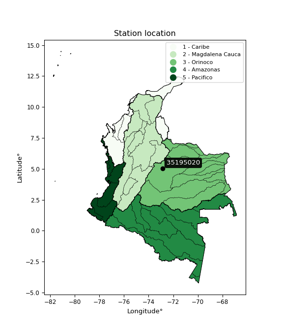

<div align="center">


</div>

# PMP Station (Rain, Pmax24h): 35195020

Probable Maximum Precipitation (PMP) is the greatest amount of rainfall for a specific duration that is meteorologically possible for a given location, acting as a "worst-case" scenario for extreme storms, crucial for designing safety-critical infrastructure like bridges, river deviations, dams, spillways, and nuclear plants to prevent catastrophic failure. PMP is calculated by hydrologists using meteorological data to determine the upper limit of extreme rainfall, often leading to the Probable Maximum Flood (PMF) for flood control design, and is increasingly being studied for climate change impacts. Probable Maximum Precipitation (PMP) is the theoretical upper limit of rainfall, a deterministic estimate for extreme events, while probability distributions (like GEV, Gumbel) describe the likelihood and frequency of various precipitation amounts, including rare ones, showing how often events occur, with PMP representing the extreme end of these distributions, used for critical infrastructure design to ensure safety against the worst conceivable weather, unlike standard statistical forecasts which cover typical probabilities.

The most common probability distributions in hydrology, used for analyzing floods, rainfall, and streamflow, include the Normal, Log-Normal, Gumbel, Gamma (including Log-Pearson Type III), and Generalized Extreme Value (GEV) distributions, often chosen based on the data´s skewness and whether modeling extremes or general conditions, with Gumbel and GEV popular for extreme events like floods, while the Normal distribution serves as a baseline, though often requiring transformations for skewed hydrological data. These distributions help in designing water infrastructure, managing water resources, and forecasting hydrologic events.

> Hydrological data often isn´t perfectly normal (it´s skewed), so different distributions are needed for different applications, such as: **Flood Frequency Analysis**: Using Gumbel, GEV, or Log-Pearson Type III for predicting extreme flood magnitudes and their return periods, **Rainfall Analysis**: Normal for annual totals, but Log-Normal, Weibull, or GEV for intensity or extreme daily rainfall, **Streamflow Modeling**: Gamma and Log-Normal for maximum flows, GEV for minimum flows, and Kappa for daily flows.

<div align="center">

</img>

</div>


## A. General information


### 1. General running parameters

• app_version: _v20260113_. • runtime: _2026-01-17 18:24:04.630693_. • Python version: _3.14.0_. • SciPy version: _1.16.3_. • Pandas version: _2.3.3_. • NumPy version: _2.3.5_. • Stations dataset (station_dataset_file): _dataset/pmax24h_in/automatic_colombia_2003_2025.csv_. • Stations catalog (station_catalog_file): _dataset/CNE.xls_. • Minimum year to eval til year_max (date_min): _1900_. • Maximum year to eval since year_min (date_max): _2025_. • Creates, save and include plots into reports (create_plot): _False_. • Plot only fit distributions with Δo > Δ (plot_only_fit): _True_. • Plot only simple graphs avoiding multiple CDFs and multiple Extreme values plots (plot_only_simple): _True_. • Eval low extreme values, if False, evaluates high extreme values (low_extreme): _False_. • Eval every SciPy distribution as logarithmic (pdist_logarithmic_on): _True_. • Standard deviation normalized (ddof): _1.0_. • Return periods to eval in years (Tr): _[2, 2.33, 5, 10, 15, 20, 25, 50, 75, 100, 200, 250, 500, 750, 1000]_. • Minimum data sample per station, 0 means any (minimum_sample): _5_. • Z-Score maximum threshold to adjust a value, 0 means disable (zscore_max): _3.5_. • Z-Score minimum threshold to adjust a value, 0 means disable (zscore_min): _-2.5_. • Avoid zeros, e.g. rain = 0 (avoid_zeros): _True_. • Avoid null values (avoid_nans): _True_. 

:file_folder:Table: [dataset.csv](../../dataset/pmax24h_in/automatic_colombia_2003_2025.csv)

> Delta Degrees of Freedom (DDOF): is a parameter used in the formulas for calculating variance and standard deviation. When ddof=0, the divisor is $N$ (the total number of observations) and this is used when your data set is the entire population. When ddof=1, the divisor is $N-1$ and this is used when your data set is a sample drawn from a larger population. Using $N-1$ provides an unbiased estimate of the population variance (known as Bessel´s correction).


### 2. Station info and location

|   id |   CODIGO | NOMBRE               | CATEGORIA              | TECNOLOGIA                | ESTADO   | FECHA_INSTALACION   |   FECHA_SUSPENSION |   ALTITUD |   LATITUD |   LONGITUD | DEPARTAMENTO   | MUNICIPIO   | AREA_OPERATIVA                              | ENTIDAD                                                     | AREA_HIDROGRAFICA   | ZONA_HIDROGRAFICA   | SUBZONA_HIDROGRAFICA             | CORRIENTE   | Catalogo   |   Version |
|-----:|---------:|:---------------------|:-----------------------|:--------------------------|:---------|:--------------------|-------------------:|----------:|----------:|-----------:|:---------------|:------------|:--------------------------------------------|:------------------------------------------------------------|:--------------------|:--------------------|:---------------------------------|:------------|:-----------|----------:|
|    0 | 35195020 | TAURAMENA [35195020] | Meteorológica Especial | Automática con Telemetría | Activa   | 15/11/1974          |                nan |       460 |   5.02726 |   -72.8698 | Casanare       | Tauramena   | Area Operativa 06 - Boyacá-Casanare-Vichada | INSTITUTO DE HIDROLOGIA METEOROLOGIA Y ESTUDIOS AMBIENTALES | Orinoco             | Meta                | Río Túa y otros directos al Meta | Sabandija   | CNE_IDEAM  |  20251226 |

<div align="center">

Dynamic map: [:earth_americas:Google](http://maps.google.com/maps?q=5.027257778,-72.869841667) [:earth_americas:OSM](https://www.openstreetmap.org/#map=18/5.027257778/-72.869841667&layers=P) [:earth_americas:Bing](https://www.bing.com/maps?cp=5.027257778~-72.869841667&lvl=18) [:earth_americas:Apple](https://maps.apple.com/frame?center=5.027257778%2C-72.869841667&span=0.003%2C0.006)

</div>


<div align="center">

```geojson
{
  "type": "Feature",
  "geometry": {
    "type": "Point", 
    "coordinates": [-72.869841667, 5.027257778]
  }, 
  "properties": {
    "Name": "35195020"
  }
}
```

</div>


### 3. Discrete values table and plot

<div align="center">

|               |           0 |          1 |           2 |           3 |           4 |
|:--------------|------------:|-----------:|------------:|------------:|------------:|
| Date          | 2021        | 2022       | 2023        | 2024        | 2025        |
| Value         |   18.014    |  837.745   |  760.68     |   11.958    |  117.8      |
| Value_initial |   18.014    |  837.745   |  760.68     |   11.958    |  117.8      |
| count         |    5        |    5       |    5        |    5        |    5        |
| mean          |  349.239    |  349.239   |  349.239    |  349.239    |  349.239    |
| std           |  413.81     |  413.81    |  413.81     |  413.81     |  413.81     |
| zscore        |   -0.800429 |    1.18051 |    0.994275 |   -0.815064 |   -0.559289 |


</div>


> The initial value (value_initial) correspond to the initial obtained or null completed value, and value (value) is adjusted only when the initial value is outside the valid range (outlier) definite through the Z-Score value. If Z-Score is active, values out of range or outliers are replaced with the station mean value. A Z-Score (or standard score) measures how many standard deviations a data point is from the mean of a dataset, indicating its relative position; positive scores mean above the mean, negative mean below, and a score of zero is exactly at the mean, allowing for comparison of values from different distributions. It´s calculated using the formula $z=(x–μ)/σ$, where $x$ is the data point, $μ$ is the mean, and $σ$ is the standard deviation, helping identify outliers and understand probability.
>
> <sub>**Note**: In this study, "completing" (filling gaps in) and "extending" (forecasting or lengthening the historical record) rainfall data series are avoided for certain critical analyses because they introduce artificial bias and uncertainty, which can distort the statistics of rare events (extremes), alter day-to-day variability, and compromise the integrity and homogeneity of the original data. Some reasons against Completing/Extending rainfall data are: **Distortion of Extremes and Variability**: The primary issue is that most gap-filling or extension methods rely on averaging or regression with nearby stations, which inherently smooths the data. Rainfall is highly variable in space and time, with a large percentage of zero values and occasional large storms. Infilling methods often underestimate the highest values and overestimate the lowest (zero) values, which severely distorts analyses focused on flood frequency, drought severity, and intensity-duration-frequency (IDF) curves, **Loss of Data Homogeneity**: Infilled or extended data are synthetic estimates, not actual measurements. Combining these estimates with observed data can violate the assumption of data homogeneity, which requires that the data properties do not change over time. Inhomogeneity can lead to incorrect conclusions about long-term trends or changes in climate patterns, **Propagation of Errors**: Errors and biases from the original data (e.g., wind-induced undercatch, instrument errors, site changes) or the data used for imputation can propagate through the analysis, leading to unreliable hydrological models and inaccurate predictions, **Compromised Statistical Integrity**: For statistical analyses, especially those involving the frequency of events, using artificial data can introduce time bias or autocorrelation that doesn´t exist in reality, making it difficult to assess the true probability of events, **Difficulty in Validation**: It is difficult to accurately validate the quality of filled or extended data, especially for past periods where ground-truth measurements are unavailable. The reliability of imputation techniques heavily depends on the density of the surrounding station network and the complexity of the local topography.</sub>


### 4. Active continuous probability distributions from SciPy (80 of 104 available)

A Probability Density Function (PDF) describes the relative likelihood of a continuous random variable falling within a specific range, where the total area under its curve equals 1, and the area over any interval gives the actual probability for that range. Unlike discrete probabilities (like rolling a die), a PDF shows density, not direct probability for a single point (which is zero), with higher points indicating higher likelihood, often visualized as a bell curve for normal distributions.

A log of a probability density function (log-PDF) is simply the logarithm of the PDF´s value, denoted as $log(f(x))$, useful for converting multiplication of probabilities into addition, improving numerical stability with tiny numbers, and connecting to information theory concepts like entropy. Instead of dealing with very small probabilities (e.g., 0.000001), log-PDFs use negative numbers (e.g., $log(0.00001) ≈ -11.51$ that are easier for computers to handle, preventing underflow errors and simplifying complex calculations. In this study, each active probability distribution from SciPy is also evaluated in the $log$ form.

[scipy.stats](https://docs.scipy.org/doc/scipy/reference/stats.html) is a Python´s powerful submodule within the SciPy library for comprehensive statistical analysis, offering over 130 probability distributions (like Normal, Poisson), functions for descriptive stats (mean, variance), hypothesis testing (t-tests, chi-square), random variable generation, and statistical tests, making it essential for data science, modeling, and research. It provides tools to explore, model, and draw conclusions from data efficiently, working seamlessly with NumPy.

<div align="center">

|   id | p_dist           |   n_parameter | fit_method   | label                                                                       | active   | ref                                                                                                      |
|-----:|:-----------------|--------------:|:-------------|:----------------------------------------------------------------------------|:---------|:---------------------------------------------------------------------------------------------------------|
|    0 | alpha            |             3 | MLE          | Alpha                                                                       | True     | [:mortar_board:](https://docs.scipy.org/doc/scipy/reference/generated/scipy.stats.alpha.html)            |
|    1 | anglit           |             2 | MM           | Anglit                                                                      | True     | [:mortar_board:](https://docs.scipy.org/doc/scipy/reference/generated/scipy.stats.anglit.html)           |
|    2 | arcsine          |             2 | MM           | Arcsine                                                                     | True     | [:mortar_board:](https://docs.scipy.org/doc/scipy/reference/generated/scipy.stats.arcsine.html)          |
|    3 | argus            |             3 | MLE          | Argus                                                                       | True     | [:mortar_board:](https://docs.scipy.org/doc/scipy/reference/generated/scipy.stats.argus.html)            |
|    4 | beta             |             4 | MLE          | Beta                                                                        | True     | [:mortar_board:](https://docs.scipy.org/doc/scipy/reference/generated/scipy.stats.beta.html)             |
|    5 | betaprime        |             4 | MLE          | Beta prime                                                                  | True     | [:mortar_board:](https://docs.scipy.org/doc/scipy/reference/generated/scipy.stats.betaprime.html)        |
|    6 | bradford         |             3 | MLE          | Bradford                                                                    | True     | [:mortar_board:](https://docs.scipy.org/doc/scipy/reference/generated/scipy.stats.bradford.html)         |
|    7 | burr             |             4 | MLE          | Burr (Type III)                                                             | True     | [:mortar_board:](https://docs.scipy.org/doc/scipy/reference/generated/scipy.stats.burr.html)             |
|    8 | burr12           |             4 | MLE          | Burr (Type III) 12                                                          | True     | [:mortar_board:](https://docs.scipy.org/doc/scipy/reference/generated/scipy.stats.burr12.html)           |
|    9 | cosine           |             2 | MLE          | Cosine                                                                      | True     | [:mortar_board:](https://docs.scipy.org/doc/scipy/reference/generated/scipy.stats.cosine.html)           |
|   10 | crystalball      |             4 | MLE          | Crystalball                                                                 | True     | [:mortar_board:](https://docs.scipy.org/doc/scipy/reference/generated/scipy.stats.crystalball.html)      |
|   11 | dgamma           |             3 | MLE          | Double gamma                                                                | True     | [:mortar_board:](https://docs.scipy.org/doc/scipy/reference/generated/scipy.stats.dgamma.html)           |
|   12 | dweibull         |             3 | MLE          | Double Weibull                                                              | True     | [:mortar_board:](https://docs.scipy.org/doc/scipy/reference/generated/scipy.stats.dweibull.html)         |
|   13 | erlang           |             3 | MLE          | Erlang                                                                      | True     | [:mortar_board:](https://docs.scipy.org/doc/scipy/reference/generated/scipy.stats.erlang.html)           |
|   14 | exponnorm        |             3 | MLE          | Exponentially modified Normal                                               | True     | [:mortar_board:](https://docs.scipy.org/doc/scipy/reference/generated/scipy.stats.exponnorm.html)        |
|   15 | exponpow         |             3 | MLE          | Exponential power                                                           | True     | [:mortar_board:](https://docs.scipy.org/doc/scipy/reference/generated/scipy.stats.exponpow.html)         |
|   16 | exponweib        |             4 | MLE          | Exponentiated Weibull                                                       | True     | [:mortar_board:](https://docs.scipy.org/doc/scipy/reference/generated/scipy.stats.exponweib.html)        |
|   17 | f                |             4 | MLE          | F                                                                           | True     | [:mortar_board:](https://docs.scipy.org/doc/scipy/reference/generated/scipy.stats.f.html)                |
|   18 | fatiguelife      |             3 | MLE          | Fatigue-life (Birnbaum-Saunders)                                            | True     | [:mortar_board:](https://docs.scipy.org/doc/scipy/reference/generated/scipy.stats.fatiguelife.html)      |
|   19 | foldnorm         |             3 | MM           | Fold Normal                                                                 | True     | [:mortar_board:](https://docs.scipy.org/doc/scipy/reference/generated/scipy.stats.foldnorm.html)         |
|   20 | gamma            |             3 | MLE          | Gamma                                                                       | True     | [:mortar_board:](https://docs.scipy.org/doc/scipy/reference/generated/scipy.stats.gamma.html)            |
|   21 | gausshyper       |             6 | MLE          | Gauss hypergeometric                                                        | True     | [:mortar_board:](https://docs.scipy.org/doc/scipy/reference/generated/scipy.stats.gausshyper.html)       |
|   22 | genexpon         |             5 | MLE          | Generalized exponential                                                     | True     | [:mortar_board:](https://docs.scipy.org/doc/scipy/reference/generated/scipy.stats.genexpon.html)         |
|   23 | genextreme       |             3 | MLE          | Generalized exponential                                                     | True     | [:mortar_board:](https://docs.scipy.org/doc/scipy/reference/generated/scipy.stats.genextreme.html)       |
|   24 | gengamma         |             4 | MLE          | Generalized gamma                                                           | True     | [:mortar_board:](https://docs.scipy.org/doc/scipy/reference/generated/scipy.stats.gengamma.html)         |
|   25 | genhalflogistic  |             3 | MLE          | Generalized half-logistic                                                   | True     | [:mortar_board:](https://docs.scipy.org/doc/scipy/reference/generated/scipy.stats.genhalflogistic.html)  |
|   26 | genlogistic      |             3 | MLE          | Generalized logistic                                                        | True     | [:mortar_board:](https://docs.scipy.org/doc/scipy/reference/generated/scipy.stats.genlogistic.html)      |
|   27 | gennorm          |             3 | MLE          | Generalized Normal                                                          | True     | [:mortar_board:](https://docs.scipy.org/doc/scipy/reference/generated/scipy.stats.gennorm.html)          |
|   28 | genpareto        |             3 | MLE          | Generalized Pareto                                                          | True     | [:mortar_board:](https://docs.scipy.org/doc/scipy/reference/generated/scipy.stats.genpareto.html)        |
|   29 | gompertz         |             3 | MLE          | Gompertz (or truncated Gumbel)                                              | True     | [:mortar_board:](https://docs.scipy.org/doc/scipy/reference/generated/scipy.stats.gompertz.html)         |
|   30 | gumbel_l         |             2 | MM           | Gumbel Left Skew                                                            | True     | [:mortar_board:](https://docs.scipy.org/doc/scipy/reference/generated/scipy.stats.gumbel_l.html)         |
|   31 | gumbel_r         |             2 | MM           | Gumbel Right Skew                                                           | True     | [:mortar_board:](https://docs.scipy.org/doc/scipy/reference/generated/scipy.stats.gumbel_r.html)         |
|   32 | halfgennorm      |             3 | MLE          | Upper half of a generalized normal                                          | True     | [:mortar_board:](https://docs.scipy.org/doc/scipy/reference/generated/scipy.stats.halfgennorm.html)      |
|   33 | halflogistic     |             2 | MM           | Half-logistic                                                               | True     | [:mortar_board:](https://docs.scipy.org/doc/scipy/reference/generated/scipy.stats.halflogistic.html)     |
|   34 | halfnorm         |             2 | MM           | Half Normal                                                                 | True     | [:mortar_board:](https://docs.scipy.org/doc/scipy/reference/generated/scipy.stats.halfnorm.html)         |
|   35 | hypsecant        |             2 | MM           | hyperbolic secant                                                           | True     | [:mortar_board:](https://docs.scipy.org/doc/scipy/reference/generated/scipy.stats.hypsecant.html)        |
|   36 | invgamma         |             3 | MLE          | Inverted gamma                                                              | True     | [:mortar_board:](https://docs.scipy.org/doc/scipy/reference/generated/scipy.stats.invgamma.html)         |
|   37 | invgauss         |             3 | MLE          | Inverse Gaussian                                                            | True     | [:mortar_board:](https://docs.scipy.org/doc/scipy/reference/generated/scipy.stats.invgauss.html)         |
|   38 | invweibull       |             3 | MLE          | Inverted Weibull                                                            | True     | [:mortar_board:](https://docs.scipy.org/doc/scipy/reference/generated/scipy.stats.invweibull.html)       |
|   39 | johnsonsb        |             4 | MLE          | Johnson SB                                                                  | True     | [:mortar_board:](https://docs.scipy.org/doc/scipy/reference/generated/scipy.stats.johnsonsb.html)        |
|   40 | johnsonsu        |             4 | MLE          | Johnson Su                                                                  | True     | [:mortar_board:](https://docs.scipy.org/doc/scipy/reference/generated/scipy.stats.johnsonsu.html)        |
|   41 | kappa3           |             3 | MLE          | Kappa 3                                                                     | True     | [:mortar_board:](https://docs.scipy.org/doc/scipy/reference/generated/scipy.stats.kappa3.html)           |
|   42 | kappa4           |             4 | MLE          | Kappa 4                                                                     | True     | [:mortar_board:](https://docs.scipy.org/doc/scipy/reference/generated/scipy.stats.kappa4.html)           |
|   43 | ksone            |             3 | MLE          | Kolmogorov-Smirnov one-sided test statistic distribution                    | True     | [:mortar_board:](https://docs.scipy.org/doc/scipy/reference/generated/scipy.stats.ksone.html)            |
|   44 | kstwobign        |             2 | MLE          | Limiting distribution of scaled Kolmogorov-Smirnov two-sided test statistic | True     | [:mortar_board:](https://docs.scipy.org/doc/scipy/reference/generated/scipy.stats.kstwobign.html)        |
|   45 | laplace          |             2 | MM           | Laplace                                                                     | True     | [:mortar_board:](https://docs.scipy.org/doc/scipy/reference/generated/scipy.stats.laplace.html)          |
|   46 | levy_l           |             2 | MLE          | Left-skewed Levy                                                            | True     | [:mortar_board:](https://docs.scipy.org/doc/scipy/reference/generated/scipy.stats.levy_l.html)           |
|   47 | loggamma         |             3 | MLE          | Log gamma                                                                   | True     | [:mortar_board:](https://docs.scipy.org/doc/scipy/reference/generated/scipy.stats.loggamma.html)         |
|   48 | logistic         |             2 | MM           | Logistic (or Sech-squared)                                                  | True     | [:mortar_board:](https://docs.scipy.org/doc/scipy/reference/generated/scipy.stats.logistic.html)         |
|   49 | loglaplace       |             3 | MLE          | Log-Laplace                                                                 | True     | [:mortar_board:](https://docs.scipy.org/doc/scipy/reference/generated/scipy.stats.loglaplace.html)       |
|   50 | lomax            |             3 | MLE          | Lomax (Pareto of the second kind)                                           | True     | [:mortar_board:](https://docs.scipy.org/doc/scipy/reference/generated/scipy.stats.lomax.html)            |
|   51 | maxwell          |             2 | MM           | Maxwell                                                                     | True     | [:mortar_board:](https://docs.scipy.org/doc/scipy/reference/generated/scipy.stats.maxwell.html)          |
|   52 | mielke           |             4 | MLE          | Mielke Beta-Kappa / Dagum                                                   | True     | [:mortar_board:](https://docs.scipy.org/doc/scipy/reference/generated/scipy.stats.mielke.html)           |
|   53 | moyal            |             2 | MM           | Moyal                                                                       | True     | [:mortar_board:](https://docs.scipy.org/doc/scipy/reference/generated/scipy.stats.moyal.html)            |
|   54 | nakagami         |             3 | MLE          | Nakagami                                                                    | True     | [:mortar_board:](https://docs.scipy.org/doc/scipy/reference/generated/scipy.stats.nakagami.html)         |
|   55 | ncf              |             5 | MLE          | Non-central F distribution                                                  | True     | [:mortar_board:](https://docs.scipy.org/doc/scipy/reference/generated/scipy.stats.ncf.html)              |
|   56 | nct              |             4 | MLE          | Non-central Student’s t                                                     | True     | [:mortar_board:](https://docs.scipy.org/doc/scipy/reference/generated/scipy.stats.nct.html)              |
|   57 | norm             |             2 | MM           | Normal                                                                      | True     | [:mortar_board:](https://docs.scipy.org/doc/scipy/reference/generated/scipy.stats.norm.html)             |
|   58 | pearson3         |             3 | MM           | Pearson type III                                                            | True     | [:mortar_board:](https://docs.scipy.org/doc/scipy/reference/generated/scipy.stats.pearson3.html)         |
|   59 | powerlaw         |             3 | MLE          | Power-function                                                              | True     | [:mortar_board:](https://docs.scipy.org/doc/scipy/reference/generated/scipy.stats.powerlaw.html)         |
|   60 | rayleigh         |             2 | MM           | Rayleigh                                                                    | True     | [:mortar_board:](https://docs.scipy.org/doc/scipy/reference/generated/scipy.stats.rayleigh.html)         |
|   61 | rdist            |             3 | MLE          | R-distributed (symmetric beta)                                              | True     | [:mortar_board:](https://docs.scipy.org/doc/scipy/reference/generated/scipy.stats.rdist.html)            |
|   62 | rice             |             3 | MLE          | Rice                                                                        | True     | [:mortar_board:](https://docs.scipy.org/doc/scipy/reference/generated/scipy.stats.rice.html)             |
|   63 | semicircular     |             2 | MM           | Semicircular                                                                | True     | [:mortar_board:](https://docs.scipy.org/doc/scipy/reference/generated/scipy.stats.semicircular.html)     |
|   64 | skewnorm         |             3 | MLE          | Skew normal                                                                 | True     | [:mortar_board:](https://docs.scipy.org/doc/scipy/reference/generated/scipy.stats.skewnorm.html)         |
|   65 | t                |             3 | MLE          | Student’s t                                                                 | True     | [:mortar_board:](https://docs.scipy.org/doc/scipy/reference/generated/scipy.stats.t.html)                |
|   66 | trapezoid        |             4 | MLE          | Trapezoid                                                                   | True     | [:mortar_board:](https://docs.scipy.org/doc/scipy/reference/generated/scipy.stats.trapezoid.html)        |
|   67 | triang           |             3 | MLE          | Triangular                                                                  | True     | [:mortar_board:](https://docs.scipy.org/doc/scipy/reference/generated/scipy.stats.triang.html)           |
|   68 | truncexpon       |             3 | MLE          | Truncated exponential                                                       | True     | [:mortar_board:](https://docs.scipy.org/doc/scipy/reference/generated/scipy.stats.truncexpon.html)       |
|   69 | truncnorm        |             4 | MLE          | Truncated normal                                                            | True     | [:mortar_board:](https://docs.scipy.org/doc/scipy/reference/generated/scipy.stats.truncnorm.html)        |
|   70 | truncpareto      |             4 | MLE          | Upper truncated Pareto                                                      | True     | [:mortar_board:](https://docs.scipy.org/doc/scipy/reference/generated/scipy.stats.truncpareto.html)      |
|   71 | truncweibull_min |             5 | MLE          | Doubly truncated Weibull minimum                                            | True     | [:mortar_board:](https://docs.scipy.org/doc/scipy/reference/generated/scipy.stats.truncweibull_min.html) |
|   72 | tukeylambda      |             3 | MLE          | Tukey-Lamdba                                                                | True     | [:mortar_board:](https://docs.scipy.org/doc/scipy/reference/generated/scipy.stats.tukeylambda.html)      |
|   73 | uniform          |             2 | MLE          | Uniform                                                                     | True     | [:mortar_board:](https://docs.scipy.org/doc/scipy/reference/generated/scipy.stats.uniform.html)          |
|   74 | vonmises         |             3 | MLE          | Von Mises                                                                   | True     | [:mortar_board:](https://docs.scipy.org/doc/scipy/reference/generated/scipy.stats.vonmises.html)         |
|   75 | vonmises_line    |             3 | MLE          | Von Mises line                                                              | True     | [:mortar_board:](https://docs.scipy.org/doc/scipy/reference/generated/scipy.stats.vonmises_line.html)    |
|   76 | wald             |             2 | MM           | Wald                                                                        | True     | [:mortar_board:](https://docs.scipy.org/doc/scipy/reference/generated/scipy.stats.wald.html)             |
|   77 | weibull_max      |             3 | MLE          | Weibull maximum                                                             | True     | [:mortar_board:](https://docs.scipy.org/doc/scipy/reference/generated/scipy.stats.weibull_max.html)      |
|   78 | weibull_min      |             3 | MLE          | Weibull minimum                                                             | True     | [:mortar_board:](https://docs.scipy.org/doc/scipy/reference/generated/scipy.stats.weibull_min.html)      |
|   79 | wrapcauchy       |             3 | MLE          | Wrapped  Cauchy                                                             | True     | [:mortar_board:](https://docs.scipy.org/doc/scipy/reference/generated/scipy.stats.wrapcauchy.html)       |

</div>

> **n_parameter:** # arguments & localization & scale.
>
> **Fit methods:** (MLE) maximum likelihood, (MM) L-moments.
>
>**Inactive** (With the only purpose of prevent loops, zero divisions, infinite values, over high estimated values or horizontal trending for recurrence intervals estimations, the follow distributions were disabled.)**:** lognorm, norminvgauss, powernorm, powerlognorm, cauchy, halfcauchy, foldcauchy, skewcauchy, chi2, expon, fisk, genhyperbolic, geninvgauss, gibrat, kstwo, laplace_asymmetric, levy, levy_stable, ncx2, pareto, rel_breitwigner, recipinvgauss, studentized_range, loguniform, 


## B. Probability (PDF) vs. Empirical (EDF) distributions functions

A continuous probability distribution (CPD) describes probabilities for variables that can take any value within a range (like rain any time), unlike discrete variables with specific outcomes (like temperature). It uses a Probability Density Function (PDF), a curve where the total area under it equals 1, and the probability of the variable falling within an interval (a to b) is found by calculating the area under the curve between those points. A key feature is that the probability of hitting any single exact value is zero, so probabilities are always expressed for ranges, e.g., $P(a ≤ X ≤ b)$.

<div align="center">

Distributions parameters from station values
|     |   station | p_dist              |   n |               loc |            scale | shape                  | shape1                | shape2                | shape3             |
|----:|----------:|:--------------------|----:|------------------:|-----------------:|:-----------------------|:----------------------|:----------------------|:-------------------|
|   0 |  35195020 | alpha               |   5 |      -0.0519057   |     22.2917      | 1.3801421561574423e-10 |                       |                       |                    |
|   1 |  35195020 | anglit              |   5 |     349.239       |   1082.76        |                        |                       |                       |                    |
|   2 |  35195020 | arcsine             |   5 |    -174.193       |   1046.87        |                        |                       |                       |                    |
|   3 |  35195020 | argus               |   5 |    -366.507       |   1293.66        | 4.425066628104233e-07  |                       |                       |                    |
|   4 |  35195020 | beta                |   5 |     -72.3446      |    910.09        | 0.03637188728568198    | 0.05194243262644292   |                       |                    |
|   5 |  35195020 | betaprime           |   5 |       0.0215439   |      0.601025    | 29.756960237684495     | 0.5277118248432029    |                       |                    |
|   6 |  35195020 | bradford            |   5 |    -224.237       |   1061.98        | 2.85362447730281e-08   |                       |                       |                    |
|   7 |  35195020 | burr                |   5 |      -0.143527    |      0.204449    | 0.6504592429784496     | 34.321279807864485    |                       |                    |
|   8 |  35195020 | burr12              |   5 |       0.158154    |     11.4975      | 165.5123141351633      | 0.0026799943203495383 |                       |                    |
|   9 |  35195020 | cosine              |   5 |     368.341       |    287.179       |                        |                       |                       |                    |
|  10 |  35195020 | crystalball         |   5 |      -0.300029    |    508.991       | 4.613221590918938      | 2.275732360777557     |                       |                    |
|  11 |  35195020 | dgamma              |   5 |     425.706       |      5.6178      | 66.8004894315107       |                       |                       |                    |
|  12 |  35195020 | dweibull            |   5 |     422.696       |    393.846       | 11.250497715983386     |                       |                       |                    |
|  13 |  35195020 | erlang              |   5 |      11.958       |    313.178       | 0.39171552516800934    |                       |                       |                    |
|  14 |  35195020 | exponnorm           |   5 |      11.6089      |      0.105916    | 3172.0535008865527     |                       |                       |                    |
|  15 |  35195020 | exponpow            |   5 |      11.958       |    410.363       | 0.11603495438547773    |                       |                       |                    |
|  16 |  35195020 | exponweib           |   5 |      11.958       |    938.774       | 0.10335172517042464    | 0.992080245489432     |                       |                    |
|  17 |  35195020 | f                   |   5 |      11.958       |      1.04158e-06 | 2360.463164590786      | 0.32337745969711196   |                       |                    |
|  18 |  35195020 | fatiguelife         |   5 |      11.958       |      2.24203e-05 | 3301.5925080910947     |                       |                       |                    |
|  19 |  35195020 | foldnorm            |   5 |    -293.065       |    406.865       | 1.523068402326278      |                       |                       |                    |
|  20 |  35195020 | gamma               |   5 |      11.958       |    216.347       | 0.3656287774297029     |                       |                       |                    |
|  21 |  35195020 | gausshyper          |   5 |    -226.412       |   1064.16        | 1.1786824295938936     | 0.8556666164364923    | 1.0240297403003398    | 0.9998467911778727 |
|  22 |  35195020 | genexpon            |   5 |      11.958       |    876.333       | 2.598222938961504      | 1.7869039922851973    | 5.308272328514903e-12 |                    |
|  23 |  35195020 | genextreme          |   5 |      14.7513      |     17.7476      | -6.353701708756789     |                       |                       |                    |
|  24 |  35195020 | gengamma            |   5 |      11.958       |    132.161       | 0.7467711174209476     | 0.637156629586603     |                       |                    |
|  25 |  35195020 | genhalflogistic     |   5 |    -465.38        |   1846.66        | 1.4171030726452312     |                       |                       |                    |
|  26 |  35195020 | genlogistic         |   5 |   -1799.04        |    276.374       | 1260.5727638869157     |                       |                       |                    |
|  27 |  35195020 | gennorm             |   5 |     117.775       |      1.37652e-06 | 0.11888337745595265    |                       |                       |                    |
|  28 |  35195020 | genpareto           |   5 |      11.958       |      1.80411e-08 | 7.757238727525536      |                       |                       |                    |
|  29 |  35195020 | gompertz            |   5 |      11.958       |   1000.28        | 1.8659803058353237     |                       |                       |                    |
|  30 |  35195020 | gumbel_l            |   5 |     515.814       |    288.584       |                        |                       |                       |                    |
|  31 |  35195020 | gumbel_r            |   5 |     182.664       |    288.584       |                        |                       |                       |                    |
|  32 |  35195020 | halfgennorm         |   5 |      11.958       |      0.0170365   | 0.19676805493780428    |                       |                       |                    |
|  33 |  35195020 | halflogistic        |   5 |     -89.4421      |    316.442       |                        |                       |                       |                    |
|  34 |  35195020 | halfnorm            |   5 |    -140.658       |    613.995       |                        |                       |                       |                    |
|  35 |  35195020 | hypsecant           |   5 |     349.239       |    235.627       |                        |                       |                       |                    |
|  36 |  35195020 | invgamma            |   5 |      11.958       |      6.28885e-11 | 0.24167186880371105    |                       |                       |                    |
|  37 |  35195020 | invgauss            |   5 |       8.60314     |     12.4579      | 27.342902795936773     |                       |                       |                    |
|  38 |  35195020 | invweibull          |   5 |      11.958       |      8.83062     | 0.04068851414812161    |                       |                       |                    |
|  39 |  35195020 | johnsonsb           |   5 |      11.958       |   3295.22        | 1.9993415905816478     | 0.09720367590571055   |                       |                    |
|  40 |  35195020 | johnsonsu           |   5 |       1.74307e+06 |  18126.1         | 24779.426295145997     | 4711.78860385975      |                       |                    |
|  41 |  35195020 | kappa3              |   5 |      11.958       |     19.836       | 0.053349983474224      |                       |                       |                    |
|  42 |  35195020 | kappa4              |   5 |    -246.39        |   1122.78        | 1.2984791690192028     | 0.9920332799769425    |                       |                    |
|  43 |  35195020 | ksone               |   5 |    -291.832       |   1282.14        | 1.0                    |                       |                       |                    |
|  44 |  35195020 | kstwobign           |   5 |    -762.151       |   1269.22        |                        |                       |                       |                    |
|  45 |  35195020 | laplace             |   5 |     349.239       |    261.716       |                        |                       |                       |                    |
|  46 |  35195020 | levy_l              |   5 |     861.99        |     91.205       |                        |                       |                       |                    |
|  47 |  35195020 | loggamma            |   5 |  -93914.6         |  13214.6         | 1253.3309065336434     |                       |                       |                    |
|  48 |  35195020 | logistic            |   5 |     349.239       |    204.059       |                        |                       |                       |                    |
|  49 |  35195020 | loglaplace          |   5 |      -0.342195    |    118.142       | 0.6292181166160948     |                       |                       |                    |
|  50 |  35195020 | lomax               |   5 |      11.958       |      7.76202     | 0.495635642050245      |                       |                       |                    |
|  51 |  35195020 | maxwell             |   5 |    -527.796       |    549.601       |                        |                       |                       |                    |
|  52 |  35195020 | mielke              |   5 |      -0.0697518   |      0.0261387   | 78.5393031661354       | 0.6435355420609583    |                       |                    |
|  53 |  35195020 | moyal               |   5 |     137.579       |    166.614       |                        |                       |                       |                    |
|  54 |  35195020 | nakagami            |   5 |      11.958       |    797.718       | 0.047777489650324294   |                       |                       |                    |
|  55 |  35195020 | ncf                 |   5 |      -0.392828    |      0.000320471 | 0.000784453720673664   | 1.0717534165349867    | 86.30118971663933     |                    |
|  56 |  35195020 | nct                 |   5 |      11.9571      |      0.000303295 | 0.236949474668453      | 4.599383457486784     |                       |                    |
|  57 |  35195020 | norm                |   5 |     349.239       |    370.123       |                        |                       |                       |                    |
|  58 |  35195020 | pearson3            |   5 |     349.239       |    370.123       | 0.3909862685454326     |                       |                       |                    |
|  59 |  35195020 | powerlaw            |   5 |      11.958       |    825.787       | 0.10471600103513458    |                       |                       |                    |
|  60 |  35195020 | rayleigh            |   5 |    -358.827       |    564.955       |                        |                       |                       |                    |
|  61 |  35195020 | rdist               |   5 |     374.404       |    463.341       | 1.0609294835756002     |                       |                       |                    |
|  62 |  35195020 | rice                |   5 |    -253.423       |    500.095       | 0.003177511869345784   |                       |                       |                    |
|  63 |  35195020 | semicircular        |   5 |     349.239       |    740.246       |                        |                       |                       |                    |
|  64 |  35195020 | skewnorm            |   5 |      11.9575      |    500.651       | 5214079.473884694      |                       |                       |                    |
|  65 |  35195020 | t                   |   5 |      16.1109      |      5.9366      | 0.281774067112333      |                       |                       |                    |
|  66 |  35195020 | trapezoid           |   5 |    -732.507       |   1570.3         | 1.0                    | 1.0                   |                       |                    |
|  67 |  35195020 | triang              |   5 |    -732.53        |   1570.27        | 0.999999908689154      |                       |                       |                    |
|  68 |  35195020 | truncexpon          |   5 |      11.9491      |   1112.35        | 0.7423866790821594     |                       |                       |                    |
|  69 |  35195020 | truncnorm           |   5 |  -54022           |   4518.09        | 11.95948376843172      | 1581.4743187370636    |                       |                    |
|  70 |  35195020 | truncpareto         |   5 |      -3.43597e+10 |      3.43597e+10 | 101872617.46758564     | 1.0000000240335658    |                       |                    |
|  71 |  35195020 | truncweibull_min    |   5 |    -119.995       |   1065.38        | 1.1951543555940853     | 0.009453533642091401  | 0.8989664588635389    |                    |
|  72 |  35195020 | tukeylambda         |   5 |     424.852       |    466.068       | 1.1287847741069048     |                       |                       |                    |
|  73 |  35195020 | uniform             |   5 |      11.958       |    825.787       |                        |                       |                       |                    |
|  74 |  35195020 | vonmises            |   5 |      -0.498141    |      1           | 0.9666450861571043     |                       |                       |                    |
|  75 |  35195020 | vonmises_line       |   5 |     294.761       |    172.837       | 2.8021514681184632e-08 |                       |                       |                    |
|  76 |  35195020 | wald                |   5 |     -20.8834      |    370.123       |                        |                       |                       |                    |
|  77 |  35195020 | weibull_max         |   5 |     837.745       |      1.68102     | 0.14144610450578932    |                       |                       |                    |
|  78 |  35195020 | weibull_min         |   5 |      11.958       |    375.91        | 0.4280753381390593     |                       |                       |                    |
|  79 |  35195020 | wrapcauchy          |   5 |      11.958       |    131.429       | 0.9556450841960984     |                       |                       |                    |
|  80 |  35195020 | logalpha            |   5 |     -18.4447      |    293.376       | 12.757208686557075     |                       |                       |                    |
|  81 |  35195020 | loganglit           |   5 |       4.70129     |      5.24354     |                        |                       |                       |                    |
|  82 |  35195020 | logarcsine          |   5 |       2.16643     |      5.06973     |                        |                       |                       |                    |
|  83 |  35195020 | logargus            |   5 |       0.757388    |      6.35957     | 1.3461496627109952     |                       |                       |                    |
|  84 |  35195020 | logbeta             |   5 |       2.47835     |      4.25237     | 0.24469741387555274    | 0.24570131241970639   |                       |                    |
|  85 |  35195020 | logbetaprime        |   5 |       1.30538     |     37.3554      | 3.017605506717831      | 34.65055641229789     |                       |                    |
|  86 |  35195020 | logbradford         |   5 |       2.48128     |      4.24943     | 3.8496241107887675e-05 |                       |                       |                    |
|  87 |  35195020 | logburr             |   5 |      -0.428065    |      0.394613    | 2.9381813658150335     | 887.9413887374221     |                       |                    |
|  88 |  35195020 | logburr12           |   5 |       2.4814      |     27.1976      | 0.6411966514341777     | 5.540068028009205     |                       |                    |
|  89 |  35195020 | logcosine           |   5 |       4.68947     |      1.40106     |                        |                       |                       |                    |
|  90 |  35195020 | logcrystalball      |   5 |       4.70129     |      1.79242     | 8.097793562207952      | 20.536575040677945    |                       |                    |
|  91 |  35195020 | logdgamma           |   5 |       4.07618     |      0.38592     | 4.501022382190016      |                       |                       |                    |
|  92 |  35195020 | logdweibull         |   5 |       4.23888     |      1.91854     | 2.6227486404282105     |                       |                       |                    |
|  93 |  35195020 | logerlang           |   5 |     -82.197       |      0.0370038   | 2348.364618862596      |                       |                       |                    |
|  94 |  35195020 | logexponnorm        |   5 |       4.69896     |      1.79242     | 0.0013063279719936725  |                       |                       |                    |
|  95 |  35195020 | logexponpow         |   5 |       2.4814      |      3.7479      | 0.379353695829022      |                       |                       |                    |
|  96 |  35195020 | logexponweib        |   5 |       2.4814      |      1.29349     | 1.2424316102206943     | 0.11578786354890806   |                       |                    |
|  97 |  35195020 | logf                |   5 |       2.4814      |      2.41303     | 1.2547193381700024     | 1014.0398328734316    |                       |                    |
|  98 |  35195020 | logfatiguelife      |   5 |       2.4814      |      3.63638e-08 | 5721.082382949913      |                       |                       |                    |
|  99 |  35195020 | logfoldnorm         |   5 |      -6.09754     |      1.78562     | 6.048501862253062      |                       |                       |                    |
| 100 |  35195020 | loggamma            |   5 |     -84.0748      |      0.0362311   | 2450.248954536317      |                       |                       |                    |
| 101 |  35195020 | loggausshyper       |   5 |       2.44842     |      4.2823      | 1.1541766455751956     | 0.885362044781534     | 1.058070440195689     | 0.992621042693759  |
| 102 |  35195020 | loggenexpon         |   5 |       2.4814      |      1.77972     | 0.6731782803859492     | 0.9676824840756908    | 0.13621612902295444   |                    |
| 103 |  35195020 | loggenextreme       |   5 |       4.95498     |      2.22911     | 1.2553172884211323     |                       |                       |                    |
| 104 |  35195020 | loggengamma         |   5 |       2.4814      |      1.41537     | 1.120621207782841      | 0.12611656160597537   |                       |                    |
| 105 |  35195020 | loggenhalflogistic  |   5 |       0.751218    |      6.30289     | 1.0540843620969613     |                       |                       |                    |
| 106 |  35195020 | loggenlogistic      |   5 |      -6.6159      |      1.55935     | 800.8262884240658      |                       |                       |                    |
| 107 |  35195020 | loggennorm          |   5 |       4.60606     |      2.12467     | 1906340.2569577512     |                       |                       |                    |
| 108 |  35195020 | loggenpareto        |   5 |      -0.0212679   |     15.1531      | -2.244245305741318     |                       |                       |                    |
| 109 |  35195020 | loggompertz         |   5 |       2.4814      |      3.78156     | 0.9953195654140413     |                       |                       |                    |
| 110 |  35195020 | loggumbel_l         |   5 |       5.50798     |      1.39754     |                        |                       |                       |                    |
| 111 |  35195020 | loggumbel_r         |   5 |       3.89461     |      1.39754     |                        |                       |                       |                    |
| 112 |  35195020 | loghalfgennorm      |   5 |       2.4814      |      1.05185     | 0.6735338425084587     |                       |                       |                    |
| 113 |  35195020 | loghalflogistic     |   5 |       2.57689     |      1.53244     |                        |                       |                       |                    |
| 114 |  35195020 | loghalfnorm         |   5 |       2.32883     |      2.97344     |                        |                       |                       |                    |
| 115 |  35195020 | loghypsecant        |   5 |       4.70129     |      1.14109     |                        |                       |                       |                    |
| 116 |  35195020 | loginvgamma         |   5 |     -10.4301      |   1040.31        | 69.77002887001697      |                       |                       |                    |
| 117 |  35195020 | loginvgauss         |   5 |       2.00243     |      2.32639     | 1.1601137290458343     |                       |                       |                    |
| 118 |  35195020 | loginvweibull       |   5 | -190551           | 190555           | 122502.29977264156     |                       |                       |                    |
| 119 |  35195020 | logjohnsonsb        |   5 |       2.4814      |      8.56907     | 1.6445364766151847     | 0.0900736180620634    |                       |                    |
| 120 |  35195020 | logjohnsonsu        |   5 |       6.73071     |      4.25844e-16 | 2.7169432492289762     | 0.11840543462731704   |                       |                    |
| 121 |  35195020 | logkappa3           |   5 |       2.4814      |      4.24535     | 1726.6232663922292     |                       |                       |                    |
| 122 |  35195020 | logkappa4           |   5 |       1.78938     |      4.99924     | 1.160818582263414      | 1.0112899652356757    |                       |                    |
| 123 |  35195020 | logksone            |   5 |       1.59673     |      6.20913     | 1.0                    |                       |                       |                    |
| 124 |  35195020 | logkstwobign        |   5 |      -1.44971     |      6.99925     |                        |                       |                       |                    |
| 125 |  35195020 | loglaplace          |   5 |       4.70129     |      1.26743     |                        |                       |                       |                    |
| 126 |  35195020 | loglevy_l           |   5 |       6.77385     |      0.159569    |                        |                       |                       |                    |
| 127 |  35195020 | logloggamma         |   5 |       6.73096     |      2.11334e-05 | 1.0489361111440511e-05 |                       |                       |                    |
| 128 |  35195020 | loglogistic         |   5 |       4.70129     |      0.988213    |                        |                       |                       |                    |
| 129 |  35195020 | logloglaplace       |   5 |      -0.00121489  |      4.7702      | 2.735448134699145      |                       |                       |                    |
| 130 |  35195020 | loglomax            |   5 |       2.4814      |     35.3824      | 16.333221719830036     |                       |                       |                    |
| 131 |  35195020 | logmaxwell          |   5 |       0.454009    |      2.66159     |                        |                       |                       |                    |
| 132 |  35195020 | logmielke           |   5 |    -114.422       |    109.768       | 21765.026772566227     | 76.27738017152225     |                       |                    |
| 133 |  35195020 | logmoyal            |   5 |       3.67627     |      0.806873    |                        |                       |                       |                    |
| 134 |  35195020 | lognakagami         |   5 |       2.4814      |      3.11876     | 0.05714671259209024    |                       |                       |                    |
| 135 |  35195020 | logncf              |   5 |      -0.382399    |      3.39031     | 13.939328914510675     | 344.9152753383237     | 6.85117402289184      |                    |
| 136 |  35195020 | lognct              |   5 |     100.876       |      1.76708     | 51403.42763473457      | -54.424710042150565   |                       |                    |
| 137 |  35195020 | lognorm             |   5 |       4.70129     |      1.79242     |                        |                       |                       |                    |
| 138 |  35195020 | logpearson3         |   5 |       4.70129     |      1.79242     | -0.04482606022798939   |                       |                       |                    |
| 139 |  35195020 | logpowerlaw         |   5 |       2.4814      |      4.24931     | 0.12569615789256203    |                       |                       |                    |
| 140 |  35195020 | lograyleigh         |   5 |       1.27229     |      2.73595     |                        |                       |                       |                    |
| 141 |  35195020 | logrdist            |   5 |       4.60606     |      2.12466     | 1.1240120767390405     |                       |                       |                    |
| 142 |  35195020 | logrice             |   5 |       1.40923     |      2.21067     | 0.9354489148220764     |                       |                       |                    |
| 143 |  35195020 | logsemicircular     |   5 |       4.70129     |      3.58484     |                        |                       |                       |                    |
| 144 |  35195020 | logskewnorm         |   5 |       4.91664     |      1.80531     | -0.15119912388763096   |                       |                       |                    |
| 145 |  35195020 | logt                |   5 |       4.70129     |      1.79242     | 482548774.50565326     |                       |                       |                    |
| 146 |  35195020 | logtrapezoid        |   5 |      -0.386859    |      7.6046      | 1.0                    | 1.0                   |                       |                    |
| 147 |  35195020 | logtriang           |   5 |      -0.363275    |      7.09406     | 0.9999913928126795     |                       |                       |                    |
| 148 |  35195020 | logtruncexpon       |   5 |       2.48053     |      4.76358     | 0.8922255915383952     |                       |                       |                    |
| 149 |  35195020 | logtruncnorm        |   5 |       1.01403     |      4.18016     | 0.35101812015456857    | 1.3675789988394977    |                       |                    |
| 150 |  35195020 | logtruncpareto      |   5 |       2.4611      |      0.0203052   | 0.2708531600075294     | 210.27194993185583    |                       |                    |
| 151 |  35195020 | logtruncweibull_min |   5 |       2.47755     |      3.98749     | 0.7808222822333697     | 0.00069600158349005   | 1.066627638973451     |                    |
| 152 |  35195020 | logtukeylambda      |   5 |       4.60605     |      2.53697     | 1.1940576237152216     |                       |                       |                    |
| 153 |  35195020 | loguniform          |   5 |       2.4814      |      4.24931     |                        |                       |                       |                    |
| 154 |  35195020 | logvonmises         |   5 |       1.35755     |      1           | 0.2639198716139056     |                       |                       |                    |
| 155 |  35195020 | logvonmises_line    |   5 |       4.60606     |      0.676302    | 0.13912932355577723    |                       |                       |                    |
| 156 |  35195020 | logwald             |   5 |       2.90893     |      1.79238     |                        |                       |                       |                    |
| 157 |  35195020 | logweibull_max      |   5 |       6.73071     |      1.5931      | 0.46980573943692794    |                       |                       |                    |
| 158 |  35195020 | logweibull_min      |   5 |       2.4814      |      3.45115     | 0.36362569634159125    |                       |                       |                    |
| 159 |  35195020 | logwrapcauchy       |   5 |       2.4814      |      0.676299    | 0.8750358006938264     |                       |                       |                    |

</div>

> **loc** (Location parameter): This shifts the distribution along the x-axis. For many common distributions, like the normal (Gaussian) distribution, loc represents the mean $μ$. For others, like the uniform distribution, it might represent the minimum value, or for the beta distribution, the left end of the support interval.
>
> **scale** (Scale parameter): This determines the width or spread of the distribution. For the normal distribution, scale represents the standard deviation $σ$. For a uniform distribution, it defines the length of the interval (from $loc$ to $loc + scale$).
>
> **shape** (Shape parameters): Refers to parameters that define the specific form of a probability distribution, distinct from its location (loc) and scale (scale). These parameters are required arguments for most distribution functions. For example, a normal (Gaussian) distribution is fully defined by its location (mean) and scale (standard deviation), so it has no specific shape parameters beyond loc and scale. However, other distributions have intrinsic properties that need specification, as Gamma distribution that takes a shape parameter, often named $a$ or $alpha$.


### 0. Cumulative distribution values - CDF (160 evaluated)

Cumulative Distribution Function (CDF), denoted as $F$<sub>$X$</sub>$(x)$, is a function that gives the probability that a random variable $X$ will take a value less than or equal to a specific value, $x$ (i.e., $(P(X≥x)$. It essentially "accumulates" probabilities from a given point up to the far right (positive infinity), providing a complete picture of the distribution´s probabilities for both discrete (like rain) and continuous (like temperature) variables, helping to find probabilities over ranges or above certain values. Each station is evaluated separately ordering the $x$ values ascending, calculating the CDF and PDF values for the activated distributions and their logarithmic forms.

<div align="center">

CDF ordered by x ascending and calculating $log(f(x))$ separately
|   id |   Station |   date |       x |   count |    mean |    std |    zscore |   Value_initial |   station |   m |     alpha |   alpha_pdf |   anglit |   anglit_pdf |   arcsine |   arcsine_pdf |    argus |   argus_pdf |     beta |    beta_pdf |   betaprime |   betaprime_pdf |   bradford |   bradford_pdf |      burr |    burr_pdf |    burr12 |   burr12_pdf |   cosine |   cosine_pdf |   crystalball |   crystalball_pdf |    dgamma |   dgamma_pdf |   dweibull |   dweibull_pdf |      erlang |   erlang_pdf |   exponnorm |   exponnorm_pdf |   exponpow |   exponpow_pdf |   exponweib |   exponweib_pdf |        f |            f_pdf |   fatiguelife |   fatiguelife_pdf |   foldnorm |   foldnorm_pdf |       gamma |   gamma_pdf |   gausshyper |   gausshyper_pdf |    genexpon |   genexpon_pdf |   genextreme |   genextreme_pdf |    gengamma |   gengamma_pdf |   genhalflogistic |   genhalflogistic_pdf |   genlogistic |   genlogistic_pdf |   gennorm |   gennorm_pdf |   genpareto |   genpareto_pdf |    gompertz |   gompertz_pdf |   gumbel_l |   gumbel_l_pdf |   gumbel_r |   gumbel_r_pdf |   halfgennorm |   halfgennorm_pdf |   halflogistic |   halflogistic_pdf |   halfnorm |   halfnorm_pdf |   hypsecant |   hypsecant_pdf |   invgamma |   invgamma_pdf |   invgauss |   invgauss_pdf |   invweibull |   invweibull_pdf |   johnsonsb |   johnsonsb_pdf |   johnsonsu |   johnsonsu_pdf |     kappa3 |   kappa3_pdf |      kappa4 |   kappa4_pdf |    ksone |   ksone_pdf |   kstwobign |   kstwobign_pdf |   laplace |   laplace_pdf |   levy_l |   levy_l_pdf |   loggamma |   loggamma_pdf |   logistic |   logistic_pdf |   loglaplace |   loglaplace_pdf |       lomax |   lomax_pdf |   maxwell |   maxwell_pdf |     mielke |   mielke_pdf |    moyal |   moyal_pdf |   nakagami |   nakagami_pdf |       ncf |     ncf_pdf |      nct |       nct_pdf |     norm |    norm_pdf |   pearson3 |   pearson3_pdf |   powerlaw |   powerlaw_pdf |   rayleigh |   rayleigh_pdf |    rdist |      rdist_pdf |     rice |    rice_pdf |   semicircular |   semicircular_pdf |   skewnorm |   skewnorm_pdf |        t |       t_pdf |   trapezoid |   trapezoid_pdf |   triang |   triang_pdf |   truncexpon |   truncexpon_pdf |   truncnorm |   truncnorm_pdf |   truncpareto |   truncpareto_pdf |   truncweibull_min |   truncweibull_min_pdf |   tukeylambda |   tukeylambda_pdf |    uniform |   uniform_pdf |   vonmises |   vonmises_pdf |   vonmises_line |   vonmises_line_pdf |       wald |    wald_pdf |   weibull_max |   weibull_max_pdf |   weibull_min |   weibull_min_pdf |   wrapcauchy |   wrapcauchy_pdf |   logalpha |   logalpha_pdf |   loganglit |   loganglit_pdf |   logarcsine |   logarcsine_pdf |   logargus |   logargus_pdf |   logbeta |   logbeta_pdf |   logbetaprime |   logbetaprime_pdf |   logbradford |   logbradford_pdf |   logburr |   logburr_pdf |   logburr12 |   logburr12_pdf |   logcosine |   logcosine_pdf |   logcrystalball |   logcrystalball_pdf |   logdgamma |   logdgamma_pdf |   logdweibull |   logdweibull_pdf |   logerlang |   logerlang_pdf |   logexponnorm |   logexponnorm_pdf |   logexponpow |   logexponpow_pdf |   logexponweib |   logexponweib_pdf |        logf |      logf_pdf |   logfatiguelife |   logfatiguelife_pdf |   logfoldnorm |   logfoldnorm_pdf |   loggausshyper |   loggausshyper_pdf |   loggenexpon |   loggenexpon_pdf |   loggenextreme |   loggenextreme_pdf |   loggengamma |   loggengamma_pdf |   loggenhalflogistic |   loggenhalflogistic_pdf |   loggenlogistic |   loggenlogistic_pdf |   loggennorm |   loggennorm_pdf |   loggenpareto |   loggenpareto_pdf |   loggompertz |   loggompertz_pdf |   loggumbel_l |   loggumbel_l_pdf |   loggumbel_r |   loggumbel_r_pdf |   loghalfgennorm |   loghalfgennorm_pdf |   loghalflogistic |   loghalflogistic_pdf |   loghalfnorm |   loghalfnorm_pdf |   loghypsecant |   loghypsecant_pdf |   loginvgamma |   loginvgamma_pdf |   loginvgauss |   loginvgauss_pdf |   loginvweibull |   loginvweibull_pdf |   logjohnsonsb |   logjohnsonsb_pdf |   logjohnsonsu |   logjohnsonsu_pdf |   logkappa3 |   logkappa3_pdf |   logkappa4 |   logkappa4_pdf |   logksone |   logksone_pdf |   logkstwobign |   logkstwobign_pdf |   loglevy_l |   loglevy_l_pdf |   logloggamma |   logloggamma_pdf |   loglogistic |   loglogistic_pdf |   logloglaplace |   logloglaplace_pdf |   loglomax |   loglomax_pdf |   logmaxwell |   logmaxwell_pdf |   logmielke |   logmielke_pdf |   logmoyal |   logmoyal_pdf |   lognakagami |   lognakagami_pdf |    logncf |   logncf_pdf |   lognct |   lognct_pdf |   lognorm |   lognorm_pdf |   logpearson3 |   logpearson3_pdf |   logpowerlaw |   logpowerlaw_pdf |   lograyleigh |   lograyleigh_pdf |    logrdist |   logrdist_pdf |   logrice |   logrice_pdf |   logsemicircular |   logsemicircular_pdf |   logskewnorm |   logskewnorm_pdf |     logt |   logt_pdf |   logtrapezoid |   logtrapezoid_pdf |   logtriang |   logtriang_pdf |   logtruncexpon |   logtruncexpon_pdf |   logtruncnorm |   logtruncnorm_pdf |   logtruncpareto |   logtruncpareto_pdf |   logtruncweibull_min |   logtruncweibull_min_pdf |   logtukeylambda |   logtukeylambda_pdf |   loguniform |   loguniform_pdf |   logvonmises |   logvonmises_pdf |   logvonmises_line |   logvonmises_line_pdf |   logwald |   logwald_pdf |   logweibull_max |   logweibull_max_pdf |   logweibull_min |   logweibull_min_pdf |   logwrapcauchy |   logwrapcauchy_pdf |
|-----:|----------:|-------:|--------:|--------:|--------:|-------:|----------:|----------------:|----------:|----:|----------:|------------:|---------:|-------------:|----------:|--------------:|---------:|------------:|---------:|------------:|------------:|----------------:|-----------:|---------------:|----------:|------------:|----------:|-------------:|---------:|-------------:|--------------:|------------------:|----------:|-------------:|-----------:|---------------:|------------:|-------------:|------------:|----------------:|-----------:|---------------:|------------:|----------------:|---------:|-----------------:|--------------:|------------------:|-----------:|---------------:|------------:|------------:|-------------:|-----------------:|------------:|---------------:|-------------:|-----------------:|------------:|---------------:|------------------:|----------------------:|--------------:|------------------:|----------:|--------------:|------------:|----------------:|------------:|---------------:|-----------:|---------------:|-----------:|---------------:|--------------:|------------------:|---------------:|-------------------:|-----------:|---------------:|------------:|----------------:|-----------:|---------------:|-----------:|---------------:|-------------:|-----------------:|------------:|----------------:|------------:|----------------:|-----------:|-------------:|------------:|-------------:|---------:|------------:|------------:|----------------:|----------:|--------------:|---------:|-------------:|-----------:|---------------:|-----------:|---------------:|-------------:|-----------------:|------------:|------------:|----------:|--------------:|-----------:|-------------:|---------:|------------:|-----------:|---------------:|----------:|------------:|---------:|--------------:|---------:|------------:|-----------:|---------------:|-----------:|---------------:|-----------:|---------------:|---------:|---------------:|---------:|------------:|---------------:|-------------------:|-----------:|---------------:|---------:|------------:|------------:|----------------:|---------:|-------------:|-------------:|-----------------:|------------:|----------------:|--------------:|------------------:|-------------------:|-----------------------:|--------------:|------------------:|-----------:|--------------:|-----------:|---------------:|----------------:|--------------------:|-----------:|------------:|--------------:|------------------:|--------------:|------------------:|-------------:|-----------------:|-----------:|---------------:|------------:|----------------:|-------------:|-----------------:|-----------:|---------------:|----------:|--------------:|---------------:|-------------------:|--------------:|------------------:|----------:|--------------:|------------:|----------------:|------------:|----------------:|-----------------:|---------------------:|------------:|----------------:|--------------:|------------------:|------------:|----------------:|---------------:|-------------------:|--------------:|------------------:|---------------:|-------------------:|------------:|--------------:|-----------------:|---------------------:|--------------:|------------------:|----------------:|--------------------:|--------------:|------------------:|----------------:|--------------------:|--------------:|------------------:|---------------------:|-------------------------:|-----------------:|---------------------:|-------------:|-----------------:|---------------:|-------------------:|--------------:|------------------:|--------------:|------------------:|--------------:|------------------:|-----------------:|---------------------:|------------------:|----------------------:|--------------:|------------------:|---------------:|-------------------:|--------------:|------------------:|--------------:|------------------:|----------------:|--------------------:|---------------:|-------------------:|---------------:|-------------------:|------------:|----------------:|------------:|----------------:|-----------:|---------------:|---------------:|-------------------:|------------:|----------------:|--------------:|------------------:|--------------:|------------------:|----------------:|--------------------:|-----------:|---------------:|-------------:|-----------------:|------------:|----------------:|-----------:|---------------:|--------------:|------------------:|----------:|-------------:|---------:|-------------:|----------:|--------------:|--------------:|------------------:|--------------:|------------------:|--------------:|------------------:|------------:|---------------:|----------:|--------------:|------------------:|----------------------:|--------------:|------------------:|---------:|-----------:|---------------:|-------------------:|------------:|----------------:|----------------:|--------------------:|---------------:|-------------------:|-----------------:|---------------------:|----------------------:|--------------------------:|-----------------:|---------------------:|-------------:|-----------------:|--------------:|------------------:|-------------------:|-----------------------:|----------:|--------------:|-----------------:|---------------------:|-----------------:|---------------------:|----------------:|--------------------:|
|    0 |  35195020 |   2024 |  11.958 |       5 | 349.239 | 413.81 | -0.815064 |          11.958 |  35195020 |   1 | 0.0634382 | 0.0220243   | 0.208261 |  0.000750057 |  0.277122 |   0.000795221 | 0.125595 | 0.000648753 | 0.542725 | 0.000255933 |   0.0953579 |     0.0138712   |   0.22241  |    0.000941635 | 0.0969922 | 0.0117592   | 0.0114848 |  0.0366605   | 0.151916 |  0.00073369  |      0.509608 |       0.000783563 | 0.0986351 |   0.00283261 |   0.100551 |    0.00441756  | 1.97735e-07 |  4.36037e+07 |  0.00103842 |     0.00297188  | 0.00966505 |    6.3132e+11  |   0.0152335 |     8.79296e+11 | 0.072591 | 328553           |     0.0446351 |       1.1232e+11  |   0.208129 |    0.000801176 | 6.36458e-07 | 1.31003e+08 |     0.201878 |      0.000926135 | 1.31704e-13 |    0.00296488  |  0.000508551 |     84.6604      | 1.02172e-08 |    2.73676e+06 |          0.159581 |           0.000416387 |      0.165859 |       0.00107743  |  0.210453 |   0.000641254 |  0.00867651 |     5.13565e+07 | 1.96006e-14 |    0.00186546  |   0.160104 |    0.000507799 |   0.164186 |    0.00102793  |      0        |       0.424935    |       0.158862 |        0.00154019  |   0.196301 |    0.00125997  |    0.149332 |     0.000610771 |  0.0550836 |    1.58833e+09 |  0.0559805 |    0.0371169   |     0.012884 |      1.28428e+12 |   0.0183324 |     2.46046e+12 |    0.181968 |     0.000714124 | 0.00513023 |  3.21879e+10 | 5.16255e-13 |  4.13291     | 0.236939 | 0.000779944 |    0.149103 |     0.00108499  |  0.13781  |   0.000526564 | 0.256756 |  0.000145703 |   0.107306 |       0.104747 |   0.160723 |    0.000661038 |    0.0867578 |        0.0684516 | 4.26937e-08 | 0.063854    |  0.190157 |   0.000864479 |   0.096607 |   0.0119653  | 0.144873 | 0.00120613  |   0.018252 |    9.81822e+11 | 0.0961264 | 0.0134118   | 0.112309 | 182.076       | 0.181077 | 0.000711611 |   0.182582 |    0.000815284 |  0.0141237 |    8.32587e+11 |   0.193757 |    0.000936612 | 0.204828 |     0.00111601 | 0.131337 | 0.000921751 |       0.220309 |        0.000765554 | 0          |    0.00159369  | 0.376536 | 0.0198212   |    0.224763 |     0.000603824 | 0.224783 |  0.00060386  |  1.53488e-05 |      0.00171555  |  2.8422e-14 |     0.00266528  |   2.47604e-08 |       0.0032454   |           0.129452 |            0.00118163  |   7.10543e-15 |        0.00211377 | 0          |    0.00121097 |    2.4631  |      0.33343   |        0.239584 |         0.000920838 | 0.00205992 | 0.000378638 |     0.0904865 |       3.72375e-05 |    3.8314e-08 |       9.23311e+06 |  8.58798e-08 |      0.0533921   |   0.103392 |       0.120468 |    0.125446 |        0.126336 |     0.160372 |         0.260105 |  0.0756339 |      0.0889729 | 0.0917234 |   7.34983     |      0.0984161 |          0.184349  |   2.76219e-05 |          0.23533  |  0.081828 |     0.206557  | 6.39672e-09 |   13100.5       |   0.0900183 |        0.113005 |         0.107767 |             0.103371 |    0.253948 |       0.256372  |      0.225889 |         0.267849  |    0.107145 |        0.104687 |       0.107767 |           0.10337  |   9.08432e-07 |       7.76009e+08 |     0.00590155 |        1.89631e+12 | 7.09264e-10 | 52735.2       |        0.0568602 |          2.03369e+14 |      0.106744 |          0.103054 |      0.00488939 |            0.170525 |   4.32868e-10 |         0.378249  |        0.134813 |           0.050644  |    0.00605681 |       1.91749e+12 |             0.160623 |                 0.108749 |        0.0963292 |            0.144342  |  3.31185e-06 |         0.23533  |       0.186444 |        0.0853097   |    2.3426e-09 |          0.263204 |      0.108346 |         0.0731654 |      0.063997 |         0.12588   |      1.16166e-08 |            0.722858  |          0        |             0         |     0.0409222 |         0.267984  |      0.0903787 |          0.0781439 |      0.101785 |          0.120684 |     0.0614527 |         0.354999  |       0.0978199 |           0.146187  |      0.0415386 |         1.8022e+13 |      0.0420755 |        0.00250176  | 5.02029e-12 |        0.234537 | 1.80195e-14 |       32.5207   |   0.142479 |       0.161053 |      0.0893566 |          0.155065  |    0.152889 |       0.0175895 |      0.121333 |         0.0602222 |      0.095663 |         0.0875435 |       0.0837764 |           0.0923083 | 2.6855e-14 |      0.46162   |    0.0990548 |         0.130136 |         nan |             nan |  0.0360073 |      0.115061  |     0.0135209 |       3.47981e+12 | 0.0968458 |    0.13455   | 0.107784 |     0.103251 |  0.107767 |      0.103371 |      0.108478 |          0.101983 |    0.00980096 |       2.77409e+12 |     0.0930367 |         0.146501  | 0.000100959 |      84.0654   | 0.0734609 |      0.132492 |          0.132667 |              0.139441 |      0.107779 |          0.103347 | 0.107768 |   0.103371 |       0.142261 |          0.0991965 |    0.160798 |        0.113052 |     0.000310435 |            0.355587 |    1.93473e-05 |           0.323875 |      1.45107e-16 |           17.4342    |            0.00154134 |                  1.37922  |      2.51206e-06 |             0.364333 |     0        |         0.235332 |      0.717475 |          0.17532  |        1.79504e-06 |               0.203778 |  0        |     0         |         0.204841 |           0.0359078  |      1.66651e-06 |          1.36456e+09 |     1.38101e-06 |           3.53106   |
|    1 |  35195020 |   2021 |  18.014 |       5 | 349.239 | 413.81 | -0.800429 |          18.014 |  35195020 |   2 | 0.217237  | 0.0254536   | 0.212821 |  0.000756038 |  0.281908 |   0.000785361 | 0.129552 | 0.000658138 | 0.544229 | 0.00024106  |   0.174878  |     0.0121284   |   0.228112 |    0.000941635 | 0.164332  | 0.0103561   | 0.177381  |  0.0204354   | 0.156392 |  0.000744707 |      0.514352 |       0.000783283 | 0.11677   |   0.00315493 |   0.128703 |    0.00485578  | 0.238841    |  0.0152353   |  0.0188836  |     0.00292023  | 0.570946   |    0.00930527  |   0.596023  |     0.0100573   | 0.935413 |      0.0017244   |     0.562541  |       0.00512111  |   0.212999 |    0.00080704  | 0.301797    | 0.0178506   |     0.207489 |      0.000926872 | 0.0177951   |    0.00291212  |  0.412577    |      0.00949288  | 0.236738    |    0.0171501   |          0.16211  |           0.000419113 |      0.172441 |       0.00109594  |  0.214455 |   0.000681219 |  0.938876   |     0.00130113  | 0.0112675   |    0.00185564  |   0.163206 |    0.000516653 |   0.170463 |    0.00104507  |      0.203526 |       0.0177373   |       0.168175 |        0.00153538  |   0.203921 |    0.00125682  |    0.153074 |     0.000624892 |  0.99756   |    9.7375e-05  |  0.259149  |    0.0260854   |     0.362234 |      0.00247138  |   0.917312  |     0.00245095  |    0.186325 |     0.000724721 | 0.354812   |  0.00315085  | 0.0218732   |  0.0027815   | 0.241663 | 0.000779944 |    0.155731 |     0.00110395  |  0.141036 |   0.000538891 | 0.257643 |  0.000147217 |   0.15649  |       0.135555 |   0.164767 |    0.000674404 |    0.11987   |        0.0945773 | 0.248624    | 0.026951    |  0.195422 |   0.000874419 |   0.165033 |   0.010503   | 0.152251 | 0.0012302   |   0.556586 |    0.0087821   | 0.173293  | 0.0118259   | 0.88747  |   0.00440225  | 0.185418 | 0.000722204 |   0.187555 |    0.000826828 |  0.597674  |    0.0103346   |   0.199456 |    0.000945182 | 0.211505 |     0.00108964 | 0.136964 | 0.000936678 |       0.224956 |        0.000769115 | 0.00965198 |    0.00159358  | 0.567131 | 0.0309603   |    0.228435 |     0.000608736 | 0.228455 |  0.000608772 |  0.0103765   |      0.00170623  |  0.0160123  |     0.00262289  |   0.0194788   |       0.00318765  |           0.136623 |            0.00118662  |   0.00877465  |        0.00139121 | 0.00733361 |    0.00121097 |    3.38886 |      0.3176    |        0.24516  |         0.000920838 | 0.00529543 | 0.000700552 |     0.0907131 |       3.75673e-05 |    0.157015   |       0.0101779   |  0.252525    |      0.0262865   |   0.160303 |       0.157003 |    0.181567 |        0.147033 |     0.246837 |         0.179378 |  0.11671   |      0.111656  | 0.309267  |   0.195054    |      0.183474  |          0.226219  |   0.0964536   |          0.235329 |  0.18261  |     0.274602  | 0.304996    |       0.382988  |   0.143083  |        0.14578  |         0.156274 |             0.133662 |    0.362935 |       0.26209   |      0.336484 |         0.259344  |    0.156308 |        0.135511 |       0.156274 |           0.133661 |   0.417317    |       0.358798    |     0.511836   |        0.112379    | 0.262665    |     0.376459  |        0.721311  |          0.240465    |      0.155158 |          0.133539 |      0.0935918  |            0.234064 |   0.14653     |         0.337152  |        0.157494 |           0.0603972 |    0.520244   |       0.116427    |             0.207085 |                 0.118243 |        0.165321  |            0.190606  |  0.5         |         0.235331 |       0.222384 |        0.0902429   |    0.107659   |          0.261746 |      0.142511 |         0.0943343 |      0.128688 |         0.188801  |      0.217929    |            0.425504  |          0.102176 |             0.322871  |     0.149996  |         0.263581  |      0.128526  |          0.109598  |      0.158883 |          0.157673 |     0.227233  |         0.403088  |       0.16758   |           0.192443  |      0.915449  |         0.0357825  |      0.0431647 |        0.00282655  | 0.0961012   |        0.234537 | 0.132054    |        0.277791 |   0.20847  |       0.161053 |      0.163526  |          0.203986  |    0.16065  |       0.0204061 |      0.148697 |         0.0738042 |      0.138032 |         0.120398  |       0.127233  |           0.120331  | 0.171436   |      0.378103  |    0.159751  |         0.165276 |         nan |             nan |  0.103812  |      0.214205  |     0.694045  |       0.193413    | 0.160453  |    0.174756  | 0.156233 |     0.133501 |  0.156274 |      0.133662 |      0.15629  |          0.131691 |    0.745277   |       0.228624    |     0.160589  |         0.181538  | 0.182477    |       0.257559 | 0.136168  |      0.172135 |          0.19278  |              0.153284 |      0.156274 |          0.133628 | 0.156275 |   0.133662 |       0.18581  |          0.113367  |    0.210456 |        0.129336 |     0.139921    |            0.326279 |    0.130263    |           0.31142  |      0.73533     |            0.360047  |            0.236844   |                  0.41925  |      0.105512    |             0.242576 |     0.096427 |         0.235332 |      0.785755 |          0.157962 |        0.0842026   |               0.208887 |  0        |     0         |         0.220521 |           0.0407915  |      0.369202    |          0.257935    |     0.433128    |           0.168568  |
|    2 |  35195020 |   2025 | 117.8   |       5 | 349.239 | 413.81 | -0.559289 |         117.8   |  35195020 |   3 | 0.849975  | 0.00125788  | 0.292701 |  0.000840452 |  0.354213 |   0.000677996 | 0.202682 | 0.000805034 | 0.56156  | 0.000133109 |   0.606109  |     0.00159386  |   0.322074 |    0.000941635 | 0.580031  | 0.00172859  | 0.643541  |  0.00134404  | 0.239255 |  0.000910537 |      0.591743 |       0.000762973 | 0.468126  |   0.00155287 |   0.472706 |    0.000979121 | 0.672799    |  0.00194401  |  0.270992   |     0.00216984  | 0.740812   |    0.000570642 |   0.794801  |     0.000726638 | 0.959332 |      6.21257e-05 |     0.74476   |       0.000998768 |   0.298237 |    0.000899188 | 0.766419    | 0.00183297  |     0.300293 |      0.000931203 | 0.269341    |    0.00216632  |  0.568725    |      0.000477279 | 0.698399    |    0.00184881  |          0.206346 |           0.000469216 |      0.293677 |       0.00130136  |  0.505548 |   0.149317    |  0.957729   |     5.14848e-05 | 0.188011    |    0.00168379  |   0.222584 |    0.000678271 |   0.285923 |    0.00124049  |      0.640615 |       0.00160801  |       0.316234 |        0.00142206  |   0.326204 |    0.00118932  |    0.228108 |     0.000887331 |  0.998778  |    2.79065e-06 |  0.761901  |    0.00120194  |     0.404995 |      0.000140726 |   0.952372  |     9.41331e-05 |    0.26704  |     0.00088886  | 0.409454   |  0.000179968 | 0.197979    |  0.00143978  | 0.31949  | 0.000779944 |    0.277641 |     0.00130414  |  0.206499 |   0.000789017 | 0.273721 |  0.000176515 |   0.517941 |       0.222103 |   0.243391 |    0.000902443 |    0.526005  |        0.37398   | 0.73553     | 0.00115384  |  0.289732 |   0.00100483  |   0.581588 |   0.00171718 | 0.28862  | 0.00144697  |   0.731543 |    0.000659913 | 0.603604  | 0.00161423  | 0.942868 |   0.0001279   | 0.265886 | 0.000886459 |   0.278649 |    0.000989186 |  0.806439  |    0.000797859 |   0.299441 |    0.00104615  | 0.306101 |     0.00084987 | 0.240813 | 0.00112688  |       0.304251 |        0.000816897 | 0.167432   |    0.00155848  | 0.841231 | 0.000439701 |    0.293216 |     0.000689671 | 0.29324  |  0.000689709 |  0.173221    |      0.00155984  |  0.246006   |     0.00201349  |   0.294825    |       0.00237128  |           0.257277 |            0.00121854  |   0.135517    |        0.00122293 | 0.128171   |    0.00121097 |   19.1926  |      0.200784  |        0.337047 |         0.000920838 | 0.244823   | 0.00278899  |     0.0947616 |       4.38704e-05 |    0.440811   |       0.00131461  |  0.483066    |      0.000178352 |   0.547406 |       0.215659 |    0.512909 |        0.190647 |     0.508502 |         0.125618 |  0.430566  |      0.223923  | 0.515632  |   0.0887226   |      0.60773   |          0.185624  |   0.53836     |          0.235325 |  0.633971 |     0.163308  | 0.643222    |       0.0940478 |   0.51806   |        0.22701  |         0.515063 |             0.222413 |    0.53184  |       0.143293  |      0.516845 |         0.0819202 |    0.517757 |        0.222137 |       0.515062 |           0.222413 |   0.725142    |       0.086608    |     0.592701   |        0.0208435   | 0.649633    |     0.121692  |        0.917181  |          0.0462405   |      0.514794 |          0.223266 |      0.537544   |            0.229508 |   0.620189    |         0.176833  |        0.338719 |           0.148905  |    0.604087   |       0.0216164   |             0.484359 |                 0.185073 |        0.58261   |            0.201777  |  0.5         |         0.235331 |       0.423481 |        0.13095     |    0.562745   |          0.210739 |      0.445299 |         0.23391   |      0.585721 |         0.224185  |      0.667586    |            0.133704  |          0.613946 |             0.203294  |     0.588155  |         0.191619  |      0.518873  |          0.278462  |      0.547577 |          0.216214 |     0.686656  |         0.132199  |       0.586164  |           0.201284  |      0.939854  |         0.00641078 |      0.0509645 |        0.00632052  | 0.536524    |        0.234537 | 0.582562    |        0.22045  |   0.510903 |       0.161053 |      0.591171  |          0.202082  |    0.222148 |       0.053948  |      0.377646 |         0.187441  |      0.517119 |         0.252685  |       0.5       |           0.286722  | 0.640579   |      0.15584   |    0.54745   |         0.211712 |         nan |             nan |  0.611402  |      0.220789  |     0.843442  |       0.040932    | 0.561919  |    0.209036  | 0.514795 |     0.222434 |  0.515063 |      0.222413 |      0.512089 |          0.222592 |    0.925114   |       0.0508323   |     0.558119  |         0.206418  | 0.52647     |       0.16274  | 0.540003  |      0.21997  |          0.512021 |              0.177555 |      0.515015 |          0.222418 | 0.515065 |   0.222413 |       0.459672 |          0.178311  |    0.523398 |        0.203964 |     0.646276    |            0.219982 |    0.64342     |           0.2301   |      0.944336    |            0.0425625 |            0.732256   |                  0.178542 |      0.536741    |             0.225557 |     0.538343 |         0.235332 |      1.03252  |          0.121288 |        0.543795    |               0.268076 |  0.682749 |     0.210395  |         0.331965 |           0.0876678  |      0.57731     |          0.0578576   |     0.502568    |           0.0159128 |
|    3 |  35195020 |   2023 | 760.68  |       5 | 349.239 | 413.81 |  0.994275 |         760.68  |  35195020 |   4 | 0.976623  | 3.07208e-05 | 0.844456 |  0.000669444 |  0.787874 |   0.00098374  | 0.881833 | 0.000991542 | 0.635134 | 0.000266687 |   0.846193  |     0.000105045 |   0.927433 |    0.000941635 | 0.849671  | 0.000118058 | 0.844234  |  9.08501e-05 | 0.873269 |  0.000666809 |      0.932553 |       0.000256342 | 0.59607   |   0.00320936 |   0.58191  |    0.0024899   | 0.980142    |  7.59203e-05 |  0.892424   |     0.000320192 | 0.853685   |    7.10458e-05 |   0.94012   |     8.40891e-05 | 0.97036  |      6.4007e-06  |     0.959968  |       0.000100791 |   0.85696  |    0.000555232 | 0.994897    | 2.71419e-05 |     0.906134 |      0.00105598  | 0.891377    |    0.000322055 |  0.660479    |      5.7589e-05  | 0.97186     |    7.71268e-05 |          0.760654 |           0.00192935  |      0.887161 |       0.000384312 |  0.901031 |   8.07809e-05 |  0.967152   |     5.65568e-06 | 0.874873    |    0.000493414 |   0.903302 |    0.000782798 |   0.87377  |    0.000408564 |      0.905339 |       0.000117221 |       0.872451 |        0.000377367 |   0.857893 |    0.00044241  |    0.890052 |     0.000457396 |  0.999238  |    2.45868e-07 |  0.927413  |    6.74516e-05 |     0.433997 |      1.96869e-05 |   0.96997   |     1.14403e-05 |    0.867866 |     0.000578529 | 0.446505   |  2.51091e-05 | 0.889875    |  0.000906021 | 0.820901 | 0.000779944 |    0.88765  |     0.000424597 |  0.896194 |   0.000396635 | 0.657287 |  0.00238206  |   0.859322 |       0.122738 |   0.882496 |    0.000508171 |    0.891197  |        0.0858454 | 0.89666     | 6.77065e-05 |  0.861131 |   0.000511067 | nan        | nan          | 0.877499 | 0.000364716 |   0.88028  |    0.000107919 | 0.846853  | 0.000106059 | 0.964062 |   1.13733e-05 | 0.866852 | 0.000581071 |   0.865227 |    0.000513944 |  0.989794  |    0.000138432 |   0.859611 |    0.000492415 | 0.823248 |     0.0012497  | 0.872037 | 0.000518869 |       0.83467  |        0.000714932 | 0.865216   |    0.000520897 | 0.909392 | 3.42893e-05 |    0.9042   |     0.0012111   | 0.904254 |  0.00121115  |  0.93484     |      0.000875146 |  0.865903   |     0.000362291 |   0.975713    |       0.000352525 |           0.937541 |            0.000837995 |   0.899909    |        0.00124025 | 0.906677   |    0.00121097 |  121.771   |      0.230408  |        0.929036 |         0.000920838 | 0.897005   | 0.000262157 |     0.179454  |       0.000565807 |    0.738955   |       0.000200452 |  0.523868    |      0.000326946 |   0.855214 |       0.10621  |    0.83613  |        0.141186 |     0.776045 |         0.1941   |  0.913672  |      0.24423   | 0.787473  |   0.548703    |      0.850622  |          0.0822591 |   0.977291    |          0.235321 |  0.831    |     0.0639963 | 0.765937    |       0.0461659 |   0.87742   |        0.13424  |         0.859569 |             0.124436 |    0.924282 |       0.110485  |      0.916508 |         0.163627  |    0.859214 |        0.122781 |       0.859568 |           0.124437 |   0.839318    |       0.043162    |     0.621172   |        0.0115028   | 0.810581    |     0.0600127 |        0.969113  |          0.0156763   |      0.860301 |          0.124467 |      0.97036    |            0.273157 |   0.849601    |         0.0791546 |        0.906406 |           0.735271  |    0.633608   |       0.0119229   |             0.960891 |                 0.376956 |        0.849267  |            0.0889733 |  0.5         |         0.235331 |       0.849359 |        0.695569    |    0.863213   |          0.107961 |      0.893396 |         0.170762  |      0.868649 |         0.0875249 |      0.834487    |            0.0580643 |          0.867728 |             0.080606  |     0.852368  |         0.0940635 |      0.884283  |          0.0991904 |      0.855831 |          0.10626  |     0.846153  |         0.0536643 |       0.851266  |           0.0881238 |      0.949393  |         0.00438248 |      0.10046   |        0.216057    | 0.973988    |        0.234537 | 0.979129    |        0.209677 |   0.811303 |       0.161053 |      0.861253  |          0.0914887 |    0.71493  |       1.72483   |      0.953121 |         0.473072  |      0.876097 |         0.109846  |       0.797282  |           0.0835704 | 0.836773   |      0.0674341 |    0.854736  |         0.109078 |         nan |             nan |  0.87293   |      0.0780734 |     0.899592  |       0.0224929   | 0.852413  |    0.0999582 | 0.859559 |     0.124583 |  0.859569 |      0.124436 |      0.859864 |          0.126302 |    0.997117   |       0.0301804   |     0.853454  |         0.104973  | 0.920016    |       0.468827 | 0.858576  |      0.11201  |          0.825815 |              0.14956  |      0.859575 |          0.124466 | 0.85957  |   0.124436 |       0.852422 |          0.242818  |    0.972967 |        0.27809  |     0.985794    |            0.148708 |    0.986743    |           0.139511 |      0.998093    |            0.0200496 |            0.989823   |                  0.106716 |      0.973073    |             0.264441 |     0.97729  |         0.235332 |      1.30338  |          0.180131 |        0.980324    |               0.204066 |  0.893721 |     0.0561543 |         0.765013 |           0.997625   |      0.656859    |          0.0321375   |     0.738894    |           1.65082   |
|    4 |  35195020 |   2022 | 837.745 |       5 | 349.239 | 413.81 |  1.18051  |         837.745 |  35195020 |   5 | 0.978773  | 2.5331e-05  | 0.892389 |  0.000572407 |  0.883061 |   0.00169314  | 0.951253 | 0.000788589 | 0.938725 | 3.15e+10    |   0.853719  |     9.08449e-05 |   1        |    0.000941635 | 0.858114  | 0.000101708 | 0.850762  |  7.90339e-05 | 0.918976 |  0.000518902 |      0.950168 |       0.000202084 | 0.896443  |   0.00292434 |   0.917673 |    0.00402558  | 0.985181    |  5.59253e-05 |  0.914475   |     0.000254561 | 0.858865   |    6.36209e-05 |   0.946169  |     7.32518e-05 | 0.970825 |      5.71217e-06 |     0.966983  |       8.19739e-05 |   0.89548  |    0.000445505 | 0.996606    | 1.78628e-05 |     1        |      0.128191    | 0.913565    |    0.00025627  |  0.664684    |      5.17431e-05 | 0.977124    |    6.03171e-05 |          1        |          53.782       |      0.913388 |       0.000299397 |  0.906818 |   6.98488e-05 |  0.967564   |     5.06352e-06 | 0.908766    |    0.000388576 |   0.952701 |    0.000500106 |   0.901844 |    0.000322862 |      0.91368  |       9.99371e-05 |       0.898623 |        0.000304126 |   0.888952 |    0.000365077 |    0.920344 |     0.000334544 |  0.999256  |    2.17707e-07 |  0.932235  |    5.80737e-05 |     0.435441 |      1.78378e-05 |   0.970812  |     1.04469e-05 |    0.907375 |     0.000448615 | 0.448345   |  2.27456e-05 | 0.95869     |  0.000879281 | 0.881007 | 0.000779944 |    0.916659 |     0.000331011 |  0.922672 |   0.000295467 | 0.947565 |  0.00486541  |   0.870825 |       0.115679 |   0.916364 |    0.000375582 |    0.899173  |        0.0795518 | 0.901511    | 5.85621e-05 |  0.896522 |   0.000409166 | nan        | nan          | 0.90265  | 0.000290688 |   0.888198 |    9.78727e-05 | 0.854449  | 9.16694e-05 | 0.964887 |   1.00753e-05 | 0.906557 | 0.000451122 |   0.900565 |    0.00040536  |  1         |    0.000126808 |   0.893855 |    0.000397933 | 1        | 11566.7        | 0.907484 | 0.000403645 |       0.887237 |        0.000646155 | 0.90094    |    0.000408914 | 0.911872 | 3.02227e-05 |    0.999942 |     0.00127361  | 1        |  0.00127366  |  1           |      0.000816568 |  0.891124   |     0.00029456  |   1           |       0.000280516 |           1        |            0.000783201 |   1           |        0.00199338 | 1          |    0.00121097 |  133.971   |      0.0563025 |        1        |         0.000920838 | 0.915092   | 0.000209564 |     0.986379  |       1.68306e+10 |    0.753547   |       0.000178935 |  0.999669    |      0.053392    |   0.865182 |       0.100408 |    0.849524 |        0.136373 |     0.795487 |         0.209569 |  0.93653   |      0.228705  | 0.999923  |   1.99125e+10 |      0.85837   |          0.0783369 |   0.999999    |          0.235321 |  0.837035 |     0.0611067 | 0.770325    |       0.0447755 |   0.890001  |        0.126503 |         0.87123  |             0.117247 |    0.934331 |       0.0979514 |      0.931325 |         0.143499  |    0.870722 |        0.115722 |       0.871229 |           0.117248 |   0.843419    |       0.041844    |     0.622269   |        0.0112411   | 0.816275    |     0.0580283 |        0.970587  |          0.0148815   |      0.871963 |          0.117229 |      1          |           10.9249   |   0.857069    |         0.0756404 |        1        |         788.591     |    0.634745   |       0.0116512   |             1        |                 2.08982  |        0.857634  |            0.084459  |  0.999997    |         0.23533  |       1        |        4.62356e+07 |    0.873369   |          0.102529 |      0.909162 |         0.15591   |      0.876849 |         0.0824563 |      0.839982    |            0.0558255 |          0.875298 |             0.0763013 |     0.861234  |         0.0896982 |      0.893485  |          0.0916127 |      0.865804 |          0.100447 |     0.851226  |         0.0514975 |       0.859551  |           0.0836291 |      0.949814  |         0.00434957 |      0.996706  |        2.76757e+12 | 0.99662     |        0.233859 | 0.999538    |        0.218167 |   0.826845 |       0.161053 |      0.869857  |          0.086855  |    0.945568 |       2.79798   |      0.999884 |         0.496278  |      0.886314 |         0.101964  |       0.805132  |           0.0791824 | 0.843145   |      0.0646439 |    0.864986  |         0.103358 |         nan |             nan |  0.880248  |      0.0736476 |     0.901736  |       0.0219351   | 0.861807  |    0.0947654 | 0.871234 |     0.117384 |  0.87123  |      0.117247 |      0.871698 |          0.118973 |    1          |       0.0295803   |     0.863327  |         0.0996631 | 1           |  860376        | 0.86909   |      0.105919 |          0.840096 |              0.14639  |      0.871238 |          0.117275 | 0.871231 |   0.117247 |       0.876015 |          0.246156  |    0.999988 |        0.281926 |     1           |            0.145726 |    0.999998    |           0.135211 |      1           |            0.0194755 |            1          |                  0.104215 |      1           |             0.393465 |     1        |         0.235332 |      1.32094  |          0.183922 |        0.999998    |               0.203778 |  0.898982 |     0.052926  |         1        |           3.6068e+07 |      0.659924    |          0.0313882   |     0.999995    |           3.53106   |


</div>

An Empirical Distribution Function (EDF) is a step-function estimate of a true cumulative distribution function (CDF) based on observed sample data, representing the proportion of data points less than or equal to a given value. It is calculated by ordering your data and jumping up by $1/n$ (where $n$ is sample size) at each unique data point, allowing analysis without assuming an underlying population distribution, and it gets closer to the true CDF as the sample size grows. For the empirical probability calculations, the parameter $m$ correspond to the order number which means the position of the $x$ values in an ascending order list.

The Kolmogorov-Smirnov (K-S) test is a non-parametric statistical test used to determine if a sample data set comes from a specific theoretical distribution (one-sample) or if two different samples come from the same underlying distribution (two-sample), by comparing their cumulative distribution functions (CDFs). It calculates the maximum vertical difference (D statistic) between these functions, with a small p-value indicating a significant difference and rejection of the null hypothesis (that the data/samples match).


### 1. EDF California (1923)

California´s estimates the true probability distribution of water-related data (like rainfall, streamflow) using observed samples, crucial for risk assessment.

<div align="center">


$P=m/n$


</div>


**1.1. Empirical values**

<div align="center">

|                | 0              | 1                  | 2              | 3                 | 4              |
|:---------------|:---------------|:-------------------|:---------------|:------------------|:---------------|
| date           | 2024           | 2021               | 2025           | 2023              | 2022           |
| x              | 11.958         | 18.014             | 117.8          | 760.68            | 837.745        |
| m              | 1              | 2                  | 3              | 4                 | 5              |
| empirical_dist | edf_california | edf_california     | edf_california | edf_california    | edf_california |
| empirical      | 0.2            | 0.4                | 0.6            | 0.8               | 1.0            |
| empirical_tr   | 1.25           | 1.6666666666666667 | 2.5            | 5.000000000000001 | inf            |

</div>


**1.2. Kolmogorov-Smirnov fit test (sorted by Δ)**


<div align="center">

|                | 0                   | 1                  | 2                   | 3                   | 4                   | 5                  | 6                   | 7                  | 8                   | 9                   | 10                  | 11                  | 12                 | 13                  | 14                  | 15                 | 16                 | 17                  | 18                  | 19                 | 20                  | 21                 | 22                  | 23                 | 24                  | 25                 | 26                  | 27                  | 28                 | 29                 | 30                  | 31                  | 32                  | 33                  | 34                  | 35                  | 36                 | 37                 | 38                 | 39                 | 40                 | 41                  | 42                  | 43                  | 44                 | 45                  | 46                 | 47                  | 48                 | 49                 | 50                  | 51                  | 52                  | 53                  | 54                  | 55                  | 56                  | 57                 | 58                  | 59                  | 60                  | 61                  | 62                  | 63                  | 64                  | 65                  | 66                  | 67                 | 68                 | 69                  | 70                 | 71                  | 72                  | 73                 | 74                  | 75                 | 76                  | 77                  | 78                 | 79                  | 80                 | 81                  | 82                 | 83                 | 84                 | 85                 | 86                  | 87                  | 88                  | 89                 | 90                 | 91                 | 92                 | 93                  | 94                 | 95                 | 96                  | 97                  | 98                  | 99                  | 100                | 101                 | 102                 | 103                 | 104                 | 105                | 106                 | 107                 | 108                | 109                 | 110                 | 111                 | 112                 | 113                 | 114                | 115                | 116                | 117                | 118                | 119                 | 120                 | 121                | 122                | 123                | 124                | 125                 | 126                | 127                | 128                | 129                | 130                | 131                 | 132                 | 133                | 134                 | 135                | 136                 | 137                 | 138                 | 139                 | 140                | 141                 | 142                 | 143                 | 144                | 145                | 146                 | 147                | 148                | 149                | 150                | 151                | 152                | 153                | 154                | 155                | 156                | 157                | 158                | 159                |
|:---------------|:--------------------|:-------------------|:--------------------|:--------------------|:--------------------|:-------------------|:--------------------|:-------------------|:--------------------|:--------------------|:--------------------|:--------------------|:-------------------|:--------------------|:--------------------|:-------------------|:-------------------|:--------------------|:--------------------|:-------------------|:--------------------|:-------------------|:--------------------|:-------------------|:--------------------|:-------------------|:--------------------|:--------------------|:-------------------|:-------------------|:--------------------|:--------------------|:--------------------|:--------------------|:--------------------|:--------------------|:-------------------|:-------------------|:-------------------|:-------------------|:-------------------|:--------------------|:--------------------|:--------------------|:-------------------|:--------------------|:-------------------|:--------------------|:-------------------|:-------------------|:--------------------|:--------------------|:--------------------|:--------------------|:--------------------|:--------------------|:--------------------|:-------------------|:--------------------|:--------------------|:--------------------|:--------------------|:--------------------|:--------------------|:--------------------|:--------------------|:--------------------|:-------------------|:-------------------|:--------------------|:-------------------|:--------------------|:--------------------|:-------------------|:--------------------|:-------------------|:--------------------|:--------------------|:-------------------|:--------------------|:-------------------|:--------------------|:-------------------|:-------------------|:-------------------|:-------------------|:--------------------|:--------------------|:--------------------|:-------------------|:-------------------|:-------------------|:-------------------|:--------------------|:-------------------|:-------------------|:--------------------|:--------------------|:--------------------|:--------------------|:-------------------|:--------------------|:--------------------|:--------------------|:--------------------|:-------------------|:--------------------|:--------------------|:-------------------|:--------------------|:--------------------|:--------------------|:--------------------|:--------------------|:-------------------|:-------------------|:-------------------|:-------------------|:-------------------|:--------------------|:--------------------|:-------------------|:-------------------|:-------------------|:-------------------|:--------------------|:-------------------|:-------------------|:-------------------|:-------------------|:-------------------|:--------------------|:--------------------|:-------------------|:--------------------|:-------------------|:--------------------|:--------------------|:--------------------|:--------------------|:-------------------|:--------------------|:--------------------|:--------------------|:-------------------|:-------------------|:--------------------|:-------------------|:-------------------|:-------------------|:-------------------|:-------------------|:-------------------|:-------------------|:-------------------|:-------------------|:-------------------|:-------------------|:-------------------|:-------------------|
| station        | 35195020            | 35195020           | 35195020            | 35195020            | 35195020            | 35195020           | 35195020            | 35195020           | 35195020            | 35195020            | 35195020            | 35195020            | 35195020           | 35195020            | 35195020            | 35195020           | 35195020           | 35195020            | 35195020            | 35195020           | 35195020            | 35195020           | 35195020            | 35195020           | 35195020            | 35195020           | 35195020            | 35195020            | 35195020           | 35195020           | 35195020            | 35195020            | 35195020            | 35195020            | 35195020            | 35195020            | 35195020           | 35195020           | 35195020           | 35195020           | 35195020           | 35195020            | 35195020            | 35195020            | 35195020           | 35195020            | 35195020           | 35195020            | 35195020           | 35195020           | 35195020            | 35195020            | 35195020            | 35195020            | 35195020            | 35195020            | 35195020            | 35195020           | 35195020            | 35195020            | 35195020            | 35195020            | 35195020            | 35195020            | 35195020            | 35195020            | 35195020            | 35195020           | 35195020           | 35195020            | 35195020           | 35195020            | 35195020            | 35195020           | 35195020            | 35195020           | 35195020            | 35195020            | 35195020           | 35195020            | 35195020           | 35195020            | 35195020           | 35195020           | 35195020           | 35195020           | 35195020            | 35195020            | 35195020            | 35195020           | 35195020           | 35195020           | 35195020           | 35195020            | 35195020           | 35195020           | 35195020            | 35195020            | 35195020            | 35195020            | 35195020           | 35195020            | 35195020            | 35195020            | 35195020            | 35195020           | 35195020            | 35195020            | 35195020           | 35195020            | 35195020            | 35195020            | 35195020            | 35195020            | 35195020           | 35195020           | 35195020           | 35195020           | 35195020           | 35195020            | 35195020            | 35195020           | 35195020           | 35195020           | 35195020           | 35195020            | 35195020           | 35195020           | 35195020           | 35195020           | 35195020           | 35195020            | 35195020            | 35195020           | 35195020            | 35195020           | 35195020            | 35195020            | 35195020            | 35195020            | 35195020           | 35195020            | 35195020            | 35195020            | 35195020           | 35195020           | 35195020            | 35195020           | 35195020           | 35195020           | 35195020           | 35195020           | 35195020           | 35195020           | 35195020           | 35195020           | 35195020           | 35195020           | 35195020           | 35195020           |
| empirical_dist | edf_california      | edf_california     | edf_california      | edf_california      | edf_california      | edf_california     | edf_california      | edf_california     | edf_california      | edf_california      | edf_california      | edf_california      | edf_california     | edf_california      | edf_california      | edf_california     | edf_california     | edf_california      | edf_california      | edf_california     | edf_california      | edf_california     | edf_california      | edf_california     | edf_california      | edf_california     | edf_california      | edf_california      | edf_california     | edf_california     | edf_california      | edf_california      | edf_california      | edf_california      | edf_california      | edf_california      | edf_california     | edf_california     | edf_california     | edf_california     | edf_california     | edf_california      | edf_california      | edf_california      | edf_california     | edf_california      | edf_california     | edf_california      | edf_california     | edf_california     | edf_california      | edf_california      | edf_california      | edf_california      | edf_california      | edf_california      | edf_california      | edf_california     | edf_california      | edf_california      | edf_california      | edf_california      | edf_california      | edf_california      | edf_california      | edf_california      | edf_california      | edf_california     | edf_california     | edf_california      | edf_california     | edf_california      | edf_california      | edf_california     | edf_california      | edf_california     | edf_california      | edf_california      | edf_california     | edf_california      | edf_california     | edf_california      | edf_california     | edf_california     | edf_california     | edf_california     | edf_california      | edf_california      | edf_california      | edf_california     | edf_california     | edf_california     | edf_california     | edf_california      | edf_california     | edf_california     | edf_california      | edf_california      | edf_california      | edf_california      | edf_california     | edf_california      | edf_california      | edf_california      | edf_california      | edf_california     | edf_california      | edf_california      | edf_california     | edf_california      | edf_california      | edf_california      | edf_california      | edf_california      | edf_california     | edf_california     | edf_california     | edf_california     | edf_california     | edf_california      | edf_california      | edf_california     | edf_california     | edf_california     | edf_california     | edf_california      | edf_california     | edf_california     | edf_california     | edf_california     | edf_california     | edf_california      | edf_california      | edf_california     | edf_california      | edf_california     | edf_california      | edf_california      | edf_california      | edf_california      | edf_california     | edf_california      | edf_california      | edf_california      | edf_california     | edf_california     | edf_california      | edf_california     | edf_california     | edf_california     | edf_california     | edf_california     | edf_california     | edf_california     | edf_california     | edf_california     | edf_california     | edf_california     | edf_california     | edf_california     |
| p_dist         | logbeta             | logdweibull        | logdgamma           | invgauss            | fatiguelife         | loginvgauss        | loggenpareto        | nakagami           | gennorm             | logtriang           | exponpow            | logksone            | loggenhalflogistic | exponweib           | logtruncweibull_min | logwrapcauchy      | logexponpow        | gamma               | erlang              | lomax              | loghalfgennorm      | gengamma           | logf                | halfgennorm        | logarcsine          | powerlaw           | logsemicircular     | logtrapezoid        | logbetaprime       | logburr            | logrdist            | loganglit           | burr12              | betaprime           | ncf                 | loglomax            | logburr12          | loginvweibull      | loggenlogistic     | mielke             | burr               | logkstwobign        | lograyleigh         | logncf              | logalpha           | logmaxwell          | loginvgamma        | t                   | loggamma           | loggamma           | logerlang           | logpearson3         | logt                | lognorm             | logcrystalball      | logskewnorm         | logexponnorm        | lognct             | logfoldnorm         | arcsine             | weibull_min         | alpha               | loghalfnorm         | logloggamma         | loggenexpon         | logcosine           | loggumbel_l         | logtruncexpon      | loggenextreme      | loglogistic         | vonmises_line      | logrice             | logkappa4           | logweibull_max     | logtruncnorm        | dweibull           | loggumbel_r         | loghypsecant        | logloglaplace      | halfnorm            | wrapcauchy         | bradford            | loglaplace         | loglaplace         | ksone              | dgamma             | logargus            | halflogistic        | loggompertz         | rdist              | lognakagami        | logtukeylambda     | semicircular       | logmoyal            | loghalflogistic    | gausshyper         | loggennorm          | rayleigh            | foldnorm            | logbradford         | loguniform         | logkappa3           | genlogistic         | loggausshyper       | triang              | trapezoid          | anglit              | crystalball         | maxwell            | moyal               | gumbel_r            | logvonmises_line    | logfatiguelife      | pearson3            | kstwobign          | levy_l             | johnsonsu          | norm               | genextreme         | logweibull_min      | truncweibull_min    | beta               | logtruncpareto     | logpowerlaw        | logistic           | rice                | cosine             | loggengamma        | hypsecant          | gumbel_l           | logexponweib       | loglevy_l           | truncpareto         | exponnorm          | genexpon            | truncnorm          | laplace             | genhalflogistic     | wald                | argus               | logwald            | kappa4              | gompertz            | truncexpon          | skewnorm           | tukeylambda        | uniform             | nct                | logjohnsonsb       | johnsonsb          | logvonmises        | f                  | genpareto          | kappa3             | invweibull         | invgamma           | weibull_max        | logjohnsonsu       | vonmises           | logmielke          |
| delta          | 0.10827660551817812 | 0.1165082677189373 | 0.12428241738229051 | 0.16190071385283278 | 0.16254127103399152 | 0.1727672647854897 | 0.17761634386268707 | 0.1817480367804313 | 0.18554454988003213 | 0.18954356494006877 | 0.19033494681348379 | 0.19152953687724436 | 0.1929146487061783 | 0.19602325131980036 | 0.19845866491767652 | 0.1999986189926439 | 0.1999990915678081 | 0.19999936354164904 | 0.19999980226522396 | 0.1999999573062886 | 0.19999998838336527 | 0.1999999897827623 | 0.19999999929073617 | 0.2                | 0.20451260412657246 | 0.2064386543998179 | 0.20722013211506407 | 0.21419049907797982 | 0.2165259206185485 | 0.2173901386720379 | 0.21752341613468454 | 0.21843339732470254 | 0.22261888342422795 | 0.22512192245238744 | 0.22670658094911722 | 0.22856401692343858 | 0.2296751989787933 | 0.2324195633480999 | 0.2346789490127727 | 0.2349669958445736 | 0.2356680883313453 | 0.23647409659126983 | 0.23941141172249744 | 0.23954737622998767 | 0.239697103609048  | 0.24024927121474696 | 0.2411174506153867 | 0.24123127733006344 | 0.2435097062369675 | 0.2435097062369675 | 0.24369211610327873 | 0.24370955730120888 | 0.24372479322464846 | 0.24372550925744196 | 0.24372551417934085 | 0.24372576571005564 | 0.24372641685507998 | 0.2437670404995249 | 0.24484161202000698 | 0.24578659608914488 | 0.24645268417390875 | 0.24997529834003696 | 0.25000367734083995 | 0.25130306202855524 | 0.25347037784421333 | 0.25691683326854653 | 0.25748898910532003 | 0.2600787747407971 | 0.2612813819035203 | 0.26196817823609864 | 0.2629528831865326 | 0.26383241671667756 | 0.26794629727569275 | 0.2680351061798436 | 0.26973748140837916 | 0.2712967946558579 | 0.27131157854212273 | 0.27147448758649223 | 0.2727666102543158 | 0.27379551502306576 | 0.2761320560305698 | 0.27792576013086406 | 0.2801296337240807 | 0.2801296337240807 | 0.28050983862386   | 0.2832304976815453 | 0.28329001553771294 | 0.28376618771033024 | 0.29234090036716287 | 0.2938991694644139 | 0.2940452440286766 | 0.2944876501841108 | 0.2957485394516014 | 0.29618832724633715 | 0.2978236979406449 | 0.2997065081311346 | 0.30000000000000004 | 0.30055918580465935 | 0.30176335343234495 | 0.30354638831641156 | 0.3035729542608897 | 0.30389875077473183 | 0.30632253219418865 | 0.30640816216769085 | 0.30675988375008684 | 0.3067840638983294 | 0.30729865452700444 | 0.30960764365820365 | 0.3102679362754447 | 0.31138016179964245 | 0.31407699951444107 | 0.31579740756002184 | 0.32131091529333633 | 0.32135135313663515 | 0.3223589805188876 | 0.3262785895405115 | 0.3329595587101849 | 0.334114361365514  | 0.3353156963889101 | 0.34007574772570115 | 0.34272253219354665 | 0.3427253655845584 | 0.3443363338355636 | 0.3452769674292977 | 0.3566088825281199 | 0.35918723466970404 | 0.3607445919968624 | 0.3652547480501399 | 0.371891659746363  | 0.3774157817365049 | 0.3777305927493039 | 0.37785241268932024 | 0.38052123343750993 | 0.3811163637296848 | 0.38220492215122887 | 0.383987743821888  | 0.39350130308111486 | 0.39365429225074733 | 0.39470456843039864 | 0.39731809808744034 | 0.4                | 0.40202088247323997 | 0.41198947136867614 | 0.42677854633911383 | 0.4325675127935368 | 0.4644826783576391 | 0.47182893409559606 | 0.4874704379345406 | 0.5154486593013778 | 0.5173121969029967 | 0.5174754103056409 | 0.5354133046766547 | 0.5388757471435909 | 0.5516545167791368 | 0.5645590227841133 | 0.5975599010114241 | 0.6205462574752488 | 0.6995396465290643 | 132.97129610224252 | nan                |
| deltao         | 0.5865427407550001  | 0.5865427407550001 | 0.5865427407550001  | 0.5865427407550001  | 0.5865427407550001  | 0.5865427407550001 | 0.5865427407550001  | 0.5865427407550001 | 0.5865427407550001  | 0.5865427407550001  | 0.5865427407550001  | 0.5865427407550001  | 0.5865427407550001 | 0.5865427407550001  | 0.5865427407550001  | 0.5865427407550001 | 0.5865427407550001 | 0.5865427407550001  | 0.5865427407550001  | 0.5865427407550001 | 0.5865427407550001  | 0.5865427407550001 | 0.5865427407550001  | 0.5865427407550001 | 0.5865427407550001  | 0.5865427407550001 | 0.5865427407550001  | 0.5865427407550001  | 0.5865427407550001 | 0.5865427407550001 | 0.5865427407550001  | 0.5865427407550001  | 0.5865427407550001  | 0.5865427407550001  | 0.5865427407550001  | 0.5865427407550001  | 0.5865427407550001 | 0.5865427407550001 | 0.5865427407550001 | 0.5865427407550001 | 0.5865427407550001 | 0.5865427407550001  | 0.5865427407550001  | 0.5865427407550001  | 0.5865427407550001 | 0.5865427407550001  | 0.5865427407550001 | 0.5865427407550001  | 0.5865427407550001 | 0.5865427407550001 | 0.5865427407550001  | 0.5865427407550001  | 0.5865427407550001  | 0.5865427407550001  | 0.5865427407550001  | 0.5865427407550001  | 0.5865427407550001  | 0.5865427407550001 | 0.5865427407550001  | 0.5865427407550001  | 0.5865427407550001  | 0.5865427407550001  | 0.5865427407550001  | 0.5865427407550001  | 0.5865427407550001  | 0.5865427407550001  | 0.5865427407550001  | 0.5865427407550001 | 0.5865427407550001 | 0.5865427407550001  | 0.5865427407550001 | 0.5865427407550001  | 0.5865427407550001  | 0.5865427407550001 | 0.5865427407550001  | 0.5865427407550001 | 0.5865427407550001  | 0.5865427407550001  | 0.5865427407550001 | 0.5865427407550001  | 0.5865427407550001 | 0.5865427407550001  | 0.5865427407550001 | 0.5865427407550001 | 0.5865427407550001 | 0.5865427407550001 | 0.5865427407550001  | 0.5865427407550001  | 0.5865427407550001  | 0.5865427407550001 | 0.5865427407550001 | 0.5865427407550001 | 0.5865427407550001 | 0.5865427407550001  | 0.5865427407550001 | 0.5865427407550001 | 0.5865427407550001  | 0.5865427407550001  | 0.5865427407550001  | 0.5865427407550001  | 0.5865427407550001 | 0.5865427407550001  | 0.5865427407550001  | 0.5865427407550001  | 0.5865427407550001  | 0.5865427407550001 | 0.5865427407550001  | 0.5865427407550001  | 0.5865427407550001 | 0.5865427407550001  | 0.5865427407550001  | 0.5865427407550001  | 0.5865427407550001  | 0.5865427407550001  | 0.5865427407550001 | 0.5865427407550001 | 0.5865427407550001 | 0.5865427407550001 | 0.5865427407550001 | 0.5865427407550001  | 0.5865427407550001  | 0.5865427407550001 | 0.5865427407550001 | 0.5865427407550001 | 0.5865427407550001 | 0.5865427407550001  | 0.5865427407550001 | 0.5865427407550001 | 0.5865427407550001 | 0.5865427407550001 | 0.5865427407550001 | 0.5865427407550001  | 0.5865427407550001  | 0.5865427407550001 | 0.5865427407550001  | 0.5865427407550001 | 0.5865427407550001  | 0.5865427407550001  | 0.5865427407550001  | 0.5865427407550001  | 0.5865427407550001 | 0.5865427407550001  | 0.5865427407550001  | 0.5865427407550001  | 0.5865427407550001 | 0.5865427407550001 | 0.5865427407550001  | 0.5865427407550001 | 0.5865427407550001 | 0.5865427407550001 | 0.5865427407550001 | 0.5865427407550001 | 0.5865427407550001 | 0.5865427407550001 | 0.5865427407550001 | 0.5865427407550001 | 0.5865427407550001 | 0.5865427407550001 | 0.5865427407550001 | 0.5865427407550001 |
| eval           | Δo > Δ              | Δo > Δ             | Δo > Δ              | Δo > Δ              | Δo > Δ              | Δo > Δ             | Δo > Δ              | Δo > Δ             | Δo > Δ              | Δo > Δ              | Δo > Δ              | Δo > Δ              | Δo > Δ             | Δo > Δ              | Δo > Δ              | Δo > Δ             | Δo > Δ             | Δo > Δ              | Δo > Δ              | Δo > Δ             | Δo > Δ              | Δo > Δ             | Δo > Δ              | Δo > Δ             | Δo > Δ              | Δo > Δ             | Δo > Δ              | Δo > Δ              | Δo > Δ             | Δo > Δ             | Δo > Δ              | Δo > Δ              | Δo > Δ              | Δo > Δ              | Δo > Δ              | Δo > Δ              | Δo > Δ             | Δo > Δ             | Δo > Δ             | Δo > Δ             | Δo > Δ             | Δo > Δ              | Δo > Δ              | Δo > Δ              | Δo > Δ             | Δo > Δ              | Δo > Δ             | Δo > Δ              | Δo > Δ             | Δo > Δ             | Δo > Δ              | Δo > Δ              | Δo > Δ              | Δo > Δ              | Δo > Δ              | Δo > Δ              | Δo > Δ              | Δo > Δ             | Δo > Δ              | Δo > Δ              | Δo > Δ              | Δo > Δ              | Δo > Δ              | Δo > Δ              | Δo > Δ              | Δo > Δ              | Δo > Δ              | Δo > Δ             | Δo > Δ             | Δo > Δ              | Δo > Δ             | Δo > Δ              | Δo > Δ              | Δo > Δ             | Δo > Δ              | Δo > Δ             | Δo > Δ              | Δo > Δ              | Δo > Δ             | Δo > Δ              | Δo > Δ             | Δo > Δ              | Δo > Δ             | Δo > Δ             | Δo > Δ             | Δo > Δ             | Δo > Δ              | Δo > Δ              | Δo > Δ              | Δo > Δ             | Δo > Δ             | Δo > Δ             | Δo > Δ             | Δo > Δ              | Δo > Δ             | Δo > Δ             | Δo > Δ              | Δo > Δ              | Δo > Δ              | Δo > Δ              | Δo > Δ             | Δo > Δ              | Δo > Δ              | Δo > Δ              | Δo > Δ              | Δo > Δ             | Δo > Δ              | Δo > Δ              | Δo > Δ             | Δo > Δ              | Δo > Δ              | Δo > Δ              | Δo > Δ              | Δo > Δ              | Δo > Δ             | Δo > Δ             | Δo > Δ             | Δo > Δ             | Δo > Δ             | Δo > Δ              | Δo > Δ              | Δo > Δ             | Δo > Δ             | Δo > Δ             | Δo > Δ             | Δo > Δ              | Δo > Δ             | Δo > Δ             | Δo > Δ             | Δo > Δ             | Δo > Δ             | Δo > Δ              | Δo > Δ              | Δo > Δ             | Δo > Δ              | Δo > Δ             | Δo > Δ              | Δo > Δ              | Δo > Δ              | Δo > Δ              | Δo > Δ             | Δo > Δ              | Δo > Δ              | Δo > Δ              | Δo > Δ             | Δo > Δ             | Δo > Δ              | Δo > Δ             | Δo > Δ             | Δo > Δ             | Δo > Δ             | Δo > Δ             | Δo > Δ             | Δo > Δ             | Δo > Δ             | Δo <= Δ            | Δo <= Δ            | Δo <= Δ            | Δo <= Δ            | Δo <= Δ            |
| fit            | 1                   | 1                  | 1                   | 1                   | 1                   | 1                  | 1                   | 1                  | 1                   | 1                   | 1                   | 1                   | 1                  | 1                   | 1                   | 1                  | 1                  | 1                   | 1                   | 1                  | 1                   | 1                  | 1                   | 1                  | 1                   | 1                  | 1                   | 1                   | 1                  | 1                  | 1                   | 1                   | 1                   | 1                   | 1                   | 1                   | 1                  | 1                  | 1                  | 1                  | 1                  | 1                   | 1                   | 1                   | 1                  | 1                   | 1                  | 1                   | 1                  | 1                  | 1                   | 1                   | 1                   | 1                   | 1                   | 1                   | 1                   | 1                  | 1                   | 1                   | 1                   | 1                   | 1                   | 1                   | 1                   | 1                   | 1                   | 1                  | 1                  | 1                   | 1                  | 1                   | 1                   | 1                  | 1                   | 1                  | 1                   | 1                   | 1                  | 1                   | 1                  | 1                   | 1                  | 1                  | 1                  | 1                  | 1                   | 1                   | 1                   | 1                  | 1                  | 1                  | 1                  | 1                   | 1                  | 1                  | 1                   | 1                   | 1                   | 1                   | 1                  | 1                   | 1                   | 1                   | 1                   | 1                  | 1                   | 1                   | 1                  | 1                   | 1                   | 1                   | 1                   | 1                   | 1                  | 1                  | 1                  | 1                  | 1                  | 1                   | 1                   | 1                  | 1                  | 1                  | 1                  | 1                   | 1                  | 1                  | 1                  | 1                  | 1                  | 1                   | 1                   | 1                  | 1                   | 1                  | 1                   | 1                   | 1                   | 1                   | 1                  | 1                   | 1                   | 1                   | 1                  | 1                  | 1                   | 1                  | 1                  | 1                  | 1                  | 1                  | 1                  | 1                  | 1                  | 0                  | 0                  | 0                  | 0                  | 0                  |
| n              | 5                   | 5                  | 5                   | 5                   | 5                   | 5                  | 5                   | 5                  | 5                   | 5                   | 5                   | 5                   | 5                  | 5                   | 5                   | 5                  | 5                  | 5                   | 5                   | 5                  | 5                   | 5                  | 5                   | 5                  | 5                   | 5                  | 5                   | 5                   | 5                  | 5                  | 5                   | 5                   | 5                   | 5                   | 5                   | 5                   | 5                  | 5                  | 5                  | 5                  | 5                  | 5                   | 5                   | 5                   | 5                  | 5                   | 5                  | 5                   | 5                  | 5                  | 5                   | 5                   | 5                   | 5                   | 5                   | 5                   | 5                   | 5                  | 5                   | 5                   | 5                   | 5                   | 5                   | 5                   | 5                   | 5                   | 5                   | 5                  | 5                  | 5                   | 5                  | 5                   | 5                   | 5                  | 5                   | 5                  | 5                   | 5                   | 5                  | 5                   | 5                  | 5                   | 5                  | 5                  | 5                  | 5                  | 5                   | 5                   | 5                   | 5                  | 5                  | 5                  | 5                  | 5                   | 5                  | 5                  | 5                   | 5                   | 5                   | 5                   | 5                  | 5                   | 5                   | 5                   | 5                   | 5                  | 5                   | 5                   | 5                  | 5                   | 5                   | 5                   | 5                   | 5                   | 5                  | 5                  | 5                  | 5                  | 5                  | 5                   | 5                   | 5                  | 5                  | 5                  | 5                  | 5                   | 5                  | 5                  | 5                  | 5                  | 5                  | 5                   | 5                   | 5                  | 5                   | 5                  | 5                   | 5                   | 5                   | 5                   | 5                  | 5                   | 5                   | 5                   | 5                  | 5                  | 5                   | 5                  | 5                  | 5                  | 5                  | 5                  | 5                  | 5                  | 5                  | 5                  | 5                  | 5                  | 5                  | 5                  |
| best_fit       | 1                   | 0                  | 0                   | 0                   | 0                   | 0                  | 0                   | 0                  | 0                   | 0                   | 0                   | 0                   | 0                  | 0                   | 0                   | 0                  | 0                  | 0                   | 0                   | 0                  | 0                   | 0                  | 0                   | 0                  | 0                   | 0                  | 0                   | 0                   | 0                  | 0                  | 0                   | 0                   | 0                   | 0                   | 0                   | 0                   | 0                  | 0                  | 0                  | 0                  | 0                  | 0                   | 0                   | 0                   | 0                  | 0                   | 0                  | 0                   | 0                  | 0                  | 0                   | 0                   | 0                   | 0                   | 0                   | 0                   | 0                   | 0                  | 0                   | 0                   | 0                   | 0                   | 0                   | 0                   | 0                   | 0                   | 0                   | 0                  | 0                  | 0                   | 0                  | 0                   | 0                   | 0                  | 0                   | 0                  | 0                   | 0                   | 0                  | 0                   | 0                  | 0                   | 0                  | 0                  | 0                  | 0                  | 0                   | 0                   | 0                   | 0                  | 0                  | 0                  | 0                  | 0                   | 0                  | 0                  | 0                   | 0                   | 0                   | 0                   | 0                  | 0                   | 0                   | 0                   | 0                   | 0                  | 0                   | 0                   | 0                  | 0                   | 0                   | 0                   | 0                   | 0                   | 0                  | 0                  | 0                  | 0                  | 0                  | 0                   | 0                   | 0                  | 0                  | 0                  | 0                  | 0                   | 0                  | 0                  | 0                  | 0                  | 0                  | 0                   | 0                   | 0                  | 0                   | 0                  | 0                   | 0                   | 0                   | 0                   | 0                  | 0                   | 0                   | 0                   | 0                  | 0                  | 0                   | 0                  | 0                  | 0                  | 0                  | 0                  | 0                  | 0                  | 0                  | 0                  | 0                  | 0                  | 0                  | 0                  |
| best_fit_sort  | 1                   | 2                  | 3                   | 4                   | 5                   | 6                  | 7                   | 8                  | 9                   | 10                  | 11                  | 12                  | 13                 | 14                  | 15                  | 16                 | 17                 | 18                  | 19                  | 20                 | 21                  | 22                 | 23                  | 24                 | 25                  | 26                 | 27                  | 28                  | 29                 | 30                 | 31                  | 32                  | 33                  | 34                  | 35                  | 36                  | 37                 | 38                 | 39                 | 40                 | 41                 | 42                  | 43                  | 44                  | 45                 | 46                  | 47                 | 48                  | 49                 | 50                 | 51                  | 52                  | 53                  | 54                  | 55                  | 56                  | 57                  | 58                 | 59                  | 60                  | 61                  | 62                  | 63                  | 64                  | 65                  | 66                  | 67                  | 68                 | 69                 | 70                  | 71                 | 72                  | 73                  | 74                 | 75                  | 76                 | 77                  | 78                  | 79                 | 80                  | 81                 | 82                  | 83                 | 84                 | 85                 | 86                 | 87                  | 88                  | 89                  | 90                 | 91                 | 92                 | 93                 | 94                  | 95                 | 96                 | 97                  | 98                  | 99                  | 100                 | 101                | 102                 | 103                 | 104                 | 105                 | 106                | 107                 | 108                 | 109                | 110                 | 111                 | 112                 | 113                 | 114                 | 115                | 116                | 117                | 118                | 119                | 120                 | 121                 | 122                | 123                | 124                | 125                | 126                 | 127                | 128                | 129                | 130                | 131                | 132                 | 133                 | 134                | 135                 | 136                | 137                 | 138                 | 139                 | 140                 | 141                | 142                 | 143                 | 144                 | 145                | 146                | 147                 | 148                | 149                | 150                | 151                | 152                | 153                | 154                | 155                | 156                | 157                | 158                | 159                | 160                |

</div>


**1.3. Best fit**

<div align="center">

|   id |   station | empirical_dist   | p_dist   |    delta |   deltao | eval   |   fit |   n |   best_fit |   best_fit_sort |
|-----:|----------:|:-----------------|:---------|---------:|---------:|:-------|------:|----:|-----------:|----------------:|
|    0 |  35195020 | edf_california   | logbeta  | 0.108277 | 0.586543 | Δo > Δ |     1 |   5 |          1 |               1 |

</div>


### 2. EDF Hazen (1930)

Hazen method for plotting positions is a formula used to estimate the empirical cumulative probability distribution of flood events or other hydrological data. This formula often results in biased estimations, particularly when extrapolating to extreme events (high return periods).

<div align="center">


$P=(m-0.5)/n$


</div>


**2.1. Empirical values**

<div align="center">

|                | 0                  | 1                  | 2         | 3                 | 4                  |
|:---------------|:-------------------|:-------------------|:----------|:------------------|:-------------------|
| date           | 2024               | 2021               | 2025      | 2023              | 2022               |
| x              | 11.958             | 18.014             | 117.8     | 760.68            | 837.745            |
| m              | 1                  | 2                  | 3         | 4                 | 5                  |
| empirical_dist | edf_hazen          | edf_hazen          | edf_hazen | edf_hazen         | edf_hazen          |
| empirical      | 0.1                | 0.3                | 0.5       | 0.7               | 0.9                |
| empirical_tr   | 1.1111111111111112 | 1.4285714285714286 | 2.0       | 3.333333333333333 | 10.000000000000002 |

</div>


**2.2. Kolmogorov-Smirnov fit test (sorted by Δ)**


<div align="center">

|                | 0                   | 1                   | 2                   | 3                   | 4                   | 5                   | 6                   | 7                  | 8                   | 9                   | 10                 | 11                  | 12                  | 13                  | 14                  | 15                 | 16                  | 17                 | 18                  | 19                  | 20                  | 21                  | 22                  | 23                  | 24                  | 25                  | 26                  | 27                  | 28                 | 29                  | 30                  | 31                 | 32                  | 33                  | 34                  | 35                  | 36                  | 37                  | 38                  | 39                  | 40                 | 41                  | 42                  | 43                  | 44                  | 45                  | 46                  | 47                  | 48                 | 49                  | 50                 | 51                 | 52                  | 53                  | 54                  | 55                 | 56                 | 57                 | 58                  | 59                  | 60                  | 61                  | 62                  | 63                  | 64                 | 65                  | 66                 | 67                  | 68                  | 69                 | 70                  | 71                 | 72                  | 73                  | 74                  | 75                 | 76                  | 77                  | 78                 | 79                  | 80                  | 81                  | 82                  | 83                 | 84                 | 85                 | 86                  | 87                 | 88                  | 89                 | 90                  | 91                  | 92                  | 93                  | 94                  | 95                 | 96                 | 97                  | 98                 | 99                 | 100                 | 101                 | 102                 | 103                 | 104                | 105                 | 106                 | 107                | 108                 | 109                 | 110                 | 111                | 112                 | 113                | 114                 | 115                 | 116                | 117                 | 118                | 119                | 120                 | 121                 | 122                | 123                 | 124                 | 125                | 126                 | 127                | 128                 | 129                | 130                 | 131                | 132                | 133                | 134                 | 135                 | 136                | 137                | 138                 | 139                 | 140                | 141                 | 142                | 143                 | 144                 | 145                | 146                 | 147                | 148                | 149                | 150                | 151                | 152                | 153                | 154                | 155                | 156                | 157                | 158                | 159                |
|:---------------|:--------------------|:--------------------|:--------------------|:--------------------|:--------------------|:--------------------|:--------------------|:-------------------|:--------------------|:--------------------|:-------------------|:--------------------|:--------------------|:--------------------|:--------------------|:-------------------|:--------------------|:-------------------|:--------------------|:--------------------|:--------------------|:--------------------|:--------------------|:--------------------|:--------------------|:--------------------|:--------------------|:--------------------|:-------------------|:--------------------|:--------------------|:-------------------|:--------------------|:--------------------|:--------------------|:--------------------|:--------------------|:--------------------|:--------------------|:--------------------|:-------------------|:--------------------|:--------------------|:--------------------|:--------------------|:--------------------|:--------------------|:--------------------|:-------------------|:--------------------|:-------------------|:-------------------|:--------------------|:--------------------|:--------------------|:-------------------|:-------------------|:-------------------|:--------------------|:--------------------|:--------------------|:--------------------|:--------------------|:--------------------|:-------------------|:--------------------|:-------------------|:--------------------|:--------------------|:-------------------|:--------------------|:-------------------|:--------------------|:--------------------|:--------------------|:-------------------|:--------------------|:--------------------|:-------------------|:--------------------|:--------------------|:--------------------|:--------------------|:-------------------|:-------------------|:-------------------|:--------------------|:-------------------|:--------------------|:-------------------|:--------------------|:--------------------|:--------------------|:--------------------|:--------------------|:-------------------|:-------------------|:--------------------|:-------------------|:-------------------|:--------------------|:--------------------|:--------------------|:--------------------|:-------------------|:--------------------|:--------------------|:-------------------|:--------------------|:--------------------|:--------------------|:-------------------|:--------------------|:-------------------|:--------------------|:--------------------|:-------------------|:--------------------|:-------------------|:-------------------|:--------------------|:--------------------|:-------------------|:--------------------|:--------------------|:-------------------|:--------------------|:-------------------|:--------------------|:-------------------|:--------------------|:-------------------|:-------------------|:-------------------|:--------------------|:--------------------|:-------------------|:-------------------|:--------------------|:--------------------|:-------------------|:--------------------|:-------------------|:--------------------|:--------------------|:-------------------|:--------------------|:-------------------|:-------------------|:-------------------|:-------------------|:-------------------|:-------------------|:-------------------|:-------------------|:-------------------|:-------------------|:-------------------|:-------------------|:-------------------|
| station        | 35195020            | 35195020            | 35195020            | 35195020            | 35195020            | 35195020            | 35195020            | 35195020           | 35195020            | 35195020            | 35195020           | 35195020            | 35195020            | 35195020            | 35195020            | 35195020           | 35195020            | 35195020           | 35195020            | 35195020            | 35195020            | 35195020            | 35195020            | 35195020            | 35195020            | 35195020            | 35195020            | 35195020            | 35195020           | 35195020            | 35195020            | 35195020           | 35195020            | 35195020            | 35195020            | 35195020            | 35195020            | 35195020            | 35195020            | 35195020            | 35195020           | 35195020            | 35195020            | 35195020            | 35195020            | 35195020            | 35195020            | 35195020            | 35195020           | 35195020            | 35195020           | 35195020           | 35195020            | 35195020            | 35195020            | 35195020           | 35195020           | 35195020           | 35195020            | 35195020            | 35195020            | 35195020            | 35195020            | 35195020            | 35195020           | 35195020            | 35195020           | 35195020            | 35195020            | 35195020           | 35195020            | 35195020           | 35195020            | 35195020            | 35195020            | 35195020           | 35195020            | 35195020            | 35195020           | 35195020            | 35195020            | 35195020            | 35195020            | 35195020           | 35195020           | 35195020           | 35195020            | 35195020           | 35195020            | 35195020           | 35195020            | 35195020            | 35195020            | 35195020            | 35195020            | 35195020           | 35195020           | 35195020            | 35195020           | 35195020           | 35195020            | 35195020            | 35195020            | 35195020            | 35195020           | 35195020            | 35195020            | 35195020           | 35195020            | 35195020            | 35195020            | 35195020           | 35195020            | 35195020           | 35195020            | 35195020            | 35195020           | 35195020            | 35195020           | 35195020           | 35195020            | 35195020            | 35195020           | 35195020            | 35195020            | 35195020           | 35195020            | 35195020           | 35195020            | 35195020           | 35195020            | 35195020           | 35195020           | 35195020           | 35195020            | 35195020            | 35195020           | 35195020           | 35195020            | 35195020            | 35195020           | 35195020            | 35195020           | 35195020            | 35195020            | 35195020           | 35195020            | 35195020           | 35195020           | 35195020           | 35195020           | 35195020           | 35195020           | 35195020           | 35195020           | 35195020           | 35195020           | 35195020           | 35195020           | 35195020           |
| empirical_dist | edf_hazen           | edf_hazen           | edf_hazen           | edf_hazen           | edf_hazen           | edf_hazen           | edf_hazen           | edf_hazen          | edf_hazen           | edf_hazen           | edf_hazen          | edf_hazen           | edf_hazen           | edf_hazen           | edf_hazen           | edf_hazen          | edf_hazen           | edf_hazen          | edf_hazen           | edf_hazen           | edf_hazen           | edf_hazen           | edf_hazen           | edf_hazen           | edf_hazen           | edf_hazen           | edf_hazen           | edf_hazen           | edf_hazen          | edf_hazen           | edf_hazen           | edf_hazen          | edf_hazen           | edf_hazen           | edf_hazen           | edf_hazen           | edf_hazen           | edf_hazen           | edf_hazen           | edf_hazen           | edf_hazen          | edf_hazen           | edf_hazen           | edf_hazen           | edf_hazen           | edf_hazen           | edf_hazen           | edf_hazen           | edf_hazen          | edf_hazen           | edf_hazen          | edf_hazen          | edf_hazen           | edf_hazen           | edf_hazen           | edf_hazen          | edf_hazen          | edf_hazen          | edf_hazen           | edf_hazen           | edf_hazen           | edf_hazen           | edf_hazen           | edf_hazen           | edf_hazen          | edf_hazen           | edf_hazen          | edf_hazen           | edf_hazen           | edf_hazen          | edf_hazen           | edf_hazen          | edf_hazen           | edf_hazen           | edf_hazen           | edf_hazen          | edf_hazen           | edf_hazen           | edf_hazen          | edf_hazen           | edf_hazen           | edf_hazen           | edf_hazen           | edf_hazen          | edf_hazen          | edf_hazen          | edf_hazen           | edf_hazen          | edf_hazen           | edf_hazen          | edf_hazen           | edf_hazen           | edf_hazen           | edf_hazen           | edf_hazen           | edf_hazen          | edf_hazen          | edf_hazen           | edf_hazen          | edf_hazen          | edf_hazen           | edf_hazen           | edf_hazen           | edf_hazen           | edf_hazen          | edf_hazen           | edf_hazen           | edf_hazen          | edf_hazen           | edf_hazen           | edf_hazen           | edf_hazen          | edf_hazen           | edf_hazen          | edf_hazen           | edf_hazen           | edf_hazen          | edf_hazen           | edf_hazen          | edf_hazen          | edf_hazen           | edf_hazen           | edf_hazen          | edf_hazen           | edf_hazen           | edf_hazen          | edf_hazen           | edf_hazen          | edf_hazen           | edf_hazen          | edf_hazen           | edf_hazen          | edf_hazen          | edf_hazen          | edf_hazen           | edf_hazen           | edf_hazen          | edf_hazen          | edf_hazen           | edf_hazen           | edf_hazen          | edf_hazen           | edf_hazen          | edf_hazen           | edf_hazen           | edf_hazen          | edf_hazen           | edf_hazen          | edf_hazen          | edf_hazen          | edf_hazen          | edf_hazen          | edf_hazen          | edf_hazen          | edf_hazen          | edf_hazen          | edf_hazen          | edf_hazen          | edf_hazen          | edf_hazen          |
| p_dist         | logbeta             | logarcsine          | logksone            | logsemicircular     | logwrapcauchy       | logburr             | mielke              | loganglit          | loglomax            | logburr12           | burr12             | betaprime           | weibull_min         | ncf                 | loggenlogistic      | loggenpareto       | logf                | burr               | logbetaprime        | loginvweibull       | loghalfnorm         | logncf              | logtrapezoid        | lograyleigh         | loggenexpon         | logmaxwell          | logalpha            | loginvgamma         | logerlang          | loggamma            | loggamma            | lognct             | logexponnorm        | logcrystalball      | lognorm             | logt                | logskewnorm         | logpearson3         | logfoldnorm         | logkstwobign        | logrice            | loghalfgennorm      | logweibull_max      | dweibull            | loggumbel_r         | logloglaplace       | halfnorm            | loglogistic         | wrapcauchy         | arcsine             | logcosine          | ksone              | dgamma              | halflogistic        | loghypsecant        | loginvgauss        | loglaplace         | loglaplace         | loggompertz         | loggumbel_l         | rdist               | semicircular        | logmoyal            | loghalflogistic     | loggennorm         | rayleigh            | gennorm            | foldnorm            | halfgennorm         | gausshyper         | genlogistic         | loggenextreme      | triang              | trapezoid           | anglit              | maxwell            | moyal               | logargus            | gumbel_r           | logdweibull         | logrdist            | pearson3            | kstwobign           | logdgamma          | logexponpow        | levy_l             | bradford            | vonmises_line      | johnsonsu           | norm               | genextreme          | lomax               | logweibull_min      | truncweibull_min    | logloggamma         | nakagami           | logistic           | rice                | cosine             | loggenhalflogistic | invgauss            | fatiguelife         | loggengamma         | loggausshyper       | exponpow           | gengamma            | hypsecant           | logtriang          | logtukeylambda      | logkappa3           | loguniform          | logbradford        | gumbel_l            | logexponweib       | loglevy_l           | logkappa4           | erlang             | logvonmises_line    | truncpareto        | exponnorm          | genexpon            | truncnorm           | logtruncexpon      | logtruncnorm        | logtruncweibull_min | laplace            | genhalflogistic     | wald               | gamma               | exponweib          | argus               | logwald            | kappa4             | powerlaw           | gompertz            | truncexpon          | skewnorm           | t                  | alpha               | tukeylambda         | uniform            | lognakagami         | crystalball        | logfatiguelife      | beta                | logtruncpareto     | logpowerlaw         | kappa3             | invweibull         | weibull_max        | nct                | logjohnsonsu       | logjohnsonsb       | johnsonsb          | logvonmises        | f                  | genpareto          | invgamma           | vonmises           | logmielke          |
| delta          | 0.09992347758262943 | 0.10451260412657248 | 0.11130304168943672 | 0.12581462185464476 | 0.13312800104008204 | 0.13397132239657805 | 0.13496699584457356 | 0.1361298462008218 | 0.14057939704664357 | 0.14322204169861652 | 0.1442339364255033 | 0.14619281913583837 | 0.14645268417390878 | 0.14685257427761944 | 0.14926708116596477 | 0.1493593641805473 | 0.14963295389783204 | 0.1496708866036569 | 0.15062219729659743 | 0.15126566871374558 | 0.15236794225247752 | 0.15241254516315805 | 0.15242195544975834 | 0.15345388446283392 | 0.15347037784421327 | 0.15473642406991672 | 0.15521357886627785 | 0.15583136989312663 | 0.1592143912647842 | 0.15932241476726972 | 0.15932241476726972 | 0.1595594631145778 | 0.15956827004653895 | 0.15956909249366258 | 0.15956909330744873 | 0.15957001701638374 | 0.15957485152931694 | 0.15986429500833743 | 0.16030128885086659 | 0.16125307198241268 | 0.1638324167166775 | 0.16758605893218814 | 0.16803510617984363 | 0.17129679465585781 | 0.17131157854212273 | 0.17276661025431578 | 0.17379551502306578 | 0.17609666171552796 | 0.1761320560305697 | 0.17712197801377702 | 0.1774197867952637 | 0.18050983862386   | 0.18323049768154526 | 0.18376618771033026 | 0.18428273300643028 | 0.186656395793949  | 0.191196785024631  | 0.191196785024631  | 0.19234090036716284 | 0.19339631978153138 | 0.19389916946441393 | 0.19574853945160142 | 0.19618832724633714 | 0.19782369794064486 | 0.2                | 0.20055918580465937 | 0.2010311476644513 | 0.20176335343234497 | 0.20533892090037453 | 0.2061336049973279 | 0.20632253219418867 | 0.2064064374183031 | 0.20675988375008686 | 0.20678406389832943 | 0.20729865452700447 | 0.2102679362754447 | 0.21138016179964247 | 0.21367177613801203 | 0.2140769995144411 | 0.21650826771893739 | 0.22001640629597352 | 0.22135135313663518 | 0.22235898051888764 | 0.2242824173822906 | 0.2251417505444948 | 0.2262785895405115 | 0.22743283217696886 | 0.2290355909130113 | 0.23295955871018492 | 0.234114361365514  | 0.23531569638891014 | 0.23552976038579643 | 0.24007574772570117 | 0.24272253219354667 | 0.25312119897311813 | 0.2565857971656353 | 0.2566088825281199 | 0.25918723466970406 | 0.2607445919968624 | 0.2608912556320623 | 0.26190071385283276 | 0.26254127103399155 | 0.26525474805013993 | 0.27035980465852516 | 0.2709464218198287 | 0.27185991231153617 | 0.27189165974636303 | 0.2729671919710237 | 0.27307328608710724 | 0.27398826066347337 | 0.27729021549577415 | 0.2772905668451805 | 0.27741578173650494 | 0.2777305927493039 | 0.27785241268932026 | 0.27912946744940403 | 0.2801423050350471 | 0.28032376050138674 | 0.2805212334375099 | 0.2811163637296848 | 0.28220492215122883 | 0.28398774382188796 | 0.2857938967713538 | 0.28674268344102993 | 0.28982312400335564 | 0.2935013030811149 | 0.29365429225074735 | 0.2947045684303986 | 0.29489740324797353 | 0.2960232513198004 | 0.29731809808744036 | 0.3                | 0.30202088247324   | 0.3064386543998179 | 0.31198947136867616 | 0.32677854633911385 | 0.3325675127935368 | 0.3412312773300634 | 0.34997529834003693 | 0.36448267835763914 | 0.3718289340955961 | 0.39404524402867663 | 0.4096076436582037 | 0.42131091529333636 | 0.44272536558455844 | 0.4443363338355636 | 0.44527696742929773 | 0.4516545167791368 | 0.4645590227841133 | 0.5205462574752487 | 0.5874704379345406 | 0.5995396465290642 | 0.6154486593013779 | 0.6173121969029967 | 0.6174754103056409 | 0.6354133046766548 | 0.6388757471435909 | 0.6975599010114242 | 133.0712961022425  | nan                |
| deltao         | 0.5865427407550001  | 0.5865427407550001  | 0.5865427407550001  | 0.5865427407550001  | 0.5865427407550001  | 0.5865427407550001  | 0.5865427407550001  | 0.5865427407550001 | 0.5865427407550001  | 0.5865427407550001  | 0.5865427407550001 | 0.5865427407550001  | 0.5865427407550001  | 0.5865427407550001  | 0.5865427407550001  | 0.5865427407550001 | 0.5865427407550001  | 0.5865427407550001 | 0.5865427407550001  | 0.5865427407550001  | 0.5865427407550001  | 0.5865427407550001  | 0.5865427407550001  | 0.5865427407550001  | 0.5865427407550001  | 0.5865427407550001  | 0.5865427407550001  | 0.5865427407550001  | 0.5865427407550001 | 0.5865427407550001  | 0.5865427407550001  | 0.5865427407550001 | 0.5865427407550001  | 0.5865427407550001  | 0.5865427407550001  | 0.5865427407550001  | 0.5865427407550001  | 0.5865427407550001  | 0.5865427407550001  | 0.5865427407550001  | 0.5865427407550001 | 0.5865427407550001  | 0.5865427407550001  | 0.5865427407550001  | 0.5865427407550001  | 0.5865427407550001  | 0.5865427407550001  | 0.5865427407550001  | 0.5865427407550001 | 0.5865427407550001  | 0.5865427407550001 | 0.5865427407550001 | 0.5865427407550001  | 0.5865427407550001  | 0.5865427407550001  | 0.5865427407550001 | 0.5865427407550001 | 0.5865427407550001 | 0.5865427407550001  | 0.5865427407550001  | 0.5865427407550001  | 0.5865427407550001  | 0.5865427407550001  | 0.5865427407550001  | 0.5865427407550001 | 0.5865427407550001  | 0.5865427407550001 | 0.5865427407550001  | 0.5865427407550001  | 0.5865427407550001 | 0.5865427407550001  | 0.5865427407550001 | 0.5865427407550001  | 0.5865427407550001  | 0.5865427407550001  | 0.5865427407550001 | 0.5865427407550001  | 0.5865427407550001  | 0.5865427407550001 | 0.5865427407550001  | 0.5865427407550001  | 0.5865427407550001  | 0.5865427407550001  | 0.5865427407550001 | 0.5865427407550001 | 0.5865427407550001 | 0.5865427407550001  | 0.5865427407550001 | 0.5865427407550001  | 0.5865427407550001 | 0.5865427407550001  | 0.5865427407550001  | 0.5865427407550001  | 0.5865427407550001  | 0.5865427407550001  | 0.5865427407550001 | 0.5865427407550001 | 0.5865427407550001  | 0.5865427407550001 | 0.5865427407550001 | 0.5865427407550001  | 0.5865427407550001  | 0.5865427407550001  | 0.5865427407550001  | 0.5865427407550001 | 0.5865427407550001  | 0.5865427407550001  | 0.5865427407550001 | 0.5865427407550001  | 0.5865427407550001  | 0.5865427407550001  | 0.5865427407550001 | 0.5865427407550001  | 0.5865427407550001 | 0.5865427407550001  | 0.5865427407550001  | 0.5865427407550001 | 0.5865427407550001  | 0.5865427407550001 | 0.5865427407550001 | 0.5865427407550001  | 0.5865427407550001  | 0.5865427407550001 | 0.5865427407550001  | 0.5865427407550001  | 0.5865427407550001 | 0.5865427407550001  | 0.5865427407550001 | 0.5865427407550001  | 0.5865427407550001 | 0.5865427407550001  | 0.5865427407550001 | 0.5865427407550001 | 0.5865427407550001 | 0.5865427407550001  | 0.5865427407550001  | 0.5865427407550001 | 0.5865427407550001 | 0.5865427407550001  | 0.5865427407550001  | 0.5865427407550001 | 0.5865427407550001  | 0.5865427407550001 | 0.5865427407550001  | 0.5865427407550001  | 0.5865427407550001 | 0.5865427407550001  | 0.5865427407550001 | 0.5865427407550001 | 0.5865427407550001 | 0.5865427407550001 | 0.5865427407550001 | 0.5865427407550001 | 0.5865427407550001 | 0.5865427407550001 | 0.5865427407550001 | 0.5865427407550001 | 0.5865427407550001 | 0.5865427407550001 | 0.5865427407550001 |
| eval           | Δo > Δ              | Δo > Δ              | Δo > Δ              | Δo > Δ              | Δo > Δ              | Δo > Δ              | Δo > Δ              | Δo > Δ             | Δo > Δ              | Δo > Δ              | Δo > Δ             | Δo > Δ              | Δo > Δ              | Δo > Δ              | Δo > Δ              | Δo > Δ             | Δo > Δ              | Δo > Δ             | Δo > Δ              | Δo > Δ              | Δo > Δ              | Δo > Δ              | Δo > Δ              | Δo > Δ              | Δo > Δ              | Δo > Δ              | Δo > Δ              | Δo > Δ              | Δo > Δ             | Δo > Δ              | Δo > Δ              | Δo > Δ             | Δo > Δ              | Δo > Δ              | Δo > Δ              | Δo > Δ              | Δo > Δ              | Δo > Δ              | Δo > Δ              | Δo > Δ              | Δo > Δ             | Δo > Δ              | Δo > Δ              | Δo > Δ              | Δo > Δ              | Δo > Δ              | Δo > Δ              | Δo > Δ              | Δo > Δ             | Δo > Δ              | Δo > Δ             | Δo > Δ             | Δo > Δ              | Δo > Δ              | Δo > Δ              | Δo > Δ             | Δo > Δ             | Δo > Δ             | Δo > Δ              | Δo > Δ              | Δo > Δ              | Δo > Δ              | Δo > Δ              | Δo > Δ              | Δo > Δ             | Δo > Δ              | Δo > Δ             | Δo > Δ              | Δo > Δ              | Δo > Δ             | Δo > Δ              | Δo > Δ             | Δo > Δ              | Δo > Δ              | Δo > Δ              | Δo > Δ             | Δo > Δ              | Δo > Δ              | Δo > Δ             | Δo > Δ              | Δo > Δ              | Δo > Δ              | Δo > Δ              | Δo > Δ             | Δo > Δ             | Δo > Δ             | Δo > Δ              | Δo > Δ             | Δo > Δ              | Δo > Δ             | Δo > Δ              | Δo > Δ              | Δo > Δ              | Δo > Δ              | Δo > Δ              | Δo > Δ             | Δo > Δ             | Δo > Δ              | Δo > Δ             | Δo > Δ             | Δo > Δ              | Δo > Δ              | Δo > Δ              | Δo > Δ              | Δo > Δ             | Δo > Δ              | Δo > Δ              | Δo > Δ             | Δo > Δ              | Δo > Δ              | Δo > Δ              | Δo > Δ             | Δo > Δ              | Δo > Δ             | Δo > Δ              | Δo > Δ              | Δo > Δ             | Δo > Δ              | Δo > Δ             | Δo > Δ             | Δo > Δ              | Δo > Δ              | Δo > Δ             | Δo > Δ              | Δo > Δ              | Δo > Δ             | Δo > Δ              | Δo > Δ             | Δo > Δ              | Δo > Δ             | Δo > Δ              | Δo > Δ             | Δo > Δ             | Δo > Δ             | Δo > Δ              | Δo > Δ              | Δo > Δ             | Δo > Δ             | Δo > Δ              | Δo > Δ              | Δo > Δ             | Δo > Δ              | Δo > Δ             | Δo > Δ              | Δo > Δ              | Δo > Δ             | Δo > Δ              | Δo > Δ             | Δo > Δ             | Δo > Δ             | Δo <= Δ            | Δo <= Δ            | Δo <= Δ            | Δo <= Δ            | Δo <= Δ            | Δo <= Δ            | Δo <= Δ            | Δo <= Δ            | Δo <= Δ            | Δo <= Δ            |
| fit            | 1                   | 1                   | 1                   | 1                   | 1                   | 1                   | 1                   | 1                  | 1                   | 1                   | 1                  | 1                   | 1                   | 1                   | 1                   | 1                  | 1                   | 1                  | 1                   | 1                   | 1                   | 1                   | 1                   | 1                   | 1                   | 1                   | 1                   | 1                   | 1                  | 1                   | 1                   | 1                  | 1                   | 1                   | 1                   | 1                   | 1                   | 1                   | 1                   | 1                   | 1                  | 1                   | 1                   | 1                   | 1                   | 1                   | 1                   | 1                   | 1                  | 1                   | 1                  | 1                  | 1                   | 1                   | 1                   | 1                  | 1                  | 1                  | 1                   | 1                   | 1                   | 1                   | 1                   | 1                   | 1                  | 1                   | 1                  | 1                   | 1                   | 1                  | 1                   | 1                  | 1                   | 1                   | 1                   | 1                  | 1                   | 1                   | 1                  | 1                   | 1                   | 1                   | 1                   | 1                  | 1                  | 1                  | 1                   | 1                  | 1                   | 1                  | 1                   | 1                   | 1                   | 1                   | 1                   | 1                  | 1                  | 1                   | 1                  | 1                  | 1                   | 1                   | 1                   | 1                   | 1                  | 1                   | 1                   | 1                  | 1                   | 1                   | 1                   | 1                  | 1                   | 1                  | 1                   | 1                   | 1                  | 1                   | 1                  | 1                  | 1                   | 1                   | 1                  | 1                   | 1                   | 1                  | 1                   | 1                  | 1                   | 1                  | 1                   | 1                  | 1                  | 1                  | 1                   | 1                   | 1                  | 1                  | 1                   | 1                   | 1                  | 1                   | 1                  | 1                   | 1                   | 1                  | 1                   | 1                  | 1                  | 1                  | 0                  | 0                  | 0                  | 0                  | 0                  | 0                  | 0                  | 0                  | 0                  | 0                  |
| n              | 5                   | 5                   | 5                   | 5                   | 5                   | 5                   | 5                   | 5                  | 5                   | 5                   | 5                  | 5                   | 5                   | 5                   | 5                   | 5                  | 5                   | 5                  | 5                   | 5                   | 5                   | 5                   | 5                   | 5                   | 5                   | 5                   | 5                   | 5                   | 5                  | 5                   | 5                   | 5                  | 5                   | 5                   | 5                   | 5                   | 5                   | 5                   | 5                   | 5                   | 5                  | 5                   | 5                   | 5                   | 5                   | 5                   | 5                   | 5                   | 5                  | 5                   | 5                  | 5                  | 5                   | 5                   | 5                   | 5                  | 5                  | 5                  | 5                   | 5                   | 5                   | 5                   | 5                   | 5                   | 5                  | 5                   | 5                  | 5                   | 5                   | 5                  | 5                   | 5                  | 5                   | 5                   | 5                   | 5                  | 5                   | 5                   | 5                  | 5                   | 5                   | 5                   | 5                   | 5                  | 5                  | 5                  | 5                   | 5                  | 5                   | 5                  | 5                   | 5                   | 5                   | 5                   | 5                   | 5                  | 5                  | 5                   | 5                  | 5                  | 5                   | 5                   | 5                   | 5                   | 5                  | 5                   | 5                   | 5                  | 5                   | 5                   | 5                   | 5                  | 5                   | 5                  | 5                   | 5                   | 5                  | 5                   | 5                  | 5                  | 5                   | 5                   | 5                  | 5                   | 5                   | 5                  | 5                   | 5                  | 5                   | 5                  | 5                   | 5                  | 5                  | 5                  | 5                   | 5                   | 5                  | 5                  | 5                   | 5                   | 5                  | 5                   | 5                  | 5                   | 5                   | 5                  | 5                   | 5                  | 5                  | 5                  | 5                  | 5                  | 5                  | 5                  | 5                  | 5                  | 5                  | 5                  | 5                  | 5                  |
| best_fit       | 1                   | 0                   | 0                   | 0                   | 0                   | 0                   | 0                   | 0                  | 0                   | 0                   | 0                  | 0                   | 0                   | 0                   | 0                   | 0                  | 0                   | 0                  | 0                   | 0                   | 0                   | 0                   | 0                   | 0                   | 0                   | 0                   | 0                   | 0                   | 0                  | 0                   | 0                   | 0                  | 0                   | 0                   | 0                   | 0                   | 0                   | 0                   | 0                   | 0                   | 0                  | 0                   | 0                   | 0                   | 0                   | 0                   | 0                   | 0                   | 0                  | 0                   | 0                  | 0                  | 0                   | 0                   | 0                   | 0                  | 0                  | 0                  | 0                   | 0                   | 0                   | 0                   | 0                   | 0                   | 0                  | 0                   | 0                  | 0                   | 0                   | 0                  | 0                   | 0                  | 0                   | 0                   | 0                   | 0                  | 0                   | 0                   | 0                  | 0                   | 0                   | 0                   | 0                   | 0                  | 0                  | 0                  | 0                   | 0                  | 0                   | 0                  | 0                   | 0                   | 0                   | 0                   | 0                   | 0                  | 0                  | 0                   | 0                  | 0                  | 0                   | 0                   | 0                   | 0                   | 0                  | 0                   | 0                   | 0                  | 0                   | 0                   | 0                   | 0                  | 0                   | 0                  | 0                   | 0                   | 0                  | 0                   | 0                  | 0                  | 0                   | 0                   | 0                  | 0                   | 0                   | 0                  | 0                   | 0                  | 0                   | 0                  | 0                   | 0                  | 0                  | 0                  | 0                   | 0                   | 0                  | 0                  | 0                   | 0                   | 0                  | 0                   | 0                  | 0                   | 0                   | 0                  | 0                   | 0                  | 0                  | 0                  | 0                  | 0                  | 0                  | 0                  | 0                  | 0                  | 0                  | 0                  | 0                  | 0                  |
| best_fit_sort  | 1                   | 2                   | 3                   | 4                   | 5                   | 6                   | 7                   | 8                  | 9                   | 10                  | 11                 | 12                  | 13                  | 14                  | 15                  | 16                 | 17                  | 18                 | 19                  | 20                  | 21                  | 22                  | 23                  | 24                  | 25                  | 26                  | 27                  | 28                  | 29                 | 30                  | 31                  | 32                 | 33                  | 34                  | 35                  | 36                  | 37                  | 38                  | 39                  | 40                  | 41                 | 42                  | 43                  | 44                  | 45                  | 46                  | 47                  | 48                  | 49                 | 50                  | 51                 | 52                 | 53                  | 54                  | 55                  | 56                 | 57                 | 58                 | 59                  | 60                  | 61                  | 62                  | 63                  | 64                  | 65                 | 66                  | 67                 | 68                  | 69                  | 70                 | 71                  | 72                 | 73                  | 74                  | 75                  | 76                 | 77                  | 78                  | 79                 | 80                  | 81                  | 82                  | 83                  | 84                 | 85                 | 86                 | 87                  | 88                 | 89                  | 90                 | 91                  | 92                  | 93                  | 94                  | 95                  | 96                 | 97                 | 98                  | 99                 | 100                | 101                 | 102                 | 103                 | 104                 | 105                | 106                 | 107                 | 108                | 109                 | 110                 | 111                 | 112                | 113                 | 114                | 115                 | 116                 | 117                | 118                 | 119                | 120                | 121                 | 122                 | 123                | 124                 | 125                 | 126                | 127                 | 128                | 129                 | 130                | 131                 | 132                | 133                | 134                | 135                 | 136                 | 137                | 138                | 139                 | 140                 | 141                | 142                 | 143                | 144                 | 145                 | 146                | 147                 | 148                | 149                | 150                | 151                | 152                | 153                | 154                | 155                | 156                | 157                | 158                | 159                | 160                |

</div>


**2.3. Best fit**

<div align="center">

|   id |   station | empirical_dist   | p_dist   |     delta |   deltao | eval   |   fit |   n |   best_fit |   best_fit_sort |
|-----:|----------:|:-----------------|:---------|----------:|---------:|:-------|------:|----:|-----------:|----------------:|
|    0 |  35195020 | edf_hazen        | logbeta  | 0.0999235 | 0.586543 | Δo > Δ |     1 |   5 |          1 |               1 |

</div>


### 3. EDF Weibull (1939)

Weibull plotting position formula is an empirical method used to estimate the non-exceedance probability or plotting position for a set of observed data, is often recommended or widely used in practice, particularly in flood frequency analysis.

<div align="center">


$P=m/(n+1)$


</div>


**3.1. Empirical values**

<div align="center">

|                | 0                   | 1                  | 2           | 3                  | 4                  |
|:---------------|:--------------------|:-------------------|:------------|:-------------------|:-------------------|
| date           | 2024                | 2021               | 2025        | 2023               | 2022               |
| x              | 11.958              | 18.014             | 117.8       | 760.68             | 837.745            |
| m              | 1                   | 2                  | 3           | 4                  | 5                  |
| empirical_dist | edf_weibull         | edf_weibull        | edf_weibull | edf_weibull        | edf_weibull        |
| empirical      | 0.16666666666666666 | 0.3333333333333333 | 0.5         | 0.6666666666666666 | 0.8333333333333334 |
| empirical_tr   | 1.2                 | 1.4999999999999998 | 2.0         | 2.9999999999999996 | 6.000000000000002  |

</div>


**3.2. Kolmogorov-Smirnov fit test (sorted by Δ)**


<div align="center">

|                | 0                   | 1                   | 2                  | 3                   | 4                   | 5                   | 6                   | 7                   | 8                   | 9                   | 10                  | 11                 | 12                  | 13                  | 14                 | 15                  | 16                  | 17                  | 18                  | 19                  | 20                 | 21                  | 22                 | 23                 | 24                  | 25                  | 26                  | 27                 | 28                  | 29                  | 30                  | 31                 | 32                  | 33                 | 34                  | 35                  | 36                  | 37                  | 38                  | 39                  | 40                  | 41                  | 42                  | 43                 | 44                  | 45                  | 46                  | 47                  | 48                 | 49                  | 50                 | 51                  | 52                  | 53                  | 54                  | 55                  | 56                  | 57                  | 58                  | 59                 | 60                  | 61                  | 62                 | 63                  | 64                  | 65                  | 66                 | 67                  | 68                 | 69                  | 70                  | 71                  | 72                  | 73                  | 74                 | 75                  | 76                 | 77                 | 78                  | 79                 | 80                  | 81                  | 82                 | 83                  | 84                  | 85                  | 86                  | 87                  | 88                  | 89                  | 90                 | 91                  | 92                 | 93                  | 94                 | 95                 | 96                  | 97                 | 98                 | 99                  | 100                | 101                | 102                 | 103                 | 104                 | 105                 | 106                 | 107                | 108                 | 109                | 110                 | 111                 | 112                | 113                | 114                 | 115                 | 116                | 117                | 118                | 119                 | 120                 | 121                 | 122                 | 123                | 124                | 125                 | 126                | 127                 | 128                 | 129                | 130                | 131                 | 132                 | 133                 | 134                 | 135                | 136                | 137                | 138                | 139                 | 140                | 141                 | 142                | 143                | 144                 | 145                 | 146                 | 147                 | 148                | 149                | 150                | 151                | 152                | 153                | 154                | 155                | 156                | 157                | 158                | 159                |
|:---------------|:--------------------|:--------------------|:-------------------|:--------------------|:--------------------|:--------------------|:--------------------|:--------------------|:--------------------|:--------------------|:--------------------|:-------------------|:--------------------|:--------------------|:-------------------|:--------------------|:--------------------|:--------------------|:--------------------|:--------------------|:-------------------|:--------------------|:-------------------|:-------------------|:--------------------|:--------------------|:--------------------|:-------------------|:--------------------|:--------------------|:--------------------|:-------------------|:--------------------|:-------------------|:--------------------|:--------------------|:--------------------|:--------------------|:--------------------|:--------------------|:--------------------|:--------------------|:--------------------|:-------------------|:--------------------|:--------------------|:--------------------|:--------------------|:-------------------|:--------------------|:-------------------|:--------------------|:--------------------|:--------------------|:--------------------|:--------------------|:--------------------|:--------------------|:--------------------|:-------------------|:--------------------|:--------------------|:-------------------|:--------------------|:--------------------|:--------------------|:-------------------|:--------------------|:-------------------|:--------------------|:--------------------|:--------------------|:--------------------|:--------------------|:-------------------|:--------------------|:-------------------|:-------------------|:--------------------|:-------------------|:--------------------|:--------------------|:-------------------|:--------------------|:--------------------|:--------------------|:--------------------|:--------------------|:--------------------|:--------------------|:-------------------|:--------------------|:-------------------|:--------------------|:-------------------|:-------------------|:--------------------|:-------------------|:-------------------|:--------------------|:-------------------|:-------------------|:--------------------|:--------------------|:--------------------|:--------------------|:--------------------|:-------------------|:--------------------|:-------------------|:--------------------|:--------------------|:-------------------|:-------------------|:--------------------|:--------------------|:-------------------|:-------------------|:-------------------|:--------------------|:--------------------|:--------------------|:--------------------|:-------------------|:-------------------|:--------------------|:-------------------|:--------------------|:--------------------|:-------------------|:-------------------|:--------------------|:--------------------|:--------------------|:--------------------|:-------------------|:-------------------|:-------------------|:-------------------|:--------------------|:-------------------|:--------------------|:-------------------|:-------------------|:--------------------|:--------------------|:--------------------|:--------------------|:-------------------|:-------------------|:-------------------|:-------------------|:-------------------|:-------------------|:-------------------|:-------------------|:-------------------|:-------------------|:-------------------|:-------------------|
| station        | 35195020            | 35195020            | 35195020           | 35195020            | 35195020            | 35195020            | 35195020            | 35195020            | 35195020            | 35195020            | 35195020            | 35195020           | 35195020            | 35195020            | 35195020           | 35195020            | 35195020            | 35195020            | 35195020            | 35195020            | 35195020           | 35195020            | 35195020           | 35195020           | 35195020            | 35195020            | 35195020            | 35195020           | 35195020            | 35195020            | 35195020            | 35195020           | 35195020            | 35195020           | 35195020            | 35195020            | 35195020            | 35195020            | 35195020            | 35195020            | 35195020            | 35195020            | 35195020            | 35195020           | 35195020            | 35195020            | 35195020            | 35195020            | 35195020           | 35195020            | 35195020           | 35195020            | 35195020            | 35195020            | 35195020            | 35195020            | 35195020            | 35195020            | 35195020            | 35195020           | 35195020            | 35195020            | 35195020           | 35195020            | 35195020            | 35195020            | 35195020           | 35195020            | 35195020           | 35195020            | 35195020            | 35195020            | 35195020            | 35195020            | 35195020           | 35195020            | 35195020           | 35195020           | 35195020            | 35195020           | 35195020            | 35195020            | 35195020           | 35195020            | 35195020            | 35195020            | 35195020            | 35195020            | 35195020            | 35195020            | 35195020           | 35195020            | 35195020           | 35195020            | 35195020           | 35195020           | 35195020            | 35195020           | 35195020           | 35195020            | 35195020           | 35195020           | 35195020            | 35195020            | 35195020            | 35195020            | 35195020            | 35195020           | 35195020            | 35195020           | 35195020            | 35195020            | 35195020           | 35195020           | 35195020            | 35195020            | 35195020           | 35195020           | 35195020           | 35195020            | 35195020            | 35195020            | 35195020            | 35195020           | 35195020           | 35195020            | 35195020           | 35195020            | 35195020            | 35195020           | 35195020           | 35195020            | 35195020            | 35195020            | 35195020            | 35195020           | 35195020           | 35195020           | 35195020           | 35195020            | 35195020           | 35195020            | 35195020           | 35195020           | 35195020            | 35195020            | 35195020            | 35195020            | 35195020           | 35195020           | 35195020           | 35195020           | 35195020           | 35195020           | 35195020           | 35195020           | 35195020           | 35195020           | 35195020           | 35195020           |
| empirical_dist | edf_weibull         | edf_weibull         | edf_weibull        | edf_weibull         | edf_weibull         | edf_weibull         | edf_weibull         | edf_weibull         | edf_weibull         | edf_weibull         | edf_weibull         | edf_weibull        | edf_weibull         | edf_weibull         | edf_weibull        | edf_weibull         | edf_weibull         | edf_weibull         | edf_weibull         | edf_weibull         | edf_weibull        | edf_weibull         | edf_weibull        | edf_weibull        | edf_weibull         | edf_weibull         | edf_weibull         | edf_weibull        | edf_weibull         | edf_weibull         | edf_weibull         | edf_weibull        | edf_weibull         | edf_weibull        | edf_weibull         | edf_weibull         | edf_weibull         | edf_weibull         | edf_weibull         | edf_weibull         | edf_weibull         | edf_weibull         | edf_weibull         | edf_weibull        | edf_weibull         | edf_weibull         | edf_weibull         | edf_weibull         | edf_weibull        | edf_weibull         | edf_weibull        | edf_weibull         | edf_weibull         | edf_weibull         | edf_weibull         | edf_weibull         | edf_weibull         | edf_weibull         | edf_weibull         | edf_weibull        | edf_weibull         | edf_weibull         | edf_weibull        | edf_weibull         | edf_weibull         | edf_weibull         | edf_weibull        | edf_weibull         | edf_weibull        | edf_weibull         | edf_weibull         | edf_weibull         | edf_weibull         | edf_weibull         | edf_weibull        | edf_weibull         | edf_weibull        | edf_weibull        | edf_weibull         | edf_weibull        | edf_weibull         | edf_weibull         | edf_weibull        | edf_weibull         | edf_weibull         | edf_weibull         | edf_weibull         | edf_weibull         | edf_weibull         | edf_weibull         | edf_weibull        | edf_weibull         | edf_weibull        | edf_weibull         | edf_weibull        | edf_weibull        | edf_weibull         | edf_weibull        | edf_weibull        | edf_weibull         | edf_weibull        | edf_weibull        | edf_weibull         | edf_weibull         | edf_weibull         | edf_weibull         | edf_weibull         | edf_weibull        | edf_weibull         | edf_weibull        | edf_weibull         | edf_weibull         | edf_weibull        | edf_weibull        | edf_weibull         | edf_weibull         | edf_weibull        | edf_weibull        | edf_weibull        | edf_weibull         | edf_weibull         | edf_weibull         | edf_weibull         | edf_weibull        | edf_weibull        | edf_weibull         | edf_weibull        | edf_weibull         | edf_weibull         | edf_weibull        | edf_weibull        | edf_weibull         | edf_weibull         | edf_weibull         | edf_weibull         | edf_weibull        | edf_weibull        | edf_weibull        | edf_weibull        | edf_weibull         | edf_weibull        | edf_weibull         | edf_weibull        | edf_weibull        | edf_weibull         | edf_weibull         | edf_weibull         | edf_weibull         | edf_weibull        | edf_weibull        | edf_weibull        | edf_weibull        | edf_weibull        | edf_weibull        | edf_weibull        | edf_weibull        | edf_weibull        | edf_weibull        | edf_weibull        | edf_weibull        |
| p_dist         | logarcsine          | logksone            | arcsine            | logsemicircular     | logburr             | logbeta             | logwrapcauchy       | wrapcauchy          | logburr12           | logf                | loggennorm          | loghalfgennorm     | logweibull_max      | mielke              | genextreme         | loganglit           | loglomax            | logweibull_min      | weibull_min         | burr12              | betaprime          | ncf                 | ksone              | loggenlogistic     | loggenpareto        | burr                | logbetaprime        | loginvweibull      | loghalfnorm         | logncf              | logtrapezoid        | loginvgauss        | lograyleigh         | loggenexpon        | logmaxwell          | logalpha            | loginvgamma         | halfnorm            | logerlang           | loggamma            | loggamma            | lognct              | logexponnorm        | logcrystalball     | lognorm             | logt                | logskewnorm         | logpearson3         | logfoldnorm        | rdist               | logkstwobign       | semicircular        | logrice             | loggengamma         | rayleigh            | foldnorm            | dweibull            | loggumbel_r         | halflogistic        | logloglaplace      | anglit              | loglogistic         | maxwell            | logcosine           | logexponweib        | moyal               | gumbel_r           | dgamma              | loghypsecant       | genlogistic         | pearson3            | kstwobign           | loglaplace          | loglaplace          | logexponpow        | loggompertz         | levy_l             | loggumbel_l        | logmoyal            | loghalflogistic    | nakagami            | johnsonsu           | norm               | gennorm             | lomax               | trapezoid           | triang              | halfgennorm         | gausshyper          | loggenextreme       | exponpow           | logargus            | logdweibull        | logrdist            | logistic           | logdgamma          | rice                | cosine             | bradford           | invgauss            | vonmises_line      | truncweibull_min   | hypsecant           | gumbel_l            | loglevy_l           | logloggamma         | fatiguelife         | laplace            | genhalflogistic     | loggenhalflogistic | exponweib           | argus               | loggausshyper      | gengamma           | logtriang           | logtukeylambda      | logkappa3          | loguniform         | logbradford        | kappa4              | logkappa4           | erlang              | logvonmises_line    | truncpareto        | exponnorm          | genexpon            | truncnorm          | logtruncexpon       | logtruncnorm        | gompertz           | powerlaw           | logtruncweibull_min | truncexpon          | wald                | gamma               | skewnorm           | logwald            | t                  | crystalball        | alpha               | lognakagami        | tukeylambda         | uniform            | beta               | kappa3              | invweibull          | logfatiguelife      | logpowerlaw         | logtruncpareto     | weibull_max        | nct                | logjohnsonsu       | logjohnsonsb       | johnsonsb          | f                  | genpareto          | logvonmises        | invgamma           | vonmises           | logmielke          |
| delta          | 0.10937815066788226 | 0.14463637502277005 | 0.1457865960891449 | 0.15914795518797809 | 0.16433378167847668 | 0.16659014424929608 | 0.16666528565931055 | 0.16666658078684599 | 0.16666666026994595 | 0.16666666595740282 | 0.16666666666666669 | 0.1678207866084538 | 0.16803510617984363 | 0.16830032917790688 | 0.1686490297222435 | 0.16946317953415513 | 0.17010638398993683 | 0.17340908105903452 | 0.17631788849141633 | 0.17756726975883663 | 0.1795261524691717 | 0.18018590761095277 | 0.18050983862386   | 0.1826004144992981 | 0.18269269751388062 | 0.18300421993699023 | 0.18395553062993075 | 0.1845990020470789 | 0.18570127558581084 | 0.18574587849649138 | 0.18575528878309167 | 0.186656395793949  | 0.18678721779616725 | 0.1868037111775466 | 0.18806975740325005 | 0.18854691219961117 | 0.18916470322645995 | 0.19122591379749543 | 0.19254772459811753 | 0.19265574810060304 | 0.19265574810060304 | 0.19289279644791113 | 0.19290160337987228 | 0.1929024258269959 | 0.19290242664078205 | 0.19290335034971706 | 0.19290818486265027 | 0.19319762834167076 | 0.1936346221841999 | 0.19389916946441393 | 0.194586405315746  | 0.19574853945160142 | 0.19716575005001083 | 0.19858808138347328 | 0.20055918580465937 | 0.20176335343234497 | 0.20463012798919114 | 0.20464491187545605 | 0.20578443087335208 | 0.2060999435876491 | 0.20729865452700447 | 0.20942999504886128 | 0.2102679362754447 | 0.21075312012859704 | 0.21106392608263724 | 0.21138016179964247 | 0.2140769995144411 | 0.21656383101487858 | 0.2176160663397636 | 0.22049422082980108 | 0.22135135313663518 | 0.22235898051888764 | 0.22453011835796433 | 0.22453011835796433 | 0.2251417505444948 | 0.22567423370049616 | 0.2262785895405115 | 0.2267296531148647 | 0.22952166057967047 | 0.2311570312739782 | 0.23154310947231482 | 0.23295955871018492 | 0.234114361365514  | 0.23436448099778462 | 0.23552976038579643 | 0.23753311033488433 | 0.23758703021805894 | 0.23867225423370786 | 0.23946693833066124 | 0.23973977075163644 | 0.2408115010135118 | 0.24700510947134535 | 0.2498416010522707 | 0.25334973962930685 | 0.2566088825281199 | 0.2576157507156239 | 0.25918723466970406 | 0.2607445919968624 | 0.2607661655103022 | 0.26190071385283276 | 0.2623689242463446 | 0.2708740381943293 | 0.27189165974636303 | 0.27741578173650494 | 0.27785241268932026 | 0.28645453230645146 | 0.29330135649940015 | 0.2935013030811149 | 0.29365429225074735 | 0.2942245889653956 | 0.29480145635266497 | 0.29731809808744036 | 0.3036931379918585 | 0.3051932456448695 | 0.30630052530435703 | 0.30640661942044056 | 0.3073215939968067 | 0.3106235488291075 | 0.3106239001785138 | 0.31146012220504105 | 0.31246280078273736 | 0.31347563836838044 | 0.31365709383472007 | 0.3138545667708432 | 0.3144496970630181 | 0.31553825548456216 | 0.3173210771552213 | 0.31912723010468713 | 0.32007601677436326 | 0.3220658266632417 | 0.3231268424521382 | 0.32315645733668896 | 0.32677854633911385 | 0.32803790176373193 | 0.32823073658130686 | 0.3325675127935368 | 0.3333333333333333 | 0.3412312773300634 | 0.342940976991537  | 0.34997529834003693 | 0.3607119106953433 | 0.36448267835763914 | 0.3718289340955961 | 0.3760586989178918 | 0.38498785011247016 | 0.39789235611744667 | 0.41718148496880114 | 0.42511378365452024 | 0.4443363338355636 | 0.4872129241419154 | 0.5541371046012074 | 0.5662063131957309 | 0.5821153259680445 | 0.5839788635696634 | 0.6020799713433214 | 0.6055424138102576 | 0.6367103196711638 | 0.6642265676780907 | 133.13796276890918 | nan                |
| deltao         | 0.5865427407550001  | 0.5865427407550001  | 0.5865427407550001 | 0.5865427407550001  | 0.5865427407550001  | 0.5865427407550001  | 0.5865427407550001  | 0.5865427407550001  | 0.5865427407550001  | 0.5865427407550001  | 0.5865427407550001  | 0.5865427407550001 | 0.5865427407550001  | 0.5865427407550001  | 0.5865427407550001 | 0.5865427407550001  | 0.5865427407550001  | 0.5865427407550001  | 0.5865427407550001  | 0.5865427407550001  | 0.5865427407550001 | 0.5865427407550001  | 0.5865427407550001 | 0.5865427407550001 | 0.5865427407550001  | 0.5865427407550001  | 0.5865427407550001  | 0.5865427407550001 | 0.5865427407550001  | 0.5865427407550001  | 0.5865427407550001  | 0.5865427407550001 | 0.5865427407550001  | 0.5865427407550001 | 0.5865427407550001  | 0.5865427407550001  | 0.5865427407550001  | 0.5865427407550001  | 0.5865427407550001  | 0.5865427407550001  | 0.5865427407550001  | 0.5865427407550001  | 0.5865427407550001  | 0.5865427407550001 | 0.5865427407550001  | 0.5865427407550001  | 0.5865427407550001  | 0.5865427407550001  | 0.5865427407550001 | 0.5865427407550001  | 0.5865427407550001 | 0.5865427407550001  | 0.5865427407550001  | 0.5865427407550001  | 0.5865427407550001  | 0.5865427407550001  | 0.5865427407550001  | 0.5865427407550001  | 0.5865427407550001  | 0.5865427407550001 | 0.5865427407550001  | 0.5865427407550001  | 0.5865427407550001 | 0.5865427407550001  | 0.5865427407550001  | 0.5865427407550001  | 0.5865427407550001 | 0.5865427407550001  | 0.5865427407550001 | 0.5865427407550001  | 0.5865427407550001  | 0.5865427407550001  | 0.5865427407550001  | 0.5865427407550001  | 0.5865427407550001 | 0.5865427407550001  | 0.5865427407550001 | 0.5865427407550001 | 0.5865427407550001  | 0.5865427407550001 | 0.5865427407550001  | 0.5865427407550001  | 0.5865427407550001 | 0.5865427407550001  | 0.5865427407550001  | 0.5865427407550001  | 0.5865427407550001  | 0.5865427407550001  | 0.5865427407550001  | 0.5865427407550001  | 0.5865427407550001 | 0.5865427407550001  | 0.5865427407550001 | 0.5865427407550001  | 0.5865427407550001 | 0.5865427407550001 | 0.5865427407550001  | 0.5865427407550001 | 0.5865427407550001 | 0.5865427407550001  | 0.5865427407550001 | 0.5865427407550001 | 0.5865427407550001  | 0.5865427407550001  | 0.5865427407550001  | 0.5865427407550001  | 0.5865427407550001  | 0.5865427407550001 | 0.5865427407550001  | 0.5865427407550001 | 0.5865427407550001  | 0.5865427407550001  | 0.5865427407550001 | 0.5865427407550001 | 0.5865427407550001  | 0.5865427407550001  | 0.5865427407550001 | 0.5865427407550001 | 0.5865427407550001 | 0.5865427407550001  | 0.5865427407550001  | 0.5865427407550001  | 0.5865427407550001  | 0.5865427407550001 | 0.5865427407550001 | 0.5865427407550001  | 0.5865427407550001 | 0.5865427407550001  | 0.5865427407550001  | 0.5865427407550001 | 0.5865427407550001 | 0.5865427407550001  | 0.5865427407550001  | 0.5865427407550001  | 0.5865427407550001  | 0.5865427407550001 | 0.5865427407550001 | 0.5865427407550001 | 0.5865427407550001 | 0.5865427407550001  | 0.5865427407550001 | 0.5865427407550001  | 0.5865427407550001 | 0.5865427407550001 | 0.5865427407550001  | 0.5865427407550001  | 0.5865427407550001  | 0.5865427407550001  | 0.5865427407550001 | 0.5865427407550001 | 0.5865427407550001 | 0.5865427407550001 | 0.5865427407550001 | 0.5865427407550001 | 0.5865427407550001 | 0.5865427407550001 | 0.5865427407550001 | 0.5865427407550001 | 0.5865427407550001 | 0.5865427407550001 |
| eval           | Δo > Δ              | Δo > Δ              | Δo > Δ             | Δo > Δ              | Δo > Δ              | Δo > Δ              | Δo > Δ              | Δo > Δ              | Δo > Δ              | Δo > Δ              | Δo > Δ              | Δo > Δ             | Δo > Δ              | Δo > Δ              | Δo > Δ             | Δo > Δ              | Δo > Δ              | Δo > Δ              | Δo > Δ              | Δo > Δ              | Δo > Δ             | Δo > Δ              | Δo > Δ             | Δo > Δ             | Δo > Δ              | Δo > Δ              | Δo > Δ              | Δo > Δ             | Δo > Δ              | Δo > Δ              | Δo > Δ              | Δo > Δ             | Δo > Δ              | Δo > Δ             | Δo > Δ              | Δo > Δ              | Δo > Δ              | Δo > Δ              | Δo > Δ              | Δo > Δ              | Δo > Δ              | Δo > Δ              | Δo > Δ              | Δo > Δ             | Δo > Δ              | Δo > Δ              | Δo > Δ              | Δo > Δ              | Δo > Δ             | Δo > Δ              | Δo > Δ             | Δo > Δ              | Δo > Δ              | Δo > Δ              | Δo > Δ              | Δo > Δ              | Δo > Δ              | Δo > Δ              | Δo > Δ              | Δo > Δ             | Δo > Δ              | Δo > Δ              | Δo > Δ             | Δo > Δ              | Δo > Δ              | Δo > Δ              | Δo > Δ             | Δo > Δ              | Δo > Δ             | Δo > Δ              | Δo > Δ              | Δo > Δ              | Δo > Δ              | Δo > Δ              | Δo > Δ             | Δo > Δ              | Δo > Δ             | Δo > Δ             | Δo > Δ              | Δo > Δ             | Δo > Δ              | Δo > Δ              | Δo > Δ             | Δo > Δ              | Δo > Δ              | Δo > Δ              | Δo > Δ              | Δo > Δ              | Δo > Δ              | Δo > Δ              | Δo > Δ             | Δo > Δ              | Δo > Δ             | Δo > Δ              | Δo > Δ             | Δo > Δ             | Δo > Δ              | Δo > Δ             | Δo > Δ             | Δo > Δ              | Δo > Δ             | Δo > Δ             | Δo > Δ              | Δo > Δ              | Δo > Δ              | Δo > Δ              | Δo > Δ              | Δo > Δ             | Δo > Δ              | Δo > Δ             | Δo > Δ              | Δo > Δ              | Δo > Δ             | Δo > Δ             | Δo > Δ              | Δo > Δ              | Δo > Δ             | Δo > Δ             | Δo > Δ             | Δo > Δ              | Δo > Δ              | Δo > Δ              | Δo > Δ              | Δo > Δ             | Δo > Δ             | Δo > Δ              | Δo > Δ             | Δo > Δ              | Δo > Δ              | Δo > Δ             | Δo > Δ             | Δo > Δ              | Δo > Δ              | Δo > Δ              | Δo > Δ              | Δo > Δ             | Δo > Δ             | Δo > Δ             | Δo > Δ             | Δo > Δ              | Δo > Δ             | Δo > Δ              | Δo > Δ             | Δo > Δ             | Δo > Δ              | Δo > Δ              | Δo > Δ              | Δo > Δ              | Δo > Δ             | Δo > Δ             | Δo > Δ             | Δo > Δ             | Δo > Δ             | Δo > Δ             | Δo <= Δ            | Δo <= Δ            | Δo <= Δ            | Δo <= Δ            | Δo <= Δ            | Δo <= Δ            |
| fit            | 1                   | 1                   | 1                  | 1                   | 1                   | 1                   | 1                   | 1                   | 1                   | 1                   | 1                   | 1                  | 1                   | 1                   | 1                  | 1                   | 1                   | 1                   | 1                   | 1                   | 1                  | 1                   | 1                  | 1                  | 1                   | 1                   | 1                   | 1                  | 1                   | 1                   | 1                   | 1                  | 1                   | 1                  | 1                   | 1                   | 1                   | 1                   | 1                   | 1                   | 1                   | 1                   | 1                   | 1                  | 1                   | 1                   | 1                   | 1                   | 1                  | 1                   | 1                  | 1                   | 1                   | 1                   | 1                   | 1                   | 1                   | 1                   | 1                   | 1                  | 1                   | 1                   | 1                  | 1                   | 1                   | 1                   | 1                  | 1                   | 1                  | 1                   | 1                   | 1                   | 1                   | 1                   | 1                  | 1                   | 1                  | 1                  | 1                   | 1                  | 1                   | 1                   | 1                  | 1                   | 1                   | 1                   | 1                   | 1                   | 1                   | 1                   | 1                  | 1                   | 1                  | 1                   | 1                  | 1                  | 1                   | 1                  | 1                  | 1                   | 1                  | 1                  | 1                   | 1                   | 1                   | 1                   | 1                   | 1                  | 1                   | 1                  | 1                   | 1                   | 1                  | 1                  | 1                   | 1                   | 1                  | 1                  | 1                  | 1                   | 1                   | 1                   | 1                   | 1                  | 1                  | 1                   | 1                  | 1                   | 1                   | 1                  | 1                  | 1                   | 1                   | 1                   | 1                   | 1                  | 1                  | 1                  | 1                  | 1                   | 1                  | 1                   | 1                  | 1                  | 1                   | 1                   | 1                   | 1                   | 1                  | 1                  | 1                  | 1                  | 1                  | 1                  | 0                  | 0                  | 0                  | 0                  | 0                  | 0                  |
| n              | 5                   | 5                   | 5                  | 5                   | 5                   | 5                   | 5                   | 5                   | 5                   | 5                   | 5                   | 5                  | 5                   | 5                   | 5                  | 5                   | 5                   | 5                   | 5                   | 5                   | 5                  | 5                   | 5                  | 5                  | 5                   | 5                   | 5                   | 5                  | 5                   | 5                   | 5                   | 5                  | 5                   | 5                  | 5                   | 5                   | 5                   | 5                   | 5                   | 5                   | 5                   | 5                   | 5                   | 5                  | 5                   | 5                   | 5                   | 5                   | 5                  | 5                   | 5                  | 5                   | 5                   | 5                   | 5                   | 5                   | 5                   | 5                   | 5                   | 5                  | 5                   | 5                   | 5                  | 5                   | 5                   | 5                   | 5                  | 5                   | 5                  | 5                   | 5                   | 5                   | 5                   | 5                   | 5                  | 5                   | 5                  | 5                  | 5                   | 5                  | 5                   | 5                   | 5                  | 5                   | 5                   | 5                   | 5                   | 5                   | 5                   | 5                   | 5                  | 5                   | 5                  | 5                   | 5                  | 5                  | 5                   | 5                  | 5                  | 5                   | 5                  | 5                  | 5                   | 5                   | 5                   | 5                   | 5                   | 5                  | 5                   | 5                  | 5                   | 5                   | 5                  | 5                  | 5                   | 5                   | 5                  | 5                  | 5                  | 5                   | 5                   | 5                   | 5                   | 5                  | 5                  | 5                   | 5                  | 5                   | 5                   | 5                  | 5                  | 5                   | 5                   | 5                   | 5                   | 5                  | 5                  | 5                  | 5                  | 5                   | 5                  | 5                   | 5                  | 5                  | 5                   | 5                   | 5                   | 5                   | 5                  | 5                  | 5                  | 5                  | 5                  | 5                  | 5                  | 5                  | 5                  | 5                  | 5                  | 5                  |
| best_fit       | 1                   | 0                   | 0                  | 0                   | 0                   | 0                   | 0                   | 0                   | 0                   | 0                   | 0                   | 0                  | 0                   | 0                   | 0                  | 0                   | 0                   | 0                   | 0                   | 0                   | 0                  | 0                   | 0                  | 0                  | 0                   | 0                   | 0                   | 0                  | 0                   | 0                   | 0                   | 0                  | 0                   | 0                  | 0                   | 0                   | 0                   | 0                   | 0                   | 0                   | 0                   | 0                   | 0                   | 0                  | 0                   | 0                   | 0                   | 0                   | 0                  | 0                   | 0                  | 0                   | 0                   | 0                   | 0                   | 0                   | 0                   | 0                   | 0                   | 0                  | 0                   | 0                   | 0                  | 0                   | 0                   | 0                   | 0                  | 0                   | 0                  | 0                   | 0                   | 0                   | 0                   | 0                   | 0                  | 0                   | 0                  | 0                  | 0                   | 0                  | 0                   | 0                   | 0                  | 0                   | 0                   | 0                   | 0                   | 0                   | 0                   | 0                   | 0                  | 0                   | 0                  | 0                   | 0                  | 0                  | 0                   | 0                  | 0                  | 0                   | 0                  | 0                  | 0                   | 0                   | 0                   | 0                   | 0                   | 0                  | 0                   | 0                  | 0                   | 0                   | 0                  | 0                  | 0                   | 0                   | 0                  | 0                  | 0                  | 0                   | 0                   | 0                   | 0                   | 0                  | 0                  | 0                   | 0                  | 0                   | 0                   | 0                  | 0                  | 0                   | 0                   | 0                   | 0                   | 0                  | 0                  | 0                  | 0                  | 0                   | 0                  | 0                   | 0                  | 0                  | 0                   | 0                   | 0                   | 0                   | 0                  | 0                  | 0                  | 0                  | 0                  | 0                  | 0                  | 0                  | 0                  | 0                  | 0                  | 0                  |
| best_fit_sort  | 1                   | 2                   | 3                  | 4                   | 5                   | 6                   | 7                   | 8                   | 9                   | 10                  | 11                  | 12                 | 13                  | 14                  | 15                 | 16                  | 17                  | 18                  | 19                  | 20                  | 21                 | 22                  | 23                 | 24                 | 25                  | 26                  | 27                  | 28                 | 29                  | 30                  | 31                  | 32                 | 33                  | 34                 | 35                  | 36                  | 37                  | 38                  | 39                  | 40                  | 41                  | 42                  | 43                  | 44                 | 45                  | 46                  | 47                  | 48                  | 49                 | 50                  | 51                 | 52                  | 53                  | 54                  | 55                  | 56                  | 57                  | 58                  | 59                  | 60                 | 61                  | 62                  | 63                 | 64                  | 65                  | 66                  | 67                 | 68                  | 69                 | 70                  | 71                  | 72                  | 73                  | 74                  | 75                 | 76                  | 77                 | 78                 | 79                  | 80                 | 81                  | 82                  | 83                 | 84                  | 85                  | 86                  | 87                  | 88                  | 89                  | 90                  | 91                 | 92                  | 93                 | 94                  | 95                 | 96                 | 97                  | 98                 | 99                 | 100                 | 101                | 102                | 103                 | 104                 | 105                 | 106                 | 107                 | 108                | 109                 | 110                | 111                 | 112                 | 113                | 114                | 115                 | 116                 | 117                | 118                | 119                | 120                 | 121                 | 122                 | 123                 | 124                | 125                | 126                 | 127                | 128                 | 129                 | 130                | 131                | 132                 | 133                 | 134                 | 135                 | 136                | 137                | 138                | 139                | 140                 | 141                | 142                 | 143                | 144                | 145                 | 146                 | 147                 | 148                 | 149                | 150                | 151                | 152                | 153                | 154                | 155                | 156                | 157                | 158                | 159                | 160                |

</div>


**3.3. Best fit**

<div align="center">

|   id |   station | empirical_dist   | p_dist     |    delta |   deltao | eval   |   fit |   n |   best_fit |   best_fit_sort |
|-----:|----------:|:-----------------|:-----------|---------:|---------:|:-------|------:|----:|-----------:|----------------:|
|    0 |  35195020 | edf_weibull      | logarcsine | 0.109378 | 0.586543 | Δo > Δ |     1 |   5 |          1 |               1 |

</div>


### 4. EDF Beard (1943)

The Beard formula (or Beard´s plotting position formula) in hydrology is used to estimate the empirical non-exceedance probability _(P)_ of a flood event (or other extreme hydrological data point) within a given dataset.

<div align="center">


$P=(m-0.31)/(n+0.38)$


</div>


**4.1. Empirical values**

<div align="center">

|                | 0                   | 1                  | 2         | 3                  | 4                  |
|:---------------|:--------------------|:-------------------|:----------|:-------------------|:-------------------|
| date           | 2024                | 2021               | 2025      | 2023               | 2022               |
| x              | 11.958              | 18.014             | 117.8     | 760.68             | 837.745            |
| m              | 1                   | 2                  | 3         | 4                  | 5                  |
| empirical_dist | edf_beard           | edf_beard          | edf_beard | edf_beard          | edf_beard          |
| empirical      | 0.12825278810408922 | 0.3141263940520446 | 0.5       | 0.6858736059479554 | 0.8717472118959109 |
| empirical_tr   | 1.1471215351812367  | 1.4579945799457996 | 2.0       | 3.183431952662722  | 7.797101449275368  |

</div>


**4.2. Kolmogorov-Smirnov fit test (sorted by Δ)**


<div align="center">

|                | 0                   | 1                   | 2                   | 3                  | 4                   | 5                   | 6                   | 7                  | 8                  | 9                   | 10                  | 11                  | 12                  | 13                  | 14                 | 15                  | 16                  | 17                 | 18                  | 19                  | 20                  | 21                 | 22                  | 23                  | 24                  | 25                  | 26                  | 27                 | 28                  | 29                  | 30                  | 31                  | 32                  | 33                  | 34                  | 35                  | 36                  | 37                 | 38                  | 39                  | 40                  | 41                  | 42                  | 43                 | 44                 | 45                  | 46                 | 47                  | 48                  | 49                  | 50                  | 51                 | 52                 | 53                  | 54                  | 55                  | 56                  | 57                 | 58                 | 59                  | 60                  | 61                  | 62                  | 63                  | 64                  | 65                 | 66                  | 67                 | 68                 | 69                  | 70                  | 71                  | 72                 | 73                 | 74                  | 75                  | 76                  | 77                  | 78                  | 79                  | 80                  | 81                  | 82                 | 83                 | 84                  | 85                 | 86                  | 87                 | 88                  | 89                  | 90                  | 91                  | 92                  | 93                  | 94                 | 95                  | 96                 | 97                 | 98                  | 99                  | 100                | 101                 | 102                 | 103                 | 104                 | 105                | 106                 | 107                 | 108                | 109                | 110                | 111                 | 112                | 113                | 114                | 115                 | 116                | 117                 | 118                 | 119                 | 120                 | 121                 | 122                | 123                 | 124                 | 125                | 126                 | 127                 | 128                | 129                 | 130                | 131                 | 132                 | 133                 | 134                | 135                 | 136                | 137                | 138                 | 139                 | 140                | 141                | 142                | 143                | 144                 | 145                 | 146                | 147                 | 148                | 149                | 150                | 151                | 152                | 153                | 154                | 155                | 156                | 157                | 158                | 159                |
|:---------------|:--------------------|:--------------------|:--------------------|:-------------------|:--------------------|:--------------------|:--------------------|:-------------------|:-------------------|:--------------------|:--------------------|:--------------------|:--------------------|:--------------------|:-------------------|:--------------------|:--------------------|:-------------------|:--------------------|:--------------------|:--------------------|:-------------------|:--------------------|:--------------------|:--------------------|:--------------------|:--------------------|:-------------------|:--------------------|:--------------------|:--------------------|:--------------------|:--------------------|:--------------------|:--------------------|:--------------------|:--------------------|:-------------------|:--------------------|:--------------------|:--------------------|:--------------------|:--------------------|:-------------------|:-------------------|:--------------------|:-------------------|:--------------------|:--------------------|:--------------------|:--------------------|:-------------------|:-------------------|:--------------------|:--------------------|:--------------------|:--------------------|:-------------------|:-------------------|:--------------------|:--------------------|:--------------------|:--------------------|:--------------------|:--------------------|:-------------------|:--------------------|:-------------------|:-------------------|:--------------------|:--------------------|:--------------------|:-------------------|:-------------------|:--------------------|:--------------------|:--------------------|:--------------------|:--------------------|:--------------------|:--------------------|:--------------------|:-------------------|:-------------------|:--------------------|:-------------------|:--------------------|:-------------------|:--------------------|:--------------------|:--------------------|:--------------------|:--------------------|:--------------------|:-------------------|:--------------------|:-------------------|:-------------------|:--------------------|:--------------------|:-------------------|:--------------------|:--------------------|:--------------------|:--------------------|:-------------------|:--------------------|:--------------------|:-------------------|:-------------------|:-------------------|:--------------------|:-------------------|:-------------------|:-------------------|:--------------------|:-------------------|:--------------------|:--------------------|:--------------------|:--------------------|:--------------------|:-------------------|:--------------------|:--------------------|:-------------------|:--------------------|:--------------------|:-------------------|:--------------------|:-------------------|:--------------------|:--------------------|:--------------------|:-------------------|:--------------------|:-------------------|:-------------------|:--------------------|:--------------------|:-------------------|:-------------------|:-------------------|:-------------------|:--------------------|:--------------------|:-------------------|:--------------------|:-------------------|:-------------------|:-------------------|:-------------------|:-------------------|:-------------------|:-------------------|:-------------------|:-------------------|:-------------------|:-------------------|:-------------------|
| station        | 35195020            | 35195020            | 35195020            | 35195020           | 35195020            | 35195020            | 35195020            | 35195020           | 35195020           | 35195020            | 35195020            | 35195020            | 35195020            | 35195020            | 35195020           | 35195020            | 35195020            | 35195020           | 35195020            | 35195020            | 35195020            | 35195020           | 35195020            | 35195020            | 35195020            | 35195020            | 35195020            | 35195020           | 35195020            | 35195020            | 35195020            | 35195020            | 35195020            | 35195020            | 35195020            | 35195020            | 35195020            | 35195020           | 35195020            | 35195020            | 35195020            | 35195020            | 35195020            | 35195020           | 35195020           | 35195020            | 35195020           | 35195020            | 35195020            | 35195020            | 35195020            | 35195020           | 35195020           | 35195020            | 35195020            | 35195020            | 35195020            | 35195020           | 35195020           | 35195020            | 35195020            | 35195020            | 35195020            | 35195020            | 35195020            | 35195020           | 35195020            | 35195020           | 35195020           | 35195020            | 35195020            | 35195020            | 35195020           | 35195020           | 35195020            | 35195020            | 35195020            | 35195020            | 35195020            | 35195020            | 35195020            | 35195020            | 35195020           | 35195020           | 35195020            | 35195020           | 35195020            | 35195020           | 35195020            | 35195020            | 35195020            | 35195020            | 35195020            | 35195020            | 35195020           | 35195020            | 35195020           | 35195020           | 35195020            | 35195020            | 35195020           | 35195020            | 35195020            | 35195020            | 35195020            | 35195020           | 35195020            | 35195020            | 35195020           | 35195020           | 35195020           | 35195020            | 35195020           | 35195020           | 35195020           | 35195020            | 35195020           | 35195020            | 35195020            | 35195020            | 35195020            | 35195020            | 35195020           | 35195020            | 35195020            | 35195020           | 35195020            | 35195020            | 35195020           | 35195020            | 35195020           | 35195020            | 35195020            | 35195020            | 35195020           | 35195020            | 35195020           | 35195020           | 35195020            | 35195020            | 35195020           | 35195020           | 35195020           | 35195020           | 35195020            | 35195020            | 35195020           | 35195020            | 35195020           | 35195020           | 35195020           | 35195020           | 35195020           | 35195020           | 35195020           | 35195020           | 35195020           | 35195020           | 35195020           | 35195020           |
| empirical_dist | edf_beard           | edf_beard           | edf_beard           | edf_beard          | edf_beard           | edf_beard           | edf_beard           | edf_beard          | edf_beard          | edf_beard           | edf_beard           | edf_beard           | edf_beard           | edf_beard           | edf_beard          | edf_beard           | edf_beard           | edf_beard          | edf_beard           | edf_beard           | edf_beard           | edf_beard          | edf_beard           | edf_beard           | edf_beard           | edf_beard           | edf_beard           | edf_beard          | edf_beard           | edf_beard           | edf_beard           | edf_beard           | edf_beard           | edf_beard           | edf_beard           | edf_beard           | edf_beard           | edf_beard          | edf_beard           | edf_beard           | edf_beard           | edf_beard           | edf_beard           | edf_beard          | edf_beard          | edf_beard           | edf_beard          | edf_beard           | edf_beard           | edf_beard           | edf_beard           | edf_beard          | edf_beard          | edf_beard           | edf_beard           | edf_beard           | edf_beard           | edf_beard          | edf_beard          | edf_beard           | edf_beard           | edf_beard           | edf_beard           | edf_beard           | edf_beard           | edf_beard          | edf_beard           | edf_beard          | edf_beard          | edf_beard           | edf_beard           | edf_beard           | edf_beard          | edf_beard          | edf_beard           | edf_beard           | edf_beard           | edf_beard           | edf_beard           | edf_beard           | edf_beard           | edf_beard           | edf_beard          | edf_beard          | edf_beard           | edf_beard          | edf_beard           | edf_beard          | edf_beard           | edf_beard           | edf_beard           | edf_beard           | edf_beard           | edf_beard           | edf_beard          | edf_beard           | edf_beard          | edf_beard          | edf_beard           | edf_beard           | edf_beard          | edf_beard           | edf_beard           | edf_beard           | edf_beard           | edf_beard          | edf_beard           | edf_beard           | edf_beard          | edf_beard          | edf_beard          | edf_beard           | edf_beard          | edf_beard          | edf_beard          | edf_beard           | edf_beard          | edf_beard           | edf_beard           | edf_beard           | edf_beard           | edf_beard           | edf_beard          | edf_beard           | edf_beard           | edf_beard          | edf_beard           | edf_beard           | edf_beard          | edf_beard           | edf_beard          | edf_beard           | edf_beard           | edf_beard           | edf_beard          | edf_beard           | edf_beard          | edf_beard          | edf_beard           | edf_beard           | edf_beard          | edf_beard          | edf_beard          | edf_beard          | edf_beard           | edf_beard           | edf_beard          | edf_beard           | edf_beard          | edf_beard          | edf_beard          | edf_beard          | edf_beard          | edf_beard          | edf_beard          | edf_beard          | edf_beard          | edf_beard          | edf_beard          | edf_beard          |
| p_dist         | logarcsine          | logksone            | logbeta             | logwrapcauchy      | logsemicircular     | logburr12           | logburr             | arcsine            | mielke             | logf                | loganglit           | loglomax            | weibull_min         | burr12              | betaprime          | ncf                 | wrapcauchy          | loggenlogistic     | loggenpareto        | burr                | logbetaprime        | loginvweibull      | loghalfnorm         | logncf              | logtrapezoid        | lograyleigh         | loghalfgennorm      | loggenexpon        | logweibull_max      | logmaxwell          | logalpha            | loginvgamma         | logerlang           | loggamma            | loggamma            | lognct              | logexponnorm        | logcrystalball     | lognorm             | logt                | logskewnorm         | halfnorm            | logpearson3         | logfoldnorm        | logkstwobign       | logrice             | ksone              | dweibull            | loggumbel_r         | loggennorm          | halflogistic        | loginvgauss        | logloglaplace      | loglogistic         | logcosine           | rdist               | semicircular        | dgamma             | loghypsecant       | rayleigh            | foldnorm            | loglaplace          | loglaplace          | genlogistic         | loggompertz         | genextreme         | anglit              | loggumbel_l        | maxwell            | logmoyal            | moyal               | logweibull_min      | loghalflogistic    | gumbel_r           | gennorm             | trapezoid           | triang              | halfgennorm         | gausshyper          | loggenextreme       | pearson3            | kstwobign           | logexponpow        | levy_l             | logargus            | logdweibull        | johnsonsu           | norm               | logrdist            | lomax               | loggengamma         | logdgamma           | bradford            | nakagami            | vonmises_line      | logexponweib        | truncweibull_min   | logistic           | exponpow            | rice                | cosine             | invgauss            | logloggamma         | hypsecant           | fatiguelife         | loggenhalflogistic | gumbel_l            | loglevy_l           | loggausshyper      | gengamma           | logtriang          | logtukeylambda      | logkappa3          | loguniform         | logbradford        | logkappa4           | laplace            | genhalflogistic     | erlang              | logvonmises_line    | truncpareto         | exponweib           | exponnorm          | genexpon            | argus               | truncnorm          | logtruncexpon       | logtruncnorm        | kappa4             | logtruncweibull_min | powerlaw           | wald                | gamma               | gompertz            | logwald            | truncexpon          | skewnorm           | t                  | alpha               | tukeylambda         | uniform            | lognakagami        | crystalball        | beta               | logfatiguelife      | kappa3              | logpowerlaw        | invweibull          | logtruncpareto     | weibull_max        | nct                | logjohnsonsu       | logjohnsonsb       | johnsonsb          | logvonmises        | f                  | genpareto          | invgamma           | vonmises           | logmielke          |
| delta          | 0.09017121138659345 | 0.12542943574148124 | 0.12817626568671858 | 0.1282514070967331 | 0.13994101590668928 | 0.14322204169861652 | 0.14512684239718787 | 0.1488691899096878 | 0.1490933898966182 | 0.14963295389783204 | 0.15025624025286632 | 0.15089944470864802 | 0.15711094921012764 | 0.15836033047754783 | 0.1603192131878829 | 0.16097896832966396 | 0.16200566197852517 | 0.1633934752180093 | 0.16348575823259182 | 0.16379728065570143 | 0.16474859134864195 | 0.1653920627657901 | 0.16649433630452204 | 0.16653893921520257 | 0.16654834950180286 | 0.16758027851487844 | 0.16758605893218814 | 0.1675967718962579 | 0.16803510617984363 | 0.16886281812196124 | 0.16933997291832237 | 0.16995776394517115 | 0.17334078531682873 | 0.17344880881931424 | 0.17344880881931424 | 0.17368585716662233 | 0.17369466409858347 | 0.1736954865457071 | 0.17369548735949325 | 0.17369641106842826 | 0.17370124558136146 | 0.17379551502306578 | 0.17399068906038195 | 0.1744276829029111 | 0.1753794660344572 | 0.17795881076872214 | 0.18050983862386   | 0.18542318870790245 | 0.18543797259416736 | 0.18587360594795543 | 0.18657749159206327 | 0.186656395793949  | 0.1868930043063604 | 0.19022305576757248 | 0.19154618084730823 | 0.19389916946441393 | 0.19574853945160142 | 0.1973568917335899 | 0.1984091270584748 | 0.20055918580465937 | 0.20176335343234497 | 0.20532317907667552 | 0.20532317907667552 | 0.20632253219418867 | 0.20646729441920747 | 0.207062908284821  | 0.20729865452700447 | 0.2075227138335759 | 0.2102679362754447 | 0.21031472129838177 | 0.21138016179964247 | 0.21182295962161202 | 0.2119500919926895 | 0.2140769995144411 | 0.21515754171649581 | 0.21832617105359553 | 0.21838009093677013 | 0.21946531495241905 | 0.22025999904937243 | 0.22053283147034763 | 0.22135135313663518 | 0.22235898051888764 | 0.2251417505444948 | 0.2262785895405115 | 0.22779817019005655 | 0.2306346617709819 | 0.23295955871018492 | 0.234114361365514  | 0.23414280034801804 | 0.23552976038579643 | 0.23700195994605078 | 0.23840881143433512 | 0.24155922622901338 | 0.24245940311359065 | 0.2431619849650558 | 0.24947780464521474 | 0.2516670989130405 | 0.2566088825281199 | 0.25682002776778406 | 0.25918723466970406 | 0.2607445919968624 | 0.26190071385283276 | 0.26724759302516266 | 0.27189165974636303 | 0.27409441721811134 | 0.2750176496841068 | 0.27741578173650494 | 0.27785241268932026 | 0.2844861987105697 | 0.2859863063635807 | 0.2870935860230682 | 0.28719968013915176 | 0.2881146547155179 | 0.2914166095478187 | 0.291416960897225  | 0.29325586150144856 | 0.2935013030811149 | 0.29365429225074735 | 0.29426869908709163 | 0.29445015455343126 | 0.29464762748955453 | 0.29480145635266497 | 0.2952427577817294 | 0.29633131620327346 | 0.29731809808744036 | 0.2981141378739326 | 0.29992029082339833 | 0.30086907749307445 | 0.30202088247324   | 0.30394951805540016 | 0.3064386543998179 | 0.30883096248244324 | 0.30902379730001805 | 0.31198947136867616 | 0.3141263940520446 | 0.32677854633911385 | 0.3325675127935368 | 0.3412312773300634 | 0.34997529834003693 | 0.36448267835763914 | 0.3718289340955961 | 0.379918849976632  | 0.3813548555541144 | 0.4144725774804692 | 0.41718148496880114 | 0.42340172867504766 | 0.4311505733772531 | 0.43630623468002416 | 0.4443363338355636 | 0.5064198634232042 | 0.5733440438824959 | 0.5854132524770197 | 0.6013222652493333 | 0.603185802850952  | 0.617503380389875  | 0.6212869106246102 | 0.6247493530915462 | 0.6834335069593795 | 133.0995488903466  | nan                |
| deltao         | 0.5865427407550001  | 0.5865427407550001  | 0.5865427407550001  | 0.5865427407550001 | 0.5865427407550001  | 0.5865427407550001  | 0.5865427407550001  | 0.5865427407550001 | 0.5865427407550001 | 0.5865427407550001  | 0.5865427407550001  | 0.5865427407550001  | 0.5865427407550001  | 0.5865427407550001  | 0.5865427407550001 | 0.5865427407550001  | 0.5865427407550001  | 0.5865427407550001 | 0.5865427407550001  | 0.5865427407550001  | 0.5865427407550001  | 0.5865427407550001 | 0.5865427407550001  | 0.5865427407550001  | 0.5865427407550001  | 0.5865427407550001  | 0.5865427407550001  | 0.5865427407550001 | 0.5865427407550001  | 0.5865427407550001  | 0.5865427407550001  | 0.5865427407550001  | 0.5865427407550001  | 0.5865427407550001  | 0.5865427407550001  | 0.5865427407550001  | 0.5865427407550001  | 0.5865427407550001 | 0.5865427407550001  | 0.5865427407550001  | 0.5865427407550001  | 0.5865427407550001  | 0.5865427407550001  | 0.5865427407550001 | 0.5865427407550001 | 0.5865427407550001  | 0.5865427407550001 | 0.5865427407550001  | 0.5865427407550001  | 0.5865427407550001  | 0.5865427407550001  | 0.5865427407550001 | 0.5865427407550001 | 0.5865427407550001  | 0.5865427407550001  | 0.5865427407550001  | 0.5865427407550001  | 0.5865427407550001 | 0.5865427407550001 | 0.5865427407550001  | 0.5865427407550001  | 0.5865427407550001  | 0.5865427407550001  | 0.5865427407550001  | 0.5865427407550001  | 0.5865427407550001 | 0.5865427407550001  | 0.5865427407550001 | 0.5865427407550001 | 0.5865427407550001  | 0.5865427407550001  | 0.5865427407550001  | 0.5865427407550001 | 0.5865427407550001 | 0.5865427407550001  | 0.5865427407550001  | 0.5865427407550001  | 0.5865427407550001  | 0.5865427407550001  | 0.5865427407550001  | 0.5865427407550001  | 0.5865427407550001  | 0.5865427407550001 | 0.5865427407550001 | 0.5865427407550001  | 0.5865427407550001 | 0.5865427407550001  | 0.5865427407550001 | 0.5865427407550001  | 0.5865427407550001  | 0.5865427407550001  | 0.5865427407550001  | 0.5865427407550001  | 0.5865427407550001  | 0.5865427407550001 | 0.5865427407550001  | 0.5865427407550001 | 0.5865427407550001 | 0.5865427407550001  | 0.5865427407550001  | 0.5865427407550001 | 0.5865427407550001  | 0.5865427407550001  | 0.5865427407550001  | 0.5865427407550001  | 0.5865427407550001 | 0.5865427407550001  | 0.5865427407550001  | 0.5865427407550001 | 0.5865427407550001 | 0.5865427407550001 | 0.5865427407550001  | 0.5865427407550001 | 0.5865427407550001 | 0.5865427407550001 | 0.5865427407550001  | 0.5865427407550001 | 0.5865427407550001  | 0.5865427407550001  | 0.5865427407550001  | 0.5865427407550001  | 0.5865427407550001  | 0.5865427407550001 | 0.5865427407550001  | 0.5865427407550001  | 0.5865427407550001 | 0.5865427407550001  | 0.5865427407550001  | 0.5865427407550001 | 0.5865427407550001  | 0.5865427407550001 | 0.5865427407550001  | 0.5865427407550001  | 0.5865427407550001  | 0.5865427407550001 | 0.5865427407550001  | 0.5865427407550001 | 0.5865427407550001 | 0.5865427407550001  | 0.5865427407550001  | 0.5865427407550001 | 0.5865427407550001 | 0.5865427407550001 | 0.5865427407550001 | 0.5865427407550001  | 0.5865427407550001  | 0.5865427407550001 | 0.5865427407550001  | 0.5865427407550001 | 0.5865427407550001 | 0.5865427407550001 | 0.5865427407550001 | 0.5865427407550001 | 0.5865427407550001 | 0.5865427407550001 | 0.5865427407550001 | 0.5865427407550001 | 0.5865427407550001 | 0.5865427407550001 | 0.5865427407550001 |
| eval           | Δo > Δ              | Δo > Δ              | Δo > Δ              | Δo > Δ             | Δo > Δ              | Δo > Δ              | Δo > Δ              | Δo > Δ             | Δo > Δ             | Δo > Δ              | Δo > Δ              | Δo > Δ              | Δo > Δ              | Δo > Δ              | Δo > Δ             | Δo > Δ              | Δo > Δ              | Δo > Δ             | Δo > Δ              | Δo > Δ              | Δo > Δ              | Δo > Δ             | Δo > Δ              | Δo > Δ              | Δo > Δ              | Δo > Δ              | Δo > Δ              | Δo > Δ             | Δo > Δ              | Δo > Δ              | Δo > Δ              | Δo > Δ              | Δo > Δ              | Δo > Δ              | Δo > Δ              | Δo > Δ              | Δo > Δ              | Δo > Δ             | Δo > Δ              | Δo > Δ              | Δo > Δ              | Δo > Δ              | Δo > Δ              | Δo > Δ             | Δo > Δ             | Δo > Δ              | Δo > Δ             | Δo > Δ              | Δo > Δ              | Δo > Δ              | Δo > Δ              | Δo > Δ             | Δo > Δ             | Δo > Δ              | Δo > Δ              | Δo > Δ              | Δo > Δ              | Δo > Δ             | Δo > Δ             | Δo > Δ              | Δo > Δ              | Δo > Δ              | Δo > Δ              | Δo > Δ              | Δo > Δ              | Δo > Δ             | Δo > Δ              | Δo > Δ             | Δo > Δ             | Δo > Δ              | Δo > Δ              | Δo > Δ              | Δo > Δ             | Δo > Δ             | Δo > Δ              | Δo > Δ              | Δo > Δ              | Δo > Δ              | Δo > Δ              | Δo > Δ              | Δo > Δ              | Δo > Δ              | Δo > Δ             | Δo > Δ             | Δo > Δ              | Δo > Δ             | Δo > Δ              | Δo > Δ             | Δo > Δ              | Δo > Δ              | Δo > Δ              | Δo > Δ              | Δo > Δ              | Δo > Δ              | Δo > Δ             | Δo > Δ              | Δo > Δ             | Δo > Δ             | Δo > Δ              | Δo > Δ              | Δo > Δ             | Δo > Δ              | Δo > Δ              | Δo > Δ              | Δo > Δ              | Δo > Δ             | Δo > Δ              | Δo > Δ              | Δo > Δ             | Δo > Δ             | Δo > Δ             | Δo > Δ              | Δo > Δ             | Δo > Δ             | Δo > Δ             | Δo > Δ              | Δo > Δ             | Δo > Δ              | Δo > Δ              | Δo > Δ              | Δo > Δ              | Δo > Δ              | Δo > Δ             | Δo > Δ              | Δo > Δ              | Δo > Δ             | Δo > Δ              | Δo > Δ              | Δo > Δ             | Δo > Δ              | Δo > Δ             | Δo > Δ              | Δo > Δ              | Δo > Δ              | Δo > Δ             | Δo > Δ              | Δo > Δ             | Δo > Δ             | Δo > Δ              | Δo > Δ              | Δo > Δ             | Δo > Δ             | Δo > Δ             | Δo > Δ             | Δo > Δ              | Δo > Δ              | Δo > Δ             | Δo > Δ              | Δo > Δ             | Δo > Δ             | Δo > Δ             | Δo > Δ             | Δo <= Δ            | Δo <= Δ            | Δo <= Δ            | Δo <= Δ            | Δo <= Δ            | Δo <= Δ            | Δo <= Δ            | Δo <= Δ            |
| fit            | 1                   | 1                   | 1                   | 1                  | 1                   | 1                   | 1                   | 1                  | 1                  | 1                   | 1                   | 1                   | 1                   | 1                   | 1                  | 1                   | 1                   | 1                  | 1                   | 1                   | 1                   | 1                  | 1                   | 1                   | 1                   | 1                   | 1                   | 1                  | 1                   | 1                   | 1                   | 1                   | 1                   | 1                   | 1                   | 1                   | 1                   | 1                  | 1                   | 1                   | 1                   | 1                   | 1                   | 1                  | 1                  | 1                   | 1                  | 1                   | 1                   | 1                   | 1                   | 1                  | 1                  | 1                   | 1                   | 1                   | 1                   | 1                  | 1                  | 1                   | 1                   | 1                   | 1                   | 1                   | 1                   | 1                  | 1                   | 1                  | 1                  | 1                   | 1                   | 1                   | 1                  | 1                  | 1                   | 1                   | 1                   | 1                   | 1                   | 1                   | 1                   | 1                   | 1                  | 1                  | 1                   | 1                  | 1                   | 1                  | 1                   | 1                   | 1                   | 1                   | 1                   | 1                   | 1                  | 1                   | 1                  | 1                  | 1                   | 1                   | 1                  | 1                   | 1                   | 1                   | 1                   | 1                  | 1                   | 1                   | 1                  | 1                  | 1                  | 1                   | 1                  | 1                  | 1                  | 1                   | 1                  | 1                   | 1                   | 1                   | 1                   | 1                   | 1                  | 1                   | 1                   | 1                  | 1                   | 1                   | 1                  | 1                   | 1                  | 1                   | 1                   | 1                   | 1                  | 1                   | 1                  | 1                  | 1                   | 1                   | 1                  | 1                  | 1                  | 1                  | 1                   | 1                   | 1                  | 1                   | 1                  | 1                  | 1                  | 1                  | 0                  | 0                  | 0                  | 0                  | 0                  | 0                  | 0                  | 0                  |
| n              | 5                   | 5                   | 5                   | 5                  | 5                   | 5                   | 5                   | 5                  | 5                  | 5                   | 5                   | 5                   | 5                   | 5                   | 5                  | 5                   | 5                   | 5                  | 5                   | 5                   | 5                   | 5                  | 5                   | 5                   | 5                   | 5                   | 5                   | 5                  | 5                   | 5                   | 5                   | 5                   | 5                   | 5                   | 5                   | 5                   | 5                   | 5                  | 5                   | 5                   | 5                   | 5                   | 5                   | 5                  | 5                  | 5                   | 5                  | 5                   | 5                   | 5                   | 5                   | 5                  | 5                  | 5                   | 5                   | 5                   | 5                   | 5                  | 5                  | 5                   | 5                   | 5                   | 5                   | 5                   | 5                   | 5                  | 5                   | 5                  | 5                  | 5                   | 5                   | 5                   | 5                  | 5                  | 5                   | 5                   | 5                   | 5                   | 5                   | 5                   | 5                   | 5                   | 5                  | 5                  | 5                   | 5                  | 5                   | 5                  | 5                   | 5                   | 5                   | 5                   | 5                   | 5                   | 5                  | 5                   | 5                  | 5                  | 5                   | 5                   | 5                  | 5                   | 5                   | 5                   | 5                   | 5                  | 5                   | 5                   | 5                  | 5                  | 5                  | 5                   | 5                  | 5                  | 5                  | 5                   | 5                  | 5                   | 5                   | 5                   | 5                   | 5                   | 5                  | 5                   | 5                   | 5                  | 5                   | 5                   | 5                  | 5                   | 5                  | 5                   | 5                   | 5                   | 5                  | 5                   | 5                  | 5                  | 5                   | 5                   | 5                  | 5                  | 5                  | 5                  | 5                   | 5                   | 5                  | 5                   | 5                  | 5                  | 5                  | 5                  | 5                  | 5                  | 5                  | 5                  | 5                  | 5                  | 5                  | 5                  |
| best_fit       | 1                   | 0                   | 0                   | 0                  | 0                   | 0                   | 0                   | 0                  | 0                  | 0                   | 0                   | 0                   | 0                   | 0                   | 0                  | 0                   | 0                   | 0                  | 0                   | 0                   | 0                   | 0                  | 0                   | 0                   | 0                   | 0                   | 0                   | 0                  | 0                   | 0                   | 0                   | 0                   | 0                   | 0                   | 0                   | 0                   | 0                   | 0                  | 0                   | 0                   | 0                   | 0                   | 0                   | 0                  | 0                  | 0                   | 0                  | 0                   | 0                   | 0                   | 0                   | 0                  | 0                  | 0                   | 0                   | 0                   | 0                   | 0                  | 0                  | 0                   | 0                   | 0                   | 0                   | 0                   | 0                   | 0                  | 0                   | 0                  | 0                  | 0                   | 0                   | 0                   | 0                  | 0                  | 0                   | 0                   | 0                   | 0                   | 0                   | 0                   | 0                   | 0                   | 0                  | 0                  | 0                   | 0                  | 0                   | 0                  | 0                   | 0                   | 0                   | 0                   | 0                   | 0                   | 0                  | 0                   | 0                  | 0                  | 0                   | 0                   | 0                  | 0                   | 0                   | 0                   | 0                   | 0                  | 0                   | 0                   | 0                  | 0                  | 0                  | 0                   | 0                  | 0                  | 0                  | 0                   | 0                  | 0                   | 0                   | 0                   | 0                   | 0                   | 0                  | 0                   | 0                   | 0                  | 0                   | 0                   | 0                  | 0                   | 0                  | 0                   | 0                   | 0                   | 0                  | 0                   | 0                  | 0                  | 0                   | 0                   | 0                  | 0                  | 0                  | 0                  | 0                   | 0                   | 0                  | 0                   | 0                  | 0                  | 0                  | 0                  | 0                  | 0                  | 0                  | 0                  | 0                  | 0                  | 0                  | 0                  |
| best_fit_sort  | 1                   | 2                   | 3                   | 4                  | 5                   | 6                   | 7                   | 8                  | 9                  | 10                  | 11                  | 12                  | 13                  | 14                  | 15                 | 16                  | 17                  | 18                 | 19                  | 20                  | 21                  | 22                 | 23                  | 24                  | 25                  | 26                  | 27                  | 28                 | 29                  | 30                  | 31                  | 32                  | 33                  | 34                  | 35                  | 36                  | 37                  | 38                 | 39                  | 40                  | 41                  | 42                  | 43                  | 44                 | 45                 | 46                  | 47                 | 48                  | 49                  | 50                  | 51                  | 52                 | 53                 | 54                  | 55                  | 56                  | 57                  | 58                 | 59                 | 60                  | 61                  | 62                  | 63                  | 64                  | 65                  | 66                 | 67                  | 68                 | 69                 | 70                  | 71                  | 72                  | 73                 | 74                 | 75                  | 76                  | 77                  | 78                  | 79                  | 80                  | 81                  | 82                  | 83                 | 84                 | 85                  | 86                 | 87                  | 88                 | 89                  | 90                  | 91                  | 92                  | 93                  | 94                  | 95                 | 96                  | 97                 | 98                 | 99                  | 100                 | 101                | 102                 | 103                 | 104                 | 105                 | 106                | 107                 | 108                 | 109                | 110                | 111                | 112                 | 113                | 114                | 115                | 116                 | 117                | 118                 | 119                 | 120                 | 121                 | 122                 | 123                | 124                 | 125                 | 126                | 127                 | 128                 | 129                | 130                 | 131                | 132                 | 133                 | 134                 | 135                | 136                 | 137                | 138                | 139                 | 140                 | 141                | 142                | 143                | 144                | 145                 | 146                 | 147                | 148                 | 149                | 150                | 151                | 152                | 153                | 154                | 155                | 156                | 157                | 158                | 159                | 160                |

</div>


**4.3. Best fit**

<div align="center">

|   id |   station | empirical_dist   | p_dist     |     delta |   deltao | eval   |   fit |   n |   best_fit |   best_fit_sort |
|-----:|----------:|:-----------------|:-----------|----------:|---------:|:-------|------:|----:|-----------:|----------------:|
|    0 |  35195020 | edf_beard        | logarcsine | 0.0901712 | 0.586543 | Δo > Δ |     1 |   5 |          1 |               1 |

</div>


### 5. EDF Chegodayev (1955)

The Chegodayev formula is an empirical plotting position formula used in hydrological frequency analysis to estimate the exceedance probability or return period of a specific event from a set of observed data. It is primarily used for plotting observed data points on probability paper to fit a theoretical distribution, particularly for analyzing extreme events like maximum flood flows or rainfall intensities. The constant _b_ value in the generalized plotting position formula is 0.3.

<div align="center">


$P=(m-b)/(n+1-2b)$


</div>


**5.1. Empirical values**

<div align="center">

|                | 0                   | 1                   | 2              | 3                  | 4                  |
|:---------------|:--------------------|:--------------------|:---------------|:-------------------|:-------------------|
| date           | 2024                | 2021                | 2025           | 2023               | 2022               |
| x              | 11.958              | 18.014              | 117.8          | 760.68             | 837.745            |
| m              | 1                   | 2                   | 3              | 4                  | 5                  |
| empirical_dist | edf_chegodayev      | edf_chegodayev      | edf_chegodayev | edf_chegodayev     | edf_chegodayev     |
| empirical      | 0.12962962962962962 | 0.31481481481481477 | 0.5            | 0.6851851851851851 | 0.8703703703703703 |
| empirical_tr   | 1.148936170212766   | 1.4594594594594594  | 2.0            | 3.1764705882352935 | 7.714285714285713  |

</div>


**5.2. Kolmogorov-Smirnov fit test (sorted by Δ)**


<div align="center">

|                | 0                   | 1                   | 2                  | 3                  | 4                  | 5                   | 6                   | 7                  | 8                   | 9                   | 10                  | 11                  | 12                  | 13                  | 14                 | 15                  | 16                  | 17                 | 18                  | 19                  | 20                  | 21                  | 22                  | 23                 | 24                  | 25                  | 26                  | 27                  | 28                  | 29                  | 30                  | 31                  | 32                  | 33                  | 34                  | 35                  | 36                  | 37                 | 38                  | 39                  | 40                  | 41                  | 42                  | 43                  | 44                 | 45                  | 46                 | 47                  | 48                 | 49                 | 50                 | 51                  | 52                  | 53                 | 54                  | 55                  | 56                  | 57                  | 58                 | 59                  | 60                  | 61                  | 62                  | 63                  | 64                  | 65                  | 66                  | 67                  | 68                 | 69                 | 70                  | 71                  | 72                  | 73                 | 74                  | 75                  | 76                  | 77                  | 78                  | 79                  | 80                  | 81                  | 82                 | 83                 | 84                  | 85                  | 86                  | 87                 | 88                  | 89                  | 90                  | 91                  | 92                 | 93                 | 94                  | 95                  | 96                 | 97                 | 98                 | 99                  | 100                | 101                 | 102                 | 103                 | 104                 | 105                | 106                 | 107                 | 108                | 109                | 110                 | 111                | 112                | 113                | 114                 | 115                | 116                 | 117                 | 118                 | 119                 | 120                | 121                | 122                | 123                | 124                 | 125                 | 126                 | 127                 | 128                | 129                 | 130                | 131                | 132                 | 133                 | 134                 | 135                 | 136                | 137                | 138                 | 139                 | 140                | 141                 | 142                | 143                 | 144                 | 145                 | 146                 | 147                 | 148                | 149                | 150                | 151                | 152                | 153                | 154                | 155                | 156                | 157                | 158                | 159                |
|:---------------|:--------------------|:--------------------|:-------------------|:-------------------|:-------------------|:--------------------|:--------------------|:-------------------|:--------------------|:--------------------|:--------------------|:--------------------|:--------------------|:--------------------|:-------------------|:--------------------|:--------------------|:-------------------|:--------------------|:--------------------|:--------------------|:--------------------|:--------------------|:-------------------|:--------------------|:--------------------|:--------------------|:--------------------|:--------------------|:--------------------|:--------------------|:--------------------|:--------------------|:--------------------|:--------------------|:--------------------|:--------------------|:-------------------|:--------------------|:--------------------|:--------------------|:--------------------|:--------------------|:--------------------|:-------------------|:--------------------|:-------------------|:--------------------|:-------------------|:-------------------|:-------------------|:--------------------|:--------------------|:-------------------|:--------------------|:--------------------|:--------------------|:--------------------|:-------------------|:--------------------|:--------------------|:--------------------|:--------------------|:--------------------|:--------------------|:--------------------|:--------------------|:--------------------|:-------------------|:-------------------|:--------------------|:--------------------|:--------------------|:-------------------|:--------------------|:--------------------|:--------------------|:--------------------|:--------------------|:--------------------|:--------------------|:--------------------|:-------------------|:-------------------|:--------------------|:--------------------|:--------------------|:-------------------|:--------------------|:--------------------|:--------------------|:--------------------|:-------------------|:-------------------|:--------------------|:--------------------|:-------------------|:-------------------|:-------------------|:--------------------|:-------------------|:--------------------|:--------------------|:--------------------|:--------------------|:-------------------|:--------------------|:--------------------|:-------------------|:-------------------|:--------------------|:-------------------|:-------------------|:-------------------|:--------------------|:-------------------|:--------------------|:--------------------|:--------------------|:--------------------|:-------------------|:-------------------|:-------------------|:-------------------|:--------------------|:--------------------|:--------------------|:--------------------|:-------------------|:--------------------|:-------------------|:-------------------|:--------------------|:--------------------|:--------------------|:--------------------|:-------------------|:-------------------|:--------------------|:--------------------|:-------------------|:--------------------|:-------------------|:--------------------|:--------------------|:--------------------|:--------------------|:--------------------|:-------------------|:-------------------|:-------------------|:-------------------|:-------------------|:-------------------|:-------------------|:-------------------|:-------------------|:-------------------|:-------------------|:-------------------|
| station        | 35195020            | 35195020            | 35195020           | 35195020           | 35195020           | 35195020            | 35195020            | 35195020           | 35195020            | 35195020            | 35195020            | 35195020            | 35195020            | 35195020            | 35195020           | 35195020            | 35195020            | 35195020           | 35195020            | 35195020            | 35195020            | 35195020            | 35195020            | 35195020           | 35195020            | 35195020            | 35195020            | 35195020            | 35195020            | 35195020            | 35195020            | 35195020            | 35195020            | 35195020            | 35195020            | 35195020            | 35195020            | 35195020           | 35195020            | 35195020            | 35195020            | 35195020            | 35195020            | 35195020            | 35195020           | 35195020            | 35195020           | 35195020            | 35195020           | 35195020           | 35195020           | 35195020            | 35195020            | 35195020           | 35195020            | 35195020            | 35195020            | 35195020            | 35195020           | 35195020            | 35195020            | 35195020            | 35195020            | 35195020            | 35195020            | 35195020            | 35195020            | 35195020            | 35195020           | 35195020           | 35195020            | 35195020            | 35195020            | 35195020           | 35195020            | 35195020            | 35195020            | 35195020            | 35195020            | 35195020            | 35195020            | 35195020            | 35195020           | 35195020           | 35195020            | 35195020            | 35195020            | 35195020           | 35195020            | 35195020            | 35195020            | 35195020            | 35195020           | 35195020           | 35195020            | 35195020            | 35195020           | 35195020           | 35195020           | 35195020            | 35195020           | 35195020            | 35195020            | 35195020            | 35195020            | 35195020           | 35195020            | 35195020            | 35195020           | 35195020           | 35195020            | 35195020           | 35195020           | 35195020           | 35195020            | 35195020           | 35195020            | 35195020            | 35195020            | 35195020            | 35195020           | 35195020           | 35195020           | 35195020           | 35195020            | 35195020            | 35195020            | 35195020            | 35195020           | 35195020            | 35195020           | 35195020           | 35195020            | 35195020            | 35195020            | 35195020            | 35195020           | 35195020           | 35195020            | 35195020            | 35195020           | 35195020            | 35195020           | 35195020            | 35195020            | 35195020            | 35195020            | 35195020            | 35195020           | 35195020           | 35195020           | 35195020           | 35195020           | 35195020           | 35195020           | 35195020           | 35195020           | 35195020           | 35195020           | 35195020           |
| empirical_dist | edf_chegodayev      | edf_chegodayev      | edf_chegodayev     | edf_chegodayev     | edf_chegodayev     | edf_chegodayev      | edf_chegodayev      | edf_chegodayev     | edf_chegodayev      | edf_chegodayev      | edf_chegodayev      | edf_chegodayev      | edf_chegodayev      | edf_chegodayev      | edf_chegodayev     | edf_chegodayev      | edf_chegodayev      | edf_chegodayev     | edf_chegodayev      | edf_chegodayev      | edf_chegodayev      | edf_chegodayev      | edf_chegodayev      | edf_chegodayev     | edf_chegodayev      | edf_chegodayev      | edf_chegodayev      | edf_chegodayev      | edf_chegodayev      | edf_chegodayev      | edf_chegodayev      | edf_chegodayev      | edf_chegodayev      | edf_chegodayev      | edf_chegodayev      | edf_chegodayev      | edf_chegodayev      | edf_chegodayev     | edf_chegodayev      | edf_chegodayev      | edf_chegodayev      | edf_chegodayev      | edf_chegodayev      | edf_chegodayev      | edf_chegodayev     | edf_chegodayev      | edf_chegodayev     | edf_chegodayev      | edf_chegodayev     | edf_chegodayev     | edf_chegodayev     | edf_chegodayev      | edf_chegodayev      | edf_chegodayev     | edf_chegodayev      | edf_chegodayev      | edf_chegodayev      | edf_chegodayev      | edf_chegodayev     | edf_chegodayev      | edf_chegodayev      | edf_chegodayev      | edf_chegodayev      | edf_chegodayev      | edf_chegodayev      | edf_chegodayev      | edf_chegodayev      | edf_chegodayev      | edf_chegodayev     | edf_chegodayev     | edf_chegodayev      | edf_chegodayev      | edf_chegodayev      | edf_chegodayev     | edf_chegodayev      | edf_chegodayev      | edf_chegodayev      | edf_chegodayev      | edf_chegodayev      | edf_chegodayev      | edf_chegodayev      | edf_chegodayev      | edf_chegodayev     | edf_chegodayev     | edf_chegodayev      | edf_chegodayev      | edf_chegodayev      | edf_chegodayev     | edf_chegodayev      | edf_chegodayev      | edf_chegodayev      | edf_chegodayev      | edf_chegodayev     | edf_chegodayev     | edf_chegodayev      | edf_chegodayev      | edf_chegodayev     | edf_chegodayev     | edf_chegodayev     | edf_chegodayev      | edf_chegodayev     | edf_chegodayev      | edf_chegodayev      | edf_chegodayev      | edf_chegodayev      | edf_chegodayev     | edf_chegodayev      | edf_chegodayev      | edf_chegodayev     | edf_chegodayev     | edf_chegodayev      | edf_chegodayev     | edf_chegodayev     | edf_chegodayev     | edf_chegodayev      | edf_chegodayev     | edf_chegodayev      | edf_chegodayev      | edf_chegodayev      | edf_chegodayev      | edf_chegodayev     | edf_chegodayev     | edf_chegodayev     | edf_chegodayev     | edf_chegodayev      | edf_chegodayev      | edf_chegodayev      | edf_chegodayev      | edf_chegodayev     | edf_chegodayev      | edf_chegodayev     | edf_chegodayev     | edf_chegodayev      | edf_chegodayev      | edf_chegodayev      | edf_chegodayev      | edf_chegodayev     | edf_chegodayev     | edf_chegodayev      | edf_chegodayev      | edf_chegodayev     | edf_chegodayev      | edf_chegodayev     | edf_chegodayev      | edf_chegodayev      | edf_chegodayev      | edf_chegodayev      | edf_chegodayev      | edf_chegodayev     | edf_chegodayev     | edf_chegodayev     | edf_chegodayev     | edf_chegodayev     | edf_chegodayev     | edf_chegodayev     | edf_chegodayev     | edf_chegodayev     | edf_chegodayev     | edf_chegodayev     | edf_chegodayev     |
| p_dist         | logarcsine          | logksone            | logbeta            | logwrapcauchy      | logsemicircular    | logburr12           | logburr             | arcsine            | logf                | mielke              | loganglit           | loglomax            | weibull_min         | burr12              | betaprime          | wrapcauchy          | ncf                 | loggenlogistic     | loggenpareto        | burr                | logbetaprime        | loginvweibull       | loghalfnorm         | logncf             | logtrapezoid        | loghalfgennorm      | logweibull_max      | lograyleigh         | loggenexpon         | logmaxwell          | logalpha            | loginvgamma         | halfnorm            | logerlang           | loggamma            | loggamma            | lognct              | logexponnorm       | logcrystalball      | lognorm             | logt                | logskewnorm         | logpearson3         | logfoldnorm         | logkstwobign       | logrice             | ksone              | loggennorm          | dweibull           | loggumbel_r        | loginvgauss        | halflogistic        | logloglaplace       | loglogistic        | logcosine           | rdist               | semicircular        | dgamma              | loghypsecant       | rayleigh            | foldnorm            | genextreme          | loglaplace          | loglaplace          | genlogistic         | loggompertz         | anglit              | loggumbel_l         | maxwell            | logweibull_min     | logmoyal            | moyal               | loghalflogistic     | gumbel_r           | gennorm             | trapezoid           | triang              | halfgennorm         | gausshyper          | loggenextreme       | pearson3            | kstwobign           | logexponpow        | levy_l             | logargus            | logdweibull         | johnsonsu           | norm               | logrdist            | lomax               | loggengamma         | logdgamma           | nakagami           | bradford           | vonmises_line       | logexponweib        | truncweibull_min   | exponpow           | logistic           | rice                | cosine             | invgauss            | logloggamma         | hypsecant           | fatiguelife         | loggenhalflogistic | gumbel_l            | loglevy_l           | loggausshyper      | gengamma           | logtriang           | logtukeylambda     | logkappa3          | loguniform         | logbradford         | laplace            | genhalflogistic     | logkappa4           | exponweib           | erlang              | logvonmises_line   | truncpareto        | exponnorm          | genexpon           | argus               | truncnorm           | logtruncexpon       | logtruncnorm        | kappa4             | logtruncweibull_min | powerlaw           | wald               | gamma               | gompertz            | logwald             | truncexpon          | skewnorm           | t                  | alpha               | tukeylambda         | uniform            | lognakagami         | crystalball        | beta                | logfatiguelife      | kappa3              | logpowerlaw         | invweibull          | logtruncpareto     | weibull_max        | nct                | logjohnsonsu       | logjohnsonsb       | johnsonsb          | logvonmises        | f                  | genpareto          | invgamma           | vonmises           | logmielke          |
| delta          | 0.09085963214936377 | 0.12611785650425156 | 0.1295531072122591 | 0.1296282486222735 | 0.1406294366694596 | 0.14322204169861652 | 0.14581526315995819 | 0.1474923483841474 | 0.14963295389783204 | 0.14978181065938834 | 0.15094466101563664 | 0.15158786547141834 | 0.15779936997289778 | 0.15904875124031814 | 0.1610076339506532 | 0.16131724121575486 | 0.16166738909243428 | 0.1640818959807796 | 0.16417417899536213 | 0.16448570141847174 | 0.16543701211141226 | 0.16608048352856042 | 0.16718275706729235 | 0.1672273599779729 | 0.16723677026457318 | 0.16758605893218814 | 0.16803510617984363 | 0.16826869927764876 | 0.16828519265902805 | 0.16955123888473156 | 0.17002839368109268 | 0.17064618470794146 | 0.17379551502306578 | 0.17402920607959904 | 0.17413722958208455 | 0.17413722958208455 | 0.17437427792939264 | 0.1743830848613538 | 0.17438390730847741 | 0.17438390812226356 | 0.17438483183119857 | 0.17438966634413178 | 0.17467910982315227 | 0.17511610366568142 | 0.1760678867972275 | 0.17864723153149228 | 0.18050983862386   | 0.18518518518518523 | 0.1861116094706726 | 0.1861263933569375 | 0.186656395793949  | 0.18726591235483359 | 0.18758142506913056 | 0.1909114765303428 | 0.19223460161007855 | 0.19389916946441393 | 0.19574853945160142 | 0.19804531249636004 | 0.1990975478212451 | 0.20055918580465937 | 0.20176335343234497 | 0.20568606675928047 | 0.20601159983944584 | 0.20601159983944584 | 0.20632253219418867 | 0.20715571518197762 | 0.20729865452700447 | 0.20821113459634621 | 0.2102679362754447 | 0.2104461180960715 | 0.21100314206115192 | 0.21138016179964247 | 0.21263851275545964 | 0.2140769995144411 | 0.21584596247926613 | 0.21901459181636584 | 0.21906851169954045 | 0.22015373571518937 | 0.22094841981214275 | 0.22122125223311795 | 0.22135135313663518 | 0.22235898051888764 | 0.2251417505444948 | 0.2262785895405115 | 0.22848659095282686 | 0.23132308253375222 | 0.23295955871018492 | 0.234114361365514  | 0.23483122111078836 | 0.23552976038579643 | 0.23562511842051026 | 0.23909723219710544 | 0.2417709823508205 | 0.2422476469917837 | 0.24385040572782613 | 0.24810096311967422 | 0.2523555196758108 | 0.2561316070050139 | 0.2566088825281199 | 0.25918723466970406 | 0.2607445919968624 | 0.26190071385283276 | 0.26793601378793297 | 0.27189165974636303 | 0.27478283798088166 | 0.2757060704468771 | 0.27741578173650494 | 0.27785241268932026 | 0.28517461947334   | 0.286674727126351  | 0.28778200678583854 | 0.2878881009019221 | 0.2888030754782882 | 0.292105030310589  | 0.29210538165999533 | 0.2935013030811149 | 0.29365429225074735 | 0.29394428226421887 | 0.29480145635266497 | 0.29495711984986195 | 0.2951385753162016 | 0.2953360482523247 | 0.2959311785444996 | 0.2970197369660436 | 0.29731809808744036 | 0.29880255863670274 | 0.30060871158616864 | 0.30155749825584477 | 0.30202088247324   | 0.3046379388181705  | 0.3064386543998179 | 0.3095193832452134 | 0.30971221806278837 | 0.31198947136867616 | 0.31481481481481477 | 0.32677854633911385 | 0.3325675127935368 | 0.3412312773300634 | 0.34997529834003693 | 0.36448267835763914 | 0.3718289340955961 | 0.37923042921386185 | 0.379978014028574  | 0.41309573595492877 | 0.41718148496880114 | 0.42202488714950714 | 0.43046215261448295 | 0.43492939315448365 | 0.4443363338355636 | 0.5057314426604339 | 0.5726556231197258 | 0.5847248317142494 | 0.6006338444865631 | 0.6024973820881819 | 0.6181918011526453 | 0.62059848986184   | 0.6240609323287761 | 0.6827450861966093 | 133.10092573187214 | nan                |
| deltao         | 0.5865427407550001  | 0.5865427407550001  | 0.5865427407550001 | 0.5865427407550001 | 0.5865427407550001 | 0.5865427407550001  | 0.5865427407550001  | 0.5865427407550001 | 0.5865427407550001  | 0.5865427407550001  | 0.5865427407550001  | 0.5865427407550001  | 0.5865427407550001  | 0.5865427407550001  | 0.5865427407550001 | 0.5865427407550001  | 0.5865427407550001  | 0.5865427407550001 | 0.5865427407550001  | 0.5865427407550001  | 0.5865427407550001  | 0.5865427407550001  | 0.5865427407550001  | 0.5865427407550001 | 0.5865427407550001  | 0.5865427407550001  | 0.5865427407550001  | 0.5865427407550001  | 0.5865427407550001  | 0.5865427407550001  | 0.5865427407550001  | 0.5865427407550001  | 0.5865427407550001  | 0.5865427407550001  | 0.5865427407550001  | 0.5865427407550001  | 0.5865427407550001  | 0.5865427407550001 | 0.5865427407550001  | 0.5865427407550001  | 0.5865427407550001  | 0.5865427407550001  | 0.5865427407550001  | 0.5865427407550001  | 0.5865427407550001 | 0.5865427407550001  | 0.5865427407550001 | 0.5865427407550001  | 0.5865427407550001 | 0.5865427407550001 | 0.5865427407550001 | 0.5865427407550001  | 0.5865427407550001  | 0.5865427407550001 | 0.5865427407550001  | 0.5865427407550001  | 0.5865427407550001  | 0.5865427407550001  | 0.5865427407550001 | 0.5865427407550001  | 0.5865427407550001  | 0.5865427407550001  | 0.5865427407550001  | 0.5865427407550001  | 0.5865427407550001  | 0.5865427407550001  | 0.5865427407550001  | 0.5865427407550001  | 0.5865427407550001 | 0.5865427407550001 | 0.5865427407550001  | 0.5865427407550001  | 0.5865427407550001  | 0.5865427407550001 | 0.5865427407550001  | 0.5865427407550001  | 0.5865427407550001  | 0.5865427407550001  | 0.5865427407550001  | 0.5865427407550001  | 0.5865427407550001  | 0.5865427407550001  | 0.5865427407550001 | 0.5865427407550001 | 0.5865427407550001  | 0.5865427407550001  | 0.5865427407550001  | 0.5865427407550001 | 0.5865427407550001  | 0.5865427407550001  | 0.5865427407550001  | 0.5865427407550001  | 0.5865427407550001 | 0.5865427407550001 | 0.5865427407550001  | 0.5865427407550001  | 0.5865427407550001 | 0.5865427407550001 | 0.5865427407550001 | 0.5865427407550001  | 0.5865427407550001 | 0.5865427407550001  | 0.5865427407550001  | 0.5865427407550001  | 0.5865427407550001  | 0.5865427407550001 | 0.5865427407550001  | 0.5865427407550001  | 0.5865427407550001 | 0.5865427407550001 | 0.5865427407550001  | 0.5865427407550001 | 0.5865427407550001 | 0.5865427407550001 | 0.5865427407550001  | 0.5865427407550001 | 0.5865427407550001  | 0.5865427407550001  | 0.5865427407550001  | 0.5865427407550001  | 0.5865427407550001 | 0.5865427407550001 | 0.5865427407550001 | 0.5865427407550001 | 0.5865427407550001  | 0.5865427407550001  | 0.5865427407550001  | 0.5865427407550001  | 0.5865427407550001 | 0.5865427407550001  | 0.5865427407550001 | 0.5865427407550001 | 0.5865427407550001  | 0.5865427407550001  | 0.5865427407550001  | 0.5865427407550001  | 0.5865427407550001 | 0.5865427407550001 | 0.5865427407550001  | 0.5865427407550001  | 0.5865427407550001 | 0.5865427407550001  | 0.5865427407550001 | 0.5865427407550001  | 0.5865427407550001  | 0.5865427407550001  | 0.5865427407550001  | 0.5865427407550001  | 0.5865427407550001 | 0.5865427407550001 | 0.5865427407550001 | 0.5865427407550001 | 0.5865427407550001 | 0.5865427407550001 | 0.5865427407550001 | 0.5865427407550001 | 0.5865427407550001 | 0.5865427407550001 | 0.5865427407550001 | 0.5865427407550001 |
| eval           | Δo > Δ              | Δo > Δ              | Δo > Δ             | Δo > Δ             | Δo > Δ             | Δo > Δ              | Δo > Δ              | Δo > Δ             | Δo > Δ              | Δo > Δ              | Δo > Δ              | Δo > Δ              | Δo > Δ              | Δo > Δ              | Δo > Δ             | Δo > Δ              | Δo > Δ              | Δo > Δ             | Δo > Δ              | Δo > Δ              | Δo > Δ              | Δo > Δ              | Δo > Δ              | Δo > Δ             | Δo > Δ              | Δo > Δ              | Δo > Δ              | Δo > Δ              | Δo > Δ              | Δo > Δ              | Δo > Δ              | Δo > Δ              | Δo > Δ              | Δo > Δ              | Δo > Δ              | Δo > Δ              | Δo > Δ              | Δo > Δ             | Δo > Δ              | Δo > Δ              | Δo > Δ              | Δo > Δ              | Δo > Δ              | Δo > Δ              | Δo > Δ             | Δo > Δ              | Δo > Δ             | Δo > Δ              | Δo > Δ             | Δo > Δ             | Δo > Δ             | Δo > Δ              | Δo > Δ              | Δo > Δ             | Δo > Δ              | Δo > Δ              | Δo > Δ              | Δo > Δ              | Δo > Δ             | Δo > Δ              | Δo > Δ              | Δo > Δ              | Δo > Δ              | Δo > Δ              | Δo > Δ              | Δo > Δ              | Δo > Δ              | Δo > Δ              | Δo > Δ             | Δo > Δ             | Δo > Δ              | Δo > Δ              | Δo > Δ              | Δo > Δ             | Δo > Δ              | Δo > Δ              | Δo > Δ              | Δo > Δ              | Δo > Δ              | Δo > Δ              | Δo > Δ              | Δo > Δ              | Δo > Δ             | Δo > Δ             | Δo > Δ              | Δo > Δ              | Δo > Δ              | Δo > Δ             | Δo > Δ              | Δo > Δ              | Δo > Δ              | Δo > Δ              | Δo > Δ             | Δo > Δ             | Δo > Δ              | Δo > Δ              | Δo > Δ             | Δo > Δ             | Δo > Δ             | Δo > Δ              | Δo > Δ             | Δo > Δ              | Δo > Δ              | Δo > Δ              | Δo > Δ              | Δo > Δ             | Δo > Δ              | Δo > Δ              | Δo > Δ             | Δo > Δ             | Δo > Δ              | Δo > Δ             | Δo > Δ             | Δo > Δ             | Δo > Δ              | Δo > Δ             | Δo > Δ              | Δo > Δ              | Δo > Δ              | Δo > Δ              | Δo > Δ             | Δo > Δ             | Δo > Δ             | Δo > Δ             | Δo > Δ              | Δo > Δ              | Δo > Δ              | Δo > Δ              | Δo > Δ             | Δo > Δ              | Δo > Δ             | Δo > Δ             | Δo > Δ              | Δo > Δ              | Δo > Δ              | Δo > Δ              | Δo > Δ             | Δo > Δ             | Δo > Δ              | Δo > Δ              | Δo > Δ             | Δo > Δ              | Δo > Δ             | Δo > Δ              | Δo > Δ              | Δo > Δ              | Δo > Δ              | Δo > Δ              | Δo > Δ             | Δo > Δ             | Δo > Δ             | Δo > Δ             | Δo <= Δ            | Δo <= Δ            | Δo <= Δ            | Δo <= Δ            | Δo <= Δ            | Δo <= Δ            | Δo <= Δ            | Δo <= Δ            |
| fit            | 1                   | 1                   | 1                  | 1                  | 1                  | 1                   | 1                   | 1                  | 1                   | 1                   | 1                   | 1                   | 1                   | 1                   | 1                  | 1                   | 1                   | 1                  | 1                   | 1                   | 1                   | 1                   | 1                   | 1                  | 1                   | 1                   | 1                   | 1                   | 1                   | 1                   | 1                   | 1                   | 1                   | 1                   | 1                   | 1                   | 1                   | 1                  | 1                   | 1                   | 1                   | 1                   | 1                   | 1                   | 1                  | 1                   | 1                  | 1                   | 1                  | 1                  | 1                  | 1                   | 1                   | 1                  | 1                   | 1                   | 1                   | 1                   | 1                  | 1                   | 1                   | 1                   | 1                   | 1                   | 1                   | 1                   | 1                   | 1                   | 1                  | 1                  | 1                   | 1                   | 1                   | 1                  | 1                   | 1                   | 1                   | 1                   | 1                   | 1                   | 1                   | 1                   | 1                  | 1                  | 1                   | 1                   | 1                   | 1                  | 1                   | 1                   | 1                   | 1                   | 1                  | 1                  | 1                   | 1                   | 1                  | 1                  | 1                  | 1                   | 1                  | 1                   | 1                   | 1                   | 1                   | 1                  | 1                   | 1                   | 1                  | 1                  | 1                   | 1                  | 1                  | 1                  | 1                   | 1                  | 1                   | 1                   | 1                   | 1                   | 1                  | 1                  | 1                  | 1                  | 1                   | 1                   | 1                   | 1                   | 1                  | 1                   | 1                  | 1                  | 1                   | 1                   | 1                   | 1                   | 1                  | 1                  | 1                   | 1                   | 1                  | 1                   | 1                  | 1                   | 1                   | 1                   | 1                   | 1                   | 1                  | 1                  | 1                  | 1                  | 0                  | 0                  | 0                  | 0                  | 0                  | 0                  | 0                  | 0                  |
| n              | 5                   | 5                   | 5                  | 5                  | 5                  | 5                   | 5                   | 5                  | 5                   | 5                   | 5                   | 5                   | 5                   | 5                   | 5                  | 5                   | 5                   | 5                  | 5                   | 5                   | 5                   | 5                   | 5                   | 5                  | 5                   | 5                   | 5                   | 5                   | 5                   | 5                   | 5                   | 5                   | 5                   | 5                   | 5                   | 5                   | 5                   | 5                  | 5                   | 5                   | 5                   | 5                   | 5                   | 5                   | 5                  | 5                   | 5                  | 5                   | 5                  | 5                  | 5                  | 5                   | 5                   | 5                  | 5                   | 5                   | 5                   | 5                   | 5                  | 5                   | 5                   | 5                   | 5                   | 5                   | 5                   | 5                   | 5                   | 5                   | 5                  | 5                  | 5                   | 5                   | 5                   | 5                  | 5                   | 5                   | 5                   | 5                   | 5                   | 5                   | 5                   | 5                   | 5                  | 5                  | 5                   | 5                   | 5                   | 5                  | 5                   | 5                   | 5                   | 5                   | 5                  | 5                  | 5                   | 5                   | 5                  | 5                  | 5                  | 5                   | 5                  | 5                   | 5                   | 5                   | 5                   | 5                  | 5                   | 5                   | 5                  | 5                  | 5                   | 5                  | 5                  | 5                  | 5                   | 5                  | 5                   | 5                   | 5                   | 5                   | 5                  | 5                  | 5                  | 5                  | 5                   | 5                   | 5                   | 5                   | 5                  | 5                   | 5                  | 5                  | 5                   | 5                   | 5                   | 5                   | 5                  | 5                  | 5                   | 5                   | 5                  | 5                   | 5                  | 5                   | 5                   | 5                   | 5                   | 5                   | 5                  | 5                  | 5                  | 5                  | 5                  | 5                  | 5                  | 5                  | 5                  | 5                  | 5                  | 5                  |
| best_fit       | 1                   | 0                   | 0                  | 0                  | 0                  | 0                   | 0                   | 0                  | 0                   | 0                   | 0                   | 0                   | 0                   | 0                   | 0                  | 0                   | 0                   | 0                  | 0                   | 0                   | 0                   | 0                   | 0                   | 0                  | 0                   | 0                   | 0                   | 0                   | 0                   | 0                   | 0                   | 0                   | 0                   | 0                   | 0                   | 0                   | 0                   | 0                  | 0                   | 0                   | 0                   | 0                   | 0                   | 0                   | 0                  | 0                   | 0                  | 0                   | 0                  | 0                  | 0                  | 0                   | 0                   | 0                  | 0                   | 0                   | 0                   | 0                   | 0                  | 0                   | 0                   | 0                   | 0                   | 0                   | 0                   | 0                   | 0                   | 0                   | 0                  | 0                  | 0                   | 0                   | 0                   | 0                  | 0                   | 0                   | 0                   | 0                   | 0                   | 0                   | 0                   | 0                   | 0                  | 0                  | 0                   | 0                   | 0                   | 0                  | 0                   | 0                   | 0                   | 0                   | 0                  | 0                  | 0                   | 0                   | 0                  | 0                  | 0                  | 0                   | 0                  | 0                   | 0                   | 0                   | 0                   | 0                  | 0                   | 0                   | 0                  | 0                  | 0                   | 0                  | 0                  | 0                  | 0                   | 0                  | 0                   | 0                   | 0                   | 0                   | 0                  | 0                  | 0                  | 0                  | 0                   | 0                   | 0                   | 0                   | 0                  | 0                   | 0                  | 0                  | 0                   | 0                   | 0                   | 0                   | 0                  | 0                  | 0                   | 0                   | 0                  | 0                   | 0                  | 0                   | 0                   | 0                   | 0                   | 0                   | 0                  | 0                  | 0                  | 0                  | 0                  | 0                  | 0                  | 0                  | 0                  | 0                  | 0                  | 0                  |
| best_fit_sort  | 1                   | 2                   | 3                  | 4                  | 5                  | 6                   | 7                   | 8                  | 9                   | 10                  | 11                  | 12                  | 13                  | 14                  | 15                 | 16                  | 17                  | 18                 | 19                  | 20                  | 21                  | 22                  | 23                  | 24                 | 25                  | 26                  | 27                  | 28                  | 29                  | 30                  | 31                  | 32                  | 33                  | 34                  | 35                  | 36                  | 37                  | 38                 | 39                  | 40                  | 41                  | 42                  | 43                  | 44                  | 45                 | 46                  | 47                 | 48                  | 49                 | 50                 | 51                 | 52                  | 53                  | 54                 | 55                  | 56                  | 57                  | 58                  | 59                 | 60                  | 61                  | 62                  | 63                  | 64                  | 65                  | 66                  | 67                  | 68                  | 69                 | 70                 | 71                  | 72                  | 73                  | 74                 | 75                  | 76                  | 77                  | 78                  | 79                  | 80                  | 81                  | 82                  | 83                 | 84                 | 85                  | 86                  | 87                  | 88                 | 89                  | 90                  | 91                  | 92                  | 93                 | 94                 | 95                  | 96                  | 97                 | 98                 | 99                 | 100                 | 101                | 102                 | 103                 | 104                 | 105                 | 106                | 107                 | 108                 | 109                | 110                | 111                 | 112                | 113                | 114                | 115                 | 116                | 117                 | 118                 | 119                 | 120                 | 121                | 122                | 123                | 124                | 125                 | 126                 | 127                 | 128                 | 129                | 130                 | 131                | 132                | 133                 | 134                 | 135                 | 136                 | 137                | 138                | 139                 | 140                 | 141                | 142                 | 143                | 144                 | 145                 | 146                 | 147                 | 148                 | 149                | 150                | 151                | 152                | 153                | 154                | 155                | 156                | 157                | 158                | 159                | 160                |

</div>


**5.3. Best fit**

<div align="center">

|   id |   station | empirical_dist   | p_dist     |     delta |   deltao | eval   |   fit |   n |   best_fit |   best_fit_sort |
|-----:|----------:|:-----------------|:-----------|----------:|---------:|:-------|------:|----:|-----------:|----------------:|
|    0 |  35195020 | edf_chegodayev   | logarcsine | 0.0908596 | 0.586543 | Δo > Δ |     1 |   5 |          1 |               1 |

</div>


### 6. EDF Blom (1958)

The Blom formula is a specific "plotting position" formula used in hydrology and statistical analysis to estimate the empirical cumulative probability (or non-exceedance probability) of a data series. It is particularly recommended for data that are approximately normally distributed. The constant _a_ is set to 0.375 (or 3/8).

<div align="center">


$P=(m-a)/(n+1-2a)$


</div>


**6.1. Empirical values**

<div align="center">

|                | 0                   | 1                   | 2        | 3                  | 4                  |
|:---------------|:--------------------|:--------------------|:---------|:-------------------|:-------------------|
| date           | 2024                | 2021                | 2025     | 2023               | 2022               |
| x              | 11.958              | 18.014              | 117.8    | 760.68             | 837.745            |
| m              | 1                   | 2                   | 3        | 4                  | 5                  |
| empirical_dist | edf_blom            | edf_blom            | edf_blom | edf_blom           | edf_blom           |
| empirical      | 0.11904761904761904 | 0.30952380952380953 | 0.5      | 0.6904761904761905 | 0.8809523809523809 |
| empirical_tr   | 1.135135135135135   | 1.4482758620689655  | 2.0      | 3.230769230769231  | 8.399999999999999  |

</div>


**6.2. Kolmogorov-Smirnov fit test (sorted by Δ)**


<div align="center">

|                | 0                   | 1                   | 2                   | 3                  | 4                   | 5                   | 6                   | 7                  | 8                  | 9                  | 10                  | 11                  | 12                 | 13                  | 14                  | 15                  | 16                  | 17                  | 18                 | 19                  | 20                  | 21                 | 22                  | 23                  | 24                 | 25                  | 26                 | 27                  | 28                  | 29                 | 30                  | 31                  | 32                 | 33                 | 34                 | 35                 | 36                  | 37                  | 38                  | 39                  | 40                  | 41                  | 42                  | 43                  | 44                  | 45                  | 46                 | 47                  | 48                  | 49                  | 50                  | 51                  | 52                 | 53                 | 54                  | 55                 | 56                  | 57                  | 58                  | 59                  | 60                 | 61                 | 62                  | 63                  | 64                  | 65                 | 66                  | 67                  | 68                 | 69                 | 70                  | 71                  | 72                 | 73                 | 74                 | 75                  | 76                 | 77                 | 78                  | 79                  | 80                  | 81                  | 82                  | 83                 | 84                  | 85                 | 86                 | 87                  | 88                 | 89                 | 90                  | 91                  | 92                  | 93                  | 94                  | 95                  | 96                 | 97                 | 98                  | 99                 | 100                 | 101                 | 102                | 103                | 104                 | 105                 | 106                 | 107                 | 108                 | 109                 | 110                | 111                | 112                 | 113                 | 114                | 115                | 116                | 117                 | 118                 | 119                 | 120                | 121                | 122                | 123                 | 124                 | 125                | 126                | 127                 | 128                 | 129                | 130                 | 131                | 132                | 133                 | 134                 | 135                 | 136                | 137                | 138                 | 139                 | 140                | 141                | 142                | 143                 | 144                 | 145                | 146                | 147                | 148                | 149                | 150                | 151                | 152                | 153                | 154                | 155                | 156                | 157                | 158                | 159                |
|:---------------|:--------------------|:--------------------|:--------------------|:-------------------|:--------------------|:--------------------|:--------------------|:-------------------|:-------------------|:-------------------|:--------------------|:--------------------|:-------------------|:--------------------|:--------------------|:--------------------|:--------------------|:--------------------|:-------------------|:--------------------|:--------------------|:-------------------|:--------------------|:--------------------|:-------------------|:--------------------|:-------------------|:--------------------|:--------------------|:-------------------|:--------------------|:--------------------|:-------------------|:-------------------|:-------------------|:-------------------|:--------------------|:--------------------|:--------------------|:--------------------|:--------------------|:--------------------|:--------------------|:--------------------|:--------------------|:--------------------|:-------------------|:--------------------|:--------------------|:--------------------|:--------------------|:--------------------|:-------------------|:-------------------|:--------------------|:-------------------|:--------------------|:--------------------|:--------------------|:--------------------|:-------------------|:-------------------|:--------------------|:--------------------|:--------------------|:-------------------|:--------------------|:--------------------|:-------------------|:-------------------|:--------------------|:--------------------|:-------------------|:-------------------|:-------------------|:--------------------|:-------------------|:-------------------|:--------------------|:--------------------|:--------------------|:--------------------|:--------------------|:-------------------|:--------------------|:-------------------|:-------------------|:--------------------|:-------------------|:-------------------|:--------------------|:--------------------|:--------------------|:--------------------|:--------------------|:--------------------|:-------------------|:-------------------|:--------------------|:-------------------|:--------------------|:--------------------|:-------------------|:-------------------|:--------------------|:--------------------|:--------------------|:--------------------|:--------------------|:--------------------|:-------------------|:-------------------|:--------------------|:--------------------|:-------------------|:-------------------|:-------------------|:--------------------|:--------------------|:--------------------|:-------------------|:-------------------|:-------------------|:--------------------|:--------------------|:-------------------|:-------------------|:--------------------|:--------------------|:-------------------|:--------------------|:-------------------|:-------------------|:--------------------|:--------------------|:--------------------|:-------------------|:-------------------|:--------------------|:--------------------|:-------------------|:-------------------|:-------------------|:--------------------|:--------------------|:-------------------|:-------------------|:-------------------|:-------------------|:-------------------|:-------------------|:-------------------|:-------------------|:-------------------|:-------------------|:-------------------|:-------------------|:-------------------|:-------------------|:-------------------|
| station        | 35195020            | 35195020            | 35195020            | 35195020           | 35195020            | 35195020            | 35195020            | 35195020           | 35195020           | 35195020           | 35195020            | 35195020            | 35195020           | 35195020            | 35195020            | 35195020            | 35195020            | 35195020            | 35195020           | 35195020            | 35195020            | 35195020           | 35195020            | 35195020            | 35195020           | 35195020            | 35195020           | 35195020            | 35195020            | 35195020           | 35195020            | 35195020            | 35195020           | 35195020           | 35195020           | 35195020           | 35195020            | 35195020            | 35195020            | 35195020            | 35195020            | 35195020            | 35195020            | 35195020            | 35195020            | 35195020            | 35195020           | 35195020            | 35195020            | 35195020            | 35195020            | 35195020            | 35195020           | 35195020           | 35195020            | 35195020           | 35195020            | 35195020            | 35195020            | 35195020            | 35195020           | 35195020           | 35195020            | 35195020            | 35195020            | 35195020           | 35195020            | 35195020            | 35195020           | 35195020           | 35195020            | 35195020            | 35195020           | 35195020           | 35195020           | 35195020            | 35195020           | 35195020           | 35195020            | 35195020            | 35195020            | 35195020            | 35195020            | 35195020           | 35195020            | 35195020           | 35195020           | 35195020            | 35195020           | 35195020           | 35195020            | 35195020            | 35195020            | 35195020            | 35195020            | 35195020            | 35195020           | 35195020           | 35195020            | 35195020           | 35195020            | 35195020            | 35195020           | 35195020           | 35195020            | 35195020            | 35195020            | 35195020            | 35195020            | 35195020            | 35195020           | 35195020           | 35195020            | 35195020            | 35195020           | 35195020           | 35195020           | 35195020            | 35195020            | 35195020            | 35195020           | 35195020           | 35195020           | 35195020            | 35195020            | 35195020           | 35195020           | 35195020            | 35195020            | 35195020           | 35195020            | 35195020           | 35195020           | 35195020            | 35195020            | 35195020            | 35195020           | 35195020           | 35195020            | 35195020            | 35195020           | 35195020           | 35195020           | 35195020            | 35195020            | 35195020           | 35195020           | 35195020           | 35195020           | 35195020           | 35195020           | 35195020           | 35195020           | 35195020           | 35195020           | 35195020           | 35195020           | 35195020           | 35195020           | 35195020           |
| empirical_dist | edf_blom            | edf_blom            | edf_blom            | edf_blom           | edf_blom            | edf_blom            | edf_blom            | edf_blom           | edf_blom           | edf_blom           | edf_blom            | edf_blom            | edf_blom           | edf_blom            | edf_blom            | edf_blom            | edf_blom            | edf_blom            | edf_blom           | edf_blom            | edf_blom            | edf_blom           | edf_blom            | edf_blom            | edf_blom           | edf_blom            | edf_blom           | edf_blom            | edf_blom            | edf_blom           | edf_blom            | edf_blom            | edf_blom           | edf_blom           | edf_blom           | edf_blom           | edf_blom            | edf_blom            | edf_blom            | edf_blom            | edf_blom            | edf_blom            | edf_blom            | edf_blom            | edf_blom            | edf_blom            | edf_blom           | edf_blom            | edf_blom            | edf_blom            | edf_blom            | edf_blom            | edf_blom           | edf_blom           | edf_blom            | edf_blom           | edf_blom            | edf_blom            | edf_blom            | edf_blom            | edf_blom           | edf_blom           | edf_blom            | edf_blom            | edf_blom            | edf_blom           | edf_blom            | edf_blom            | edf_blom           | edf_blom           | edf_blom            | edf_blom            | edf_blom           | edf_blom           | edf_blom           | edf_blom            | edf_blom           | edf_blom           | edf_blom            | edf_blom            | edf_blom            | edf_blom            | edf_blom            | edf_blom           | edf_blom            | edf_blom           | edf_blom           | edf_blom            | edf_blom           | edf_blom           | edf_blom            | edf_blom            | edf_blom            | edf_blom            | edf_blom            | edf_blom            | edf_blom           | edf_blom           | edf_blom            | edf_blom           | edf_blom            | edf_blom            | edf_blom           | edf_blom           | edf_blom            | edf_blom            | edf_blom            | edf_blom            | edf_blom            | edf_blom            | edf_blom           | edf_blom           | edf_blom            | edf_blom            | edf_blom           | edf_blom           | edf_blom           | edf_blom            | edf_blom            | edf_blom            | edf_blom           | edf_blom           | edf_blom           | edf_blom            | edf_blom            | edf_blom           | edf_blom           | edf_blom            | edf_blom            | edf_blom           | edf_blom            | edf_blom           | edf_blom           | edf_blom            | edf_blom            | edf_blom            | edf_blom           | edf_blom           | edf_blom            | edf_blom            | edf_blom           | edf_blom           | edf_blom           | edf_blom            | edf_blom            | edf_blom           | edf_blom           | edf_blom           | edf_blom           | edf_blom           | edf_blom           | edf_blom           | edf_blom           | edf_blom           | edf_blom           | edf_blom           | edf_blom           | edf_blom           | edf_blom           | edf_blom           |
| p_dist         | logarcsine          | logbeta             | logksone            | logwrapcauchy      | logsemicircular     | logburr             | logburr12           | mielke             | loganglit          | loglomax           | logf                | weibull_min         | burr12             | betaprime           | ncf                 | arcsine             | loggenlogistic      | loggenpareto        | burr               | logbetaprime        | loginvweibull       | loghalfnorm        | logncf              | logtrapezoid        | lograyleigh        | loggenexpon         | logmaxwell         | logalpha            | loginvgamma         | wrapcauchy         | loghalfgennorm      | logweibull_max      | logerlang          | loggamma           | loggamma           | lognct             | logexponnorm        | logcrystalball      | lognorm             | logt                | logskewnorm         | logpearson3         | logfoldnorm         | logkstwobign        | logrice             | halfnorm            | ksone              | dweibull            | loggumbel_r         | logloglaplace       | halflogistic        | loglogistic         | loginvgauss        | logcosine          | loggennorm          | dgamma             | loghypsecant        | rdist               | semicircular        | rayleigh            | loglaplace         | loglaplace         | foldnorm            | loggompertz         | loggumbel_l         | logmoyal           | genlogistic         | anglit              | loghalflogistic    | maxwell            | gennorm             | moyal               | trapezoid          | triang             | gumbel_r           | halfgennorm         | gausshyper         | loggenextreme      | genextreme          | logweibull_min      | pearson3            | kstwobign           | logargus            | logexponpow        | logdweibull         | levy_l             | logrdist           | johnsonsu           | logdgamma          | norm               | lomax               | bradford            | vonmises_line       | loggengamma         | nakagami            | truncweibull_min    | logistic           | logexponweib       | rice                | cosine             | exponpow            | invgauss            | logloggamma        | fatiguelife        | loggenhalflogistic  | hypsecant           | gumbel_l            | loglevy_l           | loggausshyper       | gengamma            | logtriang          | logtukeylambda     | logkappa3           | loguniform          | logbradford        | logkappa4          | erlang             | logvonmises_line    | truncpareto         | exponnorm           | genexpon           | laplace            | truncnorm          | genhalflogistic     | exponweib           | logtruncexpon      | logtruncnorm       | argus               | logtruncweibull_min | kappa4             | wald                | gamma              | powerlaw           | logwald             | gompertz            | truncexpon          | skewnorm           | t                  | alpha               | tukeylambda         | uniform            | lognakagami        | crystalball        | logfatiguelife      | beta                | kappa3             | logpowerlaw        | logtruncpareto     | invweibull         | weibull_max        | nct                | logjohnsonsu       | logjohnsonsb       | johnsonsb          | logvonmises        | f                  | genpareto          | invgamma           | vonmises           | logmielke          |
| delta          | 0.08556862685835842 | 0.11897109663024852 | 0.12082685121324621 | 0.1236041915162725 | 0.13533843137845425 | 0.14052425786895284 | 0.14322204169861652 | 0.1444908053683831 | 0.1456536557246313 | 0.146296860180413  | 0.14963295389783204 | 0.15250836468189255 | 0.1537577459493128 | 0.15571662865964786 | 0.15637638380142893 | 0.15807435896615799 | 0.15879089068977426 | 0.15888317370435678 | 0.1591946961274664 | 0.16014600682040692 | 0.16078947823755507 | 0.161891751776287  | 0.16193635468696754 | 0.16194576497356783 | 0.1629776939866434 | 0.16299418736802282 | 0.1642602335937262 | 0.16473738839008734 | 0.16535517941693612 | 0.1666082465067602 | 0.16758605893218814 | 0.16803510617984363 | 0.1687382007885937 | 0.1688462242910792 | 0.1688462242910792 | 0.1690832726383873 | 0.16909207957034844 | 0.16909290201747207 | 0.16909290283125822 | 0.16909382654019323 | 0.16909866105312643 | 0.16938810453214692 | 0.16982509837467608 | 0.17077688150622217 | 0.17335622624048705 | 0.17379551502306578 | 0.18050983862386   | 0.18082060417966736 | 0.18083538806593227 | 0.18229041977812532 | 0.18376618771033026 | 0.18562047123933745 | 0.186656395793949  | 0.1869435963190732 | 0.19047619047619047 | 0.1927543072053548 | 0.19380654253023977 | 0.19389916946441393 | 0.19574853945160142 | 0.20055918580465937 | 0.2007205945484405 | 0.2007205945484405 | 0.20176335343234497 | 0.20186470989097238 | 0.20292012930534087 | 0.2057121367701467 | 0.20632253219418867 | 0.20729865452700447 | 0.2073475074644544 | 0.2102679362754447 | 0.21055495718826078 | 0.21138016179964247 | 0.2137235865253605 | 0.2137775064085351 | 0.2140769995144411 | 0.21486273042418402 | 0.2156574145211374 | 0.2159302469421126 | 0.21626807734129105 | 0.22102812867808208 | 0.22135135313663518 | 0.22235898051888764 | 0.22319558566182152 | 0.2251417505444948 | 0.22603207724274688 | 0.2262785895405115 | 0.229540215819783  | 0.23295955871018492 | 0.2338062269061001 | 0.234114361365514  | 0.23552976038579643 | 0.23695664170077835 | 0.23855940043682078 | 0.24620712900252084 | 0.24706198764182574 | 0.24706451438480548 | 0.2566088825281199 | 0.2586829737016848 | 0.25918723466970406 | 0.2607445919968624 | 0.26142261229601915 | 0.26190071385283276 | 0.2626450084969276 | 0.2694918326898763 | 0.27041506515587177 | 0.27189165974636303 | 0.27741578173650494 | 0.27785241268932026 | 0.27988361418233465 | 0.28138372183534566 | 0.2824910014948332 | 0.2825970956109167 | 0.28351207018728286 | 0.28681402501958364 | 0.28681437636899   | 0.2886532769732135 | 0.2896661145588566 | 0.28984757002519623 | 0.29004504296131944 | 0.29064017325349434 | 0.2917287316750384 | 0.2935013030811149 | 0.2935115533456975 | 0.29365429225074735 | 0.29480145635266497 | 0.2953177062951633 | 0.2962664929648394 | 0.29731809808744036 | 0.2993469335271651  | 0.30202088247324   | 0.30422837795420815 | 0.304421212771783  | 0.3064386543998179 | 0.30952380952380953 | 0.31198947136867616 | 0.32677854633911385 | 0.3325675127935368 | 0.3412312773300634 | 0.34997529834003693 | 0.36448267835763914 | 0.3718289340955961 | 0.3845214345048671 | 0.3905600246105846 | 0.41718148496880114 | 0.42367774653693935 | 0.4326068977315177 | 0.4357531579054882 | 0.4443363338355636 | 0.4455114037364942 | 0.5110224479514393 | 0.5779466284107311 | 0.5900158370052547 | 0.6059248497775683 | 0.6077883873791872 | 0.6129007958616399 | 0.6258894951528452 | 0.6293519376197814 | 0.6880360914876146 | 133.09034372129014 | nan                |
| deltao         | 0.5865427407550001  | 0.5865427407550001  | 0.5865427407550001  | 0.5865427407550001 | 0.5865427407550001  | 0.5865427407550001  | 0.5865427407550001  | 0.5865427407550001 | 0.5865427407550001 | 0.5865427407550001 | 0.5865427407550001  | 0.5865427407550001  | 0.5865427407550001 | 0.5865427407550001  | 0.5865427407550001  | 0.5865427407550001  | 0.5865427407550001  | 0.5865427407550001  | 0.5865427407550001 | 0.5865427407550001  | 0.5865427407550001  | 0.5865427407550001 | 0.5865427407550001  | 0.5865427407550001  | 0.5865427407550001 | 0.5865427407550001  | 0.5865427407550001 | 0.5865427407550001  | 0.5865427407550001  | 0.5865427407550001 | 0.5865427407550001  | 0.5865427407550001  | 0.5865427407550001 | 0.5865427407550001 | 0.5865427407550001 | 0.5865427407550001 | 0.5865427407550001  | 0.5865427407550001  | 0.5865427407550001  | 0.5865427407550001  | 0.5865427407550001  | 0.5865427407550001  | 0.5865427407550001  | 0.5865427407550001  | 0.5865427407550001  | 0.5865427407550001  | 0.5865427407550001 | 0.5865427407550001  | 0.5865427407550001  | 0.5865427407550001  | 0.5865427407550001  | 0.5865427407550001  | 0.5865427407550001 | 0.5865427407550001 | 0.5865427407550001  | 0.5865427407550001 | 0.5865427407550001  | 0.5865427407550001  | 0.5865427407550001  | 0.5865427407550001  | 0.5865427407550001 | 0.5865427407550001 | 0.5865427407550001  | 0.5865427407550001  | 0.5865427407550001  | 0.5865427407550001 | 0.5865427407550001  | 0.5865427407550001  | 0.5865427407550001 | 0.5865427407550001 | 0.5865427407550001  | 0.5865427407550001  | 0.5865427407550001 | 0.5865427407550001 | 0.5865427407550001 | 0.5865427407550001  | 0.5865427407550001 | 0.5865427407550001 | 0.5865427407550001  | 0.5865427407550001  | 0.5865427407550001  | 0.5865427407550001  | 0.5865427407550001  | 0.5865427407550001 | 0.5865427407550001  | 0.5865427407550001 | 0.5865427407550001 | 0.5865427407550001  | 0.5865427407550001 | 0.5865427407550001 | 0.5865427407550001  | 0.5865427407550001  | 0.5865427407550001  | 0.5865427407550001  | 0.5865427407550001  | 0.5865427407550001  | 0.5865427407550001 | 0.5865427407550001 | 0.5865427407550001  | 0.5865427407550001 | 0.5865427407550001  | 0.5865427407550001  | 0.5865427407550001 | 0.5865427407550001 | 0.5865427407550001  | 0.5865427407550001  | 0.5865427407550001  | 0.5865427407550001  | 0.5865427407550001  | 0.5865427407550001  | 0.5865427407550001 | 0.5865427407550001 | 0.5865427407550001  | 0.5865427407550001  | 0.5865427407550001 | 0.5865427407550001 | 0.5865427407550001 | 0.5865427407550001  | 0.5865427407550001  | 0.5865427407550001  | 0.5865427407550001 | 0.5865427407550001 | 0.5865427407550001 | 0.5865427407550001  | 0.5865427407550001  | 0.5865427407550001 | 0.5865427407550001 | 0.5865427407550001  | 0.5865427407550001  | 0.5865427407550001 | 0.5865427407550001  | 0.5865427407550001 | 0.5865427407550001 | 0.5865427407550001  | 0.5865427407550001  | 0.5865427407550001  | 0.5865427407550001 | 0.5865427407550001 | 0.5865427407550001  | 0.5865427407550001  | 0.5865427407550001 | 0.5865427407550001 | 0.5865427407550001 | 0.5865427407550001  | 0.5865427407550001  | 0.5865427407550001 | 0.5865427407550001 | 0.5865427407550001 | 0.5865427407550001 | 0.5865427407550001 | 0.5865427407550001 | 0.5865427407550001 | 0.5865427407550001 | 0.5865427407550001 | 0.5865427407550001 | 0.5865427407550001 | 0.5865427407550001 | 0.5865427407550001 | 0.5865427407550001 | 0.5865427407550001 |
| eval           | Δo > Δ              | Δo > Δ              | Δo > Δ              | Δo > Δ             | Δo > Δ              | Δo > Δ              | Δo > Δ              | Δo > Δ             | Δo > Δ             | Δo > Δ             | Δo > Δ              | Δo > Δ              | Δo > Δ             | Δo > Δ              | Δo > Δ              | Δo > Δ              | Δo > Δ              | Δo > Δ              | Δo > Δ             | Δo > Δ              | Δo > Δ              | Δo > Δ             | Δo > Δ              | Δo > Δ              | Δo > Δ             | Δo > Δ              | Δo > Δ             | Δo > Δ              | Δo > Δ              | Δo > Δ             | Δo > Δ              | Δo > Δ              | Δo > Δ             | Δo > Δ             | Δo > Δ             | Δo > Δ             | Δo > Δ              | Δo > Δ              | Δo > Δ              | Δo > Δ              | Δo > Δ              | Δo > Δ              | Δo > Δ              | Δo > Δ              | Δo > Δ              | Δo > Δ              | Δo > Δ             | Δo > Δ              | Δo > Δ              | Δo > Δ              | Δo > Δ              | Δo > Δ              | Δo > Δ             | Δo > Δ             | Δo > Δ              | Δo > Δ             | Δo > Δ              | Δo > Δ              | Δo > Δ              | Δo > Δ              | Δo > Δ             | Δo > Δ             | Δo > Δ              | Δo > Δ              | Δo > Δ              | Δo > Δ             | Δo > Δ              | Δo > Δ              | Δo > Δ             | Δo > Δ             | Δo > Δ              | Δo > Δ              | Δo > Δ             | Δo > Δ             | Δo > Δ             | Δo > Δ              | Δo > Δ             | Δo > Δ             | Δo > Δ              | Δo > Δ              | Δo > Δ              | Δo > Δ              | Δo > Δ              | Δo > Δ             | Δo > Δ              | Δo > Δ             | Δo > Δ             | Δo > Δ              | Δo > Δ             | Δo > Δ             | Δo > Δ              | Δo > Δ              | Δo > Δ              | Δo > Δ              | Δo > Δ              | Δo > Δ              | Δo > Δ             | Δo > Δ             | Δo > Δ              | Δo > Δ             | Δo > Δ              | Δo > Δ              | Δo > Δ             | Δo > Δ             | Δo > Δ              | Δo > Δ              | Δo > Δ              | Δo > Δ              | Δo > Δ              | Δo > Δ              | Δo > Δ             | Δo > Δ             | Δo > Δ              | Δo > Δ              | Δo > Δ             | Δo > Δ             | Δo > Δ             | Δo > Δ              | Δo > Δ              | Δo > Δ              | Δo > Δ             | Δo > Δ             | Δo > Δ             | Δo > Δ              | Δo > Δ              | Δo > Δ             | Δo > Δ             | Δo > Δ              | Δo > Δ              | Δo > Δ             | Δo > Δ              | Δo > Δ             | Δo > Δ             | Δo > Δ              | Δo > Δ              | Δo > Δ              | Δo > Δ             | Δo > Δ             | Δo > Δ              | Δo > Δ              | Δo > Δ             | Δo > Δ             | Δo > Δ             | Δo > Δ              | Δo > Δ              | Δo > Δ             | Δo > Δ             | Δo > Δ             | Δo > Δ             | Δo > Δ             | Δo > Δ             | Δo <= Δ            | Δo <= Δ            | Δo <= Δ            | Δo <= Δ            | Δo <= Δ            | Δo <= Δ            | Δo <= Δ            | Δo <= Δ            | Δo <= Δ            |
| fit            | 1                   | 1                   | 1                   | 1                  | 1                   | 1                   | 1                   | 1                  | 1                  | 1                  | 1                   | 1                   | 1                  | 1                   | 1                   | 1                   | 1                   | 1                   | 1                  | 1                   | 1                   | 1                  | 1                   | 1                   | 1                  | 1                   | 1                  | 1                   | 1                   | 1                  | 1                   | 1                   | 1                  | 1                  | 1                  | 1                  | 1                   | 1                   | 1                   | 1                   | 1                   | 1                   | 1                   | 1                   | 1                   | 1                   | 1                  | 1                   | 1                   | 1                   | 1                   | 1                   | 1                  | 1                  | 1                   | 1                  | 1                   | 1                   | 1                   | 1                   | 1                  | 1                  | 1                   | 1                   | 1                   | 1                  | 1                   | 1                   | 1                  | 1                  | 1                   | 1                   | 1                  | 1                  | 1                  | 1                   | 1                  | 1                  | 1                   | 1                   | 1                   | 1                   | 1                   | 1                  | 1                   | 1                  | 1                  | 1                   | 1                  | 1                  | 1                   | 1                   | 1                   | 1                   | 1                   | 1                   | 1                  | 1                  | 1                   | 1                  | 1                   | 1                   | 1                  | 1                  | 1                   | 1                   | 1                   | 1                   | 1                   | 1                   | 1                  | 1                  | 1                   | 1                   | 1                  | 1                  | 1                  | 1                   | 1                   | 1                   | 1                  | 1                  | 1                  | 1                   | 1                   | 1                  | 1                  | 1                   | 1                   | 1                  | 1                   | 1                  | 1                  | 1                   | 1                   | 1                   | 1                  | 1                  | 1                   | 1                   | 1                  | 1                  | 1                  | 1                   | 1                   | 1                  | 1                  | 1                  | 1                  | 1                  | 1                  | 0                  | 0                  | 0                  | 0                  | 0                  | 0                  | 0                  | 0                  | 0                  |
| n              | 5                   | 5                   | 5                   | 5                  | 5                   | 5                   | 5                   | 5                  | 5                  | 5                  | 5                   | 5                   | 5                  | 5                   | 5                   | 5                   | 5                   | 5                   | 5                  | 5                   | 5                   | 5                  | 5                   | 5                   | 5                  | 5                   | 5                  | 5                   | 5                   | 5                  | 5                   | 5                   | 5                  | 5                  | 5                  | 5                  | 5                   | 5                   | 5                   | 5                   | 5                   | 5                   | 5                   | 5                   | 5                   | 5                   | 5                  | 5                   | 5                   | 5                   | 5                   | 5                   | 5                  | 5                  | 5                   | 5                  | 5                   | 5                   | 5                   | 5                   | 5                  | 5                  | 5                   | 5                   | 5                   | 5                  | 5                   | 5                   | 5                  | 5                  | 5                   | 5                   | 5                  | 5                  | 5                  | 5                   | 5                  | 5                  | 5                   | 5                   | 5                   | 5                   | 5                   | 5                  | 5                   | 5                  | 5                  | 5                   | 5                  | 5                  | 5                   | 5                   | 5                   | 5                   | 5                   | 5                   | 5                  | 5                  | 5                   | 5                  | 5                   | 5                   | 5                  | 5                  | 5                   | 5                   | 5                   | 5                   | 5                   | 5                   | 5                  | 5                  | 5                   | 5                   | 5                  | 5                  | 5                  | 5                   | 5                   | 5                   | 5                  | 5                  | 5                  | 5                   | 5                   | 5                  | 5                  | 5                   | 5                   | 5                  | 5                   | 5                  | 5                  | 5                   | 5                   | 5                   | 5                  | 5                  | 5                   | 5                   | 5                  | 5                  | 5                  | 5                   | 5                   | 5                  | 5                  | 5                  | 5                  | 5                  | 5                  | 5                  | 5                  | 5                  | 5                  | 5                  | 5                  | 5                  | 5                  | 5                  |
| best_fit       | 1                   | 0                   | 0                   | 0                  | 0                   | 0                   | 0                   | 0                  | 0                  | 0                  | 0                   | 0                   | 0                  | 0                   | 0                   | 0                   | 0                   | 0                   | 0                  | 0                   | 0                   | 0                  | 0                   | 0                   | 0                  | 0                   | 0                  | 0                   | 0                   | 0                  | 0                   | 0                   | 0                  | 0                  | 0                  | 0                  | 0                   | 0                   | 0                   | 0                   | 0                   | 0                   | 0                   | 0                   | 0                   | 0                   | 0                  | 0                   | 0                   | 0                   | 0                   | 0                   | 0                  | 0                  | 0                   | 0                  | 0                   | 0                   | 0                   | 0                   | 0                  | 0                  | 0                   | 0                   | 0                   | 0                  | 0                   | 0                   | 0                  | 0                  | 0                   | 0                   | 0                  | 0                  | 0                  | 0                   | 0                  | 0                  | 0                   | 0                   | 0                   | 0                   | 0                   | 0                  | 0                   | 0                  | 0                  | 0                   | 0                  | 0                  | 0                   | 0                   | 0                   | 0                   | 0                   | 0                   | 0                  | 0                  | 0                   | 0                  | 0                   | 0                   | 0                  | 0                  | 0                   | 0                   | 0                   | 0                   | 0                   | 0                   | 0                  | 0                  | 0                   | 0                   | 0                  | 0                  | 0                  | 0                   | 0                   | 0                   | 0                  | 0                  | 0                  | 0                   | 0                   | 0                  | 0                  | 0                   | 0                   | 0                  | 0                   | 0                  | 0                  | 0                   | 0                   | 0                   | 0                  | 0                  | 0                   | 0                   | 0                  | 0                  | 0                  | 0                   | 0                   | 0                  | 0                  | 0                  | 0                  | 0                  | 0                  | 0                  | 0                  | 0                  | 0                  | 0                  | 0                  | 0                  | 0                  | 0                  |
| best_fit_sort  | 1                   | 2                   | 3                   | 4                  | 5                   | 6                   | 7                   | 8                  | 9                  | 10                 | 11                  | 12                  | 13                 | 14                  | 15                  | 16                  | 17                  | 18                  | 19                 | 20                  | 21                  | 22                 | 23                  | 24                  | 25                 | 26                  | 27                 | 28                  | 29                  | 30                 | 31                  | 32                  | 33                 | 34                 | 35                 | 36                 | 37                  | 38                  | 39                  | 40                  | 41                  | 42                  | 43                  | 44                  | 45                  | 46                  | 47                 | 48                  | 49                  | 50                  | 51                  | 52                  | 53                 | 54                 | 55                  | 56                 | 57                  | 58                  | 59                  | 60                  | 61                 | 62                 | 63                  | 64                  | 65                  | 66                 | 67                  | 68                  | 69                 | 70                 | 71                  | 72                  | 73                 | 74                 | 75                 | 76                  | 77                 | 78                 | 79                  | 80                  | 81                  | 82                  | 83                  | 84                 | 85                  | 86                 | 87                 | 88                  | 89                 | 90                 | 91                  | 92                  | 93                  | 94                  | 95                  | 96                  | 97                 | 98                 | 99                  | 100                | 101                 | 102                 | 103                | 104                | 105                 | 106                 | 107                 | 108                 | 109                 | 110                 | 111                | 112                | 113                 | 114                 | 115                | 116                | 117                | 118                 | 119                 | 120                 | 121                | 122                | 123                | 124                 | 125                 | 126                | 127                | 128                 | 129                 | 130                | 131                 | 132                | 133                | 134                 | 135                 | 136                 | 137                | 138                | 139                 | 140                 | 141                | 142                | 143                | 144                 | 145                 | 146                | 147                | 148                | 149                | 150                | 151                | 152                | 153                | 154                | 155                | 156                | 157                | 158                | 159                | 160                |

</div>


**6.3. Best fit**

<div align="center">

|   id |   station | empirical_dist   | p_dist     |     delta |   deltao | eval   |   fit |   n |   best_fit |   best_fit_sort |
|-----:|----------:|:-----------------|:-----------|----------:|---------:|:-------|------:|----:|-----------:|----------------:|
|    0 |  35195020 | edf_blom         | logarcsine | 0.0855686 | 0.586543 | Δo > Δ |     1 |   5 |          1 |               1 |

</div>


### 7. EDF Tukey (1962)

In hydrology, the Tukey formula is used as a plotting position formula to estimate the empirical probability or frequency of a flood event (or other hydrological data). The formula parameter is given as _c=0.333_ (or 1/3).

<div align="center">


$P=(m-c)/(n+1-2c)$


</div>


**7.1. Empirical values**

<div align="center">

|                | 0                  | 1                  | 2         | 3         | 4         |
|:---------------|:-------------------|:-------------------|:----------|:----------|:----------|
| date           | 2024               | 2021               | 2025      | 2023      | 2022      |
| x              | 11.958             | 18.014             | 117.8     | 760.68    | 837.745   |
| m              | 1                  | 2                  | 3         | 4         | 5         |
| empirical_dist | edf_tukey          | edf_tukey          | edf_tukey | edf_tukey | edf_tukey |
| empirical      | 0.125              | 0.3125             | 0.5       | 0.6875    | 0.875     |
| empirical_tr   | 1.1428571428571428 | 1.4545454545454546 | 2.0       | 3.2       | 8.0       |

</div>


**7.2. Kolmogorov-Smirnov fit test (sorted by Δ)**


<div align="center">

|                | 0                   | 1                   | 2                   | 3                  | 4                   | 5                   | 6                  | 7                   | 8                   | 9                   | 10                  | 11                  | 12                  | 13                  | 14                  | 15                 | 16                  | 17                  | 18                  | 19                  | 20                  | 21                  | 22                  | 23                 | 24                 | 25                  | 26                  | 27                  | 28                  | 29                 | 30                  | 31                  | 32                  | 33                  | 34                  | 35                  | 36                 | 37                  | 38                  | 39                 | 40                 | 41                 | 42                  | 43                  | 44                  | 45                  | 46                 | 47                  | 48                  | 49                 | 50                 | 51                 | 52                 | 53                 | 54                  | 55                  | 56                  | 57                  | 58                  | 59                  | 60                  | 61                  | 62                  | 63                  | 64                  | 65                  | 66                  | 67                  | 68                 | 69                  | 70                  | 71                  | 72                  | 73                 | 74                  | 75                  | 76                  | 77                 | 78                  | 79                  | 80                  | 81                  | 82                 | 83                  | 84                 | 85                  | 86                  | 87                  | 88                 | 89                  | 90                  | 91                 | 92                 | 93                  | 94                  | 95                  | 96                 | 97                 | 98                 | 99                  | 100                | 101                 | 102                | 103                 | 104                | 105                 | 106                 | 107                 | 108                | 109                | 110                 | 111                | 112                | 113                | 114                 | 115                | 116                 | 117                | 118                | 119                | 120                | 121                 | 122                 | 123                 | 124                | 125                 | 126                 | 127                | 128                | 129                 | 130                | 131                | 132                | 133                 | 134                | 135                 | 136                | 137                | 138                 | 139                 | 140                | 141                | 142                 | 143                 | 144                | 145                | 146                | 147                | 148                | 149                | 150                | 151                | 152                | 153                | 154                | 155                | 156                | 157                | 158                | 159                |
|:---------------|:--------------------|:--------------------|:--------------------|:-------------------|:--------------------|:--------------------|:-------------------|:--------------------|:--------------------|:--------------------|:--------------------|:--------------------|:--------------------|:--------------------|:--------------------|:-------------------|:--------------------|:--------------------|:--------------------|:--------------------|:--------------------|:--------------------|:--------------------|:-------------------|:-------------------|:--------------------|:--------------------|:--------------------|:--------------------|:-------------------|:--------------------|:--------------------|:--------------------|:--------------------|:--------------------|:--------------------|:-------------------|:--------------------|:--------------------|:-------------------|:-------------------|:-------------------|:--------------------|:--------------------|:--------------------|:--------------------|:-------------------|:--------------------|:--------------------|:-------------------|:-------------------|:-------------------|:-------------------|:-------------------|:--------------------|:--------------------|:--------------------|:--------------------|:--------------------|:--------------------|:--------------------|:--------------------|:--------------------|:--------------------|:--------------------|:--------------------|:--------------------|:--------------------|:-------------------|:--------------------|:--------------------|:--------------------|:--------------------|:-------------------|:--------------------|:--------------------|:--------------------|:-------------------|:--------------------|:--------------------|:--------------------|:--------------------|:-------------------|:--------------------|:-------------------|:--------------------|:--------------------|:--------------------|:-------------------|:--------------------|:--------------------|:-------------------|:-------------------|:--------------------|:--------------------|:--------------------|:-------------------|:-------------------|:-------------------|:--------------------|:-------------------|:--------------------|:-------------------|:--------------------|:-------------------|:--------------------|:--------------------|:--------------------|:-------------------|:-------------------|:--------------------|:-------------------|:-------------------|:-------------------|:--------------------|:-------------------|:--------------------|:-------------------|:-------------------|:-------------------|:-------------------|:--------------------|:--------------------|:--------------------|:-------------------|:--------------------|:--------------------|:-------------------|:-------------------|:--------------------|:-------------------|:-------------------|:-------------------|:--------------------|:-------------------|:--------------------|:-------------------|:-------------------|:--------------------|:--------------------|:-------------------|:-------------------|:--------------------|:--------------------|:-------------------|:-------------------|:-------------------|:-------------------|:-------------------|:-------------------|:-------------------|:-------------------|:-------------------|:-------------------|:-------------------|:-------------------|:-------------------|:-------------------|:-------------------|:-------------------|
| station        | 35195020            | 35195020            | 35195020            | 35195020           | 35195020            | 35195020            | 35195020           | 35195020            | 35195020            | 35195020            | 35195020            | 35195020            | 35195020            | 35195020            | 35195020            | 35195020           | 35195020            | 35195020            | 35195020            | 35195020            | 35195020            | 35195020            | 35195020            | 35195020           | 35195020           | 35195020            | 35195020            | 35195020            | 35195020            | 35195020           | 35195020            | 35195020            | 35195020            | 35195020            | 35195020            | 35195020            | 35195020           | 35195020            | 35195020            | 35195020           | 35195020           | 35195020           | 35195020            | 35195020            | 35195020            | 35195020            | 35195020           | 35195020            | 35195020            | 35195020           | 35195020           | 35195020           | 35195020           | 35195020           | 35195020            | 35195020            | 35195020            | 35195020            | 35195020            | 35195020            | 35195020            | 35195020            | 35195020            | 35195020            | 35195020            | 35195020            | 35195020            | 35195020            | 35195020           | 35195020            | 35195020            | 35195020            | 35195020            | 35195020           | 35195020            | 35195020            | 35195020            | 35195020           | 35195020            | 35195020            | 35195020            | 35195020            | 35195020           | 35195020            | 35195020           | 35195020            | 35195020            | 35195020            | 35195020           | 35195020            | 35195020            | 35195020           | 35195020           | 35195020            | 35195020            | 35195020            | 35195020           | 35195020           | 35195020           | 35195020            | 35195020           | 35195020            | 35195020           | 35195020            | 35195020           | 35195020            | 35195020            | 35195020            | 35195020           | 35195020           | 35195020            | 35195020           | 35195020           | 35195020           | 35195020            | 35195020           | 35195020            | 35195020           | 35195020           | 35195020           | 35195020           | 35195020            | 35195020            | 35195020            | 35195020           | 35195020            | 35195020            | 35195020           | 35195020           | 35195020            | 35195020           | 35195020           | 35195020           | 35195020            | 35195020           | 35195020            | 35195020           | 35195020           | 35195020            | 35195020            | 35195020           | 35195020           | 35195020            | 35195020            | 35195020           | 35195020           | 35195020           | 35195020           | 35195020           | 35195020           | 35195020           | 35195020           | 35195020           | 35195020           | 35195020           | 35195020           | 35195020           | 35195020           | 35195020           | 35195020           |
| empirical_dist | edf_tukey           | edf_tukey           | edf_tukey           | edf_tukey          | edf_tukey           | edf_tukey           | edf_tukey          | edf_tukey           | edf_tukey           | edf_tukey           | edf_tukey           | edf_tukey           | edf_tukey           | edf_tukey           | edf_tukey           | edf_tukey          | edf_tukey           | edf_tukey           | edf_tukey           | edf_tukey           | edf_tukey           | edf_tukey           | edf_tukey           | edf_tukey          | edf_tukey          | edf_tukey           | edf_tukey           | edf_tukey           | edf_tukey           | edf_tukey          | edf_tukey           | edf_tukey           | edf_tukey           | edf_tukey           | edf_tukey           | edf_tukey           | edf_tukey          | edf_tukey           | edf_tukey           | edf_tukey          | edf_tukey          | edf_tukey          | edf_tukey           | edf_tukey           | edf_tukey           | edf_tukey           | edf_tukey          | edf_tukey           | edf_tukey           | edf_tukey          | edf_tukey          | edf_tukey          | edf_tukey          | edf_tukey          | edf_tukey           | edf_tukey           | edf_tukey           | edf_tukey           | edf_tukey           | edf_tukey           | edf_tukey           | edf_tukey           | edf_tukey           | edf_tukey           | edf_tukey           | edf_tukey           | edf_tukey           | edf_tukey           | edf_tukey          | edf_tukey           | edf_tukey           | edf_tukey           | edf_tukey           | edf_tukey          | edf_tukey           | edf_tukey           | edf_tukey           | edf_tukey          | edf_tukey           | edf_tukey           | edf_tukey           | edf_tukey           | edf_tukey          | edf_tukey           | edf_tukey          | edf_tukey           | edf_tukey           | edf_tukey           | edf_tukey          | edf_tukey           | edf_tukey           | edf_tukey          | edf_tukey          | edf_tukey           | edf_tukey           | edf_tukey           | edf_tukey          | edf_tukey          | edf_tukey          | edf_tukey           | edf_tukey          | edf_tukey           | edf_tukey          | edf_tukey           | edf_tukey          | edf_tukey           | edf_tukey           | edf_tukey           | edf_tukey          | edf_tukey          | edf_tukey           | edf_tukey          | edf_tukey          | edf_tukey          | edf_tukey           | edf_tukey          | edf_tukey           | edf_tukey          | edf_tukey          | edf_tukey          | edf_tukey          | edf_tukey           | edf_tukey           | edf_tukey           | edf_tukey          | edf_tukey           | edf_tukey           | edf_tukey          | edf_tukey          | edf_tukey           | edf_tukey          | edf_tukey          | edf_tukey          | edf_tukey           | edf_tukey          | edf_tukey           | edf_tukey          | edf_tukey          | edf_tukey           | edf_tukey           | edf_tukey          | edf_tukey          | edf_tukey           | edf_tukey           | edf_tukey          | edf_tukey          | edf_tukey          | edf_tukey          | edf_tukey          | edf_tukey          | edf_tukey          | edf_tukey          | edf_tukey          | edf_tukey          | edf_tukey          | edf_tukey          | edf_tukey          | edf_tukey          | edf_tukey          | edf_tukey          |
| p_dist         | logarcsine          | logksone            | logbeta             | logwrapcauchy      | logsemicircular     | logburr12           | logburr            | mielke              | loganglit           | loglomax            | logf                | arcsine             | weibull_min         | burr12              | betaprime           | ncf                | loggenlogistic      | loggenpareto        | burr                | logbetaprime        | wrapcauchy          | loginvweibull       | loghalfnorm         | logncf             | logtrapezoid       | lograyleigh         | loggenexpon         | logmaxwell          | loghalfgennorm      | logalpha           | logweibull_max      | loginvgamma         | logerlang           | loggamma            | loggamma            | lognct              | logexponnorm       | logcrystalball      | lognorm             | logt               | logskewnorm        | logpearson3        | logfoldnorm         | logkstwobign        | halfnorm            | logrice             | ksone              | dweibull            | loggumbel_r         | halflogistic       | logloglaplace      | loginvgauss        | loggennorm         | loglogistic        | logcosine           | rdist               | dgamma              | semicircular        | loghypsecant        | rayleigh            | foldnorm            | loglaplace          | loglaplace          | loggompertz         | loggumbel_l         | genlogistic         | anglit              | logmoyal            | maxwell            | genextreme          | loghalflogistic     | moyal               | gennorm             | gumbel_r           | logweibull_min      | trapezoid           | triang              | halfgennorm        | gausshyper          | loggenextreme       | pearson3            | kstwobign           | logexponpow        | logargus            | levy_l             | logdweibull         | logrdist            | johnsonsu           | norm               | lomax               | logdgamma           | bradford           | loggengamma        | vonmises_line       | nakagami            | truncweibull_min    | logexponweib       | logistic           | exponpow           | rice                | cosine             | invgauss            | logloggamma        | hypsecant           | fatiguelife        | loggenhalflogistic  | gumbel_l            | loglevy_l           | loggausshyper      | gengamma           | logtriang           | logtukeylambda     | logkappa3          | loguniform         | logbradford         | logkappa4          | erlang              | logvonmises_line   | truncpareto        | laplace            | exponnorm          | genhalflogistic     | genexpon            | exponweib           | truncnorm          | argus               | logtruncexpon       | logtruncnorm       | kappa4             | logtruncweibull_min | powerlaw           | wald               | gamma              | gompertz            | logwald            | truncexpon          | skewnorm           | t                  | alpha               | tukeylambda         | uniform            | lognakagami        | crystalball         | logfatiguelife      | beta               | kappa3             | logpowerlaw        | invweibull         | logtruncpareto     | weibull_max        | nct                | logjohnsonsu       | logjohnsonsb       | johnsonsb          | logvonmises        | f                  | genpareto          | invgamma           | vonmises           | logmielke          |
| delta          | 0.08854481733454889 | 0.12380304168943668 | 0.12492347758262945 | 0.1249986189926439 | 0.13831462185464471 | 0.14322204169861652 | 0.1435004483451433 | 0.14746699584457357 | 0.14862984620082176 | 0.14927305065660346 | 0.14963295389783204 | 0.15212197801377703 | 0.15548455515808302 | 0.15673393642550326 | 0.15869281913583833 | 0.1593525742776194 | 0.16176708116596472 | 0.16185936418054725 | 0.16217088660365686 | 0.16312219729659738 | 0.16363205603056974 | 0.16376566871374554 | 0.16486794225247747 | 0.164912545163158  | 0.1649219554497583 | 0.16595388446283388 | 0.16597037784421328 | 0.16723642406991668 | 0.16758605893218814 | 0.1677135788662778 | 0.16803510617984363 | 0.16833136989312658 | 0.17171439126478416 | 0.17182241476726967 | 0.17182241476726967 | 0.17205946311457776 | 0.1720682700465389 | 0.17206909249366253 | 0.17206909330744868 | 0.1720700170163837 | 0.1720748515293169 | 0.1723642950083374 | 0.17280128885086654 | 0.17375307198241263 | 0.17379551502306578 | 0.17633241671667751 | 0.18050983862386   | 0.18379679465585783 | 0.18381157854212274 | 0.1849510975400187 | 0.1852666102543158 | 0.186656395793949  | 0.1875             | 0.1885966617155279 | 0.18991978679526367 | 0.19389916946441393 | 0.19573049768154527 | 0.19574853945160142 | 0.19678273300643023 | 0.20055918580465937 | 0.20176335343234497 | 0.20369678502463096 | 0.20369678502463096 | 0.20484090036716285 | 0.20589631978153133 | 0.20632253219418867 | 0.20729865452700447 | 0.20868832724633715 | 0.2102679362754447 | 0.21031569638891012 | 0.21032369794064487 | 0.21138016179964247 | 0.21353114766445125 | 0.2140769995144411 | 0.21507574772570115 | 0.21669977700155096 | 0.21675369688472557 | 0.2178389209003745 | 0.21863360499732787 | 0.21890643741830307 | 0.22135135313663518 | 0.22235898051888764 | 0.2251417505444948 | 0.22617177613801198 | 0.2262785895405115 | 0.22900826771893734 | 0.23251640629597348 | 0.23295955871018492 | 0.234114361365514  | 0.23552976038579643 | 0.23678241738229056 | 0.2399328321769688 | 0.2402547480501399 | 0.24153559091301124 | 0.24408579716563528 | 0.25004070486099594 | 0.2527305927493039 | 0.2566088825281199 | 0.2584464218198287 | 0.25918723466970406 | 0.2607445919968624 | 0.26190071385283276 | 0.2656211989731181 | 0.27189165974636303 | 0.2724680231660668 | 0.27339125563206224 | 0.27741578173650494 | 0.27785241268932026 | 0.2828598046585251 | 0.2843599123115361 | 0.28546719197102366 | 0.2855732860871072 | 0.2864882606634733 | 0.2897902154957741 | 0.28979056684518045 | 0.291629467449404  | 0.29264230503504707 | 0.2928237605013867 | 0.2930212334375099 | 0.2935013030811149 | 0.2936163637296848 | 0.29365429225074735 | 0.29470492215122884 | 0.29480145635266497 | 0.296487743821888  | 0.29731809808744036 | 0.29829389677135376 | 0.2992426834410299 | 0.30202088247324   | 0.3023231240033556  | 0.3064386543998179 | 0.3072045684303986 | 0.3073974032479735 | 0.31198947136867616 | 0.3125             | 0.32677854633911385 | 0.3325675127935368 | 0.3412312773300634 | 0.34997529834003693 | 0.36448267835763914 | 0.3718289340955961 | 0.3815452440286766 | 0.38460764365820366 | 0.41718148496880114 | 0.4177253655845584 | 0.4266545167791368 | 0.4327769674292977 | 0.4395590227841133 | 0.4443363338355636 | 0.5080462574752488 | 0.5749704379345406 | 0.5870396465290643 | 0.6029486593013779 | 0.6048121969029967 | 0.6158769863378304 | 0.6229133046766547 | 0.6263757471435909 | 0.6850599010114241 | 133.09629610224252 | nan                |
| deltao         | 0.5865427407550001  | 0.5865427407550001  | 0.5865427407550001  | 0.5865427407550001 | 0.5865427407550001  | 0.5865427407550001  | 0.5865427407550001 | 0.5865427407550001  | 0.5865427407550001  | 0.5865427407550001  | 0.5865427407550001  | 0.5865427407550001  | 0.5865427407550001  | 0.5865427407550001  | 0.5865427407550001  | 0.5865427407550001 | 0.5865427407550001  | 0.5865427407550001  | 0.5865427407550001  | 0.5865427407550001  | 0.5865427407550001  | 0.5865427407550001  | 0.5865427407550001  | 0.5865427407550001 | 0.5865427407550001 | 0.5865427407550001  | 0.5865427407550001  | 0.5865427407550001  | 0.5865427407550001  | 0.5865427407550001 | 0.5865427407550001  | 0.5865427407550001  | 0.5865427407550001  | 0.5865427407550001  | 0.5865427407550001  | 0.5865427407550001  | 0.5865427407550001 | 0.5865427407550001  | 0.5865427407550001  | 0.5865427407550001 | 0.5865427407550001 | 0.5865427407550001 | 0.5865427407550001  | 0.5865427407550001  | 0.5865427407550001  | 0.5865427407550001  | 0.5865427407550001 | 0.5865427407550001  | 0.5865427407550001  | 0.5865427407550001 | 0.5865427407550001 | 0.5865427407550001 | 0.5865427407550001 | 0.5865427407550001 | 0.5865427407550001  | 0.5865427407550001  | 0.5865427407550001  | 0.5865427407550001  | 0.5865427407550001  | 0.5865427407550001  | 0.5865427407550001  | 0.5865427407550001  | 0.5865427407550001  | 0.5865427407550001  | 0.5865427407550001  | 0.5865427407550001  | 0.5865427407550001  | 0.5865427407550001  | 0.5865427407550001 | 0.5865427407550001  | 0.5865427407550001  | 0.5865427407550001  | 0.5865427407550001  | 0.5865427407550001 | 0.5865427407550001  | 0.5865427407550001  | 0.5865427407550001  | 0.5865427407550001 | 0.5865427407550001  | 0.5865427407550001  | 0.5865427407550001  | 0.5865427407550001  | 0.5865427407550001 | 0.5865427407550001  | 0.5865427407550001 | 0.5865427407550001  | 0.5865427407550001  | 0.5865427407550001  | 0.5865427407550001 | 0.5865427407550001  | 0.5865427407550001  | 0.5865427407550001 | 0.5865427407550001 | 0.5865427407550001  | 0.5865427407550001  | 0.5865427407550001  | 0.5865427407550001 | 0.5865427407550001 | 0.5865427407550001 | 0.5865427407550001  | 0.5865427407550001 | 0.5865427407550001  | 0.5865427407550001 | 0.5865427407550001  | 0.5865427407550001 | 0.5865427407550001  | 0.5865427407550001  | 0.5865427407550001  | 0.5865427407550001 | 0.5865427407550001 | 0.5865427407550001  | 0.5865427407550001 | 0.5865427407550001 | 0.5865427407550001 | 0.5865427407550001  | 0.5865427407550001 | 0.5865427407550001  | 0.5865427407550001 | 0.5865427407550001 | 0.5865427407550001 | 0.5865427407550001 | 0.5865427407550001  | 0.5865427407550001  | 0.5865427407550001  | 0.5865427407550001 | 0.5865427407550001  | 0.5865427407550001  | 0.5865427407550001 | 0.5865427407550001 | 0.5865427407550001  | 0.5865427407550001 | 0.5865427407550001 | 0.5865427407550001 | 0.5865427407550001  | 0.5865427407550001 | 0.5865427407550001  | 0.5865427407550001 | 0.5865427407550001 | 0.5865427407550001  | 0.5865427407550001  | 0.5865427407550001 | 0.5865427407550001 | 0.5865427407550001  | 0.5865427407550001  | 0.5865427407550001 | 0.5865427407550001 | 0.5865427407550001 | 0.5865427407550001 | 0.5865427407550001 | 0.5865427407550001 | 0.5865427407550001 | 0.5865427407550001 | 0.5865427407550001 | 0.5865427407550001 | 0.5865427407550001 | 0.5865427407550001 | 0.5865427407550001 | 0.5865427407550001 | 0.5865427407550001 | 0.5865427407550001 |
| eval           | Δo > Δ              | Δo > Δ              | Δo > Δ              | Δo > Δ             | Δo > Δ              | Δo > Δ              | Δo > Δ             | Δo > Δ              | Δo > Δ              | Δo > Δ              | Δo > Δ              | Δo > Δ              | Δo > Δ              | Δo > Δ              | Δo > Δ              | Δo > Δ             | Δo > Δ              | Δo > Δ              | Δo > Δ              | Δo > Δ              | Δo > Δ              | Δo > Δ              | Δo > Δ              | Δo > Δ             | Δo > Δ             | Δo > Δ              | Δo > Δ              | Δo > Δ              | Δo > Δ              | Δo > Δ             | Δo > Δ              | Δo > Δ              | Δo > Δ              | Δo > Δ              | Δo > Δ              | Δo > Δ              | Δo > Δ             | Δo > Δ              | Δo > Δ              | Δo > Δ             | Δo > Δ             | Δo > Δ             | Δo > Δ              | Δo > Δ              | Δo > Δ              | Δo > Δ              | Δo > Δ             | Δo > Δ              | Δo > Δ              | Δo > Δ             | Δo > Δ             | Δo > Δ             | Δo > Δ             | Δo > Δ             | Δo > Δ              | Δo > Δ              | Δo > Δ              | Δo > Δ              | Δo > Δ              | Δo > Δ              | Δo > Δ              | Δo > Δ              | Δo > Δ              | Δo > Δ              | Δo > Δ              | Δo > Δ              | Δo > Δ              | Δo > Δ              | Δo > Δ             | Δo > Δ              | Δo > Δ              | Δo > Δ              | Δo > Δ              | Δo > Δ             | Δo > Δ              | Δo > Δ              | Δo > Δ              | Δo > Δ             | Δo > Δ              | Δo > Δ              | Δo > Δ              | Δo > Δ              | Δo > Δ             | Δo > Δ              | Δo > Δ             | Δo > Δ              | Δo > Δ              | Δo > Δ              | Δo > Δ             | Δo > Δ              | Δo > Δ              | Δo > Δ             | Δo > Δ             | Δo > Δ              | Δo > Δ              | Δo > Δ              | Δo > Δ             | Δo > Δ             | Δo > Δ             | Δo > Δ              | Δo > Δ             | Δo > Δ              | Δo > Δ             | Δo > Δ              | Δo > Δ             | Δo > Δ              | Δo > Δ              | Δo > Δ              | Δo > Δ             | Δo > Δ             | Δo > Δ              | Δo > Δ             | Δo > Δ             | Δo > Δ             | Δo > Δ              | Δo > Δ             | Δo > Δ              | Δo > Δ             | Δo > Δ             | Δo > Δ             | Δo > Δ             | Δo > Δ              | Δo > Δ              | Δo > Δ              | Δo > Δ             | Δo > Δ              | Δo > Δ              | Δo > Δ             | Δo > Δ             | Δo > Δ              | Δo > Δ             | Δo > Δ             | Δo > Δ             | Δo > Δ              | Δo > Δ             | Δo > Δ              | Δo > Δ             | Δo > Δ             | Δo > Δ              | Δo > Δ              | Δo > Δ             | Δo > Δ             | Δo > Δ              | Δo > Δ              | Δo > Δ             | Δo > Δ             | Δo > Δ             | Δo > Δ             | Δo > Δ             | Δo > Δ             | Δo > Δ             | Δo <= Δ            | Δo <= Δ            | Δo <= Δ            | Δo <= Δ            | Δo <= Δ            | Δo <= Δ            | Δo <= Δ            | Δo <= Δ            | Δo <= Δ            |
| fit            | 1                   | 1                   | 1                   | 1                  | 1                   | 1                   | 1                  | 1                   | 1                   | 1                   | 1                   | 1                   | 1                   | 1                   | 1                   | 1                  | 1                   | 1                   | 1                   | 1                   | 1                   | 1                   | 1                   | 1                  | 1                  | 1                   | 1                   | 1                   | 1                   | 1                  | 1                   | 1                   | 1                   | 1                   | 1                   | 1                   | 1                  | 1                   | 1                   | 1                  | 1                  | 1                  | 1                   | 1                   | 1                   | 1                   | 1                  | 1                   | 1                   | 1                  | 1                  | 1                  | 1                  | 1                  | 1                   | 1                   | 1                   | 1                   | 1                   | 1                   | 1                   | 1                   | 1                   | 1                   | 1                   | 1                   | 1                   | 1                   | 1                  | 1                   | 1                   | 1                   | 1                   | 1                  | 1                   | 1                   | 1                   | 1                  | 1                   | 1                   | 1                   | 1                   | 1                  | 1                   | 1                  | 1                   | 1                   | 1                   | 1                  | 1                   | 1                   | 1                  | 1                  | 1                   | 1                   | 1                   | 1                  | 1                  | 1                  | 1                   | 1                  | 1                   | 1                  | 1                   | 1                  | 1                   | 1                   | 1                   | 1                  | 1                  | 1                   | 1                  | 1                  | 1                  | 1                   | 1                  | 1                   | 1                  | 1                  | 1                  | 1                  | 1                   | 1                   | 1                   | 1                  | 1                   | 1                   | 1                  | 1                  | 1                   | 1                  | 1                  | 1                  | 1                   | 1                  | 1                   | 1                  | 1                  | 1                   | 1                   | 1                  | 1                  | 1                   | 1                   | 1                  | 1                  | 1                  | 1                  | 1                  | 1                  | 1                  | 0                  | 0                  | 0                  | 0                  | 0                  | 0                  | 0                  | 0                  | 0                  |
| n              | 5                   | 5                   | 5                   | 5                  | 5                   | 5                   | 5                  | 5                   | 5                   | 5                   | 5                   | 5                   | 5                   | 5                   | 5                   | 5                  | 5                   | 5                   | 5                   | 5                   | 5                   | 5                   | 5                   | 5                  | 5                  | 5                   | 5                   | 5                   | 5                   | 5                  | 5                   | 5                   | 5                   | 5                   | 5                   | 5                   | 5                  | 5                   | 5                   | 5                  | 5                  | 5                  | 5                   | 5                   | 5                   | 5                   | 5                  | 5                   | 5                   | 5                  | 5                  | 5                  | 5                  | 5                  | 5                   | 5                   | 5                   | 5                   | 5                   | 5                   | 5                   | 5                   | 5                   | 5                   | 5                   | 5                   | 5                   | 5                   | 5                  | 5                   | 5                   | 5                   | 5                   | 5                  | 5                   | 5                   | 5                   | 5                  | 5                   | 5                   | 5                   | 5                   | 5                  | 5                   | 5                  | 5                   | 5                   | 5                   | 5                  | 5                   | 5                   | 5                  | 5                  | 5                   | 5                   | 5                   | 5                  | 5                  | 5                  | 5                   | 5                  | 5                   | 5                  | 5                   | 5                  | 5                   | 5                   | 5                   | 5                  | 5                  | 5                   | 5                  | 5                  | 5                  | 5                   | 5                  | 5                   | 5                  | 5                  | 5                  | 5                  | 5                   | 5                   | 5                   | 5                  | 5                   | 5                   | 5                  | 5                  | 5                   | 5                  | 5                  | 5                  | 5                   | 5                  | 5                   | 5                  | 5                  | 5                   | 5                   | 5                  | 5                  | 5                   | 5                   | 5                  | 5                  | 5                  | 5                  | 5                  | 5                  | 5                  | 5                  | 5                  | 5                  | 5                  | 5                  | 5                  | 5                  | 5                  | 5                  |
| best_fit       | 1                   | 0                   | 0                   | 0                  | 0                   | 0                   | 0                  | 0                   | 0                   | 0                   | 0                   | 0                   | 0                   | 0                   | 0                   | 0                  | 0                   | 0                   | 0                   | 0                   | 0                   | 0                   | 0                   | 0                  | 0                  | 0                   | 0                   | 0                   | 0                   | 0                  | 0                   | 0                   | 0                   | 0                   | 0                   | 0                   | 0                  | 0                   | 0                   | 0                  | 0                  | 0                  | 0                   | 0                   | 0                   | 0                   | 0                  | 0                   | 0                   | 0                  | 0                  | 0                  | 0                  | 0                  | 0                   | 0                   | 0                   | 0                   | 0                   | 0                   | 0                   | 0                   | 0                   | 0                   | 0                   | 0                   | 0                   | 0                   | 0                  | 0                   | 0                   | 0                   | 0                   | 0                  | 0                   | 0                   | 0                   | 0                  | 0                   | 0                   | 0                   | 0                   | 0                  | 0                   | 0                  | 0                   | 0                   | 0                   | 0                  | 0                   | 0                   | 0                  | 0                  | 0                   | 0                   | 0                   | 0                  | 0                  | 0                  | 0                   | 0                  | 0                   | 0                  | 0                   | 0                  | 0                   | 0                   | 0                   | 0                  | 0                  | 0                   | 0                  | 0                  | 0                  | 0                   | 0                  | 0                   | 0                  | 0                  | 0                  | 0                  | 0                   | 0                   | 0                   | 0                  | 0                   | 0                   | 0                  | 0                  | 0                   | 0                  | 0                  | 0                  | 0                   | 0                  | 0                   | 0                  | 0                  | 0                   | 0                   | 0                  | 0                  | 0                   | 0                   | 0                  | 0                  | 0                  | 0                  | 0                  | 0                  | 0                  | 0                  | 0                  | 0                  | 0                  | 0                  | 0                  | 0                  | 0                  | 0                  |
| best_fit_sort  | 1                   | 2                   | 3                   | 4                  | 5                   | 6                   | 7                  | 8                   | 9                   | 10                  | 11                  | 12                  | 13                  | 14                  | 15                  | 16                 | 17                  | 18                  | 19                  | 20                  | 21                  | 22                  | 23                  | 24                 | 25                 | 26                  | 27                  | 28                  | 29                  | 30                 | 31                  | 32                  | 33                  | 34                  | 35                  | 36                  | 37                 | 38                  | 39                  | 40                 | 41                 | 42                 | 43                  | 44                  | 45                  | 46                  | 47                 | 48                  | 49                  | 50                 | 51                 | 52                 | 53                 | 54                 | 55                  | 56                  | 57                  | 58                  | 59                  | 60                  | 61                  | 62                  | 63                  | 64                  | 65                  | 66                  | 67                  | 68                  | 69                 | 70                  | 71                  | 72                  | 73                  | 74                 | 75                  | 76                  | 77                  | 78                 | 79                  | 80                  | 81                  | 82                  | 83                 | 84                  | 85                 | 86                  | 87                  | 88                  | 89                 | 90                  | 91                  | 92                 | 93                 | 94                  | 95                  | 96                  | 97                 | 98                 | 99                 | 100                 | 101                | 102                 | 103                | 104                 | 105                | 106                 | 107                 | 108                 | 109                | 110                | 111                 | 112                | 113                | 114                | 115                 | 116                | 117                 | 118                | 119                | 120                | 121                | 122                 | 123                 | 124                 | 125                | 126                 | 127                 | 128                | 129                | 130                 | 131                | 132                | 133                | 134                 | 135                | 136                 | 137                | 138                | 139                 | 140                 | 141                | 142                | 143                 | 144                 | 145                | 146                | 147                | 148                | 149                | 150                | 151                | 152                | 153                | 154                | 155                | 156                | 157                | 158                | 159                | 160                |

</div>


**7.3. Best fit**

<div align="center">

|   id |   station | empirical_dist   | p_dist     |     delta |   deltao | eval   |   fit |   n |   best_fit |   best_fit_sort |
|-----:|----------:|:-----------------|:-----------|----------:|---------:|:-------|------:|----:|-----------:|----------------:|
|    0 |  35195020 | edf_tukey        | logarcsine | 0.0885448 | 0.586543 | Δo > Δ |     1 |   5 |          1 |               1 |

</div>


### 8. EDF Gringorten (1963)

Gringorten plotting position formula is essential for estimating the probability and return periods of extreme events like floods and heavy rainfall. The constant _a=0.44_.

<div align="center">


$P=(m-a)/(n+1-2a)$


</div>


**8.1. Empirical values**

<div align="center">

|                | 0                   | 1                  | 2              | 3                 | 4                  |
|:---------------|:--------------------|:-------------------|:---------------|:------------------|:-------------------|
| date           | 2024                | 2021               | 2025           | 2023              | 2022               |
| x              | 11.958              | 18.014             | 117.8          | 760.68            | 837.745            |
| m              | 1                   | 2                  | 3              | 4                 | 5                  |
| empirical_dist | edf_gringorten      | edf_gringorten     | edf_gringorten | edf_gringorten    | edf_gringorten     |
| empirical      | 0.10937500000000001 | 0.3046875          | 0.5            | 0.6953125         | 0.8906249999999999 |
| empirical_tr   | 1.1228070175438596  | 1.4382022471910112 | 2.0            | 3.282051282051282 | 9.142857142857133  |

</div>


**8.2. Kolmogorov-Smirnov fit test (sorted by Δ)**


<div align="center">

|                | 0                   | 1                   | 2                   | 3                   | 4                   | 5                  | 6                   | 7                   | 8                   | 9                   | 10                  | 11                  | 12                  | 13                  | 14                 | 15                  | 16                  | 17                  | 18                  | 19                  | 20                  | 21                 | 22                 | 23                  | 24                  | 25                  | 26                 | 27                  | 28                  | 29                  | 30                  | 31                  | 32                 | 33                  | 34                  | 35                 | 36                 | 37                 | 38                  | 39                  | 40                  | 41                  | 42                  | 43                  | 44                  | 45                  | 46                  | 47                  | 48                 | 49                 | 50                 | 51                  | 52                  | 53                 | 54                  | 55                  | 56                  | 57                 | 58                  | 59                  | 60                  | 61                  | 62                  | 63                  | 64                  | 65                  | 66                  | 67                  | 68                  | 69                  | 70                  | 71                  | 72                 | 73                 | 74                  | 75                  | 76                  | 77                 | 78                  | 79                  | 80                  | 81                  | 82                  | 83                 | 84                 | 85                 | 86                  | 87                  | 88                 | 89                  | 90                  | 91                 | 92                  | 93                  | 94                 | 95                 | 96                 | 97                 | 98                  | 99                 | 100                 | 101                | 102                 | 103                | 104                 | 105                 | 106                | 107                | 108                 | 109                 | 110                | 111                 | 112                | 113                | 114                 | 115                | 116                 | 117                | 118                | 119                | 120                 | 121                | 122                 | 123                | 124                | 125                 | 126                 | 127                 | 128                 | 129                | 130                | 131                | 132                | 133                | 134                 | 135                 | 136                | 137                | 138                 | 139                 | 140                | 141                | 142                 | 143                 | 144                | 145                | 146                | 147                | 148                | 149                | 150                | 151                | 152                | 153                | 154                | 155                | 156                | 157                | 158                | 159                |
|:---------------|:--------------------|:--------------------|:--------------------|:--------------------|:--------------------|:-------------------|:--------------------|:--------------------|:--------------------|:--------------------|:--------------------|:--------------------|:--------------------|:--------------------|:-------------------|:--------------------|:--------------------|:--------------------|:--------------------|:--------------------|:--------------------|:-------------------|:-------------------|:--------------------|:--------------------|:--------------------|:-------------------|:--------------------|:--------------------|:--------------------|:--------------------|:--------------------|:-------------------|:--------------------|:--------------------|:-------------------|:-------------------|:-------------------|:--------------------|:--------------------|:--------------------|:--------------------|:--------------------|:--------------------|:--------------------|:--------------------|:--------------------|:--------------------|:-------------------|:-------------------|:-------------------|:--------------------|:--------------------|:-------------------|:--------------------|:--------------------|:--------------------|:-------------------|:--------------------|:--------------------|:--------------------|:--------------------|:--------------------|:--------------------|:--------------------|:--------------------|:--------------------|:--------------------|:--------------------|:--------------------|:--------------------|:--------------------|:-------------------|:-------------------|:--------------------|:--------------------|:--------------------|:-------------------|:--------------------|:--------------------|:--------------------|:--------------------|:--------------------|:-------------------|:-------------------|:-------------------|:--------------------|:--------------------|:-------------------|:--------------------|:--------------------|:-------------------|:--------------------|:--------------------|:-------------------|:-------------------|:-------------------|:-------------------|:--------------------|:-------------------|:--------------------|:-------------------|:--------------------|:-------------------|:--------------------|:--------------------|:-------------------|:-------------------|:--------------------|:--------------------|:-------------------|:--------------------|:-------------------|:-------------------|:--------------------|:-------------------|:--------------------|:-------------------|:-------------------|:-------------------|:--------------------|:-------------------|:--------------------|:-------------------|:-------------------|:--------------------|:--------------------|:--------------------|:--------------------|:-------------------|:-------------------|:-------------------|:-------------------|:-------------------|:--------------------|:--------------------|:-------------------|:-------------------|:--------------------|:--------------------|:-------------------|:-------------------|:--------------------|:--------------------|:-------------------|:-------------------|:-------------------|:-------------------|:-------------------|:-------------------|:-------------------|:-------------------|:-------------------|:-------------------|:-------------------|:-------------------|:-------------------|:-------------------|:-------------------|:-------------------|
| station        | 35195020            | 35195020            | 35195020            | 35195020            | 35195020            | 35195020           | 35195020            | 35195020            | 35195020            | 35195020            | 35195020            | 35195020            | 35195020            | 35195020            | 35195020           | 35195020            | 35195020            | 35195020            | 35195020            | 35195020            | 35195020            | 35195020           | 35195020           | 35195020            | 35195020            | 35195020            | 35195020           | 35195020            | 35195020            | 35195020            | 35195020            | 35195020            | 35195020           | 35195020            | 35195020            | 35195020           | 35195020           | 35195020           | 35195020            | 35195020            | 35195020            | 35195020            | 35195020            | 35195020            | 35195020            | 35195020            | 35195020            | 35195020            | 35195020           | 35195020           | 35195020           | 35195020            | 35195020            | 35195020           | 35195020            | 35195020            | 35195020            | 35195020           | 35195020            | 35195020            | 35195020            | 35195020            | 35195020            | 35195020            | 35195020            | 35195020            | 35195020            | 35195020            | 35195020            | 35195020            | 35195020            | 35195020            | 35195020           | 35195020           | 35195020            | 35195020            | 35195020            | 35195020           | 35195020            | 35195020            | 35195020            | 35195020            | 35195020            | 35195020           | 35195020           | 35195020           | 35195020            | 35195020            | 35195020           | 35195020            | 35195020            | 35195020           | 35195020            | 35195020            | 35195020           | 35195020           | 35195020           | 35195020           | 35195020            | 35195020           | 35195020            | 35195020           | 35195020            | 35195020           | 35195020            | 35195020            | 35195020           | 35195020           | 35195020            | 35195020            | 35195020           | 35195020            | 35195020           | 35195020           | 35195020            | 35195020           | 35195020            | 35195020           | 35195020           | 35195020           | 35195020            | 35195020           | 35195020            | 35195020           | 35195020           | 35195020            | 35195020            | 35195020            | 35195020            | 35195020           | 35195020           | 35195020           | 35195020           | 35195020           | 35195020            | 35195020            | 35195020           | 35195020           | 35195020            | 35195020            | 35195020           | 35195020           | 35195020            | 35195020            | 35195020           | 35195020           | 35195020           | 35195020           | 35195020           | 35195020           | 35195020           | 35195020           | 35195020           | 35195020           | 35195020           | 35195020           | 35195020           | 35195020           | 35195020           | 35195020           |
| empirical_dist | edf_gringorten      | edf_gringorten      | edf_gringorten      | edf_gringorten      | edf_gringorten      | edf_gringorten     | edf_gringorten      | edf_gringorten      | edf_gringorten      | edf_gringorten      | edf_gringorten      | edf_gringorten      | edf_gringorten      | edf_gringorten      | edf_gringorten     | edf_gringorten      | edf_gringorten      | edf_gringorten      | edf_gringorten      | edf_gringorten      | edf_gringorten      | edf_gringorten     | edf_gringorten     | edf_gringorten      | edf_gringorten      | edf_gringorten      | edf_gringorten     | edf_gringorten      | edf_gringorten      | edf_gringorten      | edf_gringorten      | edf_gringorten      | edf_gringorten     | edf_gringorten      | edf_gringorten      | edf_gringorten     | edf_gringorten     | edf_gringorten     | edf_gringorten      | edf_gringorten      | edf_gringorten      | edf_gringorten      | edf_gringorten      | edf_gringorten      | edf_gringorten      | edf_gringorten      | edf_gringorten      | edf_gringorten      | edf_gringorten     | edf_gringorten     | edf_gringorten     | edf_gringorten      | edf_gringorten      | edf_gringorten     | edf_gringorten      | edf_gringorten      | edf_gringorten      | edf_gringorten     | edf_gringorten      | edf_gringorten      | edf_gringorten      | edf_gringorten      | edf_gringorten      | edf_gringorten      | edf_gringorten      | edf_gringorten      | edf_gringorten      | edf_gringorten      | edf_gringorten      | edf_gringorten      | edf_gringorten      | edf_gringorten      | edf_gringorten     | edf_gringorten     | edf_gringorten      | edf_gringorten      | edf_gringorten      | edf_gringorten     | edf_gringorten      | edf_gringorten      | edf_gringorten      | edf_gringorten      | edf_gringorten      | edf_gringorten     | edf_gringorten     | edf_gringorten     | edf_gringorten      | edf_gringorten      | edf_gringorten     | edf_gringorten      | edf_gringorten      | edf_gringorten     | edf_gringorten      | edf_gringorten      | edf_gringorten     | edf_gringorten     | edf_gringorten     | edf_gringorten     | edf_gringorten      | edf_gringorten     | edf_gringorten      | edf_gringorten     | edf_gringorten      | edf_gringorten     | edf_gringorten      | edf_gringorten      | edf_gringorten     | edf_gringorten     | edf_gringorten      | edf_gringorten      | edf_gringorten     | edf_gringorten      | edf_gringorten     | edf_gringorten     | edf_gringorten      | edf_gringorten     | edf_gringorten      | edf_gringorten     | edf_gringorten     | edf_gringorten     | edf_gringorten      | edf_gringorten     | edf_gringorten      | edf_gringorten     | edf_gringorten     | edf_gringorten      | edf_gringorten      | edf_gringorten      | edf_gringorten      | edf_gringorten     | edf_gringorten     | edf_gringorten     | edf_gringorten     | edf_gringorten     | edf_gringorten      | edf_gringorten      | edf_gringorten     | edf_gringorten     | edf_gringorten      | edf_gringorten      | edf_gringorten     | edf_gringorten     | edf_gringorten      | edf_gringorten      | edf_gringorten     | edf_gringorten     | edf_gringorten     | edf_gringorten     | edf_gringorten     | edf_gringorten     | edf_gringorten     | edf_gringorten     | edf_gringorten     | edf_gringorten     | edf_gringorten     | edf_gringorten     | edf_gringorten     | edf_gringorten     | edf_gringorten     | edf_gringorten     |
| p_dist         | logarcsine          | logbeta             | logksone            | logwrapcauchy       | logsemicircular     | logburr            | mielke              | loganglit           | loglomax            | logburr12           | weibull_min         | burr12              | logf                | betaprime           | ncf                | loggenlogistic      | loggenpareto        | burr                | logbetaprime        | loginvweibull       | loghalfnorm         | logncf             | logtrapezoid       | lograyleigh         | loggenexpon         | logmaxwell          | logalpha           | loginvgamma         | logerlang           | loggamma            | loggamma            | lognct              | logexponnorm       | logcrystalball      | lognorm             | logt               | logskewnorm        | logpearson3        | logfoldnorm         | logkstwobign        | loghalfgennorm      | arcsine             | logweibull_max      | logrice             | wrapcauchy          | halfnorm            | dweibull            | loggumbel_r         | logloglaplace      | ksone              | loglogistic        | logcosine           | halflogistic        | loginvgauss        | dgamma              | loghypsecant        | rdist               | loggennorm         | semicircular        | loglaplace          | loglaplace          | loggompertz         | loggumbel_l         | rayleigh            | logmoyal            | foldnorm            | loghalflogistic     | gennorm             | genlogistic         | anglit              | trapezoid           | triang              | halfgennorm        | maxwell            | gausshyper          | loggenextreme       | moyal               | gumbel_r           | logargus            | logdweibull         | pearson3            | kstwobign           | logrdist            | logexponpow        | genextreme         | levy_l             | logdgamma           | logweibull_min      | bradford           | johnsonsu           | vonmises_line       | norm               | lomax               | truncweibull_min    | nakagami           | loggengamma        | logistic           | logloggamma        | rice                | cosine             | invgauss            | fatiguelife        | loggenhalflogistic  | exponpow           | logexponweib        | hypsecant           | loggausshyper      | gengamma           | gumbel_l            | logtriang           | logtukeylambda     | loglevy_l           | logkappa3          | loguniform         | logbradford         | logkappa4          | erlang              | logvonmises_line   | truncpareto        | exponnorm          | genexpon            | truncnorm          | logtruncexpon       | logtruncnorm       | laplace            | genhalflogistic     | logtruncweibull_min | exponweib           | argus               | wald               | gamma              | kappa4             | logwald            | powerlaw           | gompertz            | truncexpon          | skewnorm           | t                  | alpha               | tukeylambda         | uniform            | lognakagami        | crystalball         | logfatiguelife      | beta               | logpowerlaw        | kappa3             | logtruncpareto     | invweibull         | weibull_max        | nct                | logjohnsonsu       | logvonmises        | logjohnsonsb       | johnsonsb          | f                  | genpareto          | invgamma           | vonmises           | logmielke          |
| delta          | 0.09513760412657235 | 0.10929847758262956 | 0.11599054168943668 | 0.12844050104008203 | 0.13050212185464471 | 0.1356879483451433 | 0.13965449584457357 | 0.14081734620082176 | 0.14146055065660346 | 0.14322204169861652 | 0.14767205515808302 | 0.14892143642550326 | 0.14963295389783204 | 0.15088031913583833 | 0.1515400742776194 | 0.15395458116596472 | 0.15404686418054725 | 0.15435838660365686 | 0.15530969729659738 | 0.15595316871374554 | 0.15705544225247747 | 0.157100045163158  | 0.1571094554497583 | 0.15814138446283388 | 0.15815787784421328 | 0.15942392406991668 | 0.1599010788662778 | 0.16051886989312658 | 0.16390189126478416 | 0.16400991476726967 | 0.16400991476726967 | 0.16424696311457776 | 0.1642557700465389 | 0.16425659249366253 | 0.16425659330744868 | 0.1642575170163837 | 0.1642623515293169 | 0.1645517950083374 | 0.16498878885086654 | 0.16594057198241263 | 0.16758605893218814 | 0.16774697801377703 | 0.16803510617984363 | 0.16851991671667751 | 0.17144455603056974 | 0.17379551502306578 | 0.17598429465585783 | 0.17599907854212274 | 0.1774541102543158 | 0.18050983862386   | 0.1807841617155279 | 0.18210728679526367 | 0.18376618771033026 | 0.186656395793949  | 0.18791799768154527 | 0.18897023300643023 | 0.19389916946441393 | 0.1953125          | 0.19574853945160142 | 0.19588428502463096 | 0.19588428502463096 | 0.19702840036716285 | 0.19808381978153133 | 0.20055918580465937 | 0.20087582724633715 | 0.20176335343234497 | 0.20251119794064487 | 0.20571864766445125 | 0.20632253219418867 | 0.20729865452700447 | 0.20888727700155096 | 0.20894119688472557 | 0.2100264209003745 | 0.2102679362754447 | 0.21082110499732787 | 0.21109393741830307 | 0.21138016179964247 | 0.2140769995144411 | 0.21835927613801198 | 0.22119576771893734 | 0.22135135313663518 | 0.22235898051888764 | 0.22470390629597348 | 0.2251417505444948 | 0.22594069638891   | 0.2262785895405115 | 0.22896991738229056 | 0.23070074772570104 | 0.2321203321769688 | 0.23295955871018492 | 0.23372309091301124 | 0.234114361365514  | 0.23552976038579643 | 0.24272253219354667 | 0.2518982971656353 | 0.2558797480501398 | 0.2566088825281199 | 0.2578086989731181 | 0.25918723466970406 | 0.2607445919968624 | 0.26190071385283276 | 0.2646555231660668 | 0.26557875563206224 | 0.2662589218198287 | 0.26835559274930376 | 0.27189165974636303 | 0.2750473046585251 | 0.2765474123115361 | 0.27741578173650494 | 0.27765469197102366 | 0.2777607860871072 | 0.27785241268932026 | 0.2786757606634733 | 0.2819777154957741 | 0.28197806684518045 | 0.283816967449404  | 0.28482980503504707 | 0.2850112605013867 | 0.2852087334375099 | 0.2858038637296848 | 0.28689242215122884 | 0.288675243821888  | 0.29048139677135376 | 0.2914301834410299 | 0.2935013030811149 | 0.29365429225074735 | 0.2945106240033556  | 0.29480145635266497 | 0.29731809808744036 | 0.2993920684303986 | 0.2995849032479735 | 0.30202088247324   | 0.3046875          | 0.3064386543998179 | 0.31198947136867616 | 0.32677854633911385 | 0.3325675127935368 | 0.3412312773300634 | 0.34997529834003693 | 0.36448267835763914 | 0.3718289340955961 | 0.3893577440286766 | 0.40023264365820366 | 0.41718148496880114 | 0.4333503655845584 | 0.4405894674292977 | 0.4422795167791367 | 0.4443363338355636 | 0.4551840227841132 | 0.5158587574752488 | 0.5827829379345406 | 0.5948521465290643 | 0.6081004103056409 | 0.6107611593013779 | 0.6126246969029967 | 0.6307258046766547 | 0.6341882471435909 | 0.6928724010114241 | 133.08067110224252 | nan                |
| deltao         | 0.5865427407550001  | 0.5865427407550001  | 0.5865427407550001  | 0.5865427407550001  | 0.5865427407550001  | 0.5865427407550001 | 0.5865427407550001  | 0.5865427407550001  | 0.5865427407550001  | 0.5865427407550001  | 0.5865427407550001  | 0.5865427407550001  | 0.5865427407550001  | 0.5865427407550001  | 0.5865427407550001 | 0.5865427407550001  | 0.5865427407550001  | 0.5865427407550001  | 0.5865427407550001  | 0.5865427407550001  | 0.5865427407550001  | 0.5865427407550001 | 0.5865427407550001 | 0.5865427407550001  | 0.5865427407550001  | 0.5865427407550001  | 0.5865427407550001 | 0.5865427407550001  | 0.5865427407550001  | 0.5865427407550001  | 0.5865427407550001  | 0.5865427407550001  | 0.5865427407550001 | 0.5865427407550001  | 0.5865427407550001  | 0.5865427407550001 | 0.5865427407550001 | 0.5865427407550001 | 0.5865427407550001  | 0.5865427407550001  | 0.5865427407550001  | 0.5865427407550001  | 0.5865427407550001  | 0.5865427407550001  | 0.5865427407550001  | 0.5865427407550001  | 0.5865427407550001  | 0.5865427407550001  | 0.5865427407550001 | 0.5865427407550001 | 0.5865427407550001 | 0.5865427407550001  | 0.5865427407550001  | 0.5865427407550001 | 0.5865427407550001  | 0.5865427407550001  | 0.5865427407550001  | 0.5865427407550001 | 0.5865427407550001  | 0.5865427407550001  | 0.5865427407550001  | 0.5865427407550001  | 0.5865427407550001  | 0.5865427407550001  | 0.5865427407550001  | 0.5865427407550001  | 0.5865427407550001  | 0.5865427407550001  | 0.5865427407550001  | 0.5865427407550001  | 0.5865427407550001  | 0.5865427407550001  | 0.5865427407550001 | 0.5865427407550001 | 0.5865427407550001  | 0.5865427407550001  | 0.5865427407550001  | 0.5865427407550001 | 0.5865427407550001  | 0.5865427407550001  | 0.5865427407550001  | 0.5865427407550001  | 0.5865427407550001  | 0.5865427407550001 | 0.5865427407550001 | 0.5865427407550001 | 0.5865427407550001  | 0.5865427407550001  | 0.5865427407550001 | 0.5865427407550001  | 0.5865427407550001  | 0.5865427407550001 | 0.5865427407550001  | 0.5865427407550001  | 0.5865427407550001 | 0.5865427407550001 | 0.5865427407550001 | 0.5865427407550001 | 0.5865427407550001  | 0.5865427407550001 | 0.5865427407550001  | 0.5865427407550001 | 0.5865427407550001  | 0.5865427407550001 | 0.5865427407550001  | 0.5865427407550001  | 0.5865427407550001 | 0.5865427407550001 | 0.5865427407550001  | 0.5865427407550001  | 0.5865427407550001 | 0.5865427407550001  | 0.5865427407550001 | 0.5865427407550001 | 0.5865427407550001  | 0.5865427407550001 | 0.5865427407550001  | 0.5865427407550001 | 0.5865427407550001 | 0.5865427407550001 | 0.5865427407550001  | 0.5865427407550001 | 0.5865427407550001  | 0.5865427407550001 | 0.5865427407550001 | 0.5865427407550001  | 0.5865427407550001  | 0.5865427407550001  | 0.5865427407550001  | 0.5865427407550001 | 0.5865427407550001 | 0.5865427407550001 | 0.5865427407550001 | 0.5865427407550001 | 0.5865427407550001  | 0.5865427407550001  | 0.5865427407550001 | 0.5865427407550001 | 0.5865427407550001  | 0.5865427407550001  | 0.5865427407550001 | 0.5865427407550001 | 0.5865427407550001  | 0.5865427407550001  | 0.5865427407550001 | 0.5865427407550001 | 0.5865427407550001 | 0.5865427407550001 | 0.5865427407550001 | 0.5865427407550001 | 0.5865427407550001 | 0.5865427407550001 | 0.5865427407550001 | 0.5865427407550001 | 0.5865427407550001 | 0.5865427407550001 | 0.5865427407550001 | 0.5865427407550001 | 0.5865427407550001 | 0.5865427407550001 |
| eval           | Δo > Δ              | Δo > Δ              | Δo > Δ              | Δo > Δ              | Δo > Δ              | Δo > Δ             | Δo > Δ              | Δo > Δ              | Δo > Δ              | Δo > Δ              | Δo > Δ              | Δo > Δ              | Δo > Δ              | Δo > Δ              | Δo > Δ             | Δo > Δ              | Δo > Δ              | Δo > Δ              | Δo > Δ              | Δo > Δ              | Δo > Δ              | Δo > Δ             | Δo > Δ             | Δo > Δ              | Δo > Δ              | Δo > Δ              | Δo > Δ             | Δo > Δ              | Δo > Δ              | Δo > Δ              | Δo > Δ              | Δo > Δ              | Δo > Δ             | Δo > Δ              | Δo > Δ              | Δo > Δ             | Δo > Δ             | Δo > Δ             | Δo > Δ              | Δo > Δ              | Δo > Δ              | Δo > Δ              | Δo > Δ              | Δo > Δ              | Δo > Δ              | Δo > Δ              | Δo > Δ              | Δo > Δ              | Δo > Δ             | Δo > Δ             | Δo > Δ             | Δo > Δ              | Δo > Δ              | Δo > Δ             | Δo > Δ              | Δo > Δ              | Δo > Δ              | Δo > Δ             | Δo > Δ              | Δo > Δ              | Δo > Δ              | Δo > Δ              | Δo > Δ              | Δo > Δ              | Δo > Δ              | Δo > Δ              | Δo > Δ              | Δo > Δ              | Δo > Δ              | Δo > Δ              | Δo > Δ              | Δo > Δ              | Δo > Δ             | Δo > Δ             | Δo > Δ              | Δo > Δ              | Δo > Δ              | Δo > Δ             | Δo > Δ              | Δo > Δ              | Δo > Δ              | Δo > Δ              | Δo > Δ              | Δo > Δ             | Δo > Δ             | Δo > Δ             | Δo > Δ              | Δo > Δ              | Δo > Δ             | Δo > Δ              | Δo > Δ              | Δo > Δ             | Δo > Δ              | Δo > Δ              | Δo > Δ             | Δo > Δ             | Δo > Δ             | Δo > Δ             | Δo > Δ              | Δo > Δ             | Δo > Δ              | Δo > Δ             | Δo > Δ              | Δo > Δ             | Δo > Δ              | Δo > Δ              | Δo > Δ             | Δo > Δ             | Δo > Δ              | Δo > Δ              | Δo > Δ             | Δo > Δ              | Δo > Δ             | Δo > Δ             | Δo > Δ              | Δo > Δ             | Δo > Δ              | Δo > Δ             | Δo > Δ             | Δo > Δ             | Δo > Δ              | Δo > Δ             | Δo > Δ              | Δo > Δ             | Δo > Δ             | Δo > Δ              | Δo > Δ              | Δo > Δ              | Δo > Δ              | Δo > Δ             | Δo > Δ             | Δo > Δ             | Δo > Δ             | Δo > Δ             | Δo > Δ              | Δo > Δ              | Δo > Δ             | Δo > Δ             | Δo > Δ              | Δo > Δ              | Δo > Δ             | Δo > Δ             | Δo > Δ              | Δo > Δ              | Δo > Δ             | Δo > Δ             | Δo > Δ             | Δo > Δ             | Δo > Δ             | Δo > Δ             | Δo > Δ             | Δo <= Δ            | Δo <= Δ            | Δo <= Δ            | Δo <= Δ            | Δo <= Δ            | Δo <= Δ            | Δo <= Δ            | Δo <= Δ            | Δo <= Δ            |
| fit            | 1                   | 1                   | 1                   | 1                   | 1                   | 1                  | 1                   | 1                   | 1                   | 1                   | 1                   | 1                   | 1                   | 1                   | 1                  | 1                   | 1                   | 1                   | 1                   | 1                   | 1                   | 1                  | 1                  | 1                   | 1                   | 1                   | 1                  | 1                   | 1                   | 1                   | 1                   | 1                   | 1                  | 1                   | 1                   | 1                  | 1                  | 1                  | 1                   | 1                   | 1                   | 1                   | 1                   | 1                   | 1                   | 1                   | 1                   | 1                   | 1                  | 1                  | 1                  | 1                   | 1                   | 1                  | 1                   | 1                   | 1                   | 1                  | 1                   | 1                   | 1                   | 1                   | 1                   | 1                   | 1                   | 1                   | 1                   | 1                   | 1                   | 1                   | 1                   | 1                   | 1                  | 1                  | 1                   | 1                   | 1                   | 1                  | 1                   | 1                   | 1                   | 1                   | 1                   | 1                  | 1                  | 1                  | 1                   | 1                   | 1                  | 1                   | 1                   | 1                  | 1                   | 1                   | 1                  | 1                  | 1                  | 1                  | 1                   | 1                  | 1                   | 1                  | 1                   | 1                  | 1                   | 1                   | 1                  | 1                  | 1                   | 1                   | 1                  | 1                   | 1                  | 1                  | 1                   | 1                  | 1                   | 1                  | 1                  | 1                  | 1                   | 1                  | 1                   | 1                  | 1                  | 1                   | 1                   | 1                   | 1                   | 1                  | 1                  | 1                  | 1                  | 1                  | 1                   | 1                   | 1                  | 1                  | 1                   | 1                   | 1                  | 1                  | 1                   | 1                   | 1                  | 1                  | 1                  | 1                  | 1                  | 1                  | 1                  | 0                  | 0                  | 0                  | 0                  | 0                  | 0                  | 0                  | 0                  | 0                  |
| n              | 5                   | 5                   | 5                   | 5                   | 5                   | 5                  | 5                   | 5                   | 5                   | 5                   | 5                   | 5                   | 5                   | 5                   | 5                  | 5                   | 5                   | 5                   | 5                   | 5                   | 5                   | 5                  | 5                  | 5                   | 5                   | 5                   | 5                  | 5                   | 5                   | 5                   | 5                   | 5                   | 5                  | 5                   | 5                   | 5                  | 5                  | 5                  | 5                   | 5                   | 5                   | 5                   | 5                   | 5                   | 5                   | 5                   | 5                   | 5                   | 5                  | 5                  | 5                  | 5                   | 5                   | 5                  | 5                   | 5                   | 5                   | 5                  | 5                   | 5                   | 5                   | 5                   | 5                   | 5                   | 5                   | 5                   | 5                   | 5                   | 5                   | 5                   | 5                   | 5                   | 5                  | 5                  | 5                   | 5                   | 5                   | 5                  | 5                   | 5                   | 5                   | 5                   | 5                   | 5                  | 5                  | 5                  | 5                   | 5                   | 5                  | 5                   | 5                   | 5                  | 5                   | 5                   | 5                  | 5                  | 5                  | 5                  | 5                   | 5                  | 5                   | 5                  | 5                   | 5                  | 5                   | 5                   | 5                  | 5                  | 5                   | 5                   | 5                  | 5                   | 5                  | 5                  | 5                   | 5                  | 5                   | 5                  | 5                  | 5                  | 5                   | 5                  | 5                   | 5                  | 5                  | 5                   | 5                   | 5                   | 5                   | 5                  | 5                  | 5                  | 5                  | 5                  | 5                   | 5                   | 5                  | 5                  | 5                   | 5                   | 5                  | 5                  | 5                   | 5                   | 5                  | 5                  | 5                  | 5                  | 5                  | 5                  | 5                  | 5                  | 5                  | 5                  | 5                  | 5                  | 5                  | 5                  | 5                  | 5                  |
| best_fit       | 1                   | 0                   | 0                   | 0                   | 0                   | 0                  | 0                   | 0                   | 0                   | 0                   | 0                   | 0                   | 0                   | 0                   | 0                  | 0                   | 0                   | 0                   | 0                   | 0                   | 0                   | 0                  | 0                  | 0                   | 0                   | 0                   | 0                  | 0                   | 0                   | 0                   | 0                   | 0                   | 0                  | 0                   | 0                   | 0                  | 0                  | 0                  | 0                   | 0                   | 0                   | 0                   | 0                   | 0                   | 0                   | 0                   | 0                   | 0                   | 0                  | 0                  | 0                  | 0                   | 0                   | 0                  | 0                   | 0                   | 0                   | 0                  | 0                   | 0                   | 0                   | 0                   | 0                   | 0                   | 0                   | 0                   | 0                   | 0                   | 0                   | 0                   | 0                   | 0                   | 0                  | 0                  | 0                   | 0                   | 0                   | 0                  | 0                   | 0                   | 0                   | 0                   | 0                   | 0                  | 0                  | 0                  | 0                   | 0                   | 0                  | 0                   | 0                   | 0                  | 0                   | 0                   | 0                  | 0                  | 0                  | 0                  | 0                   | 0                  | 0                   | 0                  | 0                   | 0                  | 0                   | 0                   | 0                  | 0                  | 0                   | 0                   | 0                  | 0                   | 0                  | 0                  | 0                   | 0                  | 0                   | 0                  | 0                  | 0                  | 0                   | 0                  | 0                   | 0                  | 0                  | 0                   | 0                   | 0                   | 0                   | 0                  | 0                  | 0                  | 0                  | 0                  | 0                   | 0                   | 0                  | 0                  | 0                   | 0                   | 0                  | 0                  | 0                   | 0                   | 0                  | 0                  | 0                  | 0                  | 0                  | 0                  | 0                  | 0                  | 0                  | 0                  | 0                  | 0                  | 0                  | 0                  | 0                  | 0                  |
| best_fit_sort  | 1                   | 2                   | 3                   | 4                   | 5                   | 6                  | 7                   | 8                   | 9                   | 10                  | 11                  | 12                  | 13                  | 14                  | 15                 | 16                  | 17                  | 18                  | 19                  | 20                  | 21                  | 22                 | 23                 | 24                  | 25                  | 26                  | 27                 | 28                  | 29                  | 30                  | 31                  | 32                  | 33                 | 34                  | 35                  | 36                 | 37                 | 38                 | 39                  | 40                  | 41                  | 42                  | 43                  | 44                  | 45                  | 46                  | 47                  | 48                  | 49                 | 50                 | 51                 | 52                  | 53                  | 54                 | 55                  | 56                  | 57                  | 58                 | 59                  | 60                  | 61                  | 62                  | 63                  | 64                  | 65                  | 66                  | 67                  | 68                  | 69                  | 70                  | 71                  | 72                  | 73                 | 74                 | 75                  | 76                  | 77                  | 78                 | 79                  | 80                  | 81                  | 82                  | 83                  | 84                 | 85                 | 86                 | 87                  | 88                  | 89                 | 90                  | 91                  | 92                 | 93                  | 94                  | 95                 | 96                 | 97                 | 98                 | 99                  | 100                | 101                 | 102                | 103                 | 104                | 105                 | 106                 | 107                | 108                | 109                 | 110                 | 111                | 112                 | 113                | 114                | 115                 | 116                | 117                 | 118                | 119                | 120                | 121                 | 122                | 123                 | 124                | 125                | 126                 | 127                 | 128                 | 129                 | 130                | 131                | 132                | 133                | 134                | 135                 | 136                 | 137                | 138                | 139                 | 140                 | 141                | 142                | 143                 | 144                 | 145                | 146                | 147                | 148                | 149                | 150                | 151                | 152                | 153                | 154                | 155                | 156                | 157                | 158                | 159                | 160                |

</div>


**8.3. Best fit**

<div align="center">

|   id |   station | empirical_dist   | p_dist     |     delta |   deltao | eval   |   fit |   n |   best_fit |   best_fit_sort |
|-----:|----------:|:-----------------|:-----------|----------:|---------:|:-------|------:|----:|-----------:|----------------:|
|    0 |  35195020 | edf_gringorten   | logarcsine | 0.0951376 | 0.586543 | Δo > Δ |     1 |   5 |          1 |               1 |

</div>


### 9. EDF Filliben (1975)

The specific values of the constants (0.3175) (often denoted as $alpha$) and (0.365) are derived from a method proposed by James J. Filliben in a 1975 paper. This particular formula is the mean value of the $i$-th order statistic of the normal distribution and is considered a robust and effective plotting position formula for the normal probability plot correlation coefficient test for normality.

<div align="center">


$P=(m-0.3175)/(n+0.365)$


</div>


**9.1. Empirical values**

<div align="center">

|                | 0                   | 1                  | 2            | 3                  | 4                  |
|:---------------|:--------------------|:-------------------|:-------------|:-------------------|:-------------------|
| date           | 2024                | 2021               | 2025         | 2023               | 2022               |
| x              | 11.958              | 18.014             | 117.8        | 760.68             | 837.745            |
| m              | 1                   | 2                  | 3            | 4                  | 5                  |
| empirical_dist | edf_filliben        | edf_filliben       | edf_filliben | edf_filliben       | edf_filliben       |
| empirical      | 0.12721342031686858 | 0.3136067101584343 | 0.5          | 0.6863932898415657 | 0.8727865796831314 |
| empirical_tr   | 1.1457554725040042  | 1.456890699253225  | 2.0          | 3.188707280832095  | 7.860805860805863  |

</div>


**9.2. Kolmogorov-Smirnov fit test (sorted by Δ)**


<div align="center">

|                | 0                   | 1                   | 2                  | 3                   | 4                   | 5                   | 6                   | 7                   | 8                   | 9                  | 10                  | 11                 | 12                 | 13                 | 14                  | 15                  | 16                 | 17                  | 18                  | 19                 | 20                  | 21                  | 22                 | 23                  | 24                  | 25                 | 26                  | 27                  | 28                  | 29                 | 30                  | 31                 | 32                 | 33                 | 34                 | 35                 | 36                  | 37                  | 38                  | 39                  | 40                  | 41                  | 42                  | 43                  | 44                  | 45                 | 46                 | 47                 | 48                  | 49                  | 50                  | 51                  | 52                 | 53                  | 54                 | 55                  | 56                  | 57                  | 58                  | 59                  | 60                  | 61                 | 62                 | 63                  | 64                  | 65                  | 66                  | 67                  | 68                  | 69                 | 70                  | 71                  | 72                 | 73                 | 74                  | 75                 | 76                 | 77                  | 78                 | 79                 | 80                  | 81                  | 82                 | 83                 | 84                 | 85                  | 86                  | 87                 | 88                 | 89                  | 90                 | 91                  | 92                  | 93                  | 94                 | 95                 | 96                 | 97                 | 98                 | 99                  | 100                | 101                 | 102                | 103                 | 104                | 105                 | 106                 | 107                 | 108                 | 109                 | 110                | 111                | 112                 | 113                 | 114                | 115                | 116                | 117                 | 118                | 119                 | 120                | 121                | 122                 | 123                | 124                 | 125                 | 126                | 127                | 128                | 129                 | 130                | 131                | 132                | 133                 | 134                | 135                 | 136                | 137                | 138                 | 139                 | 140                | 141                 | 142                | 143                 | 144                 | 145                 | 146                 | 147                 | 148                | 149                | 150                | 151                | 152                | 153                | 154                | 155                | 156                | 157                | 158                | 159                |
|:---------------|:--------------------|:--------------------|:-------------------|:--------------------|:--------------------|:--------------------|:--------------------|:--------------------|:--------------------|:-------------------|:--------------------|:-------------------|:-------------------|:-------------------|:--------------------|:--------------------|:-------------------|:--------------------|:--------------------|:-------------------|:--------------------|:--------------------|:-------------------|:--------------------|:--------------------|:-------------------|:--------------------|:--------------------|:--------------------|:-------------------|:--------------------|:-------------------|:-------------------|:-------------------|:-------------------|:-------------------|:--------------------|:--------------------|:--------------------|:--------------------|:--------------------|:--------------------|:--------------------|:--------------------|:--------------------|:-------------------|:-------------------|:-------------------|:--------------------|:--------------------|:--------------------|:--------------------|:-------------------|:--------------------|:-------------------|:--------------------|:--------------------|:--------------------|:--------------------|:--------------------|:--------------------|:-------------------|:-------------------|:--------------------|:--------------------|:--------------------|:--------------------|:--------------------|:--------------------|:-------------------|:--------------------|:--------------------|:-------------------|:-------------------|:--------------------|:-------------------|:-------------------|:--------------------|:-------------------|:-------------------|:--------------------|:--------------------|:-------------------|:-------------------|:-------------------|:--------------------|:--------------------|:-------------------|:-------------------|:--------------------|:-------------------|:--------------------|:--------------------|:--------------------|:-------------------|:-------------------|:-------------------|:-------------------|:-------------------|:--------------------|:-------------------|:--------------------|:-------------------|:--------------------|:-------------------|:--------------------|:--------------------|:--------------------|:--------------------|:--------------------|:-------------------|:-------------------|:--------------------|:--------------------|:-------------------|:-------------------|:-------------------|:--------------------|:-------------------|:--------------------|:-------------------|:-------------------|:--------------------|:-------------------|:--------------------|:--------------------|:-------------------|:-------------------|:-------------------|:--------------------|:-------------------|:-------------------|:-------------------|:--------------------|:-------------------|:--------------------|:-------------------|:-------------------|:--------------------|:--------------------|:-------------------|:--------------------|:-------------------|:--------------------|:--------------------|:--------------------|:--------------------|:--------------------|:-------------------|:-------------------|:-------------------|:-------------------|:-------------------|:-------------------|:-------------------|:-------------------|:-------------------|:-------------------|:-------------------|:-------------------|
| station        | 35195020            | 35195020            | 35195020           | 35195020            | 35195020            | 35195020            | 35195020            | 35195020            | 35195020            | 35195020           | 35195020            | 35195020           | 35195020           | 35195020           | 35195020            | 35195020            | 35195020           | 35195020            | 35195020            | 35195020           | 35195020            | 35195020            | 35195020           | 35195020            | 35195020            | 35195020           | 35195020            | 35195020            | 35195020            | 35195020           | 35195020            | 35195020           | 35195020           | 35195020           | 35195020           | 35195020           | 35195020            | 35195020            | 35195020            | 35195020            | 35195020            | 35195020            | 35195020            | 35195020            | 35195020            | 35195020           | 35195020           | 35195020           | 35195020            | 35195020            | 35195020            | 35195020            | 35195020           | 35195020            | 35195020           | 35195020            | 35195020            | 35195020            | 35195020            | 35195020            | 35195020            | 35195020           | 35195020           | 35195020            | 35195020            | 35195020            | 35195020            | 35195020            | 35195020            | 35195020           | 35195020            | 35195020            | 35195020           | 35195020           | 35195020            | 35195020           | 35195020           | 35195020            | 35195020           | 35195020           | 35195020            | 35195020            | 35195020           | 35195020           | 35195020           | 35195020            | 35195020            | 35195020           | 35195020           | 35195020            | 35195020           | 35195020            | 35195020            | 35195020            | 35195020           | 35195020           | 35195020           | 35195020           | 35195020           | 35195020            | 35195020           | 35195020            | 35195020           | 35195020            | 35195020           | 35195020            | 35195020            | 35195020            | 35195020            | 35195020            | 35195020           | 35195020           | 35195020            | 35195020            | 35195020           | 35195020           | 35195020           | 35195020            | 35195020           | 35195020            | 35195020           | 35195020           | 35195020            | 35195020           | 35195020            | 35195020            | 35195020           | 35195020           | 35195020           | 35195020            | 35195020           | 35195020           | 35195020           | 35195020            | 35195020           | 35195020            | 35195020           | 35195020           | 35195020            | 35195020            | 35195020           | 35195020            | 35195020           | 35195020            | 35195020            | 35195020            | 35195020            | 35195020            | 35195020           | 35195020           | 35195020           | 35195020           | 35195020           | 35195020           | 35195020           | 35195020           | 35195020           | 35195020           | 35195020           | 35195020           |
| empirical_dist | edf_filliben        | edf_filliben        | edf_filliben       | edf_filliben        | edf_filliben        | edf_filliben        | edf_filliben        | edf_filliben        | edf_filliben        | edf_filliben       | edf_filliben        | edf_filliben       | edf_filliben       | edf_filliben       | edf_filliben        | edf_filliben        | edf_filliben       | edf_filliben        | edf_filliben        | edf_filliben       | edf_filliben        | edf_filliben        | edf_filliben       | edf_filliben        | edf_filliben        | edf_filliben       | edf_filliben        | edf_filliben        | edf_filliben        | edf_filliben       | edf_filliben        | edf_filliben       | edf_filliben       | edf_filliben       | edf_filliben       | edf_filliben       | edf_filliben        | edf_filliben        | edf_filliben        | edf_filliben        | edf_filliben        | edf_filliben        | edf_filliben        | edf_filliben        | edf_filliben        | edf_filliben       | edf_filliben       | edf_filliben       | edf_filliben        | edf_filliben        | edf_filliben        | edf_filliben        | edf_filliben       | edf_filliben        | edf_filliben       | edf_filliben        | edf_filliben        | edf_filliben        | edf_filliben        | edf_filliben        | edf_filliben        | edf_filliben       | edf_filliben       | edf_filliben        | edf_filliben        | edf_filliben        | edf_filliben        | edf_filliben        | edf_filliben        | edf_filliben       | edf_filliben        | edf_filliben        | edf_filliben       | edf_filliben       | edf_filliben        | edf_filliben       | edf_filliben       | edf_filliben        | edf_filliben       | edf_filliben       | edf_filliben        | edf_filliben        | edf_filliben       | edf_filliben       | edf_filliben       | edf_filliben        | edf_filliben        | edf_filliben       | edf_filliben       | edf_filliben        | edf_filliben       | edf_filliben        | edf_filliben        | edf_filliben        | edf_filliben       | edf_filliben       | edf_filliben       | edf_filliben       | edf_filliben       | edf_filliben        | edf_filliben       | edf_filliben        | edf_filliben       | edf_filliben        | edf_filliben       | edf_filliben        | edf_filliben        | edf_filliben        | edf_filliben        | edf_filliben        | edf_filliben       | edf_filliben       | edf_filliben        | edf_filliben        | edf_filliben       | edf_filliben       | edf_filliben       | edf_filliben        | edf_filliben       | edf_filliben        | edf_filliben       | edf_filliben       | edf_filliben        | edf_filliben       | edf_filliben        | edf_filliben        | edf_filliben       | edf_filliben       | edf_filliben       | edf_filliben        | edf_filliben       | edf_filliben       | edf_filliben       | edf_filliben        | edf_filliben       | edf_filliben        | edf_filliben       | edf_filliben       | edf_filliben        | edf_filliben        | edf_filliben       | edf_filliben        | edf_filliben       | edf_filliben        | edf_filliben        | edf_filliben        | edf_filliben        | edf_filliben        | edf_filliben       | edf_filliben       | edf_filliben       | edf_filliben       | edf_filliben       | edf_filliben       | edf_filliben       | edf_filliben       | edf_filliben       | edf_filliben       | edf_filliben       | edf_filliben       |
| p_dist         | logarcsine          | logksone            | logbeta            | logwrapcauchy       | logsemicircular     | logburr12           | logburr             | mielke              | logf                | loganglit          | arcsine             | loglomax           | weibull_min        | burr12             | betaprime           | ncf                 | wrapcauchy         | loggenlogistic      | loggenpareto        | burr               | logbetaprime        | loginvweibull       | loghalfnorm        | logncf              | logtrapezoid        | lograyleigh        | loggenexpon         | loghalfgennorm      | logweibull_max      | logmaxwell         | logalpha            | loginvgamma        | logerlang          | loggamma           | loggamma           | lognct             | logexponnorm        | logcrystalball      | lognorm             | logt                | logskewnorm         | logpearson3         | halfnorm            | logfoldnorm         | logkstwobign        | logrice            | ksone              | dweibull           | loggumbel_r         | halflogistic        | logloglaplace       | loggennorm          | loginvgauss        | loglogistic         | logcosine          | rdist               | semicircular        | dgamma              | loghypsecant        | rayleigh            | foldnorm            | loglaplace         | loglaplace         | loggompertz         | genlogistic         | loggumbel_l         | anglit              | genextreme          | logmoyal            | maxwell            | moyal               | loghalflogistic     | logweibull_min     | gumbel_r           | gennorm             | trapezoid          | triang             | halfgennorm         | gausshyper         | loggenextreme      | pearson3            | kstwobign           | logexponpow        | levy_l             | logargus           | logdweibull         | johnsonsu           | logrdist           | norm               | lomax               | logdgamma          | loggengamma         | bradford            | vonmises_line       | nakagami           | logexponweib       | truncweibull_min   | logistic           | exponpow           | rice                | cosine             | invgauss            | logloggamma        | hypsecant           | fatiguelife        | loggenhalflogistic  | gumbel_l            | loglevy_l           | loggausshyper       | gengamma            | logtriang          | logtukeylambda     | logkappa3           | loguniform          | logbradford        | logkappa4          | laplace            | genhalflogistic     | erlang             | logvonmises_line    | truncpareto        | exponnorm          | exponweib           | genexpon           | argus               | truncnorm           | logtruncexpon      | logtruncnorm       | kappa4             | logtruncweibull_min | powerlaw           | wald               | gamma              | gompertz            | logwald            | truncexpon          | skewnorm           | t                  | alpha               | tukeylambda         | uniform            | lognakagami         | crystalball        | beta                | logfatiguelife      | kappa3              | logpowerlaw         | invweibull          | logtruncpareto     | weibull_max        | nct                | logjohnsonsu       | logjohnsonsb       | johnsonsb          | logvonmises        | f                  | genpareto          | invgamma           | vonmises           | logmielke          |
| delta          | 0.08965152749298322 | 0.12490975184787101 | 0.127136897899498  | 0.12721203930951247 | 0.13942133201307905 | 0.14322204169861652 | 0.14460715850357764 | 0.14857370600300784 | 0.14963295389783204 | 0.1497365563592561 | 0.14990855769690845 | 0.1503797608150378 | 0.1565912653165173 | 0.1578406465839376 | 0.15979952929427266 | 0.16045928443605373 | 0.1625253458721354 | 0.16287379132439905 | 0.16296607433898158 | 0.1632775967620912 | 0.16422890745503171 | 0.16487237887217987 | 0.1659746524109118 | 0.16601925532159234 | 0.16602866560819263 | 0.1670605946212682 | 0.16707708800264756 | 0.16758605893218814 | 0.16803510617984363 | 0.168343134228351  | 0.16882028902471213 | 0.1694380800515609 | 0.1728211014232185 | 0.172929124925704  | 0.172929124925704  | 0.1731661732730121 | 0.17317498020497324 | 0.17317580265209687 | 0.17317580346588302 | 0.17317672717481802 | 0.17318156168775123 | 0.17347100516677172 | 0.17379551502306578 | 0.17390799900930087 | 0.17485978214084696 | 0.1774391268751118 | 0.18050983862386   | 0.1849035048142921 | 0.18491828870055702 | 0.18605780769845304 | 0.18637332041275007 | 0.18639328984156572 | 0.186656395793949  | 0.18970337187396225 | 0.191026496953698  | 0.19389916946441393 | 0.19574853945160142 | 0.19683720783997954 | 0.19788944316486456 | 0.20055918580465937 | 0.20176335343234497 | 0.2048034951830653 | 0.2048034951830653 | 0.20594761052559712 | 0.20632253219418867 | 0.20700302993996567 | 0.20729865452700447 | 0.20810227607204157 | 0.20979503740477143 | 0.2102679362754447 | 0.21138016179964247 | 0.21143040809907915 | 0.2128623274088326 | 0.2140769995144411 | 0.21463785782288558 | 0.2178064871599853 | 0.2178604070431599 | 0.21894563105880882 | 0.2197403151557622 | 0.2200131475767374 | 0.22135135313663518 | 0.22235898051888764 | 0.2251417505444948 | 0.2262785895405115 | 0.2272784862964463 | 0.23011497787737167 | 0.23295955871018492 | 0.2336231164544078 | 0.234114361365514  | 0.23552976038579643 | 0.2378891275407249 | 0.23804132773327136 | 0.24103954233540315 | 0.24264230107144558 | 0.242979087007201  | 0.2505171724324353 | 0.2511474150194303 | 0.2566088825281199 | 0.2573397116613944 | 0.25918723466970406 | 0.2607445919968624 | 0.26190071385283276 | 0.2667279091315524 | 0.27189165974636303 | 0.2735747333245011 | 0.27449796579049657 | 0.27741578173650494 | 0.27785241268932026 | 0.28396651481695945 | 0.28546662246997045 | 0.286573902129458  | 0.2866799962455415 | 0.28759497082190766 | 0.29089692565420844 | 0.2908972770036148 | 0.2927361776078383 | 0.2935013030811149 | 0.29365429225074735 | 0.2937490151934814 | 0.29393047065982103 | 0.2941279435959442 | 0.2947230738881191 | 0.29480145635266497 | 0.2958116323096631 | 0.29731809808744036 | 0.29759445398032225 | 0.2994006069297881 | 0.3003493935994642 | 0.30202088247324   | 0.3034298341617899  | 0.3064386543998179 | 0.3083112785888329 | 0.3085041134064078 | 0.31198947136867616 | 0.3136067101584343 | 0.32677854633911385 | 0.3325675127935368 | 0.3412312773300634 | 0.34997529834003693 | 0.36448267835763914 | 0.3718289340955961 | 0.38043853387024235 | 0.3823942233413351 | 0.41551194526768986 | 0.41718148496880114 | 0.42444109646226824 | 0.43167025727086344 | 0.43734560246724474 | 0.4443363338355636 | 0.5069395473168145 | 0.5738637277761063 | 0.5859329363706299 | 0.6018419491429436 | 0.6037054867445624 | 0.6169836964962647 | 0.6218065945182205 | 0.6252690369851566 | 0.6839531908529899 | 133.0985095225594  | nan                |
| deltao         | 0.5865427407550001  | 0.5865427407550001  | 0.5865427407550001 | 0.5865427407550001  | 0.5865427407550001  | 0.5865427407550001  | 0.5865427407550001  | 0.5865427407550001  | 0.5865427407550001  | 0.5865427407550001 | 0.5865427407550001  | 0.5865427407550001 | 0.5865427407550001 | 0.5865427407550001 | 0.5865427407550001  | 0.5865427407550001  | 0.5865427407550001 | 0.5865427407550001  | 0.5865427407550001  | 0.5865427407550001 | 0.5865427407550001  | 0.5865427407550001  | 0.5865427407550001 | 0.5865427407550001  | 0.5865427407550001  | 0.5865427407550001 | 0.5865427407550001  | 0.5865427407550001  | 0.5865427407550001  | 0.5865427407550001 | 0.5865427407550001  | 0.5865427407550001 | 0.5865427407550001 | 0.5865427407550001 | 0.5865427407550001 | 0.5865427407550001 | 0.5865427407550001  | 0.5865427407550001  | 0.5865427407550001  | 0.5865427407550001  | 0.5865427407550001  | 0.5865427407550001  | 0.5865427407550001  | 0.5865427407550001  | 0.5865427407550001  | 0.5865427407550001 | 0.5865427407550001 | 0.5865427407550001 | 0.5865427407550001  | 0.5865427407550001  | 0.5865427407550001  | 0.5865427407550001  | 0.5865427407550001 | 0.5865427407550001  | 0.5865427407550001 | 0.5865427407550001  | 0.5865427407550001  | 0.5865427407550001  | 0.5865427407550001  | 0.5865427407550001  | 0.5865427407550001  | 0.5865427407550001 | 0.5865427407550001 | 0.5865427407550001  | 0.5865427407550001  | 0.5865427407550001  | 0.5865427407550001  | 0.5865427407550001  | 0.5865427407550001  | 0.5865427407550001 | 0.5865427407550001  | 0.5865427407550001  | 0.5865427407550001 | 0.5865427407550001 | 0.5865427407550001  | 0.5865427407550001 | 0.5865427407550001 | 0.5865427407550001  | 0.5865427407550001 | 0.5865427407550001 | 0.5865427407550001  | 0.5865427407550001  | 0.5865427407550001 | 0.5865427407550001 | 0.5865427407550001 | 0.5865427407550001  | 0.5865427407550001  | 0.5865427407550001 | 0.5865427407550001 | 0.5865427407550001  | 0.5865427407550001 | 0.5865427407550001  | 0.5865427407550001  | 0.5865427407550001  | 0.5865427407550001 | 0.5865427407550001 | 0.5865427407550001 | 0.5865427407550001 | 0.5865427407550001 | 0.5865427407550001  | 0.5865427407550001 | 0.5865427407550001  | 0.5865427407550001 | 0.5865427407550001  | 0.5865427407550001 | 0.5865427407550001  | 0.5865427407550001  | 0.5865427407550001  | 0.5865427407550001  | 0.5865427407550001  | 0.5865427407550001 | 0.5865427407550001 | 0.5865427407550001  | 0.5865427407550001  | 0.5865427407550001 | 0.5865427407550001 | 0.5865427407550001 | 0.5865427407550001  | 0.5865427407550001 | 0.5865427407550001  | 0.5865427407550001 | 0.5865427407550001 | 0.5865427407550001  | 0.5865427407550001 | 0.5865427407550001  | 0.5865427407550001  | 0.5865427407550001 | 0.5865427407550001 | 0.5865427407550001 | 0.5865427407550001  | 0.5865427407550001 | 0.5865427407550001 | 0.5865427407550001 | 0.5865427407550001  | 0.5865427407550001 | 0.5865427407550001  | 0.5865427407550001 | 0.5865427407550001 | 0.5865427407550001  | 0.5865427407550001  | 0.5865427407550001 | 0.5865427407550001  | 0.5865427407550001 | 0.5865427407550001  | 0.5865427407550001  | 0.5865427407550001  | 0.5865427407550001  | 0.5865427407550001  | 0.5865427407550001 | 0.5865427407550001 | 0.5865427407550001 | 0.5865427407550001 | 0.5865427407550001 | 0.5865427407550001 | 0.5865427407550001 | 0.5865427407550001 | 0.5865427407550001 | 0.5865427407550001 | 0.5865427407550001 | 0.5865427407550001 |
| eval           | Δo > Δ              | Δo > Δ              | Δo > Δ             | Δo > Δ              | Δo > Δ              | Δo > Δ              | Δo > Δ              | Δo > Δ              | Δo > Δ              | Δo > Δ             | Δo > Δ              | Δo > Δ             | Δo > Δ             | Δo > Δ             | Δo > Δ              | Δo > Δ              | Δo > Δ             | Δo > Δ              | Δo > Δ              | Δo > Δ             | Δo > Δ              | Δo > Δ              | Δo > Δ             | Δo > Δ              | Δo > Δ              | Δo > Δ             | Δo > Δ              | Δo > Δ              | Δo > Δ              | Δo > Δ             | Δo > Δ              | Δo > Δ             | Δo > Δ             | Δo > Δ             | Δo > Δ             | Δo > Δ             | Δo > Δ              | Δo > Δ              | Δo > Δ              | Δo > Δ              | Δo > Δ              | Δo > Δ              | Δo > Δ              | Δo > Δ              | Δo > Δ              | Δo > Δ             | Δo > Δ             | Δo > Δ             | Δo > Δ              | Δo > Δ              | Δo > Δ              | Δo > Δ              | Δo > Δ             | Δo > Δ              | Δo > Δ             | Δo > Δ              | Δo > Δ              | Δo > Δ              | Δo > Δ              | Δo > Δ              | Δo > Δ              | Δo > Δ             | Δo > Δ             | Δo > Δ              | Δo > Δ              | Δo > Δ              | Δo > Δ              | Δo > Δ              | Δo > Δ              | Δo > Δ             | Δo > Δ              | Δo > Δ              | Δo > Δ             | Δo > Δ             | Δo > Δ              | Δo > Δ             | Δo > Δ             | Δo > Δ              | Δo > Δ             | Δo > Δ             | Δo > Δ              | Δo > Δ              | Δo > Δ             | Δo > Δ             | Δo > Δ             | Δo > Δ              | Δo > Δ              | Δo > Δ             | Δo > Δ             | Δo > Δ              | Δo > Δ             | Δo > Δ              | Δo > Δ              | Δo > Δ              | Δo > Δ             | Δo > Δ             | Δo > Δ             | Δo > Δ             | Δo > Δ             | Δo > Δ              | Δo > Δ             | Δo > Δ              | Δo > Δ             | Δo > Δ              | Δo > Δ             | Δo > Δ              | Δo > Δ              | Δo > Δ              | Δo > Δ              | Δo > Δ              | Δo > Δ             | Δo > Δ             | Δo > Δ              | Δo > Δ              | Δo > Δ             | Δo > Δ             | Δo > Δ             | Δo > Δ              | Δo > Δ             | Δo > Δ              | Δo > Δ             | Δo > Δ             | Δo > Δ              | Δo > Δ             | Δo > Δ              | Δo > Δ              | Δo > Δ             | Δo > Δ             | Δo > Δ             | Δo > Δ              | Δo > Δ             | Δo > Δ             | Δo > Δ             | Δo > Δ              | Δo > Δ             | Δo > Δ              | Δo > Δ             | Δo > Δ             | Δo > Δ              | Δo > Δ              | Δo > Δ             | Δo > Δ              | Δo > Δ             | Δo > Δ              | Δo > Δ              | Δo > Δ              | Δo > Δ              | Δo > Δ              | Δo > Δ             | Δo > Δ             | Δo > Δ             | Δo > Δ             | Δo <= Δ            | Δo <= Δ            | Δo <= Δ            | Δo <= Δ            | Δo <= Δ            | Δo <= Δ            | Δo <= Δ            | Δo <= Δ            |
| fit            | 1                   | 1                   | 1                  | 1                   | 1                   | 1                   | 1                   | 1                   | 1                   | 1                  | 1                   | 1                  | 1                  | 1                  | 1                   | 1                   | 1                  | 1                   | 1                   | 1                  | 1                   | 1                   | 1                  | 1                   | 1                   | 1                  | 1                   | 1                   | 1                   | 1                  | 1                   | 1                  | 1                  | 1                  | 1                  | 1                  | 1                   | 1                   | 1                   | 1                   | 1                   | 1                   | 1                   | 1                   | 1                   | 1                  | 1                  | 1                  | 1                   | 1                   | 1                   | 1                   | 1                  | 1                   | 1                  | 1                   | 1                   | 1                   | 1                   | 1                   | 1                   | 1                  | 1                  | 1                   | 1                   | 1                   | 1                   | 1                   | 1                   | 1                  | 1                   | 1                   | 1                  | 1                  | 1                   | 1                  | 1                  | 1                   | 1                  | 1                  | 1                   | 1                   | 1                  | 1                  | 1                  | 1                   | 1                   | 1                  | 1                  | 1                   | 1                  | 1                   | 1                   | 1                   | 1                  | 1                  | 1                  | 1                  | 1                  | 1                   | 1                  | 1                   | 1                  | 1                   | 1                  | 1                   | 1                   | 1                   | 1                   | 1                   | 1                  | 1                  | 1                   | 1                   | 1                  | 1                  | 1                  | 1                   | 1                  | 1                   | 1                  | 1                  | 1                   | 1                  | 1                   | 1                   | 1                  | 1                  | 1                  | 1                   | 1                  | 1                  | 1                  | 1                   | 1                  | 1                   | 1                  | 1                  | 1                   | 1                   | 1                  | 1                   | 1                  | 1                   | 1                   | 1                   | 1                   | 1                   | 1                  | 1                  | 1                  | 1                  | 0                  | 0                  | 0                  | 0                  | 0                  | 0                  | 0                  | 0                  |
| n              | 5                   | 5                   | 5                  | 5                   | 5                   | 5                   | 5                   | 5                   | 5                   | 5                  | 5                   | 5                  | 5                  | 5                  | 5                   | 5                   | 5                  | 5                   | 5                   | 5                  | 5                   | 5                   | 5                  | 5                   | 5                   | 5                  | 5                   | 5                   | 5                   | 5                  | 5                   | 5                  | 5                  | 5                  | 5                  | 5                  | 5                   | 5                   | 5                   | 5                   | 5                   | 5                   | 5                   | 5                   | 5                   | 5                  | 5                  | 5                  | 5                   | 5                   | 5                   | 5                   | 5                  | 5                   | 5                  | 5                   | 5                   | 5                   | 5                   | 5                   | 5                   | 5                  | 5                  | 5                   | 5                   | 5                   | 5                   | 5                   | 5                   | 5                  | 5                   | 5                   | 5                  | 5                  | 5                   | 5                  | 5                  | 5                   | 5                  | 5                  | 5                   | 5                   | 5                  | 5                  | 5                  | 5                   | 5                   | 5                  | 5                  | 5                   | 5                  | 5                   | 5                   | 5                   | 5                  | 5                  | 5                  | 5                  | 5                  | 5                   | 5                  | 5                   | 5                  | 5                   | 5                  | 5                   | 5                   | 5                   | 5                   | 5                   | 5                  | 5                  | 5                   | 5                   | 5                  | 5                  | 5                  | 5                   | 5                  | 5                   | 5                  | 5                  | 5                   | 5                  | 5                   | 5                   | 5                  | 5                  | 5                  | 5                   | 5                  | 5                  | 5                  | 5                   | 5                  | 5                   | 5                  | 5                  | 5                   | 5                   | 5                  | 5                   | 5                  | 5                   | 5                   | 5                   | 5                   | 5                   | 5                  | 5                  | 5                  | 5                  | 5                  | 5                  | 5                  | 5                  | 5                  | 5                  | 5                  | 5                  |
| best_fit       | 1                   | 0                   | 0                  | 0                   | 0                   | 0                   | 0                   | 0                   | 0                   | 0                  | 0                   | 0                  | 0                  | 0                  | 0                   | 0                   | 0                  | 0                   | 0                   | 0                  | 0                   | 0                   | 0                  | 0                   | 0                   | 0                  | 0                   | 0                   | 0                   | 0                  | 0                   | 0                  | 0                  | 0                  | 0                  | 0                  | 0                   | 0                   | 0                   | 0                   | 0                   | 0                   | 0                   | 0                   | 0                   | 0                  | 0                  | 0                  | 0                   | 0                   | 0                   | 0                   | 0                  | 0                   | 0                  | 0                   | 0                   | 0                   | 0                   | 0                   | 0                   | 0                  | 0                  | 0                   | 0                   | 0                   | 0                   | 0                   | 0                   | 0                  | 0                   | 0                   | 0                  | 0                  | 0                   | 0                  | 0                  | 0                   | 0                  | 0                  | 0                   | 0                   | 0                  | 0                  | 0                  | 0                   | 0                   | 0                  | 0                  | 0                   | 0                  | 0                   | 0                   | 0                   | 0                  | 0                  | 0                  | 0                  | 0                  | 0                   | 0                  | 0                   | 0                  | 0                   | 0                  | 0                   | 0                   | 0                   | 0                   | 0                   | 0                  | 0                  | 0                   | 0                   | 0                  | 0                  | 0                  | 0                   | 0                  | 0                   | 0                  | 0                  | 0                   | 0                  | 0                   | 0                   | 0                  | 0                  | 0                  | 0                   | 0                  | 0                  | 0                  | 0                   | 0                  | 0                   | 0                  | 0                  | 0                   | 0                   | 0                  | 0                   | 0                  | 0                   | 0                   | 0                   | 0                   | 0                   | 0                  | 0                  | 0                  | 0                  | 0                  | 0                  | 0                  | 0                  | 0                  | 0                  | 0                  | 0                  |
| best_fit_sort  | 1                   | 2                   | 3                  | 4                   | 5                   | 6                   | 7                   | 8                   | 9                   | 10                 | 11                  | 12                 | 13                 | 14                 | 15                  | 16                  | 17                 | 18                  | 19                  | 20                 | 21                  | 22                  | 23                 | 24                  | 25                  | 26                 | 27                  | 28                  | 29                  | 30                 | 31                  | 32                 | 33                 | 34                 | 35                 | 36                 | 37                  | 38                  | 39                  | 40                  | 41                  | 42                  | 43                  | 44                  | 45                  | 46                 | 47                 | 48                 | 49                  | 50                  | 51                  | 52                  | 53                 | 54                  | 55                 | 56                  | 57                  | 58                  | 59                  | 60                  | 61                  | 62                 | 63                 | 64                  | 65                  | 66                  | 67                  | 68                  | 69                  | 70                 | 71                  | 72                  | 73                 | 74                 | 75                  | 76                 | 77                 | 78                  | 79                 | 80                 | 81                  | 82                  | 83                 | 84                 | 85                 | 86                  | 87                  | 88                 | 89                 | 90                  | 91                 | 92                  | 93                  | 94                  | 95                 | 96                 | 97                 | 98                 | 99                 | 100                 | 101                | 102                 | 103                | 104                 | 105                | 106                 | 107                 | 108                 | 109                 | 110                 | 111                | 112                | 113                 | 114                 | 115                | 116                | 117                | 118                 | 119                | 120                 | 121                | 122                | 123                 | 124                | 125                 | 126                 | 127                | 128                | 129                | 130                 | 131                | 132                | 133                | 134                 | 135                | 136                 | 137                | 138                | 139                 | 140                 | 141                | 142                 | 143                | 144                 | 145                 | 146                 | 147                 | 148                 | 149                | 150                | 151                | 152                | 153                | 154                | 155                | 156                | 157                | 158                | 159                | 160                |

</div>


**9.3. Best fit**

<div align="center">

|   id |   station | empirical_dist   | p_dist     |     delta |   deltao | eval   |   fit |   n |   best_fit |   best_fit_sort |
|-----:|----------:|:-----------------|:-----------|----------:|---------:|:-------|------:|----:|-----------:|----------------:|
|    0 |  35195020 | edf_filliben     | logarcsine | 0.0896515 | 0.586543 | Δo > Δ |     1 |   5 |          1 |               1 |

</div>


### 10. EDF Jenkinson (1977)

The Jenkinson formula in hydrology is an empirical plotting position formula used to estimate the non-exceedance probability _(P)_ or return period _(T)_ of a given ordered observation within a sample. It is a widely used method in the frequency analysis of extreme events such as floods and rainfall, as it provides a distribution-free way to plot data. _a≈0.31_ and _b≈0.38_ are constants derived to approximate the median of the probability distribution for the given rank.

<div align="center">


$P=(m-a)/(n+b)$


</div>


**10.1. Empirical values**

<div align="center">

|                | 0                   | 1                  | 2             | 3                  | 4                  |
|:---------------|:--------------------|:-------------------|:--------------|:-------------------|:-------------------|
| date           | 2024                | 2021               | 2025          | 2023               | 2022               |
| x              | 11.958              | 18.014             | 117.8         | 760.68             | 837.745            |
| m              | 1                   | 2                  | 3             | 4                  | 5                  |
| empirical_dist | edf_jenkinson       | edf_jenkinson      | edf_jenkinson | edf_jenkinson      | edf_jenkinson      |
| empirical      | 0.12825278810408922 | 0.3141263940520446 | 0.5           | 0.6858736059479554 | 0.8717472118959109 |
| empirical_tr   | 1.1471215351812367  | 1.4579945799457996 | 2.0           | 3.183431952662722  | 7.797101449275368  |

</div>


**10.2. Kolmogorov-Smirnov fit test (sorted by Δ)**


<div align="center">

|                | 0                   | 1                   | 2                   | 3                  | 4                   | 5                   | 6                   | 7                  | 8                  | 9                   | 10                  | 11                  | 12                  | 13                  | 14                 | 15                  | 16                  | 17                 | 18                  | 19                  | 20                  | 21                 | 22                  | 23                  | 24                  | 25                  | 26                  | 27                 | 28                  | 29                  | 30                  | 31                  | 32                  | 33                  | 34                  | 35                  | 36                  | 37                 | 38                  | 39                  | 40                  | 41                  | 42                  | 43                 | 44                 | 45                  | 46                 | 47                  | 48                  | 49                  | 50                  | 51                 | 52                 | 53                  | 54                  | 55                  | 56                  | 57                 | 58                 | 59                  | 60                  | 61                  | 62                  | 63                  | 64                  | 65                 | 66                  | 67                 | 68                 | 69                  | 70                  | 71                  | 72                 | 73                 | 74                  | 75                  | 76                  | 77                  | 78                  | 79                  | 80                  | 81                  | 82                 | 83                 | 84                  | 85                 | 86                  | 87                 | 88                  | 89                  | 90                  | 91                  | 92                  | 93                  | 94                 | 95                  | 96                 | 97                 | 98                  | 99                  | 100                | 101                 | 102                 | 103                 | 104                 | 105                | 106                 | 107                 | 108                | 109                | 110                | 111                 | 112                | 113                | 114                | 115                 | 116                | 117                 | 118                 | 119                 | 120                 | 121                 | 122                | 123                 | 124                 | 125                | 126                 | 127                 | 128                | 129                 | 130                | 131                 | 132                 | 133                 | 134                | 135                 | 136                | 137                | 138                 | 139                 | 140                | 141                | 142                | 143                | 144                 | 145                 | 146                | 147                 | 148                | 149                | 150                | 151                | 152                | 153                | 154                | 155                | 156                | 157                | 158                | 159                |
|:---------------|:--------------------|:--------------------|:--------------------|:-------------------|:--------------------|:--------------------|:--------------------|:-------------------|:-------------------|:--------------------|:--------------------|:--------------------|:--------------------|:--------------------|:-------------------|:--------------------|:--------------------|:-------------------|:--------------------|:--------------------|:--------------------|:-------------------|:--------------------|:--------------------|:--------------------|:--------------------|:--------------------|:-------------------|:--------------------|:--------------------|:--------------------|:--------------------|:--------------------|:--------------------|:--------------------|:--------------------|:--------------------|:-------------------|:--------------------|:--------------------|:--------------------|:--------------------|:--------------------|:-------------------|:-------------------|:--------------------|:-------------------|:--------------------|:--------------------|:--------------------|:--------------------|:-------------------|:-------------------|:--------------------|:--------------------|:--------------------|:--------------------|:-------------------|:-------------------|:--------------------|:--------------------|:--------------------|:--------------------|:--------------------|:--------------------|:-------------------|:--------------------|:-------------------|:-------------------|:--------------------|:--------------------|:--------------------|:-------------------|:-------------------|:--------------------|:--------------------|:--------------------|:--------------------|:--------------------|:--------------------|:--------------------|:--------------------|:-------------------|:-------------------|:--------------------|:-------------------|:--------------------|:-------------------|:--------------------|:--------------------|:--------------------|:--------------------|:--------------------|:--------------------|:-------------------|:--------------------|:-------------------|:-------------------|:--------------------|:--------------------|:-------------------|:--------------------|:--------------------|:--------------------|:--------------------|:-------------------|:--------------------|:--------------------|:-------------------|:-------------------|:-------------------|:--------------------|:-------------------|:-------------------|:-------------------|:--------------------|:-------------------|:--------------------|:--------------------|:--------------------|:--------------------|:--------------------|:-------------------|:--------------------|:--------------------|:-------------------|:--------------------|:--------------------|:-------------------|:--------------------|:-------------------|:--------------------|:--------------------|:--------------------|:-------------------|:--------------------|:-------------------|:-------------------|:--------------------|:--------------------|:-------------------|:-------------------|:-------------------|:-------------------|:--------------------|:--------------------|:-------------------|:--------------------|:-------------------|:-------------------|:-------------------|:-------------------|:-------------------|:-------------------|:-------------------|:-------------------|:-------------------|:-------------------|:-------------------|:-------------------|
| station        | 35195020            | 35195020            | 35195020            | 35195020           | 35195020            | 35195020            | 35195020            | 35195020           | 35195020           | 35195020            | 35195020            | 35195020            | 35195020            | 35195020            | 35195020           | 35195020            | 35195020            | 35195020           | 35195020            | 35195020            | 35195020            | 35195020           | 35195020            | 35195020            | 35195020            | 35195020            | 35195020            | 35195020           | 35195020            | 35195020            | 35195020            | 35195020            | 35195020            | 35195020            | 35195020            | 35195020            | 35195020            | 35195020           | 35195020            | 35195020            | 35195020            | 35195020            | 35195020            | 35195020           | 35195020           | 35195020            | 35195020           | 35195020            | 35195020            | 35195020            | 35195020            | 35195020           | 35195020           | 35195020            | 35195020            | 35195020            | 35195020            | 35195020           | 35195020           | 35195020            | 35195020            | 35195020            | 35195020            | 35195020            | 35195020            | 35195020           | 35195020            | 35195020           | 35195020           | 35195020            | 35195020            | 35195020            | 35195020           | 35195020           | 35195020            | 35195020            | 35195020            | 35195020            | 35195020            | 35195020            | 35195020            | 35195020            | 35195020           | 35195020           | 35195020            | 35195020           | 35195020            | 35195020           | 35195020            | 35195020            | 35195020            | 35195020            | 35195020            | 35195020            | 35195020           | 35195020            | 35195020           | 35195020           | 35195020            | 35195020            | 35195020           | 35195020            | 35195020            | 35195020            | 35195020            | 35195020           | 35195020            | 35195020            | 35195020           | 35195020           | 35195020           | 35195020            | 35195020           | 35195020           | 35195020           | 35195020            | 35195020           | 35195020            | 35195020            | 35195020            | 35195020            | 35195020            | 35195020           | 35195020            | 35195020            | 35195020           | 35195020            | 35195020            | 35195020           | 35195020            | 35195020           | 35195020            | 35195020            | 35195020            | 35195020           | 35195020            | 35195020           | 35195020           | 35195020            | 35195020            | 35195020           | 35195020           | 35195020           | 35195020           | 35195020            | 35195020            | 35195020           | 35195020            | 35195020           | 35195020           | 35195020           | 35195020           | 35195020           | 35195020           | 35195020           | 35195020           | 35195020           | 35195020           | 35195020           | 35195020           |
| empirical_dist | edf_jenkinson       | edf_jenkinson       | edf_jenkinson       | edf_jenkinson      | edf_jenkinson       | edf_jenkinson       | edf_jenkinson       | edf_jenkinson      | edf_jenkinson      | edf_jenkinson       | edf_jenkinson       | edf_jenkinson       | edf_jenkinson       | edf_jenkinson       | edf_jenkinson      | edf_jenkinson       | edf_jenkinson       | edf_jenkinson      | edf_jenkinson       | edf_jenkinson       | edf_jenkinson       | edf_jenkinson      | edf_jenkinson       | edf_jenkinson       | edf_jenkinson       | edf_jenkinson       | edf_jenkinson       | edf_jenkinson      | edf_jenkinson       | edf_jenkinson       | edf_jenkinson       | edf_jenkinson       | edf_jenkinson       | edf_jenkinson       | edf_jenkinson       | edf_jenkinson       | edf_jenkinson       | edf_jenkinson      | edf_jenkinson       | edf_jenkinson       | edf_jenkinson       | edf_jenkinson       | edf_jenkinson       | edf_jenkinson      | edf_jenkinson      | edf_jenkinson       | edf_jenkinson      | edf_jenkinson       | edf_jenkinson       | edf_jenkinson       | edf_jenkinson       | edf_jenkinson      | edf_jenkinson      | edf_jenkinson       | edf_jenkinson       | edf_jenkinson       | edf_jenkinson       | edf_jenkinson      | edf_jenkinson      | edf_jenkinson       | edf_jenkinson       | edf_jenkinson       | edf_jenkinson       | edf_jenkinson       | edf_jenkinson       | edf_jenkinson      | edf_jenkinson       | edf_jenkinson      | edf_jenkinson      | edf_jenkinson       | edf_jenkinson       | edf_jenkinson       | edf_jenkinson      | edf_jenkinson      | edf_jenkinson       | edf_jenkinson       | edf_jenkinson       | edf_jenkinson       | edf_jenkinson       | edf_jenkinson       | edf_jenkinson       | edf_jenkinson       | edf_jenkinson      | edf_jenkinson      | edf_jenkinson       | edf_jenkinson      | edf_jenkinson       | edf_jenkinson      | edf_jenkinson       | edf_jenkinson       | edf_jenkinson       | edf_jenkinson       | edf_jenkinson       | edf_jenkinson       | edf_jenkinson      | edf_jenkinson       | edf_jenkinson      | edf_jenkinson      | edf_jenkinson       | edf_jenkinson       | edf_jenkinson      | edf_jenkinson       | edf_jenkinson       | edf_jenkinson       | edf_jenkinson       | edf_jenkinson      | edf_jenkinson       | edf_jenkinson       | edf_jenkinson      | edf_jenkinson      | edf_jenkinson      | edf_jenkinson       | edf_jenkinson      | edf_jenkinson      | edf_jenkinson      | edf_jenkinson       | edf_jenkinson      | edf_jenkinson       | edf_jenkinson       | edf_jenkinson       | edf_jenkinson       | edf_jenkinson       | edf_jenkinson      | edf_jenkinson       | edf_jenkinson       | edf_jenkinson      | edf_jenkinson       | edf_jenkinson       | edf_jenkinson      | edf_jenkinson       | edf_jenkinson      | edf_jenkinson       | edf_jenkinson       | edf_jenkinson       | edf_jenkinson      | edf_jenkinson       | edf_jenkinson      | edf_jenkinson      | edf_jenkinson       | edf_jenkinson       | edf_jenkinson      | edf_jenkinson      | edf_jenkinson      | edf_jenkinson      | edf_jenkinson       | edf_jenkinson       | edf_jenkinson      | edf_jenkinson       | edf_jenkinson      | edf_jenkinson      | edf_jenkinson      | edf_jenkinson      | edf_jenkinson      | edf_jenkinson      | edf_jenkinson      | edf_jenkinson      | edf_jenkinson      | edf_jenkinson      | edf_jenkinson      | edf_jenkinson      |
| p_dist         | logarcsine          | logksone            | logbeta             | logwrapcauchy      | logsemicircular     | logburr12           | logburr             | arcsine            | mielke             | logf                | loganglit           | loglomax            | weibull_min         | burr12              | betaprime          | ncf                 | wrapcauchy          | loggenlogistic     | loggenpareto        | burr                | logbetaprime        | loginvweibull      | loghalfnorm         | logncf              | logtrapezoid        | lograyleigh         | loghalfgennorm      | loggenexpon        | logweibull_max      | logmaxwell          | logalpha            | loginvgamma         | logerlang           | loggamma            | loggamma            | lognct              | logexponnorm        | logcrystalball     | lognorm             | logt                | logskewnorm         | halfnorm            | logpearson3         | logfoldnorm        | logkstwobign       | logrice             | ksone              | dweibull            | loggumbel_r         | loggennorm          | halflogistic        | loginvgauss        | logloglaplace      | loglogistic         | logcosine           | rdist               | semicircular        | dgamma             | loghypsecant       | rayleigh            | foldnorm            | loglaplace          | loglaplace          | genlogistic         | loggompertz         | genextreme         | anglit              | loggumbel_l        | maxwell            | logmoyal            | moyal               | logweibull_min      | loghalflogistic    | gumbel_r           | gennorm             | trapezoid           | triang              | halfgennorm         | gausshyper          | loggenextreme       | pearson3            | kstwobign           | logexponpow        | levy_l             | logargus            | logdweibull        | johnsonsu           | norm               | logrdist            | lomax               | loggengamma         | logdgamma           | bradford            | nakagami            | vonmises_line      | logexponweib        | truncweibull_min   | logistic           | exponpow            | rice                | cosine             | invgauss            | logloggamma         | hypsecant           | fatiguelife         | loggenhalflogistic | gumbel_l            | loglevy_l           | loggausshyper      | gengamma           | logtriang          | logtukeylambda      | logkappa3          | loguniform         | logbradford        | logkappa4           | laplace            | genhalflogistic     | erlang              | logvonmises_line    | truncpareto         | exponweib           | exponnorm          | genexpon            | argus               | truncnorm          | logtruncexpon       | logtruncnorm        | kappa4             | logtruncweibull_min | powerlaw           | wald                | gamma               | gompertz            | logwald            | truncexpon          | skewnorm           | t                  | alpha               | tukeylambda         | uniform            | lognakagami        | crystalball        | beta               | logfatiguelife      | kappa3              | logpowerlaw        | invweibull          | logtruncpareto     | weibull_max        | nct                | logjohnsonsu       | logjohnsonsb       | johnsonsb          | logvonmises        | f                  | genpareto          | invgamma           | vonmises           | logmielke          |
| delta          | 0.09017121138659345 | 0.12542943574148124 | 0.12817626568671858 | 0.1282514070967331 | 0.13994101590668928 | 0.14322204169861652 | 0.14512684239718787 | 0.1488691899096878 | 0.1490933898966182 | 0.14963295389783204 | 0.15025624025286632 | 0.15089944470864802 | 0.15711094921012764 | 0.15836033047754783 | 0.1603192131878829 | 0.16097896832966396 | 0.16200566197852517 | 0.1633934752180093 | 0.16348575823259182 | 0.16379728065570143 | 0.16474859134864195 | 0.1653920627657901 | 0.16649433630452204 | 0.16653893921520257 | 0.16654834950180286 | 0.16758027851487844 | 0.16758605893218814 | 0.1675967718962579 | 0.16803510617984363 | 0.16886281812196124 | 0.16933997291832237 | 0.16995776394517115 | 0.17334078531682873 | 0.17344880881931424 | 0.17344880881931424 | 0.17368585716662233 | 0.17369466409858347 | 0.1736954865457071 | 0.17369548735949325 | 0.17369641106842826 | 0.17370124558136146 | 0.17379551502306578 | 0.17399068906038195 | 0.1744276829029111 | 0.1753794660344572 | 0.17795881076872214 | 0.18050983862386   | 0.18542318870790245 | 0.18543797259416736 | 0.18587360594795543 | 0.18657749159206327 | 0.186656395793949  | 0.1868930043063604 | 0.19022305576757248 | 0.19154618084730823 | 0.19389916946441393 | 0.19574853945160142 | 0.1973568917335899 | 0.1984091270584748 | 0.20055918580465937 | 0.20176335343234497 | 0.20532317907667552 | 0.20532317907667552 | 0.20632253219418867 | 0.20646729441920747 | 0.207062908284821  | 0.20729865452700447 | 0.2075227138335759 | 0.2102679362754447 | 0.21031472129838177 | 0.21138016179964247 | 0.21182295962161202 | 0.2119500919926895 | 0.2140769995144411 | 0.21515754171649581 | 0.21832617105359553 | 0.21838009093677013 | 0.21946531495241905 | 0.22025999904937243 | 0.22053283147034763 | 0.22135135313663518 | 0.22235898051888764 | 0.2251417505444948 | 0.2262785895405115 | 0.22779817019005655 | 0.2306346617709819 | 0.23295955871018492 | 0.234114361365514  | 0.23414280034801804 | 0.23552976038579643 | 0.23700195994605078 | 0.23840881143433512 | 0.24155922622901338 | 0.24245940311359065 | 0.2431619849650558 | 0.24947780464521474 | 0.2516670989130405 | 0.2566088825281199 | 0.25682002776778406 | 0.25918723466970406 | 0.2607445919968624 | 0.26190071385283276 | 0.26724759302516266 | 0.27189165974636303 | 0.27409441721811134 | 0.2750176496841068 | 0.27741578173650494 | 0.27785241268932026 | 0.2844861987105697 | 0.2859863063635807 | 0.2870935860230682 | 0.28719968013915176 | 0.2881146547155179 | 0.2914166095478187 | 0.291416960897225  | 0.29325586150144856 | 0.2935013030811149 | 0.29365429225074735 | 0.29426869908709163 | 0.29445015455343126 | 0.29464762748955453 | 0.29480145635266497 | 0.2952427577817294 | 0.29633131620327346 | 0.29731809808744036 | 0.2981141378739326 | 0.29992029082339833 | 0.30086907749307445 | 0.30202088247324   | 0.30394951805540016 | 0.3064386543998179 | 0.30883096248244324 | 0.30902379730001805 | 0.31198947136867616 | 0.3141263940520446 | 0.32677854633911385 | 0.3325675127935368 | 0.3412312773300634 | 0.34997529834003693 | 0.36448267835763914 | 0.3718289340955961 | 0.379918849976632  | 0.3813548555541144 | 0.4144725774804692 | 0.41718148496880114 | 0.42340172867504766 | 0.4311505733772531 | 0.43630623468002416 | 0.4443363338355636 | 0.5064198634232042 | 0.5733440438824959 | 0.5854132524770197 | 0.6013222652493333 | 0.603185802850952  | 0.617503380389875  | 0.6212869106246102 | 0.6247493530915462 | 0.6834335069593795 | 133.0995488903466  | nan                |
| deltao         | 0.5865427407550001  | 0.5865427407550001  | 0.5865427407550001  | 0.5865427407550001 | 0.5865427407550001  | 0.5865427407550001  | 0.5865427407550001  | 0.5865427407550001 | 0.5865427407550001 | 0.5865427407550001  | 0.5865427407550001  | 0.5865427407550001  | 0.5865427407550001  | 0.5865427407550001  | 0.5865427407550001 | 0.5865427407550001  | 0.5865427407550001  | 0.5865427407550001 | 0.5865427407550001  | 0.5865427407550001  | 0.5865427407550001  | 0.5865427407550001 | 0.5865427407550001  | 0.5865427407550001  | 0.5865427407550001  | 0.5865427407550001  | 0.5865427407550001  | 0.5865427407550001 | 0.5865427407550001  | 0.5865427407550001  | 0.5865427407550001  | 0.5865427407550001  | 0.5865427407550001  | 0.5865427407550001  | 0.5865427407550001  | 0.5865427407550001  | 0.5865427407550001  | 0.5865427407550001 | 0.5865427407550001  | 0.5865427407550001  | 0.5865427407550001  | 0.5865427407550001  | 0.5865427407550001  | 0.5865427407550001 | 0.5865427407550001 | 0.5865427407550001  | 0.5865427407550001 | 0.5865427407550001  | 0.5865427407550001  | 0.5865427407550001  | 0.5865427407550001  | 0.5865427407550001 | 0.5865427407550001 | 0.5865427407550001  | 0.5865427407550001  | 0.5865427407550001  | 0.5865427407550001  | 0.5865427407550001 | 0.5865427407550001 | 0.5865427407550001  | 0.5865427407550001  | 0.5865427407550001  | 0.5865427407550001  | 0.5865427407550001  | 0.5865427407550001  | 0.5865427407550001 | 0.5865427407550001  | 0.5865427407550001 | 0.5865427407550001 | 0.5865427407550001  | 0.5865427407550001  | 0.5865427407550001  | 0.5865427407550001 | 0.5865427407550001 | 0.5865427407550001  | 0.5865427407550001  | 0.5865427407550001  | 0.5865427407550001  | 0.5865427407550001  | 0.5865427407550001  | 0.5865427407550001  | 0.5865427407550001  | 0.5865427407550001 | 0.5865427407550001 | 0.5865427407550001  | 0.5865427407550001 | 0.5865427407550001  | 0.5865427407550001 | 0.5865427407550001  | 0.5865427407550001  | 0.5865427407550001  | 0.5865427407550001  | 0.5865427407550001  | 0.5865427407550001  | 0.5865427407550001 | 0.5865427407550001  | 0.5865427407550001 | 0.5865427407550001 | 0.5865427407550001  | 0.5865427407550001  | 0.5865427407550001 | 0.5865427407550001  | 0.5865427407550001  | 0.5865427407550001  | 0.5865427407550001  | 0.5865427407550001 | 0.5865427407550001  | 0.5865427407550001  | 0.5865427407550001 | 0.5865427407550001 | 0.5865427407550001 | 0.5865427407550001  | 0.5865427407550001 | 0.5865427407550001 | 0.5865427407550001 | 0.5865427407550001  | 0.5865427407550001 | 0.5865427407550001  | 0.5865427407550001  | 0.5865427407550001  | 0.5865427407550001  | 0.5865427407550001  | 0.5865427407550001 | 0.5865427407550001  | 0.5865427407550001  | 0.5865427407550001 | 0.5865427407550001  | 0.5865427407550001  | 0.5865427407550001 | 0.5865427407550001  | 0.5865427407550001 | 0.5865427407550001  | 0.5865427407550001  | 0.5865427407550001  | 0.5865427407550001 | 0.5865427407550001  | 0.5865427407550001 | 0.5865427407550001 | 0.5865427407550001  | 0.5865427407550001  | 0.5865427407550001 | 0.5865427407550001 | 0.5865427407550001 | 0.5865427407550001 | 0.5865427407550001  | 0.5865427407550001  | 0.5865427407550001 | 0.5865427407550001  | 0.5865427407550001 | 0.5865427407550001 | 0.5865427407550001 | 0.5865427407550001 | 0.5865427407550001 | 0.5865427407550001 | 0.5865427407550001 | 0.5865427407550001 | 0.5865427407550001 | 0.5865427407550001 | 0.5865427407550001 | 0.5865427407550001 |
| eval           | Δo > Δ              | Δo > Δ              | Δo > Δ              | Δo > Δ             | Δo > Δ              | Δo > Δ              | Δo > Δ              | Δo > Δ             | Δo > Δ             | Δo > Δ              | Δo > Δ              | Δo > Δ              | Δo > Δ              | Δo > Δ              | Δo > Δ             | Δo > Δ              | Δo > Δ              | Δo > Δ             | Δo > Δ              | Δo > Δ              | Δo > Δ              | Δo > Δ             | Δo > Δ              | Δo > Δ              | Δo > Δ              | Δo > Δ              | Δo > Δ              | Δo > Δ             | Δo > Δ              | Δo > Δ              | Δo > Δ              | Δo > Δ              | Δo > Δ              | Δo > Δ              | Δo > Δ              | Δo > Δ              | Δo > Δ              | Δo > Δ             | Δo > Δ              | Δo > Δ              | Δo > Δ              | Δo > Δ              | Δo > Δ              | Δo > Δ             | Δo > Δ             | Δo > Δ              | Δo > Δ             | Δo > Δ              | Δo > Δ              | Δo > Δ              | Δo > Δ              | Δo > Δ             | Δo > Δ             | Δo > Δ              | Δo > Δ              | Δo > Δ              | Δo > Δ              | Δo > Δ             | Δo > Δ             | Δo > Δ              | Δo > Δ              | Δo > Δ              | Δo > Δ              | Δo > Δ              | Δo > Δ              | Δo > Δ             | Δo > Δ              | Δo > Δ             | Δo > Δ             | Δo > Δ              | Δo > Δ              | Δo > Δ              | Δo > Δ             | Δo > Δ             | Δo > Δ              | Δo > Δ              | Δo > Δ              | Δo > Δ              | Δo > Δ              | Δo > Δ              | Δo > Δ              | Δo > Δ              | Δo > Δ             | Δo > Δ             | Δo > Δ              | Δo > Δ             | Δo > Δ              | Δo > Δ             | Δo > Δ              | Δo > Δ              | Δo > Δ              | Δo > Δ              | Δo > Δ              | Δo > Δ              | Δo > Δ             | Δo > Δ              | Δo > Δ             | Δo > Δ             | Δo > Δ              | Δo > Δ              | Δo > Δ             | Δo > Δ              | Δo > Δ              | Δo > Δ              | Δo > Δ              | Δo > Δ             | Δo > Δ              | Δo > Δ              | Δo > Δ             | Δo > Δ             | Δo > Δ             | Δo > Δ              | Δo > Δ             | Δo > Δ             | Δo > Δ             | Δo > Δ              | Δo > Δ             | Δo > Δ              | Δo > Δ              | Δo > Δ              | Δo > Δ              | Δo > Δ              | Δo > Δ             | Δo > Δ              | Δo > Δ              | Δo > Δ             | Δo > Δ              | Δo > Δ              | Δo > Δ             | Δo > Δ              | Δo > Δ             | Δo > Δ              | Δo > Δ              | Δo > Δ              | Δo > Δ             | Δo > Δ              | Δo > Δ             | Δo > Δ             | Δo > Δ              | Δo > Δ              | Δo > Δ             | Δo > Δ             | Δo > Δ             | Δo > Δ             | Δo > Δ              | Δo > Δ              | Δo > Δ             | Δo > Δ              | Δo > Δ             | Δo > Δ             | Δo > Δ             | Δo > Δ             | Δo <= Δ            | Δo <= Δ            | Δo <= Δ            | Δo <= Δ            | Δo <= Δ            | Δo <= Δ            | Δo <= Δ            | Δo <= Δ            |
| fit            | 1                   | 1                   | 1                   | 1                  | 1                   | 1                   | 1                   | 1                  | 1                  | 1                   | 1                   | 1                   | 1                   | 1                   | 1                  | 1                   | 1                   | 1                  | 1                   | 1                   | 1                   | 1                  | 1                   | 1                   | 1                   | 1                   | 1                   | 1                  | 1                   | 1                   | 1                   | 1                   | 1                   | 1                   | 1                   | 1                   | 1                   | 1                  | 1                   | 1                   | 1                   | 1                   | 1                   | 1                  | 1                  | 1                   | 1                  | 1                   | 1                   | 1                   | 1                   | 1                  | 1                  | 1                   | 1                   | 1                   | 1                   | 1                  | 1                  | 1                   | 1                   | 1                   | 1                   | 1                   | 1                   | 1                  | 1                   | 1                  | 1                  | 1                   | 1                   | 1                   | 1                  | 1                  | 1                   | 1                   | 1                   | 1                   | 1                   | 1                   | 1                   | 1                   | 1                  | 1                  | 1                   | 1                  | 1                   | 1                  | 1                   | 1                   | 1                   | 1                   | 1                   | 1                   | 1                  | 1                   | 1                  | 1                  | 1                   | 1                   | 1                  | 1                   | 1                   | 1                   | 1                   | 1                  | 1                   | 1                   | 1                  | 1                  | 1                  | 1                   | 1                  | 1                  | 1                  | 1                   | 1                  | 1                   | 1                   | 1                   | 1                   | 1                   | 1                  | 1                   | 1                   | 1                  | 1                   | 1                   | 1                  | 1                   | 1                  | 1                   | 1                   | 1                   | 1                  | 1                   | 1                  | 1                  | 1                   | 1                   | 1                  | 1                  | 1                  | 1                  | 1                   | 1                   | 1                  | 1                   | 1                  | 1                  | 1                  | 1                  | 0                  | 0                  | 0                  | 0                  | 0                  | 0                  | 0                  | 0                  |
| n              | 5                   | 5                   | 5                   | 5                  | 5                   | 5                   | 5                   | 5                  | 5                  | 5                   | 5                   | 5                   | 5                   | 5                   | 5                  | 5                   | 5                   | 5                  | 5                   | 5                   | 5                   | 5                  | 5                   | 5                   | 5                   | 5                   | 5                   | 5                  | 5                   | 5                   | 5                   | 5                   | 5                   | 5                   | 5                   | 5                   | 5                   | 5                  | 5                   | 5                   | 5                   | 5                   | 5                   | 5                  | 5                  | 5                   | 5                  | 5                   | 5                   | 5                   | 5                   | 5                  | 5                  | 5                   | 5                   | 5                   | 5                   | 5                  | 5                  | 5                   | 5                   | 5                   | 5                   | 5                   | 5                   | 5                  | 5                   | 5                  | 5                  | 5                   | 5                   | 5                   | 5                  | 5                  | 5                   | 5                   | 5                   | 5                   | 5                   | 5                   | 5                   | 5                   | 5                  | 5                  | 5                   | 5                  | 5                   | 5                  | 5                   | 5                   | 5                   | 5                   | 5                   | 5                   | 5                  | 5                   | 5                  | 5                  | 5                   | 5                   | 5                  | 5                   | 5                   | 5                   | 5                   | 5                  | 5                   | 5                   | 5                  | 5                  | 5                  | 5                   | 5                  | 5                  | 5                  | 5                   | 5                  | 5                   | 5                   | 5                   | 5                   | 5                   | 5                  | 5                   | 5                   | 5                  | 5                   | 5                   | 5                  | 5                   | 5                  | 5                   | 5                   | 5                   | 5                  | 5                   | 5                  | 5                  | 5                   | 5                   | 5                  | 5                  | 5                  | 5                  | 5                   | 5                   | 5                  | 5                   | 5                  | 5                  | 5                  | 5                  | 5                  | 5                  | 5                  | 5                  | 5                  | 5                  | 5                  | 5                  |
| best_fit       | 1                   | 0                   | 0                   | 0                  | 0                   | 0                   | 0                   | 0                  | 0                  | 0                   | 0                   | 0                   | 0                   | 0                   | 0                  | 0                   | 0                   | 0                  | 0                   | 0                   | 0                   | 0                  | 0                   | 0                   | 0                   | 0                   | 0                   | 0                  | 0                   | 0                   | 0                   | 0                   | 0                   | 0                   | 0                   | 0                   | 0                   | 0                  | 0                   | 0                   | 0                   | 0                   | 0                   | 0                  | 0                  | 0                   | 0                  | 0                   | 0                   | 0                   | 0                   | 0                  | 0                  | 0                   | 0                   | 0                   | 0                   | 0                  | 0                  | 0                   | 0                   | 0                   | 0                   | 0                   | 0                   | 0                  | 0                   | 0                  | 0                  | 0                   | 0                   | 0                   | 0                  | 0                  | 0                   | 0                   | 0                   | 0                   | 0                   | 0                   | 0                   | 0                   | 0                  | 0                  | 0                   | 0                  | 0                   | 0                  | 0                   | 0                   | 0                   | 0                   | 0                   | 0                   | 0                  | 0                   | 0                  | 0                  | 0                   | 0                   | 0                  | 0                   | 0                   | 0                   | 0                   | 0                  | 0                   | 0                   | 0                  | 0                  | 0                  | 0                   | 0                  | 0                  | 0                  | 0                   | 0                  | 0                   | 0                   | 0                   | 0                   | 0                   | 0                  | 0                   | 0                   | 0                  | 0                   | 0                   | 0                  | 0                   | 0                  | 0                   | 0                   | 0                   | 0                  | 0                   | 0                  | 0                  | 0                   | 0                   | 0                  | 0                  | 0                  | 0                  | 0                   | 0                   | 0                  | 0                   | 0                  | 0                  | 0                  | 0                  | 0                  | 0                  | 0                  | 0                  | 0                  | 0                  | 0                  | 0                  |
| best_fit_sort  | 1                   | 2                   | 3                   | 4                  | 5                   | 6                   | 7                   | 8                  | 9                  | 10                  | 11                  | 12                  | 13                  | 14                  | 15                 | 16                  | 17                  | 18                 | 19                  | 20                  | 21                  | 22                 | 23                  | 24                  | 25                  | 26                  | 27                  | 28                 | 29                  | 30                  | 31                  | 32                  | 33                  | 34                  | 35                  | 36                  | 37                  | 38                 | 39                  | 40                  | 41                  | 42                  | 43                  | 44                 | 45                 | 46                  | 47                 | 48                  | 49                  | 50                  | 51                  | 52                 | 53                 | 54                  | 55                  | 56                  | 57                  | 58                 | 59                 | 60                  | 61                  | 62                  | 63                  | 64                  | 65                  | 66                 | 67                  | 68                 | 69                 | 70                  | 71                  | 72                  | 73                 | 74                 | 75                  | 76                  | 77                  | 78                  | 79                  | 80                  | 81                  | 82                  | 83                 | 84                 | 85                  | 86                 | 87                  | 88                 | 89                  | 90                  | 91                  | 92                  | 93                  | 94                  | 95                 | 96                  | 97                 | 98                 | 99                  | 100                 | 101                | 102                 | 103                 | 104                 | 105                 | 106                | 107                 | 108                 | 109                | 110                | 111                | 112                 | 113                | 114                | 115                | 116                 | 117                | 118                 | 119                 | 120                 | 121                 | 122                 | 123                | 124                 | 125                 | 126                | 127                 | 128                 | 129                | 130                 | 131                | 132                 | 133                 | 134                 | 135                | 136                 | 137                | 138                | 139                 | 140                 | 141                | 142                | 143                | 144                | 145                 | 146                 | 147                | 148                 | 149                | 150                | 151                | 152                | 153                | 154                | 155                | 156                | 157                | 158                | 159                | 160                |

</div>


**10.3. Best fit**

<div align="center">

|   id |   station | empirical_dist   | p_dist     |     delta |   deltao | eval   |   fit |   n |   best_fit |   best_fit_sort |
|-----:|----------:|:-----------------|:-----------|----------:|---------:|:-------|------:|----:|-----------:|----------------:|
|    0 |  35195020 | edf_jenkinson    | logarcsine | 0.0901712 | 0.586543 | Δo > Δ |     1 |   5 |          1 |               1 |

</div>


### 11. EDF Cunnane (1978)

Cunnane´s work in statistical hydrology has focused on the performance and evaluation of different probability distributions (such as GEV, Gumbel, Lognormal) for flood frequency estimation. _b_ is a constant, typically set to 0.4.

<div align="center">


$P=(m-b)/(n+1-2b)$


</div>


**11.1. Empirical values**

<div align="center">

|                | 0                   | 1                  | 2           | 3                  | 4                  |
|:---------------|:--------------------|:-------------------|:------------|:-------------------|:-------------------|
| date           | 2024                | 2021               | 2025        | 2023               | 2022               |
| x              | 11.958              | 18.014             | 117.8       | 760.68             | 837.745            |
| m              | 1                   | 2                  | 3           | 4                  | 5                  |
| empirical_dist | edf_cunnane         | edf_cunnane        | edf_cunnane | edf_cunnane        | edf_cunnane        |
| empirical      | 0.11538461538461538 | 0.3076923076923077 | 0.5         | 0.6923076923076923 | 0.8846153846153845 |
| empirical_tr   | 1.1304347826086958  | 1.4444444444444444 | 2.0         | 3.25               | 8.666666666666655  |

</div>


**11.2. Kolmogorov-Smirnov fit test (sorted by Δ)**


<div align="center">

|                | 0                   | 1                   | 2                   | 3                   | 4                   | 5                   | 6                   | 7                   | 8                   | 9                   | 10                  | 11                  | 12                  | 13                  | 14                 | 15                  | 16                  | 17                  | 18                 | 19                  | 20                  | 21                  | 22                 | 23                 | 24                 | 25                  | 26                 | 27                 | 28                 | 29                  | 30                  | 31                  | 32                  | 33                  | 34                  | 35                 | 36                 | 37                 | 38                 | 39                  | 40                  | 41                  | 42                  | 43                  | 44                  | 45                  | 46                  | 47                  | 48                 | 49                 | 50                  | 51                  | 52                  | 53                 | 54                  | 55                  | 56                 | 57                  | 58                  | 59                  | 60                  | 61                  | 62                  | 63                  | 64                  | 65                  | 66                  | 67                  | 68                  | 69                  | 70                 | 71                  | 72                  | 73                  | 74                 | 75                  | 76                 | 77                  | 78                 | 79                  | 80                 | 81                  | 82                  | 83                  | 84                 | 85                 | 86                 | 87                  | 88                  | 89                 | 90                  | 91                  | 92                  | 93                  | 94                  | 95                  | 96                 | 97                  | 98                 | 99                 | 100                 | 101                 | 102                | 103                | 104                 | 105                 | 106                 | 107                 | 108                | 109                 | 110                 | 111                | 112                 | 113                | 114                 | 115                | 116                | 117                | 118                | 119                | 120                 | 121                | 122                 | 123                | 124                 | 125                | 126                 | 127                 | 128                 | 129                | 130                | 131                | 132                | 133                | 134                 | 135                 | 136                | 137                | 138                 | 139                 | 140                | 141                | 142                | 143                 | 144                 | 145                 | 146                | 147                | 148                 | 149                | 150                | 151                | 152                | 153                | 154                | 155                | 156                | 157                | 158                | 159                |
|:---------------|:--------------------|:--------------------|:--------------------|:--------------------|:--------------------|:--------------------|:--------------------|:--------------------|:--------------------|:--------------------|:--------------------|:--------------------|:--------------------|:--------------------|:-------------------|:--------------------|:--------------------|:--------------------|:-------------------|:--------------------|:--------------------|:--------------------|:-------------------|:-------------------|:-------------------|:--------------------|:-------------------|:-------------------|:-------------------|:--------------------|:--------------------|:--------------------|:--------------------|:--------------------|:--------------------|:-------------------|:-------------------|:-------------------|:-------------------|:--------------------|:--------------------|:--------------------|:--------------------|:--------------------|:--------------------|:--------------------|:--------------------|:--------------------|:-------------------|:-------------------|:--------------------|:--------------------|:--------------------|:-------------------|:--------------------|:--------------------|:-------------------|:--------------------|:--------------------|:--------------------|:--------------------|:--------------------|:--------------------|:--------------------|:--------------------|:--------------------|:--------------------|:--------------------|:--------------------|:--------------------|:-------------------|:--------------------|:--------------------|:--------------------|:-------------------|:--------------------|:-------------------|:--------------------|:-------------------|:--------------------|:-------------------|:--------------------|:--------------------|:--------------------|:-------------------|:-------------------|:-------------------|:--------------------|:--------------------|:-------------------|:--------------------|:--------------------|:--------------------|:--------------------|:--------------------|:--------------------|:-------------------|:--------------------|:-------------------|:-------------------|:--------------------|:--------------------|:-------------------|:-------------------|:--------------------|:--------------------|:--------------------|:--------------------|:-------------------|:--------------------|:--------------------|:-------------------|:--------------------|:-------------------|:--------------------|:-------------------|:-------------------|:-------------------|:-------------------|:-------------------|:--------------------|:-------------------|:--------------------|:-------------------|:--------------------|:-------------------|:--------------------|:--------------------|:--------------------|:-------------------|:-------------------|:-------------------|:-------------------|:-------------------|:--------------------|:--------------------|:-------------------|:-------------------|:--------------------|:--------------------|:-------------------|:-------------------|:-------------------|:--------------------|:--------------------|:--------------------|:-------------------|:-------------------|:--------------------|:-------------------|:-------------------|:-------------------|:-------------------|:-------------------|:-------------------|:-------------------|:-------------------|:-------------------|:-------------------|:-------------------|
| station        | 35195020            | 35195020            | 35195020            | 35195020            | 35195020            | 35195020            | 35195020            | 35195020            | 35195020            | 35195020            | 35195020            | 35195020            | 35195020            | 35195020            | 35195020           | 35195020            | 35195020            | 35195020            | 35195020           | 35195020            | 35195020            | 35195020            | 35195020           | 35195020           | 35195020           | 35195020            | 35195020           | 35195020           | 35195020           | 35195020            | 35195020            | 35195020            | 35195020            | 35195020            | 35195020            | 35195020           | 35195020           | 35195020           | 35195020           | 35195020            | 35195020            | 35195020            | 35195020            | 35195020            | 35195020            | 35195020            | 35195020            | 35195020            | 35195020           | 35195020           | 35195020            | 35195020            | 35195020            | 35195020           | 35195020            | 35195020            | 35195020           | 35195020            | 35195020            | 35195020            | 35195020            | 35195020            | 35195020            | 35195020            | 35195020            | 35195020            | 35195020            | 35195020            | 35195020            | 35195020            | 35195020           | 35195020            | 35195020            | 35195020            | 35195020           | 35195020            | 35195020           | 35195020            | 35195020           | 35195020            | 35195020           | 35195020            | 35195020            | 35195020            | 35195020           | 35195020           | 35195020           | 35195020            | 35195020            | 35195020           | 35195020            | 35195020            | 35195020            | 35195020            | 35195020            | 35195020            | 35195020           | 35195020            | 35195020           | 35195020           | 35195020            | 35195020            | 35195020           | 35195020           | 35195020            | 35195020            | 35195020            | 35195020            | 35195020           | 35195020            | 35195020            | 35195020           | 35195020            | 35195020           | 35195020            | 35195020           | 35195020           | 35195020           | 35195020           | 35195020           | 35195020            | 35195020           | 35195020            | 35195020           | 35195020            | 35195020           | 35195020            | 35195020            | 35195020            | 35195020           | 35195020           | 35195020           | 35195020           | 35195020           | 35195020            | 35195020            | 35195020           | 35195020           | 35195020            | 35195020            | 35195020           | 35195020           | 35195020           | 35195020            | 35195020            | 35195020            | 35195020           | 35195020           | 35195020            | 35195020           | 35195020           | 35195020           | 35195020           | 35195020           | 35195020           | 35195020           | 35195020           | 35195020           | 35195020           | 35195020           |
| empirical_dist | edf_cunnane         | edf_cunnane         | edf_cunnane         | edf_cunnane         | edf_cunnane         | edf_cunnane         | edf_cunnane         | edf_cunnane         | edf_cunnane         | edf_cunnane         | edf_cunnane         | edf_cunnane         | edf_cunnane         | edf_cunnane         | edf_cunnane        | edf_cunnane         | edf_cunnane         | edf_cunnane         | edf_cunnane        | edf_cunnane         | edf_cunnane         | edf_cunnane         | edf_cunnane        | edf_cunnane        | edf_cunnane        | edf_cunnane         | edf_cunnane        | edf_cunnane        | edf_cunnane        | edf_cunnane         | edf_cunnane         | edf_cunnane         | edf_cunnane         | edf_cunnane         | edf_cunnane         | edf_cunnane        | edf_cunnane        | edf_cunnane        | edf_cunnane        | edf_cunnane         | edf_cunnane         | edf_cunnane         | edf_cunnane         | edf_cunnane         | edf_cunnane         | edf_cunnane         | edf_cunnane         | edf_cunnane         | edf_cunnane        | edf_cunnane        | edf_cunnane         | edf_cunnane         | edf_cunnane         | edf_cunnane        | edf_cunnane         | edf_cunnane         | edf_cunnane        | edf_cunnane         | edf_cunnane         | edf_cunnane         | edf_cunnane         | edf_cunnane         | edf_cunnane         | edf_cunnane         | edf_cunnane         | edf_cunnane         | edf_cunnane         | edf_cunnane         | edf_cunnane         | edf_cunnane         | edf_cunnane        | edf_cunnane         | edf_cunnane         | edf_cunnane         | edf_cunnane        | edf_cunnane         | edf_cunnane        | edf_cunnane         | edf_cunnane        | edf_cunnane         | edf_cunnane        | edf_cunnane         | edf_cunnane         | edf_cunnane         | edf_cunnane        | edf_cunnane        | edf_cunnane        | edf_cunnane         | edf_cunnane         | edf_cunnane        | edf_cunnane         | edf_cunnane         | edf_cunnane         | edf_cunnane         | edf_cunnane         | edf_cunnane         | edf_cunnane        | edf_cunnane         | edf_cunnane        | edf_cunnane        | edf_cunnane         | edf_cunnane         | edf_cunnane        | edf_cunnane        | edf_cunnane         | edf_cunnane         | edf_cunnane         | edf_cunnane         | edf_cunnane        | edf_cunnane         | edf_cunnane         | edf_cunnane        | edf_cunnane         | edf_cunnane        | edf_cunnane         | edf_cunnane        | edf_cunnane        | edf_cunnane        | edf_cunnane        | edf_cunnane        | edf_cunnane         | edf_cunnane        | edf_cunnane         | edf_cunnane        | edf_cunnane         | edf_cunnane        | edf_cunnane         | edf_cunnane         | edf_cunnane         | edf_cunnane        | edf_cunnane        | edf_cunnane        | edf_cunnane        | edf_cunnane        | edf_cunnane         | edf_cunnane         | edf_cunnane        | edf_cunnane        | edf_cunnane         | edf_cunnane         | edf_cunnane        | edf_cunnane        | edf_cunnane        | edf_cunnane         | edf_cunnane         | edf_cunnane         | edf_cunnane        | edf_cunnane        | edf_cunnane         | edf_cunnane        | edf_cunnane        | edf_cunnane        | edf_cunnane        | edf_cunnane        | edf_cunnane        | edf_cunnane        | edf_cunnane        | edf_cunnane        | edf_cunnane        | edf_cunnane        |
| p_dist         | logarcsine          | logbeta             | logksone            | logwrapcauchy       | logsemicircular     | logburr             | mielke              | logburr12           | loganglit           | loglomax            | logf                | weibull_min         | burr12              | betaprime           | ncf                | loggenlogistic      | loggenpareto        | burr                | logbetaprime       | loginvweibull       | loghalfnorm         | logncf              | logtrapezoid       | lograyleigh        | loggenexpon        | arcsine             | logmaxwell         | logalpha           | loginvgamma        | logerlang           | loggamma            | loggamma            | lognct              | logexponnorm        | logcrystalball      | lognorm            | logt               | logskewnorm        | logpearson3        | loghalfgennorm      | logfoldnorm         | logweibull_max      | wrapcauchy          | logkstwobign        | logrice             | halfnorm            | dweibull            | loggumbel_r         | logloglaplace      | ksone              | halflogistic        | loglogistic         | logcosine           | loginvgauss        | dgamma              | loghypsecant        | loggennorm         | rdist               | semicircular        | loglaplace          | loglaplace          | loggompertz         | rayleigh            | loggumbel_l         | foldnorm            | logmoyal            | loghalflogistic     | genlogistic         | anglit              | gennorm             | maxwell            | moyal               | trapezoid           | triang              | halfgennorm        | gausshyper          | gumbel_r           | loggenextreme       | genextreme         | pearson3            | logargus           | kstwobign           | logdweibull         | logweibull_min      | logexponpow        | levy_l             | logrdist           | logdgamma           | johnsonsu           | norm               | bradford            | lomax               | vonmises_line       | truncweibull_min    | nakagami            | loggengamma         | logistic           | rice                | cosine             | logloggamma        | invgauss            | logexponweib        | exponpow           | fatiguelife        | loggenhalflogistic  | hypsecant           | gumbel_l            | loglevy_l           | loggausshyper      | gengamma            | logtriang           | logtukeylambda     | logkappa3           | loguniform         | logbradford         | logkappa4          | erlang             | logvonmises_line   | truncpareto        | exponnorm          | genexpon            | truncnorm          | logtruncexpon       | laplace            | genhalflogistic     | logtruncnorm       | exponweib           | argus               | logtruncweibull_min | kappa4             | wald               | gamma              | powerlaw           | logwald            | gompertz            | truncexpon          | skewnorm           | t                  | alpha               | tukeylambda         | uniform            | lognakagami        | crystalball        | logfatiguelife      | beta                | kappa3              | logpowerlaw        | logtruncpareto     | invweibull          | weibull_max        | nct                | logjohnsonsu       | logjohnsonsb       | johnsonsb          | logvonmises        | f                  | genpareto          | invgamma           | vonmises           | logmielke          |
| delta          | 0.08912798874195693 | 0.11530809296724498 | 0.11899534938174439 | 0.12543569334777432 | 0.13350692954695242 | 0.13869275603745101 | 0.14265930353688128 | 0.14322204169861652 | 0.14382215389312947 | 0.14446535834891117 | 0.14963295389783204 | 0.15067686285039072 | 0.15192624411781097 | 0.15388512682814603 | 0.1545448819699271 | 0.15695938885827243 | 0.15705167187285496 | 0.15736319429596457 | 0.1583145049889051 | 0.15895797640605325 | 0.16006024994478518 | 0.16010485285546572 | 0.160114263142066  | 0.1611461921551416 | 0.161162685536521  | 0.16173736262916166 | 0.1624287317622244 | 0.1629058865585855 | 0.1635236775854343 | 0.16690669895709187 | 0.16701472245957738 | 0.16701472245957738 | 0.16725177080688547 | 0.16726057773884662 | 0.16726140018597024 | 0.1672614009997564 | 0.1672623247086914 | 0.1672671592216246 | 0.1675566027006451 | 0.16758605893218814 | 0.16799359654317425 | 0.16803510617984363 | 0.16843974833826203 | 0.16894537967472034 | 0.17152472440898522 | 0.17379551502306578 | 0.17898910234816554 | 0.17900388623443045 | 0.1804589179466235 | 0.18050983862386   | 0.18376618771033026 | 0.18378896940783562 | 0.18511209448757138 | 0.186656395793949  | 0.19092280537385298 | 0.19197504069873794 | 0.1923076923076923 | 0.19389916946441393 | 0.19574853945160142 | 0.19888909271693866 | 0.19888909271693866 | 0.20003320805947056 | 0.20055918580465937 | 0.20108862747383904 | 0.20176335343234497 | 0.20388063493864486 | 0.20551600563295258 | 0.20632253219418867 | 0.20729865452700447 | 0.20872345535675896 | 0.2102679362754447 | 0.21138016179964247 | 0.21189208469385867 | 0.21194600457703328 | 0.2130312285926822 | 0.21382591268963558 | 0.2140769995144411 | 0.21409874511061078 | 0.2199310810042946 | 0.22135135313663518 | 0.2213640838303197 | 0.22235898051888764 | 0.22420057541124505 | 0.22469113234108562 | 0.2251417505444948 | 0.2262785895405115 | 0.2277087139882812 | 0.23197472507459826 | 0.23295955871018492 | 0.234114361365514  | 0.23512513986927652 | 0.23552976038579643 | 0.23672789860531895 | 0.24523301255330365 | 0.24889348947332757 | 0.24987013266552438 | 0.2566088825281199 | 0.25918723466970406 | 0.2607445919968624 | 0.2608135066654258 | 0.26190071385283276 | 0.26234597736468834 | 0.263254114127521  | 0.2676603308583745 | 0.26858356332436994 | 0.27189165974636303 | 0.27741578173650494 | 0.27785241268932026 | 0.2780521123508328 | 0.27955222000384383 | 0.28065949966333137 | 0.2807655937794149 | 0.28168056835578104 | 0.2849825231880818 | 0.28498287453748816 | 0.2868217751417117 | 0.2878346127273548 | 0.2880160681936944 | 0.2882135411298176 | 0.2888086714219925 | 0.28989722984353655 | 0.2916800515141957 | 0.29348620446366147 | 0.2935013030811149 | 0.29365429225074735 | 0.2944349911333376 | 0.29480145635266497 | 0.29731809808744036 | 0.2975154316956633  | 0.30202088247324   | 0.3023968761227063 | 0.3025897109402812 | 0.3064386543998179 | 0.3076923076923077 | 0.31198947136867616 | 0.32677854633911385 | 0.3325675127935368 | 0.3412312773300634 | 0.34997529834003693 | 0.36448267835763914 | 0.3718289340955961 | 0.3863529363363689 | 0.3942230282735883 | 0.41718148496880114 | 0.42734075019994305 | 0.43626990139452126 | 0.43758465973699   | 0.4443363338355636 | 0.44917440739949777 | 0.5128539497829411 | 0.5797781302422329 | 0.5918473388367566 | 0.6077563516090702 | 0.609619889210689  | 0.6110692940301381 | 0.627720996984347  | 0.6311834394512832 | 0.6898675933191164 | 133.08668071762713 | nan                |
| deltao         | 0.5865427407550001  | 0.5865427407550001  | 0.5865427407550001  | 0.5865427407550001  | 0.5865427407550001  | 0.5865427407550001  | 0.5865427407550001  | 0.5865427407550001  | 0.5865427407550001  | 0.5865427407550001  | 0.5865427407550001  | 0.5865427407550001  | 0.5865427407550001  | 0.5865427407550001  | 0.5865427407550001 | 0.5865427407550001  | 0.5865427407550001  | 0.5865427407550001  | 0.5865427407550001 | 0.5865427407550001  | 0.5865427407550001  | 0.5865427407550001  | 0.5865427407550001 | 0.5865427407550001 | 0.5865427407550001 | 0.5865427407550001  | 0.5865427407550001 | 0.5865427407550001 | 0.5865427407550001 | 0.5865427407550001  | 0.5865427407550001  | 0.5865427407550001  | 0.5865427407550001  | 0.5865427407550001  | 0.5865427407550001  | 0.5865427407550001 | 0.5865427407550001 | 0.5865427407550001 | 0.5865427407550001 | 0.5865427407550001  | 0.5865427407550001  | 0.5865427407550001  | 0.5865427407550001  | 0.5865427407550001  | 0.5865427407550001  | 0.5865427407550001  | 0.5865427407550001  | 0.5865427407550001  | 0.5865427407550001 | 0.5865427407550001 | 0.5865427407550001  | 0.5865427407550001  | 0.5865427407550001  | 0.5865427407550001 | 0.5865427407550001  | 0.5865427407550001  | 0.5865427407550001 | 0.5865427407550001  | 0.5865427407550001  | 0.5865427407550001  | 0.5865427407550001  | 0.5865427407550001  | 0.5865427407550001  | 0.5865427407550001  | 0.5865427407550001  | 0.5865427407550001  | 0.5865427407550001  | 0.5865427407550001  | 0.5865427407550001  | 0.5865427407550001  | 0.5865427407550001 | 0.5865427407550001  | 0.5865427407550001  | 0.5865427407550001  | 0.5865427407550001 | 0.5865427407550001  | 0.5865427407550001 | 0.5865427407550001  | 0.5865427407550001 | 0.5865427407550001  | 0.5865427407550001 | 0.5865427407550001  | 0.5865427407550001  | 0.5865427407550001  | 0.5865427407550001 | 0.5865427407550001 | 0.5865427407550001 | 0.5865427407550001  | 0.5865427407550001  | 0.5865427407550001 | 0.5865427407550001  | 0.5865427407550001  | 0.5865427407550001  | 0.5865427407550001  | 0.5865427407550001  | 0.5865427407550001  | 0.5865427407550001 | 0.5865427407550001  | 0.5865427407550001 | 0.5865427407550001 | 0.5865427407550001  | 0.5865427407550001  | 0.5865427407550001 | 0.5865427407550001 | 0.5865427407550001  | 0.5865427407550001  | 0.5865427407550001  | 0.5865427407550001  | 0.5865427407550001 | 0.5865427407550001  | 0.5865427407550001  | 0.5865427407550001 | 0.5865427407550001  | 0.5865427407550001 | 0.5865427407550001  | 0.5865427407550001 | 0.5865427407550001 | 0.5865427407550001 | 0.5865427407550001 | 0.5865427407550001 | 0.5865427407550001  | 0.5865427407550001 | 0.5865427407550001  | 0.5865427407550001 | 0.5865427407550001  | 0.5865427407550001 | 0.5865427407550001  | 0.5865427407550001  | 0.5865427407550001  | 0.5865427407550001 | 0.5865427407550001 | 0.5865427407550001 | 0.5865427407550001 | 0.5865427407550001 | 0.5865427407550001  | 0.5865427407550001  | 0.5865427407550001 | 0.5865427407550001 | 0.5865427407550001  | 0.5865427407550001  | 0.5865427407550001 | 0.5865427407550001 | 0.5865427407550001 | 0.5865427407550001  | 0.5865427407550001  | 0.5865427407550001  | 0.5865427407550001 | 0.5865427407550001 | 0.5865427407550001  | 0.5865427407550001 | 0.5865427407550001 | 0.5865427407550001 | 0.5865427407550001 | 0.5865427407550001 | 0.5865427407550001 | 0.5865427407550001 | 0.5865427407550001 | 0.5865427407550001 | 0.5865427407550001 | 0.5865427407550001 |
| eval           | Δo > Δ              | Δo > Δ              | Δo > Δ              | Δo > Δ              | Δo > Δ              | Δo > Δ              | Δo > Δ              | Δo > Δ              | Δo > Δ              | Δo > Δ              | Δo > Δ              | Δo > Δ              | Δo > Δ              | Δo > Δ              | Δo > Δ             | Δo > Δ              | Δo > Δ              | Δo > Δ              | Δo > Δ             | Δo > Δ              | Δo > Δ              | Δo > Δ              | Δo > Δ             | Δo > Δ             | Δo > Δ             | Δo > Δ              | Δo > Δ             | Δo > Δ             | Δo > Δ             | Δo > Δ              | Δo > Δ              | Δo > Δ              | Δo > Δ              | Δo > Δ              | Δo > Δ              | Δo > Δ             | Δo > Δ             | Δo > Δ             | Δo > Δ             | Δo > Δ              | Δo > Δ              | Δo > Δ              | Δo > Δ              | Δo > Δ              | Δo > Δ              | Δo > Δ              | Δo > Δ              | Δo > Δ              | Δo > Δ             | Δo > Δ             | Δo > Δ              | Δo > Δ              | Δo > Δ              | Δo > Δ             | Δo > Δ              | Δo > Δ              | Δo > Δ             | Δo > Δ              | Δo > Δ              | Δo > Δ              | Δo > Δ              | Δo > Δ              | Δo > Δ              | Δo > Δ              | Δo > Δ              | Δo > Δ              | Δo > Δ              | Δo > Δ              | Δo > Δ              | Δo > Δ              | Δo > Δ             | Δo > Δ              | Δo > Δ              | Δo > Δ              | Δo > Δ             | Δo > Δ              | Δo > Δ             | Δo > Δ              | Δo > Δ             | Δo > Δ              | Δo > Δ             | Δo > Δ              | Δo > Δ              | Δo > Δ              | Δo > Δ             | Δo > Δ             | Δo > Δ             | Δo > Δ              | Δo > Δ              | Δo > Δ             | Δo > Δ              | Δo > Δ              | Δo > Δ              | Δo > Δ              | Δo > Δ              | Δo > Δ              | Δo > Δ             | Δo > Δ              | Δo > Δ             | Δo > Δ             | Δo > Δ              | Δo > Δ              | Δo > Δ             | Δo > Δ             | Δo > Δ              | Δo > Δ              | Δo > Δ              | Δo > Δ              | Δo > Δ             | Δo > Δ              | Δo > Δ              | Δo > Δ             | Δo > Δ              | Δo > Δ             | Δo > Δ              | Δo > Δ             | Δo > Δ             | Δo > Δ             | Δo > Δ             | Δo > Δ             | Δo > Δ              | Δo > Δ             | Δo > Δ              | Δo > Δ             | Δo > Δ              | Δo > Δ             | Δo > Δ              | Δo > Δ              | Δo > Δ              | Δo > Δ             | Δo > Δ             | Δo > Δ             | Δo > Δ             | Δo > Δ             | Δo > Δ              | Δo > Δ              | Δo > Δ             | Δo > Δ             | Δo > Δ              | Δo > Δ              | Δo > Δ             | Δo > Δ             | Δo > Δ             | Δo > Δ              | Δo > Δ              | Δo > Δ              | Δo > Δ             | Δo > Δ             | Δo > Δ              | Δo > Δ             | Δo > Δ             | Δo <= Δ            | Δo <= Δ            | Δo <= Δ            | Δo <= Δ            | Δo <= Δ            | Δo <= Δ            | Δo <= Δ            | Δo <= Δ            | Δo <= Δ            |
| fit            | 1                   | 1                   | 1                   | 1                   | 1                   | 1                   | 1                   | 1                   | 1                   | 1                   | 1                   | 1                   | 1                   | 1                   | 1                  | 1                   | 1                   | 1                   | 1                  | 1                   | 1                   | 1                   | 1                  | 1                  | 1                  | 1                   | 1                  | 1                  | 1                  | 1                   | 1                   | 1                   | 1                   | 1                   | 1                   | 1                  | 1                  | 1                  | 1                  | 1                   | 1                   | 1                   | 1                   | 1                   | 1                   | 1                   | 1                   | 1                   | 1                  | 1                  | 1                   | 1                   | 1                   | 1                  | 1                   | 1                   | 1                  | 1                   | 1                   | 1                   | 1                   | 1                   | 1                   | 1                   | 1                   | 1                   | 1                   | 1                   | 1                   | 1                   | 1                  | 1                   | 1                   | 1                   | 1                  | 1                   | 1                  | 1                   | 1                  | 1                   | 1                  | 1                   | 1                   | 1                   | 1                  | 1                  | 1                  | 1                   | 1                   | 1                  | 1                   | 1                   | 1                   | 1                   | 1                   | 1                   | 1                  | 1                   | 1                  | 1                  | 1                   | 1                   | 1                  | 1                  | 1                   | 1                   | 1                   | 1                   | 1                  | 1                   | 1                   | 1                  | 1                   | 1                  | 1                   | 1                  | 1                  | 1                  | 1                  | 1                  | 1                   | 1                  | 1                   | 1                  | 1                   | 1                  | 1                   | 1                   | 1                   | 1                  | 1                  | 1                  | 1                  | 1                  | 1                   | 1                   | 1                  | 1                  | 1                   | 1                   | 1                  | 1                  | 1                  | 1                   | 1                   | 1                   | 1                  | 1                  | 1                   | 1                  | 1                  | 0                  | 0                  | 0                  | 0                  | 0                  | 0                  | 0                  | 0                  | 0                  |
| n              | 5                   | 5                   | 5                   | 5                   | 5                   | 5                   | 5                   | 5                   | 5                   | 5                   | 5                   | 5                   | 5                   | 5                   | 5                  | 5                   | 5                   | 5                   | 5                  | 5                   | 5                   | 5                   | 5                  | 5                  | 5                  | 5                   | 5                  | 5                  | 5                  | 5                   | 5                   | 5                   | 5                   | 5                   | 5                   | 5                  | 5                  | 5                  | 5                  | 5                   | 5                   | 5                   | 5                   | 5                   | 5                   | 5                   | 5                   | 5                   | 5                  | 5                  | 5                   | 5                   | 5                   | 5                  | 5                   | 5                   | 5                  | 5                   | 5                   | 5                   | 5                   | 5                   | 5                   | 5                   | 5                   | 5                   | 5                   | 5                   | 5                   | 5                   | 5                  | 5                   | 5                   | 5                   | 5                  | 5                   | 5                  | 5                   | 5                  | 5                   | 5                  | 5                   | 5                   | 5                   | 5                  | 5                  | 5                  | 5                   | 5                   | 5                  | 5                   | 5                   | 5                   | 5                   | 5                   | 5                   | 5                  | 5                   | 5                  | 5                  | 5                   | 5                   | 5                  | 5                  | 5                   | 5                   | 5                   | 5                   | 5                  | 5                   | 5                   | 5                  | 5                   | 5                  | 5                   | 5                  | 5                  | 5                  | 5                  | 5                  | 5                   | 5                  | 5                   | 5                  | 5                   | 5                  | 5                   | 5                   | 5                   | 5                  | 5                  | 5                  | 5                  | 5                  | 5                   | 5                   | 5                  | 5                  | 5                   | 5                   | 5                  | 5                  | 5                  | 5                   | 5                   | 5                   | 5                  | 5                  | 5                   | 5                  | 5                  | 5                  | 5                  | 5                  | 5                  | 5                  | 5                  | 5                  | 5                  | 5                  |
| best_fit       | 1                   | 0                   | 0                   | 0                   | 0                   | 0                   | 0                   | 0                   | 0                   | 0                   | 0                   | 0                   | 0                   | 0                   | 0                  | 0                   | 0                   | 0                   | 0                  | 0                   | 0                   | 0                   | 0                  | 0                  | 0                  | 0                   | 0                  | 0                  | 0                  | 0                   | 0                   | 0                   | 0                   | 0                   | 0                   | 0                  | 0                  | 0                  | 0                  | 0                   | 0                   | 0                   | 0                   | 0                   | 0                   | 0                   | 0                   | 0                   | 0                  | 0                  | 0                   | 0                   | 0                   | 0                  | 0                   | 0                   | 0                  | 0                   | 0                   | 0                   | 0                   | 0                   | 0                   | 0                   | 0                   | 0                   | 0                   | 0                   | 0                   | 0                   | 0                  | 0                   | 0                   | 0                   | 0                  | 0                   | 0                  | 0                   | 0                  | 0                   | 0                  | 0                   | 0                   | 0                   | 0                  | 0                  | 0                  | 0                   | 0                   | 0                  | 0                   | 0                   | 0                   | 0                   | 0                   | 0                   | 0                  | 0                   | 0                  | 0                  | 0                   | 0                   | 0                  | 0                  | 0                   | 0                   | 0                   | 0                   | 0                  | 0                   | 0                   | 0                  | 0                   | 0                  | 0                   | 0                  | 0                  | 0                  | 0                  | 0                  | 0                   | 0                  | 0                   | 0                  | 0                   | 0                  | 0                   | 0                   | 0                   | 0                  | 0                  | 0                  | 0                  | 0                  | 0                   | 0                   | 0                  | 0                  | 0                   | 0                   | 0                  | 0                  | 0                  | 0                   | 0                   | 0                   | 0                  | 0                  | 0                   | 0                  | 0                  | 0                  | 0                  | 0                  | 0                  | 0                  | 0                  | 0                  | 0                  | 0                  |
| best_fit_sort  | 1                   | 2                   | 3                   | 4                   | 5                   | 6                   | 7                   | 8                   | 9                   | 10                  | 11                  | 12                  | 13                  | 14                  | 15                 | 16                  | 17                  | 18                  | 19                 | 20                  | 21                  | 22                  | 23                 | 24                 | 25                 | 26                  | 27                 | 28                 | 29                 | 30                  | 31                  | 32                  | 33                  | 34                  | 35                  | 36                 | 37                 | 38                 | 39                 | 40                  | 41                  | 42                  | 43                  | 44                  | 45                  | 46                  | 47                  | 48                  | 49                 | 50                 | 51                  | 52                  | 53                  | 54                 | 55                  | 56                  | 57                 | 58                  | 59                  | 60                  | 61                  | 62                  | 63                  | 64                  | 65                  | 66                  | 67                  | 68                  | 69                  | 70                  | 71                 | 72                  | 73                  | 74                  | 75                 | 76                  | 77                 | 78                  | 79                 | 80                  | 81                 | 82                  | 83                  | 84                  | 85                 | 86                 | 87                 | 88                  | 89                  | 90                 | 91                  | 92                  | 93                  | 94                  | 95                  | 96                  | 97                 | 98                  | 99                 | 100                | 101                 | 102                 | 103                | 104                | 105                 | 106                 | 107                 | 108                 | 109                | 110                 | 111                 | 112                | 113                 | 114                | 115                 | 116                | 117                | 118                | 119                | 120                | 121                 | 122                | 123                 | 124                | 125                 | 126                | 127                 | 128                 | 129                 | 130                | 131                | 132                | 133                | 134                | 135                 | 136                 | 137                | 138                | 139                 | 140                 | 141                | 142                | 143                | 144                 | 145                 | 146                 | 147                | 148                | 149                 | 150                | 151                | 152                | 153                | 154                | 155                | 156                | 157                | 158                | 159                | 160                |

</div>


**11.3. Best fit**

<div align="center">

|   id |   station | empirical_dist   | p_dist     |    delta |   deltao | eval   |   fit |   n |   best_fit |   best_fit_sort |
|-----:|----------:|:-----------------|:-----------|---------:|---------:|:-------|------:|----:|-----------:|----------------:|
|    0 |  35195020 | edf_cunnane      | logarcsine | 0.089128 | 0.586543 | Δo > Δ |     1 |   5 |          1 |               1 |

</div>


### 12. EDF Adamowski (1981)

The Adamowski formula in hydrology refers to a specific plotting position formula used for estimating the non-parametric empirical distribution of hydrological events (like flood peaks) to calculate their return periods. This formula provides an alternative to traditional parametric methods (like the Gumbel or Log Pearson Type III distributions). 

<div align="center">


$P=(m-0.25)/(n+0.5)$


</div>


**12.1. Empirical values**

<div align="center">

|                | 0                   | 1                  | 2             | 3                  | 4                  |
|:---------------|:--------------------|:-------------------|:--------------|:-------------------|:-------------------|
| date           | 2024                | 2021               | 2025          | 2023               | 2022               |
| x              | 11.958              | 18.014             | 117.8         | 760.68             | 837.745            |
| m              | 1                   | 2                  | 3             | 4                  | 5                  |
| empirical_dist | edf_adamowski       | edf_adamowski      | edf_adamowski | edf_adamowski      | edf_adamowski      |
| empirical      | 0.13636363636363635 | 0.3181818181818182 | 0.5           | 0.6818181818181818 | 0.8636363636363636 |
| empirical_tr   | 1.1578947368421053  | 1.4666666666666666 | 2.0           | 3.1428571428571423 | 7.333333333333334  |

</div>


**12.2. Kolmogorov-Smirnov fit test (sorted by Δ)**


<div align="center">

|                | 0                   | 1                  | 2                  | 3                   | 4                   | 5                   | 6                  | 7                   | 8                   | 9                   | 10                 | 11                 | 12                 | 13                 | 14                 | 15                  | 16                  | 17                  | 18                  | 19                  | 20                 | 21                  | 22                  | 23                  | 24                 | 25                  | 26                  | 27                 | 28                  | 29                 | 30                  | 31                 | 32                 | 33                 | 34                 | 35                 | 36                 | 37                  | 38                  | 39                  | 40                  | 41                  | 42                  | 43                  | 44                  | 45                 | 46                  | 47                 | 48                 | 49                 | 50                  | 51                  | 52                  | 53                  | 54                  | 55                 | 56                  | 57                  | 58                  | 59                  | 60                  | 61                  | 62                 | 63                  | 64                  | 65                 | 66                 | 67                 | 68                  | 69                  | 70                  | 71                 | 72                  | 73                  | 74                  | 75                  | 76                  | 77                 | 78                 | 79                  | 80                 | 81                 | 82                 | 83                 | 84                  | 85                  | 86                  | 87                 | 88                  | 89                  | 90                 | 91                 | 92                  | 93                 | 94                  | 95                  | 96                 | 97                 | 98                 | 99                  | 100                | 101                 | 102                | 103                 | 104                 | 105                 | 106                | 107                 | 108                 | 109                 | 110                | 111                | 112                 | 113                | 114                 | 115                 | 116                 | 117                | 118                | 119                 | 120                | 121                 | 122                | 123                | 124                | 125                | 126                 | 127                | 128                | 129                 | 130                 | 131                 | 132                | 133                | 134                | 135                 | 136                | 137                | 138                 | 139                 | 140                | 141                | 142                 | 143                 | 144                 | 145                 | 146                 | 147                 | 148                | 149                | 150                | 151                | 152                | 153                | 154                | 155                | 156                | 157                | 158                | 159                |
|:---------------|:--------------------|:-------------------|:-------------------|:--------------------|:--------------------|:--------------------|:-------------------|:--------------------|:--------------------|:--------------------|:-------------------|:-------------------|:-------------------|:-------------------|:-------------------|:--------------------|:--------------------|:--------------------|:--------------------|:--------------------|:-------------------|:--------------------|:--------------------|:--------------------|:-------------------|:--------------------|:--------------------|:-------------------|:--------------------|:-------------------|:--------------------|:-------------------|:-------------------|:-------------------|:-------------------|:-------------------|:-------------------|:--------------------|:--------------------|:--------------------|:--------------------|:--------------------|:--------------------|:--------------------|:--------------------|:-------------------|:--------------------|:-------------------|:-------------------|:-------------------|:--------------------|:--------------------|:--------------------|:--------------------|:--------------------|:-------------------|:--------------------|:--------------------|:--------------------|:--------------------|:--------------------|:--------------------|:-------------------|:--------------------|:--------------------|:-------------------|:-------------------|:-------------------|:--------------------|:--------------------|:--------------------|:-------------------|:--------------------|:--------------------|:--------------------|:--------------------|:--------------------|:-------------------|:-------------------|:--------------------|:-------------------|:-------------------|:-------------------|:-------------------|:--------------------|:--------------------|:--------------------|:-------------------|:--------------------|:--------------------|:-------------------|:-------------------|:--------------------|:-------------------|:--------------------|:--------------------|:-------------------|:-------------------|:-------------------|:--------------------|:-------------------|:--------------------|:-------------------|:--------------------|:--------------------|:--------------------|:-------------------|:--------------------|:--------------------|:--------------------|:-------------------|:-------------------|:--------------------|:-------------------|:--------------------|:--------------------|:--------------------|:-------------------|:-------------------|:--------------------|:-------------------|:--------------------|:-------------------|:-------------------|:-------------------|:-------------------|:--------------------|:-------------------|:-------------------|:--------------------|:--------------------|:--------------------|:-------------------|:-------------------|:-------------------|:--------------------|:-------------------|:-------------------|:--------------------|:--------------------|:-------------------|:-------------------|:--------------------|:--------------------|:--------------------|:--------------------|:--------------------|:--------------------|:-------------------|:-------------------|:-------------------|:-------------------|:-------------------|:-------------------|:-------------------|:-------------------|:-------------------|:-------------------|:-------------------|:-------------------|
| station        | 35195020            | 35195020           | 35195020           | 35195020            | 35195020            | 35195020            | 35195020           | 35195020            | 35195020            | 35195020            | 35195020           | 35195020           | 35195020           | 35195020           | 35195020           | 35195020            | 35195020            | 35195020            | 35195020            | 35195020            | 35195020           | 35195020            | 35195020            | 35195020            | 35195020           | 35195020            | 35195020            | 35195020           | 35195020            | 35195020           | 35195020            | 35195020           | 35195020           | 35195020           | 35195020           | 35195020           | 35195020           | 35195020            | 35195020            | 35195020            | 35195020            | 35195020            | 35195020            | 35195020            | 35195020            | 35195020           | 35195020            | 35195020           | 35195020           | 35195020           | 35195020            | 35195020            | 35195020            | 35195020            | 35195020            | 35195020           | 35195020            | 35195020            | 35195020            | 35195020            | 35195020            | 35195020            | 35195020           | 35195020            | 35195020            | 35195020           | 35195020           | 35195020           | 35195020            | 35195020            | 35195020            | 35195020           | 35195020            | 35195020            | 35195020            | 35195020            | 35195020            | 35195020           | 35195020           | 35195020            | 35195020           | 35195020           | 35195020           | 35195020           | 35195020            | 35195020            | 35195020            | 35195020           | 35195020            | 35195020            | 35195020           | 35195020           | 35195020            | 35195020           | 35195020            | 35195020            | 35195020           | 35195020           | 35195020           | 35195020            | 35195020           | 35195020            | 35195020           | 35195020            | 35195020            | 35195020            | 35195020           | 35195020            | 35195020            | 35195020            | 35195020           | 35195020           | 35195020            | 35195020           | 35195020            | 35195020            | 35195020            | 35195020           | 35195020           | 35195020            | 35195020           | 35195020            | 35195020           | 35195020           | 35195020           | 35195020           | 35195020            | 35195020           | 35195020           | 35195020            | 35195020            | 35195020            | 35195020           | 35195020           | 35195020           | 35195020            | 35195020           | 35195020           | 35195020            | 35195020            | 35195020           | 35195020           | 35195020            | 35195020            | 35195020            | 35195020            | 35195020            | 35195020            | 35195020           | 35195020           | 35195020           | 35195020           | 35195020           | 35195020           | 35195020           | 35195020           | 35195020           | 35195020           | 35195020           | 35195020           |
| empirical_dist | edf_adamowski       | edf_adamowski      | edf_adamowski      | edf_adamowski       | edf_adamowski       | edf_adamowski       | edf_adamowski      | edf_adamowski       | edf_adamowski       | edf_adamowski       | edf_adamowski      | edf_adamowski      | edf_adamowski      | edf_adamowski      | edf_adamowski      | edf_adamowski       | edf_adamowski       | edf_adamowski       | edf_adamowski       | edf_adamowski       | edf_adamowski      | edf_adamowski       | edf_adamowski       | edf_adamowski       | edf_adamowski      | edf_adamowski       | edf_adamowski       | edf_adamowski      | edf_adamowski       | edf_adamowski      | edf_adamowski       | edf_adamowski      | edf_adamowski      | edf_adamowski      | edf_adamowski      | edf_adamowski      | edf_adamowski      | edf_adamowski       | edf_adamowski       | edf_adamowski       | edf_adamowski       | edf_adamowski       | edf_adamowski       | edf_adamowski       | edf_adamowski       | edf_adamowski      | edf_adamowski       | edf_adamowski      | edf_adamowski      | edf_adamowski      | edf_adamowski       | edf_adamowski       | edf_adamowski       | edf_adamowski       | edf_adamowski       | edf_adamowski      | edf_adamowski       | edf_adamowski       | edf_adamowski       | edf_adamowski       | edf_adamowski       | edf_adamowski       | edf_adamowski      | edf_adamowski       | edf_adamowski       | edf_adamowski      | edf_adamowski      | edf_adamowski      | edf_adamowski       | edf_adamowski       | edf_adamowski       | edf_adamowski      | edf_adamowski       | edf_adamowski       | edf_adamowski       | edf_adamowski       | edf_adamowski       | edf_adamowski      | edf_adamowski      | edf_adamowski       | edf_adamowski      | edf_adamowski      | edf_adamowski      | edf_adamowski      | edf_adamowski       | edf_adamowski       | edf_adamowski       | edf_adamowski      | edf_adamowski       | edf_adamowski       | edf_adamowski      | edf_adamowski      | edf_adamowski       | edf_adamowski      | edf_adamowski       | edf_adamowski       | edf_adamowski      | edf_adamowski      | edf_adamowski      | edf_adamowski       | edf_adamowski      | edf_adamowski       | edf_adamowski      | edf_adamowski       | edf_adamowski       | edf_adamowski       | edf_adamowski      | edf_adamowski       | edf_adamowski       | edf_adamowski       | edf_adamowski      | edf_adamowski      | edf_adamowski       | edf_adamowski      | edf_adamowski       | edf_adamowski       | edf_adamowski       | edf_adamowski      | edf_adamowski      | edf_adamowski       | edf_adamowski      | edf_adamowski       | edf_adamowski      | edf_adamowski      | edf_adamowski      | edf_adamowski      | edf_adamowski       | edf_adamowski      | edf_adamowski      | edf_adamowski       | edf_adamowski       | edf_adamowski       | edf_adamowski      | edf_adamowski      | edf_adamowski      | edf_adamowski       | edf_adamowski      | edf_adamowski      | edf_adamowski       | edf_adamowski       | edf_adamowski      | edf_adamowski      | edf_adamowski       | edf_adamowski       | edf_adamowski       | edf_adamowski       | edf_adamowski       | edf_adamowski       | edf_adamowski      | edf_adamowski      | edf_adamowski      | edf_adamowski      | edf_adamowski      | edf_adamowski      | edf_adamowski      | edf_adamowski      | edf_adamowski      | edf_adamowski      | edf_adamowski      | edf_adamowski      |
| p_dist         | logarcsine          | logksone           | logbeta            | logwrapcauchy       | logburr12           | logsemicircular     | arcsine            | logburr             | logf                | mielke              | loganglit          | loglomax           | wrapcauchy         | weibull_min        | burr12             | betaprime           | ncf                 | loggenlogistic      | loggenpareto        | loghalfgennorm      | burr               | logweibull_max      | logbetaprime        | loginvweibull       | loghalfnorm        | logncf              | logtrapezoid        | lograyleigh        | loggenexpon         | logmaxwell         | logalpha            | loginvgamma        | halfnorm           | logerlang          | loggamma           | loggamma           | lognct             | logexponnorm        | logcrystalball      | lognorm             | logt                | logskewnorm         | logpearson3         | logfoldnorm         | logkstwobign        | ksone              | loggennorm          | logrice            | loginvgauss        | dweibull           | loggumbel_r         | halflogistic        | logloglaplace       | rdist               | loglogistic         | logcosine          | semicircular        | genextreme          | rayleigh            | dgamma              | foldnorm            | loghypsecant        | logweibull_min     | genlogistic         | anglit              | loglaplace         | loglaplace         | maxwell            | loggompertz         | moyal               | loggumbel_l         | gumbel_r           | logmoyal            | loghalflogistic     | gennorm             | pearson3            | kstwobign           | trapezoid          | triang             | halfgennorm         | gausshyper         | loggenextreme      | logexponpow        | levy_l             | loggengamma         | logargus            | johnsonsu           | norm               | logdweibull         | lomax               | logrdist           | nakagami           | logexponweib        | logdgamma          | bradford            | vonmises_line       | exponpow           | truncweibull_min   | logistic           | rice                | cosine             | invgauss            | logloggamma        | hypsecant           | gumbel_l            | loglevy_l           | fatiguelife        | loggenhalflogistic  | loggausshyper       | gengamma            | logtriang          | logtukeylambda     | logkappa3           | laplace            | genhalflogistic     | exponweib           | loguniform          | logbradford        | logkappa4          | argus               | erlang             | logvonmises_line    | truncpareto        | exponnorm          | genexpon           | kappa4             | truncnorm           | logtruncexpon      | logtruncnorm       | powerlaw            | logtruncweibull_min | gompertz            | wald               | gamma              | logwald            | truncexpon          | skewnorm           | t                  | alpha               | tukeylambda         | uniform            | crystalball        | lognakagami         | beta                | kappa3              | logfatiguelife      | logpowerlaw         | invweibull          | logtruncpareto     | weibull_max        | nct                | logjohnsonsu       | logjohnsonsb       | johnsonsb          | f                  | genpareto          | logvonmises        | invgamma           | vonmises           | logmielke          |
| delta          | 0.09422663551636712 | 0.1294848598712549 | 0.1362871139462658 | 0.13636225535628024 | 0.14322204169861652 | 0.14399644003646295 | 0.1457865960891449 | 0.14918226652696154 | 0.14963295389783204 | 0.15314881402639174 | 0.15431166438264   | 0.1549548688384217 | 0.1579502378487515 | 0.1611663733399012 | 0.1624157546073215 | 0.16437463731765656 | 0.16503439245943763 | 0.16744889934778295 | 0.16754118236236548 | 0.16758605893218814 | 0.1678527047854751 | 0.16803510617984363 | 0.16880401547841561 | 0.16944748689556377 | 0.1705497604342957 | 0.17059436334497624 | 0.17060377363157653 | 0.1716357026446521 | 0.17165219602603146 | 0.1729182422517349 | 0.17339539704809603 | 0.1740131880749448 | 0.1760743986459803 | 0.1773962094466024 | 0.1775042329490879 | 0.1775042329490879 | 0.177741281296396  | 0.17775008822835714 | 0.17775091067548077 | 0.17775091148926692 | 0.17775183519820192 | 0.17775666971113513 | 0.17804611319015562 | 0.17848310703268477 | 0.17943489016423086 | 0.18050983862386   | 0.18181818181818182 | 0.1820142348984957 | 0.186656395793949  | 0.189478612837676  | 0.18949339672394092 | 0.19063291572183694 | 0.19094842843613397 | 0.19389916946441393 | 0.19427847989734615 | 0.1956016049770819 | 0.19574853945160142 | 0.19895206002527377 | 0.20055918580465937 | 0.20141231586336344 | 0.20176335343234497 | 0.20246455118824846 | 0.2037121113620648 | 0.20632253219418867 | 0.20729865452700447 | 0.2093786032064492 | 0.2093786032064492 | 0.2102679362754447 | 0.21052271854898102 | 0.21138016179964247 | 0.21157813796334957 | 0.2140769995144411 | 0.21437014542815533 | 0.21600551612246305 | 0.21921296584626948 | 0.22135135313663518 | 0.22235898051888764 | 0.2223815951833692 | 0.2224355150665438 | 0.22352073908219272 | 0.2243154231791461 | 0.2245882556001213 | 0.2251417505444948 | 0.2262785895405115 | 0.22889111168650356 | 0.23185359431983021 | 0.23295955871018492 | 0.234114361365514  | 0.23469008590075557 | 0.23552976038579643 | 0.2381982244777917 | 0.2384039789838171 | 0.24136695638566752 | 0.2424642355641088 | 0.24561465035878705 | 0.24721740909482948 | 0.2527646036380105 | 0.2557225230428142 | 0.2566088825281199 | 0.25918723466970406 | 0.2607445919968624 | 0.26190071385283276 | 0.2713030171549363 | 0.27189165974636303 | 0.27741578173650494 | 0.27785241268932026 | 0.278149841347885  | 0.27907307381388047 | 0.28854162284034335 | 0.29004173049335435 | 0.2911490101528419 | 0.2912551042689254 | 0.29217007884529156 | 0.2935013030811149 | 0.29365429225074735 | 0.29480145635266497 | 0.29547203367759234 | 0.2954723850269987 | 0.2973112856312222 | 0.29731809808744036 | 0.2983241232168653 | 0.29850557868320493 | 0.2987030516193281 | 0.299298181911503  | 0.300386740333047  | 0.30202088247324   | 0.30216956200370615 | 0.303975714953172  | 0.3049245016228481 | 0.30797532730062305 | 0.3080049421851738  | 0.31198947136867616 | 0.3128863866122168 | 0.3130792214297917 | 0.3181818181818182 | 0.32677854633911385 | 0.3325675127935368 | 0.3412312773300634 | 0.34997529834003693 | 0.36448267835763914 | 0.3718289340955961 | 0.3732440072945673 | 0.37586342584685845 | 0.40636172922092206 | 0.41529088041550044 | 0.41718148496880114 | 0.42709514924747954 | 0.42819538642047694 | 0.4443363338355636 | 0.5023644392934306 | 0.5692886197527225 | 0.581357828347246  | 0.5972668411195596 | 0.5991303787211786 | 0.6172314864948365 | 0.6206939289617728 | 0.6215588045196486 | 0.6793780828296059 | 133.10765973860615 | nan                |
| deltao         | 0.5865427407550001  | 0.5865427407550001 | 0.5865427407550001 | 0.5865427407550001  | 0.5865427407550001  | 0.5865427407550001  | 0.5865427407550001 | 0.5865427407550001  | 0.5865427407550001  | 0.5865427407550001  | 0.5865427407550001 | 0.5865427407550001 | 0.5865427407550001 | 0.5865427407550001 | 0.5865427407550001 | 0.5865427407550001  | 0.5865427407550001  | 0.5865427407550001  | 0.5865427407550001  | 0.5865427407550001  | 0.5865427407550001 | 0.5865427407550001  | 0.5865427407550001  | 0.5865427407550001  | 0.5865427407550001 | 0.5865427407550001  | 0.5865427407550001  | 0.5865427407550001 | 0.5865427407550001  | 0.5865427407550001 | 0.5865427407550001  | 0.5865427407550001 | 0.5865427407550001 | 0.5865427407550001 | 0.5865427407550001 | 0.5865427407550001 | 0.5865427407550001 | 0.5865427407550001  | 0.5865427407550001  | 0.5865427407550001  | 0.5865427407550001  | 0.5865427407550001  | 0.5865427407550001  | 0.5865427407550001  | 0.5865427407550001  | 0.5865427407550001 | 0.5865427407550001  | 0.5865427407550001 | 0.5865427407550001 | 0.5865427407550001 | 0.5865427407550001  | 0.5865427407550001  | 0.5865427407550001  | 0.5865427407550001  | 0.5865427407550001  | 0.5865427407550001 | 0.5865427407550001  | 0.5865427407550001  | 0.5865427407550001  | 0.5865427407550001  | 0.5865427407550001  | 0.5865427407550001  | 0.5865427407550001 | 0.5865427407550001  | 0.5865427407550001  | 0.5865427407550001 | 0.5865427407550001 | 0.5865427407550001 | 0.5865427407550001  | 0.5865427407550001  | 0.5865427407550001  | 0.5865427407550001 | 0.5865427407550001  | 0.5865427407550001  | 0.5865427407550001  | 0.5865427407550001  | 0.5865427407550001  | 0.5865427407550001 | 0.5865427407550001 | 0.5865427407550001  | 0.5865427407550001 | 0.5865427407550001 | 0.5865427407550001 | 0.5865427407550001 | 0.5865427407550001  | 0.5865427407550001  | 0.5865427407550001  | 0.5865427407550001 | 0.5865427407550001  | 0.5865427407550001  | 0.5865427407550001 | 0.5865427407550001 | 0.5865427407550001  | 0.5865427407550001 | 0.5865427407550001  | 0.5865427407550001  | 0.5865427407550001 | 0.5865427407550001 | 0.5865427407550001 | 0.5865427407550001  | 0.5865427407550001 | 0.5865427407550001  | 0.5865427407550001 | 0.5865427407550001  | 0.5865427407550001  | 0.5865427407550001  | 0.5865427407550001 | 0.5865427407550001  | 0.5865427407550001  | 0.5865427407550001  | 0.5865427407550001 | 0.5865427407550001 | 0.5865427407550001  | 0.5865427407550001 | 0.5865427407550001  | 0.5865427407550001  | 0.5865427407550001  | 0.5865427407550001 | 0.5865427407550001 | 0.5865427407550001  | 0.5865427407550001 | 0.5865427407550001  | 0.5865427407550001 | 0.5865427407550001 | 0.5865427407550001 | 0.5865427407550001 | 0.5865427407550001  | 0.5865427407550001 | 0.5865427407550001 | 0.5865427407550001  | 0.5865427407550001  | 0.5865427407550001  | 0.5865427407550001 | 0.5865427407550001 | 0.5865427407550001 | 0.5865427407550001  | 0.5865427407550001 | 0.5865427407550001 | 0.5865427407550001  | 0.5865427407550001  | 0.5865427407550001 | 0.5865427407550001 | 0.5865427407550001  | 0.5865427407550001  | 0.5865427407550001  | 0.5865427407550001  | 0.5865427407550001  | 0.5865427407550001  | 0.5865427407550001 | 0.5865427407550001 | 0.5865427407550001 | 0.5865427407550001 | 0.5865427407550001 | 0.5865427407550001 | 0.5865427407550001 | 0.5865427407550001 | 0.5865427407550001 | 0.5865427407550001 | 0.5865427407550001 | 0.5865427407550001 |
| eval           | Δo > Δ              | Δo > Δ             | Δo > Δ             | Δo > Δ              | Δo > Δ              | Δo > Δ              | Δo > Δ             | Δo > Δ              | Δo > Δ              | Δo > Δ              | Δo > Δ             | Δo > Δ             | Δo > Δ             | Δo > Δ             | Δo > Δ             | Δo > Δ              | Δo > Δ              | Δo > Δ              | Δo > Δ              | Δo > Δ              | Δo > Δ             | Δo > Δ              | Δo > Δ              | Δo > Δ              | Δo > Δ             | Δo > Δ              | Δo > Δ              | Δo > Δ             | Δo > Δ              | Δo > Δ             | Δo > Δ              | Δo > Δ             | Δo > Δ             | Δo > Δ             | Δo > Δ             | Δo > Δ             | Δo > Δ             | Δo > Δ              | Δo > Δ              | Δo > Δ              | Δo > Δ              | Δo > Δ              | Δo > Δ              | Δo > Δ              | Δo > Δ              | Δo > Δ             | Δo > Δ              | Δo > Δ             | Δo > Δ             | Δo > Δ             | Δo > Δ              | Δo > Δ              | Δo > Δ              | Δo > Δ              | Δo > Δ              | Δo > Δ             | Δo > Δ              | Δo > Δ              | Δo > Δ              | Δo > Δ              | Δo > Δ              | Δo > Δ              | Δo > Δ             | Δo > Δ              | Δo > Δ              | Δo > Δ             | Δo > Δ             | Δo > Δ             | Δo > Δ              | Δo > Δ              | Δo > Δ              | Δo > Δ             | Δo > Δ              | Δo > Δ              | Δo > Δ              | Δo > Δ              | Δo > Δ              | Δo > Δ             | Δo > Δ             | Δo > Δ              | Δo > Δ             | Δo > Δ             | Δo > Δ             | Δo > Δ             | Δo > Δ              | Δo > Δ              | Δo > Δ              | Δo > Δ             | Δo > Δ              | Δo > Δ              | Δo > Δ             | Δo > Δ             | Δo > Δ              | Δo > Δ             | Δo > Δ              | Δo > Δ              | Δo > Δ             | Δo > Δ             | Δo > Δ             | Δo > Δ              | Δo > Δ             | Δo > Δ              | Δo > Δ             | Δo > Δ              | Δo > Δ              | Δo > Δ              | Δo > Δ             | Δo > Δ              | Δo > Δ              | Δo > Δ              | Δo > Δ             | Δo > Δ             | Δo > Δ              | Δo > Δ             | Δo > Δ              | Δo > Δ              | Δo > Δ              | Δo > Δ             | Δo > Δ             | Δo > Δ              | Δo > Δ             | Δo > Δ              | Δo > Δ             | Δo > Δ             | Δo > Δ             | Δo > Δ             | Δo > Δ              | Δo > Δ             | Δo > Δ             | Δo > Δ              | Δo > Δ              | Δo > Δ              | Δo > Δ             | Δo > Δ             | Δo > Δ             | Δo > Δ              | Δo > Δ             | Δo > Δ             | Δo > Δ              | Δo > Δ              | Δo > Δ             | Δo > Δ             | Δo > Δ              | Δo > Δ              | Δo > Δ              | Δo > Δ              | Δo > Δ              | Δo > Δ              | Δo > Δ             | Δo > Δ             | Δo > Δ             | Δo > Δ             | Δo <= Δ            | Δo <= Δ            | Δo <= Δ            | Δo <= Δ            | Δo <= Δ            | Δo <= Δ            | Δo <= Δ            | Δo <= Δ            |
| fit            | 1                   | 1                  | 1                  | 1                   | 1                   | 1                   | 1                  | 1                   | 1                   | 1                   | 1                  | 1                  | 1                  | 1                  | 1                  | 1                   | 1                   | 1                   | 1                   | 1                   | 1                  | 1                   | 1                   | 1                   | 1                  | 1                   | 1                   | 1                  | 1                   | 1                  | 1                   | 1                  | 1                  | 1                  | 1                  | 1                  | 1                  | 1                   | 1                   | 1                   | 1                   | 1                   | 1                   | 1                   | 1                   | 1                  | 1                   | 1                  | 1                  | 1                  | 1                   | 1                   | 1                   | 1                   | 1                   | 1                  | 1                   | 1                   | 1                   | 1                   | 1                   | 1                   | 1                  | 1                   | 1                   | 1                  | 1                  | 1                  | 1                   | 1                   | 1                   | 1                  | 1                   | 1                   | 1                   | 1                   | 1                   | 1                  | 1                  | 1                   | 1                  | 1                  | 1                  | 1                  | 1                   | 1                   | 1                   | 1                  | 1                   | 1                   | 1                  | 1                  | 1                   | 1                  | 1                   | 1                   | 1                  | 1                  | 1                  | 1                   | 1                  | 1                   | 1                  | 1                   | 1                   | 1                   | 1                  | 1                   | 1                   | 1                   | 1                  | 1                  | 1                   | 1                  | 1                   | 1                   | 1                   | 1                  | 1                  | 1                   | 1                  | 1                   | 1                  | 1                  | 1                  | 1                  | 1                   | 1                  | 1                  | 1                   | 1                   | 1                   | 1                  | 1                  | 1                  | 1                   | 1                  | 1                  | 1                   | 1                   | 1                  | 1                  | 1                   | 1                   | 1                   | 1                   | 1                   | 1                   | 1                  | 1                  | 1                  | 1                  | 0                  | 0                  | 0                  | 0                  | 0                  | 0                  | 0                  | 0                  |
| n              | 5                   | 5                  | 5                  | 5                   | 5                   | 5                   | 5                  | 5                   | 5                   | 5                   | 5                  | 5                  | 5                  | 5                  | 5                  | 5                   | 5                   | 5                   | 5                   | 5                   | 5                  | 5                   | 5                   | 5                   | 5                  | 5                   | 5                   | 5                  | 5                   | 5                  | 5                   | 5                  | 5                  | 5                  | 5                  | 5                  | 5                  | 5                   | 5                   | 5                   | 5                   | 5                   | 5                   | 5                   | 5                   | 5                  | 5                   | 5                  | 5                  | 5                  | 5                   | 5                   | 5                   | 5                   | 5                   | 5                  | 5                   | 5                   | 5                   | 5                   | 5                   | 5                   | 5                  | 5                   | 5                   | 5                  | 5                  | 5                  | 5                   | 5                   | 5                   | 5                  | 5                   | 5                   | 5                   | 5                   | 5                   | 5                  | 5                  | 5                   | 5                  | 5                  | 5                  | 5                  | 5                   | 5                   | 5                   | 5                  | 5                   | 5                   | 5                  | 5                  | 5                   | 5                  | 5                   | 5                   | 5                  | 5                  | 5                  | 5                   | 5                  | 5                   | 5                  | 5                   | 5                   | 5                   | 5                  | 5                   | 5                   | 5                   | 5                  | 5                  | 5                   | 5                  | 5                   | 5                   | 5                   | 5                  | 5                  | 5                   | 5                  | 5                   | 5                  | 5                  | 5                  | 5                  | 5                   | 5                  | 5                  | 5                   | 5                   | 5                   | 5                  | 5                  | 5                  | 5                   | 5                  | 5                  | 5                   | 5                   | 5                  | 5                  | 5                   | 5                   | 5                   | 5                   | 5                   | 5                   | 5                  | 5                  | 5                  | 5                  | 5                  | 5                  | 5                  | 5                  | 5                  | 5                  | 5                  | 5                  |
| best_fit       | 1                   | 0                  | 0                  | 0                   | 0                   | 0                   | 0                  | 0                   | 0                   | 0                   | 0                  | 0                  | 0                  | 0                  | 0                  | 0                   | 0                   | 0                   | 0                   | 0                   | 0                  | 0                   | 0                   | 0                   | 0                  | 0                   | 0                   | 0                  | 0                   | 0                  | 0                   | 0                  | 0                  | 0                  | 0                  | 0                  | 0                  | 0                   | 0                   | 0                   | 0                   | 0                   | 0                   | 0                   | 0                   | 0                  | 0                   | 0                  | 0                  | 0                  | 0                   | 0                   | 0                   | 0                   | 0                   | 0                  | 0                   | 0                   | 0                   | 0                   | 0                   | 0                   | 0                  | 0                   | 0                   | 0                  | 0                  | 0                  | 0                   | 0                   | 0                   | 0                  | 0                   | 0                   | 0                   | 0                   | 0                   | 0                  | 0                  | 0                   | 0                  | 0                  | 0                  | 0                  | 0                   | 0                   | 0                   | 0                  | 0                   | 0                   | 0                  | 0                  | 0                   | 0                  | 0                   | 0                   | 0                  | 0                  | 0                  | 0                   | 0                  | 0                   | 0                  | 0                   | 0                   | 0                   | 0                  | 0                   | 0                   | 0                   | 0                  | 0                  | 0                   | 0                  | 0                   | 0                   | 0                   | 0                  | 0                  | 0                   | 0                  | 0                   | 0                  | 0                  | 0                  | 0                  | 0                   | 0                  | 0                  | 0                   | 0                   | 0                   | 0                  | 0                  | 0                  | 0                   | 0                  | 0                  | 0                   | 0                   | 0                  | 0                  | 0                   | 0                   | 0                   | 0                   | 0                   | 0                   | 0                  | 0                  | 0                  | 0                  | 0                  | 0                  | 0                  | 0                  | 0                  | 0                  | 0                  | 0                  |
| best_fit_sort  | 1                   | 2                  | 3                  | 4                   | 5                   | 6                   | 7                  | 8                   | 9                   | 10                  | 11                 | 12                 | 13                 | 14                 | 15                 | 16                  | 17                  | 18                  | 19                  | 20                  | 21                 | 22                  | 23                  | 24                  | 25                 | 26                  | 27                  | 28                 | 29                  | 30                 | 31                  | 32                 | 33                 | 34                 | 35                 | 36                 | 37                 | 38                  | 39                  | 40                  | 41                  | 42                  | 43                  | 44                  | 45                  | 46                 | 47                  | 48                 | 49                 | 50                 | 51                  | 52                  | 53                  | 54                  | 55                  | 56                 | 57                  | 58                  | 59                  | 60                  | 61                  | 62                  | 63                 | 64                  | 65                  | 66                 | 67                 | 68                 | 69                  | 70                  | 71                  | 72                 | 73                  | 74                  | 75                  | 76                  | 77                  | 78                 | 79                 | 80                  | 81                 | 82                 | 83                 | 84                 | 85                  | 86                  | 87                  | 88                 | 89                  | 90                  | 91                 | 92                 | 93                  | 94                 | 95                  | 96                  | 97                 | 98                 | 99                 | 100                 | 101                | 102                 | 103                | 104                 | 105                 | 106                 | 107                | 108                 | 109                 | 110                 | 111                | 112                | 113                 | 114                | 115                 | 116                 | 117                 | 118                | 119                | 120                 | 121                | 122                 | 123                | 124                | 125                | 126                | 127                 | 128                | 129                | 130                 | 131                 | 132                 | 133                | 134                | 135                | 136                 | 137                | 138                | 139                 | 140                 | 141                | 142                | 143                 | 144                 | 145                 | 146                 | 147                 | 148                 | 149                | 150                | 151                | 152                | 153                | 154                | 155                | 156                | 157                | 158                | 159                | 160                |

</div>


**12.3. Best fit**

<div align="center">

|   id |   station | empirical_dist   | p_dist     |     delta |   deltao | eval   |   fit |   n |   best_fit |   best_fit_sort |
|-----:|----------:|:-----------------|:-----------|----------:|---------:|:-------|------:|----:|-----------:|----------------:|
|    0 |  35195020 | edf_adamowski    | logarcsine | 0.0942266 | 0.586543 | Δo > Δ |     1 |   5 |          1 |               1 |

</div>


## C. Best fit & Estimate extreme values for specific return periods - Tr

Best fit in probability distribution analysis means finding the theoretical distribution (like Normal, Poisson, Exponential) that most accurately mirrors your real-world data´s patterns (shape, center, spread) for better predictions, using methods like visual checks (Q-Q plots), goodness-of-fit tests (Kolmogorov-Smirnov, Chi-Squared), and information criteria (AIC) to score and select the simplest, most representative model.


### 1. Best fit (ordered by delta Δ)

:file_folder:Table: [bestfit_35195020.csv](table/bestfit_35195020.csv)

<div align="center">

|   id |   station | empirical_dist   | p_dist     |     delta |   deltao | eval   |   fit |   n |   best_fit |   best_fit_sort |
|-----:|----------:|:-----------------|:-----------|----------:|---------:|:-------|------:|----:|-----------:|----------------:|
|    0 |  35195020 | edf_blom         | logarcsine | 0.0855686 | 0.586543 | Δo > Δ |     1 |   5 |          1 |               1 |
|    1 |  35195020 | edf_tukey        | logarcsine | 0.0885448 | 0.586543 | Δo > Δ |     1 |   5 |          1 |               2 |
|    2 |  35195020 | edf_cunnane      | logarcsine | 0.089128  | 0.586543 | Δo > Δ |     1 |   5 |          1 |               3 |
|    3 |  35195020 | edf_filliben     | logarcsine | 0.0896515 | 0.586543 | Δo > Δ |     1 |   5 |          1 |               4 |
|    4 |  35195020 | edf_jenkinson    | logarcsine | 0.0901712 | 0.586543 | Δo > Δ |     1 |   5 |          1 |               5 |
|    5 |  35195020 | edf_beard        | logarcsine | 0.0901712 | 0.586543 | Δo > Δ |     1 |   5 |          1 |               6 |
|    6 |  35195020 | edf_chegodayev   | logarcsine | 0.0908596 | 0.586543 | Δo > Δ |     1 |   5 |          1 |               7 |
|    7 |  35195020 | edf_adamowski    | logarcsine | 0.0942266 | 0.586543 | Δo > Δ |     1 |   5 |          1 |               8 |
|    8 |  35195020 | edf_gringorten   | logarcsine | 0.0951376 | 0.586543 | Δo > Δ |     1 |   5 |          1 |               9 |
|    9 |  35195020 | edf_hazen        | logbeta    | 0.0999235 | 0.586543 | Δo > Δ |     1 |   5 |          1 |              10 |
|   10 |  35195020 | edf_california   | logbeta    | 0.108277  | 0.586543 | Δo > Δ |     1 |   5 |          1 |              11 |
|   11 |  35195020 | edf_weibull      | logarcsine | 0.109378  | 0.586543 | Δo > Δ |     1 |   5 |          1 |              12 |

</div>


### 2. Extreme values and % difference analysis

In hydrology, a return period (or recurrence interval $Tr$) is the statistical average time between extreme events like floods or droughts of a specific magnitude, indicating how rare an event is, with a 100-year flood, for example, having a 1% chance of occurring in any given year, not that it happens exactly every century. It is a key tool for infrastructure design (like bridges or dams) and risk assessment, calculated from historical data to determine the probability of future events, although it is important to remember it is statistical average, and events can cluster or be missed.

The extreme value porcentage difference is evaluated as $pdiff = 1 - (ETrBf / ETr) * 100$, where _ETrBf_ correspond to the bestfit extreme value for a specific recurrence interval and _ETr_ correspond to the extreme value for one of the most used PDFsused in hydrology.

> risk_rate: assuming the return period as the project useful life.

:file_folder:Table: [extreme_35195020.csv](table/extreme_35195020.csv), all PDFs.  
:file_folder:Table: [extremepdiff_35195020.csv](table/extremepdiff_35195020.csv), % difference between bestfit and most used PDFs in Hydrology.

<div align="center">

Extreme values table for only best fit PDFs
|   id |      tr |   prob_l |     prob_g |      alpha |   anglit |   arcsine |   argus |     beta |        betaprime |   bradford |             burr |   burr12 |   cosine |   crystalball |   dgamma |   dweibull |    erlang |   exponnorm |    exponpow |   exponweib |                f |   fatiguelife |   foldnorm |     gamma |   gausshyper |   genexpon |      genextreme |   gengamma |   genhalflogistic |   genlogistic |   gennorm |        genpareto |   gompertz |   gumbel_l |   gumbel_r |   halfgennorm |   halflogistic |   halfnorm |   hypsecant |   invgamma |   invgauss |      invweibull |   johnsonsb |   johnsonsu |           kappa3 |   kappa4 |   ksone |   kstwobign |   laplace |   levy_l |   loggamma |   logistic |   loglaplace |            lomax |   maxwell |           mielke |    moyal |   nakagami |              ncf |              nct |     norm |   pearson3 |   powerlaw |   rayleigh |   rdist |     rice |   semicircular |   skewnorm |                t |   trapezoid |   triang |   truncexpon |   truncnorm |   truncpareto |   truncweibull_min |   tukeylambda |   uniform |   vonmises |   vonmises_line |     wald |   weibull_max |   weibull_min |   wrapcauchy |    logalpha |   loganglit |   logarcsine |   logargus |   logbeta |     logbetaprime |   logbradford |         logburr |        logburr12 |   logcosine |   logcrystalball |   logdgamma |   logdweibull |   logerlang |   logexponnorm |      logexponpow |   logexponweib |             logf |   logfatiguelife |   logfoldnorm |   loggausshyper |      loggenexpon |   loggenextreme |   loggengamma |   loggenhalflogistic |   loggenlogistic |   loggennorm |   loggenpareto |   loggompertz |   loggumbel_l |   loggumbel_r |   loghalfgennorm |   loghalflogistic |   loghalfnorm |   loghypsecant |   loginvgamma |      loginvgauss |    loginvweibull |   logjohnsonsb |   logjohnsonsu |   logkappa3 |   logkappa4 |   logksone |   logkstwobign |   loglevy_l |   logloggamma |   loglogistic |    logloglaplace |         loglomax |   logmaxwell |        logmielke |         logmoyal |     lognakagami |      logncf |    lognct |   lognorm |   logpearson3 |   logpowerlaw |   lograyleigh |   logrdist |    logrice |   logsemicircular |   logskewnorm |      logt |   logtrapezoid |   logtriang |   logtruncexpon |   logtruncnorm |   logtruncpareto |   logtruncweibull_min |   logtukeylambda |   loguniform |   logvonmises |   logvonmises_line |          logwald |   logweibull_max |   logweibull_min |   logwrapcauchy |   station |   n |   risk_rate |
|-----:|--------:|---------:|-----------:|-----------:|---------:|----------:|--------:|---------:|-----------------:|-----------:|-----------------:|---------:|---------:|--------------:|---------:|-----------:|----------:|------------:|------------:|------------:|-----------------:|--------------:|-----------:|----------:|-------------:|-----------:|----------------:|-----------:|------------------:|--------------:|----------:|-----------------:|-----------:|-----------:|-----------:|--------------:|---------------:|-----------:|------------:|-----------:|-----------:|----------------:|------------:|------------:|-----------------:|---------:|--------:|------------:|----------:|---------:|-----------:|-----------:|-------------:|-----------------:|----------:|-----------------:|---------:|-----------:|-----------------:|-----------------:|---------:|-----------:|-----------:|-----------:|--------:|---------:|---------------:|-----------:|-----------------:|------------:|---------:|-------------:|------------:|--------------:|-------------------:|--------------:|----------:|-----------:|----------------:|---------:|--------------:|--------------:|-------------:|------------:|------------:|-------------:|-----------:|----------:|-----------------:|--------------:|----------------:|-----------------:|------------:|-----------------:|------------:|--------------:|------------:|---------------:|-----------------:|---------------:|-----------------:|-----------------:|--------------:|----------------:|-----------------:|----------------:|--------------:|---------------------:|-----------------:|-------------:|---------------:|--------------:|--------------:|--------------:|-----------------:|------------------:|--------------:|---------------:|--------------:|-----------------:|-----------------:|---------------:|---------------:|------------:|------------:|-----------:|---------------:|------------:|--------------:|--------------:|-----------------:|-----------------:|-------------:|-----------------:|-----------------:|----------------:|------------:|----------:|----------:|--------------:|--------------:|--------------:|-----------:|-----------:|------------------:|--------------:|----------:|---------------:|------------:|----------------:|---------------:|-----------------:|----------------------:|-----------------:|-------------:|--------------:|-------------------:|-----------------:|-----------------:|-----------------:|----------------:|----------:|----:|------------:|
|    0 |    2    | 0.5      | 0.5        |    32.9978 |  349.239 |   349.239 | 420.436 | -62.7699 |     70.2825      |    306.754 |     81.0047      |  55.0176 |  368.341 |     -0.301118 |  425.706 |    422.696 |   55.3749 |     244.487 |     13.5903 |     13.0467 |     11.958       |       11.958  |    327.789 |   37.6674 |      333.017 |    245.765 |    40.6302      |    49.85   |           563.047 |       275.302 |   117.775 |     11.958       |    327.927 |    410.045 |    288.434 |       58.9256 |        258.205 |    273.476 |     349.239 |    11.958  |    33.8408 | 72125.6         |     11.958  |     347.805 |  13503.6         |  364.902 | 349.239 |     288.224 |   349.239 |  661.511 |    108.667 |    349.239 |      110.089 |     35.6254      |   317.584 |     80.2787      |  268.804 |    13.93   |     71.4348      |     11.9683      |  349.239 |    325.176 |    13.0599 |    306.357 | 374.404 |  335.396 |        349.239 |    349.641 |     16.1109      |     377.861 |  377.822 |      349.912 |     271.409 |       217.782 |            321.555 |       424.852 |   424.852 |  -0.498141 |         294.761 |  229.261 |       837.619 |       171.636 |      424.855 |     94.8457 |     110.089 |      110.089 |    158.781 |   98.7171 |     69.0968      |       100.081 |    59.0051      |     38.6679      |     108.796 |          110.089 |      58.92  |       69.3304 |     108.758 |        110.09  |     23.8682      |   16.4105      |     44.3479      |     11.958       |       110.251 |         100.071 |     64.3638      |         273.096 |  15.6207      |              128.064 |     79.8538      |      100.089 |        201.464 |       88.2348 |       147.785 |       82.0088 |     44.9623      |      70.842       |       76.2781 |        110.089 |       94.8287 |     42.0342      |     78.5462      |        11.958  |        837.743 |      11.958 |     81.3333 |    110.089 |        76.9132 |     615.908 |       207.355 |       110.089 |    117.8         |     55.4384      |      94.4427 |     78.1544      |     74.5718      |    12.2392      |     88.2915 |   110.223 |   110.089 |       111.573 |       12.1644 |       89.4449 |    100.089 |    98.4221 |           110.089 |       110.114 |   110.089 |        146.995 |     104.895 |         63.2149 |        65.5088 |          13.2172 |               40.2559 |          100.088 |      100.089 |       3.88668 |            100.089 |     61.5771      |          403.641 |    42.1388       |         100.089 |  35195020 |   5 |    0.75     |
|    1 |    2.33 | 0.570815 | 0.429185   |    39.2736 |  426.174 |   464.731 | 482.808 | 196.216  |     98.2162      |    381.959 |    112.62        |  77.5649 |  432.497 |     90.5287   |  752.114 |    755.958 |   75.5851 |     295.797 |     17.9999 |     15.9267 |     11.958       |       19.7406 |    399.873 |   50.4499 |      409.682 |    297.268 |   122.279       |    67.1988 |           630.504 |       333.928 |   119.801 |     11.958       |    385.907 |    467.508 |    349.636 |       82.5918 |        321.129 |    344.759 |     402.098 |    11.958  |    43.5903 |     1.32323e+07 |     11.958  |     413.81  | 768053           |  431.325 | 440.035 |     347.521 |   389.209 |  716.069 |    149.708 |    407.433 |      133.601 |     46.9676      |   386.204 |    111.736       |  326.739 |    19.8452 |     99.6521      |     11.9784      |  415.288 |    391.502 |    15.8618 |    375.992 | 472.661 |  397.036 |        431.753 |    407.766 |     18.1343      |     453.889 |  453.849 |      407.301 |     328.409 |       260.552 |            384.402 |       485.201 |   483.33  |  -0.285463 |         371.665 |  272.57  |       837.717 |       266.207 |      811.485 |    131.433  |     159.791 |      192.596 |    211.121 |  214.343  |     97.1623      |       135.22  |    82.6809      |     61.4366      |     148.78  |          151.586 |     146.405 |      176.979  |     149.829 |        151.587 |     33.542       |   50.6747      |     66.6156      |     12.4199      |       151.624 |         136.225 |     90.3633      |         354.891 |  38.3101      |              182.671 |    111.166       |      100.089 |        304.645 |      122.419  |       195.203 |      110.301  |     63.6593      |      96.0798      |      107.727  |        142.206 |      131.291  |     57.8964      |    109.243       |        11.958  |        837.745 |      11.958 |    111.696  |    170.886 |       106.664  |     677.595 |       270.778 |       145.928 |    154.916       |     78.4194      |     131.671  |    108.827       |     98.7241      |    12.8772      |    122.946  |   151.763 |   151.586 |       153.559 |       12.5598 |      125.317  |    154.415 |   135.725  |           164.168 |       151.618 |   151.585 |        212.425 |     147.884 |         84.5841 |        86.7841 |          13.8756 |               53.4993 |          137     |      135.23  |       5.51308 |            130.332 |     75.9458      |          526.253 |   105.564        |         568.606 |  35195020 |   5 |    0.729209 |
|    2 |    5    | 0.8      | 0.2        |    87.9368 |  697.617 |   772.705 | 682.875 | 837.744  |    457.741       |    625.349 |    468.26        | 433.048  |  663.692 |    428.077    |  810.826 |    813.493 |  209.451  |     552.336 |    298.38   |    125.192  |     11.9636      |      185.068  |    669.117 |  138.096  |      654.589 |    554.792 | 38472.4         |   193.574  |           779.839 |       588.603 |   241.269 |     11.9586      |    634.061 |    653.147 |    615.522 |      306.03   |        605.852 |    646.209 |     614.126 |    11.958  |   157.682  |     9.0325e+16  |     11.9801 |     659.08  |      2.8786e+13  |  663.263 | 733.882 |     599.406 |   589.048 |  806.457 |    495.78  |    632.126 |      351.648 |    203.825       |   656.287 |    468.937       |  595.099 |   282.475  |    457.094       |     12.4919      |  660.743 |    651.657 |   110      |    654.772 | 741.139 |  643.811 |        713.338 |    653.567 |     60.8774      |     672.01  |  671.967 |      616.381 |     612.518 |       454.638 |            606.831 |       678.689 |   672.588 |   0.54797  |         620.552 |  515.013 |       837.745 |      1154.53  |      833.42  |    481.337  |     594.908 |      855.804 |    493.963 |  776.754  |    444.467       |       358.102 |   492.344       |   1755.96        |     459.619 |          497.618 |     362.511 |      443.424  |     496.187 |        497.621 |    343.416       |    2.87008e+93 |    641.074       |     27.784       |       495.502 |         374.112 |    438.693       |         639.406 |   1.31815e+62 |              464.41  |    467.811       |      100.089 |        698.14  |      454.582  |       479.646 |      399.751  |    447.33        |     381.461       |      463.797  |        397.057 |      479.281  |    366.948       |    457.953       |        11.9718 |        837.745 |     362.265 |    323.334  |    709.124 |       427.828  |     793.688 |       534.52  |       433.221 |    786.065       |    466.596       |     486.996  |    463.204       |    362.106       |    49.8523      |    478.68   |   497.871 |   497.618 |       499.5   |       24.5669 |      483.435  |    518.407 |   479.678  |           641.968 |       497.645 |   497.614 |        610.878 |     396.16  |        250.808  |       246.825  |          22.8969 |              176.366  |          373.459 |      358.114 |      19.7355  |            326.71  |    245.695       |          784.698 |     4.22127e+06  |         784.677 |  35195020 |   5 |    0.67232  |
|    3 |   10    | 0.9      | 0.1        |   177.343  |  851.257 |   847.053 | 779.352 | 837.745  |   1735.05        |    731.547 |   1488.56        | inf      |  803.372 |    651.997    |  838.975 |    833.558 |  359.744  |     785.214 |   1913.08   |    429.405  |     12.3635      |      413.342  |    848.053 |  238.818  |      754.846 |    788.554 |     4.52614e+06 |   357.872  |           817.661 |       796.014 |   748.075 |     12.091       |    815.97  |    756.502 |    832.083 |      717.264  |        842.301 |    869.275 |     783.437 |    11.958  |   475.968  |     9.23842e+24 |     14.0026 |     821.766 |      3.92315e+19 |  771.878 | 862.097 |     791.184 |   770.456 |  828.279 |   1103.64  |    797.604 |      846.531 |    812.521       |   846.358 |   1506.32        |  828.748 |   967.76   |   1701.04        |     21.9252      |  823.571 |    836.354 |   313.884  |    853.548 | 810.949 |  819.767 |        857.824 |    835.455 |    540.786       |     757.208 |  757.164 |      721.565 |     869.168 |       594.491 |            716.715 |       760.753 |   755.166 |   1.18338  |         729.148 |  772.302 |       837.745 |      2649.7   |      835.814 |   1237      |    1251.94  |     1226.71  |    719.847 |  833.945  |   1559.59        |       547.721 |  3387.34        | 189608           |     908.552 |         1094.85  |     625.718 |      691.673  |    1104.69  |       1094.86  |   4777.89        |  inf           |   6041.83        |     84.4518      |      1086.94  |         575.12  |   1625.22        |         753.998 | inf           |              640.554 |   1507.72        |      100.089 |        806.124 |     1109.46   |       791.219 |     1140.93   |   3388.93        |    1198.79        |     1366.09   |        901.459 |     1227.2    |   2776.18        |   1471.58        |        13.8886 |        837.745 |     554.878 |    520.703  |   1319.41  |      1231.88   |     824.576 |       677.678 |       965.474 |   5378.18        |   2535.58        |    1222.59   |   1526.05        |   1122.65        |   774.632       |   1325.46   |  1094.44  |  1094.85  |      1085.29  |       75.1247 |     1265.91   |    726.017 |  1155.42   |          1292.4   |      1094.68  |  1094.84  |        922.875 |     582.141 |        441.26   |       430.839  |          52.9147 |              354.674  |          568.866 |      547.73  |      40.0402  |            515.786 |    854.107       |          826.724 |     8.56262e+15  |         813.568 |  35195020 |   5 |    0.651322 |
|    4 |   15    | 0.933333 | 0.0666667  |   266.43   |  916.865 |   861.234 | 816.03  | 837.745  |   3754.91        |    766.946 |   2856.42        | inf      |  866.998 |    763.738    |  852.295 |    841.846 |  455.195  |     921.439 |   4231.54   |    685.551  |     16.9359      |      562.638  |    937.365 |  303.32   |      785.858 |    925.321 |     6.66815e+07 |   473.144  |           826.714 |       913.03  |  1401.03  |     15.0467      |    908.818 |    803.31  |    954.265 |     1082.42   |        976.111 |    985.357 |     880.062 |    11.958  |   857      |     3.05249e+29 |     31.419  |     902.945 |      1.1171e+23  |  809.08  | 904.835 |     892.994 |   876.572 |  834.872 |   1648.24  |    887.764 |     1415.23  |   1835.96        |   943.88  |   2909.04        |  964.348 |  1469.15   |   3639.84        |     67.1355      |  904.825 |    932.205 |   439.255  |    955.966 | 825.208 |  910.427 |        914.169 |    930.109 |   2228.35        |     784.545 |  784.5   |      758.96  |    1018.75  |       657.858 |            755.67  |       787.388 |   782.693 |   1.52302  |         765.347 |  937.522 |       837.745 |      3864.84  |      836.484 |   2036.64   |    1720.16  |     1313.91  |    826.182 |  837.014  |   3168.36        |       631.07  | 12759.1         |      6.74665e+06 |    1239.25  |         1622.74  |     829.306 |      849.677  |    1649.99  |       1622.75  |  24988.6         |  inf           |  23549.2         |    174.734       |      1608.6   |         659.346 |   3357.6         |         787.459 | inf           |              705.463 |   2917.83        |      100.089 |        824.87  |     1720.07   |       992.524 |     2061.72   |  12201.7         |    2291.75        |     2396.74   |       1439.35  |     2014.51   |  10401.3         |   2843.2         |        50.8938 |        837.745 |     639.618 |    610.9    |   1622.81  |      2159.74   |     834.141 |       729.197 |      1494.05  |  21221.8         |   7059.77        |    1960.6    |   3005.56        |   2164.89        |  4921.84        |   2284.91   |  1621.21  |  1622.74  |      1595.46  |      139.181  |     2078.77   |    781.174 |  1806.83   |          1697.85  |      1622.28  |  1622.72  |       1053.5   |     658.661 |        541.254  |       529.927  |          92.5609 |              462.744  |          651.287 |      631.076 |      52.0093  |            605.047 |   1901.05        |          833.252 |     1.91906e+24  |         821.848 |  35195020 |   5 |    0.644736 |
|    5 |   20    | 0.95     | 0.05       |   355.439  |  955.458 |   866.228 | 836.162 | 837.745  |   6485.35        |    784.646 |   4507.44        | inf      |  906.126 |    836.914    |  860.892 |    846.848 |  525.361  |    1018.09  |   6816.65   |    892.537  |     41.4539      |      673.173  |    995.856 |  350.897  |      800.58  |   1022.36  |     4.38535e+08 |   562.86   |           830.496 |       994.961 |  2111.15  |     40.729       |    969.832 |    832.445 |   1039.81  |     1409.52   |       1069.86  |   1062.75  |     948.226 |    11.958  |  1260.31   |     4.45431e+32 |     95.691  |     956.104 |      2.91829e+25 |  827.882 | 926.204 |     961.578 |   951.863 |  838.248 |   2144.72  |    950.08  |     2037.88  |   3277.21        |  1008.6   |   4611.69        | 1060.38  |  1835.87   |   6235.56        |    197.758       |  958.037 |    996.319 |   517.942  |   1024.04  | 830.443 |  970.686 |        945.421 |    993.215 |   6157.02        |     798.03  |  797.985 |      778.139 |    1124.64  |       694.648 |            775.644 |       800.481 |   796.456 |   1.74069  |         783.447 | 1060.64  |       837.745 |      4889.63  |      836.807 |   2853.38   |    2073.67  |     1346.08  |    889.993 |  837.518  |   5202.94        |       677.386 | 36428.4         |      1.29527e+08 |    1499.91  |         2099.73  |    1002.3   |      968.429  |    2147.17  |       2099.74  |  83234.4         |  inf           |  62804.8         |    299.34        |      2079.4   |         704.26  |   5535.21        |         802.753 | inf           |              738.744 |   4632.59        |      100.089 |        830.969 |     2282.5    |      1142.93  |     3120      |  31504.1         |    3608.63        |     3486.55   |       2002.29  |     2815.2    |  28051.4         |   4508.94        |       874.347  |        837.745 |     686.725 |    661.718  |   1799.74  |      3152.5    |     839.082 |       755.67  |      2020.35  |  64072.3         |  14828           |    2682.33   |   4841.64        |   3446.77        | 18441.4         |   3308.17   |  2096.86  |  2099.73  |      2051.96  |      201.723  |     2890.55   |    803.302 |  2427.31   |          1975.28  |      2098.92  |  2099.71  |       1124.6   |     700.035 |        601.483  |       590.669  |         135.244  |              532.41   |          695.819 |      677.391 |      59.5041  |            655.959 |   3450.92        |          835.351 |     5.12051e+31  |         825.871 |  35195020 |   5 |    0.641514 |
|    6 |   25    | 0.96     | 0.04       |   444.416  |  981.613 |   868.545 | 849.145 | 837.745  |   9904.89        |    795.266 |   6404.59        | inf      |  933.566 |    890.782    |  867.181 |    850.349 |  580.945  |    1093.06  |   9492.43   |   1064.26   |    129.211       |      760.997  |   1038.91  |  388.66   |      809.07  |   1097.63  |     1.87102e+09 |   636.782  |           832.499 |      1058.07  |  2845.22  |    174.404       |   1014.72  |    853.178 |   1105.71  |     1707.15   |       1142.09  |   1120.33  |    1000.98  |    11.9581 |  1667.76   |     1.21896e+35 |    248.835  |     995.236 |      2.1193e+27  |  839.235 | 939.025 |    1012.95  |  1010.26  |  840.366 |   2604.28  |    997.751 |     2703.99  |   5138.41        |  1056.65  |   6576.38        | 1134.82  |  2119.55   |   9462.99        |    488.431       |  997.208 |   1044.2   |   571.155  |   1074.62  | 832.946 | 1015.46  |        965.696 |   1040.17  |  13573           |     806.064 |  806.019 |      789.807 |    1206.63  |       718.816 |            787.796 |       808.24  |   804.714 |   1.89131  |         794.306 | 1159.26  |       837.745 |      5780.94  |      836.998 |   3677.97   |    2353.68  |     1361.27  |    933.31  |  837.653  |   7622.67        |       706.792 | 88125.6         |      1.66435e+09 |    1714.76  |         2538.32  |    1155.58  |     1064.57   |    2607.44  |       2538.34  | 214059           |  inf           | 135430           |    459.113       |      2511.94  |         731.848 |   8095.43        |         811.334 | inf           |              758.882 |   6613.99        |      100.089 |        833.632 |     2803.88   |      1263.64  |     4292.83   |  67183.6         |    5119.82        |     4607.91   |       2585.1   |     3620.63   |  62339.8         |   6431.82        |      8382.83   |        837.745 |     716.638 |    694.195  |   1915.03  |      4184.93   |     842.199 |       771.781 |      2545     | 164155           |  26607.9         |    3385.09   |   6998.96        |   4942.72        | 50711.5         |   4374.17   |  2534.02  |  2538.32  |      2468.69  |      257.845  |     3692.79   |    814.409 |  3019.75   |          2179.06  |      2537.15  |  2538.3   |       1169.22  |     725.911 |        641.522  |       631.527  |         177.254  |              580.588  |          723.519 |      706.795 |      64.5725  |            688.705 |   5563.41        |          836.272 |     2.5156e+38   |         828.26  |  35195020 |   5 |    0.639603 |
|    7 |   50    | 0.98     | 0.02       |   889.164  | 1045.99  |   871.639 | 878.58  | 837.745  |  36870.2         |    816.505 |  18894.8         | inf      | 1005.42  |   1045.04     |  885.093 |    859.667 |  758.813  |    1325.94  |  22543.7    |   1641.7    |   8541.19        |     1042.78   |   1162.22  |  509.824  |      824.955 |   1331.4   |     1.63319e+11 |   889.314  |           835.809 |      1252.47  |  6535.75  |  35157.5         |   1142.55  |    909.458 |   1308.7   |     2916.07   |       1364.65  |   1287.71  |    1164.54  |    11.959  |  3581.54   |     3.9253e+42  |   2109      |    1107.29  |      1.13952e+33 |  862.122 | 964.668 |    1163.8   |  1191.67  |  845.137 |   4547.73  |   1143.4   |     6509.39  |  20793.3         |  1196.01  |  19622           | 1365.9   |  2972.35   |  34531.4         |   8893.3         | 1109.38  |   1184.54  |   692.853  |   1221.44  | 836.444 | 1145.42  |       1012.01  |   1176.65  | 158688           |     822.008 |  821.963 |      813.518 |    1460.57  |       773.066 |            812.495 |       823.446 |   821.229 |   2.24186  |         816.026 | 1481.25  |       837.745 |      9110.15  |      837.376 |   7823.08   |    3214.8   |     1381.82  |   1038.14  |  837.74   |  24713.9         |       769.489 |     2.15281e+06 |      2.36855e+13 |    2434.68  |         4369.81  |    1762.4   |     1387.03   |    4554.28  |       4369.84  |      4.16717e+06 |  inf           |      1.5251e+06  |   1810.93        |      4315.48  |         787.398 |  25416.2         |         826.72  | inf           |              799.195 |  19807.5         |      100.089 |        836.875 |     4987      |      1659.55  |    11472.9    | 791104           |   15042.6         |    10363.9    |       5707.82  |     7635.52   | 861559           |  19210.3         |     57540.8    |        837.745 |     780.43  |    763.844  |   2168.25  |      9615.48   |     849.258 |       804.518 |      5152.52  |      5.24133e+06 | 172296           |    6647.48   |  21930.7         |  15134.6         |     1.03233e+06 |  10059.6    |  4357.77  |  4369.81  |      4184.95  |      445.767  |     7518.71   |    830.87  |  5668.49   |          2726.97  |      4366.73  |  4369.77  |       1263.08  |     780.127 |        731.729  |       725.059  |         344.9    |              694.503  |          780.695 |      769.49  |      76.1626  |            759.474 |  26456           |          837.415 |     7.75127e+64  |         833.008 |  35195020 |   5 |    0.63583  |
|    8 |   75    | 0.986667 | 0.0133333  |  1333.85   | 1074.33  |   872.213 | 890.254 | 837.745  |  79513           |    823.585 |  35431.2         | inf      | 1039.73  |   1127.81     |  894.689 |    864.3   |  865.798  |    1462.17  |  34273.2    |   2000.24   | 104721           |     1212.48   |   1228.38  |  582.878  |      829.776 |   1468.16  |     2.19379e+12 |  1052.29   |           836.66  |      1365.47  | 10055     | 816317           |   1210.39  |    937.918 |   1426.69  |     3855.71   |       1494.02  |   1378.82  |    1260.12  |    11.9634 |  5222.46   |     9.0728e+46  |   2988.01   |    1167.41  |      2.43439e+36 |  869.817 | 973.216 |    1246.8   |  1297.79  |  847.098 |   6139.08  |   1227.52  |    10882.4   |  47114.9         |  1271.77  |  37040.4         | 1501.03  |  3444.01   |  73604.5         |  49174.9         | 1169.57  |   1261.83  |   738.395  |   1301.31  | 837.139 | 1216.13  |       1030.51  |   1250.94  | 669033           |     827.287 |  827.241 |      821.535 |    1608.58  |       793.278 |            820.849 |       828.379 |   826.735 |   2.37191  |         823.265 | 1679.38  |       837.745 |     11467.3   |      837.501 |  11940.4    |    3687.62  |     1385.66  |   1082.37  |  837.744  |  48990.3         |       791.6   |     2.02423e+07 |      2.33315e+16 |    2878.36  |         5848.54  |    2231.51  |     1593.3    |    6148.78  |       5848.57  |      2.38691e+07 |  inf           |      6.4129e+06  |   4138.36        |      5769.44  |         805.502 |  48531.3         |         831.129 | inf           |              812.486 |  37472.2         |      100.089 |        837.395 |     6733.16   |      1904.79  |    20315.1    |      3.60949e+06 |   28145.5         |    16112      |       9067.69  |    11582.3    |      4.38424e+06 |  36286.1         |     62038.1    |        837.745 |     802.932 |    788.473  |   2259.88  |     15196.6    |     852.176 |       815.583 |      7743.64  |      6.21049e+07 | 533384           |    9594.07   |  42801.5         |  29119.2         |     5.42034e+06 |  16052.8    |  5828.71  |  5848.54  |      5549.44  |      544.747  |    11069.7    |    834.395 |  7965.62   |          2982.6   |      5843.55  |  5848.49  |       1295.78  |     798.954 |        765.16   |       760.266  |         450.56   |              738.589  |          800.051 |      791.6   |      80.4971  |            784.705 |  69060.9         |          837.607 |     5.88834e+84  |         834.587 |  35195020 |   5 |    0.634587 |
|    9 |  100    | 0.99     | 0.01       |  1778.52   | 1091.18  |   872.414 | 896.77  | 837.745  | 137158           |    827.125 |  55286.7         | inf      | 1061.24  |   1183.79     |  901.187 |    867.308 |  942.768  |    1558.82  |  44782.7    |   2260.58   | 620448           |     1334.59   |   1273.13  |  635.497  |      832.049 |   1565.19  |     1.37931e+13 |  1174.43   |           837.025 |      1445.44  | 13373.7   |      7.60384e+06 |   1255.88  |    956.533 |   1510.19  |     4643.08   |       1585.58  |   1440.89  |    1327.92  |    11.9757 |  6636.48   |     1.11255e+50 |   3197      |    1208.07  |      5.52961e+38 |  873.681 | 977.489 |    1303.66  |  1373.08  |  848.244 |   7523.1   |   1286.92  |    15670.2   |  84181.9         |  1323.38  |  58071.9         | 1596.9   |  3765.69   | 125917           | 165558           | 1210.27  |   1314.89  |   762.173  |   1355.73  | 837.393 | 1264.3   |       1040.88  |   1301.55  |      1.85712e+06 |     829.92  |  829.874 |      825.566 |    1713.37  |       803.857 |            825.049 |       830.806 |   829.487 |   2.43875  |         826.885 | 1823.84  |       837.745 |     13330.3   |      837.564 |  16012.9    |    4001.13  |     1387.01  |   1107.74  |  837.745  |  79564.4         |       802.893 |     1.20693e+08 |      6.02373e+18 |    3196.78  |         7123.01  |    2628.14  |     1747.94   |    7535.78  |       7123.06  |      8.22412e+07 |  inf           |      1.78982e+07 |   7500.49        |      7021.43  |         814.309 |  76127.8         |         833.138 | inf           |              819.051 |  58840.1         |      100.089 |        837.561 |     8219.1    |      2084.49  |    30440.3    |      1.09412e+07 |   43851.6         |    21761.7    |      12592     |    15456.2    |      1.44159e+07 |  56915.3         |     62695.8    |        837.745 |     814.425 |    801.043  |   2307.14  |     20794.1    |     853.886 |       821.144 |     10324.2   |      4.54383e+08 |      1.20978e+06 |   12318      |  68855.6         |  46324.7         |     1.67771e+07 |  22203.6    |  7095.63  |  7123.01  |      6713.83  |      604.365  |    14407.4    |    835.735 | 10034.5    |          3136.08  |      7116.2   |  7122.95  |       1312.41  |     808.513 |        782.568  |       778.718  |         520.186  |              761.942  |          809.71  |      802.892 |      82.759   |            797.64  | 139012           |          837.67  |     1.03521e+101 |         835.376 |  35195020 |   5 |    0.633968 |
|   10 |  200    | 0.995    | 0.005      |  3557.16   | 1123.01  |   872.607 | 908.096 | 837.745  | 510144           |    832.435 | 161119           | inf      | 1104.97  |   1310.77     |  915.973 |    873.802 | 1131.23   |    1791.7   |  78710.7    |   2901.15   |      4.5132e+07  |     1633.48   |   1374.63  |  764.5    |      835.21  |   1798.98  |     1.1462e+15  |  1489.9    |           837.476 |      1637.71  | 25092.7   |      1.64511e+09 |   1357.66  |    996.995 |   1710.95  |     7013.57   |       1805.72  |   1582.85  |    1491.26  |    12.2692 | 10889.6    |     2.96193e+57 |   3298.45   |    1300.3   |      2.55163e+44 |  879.506 | 983.9   |    1434.64  |  1554.49  |  850.415 |  11944.1   |   1429.39  |    37723.4   | 340850           |  1441.44  | 171180           | 1827.88  |  4498.7    | 459060           |      3.08574e+06 | 1302.61  |   1437.65  |   799.147  |   1480.24  | 837.65  | 1374.51  |       1058.94  |   1417.3   |      2.17358e+07 |     833.86  |  833.814 |      831.639 |    1965.03  |       820.376 |            831.379 |       834.372 |   833.616 |   2.54058  |         832.315 | 2183.68  |       837.745 |     18491.7   |      837.658 |  31899.2    |    4667.97  |     1388.31  |   1153.02  |  837.745  | 256221           |       820.135 |     1.95137e+10 |      5.18853e+25 |    3957     |        11139.6   |    3856.3   |     2150.15   |   11967.3   |      11139.7   |      1.59469e+09 |  inf           |      2.16809e+08 |  32156.2         |     10962.1   |         826.943 | 219410           |         835.818 | inf           |              828.713 | 174097           |      100.089 |        837.706 |    12777.8    |      2535.71  |    80478.1    |      1.75685e+08 |  127340           |    43277.1    |      27773.3   |    30365.9    |      2.82867e+08 | 167960           |     62956      |        837.745 |     831.974 |    820.188  |   2379.89  |     42817.8    |     857.136 |       829.521 |     20582.7   |      1.42659e+11 |      9.24346e+06 |   21820.1    | 217546           | 141779           |     2.20065e+08 |  47521.2    | 11084.4   | 11139.6   |     10329.9   |      709.523  |    26330.5    |    837.159 | 16977.2    |          3422.77  |     11126.1   | 11139.5   |       1337.69  |     823.035 |        809.588  |       807.524  |         654.254  |              798.724  |          824.054 |      820.134 |      86.2742  |            817.449 | 794024           |          837.728 |     1.07998e+148 |         836.561 |  35195020 |   5 |    0.633042 |
|   11 |  250    | 0.996    | 0.004      |  4446.48   | 1131.11  |   872.631 | 910.747 | 837.745  | 778643           |    833.497 | 227237           | inf      | 1116.95  |   1349.58     |  920.511 |    875.703 | 1192.67   |    1866.67  |  92506.3    |   3110.13   |      1.7941e+08  |     1730.89   |   1405.65  |  806.602  |      835.792 |   1874.24  |     4.74659e+15 |  1597.62   |           837.549 |      1699.51  | 30271.6   |      9.28855e+09 |   1388.34  |   1008.9   |   1775.49  |     7936.3    |       1876.49  |   1626.52  |    1543.84  |    12.7414 | 12502.9    |     7.22245e+59 |   3303.19   |    1328.49  |      1.68895e+46 |  880.677 | 985.182 |    1475.18  |  1612.89  |  850.98  |  13760.5   |   1475.13  |    50053.9   | 534673           |  1477.79  | 242317           | 1902.24  |  4722.89   | 696174           |      7.91313e+06 | 1330.83  |   1475.83  |   806.735  |   1518.57  | 837.682 | 1408.44  |       1063.18  |   1452.91  |      4.79848e+07 |     834.647 |  834.601 |      832.857 |    2045.82  |       823.779 |            832.649 |       835.07  |   834.442 |   2.5611   |         833.401 | 2302.72  |       837.745 |     20361.3   |      837.676 |  39645.7    |    4854.74  |     1388.47  |   1163.84  |  837.745  | 373697           |       823.628 |     1.31491e+11 |      2.12516e+28 |    4195.32  |        12770.8   |    4350.93  |     2288.88   |   13788.4   |      12770.9   |      4.11316e+09 |  inf           |      4.86697e+08 |  51676.3         |     12560.8   |         829.336 | 306317           |         836.289 | inf           |              830.602 | 246744           |      100.089 |        837.722 |    14577.3    |      2686.2   |   110007      |      4.42567e+08 |  179394           |    53469.8    |      35827.3   |    37548.7    |      7.59554e+08 | 237846           |     62966      |        837.745 |     835.531 |    824.052  |   2394.71  |     53542.9    |     857.983 |       831.201 |     25686.3   |      1.26589e+12 |      1.8122e+07  |   26019.3    | 315602           | 203237           |     4.83667e+08 |  60387.1    | 12702.9   | 12770.8   |     11779.8   |      733.154  |    31700.7    |    837.351 | 19947.3    |          3493.73  |     12754.3   | 12770.7   |       1342.8   |     825.966 |        815.127  |       813.454  |         686.395  |              806.344  |          826.88  |      823.626 |      86.9952  |            821.47  |      1.41318e+06 |          837.734 |     4.8754e+165  |         836.798 |  35195020 |   5 |    0.632858 |
|   12 |  500    | 0.998    | 0.002      |  8893.03   | 1151.2   |   872.662 | 916.841 | 837.745  |      2.89592e+06 |    835.621 | 660638           | inf      | 1148.86  |   1464.66     |  934.031 |    881.137 | 1385.53   |    2099.55  | 145388      |   3764.51   |      1.30507e+10 |     2036.46   |   1497.64  |  938.854  |      836.876 |   2108.04  |     3.90663e+17 |  1950.52   |           837.672 |      1891.36  | 52172.2   |      2.0096e+12  |   1478.05  |   1043.03  |   1975.81  |    11375.3    |       2096.14  |   1756.73  |    1707.17  |    25.7492 | 18204.2    |     1.85262e+67 |   3306.79   |    1412.07  |      7.56424e+51 |  883.027 | 987.747 |    1596.65  |  1794.3   |  852.439 |  20956.6   |   1616.98  |   120496     |      2.16495e+06 |  1586.24  | 712594           | 2133.22  |  5386.61   |      2.53791e+06 |      1.47498e+08 | 1414.51  |   1590.88  |   822.107  |   1632.93  | 837.728 | 1509.67  |       1072.93  |   1559.09  |      5.61619e+08 |     836.22  |  836.174 |      835.298 |    2296.02  |       830.69  |            835.194 |       836.442 |   836.093 |   2.60224  |         835.573 | 2681.24  |       837.745 |     26836.2   |      837.714 |  77047.2    |    5350.72  |     1388.68  |   1189.03  |  837.745  |      1.21277e+06 |       830.658 |     1.35378e+14 |      6.61981e+37 |    4901.81  |        19152.1   |    6285.11  |     2749.92   |   21004.9   |      19152.2   |      7.59277e+10 |  inf           |      6.09021e+09 | 228875           |     18808.2   |         833.89  | 847075           |         837.136 | inf           |              834.301 | 728346           |      100.089 |        837.74  |    21363.9    |      3168.95  |   290222      |      8.53596e+09 |  519739           |   100454      |      79017.2   |    71686.2    |      1.76974e+10 | 700252           |     62972.9    |        837.745 |     842.751 |    831.799  |   2424.64  |    104622      |     860.177 |       834.568 |     51055.7   |      3.91538e+15 |      1.55701e+08 |   43993.7    |      1.00856e+06 | 622000           |     4.98512e+09 | 125349      | 19028.8   | 19152.1   |     17374.2   |      783.342  |    55155.1    |    837.63  | 32216.3    |          3662.78  |     19122.4   | 19151.9   |       1353.07  |     831.855 |        826.342  |       825.488  |         757.157  |              821.858  |          832.446 |      830.655 |      88.4555  |            829.572 |      8.83643e+06 |          837.743 |     9.00959e+228 |         837.272 |  35195020 |   5 |    0.632489 |
|   13 |  750    | 0.998667 | 0.00133333 | 13339.6    | 1160.09  |   872.667 | 919.291 | 837.745  |      6.24419e+06 |    836.329 |      1.23285e+06 | inf      | 1164.32  |   1528.58     |  941.589 |    884.033 | 1499.56   |    2235.77  | 183939      |   4149.81   |      1.60217e+11 |     2217.01   |   1548.74  | 1017.11   |      837.204 |   2244.79  |     5.14701e+18 |  2169.39   |           837.704 |      2003.51  | 70072.1   |      4.66757e+13 |   1527.02  |   1061.27  |   2092.92  |    13836.3    |       2224.56  |   1829.47  |    1802.7   |    85.7892 | 21977.6    |     3.97318e+71 |   3307.07   |    1458.49  |      1.52163e+55 |  883.814 | 988.601 |    1664.89  |  1900.41  |  853.131 |  26487.6   |   1699.86  |   201445     |      4.90604e+06 |  1646.9   |      1.33875e+06 | 2268.33  |  5754.1    |      5.40855e+06 |      8.16483e+08 | 1461     |   1655.99  |   827.29   |   1696.88  | 837.737 | 1566.28  |       1076.86  |   1618.4   |      2.36799e+09 |     836.744 |  836.698 |      836.113 |    2441.87  |       833.025 |            836.044 |       836.889 |   836.644 |   2.61598  |         836.297 | 2908.19  |       837.745 |     31104     |      837.726 | 112937      |    5586.2   |     1388.72  |   1199.28  |  837.745  |      2.42516e+06 |       833.014 |     1.78661e+16 |      2.97838e+44 |    5285.81  |        23987.6   |    7760.3   |     3041.56   |   26552.9   |      23987.7   |      4.08958e+11 |  inf           |      2.69542e+10 | 551393           |     23536.7   |         835.304 |      1.51708e+06 |         837.379 | inf           |              835.498 |      1.37136e+06 |      100.089 |        837.743 |    26274.5    |      3461.6   |   511715      |      5.12203e+10 |  967958           |   142876      |     125504     |   103841      |      1.1742e+11  |      1.31646e+06 |     62973.3    |        837.745 |     845.302 |    834.381  |   2434.7   |    152425      |     861.219 |       835.691 |     76268.7   |      1.21394e+18 |      5.71951e+08 |   59015.3    |      1.99894e+06 |      1.19662e+06 |     1.81606e+10 | 190525      | 23817.2   | 23987.6   |     21547.8   |      800.989  |    75176.4    |    837.689 | 42078.2    |          3733.11  |     23946.7   | 23987.4   |       1356.5   |     833.826 |        830.122  |       829.552  |         782.852  |              827.112  |          834.262 |      833.012 |      88.9477  |            832.29  |      2.65208e+07 |          837.744 |     1.63667e+272 |         837.43  |  35195020 |   5 |    0.632366 |
|   14 | 1000    | 0.999    | 0.001      | 17786.1    | 1165.39  |   872.669 | 920.666 | 837.745  |      1.07704e+07 |    836.683 |      1.91913e+06 | inf      | 1174.07  |   1572.6      |  946.816 |    885.981 | 1580.93   |    2332.42  | 214958      |   4423.94   |      9.49336e+11 |     2345.79   |   1583.92  | 1072.98   |      837.358 |   2341.82  |     3.20508e+19 |  2330.07   |           837.718 |      2083.07  | 85600.9   |      4.34781e+14 |   1560.37  |   1073.54  |   2175.98  |    15807.4    |       2315.64  |   1879.71  |    1870.49  |   254.74   | 24829.7    |     4.69389e+74 |   3307.14   |    1490.46  |      3.35435e+57 |  884.209 | 989.029 |    1712.17  |  1975.7   |  853.566 |  31129.7   |   1758.63  |   290074     |      8.76614e+06 |  1688.82  |      2.09391e+06 | 2364.19  |  6006.48   |      9.25187e+06 |      2.74933e+09 | 1493     |   1701.31  |   829.893  |   1741.07  | 837.74  | 1605.4   |       1079.07  |   1659.36  |      6.57325e+09 |     837.005 |  836.96  |      836.521 |    2545.12  |       834.199 |            836.469 |       837.109 |   836.919 |   2.62284  |         836.659 | 3071.44  |       837.745 |     34352.4   |      837.732 | 147805      |    5731.43  |     1388.73  |   1205.07  |  837.745  |      3.97457e+06 |       834.195 |     8.78929e+17 |      5.71257e+49 |    5543.37  |        28009.2   |    8997.4   |     3258.68   |   31210     |      28009.4   |      1.33657e+12 |  inf           |      7.77315e+10 |      1.03241e+06 |     27466.6   |         835.98  |      2.28259e+06 |         837.49  | inf           |              836.085 |      2.14827e+06 |      100.089 |        837.744 |    30229.6    |      3673.63  |   765132      |      1.8749e+11  |       1.50463e+06 |   182228      |     174271     |   134674      |      4.58854e+11 |      2.06004e+06 |     62973.4    |        837.745 |     846.693 |    835.67   |   2439.74  |    197825      |     861.875 |       836.253 |    101381     |      1.22955e+20 |      1.4685e+09  |   72300.2    |      3.25465e+06 |      1.9036e+06  |     4.41504e+10 | 255573      | 27797.1   | 28009.2   |     24984.7   |      809.992  |    93116      |    837.712 | 50586.6    |          3773.21  |     27958.5   | 28008.9   |       1358.22  |     834.813 |        832.02   |       831.594  |         796.126  |              829.754  |          835.158 |      834.193 |      89.1948  |            833.653 |      5.84694e+07 |          837.744 |     7.28282e+305 |         837.509 |  35195020 |   5 |    0.632305 |


</div>


<sub>**APP DISCLAIMER**: NO WARRANTY - This software is provided by [github.com/rcfdtools](https://github.com/rcfdtools) "as is", without any express or implied warranty, including warranties of merchantability, fitness for a particular purpose, or non-infringement. There is no guarantee that the software will be error-free or operate without interruption. LIMITATION OF LIABILITY - Neither the authors nor copyright holders will be liable for claims or damages arising from the software or its use. You are responsible for determining if the software is appropriate for your use and assume all associated risks, including errors, legal compliance, and data loss. NO PROFESSIONAL ADVICE - The software provides general information and does not offer professional advice. It should not replace consultation with professional advisors.</sub>