<div align="center">


</div>

# PMax24h Station (Rain): 35195060

Maximum Precipitation in 24 hours (PMax24h) is the greatest amount of rainfall for a specific duration that is meteorologically possible for a given location, acting as a "worst-case" scenario for extreme storms, crucial for designing safety-critical infrastructure like bridges, river deviations, dams, spillways, and nuclear plants to prevent catastrophic failure. The PMax24h is related with the Probable Maximum Precipitation (PMP) and it is calculated by hydrologists using meteorological data to determine the upper limit of extreme rainfall, often leading to the Probable Maximum Flood (PMF) for flood control design, and is increasingly being studied for climate change impacts. Probable Maximum Precipitation (PMP) is the theoretical upper limit of rainfall, a deterministic estimate for extreme events, while probability distributions (like GEV, Gumbel) describe the likelihood and frequency of various precipitation amounts, including rare ones, showing how often events occur, with PMP representing the extreme end of these distributions, used for critical infrastructure design to ensure safety against the worst conceivable weather, unlike standard statistical forecasts which cover typical probabilities.

The most common probability distributions in hydrology, used for analyzing floods, rainfall, and streamflow, include the Normal, Log-Normal, Gumbel, Gamma (including Log-Pearson Type III), and Generalized Extreme Value (GEV) distributions, often chosen based on the data´s skewness and whether modeling extremes or general conditions, with Gumbel and GEV popular for extreme events like floods, while the Normal distribution serves as a baseline, though often requiring transformations for skewed hydrological data. These distributions help in designing water infrastructure, managing water resources, and forecasting hydrologic events.

> Hydrological data often isn´t perfectly normal (it´s skewed), so different distributions are needed for different applications, such as: **Flood Frequency Analysis**: Using Gumbel, GEV, or Log-Pearson Type III for predicting extreme flood magnitudes and their return periods, **Rainfall Analysis**: Normal for annual totals, but Log-Normal, Weibull, or GEV for intensity or extreme daily rainfall, **Streamflow Modeling**: Gamma and Log-Normal for maximum flows, GEV for minimum flows, and Kappa for daily flows.

<div align="center">

</img>

</div>


## A. General information


### 1. General running parameters

• app_version: _v20260312_. • runtime: _2026-03-12 07:15:23.203550_. • Python version: _3.14.0_. • SciPy version: _1.16.3_. • Pandas version: _2.3.3_. • NumPy version: _2.3.5_. • Stations dataset (station_dataset_file): _dataset/pmax24h_in/automatic_colombia_2003_2025.csv_. • Stations catalog (station_catalog_file): _dataset/CNE.xls_. • Minimum year to eval til year_max (date_min): _1900_. • Maximum year to eval since year_min (date_max): _2025_. • Creates, save and include plots into reports (create_plot): _True_. • Plot only fit distributions with Δo > Δ (plot_only_fit): _True_. • Plot only simple graphs avoiding multiple CDFs and multiple Extreme values plots (plot_only_simple): _True_. • Eval low extreme values, if False, evaluates high extreme values (low_extreme): _False_. • Eval every SciPy distribution as logarithmic (pdist_logarithmic_on): _True_. • Standard deviation normalized (ddof): _1.0_. • Return periods to eval in years (Tr): _[2, 2.33, 5, 10, 15, 20, 25, 50, 75, 100, 200, 250, 500, 750, 1000]_. • Minimum data sample per station, 0 means any (minimum_sample): _5_. • Z-Score maximum threshold to adjust a value, 0 means disable (zscore_max): _3.5_. • Z-Score minimum threshold to adjust a value, 0 means disable (zscore_min): _-2.5_. • Avoid zeros, e.g. rain = 0 (avoid_zeros): _True_. • Avoid null values (avoid_nans): _True_. 

:file_folder:Table: [dataset.csv](../../dataset/pmax24h_in/automatic_colombia_2003_2025.csv)

> Delta Degrees of Freedom (DDOF): is a parameter used in the formulas for calculating variance and standard deviation. When ddof=0, the divisor is $N$ (the total number of observations) and this is used when your data set is the entire population. When ddof=1, the divisor is $N-1$ and this is used when your data set is a sample drawn from a larger population. Using $N-1$ provides an unbiased estimate of the population variance (known as Bessel´s correction).


### 2. Station info and location

|   id |   CODIGO | NOMBRE                    | CATEGORIA               | TECNOLOGIA                              | ESTADO   | FECHA_INSTALACION   |   FECHA_SUSPENSION |   ALTITUD |   LATITUD |   LONGITUD | DEPARTAMENTO   | MUNICIPIO   | AREA_OPERATIVA                              | ENTIDAD                                                     | AREA_HIDROGRAFICA   | ZONA_HIDROGRAFICA   | SUBZONA_HIDROGRAFICA   |   CORRIENTE | Catalogo   |   Version |
|-----:|---------:|:--------------------------|:------------------------|:----------------------------------------|:---------|:--------------------|-------------------:|----------:|----------:|-----------:|:---------------|:------------|:--------------------------------------------|:------------------------------------------------------------|:--------------------|:--------------------|:-----------------------|------------:|:-----------|----------:|
|    0 | 35195060 | TOQUILLA - AUT [35195060] | Climatológica Ordinaria | Automática con Telemetría, Convencional | Activa   | 15/12/2016          |                nan |      2950 |   5.52361 |    -72.791 | Boyacá         | Aquitania   | Area Operativa 06 - Boyacá-Casanare-Vichada | INSTITUTO DE HIDROLOGIA METEOROLOGIA Y ESTUDIOS AMBIENTALES | Orinoco             | Meta                | Río Cusiana            |         nan | CNE_IDEAM  |  20251226 |

<div align="center">

Dynamic map: [:earth_americas:Google](http://maps.google.com/maps?q=5.523611111,-72.79097222) [:earth_americas:OSM](https://www.openstreetmap.org/#map=18/5.523611111/-72.79097222&layers=P) [:earth_americas:Bing](https://www.bing.com/maps?cp=5.523611111~-72.79097222&lvl=18) [:earth_americas:Apple](https://maps.apple.com/frame?center=5.523611111%2C-72.79097222&span=0.003%2C0.006)

</div>


<div align="center">

```geojson
{
  "type": "Feature",
  "geometry": {
    "type": "Point", 
    "coordinates": [-72.79097222, 5.523611111]
  }, 
  "properties": {
    "Name": "35195060"
  }
}
```

</div>


### 3. Discrete values table and plot

<div align="center">

|               |          0 |           1 |          2 |          3 |           4 |           5 |           6 |            7 |            8 |
|:--------------|-----------:|------------:|-----------:|-----------:|------------:|------------:|------------:|-------------:|-------------:|
| Date          | 2017       | 2018        | 2019       | 2020       | 2021        | 2022        | 2023        | 2024         | 2025         |
| Value         |    2.6     |   28        |   84.4     |   81.1     |   35.3      |   27.87     |   48.36     |   46.09      |   45.45      |
| Value_initial |    2.6     |   28        |   84.4     |   81.1     |   35.3      |   27.87     |   48.36     |   46.09      |   45.45      |
| count         |    9       |    9        |    9       |    9       |    9        |    9        |    9        |    9         |    9         |
| mean          |   44.3522  |   44.3522   |   44.3522  |   44.3522  |   44.3522   |   44.3522   |   44.3522   |   44.3522    |   44.3522    |
| std           |   25.833   |   25.833    |   25.833   |   25.833   |   25.833    |   25.833    |   25.833    |   25.833     |   25.833     |
| zscore        |   -1.61623 |   -0.632997 |    1.55026 |    1.42251 |   -0.350413 |   -0.638029 |    0.155142 |    0.0672696 |    0.0424951 |


</div>


<div align="center">

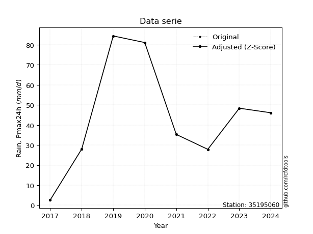</img>

</div>


> The initial value (value_initial) correspond to the initial obtained or null completed value, and value (value) is adjusted only when the initial value is outside the valid range (outlier) definite through the Z-Score value. If Z-Score is active, values out of range or outliers are replaced with the station mean value. A Z-Score (or standard score) measures how many standard deviations a data point is from the mean of a dataset, indicating its relative position; positive scores mean above the mean, negative mean below, and a score of zero is exactly at the mean, allowing for comparison of values from different distributions. It´s calculated using the formula $z=(x–μ)/σ$, where $x$ is the data point, $μ$ is the mean, and $σ$ is the standard deviation, helping identify outliers and understand probability.
>
> <sub>**Note**: In this study, "completing" (filling gaps in) and "extending" (forecasting or lengthening the historical record) rainfall data series are avoided for certain critical analyses because they introduce artificial bias and uncertainty, which can distort the statistics of rare events (extremes), alter day-to-day variability, and compromise the integrity and homogeneity of the original data. Some reasons against Completing/Extending rainfall data are: **Distortion of Extremes and Variability**: The primary issue is that most gap-filling or extension methods rely on averaging or regression with nearby stations, which inherently smooths the data. Rainfall is highly variable in space and time, with a large percentage of zero values and occasional large storms. Infilling methods often underestimate the highest values and overestimate the lowest (zero) values, which severely distorts analyses focused on flood frequency, drought severity, and intensity-duration-frequency (IDF) curves, **Loss of Data Homogeneity**: Infilled or extended data are synthetic estimates, not actual measurements. Combining these estimates with observed data can violate the assumption of data homogeneity, which requires that the data properties do not change over time. Inhomogeneity can lead to incorrect conclusions about long-term trends or changes in climate patterns, **Propagation of Errors**: Errors and biases from the original data (e.g., wind-induced undercatch, instrument errors, site changes) or the data used for imputation can propagate through the analysis, leading to unreliable hydrological models and inaccurate predictions, **Compromised Statistical Integrity**: For statistical analyses, especially those involving the frequency of events, using artificial data can introduce time bias or autocorrelation that doesn´t exist in reality, making it difficult to assess the true probability of events, **Difficulty in Validation**: It is difficult to accurately validate the quality of filled or extended data, especially for past periods where ground-truth measurements are unavailable. The reliability of imputation techniques heavily depends on the density of the surrounding station network and the complexity of the local topography.</sub>


### 4. Active continuous probability distributions from SciPy (80 of 104 available)

A Probability Density Function (PDF) describes the relative likelihood of a continuous random variable falling within a specific range, where the total area under its curve equals 1, and the area over any interval gives the actual probability for that range. Unlike discrete probabilities (like rolling a die), a PDF shows density, not direct probability for a single point (which is zero), with higher points indicating higher likelihood, often visualized as a bell curve for normal distributions.

A log of a probability density function (log-PDF) is simply the logarithm of the PDF´s value, denoted as $log(f(x))$, useful for converting multiplication of probabilities into addition, improving numerical stability with tiny numbers, and connecting to information theory concepts like entropy. Instead of dealing with very small probabilities (e.g., 0.000001), log-PDFs use negative numbers (e.g., $log(0.00001) ≈ -11.51$ that are easier for computers to handle, preventing underflow errors and simplifying complex calculations. In this study, each active probability distribution from SciPy is also evaluated in the $log$ form.

[scipy.stats](https://docs.scipy.org/doc/scipy/reference/stats.html) is a Python´s powerful submodule within the SciPy library for comprehensive statistical analysis, offering over 130 probability distributions (like Normal, Poisson, etc.), functions for descriptive stats (mean, variance), hypothesis testing (t-tests, chi-square), random variable generation, and statistical tests, making it essential for data science, modeling, and research. It provides tools to explore, model, and draw conclusions from data efficiently, working seamlessly with [NumPy](https://numpy.org/).

<div align="center">

|   id | p_dist           |   n_parameter | fit_method   | label                                                                       | active   | ref                                                                                                      |
|-----:|:-----------------|--------------:|:-------------|:----------------------------------------------------------------------------|:---------|:---------------------------------------------------------------------------------------------------------|
|    0 | alpha            |             3 | MLE          | Alpha                                                                       | True     | [:mortar_board:](https://docs.scipy.org/doc/scipy/reference/generated/scipy.stats.alpha.html)            |
|    1 | anglit           |             2 | MM           | Anglit                                                                      | True     | [:mortar_board:](https://docs.scipy.org/doc/scipy/reference/generated/scipy.stats.anglit.html)           |
|    2 | arcsine          |             2 | MM           | Arcsine                                                                     | True     | [:mortar_board:](https://docs.scipy.org/doc/scipy/reference/generated/scipy.stats.arcsine.html)          |
|    3 | argus            |             3 | MLE          | Argus                                                                       | True     | [:mortar_board:](https://docs.scipy.org/doc/scipy/reference/generated/scipy.stats.argus.html)            |
|    4 | beta             |             4 | MLE          | Beta                                                                        | True     | [:mortar_board:](https://docs.scipy.org/doc/scipy/reference/generated/scipy.stats.beta.html)             |
|    5 | betaprime        |             4 | MLE          | Beta prime                                                                  | True     | [:mortar_board:](https://docs.scipy.org/doc/scipy/reference/generated/scipy.stats.betaprime.html)        |
|    6 | bradford         |             3 | MLE          | Bradford                                                                    | True     | [:mortar_board:](https://docs.scipy.org/doc/scipy/reference/generated/scipy.stats.bradford.html)         |
|    7 | burr             |             4 | MLE          | Burr (Type III)                                                             | True     | [:mortar_board:](https://docs.scipy.org/doc/scipy/reference/generated/scipy.stats.burr.html)             |
|    8 | burr12           |             4 | MLE          | Burr (Type III) 12                                                          | True     | [:mortar_board:](https://docs.scipy.org/doc/scipy/reference/generated/scipy.stats.burr12.html)           |
|    9 | cosine           |             2 | MLE          | Cosine                                                                      | True     | [:mortar_board:](https://docs.scipy.org/doc/scipy/reference/generated/scipy.stats.cosine.html)           |
|   10 | crystalball      |             4 | MLE          | Crystalball                                                                 | True     | [:mortar_board:](https://docs.scipy.org/doc/scipy/reference/generated/scipy.stats.crystalball.html)      |
|   11 | dgamma           |             3 | MLE          | Double gamma                                                                | True     | [:mortar_board:](https://docs.scipy.org/doc/scipy/reference/generated/scipy.stats.dgamma.html)           |
|   12 | dweibull         |             3 | MLE          | Double Weibull                                                              | True     | [:mortar_board:](https://docs.scipy.org/doc/scipy/reference/generated/scipy.stats.dweibull.html)         |
|   13 | erlang           |             3 | MLE          | Erlang                                                                      | True     | [:mortar_board:](https://docs.scipy.org/doc/scipy/reference/generated/scipy.stats.erlang.html)           |
|   14 | exponnorm        |             3 | MLE          | Exponentially modified Normal                                               | True     | [:mortar_board:](https://docs.scipy.org/doc/scipy/reference/generated/scipy.stats.exponnorm.html)        |
|   15 | exponpow         |             3 | MLE          | Exponential power                                                           | True     | [:mortar_board:](https://docs.scipy.org/doc/scipy/reference/generated/scipy.stats.exponpow.html)         |
|   16 | exponweib        |             4 | MLE          | Exponentiated Weibull                                                       | True     | [:mortar_board:](https://docs.scipy.org/doc/scipy/reference/generated/scipy.stats.exponweib.html)        |
|   17 | f                |             4 | MLE          | F                                                                           | True     | [:mortar_board:](https://docs.scipy.org/doc/scipy/reference/generated/scipy.stats.f.html)                |
|   18 | fatiguelife      |             3 | MLE          | Fatigue-life (Birnbaum-Saunders)                                            | True     | [:mortar_board:](https://docs.scipy.org/doc/scipy/reference/generated/scipy.stats.fatiguelife.html)      |
|   19 | foldnorm         |             3 | MM           | Fold Normal                                                                 | True     | [:mortar_board:](https://docs.scipy.org/doc/scipy/reference/generated/scipy.stats.foldnorm.html)         |
|   20 | gamma            |             3 | MLE          | Gamma                                                                       | True     | [:mortar_board:](https://docs.scipy.org/doc/scipy/reference/generated/scipy.stats.gamma.html)            |
|   21 | gausshyper       |             6 | MLE          | Gauss hypergeometric                                                        | True     | [:mortar_board:](https://docs.scipy.org/doc/scipy/reference/generated/scipy.stats.gausshyper.html)       |
|   22 | genexpon         |             5 | MLE          | Generalized exponential                                                     | True     | [:mortar_board:](https://docs.scipy.org/doc/scipy/reference/generated/scipy.stats.genexpon.html)         |
|   23 | genextreme       |             3 | MLE          | Generalized exponential                                                     | True     | [:mortar_board:](https://docs.scipy.org/doc/scipy/reference/generated/scipy.stats.genextreme.html)       |
|   24 | gengamma         |             4 | MLE          | Generalized gamma                                                           | True     | [:mortar_board:](https://docs.scipy.org/doc/scipy/reference/generated/scipy.stats.gengamma.html)         |
|   25 | genhalflogistic  |             3 | MLE          | Generalized half-logistic                                                   | True     | [:mortar_board:](https://docs.scipy.org/doc/scipy/reference/generated/scipy.stats.genhalflogistic.html)  |
|   26 | genlogistic      |             3 | MLE          | Generalized logistic                                                        | True     | [:mortar_board:](https://docs.scipy.org/doc/scipy/reference/generated/scipy.stats.genlogistic.html)      |
|   27 | gennorm          |             3 | MLE          | Generalized Normal                                                          | True     | [:mortar_board:](https://docs.scipy.org/doc/scipy/reference/generated/scipy.stats.gennorm.html)          |
|   28 | genpareto        |             3 | MLE          | Generalized Pareto                                                          | True     | [:mortar_board:](https://docs.scipy.org/doc/scipy/reference/generated/scipy.stats.genpareto.html)        |
|   29 | gompertz         |             3 | MLE          | Gompertz (or truncated Gumbel)                                              | True     | [:mortar_board:](https://docs.scipy.org/doc/scipy/reference/generated/scipy.stats.gompertz.html)         |
|   30 | gumbel_l         |             2 | MM           | Gumbel Left Skew                                                            | True     | [:mortar_board:](https://docs.scipy.org/doc/scipy/reference/generated/scipy.stats.gumbel_l.html)         |
|   31 | gumbel_r         |             2 | MM           | Gumbel Right Skew                                                           | True     | [:mortar_board:](https://docs.scipy.org/doc/scipy/reference/generated/scipy.stats.gumbel_r.html)         |
|   32 | halfgennorm      |             3 | MLE          | Upper half of a generalized normal                                          | True     | [:mortar_board:](https://docs.scipy.org/doc/scipy/reference/generated/scipy.stats.halfgennorm.html)      |
|   33 | halflogistic     |             2 | MM           | Half-logistic                                                               | True     | [:mortar_board:](https://docs.scipy.org/doc/scipy/reference/generated/scipy.stats.halflogistic.html)     |
|   34 | halfnorm         |             2 | MM           | Half Normal                                                                 | True     | [:mortar_board:](https://docs.scipy.org/doc/scipy/reference/generated/scipy.stats.halfnorm.html)         |
|   35 | hypsecant        |             2 | MM           | hyperbolic secant                                                           | True     | [:mortar_board:](https://docs.scipy.org/doc/scipy/reference/generated/scipy.stats.hypsecant.html)        |
|   36 | invgamma         |             3 | MLE          | Inverted gamma                                                              | True     | [:mortar_board:](https://docs.scipy.org/doc/scipy/reference/generated/scipy.stats.invgamma.html)         |
|   37 | invgauss         |             3 | MLE          | Inverse Gaussian                                                            | True     | [:mortar_board:](https://docs.scipy.org/doc/scipy/reference/generated/scipy.stats.invgauss.html)         |
|   38 | invweibull       |             3 | MLE          | Inverted Weibull                                                            | True     | [:mortar_board:](https://docs.scipy.org/doc/scipy/reference/generated/scipy.stats.invweibull.html)       |
|   39 | johnsonsb        |             4 | MLE          | Johnson SB                                                                  | True     | [:mortar_board:](https://docs.scipy.org/doc/scipy/reference/generated/scipy.stats.johnsonsb.html)        |
|   40 | johnsonsu        |             4 | MLE          | Johnson Su                                                                  | True     | [:mortar_board:](https://docs.scipy.org/doc/scipy/reference/generated/scipy.stats.johnsonsu.html)        |
|   41 | kappa3           |             3 | MLE          | Kappa 3                                                                     | True     | [:mortar_board:](https://docs.scipy.org/doc/scipy/reference/generated/scipy.stats.kappa3.html)           |
|   42 | kappa4           |             4 | MLE          | Kappa 4                                                                     | True     | [:mortar_board:](https://docs.scipy.org/doc/scipy/reference/generated/scipy.stats.kappa4.html)           |
|   43 | ksone            |             3 | MLE          | Kolmogorov-Smirnov one-sided test statistic distribution                    | True     | [:mortar_board:](https://docs.scipy.org/doc/scipy/reference/generated/scipy.stats.ksone.html)            |
|   44 | kstwobign        |             2 | MLE          | Limiting distribution of scaled Kolmogorov-Smirnov two-sided test statistic | True     | [:mortar_board:](https://docs.scipy.org/doc/scipy/reference/generated/scipy.stats.kstwobign.html)        |
|   45 | laplace          |             2 | MM           | Laplace                                                                     | True     | [:mortar_board:](https://docs.scipy.org/doc/scipy/reference/generated/scipy.stats.laplace.html)          |
|   46 | levy_l           |             2 | MLE          | Left-skewed Levy                                                            | True     | [:mortar_board:](https://docs.scipy.org/doc/scipy/reference/generated/scipy.stats.levy_l.html)           |
|   47 | loggamma         |             3 | MLE          | Log gamma                                                                   | True     | [:mortar_board:](https://docs.scipy.org/doc/scipy/reference/generated/scipy.stats.loggamma.html)         |
|   48 | logistic         |             2 | MM           | Logistic (or Sech-squared)                                                  | True     | [:mortar_board:](https://docs.scipy.org/doc/scipy/reference/generated/scipy.stats.logistic.html)         |
|   49 | loglaplace       |             3 | MLE          | Log-Laplace                                                                 | True     | [:mortar_board:](https://docs.scipy.org/doc/scipy/reference/generated/scipy.stats.loglaplace.html)       |
|   50 | lomax            |             3 | MLE          | Lomax (Pareto of the second kind)                                           | True     | [:mortar_board:](https://docs.scipy.org/doc/scipy/reference/generated/scipy.stats.lomax.html)            |
|   51 | maxwell          |             2 | MM           | Maxwell                                                                     | True     | [:mortar_board:](https://docs.scipy.org/doc/scipy/reference/generated/scipy.stats.maxwell.html)          |
|   52 | mielke           |             4 | MLE          | Mielke Beta-Kappa / Dagum                                                   | True     | [:mortar_board:](https://docs.scipy.org/doc/scipy/reference/generated/scipy.stats.mielke.html)           |
|   53 | moyal            |             2 | MM           | Moyal                                                                       | True     | [:mortar_board:](https://docs.scipy.org/doc/scipy/reference/generated/scipy.stats.moyal.html)            |
|   54 | nakagami         |             3 | MLE          | Nakagami                                                                    | True     | [:mortar_board:](https://docs.scipy.org/doc/scipy/reference/generated/scipy.stats.nakagami.html)         |
|   55 | ncf              |             5 | MLE          | Non-central F distribution                                                  | True     | [:mortar_board:](https://docs.scipy.org/doc/scipy/reference/generated/scipy.stats.ncf.html)              |
|   56 | nct              |             4 | MLE          | Non-central Student’s t                                                     | True     | [:mortar_board:](https://docs.scipy.org/doc/scipy/reference/generated/scipy.stats.nct.html)              |
|   57 | norm             |             2 | MM           | Normal                                                                      | True     | [:mortar_board:](https://docs.scipy.org/doc/scipy/reference/generated/scipy.stats.norm.html)             |
|   58 | pearson3         |             3 | MM           | Pearson type III                                                            | True     | [:mortar_board:](https://docs.scipy.org/doc/scipy/reference/generated/scipy.stats.pearson3.html)         |
|   59 | powerlaw         |             3 | MLE          | Power-function                                                              | True     | [:mortar_board:](https://docs.scipy.org/doc/scipy/reference/generated/scipy.stats.powerlaw.html)         |
|   60 | rayleigh         |             2 | MM           | Rayleigh                                                                    | True     | [:mortar_board:](https://docs.scipy.org/doc/scipy/reference/generated/scipy.stats.rayleigh.html)         |
|   61 | rdist            |             3 | MLE          | R-distributed (symmetric beta)                                              | True     | [:mortar_board:](https://docs.scipy.org/doc/scipy/reference/generated/scipy.stats.rdist.html)            |
|   62 | rice             |             3 | MLE          | Rice                                                                        | True     | [:mortar_board:](https://docs.scipy.org/doc/scipy/reference/generated/scipy.stats.rice.html)             |
|   63 | semicircular     |             2 | MM           | Semicircular                                                                | True     | [:mortar_board:](https://docs.scipy.org/doc/scipy/reference/generated/scipy.stats.semicircular.html)     |
|   64 | skewnorm         |             3 | MLE          | Skew normal                                                                 | True     | [:mortar_board:](https://docs.scipy.org/doc/scipy/reference/generated/scipy.stats.skewnorm.html)         |
|   65 | t                |             3 | MLE          | Student’s t                                                                 | True     | [:mortar_board:](https://docs.scipy.org/doc/scipy/reference/generated/scipy.stats.t.html)                |
|   66 | trapezoid        |             4 | MLE          | Trapezoid                                                                   | True     | [:mortar_board:](https://docs.scipy.org/doc/scipy/reference/generated/scipy.stats.trapezoid.html)        |
|   67 | triang           |             3 | MLE          | Triangular                                                                  | True     | [:mortar_board:](https://docs.scipy.org/doc/scipy/reference/generated/scipy.stats.triang.html)           |
|   68 | truncexpon       |             3 | MLE          | Truncated exponential                                                       | True     | [:mortar_board:](https://docs.scipy.org/doc/scipy/reference/generated/scipy.stats.truncexpon.html)       |
|   69 | truncnorm        |             4 | MLE          | Truncated normal                                                            | True     | [:mortar_board:](https://docs.scipy.org/doc/scipy/reference/generated/scipy.stats.truncnorm.html)        |
|   70 | truncpareto      |             4 | MLE          | Upper truncated Pareto                                                      | True     | [:mortar_board:](https://docs.scipy.org/doc/scipy/reference/generated/scipy.stats.truncpareto.html)      |
|   71 | truncweibull_min |             5 | MLE          | Doubly truncated Weibull minimum                                            | True     | [:mortar_board:](https://docs.scipy.org/doc/scipy/reference/generated/scipy.stats.truncweibull_min.html) |
|   72 | tukeylambda      |             3 | MLE          | Tukey-Lamdba                                                                | True     | [:mortar_board:](https://docs.scipy.org/doc/scipy/reference/generated/scipy.stats.tukeylambda.html)      |
|   73 | uniform          |             2 | MLE          | Uniform                                                                     | True     | [:mortar_board:](https://docs.scipy.org/doc/scipy/reference/generated/scipy.stats.uniform.html)          |
|   74 | vonmises         |             3 | MLE          | Von Mises                                                                   | True     | [:mortar_board:](https://docs.scipy.org/doc/scipy/reference/generated/scipy.stats.vonmises.html)         |
|   75 | vonmises_line    |             3 | MLE          | Von Mises line                                                              | True     | [:mortar_board:](https://docs.scipy.org/doc/scipy/reference/generated/scipy.stats.vonmises_line.html)    |
|   76 | wald             |             2 | MM           | Wald                                                                        | True     | [:mortar_board:](https://docs.scipy.org/doc/scipy/reference/generated/scipy.stats.wald.html)             |
|   77 | weibull_max      |             3 | MLE          | Weibull maximum                                                             | True     | [:mortar_board:](https://docs.scipy.org/doc/scipy/reference/generated/scipy.stats.weibull_max.html)      |
|   78 | weibull_min      |             3 | MLE          | Weibull minimum                                                             | True     | [:mortar_board:](https://docs.scipy.org/doc/scipy/reference/generated/scipy.stats.weibull_min.html)      |
|   79 | wrapcauchy       |             3 | MLE          | Wrapped  Cauchy                                                             | True     | [:mortar_board:](https://docs.scipy.org/doc/scipy/reference/generated/scipy.stats.wrapcauchy.html)       |

</div>

> **n_parameter:** # arguments & localization & scale.
>
> **Fit methods:** (MLE) maximum likelihood, (MM) L-moments.
>
>**Inactive** (With the only purpose of prevent loops, zero divisions, infinite values, over high estimated values or horizontal trending for recurrence intervals estimations, the follow distributions were disabled.)**:** lognorm, norminvgauss, powernorm, powerlognorm, cauchy, halfcauchy, foldcauchy, skewcauchy, chi2, expon, fisk, genhyperbolic, geninvgauss, gibrat, kstwo, laplace_asymmetric, levy, levy_stable, ncx2, pareto, rel_breitwigner, recipinvgauss, studentized_range, loguniform, 


## B. Probability (PDF) vs. Empirical (EDF) distributions functions

A continuous probability distribution (CPD) describes probabilities for variables that can take any value within a range (like rain any time), unlike discrete variables with specific outcomes (like temperature). It uses a Probability Density Function (PDF), a curve where the total area under it equals 1, and the probability of the variable falling within an interval (a to b) is found by calculating the area under the curve between those points. A key feature is that the probability of hitting any single exact value is zero, so probabilities are always expressed for ranges, e.g., $P(a ≤ X ≤ b)$.

<div align="center">

Distributions parameters from station values
|     |   station | p_dist              |   n |               loc |            scale | shape                  | shape1                 | shape2                 | shape3             |
|----:|----------:|:--------------------|----:|------------------:|-----------------:|:-----------------------|:-----------------------|:-----------------------|:-------------------|
|   0 |  35195060 | alpha               |   9 |      -0.0171877   |      7.73998     | 2.0806125379991366e-10 |                        |                        |                    |
|   1 |  35195060 | anglit              |   9 |      44.3522      |     71.2499      |                        |                        |                        |                    |
|   2 |  35195060 | arcsine             |   9 |       9.90816     |     68.8881      |                        |                        |                        |                    |
|   3 |  35195060 | argus               |   9 |     -12.6407      |    101.717       | 4.489790838329438e-06  |                        |                        |                    |
|   4 |  35195060 | beta                |   9 |     -18.4928      |    102.893       | 1.8729791981661712     | 0.7626089175089793     |                        |                    |
|   5 |  35195060 | betaprime           |   9 |     -84.9635      |   9972.51        | 28.337978822828397     | 2186.3516034050717     |                        |                    |
|   6 |  35195060 | bradford            |   9 |      -7.52899     |     91.929       | 2.6826826985800786e-05 |                        |                        |                    |
|   7 |  35195060 | burr                |   9 |      -3.13435     |     88.9434      | 158.21945207656344     | 0.007662607195812096   |                        |                    |
|   8 |  35195060 | burr12              |   9 |      -7.28645     |   1467.04        | 2.187978844617132      | 1170.831070688825      |                        |                    |
|   9 |  35195060 | cosine              |   9 |      44.8819      |     20.6698      |                        |                        |                        |                    |
|  10 |  35195060 | crystalball         |   9 |      44.3522      |     24.3556      | 4329.060966253256      | 60.32121805988227      |                        |                    |
|  11 |  35195060 | dgamma              |   9 |      45.45        |     19.9586      | 0.8007595544363177     |                        |                        |                    |
|  12 |  35195060 | dweibull            |   9 |      45.45        |     18.8572      | 0.8686651658495231     |                        |                        |                    |
|  13 |  35195060 | erlang              |   9 |     -82.7467      |      4.706       | 27.007816957932867     |                        |                        |                    |
|  14 |  35195060 | exponnorm           |   9 |      36.0113      |     22.9086      | 0.3640934910270395     |                        |                        |                    |
|  15 |  35195060 | exponpow            |   9 |       2.6         |      3.73036     | 0.12271611555960835    |                        |                        |                    |
|  16 |  35195060 | exponweib           |   9 |    -223.716       |    194.441       | 18.612437118292412     | 3.794455551809329      |                        |                    |
|  17 |  35195060 | f                   |   9 |     -83.0043      |    127.348       | 54.3315843368146       | 31347.11887627587      |                        |                    |
|  18 |  35195060 | fatiguelife         |   9 |    -151.656       |    194.502       | 0.12447524551753159    |                        |                        |                    |
|  19 |  35195060 | foldnorm            |   9 |      -3.50322     |     25.6004      | 1.8437749498788878     |                        |                        |                    |
|  20 |  35195060 | gamma               |   9 |     -82.7467      |      4.706       | 27.007824440363592     |                        |                        |                    |
|  21 |  35195060 | gausshyper          |   9 |      -5.9663      |     90.3663      | 1.097009654912563      | 0.9325972604937508     | 1.0211883012498388     | 0.9434709458590529 |
|  22 |  35195060 | genexpon            |   9 |       2.59997     |      2.53346     | 0.05811715564656328    | 1.3405967675584202e-06 | 2.402382664895285      |                    |
|  23 |  35195060 | genextreme          |   9 |      35.3798      |     23.2619      | 0.243614555128018      |                        |                        |                    |
|  24 |  35195060 | gengamma            |   9 |     -75.192       |     10.3273      | 17.58021770860414      | 1.169057522706328      |                        |                    |
|  25 |  35195060 | genhalflogistic     |   9 |      -5.7633      |     93.7766      | 1.0400746074495169     |                        |                        |                    |
|  26 |  35195060 | genlogistic         |   9 |      25.4142      |     16.9326      | 2.202344916224523      |                        |                        |                    |
|  27 |  35195060 | gennorm             |   9 |      45.45        |      1.49971e-05 | 0.14740578879374688    |                        |                        |                    |
|  28 |  35195060 | genpareto           |   9 |      -0.404312    |    121.467       | -1.4323202427402495    |                        |                        |                    |
|  29 |  35195060 | gompertz            |   9 |      27.87        |     43.0439      | 1.14388525175353       |                        |                        |                    |
|  30 |  35195060 | gumbel_l            |   9 |      55.3135      |     18.99        |                        |                        |                        |                    |
|  31 |  35195060 | gumbel_r            |   9 |      33.3909      |     18.99        |                        |                        |                        |                    |
|  32 |  35195060 | halfgennorm         |   9 |       2.6         |      0.431012    | 0.2849848568494173     |                        |                        |                    |
|  33 |  35195060 | halflogistic        |   9 |      15.4851      |     20.8232      |                        |                        |                        |                    |
|  34 |  35195060 | halfnorm            |   9 |      12.1149      |     40.4034      |                        |                        |                        |                    |
|  35 |  35195060 | hypsecant           |   9 |      44.3522      |     15.5053      |                        |                        |                        |                    |
|  36 |  35195060 | invgamma            |   9 |    -164.325       |  15247.5         | 74.03770829396993      |                        |                        |                    |
|  37 |  35195060 | invgauss            |   9 |     -71.4901      |   2417.04        | 0.04779054313018791    |                        |                        |                    |
|  38 |  35195060 | invweibull          |   9 |      -1.71531e+09 |      1.71531e+09 | 77701828.60242994      |                        |                        |                    |
|  39 |  35195060 | johnsonsb           |   9 |      -3.79012     |     88.1901      | -0.15722537729397462   | 0.13105941400811744    |                        |                    |
|  40 |  35195060 | johnsonsu           |   9 |    -135.637       |     66.2197      | -13.549308094407579    | 7.887528112234387      |                        |                    |
|  41 |  35195060 | kappa3              |   9 |       2.6         |     81.6561      | 1253.7521697388497     |                        |                        |                    |
|  42 |  35195060 | kappa4              |   9 |       2.37348     |     85.1154      | 1.0020363181511382     | 1.0376573106166036     |                        |                    |
|  43 |  35195060 | ksone               |   9 |       2.16707     |     84.3703      | 1.0                    |                        |                        |                    |
|  44 |  35195060 | kstwobign           |   9 |     -46.9526      |    104.818       |                        |                        |                        |                    |
|  45 |  35195060 | laplace             |   9 |      44.3522      |     17.222       |                        |                        |                        |                    |
|  46 |  35195060 | levy_l              |   9 |      87.752       |     15.3603      |                        |                        |                        |                    |
|  47 |  35195060 | loggamma            |   9 |   -4615.81        |    695.821       | 810.8024964816505      |                        |                        |                    |
|  48 |  35195060 | logistic            |   9 |      44.3522      |     13.428       |                        |                        |                        |                    |
|  49 |  35195060 | loglaplace          |   9 |      -0.11762     |     45.5676      | 1.6944167020720413     |                        |                        |                    |
|  50 |  35195060 | lomax               |   9 |       2.6         |   6722.46        | 158.40237874913362     |                        |                        |                    |
|  51 |  35195060 | maxwell             |   9 |     -13.3603      |     36.166       |                        |                        |                        |                    |
|  52 |  35195060 | mielke              |   9 |       1.91874     |     83.5171      | 0.7614896678553631     | 715.208924017034       |                        |                    |
|  53 |  35195060 | moyal               |   9 |      30.4241      |     10.9639      |                        |                        |                        |                    |
|  54 |  35195060 | nakagami            |   9 |       2.6         |     55.0002      | 0.09172241234417085    |                        |                        |                    |
|  55 |  35195060 | ncf                 |   9 |       0.102752    |      0.000540828 | 0.00013269591361088524 | 393.91796562985155     | 10.830449229758457     |                    |
|  56 |  35195060 | nct                 |   9 |    -126.153       |     18.2166      | 58.03798943401955      | 9.238084278466665      |                        |                    |
|  57 |  35195060 | norm                |   9 |      44.3522      |     24.3556      |                        |                        |                        |                    |
|  58 |  35195060 | pearson3            |   9 |      44.3522      |     24.3556      | 0.24263028779805199    |                        |                        |                    |
|  59 |  35195060 | powerlaw            |   9 |       2.6         |     81.8         | 0.20037297719594788    |                        |                        |                    |
|  60 |  35195060 | rayleigh            |   9 |      -2.24148     |     37.1764      |                        |                        |                        |                    |
|  61 |  35195060 | rdist               |   9 |      -4.53061     |     52.8906      | 1.017144237645609      |                        |                        |                    |
|  62 |  35195060 | rice                |   9 |      -8.12229     |     28.206       | 1.48550539145681       |                        |                        |                    |
|  63 |  35195060 | semicircular        |   9 |      44.3522      |     48.7112      |                        |                        |                        |                    |
|  64 |  35195060 | skewnorm            |   9 |      19.905       |     34.5089      | 1.9017708162816873     |                        |                        |                    |
|  65 |  35195060 | t                   |   9 |      44.3521      |     24.3556      | 1345898101.247035      |                        |                        |                    |
|  66 |  35195060 | trapezoid           |   9 |      -5.859       |     98.16        | 0.9999999999999999     | 1.0                    |                        |                    |
|  67 |  35195060 | triang              |   9 |     -17.8083      |    102.367       | 0.9984477225050765     |                        |                        |                    |
|  68 |  35195060 | truncexpon          |   9 |      -4.09212     |    122.7         | 0.7212080769459704     |                        |                        |                    |
|  69 |  35195060 | truncnorm           |   9 |      47.4109      |     25.5695      | -1849.5784135805934    | 2.196551082122049      |                        |                    |
|  70 |  35195060 | truncpareto         |   9 |       2.59465     |      0.00535463  | 0.12515260748570128    | 15277.509899612402     |                        |                    |
|  71 |  35195060 | truncweibull_min    |   9 |       0.875173    |    142.746       | 1.1784371782792191     | 0.0007807301082401729  | 0.5851280254148735     |                    |
|  72 |  35195060 | tukeylambda         |   9 |      43.4701      |     41.8989      | 1.0236758236079844     |                        |                        |                    |
|  73 |  35195060 | uniform             |   9 |       2.6         |     81.8         |                        |                        |                        |                    |
|  74 |  35195060 | vonmises            |   9 |       2.85275     |      1           | 1.150359872850424      |                        |                        |                    |
|  75 |  35195060 | vonmises_line       |   9 |      43.5         |     13.0189      | 0.33156675335468944    |                        |                        |                    |
|  76 |  35195060 | wald                |   9 |      19.9966      |     24.3556      |                        |                        |                        |                    |
|  77 |  35195060 | weibull_max         |   9 |      84.4         |      1.51959     | 0.2527506709109826     |                        |                        |                    |
|  78 |  35195060 | weibull_min         |   9 |     -11.7214      |     63.2031      | 2.466307816170115      |                        |                        |                    |
|  79 |  35195060 | wrapcauchy          |   9 |       2.57525     |     13.0228      | 8.172332977327066e-06  |                        |                        |                    |
|  80 |  35195060 | logalpha            |   9 |     -29.8915      |   1087.56        | 32.603573477119056     |                        |                        |                    |
|  81 |  35195060 | loganglit           |   9 |       3.50403     |      2.85414     |                        |                        |                        |                    |
|  82 |  35195060 | logarcsine          |   9 |       2.1243      |      2.75948     |                        |                        |                        |                    |
|  83 |  35195060 | logargus            |   9 |      -0.552702    |      5.06156     | 2.902291303258168      |                        |                        |                    |
|  84 |  35195060 | logbeta             |   9 |       0.612719    |      3.82285     | 1.2793405098858617     | 0.22813973367615148    |                        |                    |
|  85 |  35195060 | logbetaprime        |   9 |     -23.6793      |     67.2382      | 938.6175444377391      | 2323.2820101641137     |                        |                    |
|  86 |  35195060 | logbradford         |   9 |       0.955509    |      3.48007     | 0.9183188539094173     |                        |                        |                    |
|  87 |  35195060 | logburr             |   9 |      -1.72901e+07 |      1.72901e+07 | 1817559427.6432698     | 0.009971898252394786   |                        |                    |
|  88 |  35195060 | logburr12           |   9 |   -5546.82        |   5559.26        | 9111.534313937997      | 1238219.4312177552     |                        |                    |
|  89 |  35195060 | logcosine           |   9 |       3.24338     |      0.942123    |                        |                        |                        |                    |
|  90 |  35195060 | logcrystalball      |   9 |       3.50403     |      0.975632    | 8243.404458076675      | 155.48320427413256     |                        |                    |
|  91 |  35195060 | logdgamma           |   9 |       3.8306      |      0.668176    | 0.6132180124048943     |                        |                        |                    |
|  92 |  35195060 | logdweibull         |   9 |       3.8306      |      0.657579    | 0.7457773642605494     |                        |                        |                    |
|  93 |  35195060 | logerlang           |   9 |     -14.8698      |      0.0561608   | 327.2288690762173      |                        |                        |                    |
|  94 |  35195060 | logexponnorm        |   9 |       3.50347     |      0.975633    | 0.0005799034191978126  |                        |                        |                    |
|  95 |  35195060 | logexponpow         |   9 |      -1.02488e+07 |      1.02488e+07 | 13420189.482071828     |                        |                        |                    |
|  96 |  35195060 | logexponweib        |   9 |      -2.64967e+07 |      2.64967e+07 | 0.208670083962562      | 142267272.67464364     |                        |                    |
|  97 |  35195060 | logf                |   9 |    -108.822       |    112.319       | 156127.35468394842     | 30467.379932948308     |                        |                    |
|  98 |  35195060 | logfatiguelife      |   9 |    -933.307       |    936.814       | 0.00104238546291415    |                        |                        |                    |
|  99 |  35195060 | logfoldnorm         |   9 |      -3.02372     |      0.85634     | 7.645383845918128      |                        |                        |                    |
| 100 |  35195060 | loggamma            |   9 |     -16.3845      |      0.0550549   | 361.13386292638825     |                        |                        |                    |
| 101 |  35195060 | loggausshyper       |   9 |       0.726925    |      3.70864     | 1.2667452232635736     | 0.4423667662946273     | 1.0919596377130885     | 0.8543344263390247 |
| 102 |  35195060 | loggenexpon         |   9 |       0.934055    |      0.00576142  | 0.00048348913864658784 | 0.46302321352916603    | 1.4827366890678248e-05 |                    |
| 103 |  35195060 | loggenextreme       |   9 |       3.50348     |      1.25144     | 1.3426286710937347     |                        |                        |                    |
| 104 |  35195060 | loggengamma         |   9 |  -13327.6         |  13332           | 0.002723898524011217   | 5212544.722313379      |                        |                    |
| 105 |  35195060 | loggenhalflogistic  |   9 |       0.515073    |      4.43752     | 1.131877086572913      |                        |                        |                    |
| 106 |  35195060 | loggenlogistic      |   9 |       4.43558     |      1.24291e-06 | 1.3419074377867466e-06 |                        |                        |                    |
| 107 |  35195060 | loggennorm          |   9 |       3.8306      |      0.00393643  | 0.2945076198966771     |                        |                        |                    |
| 108 |  35195060 | loggenpareto        |   9 |      -0.00662698  |     13.6591      | -3.074850780176255     |                        |                        |                    |
| 109 |  35195060 | loggompertz         |   9 |       0.955491    |      0.598443    | 0.007526704529382601   |                        |                        |                    |
| 110 |  35195060 | loggumbel_l         |   9 |       3.94312     |      0.760697    |                        |                        |                        |                    |
| 111 |  35195060 | loggumbel_r         |   9 |       3.06495     |      0.760697    |                        |                        |                        |                    |
| 112 |  35195060 | loghalfgennorm      |   9 |       0.955511    |      3.48379     | 5791.962787131855      |                        |                        |                    |
| 113 |  35195060 | loghalflogistic     |   9 |       2.3477      |      0.83412     |                        |                        |                        |                    |
| 114 |  35195060 | loghalfnorm         |   9 |       2.21272     |      1.61843     |                        |                        |                        |                    |
| 115 |  35195060 | loghypsecant        |   9 |       3.50403     |      0.621106    |                        |                        |                        |                    |
| 116 |  35195060 | loginvgamma         |   9 |     -19.3254      |  11179.4         | 490.78960140596394     |                        |                        |                    |
| 117 |  35195060 | loginvgauss         |   9 |      -8.49428     |   1512.62        | 0.00792417618175724    |                        |                        |                    |
| 118 |  35195060 | loginvweibull       |   9 |      -2.23766e+08 |      2.23766e+08 | 176680663.92642158     |                        |                        |                    |
| 119 |  35195060 | logjohnsonsb        |   9 |      -0.330082    |      4.76565     | -0.350532555739118     | 0.08994298558099355    |                        |                    |
| 120 |  35195060 | logjohnsonsu        |   9 |       4.62588     |      0.00939083  | 6.054379496932443      | 1.1777336106662353     |                        |                    |
| 121 |  35195060 | logkappa3           |   9 |       0.955305    |      3.47926     | 4293.059274525822      |                        |                        |                    |
| 122 |  35195060 | logkappa4           |   9 |       0.370755    |      5.0925      | 1.1255356612044414     | 1.2528264954042405     |                        |                    |
| 123 |  35195060 | logksone            |   9 |       0.607506    |      4.17607     | 1.0                    |                        |                        |                    |
| 124 |  35195060 | logkstwobign        |   9 |      -1.73016     |      6.00806     |                        |                        |                        |                    |
| 125 |  35195060 | loglaplace          |   9 |       3.50403     |      0.689876    |                        |                        |                        |                    |
| 126 |  35195060 | loglevy_l           |   9 |       4.49345     |      0.2557      |                        |                        |                        |                    |
| 127 |  35195060 | logloggamma         |   9 |       4.43561     |      1.75018e-06 | 1.8755392775912834e-06 |                        |                        |                    |
| 128 |  35195060 | loglogistic         |   9 |       3.50403     |      0.537894    |                        |                        |                        |                    |
| 129 |  35195060 | logloglaplace       |   9 | -965745           | 965749           | 1622324.1032668124     |                        |                        |                    |
| 130 |  35195060 | loglomax            |   9 |       0.955511    |      8.01085e+11 | 289980363315.05786     |                        |                        |                    |
| 131 |  35195060 | logmaxwell          |   9 |       1.19222     |      1.44871     |                        |                        |                        |                    |
| 132 |  35195060 | logmielke           |   9 |      -2.99468e+07 |      2.99468e+07 | 31164407.362146527     | 2179746992.506854      |                        |                    |
| 133 |  35195060 | logmoyal            |   9 |       2.9461      |      0.439189    |                        |                        |                        |                    |
| 134 |  35195060 | lognakagami         |   9 |       3.32755     |      0.729121    | 0.18354726161220963    |                        |                        |                    |
| 135 |  35195060 | logncf              |   9 |      -0.537939    |      1.28514e-06 | 2.0538228353303374e-05 | 112.27563340253153     | 64.00944925205127      |                    |
| 136 |  35195060 | lognct              |   9 |     -65.65        |      0.949619    | 42267.52899565443      | 72.82040383946863      |                        |                    |
| 137 |  35195060 | lognorm             |   9 |       3.50403     |      0.975632    |                        |                        |                        |                    |
| 138 |  35195060 | logpearson3         |   9 |       3.50403     |      0.975629    | -1.7860067887737407    |                        |                        |                    |
| 139 |  35195060 | logpowerlaw         |   9 |       0.955511    |      3.48006     | 0.2272180715868679     |                        |                        |                    |
| 140 |  35195060 | lograyleigh         |   9 |       1.63762     |      1.48918     |                        |                        |                        |                    |
| 141 |  35195060 | logrdist            |   9 |       1.73191     |      1.83197     | 1.044872399403065      |                        |                        |                    |
| 142 |  35195060 | logrice             |   9 |    -224.12        |      0.975636    | 233.30574874102834     |                        |                        |                    |
| 143 |  35195060 | logsemicircular     |   9 |       3.50403     |      1.95129     |                        |                        |                        |                    |
| 144 |  35195060 | logskewnorm         |   9 |       4.43557     |      1.34908     | -16834441.44156842     |                        |                        |                    |
| 145 |  35195060 | logt                |   9 |       3.75043     |      0.362676    | 1.5260581495388665     |                        |                        |                    |
| 146 |  35195060 | logtrapezoid        |   9 |       0.744528    |      4.13925     | 1.0                    | 1.0                    |                        |                    |
| 147 |  35195060 | logtriang           |   9 |       0.487423    |      3.94944     | 0.9996712900972757     |                        |                        |                    |
| 148 |  35195060 | logtruncexpon       |   9 |       0.880735    |      6.14006     | 0.5789572965800243     |                        |                        |                    |
| 149 |  35195060 | logtruncnorm        |   9 |       1.93627     |      2.70941     | -0.3619841052937449    | 43.55455129753291      |                        |                    |
| 150 |  35195060 | logtruncpareto      |   9 |       0.955157    |      0.000354128 | 0.1251415875247719     | 9828.117682981894      |                        |                    |
| 151 |  35195060 | logtruncweibull_min |   9 |       0.848316    |      6.3462      | 1.6954077034891482     | 0.0002587573890642644  | 0.5652595764342949     |                    |
| 152 |  35195060 | logtukeylambda      |   9 |       2.69972     |      2.26992     | 1.3014028229102037     |                        |                        |                    |
| 153 |  35195060 | loguniform          |   9 |       0.955511    |      3.48006     |                        |                        |                        |                    |
| 154 |  35195060 | logvonmises         |   9 |      -2.50685     |      1           | 2.1058279047987227     |                        |                        |                    |
| 155 |  35195060 | logvonmises_line    |   9 |       3.8886      |      0.178589    | 1.0547967206876133e-06 |                        |                        |                    |
| 156 |  35195060 | logwald             |   9 |       2.52838     |      0.975653    |                        |                        |                        |                    |
| 157 |  35195060 | logweibull_max      |   9 |       4.43557     |      1.01166     | 0.5569789545212948     |                        |                        |                    |
| 158 |  35195060 | logweibull_min      |   9 |      -9.47129e+07 |      9.47129e+07 | 161430686.55494148     |                        |                        |                    |
| 159 |  35195060 | logwrapcauchy       |   9 |       0.955511    |      0.553891    | 0.35911445048671875    |                        |                        |                    |

</div>

> **loc** (Location parameter): This shifts the distribution along the x-axis. For many common distributions, like the normal (Gaussian) distribution, loc represents the mean $μ$. For others, like the uniform distribution, it might represent the minimum value, or for the beta distribution, the left end of the support interval.
>
> **scale** (Scale parameter): This determines the width or spread of the distribution. For the normal distribution, scale represents the standard deviation $σ$. For a uniform distribution, it defines the length of the interval (from $loc$ to $loc + scale$).
>
> **shape** (Shape parameters): Refers to parameters that define the specific form of a probability distribution, distinct from its location (loc) and scale (scale). These parameters are required arguments for most distribution functions. For example, a normal (Gaussian) distribution is fully defined by its location (mean) and scale (standard deviation), so it has no specific shape parameters beyond loc and scale. However, other distributions have intrinsic properties that need specification, as Gamma distribution that takes a shape parameter, often named $a$ or $alpha$.


### 0. Cumulative distribution values - CDF (160 evaluated)

Cumulative Distribution Function (CDF), denoted as $F$<sub>$X$</sub>$(x)$, is a function that gives the probability that a random variable $X$ will take a value less than or equal to a specific value, $x$ (i.e., $(P(X≥x)$. It essentially "accumulates" probabilities from a given point up to the far right (positive infinity), providing a complete picture of the distribution´s probabilities for both discrete (like rain) and continuous (like temperature) variables, helping to find probabilities over ranges or above certain values. Each station is evaluated separately ordering the $x$ values ascending, calculating the CDF and PDF values for the activated distributions and their logarithmic forms.

<div align="center">

CDF ordered by x ascending and calculating $log(f(x))$ separately
|   id |   Station |   date |     x |   count |    mean |    std |     zscore |   Value_initial |   station |   m |     alpha |   alpha_pdf |    anglit |   anglit_pdf |   arcsine |   arcsine_pdf |     argus |   argus_pdf |      beta |    beta_pdf |   betaprime |   betaprime_pdf |   bradford |   bradford_pdf |      burr |   burr_pdf |    burr12 |   burr12_pdf |    cosine |   cosine_pdf |   crystalball |   crystalball_pdf |    dgamma |   dgamma_pdf |   dweibull |   dweibull_pdf |    erlang |   erlang_pdf |   exponnorm |   exponnorm_pdf |   exponpow |   exponpow_pdf |   exponweib |   exponweib_pdf |         f |      f_pdf |   fatiguelife |   fatiguelife_pdf |   foldnorm |   foldnorm_pdf |     gamma |   gamma_pdf |   gausshyper |   gausshyper_pdf |    genexpon |   genexpon_pdf |   genextreme |   genextreme_pdf |   gengamma |   gengamma_pdf |   genhalflogistic |   genhalflogistic_pdf |   genlogistic |   genlogistic_pdf |   gennorm |   gennorm_pdf |   genpareto |   genpareto_pdf |    gompertz |   gompertz_pdf |   gumbel_l |   gumbel_l_pdf |   gumbel_r |   gumbel_r_pdf |   halfgennorm |   halfgennorm_pdf |   halflogistic |   halflogistic_pdf |   halfnorm |   halfnorm_pdf |   hypsecant |   hypsecant_pdf |   invgamma |   invgamma_pdf |   invgauss |   invgauss_pdf |   invweibull |   invweibull_pdf |   johnsonsb |   johnsonsb_pdf |   johnsonsu |   johnsonsu_pdf |    kappa3 |   kappa3_pdf |      kappa4 |   kappa4_pdf |      ksone |   ksone_pdf |   kstwobign |   kstwobign_pdf |   laplace |   laplace_pdf |   levy_l |   levy_l_pdf |   loggamma |   loggamma_pdf |   logistic |   logistic_pdf |   loglaplace |   loglaplace_pdf |       lomax |   lomax_pdf |   maxwell |   maxwell_pdf |    mielke |   mielke_pdf |       moyal |   moyal_pdf |    nakagami |   nakagami_pdf |       ncf |    ncf_pdf |       nct |    nct_pdf |      norm |   norm_pdf |   pearson3 |   pearson3_pdf |    powerlaw |   powerlaw_pdf |   rayleigh |   rayleigh_pdf |    rdist |       rdist_pdf |      rice |   rice_pdf |   semicircular |   semicircular_pdf |   skewnorm |   skewnorm_pdf |         t |      t_pdf |   trapezoid |   trapezoid_pdf |    triang |   triang_pdf |   truncexpon |   truncexpon_pdf |   truncnorm |   truncnorm_pdf |   truncpareto |   truncpareto_pdf |   truncweibull_min |   truncweibull_min_pdf |   tukeylambda |   tukeylambda_pdf |   uniform |   uniform_pdf |   vonmises |   vonmises_pdf |   vonmises_line |   vonmises_line_pdf |     wald |   wald_pdf |   weibull_max |   weibull_max_pdf |   weibull_min |   weibull_min_pdf |   wrapcauchy |   wrapcauchy_pdf |   logalpha |   logalpha_pdf |   loganglit |   loganglit_pdf |   logarcsine |   logarcsine_pdf |   logargus |   logargus_pdf |    logbeta |   logbeta_pdf |   logbetaprime |   logbetaprime_pdf |   logbradford |   logbradford_pdf |   logburr |   logburr_pdf |   logburr12 |   logburr12_pdf |   logcosine |   logcosine_pdf |   logcrystalball |   logcrystalball_pdf |   logdgamma |   logdgamma_pdf |   logdweibull |   logdweibull_pdf |   logerlang |   logerlang_pdf |   logexponnorm |   logexponnorm_pdf |   logexponpow |   logexponpow_pdf |   logexponweib |   logexponweib_pdf |     logf |   logf_pdf |   logfatiguelife |   logfatiguelife_pdf |   logfoldnorm |   logfoldnorm_pdf |   loggausshyper |   loggausshyper_pdf |   loggenexpon |   loggenexpon_pdf |   loggenextreme |   loggenextreme_pdf |   loggengamma |   loggengamma_pdf |   loggenhalflogistic |   loggenhalflogistic_pdf |   loggenlogistic |   loggenlogistic_pdf |   loggennorm |   loggennorm_pdf |   loggenpareto |   loggenpareto_pdf |   loggompertz |   loggompertz_pdf |   loggumbel_l |   loggumbel_l_pdf |   loggumbel_r |   loggumbel_r_pdf |   loghalfgennorm |   loghalfgennorm_pdf |   loghalflogistic |   loghalflogistic_pdf |   loghalfnorm |   loghalfnorm_pdf |   loghypsecant |   loghypsecant_pdf |   loginvgamma |   loginvgamma_pdf |   loginvgauss |   loginvgauss_pdf |   loginvweibull |   loginvweibull_pdf |   logjohnsonsb |   logjohnsonsb_pdf |   logjohnsonsu |   logjohnsonsu_pdf |   logkappa3 |   logkappa3_pdf |   logkappa4 |   logkappa4_pdf |   logksone |   logksone_pdf |   logkstwobign |   logkstwobign_pdf |   loglevy_l |   loglevy_l_pdf |   logloggamma |   logloggamma_pdf |   loglogistic |   loglogistic_pdf |   logloglaplace |   logloglaplace_pdf |    loglomax |   loglomax_pdf |   logmaxwell |   logmaxwell_pdf |   logmielke |   logmielke_pdf |    logmoyal |   logmoyal_pdf |   lognakagami |   lognakagami_pdf |     logncf |   logncf_pdf |     lognct |   lognct_pdf |    lognorm |   lognorm_pdf |   logpearson3 |   logpearson3_pdf |   logpowerlaw |   logpowerlaw_pdf |   lograyleigh |   lograyleigh_pdf |   logrdist |   logrdist_pdf |    logrice |   logrice_pdf |   logsemicircular |   logsemicircular_pdf |   logskewnorm |   logskewnorm_pdf |      logt |   logt_pdf |   logtrapezoid |   logtrapezoid_pdf |   logtriang |   logtriang_pdf |   logtruncexpon |   logtruncexpon_pdf |   logtruncnorm |   logtruncnorm_pdf |   logtruncpareto |   logtruncpareto_pdf |   logtruncweibull_min |   logtruncweibull_min_pdf |   logtukeylambda |   logtukeylambda_pdf |   loguniform |   loguniform_pdf |   logvonmises |   logvonmises_pdf |   logvonmises_line |   logvonmises_line_pdf |   logwald |   logwald_pdf |   logweibull_max |   logweibull_max_pdf |   logweibull_min |   logweibull_min_pdf |   logwrapcauchy |   logwrapcauchy_pdf |
|-----:|----------:|-------:|------:|--------:|--------:|-------:|-----------:|----------------:|----------:|----:|----------:|------------:|----------:|-------------:|----------:|--------------:|----------:|------------:|----------:|------------:|------------:|----------------:|-----------:|---------------:|----------:|-----------:|----------:|-------------:|----------:|-------------:|--------------:|------------------:|----------:|-------------:|-----------:|---------------:|----------:|-------------:|------------:|----------------:|-----------:|---------------:|------------:|----------------:|----------:|-----------:|--------------:|------------------:|-----------:|---------------:|----------:|------------:|-------------:|-----------------:|------------:|---------------:|-------------:|-----------------:|-----------:|---------------:|------------------:|----------------------:|--------------:|------------------:|----------:|--------------:|------------:|----------------:|------------:|---------------:|-----------:|---------------:|-----------:|---------------:|--------------:|------------------:|---------------:|-------------------:|-----------:|---------------:|------------:|----------------:|-----------:|---------------:|-----------:|---------------:|-------------:|-----------------:|------------:|----------------:|------------:|----------------:|----------:|-------------:|------------:|-------------:|-----------:|------------:|------------:|----------------:|----------:|--------------:|---------:|-------------:|-----------:|---------------:|-----------:|---------------:|-------------:|-----------------:|------------:|------------:|----------:|--------------:|----------:|-------------:|------------:|------------:|------------:|---------------:|----------:|-----------:|----------:|-----------:|----------:|-----------:|-----------:|---------------:|------------:|---------------:|-----------:|---------------:|---------:|----------------:|----------:|-----------:|---------------:|-------------------:|-----------:|---------------:|----------:|-----------:|------------:|----------------:|----------:|-------------:|-------------:|-----------------:|------------:|----------------:|--------------:|------------------:|-------------------:|-----------------------:|--------------:|------------------:|----------:|--------------:|-----------:|---------------:|----------------:|--------------------:|---------:|-----------:|--------------:|------------------:|--------------:|------------------:|-------------:|-----------------:|-----------:|---------------:|------------:|----------------:|-------------:|-----------------:|-----------:|---------------:|-----------:|--------------:|---------------:|-------------------:|--------------:|------------------:|----------:|--------------:|------------:|----------------:|------------:|----------------:|-----------------:|---------------------:|------------:|----------------:|--------------:|------------------:|------------:|----------------:|---------------:|-------------------:|--------------:|------------------:|---------------:|-------------------:|---------:|-----------:|-----------------:|---------------------:|--------------:|------------------:|----------------:|--------------------:|--------------:|------------------:|----------------:|--------------------:|--------------:|------------------:|---------------------:|-------------------------:|-----------------:|---------------------:|-------------:|-----------------:|---------------:|-------------------:|--------------:|------------------:|--------------:|------------------:|--------------:|------------------:|-----------------:|---------------------:|------------------:|----------------------:|--------------:|------------------:|---------------:|-------------------:|--------------:|------------------:|--------------:|------------------:|----------------:|--------------------:|---------------:|-------------------:|---------------:|-------------------:|------------:|----------------:|------------:|----------------:|-----------:|---------------:|---------------:|-------------------:|------------:|----------------:|--------------:|------------------:|--------------:|------------------:|----------------:|--------------------:|------------:|---------------:|-------------:|-----------------:|------------:|----------------:|------------:|---------------:|--------------:|------------------:|-----------:|-------------:|-----------:|-------------:|-----------:|--------------:|--------------:|------------------:|--------------:|------------------:|--------------:|------------------:|-----------:|---------------:|-----------:|--------------:|------------------:|----------------------:|--------------:|------------------:|----------:|-----------:|---------------:|-------------------:|------------:|----------------:|----------------:|--------------------:|---------------:|-------------------:|-----------------:|---------------------:|----------------------:|--------------------------:|-----------------:|---------------------:|-------------:|-----------------:|--------------:|------------------:|-------------------:|-----------------------:|----------:|--------------:|-----------------:|---------------------:|-----------------:|---------------------:|----------------:|--------------------:|
|    0 |  35195060 |   2017 |  2.6  |       9 | 44.3522 | 25.833 | -1.61623   |            2.6  |  35195060 |   1 | 0.0031028 | 0.011372    | 0.0392366 |   0.00545004 |  0        |    0          | 0.0334854 |  0.00436923 | 0.0362175 |  0.00328075 |   0.0304901 |      0.00368026 |   0.110184 |      0.0108781 | 0.0360174 | 0.00761491 | 0.0205593 |   0.00450286 | 0.0328841 |   0.00417986 |     0.0432391 |        0.00376853 | 0.0403413 |   0.00216073 |  0.0650065 |     0.00268853 | 0.0304126 |   0.00368212 |   0.0412072 |      0.00373459 |  0.0111128 |    3.07071e+12 |   0.0320165 |      0.00360985 | 0.0304205 | 0.00368193 |      0.030979 |        0.00366366 |   0.035543 |     0.00607897 | 0.0304126 |  0.00368212 |    0.0986772 |        0.0121645 | 5.84565e-07 |     0.0229398  |    0.0347938 |       0.00373945 |  0.0304149 |     0.00368411 |         0.0467631 |            0.0058641  |     0.0309249 |        0.00319245 | 0.0946079 |    0.00132718 |   0.0248679 |      0.00832281 | 0           |     0          |  0.0603952 |     0.00308234 | 0.00634358 |     0.00169039 |   6.38543e-15 |        0.196961   |       0        |         0          |   0        |     0          |   0.0430288 |      0.00276667 |   0.028003 |     0.00355545 |   0.025439 |     0.00377566 |     0.020806 |       0.00364981 |    0.311584 |     0.00781822  |   0.0315072 |      0.00364637 | 6.856e-10 |    0.012177  | 0.000640031 |    0.0119272 | 0.00513128 |   0.0118525 |   0.0212378 |      0.00430314 | 0.0442677 |    0.00257042 | 0.328958 |   0.00181822 | 0.00579871 |      0.0172803 |  0.0427231 |     0.00304573 |     0.012434 |        0.0180236 | 4.07484e-13 |  0.0235632  | 0.0215681 |    0.00389792 | 0.0256837 |   0.0287084  | 0.000375203 | 0.000231589 | 0.000615669 |    2.54321e+11 | 0.0138139 | 0.00456199 | 0.0332464 | 0.00367822 | 0.0432391 | 0.00376853 |  0.0352405 |     0.00373114 | 0.000347139 |    1.56629e+11 | 0.00844406 |     0.00347345 | 0.543552 |      0.00614463 | 0.0240479 | 0.00449778 |      0.0317064 |         0.00673181 |   0.028771 |     0.00346875 | 0.0432397 | 0.00376857 |  0.00742624 |      0.00175582 | 0.0398076 |   0.00390112 |     0.103301 |       0.0150191  |   0.0404097 |      0.0034072  |      0        |      33.3645      |          0.0127657 |             0.00905776 |   0.000782174 |         0.0129417 |  0        |     0.0122249 |   0.407629 |      0.356658  |     1.10434e-08 |          0.00853874 | 0        | 0          |     0.064665  |       0.000547175 |     0.0253673 |        0.00431265 |  0.000302531 |        0.0122214 | 0.00399008 |      0.0135105 |    0        |        0        |     0        |         0        |  0.0157919 |      0.0245477 | 0.00916691 |   0.0353315   |     0.00613916 |          0.0179526 |   8.68565e-07 |          0.405066 | 0.0254409 |     0.0266687 |  0.00812212 |       0.0132852 |    0.00938  |       0.0411705 |       0.00449842 |            0.0134875 |  0.00245011 |      0.00394448 |     0.0247733 |         0.0193092 |  0.00439316 |       0.0140183 |     0.00449839 |          0.0134873 |     0.0140138 |          0.018349 |      0.0217837 |          0.0244065 | 0.004765 |  0.0143196 |       0.00444654 |            0.0133727 |    0.00135616 |        0.00519726 |       0.0191497 |         0.105207    |    0.00184648 |         0.0881929 |       0.0694159 |           0.0396318 |      0        |         0.0259378 |            0.0525939 |                 0.126585 |         0        |            0.0252072 |    0.0234524 |        0.0118278 |      0.0763167 |        0.0863203   |   2.59477e-07 |         0.0125776 |      0.019501 |         0.0253841 |   1.11747e-07 |       2.35145e-06 |         0        |             0.287072 |          0        |              0        |      0        |          0        |      0.0105159 |          0.0169278 |    0.00416406 |         0.0139491 |    0.00419959 |         0.0148303 |      0.00815919 |           0.0309786 |       0.329932 |        0.0346937   |      0.0366427 |          0.0257435 | 5.92589e-05 |        0.286858 |   0.0101425 |        0.360563 |  0.0833333 |        0.23946 |      0.0116791 |          0.0493492 |    0.211945 |       0.0292386 |     0.0240077 |         0.0257274 |    0.00868048 |         0.0159978 |      0.00408918 |          0.00686928 | 5.87112e-13 |       0.361985 |     0        |         0        |   0.0259884 |        0.027045 | 5.27155e-22 |    5.63919e-20 |   0           |       0           | 0.00188821 |   0.00982603 | 0.00456991 |    0.0136896 | 0.00449842 |     0.0134875 |     0.0255966 |          0.027906 |   0.000178554 |       3.65429e+11 |      0        |          0        |   0.356618 |    0.196857    | 0.00449842 |     0.0134875 |          0        |              0        |    0.00989203 |         0.0212302 | 0.0166861 | 0.00894686 |     0.00259808 |          0.0246283 |   0.0140517 |       0.0600384 |       0.0275408 |            0.366068 |    2.85719e-07 |           0.215035 |         0        |          517.016     |            0.00312295 |                 0.0494098 |      1.28608e-12 |             0.440429 |     0        |         0.287352 |       1.00262 |        0.00878226 |        0           |               0        |  0        |      0        |         0.136699 |          0.0435376   |       0.00669025 |            0.0113648 |     6.23284e-10 |            0.609357 |
|    1 |  35195060 |   2022 | 27.87 |       9 | 44.3522 | 25.833 | -0.638029  |           27.87 |  35195060 |   2 | 0.781361  | 0.00764088  | 0.276835  |   0.0125596  |  0.341173 |    0.0105246  | 0.228225  |  0.0107745  | 0.166678  |  0.00712291 |   0.260759  |      0.0145614  |   0.385072 |      0.010878  | 0.278681  | 0.0108974  | 0.283509  |   0.0148641  | 0.252317  |   0.0129358  |     0.249288  |        0.0130276  | 0.161144  |   0.00915299 |  0.195139  |     0.00907234 | 0.260899  |   0.0145685  |   0.250278  |      0.0132927  |  0.921271  |    0.00171242  |   0.258695  |      0.0145456  | 0.260887  | 0.014568   |      0.259843 |        0.0145224  |   0.267124 |     0.0130126  | 0.260899  |  0.0145685  |    0.399566  |        0.0114184 | 0.439935    |     0.0128481  |    0.255514  |       0.0138949  |  0.260646  |     0.0145505  |         0.220738  |            0.0080897  |     0.25344   |        0.0152888  | 0.151674  |    0.00399121 |   0.2466    |      0.00930478 | 1.90268e-09 |     0.0265748  |  0.209989  |     0.00980582 | 0.262527   |     0.0184889  |   0.501997    |        0.00810502 |       0.288915 |         0.0220074  |   0.303422 |     0.0183022  |   0.21173   |      0.0126704  |   0.261121 |     0.0148894  |   0.279095 |     0.0156119  |     0.291508 |       0.0162777  |    0.407802 |     0.00250725  |   0.25863   |      0.0144635  | 0.307713  |    0.012177  | 0.300771    |    0.0119377 | 0.304644   |   0.0118525 |   0.311902  |      0.0160165  | 0.192013  |    0.0111493  | 0.387471 |   0.002968   | 0.442137   |      0.379434  |  0.226627  |     0.0130524  |     0.387143 |        0.561177  | 0.448065    |  0.0129566  | 0.270789  |    0.0149711  | 0.410634  |   0.0120493  | 0.261211    | 0.0217481   | 0.72826     |    0.00519375  | 0.30619   | 0.0158963  | 0.258764  | 0.0143629  | 0.249288  | 0.0130276  |  0.256087  |     0.0139873  | 0.790278    |    0.00626634  | 0.279651   |     0.0156942  | 0.712083 |      0.00767334 | 0.267378  | 0.014105   |      0.288774  |         0.0122984  |   0.261023 |     0.0150761  | 0.24929   | 0.0130277  |  0.11807    |      0.00700107 | 0.199422  |   0.00873158 |     0.446303 |       0.0122237  |   0.22553   |      0.0118168  |      0.932308 |       0.00245194  |          0.317438  |             0.0129283  |   0.310647    |         0.0121526 |  0.308924 |     0.0122249 |   4.45739  |      0.367111  |     0.258982    |          0.013412   | 0.190664 | 0.0438873  |     0.0825496 |       0.000920634 |     0.270577  |        0.014336   |  0.309135    |        0.0122211 | 0.446155   |      0.38959   |    0.438325 |        0.347692 |     0.459173 |         0.232614 |  0.297573  |      0.34734   | 0.198863   |   0.152354    |     0.442354   |          0.377603  |   0.746155    |          0.249128 | 0.305783  |     0.320541  |  0.330256   |       0.440746  |    0.528419 |       0.337191  |       0.428228   |            0.402271  |  0.138666   |      0.269498   |     0.220456  |         0.267646  |  0.436658   |       0.390253  |     0.428225   |          0.40227   |     0.307528  |          0.38808  |      0.310572  |          0.347324  | 0.431595 |  0.395824  |       0.427196   |            0.401789  |    0.409584   |        0.453852   |       0.422524  |         0.241334    |    0.547099   |         0.261522  |       0.320639  |           0.245156  |      0.304632 |         0.324456  |            0.506647  |                 0.296342 |         0        |            0.326394  |    0.141827  |        0.19437   |      0.363386  |        0.186856    |   0.322114    |         0.448911  |      0.359309 |         0.374973  |   0.492596    |       0.458514    |         0        |             0.287072 |          0.527991 |              0.432327 |      0.509074 |          0.388877 |      0.410749  |          0.492474  |    0.445312   |         0.387171  |    0.45586    |         0.377155  |      0.477607   |           0.27867   |       0.403957 |        0.0409655   |      0.285307  |          0.308116  | 0.680498    |        0.286858 |   0.636282  |        0.270169 |  0.651341  |        0.23946 |      0.522173  |          0.256227  |    0.360438 |       0.143602  |     0.305004  |         0.326851  |    0.418704   |         0.452489  |      0.219873   |          0.369356   | 0.576263    |       0.153389 |     0.46262  |         0.403799 |   0.306781  |        0.319254 | 0.517153    |    0.477037    |   2.06223e-06 |       1.70468e+09 | 0.466019   |   0.356757   | 0.429259   |    0.401212  | 0.428228   |     0.402271  |     0.319288  |          0.324969 |   0.916592    |       0.0878006   |      0.474756 |          0.400253 |   0.84359  |    0.353104    | 0.428227   |     0.402271  |          0.442502 |              0.324919 |    0.411467   |         0.422109  | 0.19702   | 0.421244   |     0.389415   |          0.301518  |   0.517305  |       0.364283  |       0.747806  |            0.248762 |    0.526286    |           0.201236 |         0.97725  |            0.0256261 |            0.581486   |                 0.358612  |      0.671148    |             0.275006 |     0.68161  |         0.287352 |       1.27688 |        0.43201    |        4.22077e-06 |               0.891178 |  0.584964 |      0.540656 |         0.349246 |          0.184685    |       0.317907   |            0.444788  |     0.593518    |            0.175232 |
|    2 |  35195060 |   2018 | 28    |       9 | 44.3522 | 25.833 | -0.632997  |           28    |  35195060 |   3 | 0.78235   | 0.00757284  | 0.278469  |   0.0125824  |  0.34254  |    0.0105001  | 0.229627  |  0.0108025  | 0.167605  |  0.00714424 |   0.262655  |      0.0146042  |   0.386486 |      0.010878  | 0.280098  | 0.0109071  | 0.285443  |   0.0148891  | 0.254001  |   0.0129712  |     0.250985  |        0.0130746  | 0.162339  |   0.00922643 |  0.196323  |     0.00913626 | 0.262796  |   0.0146112  |   0.25201   |      0.0133402  |  0.921492  |    0.00170127  |   0.260589  |      0.0145912  | 0.262784  | 0.0146107  |      0.261734 |        0.0145659  |   0.268818 |     0.0130507  | 0.262796  |  0.0146112  |    0.40105   |        0.0114128 | 0.441602    |     0.0128098  |    0.257323  |       0.0139386  |  0.262541  |     0.0145933  |         0.22179   |            0.00810438 |     0.255432  |        0.0153455  | 0.152196  |    0.00402559 |   0.24781   |      0.00931125 | 0.00345397  |     0.0265631  |  0.211267  |     0.00985721 | 0.264934   |     0.0185311  |   0.503048    |        0.00806727 |       0.291773 |         0.0219675  |   0.305799 |     0.0182792  |   0.213382  |      0.0127541  |   0.263059 |     0.0149324  |   0.281127 |     0.0156456  |     0.293626 |       0.0162997  |    0.408128 |     0.00250324  |   0.260513  |      0.0145079  | 0.309296  |    0.012177  | 0.302323    |    0.0119386 | 0.306185   |   0.0118525 |   0.313984  |      0.0160252  | 0.193468  |    0.0112338  | 0.387857 |   0.00297686 | 0.443904   |      0.379617  |  0.228328  |     0.0131215  |     0.389763 |        0.564976  | 0.449747    |  0.0129169  | 0.272737  |    0.0150039  | 0.4122    |   0.0120349  | 0.26404     | 0.021781    | 0.728934    |    0.00517101  | 0.308257  | 0.0159074  | 0.260634  | 0.0144078  | 0.250985  | 0.0130746  |  0.257909  |     0.0140323  | 0.791091    |    0.00624068  | 0.281693   |     0.0157173  | 0.713081 |      0.00769162 | 0.269214  | 0.0141385  |      0.290373  |         0.0123109  |   0.262986 |     0.0151212  | 0.250987  | 0.0130746  |  0.118981   |      0.00702805 | 0.200558  |   0.00875643 |     0.447891 |       0.0122107  |   0.227069  |      0.0118626  |      0.932626 |       0.00243783  |          0.319118  |             0.0129291  |   0.312227    |         0.0121522 |  0.310513 |     0.0122249 |   4.50537  |      0.36989   |     0.260728    |          0.0134534  | 0.196364 | 0.0437948  |     0.0826695 |       0.000923558 |     0.272443  |        0.0143682  |  0.310724    |        0.0122211 | 0.447969   |      0.389719  |    0.439943 |        0.347831 |     0.460255 |         0.232513 |  0.299194  |      0.34923   | 0.199573   |   0.152923    |     0.444111   |          0.377787  |   0.747314    |          0.24894  | 0.307278  |     0.322108  |  0.332312   |       0.442763  |    0.529988 |       0.337114  |       0.4301     |            0.402614  |  0.139926   |      0.272359   |     0.221707  |         0.269801  |  0.438475   |       0.390469  |     0.430098   |          0.402613  |     0.309339  |          0.390177 |      0.312193  |          0.34912   | 0.433437 |  0.396119  |       0.429066   |            0.402134  |    0.411697   |        0.45441    |       0.423649  |         0.241839    |    0.548316   |         0.261251  |       0.321783  |           0.246295  |      0.306145 |         0.326068  |            0.508028  |                 0.297031 |         0        |            0.328038  |    0.142737  |        0.1966    |      0.364257  |        0.187387    |   0.324208    |         0.451018  |      0.361057 |         0.376245  |   0.494728    |       0.45769     |         0        |             0.287072 |          0.53     |              0.431053 |      0.510882 |          0.388106 |      0.413043  |          0.493484  |    0.447114   |         0.387304  |    0.457615   |         0.377188  |      0.478904   |           0.278402  |       0.404148 |        0.0410909   |      0.286746  |          0.309964  | 0.681833    |        0.286858 |   0.63754   |        0.270331 |  0.652456  |        0.23946 |      0.523365  |          0.255914  |    0.361108 |       0.144403  |     0.306528  |         0.328485  |    0.420811   |         0.453117  |      0.221598   |          0.372255   | 0.576976    |       0.153133 |     0.464498 |         0.403643 |   0.30827   |        0.320804 | 0.519369    |    0.475567    |   0.124173    |       9.79502     | 0.467679   |   0.356579   | 0.431127   |    0.401545  | 0.4301     |     0.402614  |     0.320804  |          0.326404 |   0.917001    |       0.0876677   |      0.476618 |          0.399932 |   0.84524  |    0.356242    | 0.4301     |     0.402614  |          0.444015 |              0.324989 |    0.413435   |         0.423304  | 0.198993  | 0.426796   |     0.390819   |          0.302062  |   0.519002  |       0.36488   |       0.748963  |            0.248574 |    0.527223    |           0.201058 |         0.977369 |            0.0255697 |            0.583155   |                 0.358847  |      0.672428    |             0.275063 |     0.682947 |         0.287352 |       1.2789  |        0.433842   |        0.00415147  |               0.891178 |  0.58747  |      0.536584 |         0.350107 |          0.185486    |       0.319981   |            0.446966  |     0.594335    |            0.175909 |
|    3 |  35195060 |   2021 | 35.3  |       9 | 44.3522 | 25.833 | -0.350413  |           35.3  |  35195060 |   4 | 0.826528  | 0.00483368  | 0.374314  |   0.0135845  |  0.415351 |    0.00957805 | 0.31395   |  0.0122599  | 0.224234  |  0.00838571 |   0.376321  |      0.0162938  |   0.465895 |      0.010878  | 0.361592  | 0.011406   | 0.397768  |   0.0156872  | 0.355056  |   0.0145871  |     0.35507   |        0.0152867  | 0.248074  |   0.0148173  |  0.278867  |     0.0139348  | 0.376487  |   0.0162937  |   0.358033  |      0.0155357  |  0.932027  |    0.00122816  |   0.374716  |      0.0164255  | 0.376474  | 0.0162938  |      0.375287 |        0.0163016  |   0.371048 |     0.0148223  | 0.376487  |  0.0162937  |    0.483217  |        0.0111013 | 0.527704    |     0.0108346  |    0.366618  |       0.0158014  |  0.376135  |     0.0162869  |         0.284134  |            0.00900049 |     0.376747  |        0.0175451  | 0.191577  |    0.00734687 |   0.317191  |      0.00970907 | 0.193875    |     0.0254588  |  0.294308  |     0.0129535  | 0.404802   |     0.0192778  |   0.555254    |        0.00635525 |       0.442864 |         0.0193023  |   0.433923 |     0.0167501  |   0.323903  |      0.0174669  |   0.378995 |     0.016564   |   0.400099 |     0.0166624  |     0.414616 |       0.0165355  |    0.425789 |     0.00236074  |   0.373841  |      0.0162997  | 0.398188  |    0.012177  | 0.389666    |    0.0119926 | 0.392708   |   0.0118525 |   0.430808  |      0.0157491  | 0.295595  |    0.0171638  | 0.411596 |   0.00355529 | 0.532166   |      0.379202  |  0.337572  |     0.0166531  |     0.54155  |        0.66454   | 0.53636     |  0.0108719  | 0.387303  |    0.0161543  | 0.497416  |   0.011347   | 0.423348    | 0.0211438   | 0.762695    |    0.00415339  | 0.42486   | 0.0158152  | 0.373373  | 0.016242   | 0.35507   | 0.0152867  |  0.368134  |     0.0159546  | 0.832167    |    0.0050992   | 0.399425   |     0.0163134  | 0.774025 |      0.00918927 | 0.378077  | 0.015514   |      0.382379  |         0.0128416  |   0.380519 |     0.0167846  | 0.355072  | 0.0152868  |  0.175817   |      0.0085433  | 0.269574  |   0.0101519  |     0.53443  |       0.0115055  |   0.322398  |      0.0141451  |      0.948024 |       0.00183477  |          0.41344   |             0.0128866  |   0.400874    |         0.0121365 |  0.399756 |     0.0122249 |   5.81881  |      0.211428  |     0.366971    |          0.015551   | 0.467188 | 0.0294638  |     0.0900779 |       0.00111614  |     0.382572  |        0.0156156  |  0.399938    |        0.012221  | 0.538196   |      0.385864  |    0.520965 |        0.35006  |     0.513812 |         0.230921 |  0.391954  |      0.45557   | 0.238756   |   0.187672    |     0.531963   |          0.377534  |   0.803931    |          0.239926 | 0.391746  |     0.410652  |  0.446151   |       0.537213  |    0.607248 |       0.328183  |       0.524458   |            0.408138  |  0.224769   |      0.490622   |     0.300192  |         0.428245  |  0.52937    |       0.390797  |     0.524455   |          0.408137  |     0.412494  |          0.502606 |      0.404325  |          0.45004   | 0.52606  |  0.399855  |       0.52333    |            0.407811  |    0.518888   |        0.465347   |       0.482977  |         0.272217    |    0.607135   |         0.245935  |       0.386229  |           0.313949  |      0.391824 |         0.417315  |            0.58114   |                 0.335622 |         0        |            0.421264  |    0.207025  |        0.395807  |      0.411166  |        0.21969     |   0.440486    |         0.54995   |      0.455245 |         0.434989  |   0.595129    |       0.40602     |         0        |             0.287072 |          0.622466 |              0.367175 |      0.596205 |          0.347934 |      0.530626  |          0.510118  |    0.53682    |         0.383835  |    0.544473   |         0.369719  |      0.541629   |           0.262229  |       0.414529 |        0.0492182   |      0.370505  |          0.418885  | 0.748292    |        0.286858 |   0.701235  |        0.280131 |  0.707933  |        0.23946 |      0.580735  |          0.238909  |    0.400052 |       0.196166  |     0.392911  |         0.421055  |    0.527789   |         0.46334   |      0.327031   |          0.549366   | 0.611006    |       0.140809 |     0.556369 |         0.386488 |   0.392318  |        0.408269 | 0.620643    |    0.397757    |   0.523474    |       0.799963    | 0.548707   |   0.340726   | 0.525186   |    0.406663  | 0.524458   |     0.408138  |     0.405221  |          0.404498 |   0.936588    |       0.0815872   |      0.566809 |          0.376269 |   1        |    3.84506e+06 | 0.524458   |     0.408138  |          0.519526 |              0.326103 |    0.518193   |         0.480006  | 0.335802  | 0.769614   |     0.463933   |          0.329106  |   0.606979  |       0.394596  |       0.80548   |            0.239369 |    0.572737    |           0.19169  |         0.982989 |            0.0230292 |            0.667552   |                 0.369311  |      0.73654     |             0.278664 |     0.74952  |         0.287352 |       1.3887  |        0.507568   |        0.210618    |               0.891179 |  0.691491 |      0.3733   |         0.398359 |          0.234278    |       0.435808   |            0.550394  |     0.639862    |            0.221242 |
|    4 |  35195060 |   2025 | 45.45 |       9 | 44.3522 | 25.833 |  0.0424951 |           45.45 |  35195060 |   5 | 0.864827  | 0.00294436  | 0.515405  |   0.0140284  |  0.510147 |    0.00924606 | 0.446853  |  0.0138267  | 0.318849  |  0.0103026  |   0.543241  |      0.0161144  |   0.576307 |      0.0108779 | 0.480408  | 0.0119881  | 0.554889  |   0.0149427  | 0.508748  |   0.0153969  |     0.517975  |        0.0163633  | 0.5       |  25.7688     |  0.5       |     2.44365    | 0.543363  |   0.0161066  |   0.522711  |      0.0164399  |  0.942425  |    0.000857581 |   0.543471  |      0.0163123  | 0.543354  | 0.0161073  |      0.542553 |        0.016168   |   0.527194 |     0.0155605  | 0.543363  |  0.0161066  |    0.593852  |        0.0107086 | 0.62581     |     0.00858403 |    0.531061  |       0.0161518  |  0.543072  |     0.0161259  |         0.382941  |            0.0105324  |     0.555202  |        0.0169313  | 0.5       |    8.49475    |   0.419126  |      0.010412   | 0.438431    |     0.0224517  |  0.448367  |     0.0172802  | 0.58865    |     0.0164265  |   0.611401    |        0.00482725 |       0.616604 |         0.0148824  |   0.59066  |     0.014051   |   0.522518  |      0.0204778  |   0.547509 |     0.0161421  |   0.565451 |     0.0154853  |     0.573554 |       0.0144432  |    0.449668 |     0.00238505  |   0.541456  |      0.0162315  | 0.521784  |    0.012177  | 0.511849    |    0.0120871 | 0.513011   |   0.0118525 |   0.581303  |      0.0136833  | 0.530877  |    0.0272397  | 0.453215 |   0.00473935 | 0.625786   |      0.35835   |  0.520427  |     0.0185868  |     0.682172 |        0.460703  | 0.634496    |  0.00855789 | 0.55022   |    0.0155507  | 0.608861  |   0.0106508  | 0.614285    | 0.0161509   | 0.799937    |    0.00325416  | 0.577162  | 0.0139414  | 0.540735  | 0.0162347  | 0.517975  | 0.0163633  |  0.534039  |     0.0162544  | 0.878486    |    0.00410793  | 0.560819   |     0.0151548  | 0.896454 |      0.0182619  | 0.537667  | 0.0155578  |      0.514346  |         0.0130659  |   0.550482 |     0.0161807  | 0.517978  | 0.0163633  |  0.273223   |      0.0106501  | 0.382462  |   0.0120921  |     0.646511 |       0.010592   |   0.476114  |      0.0157778  |      0.963973 |       0.00135364  |          0.54307   |             0.0126252  |   0.524018    |         0.0121313 |  0.523839 |     0.0122249 |   7.11866  |      0.14481   |     0.532276    |          0.0165111  | 0.685492 | 0.0153168  |     0.103288  |       0.00152162  |     0.541985  |        0.0154283  |  0.523981    |        0.012221  | 0.632929   |      0.360452  |    0.608645 |        0.341997 |     0.572745 |         0.236862 |  0.524486  |      0.596852  | 0.293296   |   0.250117    |     0.62521    |          0.357095  |   0.863401    |          0.230808 | 0.510577  |     0.535217  |  0.591258   |       0.60029   |    0.687809 |       0.307547  |       0.625663   |            0.388449  |  0.448251   |      2.24008    |     0.472487  |         1.42626   |  0.625821   |       0.368844  |     0.62566    |          0.388449  |     0.555513  |          0.625829 |      0.534563  |          0.583784  | 0.625088 |  0.379801  |       0.62448    |            0.388353  |    0.634009   |        0.439332   |       0.557793  |         0.324572    |    0.666815   |         0.225868  |       0.47846   |           0.42443   |      0.512849 |         0.546203  |            0.672577  |                 0.390848 |         0        |            0.553421  |    0.440416  |        2.95007   |      0.473216  |        0.276789    |   0.589255    |         0.615874  |      0.571211 |         0.477318  |   0.689167    |       0.337266    |         0        |             0.287072 |          0.706678 |              0.300081 |      0.678324 |          0.301705 |      0.653831  |          0.453797  |    0.631129   |         0.359167  |    0.634939   |         0.343373  |      0.605167   |           0.239989  |       0.428789 |        0.065561    |      0.495831  |          0.580513  | 0.82079     |        0.286858 |   0.773932  |        0.296478 |  0.768452  |        0.23946 |      0.638525  |          0.218154  |    0.46121  |       0.299926  |     0.515129  |         0.552027  |    0.641325   |         0.427644  |      0.499999   |          0.839928   | 0.645013    |       0.128498 |     0.649795 |         0.350307 |   0.510341  |        0.531091 | 0.710497    |    0.314728    |   0.677109    |       0.473896    | 0.631267   |   0.310839   | 0.625991   |    0.386816  | 0.625663   |     0.388449  |     0.519686  |          0.503425 |   0.956477    |       0.0759598   |      0.657163 |          0.336859 |   1        |    0           | 0.625663   |     0.388449  |          0.601546 |              0.322043 |    0.646379   |         0.532346  | 0.561772  | 0.916482   |     0.550836   |          0.358607  |   0.710801  |       0.427012  |       0.864747  |            0.229717 |    0.619783    |           0.180458 |         0.988512 |            0.0207537 |            0.762044   |                 0.378004  |      0.807695    |             0.284946 |     0.822142 |         0.287352 |       1.52142 |        0.531268   |        0.435846    |               0.89118  |  0.770342 |      0.259229 |         0.467388 |          0.319898    |       0.585438   |            0.622174  |     0.705653    |            0.307257 |
|    5 |  35195060 |   2024 | 46.09 |       9 | 44.3522 | 25.833 |  0.0672696 |           46.09 |  35195060 |   6 | 0.866686  | 0.00286433  | 0.52438   |   0.0140184  |  0.516066 |    0.00925314 | 0.455727  |  0.0139039  | 0.325484  |  0.0104335  |   0.553522  |      0.0160107  |   0.583268 |      0.0108779 | 0.488091  | 0.0120215  | 0.564417  |   0.0148336  | 0.5186    |   0.0153866  |     0.52844   |        0.0163383  | 0.533673  |   0.0413856  |  0.525775  |     0.0340666  | 0.553638  |   0.0160025  |   0.533221  |      0.0164002  |  0.942968  |    0.000840573 |   0.553878  |      0.0162065  | 0.55363   | 0.0160033  |      0.552868 |        0.0160656  |   0.537142 |     0.0155279  | 0.553638  |  0.0160025  |    0.600698  |        0.010686  | 0.631264    |     0.00845892 |    0.541377  |       0.0160855  |  0.55336   |     0.0160234  |         0.389717  |            0.0106427  |     0.565985  |        0.0167658  | 0.6189    |    0.0827036  |   0.425807  |      0.0104642  | 0.452722    |     0.022208   |  0.459501  |     0.0175118  | 0.599079   |     0.0161635  |   0.614467    |        0.00475203 |       0.626038 |         0.0146009  |   0.599593 |     0.0138668  |   0.535601  |      0.0204009  |   0.557802 |     0.0160215  |   0.575313 |     0.0153327  |     0.582738 |       0.0142551  |    0.451197 |     0.00239493  |   0.551812  |      0.0161316  | 0.529578  |    0.012177  | 0.519586    |    0.012094  | 0.520597   |   0.0118525 |   0.590008  |      0.0135167  | 0.54799   |    0.026246   | 0.456279 |   0.00483547 | 0.630785   |      0.356639  |  0.532309  |     0.0185401  |     0.688549 |        0.451459  | 0.639932    |  0.00842981 | 0.560137  |    0.0154378  | 0.615666  |   0.0106138  | 0.624509    | 0.0157997   | 0.802005    |    0.00320962  | 0.586033  | 0.0137799  | 0.551094  | 0.0161374  | 0.52844   | 0.0163383  |  0.544418  |     0.0161784  | 0.881099    |    0.00405952  | 0.570475   |     0.0150205  | 0.908834 |      0.0205699  | 0.547602  | 0.0154863  |      0.522707  |         0.0130609  |   0.560795 |     0.0160457  | 0.528443  | 0.0163382  |  0.280082   |      0.010783   | 0.39024   |   0.0122144  |     0.653272 |       0.0105369  |   0.48622   |      0.0158031  |      0.964832 |       0.00133125  |          0.551143  |             0.0126031  |   0.531782    |         0.0121315 |  0.531663 |     0.0122249 |   7.25046  |      0.272748  |     0.542829    |          0.0164645  | 0.695107 | 0.0147361  |     0.104273  |       0.00155526  |     0.551833  |        0.015345   |  0.531802    |        0.012221  | 0.637955   |      0.358488  |    0.613422 |        0.341234 |     0.576061 |         0.23745  |  0.53289   |      0.605177  | 0.296827   |   0.254877    |     0.630192   |          0.355411  |   0.866625    |          0.230324 | 0.518116  |     0.543121  |  0.599662   |       0.601599  |    0.6921   |       0.306099  |       0.631082   |            0.38663   |  0.5        | 290908          |     0.5       |      3418.07      |  0.630966   |       0.367021  |     0.631079   |          0.38663   |     0.564305  |          0.631679 |      0.542781  |          0.591571  | 0.630386 |  0.378015  |       0.629898   |            0.386548  |    0.640135   |        0.436823   |       0.562358  |         0.328456    |    0.669965   |         0.22468   |       0.484449  |           0.432256  |      0.520544 |         0.554397  |            0.678067  |                 0.394467 |         0        |            0.56184   |    0.5       |       12.6022    |      0.477116  |        0.28109     |   0.597877    |         0.617201  |      0.577895 |         0.478595  |   0.693856    |       0.333376    |         0        |             0.287072 |          0.710849 |              0.296536 |      0.682525 |          0.299121 |      0.660143  |          0.448986  |    0.636138   |         0.357251  |    0.639727   |         0.341451  |      0.608514   |           0.238666  |       0.429715 |        0.066879    |      0.504019  |          0.590721  | 0.824801    |        0.286858 |   0.778086  |        0.297648 |  0.7718    |        0.23946 |      0.641567  |          0.216966  |    0.465461 |       0.308236  |     0.522906  |         0.560361  |    0.647283   |         0.424447  |      0.511607   |          0.820433   | 0.646806    |       0.127854 |     0.654677 |         0.347897 |   0.517822  |        0.538875 | 0.714868    |    0.310427    |   0.683661    |       0.463291    | 0.6356     |   0.308901   | 0.631388   |    0.384998  | 0.631082   |     0.38663   |     0.526766  |          0.509225 |   0.957537    |       0.0756742   |      0.661856 |          0.33438  |   1        |    0           | 0.631082   |     0.38663   |          0.606046 |              0.321655 |    0.65384    |         0.534855  | 0.574509  | 0.905061   |     0.555862   |          0.360239  |   0.716785  |       0.428805  |       0.867956  |            0.229194 |    0.622302    |           0.17981  |         0.988802 |            0.0206402 |            0.767333   |                 0.378406  |      0.811683    |             0.285396 |     0.82616  |         0.287352 |       1.52885 |        0.53053    |        0.448308    |               0.89118  |  0.773932 |      0.254275 |         0.471905 |          0.326276    |       0.59415    |            0.623791  |     0.709993    |            0.313492 |
|    6 |  35195060 |   2023 | 48.36 |       9 | 44.3522 | 25.833 |  0.155142  |           48.36 |  35195060 |   7 | 0.872887  | 0.0026052   | 0.556131  |   0.0139464  |  0.537121 |    0.00930456 | 0.48758   |  0.0141539  | 0.349705  |  0.01091    |   0.589385  |      0.0155677  |   0.607961 |      0.0108779 | 0.515511  | 0.0121371  | 0.597609  |   0.0143974  | 0.553436  |   0.015291   |     0.565352  |        0.0161596  | 0.607739  |   0.0273156  |  0.589505  |     0.0241697  | 0.589482  |   0.0155589  |   0.570213  |      0.0161682  |  0.944812  |    0.000784511 |   0.590173  |      0.0157515  | 0.589476  | 0.0155597  |      0.58886  |        0.015626   |   0.572195 |     0.0153359  | 0.589482  |  0.0155589  |    0.624866  |        0.0106082 | 0.649974    |     0.0080297  |    0.57756   |       0.0157737  |  0.589257  |     0.0155849  |         0.414333  |            0.011049   |     0.6033    |        0.0160887  | 0.715024  |    0.0248083  |   0.449778  |      0.0106589  | 0.502114    |     0.0212978  |  0.500119  |     0.0182523  | 0.63468    |     0.0151947  |   0.624964    |        0.00450043 |       0.658058 |         0.0136136  |   0.630323 |     0.013206   |   0.581375  |      0.019862   |   0.593623 |     0.0155204  |   0.609457 |     0.0147373  |     0.614314 |       0.0135591  |    0.456681 |     0.00243886  |   0.587962  |      0.0156986  | 0.557219  |    0.012177  | 0.547069    |    0.0121196 | 0.547502   |   0.0118525 |   0.620004  |      0.0129073  | 0.603809  |    0.0230049  | 0.467665 |   0.00520384 | 0.647782   |      0.350355  |  0.574067  |     0.0182093  |     0.709515 |        0.421068  | 0.658565    |  0.0079909  | 0.594676  |    0.0149785  | 0.639614  |   0.0104877  | 0.658971    | 0.0145686   | 0.809119    |    0.00306015  | 0.616641  | 0.0131815  | 0.587266  | 0.0157121  | 0.565352  | 0.0161596  |  0.580767  |     0.0158267  | 0.890128    |    0.00389767  | 0.603992   |     0.0144988  | 1        | 151812          | 0.582413  | 0.0151669  |      0.55232   |         0.013025   |   0.596615 |     0.0154961  | 0.565355  | 0.0161596  |  0.305094   |      0.0112541  | 0.418459  |   0.0126483  |     0.676971 |       0.0103438  |   0.522128  |      0.0158133  |      0.967768 |       0.00125719  |          0.579659  |             0.0125203  |   0.559322    |         0.0121329 |  0.559413 |     0.0122249 |   7.90007  |      0.123431  |     0.579931    |          0.0161984  | 0.726397 | 0.0128832  |     0.107947  |       0.00168526  |     0.586279  |        0.0149886  |  0.559544    |        0.012221  | 0.655021   |      0.351351  |    0.62976  |        0.338363 |     0.58753  |         0.239709 |  0.562676  |      0.63389   | 0.309501   |   0.272827    |     0.647133   |          0.349226  |   0.877658    |          0.228675 | 0.544897  |     0.571194  |  0.628653   |       0.603851  |    0.706692 |       0.300891  |       0.64951    |            0.379843  |  0.608257   |      1.32026    |     0.56626   |         0.956511  |  0.648452   |       0.360319  |     0.649508   |          0.379844  |     0.59513   |          0.650184 |      0.571863  |          0.61819   | 0.648404 |  0.371381  |       0.648323   |            0.379812  |    0.660915   |        0.427437   |       0.578491  |         0.342972    |    0.680668   |         0.220545  |       0.505911  |           0.461046  |      0.547892 |         0.583522  |            0.697341  |                 0.407493 |         0        |            0.591773  |    0.630658  |        1.55999   |      0.49101   |        0.297244    |   0.627617    |         0.619365  |      0.600991 |         0.481924  |   0.709562    |       0.320043    |         0        |             0.287072 |          0.724816 |              0.284517 |      0.696693 |          0.290241 |      0.681315  |          0.43157   |    0.653148   |         0.350278  |    0.655979   |         0.334527  |      0.619878   |           0.234067  |       0.433048 |        0.0719282   |      0.533277  |          0.626566  | 0.838592    |        0.286858 |   0.792498  |        0.301967 |  0.783313  |        0.23946 |      0.6519    |          0.212861  |    0.481022 |       0.339925  |     0.550552  |         0.589988  |    0.667411   |         0.412672  |      0.5495     |          0.756778   | 0.652899    |       0.125642 |     0.671199 |         0.339351 |   0.544388  |        0.566522 | 0.729442    |    0.295933    |   0.705111    |       0.4297      | 0.650288   |   0.302058   | 0.649737   |    0.378222  | 0.64951    |     0.379843  |     0.55173   |          0.529328 |   0.961152    |       0.0747106   |      0.677723 |          0.325675 |   1        |    0           | 0.64951    |     0.379843  |          0.621476 |              0.320186 |    0.679756   |         0.543126  | 0.616837  | 0.852644   |     0.573316   |          0.365851  |   0.737549  |       0.434972  |       0.878932  |            0.227407 |    0.630893    |           0.177565 |         0.989785 |            0.0202587 |            0.785558   |                 0.379726  |      0.825443    |             0.287051 |     0.839975 |         0.287352 |       1.55426 |        0.526345   |        0.491153    |               0.89118  |  0.785763 |      0.23811  |         0.488152 |          0.350121    |       0.62423    |            0.626878  |     0.725603    |            0.336248 |
|    7 |  35195060 |   2020 | 81.1  |       9 | 44.3522 | 25.833 |  1.42251   |           81.1  |  35195060 |   8 | 0.923983  | 0.00093428  | 0.92904   |   0.00720726 |  1        |    0          | 0.941504  |  0.0105512  | 0.880135  |  0.0272535  |   0.925265  |      0.00487946 |   0.964103 |      0.0108778 | 0.936177  | 0.0134718  | 0.918214  |   0.00506343 | 0.935418  |   0.00631055 |     0.934325  |        0.00524782 | 0.940567  |   0.00321505 |  0.912137  |     0.00372268 | 0.925197  |   0.00488036 |   0.932899  |      0.00510477 |  0.962273  |    0.000366629 |   0.927067  |      0.00482218 | 0.925201  | 0.00488018 |      0.925687 |        0.00487123 |   0.927991 |     0.00536001 | 0.925197  |  0.00488036 |    0.962544  |        0.0106658 | 0.834836    |     0.00378892 |    0.933408  |       0.0053056  |  0.925857  |     0.00488419 |         0.920169  |            0.0223308  |     0.922508  |        0.00431493 | 0.89463   |    0.00168605 |   0.896331  |      0.0219329  | 0.938927    |     0.00558964 |  0.979514  |     0.00419432 | 0.922121   |     0.00393706 |   0.732185    |        0.00240096 |       0.9179   |         0.00378087 |   0.912253 |     0.00459713 |   0.940662  |      0.00380484 |   0.923216 |     0.00476792 |   0.918174 |     0.00460104 |     0.89532  |       0.00448456 |    0.605797 |     0.0158777   |   0.92621   |      0.00486592 | 0.955894  |    0.012177  | 0.954791    |    0.013203  | 0.935553   |   0.0118525 |   0.898928  |      0.00471019 | 0.940805  |    0.00343718 | 0.871382 |   0.0287251  | 0.805979   |      0.255089  |  0.939156  |     0.00425547 |     0.862706 |        0.199013  | 0.841022    |  0.00370278 | 0.9222    |    0.00496827 | 0.960217  |   0.00923445 | 0.921013    | 0.00359037  | 0.884597    |    0.00174094  | 0.899788  | 0.00466671 | 0.925817  | 0.00486055 | 0.934325  | 0.00524782 |  0.928586  |     0.00500657 | 0.991783    |    0.00253155  | 0.918959   |     0.00488688 | 1        |      0          | 0.925677  | 0.00520849 |      0.929699  |         0.00857885 |   0.92383  |     0.00479732 | 0.934326  | 0.00524777 |  0.784802   |      0.0180499  | 0.935015  |   0.0189067  |     0.974208 |       0.00792128 |   0.919064  |      0.00664306 |      0.997791 |       0.000685027 |          0.964398  |             0.0108826  |   0.958664    |         0.0123898 |  0.959658 |     0.0122249 |  12.989    |      0.0389192 |     0.971722    |          0.00862969 | 0.928396 | 0.00261862 |     0.296256  |       0.0276038   |     0.92424   |        0.00519384 |  0.959667    |        0.0122214 | 0.811792   |      0.249579  |    0.792473 |        0.284174 |     0.723662 |         0.302312 |  0.943729  |      0.683628  | 0.618837   |   2.17506     |     0.805032   |          0.255044  |   0.991553    |          0.212322 | 0.936868  |     0.980663  |  0.901189   |       0.375383  |    0.844292 |       0.226494  |       0.819621   |            0.269309  |  0.876947   |      0.234798   |     0.795309  |         0.241266  |  0.81023    |       0.258641  |     0.819619   |          0.269311  |     0.922064  |          0.459431 |      0.922947  |          0.553493  | 0.815165 |  0.265555  |       0.818558   |            0.269801  |    0.845829   |        0.277279   |       0.870001  |         1.44439     |    0.7826     |         0.173202  |       0.908796  |           1.62302   |      0.950225 |         1.01198   |            0.965867  |                 0.743177 |         0        |            1.03413   |    0.869385  |        0.16807   |      0.784055  |        1.76082     |   0.905004    |         0.374853  |      0.836822 |         0.38889   |   0.840394    |       0.192102    |         0.987578 |             0.287072 |          0.841891 |              0.174567 |      0.822605 |          0.198513 |      0.851266  |          0.230846  |    0.809818   |         0.250177  |    0.805653   |         0.240182  |      0.727643   |           0.182669  |       0.531455 |        0.904422    |      0.929183  |          0.692517  | 0.9869      |        0.286858 |   0.975013  |        0.500864 |  0.907116  |        0.23946 |      0.750426  |          0.168422  |    0.894171 |       1.78468   |     0.958113  |         1.02674   |    0.839925   |         0.249958  |      0.81098    |          0.317528   | 0.712142    |       0.104202 |     0.819939 |         0.233597 |   0.932237  |        0.962972 | 0.847747    |    0.171215    |   0.863085    |       0.211716    | 0.78547    |   0.219321   | 0.819159   |    0.268416  | 0.819621   |     0.269309  |     0.876722  |          0.693352 |   0.997384    |       0.0658757   |      0.82005  |          0.2238   |   1        |    0           | 0.819621   |     0.269309  |          0.780441 |              0.290201 |    0.976414   |         0.591171  | 0.872754  | 0.228003   |     0.778066   |          0.426202  |   0.979576  |       0.501285  |       0.991689  |            0.209042 |    0.716193    |           0.152068 |         0.999332 |            0.0168671 |            0.984511   |                 0.388218  |      0.982632    |             0.341644 |     0.988539 |         0.287352 |       1.79076 |        0.359901   |        0.951901    |               0.891178 |  0.875542 |      0.124157 |         0.847768 |          1.95517     |       0.905823   |            0.379236  |     0.975646    |            0.606588 |
|    8 |  35195060 |   2019 | 84.4  |       9 | 44.3522 | 25.833 |  1.55026   |           84.4  |  35195060 |   9 | 0.926947  | 0.000862964 | 0.95095   |   0.00606237 |  1        |    0          | 0.973072  |  0.00843371 | 1         | 75.9672     |   0.939993  |      0.00406423 |   1        |      0.0108778 | 0.980248  | 0.0125718  | 0.933628  |   0.00429128 | 0.954271  |   0.00512422 |     0.949942  |        0.00423847 | 0.950262  |   0.00267744 |  0.923539  |     0.00320214 | 0.93993   |   0.00406575 |   0.94812   |      0.00414186 |  0.963447  |    0.00034515  |   0.941608  |      0.00400843 | 0.939933  | 0.00406555 |      0.940383 |        0.00405275 |   0.944071 |     0.00440318 | 0.93993   |  0.00406575 |    1         |        0.100028  | 0.846878    |     0.00351267 |    0.949331  |       0.00436078 |  0.940593  |     0.00406389 |         1         |            0.0878363  |     0.935578  |        0.00362425 | 0.899884  |    0.00150383 |   1         |    538.455      | 0.955381    |     0.0044091  |  0.990205  |     0.00238597 | 0.934124   |     0.00335212 |   0.739905    |        0.00227925 |       0.929508 |         0.00326594 |   0.926398 |     0.00398542 |   0.951989  |      0.00308468 |   0.93764  |     0.00399063 |   0.93219  |     0.00390772 |     0.909172 |       0.00392163 |    0.999998 |     1.04032e+08 |   0.940878  |      0.00404199 | 0.996073  |    0.0120892 | 1           |    0.0445651 | 0.974667   |   0.0118525 |   0.913508  |      0.0041352  | 0.951127  |    0.00283782 | 0.967697 |   0.0257691  | 0.815983   |      0.246589  |  0.951774  |     0.00341829 |     0.870418 |        0.187834  | 0.852781    |  0.00342724 | 0.937263  |    0.00417563 | 0.990542  |   0.00914374 | 0.93202     | 0.00309269  | 0.890202    |    0.00165659  | 0.914196  | 0.00407563 | 0.940469  | 0.00403729 | 0.949942  | 0.00423847 |  0.943627  |     0.00412742 | 1           |    0.00244955  | 0.933844   |     0.00414728 | 1        |      0          | 0.941377  | 0.00432338 |      0.956202  |         0.00744001 |   0.938371 |     0.00403131 | 0.949943  | 0.00423843 |  0.845497   |      0.0187349  | 0.998448  |   0.0195375  |     1        |       0.00771108 |   0.93917   |      0.0055578  |      1        |       0.000654014 |          1         |             0.0106941  |   1           |         0.0163203 |  1        |     0.0122249 |  13.4505   |      0.36613   |     1           |          0.00853874 | 0.936472 | 0.00228466 |     0.999716  |       5.05921e+09 |     0.939937  |        0.00433418 |  0.999997    |        0.0122214 | 0.821573   |      0.24085   |    0.803691 |        0.278336 |     0.735922 |         0.312743 |  0.969345  |      0.59308   | 0.999753   |   1.33031e+11 |     0.815036   |          0.246615  |   0.999999    |          0.211157 | 0.975992  |     0.933648  |  0.915511   |       0.342686  |    0.853191 |       0.219721  |       0.830161   |            0.259216  |  0.885918   |      0.215434   |     0.804629  |         0.226322  |  0.820366   |       0.24962   |     0.830159   |          0.259218  |     0.939289  |          0.403596 |      0.943597  |          0.479942  | 0.825565 |  0.255953  |       0.829118   |            0.259741  |    0.856626   |        0.264143   |       1         |         9.07277e+07 |    0.789434   |         0.169479  |       1         |        6613.6       |      0.991392 |         1.03073   |            1         |                32.5678   |         0.999982 |            1.07963   |    0.875801  |        0.153973  |      0.999992  |        2.67487e+09 |   0.919272    |         0.340507  |      0.851994 |         0.371719  |   0.847892    |       0.183915    |         0.999027 |             0.286498 |          0.848714 |              0.167652 |      0.830392 |          0.191964 |      0.860213  |          0.217896  |    0.819625   |         0.241546  |    0.815074   |         0.232245  |      0.734851   |           0.17876   |       0.998082 |        5.18795e+11 |      0.954829  |          0.58766   | 0.998341    |        0.286627 |   1         |      325.674    |  0.916667  |        0.23946 |      0.757076  |          0.165078  |    0.964431 |       1.59106   |     0.999951  |         1.07158   |    0.849645   |         0.237497  |      0.823229   |          0.29695    | 0.716268    |       0.102709 |     0.829088 |         0.225222 |   0.970081  |        0.888899 | 0.854429    |    0.163876    |   0.871309    |       0.200753    | 0.794088   |   0.212811   | 0.829665   |    0.258407  | 0.830161   |     0.259216  |     0.90426   |          0.686152 |   1           |       0.0652915   |      0.828819 |          0.215972 |   1        |    0           | 0.830161   |     0.259216  |          0.791946 |              0.286677 |    1          |         0.591429  | 0.881389  | 0.205444   |     0.795157   |          0.430858  |   0.999671  |       0.506401  |       1         |            0.207689 |    0.722218    |           0.150034 |         1        |            0.0166498 |            1          |                 0.388465  |      0.996756    |             0.374365 |     1        |         0.287352 |       1.80477 |        0.342312   |        0.987445    |               0.891178 |  0.88038  |      0.118495 |         1        |          2.57731e+06 |       0.920243   |            0.343761  |     0.999913    |            0.609357 |


</div>

An Empirical Distribution Function (EDF) is a step-function estimate of a true cumulative distribution function (CDF) based on observed sample data, representing the proportion of data points less than or equal to a given value. It is calculated by ordering your data and jumping up by $1/n$ (where $n$ is sample size) at each unique data point, allowing analysis without assuming an underlying population distribution, and it gets closer to the true CDF as the sample size grows. For the empirical probability calculations, the parameter $m$ correspond to the order number which means the position of the $x$ values in an ascending order list.

The Kolmogorov-Smirnov (K-S) test is a non-parametric statistical test used to determine if a sample data set comes from a specific theoretical distribution (one-sample) or if two different samples come from the same underlying distribution (two-sample), by comparing their cumulative distribution functions (CDFs). It calculates the maximum vertical difference (D statistic) between these functions, with a small p-value indicating a significant difference and rejection of the null hypothesis (that the data/samples match).


### 1. EDF California (1923)

California´s estimates the true probability distribution of water-related data (like rainfall, streamflow) using observed samples, crucial for risk assessment.

<div align="center">


$P=m/n$


</div>


**1.1. Empirical values**

<div align="center">

|                | 0                  | 1                  | 2                  | 3                  | 4                  | 5                  | 6                  | 7                  | 8              |
|:---------------|:-------------------|:-------------------|:-------------------|:-------------------|:-------------------|:-------------------|:-------------------|:-------------------|:---------------|
| date           | 2017               | 2022               | 2018               | 2021               | 2025               | 2024               | 2023               | 2020               | 2019           |
| x              | 2.6                | 27.87              | 28.0               | 35.3               | 45.45              | 46.09              | 48.36              | 81.1               | 84.4           |
| m              | 1                  | 2                  | 3                  | 4                  | 5                  | 6                  | 7                  | 8                  | 9              |
| empirical_dist | edf_california     | edf_california     | edf_california     | edf_california     | edf_california     | edf_california     | edf_california     | edf_california     | edf_california |
| empirical      | 0.1111111111111111 | 0.2222222222222222 | 0.3333333333333333 | 0.4444444444444444 | 0.5555555555555556 | 0.6666666666666666 | 0.7777777777777778 | 0.8888888888888888 | 1.0            |
| empirical_tr   | 1.125              | 1.2857142857142856 | 1.4999999999999998 | 1.7999999999999998 | 2.25               | 2.9999999999999996 | 4.5                | 8.999999999999996  | inf            |

</div>


**1.2. Kolmogorov-Smirnov fit test (sorted by Δ)**


<div align="center">

|                | 0                   | 1                   | 2                   | 3                   | 4                   | 5                   | 6                   | 7                   | 8                   | 9                   | 10                  | 11                  | 12                  | 13                  | 14                  | 15                  | 16                  | 17                  | 18                  | 19                  | 20                  | 21                  | 22                  | 23                  | 24                  | 25                  | 26                  | 27                  | 28                  | 29                  | 30                  | 31                  | 32                  | 33                  | 34                  | 35                  | 36                  | 37                  | 38                  | 39                  | 40                  | 41                  | 42                  | 43                  | 44                  | 45                  | 46                  | 47                  | 48                  | 49                  | 50                  | 51                  | 52                  | 53                  | 54                  | 55                  | 56                  | 57                  | 58                  | 59                  | 60                  | 61                  | 62                  | 63                  | 64                  | 65                  | 66                  | 67                  | 68                  | 69                  | 70                  | 71                  | 72                  | 73                  | 74                  | 75                  | 76                  | 77                  | 78                  | 79                  | 80                  | 81                  | 82                  | 83                  | 84                  | 85                  | 86                  | 87                  | 88                  | 89                  | 90                  | 91                  | 92                  | 93                  | 94                  | 95                  | 96                  | 97                  | 98                  | 99                  | 100                 | 101                 | 102                 | 103                 | 104                 | 105                 | 106                 | 107                 | 108                 | 109                 | 110                 | 111                 | 112                 | 113                 | 114                 | 115                 | 116                 | 117                 | 118                 | 119                 | 120                 | 121                 | 122                 | 123                 | 124                 | 125                 | 126                 | 127                 | 128                 | 129                 | 130                 | 131                 | 132                 | 133                 | 134                 | 135                 | 136                 | 137                 | 138                 | 139                 | 140                 | 141                 | 142                 | 143                 | 144                 | 145                 | 146                 | 147                 | 148                 | 149                 | 150                 | 151                 | 152                 | 153                 | 154                 | 155                 | 156                 | 157                 | 158                 | 159                 |
|:---------------|:--------------------|:--------------------|:--------------------|:--------------------|:--------------------|:--------------------|:--------------------|:--------------------|:--------------------|:--------------------|:--------------------|:--------------------|:--------------------|:--------------------|:--------------------|:--------------------|:--------------------|:--------------------|:--------------------|:--------------------|:--------------------|:--------------------|:--------------------|:--------------------|:--------------------|:--------------------|:--------------------|:--------------------|:--------------------|:--------------------|:--------------------|:--------------------|:--------------------|:--------------------|:--------------------|:--------------------|:--------------------|:--------------------|:--------------------|:--------------------|:--------------------|:--------------------|:--------------------|:--------------------|:--------------------|:--------------------|:--------------------|:--------------------|:--------------------|:--------------------|:--------------------|:--------------------|:--------------------|:--------------------|:--------------------|:--------------------|:--------------------|:--------------------|:--------------------|:--------------------|:--------------------|:--------------------|:--------------------|:--------------------|:--------------------|:--------------------|:--------------------|:--------------------|:--------------------|:--------------------|:--------------------|:--------------------|:--------------------|:--------------------|:--------------------|:--------------------|:--------------------|:--------------------|:--------------------|:--------------------|:--------------------|:--------------------|:--------------------|:--------------------|:--------------------|:--------------------|:--------------------|:--------------------|:--------------------|:--------------------|:--------------------|:--------------------|:--------------------|:--------------------|:--------------------|:--------------------|:--------------------|:--------------------|:--------------------|:--------------------|:--------------------|:--------------------|:--------------------|:--------------------|:--------------------|:--------------------|:--------------------|:--------------------|:--------------------|:--------------------|:--------------------|:--------------------|:--------------------|:--------------------|:--------------------|:--------------------|:--------------------|:--------------------|:--------------------|:--------------------|:--------------------|:--------------------|:--------------------|:--------------------|:--------------------|:--------------------|:--------------------|:--------------------|:--------------------|:--------------------|:--------------------|:--------------------|:--------------------|:--------------------|:--------------------|:--------------------|:--------------------|:--------------------|:--------------------|:--------------------|:--------------------|:--------------------|:--------------------|:--------------------|:--------------------|:--------------------|:--------------------|:--------------------|:--------------------|:--------------------|:--------------------|:--------------------|:--------------------|:--------------------|:--------------------|:--------------------|:--------------------|:--------------------|:--------------------|:--------------------|
| station        | 35195060            | 35195060            | 35195060            | 35195060            | 35195060            | 35195060            | 35195060            | 35195060            | 35195060            | 35195060            | 35195060            | 35195060            | 35195060            | 35195060            | 35195060            | 35195060            | 35195060            | 35195060            | 35195060            | 35195060            | 35195060            | 35195060            | 35195060            | 35195060            | 35195060            | 35195060            | 35195060            | 35195060            | 35195060            | 35195060            | 35195060            | 35195060            | 35195060            | 35195060            | 35195060            | 35195060            | 35195060            | 35195060            | 35195060            | 35195060            | 35195060            | 35195060            | 35195060            | 35195060            | 35195060            | 35195060            | 35195060            | 35195060            | 35195060            | 35195060            | 35195060            | 35195060            | 35195060            | 35195060            | 35195060            | 35195060            | 35195060            | 35195060            | 35195060            | 35195060            | 35195060            | 35195060            | 35195060            | 35195060            | 35195060            | 35195060            | 35195060            | 35195060            | 35195060            | 35195060            | 35195060            | 35195060            | 35195060            | 35195060            | 35195060            | 35195060            | 35195060            | 35195060            | 35195060            | 35195060            | 35195060            | 35195060            | 35195060            | 35195060            | 35195060            | 35195060            | 35195060            | 35195060            | 35195060            | 35195060            | 35195060            | 35195060            | 35195060            | 35195060            | 35195060            | 35195060            | 35195060            | 35195060            | 35195060            | 35195060            | 35195060            | 35195060            | 35195060            | 35195060            | 35195060            | 35195060            | 35195060            | 35195060            | 35195060            | 35195060            | 35195060            | 35195060            | 35195060            | 35195060            | 35195060            | 35195060            | 35195060            | 35195060            | 35195060            | 35195060            | 35195060            | 35195060            | 35195060            | 35195060            | 35195060            | 35195060            | 35195060            | 35195060            | 35195060            | 35195060            | 35195060            | 35195060            | 35195060            | 35195060            | 35195060            | 35195060            | 35195060            | 35195060            | 35195060            | 35195060            | 35195060            | 35195060            | 35195060            | 35195060            | 35195060            | 35195060            | 35195060            | 35195060            | 35195060            | 35195060            | 35195060            | 35195060            | 35195060            | 35195060            | 35195060            | 35195060            | 35195060            | 35195060            | 35195060            | 35195060            |
| empirical_dist | edf_california      | edf_california      | edf_california      | edf_california      | edf_california      | edf_california      | edf_california      | edf_california      | edf_california      | edf_california      | edf_california      | edf_california      | edf_california      | edf_california      | edf_california      | edf_california      | edf_california      | edf_california      | edf_california      | edf_california      | edf_california      | edf_california      | edf_california      | edf_california      | edf_california      | edf_california      | edf_california      | edf_california      | edf_california      | edf_california      | edf_california      | edf_california      | edf_california      | edf_california      | edf_california      | edf_california      | edf_california      | edf_california      | edf_california      | edf_california      | edf_california      | edf_california      | edf_california      | edf_california      | edf_california      | edf_california      | edf_california      | edf_california      | edf_california      | edf_california      | edf_california      | edf_california      | edf_california      | edf_california      | edf_california      | edf_california      | edf_california      | edf_california      | edf_california      | edf_california      | edf_california      | edf_california      | edf_california      | edf_california      | edf_california      | edf_california      | edf_california      | edf_california      | edf_california      | edf_california      | edf_california      | edf_california      | edf_california      | edf_california      | edf_california      | edf_california      | edf_california      | edf_california      | edf_california      | edf_california      | edf_california      | edf_california      | edf_california      | edf_california      | edf_california      | edf_california      | edf_california      | edf_california      | edf_california      | edf_california      | edf_california      | edf_california      | edf_california      | edf_california      | edf_california      | edf_california      | edf_california      | edf_california      | edf_california      | edf_california      | edf_california      | edf_california      | edf_california      | edf_california      | edf_california      | edf_california      | edf_california      | edf_california      | edf_california      | edf_california      | edf_california      | edf_california      | edf_california      | edf_california      | edf_california      | edf_california      | edf_california      | edf_california      | edf_california      | edf_california      | edf_california      | edf_california      | edf_california      | edf_california      | edf_california      | edf_california      | edf_california      | edf_california      | edf_california      | edf_california      | edf_california      | edf_california      | edf_california      | edf_california      | edf_california      | edf_california      | edf_california      | edf_california      | edf_california      | edf_california      | edf_california      | edf_california      | edf_california      | edf_california      | edf_california      | edf_california      | edf_california      | edf_california      | edf_california      | edf_california      | edf_california      | edf_california      | edf_california      | edf_california      | edf_california      | edf_california      | edf_california      | edf_california      | edf_california      | edf_california      |
| p_dist         | moyal               | halflogistic        | wald                | gumbel_r            | halfnorm            | logburr12           | loggompertz         | logweibull_min      | kstwobign           | logt                | ncf                 | invweibull          | loglaplace          | loglaplace          | invgauss            | bradford            | rayleigh            | laplace             | genlogistic         | loggumbel_l         | gausshyper          | burr12              | skewnorm            | logexponpow         | maxwell             | invgamma            | logfoldnorm         | exponweib           | dweibull            | erlang              | gamma               | f                   | betaprime           | mielke              | gengamma            | loghypsecant        | fatiguelife         | logskewnorm         | johnsonsu           | nct                 | weibull_min         | rice                | dgamma              | hypsecant           | loglogistic         | pearson3            | vonmises_line       | truncweibull_min    | genextreme          | loggausshyper       | logistic            | logtrapezoid        | logfatiguelife      | foldnorm            | logexponweib        | logexponnorm        | logrice             | logcrystalball      | lognorm             | lognct              | exponnorm           | logf                | logdweibull         | t                   | norm                | crystalball         | logerlang           | logargus            | loganglit           | genexpon            | wrapcauchy          | uniform             | tukeylambda         | logdgamma           | loggamma            | loggamma            | logbetaprime        | logsemicircular     | kappa3              | anglit              | lognakagami         | loginvgamma         | logalpha            | truncexpon          | cosine              | semicircular        | lomax               | logpearson3         | logloggamma         | logloglaplace       | loggengamma         | ksone               | kappa4              | logburr             | logmielke           | loginvgauss         | loggennorm          | logmaxwell          | arcsine             | logncf              | logjohnsonsu        | lograyleigh         | gennorm             | truncnorm           | burr                | logarcsine          | loginvweibull       | loggumbel_r         | loggenextreme       | gumbel_l            | halfgennorm         | loggenhalflogistic  | loggenpareto        | loghalfnorm         | logweibull_max      | argus               | logmoyal            | logtriang           | loglevy_l           | logkstwobign        | logtruncnorm        | loghalflogistic     | logcosine           | levy_l              | johnsonsb           | loggenexpon         | genpareto           | logvonmises_line    | gompertz            | loglomax            | logjohnsonsb        | logtruncweibull_min | triang              | logwald             | genhalflogistic     | logwrapcauchy       | logkappa4           | beta                | logksone            | logtukeylambda      | logkappa3           | loguniform          | logbeta             | trapezoid           | rdist               | nakagami            | logbradford         | logtruncexpon       | alpha               | powerlaw            | logrdist            | weibull_max         | logpowerlaw         | exponpow            | truncpareto         | logtruncpareto      | loghalfgennorm      | loggenlogistic      | logvonmises         | vonmises            |
| delta          | 0.11880654589480266 | 0.11971951179512175 | 0.13696943640670164 | 0.1430975724815633  | 0.14745488021484887 | 0.14912433539678538 | 0.15016069519693087 | 0.1535478691964992  | 0.15777404058938915 | 0.16094109832987502 | 0.16113688482920985 | 0.16346341704422485 | 0.16492043039223642 | 0.16492043039223642 | 0.1683204454023356  | 0.16981637379800163 | 0.17378540763490646 | 0.17396846315120984 | 0.17447747930336488 | 0.1767866570246528  | 0.1773440994802214  | 0.1801691556942926  | 0.18116272041059933 | 0.18264787494904466 | 0.18310195911214278 | 0.18415476075430015 | 0.18736131945848755 | 0.18760514553151708 | 0.1882727483189104  | 0.18829607686987915 | 0.1882960897631364  | 0.18830215387984317 | 0.18839315987533023 | 0.18841192615465013 | 0.1885208102326399  | 0.18852656485605612 | 0.1889175225665215  | 0.18924518830386516 | 0.18981584680831398 | 0.19051132122241132 | 0.19149873076033175 | 0.1953652277906347  | 0.19637030294977148 | 0.19640264431102095 | 0.19648191395641046 | 0.1970105971768661  | 0.19784696204976815 | 0.19811834514039706 | 0.20021824533771893 | 0.2003020447584969  | 0.2037104630623644  | 0.20484278982356008 | 0.204973481119001   | 0.20558263756231865 | 0.2059148001821245  | 0.20600263534052293 | 0.20600525265723885 | 0.2060053530374546  | 0.2060053555790909  | 0.20703693801023182 | 0.20756513427111112 | 0.20937253475012219 | 0.2115173389132904  | 0.21242326952191048 | 0.21242586121462725 | 0.21242586676956043 | 0.2144356651586869  | 0.21510227050001485 | 0.21610278997755955 | 0.21771250253915275 | 0.218233715454469   | 0.21836457484379257 | 0.21845553278396246 | 0.21967506650932117 | 0.21991524752484465 | 0.21991524752484465 | 0.2201314886557969  | 0.2202801497953143  | 0.2205583186693657  | 0.22164674003082685 | 0.2222201599966251  | 0.2230900375381324  | 0.2239330453940614  | 0.22408090343230525 | 0.22434167262343263 | 0.22545822381482583 | 0.22584275400483855 | 0.22604771162456627 | 0.2272252878582094  | 0.2282779654660828  | 0.22988607760955937 | 0.23027554286736351 | 0.23070923333706161 | 0.232881214852802   | 0.23338964529624706 | 0.2336373144113183  | 0.23741911007346916 | 0.24039732346293569 | 0.2406563534935644  | 0.24379701682737165 | 0.24450102576758415 | 0.2525335445968314  | 0.2528673476561014  | 0.2556495005700804  | 0.26226640921925914 | 0.26407751261680634 | 0.2651494867738057  | 0.27037348357667207 | 0.27186724433383247 | 0.2776585069536567  | 0.27977445624950925 | 0.2844246305491823  | 0.2867679931249817  | 0.28685171411126464 | 0.28962561361909833 | 0.2901982288859901  | 0.2949304879331389  | 0.2950831148325693  | 0.2967560185880661  | 0.29995111420565834 | 0.30406421417370166 | 0.30576870868713213 | 0.30619696670736063 | 0.3101124954542628  | 0.32109694228988156 | 0.3248771258382709  | 0.32799941886957995 | 0.3291818644908539  | 0.32987936096248643 | 0.35404058859157084 | 0.357434205703724   | 0.35926366898702766 | 0.35931886073244185 | 0.3627414386027126  | 0.3634452393699721  | 0.37129535206302744 | 0.4140597911049997  | 0.42807236850593744 | 0.42911907469600574 | 0.4489258471011929  | 0.45827587187743246 | 0.4593873340796515  | 0.4682764691260928  | 0.4726836089465895  | 0.4898603341808029  | 0.5060381003195344  | 0.5239331162831327  | 0.525584043885169   | 0.5591385414397624  | 0.568056181694356   | 0.6213675136622694  | 0.6698305107085446  | 0.6943702710037499  | 0.6990482979237942  | 0.7100858831760594  | 0.7550278908256747  | 0.7777777777777778  | 0.8888888888888888  | 1.0546617341652387  | 12.450541846546807  |
| deltao         | 0.41761268023100007 | 0.41761268023100007 | 0.41761268023100007 | 0.41761268023100007 | 0.41761268023100007 | 0.41761268023100007 | 0.41761268023100007 | 0.41761268023100007 | 0.41761268023100007 | 0.41761268023100007 | 0.41761268023100007 | 0.41761268023100007 | 0.41761268023100007 | 0.41761268023100007 | 0.41761268023100007 | 0.41761268023100007 | 0.41761268023100007 | 0.41761268023100007 | 0.41761268023100007 | 0.41761268023100007 | 0.41761268023100007 | 0.41761268023100007 | 0.41761268023100007 | 0.41761268023100007 | 0.41761268023100007 | 0.41761268023100007 | 0.41761268023100007 | 0.41761268023100007 | 0.41761268023100007 | 0.41761268023100007 | 0.41761268023100007 | 0.41761268023100007 | 0.41761268023100007 | 0.41761268023100007 | 0.41761268023100007 | 0.41761268023100007 | 0.41761268023100007 | 0.41761268023100007 | 0.41761268023100007 | 0.41761268023100007 | 0.41761268023100007 | 0.41761268023100007 | 0.41761268023100007 | 0.41761268023100007 | 0.41761268023100007 | 0.41761268023100007 | 0.41761268023100007 | 0.41761268023100007 | 0.41761268023100007 | 0.41761268023100007 | 0.41761268023100007 | 0.41761268023100007 | 0.41761268023100007 | 0.41761268023100007 | 0.41761268023100007 | 0.41761268023100007 | 0.41761268023100007 | 0.41761268023100007 | 0.41761268023100007 | 0.41761268023100007 | 0.41761268023100007 | 0.41761268023100007 | 0.41761268023100007 | 0.41761268023100007 | 0.41761268023100007 | 0.41761268023100007 | 0.41761268023100007 | 0.41761268023100007 | 0.41761268023100007 | 0.41761268023100007 | 0.41761268023100007 | 0.41761268023100007 | 0.41761268023100007 | 0.41761268023100007 | 0.41761268023100007 | 0.41761268023100007 | 0.41761268023100007 | 0.41761268023100007 | 0.41761268023100007 | 0.41761268023100007 | 0.41761268023100007 | 0.41761268023100007 | 0.41761268023100007 | 0.41761268023100007 | 0.41761268023100007 | 0.41761268023100007 | 0.41761268023100007 | 0.41761268023100007 | 0.41761268023100007 | 0.41761268023100007 | 0.41761268023100007 | 0.41761268023100007 | 0.41761268023100007 | 0.41761268023100007 | 0.41761268023100007 | 0.41761268023100007 | 0.41761268023100007 | 0.41761268023100007 | 0.41761268023100007 | 0.41761268023100007 | 0.41761268023100007 | 0.41761268023100007 | 0.41761268023100007 | 0.41761268023100007 | 0.41761268023100007 | 0.41761268023100007 | 0.41761268023100007 | 0.41761268023100007 | 0.41761268023100007 | 0.41761268023100007 | 0.41761268023100007 | 0.41761268023100007 | 0.41761268023100007 | 0.41761268023100007 | 0.41761268023100007 | 0.41761268023100007 | 0.41761268023100007 | 0.41761268023100007 | 0.41761268023100007 | 0.41761268023100007 | 0.41761268023100007 | 0.41761268023100007 | 0.41761268023100007 | 0.41761268023100007 | 0.41761268023100007 | 0.41761268023100007 | 0.41761268023100007 | 0.41761268023100007 | 0.41761268023100007 | 0.41761268023100007 | 0.41761268023100007 | 0.41761268023100007 | 0.41761268023100007 | 0.41761268023100007 | 0.41761268023100007 | 0.41761268023100007 | 0.41761268023100007 | 0.41761268023100007 | 0.41761268023100007 | 0.41761268023100007 | 0.41761268023100007 | 0.41761268023100007 | 0.41761268023100007 | 0.41761268023100007 | 0.41761268023100007 | 0.41761268023100007 | 0.41761268023100007 | 0.41761268023100007 | 0.41761268023100007 | 0.41761268023100007 | 0.41761268023100007 | 0.41761268023100007 | 0.41761268023100007 | 0.41761268023100007 | 0.41761268023100007 | 0.41761268023100007 | 0.41761268023100007 | 0.41761268023100007 | 0.41761268023100007 | 0.41761268023100007 |
| eval           | Δo > Δ              | Δo > Δ              | Δo > Δ              | Δo > Δ              | Δo > Δ              | Δo > Δ              | Δo > Δ              | Δo > Δ              | Δo > Δ              | Δo > Δ              | Δo > Δ              | Δo > Δ              | Δo > Δ              | Δo > Δ              | Δo > Δ              | Δo > Δ              | Δo > Δ              | Δo > Δ              | Δo > Δ              | Δo > Δ              | Δo > Δ              | Δo > Δ              | Δo > Δ              | Δo > Δ              | Δo > Δ              | Δo > Δ              | Δo > Δ              | Δo > Δ              | Δo > Δ              | Δo > Δ              | Δo > Δ              | Δo > Δ              | Δo > Δ              | Δo > Δ              | Δo > Δ              | Δo > Δ              | Δo > Δ              | Δo > Δ              | Δo > Δ              | Δo > Δ              | Δo > Δ              | Δo > Δ              | Δo > Δ              | Δo > Δ              | Δo > Δ              | Δo > Δ              | Δo > Δ              | Δo > Δ              | Δo > Δ              | Δo > Δ              | Δo > Δ              | Δo > Δ              | Δo > Δ              | Δo > Δ              | Δo > Δ              | Δo > Δ              | Δo > Δ              | Δo > Δ              | Δo > Δ              | Δo > Δ              | Δo > Δ              | Δo > Δ              | Δo > Δ              | Δo > Δ              | Δo > Δ              | Δo > Δ              | Δo > Δ              | Δo > Δ              | Δo > Δ              | Δo > Δ              | Δo > Δ              | Δo > Δ              | Δo > Δ              | Δo > Δ              | Δo > Δ              | Δo > Δ              | Δo > Δ              | Δo > Δ              | Δo > Δ              | Δo > Δ              | Δo > Δ              | Δo > Δ              | Δo > Δ              | Δo > Δ              | Δo > Δ              | Δo > Δ              | Δo > Δ              | Δo > Δ              | Δo > Δ              | Δo > Δ              | Δo > Δ              | Δo > Δ              | Δo > Δ              | Δo > Δ              | Δo > Δ              | Δo > Δ              | Δo > Δ              | Δo > Δ              | Δo > Δ              | Δo > Δ              | Δo > Δ              | Δo > Δ              | Δo > Δ              | Δo > Δ              | Δo > Δ              | Δo > Δ              | Δo > Δ              | Δo > Δ              | Δo > Δ              | Δo > Δ              | Δo > Δ              | Δo > Δ              | Δo > Δ              | Δo > Δ              | Δo > Δ              | Δo > Δ              | Δo > Δ              | Δo > Δ              | Δo > Δ              | Δo > Δ              | Δo > Δ              | Δo > Δ              | Δo > Δ              | Δo > Δ              | Δo > Δ              | Δo > Δ              | Δo > Δ              | Δo > Δ              | Δo > Δ              | Δo > Δ              | Δo > Δ              | Δo > Δ              | Δo > Δ              | Δo > Δ              | Δo > Δ              | Δo > Δ              | Δo > Δ              | Δo <= Δ             | Δo <= Δ             | Δo <= Δ             | Δo <= Δ             | Δo <= Δ             | Δo <= Δ             | Δo <= Δ             | Δo <= Δ             | Δo <= Δ             | Δo <= Δ             | Δo <= Δ             | Δo <= Δ             | Δo <= Δ             | Δo <= Δ             | Δo <= Δ             | Δo <= Δ             | Δo <= Δ             | Δo <= Δ             | Δo <= Δ             | Δo <= Δ             | Δo <= Δ             | Δo <= Δ             | Δo <= Δ             |
| fit            | 1                   | 1                   | 1                   | 1                   | 1                   | 1                   | 1                   | 1                   | 1                   | 1                   | 1                   | 1                   | 1                   | 1                   | 1                   | 1                   | 1                   | 1                   | 1                   | 1                   | 1                   | 1                   | 1                   | 1                   | 1                   | 1                   | 1                   | 1                   | 1                   | 1                   | 1                   | 1                   | 1                   | 1                   | 1                   | 1                   | 1                   | 1                   | 1                   | 1                   | 1                   | 1                   | 1                   | 1                   | 1                   | 1                   | 1                   | 1                   | 1                   | 1                   | 1                   | 1                   | 1                   | 1                   | 1                   | 1                   | 1                   | 1                   | 1                   | 1                   | 1                   | 1                   | 1                   | 1                   | 1                   | 1                   | 1                   | 1                   | 1                   | 1                   | 1                   | 1                   | 1                   | 1                   | 1                   | 1                   | 1                   | 1                   | 1                   | 1                   | 1                   | 1                   | 1                   | 1                   | 1                   | 1                   | 1                   | 1                   | 1                   | 1                   | 1                   | 1                   | 1                   | 1                   | 1                   | 1                   | 1                   | 1                   | 1                   | 1                   | 1                   | 1                   | 1                   | 1                   | 1                   | 1                   | 1                   | 1                   | 1                   | 1                   | 1                   | 1                   | 1                   | 1                   | 1                   | 1                   | 1                   | 1                   | 1                   | 1                   | 1                   | 1                   | 1                   | 1                   | 1                   | 1                   | 1                   | 1                   | 1                   | 1                   | 1                   | 1                   | 1                   | 1                   | 1                   | 1                   | 1                   | 0                   | 0                   | 0                   | 0                   | 0                   | 0                   | 0                   | 0                   | 0                   | 0                   | 0                   | 0                   | 0                   | 0                   | 0                   | 0                   | 0                   | 0                   | 0                   | 0                   | 0                   | 0                   | 0                   |
| n              | 9                   | 9                   | 9                   | 9                   | 9                   | 9                   | 9                   | 9                   | 9                   | 9                   | 9                   | 9                   | 9                   | 9                   | 9                   | 9                   | 9                   | 9                   | 9                   | 9                   | 9                   | 9                   | 9                   | 9                   | 9                   | 9                   | 9                   | 9                   | 9                   | 9                   | 9                   | 9                   | 9                   | 9                   | 9                   | 9                   | 9                   | 9                   | 9                   | 9                   | 9                   | 9                   | 9                   | 9                   | 9                   | 9                   | 9                   | 9                   | 9                   | 9                   | 9                   | 9                   | 9                   | 9                   | 9                   | 9                   | 9                   | 9                   | 9                   | 9                   | 9                   | 9                   | 9                   | 9                   | 9                   | 9                   | 9                   | 9                   | 9                   | 9                   | 9                   | 9                   | 9                   | 9                   | 9                   | 9                   | 9                   | 9                   | 9                   | 9                   | 9                   | 9                   | 9                   | 9                   | 9                   | 9                   | 9                   | 9                   | 9                   | 9                   | 9                   | 9                   | 9                   | 9                   | 9                   | 9                   | 9                   | 9                   | 9                   | 9                   | 9                   | 9                   | 9                   | 9                   | 9                   | 9                   | 9                   | 9                   | 9                   | 9                   | 9                   | 9                   | 9                   | 9                   | 9                   | 9                   | 9                   | 9                   | 9                   | 9                   | 9                   | 9                   | 9                   | 9                   | 9                   | 9                   | 9                   | 9                   | 9                   | 9                   | 9                   | 9                   | 9                   | 9                   | 9                   | 9                   | 9                   | 9                   | 9                   | 9                   | 9                   | 9                   | 9                   | 9                   | 9                   | 9                   | 9                   | 9                   | 9                   | 9                   | 9                   | 9                   | 9                   | 9                   | 9                   | 9                   | 9                   | 9                   | 9                   | 9                   |
| best_fit       | 1                   | 0                   | 0                   | 0                   | 0                   | 0                   | 0                   | 0                   | 0                   | 0                   | 0                   | 0                   | 0                   | 0                   | 0                   | 0                   | 0                   | 0                   | 0                   | 0                   | 0                   | 0                   | 0                   | 0                   | 0                   | 0                   | 0                   | 0                   | 0                   | 0                   | 0                   | 0                   | 0                   | 0                   | 0                   | 0                   | 0                   | 0                   | 0                   | 0                   | 0                   | 0                   | 0                   | 0                   | 0                   | 0                   | 0                   | 0                   | 0                   | 0                   | 0                   | 0                   | 0                   | 0                   | 0                   | 0                   | 0                   | 0                   | 0                   | 0                   | 0                   | 0                   | 0                   | 0                   | 0                   | 0                   | 0                   | 0                   | 0                   | 0                   | 0                   | 0                   | 0                   | 0                   | 0                   | 0                   | 0                   | 0                   | 0                   | 0                   | 0                   | 0                   | 0                   | 0                   | 0                   | 0                   | 0                   | 0                   | 0                   | 0                   | 0                   | 0                   | 0                   | 0                   | 0                   | 0                   | 0                   | 0                   | 0                   | 0                   | 0                   | 0                   | 0                   | 0                   | 0                   | 0                   | 0                   | 0                   | 0                   | 0                   | 0                   | 0                   | 0                   | 0                   | 0                   | 0                   | 0                   | 0                   | 0                   | 0                   | 0                   | 0                   | 0                   | 0                   | 0                   | 0                   | 0                   | 0                   | 0                   | 0                   | 0                   | 0                   | 0                   | 0                   | 0                   | 0                   | 0                   | 0                   | 0                   | 0                   | 0                   | 0                   | 0                   | 0                   | 0                   | 0                   | 0                   | 0                   | 0                   | 0                   | 0                   | 0                   | 0                   | 0                   | 0                   | 0                   | 0                   | 0                   | 0                   | 0                   |
| best_fit_sort  | 1                   | 2                   | 3                   | 4                   | 5                   | 6                   | 7                   | 8                   | 9                   | 10                  | 11                  | 12                  | 13                  | 14                  | 15                  | 16                  | 17                  | 18                  | 19                  | 20                  | 21                  | 22                  | 23                  | 24                  | 25                  | 26                  | 27                  | 28                  | 29                  | 30                  | 31                  | 32                  | 33                  | 34                  | 35                  | 36                  | 37                  | 38                  | 39                  | 40                  | 41                  | 42                  | 43                  | 44                  | 45                  | 46                  | 47                  | 48                  | 49                  | 50                  | 51                  | 52                  | 53                  | 54                  | 55                  | 56                  | 57                  | 58                  | 59                  | 60                  | 61                  | 62                  | 63                  | 64                  | 65                  | 66                  | 67                  | 68                  | 69                  | 70                  | 71                  | 72                  | 73                  | 74                  | 75                  | 76                  | 77                  | 78                  | 79                  | 80                  | 81                  | 82                  | 83                  | 84                  | 85                  | 86                  | 87                  | 88                  | 89                  | 90                  | 91                  | 92                  | 93                  | 94                  | 95                  | 96                  | 97                  | 98                  | 99                  | 100                 | 101                 | 102                 | 103                 | 104                 | 105                 | 106                 | 107                 | 108                 | 109                 | 110                 | 111                 | 112                 | 113                 | 114                 | 115                 | 116                 | 117                 | 118                 | 119                 | 120                 | 121                 | 122                 | 123                 | 124                 | 125                 | 126                 | 127                 | 128                 | 129                 | 130                 | 131                 | 132                 | 133                 | 134                 | 135                 | 136                 | 137                 | 138                 | 139                 | 140                 | 141                 | 142                 | 143                 | 144                 | 145                 | 146                 | 147                 | 148                 | 149                 | 150                 | 151                 | 152                 | 153                 | 154                 | 155                 | 156                 | 157                 | 158                 | 159                 | 160                 |

</div>


**1.3. Best fit**

<div align="center">

|   id |   station | empirical_dist   | p_dist   |    delta |   deltao | eval   |   fit |   n |   best_fit |   best_fit_sort |
|-----:|----------:|:-----------------|:---------|---------:|---------:|:-------|------:|----:|-----------:|----------------:|
|    0 |  35195060 | edf_california   | moyal    | 0.118807 | 0.417613 | Δo > Δ |     1 |   9 |          1 |               1 |

</div>


<div align="center">

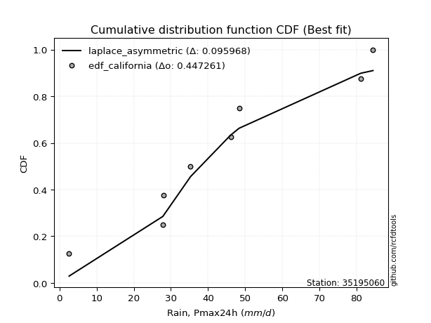</img>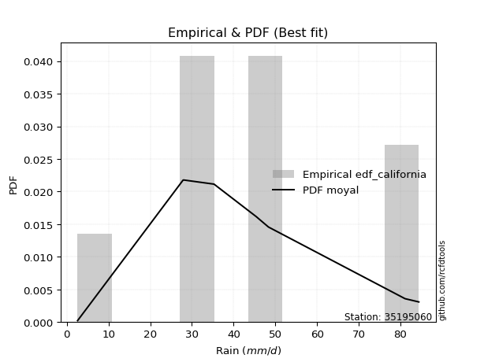</img>

</div>


### 2. EDF Hazen (1930)

Hazen method for plotting positions is a formula used to estimate the empirical cumulative probability distribution of flood events or other hydrological data. This formula often results in biased estimations, particularly when extrapolating to extreme events (high return periods).

<div align="center">


$P=(m-0.5)/n$


</div>


**2.1. Empirical values**

<div align="center">

|                | 0                   | 1                   | 2                  | 3                  | 4         | 5                  | 6                  | 7                  | 8                  |
|:---------------|:--------------------|:--------------------|:-------------------|:-------------------|:----------|:-------------------|:-------------------|:-------------------|:-------------------|
| date           | 2017                | 2022                | 2018               | 2021               | 2025      | 2024               | 2023               | 2020               | 2019               |
| x              | 2.6                 | 27.87               | 28.0               | 35.3               | 45.45     | 46.09              | 48.36              | 81.1               | 84.4               |
| m              | 1                   | 2                   | 3                  | 4                  | 5         | 6                  | 7                  | 8                  | 9                  |
| empirical_dist | edf_hazen           | edf_hazen           | edf_hazen          | edf_hazen          | edf_hazen | edf_hazen          | edf_hazen          | edf_hazen          | edf_hazen          |
| empirical      | 0.05555555555555555 | 0.16666666666666666 | 0.2777777777777778 | 0.3888888888888889 | 0.5       | 0.6111111111111112 | 0.7222222222222222 | 0.8333333333333334 | 0.9444444444444444 |
| empirical_tr   | 1.0588235294117647  | 1.2                 | 1.3846153846153846 | 1.6363636363636362 | 2.0       | 2.5714285714285716 | 3.5999999999999996 | 6.000000000000002  | 17.999999999999993 |

</div>


**2.2. Kolmogorov-Smirnov fit test (sorted by Δ)**


<div align="center">

|                | 0                   | 1                   | 2                   | 3                   | 4                   | 5                   | 6                   | 7                   | 8                   | 9                   | 10                  | 11                  | 12                  | 13                  | 14                  | 15                  | 16                  | 17                  | 18                  | 19                  | 20                  | 21                  | 22                  | 23                  | 24                  | 25                  | 26                  | 27                  | 28                  | 29                  | 30                  | 31                  | 32                  | 33                  | 34                  | 35                  | 36                  | 37                  | 38                  | 39                  | 40                  | 41                  | 42                  | 43                  | 44                  | 45                  | 46                  | 47                  | 48                  | 49                  | 50                  | 51                  | 52                  | 53                  | 54                  | 55                  | 56                  | 57                  | 58                  | 59                  | 60                  | 61                  | 62                  | 63                  | 64                  | 65                  | 66                  | 67                  | 68                  | 69                  | 70                  | 71                  | 72                  | 73                  | 74                  | 75                  | 76                  | 77                  | 78                  | 79                  | 80                  | 81                  | 82                  | 83                  | 84                  | 85                  | 86                  | 87                  | 88                  | 89                  | 90                  | 91                  | 92                  | 93                  | 94                  | 95                  | 96                  | 97                  | 98                  | 99                  | 100                 | 101                 | 102                 | 103                 | 104                 | 105                 | 106                 | 107                 | 108                 | 109                 | 110                 | 111                 | 112                 | 113                 | 114                 | 115                 | 116                 | 117                 | 118                 | 119                 | 120                 | 121                 | 122                 | 123                 | 124                 | 125                 | 126                 | 127                 | 128                 | 129                 | 130                 | 131                 | 132                 | 133                 | 134                 | 135                 | 136                 | 137                 | 138                 | 139                 | 140                 | 141                 | 142                 | 143                 | 144                 | 145                 | 146                 | 147                 | 148                 | 149                 | 150                 | 151                 | 152                 | 153                 | 154                 | 155                 | 156                 | 157                 | 158                 | 159                 |
|:---------------|:--------------------|:--------------------|:--------------------|:--------------------|:--------------------|:--------------------|:--------------------|:--------------------|:--------------------|:--------------------|:--------------------|:--------------------|:--------------------|:--------------------|:--------------------|:--------------------|:--------------------|:--------------------|:--------------------|:--------------------|:--------------------|:--------------------|:--------------------|:--------------------|:--------------------|:--------------------|:--------------------|:--------------------|:--------------------|:--------------------|:--------------------|:--------------------|:--------------------|:--------------------|:--------------------|:--------------------|:--------------------|:--------------------|:--------------------|:--------------------|:--------------------|:--------------------|:--------------------|:--------------------|:--------------------|:--------------------|:--------------------|:--------------------|:--------------------|:--------------------|:--------------------|:--------------------|:--------------------|:--------------------|:--------------------|:--------------------|:--------------------|:--------------------|:--------------------|:--------------------|:--------------------|:--------------------|:--------------------|:--------------------|:--------------------|:--------------------|:--------------------|:--------------------|:--------------------|:--------------------|:--------------------|:--------------------|:--------------------|:--------------------|:--------------------|:--------------------|:--------------------|:--------------------|:--------------------|:--------------------|:--------------------|:--------------------|:--------------------|:--------------------|:--------------------|:--------------------|:--------------------|:--------------------|:--------------------|:--------------------|:--------------------|:--------------------|:--------------------|:--------------------|:--------------------|:--------------------|:--------------------|:--------------------|:--------------------|:--------------------|:--------------------|:--------------------|:--------------------|:--------------------|:--------------------|:--------------------|:--------------------|:--------------------|:--------------------|:--------------------|:--------------------|:--------------------|:--------------------|:--------------------|:--------------------|:--------------------|:--------------------|:--------------------|:--------------------|:--------------------|:--------------------|:--------------------|:--------------------|:--------------------|:--------------------|:--------------------|:--------------------|:--------------------|:--------------------|:--------------------|:--------------------|:--------------------|:--------------------|:--------------------|:--------------------|:--------------------|:--------------------|:--------------------|:--------------------|:--------------------|:--------------------|:--------------------|:--------------------|:--------------------|:--------------------|:--------------------|:--------------------|:--------------------|:--------------------|:--------------------|:--------------------|:--------------------|:--------------------|:--------------------|:--------------------|:--------------------|:--------------------|:--------------------|:--------------------|:--------------------|
| station        | 35195060            | 35195060            | 35195060            | 35195060            | 35195060            | 35195060            | 35195060            | 35195060            | 35195060            | 35195060            | 35195060            | 35195060            | 35195060            | 35195060            | 35195060            | 35195060            | 35195060            | 35195060            | 35195060            | 35195060            | 35195060            | 35195060            | 35195060            | 35195060            | 35195060            | 35195060            | 35195060            | 35195060            | 35195060            | 35195060            | 35195060            | 35195060            | 35195060            | 35195060            | 35195060            | 35195060            | 35195060            | 35195060            | 35195060            | 35195060            | 35195060            | 35195060            | 35195060            | 35195060            | 35195060            | 35195060            | 35195060            | 35195060            | 35195060            | 35195060            | 35195060            | 35195060            | 35195060            | 35195060            | 35195060            | 35195060            | 35195060            | 35195060            | 35195060            | 35195060            | 35195060            | 35195060            | 35195060            | 35195060            | 35195060            | 35195060            | 35195060            | 35195060            | 35195060            | 35195060            | 35195060            | 35195060            | 35195060            | 35195060            | 35195060            | 35195060            | 35195060            | 35195060            | 35195060            | 35195060            | 35195060            | 35195060            | 35195060            | 35195060            | 35195060            | 35195060            | 35195060            | 35195060            | 35195060            | 35195060            | 35195060            | 35195060            | 35195060            | 35195060            | 35195060            | 35195060            | 35195060            | 35195060            | 35195060            | 35195060            | 35195060            | 35195060            | 35195060            | 35195060            | 35195060            | 35195060            | 35195060            | 35195060            | 35195060            | 35195060            | 35195060            | 35195060            | 35195060            | 35195060            | 35195060            | 35195060            | 35195060            | 35195060            | 35195060            | 35195060            | 35195060            | 35195060            | 35195060            | 35195060            | 35195060            | 35195060            | 35195060            | 35195060            | 35195060            | 35195060            | 35195060            | 35195060            | 35195060            | 35195060            | 35195060            | 35195060            | 35195060            | 35195060            | 35195060            | 35195060            | 35195060            | 35195060            | 35195060            | 35195060            | 35195060            | 35195060            | 35195060            | 35195060            | 35195060            | 35195060            | 35195060            | 35195060            | 35195060            | 35195060            | 35195060            | 35195060            | 35195060            | 35195060            | 35195060            | 35195060            |
| empirical_dist | edf_hazen           | edf_hazen           | edf_hazen           | edf_hazen           | edf_hazen           | edf_hazen           | edf_hazen           | edf_hazen           | edf_hazen           | edf_hazen           | edf_hazen           | edf_hazen           | edf_hazen           | edf_hazen           | edf_hazen           | edf_hazen           | edf_hazen           | edf_hazen           | edf_hazen           | edf_hazen           | edf_hazen           | edf_hazen           | edf_hazen           | edf_hazen           | edf_hazen           | edf_hazen           | edf_hazen           | edf_hazen           | edf_hazen           | edf_hazen           | edf_hazen           | edf_hazen           | edf_hazen           | edf_hazen           | edf_hazen           | edf_hazen           | edf_hazen           | edf_hazen           | edf_hazen           | edf_hazen           | edf_hazen           | edf_hazen           | edf_hazen           | edf_hazen           | edf_hazen           | edf_hazen           | edf_hazen           | edf_hazen           | edf_hazen           | edf_hazen           | edf_hazen           | edf_hazen           | edf_hazen           | edf_hazen           | edf_hazen           | edf_hazen           | edf_hazen           | edf_hazen           | edf_hazen           | edf_hazen           | edf_hazen           | edf_hazen           | edf_hazen           | edf_hazen           | edf_hazen           | edf_hazen           | edf_hazen           | edf_hazen           | edf_hazen           | edf_hazen           | edf_hazen           | edf_hazen           | edf_hazen           | edf_hazen           | edf_hazen           | edf_hazen           | edf_hazen           | edf_hazen           | edf_hazen           | edf_hazen           | edf_hazen           | edf_hazen           | edf_hazen           | edf_hazen           | edf_hazen           | edf_hazen           | edf_hazen           | edf_hazen           | edf_hazen           | edf_hazen           | edf_hazen           | edf_hazen           | edf_hazen           | edf_hazen           | edf_hazen           | edf_hazen           | edf_hazen           | edf_hazen           | edf_hazen           | edf_hazen           | edf_hazen           | edf_hazen           | edf_hazen           | edf_hazen           | edf_hazen           | edf_hazen           | edf_hazen           | edf_hazen           | edf_hazen           | edf_hazen           | edf_hazen           | edf_hazen           | edf_hazen           | edf_hazen           | edf_hazen           | edf_hazen           | edf_hazen           | edf_hazen           | edf_hazen           | edf_hazen           | edf_hazen           | edf_hazen           | edf_hazen           | edf_hazen           | edf_hazen           | edf_hazen           | edf_hazen           | edf_hazen           | edf_hazen           | edf_hazen           | edf_hazen           | edf_hazen           | edf_hazen           | edf_hazen           | edf_hazen           | edf_hazen           | edf_hazen           | edf_hazen           | edf_hazen           | edf_hazen           | edf_hazen           | edf_hazen           | edf_hazen           | edf_hazen           | edf_hazen           | edf_hazen           | edf_hazen           | edf_hazen           | edf_hazen           | edf_hazen           | edf_hazen           | edf_hazen           | edf_hazen           | edf_hazen           | edf_hazen           | edf_hazen           | edf_hazen           | edf_hazen           | edf_hazen           | edf_hazen           |
| p_dist         | gumbel_r            | logt                | invgauss            | moyal               | rayleigh            | laplace             | genlogistic         | halflogistic        | burr12              | invweibull          | skewnorm            | maxwell             | invgamma            | exponweib           | dweibull            | erlang              | gamma               | f                   | betaprime           | gengamma            | fatiguelife         | johnsonsu           | nct                 | weibull_min         | halfnorm            | ncf                 | rice                | dgamma              | hypsecant           | logexponpow         | pearson3            | vonmises_line       | genextreme          | kstwobign           | logistic            | foldnorm            | logexponweib        | truncweibull_min    | logweibull_min      | exponnorm           | loggompertz         | logdweibull         | t                   | norm                | crystalball         | logargus            | wrapcauchy          | uniform             | tukeylambda         | logburr12           | logdgamma           | kappa3              | anglit              | cosine              | semicircular        | logpearson3         | logloggamma         | logloglaplace       | loggengamma         | ksone               | kappa4              | lognakagami         | logburr             | logmielke           | loggennorm          | arcsine             | wald                | logjohnsonsu        | loggumbel_l         | gennorm             | truncnorm           | burr                | loggenextreme       | bradford            | loglaplace          | loglaplace          | gumbel_l            | logtrapezoid        | loggenpareto        | gausshyper          | logweibull_max      | argus               | loglevy_l           | logfoldnorm         | mielke              | loghypsecant        | logskewnorm         | loglogistic         | loggausshyper       | logfatiguelife      | logexponnorm        | logrice             | logcrystalball      | lognorm             | lognct              | logf                | johnsonsb           | logerlang           | loganglit           | genpareto           | genexpon            | levy_l              | logvonmises_line    | gompertz            | loggamma            | loggamma            | logbetaprime        | logsemicircular     | loginvgamma         | logalpha            | truncexpon          | lomax               | loginvgauss         | logarcsine          | logmaxwell          | logncf              | logjohnsonsb        | triang              | genhalflogistic     | lograyleigh         | loginvweibull       | loggumbel_r         | halfgennorm         | loggenhalflogistic  | loghalfnorm         | logmoyal            | logtriang           | logkstwobign        | logtruncnorm        | loghalflogistic     | logcosine           | beta                | loggenexpon         | loglomax            | logbeta             | logtruncweibull_min | trapezoid           | logwald             | logwrapcauchy       | logkappa4           | logksone            | logtukeylambda      | logkappa3           | loguniform          | rdist               | nakagami            | logbradford         | logtruncexpon       | weibull_max         | alpha               | powerlaw            | logrdist            | loghalfgennorm      | logpowerlaw         | exponpow            | truncpareto         | logtruncpareto      | loggenlogistic      | logvonmises         | vonmises            |
| delta          | 0.09586083156668737 | 0.10538554277431944 | 0.11276488984678001 | 0.11428468525083824 | 0.11822985207935088 | 0.11841290759565426 | 0.1189219237478093  | 0.12224810378313386 | 0.12461360013873701 | 0.1248414526051018  | 0.12560716485504375 | 0.1275464035565872  | 0.12859920519874457 | 0.1320495899759615  | 0.1327171927633548  | 0.13274052131432357 | 0.1327405342075808  | 0.1327465983242876  | 0.13283760431977465 | 0.1329652546770843  | 0.13336196701096592 | 0.1342602912527584  | 0.13495576566685574 | 0.13594317520477617 | 0.13675492332708902 | 0.13952290202205211 | 0.13980967223507912 | 0.14081474739421596 | 0.14084708875546537 | 0.14086113474112036 | 0.1414550416213105  | 0.14229140649421257 | 0.14466268978216335 | 0.14523496981756148 | 0.14815490750680882 | 0.15002708200676307 | 0.1503592446265689  | 0.15077088347697107 | 0.15123986958427085 | 0.15200957871555554 | 0.15544685626817875 | 0.1559617833577348  | 0.1568677139663549  | 0.15687030565907167 | 0.15687031121400485 | 0.15954671494445927 | 0.16267815989891343 | 0.162809019288237   | 0.16289997722840688 | 0.1635896763838325  | 0.16411951095376565 | 0.16500276311381012 | 0.16609118447527127 | 0.16878611706787705 | 0.16990266825927025 | 0.1704921560690107  | 0.1716697323026538  | 0.17272240991052723 | 0.1743305220540038  | 0.17471998731180793 | 0.17515367778150603 | 0.17710943709496552 | 0.17732565929724642 | 0.17783408974069148 | 0.18186355451791364 | 0.18510079793800882 | 0.18549196458911998 | 0.18894547021202857 | 0.19264222320173705 | 0.19731179210054592 | 0.20009394501452482 | 0.20671085366370356 | 0.2163116887782769  | 0.21840533112881835 | 0.22047598594779197 | 0.22047598594779197 | 0.2221029513981011  | 0.22274784300899228 | 0.2312124375694261  | 0.23289965503577695 | 0.23407005806354275 | 0.23464267333043454 | 0.24120046303251053 | 0.2429168750140431  | 0.24396748171020569 | 0.24408212041161167 | 0.24480074385942072 | 0.25203746951196604 | 0.25585760031405247 | 0.2605290366745565  | 0.26155819089607846 | 0.26156080821279437 | 0.2615609085930102  | 0.2615609111346464  | 0.2625924935657874  | 0.26492809030567777 | 0.265541386734326   | 0.2699912207142424  | 0.2716583455331151  | 0.27244386331402437 | 0.27326805809470833 | 0.273402865697689   | 0.2736263089352984  | 0.2743238054069309  | 0.2754708030804002  | 0.2754708030804002  | 0.2756870442113525  | 0.2758357053508699  | 0.27864559309368797 | 0.2794886009496169  | 0.2796364589878608  | 0.28139830956039413 | 0.2891928699668739  | 0.29250648123081413 | 0.2959528790184912  | 0.29935257238292723 | 0.3018786501481685  | 0.30376330517688627 | 0.3078896838144165  | 0.308089100152387   | 0.3109407552019582  | 0.3259290391322276  | 0.33533001180506483 | 0.3399801861047379  | 0.3424072696668202  | 0.3504860434886945  | 0.3506386703881249  | 0.3555066697612139  | 0.35961976972925724 | 0.3613242642426877  | 0.3617525222629162  | 0.37251681295038186 | 0.38043268139382647 | 0.4095961441471264  | 0.4127209135705372  | 0.41481922454258324 | 0.4171280533910339  | 0.41829699415826815 | 0.426850907618583   | 0.46961534666055527 | 0.4846746302515613  | 0.5044814026567485  | 0.513831427432988   | 0.5149428896352071  | 0.5454158897363585  | 0.56159365587509    | 0.5794886718386882  | 0.5811395994407246  | 0.614274955152989   | 0.614694096995318   | 0.6236117372499116  | 0.676923069217825   | 0.7222222222222222  | 0.7499258265593055  | 0.7546038534793498  | 0.7656414387316149  | 0.8105834463812303  | 0.8333333333333334  | 1.110217289720794   | 12.506097402102363  |
| deltao         | 0.41761268023100007 | 0.41761268023100007 | 0.41761268023100007 | 0.41761268023100007 | 0.41761268023100007 | 0.41761268023100007 | 0.41761268023100007 | 0.41761268023100007 | 0.41761268023100007 | 0.41761268023100007 | 0.41761268023100007 | 0.41761268023100007 | 0.41761268023100007 | 0.41761268023100007 | 0.41761268023100007 | 0.41761268023100007 | 0.41761268023100007 | 0.41761268023100007 | 0.41761268023100007 | 0.41761268023100007 | 0.41761268023100007 | 0.41761268023100007 | 0.41761268023100007 | 0.41761268023100007 | 0.41761268023100007 | 0.41761268023100007 | 0.41761268023100007 | 0.41761268023100007 | 0.41761268023100007 | 0.41761268023100007 | 0.41761268023100007 | 0.41761268023100007 | 0.41761268023100007 | 0.41761268023100007 | 0.41761268023100007 | 0.41761268023100007 | 0.41761268023100007 | 0.41761268023100007 | 0.41761268023100007 | 0.41761268023100007 | 0.41761268023100007 | 0.41761268023100007 | 0.41761268023100007 | 0.41761268023100007 | 0.41761268023100007 | 0.41761268023100007 | 0.41761268023100007 | 0.41761268023100007 | 0.41761268023100007 | 0.41761268023100007 | 0.41761268023100007 | 0.41761268023100007 | 0.41761268023100007 | 0.41761268023100007 | 0.41761268023100007 | 0.41761268023100007 | 0.41761268023100007 | 0.41761268023100007 | 0.41761268023100007 | 0.41761268023100007 | 0.41761268023100007 | 0.41761268023100007 | 0.41761268023100007 | 0.41761268023100007 | 0.41761268023100007 | 0.41761268023100007 | 0.41761268023100007 | 0.41761268023100007 | 0.41761268023100007 | 0.41761268023100007 | 0.41761268023100007 | 0.41761268023100007 | 0.41761268023100007 | 0.41761268023100007 | 0.41761268023100007 | 0.41761268023100007 | 0.41761268023100007 | 0.41761268023100007 | 0.41761268023100007 | 0.41761268023100007 | 0.41761268023100007 | 0.41761268023100007 | 0.41761268023100007 | 0.41761268023100007 | 0.41761268023100007 | 0.41761268023100007 | 0.41761268023100007 | 0.41761268023100007 | 0.41761268023100007 | 0.41761268023100007 | 0.41761268023100007 | 0.41761268023100007 | 0.41761268023100007 | 0.41761268023100007 | 0.41761268023100007 | 0.41761268023100007 | 0.41761268023100007 | 0.41761268023100007 | 0.41761268023100007 | 0.41761268023100007 | 0.41761268023100007 | 0.41761268023100007 | 0.41761268023100007 | 0.41761268023100007 | 0.41761268023100007 | 0.41761268023100007 | 0.41761268023100007 | 0.41761268023100007 | 0.41761268023100007 | 0.41761268023100007 | 0.41761268023100007 | 0.41761268023100007 | 0.41761268023100007 | 0.41761268023100007 | 0.41761268023100007 | 0.41761268023100007 | 0.41761268023100007 | 0.41761268023100007 | 0.41761268023100007 | 0.41761268023100007 | 0.41761268023100007 | 0.41761268023100007 | 0.41761268023100007 | 0.41761268023100007 | 0.41761268023100007 | 0.41761268023100007 | 0.41761268023100007 | 0.41761268023100007 | 0.41761268023100007 | 0.41761268023100007 | 0.41761268023100007 | 0.41761268023100007 | 0.41761268023100007 | 0.41761268023100007 | 0.41761268023100007 | 0.41761268023100007 | 0.41761268023100007 | 0.41761268023100007 | 0.41761268023100007 | 0.41761268023100007 | 0.41761268023100007 | 0.41761268023100007 | 0.41761268023100007 | 0.41761268023100007 | 0.41761268023100007 | 0.41761268023100007 | 0.41761268023100007 | 0.41761268023100007 | 0.41761268023100007 | 0.41761268023100007 | 0.41761268023100007 | 0.41761268023100007 | 0.41761268023100007 | 0.41761268023100007 | 0.41761268023100007 | 0.41761268023100007 | 0.41761268023100007 | 0.41761268023100007 | 0.41761268023100007 | 0.41761268023100007 |
| eval           | Δo > Δ              | Δo > Δ              | Δo > Δ              | Δo > Δ              | Δo > Δ              | Δo > Δ              | Δo > Δ              | Δo > Δ              | Δo > Δ              | Δo > Δ              | Δo > Δ              | Δo > Δ              | Δo > Δ              | Δo > Δ              | Δo > Δ              | Δo > Δ              | Δo > Δ              | Δo > Δ              | Δo > Δ              | Δo > Δ              | Δo > Δ              | Δo > Δ              | Δo > Δ              | Δo > Δ              | Δo > Δ              | Δo > Δ              | Δo > Δ              | Δo > Δ              | Δo > Δ              | Δo > Δ              | Δo > Δ              | Δo > Δ              | Δo > Δ              | Δo > Δ              | Δo > Δ              | Δo > Δ              | Δo > Δ              | Δo > Δ              | Δo > Δ              | Δo > Δ              | Δo > Δ              | Δo > Δ              | Δo > Δ              | Δo > Δ              | Δo > Δ              | Δo > Δ              | Δo > Δ              | Δo > Δ              | Δo > Δ              | Δo > Δ              | Δo > Δ              | Δo > Δ              | Δo > Δ              | Δo > Δ              | Δo > Δ              | Δo > Δ              | Δo > Δ              | Δo > Δ              | Δo > Δ              | Δo > Δ              | Δo > Δ              | Δo > Δ              | Δo > Δ              | Δo > Δ              | Δo > Δ              | Δo > Δ              | Δo > Δ              | Δo > Δ              | Δo > Δ              | Δo > Δ              | Δo > Δ              | Δo > Δ              | Δo > Δ              | Δo > Δ              | Δo > Δ              | Δo > Δ              | Δo > Δ              | Δo > Δ              | Δo > Δ              | Δo > Δ              | Δo > Δ              | Δo > Δ              | Δo > Δ              | Δo > Δ              | Δo > Δ              | Δo > Δ              | Δo > Δ              | Δo > Δ              | Δo > Δ              | Δo > Δ              | Δo > Δ              | Δo > Δ              | Δo > Δ              | Δo > Δ              | Δo > Δ              | Δo > Δ              | Δo > Δ              | Δo > Δ              | Δo > Δ              | Δo > Δ              | Δo > Δ              | Δo > Δ              | Δo > Δ              | Δo > Δ              | Δo > Δ              | Δo > Δ              | Δo > Δ              | Δo > Δ              | Δo > Δ              | Δo > Δ              | Δo > Δ              | Δo > Δ              | Δo > Δ              | Δo > Δ              | Δo > Δ              | Δo > Δ              | Δo > Δ              | Δo > Δ              | Δo > Δ              | Δo > Δ              | Δo > Δ              | Δo > Δ              | Δo > Δ              | Δo > Δ              | Δo > Δ              | Δo > Δ              | Δo > Δ              | Δo > Δ              | Δo > Δ              | Δo > Δ              | Δo > Δ              | Δo > Δ              | Δo > Δ              | Δo > Δ              | Δo > Δ              | Δo > Δ              | Δo > Δ              | Δo <= Δ             | Δo <= Δ             | Δo <= Δ             | Δo <= Δ             | Δo <= Δ             | Δo <= Δ             | Δo <= Δ             | Δo <= Δ             | Δo <= Δ             | Δo <= Δ             | Δo <= Δ             | Δo <= Δ             | Δo <= Δ             | Δo <= Δ             | Δo <= Δ             | Δo <= Δ             | Δo <= Δ             | Δo <= Δ             | Δo <= Δ             | Δo <= Δ             | Δo <= Δ             | Δo <= Δ             | Δo <= Δ             |
| fit            | 1                   | 1                   | 1                   | 1                   | 1                   | 1                   | 1                   | 1                   | 1                   | 1                   | 1                   | 1                   | 1                   | 1                   | 1                   | 1                   | 1                   | 1                   | 1                   | 1                   | 1                   | 1                   | 1                   | 1                   | 1                   | 1                   | 1                   | 1                   | 1                   | 1                   | 1                   | 1                   | 1                   | 1                   | 1                   | 1                   | 1                   | 1                   | 1                   | 1                   | 1                   | 1                   | 1                   | 1                   | 1                   | 1                   | 1                   | 1                   | 1                   | 1                   | 1                   | 1                   | 1                   | 1                   | 1                   | 1                   | 1                   | 1                   | 1                   | 1                   | 1                   | 1                   | 1                   | 1                   | 1                   | 1                   | 1                   | 1                   | 1                   | 1                   | 1                   | 1                   | 1                   | 1                   | 1                   | 1                   | 1                   | 1                   | 1                   | 1                   | 1                   | 1                   | 1                   | 1                   | 1                   | 1                   | 1                   | 1                   | 1                   | 1                   | 1                   | 1                   | 1                   | 1                   | 1                   | 1                   | 1                   | 1                   | 1                   | 1                   | 1                   | 1                   | 1                   | 1                   | 1                   | 1                   | 1                   | 1                   | 1                   | 1                   | 1                   | 1                   | 1                   | 1                   | 1                   | 1                   | 1                   | 1                   | 1                   | 1                   | 1                   | 1                   | 1                   | 1                   | 1                   | 1                   | 1                   | 1                   | 1                   | 1                   | 1                   | 1                   | 1                   | 1                   | 1                   | 1                   | 1                   | 0                   | 0                   | 0                   | 0                   | 0                   | 0                   | 0                   | 0                   | 0                   | 0                   | 0                   | 0                   | 0                   | 0                   | 0                   | 0                   | 0                   | 0                   | 0                   | 0                   | 0                   | 0                   | 0                   |
| n              | 9                   | 9                   | 9                   | 9                   | 9                   | 9                   | 9                   | 9                   | 9                   | 9                   | 9                   | 9                   | 9                   | 9                   | 9                   | 9                   | 9                   | 9                   | 9                   | 9                   | 9                   | 9                   | 9                   | 9                   | 9                   | 9                   | 9                   | 9                   | 9                   | 9                   | 9                   | 9                   | 9                   | 9                   | 9                   | 9                   | 9                   | 9                   | 9                   | 9                   | 9                   | 9                   | 9                   | 9                   | 9                   | 9                   | 9                   | 9                   | 9                   | 9                   | 9                   | 9                   | 9                   | 9                   | 9                   | 9                   | 9                   | 9                   | 9                   | 9                   | 9                   | 9                   | 9                   | 9                   | 9                   | 9                   | 9                   | 9                   | 9                   | 9                   | 9                   | 9                   | 9                   | 9                   | 9                   | 9                   | 9                   | 9                   | 9                   | 9                   | 9                   | 9                   | 9                   | 9                   | 9                   | 9                   | 9                   | 9                   | 9                   | 9                   | 9                   | 9                   | 9                   | 9                   | 9                   | 9                   | 9                   | 9                   | 9                   | 9                   | 9                   | 9                   | 9                   | 9                   | 9                   | 9                   | 9                   | 9                   | 9                   | 9                   | 9                   | 9                   | 9                   | 9                   | 9                   | 9                   | 9                   | 9                   | 9                   | 9                   | 9                   | 9                   | 9                   | 9                   | 9                   | 9                   | 9                   | 9                   | 9                   | 9                   | 9                   | 9                   | 9                   | 9                   | 9                   | 9                   | 9                   | 9                   | 9                   | 9                   | 9                   | 9                   | 9                   | 9                   | 9                   | 9                   | 9                   | 9                   | 9                   | 9                   | 9                   | 9                   | 9                   | 9                   | 9                   | 9                   | 9                   | 9                   | 9                   | 9                   |
| best_fit       | 1                   | 0                   | 0                   | 0                   | 0                   | 0                   | 0                   | 0                   | 0                   | 0                   | 0                   | 0                   | 0                   | 0                   | 0                   | 0                   | 0                   | 0                   | 0                   | 0                   | 0                   | 0                   | 0                   | 0                   | 0                   | 0                   | 0                   | 0                   | 0                   | 0                   | 0                   | 0                   | 0                   | 0                   | 0                   | 0                   | 0                   | 0                   | 0                   | 0                   | 0                   | 0                   | 0                   | 0                   | 0                   | 0                   | 0                   | 0                   | 0                   | 0                   | 0                   | 0                   | 0                   | 0                   | 0                   | 0                   | 0                   | 0                   | 0                   | 0                   | 0                   | 0                   | 0                   | 0                   | 0                   | 0                   | 0                   | 0                   | 0                   | 0                   | 0                   | 0                   | 0                   | 0                   | 0                   | 0                   | 0                   | 0                   | 0                   | 0                   | 0                   | 0                   | 0                   | 0                   | 0                   | 0                   | 0                   | 0                   | 0                   | 0                   | 0                   | 0                   | 0                   | 0                   | 0                   | 0                   | 0                   | 0                   | 0                   | 0                   | 0                   | 0                   | 0                   | 0                   | 0                   | 0                   | 0                   | 0                   | 0                   | 0                   | 0                   | 0                   | 0                   | 0                   | 0                   | 0                   | 0                   | 0                   | 0                   | 0                   | 0                   | 0                   | 0                   | 0                   | 0                   | 0                   | 0                   | 0                   | 0                   | 0                   | 0                   | 0                   | 0                   | 0                   | 0                   | 0                   | 0                   | 0                   | 0                   | 0                   | 0                   | 0                   | 0                   | 0                   | 0                   | 0                   | 0                   | 0                   | 0                   | 0                   | 0                   | 0                   | 0                   | 0                   | 0                   | 0                   | 0                   | 0                   | 0                   | 0                   |
| best_fit_sort  | 1                   | 2                   | 3                   | 4                   | 5                   | 6                   | 7                   | 8                   | 9                   | 10                  | 11                  | 12                  | 13                  | 14                  | 15                  | 16                  | 17                  | 18                  | 19                  | 20                  | 21                  | 22                  | 23                  | 24                  | 25                  | 26                  | 27                  | 28                  | 29                  | 30                  | 31                  | 32                  | 33                  | 34                  | 35                  | 36                  | 37                  | 38                  | 39                  | 40                  | 41                  | 42                  | 43                  | 44                  | 45                  | 46                  | 47                  | 48                  | 49                  | 50                  | 51                  | 52                  | 53                  | 54                  | 55                  | 56                  | 57                  | 58                  | 59                  | 60                  | 61                  | 62                  | 63                  | 64                  | 65                  | 66                  | 67                  | 68                  | 69                  | 70                  | 71                  | 72                  | 73                  | 74                  | 75                  | 76                  | 77                  | 78                  | 79                  | 80                  | 81                  | 82                  | 83                  | 84                  | 85                  | 86                  | 87                  | 88                  | 89                  | 90                  | 91                  | 92                  | 93                  | 94                  | 95                  | 96                  | 97                  | 98                  | 99                  | 100                 | 101                 | 102                 | 103                 | 104                 | 105                 | 106                 | 107                 | 108                 | 109                 | 110                 | 111                 | 112                 | 113                 | 114                 | 115                 | 116                 | 117                 | 118                 | 119                 | 120                 | 121                 | 122                 | 123                 | 124                 | 125                 | 126                 | 127                 | 128                 | 129                 | 130                 | 131                 | 132                 | 133                 | 134                 | 135                 | 136                 | 137                 | 138                 | 139                 | 140                 | 141                 | 142                 | 143                 | 144                 | 145                 | 146                 | 147                 | 148                 | 149                 | 150                 | 151                 | 152                 | 153                 | 154                 | 155                 | 156                 | 157                 | 158                 | 159                 | 160                 |

</div>


**2.3. Best fit**

<div align="center">

|   id |   station | empirical_dist   | p_dist   |     delta |   deltao | eval   |   fit |   n |   best_fit |   best_fit_sort |
|-----:|----------:|:-----------------|:---------|----------:|---------:|:-------|------:|----:|-----------:|----------------:|
|    0 |  35195060 | edf_hazen        | gumbel_r | 0.0958608 | 0.417613 | Δo > Δ |     1 |   9 |          1 |               1 |

</div>


<div align="center">

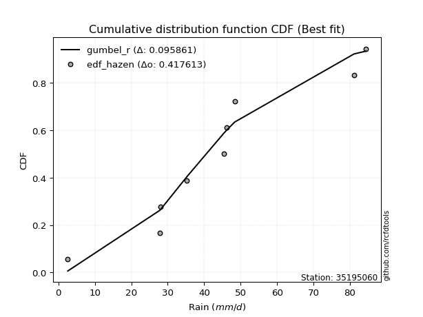</img>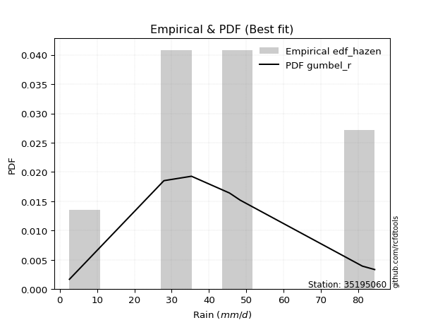</img>

</div>


### 3. EDF Weibull (1939)

Weibull plotting position formula is an empirical method used to estimate the non-exceedance probability or plotting position for a set of observed data, is often recommended or widely used in practice, particularly in flood frequency analysis.

<div align="center">


$P=m/(n+1)$


</div>


**3.1. Empirical values**

<div align="center">

|                | 0                  | 1           | 2                  | 3                  | 4           | 5           | 6                 | 7                 | 8                  |
|:---------------|:-------------------|:------------|:-------------------|:-------------------|:------------|:------------|:------------------|:------------------|:-------------------|
| date           | 2017               | 2022        | 2018               | 2021               | 2025        | 2024        | 2023              | 2020              | 2019               |
| x              | 2.6                | 27.87       | 28.0               | 35.3               | 45.45       | 46.09       | 48.36             | 81.1              | 84.4               |
| m              | 1                  | 2           | 3                  | 4                  | 5           | 6           | 7                 | 8                 | 9                  |
| empirical_dist | edf_weibull        | edf_weibull | edf_weibull        | edf_weibull        | edf_weibull | edf_weibull | edf_weibull       | edf_weibull       | edf_weibull        |
| empirical      | 0.1                | 0.2         | 0.3                | 0.4                | 0.5         | 0.6         | 0.7               | 0.8               | 0.9                |
| empirical_tr   | 1.1111111111111112 | 1.25        | 1.4285714285714286 | 1.6666666666666667 | 2.0         | 2.5         | 3.333333333333333 | 5.000000000000001 | 10.000000000000002 |

</div>


**3.2. Kolmogorov-Smirnov fit test (sorted by Δ)**


<div align="center">

|                | 0                   | 1                   | 2                   | 3                   | 4                   | 5                   | 6                   | 7                   | 8                   | 9                   | 10                  | 11                  | 12                  | 13                  | 14                  | 15                  | 16                  | 17                  | 18                  | 19                  | 20                  | 21                  | 22                  | 23                  | 24                  | 25                  | 26                  | 27                  | 28                  | 29                  | 30                  | 31                  | 32                  | 33                  | 34                  | 35                  | 36                  | 37                  | 38                  | 39                  | 40                  | 41                  | 42                  | 43                  | 44                  | 45                  | 46                  | 47                  | 48                  | 49                  | 50                  | 51                  | 52                  | 53                  | 54                  | 55                  | 56                  | 57                  | 58                  | 59                  | 60                  | 61                  | 62                  | 63                  | 64                  | 65                  | 66                  | 67                  | 68                  | 69                  | 70                  | 71                  | 72                  | 73                  | 74                  | 75                  | 76                  | 77                  | 78                  | 79                  | 80                  | 81                  | 82                  | 83                  | 84                  | 85                  | 86                  | 87                  | 88                  | 89                  | 90                  | 91                  | 92                  | 93                  | 94                  | 95                  | 96                  | 97                  | 98                  | 99                  | 100                 | 101                 | 102                 | 103                 | 104                 | 105                 | 106                 | 107                 | 108                 | 109                 | 110                 | 111                 | 112                 | 113                 | 114                 | 115                 | 116                 | 117                 | 118                 | 119                 | 120                 | 121                 | 122                 | 123                 | 124                 | 125                 | 126                 | 127                 | 128                 | 129                 | 130                 | 131                 | 132                 | 133                 | 134                 | 135                 | 136                 | 137                 | 138                 | 139                 | 140                 | 141                 | 142                 | 143                 | 144                 | 145                 | 146                 | 147                 | 148                 | 149                 | 150                 | 151                 | 152                 | 153                 | 154                 | 155                 | 156                 | 157                 | 158                 | 159                 |
|:---------------|:--------------------|:--------------------|:--------------------|:--------------------|:--------------------|:--------------------|:--------------------|:--------------------|:--------------------|:--------------------|:--------------------|:--------------------|:--------------------|:--------------------|:--------------------|:--------------------|:--------------------|:--------------------|:--------------------|:--------------------|:--------------------|:--------------------|:--------------------|:--------------------|:--------------------|:--------------------|:--------------------|:--------------------|:--------------------|:--------------------|:--------------------|:--------------------|:--------------------|:--------------------|:--------------------|:--------------------|:--------------------|:--------------------|:--------------------|:--------------------|:--------------------|:--------------------|:--------------------|:--------------------|:--------------------|:--------------------|:--------------------|:--------------------|:--------------------|:--------------------|:--------------------|:--------------------|:--------------------|:--------------------|:--------------------|:--------------------|:--------------------|:--------------------|:--------------------|:--------------------|:--------------------|:--------------------|:--------------------|:--------------------|:--------------------|:--------------------|:--------------------|:--------------------|:--------------------|:--------------------|:--------------------|:--------------------|:--------------------|:--------------------|:--------------------|:--------------------|:--------------------|:--------------------|:--------------------|:--------------------|:--------------------|:--------------------|:--------------------|:--------------------|:--------------------|:--------------------|:--------------------|:--------------------|:--------------------|:--------------------|:--------------------|:--------------------|:--------------------|:--------------------|:--------------------|:--------------------|:--------------------|:--------------------|:--------------------|:--------------------|:--------------------|:--------------------|:--------------------|:--------------------|:--------------------|:--------------------|:--------------------|:--------------------|:--------------------|:--------------------|:--------------------|:--------------------|:--------------------|:--------------------|:--------------------|:--------------------|:--------------------|:--------------------|:--------------------|:--------------------|:--------------------|:--------------------|:--------------------|:--------------------|:--------------------|:--------------------|:--------------------|:--------------------|:--------------------|:--------------------|:--------------------|:--------------------|:--------------------|:--------------------|:--------------------|:--------------------|:--------------------|:--------------------|:--------------------|:--------------------|:--------------------|:--------------------|:--------------------|:--------------------|:--------------------|:--------------------|:--------------------|:--------------------|:--------------------|:--------------------|:--------------------|:--------------------|:--------------------|:--------------------|:--------------------|:--------------------|:--------------------|:--------------------|:--------------------|:--------------------|
| station        | 35195060            | 35195060            | 35195060            | 35195060            | 35195060            | 35195060            | 35195060            | 35195060            | 35195060            | 35195060            | 35195060            | 35195060            | 35195060            | 35195060            | 35195060            | 35195060            | 35195060            | 35195060            | 35195060            | 35195060            | 35195060            | 35195060            | 35195060            | 35195060            | 35195060            | 35195060            | 35195060            | 35195060            | 35195060            | 35195060            | 35195060            | 35195060            | 35195060            | 35195060            | 35195060            | 35195060            | 35195060            | 35195060            | 35195060            | 35195060            | 35195060            | 35195060            | 35195060            | 35195060            | 35195060            | 35195060            | 35195060            | 35195060            | 35195060            | 35195060            | 35195060            | 35195060            | 35195060            | 35195060            | 35195060            | 35195060            | 35195060            | 35195060            | 35195060            | 35195060            | 35195060            | 35195060            | 35195060            | 35195060            | 35195060            | 35195060            | 35195060            | 35195060            | 35195060            | 35195060            | 35195060            | 35195060            | 35195060            | 35195060            | 35195060            | 35195060            | 35195060            | 35195060            | 35195060            | 35195060            | 35195060            | 35195060            | 35195060            | 35195060            | 35195060            | 35195060            | 35195060            | 35195060            | 35195060            | 35195060            | 35195060            | 35195060            | 35195060            | 35195060            | 35195060            | 35195060            | 35195060            | 35195060            | 35195060            | 35195060            | 35195060            | 35195060            | 35195060            | 35195060            | 35195060            | 35195060            | 35195060            | 35195060            | 35195060            | 35195060            | 35195060            | 35195060            | 35195060            | 35195060            | 35195060            | 35195060            | 35195060            | 35195060            | 35195060            | 35195060            | 35195060            | 35195060            | 35195060            | 35195060            | 35195060            | 35195060            | 35195060            | 35195060            | 35195060            | 35195060            | 35195060            | 35195060            | 35195060            | 35195060            | 35195060            | 35195060            | 35195060            | 35195060            | 35195060            | 35195060            | 35195060            | 35195060            | 35195060            | 35195060            | 35195060            | 35195060            | 35195060            | 35195060            | 35195060            | 35195060            | 35195060            | 35195060            | 35195060            | 35195060            | 35195060            | 35195060            | 35195060            | 35195060            | 35195060            | 35195060            |
| empirical_dist | edf_weibull         | edf_weibull         | edf_weibull         | edf_weibull         | edf_weibull         | edf_weibull         | edf_weibull         | edf_weibull         | edf_weibull         | edf_weibull         | edf_weibull         | edf_weibull         | edf_weibull         | edf_weibull         | edf_weibull         | edf_weibull         | edf_weibull         | edf_weibull         | edf_weibull         | edf_weibull         | edf_weibull         | edf_weibull         | edf_weibull         | edf_weibull         | edf_weibull         | edf_weibull         | edf_weibull         | edf_weibull         | edf_weibull         | edf_weibull         | edf_weibull         | edf_weibull         | edf_weibull         | edf_weibull         | edf_weibull         | edf_weibull         | edf_weibull         | edf_weibull         | edf_weibull         | edf_weibull         | edf_weibull         | edf_weibull         | edf_weibull         | edf_weibull         | edf_weibull         | edf_weibull         | edf_weibull         | edf_weibull         | edf_weibull         | edf_weibull         | edf_weibull         | edf_weibull         | edf_weibull         | edf_weibull         | edf_weibull         | edf_weibull         | edf_weibull         | edf_weibull         | edf_weibull         | edf_weibull         | edf_weibull         | edf_weibull         | edf_weibull         | edf_weibull         | edf_weibull         | edf_weibull         | edf_weibull         | edf_weibull         | edf_weibull         | edf_weibull         | edf_weibull         | edf_weibull         | edf_weibull         | edf_weibull         | edf_weibull         | edf_weibull         | edf_weibull         | edf_weibull         | edf_weibull         | edf_weibull         | edf_weibull         | edf_weibull         | edf_weibull         | edf_weibull         | edf_weibull         | edf_weibull         | edf_weibull         | edf_weibull         | edf_weibull         | edf_weibull         | edf_weibull         | edf_weibull         | edf_weibull         | edf_weibull         | edf_weibull         | edf_weibull         | edf_weibull         | edf_weibull         | edf_weibull         | edf_weibull         | edf_weibull         | edf_weibull         | edf_weibull         | edf_weibull         | edf_weibull         | edf_weibull         | edf_weibull         | edf_weibull         | edf_weibull         | edf_weibull         | edf_weibull         | edf_weibull         | edf_weibull         | edf_weibull         | edf_weibull         | edf_weibull         | edf_weibull         | edf_weibull         | edf_weibull         | edf_weibull         | edf_weibull         | edf_weibull         | edf_weibull         | edf_weibull         | edf_weibull         | edf_weibull         | edf_weibull         | edf_weibull         | edf_weibull         | edf_weibull         | edf_weibull         | edf_weibull         | edf_weibull         | edf_weibull         | edf_weibull         | edf_weibull         | edf_weibull         | edf_weibull         | edf_weibull         | edf_weibull         | edf_weibull         | edf_weibull         | edf_weibull         | edf_weibull         | edf_weibull         | edf_weibull         | edf_weibull         | edf_weibull         | edf_weibull         | edf_weibull         | edf_weibull         | edf_weibull         | edf_weibull         | edf_weibull         | edf_weibull         | edf_weibull         | edf_weibull         | edf_weibull         | edf_weibull         | edf_weibull         |
| p_dist         | invweibull          | logt                | ncf                 | kstwobign           | halfnorm            | halflogistic        | logweibull_min      | invgauss            | burr12              | rayleigh            | moyal               | dweibull            | logexponpow         | loggompertz         | gumbel_r            | maxwell             | genlogistic         | invgamma            | skewnorm            | weibull_min         | gamma               | erlang              | f                   | betaprime           | rice                | fatiguelife         | nct                 | gengamma            | johnsonsu           | exponweib           | foldnorm            | logexponweib        | pearson3            | logburr12           | exponnorm           | genextreme          | logdweibull         | t                   | norm                | crystalball         | logistic            | hypsecant           | laplace             | logargus            | anglit              | cosine              | semicircular        | logpearson3         | logloglaplace       | dgamma              | loggengamma         | ksone               | kappa4              | logburr             | logmielke           | kappa3              | logloggamma         | tukeylambda         | loggumbel_l         | uniform             | wrapcauchy          | truncweibull_min    | logjohnsonsu        | vonmises_line       | logdgamma           | truncnorm           | burr                | bradford            | wald                | loglaplace          | loglaplace          | logtrapezoid        | loggennorm          | loggenextreme       | gausshyper          | gumbel_l            | lognakagami         | arcsine             | gennorm             | loggenpareto        | logfoldnorm         | mielke              | loghypsecant        | logskewnorm         | logweibull_max      | argus               | loglogistic         | loglevy_l           | loggausshyper       | logfatiguelife      | logexponnorm        | logrice             | logcrystalball      | lognorm             | lognct              | logf                | levy_l              | logerlang           | loganglit           | genexpon            | loggamma            | loggamma            | logbetaprime        | logsemicircular     | johnsonsb           | loginvgamma         | logalpha            | truncexpon          | lomax               | genpareto           | loginvgauss         | logarcsine          | logmaxwell          | logncf              | logjohnsonsb        | lograyleigh         | loginvweibull       | triang              | genhalflogistic     | loggumbel_r         | logvonmises_line    | gompertz            | halfgennorm         | loggenhalflogistic  | loghalfnorm         | logmoyal            | logtriang           | logkstwobign        | logtruncnorm        | loghalflogistic     | logcosine           | loggenexpon         | beta                | loglomax            | logtruncweibull_min | logwald             | logbeta             | logwrapcauchy       | trapezoid           | logkappa4           | logksone            | logtukeylambda      | logkappa3           | loguniform          | rdist               | nakagami            | logbradford         | logtruncexpon       | alpha               | powerlaw            | weibull_max         | logrdist            | loghalfgennorm      | logpowerlaw         | exponpow            | truncpareto         | logtruncpareto      | loggenlogistic      | logvonmises         | vonmises            |
| delta          | 0.09532026047806086 | 0.1010069796626561  | 0.10618956868871876 | 0.11190163648422813 | 0.11225325649276718 | 0.11789989429162917 | 0.1179065362509375  | 0.11817374069214781 | 0.1182141449112164  | 0.11895897545274703 | 0.12101265000137285 | 0.12113320599377936 | 0.12206405273751597 | 0.1221135229348454  | 0.12212065520655846 | 0.1221998865625793  | 0.1225076435833341  | 0.12321628590982991 | 0.12382967657331256 | 0.12424030270037767 | 0.1251973757159971  | 0.12519737755128302 | 0.12520121623354297 | 0.12526452780387343 | 0.12567660043499096 | 0.12568726551855292 | 0.1258166994250286  | 0.12585667623746144 | 0.12620953383149658 | 0.12706687110826453 | 0.12799121482637044 | 0.12813702240434666 | 0.1285864202357322  | 0.13025634305049916 | 0.13289882337019276 | 0.13340798720924152 | 0.13373956113551255 | 0.13464549174413265 | 0.13464808343684942 | 0.1346480889917826  | 0.1391557063028146  | 0.14066194224210915 | 0.1408047964432505  | 0.14372868977279296 | 0.14386896225304902 | 0.1465638948456548  | 0.147680446037048   | 0.14826993384678844 | 0.15050018768830498 | 0.15192585850532708 | 0.15210829983178153 | 0.15249776508958568 | 0.15479135624696228 | 0.15510343707502416 | 0.15561186751846923 | 0.15589439505165603 | 0.15811260340171363 | 0.15866434009341357 | 0.1593088898684037  | 0.1596577017114913  | 0.15966671687512834 | 0.16439791287331373 | 0.1667232479898063  | 0.17172210138544663 | 0.17523062206487677 | 0.17787172279230257 | 0.1844886314414813  | 0.185071997795485   | 0.18549196458911998 | 0.18714265261445862 | 0.18714265261445862 | 0.18941450967565893 | 0.19297466562902477 | 0.19408946655605464 | 0.1995663217024436  | 0.19988072917587885 | 0.1999979377744029  | 0.19999999999999996 | 0.20842290321165705 | 0.20899021534720386 | 0.20958354168070975 | 0.21063414837687233 | 0.21074878707827832 | 0.21146741052608736 | 0.2118478358413205  | 0.21242045110821228 | 0.21870413617863266 | 0.21897824081028827 | 0.2225242669807191  | 0.2271957033412232  | 0.22822485756274513 | 0.22822747487946105 | 0.2282275752596768  | 0.2282275778013131  | 0.22925916023245402 | 0.23159475697234438 | 0.23233471767648495 | 0.2366578873809091  | 0.23832501219978175 | 0.23993472476137495 | 0.24213746974706685 | 0.24213746974706685 | 0.2423537108780191  | 0.2425023720175365  | 0.24331916451210372 | 0.2453122597603546  | 0.2461552676162836  | 0.24630312565452744 | 0.24806497622706075 | 0.2502216410918021  | 0.2558595366335405  | 0.2591731478974808  | 0.2626195456851579  | 0.26601923904959385 | 0.2685453168148352  | 0.2747557668190536  | 0.2776074218686248  | 0.281541082954664   | 0.28566746159219425 | 0.29259570579889427 | 0.2958485311575206  | 0.2965460276291531  | 0.30199667847173145 | 0.3066468527714045  | 0.30907393633348684 | 0.3171527101553611  | 0.3173053370547915  | 0.32217333642788054 | 0.32628643639592386 | 0.32799093090935433 | 0.32841918892958283 | 0.3470993480604931  | 0.3502945907281596  | 0.37626281081379304 | 0.38148589120924986 | 0.3849636608249348  | 0.39049869134831494 | 0.39351757428524964 | 0.39490583116881167 | 0.4362820133272219  | 0.45134129691822794 | 0.4711480693234151  | 0.48049809409965466 | 0.4816095563018737  | 0.5120825564030251  | 0.5282603225417566  | 0.5461553385053548  | 0.5478062661073912  | 0.5813607636619846  | 0.5902784039165783  | 0.5920527329307668  | 0.6435897358844915  | 0.7                 | 0.7165924932259722  | 0.7212705201460163  | 0.7323081053982816  | 0.7772501130478968  | 0.8                 | 1.0768839563874608  | 12.550541846546807  |
| deltao         | 0.41761268023100007 | 0.41761268023100007 | 0.41761268023100007 | 0.41761268023100007 | 0.41761268023100007 | 0.41761268023100007 | 0.41761268023100007 | 0.41761268023100007 | 0.41761268023100007 | 0.41761268023100007 | 0.41761268023100007 | 0.41761268023100007 | 0.41761268023100007 | 0.41761268023100007 | 0.41761268023100007 | 0.41761268023100007 | 0.41761268023100007 | 0.41761268023100007 | 0.41761268023100007 | 0.41761268023100007 | 0.41761268023100007 | 0.41761268023100007 | 0.41761268023100007 | 0.41761268023100007 | 0.41761268023100007 | 0.41761268023100007 | 0.41761268023100007 | 0.41761268023100007 | 0.41761268023100007 | 0.41761268023100007 | 0.41761268023100007 | 0.41761268023100007 | 0.41761268023100007 | 0.41761268023100007 | 0.41761268023100007 | 0.41761268023100007 | 0.41761268023100007 | 0.41761268023100007 | 0.41761268023100007 | 0.41761268023100007 | 0.41761268023100007 | 0.41761268023100007 | 0.41761268023100007 | 0.41761268023100007 | 0.41761268023100007 | 0.41761268023100007 | 0.41761268023100007 | 0.41761268023100007 | 0.41761268023100007 | 0.41761268023100007 | 0.41761268023100007 | 0.41761268023100007 | 0.41761268023100007 | 0.41761268023100007 | 0.41761268023100007 | 0.41761268023100007 | 0.41761268023100007 | 0.41761268023100007 | 0.41761268023100007 | 0.41761268023100007 | 0.41761268023100007 | 0.41761268023100007 | 0.41761268023100007 | 0.41761268023100007 | 0.41761268023100007 | 0.41761268023100007 | 0.41761268023100007 | 0.41761268023100007 | 0.41761268023100007 | 0.41761268023100007 | 0.41761268023100007 | 0.41761268023100007 | 0.41761268023100007 | 0.41761268023100007 | 0.41761268023100007 | 0.41761268023100007 | 0.41761268023100007 | 0.41761268023100007 | 0.41761268023100007 | 0.41761268023100007 | 0.41761268023100007 | 0.41761268023100007 | 0.41761268023100007 | 0.41761268023100007 | 0.41761268023100007 | 0.41761268023100007 | 0.41761268023100007 | 0.41761268023100007 | 0.41761268023100007 | 0.41761268023100007 | 0.41761268023100007 | 0.41761268023100007 | 0.41761268023100007 | 0.41761268023100007 | 0.41761268023100007 | 0.41761268023100007 | 0.41761268023100007 | 0.41761268023100007 | 0.41761268023100007 | 0.41761268023100007 | 0.41761268023100007 | 0.41761268023100007 | 0.41761268023100007 | 0.41761268023100007 | 0.41761268023100007 | 0.41761268023100007 | 0.41761268023100007 | 0.41761268023100007 | 0.41761268023100007 | 0.41761268023100007 | 0.41761268023100007 | 0.41761268023100007 | 0.41761268023100007 | 0.41761268023100007 | 0.41761268023100007 | 0.41761268023100007 | 0.41761268023100007 | 0.41761268023100007 | 0.41761268023100007 | 0.41761268023100007 | 0.41761268023100007 | 0.41761268023100007 | 0.41761268023100007 | 0.41761268023100007 | 0.41761268023100007 | 0.41761268023100007 | 0.41761268023100007 | 0.41761268023100007 | 0.41761268023100007 | 0.41761268023100007 | 0.41761268023100007 | 0.41761268023100007 | 0.41761268023100007 | 0.41761268023100007 | 0.41761268023100007 | 0.41761268023100007 | 0.41761268023100007 | 0.41761268023100007 | 0.41761268023100007 | 0.41761268023100007 | 0.41761268023100007 | 0.41761268023100007 | 0.41761268023100007 | 0.41761268023100007 | 0.41761268023100007 | 0.41761268023100007 | 0.41761268023100007 | 0.41761268023100007 | 0.41761268023100007 | 0.41761268023100007 | 0.41761268023100007 | 0.41761268023100007 | 0.41761268023100007 | 0.41761268023100007 | 0.41761268023100007 | 0.41761268023100007 | 0.41761268023100007 | 0.41761268023100007 | 0.41761268023100007 | 0.41761268023100007 |
| eval           | Δo > Δ              | Δo > Δ              | Δo > Δ              | Δo > Δ              | Δo > Δ              | Δo > Δ              | Δo > Δ              | Δo > Δ              | Δo > Δ              | Δo > Δ              | Δo > Δ              | Δo > Δ              | Δo > Δ              | Δo > Δ              | Δo > Δ              | Δo > Δ              | Δo > Δ              | Δo > Δ              | Δo > Δ              | Δo > Δ              | Δo > Δ              | Δo > Δ              | Δo > Δ              | Δo > Δ              | Δo > Δ              | Δo > Δ              | Δo > Δ              | Δo > Δ              | Δo > Δ              | Δo > Δ              | Δo > Δ              | Δo > Δ              | Δo > Δ              | Δo > Δ              | Δo > Δ              | Δo > Δ              | Δo > Δ              | Δo > Δ              | Δo > Δ              | Δo > Δ              | Δo > Δ              | Δo > Δ              | Δo > Δ              | Δo > Δ              | Δo > Δ              | Δo > Δ              | Δo > Δ              | Δo > Δ              | Δo > Δ              | Δo > Δ              | Δo > Δ              | Δo > Δ              | Δo > Δ              | Δo > Δ              | Δo > Δ              | Δo > Δ              | Δo > Δ              | Δo > Δ              | Δo > Δ              | Δo > Δ              | Δo > Δ              | Δo > Δ              | Δo > Δ              | Δo > Δ              | Δo > Δ              | Δo > Δ              | Δo > Δ              | Δo > Δ              | Δo > Δ              | Δo > Δ              | Δo > Δ              | Δo > Δ              | Δo > Δ              | Δo > Δ              | Δo > Δ              | Δo > Δ              | Δo > Δ              | Δo > Δ              | Δo > Δ              | Δo > Δ              | Δo > Δ              | Δo > Δ              | Δo > Δ              | Δo > Δ              | Δo > Δ              | Δo > Δ              | Δo > Δ              | Δo > Δ              | Δo > Δ              | Δo > Δ              | Δo > Δ              | Δo > Δ              | Δo > Δ              | Δo > Δ              | Δo > Δ              | Δo > Δ              | Δo > Δ              | Δo > Δ              | Δo > Δ              | Δo > Δ              | Δo > Δ              | Δo > Δ              | Δo > Δ              | Δo > Δ              | Δo > Δ              | Δo > Δ              | Δo > Δ              | Δo > Δ              | Δo > Δ              | Δo > Δ              | Δo > Δ              | Δo > Δ              | Δo > Δ              | Δo > Δ              | Δo > Δ              | Δo > Δ              | Δo > Δ              | Δo > Δ              | Δo > Δ              | Δo > Δ              | Δo > Δ              | Δo > Δ              | Δo > Δ              | Δo > Δ              | Δo > Δ              | Δo > Δ              | Δo > Δ              | Δo > Δ              | Δo > Δ              | Δo > Δ              | Δo > Δ              | Δo > Δ              | Δo > Δ              | Δo > Δ              | Δo > Δ              | Δo > Δ              | Δo > Δ              | Δo > Δ              | Δo > Δ              | Δo <= Δ             | Δo <= Δ             | Δo <= Δ             | Δo <= Δ             | Δo <= Δ             | Δo <= Δ             | Δo <= Δ             | Δo <= Δ             | Δo <= Δ             | Δo <= Δ             | Δo <= Δ             | Δo <= Δ             | Δo <= Δ             | Δo <= Δ             | Δo <= Δ             | Δo <= Δ             | Δo <= Δ             | Δo <= Δ             | Δo <= Δ             | Δo <= Δ             | Δo <= Δ             |
| fit            | 1                   | 1                   | 1                   | 1                   | 1                   | 1                   | 1                   | 1                   | 1                   | 1                   | 1                   | 1                   | 1                   | 1                   | 1                   | 1                   | 1                   | 1                   | 1                   | 1                   | 1                   | 1                   | 1                   | 1                   | 1                   | 1                   | 1                   | 1                   | 1                   | 1                   | 1                   | 1                   | 1                   | 1                   | 1                   | 1                   | 1                   | 1                   | 1                   | 1                   | 1                   | 1                   | 1                   | 1                   | 1                   | 1                   | 1                   | 1                   | 1                   | 1                   | 1                   | 1                   | 1                   | 1                   | 1                   | 1                   | 1                   | 1                   | 1                   | 1                   | 1                   | 1                   | 1                   | 1                   | 1                   | 1                   | 1                   | 1                   | 1                   | 1                   | 1                   | 1                   | 1                   | 1                   | 1                   | 1                   | 1                   | 1                   | 1                   | 1                   | 1                   | 1                   | 1                   | 1                   | 1                   | 1                   | 1                   | 1                   | 1                   | 1                   | 1                   | 1                   | 1                   | 1                   | 1                   | 1                   | 1                   | 1                   | 1                   | 1                   | 1                   | 1                   | 1                   | 1                   | 1                   | 1                   | 1                   | 1                   | 1                   | 1                   | 1                   | 1                   | 1                   | 1                   | 1                   | 1                   | 1                   | 1                   | 1                   | 1                   | 1                   | 1                   | 1                   | 1                   | 1                   | 1                   | 1                   | 1                   | 1                   | 1                   | 1                   | 1                   | 1                   | 1                   | 1                   | 1                   | 1                   | 1                   | 1                   | 0                   | 0                   | 0                   | 0                   | 0                   | 0                   | 0                   | 0                   | 0                   | 0                   | 0                   | 0                   | 0                   | 0                   | 0                   | 0                   | 0                   | 0                   | 0                   | 0                   | 0                   |
| n              | 9                   | 9                   | 9                   | 9                   | 9                   | 9                   | 9                   | 9                   | 9                   | 9                   | 9                   | 9                   | 9                   | 9                   | 9                   | 9                   | 9                   | 9                   | 9                   | 9                   | 9                   | 9                   | 9                   | 9                   | 9                   | 9                   | 9                   | 9                   | 9                   | 9                   | 9                   | 9                   | 9                   | 9                   | 9                   | 9                   | 9                   | 9                   | 9                   | 9                   | 9                   | 9                   | 9                   | 9                   | 9                   | 9                   | 9                   | 9                   | 9                   | 9                   | 9                   | 9                   | 9                   | 9                   | 9                   | 9                   | 9                   | 9                   | 9                   | 9                   | 9                   | 9                   | 9                   | 9                   | 9                   | 9                   | 9                   | 9                   | 9                   | 9                   | 9                   | 9                   | 9                   | 9                   | 9                   | 9                   | 9                   | 9                   | 9                   | 9                   | 9                   | 9                   | 9                   | 9                   | 9                   | 9                   | 9                   | 9                   | 9                   | 9                   | 9                   | 9                   | 9                   | 9                   | 9                   | 9                   | 9                   | 9                   | 9                   | 9                   | 9                   | 9                   | 9                   | 9                   | 9                   | 9                   | 9                   | 9                   | 9                   | 9                   | 9                   | 9                   | 9                   | 9                   | 9                   | 9                   | 9                   | 9                   | 9                   | 9                   | 9                   | 9                   | 9                   | 9                   | 9                   | 9                   | 9                   | 9                   | 9                   | 9                   | 9                   | 9                   | 9                   | 9                   | 9                   | 9                   | 9                   | 9                   | 9                   | 9                   | 9                   | 9                   | 9                   | 9                   | 9                   | 9                   | 9                   | 9                   | 9                   | 9                   | 9                   | 9                   | 9                   | 9                   | 9                   | 9                   | 9                   | 9                   | 9                   | 9                   |
| best_fit       | 1                   | 0                   | 0                   | 0                   | 0                   | 0                   | 0                   | 0                   | 0                   | 0                   | 0                   | 0                   | 0                   | 0                   | 0                   | 0                   | 0                   | 0                   | 0                   | 0                   | 0                   | 0                   | 0                   | 0                   | 0                   | 0                   | 0                   | 0                   | 0                   | 0                   | 0                   | 0                   | 0                   | 0                   | 0                   | 0                   | 0                   | 0                   | 0                   | 0                   | 0                   | 0                   | 0                   | 0                   | 0                   | 0                   | 0                   | 0                   | 0                   | 0                   | 0                   | 0                   | 0                   | 0                   | 0                   | 0                   | 0                   | 0                   | 0                   | 0                   | 0                   | 0                   | 0                   | 0                   | 0                   | 0                   | 0                   | 0                   | 0                   | 0                   | 0                   | 0                   | 0                   | 0                   | 0                   | 0                   | 0                   | 0                   | 0                   | 0                   | 0                   | 0                   | 0                   | 0                   | 0                   | 0                   | 0                   | 0                   | 0                   | 0                   | 0                   | 0                   | 0                   | 0                   | 0                   | 0                   | 0                   | 0                   | 0                   | 0                   | 0                   | 0                   | 0                   | 0                   | 0                   | 0                   | 0                   | 0                   | 0                   | 0                   | 0                   | 0                   | 0                   | 0                   | 0                   | 0                   | 0                   | 0                   | 0                   | 0                   | 0                   | 0                   | 0                   | 0                   | 0                   | 0                   | 0                   | 0                   | 0                   | 0                   | 0                   | 0                   | 0                   | 0                   | 0                   | 0                   | 0                   | 0                   | 0                   | 0                   | 0                   | 0                   | 0                   | 0                   | 0                   | 0                   | 0                   | 0                   | 0                   | 0                   | 0                   | 0                   | 0                   | 0                   | 0                   | 0                   | 0                   | 0                   | 0                   | 0                   |
| best_fit_sort  | 1                   | 2                   | 3                   | 4                   | 5                   | 6                   | 7                   | 8                   | 9                   | 10                  | 11                  | 12                  | 13                  | 14                  | 15                  | 16                  | 17                  | 18                  | 19                  | 20                  | 21                  | 22                  | 23                  | 24                  | 25                  | 26                  | 27                  | 28                  | 29                  | 30                  | 31                  | 32                  | 33                  | 34                  | 35                  | 36                  | 37                  | 38                  | 39                  | 40                  | 41                  | 42                  | 43                  | 44                  | 45                  | 46                  | 47                  | 48                  | 49                  | 50                  | 51                  | 52                  | 53                  | 54                  | 55                  | 56                  | 57                  | 58                  | 59                  | 60                  | 61                  | 62                  | 63                  | 64                  | 65                  | 66                  | 67                  | 68                  | 69                  | 70                  | 71                  | 72                  | 73                  | 74                  | 75                  | 76                  | 77                  | 78                  | 79                  | 80                  | 81                  | 82                  | 83                  | 84                  | 85                  | 86                  | 87                  | 88                  | 89                  | 90                  | 91                  | 92                  | 93                  | 94                  | 95                  | 96                  | 97                  | 98                  | 99                  | 100                 | 101                 | 102                 | 103                 | 104                 | 105                 | 106                 | 107                 | 108                 | 109                 | 110                 | 111                 | 112                 | 113                 | 114                 | 115                 | 116                 | 117                 | 118                 | 119                 | 120                 | 121                 | 122                 | 123                 | 124                 | 125                 | 126                 | 127                 | 128                 | 129                 | 130                 | 131                 | 132                 | 133                 | 134                 | 135                 | 136                 | 137                 | 138                 | 139                 | 140                 | 141                 | 142                 | 143                 | 144                 | 145                 | 146                 | 147                 | 148                 | 149                 | 150                 | 151                 | 152                 | 153                 | 154                 | 155                 | 156                 | 157                 | 158                 | 159                 | 160                 |

</div>


**3.3. Best fit**

<div align="center">

|   id |   station | empirical_dist   | p_dist     |     delta |   deltao | eval   |   fit |   n |   best_fit |   best_fit_sort |
|-----:|----------:|:-----------------|:-----------|----------:|---------:|:-------|------:|----:|-----------:|----------------:|
|    0 |  35195060 | edf_weibull      | invweibull | 0.0953203 | 0.417613 | Δo > Δ |     1 |   9 |          1 |               1 |

</div>


<div align="center">

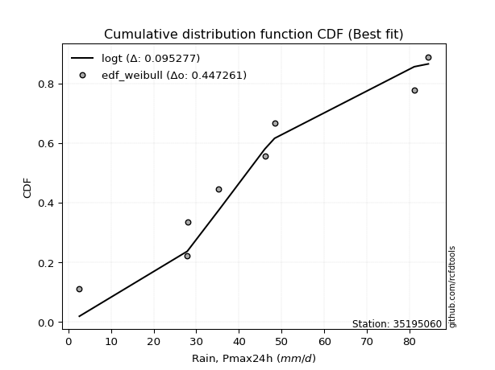</img>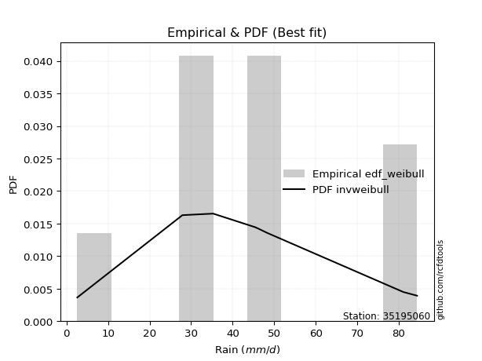</img>

</div>


### 4. EDF Beard (1943)

The Beard formula (or Beard´s plotting position formula) in hydrology is used to estimate the empirical non-exceedance probability _(P)_ of a flood event (or other extreme hydrological data point) within a given dataset.

<div align="center">


$P=(m-0.31)/(n+0.38)$


</div>


**4.1. Empirical values**

<div align="center">

|                | 0                   | 1                   | 2                  | 3                   | 4         | 5                  | 6                  | 7                  | 8                  |
|:---------------|:--------------------|:--------------------|:-------------------|:--------------------|:----------|:-------------------|:-------------------|:-------------------|:-------------------|
| date           | 2017                | 2022                | 2018               | 2021                | 2025      | 2024               | 2023               | 2020               | 2019               |
| x              | 2.6                 | 27.87               | 28.0               | 35.3                | 45.45     | 46.09              | 48.36              | 81.1               | 84.4               |
| m              | 1                   | 2                   | 3                  | 4                   | 5         | 6                  | 7                  | 8                  | 9                  |
| empirical_dist | edf_beard           | edf_beard           | edf_beard          | edf_beard           | edf_beard | edf_beard          | edf_beard          | edf_beard          | edf_beard          |
| empirical      | 0.07356076759061833 | 0.18017057569296374 | 0.2867803837953091 | 0.39339019189765456 | 0.5       | 0.6066098081023454 | 0.7132196162046908 | 0.8198294243070362 | 0.9264392324093815 |
| empirical_tr   | 1.0794016110471807  | 1.2197659297789336  | 1.4020926756352765 | 1.6485061511423549  | 2.0       | 2.542005420054201  | 3.486988847583642  | 5.550295857988164  | 13.5942028985507   |

</div>


**4.2. Kolmogorov-Smirnov fit test (sorted by Δ)**


<div align="center">

|                | 0                   | 1                   | 2                   | 3                   | 4                   | 5                   | 6                   | 7                   | 8                   | 9                   | 10                  | 11                  | 12                  | 13                  | 14                  | 15                  | 16                  | 17                  | 18                  | 19                  | 20                  | 21                  | 22                  | 23                  | 24                  | 25                  | 26                  | 27                  | 28                  | 29                  | 30                  | 31                  | 32                  | 33                  | 34                  | 35                  | 36                  | 37                  | 38                  | 39                  | 40                  | 41                  | 42                  | 43                  | 44                  | 45                  | 46                  | 47                  | 48                  | 49                  | 50                  | 51                  | 52                  | 53                  | 54                  | 55                  | 56                  | 57                  | 58                  | 59                  | 60                  | 61                  | 62                  | 63                  | 64                  | 65                  | 66                  | 67                  | 68                  | 69                  | 70                  | 71                  | 72                  | 73                  | 74                  | 75                  | 76                  | 77                  | 78                  | 79                  | 80                  | 81                  | 82                  | 83                  | 84                  | 85                  | 86                  | 87                  | 88                  | 89                  | 90                  | 91                  | 92                  | 93                  | 94                  | 95                  | 96                  | 97                  | 98                  | 99                  | 100                 | 101                 | 102                 | 103                 | 104                 | 105                 | 106                 | 107                 | 108                 | 109                 | 110                 | 111                 | 112                 | 113                 | 114                 | 115                 | 116                 | 117                 | 118                 | 119                 | 120                 | 121                 | 122                 | 123                 | 124                 | 125                 | 126                 | 127                 | 128                 | 129                 | 130                 | 131                 | 132                 | 133                 | 134                 | 135                 | 136                 | 137                 | 138                 | 139                 | 140                 | 141                 | 142                 | 143                 | 144                 | 145                 | 146                 | 147                 | 148                 | 149                 | 150                 | 151                 | 152                 | 153                 | 154                 | 155                 | 156                 | 157                 | 158                 | 159                 |
|:---------------|:--------------------|:--------------------|:--------------------|:--------------------|:--------------------|:--------------------|:--------------------|:--------------------|:--------------------|:--------------------|:--------------------|:--------------------|:--------------------|:--------------------|:--------------------|:--------------------|:--------------------|:--------------------|:--------------------|:--------------------|:--------------------|:--------------------|:--------------------|:--------------------|:--------------------|:--------------------|:--------------------|:--------------------|:--------------------|:--------------------|:--------------------|:--------------------|:--------------------|:--------------------|:--------------------|:--------------------|:--------------------|:--------------------|:--------------------|:--------------------|:--------------------|:--------------------|:--------------------|:--------------------|:--------------------|:--------------------|:--------------------|:--------------------|:--------------------|:--------------------|:--------------------|:--------------------|:--------------------|:--------------------|:--------------------|:--------------------|:--------------------|:--------------------|:--------------------|:--------------------|:--------------------|:--------------------|:--------------------|:--------------------|:--------------------|:--------------------|:--------------------|:--------------------|:--------------------|:--------------------|:--------------------|:--------------------|:--------------------|:--------------------|:--------------------|:--------------------|:--------------------|:--------------------|:--------------------|:--------------------|:--------------------|:--------------------|:--------------------|:--------------------|:--------------------|:--------------------|:--------------------|:--------------------|:--------------------|:--------------------|:--------------------|:--------------------|:--------------------|:--------------------|:--------------------|:--------------------|:--------------------|:--------------------|:--------------------|:--------------------|:--------------------|:--------------------|:--------------------|:--------------------|:--------------------|:--------------------|:--------------------|:--------------------|:--------------------|:--------------------|:--------------------|:--------------------|:--------------------|:--------------------|:--------------------|:--------------------|:--------------------|:--------------------|:--------------------|:--------------------|:--------------------|:--------------------|:--------------------|:--------------------|:--------------------|:--------------------|:--------------------|:--------------------|:--------------------|:--------------------|:--------------------|:--------------------|:--------------------|:--------------------|:--------------------|:--------------------|:--------------------|:--------------------|:--------------------|:--------------------|:--------------------|:--------------------|:--------------------|:--------------------|:--------------------|:--------------------|:--------------------|:--------------------|:--------------------|:--------------------|:--------------------|:--------------------|:--------------------|:--------------------|:--------------------|:--------------------|:--------------------|:--------------------|:--------------------|:--------------------|
| station        | 35195060            | 35195060            | 35195060            | 35195060            | 35195060            | 35195060            | 35195060            | 35195060            | 35195060            | 35195060            | 35195060            | 35195060            | 35195060            | 35195060            | 35195060            | 35195060            | 35195060            | 35195060            | 35195060            | 35195060            | 35195060            | 35195060            | 35195060            | 35195060            | 35195060            | 35195060            | 35195060            | 35195060            | 35195060            | 35195060            | 35195060            | 35195060            | 35195060            | 35195060            | 35195060            | 35195060            | 35195060            | 35195060            | 35195060            | 35195060            | 35195060            | 35195060            | 35195060            | 35195060            | 35195060            | 35195060            | 35195060            | 35195060            | 35195060            | 35195060            | 35195060            | 35195060            | 35195060            | 35195060            | 35195060            | 35195060            | 35195060            | 35195060            | 35195060            | 35195060            | 35195060            | 35195060            | 35195060            | 35195060            | 35195060            | 35195060            | 35195060            | 35195060            | 35195060            | 35195060            | 35195060            | 35195060            | 35195060            | 35195060            | 35195060            | 35195060            | 35195060            | 35195060            | 35195060            | 35195060            | 35195060            | 35195060            | 35195060            | 35195060            | 35195060            | 35195060            | 35195060            | 35195060            | 35195060            | 35195060            | 35195060            | 35195060            | 35195060            | 35195060            | 35195060            | 35195060            | 35195060            | 35195060            | 35195060            | 35195060            | 35195060            | 35195060            | 35195060            | 35195060            | 35195060            | 35195060            | 35195060            | 35195060            | 35195060            | 35195060            | 35195060            | 35195060            | 35195060            | 35195060            | 35195060            | 35195060            | 35195060            | 35195060            | 35195060            | 35195060            | 35195060            | 35195060            | 35195060            | 35195060            | 35195060            | 35195060            | 35195060            | 35195060            | 35195060            | 35195060            | 35195060            | 35195060            | 35195060            | 35195060            | 35195060            | 35195060            | 35195060            | 35195060            | 35195060            | 35195060            | 35195060            | 35195060            | 35195060            | 35195060            | 35195060            | 35195060            | 35195060            | 35195060            | 35195060            | 35195060            | 35195060            | 35195060            | 35195060            | 35195060            | 35195060            | 35195060            | 35195060            | 35195060            | 35195060            | 35195060            |
| empirical_dist | edf_beard           | edf_beard           | edf_beard           | edf_beard           | edf_beard           | edf_beard           | edf_beard           | edf_beard           | edf_beard           | edf_beard           | edf_beard           | edf_beard           | edf_beard           | edf_beard           | edf_beard           | edf_beard           | edf_beard           | edf_beard           | edf_beard           | edf_beard           | edf_beard           | edf_beard           | edf_beard           | edf_beard           | edf_beard           | edf_beard           | edf_beard           | edf_beard           | edf_beard           | edf_beard           | edf_beard           | edf_beard           | edf_beard           | edf_beard           | edf_beard           | edf_beard           | edf_beard           | edf_beard           | edf_beard           | edf_beard           | edf_beard           | edf_beard           | edf_beard           | edf_beard           | edf_beard           | edf_beard           | edf_beard           | edf_beard           | edf_beard           | edf_beard           | edf_beard           | edf_beard           | edf_beard           | edf_beard           | edf_beard           | edf_beard           | edf_beard           | edf_beard           | edf_beard           | edf_beard           | edf_beard           | edf_beard           | edf_beard           | edf_beard           | edf_beard           | edf_beard           | edf_beard           | edf_beard           | edf_beard           | edf_beard           | edf_beard           | edf_beard           | edf_beard           | edf_beard           | edf_beard           | edf_beard           | edf_beard           | edf_beard           | edf_beard           | edf_beard           | edf_beard           | edf_beard           | edf_beard           | edf_beard           | edf_beard           | edf_beard           | edf_beard           | edf_beard           | edf_beard           | edf_beard           | edf_beard           | edf_beard           | edf_beard           | edf_beard           | edf_beard           | edf_beard           | edf_beard           | edf_beard           | edf_beard           | edf_beard           | edf_beard           | edf_beard           | edf_beard           | edf_beard           | edf_beard           | edf_beard           | edf_beard           | edf_beard           | edf_beard           | edf_beard           | edf_beard           | edf_beard           | edf_beard           | edf_beard           | edf_beard           | edf_beard           | edf_beard           | edf_beard           | edf_beard           | edf_beard           | edf_beard           | edf_beard           | edf_beard           | edf_beard           | edf_beard           | edf_beard           | edf_beard           | edf_beard           | edf_beard           | edf_beard           | edf_beard           | edf_beard           | edf_beard           | edf_beard           | edf_beard           | edf_beard           | edf_beard           | edf_beard           | edf_beard           | edf_beard           | edf_beard           | edf_beard           | edf_beard           | edf_beard           | edf_beard           | edf_beard           | edf_beard           | edf_beard           | edf_beard           | edf_beard           | edf_beard           | edf_beard           | edf_beard           | edf_beard           | edf_beard           | edf_beard           | edf_beard           | edf_beard           | edf_beard           | edf_beard           |
| p_dist         | logt                | gumbel_r            | invgauss            | rayleigh            | genlogistic         | invweibull          | moyal               | burr12              | halflogistic        | skewnorm            | maxwell             | invgamma            | laplace             | exponweib           | halfnorm            | dweibull            | erlang              | gamma               | f                   | betaprime           | gengamma            | fatiguelife         | johnsonsu           | nct                 | ncf                 | weibull_min         | logexponpow         | rice                | kstwobign           | hypsecant           | pearson3            | genextreme          | logweibull_min      | logistic            | foldnorm            | logexponweib        | loggompertz         | exponnorm           | truncweibull_min    | dgamma              | logdweibull         | t                   | norm                | crystalball         | logburr12           | logargus            | vonmises_line       | wrapcauchy          | uniform             | tukeylambda         | kappa3              | anglit              | cosine              | semicircular        | logpearson3         | logloggamma         | logloglaplace       | loggengamma         | ksone               | kappa4              | logburr             | logdgamma           | logmielke           | loggumbel_l         | logjohnsonsu        | lognakagami         | arcsine             | wald                | loggennorm          | truncnorm           | burr                | gennorm             | bradford            | loglaplace          | loglaplace          | loggenextreme       | logtrapezoid        | gumbel_l            | gausshyper          | loggenpareto        | logweibull_max      | argus               | logfoldnorm         | mielke              | loghypsecant        | logskewnorm         | loglevy_l           | loglogistic         | loggausshyper       | logfatiguelife      | logexponnorm        | logrice             | logcrystalball      | lognorm             | lognct              | logf                | levy_l              | logerlang           | johnsonsb           | loganglit           | genexpon            | loggamma            | loggamma            | logbetaprime        | logsemicircular     | genpareto           | loginvgamma         | logalpha            | truncexpon          | lomax               | loginvgauss         | logarcsine          | logmaxwell          | logvonmises_line    | gompertz            | logncf              | logjohnsonsb        | lograyleigh         | triang              | loginvweibull       | genhalflogistic     | loggumbel_r         | halfgennorm         | loggenhalflogistic  | loghalfnorm         | logmoyal            | logtriang           | logkstwobign        | logtruncnorm        | loghalflogistic     | logcosine           | beta                | loggenexpon         | loglomax            | logtruncweibull_min | logbeta             | logwald             | trapezoid           | logwrapcauchy       | logkappa4           | logksone            | logtukeylambda      | logkappa3           | loguniform          | rdist               | nakagami            | logbradford         | logtruncexpon       | alpha               | weibull_max         | powerlaw            | logrdist            | loghalfgennorm      | logpowerlaw         | exponpow            | truncpareto         | logtruncpareto      | loggenlogistic      | logvonmises         | vonmises            |
| delta          | 0.096382936756788   | 0.1022912308995223  | 0.10376228382924857 | 0.10922724606181944 | 0.10991931773027785 | 0.11133754357880471 | 0.11428468525083824 | 0.11561099412120557 | 0.11660388437919877 | 0.1166045588375123  | 0.11854379753905575 | 0.11959659918121313 | 0.12097537213621434 | 0.12304698395843006 | 0.12325101430079194 | 0.12371458674582336 | 0.12373791529679212 | 0.12373792819004936 | 0.12374399230675615 | 0.1238349983022432  | 0.12396264865955287 | 0.12435936099343448 | 0.12525768523522696 | 0.1259531596493243  | 0.12601899299575503 | 0.12694056918724472 | 0.12735722571482327 | 0.13080706621754767 | 0.1317310607912644  | 0.13184448273793392 | 0.13245243560377906 | 0.1356600837646319  | 0.13773596055797377 | 0.13915230148927737 | 0.14102447598923162 | 0.14135663860903747 | 0.14194294724188167 | 0.1430069726980241  | 0.14456848856627758 | 0.14531605040298162 | 0.14695917734020336 | 0.14786510794882346 | 0.14786769964154023 | 0.1478677051964734  | 0.15008576735753543 | 0.15054410892692782 | 0.15189267707841048 | 0.153675553881382   | 0.15380641327070554 | 0.15389737121087543 | 0.15600015709627868 | 0.15708857845773982 | 0.1597835110503456  | 0.1609000622417388  | 0.16148955005147925 | 0.16266712628512237 | 0.16371980389299579 | 0.16532791603647234 | 0.1657173812942765  | 0.1661510717639746  | 0.16832305327971497 | 0.1686208139625313  | 0.16883148372316004 | 0.17913831417543996 | 0.17994286419449712 | 0.18016851346736662 | 0.1801705756929638  | 0.18549196458911998 | 0.1863648575266793  | 0.19109133899699338 | 0.19770824764617212 | 0.20181309510931159 | 0.20490142210252127 | 0.20697207692149489 | 0.20697207692149489 | 0.20730908276074544 | 0.2092439339826952  | 0.21310034538056966 | 0.21939574600947986 | 0.22220983155189467 | 0.2250674520460113  | 0.2256400673129031  | 0.22941296598774602 | 0.2304635726839086  | 0.2305782113853146  | 0.23129683483312363 | 0.23219785701497908 | 0.23853356048566893 | 0.24235369128775536 | 0.24702512764825946 | 0.2480542818697814  | 0.24805689918649731 | 0.24805699956671307 | 0.24805700210834936 | 0.2490885845394903  | 0.25142418127938065 | 0.25539765366262623 | 0.25648731168794536 | 0.25653878071679453 | 0.258154436506818   | 0.2597641490684112  | 0.2619668940541031  | 0.2619668940541031  | 0.26218313518505537 | 0.26233179632457276 | 0.2634412572964929  | 0.26514168406739086 | 0.26598469192331986 | 0.2661325499615637  | 0.267894400534097   | 0.27568896094057677 | 0.2790025722045171  | 0.28244896999219415 | 0.2826289149528297  | 0.28332641142446224 | 0.2858486633566301  | 0.28837474112187134 | 0.2945851911260899  | 0.2947606991593548  | 0.2974368461756611  | 0.29888707779688506 | 0.31242513010593054 | 0.3218261027787677  | 0.3264762770784408  | 0.3289033606405231  | 0.3369821344623974  | 0.3371347613618278  | 0.3420027607349168  | 0.34611586070296013 | 0.3478203552163906  | 0.3482486132366191  | 0.3635142069328504  | 0.36692877236752935 | 0.3960922351208293  | 0.40131531551628613 | 0.40371830755300575 | 0.40479308513197104 | 0.4081254473735025  | 0.4133469985922859  | 0.45611143763425815 | 0.4711707212252642  | 0.49097749363045134 | 0.5003275184066909  | 0.5014389806089099  | 0.5319119807100614  | 0.5480897468487929  | 0.5659847628123911  | 0.5676356904144275  | 0.6011901879690209  | 0.6052723491354576  | 0.6101078282236145  | 0.6634191601915278  | 0.7132196162046908  | 0.7364219175330085  | 0.7410999444530526  | 0.7521375297053179  | 0.7970795373549331  | 0.8198294243070362  | 1.096713380694497   | 12.524102614137426  |
| deltao         | 0.41761268023100007 | 0.41761268023100007 | 0.41761268023100007 | 0.41761268023100007 | 0.41761268023100007 | 0.41761268023100007 | 0.41761268023100007 | 0.41761268023100007 | 0.41761268023100007 | 0.41761268023100007 | 0.41761268023100007 | 0.41761268023100007 | 0.41761268023100007 | 0.41761268023100007 | 0.41761268023100007 | 0.41761268023100007 | 0.41761268023100007 | 0.41761268023100007 | 0.41761268023100007 | 0.41761268023100007 | 0.41761268023100007 | 0.41761268023100007 | 0.41761268023100007 | 0.41761268023100007 | 0.41761268023100007 | 0.41761268023100007 | 0.41761268023100007 | 0.41761268023100007 | 0.41761268023100007 | 0.41761268023100007 | 0.41761268023100007 | 0.41761268023100007 | 0.41761268023100007 | 0.41761268023100007 | 0.41761268023100007 | 0.41761268023100007 | 0.41761268023100007 | 0.41761268023100007 | 0.41761268023100007 | 0.41761268023100007 | 0.41761268023100007 | 0.41761268023100007 | 0.41761268023100007 | 0.41761268023100007 | 0.41761268023100007 | 0.41761268023100007 | 0.41761268023100007 | 0.41761268023100007 | 0.41761268023100007 | 0.41761268023100007 | 0.41761268023100007 | 0.41761268023100007 | 0.41761268023100007 | 0.41761268023100007 | 0.41761268023100007 | 0.41761268023100007 | 0.41761268023100007 | 0.41761268023100007 | 0.41761268023100007 | 0.41761268023100007 | 0.41761268023100007 | 0.41761268023100007 | 0.41761268023100007 | 0.41761268023100007 | 0.41761268023100007 | 0.41761268023100007 | 0.41761268023100007 | 0.41761268023100007 | 0.41761268023100007 | 0.41761268023100007 | 0.41761268023100007 | 0.41761268023100007 | 0.41761268023100007 | 0.41761268023100007 | 0.41761268023100007 | 0.41761268023100007 | 0.41761268023100007 | 0.41761268023100007 | 0.41761268023100007 | 0.41761268023100007 | 0.41761268023100007 | 0.41761268023100007 | 0.41761268023100007 | 0.41761268023100007 | 0.41761268023100007 | 0.41761268023100007 | 0.41761268023100007 | 0.41761268023100007 | 0.41761268023100007 | 0.41761268023100007 | 0.41761268023100007 | 0.41761268023100007 | 0.41761268023100007 | 0.41761268023100007 | 0.41761268023100007 | 0.41761268023100007 | 0.41761268023100007 | 0.41761268023100007 | 0.41761268023100007 | 0.41761268023100007 | 0.41761268023100007 | 0.41761268023100007 | 0.41761268023100007 | 0.41761268023100007 | 0.41761268023100007 | 0.41761268023100007 | 0.41761268023100007 | 0.41761268023100007 | 0.41761268023100007 | 0.41761268023100007 | 0.41761268023100007 | 0.41761268023100007 | 0.41761268023100007 | 0.41761268023100007 | 0.41761268023100007 | 0.41761268023100007 | 0.41761268023100007 | 0.41761268023100007 | 0.41761268023100007 | 0.41761268023100007 | 0.41761268023100007 | 0.41761268023100007 | 0.41761268023100007 | 0.41761268023100007 | 0.41761268023100007 | 0.41761268023100007 | 0.41761268023100007 | 0.41761268023100007 | 0.41761268023100007 | 0.41761268023100007 | 0.41761268023100007 | 0.41761268023100007 | 0.41761268023100007 | 0.41761268023100007 | 0.41761268023100007 | 0.41761268023100007 | 0.41761268023100007 | 0.41761268023100007 | 0.41761268023100007 | 0.41761268023100007 | 0.41761268023100007 | 0.41761268023100007 | 0.41761268023100007 | 0.41761268023100007 | 0.41761268023100007 | 0.41761268023100007 | 0.41761268023100007 | 0.41761268023100007 | 0.41761268023100007 | 0.41761268023100007 | 0.41761268023100007 | 0.41761268023100007 | 0.41761268023100007 | 0.41761268023100007 | 0.41761268023100007 | 0.41761268023100007 | 0.41761268023100007 | 0.41761268023100007 | 0.41761268023100007 | 0.41761268023100007 |
| eval           | Δo > Δ              | Δo > Δ              | Δo > Δ              | Δo > Δ              | Δo > Δ              | Δo > Δ              | Δo > Δ              | Δo > Δ              | Δo > Δ              | Δo > Δ              | Δo > Δ              | Δo > Δ              | Δo > Δ              | Δo > Δ              | Δo > Δ              | Δo > Δ              | Δo > Δ              | Δo > Δ              | Δo > Δ              | Δo > Δ              | Δo > Δ              | Δo > Δ              | Δo > Δ              | Δo > Δ              | Δo > Δ              | Δo > Δ              | Δo > Δ              | Δo > Δ              | Δo > Δ              | Δo > Δ              | Δo > Δ              | Δo > Δ              | Δo > Δ              | Δo > Δ              | Δo > Δ              | Δo > Δ              | Δo > Δ              | Δo > Δ              | Δo > Δ              | Δo > Δ              | Δo > Δ              | Δo > Δ              | Δo > Δ              | Δo > Δ              | Δo > Δ              | Δo > Δ              | Δo > Δ              | Δo > Δ              | Δo > Δ              | Δo > Δ              | Δo > Δ              | Δo > Δ              | Δo > Δ              | Δo > Δ              | Δo > Δ              | Δo > Δ              | Δo > Δ              | Δo > Δ              | Δo > Δ              | Δo > Δ              | Δo > Δ              | Δo > Δ              | Δo > Δ              | Δo > Δ              | Δo > Δ              | Δo > Δ              | Δo > Δ              | Δo > Δ              | Δo > Δ              | Δo > Δ              | Δo > Δ              | Δo > Δ              | Δo > Δ              | Δo > Δ              | Δo > Δ              | Δo > Δ              | Δo > Δ              | Δo > Δ              | Δo > Δ              | Δo > Δ              | Δo > Δ              | Δo > Δ              | Δo > Δ              | Δo > Δ              | Δo > Δ              | Δo > Δ              | Δo > Δ              | Δo > Δ              | Δo > Δ              | Δo > Δ              | Δo > Δ              | Δo > Δ              | Δo > Δ              | Δo > Δ              | Δo > Δ              | Δo > Δ              | Δo > Δ              | Δo > Δ              | Δo > Δ              | Δo > Δ              | Δo > Δ              | Δo > Δ              | Δo > Δ              | Δo > Δ              | Δo > Δ              | Δo > Δ              | Δo > Δ              | Δo > Δ              | Δo > Δ              | Δo > Δ              | Δo > Δ              | Δo > Δ              | Δo > Δ              | Δo > Δ              | Δo > Δ              | Δo > Δ              | Δo > Δ              | Δo > Δ              | Δo > Δ              | Δo > Δ              | Δo > Δ              | Δo > Δ              | Δo > Δ              | Δo > Δ              | Δo > Δ              | Δo > Δ              | Δo > Δ              | Δo > Δ              | Δo > Δ              | Δo > Δ              | Δo > Δ              | Δo > Δ              | Δo > Δ              | Δo > Δ              | Δo > Δ              | Δo > Δ              | Δo > Δ              | Δo > Δ              | Δo > Δ              | Δo <= Δ             | Δo <= Δ             | Δo <= Δ             | Δo <= Δ             | Δo <= Δ             | Δo <= Δ             | Δo <= Δ             | Δo <= Δ             | Δo <= Δ             | Δo <= Δ             | Δo <= Δ             | Δo <= Δ             | Δo <= Δ             | Δo <= Δ             | Δo <= Δ             | Δo <= Δ             | Δo <= Δ             | Δo <= Δ             | Δo <= Δ             | Δo <= Δ             | Δo <= Δ             |
| fit            | 1                   | 1                   | 1                   | 1                   | 1                   | 1                   | 1                   | 1                   | 1                   | 1                   | 1                   | 1                   | 1                   | 1                   | 1                   | 1                   | 1                   | 1                   | 1                   | 1                   | 1                   | 1                   | 1                   | 1                   | 1                   | 1                   | 1                   | 1                   | 1                   | 1                   | 1                   | 1                   | 1                   | 1                   | 1                   | 1                   | 1                   | 1                   | 1                   | 1                   | 1                   | 1                   | 1                   | 1                   | 1                   | 1                   | 1                   | 1                   | 1                   | 1                   | 1                   | 1                   | 1                   | 1                   | 1                   | 1                   | 1                   | 1                   | 1                   | 1                   | 1                   | 1                   | 1                   | 1                   | 1                   | 1                   | 1                   | 1                   | 1                   | 1                   | 1                   | 1                   | 1                   | 1                   | 1                   | 1                   | 1                   | 1                   | 1                   | 1                   | 1                   | 1                   | 1                   | 1                   | 1                   | 1                   | 1                   | 1                   | 1                   | 1                   | 1                   | 1                   | 1                   | 1                   | 1                   | 1                   | 1                   | 1                   | 1                   | 1                   | 1                   | 1                   | 1                   | 1                   | 1                   | 1                   | 1                   | 1                   | 1                   | 1                   | 1                   | 1                   | 1                   | 1                   | 1                   | 1                   | 1                   | 1                   | 1                   | 1                   | 1                   | 1                   | 1                   | 1                   | 1                   | 1                   | 1                   | 1                   | 1                   | 1                   | 1                   | 1                   | 1                   | 1                   | 1                   | 1                   | 1                   | 1                   | 1                   | 0                   | 0                   | 0                   | 0                   | 0                   | 0                   | 0                   | 0                   | 0                   | 0                   | 0                   | 0                   | 0                   | 0                   | 0                   | 0                   | 0                   | 0                   | 0                   | 0                   | 0                   |
| n              | 9                   | 9                   | 9                   | 9                   | 9                   | 9                   | 9                   | 9                   | 9                   | 9                   | 9                   | 9                   | 9                   | 9                   | 9                   | 9                   | 9                   | 9                   | 9                   | 9                   | 9                   | 9                   | 9                   | 9                   | 9                   | 9                   | 9                   | 9                   | 9                   | 9                   | 9                   | 9                   | 9                   | 9                   | 9                   | 9                   | 9                   | 9                   | 9                   | 9                   | 9                   | 9                   | 9                   | 9                   | 9                   | 9                   | 9                   | 9                   | 9                   | 9                   | 9                   | 9                   | 9                   | 9                   | 9                   | 9                   | 9                   | 9                   | 9                   | 9                   | 9                   | 9                   | 9                   | 9                   | 9                   | 9                   | 9                   | 9                   | 9                   | 9                   | 9                   | 9                   | 9                   | 9                   | 9                   | 9                   | 9                   | 9                   | 9                   | 9                   | 9                   | 9                   | 9                   | 9                   | 9                   | 9                   | 9                   | 9                   | 9                   | 9                   | 9                   | 9                   | 9                   | 9                   | 9                   | 9                   | 9                   | 9                   | 9                   | 9                   | 9                   | 9                   | 9                   | 9                   | 9                   | 9                   | 9                   | 9                   | 9                   | 9                   | 9                   | 9                   | 9                   | 9                   | 9                   | 9                   | 9                   | 9                   | 9                   | 9                   | 9                   | 9                   | 9                   | 9                   | 9                   | 9                   | 9                   | 9                   | 9                   | 9                   | 9                   | 9                   | 9                   | 9                   | 9                   | 9                   | 9                   | 9                   | 9                   | 9                   | 9                   | 9                   | 9                   | 9                   | 9                   | 9                   | 9                   | 9                   | 9                   | 9                   | 9                   | 9                   | 9                   | 9                   | 9                   | 9                   | 9                   | 9                   | 9                   | 9                   |
| best_fit       | 1                   | 0                   | 0                   | 0                   | 0                   | 0                   | 0                   | 0                   | 0                   | 0                   | 0                   | 0                   | 0                   | 0                   | 0                   | 0                   | 0                   | 0                   | 0                   | 0                   | 0                   | 0                   | 0                   | 0                   | 0                   | 0                   | 0                   | 0                   | 0                   | 0                   | 0                   | 0                   | 0                   | 0                   | 0                   | 0                   | 0                   | 0                   | 0                   | 0                   | 0                   | 0                   | 0                   | 0                   | 0                   | 0                   | 0                   | 0                   | 0                   | 0                   | 0                   | 0                   | 0                   | 0                   | 0                   | 0                   | 0                   | 0                   | 0                   | 0                   | 0                   | 0                   | 0                   | 0                   | 0                   | 0                   | 0                   | 0                   | 0                   | 0                   | 0                   | 0                   | 0                   | 0                   | 0                   | 0                   | 0                   | 0                   | 0                   | 0                   | 0                   | 0                   | 0                   | 0                   | 0                   | 0                   | 0                   | 0                   | 0                   | 0                   | 0                   | 0                   | 0                   | 0                   | 0                   | 0                   | 0                   | 0                   | 0                   | 0                   | 0                   | 0                   | 0                   | 0                   | 0                   | 0                   | 0                   | 0                   | 0                   | 0                   | 0                   | 0                   | 0                   | 0                   | 0                   | 0                   | 0                   | 0                   | 0                   | 0                   | 0                   | 0                   | 0                   | 0                   | 0                   | 0                   | 0                   | 0                   | 0                   | 0                   | 0                   | 0                   | 0                   | 0                   | 0                   | 0                   | 0                   | 0                   | 0                   | 0                   | 0                   | 0                   | 0                   | 0                   | 0                   | 0                   | 0                   | 0                   | 0                   | 0                   | 0                   | 0                   | 0                   | 0                   | 0                   | 0                   | 0                   | 0                   | 0                   | 0                   |
| best_fit_sort  | 1                   | 2                   | 3                   | 4                   | 5                   | 6                   | 7                   | 8                   | 9                   | 10                  | 11                  | 12                  | 13                  | 14                  | 15                  | 16                  | 17                  | 18                  | 19                  | 20                  | 21                  | 22                  | 23                  | 24                  | 25                  | 26                  | 27                  | 28                  | 29                  | 30                  | 31                  | 32                  | 33                  | 34                  | 35                  | 36                  | 37                  | 38                  | 39                  | 40                  | 41                  | 42                  | 43                  | 44                  | 45                  | 46                  | 47                  | 48                  | 49                  | 50                  | 51                  | 52                  | 53                  | 54                  | 55                  | 56                  | 57                  | 58                  | 59                  | 60                  | 61                  | 62                  | 63                  | 64                  | 65                  | 66                  | 67                  | 68                  | 69                  | 70                  | 71                  | 72                  | 73                  | 74                  | 75                  | 76                  | 77                  | 78                  | 79                  | 80                  | 81                  | 82                  | 83                  | 84                  | 85                  | 86                  | 87                  | 88                  | 89                  | 90                  | 91                  | 92                  | 93                  | 94                  | 95                  | 96                  | 97                  | 98                  | 99                  | 100                 | 101                 | 102                 | 103                 | 104                 | 105                 | 106                 | 107                 | 108                 | 109                 | 110                 | 111                 | 112                 | 113                 | 114                 | 115                 | 116                 | 117                 | 118                 | 119                 | 120                 | 121                 | 122                 | 123                 | 124                 | 125                 | 126                 | 127                 | 128                 | 129                 | 130                 | 131                 | 132                 | 133                 | 134                 | 135                 | 136                 | 137                 | 138                 | 139                 | 140                 | 141                 | 142                 | 143                 | 144                 | 145                 | 146                 | 147                 | 148                 | 149                 | 150                 | 151                 | 152                 | 153                 | 154                 | 155                 | 156                 | 157                 | 158                 | 159                 | 160                 |

</div>


**4.3. Best fit**

<div align="center">

|   id |   station | empirical_dist   | p_dist   |     delta |   deltao | eval   |   fit |   n |   best_fit |   best_fit_sort |
|-----:|----------:|:-----------------|:---------|----------:|---------:|:-------|------:|----:|-----------:|----------------:|
|    0 |  35195060 | edf_beard        | logt     | 0.0963829 | 0.417613 | Δo > Δ |     1 |   9 |          1 |               1 |

</div>


<div align="center">

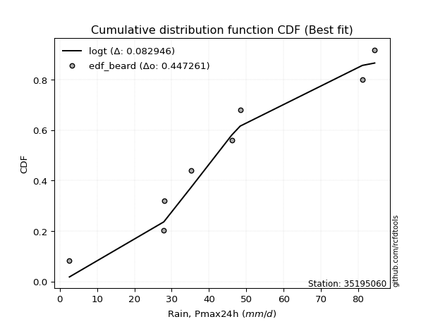</img>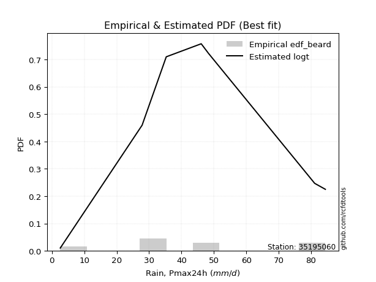</img>

</div>


### 5. EDF Chegodayev (1955)

The Chegodayev formula is an empirical plotting position formula used in hydrological frequency analysis to estimate the exceedance probability or return period of a specific event from a set of observed data. It is primarily used for plotting observed data points on probability paper to fit a theoretical distribution, particularly for analyzing extreme events like maximum flood flows or rainfall intensities. The constant _b_ value in the generalized plotting position formula is 0.3.

<div align="center">


$P=(m-b)/(n+1-2b)$


</div>


**5.1. Empirical values**

<div align="center">

|                | 0                   | 1                   | 2                  | 3                   | 4              | 5                  | 6                  | 7                  | 8                  |
|:---------------|:--------------------|:--------------------|:-------------------|:--------------------|:---------------|:-------------------|:-------------------|:-------------------|:-------------------|
| date           | 2017                | 2022                | 2018               | 2021                | 2025           | 2024               | 2023               | 2020               | 2019               |
| x              | 2.6                 | 27.87               | 28.0               | 35.3                | 45.45          | 46.09              | 48.36              | 81.1               | 84.4               |
| m              | 1                   | 2                   | 3                  | 4                   | 5              | 6                  | 7                  | 8                  | 9                  |
| empirical_dist | edf_chegodayev      | edf_chegodayev      | edf_chegodayev     | edf_chegodayev      | edf_chegodayev | edf_chegodayev     | edf_chegodayev     | edf_chegodayev     | edf_chegodayev     |
| empirical      | 0.07446808510638298 | 0.18085106382978722 | 0.2872340425531915 | 0.39361702127659576 | 0.5            | 0.6063829787234043 | 0.7127659574468085 | 0.8191489361702128 | 0.9255319148936169 |
| empirical_tr   | 1.0804597701149425  | 1.2207792207792207  | 1.4029850746268657 | 1.6491228070175437  | 2.0            | 2.540540540540541  | 3.481481481481481  | 5.529411764705883  | 13.428571428571399 |

</div>


**5.2. Kolmogorov-Smirnov fit test (sorted by Δ)**


<div align="center">

|                | 0                   | 1                   | 2                   | 3                   | 4                   | 5                   | 6                   | 7                   | 8                   | 9                   | 10                  | 11                  | 12                  | 13                  | 14                  | 15                  | 16                  | 17                  | 18                  | 19                  | 20                  | 21                  | 22                  | 23                  | 24                  | 25                  | 26                  | 27                  | 28                  | 29                  | 30                  | 31                  | 32                  | 33                  | 34                  | 35                  | 36                  | 37                  | 38                  | 39                  | 40                  | 41                  | 42                  | 43                  | 44                  | 45                  | 46                  | 47                  | 48                  | 49                  | 50                  | 51                  | 52                  | 53                  | 54                  | 55                  | 56                  | 57                  | 58                  | 59                  | 60                  | 61                  | 62                  | 63                  | 64                  | 65                  | 66                  | 67                  | 68                  | 69                  | 70                  | 71                  | 72                  | 73                  | 74                  | 75                  | 76                  | 77                  | 78                  | 79                  | 80                  | 81                  | 82                  | 83                  | 84                  | 85                  | 86                  | 87                  | 88                  | 89                  | 90                  | 91                  | 92                  | 93                  | 94                  | 95                  | 96                  | 97                  | 98                  | 99                  | 100                 | 101                 | 102                 | 103                 | 104                 | 105                 | 106                 | 107                 | 108                 | 109                 | 110                 | 111                 | 112                 | 113                 | 114                 | 115                 | 116                 | 117                 | 118                 | 119                 | 120                 | 121                 | 122                 | 123                 | 124                 | 125                 | 126                 | 127                 | 128                 | 129                 | 130                 | 131                 | 132                 | 133                 | 134                 | 135                 | 136                 | 137                 | 138                 | 139                 | 140                 | 141                 | 142                 | 143                 | 144                 | 145                 | 146                 | 147                 | 148                 | 149                 | 150                 | 151                 | 152                 | 153                 | 154                 | 155                 | 156                 | 157                 | 158                 | 159                 |
|:---------------|:--------------------|:--------------------|:--------------------|:--------------------|:--------------------|:--------------------|:--------------------|:--------------------|:--------------------|:--------------------|:--------------------|:--------------------|:--------------------|:--------------------|:--------------------|:--------------------|:--------------------|:--------------------|:--------------------|:--------------------|:--------------------|:--------------------|:--------------------|:--------------------|:--------------------|:--------------------|:--------------------|:--------------------|:--------------------|:--------------------|:--------------------|:--------------------|:--------------------|:--------------------|:--------------------|:--------------------|:--------------------|:--------------------|:--------------------|:--------------------|:--------------------|:--------------------|:--------------------|:--------------------|:--------------------|:--------------------|:--------------------|:--------------------|:--------------------|:--------------------|:--------------------|:--------------------|:--------------------|:--------------------|:--------------------|:--------------------|:--------------------|:--------------------|:--------------------|:--------------------|:--------------------|:--------------------|:--------------------|:--------------------|:--------------------|:--------------------|:--------------------|:--------------------|:--------------------|:--------------------|:--------------------|:--------------------|:--------------------|:--------------------|:--------------------|:--------------------|:--------------------|:--------------------|:--------------------|:--------------------|:--------------------|:--------------------|:--------------------|:--------------------|:--------------------|:--------------------|:--------------------|:--------------------|:--------------------|:--------------------|:--------------------|:--------------------|:--------------------|:--------------------|:--------------------|:--------------------|:--------------------|:--------------------|:--------------------|:--------------------|:--------------------|:--------------------|:--------------------|:--------------------|:--------------------|:--------------------|:--------------------|:--------------------|:--------------------|:--------------------|:--------------------|:--------------------|:--------------------|:--------------------|:--------------------|:--------------------|:--------------------|:--------------------|:--------------------|:--------------------|:--------------------|:--------------------|:--------------------|:--------------------|:--------------------|:--------------------|:--------------------|:--------------------|:--------------------|:--------------------|:--------------------|:--------------------|:--------------------|:--------------------|:--------------------|:--------------------|:--------------------|:--------------------|:--------------------|:--------------------|:--------------------|:--------------------|:--------------------|:--------------------|:--------------------|:--------------------|:--------------------|:--------------------|:--------------------|:--------------------|:--------------------|:--------------------|:--------------------|:--------------------|:--------------------|:--------------------|:--------------------|:--------------------|:--------------------|:--------------------|
| station        | 35195060            | 35195060            | 35195060            | 35195060            | 35195060            | 35195060            | 35195060            | 35195060            | 35195060            | 35195060            | 35195060            | 35195060            | 35195060            | 35195060            | 35195060            | 35195060            | 35195060            | 35195060            | 35195060            | 35195060            | 35195060            | 35195060            | 35195060            | 35195060            | 35195060            | 35195060            | 35195060            | 35195060            | 35195060            | 35195060            | 35195060            | 35195060            | 35195060            | 35195060            | 35195060            | 35195060            | 35195060            | 35195060            | 35195060            | 35195060            | 35195060            | 35195060            | 35195060            | 35195060            | 35195060            | 35195060            | 35195060            | 35195060            | 35195060            | 35195060            | 35195060            | 35195060            | 35195060            | 35195060            | 35195060            | 35195060            | 35195060            | 35195060            | 35195060            | 35195060            | 35195060            | 35195060            | 35195060            | 35195060            | 35195060            | 35195060            | 35195060            | 35195060            | 35195060            | 35195060            | 35195060            | 35195060            | 35195060            | 35195060            | 35195060            | 35195060            | 35195060            | 35195060            | 35195060            | 35195060            | 35195060            | 35195060            | 35195060            | 35195060            | 35195060            | 35195060            | 35195060            | 35195060            | 35195060            | 35195060            | 35195060            | 35195060            | 35195060            | 35195060            | 35195060            | 35195060            | 35195060            | 35195060            | 35195060            | 35195060            | 35195060            | 35195060            | 35195060            | 35195060            | 35195060            | 35195060            | 35195060            | 35195060            | 35195060            | 35195060            | 35195060            | 35195060            | 35195060            | 35195060            | 35195060            | 35195060            | 35195060            | 35195060            | 35195060            | 35195060            | 35195060            | 35195060            | 35195060            | 35195060            | 35195060            | 35195060            | 35195060            | 35195060            | 35195060            | 35195060            | 35195060            | 35195060            | 35195060            | 35195060            | 35195060            | 35195060            | 35195060            | 35195060            | 35195060            | 35195060            | 35195060            | 35195060            | 35195060            | 35195060            | 35195060            | 35195060            | 35195060            | 35195060            | 35195060            | 35195060            | 35195060            | 35195060            | 35195060            | 35195060            | 35195060            | 35195060            | 35195060            | 35195060            | 35195060            | 35195060            |
| empirical_dist | edf_chegodayev      | edf_chegodayev      | edf_chegodayev      | edf_chegodayev      | edf_chegodayev      | edf_chegodayev      | edf_chegodayev      | edf_chegodayev      | edf_chegodayev      | edf_chegodayev      | edf_chegodayev      | edf_chegodayev      | edf_chegodayev      | edf_chegodayev      | edf_chegodayev      | edf_chegodayev      | edf_chegodayev      | edf_chegodayev      | edf_chegodayev      | edf_chegodayev      | edf_chegodayev      | edf_chegodayev      | edf_chegodayev      | edf_chegodayev      | edf_chegodayev      | edf_chegodayev      | edf_chegodayev      | edf_chegodayev      | edf_chegodayev      | edf_chegodayev      | edf_chegodayev      | edf_chegodayev      | edf_chegodayev      | edf_chegodayev      | edf_chegodayev      | edf_chegodayev      | edf_chegodayev      | edf_chegodayev      | edf_chegodayev      | edf_chegodayev      | edf_chegodayev      | edf_chegodayev      | edf_chegodayev      | edf_chegodayev      | edf_chegodayev      | edf_chegodayev      | edf_chegodayev      | edf_chegodayev      | edf_chegodayev      | edf_chegodayev      | edf_chegodayev      | edf_chegodayev      | edf_chegodayev      | edf_chegodayev      | edf_chegodayev      | edf_chegodayev      | edf_chegodayev      | edf_chegodayev      | edf_chegodayev      | edf_chegodayev      | edf_chegodayev      | edf_chegodayev      | edf_chegodayev      | edf_chegodayev      | edf_chegodayev      | edf_chegodayev      | edf_chegodayev      | edf_chegodayev      | edf_chegodayev      | edf_chegodayev      | edf_chegodayev      | edf_chegodayev      | edf_chegodayev      | edf_chegodayev      | edf_chegodayev      | edf_chegodayev      | edf_chegodayev      | edf_chegodayev      | edf_chegodayev      | edf_chegodayev      | edf_chegodayev      | edf_chegodayev      | edf_chegodayev      | edf_chegodayev      | edf_chegodayev      | edf_chegodayev      | edf_chegodayev      | edf_chegodayev      | edf_chegodayev      | edf_chegodayev      | edf_chegodayev      | edf_chegodayev      | edf_chegodayev      | edf_chegodayev      | edf_chegodayev      | edf_chegodayev      | edf_chegodayev      | edf_chegodayev      | edf_chegodayev      | edf_chegodayev      | edf_chegodayev      | edf_chegodayev      | edf_chegodayev      | edf_chegodayev      | edf_chegodayev      | edf_chegodayev      | edf_chegodayev      | edf_chegodayev      | edf_chegodayev      | edf_chegodayev      | edf_chegodayev      | edf_chegodayev      | edf_chegodayev      | edf_chegodayev      | edf_chegodayev      | edf_chegodayev      | edf_chegodayev      | edf_chegodayev      | edf_chegodayev      | edf_chegodayev      | edf_chegodayev      | edf_chegodayev      | edf_chegodayev      | edf_chegodayev      | edf_chegodayev      | edf_chegodayev      | edf_chegodayev      | edf_chegodayev      | edf_chegodayev      | edf_chegodayev      | edf_chegodayev      | edf_chegodayev      | edf_chegodayev      | edf_chegodayev      | edf_chegodayev      | edf_chegodayev      | edf_chegodayev      | edf_chegodayev      | edf_chegodayev      | edf_chegodayev      | edf_chegodayev      | edf_chegodayev      | edf_chegodayev      | edf_chegodayev      | edf_chegodayev      | edf_chegodayev      | edf_chegodayev      | edf_chegodayev      | edf_chegodayev      | edf_chegodayev      | edf_chegodayev      | edf_chegodayev      | edf_chegodayev      | edf_chegodayev      | edf_chegodayev      | edf_chegodayev      | edf_chegodayev      | edf_chegodayev      | edf_chegodayev      | edf_chegodayev      |
| p_dist         | logt                | gumbel_r            | invgauss            | rayleigh            | genlogistic         | invweibull          | moyal               | burr12              | skewnorm            | halflogistic        | maxwell             | invgamma            | laplace             | halfnorm            | exponweib           | dweibull            | erlang              | gamma               | f                   | betaprime           | gengamma            | fatiguelife         | johnsonsu           | ncf                 | nct                 | weibull_min         | logexponpow         | rice                | kstwobign           | hypsecant           | pearson3            | genextreme          | logweibull_min      | logistic            | foldnorm            | logexponweib        | loggompertz         | exponnorm           | truncweibull_min    | dgamma              | logdweibull         | t                   | norm                | crystalball         | logburr12           | logargus            | vonmises_line       | wrapcauchy          | uniform             | tukeylambda         | kappa3              | anglit              | cosine              | semicircular        | logpearson3         | logloggamma         | logloglaplace       | loggengamma         | ksone               | kappa4              | logburr             | logmielke           | logdgamma           | loggumbel_l         | logjohnsonsu        | lognakagami         | arcsine             | wald                | loggennorm          | truncnorm           | burr                | gennorm             | bradford            | loglaplace          | loglaplace          | loggenextreme       | logtrapezoid        | gumbel_l            | gausshyper          | loggenpareto        | logweibull_max      | argus               | logfoldnorm         | mielke              | loghypsecant        | logskewnorm         | loglevy_l           | loglogistic         | loggausshyper       | logfatiguelife      | logexponnorm        | logrice             | logcrystalball      | lognorm             | lognct              | logf                | levy_l              | logerlang           | johnsonsb           | loganglit           | genexpon            | loggamma            | loggamma            | logbetaprime        | logsemicircular     | genpareto           | loginvgamma         | logalpha            | truncexpon          | lomax               | loginvgauss         | logarcsine          | logmaxwell          | logvonmises_line    | gompertz            | logncf              | logjohnsonsb        | lograyleigh         | triang              | loginvweibull       | genhalflogistic     | loggumbel_r         | halfgennorm         | loggenhalflogistic  | loghalfnorm         | logmoyal            | logtriang           | logkstwobign        | logtruncnorm        | loghalflogistic     | logcosine           | beta                | loggenexpon         | loglomax            | logtruncweibull_min | logbeta             | logwald             | trapezoid           | logwrapcauchy       | logkappa4           | logksone            | logtukeylambda      | logkappa3           | loguniform          | rdist               | nakagami            | logbradford         | logtruncexpon       | alpha               | weibull_max         | powerlaw            | logrdist            | loghalfgennorm      | logpowerlaw         | exponpow            | truncpareto         | logtruncpareto      | loggenlogistic      | logvonmises         | vonmises            |
| delta          | 0.09592927799890572 | 0.10297171903634572 | 0.10330862507136629 | 0.10877358730393716 | 0.10946565897239557 | 0.11065705544198123 | 0.11428468525083824 | 0.11515733536332329 | 0.11615090007963003 | 0.11660388437919877 | 0.11809013878117347 | 0.11914294042333085 | 0.12165586027303776 | 0.12257052616396846 | 0.12259332520054778 | 0.12326092798794108 | 0.12328425653890984 | 0.12328426943216708 | 0.12329033354887386 | 0.12338133954436092 | 0.12350898990167058 | 0.1239057022355522  | 0.12480402647734468 | 0.12533850485893155 | 0.12549950089144202 | 0.12648691042936244 | 0.1266767375779998  | 0.1303534074596654  | 0.13105057265444092 | 0.13139082398005164 | 0.13199877684589678 | 0.13520642500674962 | 0.1370554724211503  | 0.1386986427313951  | 0.14057081723134934 | 0.14090297985115519 | 0.1412624591050582  | 0.1425533139401418  | 0.145248976703101   | 0.14554287978192282 | 0.14650551858232108 | 0.14741144919094118 | 0.14741404088365795 | 0.14741404643859113 | 0.14940527922071195 | 0.15009045016904554 | 0.1525731652152339  | 0.1532218951234997  | 0.15335275451282326 | 0.15344371245299315 | 0.1555464983383964  | 0.15663491969985754 | 0.15932985229246333 | 0.16044640348385653 | 0.16103589129359697 | 0.16221346752724008 | 0.1632661451351135  | 0.16487425727859006 | 0.1652637225363942  | 0.1656974130060923  | 0.1678693945218327  | 0.16837782496527776 | 0.1688476433414725  | 0.17845782603861648 | 0.17948920543661484 | 0.1808490016041901  | 0.18085106382978722 | 0.18549196458911998 | 0.1865916869056205  | 0.1906376802391111  | 0.19725458888828984 | 0.20203992448825278 | 0.2042209339656978  | 0.2062915887846714  | 0.2062915887846714  | 0.20685542400286316 | 0.20856344584587172 | 0.21264668662268738 | 0.2187152578726564  | 0.22175617279401239 | 0.22461379328812903 | 0.2251864085550208  | 0.22873247785092254 | 0.22978308454708513 | 0.22989772324849111 | 0.23061634669630016 | 0.2317441982570968  | 0.23785307234884545 | 0.24167320315093188 | 0.24634463951143598 | 0.24737379373295793 | 0.24737641104967384 | 0.2473765114298896  | 0.24737651397152588 | 0.2484080964026668  | 0.2507436931425572  | 0.2544903361468616  | 0.2558068235511219  | 0.25608512195891225 | 0.25747394836999454 | 0.25908366093158774 | 0.26128640591727964 | 0.26128640591727964 | 0.2615026470482319  | 0.2616513081877493  | 0.26298759853861065 | 0.2644611959305674  | 0.2653042037864964  | 0.26545206182474024 | 0.26721391239727355 | 0.2750084728037533  | 0.2783220840676936  | 0.2817684818553707  | 0.2830825737107121  | 0.28378007018234463 | 0.28516817521980664 | 0.2876942529850479  | 0.2939047029892664  | 0.29430704040147254 | 0.2967563580388376  | 0.2984334190390028  | 0.31174464196910706 | 0.32114561464194424 | 0.3257957889416173  | 0.32822287250369964 | 0.3363016463255739  | 0.3364542732250043  | 0.34132227259809333 | 0.34543537256613666 | 0.3471398670795671  | 0.3475681250997956  | 0.36306054817496813 | 0.3662482842307059  | 0.39541174698400583 | 0.40063482737946265 | 0.40326464879512347 | 0.40411259699514757 | 0.4076717886156202  | 0.41266651045546243 | 0.4554309494974347  | 0.47049023308844073 | 0.49029700549362787 | 0.49964703026986745 | 0.5007584924720865  | 0.5312314925732379  | 0.5474092587119694  | 0.5653042746755677  | 0.566955202277604   | 0.6005096998321974  | 0.6048186903775753  | 0.609427340086791   | 0.6627386720547044  | 0.7127659574468085  | 0.7357414293961849  | 0.7404194563162292  | 0.7514570415684944  | 0.7963990492181097  | 0.8191489361702128  | 1.0960328925576737  | 12.52500993165319   |
| deltao         | 0.41761268023100007 | 0.41761268023100007 | 0.41761268023100007 | 0.41761268023100007 | 0.41761268023100007 | 0.41761268023100007 | 0.41761268023100007 | 0.41761268023100007 | 0.41761268023100007 | 0.41761268023100007 | 0.41761268023100007 | 0.41761268023100007 | 0.41761268023100007 | 0.41761268023100007 | 0.41761268023100007 | 0.41761268023100007 | 0.41761268023100007 | 0.41761268023100007 | 0.41761268023100007 | 0.41761268023100007 | 0.41761268023100007 | 0.41761268023100007 | 0.41761268023100007 | 0.41761268023100007 | 0.41761268023100007 | 0.41761268023100007 | 0.41761268023100007 | 0.41761268023100007 | 0.41761268023100007 | 0.41761268023100007 | 0.41761268023100007 | 0.41761268023100007 | 0.41761268023100007 | 0.41761268023100007 | 0.41761268023100007 | 0.41761268023100007 | 0.41761268023100007 | 0.41761268023100007 | 0.41761268023100007 | 0.41761268023100007 | 0.41761268023100007 | 0.41761268023100007 | 0.41761268023100007 | 0.41761268023100007 | 0.41761268023100007 | 0.41761268023100007 | 0.41761268023100007 | 0.41761268023100007 | 0.41761268023100007 | 0.41761268023100007 | 0.41761268023100007 | 0.41761268023100007 | 0.41761268023100007 | 0.41761268023100007 | 0.41761268023100007 | 0.41761268023100007 | 0.41761268023100007 | 0.41761268023100007 | 0.41761268023100007 | 0.41761268023100007 | 0.41761268023100007 | 0.41761268023100007 | 0.41761268023100007 | 0.41761268023100007 | 0.41761268023100007 | 0.41761268023100007 | 0.41761268023100007 | 0.41761268023100007 | 0.41761268023100007 | 0.41761268023100007 | 0.41761268023100007 | 0.41761268023100007 | 0.41761268023100007 | 0.41761268023100007 | 0.41761268023100007 | 0.41761268023100007 | 0.41761268023100007 | 0.41761268023100007 | 0.41761268023100007 | 0.41761268023100007 | 0.41761268023100007 | 0.41761268023100007 | 0.41761268023100007 | 0.41761268023100007 | 0.41761268023100007 | 0.41761268023100007 | 0.41761268023100007 | 0.41761268023100007 | 0.41761268023100007 | 0.41761268023100007 | 0.41761268023100007 | 0.41761268023100007 | 0.41761268023100007 | 0.41761268023100007 | 0.41761268023100007 | 0.41761268023100007 | 0.41761268023100007 | 0.41761268023100007 | 0.41761268023100007 | 0.41761268023100007 | 0.41761268023100007 | 0.41761268023100007 | 0.41761268023100007 | 0.41761268023100007 | 0.41761268023100007 | 0.41761268023100007 | 0.41761268023100007 | 0.41761268023100007 | 0.41761268023100007 | 0.41761268023100007 | 0.41761268023100007 | 0.41761268023100007 | 0.41761268023100007 | 0.41761268023100007 | 0.41761268023100007 | 0.41761268023100007 | 0.41761268023100007 | 0.41761268023100007 | 0.41761268023100007 | 0.41761268023100007 | 0.41761268023100007 | 0.41761268023100007 | 0.41761268023100007 | 0.41761268023100007 | 0.41761268023100007 | 0.41761268023100007 | 0.41761268023100007 | 0.41761268023100007 | 0.41761268023100007 | 0.41761268023100007 | 0.41761268023100007 | 0.41761268023100007 | 0.41761268023100007 | 0.41761268023100007 | 0.41761268023100007 | 0.41761268023100007 | 0.41761268023100007 | 0.41761268023100007 | 0.41761268023100007 | 0.41761268023100007 | 0.41761268023100007 | 0.41761268023100007 | 0.41761268023100007 | 0.41761268023100007 | 0.41761268023100007 | 0.41761268023100007 | 0.41761268023100007 | 0.41761268023100007 | 0.41761268023100007 | 0.41761268023100007 | 0.41761268023100007 | 0.41761268023100007 | 0.41761268023100007 | 0.41761268023100007 | 0.41761268023100007 | 0.41761268023100007 | 0.41761268023100007 | 0.41761268023100007 | 0.41761268023100007 | 0.41761268023100007 |
| eval           | Δo > Δ              | Δo > Δ              | Δo > Δ              | Δo > Δ              | Δo > Δ              | Δo > Δ              | Δo > Δ              | Δo > Δ              | Δo > Δ              | Δo > Δ              | Δo > Δ              | Δo > Δ              | Δo > Δ              | Δo > Δ              | Δo > Δ              | Δo > Δ              | Δo > Δ              | Δo > Δ              | Δo > Δ              | Δo > Δ              | Δo > Δ              | Δo > Δ              | Δo > Δ              | Δo > Δ              | Δo > Δ              | Δo > Δ              | Δo > Δ              | Δo > Δ              | Δo > Δ              | Δo > Δ              | Δo > Δ              | Δo > Δ              | Δo > Δ              | Δo > Δ              | Δo > Δ              | Δo > Δ              | Δo > Δ              | Δo > Δ              | Δo > Δ              | Δo > Δ              | Δo > Δ              | Δo > Δ              | Δo > Δ              | Δo > Δ              | Δo > Δ              | Δo > Δ              | Δo > Δ              | Δo > Δ              | Δo > Δ              | Δo > Δ              | Δo > Δ              | Δo > Δ              | Δo > Δ              | Δo > Δ              | Δo > Δ              | Δo > Δ              | Δo > Δ              | Δo > Δ              | Δo > Δ              | Δo > Δ              | Δo > Δ              | Δo > Δ              | Δo > Δ              | Δo > Δ              | Δo > Δ              | Δo > Δ              | Δo > Δ              | Δo > Δ              | Δo > Δ              | Δo > Δ              | Δo > Δ              | Δo > Δ              | Δo > Δ              | Δo > Δ              | Δo > Δ              | Δo > Δ              | Δo > Δ              | Δo > Δ              | Δo > Δ              | Δo > Δ              | Δo > Δ              | Δo > Δ              | Δo > Δ              | Δo > Δ              | Δo > Δ              | Δo > Δ              | Δo > Δ              | Δo > Δ              | Δo > Δ              | Δo > Δ              | Δo > Δ              | Δo > Δ              | Δo > Δ              | Δo > Δ              | Δo > Δ              | Δo > Δ              | Δo > Δ              | Δo > Δ              | Δo > Δ              | Δo > Δ              | Δo > Δ              | Δo > Δ              | Δo > Δ              | Δo > Δ              | Δo > Δ              | Δo > Δ              | Δo > Δ              | Δo > Δ              | Δo > Δ              | Δo > Δ              | Δo > Δ              | Δo > Δ              | Δo > Δ              | Δo > Δ              | Δo > Δ              | Δo > Δ              | Δo > Δ              | Δo > Δ              | Δo > Δ              | Δo > Δ              | Δo > Δ              | Δo > Δ              | Δo > Δ              | Δo > Δ              | Δo > Δ              | Δo > Δ              | Δo > Δ              | Δo > Δ              | Δo > Δ              | Δo > Δ              | Δo > Δ              | Δo > Δ              | Δo > Δ              | Δo > Δ              | Δo > Δ              | Δo > Δ              | Δo > Δ              | Δo > Δ              | Δo > Δ              | Δo <= Δ             | Δo <= Δ             | Δo <= Δ             | Δo <= Δ             | Δo <= Δ             | Δo <= Δ             | Δo <= Δ             | Δo <= Δ             | Δo <= Δ             | Δo <= Δ             | Δo <= Δ             | Δo <= Δ             | Δo <= Δ             | Δo <= Δ             | Δo <= Δ             | Δo <= Δ             | Δo <= Δ             | Δo <= Δ             | Δo <= Δ             | Δo <= Δ             | Δo <= Δ             |
| fit            | 1                   | 1                   | 1                   | 1                   | 1                   | 1                   | 1                   | 1                   | 1                   | 1                   | 1                   | 1                   | 1                   | 1                   | 1                   | 1                   | 1                   | 1                   | 1                   | 1                   | 1                   | 1                   | 1                   | 1                   | 1                   | 1                   | 1                   | 1                   | 1                   | 1                   | 1                   | 1                   | 1                   | 1                   | 1                   | 1                   | 1                   | 1                   | 1                   | 1                   | 1                   | 1                   | 1                   | 1                   | 1                   | 1                   | 1                   | 1                   | 1                   | 1                   | 1                   | 1                   | 1                   | 1                   | 1                   | 1                   | 1                   | 1                   | 1                   | 1                   | 1                   | 1                   | 1                   | 1                   | 1                   | 1                   | 1                   | 1                   | 1                   | 1                   | 1                   | 1                   | 1                   | 1                   | 1                   | 1                   | 1                   | 1                   | 1                   | 1                   | 1                   | 1                   | 1                   | 1                   | 1                   | 1                   | 1                   | 1                   | 1                   | 1                   | 1                   | 1                   | 1                   | 1                   | 1                   | 1                   | 1                   | 1                   | 1                   | 1                   | 1                   | 1                   | 1                   | 1                   | 1                   | 1                   | 1                   | 1                   | 1                   | 1                   | 1                   | 1                   | 1                   | 1                   | 1                   | 1                   | 1                   | 1                   | 1                   | 1                   | 1                   | 1                   | 1                   | 1                   | 1                   | 1                   | 1                   | 1                   | 1                   | 1                   | 1                   | 1                   | 1                   | 1                   | 1                   | 1                   | 1                   | 1                   | 1                   | 0                   | 0                   | 0                   | 0                   | 0                   | 0                   | 0                   | 0                   | 0                   | 0                   | 0                   | 0                   | 0                   | 0                   | 0                   | 0                   | 0                   | 0                   | 0                   | 0                   | 0                   |
| n              | 9                   | 9                   | 9                   | 9                   | 9                   | 9                   | 9                   | 9                   | 9                   | 9                   | 9                   | 9                   | 9                   | 9                   | 9                   | 9                   | 9                   | 9                   | 9                   | 9                   | 9                   | 9                   | 9                   | 9                   | 9                   | 9                   | 9                   | 9                   | 9                   | 9                   | 9                   | 9                   | 9                   | 9                   | 9                   | 9                   | 9                   | 9                   | 9                   | 9                   | 9                   | 9                   | 9                   | 9                   | 9                   | 9                   | 9                   | 9                   | 9                   | 9                   | 9                   | 9                   | 9                   | 9                   | 9                   | 9                   | 9                   | 9                   | 9                   | 9                   | 9                   | 9                   | 9                   | 9                   | 9                   | 9                   | 9                   | 9                   | 9                   | 9                   | 9                   | 9                   | 9                   | 9                   | 9                   | 9                   | 9                   | 9                   | 9                   | 9                   | 9                   | 9                   | 9                   | 9                   | 9                   | 9                   | 9                   | 9                   | 9                   | 9                   | 9                   | 9                   | 9                   | 9                   | 9                   | 9                   | 9                   | 9                   | 9                   | 9                   | 9                   | 9                   | 9                   | 9                   | 9                   | 9                   | 9                   | 9                   | 9                   | 9                   | 9                   | 9                   | 9                   | 9                   | 9                   | 9                   | 9                   | 9                   | 9                   | 9                   | 9                   | 9                   | 9                   | 9                   | 9                   | 9                   | 9                   | 9                   | 9                   | 9                   | 9                   | 9                   | 9                   | 9                   | 9                   | 9                   | 9                   | 9                   | 9                   | 9                   | 9                   | 9                   | 9                   | 9                   | 9                   | 9                   | 9                   | 9                   | 9                   | 9                   | 9                   | 9                   | 9                   | 9                   | 9                   | 9                   | 9                   | 9                   | 9                   | 9                   |
| best_fit       | 1                   | 0                   | 0                   | 0                   | 0                   | 0                   | 0                   | 0                   | 0                   | 0                   | 0                   | 0                   | 0                   | 0                   | 0                   | 0                   | 0                   | 0                   | 0                   | 0                   | 0                   | 0                   | 0                   | 0                   | 0                   | 0                   | 0                   | 0                   | 0                   | 0                   | 0                   | 0                   | 0                   | 0                   | 0                   | 0                   | 0                   | 0                   | 0                   | 0                   | 0                   | 0                   | 0                   | 0                   | 0                   | 0                   | 0                   | 0                   | 0                   | 0                   | 0                   | 0                   | 0                   | 0                   | 0                   | 0                   | 0                   | 0                   | 0                   | 0                   | 0                   | 0                   | 0                   | 0                   | 0                   | 0                   | 0                   | 0                   | 0                   | 0                   | 0                   | 0                   | 0                   | 0                   | 0                   | 0                   | 0                   | 0                   | 0                   | 0                   | 0                   | 0                   | 0                   | 0                   | 0                   | 0                   | 0                   | 0                   | 0                   | 0                   | 0                   | 0                   | 0                   | 0                   | 0                   | 0                   | 0                   | 0                   | 0                   | 0                   | 0                   | 0                   | 0                   | 0                   | 0                   | 0                   | 0                   | 0                   | 0                   | 0                   | 0                   | 0                   | 0                   | 0                   | 0                   | 0                   | 0                   | 0                   | 0                   | 0                   | 0                   | 0                   | 0                   | 0                   | 0                   | 0                   | 0                   | 0                   | 0                   | 0                   | 0                   | 0                   | 0                   | 0                   | 0                   | 0                   | 0                   | 0                   | 0                   | 0                   | 0                   | 0                   | 0                   | 0                   | 0                   | 0                   | 0                   | 0                   | 0                   | 0                   | 0                   | 0                   | 0                   | 0                   | 0                   | 0                   | 0                   | 0                   | 0                   | 0                   |
| best_fit_sort  | 1                   | 2                   | 3                   | 4                   | 5                   | 6                   | 7                   | 8                   | 9                   | 10                  | 11                  | 12                  | 13                  | 14                  | 15                  | 16                  | 17                  | 18                  | 19                  | 20                  | 21                  | 22                  | 23                  | 24                  | 25                  | 26                  | 27                  | 28                  | 29                  | 30                  | 31                  | 32                  | 33                  | 34                  | 35                  | 36                  | 37                  | 38                  | 39                  | 40                  | 41                  | 42                  | 43                  | 44                  | 45                  | 46                  | 47                  | 48                  | 49                  | 50                  | 51                  | 52                  | 53                  | 54                  | 55                  | 56                  | 57                  | 58                  | 59                  | 60                  | 61                  | 62                  | 63                  | 64                  | 65                  | 66                  | 67                  | 68                  | 69                  | 70                  | 71                  | 72                  | 73                  | 74                  | 75                  | 76                  | 77                  | 78                  | 79                  | 80                  | 81                  | 82                  | 83                  | 84                  | 85                  | 86                  | 87                  | 88                  | 89                  | 90                  | 91                  | 92                  | 93                  | 94                  | 95                  | 96                  | 97                  | 98                  | 99                  | 100                 | 101                 | 102                 | 103                 | 104                 | 105                 | 106                 | 107                 | 108                 | 109                 | 110                 | 111                 | 112                 | 113                 | 114                 | 115                 | 116                 | 117                 | 118                 | 119                 | 120                 | 121                 | 122                 | 123                 | 124                 | 125                 | 126                 | 127                 | 128                 | 129                 | 130                 | 131                 | 132                 | 133                 | 134                 | 135                 | 136                 | 137                 | 138                 | 139                 | 140                 | 141                 | 142                 | 143                 | 144                 | 145                 | 146                 | 147                 | 148                 | 149                 | 150                 | 151                 | 152                 | 153                 | 154                 | 155                 | 156                 | 157                 | 158                 | 159                 | 160                 |

</div>


**5.3. Best fit**

<div align="center">

|   id |   station | empirical_dist   | p_dist   |     delta |   deltao | eval   |   fit |   n |   best_fit |   best_fit_sort |
|-----:|----------:|:-----------------|:---------|----------:|---------:|:-------|------:|----:|-----------:|----------------:|
|    0 |  35195060 | edf_chegodayev   | logt     | 0.0959293 | 0.417613 | Δo > Δ |     1 |   9 |          1 |               1 |

</div>


<div align="center">

</img>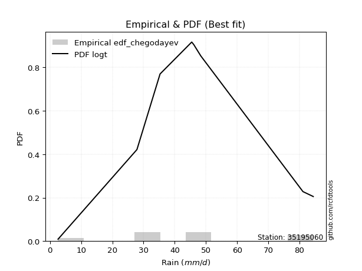</img>

</div>


### 6. EDF Blom (1958)

The Blom formula is a specific "plotting position" formula used in hydrology and statistical analysis to estimate the empirical cumulative probability (or non-exceedance probability) of a data series. It is particularly recommended for data that are approximately normally distributed. The constant _a_ is set to 0.375 (or 3/8).

<div align="center">


$P=(m-a)/(n+1-2a)$


</div>


**6.1. Empirical values**

<div align="center">

|                | 0                   | 1                   | 2                   | 3                  | 4        | 5                  | 6                  | 7                  | 8                  |
|:---------------|:--------------------|:--------------------|:--------------------|:-------------------|:---------|:-------------------|:-------------------|:-------------------|:-------------------|
| date           | 2017                | 2022                | 2018                | 2021               | 2025     | 2024               | 2023               | 2020               | 2019               |
| x              | 2.6                 | 27.87               | 28.0                | 35.3               | 45.45    | 46.09              | 48.36              | 81.1               | 84.4               |
| m              | 1                   | 2                   | 3                   | 4                  | 5        | 6                  | 7                  | 8                  | 9                  |
| empirical_dist | edf_blom            | edf_blom            | edf_blom            | edf_blom           | edf_blom | edf_blom           | edf_blom           | edf_blom           | edf_blom           |
| empirical      | 0.06756756756756757 | 0.17567567567567569 | 0.28378378378378377 | 0.3918918918918919 | 0.5      | 0.6081081081081081 | 0.7162162162162162 | 0.8243243243243243 | 0.9324324324324325 |
| empirical_tr   | 1.072463768115942   | 1.2131147540983607  | 1.3962264150943395  | 1.6444444444444444 | 2.0      | 2.5517241379310347 | 3.523809523809524  | 5.6923076923076925 | 14.800000000000006 |

</div>


**6.2. Kolmogorov-Smirnov fit test (sorted by Δ)**


<div align="center">

|                | 0                   | 1                   | 2                   | 3                   | 4                   | 5                   | 6                   | 7                   | 8                   | 9                   | 10                  | 11                  | 12                  | 13                  | 14                  | 15                  | 16                  | 17                  | 18                  | 19                  | 20                  | 21                  | 22                  | 23                  | 24                  | 25                  | 26                  | 27                  | 28                  | 29                  | 30                  | 31                  | 32                  | 33                  | 34                  | 35                  | 36                  | 37                  | 38                  | 39                  | 40                  | 41                  | 42                  | 43                  | 44                  | 45                  | 46                  | 47                  | 48                  | 49                  | 50                  | 51                  | 52                  | 53                  | 54                  | 55                  | 56                  | 57                  | 58                  | 59                  | 60                  | 61                  | 62                  | 63                  | 64                  | 65                  | 66                  | 67                  | 68                  | 69                  | 70                  | 71                  | 72                  | 73                  | 74                  | 75                  | 76                  | 77                  | 78                  | 79                  | 80                  | 81                  | 82                  | 83                  | 84                  | 85                  | 86                  | 87                  | 88                  | 89                  | 90                  | 91                  | 92                  | 93                  | 94                  | 95                  | 96                  | 97                  | 98                  | 99                  | 100                 | 101                 | 102                 | 103                 | 104                 | 105                 | 106                 | 107                 | 108                 | 109                 | 110                 | 111                 | 112                 | 113                 | 114                 | 115                 | 116                 | 117                 | 118                 | 119                 | 120                 | 121                 | 122                 | 123                 | 124                 | 125                 | 126                 | 127                 | 128                 | 129                 | 130                 | 131                 | 132                 | 133                 | 134                 | 135                 | 136                 | 137                 | 138                 | 139                 | 140                 | 141                 | 142                 | 143                 | 144                 | 145                 | 146                 | 147                 | 148                 | 149                 | 150                 | 151                 | 152                 | 153                 | 154                 | 155                 | 156                 | 157                 | 158                 | 159                 |
|:---------------|:--------------------|:--------------------|:--------------------|:--------------------|:--------------------|:--------------------|:--------------------|:--------------------|:--------------------|:--------------------|:--------------------|:--------------------|:--------------------|:--------------------|:--------------------|:--------------------|:--------------------|:--------------------|:--------------------|:--------------------|:--------------------|:--------------------|:--------------------|:--------------------|:--------------------|:--------------------|:--------------------|:--------------------|:--------------------|:--------------------|:--------------------|:--------------------|:--------------------|:--------------------|:--------------------|:--------------------|:--------------------|:--------------------|:--------------------|:--------------------|:--------------------|:--------------------|:--------------------|:--------------------|:--------------------|:--------------------|:--------------------|:--------------------|:--------------------|:--------------------|:--------------------|:--------------------|:--------------------|:--------------------|:--------------------|:--------------------|:--------------------|:--------------------|:--------------------|:--------------------|:--------------------|:--------------------|:--------------------|:--------------------|:--------------------|:--------------------|:--------------------|:--------------------|:--------------------|:--------------------|:--------------------|:--------------------|:--------------------|:--------------------|:--------------------|:--------------------|:--------------------|:--------------------|:--------------------|:--------------------|:--------------------|:--------------------|:--------------------|:--------------------|:--------------------|:--------------------|:--------------------|:--------------------|:--------------------|:--------------------|:--------------------|:--------------------|:--------------------|:--------------------|:--------------------|:--------------------|:--------------------|:--------------------|:--------------------|:--------------------|:--------------------|:--------------------|:--------------------|:--------------------|:--------------------|:--------------------|:--------------------|:--------------------|:--------------------|:--------------------|:--------------------|:--------------------|:--------------------|:--------------------|:--------------------|:--------------------|:--------------------|:--------------------|:--------------------|:--------------------|:--------------------|:--------------------|:--------------------|:--------------------|:--------------------|:--------------------|:--------------------|:--------------------|:--------------------|:--------------------|:--------------------|:--------------------|:--------------------|:--------------------|:--------------------|:--------------------|:--------------------|:--------------------|:--------------------|:--------------------|:--------------------|:--------------------|:--------------------|:--------------------|:--------------------|:--------------------|:--------------------|:--------------------|:--------------------|:--------------------|:--------------------|:--------------------|:--------------------|:--------------------|:--------------------|:--------------------|:--------------------|:--------------------|:--------------------|:--------------------|
| station        | 35195060            | 35195060            | 35195060            | 35195060            | 35195060            | 35195060            | 35195060            | 35195060            | 35195060            | 35195060            | 35195060            | 35195060            | 35195060            | 35195060            | 35195060            | 35195060            | 35195060            | 35195060            | 35195060            | 35195060            | 35195060            | 35195060            | 35195060            | 35195060            | 35195060            | 35195060            | 35195060            | 35195060            | 35195060            | 35195060            | 35195060            | 35195060            | 35195060            | 35195060            | 35195060            | 35195060            | 35195060            | 35195060            | 35195060            | 35195060            | 35195060            | 35195060            | 35195060            | 35195060            | 35195060            | 35195060            | 35195060            | 35195060            | 35195060            | 35195060            | 35195060            | 35195060            | 35195060            | 35195060            | 35195060            | 35195060            | 35195060            | 35195060            | 35195060            | 35195060            | 35195060            | 35195060            | 35195060            | 35195060            | 35195060            | 35195060            | 35195060            | 35195060            | 35195060            | 35195060            | 35195060            | 35195060            | 35195060            | 35195060            | 35195060            | 35195060            | 35195060            | 35195060            | 35195060            | 35195060            | 35195060            | 35195060            | 35195060            | 35195060            | 35195060            | 35195060            | 35195060            | 35195060            | 35195060            | 35195060            | 35195060            | 35195060            | 35195060            | 35195060            | 35195060            | 35195060            | 35195060            | 35195060            | 35195060            | 35195060            | 35195060            | 35195060            | 35195060            | 35195060            | 35195060            | 35195060            | 35195060            | 35195060            | 35195060            | 35195060            | 35195060            | 35195060            | 35195060            | 35195060            | 35195060            | 35195060            | 35195060            | 35195060            | 35195060            | 35195060            | 35195060            | 35195060            | 35195060            | 35195060            | 35195060            | 35195060            | 35195060            | 35195060            | 35195060            | 35195060            | 35195060            | 35195060            | 35195060            | 35195060            | 35195060            | 35195060            | 35195060            | 35195060            | 35195060            | 35195060            | 35195060            | 35195060            | 35195060            | 35195060            | 35195060            | 35195060            | 35195060            | 35195060            | 35195060            | 35195060            | 35195060            | 35195060            | 35195060            | 35195060            | 35195060            | 35195060            | 35195060            | 35195060            | 35195060            | 35195060            |
| empirical_dist | edf_blom            | edf_blom            | edf_blom            | edf_blom            | edf_blom            | edf_blom            | edf_blom            | edf_blom            | edf_blom            | edf_blom            | edf_blom            | edf_blom            | edf_blom            | edf_blom            | edf_blom            | edf_blom            | edf_blom            | edf_blom            | edf_blom            | edf_blom            | edf_blom            | edf_blom            | edf_blom            | edf_blom            | edf_blom            | edf_blom            | edf_blom            | edf_blom            | edf_blom            | edf_blom            | edf_blom            | edf_blom            | edf_blom            | edf_blom            | edf_blom            | edf_blom            | edf_blom            | edf_blom            | edf_blom            | edf_blom            | edf_blom            | edf_blom            | edf_blom            | edf_blom            | edf_blom            | edf_blom            | edf_blom            | edf_blom            | edf_blom            | edf_blom            | edf_blom            | edf_blom            | edf_blom            | edf_blom            | edf_blom            | edf_blom            | edf_blom            | edf_blom            | edf_blom            | edf_blom            | edf_blom            | edf_blom            | edf_blom            | edf_blom            | edf_blom            | edf_blom            | edf_blom            | edf_blom            | edf_blom            | edf_blom            | edf_blom            | edf_blom            | edf_blom            | edf_blom            | edf_blom            | edf_blom            | edf_blom            | edf_blom            | edf_blom            | edf_blom            | edf_blom            | edf_blom            | edf_blom            | edf_blom            | edf_blom            | edf_blom            | edf_blom            | edf_blom            | edf_blom            | edf_blom            | edf_blom            | edf_blom            | edf_blom            | edf_blom            | edf_blom            | edf_blom            | edf_blom            | edf_blom            | edf_blom            | edf_blom            | edf_blom            | edf_blom            | edf_blom            | edf_blom            | edf_blom            | edf_blom            | edf_blom            | edf_blom            | edf_blom            | edf_blom            | edf_blom            | edf_blom            | edf_blom            | edf_blom            | edf_blom            | edf_blom            | edf_blom            | edf_blom            | edf_blom            | edf_blom            | edf_blom            | edf_blom            | edf_blom            | edf_blom            | edf_blom            | edf_blom            | edf_blom            | edf_blom            | edf_blom            | edf_blom            | edf_blom            | edf_blom            | edf_blom            | edf_blom            | edf_blom            | edf_blom            | edf_blom            | edf_blom            | edf_blom            | edf_blom            | edf_blom            | edf_blom            | edf_blom            | edf_blom            | edf_blom            | edf_blom            | edf_blom            | edf_blom            | edf_blom            | edf_blom            | edf_blom            | edf_blom            | edf_blom            | edf_blom            | edf_blom            | edf_blom            | edf_blom            | edf_blom            | edf_blom            | edf_blom            |
| p_dist         | gumbel_r            | logt                | invgauss            | rayleigh            | genlogistic         | moyal               | invweibull          | laplace             | halflogistic        | burr12              | skewnorm            | maxwell             | invgamma            | exponweib           | dweibull            | erlang              | gamma               | f                   | betaprime           | gengamma            | fatiguelife         | halfnorm            | johnsonsu           | nct                 | weibull_min         | ncf                 | logexponpow         | rice                | hypsecant           | pearson3            | kstwobign           | genextreme          | truncweibull_min    | logistic            | logweibull_min      | dgamma              | foldnorm            | logexponweib        | exponnorm           | loggompertz         | vonmises_line       | logdweibull         | t                   | norm                | crystalball         | logargus            | logburr12           | wrapcauchy          | uniform             | tukeylambda         | kappa3              | anglit              | cosine              | semicircular        | logpearson3         | logloggamma         | logloglaplace       | logdgamma           | loggengamma         | ksone               | kappa4              | logburr             | logmielke           | lognakagami         | arcsine             | logjohnsonsu        | loggumbel_l         | loggennorm          | wald                | truncnorm           | gennorm             | burr                | bradford            | loggenextreme       | loglaplace          | loglaplace          | logtrapezoid        | gumbel_l            | gausshyper          | loggenpareto        | logweibull_max      | argus               | logfoldnorm         | mielke              | loghypsecant        | loglevy_l           | logskewnorm         | loglogistic         | loggausshyper       | logfatiguelife      | logexponnorm        | logrice             | logcrystalball      | lognorm             | lognct              | logf                | johnsonsb           | logerlang           | levy_l              | loganglit           | genexpon            | genpareto           | loggamma            | loggamma            | logbetaprime        | logsemicircular     | loginvgamma         | logalpha            | truncexpon          | lomax               | logvonmises_line    | loginvgauss         | gompertz            | logarcsine          | logmaxwell          | logncf              | logjohnsonsb        | triang              | lograyleigh         | genhalflogistic     | loginvweibull       | loggumbel_r         | halfgennorm         | loggenhalflogistic  | loghalfnorm         | logmoyal            | logtriang           | logkstwobign        | logtruncnorm        | loghalflogistic     | logcosine           | beta                | loggenexpon         | loglomax            | logtruncweibull_min | logbeta             | logwald             | trapezoid           | logwrapcauchy       | logkappa4           | logksone            | logtukeylambda      | logkappa3           | loguniform          | rdist               | nakagami            | logbradford         | logtruncexpon       | alpha               | weibull_max         | powerlaw            | logrdist            | loghalfgennorm      | logpowerlaw         | exponpow            | truncpareto         | logtruncpareto      | loggenlogistic      | logvonmises         | vonmises            |
| delta          | 0.09779633088223416 | 0.09937953676831346 | 0.10675888384077403 | 0.1122238460733449  | 0.11291591774180332 | 0.11428468525083824 | 0.11583244359609277 | 0.1164804721189262  | 0.11660388437919877 | 0.11860759413273103 | 0.11960115884903777 | 0.12154039755058121 | 0.12259319919273859 | 0.12604358396995552 | 0.12671118675734883 | 0.12673451530831759 | 0.12673452820157483 | 0.1267405923182816  | 0.12683159831376867 | 0.12695924867107833 | 0.12735596100495994 | 0.12774591431808    | 0.12825428524675242 | 0.12894975966084976 | 0.12993716919877019 | 0.1305138930130431  | 0.13185212573211133 | 0.13380366622907314 | 0.13484108274945938 | 0.13544903561530452 | 0.13622596080855245 | 0.13865668377615736 | 0.14176187446796204 | 0.14214890150080284 | 0.14223086057526182 | 0.14381775039721895 | 0.1440210760007571  | 0.14435323862056293 | 0.14600357270954956 | 0.14643784725916972 | 0.14739777706112234 | 0.14995577735172883 | 0.15086170796034892 | 0.1508642996530657  | 0.15086430520799887 | 0.15354070893845329 | 0.15458066737482348 | 0.15667215389290745 | 0.156803013282231   | 0.1568939712224009  | 0.15899675710780414 | 0.1600851784692653  | 0.16278011106187107 | 0.16389666225326427 | 0.1644861500630047  | 0.16566372629664783 | 0.16671640390452125 | 0.16712251395676864 | 0.1683245160479978  | 0.16871398130580195 | 0.16914767177550005 | 0.17131965329124044 | 0.1718280837346855  | 0.17710943709496552 | 0.17909479193200284 | 0.18293946420602258 | 0.18363321419272802 | 0.18486655752091663 | 0.18549196458911998 | 0.19408793900851884 | 0.2003147951035489  | 0.20070484765769758 | 0.20939632211980932 | 0.2103056827722709  | 0.21146697693878294 | 0.21146697693878294 | 0.21373883399998325 | 0.21609694539209512 | 0.22389064602676792 | 0.22520643156342013 | 0.22806405205753677 | 0.22863666732442856 | 0.23390786600503408 | 0.23495847270119666 | 0.23507311140260265 | 0.23519445702650454 | 0.2357917348504117  | 0.24302846050295698 | 0.2468485913050434  | 0.2515200276655475  | 0.25254918188706943 | 0.25255179920378534 | 0.25255189958400115 | 0.2525519021256374  | 0.25358348455677837 | 0.25591908129666874 | 0.25953538072832    | 0.2609822117052334  | 0.26139085368567705 | 0.26264933652410605 | 0.2642590490856993  | 0.2664378573080184  | 0.26646179407139114 | 0.26646179407139114 | 0.26667803520234346 | 0.26682669634186085 | 0.26963658408467894 | 0.2704795919406079  | 0.2706274499788518  | 0.2723893005513851  | 0.27963231494130436 | 0.28018386095786485 | 0.2803298114129369  | 0.2834974722218051  | 0.2869438700094822  | 0.2903435633739182  | 0.2928696411391595  | 0.2977572991708803  | 0.29908009114337797 | 0.3018836778084105  | 0.30193174619294916 | 0.31692003012321857 | 0.3263210027960558  | 0.3309711770957289  | 0.3333982606578112  | 0.34147703447968547 | 0.3416296613791159  | 0.3464976607522049  | 0.3506107607202482  | 0.3523152552336787  | 0.3527435132539072  | 0.3665108069443759  | 0.37142367238481744 | 0.4005871351381174  | 0.4058102155335742  | 0.4067149075645312  | 0.4092879851492591  | 0.41112204738502794 | 0.417841898609574   | 0.46060633765154624 | 0.4756656212425523  | 0.49547239364773943 | 0.504822418423979   | 0.505933880626198   | 0.5364068807273494  | 0.552584646866081   | 0.5704796628296792  | 0.5721305904317155  | 0.6056850879863089  | 0.608268949146983   | 0.6146027282409026  | 0.6679140602088159  | 0.7162162162162162  | 0.7409168175502965  | 0.7455948444703407  | 0.7566324297226059  | 0.8015744373722212  | 0.8243243243243243  | 1.1012082807117851  | 12.518109414114374  |
| deltao         | 0.41761268023100007 | 0.41761268023100007 | 0.41761268023100007 | 0.41761268023100007 | 0.41761268023100007 | 0.41761268023100007 | 0.41761268023100007 | 0.41761268023100007 | 0.41761268023100007 | 0.41761268023100007 | 0.41761268023100007 | 0.41761268023100007 | 0.41761268023100007 | 0.41761268023100007 | 0.41761268023100007 | 0.41761268023100007 | 0.41761268023100007 | 0.41761268023100007 | 0.41761268023100007 | 0.41761268023100007 | 0.41761268023100007 | 0.41761268023100007 | 0.41761268023100007 | 0.41761268023100007 | 0.41761268023100007 | 0.41761268023100007 | 0.41761268023100007 | 0.41761268023100007 | 0.41761268023100007 | 0.41761268023100007 | 0.41761268023100007 | 0.41761268023100007 | 0.41761268023100007 | 0.41761268023100007 | 0.41761268023100007 | 0.41761268023100007 | 0.41761268023100007 | 0.41761268023100007 | 0.41761268023100007 | 0.41761268023100007 | 0.41761268023100007 | 0.41761268023100007 | 0.41761268023100007 | 0.41761268023100007 | 0.41761268023100007 | 0.41761268023100007 | 0.41761268023100007 | 0.41761268023100007 | 0.41761268023100007 | 0.41761268023100007 | 0.41761268023100007 | 0.41761268023100007 | 0.41761268023100007 | 0.41761268023100007 | 0.41761268023100007 | 0.41761268023100007 | 0.41761268023100007 | 0.41761268023100007 | 0.41761268023100007 | 0.41761268023100007 | 0.41761268023100007 | 0.41761268023100007 | 0.41761268023100007 | 0.41761268023100007 | 0.41761268023100007 | 0.41761268023100007 | 0.41761268023100007 | 0.41761268023100007 | 0.41761268023100007 | 0.41761268023100007 | 0.41761268023100007 | 0.41761268023100007 | 0.41761268023100007 | 0.41761268023100007 | 0.41761268023100007 | 0.41761268023100007 | 0.41761268023100007 | 0.41761268023100007 | 0.41761268023100007 | 0.41761268023100007 | 0.41761268023100007 | 0.41761268023100007 | 0.41761268023100007 | 0.41761268023100007 | 0.41761268023100007 | 0.41761268023100007 | 0.41761268023100007 | 0.41761268023100007 | 0.41761268023100007 | 0.41761268023100007 | 0.41761268023100007 | 0.41761268023100007 | 0.41761268023100007 | 0.41761268023100007 | 0.41761268023100007 | 0.41761268023100007 | 0.41761268023100007 | 0.41761268023100007 | 0.41761268023100007 | 0.41761268023100007 | 0.41761268023100007 | 0.41761268023100007 | 0.41761268023100007 | 0.41761268023100007 | 0.41761268023100007 | 0.41761268023100007 | 0.41761268023100007 | 0.41761268023100007 | 0.41761268023100007 | 0.41761268023100007 | 0.41761268023100007 | 0.41761268023100007 | 0.41761268023100007 | 0.41761268023100007 | 0.41761268023100007 | 0.41761268023100007 | 0.41761268023100007 | 0.41761268023100007 | 0.41761268023100007 | 0.41761268023100007 | 0.41761268023100007 | 0.41761268023100007 | 0.41761268023100007 | 0.41761268023100007 | 0.41761268023100007 | 0.41761268023100007 | 0.41761268023100007 | 0.41761268023100007 | 0.41761268023100007 | 0.41761268023100007 | 0.41761268023100007 | 0.41761268023100007 | 0.41761268023100007 | 0.41761268023100007 | 0.41761268023100007 | 0.41761268023100007 | 0.41761268023100007 | 0.41761268023100007 | 0.41761268023100007 | 0.41761268023100007 | 0.41761268023100007 | 0.41761268023100007 | 0.41761268023100007 | 0.41761268023100007 | 0.41761268023100007 | 0.41761268023100007 | 0.41761268023100007 | 0.41761268023100007 | 0.41761268023100007 | 0.41761268023100007 | 0.41761268023100007 | 0.41761268023100007 | 0.41761268023100007 | 0.41761268023100007 | 0.41761268023100007 | 0.41761268023100007 | 0.41761268023100007 | 0.41761268023100007 | 0.41761268023100007 | 0.41761268023100007 |
| eval           | Δo > Δ              | Δo > Δ              | Δo > Δ              | Δo > Δ              | Δo > Δ              | Δo > Δ              | Δo > Δ              | Δo > Δ              | Δo > Δ              | Δo > Δ              | Δo > Δ              | Δo > Δ              | Δo > Δ              | Δo > Δ              | Δo > Δ              | Δo > Δ              | Δo > Δ              | Δo > Δ              | Δo > Δ              | Δo > Δ              | Δo > Δ              | Δo > Δ              | Δo > Δ              | Δo > Δ              | Δo > Δ              | Δo > Δ              | Δo > Δ              | Δo > Δ              | Δo > Δ              | Δo > Δ              | Δo > Δ              | Δo > Δ              | Δo > Δ              | Δo > Δ              | Δo > Δ              | Δo > Δ              | Δo > Δ              | Δo > Δ              | Δo > Δ              | Δo > Δ              | Δo > Δ              | Δo > Δ              | Δo > Δ              | Δo > Δ              | Δo > Δ              | Δo > Δ              | Δo > Δ              | Δo > Δ              | Δo > Δ              | Δo > Δ              | Δo > Δ              | Δo > Δ              | Δo > Δ              | Δo > Δ              | Δo > Δ              | Δo > Δ              | Δo > Δ              | Δo > Δ              | Δo > Δ              | Δo > Δ              | Δo > Δ              | Δo > Δ              | Δo > Δ              | Δo > Δ              | Δo > Δ              | Δo > Δ              | Δo > Δ              | Δo > Δ              | Δo > Δ              | Δo > Δ              | Δo > Δ              | Δo > Δ              | Δo > Δ              | Δo > Δ              | Δo > Δ              | Δo > Δ              | Δo > Δ              | Δo > Δ              | Δo > Δ              | Δo > Δ              | Δo > Δ              | Δo > Δ              | Δo > Δ              | Δo > Δ              | Δo > Δ              | Δo > Δ              | Δo > Δ              | Δo > Δ              | Δo > Δ              | Δo > Δ              | Δo > Δ              | Δo > Δ              | Δo > Δ              | Δo > Δ              | Δo > Δ              | Δo > Δ              | Δo > Δ              | Δo > Δ              | Δo > Δ              | Δo > Δ              | Δo > Δ              | Δo > Δ              | Δo > Δ              | Δo > Δ              | Δo > Δ              | Δo > Δ              | Δo > Δ              | Δo > Δ              | Δo > Δ              | Δo > Δ              | Δo > Δ              | Δo > Δ              | Δo > Δ              | Δo > Δ              | Δo > Δ              | Δo > Δ              | Δo > Δ              | Δo > Δ              | Δo > Δ              | Δo > Δ              | Δo > Δ              | Δo > Δ              | Δo > Δ              | Δo > Δ              | Δo > Δ              | Δo > Δ              | Δo > Δ              | Δo > Δ              | Δo > Δ              | Δo > Δ              | Δo > Δ              | Δo > Δ              | Δo > Δ              | Δo > Δ              | Δo > Δ              | Δo > Δ              | Δo > Δ              | Δo > Δ              | Δo <= Δ             | Δo <= Δ             | Δo <= Δ             | Δo <= Δ             | Δo <= Δ             | Δo <= Δ             | Δo <= Δ             | Δo <= Δ             | Δo <= Δ             | Δo <= Δ             | Δo <= Δ             | Δo <= Δ             | Δo <= Δ             | Δo <= Δ             | Δo <= Δ             | Δo <= Δ             | Δo <= Δ             | Δo <= Δ             | Δo <= Δ             | Δo <= Δ             | Δo <= Δ             | Δo <= Δ             |
| fit            | 1                   | 1                   | 1                   | 1                   | 1                   | 1                   | 1                   | 1                   | 1                   | 1                   | 1                   | 1                   | 1                   | 1                   | 1                   | 1                   | 1                   | 1                   | 1                   | 1                   | 1                   | 1                   | 1                   | 1                   | 1                   | 1                   | 1                   | 1                   | 1                   | 1                   | 1                   | 1                   | 1                   | 1                   | 1                   | 1                   | 1                   | 1                   | 1                   | 1                   | 1                   | 1                   | 1                   | 1                   | 1                   | 1                   | 1                   | 1                   | 1                   | 1                   | 1                   | 1                   | 1                   | 1                   | 1                   | 1                   | 1                   | 1                   | 1                   | 1                   | 1                   | 1                   | 1                   | 1                   | 1                   | 1                   | 1                   | 1                   | 1                   | 1                   | 1                   | 1                   | 1                   | 1                   | 1                   | 1                   | 1                   | 1                   | 1                   | 1                   | 1                   | 1                   | 1                   | 1                   | 1                   | 1                   | 1                   | 1                   | 1                   | 1                   | 1                   | 1                   | 1                   | 1                   | 1                   | 1                   | 1                   | 1                   | 1                   | 1                   | 1                   | 1                   | 1                   | 1                   | 1                   | 1                   | 1                   | 1                   | 1                   | 1                   | 1                   | 1                   | 1                   | 1                   | 1                   | 1                   | 1                   | 1                   | 1                   | 1                   | 1                   | 1                   | 1                   | 1                   | 1                   | 1                   | 1                   | 1                   | 1                   | 1                   | 1                   | 1                   | 1                   | 1                   | 1                   | 1                   | 1                   | 1                   | 0                   | 0                   | 0                   | 0                   | 0                   | 0                   | 0                   | 0                   | 0                   | 0                   | 0                   | 0                   | 0                   | 0                   | 0                   | 0                   | 0                   | 0                   | 0                   | 0                   | 0                   | 0                   |
| n              | 9                   | 9                   | 9                   | 9                   | 9                   | 9                   | 9                   | 9                   | 9                   | 9                   | 9                   | 9                   | 9                   | 9                   | 9                   | 9                   | 9                   | 9                   | 9                   | 9                   | 9                   | 9                   | 9                   | 9                   | 9                   | 9                   | 9                   | 9                   | 9                   | 9                   | 9                   | 9                   | 9                   | 9                   | 9                   | 9                   | 9                   | 9                   | 9                   | 9                   | 9                   | 9                   | 9                   | 9                   | 9                   | 9                   | 9                   | 9                   | 9                   | 9                   | 9                   | 9                   | 9                   | 9                   | 9                   | 9                   | 9                   | 9                   | 9                   | 9                   | 9                   | 9                   | 9                   | 9                   | 9                   | 9                   | 9                   | 9                   | 9                   | 9                   | 9                   | 9                   | 9                   | 9                   | 9                   | 9                   | 9                   | 9                   | 9                   | 9                   | 9                   | 9                   | 9                   | 9                   | 9                   | 9                   | 9                   | 9                   | 9                   | 9                   | 9                   | 9                   | 9                   | 9                   | 9                   | 9                   | 9                   | 9                   | 9                   | 9                   | 9                   | 9                   | 9                   | 9                   | 9                   | 9                   | 9                   | 9                   | 9                   | 9                   | 9                   | 9                   | 9                   | 9                   | 9                   | 9                   | 9                   | 9                   | 9                   | 9                   | 9                   | 9                   | 9                   | 9                   | 9                   | 9                   | 9                   | 9                   | 9                   | 9                   | 9                   | 9                   | 9                   | 9                   | 9                   | 9                   | 9                   | 9                   | 9                   | 9                   | 9                   | 9                   | 9                   | 9                   | 9                   | 9                   | 9                   | 9                   | 9                   | 9                   | 9                   | 9                   | 9                   | 9                   | 9                   | 9                   | 9                   | 9                   | 9                   | 9                   |
| best_fit       | 1                   | 0                   | 0                   | 0                   | 0                   | 0                   | 0                   | 0                   | 0                   | 0                   | 0                   | 0                   | 0                   | 0                   | 0                   | 0                   | 0                   | 0                   | 0                   | 0                   | 0                   | 0                   | 0                   | 0                   | 0                   | 0                   | 0                   | 0                   | 0                   | 0                   | 0                   | 0                   | 0                   | 0                   | 0                   | 0                   | 0                   | 0                   | 0                   | 0                   | 0                   | 0                   | 0                   | 0                   | 0                   | 0                   | 0                   | 0                   | 0                   | 0                   | 0                   | 0                   | 0                   | 0                   | 0                   | 0                   | 0                   | 0                   | 0                   | 0                   | 0                   | 0                   | 0                   | 0                   | 0                   | 0                   | 0                   | 0                   | 0                   | 0                   | 0                   | 0                   | 0                   | 0                   | 0                   | 0                   | 0                   | 0                   | 0                   | 0                   | 0                   | 0                   | 0                   | 0                   | 0                   | 0                   | 0                   | 0                   | 0                   | 0                   | 0                   | 0                   | 0                   | 0                   | 0                   | 0                   | 0                   | 0                   | 0                   | 0                   | 0                   | 0                   | 0                   | 0                   | 0                   | 0                   | 0                   | 0                   | 0                   | 0                   | 0                   | 0                   | 0                   | 0                   | 0                   | 0                   | 0                   | 0                   | 0                   | 0                   | 0                   | 0                   | 0                   | 0                   | 0                   | 0                   | 0                   | 0                   | 0                   | 0                   | 0                   | 0                   | 0                   | 0                   | 0                   | 0                   | 0                   | 0                   | 0                   | 0                   | 0                   | 0                   | 0                   | 0                   | 0                   | 0                   | 0                   | 0                   | 0                   | 0                   | 0                   | 0                   | 0                   | 0                   | 0                   | 0                   | 0                   | 0                   | 0                   | 0                   |
| best_fit_sort  | 1                   | 2                   | 3                   | 4                   | 5                   | 6                   | 7                   | 8                   | 9                   | 10                  | 11                  | 12                  | 13                  | 14                  | 15                  | 16                  | 17                  | 18                  | 19                  | 20                  | 21                  | 22                  | 23                  | 24                  | 25                  | 26                  | 27                  | 28                  | 29                  | 30                  | 31                  | 32                  | 33                  | 34                  | 35                  | 36                  | 37                  | 38                  | 39                  | 40                  | 41                  | 42                  | 43                  | 44                  | 45                  | 46                  | 47                  | 48                  | 49                  | 50                  | 51                  | 52                  | 53                  | 54                  | 55                  | 56                  | 57                  | 58                  | 59                  | 60                  | 61                  | 62                  | 63                  | 64                  | 65                  | 66                  | 67                  | 68                  | 69                  | 70                  | 71                  | 72                  | 73                  | 74                  | 75                  | 76                  | 77                  | 78                  | 79                  | 80                  | 81                  | 82                  | 83                  | 84                  | 85                  | 86                  | 87                  | 88                  | 89                  | 90                  | 91                  | 92                  | 93                  | 94                  | 95                  | 96                  | 97                  | 98                  | 99                  | 100                 | 101                 | 102                 | 103                 | 104                 | 105                 | 106                 | 107                 | 108                 | 109                 | 110                 | 111                 | 112                 | 113                 | 114                 | 115                 | 116                 | 117                 | 118                 | 119                 | 120                 | 121                 | 122                 | 123                 | 124                 | 125                 | 126                 | 127                 | 128                 | 129                 | 130                 | 131                 | 132                 | 133                 | 134                 | 135                 | 136                 | 137                 | 138                 | 139                 | 140                 | 141                 | 142                 | 143                 | 144                 | 145                 | 146                 | 147                 | 148                 | 149                 | 150                 | 151                 | 152                 | 153                 | 154                 | 155                 | 156                 | 157                 | 158                 | 159                 | 160                 |

</div>


**6.3. Best fit**

<div align="center">

|   id |   station | empirical_dist   | p_dist   |     delta |   deltao | eval   |   fit |   n |   best_fit |   best_fit_sort |
|-----:|----------:|:-----------------|:---------|----------:|---------:|:-------|------:|----:|-----------:|----------------:|
|    0 |  35195060 | edf_blom         | gumbel_r | 0.0977963 | 0.417613 | Δo > Δ |     1 |   9 |          1 |               1 |

</div>


<div align="center">

</img></img>

</div>


### 7. EDF Tukey (1962)

In hydrology, the Tukey formula is used as a plotting position formula to estimate the empirical probability or frequency of a flood event (or other hydrological data). The formula parameter is given as _c=0.333_ (or 1/3).

<div align="center">


$P=(m-c)/(n+1-2c)$


</div>


**7.1. Empirical values**

<div align="center">

|                | 0                   | 1                   | 2                  | 3                   | 4         | 5                  | 6                  | 7                  | 8                  |
|:---------------|:--------------------|:--------------------|:-------------------|:--------------------|:----------|:-------------------|:-------------------|:-------------------|:-------------------|
| date           | 2017                | 2022                | 2018               | 2021                | 2025      | 2024               | 2023               | 2020               | 2019               |
| x              | 2.6                 | 27.87               | 28.0               | 35.3                | 45.45     | 46.09              | 48.36              | 81.1               | 84.4               |
| m              | 1                   | 2                   | 3                  | 4                   | 5         | 6                  | 7                  | 8                  | 9                  |
| empirical_dist | edf_tukey           | edf_tukey           | edf_tukey          | edf_tukey           | edf_tukey | edf_tukey          | edf_tukey          | edf_tukey          | edf_tukey          |
| empirical      | 0.07142857142857142 | 0.17857142857142858 | 0.2857142857142857 | 0.39285714285714285 | 0.5       | 0.6071428571428571 | 0.7142857142857143 | 0.8214285714285714 | 0.9285714285714286 |
| empirical_tr   | 1.0769230769230769  | 1.2173913043478262  | 1.4                | 1.6470588235294117  | 2.0       | 2.545454545454545  | 3.5                | 5.599999999999999  | 14.000000000000007 |

</div>


**7.2. Kolmogorov-Smirnov fit test (sorted by Δ)**


<div align="center">

|                | 0                   | 1                   | 2                   | 3                   | 4                   | 5                   | 6                   | 7                   | 8                   | 9                   | 10                  | 11                  | 12                  | 13                  | 14                  | 15                  | 16                  | 17                  | 18                  | 19                  | 20                  | 21                  | 22                  | 23                  | 24                  | 25                  | 26                  | 27                  | 28                  | 29                  | 30                  | 31                  | 32                  | 33                  | 34                  | 35                  | 36                  | 37                  | 38                  | 39                  | 40                  | 41                  | 42                  | 43                  | 44                  | 45                  | 46                  | 47                  | 48                  | 49                  | 50                  | 51                  | 52                  | 53                  | 54                  | 55                  | 56                  | 57                  | 58                  | 59                  | 60                  | 61                  | 62                  | 63                  | 64                  | 65                  | 66                  | 67                  | 68                  | 69                  | 70                  | 71                  | 72                  | 73                  | 74                  | 75                  | 76                  | 77                  | 78                  | 79                  | 80                  | 81                  | 82                  | 83                  | 84                  | 85                  | 86                  | 87                  | 88                  | 89                  | 90                  | 91                  | 92                  | 93                  | 94                  | 95                  | 96                  | 97                  | 98                  | 99                  | 100                 | 101                 | 102                 | 103                 | 104                 | 105                 | 106                 | 107                 | 108                 | 109                 | 110                 | 111                 | 112                 | 113                 | 114                 | 115                 | 116                 | 117                 | 118                 | 119                 | 120                 | 121                 | 122                 | 123                 | 124                 | 125                 | 126                 | 127                 | 128                 | 129                 | 130                 | 131                 | 132                 | 133                 | 134                 | 135                 | 136                 | 137                 | 138                 | 139                 | 140                 | 141                 | 142                 | 143                 | 144                 | 145                 | 146                 | 147                 | 148                 | 149                 | 150                 | 151                 | 152                 | 153                 | 154                 | 155                 | 156                 | 157                 | 158                 | 159                 |
|:---------------|:--------------------|:--------------------|:--------------------|:--------------------|:--------------------|:--------------------|:--------------------|:--------------------|:--------------------|:--------------------|:--------------------|:--------------------|:--------------------|:--------------------|:--------------------|:--------------------|:--------------------|:--------------------|:--------------------|:--------------------|:--------------------|:--------------------|:--------------------|:--------------------|:--------------------|:--------------------|:--------------------|:--------------------|:--------------------|:--------------------|:--------------------|:--------------------|:--------------------|:--------------------|:--------------------|:--------------------|:--------------------|:--------------------|:--------------------|:--------------------|:--------------------|:--------------------|:--------------------|:--------------------|:--------------------|:--------------------|:--------------------|:--------------------|:--------------------|:--------------------|:--------------------|:--------------------|:--------------------|:--------------------|:--------------------|:--------------------|:--------------------|:--------------------|:--------------------|:--------------------|:--------------------|:--------------------|:--------------------|:--------------------|:--------------------|:--------------------|:--------------------|:--------------------|:--------------------|:--------------------|:--------------------|:--------------------|:--------------------|:--------------------|:--------------------|:--------------------|:--------------------|:--------------------|:--------------------|:--------------------|:--------------------|:--------------------|:--------------------|:--------------------|:--------------------|:--------------------|:--------------------|:--------------------|:--------------------|:--------------------|:--------------------|:--------------------|:--------------------|:--------------------|:--------------------|:--------------------|:--------------------|:--------------------|:--------------------|:--------------------|:--------------------|:--------------------|:--------------------|:--------------------|:--------------------|:--------------------|:--------------------|:--------------------|:--------------------|:--------------------|:--------------------|:--------------------|:--------------------|:--------------------|:--------------------|:--------------------|:--------------------|:--------------------|:--------------------|:--------------------|:--------------------|:--------------------|:--------------------|:--------------------|:--------------------|:--------------------|:--------------------|:--------------------|:--------------------|:--------------------|:--------------------|:--------------------|:--------------------|:--------------------|:--------------------|:--------------------|:--------------------|:--------------------|:--------------------|:--------------------|:--------------------|:--------------------|:--------------------|:--------------------|:--------------------|:--------------------|:--------------------|:--------------------|:--------------------|:--------------------|:--------------------|:--------------------|:--------------------|:--------------------|:--------------------|:--------------------|:--------------------|:--------------------|:--------------------|:--------------------|
| station        | 35195060            | 35195060            | 35195060            | 35195060            | 35195060            | 35195060            | 35195060            | 35195060            | 35195060            | 35195060            | 35195060            | 35195060            | 35195060            | 35195060            | 35195060            | 35195060            | 35195060            | 35195060            | 35195060            | 35195060            | 35195060            | 35195060            | 35195060            | 35195060            | 35195060            | 35195060            | 35195060            | 35195060            | 35195060            | 35195060            | 35195060            | 35195060            | 35195060            | 35195060            | 35195060            | 35195060            | 35195060            | 35195060            | 35195060            | 35195060            | 35195060            | 35195060            | 35195060            | 35195060            | 35195060            | 35195060            | 35195060            | 35195060            | 35195060            | 35195060            | 35195060            | 35195060            | 35195060            | 35195060            | 35195060            | 35195060            | 35195060            | 35195060            | 35195060            | 35195060            | 35195060            | 35195060            | 35195060            | 35195060            | 35195060            | 35195060            | 35195060            | 35195060            | 35195060            | 35195060            | 35195060            | 35195060            | 35195060            | 35195060            | 35195060            | 35195060            | 35195060            | 35195060            | 35195060            | 35195060            | 35195060            | 35195060            | 35195060            | 35195060            | 35195060            | 35195060            | 35195060            | 35195060            | 35195060            | 35195060            | 35195060            | 35195060            | 35195060            | 35195060            | 35195060            | 35195060            | 35195060            | 35195060            | 35195060            | 35195060            | 35195060            | 35195060            | 35195060            | 35195060            | 35195060            | 35195060            | 35195060            | 35195060            | 35195060            | 35195060            | 35195060            | 35195060            | 35195060            | 35195060            | 35195060            | 35195060            | 35195060            | 35195060            | 35195060            | 35195060            | 35195060            | 35195060            | 35195060            | 35195060            | 35195060            | 35195060            | 35195060            | 35195060            | 35195060            | 35195060            | 35195060            | 35195060            | 35195060            | 35195060            | 35195060            | 35195060            | 35195060            | 35195060            | 35195060            | 35195060            | 35195060            | 35195060            | 35195060            | 35195060            | 35195060            | 35195060            | 35195060            | 35195060            | 35195060            | 35195060            | 35195060            | 35195060            | 35195060            | 35195060            | 35195060            | 35195060            | 35195060            | 35195060            | 35195060            | 35195060            |
| empirical_dist | edf_tukey           | edf_tukey           | edf_tukey           | edf_tukey           | edf_tukey           | edf_tukey           | edf_tukey           | edf_tukey           | edf_tukey           | edf_tukey           | edf_tukey           | edf_tukey           | edf_tukey           | edf_tukey           | edf_tukey           | edf_tukey           | edf_tukey           | edf_tukey           | edf_tukey           | edf_tukey           | edf_tukey           | edf_tukey           | edf_tukey           | edf_tukey           | edf_tukey           | edf_tukey           | edf_tukey           | edf_tukey           | edf_tukey           | edf_tukey           | edf_tukey           | edf_tukey           | edf_tukey           | edf_tukey           | edf_tukey           | edf_tukey           | edf_tukey           | edf_tukey           | edf_tukey           | edf_tukey           | edf_tukey           | edf_tukey           | edf_tukey           | edf_tukey           | edf_tukey           | edf_tukey           | edf_tukey           | edf_tukey           | edf_tukey           | edf_tukey           | edf_tukey           | edf_tukey           | edf_tukey           | edf_tukey           | edf_tukey           | edf_tukey           | edf_tukey           | edf_tukey           | edf_tukey           | edf_tukey           | edf_tukey           | edf_tukey           | edf_tukey           | edf_tukey           | edf_tukey           | edf_tukey           | edf_tukey           | edf_tukey           | edf_tukey           | edf_tukey           | edf_tukey           | edf_tukey           | edf_tukey           | edf_tukey           | edf_tukey           | edf_tukey           | edf_tukey           | edf_tukey           | edf_tukey           | edf_tukey           | edf_tukey           | edf_tukey           | edf_tukey           | edf_tukey           | edf_tukey           | edf_tukey           | edf_tukey           | edf_tukey           | edf_tukey           | edf_tukey           | edf_tukey           | edf_tukey           | edf_tukey           | edf_tukey           | edf_tukey           | edf_tukey           | edf_tukey           | edf_tukey           | edf_tukey           | edf_tukey           | edf_tukey           | edf_tukey           | edf_tukey           | edf_tukey           | edf_tukey           | edf_tukey           | edf_tukey           | edf_tukey           | edf_tukey           | edf_tukey           | edf_tukey           | edf_tukey           | edf_tukey           | edf_tukey           | edf_tukey           | edf_tukey           | edf_tukey           | edf_tukey           | edf_tukey           | edf_tukey           | edf_tukey           | edf_tukey           | edf_tukey           | edf_tukey           | edf_tukey           | edf_tukey           | edf_tukey           | edf_tukey           | edf_tukey           | edf_tukey           | edf_tukey           | edf_tukey           | edf_tukey           | edf_tukey           | edf_tukey           | edf_tukey           | edf_tukey           | edf_tukey           | edf_tukey           | edf_tukey           | edf_tukey           | edf_tukey           | edf_tukey           | edf_tukey           | edf_tukey           | edf_tukey           | edf_tukey           | edf_tukey           | edf_tukey           | edf_tukey           | edf_tukey           | edf_tukey           | edf_tukey           | edf_tukey           | edf_tukey           | edf_tukey           | edf_tukey           | edf_tukey           | edf_tukey           | edf_tukey           |
| p_dist         | logt                | gumbel_r            | invgauss            | rayleigh            | genlogistic         | invweibull          | moyal               | halflogistic        | burr12              | skewnorm            | laplace             | maxwell             | invgamma            | exponweib           | dweibull            | erlang              | gamma               | f                   | halfnorm            | betaprime           | gengamma            | fatiguelife         | johnsonsu           | nct                 | ncf                 | weibull_min         | logexponpow         | rice                | hypsecant           | kstwobign           | pearson3            | genextreme          | logweibull_min      | logistic            | foldnorm            | logexponweib        | truncweibull_min    | loggompertz         | exponnorm           | dgamma              | logdweibull         | t                   | norm                | crystalball         | vonmises_line       | logargus            | logburr12           | wrapcauchy          | uniform             | tukeylambda         | kappa3              | anglit              | cosine              | semicircular        | logpearson3         | logloggamma         | logloglaplace       | loggengamma         | ksone               | kappa4              | logdgamma           | logburr             | logmielke           | lognakagami         | arcsine             | loggumbel_l         | logjohnsonsu        | wald                | loggennorm          | truncnorm           | burr                | gennorm             | bradford            | loggenextreme       | loglaplace          | loglaplace          | logtrapezoid        | gumbel_l            | gausshyper          | loggenpareto        | logweibull_max      | argus               | logfoldnorm         | mielke              | loghypsecant        | logskewnorm         | loglevy_l           | loglogistic         | loggausshyper       | logfatiguelife      | logexponnorm        | logrice             | logcrystalball      | lognorm             | lognct              | logf                | levy_l              | johnsonsb           | logerlang           | loganglit           | genexpon            | loggamma            | loggamma            | logbetaprime        | logsemicircular     | genpareto           | loginvgamma         | logalpha            | truncexpon          | lomax               | loginvgauss         | logarcsine          | logvonmises_line    | gompertz            | logmaxwell          | logncf              | logjohnsonsb        | triang              | lograyleigh         | loginvweibull       | genhalflogistic     | loggumbel_r         | halfgennorm         | loggenhalflogistic  | loghalfnorm         | logmoyal            | logtriang           | logkstwobign        | logtruncnorm        | loghalflogistic     | logcosine           | beta                | loggenexpon         | loglomax            | logtruncweibull_min | logbeta             | logwald             | trapezoid           | logwrapcauchy       | logkappa4           | logksone            | logtukeylambda      | logkappa3           | loguniform          | rdist               | nakagami            | logbradford         | logtruncexpon       | alpha               | weibull_max         | powerlaw            | logrdist            | loghalfgennorm      | logpowerlaw         | exponpow            | truncpareto         | logtruncpareto      | loggenlogistic      | logvonmises         | vonmises            |
| delta          | 0.09744903483781153 | 0.10069208377798711 | 0.1048283819102721  | 0.11029334414284298 | 0.11098541581130139 | 0.11293669070033988 | 0.11428468525083824 | 0.11660388437919877 | 0.1166770922022291  | 0.11767065691853584 | 0.11937622501467915 | 0.11960989562007929 | 0.12066269726223666 | 0.12411308203945359 | 0.1247806848268469  | 0.12480401337781566 | 0.1248040262710729  | 0.12481009038777968 | 0.1248501614223271  | 0.12490109638326674 | 0.1250287467405764  | 0.125425459074458   | 0.1263237833162505  | 0.12701925773034783 | 0.1276181401172902  | 0.12800666726826826 | 0.12895637283635844 | 0.1318731642985712  | 0.13291058081895746 | 0.13333020791279956 | 0.1335185336848026  | 0.13672618184565544 | 0.13933510767950893 | 0.1402183995703009  | 0.14209057407025516 | 0.142422736690061   | 0.14296934144474238 | 0.14354209436341683 | 0.14407307077904763 | 0.1447830013624699  | 0.1480252754212269  | 0.148931206029847   | 0.14893379772256377 | 0.14893380327749695 | 0.15029352995687528 | 0.15161020700795136 | 0.1516849144790706  | 0.15474165196240552 | 0.15487251135172908 | 0.15496346929189897 | 0.15706625517730222 | 0.15815467653876336 | 0.16084960913136914 | 0.16196616032276234 | 0.16255564813250278 | 0.1637332243661459  | 0.16478590197401932 | 0.16639401411749588 | 0.16678347937530003 | 0.16721716984499813 | 0.1680877649220196  | 0.1693891513607385  | 0.16989758180418357 | 0.17856936634583145 | 0.1785714285714286  | 0.18073746129697513 | 0.18100896227552066 | 0.18549196458911998 | 0.1858318084861676  | 0.1921574370780169  | 0.19877434572719566 | 0.20128004606879987 | 0.20650056922405644 | 0.20837518084176898 | 0.20857122404303005 | 0.20857122404303005 | 0.21084308110423036 | 0.2141664434615932  | 0.22099489313101503 | 0.2232759296329182  | 0.22613355012703484 | 0.22670616539392663 | 0.2310121131092812  | 0.23206271980544377 | 0.23217735850684976 | 0.2328959819546588  | 0.23326395509600262 | 0.2401327076072041  | 0.24395283840929052 | 0.24862427476979462 | 0.24965342899131657 | 0.24965604630803248 | 0.24965614668824823 | 0.24965614922988452 | 0.2506877316610254  | 0.2530233284009158  | 0.2575298498246732  | 0.25760487879781807 | 0.25808645880948056 | 0.2597535836283532  | 0.26136329618994636 | 0.2635660411756383  | 0.2635660411756383  | 0.2637822823065905  | 0.2639309434461079  | 0.26450735537751646 | 0.266740831188926   | 0.26758383904485505 | 0.26773169708309885 | 0.26949354765563216 | 0.2772881080621119  | 0.28060171932605227 | 0.2815628168718063  | 0.2822603133434388  | 0.28404811711372935 | 0.28744781047816526 | 0.28997388824340653 | 0.29582679724037836 | 0.296184338247625   | 0.2990359932971962  | 0.2999531758779086  | 0.31402427722746573 | 0.32342524990030286 | 0.32807542419997593 | 0.33050250776205825 | 0.3385812815839325  | 0.33873390848336293 | 0.34360190785645195 | 0.34771500782449527 | 0.34941950233792574 | 0.34984776035815424 | 0.36458030501387395 | 0.3685279194890645  | 0.39769138224236444 | 0.40291446263782127 | 0.4047844056340293  | 0.4063922322535062  | 0.409191545454526   | 0.41494614571382105 | 0.4577105847557933  | 0.47276986834679935 | 0.4925766407519865  | 0.5019266655282261  | 0.5030381277304451  | 0.5335111278315965  | 0.549688893970328   | 0.5675839099339263  | 0.5692348375359626  | 0.602789335090556   | 0.6063384472164811  | 0.6117069753451496  | 0.665018307313063   | 0.7142857142857143  | 0.7380210646545435  | 0.7426990915745878  | 0.753736676826853   | 0.7986786844764683  | 0.8214285714285714  | 1.0983125278160322  | 12.521970417975378  |
| deltao         | 0.41761268023100007 | 0.41761268023100007 | 0.41761268023100007 | 0.41761268023100007 | 0.41761268023100007 | 0.41761268023100007 | 0.41761268023100007 | 0.41761268023100007 | 0.41761268023100007 | 0.41761268023100007 | 0.41761268023100007 | 0.41761268023100007 | 0.41761268023100007 | 0.41761268023100007 | 0.41761268023100007 | 0.41761268023100007 | 0.41761268023100007 | 0.41761268023100007 | 0.41761268023100007 | 0.41761268023100007 | 0.41761268023100007 | 0.41761268023100007 | 0.41761268023100007 | 0.41761268023100007 | 0.41761268023100007 | 0.41761268023100007 | 0.41761268023100007 | 0.41761268023100007 | 0.41761268023100007 | 0.41761268023100007 | 0.41761268023100007 | 0.41761268023100007 | 0.41761268023100007 | 0.41761268023100007 | 0.41761268023100007 | 0.41761268023100007 | 0.41761268023100007 | 0.41761268023100007 | 0.41761268023100007 | 0.41761268023100007 | 0.41761268023100007 | 0.41761268023100007 | 0.41761268023100007 | 0.41761268023100007 | 0.41761268023100007 | 0.41761268023100007 | 0.41761268023100007 | 0.41761268023100007 | 0.41761268023100007 | 0.41761268023100007 | 0.41761268023100007 | 0.41761268023100007 | 0.41761268023100007 | 0.41761268023100007 | 0.41761268023100007 | 0.41761268023100007 | 0.41761268023100007 | 0.41761268023100007 | 0.41761268023100007 | 0.41761268023100007 | 0.41761268023100007 | 0.41761268023100007 | 0.41761268023100007 | 0.41761268023100007 | 0.41761268023100007 | 0.41761268023100007 | 0.41761268023100007 | 0.41761268023100007 | 0.41761268023100007 | 0.41761268023100007 | 0.41761268023100007 | 0.41761268023100007 | 0.41761268023100007 | 0.41761268023100007 | 0.41761268023100007 | 0.41761268023100007 | 0.41761268023100007 | 0.41761268023100007 | 0.41761268023100007 | 0.41761268023100007 | 0.41761268023100007 | 0.41761268023100007 | 0.41761268023100007 | 0.41761268023100007 | 0.41761268023100007 | 0.41761268023100007 | 0.41761268023100007 | 0.41761268023100007 | 0.41761268023100007 | 0.41761268023100007 | 0.41761268023100007 | 0.41761268023100007 | 0.41761268023100007 | 0.41761268023100007 | 0.41761268023100007 | 0.41761268023100007 | 0.41761268023100007 | 0.41761268023100007 | 0.41761268023100007 | 0.41761268023100007 | 0.41761268023100007 | 0.41761268023100007 | 0.41761268023100007 | 0.41761268023100007 | 0.41761268023100007 | 0.41761268023100007 | 0.41761268023100007 | 0.41761268023100007 | 0.41761268023100007 | 0.41761268023100007 | 0.41761268023100007 | 0.41761268023100007 | 0.41761268023100007 | 0.41761268023100007 | 0.41761268023100007 | 0.41761268023100007 | 0.41761268023100007 | 0.41761268023100007 | 0.41761268023100007 | 0.41761268023100007 | 0.41761268023100007 | 0.41761268023100007 | 0.41761268023100007 | 0.41761268023100007 | 0.41761268023100007 | 0.41761268023100007 | 0.41761268023100007 | 0.41761268023100007 | 0.41761268023100007 | 0.41761268023100007 | 0.41761268023100007 | 0.41761268023100007 | 0.41761268023100007 | 0.41761268023100007 | 0.41761268023100007 | 0.41761268023100007 | 0.41761268023100007 | 0.41761268023100007 | 0.41761268023100007 | 0.41761268023100007 | 0.41761268023100007 | 0.41761268023100007 | 0.41761268023100007 | 0.41761268023100007 | 0.41761268023100007 | 0.41761268023100007 | 0.41761268023100007 | 0.41761268023100007 | 0.41761268023100007 | 0.41761268023100007 | 0.41761268023100007 | 0.41761268023100007 | 0.41761268023100007 | 0.41761268023100007 | 0.41761268023100007 | 0.41761268023100007 | 0.41761268023100007 | 0.41761268023100007 | 0.41761268023100007 | 0.41761268023100007 |
| eval           | Δo > Δ              | Δo > Δ              | Δo > Δ              | Δo > Δ              | Δo > Δ              | Δo > Δ              | Δo > Δ              | Δo > Δ              | Δo > Δ              | Δo > Δ              | Δo > Δ              | Δo > Δ              | Δo > Δ              | Δo > Δ              | Δo > Δ              | Δo > Δ              | Δo > Δ              | Δo > Δ              | Δo > Δ              | Δo > Δ              | Δo > Δ              | Δo > Δ              | Δo > Δ              | Δo > Δ              | Δo > Δ              | Δo > Δ              | Δo > Δ              | Δo > Δ              | Δo > Δ              | Δo > Δ              | Δo > Δ              | Δo > Δ              | Δo > Δ              | Δo > Δ              | Δo > Δ              | Δo > Δ              | Δo > Δ              | Δo > Δ              | Δo > Δ              | Δo > Δ              | Δo > Δ              | Δo > Δ              | Δo > Δ              | Δo > Δ              | Δo > Δ              | Δo > Δ              | Δo > Δ              | Δo > Δ              | Δo > Δ              | Δo > Δ              | Δo > Δ              | Δo > Δ              | Δo > Δ              | Δo > Δ              | Δo > Δ              | Δo > Δ              | Δo > Δ              | Δo > Δ              | Δo > Δ              | Δo > Δ              | Δo > Δ              | Δo > Δ              | Δo > Δ              | Δo > Δ              | Δo > Δ              | Δo > Δ              | Δo > Δ              | Δo > Δ              | Δo > Δ              | Δo > Δ              | Δo > Δ              | Δo > Δ              | Δo > Δ              | Δo > Δ              | Δo > Δ              | Δo > Δ              | Δo > Δ              | Δo > Δ              | Δo > Δ              | Δo > Δ              | Δo > Δ              | Δo > Δ              | Δo > Δ              | Δo > Δ              | Δo > Δ              | Δo > Δ              | Δo > Δ              | Δo > Δ              | Δo > Δ              | Δo > Δ              | Δo > Δ              | Δo > Δ              | Δo > Δ              | Δo > Δ              | Δo > Δ              | Δo > Δ              | Δo > Δ              | Δo > Δ              | Δo > Δ              | Δo > Δ              | Δo > Δ              | Δo > Δ              | Δo > Δ              | Δo > Δ              | Δo > Δ              | Δo > Δ              | Δo > Δ              | Δo > Δ              | Δo > Δ              | Δo > Δ              | Δo > Δ              | Δo > Δ              | Δo > Δ              | Δo > Δ              | Δo > Δ              | Δo > Δ              | Δo > Δ              | Δo > Δ              | Δo > Δ              | Δo > Δ              | Δo > Δ              | Δo > Δ              | Δo > Δ              | Δo > Δ              | Δo > Δ              | Δo > Δ              | Δo > Δ              | Δo > Δ              | Δo > Δ              | Δo > Δ              | Δo > Δ              | Δo > Δ              | Δo > Δ              | Δo > Δ              | Δo > Δ              | Δo > Δ              | Δo > Δ              | Δo > Δ              | Δo > Δ              | Δo <= Δ             | Δo <= Δ             | Δo <= Δ             | Δo <= Δ             | Δo <= Δ             | Δo <= Δ             | Δo <= Δ             | Δo <= Δ             | Δo <= Δ             | Δo <= Δ             | Δo <= Δ             | Δo <= Δ             | Δo <= Δ             | Δo <= Δ             | Δo <= Δ             | Δo <= Δ             | Δo <= Δ             | Δo <= Δ             | Δo <= Δ             | Δo <= Δ             | Δo <= Δ             |
| fit            | 1                   | 1                   | 1                   | 1                   | 1                   | 1                   | 1                   | 1                   | 1                   | 1                   | 1                   | 1                   | 1                   | 1                   | 1                   | 1                   | 1                   | 1                   | 1                   | 1                   | 1                   | 1                   | 1                   | 1                   | 1                   | 1                   | 1                   | 1                   | 1                   | 1                   | 1                   | 1                   | 1                   | 1                   | 1                   | 1                   | 1                   | 1                   | 1                   | 1                   | 1                   | 1                   | 1                   | 1                   | 1                   | 1                   | 1                   | 1                   | 1                   | 1                   | 1                   | 1                   | 1                   | 1                   | 1                   | 1                   | 1                   | 1                   | 1                   | 1                   | 1                   | 1                   | 1                   | 1                   | 1                   | 1                   | 1                   | 1                   | 1                   | 1                   | 1                   | 1                   | 1                   | 1                   | 1                   | 1                   | 1                   | 1                   | 1                   | 1                   | 1                   | 1                   | 1                   | 1                   | 1                   | 1                   | 1                   | 1                   | 1                   | 1                   | 1                   | 1                   | 1                   | 1                   | 1                   | 1                   | 1                   | 1                   | 1                   | 1                   | 1                   | 1                   | 1                   | 1                   | 1                   | 1                   | 1                   | 1                   | 1                   | 1                   | 1                   | 1                   | 1                   | 1                   | 1                   | 1                   | 1                   | 1                   | 1                   | 1                   | 1                   | 1                   | 1                   | 1                   | 1                   | 1                   | 1                   | 1                   | 1                   | 1                   | 1                   | 1                   | 1                   | 1                   | 1                   | 1                   | 1                   | 1                   | 1                   | 0                   | 0                   | 0                   | 0                   | 0                   | 0                   | 0                   | 0                   | 0                   | 0                   | 0                   | 0                   | 0                   | 0                   | 0                   | 0                   | 0                   | 0                   | 0                   | 0                   | 0                   |
| n              | 9                   | 9                   | 9                   | 9                   | 9                   | 9                   | 9                   | 9                   | 9                   | 9                   | 9                   | 9                   | 9                   | 9                   | 9                   | 9                   | 9                   | 9                   | 9                   | 9                   | 9                   | 9                   | 9                   | 9                   | 9                   | 9                   | 9                   | 9                   | 9                   | 9                   | 9                   | 9                   | 9                   | 9                   | 9                   | 9                   | 9                   | 9                   | 9                   | 9                   | 9                   | 9                   | 9                   | 9                   | 9                   | 9                   | 9                   | 9                   | 9                   | 9                   | 9                   | 9                   | 9                   | 9                   | 9                   | 9                   | 9                   | 9                   | 9                   | 9                   | 9                   | 9                   | 9                   | 9                   | 9                   | 9                   | 9                   | 9                   | 9                   | 9                   | 9                   | 9                   | 9                   | 9                   | 9                   | 9                   | 9                   | 9                   | 9                   | 9                   | 9                   | 9                   | 9                   | 9                   | 9                   | 9                   | 9                   | 9                   | 9                   | 9                   | 9                   | 9                   | 9                   | 9                   | 9                   | 9                   | 9                   | 9                   | 9                   | 9                   | 9                   | 9                   | 9                   | 9                   | 9                   | 9                   | 9                   | 9                   | 9                   | 9                   | 9                   | 9                   | 9                   | 9                   | 9                   | 9                   | 9                   | 9                   | 9                   | 9                   | 9                   | 9                   | 9                   | 9                   | 9                   | 9                   | 9                   | 9                   | 9                   | 9                   | 9                   | 9                   | 9                   | 9                   | 9                   | 9                   | 9                   | 9                   | 9                   | 9                   | 9                   | 9                   | 9                   | 9                   | 9                   | 9                   | 9                   | 9                   | 9                   | 9                   | 9                   | 9                   | 9                   | 9                   | 9                   | 9                   | 9                   | 9                   | 9                   | 9                   |
| best_fit       | 1                   | 0                   | 0                   | 0                   | 0                   | 0                   | 0                   | 0                   | 0                   | 0                   | 0                   | 0                   | 0                   | 0                   | 0                   | 0                   | 0                   | 0                   | 0                   | 0                   | 0                   | 0                   | 0                   | 0                   | 0                   | 0                   | 0                   | 0                   | 0                   | 0                   | 0                   | 0                   | 0                   | 0                   | 0                   | 0                   | 0                   | 0                   | 0                   | 0                   | 0                   | 0                   | 0                   | 0                   | 0                   | 0                   | 0                   | 0                   | 0                   | 0                   | 0                   | 0                   | 0                   | 0                   | 0                   | 0                   | 0                   | 0                   | 0                   | 0                   | 0                   | 0                   | 0                   | 0                   | 0                   | 0                   | 0                   | 0                   | 0                   | 0                   | 0                   | 0                   | 0                   | 0                   | 0                   | 0                   | 0                   | 0                   | 0                   | 0                   | 0                   | 0                   | 0                   | 0                   | 0                   | 0                   | 0                   | 0                   | 0                   | 0                   | 0                   | 0                   | 0                   | 0                   | 0                   | 0                   | 0                   | 0                   | 0                   | 0                   | 0                   | 0                   | 0                   | 0                   | 0                   | 0                   | 0                   | 0                   | 0                   | 0                   | 0                   | 0                   | 0                   | 0                   | 0                   | 0                   | 0                   | 0                   | 0                   | 0                   | 0                   | 0                   | 0                   | 0                   | 0                   | 0                   | 0                   | 0                   | 0                   | 0                   | 0                   | 0                   | 0                   | 0                   | 0                   | 0                   | 0                   | 0                   | 0                   | 0                   | 0                   | 0                   | 0                   | 0                   | 0                   | 0                   | 0                   | 0                   | 0                   | 0                   | 0                   | 0                   | 0                   | 0                   | 0                   | 0                   | 0                   | 0                   | 0                   | 0                   |
| best_fit_sort  | 1                   | 2                   | 3                   | 4                   | 5                   | 6                   | 7                   | 8                   | 9                   | 10                  | 11                  | 12                  | 13                  | 14                  | 15                  | 16                  | 17                  | 18                  | 19                  | 20                  | 21                  | 22                  | 23                  | 24                  | 25                  | 26                  | 27                  | 28                  | 29                  | 30                  | 31                  | 32                  | 33                  | 34                  | 35                  | 36                  | 37                  | 38                  | 39                  | 40                  | 41                  | 42                  | 43                  | 44                  | 45                  | 46                  | 47                  | 48                  | 49                  | 50                  | 51                  | 52                  | 53                  | 54                  | 55                  | 56                  | 57                  | 58                  | 59                  | 60                  | 61                  | 62                  | 63                  | 64                  | 65                  | 66                  | 67                  | 68                  | 69                  | 70                  | 71                  | 72                  | 73                  | 74                  | 75                  | 76                  | 77                  | 78                  | 79                  | 80                  | 81                  | 82                  | 83                  | 84                  | 85                  | 86                  | 87                  | 88                  | 89                  | 90                  | 91                  | 92                  | 93                  | 94                  | 95                  | 96                  | 97                  | 98                  | 99                  | 100                 | 101                 | 102                 | 103                 | 104                 | 105                 | 106                 | 107                 | 108                 | 109                 | 110                 | 111                 | 112                 | 113                 | 114                 | 115                 | 116                 | 117                 | 118                 | 119                 | 120                 | 121                 | 122                 | 123                 | 124                 | 125                 | 126                 | 127                 | 128                 | 129                 | 130                 | 131                 | 132                 | 133                 | 134                 | 135                 | 136                 | 137                 | 138                 | 139                 | 140                 | 141                 | 142                 | 143                 | 144                 | 145                 | 146                 | 147                 | 148                 | 149                 | 150                 | 151                 | 152                 | 153                 | 154                 | 155                 | 156                 | 157                 | 158                 | 159                 | 160                 |

</div>


**7.3. Best fit**

<div align="center">

|   id |   station | empirical_dist   | p_dist   |    delta |   deltao | eval   |   fit |   n |   best_fit |   best_fit_sort |
|-----:|----------:|:-----------------|:---------|---------:|---------:|:-------|------:|----:|-----------:|----------------:|
|    0 |  35195060 | edf_tukey        | logt     | 0.097449 | 0.417613 | Δo > Δ |     1 |   9 |          1 |               1 |

</div>


<div align="center">

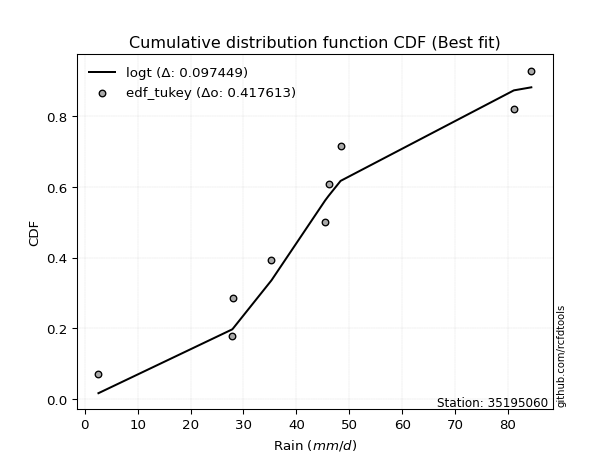</img></img>

</div>


### 8. EDF Gringorten (1963)

Gringorten plotting position formula is essential for estimating the probability and return periods of extreme events like floods and heavy rainfall. The constant _a=0.44_.

<div align="center">


$P=(m-a)/(n+1-2a)$


</div>


**8.1. Empirical values**

<div align="center">

|                | 0                    | 1                  | 2                   | 3                  | 4              | 5                  | 6                  | 7                  | 8                  |
|:---------------|:---------------------|:-------------------|:--------------------|:-------------------|:---------------|:-------------------|:-------------------|:-------------------|:-------------------|
| date           | 2017                 | 2022               | 2018                | 2021               | 2025           | 2024               | 2023               | 2020               | 2019               |
| x              | 2.6                  | 27.87              | 28.0                | 35.3               | 45.45          | 46.09              | 48.36              | 81.1               | 84.4               |
| m              | 1                    | 2                  | 3                   | 4                  | 5              | 6                  | 7                  | 8                  | 9                  |
| empirical_dist | edf_gringorten       | edf_gringorten     | edf_gringorten      | edf_gringorten     | edf_gringorten | edf_gringorten     | edf_gringorten     | edf_gringorten     | edf_gringorten     |
| empirical      | 0.061403508771929835 | 0.1710526315789474 | 0.28070175438596495 | 0.3903508771929825 | 0.5            | 0.6096491228070176 | 0.7192982456140351 | 0.8289473684210527 | 0.9385964912280703 |
| empirical_tr   | 1.0654205607476634   | 1.2063492063492063 | 1.3902439024390243  | 1.6402877697841727 | 2.0            | 2.561797752808989  | 3.5625             | 5.846153846153847  | 16.285714285714324 |

</div>


**8.2. Kolmogorov-Smirnov fit test (sorted by Δ)**


<div align="center">

|                | 0                   | 1                   | 2                   | 3                   | 4                   | 5                   | 6                   | 7                   | 8                   | 9                   | 10                  | 11                  | 12                  | 13                  | 14                  | 15                  | 16                  | 17                  | 18                  | 19                  | 20                  | 21                  | 22                  | 23                  | 24                  | 25                  | 26                  | 27                  | 28                  | 29                  | 30                  | 31                  | 32                  | 33                  | 34                  | 35                  | 36                  | 37                  | 38                  | 39                  | 40                  | 41                  | 42                  | 43                  | 44                  | 45                  | 46                  | 47                  | 48                  | 49                  | 50                  | 51                  | 52                  | 53                  | 54                  | 55                  | 56                  | 57                  | 58                  | 59                  | 60                  | 61                  | 62                  | 63                  | 64                  | 65                  | 66                  | 67                  | 68                  | 69                  | 70                  | 71                  | 72                  | 73                  | 74                  | 75                  | 76                  | 77                  | 78                  | 79                  | 80                  | 81                  | 82                  | 83                  | 84                  | 85                  | 86                  | 87                  | 88                  | 89                  | 90                  | 91                  | 92                  | 93                  | 94                  | 95                  | 96                  | 97                  | 98                  | 99                  | 100                 | 101                 | 102                 | 103                 | 104                 | 105                 | 106                 | 107                 | 108                 | 109                 | 110                 | 111                 | 112                 | 113                 | 114                 | 115                 | 116                 | 117                 | 118                 | 119                 | 120                 | 121                 | 122                 | 123                 | 124                 | 125                 | 126                 | 127                 | 128                 | 129                 | 130                 | 131                 | 132                 | 133                 | 134                 | 135                 | 136                 | 137                 | 138                 | 139                 | 140                 | 141                 | 142                 | 143                 | 144                 | 145                 | 146                 | 147                 | 148                 | 149                 | 150                 | 151                 | 152                 | 153                 | 154                 | 155                 | 156                 | 157                 | 158                 | 159                 |
|:---------------|:--------------------|:--------------------|:--------------------|:--------------------|:--------------------|:--------------------|:--------------------|:--------------------|:--------------------|:--------------------|:--------------------|:--------------------|:--------------------|:--------------------|:--------------------|:--------------------|:--------------------|:--------------------|:--------------------|:--------------------|:--------------------|:--------------------|:--------------------|:--------------------|:--------------------|:--------------------|:--------------------|:--------------------|:--------------------|:--------------------|:--------------------|:--------------------|:--------------------|:--------------------|:--------------------|:--------------------|:--------------------|:--------------------|:--------------------|:--------------------|:--------------------|:--------------------|:--------------------|:--------------------|:--------------------|:--------------------|:--------------------|:--------------------|:--------------------|:--------------------|:--------------------|:--------------------|:--------------------|:--------------------|:--------------------|:--------------------|:--------------------|:--------------------|:--------------------|:--------------------|:--------------------|:--------------------|:--------------------|:--------------------|:--------------------|:--------------------|:--------------------|:--------------------|:--------------------|:--------------------|:--------------------|:--------------------|:--------------------|:--------------------|:--------------------|:--------------------|:--------------------|:--------------------|:--------------------|:--------------------|:--------------------|:--------------------|:--------------------|:--------------------|:--------------------|:--------------------|:--------------------|:--------------------|:--------------------|:--------------------|:--------------------|:--------------------|:--------------------|:--------------------|:--------------------|:--------------------|:--------------------|:--------------------|:--------------------|:--------------------|:--------------------|:--------------------|:--------------------|:--------------------|:--------------------|:--------------------|:--------------------|:--------------------|:--------------------|:--------------------|:--------------------|:--------------------|:--------------------|:--------------------|:--------------------|:--------------------|:--------------------|:--------------------|:--------------------|:--------------------|:--------------------|:--------------------|:--------------------|:--------------------|:--------------------|:--------------------|:--------------------|:--------------------|:--------------------|:--------------------|:--------------------|:--------------------|:--------------------|:--------------------|:--------------------|:--------------------|:--------------------|:--------------------|:--------------------|:--------------------|:--------------------|:--------------------|:--------------------|:--------------------|:--------------------|:--------------------|:--------------------|:--------------------|:--------------------|:--------------------|:--------------------|:--------------------|:--------------------|:--------------------|:--------------------|:--------------------|:--------------------|:--------------------|:--------------------|:--------------------|
| station        | 35195060            | 35195060            | 35195060            | 35195060            | 35195060            | 35195060            | 35195060            | 35195060            | 35195060            | 35195060            | 35195060            | 35195060            | 35195060            | 35195060            | 35195060            | 35195060            | 35195060            | 35195060            | 35195060            | 35195060            | 35195060            | 35195060            | 35195060            | 35195060            | 35195060            | 35195060            | 35195060            | 35195060            | 35195060            | 35195060            | 35195060            | 35195060            | 35195060            | 35195060            | 35195060            | 35195060            | 35195060            | 35195060            | 35195060            | 35195060            | 35195060            | 35195060            | 35195060            | 35195060            | 35195060            | 35195060            | 35195060            | 35195060            | 35195060            | 35195060            | 35195060            | 35195060            | 35195060            | 35195060            | 35195060            | 35195060            | 35195060            | 35195060            | 35195060            | 35195060            | 35195060            | 35195060            | 35195060            | 35195060            | 35195060            | 35195060            | 35195060            | 35195060            | 35195060            | 35195060            | 35195060            | 35195060            | 35195060            | 35195060            | 35195060            | 35195060            | 35195060            | 35195060            | 35195060            | 35195060            | 35195060            | 35195060            | 35195060            | 35195060            | 35195060            | 35195060            | 35195060            | 35195060            | 35195060            | 35195060            | 35195060            | 35195060            | 35195060            | 35195060            | 35195060            | 35195060            | 35195060            | 35195060            | 35195060            | 35195060            | 35195060            | 35195060            | 35195060            | 35195060            | 35195060            | 35195060            | 35195060            | 35195060            | 35195060            | 35195060            | 35195060            | 35195060            | 35195060            | 35195060            | 35195060            | 35195060            | 35195060            | 35195060            | 35195060            | 35195060            | 35195060            | 35195060            | 35195060            | 35195060            | 35195060            | 35195060            | 35195060            | 35195060            | 35195060            | 35195060            | 35195060            | 35195060            | 35195060            | 35195060            | 35195060            | 35195060            | 35195060            | 35195060            | 35195060            | 35195060            | 35195060            | 35195060            | 35195060            | 35195060            | 35195060            | 35195060            | 35195060            | 35195060            | 35195060            | 35195060            | 35195060            | 35195060            | 35195060            | 35195060            | 35195060            | 35195060            | 35195060            | 35195060            | 35195060            | 35195060            |
| empirical_dist | edf_gringorten      | edf_gringorten      | edf_gringorten      | edf_gringorten      | edf_gringorten      | edf_gringorten      | edf_gringorten      | edf_gringorten      | edf_gringorten      | edf_gringorten      | edf_gringorten      | edf_gringorten      | edf_gringorten      | edf_gringorten      | edf_gringorten      | edf_gringorten      | edf_gringorten      | edf_gringorten      | edf_gringorten      | edf_gringorten      | edf_gringorten      | edf_gringorten      | edf_gringorten      | edf_gringorten      | edf_gringorten      | edf_gringorten      | edf_gringorten      | edf_gringorten      | edf_gringorten      | edf_gringorten      | edf_gringorten      | edf_gringorten      | edf_gringorten      | edf_gringorten      | edf_gringorten      | edf_gringorten      | edf_gringorten      | edf_gringorten      | edf_gringorten      | edf_gringorten      | edf_gringorten      | edf_gringorten      | edf_gringorten      | edf_gringorten      | edf_gringorten      | edf_gringorten      | edf_gringorten      | edf_gringorten      | edf_gringorten      | edf_gringorten      | edf_gringorten      | edf_gringorten      | edf_gringorten      | edf_gringorten      | edf_gringorten      | edf_gringorten      | edf_gringorten      | edf_gringorten      | edf_gringorten      | edf_gringorten      | edf_gringorten      | edf_gringorten      | edf_gringorten      | edf_gringorten      | edf_gringorten      | edf_gringorten      | edf_gringorten      | edf_gringorten      | edf_gringorten      | edf_gringorten      | edf_gringorten      | edf_gringorten      | edf_gringorten      | edf_gringorten      | edf_gringorten      | edf_gringorten      | edf_gringorten      | edf_gringorten      | edf_gringorten      | edf_gringorten      | edf_gringorten      | edf_gringorten      | edf_gringorten      | edf_gringorten      | edf_gringorten      | edf_gringorten      | edf_gringorten      | edf_gringorten      | edf_gringorten      | edf_gringorten      | edf_gringorten      | edf_gringorten      | edf_gringorten      | edf_gringorten      | edf_gringorten      | edf_gringorten      | edf_gringorten      | edf_gringorten      | edf_gringorten      | edf_gringorten      | edf_gringorten      | edf_gringorten      | edf_gringorten      | edf_gringorten      | edf_gringorten      | edf_gringorten      | edf_gringorten      | edf_gringorten      | edf_gringorten      | edf_gringorten      | edf_gringorten      | edf_gringorten      | edf_gringorten      | edf_gringorten      | edf_gringorten      | edf_gringorten      | edf_gringorten      | edf_gringorten      | edf_gringorten      | edf_gringorten      | edf_gringorten      | edf_gringorten      | edf_gringorten      | edf_gringorten      | edf_gringorten      | edf_gringorten      | edf_gringorten      | edf_gringorten      | edf_gringorten      | edf_gringorten      | edf_gringorten      | edf_gringorten      | edf_gringorten      | edf_gringorten      | edf_gringorten      | edf_gringorten      | edf_gringorten      | edf_gringorten      | edf_gringorten      | edf_gringorten      | edf_gringorten      | edf_gringorten      | edf_gringorten      | edf_gringorten      | edf_gringorten      | edf_gringorten      | edf_gringorten      | edf_gringorten      | edf_gringorten      | edf_gringorten      | edf_gringorten      | edf_gringorten      | edf_gringorten      | edf_gringorten      | edf_gringorten      | edf_gringorten      | edf_gringorten      | edf_gringorten      | edf_gringorten      | edf_gringorten      |
| p_dist         | gumbel_r            | logt                | invgauss            | moyal               | rayleigh            | laplace             | genlogistic         | halflogistic        | invweibull          | burr12              | skewnorm            | maxwell             | invgamma            | exponweib           | dweibull            | erlang              | gamma               | f                   | betaprime           | gengamma            | fatiguelife         | johnsonsu           | nct                 | halfnorm            | weibull_min         | ncf                 | logexponpow         | rice                | hypsecant           | pearson3            | kstwobign           | genextreme          | dgamma              | vonmises_line       | logistic            | truncweibull_min    | logweibull_min      | foldnorm            | logexponweib        | exponnorm           | loggompertz         | logdweibull         | t                   | norm                | crystalball         | logargus            | logburr12           | wrapcauchy          | uniform             | tukeylambda         | kappa3              | anglit              | logdgamma           | cosine              | semicircular        | logpearson3         | logloggamma         | logloglaplace       | loggengamma         | ksone               | kappa4              | logburr             | logmielke           | lognakagami         | arcsine             | loggennorm          | wald                | logjohnsonsu        | loggumbel_l         | truncnorm           | gennorm             | burr                | loggenextreme       | bradford            | loglaplace          | loglaplace          | logtrapezoid        | gumbel_l            | loggenpareto        | gausshyper          | logweibull_max      | argus               | loglevy_l           | logfoldnorm         | mielke              | loghypsecant        | logskewnorm         | loglogistic         | loggausshyper       | logfatiguelife      | logexponnorm        | logrice             | logcrystalball      | lognorm             | lognct              | logf                | johnsonsb           | logerlang           | loganglit           | levy_l              | genexpon            | genpareto           | loggamma            | loggamma            | logbetaprime        | logsemicircular     | loginvgamma         | logalpha            | truncexpon          | logvonmises_line    | lomax               | gompertz            | loginvgauss         | logarcsine          | logmaxwell          | logncf              | logjohnsonsb        | triang              | lograyleigh         | genhalflogistic     | loginvweibull       | loggumbel_r         | halfgennorm         | loggenhalflogistic  | loghalfnorm         | logmoyal            | logtriang           | logkstwobign        | logtruncnorm        | loghalflogistic     | logcosine           | beta                | loggenexpon         | loglomax            | logbeta             | logtruncweibull_min | logwald             | trapezoid           | logwrapcauchy       | logkappa4           | logksone            | logtukeylambda      | logkappa3           | loguniform          | rdist               | nakagami            | logbradford         | logtruncexpon       | alpha               | weibull_max         | powerlaw            | logrdist            | loghalfgennorm      | logpowerlaw         | exponpow            | truncpareto         | logtruncpareto      | loggenlogistic      | logvonmises         | vonmises            |
| delta          | 0.09317328678550585 | 0.10246156616613233 | 0.10984091323859291 | 0.11428468525083824 | 0.11530587547116378 | 0.11548893098746715 | 0.11599794713962219 | 0.11786213887085312 | 0.12045548769282105 | 0.1216896235305499  | 0.12268318824685664 | 0.12462242694840009 | 0.12567522859055746 | 0.1291256133677744  | 0.1297932161551677  | 0.12981654470613646 | 0.1298165575993937  | 0.12982262171610048 | 0.12991362771158754 | 0.1300412780688972  | 0.13043799040277881 | 0.1313363146445713  | 0.13203178905866864 | 0.13236895841480828 | 0.13301919859658906 | 0.13513693710977137 | 0.13647516982883962 | 0.136885695626892   | 0.13792311214727826 | 0.1385310650131234  | 0.14084900490528074 | 0.14173871317397624 | 0.14227673569830956 | 0.14277473296439402 | 0.1452309308986217  | 0.14638491856469033 | 0.1468539046719901  | 0.14710310539857596 | 0.1474352680183818  | 0.14908560210736843 | 0.151060891355898   | 0.1530378067495477  | 0.1539437373581678  | 0.15394632905088457 | 0.15394633460581775 | 0.15662273833627216 | 0.15920371147155177 | 0.15975418329072633 | 0.15988504268004988 | 0.15997600062021977 | 0.16207878650562302 | 0.16316720786708416 | 0.16558149925785925 | 0.16586214045968994 | 0.16697869165108314 | 0.16756817946082359 | 0.1687457556944667  | 0.16979843330234012 | 0.17140654544581668 | 0.17179601070362083 | 0.17222970117331893 | 0.1744016826890593  | 0.17491011313250437 | 0.17710943709496552 | 0.18217682132982171 | 0.18332554282200725 | 0.18549196458911998 | 0.18602149360384146 | 0.1882562582894563  | 0.19716996840633771 | 0.19877378040463953 | 0.20378687705551646 | 0.21338771217008978 | 0.2140193662165376  | 0.21609002103551123 | 0.21609002103551123 | 0.21836187809671154 | 0.219178974789914   | 0.228288460961239   | 0.2285136901234962  | 0.23114608145535565 | 0.23171869672224743 | 0.23827648642432342 | 0.23853091010176236 | 0.23958151679792494 | 0.23969615549933093 | 0.24041477894713997 | 0.24765150459968527 | 0.2514716354017717  | 0.2561430717622758  | 0.25717222598379774 | 0.25717484330051366 | 0.2571749436807294  | 0.2571749462223657  | 0.25820652865350663 | 0.260542125393397   | 0.2626174101261389  | 0.2656052558019617  | 0.26727238062083436 | 0.26755491248131474 | 0.26888209318242756 | 0.26951988670583726 | 0.27108483816811946 | 0.27108483816811946 | 0.2713010792990717  | 0.2714497404385891  | 0.2742596281814072  | 0.2751026360373362  | 0.27525049407558005 | 0.27655028554348554 | 0.27701234464811336 | 0.27724778201511807 | 0.2848069050545931  | 0.2881205163185334  | 0.2915669141062105  | 0.29496660747064646 | 0.2974926852358878  | 0.30083932856869916 | 0.3037031352401062  | 0.3049657072062294  | 0.3065547902896774  | 0.3215430742199469  | 0.33094404689278406 | 0.33559422119245713 | 0.33802130475453945 | 0.3461000785764137  | 0.34625270547584414 | 0.35112070484893315 | 0.3552338048169765  | 0.35693829933040694 | 0.35736655735063544 | 0.36959283634219475 | 0.3760467164815457  | 0.40521017923484565 | 0.4097969369623501  | 0.41043325963030247 | 0.4139110292459874  | 0.4142040767828468  | 0.42246494270630225 | 0.4652293817482745  | 0.48028866533928055 | 0.5000954377444677  | 0.5094454625207072  | 0.5105569247229262  | 0.5410299248240777  | 0.5572076909628092  | 0.5751027069264074  | 0.5767536345284439  | 0.6103081320830372  | 0.6113509785448019  | 0.6192257723376309  | 0.6725371043055441  | 0.7192982456140351  | 0.7455398616470248  | 0.750217888567069   | 0.7612554738193342  | 0.8061974814689494  | 0.8289473684210527  | 1.1058313248085134  | 12.511945355318737  |
| deltao         | 0.41761268023100007 | 0.41761268023100007 | 0.41761268023100007 | 0.41761268023100007 | 0.41761268023100007 | 0.41761268023100007 | 0.41761268023100007 | 0.41761268023100007 | 0.41761268023100007 | 0.41761268023100007 | 0.41761268023100007 | 0.41761268023100007 | 0.41761268023100007 | 0.41761268023100007 | 0.41761268023100007 | 0.41761268023100007 | 0.41761268023100007 | 0.41761268023100007 | 0.41761268023100007 | 0.41761268023100007 | 0.41761268023100007 | 0.41761268023100007 | 0.41761268023100007 | 0.41761268023100007 | 0.41761268023100007 | 0.41761268023100007 | 0.41761268023100007 | 0.41761268023100007 | 0.41761268023100007 | 0.41761268023100007 | 0.41761268023100007 | 0.41761268023100007 | 0.41761268023100007 | 0.41761268023100007 | 0.41761268023100007 | 0.41761268023100007 | 0.41761268023100007 | 0.41761268023100007 | 0.41761268023100007 | 0.41761268023100007 | 0.41761268023100007 | 0.41761268023100007 | 0.41761268023100007 | 0.41761268023100007 | 0.41761268023100007 | 0.41761268023100007 | 0.41761268023100007 | 0.41761268023100007 | 0.41761268023100007 | 0.41761268023100007 | 0.41761268023100007 | 0.41761268023100007 | 0.41761268023100007 | 0.41761268023100007 | 0.41761268023100007 | 0.41761268023100007 | 0.41761268023100007 | 0.41761268023100007 | 0.41761268023100007 | 0.41761268023100007 | 0.41761268023100007 | 0.41761268023100007 | 0.41761268023100007 | 0.41761268023100007 | 0.41761268023100007 | 0.41761268023100007 | 0.41761268023100007 | 0.41761268023100007 | 0.41761268023100007 | 0.41761268023100007 | 0.41761268023100007 | 0.41761268023100007 | 0.41761268023100007 | 0.41761268023100007 | 0.41761268023100007 | 0.41761268023100007 | 0.41761268023100007 | 0.41761268023100007 | 0.41761268023100007 | 0.41761268023100007 | 0.41761268023100007 | 0.41761268023100007 | 0.41761268023100007 | 0.41761268023100007 | 0.41761268023100007 | 0.41761268023100007 | 0.41761268023100007 | 0.41761268023100007 | 0.41761268023100007 | 0.41761268023100007 | 0.41761268023100007 | 0.41761268023100007 | 0.41761268023100007 | 0.41761268023100007 | 0.41761268023100007 | 0.41761268023100007 | 0.41761268023100007 | 0.41761268023100007 | 0.41761268023100007 | 0.41761268023100007 | 0.41761268023100007 | 0.41761268023100007 | 0.41761268023100007 | 0.41761268023100007 | 0.41761268023100007 | 0.41761268023100007 | 0.41761268023100007 | 0.41761268023100007 | 0.41761268023100007 | 0.41761268023100007 | 0.41761268023100007 | 0.41761268023100007 | 0.41761268023100007 | 0.41761268023100007 | 0.41761268023100007 | 0.41761268023100007 | 0.41761268023100007 | 0.41761268023100007 | 0.41761268023100007 | 0.41761268023100007 | 0.41761268023100007 | 0.41761268023100007 | 0.41761268023100007 | 0.41761268023100007 | 0.41761268023100007 | 0.41761268023100007 | 0.41761268023100007 | 0.41761268023100007 | 0.41761268023100007 | 0.41761268023100007 | 0.41761268023100007 | 0.41761268023100007 | 0.41761268023100007 | 0.41761268023100007 | 0.41761268023100007 | 0.41761268023100007 | 0.41761268023100007 | 0.41761268023100007 | 0.41761268023100007 | 0.41761268023100007 | 0.41761268023100007 | 0.41761268023100007 | 0.41761268023100007 | 0.41761268023100007 | 0.41761268023100007 | 0.41761268023100007 | 0.41761268023100007 | 0.41761268023100007 | 0.41761268023100007 | 0.41761268023100007 | 0.41761268023100007 | 0.41761268023100007 | 0.41761268023100007 | 0.41761268023100007 | 0.41761268023100007 | 0.41761268023100007 | 0.41761268023100007 | 0.41761268023100007 | 0.41761268023100007 | 0.41761268023100007 |
| eval           | Δo > Δ              | Δo > Δ              | Δo > Δ              | Δo > Δ              | Δo > Δ              | Δo > Δ              | Δo > Δ              | Δo > Δ              | Δo > Δ              | Δo > Δ              | Δo > Δ              | Δo > Δ              | Δo > Δ              | Δo > Δ              | Δo > Δ              | Δo > Δ              | Δo > Δ              | Δo > Δ              | Δo > Δ              | Δo > Δ              | Δo > Δ              | Δo > Δ              | Δo > Δ              | Δo > Δ              | Δo > Δ              | Δo > Δ              | Δo > Δ              | Δo > Δ              | Δo > Δ              | Δo > Δ              | Δo > Δ              | Δo > Δ              | Δo > Δ              | Δo > Δ              | Δo > Δ              | Δo > Δ              | Δo > Δ              | Δo > Δ              | Δo > Δ              | Δo > Δ              | Δo > Δ              | Δo > Δ              | Δo > Δ              | Δo > Δ              | Δo > Δ              | Δo > Δ              | Δo > Δ              | Δo > Δ              | Δo > Δ              | Δo > Δ              | Δo > Δ              | Δo > Δ              | Δo > Δ              | Δo > Δ              | Δo > Δ              | Δo > Δ              | Δo > Δ              | Δo > Δ              | Δo > Δ              | Δo > Δ              | Δo > Δ              | Δo > Δ              | Δo > Δ              | Δo > Δ              | Δo > Δ              | Δo > Δ              | Δo > Δ              | Δo > Δ              | Δo > Δ              | Δo > Δ              | Δo > Δ              | Δo > Δ              | Δo > Δ              | Δo > Δ              | Δo > Δ              | Δo > Δ              | Δo > Δ              | Δo > Δ              | Δo > Δ              | Δo > Δ              | Δo > Δ              | Δo > Δ              | Δo > Δ              | Δo > Δ              | Δo > Δ              | Δo > Δ              | Δo > Δ              | Δo > Δ              | Δo > Δ              | Δo > Δ              | Δo > Δ              | Δo > Δ              | Δo > Δ              | Δo > Δ              | Δo > Δ              | Δo > Δ              | Δo > Δ              | Δo > Δ              | Δo > Δ              | Δo > Δ              | Δo > Δ              | Δo > Δ              | Δo > Δ              | Δo > Δ              | Δo > Δ              | Δo > Δ              | Δo > Δ              | Δo > Δ              | Δo > Δ              | Δo > Δ              | Δo > Δ              | Δo > Δ              | Δo > Δ              | Δo > Δ              | Δo > Δ              | Δo > Δ              | Δo > Δ              | Δo > Δ              | Δo > Δ              | Δo > Δ              | Δo > Δ              | Δo > Δ              | Δo > Δ              | Δo > Δ              | Δo > Δ              | Δo > Δ              | Δo > Δ              | Δo > Δ              | Δo > Δ              | Δo > Δ              | Δo > Δ              | Δo > Δ              | Δo > Δ              | Δo > Δ              | Δo > Δ              | Δo > Δ              | Δo > Δ              | Δo > Δ              | Δo <= Δ             | Δo <= Δ             | Δo <= Δ             | Δo <= Δ             | Δo <= Δ             | Δo <= Δ             | Δo <= Δ             | Δo <= Δ             | Δo <= Δ             | Δo <= Δ             | Δo <= Δ             | Δo <= Δ             | Δo <= Δ             | Δo <= Δ             | Δo <= Δ             | Δo <= Δ             | Δo <= Δ             | Δo <= Δ             | Δo <= Δ             | Δo <= Δ             | Δo <= Δ             | Δo <= Δ             |
| fit            | 1                   | 1                   | 1                   | 1                   | 1                   | 1                   | 1                   | 1                   | 1                   | 1                   | 1                   | 1                   | 1                   | 1                   | 1                   | 1                   | 1                   | 1                   | 1                   | 1                   | 1                   | 1                   | 1                   | 1                   | 1                   | 1                   | 1                   | 1                   | 1                   | 1                   | 1                   | 1                   | 1                   | 1                   | 1                   | 1                   | 1                   | 1                   | 1                   | 1                   | 1                   | 1                   | 1                   | 1                   | 1                   | 1                   | 1                   | 1                   | 1                   | 1                   | 1                   | 1                   | 1                   | 1                   | 1                   | 1                   | 1                   | 1                   | 1                   | 1                   | 1                   | 1                   | 1                   | 1                   | 1                   | 1                   | 1                   | 1                   | 1                   | 1                   | 1                   | 1                   | 1                   | 1                   | 1                   | 1                   | 1                   | 1                   | 1                   | 1                   | 1                   | 1                   | 1                   | 1                   | 1                   | 1                   | 1                   | 1                   | 1                   | 1                   | 1                   | 1                   | 1                   | 1                   | 1                   | 1                   | 1                   | 1                   | 1                   | 1                   | 1                   | 1                   | 1                   | 1                   | 1                   | 1                   | 1                   | 1                   | 1                   | 1                   | 1                   | 1                   | 1                   | 1                   | 1                   | 1                   | 1                   | 1                   | 1                   | 1                   | 1                   | 1                   | 1                   | 1                   | 1                   | 1                   | 1                   | 1                   | 1                   | 1                   | 1                   | 1                   | 1                   | 1                   | 1                   | 1                   | 1                   | 1                   | 0                   | 0                   | 0                   | 0                   | 0                   | 0                   | 0                   | 0                   | 0                   | 0                   | 0                   | 0                   | 0                   | 0                   | 0                   | 0                   | 0                   | 0                   | 0                   | 0                   | 0                   | 0                   |
| n              | 9                   | 9                   | 9                   | 9                   | 9                   | 9                   | 9                   | 9                   | 9                   | 9                   | 9                   | 9                   | 9                   | 9                   | 9                   | 9                   | 9                   | 9                   | 9                   | 9                   | 9                   | 9                   | 9                   | 9                   | 9                   | 9                   | 9                   | 9                   | 9                   | 9                   | 9                   | 9                   | 9                   | 9                   | 9                   | 9                   | 9                   | 9                   | 9                   | 9                   | 9                   | 9                   | 9                   | 9                   | 9                   | 9                   | 9                   | 9                   | 9                   | 9                   | 9                   | 9                   | 9                   | 9                   | 9                   | 9                   | 9                   | 9                   | 9                   | 9                   | 9                   | 9                   | 9                   | 9                   | 9                   | 9                   | 9                   | 9                   | 9                   | 9                   | 9                   | 9                   | 9                   | 9                   | 9                   | 9                   | 9                   | 9                   | 9                   | 9                   | 9                   | 9                   | 9                   | 9                   | 9                   | 9                   | 9                   | 9                   | 9                   | 9                   | 9                   | 9                   | 9                   | 9                   | 9                   | 9                   | 9                   | 9                   | 9                   | 9                   | 9                   | 9                   | 9                   | 9                   | 9                   | 9                   | 9                   | 9                   | 9                   | 9                   | 9                   | 9                   | 9                   | 9                   | 9                   | 9                   | 9                   | 9                   | 9                   | 9                   | 9                   | 9                   | 9                   | 9                   | 9                   | 9                   | 9                   | 9                   | 9                   | 9                   | 9                   | 9                   | 9                   | 9                   | 9                   | 9                   | 9                   | 9                   | 9                   | 9                   | 9                   | 9                   | 9                   | 9                   | 9                   | 9                   | 9                   | 9                   | 9                   | 9                   | 9                   | 9                   | 9                   | 9                   | 9                   | 9                   | 9                   | 9                   | 9                   | 9                   |
| best_fit       | 1                   | 0                   | 0                   | 0                   | 0                   | 0                   | 0                   | 0                   | 0                   | 0                   | 0                   | 0                   | 0                   | 0                   | 0                   | 0                   | 0                   | 0                   | 0                   | 0                   | 0                   | 0                   | 0                   | 0                   | 0                   | 0                   | 0                   | 0                   | 0                   | 0                   | 0                   | 0                   | 0                   | 0                   | 0                   | 0                   | 0                   | 0                   | 0                   | 0                   | 0                   | 0                   | 0                   | 0                   | 0                   | 0                   | 0                   | 0                   | 0                   | 0                   | 0                   | 0                   | 0                   | 0                   | 0                   | 0                   | 0                   | 0                   | 0                   | 0                   | 0                   | 0                   | 0                   | 0                   | 0                   | 0                   | 0                   | 0                   | 0                   | 0                   | 0                   | 0                   | 0                   | 0                   | 0                   | 0                   | 0                   | 0                   | 0                   | 0                   | 0                   | 0                   | 0                   | 0                   | 0                   | 0                   | 0                   | 0                   | 0                   | 0                   | 0                   | 0                   | 0                   | 0                   | 0                   | 0                   | 0                   | 0                   | 0                   | 0                   | 0                   | 0                   | 0                   | 0                   | 0                   | 0                   | 0                   | 0                   | 0                   | 0                   | 0                   | 0                   | 0                   | 0                   | 0                   | 0                   | 0                   | 0                   | 0                   | 0                   | 0                   | 0                   | 0                   | 0                   | 0                   | 0                   | 0                   | 0                   | 0                   | 0                   | 0                   | 0                   | 0                   | 0                   | 0                   | 0                   | 0                   | 0                   | 0                   | 0                   | 0                   | 0                   | 0                   | 0                   | 0                   | 0                   | 0                   | 0                   | 0                   | 0                   | 0                   | 0                   | 0                   | 0                   | 0                   | 0                   | 0                   | 0                   | 0                   | 0                   |
| best_fit_sort  | 1                   | 2                   | 3                   | 4                   | 5                   | 6                   | 7                   | 8                   | 9                   | 10                  | 11                  | 12                  | 13                  | 14                  | 15                  | 16                  | 17                  | 18                  | 19                  | 20                  | 21                  | 22                  | 23                  | 24                  | 25                  | 26                  | 27                  | 28                  | 29                  | 30                  | 31                  | 32                  | 33                  | 34                  | 35                  | 36                  | 37                  | 38                  | 39                  | 40                  | 41                  | 42                  | 43                  | 44                  | 45                  | 46                  | 47                  | 48                  | 49                  | 50                  | 51                  | 52                  | 53                  | 54                  | 55                  | 56                  | 57                  | 58                  | 59                  | 60                  | 61                  | 62                  | 63                  | 64                  | 65                  | 66                  | 67                  | 68                  | 69                  | 70                  | 71                  | 72                  | 73                  | 74                  | 75                  | 76                  | 77                  | 78                  | 79                  | 80                  | 81                  | 82                  | 83                  | 84                  | 85                  | 86                  | 87                  | 88                  | 89                  | 90                  | 91                  | 92                  | 93                  | 94                  | 95                  | 96                  | 97                  | 98                  | 99                  | 100                 | 101                 | 102                 | 103                 | 104                 | 105                 | 106                 | 107                 | 108                 | 109                 | 110                 | 111                 | 112                 | 113                 | 114                 | 115                 | 116                 | 117                 | 118                 | 119                 | 120                 | 121                 | 122                 | 123                 | 124                 | 125                 | 126                 | 127                 | 128                 | 129                 | 130                 | 131                 | 132                 | 133                 | 134                 | 135                 | 136                 | 137                 | 138                 | 139                 | 140                 | 141                 | 142                 | 143                 | 144                 | 145                 | 146                 | 147                 | 148                 | 149                 | 150                 | 151                 | 152                 | 153                 | 154                 | 155                 | 156                 | 157                 | 158                 | 159                 | 160                 |

</div>


**8.3. Best fit**

<div align="center">

|   id |   station | empirical_dist   | p_dist   |     delta |   deltao | eval   |   fit |   n |   best_fit |   best_fit_sort |
|-----:|----------:|:-----------------|:---------|----------:|---------:|:-------|------:|----:|-----------:|----------------:|
|    0 |  35195060 | edf_gringorten   | gumbel_r | 0.0931733 | 0.417613 | Δo > Δ |     1 |   9 |          1 |               1 |

</div>


<div align="center">

</img></img>

</div>


### 9. EDF Filliben (1975)

The specific values of the constants (0.3175) (often denoted as $alpha$) and (0.365) are derived from a method proposed by James J. Filliben in a 1975 paper. This particular formula is the mean value of the $i$-th order statistic of the normal distribution and is considered a robust and effective plotting position formula for the normal probability plot correlation coefficient test for normality.

<div align="center">


$P=(m-0.3175)/(n+0.365)$


</div>


**9.1. Empirical values**

<div align="center">

|                | 0                   | 1                  | 2                   | 3                   | 4            | 5                  | 6                  | 7                  | 8                  |
|:---------------|:--------------------|:-------------------|:--------------------|:--------------------|:-------------|:-------------------|:-------------------|:-------------------|:-------------------|
| date           | 2017                | 2022               | 2018                | 2021                | 2025         | 2024               | 2023               | 2020               | 2019               |
| x              | 2.6                 | 27.87              | 28.0                | 35.3                | 45.45        | 46.09              | 48.36              | 81.1               | 84.4               |
| m              | 1                   | 2                  | 3                   | 4                   | 5            | 6                  | 7                  | 8                  | 9                  |
| empirical_dist | edf_filliben        | edf_filliben       | edf_filliben        | edf_filliben        | edf_filliben | edf_filliben       | edf_filliben       | edf_filliben       | edf_filliben       |
| empirical      | 0.07287773625200214 | 0.1796583021890016 | 0.28643886812600106 | 0.39321943406300053 | 0.5          | 0.6067805659369995 | 0.7135611318739989 | 0.8203416978109984 | 0.9271222637479978 |
| empirical_tr   | 1.0786063921681543  | 1.219004230393752  | 1.401421623643846   | 1.6480422349318082  | 2.0          | 2.5431093007467753 | 3.491146318732526  | 5.566121842496286  | 13.721611721611705 |

</div>


**9.2. Kolmogorov-Smirnov fit test (sorted by Δ)**


<div align="center">

|                | 0                   | 1                   | 2                   | 3                   | 4                   | 5                   | 6                   | 7                   | 8                   | 9                   | 10                  | 11                  | 12                  | 13                  | 14                  | 15                  | 16                  | 17                  | 18                  | 19                  | 20                  | 21                  | 22                  | 23                  | 24                  | 25                  | 26                  | 27                  | 28                  | 29                  | 30                  | 31                  | 32                  | 33                  | 34                  | 35                  | 36                  | 37                  | 38                  | 39                  | 40                  | 41                  | 42                  | 43                  | 44                  | 45                  | 46                  | 47                  | 48                  | 49                  | 50                  | 51                  | 52                  | 53                  | 54                  | 55                  | 56                  | 57                  | 58                  | 59                  | 60                  | 61                  | 62                  | 63                  | 64                  | 65                  | 66                  | 67                  | 68                  | 69                  | 70                  | 71                  | 72                  | 73                  | 74                  | 75                  | 76                  | 77                  | 78                  | 79                  | 80                  | 81                  | 82                  | 83                  | 84                  | 85                  | 86                  | 87                  | 88                  | 89                  | 90                  | 91                  | 92                  | 93                  | 94                  | 95                  | 96                  | 97                  | 98                  | 99                  | 100                 | 101                 | 102                 | 103                 | 104                 | 105                 | 106                 | 107                 | 108                 | 109                 | 110                 | 111                 | 112                 | 113                 | 114                 | 115                 | 116                 | 117                 | 118                 | 119                 | 120                 | 121                 | 122                 | 123                 | 124                 | 125                 | 126                 | 127                 | 128                 | 129                 | 130                 | 131                 | 132                 | 133                 | 134                 | 135                 | 136                 | 137                 | 138                 | 139                 | 140                 | 141                 | 142                 | 143                 | 144                 | 145                 | 146                 | 147                 | 148                 | 149                 | 150                 | 151                 | 152                 | 153                 | 154                 | 155                 | 156                 | 157                 | 158                 | 159                 |
|:---------------|:--------------------|:--------------------|:--------------------|:--------------------|:--------------------|:--------------------|:--------------------|:--------------------|:--------------------|:--------------------|:--------------------|:--------------------|:--------------------|:--------------------|:--------------------|:--------------------|:--------------------|:--------------------|:--------------------|:--------------------|:--------------------|:--------------------|:--------------------|:--------------------|:--------------------|:--------------------|:--------------------|:--------------------|:--------------------|:--------------------|:--------------------|:--------------------|:--------------------|:--------------------|:--------------------|:--------------------|:--------------------|:--------------------|:--------------------|:--------------------|:--------------------|:--------------------|:--------------------|:--------------------|:--------------------|:--------------------|:--------------------|:--------------------|:--------------------|:--------------------|:--------------------|:--------------------|:--------------------|:--------------------|:--------------------|:--------------------|:--------------------|:--------------------|:--------------------|:--------------------|:--------------------|:--------------------|:--------------------|:--------------------|:--------------------|:--------------------|:--------------------|:--------------------|:--------------------|:--------------------|:--------------------|:--------------------|:--------------------|:--------------------|:--------------------|:--------------------|:--------------------|:--------------------|:--------------------|:--------------------|:--------------------|:--------------------|:--------------------|:--------------------|:--------------------|:--------------------|:--------------------|:--------------------|:--------------------|:--------------------|:--------------------|:--------------------|:--------------------|:--------------------|:--------------------|:--------------------|:--------------------|:--------------------|:--------------------|:--------------------|:--------------------|:--------------------|:--------------------|:--------------------|:--------------------|:--------------------|:--------------------|:--------------------|:--------------------|:--------------------|:--------------------|:--------------------|:--------------------|:--------------------|:--------------------|:--------------------|:--------------------|:--------------------|:--------------------|:--------------------|:--------------------|:--------------------|:--------------------|:--------------------|:--------------------|:--------------------|:--------------------|:--------------------|:--------------------|:--------------------|:--------------------|:--------------------|:--------------------|:--------------------|:--------------------|:--------------------|:--------------------|:--------------------|:--------------------|:--------------------|:--------------------|:--------------------|:--------------------|:--------------------|:--------------------|:--------------------|:--------------------|:--------------------|:--------------------|:--------------------|:--------------------|:--------------------|:--------------------|:--------------------|:--------------------|:--------------------|:--------------------|:--------------------|:--------------------|:--------------------|
| station        | 35195060            | 35195060            | 35195060            | 35195060            | 35195060            | 35195060            | 35195060            | 35195060            | 35195060            | 35195060            | 35195060            | 35195060            | 35195060            | 35195060            | 35195060            | 35195060            | 35195060            | 35195060            | 35195060            | 35195060            | 35195060            | 35195060            | 35195060            | 35195060            | 35195060            | 35195060            | 35195060            | 35195060            | 35195060            | 35195060            | 35195060            | 35195060            | 35195060            | 35195060            | 35195060            | 35195060            | 35195060            | 35195060            | 35195060            | 35195060            | 35195060            | 35195060            | 35195060            | 35195060            | 35195060            | 35195060            | 35195060            | 35195060            | 35195060            | 35195060            | 35195060            | 35195060            | 35195060            | 35195060            | 35195060            | 35195060            | 35195060            | 35195060            | 35195060            | 35195060            | 35195060            | 35195060            | 35195060            | 35195060            | 35195060            | 35195060            | 35195060            | 35195060            | 35195060            | 35195060            | 35195060            | 35195060            | 35195060            | 35195060            | 35195060            | 35195060            | 35195060            | 35195060            | 35195060            | 35195060            | 35195060            | 35195060            | 35195060            | 35195060            | 35195060            | 35195060            | 35195060            | 35195060            | 35195060            | 35195060            | 35195060            | 35195060            | 35195060            | 35195060            | 35195060            | 35195060            | 35195060            | 35195060            | 35195060            | 35195060            | 35195060            | 35195060            | 35195060            | 35195060            | 35195060            | 35195060            | 35195060            | 35195060            | 35195060            | 35195060            | 35195060            | 35195060            | 35195060            | 35195060            | 35195060            | 35195060            | 35195060            | 35195060            | 35195060            | 35195060            | 35195060            | 35195060            | 35195060            | 35195060            | 35195060            | 35195060            | 35195060            | 35195060            | 35195060            | 35195060            | 35195060            | 35195060            | 35195060            | 35195060            | 35195060            | 35195060            | 35195060            | 35195060            | 35195060            | 35195060            | 35195060            | 35195060            | 35195060            | 35195060            | 35195060            | 35195060            | 35195060            | 35195060            | 35195060            | 35195060            | 35195060            | 35195060            | 35195060            | 35195060            | 35195060            | 35195060            | 35195060            | 35195060            | 35195060            | 35195060            |
| empirical_dist | edf_filliben        | edf_filliben        | edf_filliben        | edf_filliben        | edf_filliben        | edf_filliben        | edf_filliben        | edf_filliben        | edf_filliben        | edf_filliben        | edf_filliben        | edf_filliben        | edf_filliben        | edf_filliben        | edf_filliben        | edf_filliben        | edf_filliben        | edf_filliben        | edf_filliben        | edf_filliben        | edf_filliben        | edf_filliben        | edf_filliben        | edf_filliben        | edf_filliben        | edf_filliben        | edf_filliben        | edf_filliben        | edf_filliben        | edf_filliben        | edf_filliben        | edf_filliben        | edf_filliben        | edf_filliben        | edf_filliben        | edf_filliben        | edf_filliben        | edf_filliben        | edf_filliben        | edf_filliben        | edf_filliben        | edf_filliben        | edf_filliben        | edf_filliben        | edf_filliben        | edf_filliben        | edf_filliben        | edf_filliben        | edf_filliben        | edf_filliben        | edf_filliben        | edf_filliben        | edf_filliben        | edf_filliben        | edf_filliben        | edf_filliben        | edf_filliben        | edf_filliben        | edf_filliben        | edf_filliben        | edf_filliben        | edf_filliben        | edf_filliben        | edf_filliben        | edf_filliben        | edf_filliben        | edf_filliben        | edf_filliben        | edf_filliben        | edf_filliben        | edf_filliben        | edf_filliben        | edf_filliben        | edf_filliben        | edf_filliben        | edf_filliben        | edf_filliben        | edf_filliben        | edf_filliben        | edf_filliben        | edf_filliben        | edf_filliben        | edf_filliben        | edf_filliben        | edf_filliben        | edf_filliben        | edf_filliben        | edf_filliben        | edf_filliben        | edf_filliben        | edf_filliben        | edf_filliben        | edf_filliben        | edf_filliben        | edf_filliben        | edf_filliben        | edf_filliben        | edf_filliben        | edf_filliben        | edf_filliben        | edf_filliben        | edf_filliben        | edf_filliben        | edf_filliben        | edf_filliben        | edf_filliben        | edf_filliben        | edf_filliben        | edf_filliben        | edf_filliben        | edf_filliben        | edf_filliben        | edf_filliben        | edf_filliben        | edf_filliben        | edf_filliben        | edf_filliben        | edf_filliben        | edf_filliben        | edf_filliben        | edf_filliben        | edf_filliben        | edf_filliben        | edf_filliben        | edf_filliben        | edf_filliben        | edf_filliben        | edf_filliben        | edf_filliben        | edf_filliben        | edf_filliben        | edf_filliben        | edf_filliben        | edf_filliben        | edf_filliben        | edf_filliben        | edf_filliben        | edf_filliben        | edf_filliben        | edf_filliben        | edf_filliben        | edf_filliben        | edf_filliben        | edf_filliben        | edf_filliben        | edf_filliben        | edf_filliben        | edf_filliben        | edf_filliben        | edf_filliben        | edf_filliben        | edf_filliben        | edf_filliben        | edf_filliben        | edf_filliben        | edf_filliben        | edf_filliben        | edf_filliben        | edf_filliben        | edf_filliben        |
| p_dist         | logt                | gumbel_r            | invgauss            | rayleigh            | genlogistic         | invweibull          | moyal               | burr12              | halflogistic        | skewnorm            | maxwell             | invgamma            | laplace             | exponweib           | halfnorm            | dweibull            | erlang              | gamma               | f                   | betaprime           | gengamma            | fatiguelife         | johnsonsu           | nct                 | ncf                 | weibull_min         | logexponpow         | rice                | hypsecant           | kstwobign           | pearson3            | genextreme          | logweibull_min      | logistic            | foldnorm            | logexponweib        | loggompertz         | exponnorm           | truncweibull_min    | dgamma              | logdweibull         | t                   | norm                | crystalball         | logburr12           | logargus            | vonmises_line       | wrapcauchy          | uniform             | tukeylambda         | kappa3              | anglit              | cosine              | semicircular        | logpearson3         | logloggamma         | logloglaplace       | loggengamma         | ksone               | kappa4              | logdgamma           | logburr             | logmielke           | loggumbel_l         | lognakagami         | arcsine             | logjohnsonsu        | wald                | loggennorm          | truncnorm           | burr                | gennorm             | bradford            | loglaplace          | loglaplace          | loggenextreme       | logtrapezoid        | gumbel_l            | gausshyper          | loggenpareto        | logweibull_max      | argus               | logfoldnorm         | mielke              | loghypsecant        | logskewnorm         | loglevy_l           | loglogistic         | loggausshyper       | logfatiguelife      | logexponnorm        | logrice             | logcrystalball      | lognorm             | lognct              | logf                | levy_l              | johnsonsb           | logerlang           | loganglit           | genexpon            | loggamma            | loggamma            | logbetaprime        | logsemicircular     | genpareto           | loginvgamma         | logalpha            | truncexpon          | lomax               | loginvgauss         | logarcsine          | logvonmises_line    | logmaxwell          | gompertz            | logncf              | logjohnsonsb        | lograyleigh         | triang              | loginvweibull       | genhalflogistic     | loggumbel_r         | halfgennorm         | loggenhalflogistic  | loghalfnorm         | logmoyal            | logtriang           | logkstwobign        | logtruncnorm        | loghalflogistic     | logcosine           | beta                | loggenexpon         | loglomax            | logtruncweibull_min | logbeta             | logwald             | trapezoid           | logwrapcauchy       | logkappa4           | logksone            | logtukeylambda      | logkappa3           | loguniform          | rdist               | nakagami            | logbradford         | logtruncexpon       | alpha               | weibull_max         | powerlaw            | logrdist            | loghalfgennorm      | logpowerlaw         | exponpow            | truncpareto         | logtruncpareto      | loggenlogistic      | logvonmises         | vonmises            |
| delta          | 0.09672445242609617 | 0.10177895739556009 | 0.10410379949855675 | 0.10956876173112762 | 0.11026083339958603 | 0.11184981708276684 | 0.11428468525083824 | 0.11595250979051375 | 0.11660388437919877 | 0.11694607450682049 | 0.11888531320836393 | 0.1199381148505213  | 0.12046309863225213 | 0.12338849962773824 | 0.12376328780475407 | 0.12405610241513154 | 0.1240794309661003  | 0.12407944385935754 | 0.12408550797606432 | 0.12417651397155138 | 0.12430416432886104 | 0.12470087666274265 | 0.12559920090453514 | 0.12629467531863248 | 0.12653126649971716 | 0.1272820848565529  | 0.1278694992187854  | 0.13114858188685585 | 0.1321859984072421  | 0.13224333429522653 | 0.13279395127308724 | 0.13600159943394008 | 0.1382482340619359  | 0.13949381715858555 | 0.1413659916585398  | 0.14169815427834564 | 0.1424552207458438  | 0.14334848836733227 | 0.14405621506231536 | 0.1451452925683276  | 0.14730069300951154 | 0.14820662361813164 | 0.1482092153108484  | 0.1482092208657816  | 0.15059804086149756 | 0.150885624596236   | 0.15138040357444826 | 0.15401706955069017 | 0.15414792894001372 | 0.1542388868801836  | 0.15634167276558686 | 0.157430094127048   | 0.16012502671965378 | 0.16124157791104698 | 0.16183106572078743 | 0.16300864195443054 | 0.16406131956230396 | 0.16566943170578052 | 0.16605889696358467 | 0.16649258743328277 | 0.16845005612787728 | 0.16866456894902315 | 0.16917299939246822 | 0.1796505876794021  | 0.1796562399634045  | 0.17965830218900158 | 0.1802843798638053  | 0.18549196458911998 | 0.18619409969202527 | 0.19143285466630156 | 0.1980497633154803  | 0.20164233727465755 | 0.2054136956064834  | 0.20748435042545701 | 0.20748435042545701 | 0.20765059843005362 | 0.20975620748665733 | 0.21344186104987783 | 0.219908019513442   | 0.22255134722120284 | 0.22540896771531949 | 0.22598158298221127 | 0.22992523949170815 | 0.23097584618787073 | 0.23109048488927672 | 0.23180910833708576 | 0.23253937268428726 | 0.23904583398963106 | 0.2428659647917175  | 0.2475374011522216  | 0.24856655537374353 | 0.24856917269045944 | 0.2485692730706752  | 0.24856927561231149 | 0.24960085804345242 | 0.2519364547833428  | 0.2560806850012425  | 0.2568802963861027  | 0.25699958519190746 | 0.2586667100107801  | 0.2602764225723734  | 0.2624791675580652  | 0.2624791675580652  | 0.26269540868901753 | 0.2628440698285349  | 0.2637827729658011  | 0.265653957571353   | 0.26649696542728196 | 0.26664482346552587 | 0.2684066740380592  | 0.2762012344445389  | 0.2795148457084792  | 0.28228739928352165 | 0.28296124349615626 | 0.2829848957551542  | 0.2863609368605923  | 0.28888701462583355 | 0.29509746463005204 | 0.295102214828663   | 0.29794911967962323 | 0.29922859346619324 | 0.31293740360989264 | 0.3223383762827299  | 0.32698855058240295 | 0.32941563414448527 | 0.33749440796635954 | 0.33764703486578995 | 0.34251503423887897 | 0.3466281342069223  | 0.34833262872035275 | 0.34876088674058126 | 0.3638557226021586  | 0.3674410458714915  | 0.39660450862479146 | 0.4018275890202483  | 0.40405982322231393 | 0.4053053586359332  | 0.40846696304281066 | 0.41385927209624807 | 0.4566237111382203  | 0.47168299472922637 | 0.4914897671344135  | 0.5008397919106531  | 0.5019512541128721  | 0.5324242542140235  | 0.5486020203527551  | 0.5664970363163533  | 0.5681479639183896  | 0.601702461472983   | 0.6056138648047658  | 0.6106201017275766  | 0.66393143369549    | 0.7135611318739989  | 0.7369341910369706  | 0.7416122179570148  | 0.75264980320928    | 0.7975918108588953  | 0.8203416978109984  | 1.097225654198459   | 12.523419582798809  |
| deltao         | 0.41761268023100007 | 0.41761268023100007 | 0.41761268023100007 | 0.41761268023100007 | 0.41761268023100007 | 0.41761268023100007 | 0.41761268023100007 | 0.41761268023100007 | 0.41761268023100007 | 0.41761268023100007 | 0.41761268023100007 | 0.41761268023100007 | 0.41761268023100007 | 0.41761268023100007 | 0.41761268023100007 | 0.41761268023100007 | 0.41761268023100007 | 0.41761268023100007 | 0.41761268023100007 | 0.41761268023100007 | 0.41761268023100007 | 0.41761268023100007 | 0.41761268023100007 | 0.41761268023100007 | 0.41761268023100007 | 0.41761268023100007 | 0.41761268023100007 | 0.41761268023100007 | 0.41761268023100007 | 0.41761268023100007 | 0.41761268023100007 | 0.41761268023100007 | 0.41761268023100007 | 0.41761268023100007 | 0.41761268023100007 | 0.41761268023100007 | 0.41761268023100007 | 0.41761268023100007 | 0.41761268023100007 | 0.41761268023100007 | 0.41761268023100007 | 0.41761268023100007 | 0.41761268023100007 | 0.41761268023100007 | 0.41761268023100007 | 0.41761268023100007 | 0.41761268023100007 | 0.41761268023100007 | 0.41761268023100007 | 0.41761268023100007 | 0.41761268023100007 | 0.41761268023100007 | 0.41761268023100007 | 0.41761268023100007 | 0.41761268023100007 | 0.41761268023100007 | 0.41761268023100007 | 0.41761268023100007 | 0.41761268023100007 | 0.41761268023100007 | 0.41761268023100007 | 0.41761268023100007 | 0.41761268023100007 | 0.41761268023100007 | 0.41761268023100007 | 0.41761268023100007 | 0.41761268023100007 | 0.41761268023100007 | 0.41761268023100007 | 0.41761268023100007 | 0.41761268023100007 | 0.41761268023100007 | 0.41761268023100007 | 0.41761268023100007 | 0.41761268023100007 | 0.41761268023100007 | 0.41761268023100007 | 0.41761268023100007 | 0.41761268023100007 | 0.41761268023100007 | 0.41761268023100007 | 0.41761268023100007 | 0.41761268023100007 | 0.41761268023100007 | 0.41761268023100007 | 0.41761268023100007 | 0.41761268023100007 | 0.41761268023100007 | 0.41761268023100007 | 0.41761268023100007 | 0.41761268023100007 | 0.41761268023100007 | 0.41761268023100007 | 0.41761268023100007 | 0.41761268023100007 | 0.41761268023100007 | 0.41761268023100007 | 0.41761268023100007 | 0.41761268023100007 | 0.41761268023100007 | 0.41761268023100007 | 0.41761268023100007 | 0.41761268023100007 | 0.41761268023100007 | 0.41761268023100007 | 0.41761268023100007 | 0.41761268023100007 | 0.41761268023100007 | 0.41761268023100007 | 0.41761268023100007 | 0.41761268023100007 | 0.41761268023100007 | 0.41761268023100007 | 0.41761268023100007 | 0.41761268023100007 | 0.41761268023100007 | 0.41761268023100007 | 0.41761268023100007 | 0.41761268023100007 | 0.41761268023100007 | 0.41761268023100007 | 0.41761268023100007 | 0.41761268023100007 | 0.41761268023100007 | 0.41761268023100007 | 0.41761268023100007 | 0.41761268023100007 | 0.41761268023100007 | 0.41761268023100007 | 0.41761268023100007 | 0.41761268023100007 | 0.41761268023100007 | 0.41761268023100007 | 0.41761268023100007 | 0.41761268023100007 | 0.41761268023100007 | 0.41761268023100007 | 0.41761268023100007 | 0.41761268023100007 | 0.41761268023100007 | 0.41761268023100007 | 0.41761268023100007 | 0.41761268023100007 | 0.41761268023100007 | 0.41761268023100007 | 0.41761268023100007 | 0.41761268023100007 | 0.41761268023100007 | 0.41761268023100007 | 0.41761268023100007 | 0.41761268023100007 | 0.41761268023100007 | 0.41761268023100007 | 0.41761268023100007 | 0.41761268023100007 | 0.41761268023100007 | 0.41761268023100007 | 0.41761268023100007 | 0.41761268023100007 | 0.41761268023100007 |
| eval           | Δo > Δ              | Δo > Δ              | Δo > Δ              | Δo > Δ              | Δo > Δ              | Δo > Δ              | Δo > Δ              | Δo > Δ              | Δo > Δ              | Δo > Δ              | Δo > Δ              | Δo > Δ              | Δo > Δ              | Δo > Δ              | Δo > Δ              | Δo > Δ              | Δo > Δ              | Δo > Δ              | Δo > Δ              | Δo > Δ              | Δo > Δ              | Δo > Δ              | Δo > Δ              | Δo > Δ              | Δo > Δ              | Δo > Δ              | Δo > Δ              | Δo > Δ              | Δo > Δ              | Δo > Δ              | Δo > Δ              | Δo > Δ              | Δo > Δ              | Δo > Δ              | Δo > Δ              | Δo > Δ              | Δo > Δ              | Δo > Δ              | Δo > Δ              | Δo > Δ              | Δo > Δ              | Δo > Δ              | Δo > Δ              | Δo > Δ              | Δo > Δ              | Δo > Δ              | Δo > Δ              | Δo > Δ              | Δo > Δ              | Δo > Δ              | Δo > Δ              | Δo > Δ              | Δo > Δ              | Δo > Δ              | Δo > Δ              | Δo > Δ              | Δo > Δ              | Δo > Δ              | Δo > Δ              | Δo > Δ              | Δo > Δ              | Δo > Δ              | Δo > Δ              | Δo > Δ              | Δo > Δ              | Δo > Δ              | Δo > Δ              | Δo > Δ              | Δo > Δ              | Δo > Δ              | Δo > Δ              | Δo > Δ              | Δo > Δ              | Δo > Δ              | Δo > Δ              | Δo > Δ              | Δo > Δ              | Δo > Δ              | Δo > Δ              | Δo > Δ              | Δo > Δ              | Δo > Δ              | Δo > Δ              | Δo > Δ              | Δo > Δ              | Δo > Δ              | Δo > Δ              | Δo > Δ              | Δo > Δ              | Δo > Δ              | Δo > Δ              | Δo > Δ              | Δo > Δ              | Δo > Δ              | Δo > Δ              | Δo > Δ              | Δo > Δ              | Δo > Δ              | Δo > Δ              | Δo > Δ              | Δo > Δ              | Δo > Δ              | Δo > Δ              | Δo > Δ              | Δo > Δ              | Δo > Δ              | Δo > Δ              | Δo > Δ              | Δo > Δ              | Δo > Δ              | Δo > Δ              | Δo > Δ              | Δo > Δ              | Δo > Δ              | Δo > Δ              | Δo > Δ              | Δo > Δ              | Δo > Δ              | Δo > Δ              | Δo > Δ              | Δo > Δ              | Δo > Δ              | Δo > Δ              | Δo > Δ              | Δo > Δ              | Δo > Δ              | Δo > Δ              | Δo > Δ              | Δo > Δ              | Δo > Δ              | Δo > Δ              | Δo > Δ              | Δo > Δ              | Δo > Δ              | Δo > Δ              | Δo > Δ              | Δo > Δ              | Δo > Δ              | Δo > Δ              | Δo <= Δ             | Δo <= Δ             | Δo <= Δ             | Δo <= Δ             | Δo <= Δ             | Δo <= Δ             | Δo <= Δ             | Δo <= Δ             | Δo <= Δ             | Δo <= Δ             | Δo <= Δ             | Δo <= Δ             | Δo <= Δ             | Δo <= Δ             | Δo <= Δ             | Δo <= Δ             | Δo <= Δ             | Δo <= Δ             | Δo <= Δ             | Δo <= Δ             | Δo <= Δ             |
| fit            | 1                   | 1                   | 1                   | 1                   | 1                   | 1                   | 1                   | 1                   | 1                   | 1                   | 1                   | 1                   | 1                   | 1                   | 1                   | 1                   | 1                   | 1                   | 1                   | 1                   | 1                   | 1                   | 1                   | 1                   | 1                   | 1                   | 1                   | 1                   | 1                   | 1                   | 1                   | 1                   | 1                   | 1                   | 1                   | 1                   | 1                   | 1                   | 1                   | 1                   | 1                   | 1                   | 1                   | 1                   | 1                   | 1                   | 1                   | 1                   | 1                   | 1                   | 1                   | 1                   | 1                   | 1                   | 1                   | 1                   | 1                   | 1                   | 1                   | 1                   | 1                   | 1                   | 1                   | 1                   | 1                   | 1                   | 1                   | 1                   | 1                   | 1                   | 1                   | 1                   | 1                   | 1                   | 1                   | 1                   | 1                   | 1                   | 1                   | 1                   | 1                   | 1                   | 1                   | 1                   | 1                   | 1                   | 1                   | 1                   | 1                   | 1                   | 1                   | 1                   | 1                   | 1                   | 1                   | 1                   | 1                   | 1                   | 1                   | 1                   | 1                   | 1                   | 1                   | 1                   | 1                   | 1                   | 1                   | 1                   | 1                   | 1                   | 1                   | 1                   | 1                   | 1                   | 1                   | 1                   | 1                   | 1                   | 1                   | 1                   | 1                   | 1                   | 1                   | 1                   | 1                   | 1                   | 1                   | 1                   | 1                   | 1                   | 1                   | 1                   | 1                   | 1                   | 1                   | 1                   | 1                   | 1                   | 1                   | 0                   | 0                   | 0                   | 0                   | 0                   | 0                   | 0                   | 0                   | 0                   | 0                   | 0                   | 0                   | 0                   | 0                   | 0                   | 0                   | 0                   | 0                   | 0                   | 0                   | 0                   |
| n              | 9                   | 9                   | 9                   | 9                   | 9                   | 9                   | 9                   | 9                   | 9                   | 9                   | 9                   | 9                   | 9                   | 9                   | 9                   | 9                   | 9                   | 9                   | 9                   | 9                   | 9                   | 9                   | 9                   | 9                   | 9                   | 9                   | 9                   | 9                   | 9                   | 9                   | 9                   | 9                   | 9                   | 9                   | 9                   | 9                   | 9                   | 9                   | 9                   | 9                   | 9                   | 9                   | 9                   | 9                   | 9                   | 9                   | 9                   | 9                   | 9                   | 9                   | 9                   | 9                   | 9                   | 9                   | 9                   | 9                   | 9                   | 9                   | 9                   | 9                   | 9                   | 9                   | 9                   | 9                   | 9                   | 9                   | 9                   | 9                   | 9                   | 9                   | 9                   | 9                   | 9                   | 9                   | 9                   | 9                   | 9                   | 9                   | 9                   | 9                   | 9                   | 9                   | 9                   | 9                   | 9                   | 9                   | 9                   | 9                   | 9                   | 9                   | 9                   | 9                   | 9                   | 9                   | 9                   | 9                   | 9                   | 9                   | 9                   | 9                   | 9                   | 9                   | 9                   | 9                   | 9                   | 9                   | 9                   | 9                   | 9                   | 9                   | 9                   | 9                   | 9                   | 9                   | 9                   | 9                   | 9                   | 9                   | 9                   | 9                   | 9                   | 9                   | 9                   | 9                   | 9                   | 9                   | 9                   | 9                   | 9                   | 9                   | 9                   | 9                   | 9                   | 9                   | 9                   | 9                   | 9                   | 9                   | 9                   | 9                   | 9                   | 9                   | 9                   | 9                   | 9                   | 9                   | 9                   | 9                   | 9                   | 9                   | 9                   | 9                   | 9                   | 9                   | 9                   | 9                   | 9                   | 9                   | 9                   | 9                   |
| best_fit       | 1                   | 0                   | 0                   | 0                   | 0                   | 0                   | 0                   | 0                   | 0                   | 0                   | 0                   | 0                   | 0                   | 0                   | 0                   | 0                   | 0                   | 0                   | 0                   | 0                   | 0                   | 0                   | 0                   | 0                   | 0                   | 0                   | 0                   | 0                   | 0                   | 0                   | 0                   | 0                   | 0                   | 0                   | 0                   | 0                   | 0                   | 0                   | 0                   | 0                   | 0                   | 0                   | 0                   | 0                   | 0                   | 0                   | 0                   | 0                   | 0                   | 0                   | 0                   | 0                   | 0                   | 0                   | 0                   | 0                   | 0                   | 0                   | 0                   | 0                   | 0                   | 0                   | 0                   | 0                   | 0                   | 0                   | 0                   | 0                   | 0                   | 0                   | 0                   | 0                   | 0                   | 0                   | 0                   | 0                   | 0                   | 0                   | 0                   | 0                   | 0                   | 0                   | 0                   | 0                   | 0                   | 0                   | 0                   | 0                   | 0                   | 0                   | 0                   | 0                   | 0                   | 0                   | 0                   | 0                   | 0                   | 0                   | 0                   | 0                   | 0                   | 0                   | 0                   | 0                   | 0                   | 0                   | 0                   | 0                   | 0                   | 0                   | 0                   | 0                   | 0                   | 0                   | 0                   | 0                   | 0                   | 0                   | 0                   | 0                   | 0                   | 0                   | 0                   | 0                   | 0                   | 0                   | 0                   | 0                   | 0                   | 0                   | 0                   | 0                   | 0                   | 0                   | 0                   | 0                   | 0                   | 0                   | 0                   | 0                   | 0                   | 0                   | 0                   | 0                   | 0                   | 0                   | 0                   | 0                   | 0                   | 0                   | 0                   | 0                   | 0                   | 0                   | 0                   | 0                   | 0                   | 0                   | 0                   | 0                   |
| best_fit_sort  | 1                   | 2                   | 3                   | 4                   | 5                   | 6                   | 7                   | 8                   | 9                   | 10                  | 11                  | 12                  | 13                  | 14                  | 15                  | 16                  | 17                  | 18                  | 19                  | 20                  | 21                  | 22                  | 23                  | 24                  | 25                  | 26                  | 27                  | 28                  | 29                  | 30                  | 31                  | 32                  | 33                  | 34                  | 35                  | 36                  | 37                  | 38                  | 39                  | 40                  | 41                  | 42                  | 43                  | 44                  | 45                  | 46                  | 47                  | 48                  | 49                  | 50                  | 51                  | 52                  | 53                  | 54                  | 55                  | 56                  | 57                  | 58                  | 59                  | 60                  | 61                  | 62                  | 63                  | 64                  | 65                  | 66                  | 67                  | 68                  | 69                  | 70                  | 71                  | 72                  | 73                  | 74                  | 75                  | 76                  | 77                  | 78                  | 79                  | 80                  | 81                  | 82                  | 83                  | 84                  | 85                  | 86                  | 87                  | 88                  | 89                  | 90                  | 91                  | 92                  | 93                  | 94                  | 95                  | 96                  | 97                  | 98                  | 99                  | 100                 | 101                 | 102                 | 103                 | 104                 | 105                 | 106                 | 107                 | 108                 | 109                 | 110                 | 111                 | 112                 | 113                 | 114                 | 115                 | 116                 | 117                 | 118                 | 119                 | 120                 | 121                 | 122                 | 123                 | 124                 | 125                 | 126                 | 127                 | 128                 | 129                 | 130                 | 131                 | 132                 | 133                 | 134                 | 135                 | 136                 | 137                 | 138                 | 139                 | 140                 | 141                 | 142                 | 143                 | 144                 | 145                 | 146                 | 147                 | 148                 | 149                 | 150                 | 151                 | 152                 | 153                 | 154                 | 155                 | 156                 | 157                 | 158                 | 159                 | 160                 |

</div>


**9.3. Best fit**

<div align="center">

|   id |   station | empirical_dist   | p_dist   |     delta |   deltao | eval   |   fit |   n |   best_fit |   best_fit_sort |
|-----:|----------:|:-----------------|:---------|----------:|---------:|:-------|------:|----:|-----------:|----------------:|
|    0 |  35195060 | edf_filliben     | logt     | 0.0967245 | 0.417613 | Δo > Δ |     1 |   9 |          1 |               1 |

</div>


<div align="center">

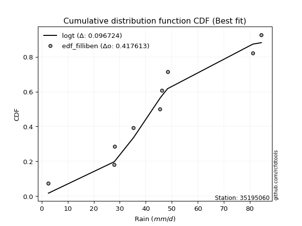</img></img>

</div>


### 10. EDF Jenkinson (1977)

The Jenkinson formula in hydrology is an empirical plotting position formula used to estimate the non-exceedance probability _(P)_ or return period _(T)_ of a given ordered observation within a sample. It is a widely used method in the frequency analysis of extreme events such as floods and rainfall, as it provides a distribution-free way to plot data. _a≈0.31_ and _b≈0.38_ are constants derived to approximate the median of the probability distribution for the given rank.

<div align="center">


$P=(m-a)/(n+b)$


</div>


**10.1. Empirical values**

<div align="center">

|                | 0                   | 1                   | 2                  | 3                   | 4             | 5                  | 6                  | 7                  | 8                  |
|:---------------|:--------------------|:--------------------|:-------------------|:--------------------|:--------------|:-------------------|:-------------------|:-------------------|:-------------------|
| date           | 2017                | 2022                | 2018               | 2021                | 2025          | 2024               | 2023               | 2020               | 2019               |
| x              | 2.6                 | 27.87               | 28.0               | 35.3                | 45.45         | 46.09              | 48.36              | 81.1               | 84.4               |
| m              | 1                   | 2                   | 3                  | 4                   | 5             | 6                  | 7                  | 8                  | 9                  |
| empirical_dist | edf_jenkinson       | edf_jenkinson       | edf_jenkinson      | edf_jenkinson       | edf_jenkinson | edf_jenkinson      | edf_jenkinson      | edf_jenkinson      | edf_jenkinson      |
| empirical      | 0.07356076759061833 | 0.18017057569296374 | 0.2867803837953091 | 0.39339019189765456 | 0.5           | 0.6066098081023454 | 0.7132196162046908 | 0.8198294243070362 | 0.9264392324093815 |
| empirical_tr   | 1.0794016110471807  | 1.2197659297789336  | 1.4020926756352765 | 1.6485061511423549  | 2.0           | 2.542005420054201  | 3.486988847583642  | 5.550295857988164  | 13.5942028985507   |

</div>


**10.2. Kolmogorov-Smirnov fit test (sorted by Δ)**


<div align="center">

|                | 0                   | 1                   | 2                   | 3                   | 4                   | 5                   | 6                   | 7                   | 8                   | 9                   | 10                  | 11                  | 12                  | 13                  | 14                  | 15                  | 16                  | 17                  | 18                  | 19                  | 20                  | 21                  | 22                  | 23                  | 24                  | 25                  | 26                  | 27                  | 28                  | 29                  | 30                  | 31                  | 32                  | 33                  | 34                  | 35                  | 36                  | 37                  | 38                  | 39                  | 40                  | 41                  | 42                  | 43                  | 44                  | 45                  | 46                  | 47                  | 48                  | 49                  | 50                  | 51                  | 52                  | 53                  | 54                  | 55                  | 56                  | 57                  | 58                  | 59                  | 60                  | 61                  | 62                  | 63                  | 64                  | 65                  | 66                  | 67                  | 68                  | 69                  | 70                  | 71                  | 72                  | 73                  | 74                  | 75                  | 76                  | 77                  | 78                  | 79                  | 80                  | 81                  | 82                  | 83                  | 84                  | 85                  | 86                  | 87                  | 88                  | 89                  | 90                  | 91                  | 92                  | 93                  | 94                  | 95                  | 96                  | 97                  | 98                  | 99                  | 100                 | 101                 | 102                 | 103                 | 104                 | 105                 | 106                 | 107                 | 108                 | 109                 | 110                 | 111                 | 112                 | 113                 | 114                 | 115                 | 116                 | 117                 | 118                 | 119                 | 120                 | 121                 | 122                 | 123                 | 124                 | 125                 | 126                 | 127                 | 128                 | 129                 | 130                 | 131                 | 132                 | 133                 | 134                 | 135                 | 136                 | 137                 | 138                 | 139                 | 140                 | 141                 | 142                 | 143                 | 144                 | 145                 | 146                 | 147                 | 148                 | 149                 | 150                 | 151                 | 152                 | 153                 | 154                 | 155                 | 156                 | 157                 | 158                 | 159                 |
|:---------------|:--------------------|:--------------------|:--------------------|:--------------------|:--------------------|:--------------------|:--------------------|:--------------------|:--------------------|:--------------------|:--------------------|:--------------------|:--------------------|:--------------------|:--------------------|:--------------------|:--------------------|:--------------------|:--------------------|:--------------------|:--------------------|:--------------------|:--------------------|:--------------------|:--------------------|:--------------------|:--------------------|:--------------------|:--------------------|:--------------------|:--------------------|:--------------------|:--------------------|:--------------------|:--------------------|:--------------------|:--------------------|:--------------------|:--------------------|:--------------------|:--------------------|:--------------------|:--------------------|:--------------------|:--------------------|:--------------------|:--------------------|:--------------------|:--------------------|:--------------------|:--------------------|:--------------------|:--------------------|:--------------------|:--------------------|:--------------------|:--------------------|:--------------------|:--------------------|:--------------------|:--------------------|:--------------------|:--------------------|:--------------------|:--------------------|:--------------------|:--------------------|:--------------------|:--------------------|:--------------------|:--------------------|:--------------------|:--------------------|:--------------------|:--------------------|:--------------------|:--------------------|:--------------------|:--------------------|:--------------------|:--------------------|:--------------------|:--------------------|:--------------------|:--------------------|:--------------------|:--------------------|:--------------------|:--------------------|:--------------------|:--------------------|:--------------------|:--------------------|:--------------------|:--------------------|:--------------------|:--------------------|:--------------------|:--------------------|:--------------------|:--------------------|:--------------------|:--------------------|:--------------------|:--------------------|:--------------------|:--------------------|:--------------------|:--------------------|:--------------------|:--------------------|:--------------------|:--------------------|:--------------------|:--------------------|:--------------------|:--------------------|:--------------------|:--------------------|:--------------------|:--------------------|:--------------------|:--------------------|:--------------------|:--------------------|:--------------------|:--------------------|:--------------------|:--------------------|:--------------------|:--------------------|:--------------------|:--------------------|:--------------------|:--------------------|:--------------------|:--------------------|:--------------------|:--------------------|:--------------------|:--------------------|:--------------------|:--------------------|:--------------------|:--------------------|:--------------------|:--------------------|:--------------------|:--------------------|:--------------------|:--------------------|:--------------------|:--------------------|:--------------------|:--------------------|:--------------------|:--------------------|:--------------------|:--------------------|:--------------------|
| station        | 35195060            | 35195060            | 35195060            | 35195060            | 35195060            | 35195060            | 35195060            | 35195060            | 35195060            | 35195060            | 35195060            | 35195060            | 35195060            | 35195060            | 35195060            | 35195060            | 35195060            | 35195060            | 35195060            | 35195060            | 35195060            | 35195060            | 35195060            | 35195060            | 35195060            | 35195060            | 35195060            | 35195060            | 35195060            | 35195060            | 35195060            | 35195060            | 35195060            | 35195060            | 35195060            | 35195060            | 35195060            | 35195060            | 35195060            | 35195060            | 35195060            | 35195060            | 35195060            | 35195060            | 35195060            | 35195060            | 35195060            | 35195060            | 35195060            | 35195060            | 35195060            | 35195060            | 35195060            | 35195060            | 35195060            | 35195060            | 35195060            | 35195060            | 35195060            | 35195060            | 35195060            | 35195060            | 35195060            | 35195060            | 35195060            | 35195060            | 35195060            | 35195060            | 35195060            | 35195060            | 35195060            | 35195060            | 35195060            | 35195060            | 35195060            | 35195060            | 35195060            | 35195060            | 35195060            | 35195060            | 35195060            | 35195060            | 35195060            | 35195060            | 35195060            | 35195060            | 35195060            | 35195060            | 35195060            | 35195060            | 35195060            | 35195060            | 35195060            | 35195060            | 35195060            | 35195060            | 35195060            | 35195060            | 35195060            | 35195060            | 35195060            | 35195060            | 35195060            | 35195060            | 35195060            | 35195060            | 35195060            | 35195060            | 35195060            | 35195060            | 35195060            | 35195060            | 35195060            | 35195060            | 35195060            | 35195060            | 35195060            | 35195060            | 35195060            | 35195060            | 35195060            | 35195060            | 35195060            | 35195060            | 35195060            | 35195060            | 35195060            | 35195060            | 35195060            | 35195060            | 35195060            | 35195060            | 35195060            | 35195060            | 35195060            | 35195060            | 35195060            | 35195060            | 35195060            | 35195060            | 35195060            | 35195060            | 35195060            | 35195060            | 35195060            | 35195060            | 35195060            | 35195060            | 35195060            | 35195060            | 35195060            | 35195060            | 35195060            | 35195060            | 35195060            | 35195060            | 35195060            | 35195060            | 35195060            | 35195060            |
| empirical_dist | edf_jenkinson       | edf_jenkinson       | edf_jenkinson       | edf_jenkinson       | edf_jenkinson       | edf_jenkinson       | edf_jenkinson       | edf_jenkinson       | edf_jenkinson       | edf_jenkinson       | edf_jenkinson       | edf_jenkinson       | edf_jenkinson       | edf_jenkinson       | edf_jenkinson       | edf_jenkinson       | edf_jenkinson       | edf_jenkinson       | edf_jenkinson       | edf_jenkinson       | edf_jenkinson       | edf_jenkinson       | edf_jenkinson       | edf_jenkinson       | edf_jenkinson       | edf_jenkinson       | edf_jenkinson       | edf_jenkinson       | edf_jenkinson       | edf_jenkinson       | edf_jenkinson       | edf_jenkinson       | edf_jenkinson       | edf_jenkinson       | edf_jenkinson       | edf_jenkinson       | edf_jenkinson       | edf_jenkinson       | edf_jenkinson       | edf_jenkinson       | edf_jenkinson       | edf_jenkinson       | edf_jenkinson       | edf_jenkinson       | edf_jenkinson       | edf_jenkinson       | edf_jenkinson       | edf_jenkinson       | edf_jenkinson       | edf_jenkinson       | edf_jenkinson       | edf_jenkinson       | edf_jenkinson       | edf_jenkinson       | edf_jenkinson       | edf_jenkinson       | edf_jenkinson       | edf_jenkinson       | edf_jenkinson       | edf_jenkinson       | edf_jenkinson       | edf_jenkinson       | edf_jenkinson       | edf_jenkinson       | edf_jenkinson       | edf_jenkinson       | edf_jenkinson       | edf_jenkinson       | edf_jenkinson       | edf_jenkinson       | edf_jenkinson       | edf_jenkinson       | edf_jenkinson       | edf_jenkinson       | edf_jenkinson       | edf_jenkinson       | edf_jenkinson       | edf_jenkinson       | edf_jenkinson       | edf_jenkinson       | edf_jenkinson       | edf_jenkinson       | edf_jenkinson       | edf_jenkinson       | edf_jenkinson       | edf_jenkinson       | edf_jenkinson       | edf_jenkinson       | edf_jenkinson       | edf_jenkinson       | edf_jenkinson       | edf_jenkinson       | edf_jenkinson       | edf_jenkinson       | edf_jenkinson       | edf_jenkinson       | edf_jenkinson       | edf_jenkinson       | edf_jenkinson       | edf_jenkinson       | edf_jenkinson       | edf_jenkinson       | edf_jenkinson       | edf_jenkinson       | edf_jenkinson       | edf_jenkinson       | edf_jenkinson       | edf_jenkinson       | edf_jenkinson       | edf_jenkinson       | edf_jenkinson       | edf_jenkinson       | edf_jenkinson       | edf_jenkinson       | edf_jenkinson       | edf_jenkinson       | edf_jenkinson       | edf_jenkinson       | edf_jenkinson       | edf_jenkinson       | edf_jenkinson       | edf_jenkinson       | edf_jenkinson       | edf_jenkinson       | edf_jenkinson       | edf_jenkinson       | edf_jenkinson       | edf_jenkinson       | edf_jenkinson       | edf_jenkinson       | edf_jenkinson       | edf_jenkinson       | edf_jenkinson       | edf_jenkinson       | edf_jenkinson       | edf_jenkinson       | edf_jenkinson       | edf_jenkinson       | edf_jenkinson       | edf_jenkinson       | edf_jenkinson       | edf_jenkinson       | edf_jenkinson       | edf_jenkinson       | edf_jenkinson       | edf_jenkinson       | edf_jenkinson       | edf_jenkinson       | edf_jenkinson       | edf_jenkinson       | edf_jenkinson       | edf_jenkinson       | edf_jenkinson       | edf_jenkinson       | edf_jenkinson       | edf_jenkinson       | edf_jenkinson       | edf_jenkinson       | edf_jenkinson       | edf_jenkinson       |
| p_dist         | logt                | gumbel_r            | invgauss            | rayleigh            | genlogistic         | invweibull          | moyal               | burr12              | halflogistic        | skewnorm            | maxwell             | invgamma            | laplace             | exponweib           | halfnorm            | dweibull            | erlang              | gamma               | f                   | betaprime           | gengamma            | fatiguelife         | johnsonsu           | nct                 | ncf                 | weibull_min         | logexponpow         | rice                | kstwobign           | hypsecant           | pearson3            | genextreme          | logweibull_min      | logistic            | foldnorm            | logexponweib        | loggompertz         | exponnorm           | truncweibull_min    | dgamma              | logdweibull         | t                   | norm                | crystalball         | logburr12           | logargus            | vonmises_line       | wrapcauchy          | uniform             | tukeylambda         | kappa3              | anglit              | cosine              | semicircular        | logpearson3         | logloggamma         | logloglaplace       | loggengamma         | ksone               | kappa4              | logburr             | logdgamma           | logmielke           | loggumbel_l         | logjohnsonsu        | lognakagami         | arcsine             | wald                | loggennorm          | truncnorm           | burr                | gennorm             | bradford            | loglaplace          | loglaplace          | loggenextreme       | logtrapezoid        | gumbel_l            | gausshyper          | loggenpareto        | logweibull_max      | argus               | logfoldnorm         | mielke              | loghypsecant        | logskewnorm         | loglevy_l           | loglogistic         | loggausshyper       | logfatiguelife      | logexponnorm        | logrice             | logcrystalball      | lognorm             | lognct              | logf                | levy_l              | logerlang           | johnsonsb           | loganglit           | genexpon            | loggamma            | loggamma            | logbetaprime        | logsemicircular     | genpareto           | loginvgamma         | logalpha            | truncexpon          | lomax               | loginvgauss         | logarcsine          | logmaxwell          | logvonmises_line    | gompertz            | logncf              | logjohnsonsb        | lograyleigh         | triang              | loginvweibull       | genhalflogistic     | loggumbel_r         | halfgennorm         | loggenhalflogistic  | loghalfnorm         | logmoyal            | logtriang           | logkstwobign        | logtruncnorm        | loghalflogistic     | logcosine           | beta                | loggenexpon         | loglomax            | logtruncweibull_min | logbeta             | logwald             | trapezoid           | logwrapcauchy       | logkappa4           | logksone            | logtukeylambda      | logkappa3           | loguniform          | rdist               | nakagami            | logbradford         | logtruncexpon       | alpha               | weibull_max         | powerlaw            | logrdist            | loghalfgennorm      | logpowerlaw         | exponpow            | truncpareto         | logtruncpareto      | loggenlogistic      | logvonmises         | vonmises            |
| delta          | 0.096382936756788   | 0.1022912308995223  | 0.10376228382924857 | 0.10922724606181944 | 0.10991931773027785 | 0.11133754357880471 | 0.11428468525083824 | 0.11561099412120557 | 0.11660388437919877 | 0.1166045588375123  | 0.11854379753905575 | 0.11959659918121313 | 0.12097537213621434 | 0.12304698395843006 | 0.12325101430079194 | 0.12371458674582336 | 0.12373791529679212 | 0.12373792819004936 | 0.12374399230675615 | 0.1238349983022432  | 0.12396264865955287 | 0.12435936099343448 | 0.12525768523522696 | 0.1259531596493243  | 0.12601899299575503 | 0.12694056918724472 | 0.12735722571482327 | 0.13080706621754767 | 0.1317310607912644  | 0.13184448273793392 | 0.13245243560377906 | 0.1356600837646319  | 0.13773596055797377 | 0.13915230148927737 | 0.14102447598923162 | 0.14135663860903747 | 0.14194294724188167 | 0.1430069726980241  | 0.14456848856627758 | 0.14531605040298162 | 0.14695917734020336 | 0.14786510794882346 | 0.14786769964154023 | 0.1478677051964734  | 0.15008576735753543 | 0.15054410892692782 | 0.15189267707841048 | 0.153675553881382   | 0.15380641327070554 | 0.15389737121087543 | 0.15600015709627868 | 0.15708857845773982 | 0.1597835110503456  | 0.1609000622417388  | 0.16148955005147925 | 0.16266712628512237 | 0.16371980389299579 | 0.16532791603647234 | 0.1657173812942765  | 0.1661510717639746  | 0.16832305327971497 | 0.1686208139625313  | 0.16883148372316004 | 0.17913831417543996 | 0.17994286419449712 | 0.18016851346736662 | 0.1801705756929638  | 0.18549196458911998 | 0.1863648575266793  | 0.19109133899699338 | 0.19770824764617212 | 0.20181309510931159 | 0.20490142210252127 | 0.20697207692149489 | 0.20697207692149489 | 0.20730908276074544 | 0.2092439339826952  | 0.21310034538056966 | 0.21939574600947986 | 0.22220983155189467 | 0.2250674520460113  | 0.2256400673129031  | 0.22941296598774602 | 0.2304635726839086  | 0.2305782113853146  | 0.23129683483312363 | 0.23219785701497908 | 0.23853356048566893 | 0.24235369128775536 | 0.24702512764825946 | 0.2480542818697814  | 0.24805689918649731 | 0.24805699956671307 | 0.24805700210834936 | 0.2490885845394903  | 0.25142418127938065 | 0.25539765366262623 | 0.25648731168794536 | 0.25653878071679453 | 0.258154436506818   | 0.2597641490684112  | 0.2619668940541031  | 0.2619668940541031  | 0.26218313518505537 | 0.26233179632457276 | 0.2634412572964929  | 0.26514168406739086 | 0.26598469192331986 | 0.2661325499615637  | 0.267894400534097   | 0.27568896094057677 | 0.2790025722045171  | 0.28244896999219415 | 0.2826289149528297  | 0.28332641142446224 | 0.2858486633566301  | 0.28837474112187134 | 0.2945851911260899  | 0.2947606991593548  | 0.2974368461756611  | 0.29888707779688506 | 0.31242513010593054 | 0.3218261027787677  | 0.3264762770784408  | 0.3289033606405231  | 0.3369821344623974  | 0.3371347613618278  | 0.3420027607349168  | 0.34611586070296013 | 0.3478203552163906  | 0.3482486132366191  | 0.3635142069328504  | 0.36692877236752935 | 0.3960922351208293  | 0.40131531551628613 | 0.40371830755300575 | 0.40479308513197104 | 0.4081254473735025  | 0.4133469985922859  | 0.45611143763425815 | 0.4711707212252642  | 0.49097749363045134 | 0.5003275184066909  | 0.5014389806089099  | 0.5319119807100614  | 0.5480897468487929  | 0.5659847628123911  | 0.5676356904144275  | 0.6011901879690209  | 0.6052723491354576  | 0.6101078282236145  | 0.6634191601915278  | 0.7132196162046908  | 0.7364219175330085  | 0.7410999444530526  | 0.7521375297053179  | 0.7970795373549331  | 0.8198294243070362  | 1.096713380694497   | 12.524102614137426  |
| deltao         | 0.41761268023100007 | 0.41761268023100007 | 0.41761268023100007 | 0.41761268023100007 | 0.41761268023100007 | 0.41761268023100007 | 0.41761268023100007 | 0.41761268023100007 | 0.41761268023100007 | 0.41761268023100007 | 0.41761268023100007 | 0.41761268023100007 | 0.41761268023100007 | 0.41761268023100007 | 0.41761268023100007 | 0.41761268023100007 | 0.41761268023100007 | 0.41761268023100007 | 0.41761268023100007 | 0.41761268023100007 | 0.41761268023100007 | 0.41761268023100007 | 0.41761268023100007 | 0.41761268023100007 | 0.41761268023100007 | 0.41761268023100007 | 0.41761268023100007 | 0.41761268023100007 | 0.41761268023100007 | 0.41761268023100007 | 0.41761268023100007 | 0.41761268023100007 | 0.41761268023100007 | 0.41761268023100007 | 0.41761268023100007 | 0.41761268023100007 | 0.41761268023100007 | 0.41761268023100007 | 0.41761268023100007 | 0.41761268023100007 | 0.41761268023100007 | 0.41761268023100007 | 0.41761268023100007 | 0.41761268023100007 | 0.41761268023100007 | 0.41761268023100007 | 0.41761268023100007 | 0.41761268023100007 | 0.41761268023100007 | 0.41761268023100007 | 0.41761268023100007 | 0.41761268023100007 | 0.41761268023100007 | 0.41761268023100007 | 0.41761268023100007 | 0.41761268023100007 | 0.41761268023100007 | 0.41761268023100007 | 0.41761268023100007 | 0.41761268023100007 | 0.41761268023100007 | 0.41761268023100007 | 0.41761268023100007 | 0.41761268023100007 | 0.41761268023100007 | 0.41761268023100007 | 0.41761268023100007 | 0.41761268023100007 | 0.41761268023100007 | 0.41761268023100007 | 0.41761268023100007 | 0.41761268023100007 | 0.41761268023100007 | 0.41761268023100007 | 0.41761268023100007 | 0.41761268023100007 | 0.41761268023100007 | 0.41761268023100007 | 0.41761268023100007 | 0.41761268023100007 | 0.41761268023100007 | 0.41761268023100007 | 0.41761268023100007 | 0.41761268023100007 | 0.41761268023100007 | 0.41761268023100007 | 0.41761268023100007 | 0.41761268023100007 | 0.41761268023100007 | 0.41761268023100007 | 0.41761268023100007 | 0.41761268023100007 | 0.41761268023100007 | 0.41761268023100007 | 0.41761268023100007 | 0.41761268023100007 | 0.41761268023100007 | 0.41761268023100007 | 0.41761268023100007 | 0.41761268023100007 | 0.41761268023100007 | 0.41761268023100007 | 0.41761268023100007 | 0.41761268023100007 | 0.41761268023100007 | 0.41761268023100007 | 0.41761268023100007 | 0.41761268023100007 | 0.41761268023100007 | 0.41761268023100007 | 0.41761268023100007 | 0.41761268023100007 | 0.41761268023100007 | 0.41761268023100007 | 0.41761268023100007 | 0.41761268023100007 | 0.41761268023100007 | 0.41761268023100007 | 0.41761268023100007 | 0.41761268023100007 | 0.41761268023100007 | 0.41761268023100007 | 0.41761268023100007 | 0.41761268023100007 | 0.41761268023100007 | 0.41761268023100007 | 0.41761268023100007 | 0.41761268023100007 | 0.41761268023100007 | 0.41761268023100007 | 0.41761268023100007 | 0.41761268023100007 | 0.41761268023100007 | 0.41761268023100007 | 0.41761268023100007 | 0.41761268023100007 | 0.41761268023100007 | 0.41761268023100007 | 0.41761268023100007 | 0.41761268023100007 | 0.41761268023100007 | 0.41761268023100007 | 0.41761268023100007 | 0.41761268023100007 | 0.41761268023100007 | 0.41761268023100007 | 0.41761268023100007 | 0.41761268023100007 | 0.41761268023100007 | 0.41761268023100007 | 0.41761268023100007 | 0.41761268023100007 | 0.41761268023100007 | 0.41761268023100007 | 0.41761268023100007 | 0.41761268023100007 | 0.41761268023100007 | 0.41761268023100007 | 0.41761268023100007 | 0.41761268023100007 |
| eval           | Δo > Δ              | Δo > Δ              | Δo > Δ              | Δo > Δ              | Δo > Δ              | Δo > Δ              | Δo > Δ              | Δo > Δ              | Δo > Δ              | Δo > Δ              | Δo > Δ              | Δo > Δ              | Δo > Δ              | Δo > Δ              | Δo > Δ              | Δo > Δ              | Δo > Δ              | Δo > Δ              | Δo > Δ              | Δo > Δ              | Δo > Δ              | Δo > Δ              | Δo > Δ              | Δo > Δ              | Δo > Δ              | Δo > Δ              | Δo > Δ              | Δo > Δ              | Δo > Δ              | Δo > Δ              | Δo > Δ              | Δo > Δ              | Δo > Δ              | Δo > Δ              | Δo > Δ              | Δo > Δ              | Δo > Δ              | Δo > Δ              | Δo > Δ              | Δo > Δ              | Δo > Δ              | Δo > Δ              | Δo > Δ              | Δo > Δ              | Δo > Δ              | Δo > Δ              | Δo > Δ              | Δo > Δ              | Δo > Δ              | Δo > Δ              | Δo > Δ              | Δo > Δ              | Δo > Δ              | Δo > Δ              | Δo > Δ              | Δo > Δ              | Δo > Δ              | Δo > Δ              | Δo > Δ              | Δo > Δ              | Δo > Δ              | Δo > Δ              | Δo > Δ              | Δo > Δ              | Δo > Δ              | Δo > Δ              | Δo > Δ              | Δo > Δ              | Δo > Δ              | Δo > Δ              | Δo > Δ              | Δo > Δ              | Δo > Δ              | Δo > Δ              | Δo > Δ              | Δo > Δ              | Δo > Δ              | Δo > Δ              | Δo > Δ              | Δo > Δ              | Δo > Δ              | Δo > Δ              | Δo > Δ              | Δo > Δ              | Δo > Δ              | Δo > Δ              | Δo > Δ              | Δo > Δ              | Δo > Δ              | Δo > Δ              | Δo > Δ              | Δo > Δ              | Δo > Δ              | Δo > Δ              | Δo > Δ              | Δo > Δ              | Δo > Δ              | Δo > Δ              | Δo > Δ              | Δo > Δ              | Δo > Δ              | Δo > Δ              | Δo > Δ              | Δo > Δ              | Δo > Δ              | Δo > Δ              | Δo > Δ              | Δo > Δ              | Δo > Δ              | Δo > Δ              | Δo > Δ              | Δo > Δ              | Δo > Δ              | Δo > Δ              | Δo > Δ              | Δo > Δ              | Δo > Δ              | Δo > Δ              | Δo > Δ              | Δo > Δ              | Δo > Δ              | Δo > Δ              | Δo > Δ              | Δo > Δ              | Δo > Δ              | Δo > Δ              | Δo > Δ              | Δo > Δ              | Δo > Δ              | Δo > Δ              | Δo > Δ              | Δo > Δ              | Δo > Δ              | Δo > Δ              | Δo > Δ              | Δo > Δ              | Δo > Δ              | Δo > Δ              | Δo > Δ              | Δo <= Δ             | Δo <= Δ             | Δo <= Δ             | Δo <= Δ             | Δo <= Δ             | Δo <= Δ             | Δo <= Δ             | Δo <= Δ             | Δo <= Δ             | Δo <= Δ             | Δo <= Δ             | Δo <= Δ             | Δo <= Δ             | Δo <= Δ             | Δo <= Δ             | Δo <= Δ             | Δo <= Δ             | Δo <= Δ             | Δo <= Δ             | Δo <= Δ             | Δo <= Δ             |
| fit            | 1                   | 1                   | 1                   | 1                   | 1                   | 1                   | 1                   | 1                   | 1                   | 1                   | 1                   | 1                   | 1                   | 1                   | 1                   | 1                   | 1                   | 1                   | 1                   | 1                   | 1                   | 1                   | 1                   | 1                   | 1                   | 1                   | 1                   | 1                   | 1                   | 1                   | 1                   | 1                   | 1                   | 1                   | 1                   | 1                   | 1                   | 1                   | 1                   | 1                   | 1                   | 1                   | 1                   | 1                   | 1                   | 1                   | 1                   | 1                   | 1                   | 1                   | 1                   | 1                   | 1                   | 1                   | 1                   | 1                   | 1                   | 1                   | 1                   | 1                   | 1                   | 1                   | 1                   | 1                   | 1                   | 1                   | 1                   | 1                   | 1                   | 1                   | 1                   | 1                   | 1                   | 1                   | 1                   | 1                   | 1                   | 1                   | 1                   | 1                   | 1                   | 1                   | 1                   | 1                   | 1                   | 1                   | 1                   | 1                   | 1                   | 1                   | 1                   | 1                   | 1                   | 1                   | 1                   | 1                   | 1                   | 1                   | 1                   | 1                   | 1                   | 1                   | 1                   | 1                   | 1                   | 1                   | 1                   | 1                   | 1                   | 1                   | 1                   | 1                   | 1                   | 1                   | 1                   | 1                   | 1                   | 1                   | 1                   | 1                   | 1                   | 1                   | 1                   | 1                   | 1                   | 1                   | 1                   | 1                   | 1                   | 1                   | 1                   | 1                   | 1                   | 1                   | 1                   | 1                   | 1                   | 1                   | 1                   | 0                   | 0                   | 0                   | 0                   | 0                   | 0                   | 0                   | 0                   | 0                   | 0                   | 0                   | 0                   | 0                   | 0                   | 0                   | 0                   | 0                   | 0                   | 0                   | 0                   | 0                   |
| n              | 9                   | 9                   | 9                   | 9                   | 9                   | 9                   | 9                   | 9                   | 9                   | 9                   | 9                   | 9                   | 9                   | 9                   | 9                   | 9                   | 9                   | 9                   | 9                   | 9                   | 9                   | 9                   | 9                   | 9                   | 9                   | 9                   | 9                   | 9                   | 9                   | 9                   | 9                   | 9                   | 9                   | 9                   | 9                   | 9                   | 9                   | 9                   | 9                   | 9                   | 9                   | 9                   | 9                   | 9                   | 9                   | 9                   | 9                   | 9                   | 9                   | 9                   | 9                   | 9                   | 9                   | 9                   | 9                   | 9                   | 9                   | 9                   | 9                   | 9                   | 9                   | 9                   | 9                   | 9                   | 9                   | 9                   | 9                   | 9                   | 9                   | 9                   | 9                   | 9                   | 9                   | 9                   | 9                   | 9                   | 9                   | 9                   | 9                   | 9                   | 9                   | 9                   | 9                   | 9                   | 9                   | 9                   | 9                   | 9                   | 9                   | 9                   | 9                   | 9                   | 9                   | 9                   | 9                   | 9                   | 9                   | 9                   | 9                   | 9                   | 9                   | 9                   | 9                   | 9                   | 9                   | 9                   | 9                   | 9                   | 9                   | 9                   | 9                   | 9                   | 9                   | 9                   | 9                   | 9                   | 9                   | 9                   | 9                   | 9                   | 9                   | 9                   | 9                   | 9                   | 9                   | 9                   | 9                   | 9                   | 9                   | 9                   | 9                   | 9                   | 9                   | 9                   | 9                   | 9                   | 9                   | 9                   | 9                   | 9                   | 9                   | 9                   | 9                   | 9                   | 9                   | 9                   | 9                   | 9                   | 9                   | 9                   | 9                   | 9                   | 9                   | 9                   | 9                   | 9                   | 9                   | 9                   | 9                   | 9                   |
| best_fit       | 1                   | 0                   | 0                   | 0                   | 0                   | 0                   | 0                   | 0                   | 0                   | 0                   | 0                   | 0                   | 0                   | 0                   | 0                   | 0                   | 0                   | 0                   | 0                   | 0                   | 0                   | 0                   | 0                   | 0                   | 0                   | 0                   | 0                   | 0                   | 0                   | 0                   | 0                   | 0                   | 0                   | 0                   | 0                   | 0                   | 0                   | 0                   | 0                   | 0                   | 0                   | 0                   | 0                   | 0                   | 0                   | 0                   | 0                   | 0                   | 0                   | 0                   | 0                   | 0                   | 0                   | 0                   | 0                   | 0                   | 0                   | 0                   | 0                   | 0                   | 0                   | 0                   | 0                   | 0                   | 0                   | 0                   | 0                   | 0                   | 0                   | 0                   | 0                   | 0                   | 0                   | 0                   | 0                   | 0                   | 0                   | 0                   | 0                   | 0                   | 0                   | 0                   | 0                   | 0                   | 0                   | 0                   | 0                   | 0                   | 0                   | 0                   | 0                   | 0                   | 0                   | 0                   | 0                   | 0                   | 0                   | 0                   | 0                   | 0                   | 0                   | 0                   | 0                   | 0                   | 0                   | 0                   | 0                   | 0                   | 0                   | 0                   | 0                   | 0                   | 0                   | 0                   | 0                   | 0                   | 0                   | 0                   | 0                   | 0                   | 0                   | 0                   | 0                   | 0                   | 0                   | 0                   | 0                   | 0                   | 0                   | 0                   | 0                   | 0                   | 0                   | 0                   | 0                   | 0                   | 0                   | 0                   | 0                   | 0                   | 0                   | 0                   | 0                   | 0                   | 0                   | 0                   | 0                   | 0                   | 0                   | 0                   | 0                   | 0                   | 0                   | 0                   | 0                   | 0                   | 0                   | 0                   | 0                   | 0                   |
| best_fit_sort  | 1                   | 2                   | 3                   | 4                   | 5                   | 6                   | 7                   | 8                   | 9                   | 10                  | 11                  | 12                  | 13                  | 14                  | 15                  | 16                  | 17                  | 18                  | 19                  | 20                  | 21                  | 22                  | 23                  | 24                  | 25                  | 26                  | 27                  | 28                  | 29                  | 30                  | 31                  | 32                  | 33                  | 34                  | 35                  | 36                  | 37                  | 38                  | 39                  | 40                  | 41                  | 42                  | 43                  | 44                  | 45                  | 46                  | 47                  | 48                  | 49                  | 50                  | 51                  | 52                  | 53                  | 54                  | 55                  | 56                  | 57                  | 58                  | 59                  | 60                  | 61                  | 62                  | 63                  | 64                  | 65                  | 66                  | 67                  | 68                  | 69                  | 70                  | 71                  | 72                  | 73                  | 74                  | 75                  | 76                  | 77                  | 78                  | 79                  | 80                  | 81                  | 82                  | 83                  | 84                  | 85                  | 86                  | 87                  | 88                  | 89                  | 90                  | 91                  | 92                  | 93                  | 94                  | 95                  | 96                  | 97                  | 98                  | 99                  | 100                 | 101                 | 102                 | 103                 | 104                 | 105                 | 106                 | 107                 | 108                 | 109                 | 110                 | 111                 | 112                 | 113                 | 114                 | 115                 | 116                 | 117                 | 118                 | 119                 | 120                 | 121                 | 122                 | 123                 | 124                 | 125                 | 126                 | 127                 | 128                 | 129                 | 130                 | 131                 | 132                 | 133                 | 134                 | 135                 | 136                 | 137                 | 138                 | 139                 | 140                 | 141                 | 142                 | 143                 | 144                 | 145                 | 146                 | 147                 | 148                 | 149                 | 150                 | 151                 | 152                 | 153                 | 154                 | 155                 | 156                 | 157                 | 158                 | 159                 | 160                 |

</div>


**10.3. Best fit**

<div align="center">

|   id |   station | empirical_dist   | p_dist   |     delta |   deltao | eval   |   fit |   n |   best_fit |   best_fit_sort |
|-----:|----------:|:-----------------|:---------|----------:|---------:|:-------|------:|----:|-----------:|----------------:|
|    0 |  35195060 | edf_jenkinson    | logt     | 0.0963829 | 0.417613 | Δo > Δ |     1 |   9 |          1 |               1 |

</div>


<div align="center">

</img></img>

</div>


### 11. EDF Cunnane (1978)

Cunnane´s work in statistical hydrology has focused on the performance and evaluation of different probability distributions (such as GEV, Gumbel, Lognormal) for flood frequency estimation. _b_ is a constant, typically set to 0.4.

<div align="center">


$P=(m-b)/(n+1-2b)$


</div>


**11.1. Empirical values**

<div align="center">

|                | 0                   | 1                  | 2                   | 3                  | 4           | 5                  | 6                 | 7                  | 8                  |
|:---------------|:--------------------|:-------------------|:--------------------|:-------------------|:------------|:-------------------|:------------------|:-------------------|:-------------------|
| date           | 2017                | 2022               | 2018                | 2021               | 2025        | 2024               | 2023              | 2020               | 2019               |
| x              | 2.6                 | 27.87              | 28.0                | 35.3               | 45.45       | 46.09              | 48.36             | 81.1               | 84.4               |
| m              | 1                   | 2                  | 3                   | 4                  | 5           | 6                  | 7                 | 8                  | 9                  |
| empirical_dist | edf_cunnane         | edf_cunnane        | edf_cunnane         | edf_cunnane        | edf_cunnane | edf_cunnane        | edf_cunnane       | edf_cunnane        | edf_cunnane        |
| empirical      | 0.06521739130434782 | 0.1739130434782609 | 0.28260869565217395 | 0.391304347826087  | 0.5         | 0.6086956521739131 | 0.717391304347826 | 0.8260869565217391 | 0.9347826086956522 |
| empirical_tr   | 1.069767441860465   | 1.2105263157894737 | 1.393939393939394   | 1.6428571428571428 | 2.0         | 2.555555555555556  | 3.538461538461538 | 5.75               | 15.333333333333343 |

</div>


**11.2. Kolmogorov-Smirnov fit test (sorted by Δ)**


<div align="center">

|                | 0                   | 1                   | 2                   | 3                   | 4                   | 5                   | 6                   | 7                   | 8                   | 9                   | 10                  | 11                  | 12                  | 13                  | 14                  | 15                  | 16                  | 17                  | 18                  | 19                  | 20                  | 21                  | 22                  | 23                  | 24                  | 25                  | 26                  | 27                  | 28                  | 29                  | 30                  | 31                  | 32                  | 33                  | 34                  | 35                  | 36                  | 37                  | 38                  | 39                  | 40                  | 41                  | 42                  | 43                  | 44                  | 45                  | 46                  | 47                  | 48                  | 49                  | 50                  | 51                  | 52                  | 53                  | 54                  | 55                  | 56                  | 57                  | 58                  | 59                  | 60                  | 61                  | 62                  | 63                  | 64                  | 65                  | 66                  | 67                  | 68                  | 69                  | 70                  | 71                  | 72                  | 73                  | 74                  | 75                  | 76                  | 77                  | 78                  | 79                  | 80                  | 81                  | 82                  | 83                  | 84                  | 85                  | 86                  | 87                  | 88                  | 89                  | 90                  | 91                  | 92                  | 93                  | 94                  | 95                  | 96                  | 97                  | 98                  | 99                  | 100                 | 101                 | 102                 | 103                 | 104                 | 105                 | 106                 | 107                 | 108                 | 109                 | 110                 | 111                 | 112                 | 113                 | 114                 | 115                 | 116                 | 117                 | 118                 | 119                 | 120                 | 121                 | 122                 | 123                 | 124                 | 125                 | 126                 | 127                 | 128                 | 129                 | 130                 | 131                 | 132                 | 133                 | 134                 | 135                 | 136                 | 137                 | 138                 | 139                 | 140                 | 141                 | 142                 | 143                 | 144                 | 145                 | 146                 | 147                 | 148                 | 149                 | 150                 | 151                 | 152                 | 153                 | 154                 | 155                 | 156                 | 157                 | 158                 | 159                 |
|:---------------|:--------------------|:--------------------|:--------------------|:--------------------|:--------------------|:--------------------|:--------------------|:--------------------|:--------------------|:--------------------|:--------------------|:--------------------|:--------------------|:--------------------|:--------------------|:--------------------|:--------------------|:--------------------|:--------------------|:--------------------|:--------------------|:--------------------|:--------------------|:--------------------|:--------------------|:--------------------|:--------------------|:--------------------|:--------------------|:--------------------|:--------------------|:--------------------|:--------------------|:--------------------|:--------------------|:--------------------|:--------------------|:--------------------|:--------------------|:--------------------|:--------------------|:--------------------|:--------------------|:--------------------|:--------------------|:--------------------|:--------------------|:--------------------|:--------------------|:--------------------|:--------------------|:--------------------|:--------------------|:--------------------|:--------------------|:--------------------|:--------------------|:--------------------|:--------------------|:--------------------|:--------------------|:--------------------|:--------------------|:--------------------|:--------------------|:--------------------|:--------------------|:--------------------|:--------------------|:--------------------|:--------------------|:--------------------|:--------------------|:--------------------|:--------------------|:--------------------|:--------------------|:--------------------|:--------------------|:--------------------|:--------------------|:--------------------|:--------------------|:--------------------|:--------------------|:--------------------|:--------------------|:--------------------|:--------------------|:--------------------|:--------------------|:--------------------|:--------------------|:--------------------|:--------------------|:--------------------|:--------------------|:--------------------|:--------------------|:--------------------|:--------------------|:--------------------|:--------------------|:--------------------|:--------------------|:--------------------|:--------------------|:--------------------|:--------------------|:--------------------|:--------------------|:--------------------|:--------------------|:--------------------|:--------------------|:--------------------|:--------------------|:--------------------|:--------------------|:--------------------|:--------------------|:--------------------|:--------------------|:--------------------|:--------------------|:--------------------|:--------------------|:--------------------|:--------------------|:--------------------|:--------------------|:--------------------|:--------------------|:--------------------|:--------------------|:--------------------|:--------------------|:--------------------|:--------------------|:--------------------|:--------------------|:--------------------|:--------------------|:--------------------|:--------------------|:--------------------|:--------------------|:--------------------|:--------------------|:--------------------|:--------------------|:--------------------|:--------------------|:--------------------|:--------------------|:--------------------|:--------------------|:--------------------|:--------------------|:--------------------|
| station        | 35195060            | 35195060            | 35195060            | 35195060            | 35195060            | 35195060            | 35195060            | 35195060            | 35195060            | 35195060            | 35195060            | 35195060            | 35195060            | 35195060            | 35195060            | 35195060            | 35195060            | 35195060            | 35195060            | 35195060            | 35195060            | 35195060            | 35195060            | 35195060            | 35195060            | 35195060            | 35195060            | 35195060            | 35195060            | 35195060            | 35195060            | 35195060            | 35195060            | 35195060            | 35195060            | 35195060            | 35195060            | 35195060            | 35195060            | 35195060            | 35195060            | 35195060            | 35195060            | 35195060            | 35195060            | 35195060            | 35195060            | 35195060            | 35195060            | 35195060            | 35195060            | 35195060            | 35195060            | 35195060            | 35195060            | 35195060            | 35195060            | 35195060            | 35195060            | 35195060            | 35195060            | 35195060            | 35195060            | 35195060            | 35195060            | 35195060            | 35195060            | 35195060            | 35195060            | 35195060            | 35195060            | 35195060            | 35195060            | 35195060            | 35195060            | 35195060            | 35195060            | 35195060            | 35195060            | 35195060            | 35195060            | 35195060            | 35195060            | 35195060            | 35195060            | 35195060            | 35195060            | 35195060            | 35195060            | 35195060            | 35195060            | 35195060            | 35195060            | 35195060            | 35195060            | 35195060            | 35195060            | 35195060            | 35195060            | 35195060            | 35195060            | 35195060            | 35195060            | 35195060            | 35195060            | 35195060            | 35195060            | 35195060            | 35195060            | 35195060            | 35195060            | 35195060            | 35195060            | 35195060            | 35195060            | 35195060            | 35195060            | 35195060            | 35195060            | 35195060            | 35195060            | 35195060            | 35195060            | 35195060            | 35195060            | 35195060            | 35195060            | 35195060            | 35195060            | 35195060            | 35195060            | 35195060            | 35195060            | 35195060            | 35195060            | 35195060            | 35195060            | 35195060            | 35195060            | 35195060            | 35195060            | 35195060            | 35195060            | 35195060            | 35195060            | 35195060            | 35195060            | 35195060            | 35195060            | 35195060            | 35195060            | 35195060            | 35195060            | 35195060            | 35195060            | 35195060            | 35195060            | 35195060            | 35195060            | 35195060            |
| empirical_dist | edf_cunnane         | edf_cunnane         | edf_cunnane         | edf_cunnane         | edf_cunnane         | edf_cunnane         | edf_cunnane         | edf_cunnane         | edf_cunnane         | edf_cunnane         | edf_cunnane         | edf_cunnane         | edf_cunnane         | edf_cunnane         | edf_cunnane         | edf_cunnane         | edf_cunnane         | edf_cunnane         | edf_cunnane         | edf_cunnane         | edf_cunnane         | edf_cunnane         | edf_cunnane         | edf_cunnane         | edf_cunnane         | edf_cunnane         | edf_cunnane         | edf_cunnane         | edf_cunnane         | edf_cunnane         | edf_cunnane         | edf_cunnane         | edf_cunnane         | edf_cunnane         | edf_cunnane         | edf_cunnane         | edf_cunnane         | edf_cunnane         | edf_cunnane         | edf_cunnane         | edf_cunnane         | edf_cunnane         | edf_cunnane         | edf_cunnane         | edf_cunnane         | edf_cunnane         | edf_cunnane         | edf_cunnane         | edf_cunnane         | edf_cunnane         | edf_cunnane         | edf_cunnane         | edf_cunnane         | edf_cunnane         | edf_cunnane         | edf_cunnane         | edf_cunnane         | edf_cunnane         | edf_cunnane         | edf_cunnane         | edf_cunnane         | edf_cunnane         | edf_cunnane         | edf_cunnane         | edf_cunnane         | edf_cunnane         | edf_cunnane         | edf_cunnane         | edf_cunnane         | edf_cunnane         | edf_cunnane         | edf_cunnane         | edf_cunnane         | edf_cunnane         | edf_cunnane         | edf_cunnane         | edf_cunnane         | edf_cunnane         | edf_cunnane         | edf_cunnane         | edf_cunnane         | edf_cunnane         | edf_cunnane         | edf_cunnane         | edf_cunnane         | edf_cunnane         | edf_cunnane         | edf_cunnane         | edf_cunnane         | edf_cunnane         | edf_cunnane         | edf_cunnane         | edf_cunnane         | edf_cunnane         | edf_cunnane         | edf_cunnane         | edf_cunnane         | edf_cunnane         | edf_cunnane         | edf_cunnane         | edf_cunnane         | edf_cunnane         | edf_cunnane         | edf_cunnane         | edf_cunnane         | edf_cunnane         | edf_cunnane         | edf_cunnane         | edf_cunnane         | edf_cunnane         | edf_cunnane         | edf_cunnane         | edf_cunnane         | edf_cunnane         | edf_cunnane         | edf_cunnane         | edf_cunnane         | edf_cunnane         | edf_cunnane         | edf_cunnane         | edf_cunnane         | edf_cunnane         | edf_cunnane         | edf_cunnane         | edf_cunnane         | edf_cunnane         | edf_cunnane         | edf_cunnane         | edf_cunnane         | edf_cunnane         | edf_cunnane         | edf_cunnane         | edf_cunnane         | edf_cunnane         | edf_cunnane         | edf_cunnane         | edf_cunnane         | edf_cunnane         | edf_cunnane         | edf_cunnane         | edf_cunnane         | edf_cunnane         | edf_cunnane         | edf_cunnane         | edf_cunnane         | edf_cunnane         | edf_cunnane         | edf_cunnane         | edf_cunnane         | edf_cunnane         | edf_cunnane         | edf_cunnane         | edf_cunnane         | edf_cunnane         | edf_cunnane         | edf_cunnane         | edf_cunnane         | edf_cunnane         | edf_cunnane         | edf_cunnane         |
| p_dist         | gumbel_r            | logt                | invgauss            | rayleigh            | genlogistic         | moyal               | laplace             | halflogistic        | invweibull          | burr12              | skewnorm            | maxwell             | invgamma            | exponweib           | dweibull            | erlang              | gamma               | f                   | betaprime           | gengamma            | fatiguelife         | johnsonsu           | halfnorm            | nct                 | weibull_min         | ncf                 | logexponpow         | rice                | hypsecant           | pearson3            | kstwobign           | genextreme          | dgamma              | logistic            | truncweibull_min    | logweibull_min      | foldnorm            | logexponweib        | vonmises_line       | exponnorm           | loggompertz         | logdweibull         | t                   | norm                | crystalball         | logargus            | logburr12           | wrapcauchy          | uniform             | tukeylambda         | kappa3              | anglit              | cosine              | semicircular        | logpearson3         | logdgamma           | logloggamma         | logloglaplace       | loggengamma         | ksone               | kappa4              | logburr             | logmielke           | lognakagami         | arcsine             | logjohnsonsu        | loggennorm          | loggumbel_l         | wald                | truncnorm           | gennorm             | burr                | bradford            | loggenextreme       | loglaplace          | loglaplace          | logtrapezoid        | gumbel_l            | gausshyper          | loggenpareto        | logweibull_max      | argus               | logfoldnorm         | loglevy_l           | mielke              | loghypsecant        | logskewnorm         | loglogistic         | loggausshyper       | logfatiguelife      | logexponnorm        | logrice             | logcrystalball      | lognorm             | lognct              | logf                | johnsonsb           | logerlang           | levy_l              | loganglit           | genexpon            | genpareto           | loggamma            | loggamma            | logbetaprime        | logsemicircular     | loginvgamma         | logalpha            | truncexpon          | lomax               | logvonmises_line    | gompertz            | loginvgauss         | logarcsine          | logmaxwell          | logncf              | logjohnsonsb        | triang              | lograyleigh         | genhalflogistic     | loginvweibull       | loggumbel_r         | halfgennorm         | loggenhalflogistic  | loghalfnorm         | logmoyal            | logtriang           | logkstwobign        | logtruncnorm        | loghalflogistic     | logcosine           | beta                | loggenexpon         | loglomax            | logtruncweibull_min | logbeta             | logwald             | trapezoid           | logwrapcauchy       | logkappa4           | logksone            | logtukeylambda      | logkappa3           | loguniform          | rdist               | nakagami            | logbradford         | logtruncexpon       | alpha               | weibull_max         | powerlaw            | logrdist            | loghalfgennorm      | logpowerlaw         | exponpow            | truncpareto         | logtruncpareto      | loggenlogistic      | logvonmises         | vonmises            |
| delta          | 0.09603369868481937 | 0.10055462489992328 | 0.10793397197238386 | 0.11339893420495473 | 0.11409100587341314 | 0.11428468525083824 | 0.11471783992151141 | 0.11660388437919877 | 0.11759507579350756 | 0.11978268226434086 | 0.1207762469806476  | 0.12271548568219104 | 0.12376828732434841 | 0.12721867210156534 | 0.12788627488895865 | 0.1279096034399274  | 0.12790961633318465 | 0.12791568044989143 | 0.1280066864453785  | 0.12813433680268815 | 0.12853104913656976 | 0.12942937337836224 | 0.1295085465154948  | 0.13012484779245959 | 0.13111225733038    | 0.13227652521045788 | 0.13361475792952612 | 0.13497875436068296 | 0.1360161708810692  | 0.13662412374691435 | 0.13798859300596725 | 0.1398317719077672  | 0.14323020633141403 | 0.14332398963241266 | 0.14352450666537683 | 0.14399349277267662 | 0.1451961641323669  | 0.14552832675217275 | 0.14563514486370754 | 0.14717866084115938 | 0.14820047945658452 | 0.15113086548333865 | 0.15203679609195875 | 0.15203938778467552 | 0.1520393933396087  | 0.1547157970700631  | 0.15634329957223828 | 0.15784724202451728 | 0.15797810141384083 | 0.15806905935401072 | 0.16017184523941397 | 0.1612602666008751  | 0.1639551991934809  | 0.1650717503848741  | 0.16566123819461454 | 0.16653496989096372 | 0.16683881442825765 | 0.16789149203613107 | 0.16949960417960763 | 0.16988906943741178 | 0.17032275990710988 | 0.17249474142285026 | 0.17300317186629532 | 0.17710943709496552 | 0.18026988006361266 | 0.1841145523376324  | 0.18427901345511172 | 0.1853958463901428  | 0.18549196458911998 | 0.19526302714012866 | 0.199727251037744   | 0.2018799357893074  | 0.21115895431722412 | 0.21148077090388073 | 0.21322960913619773 | 0.21322960913619773 | 0.21550146619739804 | 0.21727203352370494 | 0.2256532782241827  | 0.22638151969502995 | 0.2292391401891466  | 0.22981175545603838 | 0.23567049820244887 | 0.23636954515811437 | 0.23672110489861145 | 0.23683574360001744 | 0.23755436704782648 | 0.24479109270037178 | 0.2486112235024582  | 0.2532826598629623  | 0.2543118140844842  | 0.25431443140120014 | 0.25431453178141594 | 0.2543145343230522  | 0.25534611675419316 | 0.25768171349408353 | 0.2607104688599298  | 0.2627448439026482  | 0.26374102994889675 | 0.26441196872152084 | 0.2660216812831141  | 0.2676129454396282  | 0.26822442626880594 | 0.26822442626880594 | 0.26844066739975825 | 0.26858932853927564 | 0.27139921628209374 | 0.2722422241380227  | 0.2723900821762666  | 0.2741519327487999  | 0.27845722680969454 | 0.27915472328132707 | 0.28194649315527964 | 0.2852601044192199  | 0.288706502206897   | 0.292106195571333   | 0.29463227333657427 | 0.2989323873024901  | 0.30084272334079276 | 0.30305876594002035 | 0.30369437839036395 | 0.31868266232063336 | 0.3280836349934706  | 0.33273380929314367 | 0.335160892855226   | 0.34323966667710026 | 0.34339229357653067 | 0.3482602929496197  | 0.352373392917663   | 0.3540778874310935  | 0.354506145451322   | 0.3676858950759857  | 0.37318630458223223 | 0.4023497673355322  | 0.407572847730989   | 0.40788999569614104 | 0.4110506173466739  | 0.41229713551663777 | 0.4196045308069888  | 0.46236896984896103 | 0.4774282534399671  | 0.4972350258451542  | 0.5065850506213938  | 0.5076965128236128  | 0.5381695129247642  | 0.5543472790634958  | 0.572242295027094   | 0.5738932226291303  | 0.6074477201837237  | 0.6094440372785929  | 0.6163653604383174  | 0.6696766924062307  | 0.717391304347826   | 0.7426794497477113  | 0.7473574766677555  | 0.7583950619200207  | 0.803337069569636   | 0.8260869565217391  | 1.1029709129091998  | 12.515759237851155  |
| deltao         | 0.41761268023100007 | 0.41761268023100007 | 0.41761268023100007 | 0.41761268023100007 | 0.41761268023100007 | 0.41761268023100007 | 0.41761268023100007 | 0.41761268023100007 | 0.41761268023100007 | 0.41761268023100007 | 0.41761268023100007 | 0.41761268023100007 | 0.41761268023100007 | 0.41761268023100007 | 0.41761268023100007 | 0.41761268023100007 | 0.41761268023100007 | 0.41761268023100007 | 0.41761268023100007 | 0.41761268023100007 | 0.41761268023100007 | 0.41761268023100007 | 0.41761268023100007 | 0.41761268023100007 | 0.41761268023100007 | 0.41761268023100007 | 0.41761268023100007 | 0.41761268023100007 | 0.41761268023100007 | 0.41761268023100007 | 0.41761268023100007 | 0.41761268023100007 | 0.41761268023100007 | 0.41761268023100007 | 0.41761268023100007 | 0.41761268023100007 | 0.41761268023100007 | 0.41761268023100007 | 0.41761268023100007 | 0.41761268023100007 | 0.41761268023100007 | 0.41761268023100007 | 0.41761268023100007 | 0.41761268023100007 | 0.41761268023100007 | 0.41761268023100007 | 0.41761268023100007 | 0.41761268023100007 | 0.41761268023100007 | 0.41761268023100007 | 0.41761268023100007 | 0.41761268023100007 | 0.41761268023100007 | 0.41761268023100007 | 0.41761268023100007 | 0.41761268023100007 | 0.41761268023100007 | 0.41761268023100007 | 0.41761268023100007 | 0.41761268023100007 | 0.41761268023100007 | 0.41761268023100007 | 0.41761268023100007 | 0.41761268023100007 | 0.41761268023100007 | 0.41761268023100007 | 0.41761268023100007 | 0.41761268023100007 | 0.41761268023100007 | 0.41761268023100007 | 0.41761268023100007 | 0.41761268023100007 | 0.41761268023100007 | 0.41761268023100007 | 0.41761268023100007 | 0.41761268023100007 | 0.41761268023100007 | 0.41761268023100007 | 0.41761268023100007 | 0.41761268023100007 | 0.41761268023100007 | 0.41761268023100007 | 0.41761268023100007 | 0.41761268023100007 | 0.41761268023100007 | 0.41761268023100007 | 0.41761268023100007 | 0.41761268023100007 | 0.41761268023100007 | 0.41761268023100007 | 0.41761268023100007 | 0.41761268023100007 | 0.41761268023100007 | 0.41761268023100007 | 0.41761268023100007 | 0.41761268023100007 | 0.41761268023100007 | 0.41761268023100007 | 0.41761268023100007 | 0.41761268023100007 | 0.41761268023100007 | 0.41761268023100007 | 0.41761268023100007 | 0.41761268023100007 | 0.41761268023100007 | 0.41761268023100007 | 0.41761268023100007 | 0.41761268023100007 | 0.41761268023100007 | 0.41761268023100007 | 0.41761268023100007 | 0.41761268023100007 | 0.41761268023100007 | 0.41761268023100007 | 0.41761268023100007 | 0.41761268023100007 | 0.41761268023100007 | 0.41761268023100007 | 0.41761268023100007 | 0.41761268023100007 | 0.41761268023100007 | 0.41761268023100007 | 0.41761268023100007 | 0.41761268023100007 | 0.41761268023100007 | 0.41761268023100007 | 0.41761268023100007 | 0.41761268023100007 | 0.41761268023100007 | 0.41761268023100007 | 0.41761268023100007 | 0.41761268023100007 | 0.41761268023100007 | 0.41761268023100007 | 0.41761268023100007 | 0.41761268023100007 | 0.41761268023100007 | 0.41761268023100007 | 0.41761268023100007 | 0.41761268023100007 | 0.41761268023100007 | 0.41761268023100007 | 0.41761268023100007 | 0.41761268023100007 | 0.41761268023100007 | 0.41761268023100007 | 0.41761268023100007 | 0.41761268023100007 | 0.41761268023100007 | 0.41761268023100007 | 0.41761268023100007 | 0.41761268023100007 | 0.41761268023100007 | 0.41761268023100007 | 0.41761268023100007 | 0.41761268023100007 | 0.41761268023100007 | 0.41761268023100007 | 0.41761268023100007 | 0.41761268023100007 |
| eval           | Δo > Δ              | Δo > Δ              | Δo > Δ              | Δo > Δ              | Δo > Δ              | Δo > Δ              | Δo > Δ              | Δo > Δ              | Δo > Δ              | Δo > Δ              | Δo > Δ              | Δo > Δ              | Δo > Δ              | Δo > Δ              | Δo > Δ              | Δo > Δ              | Δo > Δ              | Δo > Δ              | Δo > Δ              | Δo > Δ              | Δo > Δ              | Δo > Δ              | Δo > Δ              | Δo > Δ              | Δo > Δ              | Δo > Δ              | Δo > Δ              | Δo > Δ              | Δo > Δ              | Δo > Δ              | Δo > Δ              | Δo > Δ              | Δo > Δ              | Δo > Δ              | Δo > Δ              | Δo > Δ              | Δo > Δ              | Δo > Δ              | Δo > Δ              | Δo > Δ              | Δo > Δ              | Δo > Δ              | Δo > Δ              | Δo > Δ              | Δo > Δ              | Δo > Δ              | Δo > Δ              | Δo > Δ              | Δo > Δ              | Δo > Δ              | Δo > Δ              | Δo > Δ              | Δo > Δ              | Δo > Δ              | Δo > Δ              | Δo > Δ              | Δo > Δ              | Δo > Δ              | Δo > Δ              | Δo > Δ              | Δo > Δ              | Δo > Δ              | Δo > Δ              | Δo > Δ              | Δo > Δ              | Δo > Δ              | Δo > Δ              | Δo > Δ              | Δo > Δ              | Δo > Δ              | Δo > Δ              | Δo > Δ              | Δo > Δ              | Δo > Δ              | Δo > Δ              | Δo > Δ              | Δo > Δ              | Δo > Δ              | Δo > Δ              | Δo > Δ              | Δo > Δ              | Δo > Δ              | Δo > Δ              | Δo > Δ              | Δo > Δ              | Δo > Δ              | Δo > Δ              | Δo > Δ              | Δo > Δ              | Δo > Δ              | Δo > Δ              | Δo > Δ              | Δo > Δ              | Δo > Δ              | Δo > Δ              | Δo > Δ              | Δo > Δ              | Δo > Δ              | Δo > Δ              | Δo > Δ              | Δo > Δ              | Δo > Δ              | Δo > Δ              | Δo > Δ              | Δo > Δ              | Δo > Δ              | Δo > Δ              | Δo > Δ              | Δo > Δ              | Δo > Δ              | Δo > Δ              | Δo > Δ              | Δo > Δ              | Δo > Δ              | Δo > Δ              | Δo > Δ              | Δo > Δ              | Δo > Δ              | Δo > Δ              | Δo > Δ              | Δo > Δ              | Δo > Δ              | Δo > Δ              | Δo > Δ              | Δo > Δ              | Δo > Δ              | Δo > Δ              | Δo > Δ              | Δo > Δ              | Δo > Δ              | Δo > Δ              | Δo > Δ              | Δo > Δ              | Δo > Δ              | Δo > Δ              | Δo > Δ              | Δo > Δ              | Δo > Δ              | Δo <= Δ             | Δo <= Δ             | Δo <= Δ             | Δo <= Δ             | Δo <= Δ             | Δo <= Δ             | Δo <= Δ             | Δo <= Δ             | Δo <= Δ             | Δo <= Δ             | Δo <= Δ             | Δo <= Δ             | Δo <= Δ             | Δo <= Δ             | Δo <= Δ             | Δo <= Δ             | Δo <= Δ             | Δo <= Δ             | Δo <= Δ             | Δo <= Δ             | Δo <= Δ             | Δo <= Δ             |
| fit            | 1                   | 1                   | 1                   | 1                   | 1                   | 1                   | 1                   | 1                   | 1                   | 1                   | 1                   | 1                   | 1                   | 1                   | 1                   | 1                   | 1                   | 1                   | 1                   | 1                   | 1                   | 1                   | 1                   | 1                   | 1                   | 1                   | 1                   | 1                   | 1                   | 1                   | 1                   | 1                   | 1                   | 1                   | 1                   | 1                   | 1                   | 1                   | 1                   | 1                   | 1                   | 1                   | 1                   | 1                   | 1                   | 1                   | 1                   | 1                   | 1                   | 1                   | 1                   | 1                   | 1                   | 1                   | 1                   | 1                   | 1                   | 1                   | 1                   | 1                   | 1                   | 1                   | 1                   | 1                   | 1                   | 1                   | 1                   | 1                   | 1                   | 1                   | 1                   | 1                   | 1                   | 1                   | 1                   | 1                   | 1                   | 1                   | 1                   | 1                   | 1                   | 1                   | 1                   | 1                   | 1                   | 1                   | 1                   | 1                   | 1                   | 1                   | 1                   | 1                   | 1                   | 1                   | 1                   | 1                   | 1                   | 1                   | 1                   | 1                   | 1                   | 1                   | 1                   | 1                   | 1                   | 1                   | 1                   | 1                   | 1                   | 1                   | 1                   | 1                   | 1                   | 1                   | 1                   | 1                   | 1                   | 1                   | 1                   | 1                   | 1                   | 1                   | 1                   | 1                   | 1                   | 1                   | 1                   | 1                   | 1                   | 1                   | 1                   | 1                   | 1                   | 1                   | 1                   | 1                   | 1                   | 1                   | 0                   | 0                   | 0                   | 0                   | 0                   | 0                   | 0                   | 0                   | 0                   | 0                   | 0                   | 0                   | 0                   | 0                   | 0                   | 0                   | 0                   | 0                   | 0                   | 0                   | 0                   | 0                   |
| n              | 9                   | 9                   | 9                   | 9                   | 9                   | 9                   | 9                   | 9                   | 9                   | 9                   | 9                   | 9                   | 9                   | 9                   | 9                   | 9                   | 9                   | 9                   | 9                   | 9                   | 9                   | 9                   | 9                   | 9                   | 9                   | 9                   | 9                   | 9                   | 9                   | 9                   | 9                   | 9                   | 9                   | 9                   | 9                   | 9                   | 9                   | 9                   | 9                   | 9                   | 9                   | 9                   | 9                   | 9                   | 9                   | 9                   | 9                   | 9                   | 9                   | 9                   | 9                   | 9                   | 9                   | 9                   | 9                   | 9                   | 9                   | 9                   | 9                   | 9                   | 9                   | 9                   | 9                   | 9                   | 9                   | 9                   | 9                   | 9                   | 9                   | 9                   | 9                   | 9                   | 9                   | 9                   | 9                   | 9                   | 9                   | 9                   | 9                   | 9                   | 9                   | 9                   | 9                   | 9                   | 9                   | 9                   | 9                   | 9                   | 9                   | 9                   | 9                   | 9                   | 9                   | 9                   | 9                   | 9                   | 9                   | 9                   | 9                   | 9                   | 9                   | 9                   | 9                   | 9                   | 9                   | 9                   | 9                   | 9                   | 9                   | 9                   | 9                   | 9                   | 9                   | 9                   | 9                   | 9                   | 9                   | 9                   | 9                   | 9                   | 9                   | 9                   | 9                   | 9                   | 9                   | 9                   | 9                   | 9                   | 9                   | 9                   | 9                   | 9                   | 9                   | 9                   | 9                   | 9                   | 9                   | 9                   | 9                   | 9                   | 9                   | 9                   | 9                   | 9                   | 9                   | 9                   | 9                   | 9                   | 9                   | 9                   | 9                   | 9                   | 9                   | 9                   | 9                   | 9                   | 9                   | 9                   | 9                   | 9                   |
| best_fit       | 1                   | 0                   | 0                   | 0                   | 0                   | 0                   | 0                   | 0                   | 0                   | 0                   | 0                   | 0                   | 0                   | 0                   | 0                   | 0                   | 0                   | 0                   | 0                   | 0                   | 0                   | 0                   | 0                   | 0                   | 0                   | 0                   | 0                   | 0                   | 0                   | 0                   | 0                   | 0                   | 0                   | 0                   | 0                   | 0                   | 0                   | 0                   | 0                   | 0                   | 0                   | 0                   | 0                   | 0                   | 0                   | 0                   | 0                   | 0                   | 0                   | 0                   | 0                   | 0                   | 0                   | 0                   | 0                   | 0                   | 0                   | 0                   | 0                   | 0                   | 0                   | 0                   | 0                   | 0                   | 0                   | 0                   | 0                   | 0                   | 0                   | 0                   | 0                   | 0                   | 0                   | 0                   | 0                   | 0                   | 0                   | 0                   | 0                   | 0                   | 0                   | 0                   | 0                   | 0                   | 0                   | 0                   | 0                   | 0                   | 0                   | 0                   | 0                   | 0                   | 0                   | 0                   | 0                   | 0                   | 0                   | 0                   | 0                   | 0                   | 0                   | 0                   | 0                   | 0                   | 0                   | 0                   | 0                   | 0                   | 0                   | 0                   | 0                   | 0                   | 0                   | 0                   | 0                   | 0                   | 0                   | 0                   | 0                   | 0                   | 0                   | 0                   | 0                   | 0                   | 0                   | 0                   | 0                   | 0                   | 0                   | 0                   | 0                   | 0                   | 0                   | 0                   | 0                   | 0                   | 0                   | 0                   | 0                   | 0                   | 0                   | 0                   | 0                   | 0                   | 0                   | 0                   | 0                   | 0                   | 0                   | 0                   | 0                   | 0                   | 0                   | 0                   | 0                   | 0                   | 0                   | 0                   | 0                   | 0                   |
| best_fit_sort  | 1                   | 2                   | 3                   | 4                   | 5                   | 6                   | 7                   | 8                   | 9                   | 10                  | 11                  | 12                  | 13                  | 14                  | 15                  | 16                  | 17                  | 18                  | 19                  | 20                  | 21                  | 22                  | 23                  | 24                  | 25                  | 26                  | 27                  | 28                  | 29                  | 30                  | 31                  | 32                  | 33                  | 34                  | 35                  | 36                  | 37                  | 38                  | 39                  | 40                  | 41                  | 42                  | 43                  | 44                  | 45                  | 46                  | 47                  | 48                  | 49                  | 50                  | 51                  | 52                  | 53                  | 54                  | 55                  | 56                  | 57                  | 58                  | 59                  | 60                  | 61                  | 62                  | 63                  | 64                  | 65                  | 66                  | 67                  | 68                  | 69                  | 70                  | 71                  | 72                  | 73                  | 74                  | 75                  | 76                  | 77                  | 78                  | 79                  | 80                  | 81                  | 82                  | 83                  | 84                  | 85                  | 86                  | 87                  | 88                  | 89                  | 90                  | 91                  | 92                  | 93                  | 94                  | 95                  | 96                  | 97                  | 98                  | 99                  | 100                 | 101                 | 102                 | 103                 | 104                 | 105                 | 106                 | 107                 | 108                 | 109                 | 110                 | 111                 | 112                 | 113                 | 114                 | 115                 | 116                 | 117                 | 118                 | 119                 | 120                 | 121                 | 122                 | 123                 | 124                 | 125                 | 126                 | 127                 | 128                 | 129                 | 130                 | 131                 | 132                 | 133                 | 134                 | 135                 | 136                 | 137                 | 138                 | 139                 | 140                 | 141                 | 142                 | 143                 | 144                 | 145                 | 146                 | 147                 | 148                 | 149                 | 150                 | 151                 | 152                 | 153                 | 154                 | 155                 | 156                 | 157                 | 158                 | 159                 | 160                 |

</div>


**11.3. Best fit**

<div align="center">

|   id |   station | empirical_dist   | p_dist   |     delta |   deltao | eval   |   fit |   n |   best_fit |   best_fit_sort |
|-----:|----------:|:-----------------|:---------|----------:|---------:|:-------|------:|----:|-----------:|----------------:|
|    0 |  35195060 | edf_cunnane      | gumbel_r | 0.0960337 | 0.417613 | Δo > Δ |     1 |   9 |          1 |               1 |

</div>


<div align="center">

</img>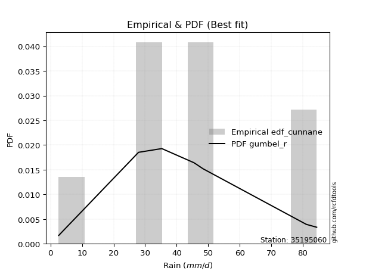</img>

</div>


### 12. EDF Adamowski (1981)

The Adamowski formula in hydrology refers to a specific plotting position formula used for estimating the non-parametric empirical distribution of hydrological events (like flood peaks) to calculate their return periods. This formula provides an alternative to traditional parametric methods (like the Gumbel or Log Pearson Type III distributions). 

<div align="center">


$P=(m-0.25)/(n+0.5)$


</div>


**12.1. Empirical values**

<div align="center">

|                | 0                   | 1                   | 2                  | 3                   | 4             | 5                  | 6                  | 7                  | 8                  |
|:---------------|:--------------------|:--------------------|:-------------------|:--------------------|:--------------|:-------------------|:-------------------|:-------------------|:-------------------|
| date           | 2017                | 2022                | 2018               | 2021                | 2025          | 2024               | 2023               | 2020               | 2019               |
| x              | 2.6                 | 27.87               | 28.0               | 35.3                | 45.45         | 46.09              | 48.36              | 81.1               | 84.4               |
| m              | 1                   | 2                   | 3                  | 4                   | 5             | 6                  | 7                  | 8                  | 9                  |
| empirical_dist | edf_adamowski       | edf_adamowski       | edf_adamowski      | edf_adamowski       | edf_adamowski | edf_adamowski      | edf_adamowski      | edf_adamowski      | edf_adamowski      |
| empirical      | 0.07894736842105263 | 0.18421052631578946 | 0.2894736842105263 | 0.39473684210526316 | 0.5           | 0.6052631578947368 | 0.7105263157894737 | 0.8157894736842105 | 0.9210526315789473 |
| empirical_tr   | 1.0857142857142856  | 1.2258064516129032  | 1.4074074074074074 | 1.6521739130434783  | 2.0           | 2.533333333333333  | 3.4545454545454546 | 5.428571428571428  | 12.666666666666663 |

</div>


**12.2. Kolmogorov-Smirnov fit test (sorted by Δ)**


<div align="center">

|                | 0                   | 1                   | 2                   | 3                   | 4                   | 5                   | 6                   | 7                   | 8                   | 9                   | 10                  | 11                  | 12                  | 13                  | 14                  | 15                  | 16                  | 17                  | 18                  | 19                  | 20                  | 21                  | 22                  | 23                  | 24                  | 25                  | 26                  | 27                  | 28                  | 29                  | 30                  | 31                  | 32                  | 33                  | 34                  | 35                  | 36                  | 37                  | 38                  | 39                  | 40                  | 41                  | 42                  | 43                  | 44                  | 45                  | 46                  | 47                  | 48                  | 49                  | 50                  | 51                  | 52                  | 53                  | 54                  | 55                  | 56                  | 57                  | 58                  | 59                  | 60                  | 61                  | 62                  | 63                  | 64                  | 65                  | 66                  | 67                  | 68                  | 69                  | 70                  | 71                  | 72                  | 73                  | 74                  | 75                  | 76                  | 77                  | 78                  | 79                  | 80                  | 81                  | 82                  | 83                  | 84                  | 85                  | 86                  | 87                  | 88                  | 89                  | 90                  | 91                  | 92                  | 93                  | 94                  | 95                  | 96                  | 97                  | 98                  | 99                  | 100                 | 101                 | 102                 | 103                 | 104                 | 105                 | 106                 | 107                 | 108                 | 109                 | 110                 | 111                 | 112                 | 113                 | 114                 | 115                 | 116                 | 117                 | 118                 | 119                 | 120                 | 121                 | 122                 | 123                 | 124                 | 125                 | 126                 | 127                 | 128                 | 129                 | 130                 | 131                 | 132                 | 133                 | 134                 | 135                 | 136                 | 137                 | 138                 | 139                 | 140                 | 141                 | 142                 | 143                 | 144                 | 145                 | 146                 | 147                 | 148                 | 149                 | 150                 | 151                 | 152                 | 153                 | 154                 | 155                 | 156                 | 157                 | 158                 | 159                 |
|:---------------|:--------------------|:--------------------|:--------------------|:--------------------|:--------------------|:--------------------|:--------------------|:--------------------|:--------------------|:--------------------|:--------------------|:--------------------|:--------------------|:--------------------|:--------------------|:--------------------|:--------------------|:--------------------|:--------------------|:--------------------|:--------------------|:--------------------|:--------------------|:--------------------|:--------------------|:--------------------|:--------------------|:--------------------|:--------------------|:--------------------|:--------------------|:--------------------|:--------------------|:--------------------|:--------------------|:--------------------|:--------------------|:--------------------|:--------------------|:--------------------|:--------------------|:--------------------|:--------------------|:--------------------|:--------------------|:--------------------|:--------------------|:--------------------|:--------------------|:--------------------|:--------------------|:--------------------|:--------------------|:--------------------|:--------------------|:--------------------|:--------------------|:--------------------|:--------------------|:--------------------|:--------------------|:--------------------|:--------------------|:--------------------|:--------------------|:--------------------|:--------------------|:--------------------|:--------------------|:--------------------|:--------------------|:--------------------|:--------------------|:--------------------|:--------------------|:--------------------|:--------------------|:--------------------|:--------------------|:--------------------|:--------------------|:--------------------|:--------------------|:--------------------|:--------------------|:--------------------|:--------------------|:--------------------|:--------------------|:--------------------|:--------------------|:--------------------|:--------------------|:--------------------|:--------------------|:--------------------|:--------------------|:--------------------|:--------------------|:--------------------|:--------------------|:--------------------|:--------------------|:--------------------|:--------------------|:--------------------|:--------------------|:--------------------|:--------------------|:--------------------|:--------------------|:--------------------|:--------------------|:--------------------|:--------------------|:--------------------|:--------------------|:--------------------|:--------------------|:--------------------|:--------------------|:--------------------|:--------------------|:--------------------|:--------------------|:--------------------|:--------------------|:--------------------|:--------------------|:--------------------|:--------------------|:--------------------|:--------------------|:--------------------|:--------------------|:--------------------|:--------------------|:--------------------|:--------------------|:--------------------|:--------------------|:--------------------|:--------------------|:--------------------|:--------------------|:--------------------|:--------------------|:--------------------|:--------------------|:--------------------|:--------------------|:--------------------|:--------------------|:--------------------|:--------------------|:--------------------|:--------------------|:--------------------|:--------------------|:--------------------|
| station        | 35195060            | 35195060            | 35195060            | 35195060            | 35195060            | 35195060            | 35195060            | 35195060            | 35195060            | 35195060            | 35195060            | 35195060            | 35195060            | 35195060            | 35195060            | 35195060            | 35195060            | 35195060            | 35195060            | 35195060            | 35195060            | 35195060            | 35195060            | 35195060            | 35195060            | 35195060            | 35195060            | 35195060            | 35195060            | 35195060            | 35195060            | 35195060            | 35195060            | 35195060            | 35195060            | 35195060            | 35195060            | 35195060            | 35195060            | 35195060            | 35195060            | 35195060            | 35195060            | 35195060            | 35195060            | 35195060            | 35195060            | 35195060            | 35195060            | 35195060            | 35195060            | 35195060            | 35195060            | 35195060            | 35195060            | 35195060            | 35195060            | 35195060            | 35195060            | 35195060            | 35195060            | 35195060            | 35195060            | 35195060            | 35195060            | 35195060            | 35195060            | 35195060            | 35195060            | 35195060            | 35195060            | 35195060            | 35195060            | 35195060            | 35195060            | 35195060            | 35195060            | 35195060            | 35195060            | 35195060            | 35195060            | 35195060            | 35195060            | 35195060            | 35195060            | 35195060            | 35195060            | 35195060            | 35195060            | 35195060            | 35195060            | 35195060            | 35195060            | 35195060            | 35195060            | 35195060            | 35195060            | 35195060            | 35195060            | 35195060            | 35195060            | 35195060            | 35195060            | 35195060            | 35195060            | 35195060            | 35195060            | 35195060            | 35195060            | 35195060            | 35195060            | 35195060            | 35195060            | 35195060            | 35195060            | 35195060            | 35195060            | 35195060            | 35195060            | 35195060            | 35195060            | 35195060            | 35195060            | 35195060            | 35195060            | 35195060            | 35195060            | 35195060            | 35195060            | 35195060            | 35195060            | 35195060            | 35195060            | 35195060            | 35195060            | 35195060            | 35195060            | 35195060            | 35195060            | 35195060            | 35195060            | 35195060            | 35195060            | 35195060            | 35195060            | 35195060            | 35195060            | 35195060            | 35195060            | 35195060            | 35195060            | 35195060            | 35195060            | 35195060            | 35195060            | 35195060            | 35195060            | 35195060            | 35195060            | 35195060            |
| empirical_dist | edf_adamowski       | edf_adamowski       | edf_adamowski       | edf_adamowski       | edf_adamowski       | edf_adamowski       | edf_adamowski       | edf_adamowski       | edf_adamowski       | edf_adamowski       | edf_adamowski       | edf_adamowski       | edf_adamowski       | edf_adamowski       | edf_adamowski       | edf_adamowski       | edf_adamowski       | edf_adamowski       | edf_adamowski       | edf_adamowski       | edf_adamowski       | edf_adamowski       | edf_adamowski       | edf_adamowski       | edf_adamowski       | edf_adamowski       | edf_adamowski       | edf_adamowski       | edf_adamowski       | edf_adamowski       | edf_adamowski       | edf_adamowski       | edf_adamowski       | edf_adamowski       | edf_adamowski       | edf_adamowski       | edf_adamowski       | edf_adamowski       | edf_adamowski       | edf_adamowski       | edf_adamowski       | edf_adamowski       | edf_adamowski       | edf_adamowski       | edf_adamowski       | edf_adamowski       | edf_adamowski       | edf_adamowski       | edf_adamowski       | edf_adamowski       | edf_adamowski       | edf_adamowski       | edf_adamowski       | edf_adamowski       | edf_adamowski       | edf_adamowski       | edf_adamowski       | edf_adamowski       | edf_adamowski       | edf_adamowski       | edf_adamowski       | edf_adamowski       | edf_adamowski       | edf_adamowski       | edf_adamowski       | edf_adamowski       | edf_adamowski       | edf_adamowski       | edf_adamowski       | edf_adamowski       | edf_adamowski       | edf_adamowski       | edf_adamowski       | edf_adamowski       | edf_adamowski       | edf_adamowski       | edf_adamowski       | edf_adamowski       | edf_adamowski       | edf_adamowski       | edf_adamowski       | edf_adamowski       | edf_adamowski       | edf_adamowski       | edf_adamowski       | edf_adamowski       | edf_adamowski       | edf_adamowski       | edf_adamowski       | edf_adamowski       | edf_adamowski       | edf_adamowski       | edf_adamowski       | edf_adamowski       | edf_adamowski       | edf_adamowski       | edf_adamowski       | edf_adamowski       | edf_adamowski       | edf_adamowski       | edf_adamowski       | edf_adamowski       | edf_adamowski       | edf_adamowski       | edf_adamowski       | edf_adamowski       | edf_adamowski       | edf_adamowski       | edf_adamowski       | edf_adamowski       | edf_adamowski       | edf_adamowski       | edf_adamowski       | edf_adamowski       | edf_adamowski       | edf_adamowski       | edf_adamowski       | edf_adamowski       | edf_adamowski       | edf_adamowski       | edf_adamowski       | edf_adamowski       | edf_adamowski       | edf_adamowski       | edf_adamowski       | edf_adamowski       | edf_adamowski       | edf_adamowski       | edf_adamowski       | edf_adamowski       | edf_adamowski       | edf_adamowski       | edf_adamowski       | edf_adamowski       | edf_adamowski       | edf_adamowski       | edf_adamowski       | edf_adamowski       | edf_adamowski       | edf_adamowski       | edf_adamowski       | edf_adamowski       | edf_adamowski       | edf_adamowski       | edf_adamowski       | edf_adamowski       | edf_adamowski       | edf_adamowski       | edf_adamowski       | edf_adamowski       | edf_adamowski       | edf_adamowski       | edf_adamowski       | edf_adamowski       | edf_adamowski       | edf_adamowski       | edf_adamowski       | edf_adamowski       | edf_adamowski       | edf_adamowski       |
| p_dist         | logt                | invgauss            | gumbel_r            | rayleigh            | genlogistic         | invweibull          | burr12              | skewnorm            | moyal               | maxwell             | halflogistic        | invgamma            | halfnorm            | exponweib           | dweibull            | erlang              | gamma               | f                   | betaprime           | gengamma            | fatiguelife         | ncf                 | johnsonsu           | nct                 | logexponpow         | weibull_min         | laplace             | kstwobign           | rice                | hypsecant           | pearson3            | genextreme          | logweibull_min      | logistic            | loggompertz         | foldnorm            | logexponweib        | exponnorm           | logdweibull         | t                   | norm                | crystalball         | logburr12           | dgamma              | logargus            | truncweibull_min    | wrapcauchy          | uniform             | tukeylambda         | kappa3              | anglit              | vonmises_line       | cosine              | semicircular        | logpearson3         | logloggamma         | logloglaplace       | loggengamma         | ksone               | kappa4              | logburr             | logmielke           | logdgamma           | loggumbel_l         | logjohnsonsu        | lognakagami         | arcsine             | wald                | loggennorm          | truncnorm           | burr                | bradford            | loglaplace          | loglaplace          | gennorm             | loggenextreme       | logtrapezoid        | gumbel_l            | gausshyper          | loggenpareto        | logweibull_max      | argus               | logfoldnorm         | mielke              | loghypsecant        | logskewnorm         | loglevy_l           | loglogistic         | loggausshyper       | logfatiguelife      | logexponnorm        | logrice             | logcrystalball      | lognorm             | lognct              | logf                | levy_l              | logerlang           | johnsonsb           | loganglit           | genexpon            | loggamma            | loggamma            | logbetaprime        | logsemicircular     | genpareto           | loginvgamma         | logalpha            | truncexpon          | lomax               | loginvgauss         | logarcsine          | logmaxwell          | logncf              | logjohnsonsb        | logvonmises_line    | gompertz            | lograyleigh         | triang              | loginvweibull       | genhalflogistic     | loggumbel_r         | halfgennorm         | loggenhalflogistic  | loghalfnorm         | logmoyal            | logtriang           | logkstwobign        | logtruncnorm        | loghalflogistic     | logcosine           | beta                | loggenexpon         | loglomax            | logtruncweibull_min | logwald             | logbeta             | trapezoid           | logwrapcauchy       | logkappa4           | logksone            | logtukeylambda      | logkappa3           | loguniform          | rdist               | nakagami            | logbradford         | logtruncexpon       | alpha               | weibull_max         | powerlaw            | logrdist            | loghalfgennorm      | logpowerlaw         | exponpow            | truncpareto         | logtruncpareto      | loggenlogistic      | logvonmises         | vonmises            |
| delta          | 0.0936896363415709  | 0.10238426700793735 | 0.106331181522348   | 0.10653394564660235 | 0.10722601731506076 | 0.10729759295597899 | 0.11291769370598848 | 0.11391125842229521 | 0.11428468525083824 | 0.11585049712383866 | 0.11660388437919877 | 0.11690329876599603 | 0.11921106367796622 | 0.12035368354321296 | 0.12102128633060627 | 0.12104461488157503 | 0.12104462777483227 | 0.12105069189153905 | 0.12114169788702611 | 0.12126934824433577 | 0.12166606057821738 | 0.12197904237292931 | 0.12256438482000986 | 0.1232598592341072  | 0.12331727509199755 | 0.12424726877202763 | 0.12501532275904004 | 0.12769111016843868 | 0.12811376580233058 | 0.12915118232271683 | 0.12975913518856197 | 0.1329667833494148  | 0.13369600993514805 | 0.13645900107406028 | 0.13790299661905595 | 0.13833117557401453 | 0.13866333819382037 | 0.140313672282807   | 0.14426587692498627 | 0.14517180753360637 | 0.14517439922632314 | 0.14517440478125632 | 0.1460458167347097  | 0.14666270061059022 | 0.14785080851171073 | 0.14860843918910327 | 0.1509822534661649  | 0.15111311285548845 | 0.15120407079565834 | 0.1533068566810616  | 0.15439527804252273 | 0.15593262770123617 | 0.1570902106351285  | 0.1582067618265217  | 0.15879624963626215 | 0.15997382586990527 | 0.1610265034777787  | 0.16263461562125525 | 0.1630240808790594  | 0.1634577713487575  | 0.16562975286449788 | 0.16613818330794294 | 0.16996746417013991 | 0.17509836355261424 | 0.17724956377928003 | 0.18420846409019234 | 0.1842105263157895  | 0.18549196458911998 | 0.1877115077342879  | 0.18839803858177628 | 0.19501494723095503 | 0.20086147147969555 | 0.20293212629866916 | 0.20293212629866916 | 0.2031597453169202  | 0.20461578234552835 | 0.20520398335986947 | 0.21040704496535256 | 0.21535579538665414 | 0.21951653113667757 | 0.22237415163079421 | 0.222946766897686   | 0.2253730153649203  | 0.22642362206108288 | 0.22653826076248887 | 0.2272568842102979  | 0.229504556599762   | 0.2344936098628432  | 0.23831374066492964 | 0.24298517702543374 | 0.24401433124695568 | 0.2440169485636716  | 0.24401704894388734 | 0.24401705148552363 | 0.24504863391666457 | 0.24738423065655493 | 0.25001105283219194 | 0.25244736106511967 | 0.25384548030157744 | 0.2541144858839923  | 0.25572419844558547 | 0.2579269434312774  | 0.2579269434312774  | 0.2581431845622296  | 0.258291845701747   | 0.26074795688127583 | 0.2611017334445651  | 0.26194474130049417 | 0.26209259933873796 | 0.26385444991127127 | 0.271649010317751   | 0.2749626215816914  | 0.27840901936936846 | 0.28180871273380437 | 0.28433479049904564 | 0.2853222153680469  | 0.28601971183967945 | 0.29054524050326413 | 0.29206739874413773 | 0.2933968955528353  | 0.29619377738166797 | 0.30838517948310484 | 0.31778615215594197 | 0.32243632645561504 | 0.32486341001769736 | 0.33294218383957164 | 0.33309481073900205 | 0.33796281011209106 | 0.3420759100801344  | 0.34378040459356485 | 0.34420866261379335 | 0.3608209065176333  | 0.3628888217447036  | 0.39205228449800356 | 0.3972753648934604  | 0.4007531345091453  | 0.40102500713778866 | 0.4054321469582854  | 0.40930704796946016 | 0.4520714870114324  | 0.46713077060243846 | 0.4869375430076256  | 0.4962875677838652  | 0.4973990299860842  | 0.5278720300872356  | 0.5440497962259672  | 0.5619448121895654  | 0.5635957397916017  | 0.5971502373461951  | 0.6025790487202405  | 0.6060678776007887  | 0.6593792095687021  | 0.7105263157894737  | 0.7323819669101826  | 0.7370599938302269  | 0.7480975790824921  | 0.7930395867321074  | 0.8157894736842105  | 1.0926734300716714  | 12.52948921496786   |
| deltao         | 0.41761268023100007 | 0.41761268023100007 | 0.41761268023100007 | 0.41761268023100007 | 0.41761268023100007 | 0.41761268023100007 | 0.41761268023100007 | 0.41761268023100007 | 0.41761268023100007 | 0.41761268023100007 | 0.41761268023100007 | 0.41761268023100007 | 0.41761268023100007 | 0.41761268023100007 | 0.41761268023100007 | 0.41761268023100007 | 0.41761268023100007 | 0.41761268023100007 | 0.41761268023100007 | 0.41761268023100007 | 0.41761268023100007 | 0.41761268023100007 | 0.41761268023100007 | 0.41761268023100007 | 0.41761268023100007 | 0.41761268023100007 | 0.41761268023100007 | 0.41761268023100007 | 0.41761268023100007 | 0.41761268023100007 | 0.41761268023100007 | 0.41761268023100007 | 0.41761268023100007 | 0.41761268023100007 | 0.41761268023100007 | 0.41761268023100007 | 0.41761268023100007 | 0.41761268023100007 | 0.41761268023100007 | 0.41761268023100007 | 0.41761268023100007 | 0.41761268023100007 | 0.41761268023100007 | 0.41761268023100007 | 0.41761268023100007 | 0.41761268023100007 | 0.41761268023100007 | 0.41761268023100007 | 0.41761268023100007 | 0.41761268023100007 | 0.41761268023100007 | 0.41761268023100007 | 0.41761268023100007 | 0.41761268023100007 | 0.41761268023100007 | 0.41761268023100007 | 0.41761268023100007 | 0.41761268023100007 | 0.41761268023100007 | 0.41761268023100007 | 0.41761268023100007 | 0.41761268023100007 | 0.41761268023100007 | 0.41761268023100007 | 0.41761268023100007 | 0.41761268023100007 | 0.41761268023100007 | 0.41761268023100007 | 0.41761268023100007 | 0.41761268023100007 | 0.41761268023100007 | 0.41761268023100007 | 0.41761268023100007 | 0.41761268023100007 | 0.41761268023100007 | 0.41761268023100007 | 0.41761268023100007 | 0.41761268023100007 | 0.41761268023100007 | 0.41761268023100007 | 0.41761268023100007 | 0.41761268023100007 | 0.41761268023100007 | 0.41761268023100007 | 0.41761268023100007 | 0.41761268023100007 | 0.41761268023100007 | 0.41761268023100007 | 0.41761268023100007 | 0.41761268023100007 | 0.41761268023100007 | 0.41761268023100007 | 0.41761268023100007 | 0.41761268023100007 | 0.41761268023100007 | 0.41761268023100007 | 0.41761268023100007 | 0.41761268023100007 | 0.41761268023100007 | 0.41761268023100007 | 0.41761268023100007 | 0.41761268023100007 | 0.41761268023100007 | 0.41761268023100007 | 0.41761268023100007 | 0.41761268023100007 | 0.41761268023100007 | 0.41761268023100007 | 0.41761268023100007 | 0.41761268023100007 | 0.41761268023100007 | 0.41761268023100007 | 0.41761268023100007 | 0.41761268023100007 | 0.41761268023100007 | 0.41761268023100007 | 0.41761268023100007 | 0.41761268023100007 | 0.41761268023100007 | 0.41761268023100007 | 0.41761268023100007 | 0.41761268023100007 | 0.41761268023100007 | 0.41761268023100007 | 0.41761268023100007 | 0.41761268023100007 | 0.41761268023100007 | 0.41761268023100007 | 0.41761268023100007 | 0.41761268023100007 | 0.41761268023100007 | 0.41761268023100007 | 0.41761268023100007 | 0.41761268023100007 | 0.41761268023100007 | 0.41761268023100007 | 0.41761268023100007 | 0.41761268023100007 | 0.41761268023100007 | 0.41761268023100007 | 0.41761268023100007 | 0.41761268023100007 | 0.41761268023100007 | 0.41761268023100007 | 0.41761268023100007 | 0.41761268023100007 | 0.41761268023100007 | 0.41761268023100007 | 0.41761268023100007 | 0.41761268023100007 | 0.41761268023100007 | 0.41761268023100007 | 0.41761268023100007 | 0.41761268023100007 | 0.41761268023100007 | 0.41761268023100007 | 0.41761268023100007 | 0.41761268023100007 | 0.41761268023100007 | 0.41761268023100007 |
| eval           | Δo > Δ              | Δo > Δ              | Δo > Δ              | Δo > Δ              | Δo > Δ              | Δo > Δ              | Δo > Δ              | Δo > Δ              | Δo > Δ              | Δo > Δ              | Δo > Δ              | Δo > Δ              | Δo > Δ              | Δo > Δ              | Δo > Δ              | Δo > Δ              | Δo > Δ              | Δo > Δ              | Δo > Δ              | Δo > Δ              | Δo > Δ              | Δo > Δ              | Δo > Δ              | Δo > Δ              | Δo > Δ              | Δo > Δ              | Δo > Δ              | Δo > Δ              | Δo > Δ              | Δo > Δ              | Δo > Δ              | Δo > Δ              | Δo > Δ              | Δo > Δ              | Δo > Δ              | Δo > Δ              | Δo > Δ              | Δo > Δ              | Δo > Δ              | Δo > Δ              | Δo > Δ              | Δo > Δ              | Δo > Δ              | Δo > Δ              | Δo > Δ              | Δo > Δ              | Δo > Δ              | Δo > Δ              | Δo > Δ              | Δo > Δ              | Δo > Δ              | Δo > Δ              | Δo > Δ              | Δo > Δ              | Δo > Δ              | Δo > Δ              | Δo > Δ              | Δo > Δ              | Δo > Δ              | Δo > Δ              | Δo > Δ              | Δo > Δ              | Δo > Δ              | Δo > Δ              | Δo > Δ              | Δo > Δ              | Δo > Δ              | Δo > Δ              | Δo > Δ              | Δo > Δ              | Δo > Δ              | Δo > Δ              | Δo > Δ              | Δo > Δ              | Δo > Δ              | Δo > Δ              | Δo > Δ              | Δo > Δ              | Δo > Δ              | Δo > Δ              | Δo > Δ              | Δo > Δ              | Δo > Δ              | Δo > Δ              | Δo > Δ              | Δo > Δ              | Δo > Δ              | Δo > Δ              | Δo > Δ              | Δo > Δ              | Δo > Δ              | Δo > Δ              | Δo > Δ              | Δo > Δ              | Δo > Δ              | Δo > Δ              | Δo > Δ              | Δo > Δ              | Δo > Δ              | Δo > Δ              | Δo > Δ              | Δo > Δ              | Δo > Δ              | Δo > Δ              | Δo > Δ              | Δo > Δ              | Δo > Δ              | Δo > Δ              | Δo > Δ              | Δo > Δ              | Δo > Δ              | Δo > Δ              | Δo > Δ              | Δo > Δ              | Δo > Δ              | Δo > Δ              | Δo > Δ              | Δo > Δ              | Δo > Δ              | Δo > Δ              | Δo > Δ              | Δo > Δ              | Δo > Δ              | Δo > Δ              | Δo > Δ              | Δo > Δ              | Δo > Δ              | Δo > Δ              | Δo > Δ              | Δo > Δ              | Δo > Δ              | Δo > Δ              | Δo > Δ              | Δo > Δ              | Δo > Δ              | Δo > Δ              | Δo > Δ              | Δo > Δ              | Δo > Δ              | Δo <= Δ             | Δo <= Δ             | Δo <= Δ             | Δo <= Δ             | Δo <= Δ             | Δo <= Δ             | Δo <= Δ             | Δo <= Δ             | Δo <= Δ             | Δo <= Δ             | Δo <= Δ             | Δo <= Δ             | Δo <= Δ             | Δo <= Δ             | Δo <= Δ             | Δo <= Δ             | Δo <= Δ             | Δo <= Δ             | Δo <= Δ             | Δo <= Δ             | Δo <= Δ             |
| fit            | 1                   | 1                   | 1                   | 1                   | 1                   | 1                   | 1                   | 1                   | 1                   | 1                   | 1                   | 1                   | 1                   | 1                   | 1                   | 1                   | 1                   | 1                   | 1                   | 1                   | 1                   | 1                   | 1                   | 1                   | 1                   | 1                   | 1                   | 1                   | 1                   | 1                   | 1                   | 1                   | 1                   | 1                   | 1                   | 1                   | 1                   | 1                   | 1                   | 1                   | 1                   | 1                   | 1                   | 1                   | 1                   | 1                   | 1                   | 1                   | 1                   | 1                   | 1                   | 1                   | 1                   | 1                   | 1                   | 1                   | 1                   | 1                   | 1                   | 1                   | 1                   | 1                   | 1                   | 1                   | 1                   | 1                   | 1                   | 1                   | 1                   | 1                   | 1                   | 1                   | 1                   | 1                   | 1                   | 1                   | 1                   | 1                   | 1                   | 1                   | 1                   | 1                   | 1                   | 1                   | 1                   | 1                   | 1                   | 1                   | 1                   | 1                   | 1                   | 1                   | 1                   | 1                   | 1                   | 1                   | 1                   | 1                   | 1                   | 1                   | 1                   | 1                   | 1                   | 1                   | 1                   | 1                   | 1                   | 1                   | 1                   | 1                   | 1                   | 1                   | 1                   | 1                   | 1                   | 1                   | 1                   | 1                   | 1                   | 1                   | 1                   | 1                   | 1                   | 1                   | 1                   | 1                   | 1                   | 1                   | 1                   | 1                   | 1                   | 1                   | 1                   | 1                   | 1                   | 1                   | 1                   | 1                   | 1                   | 0                   | 0                   | 0                   | 0                   | 0                   | 0                   | 0                   | 0                   | 0                   | 0                   | 0                   | 0                   | 0                   | 0                   | 0                   | 0                   | 0                   | 0                   | 0                   | 0                   | 0                   |
| n              | 9                   | 9                   | 9                   | 9                   | 9                   | 9                   | 9                   | 9                   | 9                   | 9                   | 9                   | 9                   | 9                   | 9                   | 9                   | 9                   | 9                   | 9                   | 9                   | 9                   | 9                   | 9                   | 9                   | 9                   | 9                   | 9                   | 9                   | 9                   | 9                   | 9                   | 9                   | 9                   | 9                   | 9                   | 9                   | 9                   | 9                   | 9                   | 9                   | 9                   | 9                   | 9                   | 9                   | 9                   | 9                   | 9                   | 9                   | 9                   | 9                   | 9                   | 9                   | 9                   | 9                   | 9                   | 9                   | 9                   | 9                   | 9                   | 9                   | 9                   | 9                   | 9                   | 9                   | 9                   | 9                   | 9                   | 9                   | 9                   | 9                   | 9                   | 9                   | 9                   | 9                   | 9                   | 9                   | 9                   | 9                   | 9                   | 9                   | 9                   | 9                   | 9                   | 9                   | 9                   | 9                   | 9                   | 9                   | 9                   | 9                   | 9                   | 9                   | 9                   | 9                   | 9                   | 9                   | 9                   | 9                   | 9                   | 9                   | 9                   | 9                   | 9                   | 9                   | 9                   | 9                   | 9                   | 9                   | 9                   | 9                   | 9                   | 9                   | 9                   | 9                   | 9                   | 9                   | 9                   | 9                   | 9                   | 9                   | 9                   | 9                   | 9                   | 9                   | 9                   | 9                   | 9                   | 9                   | 9                   | 9                   | 9                   | 9                   | 9                   | 9                   | 9                   | 9                   | 9                   | 9                   | 9                   | 9                   | 9                   | 9                   | 9                   | 9                   | 9                   | 9                   | 9                   | 9                   | 9                   | 9                   | 9                   | 9                   | 9                   | 9                   | 9                   | 9                   | 9                   | 9                   | 9                   | 9                   | 9                   |
| best_fit       | 1                   | 0                   | 0                   | 0                   | 0                   | 0                   | 0                   | 0                   | 0                   | 0                   | 0                   | 0                   | 0                   | 0                   | 0                   | 0                   | 0                   | 0                   | 0                   | 0                   | 0                   | 0                   | 0                   | 0                   | 0                   | 0                   | 0                   | 0                   | 0                   | 0                   | 0                   | 0                   | 0                   | 0                   | 0                   | 0                   | 0                   | 0                   | 0                   | 0                   | 0                   | 0                   | 0                   | 0                   | 0                   | 0                   | 0                   | 0                   | 0                   | 0                   | 0                   | 0                   | 0                   | 0                   | 0                   | 0                   | 0                   | 0                   | 0                   | 0                   | 0                   | 0                   | 0                   | 0                   | 0                   | 0                   | 0                   | 0                   | 0                   | 0                   | 0                   | 0                   | 0                   | 0                   | 0                   | 0                   | 0                   | 0                   | 0                   | 0                   | 0                   | 0                   | 0                   | 0                   | 0                   | 0                   | 0                   | 0                   | 0                   | 0                   | 0                   | 0                   | 0                   | 0                   | 0                   | 0                   | 0                   | 0                   | 0                   | 0                   | 0                   | 0                   | 0                   | 0                   | 0                   | 0                   | 0                   | 0                   | 0                   | 0                   | 0                   | 0                   | 0                   | 0                   | 0                   | 0                   | 0                   | 0                   | 0                   | 0                   | 0                   | 0                   | 0                   | 0                   | 0                   | 0                   | 0                   | 0                   | 0                   | 0                   | 0                   | 0                   | 0                   | 0                   | 0                   | 0                   | 0                   | 0                   | 0                   | 0                   | 0                   | 0                   | 0                   | 0                   | 0                   | 0                   | 0                   | 0                   | 0                   | 0                   | 0                   | 0                   | 0                   | 0                   | 0                   | 0                   | 0                   | 0                   | 0                   | 0                   |
| best_fit_sort  | 1                   | 2                   | 3                   | 4                   | 5                   | 6                   | 7                   | 8                   | 9                   | 10                  | 11                  | 12                  | 13                  | 14                  | 15                  | 16                  | 17                  | 18                  | 19                  | 20                  | 21                  | 22                  | 23                  | 24                  | 25                  | 26                  | 27                  | 28                  | 29                  | 30                  | 31                  | 32                  | 33                  | 34                  | 35                  | 36                  | 37                  | 38                  | 39                  | 40                  | 41                  | 42                  | 43                  | 44                  | 45                  | 46                  | 47                  | 48                  | 49                  | 50                  | 51                  | 52                  | 53                  | 54                  | 55                  | 56                  | 57                  | 58                  | 59                  | 60                  | 61                  | 62                  | 63                  | 64                  | 65                  | 66                  | 67                  | 68                  | 69                  | 70                  | 71                  | 72                  | 73                  | 74                  | 75                  | 76                  | 77                  | 78                  | 79                  | 80                  | 81                  | 82                  | 83                  | 84                  | 85                  | 86                  | 87                  | 88                  | 89                  | 90                  | 91                  | 92                  | 93                  | 94                  | 95                  | 96                  | 97                  | 98                  | 99                  | 100                 | 101                 | 102                 | 103                 | 104                 | 105                 | 106                 | 107                 | 108                 | 109                 | 110                 | 111                 | 112                 | 113                 | 114                 | 115                 | 116                 | 117                 | 118                 | 119                 | 120                 | 121                 | 122                 | 123                 | 124                 | 125                 | 126                 | 127                 | 128                 | 129                 | 130                 | 131                 | 132                 | 133                 | 134                 | 135                 | 136                 | 137                 | 138                 | 139                 | 140                 | 141                 | 142                 | 143                 | 144                 | 145                 | 146                 | 147                 | 148                 | 149                 | 150                 | 151                 | 152                 | 153                 | 154                 | 155                 | 156                 | 157                 | 158                 | 159                 | 160                 |

</div>


**12.3. Best fit**

<div align="center">

|   id |   station | empirical_dist   | p_dist   |     delta |   deltao | eval   |   fit |   n |   best_fit |   best_fit_sort |
|-----:|----------:|:-----------------|:---------|----------:|---------:|:-------|------:|----:|-----------:|----------------:|
|    0 |  35195060 | edf_adamowski    | logt     | 0.0936896 | 0.417613 | Δo > Δ |     1 |   9 |          1 |               1 |

</div>


<div align="center">

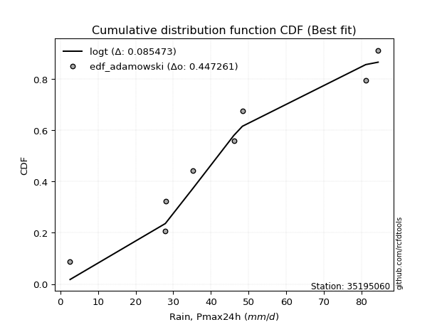</img>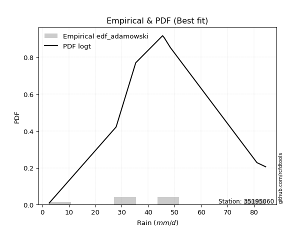</img>

</div>


## C. Best fit & Estimate extreme values for specific return periods - Tr

Best fit in probability distribution analysis means finding the theoretical distribution (like Normal, Poisson, Exponential, etc.) that most accurately mirrors your real-world data´s patterns (shape, center, spread) for better predictions, using methods like visual checks (Q-Q plots), goodness-of-fit tests (Kolmogorov-Smirnov, Chi-Squared), and information criteria (AIC) to score and select the simplest, most representative model.


### 1. Best fit (ordered by delta Δ)

:file_folder:Table: [bestfit_35195060.csv](table/bestfit_35195060.csv)

<div align="center">

|   id |   station | empirical_dist   | p_dist     |     delta |   deltao | eval   |   fit |   n |   best_fit |   best_fit_sort |
|-----:|----------:|:-----------------|:-----------|----------:|---------:|:-------|------:|----:|-----------:|----------------:|
|    0 |  35195060 | edf_gringorten   | gumbel_r   | 0.0931733 | 0.417613 | Δo > Δ |     1 |   9 |          1 |               1 |
|    1 |  35195060 | edf_adamowski    | logt       | 0.0936896 | 0.417613 | Δo > Δ |     1 |   9 |          1 |               2 |
|    2 |  35195060 | edf_weibull      | invweibull | 0.0953203 | 0.417613 | Δo > Δ |     1 |   9 |          1 |               3 |
|    3 |  35195060 | edf_hazen        | gumbel_r   | 0.0958608 | 0.417613 | Δo > Δ |     1 |   9 |          1 |               4 |
|    4 |  35195060 | edf_chegodayev   | logt       | 0.0959293 | 0.417613 | Δo > Δ |     1 |   9 |          1 |               5 |
|    5 |  35195060 | edf_cunnane      | gumbel_r   | 0.0960337 | 0.417613 | Δo > Δ |     1 |   9 |          1 |               6 |
|    6 |  35195060 | edf_jenkinson    | logt       | 0.0963829 | 0.417613 | Δo > Δ |     1 |   9 |          1 |               7 |
|    7 |  35195060 | edf_beard        | logt       | 0.0963829 | 0.417613 | Δo > Δ |     1 |   9 |          1 |               8 |
|    8 |  35195060 | edf_filliben     | logt       | 0.0967245 | 0.417613 | Δo > Δ |     1 |   9 |          1 |               9 |
|    9 |  35195060 | edf_tukey        | logt       | 0.097449  | 0.417613 | Δo > Δ |     1 |   9 |          1 |              10 |
|   10 |  35195060 | edf_blom         | gumbel_r   | 0.0977963 | 0.417613 | Δo > Δ |     1 |   9 |          1 |              11 |
|   11 |  35195060 | edf_california   | moyal      | 0.118807  | 0.417613 | Δo > Δ |     1 |   9 |          1 |              12 |

</div>


### 2. Extreme values and % difference analysis

In hydrology, a return period (or recurrence interval $Tr$) is the statistical average time between extreme events like floods or droughts of a specific magnitude, indicating how rare an event is, with a 100-year flood, for example, having a 1% chance of occurring in any given year, not that it happens exactly every century. It is a key tool for infrastructure design (like bridges or dams) and risk assessment, calculated from historical data to determine the probability of future events, although it is important to remember it is statistical average, and events can cluster or be missed.

The extreme value porcentage difference is evaluated as $pdiff = 1 - (ETrBf / ETr) * 100$, where _ETrBf_ correspond to the bestfit extreme value for a specific recurrence interval and _ETr_ correspond to the extreme value for one of the most used PDFsused in hydrology.

> risk_rate: assuming the return period as the project useful life.

:file_folder:Table: [extreme_35195060.csv](table/extreme_35195060.csv), all PDFs.  
:file_folder:Table: [extremepdiff_35195060.csv](table/extremepdiff_35195060.csv), % difference between bestfit and most used PDFs in Hydrology.

<div align="center">

Extreme values table for only best fit PDFs
|   id |      tr |   prob_l |     prob_g |     alpha |   anglit |   arcsine |   argus |    beta |   betaprime |   bradford |    burr |   burr12 |   cosine |   crystalball |   dgamma |   dweibull |   erlang |   exponnorm |   exponpow |   exponweib |        f |   fatiguelife |   foldnorm |    gamma |   gausshyper |   genexpon |   genextreme |   gengamma |   genhalflogistic |   genlogistic |   gennorm |   genpareto |   gompertz |   gumbel_l |   gumbel_r |   halfgennorm |   halflogistic |   halfnorm |   hypsecant |   invgamma |   invgauss |   invweibull |   johnsonsb |   johnsonsu |   kappa3 |   kappa4 |   ksone |   kstwobign |   laplace |   levy_l |   loggamma |   logistic |   loglaplace |    lomax |   maxwell |   mielke |    moyal |   nakagami |      ncf |      nct |     norm |   pearson3 |   powerlaw |   rayleigh |    rdist |     rice |   semicircular |   skewnorm |        t |   trapezoid |   triang |   truncexpon |   truncnorm |   truncpareto |   truncweibull_min |   tukeylambda |   uniform |   vonmises |   vonmises_line |     wald |   weibull_max |   weibull_min |   wrapcauchy |   logalpha |   loganglit |   logarcsine |   logargus |   logbeta |   logbetaprime |   logbradford |   logburr |   logburr12 |   logcosine |   logcrystalball |   logdgamma |   logdweibull |   logerlang |   logexponnorm |   logexponpow |   logexponweib |     logf |   logfatiguelife |   logfoldnorm |   loggausshyper |   loggenexpon |   loggenextreme |   loggengamma |   loggenhalflogistic |   loggenlogistic |       loggennorm |   loggenpareto |   loggompertz |   loggumbel_l |   loggumbel_r |   loghalfgennorm |   loghalflogistic |   loghalfnorm |   loghypsecant |   loginvgamma |   loginvgauss |   loginvweibull |   logjohnsonsb |   logjohnsonsu |   logkappa3 |   logkappa4 |   logksone |   logkstwobign |   loglevy_l |   logloggamma |   loglogistic |   logloglaplace |         loglomax |   logmaxwell |   logmielke |   logmoyal |   lognakagami |    logncf |   lognct |   lognorm |   logpearson3 |   logpowerlaw |   lograyleigh |   logrdist |   logrice |   logsemicircular |   logskewnorm |            logt |   logtrapezoid |   logtriang |   logtruncexpon |   logtruncnorm |   logtruncpareto |   logtruncweibull_min |   logtukeylambda |   loguniform |   logvonmises |   logvonmises_line |    logwald |   logweibull_max |   logweibull_min |   logwrapcauchy |   station |   n |   risk_rate |
|-----:|--------:|---------:|-----------:|----------:|---------:|----------:|--------:|--------:|------------:|-----------:|--------:|---------:|---------:|--------------:|---------:|-----------:|---------:|------------:|-----------:|------------:|---------:|--------------:|-----------:|---------:|-------------:|-----------:|-------------:|-----------:|------------------:|--------------:|----------:|------------:|-----------:|-----------:|-----------:|--------------:|---------------:|-----------:|------------:|-----------:|-----------:|-------------:|------------:|------------:|---------:|---------:|--------:|------------:|----------:|---------:|-----------:|-----------:|-------------:|---------:|----------:|---------:|---------:|-----------:|---------:|---------:|---------:|-----------:|-----------:|-----------:|---------:|---------:|---------------:|-----------:|---------:|------------:|---------:|-------------:|------------:|--------------:|-------------------:|--------------:|----------:|-----------:|----------------:|---------:|--------------:|--------------:|-------------:|-----------:|------------:|-------------:|-----------:|----------:|---------------:|--------------:|----------:|------------:|------------:|-----------------:|------------:|--------------:|------------:|---------------:|--------------:|---------------:|---------:|-----------------:|--------------:|----------------:|--------------:|----------------:|--------------:|---------------------:|-----------------:|-----------------:|---------------:|--------------:|--------------:|--------------:|-----------------:|------------------:|--------------:|---------------:|--------------:|--------------:|----------------:|---------------:|---------------:|------------:|------------:|-----------:|---------------:|------------:|--------------:|--------------:|----------------:|-----------------:|-------------:|------------:|-----------:|--------------:|----------:|---------:|----------:|--------------:|--------------:|--------------:|-----------:|----------:|------------------:|--------------:|----------------:|---------------:|------------:|----------------:|---------------:|-----------------:|----------------------:|-----------------:|-------------:|--------------:|-------------------:|-----------:|-----------------:|-----------------:|----------------:|----------:|----:|------------:|
|    0 |    2    | 0.5      | 0.5        |   11.4581 |  44.3522 |   44.3522 | 49.2348 | 60.5396 |     42.7956 |    38.4352 | 47.0786 |  41.8402 |  44.8819 |       44.3522 |  45.45   |    45.45   |  42.787  |     44.0708 |    2.62005 |     42.8136 |  42.7877 |       42.8454 |    43.7053 |  42.787  |      36.8161 |    32.8152 |      43.5361 |    42.8073 |           55.6401 |       42.2544 |   45.45   |     52.9771 |    48.2608 |    48.3535 |    40.351  |       27.6247 |        38.3617 |    39.3667 |     44.3522 |    42.5478 |    41.3358 |      40.5791 |     63.9807 |     42.9209 |   2.6    |  44.4693 | 44.3522 |     39.7919 |   44.3522 |  53.9885 |    32.439  |    44.3522 |      33.2492 |  32.081  |   42.2692 |  35.5279 |  39.0592 |    5.8252  |  40.1483 |  42.9642 |  44.3522 |    43.3682 |    5.17279 |    41.5304 | -4.53061 |  43.0453 |        44.3522 |    42.382  |  44.3521 |     63.5506 |  54.52   |      32.3434 |     46.9614 |       2.76253 |            42.0534 |       43.4701 |   43.5    |    2.85275 |         43.5    |  36.4571 |       84.0436 |       42.7538 |      43.4877 |    31.9921 |     33.2492 |      33.2493 |    43.5851 |   73.9803 |        32.4439 |       11.1857 |   44.5514 |     38.9057 |     25.6202 |          33.2492 |     46.09   |       46.09   |     32.752  |        33.2495 |       41.4668 |        42.7615 |  33.0765 |          33.3395 |       33.8969 |         37.5351 |       23.3511 |         47.7386 |       44.38   |              27.2484 |              inf |     46.09        |        49.8176 |       39.1963 |       39.0293 |       28.3252 |           2.6    |           26.1559 |       27.2303 |        33.2492 |       32.0884 |       31.3334 |         30.2235 |        76.7661 |        45.7761 |     2.59946 |     16.6034 |    14.8135 |        25.5835 |     50.9779 |       44.2032 |       33.2492 |         45.4501 |     17.6434      |      30.5875 |     44.5647 |    26.8968 |       34.3204 |   30.6734 |  33.1829 |   33.2492 |       43.6788 |       3.06555 |       29.6955 |    5.65144 |   33.2492 |           33.249  |       33.9751 |    42.5392      |        39.3078 |     26.5662 |         11.0718 |        24.495  |          2.62522 |               22.1152 |          14.8756 |      14.8135 |     0.0815243 |            48.8425 |    24.2341 |          49.982  |          39.4969 |         14.8146 |  35195060 |   9 |    0.75     |
|    1 |    2.33 | 0.570815 | 0.429185   |   13.6372 |  49.4148 |   51.952  | 54.139  | 65.3655 |     47.1767 |    44.9452 | 52.8755 |  46.5224 |  49.4995 |       48.6985 |  47.1158 |    47.6176 |  47.1699 |     48.3973 |    2.6691  |     47.1413 |  47.1704 |       47.2141 |    48.2701 |  47.1699 |      43.3065 |    39.4726 |      47.9334 |    47.186  |           61.0134 |       46.3788 |   45.668  |     59.1509 |    51.6983 |    52.1348 |    44.3783 |       37.8411 |        42.5025 |    44.0574 |     47.8305 |    46.9064 |    45.7974 |      45.2608 |     78.079  |     47.2756 |  49.4765 |  50.3175 | 50.3269 |     44.6889 |   46.9824 |  63.1768 |    39.1167 |    48.1816 |      36.9435 |  38.5939 |   46.7847 |  41.9134 |  42.8716 |    9.24271 |  44.9966 |  47.3201 |  48.6985 |    47.7334 |    7.58308 |    46.1127 |  7.00663 |  47.5984 |        49.782  |    46.7172 |  48.6983 |     68.3032 |  59.4725 |      38.5039 |     51.4533 |       2.91132 |            47.6544 |       49.3072 |   49.2927 |    3.04554 |         47.7987 |  39.307  |       84.246  |       47.3343 |      49.2823 |    38.4388 |     40.7245 |      45.0811 |    48.9813 |   78.9144 |        39.1552 |       14.3313 |   50.5521 |     43.9231 |     31.6219 |          39.5725 |     47.1873 |       48.595  |     39.2812 |        39.5728 |       46.5659 |        48.2781 |  39.5092 |          39.6869 |       39.4936 |         47.2787 |       30.545  |         54.9782 |       50.2574 |              34.2215 |              inf |     46.9279      |        60.6993 |       44.1055 |       45.4123 |       33.284  |           2.6    |           30.8748 |       32.8591 |        38.2202 |       38.5958 |       37.927  |         39.536  |        83.2879 |        51.2415 |     2.59946 |     21.7972 |    19.9109 |        33.8738 |     59.4032 |       50.0189 |       38.7615 |         49.7757 |     26.9037      |      36.6521 |     50.6138 |    31.3345 |       37.6465 |   37.6902 |  39.518  |   39.5725 |       50.1103 |       3.49234 |       35.6786 |    8.36773 |   39.5725 |           41.3277 |       39.2849 |    45.9026      |        48.0303 |     32.1634 |         14.2158 |        34.9483 |          2.64742 |               27.0512 |          19.306  |      18.9534 |     0.0932055 |            52.882  |    27.1649 |          59.0014 |          44.3915 |         24.3158 |  35195060 |   9 |    0.729209 |
|    2 |    5    | 0.8      | 0.2        |   30.5337 |  67.2769 |   72.218  | 69.8698 | 77.838  |     64.3434 |    66.014  | 70.8568 |  64.9246 |  66.1398 |       64.8504 |  59.2639 |    62.5018 |  64.3466 |     64.6477 |    5.25516 |     64.1134 |  64.3463 |       64.3168 |    65.2441 |  64.3466 |      65.2455 |    72.7576 |      64.6069 |    64.3153 |           75.2263 |       63.3157 |   54.5194 |     75.942  |    65.6789 |    64.3506 |    61.8747 |      117.495  |        61.2384 |    63.894  |     61.7829 |    64.2181 |    63.9617 |      65.6001 |     84.3568 |     64.2975 |  68.2976 |  68.9629 | 69.6633 |     65.4907 |   60.1326 |  78.3996 |    79.239  |    62.9673 |      62.562  |  71.2513 |   64.5572 |  64.2221 |  60.5308 |   45.4695  |  65.4398 |  64.3356 |  64.8504 |    64.5109 |   29.4599  |    64.4575 | 37.9944  |  64.9531 |        68.3114 |    64.0937 |  64.8503 |     81.938  |  73.6806 |      60.8707 |     67.9226 |       6.40503 |            66.536  |       68.1616 |   68.04   |    3.79872 |         63.7839 |  55.2608 |       84.396  |       64.933  |      68.0354 |    77.4299 |     83.2919 |     101.521  |    67.1759 |   84.2014 |        79.5281 |       34.727  |   69.7564 |     64.9962 |     67.5123 |          75.5764 |     63.5502 |       82.7181 |     78.0061 |        75.577  |       65.5496 |        67.323  |  76.7055 |          75.8657 |       69.6887 |         75.9637 |       89.9289 |         74.5269 |       68.9994 |              60.9186 |              inf |     61.2938      |        81.7825 |       64.6533 |       74.0782 |       67.084  |           2.6    |           65.3953 |       72.7345 |        66.8376 |       78.029  |       79.2314 |        126.989  |        84.3993 |        68.95   |     2.59946 |     49.5717 |    51.8502 |       111.606  |     76.5359 |       68.5377 |       70.0851 |         78.4194 |    221.774       |      74.6935 |     70.0061 |    63.568  |       63.089  |   86.8037 |  75.6807 |   75.5764 |       72.5746 |       9.57272 |       74.3955 |   24.2945  |   75.5764 |           86.8159 |       59.9663 |    64.4762      |        85.3525 |     55.6639 |         34.5025 |       149.975  |          3.16682 |               50.2322 |          44.2373 |      42.0793 |     0.155451  |            68.3904 |    51.4706 |          78.8148 |          64.7455 |         58.561  |  35195060 |   9 |    0.67232  |
|    3 |   10    | 0.9      | 0.1        |   61.5768 |  77.3871 |   77.1105 | 77.4556 | 81.8068 |     76.5178 |    75.207  | 78.4058 |  77.7787 |  76.1933 |       75.5652 |  71.5667 |    78.0636 |  76.5289 |     75.6266 |   18.498   |     76.1844 |  76.5281 |       76.4459 |    76.5063 |  76.5289 |      75.0736 |   102.973  |      75.6773 |    76.4286 |           80.1827 |       76.4808 |   84.4776 |     81.266  |    75.344  |    71.1518 |    76.1254 |      237.148  |        76.7978 |    78.5727 |     72.9242 |    76.7541 |    77.4814 |      82.1661 |     84.3985 |     76.3618 |  76.5098 |  76.8795 | 78.1003 |     81.3285 |   72.07   |  82.0747 |   127.709  |    73.8564 |     100.922  | 101.033  |   77.0647 |  74.6441 |  75.9059 |   90.5902  |  81.1454 |  76.4212 |  75.5652 |    76.1293 |   50.9495  |    77.5378 | 45.6411  |  76.7143 |        77.8192 |    76.6635 |  75.565  |     87.2638 |  79.2304 |      72.0722 |     78.4189 |      17.8482  |            75.2706 |       76.3394 |   76.22   |    4.37714 |         73.1519 |  72.1915 |       84.3998 |       76.9133 |      76.2178 |   125.248  |    124.879  |     123.5    |    76.351  |   84.3905 |       128.36   |       53.3615 |   78.0516 |     80.8445 |    106.756  |         116.089  |     90.5506 |      160.024  |    124.098  |       116.09   |       77.5195 |        77.9767 | 119.43   |         116.634  |      101.572  |         82.5587 |      194.757  |         80.6521 |       77.0684 |              73.3781 |              inf |    101.945       |        84.085  |       80.0403 |       97.2771 |      118.723  |          59.7764 |          121.963  |      130.947  |       104.435  |      126.465  |      132.318  |        328.494  |        84.4    |        77.9267 |    59.904   |     67.3773 |    78.7254 |       276.659  |     81.3645 |       76.5003 |      108.408  |        118.474  |   1504.95        |     123.274  |     78.396  |   117.684  |       98.9199 |  161.134  | 116.508  |  116.089  |       83.8783 |      23.2035  |      125.632  |   31.8899  |  116.089  |          127.059  |       71.239  |    93.5472      |       106.844  |     68.9635 |         53.0919 |       427.195  |          5.39093 |               65.1969 |          62.384  |      59.5944 |     0.225312  |            76.5117 |   101.416  |          82.9112 |          79.8854 |         71.3282 |  35195060 |   9 |    0.651322 |
|    4 |   15    | 0.933333 | 0.0666667  |   92.5091 |  81.7043 |   78.0436 | 80.3395 | 82.8842 |     82.8327 |    78.2713 | 80.8889 |  84.3315 |  80.7728 |       80.9121 |  78.9804 |    87.6908 |  82.8475 |     81.1853 |   36.387   |     82.4482 |  82.8467 |       82.7411 |    82.1264 |  82.8475 |      78.3159 |   120.648  |      81.0859 |    82.6986 |           81.6834 |       83.7906 |  118.961  |     82.6466 |    80.1316 |    74.2319 |    84.1654 |      331.285  |        85.603  |    86.2114 |     79.2825 |    83.3515 |    84.6949 |      91.5126 |     84.3997 |     82.6265 |  79.2472 |  79.4621 | 80.9127 |     89.7365 |   79.0529 |  83.185  |   162.491  |    79.7894 |     133.495  | 118.515  |   83.4821 |  78.2016 |  84.8289 |  117.095   |  89.6352 |  82.7165 |  80.9121 |    82.0747 |   60.5717  |    84.2773 | 47.1292  |  82.6328 |        81.5269 |    83.1904 |  80.9119 |     88.9726 |  81.011  |      76.0454 |     83.3796 |      28.292   |            78.2664 |       79.0498 |   78.9467 |    4.69997 |         76.739  |  83.0637 |       84.4    |       82.9383 |      78.9453 |   160.033  |    148.456  |     128.204  |    79.8974 |   84.3984 |       163.425  |       61.9675 |   80.8077 |     89.2415 |    131.535  |         143.817  |    113.133  |      247.881  |    156.884  |       143.818  |       83.1945 |        82.6848 | 149.077  |         144.565  |      122.58   |         83.6584 |      290.179  |         82.2563 |       79.7456 |              77.3897 |              inf |    157.103       |        84.3093 |       88.1733 |      110.051  |      163.835  |          67.1364 |          173.544  |      177.82   |       134.729  |      161.715  |      172.176  |        561.569  |        84.4    |        81.5923 |    67.2855  |     73.674  |    90.4836 |       447.968  |     82.8823 |       79.141  |      137.492  |        150.816  |   4612.98        |     159.409  |     81.1924 |   168.248  |      126.107  |  224.13   | 144.514  |  143.817  |       88.1006 |      33.9276  |      164.568  |   33.6801  |  143.817  |          147.404  |       75.393  |   124.503       |       114.827  |     73.871  |         61.7247 |       731.656  |          8.52695 |               71.0701 |          69.5984 |      66.9244 |     0.27632   |            79.4277 |   156.766  |          83.7005 |          87.8609 |         75.569  |  35195060 |   9 |    0.644736 |
|    5 |   20    | 0.95     | 0.05       |  123.414  |  84.2439 |   78.3722 | 81.9224 | 83.3629 |     87.0558 |    79.8035 | 82.1252 |  88.6634 |  83.5891 |       84.4136 |  84.3025 |    94.7058 |  87.0726 |     84.8607 |   55.6871  |     86.6325 |  87.0719 |       86.9532 |    85.8069 |  87.0726 |      79.9142 |   133.188  |      84.5542 |    86.8861 |           82.4038 |       88.8785 |  154.156  |     83.2387 |    83.232  |    76.1491 |    89.7949 |      409.997  |        91.7722 |    91.3042 |     83.768  |    87.802  |    89.5933 |      98.0567 |     84.3999 |     86.8204 |  80.6159 |  80.7364 | 82.3189 |     95.4004 |   84.0074 |  83.7535 |   190.441  |    83.89   |     162.801  | 130.946  |   87.7411 |  79.9955 |  91.1483 |  135.335   |  95.4335 |  86.9407 |  84.4136 |    86.0218 |   65.9255  |    88.7569 | 47.6598  |  86.523  |        83.5834 |    87.5408 |  84.4135 |     89.8155 |  81.8894 |      78.0813 |     86.467  |      36.3969  |            79.7815 |       80.3999 |   80.31   |    4.91873 |         78.6077 |  91.1656 |       84.4    |       86.8936 |      80.309  |   188.248  |    164.354  |     129.902  |    81.8567 |   84.3995 |       191.613  |       66.8598 |   82.1875 |     94.9032 |    149.552  |         165.472  |    133.091  |      344.687  |    183.101  |       165.474  |       86.7931 |        85.5676 | 172.425  |         166.393  |      138.64   |         84.0121 |      378.312  |         82.9541 |       81.082  |              79.3254 |              inf |    228.267       |        84.3626 |       93.6499 |      118.836  |      205.278  |          71.1495 |          222.194  |      218.061  |       161.247  |      190.311  |      205.134  |        817.441  |        84.4    |        83.7233 |    71.3107  |     76.7575 |    97.0057 |       619.784  |     83.6704 |       80.459  |      162.037  |        178.987  |  10212.5         |     189.062  |     82.6078 |   216.714  |      148.502  |  280.469  | 166.416  |  165.472  |       90.3663 |      41.7761  |      196.913  |   34.3552  |  165.472  |          160.062  |       77.5538 |   159.437       |       118.982  |     76.419  |         66.6478 |      1045.34   |         12.0495  |               74.1957 |          73.4018 |      70.9209 |     0.319063  |            80.9272 |   216.872  |          83.9885 |          93.2225 |         77.7212 |  35195060 |   9 |    0.641514 |
|    6 |   25    | 0.96     | 0.04       |  154.308  |  85.965  |   78.5247 | 82.9432 | 83.627  |     90.2091 |    80.7228 | 82.8667 |  91.8706 |  85.564  |       86.9912 |  88.4586 |   100.24   |  90.2273 |     87.5862 |   75.2389  |     89.7524 |  90.2266 |       90.0997 |    88.5162 |  90.2273 |      80.861  |   142.915  |      87.0601 |    90.0099 |           82.8257 |       92.7852 |  189      |     83.5564 |    85.4918 |    77.5134 |    94.131  |      478.292  |        96.5253 |    95.0935 |     87.2394 |    91.1458 |    93.2892 |     103.097  |     84.4    |     89.9548 |  81.4372 |  81.4936 | 83.1626 |     99.6429 |   87.8504 |  84.1104 |   214.15   |    87.027  |     189.895  | 140.604  |   90.9029 |  81.0765 |  96.0465 |  149.084   |  99.8235 |  90.1037 |  86.9912 |    88.9547 |   69.3228  |    92.0852 | 47.9081  |  89.3932 |        84.9176 |    90.7774 |  86.9911 |     90.3178 |  82.4128 |      79.3193 |     88.6327 |      42.6252  |            80.6963 |       81.2078 |   81.128  |    5.0781  |         79.7483 |  97.655  |       84.4    |       89.8085 |      81.1273 |   212.355  |    176.084  |     130.698  |    83.1249 |   84.3998 |       215.529  |       70.0065 |   83.0213 |     99.1496 |    163.639  |         183.471  |    151.272  |      449.583  |    205.263  |       183.473  |       89.3815 |        87.5954 | 191.946  |         184.543  |      151.791  |         84.1655 |      460.753  |         83.3334 |       81.8831 |              80.4533 |              inf |    317.646       |        84.3811 |       97.7539 |      125.511  |      244.218  |          73.6716 |          268.794  |      253.803  |       185.304  |      214.743  |      233.687  |       1091.57   |        84.4    |        85.1645 |    73.8404  |     78.5505 |   101.142  |       790.406  |     84.169  |       81.2491 |      183.734  |        204.414  |  18916.9         |     214.59   |     83.479  |   263.695  |      167.789  |  332.217  | 184.637  |  183.471  |       91.798  |      47.6216  |      224.996  |   34.6802  |  183.471  |          168.849  |       78.8783 |   199.396       |       121.529  |     77.9786 |         69.8207 |      1361.96   |         15.6472  |               76.1349 |          75.7353 |      73.4324 |     0.357023  |            81.8404 |   281.256  |          84.1267 |          97.236  |         79.0276 |  35195060 |   9 |    0.639603 |
|    7 |   50    | 0.98     | 0.02       |  308.731  |  90.2016 |   78.7283 | 85.2576 | 84.0892 |     99.45   |    82.5614 | 84.3803 | 101.129  |  90.7356 |       94.3725 | 101.489  |   117.884  |  99.471  |     95.4993 |  167.289   |     98.8585 |  99.4707 |       99.328  |    96.2748 |  99.471  |      82.7098 |   173.13   |      93.9587 |    99.1491 |           83.6424 |      104.775  |  351.439  |     84.0874 |    91.8388 |    81.2169 |   107.489  |      733.945  |       111.17   |   106.107  |     98.0022 |   101.051  |   104.305  |     118.625  |     84.4    |     99.1572 |  83.0796 |  82.9842 | 84.85   |    112.101  |   99.7878 |  84.9138 |   300.366  |    96.6114 |     306.328  | 170.69   |  100.073  |  83.2492 | 111.253  |  189.471   | 112.971  |  99.4229 |  94.3725 |    97.4815 |   76.5546  |   101.746  | 48.2442  |  97.639  |        87.9654 |   100.185  |  94.3724 |     91.3144 |  83.4514 |      81.8334 |     94.1619 |      59.3645  |            82.5391 |       82.816  |   82.764  |    5.48142 |         82.0619 | 118.843  |       84.4    |       98.1629 |      82.7637 |   301.252  |    208.653  |     131.769  |    86.0133 |   84.4    |       302.537  |       76.8206 |   84.7709 |    111.659  |    207.137  |         246.592  |    227.135  |     1078.76   |    285.391  |       246.594  |       96.508  |        93.0009 | 261.132  |         248.246  |      196.769  |         84.351  |      816.898  |         83.9836 |       83.484  |              82.5962 |              inf |   1132.27        |        84.3978 |      109.828  |      145.583  |      417.022  |          78.9873 |          483.273  |      394.548  |       285.182  |      304.815  |      341.631  |       2660.4    |        84.4    |        88.7463 |    79.1724  |     81.8902 |   109.953  |      1614.25   |     85.3023 |       82.8275 |      269.729  |        308.824  | 128369           |     309.841  |     85.4069 |   484.885  |      239.531  |  550.848  | 248.647  |  246.592  |       94.918  |      62.7715  |      331.321  |   35.1343  |  246.592  |          190.775  |       81.5934 |   505.929       |       126.746  |     81.1686 |         76.7088 |      2928.14   |         31.1135  |               80.163  |          80.4747 |      78.7254 |     0.51251   |            83.6978 |   657.227  |          84.3226 |         109.023  |         81.6837 |  35195060 |   9 |    0.63583  |
|    8 |   75    | 0.986667 | 0.0133333  |  463.132  |  92.0661 |   78.7661 | 86.1755 | 84.2175 |    104.538  |    83.1743 | 84.9357 | 106.137  |  93.2053 |       98.3331 | 109.176  |   128.484  | 104.56   |     99.8222 |  247.373   |    103.839  | 104.56   |      104.415  |   100.438  | 104.56   |      83.3042 |   190.805  |      97.4576 |   104.172  |           83.9048 |      111.724  |  495.393  |     84.2251 |    95.1593 |    83.0897 |   115.253  |      916.47   |       119.683  |   112.103  |    104.292  |   106.576  |   110.486  |     127.651  |     84.4    |    104.237  |  83.6271 |  83.4704 | 85.4124 |    118.955  |  106.771  |  85.244  |   360.668  |   102.147  |     405.198  | 188.35   |  105.059  |  83.9765 | 120.145  |  211.536   | 120.382  | 104.591  |  98.3331 |   102.136  |   79.0997  |   107.003  | 48.3078  | 102.078  |        89.1829 |   105.306  |  98.3329 |     91.6444 |  83.7952 |      82.683  |     96.6086 |      66.5981  |            83.1573 |       83.3487 |   83.3093 |    5.64303 |         82.8397 | 131.881  |       84.4    |      102.646  |      83.3092 |   364.474  |    224.834  |     131.968  |    87.1638 |   84.4    |       363.423  |       79.2576 |   85.4509 |    118.574  |    231.817  |         288.988  |    289.468  |     1857.98   |    341.091  |       288.991  |      100.159  |        95.6818 | 308.156  |         291.072  |      226.169  |         84.3804 |     1115.75   |         84.1592 |       84.0179 |              83.2599 |              inf |   2867.73        |        84.3994 |      116.492  |      156.925  |      569.151  |          80.843  |          679.66   |      501.649  |       366.896  |      368.843  |      420.544  |       4465.04   |        84.4    |        90.3682 |    81.0339  |     82.8799 |   113.057  |      2391.1    |     85.7724 |       83.3532 |      336.69   |        393.13   | 393478           |     378.33   |     86.2219 |   692.366  |      290.777  |  732.189  | 291.722  |  288.988  |       96.0855 |      69.1264  |      408.966  |   35.2236  |  288.988  |          200.31   |       82.5185 |  1091.63        |       128.521  |     82.2532 |         79.1783 |      4433.23   |         41.6463  |               81.5516 |          82.0557 |      80.5732 |     0.639907  |            84.3263 |  1108.01   |          84.3628 |         115.518  |         82.5843 |  35195060 |   9 |    0.634587 |
|    9 |  100    | 0.99     | 0.01       |  617.528  |  93.1748 |   78.7793 | 86.6879 | 84.2749 |    108.032  |    83.4807 | 85.2499 | 109.537  |  94.7532 |      101.012  | 114.654  |   136.116  | 108.053  |    102.781  |  317.831   |    107.241  | 108.054  |      107.91   |   103.253  | 108.053  |      83.5946 |   203.346  |      99.7316 |   107.616  |           84.0335 |      116.637  |  625.347  |     84.2842 |    97.369  |    84.3147 |   120.748  |     1061.91   |       125.709  |   116.187  |    108.753  |   110.398  |   114.775  |     134.039  |     84.4    |    107.73   |  83.9008 |  83.7103 | 85.6937 |    123.651  |  111.725  |  85.437  |   408.409  |   106.055  |     494.151  | 200.908  |  108.454  |  84.3408 | 126.453  |  226.552   | 125.538  | 108.155  | 101.012  |   105.315  |   80.3983  |   110.583  | 48.3304  | 105.085  |        89.8647 |   108.794  | 101.012  |     91.809  |  83.9667 |      83.11   |     98.023  |      70.6     |            83.4672 |       83.614  |   83.582  |    5.72817 |         83.2294 | 141.387  |       84.4    |      105.677  |      83.582  |   415.078  |    235.045  |     132.038  |    87.8073 |   84.4    |       411.639  |       80.5091 |   85.8509 |    123.328  |    248.763  |         321.723  |    344.384  |     2768.12   |    385.028  |       321.726  |      102.562  |        97.4179 | 344.731  |         324.157  |      248.506  |         84.3898 |     1379.89   |         84.2367 |       84.2866 |              83.5767 |              inf |   6066.29        |        84.3997 |      121.069  |      164.817  |      709.29   |          81.7872 |          865.192  |      590.817  |       438.693  |      420.07   |      484.799  |       6441.48   |        84.4    |        91.3596 |    81.981   |     83.3367 |   114.642  |      3129.7    |     86.0484 |       83.6159 |      393.751  |        466.564  | 871103           |     433.459  |     86.7248 |   891.429  |      331.796  |  892.47   | 325.02   |  321.723  |       96.7123 |      72.602   |      472.044  |   35.2559  |  321.723  |          205.856  |       82.9849 |  2158.1         |       129.416  |     82.7996 |         80.4476 |      5876.87   |         48.8772  |               82.2547 |          82.8403 |      81.5134 |     0.750461  |            84.6423 |  1621.52   |          84.3779 |         119.973  |         83.0377 |  35195060 |   9 |    0.633968 |
|   10 |  200    | 0.995    | 0.005      | 1235.1    |  95.2694 |   78.792  | 87.5785 | 84.3496 |    116.112  |    83.9404 | 85.8538 | 117.285  |  97.9007 |      107.088  | 127.914  |   154.846  | 116.132  |    109.616  |  539.96    |    115.043  | 116.134  |      116.002  |   109.64   | 116.132  |      84.0166 |   233.561  |     104.585  |   115.568  |           84.2222 |      128.436  | 1057.26   |     84.3571 |   102.269  |    86.9772 |   133.958  |     1470.69   |       140.194  |   125.529  |    119.502  |   119.336  |   124.838  |     149.396  |     84.4    |    115.831  |  84.3116 |  84.0641 | 86.1155 |    134.468  |  123.663  |  85.8026 |   542.367  |   115.43   |     797.137  | 231.259  |  116.224  |  84.8889 | 141.653  |  260.773   | 137.663  | 116.458  | 107.088  |   112.62   |   82.3791  |   118.777  | 48.3524  | 111.92   |        91.0534 |   116.773  | 107.088  |     92.0553 |  84.2234 |      83.7533 |    100.488  |      77.1417  |            83.933  |       84.01   |   83.991  |    5.8599  |         83.8145 | 165.066  |       84.4    |      112.544  |      83.9911 |   559.42   |    255.617  |     132.105  |    88.9276 |   84.4    |       546.986  |       82.4287 |   86.6547 |    134.327  |    287.137  |         410.384  |    525.78   |     7534.3    |    507.7    |       410.388  |      107.819  |       101.149  | 444.822  |         413.837  |      307.695  |         84.3979 |     2244.35   |         84.3358 |       84.7039 |              84.0244 |              inf |  51291.8         |        84.4    |      131.65   |      183.368  |     1204.06   |          83.2242 |         1545.67   |      858.936  |       674.76   |      566.078  |      672.607  |      15546.2    |        84.4    |        93.3254 |    83.4225  |     83.952  |   117.061  |      5817.89   |     86.5738 |       84.01   |      573.219  |        704.873  |      5.91125e+06 |     591.709  |     87.7884 |  1638.75   |      448.43   | 1422.34   | 415.355  |  410.384  |       97.7443 |      78.2287  |      655.422  |   35.2883  |  410.384  |          215.895  |       83.6895 | 20986.2         |       130.768  |     83.6241 |         82.3963 |     11178.7    |         63.3916  |               83.3205 |          84.0007 |      82.9441 |     1.07228   |            85.1185 |  4186.63   |          84.3937 |         130.26   |         83.7222 |  35195060 |   9 |    0.633042 |
|   11 |  250    | 0.996    | 0.004      | 1543.88   |  95.8025 |   78.7936 | 87.7869 | 84.3624 |    118.625  |    84.0323 | 86.0202 | 119.662  |  98.7635 |      108.945  | 132.199  |   160.97   | 118.644  |    111.743  |  628.628   |    117.448  | 118.646  |      118.521  |   111.592  | 118.644  |      84.0981 |   243.288  |     105.979  |   118.038  |           84.2591 |      132.226  | 1239.13   |     84.3688 |   103.735  |    87.7606 |   138.205  |     1620.91   |       144.851  |   128.403  |    122.962  |   122.144  |   128.007  |     154.333  |     84.4    |    118.356  |  84.394  |  84.1335 | 86.1999 |    137.816  |  127.506  |  85.8978 |   591.761  |   118.44   |     929.799  | 241.058  |  118.615  |  85.0001 | 146.546  |  271.256   | 141.49   | 119.057  | 108.945  |   114.879  |   82.78    |   121.299  | 48.3551  | 114.012  |        91.3322 |   119.227  | 108.945  |     92.1045 |  84.2746 |      83.8824 |    101.046  |      78.5334  |            84.0263 |       84.0888 |   84.0728 |    5.88665 |         83.9316 | 172.899  |       84.4    |      114.64   |      84.0729 |   613.447  |    261.135  |     132.114  |    89.1902 |   84.4    |       596.91   |       82.8189 |   86.884  |    137.746  |    298.655  |         442.073  |    603.207  |    10520.4    |    552.742  |       442.078  |      109.373  |       102.238  | 480.926  |         445.914  |      328.454  |         84.3987 |     2607.01   |         84.3524 |       84.7942 |              84.1082 |              inf | 113293           |        84.4    |      134.936  |      189.214  |     1427.36   |          83.5146 |         1862.66   |      963.728  |       775.073  |      620.685  |      744.41   |      20636.5    |        84.4    |        93.8551 |    83.7138  |     84.061  |   117.551  |      7048.49   |     86.7111 |       84.0887 |      646.67   |        805.008  |      1.09496e+07 |     651.199  |     88.1033 |  1993.59   |      491.874  | 1648.07   | 447.69   |  442.073  |       97.9723 |      79.4175  |      725.099  |   35.2924  |  442.073  |          218.32   |       83.8311 | 55905.4         |       131.039  |     83.7898 |         82.7925 |     13618      |         66.9798  |               83.5353 |          84.2288 |      83.2333 |     1.18054   |            85.2141 |  5729.89   |          84.3958 |         133.451  |         83.8597 |  35195060 |   9 |    0.632858 |
|   12 |  500    | 0.998    | 0.002      | 3087.79   |  97.1243 |   78.7956 | 88.266  | 84.3848 |    126.198  |    84.2162 | 86.4911 | 126.73   | 101.06   |      114.452  | 145.551  |   180.261  | 126.213  |    118.17   |  962.618   |    124.626  | 126.217  |      126.119  |   117.38   | 126.213  |      84.2564 |   273.503  |     109.851  |   125.468  |           84.3316 |      143.988  | 1971.02   |     84.3884 |   107.993  |    90.0064 |   151.387  |     2149.88   |       159.306  |   136.971  |    133.709  |   130.688  |   137.667  |     169.657  |     84.4    |    125.986  |  84.5633 |  84.2702 | 86.3686 |    147.847  |  139.443  |  86.1436 |   767.295  |   127.775  |    1499.9    | 271.584  |  125.752  |  85.2358 | 161.745  |  302.364   | 153.173  | 126.944  | 114.452  |   121.65   |   83.5868  |   128.824  | 48.3587  | 120.225  |        91.9743 |   126.545  | 114.451  |     92.2028 |  84.3771 |      84.1409 |    102.244  |      81.4053  |            84.2131 |       84.2455 |   84.2364 |    5.94041 |         84.1658 | 197.808  |       84.4    |      120.847  |      84.2366 |   808.574  |    275.334  |     132.124  |    89.7943 |   84.4    |       774.396  |       83.6055 |   87.5476 |    148.038  |    331.605  |         551.178  |    926.978  |    30675.7    |    712.148  |       551.184  |      113.845  |       105.338  | 606.387  |         556.433  |      398.62   |         84.3997 |     4076.78   |         84.3813 |       84.9984 |              84.2669 |              inf |      1.88903e+06 |        84.4    |      144.818  |      207.024  |     2420.23   |          84.0985 |         3323.46   |     1358.36   |      1192.11   |      817.712  |     1009.49   |      49709.7    |        84.4    |        95.2541 |    84.2995  |     84.2576 |   118.536  |     12526.2    |     87.0665 |       84.2463 |      939.882  |       1216.19   |      7.43032e+07 |     866.696  |     89.0363 |  3664.85   |      647.606  | 2586.85   | 559.184  |  551.178  |       98.4692 |      81.8624  |      980.192  |   35.298   |  551.178  |          224.008  |       84.1151 |     3.50377e+06 |       131.584  |     84.1218 |         83.5918 |     24503.7    |         75.0193  |               83.9666 |          84.6782 |      83.8146 |     1.47202   |            85.4055 | 15541      |          84.3988 |         143.039  |         84.1354 |  35195060 |   9 |    0.632489 |
|   13 |  750    | 0.998667 | 0.00133333 | 4631.69   |  97.7095 |   78.796  | 88.4586 | 84.3911 |    130.483  |    84.2774 | 86.7469 | 130.669  | 102.172  |      117.511  | 153.385  |   191.719  | 130.495  |    121.828  | 1201.75    |    128.637  | 130.5    |      130.423  |   120.595  | 130.495  |      84.307  |   291.178  |     111.829  |   129.665  |           84.3551 |      150.862  | 2538.76   |     84.3935 |   110.302  |    91.2066 |   159.093  |     2505.65   |       167.756  |   141.758  |    139.996  |   135.579  |   143.205  |     178.615  |     84.4    |    130.316  |  84.6261 |  84.3148 | 86.4249 |    153.483  |  146.426  |  86.2602 |   887.153  |   133.228  |    1984.01   | 289.504  |  129.743  |  85.3288 | 170.636  |  319.643   | 159.882  | 131.445  | 117.511  |   125.458  |   83.8571  |   133.032  | 48.3594  | 123.681  |        92.2327 |   130.634  | 117.51   |     92.2355 |  84.4116 |      84.2272 |    102.671  |      82.3896  |            84.2754 |       84.2975 |   84.2909 |    5.95837 |         84.2439 | 212.742  |       84.4    |      124.288  |      84.2911 |   944.368  |    281.864  |     132.126  |    90.0374 |   84.4    |       895.639  |       83.8696 |   87.915  |    153.85   |    348.856  |         623.029  |   1193.97   |    58642.1    |    820.496  |       623.037  |      116.243  |       106.986  | 689.893  |         629.277  |      443.884  |         84.3999 |     5235.32   |         84.3891 |       85.0833 |              84.3159 |              inf |      1.27294e+07 |        84.4    |      150.394  |      217.221  |     3295.48   |          84.294  |         4662.22   |     1645.45   |      1533.52   |      954.654  |     1198.58   |      83108.2    |        84.4    |        95.931  |    84.4959  |     84.3143 |   118.867  |     17302.5    |     87.2357 |       84.2988 |     1169.36   |       1548.19   |      2.27755e+08 |    1016.96   |     89.5633 |  5232.76   |      754.841  | 3354.3    | 632.734  |  623.029  |       98.6552 |      82.6978  |     1160.16   |   35.2991  |  623.03   |          226.339  |       84.21   |     1.10169e+08 |       131.765  |     84.2327 |         83.8602 |     34000.8    |         77.9847  |               84.1108 |          84.825  |      84.0093 |     1.59578   |            85.4694 | 28268      |          84.3994 |         148.443  |         84.2275 |  35195060 |   9 |    0.632366 |
|   14 | 1000    | 0.999    | 0.001      | 6175.59   |  98.0582 |   78.7961 | 88.5667 | 84.3939 |    133.467  |    84.3081 | 86.9233 | 133.385  | 102.874  |      119.617  | 158.954  |   199.922  | 133.476  |    124.387  | 1392.14    |    131.408  | 133.481  |      133.422  |   122.809  | 133.476  |      84.3317 |   303.719  |     113.118  |   132.584  |           84.3667 |      155.737  | 3015.85   |     84.3957 |   111.868  |    92.0144 |   164.56   |     2780.06   |       173.75   |   145.064  |    144.457  |   139.009  |   147.09   |     184.969  |     84.4    |    133.337  |  84.6619 |  84.3368 | 86.453  |    157.387  |  151.38   |  86.3334 |   980.731  |   137.096  |    2419.56   | 302.245  |  132.502  |  85.384  | 176.945  |  331.534   | 164.594  | 134.595  | 119.617  |   128.099  |   83.9926  |   135.94   | 48.3597  | 126.063  |        92.3779 |   133.457  | 119.617  |     92.2519 |  84.4314 |      84.2704 |    102.891  |      82.8869  |            84.3065 |       84.3233 |   84.3182 |    5.96736 |         84.2829 | 223.485  |       84.4    |      126.654  |      84.3184 |  1051.71   |    285.83   |     132.127  |    90.1738 |   84.4    |       990.327  |       84.002  |   88.1703 |    157.89   |    360.197  |         677.873  |   1429.81   |    93739.7    |    904.853  |       677.881  |      117.859  |       108.092  | 754.057  |         684.907  |      478.001  |         84.3999 |     6223.4    |         84.3926 |       85.1335 |              84.3393 |              inf |      5.57999e+07 |        84.4    |      154.267  |      224.365  |     4102.18   |          84.392  |         5927.44   |     1878.43   |      1833.54   |     1062.8    |     1350.38   |     119666      |        84.4    |        96.3597 |    84.5949  |     84.3402 |   119.033  |     21642      |     87.3422 |       84.3251 |     1365.3    |       1837.38   |      5.04217e+08 |    1135.79   |     89.9328 |  6737.11   |      838.939  | 4027.46   | 688.934  |  677.873  |       98.7551 |      83.1193  |     1303.49   |   35.2995  |  677.873  |          227.659  |       84.2575 |     2.36218e+09 |       131.856  |     84.2882 |         83.9948 |     42621.8    |         79.5261  |               84.183  |          84.8976 |      84.1068 |     1.66307   |            85.5014 | 43469.8    |          84.3996 |         152.194  |         84.2736 |  35195060 |   9 |    0.632305 |


</div>


<div align="center">

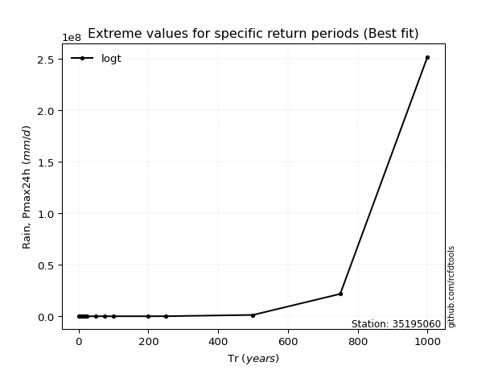</img>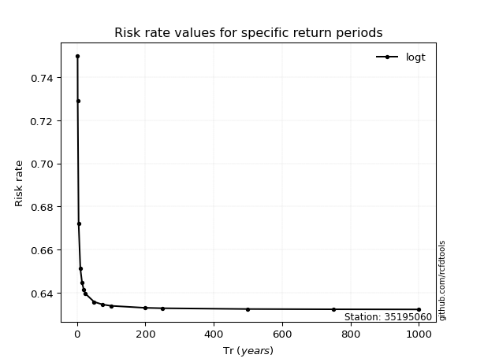</img>

</div>


<sub>**APP DISCLAIMER**: NO WARRANTY - This software is provided by [github.com/rcfdtools](https://github.com/rcfdtools) "as is", without any express or implied warranty, including warranties of merchantability, fitness for a particular purpose, or non-infringement. There is no guarantee that the software will be error-free or operate without interruption. LIMITATION OF LIABILITY - Neither the authors nor copyright holders will be liable for claims or damages arising from the software or its use. You are responsible for determining if the software is appropriate for your use and assume all associated risks, including errors, legal compliance, and data loss. NO PROFESSIONAL ADVICE - The software provides general information and does not offer professional advice. It should not replace consultation with professional advisors.</sub>