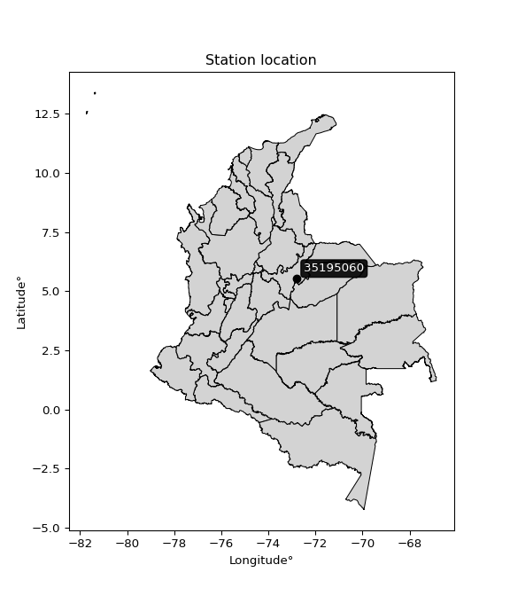

<div align="center">


</div>

# PMP Station (rain, Pmax24h): 35195060

Probable Maximum Precipitation (PMP) is the greatest amount of rainfall for a specific duration that is meteorologically possible for a given location, acting as a "worst-case" scenario for extreme storms, crucial for designing safety-critical infrastructure like bridges, river deviations, dams, spillways, and nuclear plants to prevent catastrophic failure. PMP is calculated by hydrologists using meteorological data to determine the upper limit of extreme rainfall, often leading to the Probable Maximum Flood (PMF) for flood control design, and is increasingly being studied for climate change impacts.

<div align="center">

</img>

</div>


## A. General information


### 1. General running parameters

• app_version: _v20251227_. • runtime: _2025-12-27 09:02:11.367833_. • Python version: _3.14.0_. • SciPy version: _1.16.3_. • Pandas version: _2.3.3_. • NumPy version: _2.3.5_. • Stations dataset (station_dataset_file): _dataset/pmax24h_in/automatic_colombia_2003_2024_filter.csv_. • Stations catalog (station_catalog_file): _dataset/CNE_IDEAM.xls_. • Minimum year to eval til year_max (date_min): _2003_. • Maximum year to eval since year_min (date_max): _2024_. • Creates, save and include plots into reports (create_plot): _False_. • Plot only fit distributions with Δo > Δ (plot_only_fit): _True_. • Eval low extreme values, if False, evaluates high extreme values (low_extreme): _False_. • Eval every SciPy distribution as logarithmic (pdist_logarithmic_on): _True_. • Standard deviation normalized (ddof): _1.0_. • Return periods to eval in years (Tr): _[2, 2.33, 5, 10, 15, 20, 25, 50, 75, 100, 200, 250, 500, 750, 1000]_. • Minimum data sample per station, 0 means any (minimum_sample): _5_. • Z-Score threshold to adjust a value, 0 means disable (zscore): _3.5_. • Avoid zeros, e.g. rain = 0 (avoid_zeros): _True_. • Avoid null values (avoid_nans): _True_. [:file_folder:Dataset file.](../../dataset/pmax24h_in/automatic_colombia_2003_2024_filter.csv)

> Delta Degrees of Freedom (DDOF): is a parameter used in the formulas for calculating variance and standard deviation. When ddof=0, the divisor is $N$ (the total number of observations) and this is used when your data set is the entire population. When ddof=1, the divisor is $N-1$ and this is used when your data set is a sample drawn from a larger population. Using $N-1$ provides an unbiased estimate of the population variance (known as Bessel´s correction).


### 2. Station info and location

|   id |   CODIGO | NOMBRE                    | CATEGORIA               | TECNOLOGIA                              | ESTADO   | FECHA_INSTALACION   |   FECHA_SUSPENSION |   ALTITUD |   LATITUD |   LONGITUD | DEPARTAMENTO   | MUNICIPIO   | AREA_OPERATIVA                              | ENTIDAD                                                     | AREA_HIDROGRAFICA   | ZONA_HIDROGRAFICA   | SUBZONA_HIDROGRAFICA   |   CORRIENTE | Catalogo   |
|-----:|---------:|:--------------------------|:------------------------|:----------------------------------------|:---------|:--------------------|-------------------:|----------:|----------:|-----------:|:---------------|:------------|:--------------------------------------------|:------------------------------------------------------------|:--------------------|:--------------------|:-----------------------|------------:|:-----------|
|    0 | 35195060 | TOQUILLA - AUT [35195060] | Climatológica Ordinaria | Automática con Telemetría, Convencional | Activa   | 15/12/2016          |                nan |      2950 |   5.52361 |    -72.791 | Boyacá         | Aquitania   | Area Operativa 06 - Boyacá-Casanare-Vichada | INSTITUTO DE HIDROLOGIA METEOROLOGIA Y ESTUDIOS AMBIENTALES | Orinoco             | Meta                | Río Cusiana            |         nan | CNE_IDEAM  |

<div align="center">

Map location in: [:earth_americas:Google](http://maps.google.com/maps?q=5.523611111,-72.79097222) [:earth_americas:OSM](https://www.openstreetmap.org/#map=18/5.523611111/-72.79097222&layers=P) [:earth_americas:Bing](https://www.bing.com/maps?cp=5.523611111~-72.79097222&lvl=18) [:earth_americas:Apple](https://maps.apple.com/frame?center=5.523611111%2C-72.79097222&span=0.003%2C0.006)

</div>


<div align="center">

```geojson
{
  "type": "Feature",
  "geometry": {
    "type": "Point", 
    "coordinates": [-72.79097222, 5.523611111]
  }, 
  "properties": {
    "Name": "35195060"
  }
}
```

</div>


### 3. Discrete values table and plot

|               |          0 |          1 |         2 |           3 |           4 |           5 |
|:--------------|-----------:|-----------:|----------:|------------:|------------:|------------:|
| Date          | 2018       | 2019       | 2020      | 2021        | 2023        | 2024        |
| Value         |   28       |   84.4     |   81.1    |   35.3      |   48.36     |   46.09     |
| Value_initial |   28       |   84.4     |   81.1    |   35.3      |   48.36     |   46.09     |
| count         |    6       |    6       |    6      |    6        |    6        |    6        |
| mean          |   53.875   |   53.875   |   53.875  |   53.875    |   53.875    |   53.875    |
| std           |   23.5735  |   23.5735  |   23.5735 |   23.5735   |   23.5735   |   23.5735   |
| zscore        |   -1.09763 |    1.29489 |    1.1549 |   -0.787962 |   -0.233949 |   -0.330244 |

> The initial value (value_initial) correspond to the initial obtained or null completed value, and value (value) is adjusted only when the initial value is outside the valid range definite through the Z-Score value. If Z-Score is active, values out of range or outliers are replaced with the station mean value


### 4. Active continuous probability distributions from SciPy (45 of 104 available)

[scipy.stats](https://docs.scipy.org/doc/scipy/reference/stats.html) is a Python´s powerful submodule within the SciPy library for comprehensive statistical analysis, offering over 130 probability distributions (like Normal, Poisson), functions for descriptive stats (mean, variance), hypothesis testing (t-tests, chi-square), random variable generation, and statistical tests, making it essential for data science, modeling, and research. It provides tools to explore, model, and draw conclusions from data efficiently, working seamlessly with NumPy.

<div align="center">

|   id | p_dist             |   n_parameter | fit_method   | label                                                                       | active   | ref                                                                                                        |
|-----:|:-------------------|--------------:|:-------------|:----------------------------------------------------------------------------|:---------|:-----------------------------------------------------------------------------------------------------------|
|    0 | alpha              |             3 | MLE          | Alpha                                                                       | True     | [:mortar_board:](https://docs.scipy.org/doc/scipy/reference/generated/scipy.stats.alpha.html)              |
|    1 | betaprime          |             4 | MLE          | Beta prime                                                                  | True     | [:mortar_board:](https://docs.scipy.org/doc/scipy/reference/generated/scipy.stats.betaprime.html)          |
|    2 | chi2               |             3 | MLE          | Chi²                                                                        | True     | [:mortar_board:](https://docs.scipy.org/doc/scipy/reference/generated/scipy.stats.chi2.html)               |
|    3 | crystalball        |             4 | MLE          | Crystalball                                                                 | True     | [:mortar_board:](https://docs.scipy.org/doc/scipy/reference/generated/scipy.stats.crystalball.html)        |
|    4 | erlang             |             3 | MLE          | Erlang                                                                      | True     | [:mortar_board:](https://docs.scipy.org/doc/scipy/reference/generated/scipy.stats.erlang.html)             |
|    5 | expon              |             2 | MLE          | Exponential                                                                 | True     | [:mortar_board:](https://docs.scipy.org/doc/scipy/reference/generated/scipy.stats.expon.html)              |
|    6 | exponnorm          |             3 | MLE          | Exponentially modified Normal                                               | True     | [:mortar_board:](https://docs.scipy.org/doc/scipy/reference/generated/scipy.stats.exponnorm.html)          |
|    7 | f                  |             4 | MLE          | F                                                                           | True     | [:mortar_board:](https://docs.scipy.org/doc/scipy/reference/generated/scipy.stats.f.html)                  |
|    8 | fatiguelife        |             3 | MLE          | Fatigue-life (Birnbaum-Saunders)                                            | True     | [:mortar_board:](https://docs.scipy.org/doc/scipy/reference/generated/scipy.stats.fatiguelife.html)        |
|    9 | fisk               |             3 | MLE          | Fisk                                                                        | True     | [:mortar_board:](https://docs.scipy.org/doc/scipy/reference/generated/scipy.stats.fisk.html)               |
|   10 | gamma              |             3 | MLE          | Gamma                                                                       | True     | [:mortar_board:](https://docs.scipy.org/doc/scipy/reference/generated/scipy.stats.gamma.html)              |
|   11 | genexpon           |             5 | MLE          | Generalized exponential                                                     | True     | [:mortar_board:](https://docs.scipy.org/doc/scipy/reference/generated/scipy.stats.genexpon.html)           |
|   12 | genlogistic        |             3 | MLE          | Generalized logistic                                                        | True     | [:mortar_board:](https://docs.scipy.org/doc/scipy/reference/generated/scipy.stats.genlogistic.html)        |
|   13 | gibrat             |             2 | MM           | Gibrat                                                                      | True     | [:mortar_board:](https://docs.scipy.org/doc/scipy/reference/generated/scipy.stats.gibrat.html)             |
|   14 | gompertz           |             3 | MLE          | Gompertz (or truncated Gumbel)                                              | True     | [:mortar_board:](https://docs.scipy.org/doc/scipy/reference/generated/scipy.stats.gompertz.html)           |
|   15 | gumbel_l           |             2 | MM           | Gumbel Left Skew                                                            | True     | [:mortar_board:](https://docs.scipy.org/doc/scipy/reference/generated/scipy.stats.gumbel_l.html)           |
|   16 | gumbel_r           |             2 | MM           | Gumbel Right Skew                                                           | True     | [:mortar_board:](https://docs.scipy.org/doc/scipy/reference/generated/scipy.stats.gumbel_r.html)           |
|   17 | halflogistic       |             2 | MM           | Half-logistic                                                               | True     | [:mortar_board:](https://docs.scipy.org/doc/scipy/reference/generated/scipy.stats.halflogistic.html)       |
|   18 | halfnorm           |             2 | MM           | Half Normal                                                                 | True     | [:mortar_board:](https://docs.scipy.org/doc/scipy/reference/generated/scipy.stats.halfnorm.html)           |
|   19 | hypsecant          |             2 | MM           | hyperbolic secant                                                           | True     | [:mortar_board:](https://docs.scipy.org/doc/scipy/reference/generated/scipy.stats.hypsecant.html)          |
|   20 | invgamma           |             3 | MLE          | Inverted gamma                                                              | True     | [:mortar_board:](https://docs.scipy.org/doc/scipy/reference/generated/scipy.stats.invgamma.html)           |
|   21 | invgauss           |             3 | MLE          | Inverse Gaussian                                                            | True     | [:mortar_board:](https://docs.scipy.org/doc/scipy/reference/generated/scipy.stats.invgauss.html)           |
|   22 | invweibull         |             3 | MLE          | Inverted Weibull                                                            | True     | [:mortar_board:](https://docs.scipy.org/doc/scipy/reference/generated/scipy.stats.invweibull.html)         |
|   23 | johnsonsu          |             4 | MLE          | Johnson Su                                                                  | True     | [:mortar_board:](https://docs.scipy.org/doc/scipy/reference/generated/scipy.stats.johnsonsu.html)          |
|   24 | kstwobign          |             2 | MLE          | Limiting distribution of scaled Kolmogorov-Smirnov two-sided test statistic | True     | [:mortar_board:](https://docs.scipy.org/doc/scipy/reference/generated/scipy.stats.kstwobign.html)          |
|   25 | laplace            |             2 | MM           | Laplace                                                                     | True     | [:mortar_board:](https://docs.scipy.org/doc/scipy/reference/generated/scipy.stats.laplace.html)            |
|   26 | laplace_asymmetric |             3 | MLE          | Asymmetric Laplace                                                          | True     | [:mortar_board:](https://docs.scipy.org/doc/scipy/reference/generated/scipy.stats.laplace_asymmetric.html) |
|   27 | loggamma           |             3 | MLE          | Log gamma                                                                   | True     | [:mortar_board:](https://docs.scipy.org/doc/scipy/reference/generated/scipy.stats.loggamma.html)           |
|   28 | logistic           |             2 | MM           | Logistic (or Sech-squared)                                                  | True     | [:mortar_board:](https://docs.scipy.org/doc/scipy/reference/generated/scipy.stats.logistic.html)           |
|   29 | lognorm            |             3 | MLE          | Log Normal                                                                  | True     | [:mortar_board:](https://docs.scipy.org/doc/scipy/reference/generated/scipy.stats.lognorm.html)            |
|   30 | maxwell            |             2 | MM           | Maxwell                                                                     | True     | [:mortar_board:](https://docs.scipy.org/doc/scipy/reference/generated/scipy.stats.maxwell.html)            |
|   31 | mielke             |             4 | MLE          | Mielke Beta-Kappa / Dagum                                                   | True     | [:mortar_board:](https://docs.scipy.org/doc/scipy/reference/generated/scipy.stats.mielke.html)             |
|   32 | moyal              |             2 | MM           | Moyal                                                                       | True     | [:mortar_board:](https://docs.scipy.org/doc/scipy/reference/generated/scipy.stats.moyal.html)              |
|   33 | nakagami           |             3 | MLE          | Nakagami                                                                    | True     | [:mortar_board:](https://docs.scipy.org/doc/scipy/reference/generated/scipy.stats.nakagami.html)           |
|   34 | ncf                |             5 | MLE          | Non-central F distribution                                                  | True     | [:mortar_board:](https://docs.scipy.org/doc/scipy/reference/generated/scipy.stats.ncf.html)                |
|   35 | nct                |             4 | MLE          | Non-central Student’s t                                                     | True     | [:mortar_board:](https://docs.scipy.org/doc/scipy/reference/generated/scipy.stats.nct.html)                |
|   36 | norm               |             2 | MM           | Normal                                                                      | True     | [:mortar_board:](https://docs.scipy.org/doc/scipy/reference/generated/scipy.stats.norm.html)               |
|   37 | pareto             |             3 | MLE          | Pareto                                                                      | True     | [:mortar_board:](https://docs.scipy.org/doc/scipy/reference/generated/scipy.stats.pareto.html)             |
|   38 | pearson3           |             3 | MM           | Pearson type III                                                            | True     | [:mortar_board:](https://docs.scipy.org/doc/scipy/reference/generated/scipy.stats.pearson3.html)           |
|   39 | rayleigh           |             2 | MM           | Rayleigh                                                                    | True     | [:mortar_board:](https://docs.scipy.org/doc/scipy/reference/generated/scipy.stats.rayleigh.html)           |
|   40 | rice               |             3 | MLE          | Rice                                                                        | True     | [:mortar_board:](https://docs.scipy.org/doc/scipy/reference/generated/scipy.stats.rice.html)               |
|   41 | t                  |             3 | MLE          | Student’s t                                                                 | True     | [:mortar_board:](https://docs.scipy.org/doc/scipy/reference/generated/scipy.stats.t.html)                  |
|   42 | truncnorm          |             4 | MLE          | Truncated normal                                                            | True     | [:mortar_board:](https://docs.scipy.org/doc/scipy/reference/generated/scipy.stats.truncnorm.html)          |
|   43 | wald               |             2 | MM           | Wald                                                                        | True     | [:mortar_board:](https://docs.scipy.org/doc/scipy/reference/generated/scipy.stats.wald.html)               |
|   44 | weibull_min        |             3 | MLE          | Weibull minimum                                                             | True     | [:mortar_board:](https://docs.scipy.org/doc/scipy/reference/generated/scipy.stats.weibull_min.html)        |

</div>

> **n_parameter:** # arguments & localization & scale.
>
> **Fit methods:** (MLE) maximum likelihood, (MM) L-moments.
>
>**Inactive:** foldnorm, gennorm, norminvgauss, powernorm, powerlognorm, skewnorm, genextreme, anglit, arcsine, argus, beta, bradford, burr, burr12, cauchy, cosine, halfcauchy, foldcauchy, skewcauchy, wrapcauchy, dgamma, gengamma, exponweib, exponpow, truncexpon, gausshyper, genhalflogistic, genhyperbolic, geninvgauss, halfgennorm, johnsonsb, kappa4, kappa3, ksone, kstwo, loglaplace, levy, levy_l, levy_stable, ncx2, genpareto, truncpareto, lomax, powerlaw, rdist, rel_breitwigner, recipinvgauss, semicircular, studentized_range, trapezoid, triang, truncweibull_min, tukeylambda, uniform, loguniform, vonmises, vonmises_line, weibull_max, dweibull, 


## B. Probability distributions vs. Empirical distributions

A continuous probability distribution (CPD) describes probabilities for variables that can take any value within a range (like rain any time), unlike discrete variables with specific outcomes (like temperature). It uses a Probability Density Function (PDF), a curve where the total area under it equals 1, and the probability of the variable falling within an interval (a to b) is found by calculating the area under the curve between those points. A key feature is that the probability of hitting any single exact value is zero, so probabilities are always expressed for ranges, e.g., $P(a ≤ X ≤ b)$.

<div align="center">

Distributions parameters from station values
|    |   station | p_dist                |   n |            loc |           scale | shape                  | shape1               | shape2             | shape3   |
|---:|----------:|:----------------------|----:|---------------:|----------------:|:-----------------------|:---------------------|:-------------------|:---------|
|  0 |  35195060 | alpha                 |   6 |    -28.761     |   314.212       | 4.05813974840194       |                      |                    |          |
|  1 |  35195060 | betaprime             |   6 |     -0.223358  |     1.21228     | 257.2326964713783      | 6.725801094004519    |                    |          |
|  2 |  35195060 | chi2                  |   6 |     28         |     1.31461     | 0.8583490586071131     |                      |                    |          |
|  3 |  35195060 | crystalball           |   6 |     53.875     |    21.5195      | 10586.984699454893     | 29608.763764915413   |                    |          |
|  4 |  35195060 | erlang                |   6 |     28         |    32.9522      | 0.5107301431184079     |                      |                    |          |
|  5 |  35195060 | expon                 |   6 |     28         |    25.875       |                        |                      |                    |          |
|  6 |  35195060 | exponnorm             |   6 |     27.9728    |     0.00871942  | 2938.8061355453237     |                      |                    |          |
|  7 |  35195060 | f                     |   6 |      7.59582   |    37.0918      | 686.4248098918029      | 9.3738284348929      |                    |          |
|  8 |  35195060 | fatiguelife           |   6 |     28         |     7.73658e-06 | 1880.4920452251054     |                      |                    |          |
|  9 |  35195060 | fisk                  |   6 |     24.6933    |    21.4868      | 1.7172863468979436     |                      |                    |          |
| 10 |  35195060 | gamma                 |   6 |     28         |    23.593       | 0.6098394023812876     |                      |                    |          |
| 11 |  35195060 | genexpon              |   6 |     28         |     1.21594     | 0.04694565080303664    | 6.36454106195723e-08 | 1.6820089831143756 |          |
| 12 |  35195060 | genlogistic           |   6 |    -73.8276    |    16.892       | 1049.7186277053838     |                      |                    |          |
| 13 |  35195060 | gibrat                |   6 |     37.4583    |     9.95722     |                        |                      |                    |          |
| 14 |  35195060 | gompertz              |   6 |     28         |    45.2994      | 0.9889683405568794     |                      |                    |          |
| 15 |  35195060 | gumbel_l              |   6 |     63.5599    |    16.7787      |                        |                      |                    |          |
| 16 |  35195060 | gumbel_r              |   6 |     44.1901    |    16.7787      |                        |                      |                    |          |
| 17 |  35195060 | halflogistic          |   6 |     28.3694    |    18.3984      |                        |                      |                    |          |
| 18 |  35195060 | halfnorm              |   6 |     25.3916    |    35.6987      |                        |                      |                    |          |
| 19 |  35195060 | hypsecant             |   6 |     53.875     |    13.6998      |                        |                      |                    |          |
| 20 |  35195060 | invgamma              |   6 |      7.35422   |   174.594       | 4.683839322967505      |                      |                    |          |
| 21 |  35195060 | invgauss              |   6 |     18.5778    |    61.8175      | 0.5709896762944627     |                      |                    |          |
| 22 |  35195060 | invweibull            |   6 |     28         |     1.29128     | 0.05336845084713421    |                      |                    |          |
| 23 |  35195060 | johnsonsu             |   6 |  40822.8       |   198.881       | 11419.19891295341      | 1898.100240880368    |                    |          |
| 24 |  35195060 | kstwobign             |   6 |    -14.7136    |    78.491       |                        |                      |                    |          |
| 25 |  35195060 | laplace               |   6 |     53.875     |    15.2166      |                        |                      |                    |          |
| 26 |  35195060 | laplace_asymmetric    |   6 |     46.09      |    16.0271      | 0.7862023406369678     |                      |                    |          |
| 27 |  35195060 | loggamma              |   6 |  -5174.19      |   739.746       | 1173.5608699269742     |                      |                    |          |
| 28 |  35195060 | logistic              |   6 |     53.875     |    11.8643      |                        |                      |                    |          |
| 29 |  35195060 | lognorm               |   6 |     28         |     0.0553026   | 13.602298828921176     |                      |                    |          |
| 30 |  35195060 | maxwell               |   6 |      2.88272   |    31.9547      |                        |                      |                    |          |
| 31 |  35195060 | mielke                |   6 |    -19.0741    |     8.80419     | 9363.901654776106      | 4.020200606640506    |                    |          |
| 32 |  35195060 | moyal                 |   6 |     41.5687    |     9.6872      |                        |                      |                    |          |
| 33 |  35195060 | nakagami              |   6 |     28         |    37.2083      | 0.22954501694928064    |                      |                    |          |
| 34 |  35195060 | ncf                   |   6 |      0.0129368 |     2.86292e-05 | 3.0566575908497566e-06 | 2.024071104707721    | 4.4855533524645415 |          |
| 35 |  35195060 | nct                   |   6 |     -0.175032  |     1.15433     | 3.698824697837818      | 37.326581502219625   |                    |          |
| 36 |  35195060 | norm                  |   6 |     53.875     |    21.5195      |                        |                      |                    |          |
| 37 |  35195060 | pareto                |   6 |     27.9316    |     0.0683992   | 0.20455214142741873    |                      |                    |          |
| 38 |  35195060 | pearson3              |   6 |     53.875     |    21.5195      | 0.40558463400661576    |                      |                    |          |
| 39 |  35195060 | rayleigh              |   6 |     12.7069    |    32.8474      |                        |                      |                    |          |
| 40 |  35195060 | rice                  |   6 |     17.0421    |    29.7192      | 0.24562969164384524    |                      |                    |          |
| 41 |  35195060 | t                     |   6 |     53.8742    |    21.5191      | 35844194.13376393      |                      |                    |          |
| 42 |  35195060 | truncnorm             |   6 |     53.875     |    21.5195      | -764.7530399464886     | 620.5167955518637    |                    |          |
| 43 |  35195060 | wald                  |   6 |     32.3554    |    21.5196      |                        |                      |                    |          |
| 44 |  35195060 | weibull_min           |   6 |     28         |    26.9063      | 0.8921996330590454     |                      |                    |          |
| 45 |  35195060 | logalpha              |   6 |     -3.03485   |   119.456       | 17.2702563294064       |                      |                    |          |
| 46 |  35195060 | logbetaprime          |   6 |     -2.0413    |     3.38756     | 599.2113839087108      | 342.3365532269843    |                    |          |
| 47 |  35195060 | logchi2               |   6 |      3.3322    |     0.981185    | 1.0894854475334557     |                      |                    |          |
| 48 |  35195060 | logcrystalball        |   6 |      3.9061    |     0.402691    | 52.24407349766285      | 10.80159969490932    |                    |          |
| 49 |  35195060 | logerlang             |   6 |     -1.86233   |     0.0279347   | 206.48455828665567     |                      |                    |          |
| 50 |  35195060 | logexpon              |   6 |      3.3322    |     0.573897    |                        |                      |                    |          |
| 51 |  35195060 | logexponnorm          |   6 |      3.87899   |     0.401777    | 0.0674768731502067     |                      |                    |          |
| 52 |  35195060 | logf                  |   6 |     -0.0484293 |     3.9221      | 926.3848777389844      | 243.1051213514902    |                    |          |
| 53 |  35195060 | logfatiguelife        |   6 |      1.99236   |     1.87039     | 0.21527755131307408    |                      |                    |          |
| 54 |  35195060 | logfisk               |   6 |      2.22712   |     1.63737     | 6.6925435252516365     |                      |                    |          |
| 55 |  35195060 | loggamma              |   6 |     -1.92656   |     0.0276394   | 211.01961209626398     |                      |                    |          |
| 56 |  35195060 | loggenexpon           |   6 |      3.3322    | 23585.5         | 24640.59260375917      | 125907.22313542747   | 7930.149862351023  |          |
| 57 |  35195060 | loggenlogistic        |   6 |      1.64476   |     0.351842    | 352.66176626316246     |                      |                    |          |
| 58 |  35195060 | loggibrat             |   6 |      3.59891   |     0.18632     |                        |                      |                    |          |
| 59 |  35195060 | loggompertz           |   6 |      3.3322    |     0.683185    | 0.5728497493103911     |                      |                    |          |
| 60 |  35195060 | loggumbel_l           |   6 |      4.08733   |     0.313975    |                        |                      |                    |          |
| 61 |  35195060 | loggumbel_r           |   6 |      3.72487   |     0.313975    |                        |                      |                    |          |
| 62 |  35195060 | loghalflogistic       |   6 |      3.4288    |     0.344299    |                        |                      |                    |          |
| 63 |  35195060 | loghalfnorm           |   6 |      3.37312   |     0.667995    |                        |                      |                    |          |
| 64 |  35195060 | loghypsecant          |   6 |      3.9061    |     0.25636     |                        |                      |                    |          |
| 65 |  35195060 | loginvgamma           |   6 |     -1.80102   |  1143.39        | 201.37497055761474     |                      |                    |          |
| 66 |  35195060 | loginvgauss           |   6 |      2.00852   |    39.6793      | 0.04781831999051563    |                      |                    |          |
| 67 |  35195060 | loginvweibull         |   6 |  -5983.23      |  5986.94        | 17018.278795644208     |                      |                    |          |
| 68 |  35195060 | logjohnsonsu          |   6 |      4.43557   |     4.05259e-15 | 3.484015648506051      | 0.14521779990571249  |                    |          |
| 69 |  35195060 | logkstwobign          |   6 |      2.48648   |     1.62167     |                        |                      |                    |          |
| 70 |  35195060 | loglaplace            |   6 |      3.9061    |     0.284744    |                        |                      |                    |          |
| 71 |  35195060 | loglaplace_asymmetric |   6 |      3.8306    |     0.324013    | 0.8917704678148131     |                      |                    |          |
| 72 |  35195060 | logloggamma           |   6 |    -77.9582    |    12.0518      | 891.7180906118156      |                      |                    |          |
| 73 |  35195060 | loglogistic           |   6 |      3.9061    |     0.222014    |                        |                      |                    |          |
| 74 |  35195060 | loglognorm            |   6 |      3.3322    |     0.00178988  | 12.990897600638757     |                      |                    |          |
| 75 |  35195060 | logmaxwell            |   6 |      2.9519    |     0.597958    |                        |                      |                    |          |
| 76 |  35195060 | logmielke             |   6 | -14247.6       | 14249.5         | 7057055.831301781      | 40533.57441447181    |                    |          |
| 77 |  35195060 | logmoyal              |   6 |      3.67582   |     0.181274    |                        |                      |                    |          |
| 78 |  35195060 | lognakagami           |   6 |      3.3322    |     0.713214    | 0.25072912938522635    |                      |                    |          |
| 79 |  35195060 | logncf                |   6 |     -1.61105   |     8.07653e-07 | 5.4931331605853704e-05 | 497.2425781260855    | 374.2302844664481  |          |
| 80 |  35195060 | lognct                |   6 |     -0.68311   |     0.182055    | 82.42753866656551      | 24.98034303085288    |                    |          |
| 81 |  35195060 | lognorm               |   6 |      3.9061    |     0.402689    |                        |                      |                    |          |
| 82 |  35195060 | logpareto             |   6 |      3.33054   |     0.00166123  | 0.20398160644848948    |                      |                    |          |
| 83 |  35195060 | logpearson3           |   6 |      3.9061    |     0.402688    | 0.09252185146228165    |                      |                    |          |
| 84 |  35195060 | lograyleigh           |   6 |      3.13573   |     0.614664    |                        |                      |                    |          |
| 85 |  35195060 | logrice               |   6 |      3.13783   |     0.503382    | 0.984526738022734      |                      |                    |          |
| 86 |  35195060 | logt                  |   6 |      3.9061    |     0.402689    | 7708650175.768755      |                      |                    |          |
| 87 |  35195060 | logtruncnorm          |   6 |     -0.0944967 |     1.10512     | 4.063069260750616      | 4.099160656877979    |                    |          |
| 88 |  35195060 | logwald               |   6 |      3.50341   |     0.402689    |                        |                      |                    |          |
| 89 |  35195060 | logweibull_min        |   6 |      3.25958   |     0.711814    | 1.5128439096749793     |                      |                    |          |

</div>

> **loc** (Location parameter): This shifts the distribution along the x-axis. For many common distributions, like the normal (Gaussian) distribution, loc represents the mean $μ$. For others, like the uniform distribution, it might represent the minimum value, or for the beta distribution, the left end of the support interval.
>
> **scale** (Scale parameter): This determines the width or spread of the distribution. For the normal distribution, scale represents the standard deviation $σ$. For a uniform distribution, it defines the length of the interval (from $loc$ to $loc + scale$).
>
> **shape** (Shape parameters): Refers to parameters that define the specific form of a probability distribution, distinct from its location (loc) and scale (scale). These parameters are required arguments for most distribution functions. For example, a normal (Gaussian) distribution is fully defined by its location (mean) and scale (standard deviation), so it has no specific shape parameters beyond loc and scale. However, other distributions have intrinsic properties that need specification, as Gamma distribution that takes a shape parameter, often named $a$ or $alpha$.


### 0. Cumulative distribution values - CDF (90 evaluated)

Cumulative Distribution Function (CDF), denoted as $F$<sub>$X$</sub>$(x)$, is a function that gives the probability that a random variable $X$ will take a value less than or equal to a specific value, $x$ (i.e., $(P(X≥x)$. It essentially "accumulates" probabilities from a given point up to the far right (positive infinity), providing a complete picture of the distribution´s probabilities for both discrete (like rain) and continuous (like temperature) variables, helping to find probabilities over ranges or above certain values.

<div align="center">

CDF ordered by x ascending and calculating $log(f(x))$ separately
|   id |   Station |   date |     x |   count |   mean |     std |    zscore |   Value_initial |   station |   m |     alpha |   alpha_pdf |   betaprime |   betaprime_pdf |        chi2 |    chi2_pdf |   crystalball |   crystalball_pdf |      erlang |      erlang_pdf |    expon |   expon_pdf |   exponnorm |   exponnorm_pdf |         f |      f_pdf |   fatiguelife |   fatiguelife_pdf |      fisk |   fisk_pdf |       gamma |      gamma_pdf |    genexpon |   genexpon_pdf |   genlogistic |   genlogistic_pdf |   gibrat |   gibrat_pdf |    gompertz |   gompertz_pdf |   gumbel_l |   gumbel_l_pdf |   gumbel_r |   gumbel_r_pdf |   halflogistic |   halflogistic_pdf |   halfnorm |   halfnorm_pdf |   hypsecant |   hypsecant_pdf |   invgamma |   invgamma_pdf |   invgauss |   invgauss_pdf |   invweibull |   invweibull_pdf |   johnsonsu |   johnsonsu_pdf |   kstwobign |   kstwobign_pdf |   laplace |   laplace_pdf |   laplace_asymmetric |   laplace_asymmetric_pdf |   loggamma |   loggamma_pdf |   logistic |   logistic_pdf |   lognorm |   lognorm_pdf |   maxwell |   maxwell_pdf |   mielke |   mielke_pdf |     moyal |   moyal_pdf |    nakagami |   nakagami_pdf |      ncf |    ncf_pdf |       nct |    nct_pdf |     norm |   norm_pdf |   pareto |   pareto_pdf |   pearson3 |   pearson3_pdf |   rayleigh |   rayleigh_pdf |      rice |   rice_pdf |        t |      t_pdf |   truncnorm |   truncnorm_pdf |      wald |   wald_pdf |   weibull_min |   weibull_min_pdf |   logalpha |   logalpha_pdf |   logbetaprime |   logbetaprime_pdf |     logchi2 |   logchi2_pdf |   logcrystalball |   logcrystalball_pdf |   logerlang |   logerlang_pdf |   logexpon |   logexpon_pdf |   logexponnorm |   logexponnorm_pdf |      logf |   logf_pdf |   logfatiguelife |   logfatiguelife_pdf |   logfisk |   logfisk_pdf |   loggenexpon |   loggenexpon_pdf |   loggenlogistic |   loggenlogistic_pdf |   loggibrat |   loggibrat_pdf |   loggompertz |   loggompertz_pdf |   loggumbel_l |   loggumbel_l_pdf |   loggumbel_r |   loggumbel_r_pdf |   loghalflogistic |   loghalflogistic_pdf |   loghalfnorm |   loghalfnorm_pdf |   loghypsecant |   loghypsecant_pdf |   loginvgamma |   loginvgamma_pdf |   loginvgauss |   loginvgauss_pdf |   loginvweibull |   loginvweibull_pdf |   logjohnsonsu |   logjohnsonsu_pdf |   logkstwobign |   logkstwobign_pdf |   loglaplace |   loglaplace_pdf |   loglaplace_asymmetric |   loglaplace_asymmetric_pdf |   logloggamma |   logloggamma_pdf |   loglogistic |   loglogistic_pdf |   loglognorm |   loglognorm_pdf |   logmaxwell |   logmaxwell_pdf |   logmielke |   logmielke_pdf |   logmoyal |   logmoyal_pdf |   lognakagami |   lognakagami_pdf |   logncf |   logncf_pdf |    lognct |   lognct_pdf |   logpareto |   logpareto_pdf |   logpearson3 |   logpearson3_pdf |   lograyleigh |   lograyleigh_pdf |   logrice |   logrice_pdf |      logt |   logt_pdf |   logtruncnorm |   logtruncnorm_pdf |   logwald |   logwald_pdf |   logweibull_min |   logweibull_min_pdf |
|-----:|----------:|-------:|------:|--------:|-------:|--------:|----------:|----------------:|----------:|----:|----------:|------------:|------------:|----------------:|------------:|------------:|--------------:|------------------:|------------:|----------------:|---------:|------------:|------------:|----------------:|----------:|-----------:|--------------:|------------------:|----------:|-----------:|------------:|---------------:|------------:|---------------:|--------------:|------------------:|---------:|-------------:|------------:|---------------:|-----------:|---------------:|-----------:|---------------:|---------------:|-------------------:|-----------:|---------------:|------------:|----------------:|-----------:|---------------:|-----------:|---------------:|-------------:|-----------------:|------------:|----------------:|------------:|----------------:|----------:|--------------:|---------------------:|-------------------------:|-----------:|---------------:|-----------:|---------------:|----------:|--------------:|----------:|--------------:|---------:|-------------:|----------:|------------:|------------:|---------------:|---------:|-----------:|----------:|-----------:|---------:|-----------:|---------:|-------------:|-----------:|---------------:|-----------:|---------------:|----------:|-----------:|---------:|-----------:|------------:|----------------:|----------:|-----------:|--------------:|------------------:|-----------:|---------------:|---------------:|-------------------:|------------:|--------------:|-----------------:|---------------------:|------------:|----------------:|-----------:|---------------:|---------------:|-------------------:|----------:|-----------:|-----------------:|---------------------:|----------:|--------------:|--------------:|------------------:|-----------------:|---------------------:|------------:|----------------:|--------------:|------------------:|--------------:|------------------:|--------------:|------------------:|------------------:|----------------------:|--------------:|------------------:|---------------:|-------------------:|--------------:|------------------:|--------------:|------------------:|----------------:|--------------------:|---------------:|-------------------:|---------------:|-------------------:|-------------:|-----------------:|------------------------:|----------------------------:|--------------:|------------------:|--------------:|------------------:|-------------:|-----------------:|-------------:|-----------------:|------------:|----------------:|-----------:|---------------:|--------------:|------------------:|---------:|-------------:|----------:|-------------:|------------:|----------------:|--------------:|------------------:|--------------:|------------------:|----------:|--------------:|----------:|-----------:|---------------:|-------------------:|----------:|--------------:|-----------------:|---------------------:|
|    0 |  35195060 |   2018 | 28    |       6 | 53.875 | 23.5735 | -1.09763  |           28    |  35195060 |   1 | 0.0697638 |  0.0130608  |   0.0673862 |      0.0138297  | 6.31279e-07 | 3.81299e+07 |      0.114605 |        0.00899778 | 1.12464e-08 | 808377          | 0        |  0.0386473  |  0.00106181 |      0.0389484  | 0.0588369 | 0.0150269  |     0.0575376 |       1.03078e+11 | 0.0386457 | 0.0192947  | 2.50799e-10 | 43050.9        | 5.17705e-07 |      0.0386085 |     0.0799183 |        0.01194    | 0        |   0          | 1.74313e-12 |     0.0218318  |   0.113177 |     0.00634829 |   0.072471 |     0.0113361  |       0        |         0          |  0.0582481 |     0.0222909  |   0.0955741 |      0.00687198 |  0.0588462 |     0.0150316  |  0.0497012 |     0.0186058  |   0.00251604 |      2.26209e+11 |    0.114201 |      0.00898637 |   0.0714628 |      0.0122669  | 0.0913012 |    0.0060001  |            0.0908999 |               0.00721397 |  0.0727723 |       0.369216 |   0.101478 |     0.00768526 | 0.0770552 |      0.358836 |  0.107664 |    0.0113271  |      nan |          nan | 0.0439627 |  0.0109065  | 3.46083e-08 |    4.47217e+06 | 0.407361 | 0.00785904 | 0.0587146 | 0.0149708  | 0.114605 | 0.00899778 | 0        |  2.99056     |   0.106055 |     0.0102654  |   0.102716 |     0.0127182  | 0.0638285 | 0.0112699  | 0.114608 | 0.00899811 |    0.114605 |      0.00899778 | 0         | 0          |   1.26206e-14 |        1.58471    |  0.0679363 |       0.386622 |      0.0714399 |           0.37769  | 3.37812e-09 |   4.14378e+06 |         0.077056 |             0.358837 |   0.0727287 |        0.369428 |   0        |       1.74247  |       0.077039 |           0.358875 | 0.0670947 |   0.387763 |        0.0597589 |             0.417432 | 0.0671515 |      0.379369 |   5.38155e-08 |          1.04474  |        0.0549177 |             0.451091 |    0        |        0        |   5.52983e-09 |          0.838498 |     0.0863067 |          0.262665 |     0.0304239 |          0.338422 |          0        |              0        |      0        |          0        |      0.0676105 |           0.261755 |     0.0695831 |          0.382165 |     0.0596943 |          0.419174 |       0.0555481 |            0.456437 |      0.0744596 |        0.0185281   |      0.0515065 |           0.491601 |     0.066628 |         0.233993 |               0.0789372 |                    0.273191 |     0.0789139 |          0.358789 |     0.0701128 |          0.293662 |    0.0127334 |      5.69942e+12 |    0.0606901 |         0.440918 |         nan |             nan | 0.00988103 |       0.203615 |   1.84955e-08 |       2.08848e+07 | 0.19553  |     0.447869 | 0.0672821 |     0.386409 |    0        |     122.79      |     0.0746176 |          0.366472 |     0.0498015 |          0.494124 | 0.0450434 |      0.454516 | 0.0770548 |   0.358834 |    0           |             0      | 0         |      0        |         0.031152 |             0.638717 |
|    1 |  35195060 |   2021 | 35.3  |       6 | 53.875 | 23.5735 | -0.787962 |           35.3  |  35195060 |   2 | 0.198572  |  0.0213435  |   0.202597  |      0.0220436  | 0.985528    | 0.00640278  |      0.194022 |        0.0127729  | 0.4857      |      0.029283   | 0.245821 |  0.029147   |  0.248695   |      0.0293196  | 0.210125  | 0.024489   |     0.697266  |       0.0123519   | 0.229288  | 0.0286113  | 0.488197    |     0.0335095  | 0.245608    |      0.029126  |     0.19382   |        0.0188122  | 0        |   0          | 0.158805    |     0.0215761  |   0.169377 |     0.00918702 |   0.182928 |     0.0185195  |       0.186152 |         0.0262345  |  0.218648  |     0.021506   |   0.160578  |      0.0112304  |  0.210173  |     0.0244932  |  0.232236  |     0.0274929  |   0.401841   |      0.00267835  |    0.193573 |      0.012773   |   0.18844   |      0.0191298  | 0.147511  |    0.00969408 |            0.162244  |               0.0128759  |  0.198773  |       0.723239 |   0.172842 |     0.0120502  | 0.197709  |      0.69042  |  0.205804 |    0.0153607  |      nan |          nan | 0.16696   |  0.0219015  | 0.370171    |    0.0231129   | 0.460132 | 0.00664074 | 0.211349  | 0.024877   | 0.194022 | 0.0127729  | 0.616042 |  0.010659    |   0.197468 |     0.0146759  |   0.210653 |     0.0165288  | 0.167325  | 0.0167027  | 0.194028 | 0.0127734  |    0.194022 |      0.0127729  | 0.0176339 | 0.0240666  |   0.268222    |        0.0279293  |  0.202527  |       0.773849 |      0.20099   |           0.742877 | 0.337341    |   0.734367    |         0.19771  |             0.690418 |   0.19883   |        0.723858 |   0.332151 |       1.16371  |       0.197713 |           0.690547 | 0.202358  |   0.777641 |        0.209038  |             0.8528   | 0.204646  |      0.814892 |   0.250978    |          1.08218  |        0.221988  |             0.94761  |    0        |        0        |   0.206469    |          0.93399  |     0.172032  |          0.497824 |     0.188274  |          1.00132  |          0.19369  |              1.39775  |      0.224796 |          1.14672  |      0.163831  |           0.611223 |     0.201643  |          0.758334 |     0.209629  |          0.855912 |       0.224009  |            0.952661 |      0.079398  |        0.0246258   |      0.230589  |           0.982342 |     0.150319 |         0.527911 |               0.175996  |                    0.609096 |     0.198869  |          0.6847   |     0.176328  |          0.654177 |    0.64593   |      0.123582    |    0.210231  |         0.827856 |         nan |             nan | 0.173287   |       1.1858   |   0.441512    |       0.935608    | 0.312657 |     0.555038 | 0.202083  |     0.77551  |    0.635299 |       0.318816  |     0.198843  |          0.711572 |     0.215412  |          0.889122 | 0.200993  |      0.855039 | 0.197708  |   0.690418 |    0           |             0      | 0.0252212 |      1.5371   |         0.241553 |             1.04251  |
|    2 |  35195060 |   2024 | 46.09 |       6 | 53.875 | 23.5735 | -0.330244 |           46.09 |  35195060 |   3 | 0.444461  |  0.022157   |   0.449544  |      0.0217815  | 0.999846    | 6.29652e-05 |      0.358764 |        0.0173643  | 0.698664    |      0.0135388  | 0.502983 |  0.0192084  |  0.50689    |      0.0192436  | 0.471006  | 0.021824   |     0.791935  |       0.00644218  | 0.498194  | 0.0200646  | 0.729326    |     0.0148861  | 0.502634    |      0.0192026 |     0.420384  |        0.0215574  | 0.4432   |   0.0457492  | 0.384567    |     0.020031   |   0.297445 |     0.0147821  |   0.40945  |     0.0217904  |       0.447508 |         0.0217338  |  0.437957  |     0.0188924  |   0.328134  |      0.0199294  |  0.471064  |     0.0218224  |  0.497404  |     0.02058    |   0.41954    |      0.00107507  |    0.358445 |      0.0173883  |   0.41413   |      0.0211936  | 0.299764  |    0.0196998  |            0.381997  |               0.0303159  |  0.434319  |       0.988524 |   0.341601 |     0.0189568  | 0.425633  |      0.973434 |  0.391202 |    0.0182996  |      nan |          nan | 0.428438  |  0.0238342  | 0.556796    |    0.0135191   | 0.523905 | 0.00525276 | 0.475871  | 0.0219793  | 0.358764 | 0.0173643  | 0.680728 |  0.00359655  |   0.380973 |     0.0186119  |   0.403361 |     0.0184602  | 0.370936  | 0.0200783  | 0.358776 | 0.0173649  |    0.358764 |      0.0173643  | 0.474239  | 0.0328154  |   0.504274    |        0.0171568  |  0.448538  |       1.00265  |      0.440335  |           0.992195 | 0.489159    |   0.452303    |         0.425633 |             0.973428 |   0.434533  |        0.988923 |   0.580392 |       0.731156 |       0.425668 |           0.973496 | 0.448967  |   1.00253  |        0.467896  |             1.00489  | 0.465062  |      1.03835  |   0.518892    |          0.898888 |        0.493577  |             0.989519 |    0.586251 |        1.68152  |   0.45951     |          0.939967 |     0.356895  |          0.904202 |     0.489633  |          1.11361  |          0.525202 |              1.05165  |      0.50656  |          0.944759 |      0.407575  |           1.18968  |     0.444394  |          0.998068 |     0.46889   |          1.00436  |       0.496111  |            0.988488 |      0.0875349 |        0.0381825   |      0.502004  |           0.967924 |     0.383538 |         1.34696  |               0.442976  |                    1.53308  |     0.425153  |          0.968846 |     0.415787  |          1.09411  |    0.667609  |      0.0560954   |    0.460015  |         0.978801 |         nan |             nan | 0.514068   |       1.16068  |   0.636255    |       0.580168    | 0.468862 |     0.600265 | 0.448377  |     1.00249  |    0.687814 |       0.127347  |     0.431477  |          0.981676 |     0.472173  |          0.970767 | 0.455374  |      0.989174 | 0.425632  |   0.973433 |    0           |             0      | 0.58145   |      1.32378  |         0.511522 |             0.927222 |
|    3 |  35195060 |   2023 | 48.36 |       6 | 53.875 | 23.5735 | -0.233949 |           48.36 |  35195060 |   4 | 0.493576  |  0.0210738  |   0.497703  |      0.0206179  | 0.999939    | 2.48219e-05 |      0.398868 |        0.0179397  | 0.727513    |      0.0119273  | 0.544728 |  0.0175951  |  0.548694   |      0.0176122  | 0.518795  | 0.0202646  |     0.805839  |       0.00582567  | 0.541389  | 0.0180161  | 0.760808    |     0.0129111  | 0.544368    |      0.0175913 |     0.468763  |        0.0210178  | 0.536102 |   0.0364447  | 0.429474    |     0.0195236  |   0.332473 |     0.0160798  |   0.458429 |     0.0213098  |       0.495459 |         0.020505   |  0.480034  |     0.0181718  |   0.375188  |      0.0214713  |  0.518848  |     0.0202623  |  0.542104  |     0.018816   |   0.421838   |      0.0009544   |    0.398608 |      0.017968   |   0.461666  |      0.0206488  | 0.347991  |    0.0228691  |            0.447121  |               0.0271213  |  0.482072  |       0.995585 |   0.385839 |     0.0199731  | 0.472848  |      0.988401 |  0.432857 |    0.0183699  |      nan |          nan | 0.481236  |  0.022634   | 0.586297    |    0.0124995   | 0.535552 | 0.0050121  | 0.523901  | 0.020324   | 0.398868 | 0.0179397  | 0.688329 |  0.0031208   |   0.423519 |     0.0188361  |   0.445154 |     0.0183344  | 0.416556  | 0.0200781  | 0.398881 | 0.0179402  |    0.398868 |      0.0179397  | 0.542701  | 0.0276557  |   0.541496    |        0.0156676  |  0.496666  |       0.997021 |      0.488141  |           0.994117 | 0.510191    |   0.423235    |         0.472847 |             0.988396 |   0.482302  |        0.995861 |   0.614112 |       0.6724   |       0.472885 |           0.988431 | 0.497068  |   0.996023 |        0.515702  |             0.981669 | 0.514429  |      1.01222  |   0.56099     |          0.852014 |        0.540114  |             0.94476  |    0.657802 |        1.31294  |   0.504358    |          0.924815 |     0.402196  |          0.979587 |     0.541879  |          1.05746  |          0.573897 |              0.973924 |      0.550843 |          0.896994 |      0.466009  |           1.23458  |     0.492394  |          0.996332 |     0.516654  |          0.980451 |       0.542579  |            0.942979 |      0.0894632 |        0.0421577   |      0.547495  |           0.923324 |     0.454084 |         1.59471  |               0.512013  |                    1.34307  |     0.472178  |          0.985164 |     0.469154  |          1.12177  |    0.67018   |      0.051002    |    0.506773  |         0.964379 |         nan |             nan | 0.567675   |       1.06821  |   0.663181    |       0.540582    | 0.497681 |     0.598082 | 0.496484  |     0.996338 |    0.693605 |       0.114022  |     0.478962  |          0.991344 |     0.518316  |          0.947196 | 0.502615  |      0.974225 | 0.472847  |   0.988401 |    0           |             0      | 0.639478  |      1.09854  |         0.554992 |             0.880462 |
|    4 |  35195060 |   2020 | 81.1  |       6 | 53.875 | 23.5735 |  1.1549   |           81.1  |  35195060 |   5 | 0.884573  |  0.00506733 |   0.883097  |      0.00518638 | 1           | 5.61286e-11 |      0.897087 |        0.00832763 | 0.925175    |      0.00276283 | 0.871545 |  0.00496446 |  0.874228   |      0.00490824 | 0.877816  | 0.00477458 |     0.918214  |       0.00198302  | 0.839893  | 0.00409399 | 0.953765    |     0.00221749 | 0.87128     |      0.0049697 |     0.896633  |        0.00579123 | 0.930258 |   0.00306787 | 0.889694    |     0.00777621 |   0.941835 |     0.00986066 |   0.895096 |     0.00591217 |       0.892284 |         0.00553932 |  0.881362  |     0.00661436 |   0.913279  |      0.00625211 |  0.877802  |     0.00477378 |  0.875694  |     0.0047281  |   0.440394   |      0.000362987 |    0.897552 |      0.00832146 |   0.898447  |      0.00631493 | 0.91645   |    0.00549071 |            0.889049  |               0.00544268 |  0.88688   |       0.452809 |   0.908436 |     0.0070109  | 0.887966  |      0.473118 |  0.887976 |    0.00748    |      nan |          nan | 0.896583  |  0.0053078  | 0.850913    |    0.00499482  | 0.657953 | 0.0027782  | 0.877093  | 0.00461842 | 0.897087 | 0.00832763 | 0.743716 |  0.000985988 |   0.891963 |     0.00740958 |   0.885556 |     0.00725445 | 0.895134  | 0.00738698 | 0.897098 | 0.00832714 |    0.897087 |      0.00832763 | 0.910723  | 0.00381944 |   0.840236    |        0.00492333 |  0.883736  |       0.423225 |      0.885148  |           0.441086 | 0.674459    |   0.24017     |         0.887964 |             0.47312  |   0.886977  |        0.452373 |   0.843247 |       0.273138 |       0.887956 |           0.473026 | 0.8831    |   0.422746 |        0.878518  |             0.393063 | 0.867661  |      0.35437  |   0.866702    |          0.353185 |        0.867792  |             0.349677 |    0.926902 |        0.174208 |   0.882828    |          0.465981 |     0.930749  |          0.588904 |     0.888638  |          0.334158 |          0.886241 |              0.311614 |      0.874179 |          0.370101 |      0.906386  |           0.359926 |     0.884783  |          0.432346 |     0.87831   |          0.391633 |       0.868796  |            0.347304 |      0.168222  |        0.915157    |      0.874971  |           0.36281  |     0.910411 |         0.31463  |               0.882394  |                    0.323683 |     0.888626  |          0.476418 |     0.900714  |          0.402804 |    0.688521  |      0.0255888   |    0.879816  |         0.421676 |         nan |             nan | 0.890793   |       0.299335 |   0.861136    |       0.257348    | 0.771192 |     0.423541 | 0.882862  |     0.423049 |    0.732436 |       0.0512404 |     0.88668   |          0.459914 |     0.877651  |          0.408017 | 0.881458  |      0.429979 | 0.887966  |   0.47312  |    2.10606e-05 |            26.9606 | 0.906557  |      0.215177 |         0.868473 |             0.355284 |
|    5 |  35195060 |   2019 | 84.4  |       6 | 53.875 | 23.5735 |  1.29489  |           84.4  |  35195060 |   6 | 0.900006  |  0.00430691 |   0.898942  |      0.00443691 | 1           | 1.54576e-11 |      0.921974 |        0.0067789  | 0.933724    |      0.00242689 | 0.886926 |  0.00437002 |  0.889425   |      0.00431516 | 0.892463  | 0.00412008 |     0.92447   |       0.00181151  | 0.852591  | 0.0036148  | 0.960515    |     0.00188322 | 0.886678    |      0.0043752 |     0.914162  |        0.00485674 | 0.939502 |   0.00255415 | 0.913345    |     0.00657053 |   0.968655 |     0.00646874 |   0.912984 |     0.00495364 |       0.909167 |         0.00471276 |  0.901661  |     0.00570142 |   0.931681  |      0.00494865 |  0.892447  |     0.00411948 |  0.890293  |     0.00413417 |   0.441556   |      0.000341549 |    0.922411 |      0.0067679  |   0.917581  |      0.00530262 | 0.932739  |    0.00442022 |            0.905631  |               0.00462923 |  0.903892  |       0.400699 |   0.929093 |     0.00555273 | 0.905716  |      0.41739  |  0.910642 |    0.00627621 |      nan |          nan | 0.912709  |  0.00448747 | 0.866659    |    0.00455341  | 0.666887 | 0.00263828 | 0.891263  | 0.00398681 | 0.921974 | 0.0067789  | 0.746854 |  0.000917002 |   0.9143   |     0.00615094 |   0.907625 |     0.00613806 | 0.917382  | 0.0061202  | 0.921984 | 0.00677841 |    0.921974 |      0.0067789  | 0.92236   | 0.00325166 |   0.855637    |        0.00441993 |  0.899676  |       0.376547 |      0.90174   |           0.391413 | 0.683862    |   0.231426    |         0.905715 |             0.417393 |   0.903971  |        0.400295 |   0.853771 |       0.2548   |       0.905703 |           0.417316 | 0.899027  |   0.376418 |        0.893381  |             0.352686 | 0.88105   |      0.317593 |   0.880189    |          0.323409 |        0.881078  |             0.316996 |    0.933445 |        0.154352 |   0.900486    |          0.419552 |     0.951765  |          0.465743 |     0.901243  |          0.29847  |          0.89805  |              0.281014 |      0.888278 |          0.337172 |      0.91972   |           0.309846 |     0.901055  |          0.384083 |     0.893121  |          0.351514 |       0.881991  |            0.31479  |      0.999398  |        2.68708e+10 |      0.888772  |           0.329578 |     0.922121 |         0.273507 |               0.894621  |                    0.290032 |     0.906494  |          0.419976 |     0.915663  |          0.347834 |    0.689523  |      0.0246294   |    0.89576   |         0.378215 |         nan |             nan | 0.902109   |       0.268651 |   0.871094    |       0.24213     | 0.787689 |     0.403674 | 0.8988    |     0.376665 |    0.734434 |       0.049022  |     0.903955  |          0.4068   |     0.893114  |          0.367734 | 0.897705  |      0.385095 | 0.905716  |   0.417392 |    0.999998    |            23.2682 | 0.914701  |      0.19364  |         0.88202  |             0.324379 |


</div>

An Empirical Distribution Function (EDF) is a step-function estimate of a true cumulative distribution function (CDF) based on observed sample data, representing the proportion of data points less than or equal to a given value. It is calculated by ordering your data and jumping up by $1/n$ (where $n$ is sample size) at each unique data point, allowing analysis without assuming an underlying population distribution, and it gets closer to the true CDF as the sample size grows.


### 1. Empirical - EDF California (1923)

California´s estimates the true probability distribution of water-related data (like rainfall, streamflow) using observed samples, crucial for risk assessment.

<div align="center">


$P=m/n$


</div>


**1.1. Empirical values**

<div align="center">

|                | 0                   | 1                  | 2              | 3                  | 4                  | 5              |
|:---------------|:--------------------|:-------------------|:---------------|:-------------------|:-------------------|:---------------|
| date           | 2018                | 2021               | 2024           | 2023               | 2020               | 2019           |
| x              | 28.0                | 35.3               | 46.09          | 48.36              | 81.1               | 84.4           |
| m              | 1                   | 2                  | 3              | 4                  | 5                  | 6              |
| empirical_dist | edf_california      | edf_california     | edf_california | edf_california     | edf_california     | edf_california |
| empirical      | 0.16666666666666666 | 0.3333333333333333 | 0.5            | 0.6666666666666666 | 0.8333333333333334 | 1.0            |
| empirical_tr   | 1.2                 | 1.4999999999999998 | 2.0            | 2.9999999999999996 | 6.000000000000002  | inf            |

</div>


**1.2. Kolmogorov-Smirnov fit test (sorted by Δ)**


<div align="center">

|                | 0                   | 1                   | 2                   | 3                   | 4                   | 5                 | 6                   | 7                   | 8                   | 9                  | 10                 | 11                | 12                  | 13                 | 14                    | 15                  | 16                  | 17                  | 18                  | 19                  | 20                  | 21                  | 22                  | 23                 | 24                  | 25                  | 26                  | 27                  | 28                  | 29                 | 30                 | 31                 | 32                  | 33                  | 34                  | 35                  | 36                 | 37                  | 38                  | 39                  | 40                  | 41                  | 42                  | 43                  | 44                  | 45                  | 46                  | 47                  | 48                  | 49                | 50                  | 51                  | 52                 | 53                  | 54                 | 55                  | 56                  | 57                 | 58                  | 59                  | 60                 | 61                  | 62                 | 63                  | 64                  | 65                  | 66                 | 67                 | 68                 | 69                 | 70                  | 71                 | 72                 | 73                  | 74                  | 75                 | 76                  | 77                 | 78                  | 79                 | 80                 | 81                 | 82                  | 83                | 84                 | 85                 | 86                 | 87                 | 88             | 89             |
|:---------------|:--------------------|:--------------------|:--------------------|:--------------------|:--------------------|:------------------|:--------------------|:--------------------|:--------------------|:-------------------|:-------------------|:------------------|:--------------------|:-------------------|:----------------------|:--------------------|:--------------------|:--------------------|:--------------------|:--------------------|:--------------------|:--------------------|:--------------------|:-------------------|:--------------------|:--------------------|:--------------------|:--------------------|:--------------------|:-------------------|:-------------------|:-------------------|:--------------------|:--------------------|:--------------------|:--------------------|:-------------------|:--------------------|:--------------------|:--------------------|:--------------------|:--------------------|:--------------------|:--------------------|:--------------------|:--------------------|:--------------------|:--------------------|:--------------------|:------------------|:--------------------|:--------------------|:-------------------|:--------------------|:-------------------|:--------------------|:--------------------|:-------------------|:--------------------|:--------------------|:-------------------|:--------------------|:-------------------|:--------------------|:--------------------|:--------------------|:-------------------|:-------------------|:-------------------|:-------------------|:--------------------|:-------------------|:-------------------|:--------------------|:--------------------|:-------------------|:--------------------|:-------------------|:--------------------|:-------------------|:-------------------|:-------------------|:--------------------|:------------------|:-------------------|:-------------------|:-------------------|:-------------------|:---------------|:---------------|
| station        | 35195060            | 35195060            | 35195060            | 35195060            | 35195060            | 35195060          | 35195060            | 35195060            | 35195060            | 35195060           | 35195060           | 35195060          | 35195060            | 35195060           | 35195060              | 35195060            | 35195060            | 35195060            | 35195060            | 35195060            | 35195060            | 35195060            | 35195060            | 35195060           | 35195060            | 35195060            | 35195060            | 35195060            | 35195060            | 35195060           | 35195060           | 35195060           | 35195060            | 35195060            | 35195060            | 35195060            | 35195060           | 35195060            | 35195060            | 35195060            | 35195060            | 35195060            | 35195060            | 35195060            | 35195060            | 35195060            | 35195060            | 35195060            | 35195060            | 35195060          | 35195060            | 35195060            | 35195060           | 35195060            | 35195060           | 35195060            | 35195060            | 35195060           | 35195060            | 35195060            | 35195060           | 35195060            | 35195060           | 35195060            | 35195060            | 35195060            | 35195060           | 35195060           | 35195060           | 35195060           | 35195060            | 35195060           | 35195060           | 35195060            | 35195060            | 35195060           | 35195060            | 35195060           | 35195060            | 35195060           | 35195060           | 35195060           | 35195060            | 35195060          | 35195060           | 35195060           | 35195060           | 35195060           | 35195060       | 35195060       |
| empirical_dist | edf_california      | edf_california      | edf_california      | edf_california      | edf_california      | edf_california    | edf_california      | edf_california      | edf_california      | edf_california     | edf_california     | edf_california    | edf_california      | edf_california     | edf_california        | edf_california      | edf_california      | edf_california      | edf_california      | edf_california      | edf_california      | edf_california      | edf_california      | edf_california     | edf_california      | edf_california      | edf_california      | edf_california      | edf_california      | edf_california     | edf_california     | edf_california     | edf_california      | edf_california      | edf_california      | edf_california      | edf_california     | edf_california      | edf_california      | edf_california      | edf_california      | edf_california      | edf_california      | edf_california      | edf_california      | edf_california      | edf_california      | edf_california      | edf_california      | edf_california    | edf_california      | edf_california      | edf_california     | edf_california      | edf_california     | edf_california      | edf_california      | edf_california     | edf_california      | edf_california      | edf_california     | edf_california      | edf_california     | edf_california      | edf_california      | edf_california      | edf_california     | edf_california     | edf_california     | edf_california     | edf_california      | edf_california     | edf_california     | edf_california      | edf_california      | edf_california     | edf_california      | edf_california     | edf_california      | edf_california     | edf_california     | edf_california     | edf_california      | edf_california    | edf_california     | edf_california     | edf_california     | edf_california     | edf_california | edf_california |
| p_dist         | logkstwobign        | loginvweibull       | invgauss            | loggenlogistic      | logweibull_min      | nct               | loggumbel_r         | fisk                | invgamma            | f                  | lograyleigh        | loginvgauss       | logfatiguelife      | logfisk            | loglaplace_asymmetric | logmaxwell          | logmoyal            | logrice             | exponnorm           | genexpon            | loggenexpon         | nakagami            | lognakagami         | loggompertz        | weibull_min         | logexpon            | loghalfnorm         | expon               | loghalflogistic     | betaprime          | logf               | logalpha           | lognct              | halflogistic        | alpha               | loginvgamma         | logbetaprime       | logerlang           | loggamma            | loggamma            | moyal               | halfnorm            | logpearson3         | logexponnorm        | lognorm             | lognorm             | logcrystalball      | logt                | logloggamma         | loglogistic       | genlogistic         | erlang              | loghypsecant       | kstwobign           | gumbel_r           | logncf              | loglaplace          | laplace_asymmetric | rayleigh            | gamma               | maxwell            | gompertz            | pearson3           | rice                | loggumbel_l         | t                   | truncnorm          | crystalball        | norm               | johnsonsu          | logistic            | pareto             | hypsecant          | logpareto           | logwald             | loglognorm         | wald                | logchi2            | laplace             | ncf                | loggibrat          | gibrat             | gumbel_l            | fatiguelife       | invweibull         | chi2               | logjohnsonsu       | logtruncnorm       | mielke         | logmielke      |
| delta          | 0.11917137182077109 | 0.12408754421147039 | 0.12456258795752273 | 0.12655280960857063 | 0.13551469062506033 | 0.142765198044971 | 0.14505928130576454 | 0.14740875792331032 | 0.14781836601399523 | 0.1478719731701995 | 0.1483505701178659 | 0.150012885559194 | 0.15096482055760263 | 0.1522377788446374 | 0.15733770192743804   | 0.15989404753976322 | 0.16004592659311173 | 0.16405213747643577 | 0.16560485439816888 | 0.16666614896155393 | 0.16666661285114348 | 0.16666663205835117 | 0.16666664817120436 | 0.1666666611368392 | 0.16666666666665403 | 0.16666666666666666 | 0.16666666666666666 | 0.16666666666666666 | 0.16666666666666666 | 0.1689634668544152 | 0.1695990183607886 | 0.1700008393820605 | 0.17018250228195386 | 0.17120744447088332 | 0.17309103267752118 | 0.17427239120853383 | 0.1785256017665845 | 0.18436469750129247 | 0.18459478721639622 | 0.18459478721639622 | 0.18543101281406227 | 0.18663311241143715 | 0.18770470962506236 | 0.19378189598389994 | 0.19381861619080876 | 0.19381861619080876 | 0.19381930007090326 | 0.19381972909674983 | 0.19448825361355682 | 0.197513033677914 | 0.19790328181806105 | 0.19866396319067325 | 0.2006581149411928 | 0.20500032421839998 | 0.2082377337234969 | 0.21231111014704784 | 0.21258252517791015 | 0.219546134335889  | 0.22151268865986562 | 0.22932598754549294 | 0.2338092331521267 | 0.23719312845684937 | 0.2431480112917656 | 0.25011021931451816 | 0.26447026383629824 | 0.26778614860749145 | 0.2677988399150547 | 0.2677988414364941 | 0.2677988438131894 | 0.2680587029211752 | 0.28082795393701965 | 0.2827082576200472 | 0.2914789960746056 | 0.30196526635104554 | 0.30811212775614755 | 0.3125964496605768 | 0.31569947779566626 | 0.3161380983021769 | 0.31867612861776917 | 0.3331128192573314 | 0.3333333333333333 | 0.3333333333333333 | 0.33419356579107184 | 0.363932529632444 | 0.5584444859181583 | 0.6521946426109009 | 0.6651118098164297 | 0.8333122727232317 | nan            | nan            |
| deltao         | 0.530385761606      | 0.530385761606      | 0.530385761606      | 0.530385761606      | 0.530385761606      | 0.530385761606    | 0.530385761606      | 0.530385761606      | 0.530385761606      | 0.530385761606     | 0.530385761606     | 0.530385761606    | 0.530385761606      | 0.530385761606     | 0.530385761606        | 0.530385761606      | 0.530385761606      | 0.530385761606      | 0.530385761606      | 0.530385761606      | 0.530385761606      | 0.530385761606      | 0.530385761606      | 0.530385761606     | 0.530385761606      | 0.530385761606      | 0.530385761606      | 0.530385761606      | 0.530385761606      | 0.530385761606     | 0.530385761606     | 0.530385761606     | 0.530385761606      | 0.530385761606      | 0.530385761606      | 0.530385761606      | 0.530385761606     | 0.530385761606      | 0.530385761606      | 0.530385761606      | 0.530385761606      | 0.530385761606      | 0.530385761606      | 0.530385761606      | 0.530385761606      | 0.530385761606      | 0.530385761606      | 0.530385761606      | 0.530385761606      | 0.530385761606    | 0.530385761606      | 0.530385761606      | 0.530385761606     | 0.530385761606      | 0.530385761606     | 0.530385761606      | 0.530385761606      | 0.530385761606     | 0.530385761606      | 0.530385761606      | 0.530385761606     | 0.530385761606      | 0.530385761606     | 0.530385761606      | 0.530385761606      | 0.530385761606      | 0.530385761606     | 0.530385761606     | 0.530385761606     | 0.530385761606     | 0.530385761606      | 0.530385761606     | 0.530385761606     | 0.530385761606      | 0.530385761606      | 0.530385761606     | 0.530385761606      | 0.530385761606     | 0.530385761606      | 0.530385761606     | 0.530385761606     | 0.530385761606     | 0.530385761606      | 0.530385761606    | 0.530385761606     | 0.530385761606     | 0.530385761606     | 0.530385761606     | 0.530385761606 | 0.530385761606 |
| eval           | Δo > Δ              | Δo > Δ              | Δo > Δ              | Δo > Δ              | Δo > Δ              | Δo > Δ            | Δo > Δ              | Δo > Δ              | Δo > Δ              | Δo > Δ             | Δo > Δ             | Δo > Δ            | Δo > Δ              | Δo > Δ             | Δo > Δ                | Δo > Δ              | Δo > Δ              | Δo > Δ              | Δo > Δ              | Δo > Δ              | Δo > Δ              | Δo > Δ              | Δo > Δ              | Δo > Δ             | Δo > Δ              | Δo > Δ              | Δo > Δ              | Δo > Δ              | Δo > Δ              | Δo > Δ             | Δo > Δ             | Δo > Δ             | Δo > Δ              | Δo > Δ              | Δo > Δ              | Δo > Δ              | Δo > Δ             | Δo > Δ              | Δo > Δ              | Δo > Δ              | Δo > Δ              | Δo > Δ              | Δo > Δ              | Δo > Δ              | Δo > Δ              | Δo > Δ              | Δo > Δ              | Δo > Δ              | Δo > Δ              | Δo > Δ            | Δo > Δ              | Δo > Δ              | Δo > Δ             | Δo > Δ              | Δo > Δ             | Δo > Δ              | Δo > Δ              | Δo > Δ             | Δo > Δ              | Δo > Δ              | Δo > Δ             | Δo > Δ              | Δo > Δ             | Δo > Δ              | Δo > Δ              | Δo > Δ              | Δo > Δ             | Δo > Δ             | Δo > Δ             | Δo > Δ             | Δo > Δ              | Δo > Δ             | Δo > Δ             | Δo > Δ              | Δo > Δ              | Δo > Δ             | Δo > Δ              | Δo > Δ             | Δo > Δ              | Δo > Δ             | Δo > Δ             | Δo > Δ             | Δo > Δ              | Δo > Δ            | Δo <= Δ            | Δo <= Δ            | Δo <= Δ            | Δo <= Δ            | Δo <= Δ        | Δo <= Δ        |
| fit            | 1                   | 1                   | 1                   | 1                   | 1                   | 1                 | 1                   | 1                   | 1                   | 1                  | 1                  | 1                 | 1                   | 1                  | 1                     | 1                   | 1                   | 1                   | 1                   | 1                   | 1                   | 1                   | 1                   | 1                  | 1                   | 1                   | 1                   | 1                   | 1                   | 1                  | 1                  | 1                  | 1                   | 1                   | 1                   | 1                   | 1                  | 1                   | 1                   | 1                   | 1                   | 1                   | 1                   | 1                   | 1                   | 1                   | 1                   | 1                   | 1                   | 1                 | 1                   | 1                   | 1                  | 1                   | 1                  | 1                   | 1                   | 1                  | 1                   | 1                   | 1                  | 1                   | 1                  | 1                   | 1                   | 1                   | 1                  | 1                  | 1                  | 1                  | 1                   | 1                  | 1                  | 1                   | 1                   | 1                  | 1                   | 1                  | 1                   | 1                  | 1                  | 1                  | 1                   | 1                 | 0                  | 0                  | 0                  | 0                  | 0              | 0              |
| n              | 6                   | 6                   | 6                   | 6                   | 6                   | 6                 | 6                   | 6                   | 6                   | 6                  | 6                  | 6                 | 6                   | 6                  | 6                     | 6                   | 6                   | 6                   | 6                   | 6                   | 6                   | 6                   | 6                   | 6                  | 6                   | 6                   | 6                   | 6                   | 6                   | 6                  | 6                  | 6                  | 6                   | 6                   | 6                   | 6                   | 6                  | 6                   | 6                   | 6                   | 6                   | 6                   | 6                   | 6                   | 6                   | 6                   | 6                   | 6                   | 6                   | 6                 | 6                   | 6                   | 6                  | 6                   | 6                  | 6                   | 6                   | 6                  | 6                   | 6                   | 6                  | 6                   | 6                  | 6                   | 6                   | 6                   | 6                  | 6                  | 6                  | 6                  | 6                   | 6                  | 6                  | 6                   | 6                   | 6                  | 6                   | 6                  | 6                   | 6                  | 6                  | 6                  | 6                   | 6                 | 6                  | 6                  | 6                  | 6                  | 6              | 6              |
| best_fit       | 1                   | 0                   | 0                   | 0                   | 0                   | 0                 | 0                   | 0                   | 0                   | 0                  | 0                  | 0                 | 0                   | 0                  | 0                     | 0                   | 0                   | 0                   | 0                   | 0                   | 0                   | 0                   | 0                   | 0                  | 0                   | 0                   | 0                   | 0                   | 0                   | 0                  | 0                  | 0                  | 0                   | 0                   | 0                   | 0                   | 0                  | 0                   | 0                   | 0                   | 0                   | 0                   | 0                   | 0                   | 0                   | 0                   | 0                   | 0                   | 0                   | 0                 | 0                   | 0                   | 0                  | 0                   | 0                  | 0                   | 0                   | 0                  | 0                   | 0                   | 0                  | 0                   | 0                  | 0                   | 0                   | 0                   | 0                  | 0                  | 0                  | 0                  | 0                   | 0                  | 0                  | 0                   | 0                   | 0                  | 0                   | 0                  | 0                   | 0                  | 0                  | 0                  | 0                   | 0                 | 0                  | 0                  | 0                  | 0                  | 0              | 0              |
| best_fit_sort  | 1                   | 2                   | 3                   | 4                   | 5                   | 6                 | 7                   | 8                   | 9                   | 10                 | 11                 | 12                | 13                  | 14                 | 15                    | 16                  | 17                  | 18                  | 19                  | 20                  | 21                  | 22                  | 23                  | 24                 | 25                  | 26                  | 27                  | 28                  | 29                  | 30                 | 31                 | 32                 | 33                  | 34                  | 35                  | 36                  | 37                 | 38                  | 39                  | 40                  | 41                  | 42                  | 43                  | 44                  | 45                  | 46                  | 47                  | 48                  | 49                  | 50                | 51                  | 52                  | 53                 | 54                  | 55                 | 56                  | 57                  | 58                 | 59                  | 60                  | 61                 | 62                  | 63                 | 64                  | 65                  | 66                  | 67                 | 68                 | 69                 | 70                 | 71                  | 72                 | 73                 | 74                  | 75                  | 76                 | 77                  | 78                 | 79                  | 80                 | 81                 | 82                 | 83                  | 84                | 85                 | 86                 | 87                 | 88                 | 89             | 90             |

</div>


**1.3. Best fit**

<div align="center">

|   id |   station | empirical_dist   | p_dist       |    delta |   deltao | eval   |   fit |   n |   best_fit |   best_fit_sort |
|-----:|----------:|:-----------------|:-------------|---------:|---------:|:-------|------:|----:|-----------:|----------------:|
|    0 |  35195060 | edf_california   | logkstwobign | 0.119171 | 0.530386 | Δo > Δ |     1 |   6 |          1 |               1 |

</div>


### 2. Empirical - EDF Hazen (1930)

Hazen method for plotting positions is a formula used to estimate the empirical cumulative probability distribution of flood events or other hydrological data. This formula often results in biased estimations, particularly when extrapolating to extreme events (high return periods).

<div align="center">


$P=(m-0.5)/n$


</div>


**2.1. Empirical values**

<div align="center">

|                | 0                   | 1                  | 2                  | 3                  | 4         | 5                  |
|:---------------|:--------------------|:-------------------|:-------------------|:-------------------|:----------|:-------------------|
| date           | 2018                | 2021               | 2024               | 2023               | 2020      | 2019               |
| x              | 28.0                | 35.3               | 46.09              | 48.36              | 81.1      | 84.4               |
| m              | 1                   | 2                  | 3                  | 4                  | 5         | 6                  |
| empirical_dist | edf_hazen           | edf_hazen          | edf_hazen          | edf_hazen          | edf_hazen | edf_hazen          |
| empirical      | 0.08333333333333333 | 0.25               | 0.4166666666666667 | 0.5833333333333334 | 0.75      | 0.9166666666666666 |
| empirical_tr   | 1.090909090909091   | 1.3333333333333333 | 1.7142857142857144 | 2.4000000000000004 | 4.0       | 11.999999999999995 |

</div>


**2.2. Kolmogorov-Smirnov fit test (sorted by Δ)**


<div align="center">

|                | 0                   | 1                   | 2                   | 3                   | 4                   | 5                   | 6                   | 7                   | 8                   | 9                   | 10                  | 11                  | 12                  | 13                 | 14                  | 15                  | 16                  | 17                  | 18                 | 19                  | 20                  | 21                  | 22                  | 23                    | 24                  | 25                 | 26                 | 27                  | 28                  | 29                  | 30                  | 31                  | 32                  | 33                 | 34                  | 35                  | 36                  | 37                  | 38                  | 39                | 40                  | 41                  | 42                  | 43                  | 44                  | 45                  | 46                  | 47                  | 48                 | 49                 | 50                 | 51                  | 52                 | 53                  | 54                 | 55                 | 56                  | 57                  | 58                  | 59                  | 60                 | 61                  | 62                 | 63                  | 64                 | 65                  | 66                  | 67                 | 68                  | 69                 | 70                  | 71                  | 72                 | 73                 | 74             | 75             | 76                 | 77                  | 78                  | 79                  | 80                 | 81                  | 82                  | 83                 | 84                  | 85                 | 86                 | 87                 | 88             | 89             |
|:---------------|:--------------------|:--------------------|:--------------------|:--------------------|:--------------------|:--------------------|:--------------------|:--------------------|:--------------------|:--------------------|:--------------------|:--------------------|:--------------------|:-------------------|:--------------------|:--------------------|:--------------------|:--------------------|:-------------------|:--------------------|:--------------------|:--------------------|:--------------------|:----------------------|:--------------------|:-------------------|:-------------------|:--------------------|:--------------------|:--------------------|:--------------------|:--------------------|:--------------------|:-------------------|:--------------------|:--------------------|:--------------------|:--------------------|:--------------------|:------------------|:--------------------|:--------------------|:--------------------|:--------------------|:--------------------|:--------------------|:--------------------|:--------------------|:-------------------|:-------------------|:-------------------|:--------------------|:-------------------|:--------------------|:-------------------|:-------------------|:--------------------|:--------------------|:--------------------|:--------------------|:-------------------|:--------------------|:-------------------|:--------------------|:-------------------|:--------------------|:--------------------|:-------------------|:--------------------|:-------------------|:--------------------|:--------------------|:-------------------|:-------------------|:---------------|:---------------|:-------------------|:--------------------|:--------------------|:--------------------|:-------------------|:--------------------|:--------------------|:-------------------|:--------------------|:-------------------|:-------------------|:-------------------|:---------------|:---------------|
| station        | 35195060            | 35195060            | 35195060            | 35195060            | 35195060            | 35195060            | 35195060            | 35195060            | 35195060            | 35195060            | 35195060            | 35195060            | 35195060            | 35195060           | 35195060            | 35195060            | 35195060            | 35195060            | 35195060           | 35195060            | 35195060            | 35195060            | 35195060            | 35195060              | 35195060            | 35195060           | 35195060           | 35195060            | 35195060            | 35195060            | 35195060            | 35195060            | 35195060            | 35195060           | 35195060            | 35195060            | 35195060            | 35195060            | 35195060            | 35195060          | 35195060            | 35195060            | 35195060            | 35195060            | 35195060            | 35195060            | 35195060            | 35195060            | 35195060           | 35195060           | 35195060           | 35195060            | 35195060           | 35195060            | 35195060           | 35195060           | 35195060            | 35195060            | 35195060            | 35195060            | 35195060           | 35195060            | 35195060           | 35195060            | 35195060           | 35195060            | 35195060            | 35195060           | 35195060            | 35195060           | 35195060            | 35195060            | 35195060           | 35195060           | 35195060       | 35195060       | 35195060           | 35195060            | 35195060            | 35195060            | 35195060           | 35195060            | 35195060            | 35195060           | 35195060            | 35195060           | 35195060           | 35195060           | 35195060       | 35195060       |
| empirical_dist | edf_hazen           | edf_hazen           | edf_hazen           | edf_hazen           | edf_hazen           | edf_hazen           | edf_hazen           | edf_hazen           | edf_hazen           | edf_hazen           | edf_hazen           | edf_hazen           | edf_hazen           | edf_hazen          | edf_hazen           | edf_hazen           | edf_hazen           | edf_hazen           | edf_hazen          | edf_hazen           | edf_hazen           | edf_hazen           | edf_hazen           | edf_hazen             | edf_hazen           | edf_hazen          | edf_hazen          | edf_hazen           | edf_hazen           | edf_hazen           | edf_hazen           | edf_hazen           | edf_hazen           | edf_hazen          | edf_hazen           | edf_hazen           | edf_hazen           | edf_hazen           | edf_hazen           | edf_hazen         | edf_hazen           | edf_hazen           | edf_hazen           | edf_hazen           | edf_hazen           | edf_hazen           | edf_hazen           | edf_hazen           | edf_hazen          | edf_hazen          | edf_hazen          | edf_hazen           | edf_hazen          | edf_hazen           | edf_hazen          | edf_hazen          | edf_hazen           | edf_hazen           | edf_hazen           | edf_hazen           | edf_hazen          | edf_hazen           | edf_hazen          | edf_hazen           | edf_hazen          | edf_hazen           | edf_hazen           | edf_hazen          | edf_hazen           | edf_hazen          | edf_hazen           | edf_hazen           | edf_hazen          | edf_hazen          | edf_hazen      | edf_hazen      | edf_hazen          | edf_hazen           | edf_hazen           | edf_hazen           | edf_hazen          | edf_hazen           | edf_hazen           | edf_hazen          | edf_hazen           | edf_hazen          | edf_hazen          | edf_hazen          | edf_hazen      | edf_hazen      |
| p_dist         | fisk                | weibull_min         | loggenexpon         | logfisk             | loggenlogistic      | logweibull_min      | loginvweibull       | genexpon            | expon               | loghalfnorm         | exponnorm           | logkstwobign        | invgauss            | nct                | lograyleigh         | invgamma            | f                   | loginvgauss         | logfatiguelife     | logncf              | logmaxwell          | halfnorm            | logrice             | loglaplace_asymmetric | loggompertz         | lognct             | betaprime          | logf                | logalpha            | alpha               | loginvgamma         | logbetaprime        | loghalflogistic     | logpearson3        | loggamma            | loggamma            | logerlang           | logexponnorm        | logcrystalball      | logt              | lognorm             | lognorm             | rayleigh            | logloggamma         | loggumbel_r         | laplace_asymmetric  | nakagami            | logmoyal            | halflogistic       | gumbel_r           | moyal              | genlogistic         | kstwobign          | maxwell             | loglogistic        | gompertz           | loghypsecant        | pearson3            | loglaplace          | logexpon            | rice               | loggumbel_l         | t                  | truncnorm           | crystalball        | norm                | johnsonsu           | logistic           | hypsecant           | lognakagami        | logwald             | wald                | logchi2            | laplace            | loggibrat      | gibrat         | gumbel_l           | erlang              | gamma               | ncf                 | pareto             | logpareto           | loglognorm          | fatiguelife        | invweibull          | logjohnsonsu       | chi2               | logtruncnorm       | mielke         | logmielke      |
| delta          | 0.08989300815962842 | 0.09023649003390077 | 0.11670227389768317 | 0.11766111814416857 | 0.11779182868427529 | 0.11847291030530283 | 0.11879563098725443 | 0.12127971487883427 | 0.12154465092456035 | 0.12417938852469534 | 0.12422787119962453 | 0.12497117118598933 | 0.12569435107171345 | 0.1270930635631602 | 0.12765078593037182 | 0.12780183397066647 | 0.12781591646594492 | 0.12830995068193773 | 0.1285181647236867 | 0.12897777681371447 | 0.12981598851752985 | 0.13136234793234158 | 0.13145834525236078 | 0.1323939809600616    | 0.13282833908777303 | 0.1328619409184133 | 0.1330965815835793 | 0.13310004683331755 | 0.13373626186568566 | 0.13457347539274644 | 0.13478297556277197 | 0.13514763170994482 | 0.13624120772392478 | 0.1366801062705677 | 0.13688005791555913 | 0.13688005791555913 | 0.13697673840643554 | 0.13795637032260222 | 0.13796447668261735 | 0.137965522284062 | 0.13796611526745095 | 0.13796611526745095 | 0.13817935532653236 | 0.13862639818470257 | 0.13863801686618293 | 0.13904853924075267 | 0.14012894859646335 | 0.14079251346360555 | 0.1422838185629124 | 0.1450957739097709 | 0.1465834806733317 | 0.14663253795749542 | 0.1484470264014599 | 0.15047589981879345 | 0.1507142146921413 | 0.1538597951235161 | 0.15638585916643089 | 0.15981467795843235 | 0.16041105477092998 | 0.16372529908823924 | 0.1667768859811849 | 0.18113693050296498 | 0.1844528152741582 | 0.18446550658172145 | 0.1844655081031608 | 0.18446551047985615 | 0.18472536958784191 | 0.1974946206036864 | 0.20814566274127233 | 0.2195884441512888 | 0.22477879442281423 | 0.23236614446233295 | 0.2328047649688435 | 0.2353427952844359 | 0.25           | 0.25           | 0.2508602324577386 | 0.28199729652400657 | 0.31265932087882625 | 0.32402812252112173 | 0.3660415909533805 | 0.38529859968437885 | 0.39592978299391013 | 0.4472658629657773 | 0.47511115258482495 | 0.5817784764830963 | 0.7355279759442341 | 0.7499789393898983 | nan            | nan            |
| deltao         | 0.530385761606      | 0.530385761606      | 0.530385761606      | 0.530385761606      | 0.530385761606      | 0.530385761606      | 0.530385761606      | 0.530385761606      | 0.530385761606      | 0.530385761606      | 0.530385761606      | 0.530385761606      | 0.530385761606      | 0.530385761606     | 0.530385761606      | 0.530385761606      | 0.530385761606      | 0.530385761606      | 0.530385761606     | 0.530385761606      | 0.530385761606      | 0.530385761606      | 0.530385761606      | 0.530385761606        | 0.530385761606      | 0.530385761606     | 0.530385761606     | 0.530385761606      | 0.530385761606      | 0.530385761606      | 0.530385761606      | 0.530385761606      | 0.530385761606      | 0.530385761606     | 0.530385761606      | 0.530385761606      | 0.530385761606      | 0.530385761606      | 0.530385761606      | 0.530385761606    | 0.530385761606      | 0.530385761606      | 0.530385761606      | 0.530385761606      | 0.530385761606      | 0.530385761606      | 0.530385761606      | 0.530385761606      | 0.530385761606     | 0.530385761606     | 0.530385761606     | 0.530385761606      | 0.530385761606     | 0.530385761606      | 0.530385761606     | 0.530385761606     | 0.530385761606      | 0.530385761606      | 0.530385761606      | 0.530385761606      | 0.530385761606     | 0.530385761606      | 0.530385761606     | 0.530385761606      | 0.530385761606     | 0.530385761606      | 0.530385761606      | 0.530385761606     | 0.530385761606      | 0.530385761606     | 0.530385761606      | 0.530385761606      | 0.530385761606     | 0.530385761606     | 0.530385761606 | 0.530385761606 | 0.530385761606     | 0.530385761606      | 0.530385761606      | 0.530385761606      | 0.530385761606     | 0.530385761606      | 0.530385761606      | 0.530385761606     | 0.530385761606      | 0.530385761606     | 0.530385761606     | 0.530385761606     | 0.530385761606 | 0.530385761606 |
| eval           | Δo > Δ              | Δo > Δ              | Δo > Δ              | Δo > Δ              | Δo > Δ              | Δo > Δ              | Δo > Δ              | Δo > Δ              | Δo > Δ              | Δo > Δ              | Δo > Δ              | Δo > Δ              | Δo > Δ              | Δo > Δ             | Δo > Δ              | Δo > Δ              | Δo > Δ              | Δo > Δ              | Δo > Δ             | Δo > Δ              | Δo > Δ              | Δo > Δ              | Δo > Δ              | Δo > Δ                | Δo > Δ              | Δo > Δ             | Δo > Δ             | Δo > Δ              | Δo > Δ              | Δo > Δ              | Δo > Δ              | Δo > Δ              | Δo > Δ              | Δo > Δ             | Δo > Δ              | Δo > Δ              | Δo > Δ              | Δo > Δ              | Δo > Δ              | Δo > Δ            | Δo > Δ              | Δo > Δ              | Δo > Δ              | Δo > Δ              | Δo > Δ              | Δo > Δ              | Δo > Δ              | Δo > Δ              | Δo > Δ             | Δo > Δ             | Δo > Δ             | Δo > Δ              | Δo > Δ             | Δo > Δ              | Δo > Δ             | Δo > Δ             | Δo > Δ              | Δo > Δ              | Δo > Δ              | Δo > Δ              | Δo > Δ             | Δo > Δ              | Δo > Δ             | Δo > Δ              | Δo > Δ             | Δo > Δ              | Δo > Δ              | Δo > Δ             | Δo > Δ              | Δo > Δ             | Δo > Δ              | Δo > Δ              | Δo > Δ             | Δo > Δ             | Δo > Δ         | Δo > Δ         | Δo > Δ             | Δo > Δ              | Δo > Δ              | Δo > Δ              | Δo > Δ             | Δo > Δ              | Δo > Δ              | Δo > Δ             | Δo > Δ              | Δo <= Δ            | Δo <= Δ            | Δo <= Δ            | Δo <= Δ        | Δo <= Δ        |
| fit            | 1                   | 1                   | 1                   | 1                   | 1                   | 1                   | 1                   | 1                   | 1                   | 1                   | 1                   | 1                   | 1                   | 1                  | 1                   | 1                   | 1                   | 1                   | 1                  | 1                   | 1                   | 1                   | 1                   | 1                     | 1                   | 1                  | 1                  | 1                   | 1                   | 1                   | 1                   | 1                   | 1                   | 1                  | 1                   | 1                   | 1                   | 1                   | 1                   | 1                 | 1                   | 1                   | 1                   | 1                   | 1                   | 1                   | 1                   | 1                   | 1                  | 1                  | 1                  | 1                   | 1                  | 1                   | 1                  | 1                  | 1                   | 1                   | 1                   | 1                   | 1                  | 1                   | 1                  | 1                   | 1                  | 1                   | 1                   | 1                  | 1                   | 1                  | 1                   | 1                   | 1                  | 1                  | 1              | 1              | 1                  | 1                   | 1                   | 1                   | 1                  | 1                   | 1                   | 1                  | 1                   | 0                  | 0                  | 0                  | 0              | 0              |
| n              | 6                   | 6                   | 6                   | 6                   | 6                   | 6                   | 6                   | 6                   | 6                   | 6                   | 6                   | 6                   | 6                   | 6                  | 6                   | 6                   | 6                   | 6                   | 6                  | 6                   | 6                   | 6                   | 6                   | 6                     | 6                   | 6                  | 6                  | 6                   | 6                   | 6                   | 6                   | 6                   | 6                   | 6                  | 6                   | 6                   | 6                   | 6                   | 6                   | 6                 | 6                   | 6                   | 6                   | 6                   | 6                   | 6                   | 6                   | 6                   | 6                  | 6                  | 6                  | 6                   | 6                  | 6                   | 6                  | 6                  | 6                   | 6                   | 6                   | 6                   | 6                  | 6                   | 6                  | 6                   | 6                  | 6                   | 6                   | 6                  | 6                   | 6                  | 6                   | 6                   | 6                  | 6                  | 6              | 6              | 6                  | 6                   | 6                   | 6                   | 6                  | 6                   | 6                   | 6                  | 6                   | 6                  | 6                  | 6                  | 6              | 6              |
| best_fit       | 1                   | 0                   | 0                   | 0                   | 0                   | 0                   | 0                   | 0                   | 0                   | 0                   | 0                   | 0                   | 0                   | 0                  | 0                   | 0                   | 0                   | 0                   | 0                  | 0                   | 0                   | 0                   | 0                   | 0                     | 0                   | 0                  | 0                  | 0                   | 0                   | 0                   | 0                   | 0                   | 0                   | 0                  | 0                   | 0                   | 0                   | 0                   | 0                   | 0                 | 0                   | 0                   | 0                   | 0                   | 0                   | 0                   | 0                   | 0                   | 0                  | 0                  | 0                  | 0                   | 0                  | 0                   | 0                  | 0                  | 0                   | 0                   | 0                   | 0                   | 0                  | 0                   | 0                  | 0                   | 0                  | 0                   | 0                   | 0                  | 0                   | 0                  | 0                   | 0                   | 0                  | 0                  | 0              | 0              | 0                  | 0                   | 0                   | 0                   | 0                  | 0                   | 0                   | 0                  | 0                   | 0                  | 0                  | 0                  | 0              | 0              |
| best_fit_sort  | 1                   | 2                   | 3                   | 4                   | 5                   | 6                   | 7                   | 8                   | 9                   | 10                  | 11                  | 12                  | 13                  | 14                 | 15                  | 16                  | 17                  | 18                  | 19                 | 20                  | 21                  | 22                  | 23                  | 24                    | 25                  | 26                 | 27                 | 28                  | 29                  | 30                  | 31                  | 32                  | 33                  | 34                 | 35                  | 36                  | 37                  | 38                  | 39                  | 40                | 41                  | 42                  | 43                  | 44                  | 45                  | 46                  | 47                  | 48                  | 49                 | 50                 | 51                 | 52                  | 53                 | 54                  | 55                 | 56                 | 57                  | 58                  | 59                  | 60                  | 61                 | 62                  | 63                 | 64                  | 65                 | 66                  | 67                  | 68                 | 69                  | 70                 | 71                  | 72                  | 73                 | 74                 | 75             | 76             | 77                 | 78                  | 79                  | 80                  | 81                 | 82                  | 83                  | 84                 | 85                  | 86                 | 87                 | 88                 | 89             | 90             |

</div>


**2.3. Best fit**

<div align="center">

|   id |   station | empirical_dist   | p_dist   |    delta |   deltao | eval   |   fit |   n |   best_fit |   best_fit_sort |
|-----:|----------:|:-----------------|:---------|---------:|---------:|:-------|------:|----:|-----------:|----------------:|
|    0 |  35195060 | edf_hazen        | fisk     | 0.089893 | 0.530386 | Δo > Δ |     1 |   6 |          1 |               1 |

</div>


### 3. Empirical - EDF Weibull (1939)

Weibull plotting position formula is an empirical method used to estimate the non-exceedance probability or plotting position for a set of observed data, is often recommended or widely used in practice, particularly in flood frequency analysis.

<div align="center">


$P=m/(n+1)$


</div>


**3.1. Empirical values**

<div align="center">

|                | 0                   | 1                  | 2                   | 3                  | 4                  | 5                  |
|:---------------|:--------------------|:-------------------|:--------------------|:-------------------|:-------------------|:-------------------|
| date           | 2018                | 2021               | 2024                | 2023               | 2020               | 2019               |
| x              | 28.0                | 35.3               | 46.09               | 48.36              | 81.1               | 84.4               |
| m              | 1                   | 2                  | 3                   | 4                  | 5                  | 6                  |
| empirical_dist | edf_weibull         | edf_weibull        | edf_weibull         | edf_weibull        | edf_weibull        | edf_weibull        |
| empirical      | 0.14285714285714285 | 0.2857142857142857 | 0.42857142857142855 | 0.5714285714285714 | 0.7142857142857143 | 0.8571428571428571 |
| empirical_tr   | 1.1666666666666665  | 1.4                | 1.75                | 2.333333333333333  | 3.5                | 6.999999999999997  |

</div>


**3.2. Kolmogorov-Smirnov fit test (sorted by Δ)**


<div align="center">

|                | 0                   | 1                   | 2                   | 3                   | 4                   | 5                   | 6                   | 7                 | 8                   | 9                   | 10                  | 11                  | 12                  | 13                  | 14                  | 15                  | 16                 | 17                  | 18                  | 19                  | 20                  | 21                 | 22                  | 23                  | 24                  | 25                    | 26                  | 27                | 28                  | 29                  | 30                  | 31                  | 32                  | 33                 | 34                  | 35                  | 36                 | 37                  | 38                  | 39                  | 40                  | 41                  | 42                  | 43                 | 44                  | 45                  | 46                  | 47                  | 48                  | 49                  | 50                 | 51                  | 52                 | 53                 | 54                 | 55                  | 56                 | 57                  | 58                 | 59                 | 60                  | 61                  | 62                  | 63                 | 64                | 65                  | 66                 | 67                  | 68                 | 69                  | 70                  | 71                  | 72                 | 73                  | 74                 | 75                  | 76                 | 77                 | 78                 | 79                 | 80                 | 81                  | 82                  | 83                 | 84                 | 85                 | 86                 | 87                 | 88             | 89             |
|:---------------|:--------------------|:--------------------|:--------------------|:--------------------|:--------------------|:--------------------|:--------------------|:------------------|:--------------------|:--------------------|:--------------------|:--------------------|:--------------------|:--------------------|:--------------------|:--------------------|:-------------------|:--------------------|:--------------------|:--------------------|:--------------------|:-------------------|:--------------------|:--------------------|:--------------------|:----------------------|:--------------------|:------------------|:--------------------|:--------------------|:--------------------|:--------------------|:--------------------|:-------------------|:--------------------|:--------------------|:-------------------|:--------------------|:--------------------|:--------------------|:--------------------|:--------------------|:--------------------|:-------------------|:--------------------|:--------------------|:--------------------|:--------------------|:--------------------|:--------------------|:-------------------|:--------------------|:-------------------|:-------------------|:-------------------|:--------------------|:-------------------|:--------------------|:-------------------|:-------------------|:--------------------|:--------------------|:--------------------|:-------------------|:------------------|:--------------------|:-------------------|:--------------------|:-------------------|:--------------------|:--------------------|:--------------------|:-------------------|:--------------------|:-------------------|:--------------------|:-------------------|:-------------------|:-------------------|:-------------------|:-------------------|:--------------------|:--------------------|:-------------------|:-------------------|:-------------------|:-------------------|:-------------------|:---------------|:---------------|
| station        | 35195060            | 35195060            | 35195060            | 35195060            | 35195060            | 35195060            | 35195060            | 35195060          | 35195060            | 35195060            | 35195060            | 35195060            | 35195060            | 35195060            | 35195060            | 35195060            | 35195060           | 35195060            | 35195060            | 35195060            | 35195060            | 35195060           | 35195060            | 35195060            | 35195060            | 35195060              | 35195060            | 35195060          | 35195060            | 35195060            | 35195060            | 35195060            | 35195060            | 35195060           | 35195060            | 35195060            | 35195060           | 35195060            | 35195060            | 35195060            | 35195060            | 35195060            | 35195060            | 35195060           | 35195060            | 35195060            | 35195060            | 35195060            | 35195060            | 35195060            | 35195060           | 35195060            | 35195060           | 35195060           | 35195060           | 35195060            | 35195060           | 35195060            | 35195060           | 35195060           | 35195060            | 35195060            | 35195060            | 35195060           | 35195060          | 35195060            | 35195060           | 35195060            | 35195060           | 35195060            | 35195060            | 35195060            | 35195060           | 35195060            | 35195060           | 35195060            | 35195060           | 35195060           | 35195060           | 35195060           | 35195060           | 35195060            | 35195060            | 35195060           | 35195060           | 35195060           | 35195060           | 35195060           | 35195060       | 35195060       |
| empirical_dist | edf_weibull         | edf_weibull         | edf_weibull         | edf_weibull         | edf_weibull         | edf_weibull         | edf_weibull         | edf_weibull       | edf_weibull         | edf_weibull         | edf_weibull         | edf_weibull         | edf_weibull         | edf_weibull         | edf_weibull         | edf_weibull         | edf_weibull        | edf_weibull         | edf_weibull         | edf_weibull         | edf_weibull         | edf_weibull        | edf_weibull         | edf_weibull         | edf_weibull         | edf_weibull           | edf_weibull         | edf_weibull       | edf_weibull         | edf_weibull         | edf_weibull         | edf_weibull         | edf_weibull         | edf_weibull        | edf_weibull         | edf_weibull         | edf_weibull        | edf_weibull         | edf_weibull         | edf_weibull         | edf_weibull         | edf_weibull         | edf_weibull         | edf_weibull        | edf_weibull         | edf_weibull         | edf_weibull         | edf_weibull         | edf_weibull         | edf_weibull         | edf_weibull        | edf_weibull         | edf_weibull        | edf_weibull        | edf_weibull        | edf_weibull         | edf_weibull        | edf_weibull         | edf_weibull        | edf_weibull        | edf_weibull         | edf_weibull         | edf_weibull         | edf_weibull        | edf_weibull       | edf_weibull         | edf_weibull        | edf_weibull         | edf_weibull        | edf_weibull         | edf_weibull         | edf_weibull         | edf_weibull        | edf_weibull         | edf_weibull        | edf_weibull         | edf_weibull        | edf_weibull        | edf_weibull        | edf_weibull        | edf_weibull        | edf_weibull         | edf_weibull         | edf_weibull        | edf_weibull        | edf_weibull        | edf_weibull        | edf_weibull        | edf_weibull    | edf_weibull    |
| p_dist         | logncf              | fisk                | nakagami            | weibull_min         | logexpon            | loggenexpon         | logfisk             | loggenlogistic    | logweibull_min      | loginvweibull       | genexpon            | expon               | loghalfnorm         | exponnorm           | logkstwobign        | invgauss            | nct                | lograyleigh         | invgamma            | f                   | loginvgauss         | logfatiguelife     | logmaxwell          | halfnorm            | logrice             | loglaplace_asymmetric | loggompertz         | lognct            | betaprime           | logf                | logalpha            | alpha               | loginvgamma         | logbetaprime       | rayleigh            | loghalflogistic     | logpearson3        | loggamma            | loggamma            | logerlang           | logchi2             | logexponnorm        | logcrystalball      | logt               | lognorm             | lognorm             | maxwell             | logloggamma         | loggumbel_r         | laplace_asymmetric  | gompertz           | logmoyal            | pearson3           | halflogistic       | gumbel_r           | rice                | moyal              | genlogistic         | truncnorm          | crystalball        | norm                | t                   | johnsonsu           | kstwobign          | loglogistic       | loghypsecant        | logistic           | loglaplace          | hypsecant          | lognakagami         | loggumbel_l         | laplace             | gumbel_l           | logwald             | ncf                | wald                | erlang             | gibrat             | loggibrat          | gamma              | pareto             | logpareto           | loglognorm          | fatiguelife        | invweibull         | logjohnsonsu       | chi2               | logtruncnorm       | mielke         | logmielke      |
| delta          | 0.07374791322028024 | 0.12560729387391412 | 0.14285710824882736 | 0.14285714285713022 | 0.15182053718347738 | 0.15241655961196887 | 0.15337540385845427 | 0.153506114398561 | 0.15418719601958852 | 0.15450991670154013 | 0.15699400059311996 | 0.15725893663884605 | 0.15989367423898104 | 0.15994215691391023 | 0.16068545690027503 | 0.16140863678599915 | 0.1628073492774459 | 0.16336507164465752 | 0.16351611968495217 | 0.16353020218023062 | 0.16402423639622343 | 0.1642324504379724 | 0.16553027423181554 | 0.16707663364662728 | 0.16717263096664647 | 0.1681082666743473    | 0.16854262480205873 | 0.168576226632699 | 0.16881086729786499 | 0.16881433254760325 | 0.16945054757997136 | 0.17028776110703214 | 0.17049726127705767 | 0.1708619174242305 | 0.17126993554209957 | 0.17195549343821048 | 0.1723943919848534 | 0.17259434362984483 | 0.17259434362984483 | 0.17269102412072124 | 0.17328095544503397 | 0.17367065603688792 | 0.17367876239690305 | 0.1736798079983477 | 0.17368040098173665 | 0.17368040098173665 | 0.17369054016024232 | 0.17434068389898827 | 0.17435230258046863 | 0.17476282495503837 | 0.1754084542060893 | 0.17650679917789125 | 0.1776774987762627 | 0.1779981042771981 | 0.1808100596240566 | 0.18084797115630158 | 0.1822977663876174 | 0.18234682367178112 | 0.1828017668811055 | 0.1828017756198388 | 0.18280177648240714 | 0.18281275504362948 | 0.18326677958802462 | 0.1841613121157456 | 0.186428500406427 | 0.19210014488071658 | 0.1941506411543199 | 0.19612534048521568 | 0.1989929517283675 | 0.20768368224652695 | 0.21646345832891833 | 0.22343803337967394 | 0.2389554705529766 | 0.26049308013709993 | 0.2645043129973122 | 0.26808043017661864 | 0.2700925346192447 | 0.2857142857142857 | 0.2857142857142857 | 0.3007545589740644 | 0.3303273052390948 | 0.34958431397009315 | 0.36021549727962443 | 0.4115515772514916 | 0.4155873430610154 | 0.5460641907688106 | 0.6998136902299484 | 0.7142646536756126 | nan            | nan            |
| deltao         | 0.530385761606      | 0.530385761606      | 0.530385761606      | 0.530385761606      | 0.530385761606      | 0.530385761606      | 0.530385761606      | 0.530385761606    | 0.530385761606      | 0.530385761606      | 0.530385761606      | 0.530385761606      | 0.530385761606      | 0.530385761606      | 0.530385761606      | 0.530385761606      | 0.530385761606     | 0.530385761606      | 0.530385761606      | 0.530385761606      | 0.530385761606      | 0.530385761606     | 0.530385761606      | 0.530385761606      | 0.530385761606      | 0.530385761606        | 0.530385761606      | 0.530385761606    | 0.530385761606      | 0.530385761606      | 0.530385761606      | 0.530385761606      | 0.530385761606      | 0.530385761606     | 0.530385761606      | 0.530385761606      | 0.530385761606     | 0.530385761606      | 0.530385761606      | 0.530385761606      | 0.530385761606      | 0.530385761606      | 0.530385761606      | 0.530385761606     | 0.530385761606      | 0.530385761606      | 0.530385761606      | 0.530385761606      | 0.530385761606      | 0.530385761606      | 0.530385761606     | 0.530385761606      | 0.530385761606     | 0.530385761606     | 0.530385761606     | 0.530385761606      | 0.530385761606     | 0.530385761606      | 0.530385761606     | 0.530385761606     | 0.530385761606      | 0.530385761606      | 0.530385761606      | 0.530385761606     | 0.530385761606    | 0.530385761606      | 0.530385761606     | 0.530385761606      | 0.530385761606     | 0.530385761606      | 0.530385761606      | 0.530385761606      | 0.530385761606     | 0.530385761606      | 0.530385761606     | 0.530385761606      | 0.530385761606     | 0.530385761606     | 0.530385761606     | 0.530385761606     | 0.530385761606     | 0.530385761606      | 0.530385761606      | 0.530385761606     | 0.530385761606     | 0.530385761606     | 0.530385761606     | 0.530385761606     | 0.530385761606 | 0.530385761606 |
| eval           | Δo > Δ              | Δo > Δ              | Δo > Δ              | Δo > Δ              | Δo > Δ              | Δo > Δ              | Δo > Δ              | Δo > Δ            | Δo > Δ              | Δo > Δ              | Δo > Δ              | Δo > Δ              | Δo > Δ              | Δo > Δ              | Δo > Δ              | Δo > Δ              | Δo > Δ             | Δo > Δ              | Δo > Δ              | Δo > Δ              | Δo > Δ              | Δo > Δ             | Δo > Δ              | Δo > Δ              | Δo > Δ              | Δo > Δ                | Δo > Δ              | Δo > Δ            | Δo > Δ              | Δo > Δ              | Δo > Δ              | Δo > Δ              | Δo > Δ              | Δo > Δ             | Δo > Δ              | Δo > Δ              | Δo > Δ             | Δo > Δ              | Δo > Δ              | Δo > Δ              | Δo > Δ              | Δo > Δ              | Δo > Δ              | Δo > Δ             | Δo > Δ              | Δo > Δ              | Δo > Δ              | Δo > Δ              | Δo > Δ              | Δo > Δ              | Δo > Δ             | Δo > Δ              | Δo > Δ             | Δo > Δ             | Δo > Δ             | Δo > Δ              | Δo > Δ             | Δo > Δ              | Δo > Δ             | Δo > Δ             | Δo > Δ              | Δo > Δ              | Δo > Δ              | Δo > Δ             | Δo > Δ            | Δo > Δ              | Δo > Δ             | Δo > Δ              | Δo > Δ             | Δo > Δ              | Δo > Δ              | Δo > Δ              | Δo > Δ             | Δo > Δ              | Δo > Δ             | Δo > Δ              | Δo > Δ             | Δo > Δ             | Δo > Δ             | Δo > Δ             | Δo > Δ             | Δo > Δ              | Δo > Δ              | Δo > Δ             | Δo > Δ             | Δo <= Δ            | Δo <= Δ            | Δo <= Δ            | Δo <= Δ        | Δo <= Δ        |
| fit            | 1                   | 1                   | 1                   | 1                   | 1                   | 1                   | 1                   | 1                 | 1                   | 1                   | 1                   | 1                   | 1                   | 1                   | 1                   | 1                   | 1                  | 1                   | 1                   | 1                   | 1                   | 1                  | 1                   | 1                   | 1                   | 1                     | 1                   | 1                 | 1                   | 1                   | 1                   | 1                   | 1                   | 1                  | 1                   | 1                   | 1                  | 1                   | 1                   | 1                   | 1                   | 1                   | 1                   | 1                  | 1                   | 1                   | 1                   | 1                   | 1                   | 1                   | 1                  | 1                   | 1                  | 1                  | 1                  | 1                   | 1                  | 1                   | 1                  | 1                  | 1                   | 1                   | 1                   | 1                  | 1                 | 1                   | 1                  | 1                   | 1                  | 1                   | 1                   | 1                   | 1                  | 1                   | 1                  | 1                   | 1                  | 1                  | 1                  | 1                  | 1                  | 1                   | 1                   | 1                  | 1                  | 0                  | 0                  | 0                  | 0              | 0              |
| n              | 6                   | 6                   | 6                   | 6                   | 6                   | 6                   | 6                   | 6                 | 6                   | 6                   | 6                   | 6                   | 6                   | 6                   | 6                   | 6                   | 6                  | 6                   | 6                   | 6                   | 6                   | 6                  | 6                   | 6                   | 6                   | 6                     | 6                   | 6                 | 6                   | 6                   | 6                   | 6                   | 6                   | 6                  | 6                   | 6                   | 6                  | 6                   | 6                   | 6                   | 6                   | 6                   | 6                   | 6                  | 6                   | 6                   | 6                   | 6                   | 6                   | 6                   | 6                  | 6                   | 6                  | 6                  | 6                  | 6                   | 6                  | 6                   | 6                  | 6                  | 6                   | 6                   | 6                   | 6                  | 6                 | 6                   | 6                  | 6                   | 6                  | 6                   | 6                   | 6                   | 6                  | 6                   | 6                  | 6                   | 6                  | 6                  | 6                  | 6                  | 6                  | 6                   | 6                   | 6                  | 6                  | 6                  | 6                  | 6                  | 6              | 6              |
| best_fit       | 1                   | 0                   | 0                   | 0                   | 0                   | 0                   | 0                   | 0                 | 0                   | 0                   | 0                   | 0                   | 0                   | 0                   | 0                   | 0                   | 0                  | 0                   | 0                   | 0                   | 0                   | 0                  | 0                   | 0                   | 0                   | 0                     | 0                   | 0                 | 0                   | 0                   | 0                   | 0                   | 0                   | 0                  | 0                   | 0                   | 0                  | 0                   | 0                   | 0                   | 0                   | 0                   | 0                   | 0                  | 0                   | 0                   | 0                   | 0                   | 0                   | 0                   | 0                  | 0                   | 0                  | 0                  | 0                  | 0                   | 0                  | 0                   | 0                  | 0                  | 0                   | 0                   | 0                   | 0                  | 0                 | 0                   | 0                  | 0                   | 0                  | 0                   | 0                   | 0                   | 0                  | 0                   | 0                  | 0                   | 0                  | 0                  | 0                  | 0                  | 0                  | 0                   | 0                   | 0                  | 0                  | 0                  | 0                  | 0                  | 0              | 0              |
| best_fit_sort  | 1                   | 2                   | 3                   | 4                   | 5                   | 6                   | 7                   | 8                 | 9                   | 10                  | 11                  | 12                  | 13                  | 14                  | 15                  | 16                  | 17                 | 18                  | 19                  | 20                  | 21                  | 22                 | 23                  | 24                  | 25                  | 26                    | 27                  | 28                | 29                  | 30                  | 31                  | 32                  | 33                  | 34                 | 35                  | 36                  | 37                 | 38                  | 39                  | 40                  | 41                  | 42                  | 43                  | 44                 | 45                  | 46                  | 47                  | 48                  | 49                  | 50                  | 51                 | 52                  | 53                 | 54                 | 55                 | 56                  | 57                 | 58                  | 59                 | 60                 | 61                  | 62                  | 63                  | 64                 | 65                | 66                  | 67                 | 68                  | 69                 | 70                  | 71                  | 72                  | 73                 | 74                  | 75                 | 76                  | 77                 | 78                 | 79                 | 80                 | 81                 | 82                  | 83                  | 84                 | 85                 | 86                 | 87                 | 88                 | 89             | 90             |

</div>


**3.3. Best fit**

<div align="center">

|   id |   station | empirical_dist   | p_dist   |     delta |   deltao | eval   |   fit |   n |   best_fit |   best_fit_sort |
|-----:|----------:|:-----------------|:---------|----------:|---------:|:-------|------:|----:|-----------:|----------------:|
|    0 |  35195060 | edf_weibull      | logncf   | 0.0737479 | 0.530386 | Δo > Δ |     1 |   6 |          1 |               1 |

</div>


### 4. Empirical - EDF Beard (1943)

The Beard formula (or Beard´s plotting position formula) in hydrology is used to estimate the empirical non-exceedance probability _(P)_ of a flood event (or other extreme hydrological data point) within a given dataset.

<div align="center">


$P=(m-0.31)/(n+0.38)$


</div>


**4.1. Empirical values**

<div align="center">

|                | 0                   | 1                   | 2                  | 3                  | 4                  | 5                  |
|:---------------|:--------------------|:--------------------|:-------------------|:-------------------|:-------------------|:-------------------|
| date           | 2018                | 2021                | 2024               | 2023               | 2020               | 2019               |
| x              | 28.0                | 35.3                | 46.09              | 48.36              | 81.1               | 84.4               |
| m              | 1                   | 2                   | 3                  | 4                  | 5                  | 6                  |
| empirical_dist | edf_beard           | edf_beard           | edf_beard          | edf_beard          | edf_beard          | edf_beard          |
| empirical      | 0.10815047021943573 | 0.26489028213166144 | 0.4216300940438871 | 0.5783699059561128 | 0.7351097178683387 | 0.8918495297805643 |
| empirical_tr   | 1.1212653778558874  | 1.3603411513859276  | 1.7289972899728996 | 2.3717472118959106 | 3.7751479289940844 | 9.246376811594207  |

</div>


**4.2. Kolmogorov-Smirnov fit test (sorted by Δ)**


<div align="center">

|                | 0                   | 1                   | 2                   | 3                  | 4                  | 5                   | 6                   | 7                   | 8                  | 9                  | 10                  | 11                  | 12                  | 13                  | 14                  | 15                  | 16                  | 17                 | 18                  | 19                  | 20                  | 21                  | 22                 | 23                 | 24                    | 25                  | 26                  | 27                 | 28                  | 29                  | 30                  | 31                 | 32                  | 33                 | 34                 | 35                  | 36                  | 37                  | 38                  | 39                  | 40                  | 41                  | 42                  | 43                  | 44                  | 45                 | 46                  | 47                 | 48                  | 49                  | 50                  | 51                  | 52                 | 53                  | 54                  | 55                  | 56                  | 57                  | 58                  | 59                 | 60                 | 61                  | 62                 | 63                  | 64                 | 65                  | 66                  | 67                  | 68                  | 69                  | 70                  | 71                  | 72                  | 73                  | 74                  | 75                  | 76                  | 77                 | 78                 | 79                 | 80                 | 81                 | 82                 | 83                  | 84                 | 85                | 86                 | 87                | 88             | 89             |
|:---------------|:--------------------|:--------------------|:--------------------|:-------------------|:-------------------|:--------------------|:--------------------|:--------------------|:-------------------|:-------------------|:--------------------|:--------------------|:--------------------|:--------------------|:--------------------|:--------------------|:--------------------|:-------------------|:--------------------|:--------------------|:--------------------|:--------------------|:-------------------|:-------------------|:----------------------|:--------------------|:--------------------|:-------------------|:--------------------|:--------------------|:--------------------|:-------------------|:--------------------|:-------------------|:-------------------|:--------------------|:--------------------|:--------------------|:--------------------|:--------------------|:--------------------|:--------------------|:--------------------|:--------------------|:--------------------|:-------------------|:--------------------|:-------------------|:--------------------|:--------------------|:--------------------|:--------------------|:-------------------|:--------------------|:--------------------|:--------------------|:--------------------|:--------------------|:--------------------|:-------------------|:-------------------|:--------------------|:-------------------|:--------------------|:-------------------|:--------------------|:--------------------|:--------------------|:--------------------|:--------------------|:--------------------|:--------------------|:--------------------|:--------------------|:--------------------|:--------------------|:--------------------|:-------------------|:-------------------|:-------------------|:-------------------|:-------------------|:-------------------|:--------------------|:-------------------|:------------------|:-------------------|:------------------|:---------------|:---------------|
| station        | 35195060            | 35195060            | 35195060            | 35195060           | 35195060           | 35195060            | 35195060            | 35195060            | 35195060           | 35195060           | 35195060            | 35195060            | 35195060            | 35195060            | 35195060            | 35195060            | 35195060            | 35195060           | 35195060            | 35195060            | 35195060            | 35195060            | 35195060           | 35195060           | 35195060              | 35195060            | 35195060            | 35195060           | 35195060            | 35195060            | 35195060            | 35195060           | 35195060            | 35195060           | 35195060           | 35195060            | 35195060            | 35195060            | 35195060            | 35195060            | 35195060            | 35195060            | 35195060            | 35195060            | 35195060            | 35195060           | 35195060            | 35195060           | 35195060            | 35195060            | 35195060            | 35195060            | 35195060           | 35195060            | 35195060            | 35195060            | 35195060            | 35195060            | 35195060            | 35195060           | 35195060           | 35195060            | 35195060           | 35195060            | 35195060           | 35195060            | 35195060            | 35195060            | 35195060            | 35195060            | 35195060            | 35195060            | 35195060            | 35195060            | 35195060            | 35195060            | 35195060            | 35195060           | 35195060           | 35195060           | 35195060           | 35195060           | 35195060           | 35195060            | 35195060           | 35195060          | 35195060           | 35195060          | 35195060       | 35195060       |
| empirical_dist | edf_beard           | edf_beard           | edf_beard           | edf_beard          | edf_beard          | edf_beard           | edf_beard           | edf_beard           | edf_beard          | edf_beard          | edf_beard           | edf_beard           | edf_beard           | edf_beard           | edf_beard           | edf_beard           | edf_beard           | edf_beard          | edf_beard           | edf_beard           | edf_beard           | edf_beard           | edf_beard          | edf_beard          | edf_beard             | edf_beard           | edf_beard           | edf_beard          | edf_beard           | edf_beard           | edf_beard           | edf_beard          | edf_beard           | edf_beard          | edf_beard          | edf_beard           | edf_beard           | edf_beard           | edf_beard           | edf_beard           | edf_beard           | edf_beard           | edf_beard           | edf_beard           | edf_beard           | edf_beard          | edf_beard           | edf_beard          | edf_beard           | edf_beard           | edf_beard           | edf_beard           | edf_beard          | edf_beard           | edf_beard           | edf_beard           | edf_beard           | edf_beard           | edf_beard           | edf_beard          | edf_beard          | edf_beard           | edf_beard          | edf_beard           | edf_beard          | edf_beard           | edf_beard           | edf_beard           | edf_beard           | edf_beard           | edf_beard           | edf_beard           | edf_beard           | edf_beard           | edf_beard           | edf_beard           | edf_beard           | edf_beard          | edf_beard          | edf_beard          | edf_beard          | edf_beard          | edf_beard          | edf_beard           | edf_beard          | edf_beard         | edf_beard          | edf_beard         | edf_beard      | edf_beard      |
| p_dist         | logncf              | fisk                | weibull_min         | loggenexpon        | logfisk            | loggenlogistic      | logweibull_min      | loginvweibull       | nakagami           | genexpon           | expon               | loghalfnorm         | exponnorm           | logkstwobign        | invgauss            | nct                 | lograyleigh         | invgamma           | f                   | loginvgauss         | logfatiguelife      | logmaxwell          | halfnorm           | logrice            | loglaplace_asymmetric | loggompertz         | lognct              | betaprime          | logf                | logalpha            | alpha               | loginvgamma        | logbetaprime        | rayleigh           | loghalflogistic    | logpearson3         | loggamma            | loggamma            | logerlang           | logexponnorm        | logcrystalball      | logt                | lognorm             | lognorm             | maxwell             | logloggamma        | loggumbel_r         | laplace_asymmetric | gompertz            | logmoyal            | pearson3            | halflogistic        | logexpon           | gumbel_r            | moyal               | genlogistic         | rice                | kstwobign           | loglogistic         | loghypsecant       | loglaplace         | t                   | truncnorm          | crystalball         | norm               | johnsonsu           | logistic            | loggumbel_l         | hypsecant           | logchi2             | lognakagami         | laplace             | logwald             | gumbel_l            | wald                | gibrat              | loggibrat           | erlang             | ncf                | gamma              | pareto             | logpareto          | loglognorm         | fatiguelife         | invweibull         | logjohnsonsu      | chi2               | logtruncnorm      | mielke         | logmielke      |
| delta          | 0.10416063992761215 | 0.10478329029128974 | 0.10815047021942312 | 0.1315925560293445 | 0.1325514002758299 | 0.13268211081593662 | 0.13336319243696415 | 0.13368591311891576 | 0.1351655212192429 | 0.1361699970104956 | 0.13643493305622167 | 0.13906967065635667 | 0.13911815333128585 | 0.13986145331765065 | 0.14058463320337478 | 0.14198334569482152 | 0.14254106806203315 | 0.1426921161023278 | 0.14270619859760625 | 0.14320023281359906 | 0.14340844685534804 | 0.14470627064919117 | 0.1462526300640029 | 0.1463486273840221 | 0.14728426309172293   | 0.14771862121943435 | 0.14775222305007463 | 0.1479868637152406 | 0.14799032896497888 | 0.14862654399734698 | 0.14946375752440777 | 0.1496732576944333 | 0.15003791384160614 | 0.1504459319594752 | 0.1511314898555861 | 0.15157038840222903 | 0.15177034004722045 | 0.15177034004722045 | 0.15186702053809686 | 0.15284665245426354 | 0.15285475881427868 | 0.15285580441572333 | 0.15285639739911228 | 0.15285639739911228 | 0.15286653657761795 | 0.1535166803163639 | 0.15352829899784426 | 0.153938821372414  | 0.15458445062346493 | 0.15568279559526688 | 0.15685349519363834 | 0.15717410069457372 | 0.1587618717110188 | 0.15998605604143223 | 0.16147376280499304 | 0.16152282008915675 | 0.16181345860396434 | 0.16333730853312123 | 0.16560449682380263 | 0.1712761412980922 | 0.1753013369025913 | 0.17948938789693764 | 0.1795020792045009 | 0.17950208072594026 | 0.1795020831026356 | 0.17976194221062136 | 0.19253119322646584 | 0.19563945474629396 | 0.20318223536405178 | 0.20798762808274118 | 0.21462501677406837 | 0.23037936790721536 | 0.23966907655447567 | 0.24589680508051803 | 0.24725642659399438 | 0.26489028213166144 | 0.26489028213166144 | 0.2770338691467861 | 0.2992109856350193 | 0.3076958935016058 | 0.3511513088217191 | 0.3704083175527174 | 0.3810395008622487 | 0.43237558083411587 | 0.4502940156987226 | 0.566888194351435 | 0.7206376938125727 | 0.735088657258237 | nan            | nan            |
| deltao         | 0.530385761606      | 0.530385761606      | 0.530385761606      | 0.530385761606     | 0.530385761606     | 0.530385761606      | 0.530385761606      | 0.530385761606      | 0.530385761606     | 0.530385761606     | 0.530385761606      | 0.530385761606      | 0.530385761606      | 0.530385761606      | 0.530385761606      | 0.530385761606      | 0.530385761606      | 0.530385761606     | 0.530385761606      | 0.530385761606      | 0.530385761606      | 0.530385761606      | 0.530385761606     | 0.530385761606     | 0.530385761606        | 0.530385761606      | 0.530385761606      | 0.530385761606     | 0.530385761606      | 0.530385761606      | 0.530385761606      | 0.530385761606     | 0.530385761606      | 0.530385761606     | 0.530385761606     | 0.530385761606      | 0.530385761606      | 0.530385761606      | 0.530385761606      | 0.530385761606      | 0.530385761606      | 0.530385761606      | 0.530385761606      | 0.530385761606      | 0.530385761606      | 0.530385761606     | 0.530385761606      | 0.530385761606     | 0.530385761606      | 0.530385761606      | 0.530385761606      | 0.530385761606      | 0.530385761606     | 0.530385761606      | 0.530385761606      | 0.530385761606      | 0.530385761606      | 0.530385761606      | 0.530385761606      | 0.530385761606     | 0.530385761606     | 0.530385761606      | 0.530385761606     | 0.530385761606      | 0.530385761606     | 0.530385761606      | 0.530385761606      | 0.530385761606      | 0.530385761606      | 0.530385761606      | 0.530385761606      | 0.530385761606      | 0.530385761606      | 0.530385761606      | 0.530385761606      | 0.530385761606      | 0.530385761606      | 0.530385761606     | 0.530385761606     | 0.530385761606     | 0.530385761606     | 0.530385761606     | 0.530385761606     | 0.530385761606      | 0.530385761606     | 0.530385761606    | 0.530385761606     | 0.530385761606    | 0.530385761606 | 0.530385761606 |
| eval           | Δo > Δ              | Δo > Δ              | Δo > Δ              | Δo > Δ             | Δo > Δ             | Δo > Δ              | Δo > Δ              | Δo > Δ              | Δo > Δ             | Δo > Δ             | Δo > Δ              | Δo > Δ              | Δo > Δ              | Δo > Δ              | Δo > Δ              | Δo > Δ              | Δo > Δ              | Δo > Δ             | Δo > Δ              | Δo > Δ              | Δo > Δ              | Δo > Δ              | Δo > Δ             | Δo > Δ             | Δo > Δ                | Δo > Δ              | Δo > Δ              | Δo > Δ             | Δo > Δ              | Δo > Δ              | Δo > Δ              | Δo > Δ             | Δo > Δ              | Δo > Δ             | Δo > Δ             | Δo > Δ              | Δo > Δ              | Δo > Δ              | Δo > Δ              | Δo > Δ              | Δo > Δ              | Δo > Δ              | Δo > Δ              | Δo > Δ              | Δo > Δ              | Δo > Δ             | Δo > Δ              | Δo > Δ             | Δo > Δ              | Δo > Δ              | Δo > Δ              | Δo > Δ              | Δo > Δ             | Δo > Δ              | Δo > Δ              | Δo > Δ              | Δo > Δ              | Δo > Δ              | Δo > Δ              | Δo > Δ             | Δo > Δ             | Δo > Δ              | Δo > Δ             | Δo > Δ              | Δo > Δ             | Δo > Δ              | Δo > Δ              | Δo > Δ              | Δo > Δ              | Δo > Δ              | Δo > Δ              | Δo > Δ              | Δo > Δ              | Δo > Δ              | Δo > Δ              | Δo > Δ              | Δo > Δ              | Δo > Δ             | Δo > Δ             | Δo > Δ             | Δo > Δ             | Δo > Δ             | Δo > Δ             | Δo > Δ              | Δo > Δ             | Δo <= Δ           | Δo <= Δ            | Δo <= Δ           | Δo <= Δ        | Δo <= Δ        |
| fit            | 1                   | 1                   | 1                   | 1                  | 1                  | 1                   | 1                   | 1                   | 1                  | 1                  | 1                   | 1                   | 1                   | 1                   | 1                   | 1                   | 1                   | 1                  | 1                   | 1                   | 1                   | 1                   | 1                  | 1                  | 1                     | 1                   | 1                   | 1                  | 1                   | 1                   | 1                   | 1                  | 1                   | 1                  | 1                  | 1                   | 1                   | 1                   | 1                   | 1                   | 1                   | 1                   | 1                   | 1                   | 1                   | 1                  | 1                   | 1                  | 1                   | 1                   | 1                   | 1                   | 1                  | 1                   | 1                   | 1                   | 1                   | 1                   | 1                   | 1                  | 1                  | 1                   | 1                  | 1                   | 1                  | 1                   | 1                   | 1                   | 1                   | 1                   | 1                   | 1                   | 1                   | 1                   | 1                   | 1                   | 1                   | 1                  | 1                  | 1                  | 1                  | 1                  | 1                  | 1                   | 1                  | 0                 | 0                  | 0                 | 0              | 0              |
| n              | 6                   | 6                   | 6                   | 6                  | 6                  | 6                   | 6                   | 6                   | 6                  | 6                  | 6                   | 6                   | 6                   | 6                   | 6                   | 6                   | 6                   | 6                  | 6                   | 6                   | 6                   | 6                   | 6                  | 6                  | 6                     | 6                   | 6                   | 6                  | 6                   | 6                   | 6                   | 6                  | 6                   | 6                  | 6                  | 6                   | 6                   | 6                   | 6                   | 6                   | 6                   | 6                   | 6                   | 6                   | 6                   | 6                  | 6                   | 6                  | 6                   | 6                   | 6                   | 6                   | 6                  | 6                   | 6                   | 6                   | 6                   | 6                   | 6                   | 6                  | 6                  | 6                   | 6                  | 6                   | 6                  | 6                   | 6                   | 6                   | 6                   | 6                   | 6                   | 6                   | 6                   | 6                   | 6                   | 6                   | 6                   | 6                  | 6                  | 6                  | 6                  | 6                  | 6                  | 6                   | 6                  | 6                 | 6                  | 6                 | 6              | 6              |
| best_fit       | 1                   | 0                   | 0                   | 0                  | 0                  | 0                   | 0                   | 0                   | 0                  | 0                  | 0                   | 0                   | 0                   | 0                   | 0                   | 0                   | 0                   | 0                  | 0                   | 0                   | 0                   | 0                   | 0                  | 0                  | 0                     | 0                   | 0                   | 0                  | 0                   | 0                   | 0                   | 0                  | 0                   | 0                  | 0                  | 0                   | 0                   | 0                   | 0                   | 0                   | 0                   | 0                   | 0                   | 0                   | 0                   | 0                  | 0                   | 0                  | 0                   | 0                   | 0                   | 0                   | 0                  | 0                   | 0                   | 0                   | 0                   | 0                   | 0                   | 0                  | 0                  | 0                   | 0                  | 0                   | 0                  | 0                   | 0                   | 0                   | 0                   | 0                   | 0                   | 0                   | 0                   | 0                   | 0                   | 0                   | 0                   | 0                  | 0                  | 0                  | 0                  | 0                  | 0                  | 0                   | 0                  | 0                 | 0                  | 0                 | 0              | 0              |
| best_fit_sort  | 1                   | 2                   | 3                   | 4                  | 5                  | 6                   | 7                   | 8                   | 9                  | 10                 | 11                  | 12                  | 13                  | 14                  | 15                  | 16                  | 17                  | 18                 | 19                  | 20                  | 21                  | 22                  | 23                 | 24                 | 25                    | 26                  | 27                  | 28                 | 29                  | 30                  | 31                  | 32                 | 33                  | 34                 | 35                 | 36                  | 37                  | 38                  | 39                  | 40                  | 41                  | 42                  | 43                  | 44                  | 45                  | 46                 | 47                  | 48                 | 49                  | 50                  | 51                  | 52                  | 53                 | 54                  | 55                  | 56                  | 57                  | 58                  | 59                  | 60                 | 61                 | 62                  | 63                 | 64                  | 65                 | 66                  | 67                  | 68                  | 69                  | 70                  | 71                  | 72                  | 73                  | 74                  | 75                  | 76                  | 77                  | 78                 | 79                 | 80                 | 81                 | 82                 | 83                 | 84                  | 85                 | 86                | 87                 | 88                | 89             | 90             |

</div>


**4.3. Best fit**

<div align="center">

|   id |   station | empirical_dist   | p_dist   |    delta |   deltao | eval   |   fit |   n |   best_fit |   best_fit_sort |
|-----:|----------:|:-----------------|:---------|---------:|---------:|:-------|------:|----:|-----------:|----------------:|
|    0 |  35195060 | edf_beard        | logncf   | 0.104161 | 0.530386 | Δo > Δ |     1 |   6 |          1 |               1 |

</div>


### 5. Empirical - EDF Chegodayev (1955)

The Chegodayev formula is an empirical plotting position formula used in hydrological frequency analysis to estimate the exceedance probability or return period of a specific event from a set of observed data. It is primarily used for plotting observed data points on probability paper to fit a theoretical distribution, particularly for analyzing extreme events like maximum flood flows or rainfall intensities. The constant _b_ value in the generalized plotting position formula is 0.3.

<div align="center">


$P=(m-b)/(n+1-2b)$


</div>


**5.1. Empirical values**

<div align="center">

|                | 0                   | 1                  | 2                  | 3                  | 4                 | 5                 |
|:---------------|:--------------------|:-------------------|:-------------------|:-------------------|:------------------|:------------------|
| date           | 2018                | 2021               | 2024               | 2023               | 2020              | 2019              |
| x              | 28.0                | 35.3               | 46.09              | 48.36              | 81.1              | 84.4              |
| m              | 1                   | 2                  | 3                  | 4                  | 5                 | 6                 |
| empirical_dist | edf_chegodayev      | edf_chegodayev     | edf_chegodayev     | edf_chegodayev     | edf_chegodayev    | edf_chegodayev    |
| empirical      | 0.10937499999999999 | 0.265625           | 0.421875           | 0.578125           | 0.734375          | 0.890625          |
| empirical_tr   | 1.1228070175438596  | 1.3617021276595744 | 1.7297297297297298 | 2.3703703703703702 | 3.764705882352941 | 9.142857142857142 |

</div>


**5.2. Kolmogorov-Smirnov fit test (sorted by Δ)**


<div align="center">

|                | 0                   | 1                   | 2                   | 3                   | 4                   | 5                  | 6                   | 7                   | 8                   | 9                   | 10                  | 11                  | 12                  | 13                  | 14                  | 15                 | 16                  | 17                  | 18                  | 19                  | 20                 | 21                  | 22                  | 23                  | 24                    | 25                  | 26                 | 27                 | 28                  | 29                  | 30                  | 31                  | 32                  | 33                  | 34                  | 35                 | 36                  | 37                  | 38                  | 39                  | 40                  | 41                | 42                  | 43                  | 44                  | 45                  | 46                  | 47                  | 48                 | 49                  | 50                | 51                 | 52                  | 53                 | 54                  | 55                 | 56                  | 57                 | 58                 | 59                  | 60                  | 61                  | 62                  | 63                  | 64                  | 65                  | 66                  | 67                  | 68                  | 69                  | 70                 | 71                  | 72                  | 73                  | 74                  | 75             | 76             | 77                  | 78                  | 79                  | 80                 | 81                  | 82                  | 83                 | 84                 | 85                 | 86                 | 87                 | 88             | 89             |
|:---------------|:--------------------|:--------------------|:--------------------|:--------------------|:--------------------|:-------------------|:--------------------|:--------------------|:--------------------|:--------------------|:--------------------|:--------------------|:--------------------|:--------------------|:--------------------|:-------------------|:--------------------|:--------------------|:--------------------|:--------------------|:-------------------|:--------------------|:--------------------|:--------------------|:----------------------|:--------------------|:-------------------|:-------------------|:--------------------|:--------------------|:--------------------|:--------------------|:--------------------|:--------------------|:--------------------|:-------------------|:--------------------|:--------------------|:--------------------|:--------------------|:--------------------|:------------------|:--------------------|:--------------------|:--------------------|:--------------------|:--------------------|:--------------------|:-------------------|:--------------------|:------------------|:-------------------|:--------------------|:-------------------|:--------------------|:-------------------|:--------------------|:-------------------|:-------------------|:--------------------|:--------------------|:--------------------|:--------------------|:--------------------|:--------------------|:--------------------|:--------------------|:--------------------|:--------------------|:--------------------|:-------------------|:--------------------|:--------------------|:--------------------|:--------------------|:---------------|:---------------|:--------------------|:--------------------|:--------------------|:-------------------|:--------------------|:--------------------|:-------------------|:-------------------|:-------------------|:-------------------|:-------------------|:---------------|:---------------|
| station        | 35195060            | 35195060            | 35195060            | 35195060            | 35195060            | 35195060           | 35195060            | 35195060            | 35195060            | 35195060            | 35195060            | 35195060            | 35195060            | 35195060            | 35195060            | 35195060           | 35195060            | 35195060            | 35195060            | 35195060            | 35195060           | 35195060            | 35195060            | 35195060            | 35195060              | 35195060            | 35195060           | 35195060           | 35195060            | 35195060            | 35195060            | 35195060            | 35195060            | 35195060            | 35195060            | 35195060           | 35195060            | 35195060            | 35195060            | 35195060            | 35195060            | 35195060          | 35195060            | 35195060            | 35195060            | 35195060            | 35195060            | 35195060            | 35195060           | 35195060            | 35195060          | 35195060           | 35195060            | 35195060           | 35195060            | 35195060           | 35195060            | 35195060           | 35195060           | 35195060            | 35195060            | 35195060            | 35195060            | 35195060            | 35195060            | 35195060            | 35195060            | 35195060            | 35195060            | 35195060            | 35195060           | 35195060            | 35195060            | 35195060            | 35195060            | 35195060       | 35195060       | 35195060            | 35195060            | 35195060            | 35195060           | 35195060            | 35195060            | 35195060           | 35195060           | 35195060           | 35195060           | 35195060           | 35195060       | 35195060       |
| empirical_dist | edf_chegodayev      | edf_chegodayev      | edf_chegodayev      | edf_chegodayev      | edf_chegodayev      | edf_chegodayev     | edf_chegodayev      | edf_chegodayev      | edf_chegodayev      | edf_chegodayev      | edf_chegodayev      | edf_chegodayev      | edf_chegodayev      | edf_chegodayev      | edf_chegodayev      | edf_chegodayev     | edf_chegodayev      | edf_chegodayev      | edf_chegodayev      | edf_chegodayev      | edf_chegodayev     | edf_chegodayev      | edf_chegodayev      | edf_chegodayev      | edf_chegodayev        | edf_chegodayev      | edf_chegodayev     | edf_chegodayev     | edf_chegodayev      | edf_chegodayev      | edf_chegodayev      | edf_chegodayev      | edf_chegodayev      | edf_chegodayev      | edf_chegodayev      | edf_chegodayev     | edf_chegodayev      | edf_chegodayev      | edf_chegodayev      | edf_chegodayev      | edf_chegodayev      | edf_chegodayev    | edf_chegodayev      | edf_chegodayev      | edf_chegodayev      | edf_chegodayev      | edf_chegodayev      | edf_chegodayev      | edf_chegodayev     | edf_chegodayev      | edf_chegodayev    | edf_chegodayev     | edf_chegodayev      | edf_chegodayev     | edf_chegodayev      | edf_chegodayev     | edf_chegodayev      | edf_chegodayev     | edf_chegodayev     | edf_chegodayev      | edf_chegodayev      | edf_chegodayev      | edf_chegodayev      | edf_chegodayev      | edf_chegodayev      | edf_chegodayev      | edf_chegodayev      | edf_chegodayev      | edf_chegodayev      | edf_chegodayev      | edf_chegodayev     | edf_chegodayev      | edf_chegodayev      | edf_chegodayev      | edf_chegodayev      | edf_chegodayev | edf_chegodayev | edf_chegodayev      | edf_chegodayev      | edf_chegodayev      | edf_chegodayev     | edf_chegodayev      | edf_chegodayev      | edf_chegodayev     | edf_chegodayev     | edf_chegodayev     | edf_chegodayev     | edf_chegodayev     | edf_chegodayev | edf_chegodayev |
| p_dist         | logncf              | fisk                | weibull_min         | loggenexpon         | logfisk             | loggenlogistic     | logweibull_min      | loginvweibull       | nakagami            | genexpon            | expon               | loghalfnorm         | exponnorm           | logkstwobign        | invgauss            | nct                | lograyleigh         | invgamma            | f                   | loginvgauss         | logfatiguelife     | logmaxwell          | halfnorm            | logrice             | loglaplace_asymmetric | loggompertz         | lognct             | betaprime          | logf                | logalpha            | alpha               | loginvgamma         | logbetaprime        | rayleigh            | loghalflogistic     | logpearson3        | loggamma            | loggamma            | logerlang           | logexponnorm        | logcrystalball      | logt              | lognorm             | lognorm             | maxwell             | logloggamma         | loggumbel_r         | laplace_asymmetric  | gompertz           | logmoyal            | pearson3          | halflogistic       | logexpon            | gumbel_r           | rice                | moyal              | genlogistic         | kstwobign          | loglogistic        | loghypsecant        | loglaplace          | t                   | truncnorm           | crystalball         | norm                | johnsonsu           | logistic            | loggumbel_l         | hypsecant           | logchi2             | lognakagami        | laplace             | logwald             | gumbel_l            | wald                | gibrat         | loggibrat      | erlang              | ncf                 | gamma               | pareto             | logpareto           | loglognorm          | fatiguelife        | invweibull         | logjohnsonsu       | chi2               | logtruncnorm       | mielke         | logmielke      |
| delta          | 0.10293611014704784 | 0.10551800815962842 | 0.10937499999998737 | 0.13232727389768317 | 0.13328611814416857 | 0.1334168286842753 | 0.13409791030530283 | 0.13442063098725443 | 0.13492061526313004 | 0.13690471487883427 | 0.13716965092456035 | 0.13980438852469534 | 0.13985287119962453 | 0.14059617118598933 | 0.14131935107171345 | 0.1427180635631602 | 0.14327578593037182 | 0.14342683397066647 | 0.14344091646594492 | 0.14393495068193773 | 0.1441431647236867 | 0.14544098851752985 | 0.14698734793234158 | 0.14708334525236078 | 0.1480189809600616    | 0.14845333908777303 | 0.1484869409184133 | 0.1487215815835793 | 0.14872504683331755 | 0.14936126186568566 | 0.15019847539274644 | 0.15040797556277197 | 0.15077263170994482 | 0.15118064982781387 | 0.15186620772392478 | 0.1523051062705677 | 0.15250505791555913 | 0.15250505791555913 | 0.15260173840643554 | 0.15358137032260222 | 0.15358947668261735 | 0.153590522284062 | 0.15359111526745095 | 0.15359111526745095 | 0.15360125444595663 | 0.15425139818470257 | 0.15426301686618293 | 0.15467353924075267 | 0.1553191684918036 | 0.15641751346360555 | 0.157588213061977 | 0.1579088185629124 | 0.15851696575490593 | 0.1607207739097709 | 0.16156855264785153 | 0.1622084806733317 | 0.16225753795749542 | 0.1640720264014599 | 0.1663392146921413 | 0.17201085916643089 | 0.17603605477092998 | 0.17924448194082482 | 0.17925717324838808 | 0.17925717476982744 | 0.17925717714652278 | 0.17951703625450854 | 0.19228628727035302 | 0.19637417261463264 | 0.20293732940793896 | 0.20676309830217687 | 0.2143801108179555 | 0.23013446195110254 | 0.24040379442281423 | 0.24565189912440522 | 0.24799114446233295 | 0.265625       | 0.265625       | 0.27678896319067325 | 0.29798645585445505 | 0.30745098754549294 | 0.3504165909533805 | 0.36967359968437885 | 0.38030478299391013 | 0.4316408629657773 | 0.4490694859181583 | 0.5661534764830963 | 0.7199029759442341 | 0.7343539393898983 | nan            | nan            |
| deltao         | 0.530385761606      | 0.530385761606      | 0.530385761606      | 0.530385761606      | 0.530385761606      | 0.530385761606     | 0.530385761606      | 0.530385761606      | 0.530385761606      | 0.530385761606      | 0.530385761606      | 0.530385761606      | 0.530385761606      | 0.530385761606      | 0.530385761606      | 0.530385761606     | 0.530385761606      | 0.530385761606      | 0.530385761606      | 0.530385761606      | 0.530385761606     | 0.530385761606      | 0.530385761606      | 0.530385761606      | 0.530385761606        | 0.530385761606      | 0.530385761606     | 0.530385761606     | 0.530385761606      | 0.530385761606      | 0.530385761606      | 0.530385761606      | 0.530385761606      | 0.530385761606      | 0.530385761606      | 0.530385761606     | 0.530385761606      | 0.530385761606      | 0.530385761606      | 0.530385761606      | 0.530385761606      | 0.530385761606    | 0.530385761606      | 0.530385761606      | 0.530385761606      | 0.530385761606      | 0.530385761606      | 0.530385761606      | 0.530385761606     | 0.530385761606      | 0.530385761606    | 0.530385761606     | 0.530385761606      | 0.530385761606     | 0.530385761606      | 0.530385761606     | 0.530385761606      | 0.530385761606     | 0.530385761606     | 0.530385761606      | 0.530385761606      | 0.530385761606      | 0.530385761606      | 0.530385761606      | 0.530385761606      | 0.530385761606      | 0.530385761606      | 0.530385761606      | 0.530385761606      | 0.530385761606      | 0.530385761606     | 0.530385761606      | 0.530385761606      | 0.530385761606      | 0.530385761606      | 0.530385761606 | 0.530385761606 | 0.530385761606      | 0.530385761606      | 0.530385761606      | 0.530385761606     | 0.530385761606      | 0.530385761606      | 0.530385761606     | 0.530385761606     | 0.530385761606     | 0.530385761606     | 0.530385761606     | 0.530385761606 | 0.530385761606 |
| eval           | Δo > Δ              | Δo > Δ              | Δo > Δ              | Δo > Δ              | Δo > Δ              | Δo > Δ             | Δo > Δ              | Δo > Δ              | Δo > Δ              | Δo > Δ              | Δo > Δ              | Δo > Δ              | Δo > Δ              | Δo > Δ              | Δo > Δ              | Δo > Δ             | Δo > Δ              | Δo > Δ              | Δo > Δ              | Δo > Δ              | Δo > Δ             | Δo > Δ              | Δo > Δ              | Δo > Δ              | Δo > Δ                | Δo > Δ              | Δo > Δ             | Δo > Δ             | Δo > Δ              | Δo > Δ              | Δo > Δ              | Δo > Δ              | Δo > Δ              | Δo > Δ              | Δo > Δ              | Δo > Δ             | Δo > Δ              | Δo > Δ              | Δo > Δ              | Δo > Δ              | Δo > Δ              | Δo > Δ            | Δo > Δ              | Δo > Δ              | Δo > Δ              | Δo > Δ              | Δo > Δ              | Δo > Δ              | Δo > Δ             | Δo > Δ              | Δo > Δ            | Δo > Δ             | Δo > Δ              | Δo > Δ             | Δo > Δ              | Δo > Δ             | Δo > Δ              | Δo > Δ             | Δo > Δ             | Δo > Δ              | Δo > Δ              | Δo > Δ              | Δo > Δ              | Δo > Δ              | Δo > Δ              | Δo > Δ              | Δo > Δ              | Δo > Δ              | Δo > Δ              | Δo > Δ              | Δo > Δ             | Δo > Δ              | Δo > Δ              | Δo > Δ              | Δo > Δ              | Δo > Δ         | Δo > Δ         | Δo > Δ              | Δo > Δ              | Δo > Δ              | Δo > Δ             | Δo > Δ              | Δo > Δ              | Δo > Δ             | Δo > Δ             | Δo <= Δ            | Δo <= Δ            | Δo <= Δ            | Δo <= Δ        | Δo <= Δ        |
| fit            | 1                   | 1                   | 1                   | 1                   | 1                   | 1                  | 1                   | 1                   | 1                   | 1                   | 1                   | 1                   | 1                   | 1                   | 1                   | 1                  | 1                   | 1                   | 1                   | 1                   | 1                  | 1                   | 1                   | 1                   | 1                     | 1                   | 1                  | 1                  | 1                   | 1                   | 1                   | 1                   | 1                   | 1                   | 1                   | 1                  | 1                   | 1                   | 1                   | 1                   | 1                   | 1                 | 1                   | 1                   | 1                   | 1                   | 1                   | 1                   | 1                  | 1                   | 1                 | 1                  | 1                   | 1                  | 1                   | 1                  | 1                   | 1                  | 1                  | 1                   | 1                   | 1                   | 1                   | 1                   | 1                   | 1                   | 1                   | 1                   | 1                   | 1                   | 1                  | 1                   | 1                   | 1                   | 1                   | 1              | 1              | 1                   | 1                   | 1                   | 1                  | 1                   | 1                   | 1                  | 1                  | 0                  | 0                  | 0                  | 0              | 0              |
| n              | 6                   | 6                   | 6                   | 6                   | 6                   | 6                  | 6                   | 6                   | 6                   | 6                   | 6                   | 6                   | 6                   | 6                   | 6                   | 6                  | 6                   | 6                   | 6                   | 6                   | 6                  | 6                   | 6                   | 6                   | 6                     | 6                   | 6                  | 6                  | 6                   | 6                   | 6                   | 6                   | 6                   | 6                   | 6                   | 6                  | 6                   | 6                   | 6                   | 6                   | 6                   | 6                 | 6                   | 6                   | 6                   | 6                   | 6                   | 6                   | 6                  | 6                   | 6                 | 6                  | 6                   | 6                  | 6                   | 6                  | 6                   | 6                  | 6                  | 6                   | 6                   | 6                   | 6                   | 6                   | 6                   | 6                   | 6                   | 6                   | 6                   | 6                   | 6                  | 6                   | 6                   | 6                   | 6                   | 6              | 6              | 6                   | 6                   | 6                   | 6                  | 6                   | 6                   | 6                  | 6                  | 6                  | 6                  | 6                  | 6              | 6              |
| best_fit       | 1                   | 0                   | 0                   | 0                   | 0                   | 0                  | 0                   | 0                   | 0                   | 0                   | 0                   | 0                   | 0                   | 0                   | 0                   | 0                  | 0                   | 0                   | 0                   | 0                   | 0                  | 0                   | 0                   | 0                   | 0                     | 0                   | 0                  | 0                  | 0                   | 0                   | 0                   | 0                   | 0                   | 0                   | 0                   | 0                  | 0                   | 0                   | 0                   | 0                   | 0                   | 0                 | 0                   | 0                   | 0                   | 0                   | 0                   | 0                   | 0                  | 0                   | 0                 | 0                  | 0                   | 0                  | 0                   | 0                  | 0                   | 0                  | 0                  | 0                   | 0                   | 0                   | 0                   | 0                   | 0                   | 0                   | 0                   | 0                   | 0                   | 0                   | 0                  | 0                   | 0                   | 0                   | 0                   | 0              | 0              | 0                   | 0                   | 0                   | 0                  | 0                   | 0                   | 0                  | 0                  | 0                  | 0                  | 0                  | 0              | 0              |
| best_fit_sort  | 1                   | 2                   | 3                   | 4                   | 5                   | 6                  | 7                   | 8                   | 9                   | 10                  | 11                  | 12                  | 13                  | 14                  | 15                  | 16                 | 17                  | 18                  | 19                  | 20                  | 21                 | 22                  | 23                  | 24                  | 25                    | 26                  | 27                 | 28                 | 29                  | 30                  | 31                  | 32                  | 33                  | 34                  | 35                  | 36                 | 37                  | 38                  | 39                  | 40                  | 41                  | 42                | 43                  | 44                  | 45                  | 46                  | 47                  | 48                  | 49                 | 50                  | 51                | 52                 | 53                  | 54                 | 55                  | 56                 | 57                  | 58                 | 59                 | 60                  | 61                  | 62                  | 63                  | 64                  | 65                  | 66                  | 67                  | 68                  | 69                  | 70                  | 71                 | 72                  | 73                  | 74                  | 75                  | 76             | 77             | 78                  | 79                  | 80                  | 81                 | 82                  | 83                  | 84                 | 85                 | 86                 | 87                 | 88                 | 89             | 90             |

</div>


**5.3. Best fit**

<div align="center">

|   id |   station | empirical_dist   | p_dist   |    delta |   deltao | eval   |   fit |   n |   best_fit |   best_fit_sort |
|-----:|----------:|:-----------------|:---------|---------:|---------:|:-------|------:|----:|-----------:|----------------:|
|    0 |  35195060 | edf_chegodayev   | logncf   | 0.102936 | 0.530386 | Δo > Δ |     1 |   6 |          1 |               1 |

</div>


### 6. Empirical - EDF Blom (1958)

The Blom formula is a specific "plotting position" formula used in hydrology and statistical analysis to estimate the empirical cumulative probability (or non-exceedance probability) of a data series. It is particularly recommended for data that are approximately normally distributed. The constant _a_ is set to 0.375 (or 3/8).

<div align="center">


$P=(m-a)/(n+1-2a)$


</div>


**6.1. Empirical values**

<div align="center">

|                | 0                  | 1                  | 2                  | 3                 | 4                 | 5                  |
|:---------------|:-------------------|:-------------------|:-------------------|:------------------|:------------------|:-------------------|
| date           | 2018               | 2021               | 2024               | 2023              | 2020              | 2019               |
| x              | 28.0               | 35.3               | 46.09              | 48.36             | 81.1              | 84.4               |
| m              | 1                  | 2                  | 3                  | 4                 | 5                 | 6                  |
| empirical_dist | edf_blom           | edf_blom           | edf_blom           | edf_blom          | edf_blom          | edf_blom           |
| empirical      | 0.1                | 0.26               | 0.42               | 0.58              | 0.74              | 0.9                |
| empirical_tr   | 1.1111111111111112 | 1.3513513513513513 | 1.7241379310344827 | 2.380952380952381 | 3.846153846153846 | 10.000000000000002 |

</div>


**6.2. Kolmogorov-Smirnov fit test (sorted by Δ)**


<div align="center">

|                | 0                   | 1                   | 2                   | 3                   | 4                   | 5                  | 6                   | 7                   | 8                   | 9                   | 10                  | 11                  | 12                  | 13                  | 14                  | 15                 | 16                  | 17                  | 18                  | 19                  | 20                  | 21                  | 22                 | 23                  | 24                    | 25                  | 26                 | 27                 | 28                  | 29                  | 30                  | 31                  | 32                  | 33                  | 34                 | 35                 | 36                  | 37                  | 38                  | 39                  | 40                  | 41                | 42                  | 43                  | 44                  | 45                  | 46                  | 47                  | 48                 | 49                  | 50                 | 51                  | 52                  | 53                  | 54                  | 55                 | 56                  | 57                 | 58                 | 59                 | 60               | 61                  | 62                  | 63                 | 64                  | 65                 | 66                  | 67                  | 68                  | 69                 | 70                 | 71                 | 72                  | 73                  | 74                  | 75             | 76             | 77                  | 78                  | 79                  | 80                 | 81                  | 82                 | 83                 | 84                  | 85                 | 86                 | 87                 | 88             | 89             |
|:---------------|:--------------------|:--------------------|:--------------------|:--------------------|:--------------------|:-------------------|:--------------------|:--------------------|:--------------------|:--------------------|:--------------------|:--------------------|:--------------------|:--------------------|:--------------------|:-------------------|:--------------------|:--------------------|:--------------------|:--------------------|:--------------------|:--------------------|:-------------------|:--------------------|:----------------------|:--------------------|:-------------------|:-------------------|:--------------------|:--------------------|:--------------------|:--------------------|:--------------------|:--------------------|:-------------------|:-------------------|:--------------------|:--------------------|:--------------------|:--------------------|:--------------------|:------------------|:--------------------|:--------------------|:--------------------|:--------------------|:--------------------|:--------------------|:-------------------|:--------------------|:-------------------|:--------------------|:--------------------|:--------------------|:--------------------|:-------------------|:--------------------|:-------------------|:-------------------|:-------------------|:-----------------|:--------------------|:--------------------|:-------------------|:--------------------|:-------------------|:--------------------|:--------------------|:--------------------|:-------------------|:-------------------|:-------------------|:--------------------|:--------------------|:--------------------|:---------------|:---------------|:--------------------|:--------------------|:--------------------|:-------------------|:--------------------|:-------------------|:-------------------|:--------------------|:-------------------|:-------------------|:-------------------|:---------------|:---------------|
| station        | 35195060            | 35195060            | 35195060            | 35195060            | 35195060            | 35195060           | 35195060            | 35195060            | 35195060            | 35195060            | 35195060            | 35195060            | 35195060            | 35195060            | 35195060            | 35195060           | 35195060            | 35195060            | 35195060            | 35195060            | 35195060            | 35195060            | 35195060           | 35195060            | 35195060              | 35195060            | 35195060           | 35195060           | 35195060            | 35195060            | 35195060            | 35195060            | 35195060            | 35195060            | 35195060           | 35195060           | 35195060            | 35195060            | 35195060            | 35195060            | 35195060            | 35195060          | 35195060            | 35195060            | 35195060            | 35195060            | 35195060            | 35195060            | 35195060           | 35195060            | 35195060           | 35195060            | 35195060            | 35195060            | 35195060            | 35195060           | 35195060            | 35195060           | 35195060           | 35195060           | 35195060         | 35195060            | 35195060            | 35195060           | 35195060            | 35195060           | 35195060            | 35195060            | 35195060            | 35195060           | 35195060           | 35195060           | 35195060            | 35195060            | 35195060            | 35195060       | 35195060       | 35195060            | 35195060            | 35195060            | 35195060           | 35195060            | 35195060           | 35195060           | 35195060            | 35195060           | 35195060           | 35195060           | 35195060       | 35195060       |
| empirical_dist | edf_blom            | edf_blom            | edf_blom            | edf_blom            | edf_blom            | edf_blom           | edf_blom            | edf_blom            | edf_blom            | edf_blom            | edf_blom            | edf_blom            | edf_blom            | edf_blom            | edf_blom            | edf_blom           | edf_blom            | edf_blom            | edf_blom            | edf_blom            | edf_blom            | edf_blom            | edf_blom           | edf_blom            | edf_blom              | edf_blom            | edf_blom           | edf_blom           | edf_blom            | edf_blom            | edf_blom            | edf_blom            | edf_blom            | edf_blom            | edf_blom           | edf_blom           | edf_blom            | edf_blom            | edf_blom            | edf_blom            | edf_blom            | edf_blom          | edf_blom            | edf_blom            | edf_blom            | edf_blom            | edf_blom            | edf_blom            | edf_blom           | edf_blom            | edf_blom           | edf_blom            | edf_blom            | edf_blom            | edf_blom            | edf_blom           | edf_blom            | edf_blom           | edf_blom           | edf_blom           | edf_blom         | edf_blom            | edf_blom            | edf_blom           | edf_blom            | edf_blom           | edf_blom            | edf_blom            | edf_blom            | edf_blom           | edf_blom           | edf_blom           | edf_blom            | edf_blom            | edf_blom            | edf_blom       | edf_blom       | edf_blom            | edf_blom            | edf_blom            | edf_blom           | edf_blom            | edf_blom           | edf_blom           | edf_blom            | edf_blom           | edf_blom           | edf_blom           | edf_blom       | edf_blom       |
| p_dist         | fisk                | weibull_min         | logncf              | loggenexpon         | logfisk             | loggenlogistic     | logweibull_min      | loginvweibull       | genexpon            | expon               | loghalfnorm         | exponnorm           | logkstwobign        | invgauss            | nakagami            | nct                | lograyleigh         | invgamma            | f                   | loginvgauss         | logfatiguelife      | logmaxwell          | halfnorm           | logrice             | loglaplace_asymmetric | loggompertz         | lognct             | betaprime          | logf                | logalpha            | alpha               | loginvgamma         | logbetaprime        | rayleigh            | loghalflogistic    | logpearson3        | loggamma            | loggamma            | logerlang           | logexponnorm        | logcrystalball      | logt              | lognorm             | lognorm             | maxwell             | logloggamma         | loggumbel_r         | laplace_asymmetric  | gompertz           | logmoyal            | halflogistic       | gumbel_r            | pearson3            | moyal               | genlogistic         | kstwobign          | logexpon            | loglogistic        | rice               | loghypsecant       | loglaplace       | t                   | truncnorm           | crystalball        | norm                | johnsonsu          | loggumbel_l         | logistic            | hypsecant           | logchi2            | lognakagami        | laplace            | logwald             | wald                | gumbel_l            | gibrat         | loggibrat      | erlang              | ncf                 | gamma               | pareto             | logpareto           | loglognorm         | fatiguelife        | invweibull          | logjohnsonsu       | chi2               | logtruncnorm       | mielke         | logmielke      |
| delta          | 0.09989300815962843 | 0.10023649003390078 | 0.11231111014704787 | 0.12670227389768318 | 0.12766111814416858 | 0.1277918286842753 | 0.12847291030530283 | 0.12879563098725444 | 0.13127971487883427 | 0.13154465092456036 | 0.13417938852469535 | 0.13422787119962454 | 0.13497117118598934 | 0.13569435107171346 | 0.13679561526313005 | 0.1370930635631602 | 0.13765078593037183 | 0.13780183397066648 | 0.13781591646594493 | 0.13830995068193774 | 0.13851816472368672 | 0.13981598851752985 | 0.1413623479323416 | 0.14145834525236078 | 0.14239398096006162   | 0.14282833908777304 | 0.1428619409184133 | 0.1430965815835793 | 0.14310004683331756 | 0.14373626186568567 | 0.14457347539274645 | 0.14478297556277198 | 0.14514763170994482 | 0.14555564982781388 | 0.1462412077239248 | 0.1466801062705677 | 0.14688005791555914 | 0.14688005791555914 | 0.14697673840643555 | 0.14795637032260223 | 0.14796447668261736 | 0.147965522284062 | 0.14796611526745096 | 0.14796611526745096 | 0.14797625444595663 | 0.14862639818470258 | 0.14863801686618294 | 0.14904853924075268 | 0.1505264617901827 | 0.15079251346360556 | 0.1522838185629124 | 0.15509577390977092 | 0.15648134462509894 | 0.15658348067333172 | 0.15663253795749543 | 0.1584470264014599 | 0.16039196575490594 | 0.1607142146921413 | 0.1634435526478515 | 0.1663858591664309 | 0.17041105477093 | 0.18111948194082478 | 0.18113217324838804 | 0.1811321747698274 | 0.18113217714652274 | 0.1813920362545085 | 0.19074917261463264 | 0.19416128727035298 | 0.20481232940793892 | 0.2161380983021769 | 0.2162551108179555 | 0.2320094619511025 | 0.23477879442281424 | 0.24236614446233296 | 0.24752689912440518 | 0.26           | 0.26           | 0.27866396319067327 | 0.30736145585445507 | 0.30932598754549295 | 0.3560415909533805 | 0.37529859968437884 | 0.3859297829939101 | 0.4372658629657773 | 0.45844448591815834 | 0.5717784764830963 | 0.7255279759442341 | 0.7399789393898983 | nan            | nan            |
| deltao         | 0.530385761606      | 0.530385761606      | 0.530385761606      | 0.530385761606      | 0.530385761606      | 0.530385761606     | 0.530385761606      | 0.530385761606      | 0.530385761606      | 0.530385761606      | 0.530385761606      | 0.530385761606      | 0.530385761606      | 0.530385761606      | 0.530385761606      | 0.530385761606     | 0.530385761606      | 0.530385761606      | 0.530385761606      | 0.530385761606      | 0.530385761606      | 0.530385761606      | 0.530385761606     | 0.530385761606      | 0.530385761606        | 0.530385761606      | 0.530385761606     | 0.530385761606     | 0.530385761606      | 0.530385761606      | 0.530385761606      | 0.530385761606      | 0.530385761606      | 0.530385761606      | 0.530385761606     | 0.530385761606     | 0.530385761606      | 0.530385761606      | 0.530385761606      | 0.530385761606      | 0.530385761606      | 0.530385761606    | 0.530385761606      | 0.530385761606      | 0.530385761606      | 0.530385761606      | 0.530385761606      | 0.530385761606      | 0.530385761606     | 0.530385761606      | 0.530385761606     | 0.530385761606      | 0.530385761606      | 0.530385761606      | 0.530385761606      | 0.530385761606     | 0.530385761606      | 0.530385761606     | 0.530385761606     | 0.530385761606     | 0.530385761606   | 0.530385761606      | 0.530385761606      | 0.530385761606     | 0.530385761606      | 0.530385761606     | 0.530385761606      | 0.530385761606      | 0.530385761606      | 0.530385761606     | 0.530385761606     | 0.530385761606     | 0.530385761606      | 0.530385761606      | 0.530385761606      | 0.530385761606 | 0.530385761606 | 0.530385761606      | 0.530385761606      | 0.530385761606      | 0.530385761606     | 0.530385761606      | 0.530385761606     | 0.530385761606     | 0.530385761606      | 0.530385761606     | 0.530385761606     | 0.530385761606     | 0.530385761606 | 0.530385761606 |
| eval           | Δo > Δ              | Δo > Δ              | Δo > Δ              | Δo > Δ              | Δo > Δ              | Δo > Δ             | Δo > Δ              | Δo > Δ              | Δo > Δ              | Δo > Δ              | Δo > Δ              | Δo > Δ              | Δo > Δ              | Δo > Δ              | Δo > Δ              | Δo > Δ             | Δo > Δ              | Δo > Δ              | Δo > Δ              | Δo > Δ              | Δo > Δ              | Δo > Δ              | Δo > Δ             | Δo > Δ              | Δo > Δ                | Δo > Δ              | Δo > Δ             | Δo > Δ             | Δo > Δ              | Δo > Δ              | Δo > Δ              | Δo > Δ              | Δo > Δ              | Δo > Δ              | Δo > Δ             | Δo > Δ             | Δo > Δ              | Δo > Δ              | Δo > Δ              | Δo > Δ              | Δo > Δ              | Δo > Δ            | Δo > Δ              | Δo > Δ              | Δo > Δ              | Δo > Δ              | Δo > Δ              | Δo > Δ              | Δo > Δ             | Δo > Δ              | Δo > Δ             | Δo > Δ              | Δo > Δ              | Δo > Δ              | Δo > Δ              | Δo > Δ             | Δo > Δ              | Δo > Δ             | Δo > Δ             | Δo > Δ             | Δo > Δ           | Δo > Δ              | Δo > Δ              | Δo > Δ             | Δo > Δ              | Δo > Δ             | Δo > Δ              | Δo > Δ              | Δo > Δ              | Δo > Δ             | Δo > Δ             | Δo > Δ             | Δo > Δ              | Δo > Δ              | Δo > Δ              | Δo > Δ         | Δo > Δ         | Δo > Δ              | Δo > Δ              | Δo > Δ              | Δo > Δ             | Δo > Δ              | Δo > Δ             | Δo > Δ             | Δo > Δ              | Δo <= Δ            | Δo <= Δ            | Δo <= Δ            | Δo <= Δ        | Δo <= Δ        |
| fit            | 1                   | 1                   | 1                   | 1                   | 1                   | 1                  | 1                   | 1                   | 1                   | 1                   | 1                   | 1                   | 1                   | 1                   | 1                   | 1                  | 1                   | 1                   | 1                   | 1                   | 1                   | 1                   | 1                  | 1                   | 1                     | 1                   | 1                  | 1                  | 1                   | 1                   | 1                   | 1                   | 1                   | 1                   | 1                  | 1                  | 1                   | 1                   | 1                   | 1                   | 1                   | 1                 | 1                   | 1                   | 1                   | 1                   | 1                   | 1                   | 1                  | 1                   | 1                  | 1                   | 1                   | 1                   | 1                   | 1                  | 1                   | 1                  | 1                  | 1                  | 1                | 1                   | 1                   | 1                  | 1                   | 1                  | 1                   | 1                   | 1                   | 1                  | 1                  | 1                  | 1                   | 1                   | 1                   | 1              | 1              | 1                   | 1                   | 1                   | 1                  | 1                   | 1                  | 1                  | 1                   | 0                  | 0                  | 0                  | 0              | 0              |
| n              | 6                   | 6                   | 6                   | 6                   | 6                   | 6                  | 6                   | 6                   | 6                   | 6                   | 6                   | 6                   | 6                   | 6                   | 6                   | 6                  | 6                   | 6                   | 6                   | 6                   | 6                   | 6                   | 6                  | 6                   | 6                     | 6                   | 6                  | 6                  | 6                   | 6                   | 6                   | 6                   | 6                   | 6                   | 6                  | 6                  | 6                   | 6                   | 6                   | 6                   | 6                   | 6                 | 6                   | 6                   | 6                   | 6                   | 6                   | 6                   | 6                  | 6                   | 6                  | 6                   | 6                   | 6                   | 6                   | 6                  | 6                   | 6                  | 6                  | 6                  | 6                | 6                   | 6                   | 6                  | 6                   | 6                  | 6                   | 6                   | 6                   | 6                  | 6                  | 6                  | 6                   | 6                   | 6                   | 6              | 6              | 6                   | 6                   | 6                   | 6                  | 6                   | 6                  | 6                  | 6                   | 6                  | 6                  | 6                  | 6              | 6              |
| best_fit       | 1                   | 0                   | 0                   | 0                   | 0                   | 0                  | 0                   | 0                   | 0                   | 0                   | 0                   | 0                   | 0                   | 0                   | 0                   | 0                  | 0                   | 0                   | 0                   | 0                   | 0                   | 0                   | 0                  | 0                   | 0                     | 0                   | 0                  | 0                  | 0                   | 0                   | 0                   | 0                   | 0                   | 0                   | 0                  | 0                  | 0                   | 0                   | 0                   | 0                   | 0                   | 0                 | 0                   | 0                   | 0                   | 0                   | 0                   | 0                   | 0                  | 0                   | 0                  | 0                   | 0                   | 0                   | 0                   | 0                  | 0                   | 0                  | 0                  | 0                  | 0                | 0                   | 0                   | 0                  | 0                   | 0                  | 0                   | 0                   | 0                   | 0                  | 0                  | 0                  | 0                   | 0                   | 0                   | 0              | 0              | 0                   | 0                   | 0                   | 0                  | 0                   | 0                  | 0                  | 0                   | 0                  | 0                  | 0                  | 0              | 0              |
| best_fit_sort  | 1                   | 2                   | 3                   | 4                   | 5                   | 6                  | 7                   | 8                   | 9                   | 10                  | 11                  | 12                  | 13                  | 14                  | 15                  | 16                 | 17                  | 18                  | 19                  | 20                  | 21                  | 22                  | 23                 | 24                  | 25                    | 26                  | 27                 | 28                 | 29                  | 30                  | 31                  | 32                  | 33                  | 34                  | 35                 | 36                 | 37                  | 38                  | 39                  | 40                  | 41                  | 42                | 43                  | 44                  | 45                  | 46                  | 47                  | 48                  | 49                 | 50                  | 51                 | 52                  | 53                  | 54                  | 55                  | 56                 | 57                  | 58                 | 59                 | 60                 | 61               | 62                  | 63                  | 64                 | 65                  | 66                 | 67                  | 68                  | 69                  | 70                 | 71                 | 72                 | 73                  | 74                  | 75                  | 76             | 77             | 78                  | 79                  | 80                  | 81                 | 82                  | 83                 | 84                 | 85                  | 86                 | 87                 | 88                 | 89             | 90             |

</div>


**6.3. Best fit**

<div align="center">

|   id |   station | empirical_dist   | p_dist   |    delta |   deltao | eval   |   fit |   n |   best_fit |   best_fit_sort |
|-----:|----------:|:-----------------|:---------|---------:|---------:|:-------|------:|----:|-----------:|----------------:|
|    0 |  35195060 | edf_blom         | fisk     | 0.099893 | 0.530386 | Δo > Δ |     1 |   6 |          1 |               1 |

</div>


### 7. Empirical - EDF Tukey (1962)

In hydrology, the Tukey formula is used as a plotting position formula to estimate the empirical probability or frequency of a flood event (or other hydrological data). The formula parameter is given as _c=0.333_ (or 1/3).

<div align="center">


$P=(m-c)/(n+1-2c)$


</div>


**7.1. Empirical values**

<div align="center">

|                | 0                   | 1                  | 2                   | 3                  | 4                  | 5                  |
|:---------------|:--------------------|:-------------------|:--------------------|:-------------------|:-------------------|:-------------------|
| date           | 2018                | 2021               | 2024                | 2023               | 2020               | 2019               |
| x              | 28.0                | 35.3               | 46.09               | 48.36              | 81.1               | 84.4               |
| m              | 1                   | 2                  | 3                   | 4                  | 5                  | 6                  |
| empirical_dist | edf_tukey           | edf_tukey          | edf_tukey           | edf_tukey          | edf_tukey          | edf_tukey          |
| empirical      | 0.10526315789473684 | 0.2631578947368421 | 0.42105263157894735 | 0.5789473684210527 | 0.7368421052631579 | 0.8947368421052632 |
| empirical_tr   | 1.1176470588235294  | 1.357142857142857  | 1.7272727272727273  | 2.375              | 3.7999999999999994 | 9.5                |

</div>


**7.2. Kolmogorov-Smirnov fit test (sorted by Δ)**


<div align="center">

|                | 0                   | 1                   | 2                   | 3                   | 4                   | 5                   | 6                   | 7                   | 8                  | 9                  | 10                 | 11                 | 12                  | 13                  | 14                 | 15                  | 16                  | 17                 | 18                  | 19                  | 20                  | 21                | 22                  | 23                  | 24                    | 25                  | 26                  | 27                  | 28                 | 29                 | 30                 | 31                 | 32                  | 33                  | 34                  | 35                  | 36                  | 37                  | 38                  | 39                  | 40                 | 41                  | 42                 | 43                 | 44                  | 45                  | 46                  | 47                 | 48                  | 49                 | 50                  | 51                  | 52                  | 53                  | 54                  | 55                  | 56                  | 57                  | 58                  | 59                  | 60                  | 61                  | 62                  | 63                 | 64                  | 65                 | 66                  | 67                  | 68                  | 69                  | 70                  | 71                 | 72                  | 73                  | 74                  | 75                 | 76                 | 77                 | 78                 | 79                 | 80                 | 81                  | 82                  | 83                 | 84                 | 85                 | 86                 | 87                 | 88             | 89             |
|:---------------|:--------------------|:--------------------|:--------------------|:--------------------|:--------------------|:--------------------|:--------------------|:--------------------|:-------------------|:-------------------|:-------------------|:-------------------|:--------------------|:--------------------|:-------------------|:--------------------|:--------------------|:-------------------|:--------------------|:--------------------|:--------------------|:------------------|:--------------------|:--------------------|:----------------------|:--------------------|:--------------------|:--------------------|:-------------------|:-------------------|:-------------------|:-------------------|:--------------------|:--------------------|:--------------------|:--------------------|:--------------------|:--------------------|:--------------------|:--------------------|:-------------------|:--------------------|:-------------------|:-------------------|:--------------------|:--------------------|:--------------------|:-------------------|:--------------------|:-------------------|:--------------------|:--------------------|:--------------------|:--------------------|:--------------------|:--------------------|:--------------------|:--------------------|:--------------------|:--------------------|:--------------------|:--------------------|:--------------------|:-------------------|:--------------------|:-------------------|:--------------------|:--------------------|:--------------------|:--------------------|:--------------------|:-------------------|:--------------------|:--------------------|:--------------------|:-------------------|:-------------------|:-------------------|:-------------------|:-------------------|:-------------------|:--------------------|:--------------------|:-------------------|:-------------------|:-------------------|:-------------------|:-------------------|:---------------|:---------------|
| station        | 35195060            | 35195060            | 35195060            | 35195060            | 35195060            | 35195060            | 35195060            | 35195060            | 35195060           | 35195060           | 35195060           | 35195060           | 35195060            | 35195060            | 35195060           | 35195060            | 35195060            | 35195060           | 35195060            | 35195060            | 35195060            | 35195060          | 35195060            | 35195060            | 35195060              | 35195060            | 35195060            | 35195060            | 35195060           | 35195060           | 35195060           | 35195060           | 35195060            | 35195060            | 35195060            | 35195060            | 35195060            | 35195060            | 35195060            | 35195060            | 35195060           | 35195060            | 35195060           | 35195060           | 35195060            | 35195060            | 35195060            | 35195060           | 35195060            | 35195060           | 35195060            | 35195060            | 35195060            | 35195060            | 35195060            | 35195060            | 35195060            | 35195060            | 35195060            | 35195060            | 35195060            | 35195060            | 35195060            | 35195060           | 35195060            | 35195060           | 35195060            | 35195060            | 35195060            | 35195060            | 35195060            | 35195060           | 35195060            | 35195060            | 35195060            | 35195060           | 35195060           | 35195060           | 35195060           | 35195060           | 35195060           | 35195060            | 35195060            | 35195060           | 35195060           | 35195060           | 35195060           | 35195060           | 35195060       | 35195060       |
| empirical_dist | edf_tukey           | edf_tukey           | edf_tukey           | edf_tukey           | edf_tukey           | edf_tukey           | edf_tukey           | edf_tukey           | edf_tukey          | edf_tukey          | edf_tukey          | edf_tukey          | edf_tukey           | edf_tukey           | edf_tukey          | edf_tukey           | edf_tukey           | edf_tukey          | edf_tukey           | edf_tukey           | edf_tukey           | edf_tukey         | edf_tukey           | edf_tukey           | edf_tukey             | edf_tukey           | edf_tukey           | edf_tukey           | edf_tukey          | edf_tukey          | edf_tukey          | edf_tukey          | edf_tukey           | edf_tukey           | edf_tukey           | edf_tukey           | edf_tukey           | edf_tukey           | edf_tukey           | edf_tukey           | edf_tukey          | edf_tukey           | edf_tukey          | edf_tukey          | edf_tukey           | edf_tukey           | edf_tukey           | edf_tukey          | edf_tukey           | edf_tukey          | edf_tukey           | edf_tukey           | edf_tukey           | edf_tukey           | edf_tukey           | edf_tukey           | edf_tukey           | edf_tukey           | edf_tukey           | edf_tukey           | edf_tukey           | edf_tukey           | edf_tukey           | edf_tukey          | edf_tukey           | edf_tukey          | edf_tukey           | edf_tukey           | edf_tukey           | edf_tukey           | edf_tukey           | edf_tukey          | edf_tukey           | edf_tukey           | edf_tukey           | edf_tukey          | edf_tukey          | edf_tukey          | edf_tukey          | edf_tukey          | edf_tukey          | edf_tukey           | edf_tukey           | edf_tukey          | edf_tukey          | edf_tukey          | edf_tukey          | edf_tukey          | edf_tukey      | edf_tukey      |
| p_dist         | fisk                | weibull_min         | logncf              | loggenexpon         | logfisk             | loggenlogistic      | logweibull_min      | loginvweibull       | genexpon           | expon              | nakagami           | loghalfnorm        | exponnorm           | logkstwobign        | invgauss           | nct                 | lograyleigh         | invgamma           | f                   | loginvgauss         | logfatiguelife      | logmaxwell        | halfnorm            | logrice             | loglaplace_asymmetric | loggompertz         | lognct              | betaprime           | logf               | logalpha           | alpha              | loginvgamma        | logbetaprime        | rayleigh            | loghalflogistic     | logpearson3         | loggamma            | loggamma            | logerlang           | logexponnorm        | logcrystalball     | logt                | lognorm            | lognorm            | maxwell             | logloggamma         | loggumbel_r         | laplace_asymmetric | gompertz            | logmoyal           | pearson3            | halflogistic        | gumbel_r            | logexpon            | moyal               | genlogistic         | kstwobign           | rice                | loglogistic         | loghypsecant        | loglaplace          | t                   | truncnorm           | crystalball        | norm                | johnsonsu          | logistic            | loggumbel_l         | hypsecant           | logchi2             | lognakagami         | laplace            | logwald             | wald                | gumbel_l            | gibrat             | loggibrat          | erlang             | ncf                | gamma              | pareto             | logpareto           | loglognorm          | fatiguelife        | invweibull         | logjohnsonsu       | chi2               | logtruncnorm       | mielke         | logmielke      |
| delta          | 0.10305090289647056 | 0.10526315789472422 | 0.10704795225231101 | 0.12986016863452532 | 0.13081901288101072 | 0.13094972342111744 | 0.13163080504214497 | 0.13195352572409658 | 0.1344376096156764 | 0.1347025456614025 | 0.1357429836841827 | 0.1373372832615375 | 0.13738576593646668 | 0.13812906592283147 | 0.1388522458085556 | 0.14025095830000234 | 0.14080868066721397 | 0.1409597287075086 | 0.14097381120278707 | 0.14146784541877988 | 0.14167605946052886 | 0.142973883254372 | 0.14452024266918373 | 0.14461623998920292 | 0.14555187569690375   | 0.14598623382461517 | 0.14601983565525545 | 0.14625447632042143 | 0.1462579415701597 | 0.1468941566025278 | 0.1477313701295886 | 0.1479408702996141 | 0.14830552644678696 | 0.14871354456465602 | 0.14939910246076693 | 0.14983800100740985 | 0.15003795265240127 | 0.15003795265240127 | 0.15013463314327768 | 0.15111426505944436 | 0.1511223714194595 | 0.15112341702090415 | 0.1511240100042931 | 0.1511240100042931 | 0.15113414918279877 | 0.15178429292154472 | 0.15179591160302508 | 0.1522064339775948 | 0.15285206322864575 | 0.1539504082004477 | 0.15542871304615163 | 0.15544171329975454 | 0.15825366864661305 | 0.15933933417595858 | 0.15974137541017386 | 0.15979043269433757 | 0.16160492113830205 | 0.16239092106890418 | 0.16387210942898345 | 0.16954375390327303 | 0.17356894950777213 | 0.18006685036187747 | 0.18007954166944073 | 0.1800795431908801 | 0.18007954556757544 | 0.1803394046755612 | 0.19310865569140567 | 0.19390706735147478 | 0.20375969782899161 | 0.21087494040744004 | 0.21520247923900815 | 0.2309568303721552 | 0.23793668915965632 | 0.24552403919917504 | 0.24647426754545787 | 0.2631578947368421 | 0.2631578947368421 | 0.2776113316117259 | 0.3020982979597182 | 0.3082733559665456 | 0.3528836962165384 | 0.37214070494753676 | 0.38277188825706804 | 0.4341079682289352 | 0.4531813280234215 | 0.5686205817462542 | 0.7223700812073921 | 0.7368210446530562 | nan            | nan            |
| deltao         | 0.530385761606      | 0.530385761606      | 0.530385761606      | 0.530385761606      | 0.530385761606      | 0.530385761606      | 0.530385761606      | 0.530385761606      | 0.530385761606     | 0.530385761606     | 0.530385761606     | 0.530385761606     | 0.530385761606      | 0.530385761606      | 0.530385761606     | 0.530385761606      | 0.530385761606      | 0.530385761606     | 0.530385761606      | 0.530385761606      | 0.530385761606      | 0.530385761606    | 0.530385761606      | 0.530385761606      | 0.530385761606        | 0.530385761606      | 0.530385761606      | 0.530385761606      | 0.530385761606     | 0.530385761606     | 0.530385761606     | 0.530385761606     | 0.530385761606      | 0.530385761606      | 0.530385761606      | 0.530385761606      | 0.530385761606      | 0.530385761606      | 0.530385761606      | 0.530385761606      | 0.530385761606     | 0.530385761606      | 0.530385761606     | 0.530385761606     | 0.530385761606      | 0.530385761606      | 0.530385761606      | 0.530385761606     | 0.530385761606      | 0.530385761606     | 0.530385761606      | 0.530385761606      | 0.530385761606      | 0.530385761606      | 0.530385761606      | 0.530385761606      | 0.530385761606      | 0.530385761606      | 0.530385761606      | 0.530385761606      | 0.530385761606      | 0.530385761606      | 0.530385761606      | 0.530385761606     | 0.530385761606      | 0.530385761606     | 0.530385761606      | 0.530385761606      | 0.530385761606      | 0.530385761606      | 0.530385761606      | 0.530385761606     | 0.530385761606      | 0.530385761606      | 0.530385761606      | 0.530385761606     | 0.530385761606     | 0.530385761606     | 0.530385761606     | 0.530385761606     | 0.530385761606     | 0.530385761606      | 0.530385761606      | 0.530385761606     | 0.530385761606     | 0.530385761606     | 0.530385761606     | 0.530385761606     | 0.530385761606 | 0.530385761606 |
| eval           | Δo > Δ              | Δo > Δ              | Δo > Δ              | Δo > Δ              | Δo > Δ              | Δo > Δ              | Δo > Δ              | Δo > Δ              | Δo > Δ             | Δo > Δ             | Δo > Δ             | Δo > Δ             | Δo > Δ              | Δo > Δ              | Δo > Δ             | Δo > Δ              | Δo > Δ              | Δo > Δ             | Δo > Δ              | Δo > Δ              | Δo > Δ              | Δo > Δ            | Δo > Δ              | Δo > Δ              | Δo > Δ                | Δo > Δ              | Δo > Δ              | Δo > Δ              | Δo > Δ             | Δo > Δ             | Δo > Δ             | Δo > Δ             | Δo > Δ              | Δo > Δ              | Δo > Δ              | Δo > Δ              | Δo > Δ              | Δo > Δ              | Δo > Δ              | Δo > Δ              | Δo > Δ             | Δo > Δ              | Δo > Δ             | Δo > Δ             | Δo > Δ              | Δo > Δ              | Δo > Δ              | Δo > Δ             | Δo > Δ              | Δo > Δ             | Δo > Δ              | Δo > Δ              | Δo > Δ              | Δo > Δ              | Δo > Δ              | Δo > Δ              | Δo > Δ              | Δo > Δ              | Δo > Δ              | Δo > Δ              | Δo > Δ              | Δo > Δ              | Δo > Δ              | Δo > Δ             | Δo > Δ              | Δo > Δ             | Δo > Δ              | Δo > Δ              | Δo > Δ              | Δo > Δ              | Δo > Δ              | Δo > Δ             | Δo > Δ              | Δo > Δ              | Δo > Δ              | Δo > Δ             | Δo > Δ             | Δo > Δ             | Δo > Δ             | Δo > Δ             | Δo > Δ             | Δo > Δ              | Δo > Δ              | Δo > Δ             | Δo > Δ             | Δo <= Δ            | Δo <= Δ            | Δo <= Δ            | Δo <= Δ        | Δo <= Δ        |
| fit            | 1                   | 1                   | 1                   | 1                   | 1                   | 1                   | 1                   | 1                   | 1                  | 1                  | 1                  | 1                  | 1                   | 1                   | 1                  | 1                   | 1                   | 1                  | 1                   | 1                   | 1                   | 1                 | 1                   | 1                   | 1                     | 1                   | 1                   | 1                   | 1                  | 1                  | 1                  | 1                  | 1                   | 1                   | 1                   | 1                   | 1                   | 1                   | 1                   | 1                   | 1                  | 1                   | 1                  | 1                  | 1                   | 1                   | 1                   | 1                  | 1                   | 1                  | 1                   | 1                   | 1                   | 1                   | 1                   | 1                   | 1                   | 1                   | 1                   | 1                   | 1                   | 1                   | 1                   | 1                  | 1                   | 1                  | 1                   | 1                   | 1                   | 1                   | 1                   | 1                  | 1                   | 1                   | 1                   | 1                  | 1                  | 1                  | 1                  | 1                  | 1                  | 1                   | 1                   | 1                  | 1                  | 0                  | 0                  | 0                  | 0              | 0              |
| n              | 6                   | 6                   | 6                   | 6                   | 6                   | 6                   | 6                   | 6                   | 6                  | 6                  | 6                  | 6                  | 6                   | 6                   | 6                  | 6                   | 6                   | 6                  | 6                   | 6                   | 6                   | 6                 | 6                   | 6                   | 6                     | 6                   | 6                   | 6                   | 6                  | 6                  | 6                  | 6                  | 6                   | 6                   | 6                   | 6                   | 6                   | 6                   | 6                   | 6                   | 6                  | 6                   | 6                  | 6                  | 6                   | 6                   | 6                   | 6                  | 6                   | 6                  | 6                   | 6                   | 6                   | 6                   | 6                   | 6                   | 6                   | 6                   | 6                   | 6                   | 6                   | 6                   | 6                   | 6                  | 6                   | 6                  | 6                   | 6                   | 6                   | 6                   | 6                   | 6                  | 6                   | 6                   | 6                   | 6                  | 6                  | 6                  | 6                  | 6                  | 6                  | 6                   | 6                   | 6                  | 6                  | 6                  | 6                  | 6                  | 6              | 6              |
| best_fit       | 1                   | 0                   | 0                   | 0                   | 0                   | 0                   | 0                   | 0                   | 0                  | 0                  | 0                  | 0                  | 0                   | 0                   | 0                  | 0                   | 0                   | 0                  | 0                   | 0                   | 0                   | 0                 | 0                   | 0                   | 0                     | 0                   | 0                   | 0                   | 0                  | 0                  | 0                  | 0                  | 0                   | 0                   | 0                   | 0                   | 0                   | 0                   | 0                   | 0                   | 0                  | 0                   | 0                  | 0                  | 0                   | 0                   | 0                   | 0                  | 0                   | 0                  | 0                   | 0                   | 0                   | 0                   | 0                   | 0                   | 0                   | 0                   | 0                   | 0                   | 0                   | 0                   | 0                   | 0                  | 0                   | 0                  | 0                   | 0                   | 0                   | 0                   | 0                   | 0                  | 0                   | 0                   | 0                   | 0                  | 0                  | 0                  | 0                  | 0                  | 0                  | 0                   | 0                   | 0                  | 0                  | 0                  | 0                  | 0                  | 0              | 0              |
| best_fit_sort  | 1                   | 2                   | 3                   | 4                   | 5                   | 6                   | 7                   | 8                   | 9                  | 10                 | 11                 | 12                 | 13                  | 14                  | 15                 | 16                  | 17                  | 18                 | 19                  | 20                  | 21                  | 22                | 23                  | 24                  | 25                    | 26                  | 27                  | 28                  | 29                 | 30                 | 31                 | 32                 | 33                  | 34                  | 35                  | 36                  | 37                  | 38                  | 39                  | 40                  | 41                 | 42                  | 43                 | 44                 | 45                  | 46                  | 47                  | 48                 | 49                  | 50                 | 51                  | 52                  | 53                  | 54                  | 55                  | 56                  | 57                  | 58                  | 59                  | 60                  | 61                  | 62                  | 63                  | 64                 | 65                  | 66                 | 67                  | 68                  | 69                  | 70                  | 71                  | 72                 | 73                  | 74                  | 75                  | 76                 | 77                 | 78                 | 79                 | 80                 | 81                 | 82                  | 83                  | 84                 | 85                 | 86                 | 87                 | 88                 | 89             | 90             |

</div>


**7.3. Best fit**

<div align="center">

|   id |   station | empirical_dist   | p_dist   |    delta |   deltao | eval   |   fit |   n |   best_fit |   best_fit_sort |
|-----:|----------:|:-----------------|:---------|---------:|---------:|:-------|------:|----:|-----------:|----------------:|
|    0 |  35195060 | edf_tukey        | fisk     | 0.103051 | 0.530386 | Δo > Δ |     1 |   6 |          1 |               1 |

</div>


### 8. Empirical - EDF Gringorten (1963)

Gringorten plotting position formula is essential for estimating the probability and return periods of extreme events like floods and heavy rainfall. The constant _a=0.44_.

<div align="center">


$P=(m-a)/(n+1-2a)$


</div>


**8.1. Empirical values**

<div align="center">

|                | 0                   | 1                  | 2                   | 3                  | 4                  | 5                  |
|:---------------|:--------------------|:-------------------|:--------------------|:-------------------|:-------------------|:-------------------|
| date           | 2018                | 2021               | 2024                | 2023               | 2020               | 2019               |
| x              | 28.0                | 35.3               | 46.09               | 48.36              | 81.1               | 84.4               |
| m              | 1                   | 2                  | 3                   | 4                  | 5                  | 6                  |
| empirical_dist | edf_gringorten      | edf_gringorten     | edf_gringorten      | edf_gringorten     | edf_gringorten     | edf_gringorten     |
| empirical      | 0.09150326797385622 | 0.2549019607843137 | 0.41830065359477125 | 0.5816993464052288 | 0.7450980392156862 | 0.9084967320261437 |
| empirical_tr   | 1.1007194244604317  | 1.3421052631578947 | 1.7191011235955058  | 2.3906250000000004 | 3.9230769230769216 | 10.928571428571415 |

</div>


**8.2. Kolmogorov-Smirnov fit test (sorted by Δ)**


<div align="center">

|                | 0                   | 1                   | 2                   | 3                   | 4                  | 5                   | 6                   | 7                   | 8                   | 9                   | 10                  | 11                  | 12                  | 13                  | 14                | 15                  | 16                 | 17                  | 18                  | 19                  | 20                  | 21                 | 22                 | 23                    | 24                  | 25                  | 26                 | 27                  | 28                  | 29                  | 30                  | 31                 | 32                  | 33                 | 34                 | 35                  | 36                  | 37                  | 38                  | 39                  | 40                  | 41                  | 42                  | 43                  | 44                 | 45                  | 46                  | 47                  | 48                 | 49                  | 50                  | 51                  | 52                  | 53                  | 54                  | 55                  | 56                  | 57                 | 58                  | 59                  | 60                 | 61                  | 62                  | 63                  | 64                  | 65                  | 66                  | 67                  | 68                  | 69                  | 70                  | 71                  | 72                  | 73                  | 74                  | 75                 | 76                 | 77                | 78                 | 79                  | 80                 | 81                  | 82                 | 83                 | 84                | 85                 | 86                 | 87                 | 88             | 89             |
|:---------------|:--------------------|:--------------------|:--------------------|:--------------------|:-------------------|:--------------------|:--------------------|:--------------------|:--------------------|:--------------------|:--------------------|:--------------------|:--------------------|:--------------------|:------------------|:--------------------|:-------------------|:--------------------|:--------------------|:--------------------|:--------------------|:-------------------|:-------------------|:----------------------|:--------------------|:--------------------|:-------------------|:--------------------|:--------------------|:--------------------|:--------------------|:-------------------|:--------------------|:-------------------|:-------------------|:--------------------|:--------------------|:--------------------|:--------------------|:--------------------|:--------------------|:--------------------|:--------------------|:--------------------|:-------------------|:--------------------|:--------------------|:--------------------|:-------------------|:--------------------|:--------------------|:--------------------|:--------------------|:--------------------|:--------------------|:--------------------|:--------------------|:-------------------|:--------------------|:--------------------|:-------------------|:--------------------|:--------------------|:--------------------|:--------------------|:--------------------|:--------------------|:--------------------|:--------------------|:--------------------|:--------------------|:--------------------|:--------------------|:--------------------|:--------------------|:-------------------|:-------------------|:------------------|:-------------------|:--------------------|:-------------------|:--------------------|:-------------------|:-------------------|:------------------|:-------------------|:-------------------|:-------------------|:---------------|:---------------|
| station        | 35195060            | 35195060            | 35195060            | 35195060            | 35195060           | 35195060            | 35195060            | 35195060            | 35195060            | 35195060            | 35195060            | 35195060            | 35195060            | 35195060            | 35195060          | 35195060            | 35195060           | 35195060            | 35195060            | 35195060            | 35195060            | 35195060           | 35195060           | 35195060              | 35195060            | 35195060            | 35195060           | 35195060            | 35195060            | 35195060            | 35195060            | 35195060           | 35195060            | 35195060           | 35195060           | 35195060            | 35195060            | 35195060            | 35195060            | 35195060            | 35195060            | 35195060            | 35195060            | 35195060            | 35195060           | 35195060            | 35195060            | 35195060            | 35195060           | 35195060            | 35195060            | 35195060            | 35195060            | 35195060            | 35195060            | 35195060            | 35195060            | 35195060           | 35195060            | 35195060            | 35195060           | 35195060            | 35195060            | 35195060            | 35195060            | 35195060            | 35195060            | 35195060            | 35195060            | 35195060            | 35195060            | 35195060            | 35195060            | 35195060            | 35195060            | 35195060           | 35195060           | 35195060          | 35195060           | 35195060            | 35195060           | 35195060            | 35195060           | 35195060           | 35195060          | 35195060           | 35195060           | 35195060           | 35195060       | 35195060       |
| empirical_dist | edf_gringorten      | edf_gringorten      | edf_gringorten      | edf_gringorten      | edf_gringorten     | edf_gringorten      | edf_gringorten      | edf_gringorten      | edf_gringorten      | edf_gringorten      | edf_gringorten      | edf_gringorten      | edf_gringorten      | edf_gringorten      | edf_gringorten    | edf_gringorten      | edf_gringorten     | edf_gringorten      | edf_gringorten      | edf_gringorten      | edf_gringorten      | edf_gringorten     | edf_gringorten     | edf_gringorten        | edf_gringorten      | edf_gringorten      | edf_gringorten     | edf_gringorten      | edf_gringorten      | edf_gringorten      | edf_gringorten      | edf_gringorten     | edf_gringorten      | edf_gringorten     | edf_gringorten     | edf_gringorten      | edf_gringorten      | edf_gringorten      | edf_gringorten      | edf_gringorten      | edf_gringorten      | edf_gringorten      | edf_gringorten      | edf_gringorten      | edf_gringorten     | edf_gringorten      | edf_gringorten      | edf_gringorten      | edf_gringorten     | edf_gringorten      | edf_gringorten      | edf_gringorten      | edf_gringorten      | edf_gringorten      | edf_gringorten      | edf_gringorten      | edf_gringorten      | edf_gringorten     | edf_gringorten      | edf_gringorten      | edf_gringorten     | edf_gringorten      | edf_gringorten      | edf_gringorten      | edf_gringorten      | edf_gringorten      | edf_gringorten      | edf_gringorten      | edf_gringorten      | edf_gringorten      | edf_gringorten      | edf_gringorten      | edf_gringorten      | edf_gringorten      | edf_gringorten      | edf_gringorten     | edf_gringorten     | edf_gringorten    | edf_gringorten     | edf_gringorten      | edf_gringorten     | edf_gringorten      | edf_gringorten     | edf_gringorten     | edf_gringorten    | edf_gringorten     | edf_gringorten     | edf_gringorten     | edf_gringorten | edf_gringorten |
| p_dist         | fisk                | weibull_min         | logncf              | loggenexpon         | logfisk            | loggenlogistic      | logweibull_min      | loginvweibull       | genexpon            | expon               | loghalfnorm         | exponnorm           | logkstwobign        | invgauss            | nct               | lograyleigh         | invgamma           | f                   | loginvgauss         | logfatiguelife      | logmaxwell          | halfnorm           | logrice            | loglaplace_asymmetric | loggompertz         | lognct              | betaprime          | logf                | nakagami            | logalpha            | alpha               | loginvgamma        | logbetaprime        | rayleigh           | loghalflogistic    | logpearson3         | loggamma            | loggamma            | logerlang           | logexponnorm        | logcrystalball      | logt                | lognorm             | lognorm             | logloggamma        | loggumbel_r         | laplace_asymmetric  | logmoyal            | halflogistic       | maxwell             | gumbel_r            | moyal               | genlogistic         | gompertz            | kstwobign           | loglogistic         | pearson3            | loghypsecant       | logexpon            | rice                | loglaplace         | t                   | truncnorm           | crystalball         | norm                | johnsonsu           | loggumbel_l         | logistic            | hypsecant           | lognakagami         | logchi2             | logwald             | laplace             | wald                | gumbel_l            | gibrat             | loggibrat          | erlang            | gamma              | ncf                 | pareto             | logpareto           | loglognorm         | fatiguelife        | invweibull        | logjohnsonsu       | chi2               | logtruncnorm       | mielke         | logmielke      |
| delta          | 0.09479496894394224 | 0.09513845081821459 | 0.12080784217319152 | 0.12160423468199699 | 0.1225630789284824 | 0.12269378946858911 | 0.12337487108961664 | 0.12369759177156825 | 0.12618167566314809 | 0.12644661170887417 | 0.12908134930900916 | 0.12912983198393835 | 0.12987313197030315 | 0.13059631185602727 | 0.131995024347474 | 0.13255274671468564 | 0.1327037947549803 | 0.13271787725025874 | 0.13321191146625155 | 0.13342012550800053 | 0.13471794930184366 | 0.1362643087166554 | 0.1363603060366746 | 0.13729594174437543   | 0.13773029987208685 | 0.13776390170272712 | 0.1379985423678931 | 0.13800200761763137 | 0.13849496166835878 | 0.13863822264999948 | 0.13947543617706026 | 0.1396849363470858 | 0.14004959249425863 | 0.1404576106121277 | 0.1411431685082386 | 0.14158206705488152 | 0.14178201869987295 | 0.14178201869987295 | 0.14187869919074936 | 0.14285833110691604 | 0.14286643746693117 | 0.14286748306837582 | 0.14286807605176477 | 0.14286807605176477 | 0.1435283589690164 | 0.14353997765049675 | 0.14395050002506649 | 0.14569447424791937 | 0.1471857793472262 | 0.14884191289068888 | 0.14999773469408473 | 0.15148544145764553 | 0.15153449874180924 | 0.15222580819541154 | 0.15334898718577372 | 0.15561617547645512 | 0.15818069103032778 | 0.1612878199507447 | 0.16209131216013467 | 0.16514289905308033 | 0.1653130155552438 | 0.18281882834605362 | 0.18283151965361688 | 0.18283152117505624 | 0.18283152355175158 | 0.18309138265973735 | 0.18565113339894646 | 0.19586063367558182 | 0.20651167581316776 | 0.21795445722318424 | 0.22463483032832054 | 0.22968075520712794 | 0.23370880835633134 | 0.23726810524664665 | 0.24922624552963402 | 0.2549019607843137 | 0.2549019607843137 | 0.280363309595902 | 0.3110253339507217 | 0.31585818788059883 | 0.3611396301690668 | 0.38039663890006514 | 0.3910278222095964 | 0.4423639021814636 | 0.466941217944302 | 0.5768765156987825 | 0.7306260151599204 | 0.7450769786055845 | nan            | nan            |
| deltao         | 0.530385761606      | 0.530385761606      | 0.530385761606      | 0.530385761606      | 0.530385761606     | 0.530385761606      | 0.530385761606      | 0.530385761606      | 0.530385761606      | 0.530385761606      | 0.530385761606      | 0.530385761606      | 0.530385761606      | 0.530385761606      | 0.530385761606    | 0.530385761606      | 0.530385761606     | 0.530385761606      | 0.530385761606      | 0.530385761606      | 0.530385761606      | 0.530385761606     | 0.530385761606     | 0.530385761606        | 0.530385761606      | 0.530385761606      | 0.530385761606     | 0.530385761606      | 0.530385761606      | 0.530385761606      | 0.530385761606      | 0.530385761606     | 0.530385761606      | 0.530385761606     | 0.530385761606     | 0.530385761606      | 0.530385761606      | 0.530385761606      | 0.530385761606      | 0.530385761606      | 0.530385761606      | 0.530385761606      | 0.530385761606      | 0.530385761606      | 0.530385761606     | 0.530385761606      | 0.530385761606      | 0.530385761606      | 0.530385761606     | 0.530385761606      | 0.530385761606      | 0.530385761606      | 0.530385761606      | 0.530385761606      | 0.530385761606      | 0.530385761606      | 0.530385761606      | 0.530385761606     | 0.530385761606      | 0.530385761606      | 0.530385761606     | 0.530385761606      | 0.530385761606      | 0.530385761606      | 0.530385761606      | 0.530385761606      | 0.530385761606      | 0.530385761606      | 0.530385761606      | 0.530385761606      | 0.530385761606      | 0.530385761606      | 0.530385761606      | 0.530385761606      | 0.530385761606      | 0.530385761606     | 0.530385761606     | 0.530385761606    | 0.530385761606     | 0.530385761606      | 0.530385761606     | 0.530385761606      | 0.530385761606     | 0.530385761606     | 0.530385761606    | 0.530385761606     | 0.530385761606     | 0.530385761606     | 0.530385761606 | 0.530385761606 |
| eval           | Δo > Δ              | Δo > Δ              | Δo > Δ              | Δo > Δ              | Δo > Δ             | Δo > Δ              | Δo > Δ              | Δo > Δ              | Δo > Δ              | Δo > Δ              | Δo > Δ              | Δo > Δ              | Δo > Δ              | Δo > Δ              | Δo > Δ            | Δo > Δ              | Δo > Δ             | Δo > Δ              | Δo > Δ              | Δo > Δ              | Δo > Δ              | Δo > Δ             | Δo > Δ             | Δo > Δ                | Δo > Δ              | Δo > Δ              | Δo > Δ             | Δo > Δ              | Δo > Δ              | Δo > Δ              | Δo > Δ              | Δo > Δ             | Δo > Δ              | Δo > Δ             | Δo > Δ             | Δo > Δ              | Δo > Δ              | Δo > Δ              | Δo > Δ              | Δo > Δ              | Δo > Δ              | Δo > Δ              | Δo > Δ              | Δo > Δ              | Δo > Δ             | Δo > Δ              | Δo > Δ              | Δo > Δ              | Δo > Δ             | Δo > Δ              | Δo > Δ              | Δo > Δ              | Δo > Δ              | Δo > Δ              | Δo > Δ              | Δo > Δ              | Δo > Δ              | Δo > Δ             | Δo > Δ              | Δo > Δ              | Δo > Δ             | Δo > Δ              | Δo > Δ              | Δo > Δ              | Δo > Δ              | Δo > Δ              | Δo > Δ              | Δo > Δ              | Δo > Δ              | Δo > Δ              | Δo > Δ              | Δo > Δ              | Δo > Δ              | Δo > Δ              | Δo > Δ              | Δo > Δ             | Δo > Δ             | Δo > Δ            | Δo > Δ             | Δo > Δ              | Δo > Δ             | Δo > Δ              | Δo > Δ             | Δo > Δ             | Δo > Δ            | Δo <= Δ            | Δo <= Δ            | Δo <= Δ            | Δo <= Δ        | Δo <= Δ        |
| fit            | 1                   | 1                   | 1                   | 1                   | 1                  | 1                   | 1                   | 1                   | 1                   | 1                   | 1                   | 1                   | 1                   | 1                   | 1                 | 1                   | 1                  | 1                   | 1                   | 1                   | 1                   | 1                  | 1                  | 1                     | 1                   | 1                   | 1                  | 1                   | 1                   | 1                   | 1                   | 1                  | 1                   | 1                  | 1                  | 1                   | 1                   | 1                   | 1                   | 1                   | 1                   | 1                   | 1                   | 1                   | 1                  | 1                   | 1                   | 1                   | 1                  | 1                   | 1                   | 1                   | 1                   | 1                   | 1                   | 1                   | 1                   | 1                  | 1                   | 1                   | 1                  | 1                   | 1                   | 1                   | 1                   | 1                   | 1                   | 1                   | 1                   | 1                   | 1                   | 1                   | 1                   | 1                   | 1                   | 1                  | 1                  | 1                 | 1                  | 1                   | 1                  | 1                   | 1                  | 1                  | 1                 | 0                  | 0                  | 0                  | 0              | 0              |
| n              | 6                   | 6                   | 6                   | 6                   | 6                  | 6                   | 6                   | 6                   | 6                   | 6                   | 6                   | 6                   | 6                   | 6                   | 6                 | 6                   | 6                  | 6                   | 6                   | 6                   | 6                   | 6                  | 6                  | 6                     | 6                   | 6                   | 6                  | 6                   | 6                   | 6                   | 6                   | 6                  | 6                   | 6                  | 6                  | 6                   | 6                   | 6                   | 6                   | 6                   | 6                   | 6                   | 6                   | 6                   | 6                  | 6                   | 6                   | 6                   | 6                  | 6                   | 6                   | 6                   | 6                   | 6                   | 6                   | 6                   | 6                   | 6                  | 6                   | 6                   | 6                  | 6                   | 6                   | 6                   | 6                   | 6                   | 6                   | 6                   | 6                   | 6                   | 6                   | 6                   | 6                   | 6                   | 6                   | 6                  | 6                  | 6                 | 6                  | 6                   | 6                  | 6                   | 6                  | 6                  | 6                 | 6                  | 6                  | 6                  | 6              | 6              |
| best_fit       | 1                   | 0                   | 0                   | 0                   | 0                  | 0                   | 0                   | 0                   | 0                   | 0                   | 0                   | 0                   | 0                   | 0                   | 0                 | 0                   | 0                  | 0                   | 0                   | 0                   | 0                   | 0                  | 0                  | 0                     | 0                   | 0                   | 0                  | 0                   | 0                   | 0                   | 0                   | 0                  | 0                   | 0                  | 0                  | 0                   | 0                   | 0                   | 0                   | 0                   | 0                   | 0                   | 0                   | 0                   | 0                  | 0                   | 0                   | 0                   | 0                  | 0                   | 0                   | 0                   | 0                   | 0                   | 0                   | 0                   | 0                   | 0                  | 0                   | 0                   | 0                  | 0                   | 0                   | 0                   | 0                   | 0                   | 0                   | 0                   | 0                   | 0                   | 0                   | 0                   | 0                   | 0                   | 0                   | 0                  | 0                  | 0                 | 0                  | 0                   | 0                  | 0                   | 0                  | 0                  | 0                 | 0                  | 0                  | 0                  | 0              | 0              |
| best_fit_sort  | 1                   | 2                   | 3                   | 4                   | 5                  | 6                   | 7                   | 8                   | 9                   | 10                  | 11                  | 12                  | 13                  | 14                  | 15                | 16                  | 17                 | 18                  | 19                  | 20                  | 21                  | 22                 | 23                 | 24                    | 25                  | 26                  | 27                 | 28                  | 29                  | 30                  | 31                  | 32                 | 33                  | 34                 | 35                 | 36                  | 37                  | 38                  | 39                  | 40                  | 41                  | 42                  | 43                  | 44                  | 45                 | 46                  | 47                  | 48                  | 49                 | 50                  | 51                  | 52                  | 53                  | 54                  | 55                  | 56                  | 57                  | 58                 | 59                  | 60                  | 61                 | 62                  | 63                  | 64                  | 65                  | 66                  | 67                  | 68                  | 69                  | 70                  | 71                  | 72                  | 73                  | 74                  | 75                  | 76                 | 77                 | 78                | 79                 | 80                  | 81                 | 82                  | 83                 | 84                 | 85                | 86                 | 87                 | 88                 | 89             | 90             |

</div>


**8.3. Best fit**

<div align="center">

|   id |   station | empirical_dist   | p_dist   |    delta |   deltao | eval   |   fit |   n |   best_fit |   best_fit_sort |
|-----:|----------:|:-----------------|:---------|---------:|---------:|:-------|------:|----:|-----------:|----------------:|
|    0 |  35195060 | edf_gringorten   | fisk     | 0.094795 | 0.530386 | Δo > Δ |     1 |   6 |          1 |               1 |

</div>


### 9. Empirical - EDF Filliben (1975)

The specific values of the constants (0.3175) (often denoted as $alpha$) and (0.365) are derived from a method proposed by James J. Filliben in a 1975 paper. This particular formula is the mean value of the $i$-th order statistic of the normal distribution and is considered a robust and effective plotting position formula for the normal probability plot correlation coefficient test for normality.

<div align="center">


$P=(m-0.3175)/(n+0.365)$


</div>


**9.1. Empirical values**

<div align="center">

|                | 0                   | 1                   | 2                  | 3                  | 4                  | 5                  |
|:---------------|:--------------------|:--------------------|:-------------------|:-------------------|:-------------------|:-------------------|
| date           | 2018                | 2021                | 2024               | 2023               | 2020               | 2019               |
| x              | 28.0                | 35.3                | 46.09              | 48.36              | 81.1               | 84.4               |
| m              | 1                   | 2                   | 3                  | 4                  | 5                  | 6                  |
| empirical_dist | edf_filliben        | edf_filliben        | edf_filliben       | edf_filliben       | edf_filliben       | edf_filliben       |
| empirical      | 0.10722702278083267 | 0.26433621366849963 | 0.4214454045561665 | 0.5785545954438335 | 0.7356637863315004 | 0.8927729772191673 |
| empirical_tr   | 1.1201055873295205  | 1.3593166043780034  | 1.7284453496266123 | 2.3727865796831313 | 3.783060921248143  | 9.326007326007321  |

</div>


**9.2. Kolmogorov-Smirnov fit test (sorted by Δ)**


<div align="center">

|                | 0                 | 1                  | 2                   | 3                   | 4                   | 5                   | 6                  | 7                 | 8                   | 9                   | 10                  | 11                  | 12                 | 13                 | 14                  | 15                  | 16                 | 17                  | 18                 | 19                 | 20                 | 21                  | 22                  | 23                  | 24                    | 25                 | 26                  | 27                  | 28                  | 29                  | 30                  | 31                  | 32                 | 33                  | 34                  | 35                  | 36                 | 37                 | 38                  | 39                 | 40                  | 41                  | 42                  | 43                  | 44                 | 45                  | 46                 | 47                  | 48                  | 49                  | 50                 | 51                  | 52                 | 53                  | 54                 | 55                | 56                | 57                  | 58                  | 59                  | 60                  | 61                 | 62                  | 63                  | 64                  | 65                  | 66                 | 67                 | 68                  | 69                  | 70                  | 71                  | 72                  | 73                 | 74                  | 75                  | 76                  | 77                  | 78                  | 79                 | 80                 | 81                 | 82                 | 83                 | 84                 | 85                 | 86                 | 87                 | 88             | 89             |
|:---------------|:------------------|:-------------------|:--------------------|:--------------------|:--------------------|:--------------------|:-------------------|:------------------|:--------------------|:--------------------|:--------------------|:--------------------|:-------------------|:-------------------|:--------------------|:--------------------|:-------------------|:--------------------|:-------------------|:-------------------|:-------------------|:--------------------|:--------------------|:--------------------|:----------------------|:-------------------|:--------------------|:--------------------|:--------------------|:--------------------|:--------------------|:--------------------|:-------------------|:--------------------|:--------------------|:--------------------|:-------------------|:-------------------|:--------------------|:-------------------|:--------------------|:--------------------|:--------------------|:--------------------|:-------------------|:--------------------|:-------------------|:--------------------|:--------------------|:--------------------|:-------------------|:--------------------|:-------------------|:--------------------|:-------------------|:------------------|:------------------|:--------------------|:--------------------|:--------------------|:--------------------|:-------------------|:--------------------|:--------------------|:--------------------|:--------------------|:-------------------|:-------------------|:--------------------|:--------------------|:--------------------|:--------------------|:--------------------|:-------------------|:--------------------|:--------------------|:--------------------|:--------------------|:--------------------|:-------------------|:-------------------|:-------------------|:-------------------|:-------------------|:-------------------|:-------------------|:-------------------|:-------------------|:---------------|:---------------|
| station        | 35195060          | 35195060           | 35195060            | 35195060            | 35195060            | 35195060            | 35195060           | 35195060          | 35195060            | 35195060            | 35195060            | 35195060            | 35195060           | 35195060           | 35195060            | 35195060            | 35195060           | 35195060            | 35195060           | 35195060           | 35195060           | 35195060            | 35195060            | 35195060            | 35195060              | 35195060           | 35195060            | 35195060            | 35195060            | 35195060            | 35195060            | 35195060            | 35195060           | 35195060            | 35195060            | 35195060            | 35195060           | 35195060           | 35195060            | 35195060           | 35195060            | 35195060            | 35195060            | 35195060            | 35195060           | 35195060            | 35195060           | 35195060            | 35195060            | 35195060            | 35195060           | 35195060            | 35195060           | 35195060            | 35195060           | 35195060          | 35195060          | 35195060            | 35195060            | 35195060            | 35195060            | 35195060           | 35195060            | 35195060            | 35195060            | 35195060            | 35195060           | 35195060           | 35195060            | 35195060            | 35195060            | 35195060            | 35195060            | 35195060           | 35195060            | 35195060            | 35195060            | 35195060            | 35195060            | 35195060           | 35195060           | 35195060           | 35195060           | 35195060           | 35195060           | 35195060           | 35195060           | 35195060           | 35195060       | 35195060       |
| empirical_dist | edf_filliben      | edf_filliben       | edf_filliben        | edf_filliben        | edf_filliben        | edf_filliben        | edf_filliben       | edf_filliben      | edf_filliben        | edf_filliben        | edf_filliben        | edf_filliben        | edf_filliben       | edf_filliben       | edf_filliben        | edf_filliben        | edf_filliben       | edf_filliben        | edf_filliben       | edf_filliben       | edf_filliben       | edf_filliben        | edf_filliben        | edf_filliben        | edf_filliben          | edf_filliben       | edf_filliben        | edf_filliben        | edf_filliben        | edf_filliben        | edf_filliben        | edf_filliben        | edf_filliben       | edf_filliben        | edf_filliben        | edf_filliben        | edf_filliben       | edf_filliben       | edf_filliben        | edf_filliben       | edf_filliben        | edf_filliben        | edf_filliben        | edf_filliben        | edf_filliben       | edf_filliben        | edf_filliben       | edf_filliben        | edf_filliben        | edf_filliben        | edf_filliben       | edf_filliben        | edf_filliben       | edf_filliben        | edf_filliben       | edf_filliben      | edf_filliben      | edf_filliben        | edf_filliben        | edf_filliben        | edf_filliben        | edf_filliben       | edf_filliben        | edf_filliben        | edf_filliben        | edf_filliben        | edf_filliben       | edf_filliben       | edf_filliben        | edf_filliben        | edf_filliben        | edf_filliben        | edf_filliben        | edf_filliben       | edf_filliben        | edf_filliben        | edf_filliben        | edf_filliben        | edf_filliben        | edf_filliben       | edf_filliben       | edf_filliben       | edf_filliben       | edf_filliben       | edf_filliben       | edf_filliben       | edf_filliben       | edf_filliben       | edf_filliben   | edf_filliben   |
| p_dist         | fisk              | logncf             | weibull_min         | loggenexpon         | logfisk             | loggenlogistic      | logweibull_min     | loginvweibull     | nakagami            | genexpon            | expon               | loghalfnorm         | exponnorm          | logkstwobign       | invgauss            | nct                 | lograyleigh        | invgamma            | f                  | loginvgauss        | logfatiguelife     | logmaxwell          | halfnorm            | logrice             | loglaplace_asymmetric | loggompertz        | lognct              | betaprime           | logf                | logalpha            | alpha               | loginvgamma         | logbetaprime       | rayleigh            | loghalflogistic     | logpearson3         | loggamma           | loggamma           | logerlang           | logexponnorm       | logcrystalball      | logt                | lognorm             | lognorm             | maxwell            | logloggamma         | loggumbel_r        | laplace_asymmetric  | gompertz            | logmoyal            | pearson3           | halflogistic        | logexpon           | gumbel_r            | moyal              | genlogistic       | rice              | kstwobign           | loglogistic         | loghypsecant        | loglaplace          | t                  | truncnorm           | crystalball         | norm                | johnsonsu           | logistic           | loggumbel_l        | hypsecant           | logchi2             | lognakagami         | laplace             | logwald             | gumbel_l           | wald                | gibrat              | loggibrat           | erlang              | ncf                 | gamma              | pareto             | logpareto          | loglognorm         | fatiguelife        | invweibull         | logjohnsonsu       | chi2               | logtruncnorm       | mielke         | logmielke      |
| delta          | 0.104229221828128 | 0.1050840873662151 | 0.10722702278082005 | 0.13103848756618275 | 0.13199733181266815 | 0.13212804235277487 | 0.1328091239738024 | 0.133131844655754 | 0.13535021070696351 | 0.13561592854733384 | 0.13588086459305992 | 0.13851560219319492 | 0.1385640848681241 | 0.1393073848544889 | 0.14003056474021303 | 0.14142927723165977 | 0.1419869995988714 | 0.14213804763916604 | 0.1421521301344445 | 0.1426461643504373 | 0.1428543783921863 | 0.14415220218602942 | 0.14569856160084116 | 0.14579455892086035 | 0.14673019462856118   | 0.1471645527562726 | 0.14719815458691288 | 0.14743279525207886 | 0.14743626050181713 | 0.14807247553418523 | 0.14890968906124602 | 0.14911918923127154 | 0.1494838453784444 | 0.14989186349631345 | 0.15057742139242436 | 0.15101631993906728 | 0.1512162715840587 | 0.1512162715840587 | 0.15131295207493511 | 0.1522925839911018 | 0.15230069035111693 | 0.15230173595256158 | 0.15230232893595053 | 0.15230232893595053 | 0.1523124681144562 | 0.15296261185320215 | 0.1529742305346825 | 0.15338475290925224 | 0.15403038216030318 | 0.15512872713210513 | 0.1562994267304766 | 0.15662003223141197 | 0.1589465611987394 | 0.15943198757827048 | 0.1609196943418313 | 0.160968751625995 | 0.161998148091685 | 0.16278324006995948 | 0.16505042836064088 | 0.17072207283493046 | 0.17474726843942956 | 0.1796740773846583 | 0.17968676869222155 | 0.17968677021366092 | 0.17968677259035626 | 0.17994663169834202 | 0.1927158827141865 | 0.1950853862831322 | 0.20336692485177243 | 0.20891107552134414 | 0.21480970626178897 | 0.23056405739493602 | 0.23911500809131386 | 0.2460814945682387 | 0.24670235813083258 | 0.26433621366849963 | 0.26433621366849963 | 0.27721855863450673 | 0.30013443307362236 | 0.3078805829893264 | 0.3517053772848809 | 0.3709623860158792 | 0.3815935693254105 | 0.4329296492972777 | 0.4512174631373256 | 0.5674422628145968 | 0.7211917622757344 | 0.7356427257213988 | nan            | nan            |
| deltao         | 0.530385761606    | 0.530385761606     | 0.530385761606      | 0.530385761606      | 0.530385761606      | 0.530385761606      | 0.530385761606     | 0.530385761606    | 0.530385761606      | 0.530385761606      | 0.530385761606      | 0.530385761606      | 0.530385761606     | 0.530385761606     | 0.530385761606      | 0.530385761606      | 0.530385761606     | 0.530385761606      | 0.530385761606     | 0.530385761606     | 0.530385761606     | 0.530385761606      | 0.530385761606      | 0.530385761606      | 0.530385761606        | 0.530385761606     | 0.530385761606      | 0.530385761606      | 0.530385761606      | 0.530385761606      | 0.530385761606      | 0.530385761606      | 0.530385761606     | 0.530385761606      | 0.530385761606      | 0.530385761606      | 0.530385761606     | 0.530385761606     | 0.530385761606      | 0.530385761606     | 0.530385761606      | 0.530385761606      | 0.530385761606      | 0.530385761606      | 0.530385761606     | 0.530385761606      | 0.530385761606     | 0.530385761606      | 0.530385761606      | 0.530385761606      | 0.530385761606     | 0.530385761606      | 0.530385761606     | 0.530385761606      | 0.530385761606     | 0.530385761606    | 0.530385761606    | 0.530385761606      | 0.530385761606      | 0.530385761606      | 0.530385761606      | 0.530385761606     | 0.530385761606      | 0.530385761606      | 0.530385761606      | 0.530385761606      | 0.530385761606     | 0.530385761606     | 0.530385761606      | 0.530385761606      | 0.530385761606      | 0.530385761606      | 0.530385761606      | 0.530385761606     | 0.530385761606      | 0.530385761606      | 0.530385761606      | 0.530385761606      | 0.530385761606      | 0.530385761606     | 0.530385761606     | 0.530385761606     | 0.530385761606     | 0.530385761606     | 0.530385761606     | 0.530385761606     | 0.530385761606     | 0.530385761606     | 0.530385761606 | 0.530385761606 |
| eval           | Δo > Δ            | Δo > Δ             | Δo > Δ              | Δo > Δ              | Δo > Δ              | Δo > Δ              | Δo > Δ             | Δo > Δ            | Δo > Δ              | Δo > Δ              | Δo > Δ              | Δo > Δ              | Δo > Δ             | Δo > Δ             | Δo > Δ              | Δo > Δ              | Δo > Δ             | Δo > Δ              | Δo > Δ             | Δo > Δ             | Δo > Δ             | Δo > Δ              | Δo > Δ              | Δo > Δ              | Δo > Δ                | Δo > Δ             | Δo > Δ              | Δo > Δ              | Δo > Δ              | Δo > Δ              | Δo > Δ              | Δo > Δ              | Δo > Δ             | Δo > Δ              | Δo > Δ              | Δo > Δ              | Δo > Δ             | Δo > Δ             | Δo > Δ              | Δo > Δ             | Δo > Δ              | Δo > Δ              | Δo > Δ              | Δo > Δ              | Δo > Δ             | Δo > Δ              | Δo > Δ             | Δo > Δ              | Δo > Δ              | Δo > Δ              | Δo > Δ             | Δo > Δ              | Δo > Δ             | Δo > Δ              | Δo > Δ             | Δo > Δ            | Δo > Δ            | Δo > Δ              | Δo > Δ              | Δo > Δ              | Δo > Δ              | Δo > Δ             | Δo > Δ              | Δo > Δ              | Δo > Δ              | Δo > Δ              | Δo > Δ             | Δo > Δ             | Δo > Δ              | Δo > Δ              | Δo > Δ              | Δo > Δ              | Δo > Δ              | Δo > Δ             | Δo > Δ              | Δo > Δ              | Δo > Δ              | Δo > Δ              | Δo > Δ              | Δo > Δ             | Δo > Δ             | Δo > Δ             | Δo > Δ             | Δo > Δ             | Δo > Δ             | Δo <= Δ            | Δo <= Δ            | Δo <= Δ            | Δo <= Δ        | Δo <= Δ        |
| fit            | 1                 | 1                  | 1                   | 1                   | 1                   | 1                   | 1                  | 1                 | 1                   | 1                   | 1                   | 1                   | 1                  | 1                  | 1                   | 1                   | 1                  | 1                   | 1                  | 1                  | 1                  | 1                   | 1                   | 1                   | 1                     | 1                  | 1                   | 1                   | 1                   | 1                   | 1                   | 1                   | 1                  | 1                   | 1                   | 1                   | 1                  | 1                  | 1                   | 1                  | 1                   | 1                   | 1                   | 1                   | 1                  | 1                   | 1                  | 1                   | 1                   | 1                   | 1                  | 1                   | 1                  | 1                   | 1                  | 1                 | 1                 | 1                   | 1                   | 1                   | 1                   | 1                  | 1                   | 1                   | 1                   | 1                   | 1                  | 1                  | 1                   | 1                   | 1                   | 1                   | 1                   | 1                  | 1                   | 1                   | 1                   | 1                   | 1                   | 1                  | 1                  | 1                  | 1                  | 1                  | 1                  | 0                  | 0                  | 0                  | 0              | 0              |
| n              | 6                 | 6                  | 6                   | 6                   | 6                   | 6                   | 6                  | 6                 | 6                   | 6                   | 6                   | 6                   | 6                  | 6                  | 6                   | 6                   | 6                  | 6                   | 6                  | 6                  | 6                  | 6                   | 6                   | 6                   | 6                     | 6                  | 6                   | 6                   | 6                   | 6                   | 6                   | 6                   | 6                  | 6                   | 6                   | 6                   | 6                  | 6                  | 6                   | 6                  | 6                   | 6                   | 6                   | 6                   | 6                  | 6                   | 6                  | 6                   | 6                   | 6                   | 6                  | 6                   | 6                  | 6                   | 6                  | 6                 | 6                 | 6                   | 6                   | 6                   | 6                   | 6                  | 6                   | 6                   | 6                   | 6                   | 6                  | 6                  | 6                   | 6                   | 6                   | 6                   | 6                   | 6                  | 6                   | 6                   | 6                   | 6                   | 6                   | 6                  | 6                  | 6                  | 6                  | 6                  | 6                  | 6                  | 6                  | 6                  | 6              | 6              |
| best_fit       | 1                 | 0                  | 0                   | 0                   | 0                   | 0                   | 0                  | 0                 | 0                   | 0                   | 0                   | 0                   | 0                  | 0                  | 0                   | 0                   | 0                  | 0                   | 0                  | 0                  | 0                  | 0                   | 0                   | 0                   | 0                     | 0                  | 0                   | 0                   | 0                   | 0                   | 0                   | 0                   | 0                  | 0                   | 0                   | 0                   | 0                  | 0                  | 0                   | 0                  | 0                   | 0                   | 0                   | 0                   | 0                  | 0                   | 0                  | 0                   | 0                   | 0                   | 0                  | 0                   | 0                  | 0                   | 0                  | 0                 | 0                 | 0                   | 0                   | 0                   | 0                   | 0                  | 0                   | 0                   | 0                   | 0                   | 0                  | 0                  | 0                   | 0                   | 0                   | 0                   | 0                   | 0                  | 0                   | 0                   | 0                   | 0                   | 0                   | 0                  | 0                  | 0                  | 0                  | 0                  | 0                  | 0                  | 0                  | 0                  | 0              | 0              |
| best_fit_sort  | 1                 | 2                  | 3                   | 4                   | 5                   | 6                   | 7                  | 8                 | 9                   | 10                  | 11                  | 12                  | 13                 | 14                 | 15                  | 16                  | 17                 | 18                  | 19                 | 20                 | 21                 | 22                  | 23                  | 24                  | 25                    | 26                 | 27                  | 28                  | 29                  | 30                  | 31                  | 32                  | 33                 | 34                  | 35                  | 36                  | 37                 | 38                 | 39                  | 40                 | 41                  | 42                  | 43                  | 44                  | 45                 | 46                  | 47                 | 48                  | 49                  | 50                  | 51                 | 52                  | 53                 | 54                  | 55                 | 56                | 57                | 58                  | 59                  | 60                  | 61                  | 62                 | 63                  | 64                  | 65                  | 66                  | 67                 | 68                 | 69                  | 70                  | 71                  | 72                  | 73                  | 74                 | 75                  | 76                  | 77                  | 78                  | 79                  | 80                 | 81                 | 82                 | 83                 | 84                 | 85                 | 86                 | 87                 | 88                 | 89             | 90             |

</div>


**9.3. Best fit**

<div align="center">

|   id |   station | empirical_dist   | p_dist   |    delta |   deltao | eval   |   fit |   n |   best_fit |   best_fit_sort |
|-----:|----------:|:-----------------|:---------|---------:|---------:|:-------|------:|----:|-----------:|----------------:|
|    0 |  35195060 | edf_filliben     | fisk     | 0.104229 | 0.530386 | Δo > Δ |     1 |   6 |          1 |               1 |

</div>


### 10. Empirical - EDF Jenkinson (1977)

The Jenkinson formula in hydrology is an empirical plotting position formula used to estimate the non-exceedance probability _(P)_ or return period _(T)_ of a given ordered observation within a sample. It is a widely used method in the frequency analysis of extreme events such as floods and rainfall, as it provides a distribution-free way to plot data. _a≈0.31_ and _b≈0.38_ are constants derived to approximate the median of the probability distribution for the given rank.

<div align="center">


$P=(m-a)/(n+b)$


</div>


**10.1. Empirical values**

<div align="center">

|                | 0                   | 1                   | 2                  | 3                  | 4                  | 5                  |
|:---------------|:--------------------|:--------------------|:-------------------|:-------------------|:-------------------|:-------------------|
| date           | 2018                | 2021                | 2024               | 2023               | 2020               | 2019               |
| x              | 28.0                | 35.3                | 46.09              | 48.36              | 81.1               | 84.4               |
| m              | 1                   | 2                   | 3                  | 4                  | 5                  | 6                  |
| empirical_dist | edf_jenkinson       | edf_jenkinson       | edf_jenkinson      | edf_jenkinson      | edf_jenkinson      | edf_jenkinson      |
| empirical      | 0.10815047021943573 | 0.26489028213166144 | 0.4216300940438871 | 0.5783699059561128 | 0.7351097178683387 | 0.8918495297805643 |
| empirical_tr   | 1.1212653778558874  | 1.3603411513859276  | 1.7289972899728996 | 2.3717472118959106 | 3.7751479289940844 | 9.246376811594207  |

</div>


**10.2. Kolmogorov-Smirnov fit test (sorted by Δ)**


<div align="center">

|                | 0                   | 1                   | 2                   | 3                  | 4                  | 5                   | 6                   | 7                   | 8                  | 9                  | 10                  | 11                  | 12                  | 13                  | 14                  | 15                  | 16                  | 17                 | 18                  | 19                  | 20                  | 21                  | 22                 | 23                 | 24                    | 25                  | 26                  | 27                 | 28                  | 29                  | 30                  | 31                 | 32                  | 33                 | 34                 | 35                  | 36                  | 37                  | 38                  | 39                  | 40                  | 41                  | 42                  | 43                  | 44                  | 45                 | 46                  | 47                 | 48                  | 49                  | 50                  | 51                  | 52                 | 53                  | 54                  | 55                  | 56                  | 57                  | 58                  | 59                 | 60                 | 61                  | 62                 | 63                  | 64                 | 65                  | 66                  | 67                  | 68                  | 69                  | 70                  | 71                  | 72                  | 73                  | 74                  | 75                  | 76                  | 77                 | 78                 | 79                 | 80                 | 81                 | 82                 | 83                  | 84                 | 85                | 86                 | 87                | 88             | 89             |
|:---------------|:--------------------|:--------------------|:--------------------|:-------------------|:-------------------|:--------------------|:--------------------|:--------------------|:-------------------|:-------------------|:--------------------|:--------------------|:--------------------|:--------------------|:--------------------|:--------------------|:--------------------|:-------------------|:--------------------|:--------------------|:--------------------|:--------------------|:-------------------|:-------------------|:----------------------|:--------------------|:--------------------|:-------------------|:--------------------|:--------------------|:--------------------|:-------------------|:--------------------|:-------------------|:-------------------|:--------------------|:--------------------|:--------------------|:--------------------|:--------------------|:--------------------|:--------------------|:--------------------|:--------------------|:--------------------|:-------------------|:--------------------|:-------------------|:--------------------|:--------------------|:--------------------|:--------------------|:-------------------|:--------------------|:--------------------|:--------------------|:--------------------|:--------------------|:--------------------|:-------------------|:-------------------|:--------------------|:-------------------|:--------------------|:-------------------|:--------------------|:--------------------|:--------------------|:--------------------|:--------------------|:--------------------|:--------------------|:--------------------|:--------------------|:--------------------|:--------------------|:--------------------|:-------------------|:-------------------|:-------------------|:-------------------|:-------------------|:-------------------|:--------------------|:-------------------|:------------------|:-------------------|:------------------|:---------------|:---------------|
| station        | 35195060            | 35195060            | 35195060            | 35195060           | 35195060           | 35195060            | 35195060            | 35195060            | 35195060           | 35195060           | 35195060            | 35195060            | 35195060            | 35195060            | 35195060            | 35195060            | 35195060            | 35195060           | 35195060            | 35195060            | 35195060            | 35195060            | 35195060           | 35195060           | 35195060              | 35195060            | 35195060            | 35195060           | 35195060            | 35195060            | 35195060            | 35195060           | 35195060            | 35195060           | 35195060           | 35195060            | 35195060            | 35195060            | 35195060            | 35195060            | 35195060            | 35195060            | 35195060            | 35195060            | 35195060            | 35195060           | 35195060            | 35195060           | 35195060            | 35195060            | 35195060            | 35195060            | 35195060           | 35195060            | 35195060            | 35195060            | 35195060            | 35195060            | 35195060            | 35195060           | 35195060           | 35195060            | 35195060           | 35195060            | 35195060           | 35195060            | 35195060            | 35195060            | 35195060            | 35195060            | 35195060            | 35195060            | 35195060            | 35195060            | 35195060            | 35195060            | 35195060            | 35195060           | 35195060           | 35195060           | 35195060           | 35195060           | 35195060           | 35195060            | 35195060           | 35195060          | 35195060           | 35195060          | 35195060       | 35195060       |
| empirical_dist | edf_jenkinson       | edf_jenkinson       | edf_jenkinson       | edf_jenkinson      | edf_jenkinson      | edf_jenkinson       | edf_jenkinson       | edf_jenkinson       | edf_jenkinson      | edf_jenkinson      | edf_jenkinson       | edf_jenkinson       | edf_jenkinson       | edf_jenkinson       | edf_jenkinson       | edf_jenkinson       | edf_jenkinson       | edf_jenkinson      | edf_jenkinson       | edf_jenkinson       | edf_jenkinson       | edf_jenkinson       | edf_jenkinson      | edf_jenkinson      | edf_jenkinson         | edf_jenkinson       | edf_jenkinson       | edf_jenkinson      | edf_jenkinson       | edf_jenkinson       | edf_jenkinson       | edf_jenkinson      | edf_jenkinson       | edf_jenkinson      | edf_jenkinson      | edf_jenkinson       | edf_jenkinson       | edf_jenkinson       | edf_jenkinson       | edf_jenkinson       | edf_jenkinson       | edf_jenkinson       | edf_jenkinson       | edf_jenkinson       | edf_jenkinson       | edf_jenkinson      | edf_jenkinson       | edf_jenkinson      | edf_jenkinson       | edf_jenkinson       | edf_jenkinson       | edf_jenkinson       | edf_jenkinson      | edf_jenkinson       | edf_jenkinson       | edf_jenkinson       | edf_jenkinson       | edf_jenkinson       | edf_jenkinson       | edf_jenkinson      | edf_jenkinson      | edf_jenkinson       | edf_jenkinson      | edf_jenkinson       | edf_jenkinson      | edf_jenkinson       | edf_jenkinson       | edf_jenkinson       | edf_jenkinson       | edf_jenkinson       | edf_jenkinson       | edf_jenkinson       | edf_jenkinson       | edf_jenkinson       | edf_jenkinson       | edf_jenkinson       | edf_jenkinson       | edf_jenkinson      | edf_jenkinson      | edf_jenkinson      | edf_jenkinson      | edf_jenkinson      | edf_jenkinson      | edf_jenkinson       | edf_jenkinson      | edf_jenkinson     | edf_jenkinson      | edf_jenkinson     | edf_jenkinson  | edf_jenkinson  |
| p_dist         | logncf              | fisk                | weibull_min         | loggenexpon        | logfisk            | loggenlogistic      | logweibull_min      | loginvweibull       | nakagami           | genexpon           | expon               | loghalfnorm         | exponnorm           | logkstwobign        | invgauss            | nct                 | lograyleigh         | invgamma           | f                   | loginvgauss         | logfatiguelife      | logmaxwell          | halfnorm           | logrice            | loglaplace_asymmetric | loggompertz         | lognct              | betaprime          | logf                | logalpha            | alpha               | loginvgamma        | logbetaprime        | rayleigh           | loghalflogistic    | logpearson3         | loggamma            | loggamma            | logerlang           | logexponnorm        | logcrystalball      | logt                | lognorm             | lognorm             | maxwell             | logloggamma        | loggumbel_r         | laplace_asymmetric | gompertz            | logmoyal            | pearson3            | halflogistic        | logexpon           | gumbel_r            | moyal               | genlogistic         | rice                | kstwobign           | loglogistic         | loghypsecant       | loglaplace         | t                   | truncnorm          | crystalball         | norm               | johnsonsu           | logistic            | loggumbel_l         | hypsecant           | logchi2             | lognakagami         | laplace             | logwald             | gumbel_l            | wald                | gibrat              | loggibrat           | erlang             | ncf                | gamma              | pareto             | logpareto          | loglognorm         | fatiguelife         | invweibull         | logjohnsonsu      | chi2               | logtruncnorm      | mielke         | logmielke      |
| delta          | 0.10416063992761215 | 0.10478329029128974 | 0.10815047021942312 | 0.1315925560293445 | 0.1325514002758299 | 0.13268211081593662 | 0.13336319243696415 | 0.13368591311891576 | 0.1351655212192429 | 0.1361699970104956 | 0.13643493305622167 | 0.13906967065635667 | 0.13911815333128585 | 0.13986145331765065 | 0.14058463320337478 | 0.14198334569482152 | 0.14254106806203315 | 0.1426921161023278 | 0.14270619859760625 | 0.14320023281359906 | 0.14340844685534804 | 0.14470627064919117 | 0.1462526300640029 | 0.1463486273840221 | 0.14728426309172293   | 0.14771862121943435 | 0.14775222305007463 | 0.1479868637152406 | 0.14799032896497888 | 0.14862654399734698 | 0.14946375752440777 | 0.1496732576944333 | 0.15003791384160614 | 0.1504459319594752 | 0.1511314898555861 | 0.15157038840222903 | 0.15177034004722045 | 0.15177034004722045 | 0.15186702053809686 | 0.15284665245426354 | 0.15285475881427868 | 0.15285580441572333 | 0.15285639739911228 | 0.15285639739911228 | 0.15286653657761795 | 0.1535166803163639 | 0.15352829899784426 | 0.153938821372414  | 0.15458445062346493 | 0.15568279559526688 | 0.15685349519363834 | 0.15717410069457372 | 0.1587618717110188 | 0.15998605604143223 | 0.16147376280499304 | 0.16152282008915675 | 0.16181345860396434 | 0.16333730853312123 | 0.16560449682380263 | 0.1712761412980922 | 0.1753013369025913 | 0.17948938789693764 | 0.1795020792045009 | 0.17950208072594026 | 0.1795020831026356 | 0.17976194221062136 | 0.19253119322646584 | 0.19563945474629396 | 0.20318223536405178 | 0.20798762808274118 | 0.21462501677406837 | 0.23037936790721536 | 0.23966907655447567 | 0.24589680508051803 | 0.24725642659399438 | 0.26489028213166144 | 0.26489028213166144 | 0.2770338691467861 | 0.2992109856350193 | 0.3076958935016058 | 0.3511513088217191 | 0.3704083175527174 | 0.3810395008622487 | 0.43237558083411587 | 0.4502940156987226 | 0.566888194351435 | 0.7206376938125727 | 0.735088657258237 | nan            | nan            |
| deltao         | 0.530385761606      | 0.530385761606      | 0.530385761606      | 0.530385761606     | 0.530385761606     | 0.530385761606      | 0.530385761606      | 0.530385761606      | 0.530385761606     | 0.530385761606     | 0.530385761606      | 0.530385761606      | 0.530385761606      | 0.530385761606      | 0.530385761606      | 0.530385761606      | 0.530385761606      | 0.530385761606     | 0.530385761606      | 0.530385761606      | 0.530385761606      | 0.530385761606      | 0.530385761606     | 0.530385761606     | 0.530385761606        | 0.530385761606      | 0.530385761606      | 0.530385761606     | 0.530385761606      | 0.530385761606      | 0.530385761606      | 0.530385761606     | 0.530385761606      | 0.530385761606     | 0.530385761606     | 0.530385761606      | 0.530385761606      | 0.530385761606      | 0.530385761606      | 0.530385761606      | 0.530385761606      | 0.530385761606      | 0.530385761606      | 0.530385761606      | 0.530385761606      | 0.530385761606     | 0.530385761606      | 0.530385761606     | 0.530385761606      | 0.530385761606      | 0.530385761606      | 0.530385761606      | 0.530385761606     | 0.530385761606      | 0.530385761606      | 0.530385761606      | 0.530385761606      | 0.530385761606      | 0.530385761606      | 0.530385761606     | 0.530385761606     | 0.530385761606      | 0.530385761606     | 0.530385761606      | 0.530385761606     | 0.530385761606      | 0.530385761606      | 0.530385761606      | 0.530385761606      | 0.530385761606      | 0.530385761606      | 0.530385761606      | 0.530385761606      | 0.530385761606      | 0.530385761606      | 0.530385761606      | 0.530385761606      | 0.530385761606     | 0.530385761606     | 0.530385761606     | 0.530385761606     | 0.530385761606     | 0.530385761606     | 0.530385761606      | 0.530385761606     | 0.530385761606    | 0.530385761606     | 0.530385761606    | 0.530385761606 | 0.530385761606 |
| eval           | Δo > Δ              | Δo > Δ              | Δo > Δ              | Δo > Δ             | Δo > Δ             | Δo > Δ              | Δo > Δ              | Δo > Δ              | Δo > Δ             | Δo > Δ             | Δo > Δ              | Δo > Δ              | Δo > Δ              | Δo > Δ              | Δo > Δ              | Δo > Δ              | Δo > Δ              | Δo > Δ             | Δo > Δ              | Δo > Δ              | Δo > Δ              | Δo > Δ              | Δo > Δ             | Δo > Δ             | Δo > Δ                | Δo > Δ              | Δo > Δ              | Δo > Δ             | Δo > Δ              | Δo > Δ              | Δo > Δ              | Δo > Δ             | Δo > Δ              | Δo > Δ             | Δo > Δ             | Δo > Δ              | Δo > Δ              | Δo > Δ              | Δo > Δ              | Δo > Δ              | Δo > Δ              | Δo > Δ              | Δo > Δ              | Δo > Δ              | Δo > Δ              | Δo > Δ             | Δo > Δ              | Δo > Δ             | Δo > Δ              | Δo > Δ              | Δo > Δ              | Δo > Δ              | Δo > Δ             | Δo > Δ              | Δo > Δ              | Δo > Δ              | Δo > Δ              | Δo > Δ              | Δo > Δ              | Δo > Δ             | Δo > Δ             | Δo > Δ              | Δo > Δ             | Δo > Δ              | Δo > Δ             | Δo > Δ              | Δo > Δ              | Δo > Δ              | Δo > Δ              | Δo > Δ              | Δo > Δ              | Δo > Δ              | Δo > Δ              | Δo > Δ              | Δo > Δ              | Δo > Δ              | Δo > Δ              | Δo > Δ             | Δo > Δ             | Δo > Δ             | Δo > Δ             | Δo > Δ             | Δo > Δ             | Δo > Δ              | Δo > Δ             | Δo <= Δ           | Δo <= Δ            | Δo <= Δ           | Δo <= Δ        | Δo <= Δ        |
| fit            | 1                   | 1                   | 1                   | 1                  | 1                  | 1                   | 1                   | 1                   | 1                  | 1                  | 1                   | 1                   | 1                   | 1                   | 1                   | 1                   | 1                   | 1                  | 1                   | 1                   | 1                   | 1                   | 1                  | 1                  | 1                     | 1                   | 1                   | 1                  | 1                   | 1                   | 1                   | 1                  | 1                   | 1                  | 1                  | 1                   | 1                   | 1                   | 1                   | 1                   | 1                   | 1                   | 1                   | 1                   | 1                   | 1                  | 1                   | 1                  | 1                   | 1                   | 1                   | 1                   | 1                  | 1                   | 1                   | 1                   | 1                   | 1                   | 1                   | 1                  | 1                  | 1                   | 1                  | 1                   | 1                  | 1                   | 1                   | 1                   | 1                   | 1                   | 1                   | 1                   | 1                   | 1                   | 1                   | 1                   | 1                   | 1                  | 1                  | 1                  | 1                  | 1                  | 1                  | 1                   | 1                  | 0                 | 0                  | 0                 | 0              | 0              |
| n              | 6                   | 6                   | 6                   | 6                  | 6                  | 6                   | 6                   | 6                   | 6                  | 6                  | 6                   | 6                   | 6                   | 6                   | 6                   | 6                   | 6                   | 6                  | 6                   | 6                   | 6                   | 6                   | 6                  | 6                  | 6                     | 6                   | 6                   | 6                  | 6                   | 6                   | 6                   | 6                  | 6                   | 6                  | 6                  | 6                   | 6                   | 6                   | 6                   | 6                   | 6                   | 6                   | 6                   | 6                   | 6                   | 6                  | 6                   | 6                  | 6                   | 6                   | 6                   | 6                   | 6                  | 6                   | 6                   | 6                   | 6                   | 6                   | 6                   | 6                  | 6                  | 6                   | 6                  | 6                   | 6                  | 6                   | 6                   | 6                   | 6                   | 6                   | 6                   | 6                   | 6                   | 6                   | 6                   | 6                   | 6                   | 6                  | 6                  | 6                  | 6                  | 6                  | 6                  | 6                   | 6                  | 6                 | 6                  | 6                 | 6              | 6              |
| best_fit       | 1                   | 0                   | 0                   | 0                  | 0                  | 0                   | 0                   | 0                   | 0                  | 0                  | 0                   | 0                   | 0                   | 0                   | 0                   | 0                   | 0                   | 0                  | 0                   | 0                   | 0                   | 0                   | 0                  | 0                  | 0                     | 0                   | 0                   | 0                  | 0                   | 0                   | 0                   | 0                  | 0                   | 0                  | 0                  | 0                   | 0                   | 0                   | 0                   | 0                   | 0                   | 0                   | 0                   | 0                   | 0                   | 0                  | 0                   | 0                  | 0                   | 0                   | 0                   | 0                   | 0                  | 0                   | 0                   | 0                   | 0                   | 0                   | 0                   | 0                  | 0                  | 0                   | 0                  | 0                   | 0                  | 0                   | 0                   | 0                   | 0                   | 0                   | 0                   | 0                   | 0                   | 0                   | 0                   | 0                   | 0                   | 0                  | 0                  | 0                  | 0                  | 0                  | 0                  | 0                   | 0                  | 0                 | 0                  | 0                 | 0              | 0              |
| best_fit_sort  | 1                   | 2                   | 3                   | 4                  | 5                  | 6                   | 7                   | 8                   | 9                  | 10                 | 11                  | 12                  | 13                  | 14                  | 15                  | 16                  | 17                  | 18                 | 19                  | 20                  | 21                  | 22                  | 23                 | 24                 | 25                    | 26                  | 27                  | 28                 | 29                  | 30                  | 31                  | 32                 | 33                  | 34                 | 35                 | 36                  | 37                  | 38                  | 39                  | 40                  | 41                  | 42                  | 43                  | 44                  | 45                  | 46                 | 47                  | 48                 | 49                  | 50                  | 51                  | 52                  | 53                 | 54                  | 55                  | 56                  | 57                  | 58                  | 59                  | 60                 | 61                 | 62                  | 63                 | 64                  | 65                 | 66                  | 67                  | 68                  | 69                  | 70                  | 71                  | 72                  | 73                  | 74                  | 75                  | 76                  | 77                  | 78                 | 79                 | 80                 | 81                 | 82                 | 83                 | 84                  | 85                 | 86                | 87                 | 88                | 89             | 90             |

</div>


**10.3. Best fit**

<div align="center">

|   id |   station | empirical_dist   | p_dist   |    delta |   deltao | eval   |   fit |   n |   best_fit |   best_fit_sort |
|-----:|----------:|:-----------------|:---------|---------:|---------:|:-------|------:|----:|-----------:|----------------:|
|    0 |  35195060 | edf_jenkinson    | logncf   | 0.104161 | 0.530386 | Δo > Δ |     1 |   6 |          1 |               1 |

</div>


### 11. Empirical - EDF Cunnane (1978)

Cunnane´s work in statistical hydrology has focused on the performance and evaluation of different probability distributions (such as GEV, Gumbel, Lognormal) for flood frequency estimation. _b_ is a constant, typically set to 0.4.

<div align="center">


$P=(m-b)/(n+1-2b)$


</div>


**11.1. Empirical values**

<div align="center">

|                | 0                  | 1                   | 2                   | 3                  | 4                  | 5                  |
|:---------------|:-------------------|:--------------------|:--------------------|:-------------------|:-------------------|:-------------------|
| date           | 2018               | 2021                | 2024                | 2023               | 2020               | 2019               |
| x              | 28.0               | 35.3                | 46.09               | 48.36              | 81.1               | 84.4               |
| m              | 1                  | 2                   | 3                   | 4                  | 5                  | 6                  |
| empirical_dist | edf_cunnane        | edf_cunnane         | edf_cunnane         | edf_cunnane        | edf_cunnane        | edf_cunnane        |
| empirical      | 0.0967741935483871 | 0.25806451612903225 | 0.41935483870967744 | 0.5806451612903226 | 0.7419354838709676 | 0.9032258064516128 |
| empirical_tr   | 1.1071428571428572 | 1.3478260869565217  | 1.7222222222222225  | 2.384615384615385  | 3.8749999999999982 | 10.333333333333318 |

</div>


**11.2. Kolmogorov-Smirnov fit test (sorted by Δ)**


<div align="center">

|                | 0                   | 1                   | 2                   | 3                   | 4                   | 5                   | 6                  | 7                  | 8                   | 9                  | 10                 | 11                 | 12                 | 13                 | 14                  | 15                  | 16                  | 17                  | 18                 | 19                  | 20                 | 21                 | 22                  | 23                  | 24                    | 25                 | 26                  | 27                  | 28                  | 29                  | 30                 | 31                  | 32                  | 33                  | 34                  | 35                  | 36                 | 37                 | 38                 | 39                  | 40                  | 41                  | 42                 | 43                 | 44                  | 45                 | 46                  | 47                 | 48                 | 49                  | 50                  | 51                  | 52                  | 53                  | 54                  | 55                 | 56                  | 57                 | 58                  | 59                  | 60                  | 61                  | 62                 | 63                  | 64                 | 65                  | 66                | 67                  | 68                  | 69                  | 70                  | 71                  | 72                  | 73                 | 74                  | 75                  | 76                  | 77                 | 78                 | 79                 | 80                  | 81                 | 82                 | 83                  | 84                 | 85                | 86                 | 87                | 88             | 89             |
|:---------------|:--------------------|:--------------------|:--------------------|:--------------------|:--------------------|:--------------------|:-------------------|:-------------------|:--------------------|:-------------------|:-------------------|:-------------------|:-------------------|:-------------------|:--------------------|:--------------------|:--------------------|:--------------------|:-------------------|:--------------------|:-------------------|:-------------------|:--------------------|:--------------------|:----------------------|:-------------------|:--------------------|:--------------------|:--------------------|:--------------------|:-------------------|:--------------------|:--------------------|:--------------------|:--------------------|:--------------------|:-------------------|:-------------------|:-------------------|:--------------------|:--------------------|:--------------------|:-------------------|:-------------------|:--------------------|:-------------------|:--------------------|:-------------------|:-------------------|:--------------------|:--------------------|:--------------------|:--------------------|:--------------------|:--------------------|:-------------------|:--------------------|:-------------------|:--------------------|:--------------------|:--------------------|:--------------------|:-------------------|:--------------------|:-------------------|:--------------------|:------------------|:--------------------|:--------------------|:--------------------|:--------------------|:--------------------|:--------------------|:-------------------|:--------------------|:--------------------|:--------------------|:-------------------|:-------------------|:-------------------|:--------------------|:-------------------|:-------------------|:--------------------|:-------------------|:------------------|:-------------------|:------------------|:---------------|:---------------|
| station        | 35195060            | 35195060            | 35195060            | 35195060            | 35195060            | 35195060            | 35195060           | 35195060           | 35195060            | 35195060           | 35195060           | 35195060           | 35195060           | 35195060           | 35195060            | 35195060            | 35195060            | 35195060            | 35195060           | 35195060            | 35195060           | 35195060           | 35195060            | 35195060            | 35195060              | 35195060           | 35195060            | 35195060            | 35195060            | 35195060            | 35195060           | 35195060            | 35195060            | 35195060            | 35195060            | 35195060            | 35195060           | 35195060           | 35195060           | 35195060            | 35195060            | 35195060            | 35195060           | 35195060           | 35195060            | 35195060           | 35195060            | 35195060           | 35195060           | 35195060            | 35195060            | 35195060            | 35195060            | 35195060            | 35195060            | 35195060           | 35195060            | 35195060           | 35195060            | 35195060            | 35195060            | 35195060            | 35195060           | 35195060            | 35195060           | 35195060            | 35195060          | 35195060            | 35195060            | 35195060            | 35195060            | 35195060            | 35195060            | 35195060           | 35195060            | 35195060            | 35195060            | 35195060           | 35195060           | 35195060           | 35195060            | 35195060           | 35195060           | 35195060            | 35195060           | 35195060          | 35195060           | 35195060          | 35195060       | 35195060       |
| empirical_dist | edf_cunnane         | edf_cunnane         | edf_cunnane         | edf_cunnane         | edf_cunnane         | edf_cunnane         | edf_cunnane        | edf_cunnane        | edf_cunnane         | edf_cunnane        | edf_cunnane        | edf_cunnane        | edf_cunnane        | edf_cunnane        | edf_cunnane         | edf_cunnane         | edf_cunnane         | edf_cunnane         | edf_cunnane        | edf_cunnane         | edf_cunnane        | edf_cunnane        | edf_cunnane         | edf_cunnane         | edf_cunnane           | edf_cunnane        | edf_cunnane         | edf_cunnane         | edf_cunnane         | edf_cunnane         | edf_cunnane        | edf_cunnane         | edf_cunnane         | edf_cunnane         | edf_cunnane         | edf_cunnane         | edf_cunnane        | edf_cunnane        | edf_cunnane        | edf_cunnane         | edf_cunnane         | edf_cunnane         | edf_cunnane        | edf_cunnane        | edf_cunnane         | edf_cunnane        | edf_cunnane         | edf_cunnane        | edf_cunnane        | edf_cunnane         | edf_cunnane         | edf_cunnane         | edf_cunnane         | edf_cunnane         | edf_cunnane         | edf_cunnane        | edf_cunnane         | edf_cunnane        | edf_cunnane         | edf_cunnane         | edf_cunnane         | edf_cunnane         | edf_cunnane        | edf_cunnane         | edf_cunnane        | edf_cunnane         | edf_cunnane       | edf_cunnane         | edf_cunnane         | edf_cunnane         | edf_cunnane         | edf_cunnane         | edf_cunnane         | edf_cunnane        | edf_cunnane         | edf_cunnane         | edf_cunnane         | edf_cunnane        | edf_cunnane        | edf_cunnane        | edf_cunnane         | edf_cunnane        | edf_cunnane        | edf_cunnane         | edf_cunnane        | edf_cunnane       | edf_cunnane        | edf_cunnane       | edf_cunnane    | edf_cunnane    |
| p_dist         | fisk                | weibull_min         | logncf              | loggenexpon         | logfisk             | loggenlogistic      | logweibull_min     | loginvweibull      | genexpon            | expon              | loghalfnorm        | exponnorm          | logkstwobign       | invgauss           | nct                 | lograyleigh         | invgamma            | f                   | loginvgauss        | logfatiguelife      | nakagami           | logmaxwell         | halfnorm            | logrice             | loglaplace_asymmetric | loggompertz        | lognct              | betaprime           | logf                | logalpha            | alpha              | loginvgamma         | logbetaprime        | rayleigh            | loghalflogistic     | logpearson3         | loggamma           | loggamma           | logerlang          | logexponnorm        | logcrystalball      | logt                | lognorm            | lognorm            | logloggamma         | loggumbel_r        | laplace_asymmetric  | maxwell            | logmoyal           | halflogistic        | gompertz            | gumbel_r            | moyal               | genlogistic         | kstwobign           | pearson3           | loglogistic         | logexpon           | rice                | loghypsecant        | loglaplace          | t                   | truncnorm          | crystalball         | norm               | johnsonsu           | loggumbel_l       | logistic            | hypsecant           | lognakagami         | logchi2             | laplace             | logwald             | wald               | gumbel_l            | gibrat              | loggibrat           | erlang             | gamma              | ncf                | pareto              | logpareto          | loglognorm         | fatiguelife         | invweibull         | logjohnsonsu      | chi2               | logtruncnorm      | mielke         | logmielke      |
| delta          | 0.09795752428866078 | 0.09830100616293314 | 0.11553691659866061 | 0.12476679002671553 | 0.12572563427320094 | 0.12585634481330765 | 0.1265374264343352 | 0.1268601471162868 | 0.12934423100786663 | 0.1296091670535927 | 0.1322439046537277 | 0.1322923873286569 | 0.1330356873150217 | 0.1337588672007458 | 0.13515757969219255 | 0.13571530205940419 | 0.13586635009969883 | 0.13588043259497729 | 0.1363744668109701 | 0.13658268085271907 | 0.1374407765534526 | 0.1378805046465622 | 0.13942686406137395 | 0.13952286138139314 | 0.14045849708909397   | 0.1408928552168054 | 0.14092645704744566 | 0.14116109771261165 | 0.14116456296234992 | 0.14180077799471802 | 0.1426379915217788 | 0.14284749169180433 | 0.14321214783897718 | 0.14362016595684624 | 0.14430572385295715 | 0.14474462239960006 | 0.1449445740445915 | 0.1449445740445915 | 0.1450412545354679 | 0.14602088645163458 | 0.14602899281164972 | 0.14603003841309437 | 0.1460306313964833 | 0.1460306313964833 | 0.14669091431373493 | 0.1467025329952153 | 0.14711305536978503 | 0.1477877277757827 | 0.1488570295926379 | 0.15034833469194475 | 0.15117162308050536 | 0.15316029003880327 | 0.15464799680236407 | 0.15469705408652779 | 0.15651154253049226 | 0.1571265059154216 | 0.15877873082117366 | 0.1610371270452285 | 0.16408871393817415 | 0.16445037529546325 | 0.16847557089996235 | 0.18176464323114744 | 0.1817773345387107 | 0.18177733606015006 | 0.1817773384368454 | 0.18203719754483116 | 0.188813688743665 | 0.19480644856067564 | 0.20545749069826158 | 0.21690027210827806 | 0.21936390475378964 | 0.23265462324142516 | 0.23284331055184648 | 0.2404306605913652 | 0.24817206041472784 | 0.25806451612903225 | 0.25806451612903225 | 0.2793091244809958 | 0.3099711488358155 | 0.3105872623060679 | 0.35797707482434826 | 0.3772340835553466 | 0.3878652668648779 | 0.43920134683674505 | 0.4616702923697711 | 0.573713960354064 | 0.7274634598152019 | 0.741914423260866 | nan            | nan            |
| deltao         | 0.530385761606      | 0.530385761606      | 0.530385761606      | 0.530385761606      | 0.530385761606      | 0.530385761606      | 0.530385761606     | 0.530385761606     | 0.530385761606      | 0.530385761606     | 0.530385761606     | 0.530385761606     | 0.530385761606     | 0.530385761606     | 0.530385761606      | 0.530385761606      | 0.530385761606      | 0.530385761606      | 0.530385761606     | 0.530385761606      | 0.530385761606     | 0.530385761606     | 0.530385761606      | 0.530385761606      | 0.530385761606        | 0.530385761606     | 0.530385761606      | 0.530385761606      | 0.530385761606      | 0.530385761606      | 0.530385761606     | 0.530385761606      | 0.530385761606      | 0.530385761606      | 0.530385761606      | 0.530385761606      | 0.530385761606     | 0.530385761606     | 0.530385761606     | 0.530385761606      | 0.530385761606      | 0.530385761606      | 0.530385761606     | 0.530385761606     | 0.530385761606      | 0.530385761606     | 0.530385761606      | 0.530385761606     | 0.530385761606     | 0.530385761606      | 0.530385761606      | 0.530385761606      | 0.530385761606      | 0.530385761606      | 0.530385761606      | 0.530385761606     | 0.530385761606      | 0.530385761606     | 0.530385761606      | 0.530385761606      | 0.530385761606      | 0.530385761606      | 0.530385761606     | 0.530385761606      | 0.530385761606     | 0.530385761606      | 0.530385761606    | 0.530385761606      | 0.530385761606      | 0.530385761606      | 0.530385761606      | 0.530385761606      | 0.530385761606      | 0.530385761606     | 0.530385761606      | 0.530385761606      | 0.530385761606      | 0.530385761606     | 0.530385761606     | 0.530385761606     | 0.530385761606      | 0.530385761606     | 0.530385761606     | 0.530385761606      | 0.530385761606     | 0.530385761606    | 0.530385761606     | 0.530385761606    | 0.530385761606 | 0.530385761606 |
| eval           | Δo > Δ              | Δo > Δ              | Δo > Δ              | Δo > Δ              | Δo > Δ              | Δo > Δ              | Δo > Δ             | Δo > Δ             | Δo > Δ              | Δo > Δ             | Δo > Δ             | Δo > Δ             | Δo > Δ             | Δo > Δ             | Δo > Δ              | Δo > Δ              | Δo > Δ              | Δo > Δ              | Δo > Δ             | Δo > Δ              | Δo > Δ             | Δo > Δ             | Δo > Δ              | Δo > Δ              | Δo > Δ                | Δo > Δ             | Δo > Δ              | Δo > Δ              | Δo > Δ              | Δo > Δ              | Δo > Δ             | Δo > Δ              | Δo > Δ              | Δo > Δ              | Δo > Δ              | Δo > Δ              | Δo > Δ             | Δo > Δ             | Δo > Δ             | Δo > Δ              | Δo > Δ              | Δo > Δ              | Δo > Δ             | Δo > Δ             | Δo > Δ              | Δo > Δ             | Δo > Δ              | Δo > Δ             | Δo > Δ             | Δo > Δ              | Δo > Δ              | Δo > Δ              | Δo > Δ              | Δo > Δ              | Δo > Δ              | Δo > Δ             | Δo > Δ              | Δo > Δ             | Δo > Δ              | Δo > Δ              | Δo > Δ              | Δo > Δ              | Δo > Δ             | Δo > Δ              | Δo > Δ             | Δo > Δ              | Δo > Δ            | Δo > Δ              | Δo > Δ              | Δo > Δ              | Δo > Δ              | Δo > Δ              | Δo > Δ              | Δo > Δ             | Δo > Δ              | Δo > Δ              | Δo > Δ              | Δo > Δ             | Δo > Δ             | Δo > Δ             | Δo > Δ              | Δo > Δ             | Δo > Δ             | Δo > Δ              | Δo > Δ             | Δo <= Δ           | Δo <= Δ            | Δo <= Δ           | Δo <= Δ        | Δo <= Δ        |
| fit            | 1                   | 1                   | 1                   | 1                   | 1                   | 1                   | 1                  | 1                  | 1                   | 1                  | 1                  | 1                  | 1                  | 1                  | 1                   | 1                   | 1                   | 1                   | 1                  | 1                   | 1                  | 1                  | 1                   | 1                   | 1                     | 1                  | 1                   | 1                   | 1                   | 1                   | 1                  | 1                   | 1                   | 1                   | 1                   | 1                   | 1                  | 1                  | 1                  | 1                   | 1                   | 1                   | 1                  | 1                  | 1                   | 1                  | 1                   | 1                  | 1                  | 1                   | 1                   | 1                   | 1                   | 1                   | 1                   | 1                  | 1                   | 1                  | 1                   | 1                   | 1                   | 1                   | 1                  | 1                   | 1                  | 1                   | 1                 | 1                   | 1                   | 1                   | 1                   | 1                   | 1                   | 1                  | 1                   | 1                   | 1                   | 1                  | 1                  | 1                  | 1                   | 1                  | 1                  | 1                   | 1                  | 0                 | 0                  | 0                 | 0              | 0              |
| n              | 6                   | 6                   | 6                   | 6                   | 6                   | 6                   | 6                  | 6                  | 6                   | 6                  | 6                  | 6                  | 6                  | 6                  | 6                   | 6                   | 6                   | 6                   | 6                  | 6                   | 6                  | 6                  | 6                   | 6                   | 6                     | 6                  | 6                   | 6                   | 6                   | 6                   | 6                  | 6                   | 6                   | 6                   | 6                   | 6                   | 6                  | 6                  | 6                  | 6                   | 6                   | 6                   | 6                  | 6                  | 6                   | 6                  | 6                   | 6                  | 6                  | 6                   | 6                   | 6                   | 6                   | 6                   | 6                   | 6                  | 6                   | 6                  | 6                   | 6                   | 6                   | 6                   | 6                  | 6                   | 6                  | 6                   | 6                 | 6                   | 6                   | 6                   | 6                   | 6                   | 6                   | 6                  | 6                   | 6                   | 6                   | 6                  | 6                  | 6                  | 6                   | 6                  | 6                  | 6                   | 6                  | 6                 | 6                  | 6                 | 6              | 6              |
| best_fit       | 1                   | 0                   | 0                   | 0                   | 0                   | 0                   | 0                  | 0                  | 0                   | 0                  | 0                  | 0                  | 0                  | 0                  | 0                   | 0                   | 0                   | 0                   | 0                  | 0                   | 0                  | 0                  | 0                   | 0                   | 0                     | 0                  | 0                   | 0                   | 0                   | 0                   | 0                  | 0                   | 0                   | 0                   | 0                   | 0                   | 0                  | 0                  | 0                  | 0                   | 0                   | 0                   | 0                  | 0                  | 0                   | 0                  | 0                   | 0                  | 0                  | 0                   | 0                   | 0                   | 0                   | 0                   | 0                   | 0                  | 0                   | 0                  | 0                   | 0                   | 0                   | 0                   | 0                  | 0                   | 0                  | 0                   | 0                 | 0                   | 0                   | 0                   | 0                   | 0                   | 0                   | 0                  | 0                   | 0                   | 0                   | 0                  | 0                  | 0                  | 0                   | 0                  | 0                  | 0                   | 0                  | 0                 | 0                  | 0                 | 0              | 0              |
| best_fit_sort  | 1                   | 2                   | 3                   | 4                   | 5                   | 6                   | 7                  | 8                  | 9                   | 10                 | 11                 | 12                 | 13                 | 14                 | 15                  | 16                  | 17                  | 18                  | 19                 | 20                  | 21                 | 22                 | 23                  | 24                  | 25                    | 26                 | 27                  | 28                  | 29                  | 30                  | 31                 | 32                  | 33                  | 34                  | 35                  | 36                  | 37                 | 38                 | 39                 | 40                  | 41                  | 42                  | 43                 | 44                 | 45                  | 46                 | 47                  | 48                 | 49                 | 50                  | 51                  | 52                  | 53                  | 54                  | 55                  | 56                 | 57                  | 58                 | 59                  | 60                  | 61                  | 62                  | 63                 | 64                  | 65                 | 66                  | 67                | 68                  | 69                  | 70                  | 71                  | 72                  | 73                  | 74                 | 75                  | 76                  | 77                  | 78                 | 79                 | 80                 | 81                  | 82                 | 83                 | 84                  | 85                 | 86                | 87                 | 88                | 89             | 90             |

</div>


**11.3. Best fit**

<div align="center">

|   id |   station | empirical_dist   | p_dist   |     delta |   deltao | eval   |   fit |   n |   best_fit |   best_fit_sort |
|-----:|----------:|:-----------------|:---------|----------:|---------:|:-------|------:|----:|-----------:|----------------:|
|    0 |  35195060 | edf_cunnane      | fisk     | 0.0979575 | 0.530386 | Δo > Δ |     1 |   6 |          1 |               1 |

</div>


### 12. Empirical - EDF Adamowski (1981)

The Adamowski formula in hydrology refers to a specific plotting position formula used for estimating the non-parametric empirical distribution of hydrological events (like flood peaks) to calculate their return periods. This formula provides an alternative to traditional parametric methods (like the Gumbel or Log Pearson Type III distributions). 

<div align="center">


$P=(m-0.25)/(n+0.5)$


</div>


**12.1. Empirical values**

<div align="center">

|                | 0                   | 1                  | 2                  | 3                  | 4                  | 5                  |
|:---------------|:--------------------|:-------------------|:-------------------|:-------------------|:-------------------|:-------------------|
| date           | 2018                | 2021               | 2024               | 2023               | 2020               | 2019               |
| x              | 28.0                | 35.3               | 46.09              | 48.36              | 81.1               | 84.4               |
| m              | 1                   | 2                  | 3                  | 4                  | 5                  | 6                  |
| empirical_dist | edf_adamowski       | edf_adamowski      | edf_adamowski      | edf_adamowski      | edf_adamowski      | edf_adamowski      |
| empirical      | 0.11538461538461539 | 0.2692307692307692 | 0.4230769230769231 | 0.5769230769230769 | 0.7307692307692307 | 0.8846153846153846 |
| empirical_tr   | 1.1304347826086958  | 1.3684210526315788 | 1.7333333333333334 | 2.3636363636363633 | 3.7142857142857135 | 8.666666666666664  |

</div>


**12.2. Kolmogorov-Smirnov fit test (sorted by Δ)**


<div align="center">

|                | 0                   | 1                   | 2                   | 3                   | 4                   | 5                   | 6                   | 7                  | 8                  | 9                   | 10                  | 11                  | 12                 | 13                 | 14                  | 15                  | 16                 | 17                  | 18                 | 19                | 20                  | 21                  | 22                  | 23                  | 24                    | 25                 | 26                  | 27                  | 28                  | 29                  | 30                  | 31                  | 32                 | 33                  | 34                  | 35                  | 36                 | 37                 | 38                 | 39                 | 40                  | 41                  | 42                  | 43                  | 44                 | 45                  | 46                  | 47                 | 48                  | 49                  | 50                  | 51                  | 52                  | 53                  | 54                  | 55                  | 56                 | 57                  | 58                  | 59                  | 60                 | 61                  | 62                  | 63                  | 64                  | 65                  | 66                 | 67                 | 68                  | 69                  | 70                  | 71                  | 72                  | 73                 | 74                  | 75                 | 76                 | 77                 | 78                 | 79                  | 80                 | 81                  | 82                 | 83                 | 84                 | 85                 | 86                | 87                 | 88             | 89             |
|:---------------|:--------------------|:--------------------|:--------------------|:--------------------|:--------------------|:--------------------|:--------------------|:-------------------|:-------------------|:--------------------|:--------------------|:--------------------|:-------------------|:-------------------|:--------------------|:--------------------|:-------------------|:--------------------|:-------------------|:------------------|:--------------------|:--------------------|:--------------------|:--------------------|:----------------------|:-------------------|:--------------------|:--------------------|:--------------------|:--------------------|:--------------------|:--------------------|:-------------------|:--------------------|:--------------------|:--------------------|:-------------------|:-------------------|:-------------------|:-------------------|:--------------------|:--------------------|:--------------------|:--------------------|:-------------------|:--------------------|:--------------------|:-------------------|:--------------------|:--------------------|:--------------------|:--------------------|:--------------------|:--------------------|:--------------------|:--------------------|:-------------------|:--------------------|:--------------------|:--------------------|:-------------------|:--------------------|:--------------------|:--------------------|:--------------------|:--------------------|:-------------------|:-------------------|:--------------------|:--------------------|:--------------------|:--------------------|:--------------------|:-------------------|:--------------------|:-------------------|:-------------------|:-------------------|:-------------------|:--------------------|:-------------------|:--------------------|:-------------------|:-------------------|:-------------------|:-------------------|:------------------|:-------------------|:---------------|:---------------|
| station        | 35195060            | 35195060            | 35195060            | 35195060            | 35195060            | 35195060            | 35195060            | 35195060           | 35195060           | 35195060            | 35195060            | 35195060            | 35195060           | 35195060           | 35195060            | 35195060            | 35195060           | 35195060            | 35195060           | 35195060          | 35195060            | 35195060            | 35195060            | 35195060            | 35195060              | 35195060           | 35195060            | 35195060            | 35195060            | 35195060            | 35195060            | 35195060            | 35195060           | 35195060            | 35195060            | 35195060            | 35195060           | 35195060           | 35195060           | 35195060           | 35195060            | 35195060            | 35195060            | 35195060            | 35195060           | 35195060            | 35195060            | 35195060           | 35195060            | 35195060            | 35195060            | 35195060            | 35195060            | 35195060            | 35195060            | 35195060            | 35195060           | 35195060            | 35195060            | 35195060            | 35195060           | 35195060            | 35195060            | 35195060            | 35195060            | 35195060            | 35195060           | 35195060           | 35195060            | 35195060            | 35195060            | 35195060            | 35195060            | 35195060           | 35195060            | 35195060           | 35195060           | 35195060           | 35195060           | 35195060            | 35195060           | 35195060            | 35195060           | 35195060           | 35195060           | 35195060           | 35195060          | 35195060           | 35195060       | 35195060       |
| empirical_dist | edf_adamowski       | edf_adamowski       | edf_adamowski       | edf_adamowski       | edf_adamowski       | edf_adamowski       | edf_adamowski       | edf_adamowski      | edf_adamowski      | edf_adamowski       | edf_adamowski       | edf_adamowski       | edf_adamowski      | edf_adamowski      | edf_adamowski       | edf_adamowski       | edf_adamowski      | edf_adamowski       | edf_adamowski      | edf_adamowski     | edf_adamowski       | edf_adamowski       | edf_adamowski       | edf_adamowski       | edf_adamowski         | edf_adamowski      | edf_adamowski       | edf_adamowski       | edf_adamowski       | edf_adamowski       | edf_adamowski       | edf_adamowski       | edf_adamowski      | edf_adamowski       | edf_adamowski       | edf_adamowski       | edf_adamowski      | edf_adamowski      | edf_adamowski      | edf_adamowski      | edf_adamowski       | edf_adamowski       | edf_adamowski       | edf_adamowski       | edf_adamowski      | edf_adamowski       | edf_adamowski       | edf_adamowski      | edf_adamowski       | edf_adamowski       | edf_adamowski       | edf_adamowski       | edf_adamowski       | edf_adamowski       | edf_adamowski       | edf_adamowski       | edf_adamowski      | edf_adamowski       | edf_adamowski       | edf_adamowski       | edf_adamowski      | edf_adamowski       | edf_adamowski       | edf_adamowski       | edf_adamowski       | edf_adamowski       | edf_adamowski      | edf_adamowski      | edf_adamowski       | edf_adamowski       | edf_adamowski       | edf_adamowski       | edf_adamowski       | edf_adamowski      | edf_adamowski       | edf_adamowski      | edf_adamowski      | edf_adamowski      | edf_adamowski      | edf_adamowski       | edf_adamowski      | edf_adamowski       | edf_adamowski      | edf_adamowski      | edf_adamowski      | edf_adamowski      | edf_adamowski     | edf_adamowski      | edf_adamowski  | edf_adamowski  |
| p_dist         | logncf              | fisk                | weibull_min         | nakagami            | loggenexpon         | logfisk             | loggenlogistic      | logweibull_min     | loginvweibull      | genexpon            | expon               | loghalfnorm         | exponnorm          | logkstwobign       | invgauss            | nct                 | lograyleigh        | invgamma            | f                  | loginvgauss       | logfatiguelife      | logmaxwell          | halfnorm            | logrice             | loglaplace_asymmetric | loggompertz        | lognct              | betaprime           | logf                | logalpha            | alpha               | loginvgamma         | logbetaprime       | rayleigh            | loghalflogistic     | logpearson3         | loggamma           | loggamma           | logerlang          | logexponnorm       | logcrystalball      | logt                | lognorm             | lognorm             | maxwell            | logexpon            | logloggamma         | loggumbel_r        | laplace_asymmetric  | gompertz            | logmoyal            | pearson3            | halflogistic        | gumbel_r            | rice                | moyal               | genlogistic        | kstwobign           | loglogistic         | loghypsecant        | t                  | truncnorm           | crystalball         | norm                | johnsonsu           | loglaplace          | logistic           | loggumbel_l        | logchi2             | hypsecant           | lognakagami         | laplace             | logwald             | gumbel_l           | wald                | gibrat             | loggibrat          | erlang             | ncf                | gamma               | pareto             | logpareto           | loglognorm         | fatiguelife        | invweibull         | logjohnsonsu       | chi2              | logtruncnorm       | mielke         | logmielke      |
| delta          | 0.09692649476243242 | 0.10912377739039769 | 0.11538461538460278 | 0.13371869218620697 | 0.13593304312845245 | 0.13689188737493785 | 0.13702259791504456 | 0.1377036795360721 | 0.1380264002180237 | 0.14051048410960354 | 0.14077542015532962 | 0.14341015775546462 | 0.1434586404303938 | 0.1442019404167586 | 0.14492512030248272 | 0.14632383279392946 | 0.1468815551611411 | 0.14703260320143574 | 0.1470466856967142 | 0.147540719912707 | 0.14774893395445599 | 0.14904675774829912 | 0.15059311716311086 | 0.15068911448313005 | 0.15162475019083088   | 0.1520591083185423 | 0.15209271014918258 | 0.15232735081434856 | 0.15233081606408683 | 0.15296703109645493 | 0.15380424462351572 | 0.15401374479354124 | 0.1543784009407141 | 0.15478641905858315 | 0.15547197695469406 | 0.15591087550133698 | 0.1561108271463284 | 0.1561108271463284 | 0.1562075076372048 | 0.1571871395533715 | 0.15719524591338663 | 0.15719629151483128 | 0.15719688449822022 | 0.15719688449822022 | 0.1572070236767259 | 0.15731504267798285 | 0.15785716741547184 | 0.1578687860969522 | 0.15827930847152194 | 0.15892493772257288 | 0.16002328269437482 | 0.16119398229274629 | 0.16151458779368166 | 0.16432654314054018 | 0.16436445467278515 | 0.16581424990410099 | 0.1658633071882647 | 0.16767779563222918 | 0.16994498392291058 | 0.17561662839720016 | 0.1780425588639017 | 0.17805525017146495 | 0.17805525169290431 | 0.17805525406959966 | 0.17831511317758542 | 0.17964182400169926 | 0.1910843641934299 | 0.1999799418454019 | 0.20075348291756145 | 0.20173540633101583 | 0.21317818774103242 | 0.22893253887417941 | 0.24400956365358345 | 0.2444499760474821 | 0.25159691369310216 | 0.2692307692307692 | 0.2692307692307692 | 0.2755870401137502 | 0.2919768404698396 | 0.30624906446856986 | 0.3468108217226113 | 0.36606783045360963 | 0.3766990137631409 | 0.4280350937350081 | 0.4430598705335429 | 0.5625477072523271 | 0.716297206713465 | 0.7307481701591291 | nan            | nan            |
| deltao         | 0.530385761606      | 0.530385761606      | 0.530385761606      | 0.530385761606      | 0.530385761606      | 0.530385761606      | 0.530385761606      | 0.530385761606     | 0.530385761606     | 0.530385761606      | 0.530385761606      | 0.530385761606      | 0.530385761606     | 0.530385761606     | 0.530385761606      | 0.530385761606      | 0.530385761606     | 0.530385761606      | 0.530385761606     | 0.530385761606    | 0.530385761606      | 0.530385761606      | 0.530385761606      | 0.530385761606      | 0.530385761606        | 0.530385761606     | 0.530385761606      | 0.530385761606      | 0.530385761606      | 0.530385761606      | 0.530385761606      | 0.530385761606      | 0.530385761606     | 0.530385761606      | 0.530385761606      | 0.530385761606      | 0.530385761606     | 0.530385761606     | 0.530385761606     | 0.530385761606     | 0.530385761606      | 0.530385761606      | 0.530385761606      | 0.530385761606      | 0.530385761606     | 0.530385761606      | 0.530385761606      | 0.530385761606     | 0.530385761606      | 0.530385761606      | 0.530385761606      | 0.530385761606      | 0.530385761606      | 0.530385761606      | 0.530385761606      | 0.530385761606      | 0.530385761606     | 0.530385761606      | 0.530385761606      | 0.530385761606      | 0.530385761606     | 0.530385761606      | 0.530385761606      | 0.530385761606      | 0.530385761606      | 0.530385761606      | 0.530385761606     | 0.530385761606     | 0.530385761606      | 0.530385761606      | 0.530385761606      | 0.530385761606      | 0.530385761606      | 0.530385761606     | 0.530385761606      | 0.530385761606     | 0.530385761606     | 0.530385761606     | 0.530385761606     | 0.530385761606      | 0.530385761606     | 0.530385761606      | 0.530385761606     | 0.530385761606     | 0.530385761606     | 0.530385761606     | 0.530385761606    | 0.530385761606     | 0.530385761606 | 0.530385761606 |
| eval           | Δo > Δ              | Δo > Δ              | Δo > Δ              | Δo > Δ              | Δo > Δ              | Δo > Δ              | Δo > Δ              | Δo > Δ             | Δo > Δ             | Δo > Δ              | Δo > Δ              | Δo > Δ              | Δo > Δ             | Δo > Δ             | Δo > Δ              | Δo > Δ              | Δo > Δ             | Δo > Δ              | Δo > Δ             | Δo > Δ            | Δo > Δ              | Δo > Δ              | Δo > Δ              | Δo > Δ              | Δo > Δ                | Δo > Δ             | Δo > Δ              | Δo > Δ              | Δo > Δ              | Δo > Δ              | Δo > Δ              | Δo > Δ              | Δo > Δ             | Δo > Δ              | Δo > Δ              | Δo > Δ              | Δo > Δ             | Δo > Δ             | Δo > Δ             | Δo > Δ             | Δo > Δ              | Δo > Δ              | Δo > Δ              | Δo > Δ              | Δo > Δ             | Δo > Δ              | Δo > Δ              | Δo > Δ             | Δo > Δ              | Δo > Δ              | Δo > Δ              | Δo > Δ              | Δo > Δ              | Δo > Δ              | Δo > Δ              | Δo > Δ              | Δo > Δ             | Δo > Δ              | Δo > Δ              | Δo > Δ              | Δo > Δ             | Δo > Δ              | Δo > Δ              | Δo > Δ              | Δo > Δ              | Δo > Δ              | Δo > Δ             | Δo > Δ             | Δo > Δ              | Δo > Δ              | Δo > Δ              | Δo > Δ              | Δo > Δ              | Δo > Δ             | Δo > Δ              | Δo > Δ             | Δo > Δ             | Δo > Δ             | Δo > Δ             | Δo > Δ              | Δo > Δ             | Δo > Δ              | Δo > Δ             | Δo > Δ             | Δo > Δ             | Δo <= Δ            | Δo <= Δ           | Δo <= Δ            | Δo <= Δ        | Δo <= Δ        |
| fit            | 1                   | 1                   | 1                   | 1                   | 1                   | 1                   | 1                   | 1                  | 1                  | 1                   | 1                   | 1                   | 1                  | 1                  | 1                   | 1                   | 1                  | 1                   | 1                  | 1                 | 1                   | 1                   | 1                   | 1                   | 1                     | 1                  | 1                   | 1                   | 1                   | 1                   | 1                   | 1                   | 1                  | 1                   | 1                   | 1                   | 1                  | 1                  | 1                  | 1                  | 1                   | 1                   | 1                   | 1                   | 1                  | 1                   | 1                   | 1                  | 1                   | 1                   | 1                   | 1                   | 1                   | 1                   | 1                   | 1                   | 1                  | 1                   | 1                   | 1                   | 1                  | 1                   | 1                   | 1                   | 1                   | 1                   | 1                  | 1                  | 1                   | 1                   | 1                   | 1                   | 1                   | 1                  | 1                   | 1                  | 1                  | 1                  | 1                  | 1                   | 1                  | 1                   | 1                  | 1                  | 1                  | 0                  | 0                 | 0                  | 0              | 0              |
| n              | 6                   | 6                   | 6                   | 6                   | 6                   | 6                   | 6                   | 6                  | 6                  | 6                   | 6                   | 6                   | 6                  | 6                  | 6                   | 6                   | 6                  | 6                   | 6                  | 6                 | 6                   | 6                   | 6                   | 6                   | 6                     | 6                  | 6                   | 6                   | 6                   | 6                   | 6                   | 6                   | 6                  | 6                   | 6                   | 6                   | 6                  | 6                  | 6                  | 6                  | 6                   | 6                   | 6                   | 6                   | 6                  | 6                   | 6                   | 6                  | 6                   | 6                   | 6                   | 6                   | 6                   | 6                   | 6                   | 6                   | 6                  | 6                   | 6                   | 6                   | 6                  | 6                   | 6                   | 6                   | 6                   | 6                   | 6                  | 6                  | 6                   | 6                   | 6                   | 6                   | 6                   | 6                  | 6                   | 6                  | 6                  | 6                  | 6                  | 6                   | 6                  | 6                   | 6                  | 6                  | 6                  | 6                  | 6                 | 6                  | 6              | 6              |
| best_fit       | 1                   | 0                   | 0                   | 0                   | 0                   | 0                   | 0                   | 0                  | 0                  | 0                   | 0                   | 0                   | 0                  | 0                  | 0                   | 0                   | 0                  | 0                   | 0                  | 0                 | 0                   | 0                   | 0                   | 0                   | 0                     | 0                  | 0                   | 0                   | 0                   | 0                   | 0                   | 0                   | 0                  | 0                   | 0                   | 0                   | 0                  | 0                  | 0                  | 0                  | 0                   | 0                   | 0                   | 0                   | 0                  | 0                   | 0                   | 0                  | 0                   | 0                   | 0                   | 0                   | 0                   | 0                   | 0                   | 0                   | 0                  | 0                   | 0                   | 0                   | 0                  | 0                   | 0                   | 0                   | 0                   | 0                   | 0                  | 0                  | 0                   | 0                   | 0                   | 0                   | 0                   | 0                  | 0                   | 0                  | 0                  | 0                  | 0                  | 0                   | 0                  | 0                   | 0                  | 0                  | 0                  | 0                  | 0                 | 0                  | 0              | 0              |
| best_fit_sort  | 1                   | 2                   | 3                   | 4                   | 5                   | 6                   | 7                   | 8                  | 9                  | 10                  | 11                  | 12                  | 13                 | 14                 | 15                  | 16                  | 17                 | 18                  | 19                 | 20                | 21                  | 22                  | 23                  | 24                  | 25                    | 26                 | 27                  | 28                  | 29                  | 30                  | 31                  | 32                  | 33                 | 34                  | 35                  | 36                  | 37                 | 38                 | 39                 | 40                 | 41                  | 42                  | 43                  | 44                  | 45                 | 46                  | 47                  | 48                 | 49                  | 50                  | 51                  | 52                  | 53                  | 54                  | 55                  | 56                  | 57                 | 58                  | 59                  | 60                  | 61                 | 62                  | 63                  | 64                  | 65                  | 66                  | 67                 | 68                 | 69                  | 70                  | 71                  | 72                  | 73                  | 74                 | 75                  | 76                 | 77                 | 78                 | 79                 | 80                  | 81                 | 82                  | 83                 | 84                 | 85                 | 86                 | 87                | 88                 | 89             | 90             |

</div>


**12.3. Best fit**

<div align="center">

|   id |   station | empirical_dist   | p_dist   |     delta |   deltao | eval   |   fit |   n |   best_fit |   best_fit_sort |
|-----:|----------:|:-----------------|:---------|----------:|---------:|:-------|------:|----:|-----------:|----------------:|
|    0 |  35195060 | edf_adamowski    | logncf   | 0.0969265 | 0.530386 | Δo > Δ |     1 |   6 |          1 |               1 |

</div>


## C. Best fit & Estimate extreme values for specific return periods - Tr


### 1. Best fit (ordered by delta Δ)

<div align="center">

|   id |   station | empirical_dist   | p_dist       |     delta |   deltao | eval   |   fit |   n |   best_fit |   best_fit_sort |
|-----:|----------:|:-----------------|:-------------|----------:|---------:|:-------|------:|----:|-----------:|----------------:|
|    0 |  35195060 | edf_weibull      | logncf       | 0.0737479 | 0.530386 | Δo > Δ |     1 |   6 |          1 |               1 |
|    1 |  35195060 | edf_hazen        | fisk         | 0.089893  | 0.530386 | Δo > Δ |     1 |   6 |          1 |               2 |
|    2 |  35195060 | edf_gringorten   | fisk         | 0.094795  | 0.530386 | Δo > Δ |     1 |   6 |          1 |               3 |
|    3 |  35195060 | edf_adamowski    | logncf       | 0.0969265 | 0.530386 | Δo > Δ |     1 |   6 |          1 |               4 |
|    4 |  35195060 | edf_cunnane      | fisk         | 0.0979575 | 0.530386 | Δo > Δ |     1 |   6 |          1 |               5 |
|    5 |  35195060 | edf_blom         | fisk         | 0.099893  | 0.530386 | Δo > Δ |     1 |   6 |          1 |               6 |
|    6 |  35195060 | edf_chegodayev   | logncf       | 0.102936  | 0.530386 | Δo > Δ |     1 |   6 |          1 |               7 |
|    7 |  35195060 | edf_tukey        | fisk         | 0.103051  | 0.530386 | Δo > Δ |     1 |   6 |          1 |               8 |
|    8 |  35195060 | edf_beard        | logncf       | 0.104161  | 0.530386 | Δo > Δ |     1 |   6 |          1 |               9 |
|    9 |  35195060 | edf_jenkinson    | logncf       | 0.104161  | 0.530386 | Δo > Δ |     1 |   6 |          1 |              10 |
|   10 |  35195060 | edf_filliben     | fisk         | 0.104229  | 0.530386 | Δo > Δ |     1 |   6 |          1 |              11 |
|   11 |  35195060 | edf_california   | logkstwobign | 0.119171  | 0.530386 | Δo > Δ |     1 |   6 |          1 |              12 |

</div>

:file_folder:Tables: [bestfit_35195060.csv](table/bestfit_35195060.csv) | [extreme_35195060.csv](table/extreme_35195060.csv)


### 2. Extreme values

In hydrology, a return period (or recurrence interval $Tr$) is the statistical average time between extreme events like floods or droughts of a specific magnitude, indicating how rare an event is, with a 100-year flood, for example, having a 1% chance of occurring in any given year, not that it happens exactly every century. It is a key tool for infrastructure design (like bridges or dams) and risk assessment, calculated from historical data to determine the probability of future events, although it is important to remember it is statistical average, and events can cluster or be missed.

> risk_rate: assuming the return period as the project useful life.

|   id |      tr |   prob_l |     prob_g |    alpha |   betaprime |    chi2 |   crystalball |   erlang |    expon |   exponnorm |        f |   fatiguelife |      fisk |    gamma |   genexpon |   genlogistic |   gibrat |   gompertz |   gumbel_l |   gumbel_r |   halflogistic |   halfnorm |   hypsecant |   invgamma |   invgauss |      invweibull |   johnsonsu |   kstwobign |   laplace |   laplace_asymmetric |   loggamma |   logistic |   lognorm |   maxwell |   mielke |    moyal |   nakagami |        ncf |      nct |     norm |           pareto |   pearson3 |   rayleigh |     rice |        t |   truncnorm |     wald |   weibull_min |   logalpha |   logbetaprime |          logchi2 |   logcrystalball |   logerlang |   logexpon |   logexponnorm |     logf |   logfatiguelife |   logfisk |   loggenexpon |   loggenlogistic |   loggibrat |   loggompertz |   loggumbel_l |   loggumbel_r |   loghalflogistic |   loghalfnorm |   loghypsecant |   loginvgamma |   loginvgauss |   loginvweibull |   logjohnsonsu |   logkstwobign |   loglaplace |   loglaplace_asymmetric |   logloggamma |   loglogistic |    loglognorm |   logmaxwell |   logmielke |   logmoyal |   lognakagami |   logncf |   lognct |      logpareto |   logpearson3 |   lograyleigh |   logrice |     logt |   logtruncnorm |   logwald |   logweibull_min |   station |   n |   risk_rate |
|-----:|--------:|---------:|-----------:|---------:|------------:|--------:|--------------:|---------:|---------:|------------:|---------:|--------------:|----------:|---------:|-----------:|--------------:|---------:|-----------:|-----------:|-----------:|---------------:|-----------:|------------:|-----------:|-----------:|----------------:|------------:|------------:|----------:|---------------------:|-----------:|-----------:|----------:|----------:|---------:|---------:|-----------:|-----------:|---------:|---------:|-----------------:|-----------:|-----------:|---------:|---------:|------------:|---------:|--------------:|-----------:|---------------:|-----------------:|-----------------:|------------:|-----------:|---------------:|---------:|-----------------:|----------:|--------------:|-----------------:|------------:|--------------:|--------------:|--------------:|------------------:|--------------:|---------------:|--------------:|--------------:|----------------:|---------------:|---------------:|-------------:|------------------------:|--------------:|--------------:|--------------:|-------------:|------------:|-----------:|--------------:|---------:|---------:|---------------:|--------------:|--------------:|----------:|---------:|---------------:|----------:|-----------------:|----------:|----:|------------:|
|    0 |    2    | 0.5      | 0.5        |  48.666  |     48.4716 | 28.4425 |       53.875  |  35.8001 |  45.9352 |     45.7345 |  47.447  |       28      |   46.1802 |  35.6583 |    45.9532 |       49.8637 |  47.4156 |    52.0606 |    57.4103 |    50.3397 |        48.5821 |    49.47   |     53.875  |    47.4443 |    46.2164 |  1268.45        |     53.8795 |     50.2435 |   53.875  |              50.4094 |    49.2391 |    53.875  |   49.7048 |   52.0345 |  47.2757 |  49.1984 |    42.1916 |    41.7445 |  47.2082 |  53.875  |     29.9579      |    52.4239 |    51.3817 |  52.5628 |  53.8742 |     53.875  |  46.8992 |       45.8421 |    48.5221 |        48.9408 |     47.2276      |          49.7048 |     49.2274 |    41.6791 |        49.7029 |  48.5026 |          47.5962 |   47.6788 |       45.1416 |          46.391  |     44.0459 |       48.1328 |       53.1042 |       46.523  |           45.0176 |       45.7722 |        49.7048 |       48.7309 |       47.5496 |         46.272  |        84.3955 |        45.9948 |      49.7048 |                 47.9346 |       49.7424 |       49.7048 |  28.0502      |      48.0221 |     46.4154 |    45.5399 |       37.7576 |  48.548  |  48.531  |   29.3774      |       49.3971 |       47.439  |   48.2305 |  49.7048 |        82.6728 |   43.6223 |          45.5243 |  35195060 |   6 |    0.75     |
|    1 |    2.33 | 0.570815 | 0.429185   |  52.2272 |     52.103  | 28.6318 |       57.7152 |  38.6642 |  49.8868 |     49.6479 |  51.0541 |       28.8712 |   50.0618 |  38.0886 |    49.9088 |       53.4472 |  49.3608 |    55.9972 |    60.7513 |    53.898  |        52.2407 |    53.6145 |     56.9483 |    51.0516 |    49.9353 | 66002.9         |     57.7122 |     53.9106 |   56.1989 |              53.5227 |    52.9085 |    57.2585 |   53.408  |   56.0242 |  50.8702 |  52.5668 |    47.1466 |    55.9446 |  50.7756 |  57.7152 |     32.2068      |    56.2797 |    55.4304 |  56.2806 |  57.7143 |     57.7152 |  49.4173 |       50.3035 |    52.1558 |        52.6058 |     56.6458      |          53.4081 |     52.8952 |    45.497  |        53.4061 |  52.1405 |          51.2134 |   51.2014 |       48.9248 |          49.9882 |     45.6787 |       52.0276 |       56.5302 |       49.7262 |           48.2076 |       49.4632 |        52.6471 |       52.378  |       51.1663 |         49.8564 |        84.3987 |        49.6149 |      51.9139 |                 50.6696 |       53.4537 |       52.9535 |  28.5137      |      51.7445 |     50.0154 |    48.5028 |       41.5365 |  54.7421 |  52.17   |   31.0495      |       53.0864 |       51.1728 |   51.9379 |  53.4081 |        82.9075 |   45.7269 |          49.2464 |  35195060 |   6 |    0.729209 |
|    2 |    5    | 0.8      | 0.2        |  68.9239 |     69.1642 | 29.8345 |       71.9863 |  55.6645 |  69.6442 |     69.2141 |  68.9126 |       47.3788 |   72.8616 |  51.7144 |    69.6861 |       69.0134 |  60.5603 |    71.7589 |    71.5447 |    69.3571 |        68.7948 |    71.1413 |     69.276  |    68.9125 |    68.8202 |     2.07505e+12 |     71.9527 |     69.4876 |   67.8178 |              69.0884 |    69.4667 |    70.3225 |   69.7566 |   71.7273 |  68.8873 |  68.1697 |    72.1115 |   167.635  |  68.706  |  71.9863 |    206.632       |    71.4338 |    71.6392 |  71.1625 |  71.9852 |     71.9863 |  63.5133 |       73.8669 |    69.1558 |        69.3898 |    162.828       |          69.7568 |     69.4492 |    70.5171 |        69.7558 |  69.2038 |          68.9735 |   69.5007 |       69.161  |          69.1395 |     56.3283 |       69.8234 |       69.1825 |       66.4077 |           65.7135 |       68.6617 |        66.3069 |       69.2446 |       68.9609 |         68.9438 |        84.4    |        68.4512 |      64.5222 |                 66.8706 |       69.755  |       67.6182 |   9.80078e+44 |      69.4193 |     69.1737 |    64.9484 |       66.1658 |  87.0659 |  69.238  | 2362           |       69.6216 |       69.305  |   69.4189 |  69.7567 |        83.6889 |   59.529  |          69.0289 |  35195060 |   6 |    0.67232  |
|    3 |   10    | 0.9      | 0.1        |  84.3987 |     84.6397 | 31.1466 |       81.4534 |  73.3324 |  87.5794 |     86.9758 |  86.3076 |       72.9329 |  101.933  |  65.2838 |    87.6393 |       81.6906 |  73.3265 |    82.4704 |    77.5539 |    81.9483 |        82.5424 |    84.1107 |     79.12   |    86.3122 |    86.8667 |     2.6531e+18  |     81.3967 |     81.3475 |   78.3652 |              83.2185 |    83.5965 |    79.9436 |   83.2766 |   82.7783 |  86.9396 |  81.7544 |    92.6219 |   373.218  |  86.7044 |  81.4534 |   5321.89        |    82.2182 |    83.1963 |  81.771  |  81.4521 |     81.4534 |  78.4726 |       96.5227 |    84.4728 |        84.0282 |    479.314       |          83.2769 |     83.5795 |   104.967  |        83.2789 |  84.6192 |          86.0427 |   90.0891 |       90.1554 |          90.0367 |     71.5272 |       84.3025 |       77.4163 |       84.0514 |           84.993  |       87.5207 |        79.7186 |       84.1695 |       86.1156 |         89.776  |        84.4    |        87.4575 |      78.6006 |                 86.0222 |       83.1363 |       80.9568 | inf           |      85.367  |     90.0709 |    83.747  |       96.3245 | 120.374  |  84.6706 |    1.18081e+59 |       83.5956 |       86.0374 |   84.9088 |  83.2767 |        84.0409 |   78.7589 |          89.5629 |  35195060 |   6 |    0.651322 |
|    4 |   15    | 0.933333 | 0.0666667  |  94.1109 |     94.0408 | 31.9713 |       86.1777 |  84.2394 |  98.0708 |     97.3657 |  97.3854 |       89.6458 |  124.596  |  73.525  |    98.1412 |       88.8427 |  82.132  |    87.7327 |    80.2754 |    89.0522 |        90.3223 |    90.8599 |     84.7379 |    97.3941 |    97.8563 |     7.39803e+21 |     86.1087 |     87.6437 |   84.535  |              91.4841 |    91.8134 |    85.1857 |   90.9738 |   88.4484 |  98.7137 |  89.6384 |   103.553  |   577.236  |  98.462  |  86.1777 |  38455.5         |    87.8224 |    89.1511 |  87.2361 |  86.1763 |     86.1777 |  88.0787 |      110.184  |    93.7324 |        92.6717 |    929.627       |          90.9742 |     91.7983 |   132.469  |        90.9787 |  93.9492 |          96.8022 |  105.211  |      103.864  |         104.501  |     84.3392 |       92.2529 |       81.4609 |       96.0013 |           98.3132 |       99.3021 |        88.5554 |       93.0722 |       96.9525 |        104.197  |        84.4    |        99.6073 |      88.2199 |                 99.6761 |       90.7162 |       89.3006 | inf           |      94.9227 |    104.533  |    97.0602 |      117.573  | 142.207  |  94.0216 |  inf           |       91.6688 |       96.1791 |   94.0553 |  90.9739 |        84.1598 |   94.2686 |         103.002  |  35195060 |   6 |    0.644736 |
|    5 |   20    | 0.95     | 0.05       | 101.428  |    100.931  | 32.575  |       89.2715 |  92.1629 | 105.515  |    104.737  | 105.737  |      102.02   |  144.04   |  79.4703 |   105.592  |       93.8504 |  89.0392 |    91.1273 |    81.9694 |    94.0261 |        95.7731 |    95.3597 |     88.701  |   105.749  |   105.837  |     1.91192e+24 |     89.1941 |     91.885  |   88.9125 |              97.3486 |    97.6754 |    88.8088 |   96.396  |   92.2115 | 107.728  |  95.222  |   110.887  |   780.366  | 107.478  |  89.2715 | 156860           |    91.5737 |    93.109  |  90.8681 |  89.27   |     89.2715 |  95.2372 |      120.03   |   100.499  |        98.8958 |   1502.31        |          96.3965 |     97.6624 |   156.248  |        96.4032 | 100.77   |         104.86   |  117.845  |      114.309  |         115.991  |     95.9758 |       97.7053 |       84.0845 |      105.366  |          108.871  |      108.025  |        95.3725 |       99.5229 |      105.079  |        115.652  |        84.4    |       108.73   |      95.7507 |                110.659  |       96.0398 |       95.5651 | inf           |     101.848  |    116.019  |   107.75   |      134.38   | 158.903  | 100.864  |  inf           |       97.4057 |      103.573  |  100.624  |  96.3962 |        84.2196 |  107.781  |         113.256  |  35195060 |   6 |    0.641514 |
|    6 |   25    | 0.96     | 0.04       | 107.395  |    106.42   | 33.052  |       91.549  |  98.3967 | 111.288  |    110.455  | 112.525  |      111.851  |  161.431  |  84.1284 |   111.372  |       97.7076 |  94.7975 |    93.5955 |    83.1748 |    97.8574 |        99.9727 |    98.7077 |     91.7682 |   112.54   |   112.127  |     1.37917e+26 |     91.4652 |     95.0619 |   92.308  |             101.898  |   102.254  |    91.5805 |  100.593  |   95.0052 | 115.138  |  99.5498 |   116.358  |   982.859  | 114.901  |  91.549  | 466903           |    94.3764 |    96.0497 |  93.5665 |  91.5474 |     91.549  | 100.971  |      127.747  |   105.877  |       103.79   |   2190.29        |         100.593  |    102.243  |   177.595  |       100.602  | 106.193  |         111.377  |  128.982  |      122.85   |         125.695  |    106.895  |      101.839  |       86.0028 |      113.197  |          117.772  |      115.01   |       101.007  |      104.618  |      111.658  |        125.328  |        84.4    |       116.106  |     102.032  |                120.004  |      100.151  |      100.652  | inf           |     107.314  |    125.72   |   116.839  |      148.457  | 172.598  | 106.308  |  inf           |      101.874  |      109.432  |  105.775  | 100.593  |        84.2555 |  119.989  |         121.65   |  35195060 |   6 |    0.639603 |
|    7 |   50    | 0.98     | 0.02       | 127.962  |    124.393  | 34.5733 |       98.0707 | 118.156  | 129.224  |    128.217  | 135.557  |      143.395  |  231.897  |  98.8076 |   129.325  |      109.59   | 115.096  |   100.503  |    86.447  |   109.66   |       112.912  |   108.439  |    101.278  |   135.585  |   132.18   |     7.30608e+31 |     97.9682 |    104.391  |  102.855  |             116.028  |   116.725  |   100.049  |  113.65   |  103.107  | 140.801  | 112.985  |   132.291  |  1989.29   | 140.705  |  98.0707 |      1.38311e+07 |   102.598  |   104.586  | 101.398  |  98.0691 |     98.0707 | 119.692  |      152.117  |   123.418  |       119.445  |   7217.66        |         113.65   |    116.723  |   264.357  |       113.666  | 123.884  |         133.283  |  173.462  |      152.056  |         160.992  |    156.282  |      114.216  |       91.4335 |      141.172  |          150.039  |      137.98   |       120.679  |      121.049  |      133.815  |        160.523  |        84.4    |       140.786  |     124.295  |                154.373  |      112.895  |      117.936  | inf           |     124.882  |    161.001  |   150.237  |      198.409  | 219.704  | 124.093  |  inf           |      115.927  |      128.386  |  122.145  | 113.65   |        84.3276 |  170.326  |         150.393  |  35195060 |   6 |    0.63583  |
|    8 |   75    | 0.986667 | 0.0133333  | 141.776  |    135.635  | 35.4855 |      101.57   | 129.938  | 139.715  |    138.607  | 150.561  |      162.392  |  288.116  | 107.513  |   139.827  |      116.496  | 128.805  |   104.104  |    88.1017 |   116.519  |       120.434  |   113.737  |    106.835  |   150.599  |   144.239  |     1.55143e+35 |    101.457  |    109.524  |  109.025  |             124.293  |   125.407  |   104.94   |  121.341  |  107.512  | 157.915  | 120.842  |   140.966  |  2989.43   | 158.008  | 101.57   |      1.00396e+08 |   107.129  |   109.23   | 105.658  | 101.568  |    101.57   | 131.212  |      166.624  |   134.341  |       128.971  |  14675.5         |         121.342  |    125.411  |   333.618  |       121.362  | 134.899  |         147.397  |  208.939  |      171.194  |         185.899  |    201.985  |      121.173  |       94.3089 |      160.509  |          172.717  |      152.358  |       133.904  |      131.14   |      148.12   |        185.36   |        84.4    |       156.536  |     139.506  |                178.876  |      120.369  |      129.239  | inf           |     135.613  |    185.894  |   174.031  |      232.35   | 250.788  | 135.188  |  inf           |      124.311  |      140.042  |  132.014  | 121.341  |        84.3517 |  211.301  |         169.25   |  35195060 |   6 |    0.634587 |
|    9 |  100    | 0.99     | 0.01       | 152.58   |    143.973  | 36.1408 |      103.937  | 138.378  | 147.159  |    145.979  | 161.975  |      176.061  |  336.768  | 113.734  |   147.279  |      121.384  | 139.425  |   106.495  |    89.1841 |   121.375  |       125.758  |   117.345  |    110.777  |   162.02   |   152.929  |     3.51146e+37 |    103.817  |    113.04   |  113.403  |             130.158  |   131.68   |   108.393  |  126.836  |  110.513  | 171.124  | 126.416  |   146.873  |  3985.52   | 171.418  | 103.937  |      4.09741e+08 |   110.242  |   112.394  | 108.56   | 103.935  |    103.937  | 139.611  |      177.017  |   142.42   |       135.914  |  24387.4         |         126.837  |    131.689  |   393.506  |       126.861  | 143.045  |         158.055  |  239.966  |      185.78   |         205.823  |    246.39   |      125.999  |       96.2384 |      175.774  |          190.81   |      163.002  |       144.155  |      138.54   |      158.937  |        205.229  |        84.4    |       168.333  |     151.415  |                198.586  |      125.694  |      137.866  | inf           |     143.445  |    205.805  |   193.164  |      258.725  | 274.584  | 143.404  |  inf           |      130.347  |      148.584  |  139.16   | 126.836  |        84.3638 |  247.264  |         183.629  |  35195060 |   6 |    0.633968 |
|   10 |  200    | 0.995    | 0.005      | 182.971  |    165.422  | 37.7426 |      109.306  | 158.945  | 165.094  |    163.74   | 192.395  |      209.521  |  493.32   | 128.843  |   165.232  |      133.135  | 168.318  |   111.787  |    91.5366 |   133.047  |       138.557  |   125.599  |    120.274  |   192.464  |   174.28   |     1.60901e+43 |    109.168  |    121.14   |  123.95   |             144.288  |   147.222  |   116.677  |  140.24   |  117.378  | 207.056  | 139.846  |   160.362  |  7945.14   | 208.146  | 109.306  |      1.21385e+10 |   117.447  |   119.633  | 115.2    | 109.304  |    109.306  | 160.532  |      202.376  |   163.122  |       153.332  |  83950.6         |         140.241  |    147.248  |   585.749  |       140.277  | 163.907  |         186.161  |  343.172  |      224.678  |         262.902  |    423.083  |      137.291  |      100.57   |      218.683  |          242.45   |      190.225  |       172.191  |      157.26   |      187.518  |        262.152  |        84.4    |       198.997  |     184.453  |                255.46   |      138.636  |      160.981  | inf           |     163.107  |    262.843  |   248.352  |      330.757  | 338.45   | 164.486  |  inf           |      145.23   |      170.139  |  156.907  | 140.241  |        84.3819 |  365.751  |         221.984  |  35195060 |   6 |    0.633042 |
|   11 |  250    | 0.996    | 0.004      | 194.378  |    172.768  | 38.2642 |      110.946  | 165.626  | 170.868  |    169.458  | 203.151  |      220.425  |  558.659  | 133.74   |   171.011  |      136.913  | 178.685  |   113.367  |    92.2288 |   136.799  |       142.672  |   128.138  |    123.331  |   203.228  |   181.269  |     1.06294e+45 |    110.804  |    123.647  |  127.346  |             148.837  |   152.365  |   119.336  |  144.613  |  119.491  | 219.992  | 144.169  |   164.506  |  9915.01   | 221.458  | 110.946  |      3.61352e+10 |   119.689  |   121.862  | 117.243  | 110.944  |    110.946  | 167.454  |      210.628  |   170.186  |       159.161  | 125387           |         144.614  |    152.396  |   665.775  |       144.653  | 171.022  |         196      |  388.085  |      238.42   |         284.425  |    513.657  |      140.835  |      101.881  |      234.591  |          261.856  |      199.481  |       182.328  |      163.573  |      197.541  |        283.618  |        84.4    |       209.575  |     196.553  |                277.035  |      142.844  |      169.195  | inf           |     169.685  |    284.348  |   269.279  |      356.682  | 361.139  | 171.691  |  inf           |      150.132  |      177.384  |  162.787  | 144.613  |        84.3855 |  416.326  |         235.532  |  35195060 |   6 |    0.632858 |
|   12 |  500    | 0.998    | 0.002      | 236.655  |    197.088  | 39.8995 |      115.812  | 186.532  | 188.803  |    187.22   | 239.931  |      254.633  |  825.107  | 149.031  |   188.965  |      148.639  | 214.513  |   117.95   |    94.213  |   148.446  |       155.443  |   135.709  |    132.827  |   240.041  |   203.296  |     4.7344e+50  |    115.653  |    131.159  |  137.893  |             162.967  |   168.807  |   127.584  |  158.397  |  125.796  | 265.048  | 157.598  |   176.838  | 19706.7    | 268.183  | 115.812  |      1.07049e+12 |   126.449  |   128.511  | 123.339  | 115.81   |    115.812  | 189.461  |      236.512  |   193.498  |       178.012  | 439625           |         158.398  |    168.86   |   991.032  |       158.451  | 194.479  |         229.299  |  584.026  |      285.293  |         363.109  |   1004.22   |      151.59   |      105.735  |      291.718  |          332.55   |      229.839  |       217.785  |      184.151  |      231.524  |        362.096  |        84.4    |       244.762  |     239.44   |                356.377  |      156.063  |      197.43   | inf           |     190.936  |    362.961  |   346.21   |      446.529  | 438.978  | 195.493  |  inf           |      165.738  |      200.886  |  181.603  | 158.397  |        84.3928 |  628.473  |         281.718  |  35195060 |   6 |    0.632489 |
|   13 |  750    | 0.998667 | 0.00133333 | 267.674  |    212.45   | 40.8654 |      118.515  | 198.855  | 199.294  |    197.61   | 264.053  |      274.844  | 1038.66   | 158.027  |   199.467  |      155.493  | 238.208  |   120.43   |    95.2735 |   155.255  |       162.909  |   139.938  |    138.382  |   264.186  |   216.386  |     9.49555e+53 |    118.346  |    135.379  |  144.063  |             171.232  |   178.772  |   132.402  |  166.614  |  129.323  | 295.225  | 165.454  |   183.714  | 29437.7    | 299.775  | 118.515  |      7.77046e+12 |   130.276  |   132.229  | 126.748  | 118.512  |    118.515  | 202.657  |      251.819  |   208.167  |       189.593  | 920443           |         166.615  |    178.839  |  1250.68   |       166.677  | 209.221  |         250.867  |  756.828  |      315.901  |         418.837  |   1564.53   |      157.72   |      107.854  |      331.358  |          382.415  |      248.768  |       241.641  |      196.91   |      253.584  |        417.683  |        84.4    |       267.061  |     268.743  |                412.943  |      163.912  |      216.059  | inf           |     203.962  |    418.633  |   401.034  |      506.127  | 490.138  | 210.492  |  inf           |      175.147  |      215.36   |  193.01   | 166.614  |        84.3952 |  804.494  |         311.843  |  35195060 |   6 |    0.632366 |
|   14 | 1000    | 0.999    | 0.001      | 293.454  |    223.899  | 41.5543 |      120.375  | 207.635  | 206.738  |    204.982  | 282.458  |      289.261  | 1223.81   | 164.429  |   206.918  |      160.356  | 256.34   |   122.111  |    95.9872 |   160.085  |       168.205  |   142.859  |    142.323  |   282.61   |   225.758  |     2.089e+56   |    120.201  |    138.303  |  148.44   |             177.097  |   186.005  |   135.819  |  172.518  |  131.76   | 318.554  | 171.028  |   188.456  | 39129.4    | 324.352  | 120.375  |      3.17131e+13 |   132.941  |   134.798  | 129.103  | 120.373  |    120.375  | 212.148  |      262.749  |   219.072  |       198.072  |      1.55794e+06 |         172.519  |    186.083  |  1475.19   |       172.588  | 220.17   |         267.191  |  918.474  |      339.171  |         463.478  |   2196.52   |      162.003  |      109.304  |      362.7    |          422.256  |      262.743  |       260.135  |      206.306  |      270.303  |        462.213  |        84.4    |       283.69   |     291.684  |                458.443  |      169.539  |      230.326  | inf           |     213.481  |    463.227  |   445.12   |      551.816  | 529.19   | 221.652  |  inf           |      181.956  |      225.968  |  201.291  | 172.518  |        84.3964 |  960.861  |         334.724  |  35195060 |   6 |    0.632305 |

<sub>**APP DISCLAIMER**: NO WARRANTY - This software is provided by [github.com/rcfdtools](https://github.com/rcfdtools) "as is", without any express or implied warranty, including warranties of merchantability, fitness for a particular purpose, or non-infringement. There is no guarantee that the software will be error-free or operate without interruption. LIMITATION OF LIABILITY - Neither the authors nor copyright holders will be liable for claims or damages arising from the software or its use. You are responsible for determining if the software is appropriate for your use and assume all associated risks, including errors, legal compliance, and data loss. NO PROFESSIONAL ADVICE - The software provides general information and does not offer professional advice. It should not replace consultation with professional advisors.</sub>