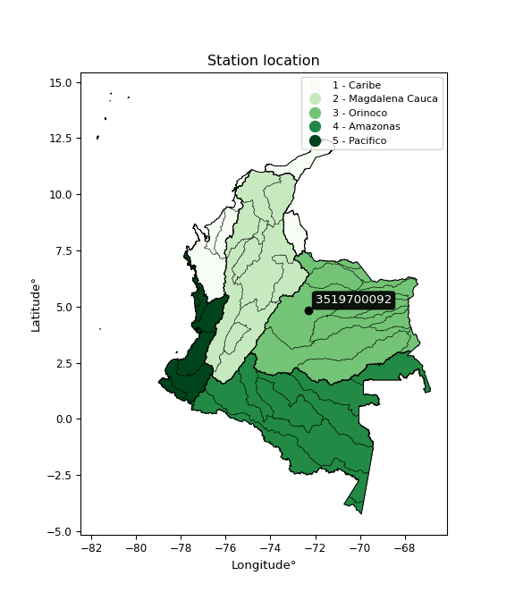

<div align="center">


</div>

# PMP Station (Rain, Pmax24h): 3519700092

Probable Maximum Precipitation (PMP) is the greatest amount of rainfall for a specific duration that is meteorologically possible for a given location, acting as a "worst-case" scenario for extreme storms, crucial for designing safety-critical infrastructure like bridges, river deviations, dams, spillways, and nuclear plants to prevent catastrophic failure. PMP is calculated by hydrologists using meteorological data to determine the upper limit of extreme rainfall, often leading to the Probable Maximum Flood (PMF) for flood control design, and is increasingly being studied for climate change impacts. Probable Maximum Precipitation (PMP) is the theoretical upper limit of rainfall, a deterministic estimate for extreme events, while probability distributions (like GEV, Gumbel) describe the likelihood and frequency of various precipitation amounts, including rare ones, showing how often events occur, with PMP representing the extreme end of these distributions, used for critical infrastructure design to ensure safety against the worst conceivable weather, unlike standard statistical forecasts which cover typical probabilities.

The most common probability distributions in hydrology, used for analyzing floods, rainfall, and streamflow, include the Normal, Log-Normal, Gumbel, Gamma (including Log-Pearson Type III), and Generalized Extreme Value (GEV) distributions, often chosen based on the data´s skewness and whether modeling extremes or general conditions, with Gumbel and GEV popular for extreme events like floods, while the Normal distribution serves as a baseline, though often requiring transformations for skewed hydrological data. These distributions help in designing water infrastructure, managing water resources, and forecasting hydrologic events.

> Hydrological data often isn´t perfectly normal (it´s skewed), so different distributions are needed for different applications, such as: **Flood Frequency Analysis**: Using Gumbel, GEV, or Log-Pearson Type III for predicting extreme flood magnitudes and their return periods, **Rainfall Analysis**: Normal for annual totals, but Log-Normal, Weibull, or GEV for intensity or extreme daily rainfall, **Streamflow Modeling**: Gamma and Log-Normal for maximum flows, GEV for minimum flows, and Kappa for daily flows.

<div align="center">

</img>

</div>


## A. General information


### 1. General running parameters

• app_version: _v20260113_. • runtime: _2026-01-17 18:24:04.630693_. • Python version: _3.14.0_. • SciPy version: _1.16.3_. • Pandas version: _2.3.3_. • NumPy version: _2.3.5_. • Stations dataset (station_dataset_file): _dataset/pmax24h_in/automatic_colombia_2003_2025.csv_. • Stations catalog (station_catalog_file): _dataset/CNE.xls_. • Minimum year to eval til year_max (date_min): _1900_. • Maximum year to eval since year_min (date_max): _2025_. • Creates, save and include plots into reports (create_plot): _False_. • Plot only fit distributions with Δo > Δ (plot_only_fit): _True_. • Plot only simple graphs avoiding multiple CDFs and multiple Extreme values plots (plot_only_simple): _True_. • Eval low extreme values, if False, evaluates high extreme values (low_extreme): _False_. • Eval every SciPy distribution as logarithmic (pdist_logarithmic_on): _True_. • Standard deviation normalized (ddof): _1.0_. • Return periods to eval in years (Tr): _[2, 2.33, 5, 10, 15, 20, 25, 50, 75, 100, 200, 250, 500, 750, 1000]_. • Minimum data sample per station, 0 means any (minimum_sample): _5_. • Z-Score maximum threshold to adjust a value, 0 means disable (zscore_max): _3.5_. • Z-Score minimum threshold to adjust a value, 0 means disable (zscore_min): _-2.5_. • Avoid zeros, e.g. rain = 0 (avoid_zeros): _True_. • Avoid null values (avoid_nans): _True_. 

:file_folder:Table: [dataset.csv](../../dataset/pmax24h_in/automatic_colombia_2003_2025.csv)

> Delta Degrees of Freedom (DDOF): is a parameter used in the formulas for calculating variance and standard deviation. When ddof=0, the divisor is $N$ (the total number of observations) and this is used when your data set is the entire population. When ddof=1, the divisor is $N-1$ and this is used when your data set is a sample drawn from a larger population. Using $N-1$ provides an unbiased estimate of the population variance (known as Bessel´s correction).


### 2. Station info and location

|   id |     CODIGO | NOMBRE                    | CATEGORIA    | TECNOLOGIA                | ESTADO           | FECHA_INSTALACION   |   FECHA_SUSPENSION |   ALTITUD |   LATITUD |   LONGITUD | DEPARTAMENTO   | MUNICIPIO   | AREA_OPERATIVA                              | ENTIDAD                                                     | AREA_HIDROGRAFICA   | ZONA_HIDROGRAFICA   | SUBZONA_HIDROGRAFICA   | CORRIENTE   | Catalogo   |   Version |
|-----:|-----------:|:--------------------------|:-------------|:--------------------------|:-----------------|:--------------------|-------------------:|----------:|----------:|-----------:|:---------------|:------------|:--------------------------------------------|:------------------------------------------------------------|:--------------------|:--------------------|:-----------------------|:------------|:-----------|----------:|
|    0 | 3519700092 | MANI - AUT   [3519700092] | Limnigráfica | Automática con Telemetría | En Mantenimiento | 12/03/2018          |                nan |       180 |   4.81642 |   -72.3087 | Casanare       | Mani        | Area Operativa 06 - Boyacá-Casanare-Vichada | INSTITUTO DE HIDROLOGIA METEOROLOGIA Y ESTUDIOS AMBIENTALES | Orinoco             | Meta                | Río Cusiana            | Cusiana     | CNE_IDEAM  |  20251226 |

<div align="center">

Dynamic map: [:earth_americas:Google](http://maps.google.com/maps?q=4.816419444,-72.30865) [:earth_americas:OSM](https://www.openstreetmap.org/#map=18/4.816419444/-72.30865&layers=P) [:earth_americas:Bing](https://www.bing.com/maps?cp=4.816419444~-72.30865&lvl=18) [:earth_americas:Apple](https://maps.apple.com/frame?center=4.816419444%2C-72.30865&span=0.003%2C0.006)

</div>


<div align="center">

```geojson
{
  "type": "Feature",
  "geometry": {
    "type": "Point", 
    "coordinates": [-72.30865, 4.816419444]
  }, 
  "properties": {
    "Name": "3519700092"
  }
}
```

</div>


### 3. Discrete values table and plot

<div align="center">

|               |          0 |           1 |           2 |         3 |           4 |           5 |           6 |
|:--------------|-----------:|------------:|------------:|----------:|------------:|------------:|------------:|
| Date          | 2019       | 2020        | 2021        | 2022      | 2023        | 2024        | 2025        |
| Value         | 1629.9     |  184.4      |   98.2      |   56.8    |   63.2      |   50.8      |   47.2      |
| Value_initial | 1629.9     |  184.4      |   98.2      |   56.8    |   63.2      |   50.8      |   47.2      |
| count         |    7       |    7        |    7        |    7      |    7        |    7        |    7        |
| mean          |  304.357   |  304.357    |  304.357    |  304.357  |  304.357    |  304.357    |  304.357    |
| std           |  586.489   |  586.489    |  586.489    |  586.489  |  586.489    |  586.489    |  586.489    |
| zscore        |    2.26013 |   -0.204534 |   -0.351511 |   -0.4221 |   -0.411188 |   -0.432331 |   -0.438469 |


</div>


> The initial value (value_initial) correspond to the initial obtained or null completed value, and value (value) is adjusted only when the initial value is outside the valid range (outlier) definite through the Z-Score value. If Z-Score is active, values out of range or outliers are replaced with the station mean value. A Z-Score (or standard score) measures how many standard deviations a data point is from the mean of a dataset, indicating its relative position; positive scores mean above the mean, negative mean below, and a score of zero is exactly at the mean, allowing for comparison of values from different distributions. It´s calculated using the formula $z=(x–μ)/σ$, where $x$ is the data point, $μ$ is the mean, and $σ$ is the standard deviation, helping identify outliers and understand probability.
>
> <sub>**Note**: In this study, "completing" (filling gaps in) and "extending" (forecasting or lengthening the historical record) rainfall data series are avoided for certain critical analyses because they introduce artificial bias and uncertainty, which can distort the statistics of rare events (extremes), alter day-to-day variability, and compromise the integrity and homogeneity of the original data. Some reasons against Completing/Extending rainfall data are: **Distortion of Extremes and Variability**: The primary issue is that most gap-filling or extension methods rely on averaging or regression with nearby stations, which inherently smooths the data. Rainfall is highly variable in space and time, with a large percentage of zero values and occasional large storms. Infilling methods often underestimate the highest values and overestimate the lowest (zero) values, which severely distorts analyses focused on flood frequency, drought severity, and intensity-duration-frequency (IDF) curves, **Loss of Data Homogeneity**: Infilled or extended data are synthetic estimates, not actual measurements. Combining these estimates with observed data can violate the assumption of data homogeneity, which requires that the data properties do not change over time. Inhomogeneity can lead to incorrect conclusions about long-term trends or changes in climate patterns, **Propagation of Errors**: Errors and biases from the original data (e.g., wind-induced undercatch, instrument errors, site changes) or the data used for imputation can propagate through the analysis, leading to unreliable hydrological models and inaccurate predictions, **Compromised Statistical Integrity**: For statistical analyses, especially those involving the frequency of events, using artificial data can introduce time bias or autocorrelation that doesn´t exist in reality, making it difficult to assess the true probability of events, **Difficulty in Validation**: It is difficult to accurately validate the quality of filled or extended data, especially for past periods where ground-truth measurements are unavailable. The reliability of imputation techniques heavily depends on the density of the surrounding station network and the complexity of the local topography.</sub>


### 4. Active continuous probability distributions from SciPy (80 of 104 available)

A Probability Density Function (PDF) describes the relative likelihood of a continuous random variable falling within a specific range, where the total area under its curve equals 1, and the area over any interval gives the actual probability for that range. Unlike discrete probabilities (like rolling a die), a PDF shows density, not direct probability for a single point (which is zero), with higher points indicating higher likelihood, often visualized as a bell curve for normal distributions.

A log of a probability density function (log-PDF) is simply the logarithm of the PDF´s value, denoted as $log(f(x))$, useful for converting multiplication of probabilities into addition, improving numerical stability with tiny numbers, and connecting to information theory concepts like entropy. Instead of dealing with very small probabilities (e.g., 0.000001), log-PDFs use negative numbers (e.g., $log(0.00001) ≈ -11.51$ that are easier for computers to handle, preventing underflow errors and simplifying complex calculations. In this study, each active probability distribution from SciPy is also evaluated in the $log$ form.

[scipy.stats](https://docs.scipy.org/doc/scipy/reference/stats.html) is a Python´s powerful submodule within the SciPy library for comprehensive statistical analysis, offering over 130 probability distributions (like Normal, Poisson), functions for descriptive stats (mean, variance), hypothesis testing (t-tests, chi-square), random variable generation, and statistical tests, making it essential for data science, modeling, and research. It provides tools to explore, model, and draw conclusions from data efficiently, working seamlessly with NumPy.

<div align="center">

|   id | p_dist           |   n_parameter | fit_method   | label                                                                       | active   | ref                                                                                                      |
|-----:|:-----------------|--------------:|:-------------|:----------------------------------------------------------------------------|:---------|:---------------------------------------------------------------------------------------------------------|
|    0 | alpha            |             3 | MLE          | Alpha                                                                       | True     | [:mortar_board:](https://docs.scipy.org/doc/scipy/reference/generated/scipy.stats.alpha.html)            |
|    1 | anglit           |             2 | MM           | Anglit                                                                      | True     | [:mortar_board:](https://docs.scipy.org/doc/scipy/reference/generated/scipy.stats.anglit.html)           |
|    2 | arcsine          |             2 | MM           | Arcsine                                                                     | True     | [:mortar_board:](https://docs.scipy.org/doc/scipy/reference/generated/scipy.stats.arcsine.html)          |
|    3 | argus            |             3 | MLE          | Argus                                                                       | True     | [:mortar_board:](https://docs.scipy.org/doc/scipy/reference/generated/scipy.stats.argus.html)            |
|    4 | beta             |             4 | MLE          | Beta                                                                        | True     | [:mortar_board:](https://docs.scipy.org/doc/scipy/reference/generated/scipy.stats.beta.html)             |
|    5 | betaprime        |             4 | MLE          | Beta prime                                                                  | True     | [:mortar_board:](https://docs.scipy.org/doc/scipy/reference/generated/scipy.stats.betaprime.html)        |
|    6 | bradford         |             3 | MLE          | Bradford                                                                    | True     | [:mortar_board:](https://docs.scipy.org/doc/scipy/reference/generated/scipy.stats.bradford.html)         |
|    7 | burr             |             4 | MLE          | Burr (Type III)                                                             | True     | [:mortar_board:](https://docs.scipy.org/doc/scipy/reference/generated/scipy.stats.burr.html)             |
|    8 | burr12           |             4 | MLE          | Burr (Type III) 12                                                          | True     | [:mortar_board:](https://docs.scipy.org/doc/scipy/reference/generated/scipy.stats.burr12.html)           |
|    9 | cosine           |             2 | MLE          | Cosine                                                                      | True     | [:mortar_board:](https://docs.scipy.org/doc/scipy/reference/generated/scipy.stats.cosine.html)           |
|   10 | crystalball      |             4 | MLE          | Crystalball                                                                 | True     | [:mortar_board:](https://docs.scipy.org/doc/scipy/reference/generated/scipy.stats.crystalball.html)      |
|   11 | dgamma           |             3 | MLE          | Double gamma                                                                | True     | [:mortar_board:](https://docs.scipy.org/doc/scipy/reference/generated/scipy.stats.dgamma.html)           |
|   12 | dweibull         |             3 | MLE          | Double Weibull                                                              | True     | [:mortar_board:](https://docs.scipy.org/doc/scipy/reference/generated/scipy.stats.dweibull.html)         |
|   13 | erlang           |             3 | MLE          | Erlang                                                                      | True     | [:mortar_board:](https://docs.scipy.org/doc/scipy/reference/generated/scipy.stats.erlang.html)           |
|   14 | exponnorm        |             3 | MLE          | Exponentially modified Normal                                               | True     | [:mortar_board:](https://docs.scipy.org/doc/scipy/reference/generated/scipy.stats.exponnorm.html)        |
|   15 | exponpow         |             3 | MLE          | Exponential power                                                           | True     | [:mortar_board:](https://docs.scipy.org/doc/scipy/reference/generated/scipy.stats.exponpow.html)         |
|   16 | exponweib        |             4 | MLE          | Exponentiated Weibull                                                       | True     | [:mortar_board:](https://docs.scipy.org/doc/scipy/reference/generated/scipy.stats.exponweib.html)        |
|   17 | f                |             4 | MLE          | F                                                                           | True     | [:mortar_board:](https://docs.scipy.org/doc/scipy/reference/generated/scipy.stats.f.html)                |
|   18 | fatiguelife      |             3 | MLE          | Fatigue-life (Birnbaum-Saunders)                                            | True     | [:mortar_board:](https://docs.scipy.org/doc/scipy/reference/generated/scipy.stats.fatiguelife.html)      |
|   19 | foldnorm         |             3 | MM           | Fold Normal                                                                 | True     | [:mortar_board:](https://docs.scipy.org/doc/scipy/reference/generated/scipy.stats.foldnorm.html)         |
|   20 | gamma            |             3 | MLE          | Gamma                                                                       | True     | [:mortar_board:](https://docs.scipy.org/doc/scipy/reference/generated/scipy.stats.gamma.html)            |
|   21 | gausshyper       |             6 | MLE          | Gauss hypergeometric                                                        | True     | [:mortar_board:](https://docs.scipy.org/doc/scipy/reference/generated/scipy.stats.gausshyper.html)       |
|   22 | genexpon         |             5 | MLE          | Generalized exponential                                                     | True     | [:mortar_board:](https://docs.scipy.org/doc/scipy/reference/generated/scipy.stats.genexpon.html)         |
|   23 | genextreme       |             3 | MLE          | Generalized exponential                                                     | True     | [:mortar_board:](https://docs.scipy.org/doc/scipy/reference/generated/scipy.stats.genextreme.html)       |
|   24 | gengamma         |             4 | MLE          | Generalized gamma                                                           | True     | [:mortar_board:](https://docs.scipy.org/doc/scipy/reference/generated/scipy.stats.gengamma.html)         |
|   25 | genhalflogistic  |             3 | MLE          | Generalized half-logistic                                                   | True     | [:mortar_board:](https://docs.scipy.org/doc/scipy/reference/generated/scipy.stats.genhalflogistic.html)  |
|   26 | genlogistic      |             3 | MLE          | Generalized logistic                                                        | True     | [:mortar_board:](https://docs.scipy.org/doc/scipy/reference/generated/scipy.stats.genlogistic.html)      |
|   27 | gennorm          |             3 | MLE          | Generalized Normal                                                          | True     | [:mortar_board:](https://docs.scipy.org/doc/scipy/reference/generated/scipy.stats.gennorm.html)          |
|   28 | genpareto        |             3 | MLE          | Generalized Pareto                                                          | True     | [:mortar_board:](https://docs.scipy.org/doc/scipy/reference/generated/scipy.stats.genpareto.html)        |
|   29 | gompertz         |             3 | MLE          | Gompertz (or truncated Gumbel)                                              | True     | [:mortar_board:](https://docs.scipy.org/doc/scipy/reference/generated/scipy.stats.gompertz.html)         |
|   30 | gumbel_l         |             2 | MM           | Gumbel Left Skew                                                            | True     | [:mortar_board:](https://docs.scipy.org/doc/scipy/reference/generated/scipy.stats.gumbel_l.html)         |
|   31 | gumbel_r         |             2 | MM           | Gumbel Right Skew                                                           | True     | [:mortar_board:](https://docs.scipy.org/doc/scipy/reference/generated/scipy.stats.gumbel_r.html)         |
|   32 | halfgennorm      |             3 | MLE          | Upper half of a generalized normal                                          | True     | [:mortar_board:](https://docs.scipy.org/doc/scipy/reference/generated/scipy.stats.halfgennorm.html)      |
|   33 | halflogistic     |             2 | MM           | Half-logistic                                                               | True     | [:mortar_board:](https://docs.scipy.org/doc/scipy/reference/generated/scipy.stats.halflogistic.html)     |
|   34 | halfnorm         |             2 | MM           | Half Normal                                                                 | True     | [:mortar_board:](https://docs.scipy.org/doc/scipy/reference/generated/scipy.stats.halfnorm.html)         |
|   35 | hypsecant        |             2 | MM           | hyperbolic secant                                                           | True     | [:mortar_board:](https://docs.scipy.org/doc/scipy/reference/generated/scipy.stats.hypsecant.html)        |
|   36 | invgamma         |             3 | MLE          | Inverted gamma                                                              | True     | [:mortar_board:](https://docs.scipy.org/doc/scipy/reference/generated/scipy.stats.invgamma.html)         |
|   37 | invgauss         |             3 | MLE          | Inverse Gaussian                                                            | True     | [:mortar_board:](https://docs.scipy.org/doc/scipy/reference/generated/scipy.stats.invgauss.html)         |
|   38 | invweibull       |             3 | MLE          | Inverted Weibull                                                            | True     | [:mortar_board:](https://docs.scipy.org/doc/scipy/reference/generated/scipy.stats.invweibull.html)       |
|   39 | johnsonsb        |             4 | MLE          | Johnson SB                                                                  | True     | [:mortar_board:](https://docs.scipy.org/doc/scipy/reference/generated/scipy.stats.johnsonsb.html)        |
|   40 | johnsonsu        |             4 | MLE          | Johnson Su                                                                  | True     | [:mortar_board:](https://docs.scipy.org/doc/scipy/reference/generated/scipy.stats.johnsonsu.html)        |
|   41 | kappa3           |             3 | MLE          | Kappa 3                                                                     | True     | [:mortar_board:](https://docs.scipy.org/doc/scipy/reference/generated/scipy.stats.kappa3.html)           |
|   42 | kappa4           |             4 | MLE          | Kappa 4                                                                     | True     | [:mortar_board:](https://docs.scipy.org/doc/scipy/reference/generated/scipy.stats.kappa4.html)           |
|   43 | ksone            |             3 | MLE          | Kolmogorov-Smirnov one-sided test statistic distribution                    | True     | [:mortar_board:](https://docs.scipy.org/doc/scipy/reference/generated/scipy.stats.ksone.html)            |
|   44 | kstwobign        |             2 | MLE          | Limiting distribution of scaled Kolmogorov-Smirnov two-sided test statistic | True     | [:mortar_board:](https://docs.scipy.org/doc/scipy/reference/generated/scipy.stats.kstwobign.html)        |
|   45 | laplace          |             2 | MM           | Laplace                                                                     | True     | [:mortar_board:](https://docs.scipy.org/doc/scipy/reference/generated/scipy.stats.laplace.html)          |
|   46 | levy_l           |             2 | MLE          | Left-skewed Levy                                                            | True     | [:mortar_board:](https://docs.scipy.org/doc/scipy/reference/generated/scipy.stats.levy_l.html)           |
|   47 | loggamma         |             3 | MLE          | Log gamma                                                                   | True     | [:mortar_board:](https://docs.scipy.org/doc/scipy/reference/generated/scipy.stats.loggamma.html)         |
|   48 | logistic         |             2 | MM           | Logistic (or Sech-squared)                                                  | True     | [:mortar_board:](https://docs.scipy.org/doc/scipy/reference/generated/scipy.stats.logistic.html)         |
|   49 | loglaplace       |             3 | MLE          | Log-Laplace                                                                 | True     | [:mortar_board:](https://docs.scipy.org/doc/scipy/reference/generated/scipy.stats.loglaplace.html)       |
|   50 | lomax            |             3 | MLE          | Lomax (Pareto of the second kind)                                           | True     | [:mortar_board:](https://docs.scipy.org/doc/scipy/reference/generated/scipy.stats.lomax.html)            |
|   51 | maxwell          |             2 | MM           | Maxwell                                                                     | True     | [:mortar_board:](https://docs.scipy.org/doc/scipy/reference/generated/scipy.stats.maxwell.html)          |
|   52 | mielke           |             4 | MLE          | Mielke Beta-Kappa / Dagum                                                   | True     | [:mortar_board:](https://docs.scipy.org/doc/scipy/reference/generated/scipy.stats.mielke.html)           |
|   53 | moyal            |             2 | MM           | Moyal                                                                       | True     | [:mortar_board:](https://docs.scipy.org/doc/scipy/reference/generated/scipy.stats.moyal.html)            |
|   54 | nakagami         |             3 | MLE          | Nakagami                                                                    | True     | [:mortar_board:](https://docs.scipy.org/doc/scipy/reference/generated/scipy.stats.nakagami.html)         |
|   55 | ncf              |             5 | MLE          | Non-central F distribution                                                  | True     | [:mortar_board:](https://docs.scipy.org/doc/scipy/reference/generated/scipy.stats.ncf.html)              |
|   56 | nct              |             4 | MLE          | Non-central Student’s t                                                     | True     | [:mortar_board:](https://docs.scipy.org/doc/scipy/reference/generated/scipy.stats.nct.html)              |
|   57 | norm             |             2 | MM           | Normal                                                                      | True     | [:mortar_board:](https://docs.scipy.org/doc/scipy/reference/generated/scipy.stats.norm.html)             |
|   58 | pearson3         |             3 | MM           | Pearson type III                                                            | True     | [:mortar_board:](https://docs.scipy.org/doc/scipy/reference/generated/scipy.stats.pearson3.html)         |
|   59 | powerlaw         |             3 | MLE          | Power-function                                                              | True     | [:mortar_board:](https://docs.scipy.org/doc/scipy/reference/generated/scipy.stats.powerlaw.html)         |
|   60 | rayleigh         |             2 | MM           | Rayleigh                                                                    | True     | [:mortar_board:](https://docs.scipy.org/doc/scipy/reference/generated/scipy.stats.rayleigh.html)         |
|   61 | rdist            |             3 | MLE          | R-distributed (symmetric beta)                                              | True     | [:mortar_board:](https://docs.scipy.org/doc/scipy/reference/generated/scipy.stats.rdist.html)            |
|   62 | rice             |             3 | MLE          | Rice                                                                        | True     | [:mortar_board:](https://docs.scipy.org/doc/scipy/reference/generated/scipy.stats.rice.html)             |
|   63 | semicircular     |             2 | MM           | Semicircular                                                                | True     | [:mortar_board:](https://docs.scipy.org/doc/scipy/reference/generated/scipy.stats.semicircular.html)     |
|   64 | skewnorm         |             3 | MLE          | Skew normal                                                                 | True     | [:mortar_board:](https://docs.scipy.org/doc/scipy/reference/generated/scipy.stats.skewnorm.html)         |
|   65 | t                |             3 | MLE          | Student’s t                                                                 | True     | [:mortar_board:](https://docs.scipy.org/doc/scipy/reference/generated/scipy.stats.t.html)                |
|   66 | trapezoid        |             4 | MLE          | Trapezoid                                                                   | True     | [:mortar_board:](https://docs.scipy.org/doc/scipy/reference/generated/scipy.stats.trapezoid.html)        |
|   67 | triang           |             3 | MLE          | Triangular                                                                  | True     | [:mortar_board:](https://docs.scipy.org/doc/scipy/reference/generated/scipy.stats.triang.html)           |
|   68 | truncexpon       |             3 | MLE          | Truncated exponential                                                       | True     | [:mortar_board:](https://docs.scipy.org/doc/scipy/reference/generated/scipy.stats.truncexpon.html)       |
|   69 | truncnorm        |             4 | MLE          | Truncated normal                                                            | True     | [:mortar_board:](https://docs.scipy.org/doc/scipy/reference/generated/scipy.stats.truncnorm.html)        |
|   70 | truncpareto      |             4 | MLE          | Upper truncated Pareto                                                      | True     | [:mortar_board:](https://docs.scipy.org/doc/scipy/reference/generated/scipy.stats.truncpareto.html)      |
|   71 | truncweibull_min |             5 | MLE          | Doubly truncated Weibull minimum                                            | True     | [:mortar_board:](https://docs.scipy.org/doc/scipy/reference/generated/scipy.stats.truncweibull_min.html) |
|   72 | tukeylambda      |             3 | MLE          | Tukey-Lamdba                                                                | True     | [:mortar_board:](https://docs.scipy.org/doc/scipy/reference/generated/scipy.stats.tukeylambda.html)      |
|   73 | uniform          |             2 | MLE          | Uniform                                                                     | True     | [:mortar_board:](https://docs.scipy.org/doc/scipy/reference/generated/scipy.stats.uniform.html)          |
|   74 | vonmises         |             3 | MLE          | Von Mises                                                                   | True     | [:mortar_board:](https://docs.scipy.org/doc/scipy/reference/generated/scipy.stats.vonmises.html)         |
|   75 | vonmises_line    |             3 | MLE          | Von Mises line                                                              | True     | [:mortar_board:](https://docs.scipy.org/doc/scipy/reference/generated/scipy.stats.vonmises_line.html)    |
|   76 | wald             |             2 | MM           | Wald                                                                        | True     | [:mortar_board:](https://docs.scipy.org/doc/scipy/reference/generated/scipy.stats.wald.html)             |
|   77 | weibull_max      |             3 | MLE          | Weibull maximum                                                             | True     | [:mortar_board:](https://docs.scipy.org/doc/scipy/reference/generated/scipy.stats.weibull_max.html)      |
|   78 | weibull_min      |             3 | MLE          | Weibull minimum                                                             | True     | [:mortar_board:](https://docs.scipy.org/doc/scipy/reference/generated/scipy.stats.weibull_min.html)      |
|   79 | wrapcauchy       |             3 | MLE          | Wrapped  Cauchy                                                             | True     | [:mortar_board:](https://docs.scipy.org/doc/scipy/reference/generated/scipy.stats.wrapcauchy.html)       |

</div>

> **n_parameter:** # arguments & localization & scale.
>
> **Fit methods:** (MLE) maximum likelihood, (MM) L-moments.
>
>**Inactive** (With the only purpose of prevent loops, zero divisions, infinite values, over high estimated values or horizontal trending for recurrence intervals estimations, the follow distributions were disabled.)**:** lognorm, norminvgauss, powernorm, powerlognorm, cauchy, halfcauchy, foldcauchy, skewcauchy, chi2, expon, fisk, genhyperbolic, geninvgauss, gibrat, kstwo, laplace_asymmetric, levy, levy_stable, ncx2, pareto, rel_breitwigner, recipinvgauss, studentized_range, loguniform, 


## B. Probability (PDF) vs. Empirical (EDF) distributions functions

A continuous probability distribution (CPD) describes probabilities for variables that can take any value within a range (like rain any time), unlike discrete variables with specific outcomes (like temperature). It uses a Probability Density Function (PDF), a curve where the total area under it equals 1, and the probability of the variable falling within an interval (a to b) is found by calculating the area under the curve between those points. A key feature is that the probability of hitting any single exact value is zero, so probabilities are always expressed for ranges, e.g., $P(a ≤ X ≤ b)$.

<div align="center">

Distributions parameters from station values
|     |    station | p_dist              |   n |               loc |           scale | shape                  | shape1                | shape2                 | shape3             |
|----:|-----------:|:--------------------|----:|------------------:|----------------:|:-----------------------|:----------------------|:-----------------------|:-------------------|
|   0 | 3519700092 | alpha               |   7 |      37.7973      |    17.8926      | 1.2651958879698927e-07 |                       |                        |                    |
|   1 | 3519700092 | anglit              |   7 |     304.357       |  1588.44        |                        |                       |                        |                    |
|   2 | 3519700092 | arcsine             |   7 |    -463.537       |  1535.79        |                        |                       |                        |                    |
|   3 | 3519700092 | argus               |   7 |    -998.995       |  2729.08        | 1.4917144337054224e-07 |                       |                        |                    |
|   4 | 3519700092 | beta                |   7 |    -111.525       |  1741.42        | 0.0058847573146567755  | 0.0341288608930282    |                        |                    |
|   5 | 3519700092 | betaprime           |   7 |      -0.310317    |     0.922962    | 120.64729448734295     | 1.4301588058217218    |                        |                    |
|   6 | 3519700092 | bradford            |   7 |      47.2         |  1650.42        | 2.8039053483885055     |                       |                        |                    |
|   7 | 3519700092 | burr                |   7 |      20.5712      |     0.0224734   | 1.0756105951887585     | 3510.86967252089      |                        |                    |
|   8 | 3519700092 | burr12              |   7 |      -0.369539    |    46.8128      | 199.91940386849188     | 0.005576421200343572  |                        |                    |
|   9 | 3519700092 | cosine              |   7 |     452.796       |   507.857       |                        |                       |                        |                    |
|  10 | 3519700092 | crystalball         |   7 |      -0.373797    |   622.563       | 4.731165057859162      | 2.2765498363459913    |                        |                    |
|  11 | 3519700092 | dgamma              |   7 |      56.8         |   425.017       | 0.3425200818745653     |                       |                        |                    |
|  12 | 3519700092 | dweibull            |   7 |      50.8         |   508.18        | 0.6006381412799973     |                       |                        |                    |
|  13 | 3519700092 | erlang              |   7 |      47.2         |  1130.64        | 0.22221836277897133    |                       |                        |                    |
|  14 | 3519700092 | exponnorm           |   7 |      46.9108      |     0.0904949   | 2822.9144780754286     |                       |                        |                    |
|  15 | 3519700092 | exponpow            |   7 |      47.2         |   781.837       | 0.3688023969295994     |                       |                        |                    |
|  16 | 3519700092 | exponweib           |   7 |      47.2         |    50.8296      | 1.6183141298422554     | 0.3407457170221967    |                        |                    |
|  17 | 3519700092 | f                   |   7 |      45.7743      |     6.55806     | 296.84872182237604     | 0.8770872791924033    |                        |                    |
|  18 | 3519700092 | fatiguelife         |   7 |      46.6895      |    29.78        | 4.100590666345319      |                       |                        |                    |
|  19 | 3519700092 | foldnorm            |   7 |    -467.902       |   972.427       | 0.000786692653680516   |                       |                        |                    |
|  20 | 3519700092 | gamma               |   7 |      47.2         |   494.913       | 0.5394199343651798     |                       |                        |                    |
|  21 | 3519700092 | gausshyper          |   7 |      47.2         |  2310.18        | 0.30880486645181604    | 1.27829734766711      | 1.0883869731148155     | 1.7474579207878649 |
|  22 | 3519700092 | genexpon            |   7 |      47.2         |   456.546       | 1.7753571919229432     | 6.090827083007056e-14 | 1.853317470922019      |                    |
|  23 | 3519700092 | genextreme          |   7 |      47.6871      |     3.02664     | -6.213908554450221     |                       |                        |                    |
|  24 | 3519700092 | gengamma            |   7 |      47.2         |     3.3218      | 2.0221640316275717     | 0.27160400924022243   |                        |                    |
|  25 | 3519700092 | genhalflogistic     |   7 |    -114.44        |  1847.03        | 1.0588729318004964     |                       |                        |                    |
|  26 | 3519700092 | genlogistic         |   7 |   -1698.25        |   229.099       | 2723.00710362688       |                       |                        |                    |
|  27 | 3519700092 | gennorm             |   7 |      56.8         |     0.0884494   | 0.24305652000083142    |                       |                        |                    |
|  28 | 3519700092 | genpareto           |   7 |      47.2         |     7.62802     | 2.725223395198583      |                       |                        |                    |
|  29 | 3519700092 | gompertz            |   7 |      47.2         |     1.26154e+11 | 509272935.88490283     |                       |                        |                    |
|  30 | 3519700092 | gumbel_l            |   7 |     548.729       |   423.362       |                        |                       |                        |                    |
|  31 | 3519700092 | gumbel_r            |   7 |      59.9857      |   423.362       |                        |                       |                        |                    |
|  32 | 3519700092 | halfgennorm         |   7 |      47.2         |     0.235391    | 0.2676045882058341     |                       |                        |                    |
|  33 | 3519700092 | halflogistic        |   7 |    -339.204       |   464.231       |                        |                       |                        |                    |
|  34 | 3519700092 | halfnorm            |   7 |    -414.34        |   900.753       |                        |                       |                        |                    |
|  35 | 3519700092 | hypsecant           |   7 |     304.357       |   345.674       |                        |                       |                        |                    |
|  36 | 3519700092 | invgamma            |   7 |      45.7641      |     2.86958     | 0.43858660579528874    |                       |                        |                    |
|  37 | 3519700092 | invgauss            |   7 |      45.2837      |     8.27947     | 31.291030077498753     |                       |                        |                    |
|  38 | 3519700092 | invweibull          |   7 |      47.2         |     3.24943     | 0.047318670552293864   |                       |                        |                    |
|  39 | 3519700092 | johnsonsb           |   7 |      47.2         |  5336.28        | 1.9483841653361962     | 0.16312715720187423   |                        |                    |
|  40 | 3519700092 | johnsonsu           |   7 |      47.2         |     5.27368e-08 | -2.406352282929385     | 0.16389085636493528   |                        |                    |
|  41 | 3519700092 | kappa3              |   7 |      47.2         |   180.172       | 0.18096905501731583    |                       |                        |                    |
|  42 | 3519700092 | kappa4              |   7 |    -109.611       |  1758.72        | 1.0977621728160152     | 0.9739838238507702    |                        |                    |
|  43 | 3519700092 | ksone               |   7 |    -111.07        |  1899.24        | 1.0                    |                       |                        |                    |
|  44 | 3519700092 | kstwobign           |   7 |    -921.877       |  1454.86        |                        |                       |                        |                    |
|  45 | 3519700092 | laplace             |   7 |     304.357       |   383.947       |                        |                       |                        |                    |
|  46 | 3519700092 | levy_l              |   7 |    1791.49        |   721.346       |                        |                       |                        |                    |
|  47 | 3519700092 | loggamma            |   7 | -217449           | 27938           | 2426.744597017376      |                       |                        |                    |
|  48 | 3519700092 | logistic            |   7 |     304.357       |   299.362       |                        |                       |                        |                    |
|  49 | 3519700092 | loglaplace          |   7 |      -0.180223    |    63.3802      | 1.3031725854980274     |                       |                        |                    |
|  50 | 3519700092 | lomax               |   7 |      47.0996      |     7.64272     | 0.5704790357659193     |                       |                        |                    |
|  51 | 3519700092 | maxwell             |   7 |    -982.285       |   806.284       |                        |                       |                        |                    |
|  52 | 3519700092 | mielke              |   7 |      35.9352      |     0.999725    | 42.12622095862787      | 1.1684163913534975    |                        |                    |
|  53 | 3519700092 | moyal               |   7 |      -6.15561     |   244.428       |                        |                       |                        |                    |
|  54 | 3519700092 | nakagami            |   7 |      47.2         |   993.402       | 0.11213185890766184    |                       |                        |                    |
|  55 | 3519700092 | ncf                 |   7 |      -0.170282    |    78.04        | 203.49502155568842     | 2.8496103784329714    | 2.6965832019735898e-08 |                    |
|  56 | 3519700092 | nct                 |   7 |      -0.0710364   |     1.24022     | 1.1778725169085242     | 54.735663044478784    |                        |                    |
|  57 | 3519700092 | norm                |   7 |     304.357       |   542.983       |                        |                       |                        |                    |
|  58 | 3519700092 | pearson3            |   7 |     304.357       |   542.983       | 2.0132389050314883     |                       |                        |                    |
|  59 | 3519700092 | powerlaw            |   7 |      47.2         |  1582.7         | 0.11361664369321567    |                       |                        |                    |
|  60 | 3519700092 | rayleigh            |   7 |    -734.402       |   828.81        |                        |                       |                        |                    |
|  61 | 3519700092 | rdist               |   7 |    -126.841       |   311.241       | 1.390481448585029      |                       |                        |                    |
|  62 | 3519700092 | rice                |   7 |    -426.688       |   643.917       | 0.00041892158505195864 |                       |                        |                    |
|  63 | 3519700092 | semicircular        |   7 |     304.357       |  1085.97        |                        |                       |                        |                    |
|  64 | 3519700092 | skewnorm            |   7 |      47.1997      |   600.801       | 12047105.3671479       |                       |                        |                    |
|  65 | 3519700092 | t                   |   7 |      54.7841      |     8.07831     | 0.4521025623738446     |                       |                        |                    |
|  66 | 3519700092 | trapezoid           |   7 |    -116.624       |  1899.24        | 1.0                    | 1.0                   |                        |                    |
|  67 | 3519700092 | triang              |   7 |      45.0086      |  1836.71        | 0.00046461926191376356 |                       |                        |                    |
|  68 | 3519700092 | truncexpon          |   7 |     -73.8352      |  1181.26        | 1.442302347374925      |                       |                        |                    |
|  69 | 3519700092 | truncnorm           |   7 |      -1.21133e+06 | 25665.5         | 47.1987582452754       | 47.262032717503644    |                        |                    |
|  70 | 3519700092 | truncpareto         |   7 |      42.5274      |     4.67263     | 0.469987000507473      | 339.7172279079944     |                        |                    |
|  71 | 3519700092 | truncweibull_min    |   7 |      39.7967      |  1299.32        | 0.015043159682866037   | 0.005697791146891572  | 1.2237945774158483     |                    |
|  72 | 3519700092 | tukeylambda         |   7 |      99.3708      |   272.724       | 3.2074207254130016     |                       |                        |                    |
|  73 | 3519700092 | uniform             |   7 |      47.2         |  1582.7         |                        |                       |                        |                    |
|  74 | 3519700092 | vonmises            |   7 |       1.76708     |     1           | 0.5069006319741955     |                       |                        |                    |
|  75 | 3519700092 | vonmises_line       |   7 |     164.965       |   466.303       | 1.9934353888293472     |                       |                        |                    |
|  76 | 3519700092 | wald                |   7 |    -238.626       |   542.983       |                        |                       |                        |                    |
|  77 | 3519700092 | weibull_max         |   7 |    1629.9         |     1.73004     | 0.11408216400052021    |                       |                        |                    |
|  78 | 3519700092 | weibull_min         |   7 |      47.2         |   332.946       | 0.2512137569470668     |                       |                        |                    |
|  79 | 3519700092 | wrapcauchy          |   7 |      47.2         |   251.895       | 0.9678705138469572     |                       |                        |                    |
|  80 | 3519700092 | logalpha            |   7 |       3.70202     |     0.299062    | 2.555626075752153e-06  |                       |                        |                    |
|  81 | 3519700092 | loganglit           |   7 |       4.73836     |     3.42476     |                        |                       |                        |                    |
|  82 | 3519700092 | logarcsine          |   7 |       3.08276     |     3.31121     |                        |                       |                        |                    |
|  83 | 3519700092 | logargus            |   7 |       1.99573     |     5.60987     | 4.6360635443743506e-05 |                       |                        |                    |
|  84 | 3519700092 | logbeta             |   7 |       3.85439     |     3.84632     | 0.13825084881477967    | 0.5441093394746079    |                        |                    |
|  85 | 3519700092 | logbetaprime        |   7 |       3.7927      |     0.240485    | 2.5986962932951565     | 1.8871921955245452    |                        |                    |
|  86 | 3519700092 | logbradford         |   7 |       3.85232     |     3.54408     | 103.92183296149165     |                       |                        |                    |
|  87 | 3519700092 | logburr             |   7 |       0.126658    |     1.29929     | 7.1969827647423195     | 3828.8616650335316    |                        |                    |
|  88 | 3519700092 | logburr12           |   7 |       0.662385    |     3.1808      | 946.3508835446687      | 0.004931118074042368  |                        |                    |
|  89 | 3519700092 | logcosine           |   7 |       4.99606     |     1.05555     |                        |                       |                        |                    |
|  90 | 3519700092 | logcrystalball      |   7 |       4.73836     |     1.1707      | 458.40506545435994     | 192.15956341254417    |                        |                    |
|  91 | 3519700092 | logdgamma           |   7 |       4.03954     |     0.946698    | 0.6590093107621127     |                       |                        |                    |
|  92 | 3519700092 | logdweibull         |   7 |       4.03954     |     0.844828    | 0.7616233839982478     |                       |                        |                    |
|  93 | 3519700092 | logerlang           |   7 |       3.85439     |     0.975397    | 0.5051306988259178     |                       |                        |                    |
|  94 | 3519700092 | logexponnorm        |   7 |       3.85324     |     0.000343522 | 2542.6868347528416     |                       |                        |                    |
|  95 | 3519700092 | logexponpow         |   7 |       3.85439     |     1.53443     | 0.6266560853354537     |                       |                        |                    |
|  96 | 3519700092 | logexponweib        |   7 |       3.85439     |     0.981362    | 0.9482118115644923     | 0.7747362753454922    |                        |                    |
|  97 | 3519700092 | logf                |   7 |       3.85439     |     0.818964    | 1.1471112082201007     | 4.448047536702623     |                        |                    |
|  98 | 3519700092 | logfatiguelife      |   7 |       3.85439     |     8.07822e-06 | 366.91167312443304     |                       |                        |                    |
|  99 | 3519700092 | logfoldnorm         |   7 |       3.14299     |     1.96364     | 0.1738752360708452     |                       |                        |                    |
| 100 | 3519700092 | loggamma            |   7 |       3.85439     |     0.987462    | 0.35736982870126105    |                       |                        |                    |
| 101 | 3519700092 | loggausshyper       |   7 |       3.85439     |     3.8825      | 0.24106601160700086    | 0.6947729066305615    | 1.4380868124789619     | 1.068548930619941  |
| 102 | 3519700092 | loggenexpon         |   7 |       3.85439     |     2.5061      | 2.835064325368058      | 0.7187696533462945    | 2.2687594029921453e-09 |                    |
| 103 | 3519700092 | loggenextreme       |   7 |       4.01354     |     0.256612    | -1.2324909305486682    |                       |                        |                    |
| 104 | 3519700092 | loggengamma         |   7 |       3.85439     |     0.812206    | 0.7040609238065252     | 0.9905856366031595    |                        |                    |
| 105 | 3519700092 | loggenhalflogistic  |   7 |       3.85439     |     0.714801    | 1.5810663719636356e-06 |                       |                        |                    |
| 106 | 3519700092 | loggenlogistic      |   7 |      -0.722105    |     0.66224     | 1867.9107471730786     |                       |                        |                    |
| 107 | 3519700092 | loggennorm          |   7 |       4.1463      |     0.00407019  | 0.2927198471886129     |                       |                        |                    |
| 108 | 3519700092 | loggenpareto        |   7 |      -0.0189292   |    13.8168      | -1.8633013898123552    |                       |                        |                    |
| 109 | 3519700092 | loggompertz         |   7 |       3.85439     |     1.8596e+10  | 18468385425.329315     |                       |                        |                    |
| 110 | 3519700092 | loggumbel_l         |   7 |       5.26524     |     0.91279     |                        |                       |                        |                    |
| 111 | 3519700092 | loggumbel_r         |   7 |       4.21148     |     0.91279     |                        |                       |                        |                    |
| 112 | 3519700092 | loghalfgennorm      |   7 |       3.85439     |     0.0136258   | 0.33009158089174645    |                       |                        |                    |
| 113 | 3519700092 | loghalflogistic     |   7 |       3.35081     |     1.00091     |                        |                       |                        |                    |
| 114 | 3519700092 | loghalfnorm         |   7 |       3.18881     |     1.94207     |                        |                       |                        |                    |
| 115 | 3519700092 | loghypsecant        |   7 |       4.73836     |     0.74529     |                        |                       |                        |                    |
| 116 | 3519700092 | loginvgamma         |   7 |       3.78413     |     0.205053    | 0.8812847488544533     |                       |                        |                    |
| 117 | 3519700092 | loginvgauss         |   7 |       3.80335     |     0.236924    | 3.946450583345044      |                       |                        |                    |
| 118 | 3519700092 | loginvweibull       |   7 |       3.80534     |     0.2082      | 0.811335048498488      |                       |                        |                    |
| 119 | 3519700092 | logjohnsonsb        |   7 |       3.85439     |    13.5763      | 0.8789293214931337     | 0.08557445717560992   |                        |                    |
| 120 | 3519700092 | logjohnsonsu        |   7 |       3.85439     |     3.61332e-11 | -2.3103328458004544    | 0.14004072251212113   |                        |                    |
| 121 | 3519700092 | logkappa3           |   7 |       3.85439     |     0.0799566   | 0.25504854172766755    |                       |                        |                    |
| 122 | 3519700092 | logkappa4           |   7 |       3.41419     |     4.31436     | 1.1140769199061575     | 1.067211431514976     |                        |                    |
| 123 | 3519700092 | logksone            |   7 |       3.50021     |     4.25026     | 1.0                    |                       |                        |                    |
| 124 | 3519700092 | logkstwobign        |   7 |       1.72737     |     3.51125     |                        |                       |                        |                    |
| 125 | 3519700092 | loglaplace          |   7 |       4.73836     |     0.827809    |                        |                       |                        |                    |
| 126 | 3519700092 | loglevy_l           |   7 |       7.7132      |     1.41369     |                        |                       |                        |                    |
| 127 | 3519700092 | logloggamma         |   7 |    -394.684       |    52.78        | 1935.2947411995974     |                       |                        |                    |
| 128 | 3519700092 | loglogistic         |   7 |       4.73836     |     0.64544     |                        |                       |                        |                    |
| 129 | 3519700092 | logloglaplace       |   7 |      -0.00015488  |     4.14646     | 6.5680230324591005     |                       |                        |                    |
| 130 | 3519700092 | loglomax            |   7 |       3.85439     |     6.90858     | 9.402956965928368      |                       |                        |                    |
| 131 | 3519700092 | logmaxwell          |   7 |       1.9643      |     1.73839     |                        |                       |                        |                    |
| 132 | 3519700092 | logmielke           |   7 |       3.83118     |     0.0278687   | 3.286097355011817      | 0.7628296976748938    |                        |                    |
| 133 | 3519700092 | logmoyal            |   7 |       4.06888     |     0.526999    |                        |                       |                        |                    |
| 134 | 3519700092 | lognakagami         |   7 |       3.85439     |     1.79607     | 0.2613734231445606     |                       |                        |                    |
| 135 | 3519700092 | logncf              |   7 |       1.11572     |     0.067256    | 13.019601333945253     | 35.75964303654421     | 642.6427577924906      |                    |
| 136 | 3519700092 | lognct              |   7 |       3.58142     |     0.00677029  | 1.3330362210751396     | 72.29417096587802     |                        |                    |
| 137 | 3519700092 | lognorm             |   7 |       4.73836     |     1.1707      |                        |                       |                        |                    |
| 138 | 3519700092 | logpearson3         |   7 |       4.73357     |     1.2002      | 1.011781740295906      |                       |                        |                    |
| 139 | 3519700092 | logpowerlaw         |   7 |       3.85439     |     3.54188     | 0.14442373497025482    |                       |                        |                    |
| 140 | 3519700092 | lograyleigh         |   7 |       2.49875     |     1.78695     |                        |                       |                        |                    |
| 141 | 3519700092 | logrdist            |   7 |       4.53572     |     0.68139     | 1.538237196513438      |                       |                        |                    |
| 142 | 3519700092 | logrice             |   7 |       3.0386      |     1.45941     | 0.00035800974235554944 |                       |                        |                    |
| 143 | 3519700092 | logsemicircular     |   7 |       4.73836     |     2.34142     |                        |                       |                        |                    |
| 144 | 3519700092 | logskewnorm         |   7 |       3.85439     |     1.46704     | 9113497.132953547      |                       |                        |                    |
| 145 | 3519700092 | logt                |   7 |       4.19955     |     0.888324    | 2.5074736940207214     |                       |                        |                    |
| 146 | 3519700092 | logtrapezoid        |   7 |       3.50021     |     4.25026     | 1.0                    | 1.0                   |                        |                    |
| 147 | 3519700092 | logtriang           |   7 |       3.85413     |     4.11031     | 1.1274926096610616e-09 |                       |                        |                    |
| 148 | 3519700092 | logtruncexpon       |   7 |       3.85439     |     3.6076      | 0.9817948486534165     |                       |                        |                    |
| 149 | 3519700092 | logtruncnorm        |   7 |     -13.9405      |     4.22438     | 4.212419010096996      | 8.462435574096808     |                        |                    |
| 150 | 3519700092 | logtruncpareto      |   7 |       3.4308      |     0.423599    | 0.754017760659729      | 9.361403656859647     |                        |                    |
| 151 | 3519700092 | logtruncweibull_min |   7 |       3.85439     |     2.78494     | 0.17652559673359652    | 4.723716838281673e-16 | 1.2994995234939233     |                    |
| 152 | 3519700092 | logtukeylambda      |   7 |       4.54154     |     1.01095     | 1.4712218508537689     |                       |                        |                    |
| 153 | 3519700092 | loguniform          |   7 |       3.85439     |     3.54188     |                        |                       |                        |                    |
| 154 | 3519700092 | logvonmises         |   7 |      -2.00223     |     1           | 1.6114022628628963     |                       |                        |                    |
| 155 | 3519700092 | logvonmises_line    |   7 |       4.53316     |     0.911358    | 1.0615032883283742     |                       |                        |                    |
| 156 | 3519700092 | logwald             |   7 |       3.56766     |     1.1707      |                        |                       |                        |                    |
| 157 | 3519700092 | logweibull_max      |   7 |       7.39627     |     1.32355     | 0.7879591115894242     |                       |                        |                    |
| 158 | 3519700092 | logweibull_min      |   7 |       3.85439     |     1.24046     | 0.5400885469913246     |                       |                        |                    |
| 159 | 3519700092 | logwrapcauchy       |   7 |       3.85439     |     0.565189    | 0.7575177013722492     |                       |                        |                    |

</div>

> **loc** (Location parameter): This shifts the distribution along the x-axis. For many common distributions, like the normal (Gaussian) distribution, loc represents the mean $μ$. For others, like the uniform distribution, it might represent the minimum value, or for the beta distribution, the left end of the support interval.
>
> **scale** (Scale parameter): This determines the width or spread of the distribution. For the normal distribution, scale represents the standard deviation $σ$. For a uniform distribution, it defines the length of the interval (from $loc$ to $loc + scale$).
>
> **shape** (Shape parameters): Refers to parameters that define the specific form of a probability distribution, distinct from its location (loc) and scale (scale). These parameters are required arguments for most distribution functions. For example, a normal (Gaussian) distribution is fully defined by its location (mean) and scale (standard deviation), so it has no specific shape parameters beyond loc and scale. However, other distributions have intrinsic properties that need specification, as Gamma distribution that takes a shape parameter, often named $a$ or $alpha$.


### 0. Cumulative distribution values - CDF (160 evaluated)

Cumulative Distribution Function (CDF), denoted as $F$<sub>$X$</sub>$(x)$, is a function that gives the probability that a random variable $X$ will take a value less than or equal to a specific value, $x$ (i.e., $(P(X≥x)$. It essentially "accumulates" probabilities from a given point up to the far right (positive infinity), providing a complete picture of the distribution´s probabilities for both discrete (like rain) and continuous (like temperature) variables, helping to find probabilities over ranges or above certain values. Each station is evaluated separately ordering the $x$ values ascending, calculating the CDF and PDF values for the activated distributions and their logarithmic forms.

<div align="center">

CDF ordered by x ascending and calculating $log(f(x))$ separately
|   id |    Station |   date |      x |   count |    mean |     std |    zscore |   Value_initial |    station |   m |    alpha |   alpha_pdf |   anglit |   anglit_pdf |   arcsine |   arcsine_pdf |    argus |   argus_pdf |     beta |    beta_pdf |   betaprime |   betaprime_pdf |   bradford |   bradford_pdf |     burr |    burr_pdf |    burr12 |   burr12_pdf |   cosine |   cosine_pdf |   crystalball |   crystalball_pdf |   dgamma |   dgamma_pdf |   dweibull |   dweibull_pdf |      erlang |   erlang_pdf |   exponnorm |   exponnorm_pdf |    exponpow |   exponpow_pdf |   exponweib |   exponweib_pdf |         f |       f_pdf |   fatiguelife |   fatiguelife_pdf |   foldnorm |   foldnorm_pdf |       gamma |       gamma_pdf |   gausshyper |   gausshyper_pdf |    genexpon |   genexpon_pdf |   genextreme |   genextreme_pdf |    gengamma |     gengamma_pdf |   genhalflogistic |   genhalflogistic_pdf |   genlogistic |   genlogistic_pdf |   gennorm |   gennorm_pdf |   genpareto |   genpareto_pdf |    gompertz |   gompertz_pdf |   gumbel_l |   gumbel_l_pdf |   gumbel_r |   gumbel_r_pdf |   halfgennorm |   halfgennorm_pdf |   halflogistic |   halflogistic_pdf |   halfnorm |   halfnorm_pdf |   hypsecant |   hypsecant_pdf |   invgamma |   invgamma_pdf |   invgauss |   invgauss_pdf |   invweibull |   invweibull_pdf |   johnsonsb |   johnsonsb_pdf |   johnsonsu |   johnsonsu_pdf |      kappa3 |   kappa3_pdf |     kappa4 |   kappa4_pdf |     ksone |   ksone_pdf |   kstwobign |   kstwobign_pdf |   laplace |   laplace_pdf |   levy_l |   levy_l_pdf |    loggamma |   loggamma_pdf |   logistic |   logistic_pdf |   loglaplace |   loglaplace_pdf |     lomax |   lomax_pdf |   maxwell |   maxwell_pdf |   mielke |   mielke_pdf |    moyal |   moyal_pdf |    nakagami |   nakagami_pdf |      ncf |     ncf_pdf |      nct |     nct_pdf |     norm |    norm_pdf |   pearson3 |   pearson3_pdf |   powerlaw |   powerlaw_pdf |   rayleigh |   rayleigh_pdf |    rdist |   rdist_pdf |     rice |    rice_pdf |   semicircular |   semicircular_pdf |   skewnorm |   skewnorm_pdf |        t |       t_pdf |   trapezoid |   trapezoid_pdf |     triang |   triang_pdf |   truncexpon |   truncexpon_pdf |   truncnorm |   truncnorm_pdf |   truncpareto |   truncpareto_pdf |   truncweibull_min |   truncweibull_min_pdf |   tukeylambda |   tukeylambda_pdf |    uniform |   uniform_pdf |   vonmises |   vonmises_pdf |   vonmises_line |   vonmises_line_pdf |     wald |    wald_pdf |   weibull_max |   weibull_max_pdf |   weibull_min |   weibull_min_pdf |   wrapcauchy |   wrapcauchy_pdf |   logalpha |   logalpha_pdf |   loganglit |   loganglit_pdf |   logarcsine |   logarcsine_pdf |   logargus |   logargus_pdf |    logbeta |   logbeta_pdf |   logbetaprime |   logbetaprime_pdf |   logbradford |   logbradford_pdf |   logburr |   logburr_pdf |   logburr12 |   logburr12_pdf |   logcosine |   logcosine_pdf |   logcrystalball |   logcrystalball_pdf |   logdgamma |   logdgamma_pdf |   logdweibull |   logdweibull_pdf |   logerlang |   logerlang_pdf |   logexponnorm |   logexponnorm_pdf |   logexponpow |   logexponpow_pdf |   logexponweib |   logexponweib_pdf |        logf |    logf_pdf |   logfatiguelife |   logfatiguelife_pdf |   logfoldnorm |   logfoldnorm_pdf |   loggausshyper |   loggausshyper_pdf |   loggenexpon |   loggenexpon_pdf |   loggenextreme |   loggenextreme_pdf |   loggengamma |   loggengamma_pdf |   loggenhalflogistic |   loggenhalflogistic_pdf |   loggenlogistic |   loggenlogistic_pdf |   loggennorm |   loggennorm_pdf |   loggenpareto |   loggenpareto_pdf |   loggompertz |   loggompertz_pdf |   loggumbel_l |   loggumbel_l_pdf |   loggumbel_r |   loggumbel_r_pdf |   loghalfgennorm |   loghalfgennorm_pdf |   loghalflogistic |   loghalflogistic_pdf |   loghalfnorm |   loghalfnorm_pdf |   loghypsecant |   loghypsecant_pdf |   loginvgamma |   loginvgamma_pdf |   loginvgauss |   loginvgauss_pdf |   loginvweibull |   loginvweibull_pdf |   logjohnsonsb |   logjohnsonsb_pdf |   logjohnsonsu |   logjohnsonsu_pdf |   logkappa3 |   logkappa3_pdf |   logkappa4 |   logkappa4_pdf |   logksone |   logksone_pdf |   logkstwobign |   logkstwobign_pdf |   loglevy_l |   loglevy_l_pdf |   logloggamma |   logloggamma_pdf |   loglogistic |   loglogistic_pdf |   logloglaplace |   logloglaplace_pdf |    loglomax |   loglomax_pdf |   logmaxwell |   logmaxwell_pdf |   logmielke |   logmielke_pdf |   logmoyal |   logmoyal_pdf |   lognakagami |   lognakagami_pdf |   logncf |   logncf_pdf |    lognct |   lognct_pdf |   lognorm |   lognorm_pdf |   logpearson3 |   logpearson3_pdf |   logpowerlaw |   logpowerlaw_pdf |   lograyleigh |   lograyleigh_pdf |    logrdist |   logrdist_pdf |   logrice |   logrice_pdf |   logsemicircular |   logsemicircular_pdf |   logskewnorm |   logskewnorm_pdf |     logt |   logt_pdf |   logtrapezoid |   logtrapezoid_pdf |   logtriang |   logtriang_pdf |   logtruncexpon |   logtruncexpon_pdf |   logtruncnorm |   logtruncnorm_pdf |   logtruncpareto |   logtruncpareto_pdf |   logtruncweibull_min |   logtruncweibull_min_pdf |   logtukeylambda |   logtukeylambda_pdf |   loguniform |   loguniform_pdf |   logvonmises |   logvonmises_pdf |   logvonmises_line |   logvonmises_line_pdf |   logwald |   logwald_pdf |   logweibull_max |   logweibull_max_pdf |   logweibull_min |   logweibull_min_pdf |   logwrapcauchy |   logwrapcauchy_pdf |
|-----:|-----------:|-------:|-------:|--------:|--------:|--------:|----------:|----------------:|-----------:|----:|---------:|------------:|---------:|-------------:|----------:|--------------:|---------:|------------:|---------:|------------:|------------:|----------------:|-----------:|---------------:|---------:|------------:|----------:|-------------:|---------:|-------------:|--------------:|------------------:|---------:|-------------:|-----------:|---------------:|------------:|-------------:|------------:|----------------:|------------:|---------------:|------------:|----------------:|----------:|------------:|--------------:|------------------:|-----------:|---------------:|------------:|----------------:|-------------:|-----------------:|------------:|---------------:|-------------:|-----------------:|------------:|-----------------:|------------------:|----------------------:|--------------:|------------------:|----------:|--------------:|------------:|----------------:|------------:|---------------:|-----------:|---------------:|-----------:|---------------:|--------------:|------------------:|---------------:|-------------------:|-----------:|---------------:|------------:|----------------:|-----------:|---------------:|-----------:|---------------:|-------------:|-----------------:|------------:|----------------:|------------:|----------------:|------------:|-------------:|-----------:|-------------:|----------:|------------:|------------:|----------------:|----------:|--------------:|---------:|-------------:|------------:|---------------:|-----------:|---------------:|-------------:|-----------------:|----------:|------------:|----------:|--------------:|---------:|-------------:|---------:|------------:|------------:|---------------:|---------:|------------:|---------:|------------:|---------:|------------:|-----------:|---------------:|-----------:|---------------:|-----------:|---------------:|---------:|------------:|---------:|------------:|---------------:|-------------------:|-----------:|---------------:|---------:|------------:|------------:|----------------:|-----------:|-------------:|-------------:|-----------------:|------------:|----------------:|--------------:|------------------:|-------------------:|-----------------------:|--------------:|------------------:|-----------:|--------------:|-----------:|---------------:|----------------:|--------------------:|---------:|------------:|--------------:|------------------:|--------------:|------------------:|-------------:|-----------------:|-----------:|---------------:|------------:|----------------:|-------------:|-----------------:|-----------:|---------------:|-----------:|--------------:|---------------:|-------------------:|--------------:|------------------:|----------:|--------------:|------------:|----------------:|------------:|----------------:|-----------------:|---------------------:|------------:|----------------:|--------------:|------------------:|------------:|----------------:|---------------:|-------------------:|--------------:|------------------:|---------------:|-------------------:|------------:|------------:|-----------------:|---------------------:|--------------:|------------------:|----------------:|--------------------:|--------------:|------------------:|----------------:|--------------------:|--------------:|------------------:|---------------------:|-------------------------:|-----------------:|---------------------:|-------------:|-----------------:|---------------:|-------------------:|--------------:|------------------:|--------------:|------------------:|--------------:|------------------:|-----------------:|---------------------:|------------------:|----------------------:|--------------:|------------------:|---------------:|-------------------:|--------------:|------------------:|--------------:|------------------:|----------------:|--------------------:|---------------:|-------------------:|---------------:|-------------------:|------------:|----------------:|------------:|----------------:|-----------:|---------------:|---------------:|-------------------:|------------:|----------------:|--------------:|------------------:|--------------:|------------------:|----------------:|--------------------:|------------:|---------------:|-------------:|-----------------:|------------:|----------------:|-----------:|---------------:|--------------:|------------------:|---------:|-------------:|----------:|-------------:|----------:|--------------:|--------------:|------------------:|--------------:|------------------:|--------------:|------------------:|------------:|---------------:|----------:|--------------:|------------------:|----------------------:|--------------:|------------------:|---------:|-----------:|---------------:|-------------------:|------------:|----------------:|----------------:|--------------------:|---------------:|-------------------:|-----------------:|---------------------:|----------------------:|--------------------------:|-----------------:|---------------------:|-------------:|-----------------:|--------------:|------------------:|-------------------:|-----------------------:|----------:|--------------:|-----------------:|---------------------:|-----------------:|---------------------:|----------------:|--------------------:|
|    0 | 3519700092 |   2025 |   47.2 |       7 | 304.357 | 586.489 | -0.438469 |            47.2 | 3519700092 |   1 | 0.057052 | 0.0264118   | 0.340921 |  0.000596835 |  0.391302 |   0.000439925 | 0.212128 | 0.000389213 | 0.841717 | 3.42062e-05 |    0.183273 |     0.00768829  | 1.33e-14   |    0.00127161  | 0.176454 | 0.012361    | 0.0179365 |  0.0221193   | 0.258872 |  0.000532028 |      0.530456 |       0.000638937 | 0.347838 |  0.00533834  |   0.475071 |    0.00405385  | 0.000313426 |  5.44568e+08 |   0.0011315 |     0.00390736  | 5.18853e-07 |    2.69307e+07 | 1.80834e-09 | 140340          | 0.0375158 | 0.0632659   |      0.033581 |       0.138567    |   0.403685 |    0.000713105 | 9.24915e-10 | 70216.4         |  5.43782e-06 |       2.3633e+08 | 6.07875e-16 |    0.00388867  |   0.00137567 |    366.736       | 4.29499e-09 | 331978           |         0.0458864 |           0.000297723 |      0.26261  |       0.00153229  |  0.321253 |   0.0087058   | 1.89828e-11 |     0.131096    | 1.38447e-12 |    0.00403693  |   0.263509 |    0.000532079 |   0.356771 |    0.000868547 |      0        |       0.261052    |       0.393704 |        0.000910103 |   0.391624 |    0.000776824 |    0.282434 |     0.000713986 |  0.0375867 |    0.0633203   |  0.0388743 |    0.051505    |   0.00715663 |      2.35425e+11 | 9.39772e-07 |     1.07023e+08 |  0.00974943 | 74054.4         | 9.86808e-10 | 60.1701      | 2.9259e-15 |  0.0149486   | 0.0833333 | 0.000526526 |    0.233328 |     0.0010982   |  0.255913 |   0.000666531 | 0.479825 |  0.000119606 | 3.67983e-06 |    2.96125e+09 |   0.297545 |    0.00069819  |     0.171875 |        0.207627  | 0.0074165 | 0.0731294   |  0.347458 |   0.00071401  | 0.126499 |  0.0263643   | 0.369932 | 0.000979027 | 0.000118078 |    3.72682e+09 | 0.182066 | 0.00766113  | 0.147848 | 0.00929131  | 0.317892 | 0.000656777 |   0.409801 |    0.00109267  |  0.0106906 |    1.70943e+11 |   0.35896  |    0.000729392 | 0.730273 |  0.00143105 | 0.237237 | 0.000871777 |       0.350669 |        0.000569551 | 0          |    0.00132804  | 0.316185 | 0.0147806   |  0.00744034 |     9.08336e-05 | 0.00192102 |  0.00108811  |     0.127535 |      0.00100064  | 1.69985e-11 |     0.00193726  |   1.18693e-16 |       0.107532    |        4.70442e-09 |            0.0251053   |      0.14046  |        0.00502905 | 0          |   0.000631832 |    7.80941 |       0.158763 |        0.372667 |         0.00103648  | 0.387717 | 0.00155462  |      0.113394 |       1.77928e-05 |   6.48718e-05 |       2.29348e+09 |  5.37213e-09 |      0.0386985   |  0.0496841 |       1.49764  |    0.253202 |      0.253942   |     0.320717 |         0.227386 |   0.160056 |       0.167174 | 0.00542942 |   1.69025e+12 |      0.0448553 |          1.41472   |     0.0126716 |          5.94076  |  0.143179 |     0.53715   |   0.0164553 |       1.38819   |    0.187375 |       0.221635  |         0.225102 |             0.256248 |    0.324628 |       0.55387   |      0.365006 |         0.472524  | 2.00816e-08 |     2.28419e+07 |     0.00132244 |          1.14291   |   1.83113e-10 |    258391         |     5.3434e-12 |        8839.07     | 1.35682e-09 | 1.75238e+06 |         0.048335 |          3.83462e+09 |      0.278801 |         0.375555  |     0.000162079 |         8.79816e+10 |    2.6664e-11 |         1.13127   |       0.0395185 |           2.11159   |   2.49393e-11 |    39166.7        |          2.12721e-06 |                0.699495  |         0.155422 |            0.436686  |     0.206028 |        0.360516  |       0.327357 |        0.101922    |    8.3798e-15 |         0.993138  |      0.191986 |       0.188706    |      0.227919 |         0.36924   |      3.14024e-14 |           11.7851    |          0.246388 |             0.469221  |      0.268189 |         0.38741   |       0.188708 |          0.238627  |     0.0425113 |         1.82235   |     0.0399922 |          2.11561  |       0.0395187 |           2.11169   |     0.00890904 |        4.64227e+12 |      0.0117209 |         1.1294e+08 | 0.000160743 |    1513.73      | 4.77634e-15 |       10.0444   |  0.0833333 |        0.23528 |       0.143453 |          0.386036  |    0.455002 |       0.0521021 |      0.229153 |         0.251132  |      0.202692 |         0.250384  |        0.309556 |          0.527473   | 1.48369e-11 |      1.36106   |     0.242714 |        0.300446  |   0.0370111 |       2.80166   |   0.220319 |      0.437782  |   5.40783e-09 |       6.36568e+06 | 0.172871 |    0.395864  | 0.0602707 |    1.05503   |  0.225102 |      0.256248 |      0.250031 |         0.360343  |    0.00505136 |       1.64277e+12 |      0.250062 |          0.31838  | 0.000390438 |       4.45972  |  0.144643 |     0.327625  |          0.265493 |              0.251773 |     0         |         0.543874  | 0.364096 |  0.367705  |     0.00694444 |          0.0392133 | 0.000126335 |       0.48655   |     9.84663e-08 |            0.443252 |    5.99147e-11 |          1.04832   |      1.87138e-08 |            2.18456   |           6.79186e-06 |               4.03586e+11 |       6.3794e-09 |             0.989034 |    0         |         0.282336 |       1.31597 |         0.391584  |           0.259977 |              0.292692  |  0.107453 |     0.877886  |         0.113956 |            0.0550625 |      4.54707e-09 |          5.53002e+06 |     2.05253e-08 |           2.04101   |
|    1 | 3519700092 |   2024 |   50.8 |       7 | 304.357 | 586.489 | -0.432331 |            50.8 | 3519700092 |   2 | 0.168802 | 0.0327616   | 0.343072 |  0.000597736 |  0.392885 |   0.000439154 | 0.213531 | 0.00039032  | 0.841839 | 3.35256e-05 |    0.210789 |     0.00758498  | 0.00456384 |    0.00126388  | 0.220122 | 0.0118525   | 0.0944447 |  0.0197294   | 0.26079  |  0.000533614 |      0.532756 |       0.000638644 | 0.370185 |  0.00733313  |   0.5      | 3181.13        | 0.305208    |  0.0187907   |   0.015109  |     0.00385537  | 0.137014    |    0.0139435   | 0.169121    |      0.0210048  | 0.248378  | 0.0434525   |      0.285767 |       0.0308878   |   0.40625  |    0.000711704 | 0.078888    |     0.0117647   |  0.188783    |       0.0161517  | 0.0139017   |    0.00383461  |   0.484436   |      0.0156953   | 0.266219    |      0.0281057   |         0.0469594 |           0.000298372 |      0.268141 |       0.00154018  |  0.358157 |   0.012198    | 0.261706    |     0.0423362   | 0.0144278   |    0.00397868  |   0.265431 |    0.000535223 |   0.359898 |    0.000868741 |      0.196171 |       0.0327825   |       0.396976 |        0.000907317 |   0.394418 |    0.000775229 |    0.285013 |     0.000718674 |  0.248502  |    0.0434537   |  0.227647  |    0.043177    |   0.369663   |      0.00483538  | 0.775609    |     0.0135783   |  0.746545   |     0.0145721   | 0.177446    |  0.0132436   | 0.0038592  |  0.000976503 | 0.0852288 | 0.000526526 |    0.237289 |     0.00110269  |  0.258323 |   0.00067281  | 0.480256 |  0.000119926 | 0.435308    |    2.00308     |   0.300065 |    0.000701577 |     0.187835 |        0.226906  | 0.201689  | 0.0401495   |  0.350031 |   0.000714917 | 0.221557 |  0.0257047   | 0.373453 | 0.000977571 | 0.23437     |    0.0146002   | 0.20949  | 0.00756095  | 0.181465 | 0.00934636  | 0.320261 | 0.000658828 |   0.413721 |    0.00108532  |  0.500841  |    0.0158066   |   0.361586 |    0.000729749 | 0.73544  |  0.00143945 | 0.240381 | 0.00087478  |       0.352721 |        0.000570021 | 0.00478125 |    0.00132801  | 0.384168 | 0.0237147   |  0.00777093 |     9.28297e-05 | 0.00583437 |  0.00108597  |     0.131132 |      0.000997599 | 0.0069511   |     0.00192448  |   0.25172     |       0.0464367   |        0.0736675   |            0.0168987   |      0.158941 |        0.00524052 | 0.00227459 |   0.000631832 |    8.22716 |       0.176769 |        0.376406 |         0.00104041  | 0.393285 | 0.00153873  |      0.113458 |       1.78388e-05 |   0.274357    |       0.016239    |  0.131322    |      0.0324788   |  0.185503  |       1.94671  |    0.272089 |      0.259893   |     0.337169 |         0.220487 |   0.172555 |       0.172919 | 0.502322   |   0.95215     |      0.172531  |          1.86731   |     0.25104   |          1.95943  |  0.184723 |     0.590546  |   0.115433  |       1.26409   |    0.204002 |       0.230724  |         0.244377 |             0.26816  |    0.370549 |       0.711275  |      0.403643 |         0.589508  | 0.298053    |     1.94779     |     0.0819223  |          1.05107   |   0.148379    |         1.25516   |     0.139905   |           1.30649  | 0.189546    | 1.41999     |         0.602547 |          0.682157    |      0.306219 |         0.370397  |     0.431977    |         1.39079     |    0.0797876  |         1.041     |       0.214991  |           2.18772   |   0.198207    |        1.78058    |          0.0513715   |                0.697649  |         0.188977 |            0.475235  |     0.23653  |        0.479087  |       0.334885 |        0.102917    |    0.0703974  |         0.923224  |      0.206302 |       0.200907    |      0.255546 |         0.381966  |      0.248322    |            2.0599    |          0.280553 |             0.460228  |      0.296474 |         0.382143  |       0.206975 |          0.258551  |     0.201151  |         2.10722   |     0.213931  |          2.16202  |       0.214995  |           2.18773   |     0.66742    |        0.425241    |      0.784734  |         0.557096   | 0.403346    |       1.13436   | 0.0286866   |        0.350546 |  0.100627  |        0.23528 |       0.172928 |          0.415101  |    0.458881 |       0.0534366 |      0.248027 |         0.262374  |      0.221719 |         0.267352  |        0.350446 |          0.585974   | 0.0947213   |      1.21916   |     0.265134 |        0.309422  |   0.244281  |       2.31603   |   0.252989 |      0.450236  |   0.146499    |       1.04153     | 0.202984 |    0.422781  | 0.151982  |    1.36281   |  0.244377 |      0.26816  |      0.27678  |         0.367123  |    0.571406   |       1.12275     |      0.273717 |          0.325055 | 0.0852871   |       0.898139 |  0.169443 |     0.346789  |          0.284123 |              0.255087 |     0.0399598 |         0.543192  | 0.391667 |  0.382068  |     0.0101258  |          0.047351  | 0.0355692   |       0.477849  |     0.0322505   |            0.434312 |    0.0742943   |          0.974084  |      0.139484    |            1.64998   |           0.629412    |               1.15403     |       0.0622055  |             0.797491 |    0.0207524 |         0.282336 |       1.34543 |         0.409607  |           0.282108 |              0.309374  |  0.173998 |     0.916306  |         0.118085 |            0.057312  |      0.195352    |          1.28508     |     0.140365    |           1.67627   |
|    2 | 3519700092 |   2022 |   56.8 |       7 | 304.357 | 586.489 | -0.4221   |            56.8 | 3519700092 |   3 | 0.346408 | 0.0253784   | 0.346662 |  0.000599212 |  0.395516 |   0.000437903 | 0.215879 | 0.00039216  | 0.842037 | 3.24566e-05 |    0.255431 |     0.00727275  | 0.0121089  |    0.0012512   | 0.287717 | 0.0106397   | 0.199738  |  0.0156055   | 0.264    |  0.000536232 |      0.536586 |       0.000638109 | 0.500001 |  4.84546e+07 |   0.533575 |    0.00324559  | 0.379172    |  0.0087162   |   0.0379717 |     0.00376587  | 0.196029    |    0.00742599  | 0.25768     |      0.0110015  | 0.420584  | 0.0191617   |      0.391106 |       0.010646    |   0.410513 |    0.000709351 | 0.133336    |     0.00739817  |  0.255227    |       0.00815347 | 0.036643    |    0.00374618  |   0.538515   |      0.00558741  | 0.378383    |      0.0132215   |         0.0487529 |           0.000299458 |      0.277419 |       0.0015523   |  0.5      |   0.197833    | 0.420816    |     0.0171406   | 0.0380131   |    0.00388347  |   0.268658 |    0.000540477 |   0.365111 |    0.000868922 |      0.337271 |       0.0175868   |       0.402406 |        0.000902642 |   0.399061 |    0.00077255  |    0.289348 |     0.000726448 |  0.420702  |    0.0191603   |  0.409232  |    0.0211543   |   0.386729   |      0.00181095  | 0.820594    |     0.00445759  |  0.795145   |     0.00484854  | 0.227141    |  0.00556655  | 0.00943    |  0.000894743 | 0.088388  | 0.000526526 |    0.243927 |     0.00110977  |  0.262392 |   0.000683406 | 0.480977 |  0.000120462 | 0.588527    |    0.988035    |   0.304291 |    0.000707163 |     0.214954 |        0.259666  | 0.373417  | 0.0206106   |  0.354324 |   0.000716363 | 0.360235 |  0.0203076   | 0.379311 | 0.000974965 | 0.292033    |    0.00682206  | 0.254002 | 0.00725347  | 0.236819 | 0.00904088  | 0.324224 | 0.000662196 |   0.420197 |    0.00107318  |  0.559883  |    0.00662626  |   0.365967 |    0.000730281 | 0.744121 |  0.00145433 | 0.245644 | 0.000879634 |       0.356143 |        0.000570789 | 0.012749   |    0.00132787  | 0.563312 | 0.0295164   |  0.00833789 |     9.61564e-05 | 0.0123395  |  0.00108242  |     0.137103 |      0.000992545 | 0.0184345   |     0.00190336  |   0.436537    |       0.0208295   |        0.154609    |            0.0109404   |      0.191525 |        0.00562836 | 0.00606558 |   0.000631832 |    9.18042 |       0.153628 |        0.382667 |         0.00104673  | 0.402438 | 0.00151241  |      0.113565 |       1.7916e-05  |   0.336551    |       0.00712336  |  0.274517    |      0.0163863   |  0.375584  |       1.41457  |    0.301567 |      0.268012   |     0.361294 |         0.212081 |   0.192338 |       0.18144  | 0.571694   |   0.435427    |      0.365408  |          1.52159   |     0.401916  |          0.971028 |  0.253765 |     0.639964  |   0.243861  |       1.04484   |    0.230497 |       0.243773  |         0.275277 |             0.285161 |    0.5      |   51403         |      0.5      |      1421.19      | 0.457984    |     1.09974     |     0.192074   |          0.924961  |   0.262429    |         0.865344  |     0.258605   |           0.891616 | 0.311204    | 0.871262    |         0.660045 |          0.408284    |      0.347096 |         0.361755  |     0.536187    |         0.667093    |    0.188966   |         0.917495  |       0.402949  |           1.26885   |   0.357216    |        1.17216    |          0.128789    |                0.687893  |         0.244693 |            0.519958  |     0.308228 |        0.878599  |       0.346462 |        0.104489    |    0.167958   |         0.826333  |      0.229805 |       0.220321    |      0.299008 |         0.395477  |      0.414203    |            1.10601   |          0.33109  |             0.444787  |      0.33865  |         0.373257  |       0.237585 |          0.289996  |     0.391413  |         1.33336   |     0.401055  |          1.27837  |       0.402951  |           1.26882   |     0.695872   |        0.163931    |      0.820599  |         0.198062   | 0.479974    |       0.442615  | 0.0657947   |        0.31952  |  0.126894  |        0.23528 |       0.221272 |          0.448846  |    0.464964 |       0.0555746 |      0.278228 |         0.278445  |      0.252994 |         0.292805  |        0.42127  |          0.684931   | 0.220164    |      1.0337    |     0.300337 |        0.320761  |   0.431359  |       1.20632   |   0.303841 |      0.458786  |   0.237329    |       0.668621    | 0.252074 |    0.454802  | 0.301638  |    1.25502   |  0.275278 |      0.285161 |      0.318148 |         0.373136  |    0.652962   |       0.509355    |      0.310462 |          0.332717 | 0.175024    |       0.741055 |  0.209586 |     0.371459  |          0.312854 |              0.259502 |     0.100428  |         0.539561  | 0.435297 |  0.398324  |     0.016102   |          0.0597111 | 0.0881785   |       0.464633  |     0.0799946   |            0.421078 |    0.177172    |          0.870759  |      0.293587    |            1.1565    |           0.710676    |               0.49129     |       0.147665   |             0.741789 |    0.0522724 |         0.282336 |       1.39246 |         0.431756  |           0.31799  |              0.333031  |  0.273697 |     0.855912  |         0.124684 |            0.0609356 |      0.300905    |          0.73003     |     0.27858     |           0.861131  |
|    3 | 3519700092 |   2023 |   63.2 |       7 | 304.357 | 586.489 | -0.411188 |            63.2 | 3519700092 |   4 | 0.481211 | 0.0172632   | 0.350502 |  0.000600748 |  0.398314 |   0.000436613 | 0.218395 | 0.000394115 | 0.842241 | 3.1398e-05  |    0.300608 |     0.00683335  | 0.0200741  |    0.00123796  | 0.351399 | 0.00927151  | 0.289023  |  0.0124686   | 0.26744  |  0.000538991 |      0.540668 |       0.000637473 | 0.632685 |  0.00702187  |   0.550962 |    0.00233823  | 0.424317    |  0.00582531  |   0.0617739 |     0.0036727   | 0.23591     |    0.00532596  | 0.315823    |      0.00762365 | 0.512727  | 0.010918    |      0.441986 |       0.00608551  |   0.415045 |    0.000706822 | 0.174849    |     0.00577204  |  0.298416    |       0.00569375 | 0.0603227   |    0.0036541   |   0.565472   |      0.00324245  | 0.446109    |      0.00861092  |         0.0506732 |           0.000300624 |      0.287391 |       0.00156382  |  0.646616 |   0.0116722   | 0.502844    |     0.00970408  | 0.062549    |    0.00378442  |   0.272135 |    0.000546101 |   0.370672 |    0.000868922 |      0.429115 |       0.0118461   |       0.408166 |        0.000897613 |   0.403996 |    0.000769665 |    0.294024 |     0.000734681 |  0.512837  |    0.0109168   |  0.512534  |    0.0123905   |   0.395603   |      0.00108496  | 0.841624    |     0.00247156  |  0.818094   |     0.00270561  | 0.255079    |  0.0034921   | 0.015017   |  0.000854866 | 0.0917578 | 0.000526526 |    0.251052 |     0.00111676  |  0.266802 |   0.000694893 | 0.48175  |  0.000121039 | 0.674484    |    0.661818    |   0.308835 |    0.000713036 |     0.244545 |        0.295413  | 0.476208  | 0.0125852   |  0.358914 |   0.000717811 | 0.47249  |  0.0150241   | 0.385541 | 0.000971943 | 0.327479    |    0.00458998  | 0.29907  | 0.00681838  | 0.292797 | 0.00842071  | 0.328473 | 0.000665718 |   0.427024 |    0.00106038  |  0.593339  |    0.00421333  |   0.370642 |    0.000730759 | 0.753483 |  0.00147154 | 0.25129  | 0.000884608 |       0.359799 |        0.000571587 | 0.0212464  |    0.00132756  | 0.695493 | 0.0133295   |  0.00896465 |     9.9705e-05  | 0.0192549  |  0.00107862  |     0.143438 |      0.000987182 | 0.0305446   |     0.00188109  |   0.537618    |       0.0120829   |        0.214047    |            0.00795087  |      0.229004 |        0.00609243 | 0.0101093  |   0.000631832 |   10.1989  |       0.162932 |        0.389387 |         0.00105314  | 0.412028 | 0.00148461  |      0.11368  |       1.7999e-05  |   0.372796    |       0.00459376  |  0.348893    |      0.00809335  |  0.500865  |       0.9638   |    0.330549 |      0.274712   |     0.383592 |         0.205877 |   0.212134 |       0.189346 | 0.609819   |   0.298105    |      0.505187  |          1.11153   |     0.486519  |          0.655029 |  0.323085 |     0.65348   |   0.346085  |       0.875892  |    0.257148 |       0.255282  |         0.306524 |             0.299866 |    0.625951 |       0.725906  |      0.59346  |         0.600089  | 0.55692     |     0.786857    |     0.285033   |          0.818536  |   0.34559     |         0.707158  |     0.343007   |           0.705462 | 0.391661    | 0.657391    |         0.697797 |          0.309574    |      0.385241 |         0.352643  |     0.594767    |         0.457903    |    0.28124    |         0.813108  |       0.511622  |           0.815889  |   0.466343    |        0.895245   |          0.201401    |                0.671123  |         0.301734 |            0.545761  |     0.5      |       11.8472    |       0.357701 |        0.106066    |    0.251667   |         0.743198  |      0.25436  |       0.239764    |      0.341633 |         0.401976  |      0.511323    |            0.75353   |          0.377711 |             0.428279  |      0.378006 |         0.363825  |       0.270178 |          0.320527  |     0.507018  |         0.875731  |     0.511768  |          0.841808 |       0.511622  |           0.815869  |     0.709599   |        0.102619    |      0.836806  |         0.11824    | 0.516886    |       0.274303  | 0.0990986   |        0.305544 |  0.152014  |        0.23528 |       0.27039  |          0.469361  |    0.471013 |       0.0577549 |      0.308716 |         0.292389  |      0.28551  |         0.316055  |        0.500001 |          0.792003   | 0.322362    |      0.884913  |     0.335044 |        0.328925  |   0.533146  |       0.755255  |   0.352799 |      0.456793  |   0.30085     |       0.535814    | 0.301791 |    0.474756  | 0.422052  |    0.998871  |  0.306524 |      0.299866 |      0.358093 |         0.374428  |    0.697344   |       0.345013    |      0.346254 |          0.337306 | 0.25063     |       0.681929 |  0.250276 |     0.389919  |          0.340756 |              0.263059 |     0.157722  |         0.533214  | 0.478325 |  0.406386  |     0.0231083  |          0.0715317 | 0.137112    |       0.451994  |     0.124293    |            0.408799 |    0.265306    |          0.781701  |      0.400697    |            0.871052  |           0.752702    |               0.320609    |       0.225341   |             0.715681 |    0.0824168 |         0.282336 |       1.43938 |         0.44586   |           0.354633 |              0.352822  |  0.35992  |     0.7571    |         0.131386 |            0.0646527 |      0.367305    |          0.535864    |     0.34678     |           0.468015  |
|    4 | 3519700092 |   2021 |   98.2 |       7 | 304.357 | 586.489 | -0.351511 |            98.2 | 3519700092 |   5 | 0.767061 | 0.00374494  | 0.371667 |  0.000608457 |  0.413482 |   0.000430321 | 0.232374 | 0.000404659 | 0.843254 | 2.6764e-05  |    0.494969 |     0.00438396  | 0.0621949  |    0.00117021  | 0.577587 | 0.00439244  | 0.564     |  0.00493122  | 0.286561 |  0.000553434 |      0.562904 |       0.000632823 | 0.746366 |  0.00189492  |   0.606901 |    0.00119822  | 0.545944    |  0.00229245  |   0.181901  |     0.00320246  | 0.356665    |    0.00244974  | 0.476538    |      0.00299666 | 0.689427  | 0.00250017  |      0.553814 |       0.00194219  |   0.439537 |    0.000692614 | 0.318902    |     0.00315309  |  0.423621    |       0.00247373 | 0.179895    |    0.00318912  |   0.623085   |      0.000930121 | 0.613985    |      0.00289596  |         0.0613082 |           0.000307126 |      0.342909 |       0.00160167  |  0.814378 |   0.00229658  | 0.661988    |     0.00230545  | 0.186072    |    0.00328577  |   0.29179  |    0.000577148 |   0.401042 |    0.000865518 |      0.659258 |       0.00384632  |       0.439092 |        0.000869392 |   0.430652 |    0.000753403 |    0.320509 |     0.000778277 |  0.689511  |    0.00249974  |  0.714302  |    0.00283801  |   0.415678   |      0.000338561 | 0.883239    |     0.000633643 |  0.863923   |     0.000701531 | 0.32231     |  0.00117088  | 0.0431603  |  0.000770588 | 0.110186  | 0.000526526 |    0.290685 |     0.00114526  |  0.292267 |   0.000761216 | 0.486043 |  0.000124274 | 0.847975    |    0.234479    |   0.334333 |    0.000743428 |     0.416452 |        0.503078  | 0.687592  | 0.00303392  |  0.384154 |   0.000724032 | 0.750126 |  0.00403105  | 0.419219 | 0.000951394 | 0.424695    |    0.00186703  | 0.493177 | 0.00438207  | 0.520165 | 0.00480128  | 0.352093 | 0.00068363  |   0.462948 |    0.000993166 |  0.676867  |    0.00150791  |   0.396244 |    0.000731794 | 0.807028 |  0.00159935 | 0.28268  | 0.000908071 |       0.379876 |        0.000575564 | 0.0676489  |    0.00132326  | 0.848143 | 0.00156686  |  0.0127939  |     0.000119111 | 0.0566433  |  0.00105786  |     0.177482 |      0.000958361 | 0.0943085   |     0.00176382  |   0.735457    |       0.00281653  |        0.384276    |            0.00318835  |      0.490088 |        0.00846289 | 0.0322234  |   0.000631832 |   15.9071  |       0.111548 |        0.426781 |         0.00108184  | 0.461405 | 0.00133885  |      0.114318 |       1.8466e-05  |   0.4643      |       0.00164704  |  0.449272    |      0.000984629 |  0.735418  |       0.287759 |    0.455864 |      0.290851   |     0.470859 |         0.193071 |   0.302315 |       0.219087 | 0.697435   |   0.143285    |      0.783284  |          0.336288  |     0.669519  |          0.279538 |  0.586008 |     0.505288  |   0.624922  |       0.445986  |    0.37818  |       0.290377  |         0.448566 |             0.337937 |    0.811795 |       0.260996  |      0.75629  |         0.243645  | 0.777075    |     0.317623    |     0.568316   |          0.494217  |   0.58361     |         0.420452  |     0.56678    |           0.371549 | 0.590799    | 0.31772     |         0.794107 |          0.15957     |      0.531165 |         0.307911  |     0.72559     |         0.203418    |    0.563418   |         0.49389   |       0.71045   |           0.252097  |   0.729982    |        0.394922   |          0.471861    |                0.543752  |         0.540094 |            0.50231   |     0.83675  |        0.230427  |       0.406019 |        0.113474    |    0.516926   |         0.479759  |      0.378532 |       0.323858    |      0.515447 |         0.374234  |      0.713108    |            0.283947  |          0.549412 |             0.348757  |      0.528444 |         0.317046  |       0.435797 |          0.418437  |     0.720343  |         0.267249  |     0.723628  |          0.278809 |       0.710445  |           0.252093  |     0.736909   |        0.0402931   |      0.86656   |         0.0411728  | 0.588149    |       0.101644  | 0.227215    |        0.28046  |  0.255702  |        0.23528 |       0.479132 |          0.455737  |    0.498712 |       0.0684491 |      0.447066 |         0.32923   |      0.441643 |         0.382056  |        0.742455 |          0.368759   | 0.612376    |      0.476995  |     0.482902 |        0.33476   |   0.715952  |       0.23232   |   0.540764 |      0.384033  |   0.483047    |       0.332969    | 0.512401 |    0.457268  | 0.695756  |    0.366426  |  0.448566 |      0.337937 |      0.518214 |         0.344136  |    0.796457   |       0.15701     |      0.494815 |          0.330376 | 0.531938    |       0.623245 |  0.430415 |     0.414088  |          0.458877 |              0.271326 |     0.38249   |         0.480116  | 0.651262 |  0.35837   |     0.0653837  |          0.120323  | 0.32481     |       0.399823  |     0.293882    |            0.36179  |    0.5427      |          0.497387  |      0.651659    |            0.375378  |           0.840884    |               0.133492    |       0.531176   |             0.685967 |    0.206843  |         0.282336 |       1.63507 |         0.419773  |           0.520863 |              0.386959  |  0.611101 |     0.415415  |         0.163744 |            0.0831041 |      0.528789    |          0.261387    |     0.442633    |           0.103182  |
|    5 | 3519700092 |   2020 |  184.4 |       7 | 304.357 | 586.489 | -0.204534 |           184.4 | 3519700092 |   6 | 0.902861 | 0.000659316 | 0.424768 |  0.00062238  |  0.450071 |   0.000419675 | 0.268339 | 0.000429526 | 0.84524  | 2.01e-05    |    0.728319 |     0.00161648  | 0.156825   |    0.00103124  | 0.782064 | 0.00126214  | 0.783598  |  0.0013057   | 0.335638 |  0.000584015 |      0.616689 |       0.000613195 | 0.845084 |  0.000738073 |   0.680622 |    0.000643598 | 0.671143    |  0.000983811 |   0.416204  |     0.00228528  | 0.499796    |    0.00119798  | 0.633279    |      0.00116446 | 0.795144  | 0.000638745 |      0.659467 |       0.00084904  |   0.497651 |    0.000655199 | 0.513159    |     0.00167936  |  0.564728    |       0.00115559 | 0.413467    |    0.00228084  |   0.668029   |      0.00031611  | 0.754829    |      0.000970166 |         0.0885042 |           0.00032411  |      0.47964  |       0.001538    |  0.910898 |   0.000564926 | 0.76203     |     0.000623728 | 0.425277    |    0.00232012  |   0.344872 |    0.000654451 |   0.474558 |    0.000835507 |      0.832656 |       0.00107072  |       0.5109   |        0.000795918 |   0.493764 |    0.000710215 |    0.391691 |     0.000868044 |  0.795209  |    0.000638607 |  0.832234  |    0.000695142 |   0.432711   |      0.000125014 | 0.912363    |     0.000194286 |  0.89622    |     0.000215378 | 0.382215    |  0.000445024 | 0.106244   |  0.000704583 | 0.155573  | 0.000526526 |    0.390315 |     0.00115276  |  0.365833 |   0.000952821 | 0.497119 |  0.000132878 | 0.938074    |    0.0831325   |   0.401142 |    0.000802462 |     0.719583 |        0.338746  | 0.813381  | 0.000734511 |  0.446829 |   0.000727319 | 0.900838 |  0.000739294 | 0.498283 | 0.000878799 | 0.530129    |    0.000864871 | 0.726703 | 0.00161994  | 0.754546 | 0.00149003  | 0.412576 | 0.00071701  |   0.542028 |    0.000845708 |  0.757415  |    0.000627223 |   0.459075 |    0.000723518 | 1        | 60.9328     | 0.362574 | 0.000939451 |       0.429822 |        0.000582637 | 0.180635   |    0.00129385  | 0.907213 | 0.000323305 |  0.0251212  |     0.000166906 | 0.145627   |  0.00100673  |     0.257151 |      0.000890918 | 0.234911    |     0.00150524  |   0.854142    |       0.00071207  |        0.553146    |            0.00128841  |      1        |        0.00366671 | 0.0866873  |   0.000631832 |   29.6028  |       0.237312 |        0.521447 |         0.00110222  | 0.563155 | 0.0010355   |      0.115963 |       1.9718e-05  |   0.550826    |       0.000658235 |  0.481412    |      0.000142095 |  0.843523  |       0.101945 |    0.637976 |      0.280654   |     0.593378 |         0.200843 |   0.451269 |       0.251407 | 0.768626   |   0.0930466   |      0.902037  |          0.101328  |     0.798166  |          0.153626 |  0.813439 |     0.237462  |   0.812776  |       0.191822  |    0.566416 |       0.298264  |         0.658709 |             0.313437 |    0.917236 |       0.103313  |      0.862058 |         0.114892  | 0.904072    |     0.122455    |     0.790166   |          0.24023   |   0.783523    |         0.233832  |     0.736811   |           0.194665 | 0.733164    | 0.160508    |         0.868512 |          0.0875729   |      0.701894 |         0.232985  |     0.819477    |         0.112001    |    0.78596    |         0.242136  |       0.809281  |           0.0984202 |   0.888707    |        0.152041   |          0.741235    |                0.315173  |         0.788272 |            0.283171  |     0.917336 |        0.0715594 |       0.481707 |        0.127644    |    0.74163    |         0.256597  |      0.612732 |       0.402477    |      0.717269 |         0.261124  |      0.830316    |            0.121717  |          0.731666 |             0.232122  |      0.703699 |         0.238132  |       0.691706 |          0.351951  |     0.823432  |         0.100548  |     0.835147  |          0.113009 |       0.809275  |           0.0984197 |     0.755298   |        0.0219294   |      0.884383  |         0.0200231  | 0.632914    |       0.0511436 | 0.399088    |        0.267144 |  0.403952  |        0.23528 |       0.723374 |          0.310688  |    0.548292 |       0.0906176 |      0.652689 |         0.308749  |      0.677376 |         0.338587  |        0.889412 |          0.13922    | 0.815994    |      0.209182  |     0.679402 |        0.27908   |   0.807825  |       0.0925776 |   0.736556 |      0.240659  |   0.654003    |       0.222491    | 0.751903 |    0.293775  | 0.834715  |    0.12994   |  0.658709 |      0.313437 |      0.707221 |         0.251633  |    0.871142   |       0.0923257   |      0.685593 |          0.267654 | 1           |    1858.66     |  0.671801 |     0.335695  |          0.629257 |              0.26615  |     0.647053  |         0.353294  | 0.825248 |  0.194751  |     0.163178   |          0.190084  | 0.553239    |       0.325232  |     0.503049    |            0.30381  |    0.772005    |          0.255714  |      0.81262     |            0.175025  |           0.902182    |               0.0730772   |       0.989364   |             0.889132 |    0.384743  |         0.282336 |       1.84449 |         0.234764  |           0.741537 |              0.291493  |  0.791464 |     0.192022  |         0.227349 |            0.12177   |      0.650788    |          0.145612    |     0.483221    |           0.0444096 |
|    6 | 3519700092 |   2019 | 1629.9 |       7 | 304.357 | 586.489 |  2.26013  |          1629.9 | 3519700092 |   7 | 0.991033 | 5.63174e-06 | 1        |  0           |  1        |   0           | 0.980652 | 0.000284278 | 0.95801  | 7.41233e+09 |    0.98364  |     1.39474e-05 | 0.977012   |    0.000344716 | 0.979165 | 1.37789e-05 | 0.9809    |  1.30615e-05 | 0.985665 |  0.000100461 |      0.995586 |       2.07816e-05 | 0.998253 |  4.71844e-06 |   0.930677 |    5.20992e-05 | 0.966836    |  4.08919e-05 |   0.997964  |     7.97101e-06 | 0.929947    |    7.74612e-05 | 0.936597    |      4.35e-05   | 0.929206  | 1.95736e-05 |      0.959479 |       4.98225e-05 |   0.969017 |    8.00767e-05 | 0.986992    |     2.93452e-05 |  0.966232    |       7.4312e-05 | 0.997876    |    8.25831e-06 |   0.761721   |      2.10805e-05 | 0.968558    |      2.41584e-05 |         1         |           0.0083488   |      0.998664 |       5.82632e-06 |  0.996692 |   4.08165e-06 | 0.902332    |     2.26038e-05 | 0.99832     |    6.78012e-06 |   0.999997 |    7.93045e-08 |   0.975777 |    5.65178e-05 |      0.995136 |       6.66817e-06 |       0.97164  |        6.02238e-05 |   0.976761 |    6.74389e-05 |    0.986246 |     3.97776e-05 |  0.929235  |    1.95673e-05 |  0.967764  |    1.69951e-05 |   0.474188   |      1.05782e-05 | 0.964659    |     1.14127e-05 |  0.951652   |     1.0397e-05  | 0.529019    |  3.63791e-05 | 0.966389   |  0.000522277 | 0.916667  | 0.000526526 |    0.995745 |     2.05188e-05 |  0.984165 |   4.12417e-05 | 0.965383 |  0.000559768 | 0.995741    |    0.0049519   |   0.988201 |    3.89481e-05 |     0.979837 |        0.0243565 | 0.952414  | 1.70686e-05 |  0.985213 |   5.46088e-05 | 0.993491 |  4.75544e-06 | 0.97192  | 5.74166e-05 | 0.89312     |    9.78142e-05 | 0.983369 | 1.41258e-05 | 0.980593 | 1.40155e-05 | 0.992681 | 3.73268e-05 |   0.967901 |    5.8908e-05  |  1         |    7.17866e-05 |   0.982902 |    5.88487e-05 | 1        |  0          | 0.993906 | 3.02279e-05 |       1        |        0           | 0.991569   |    4.13321e-05 | 0.969994 | 8.61257e-06 |  0.845647   |     0.000968378 | 0.981194   |  0.000149361 |     1        |      0.000262056 | 0.995816    |     0.000105272 |   1           |       2.04564e-05 |        1           |            0.000117231 |      1        |        0          | 1          |   0.000631832 |  259.686   |       0.213614 |        1        |         2.04902e-05 | 0.967462 | 4.84167e-05 |      0.966648 |       1.64519e+10 |   0.77222     |       5.34858e-05 |  0.999979    |      0.0386985   |  0.935479  |       0.017427 |    0.999913 |      0.00543689 |     1        |         0        |   0.980182 |       0.139318 | 0.943173   |   0.106366    |      0.977876  |          0.0104707 |     0.999992  |          0.060062 |  0.984235 |     0.0154833 |   0.969803  |       0.0209262 |    0.983312 |       0.0532874 |         0.988407 |             0.025892 |    0.993652 |       0.0072334 |      0.971358 |         0.0185845 | 0.992833    |     0.00817371  |     0.982687   |          0.0198214 |   0.987901    |         0.0195783 |     0.936351   |           0.0377   | 0.9023      | 0.0356563   |         0.964436 |          0.0199451   |      0.967178 |         0.0410801 |     0.973139    |         0.0593733   |    0.981809   |         0.0205793 |       0.905549  |           0.0202998 |   0.993556    |        0.00819898 |          0.986004    |                0.0194439 |         0.991181 |            0.0132584 |     0.977678 |        0.0100569 |       1        |        1.78503e+06 |    0.970329   |         0.0294677 |      0.999967 |       0.000370792 |      0.969932 |         0.0324403 |      0.947318    |            0.0223462 |          0.965475 |             0.0338984 |      0.969726 |         0.0393062 |       0.982013 |          0.0241208 |     0.918662  |         0.0192522 |     0.944631  |          0.021844 |       0.905543  |           0.0203002 |     0.785182   |        0.00954665  |      0.908398  |         0.00650532 | 0.695627    |       0.0173643 | 0.98046     |        0.302666 |  0.916667  |        0.23528 |       0.989112 |          0.0200263 |    0.965316 |       0.285781  |      0.987021 |         0.0283329 |      0.983983 |         0.0244174 |        0.988828 |          0.00992074 | 0.97959     |      0.0183645 |     0.979317 |        0.0339792 |   0.900214  |       0.0200037 |   0.966055 |      0.0321864 |   0.930145    |       0.0593257   | 0.986582 |    0.0186165 | 0.945503  |    0.0189178 |  0.988407 |      0.025892 |      0.9684   |         0.0361428 |    1          |       0.040776    |      0.976617 |          0.035863 | 1           |       0        |  0.988413 |     0.0237067 |          1        |              0        |     0.984235  |         0.0294967 | 0.975476 |  0.0167784 |     0.840278   |          0.431347  | 0.980892    |       0.0672606 |     0.999993    |            0.166061 |    0.982591    |          0.0215765 |      1           |            0.0432131 |           0.99784     |               0.0283056   |       1          |             0        |    1         |         0.282336 |       1.99953 |         0.0180355 |           1        |              0.0463937 |  0.962607 |     0.0262009 |         1        |          847.775     |      0.828359    |          0.0461259   |     0.981021    |           2.0339    |


</div>

An Empirical Distribution Function (EDF) is a step-function estimate of a true cumulative distribution function (CDF) based on observed sample data, representing the proportion of data points less than or equal to a given value. It is calculated by ordering your data and jumping up by $1/n$ (where $n$ is sample size) at each unique data point, allowing analysis without assuming an underlying population distribution, and it gets closer to the true CDF as the sample size grows. For the empirical probability calculations, the parameter $m$ correspond to the order number which means the position of the $x$ values in an ascending order list.

The Kolmogorov-Smirnov (K-S) test is a non-parametric statistical test used to determine if a sample data set comes from a specific theoretical distribution (one-sample) or if two different samples come from the same underlying distribution (two-sample), by comparing their cumulative distribution functions (CDFs). It calculates the maximum vertical difference (D statistic) between these functions, with a small p-value indicating a significant difference and rejection of the null hypothesis (that the data/samples match).


### 1. EDF California (1923)

California´s estimates the true probability distribution of water-related data (like rainfall, streamflow) using observed samples, crucial for risk assessment.

<div align="center">


$P=m/n$


</div>


**1.1. Empirical values**

<div align="center">

|                | 0                   | 1                  | 2                   | 3                  | 4                  | 5                  | 6              |
|:---------------|:--------------------|:-------------------|:--------------------|:-------------------|:-------------------|:-------------------|:---------------|
| date           | 2025                | 2024               | 2022                | 2023               | 2021               | 2020               | 2019           |
| x              | 47.2                | 50.8               | 56.8                | 63.2               | 98.2               | 184.4              | 1629.9         |
| m              | 1                   | 2                  | 3                   | 4                  | 5                  | 6                  | 7              |
| empirical_dist | edf_california      | edf_california     | edf_california      | edf_california     | edf_california     | edf_california     | edf_california |
| empirical      | 0.14285714285714285 | 0.2857142857142857 | 0.42857142857142855 | 0.5714285714285714 | 0.7142857142857143 | 0.8571428571428571 | 1.0            |
| empirical_tr   | 1.1666666666666665  | 1.4                | 1.75                | 2.333333333333333  | 3.5                | 6.999999999999997  | inf            |

</div>


**1.2. Kolmogorov-Smirnov fit test (sorted by Δ)**


<div align="center">

|                | 0                   | 1                   | 2                   | 3                   | 4                   | 5                   | 6                   | 7                   | 8                   | 9                   | 10                  | 11                  | 12                  | 13                  | 14                  | 15                  | 16                  | 17                  | 18                  | 19                  | 20                  | 21                  | 22                  | 23                  | 24                  | 25                  | 26                  | 27                  | 28                  | 29                  | 30                  | 31                  | 32                  | 33                  | 34                  | 35                  | 36                  | 37                  | 38                  | 39                  | 40                  | 41                  | 42                  | 43                  | 44                  | 45                  | 46                  | 47                  | 48                  | 49                  | 50                  | 51                  | 52                  | 53                  | 54                  | 55                  | 56                  | 57                  | 58                  | 59                  | 60                  | 61                  | 62                  | 63                  | 64                  | 65                  | 66                  | 67                  | 68                  | 69                  | 70                  | 71                  | 72                  | 73                  | 74                  | 75                  | 76                  | 77                  | 78                  | 79                  | 80                  | 81                  | 82                  | 83                  | 84                  | 85                  | 86                  | 87                  | 88                  | 89                  | 90                  | 91                  | 92                  | 93                  | 94                  | 95                  | 96                  | 97                  | 98                  | 99                  | 100                 | 101                 | 102                 | 103                 | 104                 | 105                 | 106                 | 107                 | 108                 | 109                 | 110                 | 111                 | 112                 | 113                 | 114                 | 115                 | 116                 | 117                 | 118                 | 119                 | 120                 | 121                 | 122                 | 123                 | 124                 | 125                 | 126                 | 127                 | 128                 | 129                 | 130                 | 131                 | 132                 | 133                 | 134                 | 135                 | 136                 | 137                 | 138                 | 139                 | 140                 | 141                 | 142                 | 143                 | 144                 | 145                 | 146                 | 147                 | 148                 | 149                 | 150                 | 151                 | 152                 | 153                 | 154                 | 155                 | 156                 | 157                 | 158                 | 159                 |
|:---------------|:--------------------|:--------------------|:--------------------|:--------------------|:--------------------|:--------------------|:--------------------|:--------------------|:--------------------|:--------------------|:--------------------|:--------------------|:--------------------|:--------------------|:--------------------|:--------------------|:--------------------|:--------------------|:--------------------|:--------------------|:--------------------|:--------------------|:--------------------|:--------------------|:--------------------|:--------------------|:--------------------|:--------------------|:--------------------|:--------------------|:--------------------|:--------------------|:--------------------|:--------------------|:--------------------|:--------------------|:--------------------|:--------------------|:--------------------|:--------------------|:--------------------|:--------------------|:--------------------|:--------------------|:--------------------|:--------------------|:--------------------|:--------------------|:--------------------|:--------------------|:--------------------|:--------------------|:--------------------|:--------------------|:--------------------|:--------------------|:--------------------|:--------------------|:--------------------|:--------------------|:--------------------|:--------------------|:--------------------|:--------------------|:--------------------|:--------------------|:--------------------|:--------------------|:--------------------|:--------------------|:--------------------|:--------------------|:--------------------|:--------------------|:--------------------|:--------------------|:--------------------|:--------------------|:--------------------|:--------------------|:--------------------|:--------------------|:--------------------|:--------------------|:--------------------|:--------------------|:--------------------|:--------------------|:--------------------|:--------------------|:--------------------|:--------------------|:--------------------|:--------------------|:--------------------|:--------------------|:--------------------|:--------------------|:--------------------|:--------------------|:--------------------|:--------------------|:--------------------|:--------------------|:--------------------|:--------------------|:--------------------|:--------------------|:--------------------|:--------------------|:--------------------|:--------------------|:--------------------|:--------------------|:--------------------|:--------------------|:--------------------|:--------------------|:--------------------|:--------------------|:--------------------|:--------------------|:--------------------|:--------------------|:--------------------|:--------------------|:--------------------|:--------------------|:--------------------|:--------------------|:--------------------|:--------------------|:--------------------|:--------------------|:--------------------|:--------------------|:--------------------|:--------------------|:--------------------|:--------------------|:--------------------|:--------------------|:--------------------|:--------------------|:--------------------|:--------------------|:--------------------|:--------------------|:--------------------|:--------------------|:--------------------|:--------------------|:--------------------|:--------------------|:--------------------|:--------------------|:--------------------|:--------------------|:--------------------|:--------------------|
| station        | 3519700092          | 3519700092          | 3519700092          | 3519700092          | 3519700092          | 3519700092          | 3519700092          | 3519700092          | 3519700092          | 3519700092          | 3519700092          | 3519700092          | 3519700092          | 3519700092          | 3519700092          | 3519700092          | 3519700092          | 3519700092          | 3519700092          | 3519700092          | 3519700092          | 3519700092          | 3519700092          | 3519700092          | 3519700092          | 3519700092          | 3519700092          | 3519700092          | 3519700092          | 3519700092          | 3519700092          | 3519700092          | 3519700092          | 3519700092          | 3519700092          | 3519700092          | 3519700092          | 3519700092          | 3519700092          | 3519700092          | 3519700092          | 3519700092          | 3519700092          | 3519700092          | 3519700092          | 3519700092          | 3519700092          | 3519700092          | 3519700092          | 3519700092          | 3519700092          | 3519700092          | 3519700092          | 3519700092          | 3519700092          | 3519700092          | 3519700092          | 3519700092          | 3519700092          | 3519700092          | 3519700092          | 3519700092          | 3519700092          | 3519700092          | 3519700092          | 3519700092          | 3519700092          | 3519700092          | 3519700092          | 3519700092          | 3519700092          | 3519700092          | 3519700092          | 3519700092          | 3519700092          | 3519700092          | 3519700092          | 3519700092          | 3519700092          | 3519700092          | 3519700092          | 3519700092          | 3519700092          | 3519700092          | 3519700092          | 3519700092          | 3519700092          | 3519700092          | 3519700092          | 3519700092          | 3519700092          | 3519700092          | 3519700092          | 3519700092          | 3519700092          | 3519700092          | 3519700092          | 3519700092          | 3519700092          | 3519700092          | 3519700092          | 3519700092          | 3519700092          | 3519700092          | 3519700092          | 3519700092          | 3519700092          | 3519700092          | 3519700092          | 3519700092          | 3519700092          | 3519700092          | 3519700092          | 3519700092          | 3519700092          | 3519700092          | 3519700092          | 3519700092          | 3519700092          | 3519700092          | 3519700092          | 3519700092          | 3519700092          | 3519700092          | 3519700092          | 3519700092          | 3519700092          | 3519700092          | 3519700092          | 3519700092          | 3519700092          | 3519700092          | 3519700092          | 3519700092          | 3519700092          | 3519700092          | 3519700092          | 3519700092          | 3519700092          | 3519700092          | 3519700092          | 3519700092          | 3519700092          | 3519700092          | 3519700092          | 3519700092          | 3519700092          | 3519700092          | 3519700092          | 3519700092          | 3519700092          | 3519700092          | 3519700092          | 3519700092          | 3519700092          | 3519700092          | 3519700092          | 3519700092          | 3519700092          | 3519700092          |
| empirical_dist | edf_california      | edf_california      | edf_california      | edf_california      | edf_california      | edf_california      | edf_california      | edf_california      | edf_california      | edf_california      | edf_california      | edf_california      | edf_california      | edf_california      | edf_california      | edf_california      | edf_california      | edf_california      | edf_california      | edf_california      | edf_california      | edf_california      | edf_california      | edf_california      | edf_california      | edf_california      | edf_california      | edf_california      | edf_california      | edf_california      | edf_california      | edf_california      | edf_california      | edf_california      | edf_california      | edf_california      | edf_california      | edf_california      | edf_california      | edf_california      | edf_california      | edf_california      | edf_california      | edf_california      | edf_california      | edf_california      | edf_california      | edf_california      | edf_california      | edf_california      | edf_california      | edf_california      | edf_california      | edf_california      | edf_california      | edf_california      | edf_california      | edf_california      | edf_california      | edf_california      | edf_california      | edf_california      | edf_california      | edf_california      | edf_california      | edf_california      | edf_california      | edf_california      | edf_california      | edf_california      | edf_california      | edf_california      | edf_california      | edf_california      | edf_california      | edf_california      | edf_california      | edf_california      | edf_california      | edf_california      | edf_california      | edf_california      | edf_california      | edf_california      | edf_california      | edf_california      | edf_california      | edf_california      | edf_california      | edf_california      | edf_california      | edf_california      | edf_california      | edf_california      | edf_california      | edf_california      | edf_california      | edf_california      | edf_california      | edf_california      | edf_california      | edf_california      | edf_california      | edf_california      | edf_california      | edf_california      | edf_california      | edf_california      | edf_california      | edf_california      | edf_california      | edf_california      | edf_california      | edf_california      | edf_california      | edf_california      | edf_california      | edf_california      | edf_california      | edf_california      | edf_california      | edf_california      | edf_california      | edf_california      | edf_california      | edf_california      | edf_california      | edf_california      | edf_california      | edf_california      | edf_california      | edf_california      | edf_california      | edf_california      | edf_california      | edf_california      | edf_california      | edf_california      | edf_california      | edf_california      | edf_california      | edf_california      | edf_california      | edf_california      | edf_california      | edf_california      | edf_california      | edf_california      | edf_california      | edf_california      | edf_california      | edf_california      | edf_california      | edf_california      | edf_california      | edf_california      | edf_california      | edf_california      | edf_california      | edf_california      |
| p_dist         | mielke              | logalpha            | loginvgamma         | loginvgauss         | loginvweibull       | loggenextreme       | invgauss            | invgamma            | f                   | logmielke           | logbetaprime        | alpha               | loggennorm          | logbradford         | lomax               | logerlang           | gengamma            | loggengamma         | genpareto           | loghalfgennorm      | truncpareto         | halfgennorm         | loggausshyper       | lognct              | loggamma            | loggamma            | logloglaplace       | logtruncpareto      | t                   | gennorm             | logf                | logdgamma           | erlang              | logfoldnorm         | loghalfnorm         | loghalflogistic     | fatiguelife         | dgamma              | logweibull_min      | logwald             | logpearson3         | powerlaw            | logbeta             | logvonmises_line    | logmoyal            | burr                | logt                | logdweibull         | lograyleigh         | logburr12           | logexponpow         | logexponweib        | loggumbel_r         | logmaxwell          | genextreme          | logburr             | loglomax            | logsemicircular     | exponweib           | loganglit           | logarcsine          | lognorm             | logcrystalball      | logloggamma         | logncf              | loggenlogistic      | lognakagami         | betaprime           | ncf                 | nct                 | burr12              | logpowerlaw         | loglogistic         | logexponnorm        | loggenexpon         | gausshyper          | wald                | logkstwobign        | loghypsecant        | logkappa3           | logtruncnorm        | weibull_min         | loglevy_l           | pearson3            | logfatiguelife      | loggompertz         | logrdist            | logrice             | loglaplace          | loglaplace          | nakagami            | dweibull            | vonmises_line       | loggumbel_l         | logcosine           | tukeylambda         | logtruncweibull_min | logtukeylambda      | halflogistic        | truncweibull_min    | exponpow            | moyal               | foldnorm            | levy_l              | halfnorm            | loggenhalflogistic  | logwrapcauchy       | loggenpareto        | wrapcauchy          | genlogistic         | logjohnsonsb        | gumbel_r            | crystalball         | gamma               | rayleigh            | arcsine             | maxwell             | logargus            | logskewnorm         | semicircular        | anglit              | logtriang           | norm                | logtruncexpon       | logistic            | logksone            | johnsonsu           | hypsecant           | kstwobign           | kappa3              | logkappa4           | johnsonsb           | laplace             | rice                | logjohnsonsu        | loguniform          | gumbel_l            | cosine              | invweibull          | gompertz            | exponnorm           | genexpon            | rdist               | argus               | truncexpon          | truncnorm           | logweibull_max      | skewnorm            | logtrapezoid        | beta                | bradford            | ksone               | triang              | weibull_max         | kappa4              | genhalflogistic     | uniform             | trapezoid           | logvonmises         | vonmises            |
| delta          | 0.09893859000349997 | 0.10021156503710965 | 0.10034582933220604 | 0.1028649740028565  | 0.10333843194960367 | 0.10333862984036349 | 0.1039828207419695  | 0.10527043327224822 | 0.10534132822058484 | 0.10584608529354361 | 0.11318327951151128 | 0.11691196568872464 | 0.12246396251644875 | 0.13018549550225753 | 0.13544063971922785 | 0.142857122775503   | 0.14285713856215504 | 0.14285714283220352 | 0.14285714283816    | 0.14285714285711146 | 0.14285714285714274 | 0.14285714285714285 | 0.14626257083752642 | 0.14937693860681855 | 0.15995533807227175 | 0.15995533807227175 | 0.16669877439349712 | 0.17073149243817337 | 0.17332787973718428 | 0.17839547426023034 | 0.17976710438664012 | 0.18177122204028284 | 0.18599957510510334 | 0.18618799609191905 | 0.1934225744181477  | 0.1937173591966206  | 0.19767574674282984 | 0.20498052676170442 | 0.2063545754167776  | 0.21150864973586248 | 0.21333573825563756 | 0.2151271963037782  | 0.21660724516746743 | 0.2167960547487191  | 0.21863004941902342 | 0.2200293777432727  | 0.22123921862018475 | 0.22214850926355467 | 0.22517506755417382 | 0.22534350428806194 | 0.22583870534595307 | 0.2284214202055378  | 0.22979528310630148 | 0.2363849137667034  | 0.2382789811192224  | 0.2483437280601518  | 0.249066849278282   | 0.2554088805045844  | 0.2556052729716868  | 0.25842210074424216 | 0.2637644767198638  | 0.26571957269283103 | 0.26571959053269933 | 0.26721929531805855 | 0.2696372760695276  | 0.2696944423199419  | 0.2705784786531726  | 0.27082036754353117 | 0.2723590557798367  | 0.27863140326835145 | 0.2824057403790951  | 0.2856915614845905  | 0.28591813335717353 | 0.28639509858184387 | 0.29018829868380114 | 0.2924147369647433  | 0.2939880707524192  | 0.3010390457043178  | 0.3012505757800238  | 0.30437329320776163 | 0.3061228541998258  | 0.30631646684102354 | 0.3121451577363232  | 0.3151144660501374  | 0.31683315002332957 | 0.3197614173055453  | 0.3207985880535436  | 0.3211522438330752  | 0.3268833672127034  | 0.3268833672127034  | 0.3270135920594964  | 0.3322135289048899  | 0.3356960924849699  | 0.33575393551479    | 0.33610606867414317 | 0.34242463314505245 | 0.34369751684463046 | 0.3460877844233272  | 0.34624243741818395 | 0.357381942523082   | 0.3576208902400294  | 0.3588595773938158  | 0.35949223371825983 | 0.3600236277373944  | 0.363378647204829   | 0.3700277690225311  | 0.37392191975635747 | 0.37543556550154394 | 0.3757308102937508  | 0.3775031148765595  | 0.38170607022290415 | 0.382585147391323   | 0.38759924235705007 | 0.3965796575930757  | 0.3980678296595145  | 0.4070723510317169  | 0.4103142263166387  | 0.41197099184523056 | 0.4137069639849493  | 0.427321334616449   | 0.4323747396791435  | 0.4343168587356526  | 0.44456639404348675 | 0.4471350958806223  | 0.45600078877100453 | 0.45858339600124876 | 0.4608306758945283  | 0.4654514509882838  | 0.46682767236517236 | 0.4749277782128866  | 0.48707041676730767 | 0.48989431398498595 | 0.4913099203765008  | 0.49456913226757115 | 0.4990194738744226  | 0.5074429323443556  | 0.5122703776909692  | 0.5215047322756435  | 0.5258118371621125  | 0.5282137976275486  | 0.532384336681573   | 0.534391180538006   | 0.5874159751520072  | 0.5888036872518656  | 0.599991993209438   | 0.6222320839063576  | 0.6297934696127013  | 0.6765073948519222  | 0.6939652610051485  | 0.6988597152648708  | 0.7003177202382453  | 0.7015701017249004  | 0.7115156469338003  | 0.7411801222808859  | 0.7508984583888845  | 0.7686386589366526  | 0.7704555506413091  | 0.8320216152623109  | 1.1731131678830058  | 258.68592597208294  |
| deltao         | 0.48442053926100004 | 0.48442053926100004 | 0.48442053926100004 | 0.48442053926100004 | 0.48442053926100004 | 0.48442053926100004 | 0.48442053926100004 | 0.48442053926100004 | 0.48442053926100004 | 0.48442053926100004 | 0.48442053926100004 | 0.48442053926100004 | 0.48442053926100004 | 0.48442053926100004 | 0.48442053926100004 | 0.48442053926100004 | 0.48442053926100004 | 0.48442053926100004 | 0.48442053926100004 | 0.48442053926100004 | 0.48442053926100004 | 0.48442053926100004 | 0.48442053926100004 | 0.48442053926100004 | 0.48442053926100004 | 0.48442053926100004 | 0.48442053926100004 | 0.48442053926100004 | 0.48442053926100004 | 0.48442053926100004 | 0.48442053926100004 | 0.48442053926100004 | 0.48442053926100004 | 0.48442053926100004 | 0.48442053926100004 | 0.48442053926100004 | 0.48442053926100004 | 0.48442053926100004 | 0.48442053926100004 | 0.48442053926100004 | 0.48442053926100004 | 0.48442053926100004 | 0.48442053926100004 | 0.48442053926100004 | 0.48442053926100004 | 0.48442053926100004 | 0.48442053926100004 | 0.48442053926100004 | 0.48442053926100004 | 0.48442053926100004 | 0.48442053926100004 | 0.48442053926100004 | 0.48442053926100004 | 0.48442053926100004 | 0.48442053926100004 | 0.48442053926100004 | 0.48442053926100004 | 0.48442053926100004 | 0.48442053926100004 | 0.48442053926100004 | 0.48442053926100004 | 0.48442053926100004 | 0.48442053926100004 | 0.48442053926100004 | 0.48442053926100004 | 0.48442053926100004 | 0.48442053926100004 | 0.48442053926100004 | 0.48442053926100004 | 0.48442053926100004 | 0.48442053926100004 | 0.48442053926100004 | 0.48442053926100004 | 0.48442053926100004 | 0.48442053926100004 | 0.48442053926100004 | 0.48442053926100004 | 0.48442053926100004 | 0.48442053926100004 | 0.48442053926100004 | 0.48442053926100004 | 0.48442053926100004 | 0.48442053926100004 | 0.48442053926100004 | 0.48442053926100004 | 0.48442053926100004 | 0.48442053926100004 | 0.48442053926100004 | 0.48442053926100004 | 0.48442053926100004 | 0.48442053926100004 | 0.48442053926100004 | 0.48442053926100004 | 0.48442053926100004 | 0.48442053926100004 | 0.48442053926100004 | 0.48442053926100004 | 0.48442053926100004 | 0.48442053926100004 | 0.48442053926100004 | 0.48442053926100004 | 0.48442053926100004 | 0.48442053926100004 | 0.48442053926100004 | 0.48442053926100004 | 0.48442053926100004 | 0.48442053926100004 | 0.48442053926100004 | 0.48442053926100004 | 0.48442053926100004 | 0.48442053926100004 | 0.48442053926100004 | 0.48442053926100004 | 0.48442053926100004 | 0.48442053926100004 | 0.48442053926100004 | 0.48442053926100004 | 0.48442053926100004 | 0.48442053926100004 | 0.48442053926100004 | 0.48442053926100004 | 0.48442053926100004 | 0.48442053926100004 | 0.48442053926100004 | 0.48442053926100004 | 0.48442053926100004 | 0.48442053926100004 | 0.48442053926100004 | 0.48442053926100004 | 0.48442053926100004 | 0.48442053926100004 | 0.48442053926100004 | 0.48442053926100004 | 0.48442053926100004 | 0.48442053926100004 | 0.48442053926100004 | 0.48442053926100004 | 0.48442053926100004 | 0.48442053926100004 | 0.48442053926100004 | 0.48442053926100004 | 0.48442053926100004 | 0.48442053926100004 | 0.48442053926100004 | 0.48442053926100004 | 0.48442053926100004 | 0.48442053926100004 | 0.48442053926100004 | 0.48442053926100004 | 0.48442053926100004 | 0.48442053926100004 | 0.48442053926100004 | 0.48442053926100004 | 0.48442053926100004 | 0.48442053926100004 | 0.48442053926100004 | 0.48442053926100004 | 0.48442053926100004 | 0.48442053926100004 | 0.48442053926100004 |
| eval           | Δo > Δ              | Δo > Δ              | Δo > Δ              | Δo > Δ              | Δo > Δ              | Δo > Δ              | Δo > Δ              | Δo > Δ              | Δo > Δ              | Δo > Δ              | Δo > Δ              | Δo > Δ              | Δo > Δ              | Δo > Δ              | Δo > Δ              | Δo > Δ              | Δo > Δ              | Δo > Δ              | Δo > Δ              | Δo > Δ              | Δo > Δ              | Δo > Δ              | Δo > Δ              | Δo > Δ              | Δo > Δ              | Δo > Δ              | Δo > Δ              | Δo > Δ              | Δo > Δ              | Δo > Δ              | Δo > Δ              | Δo > Δ              | Δo > Δ              | Δo > Δ              | Δo > Δ              | Δo > Δ              | Δo > Δ              | Δo > Δ              | Δo > Δ              | Δo > Δ              | Δo > Δ              | Δo > Δ              | Δo > Δ              | Δo > Δ              | Δo > Δ              | Δo > Δ              | Δo > Δ              | Δo > Δ              | Δo > Δ              | Δo > Δ              | Δo > Δ              | Δo > Δ              | Δo > Δ              | Δo > Δ              | Δo > Δ              | Δo > Δ              | Δo > Δ              | Δo > Δ              | Δo > Δ              | Δo > Δ              | Δo > Δ              | Δo > Δ              | Δo > Δ              | Δo > Δ              | Δo > Δ              | Δo > Δ              | Δo > Δ              | Δo > Δ              | Δo > Δ              | Δo > Δ              | Δo > Δ              | Δo > Δ              | Δo > Δ              | Δo > Δ              | Δo > Δ              | Δo > Δ              | Δo > Δ              | Δo > Δ              | Δo > Δ              | Δo > Δ              | Δo > Δ              | Δo > Δ              | Δo > Δ              | Δo > Δ              | Δo > Δ              | Δo > Δ              | Δo > Δ              | Δo > Δ              | Δo > Δ              | Δo > Δ              | Δo > Δ              | Δo > Δ              | Δo > Δ              | Δo > Δ              | Δo > Δ              | Δo > Δ              | Δo > Δ              | Δo > Δ              | Δo > Δ              | Δo > Δ              | Δo > Δ              | Δo > Δ              | Δo > Δ              | Δo > Δ              | Δo > Δ              | Δo > Δ              | Δo > Δ              | Δo > Δ              | Δo > Δ              | Δo > Δ              | Δo > Δ              | Δo > Δ              | Δo > Δ              | Δo > Δ              | Δo > Δ              | Δo > Δ              | Δo > Δ              | Δo > Δ              | Δo > Δ              | Δo > Δ              | Δo > Δ              | Δo > Δ              | Δo > Δ              | Δo > Δ              | Δo > Δ              | Δo > Δ              | Δo > Δ              | Δo > Δ              | Δo > Δ              | Δo > Δ              | Δo <= Δ             | Δo <= Δ             | Δo <= Δ             | Δo <= Δ             | Δo <= Δ             | Δo <= Δ             | Δo <= Δ             | Δo <= Δ             | Δo <= Δ             | Δo <= Δ             | Δo <= Δ             | Δo <= Δ             | Δo <= Δ             | Δo <= Δ             | Δo <= Δ             | Δo <= Δ             | Δo <= Δ             | Δo <= Δ             | Δo <= Δ             | Δo <= Δ             | Δo <= Δ             | Δo <= Δ             | Δo <= Δ             | Δo <= Δ             | Δo <= Δ             | Δo <= Δ             | Δo <= Δ             | Δo <= Δ             | Δo <= Δ             | Δo <= Δ             |
| fit            | 1                   | 1                   | 1                   | 1                   | 1                   | 1                   | 1                   | 1                   | 1                   | 1                   | 1                   | 1                   | 1                   | 1                   | 1                   | 1                   | 1                   | 1                   | 1                   | 1                   | 1                   | 1                   | 1                   | 1                   | 1                   | 1                   | 1                   | 1                   | 1                   | 1                   | 1                   | 1                   | 1                   | 1                   | 1                   | 1                   | 1                   | 1                   | 1                   | 1                   | 1                   | 1                   | 1                   | 1                   | 1                   | 1                   | 1                   | 1                   | 1                   | 1                   | 1                   | 1                   | 1                   | 1                   | 1                   | 1                   | 1                   | 1                   | 1                   | 1                   | 1                   | 1                   | 1                   | 1                   | 1                   | 1                   | 1                   | 1                   | 1                   | 1                   | 1                   | 1                   | 1                   | 1                   | 1                   | 1                   | 1                   | 1                   | 1                   | 1                   | 1                   | 1                   | 1                   | 1                   | 1                   | 1                   | 1                   | 1                   | 1                   | 1                   | 1                   | 1                   | 1                   | 1                   | 1                   | 1                   | 1                   | 1                   | 1                   | 1                   | 1                   | 1                   | 1                   | 1                   | 1                   | 1                   | 1                   | 1                   | 1                   | 1                   | 1                   | 1                   | 1                   | 1                   | 1                   | 1                   | 1                   | 1                   | 1                   | 1                   | 1                   | 1                   | 1                   | 1                   | 1                   | 1                   | 1                   | 1                   | 1                   | 1                   | 0                   | 0                   | 0                   | 0                   | 0                   | 0                   | 0                   | 0                   | 0                   | 0                   | 0                   | 0                   | 0                   | 0                   | 0                   | 0                   | 0                   | 0                   | 0                   | 0                   | 0                   | 0                   | 0                   | 0                   | 0                   | 0                   | 0                   | 0                   | 0                   | 0                   |
| n              | 7                   | 7                   | 7                   | 7                   | 7                   | 7                   | 7                   | 7                   | 7                   | 7                   | 7                   | 7                   | 7                   | 7                   | 7                   | 7                   | 7                   | 7                   | 7                   | 7                   | 7                   | 7                   | 7                   | 7                   | 7                   | 7                   | 7                   | 7                   | 7                   | 7                   | 7                   | 7                   | 7                   | 7                   | 7                   | 7                   | 7                   | 7                   | 7                   | 7                   | 7                   | 7                   | 7                   | 7                   | 7                   | 7                   | 7                   | 7                   | 7                   | 7                   | 7                   | 7                   | 7                   | 7                   | 7                   | 7                   | 7                   | 7                   | 7                   | 7                   | 7                   | 7                   | 7                   | 7                   | 7                   | 7                   | 7                   | 7                   | 7                   | 7                   | 7                   | 7                   | 7                   | 7                   | 7                   | 7                   | 7                   | 7                   | 7                   | 7                   | 7                   | 7                   | 7                   | 7                   | 7                   | 7                   | 7                   | 7                   | 7                   | 7                   | 7                   | 7                   | 7                   | 7                   | 7                   | 7                   | 7                   | 7                   | 7                   | 7                   | 7                   | 7                   | 7                   | 7                   | 7                   | 7                   | 7                   | 7                   | 7                   | 7                   | 7                   | 7                   | 7                   | 7                   | 7                   | 7                   | 7                   | 7                   | 7                   | 7                   | 7                   | 7                   | 7                   | 7                   | 7                   | 7                   | 7                   | 7                   | 7                   | 7                   | 7                   | 7                   | 7                   | 7                   | 7                   | 7                   | 7                   | 7                   | 7                   | 7                   | 7                   | 7                   | 7                   | 7                   | 7                   | 7                   | 7                   | 7                   | 7                   | 7                   | 7                   | 7                   | 7                   | 7                   | 7                   | 7                   | 7                   | 7                   | 7                   | 7                   |
| best_fit       | 1                   | 0                   | 0                   | 0                   | 0                   | 0                   | 0                   | 0                   | 0                   | 0                   | 0                   | 0                   | 0                   | 0                   | 0                   | 0                   | 0                   | 0                   | 0                   | 0                   | 0                   | 0                   | 0                   | 0                   | 0                   | 0                   | 0                   | 0                   | 0                   | 0                   | 0                   | 0                   | 0                   | 0                   | 0                   | 0                   | 0                   | 0                   | 0                   | 0                   | 0                   | 0                   | 0                   | 0                   | 0                   | 0                   | 0                   | 0                   | 0                   | 0                   | 0                   | 0                   | 0                   | 0                   | 0                   | 0                   | 0                   | 0                   | 0                   | 0                   | 0                   | 0                   | 0                   | 0                   | 0                   | 0                   | 0                   | 0                   | 0                   | 0                   | 0                   | 0                   | 0                   | 0                   | 0                   | 0                   | 0                   | 0                   | 0                   | 0                   | 0                   | 0                   | 0                   | 0                   | 0                   | 0                   | 0                   | 0                   | 0                   | 0                   | 0                   | 0                   | 0                   | 0                   | 0                   | 0                   | 0                   | 0                   | 0                   | 0                   | 0                   | 0                   | 0                   | 0                   | 0                   | 0                   | 0                   | 0                   | 0                   | 0                   | 0                   | 0                   | 0                   | 0                   | 0                   | 0                   | 0                   | 0                   | 0                   | 0                   | 0                   | 0                   | 0                   | 0                   | 0                   | 0                   | 0                   | 0                   | 0                   | 0                   | 0                   | 0                   | 0                   | 0                   | 0                   | 0                   | 0                   | 0                   | 0                   | 0                   | 0                   | 0                   | 0                   | 0                   | 0                   | 0                   | 0                   | 0                   | 0                   | 0                   | 0                   | 0                   | 0                   | 0                   | 0                   | 0                   | 0                   | 0                   | 0                   | 0                   |
| best_fit_sort  | 1                   | 2                   | 3                   | 4                   | 5                   | 6                   | 7                   | 8                   | 9                   | 10                  | 11                  | 12                  | 13                  | 14                  | 15                  | 16                  | 17                  | 18                  | 19                  | 20                  | 21                  | 22                  | 23                  | 24                  | 25                  | 26                  | 27                  | 28                  | 29                  | 30                  | 31                  | 32                  | 33                  | 34                  | 35                  | 36                  | 37                  | 38                  | 39                  | 40                  | 41                  | 42                  | 43                  | 44                  | 45                  | 46                  | 47                  | 48                  | 49                  | 50                  | 51                  | 52                  | 53                  | 54                  | 55                  | 56                  | 57                  | 58                  | 59                  | 60                  | 61                  | 62                  | 63                  | 64                  | 65                  | 66                  | 67                  | 68                  | 69                  | 70                  | 71                  | 72                  | 73                  | 74                  | 75                  | 76                  | 77                  | 78                  | 79                  | 80                  | 81                  | 82                  | 83                  | 84                  | 85                  | 86                  | 87                  | 88                  | 89                  | 90                  | 91                  | 92                  | 93                  | 94                  | 95                  | 96                  | 97                  | 98                  | 99                  | 100                 | 101                 | 102                 | 103                 | 104                 | 105                 | 106                 | 107                 | 108                 | 109                 | 110                 | 111                 | 112                 | 113                 | 114                 | 115                 | 116                 | 117                 | 118                 | 119                 | 120                 | 121                 | 122                 | 123                 | 124                 | 125                 | 126                 | 127                 | 128                 | 129                 | 130                 | 131                 | 132                 | 133                 | 134                 | 135                 | 136                 | 137                 | 138                 | 139                 | 140                 | 141                 | 142                 | 143                 | 144                 | 145                 | 146                 | 147                 | 148                 | 149                 | 150                 | 151                 | 152                 | 153                 | 154                 | 155                 | 156                 | 157                 | 158                 | 159                 | 160                 |

</div>


**1.3. Best fit**

<div align="center">

|   id |    station | empirical_dist   | p_dist   |     delta |   deltao | eval   |   fit |   n |   best_fit |   best_fit_sort |
|-----:|-----------:|:-----------------|:---------|----------:|---------:|:-------|------:|----:|-----------:|----------------:|
|    0 | 3519700092 | edf_california   | mielke   | 0.0989386 | 0.484421 | Δo > Δ |     1 |   7 |          1 |               1 |

</div>


### 2. EDF Hazen (1930)

Hazen method for plotting positions is a formula used to estimate the empirical cumulative probability distribution of flood events or other hydrological data. This formula often results in biased estimations, particularly when extrapolating to extreme events (high return periods).

<div align="center">


$P=(m-0.5)/n$


</div>


**2.1. Empirical values**

<div align="center">

|                | 0                   | 1                   | 2                   | 3         | 4                  | 5                  | 6                  |
|:---------------|:--------------------|:--------------------|:--------------------|:----------|:-------------------|:-------------------|:-------------------|
| date           | 2025                | 2024                | 2022                | 2023      | 2021               | 2020               | 2019               |
| x              | 47.2                | 50.8                | 56.8                | 63.2      | 98.2               | 184.4              | 1629.9             |
| m              | 1                   | 2                   | 3                   | 4         | 5                  | 6                  | 7                  |
| empirical_dist | edf_hazen           | edf_hazen           | edf_hazen           | edf_hazen | edf_hazen          | edf_hazen          | edf_hazen          |
| empirical      | 0.07142857142857142 | 0.21428571428571427 | 0.35714285714285715 | 0.5       | 0.6428571428571429 | 0.7857142857142857 | 0.9285714285714286 |
| empirical_tr   | 1.0769230769230769  | 1.2727272727272727  | 1.5555555555555558  | 2.0       | 2.8000000000000003 | 4.666666666666666  | 14.000000000000007 |

</div>


**2.2. Kolmogorov-Smirnov fit test (sorted by Δ)**


<div align="center">

|                | 0                   | 1                   | 2                   | 3                   | 4                   | 5                   | 6                   | 7                   | 8                   | 9                   | 10                  | 11                  | 12                  | 13                  | 14                  | 15                  | 16                  | 17                  | 18                  | 19                  | 20                  | 21                  | 22                  | 23                  | 24                  | 25                  | 26                  | 27                  | 28                  | 29                  | 30                  | 31                  | 32                  | 33                  | 34                  | 35                  | 36                  | 37                  | 38                  | 39                  | 40                  | 41                  | 42                  | 43                  | 44                  | 45                  | 46                  | 47                  | 48                  | 49                  | 50                  | 51                  | 52                  | 53                  | 54                  | 55                  | 56                  | 57                  | 58                  | 59                  | 60                  | 61                  | 62                  | 63                  | 64                  | 65                  | 66                  | 67                  | 68                  | 69                  | 70                  | 71                  | 72                  | 73                  | 74                  | 75                  | 76                  | 77                  | 78                  | 79                  | 80                  | 81                  | 82                  | 83                  | 84                  | 85                  | 86                  | 87                  | 88                  | 89                  | 90                  | 91                  | 92                  | 93                  | 94                  | 95                  | 96                  | 97                  | 98                  | 99                  | 100                 | 101                 | 102                 | 103                 | 104                 | 105                 | 106                 | 107                 | 108                 | 109                 | 110                 | 111                 | 112                 | 113                 | 114                 | 115                 | 116                 | 117                 | 118                 | 119                 | 120                 | 121                 | 122                 | 123                 | 124                 | 125                 | 126                 | 127                 | 128                 | 129                 | 130                 | 131                 | 132                 | 133                 | 134                 | 135                 | 136                 | 137                 | 138                 | 139                 | 140                 | 141                 | 142                 | 143                 | 144                 | 145                 | 146                 | 147                 | 148                 | 149                 | 150                 | 151                 | 152                 | 153                 | 154                 | 155                 | 156                 | 157                 | 158                 | 159                 |
|:---------------|:--------------------|:--------------------|:--------------------|:--------------------|:--------------------|:--------------------|:--------------------|:--------------------|:--------------------|:--------------------|:--------------------|:--------------------|:--------------------|:--------------------|:--------------------|:--------------------|:--------------------|:--------------------|:--------------------|:--------------------|:--------------------|:--------------------|:--------------------|:--------------------|:--------------------|:--------------------|:--------------------|:--------------------|:--------------------|:--------------------|:--------------------|:--------------------|:--------------------|:--------------------|:--------------------|:--------------------|:--------------------|:--------------------|:--------------------|:--------------------|:--------------------|:--------------------|:--------------------|:--------------------|:--------------------|:--------------------|:--------------------|:--------------------|:--------------------|:--------------------|:--------------------|:--------------------|:--------------------|:--------------------|:--------------------|:--------------------|:--------------------|:--------------------|:--------------------|:--------------------|:--------------------|:--------------------|:--------------------|:--------------------|:--------------------|:--------------------|:--------------------|:--------------------|:--------------------|:--------------------|:--------------------|:--------------------|:--------------------|:--------------------|:--------------------|:--------------------|:--------------------|:--------------------|:--------------------|:--------------------|:--------------------|:--------------------|:--------------------|:--------------------|:--------------------|:--------------------|:--------------------|:--------------------|:--------------------|:--------------------|:--------------------|:--------------------|:--------------------|:--------------------|:--------------------|:--------------------|:--------------------|:--------------------|:--------------------|:--------------------|:--------------------|:--------------------|:--------------------|:--------------------|:--------------------|:--------------------|:--------------------|:--------------------|:--------------------|:--------------------|:--------------------|:--------------------|:--------------------|:--------------------|:--------------------|:--------------------|:--------------------|:--------------------|:--------------------|:--------------------|:--------------------|:--------------------|:--------------------|:--------------------|:--------------------|:--------------------|:--------------------|:--------------------|:--------------------|:--------------------|:--------------------|:--------------------|:--------------------|:--------------------|:--------------------|:--------------------|:--------------------|:--------------------|:--------------------|:--------------------|:--------------------|:--------------------|:--------------------|:--------------------|:--------------------|:--------------------|:--------------------|:--------------------|:--------------------|:--------------------|:--------------------|:--------------------|:--------------------|:--------------------|:--------------------|:--------------------|:--------------------|:--------------------|:--------------------|:--------------------|
| station        | 3519700092          | 3519700092          | 3519700092          | 3519700092          | 3519700092          | 3519700092          | 3519700092          | 3519700092          | 3519700092          | 3519700092          | 3519700092          | 3519700092          | 3519700092          | 3519700092          | 3519700092          | 3519700092          | 3519700092          | 3519700092          | 3519700092          | 3519700092          | 3519700092          | 3519700092          | 3519700092          | 3519700092          | 3519700092          | 3519700092          | 3519700092          | 3519700092          | 3519700092          | 3519700092          | 3519700092          | 3519700092          | 3519700092          | 3519700092          | 3519700092          | 3519700092          | 3519700092          | 3519700092          | 3519700092          | 3519700092          | 3519700092          | 3519700092          | 3519700092          | 3519700092          | 3519700092          | 3519700092          | 3519700092          | 3519700092          | 3519700092          | 3519700092          | 3519700092          | 3519700092          | 3519700092          | 3519700092          | 3519700092          | 3519700092          | 3519700092          | 3519700092          | 3519700092          | 3519700092          | 3519700092          | 3519700092          | 3519700092          | 3519700092          | 3519700092          | 3519700092          | 3519700092          | 3519700092          | 3519700092          | 3519700092          | 3519700092          | 3519700092          | 3519700092          | 3519700092          | 3519700092          | 3519700092          | 3519700092          | 3519700092          | 3519700092          | 3519700092          | 3519700092          | 3519700092          | 3519700092          | 3519700092          | 3519700092          | 3519700092          | 3519700092          | 3519700092          | 3519700092          | 3519700092          | 3519700092          | 3519700092          | 3519700092          | 3519700092          | 3519700092          | 3519700092          | 3519700092          | 3519700092          | 3519700092          | 3519700092          | 3519700092          | 3519700092          | 3519700092          | 3519700092          | 3519700092          | 3519700092          | 3519700092          | 3519700092          | 3519700092          | 3519700092          | 3519700092          | 3519700092          | 3519700092          | 3519700092          | 3519700092          | 3519700092          | 3519700092          | 3519700092          | 3519700092          | 3519700092          | 3519700092          | 3519700092          | 3519700092          | 3519700092          | 3519700092          | 3519700092          | 3519700092          | 3519700092          | 3519700092          | 3519700092          | 3519700092          | 3519700092          | 3519700092          | 3519700092          | 3519700092          | 3519700092          | 3519700092          | 3519700092          | 3519700092          | 3519700092          | 3519700092          | 3519700092          | 3519700092          | 3519700092          | 3519700092          | 3519700092          | 3519700092          | 3519700092          | 3519700092          | 3519700092          | 3519700092          | 3519700092          | 3519700092          | 3519700092          | 3519700092          | 3519700092          | 3519700092          | 3519700092          | 3519700092          | 3519700092          |
| empirical_dist | edf_hazen           | edf_hazen           | edf_hazen           | edf_hazen           | edf_hazen           | edf_hazen           | edf_hazen           | edf_hazen           | edf_hazen           | edf_hazen           | edf_hazen           | edf_hazen           | edf_hazen           | edf_hazen           | edf_hazen           | edf_hazen           | edf_hazen           | edf_hazen           | edf_hazen           | edf_hazen           | edf_hazen           | edf_hazen           | edf_hazen           | edf_hazen           | edf_hazen           | edf_hazen           | edf_hazen           | edf_hazen           | edf_hazen           | edf_hazen           | edf_hazen           | edf_hazen           | edf_hazen           | edf_hazen           | edf_hazen           | edf_hazen           | edf_hazen           | edf_hazen           | edf_hazen           | edf_hazen           | edf_hazen           | edf_hazen           | edf_hazen           | edf_hazen           | edf_hazen           | edf_hazen           | edf_hazen           | edf_hazen           | edf_hazen           | edf_hazen           | edf_hazen           | edf_hazen           | edf_hazen           | edf_hazen           | edf_hazen           | edf_hazen           | edf_hazen           | edf_hazen           | edf_hazen           | edf_hazen           | edf_hazen           | edf_hazen           | edf_hazen           | edf_hazen           | edf_hazen           | edf_hazen           | edf_hazen           | edf_hazen           | edf_hazen           | edf_hazen           | edf_hazen           | edf_hazen           | edf_hazen           | edf_hazen           | edf_hazen           | edf_hazen           | edf_hazen           | edf_hazen           | edf_hazen           | edf_hazen           | edf_hazen           | edf_hazen           | edf_hazen           | edf_hazen           | edf_hazen           | edf_hazen           | edf_hazen           | edf_hazen           | edf_hazen           | edf_hazen           | edf_hazen           | edf_hazen           | edf_hazen           | edf_hazen           | edf_hazen           | edf_hazen           | edf_hazen           | edf_hazen           | edf_hazen           | edf_hazen           | edf_hazen           | edf_hazen           | edf_hazen           | edf_hazen           | edf_hazen           | edf_hazen           | edf_hazen           | edf_hazen           | edf_hazen           | edf_hazen           | edf_hazen           | edf_hazen           | edf_hazen           | edf_hazen           | edf_hazen           | edf_hazen           | edf_hazen           | edf_hazen           | edf_hazen           | edf_hazen           | edf_hazen           | edf_hazen           | edf_hazen           | edf_hazen           | edf_hazen           | edf_hazen           | edf_hazen           | edf_hazen           | edf_hazen           | edf_hazen           | edf_hazen           | edf_hazen           | edf_hazen           | edf_hazen           | edf_hazen           | edf_hazen           | edf_hazen           | edf_hazen           | edf_hazen           | edf_hazen           | edf_hazen           | edf_hazen           | edf_hazen           | edf_hazen           | edf_hazen           | edf_hazen           | edf_hazen           | edf_hazen           | edf_hazen           | edf_hazen           | edf_hazen           | edf_hazen           | edf_hazen           | edf_hazen           | edf_hazen           | edf_hazen           | edf_hazen           | edf_hazen           | edf_hazen           | edf_hazen           |
| p_dist         | f                   | invgamma            | lomax               | loginvweibull       | loggenextreme       | logbradford         | gengamma            | genpareto           | loghalfgennorm      | halfgennorm         | invgauss            | logmielke           | loginvgamma         | lognct              | loginvgauss         | logalpha            | truncpareto         | logtruncpareto      | loggengamma         | logf                | erlang              | mielke              | alpha               | fatiguelife         | logerlang           | logweibull_min      | logwald             | logbetaprime        | burr                | logmoyal            | logburr12           | logexponpow         | logexponweib        | loggumbel_r         | logmaxwell          | loghalflogistic     | logburr             | loglomax            | logpearson3         | lograyleigh         | exponweib           | loganglit           | logvonmises_line    | loggennorm          | logsemicircular     | lognorm             | logcrystalball      | logloggamma         | loghalfnorm         | logncf              | loggenlogistic      | lognakagami         | betaprime           | ncf                 | nct                 | logfoldnorm         | burr12              | loglogistic         | logexponnorm        | loggausshyper       | loggenexpon         | gausshyper          | logkstwobign        | loghypsecant        | loggamma            | loggamma            | logkappa3           | logtruncnorm        | weibull_min         | logloglaplace       | t                   | loggompertz         | logarcsine          | logrdist            | logrice             | gennorm             | logdgamma           | loglaplace          | loglaplace          | nakagami            | loggumbel_l         | logcosine           | genextreme          | tukeylambda         | logtukeylambda      | dgamma              | truncweibull_min    | exponpow            | powerlaw            | logbeta             | logt                | logdweibull         | moyal               | loggenhalflogistic  | vonmises_line       | logwrapcauchy       | loggenpareto        | wrapcauchy          | genlogistic         | gumbel_r            | wald                | halfnorm            | halflogistic        | gamma               | rayleigh            | foldnorm            | arcsine             | pearson3            | maxwell             | logargus            | logskewnorm         | semicircular        | logpowerlaw         | anglit              | logtriang           | norm                | logtruncexpon       | loglevy_l           | logistic            | logksone            | logfatiguelife      | hypsecant           | kstwobign           | kappa3              | dweibull            | levy_l              | logtruncweibull_min | logkappa4           | laplace             | rice                | loguniform          | gumbel_l            | cosine              | logjohnsonsb        | invweibull          | gompertz            | crystalball         | exponnorm           | genexpon            | argus               | truncexpon          | johnsonsu           | truncnorm           | logweibull_max      | johnsonsb           | logjohnsonsu        | skewnorm            | logtrapezoid        | bradford            | ksone               | triang              | rdist               | weibull_max         | kappa4              | genhalflogistic     | uniform             | trapezoid           | beta                | logvonmises         | vonmises            |
| delta          | 0.06344075328674764 | 0.0635590811699483  | 0.06401206829065642 | 0.06758807379758891 | 0.06759292418194285 | 0.07142072245626752 | 0.0714285671335836  | 0.0714285714095886  | 0.07142857142854002 | 0.07142857142857142 | 0.07144472178562533 | 0.07421586987462453 | 0.07748623721405834 | 0.07794836717824716 | 0.08077088335158333 | 0.09256090399644334 | 0.09259952183990905 | 0.09930292100960197 | 0.10299317967256072 | 0.10833853295806872 | 0.11457100367653195 | 0.11512348853391718 | 0.12420414917835976 | 0.12624717531425844 | 0.13421758843606257 | 0.1349260039882062  | 0.14008007830729108 | 0.1404272604447575  | 0.1486008063147013  | 0.14889013897630374 | 0.15391493285949054 | 0.15441013391738168 | 0.1569928487769664  | 0.1583667116777301  | 0.1712849851736748  | 0.1749598484557982  | 0.17691515663158042 | 0.1776382778497106  | 0.17860225061307536 | 0.17863346379046766 | 0.18417670154311538 | 0.18699352931567076 | 0.18854844703134208 | 0.19389253394502015 | 0.1940643510953591  | 0.19429100126425963 | 0.19429101910412794 | 0.19579072388948715 | 0.19676023966777403 | 0.1982087046409562  | 0.1982658708913705  | 0.19914990722460119 | 0.19939179611495977 | 0.20093048435126531 | 0.20720283183978006 | 0.20737269890958468 | 0.2109771689505237  | 0.21448956192860213 | 0.21496652715327247 | 0.21769114226609784 | 0.21875972725522974 | 0.2209861655361719  | 0.22961047427574638 | 0.2298220043514524  | 0.23138390950084314 | 0.23138390950084314 | 0.23294472177919023 | 0.23469428277125443 | 0.23488789541245214 | 0.23812734582206854 | 0.2447564511657557  | 0.2483328458769739  | 0.24928795080135316 | 0.2493700166249722  | 0.24972367240450383 | 0.24982404568880176 | 0.25319979346885424 | 0.255454795784132   | 0.255454795784132   | 0.25558502063092503 | 0.2643253640862186  | 0.26467749724557177 | 0.2701507284949156  | 0.27099606171648105 | 0.2746592129947558  | 0.2764090981902758  | 0.2859533710945106  | 0.286192318811458   | 0.2865557677323496  | 0.28803581659603883 | 0.2926677900487562  | 0.29357708069212607 | 0.29850296528468645 | 0.2985991975939597  | 0.3012387099364944  | 0.30249334832778607 | 0.30400699407297255 | 0.30430223886517943 | 0.3060745434479881  | 0.3111565759627516  | 0.31628831419017256 | 0.3201957042111804  | 0.3222757744069421  | 0.3251510861645043  | 0.3266392582309431  | 0.33225665654901027 | 0.3356437796031455  | 0.3383721799408367  | 0.3388856548880673  | 0.34054242041665916 | 0.34227839255637793 | 0.3558927631878776  | 0.3571201329131619  | 0.36094616825057213 | 0.3628882873070812  | 0.37313782261491535 | 0.3757065244520509  | 0.38357372916489463 | 0.38457221734243313 | 0.38715482457267736 | 0.38826172145190097 | 0.3940228795597124  | 0.39539910093660097 | 0.4034992067843152  | 0.4036421003334614  | 0.40839655757182936 | 0.41512608827320185 | 0.41564184533873627 | 0.4198813489479294  | 0.42314056083899976 | 0.43601436091578416 | 0.4408418062623977  | 0.45007616084707214 | 0.45313464165147554 | 0.4543832657335412  | 0.4567852261989772  | 0.4590278137856215  | 0.46095576525300164 | 0.46296260910943465 | 0.5173751158232942  | 0.5285634217808666  | 0.5322592473230997  | 0.5508035124777863  | 0.5583648981841299  | 0.5613228854135573  | 0.570448045302994   | 0.6050788234233508  | 0.6225366895765772  | 0.628889148809674   | 0.630141530296329   | 0.6400870755052289  | 0.6588445465805786  | 0.6697515508523145  | 0.6794698869603131  | 0.6972100875080812  | 0.6990269792127377  | 0.7605930438337395  | 0.7702882866934423  | 1.2445417393115772  | 258.7573545435115   |
| deltao         | 0.48442053926100004 | 0.48442053926100004 | 0.48442053926100004 | 0.48442053926100004 | 0.48442053926100004 | 0.48442053926100004 | 0.48442053926100004 | 0.48442053926100004 | 0.48442053926100004 | 0.48442053926100004 | 0.48442053926100004 | 0.48442053926100004 | 0.48442053926100004 | 0.48442053926100004 | 0.48442053926100004 | 0.48442053926100004 | 0.48442053926100004 | 0.48442053926100004 | 0.48442053926100004 | 0.48442053926100004 | 0.48442053926100004 | 0.48442053926100004 | 0.48442053926100004 | 0.48442053926100004 | 0.48442053926100004 | 0.48442053926100004 | 0.48442053926100004 | 0.48442053926100004 | 0.48442053926100004 | 0.48442053926100004 | 0.48442053926100004 | 0.48442053926100004 | 0.48442053926100004 | 0.48442053926100004 | 0.48442053926100004 | 0.48442053926100004 | 0.48442053926100004 | 0.48442053926100004 | 0.48442053926100004 | 0.48442053926100004 | 0.48442053926100004 | 0.48442053926100004 | 0.48442053926100004 | 0.48442053926100004 | 0.48442053926100004 | 0.48442053926100004 | 0.48442053926100004 | 0.48442053926100004 | 0.48442053926100004 | 0.48442053926100004 | 0.48442053926100004 | 0.48442053926100004 | 0.48442053926100004 | 0.48442053926100004 | 0.48442053926100004 | 0.48442053926100004 | 0.48442053926100004 | 0.48442053926100004 | 0.48442053926100004 | 0.48442053926100004 | 0.48442053926100004 | 0.48442053926100004 | 0.48442053926100004 | 0.48442053926100004 | 0.48442053926100004 | 0.48442053926100004 | 0.48442053926100004 | 0.48442053926100004 | 0.48442053926100004 | 0.48442053926100004 | 0.48442053926100004 | 0.48442053926100004 | 0.48442053926100004 | 0.48442053926100004 | 0.48442053926100004 | 0.48442053926100004 | 0.48442053926100004 | 0.48442053926100004 | 0.48442053926100004 | 0.48442053926100004 | 0.48442053926100004 | 0.48442053926100004 | 0.48442053926100004 | 0.48442053926100004 | 0.48442053926100004 | 0.48442053926100004 | 0.48442053926100004 | 0.48442053926100004 | 0.48442053926100004 | 0.48442053926100004 | 0.48442053926100004 | 0.48442053926100004 | 0.48442053926100004 | 0.48442053926100004 | 0.48442053926100004 | 0.48442053926100004 | 0.48442053926100004 | 0.48442053926100004 | 0.48442053926100004 | 0.48442053926100004 | 0.48442053926100004 | 0.48442053926100004 | 0.48442053926100004 | 0.48442053926100004 | 0.48442053926100004 | 0.48442053926100004 | 0.48442053926100004 | 0.48442053926100004 | 0.48442053926100004 | 0.48442053926100004 | 0.48442053926100004 | 0.48442053926100004 | 0.48442053926100004 | 0.48442053926100004 | 0.48442053926100004 | 0.48442053926100004 | 0.48442053926100004 | 0.48442053926100004 | 0.48442053926100004 | 0.48442053926100004 | 0.48442053926100004 | 0.48442053926100004 | 0.48442053926100004 | 0.48442053926100004 | 0.48442053926100004 | 0.48442053926100004 | 0.48442053926100004 | 0.48442053926100004 | 0.48442053926100004 | 0.48442053926100004 | 0.48442053926100004 | 0.48442053926100004 | 0.48442053926100004 | 0.48442053926100004 | 0.48442053926100004 | 0.48442053926100004 | 0.48442053926100004 | 0.48442053926100004 | 0.48442053926100004 | 0.48442053926100004 | 0.48442053926100004 | 0.48442053926100004 | 0.48442053926100004 | 0.48442053926100004 | 0.48442053926100004 | 0.48442053926100004 | 0.48442053926100004 | 0.48442053926100004 | 0.48442053926100004 | 0.48442053926100004 | 0.48442053926100004 | 0.48442053926100004 | 0.48442053926100004 | 0.48442053926100004 | 0.48442053926100004 | 0.48442053926100004 | 0.48442053926100004 | 0.48442053926100004 | 0.48442053926100004 | 0.48442053926100004 |
| eval           | Δo > Δ              | Δo > Δ              | Δo > Δ              | Δo > Δ              | Δo > Δ              | Δo > Δ              | Δo > Δ              | Δo > Δ              | Δo > Δ              | Δo > Δ              | Δo > Δ              | Δo > Δ              | Δo > Δ              | Δo > Δ              | Δo > Δ              | Δo > Δ              | Δo > Δ              | Δo > Δ              | Δo > Δ              | Δo > Δ              | Δo > Δ              | Δo > Δ              | Δo > Δ              | Δo > Δ              | Δo > Δ              | Δo > Δ              | Δo > Δ              | Δo > Δ              | Δo > Δ              | Δo > Δ              | Δo > Δ              | Δo > Δ              | Δo > Δ              | Δo > Δ              | Δo > Δ              | Δo > Δ              | Δo > Δ              | Δo > Δ              | Δo > Δ              | Δo > Δ              | Δo > Δ              | Δo > Δ              | Δo > Δ              | Δo > Δ              | Δo > Δ              | Δo > Δ              | Δo > Δ              | Δo > Δ              | Δo > Δ              | Δo > Δ              | Δo > Δ              | Δo > Δ              | Δo > Δ              | Δo > Δ              | Δo > Δ              | Δo > Δ              | Δo > Δ              | Δo > Δ              | Δo > Δ              | Δo > Δ              | Δo > Δ              | Δo > Δ              | Δo > Δ              | Δo > Δ              | Δo > Δ              | Δo > Δ              | Δo > Δ              | Δo > Δ              | Δo > Δ              | Δo > Δ              | Δo > Δ              | Δo > Δ              | Δo > Δ              | Δo > Δ              | Δo > Δ              | Δo > Δ              | Δo > Δ              | Δo > Δ              | Δo > Δ              | Δo > Δ              | Δo > Δ              | Δo > Δ              | Δo > Δ              | Δo > Δ              | Δo > Δ              | Δo > Δ              | Δo > Δ              | Δo > Δ              | Δo > Δ              | Δo > Δ              | Δo > Δ              | Δo > Δ              | Δo > Δ              | Δo > Δ              | Δo > Δ              | Δo > Δ              | Δo > Δ              | Δo > Δ              | Δo > Δ              | Δo > Δ              | Δo > Δ              | Δo > Δ              | Δo > Δ              | Δo > Δ              | Δo > Δ              | Δo > Δ              | Δo > Δ              | Δo > Δ              | Δo > Δ              | Δo > Δ              | Δo > Δ              | Δo > Δ              | Δo > Δ              | Δo > Δ              | Δo > Δ              | Δo > Δ              | Δo > Δ              | Δo > Δ              | Δo > Δ              | Δo > Δ              | Δo > Δ              | Δo > Δ              | Δo > Δ              | Δo > Δ              | Δo > Δ              | Δo > Δ              | Δo > Δ              | Δo > Δ              | Δo > Δ              | Δo > Δ              | Δo > Δ              | Δo > Δ              | Δo > Δ              | Δo > Δ              | Δo > Δ              | Δo > Δ              | Δo > Δ              | Δo > Δ              | Δo > Δ              | Δo <= Δ             | Δo <= Δ             | Δo <= Δ             | Δo <= Δ             | Δo <= Δ             | Δo <= Δ             | Δo <= Δ             | Δo <= Δ             | Δo <= Δ             | Δo <= Δ             | Δo <= Δ             | Δo <= Δ             | Δo <= Δ             | Δo <= Δ             | Δo <= Δ             | Δo <= Δ             | Δo <= Δ             | Δo <= Δ             | Δo <= Δ             | Δo <= Δ             | Δo <= Δ             |
| fit            | 1                   | 1                   | 1                   | 1                   | 1                   | 1                   | 1                   | 1                   | 1                   | 1                   | 1                   | 1                   | 1                   | 1                   | 1                   | 1                   | 1                   | 1                   | 1                   | 1                   | 1                   | 1                   | 1                   | 1                   | 1                   | 1                   | 1                   | 1                   | 1                   | 1                   | 1                   | 1                   | 1                   | 1                   | 1                   | 1                   | 1                   | 1                   | 1                   | 1                   | 1                   | 1                   | 1                   | 1                   | 1                   | 1                   | 1                   | 1                   | 1                   | 1                   | 1                   | 1                   | 1                   | 1                   | 1                   | 1                   | 1                   | 1                   | 1                   | 1                   | 1                   | 1                   | 1                   | 1                   | 1                   | 1                   | 1                   | 1                   | 1                   | 1                   | 1                   | 1                   | 1                   | 1                   | 1                   | 1                   | 1                   | 1                   | 1                   | 1                   | 1                   | 1                   | 1                   | 1                   | 1                   | 1                   | 1                   | 1                   | 1                   | 1                   | 1                   | 1                   | 1                   | 1                   | 1                   | 1                   | 1                   | 1                   | 1                   | 1                   | 1                   | 1                   | 1                   | 1                   | 1                   | 1                   | 1                   | 1                   | 1                   | 1                   | 1                   | 1                   | 1                   | 1                   | 1                   | 1                   | 1                   | 1                   | 1                   | 1                   | 1                   | 1                   | 1                   | 1                   | 1                   | 1                   | 1                   | 1                   | 1                   | 1                   | 1                   | 1                   | 1                   | 1                   | 1                   | 1                   | 1                   | 1                   | 1                   | 0                   | 0                   | 0                   | 0                   | 0                   | 0                   | 0                   | 0                   | 0                   | 0                   | 0                   | 0                   | 0                   | 0                   | 0                   | 0                   | 0                   | 0                   | 0                   | 0                   | 0                   |
| n              | 7                   | 7                   | 7                   | 7                   | 7                   | 7                   | 7                   | 7                   | 7                   | 7                   | 7                   | 7                   | 7                   | 7                   | 7                   | 7                   | 7                   | 7                   | 7                   | 7                   | 7                   | 7                   | 7                   | 7                   | 7                   | 7                   | 7                   | 7                   | 7                   | 7                   | 7                   | 7                   | 7                   | 7                   | 7                   | 7                   | 7                   | 7                   | 7                   | 7                   | 7                   | 7                   | 7                   | 7                   | 7                   | 7                   | 7                   | 7                   | 7                   | 7                   | 7                   | 7                   | 7                   | 7                   | 7                   | 7                   | 7                   | 7                   | 7                   | 7                   | 7                   | 7                   | 7                   | 7                   | 7                   | 7                   | 7                   | 7                   | 7                   | 7                   | 7                   | 7                   | 7                   | 7                   | 7                   | 7                   | 7                   | 7                   | 7                   | 7                   | 7                   | 7                   | 7                   | 7                   | 7                   | 7                   | 7                   | 7                   | 7                   | 7                   | 7                   | 7                   | 7                   | 7                   | 7                   | 7                   | 7                   | 7                   | 7                   | 7                   | 7                   | 7                   | 7                   | 7                   | 7                   | 7                   | 7                   | 7                   | 7                   | 7                   | 7                   | 7                   | 7                   | 7                   | 7                   | 7                   | 7                   | 7                   | 7                   | 7                   | 7                   | 7                   | 7                   | 7                   | 7                   | 7                   | 7                   | 7                   | 7                   | 7                   | 7                   | 7                   | 7                   | 7                   | 7                   | 7                   | 7                   | 7                   | 7                   | 7                   | 7                   | 7                   | 7                   | 7                   | 7                   | 7                   | 7                   | 7                   | 7                   | 7                   | 7                   | 7                   | 7                   | 7                   | 7                   | 7                   | 7                   | 7                   | 7                   | 7                   |
| best_fit       | 1                   | 0                   | 0                   | 0                   | 0                   | 0                   | 0                   | 0                   | 0                   | 0                   | 0                   | 0                   | 0                   | 0                   | 0                   | 0                   | 0                   | 0                   | 0                   | 0                   | 0                   | 0                   | 0                   | 0                   | 0                   | 0                   | 0                   | 0                   | 0                   | 0                   | 0                   | 0                   | 0                   | 0                   | 0                   | 0                   | 0                   | 0                   | 0                   | 0                   | 0                   | 0                   | 0                   | 0                   | 0                   | 0                   | 0                   | 0                   | 0                   | 0                   | 0                   | 0                   | 0                   | 0                   | 0                   | 0                   | 0                   | 0                   | 0                   | 0                   | 0                   | 0                   | 0                   | 0                   | 0                   | 0                   | 0                   | 0                   | 0                   | 0                   | 0                   | 0                   | 0                   | 0                   | 0                   | 0                   | 0                   | 0                   | 0                   | 0                   | 0                   | 0                   | 0                   | 0                   | 0                   | 0                   | 0                   | 0                   | 0                   | 0                   | 0                   | 0                   | 0                   | 0                   | 0                   | 0                   | 0                   | 0                   | 0                   | 0                   | 0                   | 0                   | 0                   | 0                   | 0                   | 0                   | 0                   | 0                   | 0                   | 0                   | 0                   | 0                   | 0                   | 0                   | 0                   | 0                   | 0                   | 0                   | 0                   | 0                   | 0                   | 0                   | 0                   | 0                   | 0                   | 0                   | 0                   | 0                   | 0                   | 0                   | 0                   | 0                   | 0                   | 0                   | 0                   | 0                   | 0                   | 0                   | 0                   | 0                   | 0                   | 0                   | 0                   | 0                   | 0                   | 0                   | 0                   | 0                   | 0                   | 0                   | 0                   | 0                   | 0                   | 0                   | 0                   | 0                   | 0                   | 0                   | 0                   | 0                   |
| best_fit_sort  | 1                   | 2                   | 3                   | 4                   | 5                   | 6                   | 7                   | 8                   | 9                   | 10                  | 11                  | 12                  | 13                  | 14                  | 15                  | 16                  | 17                  | 18                  | 19                  | 20                  | 21                  | 22                  | 23                  | 24                  | 25                  | 26                  | 27                  | 28                  | 29                  | 30                  | 31                  | 32                  | 33                  | 34                  | 35                  | 36                  | 37                  | 38                  | 39                  | 40                  | 41                  | 42                  | 43                  | 44                  | 45                  | 46                  | 47                  | 48                  | 49                  | 50                  | 51                  | 52                  | 53                  | 54                  | 55                  | 56                  | 57                  | 58                  | 59                  | 60                  | 61                  | 62                  | 63                  | 64                  | 65                  | 66                  | 67                  | 68                  | 69                  | 70                  | 71                  | 72                  | 73                  | 74                  | 75                  | 76                  | 77                  | 78                  | 79                  | 80                  | 81                  | 82                  | 83                  | 84                  | 85                  | 86                  | 87                  | 88                  | 89                  | 90                  | 91                  | 92                  | 93                  | 94                  | 95                  | 96                  | 97                  | 98                  | 99                  | 100                 | 101                 | 102                 | 103                 | 104                 | 105                 | 106                 | 107                 | 108                 | 109                 | 110                 | 111                 | 112                 | 113                 | 114                 | 115                 | 116                 | 117                 | 118                 | 119                 | 120                 | 121                 | 122                 | 123                 | 124                 | 125                 | 126                 | 127                 | 128                 | 129                 | 130                 | 131                 | 132                 | 133                 | 134                 | 135                 | 136                 | 137                 | 138                 | 139                 | 140                 | 141                 | 142                 | 143                 | 144                 | 145                 | 146                 | 147                 | 148                 | 149                 | 150                 | 151                 | 152                 | 153                 | 154                 | 155                 | 156                 | 157                 | 158                 | 159                 | 160                 |

</div>


**2.3. Best fit**

<div align="center">

|   id |    station | empirical_dist   | p_dist   |     delta |   deltao | eval   |   fit |   n |   best_fit |   best_fit_sort |
|-----:|-----------:|:-----------------|:---------|----------:|---------:|:-------|------:|----:|-----------:|----------------:|
|    0 | 3519700092 | edf_hazen        | f        | 0.0634408 | 0.484421 | Δo > Δ |     1 |   7 |          1 |               1 |

</div>


### 3. EDF Weibull (1939)

Weibull plotting position formula is an empirical method used to estimate the non-exceedance probability or plotting position for a set of observed data, is often recommended or widely used in practice, particularly in flood frequency analysis.

<div align="center">


$P=m/(n+1)$


</div>


**3.1. Empirical values**

<div align="center">

|                | 0                  | 1                  | 2           | 3           | 4                  | 5           | 6           |
|:---------------|:-------------------|:-------------------|:------------|:------------|:-------------------|:------------|:------------|
| date           | 2025               | 2024               | 2022        | 2023        | 2021               | 2020        | 2019        |
| x              | 47.2               | 50.8               | 56.8        | 63.2        | 98.2               | 184.4       | 1629.9      |
| m              | 1                  | 2                  | 3           | 4           | 5                  | 6           | 7           |
| empirical_dist | edf_weibull        | edf_weibull        | edf_weibull | edf_weibull | edf_weibull        | edf_weibull | edf_weibull |
| empirical      | 0.125              | 0.25               | 0.375       | 0.5         | 0.625              | 0.75        | 0.875       |
| empirical_tr   | 1.1428571428571428 | 1.3333333333333333 | 1.6         | 2.0         | 2.6666666666666665 | 4.0         | 8.0         |

</div>


**3.2. Kolmogorov-Smirnov fit test (sorted by Δ)**


<div align="center">

|                | 0                   | 1                   | 2                   | 3                   | 4                   | 5                   | 6                   | 7                   | 8                   | 9                   | 10                  | 11                  | 12                  | 13                  | 14                  | 15                  | 16                  | 17                  | 18                  | 19                  | 20                  | 21                  | 22                  | 23                  | 24                  | 25                  | 26                  | 27                  | 28                  | 29                  | 30                  | 31                  | 32                  | 33                  | 34                  | 35                  | 36                  | 37                  | 38                  | 39                  | 40                  | 41                  | 42                  | 43                  | 44                  | 45                  | 46                  | 47                  | 48                  | 49                  | 50                  | 51                  | 52                  | 53                  | 54                  | 55                  | 56                  | 57                  | 58                  | 59                  | 60                  | 61                  | 62                  | 63                  | 64                  | 65                  | 66                  | 67                  | 68                  | 69                  | 70                  | 71                  | 72                  | 73                  | 74                  | 75                  | 76                  | 77                  | 78                  | 79                  | 80                  | 81                  | 82                  | 83                  | 84                  | 85                  | 86                  | 87                  | 88                  | 89                  | 90                  | 91                  | 92                  | 93                  | 94                  | 95                  | 96                  | 97                  | 98                  | 99                  | 100                 | 101                 | 102                 | 103                 | 104                 | 105                 | 106                 | 107                 | 108                 | 109                 | 110                 | 111                 | 112                 | 113                 | 114                 | 115                 | 116                 | 117                 | 118                 | 119                 | 120                 | 121                 | 122                 | 123                 | 124                 | 125                 | 126                 | 127                 | 128                 | 129                 | 130                 | 131                 | 132                 | 133                 | 134                 | 135                 | 136                 | 137                 | 138                 | 139                 | 140                 | 141                 | 142                 | 143                 | 144                 | 145                 | 146                 | 147                 | 148                 | 149                 | 150                 | 151                 | 152                 | 153                 | 154                 | 155                 | 156                 | 157                 | 158                 | 159                 |
|:---------------|:--------------------|:--------------------|:--------------------|:--------------------|:--------------------|:--------------------|:--------------------|:--------------------|:--------------------|:--------------------|:--------------------|:--------------------|:--------------------|:--------------------|:--------------------|:--------------------|:--------------------|:--------------------|:--------------------|:--------------------|:--------------------|:--------------------|:--------------------|:--------------------|:--------------------|:--------------------|:--------------------|:--------------------|:--------------------|:--------------------|:--------------------|:--------------------|:--------------------|:--------------------|:--------------------|:--------------------|:--------------------|:--------------------|:--------------------|:--------------------|:--------------------|:--------------------|:--------------------|:--------------------|:--------------------|:--------------------|:--------------------|:--------------------|:--------------------|:--------------------|:--------------------|:--------------------|:--------------------|:--------------------|:--------------------|:--------------------|:--------------------|:--------------------|:--------------------|:--------------------|:--------------------|:--------------------|:--------------------|:--------------------|:--------------------|:--------------------|:--------------------|:--------------------|:--------------------|:--------------------|:--------------------|:--------------------|:--------------------|:--------------------|:--------------------|:--------------------|:--------------------|:--------------------|:--------------------|:--------------------|:--------------------|:--------------------|:--------------------|:--------------------|:--------------------|:--------------------|:--------------------|:--------------------|:--------------------|:--------------------|:--------------------|:--------------------|:--------------------|:--------------------|:--------------------|:--------------------|:--------------------|:--------------------|:--------------------|:--------------------|:--------------------|:--------------------|:--------------------|:--------------------|:--------------------|:--------------------|:--------------------|:--------------------|:--------------------|:--------------------|:--------------------|:--------------------|:--------------------|:--------------------|:--------------------|:--------------------|:--------------------|:--------------------|:--------------------|:--------------------|:--------------------|:--------------------|:--------------------|:--------------------|:--------------------|:--------------------|:--------------------|:--------------------|:--------------------|:--------------------|:--------------------|:--------------------|:--------------------|:--------------------|:--------------------|:--------------------|:--------------------|:--------------------|:--------------------|:--------------------|:--------------------|:--------------------|:--------------------|:--------------------|:--------------------|:--------------------|:--------------------|:--------------------|:--------------------|:--------------------|:--------------------|:--------------------|:--------------------|:--------------------|:--------------------|:--------------------|:--------------------|:--------------------|:--------------------|:--------------------|
| station        | 3519700092          | 3519700092          | 3519700092          | 3519700092          | 3519700092          | 3519700092          | 3519700092          | 3519700092          | 3519700092          | 3519700092          | 3519700092          | 3519700092          | 3519700092          | 3519700092          | 3519700092          | 3519700092          | 3519700092          | 3519700092          | 3519700092          | 3519700092          | 3519700092          | 3519700092          | 3519700092          | 3519700092          | 3519700092          | 3519700092          | 3519700092          | 3519700092          | 3519700092          | 3519700092          | 3519700092          | 3519700092          | 3519700092          | 3519700092          | 3519700092          | 3519700092          | 3519700092          | 3519700092          | 3519700092          | 3519700092          | 3519700092          | 3519700092          | 3519700092          | 3519700092          | 3519700092          | 3519700092          | 3519700092          | 3519700092          | 3519700092          | 3519700092          | 3519700092          | 3519700092          | 3519700092          | 3519700092          | 3519700092          | 3519700092          | 3519700092          | 3519700092          | 3519700092          | 3519700092          | 3519700092          | 3519700092          | 3519700092          | 3519700092          | 3519700092          | 3519700092          | 3519700092          | 3519700092          | 3519700092          | 3519700092          | 3519700092          | 3519700092          | 3519700092          | 3519700092          | 3519700092          | 3519700092          | 3519700092          | 3519700092          | 3519700092          | 3519700092          | 3519700092          | 3519700092          | 3519700092          | 3519700092          | 3519700092          | 3519700092          | 3519700092          | 3519700092          | 3519700092          | 3519700092          | 3519700092          | 3519700092          | 3519700092          | 3519700092          | 3519700092          | 3519700092          | 3519700092          | 3519700092          | 3519700092          | 3519700092          | 3519700092          | 3519700092          | 3519700092          | 3519700092          | 3519700092          | 3519700092          | 3519700092          | 3519700092          | 3519700092          | 3519700092          | 3519700092          | 3519700092          | 3519700092          | 3519700092          | 3519700092          | 3519700092          | 3519700092          | 3519700092          | 3519700092          | 3519700092          | 3519700092          | 3519700092          | 3519700092          | 3519700092          | 3519700092          | 3519700092          | 3519700092          | 3519700092          | 3519700092          | 3519700092          | 3519700092          | 3519700092          | 3519700092          | 3519700092          | 3519700092          | 3519700092          | 3519700092          | 3519700092          | 3519700092          | 3519700092          | 3519700092          | 3519700092          | 3519700092          | 3519700092          | 3519700092          | 3519700092          | 3519700092          | 3519700092          | 3519700092          | 3519700092          | 3519700092          | 3519700092          | 3519700092          | 3519700092          | 3519700092          | 3519700092          | 3519700092          | 3519700092          | 3519700092          | 3519700092          |
| empirical_dist | edf_weibull         | edf_weibull         | edf_weibull         | edf_weibull         | edf_weibull         | edf_weibull         | edf_weibull         | edf_weibull         | edf_weibull         | edf_weibull         | edf_weibull         | edf_weibull         | edf_weibull         | edf_weibull         | edf_weibull         | edf_weibull         | edf_weibull         | edf_weibull         | edf_weibull         | edf_weibull         | edf_weibull         | edf_weibull         | edf_weibull         | edf_weibull         | edf_weibull         | edf_weibull         | edf_weibull         | edf_weibull         | edf_weibull         | edf_weibull         | edf_weibull         | edf_weibull         | edf_weibull         | edf_weibull         | edf_weibull         | edf_weibull         | edf_weibull         | edf_weibull         | edf_weibull         | edf_weibull         | edf_weibull         | edf_weibull         | edf_weibull         | edf_weibull         | edf_weibull         | edf_weibull         | edf_weibull         | edf_weibull         | edf_weibull         | edf_weibull         | edf_weibull         | edf_weibull         | edf_weibull         | edf_weibull         | edf_weibull         | edf_weibull         | edf_weibull         | edf_weibull         | edf_weibull         | edf_weibull         | edf_weibull         | edf_weibull         | edf_weibull         | edf_weibull         | edf_weibull         | edf_weibull         | edf_weibull         | edf_weibull         | edf_weibull         | edf_weibull         | edf_weibull         | edf_weibull         | edf_weibull         | edf_weibull         | edf_weibull         | edf_weibull         | edf_weibull         | edf_weibull         | edf_weibull         | edf_weibull         | edf_weibull         | edf_weibull         | edf_weibull         | edf_weibull         | edf_weibull         | edf_weibull         | edf_weibull         | edf_weibull         | edf_weibull         | edf_weibull         | edf_weibull         | edf_weibull         | edf_weibull         | edf_weibull         | edf_weibull         | edf_weibull         | edf_weibull         | edf_weibull         | edf_weibull         | edf_weibull         | edf_weibull         | edf_weibull         | edf_weibull         | edf_weibull         | edf_weibull         | edf_weibull         | edf_weibull         | edf_weibull         | edf_weibull         | edf_weibull         | edf_weibull         | edf_weibull         | edf_weibull         | edf_weibull         | edf_weibull         | edf_weibull         | edf_weibull         | edf_weibull         | edf_weibull         | edf_weibull         | edf_weibull         | edf_weibull         | edf_weibull         | edf_weibull         | edf_weibull         | edf_weibull         | edf_weibull         | edf_weibull         | edf_weibull         | edf_weibull         | edf_weibull         | edf_weibull         | edf_weibull         | edf_weibull         | edf_weibull         | edf_weibull         | edf_weibull         | edf_weibull         | edf_weibull         | edf_weibull         | edf_weibull         | edf_weibull         | edf_weibull         | edf_weibull         | edf_weibull         | edf_weibull         | edf_weibull         | edf_weibull         | edf_weibull         | edf_weibull         | edf_weibull         | edf_weibull         | edf_weibull         | edf_weibull         | edf_weibull         | edf_weibull         | edf_weibull         | edf_weibull         | edf_weibull         | edf_weibull         |
| p_dist         | loginvweibull       | loggenextreme       | invgamma            | f                   | logmielke           | fatiguelife         | invgauss            | loginvgamma         | lognct              | loginvgauss         | logalpha            | lomax               | loghalflogistic     | erlang              | logbradford         | logtruncpareto      | gengamma            | logf                | genpareto           | loghalfgennorm      | truncpareto         | halfgennorm         | logweibull_min      | loggengamma         | logwald             | logpearson3         | loghalfnorm         | logvonmises_line    | logmoyal            | burr                | mielke              | alpha               | lograyleigh         | logfoldnorm         | logburr12           | logerlang           | logexponpow         | logexponweib        | logbetaprime        | loggumbel_r         | logmaxwell          | logsemicircular     | loganglit           | logburr             | loglomax            | logkappa3           | loggausshyper       | exponweib           | logloglaplace       | logloggamma         | lognorm             | logcrystalball      | logarcsine          | gennorm             | logncf              | loggenlogistic      | lognakagami         | weibull_min         | betaprime           | logdgamma           | ncf                 | gausshyper          | nct                 | burr12              | loggennorm          | loglogistic         | logexponnorm        | loggenexpon         | nakagami            | dgamma              | loggamma            | loggamma            | t                   | logkstwobign        | loghypsecant        | genextreme          | logtruncnorm        | logt                | logdweibull         | loggumbel_l         | logcosine           | vonmises_line       | loggompertz         | logrice             | logrdist            | powerlaw            | moyal               | logbeta             | loglaplace          | loglaplace          | wald                | halfnorm            | logwrapcauchy       | loggenpareto        | exponpow            | wrapcauchy          | halflogistic        | tukeylambda         | logtukeylambda      | gumbel_r            | foldnorm            | genlogistic         | pearson3            | truncweibull_min    | rayleigh            | loggenhalflogistic  | arcsine             | maxwell             | semicircular        | logpowerlaw         | logargus            | gamma               | anglit              | loglevy_l           | norm                | logskewnorm         | logistic            | dweibull            | logfatiguelife      | levy_l              | hypsecant           | kstwobign           | logtriang           | kappa3              | logksone            | logtruncexpon       | logtruncweibull_min | laplace             | rice                | invweibull          | logkappa4           | gumbel_l            | crystalball         | cosine              | logjohnsonsb        | loguniform          | gompertz            | exponnorm           | genexpon            | argus               | truncexpon          | johnsonsu           | logweibull_max      | johnsonsb           | truncnorm           | logjohnsonsu        | skewnorm            | logtrapezoid        | bradford            | ksone               | triang              | rdist               | weibull_max         | kappa4              | genhalflogistic     | uniform             | beta                | trapezoid           | logvonmises         | vonmises            |
| delta          | 0.08548128909246082 | 0.08548148698322064 | 0.08741329041510537 | 0.08748418536344199 | 0.09095165509524705 | 0.09141903966754727 | 0.09276368944727387 | 0.09534338007120124 | 0.09801832034045141 | 0.09862802620872624 | 0.11041804685358625 | 0.117583496862085   | 0.12228878776804919 | 0.1246865739010957  | 0.12499215102769612 | 0.12499999534090267 | 0.12499999570501218 | 0.12499999864318054 | 0.12499999998101717 | 0.1249999999999686  | 0.125               | 0.125               | 0.1326948254676119  | 0.13870746538684642 | 0.14008007830729108 | 0.14190716682706617 | 0.14318881109634546 | 0.1453674833201477  | 0.14720147799045202 | 0.1486008063147013  | 0.15083777424820288 | 0.15286107303624985 | 0.15374649612560243 | 0.1538012703381561  | 0.15391493285949054 | 0.1540724257120465  | 0.15441013391738168 | 0.1569928487769664  | 0.1582844033019004  | 0.1583667116777301  | 0.164956342338132   | 0.16612316621887008 | 0.16945119246549073 | 0.17691515663158042 | 0.1776382778497106  | 0.17937329320776163 | 0.18197685655181212 | 0.18417670154311538 | 0.18455591725063997 | 0.19128432733521866 | 0.19347632592404346 | 0.19347637847055432 | 0.19571652222992458 | 0.19625261711737318 | 0.1982087046409562  | 0.1982658708913705  | 0.19914990722460119 | 0.19917360969816644 | 0.19939179611495977 | 0.1996283648974257  | 0.20093048435126531 | 0.20158432465874632 | 0.20720283183978006 | 0.2109771689505237  | 0.21174967680216306 | 0.21448956192860213 | 0.21496652715327247 | 0.21875972725522974 | 0.21987073491663933 | 0.22283766961884727 | 0.22297520677147475 | 0.22297520677147475 | 0.22314273781658556 | 0.22961047427574638 | 0.2298220043514524  | 0.23443644278062992 | 0.23469428277125443 | 0.2390963614773276  | 0.24000565212069752 | 0.2464682212290757  | 0.24682035438842886 | 0.24766728136506583 | 0.2483328458769739  | 0.24972367240450383 | 0.2499999999992687  | 0.2508414820180639  | 0.2517167202509587  | 0.25232153088175313 | 0.255454795784132   | 0.255454795784132   | 0.262716885618744   | 0.2666242756397518  | 0.2667790626135004  | 0.26829270835868685 | 0.2683351759543151  | 0.26858795315089373 | 0.2687043458355135  | 0.27099606171648105 | 0.2746592129947558  | 0.2754422902484659  | 0.27868522797758166 | 0.28209081900452637 | 0.28480075136940813 | 0.2859533710945106  | 0.2909249725166574  | 0.2985991975939597  | 0.2999294938888598  | 0.3031713691737816  | 0.3201784774735919  | 0.3214058471988762  | 0.32268527755951626 | 0.3251510861645043  | 0.32523188253628643 | 0.330002300593466   | 0.33742353690062965 | 0.34227839255637793 | 0.34885793162814743 | 0.35007067176203277 | 0.35254743573761527 | 0.35482512900040075 | 0.3583085938454267  | 0.35968481522231527 | 0.3628882873070812  | 0.3677849210700295  | 0.36929768171553445 | 0.3757065244520509  | 0.37941180255891616 | 0.3841670632336437  | 0.38742627512471406 | 0.4008118371621126  | 0.40090141508429467 | 0.405127520548112   | 0.4054563852141929  | 0.41436187513278644 | 0.41742035593718985 | 0.41815721805864126 | 0.4389280833418343  | 0.44309862239585873 | 0.44510546625229175 | 0.4816608301090085  | 0.4928491360665809  | 0.496544961608814   | 0.5226506124698442  | 0.5256085996992717  | 0.5306914683443837  | 0.5347337595887083  | 0.5693645377090653  | 0.5868224038622916  | 0.5931748630953882  | 0.5944272445820433  | 0.6043727897909432  | 0.60527311800915    | 0.6340372651380288  | 0.6437556012460274  | 0.6614958017937955  | 0.663312693498452   | 0.7167168581220137  | 0.7248787581194538  | 1.1909703107401486  | 258.81092597208294  |
| deltao         | 0.48442053926100004 | 0.48442053926100004 | 0.48442053926100004 | 0.48442053926100004 | 0.48442053926100004 | 0.48442053926100004 | 0.48442053926100004 | 0.48442053926100004 | 0.48442053926100004 | 0.48442053926100004 | 0.48442053926100004 | 0.48442053926100004 | 0.48442053926100004 | 0.48442053926100004 | 0.48442053926100004 | 0.48442053926100004 | 0.48442053926100004 | 0.48442053926100004 | 0.48442053926100004 | 0.48442053926100004 | 0.48442053926100004 | 0.48442053926100004 | 0.48442053926100004 | 0.48442053926100004 | 0.48442053926100004 | 0.48442053926100004 | 0.48442053926100004 | 0.48442053926100004 | 0.48442053926100004 | 0.48442053926100004 | 0.48442053926100004 | 0.48442053926100004 | 0.48442053926100004 | 0.48442053926100004 | 0.48442053926100004 | 0.48442053926100004 | 0.48442053926100004 | 0.48442053926100004 | 0.48442053926100004 | 0.48442053926100004 | 0.48442053926100004 | 0.48442053926100004 | 0.48442053926100004 | 0.48442053926100004 | 0.48442053926100004 | 0.48442053926100004 | 0.48442053926100004 | 0.48442053926100004 | 0.48442053926100004 | 0.48442053926100004 | 0.48442053926100004 | 0.48442053926100004 | 0.48442053926100004 | 0.48442053926100004 | 0.48442053926100004 | 0.48442053926100004 | 0.48442053926100004 | 0.48442053926100004 | 0.48442053926100004 | 0.48442053926100004 | 0.48442053926100004 | 0.48442053926100004 | 0.48442053926100004 | 0.48442053926100004 | 0.48442053926100004 | 0.48442053926100004 | 0.48442053926100004 | 0.48442053926100004 | 0.48442053926100004 | 0.48442053926100004 | 0.48442053926100004 | 0.48442053926100004 | 0.48442053926100004 | 0.48442053926100004 | 0.48442053926100004 | 0.48442053926100004 | 0.48442053926100004 | 0.48442053926100004 | 0.48442053926100004 | 0.48442053926100004 | 0.48442053926100004 | 0.48442053926100004 | 0.48442053926100004 | 0.48442053926100004 | 0.48442053926100004 | 0.48442053926100004 | 0.48442053926100004 | 0.48442053926100004 | 0.48442053926100004 | 0.48442053926100004 | 0.48442053926100004 | 0.48442053926100004 | 0.48442053926100004 | 0.48442053926100004 | 0.48442053926100004 | 0.48442053926100004 | 0.48442053926100004 | 0.48442053926100004 | 0.48442053926100004 | 0.48442053926100004 | 0.48442053926100004 | 0.48442053926100004 | 0.48442053926100004 | 0.48442053926100004 | 0.48442053926100004 | 0.48442053926100004 | 0.48442053926100004 | 0.48442053926100004 | 0.48442053926100004 | 0.48442053926100004 | 0.48442053926100004 | 0.48442053926100004 | 0.48442053926100004 | 0.48442053926100004 | 0.48442053926100004 | 0.48442053926100004 | 0.48442053926100004 | 0.48442053926100004 | 0.48442053926100004 | 0.48442053926100004 | 0.48442053926100004 | 0.48442053926100004 | 0.48442053926100004 | 0.48442053926100004 | 0.48442053926100004 | 0.48442053926100004 | 0.48442053926100004 | 0.48442053926100004 | 0.48442053926100004 | 0.48442053926100004 | 0.48442053926100004 | 0.48442053926100004 | 0.48442053926100004 | 0.48442053926100004 | 0.48442053926100004 | 0.48442053926100004 | 0.48442053926100004 | 0.48442053926100004 | 0.48442053926100004 | 0.48442053926100004 | 0.48442053926100004 | 0.48442053926100004 | 0.48442053926100004 | 0.48442053926100004 | 0.48442053926100004 | 0.48442053926100004 | 0.48442053926100004 | 0.48442053926100004 | 0.48442053926100004 | 0.48442053926100004 | 0.48442053926100004 | 0.48442053926100004 | 0.48442053926100004 | 0.48442053926100004 | 0.48442053926100004 | 0.48442053926100004 | 0.48442053926100004 | 0.48442053926100004 | 0.48442053926100004 | 0.48442053926100004 |
| eval           | Δo > Δ              | Δo > Δ              | Δo > Δ              | Δo > Δ              | Δo > Δ              | Δo > Δ              | Δo > Δ              | Δo > Δ              | Δo > Δ              | Δo > Δ              | Δo > Δ              | Δo > Δ              | Δo > Δ              | Δo > Δ              | Δo > Δ              | Δo > Δ              | Δo > Δ              | Δo > Δ              | Δo > Δ              | Δo > Δ              | Δo > Δ              | Δo > Δ              | Δo > Δ              | Δo > Δ              | Δo > Δ              | Δo > Δ              | Δo > Δ              | Δo > Δ              | Δo > Δ              | Δo > Δ              | Δo > Δ              | Δo > Δ              | Δo > Δ              | Δo > Δ              | Δo > Δ              | Δo > Δ              | Δo > Δ              | Δo > Δ              | Δo > Δ              | Δo > Δ              | Δo > Δ              | Δo > Δ              | Δo > Δ              | Δo > Δ              | Δo > Δ              | Δo > Δ              | Δo > Δ              | Δo > Δ              | Δo > Δ              | Δo > Δ              | Δo > Δ              | Δo > Δ              | Δo > Δ              | Δo > Δ              | Δo > Δ              | Δo > Δ              | Δo > Δ              | Δo > Δ              | Δo > Δ              | Δo > Δ              | Δo > Δ              | Δo > Δ              | Δo > Δ              | Δo > Δ              | Δo > Δ              | Δo > Δ              | Δo > Δ              | Δo > Δ              | Δo > Δ              | Δo > Δ              | Δo > Δ              | Δo > Δ              | Δo > Δ              | Δo > Δ              | Δo > Δ              | Δo > Δ              | Δo > Δ              | Δo > Δ              | Δo > Δ              | Δo > Δ              | Δo > Δ              | Δo > Δ              | Δo > Δ              | Δo > Δ              | Δo > Δ              | Δo > Δ              | Δo > Δ              | Δo > Δ              | Δo > Δ              | Δo > Δ              | Δo > Δ              | Δo > Δ              | Δo > Δ              | Δo > Δ              | Δo > Δ              | Δo > Δ              | Δo > Δ              | Δo > Δ              | Δo > Δ              | Δo > Δ              | Δo > Δ              | Δo > Δ              | Δo > Δ              | Δo > Δ              | Δo > Δ              | Δo > Δ              | Δo > Δ              | Δo > Δ              | Δo > Δ              | Δo > Δ              | Δo > Δ              | Δo > Δ              | Δo > Δ              | Δo > Δ              | Δo > Δ              | Δo > Δ              | Δo > Δ              | Δo > Δ              | Δo > Δ              | Δo > Δ              | Δo > Δ              | Δo > Δ              | Δo > Δ              | Δo > Δ              | Δo > Δ              | Δo > Δ              | Δo > Δ              | Δo > Δ              | Δo > Δ              | Δo > Δ              | Δo > Δ              | Δo > Δ              | Δo > Δ              | Δo > Δ              | Δo > Δ              | Δo > Δ              | Δo > Δ              | Δo > Δ              | Δo > Δ              | Δo > Δ              | Δo <= Δ             | Δo <= Δ             | Δo <= Δ             | Δo <= Δ             | Δo <= Δ             | Δo <= Δ             | Δo <= Δ             | Δo <= Δ             | Δo <= Δ             | Δo <= Δ             | Δo <= Δ             | Δo <= Δ             | Δo <= Δ             | Δo <= Δ             | Δo <= Δ             | Δo <= Δ             | Δo <= Δ             | Δo <= Δ             | Δo <= Δ             | Δo <= Δ             |
| fit            | 1                   | 1                   | 1                   | 1                   | 1                   | 1                   | 1                   | 1                   | 1                   | 1                   | 1                   | 1                   | 1                   | 1                   | 1                   | 1                   | 1                   | 1                   | 1                   | 1                   | 1                   | 1                   | 1                   | 1                   | 1                   | 1                   | 1                   | 1                   | 1                   | 1                   | 1                   | 1                   | 1                   | 1                   | 1                   | 1                   | 1                   | 1                   | 1                   | 1                   | 1                   | 1                   | 1                   | 1                   | 1                   | 1                   | 1                   | 1                   | 1                   | 1                   | 1                   | 1                   | 1                   | 1                   | 1                   | 1                   | 1                   | 1                   | 1                   | 1                   | 1                   | 1                   | 1                   | 1                   | 1                   | 1                   | 1                   | 1                   | 1                   | 1                   | 1                   | 1                   | 1                   | 1                   | 1                   | 1                   | 1                   | 1                   | 1                   | 1                   | 1                   | 1                   | 1                   | 1                   | 1                   | 1                   | 1                   | 1                   | 1                   | 1                   | 1                   | 1                   | 1                   | 1                   | 1                   | 1                   | 1                   | 1                   | 1                   | 1                   | 1                   | 1                   | 1                   | 1                   | 1                   | 1                   | 1                   | 1                   | 1                   | 1                   | 1                   | 1                   | 1                   | 1                   | 1                   | 1                   | 1                   | 1                   | 1                   | 1                   | 1                   | 1                   | 1                   | 1                   | 1                   | 1                   | 1                   | 1                   | 1                   | 1                   | 1                   | 1                   | 1                   | 1                   | 1                   | 1                   | 1                   | 1                   | 1                   | 1                   | 0                   | 0                   | 0                   | 0                   | 0                   | 0                   | 0                   | 0                   | 0                   | 0                   | 0                   | 0                   | 0                   | 0                   | 0                   | 0                   | 0                   | 0                   | 0                   | 0                   |
| n              | 7                   | 7                   | 7                   | 7                   | 7                   | 7                   | 7                   | 7                   | 7                   | 7                   | 7                   | 7                   | 7                   | 7                   | 7                   | 7                   | 7                   | 7                   | 7                   | 7                   | 7                   | 7                   | 7                   | 7                   | 7                   | 7                   | 7                   | 7                   | 7                   | 7                   | 7                   | 7                   | 7                   | 7                   | 7                   | 7                   | 7                   | 7                   | 7                   | 7                   | 7                   | 7                   | 7                   | 7                   | 7                   | 7                   | 7                   | 7                   | 7                   | 7                   | 7                   | 7                   | 7                   | 7                   | 7                   | 7                   | 7                   | 7                   | 7                   | 7                   | 7                   | 7                   | 7                   | 7                   | 7                   | 7                   | 7                   | 7                   | 7                   | 7                   | 7                   | 7                   | 7                   | 7                   | 7                   | 7                   | 7                   | 7                   | 7                   | 7                   | 7                   | 7                   | 7                   | 7                   | 7                   | 7                   | 7                   | 7                   | 7                   | 7                   | 7                   | 7                   | 7                   | 7                   | 7                   | 7                   | 7                   | 7                   | 7                   | 7                   | 7                   | 7                   | 7                   | 7                   | 7                   | 7                   | 7                   | 7                   | 7                   | 7                   | 7                   | 7                   | 7                   | 7                   | 7                   | 7                   | 7                   | 7                   | 7                   | 7                   | 7                   | 7                   | 7                   | 7                   | 7                   | 7                   | 7                   | 7                   | 7                   | 7                   | 7                   | 7                   | 7                   | 7                   | 7                   | 7                   | 7                   | 7                   | 7                   | 7                   | 7                   | 7                   | 7                   | 7                   | 7                   | 7                   | 7                   | 7                   | 7                   | 7                   | 7                   | 7                   | 7                   | 7                   | 7                   | 7                   | 7                   | 7                   | 7                   | 7                   |
| best_fit       | 1                   | 0                   | 0                   | 0                   | 0                   | 0                   | 0                   | 0                   | 0                   | 0                   | 0                   | 0                   | 0                   | 0                   | 0                   | 0                   | 0                   | 0                   | 0                   | 0                   | 0                   | 0                   | 0                   | 0                   | 0                   | 0                   | 0                   | 0                   | 0                   | 0                   | 0                   | 0                   | 0                   | 0                   | 0                   | 0                   | 0                   | 0                   | 0                   | 0                   | 0                   | 0                   | 0                   | 0                   | 0                   | 0                   | 0                   | 0                   | 0                   | 0                   | 0                   | 0                   | 0                   | 0                   | 0                   | 0                   | 0                   | 0                   | 0                   | 0                   | 0                   | 0                   | 0                   | 0                   | 0                   | 0                   | 0                   | 0                   | 0                   | 0                   | 0                   | 0                   | 0                   | 0                   | 0                   | 0                   | 0                   | 0                   | 0                   | 0                   | 0                   | 0                   | 0                   | 0                   | 0                   | 0                   | 0                   | 0                   | 0                   | 0                   | 0                   | 0                   | 0                   | 0                   | 0                   | 0                   | 0                   | 0                   | 0                   | 0                   | 0                   | 0                   | 0                   | 0                   | 0                   | 0                   | 0                   | 0                   | 0                   | 0                   | 0                   | 0                   | 0                   | 0                   | 0                   | 0                   | 0                   | 0                   | 0                   | 0                   | 0                   | 0                   | 0                   | 0                   | 0                   | 0                   | 0                   | 0                   | 0                   | 0                   | 0                   | 0                   | 0                   | 0                   | 0                   | 0                   | 0                   | 0                   | 0                   | 0                   | 0                   | 0                   | 0                   | 0                   | 0                   | 0                   | 0                   | 0                   | 0                   | 0                   | 0                   | 0                   | 0                   | 0                   | 0                   | 0                   | 0                   | 0                   | 0                   | 0                   |
| best_fit_sort  | 1                   | 2                   | 3                   | 4                   | 5                   | 6                   | 7                   | 8                   | 9                   | 10                  | 11                  | 12                  | 13                  | 14                  | 15                  | 16                  | 17                  | 18                  | 19                  | 20                  | 21                  | 22                  | 23                  | 24                  | 25                  | 26                  | 27                  | 28                  | 29                  | 30                  | 31                  | 32                  | 33                  | 34                  | 35                  | 36                  | 37                  | 38                  | 39                  | 40                  | 41                  | 42                  | 43                  | 44                  | 45                  | 46                  | 47                  | 48                  | 49                  | 50                  | 51                  | 52                  | 53                  | 54                  | 55                  | 56                  | 57                  | 58                  | 59                  | 60                  | 61                  | 62                  | 63                  | 64                  | 65                  | 66                  | 67                  | 68                  | 69                  | 70                  | 71                  | 72                  | 73                  | 74                  | 75                  | 76                  | 77                  | 78                  | 79                  | 80                  | 81                  | 82                  | 83                  | 84                  | 85                  | 86                  | 87                  | 88                  | 89                  | 90                  | 91                  | 92                  | 93                  | 94                  | 95                  | 96                  | 97                  | 98                  | 99                  | 100                 | 101                 | 102                 | 103                 | 104                 | 105                 | 106                 | 107                 | 108                 | 109                 | 110                 | 111                 | 112                 | 113                 | 114                 | 115                 | 116                 | 117                 | 118                 | 119                 | 120                 | 121                 | 122                 | 123                 | 124                 | 125                 | 126                 | 127                 | 128                 | 129                 | 130                 | 131                 | 132                 | 133                 | 134                 | 135                 | 136                 | 137                 | 138                 | 139                 | 140                 | 141                 | 142                 | 143                 | 144                 | 145                 | 146                 | 147                 | 148                 | 149                 | 150                 | 151                 | 152                 | 153                 | 154                 | 155                 | 156                 | 157                 | 158                 | 159                 | 160                 |

</div>


**3.3. Best fit**

<div align="center">

|   id |    station | empirical_dist   | p_dist        |     delta |   deltao | eval   |   fit |   n |   best_fit |   best_fit_sort |
|-----:|-----------:|:-----------------|:--------------|----------:|---------:|:-------|------:|----:|-----------:|----------------:|
|    0 | 3519700092 | edf_weibull      | loginvweibull | 0.0854813 | 0.484421 | Δo > Δ |     1 |   7 |          1 |               1 |

</div>


### 4. EDF Beard (1943)

The Beard formula (or Beard´s plotting position formula) in hydrology is used to estimate the empirical non-exceedance probability _(P)_ of a flood event (or other extreme hydrological data point) within a given dataset.

<div align="center">


$P=(m-0.31)/(n+0.38)$


</div>


**4.1. Empirical values**

<div align="center">

|                | 0                   | 1                   | 2                   | 3         | 4                  | 5                  | 6                  |
|:---------------|:--------------------|:--------------------|:--------------------|:----------|:-------------------|:-------------------|:-------------------|
| date           | 2025                | 2024                | 2022                | 2023      | 2021               | 2020               | 2019               |
| x              | 47.2                | 50.8                | 56.8                | 63.2      | 98.2               | 184.4              | 1629.9             |
| m              | 1                   | 2                   | 3                   | 4         | 5                  | 6                  | 7                  |
| empirical_dist | edf_beard           | edf_beard           | edf_beard           | edf_beard | edf_beard          | edf_beard          | edf_beard          |
| empirical      | 0.09349593495934959 | 0.22899728997289973 | 0.36449864498644985 | 0.5       | 0.6355013550135502 | 0.7710027100271003 | 0.9065040650406505 |
| empirical_tr   | 1.1031390134529149  | 1.29701230228471    | 1.5735607675906182  | 2.0       | 2.743494423791822  | 4.366863905325444  | 10.695652173913055 |

</div>


**4.2. Kolmogorov-Smirnov fit test (sorted by Δ)**


<div align="center">

|                | 0                    | 1                   | 2                   | 3                   | 4                   | 5                   | 6                   | 7                   | 8                   | 9                   | 10                  | 11                  | 12                  | 13                  | 14                  | 15                  | 16                  | 17                  | 18                  | 19                  | 20                  | 21                  | 22                  | 23                  | 24                  | 25                  | 26                  | 27                  | 28                  | 29                  | 30                  | 31                  | 32                  | 33                  | 34                  | 35                  | 36                  | 37                  | 38                  | 39                  | 40                  | 41                  | 42                  | 43                  | 44                  | 45                  | 46                  | 47                  | 48                  | 49                  | 50                  | 51                  | 52                  | 53                  | 54                  | 55                  | 56                  | 57                  | 58                  | 59                  | 60                  | 61                  | 62                  | 63                  | 64                  | 65                  | 66                  | 67                  | 68                  | 69                  | 70                  | 71                  | 72                  | 73                  | 74                  | 75                  | 76                  | 77                  | 78                  | 79                  | 80                  | 81                  | 82                  | 83                  | 84                  | 85                  | 86                  | 87                  | 88                  | 89                  | 90                  | 91                  | 92                  | 93                  | 94                  | 95                  | 96                  | 97                  | 98                  | 99                  | 100                 | 101                 | 102                 | 103                 | 104                 | 105                 | 106                 | 107                 | 108                 | 109                 | 110                 | 111                 | 112                 | 113                 | 114                 | 115                 | 116                 | 117                 | 118                 | 119                 | 120                 | 121                 | 122                 | 123                 | 124                 | 125                 | 126                 | 127                 | 128                 | 129                 | 130                 | 131                 | 132                 | 133                 | 134                 | 135                 | 136                 | 137                 | 138                 | 139                 | 140                 | 141                 | 142                 | 143                 | 144                 | 145                 | 146                 | 147                 | 148                 | 149                 | 150                 | 151                 | 152                 | 153                 | 154                 | 155                 | 156                 | 157                 | 158                 | 159                 |
|:---------------|:---------------------|:--------------------|:--------------------|:--------------------|:--------------------|:--------------------|:--------------------|:--------------------|:--------------------|:--------------------|:--------------------|:--------------------|:--------------------|:--------------------|:--------------------|:--------------------|:--------------------|:--------------------|:--------------------|:--------------------|:--------------------|:--------------------|:--------------------|:--------------------|:--------------------|:--------------------|:--------------------|:--------------------|:--------------------|:--------------------|:--------------------|:--------------------|:--------------------|:--------------------|:--------------------|:--------------------|:--------------------|:--------------------|:--------------------|:--------------------|:--------------------|:--------------------|:--------------------|:--------------------|:--------------------|:--------------------|:--------------------|:--------------------|:--------------------|:--------------------|:--------------------|:--------------------|:--------------------|:--------------------|:--------------------|:--------------------|:--------------------|:--------------------|:--------------------|:--------------------|:--------------------|:--------------------|:--------------------|:--------------------|:--------------------|:--------------------|:--------------------|:--------------------|:--------------------|:--------------------|:--------------------|:--------------------|:--------------------|:--------------------|:--------------------|:--------------------|:--------------------|:--------------------|:--------------------|:--------------------|:--------------------|:--------------------|:--------------------|:--------------------|:--------------------|:--------------------|:--------------------|:--------------------|:--------------------|:--------------------|:--------------------|:--------------------|:--------------------|:--------------------|:--------------------|:--------------------|:--------------------|:--------------------|:--------------------|:--------------------|:--------------------|:--------------------|:--------------------|:--------------------|:--------------------|:--------------------|:--------------------|:--------------------|:--------------------|:--------------------|:--------------------|:--------------------|:--------------------|:--------------------|:--------------------|:--------------------|:--------------------|:--------------------|:--------------------|:--------------------|:--------------------|:--------------------|:--------------------|:--------------------|:--------------------|:--------------------|:--------------------|:--------------------|:--------------------|:--------------------|:--------------------|:--------------------|:--------------------|:--------------------|:--------------------|:--------------------|:--------------------|:--------------------|:--------------------|:--------------------|:--------------------|:--------------------|:--------------------|:--------------------|:--------------------|:--------------------|:--------------------|:--------------------|:--------------------|:--------------------|:--------------------|:--------------------|:--------------------|:--------------------|:--------------------|:--------------------|:--------------------|:--------------------|:--------------------|:--------------------|
| station        | 3519700092           | 3519700092          | 3519700092          | 3519700092          | 3519700092          | 3519700092          | 3519700092          | 3519700092          | 3519700092          | 3519700092          | 3519700092          | 3519700092          | 3519700092          | 3519700092          | 3519700092          | 3519700092          | 3519700092          | 3519700092          | 3519700092          | 3519700092          | 3519700092          | 3519700092          | 3519700092          | 3519700092          | 3519700092          | 3519700092          | 3519700092          | 3519700092          | 3519700092          | 3519700092          | 3519700092          | 3519700092          | 3519700092          | 3519700092          | 3519700092          | 3519700092          | 3519700092          | 3519700092          | 3519700092          | 3519700092          | 3519700092          | 3519700092          | 3519700092          | 3519700092          | 3519700092          | 3519700092          | 3519700092          | 3519700092          | 3519700092          | 3519700092          | 3519700092          | 3519700092          | 3519700092          | 3519700092          | 3519700092          | 3519700092          | 3519700092          | 3519700092          | 3519700092          | 3519700092          | 3519700092          | 3519700092          | 3519700092          | 3519700092          | 3519700092          | 3519700092          | 3519700092          | 3519700092          | 3519700092          | 3519700092          | 3519700092          | 3519700092          | 3519700092          | 3519700092          | 3519700092          | 3519700092          | 3519700092          | 3519700092          | 3519700092          | 3519700092          | 3519700092          | 3519700092          | 3519700092          | 3519700092          | 3519700092          | 3519700092          | 3519700092          | 3519700092          | 3519700092          | 3519700092          | 3519700092          | 3519700092          | 3519700092          | 3519700092          | 3519700092          | 3519700092          | 3519700092          | 3519700092          | 3519700092          | 3519700092          | 3519700092          | 3519700092          | 3519700092          | 3519700092          | 3519700092          | 3519700092          | 3519700092          | 3519700092          | 3519700092          | 3519700092          | 3519700092          | 3519700092          | 3519700092          | 3519700092          | 3519700092          | 3519700092          | 3519700092          | 3519700092          | 3519700092          | 3519700092          | 3519700092          | 3519700092          | 3519700092          | 3519700092          | 3519700092          | 3519700092          | 3519700092          | 3519700092          | 3519700092          | 3519700092          | 3519700092          | 3519700092          | 3519700092          | 3519700092          | 3519700092          | 3519700092          | 3519700092          | 3519700092          | 3519700092          | 3519700092          | 3519700092          | 3519700092          | 3519700092          | 3519700092          | 3519700092          | 3519700092          | 3519700092          | 3519700092          | 3519700092          | 3519700092          | 3519700092          | 3519700092          | 3519700092          | 3519700092          | 3519700092          | 3519700092          | 3519700092          | 3519700092          | 3519700092          | 3519700092          |
| empirical_dist | edf_beard            | edf_beard           | edf_beard           | edf_beard           | edf_beard           | edf_beard           | edf_beard           | edf_beard           | edf_beard           | edf_beard           | edf_beard           | edf_beard           | edf_beard           | edf_beard           | edf_beard           | edf_beard           | edf_beard           | edf_beard           | edf_beard           | edf_beard           | edf_beard           | edf_beard           | edf_beard           | edf_beard           | edf_beard           | edf_beard           | edf_beard           | edf_beard           | edf_beard           | edf_beard           | edf_beard           | edf_beard           | edf_beard           | edf_beard           | edf_beard           | edf_beard           | edf_beard           | edf_beard           | edf_beard           | edf_beard           | edf_beard           | edf_beard           | edf_beard           | edf_beard           | edf_beard           | edf_beard           | edf_beard           | edf_beard           | edf_beard           | edf_beard           | edf_beard           | edf_beard           | edf_beard           | edf_beard           | edf_beard           | edf_beard           | edf_beard           | edf_beard           | edf_beard           | edf_beard           | edf_beard           | edf_beard           | edf_beard           | edf_beard           | edf_beard           | edf_beard           | edf_beard           | edf_beard           | edf_beard           | edf_beard           | edf_beard           | edf_beard           | edf_beard           | edf_beard           | edf_beard           | edf_beard           | edf_beard           | edf_beard           | edf_beard           | edf_beard           | edf_beard           | edf_beard           | edf_beard           | edf_beard           | edf_beard           | edf_beard           | edf_beard           | edf_beard           | edf_beard           | edf_beard           | edf_beard           | edf_beard           | edf_beard           | edf_beard           | edf_beard           | edf_beard           | edf_beard           | edf_beard           | edf_beard           | edf_beard           | edf_beard           | edf_beard           | edf_beard           | edf_beard           | edf_beard           | edf_beard           | edf_beard           | edf_beard           | edf_beard           | edf_beard           | edf_beard           | edf_beard           | edf_beard           | edf_beard           | edf_beard           | edf_beard           | edf_beard           | edf_beard           | edf_beard           | edf_beard           | edf_beard           | edf_beard           | edf_beard           | edf_beard           | edf_beard           | edf_beard           | edf_beard           | edf_beard           | edf_beard           | edf_beard           | edf_beard           | edf_beard           | edf_beard           | edf_beard           | edf_beard           | edf_beard           | edf_beard           | edf_beard           | edf_beard           | edf_beard           | edf_beard           | edf_beard           | edf_beard           | edf_beard           | edf_beard           | edf_beard           | edf_beard           | edf_beard           | edf_beard           | edf_beard           | edf_beard           | edf_beard           | edf_beard           | edf_beard           | edf_beard           | edf_beard           | edf_beard           | edf_beard           | edf_beard           | edf_beard           |
| p_dist         | f                    | invgamma            | loginvweibull       | loggenextreme       | lognct              | invgauss            | logmielke           | loginvgamma         | lomax               | loginvgauss         | logbradford         | gengamma            | genpareto           | loghalfgennorm      | halfgennorm         | logtruncpareto      | erlang              | logalpha            | truncpareto         | logf                | fatiguelife         | loggengamma         | mielke              | alpha               | logweibull_min      | logwald             | logerlang           | logmoyal            | logbetaprime        | burr                | loghalflogistic     | logburr12           | logexponpow         | logpearson3         | lograyleigh         | logexponweib        | loggumbel_r         | logmaxwell          | logvonmises_line    | loghalfnorm         | logsemicircular     | logburr             | loglomax            | loganglit           | exponweib           | logfoldnorm         | logloggamma         | lognorm             | logcrystalball      | logncf              | loggenlogistic      | lognakagami         | betaprime           | ncf                 | loggennorm          | loggausshyper       | nct                 | logkappa3           | burr12              | gausshyper          | loglogistic         | logexponnorm        | logloglaplace       | loggenexpon         | weibull_min         | t                   | loggamma            | loggamma            | logarcsine          | gennorm             | logkstwobign        | loghypsecant        | logdgamma           | logtruncnorm        | nakagami            | loggompertz         | logrdist            | logrice             | dgamma              | genextreme          | loglaplace          | loglaplace          | loggumbel_l         | logcosine           | logt                | tukeylambda         | logdweibull         | powerlaw            | logbeta             | logtukeylambda      | moyal               | exponpow            | vonmises_line       | truncweibull_min    | logwrapcauchy       | loggenpareto        | wrapcauchy          | genlogistic         | wald                | gumbel_r            | halfnorm            | loggenhalflogistic  | halflogistic        | foldnorm            | rayleigh            | pearson3            | arcsine             | maxwell             | gamma               | logargus            | semicircular        | logskewnorm         | logpowerlaw         | anglit              | norm                | loglevy_l           | logtriang           | logistic            | logfatiguelife      | logtruncexpon       | hypsecant           | logksone            | kstwobign           | dweibull            | levy_l              | kappa3              | logtruncweibull_min | laplace             | logkappa4           | rice                | gumbel_l            | loguniform          | invweibull          | cosine              | crystalball         | logjohnsonsb        | gompertz            | exponnorm           | genexpon            | argus               | truncexpon          | johnsonsu           | truncnorm           | logweibull_max      | johnsonsb           | logjohnsonsu        | skewnorm            | logtrapezoid        | bradford            | ksone               | triang              | rdist               | weibull_max         | kappa4              | genhalflogistic     | uniform             | trapezoid           | beta                | logvonmises         | vonmises            |
| delta          | 0.056084965443154944 | 0.0562032933263556  | 0.07494386164118161 | 0.07494871202553555 | 0.07794836717824716 | 0.07880050962921803 | 0.08045030008169685 | 0.08484202505765104 | 0.08607943182143458 | 0.08812667119517603 | 0.09348808598704561 | 0.09349593066436176 | 0.09349593494036676 | 0.09349593495931818 | 0.09349593495934959 | 0.09930292100960197 | 0.09985942798934655 | 0.09991669184003604 | 0.09995530968350175 | 0.10833853295806872 | 0.11153559962707305 | 0.11770475535974612 | 0.12983506422110258 | 0.13185836300914955 | 0.1326948254676119  | 0.14008007830729108 | 0.14157337627965527 | 0.14720147799045202 | 0.1477830482883502  | 0.1486008063147013  | 0.15289248492502006 | 0.15391493285949054 | 0.15441013391738168 | 0.15653488708229718 | 0.15656610025968948 | 0.1569928487769664  | 0.1583667116777301  | 0.164956342338132   | 0.1664810835005639  | 0.17469287613699586 | 0.17662452123242028 | 0.17691515663158042 | 0.1776382778497106  | 0.17963774147207806 | 0.18417670154311538 | 0.1853053353788065  | 0.19128432733521866 | 0.19347632592404346 | 0.19347637847055432 | 0.1982087046409562  | 0.1982658708913705  | 0.19914990722460119 | 0.19939179611495977 | 0.20093048435126531 | 0.20124832178861285 | 0.2029795665789124  | 0.20720283183978006 | 0.21087735824841214 | 0.2109771689505237  | 0.2118806334528162  | 0.21448956192860213 | 0.21496652715327247 | 0.21605998229129036 | 0.21875972725522974 | 0.22017631972526674 | 0.22268908763497752 | 0.22402812165725045 | 0.22402812165725045 | 0.22722058727057498 | 0.22775668215802358 | 0.22961047427574638 | 0.2298220043514524  | 0.2311324299380761  | 0.23469428277125443 | 0.24087344494373963 | 0.2483328458769739  | 0.2493700166249722  | 0.24972367240450383 | 0.25434173465949766 | 0.2554391528077302  | 0.255454795784132   | 0.255454795784132   | 0.2569695762426259  | 0.25732170940197907 | 0.270600426517978   | 0.27099606171648105 | 0.2715097171613479  | 0.2718441920451642  | 0.27332424090885343 | 0.2746592129947558  | 0.27643560175390824 | 0.2788365309678653  | 0.2791713464057162  | 0.2859533710945106  | 0.2877817726406007  | 0.28929541838578715 | 0.28959066317799403 | 0.2925921740180766  | 0.2942209506593944  | 0.2964450002755662  | 0.29812834068040217 | 0.2985991975939597  | 0.3002084108761639  | 0.31018929301823206 | 0.3119276825437577  | 0.31630481641005853 | 0.3209322039159601  | 0.3241740792008819  | 0.3251510861645043  | 0.33318663257306647 | 0.3411811875006922  | 0.34227839255637793 | 0.3424085572259765  | 0.34623459256338673 | 0.35842624692772995 | 0.3615063656341164  | 0.3628882873070812  | 0.36986064165524773 | 0.37355014576471557 | 0.3757065244520509  | 0.379311303872527   | 0.37979903672908466 | 0.38068752524941557 | 0.38157473680268317 | 0.38632919404105115 | 0.3887876310971298  | 0.40041451258601646 | 0.405169773260744   | 0.4082860574951436  | 0.40842898515181436 | 0.4261302305752123  | 0.42865857307219146 | 0.4323159022027631  | 0.43536458515988674 | 0.4369604502548433  | 0.43842306596429015 | 0.4494294383553845  | 0.45359997740940894 | 0.45560682126584195 | 0.5026635401361088  | 0.5138518460936812  | 0.5175476716359143  | 0.541192823357934   | 0.5436533224969445  | 0.546611309726372   | 0.5557364696158086  | 0.5903672477361654  | 0.6078251138893918  | 0.6141775731224886  | 0.6154299546091436  | 0.6253754998180435  | 0.6367771830498004  | 0.6550399751651291  | 0.6647583112731277  | 0.6824985118208958  | 0.6843154035255523  | 0.7458814681465541  | 0.7482209231626641  | 1.222474375780799   | 258.77942190704226  |
| deltao         | 0.48442053926100004  | 0.48442053926100004 | 0.48442053926100004 | 0.48442053926100004 | 0.48442053926100004 | 0.48442053926100004 | 0.48442053926100004 | 0.48442053926100004 | 0.48442053926100004 | 0.48442053926100004 | 0.48442053926100004 | 0.48442053926100004 | 0.48442053926100004 | 0.48442053926100004 | 0.48442053926100004 | 0.48442053926100004 | 0.48442053926100004 | 0.48442053926100004 | 0.48442053926100004 | 0.48442053926100004 | 0.48442053926100004 | 0.48442053926100004 | 0.48442053926100004 | 0.48442053926100004 | 0.48442053926100004 | 0.48442053926100004 | 0.48442053926100004 | 0.48442053926100004 | 0.48442053926100004 | 0.48442053926100004 | 0.48442053926100004 | 0.48442053926100004 | 0.48442053926100004 | 0.48442053926100004 | 0.48442053926100004 | 0.48442053926100004 | 0.48442053926100004 | 0.48442053926100004 | 0.48442053926100004 | 0.48442053926100004 | 0.48442053926100004 | 0.48442053926100004 | 0.48442053926100004 | 0.48442053926100004 | 0.48442053926100004 | 0.48442053926100004 | 0.48442053926100004 | 0.48442053926100004 | 0.48442053926100004 | 0.48442053926100004 | 0.48442053926100004 | 0.48442053926100004 | 0.48442053926100004 | 0.48442053926100004 | 0.48442053926100004 | 0.48442053926100004 | 0.48442053926100004 | 0.48442053926100004 | 0.48442053926100004 | 0.48442053926100004 | 0.48442053926100004 | 0.48442053926100004 | 0.48442053926100004 | 0.48442053926100004 | 0.48442053926100004 | 0.48442053926100004 | 0.48442053926100004 | 0.48442053926100004 | 0.48442053926100004 | 0.48442053926100004 | 0.48442053926100004 | 0.48442053926100004 | 0.48442053926100004 | 0.48442053926100004 | 0.48442053926100004 | 0.48442053926100004 | 0.48442053926100004 | 0.48442053926100004 | 0.48442053926100004 | 0.48442053926100004 | 0.48442053926100004 | 0.48442053926100004 | 0.48442053926100004 | 0.48442053926100004 | 0.48442053926100004 | 0.48442053926100004 | 0.48442053926100004 | 0.48442053926100004 | 0.48442053926100004 | 0.48442053926100004 | 0.48442053926100004 | 0.48442053926100004 | 0.48442053926100004 | 0.48442053926100004 | 0.48442053926100004 | 0.48442053926100004 | 0.48442053926100004 | 0.48442053926100004 | 0.48442053926100004 | 0.48442053926100004 | 0.48442053926100004 | 0.48442053926100004 | 0.48442053926100004 | 0.48442053926100004 | 0.48442053926100004 | 0.48442053926100004 | 0.48442053926100004 | 0.48442053926100004 | 0.48442053926100004 | 0.48442053926100004 | 0.48442053926100004 | 0.48442053926100004 | 0.48442053926100004 | 0.48442053926100004 | 0.48442053926100004 | 0.48442053926100004 | 0.48442053926100004 | 0.48442053926100004 | 0.48442053926100004 | 0.48442053926100004 | 0.48442053926100004 | 0.48442053926100004 | 0.48442053926100004 | 0.48442053926100004 | 0.48442053926100004 | 0.48442053926100004 | 0.48442053926100004 | 0.48442053926100004 | 0.48442053926100004 | 0.48442053926100004 | 0.48442053926100004 | 0.48442053926100004 | 0.48442053926100004 | 0.48442053926100004 | 0.48442053926100004 | 0.48442053926100004 | 0.48442053926100004 | 0.48442053926100004 | 0.48442053926100004 | 0.48442053926100004 | 0.48442053926100004 | 0.48442053926100004 | 0.48442053926100004 | 0.48442053926100004 | 0.48442053926100004 | 0.48442053926100004 | 0.48442053926100004 | 0.48442053926100004 | 0.48442053926100004 | 0.48442053926100004 | 0.48442053926100004 | 0.48442053926100004 | 0.48442053926100004 | 0.48442053926100004 | 0.48442053926100004 | 0.48442053926100004 | 0.48442053926100004 | 0.48442053926100004 | 0.48442053926100004 | 0.48442053926100004 |
| eval           | Δo > Δ               | Δo > Δ              | Δo > Δ              | Δo > Δ              | Δo > Δ              | Δo > Δ              | Δo > Δ              | Δo > Δ              | Δo > Δ              | Δo > Δ              | Δo > Δ              | Δo > Δ              | Δo > Δ              | Δo > Δ              | Δo > Δ              | Δo > Δ              | Δo > Δ              | Δo > Δ              | Δo > Δ              | Δo > Δ              | Δo > Δ              | Δo > Δ              | Δo > Δ              | Δo > Δ              | Δo > Δ              | Δo > Δ              | Δo > Δ              | Δo > Δ              | Δo > Δ              | Δo > Δ              | Δo > Δ              | Δo > Δ              | Δo > Δ              | Δo > Δ              | Δo > Δ              | Δo > Δ              | Δo > Δ              | Δo > Δ              | Δo > Δ              | Δo > Δ              | Δo > Δ              | Δo > Δ              | Δo > Δ              | Δo > Δ              | Δo > Δ              | Δo > Δ              | Δo > Δ              | Δo > Δ              | Δo > Δ              | Δo > Δ              | Δo > Δ              | Δo > Δ              | Δo > Δ              | Δo > Δ              | Δo > Δ              | Δo > Δ              | Δo > Δ              | Δo > Δ              | Δo > Δ              | Δo > Δ              | Δo > Δ              | Δo > Δ              | Δo > Δ              | Δo > Δ              | Δo > Δ              | Δo > Δ              | Δo > Δ              | Δo > Δ              | Δo > Δ              | Δo > Δ              | Δo > Δ              | Δo > Δ              | Δo > Δ              | Δo > Δ              | Δo > Δ              | Δo > Δ              | Δo > Δ              | Δo > Δ              | Δo > Δ              | Δo > Δ              | Δo > Δ              | Δo > Δ              | Δo > Δ              | Δo > Δ              | Δo > Δ              | Δo > Δ              | Δo > Δ              | Δo > Δ              | Δo > Δ              | Δo > Δ              | Δo > Δ              | Δo > Δ              | Δo > Δ              | Δo > Δ              | Δo > Δ              | Δo > Δ              | Δo > Δ              | Δo > Δ              | Δo > Δ              | Δo > Δ              | Δo > Δ              | Δo > Δ              | Δo > Δ              | Δo > Δ              | Δo > Δ              | Δo > Δ              | Δo > Δ              | Δo > Δ              | Δo > Δ              | Δo > Δ              | Δo > Δ              | Δo > Δ              | Δo > Δ              | Δo > Δ              | Δo > Δ              | Δo > Δ              | Δo > Δ              | Δo > Δ              | Δo > Δ              | Δo > Δ              | Δo > Δ              | Δo > Δ              | Δo > Δ              | Δo > Δ              | Δo > Δ              | Δo > Δ              | Δo > Δ              | Δo > Δ              | Δo > Δ              | Δo > Δ              | Δo > Δ              | Δo > Δ              | Δo > Δ              | Δo > Δ              | Δo > Δ              | Δo > Δ              | Δo > Δ              | Δo > Δ              | Δo > Δ              | Δo <= Δ             | Δo <= Δ             | Δo <= Δ             | Δo <= Δ             | Δo <= Δ             | Δo <= Δ             | Δo <= Δ             | Δo <= Δ             | Δo <= Δ             | Δo <= Δ             | Δo <= Δ             | Δo <= Δ             | Δo <= Δ             | Δo <= Δ             | Δo <= Δ             | Δo <= Δ             | Δo <= Δ             | Δo <= Δ             | Δo <= Δ             | Δo <= Δ             | Δo <= Δ             |
| fit            | 1                    | 1                   | 1                   | 1                   | 1                   | 1                   | 1                   | 1                   | 1                   | 1                   | 1                   | 1                   | 1                   | 1                   | 1                   | 1                   | 1                   | 1                   | 1                   | 1                   | 1                   | 1                   | 1                   | 1                   | 1                   | 1                   | 1                   | 1                   | 1                   | 1                   | 1                   | 1                   | 1                   | 1                   | 1                   | 1                   | 1                   | 1                   | 1                   | 1                   | 1                   | 1                   | 1                   | 1                   | 1                   | 1                   | 1                   | 1                   | 1                   | 1                   | 1                   | 1                   | 1                   | 1                   | 1                   | 1                   | 1                   | 1                   | 1                   | 1                   | 1                   | 1                   | 1                   | 1                   | 1                   | 1                   | 1                   | 1                   | 1                   | 1                   | 1                   | 1                   | 1                   | 1                   | 1                   | 1                   | 1                   | 1                   | 1                   | 1                   | 1                   | 1                   | 1                   | 1                   | 1                   | 1                   | 1                   | 1                   | 1                   | 1                   | 1                   | 1                   | 1                   | 1                   | 1                   | 1                   | 1                   | 1                   | 1                   | 1                   | 1                   | 1                   | 1                   | 1                   | 1                   | 1                   | 1                   | 1                   | 1                   | 1                   | 1                   | 1                   | 1                   | 1                   | 1                   | 1                   | 1                   | 1                   | 1                   | 1                   | 1                   | 1                   | 1                   | 1                   | 1                   | 1                   | 1                   | 1                   | 1                   | 1                   | 1                   | 1                   | 1                   | 1                   | 1                   | 1                   | 1                   | 1                   | 1                   | 0                   | 0                   | 0                   | 0                   | 0                   | 0                   | 0                   | 0                   | 0                   | 0                   | 0                   | 0                   | 0                   | 0                   | 0                   | 0                   | 0                   | 0                   | 0                   | 0                   | 0                   |
| n              | 7                    | 7                   | 7                   | 7                   | 7                   | 7                   | 7                   | 7                   | 7                   | 7                   | 7                   | 7                   | 7                   | 7                   | 7                   | 7                   | 7                   | 7                   | 7                   | 7                   | 7                   | 7                   | 7                   | 7                   | 7                   | 7                   | 7                   | 7                   | 7                   | 7                   | 7                   | 7                   | 7                   | 7                   | 7                   | 7                   | 7                   | 7                   | 7                   | 7                   | 7                   | 7                   | 7                   | 7                   | 7                   | 7                   | 7                   | 7                   | 7                   | 7                   | 7                   | 7                   | 7                   | 7                   | 7                   | 7                   | 7                   | 7                   | 7                   | 7                   | 7                   | 7                   | 7                   | 7                   | 7                   | 7                   | 7                   | 7                   | 7                   | 7                   | 7                   | 7                   | 7                   | 7                   | 7                   | 7                   | 7                   | 7                   | 7                   | 7                   | 7                   | 7                   | 7                   | 7                   | 7                   | 7                   | 7                   | 7                   | 7                   | 7                   | 7                   | 7                   | 7                   | 7                   | 7                   | 7                   | 7                   | 7                   | 7                   | 7                   | 7                   | 7                   | 7                   | 7                   | 7                   | 7                   | 7                   | 7                   | 7                   | 7                   | 7                   | 7                   | 7                   | 7                   | 7                   | 7                   | 7                   | 7                   | 7                   | 7                   | 7                   | 7                   | 7                   | 7                   | 7                   | 7                   | 7                   | 7                   | 7                   | 7                   | 7                   | 7                   | 7                   | 7                   | 7                   | 7                   | 7                   | 7                   | 7                   | 7                   | 7                   | 7                   | 7                   | 7                   | 7                   | 7                   | 7                   | 7                   | 7                   | 7                   | 7                   | 7                   | 7                   | 7                   | 7                   | 7                   | 7                   | 7                   | 7                   | 7                   |
| best_fit       | 1                    | 0                   | 0                   | 0                   | 0                   | 0                   | 0                   | 0                   | 0                   | 0                   | 0                   | 0                   | 0                   | 0                   | 0                   | 0                   | 0                   | 0                   | 0                   | 0                   | 0                   | 0                   | 0                   | 0                   | 0                   | 0                   | 0                   | 0                   | 0                   | 0                   | 0                   | 0                   | 0                   | 0                   | 0                   | 0                   | 0                   | 0                   | 0                   | 0                   | 0                   | 0                   | 0                   | 0                   | 0                   | 0                   | 0                   | 0                   | 0                   | 0                   | 0                   | 0                   | 0                   | 0                   | 0                   | 0                   | 0                   | 0                   | 0                   | 0                   | 0                   | 0                   | 0                   | 0                   | 0                   | 0                   | 0                   | 0                   | 0                   | 0                   | 0                   | 0                   | 0                   | 0                   | 0                   | 0                   | 0                   | 0                   | 0                   | 0                   | 0                   | 0                   | 0                   | 0                   | 0                   | 0                   | 0                   | 0                   | 0                   | 0                   | 0                   | 0                   | 0                   | 0                   | 0                   | 0                   | 0                   | 0                   | 0                   | 0                   | 0                   | 0                   | 0                   | 0                   | 0                   | 0                   | 0                   | 0                   | 0                   | 0                   | 0                   | 0                   | 0                   | 0                   | 0                   | 0                   | 0                   | 0                   | 0                   | 0                   | 0                   | 0                   | 0                   | 0                   | 0                   | 0                   | 0                   | 0                   | 0                   | 0                   | 0                   | 0                   | 0                   | 0                   | 0                   | 0                   | 0                   | 0                   | 0                   | 0                   | 0                   | 0                   | 0                   | 0                   | 0                   | 0                   | 0                   | 0                   | 0                   | 0                   | 0                   | 0                   | 0                   | 0                   | 0                   | 0                   | 0                   | 0                   | 0                   | 0                   |
| best_fit_sort  | 1                    | 2                   | 3                   | 4                   | 5                   | 6                   | 7                   | 8                   | 9                   | 10                  | 11                  | 12                  | 13                  | 14                  | 15                  | 16                  | 17                  | 18                  | 19                  | 20                  | 21                  | 22                  | 23                  | 24                  | 25                  | 26                  | 27                  | 28                  | 29                  | 30                  | 31                  | 32                  | 33                  | 34                  | 35                  | 36                  | 37                  | 38                  | 39                  | 40                  | 41                  | 42                  | 43                  | 44                  | 45                  | 46                  | 47                  | 48                  | 49                  | 50                  | 51                  | 52                  | 53                  | 54                  | 55                  | 56                  | 57                  | 58                  | 59                  | 60                  | 61                  | 62                  | 63                  | 64                  | 65                  | 66                  | 67                  | 68                  | 69                  | 70                  | 71                  | 72                  | 73                  | 74                  | 75                  | 76                  | 77                  | 78                  | 79                  | 80                  | 81                  | 82                  | 83                  | 84                  | 85                  | 86                  | 87                  | 88                  | 89                  | 90                  | 91                  | 92                  | 93                  | 94                  | 95                  | 96                  | 97                  | 98                  | 99                  | 100                 | 101                 | 102                 | 103                 | 104                 | 105                 | 106                 | 107                 | 108                 | 109                 | 110                 | 111                 | 112                 | 113                 | 114                 | 115                 | 116                 | 117                 | 118                 | 119                 | 120                 | 121                 | 122                 | 123                 | 124                 | 125                 | 126                 | 127                 | 128                 | 129                 | 130                 | 131                 | 132                 | 133                 | 134                 | 135                 | 136                 | 137                 | 138                 | 139                 | 140                 | 141                 | 142                 | 143                 | 144                 | 145                 | 146                 | 147                 | 148                 | 149                 | 150                 | 151                 | 152                 | 153                 | 154                 | 155                 | 156                 | 157                 | 158                 | 159                 | 160                 |

</div>


**4.3. Best fit**

<div align="center">

|   id |    station | empirical_dist   | p_dist   |    delta |   deltao | eval   |   fit |   n |   best_fit |   best_fit_sort |
|-----:|-----------:|:-----------------|:---------|---------:|---------:|:-------|------:|----:|-----------:|----------------:|
|    0 | 3519700092 | edf_beard        | f        | 0.056085 | 0.484421 | Δo > Δ |     1 |   7 |          1 |               1 |

</div>


### 5. EDF Chegodayev (1955)

The Chegodayev formula is an empirical plotting position formula used in hydrological frequency analysis to estimate the exceedance probability or return period of a specific event from a set of observed data. It is primarily used for plotting observed data points on probability paper to fit a theoretical distribution, particularly for analyzing extreme events like maximum flood flows or rainfall intensities. The constant _b_ value in the generalized plotting position formula is 0.3.

<div align="center">


$P=(m-b)/(n+1-2b)$


</div>


**5.1. Empirical values**

<div align="center">

|                | 0                   | 1                   | 2                   | 3              | 4                  | 5                  | 6                  |
|:---------------|:--------------------|:--------------------|:--------------------|:---------------|:-------------------|:-------------------|:-------------------|
| date           | 2025                | 2024                | 2022                | 2023           | 2021               | 2020               | 2019               |
| x              | 47.2                | 50.8                | 56.8                | 63.2           | 98.2               | 184.4              | 1629.9             |
| m              | 1                   | 2                   | 3                   | 4              | 5                  | 6                  | 7                  |
| empirical_dist | edf_chegodayev      | edf_chegodayev      | edf_chegodayev      | edf_chegodayev | edf_chegodayev     | edf_chegodayev     | edf_chegodayev     |
| empirical      | 0.09459459459459459 | 0.22972972972972971 | 0.36486486486486486 | 0.5            | 0.6351351351351351 | 0.7702702702702703 | 0.9054054054054054 |
| empirical_tr   | 1.1044776119402986  | 1.2982456140350878  | 1.574468085106383   | 2.0            | 2.7407407407407405 | 4.352941176470589  | 10.571428571428568 |

</div>


**5.2. Kolmogorov-Smirnov fit test (sorted by Δ)**


<div align="center">

|                | 0                   | 1                   | 2                   | 3                   | 4                   | 5                   | 6                   | 7                   | 8                   | 9                   | 10                  | 11                  | 12                  | 13                  | 14                  | 15                  | 16                  | 17                  | 18                  | 19                  | 20                  | 21                  | 22                  | 23                  | 24                  | 25                  | 26                  | 27                  | 28                  | 29                  | 30                  | 31                  | 32                  | 33                  | 34                  | 35                  | 36                  | 37                  | 38                  | 39                  | 40                  | 41                  | 42                  | 43                  | 44                  | 45                  | 46                  | 47                  | 48                  | 49                  | 50                  | 51                  | 52                  | 53                  | 54                  | 55                  | 56                  | 57                  | 58                  | 59                  | 60                  | 61                  | 62                  | 63                  | 64                  | 65                  | 66                  | 67                  | 68                  | 69                  | 70                  | 71                  | 72                  | 73                  | 74                  | 75                  | 76                  | 77                  | 78                  | 79                  | 80                  | 81                  | 82                  | 83                  | 84                  | 85                  | 86                  | 87                  | 88                  | 89                  | 90                  | 91                  | 92                  | 93                  | 94                  | 95                  | 96                  | 97                  | 98                  | 99                  | 100                 | 101                 | 102                 | 103                 | 104                 | 105                 | 106                 | 107                 | 108                 | 109                 | 110                 | 111                 | 112                 | 113                 | 114                 | 115                 | 116                 | 117                 | 118                 | 119                 | 120                 | 121                 | 122                 | 123                 | 124                 | 125                 | 126                 | 127                 | 128                 | 129                 | 130                 | 131                 | 132                 | 133                 | 134                 | 135                 | 136                 | 137                 | 138                 | 139                 | 140                 | 141                 | 142                 | 143                 | 144                 | 145                 | 146                 | 147                 | 148                 | 149                 | 150                 | 151                 | 152                 | 153                 | 154                 | 155                 | 156                 | 157                 | 158                 | 159                 |
|:---------------|:--------------------|:--------------------|:--------------------|:--------------------|:--------------------|:--------------------|:--------------------|:--------------------|:--------------------|:--------------------|:--------------------|:--------------------|:--------------------|:--------------------|:--------------------|:--------------------|:--------------------|:--------------------|:--------------------|:--------------------|:--------------------|:--------------------|:--------------------|:--------------------|:--------------------|:--------------------|:--------------------|:--------------------|:--------------------|:--------------------|:--------------------|:--------------------|:--------------------|:--------------------|:--------------------|:--------------------|:--------------------|:--------------------|:--------------------|:--------------------|:--------------------|:--------------------|:--------------------|:--------------------|:--------------------|:--------------------|:--------------------|:--------------------|:--------------------|:--------------------|:--------------------|:--------------------|:--------------------|:--------------------|:--------------------|:--------------------|:--------------------|:--------------------|:--------------------|:--------------------|:--------------------|:--------------------|:--------------------|:--------------------|:--------------------|:--------------------|:--------------------|:--------------------|:--------------------|:--------------------|:--------------------|:--------------------|:--------------------|:--------------------|:--------------------|:--------------------|:--------------------|:--------------------|:--------------------|:--------------------|:--------------------|:--------------------|:--------------------|:--------------------|:--------------------|:--------------------|:--------------------|:--------------------|:--------------------|:--------------------|:--------------------|:--------------------|:--------------------|:--------------------|:--------------------|:--------------------|:--------------------|:--------------------|:--------------------|:--------------------|:--------------------|:--------------------|:--------------------|:--------------------|:--------------------|:--------------------|:--------------------|:--------------------|:--------------------|:--------------------|:--------------------|:--------------------|:--------------------|:--------------------|:--------------------|:--------------------|:--------------------|:--------------------|:--------------------|:--------------------|:--------------------|:--------------------|:--------------------|:--------------------|:--------------------|:--------------------|:--------------------|:--------------------|:--------------------|:--------------------|:--------------------|:--------------------|:--------------------|:--------------------|:--------------------|:--------------------|:--------------------|:--------------------|:--------------------|:--------------------|:--------------------|:--------------------|:--------------------|:--------------------|:--------------------|:--------------------|:--------------------|:--------------------|:--------------------|:--------------------|:--------------------|:--------------------|:--------------------|:--------------------|:--------------------|:--------------------|:--------------------|:--------------------|:--------------------|:--------------------|
| station        | 3519700092          | 3519700092          | 3519700092          | 3519700092          | 3519700092          | 3519700092          | 3519700092          | 3519700092          | 3519700092          | 3519700092          | 3519700092          | 3519700092          | 3519700092          | 3519700092          | 3519700092          | 3519700092          | 3519700092          | 3519700092          | 3519700092          | 3519700092          | 3519700092          | 3519700092          | 3519700092          | 3519700092          | 3519700092          | 3519700092          | 3519700092          | 3519700092          | 3519700092          | 3519700092          | 3519700092          | 3519700092          | 3519700092          | 3519700092          | 3519700092          | 3519700092          | 3519700092          | 3519700092          | 3519700092          | 3519700092          | 3519700092          | 3519700092          | 3519700092          | 3519700092          | 3519700092          | 3519700092          | 3519700092          | 3519700092          | 3519700092          | 3519700092          | 3519700092          | 3519700092          | 3519700092          | 3519700092          | 3519700092          | 3519700092          | 3519700092          | 3519700092          | 3519700092          | 3519700092          | 3519700092          | 3519700092          | 3519700092          | 3519700092          | 3519700092          | 3519700092          | 3519700092          | 3519700092          | 3519700092          | 3519700092          | 3519700092          | 3519700092          | 3519700092          | 3519700092          | 3519700092          | 3519700092          | 3519700092          | 3519700092          | 3519700092          | 3519700092          | 3519700092          | 3519700092          | 3519700092          | 3519700092          | 3519700092          | 3519700092          | 3519700092          | 3519700092          | 3519700092          | 3519700092          | 3519700092          | 3519700092          | 3519700092          | 3519700092          | 3519700092          | 3519700092          | 3519700092          | 3519700092          | 3519700092          | 3519700092          | 3519700092          | 3519700092          | 3519700092          | 3519700092          | 3519700092          | 3519700092          | 3519700092          | 3519700092          | 3519700092          | 3519700092          | 3519700092          | 3519700092          | 3519700092          | 3519700092          | 3519700092          | 3519700092          | 3519700092          | 3519700092          | 3519700092          | 3519700092          | 3519700092          | 3519700092          | 3519700092          | 3519700092          | 3519700092          | 3519700092          | 3519700092          | 3519700092          | 3519700092          | 3519700092          | 3519700092          | 3519700092          | 3519700092          | 3519700092          | 3519700092          | 3519700092          | 3519700092          | 3519700092          | 3519700092          | 3519700092          | 3519700092          | 3519700092          | 3519700092          | 3519700092          | 3519700092          | 3519700092          | 3519700092          | 3519700092          | 3519700092          | 3519700092          | 3519700092          | 3519700092          | 3519700092          | 3519700092          | 3519700092          | 3519700092          | 3519700092          | 3519700092          | 3519700092          | 3519700092          |
| empirical_dist | edf_chegodayev      | edf_chegodayev      | edf_chegodayev      | edf_chegodayev      | edf_chegodayev      | edf_chegodayev      | edf_chegodayev      | edf_chegodayev      | edf_chegodayev      | edf_chegodayev      | edf_chegodayev      | edf_chegodayev      | edf_chegodayev      | edf_chegodayev      | edf_chegodayev      | edf_chegodayev      | edf_chegodayev      | edf_chegodayev      | edf_chegodayev      | edf_chegodayev      | edf_chegodayev      | edf_chegodayev      | edf_chegodayev      | edf_chegodayev      | edf_chegodayev      | edf_chegodayev      | edf_chegodayev      | edf_chegodayev      | edf_chegodayev      | edf_chegodayev      | edf_chegodayev      | edf_chegodayev      | edf_chegodayev      | edf_chegodayev      | edf_chegodayev      | edf_chegodayev      | edf_chegodayev      | edf_chegodayev      | edf_chegodayev      | edf_chegodayev      | edf_chegodayev      | edf_chegodayev      | edf_chegodayev      | edf_chegodayev      | edf_chegodayev      | edf_chegodayev      | edf_chegodayev      | edf_chegodayev      | edf_chegodayev      | edf_chegodayev      | edf_chegodayev      | edf_chegodayev      | edf_chegodayev      | edf_chegodayev      | edf_chegodayev      | edf_chegodayev      | edf_chegodayev      | edf_chegodayev      | edf_chegodayev      | edf_chegodayev      | edf_chegodayev      | edf_chegodayev      | edf_chegodayev      | edf_chegodayev      | edf_chegodayev      | edf_chegodayev      | edf_chegodayev      | edf_chegodayev      | edf_chegodayev      | edf_chegodayev      | edf_chegodayev      | edf_chegodayev      | edf_chegodayev      | edf_chegodayev      | edf_chegodayev      | edf_chegodayev      | edf_chegodayev      | edf_chegodayev      | edf_chegodayev      | edf_chegodayev      | edf_chegodayev      | edf_chegodayev      | edf_chegodayev      | edf_chegodayev      | edf_chegodayev      | edf_chegodayev      | edf_chegodayev      | edf_chegodayev      | edf_chegodayev      | edf_chegodayev      | edf_chegodayev      | edf_chegodayev      | edf_chegodayev      | edf_chegodayev      | edf_chegodayev      | edf_chegodayev      | edf_chegodayev      | edf_chegodayev      | edf_chegodayev      | edf_chegodayev      | edf_chegodayev      | edf_chegodayev      | edf_chegodayev      | edf_chegodayev      | edf_chegodayev      | edf_chegodayev      | edf_chegodayev      | edf_chegodayev      | edf_chegodayev      | edf_chegodayev      | edf_chegodayev      | edf_chegodayev      | edf_chegodayev      | edf_chegodayev      | edf_chegodayev      | edf_chegodayev      | edf_chegodayev      | edf_chegodayev      | edf_chegodayev      | edf_chegodayev      | edf_chegodayev      | edf_chegodayev      | edf_chegodayev      | edf_chegodayev      | edf_chegodayev      | edf_chegodayev      | edf_chegodayev      | edf_chegodayev      | edf_chegodayev      | edf_chegodayev      | edf_chegodayev      | edf_chegodayev      | edf_chegodayev      | edf_chegodayev      | edf_chegodayev      | edf_chegodayev      | edf_chegodayev      | edf_chegodayev      | edf_chegodayev      | edf_chegodayev      | edf_chegodayev      | edf_chegodayev      | edf_chegodayev      | edf_chegodayev      | edf_chegodayev      | edf_chegodayev      | edf_chegodayev      | edf_chegodayev      | edf_chegodayev      | edf_chegodayev      | edf_chegodayev      | edf_chegodayev      | edf_chegodayev      | edf_chegodayev      | edf_chegodayev      | edf_chegodayev      | edf_chegodayev      | edf_chegodayev      | edf_chegodayev      | edf_chegodayev      |
| p_dist         | invgamma            | f                   | loginvweibull       | loggenextreme       | lognct              | invgauss            | logmielke           | loginvgamma         | lomax               | loginvgauss         | logbradford         | gengamma            | genpareto           | loghalfgennorm      | halfgennorm         | erlang              | logtruncpareto      | logalpha            | truncpareto         | logf                | fatiguelife         | loggengamma         | mielke              | alpha               | logweibull_min      | logwald             | logerlang           | logmoyal            | logbetaprime        | burr                | loghalflogistic     | logburr12           | logexponpow         | logpearson3         | lograyleigh         | logexponweib        | loggumbel_r         | logmaxwell          | logvonmises_line    | loghalfnorm         | logsemicircular     | logburr             | loglomax            | loganglit           | exponweib           | logfoldnorm         | logloggamma         | lognorm             | logcrystalball      | logncf              | loggenlogistic      | lognakagami         | betaprime           | ncf                 | loggennorm          | loggausshyper       | nct                 | logkappa3           | burr12              | gausshyper          | loglogistic         | logloglaplace       | logexponnorm        | loggenexpon         | weibull_min         | t                   | loggamma            | loggamma            | logarcsine          | gennorm             | logkstwobign        | loghypsecant        | logdgamma           | logtruncnorm        | nakagami            | loggompertz         | logrdist            | logrice             | dgamma              | genextreme          | loglaplace          | loglaplace          | loggumbel_l         | logcosine           | logt                | logdweibull         | tukeylambda         | powerlaw            | logbeta             | logtukeylambda      | moyal               | vonmises_line       | exponpow            | truncweibull_min    | logwrapcauchy       | loggenpareto        | wrapcauchy          | genlogistic         | wald                | gumbel_r            | halfnorm            | loggenhalflogistic  | halflogistic        | foldnorm            | rayleigh            | pearson3            | arcsine             | maxwell             | gamma               | logargus            | semicircular        | logpowerlaw         | logskewnorm         | anglit              | norm                | loglevy_l           | logtriang           | logistic            | logfatiguelife      | logtruncexpon       | hypsecant           | logksone            | kstwobign           | dweibull            | levy_l              | kappa3              | logtruncweibull_min | laplace             | rice                | logkappa4           | gumbel_l            | loguniform          | invweibull          | cosine              | crystalball         | logjohnsonsb        | gompertz            | exponnorm           | genexpon            | argus               | truncexpon          | johnsonsu           | truncnorm           | logweibull_max      | johnsonsb           | logjohnsonsu        | skewnorm            | logtrapezoid        | bradford            | ksone               | triang              | rdist               | weibull_max         | kappa4              | genhalflogistic     | uniform             | trapezoid           | beta                | logvonmises         | vonmises            |
| delta          | 0.05700788500969996 | 0.05707877995803658 | 0.07531008151959673 | 0.07531493190395067 | 0.07794836717824716 | 0.07916672950763315 | 0.08081651996011197 | 0.08520824493606616 | 0.08717809145667958 | 0.08849289107359115 | 0.09458674562229075 | 0.09459459029960676 | 0.09459459457561176 | 0.09459459459456318 | 0.09459459459459459 | 0.09912698823251653 | 0.09930292100960197 | 0.10028291171845116 | 0.10032152956191687 | 0.10833853295806872 | 0.11080315987024303 | 0.11843719511657613 | 0.1305675039779326  | 0.13259080276597957 | 0.1326948254676119  | 0.14008007830729108 | 0.1419395961580704  | 0.14720147799045202 | 0.14814926816676532 | 0.1486008063147013  | 0.15179382528977503 | 0.15391493285949054 | 0.15441013391738168 | 0.1554362274470522  | 0.1554674406244445  | 0.1569928487769664  | 0.1583667116777301  | 0.164956342338132   | 0.16538242386531893 | 0.1735942165017509  | 0.17625830135400516 | 0.17691515663158042 | 0.1776382778497106  | 0.17927152159366294 | 0.18417670154311538 | 0.18420667574356153 | 0.19128432733521866 | 0.19347632592404346 | 0.19347637847055432 | 0.1982087046409562  | 0.1982658708913705  | 0.19914990722460119 | 0.19939179611495977 | 0.20093048435126531 | 0.20161454166702797 | 0.2022471268220824  | 0.20720283183978006 | 0.209778698613167   | 0.2109771689505237  | 0.2115144135744011  | 0.21448956192860213 | 0.2149613226560454  | 0.21496652715327247 | 0.21875972725522974 | 0.21944387996843673 | 0.22159042799973255 | 0.22366190177883544 | 0.22366190177883544 | 0.22612192763533    | 0.2266580225227786  | 0.22961047427574638 | 0.2298220043514524  | 0.23003377030283112 | 0.23469428277125443 | 0.24014100518690962 | 0.2483328458769739  | 0.2493700166249722  | 0.24972367240450383 | 0.2532430750242527  | 0.2547067130509002  | 0.255454795784132   | 0.255454795784132   | 0.2566033563642108  | 0.25695548952356395 | 0.26950176688273303 | 0.27041105752610295 | 0.27099606171648105 | 0.2711117522883342  | 0.2725918011520234  | 0.2746592129947558  | 0.2753369421186633  | 0.27807268677047126 | 0.2784703110894502  | 0.2859533710945106  | 0.28704933288377066 | 0.28856297862895713 | 0.288858223421164   | 0.29222595413966146 | 0.29312229102414944 | 0.2957125605187362  | 0.2970296810451572  | 0.2985991975939597  | 0.29910975124091893 | 0.3090906333829871  | 0.3111952427869277  | 0.31520615677481356 | 0.3201997641591301  | 0.3234416394440519  | 0.3251510861645043  | 0.33282041269465135 | 0.3404487477438622  | 0.3416761174691465  | 0.34227839255637793 | 0.3455021528065567  | 0.35769380717089994 | 0.36040770599887145 | 0.3628882873070812  | 0.3691282018984177  | 0.37281770600788555 | 0.3757065244520509  | 0.37857886411569697 | 0.37943281685066954 | 0.37995508549258555 | 0.3804760771674382  | 0.3852305344058062  | 0.3880551913402998  | 0.39968207282918644 | 0.404437333503914   | 0.40769654539498434 | 0.40791983761672845 | 0.4253977908183823  | 0.42829235319377634 | 0.431217242567518   | 0.4346321454030567  | 0.43586179061959834 | 0.43769062620746013 | 0.4490632184769694  | 0.4532337575309938  | 0.45524060138742684 | 0.5019311003792788  | 0.5131194063368512  | 0.5168152318790843  | 0.5408266034795188  | 0.5429208827401145  | 0.5458788699695419  | 0.5550040298589786  | 0.5896348079793354  | 0.6070926741325617  | 0.6134451333656585  | 0.6146975148523136  | 0.6246430600612135  | 0.6356785234145553  | 0.6543075354082991  | 0.6640258715162977  | 0.6817660720640658  | 0.6835829637687223  | 0.7451490283897241  | 0.7471222635274191  | 1.221375716145554   | 258.7805205666775   |
| deltao         | 0.48442053926100004 | 0.48442053926100004 | 0.48442053926100004 | 0.48442053926100004 | 0.48442053926100004 | 0.48442053926100004 | 0.48442053926100004 | 0.48442053926100004 | 0.48442053926100004 | 0.48442053926100004 | 0.48442053926100004 | 0.48442053926100004 | 0.48442053926100004 | 0.48442053926100004 | 0.48442053926100004 | 0.48442053926100004 | 0.48442053926100004 | 0.48442053926100004 | 0.48442053926100004 | 0.48442053926100004 | 0.48442053926100004 | 0.48442053926100004 | 0.48442053926100004 | 0.48442053926100004 | 0.48442053926100004 | 0.48442053926100004 | 0.48442053926100004 | 0.48442053926100004 | 0.48442053926100004 | 0.48442053926100004 | 0.48442053926100004 | 0.48442053926100004 | 0.48442053926100004 | 0.48442053926100004 | 0.48442053926100004 | 0.48442053926100004 | 0.48442053926100004 | 0.48442053926100004 | 0.48442053926100004 | 0.48442053926100004 | 0.48442053926100004 | 0.48442053926100004 | 0.48442053926100004 | 0.48442053926100004 | 0.48442053926100004 | 0.48442053926100004 | 0.48442053926100004 | 0.48442053926100004 | 0.48442053926100004 | 0.48442053926100004 | 0.48442053926100004 | 0.48442053926100004 | 0.48442053926100004 | 0.48442053926100004 | 0.48442053926100004 | 0.48442053926100004 | 0.48442053926100004 | 0.48442053926100004 | 0.48442053926100004 | 0.48442053926100004 | 0.48442053926100004 | 0.48442053926100004 | 0.48442053926100004 | 0.48442053926100004 | 0.48442053926100004 | 0.48442053926100004 | 0.48442053926100004 | 0.48442053926100004 | 0.48442053926100004 | 0.48442053926100004 | 0.48442053926100004 | 0.48442053926100004 | 0.48442053926100004 | 0.48442053926100004 | 0.48442053926100004 | 0.48442053926100004 | 0.48442053926100004 | 0.48442053926100004 | 0.48442053926100004 | 0.48442053926100004 | 0.48442053926100004 | 0.48442053926100004 | 0.48442053926100004 | 0.48442053926100004 | 0.48442053926100004 | 0.48442053926100004 | 0.48442053926100004 | 0.48442053926100004 | 0.48442053926100004 | 0.48442053926100004 | 0.48442053926100004 | 0.48442053926100004 | 0.48442053926100004 | 0.48442053926100004 | 0.48442053926100004 | 0.48442053926100004 | 0.48442053926100004 | 0.48442053926100004 | 0.48442053926100004 | 0.48442053926100004 | 0.48442053926100004 | 0.48442053926100004 | 0.48442053926100004 | 0.48442053926100004 | 0.48442053926100004 | 0.48442053926100004 | 0.48442053926100004 | 0.48442053926100004 | 0.48442053926100004 | 0.48442053926100004 | 0.48442053926100004 | 0.48442053926100004 | 0.48442053926100004 | 0.48442053926100004 | 0.48442053926100004 | 0.48442053926100004 | 0.48442053926100004 | 0.48442053926100004 | 0.48442053926100004 | 0.48442053926100004 | 0.48442053926100004 | 0.48442053926100004 | 0.48442053926100004 | 0.48442053926100004 | 0.48442053926100004 | 0.48442053926100004 | 0.48442053926100004 | 0.48442053926100004 | 0.48442053926100004 | 0.48442053926100004 | 0.48442053926100004 | 0.48442053926100004 | 0.48442053926100004 | 0.48442053926100004 | 0.48442053926100004 | 0.48442053926100004 | 0.48442053926100004 | 0.48442053926100004 | 0.48442053926100004 | 0.48442053926100004 | 0.48442053926100004 | 0.48442053926100004 | 0.48442053926100004 | 0.48442053926100004 | 0.48442053926100004 | 0.48442053926100004 | 0.48442053926100004 | 0.48442053926100004 | 0.48442053926100004 | 0.48442053926100004 | 0.48442053926100004 | 0.48442053926100004 | 0.48442053926100004 | 0.48442053926100004 | 0.48442053926100004 | 0.48442053926100004 | 0.48442053926100004 | 0.48442053926100004 | 0.48442053926100004 | 0.48442053926100004 |
| eval           | Δo > Δ              | Δo > Δ              | Δo > Δ              | Δo > Δ              | Δo > Δ              | Δo > Δ              | Δo > Δ              | Δo > Δ              | Δo > Δ              | Δo > Δ              | Δo > Δ              | Δo > Δ              | Δo > Δ              | Δo > Δ              | Δo > Δ              | Δo > Δ              | Δo > Δ              | Δo > Δ              | Δo > Δ              | Δo > Δ              | Δo > Δ              | Δo > Δ              | Δo > Δ              | Δo > Δ              | Δo > Δ              | Δo > Δ              | Δo > Δ              | Δo > Δ              | Δo > Δ              | Δo > Δ              | Δo > Δ              | Δo > Δ              | Δo > Δ              | Δo > Δ              | Δo > Δ              | Δo > Δ              | Δo > Δ              | Δo > Δ              | Δo > Δ              | Δo > Δ              | Δo > Δ              | Δo > Δ              | Δo > Δ              | Δo > Δ              | Δo > Δ              | Δo > Δ              | Δo > Δ              | Δo > Δ              | Δo > Δ              | Δo > Δ              | Δo > Δ              | Δo > Δ              | Δo > Δ              | Δo > Δ              | Δo > Δ              | Δo > Δ              | Δo > Δ              | Δo > Δ              | Δo > Δ              | Δo > Δ              | Δo > Δ              | Δo > Δ              | Δo > Δ              | Δo > Δ              | Δo > Δ              | Δo > Δ              | Δo > Δ              | Δo > Δ              | Δo > Δ              | Δo > Δ              | Δo > Δ              | Δo > Δ              | Δo > Δ              | Δo > Δ              | Δo > Δ              | Δo > Δ              | Δo > Δ              | Δo > Δ              | Δo > Δ              | Δo > Δ              | Δo > Δ              | Δo > Δ              | Δo > Δ              | Δo > Δ              | Δo > Δ              | Δo > Δ              | Δo > Δ              | Δo > Δ              | Δo > Δ              | Δo > Δ              | Δo > Δ              | Δo > Δ              | Δo > Δ              | Δo > Δ              | Δo > Δ              | Δo > Δ              | Δo > Δ              | Δo > Δ              | Δo > Δ              | Δo > Δ              | Δo > Δ              | Δo > Δ              | Δo > Δ              | Δo > Δ              | Δo > Δ              | Δo > Δ              | Δo > Δ              | Δo > Δ              | Δo > Δ              | Δo > Δ              | Δo > Δ              | Δo > Δ              | Δo > Δ              | Δo > Δ              | Δo > Δ              | Δo > Δ              | Δo > Δ              | Δo > Δ              | Δo > Δ              | Δo > Δ              | Δo > Δ              | Δo > Δ              | Δo > Δ              | Δo > Δ              | Δo > Δ              | Δo > Δ              | Δo > Δ              | Δo > Δ              | Δo > Δ              | Δo > Δ              | Δo > Δ              | Δo > Δ              | Δo > Δ              | Δo > Δ              | Δo > Δ              | Δo > Δ              | Δo > Δ              | Δo > Δ              | Δo > Δ              | Δo <= Δ             | Δo <= Δ             | Δo <= Δ             | Δo <= Δ             | Δo <= Δ             | Δo <= Δ             | Δo <= Δ             | Δo <= Δ             | Δo <= Δ             | Δo <= Δ             | Δo <= Δ             | Δo <= Δ             | Δo <= Δ             | Δo <= Δ             | Δo <= Δ             | Δo <= Δ             | Δo <= Δ             | Δo <= Δ             | Δo <= Δ             | Δo <= Δ             | Δo <= Δ             |
| fit            | 1                   | 1                   | 1                   | 1                   | 1                   | 1                   | 1                   | 1                   | 1                   | 1                   | 1                   | 1                   | 1                   | 1                   | 1                   | 1                   | 1                   | 1                   | 1                   | 1                   | 1                   | 1                   | 1                   | 1                   | 1                   | 1                   | 1                   | 1                   | 1                   | 1                   | 1                   | 1                   | 1                   | 1                   | 1                   | 1                   | 1                   | 1                   | 1                   | 1                   | 1                   | 1                   | 1                   | 1                   | 1                   | 1                   | 1                   | 1                   | 1                   | 1                   | 1                   | 1                   | 1                   | 1                   | 1                   | 1                   | 1                   | 1                   | 1                   | 1                   | 1                   | 1                   | 1                   | 1                   | 1                   | 1                   | 1                   | 1                   | 1                   | 1                   | 1                   | 1                   | 1                   | 1                   | 1                   | 1                   | 1                   | 1                   | 1                   | 1                   | 1                   | 1                   | 1                   | 1                   | 1                   | 1                   | 1                   | 1                   | 1                   | 1                   | 1                   | 1                   | 1                   | 1                   | 1                   | 1                   | 1                   | 1                   | 1                   | 1                   | 1                   | 1                   | 1                   | 1                   | 1                   | 1                   | 1                   | 1                   | 1                   | 1                   | 1                   | 1                   | 1                   | 1                   | 1                   | 1                   | 1                   | 1                   | 1                   | 1                   | 1                   | 1                   | 1                   | 1                   | 1                   | 1                   | 1                   | 1                   | 1                   | 1                   | 1                   | 1                   | 1                   | 1                   | 1                   | 1                   | 1                   | 1                   | 1                   | 0                   | 0                   | 0                   | 0                   | 0                   | 0                   | 0                   | 0                   | 0                   | 0                   | 0                   | 0                   | 0                   | 0                   | 0                   | 0                   | 0                   | 0                   | 0                   | 0                   | 0                   |
| n              | 7                   | 7                   | 7                   | 7                   | 7                   | 7                   | 7                   | 7                   | 7                   | 7                   | 7                   | 7                   | 7                   | 7                   | 7                   | 7                   | 7                   | 7                   | 7                   | 7                   | 7                   | 7                   | 7                   | 7                   | 7                   | 7                   | 7                   | 7                   | 7                   | 7                   | 7                   | 7                   | 7                   | 7                   | 7                   | 7                   | 7                   | 7                   | 7                   | 7                   | 7                   | 7                   | 7                   | 7                   | 7                   | 7                   | 7                   | 7                   | 7                   | 7                   | 7                   | 7                   | 7                   | 7                   | 7                   | 7                   | 7                   | 7                   | 7                   | 7                   | 7                   | 7                   | 7                   | 7                   | 7                   | 7                   | 7                   | 7                   | 7                   | 7                   | 7                   | 7                   | 7                   | 7                   | 7                   | 7                   | 7                   | 7                   | 7                   | 7                   | 7                   | 7                   | 7                   | 7                   | 7                   | 7                   | 7                   | 7                   | 7                   | 7                   | 7                   | 7                   | 7                   | 7                   | 7                   | 7                   | 7                   | 7                   | 7                   | 7                   | 7                   | 7                   | 7                   | 7                   | 7                   | 7                   | 7                   | 7                   | 7                   | 7                   | 7                   | 7                   | 7                   | 7                   | 7                   | 7                   | 7                   | 7                   | 7                   | 7                   | 7                   | 7                   | 7                   | 7                   | 7                   | 7                   | 7                   | 7                   | 7                   | 7                   | 7                   | 7                   | 7                   | 7                   | 7                   | 7                   | 7                   | 7                   | 7                   | 7                   | 7                   | 7                   | 7                   | 7                   | 7                   | 7                   | 7                   | 7                   | 7                   | 7                   | 7                   | 7                   | 7                   | 7                   | 7                   | 7                   | 7                   | 7                   | 7                   | 7                   |
| best_fit       | 1                   | 0                   | 0                   | 0                   | 0                   | 0                   | 0                   | 0                   | 0                   | 0                   | 0                   | 0                   | 0                   | 0                   | 0                   | 0                   | 0                   | 0                   | 0                   | 0                   | 0                   | 0                   | 0                   | 0                   | 0                   | 0                   | 0                   | 0                   | 0                   | 0                   | 0                   | 0                   | 0                   | 0                   | 0                   | 0                   | 0                   | 0                   | 0                   | 0                   | 0                   | 0                   | 0                   | 0                   | 0                   | 0                   | 0                   | 0                   | 0                   | 0                   | 0                   | 0                   | 0                   | 0                   | 0                   | 0                   | 0                   | 0                   | 0                   | 0                   | 0                   | 0                   | 0                   | 0                   | 0                   | 0                   | 0                   | 0                   | 0                   | 0                   | 0                   | 0                   | 0                   | 0                   | 0                   | 0                   | 0                   | 0                   | 0                   | 0                   | 0                   | 0                   | 0                   | 0                   | 0                   | 0                   | 0                   | 0                   | 0                   | 0                   | 0                   | 0                   | 0                   | 0                   | 0                   | 0                   | 0                   | 0                   | 0                   | 0                   | 0                   | 0                   | 0                   | 0                   | 0                   | 0                   | 0                   | 0                   | 0                   | 0                   | 0                   | 0                   | 0                   | 0                   | 0                   | 0                   | 0                   | 0                   | 0                   | 0                   | 0                   | 0                   | 0                   | 0                   | 0                   | 0                   | 0                   | 0                   | 0                   | 0                   | 0                   | 0                   | 0                   | 0                   | 0                   | 0                   | 0                   | 0                   | 0                   | 0                   | 0                   | 0                   | 0                   | 0                   | 0                   | 0                   | 0                   | 0                   | 0                   | 0                   | 0                   | 0                   | 0                   | 0                   | 0                   | 0                   | 0                   | 0                   | 0                   | 0                   |
| best_fit_sort  | 1                   | 2                   | 3                   | 4                   | 5                   | 6                   | 7                   | 8                   | 9                   | 10                  | 11                  | 12                  | 13                  | 14                  | 15                  | 16                  | 17                  | 18                  | 19                  | 20                  | 21                  | 22                  | 23                  | 24                  | 25                  | 26                  | 27                  | 28                  | 29                  | 30                  | 31                  | 32                  | 33                  | 34                  | 35                  | 36                  | 37                  | 38                  | 39                  | 40                  | 41                  | 42                  | 43                  | 44                  | 45                  | 46                  | 47                  | 48                  | 49                  | 50                  | 51                  | 52                  | 53                  | 54                  | 55                  | 56                  | 57                  | 58                  | 59                  | 60                  | 61                  | 62                  | 63                  | 64                  | 65                  | 66                  | 67                  | 68                  | 69                  | 70                  | 71                  | 72                  | 73                  | 74                  | 75                  | 76                  | 77                  | 78                  | 79                  | 80                  | 81                  | 82                  | 83                  | 84                  | 85                  | 86                  | 87                  | 88                  | 89                  | 90                  | 91                  | 92                  | 93                  | 94                  | 95                  | 96                  | 97                  | 98                  | 99                  | 100                 | 101                 | 102                 | 103                 | 104                 | 105                 | 106                 | 107                 | 108                 | 109                 | 110                 | 111                 | 112                 | 113                 | 114                 | 115                 | 116                 | 117                 | 118                 | 119                 | 120                 | 121                 | 122                 | 123                 | 124                 | 125                 | 126                 | 127                 | 128                 | 129                 | 130                 | 131                 | 132                 | 133                 | 134                 | 135                 | 136                 | 137                 | 138                 | 139                 | 140                 | 141                 | 142                 | 143                 | 144                 | 145                 | 146                 | 147                 | 148                 | 149                 | 150                 | 151                 | 152                 | 153                 | 154                 | 155                 | 156                 | 157                 | 158                 | 159                 | 160                 |

</div>


**5.3. Best fit**

<div align="center">

|   id |    station | empirical_dist   | p_dist   |     delta |   deltao | eval   |   fit |   n |   best_fit |   best_fit_sort |
|-----:|-----------:|:-----------------|:---------|----------:|---------:|:-------|------:|----:|-----------:|----------------:|
|    0 | 3519700092 | edf_chegodayev   | invgamma | 0.0570079 | 0.484421 | Δo > Δ |     1 |   7 |          1 |               1 |

</div>


### 6. EDF Blom (1958)

The Blom formula is a specific "plotting position" formula used in hydrology and statistical analysis to estimate the empirical cumulative probability (or non-exceedance probability) of a data series. It is particularly recommended for data that are approximately normally distributed. The constant _a_ is set to 0.375 (or 3/8).

<div align="center">


$P=(m-a)/(n+1-2a)$


</div>


**6.1. Empirical values**

<div align="center">

|                | 0                   | 1                   | 2                  | 3        | 4                  | 5                  | 6                  |
|:---------------|:--------------------|:--------------------|:-------------------|:---------|:-------------------|:-------------------|:-------------------|
| date           | 2025                | 2024                | 2022               | 2023     | 2021               | 2020               | 2019               |
| x              | 47.2                | 50.8                | 56.8               | 63.2     | 98.2               | 184.4              | 1629.9             |
| m              | 1                   | 2                   | 3                  | 4        | 5                  | 6                  | 7                  |
| empirical_dist | edf_blom            | edf_blom            | edf_blom           | edf_blom | edf_blom           | edf_blom           | edf_blom           |
| empirical      | 0.08620689655172414 | 0.22413793103448276 | 0.3620689655172414 | 0.5      | 0.6379310344827587 | 0.7758620689655172 | 0.9137931034482759 |
| empirical_tr   | 1.0943396226415094  | 1.288888888888889   | 1.5675675675675675 | 2.0      | 2.7619047619047623 | 4.461538461538462  | 11.600000000000007 |

</div>


**6.2. Kolmogorov-Smirnov fit test (sorted by Δ)**


<div align="center">

|                | 0                   | 1                    | 2                   | 3                   | 4                   | 5                   | 6                   | 7                   | 8                   | 9                   | 10                  | 11                  | 12                  | 13                  | 14                  | 15                  | 16                  | 17                  | 18                  | 19                  | 20                  | 21                  | 22                  | 23                  | 24                  | 25                  | 26                  | 27                  | 28                  | 29                  | 30                  | 31                  | 32                  | 33                  | 34                  | 35                  | 36                  | 37                  | 38                  | 39                  | 40                  | 41                  | 42                  | 43                  | 44                  | 45                  | 46                  | 47                  | 48                  | 49                  | 50                  | 51                  | 52                  | 53                  | 54                  | 55                  | 56                  | 57                  | 58                  | 59                  | 60                  | 61                  | 62                  | 63                  | 64                  | 65                  | 66                  | 67                  | 68                  | 69                  | 70                  | 71                  | 72                  | 73                  | 74                  | 75                  | 76                  | 77                  | 78                  | 79                  | 80                  | 81                  | 82                  | 83                  | 84                  | 85                  | 86                  | 87                  | 88                  | 89                  | 90                  | 91                  | 92                  | 93                  | 94                  | 95                  | 96                  | 97                  | 98                  | 99                  | 100                 | 101                 | 102                 | 103                 | 104                 | 105                 | 106                 | 107                 | 108                 | 109                 | 110                 | 111                 | 112                 | 113                 | 114                 | 115                 | 116                 | 117                 | 118                 | 119                 | 120                 | 121                 | 122                 | 123                 | 124                 | 125                 | 126                 | 127                 | 128                 | 129                 | 130                 | 131                 | 132                 | 133                 | 134                 | 135                 | 136                 | 137                 | 138                 | 139                 | 140                 | 141                 | 142                 | 143                 | 144                 | 145                 | 146                 | 147                 | 148                 | 149                 | 150                 | 151                 | 152                 | 153                 | 154                 | 155                 | 156                 | 157                 | 158                 | 159                 |
|:---------------|:--------------------|:---------------------|:--------------------|:--------------------|:--------------------|:--------------------|:--------------------|:--------------------|:--------------------|:--------------------|:--------------------|:--------------------|:--------------------|:--------------------|:--------------------|:--------------------|:--------------------|:--------------------|:--------------------|:--------------------|:--------------------|:--------------------|:--------------------|:--------------------|:--------------------|:--------------------|:--------------------|:--------------------|:--------------------|:--------------------|:--------------------|:--------------------|:--------------------|:--------------------|:--------------------|:--------------------|:--------------------|:--------------------|:--------------------|:--------------------|:--------------------|:--------------------|:--------------------|:--------------------|:--------------------|:--------------------|:--------------------|:--------------------|:--------------------|:--------------------|:--------------------|:--------------------|:--------------------|:--------------------|:--------------------|:--------------------|:--------------------|:--------------------|:--------------------|:--------------------|:--------------------|:--------------------|:--------------------|:--------------------|:--------------------|:--------------------|:--------------------|:--------------------|:--------------------|:--------------------|:--------------------|:--------------------|:--------------------|:--------------------|:--------------------|:--------------------|:--------------------|:--------------------|:--------------------|:--------------------|:--------------------|:--------------------|:--------------------|:--------------------|:--------------------|:--------------------|:--------------------|:--------------------|:--------------------|:--------------------|:--------------------|:--------------------|:--------------------|:--------------------|:--------------------|:--------------------|:--------------------|:--------------------|:--------------------|:--------------------|:--------------------|:--------------------|:--------------------|:--------------------|:--------------------|:--------------------|:--------------------|:--------------------|:--------------------|:--------------------|:--------------------|:--------------------|:--------------------|:--------------------|:--------------------|:--------------------|:--------------------|:--------------------|:--------------------|:--------------------|:--------------------|:--------------------|:--------------------|:--------------------|:--------------------|:--------------------|:--------------------|:--------------------|:--------------------|:--------------------|:--------------------|:--------------------|:--------------------|:--------------------|:--------------------|:--------------------|:--------------------|:--------------------|:--------------------|:--------------------|:--------------------|:--------------------|:--------------------|:--------------------|:--------------------|:--------------------|:--------------------|:--------------------|:--------------------|:--------------------|:--------------------|:--------------------|:--------------------|:--------------------|:--------------------|:--------------------|:--------------------|:--------------------|:--------------------|:--------------------|
| station        | 3519700092          | 3519700092           | 3519700092          | 3519700092          | 3519700092          | 3519700092          | 3519700092          | 3519700092          | 3519700092          | 3519700092          | 3519700092          | 3519700092          | 3519700092          | 3519700092          | 3519700092          | 3519700092          | 3519700092          | 3519700092          | 3519700092          | 3519700092          | 3519700092          | 3519700092          | 3519700092          | 3519700092          | 3519700092          | 3519700092          | 3519700092          | 3519700092          | 3519700092          | 3519700092          | 3519700092          | 3519700092          | 3519700092          | 3519700092          | 3519700092          | 3519700092          | 3519700092          | 3519700092          | 3519700092          | 3519700092          | 3519700092          | 3519700092          | 3519700092          | 3519700092          | 3519700092          | 3519700092          | 3519700092          | 3519700092          | 3519700092          | 3519700092          | 3519700092          | 3519700092          | 3519700092          | 3519700092          | 3519700092          | 3519700092          | 3519700092          | 3519700092          | 3519700092          | 3519700092          | 3519700092          | 3519700092          | 3519700092          | 3519700092          | 3519700092          | 3519700092          | 3519700092          | 3519700092          | 3519700092          | 3519700092          | 3519700092          | 3519700092          | 3519700092          | 3519700092          | 3519700092          | 3519700092          | 3519700092          | 3519700092          | 3519700092          | 3519700092          | 3519700092          | 3519700092          | 3519700092          | 3519700092          | 3519700092          | 3519700092          | 3519700092          | 3519700092          | 3519700092          | 3519700092          | 3519700092          | 3519700092          | 3519700092          | 3519700092          | 3519700092          | 3519700092          | 3519700092          | 3519700092          | 3519700092          | 3519700092          | 3519700092          | 3519700092          | 3519700092          | 3519700092          | 3519700092          | 3519700092          | 3519700092          | 3519700092          | 3519700092          | 3519700092          | 3519700092          | 3519700092          | 3519700092          | 3519700092          | 3519700092          | 3519700092          | 3519700092          | 3519700092          | 3519700092          | 3519700092          | 3519700092          | 3519700092          | 3519700092          | 3519700092          | 3519700092          | 3519700092          | 3519700092          | 3519700092          | 3519700092          | 3519700092          | 3519700092          | 3519700092          | 3519700092          | 3519700092          | 3519700092          | 3519700092          | 3519700092          | 3519700092          | 3519700092          | 3519700092          | 3519700092          | 3519700092          | 3519700092          | 3519700092          | 3519700092          | 3519700092          | 3519700092          | 3519700092          | 3519700092          | 3519700092          | 3519700092          | 3519700092          | 3519700092          | 3519700092          | 3519700092          | 3519700092          | 3519700092          | 3519700092          | 3519700092          | 3519700092          |
| empirical_dist | edf_blom            | edf_blom             | edf_blom            | edf_blom            | edf_blom            | edf_blom            | edf_blom            | edf_blom            | edf_blom            | edf_blom            | edf_blom            | edf_blom            | edf_blom            | edf_blom            | edf_blom            | edf_blom            | edf_blom            | edf_blom            | edf_blom            | edf_blom            | edf_blom            | edf_blom            | edf_blom            | edf_blom            | edf_blom            | edf_blom            | edf_blom            | edf_blom            | edf_blom            | edf_blom            | edf_blom            | edf_blom            | edf_blom            | edf_blom            | edf_blom            | edf_blom            | edf_blom            | edf_blom            | edf_blom            | edf_blom            | edf_blom            | edf_blom            | edf_blom            | edf_blom            | edf_blom            | edf_blom            | edf_blom            | edf_blom            | edf_blom            | edf_blom            | edf_blom            | edf_blom            | edf_blom            | edf_blom            | edf_blom            | edf_blom            | edf_blom            | edf_blom            | edf_blom            | edf_blom            | edf_blom            | edf_blom            | edf_blom            | edf_blom            | edf_blom            | edf_blom            | edf_blom            | edf_blom            | edf_blom            | edf_blom            | edf_blom            | edf_blom            | edf_blom            | edf_blom            | edf_blom            | edf_blom            | edf_blom            | edf_blom            | edf_blom            | edf_blom            | edf_blom            | edf_blom            | edf_blom            | edf_blom            | edf_blom            | edf_blom            | edf_blom            | edf_blom            | edf_blom            | edf_blom            | edf_blom            | edf_blom            | edf_blom            | edf_blom            | edf_blom            | edf_blom            | edf_blom            | edf_blom            | edf_blom            | edf_blom            | edf_blom            | edf_blom            | edf_blom            | edf_blom            | edf_blom            | edf_blom            | edf_blom            | edf_blom            | edf_blom            | edf_blom            | edf_blom            | edf_blom            | edf_blom            | edf_blom            | edf_blom            | edf_blom            | edf_blom            | edf_blom            | edf_blom            | edf_blom            | edf_blom            | edf_blom            | edf_blom            | edf_blom            | edf_blom            | edf_blom            | edf_blom            | edf_blom            | edf_blom            | edf_blom            | edf_blom            | edf_blom            | edf_blom            | edf_blom            | edf_blom            | edf_blom            | edf_blom            | edf_blom            | edf_blom            | edf_blom            | edf_blom            | edf_blom            | edf_blom            | edf_blom            | edf_blom            | edf_blom            | edf_blom            | edf_blom            | edf_blom            | edf_blom            | edf_blom            | edf_blom            | edf_blom            | edf_blom            | edf_blom            | edf_blom            | edf_blom            | edf_blom            | edf_blom            | edf_blom            |
| p_dist         | f                   | invgamma             | loginvweibull       | loggenextreme       | invgauss            | lognct              | logmielke           | lomax               | loginvgamma         | loginvgauss         | logbradford         | gengamma            | genpareto           | loghalfgennorm      | halfgennorm         | logalpha            | truncpareto         | logtruncpareto      | erlang              | logf                | loggengamma         | fatiguelife         | mielke              | alpha               | logweibull_min      | logerlang           | logwald             | logbetaprime        | logmoyal            | burr                | logburr12           | logexponpow         | logexponweib        | loggumbel_r         | loghalflogistic     | logpearson3         | lograyleigh         | logmaxwell          | logvonmises_line    | logburr             | loglomax            | logsemicircular     | loghalfnorm         | loganglit           | exponweib           | logloggamma         | logfoldnorm         | lognorm             | logcrystalball      | logncf              | loggenlogistic      | loggennorm          | lognakagami         | betaprime           | ncf                 | nct                 | loggausshyper       | burr12              | gausshyper          | loglogistic         | logexponnorm        | logkappa3           | loggenexpon         | logloglaplace       | weibull_min         | loggamma            | loggamma            | logkstwobign        | loghypsecant        | t                   | logarcsine          | logtruncnorm        | gennorm             | logdgamma           | nakagami            | loggompertz         | logrdist            | logrice             | loglaplace          | loglaplace          | loggumbel_l         | logcosine           | genextreme          | dgamma              | tukeylambda         | logtukeylambda      | powerlaw            | logt                | logbeta             | logdweibull         | exponpow            | moyal               | truncweibull_min    | vonmises_line       | logwrapcauchy       | loggenpareto        | wrapcauchy          | genlogistic         | loggenhalflogistic  | gumbel_r            | wald                | halfnorm            | halflogistic        | rayleigh            | foldnorm            | pearson3            | gamma               | arcsine             | maxwell             | logargus            | logskewnorm         | semicircular        | logpowerlaw         | anglit              | logtriang           | norm                | loglevy_l           | logistic            | logtruncexpon       | logfatiguelife      | logksone            | hypsecant           | kstwobign           | dweibull            | levy_l              | kappa3              | logtruncweibull_min | laplace             | logkappa4           | rice                | gumbel_l            | loguniform          | invweibull          | cosine              | logjohnsonsb        | crystalball         | gompertz            | exponnorm           | genexpon            | argus               | truncexpon          | johnsonsu           | truncnorm           | logweibull_max      | johnsonsb           | logjohnsonsu        | skewnorm            | logtrapezoid        | bradford            | ksone               | triang              | rdist               | weibull_max         | kappa4              | genhalflogistic     | uniform             | trapezoid           | beta                | logvonmises         | vonmises            |
| delta          | 0.05851464491236341 | 0.058632972795564064 | 0.07251418217197314 | 0.07251903255632708 | 0.07637083016000956 | 0.07794836717824716 | 0.07802062061248838 | 0.07879039341380914 | 0.08241234558844257 | 0.08569699172596756 | 0.08619904757942021 | 0.08620689225673632 | 0.08620689653274131 | 0.08620689655169274 | 0.08620689655172414 | 0.09748701237082757 | 0.09752563021429328 | 0.09930292100960197 | 0.10471878692776349 | 0.10833853295806872 | 0.11284539642132918 | 0.11639495856548998 | 0.12497570528268565 | 0.129130257552744   | 0.1326948254676119  | 0.1391436968104468  | 0.14008007830729108 | 0.14535336881914174 | 0.14720147799045202 | 0.1486008063147013  | 0.15391493285949054 | 0.15441013391738168 | 0.1569928487769664  | 0.1583667116777301  | 0.1601815233326455  | 0.16382392548992264 | 0.16385513866731494 | 0.164956342338132   | 0.17377012190818936 | 0.17691515663158042 | 0.1776382778497106  | 0.1792860259722064  | 0.18198191454462131 | 0.18206742094128653 | 0.18417670154311538 | 0.19128432733521866 | 0.19259437378643196 | 0.19347632592404346 | 0.19347637847055432 | 0.1982087046409562  | 0.1982658708913705  | 0.19881864231940438 | 0.19914990722460119 | 0.19939179611495977 | 0.20093048435126531 | 0.20720283183978006 | 0.20783892551732935 | 0.2109771689505237  | 0.21431031292202468 | 0.21448956192860213 | 0.21496652715327247 | 0.21816639665603754 | 0.21875972725522974 | 0.22334902069891582 | 0.22503567866368368 | 0.2264578011264589  | 0.2264578011264589  | 0.22961047427574638 | 0.2298220043514524  | 0.22997812604260298 | 0.23450962567820044 | 0.23469428277125443 | 0.23504572056564904 | 0.23842146834570155 | 0.24573280388215657 | 0.2483328458769739  | 0.2493700166249722  | 0.24972367240450383 | 0.255454795784132   | 0.255454795784132   | 0.25939925571183436 | 0.25975138887118754 | 0.26029851174614715 | 0.2616307730671231  | 0.27099606171648105 | 0.2746592129947558  | 0.2767035509835811  | 0.27788946492560346 | 0.27818359984727037 | 0.2787987555689734  | 0.2812662104370738  | 0.2837246401615337  | 0.2859533710945106  | 0.2864603848133417  | 0.2926411315790176  | 0.2941547773242041  | 0.29445002211641097 | 0.29622232669921966 | 0.2985991975939597  | 0.30130435921398313 | 0.30150998906701987 | 0.30541737908802763 | 0.30749744928378936 | 0.3167870414821746  | 0.3174783314258575  | 0.323593854817684   | 0.3251510861645043  | 0.32579156285437705 | 0.32903343813929886 | 0.33561631204227493 | 0.34227839255637793 | 0.34604054643910914 | 0.34726791616439345 | 0.35109395150180367 | 0.3628882873070812  | 0.3632856058661469  | 0.3687954040417419  | 0.37472000059366467 | 0.3757065244520509  | 0.3784095047031325  | 0.38222871619829313 | 0.3841706628109439  | 0.3855468841878325  | 0.3888637752103086  | 0.3936182324486766  | 0.39364699003554676 | 0.4052738715244334  | 0.41002913219916093 | 0.41071573696435204 | 0.4132883440902313  | 0.43098958951362926 | 0.43108825254139993 | 0.4396049406103885  | 0.4402239440983037  | 0.4432824249027071  | 0.44424948866246877 | 0.451859117824593   | 0.4560296568786174  | 0.4580365007350504  | 0.5075228990745257  | 0.5187112050320981  | 0.5224070305743312  | 0.5436225028271424  | 0.5485126814353615  | 0.5514706686647889  | 0.5605958285542255  | 0.5952266066745824  | 0.6126844728278087  | 0.6190369320609055  | 0.6202893135475606  | 0.6302348587564605  | 0.6440662214574258  | 0.6598993341035461  | 0.6696176702115446  | 0.6873578707593128  | 0.6891747624639692  | 0.750740827084971   | 0.7555099615702896  | 1.2297634141884244  | 258.7721328686347   |
| deltao         | 0.48442053926100004 | 0.48442053926100004  | 0.48442053926100004 | 0.48442053926100004 | 0.48442053926100004 | 0.48442053926100004 | 0.48442053926100004 | 0.48442053926100004 | 0.48442053926100004 | 0.48442053926100004 | 0.48442053926100004 | 0.48442053926100004 | 0.48442053926100004 | 0.48442053926100004 | 0.48442053926100004 | 0.48442053926100004 | 0.48442053926100004 | 0.48442053926100004 | 0.48442053926100004 | 0.48442053926100004 | 0.48442053926100004 | 0.48442053926100004 | 0.48442053926100004 | 0.48442053926100004 | 0.48442053926100004 | 0.48442053926100004 | 0.48442053926100004 | 0.48442053926100004 | 0.48442053926100004 | 0.48442053926100004 | 0.48442053926100004 | 0.48442053926100004 | 0.48442053926100004 | 0.48442053926100004 | 0.48442053926100004 | 0.48442053926100004 | 0.48442053926100004 | 0.48442053926100004 | 0.48442053926100004 | 0.48442053926100004 | 0.48442053926100004 | 0.48442053926100004 | 0.48442053926100004 | 0.48442053926100004 | 0.48442053926100004 | 0.48442053926100004 | 0.48442053926100004 | 0.48442053926100004 | 0.48442053926100004 | 0.48442053926100004 | 0.48442053926100004 | 0.48442053926100004 | 0.48442053926100004 | 0.48442053926100004 | 0.48442053926100004 | 0.48442053926100004 | 0.48442053926100004 | 0.48442053926100004 | 0.48442053926100004 | 0.48442053926100004 | 0.48442053926100004 | 0.48442053926100004 | 0.48442053926100004 | 0.48442053926100004 | 0.48442053926100004 | 0.48442053926100004 | 0.48442053926100004 | 0.48442053926100004 | 0.48442053926100004 | 0.48442053926100004 | 0.48442053926100004 | 0.48442053926100004 | 0.48442053926100004 | 0.48442053926100004 | 0.48442053926100004 | 0.48442053926100004 | 0.48442053926100004 | 0.48442053926100004 | 0.48442053926100004 | 0.48442053926100004 | 0.48442053926100004 | 0.48442053926100004 | 0.48442053926100004 | 0.48442053926100004 | 0.48442053926100004 | 0.48442053926100004 | 0.48442053926100004 | 0.48442053926100004 | 0.48442053926100004 | 0.48442053926100004 | 0.48442053926100004 | 0.48442053926100004 | 0.48442053926100004 | 0.48442053926100004 | 0.48442053926100004 | 0.48442053926100004 | 0.48442053926100004 | 0.48442053926100004 | 0.48442053926100004 | 0.48442053926100004 | 0.48442053926100004 | 0.48442053926100004 | 0.48442053926100004 | 0.48442053926100004 | 0.48442053926100004 | 0.48442053926100004 | 0.48442053926100004 | 0.48442053926100004 | 0.48442053926100004 | 0.48442053926100004 | 0.48442053926100004 | 0.48442053926100004 | 0.48442053926100004 | 0.48442053926100004 | 0.48442053926100004 | 0.48442053926100004 | 0.48442053926100004 | 0.48442053926100004 | 0.48442053926100004 | 0.48442053926100004 | 0.48442053926100004 | 0.48442053926100004 | 0.48442053926100004 | 0.48442053926100004 | 0.48442053926100004 | 0.48442053926100004 | 0.48442053926100004 | 0.48442053926100004 | 0.48442053926100004 | 0.48442053926100004 | 0.48442053926100004 | 0.48442053926100004 | 0.48442053926100004 | 0.48442053926100004 | 0.48442053926100004 | 0.48442053926100004 | 0.48442053926100004 | 0.48442053926100004 | 0.48442053926100004 | 0.48442053926100004 | 0.48442053926100004 | 0.48442053926100004 | 0.48442053926100004 | 0.48442053926100004 | 0.48442053926100004 | 0.48442053926100004 | 0.48442053926100004 | 0.48442053926100004 | 0.48442053926100004 | 0.48442053926100004 | 0.48442053926100004 | 0.48442053926100004 | 0.48442053926100004 | 0.48442053926100004 | 0.48442053926100004 | 0.48442053926100004 | 0.48442053926100004 | 0.48442053926100004 | 0.48442053926100004 | 0.48442053926100004 |
| eval           | Δo > Δ              | Δo > Δ               | Δo > Δ              | Δo > Δ              | Δo > Δ              | Δo > Δ              | Δo > Δ              | Δo > Δ              | Δo > Δ              | Δo > Δ              | Δo > Δ              | Δo > Δ              | Δo > Δ              | Δo > Δ              | Δo > Δ              | Δo > Δ              | Δo > Δ              | Δo > Δ              | Δo > Δ              | Δo > Δ              | Δo > Δ              | Δo > Δ              | Δo > Δ              | Δo > Δ              | Δo > Δ              | Δo > Δ              | Δo > Δ              | Δo > Δ              | Δo > Δ              | Δo > Δ              | Δo > Δ              | Δo > Δ              | Δo > Δ              | Δo > Δ              | Δo > Δ              | Δo > Δ              | Δo > Δ              | Δo > Δ              | Δo > Δ              | Δo > Δ              | Δo > Δ              | Δo > Δ              | Δo > Δ              | Δo > Δ              | Δo > Δ              | Δo > Δ              | Δo > Δ              | Δo > Δ              | Δo > Δ              | Δo > Δ              | Δo > Δ              | Δo > Δ              | Δo > Δ              | Δo > Δ              | Δo > Δ              | Δo > Δ              | Δo > Δ              | Δo > Δ              | Δo > Δ              | Δo > Δ              | Δo > Δ              | Δo > Δ              | Δo > Δ              | Δo > Δ              | Δo > Δ              | Δo > Δ              | Δo > Δ              | Δo > Δ              | Δo > Δ              | Δo > Δ              | Δo > Δ              | Δo > Δ              | Δo > Δ              | Δo > Δ              | Δo > Δ              | Δo > Δ              | Δo > Δ              | Δo > Δ              | Δo > Δ              | Δo > Δ              | Δo > Δ              | Δo > Δ              | Δo > Δ              | Δo > Δ              | Δo > Δ              | Δo > Δ              | Δo > Δ              | Δo > Δ              | Δo > Δ              | Δo > Δ              | Δo > Δ              | Δo > Δ              | Δo > Δ              | Δo > Δ              | Δo > Δ              | Δo > Δ              | Δo > Δ              | Δo > Δ              | Δo > Δ              | Δo > Δ              | Δo > Δ              | Δo > Δ              | Δo > Δ              | Δo > Δ              | Δo > Δ              | Δo > Δ              | Δo > Δ              | Δo > Δ              | Δo > Δ              | Δo > Δ              | Δo > Δ              | Δo > Δ              | Δo > Δ              | Δo > Δ              | Δo > Δ              | Δo > Δ              | Δo > Δ              | Δo > Δ              | Δo > Δ              | Δo > Δ              | Δo > Δ              | Δo > Δ              | Δo > Δ              | Δo > Δ              | Δo > Δ              | Δo > Δ              | Δo > Δ              | Δo > Δ              | Δo > Δ              | Δo > Δ              | Δo > Δ              | Δo > Δ              | Δo > Δ              | Δo > Δ              | Δo > Δ              | Δo > Δ              | Δo > Δ              | Δo > Δ              | Δo > Δ              | Δo <= Δ             | Δo <= Δ             | Δo <= Δ             | Δo <= Δ             | Δo <= Δ             | Δo <= Δ             | Δo <= Δ             | Δo <= Δ             | Δo <= Δ             | Δo <= Δ             | Δo <= Δ             | Δo <= Δ             | Δo <= Δ             | Δo <= Δ             | Δo <= Δ             | Δo <= Δ             | Δo <= Δ             | Δo <= Δ             | Δo <= Δ             | Δo <= Δ             | Δo <= Δ             |
| fit            | 1                   | 1                    | 1                   | 1                   | 1                   | 1                   | 1                   | 1                   | 1                   | 1                   | 1                   | 1                   | 1                   | 1                   | 1                   | 1                   | 1                   | 1                   | 1                   | 1                   | 1                   | 1                   | 1                   | 1                   | 1                   | 1                   | 1                   | 1                   | 1                   | 1                   | 1                   | 1                   | 1                   | 1                   | 1                   | 1                   | 1                   | 1                   | 1                   | 1                   | 1                   | 1                   | 1                   | 1                   | 1                   | 1                   | 1                   | 1                   | 1                   | 1                   | 1                   | 1                   | 1                   | 1                   | 1                   | 1                   | 1                   | 1                   | 1                   | 1                   | 1                   | 1                   | 1                   | 1                   | 1                   | 1                   | 1                   | 1                   | 1                   | 1                   | 1                   | 1                   | 1                   | 1                   | 1                   | 1                   | 1                   | 1                   | 1                   | 1                   | 1                   | 1                   | 1                   | 1                   | 1                   | 1                   | 1                   | 1                   | 1                   | 1                   | 1                   | 1                   | 1                   | 1                   | 1                   | 1                   | 1                   | 1                   | 1                   | 1                   | 1                   | 1                   | 1                   | 1                   | 1                   | 1                   | 1                   | 1                   | 1                   | 1                   | 1                   | 1                   | 1                   | 1                   | 1                   | 1                   | 1                   | 1                   | 1                   | 1                   | 1                   | 1                   | 1                   | 1                   | 1                   | 1                   | 1                   | 1                   | 1                   | 1                   | 1                   | 1                   | 1                   | 1                   | 1                   | 1                   | 1                   | 1                   | 1                   | 0                   | 0                   | 0                   | 0                   | 0                   | 0                   | 0                   | 0                   | 0                   | 0                   | 0                   | 0                   | 0                   | 0                   | 0                   | 0                   | 0                   | 0                   | 0                   | 0                   | 0                   |
| n              | 7                   | 7                    | 7                   | 7                   | 7                   | 7                   | 7                   | 7                   | 7                   | 7                   | 7                   | 7                   | 7                   | 7                   | 7                   | 7                   | 7                   | 7                   | 7                   | 7                   | 7                   | 7                   | 7                   | 7                   | 7                   | 7                   | 7                   | 7                   | 7                   | 7                   | 7                   | 7                   | 7                   | 7                   | 7                   | 7                   | 7                   | 7                   | 7                   | 7                   | 7                   | 7                   | 7                   | 7                   | 7                   | 7                   | 7                   | 7                   | 7                   | 7                   | 7                   | 7                   | 7                   | 7                   | 7                   | 7                   | 7                   | 7                   | 7                   | 7                   | 7                   | 7                   | 7                   | 7                   | 7                   | 7                   | 7                   | 7                   | 7                   | 7                   | 7                   | 7                   | 7                   | 7                   | 7                   | 7                   | 7                   | 7                   | 7                   | 7                   | 7                   | 7                   | 7                   | 7                   | 7                   | 7                   | 7                   | 7                   | 7                   | 7                   | 7                   | 7                   | 7                   | 7                   | 7                   | 7                   | 7                   | 7                   | 7                   | 7                   | 7                   | 7                   | 7                   | 7                   | 7                   | 7                   | 7                   | 7                   | 7                   | 7                   | 7                   | 7                   | 7                   | 7                   | 7                   | 7                   | 7                   | 7                   | 7                   | 7                   | 7                   | 7                   | 7                   | 7                   | 7                   | 7                   | 7                   | 7                   | 7                   | 7                   | 7                   | 7                   | 7                   | 7                   | 7                   | 7                   | 7                   | 7                   | 7                   | 7                   | 7                   | 7                   | 7                   | 7                   | 7                   | 7                   | 7                   | 7                   | 7                   | 7                   | 7                   | 7                   | 7                   | 7                   | 7                   | 7                   | 7                   | 7                   | 7                   | 7                   |
| best_fit       | 1                   | 0                    | 0                   | 0                   | 0                   | 0                   | 0                   | 0                   | 0                   | 0                   | 0                   | 0                   | 0                   | 0                   | 0                   | 0                   | 0                   | 0                   | 0                   | 0                   | 0                   | 0                   | 0                   | 0                   | 0                   | 0                   | 0                   | 0                   | 0                   | 0                   | 0                   | 0                   | 0                   | 0                   | 0                   | 0                   | 0                   | 0                   | 0                   | 0                   | 0                   | 0                   | 0                   | 0                   | 0                   | 0                   | 0                   | 0                   | 0                   | 0                   | 0                   | 0                   | 0                   | 0                   | 0                   | 0                   | 0                   | 0                   | 0                   | 0                   | 0                   | 0                   | 0                   | 0                   | 0                   | 0                   | 0                   | 0                   | 0                   | 0                   | 0                   | 0                   | 0                   | 0                   | 0                   | 0                   | 0                   | 0                   | 0                   | 0                   | 0                   | 0                   | 0                   | 0                   | 0                   | 0                   | 0                   | 0                   | 0                   | 0                   | 0                   | 0                   | 0                   | 0                   | 0                   | 0                   | 0                   | 0                   | 0                   | 0                   | 0                   | 0                   | 0                   | 0                   | 0                   | 0                   | 0                   | 0                   | 0                   | 0                   | 0                   | 0                   | 0                   | 0                   | 0                   | 0                   | 0                   | 0                   | 0                   | 0                   | 0                   | 0                   | 0                   | 0                   | 0                   | 0                   | 0                   | 0                   | 0                   | 0                   | 0                   | 0                   | 0                   | 0                   | 0                   | 0                   | 0                   | 0                   | 0                   | 0                   | 0                   | 0                   | 0                   | 0                   | 0                   | 0                   | 0                   | 0                   | 0                   | 0                   | 0                   | 0                   | 0                   | 0                   | 0                   | 0                   | 0                   | 0                   | 0                   | 0                   |
| best_fit_sort  | 1                   | 2                    | 3                   | 4                   | 5                   | 6                   | 7                   | 8                   | 9                   | 10                  | 11                  | 12                  | 13                  | 14                  | 15                  | 16                  | 17                  | 18                  | 19                  | 20                  | 21                  | 22                  | 23                  | 24                  | 25                  | 26                  | 27                  | 28                  | 29                  | 30                  | 31                  | 32                  | 33                  | 34                  | 35                  | 36                  | 37                  | 38                  | 39                  | 40                  | 41                  | 42                  | 43                  | 44                  | 45                  | 46                  | 47                  | 48                  | 49                  | 50                  | 51                  | 52                  | 53                  | 54                  | 55                  | 56                  | 57                  | 58                  | 59                  | 60                  | 61                  | 62                  | 63                  | 64                  | 65                  | 66                  | 67                  | 68                  | 69                  | 70                  | 71                  | 72                  | 73                  | 74                  | 75                  | 76                  | 77                  | 78                  | 79                  | 80                  | 81                  | 82                  | 83                  | 84                  | 85                  | 86                  | 87                  | 88                  | 89                  | 90                  | 91                  | 92                  | 93                  | 94                  | 95                  | 96                  | 97                  | 98                  | 99                  | 100                 | 101                 | 102                 | 103                 | 104                 | 105                 | 106                 | 107                 | 108                 | 109                 | 110                 | 111                 | 112                 | 113                 | 114                 | 115                 | 116                 | 117                 | 118                 | 119                 | 120                 | 121                 | 122                 | 123                 | 124                 | 125                 | 126                 | 127                 | 128                 | 129                 | 130                 | 131                 | 132                 | 133                 | 134                 | 135                 | 136                 | 137                 | 138                 | 139                 | 140                 | 141                 | 142                 | 143                 | 144                 | 145                 | 146                 | 147                 | 148                 | 149                 | 150                 | 151                 | 152                 | 153                 | 154                 | 155                 | 156                 | 157                 | 158                 | 159                 | 160                 |

</div>


**6.3. Best fit**

<div align="center">

|   id |    station | empirical_dist   | p_dist   |     delta |   deltao | eval   |   fit |   n |   best_fit |   best_fit_sort |
|-----:|-----------:|:-----------------|:---------|----------:|---------:|:-------|------:|----:|-----------:|----------------:|
|    0 | 3519700092 | edf_blom         | f        | 0.0585146 | 0.484421 | Δo > Δ |     1 |   7 |          1 |               1 |

</div>


### 7. EDF Tukey (1962)

In hydrology, the Tukey formula is used as a plotting position formula to estimate the empirical probability or frequency of a flood event (or other hydrological data). The formula parameter is given as _c=0.333_ (or 1/3).

<div align="center">


$P=(m-c)/(n+1-2c)$


</div>


**7.1. Empirical values**

<div align="center">

|                | 0                   | 1                   | 2                   | 3         | 4                  | 5                  | 6                  |
|:---------------|:--------------------|:--------------------|:--------------------|:----------|:-------------------|:-------------------|:-------------------|
| date           | 2025                | 2024                | 2022                | 2023      | 2021               | 2020               | 2019               |
| x              | 47.2                | 50.8                | 56.8                | 63.2      | 98.2               | 184.4              | 1629.9             |
| m              | 1                   | 2                   | 3                   | 4         | 5                  | 6                  | 7                  |
| empirical_dist | edf_tukey           | edf_tukey           | edf_tukey           | edf_tukey | edf_tukey          | edf_tukey          | edf_tukey          |
| empirical      | 0.09090909090909091 | 0.22727272727272727 | 0.36363636363636365 | 0.5       | 0.6363636363636364 | 0.7727272727272727 | 0.9090909090909091 |
| empirical_tr   | 1.1                 | 1.2941176470588236  | 1.5714285714285714  | 2.0       | 2.75               | 4.3999999999999995 | 10.999999999999996 |

</div>


**7.2. Kolmogorov-Smirnov fit test (sorted by Δ)**


<div align="center">

|                | 0                    | 1                   | 2                   | 3                   | 4                   | 5                   | 6                   | 7                   | 8                   | 9                   | 10                  | 11                  | 12                  | 13                  | 14                  | 15                  | 16                  | 17                  | 18                  | 19                  | 20                  | 21                  | 22                  | 23                  | 24                  | 25                  | 26                  | 27                  | 28                  | 29                  | 30                  | 31                  | 32                  | 33                  | 34                  | 35                  | 36                  | 37                  | 38                  | 39                  | 40                  | 41                  | 42                  | 43                  | 44                  | 45                  | 46                  | 47                  | 48                  | 49                  | 50                  | 51                  | 52                  | 53                  | 54                  | 55                  | 56                  | 57                  | 58                  | 59                  | 60                  | 61                  | 62                  | 63                  | 64                  | 65                  | 66                  | 67                  | 68                  | 69                  | 70                  | 71                  | 72                  | 73                  | 74                  | 75                  | 76                  | 77                  | 78                  | 79                  | 80                  | 81                  | 82                  | 83                  | 84                  | 85                  | 86                  | 87                  | 88                  | 89                  | 90                  | 91                  | 92                  | 93                  | 94                  | 95                  | 96                  | 97                  | 98                  | 99                  | 100                 | 101                 | 102                 | 103                 | 104                 | 105                 | 106                 | 107                 | 108                 | 109                 | 110                 | 111                 | 112                 | 113                 | 114                 | 115                 | 116                 | 117                 | 118                 | 119                 | 120                 | 121                 | 122                 | 123                 | 124                 | 125                 | 126                 | 127                 | 128                 | 129                 | 130                 | 131                 | 132                 | 133                 | 134                 | 135                 | 136                 | 137                 | 138                 | 139                 | 140                 | 141                 | 142                 | 143                 | 144                 | 145                 | 146                 | 147                 | 148                 | 149                 | 150                 | 151                 | 152                 | 153                 | 154                 | 155                 | 156                 | 157                 | 158                 | 159                 |
|:---------------|:---------------------|:--------------------|:--------------------|:--------------------|:--------------------|:--------------------|:--------------------|:--------------------|:--------------------|:--------------------|:--------------------|:--------------------|:--------------------|:--------------------|:--------------------|:--------------------|:--------------------|:--------------------|:--------------------|:--------------------|:--------------------|:--------------------|:--------------------|:--------------------|:--------------------|:--------------------|:--------------------|:--------------------|:--------------------|:--------------------|:--------------------|:--------------------|:--------------------|:--------------------|:--------------------|:--------------------|:--------------------|:--------------------|:--------------------|:--------------------|:--------------------|:--------------------|:--------------------|:--------------------|:--------------------|:--------------------|:--------------------|:--------------------|:--------------------|:--------------------|:--------------------|:--------------------|:--------------------|:--------------------|:--------------------|:--------------------|:--------------------|:--------------------|:--------------------|:--------------------|:--------------------|:--------------------|:--------------------|:--------------------|:--------------------|:--------------------|:--------------------|:--------------------|:--------------------|:--------------------|:--------------------|:--------------------|:--------------------|:--------------------|:--------------------|:--------------------|:--------------------|:--------------------|:--------------------|:--------------------|:--------------------|:--------------------|:--------------------|:--------------------|:--------------------|:--------------------|:--------------------|:--------------------|:--------------------|:--------------------|:--------------------|:--------------------|:--------------------|:--------------------|:--------------------|:--------------------|:--------------------|:--------------------|:--------------------|:--------------------|:--------------------|:--------------------|:--------------------|:--------------------|:--------------------|:--------------------|:--------------------|:--------------------|:--------------------|:--------------------|:--------------------|:--------------------|:--------------------|:--------------------|:--------------------|:--------------------|:--------------------|:--------------------|:--------------------|:--------------------|:--------------------|:--------------------|:--------------------|:--------------------|:--------------------|:--------------------|:--------------------|:--------------------|:--------------------|:--------------------|:--------------------|:--------------------|:--------------------|:--------------------|:--------------------|:--------------------|:--------------------|:--------------------|:--------------------|:--------------------|:--------------------|:--------------------|:--------------------|:--------------------|:--------------------|:--------------------|:--------------------|:--------------------|:--------------------|:--------------------|:--------------------|:--------------------|:--------------------|:--------------------|:--------------------|:--------------------|:--------------------|:--------------------|:--------------------|:--------------------|
| station        | 3519700092           | 3519700092          | 3519700092          | 3519700092          | 3519700092          | 3519700092          | 3519700092          | 3519700092          | 3519700092          | 3519700092          | 3519700092          | 3519700092          | 3519700092          | 3519700092          | 3519700092          | 3519700092          | 3519700092          | 3519700092          | 3519700092          | 3519700092          | 3519700092          | 3519700092          | 3519700092          | 3519700092          | 3519700092          | 3519700092          | 3519700092          | 3519700092          | 3519700092          | 3519700092          | 3519700092          | 3519700092          | 3519700092          | 3519700092          | 3519700092          | 3519700092          | 3519700092          | 3519700092          | 3519700092          | 3519700092          | 3519700092          | 3519700092          | 3519700092          | 3519700092          | 3519700092          | 3519700092          | 3519700092          | 3519700092          | 3519700092          | 3519700092          | 3519700092          | 3519700092          | 3519700092          | 3519700092          | 3519700092          | 3519700092          | 3519700092          | 3519700092          | 3519700092          | 3519700092          | 3519700092          | 3519700092          | 3519700092          | 3519700092          | 3519700092          | 3519700092          | 3519700092          | 3519700092          | 3519700092          | 3519700092          | 3519700092          | 3519700092          | 3519700092          | 3519700092          | 3519700092          | 3519700092          | 3519700092          | 3519700092          | 3519700092          | 3519700092          | 3519700092          | 3519700092          | 3519700092          | 3519700092          | 3519700092          | 3519700092          | 3519700092          | 3519700092          | 3519700092          | 3519700092          | 3519700092          | 3519700092          | 3519700092          | 3519700092          | 3519700092          | 3519700092          | 3519700092          | 3519700092          | 3519700092          | 3519700092          | 3519700092          | 3519700092          | 3519700092          | 3519700092          | 3519700092          | 3519700092          | 3519700092          | 3519700092          | 3519700092          | 3519700092          | 3519700092          | 3519700092          | 3519700092          | 3519700092          | 3519700092          | 3519700092          | 3519700092          | 3519700092          | 3519700092          | 3519700092          | 3519700092          | 3519700092          | 3519700092          | 3519700092          | 3519700092          | 3519700092          | 3519700092          | 3519700092          | 3519700092          | 3519700092          | 3519700092          | 3519700092          | 3519700092          | 3519700092          | 3519700092          | 3519700092          | 3519700092          | 3519700092          | 3519700092          | 3519700092          | 3519700092          | 3519700092          | 3519700092          | 3519700092          | 3519700092          | 3519700092          | 3519700092          | 3519700092          | 3519700092          | 3519700092          | 3519700092          | 3519700092          | 3519700092          | 3519700092          | 3519700092          | 3519700092          | 3519700092          | 3519700092          | 3519700092          | 3519700092          |
| empirical_dist | edf_tukey            | edf_tukey           | edf_tukey           | edf_tukey           | edf_tukey           | edf_tukey           | edf_tukey           | edf_tukey           | edf_tukey           | edf_tukey           | edf_tukey           | edf_tukey           | edf_tukey           | edf_tukey           | edf_tukey           | edf_tukey           | edf_tukey           | edf_tukey           | edf_tukey           | edf_tukey           | edf_tukey           | edf_tukey           | edf_tukey           | edf_tukey           | edf_tukey           | edf_tukey           | edf_tukey           | edf_tukey           | edf_tukey           | edf_tukey           | edf_tukey           | edf_tukey           | edf_tukey           | edf_tukey           | edf_tukey           | edf_tukey           | edf_tukey           | edf_tukey           | edf_tukey           | edf_tukey           | edf_tukey           | edf_tukey           | edf_tukey           | edf_tukey           | edf_tukey           | edf_tukey           | edf_tukey           | edf_tukey           | edf_tukey           | edf_tukey           | edf_tukey           | edf_tukey           | edf_tukey           | edf_tukey           | edf_tukey           | edf_tukey           | edf_tukey           | edf_tukey           | edf_tukey           | edf_tukey           | edf_tukey           | edf_tukey           | edf_tukey           | edf_tukey           | edf_tukey           | edf_tukey           | edf_tukey           | edf_tukey           | edf_tukey           | edf_tukey           | edf_tukey           | edf_tukey           | edf_tukey           | edf_tukey           | edf_tukey           | edf_tukey           | edf_tukey           | edf_tukey           | edf_tukey           | edf_tukey           | edf_tukey           | edf_tukey           | edf_tukey           | edf_tukey           | edf_tukey           | edf_tukey           | edf_tukey           | edf_tukey           | edf_tukey           | edf_tukey           | edf_tukey           | edf_tukey           | edf_tukey           | edf_tukey           | edf_tukey           | edf_tukey           | edf_tukey           | edf_tukey           | edf_tukey           | edf_tukey           | edf_tukey           | edf_tukey           | edf_tukey           | edf_tukey           | edf_tukey           | edf_tukey           | edf_tukey           | edf_tukey           | edf_tukey           | edf_tukey           | edf_tukey           | edf_tukey           | edf_tukey           | edf_tukey           | edf_tukey           | edf_tukey           | edf_tukey           | edf_tukey           | edf_tukey           | edf_tukey           | edf_tukey           | edf_tukey           | edf_tukey           | edf_tukey           | edf_tukey           | edf_tukey           | edf_tukey           | edf_tukey           | edf_tukey           | edf_tukey           | edf_tukey           | edf_tukey           | edf_tukey           | edf_tukey           | edf_tukey           | edf_tukey           | edf_tukey           | edf_tukey           | edf_tukey           | edf_tukey           | edf_tukey           | edf_tukey           | edf_tukey           | edf_tukey           | edf_tukey           | edf_tukey           | edf_tukey           | edf_tukey           | edf_tukey           | edf_tukey           | edf_tukey           | edf_tukey           | edf_tukey           | edf_tukey           | edf_tukey           | edf_tukey           | edf_tukey           | edf_tukey           | edf_tukey           | edf_tukey           |
| p_dist         | f                    | invgamma            | loginvweibull       | loggenextreme       | invgauss            | lognct              | logmielke           | lomax               | loginvgamma         | loginvgauss         | logbradford         | gengamma            | genpareto           | loghalfgennorm      | halfgennorm         | logalpha            | truncpareto         | logtruncpareto      | erlang              | logf                | fatiguelife         | loggengamma         | mielke              | alpha               | logweibull_min      | logwald             | logerlang           | logbetaprime        | logmoyal            | burr                | logburr12           | logexponpow         | loghalflogistic     | logexponweib        | loggumbel_r         | logpearson3         | lograyleigh         | logmaxwell          | logvonmises_line    | logburr             | loghalfnorm         | logsemicircular     | loglomax            | loganglit           | exponweib           | logfoldnorm         | logloggamma         | lognorm             | logcrystalball      | logncf              | loggenlogistic      | lognakagami         | betaprime           | loggennorm          | ncf                 | loggausshyper       | nct                 | burr12              | gausshyper          | logkappa3           | loglogistic         | logexponnorm        | logloglaplace       | loggenexpon         | weibull_min         | loggamma            | loggamma            | t                   | logkstwobign        | logarcsine          | loghypsecant        | gennorm             | logdgamma           | logtruncnorm        | nakagami            | loggompertz         | logrdist            | logrice             | loglaplace          | loglaplace          | dgamma              | genextreme          | loggumbel_l         | logcosine           | tukeylambda         | logt                | powerlaw            | logdweibull         | logtukeylambda      | logbeta             | moyal               | exponpow            | vonmises_line       | truncweibull_min    | logwrapcauchy       | loggenpareto        | wrapcauchy          | genlogistic         | wald                | gumbel_r            | loggenhalflogistic  | halfnorm            | halflogistic        | foldnorm            | rayleigh            | pearson3            | arcsine             | gamma               | maxwell             | logargus            | logskewnorm         | semicircular        | logpowerlaw         | anglit              | norm                | logtriang           | loglevy_l           | logistic            | logfatiguelife      | logtruncexpon       | logksone            | hypsecant           | kstwobign           | dweibull            | levy_l              | kappa3              | logtruncweibull_min | laplace             | logkappa4           | rice                | gumbel_l            | loguniform          | invweibull          | cosine              | crystalball         | logjohnsonsb        | gompertz            | exponnorm           | genexpon            | argus               | truncexpon          | johnsonsu           | truncnorm           | logweibull_max      | johnsonsb           | logjohnsonsu        | skewnorm            | logtrapezoid        | bradford            | ksone               | triang              | rdist               | weibull_max         | kappa4              | genhalflogistic     | uniform             | trapezoid           | beta                | logvonmises         | vonmises            |
| delta          | 0.056947246793241146 | 0.0570655746764418  | 0.07408158029109546 | 0.0740864306754494  | 0.07793822827913188 | 0.07794836717824716 | 0.0795880187316107  | 0.08349258777117591 | 0.08397974370756489 | 0.08726438984508988 | 0.09090124193678706 | 0.09090908661410309 | 0.09090909089010808 | 0.0909090909090595  | 0.09090909090909091 | 0.0990544104899499  | 0.0990930283334156  | 0.09930292100960197 | 0.10158399068951895 | 0.10833853295806872 | 0.11326016232724545 | 0.11598019265957371 | 0.12811050152093018 | 0.1306976556718663  | 0.1326948254676119  | 0.14008007830729108 | 0.14071109492956912 | 0.14692076693826406 | 0.14720147799045202 | 0.1486008063147013  | 0.15391493285949054 | 0.15441013391738168 | 0.15547932897527872 | 0.1569928487769664  | 0.1583667116777301  | 0.15912173113255587 | 0.15915294430994817 | 0.164956342338132   | 0.1690679275508226  | 0.17691515663158042 | 0.17727972018725455 | 0.17748680258250643 | 0.1776382778497106  | 0.1805000228221642  | 0.18417670154311538 | 0.1878921794290652  | 0.19128432733521866 | 0.19347632592404346 | 0.19347637847055432 | 0.1982087046409562  | 0.1982658708913705  | 0.19914990722460119 | 0.19939179611495977 | 0.2003860404385267  | 0.20093048435126531 | 0.20470412927908485 | 0.20720283183978006 | 0.2109771689505237  | 0.21274291480290236 | 0.2134642022986707  | 0.21448956192860213 | 0.21496652715327247 | 0.21864682634154906 | 0.21875972725522974 | 0.22190088242543915 | 0.22489040300733665 | 0.22489040300733665 | 0.2252759316852362  | 0.22961047427574638 | 0.22980743132083367 | 0.2298220043514524  | 0.23034352620828227 | 0.23371927398833478 | 0.23469428277125443 | 0.24259800764391204 | 0.2483328458769739  | 0.2493700166249722  | 0.24972367240450383 | 0.255454795784132   | 0.255454795784132   | 0.2569285787097564  | 0.2571637155079026  | 0.25783185759271204 | 0.2581839907520652  | 0.27099606171648105 | 0.27318727056823666 | 0.2735687547453366  | 0.27409656121160664 | 0.2746592129947558  | 0.27504880360902584 | 0.2790224458041669  | 0.27969881231795146 | 0.28175819045597494 | 0.2859533710945106  | 0.2895063353407731  | 0.29101998108595956 | 0.29131522587816644 | 0.2934544553681627  | 0.2968077947096531  | 0.2981695629757386  | 0.2985991975939597  | 0.30071518473066083 | 0.30279525492642256 | 0.3127761370684907  | 0.3136522452439301  | 0.31889166046031725 | 0.3226567666161325  | 0.3251510861645043  | 0.32589864190105433 | 0.3340489139231526  | 0.34227839255637793 | 0.3429057502008646  | 0.3441331199261489  | 0.34795915526355914 | 0.36015080962790236 | 0.3628882873070812  | 0.3640932096843751  | 0.37158520435542014 | 0.375274708464888   | 0.3757065244520509  | 0.3806613180791708  | 0.3810358665726994  | 0.382412087949588   | 0.38416158085294183 | 0.3889160380913098  | 0.39051219379730223 | 0.40213907528618886 | 0.4068943359609164  | 0.4091483388452297  | 0.41015354785198677 | 0.4278547932753847  | 0.4295208544222776  | 0.43490274625302167 | 0.43708914786005915 | 0.439547294305102   | 0.44014762866446255 | 0.45029171970547066 | 0.4544622587594951  | 0.4564691026159281  | 0.5043881028362812  | 0.5155764087938536  | 0.5192722343360867  | 0.5420551047080201  | 0.5453778851971169  | 0.5483358724265444  | 0.557461032315981   | 0.592091810436338   | 0.6095496765895643  | 0.615902135822661   | 0.617154517309316   | 0.6271000625182159  | 0.639364027100059   | 0.6567645378653015  | 0.6664828739733001  | 0.6842230745210682  | 0.6860399662257247  | 0.7476060308467265  | 0.7508077672129227  | 1.2250612198310578  | 258.776835062992    |
| deltao         | 0.48442053926100004  | 0.48442053926100004 | 0.48442053926100004 | 0.48442053926100004 | 0.48442053926100004 | 0.48442053926100004 | 0.48442053926100004 | 0.48442053926100004 | 0.48442053926100004 | 0.48442053926100004 | 0.48442053926100004 | 0.48442053926100004 | 0.48442053926100004 | 0.48442053926100004 | 0.48442053926100004 | 0.48442053926100004 | 0.48442053926100004 | 0.48442053926100004 | 0.48442053926100004 | 0.48442053926100004 | 0.48442053926100004 | 0.48442053926100004 | 0.48442053926100004 | 0.48442053926100004 | 0.48442053926100004 | 0.48442053926100004 | 0.48442053926100004 | 0.48442053926100004 | 0.48442053926100004 | 0.48442053926100004 | 0.48442053926100004 | 0.48442053926100004 | 0.48442053926100004 | 0.48442053926100004 | 0.48442053926100004 | 0.48442053926100004 | 0.48442053926100004 | 0.48442053926100004 | 0.48442053926100004 | 0.48442053926100004 | 0.48442053926100004 | 0.48442053926100004 | 0.48442053926100004 | 0.48442053926100004 | 0.48442053926100004 | 0.48442053926100004 | 0.48442053926100004 | 0.48442053926100004 | 0.48442053926100004 | 0.48442053926100004 | 0.48442053926100004 | 0.48442053926100004 | 0.48442053926100004 | 0.48442053926100004 | 0.48442053926100004 | 0.48442053926100004 | 0.48442053926100004 | 0.48442053926100004 | 0.48442053926100004 | 0.48442053926100004 | 0.48442053926100004 | 0.48442053926100004 | 0.48442053926100004 | 0.48442053926100004 | 0.48442053926100004 | 0.48442053926100004 | 0.48442053926100004 | 0.48442053926100004 | 0.48442053926100004 | 0.48442053926100004 | 0.48442053926100004 | 0.48442053926100004 | 0.48442053926100004 | 0.48442053926100004 | 0.48442053926100004 | 0.48442053926100004 | 0.48442053926100004 | 0.48442053926100004 | 0.48442053926100004 | 0.48442053926100004 | 0.48442053926100004 | 0.48442053926100004 | 0.48442053926100004 | 0.48442053926100004 | 0.48442053926100004 | 0.48442053926100004 | 0.48442053926100004 | 0.48442053926100004 | 0.48442053926100004 | 0.48442053926100004 | 0.48442053926100004 | 0.48442053926100004 | 0.48442053926100004 | 0.48442053926100004 | 0.48442053926100004 | 0.48442053926100004 | 0.48442053926100004 | 0.48442053926100004 | 0.48442053926100004 | 0.48442053926100004 | 0.48442053926100004 | 0.48442053926100004 | 0.48442053926100004 | 0.48442053926100004 | 0.48442053926100004 | 0.48442053926100004 | 0.48442053926100004 | 0.48442053926100004 | 0.48442053926100004 | 0.48442053926100004 | 0.48442053926100004 | 0.48442053926100004 | 0.48442053926100004 | 0.48442053926100004 | 0.48442053926100004 | 0.48442053926100004 | 0.48442053926100004 | 0.48442053926100004 | 0.48442053926100004 | 0.48442053926100004 | 0.48442053926100004 | 0.48442053926100004 | 0.48442053926100004 | 0.48442053926100004 | 0.48442053926100004 | 0.48442053926100004 | 0.48442053926100004 | 0.48442053926100004 | 0.48442053926100004 | 0.48442053926100004 | 0.48442053926100004 | 0.48442053926100004 | 0.48442053926100004 | 0.48442053926100004 | 0.48442053926100004 | 0.48442053926100004 | 0.48442053926100004 | 0.48442053926100004 | 0.48442053926100004 | 0.48442053926100004 | 0.48442053926100004 | 0.48442053926100004 | 0.48442053926100004 | 0.48442053926100004 | 0.48442053926100004 | 0.48442053926100004 | 0.48442053926100004 | 0.48442053926100004 | 0.48442053926100004 | 0.48442053926100004 | 0.48442053926100004 | 0.48442053926100004 | 0.48442053926100004 | 0.48442053926100004 | 0.48442053926100004 | 0.48442053926100004 | 0.48442053926100004 | 0.48442053926100004 | 0.48442053926100004 | 0.48442053926100004 |
| eval           | Δo > Δ               | Δo > Δ              | Δo > Δ              | Δo > Δ              | Δo > Δ              | Δo > Δ              | Δo > Δ              | Δo > Δ              | Δo > Δ              | Δo > Δ              | Δo > Δ              | Δo > Δ              | Δo > Δ              | Δo > Δ              | Δo > Δ              | Δo > Δ              | Δo > Δ              | Δo > Δ              | Δo > Δ              | Δo > Δ              | Δo > Δ              | Δo > Δ              | Δo > Δ              | Δo > Δ              | Δo > Δ              | Δo > Δ              | Δo > Δ              | Δo > Δ              | Δo > Δ              | Δo > Δ              | Δo > Δ              | Δo > Δ              | Δo > Δ              | Δo > Δ              | Δo > Δ              | Δo > Δ              | Δo > Δ              | Δo > Δ              | Δo > Δ              | Δo > Δ              | Δo > Δ              | Δo > Δ              | Δo > Δ              | Δo > Δ              | Δo > Δ              | Δo > Δ              | Δo > Δ              | Δo > Δ              | Δo > Δ              | Δo > Δ              | Δo > Δ              | Δo > Δ              | Δo > Δ              | Δo > Δ              | Δo > Δ              | Δo > Δ              | Δo > Δ              | Δo > Δ              | Δo > Δ              | Δo > Δ              | Δo > Δ              | Δo > Δ              | Δo > Δ              | Δo > Δ              | Δo > Δ              | Δo > Δ              | Δo > Δ              | Δo > Δ              | Δo > Δ              | Δo > Δ              | Δo > Δ              | Δo > Δ              | Δo > Δ              | Δo > Δ              | Δo > Δ              | Δo > Δ              | Δo > Δ              | Δo > Δ              | Δo > Δ              | Δo > Δ              | Δo > Δ              | Δo > Δ              | Δo > Δ              | Δo > Δ              | Δo > Δ              | Δo > Δ              | Δo > Δ              | Δo > Δ              | Δo > Δ              | Δo > Δ              | Δo > Δ              | Δo > Δ              | Δo > Δ              | Δo > Δ              | Δo > Δ              | Δo > Δ              | Δo > Δ              | Δo > Δ              | Δo > Δ              | Δo > Δ              | Δo > Δ              | Δo > Δ              | Δo > Δ              | Δo > Δ              | Δo > Δ              | Δo > Δ              | Δo > Δ              | Δo > Δ              | Δo > Δ              | Δo > Δ              | Δo > Δ              | Δo > Δ              | Δo > Δ              | Δo > Δ              | Δo > Δ              | Δo > Δ              | Δo > Δ              | Δo > Δ              | Δo > Δ              | Δo > Δ              | Δo > Δ              | Δo > Δ              | Δo > Δ              | Δo > Δ              | Δo > Δ              | Δo > Δ              | Δo > Δ              | Δo > Δ              | Δo > Δ              | Δo > Δ              | Δo > Δ              | Δo > Δ              | Δo > Δ              | Δo > Δ              | Δo > Δ              | Δo > Δ              | Δo > Δ              | Δo > Δ              | Δo > Δ              | Δo <= Δ             | Δo <= Δ             | Δo <= Δ             | Δo <= Δ             | Δo <= Δ             | Δo <= Δ             | Δo <= Δ             | Δo <= Δ             | Δo <= Δ             | Δo <= Δ             | Δo <= Δ             | Δo <= Δ             | Δo <= Δ             | Δo <= Δ             | Δo <= Δ             | Δo <= Δ             | Δo <= Δ             | Δo <= Δ             | Δo <= Δ             | Δo <= Δ             | Δo <= Δ             |
| fit            | 1                    | 1                   | 1                   | 1                   | 1                   | 1                   | 1                   | 1                   | 1                   | 1                   | 1                   | 1                   | 1                   | 1                   | 1                   | 1                   | 1                   | 1                   | 1                   | 1                   | 1                   | 1                   | 1                   | 1                   | 1                   | 1                   | 1                   | 1                   | 1                   | 1                   | 1                   | 1                   | 1                   | 1                   | 1                   | 1                   | 1                   | 1                   | 1                   | 1                   | 1                   | 1                   | 1                   | 1                   | 1                   | 1                   | 1                   | 1                   | 1                   | 1                   | 1                   | 1                   | 1                   | 1                   | 1                   | 1                   | 1                   | 1                   | 1                   | 1                   | 1                   | 1                   | 1                   | 1                   | 1                   | 1                   | 1                   | 1                   | 1                   | 1                   | 1                   | 1                   | 1                   | 1                   | 1                   | 1                   | 1                   | 1                   | 1                   | 1                   | 1                   | 1                   | 1                   | 1                   | 1                   | 1                   | 1                   | 1                   | 1                   | 1                   | 1                   | 1                   | 1                   | 1                   | 1                   | 1                   | 1                   | 1                   | 1                   | 1                   | 1                   | 1                   | 1                   | 1                   | 1                   | 1                   | 1                   | 1                   | 1                   | 1                   | 1                   | 1                   | 1                   | 1                   | 1                   | 1                   | 1                   | 1                   | 1                   | 1                   | 1                   | 1                   | 1                   | 1                   | 1                   | 1                   | 1                   | 1                   | 1                   | 1                   | 1                   | 1                   | 1                   | 1                   | 1                   | 1                   | 1                   | 1                   | 1                   | 0                   | 0                   | 0                   | 0                   | 0                   | 0                   | 0                   | 0                   | 0                   | 0                   | 0                   | 0                   | 0                   | 0                   | 0                   | 0                   | 0                   | 0                   | 0                   | 0                   | 0                   |
| n              | 7                    | 7                   | 7                   | 7                   | 7                   | 7                   | 7                   | 7                   | 7                   | 7                   | 7                   | 7                   | 7                   | 7                   | 7                   | 7                   | 7                   | 7                   | 7                   | 7                   | 7                   | 7                   | 7                   | 7                   | 7                   | 7                   | 7                   | 7                   | 7                   | 7                   | 7                   | 7                   | 7                   | 7                   | 7                   | 7                   | 7                   | 7                   | 7                   | 7                   | 7                   | 7                   | 7                   | 7                   | 7                   | 7                   | 7                   | 7                   | 7                   | 7                   | 7                   | 7                   | 7                   | 7                   | 7                   | 7                   | 7                   | 7                   | 7                   | 7                   | 7                   | 7                   | 7                   | 7                   | 7                   | 7                   | 7                   | 7                   | 7                   | 7                   | 7                   | 7                   | 7                   | 7                   | 7                   | 7                   | 7                   | 7                   | 7                   | 7                   | 7                   | 7                   | 7                   | 7                   | 7                   | 7                   | 7                   | 7                   | 7                   | 7                   | 7                   | 7                   | 7                   | 7                   | 7                   | 7                   | 7                   | 7                   | 7                   | 7                   | 7                   | 7                   | 7                   | 7                   | 7                   | 7                   | 7                   | 7                   | 7                   | 7                   | 7                   | 7                   | 7                   | 7                   | 7                   | 7                   | 7                   | 7                   | 7                   | 7                   | 7                   | 7                   | 7                   | 7                   | 7                   | 7                   | 7                   | 7                   | 7                   | 7                   | 7                   | 7                   | 7                   | 7                   | 7                   | 7                   | 7                   | 7                   | 7                   | 7                   | 7                   | 7                   | 7                   | 7                   | 7                   | 7                   | 7                   | 7                   | 7                   | 7                   | 7                   | 7                   | 7                   | 7                   | 7                   | 7                   | 7                   | 7                   | 7                   | 7                   |
| best_fit       | 1                    | 0                   | 0                   | 0                   | 0                   | 0                   | 0                   | 0                   | 0                   | 0                   | 0                   | 0                   | 0                   | 0                   | 0                   | 0                   | 0                   | 0                   | 0                   | 0                   | 0                   | 0                   | 0                   | 0                   | 0                   | 0                   | 0                   | 0                   | 0                   | 0                   | 0                   | 0                   | 0                   | 0                   | 0                   | 0                   | 0                   | 0                   | 0                   | 0                   | 0                   | 0                   | 0                   | 0                   | 0                   | 0                   | 0                   | 0                   | 0                   | 0                   | 0                   | 0                   | 0                   | 0                   | 0                   | 0                   | 0                   | 0                   | 0                   | 0                   | 0                   | 0                   | 0                   | 0                   | 0                   | 0                   | 0                   | 0                   | 0                   | 0                   | 0                   | 0                   | 0                   | 0                   | 0                   | 0                   | 0                   | 0                   | 0                   | 0                   | 0                   | 0                   | 0                   | 0                   | 0                   | 0                   | 0                   | 0                   | 0                   | 0                   | 0                   | 0                   | 0                   | 0                   | 0                   | 0                   | 0                   | 0                   | 0                   | 0                   | 0                   | 0                   | 0                   | 0                   | 0                   | 0                   | 0                   | 0                   | 0                   | 0                   | 0                   | 0                   | 0                   | 0                   | 0                   | 0                   | 0                   | 0                   | 0                   | 0                   | 0                   | 0                   | 0                   | 0                   | 0                   | 0                   | 0                   | 0                   | 0                   | 0                   | 0                   | 0                   | 0                   | 0                   | 0                   | 0                   | 0                   | 0                   | 0                   | 0                   | 0                   | 0                   | 0                   | 0                   | 0                   | 0                   | 0                   | 0                   | 0                   | 0                   | 0                   | 0                   | 0                   | 0                   | 0                   | 0                   | 0                   | 0                   | 0                   | 0                   |
| best_fit_sort  | 1                    | 2                   | 3                   | 4                   | 5                   | 6                   | 7                   | 8                   | 9                   | 10                  | 11                  | 12                  | 13                  | 14                  | 15                  | 16                  | 17                  | 18                  | 19                  | 20                  | 21                  | 22                  | 23                  | 24                  | 25                  | 26                  | 27                  | 28                  | 29                  | 30                  | 31                  | 32                  | 33                  | 34                  | 35                  | 36                  | 37                  | 38                  | 39                  | 40                  | 41                  | 42                  | 43                  | 44                  | 45                  | 46                  | 47                  | 48                  | 49                  | 50                  | 51                  | 52                  | 53                  | 54                  | 55                  | 56                  | 57                  | 58                  | 59                  | 60                  | 61                  | 62                  | 63                  | 64                  | 65                  | 66                  | 67                  | 68                  | 69                  | 70                  | 71                  | 72                  | 73                  | 74                  | 75                  | 76                  | 77                  | 78                  | 79                  | 80                  | 81                  | 82                  | 83                  | 84                  | 85                  | 86                  | 87                  | 88                  | 89                  | 90                  | 91                  | 92                  | 93                  | 94                  | 95                  | 96                  | 97                  | 98                  | 99                  | 100                 | 101                 | 102                 | 103                 | 104                 | 105                 | 106                 | 107                 | 108                 | 109                 | 110                 | 111                 | 112                 | 113                 | 114                 | 115                 | 116                 | 117                 | 118                 | 119                 | 120                 | 121                 | 122                 | 123                 | 124                 | 125                 | 126                 | 127                 | 128                 | 129                 | 130                 | 131                 | 132                 | 133                 | 134                 | 135                 | 136                 | 137                 | 138                 | 139                 | 140                 | 141                 | 142                 | 143                 | 144                 | 145                 | 146                 | 147                 | 148                 | 149                 | 150                 | 151                 | 152                 | 153                 | 154                 | 155                 | 156                 | 157                 | 158                 | 159                 | 160                 |

</div>


**7.3. Best fit**

<div align="center">

|   id |    station | empirical_dist   | p_dist   |     delta |   deltao | eval   |   fit |   n |   best_fit |   best_fit_sort |
|-----:|-----------:|:-----------------|:---------|----------:|---------:|:-------|------:|----:|-----------:|----------------:|
|    0 | 3519700092 | edf_tukey        | f        | 0.0569472 | 0.484421 | Δo > Δ |     1 |   7 |          1 |               1 |

</div>


### 8. EDF Gringorten (1963)

Gringorten plotting position formula is essential for estimating the probability and return periods of extreme events like floods and heavy rainfall. The constant _a=0.44_.

<div align="center">


$P=(m-a)/(n+1-2a)$


</div>


**8.1. Empirical values**

<div align="center">

|                | 0                   | 1                   | 2                  | 3              | 4                  | 5                  | 6                  |
|:---------------|:--------------------|:--------------------|:-------------------|:---------------|:-------------------|:-------------------|:-------------------|
| date           | 2025                | 2024                | 2022               | 2023           | 2021               | 2020               | 2019               |
| x              | 47.2                | 50.8                | 56.8               | 63.2           | 98.2               | 184.4              | 1629.9             |
| m              | 1                   | 2                   | 3                  | 4              | 5                  | 6                  | 7                  |
| empirical_dist | edf_gringorten      | edf_gringorten      | edf_gringorten     | edf_gringorten | edf_gringorten     | edf_gringorten     | edf_gringorten     |
| empirical      | 0.07865168539325844 | 0.21910112359550563 | 0.3595505617977528 | 0.5            | 0.6404494382022471 | 0.7808988764044943 | 0.9213483146067415 |
| empirical_tr   | 1.0853658536585364  | 1.2805755395683454  | 1.5614035087719298 | 2.0            | 2.781249999999999  | 4.564102564102562  | 12.714285714285701 |

</div>


**8.2. Kolmogorov-Smirnov fit test (sorted by Δ)**


<div align="center">

|                | 0                    | 1                   | 2                   | 3                   | 4                   | 5                   | 6                   | 7                   | 8                   | 9                   | 10                  | 11                  | 12                  | 13                  | 14                  | 15                  | 16                  | 17                  | 18                  | 19                  | 20                  | 21                  | 22                  | 23                  | 24                  | 25                  | 26                  | 27                  | 28                  | 29                  | 30                  | 31                  | 32                  | 33                  | 34                  | 35                  | 36                  | 37                  | 38                  | 39                  | 40                  | 41                  | 42                  | 43                  | 44                  | 45                  | 46                  | 47                  | 48                  | 49                  | 50                  | 51                  | 52                  | 53                  | 54                  | 55                  | 56                  | 57                  | 58                  | 59                  | 60                  | 61                  | 62                  | 63                  | 64                  | 65                  | 66                  | 67                  | 68                  | 69                  | 70                  | 71                  | 72                  | 73                  | 74                  | 75                  | 76                  | 77                  | 78                  | 79                  | 80                  | 81                  | 82                  | 83                  | 84                  | 85                  | 86                  | 87                  | 88                  | 89                  | 90                  | 91                  | 92                  | 93                  | 94                  | 95                  | 96                  | 97                  | 98                  | 99                  | 100                 | 101                 | 102                 | 103                 | 104                 | 105                 | 106                 | 107                 | 108                 | 109                 | 110                 | 111                 | 112                 | 113                 | 114                 | 115                 | 116                 | 117                 | 118                 | 119                 | 120                 | 121                 | 122                 | 123                 | 124                 | 125                 | 126                 | 127                 | 128                 | 129                 | 130                 | 131                 | 132                 | 133                 | 134                 | 135                 | 136                 | 137                 | 138                 | 139                 | 140                 | 141                 | 142                 | 143                 | 144                 | 145                 | 146                 | 147                 | 148                 | 149                 | 150                 | 151                 | 152                 | 153                 | 154                 | 155                 | 156                 | 157                 | 158                 | 159                 |
|:---------------|:---------------------|:--------------------|:--------------------|:--------------------|:--------------------|:--------------------|:--------------------|:--------------------|:--------------------|:--------------------|:--------------------|:--------------------|:--------------------|:--------------------|:--------------------|:--------------------|:--------------------|:--------------------|:--------------------|:--------------------|:--------------------|:--------------------|:--------------------|:--------------------|:--------------------|:--------------------|:--------------------|:--------------------|:--------------------|:--------------------|:--------------------|:--------------------|:--------------------|:--------------------|:--------------------|:--------------------|:--------------------|:--------------------|:--------------------|:--------------------|:--------------------|:--------------------|:--------------------|:--------------------|:--------------------|:--------------------|:--------------------|:--------------------|:--------------------|:--------------------|:--------------------|:--------------------|:--------------------|:--------------------|:--------------------|:--------------------|:--------------------|:--------------------|:--------------------|:--------------------|:--------------------|:--------------------|:--------------------|:--------------------|:--------------------|:--------------------|:--------------------|:--------------------|:--------------------|:--------------------|:--------------------|:--------------------|:--------------------|:--------------------|:--------------------|:--------------------|:--------------------|:--------------------|:--------------------|:--------------------|:--------------------|:--------------------|:--------------------|:--------------------|:--------------------|:--------------------|:--------------------|:--------------------|:--------------------|:--------------------|:--------------------|:--------------------|:--------------------|:--------------------|:--------------------|:--------------------|:--------------------|:--------------------|:--------------------|:--------------------|:--------------------|:--------------------|:--------------------|:--------------------|:--------------------|:--------------------|:--------------------|:--------------------|:--------------------|:--------------------|:--------------------|:--------------------|:--------------------|:--------------------|:--------------------|:--------------------|:--------------------|:--------------------|:--------------------|:--------------------|:--------------------|:--------------------|:--------------------|:--------------------|:--------------------|:--------------------|:--------------------|:--------------------|:--------------------|:--------------------|:--------------------|:--------------------|:--------------------|:--------------------|:--------------------|:--------------------|:--------------------|:--------------------|:--------------------|:--------------------|:--------------------|:--------------------|:--------------------|:--------------------|:--------------------|:--------------------|:--------------------|:--------------------|:--------------------|:--------------------|:--------------------|:--------------------|:--------------------|:--------------------|:--------------------|:--------------------|:--------------------|:--------------------|:--------------------|:--------------------|
| station        | 3519700092           | 3519700092          | 3519700092          | 3519700092          | 3519700092          | 3519700092          | 3519700092          | 3519700092          | 3519700092          | 3519700092          | 3519700092          | 3519700092          | 3519700092          | 3519700092          | 3519700092          | 3519700092          | 3519700092          | 3519700092          | 3519700092          | 3519700092          | 3519700092          | 3519700092          | 3519700092          | 3519700092          | 3519700092          | 3519700092          | 3519700092          | 3519700092          | 3519700092          | 3519700092          | 3519700092          | 3519700092          | 3519700092          | 3519700092          | 3519700092          | 3519700092          | 3519700092          | 3519700092          | 3519700092          | 3519700092          | 3519700092          | 3519700092          | 3519700092          | 3519700092          | 3519700092          | 3519700092          | 3519700092          | 3519700092          | 3519700092          | 3519700092          | 3519700092          | 3519700092          | 3519700092          | 3519700092          | 3519700092          | 3519700092          | 3519700092          | 3519700092          | 3519700092          | 3519700092          | 3519700092          | 3519700092          | 3519700092          | 3519700092          | 3519700092          | 3519700092          | 3519700092          | 3519700092          | 3519700092          | 3519700092          | 3519700092          | 3519700092          | 3519700092          | 3519700092          | 3519700092          | 3519700092          | 3519700092          | 3519700092          | 3519700092          | 3519700092          | 3519700092          | 3519700092          | 3519700092          | 3519700092          | 3519700092          | 3519700092          | 3519700092          | 3519700092          | 3519700092          | 3519700092          | 3519700092          | 3519700092          | 3519700092          | 3519700092          | 3519700092          | 3519700092          | 3519700092          | 3519700092          | 3519700092          | 3519700092          | 3519700092          | 3519700092          | 3519700092          | 3519700092          | 3519700092          | 3519700092          | 3519700092          | 3519700092          | 3519700092          | 3519700092          | 3519700092          | 3519700092          | 3519700092          | 3519700092          | 3519700092          | 3519700092          | 3519700092          | 3519700092          | 3519700092          | 3519700092          | 3519700092          | 3519700092          | 3519700092          | 3519700092          | 3519700092          | 3519700092          | 3519700092          | 3519700092          | 3519700092          | 3519700092          | 3519700092          | 3519700092          | 3519700092          | 3519700092          | 3519700092          | 3519700092          | 3519700092          | 3519700092          | 3519700092          | 3519700092          | 3519700092          | 3519700092          | 3519700092          | 3519700092          | 3519700092          | 3519700092          | 3519700092          | 3519700092          | 3519700092          | 3519700092          | 3519700092          | 3519700092          | 3519700092          | 3519700092          | 3519700092          | 3519700092          | 3519700092          | 3519700092          | 3519700092          | 3519700092          |
| empirical_dist | edf_gringorten       | edf_gringorten      | edf_gringorten      | edf_gringorten      | edf_gringorten      | edf_gringorten      | edf_gringorten      | edf_gringorten      | edf_gringorten      | edf_gringorten      | edf_gringorten      | edf_gringorten      | edf_gringorten      | edf_gringorten      | edf_gringorten      | edf_gringorten      | edf_gringorten      | edf_gringorten      | edf_gringorten      | edf_gringorten      | edf_gringorten      | edf_gringorten      | edf_gringorten      | edf_gringorten      | edf_gringorten      | edf_gringorten      | edf_gringorten      | edf_gringorten      | edf_gringorten      | edf_gringorten      | edf_gringorten      | edf_gringorten      | edf_gringorten      | edf_gringorten      | edf_gringorten      | edf_gringorten      | edf_gringorten      | edf_gringorten      | edf_gringorten      | edf_gringorten      | edf_gringorten      | edf_gringorten      | edf_gringorten      | edf_gringorten      | edf_gringorten      | edf_gringorten      | edf_gringorten      | edf_gringorten      | edf_gringorten      | edf_gringorten      | edf_gringorten      | edf_gringorten      | edf_gringorten      | edf_gringorten      | edf_gringorten      | edf_gringorten      | edf_gringorten      | edf_gringorten      | edf_gringorten      | edf_gringorten      | edf_gringorten      | edf_gringorten      | edf_gringorten      | edf_gringorten      | edf_gringorten      | edf_gringorten      | edf_gringorten      | edf_gringorten      | edf_gringorten      | edf_gringorten      | edf_gringorten      | edf_gringorten      | edf_gringorten      | edf_gringorten      | edf_gringorten      | edf_gringorten      | edf_gringorten      | edf_gringorten      | edf_gringorten      | edf_gringorten      | edf_gringorten      | edf_gringorten      | edf_gringorten      | edf_gringorten      | edf_gringorten      | edf_gringorten      | edf_gringorten      | edf_gringorten      | edf_gringorten      | edf_gringorten      | edf_gringorten      | edf_gringorten      | edf_gringorten      | edf_gringorten      | edf_gringorten      | edf_gringorten      | edf_gringorten      | edf_gringorten      | edf_gringorten      | edf_gringorten      | edf_gringorten      | edf_gringorten      | edf_gringorten      | edf_gringorten      | edf_gringorten      | edf_gringorten      | edf_gringorten      | edf_gringorten      | edf_gringorten      | edf_gringorten      | edf_gringorten      | edf_gringorten      | edf_gringorten      | edf_gringorten      | edf_gringorten      | edf_gringorten      | edf_gringorten      | edf_gringorten      | edf_gringorten      | edf_gringorten      | edf_gringorten      | edf_gringorten      | edf_gringorten      | edf_gringorten      | edf_gringorten      | edf_gringorten      | edf_gringorten      | edf_gringorten      | edf_gringorten      | edf_gringorten      | edf_gringorten      | edf_gringorten      | edf_gringorten      | edf_gringorten      | edf_gringorten      | edf_gringorten      | edf_gringorten      | edf_gringorten      | edf_gringorten      | edf_gringorten      | edf_gringorten      | edf_gringorten      | edf_gringorten      | edf_gringorten      | edf_gringorten      | edf_gringorten      | edf_gringorten      | edf_gringorten      | edf_gringorten      | edf_gringorten      | edf_gringorten      | edf_gringorten      | edf_gringorten      | edf_gringorten      | edf_gringorten      | edf_gringorten      | edf_gringorten      | edf_gringorten      | edf_gringorten      | edf_gringorten      |
| p_dist         | f                    | invgamma            | loginvweibull       | loggenextreme       | lomax               | invgauss            | logmielke           | lognct              | logbradford         | gengamma            | genpareto           | loghalfgennorm      | halfgennorm         | loginvgamma         | loginvgauss         | logalpha            | truncpareto         | logtruncpareto      | loggengamma         | logf                | erlang              | mielke              | fatiguelife         | alpha               | logweibull_min      | logerlang           | logwald             | logbetaprime        | logmoyal            | burr                | logburr12           | logexponpow         | logexponweib        | loggumbel_r         | logmaxwell          | loghalflogistic     | logpearson3         | lograyleigh         | logburr             | loglomax            | logvonmises_line    | exponweib           | loganglit           | logsemicircular     | loghalfnorm         | logloggamma         | lognorm             | logcrystalball      | loggennorm          | logncf              | loggenlogistic      | lognakagami         | betaprime           | logfoldnorm         | ncf                 | nct                 | burr12              | loggausshyper       | loglogistic         | logexponnorm        | gausshyper          | loggenexpon         | logkappa3           | loggamma            | loggamma            | logkstwobign        | loghypsecant        | weibull_min         | logloglaplace       | logtruncnorm        | t                   | logarcsine          | gennorm             | logdgamma           | loggompertz         | logrdist            | logrice             | nakagami            | loglaplace          | loglaplace          | loggumbel_l         | logcosine           | genextreme          | dgamma              | tukeylambda         | logtukeylambda      | powerlaw            | logbeta             | exponpow            | logt                | truncweibull_min    | logdweibull         | moyal               | vonmises_line       | logwrapcauchy       | loggenhalflogistic  | loggenpareto        | wrapcauchy          | genlogistic         | gumbel_r            | wald                | halfnorm            | halflogistic        | rayleigh            | foldnorm            | gamma               | arcsine             | pearson3            | maxwell             | logargus            | logskewnorm         | semicircular        | logpowerlaw         | anglit              | logtriang           | norm                | logtruncexpon       | loglevy_l           | logistic            | logfatiguelife      | logksone            | hypsecant           | kstwobign           | dweibull            | kappa3              | levy_l              | logtruncweibull_min | logkappa4           | laplace             | rice                | loguniform          | gumbel_l            | cosine              | invweibull          | logjohnsonsb        | crystalball         | gompertz            | exponnorm           | genexpon            | argus               | truncexpon          | johnsonsu           | truncnorm           | logweibull_max      | johnsonsb           | logjohnsonsu        | skewnorm            | logtrapezoid        | bradford            | ksone               | triang              | rdist               | weibull_max         | kappa4              | genhalflogistic     | uniform             | trapezoid           | beta                | logvonmises         | vonmises            |
| delta          | 0.061033048631851994 | 0.06115137651505265 | 0.06999577845248472 | 0.07000062883683866 | 0.07123518225534343 | 0.07385242644052115 | 0.07550221689299996 | 0.07794836717824716 | 0.07864383642095463 | 0.07865168109827061 | 0.07865168537427561 | 0.07865168539322703 | 0.07865168539325844 | 0.07989394186895415 | 0.08317858800647915 | 0.09496860865133916 | 0.09500722649480486 | 0.09930292100960197 | 0.10780858898235213 | 0.10833853295806872 | 0.10975559436674054 | 0.11993889784370859 | 0.12143176600446703 | 0.12661185383325557 | 0.1326948254676119  | 0.1366252930909584  | 0.14008007830729108 | 0.14283496509965332 | 0.14720147799045202 | 0.1486008063147013  | 0.15391493285949054 | 0.15441013391738168 | 0.1569928487769664  | 0.1583667116777301  | 0.164956342338132   | 0.1677367344911112  | 0.17137913664838833 | 0.17141034982578063 | 0.17691515663158042 | 0.1776382778497106  | 0.18132533306665505 | 0.18417670154311538 | 0.18458582466077494 | 0.18684123713067208 | 0.189537125703087   | 0.19338301923459134 | 0.19347632592404346 | 0.19347637847055432 | 0.19630023859991597 | 0.1982087046409562  | 0.1982658708913705  | 0.19914990722460119 | 0.19939179611495977 | 0.20014958494489765 | 0.20093048435126531 | 0.20720283183978006 | 0.2109771689505237  | 0.2128757329563065  | 0.21448956192860213 | 0.21496652715327247 | 0.2168287166415131  | 0.21875972725522974 | 0.22572160781450312 | 0.2289762048459475  | 0.2289762048459475  | 0.22961047427574638 | 0.2298220043514524  | 0.23007248610266073 | 0.23090423185738151 | 0.23469428277125443 | 0.23753333720106867 | 0.24206483683666613 | 0.24260093172411473 | 0.24597667950416724 | 0.2483328458769739  | 0.2493700166249722  | 0.24972367240450383 | 0.2507696113211336  | 0.255454795784132   | 0.255454795784132   | 0.2619176594313228  | 0.26226979259067595 | 0.2653353191851243  | 0.2691859842255888  | 0.27099606171648105 | 0.2746592129947558  | 0.2817403584225583  | 0.28322040728624753 | 0.2837846141565622  | 0.28544467608406915 | 0.2859533710945106  | 0.28635396672743907 | 0.2912798513199994  | 0.2940155959718074  | 0.29767793901799466 | 0.2985991975939597  | 0.29919158476318114 | 0.299486829555388   | 0.3012591341381967  | 0.3063411666529602  | 0.30906520022548556 | 0.3129725902464933  | 0.31505266044225505 | 0.3218238489211517  | 0.3250335425843232  | 0.3251510861645043  | 0.3308283702933541  | 0.3311490659761497  | 0.3340702455782759  | 0.33813471576176335 | 0.34227839255637793 | 0.3510773538780862  | 0.3523047236033706  | 0.3561307589407807  | 0.3628882873070812  | 0.36832241330512394 | 0.3757065244520509  | 0.37635061520020757 | 0.3797568080326417  | 0.38344631214210967 | 0.38474711991778154 | 0.389207470249921   | 0.39058369162680956 | 0.3964189863687743  | 0.3986837974745238  | 0.4011734436071423  | 0.41031067896341056 | 0.41323414068384046 | 0.415065939638138   | 0.41832515152920835 | 0.43360665626088835 | 0.4360263969526063  | 0.44526075153728073 | 0.4471601517688541  | 0.44831923234168425 | 0.45180469982093446 | 0.4543775215440814  | 0.4585480605981058  | 0.46055490445453884 | 0.5125597065135028  | 0.5237480124710752  | 0.5274438380133084  | 0.5461409065466308  | 0.5535494888743385  | 0.556507476103766   | 0.5656326359932027  | 0.6002634141135594  | 0.6177212802667857  | 0.6240737394998825  | 0.6253261209865376  | 0.6352716661954375  | 0.6516214326158916  | 0.6649361415425231  | 0.6746544776505217  | 0.6923946781982898  | 0.6942115699029463  | 0.7557776345239481  | 0.7630651727287553  | 1.2373186253468902  | 258.7645776574762   |
| deltao         | 0.48442053926100004  | 0.48442053926100004 | 0.48442053926100004 | 0.48442053926100004 | 0.48442053926100004 | 0.48442053926100004 | 0.48442053926100004 | 0.48442053926100004 | 0.48442053926100004 | 0.48442053926100004 | 0.48442053926100004 | 0.48442053926100004 | 0.48442053926100004 | 0.48442053926100004 | 0.48442053926100004 | 0.48442053926100004 | 0.48442053926100004 | 0.48442053926100004 | 0.48442053926100004 | 0.48442053926100004 | 0.48442053926100004 | 0.48442053926100004 | 0.48442053926100004 | 0.48442053926100004 | 0.48442053926100004 | 0.48442053926100004 | 0.48442053926100004 | 0.48442053926100004 | 0.48442053926100004 | 0.48442053926100004 | 0.48442053926100004 | 0.48442053926100004 | 0.48442053926100004 | 0.48442053926100004 | 0.48442053926100004 | 0.48442053926100004 | 0.48442053926100004 | 0.48442053926100004 | 0.48442053926100004 | 0.48442053926100004 | 0.48442053926100004 | 0.48442053926100004 | 0.48442053926100004 | 0.48442053926100004 | 0.48442053926100004 | 0.48442053926100004 | 0.48442053926100004 | 0.48442053926100004 | 0.48442053926100004 | 0.48442053926100004 | 0.48442053926100004 | 0.48442053926100004 | 0.48442053926100004 | 0.48442053926100004 | 0.48442053926100004 | 0.48442053926100004 | 0.48442053926100004 | 0.48442053926100004 | 0.48442053926100004 | 0.48442053926100004 | 0.48442053926100004 | 0.48442053926100004 | 0.48442053926100004 | 0.48442053926100004 | 0.48442053926100004 | 0.48442053926100004 | 0.48442053926100004 | 0.48442053926100004 | 0.48442053926100004 | 0.48442053926100004 | 0.48442053926100004 | 0.48442053926100004 | 0.48442053926100004 | 0.48442053926100004 | 0.48442053926100004 | 0.48442053926100004 | 0.48442053926100004 | 0.48442053926100004 | 0.48442053926100004 | 0.48442053926100004 | 0.48442053926100004 | 0.48442053926100004 | 0.48442053926100004 | 0.48442053926100004 | 0.48442053926100004 | 0.48442053926100004 | 0.48442053926100004 | 0.48442053926100004 | 0.48442053926100004 | 0.48442053926100004 | 0.48442053926100004 | 0.48442053926100004 | 0.48442053926100004 | 0.48442053926100004 | 0.48442053926100004 | 0.48442053926100004 | 0.48442053926100004 | 0.48442053926100004 | 0.48442053926100004 | 0.48442053926100004 | 0.48442053926100004 | 0.48442053926100004 | 0.48442053926100004 | 0.48442053926100004 | 0.48442053926100004 | 0.48442053926100004 | 0.48442053926100004 | 0.48442053926100004 | 0.48442053926100004 | 0.48442053926100004 | 0.48442053926100004 | 0.48442053926100004 | 0.48442053926100004 | 0.48442053926100004 | 0.48442053926100004 | 0.48442053926100004 | 0.48442053926100004 | 0.48442053926100004 | 0.48442053926100004 | 0.48442053926100004 | 0.48442053926100004 | 0.48442053926100004 | 0.48442053926100004 | 0.48442053926100004 | 0.48442053926100004 | 0.48442053926100004 | 0.48442053926100004 | 0.48442053926100004 | 0.48442053926100004 | 0.48442053926100004 | 0.48442053926100004 | 0.48442053926100004 | 0.48442053926100004 | 0.48442053926100004 | 0.48442053926100004 | 0.48442053926100004 | 0.48442053926100004 | 0.48442053926100004 | 0.48442053926100004 | 0.48442053926100004 | 0.48442053926100004 | 0.48442053926100004 | 0.48442053926100004 | 0.48442053926100004 | 0.48442053926100004 | 0.48442053926100004 | 0.48442053926100004 | 0.48442053926100004 | 0.48442053926100004 | 0.48442053926100004 | 0.48442053926100004 | 0.48442053926100004 | 0.48442053926100004 | 0.48442053926100004 | 0.48442053926100004 | 0.48442053926100004 | 0.48442053926100004 | 0.48442053926100004 | 0.48442053926100004 | 0.48442053926100004 |
| eval           | Δo > Δ               | Δo > Δ              | Δo > Δ              | Δo > Δ              | Δo > Δ              | Δo > Δ              | Δo > Δ              | Δo > Δ              | Δo > Δ              | Δo > Δ              | Δo > Δ              | Δo > Δ              | Δo > Δ              | Δo > Δ              | Δo > Δ              | Δo > Δ              | Δo > Δ              | Δo > Δ              | Δo > Δ              | Δo > Δ              | Δo > Δ              | Δo > Δ              | Δo > Δ              | Δo > Δ              | Δo > Δ              | Δo > Δ              | Δo > Δ              | Δo > Δ              | Δo > Δ              | Δo > Δ              | Δo > Δ              | Δo > Δ              | Δo > Δ              | Δo > Δ              | Δo > Δ              | Δo > Δ              | Δo > Δ              | Δo > Δ              | Δo > Δ              | Δo > Δ              | Δo > Δ              | Δo > Δ              | Δo > Δ              | Δo > Δ              | Δo > Δ              | Δo > Δ              | Δo > Δ              | Δo > Δ              | Δo > Δ              | Δo > Δ              | Δo > Δ              | Δo > Δ              | Δo > Δ              | Δo > Δ              | Δo > Δ              | Δo > Δ              | Δo > Δ              | Δo > Δ              | Δo > Δ              | Δo > Δ              | Δo > Δ              | Δo > Δ              | Δo > Δ              | Δo > Δ              | Δo > Δ              | Δo > Δ              | Δo > Δ              | Δo > Δ              | Δo > Δ              | Δo > Δ              | Δo > Δ              | Δo > Δ              | Δo > Δ              | Δo > Δ              | Δo > Δ              | Δo > Δ              | Δo > Δ              | Δo > Δ              | Δo > Δ              | Δo > Δ              | Δo > Δ              | Δo > Δ              | Δo > Δ              | Δo > Δ              | Δo > Δ              | Δo > Δ              | Δo > Δ              | Δo > Δ              | Δo > Δ              | Δo > Δ              | Δo > Δ              | Δo > Δ              | Δo > Δ              | Δo > Δ              | Δo > Δ              | Δo > Δ              | Δo > Δ              | Δo > Δ              | Δo > Δ              | Δo > Δ              | Δo > Δ              | Δo > Δ              | Δo > Δ              | Δo > Δ              | Δo > Δ              | Δo > Δ              | Δo > Δ              | Δo > Δ              | Δo > Δ              | Δo > Δ              | Δo > Δ              | Δo > Δ              | Δo > Δ              | Δo > Δ              | Δo > Δ              | Δo > Δ              | Δo > Δ              | Δo > Δ              | Δo > Δ              | Δo > Δ              | Δo > Δ              | Δo > Δ              | Δo > Δ              | Δo > Δ              | Δo > Δ              | Δo > Δ              | Δo > Δ              | Δo > Δ              | Δo > Δ              | Δo > Δ              | Δo > Δ              | Δo > Δ              | Δo > Δ              | Δo > Δ              | Δo > Δ              | Δo > Δ              | Δo > Δ              | Δo > Δ              | Δo > Δ              | Δo <= Δ             | Δo <= Δ             | Δo <= Δ             | Δo <= Δ             | Δo <= Δ             | Δo <= Δ             | Δo <= Δ             | Δo <= Δ             | Δo <= Δ             | Δo <= Δ             | Δo <= Δ             | Δo <= Δ             | Δo <= Δ             | Δo <= Δ             | Δo <= Δ             | Δo <= Δ             | Δo <= Δ             | Δo <= Δ             | Δo <= Δ             | Δo <= Δ             | Δo <= Δ             |
| fit            | 1                    | 1                   | 1                   | 1                   | 1                   | 1                   | 1                   | 1                   | 1                   | 1                   | 1                   | 1                   | 1                   | 1                   | 1                   | 1                   | 1                   | 1                   | 1                   | 1                   | 1                   | 1                   | 1                   | 1                   | 1                   | 1                   | 1                   | 1                   | 1                   | 1                   | 1                   | 1                   | 1                   | 1                   | 1                   | 1                   | 1                   | 1                   | 1                   | 1                   | 1                   | 1                   | 1                   | 1                   | 1                   | 1                   | 1                   | 1                   | 1                   | 1                   | 1                   | 1                   | 1                   | 1                   | 1                   | 1                   | 1                   | 1                   | 1                   | 1                   | 1                   | 1                   | 1                   | 1                   | 1                   | 1                   | 1                   | 1                   | 1                   | 1                   | 1                   | 1                   | 1                   | 1                   | 1                   | 1                   | 1                   | 1                   | 1                   | 1                   | 1                   | 1                   | 1                   | 1                   | 1                   | 1                   | 1                   | 1                   | 1                   | 1                   | 1                   | 1                   | 1                   | 1                   | 1                   | 1                   | 1                   | 1                   | 1                   | 1                   | 1                   | 1                   | 1                   | 1                   | 1                   | 1                   | 1                   | 1                   | 1                   | 1                   | 1                   | 1                   | 1                   | 1                   | 1                   | 1                   | 1                   | 1                   | 1                   | 1                   | 1                   | 1                   | 1                   | 1                   | 1                   | 1                   | 1                   | 1                   | 1                   | 1                   | 1                   | 1                   | 1                   | 1                   | 1                   | 1                   | 1                   | 1                   | 1                   | 0                   | 0                   | 0                   | 0                   | 0                   | 0                   | 0                   | 0                   | 0                   | 0                   | 0                   | 0                   | 0                   | 0                   | 0                   | 0                   | 0                   | 0                   | 0                   | 0                   | 0                   |
| n              | 7                    | 7                   | 7                   | 7                   | 7                   | 7                   | 7                   | 7                   | 7                   | 7                   | 7                   | 7                   | 7                   | 7                   | 7                   | 7                   | 7                   | 7                   | 7                   | 7                   | 7                   | 7                   | 7                   | 7                   | 7                   | 7                   | 7                   | 7                   | 7                   | 7                   | 7                   | 7                   | 7                   | 7                   | 7                   | 7                   | 7                   | 7                   | 7                   | 7                   | 7                   | 7                   | 7                   | 7                   | 7                   | 7                   | 7                   | 7                   | 7                   | 7                   | 7                   | 7                   | 7                   | 7                   | 7                   | 7                   | 7                   | 7                   | 7                   | 7                   | 7                   | 7                   | 7                   | 7                   | 7                   | 7                   | 7                   | 7                   | 7                   | 7                   | 7                   | 7                   | 7                   | 7                   | 7                   | 7                   | 7                   | 7                   | 7                   | 7                   | 7                   | 7                   | 7                   | 7                   | 7                   | 7                   | 7                   | 7                   | 7                   | 7                   | 7                   | 7                   | 7                   | 7                   | 7                   | 7                   | 7                   | 7                   | 7                   | 7                   | 7                   | 7                   | 7                   | 7                   | 7                   | 7                   | 7                   | 7                   | 7                   | 7                   | 7                   | 7                   | 7                   | 7                   | 7                   | 7                   | 7                   | 7                   | 7                   | 7                   | 7                   | 7                   | 7                   | 7                   | 7                   | 7                   | 7                   | 7                   | 7                   | 7                   | 7                   | 7                   | 7                   | 7                   | 7                   | 7                   | 7                   | 7                   | 7                   | 7                   | 7                   | 7                   | 7                   | 7                   | 7                   | 7                   | 7                   | 7                   | 7                   | 7                   | 7                   | 7                   | 7                   | 7                   | 7                   | 7                   | 7                   | 7                   | 7                   | 7                   |
| best_fit       | 1                    | 0                   | 0                   | 0                   | 0                   | 0                   | 0                   | 0                   | 0                   | 0                   | 0                   | 0                   | 0                   | 0                   | 0                   | 0                   | 0                   | 0                   | 0                   | 0                   | 0                   | 0                   | 0                   | 0                   | 0                   | 0                   | 0                   | 0                   | 0                   | 0                   | 0                   | 0                   | 0                   | 0                   | 0                   | 0                   | 0                   | 0                   | 0                   | 0                   | 0                   | 0                   | 0                   | 0                   | 0                   | 0                   | 0                   | 0                   | 0                   | 0                   | 0                   | 0                   | 0                   | 0                   | 0                   | 0                   | 0                   | 0                   | 0                   | 0                   | 0                   | 0                   | 0                   | 0                   | 0                   | 0                   | 0                   | 0                   | 0                   | 0                   | 0                   | 0                   | 0                   | 0                   | 0                   | 0                   | 0                   | 0                   | 0                   | 0                   | 0                   | 0                   | 0                   | 0                   | 0                   | 0                   | 0                   | 0                   | 0                   | 0                   | 0                   | 0                   | 0                   | 0                   | 0                   | 0                   | 0                   | 0                   | 0                   | 0                   | 0                   | 0                   | 0                   | 0                   | 0                   | 0                   | 0                   | 0                   | 0                   | 0                   | 0                   | 0                   | 0                   | 0                   | 0                   | 0                   | 0                   | 0                   | 0                   | 0                   | 0                   | 0                   | 0                   | 0                   | 0                   | 0                   | 0                   | 0                   | 0                   | 0                   | 0                   | 0                   | 0                   | 0                   | 0                   | 0                   | 0                   | 0                   | 0                   | 0                   | 0                   | 0                   | 0                   | 0                   | 0                   | 0                   | 0                   | 0                   | 0                   | 0                   | 0                   | 0                   | 0                   | 0                   | 0                   | 0                   | 0                   | 0                   | 0                   | 0                   |
| best_fit_sort  | 1                    | 2                   | 3                   | 4                   | 5                   | 6                   | 7                   | 8                   | 9                   | 10                  | 11                  | 12                  | 13                  | 14                  | 15                  | 16                  | 17                  | 18                  | 19                  | 20                  | 21                  | 22                  | 23                  | 24                  | 25                  | 26                  | 27                  | 28                  | 29                  | 30                  | 31                  | 32                  | 33                  | 34                  | 35                  | 36                  | 37                  | 38                  | 39                  | 40                  | 41                  | 42                  | 43                  | 44                  | 45                  | 46                  | 47                  | 48                  | 49                  | 50                  | 51                  | 52                  | 53                  | 54                  | 55                  | 56                  | 57                  | 58                  | 59                  | 60                  | 61                  | 62                  | 63                  | 64                  | 65                  | 66                  | 67                  | 68                  | 69                  | 70                  | 71                  | 72                  | 73                  | 74                  | 75                  | 76                  | 77                  | 78                  | 79                  | 80                  | 81                  | 82                  | 83                  | 84                  | 85                  | 86                  | 87                  | 88                  | 89                  | 90                  | 91                  | 92                  | 93                  | 94                  | 95                  | 96                  | 97                  | 98                  | 99                  | 100                 | 101                 | 102                 | 103                 | 104                 | 105                 | 106                 | 107                 | 108                 | 109                 | 110                 | 111                 | 112                 | 113                 | 114                 | 115                 | 116                 | 117                 | 118                 | 119                 | 120                 | 121                 | 122                 | 123                 | 124                 | 125                 | 126                 | 127                 | 128                 | 129                 | 130                 | 131                 | 132                 | 133                 | 134                 | 135                 | 136                 | 137                 | 138                 | 139                 | 140                 | 141                 | 142                 | 143                 | 144                 | 145                 | 146                 | 147                 | 148                 | 149                 | 150                 | 151                 | 152                 | 153                 | 154                 | 155                 | 156                 | 157                 | 158                 | 159                 | 160                 |

</div>


**8.3. Best fit**

<div align="center">

|   id |    station | empirical_dist   | p_dist   |    delta |   deltao | eval   |   fit |   n |   best_fit |   best_fit_sort |
|-----:|-----------:|:-----------------|:---------|---------:|---------:|:-------|------:|----:|-----------:|----------------:|
|    0 | 3519700092 | edf_gringorten   | f        | 0.061033 | 0.484421 | Δo > Δ |     1 |   7 |          1 |               1 |

</div>


### 9. EDF Filliben (1975)

The specific values of the constants (0.3175) (often denoted as $alpha$) and (0.365) are derived from a method proposed by James J. Filliben in a 1975 paper. This particular formula is the mean value of the $i$-th order statistic of the normal distribution and is considered a robust and effective plotting position formula for the normal probability plot correlation coefficient test for normality.

<div align="center">


$P=(m-0.3175)/(n+0.365)$


</div>


**9.1. Empirical values**

<div align="center">

|                | 0                   | 1                   | 2                   | 3            | 4                  | 5                  | 6                  |
|:---------------|:--------------------|:--------------------|:--------------------|:-------------|:-------------------|:-------------------|:-------------------|
| date           | 2025                | 2024                | 2022                | 2023         | 2021               | 2020               | 2019               |
| x              | 47.2                | 50.8                | 56.8                | 63.2         | 98.2               | 184.4              | 1629.9             |
| m              | 1                   | 2                   | 3                   | 4            | 5                  | 6                  | 7                  |
| empirical_dist | edf_filliben        | edf_filliben        | edf_filliben        | edf_filliben | edf_filliben       | edf_filliben       | edf_filliben       |
| empirical      | 0.09266802443991853 | 0.22844534962661237 | 0.36422267481330617 | 0.5          | 0.6357773251866938 | 0.7715546503733877 | 0.9073319755600815 |
| empirical_tr   | 1.1021324354657687  | 1.2960844698636163  | 1.5728777362520021  | 2.0          | 2.7455731593662627 | 4.377414561664191  | 10.791208791208794 |

</div>


**9.2. Kolmogorov-Smirnov fit test (sorted by Δ)**


<div align="center">

|                | 0                    | 1                   | 2                   | 3                   | 4                   | 5                   | 6                   | 7                   | 8                   | 9                   | 10                  | 11                  | 12                  | 13                  | 14                  | 15                  | 16                  | 17                  | 18                  | 19                  | 20                  | 21                  | 22                  | 23                  | 24                  | 25                  | 26                  | 27                  | 28                  | 29                  | 30                  | 31                  | 32                  | 33                  | 34                  | 35                  | 36                  | 37                  | 38                  | 39                  | 40                  | 41                  | 42                  | 43                  | 44                  | 45                  | 46                  | 47                  | 48                  | 49                  | 50                  | 51                  | 52                  | 53                  | 54                  | 55                  | 56                  | 57                  | 58                  | 59                  | 60                  | 61                  | 62                  | 63                  | 64                  | 65                  | 66                  | 67                  | 68                  | 69                  | 70                  | 71                  | 72                  | 73                  | 74                  | 75                  | 76                  | 77                  | 78                  | 79                  | 80                  | 81                  | 82                  | 83                  | 84                  | 85                  | 86                  | 87                  | 88                  | 89                  | 90                  | 91                  | 92                  | 93                  | 94                  | 95                  | 96                  | 97                  | 98                  | 99                  | 100                 | 101                 | 102                 | 103                 | 104                 | 105                 | 106                 | 107                 | 108                 | 109                 | 110                 | 111                 | 112                 | 113                 | 114                 | 115                 | 116                 | 117                 | 118                 | 119                 | 120                 | 121                 | 122                 | 123                 | 124                 | 125                 | 126                 | 127                 | 128                 | 129                 | 130                 | 131                 | 132                 | 133                 | 134                 | 135                 | 136                 | 137                 | 138                 | 139                 | 140                 | 141                 | 142                 | 143                 | 144                 | 145                 | 146                 | 147                 | 148                 | 149                 | 150                 | 151                 | 152                 | 153                 | 154                 | 155                 | 156                 | 157                 | 158                 | 159                 |
|:---------------|:---------------------|:--------------------|:--------------------|:--------------------|:--------------------|:--------------------|:--------------------|:--------------------|:--------------------|:--------------------|:--------------------|:--------------------|:--------------------|:--------------------|:--------------------|:--------------------|:--------------------|:--------------------|:--------------------|:--------------------|:--------------------|:--------------------|:--------------------|:--------------------|:--------------------|:--------------------|:--------------------|:--------------------|:--------------------|:--------------------|:--------------------|:--------------------|:--------------------|:--------------------|:--------------------|:--------------------|:--------------------|:--------------------|:--------------------|:--------------------|:--------------------|:--------------------|:--------------------|:--------------------|:--------------------|:--------------------|:--------------------|:--------------------|:--------------------|:--------------------|:--------------------|:--------------------|:--------------------|:--------------------|:--------------------|:--------------------|:--------------------|:--------------------|:--------------------|:--------------------|:--------------------|:--------------------|:--------------------|:--------------------|:--------------------|:--------------------|:--------------------|:--------------------|:--------------------|:--------------------|:--------------------|:--------------------|:--------------------|:--------------------|:--------------------|:--------------------|:--------------------|:--------------------|:--------------------|:--------------------|:--------------------|:--------------------|:--------------------|:--------------------|:--------------------|:--------------------|:--------------------|:--------------------|:--------------------|:--------------------|:--------------------|:--------------------|:--------------------|:--------------------|:--------------------|:--------------------|:--------------------|:--------------------|:--------------------|:--------------------|:--------------------|:--------------------|:--------------------|:--------------------|:--------------------|:--------------------|:--------------------|:--------------------|:--------------------|:--------------------|:--------------------|:--------------------|:--------------------|:--------------------|:--------------------|:--------------------|:--------------------|:--------------------|:--------------------|:--------------------|:--------------------|:--------------------|:--------------------|:--------------------|:--------------------|:--------------------|:--------------------|:--------------------|:--------------------|:--------------------|:--------------------|:--------------------|:--------------------|:--------------------|:--------------------|:--------------------|:--------------------|:--------------------|:--------------------|:--------------------|:--------------------|:--------------------|:--------------------|:--------------------|:--------------------|:--------------------|:--------------------|:--------------------|:--------------------|:--------------------|:--------------------|:--------------------|:--------------------|:--------------------|:--------------------|:--------------------|:--------------------|:--------------------|:--------------------|:--------------------|
| station        | 3519700092           | 3519700092          | 3519700092          | 3519700092          | 3519700092          | 3519700092          | 3519700092          | 3519700092          | 3519700092          | 3519700092          | 3519700092          | 3519700092          | 3519700092          | 3519700092          | 3519700092          | 3519700092          | 3519700092          | 3519700092          | 3519700092          | 3519700092          | 3519700092          | 3519700092          | 3519700092          | 3519700092          | 3519700092          | 3519700092          | 3519700092          | 3519700092          | 3519700092          | 3519700092          | 3519700092          | 3519700092          | 3519700092          | 3519700092          | 3519700092          | 3519700092          | 3519700092          | 3519700092          | 3519700092          | 3519700092          | 3519700092          | 3519700092          | 3519700092          | 3519700092          | 3519700092          | 3519700092          | 3519700092          | 3519700092          | 3519700092          | 3519700092          | 3519700092          | 3519700092          | 3519700092          | 3519700092          | 3519700092          | 3519700092          | 3519700092          | 3519700092          | 3519700092          | 3519700092          | 3519700092          | 3519700092          | 3519700092          | 3519700092          | 3519700092          | 3519700092          | 3519700092          | 3519700092          | 3519700092          | 3519700092          | 3519700092          | 3519700092          | 3519700092          | 3519700092          | 3519700092          | 3519700092          | 3519700092          | 3519700092          | 3519700092          | 3519700092          | 3519700092          | 3519700092          | 3519700092          | 3519700092          | 3519700092          | 3519700092          | 3519700092          | 3519700092          | 3519700092          | 3519700092          | 3519700092          | 3519700092          | 3519700092          | 3519700092          | 3519700092          | 3519700092          | 3519700092          | 3519700092          | 3519700092          | 3519700092          | 3519700092          | 3519700092          | 3519700092          | 3519700092          | 3519700092          | 3519700092          | 3519700092          | 3519700092          | 3519700092          | 3519700092          | 3519700092          | 3519700092          | 3519700092          | 3519700092          | 3519700092          | 3519700092          | 3519700092          | 3519700092          | 3519700092          | 3519700092          | 3519700092          | 3519700092          | 3519700092          | 3519700092          | 3519700092          | 3519700092          | 3519700092          | 3519700092          | 3519700092          | 3519700092          | 3519700092          | 3519700092          | 3519700092          | 3519700092          | 3519700092          | 3519700092          | 3519700092          | 3519700092          | 3519700092          | 3519700092          | 3519700092          | 3519700092          | 3519700092          | 3519700092          | 3519700092          | 3519700092          | 3519700092          | 3519700092          | 3519700092          | 3519700092          | 3519700092          | 3519700092          | 3519700092          | 3519700092          | 3519700092          | 3519700092          | 3519700092          | 3519700092          | 3519700092          | 3519700092          |
| empirical_dist | edf_filliben         | edf_filliben        | edf_filliben        | edf_filliben        | edf_filliben        | edf_filliben        | edf_filliben        | edf_filliben        | edf_filliben        | edf_filliben        | edf_filliben        | edf_filliben        | edf_filliben        | edf_filliben        | edf_filliben        | edf_filliben        | edf_filliben        | edf_filliben        | edf_filliben        | edf_filliben        | edf_filliben        | edf_filliben        | edf_filliben        | edf_filliben        | edf_filliben        | edf_filliben        | edf_filliben        | edf_filliben        | edf_filliben        | edf_filliben        | edf_filliben        | edf_filliben        | edf_filliben        | edf_filliben        | edf_filliben        | edf_filliben        | edf_filliben        | edf_filliben        | edf_filliben        | edf_filliben        | edf_filliben        | edf_filliben        | edf_filliben        | edf_filliben        | edf_filliben        | edf_filliben        | edf_filliben        | edf_filliben        | edf_filliben        | edf_filliben        | edf_filliben        | edf_filliben        | edf_filliben        | edf_filliben        | edf_filliben        | edf_filliben        | edf_filliben        | edf_filliben        | edf_filliben        | edf_filliben        | edf_filliben        | edf_filliben        | edf_filliben        | edf_filliben        | edf_filliben        | edf_filliben        | edf_filliben        | edf_filliben        | edf_filliben        | edf_filliben        | edf_filliben        | edf_filliben        | edf_filliben        | edf_filliben        | edf_filliben        | edf_filliben        | edf_filliben        | edf_filliben        | edf_filliben        | edf_filliben        | edf_filliben        | edf_filliben        | edf_filliben        | edf_filliben        | edf_filliben        | edf_filliben        | edf_filliben        | edf_filliben        | edf_filliben        | edf_filliben        | edf_filliben        | edf_filliben        | edf_filliben        | edf_filliben        | edf_filliben        | edf_filliben        | edf_filliben        | edf_filliben        | edf_filliben        | edf_filliben        | edf_filliben        | edf_filliben        | edf_filliben        | edf_filliben        | edf_filliben        | edf_filliben        | edf_filliben        | edf_filliben        | edf_filliben        | edf_filliben        | edf_filliben        | edf_filliben        | edf_filliben        | edf_filliben        | edf_filliben        | edf_filliben        | edf_filliben        | edf_filliben        | edf_filliben        | edf_filliben        | edf_filliben        | edf_filliben        | edf_filliben        | edf_filliben        | edf_filliben        | edf_filliben        | edf_filliben        | edf_filliben        | edf_filliben        | edf_filliben        | edf_filliben        | edf_filliben        | edf_filliben        | edf_filliben        | edf_filliben        | edf_filliben        | edf_filliben        | edf_filliben        | edf_filliben        | edf_filliben        | edf_filliben        | edf_filliben        | edf_filliben        | edf_filliben        | edf_filliben        | edf_filliben        | edf_filliben        | edf_filliben        | edf_filliben        | edf_filliben        | edf_filliben        | edf_filliben        | edf_filliben        | edf_filliben        | edf_filliben        | edf_filliben        | edf_filliben        | edf_filliben        | edf_filliben        | edf_filliben        |
| p_dist         | f                    | invgamma            | loginvweibull       | loggenextreme       | lognct              | invgauss            | logmielke           | loginvgamma         | lomax               | loginvgauss         | logbradford         | gengamma            | genpareto           | loghalfgennorm      | halfgennorm         | logtruncpareto      | logalpha            | truncpareto         | erlang              | logf                | fatiguelife         | loggengamma         | mielke              | alpha               | logweibull_min      | logwald             | logerlang           | logmoyal            | logbetaprime        | burr                | loghalflogistic     | logburr12           | logexponpow         | logexponweib        | logpearson3         | lograyleigh         | loggumbel_r         | logmaxwell          | logvonmises_line    | loghalfnorm         | logsemicircular     | logburr             | loglomax            | loganglit           | exponweib           | logfoldnorm         | logloggamma         | lognorm             | logcrystalball      | logncf              | loggenlogistic      | lognakagami         | betaprime           | ncf                 | loggennorm          | loggausshyper       | nct                 | burr12              | logkappa3           | gausshyper          | loglogistic         | logexponnorm        | logloglaplace       | loggenexpon         | weibull_min         | t                   | loggamma            | loggamma            | logarcsine          | gennorm             | logkstwobign        | loghypsecant        | logdgamma           | logtruncnorm        | nakagami            | loggompertz         | logrdist            | logrice             | dgamma              | loglaplace          | loglaplace          | genextreme          | loggumbel_l         | logcosine           | tukeylambda         | logt                | logdweibull         | powerlaw            | logbeta             | logtukeylambda      | moyal               | exponpow            | vonmises_line       | truncweibull_min    | logwrapcauchy       | loggenpareto        | wrapcauchy          | genlogistic         | wald                | gumbel_r            | loggenhalflogistic  | halfnorm            | halflogistic        | foldnorm            | rayleigh            | pearson3            | arcsine             | maxwell             | gamma               | logargus            | semicircular        | logskewnorm         | logpowerlaw         | anglit              | norm                | loglevy_l           | logtriang           | logistic            | logfatiguelife      | logtruncexpon       | hypsecant           | logksone            | kstwobign           | dweibull            | levy_l              | kappa3              | logtruncweibull_min | laplace             | logkappa4           | rice                | gumbel_l            | loguniform          | invweibull          | cosine              | crystalball         | logjohnsonsb        | gompertz            | exponnorm           | genexpon            | argus               | truncexpon          | johnsonsu           | truncnorm           | logweibull_max      | johnsonsb           | logjohnsonsu        | skewnorm            | logtrapezoid        | bradford            | ksone               | triang              | rdist               | weibull_max         | kappa4              | genhalflogistic     | uniform             | trapezoid           | beta                | logvonmises         | vonmises            |
| delta          | 0.056360935616298624 | 0.05647926349949928 | 0.07466789146803798 | 0.07467274185239192 | 0.07794836717824716 | 0.0785245394560744  | 0.08017432990855322 | 0.08456605488450741 | 0.08525152130200353 | 0.08785070102203241 | 0.09266017546761462 | 0.09266802014493071 | 0.0926680244209357  | 0.09266802443988713 | 0.09266802443991853 | 0.09930292100960197 | 0.09964072166689242 | 0.09967933951035812 | 0.10041136833563391 | 0.10833853295806872 | 0.1120875399733604  | 0.11715281501345876 | 0.12928312387481522 | 0.1313064226628622  | 0.1326948254676119  | 0.14008007830729108 | 0.14129740610651165 | 0.14720147799045202 | 0.14750707811520658 | 0.1486008063147013  | 0.1537203954444511  | 0.15391493285949054 | 0.15441013391738168 | 0.1569928487769664  | 0.15736279760172825 | 0.15739401077912055 | 0.1583667116777301  | 0.164956342338132   | 0.16730899401999497 | 0.17552078665642692 | 0.1769004914055639  | 0.17691515663158042 | 0.1776382778497106  | 0.17991371164522169 | 0.18417670154311538 | 0.18613324589823757 | 0.19128432733521866 | 0.19347632592404346 | 0.19347637847055432 | 0.1982087046409562  | 0.1982658708913705  | 0.19914990722460119 | 0.19939179611495977 | 0.20093048435126531 | 0.20097235161546922 | 0.20353150692519975 | 0.20720283183978006 | 0.2109771689505237  | 0.21170526876784312 | 0.21215660362595984 | 0.21448956192860213 | 0.21496652715327247 | 0.21688789281072143 | 0.21875972725522974 | 0.2207282600715541  | 0.2235169981544086  | 0.22430409183039413 | 0.22430409183039413 | 0.22804849779000605 | 0.22858459267745465 | 0.22961047427574638 | 0.2298220043514524  | 0.23196034045750716 | 0.23469428277125443 | 0.241425385290027   | 0.2483328458769739  | 0.2493700166249722  | 0.24972367240450383 | 0.2551696451789287  | 0.255454795784132   | 0.255454795784132   | 0.2559910931540176  | 0.2572455464157695  | 0.2575976795751227  | 0.27099606171648105 | 0.2714283370374091  | 0.27233762768077896 | 0.27239613239145155 | 0.2738761812551408  | 0.2746592129947558  | 0.27726351227333934 | 0.27911250114100894 | 0.27999925692514727 | 0.2859533710945106  | 0.28833371298688804 | 0.2898473587320745  | 0.2901426035242814  | 0.2928681441912202  | 0.29504886117882545 | 0.29699694062185356 | 0.2985991975939597  | 0.29895625119983327 | 0.301036321395595   | 0.31101720353766316 | 0.31247962289004505 | 0.3171327269294896  | 0.3214841442622475  | 0.3247260195471693  | 0.3251510861645043  | 0.3334626027462101  | 0.34173312784697957 | 0.34227839255637793 | 0.3429604975722639  | 0.3467865329096741  | 0.3589781872740173  | 0.3623342761535475  | 0.3628882873070812  | 0.3704125820015351  | 0.37410208611100293 | 0.3757065244520509  | 0.37986324421881434 | 0.3800750069022283  | 0.38123946559570293 | 0.38240264732211426 | 0.38715710456048225 | 0.3893395714434172  | 0.4009664529323038  | 0.40572171360703135 | 0.4085620276682872  | 0.4089809254981017  | 0.4266821709214997  | 0.4289345432453351  | 0.4331438127221941  | 0.4359165255061741  | 0.4377883607742744  | 0.4389750063105775  | 0.44970540852852814 | 0.45387594758255256 | 0.4558827914389856  | 0.5032154804823962  | 0.5144037864399685  | 0.5180996119822017  | 0.5414687935310776  | 0.5442052628432319  | 0.5471632500726593  | 0.5562884099620959  | 0.5909191880824529  | 0.6083770542356792  | 0.6147295134687759  | 0.615981894955431   | 0.6259274401643309  | 0.6376050935692315  | 0.6555919155114165  | 0.665310251619415   | 0.6830504521671832  | 0.6848673438718397  | 0.7464334084928415  | 0.7490488336820952  | 1.22330228630023    | 258.7785939965229   |
| deltao         | 0.48442053926100004  | 0.48442053926100004 | 0.48442053926100004 | 0.48442053926100004 | 0.48442053926100004 | 0.48442053926100004 | 0.48442053926100004 | 0.48442053926100004 | 0.48442053926100004 | 0.48442053926100004 | 0.48442053926100004 | 0.48442053926100004 | 0.48442053926100004 | 0.48442053926100004 | 0.48442053926100004 | 0.48442053926100004 | 0.48442053926100004 | 0.48442053926100004 | 0.48442053926100004 | 0.48442053926100004 | 0.48442053926100004 | 0.48442053926100004 | 0.48442053926100004 | 0.48442053926100004 | 0.48442053926100004 | 0.48442053926100004 | 0.48442053926100004 | 0.48442053926100004 | 0.48442053926100004 | 0.48442053926100004 | 0.48442053926100004 | 0.48442053926100004 | 0.48442053926100004 | 0.48442053926100004 | 0.48442053926100004 | 0.48442053926100004 | 0.48442053926100004 | 0.48442053926100004 | 0.48442053926100004 | 0.48442053926100004 | 0.48442053926100004 | 0.48442053926100004 | 0.48442053926100004 | 0.48442053926100004 | 0.48442053926100004 | 0.48442053926100004 | 0.48442053926100004 | 0.48442053926100004 | 0.48442053926100004 | 0.48442053926100004 | 0.48442053926100004 | 0.48442053926100004 | 0.48442053926100004 | 0.48442053926100004 | 0.48442053926100004 | 0.48442053926100004 | 0.48442053926100004 | 0.48442053926100004 | 0.48442053926100004 | 0.48442053926100004 | 0.48442053926100004 | 0.48442053926100004 | 0.48442053926100004 | 0.48442053926100004 | 0.48442053926100004 | 0.48442053926100004 | 0.48442053926100004 | 0.48442053926100004 | 0.48442053926100004 | 0.48442053926100004 | 0.48442053926100004 | 0.48442053926100004 | 0.48442053926100004 | 0.48442053926100004 | 0.48442053926100004 | 0.48442053926100004 | 0.48442053926100004 | 0.48442053926100004 | 0.48442053926100004 | 0.48442053926100004 | 0.48442053926100004 | 0.48442053926100004 | 0.48442053926100004 | 0.48442053926100004 | 0.48442053926100004 | 0.48442053926100004 | 0.48442053926100004 | 0.48442053926100004 | 0.48442053926100004 | 0.48442053926100004 | 0.48442053926100004 | 0.48442053926100004 | 0.48442053926100004 | 0.48442053926100004 | 0.48442053926100004 | 0.48442053926100004 | 0.48442053926100004 | 0.48442053926100004 | 0.48442053926100004 | 0.48442053926100004 | 0.48442053926100004 | 0.48442053926100004 | 0.48442053926100004 | 0.48442053926100004 | 0.48442053926100004 | 0.48442053926100004 | 0.48442053926100004 | 0.48442053926100004 | 0.48442053926100004 | 0.48442053926100004 | 0.48442053926100004 | 0.48442053926100004 | 0.48442053926100004 | 0.48442053926100004 | 0.48442053926100004 | 0.48442053926100004 | 0.48442053926100004 | 0.48442053926100004 | 0.48442053926100004 | 0.48442053926100004 | 0.48442053926100004 | 0.48442053926100004 | 0.48442053926100004 | 0.48442053926100004 | 0.48442053926100004 | 0.48442053926100004 | 0.48442053926100004 | 0.48442053926100004 | 0.48442053926100004 | 0.48442053926100004 | 0.48442053926100004 | 0.48442053926100004 | 0.48442053926100004 | 0.48442053926100004 | 0.48442053926100004 | 0.48442053926100004 | 0.48442053926100004 | 0.48442053926100004 | 0.48442053926100004 | 0.48442053926100004 | 0.48442053926100004 | 0.48442053926100004 | 0.48442053926100004 | 0.48442053926100004 | 0.48442053926100004 | 0.48442053926100004 | 0.48442053926100004 | 0.48442053926100004 | 0.48442053926100004 | 0.48442053926100004 | 0.48442053926100004 | 0.48442053926100004 | 0.48442053926100004 | 0.48442053926100004 | 0.48442053926100004 | 0.48442053926100004 | 0.48442053926100004 | 0.48442053926100004 | 0.48442053926100004 | 0.48442053926100004 |
| eval           | Δo > Δ               | Δo > Δ              | Δo > Δ              | Δo > Δ              | Δo > Δ              | Δo > Δ              | Δo > Δ              | Δo > Δ              | Δo > Δ              | Δo > Δ              | Δo > Δ              | Δo > Δ              | Δo > Δ              | Δo > Δ              | Δo > Δ              | Δo > Δ              | Δo > Δ              | Δo > Δ              | Δo > Δ              | Δo > Δ              | Δo > Δ              | Δo > Δ              | Δo > Δ              | Δo > Δ              | Δo > Δ              | Δo > Δ              | Δo > Δ              | Δo > Δ              | Δo > Δ              | Δo > Δ              | Δo > Δ              | Δo > Δ              | Δo > Δ              | Δo > Δ              | Δo > Δ              | Δo > Δ              | Δo > Δ              | Δo > Δ              | Δo > Δ              | Δo > Δ              | Δo > Δ              | Δo > Δ              | Δo > Δ              | Δo > Δ              | Δo > Δ              | Δo > Δ              | Δo > Δ              | Δo > Δ              | Δo > Δ              | Δo > Δ              | Δo > Δ              | Δo > Δ              | Δo > Δ              | Δo > Δ              | Δo > Δ              | Δo > Δ              | Δo > Δ              | Δo > Δ              | Δo > Δ              | Δo > Δ              | Δo > Δ              | Δo > Δ              | Δo > Δ              | Δo > Δ              | Δo > Δ              | Δo > Δ              | Δo > Δ              | Δo > Δ              | Δo > Δ              | Δo > Δ              | Δo > Δ              | Δo > Δ              | Δo > Δ              | Δo > Δ              | Δo > Δ              | Δo > Δ              | Δo > Δ              | Δo > Δ              | Δo > Δ              | Δo > Δ              | Δo > Δ              | Δo > Δ              | Δo > Δ              | Δo > Δ              | Δo > Δ              | Δo > Δ              | Δo > Δ              | Δo > Δ              | Δo > Δ              | Δo > Δ              | Δo > Δ              | Δo > Δ              | Δo > Δ              | Δo > Δ              | Δo > Δ              | Δo > Δ              | Δo > Δ              | Δo > Δ              | Δo > Δ              | Δo > Δ              | Δo > Δ              | Δo > Δ              | Δo > Δ              | Δo > Δ              | Δo > Δ              | Δo > Δ              | Δo > Δ              | Δo > Δ              | Δo > Δ              | Δo > Δ              | Δo > Δ              | Δo > Δ              | Δo > Δ              | Δo > Δ              | Δo > Δ              | Δo > Δ              | Δo > Δ              | Δo > Δ              | Δo > Δ              | Δo > Δ              | Δo > Δ              | Δo > Δ              | Δo > Δ              | Δo > Δ              | Δo > Δ              | Δo > Δ              | Δo > Δ              | Δo > Δ              | Δo > Δ              | Δo > Δ              | Δo > Δ              | Δo > Δ              | Δo > Δ              | Δo > Δ              | Δo > Δ              | Δo > Δ              | Δo > Δ              | Δo > Δ              | Δo > Δ              | Δo <= Δ             | Δo <= Δ             | Δo <= Δ             | Δo <= Δ             | Δo <= Δ             | Δo <= Δ             | Δo <= Δ             | Δo <= Δ             | Δo <= Δ             | Δo <= Δ             | Δo <= Δ             | Δo <= Δ             | Δo <= Δ             | Δo <= Δ             | Δo <= Δ             | Δo <= Δ             | Δo <= Δ             | Δo <= Δ             | Δo <= Δ             | Δo <= Δ             | Δo <= Δ             |
| fit            | 1                    | 1                   | 1                   | 1                   | 1                   | 1                   | 1                   | 1                   | 1                   | 1                   | 1                   | 1                   | 1                   | 1                   | 1                   | 1                   | 1                   | 1                   | 1                   | 1                   | 1                   | 1                   | 1                   | 1                   | 1                   | 1                   | 1                   | 1                   | 1                   | 1                   | 1                   | 1                   | 1                   | 1                   | 1                   | 1                   | 1                   | 1                   | 1                   | 1                   | 1                   | 1                   | 1                   | 1                   | 1                   | 1                   | 1                   | 1                   | 1                   | 1                   | 1                   | 1                   | 1                   | 1                   | 1                   | 1                   | 1                   | 1                   | 1                   | 1                   | 1                   | 1                   | 1                   | 1                   | 1                   | 1                   | 1                   | 1                   | 1                   | 1                   | 1                   | 1                   | 1                   | 1                   | 1                   | 1                   | 1                   | 1                   | 1                   | 1                   | 1                   | 1                   | 1                   | 1                   | 1                   | 1                   | 1                   | 1                   | 1                   | 1                   | 1                   | 1                   | 1                   | 1                   | 1                   | 1                   | 1                   | 1                   | 1                   | 1                   | 1                   | 1                   | 1                   | 1                   | 1                   | 1                   | 1                   | 1                   | 1                   | 1                   | 1                   | 1                   | 1                   | 1                   | 1                   | 1                   | 1                   | 1                   | 1                   | 1                   | 1                   | 1                   | 1                   | 1                   | 1                   | 1                   | 1                   | 1                   | 1                   | 1                   | 1                   | 1                   | 1                   | 1                   | 1                   | 1                   | 1                   | 1                   | 1                   | 0                   | 0                   | 0                   | 0                   | 0                   | 0                   | 0                   | 0                   | 0                   | 0                   | 0                   | 0                   | 0                   | 0                   | 0                   | 0                   | 0                   | 0                   | 0                   | 0                   | 0                   |
| n              | 7                    | 7                   | 7                   | 7                   | 7                   | 7                   | 7                   | 7                   | 7                   | 7                   | 7                   | 7                   | 7                   | 7                   | 7                   | 7                   | 7                   | 7                   | 7                   | 7                   | 7                   | 7                   | 7                   | 7                   | 7                   | 7                   | 7                   | 7                   | 7                   | 7                   | 7                   | 7                   | 7                   | 7                   | 7                   | 7                   | 7                   | 7                   | 7                   | 7                   | 7                   | 7                   | 7                   | 7                   | 7                   | 7                   | 7                   | 7                   | 7                   | 7                   | 7                   | 7                   | 7                   | 7                   | 7                   | 7                   | 7                   | 7                   | 7                   | 7                   | 7                   | 7                   | 7                   | 7                   | 7                   | 7                   | 7                   | 7                   | 7                   | 7                   | 7                   | 7                   | 7                   | 7                   | 7                   | 7                   | 7                   | 7                   | 7                   | 7                   | 7                   | 7                   | 7                   | 7                   | 7                   | 7                   | 7                   | 7                   | 7                   | 7                   | 7                   | 7                   | 7                   | 7                   | 7                   | 7                   | 7                   | 7                   | 7                   | 7                   | 7                   | 7                   | 7                   | 7                   | 7                   | 7                   | 7                   | 7                   | 7                   | 7                   | 7                   | 7                   | 7                   | 7                   | 7                   | 7                   | 7                   | 7                   | 7                   | 7                   | 7                   | 7                   | 7                   | 7                   | 7                   | 7                   | 7                   | 7                   | 7                   | 7                   | 7                   | 7                   | 7                   | 7                   | 7                   | 7                   | 7                   | 7                   | 7                   | 7                   | 7                   | 7                   | 7                   | 7                   | 7                   | 7                   | 7                   | 7                   | 7                   | 7                   | 7                   | 7                   | 7                   | 7                   | 7                   | 7                   | 7                   | 7                   | 7                   | 7                   |
| best_fit       | 1                    | 0                   | 0                   | 0                   | 0                   | 0                   | 0                   | 0                   | 0                   | 0                   | 0                   | 0                   | 0                   | 0                   | 0                   | 0                   | 0                   | 0                   | 0                   | 0                   | 0                   | 0                   | 0                   | 0                   | 0                   | 0                   | 0                   | 0                   | 0                   | 0                   | 0                   | 0                   | 0                   | 0                   | 0                   | 0                   | 0                   | 0                   | 0                   | 0                   | 0                   | 0                   | 0                   | 0                   | 0                   | 0                   | 0                   | 0                   | 0                   | 0                   | 0                   | 0                   | 0                   | 0                   | 0                   | 0                   | 0                   | 0                   | 0                   | 0                   | 0                   | 0                   | 0                   | 0                   | 0                   | 0                   | 0                   | 0                   | 0                   | 0                   | 0                   | 0                   | 0                   | 0                   | 0                   | 0                   | 0                   | 0                   | 0                   | 0                   | 0                   | 0                   | 0                   | 0                   | 0                   | 0                   | 0                   | 0                   | 0                   | 0                   | 0                   | 0                   | 0                   | 0                   | 0                   | 0                   | 0                   | 0                   | 0                   | 0                   | 0                   | 0                   | 0                   | 0                   | 0                   | 0                   | 0                   | 0                   | 0                   | 0                   | 0                   | 0                   | 0                   | 0                   | 0                   | 0                   | 0                   | 0                   | 0                   | 0                   | 0                   | 0                   | 0                   | 0                   | 0                   | 0                   | 0                   | 0                   | 0                   | 0                   | 0                   | 0                   | 0                   | 0                   | 0                   | 0                   | 0                   | 0                   | 0                   | 0                   | 0                   | 0                   | 0                   | 0                   | 0                   | 0                   | 0                   | 0                   | 0                   | 0                   | 0                   | 0                   | 0                   | 0                   | 0                   | 0                   | 0                   | 0                   | 0                   | 0                   |
| best_fit_sort  | 1                    | 2                   | 3                   | 4                   | 5                   | 6                   | 7                   | 8                   | 9                   | 10                  | 11                  | 12                  | 13                  | 14                  | 15                  | 16                  | 17                  | 18                  | 19                  | 20                  | 21                  | 22                  | 23                  | 24                  | 25                  | 26                  | 27                  | 28                  | 29                  | 30                  | 31                  | 32                  | 33                  | 34                  | 35                  | 36                  | 37                  | 38                  | 39                  | 40                  | 41                  | 42                  | 43                  | 44                  | 45                  | 46                  | 47                  | 48                  | 49                  | 50                  | 51                  | 52                  | 53                  | 54                  | 55                  | 56                  | 57                  | 58                  | 59                  | 60                  | 61                  | 62                  | 63                  | 64                  | 65                  | 66                  | 67                  | 68                  | 69                  | 70                  | 71                  | 72                  | 73                  | 74                  | 75                  | 76                  | 77                  | 78                  | 79                  | 80                  | 81                  | 82                  | 83                  | 84                  | 85                  | 86                  | 87                  | 88                  | 89                  | 90                  | 91                  | 92                  | 93                  | 94                  | 95                  | 96                  | 97                  | 98                  | 99                  | 100                 | 101                 | 102                 | 103                 | 104                 | 105                 | 106                 | 107                 | 108                 | 109                 | 110                 | 111                 | 112                 | 113                 | 114                 | 115                 | 116                 | 117                 | 118                 | 119                 | 120                 | 121                 | 122                 | 123                 | 124                 | 125                 | 126                 | 127                 | 128                 | 129                 | 130                 | 131                 | 132                 | 133                 | 134                 | 135                 | 136                 | 137                 | 138                 | 139                 | 140                 | 141                 | 142                 | 143                 | 144                 | 145                 | 146                 | 147                 | 148                 | 149                 | 150                 | 151                 | 152                 | 153                 | 154                 | 155                 | 156                 | 157                 | 158                 | 159                 | 160                 |

</div>


**9.3. Best fit**

<div align="center">

|   id |    station | empirical_dist   | p_dist   |     delta |   deltao | eval   |   fit |   n |   best_fit |   best_fit_sort |
|-----:|-----------:|:-----------------|:---------|----------:|---------:|:-------|------:|----:|-----------:|----------------:|
|    0 | 3519700092 | edf_filliben     | f        | 0.0563609 | 0.484421 | Δo > Δ |     1 |   7 |          1 |               1 |

</div>


### 10. EDF Jenkinson (1977)

The Jenkinson formula in hydrology is an empirical plotting position formula used to estimate the non-exceedance probability _(P)_ or return period _(T)_ of a given ordered observation within a sample. It is a widely used method in the frequency analysis of extreme events such as floods and rainfall, as it provides a distribution-free way to plot data. _a≈0.31_ and _b≈0.38_ are constants derived to approximate the median of the probability distribution for the given rank.

<div align="center">


$P=(m-a)/(n+b)$


</div>


**10.1. Empirical values**

<div align="center">

|                | 0                   | 1                   | 2                   | 3             | 4                  | 5                  | 6                  |
|:---------------|:--------------------|:--------------------|:--------------------|:--------------|:-------------------|:-------------------|:-------------------|
| date           | 2025                | 2024                | 2022                | 2023          | 2021               | 2020               | 2019               |
| x              | 47.2                | 50.8                | 56.8                | 63.2          | 98.2               | 184.4              | 1629.9             |
| m              | 1                   | 2                   | 3                   | 4             | 5                  | 6                  | 7                  |
| empirical_dist | edf_jenkinson       | edf_jenkinson       | edf_jenkinson       | edf_jenkinson | edf_jenkinson      | edf_jenkinson      | edf_jenkinson      |
| empirical      | 0.09349593495934959 | 0.22899728997289973 | 0.36449864498644985 | 0.5           | 0.6355013550135502 | 0.7710027100271003 | 0.9065040650406505 |
| empirical_tr   | 1.1031390134529149  | 1.29701230228471    | 1.5735607675906182  | 2.0           | 2.743494423791822  | 4.366863905325444  | 10.695652173913055 |

</div>


**10.2. Kolmogorov-Smirnov fit test (sorted by Δ)**


<div align="center">

|                | 0                    | 1                   | 2                   | 3                   | 4                   | 5                   | 6                   | 7                   | 8                   | 9                   | 10                  | 11                  | 12                  | 13                  | 14                  | 15                  | 16                  | 17                  | 18                  | 19                  | 20                  | 21                  | 22                  | 23                  | 24                  | 25                  | 26                  | 27                  | 28                  | 29                  | 30                  | 31                  | 32                  | 33                  | 34                  | 35                  | 36                  | 37                  | 38                  | 39                  | 40                  | 41                  | 42                  | 43                  | 44                  | 45                  | 46                  | 47                  | 48                  | 49                  | 50                  | 51                  | 52                  | 53                  | 54                  | 55                  | 56                  | 57                  | 58                  | 59                  | 60                  | 61                  | 62                  | 63                  | 64                  | 65                  | 66                  | 67                  | 68                  | 69                  | 70                  | 71                  | 72                  | 73                  | 74                  | 75                  | 76                  | 77                  | 78                  | 79                  | 80                  | 81                  | 82                  | 83                  | 84                  | 85                  | 86                  | 87                  | 88                  | 89                  | 90                  | 91                  | 92                  | 93                  | 94                  | 95                  | 96                  | 97                  | 98                  | 99                  | 100                 | 101                 | 102                 | 103                 | 104                 | 105                 | 106                 | 107                 | 108                 | 109                 | 110                 | 111                 | 112                 | 113                 | 114                 | 115                 | 116                 | 117                 | 118                 | 119                 | 120                 | 121                 | 122                 | 123                 | 124                 | 125                 | 126                 | 127                 | 128                 | 129                 | 130                 | 131                 | 132                 | 133                 | 134                 | 135                 | 136                 | 137                 | 138                 | 139                 | 140                 | 141                 | 142                 | 143                 | 144                 | 145                 | 146                 | 147                 | 148                 | 149                 | 150                 | 151                 | 152                 | 153                 | 154                 | 155                 | 156                 | 157                 | 158                 | 159                 |
|:---------------|:---------------------|:--------------------|:--------------------|:--------------------|:--------------------|:--------------------|:--------------------|:--------------------|:--------------------|:--------------------|:--------------------|:--------------------|:--------------------|:--------------------|:--------------------|:--------------------|:--------------------|:--------------------|:--------------------|:--------------------|:--------------------|:--------------------|:--------------------|:--------------------|:--------------------|:--------------------|:--------------------|:--------------------|:--------------------|:--------------------|:--------------------|:--------------------|:--------------------|:--------------------|:--------------------|:--------------------|:--------------------|:--------------------|:--------------------|:--------------------|:--------------------|:--------------------|:--------------------|:--------------------|:--------------------|:--------------------|:--------------------|:--------------------|:--------------------|:--------------------|:--------------------|:--------------------|:--------------------|:--------------------|:--------------------|:--------------------|:--------------------|:--------------------|:--------------------|:--------------------|:--------------------|:--------------------|:--------------------|:--------------------|:--------------------|:--------------------|:--------------------|:--------------------|:--------------------|:--------------------|:--------------------|:--------------------|:--------------------|:--------------------|:--------------------|:--------------------|:--------------------|:--------------------|:--------------------|:--------------------|:--------------------|:--------------------|:--------------------|:--------------------|:--------------------|:--------------------|:--------------------|:--------------------|:--------------------|:--------------------|:--------------------|:--------------------|:--------------------|:--------------------|:--------------------|:--------------------|:--------------------|:--------------------|:--------------------|:--------------------|:--------------------|:--------------------|:--------------------|:--------------------|:--------------------|:--------------------|:--------------------|:--------------------|:--------------------|:--------------------|:--------------------|:--------------------|:--------------------|:--------------------|:--------------------|:--------------------|:--------------------|:--------------------|:--------------------|:--------------------|:--------------------|:--------------------|:--------------------|:--------------------|:--------------------|:--------------------|:--------------------|:--------------------|:--------------------|:--------------------|:--------------------|:--------------------|:--------------------|:--------------------|:--------------------|:--------------------|:--------------------|:--------------------|:--------------------|:--------------------|:--------------------|:--------------------|:--------------------|:--------------------|:--------------------|:--------------------|:--------------------|:--------------------|:--------------------|:--------------------|:--------------------|:--------------------|:--------------------|:--------------------|:--------------------|:--------------------|:--------------------|:--------------------|:--------------------|:--------------------|
| station        | 3519700092           | 3519700092          | 3519700092          | 3519700092          | 3519700092          | 3519700092          | 3519700092          | 3519700092          | 3519700092          | 3519700092          | 3519700092          | 3519700092          | 3519700092          | 3519700092          | 3519700092          | 3519700092          | 3519700092          | 3519700092          | 3519700092          | 3519700092          | 3519700092          | 3519700092          | 3519700092          | 3519700092          | 3519700092          | 3519700092          | 3519700092          | 3519700092          | 3519700092          | 3519700092          | 3519700092          | 3519700092          | 3519700092          | 3519700092          | 3519700092          | 3519700092          | 3519700092          | 3519700092          | 3519700092          | 3519700092          | 3519700092          | 3519700092          | 3519700092          | 3519700092          | 3519700092          | 3519700092          | 3519700092          | 3519700092          | 3519700092          | 3519700092          | 3519700092          | 3519700092          | 3519700092          | 3519700092          | 3519700092          | 3519700092          | 3519700092          | 3519700092          | 3519700092          | 3519700092          | 3519700092          | 3519700092          | 3519700092          | 3519700092          | 3519700092          | 3519700092          | 3519700092          | 3519700092          | 3519700092          | 3519700092          | 3519700092          | 3519700092          | 3519700092          | 3519700092          | 3519700092          | 3519700092          | 3519700092          | 3519700092          | 3519700092          | 3519700092          | 3519700092          | 3519700092          | 3519700092          | 3519700092          | 3519700092          | 3519700092          | 3519700092          | 3519700092          | 3519700092          | 3519700092          | 3519700092          | 3519700092          | 3519700092          | 3519700092          | 3519700092          | 3519700092          | 3519700092          | 3519700092          | 3519700092          | 3519700092          | 3519700092          | 3519700092          | 3519700092          | 3519700092          | 3519700092          | 3519700092          | 3519700092          | 3519700092          | 3519700092          | 3519700092          | 3519700092          | 3519700092          | 3519700092          | 3519700092          | 3519700092          | 3519700092          | 3519700092          | 3519700092          | 3519700092          | 3519700092          | 3519700092          | 3519700092          | 3519700092          | 3519700092          | 3519700092          | 3519700092          | 3519700092          | 3519700092          | 3519700092          | 3519700092          | 3519700092          | 3519700092          | 3519700092          | 3519700092          | 3519700092          | 3519700092          | 3519700092          | 3519700092          | 3519700092          | 3519700092          | 3519700092          | 3519700092          | 3519700092          | 3519700092          | 3519700092          | 3519700092          | 3519700092          | 3519700092          | 3519700092          | 3519700092          | 3519700092          | 3519700092          | 3519700092          | 3519700092          | 3519700092          | 3519700092          | 3519700092          | 3519700092          | 3519700092          | 3519700092          |
| empirical_dist | edf_jenkinson        | edf_jenkinson       | edf_jenkinson       | edf_jenkinson       | edf_jenkinson       | edf_jenkinson       | edf_jenkinson       | edf_jenkinson       | edf_jenkinson       | edf_jenkinson       | edf_jenkinson       | edf_jenkinson       | edf_jenkinson       | edf_jenkinson       | edf_jenkinson       | edf_jenkinson       | edf_jenkinson       | edf_jenkinson       | edf_jenkinson       | edf_jenkinson       | edf_jenkinson       | edf_jenkinson       | edf_jenkinson       | edf_jenkinson       | edf_jenkinson       | edf_jenkinson       | edf_jenkinson       | edf_jenkinson       | edf_jenkinson       | edf_jenkinson       | edf_jenkinson       | edf_jenkinson       | edf_jenkinson       | edf_jenkinson       | edf_jenkinson       | edf_jenkinson       | edf_jenkinson       | edf_jenkinson       | edf_jenkinson       | edf_jenkinson       | edf_jenkinson       | edf_jenkinson       | edf_jenkinson       | edf_jenkinson       | edf_jenkinson       | edf_jenkinson       | edf_jenkinson       | edf_jenkinson       | edf_jenkinson       | edf_jenkinson       | edf_jenkinson       | edf_jenkinson       | edf_jenkinson       | edf_jenkinson       | edf_jenkinson       | edf_jenkinson       | edf_jenkinson       | edf_jenkinson       | edf_jenkinson       | edf_jenkinson       | edf_jenkinson       | edf_jenkinson       | edf_jenkinson       | edf_jenkinson       | edf_jenkinson       | edf_jenkinson       | edf_jenkinson       | edf_jenkinson       | edf_jenkinson       | edf_jenkinson       | edf_jenkinson       | edf_jenkinson       | edf_jenkinson       | edf_jenkinson       | edf_jenkinson       | edf_jenkinson       | edf_jenkinson       | edf_jenkinson       | edf_jenkinson       | edf_jenkinson       | edf_jenkinson       | edf_jenkinson       | edf_jenkinson       | edf_jenkinson       | edf_jenkinson       | edf_jenkinson       | edf_jenkinson       | edf_jenkinson       | edf_jenkinson       | edf_jenkinson       | edf_jenkinson       | edf_jenkinson       | edf_jenkinson       | edf_jenkinson       | edf_jenkinson       | edf_jenkinson       | edf_jenkinson       | edf_jenkinson       | edf_jenkinson       | edf_jenkinson       | edf_jenkinson       | edf_jenkinson       | edf_jenkinson       | edf_jenkinson       | edf_jenkinson       | edf_jenkinson       | edf_jenkinson       | edf_jenkinson       | edf_jenkinson       | edf_jenkinson       | edf_jenkinson       | edf_jenkinson       | edf_jenkinson       | edf_jenkinson       | edf_jenkinson       | edf_jenkinson       | edf_jenkinson       | edf_jenkinson       | edf_jenkinson       | edf_jenkinson       | edf_jenkinson       | edf_jenkinson       | edf_jenkinson       | edf_jenkinson       | edf_jenkinson       | edf_jenkinson       | edf_jenkinson       | edf_jenkinson       | edf_jenkinson       | edf_jenkinson       | edf_jenkinson       | edf_jenkinson       | edf_jenkinson       | edf_jenkinson       | edf_jenkinson       | edf_jenkinson       | edf_jenkinson       | edf_jenkinson       | edf_jenkinson       | edf_jenkinson       | edf_jenkinson       | edf_jenkinson       | edf_jenkinson       | edf_jenkinson       | edf_jenkinson       | edf_jenkinson       | edf_jenkinson       | edf_jenkinson       | edf_jenkinson       | edf_jenkinson       | edf_jenkinson       | edf_jenkinson       | edf_jenkinson       | edf_jenkinson       | edf_jenkinson       | edf_jenkinson       | edf_jenkinson       | edf_jenkinson       | edf_jenkinson       | edf_jenkinson       |
| p_dist         | f                    | invgamma            | loginvweibull       | loggenextreme       | lognct              | invgauss            | logmielke           | loginvgamma         | lomax               | loginvgauss         | logbradford         | gengamma            | genpareto           | loghalfgennorm      | halfgennorm         | logtruncpareto      | erlang              | logalpha            | truncpareto         | logf                | fatiguelife         | loggengamma         | mielke              | alpha               | logweibull_min      | logwald             | logerlang           | logmoyal            | logbetaprime        | burr                | loghalflogistic     | logburr12           | logexponpow         | logpearson3         | lograyleigh         | logexponweib        | loggumbel_r         | logmaxwell          | logvonmises_line    | loghalfnorm         | logsemicircular     | logburr             | loglomax            | loganglit           | exponweib           | logfoldnorm         | logloggamma         | lognorm             | logcrystalball      | logncf              | loggenlogistic      | lognakagami         | betaprime           | ncf                 | loggennorm          | loggausshyper       | nct                 | logkappa3           | burr12              | gausshyper          | loglogistic         | logexponnorm        | logloglaplace       | loggenexpon         | weibull_min         | t                   | loggamma            | loggamma            | logarcsine          | gennorm             | logkstwobign        | loghypsecant        | logdgamma           | logtruncnorm        | nakagami            | loggompertz         | logrdist            | logrice             | dgamma              | genextreme          | loglaplace          | loglaplace          | loggumbel_l         | logcosine           | logt                | tukeylambda         | logdweibull         | powerlaw            | logbeta             | logtukeylambda      | moyal               | exponpow            | vonmises_line       | truncweibull_min    | logwrapcauchy       | loggenpareto        | wrapcauchy          | genlogistic         | wald                | gumbel_r            | halfnorm            | loggenhalflogistic  | halflogistic        | foldnorm            | rayleigh            | pearson3            | arcsine             | maxwell             | gamma               | logargus            | semicircular        | logskewnorm         | logpowerlaw         | anglit              | norm                | loglevy_l           | logtriang           | logistic            | logfatiguelife      | logtruncexpon       | hypsecant           | logksone            | kstwobign           | dweibull            | levy_l              | kappa3              | logtruncweibull_min | laplace             | logkappa4           | rice                | gumbel_l            | loguniform          | invweibull          | cosine              | crystalball         | logjohnsonsb        | gompertz            | exponnorm           | genexpon            | argus               | truncexpon          | johnsonsu           | truncnorm           | logweibull_max      | johnsonsb           | logjohnsonsu        | skewnorm            | logtrapezoid        | bradford            | ksone               | triang              | rdist               | weibull_max         | kappa4              | genhalflogistic     | uniform             | trapezoid           | beta                | logvonmises         | vonmises            |
| delta          | 0.056084965443154944 | 0.0562032933263556  | 0.07494386164118161 | 0.07494871202553555 | 0.07794836717824716 | 0.07880050962921803 | 0.08045030008169685 | 0.08484202505765104 | 0.08607943182143458 | 0.08812667119517603 | 0.09348808598704561 | 0.09349593066436176 | 0.09349593494036676 | 0.09349593495931818 | 0.09349593495934959 | 0.09930292100960197 | 0.09985942798934655 | 0.09991669184003604 | 0.09995530968350175 | 0.10833853295806872 | 0.11153559962707305 | 0.11770475535974612 | 0.12983506422110258 | 0.13185836300914955 | 0.1326948254676119  | 0.14008007830729108 | 0.14157337627965527 | 0.14720147799045202 | 0.1477830482883502  | 0.1486008063147013  | 0.15289248492502006 | 0.15391493285949054 | 0.15441013391738168 | 0.15653488708229718 | 0.15656610025968948 | 0.1569928487769664  | 0.1583667116777301  | 0.164956342338132   | 0.1664810835005639  | 0.17469287613699586 | 0.17662452123242028 | 0.17691515663158042 | 0.1776382778497106  | 0.17963774147207806 | 0.18417670154311538 | 0.1853053353788065  | 0.19128432733521866 | 0.19347632592404346 | 0.19347637847055432 | 0.1982087046409562  | 0.1982658708913705  | 0.19914990722460119 | 0.19939179611495977 | 0.20093048435126531 | 0.20124832178861285 | 0.2029795665789124  | 0.20720283183978006 | 0.21087735824841214 | 0.2109771689505237  | 0.2118806334528162  | 0.21448956192860213 | 0.21496652715327247 | 0.21605998229129036 | 0.21875972725522974 | 0.22017631972526674 | 0.22268908763497752 | 0.22402812165725045 | 0.22402812165725045 | 0.22722058727057498 | 0.22775668215802358 | 0.22961047427574638 | 0.2298220043514524  | 0.2311324299380761  | 0.23469428277125443 | 0.24087344494373963 | 0.2483328458769739  | 0.2493700166249722  | 0.24972367240450383 | 0.25434173465949766 | 0.2554391528077302  | 0.255454795784132   | 0.255454795784132   | 0.2569695762426259  | 0.25732170940197907 | 0.270600426517978   | 0.27099606171648105 | 0.2715097171613479  | 0.2718441920451642  | 0.27332424090885343 | 0.2746592129947558  | 0.27643560175390824 | 0.2788365309678653  | 0.2791713464057162  | 0.2859533710945106  | 0.2877817726406007  | 0.28929541838578715 | 0.28959066317799403 | 0.2925921740180766  | 0.2942209506593944  | 0.2964450002755662  | 0.29812834068040217 | 0.2985991975939597  | 0.3002084108761639  | 0.31018929301823206 | 0.3119276825437577  | 0.31630481641005853 | 0.3209322039159601  | 0.3241740792008819  | 0.3251510861645043  | 0.33318663257306647 | 0.3411811875006922  | 0.34227839255637793 | 0.3424085572259765  | 0.34623459256338673 | 0.35842624692772995 | 0.3615063656341164  | 0.3628882873070812  | 0.36986064165524773 | 0.37355014576471557 | 0.3757065244520509  | 0.379311303872527   | 0.37979903672908466 | 0.38068752524941557 | 0.38157473680268317 | 0.38632919404105115 | 0.3887876310971298  | 0.40041451258601646 | 0.405169773260744   | 0.4082860574951436  | 0.40842898515181436 | 0.4261302305752123  | 0.42865857307219146 | 0.4323159022027631  | 0.43536458515988674 | 0.4369604502548433  | 0.43842306596429015 | 0.4494294383553845  | 0.45359997740940894 | 0.45560682126584195 | 0.5026635401361088  | 0.5138518460936812  | 0.5175476716359143  | 0.541192823357934   | 0.5436533224969445  | 0.546611309726372   | 0.5557364696158086  | 0.5903672477361654  | 0.6078251138893918  | 0.6141775731224886  | 0.6154299546091436  | 0.6253754998180435  | 0.6367771830498004  | 0.6550399751651291  | 0.6647583112731277  | 0.6824985118208958  | 0.6843154035255523  | 0.7458814681465541  | 0.7482209231626641  | 1.222474375780799   | 258.77942190704226  |
| deltao         | 0.48442053926100004  | 0.48442053926100004 | 0.48442053926100004 | 0.48442053926100004 | 0.48442053926100004 | 0.48442053926100004 | 0.48442053926100004 | 0.48442053926100004 | 0.48442053926100004 | 0.48442053926100004 | 0.48442053926100004 | 0.48442053926100004 | 0.48442053926100004 | 0.48442053926100004 | 0.48442053926100004 | 0.48442053926100004 | 0.48442053926100004 | 0.48442053926100004 | 0.48442053926100004 | 0.48442053926100004 | 0.48442053926100004 | 0.48442053926100004 | 0.48442053926100004 | 0.48442053926100004 | 0.48442053926100004 | 0.48442053926100004 | 0.48442053926100004 | 0.48442053926100004 | 0.48442053926100004 | 0.48442053926100004 | 0.48442053926100004 | 0.48442053926100004 | 0.48442053926100004 | 0.48442053926100004 | 0.48442053926100004 | 0.48442053926100004 | 0.48442053926100004 | 0.48442053926100004 | 0.48442053926100004 | 0.48442053926100004 | 0.48442053926100004 | 0.48442053926100004 | 0.48442053926100004 | 0.48442053926100004 | 0.48442053926100004 | 0.48442053926100004 | 0.48442053926100004 | 0.48442053926100004 | 0.48442053926100004 | 0.48442053926100004 | 0.48442053926100004 | 0.48442053926100004 | 0.48442053926100004 | 0.48442053926100004 | 0.48442053926100004 | 0.48442053926100004 | 0.48442053926100004 | 0.48442053926100004 | 0.48442053926100004 | 0.48442053926100004 | 0.48442053926100004 | 0.48442053926100004 | 0.48442053926100004 | 0.48442053926100004 | 0.48442053926100004 | 0.48442053926100004 | 0.48442053926100004 | 0.48442053926100004 | 0.48442053926100004 | 0.48442053926100004 | 0.48442053926100004 | 0.48442053926100004 | 0.48442053926100004 | 0.48442053926100004 | 0.48442053926100004 | 0.48442053926100004 | 0.48442053926100004 | 0.48442053926100004 | 0.48442053926100004 | 0.48442053926100004 | 0.48442053926100004 | 0.48442053926100004 | 0.48442053926100004 | 0.48442053926100004 | 0.48442053926100004 | 0.48442053926100004 | 0.48442053926100004 | 0.48442053926100004 | 0.48442053926100004 | 0.48442053926100004 | 0.48442053926100004 | 0.48442053926100004 | 0.48442053926100004 | 0.48442053926100004 | 0.48442053926100004 | 0.48442053926100004 | 0.48442053926100004 | 0.48442053926100004 | 0.48442053926100004 | 0.48442053926100004 | 0.48442053926100004 | 0.48442053926100004 | 0.48442053926100004 | 0.48442053926100004 | 0.48442053926100004 | 0.48442053926100004 | 0.48442053926100004 | 0.48442053926100004 | 0.48442053926100004 | 0.48442053926100004 | 0.48442053926100004 | 0.48442053926100004 | 0.48442053926100004 | 0.48442053926100004 | 0.48442053926100004 | 0.48442053926100004 | 0.48442053926100004 | 0.48442053926100004 | 0.48442053926100004 | 0.48442053926100004 | 0.48442053926100004 | 0.48442053926100004 | 0.48442053926100004 | 0.48442053926100004 | 0.48442053926100004 | 0.48442053926100004 | 0.48442053926100004 | 0.48442053926100004 | 0.48442053926100004 | 0.48442053926100004 | 0.48442053926100004 | 0.48442053926100004 | 0.48442053926100004 | 0.48442053926100004 | 0.48442053926100004 | 0.48442053926100004 | 0.48442053926100004 | 0.48442053926100004 | 0.48442053926100004 | 0.48442053926100004 | 0.48442053926100004 | 0.48442053926100004 | 0.48442053926100004 | 0.48442053926100004 | 0.48442053926100004 | 0.48442053926100004 | 0.48442053926100004 | 0.48442053926100004 | 0.48442053926100004 | 0.48442053926100004 | 0.48442053926100004 | 0.48442053926100004 | 0.48442053926100004 | 0.48442053926100004 | 0.48442053926100004 | 0.48442053926100004 | 0.48442053926100004 | 0.48442053926100004 | 0.48442053926100004 | 0.48442053926100004 |
| eval           | Δo > Δ               | Δo > Δ              | Δo > Δ              | Δo > Δ              | Δo > Δ              | Δo > Δ              | Δo > Δ              | Δo > Δ              | Δo > Δ              | Δo > Δ              | Δo > Δ              | Δo > Δ              | Δo > Δ              | Δo > Δ              | Δo > Δ              | Δo > Δ              | Δo > Δ              | Δo > Δ              | Δo > Δ              | Δo > Δ              | Δo > Δ              | Δo > Δ              | Δo > Δ              | Δo > Δ              | Δo > Δ              | Δo > Δ              | Δo > Δ              | Δo > Δ              | Δo > Δ              | Δo > Δ              | Δo > Δ              | Δo > Δ              | Δo > Δ              | Δo > Δ              | Δo > Δ              | Δo > Δ              | Δo > Δ              | Δo > Δ              | Δo > Δ              | Δo > Δ              | Δo > Δ              | Δo > Δ              | Δo > Δ              | Δo > Δ              | Δo > Δ              | Δo > Δ              | Δo > Δ              | Δo > Δ              | Δo > Δ              | Δo > Δ              | Δo > Δ              | Δo > Δ              | Δo > Δ              | Δo > Δ              | Δo > Δ              | Δo > Δ              | Δo > Δ              | Δo > Δ              | Δo > Δ              | Δo > Δ              | Δo > Δ              | Δo > Δ              | Δo > Δ              | Δo > Δ              | Δo > Δ              | Δo > Δ              | Δo > Δ              | Δo > Δ              | Δo > Δ              | Δo > Δ              | Δo > Δ              | Δo > Δ              | Δo > Δ              | Δo > Δ              | Δo > Δ              | Δo > Δ              | Δo > Δ              | Δo > Δ              | Δo > Δ              | Δo > Δ              | Δo > Δ              | Δo > Δ              | Δo > Δ              | Δo > Δ              | Δo > Δ              | Δo > Δ              | Δo > Δ              | Δo > Δ              | Δo > Δ              | Δo > Δ              | Δo > Δ              | Δo > Δ              | Δo > Δ              | Δo > Δ              | Δo > Δ              | Δo > Δ              | Δo > Δ              | Δo > Δ              | Δo > Δ              | Δo > Δ              | Δo > Δ              | Δo > Δ              | Δo > Δ              | Δo > Δ              | Δo > Δ              | Δo > Δ              | Δo > Δ              | Δo > Δ              | Δo > Δ              | Δo > Δ              | Δo > Δ              | Δo > Δ              | Δo > Δ              | Δo > Δ              | Δo > Δ              | Δo > Δ              | Δo > Δ              | Δo > Δ              | Δo > Δ              | Δo > Δ              | Δo > Δ              | Δo > Δ              | Δo > Δ              | Δo > Δ              | Δo > Δ              | Δo > Δ              | Δo > Δ              | Δo > Δ              | Δo > Δ              | Δo > Δ              | Δo > Δ              | Δo > Δ              | Δo > Δ              | Δo > Δ              | Δo > Δ              | Δo > Δ              | Δo > Δ              | Δo > Δ              | Δo > Δ              | Δo <= Δ             | Δo <= Δ             | Δo <= Δ             | Δo <= Δ             | Δo <= Δ             | Δo <= Δ             | Δo <= Δ             | Δo <= Δ             | Δo <= Δ             | Δo <= Δ             | Δo <= Δ             | Δo <= Δ             | Δo <= Δ             | Δo <= Δ             | Δo <= Δ             | Δo <= Δ             | Δo <= Δ             | Δo <= Δ             | Δo <= Δ             | Δo <= Δ             | Δo <= Δ             |
| fit            | 1                    | 1                   | 1                   | 1                   | 1                   | 1                   | 1                   | 1                   | 1                   | 1                   | 1                   | 1                   | 1                   | 1                   | 1                   | 1                   | 1                   | 1                   | 1                   | 1                   | 1                   | 1                   | 1                   | 1                   | 1                   | 1                   | 1                   | 1                   | 1                   | 1                   | 1                   | 1                   | 1                   | 1                   | 1                   | 1                   | 1                   | 1                   | 1                   | 1                   | 1                   | 1                   | 1                   | 1                   | 1                   | 1                   | 1                   | 1                   | 1                   | 1                   | 1                   | 1                   | 1                   | 1                   | 1                   | 1                   | 1                   | 1                   | 1                   | 1                   | 1                   | 1                   | 1                   | 1                   | 1                   | 1                   | 1                   | 1                   | 1                   | 1                   | 1                   | 1                   | 1                   | 1                   | 1                   | 1                   | 1                   | 1                   | 1                   | 1                   | 1                   | 1                   | 1                   | 1                   | 1                   | 1                   | 1                   | 1                   | 1                   | 1                   | 1                   | 1                   | 1                   | 1                   | 1                   | 1                   | 1                   | 1                   | 1                   | 1                   | 1                   | 1                   | 1                   | 1                   | 1                   | 1                   | 1                   | 1                   | 1                   | 1                   | 1                   | 1                   | 1                   | 1                   | 1                   | 1                   | 1                   | 1                   | 1                   | 1                   | 1                   | 1                   | 1                   | 1                   | 1                   | 1                   | 1                   | 1                   | 1                   | 1                   | 1                   | 1                   | 1                   | 1                   | 1                   | 1                   | 1                   | 1                   | 1                   | 0                   | 0                   | 0                   | 0                   | 0                   | 0                   | 0                   | 0                   | 0                   | 0                   | 0                   | 0                   | 0                   | 0                   | 0                   | 0                   | 0                   | 0                   | 0                   | 0                   | 0                   |
| n              | 7                    | 7                   | 7                   | 7                   | 7                   | 7                   | 7                   | 7                   | 7                   | 7                   | 7                   | 7                   | 7                   | 7                   | 7                   | 7                   | 7                   | 7                   | 7                   | 7                   | 7                   | 7                   | 7                   | 7                   | 7                   | 7                   | 7                   | 7                   | 7                   | 7                   | 7                   | 7                   | 7                   | 7                   | 7                   | 7                   | 7                   | 7                   | 7                   | 7                   | 7                   | 7                   | 7                   | 7                   | 7                   | 7                   | 7                   | 7                   | 7                   | 7                   | 7                   | 7                   | 7                   | 7                   | 7                   | 7                   | 7                   | 7                   | 7                   | 7                   | 7                   | 7                   | 7                   | 7                   | 7                   | 7                   | 7                   | 7                   | 7                   | 7                   | 7                   | 7                   | 7                   | 7                   | 7                   | 7                   | 7                   | 7                   | 7                   | 7                   | 7                   | 7                   | 7                   | 7                   | 7                   | 7                   | 7                   | 7                   | 7                   | 7                   | 7                   | 7                   | 7                   | 7                   | 7                   | 7                   | 7                   | 7                   | 7                   | 7                   | 7                   | 7                   | 7                   | 7                   | 7                   | 7                   | 7                   | 7                   | 7                   | 7                   | 7                   | 7                   | 7                   | 7                   | 7                   | 7                   | 7                   | 7                   | 7                   | 7                   | 7                   | 7                   | 7                   | 7                   | 7                   | 7                   | 7                   | 7                   | 7                   | 7                   | 7                   | 7                   | 7                   | 7                   | 7                   | 7                   | 7                   | 7                   | 7                   | 7                   | 7                   | 7                   | 7                   | 7                   | 7                   | 7                   | 7                   | 7                   | 7                   | 7                   | 7                   | 7                   | 7                   | 7                   | 7                   | 7                   | 7                   | 7                   | 7                   | 7                   |
| best_fit       | 1                    | 0                   | 0                   | 0                   | 0                   | 0                   | 0                   | 0                   | 0                   | 0                   | 0                   | 0                   | 0                   | 0                   | 0                   | 0                   | 0                   | 0                   | 0                   | 0                   | 0                   | 0                   | 0                   | 0                   | 0                   | 0                   | 0                   | 0                   | 0                   | 0                   | 0                   | 0                   | 0                   | 0                   | 0                   | 0                   | 0                   | 0                   | 0                   | 0                   | 0                   | 0                   | 0                   | 0                   | 0                   | 0                   | 0                   | 0                   | 0                   | 0                   | 0                   | 0                   | 0                   | 0                   | 0                   | 0                   | 0                   | 0                   | 0                   | 0                   | 0                   | 0                   | 0                   | 0                   | 0                   | 0                   | 0                   | 0                   | 0                   | 0                   | 0                   | 0                   | 0                   | 0                   | 0                   | 0                   | 0                   | 0                   | 0                   | 0                   | 0                   | 0                   | 0                   | 0                   | 0                   | 0                   | 0                   | 0                   | 0                   | 0                   | 0                   | 0                   | 0                   | 0                   | 0                   | 0                   | 0                   | 0                   | 0                   | 0                   | 0                   | 0                   | 0                   | 0                   | 0                   | 0                   | 0                   | 0                   | 0                   | 0                   | 0                   | 0                   | 0                   | 0                   | 0                   | 0                   | 0                   | 0                   | 0                   | 0                   | 0                   | 0                   | 0                   | 0                   | 0                   | 0                   | 0                   | 0                   | 0                   | 0                   | 0                   | 0                   | 0                   | 0                   | 0                   | 0                   | 0                   | 0                   | 0                   | 0                   | 0                   | 0                   | 0                   | 0                   | 0                   | 0                   | 0                   | 0                   | 0                   | 0                   | 0                   | 0                   | 0                   | 0                   | 0                   | 0                   | 0                   | 0                   | 0                   | 0                   |
| best_fit_sort  | 1                    | 2                   | 3                   | 4                   | 5                   | 6                   | 7                   | 8                   | 9                   | 10                  | 11                  | 12                  | 13                  | 14                  | 15                  | 16                  | 17                  | 18                  | 19                  | 20                  | 21                  | 22                  | 23                  | 24                  | 25                  | 26                  | 27                  | 28                  | 29                  | 30                  | 31                  | 32                  | 33                  | 34                  | 35                  | 36                  | 37                  | 38                  | 39                  | 40                  | 41                  | 42                  | 43                  | 44                  | 45                  | 46                  | 47                  | 48                  | 49                  | 50                  | 51                  | 52                  | 53                  | 54                  | 55                  | 56                  | 57                  | 58                  | 59                  | 60                  | 61                  | 62                  | 63                  | 64                  | 65                  | 66                  | 67                  | 68                  | 69                  | 70                  | 71                  | 72                  | 73                  | 74                  | 75                  | 76                  | 77                  | 78                  | 79                  | 80                  | 81                  | 82                  | 83                  | 84                  | 85                  | 86                  | 87                  | 88                  | 89                  | 90                  | 91                  | 92                  | 93                  | 94                  | 95                  | 96                  | 97                  | 98                  | 99                  | 100                 | 101                 | 102                 | 103                 | 104                 | 105                 | 106                 | 107                 | 108                 | 109                 | 110                 | 111                 | 112                 | 113                 | 114                 | 115                 | 116                 | 117                 | 118                 | 119                 | 120                 | 121                 | 122                 | 123                 | 124                 | 125                 | 126                 | 127                 | 128                 | 129                 | 130                 | 131                 | 132                 | 133                 | 134                 | 135                 | 136                 | 137                 | 138                 | 139                 | 140                 | 141                 | 142                 | 143                 | 144                 | 145                 | 146                 | 147                 | 148                 | 149                 | 150                 | 151                 | 152                 | 153                 | 154                 | 155                 | 156                 | 157                 | 158                 | 159                 | 160                 |

</div>


**10.3. Best fit**

<div align="center">

|   id |    station | empirical_dist   | p_dist   |    delta |   deltao | eval   |   fit |   n |   best_fit |   best_fit_sort |
|-----:|-----------:|:-----------------|:---------|---------:|---------:|:-------|------:|----:|-----------:|----------------:|
|    0 | 3519700092 | edf_jenkinson    | f        | 0.056085 | 0.484421 | Δo > Δ |     1 |   7 |          1 |               1 |

</div>


### 11. EDF Cunnane (1978)

Cunnane´s work in statistical hydrology has focused on the performance and evaluation of different probability distributions (such as GEV, Gumbel, Lognormal) for flood frequency estimation. _b_ is a constant, typically set to 0.4.

<div align="center">


$P=(m-b)/(n+1-2b)$


</div>


**11.1. Empirical values**

<div align="center">

|                | 0                   | 1                   | 2                  | 3           | 4                  | 5                  | 6                  |
|:---------------|:--------------------|:--------------------|:-------------------|:------------|:-------------------|:-------------------|:-------------------|
| date           | 2025                | 2024                | 2022               | 2023        | 2021               | 2020               | 2019               |
| x              | 47.2                | 50.8                | 56.8               | 63.2        | 98.2               | 184.4              | 1629.9             |
| m              | 1                   | 2                   | 3                  | 4           | 5                  | 6                  | 7                  |
| empirical_dist | edf_cunnane         | edf_cunnane         | edf_cunnane        | edf_cunnane | edf_cunnane        | edf_cunnane        | edf_cunnane        |
| empirical      | 0.08333333333333333 | 0.22222222222222224 | 0.3611111111111111 | 0.5         | 0.6388888888888888 | 0.7777777777777777 | 0.9166666666666666 |
| empirical_tr   | 1.090909090909091   | 1.2857142857142856  | 1.565217391304348  | 2.0         | 2.7692307692307687 | 4.499999999999998  | 11.999999999999995 |

</div>


**11.2. Kolmogorov-Smirnov fit test (sorted by Δ)**


<div align="center">

|                | 0                   | 1                   | 2                   | 3                   | 4                   | 5                   | 6                   | 7                   | 8                   | 9                   | 10                  | 11                  | 12                  | 13                  | 14                  | 15                  | 16                  | 17                  | 18                  | 19                  | 20                  | 21                  | 22                  | 23                  | 24                  | 25                  | 26                  | 27                  | 28                  | 29                  | 30                  | 31                  | 32                  | 33                  | 34                  | 35                  | 36                  | 37                  | 38                  | 39                  | 40                  | 41                  | 42                  | 43                  | 44                  | 45                  | 46                  | 47                  | 48                  | 49                  | 50                  | 51                  | 52                  | 53                  | 54                  | 55                  | 56                  | 57                  | 58                  | 59                  | 60                  | 61                  | 62                  | 63                  | 64                  | 65                  | 66                  | 67                  | 68                  | 69                  | 70                  | 71                  | 72                  | 73                  | 74                  | 75                  | 76                  | 77                  | 78                  | 79                  | 80                  | 81                  | 82                  | 83                  | 84                  | 85                  | 86                  | 87                  | 88                  | 89                  | 90                  | 91                  | 92                  | 93                  | 94                  | 95                  | 96                  | 97                  | 98                  | 99                  | 100                 | 101                 | 102                 | 103                 | 104                 | 105                 | 106                 | 107                 | 108                 | 109                 | 110                 | 111                 | 112                 | 113                 | 114                 | 115                 | 116                 | 117                 | 118                 | 119                 | 120                 | 121                 | 122                 | 123                 | 124                 | 125                 | 126                 | 127                 | 128                 | 129                 | 130                 | 131                 | 132                 | 133                 | 134                 | 135                 | 136                 | 137                 | 138                 | 139                 | 140                 | 141                 | 142                 | 143                 | 144                 | 145                 | 146                 | 147                 | 148                 | 149                 | 150                 | 151                 | 152                 | 153                 | 154                 | 155                 | 156                 | 157                 | 158                 | 159                 |
|:---------------|:--------------------|:--------------------|:--------------------|:--------------------|:--------------------|:--------------------|:--------------------|:--------------------|:--------------------|:--------------------|:--------------------|:--------------------|:--------------------|:--------------------|:--------------------|:--------------------|:--------------------|:--------------------|:--------------------|:--------------------|:--------------------|:--------------------|:--------------------|:--------------------|:--------------------|:--------------------|:--------------------|:--------------------|:--------------------|:--------------------|:--------------------|:--------------------|:--------------------|:--------------------|:--------------------|:--------------------|:--------------------|:--------------------|:--------------------|:--------------------|:--------------------|:--------------------|:--------------------|:--------------------|:--------------------|:--------------------|:--------------------|:--------------------|:--------------------|:--------------------|:--------------------|:--------------------|:--------------------|:--------------------|:--------------------|:--------------------|:--------------------|:--------------------|:--------------------|:--------------------|:--------------------|:--------------------|:--------------------|:--------------------|:--------------------|:--------------------|:--------------------|:--------------------|:--------------------|:--------------------|:--------------------|:--------------------|:--------------------|:--------------------|:--------------------|:--------------------|:--------------------|:--------------------|:--------------------|:--------------------|:--------------------|:--------------------|:--------------------|:--------------------|:--------------------|:--------------------|:--------------------|:--------------------|:--------------------|:--------------------|:--------------------|:--------------------|:--------------------|:--------------------|:--------------------|:--------------------|:--------------------|:--------------------|:--------------------|:--------------------|:--------------------|:--------------------|:--------------------|:--------------------|:--------------------|:--------------------|:--------------------|:--------------------|:--------------------|:--------------------|:--------------------|:--------------------|:--------------------|:--------------------|:--------------------|:--------------------|:--------------------|:--------------------|:--------------------|:--------------------|:--------------------|:--------------------|:--------------------|:--------------------|:--------------------|:--------------------|:--------------------|:--------------------|:--------------------|:--------------------|:--------------------|:--------------------|:--------------------|:--------------------|:--------------------|:--------------------|:--------------------|:--------------------|:--------------------|:--------------------|:--------------------|:--------------------|:--------------------|:--------------------|:--------------------|:--------------------|:--------------------|:--------------------|:--------------------|:--------------------|:--------------------|:--------------------|:--------------------|:--------------------|:--------------------|:--------------------|:--------------------|:--------------------|:--------------------|:--------------------|
| station        | 3519700092          | 3519700092          | 3519700092          | 3519700092          | 3519700092          | 3519700092          | 3519700092          | 3519700092          | 3519700092          | 3519700092          | 3519700092          | 3519700092          | 3519700092          | 3519700092          | 3519700092          | 3519700092          | 3519700092          | 3519700092          | 3519700092          | 3519700092          | 3519700092          | 3519700092          | 3519700092          | 3519700092          | 3519700092          | 3519700092          | 3519700092          | 3519700092          | 3519700092          | 3519700092          | 3519700092          | 3519700092          | 3519700092          | 3519700092          | 3519700092          | 3519700092          | 3519700092          | 3519700092          | 3519700092          | 3519700092          | 3519700092          | 3519700092          | 3519700092          | 3519700092          | 3519700092          | 3519700092          | 3519700092          | 3519700092          | 3519700092          | 3519700092          | 3519700092          | 3519700092          | 3519700092          | 3519700092          | 3519700092          | 3519700092          | 3519700092          | 3519700092          | 3519700092          | 3519700092          | 3519700092          | 3519700092          | 3519700092          | 3519700092          | 3519700092          | 3519700092          | 3519700092          | 3519700092          | 3519700092          | 3519700092          | 3519700092          | 3519700092          | 3519700092          | 3519700092          | 3519700092          | 3519700092          | 3519700092          | 3519700092          | 3519700092          | 3519700092          | 3519700092          | 3519700092          | 3519700092          | 3519700092          | 3519700092          | 3519700092          | 3519700092          | 3519700092          | 3519700092          | 3519700092          | 3519700092          | 3519700092          | 3519700092          | 3519700092          | 3519700092          | 3519700092          | 3519700092          | 3519700092          | 3519700092          | 3519700092          | 3519700092          | 3519700092          | 3519700092          | 3519700092          | 3519700092          | 3519700092          | 3519700092          | 3519700092          | 3519700092          | 3519700092          | 3519700092          | 3519700092          | 3519700092          | 3519700092          | 3519700092          | 3519700092          | 3519700092          | 3519700092          | 3519700092          | 3519700092          | 3519700092          | 3519700092          | 3519700092          | 3519700092          | 3519700092          | 3519700092          | 3519700092          | 3519700092          | 3519700092          | 3519700092          | 3519700092          | 3519700092          | 3519700092          | 3519700092          | 3519700092          | 3519700092          | 3519700092          | 3519700092          | 3519700092          | 3519700092          | 3519700092          | 3519700092          | 3519700092          | 3519700092          | 3519700092          | 3519700092          | 3519700092          | 3519700092          | 3519700092          | 3519700092          | 3519700092          | 3519700092          | 3519700092          | 3519700092          | 3519700092          | 3519700092          | 3519700092          | 3519700092          | 3519700092          | 3519700092          |
| empirical_dist | edf_cunnane         | edf_cunnane         | edf_cunnane         | edf_cunnane         | edf_cunnane         | edf_cunnane         | edf_cunnane         | edf_cunnane         | edf_cunnane         | edf_cunnane         | edf_cunnane         | edf_cunnane         | edf_cunnane         | edf_cunnane         | edf_cunnane         | edf_cunnane         | edf_cunnane         | edf_cunnane         | edf_cunnane         | edf_cunnane         | edf_cunnane         | edf_cunnane         | edf_cunnane         | edf_cunnane         | edf_cunnane         | edf_cunnane         | edf_cunnane         | edf_cunnane         | edf_cunnane         | edf_cunnane         | edf_cunnane         | edf_cunnane         | edf_cunnane         | edf_cunnane         | edf_cunnane         | edf_cunnane         | edf_cunnane         | edf_cunnane         | edf_cunnane         | edf_cunnane         | edf_cunnane         | edf_cunnane         | edf_cunnane         | edf_cunnane         | edf_cunnane         | edf_cunnane         | edf_cunnane         | edf_cunnane         | edf_cunnane         | edf_cunnane         | edf_cunnane         | edf_cunnane         | edf_cunnane         | edf_cunnane         | edf_cunnane         | edf_cunnane         | edf_cunnane         | edf_cunnane         | edf_cunnane         | edf_cunnane         | edf_cunnane         | edf_cunnane         | edf_cunnane         | edf_cunnane         | edf_cunnane         | edf_cunnane         | edf_cunnane         | edf_cunnane         | edf_cunnane         | edf_cunnane         | edf_cunnane         | edf_cunnane         | edf_cunnane         | edf_cunnane         | edf_cunnane         | edf_cunnane         | edf_cunnane         | edf_cunnane         | edf_cunnane         | edf_cunnane         | edf_cunnane         | edf_cunnane         | edf_cunnane         | edf_cunnane         | edf_cunnane         | edf_cunnane         | edf_cunnane         | edf_cunnane         | edf_cunnane         | edf_cunnane         | edf_cunnane         | edf_cunnane         | edf_cunnane         | edf_cunnane         | edf_cunnane         | edf_cunnane         | edf_cunnane         | edf_cunnane         | edf_cunnane         | edf_cunnane         | edf_cunnane         | edf_cunnane         | edf_cunnane         | edf_cunnane         | edf_cunnane         | edf_cunnane         | edf_cunnane         | edf_cunnane         | edf_cunnane         | edf_cunnane         | edf_cunnane         | edf_cunnane         | edf_cunnane         | edf_cunnane         | edf_cunnane         | edf_cunnane         | edf_cunnane         | edf_cunnane         | edf_cunnane         | edf_cunnane         | edf_cunnane         | edf_cunnane         | edf_cunnane         | edf_cunnane         | edf_cunnane         | edf_cunnane         | edf_cunnane         | edf_cunnane         | edf_cunnane         | edf_cunnane         | edf_cunnane         | edf_cunnane         | edf_cunnane         | edf_cunnane         | edf_cunnane         | edf_cunnane         | edf_cunnane         | edf_cunnane         | edf_cunnane         | edf_cunnane         | edf_cunnane         | edf_cunnane         | edf_cunnane         | edf_cunnane         | edf_cunnane         | edf_cunnane         | edf_cunnane         | edf_cunnane         | edf_cunnane         | edf_cunnane         | edf_cunnane         | edf_cunnane         | edf_cunnane         | edf_cunnane         | edf_cunnane         | edf_cunnane         | edf_cunnane         | edf_cunnane         | edf_cunnane         | edf_cunnane         |
| p_dist         | f                   | invgamma            | loginvweibull       | loggenextreme       | invgauss            | lomax               | logmielke           | lognct              | loginvgamma         | logbradford         | gengamma            | genpareto           | loghalfgennorm      | halfgennorm         | loginvgauss         | logalpha            | truncpareto         | logtruncpareto      | erlang              | logf                | loggengamma         | fatiguelife         | mielke              | alpha               | logweibull_min      | logerlang           | logwald             | logbetaprime        | logmoyal            | burr                | logburr12           | logexponpow         | logexponweib        | loggumbel_r         | loghalflogistic     | logmaxwell          | logpearson3         | lograyleigh         | logvonmises_line    | logburr             | loglomax            | logsemicircular     | loganglit           | exponweib           | loghalfnorm         | logloggamma         | lognorm             | logcrystalball      | logfoldnorm         | loggennorm          | logncf              | loggenlogistic      | lognakagami         | betaprime           | ncf                 | nct                 | loggausshyper       | burr12              | loglogistic         | logexponnorm        | gausshyper          | loggenexpon         | logkappa3           | logloglaplace       | weibull_min         | loggamma            | loggamma            | logkstwobign        | loghypsecant        | t                   | logtruncnorm        | logarcsine          | gennorm             | logdgamma           | nakagami            | loggompertz         | logrdist            | logrice             | loglaplace          | loglaplace          | loggumbel_l         | logcosine           | genextreme          | dgamma              | tukeylambda         | logtukeylambda      | powerlaw            | logbeta             | logt                | logdweibull         | exponpow            | truncweibull_min    | moyal               | vonmises_line       | logwrapcauchy       | loggenpareto        | wrapcauchy          | genlogistic         | loggenhalflogistic  | gumbel_r            | wald                | halfnorm            | halflogistic        | rayleigh            | foldnorm            | gamma               | pearson3            | arcsine             | maxwell             | logargus            | logskewnorm         | semicircular        | logpowerlaw         | anglit              | logtriang           | norm                | loglevy_l           | logtruncexpon       | logistic            | logfatiguelife      | logksone            | hypsecant           | kstwobign           | dweibull            | kappa3              | levy_l              | logtruncweibull_min | logkappa4           | laplace             | rice                | loguniform          | gumbel_l            | cosine              | invweibull          | logjohnsonsb        | crystalball         | gompertz            | exponnorm           | genexpon            | argus               | truncexpon          | johnsonsu           | truncnorm           | logweibull_max      | johnsonsb           | logjohnsonsu        | skewnorm            | logtrapezoid        | bradford            | ksone               | triang              | rdist               | weibull_max         | kappa4              | genhalflogistic     | uniform             | trapezoid           | beta                | logvonmises         | vonmises            |
| delta          | 0.05947249931849369 | 0.05959082720169434 | 0.07155632776584298 | 0.07156117815019691 | 0.0754129757538794  | 0.07591683019541833 | 0.07706276620635821 | 0.07794836717824716 | 0.0814544911823124  | 0.08332548436102949 | 0.0833333290383455  | 0.0833333333143505  | 0.08333333333330192 | 0.08333333333333333 | 0.0847391373198374  | 0.09652915796469741 | 0.09656777580816311 | 0.09930292100960197 | 0.10663449574002393 | 0.10833853295806872 | 0.11092968760906874 | 0.11831066737775042 | 0.1230599964704252  | 0.12817240314661382 | 0.1326948254676119  | 0.13818584240431664 | 0.14008007830729108 | 0.14439551441301157 | 0.14720147799045202 | 0.1486008063147013  | 0.15391493285949054 | 0.15441013391738168 | 0.1569928487769664  | 0.1583667116777301  | 0.1630550865510363  | 0.164956342338132   | 0.16669748870831347 | 0.16672870188570577 | 0.17664368512658019 | 0.17691515663158042 | 0.1776382778497106  | 0.18215958919059722 | 0.1830252753474167  | 0.18417670154311538 | 0.18485547776301214 | 0.19182246992123309 | 0.19347632592404346 | 0.19347637847055432 | 0.1954679370048228  | 0.19786078791327422 | 0.1982087046409562  | 0.1982658708913705  | 0.19914990722460119 | 0.19939179611495977 | 0.20093048435126531 | 0.20720283183978006 | 0.20975463432958988 | 0.2109771689505237  | 0.21448956192860213 | 0.21496652715327247 | 0.21526816732815485 | 0.21875972725522974 | 0.22103995987442826 | 0.22622258391730665 | 0.22695138747594412 | 0.2274156555325892  | 0.2274156555325892  | 0.22961047427574638 | 0.2298220043514524  | 0.2328516892609938  | 0.23469428277125443 | 0.23738318889659127 | 0.23791928378403987 | 0.24129503156409238 | 0.247648512694417   | 0.2483328458769739  | 0.2493700166249722  | 0.24972367240450383 | 0.255454795784132   | 0.255454795784132   | 0.26035711011796453 | 0.2607092432773177  | 0.2622142205584077  | 0.26450433628551395 | 0.27099606171648105 | 0.2746592129947558  | 0.2786192597958417  | 0.2800993086595309  | 0.2807630281439943  | 0.2816723187873642  | 0.28222406484320395 | 0.2859533710945106  | 0.28659820337992453 | 0.2893339480317325  | 0.29455684039127805 | 0.29607048613646453 | 0.2963657309286714  | 0.2981380355114801  | 0.2985991975939597  | 0.30322006802624357 | 0.3043835522854107  | 0.30829094230641846 | 0.3103710125021802  | 0.31870275029443507 | 0.32035189464424835 | 0.3251510861645043  | 0.3264674180360748  | 0.3277072716666375  | 0.3309491469515593  | 0.3365741664484051  | 0.34227839255637793 | 0.3479562552513696  | 0.349183624976654   | 0.3530096603140641  | 0.3628882873070812  | 0.36520131467840733 | 0.3716689672601327  | 0.3757065244520509  | 0.3766357094059251  | 0.38032521351539306 | 0.3831865706044233  | 0.38608637162320436 | 0.38746259300009295 | 0.39173733842869946 | 0.3955626988478072  | 0.39649179566706744 | 0.40718958033669395 | 0.4116735913704822  | 0.41194484101142137 | 0.41520405290249174 | 0.4320461069475301  | 0.4329052983258897  | 0.4421396529105641  | 0.44247850382877923 | 0.44519813371496764 | 0.4471230518808596  | 0.45281697223072315 | 0.45698751128474757 | 0.4589943551411806  | 0.5094386078867862  | 0.5206269138443586  | 0.5243227393865918  | 0.5445803572332726  | 0.5504283902476219  | 0.5533863774770494  | 0.5625115373664861  | 0.5971423154868429  | 0.6146001816400692  | 0.6209526408731659  | 0.622205022359821   | 0.6321505675687209  | 0.6469397846758166  | 0.6618150429158065  | 0.671533379023805   | 0.6892735795715732  | 0.6910904712762297  | 0.7526565358972315  | 0.7583835247886803  | 1.2326369774068153  | 258.76925930541626  |
| deltao         | 0.48442053926100004 | 0.48442053926100004 | 0.48442053926100004 | 0.48442053926100004 | 0.48442053926100004 | 0.48442053926100004 | 0.48442053926100004 | 0.48442053926100004 | 0.48442053926100004 | 0.48442053926100004 | 0.48442053926100004 | 0.48442053926100004 | 0.48442053926100004 | 0.48442053926100004 | 0.48442053926100004 | 0.48442053926100004 | 0.48442053926100004 | 0.48442053926100004 | 0.48442053926100004 | 0.48442053926100004 | 0.48442053926100004 | 0.48442053926100004 | 0.48442053926100004 | 0.48442053926100004 | 0.48442053926100004 | 0.48442053926100004 | 0.48442053926100004 | 0.48442053926100004 | 0.48442053926100004 | 0.48442053926100004 | 0.48442053926100004 | 0.48442053926100004 | 0.48442053926100004 | 0.48442053926100004 | 0.48442053926100004 | 0.48442053926100004 | 0.48442053926100004 | 0.48442053926100004 | 0.48442053926100004 | 0.48442053926100004 | 0.48442053926100004 | 0.48442053926100004 | 0.48442053926100004 | 0.48442053926100004 | 0.48442053926100004 | 0.48442053926100004 | 0.48442053926100004 | 0.48442053926100004 | 0.48442053926100004 | 0.48442053926100004 | 0.48442053926100004 | 0.48442053926100004 | 0.48442053926100004 | 0.48442053926100004 | 0.48442053926100004 | 0.48442053926100004 | 0.48442053926100004 | 0.48442053926100004 | 0.48442053926100004 | 0.48442053926100004 | 0.48442053926100004 | 0.48442053926100004 | 0.48442053926100004 | 0.48442053926100004 | 0.48442053926100004 | 0.48442053926100004 | 0.48442053926100004 | 0.48442053926100004 | 0.48442053926100004 | 0.48442053926100004 | 0.48442053926100004 | 0.48442053926100004 | 0.48442053926100004 | 0.48442053926100004 | 0.48442053926100004 | 0.48442053926100004 | 0.48442053926100004 | 0.48442053926100004 | 0.48442053926100004 | 0.48442053926100004 | 0.48442053926100004 | 0.48442053926100004 | 0.48442053926100004 | 0.48442053926100004 | 0.48442053926100004 | 0.48442053926100004 | 0.48442053926100004 | 0.48442053926100004 | 0.48442053926100004 | 0.48442053926100004 | 0.48442053926100004 | 0.48442053926100004 | 0.48442053926100004 | 0.48442053926100004 | 0.48442053926100004 | 0.48442053926100004 | 0.48442053926100004 | 0.48442053926100004 | 0.48442053926100004 | 0.48442053926100004 | 0.48442053926100004 | 0.48442053926100004 | 0.48442053926100004 | 0.48442053926100004 | 0.48442053926100004 | 0.48442053926100004 | 0.48442053926100004 | 0.48442053926100004 | 0.48442053926100004 | 0.48442053926100004 | 0.48442053926100004 | 0.48442053926100004 | 0.48442053926100004 | 0.48442053926100004 | 0.48442053926100004 | 0.48442053926100004 | 0.48442053926100004 | 0.48442053926100004 | 0.48442053926100004 | 0.48442053926100004 | 0.48442053926100004 | 0.48442053926100004 | 0.48442053926100004 | 0.48442053926100004 | 0.48442053926100004 | 0.48442053926100004 | 0.48442053926100004 | 0.48442053926100004 | 0.48442053926100004 | 0.48442053926100004 | 0.48442053926100004 | 0.48442053926100004 | 0.48442053926100004 | 0.48442053926100004 | 0.48442053926100004 | 0.48442053926100004 | 0.48442053926100004 | 0.48442053926100004 | 0.48442053926100004 | 0.48442053926100004 | 0.48442053926100004 | 0.48442053926100004 | 0.48442053926100004 | 0.48442053926100004 | 0.48442053926100004 | 0.48442053926100004 | 0.48442053926100004 | 0.48442053926100004 | 0.48442053926100004 | 0.48442053926100004 | 0.48442053926100004 | 0.48442053926100004 | 0.48442053926100004 | 0.48442053926100004 | 0.48442053926100004 | 0.48442053926100004 | 0.48442053926100004 | 0.48442053926100004 | 0.48442053926100004 | 0.48442053926100004 |
| eval           | Δo > Δ              | Δo > Δ              | Δo > Δ              | Δo > Δ              | Δo > Δ              | Δo > Δ              | Δo > Δ              | Δo > Δ              | Δo > Δ              | Δo > Δ              | Δo > Δ              | Δo > Δ              | Δo > Δ              | Δo > Δ              | Δo > Δ              | Δo > Δ              | Δo > Δ              | Δo > Δ              | Δo > Δ              | Δo > Δ              | Δo > Δ              | Δo > Δ              | Δo > Δ              | Δo > Δ              | Δo > Δ              | Δo > Δ              | Δo > Δ              | Δo > Δ              | Δo > Δ              | Δo > Δ              | Δo > Δ              | Δo > Δ              | Δo > Δ              | Δo > Δ              | Δo > Δ              | Δo > Δ              | Δo > Δ              | Δo > Δ              | Δo > Δ              | Δo > Δ              | Δo > Δ              | Δo > Δ              | Δo > Δ              | Δo > Δ              | Δo > Δ              | Δo > Δ              | Δo > Δ              | Δo > Δ              | Δo > Δ              | Δo > Δ              | Δo > Δ              | Δo > Δ              | Δo > Δ              | Δo > Δ              | Δo > Δ              | Δo > Δ              | Δo > Δ              | Δo > Δ              | Δo > Δ              | Δo > Δ              | Δo > Δ              | Δo > Δ              | Δo > Δ              | Δo > Δ              | Δo > Δ              | Δo > Δ              | Δo > Δ              | Δo > Δ              | Δo > Δ              | Δo > Δ              | Δo > Δ              | Δo > Δ              | Δo > Δ              | Δo > Δ              | Δo > Δ              | Δo > Δ              | Δo > Δ              | Δo > Δ              | Δo > Δ              | Δo > Δ              | Δo > Δ              | Δo > Δ              | Δo > Δ              | Δo > Δ              | Δo > Δ              | Δo > Δ              | Δo > Δ              | Δo > Δ              | Δo > Δ              | Δo > Δ              | Δo > Δ              | Δo > Δ              | Δo > Δ              | Δo > Δ              | Δo > Δ              | Δo > Δ              | Δo > Δ              | Δo > Δ              | Δo > Δ              | Δo > Δ              | Δo > Δ              | Δo > Δ              | Δo > Δ              | Δo > Δ              | Δo > Δ              | Δo > Δ              | Δo > Δ              | Δo > Δ              | Δo > Δ              | Δo > Δ              | Δo > Δ              | Δo > Δ              | Δo > Δ              | Δo > Δ              | Δo > Δ              | Δo > Δ              | Δo > Δ              | Δo > Δ              | Δo > Δ              | Δo > Δ              | Δo > Δ              | Δo > Δ              | Δo > Δ              | Δo > Δ              | Δo > Δ              | Δo > Δ              | Δo > Δ              | Δo > Δ              | Δo > Δ              | Δo > Δ              | Δo > Δ              | Δo > Δ              | Δo > Δ              | Δo > Δ              | Δo > Δ              | Δo > Δ              | Δo > Δ              | Δo > Δ              | Δo > Δ              | Δo <= Δ             | Δo <= Δ             | Δo <= Δ             | Δo <= Δ             | Δo <= Δ             | Δo <= Δ             | Δo <= Δ             | Δo <= Δ             | Δo <= Δ             | Δo <= Δ             | Δo <= Δ             | Δo <= Δ             | Δo <= Δ             | Δo <= Δ             | Δo <= Δ             | Δo <= Δ             | Δo <= Δ             | Δo <= Δ             | Δo <= Δ             | Δo <= Δ             | Δo <= Δ             |
| fit            | 1                   | 1                   | 1                   | 1                   | 1                   | 1                   | 1                   | 1                   | 1                   | 1                   | 1                   | 1                   | 1                   | 1                   | 1                   | 1                   | 1                   | 1                   | 1                   | 1                   | 1                   | 1                   | 1                   | 1                   | 1                   | 1                   | 1                   | 1                   | 1                   | 1                   | 1                   | 1                   | 1                   | 1                   | 1                   | 1                   | 1                   | 1                   | 1                   | 1                   | 1                   | 1                   | 1                   | 1                   | 1                   | 1                   | 1                   | 1                   | 1                   | 1                   | 1                   | 1                   | 1                   | 1                   | 1                   | 1                   | 1                   | 1                   | 1                   | 1                   | 1                   | 1                   | 1                   | 1                   | 1                   | 1                   | 1                   | 1                   | 1                   | 1                   | 1                   | 1                   | 1                   | 1                   | 1                   | 1                   | 1                   | 1                   | 1                   | 1                   | 1                   | 1                   | 1                   | 1                   | 1                   | 1                   | 1                   | 1                   | 1                   | 1                   | 1                   | 1                   | 1                   | 1                   | 1                   | 1                   | 1                   | 1                   | 1                   | 1                   | 1                   | 1                   | 1                   | 1                   | 1                   | 1                   | 1                   | 1                   | 1                   | 1                   | 1                   | 1                   | 1                   | 1                   | 1                   | 1                   | 1                   | 1                   | 1                   | 1                   | 1                   | 1                   | 1                   | 1                   | 1                   | 1                   | 1                   | 1                   | 1                   | 1                   | 1                   | 1                   | 1                   | 1                   | 1                   | 1                   | 1                   | 1                   | 1                   | 0                   | 0                   | 0                   | 0                   | 0                   | 0                   | 0                   | 0                   | 0                   | 0                   | 0                   | 0                   | 0                   | 0                   | 0                   | 0                   | 0                   | 0                   | 0                   | 0                   | 0                   |
| n              | 7                   | 7                   | 7                   | 7                   | 7                   | 7                   | 7                   | 7                   | 7                   | 7                   | 7                   | 7                   | 7                   | 7                   | 7                   | 7                   | 7                   | 7                   | 7                   | 7                   | 7                   | 7                   | 7                   | 7                   | 7                   | 7                   | 7                   | 7                   | 7                   | 7                   | 7                   | 7                   | 7                   | 7                   | 7                   | 7                   | 7                   | 7                   | 7                   | 7                   | 7                   | 7                   | 7                   | 7                   | 7                   | 7                   | 7                   | 7                   | 7                   | 7                   | 7                   | 7                   | 7                   | 7                   | 7                   | 7                   | 7                   | 7                   | 7                   | 7                   | 7                   | 7                   | 7                   | 7                   | 7                   | 7                   | 7                   | 7                   | 7                   | 7                   | 7                   | 7                   | 7                   | 7                   | 7                   | 7                   | 7                   | 7                   | 7                   | 7                   | 7                   | 7                   | 7                   | 7                   | 7                   | 7                   | 7                   | 7                   | 7                   | 7                   | 7                   | 7                   | 7                   | 7                   | 7                   | 7                   | 7                   | 7                   | 7                   | 7                   | 7                   | 7                   | 7                   | 7                   | 7                   | 7                   | 7                   | 7                   | 7                   | 7                   | 7                   | 7                   | 7                   | 7                   | 7                   | 7                   | 7                   | 7                   | 7                   | 7                   | 7                   | 7                   | 7                   | 7                   | 7                   | 7                   | 7                   | 7                   | 7                   | 7                   | 7                   | 7                   | 7                   | 7                   | 7                   | 7                   | 7                   | 7                   | 7                   | 7                   | 7                   | 7                   | 7                   | 7                   | 7                   | 7                   | 7                   | 7                   | 7                   | 7                   | 7                   | 7                   | 7                   | 7                   | 7                   | 7                   | 7                   | 7                   | 7                   | 7                   |
| best_fit       | 1                   | 0                   | 0                   | 0                   | 0                   | 0                   | 0                   | 0                   | 0                   | 0                   | 0                   | 0                   | 0                   | 0                   | 0                   | 0                   | 0                   | 0                   | 0                   | 0                   | 0                   | 0                   | 0                   | 0                   | 0                   | 0                   | 0                   | 0                   | 0                   | 0                   | 0                   | 0                   | 0                   | 0                   | 0                   | 0                   | 0                   | 0                   | 0                   | 0                   | 0                   | 0                   | 0                   | 0                   | 0                   | 0                   | 0                   | 0                   | 0                   | 0                   | 0                   | 0                   | 0                   | 0                   | 0                   | 0                   | 0                   | 0                   | 0                   | 0                   | 0                   | 0                   | 0                   | 0                   | 0                   | 0                   | 0                   | 0                   | 0                   | 0                   | 0                   | 0                   | 0                   | 0                   | 0                   | 0                   | 0                   | 0                   | 0                   | 0                   | 0                   | 0                   | 0                   | 0                   | 0                   | 0                   | 0                   | 0                   | 0                   | 0                   | 0                   | 0                   | 0                   | 0                   | 0                   | 0                   | 0                   | 0                   | 0                   | 0                   | 0                   | 0                   | 0                   | 0                   | 0                   | 0                   | 0                   | 0                   | 0                   | 0                   | 0                   | 0                   | 0                   | 0                   | 0                   | 0                   | 0                   | 0                   | 0                   | 0                   | 0                   | 0                   | 0                   | 0                   | 0                   | 0                   | 0                   | 0                   | 0                   | 0                   | 0                   | 0                   | 0                   | 0                   | 0                   | 0                   | 0                   | 0                   | 0                   | 0                   | 0                   | 0                   | 0                   | 0                   | 0                   | 0                   | 0                   | 0                   | 0                   | 0                   | 0                   | 0                   | 0                   | 0                   | 0                   | 0                   | 0                   | 0                   | 0                   | 0                   |
| best_fit_sort  | 1                   | 2                   | 3                   | 4                   | 5                   | 6                   | 7                   | 8                   | 9                   | 10                  | 11                  | 12                  | 13                  | 14                  | 15                  | 16                  | 17                  | 18                  | 19                  | 20                  | 21                  | 22                  | 23                  | 24                  | 25                  | 26                  | 27                  | 28                  | 29                  | 30                  | 31                  | 32                  | 33                  | 34                  | 35                  | 36                  | 37                  | 38                  | 39                  | 40                  | 41                  | 42                  | 43                  | 44                  | 45                  | 46                  | 47                  | 48                  | 49                  | 50                  | 51                  | 52                  | 53                  | 54                  | 55                  | 56                  | 57                  | 58                  | 59                  | 60                  | 61                  | 62                  | 63                  | 64                  | 65                  | 66                  | 67                  | 68                  | 69                  | 70                  | 71                  | 72                  | 73                  | 74                  | 75                  | 76                  | 77                  | 78                  | 79                  | 80                  | 81                  | 82                  | 83                  | 84                  | 85                  | 86                  | 87                  | 88                  | 89                  | 90                  | 91                  | 92                  | 93                  | 94                  | 95                  | 96                  | 97                  | 98                  | 99                  | 100                 | 101                 | 102                 | 103                 | 104                 | 105                 | 106                 | 107                 | 108                 | 109                 | 110                 | 111                 | 112                 | 113                 | 114                 | 115                 | 116                 | 117                 | 118                 | 119                 | 120                 | 121                 | 122                 | 123                 | 124                 | 125                 | 126                 | 127                 | 128                 | 129                 | 130                 | 131                 | 132                 | 133                 | 134                 | 135                 | 136                 | 137                 | 138                 | 139                 | 140                 | 141                 | 142                 | 143                 | 144                 | 145                 | 146                 | 147                 | 148                 | 149                 | 150                 | 151                 | 152                 | 153                 | 154                 | 155                 | 156                 | 157                 | 158                 | 159                 | 160                 |

</div>


**11.3. Best fit**

<div align="center">

|   id |    station | empirical_dist   | p_dist   |     delta |   deltao | eval   |   fit |   n |   best_fit |   best_fit_sort |
|-----:|-----------:|:-----------------|:---------|----------:|---------:|:-------|------:|----:|-----------:|----------------:|
|    0 | 3519700092 | edf_cunnane      | f        | 0.0594725 | 0.484421 | Δo > Δ |     1 |   7 |          1 |               1 |

</div>


### 12. EDF Adamowski (1981)

The Adamowski formula in hydrology refers to a specific plotting position formula used for estimating the non-parametric empirical distribution of hydrological events (like flood peaks) to calculate their return periods. This formula provides an alternative to traditional parametric methods (like the Gumbel or Log Pearson Type III distributions). 

<div align="center">


$P=(m-0.25)/(n+0.5)$


</div>


**12.1. Empirical values**

<div align="center">

|                | 0                  | 1                   | 2                   | 3             | 4                  | 5                  | 6                  |
|:---------------|:-------------------|:--------------------|:--------------------|:--------------|:-------------------|:-------------------|:-------------------|
| date           | 2025               | 2024                | 2022                | 2023          | 2021               | 2020               | 2019               |
| x              | 47.2               | 50.8                | 56.8                | 63.2          | 98.2               | 184.4              | 1629.9             |
| m              | 1                  | 2                   | 3                   | 4             | 5                  | 6                  | 7                  |
| empirical_dist | edf_adamowski      | edf_adamowski       | edf_adamowski       | edf_adamowski | edf_adamowski      | edf_adamowski      | edf_adamowski      |
| empirical      | 0.1                | 0.23333333333333334 | 0.36666666666666664 | 0.5           | 0.6333333333333333 | 0.7666666666666667 | 0.9                |
| empirical_tr   | 1.1111111111111112 | 1.3043478260869565  | 1.5789473684210527  | 2.0           | 2.727272727272727  | 4.2857142857142865 | 10.000000000000002 |

</div>


**12.2. Kolmogorov-Smirnov fit test (sorted by Δ)**


<div align="center">

|                | 0                   | 1                    | 2                   | 3                   | 4                   | 5                   | 6                   | 7                   | 8                   | 9                   | 10                  | 11                  | 12                  | 13                  | 14                  | 15                  | 16                  | 17                  | 18                  | 19                  | 20                  | 21                  | 22                  | 23                  | 24                  | 25                  | 26                  | 27                  | 28                  | 29                  | 30                  | 31                  | 32                  | 33                  | 34                  | 35                  | 36                  | 37                  | 38                  | 39                  | 40                  | 41                  | 42                  | 43                  | 44                  | 45                  | 46                  | 47                  | 48                  | 49                  | 50                  | 51                  | 52                  | 53                  | 54                  | 55                  | 56                  | 57                  | 58                  | 59                  | 60                  | 61                  | 62                  | 63                  | 64                  | 65                  | 66                  | 67                  | 68                  | 69                  | 70                  | 71                  | 72                  | 73                  | 74                  | 75                  | 76                  | 77                  | 78                  | 79                  | 80                  | 81                  | 82                  | 83                  | 84                  | 85                  | 86                  | 87                  | 88                  | 89                  | 90                  | 91                  | 92                  | 93                  | 94                  | 95                  | 96                  | 97                  | 98                  | 99                  | 100                 | 101                 | 102                 | 103                 | 104                 | 105                 | 106                 | 107                 | 108                 | 109                 | 110                 | 111                 | 112                 | 113                 | 114                 | 115                 | 116                 | 117                 | 118                 | 119                 | 120                 | 121                 | 122                 | 123                 | 124                 | 125                 | 126                 | 127                 | 128                 | 129                 | 130                 | 131                 | 132                 | 133                 | 134                 | 135                 | 136                 | 137                 | 138                 | 139                 | 140                 | 141                 | 142                 | 143                 | 144                 | 145                 | 146                 | 147                 | 148                 | 149                 | 150                 | 151                 | 152                 | 153                 | 154                 | 155                 | 156                 | 157                 | 158                 | 159                 |
|:---------------|:--------------------|:---------------------|:--------------------|:--------------------|:--------------------|:--------------------|:--------------------|:--------------------|:--------------------|:--------------------|:--------------------|:--------------------|:--------------------|:--------------------|:--------------------|:--------------------|:--------------------|:--------------------|:--------------------|:--------------------|:--------------------|:--------------------|:--------------------|:--------------------|:--------------------|:--------------------|:--------------------|:--------------------|:--------------------|:--------------------|:--------------------|:--------------------|:--------------------|:--------------------|:--------------------|:--------------------|:--------------------|:--------------------|:--------------------|:--------------------|:--------------------|:--------------------|:--------------------|:--------------------|:--------------------|:--------------------|:--------------------|:--------------------|:--------------------|:--------------------|:--------------------|:--------------------|:--------------------|:--------------------|:--------------------|:--------------------|:--------------------|:--------------------|:--------------------|:--------------------|:--------------------|:--------------------|:--------------------|:--------------------|:--------------------|:--------------------|:--------------------|:--------------------|:--------------------|:--------------------|:--------------------|:--------------------|:--------------------|:--------------------|:--------------------|:--------------------|:--------------------|:--------------------|:--------------------|:--------------------|:--------------------|:--------------------|:--------------------|:--------------------|:--------------------|:--------------------|:--------------------|:--------------------|:--------------------|:--------------------|:--------------------|:--------------------|:--------------------|:--------------------|:--------------------|:--------------------|:--------------------|:--------------------|:--------------------|:--------------------|:--------------------|:--------------------|:--------------------|:--------------------|:--------------------|:--------------------|:--------------------|:--------------------|:--------------------|:--------------------|:--------------------|:--------------------|:--------------------|:--------------------|:--------------------|:--------------------|:--------------------|:--------------------|:--------------------|:--------------------|:--------------------|:--------------------|:--------------------|:--------------------|:--------------------|:--------------------|:--------------------|:--------------------|:--------------------|:--------------------|:--------------------|:--------------------|:--------------------|:--------------------|:--------------------|:--------------------|:--------------------|:--------------------|:--------------------|:--------------------|:--------------------|:--------------------|:--------------------|:--------------------|:--------------------|:--------------------|:--------------------|:--------------------|:--------------------|:--------------------|:--------------------|:--------------------|:--------------------|:--------------------|:--------------------|:--------------------|:--------------------|:--------------------|:--------------------|:--------------------|
| station        | 3519700092          | 3519700092           | 3519700092          | 3519700092          | 3519700092          | 3519700092          | 3519700092          | 3519700092          | 3519700092          | 3519700092          | 3519700092          | 3519700092          | 3519700092          | 3519700092          | 3519700092          | 3519700092          | 3519700092          | 3519700092          | 3519700092          | 3519700092          | 3519700092          | 3519700092          | 3519700092          | 3519700092          | 3519700092          | 3519700092          | 3519700092          | 3519700092          | 3519700092          | 3519700092          | 3519700092          | 3519700092          | 3519700092          | 3519700092          | 3519700092          | 3519700092          | 3519700092          | 3519700092          | 3519700092          | 3519700092          | 3519700092          | 3519700092          | 3519700092          | 3519700092          | 3519700092          | 3519700092          | 3519700092          | 3519700092          | 3519700092          | 3519700092          | 3519700092          | 3519700092          | 3519700092          | 3519700092          | 3519700092          | 3519700092          | 3519700092          | 3519700092          | 3519700092          | 3519700092          | 3519700092          | 3519700092          | 3519700092          | 3519700092          | 3519700092          | 3519700092          | 3519700092          | 3519700092          | 3519700092          | 3519700092          | 3519700092          | 3519700092          | 3519700092          | 3519700092          | 3519700092          | 3519700092          | 3519700092          | 3519700092          | 3519700092          | 3519700092          | 3519700092          | 3519700092          | 3519700092          | 3519700092          | 3519700092          | 3519700092          | 3519700092          | 3519700092          | 3519700092          | 3519700092          | 3519700092          | 3519700092          | 3519700092          | 3519700092          | 3519700092          | 3519700092          | 3519700092          | 3519700092          | 3519700092          | 3519700092          | 3519700092          | 3519700092          | 3519700092          | 3519700092          | 3519700092          | 3519700092          | 3519700092          | 3519700092          | 3519700092          | 3519700092          | 3519700092          | 3519700092          | 3519700092          | 3519700092          | 3519700092          | 3519700092          | 3519700092          | 3519700092          | 3519700092          | 3519700092          | 3519700092          | 3519700092          | 3519700092          | 3519700092          | 3519700092          | 3519700092          | 3519700092          | 3519700092          | 3519700092          | 3519700092          | 3519700092          | 3519700092          | 3519700092          | 3519700092          | 3519700092          | 3519700092          | 3519700092          | 3519700092          | 3519700092          | 3519700092          | 3519700092          | 3519700092          | 3519700092          | 3519700092          | 3519700092          | 3519700092          | 3519700092          | 3519700092          | 3519700092          | 3519700092          | 3519700092          | 3519700092          | 3519700092          | 3519700092          | 3519700092          | 3519700092          | 3519700092          | 3519700092          | 3519700092          | 3519700092          |
| empirical_dist | edf_adamowski       | edf_adamowski        | edf_adamowski       | edf_adamowski       | edf_adamowski       | edf_adamowski       | edf_adamowski       | edf_adamowski       | edf_adamowski       | edf_adamowski       | edf_adamowski       | edf_adamowski       | edf_adamowski       | edf_adamowski       | edf_adamowski       | edf_adamowski       | edf_adamowski       | edf_adamowski       | edf_adamowski       | edf_adamowski       | edf_adamowski       | edf_adamowski       | edf_adamowski       | edf_adamowski       | edf_adamowski       | edf_adamowski       | edf_adamowski       | edf_adamowski       | edf_adamowski       | edf_adamowski       | edf_adamowski       | edf_adamowski       | edf_adamowski       | edf_adamowski       | edf_adamowski       | edf_adamowski       | edf_adamowski       | edf_adamowski       | edf_adamowski       | edf_adamowski       | edf_adamowski       | edf_adamowski       | edf_adamowski       | edf_adamowski       | edf_adamowski       | edf_adamowski       | edf_adamowski       | edf_adamowski       | edf_adamowski       | edf_adamowski       | edf_adamowski       | edf_adamowski       | edf_adamowski       | edf_adamowski       | edf_adamowski       | edf_adamowski       | edf_adamowski       | edf_adamowski       | edf_adamowski       | edf_adamowski       | edf_adamowski       | edf_adamowski       | edf_adamowski       | edf_adamowski       | edf_adamowski       | edf_adamowski       | edf_adamowski       | edf_adamowski       | edf_adamowski       | edf_adamowski       | edf_adamowski       | edf_adamowski       | edf_adamowski       | edf_adamowski       | edf_adamowski       | edf_adamowski       | edf_adamowski       | edf_adamowski       | edf_adamowski       | edf_adamowski       | edf_adamowski       | edf_adamowski       | edf_adamowski       | edf_adamowski       | edf_adamowski       | edf_adamowski       | edf_adamowski       | edf_adamowski       | edf_adamowski       | edf_adamowski       | edf_adamowski       | edf_adamowski       | edf_adamowski       | edf_adamowski       | edf_adamowski       | edf_adamowski       | edf_adamowski       | edf_adamowski       | edf_adamowski       | edf_adamowski       | edf_adamowski       | edf_adamowski       | edf_adamowski       | edf_adamowski       | edf_adamowski       | edf_adamowski       | edf_adamowski       | edf_adamowski       | edf_adamowski       | edf_adamowski       | edf_adamowski       | edf_adamowski       | edf_adamowski       | edf_adamowski       | edf_adamowski       | edf_adamowski       | edf_adamowski       | edf_adamowski       | edf_adamowski       | edf_adamowski       | edf_adamowski       | edf_adamowski       | edf_adamowski       | edf_adamowski       | edf_adamowski       | edf_adamowski       | edf_adamowski       | edf_adamowski       | edf_adamowski       | edf_adamowski       | edf_adamowski       | edf_adamowski       | edf_adamowski       | edf_adamowski       | edf_adamowski       | edf_adamowski       | edf_adamowski       | edf_adamowski       | edf_adamowski       | edf_adamowski       | edf_adamowski       | edf_adamowski       | edf_adamowski       | edf_adamowski       | edf_adamowski       | edf_adamowski       | edf_adamowski       | edf_adamowski       | edf_adamowski       | edf_adamowski       | edf_adamowski       | edf_adamowski       | edf_adamowski       | edf_adamowski       | edf_adamowski       | edf_adamowski       | edf_adamowski       | edf_adamowski       | edf_adamowski       | edf_adamowski       |
| p_dist         | invgamma            | f                    | loginvweibull       | loggenextreme       | invgauss            | lognct              | logmielke           | loginvgamma         | loginvgauss         | lomax               | erlang              | logbradford         | logtruncpareto      | gengamma            | genpareto           | loghalfgennorm      | halfgennorm         | logalpha            | truncpareto         | fatiguelife         | logf                | loggengamma         | logweibull_min      | mielke              | alpha               | logwald             | logerlang           | loghalflogistic     | logmoyal            | burr                | logbetaprime        | logpearson3         | lograyleigh         | logburr12           | logexponpow         | logexponweib        | loggumbel_r         | logvonmises_line    | logmaxwell          | loghalfnorm         | logsemicircular     | logburr             | loganglit           | loglomax            | logfoldnorm         | exponweib           | logloggamma         | lognorm             | logcrystalball      | logncf              | loggenlogistic      | loggausshyper       | lognakagami         | betaprime           | ncf                 | loggennorm          | logkappa3           | nct                 | logloglaplace       | gausshyper          | burr12              | loglogistic         | logexponnorm        | weibull_min         | t                   | loggenexpon         | logarcsine          | gennorm             | loggamma            | loggamma            | logdgamma           | logkstwobign        | loghypsecant        | logtruncnorm        | nakagami            | dgamma              | loggompertz         | logrdist            | logrice             | genextreme          | loggumbel_l         | logcosine           | loglaplace          | loglaplace          | logt                | logdweibull         | powerlaw            | logbeta             | moyal               | tukeylambda         | vonmises_line       | logtukeylambda      | exponpow            | logwrapcauchy       | loggenpareto        | wrapcauchy          | truncweibull_min    | wald                | genlogistic         | halfnorm            | gumbel_r            | halflogistic        | loggenhalflogistic  | foldnorm            | rayleigh            | pearson3            | arcsine             | maxwell             | gamma               | logargus            | semicircular        | logpowerlaw         | anglit              | logskewnorm         | norm                | loglevy_l           | logtriang           | logistic            | logfatiguelife      | hypsecant           | dweibull            | logtruncexpon       | kstwobign           | logksone            | levy_l              | kappa3              | logtruncweibull_min | laplace             | rice                | logkappa4           | gumbel_l            | invweibull          | loguniform          | crystalball         | cosine              | logjohnsonsb        | gompertz            | exponnorm           | genexpon            | argus               | truncexpon          | johnsonsu           | truncnorm           | logweibull_max      | johnsonsb           | logjohnsonsu        | skewnorm            | logtrapezoid        | bradford            | ksone               | triang              | rdist               | weibull_max         | kappa4              | genhalflogistic     | uniform             | trapezoid           | beta                | logvonmises         | vonmises            |
| delta          | 0.06241329041510538 | 0.062484185363441996 | 0.07711188332139851 | 0.07711673370575245 | 0.08096853130943493 | 0.08135165367378475 | 0.08261832176191375 | 0.08701004673786794 | 0.09029469287539293 | 0.092583496862085   | 0.09968657390109571 | 0.0999921510276961  | 0.09999999534090265 | 0.09999999570501218 | 0.09999999998101718 | 0.0999999999999686  | 0.1                 | 0.10208471352025295 | 0.10212333136371865 | 0.10719955626663946 | 0.10833853295806872 | 0.1220407987201797  | 0.1326948254676119  | 0.13417110758153616 | 0.13619440636958313 | 0.14008007830729108 | 0.14374139795987217 | 0.14638841988436962 | 0.14720147799045202 | 0.1486008063147013  | 0.1499510699685671  | 0.15003082204164678 | 0.15374649612560243 | 0.15391493285949054 | 0.15441013391738168 | 0.1569928487769664  | 0.1583667116777301  | 0.1599770184599135  | 0.164956342338132   | 0.16818881109634545 | 0.17445649955220338 | 0.17691515663158042 | 0.17746971979186116 | 0.1776382778497106  | 0.1788012703381561  | 0.18417670154311538 | 0.19128432733521866 | 0.19347632592404346 | 0.19347637847055432 | 0.1982087046409562  | 0.1982658708913705  | 0.19864352321847878 | 0.19914990722460119 | 0.19939179611495977 | 0.20093048435126531 | 0.20341634346882975 | 0.20437329320776165 | 0.20720283183978006 | 0.20955591725063996 | 0.2097126117725993  | 0.2109771689505237  | 0.21448956192860213 | 0.21496652715327247 | 0.21584027636483316 | 0.21618502259432712 | 0.21875972725522974 | 0.22071652222992458 | 0.22125261711737318 | 0.22186009997703365 | 0.22186009997703365 | 0.2246283648974257  | 0.22961047427574638 | 0.2298220043514524  | 0.23469428277125443 | 0.23653740158330605 | 0.24783766961884726 | 0.2483328458769739  | 0.2493700166249722  | 0.24972367240450383 | 0.2511031094472966  | 0.254801554562409   | 0.25515368772176217 | 0.255454795784132   | 0.255454795784132   | 0.2640963614773276  | 0.2650056521206975  | 0.26750814868473055 | 0.2689881975484198  | 0.26993153671325787 | 0.27099606171648105 | 0.2726672813650658  | 0.2746592129947558  | 0.2766685092876484  | 0.2834457292801671  | 0.28495937502535357 | 0.28525461981756045 | 0.2859533710945106  | 0.287716885618744   | 0.2904241523378597  | 0.2916242756397518  | 0.2921089569151326  | 0.2937043458355135  | 0.2985991975939597  | 0.3036852279775817  | 0.3075916391833241  | 0.3098007513694081  | 0.31659616055552653 | 0.31983803584044834 | 0.3251510861645043  | 0.33101861089284956 | 0.3368451441402586  | 0.3380725138655429  | 0.34189854920295315 | 0.34227839255637793 | 0.35409020356729637 | 0.35500230059346605 | 0.3628882873070812  | 0.36552459829481415 | 0.36921410240428193 | 0.3749752605120934  | 0.3750706717620328  | 0.3757065244520509  | 0.376351481888982   | 0.37763101504886776 | 0.3798251290004008  | 0.38445158773669624 | 0.3960784692255828  | 0.4008337299003104  | 0.4040929417913808  | 0.40611803581492667 | 0.42179418721477874 | 0.4258118371621126  | 0.42649055139197456 | 0.43045638521419294 | 0.43102854179945316 | 0.4340870226038565  | 0.4472614166751676  | 0.45143195572919204 | 0.45343879958562505 | 0.4983274967756752  | 0.5095158027332476  | 0.5132116282754806  | 0.539024801677717   | 0.539317279136511   | 0.5422752663659383  | 0.5514004262553749  | 0.5860312043757319  | 0.6034890705289582  | 0.609841529762055   | 0.61109391124871    | 0.6210394564576099  | 0.63027311800915    | 0.6507039318046955  | 0.6604222679126941  | 0.6781624684604622  | 0.6799793601651187  | 0.7415454247861205  | 0.7417168581220137  | 1.2159703107401485  | 258.78592597208296  |
| deltao         | 0.48442053926100004 | 0.48442053926100004  | 0.48442053926100004 | 0.48442053926100004 | 0.48442053926100004 | 0.48442053926100004 | 0.48442053926100004 | 0.48442053926100004 | 0.48442053926100004 | 0.48442053926100004 | 0.48442053926100004 | 0.48442053926100004 | 0.48442053926100004 | 0.48442053926100004 | 0.48442053926100004 | 0.48442053926100004 | 0.48442053926100004 | 0.48442053926100004 | 0.48442053926100004 | 0.48442053926100004 | 0.48442053926100004 | 0.48442053926100004 | 0.48442053926100004 | 0.48442053926100004 | 0.48442053926100004 | 0.48442053926100004 | 0.48442053926100004 | 0.48442053926100004 | 0.48442053926100004 | 0.48442053926100004 | 0.48442053926100004 | 0.48442053926100004 | 0.48442053926100004 | 0.48442053926100004 | 0.48442053926100004 | 0.48442053926100004 | 0.48442053926100004 | 0.48442053926100004 | 0.48442053926100004 | 0.48442053926100004 | 0.48442053926100004 | 0.48442053926100004 | 0.48442053926100004 | 0.48442053926100004 | 0.48442053926100004 | 0.48442053926100004 | 0.48442053926100004 | 0.48442053926100004 | 0.48442053926100004 | 0.48442053926100004 | 0.48442053926100004 | 0.48442053926100004 | 0.48442053926100004 | 0.48442053926100004 | 0.48442053926100004 | 0.48442053926100004 | 0.48442053926100004 | 0.48442053926100004 | 0.48442053926100004 | 0.48442053926100004 | 0.48442053926100004 | 0.48442053926100004 | 0.48442053926100004 | 0.48442053926100004 | 0.48442053926100004 | 0.48442053926100004 | 0.48442053926100004 | 0.48442053926100004 | 0.48442053926100004 | 0.48442053926100004 | 0.48442053926100004 | 0.48442053926100004 | 0.48442053926100004 | 0.48442053926100004 | 0.48442053926100004 | 0.48442053926100004 | 0.48442053926100004 | 0.48442053926100004 | 0.48442053926100004 | 0.48442053926100004 | 0.48442053926100004 | 0.48442053926100004 | 0.48442053926100004 | 0.48442053926100004 | 0.48442053926100004 | 0.48442053926100004 | 0.48442053926100004 | 0.48442053926100004 | 0.48442053926100004 | 0.48442053926100004 | 0.48442053926100004 | 0.48442053926100004 | 0.48442053926100004 | 0.48442053926100004 | 0.48442053926100004 | 0.48442053926100004 | 0.48442053926100004 | 0.48442053926100004 | 0.48442053926100004 | 0.48442053926100004 | 0.48442053926100004 | 0.48442053926100004 | 0.48442053926100004 | 0.48442053926100004 | 0.48442053926100004 | 0.48442053926100004 | 0.48442053926100004 | 0.48442053926100004 | 0.48442053926100004 | 0.48442053926100004 | 0.48442053926100004 | 0.48442053926100004 | 0.48442053926100004 | 0.48442053926100004 | 0.48442053926100004 | 0.48442053926100004 | 0.48442053926100004 | 0.48442053926100004 | 0.48442053926100004 | 0.48442053926100004 | 0.48442053926100004 | 0.48442053926100004 | 0.48442053926100004 | 0.48442053926100004 | 0.48442053926100004 | 0.48442053926100004 | 0.48442053926100004 | 0.48442053926100004 | 0.48442053926100004 | 0.48442053926100004 | 0.48442053926100004 | 0.48442053926100004 | 0.48442053926100004 | 0.48442053926100004 | 0.48442053926100004 | 0.48442053926100004 | 0.48442053926100004 | 0.48442053926100004 | 0.48442053926100004 | 0.48442053926100004 | 0.48442053926100004 | 0.48442053926100004 | 0.48442053926100004 | 0.48442053926100004 | 0.48442053926100004 | 0.48442053926100004 | 0.48442053926100004 | 0.48442053926100004 | 0.48442053926100004 | 0.48442053926100004 | 0.48442053926100004 | 0.48442053926100004 | 0.48442053926100004 | 0.48442053926100004 | 0.48442053926100004 | 0.48442053926100004 | 0.48442053926100004 | 0.48442053926100004 | 0.48442053926100004 | 0.48442053926100004 |
| eval           | Δo > Δ              | Δo > Δ               | Δo > Δ              | Δo > Δ              | Δo > Δ              | Δo > Δ              | Δo > Δ              | Δo > Δ              | Δo > Δ              | Δo > Δ              | Δo > Δ              | Δo > Δ              | Δo > Δ              | Δo > Δ              | Δo > Δ              | Δo > Δ              | Δo > Δ              | Δo > Δ              | Δo > Δ              | Δo > Δ              | Δo > Δ              | Δo > Δ              | Δo > Δ              | Δo > Δ              | Δo > Δ              | Δo > Δ              | Δo > Δ              | Δo > Δ              | Δo > Δ              | Δo > Δ              | Δo > Δ              | Δo > Δ              | Δo > Δ              | Δo > Δ              | Δo > Δ              | Δo > Δ              | Δo > Δ              | Δo > Δ              | Δo > Δ              | Δo > Δ              | Δo > Δ              | Δo > Δ              | Δo > Δ              | Δo > Δ              | Δo > Δ              | Δo > Δ              | Δo > Δ              | Δo > Δ              | Δo > Δ              | Δo > Δ              | Δo > Δ              | Δo > Δ              | Δo > Δ              | Δo > Δ              | Δo > Δ              | Δo > Δ              | Δo > Δ              | Δo > Δ              | Δo > Δ              | Δo > Δ              | Δo > Δ              | Δo > Δ              | Δo > Δ              | Δo > Δ              | Δo > Δ              | Δo > Δ              | Δo > Δ              | Δo > Δ              | Δo > Δ              | Δo > Δ              | Δo > Δ              | Δo > Δ              | Δo > Δ              | Δo > Δ              | Δo > Δ              | Δo > Δ              | Δo > Δ              | Δo > Δ              | Δo > Δ              | Δo > Δ              | Δo > Δ              | Δo > Δ              | Δo > Δ              | Δo > Δ              | Δo > Δ              | Δo > Δ              | Δo > Δ              | Δo > Δ              | Δo > Δ              | Δo > Δ              | Δo > Δ              | Δo > Δ              | Δo > Δ              | Δo > Δ              | Δo > Δ              | Δo > Δ              | Δo > Δ              | Δo > Δ              | Δo > Δ              | Δo > Δ              | Δo > Δ              | Δo > Δ              | Δo > Δ              | Δo > Δ              | Δo > Δ              | Δo > Δ              | Δo > Δ              | Δo > Δ              | Δo > Δ              | Δo > Δ              | Δo > Δ              | Δo > Δ              | Δo > Δ              | Δo > Δ              | Δo > Δ              | Δo > Δ              | Δo > Δ              | Δo > Δ              | Δo > Δ              | Δo > Δ              | Δo > Δ              | Δo > Δ              | Δo > Δ              | Δo > Δ              | Δo > Δ              | Δo > Δ              | Δo > Δ              | Δo > Δ              | Δo > Δ              | Δo > Δ              | Δo > Δ              | Δo > Δ              | Δo > Δ              | Δo > Δ              | Δo > Δ              | Δo > Δ              | Δo > Δ              | Δo > Δ              | Δo > Δ              | Δo <= Δ             | Δo <= Δ             | Δo <= Δ             | Δo <= Δ             | Δo <= Δ             | Δo <= Δ             | Δo <= Δ             | Δo <= Δ             | Δo <= Δ             | Δo <= Δ             | Δo <= Δ             | Δo <= Δ             | Δo <= Δ             | Δo <= Δ             | Δo <= Δ             | Δo <= Δ             | Δo <= Δ             | Δo <= Δ             | Δo <= Δ             | Δo <= Δ             | Δo <= Δ             |
| fit            | 1                   | 1                    | 1                   | 1                   | 1                   | 1                   | 1                   | 1                   | 1                   | 1                   | 1                   | 1                   | 1                   | 1                   | 1                   | 1                   | 1                   | 1                   | 1                   | 1                   | 1                   | 1                   | 1                   | 1                   | 1                   | 1                   | 1                   | 1                   | 1                   | 1                   | 1                   | 1                   | 1                   | 1                   | 1                   | 1                   | 1                   | 1                   | 1                   | 1                   | 1                   | 1                   | 1                   | 1                   | 1                   | 1                   | 1                   | 1                   | 1                   | 1                   | 1                   | 1                   | 1                   | 1                   | 1                   | 1                   | 1                   | 1                   | 1                   | 1                   | 1                   | 1                   | 1                   | 1                   | 1                   | 1                   | 1                   | 1                   | 1                   | 1                   | 1                   | 1                   | 1                   | 1                   | 1                   | 1                   | 1                   | 1                   | 1                   | 1                   | 1                   | 1                   | 1                   | 1                   | 1                   | 1                   | 1                   | 1                   | 1                   | 1                   | 1                   | 1                   | 1                   | 1                   | 1                   | 1                   | 1                   | 1                   | 1                   | 1                   | 1                   | 1                   | 1                   | 1                   | 1                   | 1                   | 1                   | 1                   | 1                   | 1                   | 1                   | 1                   | 1                   | 1                   | 1                   | 1                   | 1                   | 1                   | 1                   | 1                   | 1                   | 1                   | 1                   | 1                   | 1                   | 1                   | 1                   | 1                   | 1                   | 1                   | 1                   | 1                   | 1                   | 1                   | 1                   | 1                   | 1                   | 1                   | 1                   | 0                   | 0                   | 0                   | 0                   | 0                   | 0                   | 0                   | 0                   | 0                   | 0                   | 0                   | 0                   | 0                   | 0                   | 0                   | 0                   | 0                   | 0                   | 0                   | 0                   | 0                   |
| n              | 7                   | 7                    | 7                   | 7                   | 7                   | 7                   | 7                   | 7                   | 7                   | 7                   | 7                   | 7                   | 7                   | 7                   | 7                   | 7                   | 7                   | 7                   | 7                   | 7                   | 7                   | 7                   | 7                   | 7                   | 7                   | 7                   | 7                   | 7                   | 7                   | 7                   | 7                   | 7                   | 7                   | 7                   | 7                   | 7                   | 7                   | 7                   | 7                   | 7                   | 7                   | 7                   | 7                   | 7                   | 7                   | 7                   | 7                   | 7                   | 7                   | 7                   | 7                   | 7                   | 7                   | 7                   | 7                   | 7                   | 7                   | 7                   | 7                   | 7                   | 7                   | 7                   | 7                   | 7                   | 7                   | 7                   | 7                   | 7                   | 7                   | 7                   | 7                   | 7                   | 7                   | 7                   | 7                   | 7                   | 7                   | 7                   | 7                   | 7                   | 7                   | 7                   | 7                   | 7                   | 7                   | 7                   | 7                   | 7                   | 7                   | 7                   | 7                   | 7                   | 7                   | 7                   | 7                   | 7                   | 7                   | 7                   | 7                   | 7                   | 7                   | 7                   | 7                   | 7                   | 7                   | 7                   | 7                   | 7                   | 7                   | 7                   | 7                   | 7                   | 7                   | 7                   | 7                   | 7                   | 7                   | 7                   | 7                   | 7                   | 7                   | 7                   | 7                   | 7                   | 7                   | 7                   | 7                   | 7                   | 7                   | 7                   | 7                   | 7                   | 7                   | 7                   | 7                   | 7                   | 7                   | 7                   | 7                   | 7                   | 7                   | 7                   | 7                   | 7                   | 7                   | 7                   | 7                   | 7                   | 7                   | 7                   | 7                   | 7                   | 7                   | 7                   | 7                   | 7                   | 7                   | 7                   | 7                   | 7                   |
| best_fit       | 1                   | 0                    | 0                   | 0                   | 0                   | 0                   | 0                   | 0                   | 0                   | 0                   | 0                   | 0                   | 0                   | 0                   | 0                   | 0                   | 0                   | 0                   | 0                   | 0                   | 0                   | 0                   | 0                   | 0                   | 0                   | 0                   | 0                   | 0                   | 0                   | 0                   | 0                   | 0                   | 0                   | 0                   | 0                   | 0                   | 0                   | 0                   | 0                   | 0                   | 0                   | 0                   | 0                   | 0                   | 0                   | 0                   | 0                   | 0                   | 0                   | 0                   | 0                   | 0                   | 0                   | 0                   | 0                   | 0                   | 0                   | 0                   | 0                   | 0                   | 0                   | 0                   | 0                   | 0                   | 0                   | 0                   | 0                   | 0                   | 0                   | 0                   | 0                   | 0                   | 0                   | 0                   | 0                   | 0                   | 0                   | 0                   | 0                   | 0                   | 0                   | 0                   | 0                   | 0                   | 0                   | 0                   | 0                   | 0                   | 0                   | 0                   | 0                   | 0                   | 0                   | 0                   | 0                   | 0                   | 0                   | 0                   | 0                   | 0                   | 0                   | 0                   | 0                   | 0                   | 0                   | 0                   | 0                   | 0                   | 0                   | 0                   | 0                   | 0                   | 0                   | 0                   | 0                   | 0                   | 0                   | 0                   | 0                   | 0                   | 0                   | 0                   | 0                   | 0                   | 0                   | 0                   | 0                   | 0                   | 0                   | 0                   | 0                   | 0                   | 0                   | 0                   | 0                   | 0                   | 0                   | 0                   | 0                   | 0                   | 0                   | 0                   | 0                   | 0                   | 0                   | 0                   | 0                   | 0                   | 0                   | 0                   | 0                   | 0                   | 0                   | 0                   | 0                   | 0                   | 0                   | 0                   | 0                   | 0                   |
| best_fit_sort  | 1                   | 2                    | 3                   | 4                   | 5                   | 6                   | 7                   | 8                   | 9                   | 10                  | 11                  | 12                  | 13                  | 14                  | 15                  | 16                  | 17                  | 18                  | 19                  | 20                  | 21                  | 22                  | 23                  | 24                  | 25                  | 26                  | 27                  | 28                  | 29                  | 30                  | 31                  | 32                  | 33                  | 34                  | 35                  | 36                  | 37                  | 38                  | 39                  | 40                  | 41                  | 42                  | 43                  | 44                  | 45                  | 46                  | 47                  | 48                  | 49                  | 50                  | 51                  | 52                  | 53                  | 54                  | 55                  | 56                  | 57                  | 58                  | 59                  | 60                  | 61                  | 62                  | 63                  | 64                  | 65                  | 66                  | 67                  | 68                  | 69                  | 70                  | 71                  | 72                  | 73                  | 74                  | 75                  | 76                  | 77                  | 78                  | 79                  | 80                  | 81                  | 82                  | 83                  | 84                  | 85                  | 86                  | 87                  | 88                  | 89                  | 90                  | 91                  | 92                  | 93                  | 94                  | 95                  | 96                  | 97                  | 98                  | 99                  | 100                 | 101                 | 102                 | 103                 | 104                 | 105                 | 106                 | 107                 | 108                 | 109                 | 110                 | 111                 | 112                 | 113                 | 114                 | 115                 | 116                 | 117                 | 118                 | 119                 | 120                 | 121                 | 122                 | 123                 | 124                 | 125                 | 126                 | 127                 | 128                 | 129                 | 130                 | 131                 | 132                 | 133                 | 134                 | 135                 | 136                 | 137                 | 138                 | 139                 | 140                 | 141                 | 142                 | 143                 | 144                 | 145                 | 146                 | 147                 | 148                 | 149                 | 150                 | 151                 | 152                 | 153                 | 154                 | 155                 | 156                 | 157                 | 158                 | 159                 | 160                 |

</div>


**12.3. Best fit**

<div align="center">

|   id |    station | empirical_dist   | p_dist   |     delta |   deltao | eval   |   fit |   n |   best_fit |   best_fit_sort |
|-----:|-----------:|:-----------------|:---------|----------:|---------:|:-------|------:|----:|-----------:|----------------:|
|    0 | 3519700092 | edf_adamowski    | invgamma | 0.0624133 | 0.484421 | Δo > Δ |     1 |   7 |          1 |               1 |

</div>


## C. Best fit & Estimate extreme values for specific return periods - Tr

Best fit in probability distribution analysis means finding the theoretical distribution (like Normal, Poisson, Exponential) that most accurately mirrors your real-world data´s patterns (shape, center, spread) for better predictions, using methods like visual checks (Q-Q plots), goodness-of-fit tests (Kolmogorov-Smirnov, Chi-Squared), and information criteria (AIC) to score and select the simplest, most representative model.


### 1. Best fit (ordered by delta Δ)

:file_folder:Table: [bestfit_3519700092.csv](table/bestfit_3519700092.csv)

<div align="center">

|   id |    station | empirical_dist   | p_dist        |     delta |   deltao | eval   |   fit |   n |   best_fit |   best_fit_sort |
|-----:|-----------:|:-----------------|:--------------|----------:|---------:|:-------|------:|----:|-----------:|----------------:|
|    0 | 3519700092 | edf_jenkinson    | f             | 0.056085  | 0.484421 | Δo > Δ |     1 |   7 |          1 |               1 |
|    1 | 3519700092 | edf_beard        | f             | 0.056085  | 0.484421 | Δo > Δ |     1 |   7 |          1 |               2 |
|    2 | 3519700092 | edf_filliben     | f             | 0.0563609 | 0.484421 | Δo > Δ |     1 |   7 |          1 |               3 |
|    3 | 3519700092 | edf_tukey        | f             | 0.0569472 | 0.484421 | Δo > Δ |     1 |   7 |          1 |               4 |
|    4 | 3519700092 | edf_chegodayev   | invgamma      | 0.0570079 | 0.484421 | Δo > Δ |     1 |   7 |          1 |               5 |
|    5 | 3519700092 | edf_blom         | f             | 0.0585146 | 0.484421 | Δo > Δ |     1 |   7 |          1 |               6 |
|    6 | 3519700092 | edf_cunnane      | f             | 0.0594725 | 0.484421 | Δo > Δ |     1 |   7 |          1 |               7 |
|    7 | 3519700092 | edf_gringorten   | f             | 0.061033  | 0.484421 | Δo > Δ |     1 |   7 |          1 |               8 |
|    8 | 3519700092 | edf_adamowski    | invgamma      | 0.0624133 | 0.484421 | Δo > Δ |     1 |   7 |          1 |               9 |
|    9 | 3519700092 | edf_hazen        | f             | 0.0634408 | 0.484421 | Δo > Δ |     1 |   7 |          1 |              10 |
|   10 | 3519700092 | edf_weibull      | loginvweibull | 0.0854813 | 0.484421 | Δo > Δ |     1 |   7 |          1 |              11 |
|   11 | 3519700092 | edf_california   | mielke        | 0.0989386 | 0.484421 | Δo > Δ |     1 |   7 |          1 |              12 |

</div>


### 2. Extreme values and % difference analysis

In hydrology, a return period (or recurrence interval $Tr$) is the statistical average time between extreme events like floods or droughts of a specific magnitude, indicating how rare an event is, with a 100-year flood, for example, having a 1% chance of occurring in any given year, not that it happens exactly every century. It is a key tool for infrastructure design (like bridges or dams) and risk assessment, calculated from historical data to determine the probability of future events, although it is important to remember it is statistical average, and events can cluster or be missed.

The extreme value porcentage difference is evaluated as $pdiff = 1 - (ETrBf / ETr) * 100$, where _ETrBf_ correspond to the bestfit extreme value for a specific recurrence interval and _ETr_ correspond to the extreme value for one of the most used PDFsused in hydrology.

> risk_rate: assuming the return period as the project useful life.

:file_folder:Table: [extreme_3519700092.csv](table/extreme_3519700092.csv), all PDFs.  
:file_folder:Table: [extremepdiff_3519700092.csv](table/extremepdiff_3519700092.csv), % difference between bestfit and most used PDFs in Hydrology.

<div align="center">

Extreme values table for only best fit PDFs
|   id |      tr |   prob_l |     prob_g |      alpha |   anglit |   arcsine |    argus |     beta |   betaprime |   bradford |       burr |    burr12 |   cosine |   crystalball |    dgamma |   dweibull |    erlang |   exponnorm |   exponpow |   exponweib |                f |   fatiguelife |   foldnorm |    gamma |   gausshyper |   genexpon |       genextreme |   gengamma |   genhalflogistic |   genlogistic |   gennorm |        genpareto |   gompertz |   gumbel_l |   gumbel_r |   halfgennorm |   halflogistic |   halfnorm |   hypsecant |         invgamma |   invgauss |       invweibull |   johnsonsb |        johnsonsu |           kappa3 |   kappa4 |    ksone |   kstwobign |   laplace |   levy_l |   loggamma |   logistic |   loglaplace |            lomax |   maxwell |    mielke |    moyal |   nakagami |        ncf |        nct |     norm |   pearson3 |   powerlaw |   rayleigh |     rdist |     rice |   semicircular |   skewnorm |                t |   trapezoid |   triang |   truncexpon |   truncnorm |   truncpareto |   truncweibull_min |   tukeylambda |   uniform |   vonmises |   vonmises_line |     wald |   weibull_max |   weibull_min |   wrapcauchy |         logalpha |   loganglit |   logarcsine |   logargus |   logbeta |     logbetaprime |   logbradford |    logburr |   logburr12 |   logcosine |   logcrystalball |   logdgamma |   logdweibull |   logerlang |   logexponnorm |   logexponpow |     logexponweib |             logf |   logfatiguelife |   logfoldnorm |   loggausshyper |   loggenexpon |     loggenextreme |   loggengamma |   loggenhalflogistic |   loggenlogistic |       loggennorm |   loggenpareto |   loggompertz |   loggumbel_l |   loggumbel_r |   loghalfgennorm |   loghalflogistic |   loghalfnorm |   loghypsecant |       loginvgamma |      loginvgauss |     loginvweibull |   logjohnsonsb |   logjohnsonsu |      logkappa3 |   logkappa4 |   logksone |   logkstwobign |   loglevy_l |   logloggamma |   loglogistic |   logloglaplace |   loglomax |   logmaxwell |         logmielke |   logmoyal |   lognakagami |     logncf |           lognct |   lognorm |   logpearson3 |   logpowerlaw |   lograyleigh |   logrdist |   logrice |   logsemicircular |   logskewnorm |             logt |   logtrapezoid |   logtriang |   logtruncexpon |   logtruncnorm |   logtruncpareto |   logtruncweibull_min |   logtukeylambda |   loguniform |   logvonmises |   logvonmises_line |     logwald |   logweibull_max |   logweibull_min |   logwrapcauchy |    station |   n |   risk_rate |
|-----:|--------:|---------:|-----------:|-----------:|---------:|----------:|---------:|---------:|------------:|-----------:|-----------:|----------:|---------:|--------------:|----------:|-----------:|----------:|------------:|-----------:|------------:|-----------------:|--------------:|-----------:|---------:|-------------:|-----------:|-----------------:|-----------:|------------------:|--------------:|----------:|-----------------:|-----------:|-----------:|-----------:|--------------:|---------------:|-----------:|------------:|-----------------:|-----------:|-----------------:|------------:|-----------------:|-----------------:|---------:|---------:|------------:|----------:|---------:|-----------:|-----------:|-------------:|-----------------:|----------:|----------:|---------:|-----------:|-----------:|-----------:|---------:|-----------:|-----------:|-----------:|----------:|---------:|---------------:|-----------:|-----------------:|------------:|---------:|-------------:|------------:|--------------:|-------------------:|--------------:|----------:|-----------:|----------------:|---------:|--------------:|--------------:|-------------:|-----------------:|------------:|-------------:|-----------:|----------:|-----------------:|--------------:|-----------:|------------:|------------:|-----------------:|------------:|--------------:|------------:|---------------:|--------------:|-----------------:|-----------------:|-----------------:|--------------:|----------------:|--------------:|------------------:|--------------:|---------------------:|-----------------:|-----------------:|---------------:|--------------:|--------------:|--------------:|-----------------:|------------------:|--------------:|---------------:|------------------:|-----------------:|------------------:|---------------:|---------------:|---------------:|------------:|-----------:|---------------:|------------:|--------------:|--------------:|----------------:|-----------:|-------------:|------------------:|-----------:|--------------:|-----------:|-----------------:|----------:|--------------:|--------------:|--------------:|-----------:|----------:|------------------:|--------------:|-----------------:|---------------:|------------:|----------------:|---------------:|-----------------:|----------------------:|-----------------:|-------------:|--------------:|-------------------:|------------:|-----------------:|-----------------:|----------------:|-----------:|----:|------------:|
|    0 |    2    | 0.5      | 0.5        |    64.3248 |  304.357 |   304.357 |  661.127 | -111.525 |     99.3563 |    606.596 |    83.06   |   86.8044 |  452.796 |     -0.374543 |   56.8    |    50.8    |   81.1212 |     223.982 |    184.57  |     106.583 |     62.0821      |       76.4695 |    187.99  |  176.727 |      136.79  |    225.448 |     51.95        |    70.6525 |           1084.87 |       197.746 |   56.8    |     62.91        |    218.902 |    393.561 |    215.154 |       70.2303 |        170.806 |    193.209 |     304.357 |     62.0728      |    62.2236 |   7558.1         |     47.2347 |     47.2628      |   1009.18        |  803.117 |  838.55  |     282.124 |   304.357 |  205.895 |    52.758  |    304.357 |      114.247 |     65.2158      |   257.918 |   65.1139 |  186.356 |    152.851 |    99.7731 |    94.1393 |  304.357 |    136.871 |    50.7471 |    241.447 | -126.841  |  331.466 |        304.357 |    452.434 |     54.7841      |     1226.34 |  583.27  |      494.301 |     397.224 |       60.4005 |            148.51  |       99.3708 |    838.55 |    1.76708 |         164.965 |  128.344 |       1629.83 |       124.602 |       838.55 |    63.1434       |     114.247 |      114.247 |    223.242 |    50.678 |     62.9078      |       64.5567 |    83.8224 |     77.675  |     147.829 |          114.247 |     56.8    |       56.8    |     59.1791 |        86.3735 |       81.9255 |     83.4835      |     77.2025      |     47.2004      |        88.905 |         54.1274 |       87.1048 |     62.329        |       65.7306 |              103.511 |          90.8187 |     63.2         |        212.349 |       94.8532 |       138.475 |       94.2577 |     62.2789      |           85.6627 |       89.9019 |        114.247 |     62.7027       |     62.3435      |     62.329        |   47.2222      |  47.2125       |  59.8059       |     269.822 |    277.365 |        102.842 |     100.058 |       115.21  |       114.247 |         63.1999 |    80.0704 |      103.362 |     60.6942       |    88.5832 |       103.434 |    95.5862 |     68.9029      |   114.247 |       93.1803 |       48.5969 |       99.7555 |    93.2904 |   116.386 |           114.246 |       126.963 |     66.6563      |        668.871 |     157.278 |         182.561 |        90.4471 |          72.1449 |               47.8753 |          93.8355 |      277.365 |      0.135034 |             93.052 |     78.1686 |          709.83  |     88.5619      |         278.659 | 3519700092 |   7 |    0.75     |
|    1 |    2.33 | 0.570815 | 0.429185   |    69.3621 |  417.223 |   473.787 |  792.705 | -111.525 |    117.799  |    720.515 |    96.6807 |   99.603  |  566.252 |    110.722    |   57.8138 |    73.0482 |  110.048  |     262.996 |    254.559 |     140.12  |     69.7634      |      107.647  |    300.887 |  222.15  |      189.751 |    264.721 |     64.9424      |    85.2844 |           1188.35 |       246.338 |   58.5847 |     72.4641      |    256.733 |    477.861 |    304.938 |       79.9668 |        263.119 |    297.785 |     381.903 |     69.7492      |    68.8253 | 663999           |     47.3035 |     47.3864      |   3369.34        |  922.723 |  973.046 |     350.095 |   362.994 |  637.392 |    55.83   |    389.729 |      129.643 |     73.1228      |   358.586 |   70.9764 |  271.348 |    238.16  |   118.329  |   109.77   |  401.253 |    219.564 |    58.5812 |    343.604 |  -71.5449 |  410.834 |        425.408 |    522.185 |     57.0571      |     1318.3  |  678.729 |      602.432 |     471.686 |       66.2409 |            198.785 |      107.809  |    950.63 |    2.05458 |         229.51  |  191.88  |       1629.89 |       218.198 |      1593.6  |    68.6899       |     145.722 |      164.623 |    292.577 |    56.686 |     67.447       |       73.9868 |    95.3321 |     87.8208 |     187.142 |          140.79  |     59.2848 |       61.0193 |     64.3539 |        98.6994 |       95.2993 |     99.2793      |     92.4421      |     48.864       |       112.055 |         60.2056 |       99.6947 |     68.7267       |       72.2808 |              119.321 |         104.515  |     64.438       |        351.767 |      110.621  |       166.076 |      114.39   |     69.1355      |          104.527  |      112.639  |        135.037 |     68.7396       |     68.457       |     68.7269       |   47.3788      |  47.2446       |  84.4634       |     353.318 |    374.772 |        121.175 |     233.083 |       142.698 |       137.335 |         69.6754 |    90.4398 |      128.417 |     66.7827       |   106.398  |       131.505 |   112.009  |     75.9977      |   140.79  |      114.933  |       50.7734 |      124.335  |   104.506  |   139.323 |           148.317 |       150.538 |     79.4354      |        821.698 |     194.745 |         232.144 |       104.091  |          81.6194 |               48.9324 |         104.036  |      356.436 |      0.15808  |            111.848 |     89.6446 |          863.655 |    117.245       |         885.824 | 3519700092 |   7 |    0.729209 |
|    2 |    5    | 0.8      | 0.2        |   108.422  |  815.44  |   925.597 | 1214.76  | -111.494 |    241.511  |   1172.6   |   199.825  |  197.937  |  975.104 |    523.588    |  135.065  |   490.146  |  395.473  |     458.057 |    745.406 |     464.749 |    192.308       |      458.79   |    778.313 |  486.764 |      585.279 |    461.078 |   5485.13        |   242.436  |           1459.6  |       457.433 |   92.4182 |    269.234       |    445.879 |    750.2   |    695.004 |      158.188  |        680.816 |    740.022 |     692.956 |    192.2         |   147.375  |      1.89834e+14 |     53.2284 |     57.8633      | 640765           | 1323.33  | 1408.32  |     638.819 |   656.164 | 1352.28  |    82.6901 |    719.362 |      243.928 |    167.832       |   754.807 |  113.343  |  665.042 |    940.887 |   242.982  |   221.087  |  761.343 |    634.019 |   269.246  |    752.584 |   93.7774 |  728.578 |        838.503 |    817.157 |     78.1354      |     1582.11 | 1060.51  |     1041.16  |     822.097 |      130.492  |            583.619 |      140.45   |   1313.36 |    3.15932 |         476.585 |  547.553 |       1629.9  |      2260.69  |      1623.92 |   131.955        |     343.875 |      436.057 |    696.667 |   264.711 |    103.522       |      186.624  |   174.604  |    172.972  |     437.748 |          306.018 |     94.0159 |      120.633  |    106.054  |       192.296  |      198.341  |    270.343       |    309.529       |    101.975       |       298.121 |        156.599  |      195.798  |    168.631        |      120.965  |              227.004 |         192.395  |     86.0938      |       1126.28  |      238.639  |       298.754 |      265.234  |    148.134       |          257.244  |      292.269  |        264.066 |    150.353        |    141.588       |    168.64         | 9757.84        |  52.5608       |   6.19796e+12  |     846.078 |    992.682 |        243.243 |     946.184 |       315.251 |       279.536 |        117.573  |   171.42   |      301.736 |    170.111        |   248.642  |       417.943 |   220.402  |    147.006       |   306.018 |      281.763  |      100.471  |      300.293  |   148.061  |   286.274 |           361.41  |       309.351 |    163.43        |       1482.89  |     457.721 |         576.56  |       207.18   |         171.996  |               76.3232 |         144.318  |      802.633 |      0.290453 |            229.798 |    193.002  |         1338.12  |    942.354       |        1469.46  | 3519700092 |   7 |    0.67232  |
|    3 |   10    | 0.9      | 0.1        |   180.184  | 1040.83  |  1034.67  | 1418.29  | 1629.88  |    424.491  |   1417.6   |   380.711  |  368.913  | 1222.12  |    797.473    |  286.432  |  1173.1    |  805.998  |     635.128 |   1313.71  |    1051.76  |    765.362       |      927.656  |   1131.6   |  757.995 |     1026.59  |    639.326 | 576265           |   556.337  |           1552.7  |       629.36  |  166.988  |   1531.14        |    617.581 |    901.827 |   1012.71  |      279.55   |       1027.7   |   1067.27  |     941.341 |    764.727       |   373.313  |      1.46506e+21 |    135.244  |    203.393       |      4.298e+07   | 1505.31  | 1598.25  |     858.646 |   922.296 | 1524.87  |   130.339  |    962.124 |      432.969 |    472.131       |  1033.65  |  183.276  | 1007.81  |   1702.43  |   427.73   |   403.142  | 1000.22  |   1011.03  |   673.328  |   1044.2   |  150.368  |  955.136 |       1050.47  |   1035.43  |    164.596       |     1685.15 | 1301.03  |     1299.22  |    1095.32  |      278.922  |            969.718 |      159.964  |   1471.63 |    3.88911 |         657.081 |  925.006 |       1629.9  |      9256.71  |      1627.23 |   437.867        |     559.052 |      551.661 |   1058.57  |   999.436 |    180.787       |      430.557  |   303.679  |    355.046  |     731.465 |          512.177 |    158.656  |      275.232  |    178.502  |       352.298  |      362.329  |    775.243       |   1529.76        |    281.612       |       614.866 |        471.774  |      361.333  |   1261.24         |      199.464  |              387.251 |         316.25   |    149.882       |       1472.46  |      479.569  |       414.276 |      526.155  |    429.676       |          543.438  |      591.837  |        451.117 |    748.638        |    432.185       |   1261.55         |    3.28984e+07 | 568.753        |   2.22619e+225 |    1227.47  |   1518.44  |        413.479 |    1327.01  |       532.189 |       471.791 |        199.87   |   320.952  |      550.455 |   1612.58         |   520.634  |      1054.42  |   378.065  |    398.969       |   512.177 |      568.18   |      260.362  |      563.117  |   168.473  |   478.393 |           570.794 |       527.135 |    309.525       |       1867.49  |     784.19  |         933.932 |       379.699  |         356.277  |              179.032  |         165.142  |     1143.77  |      0.458388 |            399.187 |    435.506  |         1510.46  |  15760.8         |        1563.91  | 3519700092 |   7 |    0.651322 |
|    4 |   15    | 0.933333 | 0.0666667  |   251.691  | 1137.08  |  1055.47  | 1495.67  | 1629.9   |    579.98   |   1506.82  |   554.424  |  530.895  | 1334.64  |    934.147    |  395.235  |  1682.23   | 1089.76   |     738.708 |   1674.81  |    1557.83  |   1862.76        |     1233.81   |   1315.45  |  924.562 |     1274.68  |    743.594 |      8.00135e+06 |   842.574  |           1580.57 |       726.358 |  235.372  |   4533.11        |    718.02  |    970.494 |   1191.95  |      376.884  |       1224     |   1237.56  |    1083.09  |   1860.99        |   651.356  |      1.12646e+25 |    370.252  |    643.42        |      4.54186e+08 | 1567.34  | 1661.55  |     975.348 |  1077.97  | 1577.01  |   174.579  |   1094.39  |      605.657 |    920.167       |  1176.72  |  247.712  | 1206.74  |   2134.69  |   584.947  |   570.321  | 1119.42  |   1231.77  |   909.536  |   1194.45  |  165.322  | 1071.87  |       1133.13  |   1149.02  |    324.189       |     1718.22 | 1407.59  |     1399.5   |    1228.79  |      419.69   |           1151.8   |      167.506  |   1524.39 |    4.19851 |         757.027 | 1167.39  |       1629.9  |     17611.8   |      1628.15 |  1446.77         |     687.979 |      576.967 |   1241.07  |  1478.3   |    278.435       |      627.702  |   426.089  |    569.733  |     924.184 |          662.273 |    219.588  |      473.01   |    246.253  |       502.019  |      501.093  |   1507.59        |   5130.66        |    547.238       |       896.099 |        806.496  |      517.09   |  12385.6          |      269.509  |              523.916 |         418.602  |    240.381       |       1553.95  |      721.371  |       480.383 |      774.376  |    958.759       |          829.776  |      854.401  |        612.379 |   4183.74         |   1035.11        |  12392.1          |    3.68095e+07 |   7.20487e+06  | inf            |    1384.52  |   1749.55  |        547.993 |    1469.77  |       690.663 |       627.481 |        280.066  |   473.514  |      749.353 |  23326.4          |   799.47   |      1721.71  |   511.143  |    950.606       |   662.274 |      833.422  |      424.568  |      778.553  |   174.791  |   623.283 |           682.149 |       695.628 |    467.758       |       2010.91  |     995.424 |        1113.94  |       536.979  |         518.046  |              303.673  |         172.359  |     1287.1   |      0.593551 |            540.461 |    734.432  |         1559.01  | 120661           |        1591.52  | 3519700092 |   7 |    0.644736 |
|    5 |   20    | 0.95     | 0.05       |   323.134  | 1193.7   |  1062.8   | 1538.14  | 1629.9   |    720.145  |   1552.94  |   723.832  |  687.301  | 1403.83  |   1023.65     |  478.557  |  2088.17   | 1305.47   |     812.199 |   1938.88  |    2001.01  |   3549.06        |     1460.41   |   1438.02  | 1045.3   |     1435.76  |    817.574 |      5.0485e+07  |  1101.18   |           1593.85 |       794.274 |  296.932  |   9875.62        |    789.282 |   1013.24  |   1317.45  |      459.161  |       1361.54  |   1351.1   |    1183.09  |   3545.43        |   951.542  |      5.92234e+27 |    765.578  |   1480.63        |      2.35775e+09 | 1598.72  | 1693.21  |    1053.96  |  1188.43  | 1603.71  |   216.629  |   1185.81  |      768.515 |   1497.73        |  1271.67  |  308.932  | 1347.63  |   2429.49  |   726.799  |   728.86   | 1197.49  |   1388.44  |  1054.9    |   1294.31  |  171.763  | 1149.46  |       1178.98  |   1224.75  |    563.874       |     1734.53 | 1471.11  |     1453.03  |    1310.26  |      540.912  |           1255.8   |      171.495  |   1550.77 |    4.36663 |         827.795 | 1348.01  |       1629.9  |     26300.1   |      1628.6  |  4775.32         |     777.304 |      586.153 |   1354.28  |  1733.33  |    401.903       |      775.613  |   546.713  |    817.72   |    1067.13  |          783.669 |    278.048  |      709.858  |    311.132  |       645.432  |      623.507  |   2462.72        |  14052.2         |    894.937       |      1151.86  |       1082.67   |      666.819  | 147630            |      334.589  |              647.489 |         509.404  |    361.701       |       1585.02  |      963.742  |       526.757 |     1015      |   1845.83        |         1116.2    |     1091.38   |        759.723 |  25332.7          |   2121.25        | 147757            |    3.70932e+07 |   1.39538e+16  | inf            |    1468.62  |   1877.97  |        662.483 |    1548.73  |       819.024 |       764.191 |        360.443  |   630.46   |      919.589 | 460077            |  1083.23   |      2391.23  |   630.919  |   2105.88        |   783.67  |     1084.23   |      565.366  |      965.606  |   177.724  |   743.116 |           753.026 |       836.925 |    644.588       |       2085.67  |    1147.51  |        1220.63  |       684.41   |         650.015  |              425.337  |         175.98   |     1365.37  |      0.713806 |            660.341 |   1084.13   |         1580.9   | 605322           |        1605.01  | 3519700092 |   7 |    0.641514 |
|    6 |   25    | 0.96     | 0.04       |   394.553  | 1232.07  |  1066.2   | 1565.52  | 1629.9   |    849.962  |   1581.11  |   890.157  |  839.686  | 1452.36  |   1089.54     |  545.979  |  2427.36   | 1479.61   |     869.203 |   2146.91  |    2397.14  |   5874.27        |     1640.43   |   1529.22  | 1140.16  |     1549.97  |    874.957 |      2.08628e+08 |  1337.28   |           1601.59 |       846.586 |  352.907  |  18104           |    844.558 |   1043.65  |   1414.12  |      531.085  |       1467.5   |   1435.58  |    1260.48  |   5867.94        |  1259.37   |      7.38256e+29 |   1271.13   |   2781.35        |      8.37043e+09 | 1617.7   | 1712.2   |    1112.85  |  1274.1   | 1620.47  |   257.133  |   1255.75  |      924.433 |   2195.78        |  1342.16  |  367.893  | 1456.83  |   2650.87  |   858.268  |   881.349  | 1254.95  |   1510     |  1152.19   |   1368.51  |  175.223  | 1207.1   |       1208.72  |   1281.09  |    888.767       |     1744.24 | 1514.46  |     1486.35  |    1365.73  |      643.161  |           1322.82  |      173.962  |   1566.59 |    4.4713  |         883.266 | 1492.69  |       1629.9  |     34991.7   |      1628.86 | 15755.2          |     844.342 |      590.464 |   1432.71  |  1877.24  |    556.505       |      887.768  |   667.175  |   1099.44   |    1180.38  |          887.035 |    334.736  |      983.567  |    373.998  |       784.33   |      734.221  |   3639.57        |  33829.1         |   1322.88        |      1388.44  |       1295.53   |      812.219  |      2.05169e+06  |      396.233  |              762.239 |         592.564  |    519.302       |       1600.15  |     1206.54   |       562.458 |     1250.22   |   3228.1         |         1402.7    |     1309.41   |        897.68  | 163233            |   3906.24        |      2.05426e+06  |    3.71396e+07 |   3.05102e+32  | inf            |    1520.68  |   1959.51  |        763.651 |    1600.44  |       928.415 |       888.56  |        441.772  |   792.037  |     1070.53  |      1.16658e+07  |  1370.79   |      3054.77  |   741.885  |   4439.49        |   887.036 |     1324.16   |      681.43   |     1133.12   |   179.378  |   846.836 |           802.899 |       960.372 |    842.807       |       2131.52  |    1264.44  |        1290.95  |       824.608  |         756.779  |              535.602  |         178.147  |     1414.6   |      0.824584 |            761.445 |   1480.98   |         1593.08  |      2.32519e+06 |        1613.05  | 3519700092 |   7 |    0.639603 |
|    7 |   50    | 0.98     | 0.02       |   751.532  | 1326.52  |  1070.74  | 1627.62  | 1629.9   |   1410.03   |   1638.58  |  1692.91   | 1563.97   | 1579.42  |   1278.21     |  767.448  |  3609.51   | 2051.08   |    1046.27  |   2804.27  |    3950.71  |  28366.6         |     2217.93   |   1794.3   | 1440.3   |     1839.69  |   1053.2   |      1.65054e+10 |  2297.28   |           1616.46 |      1007.74  |  578.502  | 119466           |   1016.26  |   1126.22  |   1711.92  |      803.787  |       1793.99  |   1681.13  |    1500.43  |  28331.5         |  2745.12   |      2.10915e+36 |   3548.26   |  17421.6         |      4.12362e+11 | 1656.14  | 1750.19  |    1285.76  |  1540.24  | 1658.2   |   445.881  |   1469.42  |     1640.86  |   7307.11        |  1546.59  |  642.171  | 1795.83  |   3299.1   |  1426.18   |  1588.78   | 1419.51  |   1887.72  |  1372.07   |   1583.9   |  181.008  | 1374.44  |       1276.67  |   1444.87  |   3918.52        |     1763.53 | 1622.03  |     1555.94  |    1497.26  |      966.7    |           1468.13  |      179.065  |   1598.25 |    4.68735 |        1061.71  | 1965.05  |       1629.9  |     75997.7   |      1629.38 |     6.14764e+06  |    1035.04  |      596.272 |   1627.77  |  2109.65  |   2029.07        |     1186.1    |  1283.99   |    inf      |    1537.15  |         1264.81  |    602.01   |     2865.08   |    670.346  |      1436.94   |     1183.16   |  12879.6         | 989007           |   4635.32        |      2389.41  |       1822.52   |     1498.9    |      5.50053e+12  |      674.063  |             1260.14  |         944.15   |   2091.59        |       1621.67  |     2424.66   |       672.049 |     2375.9    |  24679.3         |         2835.83   |     2223.28   |       1505.9   |      3.44997e+09  |  34474           |      5.52141e+12  |    3.71581e+07 |   8.61046e+269 | inf            |    1627.42  |   2133.37  |       1159.14  |    1723.27  |      1328.66  |      1408.52  |        870.212  |  1667.15   |     1663.51  |      1.96301e+15  |  2847.09   |      6231.22  |  1222.84   | 119871           |  1264.81  |     2417.91   |     1026.5    |     1802.85   |   182.341  |  1237.41  |           929.575 |      1432.58  |   2219.59        |       2225.52  |    1608.67  |        1447.86  |      1456.87   |        1071.28   |              915.228  |         182.435  |     1518.44  |      1.28374  |           1075.78  |   4100.66   |         1614.72  |      2.554e+08   |        1629.08  | 3519700092 |   7 |    0.63583  |
|    8 |   75    | 0.986667 | 0.0133333  |  1108.46   | 1368.09  |  1071.58  | 1652.25  | 1629.9   |   1887.82   |   1658.09  |  2466.26   |  inf      | 1640.1   |   1379.45     |  903.522  |  4386.66   | 2402.5    |    1149.85  |   3192.87  |    5110.15  |  71439.7         |     2565.7    |   1938.6   | 1618.96  |     1965.44  |   1157.47  |      2.09394e+11 |  3040.79   |           1621.18 |      1101.4   |  751.447  | 360599           |   1116.7   |   1167.97  |   1885.01  |     1001.11   |       1983.79  |   1814.79  |    1640.65  |  71344.7         |  4052.54   |      1.19268e+40 |   4518.52   |  46909           |      3.96196e+12 | 1669.16  | 1762.85  |    1380.9   |  1695.91  | 1673.71  |   621.547  |   1592.83  |     2295.31  |  14832.8         |  1657.74  |  896.22   | 1994.08  |   3652.73  |  1911.35   |  2242.04   | 1507.81  |   2108.75  |  1453.54   |   1701.08  |  182.506  | 1465.48  |       1303.81  |   1534.02  |   9528.09        |     1769.91 | 1669.68  |     1580.09  |    1549.28  |     1133.02   |           1520.14  |      180.817  |   1608.8  |    4.76079 |        1169.67  | 2255.73  |       1629.9  |    112513     |      1629.56 |     2.3968e+09   |    1132.09  |      597.355 |   1712.3   |  2161.59  |   5559           |     1314.42   |  1936.65   |    inf      |    1743.78  |         1530.04  |    853.504  |     5548.31   |    949.438  |      2047.62   |     1534.41   |  27861.6         |      1.2368e+07  |   9863.68        |      3210.75  |       2010.57   |     2145.02   |      1.01083e+20  |      922.977  |             1687.84  |        1237.74   |   5800.81        |       1626.03  |     3647.19   |       735.353 |     3450.67   | 101050           |         4269.65   |     2965.87   |       2037.48  |      1.50493e+14  | 147444           |      1.01799e+20  |    3.71585e+07 | inf            | inf            |    1663.28  |   2194.68  |       1458.33  |    1776.44  |      1609.88  |      1837.89  |       1339.12   |  2644.82   |     2113.98  |      9.57557e+24  |  4365.44   |      9186.2   |  1637.35   |      2.15192e+06 |  1530.04  |     3401.9    |     1190.25   |     2321.03   |   183.181  |  1520.98  |           985.601 |      1781     |   4401.31        |       2257.54  |    1789.75  |        1505.53  |      2019.21   |        1221.08   |             1122      |         183.838  |     1554.72  |      1.61995  |           1228.73  |   7674.1    |         1620.85  |      5.70311e+09 |        1634.43  | 3519700092 |   7 |    0.634587 |
|    9 |  100    | 0.99     | 0.01       |  1465.38   | 1392.81  |  1071.87  | 1665.99  | 1629.9   |   2319.01   |   1667.91  |  3221.22   |  inf      | 1678.14  |   1447.92     | 1002.34   |  4974.64   | 2657.98   |    1223.34  |   3469.12  |    6056.26  | 137628           |     2815.92   |   2036.9   | 1746.85  |     2037.63  |   1231.45  |      1.26434e+12 |  3660.94   |           1623.48 |      1167.7   |  894.792  | 789735           |   1187.96  |   1195.28  |   2007.52  |     1159.59   |       2118.11  |   1905.85  |    1740.12  | 137436           |  5195.21   |      5.39932e+42 |   4904.68   |  91726           |      1.96367e+13 | 1675.74  | 1769.18  |    1446.08  |  1806.37  | 1682.77  |   789.621  |   1679.96  |     2912.5   |  24534.2         |  1733.45  | 1138.02   | 2134.72  |   3893.36  |  2349.59   |  2862.51   | 1567.53  |   2265.6   |  1495.91   |   1780.91  |  183.148  | 1527.51  |       1319.01  |   1594.76  |  17954.7         |     1773.1  | 1698.09  |     1592.34  |    1577.28  |     1233.14   |           1546.85  |      181.703  |   1614.07 |    4.79767 |        1245.16  | 2467.65  |       1629.9  |    145439     |      1629.64 |     9.34251e+11  |    1194.06  |      597.735 |   1761.38  |  2181.27  |  13112.4         |     1385.36   |  2628.14   |    inf      |    1887.22  |         1740.3   |   1095.57   |     8996.34   |   1218.38   |      2632.57   |     1831.18   |  48813.1         |      1.0048e+08  |  16983.1         |      3926.53  |       2099.83   |     2766.14   |      7.39473e+27  |     1155.02   |             2075.66  |        1499.17   |  13211.7         |       1627.63  |     4872.59   |       779.951 |     4493.8    | 304692           |         5703.92   |     3609.23   |       2524.82  |      1.08196e+19  | 444210           |      7.47556e+27  |    3.71586e+07 | inf            | inf            |    1681.08  |   2226     |       1706.78  |    1808.28  |      1832.87  |      2217.72  |       1848.52   |  3714.75   |     2488.8   |      5.68981e+35  |  5911.84   |     11964.9   |  2015.26   |      3.0505e+07  |  1740.3   |     4317.22   |     1284.57   |     2756.98   |   183.56   |  1750.54  |          1018.44  |      2065.72  |   7634.95        |       2273.69  |    1907.25  |        1535.47  |      2538.38   |        1307.87   |             1248.78   |         184.532  |     1573.18  |      1.86529  |           1316.61  |  12119      |         1623.62  |      6.04536e+10 |        1637.1   | 3519700092 |   7 |    0.633968 |
|   10 |  200    | 0.995    | 0.005      |  2893.02   | 1439.5   |  1072.16  | 1689.89  | 1629.9   |   3794.65   |   1682.71  |  6131.72   |  inf      | 1755.47  |   1603.24     | 1246.65   |  6511.1    | 3290.75   |    1400.42  |   4133.64  |    8795.03  | 668386           |     3428.39   |   2261.73  | 2058.17  |     2164.56  |   1409.7   |      9.53291e+13 |  5510.8    |           1626.83 |      1327.07  | 1318.72   |      5.22197e+06 |   1359.66  |   1254.64  |   2302.03  |     1609.83   |       2441.06  |   2114.11  |    1979.74  | 667351           |  8689.81   |      1.30975e+49 |   5271.89   | 420164           |      9.19674e+14 | 1685.72  | 1778.67  |    1596.22  |  2072.5   | 1699.94  |  1420.24   |   1888.97  |     5169.65  |  82596.2         |  1906.66  | 2034.95   | 2473.58  |   4441.99  |  3851.39   |  5156.48   | 1702.99  |   2643.6   |  1561.59   |   1963.58  |  183.938  | 1669.42  |       1345.51  |   1733.67  |  82981.8         |     1777.86 | 1751.87  |     1610.97  |    1622.2   |     1410.62   |           1587.82  |      183.044  |   1621.99 |    4.85312 |        1404.45  | 2995.54  |       1629.9  |    254104     |      1629.77 |     2.1556e+22   |    1320.53  |      598.101 |   1850.05  |  2201.87  | 193741           |     1501.34   |  5769.17   |    inf      |    2216.29  |         2330.59  |   2010.59   |    30162      |   2237.5    |      4823.04   |     2739.37   | 196591           |      5.57345e+10 |  64216.7         |      6221.21  |       2217.86   |     5104.74   |      2.78585e+63  |     1990.11   |             3412.79  |        2376.46   | 138244           |       1629.28  |     9791.97   |       886.439 |     8479.84   |      6.30337e+06 |        11443.7    |     5654.82   |       4232.58  |      7.68661e+39  |      7.8666e+06  |      2.87103e+63  |    3.71586e+07 | inf            | inf            |    1707.33  |   2273.81  |       2452.11  |    1870.17  |      2458.97  |      3480.29  |       4270.11   |  8800.45   |     3615.55  |      3.87201e+86  | 12274.9    |     21883.6   |  3336.46   |      3.38469e+11 |  2330.6   |     7578.38   |     1444.41   |     4087.64   |   184.059  |  2414.68  |          1078.32  |      2899.86  |  37776.6         |       2298.07  |    2151.25  |        1581.82  |      4365.89   |        1456.02   |             1476.4    |         185.557  |     1601.29  |      2.38085  |           1463.76  |  37823.6    |         1627.3   |      3.02721e+13 |        1641.12  | 3519700092 |   7 |    0.633042 |
|   11 |  250    | 0.996    | 0.004      |  3606.83   | 1451.39  |  1072.19  | 1695.48  | 1629.9   |   4443.35   |   1685.69  |  7544.13   |  inf      | 1776.67  |   1650.71     | 1326.88   |  7040.62   | 3498.86   |    1457.42  |   4346.67  |    9824.76  |      1.11173e+06 |     3627.99   |   2330.9   | 2159.22  |     2194.11  |   1467.08  |      3.82622e+14 |  6224.01   |           1627.48 |      1378.31  | 1481.02   |      9.59255e+06 |   1414.94  |   1272.1   |   2396.72  |     1776.79   |       2544.88  |   2178.17  |    2056.88  |      1.10995e+06 | 10031.1    |      1.47851e+51 |   5313      | 669007           |      3.16638e+15 | 1687.75  | 1780.57  |    1642.68  |  2158.17  | 1704.41  |  1720.26   |   1956.08  |     6218.48  | 122115           |  1959.98  | 2456.68   | 2582.67  |   4610.15  |  4512.34   |  6232.1    | 1744.39  |   2765.31  |  1575.04   |   2019.81  |  184.065  | 1713.11  |       1351.73  |   1776.4   | 135902           |     1778.81 | 1765.58  |     1614.73  |    1631.65  |     1450.75   |           1596.14  |      183.314  |   1623.57 |    4.86423 |        1444.77  | 3170.18  |       1629.9  |    299445     |      1629.8  |     3.274e+27    |    1354.81  |      598.145 |   1871.43  |  2204.58  | 581703           |     1526.02   |  7552.46   |    inf      |    2316.12  |         2548.18  |   2448.07   |    45095.7    |   2725.98   |      5860.96   |     3098.82   | 311541           |      6.73181e+11 |  99060.1         |      7167.25  |       2237.7    |     6217.83   |      1.13837e+83  |     2373.39   |             4004.39  |        2755.83   | 330764           |       1629.49  |    12258.8    |       920.455 |    10400.3    |      1.877e+07   |        14314.7    |     6492.48   |       4998.43  |      8.29244e+50  |      2.10394e+07 |      1.18671e+83  |    3.71586e+07 | inf            | inf            |    1712.45  |   2283.49  |       2743.1   |    1886.62  |      2689.71  |      4022.04  |       5700.36   | 11778.4    |     4056.02  |      3.44731e+115 | 15529.6    |     26344.2   |  3930.5    |      2.22495e+13 |  2548.18  |     9056.2    |     1479.31   |     4614.47   |   184.144  |  2666     |          1092.87  |      3218.81  |  69631.1         |       2302.97  |    2218.28  |        1591.3   |      5185.11   |        1488.57   |             1528.23   |         185.759  |     1606.97  |      2.51006  |           1495.46  |  55117.4    |         1627.94  |      2.61958e+14 |        1641.92  | 3519700092 |   7 |    0.632858 |
|   12 |  500    | 0.998    | 0.002      |  7175.89   | 1480.86  |  1072.24  | 1708.34  | 1629.9   |   7243.63   |   1691.65  | 14365.5    |  inf      | 1833.08  |   1791.46     | 1580      |  8789.77   | 4156.53   |    1634.49  |   5003.99  |   13524.3   |      5.40026e+06 |     4254.13   |   2537.12  | 2475.24  |     2260.69  |   1645.33  |      2.85791e+16 |  8851.24   |           1628.74 |      1537.34  | 2074.97   |      6.34317e+07 |   1586.64  |   1322.17  |   2690.59  |     2369.93   |       2867.13  |   2369.2   |    2296.48  |      5.3908e+06  | 14815.1    |      3.47363e+57 |   5365.68   |      2.65784e+06 |      1.46838e+17 | 1691.84  | 1784.37  |    1781.92  |  2424.31  | 1715.96  |  3141.36   |   2164.18  |    11037.7   | 411480           |  2119.08  | 4420.95   | 2921.52  |   5109.55  |  7369.14   | 11225.7    | 1867.15  |   3143.43  |  1602.26   |   2187.57  |  184.276  | 1843.45  |       1366.04  |   1903.81  | 629409           |     1780.72 | 1799.6   |     1622.29  |    1651.05  |     1536.39   |           1612.93  |      183.856  |   1626.73 |    4.88645 |        1533.67  | 3725.48  |       1629.9  |    479444     |      1629.85 |     2.64578e+53  |    1443.68  |      598.204 |   1921.55  |  2208.43  |      4.62161e+07 |     1576.97   | 18415.9    |    inf      |    2604.27  |         3320.33  |   4528.56   |   163161      |   5057.4    |     10737.7    |     4465.81   |      1.34765e+06 |      9.42202e+15 | 385871           |     10930     |       2271.34   |    11474.6    |      1.46276e+193 |     4112.28   |             6576.91  |        4364.1    |      7.34585e+06 |       1629.79  |    24635.4    |      1025.38  |    19598.4    |      8.12718e+08 |        28676.1    |     9801.15   |       8378.98  |      7.86478e+109 |      5.22896e+08 |      1.63573e+193 |    3.71586e+07 | inf            | inf            |    1722.47  |   2302.99  |       3838.71  |    1929.78  |      3508.24  |      6299.49  |      14926.4    | 30478.9    |     5715.8   |      4.36147e+284 | 32243.9    |     45769.1   |  6579.62   |      2.45529e+21 |  3320.33  |    15626.4    |     1552.33   |     6625.41   |   184.296  |  3582.25  |          1127.13  |      4393.5   | 677338           |       2312.79  |    2393.78  |        1610.48  |      8778.15   |        1556.91   |             1639.15   |         186.158  |     1618.39  |      2.79764  |           1561.16  | 182495      |         1629.09  |      3.45039e+17 |        1643.53  | 3519700092 |   7 |    0.632489 |
|   13 |  750    | 0.998667 | 0.00133333 | 10744.9    | 1493.9   |  1072.24  | 1713.5   | 1629.9   |   9633.33   |   1693.64  | 20939.8    |  inf      | 1860.42  |   1869.66     | 1730.42   |  9884.08   | 4548.02   |    1738.07  |   5384.74  |   16063.2   |      1.36129e+07 |     4624.08   |   2652.33  | 2661.4   |     2286.48  |   1749.6   |      3.55766e+17 | 10704.4    |           1629.14 |      1630.31  | 2491.1    |      1.91511e+08 |   1687.08  |   1348.93  |   2862.39  |     2772.75   |       3055.51  |   2475.91  |    2436.64  |      1.35878e+07 | 18007.8    |      1.84178e+61 |   5375.22   |      5.71932e+06 |      1.38302e+18 | 1693.22  | 1785.64  |    1860.14  |  2579.98  | 1721.43  |  4486.51   |   2285.76  |    15440.1   | 837529           |  2208.07  | 6241.88   | 3119.73  |   5387.19  |  9810.46   | 15838.6    | 1935.35  |   3364.65  |  1611.42   |   2281.39  |  184.331  | 1916.33  |       1371.8   |   1974.99  |      1.54314e+06 |     1781.35 | 1814.67  |     1624.82  |    1657.67  |     1566.64   |           1618.57  |      184.037  |   1627.79 |    4.89385 |        1565.24  | 4058.43  |       1629.9  |    616587     |      1629.87 |     2.13792e+79  |    1484.86  |      598.214 |   1942.07  |  2209.22  |      1.40033e+09 |     1594.43   | 32314.9    |    inf      |    2756.53  |         3846.25  |   6503.68   |   354670      |   7280.46   |     15301      |     5468.44   |      3.24779e+06 |      1.17834e+19 | 861705           |     13835.2   |       2280.15   |    16420.9    |    inf            |     5680.83   |             8790.1   |        5709.6    |      6.02452e+07 |       1629.85  |    37056.7    |      1086.27  |    28384.8    |      9.7092e+09  |        43044.3    |    12336.8    |      11335.2   |      1.46251e+173 |      3.77733e+09 |    inf            |    3.71586e+07 | inf            | inf            |    1725.69  |   2309.52  |       4636.31  |    1950.6   |      4065.39  |      8187.45  |      27526.4    | 54958.1    |     6924.71  |    inf            | 49436.5    |     62282.4   |  8938.84   |      2.7639e+28  |  3846.26  |    21395.9    |     1577.67   |     8110.68   |   184.339  |  4225.69  |          1141.21  |      5227.5   |      3.51391e+06 |       2316.07  |    2475.9   |        1616.94  |     11882.2    |        1580.71   |             1678.41   |         186.29   |     1622.22  |      2.9023   |           1583.73  | 374116      |         1629.42  |      3.21612e+19 |        1644.07  | 3519700092 |   7 |    0.632366 |
|   14 | 1000    | 0.999    | 0.001      | 14314      | 1501.68  |  1072.25  | 1716.4   | 1629.9   |  11790.2    |   1694.63  | 27358.7    |  inf      | 1877.67  |   1923.49     | 1838.04   | 10691.5    | 4828.4    |    1811.56  |   5652.98  |   18043.4   |      2.62327e+07 |     4887.96   |   2731.89  | 2793.99  |     2300.55  |   1823.58  |      2.128e+18   | 12174.2    |           1629.34 |      1696.25  | 2819.85   |      4.1945e+08  |   1758.34  |   1366.94  |   2984.26  |     3085.29   |       3189.14  |   2549.61  |    2536.09  |      2.61827e+07 | 20430.7    |      8.07492e+63 |   5378.61   |      9.69368e+06 |      6.78719e+18 | 1693.92  | 1786.27  |    1914.33  |  2690.44  | 1724.87  |  5786.78   |   2371.98  |    19591.8   |      1.38675e+06 |  2269.57  | 7975.59   | 3260.37  |   5578.36  | 12015.9    | 20220.3    | 1982.3   |   3521.62  |  1616.02   |   2346.22  |  184.354  | 1966.7   |       1375.04  |   2024.15  |      2.91573e+06 |     1781.67 | 1823.65  |     1626.09  |    1661.02  |     1582.1    |           1621.39  |      184.128  |   1628.32 |    4.89756 |        1581.27  | 4297.93  |       1629.9  |    730346     |      1629.87 |     1.72751e+105 |    1509.97  |      598.218 |   1953.68  |  2209.51  |      2.55847e+10 |     1603.26   | 49110.1    |    inf      |    2857.13  |         4256.02  |   8414.97   |   621624      |   9438.5    |     19672.1    |     6284.79   |      6.12138e+06 |      4.34236e+21 |      1.52844e+06 |     16280.7   |       2283.94   |    21175.8    |    inf            |     7149.07   |            10798.2   |        6908.64   |      3.07791e+08 |       1629.87  |    49507.3    |      1129.28  |    36914.4    |      6.41761e+10 |        57417      |    14461.4    |      14045.8   |      2.4764e+239  |      1.59703e+10 |    inf            |    3.71586e+07 | inf            | inf            |    1727.27  |   2312.79  |       5284.12  |    1963.8   |      4499.25  |      9860.13  |      43504.8    | 84820.7    |     7906.63  |    inf            | 66947.4    |     77031.7   | 11138      |      8.27233e+34 |  4256.02  |    26688.4    |     1590.53   |     9327.42   |   184.358  |  4736.7   |          1149.2   |      5894.18  |      1.33934e+07 |       2317.71  |    2526.19  |        1620.19  |     14696.9    |        1592.8    |             1698.49   |         186.355  |     1624.14  |      2.95629  |           1595.15  | 626992      |         1629.56  |      9.305e+20   |        1644.34  | 3519700092 |   7 |    0.632305 |


</div>


<sub>**APP DISCLAIMER**: NO WARRANTY - This software is provided by [github.com/rcfdtools](https://github.com/rcfdtools) "as is", without any express or implied warranty, including warranties of merchantability, fitness for a particular purpose, or non-infringement. There is no guarantee that the software will be error-free or operate without interruption. LIMITATION OF LIABILITY - Neither the authors nor copyright holders will be liable for claims or damages arising from the software or its use. You are responsible for determining if the software is appropriate for your use and assume all associated risks, including errors, legal compliance, and data loss. NO PROFESSIONAL ADVICE - The software provides general information and does not offer professional advice. It should not replace consultation with professional advisors.</sub>