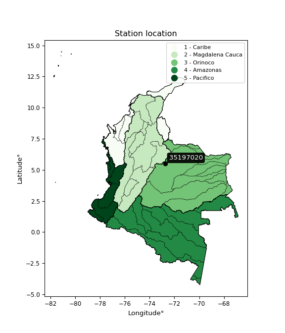

<div align="center">


</div>

# PMP Station (Rain, Pmax24h): 35197020

Probable Maximum Precipitation (PMP) is the greatest amount of rainfall for a specific duration that is meteorologically possible for a given location, acting as a "worst-case" scenario for extreme storms, crucial for designing safety-critical infrastructure like bridges, river deviations, dams, spillways, and nuclear plants to prevent catastrophic failure. PMP is calculated by hydrologists using meteorological data to determine the upper limit of extreme rainfall, often leading to the Probable Maximum Flood (PMF) for flood control design, and is increasingly being studied for climate change impacts. Probable Maximum Precipitation (PMP) is the theoretical upper limit of rainfall, a deterministic estimate for extreme events, while probability distributions (like GEV, Gumbel) describe the likelihood and frequency of various precipitation amounts, including rare ones, showing how often events occur, with PMP representing the extreme end of these distributions, used for critical infrastructure design to ensure safety against the worst conceivable weather, unlike standard statistical forecasts which cover typical probabilities.

The most common probability distributions in hydrology, used for analyzing floods, rainfall, and streamflow, include the Normal, Log-Normal, Gumbel, Gamma (including Log-Pearson Type III), and Generalized Extreme Value (GEV) distributions, often chosen based on the data´s skewness and whether modeling extremes or general conditions, with Gumbel and GEV popular for extreme events like floods, while the Normal distribution serves as a baseline, though often requiring transformations for skewed hydrological data. These distributions help in designing water infrastructure, managing water resources, and forecasting hydrologic events.

> Hydrological data often isn´t perfectly normal (it´s skewed), so different distributions are needed for different applications, such as: **Flood Frequency Analysis**: Using Gumbel, GEV, or Log-Pearson Type III for predicting extreme flood magnitudes and their return periods, **Rainfall Analysis**: Normal for annual totals, but Log-Normal, Weibull, or GEV for intensity or extreme daily rainfall, **Streamflow Modeling**: Gamma and Log-Normal for maximum flows, GEV for minimum flows, and Kappa for daily flows.

<div align="center">

</img>

</div>


## A. General information


### 1. General running parameters

• app_version: _v20260113_. • runtime: _2026-01-13 16:28:34.738620_. • Python version: _3.14.0_. • SciPy version: _1.16.3_. • Pandas version: _2.3.3_. • NumPy version: _2.3.5_. • Stations dataset (station_dataset_file): _dataset/pmax24h_in/automatic_colombia_2003_2025.csv_. • Stations catalog (station_catalog_file): _dataset/CNE.xls_. • Minimum year to eval til year_max (date_min): _1900_. • Maximum year to eval since year_min (date_max): _2025_. • Creates, save and include plots into reports (create_plot): _False_. • Plot only fit distributions with Δo > Δ (plot_only_fit): _True_. • Plot only simple graphs avoiding multiple CDFs and multiple Extreme values plots (plot_only_simple): _True_. • Eval low extreme values, if False, evaluates high extreme values (low_extreme): _False_. • Eval every SciPy distribution as logarithmic (pdist_logarithmic_on): _True_. • Standard deviation normalized (ddof): _1.0_. • Return periods to eval in years (Tr): _[2, 2.33, 5, 10, 15, 20, 25, 50, 75, 100, 200, 250, 500, 750, 1000]_. • Minimum data sample per station, 0 means any (minimum_sample): _5_. • Z-Score maximum threshold to adjust a value, 0 means disable (zscore_max): _3.5_. • Z-Score minimum threshold to adjust a value, 0 means disable (zscore_min): _-2.5_. • Avoid zeros, e.g. rain = 0 (avoid_zeros): _True_. • Avoid null values (avoid_nans): _True_. 

:file_folder:Table: [dataset.csv](../../dataset/pmax24h_in/automatic_colombia_2003_2025.csv)

> Delta Degrees of Freedom (DDOF): is a parameter used in the formulas for calculating variance and standard deviation. When ddof=0, the divisor is $N$ (the total number of observations) and this is used when your data set is the entire population. When ddof=1, the divisor is $N-1$ and this is used when your data set is a sample drawn from a larger population. Using $N-1$ provides an unbiased estimate of the population variance (known as Bessel´s correction).


### 2. Station info and location

|   id |   CODIGO | NOMBRE                       | CATEGORIA    | TECNOLOGIA                              | ESTADO           | FECHA_INSTALACION   |   FECHA_SUSPENSION |   ALTITUD |   LATITUD |   LONGITUD | DEPARTAMENTO   | MUNICIPIO   | AREA_OPERATIVA                              | ENTIDAD                                                     | AREA_HIDROGRAFICA   | ZONA_HIDROGRAFICA   | SUBZONA_HIDROGRAFICA   | CORRIENTE   | Catalogo   |   Version |
|-----:|---------:|:-----------------------------|:-------------|:----------------------------------------|:-----------------|:--------------------|-------------------:|----------:|----------:|-----------:|:---------------|:------------|:--------------------------------------------|:------------------------------------------------------------|:--------------------|:--------------------|:-----------------------|:------------|:-----------|----------:|
|    0 | 35197020 | VADO HONDO  - AUT [35197020] | Limnigráfica | Automática con Telemetría, Convencional | En Mantenimiento | 15/03/1973          |                nan |      2831 |   5.50681 |   -72.7548 | Boyacá         | Aquitania   | Area Operativa 06 - Boyacá-Casanare-Vichada | INSTITUTO DE HIDROLOGIA METEOROLOGIA Y ESTUDIOS AMBIENTALES | Orinoco             | Meta                | Río Cusiana            | Cusiana     | CNE_IDEAM  |  20251226 |

<div align="center">

Dynamic map: [:earth_americas:Google](http://maps.google.com/maps?q=5.506805556,-72.75480556) [:earth_americas:OSM](https://www.openstreetmap.org/#map=18/5.506805556/-72.75480556&layers=P) [:earth_americas:Bing](https://www.bing.com/maps?cp=5.506805556~-72.75480556&lvl=18) [:earth_americas:Apple](https://maps.apple.com/frame?center=5.506805556%2C-72.75480556&span=0.003%2C0.006)

</div>


<div align="center">

```geojson
{
  "type": "Feature",
  "geometry": {
    "type": "Point", 
    "coordinates": [-72.75480556, 5.506805556]
  }, 
  "properties": {
    "Name": "35197020"
  }
}
```

</div>


### 3. Discrete values table and plot

<div align="center">

|               |          0 |             1 |           2 |           3 |          4 |
|:--------------|-----------:|--------------:|------------:|------------:|-----------:|
| Date          | 2019       | 2020          | 2021        | 2022        | 2025       |
| Value         |   94.2     |   42.6        |   52.6      |   20.3      |    2.1     |
| Value_initial |   94.2     |   42.6        |   52.6      |   20.3      |    2.1     |
| count         |    5       |    5          |    5        |    5        |    5       |
| mean          |   42.36    |   42.36       |   42.36     |   42.36     |   42.36    |
| std           |   34.9993  |   34.9993     |   34.9993   |   34.9993   |   34.9993  |
| zscore        |    1.48117 |    0.00685727 |    0.292577 |   -0.630298 |   -1.15031 |


</div>


> The initial value (value_initial) correspond to the initial obtained or null completed value, and value (value) is adjusted only when the initial value is outside the valid range (outlier) definite through the Z-Score value. If Z-Score is active, values out of range or outliers are replaced with the station mean value. A Z-Score (or standard score) measures how many standard deviations a data point is from the mean of a dataset, indicating its relative position; positive scores mean above the mean, negative mean below, and a score of zero is exactly at the mean, allowing for comparison of values from different distributions. It´s calculated using the formula $z=(x–μ)/σ$, where $x$ is the data point, $μ$ is the mean, and $σ$ is the standard deviation, helping identify outliers and understand probability.
>
> <sub>**Note**: In this study, "completing" (filling gaps in) and "extending" (forecasting or lengthening the historical record) rainfall data series are avoided for certain critical analyses because they introduce artificial bias and uncertainty, which can distort the statistics of rare events (extremes), alter day-to-day variability, and compromise the integrity and homogeneity of the original data. Some reasons against Completing/Extending rainfall data are: **Distortion of Extremes and Variability**: The primary issue is that most gap-filling or extension methods rely on averaging or regression with nearby stations, which inherently smooths the data. Rainfall is highly variable in space and time, with a large percentage of zero values and occasional large storms. Infilling methods often underestimate the highest values and overestimate the lowest (zero) values, which severely distorts analyses focused on flood frequency, drought severity, and intensity-duration-frequency (IDF) curves, **Loss of Data Homogeneity**: Infilled or extended data are synthetic estimates, not actual measurements. Combining these estimates with observed data can violate the assumption of data homogeneity, which requires that the data properties do not change over time. Inhomogeneity can lead to incorrect conclusions about long-term trends or changes in climate patterns, **Propagation of Errors**: Errors and biases from the original data (e.g., wind-induced undercatch, instrument errors, site changes) or the data used for imputation can propagate through the analysis, leading to unreliable hydrological models and inaccurate predictions, **Compromised Statistical Integrity**: For statistical analyses, especially those involving the frequency of events, using artificial data can introduce time bias or autocorrelation that doesn´t exist in reality, making it difficult to assess the true probability of events, **Difficulty in Validation**: It is difficult to accurately validate the quality of filled or extended data, especially for past periods where ground-truth measurements are unavailable. The reliability of imputation techniques heavily depends on the density of the surrounding station network and the complexity of the local topography.</sub>


### 4. Active continuous probability distributions from SciPy (45 of 104 available)

A Probability Density Function (PDF) describes the relative likelihood of a continuous random variable falling within a specific range, where the total area under its curve equals 1, and the area over any interval gives the actual probability for that range. Unlike discrete probabilities (like rolling a die), a PDF shows density, not direct probability for a single point (which is zero), with higher points indicating higher likelihood, often visualized as a bell curve for normal distributions.

A log of a probability density function (log-PDF) is simply the logarithm of the PDF´s value, denoted as $log(f(x))$, useful for converting multiplication of probabilities into addition, improving numerical stability with tiny numbers, and connecting to information theory concepts like entropy. Instead of dealing with very small probabilities (e.g., 0.000001), log-PDFs use negative numbers (e.g., $log(0.00001) ≈ -11.51$ that are easier for computers to handle, preventing underflow errors and simplifying complex calculations. In this study, each active probability distribution from SciPy is also evaluated in the $log$ form.

[scipy.stats](https://docs.scipy.org/doc/scipy/reference/stats.html) is a Python´s powerful submodule within the SciPy library for comprehensive statistical analysis, offering over 130 probability distributions (like Normal, Poisson), functions for descriptive stats (mean, variance), hypothesis testing (t-tests, chi-square), random variable generation, and statistical tests, making it essential for data science, modeling, and research. It provides tools to explore, model, and draw conclusions from data efficiently, working seamlessly with NumPy.

<div align="center">

|   id | p_dist             |   n_parameter | fit_method   | label                                                                       | active   | ref                                                                                                        |
|-----:|:-------------------|--------------:|:-------------|:----------------------------------------------------------------------------|:---------|:-----------------------------------------------------------------------------------------------------------|
|    0 | alpha              |             3 | MLE          | Alpha                                                                       | True     | [:mortar_board:](https://docs.scipy.org/doc/scipy/reference/generated/scipy.stats.alpha.html)              |
|    1 | betaprime          |             4 | MLE          | Beta prime                                                                  | True     | [:mortar_board:](https://docs.scipy.org/doc/scipy/reference/generated/scipy.stats.betaprime.html)          |
|    2 | chi2               |             3 | MLE          | Chi²                                                                        | True     | [:mortar_board:](https://docs.scipy.org/doc/scipy/reference/generated/scipy.stats.chi2.html)               |
|    3 | crystalball        |             4 | MLE          | Crystalball                                                                 | True     | [:mortar_board:](https://docs.scipy.org/doc/scipy/reference/generated/scipy.stats.crystalball.html)        |
|    4 | dweibull           |             3 | MLE          | Double Weibull                                                              | True     | [:mortar_board:](https://docs.scipy.org/doc/scipy/reference/generated/scipy.stats.dweibull.html)           |
|    5 | erlang             |             3 | MLE          | Erlang                                                                      | True     | [:mortar_board:](https://docs.scipy.org/doc/scipy/reference/generated/scipy.stats.erlang.html)             |
|    6 | expon              |             2 | MLE          | Exponential                                                                 | True     | [:mortar_board:](https://docs.scipy.org/doc/scipy/reference/generated/scipy.stats.expon.html)              |
|    7 | exponnorm          |             3 | MLE          | Exponentially modified Normal                                               | True     | [:mortar_board:](https://docs.scipy.org/doc/scipy/reference/generated/scipy.stats.exponnorm.html)          |
|    8 | f                  |             4 | MLE          | F                                                                           | True     | [:mortar_board:](https://docs.scipy.org/doc/scipy/reference/generated/scipy.stats.f.html)                  |
|    9 | fatiguelife        |             3 | MLE          | Fatigue-life (Birnbaum-Saunders)                                            | True     | [:mortar_board:](https://docs.scipy.org/doc/scipy/reference/generated/scipy.stats.fatiguelife.html)        |
|   10 | fisk               |             3 | MLE          | Fisk                                                                        | True     | [:mortar_board:](https://docs.scipy.org/doc/scipy/reference/generated/scipy.stats.fisk.html)               |
|   11 | gamma              |             3 | MLE          | Gamma                                                                       | True     | [:mortar_board:](https://docs.scipy.org/doc/scipy/reference/generated/scipy.stats.gamma.html)              |
|   12 | genexpon           |             5 | MLE          | Generalized exponential                                                     | True     | [:mortar_board:](https://docs.scipy.org/doc/scipy/reference/generated/scipy.stats.genexpon.html)           |
|   13 | genlogistic        |             3 | MLE          | Generalized logistic                                                        | True     | [:mortar_board:](https://docs.scipy.org/doc/scipy/reference/generated/scipy.stats.genlogistic.html)        |
|   14 | gibrat             |             2 | MM           | Gibrat                                                                      | True     | [:mortar_board:](https://docs.scipy.org/doc/scipy/reference/generated/scipy.stats.gibrat.html)             |
|   15 | gompertz           |             3 | MLE          | Gompertz (or truncated Gumbel)                                              | True     | [:mortar_board:](https://docs.scipy.org/doc/scipy/reference/generated/scipy.stats.gompertz.html)           |
|   16 | gumbel_l           |             2 | MM           | Gumbel Left Skew                                                            | True     | [:mortar_board:](https://docs.scipy.org/doc/scipy/reference/generated/scipy.stats.gumbel_l.html)           |
|   17 | gumbel_r           |             2 | MM           | Gumbel Right Skew                                                           | True     | [:mortar_board:](https://docs.scipy.org/doc/scipy/reference/generated/scipy.stats.gumbel_r.html)           |
|   18 | halflogistic       |             2 | MM           | Half-logistic                                                               | True     | [:mortar_board:](https://docs.scipy.org/doc/scipy/reference/generated/scipy.stats.halflogistic.html)       |
|   19 | halfnorm           |             2 | MM           | Half Normal                                                                 | True     | [:mortar_board:](https://docs.scipy.org/doc/scipy/reference/generated/scipy.stats.halfnorm.html)           |
|   20 | hypsecant          |             2 | MM           | hyperbolic secant                                                           | True     | [:mortar_board:](https://docs.scipy.org/doc/scipy/reference/generated/scipy.stats.hypsecant.html)          |
|   21 | invgamma           |             3 | MLE          | Inverted gamma                                                              | True     | [:mortar_board:](https://docs.scipy.org/doc/scipy/reference/generated/scipy.stats.invgamma.html)           |
|   22 | invgauss           |             3 | MLE          | Inverse Gaussian                                                            | True     | [:mortar_board:](https://docs.scipy.org/doc/scipy/reference/generated/scipy.stats.invgauss.html)           |
|   23 | invweibull         |             3 | MLE          | Inverted Weibull                                                            | True     | [:mortar_board:](https://docs.scipy.org/doc/scipy/reference/generated/scipy.stats.invweibull.html)         |
|   24 | kappa4             |             4 | MLE          | Kappa 4                                                                     | True     | [:mortar_board:](https://docs.scipy.org/doc/scipy/reference/generated/scipy.stats.kappa4.html)             |
|   25 | kstwobign          |             2 | MLE          | Limiting distribution of scaled Kolmogorov-Smirnov two-sided test statistic | True     | [:mortar_board:](https://docs.scipy.org/doc/scipy/reference/generated/scipy.stats.kstwobign.html)          |
|   26 | laplace            |             2 | MM           | Laplace                                                                     | True     | [:mortar_board:](https://docs.scipy.org/doc/scipy/reference/generated/scipy.stats.laplace.html)            |
|   27 | laplace_asymmetric |             3 | MLE          | Asymmetric Laplace                                                          | True     | [:mortar_board:](https://docs.scipy.org/doc/scipy/reference/generated/scipy.stats.laplace_asymmetric.html) |
|   28 | loggamma           |             3 | MLE          | Log gamma                                                                   | True     | [:mortar_board:](https://docs.scipy.org/doc/scipy/reference/generated/scipy.stats.loggamma.html)           |
|   29 | logistic           |             2 | MM           | Logistic (or Sech-squared)                                                  | True     | [:mortar_board:](https://docs.scipy.org/doc/scipy/reference/generated/scipy.stats.logistic.html)           |
|   30 | lognorm            |             3 | MLE          | Log Normal                                                                  | True     | [:mortar_board:](https://docs.scipy.org/doc/scipy/reference/generated/scipy.stats.lognorm.html)            |
|   31 | maxwell            |             2 | MM           | Maxwell                                                                     | True     | [:mortar_board:](https://docs.scipy.org/doc/scipy/reference/generated/scipy.stats.maxwell.html)            |
|   32 | mielke             |             4 | MLE          | Mielke Beta-Kappa / Dagum                                                   | True     | [:mortar_board:](https://docs.scipy.org/doc/scipy/reference/generated/scipy.stats.mielke.html)             |
|   33 | moyal              |             2 | MM           | Moyal                                                                       | True     | [:mortar_board:](https://docs.scipy.org/doc/scipy/reference/generated/scipy.stats.moyal.html)              |
|   34 | nakagami           |             3 | MLE          | Nakagami                                                                    | True     | [:mortar_board:](https://docs.scipy.org/doc/scipy/reference/generated/scipy.stats.nakagami.html)           |
|   35 | ncf                |             5 | MLE          | Non-central F distribution                                                  | True     | [:mortar_board:](https://docs.scipy.org/doc/scipy/reference/generated/scipy.stats.ncf.html)                |
|   36 | nct                |             4 | MLE          | Non-central Student’s t                                                     | True     | [:mortar_board:](https://docs.scipy.org/doc/scipy/reference/generated/scipy.stats.nct.html)                |
|   37 | norm               |             2 | MM           | Normal                                                                      | True     | [:mortar_board:](https://docs.scipy.org/doc/scipy/reference/generated/scipy.stats.norm.html)               |
|   38 | pearson3           |             3 | MM           | Pearson type III                                                            | True     | [:mortar_board:](https://docs.scipy.org/doc/scipy/reference/generated/scipy.stats.pearson3.html)           |
|   39 | rayleigh           |             2 | MM           | Rayleigh                                                                    | True     | [:mortar_board:](https://docs.scipy.org/doc/scipy/reference/generated/scipy.stats.rayleigh.html)           |
|   40 | rice               |             3 | MLE          | Rice                                                                        | True     | [:mortar_board:](https://docs.scipy.org/doc/scipy/reference/generated/scipy.stats.rice.html)               |
|   41 | t                  |             3 | MLE          | Student’s t                                                                 | True     | [:mortar_board:](https://docs.scipy.org/doc/scipy/reference/generated/scipy.stats.t.html)                  |
|   42 | truncnorm          |             4 | MLE          | Truncated normal                                                            | True     | [:mortar_board:](https://docs.scipy.org/doc/scipy/reference/generated/scipy.stats.truncnorm.html)          |
|   43 | wald               |             2 | MM           | Wald                                                                        | True     | [:mortar_board:](https://docs.scipy.org/doc/scipy/reference/generated/scipy.stats.wald.html)               |
|   44 | weibull_min        |             3 | MLE          | Weibull minimum                                                             | True     | [:mortar_board:](https://docs.scipy.org/doc/scipy/reference/generated/scipy.stats.weibull_min.html)        |

</div>

> **n_parameter:** # arguments & localization & scale.
>
> **Fit methods:** (MLE) maximum likelihood, (MM) L-moments.
>
>**Inactive** (With the only purpose of prevent loops, zero divisions, infinite values, over high estimated values or horizontal trending for recurrence intervals estimations, the follow distributions were disabled.)**:** foldnorm, gennorm, norminvgauss, powernorm, powerlognorm, skewnorm, genextreme, anglit, arcsine, argus, beta, bradford, burr, burr12, cauchy, cosine, halfcauchy, foldcauchy, skewcauchy, wrapcauchy, dgamma, gengamma, exponweib, exponpow, truncexpon, gausshyper, genhalflogistic, genhyperbolic, geninvgauss, halfgennorm, johnsonsb, johnsonsu, kappa3, ksone, kstwo, loglaplace, levy, levy_l, levy_stable, ncx2, pareto, genpareto, truncpareto, lomax, powerlaw, rdist, rel_breitwigner, recipinvgauss, semicircular, studentized_range, trapezoid, triang, truncweibull_min, tukeylambda, uniform, loguniform, vonmises, vonmises_line, weibull_max, 


## B. Probability (PDF) vs. Empirical (EDF) distributions functions

A continuous probability distribution (CPD) describes probabilities for variables that can take any value within a range (like rain any time), unlike discrete variables with specific outcomes (like temperature). It uses a Probability Density Function (PDF), a curve where the total area under it equals 1, and the probability of the variable falling within an interval (a to b) is found by calculating the area under the curve between those points. A key feature is that the probability of hitting any single exact value is zero, so probabilities are always expressed for ranges, e.g., $P(a ≤ X ≤ b)$.

<div align="center">

Distributions parameters from station values
|    |   station | p_dist                |   n |              loc |          scale | shape                 | shape1                 | shape2                 | shape3   |
|---:|----------:|:----------------------|----:|-----------------:|---------------:|:----------------------|:-----------------------|:-----------------------|:---------|
|  0 |  35197020 | alpha                 |   5 |     -0.00826189  |    4.68672     | 1.694917329021074e-10 |                        |                        |          |
|  1 |  35197020 | betaprime             |   5 |      2.1         |  813.769       | 0.34525120643052953   | 18.425803161174834     |                        |          |
|  2 |  35197020 | chi2                  |   5 |      2.1         |    6.22059     | 0.22238501540205566   |                        |                        |          |
|  3 |  35197020 | crystalball           |   5 |     42.36        |   31.3044      | 30197.290624628098    | 12713.024195394799     |                        |          |
|  4 |  35197020 | dweibull              |   5 |     42.6         |   28.1884      | 0.8827308767331484    |                        |                        |          |
|  5 |  35197020 | erlang                |   5 |      2.1         |   33.5476      | 0.8902518003324894    |                        |                        |          |
|  6 |  35197020 | expon                 |   5 |      2.1         |   40.26        |                       |                        |                        |          |
|  7 |  35197020 | exponnorm             |   5 |     13.5146      |   17.9318      | 1.6086222288323442    |                        |                        |          |
|  8 |  35197020 | f                     |   5 |      2.1         |   29.2421      | 1.3147884164387795    | 13.495858671839816     |                        |          |
|  9 |  35197020 | fatiguelife           |   5 |      2.1         |    4.01596e-05 | 950.0235823209598     |                        |                        |          |
| 10 |  35197020 | fisk                  |   5 |    -31.3119      |   68.019       | 3.733835509020987     |                        |                        |          |
| 11 |  35197020 | gamma                 |   5 |      2.1         |   32.3947      | 0.8195932702132667    |                        |                        |          |
| 12 |  35197020 | genexpon              |   5 |      2.1         |   18.0241      | 0.44768944425166035   | 1.6198161038585078e-11 | 255.41425152606774     |          |
| 13 |  35197020 | genlogistic           |   5 |   -139.435       |   25.7893      | 645.8972443972814     |                        |                        |          |
| 14 |  35197020 | gibrat                |   5 |     18.4787      |   14.4847      |                       |                        |                        |          |
| 15 |  35197020 | gompertz              |   5 |      2.09885     |   80.749       | 1.2810708610858565    |                        |                        |          |
| 16 |  35197020 | gumbel_l              |   5 |     56.4486      |   24.4079      |                       |                        |                        |          |
| 17 |  35197020 | gumbel_r              |   5 |     28.2714      |   24.4079      |                       |                        |                        |          |
| 18 |  35197020 | halflogistic          |   5 |      5.25703     |   26.7641      |                       |                        |                        |          |
| 19 |  35197020 | halfnorm              |   5 |      0.925307    |   51.9307      |                       |                        |                        |          |
| 20 |  35197020 | hypsecant             |   5 |     42.36        |   19.929       |                       |                        |                        |          |
| 21 |  35197020 | invgamma              |   5 |    -77.1565      | 1672.36        | 14.974708721432014    |                        |                        |          |
| 22 |  35197020 | invgauss              |   5 |    -32.9038      |  363.945       | 0.20679974646593696   |                        |                        |          |
| 23 |  35197020 | invweibull            |   5 |      2.1         |    2.70531     | 0.04055396129979885   |                        |                        |          |
| 24 |  35197020 | kappa4                |   5 |    -11.53        |  104.574       | 1.1494751667804177    | 0.9660223383707965     |                        |          |
| 25 |  35197020 | kstwobign             |   5 |    -62.4498      |  120.034       |                       |                        |                        |          |
| 26 |  35197020 | laplace               |   5 |     42.36        |   22.1355      |                       |                        |                        |          |
| 27 |  35197020 | laplace_asymmetric    |   5 |     42.6         |   24.8793      | 1.0048331226157066    |                        |                        |          |
| 28 |  35197020 | loggamma              |   5 | -12105.5         | 1557.91        | 2435.314980128845     |                        |                        |          |
| 29 |  35197020 | logistic              |   5 |     42.36        |   17.259       |                       |                        |                        |          |
| 30 |  35197020 | lognorm               |   5 |      2.1         |    0.0172389   | 15.653578610926987    |                        |                        |          |
| 31 |  35197020 | maxwell               |   5 |    -31.8182      |   46.4843      |                       |                        |                        |          |
| 32 |  35197020 | mielke                |   5 |      2.1         |   94.906       | 0.7149702163855642    | 72.68881418406136      |                        |          |
| 33 |  35197020 | moyal                 |   5 |     24.4582      |   14.0919      |                       |                        |                        |          |
| 34 |  35197020 | nakagami              |   5 |     20.3         |   32.1066      | 0.04662999542172706   |                        |                        |          |
| 35 |  35197020 | ncf                   |   5 |      2.1         |   13.794       | 0.5689309493648682    | 432.47191512747884     | 1.7485221193815164     |          |
| 36 |  35197020 | nct                   |   5 |     -0.364984    |    0.099728    | 0.46507295900825946   | 54.73619880238963      |                        |          |
| 37 |  35197020 | norm                  |   5 |     42.36        |   31.3044      |                       |                        |                        |          |
| 38 |  35197020 | pearson3              |   5 |     42.36        |   31.3044      | 0.4198245207876212    |                        |                        |          |
| 39 |  35197020 | rayleigh              |   5 |    -17.5271      |   47.783       |                       |                        |                        |          |
| 40 |  35197020 | rice                  |   5 |    -13.4572      |   43.8561      | 0.3596753388037273    |                        |                        |          |
| 41 |  35197020 | t                     |   5 |     42.3607      |   31.3039      | 10727592.731078781    |                        |                        |          |
| 42 |  35197020 | truncnorm             |   5 |      4.83544     |    5.39318     | -0.5072036117419441   | 16.56992878409047      |                        |          |
| 43 |  35197020 | wald                  |   5 |     11.0556      |   31.3044      |                       |                        |                        |          |
| 44 |  35197020 | weibull_min           |   5 |      2.1         |   38.543       | 0.6050004004269105    |                        |                        |          |
| 45 |  35197020 | logalpha              |   5 |    -23.6954      |  515.749       | 19.232571419314056    |                        |                        |          |
| 46 |  35197020 | logbetaprime          |   5 |    -32.7354      |  474.663       | 740.6878965833548     | 9784.26725049916       |                        |          |
| 47 |  35197020 | logchi2               |   5 |    -17.9389      |    0.0440862   | 479.4596550019894     |                        |                        |          |
| 48 |  35197020 | logcrystalball        |   5 |      3.20251     |    1.32471     | 50.37758682173902     | 468.54880292103127     |                        |          |
| 49 |  35197020 | logdweibull           |   5 |      3.75185     |    1.07922     | 0.863397537276154     |                        |                        |          |
| 50 |  35197020 | logerlang             |   5 |    -17.7635      |    0.0927562   | 225.85244960274872    |                        |                        |          |
| 51 |  35197020 | logexpon              |   5 |      0.741937    |    2.46057     |                       |                        |                        |          |
| 52 |  35197020 | logexponnorm          |   5 |      3.20168     |    1.32471     | 0.000625733950136411  |                        |                        |          |
| 53 |  35197020 | logf                  |   5 |   -436.979       |  440.177       | 230664.933639294      | 4138971.8665562123     |                        |          |
| 54 |  35197020 | logfatiguelife        |   5 |   -580.132       |  583.337       | 0.002264136763355516  |                        |                        |          |
| 55 |  35197020 | logfisk               |   5 |     -6.27462e+07 |    6.27462e+07 | 86596566.17434452     |                        |                        |          |
| 56 |  35197020 | loggamma              |   5 |    -17.0719      |    0.0937049   | 216.1884659838176     |                        |                        |          |
| 57 |  35197020 | loggenexpon           |   5 |      0.73448     |    0.0181121   | 0.0030969037042388355 | 3.6099233172192804     | 1.3455595039676507e-05 |          |
| 58 |  35197020 | loggenlogistic        |   5 |      4.54559     |    6.19136e-06 | 4.644053122769081e-06 |                        |                        |          |
| 59 |  35197020 | loggibrat             |   5 |      2.19196     |    0.612939    |                       |                        |                        |          |
| 60 |  35197020 | loggompertz           |   5 |      0.741937    |    1.07412     | 0.06764245394069242   |                        |                        |          |
| 61 |  35197020 | loggumbel_l           |   5 |      3.7987      |    1.03288     |                       |                        |                        |          |
| 62 |  35197020 | loggumbel_r           |   5 |      2.60632     |    1.03288     |                       |                        |                        |          |
| 63 |  35197020 | loghalflogistic       |   5 |      1.63237     |    1.13261     |                       |                        |                        |          |
| 64 |  35197020 | loghalfnorm           |   5 |      1.44913     |    2.19754     |                       |                        |                        |          |
| 65 |  35197020 | loghypsecant          |   5 |      3.20251     |    0.843339    |                       |                        |                        |          |
| 66 |  35197020 | loginvgamma           |   5 |    -22.7306      | 8800.91        | 340.17097290871845    |                        |                        |          |
| 67 |  35197020 | loginvgauss           |   5 |    -10.0033      | 1038.97        | 0.012710455578157542  |                        |                        |          |
| 68 |  35197020 | loginvweibull         |   5 |     -5.98205e+07 |    5.98205e+07 | 40725461.0056081      |                        |                        |          |
| 69 |  35197020 | logkappa4             |   5 |      0.301592    |    4.59593     | 1.1064289898803792    | 1.0795368224430018     |                        |          |
| 70 |  35197020 | logkstwobign          |   5 |     -2.65431     |    6.67598     |                       |                        |                        |          |
| 71 |  35197020 | loglaplace            |   5 |      3.20251     |    0.936714    |                       |                        |                        |          |
| 72 |  35197020 | loglaplace_asymmetric |   5 |      3.96272     |    0.722419    | 1.6560593284288307    |                        |                        |          |
| 73 |  35197020 | logloggamma           |   5 |      4.54547     |    3.84981e-06 | 2.877440941496775e-06 |                        |                        |          |
| 74 |  35197020 | loglogistic           |   5 |      3.20251     |    0.730353    |                       |                        |                        |          |
| 75 |  35197020 | loglognorm            |   5 |      0.741937    |    0.00156162  | 15.138304896648938    |                        |                        |          |
| 76 |  35197020 | logmaxwell            |   5 |      0.0634932   |    1.96709     |                       |                        |                        |          |
| 77 |  35197020 | logmielke             |   5 |     -3.78054e+06 |    3.78054e+06 | 2797753.7485142583    | 2207506935.771549      |                        |          |
| 78 |  35197020 | logmoyal              |   5 |      2.44495     |    0.596331    |                       |                        |                        |          |
| 79 |  35197020 | lognakagami           |   5 |      3.01062     |    0.792606    | 0.04952326495468229   |                        |                        |          |
| 80 |  35197020 | logncf                |   5 |      0.741937    |    0.0688776   | 0.16262835747880522   | 784.9530139770233      | 6.093092690230728      |          |
| 81 |  35197020 | lognct                |   5 |    -96.8534      |    1.32299     | 1031711.7418384142    | 75.62866038032098      |                        |          |
| 82 |  35197020 | lognorm               |   5 |      3.20251     |    1.32471     |                       |                        |                        |          |
| 83 |  35197020 | logpearson3           |   5 |      3.20251     |    1.32471     | -1.0218469520587012   |                        |                        |          |
| 84 |  35197020 | lograyleigh           |   5 |      0.668254    |    2.02204     |                       |                        |                        |          |
| 85 |  35197020 | logrice               |   5 |     -0.23255     |    1.43538     | 2.139835949990413     |                        |                        |          |
| 86 |  35197020 | logt                  |   5 |      3.20252     |    1.32471     | 83051549.82383686     |                        |                        |          |
| 87 |  35197020 | logtruncnorm          |   5 |      0.505297    |    2.89719     | 0.08167937563357697   | 7.600782636516716      |                        |          |
| 88 |  35197020 | logwald               |   5 |      1.87776     |    1.32475     |                       |                        |                        |          |
| 89 |  35197020 | logweibull_min        |   5 |     -7.77116e+07 |    7.77116e+07 | 87361417.03062496     |                        |                        |          |

</div>

> **loc** (Location parameter): This shifts the distribution along the x-axis. For many common distributions, like the normal (Gaussian) distribution, loc represents the mean $μ$. For others, like the uniform distribution, it might represent the minimum value, or for the beta distribution, the left end of the support interval.
>
> **scale** (Scale parameter): This determines the width or spread of the distribution. For the normal distribution, scale represents the standard deviation $σ$. For a uniform distribution, it defines the length of the interval (from $loc$ to $loc + scale$).
>
> **shape** (Shape parameters): Refers to parameters that define the specific form of a probability distribution, distinct from its location (loc) and scale (scale). These parameters are required arguments for most distribution functions. For example, a normal (Gaussian) distribution is fully defined by its location (mean) and scale (standard deviation), so it has no specific shape parameters beyond loc and scale. However, other distributions have intrinsic properties that need specification, as Gamma distribution that takes a shape parameter, often named $a$ or $alpha$.


### 0. Cumulative distribution values - CDF (90 evaluated)

Cumulative Distribution Function (CDF), denoted as $F$<sub>$X$</sub>$(x)$, is a function that gives the probability that a random variable $X$ will take a value less than or equal to a specific value, $x$ (i.e., $(P(X≥x)$. It essentially "accumulates" probabilities from a given point up to the far right (positive infinity), providing a complete picture of the distribution´s probabilities for both discrete (like rain) and continuous (like temperature) variables, helping to find probabilities over ranges or above certain values. Each station is evaluated separately ordering the $x$ values ascending, calculating the CDF and PDF values for the activated distributions and their logarithmic forms.

<div align="center">

CDF ordered by x ascending and calculating $log(f(x))$ separately
|   id |   Station |   date |    x |   count |   mean |     std |      zscore |   Value_initial |   station |   m |     alpha |   alpha_pdf |   betaprime |   betaprime_pdf |      chi2 |    chi2_pdf |   crystalball |   crystalball_pdf |   dweibull |   dweibull_pdf |      erlang |   erlang_pdf |    expon |   expon_pdf |   exponnorm |   exponnorm_pdf |           f |       f_pdf |   fatiguelife |   fatiguelife_pdf |      fisk |   fisk_pdf |      gamma |   gamma_pdf |    genexpon |   genexpon_pdf |   genlogistic |   genlogistic_pdf |    gibrat |   gibrat_pdf |    gompertz |   gompertz_pdf |   gumbel_l |   gumbel_l_pdf |   gumbel_r |   gumbel_r_pdf |   halflogistic |   halflogistic_pdf |   halfnorm |   halfnorm_pdf |   hypsecant |   hypsecant_pdf |   invgamma |   invgamma_pdf |   invgauss |   invgauss_pdf |   invweibull |   invweibull_pdf |      kappa4 |   kappa4_pdf |   kstwobign |   kstwobign_pdf |   laplace |   laplace_pdf |   laplace_asymmetric |   laplace_asymmetric_pdf |   loggamma |   loggamma_pdf |   logistic |   logistic_pdf |   lognorm |   lognorm_pdf |   maxwell |   maxwell_pdf |      mielke |   mielke_pdf |     moyal |   moyal_pdf |   nakagami |   nakagami_pdf |         ncf |     ncf_pdf |       nct |    nct_pdf |     norm |   norm_pdf |   pearson3 |   pearson3_pdf |   rayleigh |   rayleigh_pdf |      rice |   rice_pdf |        t |      t_pdf |   truncnorm |   truncnorm_pdf |     wald |   wald_pdf |   weibull_min |   weibull_min_pdf |   logalpha |   logalpha_pdf |   logbetaprime |   logbetaprime_pdf |   logchi2 |   logchi2_pdf |   logcrystalball |   logcrystalball_pdf |   logdweibull |   logdweibull_pdf |   logerlang |   logerlang_pdf |   logexpon |   logexpon_pdf |   logexponnorm |   logexponnorm_pdf |      logf |   logf_pdf |   logfatiguelife |   logfatiguelife_pdf |   logfisk |   logfisk_pdf |   loggenexpon |   loggenexpon_pdf |   loggenlogistic |   loggenlogistic_pdf |   loggibrat |   loggibrat_pdf |   loggompertz |   loggompertz_pdf |   loggumbel_l |   loggumbel_l_pdf |   loggumbel_r |   loggumbel_r_pdf |   loghalflogistic |   loghalflogistic_pdf |   loghalfnorm |   loghalfnorm_pdf |   loghypsecant |   loghypsecant_pdf |   loginvgamma |   loginvgamma_pdf |   loginvgauss |   loginvgauss_pdf |   loginvweibull |   loginvweibull_pdf |   logkappa4 |   logkappa4_pdf |   logkstwobign |   logkstwobign_pdf |   loglaplace |   loglaplace_pdf |   loglaplace_asymmetric |   loglaplace_asymmetric_pdf |   logloggamma |   logloggamma_pdf |   loglogistic |   loglogistic_pdf |   loglognorm |   loglognorm_pdf |   logmaxwell |   logmaxwell_pdf |   logmielke |   logmielke_pdf |    logmoyal |   logmoyal_pdf |   lognakagami |   lognakagami_pdf |    logncf |   logncf_pdf |    lognct |   lognct_pdf |   logpearson3 |   logpearson3_pdf |   lograyleigh |   lograyleigh_pdf |   logrice |   logrice_pdf |      logt |   logt_pdf |   logtruncnorm |   logtruncnorm_pdf |   logwald |   logwald_pdf |   logweibull_min |   logweibull_min_pdf |
|-----:|----------:|-------:|-----:|--------:|-------:|--------:|------------:|----------------:|----------:|----:|----------:|------------:|------------:|----------------:|----------:|------------:|--------------:|------------------:|-----------:|---------------:|------------:|-------------:|---------:|------------:|------------:|----------------:|------------:|------------:|--------------:|------------------:|----------:|-----------:|-----------:|------------:|------------:|---------------:|--------------:|------------------:|----------:|-------------:|------------:|---------------:|-----------:|---------------:|-----------:|---------------:|---------------:|-------------------:|-----------:|---------------:|------------:|----------------:|-----------:|---------------:|-----------:|---------------:|-------------:|-----------------:|------------:|-------------:|------------:|----------------:|----------:|--------------:|---------------------:|-------------------------:|-----------:|---------------:|-----------:|---------------:|----------:|--------------:|----------:|--------------:|------------:|-------------:|----------:|------------:|-----------:|---------------:|------------:|------------:|----------:|-----------:|---------:|-----------:|-----------:|---------------:|-----------:|---------------:|----------:|-----------:|---------:|-----------:|------------:|----------------:|---------:|-----------:|--------------:|------------------:|-----------:|---------------:|---------------:|-------------------:|----------:|--------------:|-----------------:|---------------------:|--------------:|------------------:|------------:|----------------:|-----------:|---------------:|---------------:|-------------------:|----------:|-----------:|-----------------:|---------------------:|----------:|--------------:|--------------:|------------------:|-----------------:|---------------------:|------------:|----------------:|--------------:|------------------:|--------------:|------------------:|--------------:|------------------:|------------------:|----------------------:|--------------:|------------------:|---------------:|-------------------:|--------------:|------------------:|--------------:|------------------:|----------------:|--------------------:|------------:|----------------:|---------------:|-------------------:|-------------:|-----------------:|------------------------:|----------------------------:|--------------:|------------------:|--------------:|------------------:|-------------:|-----------------:|-------------:|-----------------:|------------:|----------------:|------------:|---------------:|--------------:|------------------:|----------:|-------------:|----------:|-------------:|--------------:|------------------:|--------------:|------------------:|----------:|--------------:|----------:|-----------:|---------------:|-------------------:|----------:|--------------:|-----------------:|---------------------:|
|    0 |  35197020 |   2025 |  2.1 |       5 |  42.36 | 34.9993 | -1.15031    |             2.1 |  35197020 |   1 | 0.0262142 | 0.0710974   | 0.000721065 |  9733.27        | 0.0156622 | 3.92156e+12 |      0.099207 |        0.00557368 |   0.126169 |     0.00378665 | 9.83071e-16 |   1.97073    | 0        |  0.0248385  |    0.074505 |      0.00650714 | 1.01616e-07 | 74.4507     |     0.0554178 |       5.09737e+09 | 0.0657253 | 0.00686216 | 1.6128e-14 | 29.7652     | 1.01208e-12 |     0.0248384  |     0.0695523 |        0.00717435 | 0         |   0          | 1.82882e-05 |     0.0158648  |   0.10227  |     0.00396807 |  0.0538288 |     0.00644401 |       0        |         0          |  0.0180469 |     0.0153605  |   0.0839464 |      0.00416362 |  0.0679608 |     0.00719396 |  0.0605977 |     0.00830287 |    0.0126955 |      5.0623e+12  | 1.31859e-14 |   1.13037    |   0.0654274 |      0.00763458 | 0.0811104 |    0.00366427 |            0.0994234 |               0.00397701 |  0.0337877 |      0.0593774 |   0.088451 |     0.00467162 | 0.0316246 |     0.0536556 | 0.0882863 |    0.00700283 | 2.41459e-10 |  51.4004     | 0.0270584 |  0.00543561 |  0         |    0           | 1.99486e-05 | 2.60781e+08 | 0.0507612 | 0.0683327  | 0.099207 | 0.00557368 |  0.0880918 |     0.00630695 |  0.0808992 |     0.00790082 | 0.0572753 | 0.00714862 | 0.0992   | 0.00557346 | 8.86115e-08 |     0.0937233   | 0        | 0          |   5.65217e-11 |    77001.8        |  0.0305777 |      0.0596997 |      0.0337927 |          0.0576616 | 0.0319679 |      0.057059 |        0.0316246 |            0.0536556 |     0.0442675 |         0.0307849 |   0.0356245 |       0.0611083 |   0        |      0.406409  |      0.0316242 |          0.0536553 | 0.0324154 |  0.0546855 |        0.0308505 |            0.0529483 | 0.0241232 |     0.0324896 |    0.00127846 |          0.17187  |         0        |            0.0432552 |    0        |       0         |   3.72495e-09 |         0.0629748 |     0.0505253 |          0.04766  |     0.0022877 |          0.013467 |          0        |              0        |      0        |          0        |      0.0343824 |          0.0406902 |      0.032689 |         0.0593011 |     0.0376271 |         0.0681507 |       0.0379958 |           0.0845935 | 3.80281e-15 |        7.51303  |       0.041912 |           0.105315 |    0.0361543 |        0.0385969 |               0.0496375 |                   0.0414901 |     0.0582592 |         0.0435444 |     0.0332779 |         0.0440479 |    0.0227567 |      3.21321e+13 |    0.0105304 |        0.0454639 |   0.0595381 |       0.0440606 | 3.04624e-05 |    0.000467346 |     0         |       0           | 0.0025322 |  1.85462e+12 | 0.0316315 |    0.0536681 |     0.0515585 |         0.0513928 |   0.000663717 |         0.0180094 | 0.0266224 |     0.0609499 | 0.0316234 |  0.0536542 |    4.41824e-10 |           0.293595 |  0        |     0         |        0.0322355 |            0.0356479 |
|    1 |  35197020 |   2022 | 20.3 |       5 |  42.36 | 34.9993 | -0.630298   |            20.3 |  35197020 |   2 | 0.817487  | 0.00882873  | 0.742428    |     0.0102793   | 0.98652   | 0.00155859  |      0.2405   |        0.00994194 |   0.22173  |     0.00713703 | 0.47477     |   0.0172113  | 0.363685 |  0.0158051  |    0.260143 |      0.0134264  | 0.513534    |  0.0141663  |     0.760716  |       0.00604201  | 0.262955  | 0.0140211  | 0.523839   |  0.0170879  | 0.363683    |     0.0158051  |     0.267787  |        0.0136672  | 0.0190599 |   0.0255198  | 0.276671    |     0.0143768  |   0.203402 |     0.0074218  |  0.250015  |     0.0141995  |       0.273857 |         0.0172806  |  0.290917  |     0.0143315  |   0.203249  |      0.00951965 |  0.266092  |     0.0136202  |  0.285338  |     0.0146185  |    0.39629   |      0.00081734  | 0.244833    |   0.0116576  |   0.271174  |      0.0137366  | 0.184568  |    0.00833811 |            0.205902  |               0.00823624 |  0.458201  |      0.289602  |   0.217861 |     0.00987298 | 0.442413  |     0.298011  | 0.260653  |    0.0115087  | 0.307049    |   0.0120621  | 0.246466  |  0.0167624  |  0.0288928 |    7.58447e+11 | 0.402363    | 0.00868934  | 0.579915  | 0.00933035 | 0.2405   | 0.00994194 |  0.250842  |     0.011309   |  0.269006  |     0.0121107  | 0.242528  | 0.0124693  | 0.24049  | 0.00994185 | 0.997019    |     0.00174699  | 0.160692 | 0.034256   |   0.47012     |        0.0111868  |  0.468317  |      0.287579  |      0.449928  |          0.290097  | 0.4536    |      0.291946 |        0.442414  |            0.298011  |     0.242649  |         0.204347  |   0.458688  |       0.286217  |   0.602283 |      0.161636  |      0.442414  |          0.298012  | 0.444604  |  0.296755  |        0.441647  |            0.298919  | 0.361437  |     0.31853   |    0.538156   |          0.23449  |         0        |            0.237182  |    0.613864 |       0.467324  |   0.38828     |         0.318426  |     0.37266   |          0.283198 |     0.508604  |          0.332915 |          0.543028 |              0.311281 |      0.522644 |          0.282076 |      0.42819   |          0.367876  |      0.455561 |         0.284526  |     0.470583  |         0.271606  |       0.497613  |           0.23644   | 0.598315    |        0.24759  |       0.532481 |           0.228107 |    0.407383  |        0.434907  |               0.330648  |                   0.276376  |     0.31753   |         0.23733   |     0.434692  |         0.33646   |    0.684735  |      0.0103472   |    0.476795  |        0.296378  |   0.319109  |       0.236154  | 0.533727    |    0.343038    |     0.0273089 |       6.09079e+12 | 0.51043   |  0.194668    | 0.442447  |    0.297993  |     0.377644  |         0.271651  |   0.488784    |         0.292872  | 0.453564  |     0.292046  | 0.44241   |  0.298011  |    0.585861    |           0.202684 |  0.60344  |     0.37617   |        0.342829  |            0.310146  |
|    2 |  35197020 |   2020 | 42.6 |       5 |  42.36 | 34.9993 |  0.00685727 |            42.6 |  35197020 |   3 | 0.912413  | 0.00204736  | 0.881053    |     0.0037058   | 0.998704  | 0.000127506 |      0.503059 |        0.0127436  |   0.5      |     1.05669    | 0.742916    |   0.00810963 | 0.634307 |  0.00908328 |    0.575184 |      0.0129107  | 0.728752    |  0.00652386 |     0.854757  |       0.00297777  | 0.576943  | 0.0123303  | 0.77998    |  0.00743116 | 0.634304    |     0.00908328 |     0.573925  |        0.0123516  | 0.694974  |   0.0145221  | 0.565853    |     0.0113737  |   0.43278  |     0.0131768  |  0.573518  |     0.0130637  |       0.602862 |         0.011892   |  0.57774   |     0.0111345  |   0.503833  |      0.0159711  |  0.57156   |     0.0123703  |  0.589398  |     0.0116002  |    0.408173  |      0.000366237 | 0.488749    |   0.0103863  |   0.572082  |      0.0120983  | 0.505392  |    0.0223445  |            0.502411  |               0.0200968  |  0.666243  |      0.259203  |   0.503476 |     0.0144845  | 0.660815  |     0.276341  | 0.535984  |    0.0122134  | 0.543972    |   0.00960305 | 0.599342  |  0.0129556  |  0.858331  |    0.00351325  | 0.559728    | 0.0058672   | 0.700416  | 0.00323297 | 0.503059 | 0.0127436  |  0.530966  |     0.0126765  |  0.546929  |     0.0119314  | 0.535302  | 0.0127161  | 0.503049 | 0.0127438  | 1           |     2.40186e-12 | 0.671143 | 0.0125984  |   0.643142    |        0.005493   |  0.670768  |      0.247697  |      0.660368  |          0.264545  | 0.663942  |      0.2626   |        0.660815  |            0.276341  |     0.5       |        50.5578    |   0.664467  |       0.256877  |   0.70573  |      0.119594  |      0.660817  |          0.276342  | 0.661701  |  0.274359  |        0.660656  |            0.27696   | 0.611555  |     0.327853  |    0.695618   |          0.187884 |         0        |            0.413566  |    0.824876 |       0.165326  |   0.649076    |         0.364224  |     0.615441  |          0.355809 |     0.719022  |          0.22963  |          0.733223 |              0.204123 |      0.705299 |          0.209687 |      0.694068  |          0.309437  |      0.659223 |         0.253415  |     0.662149  |         0.236118  |       0.656152  |           0.188225  | 0.783036    |        0.252431 |       0.684137 |           0.179424 |    0.721853  |        0.296939  |               0.614386  |                   0.513542  |     0.552574  |         0.413007  |     0.67965   |         0.29811   |    0.691341  |      0.00772798  |    0.681277  |        0.245866  |   0.552292  |       0.408718  | 0.738171    |    0.211478    |     0.877325  |       0.11249     | 0.641941  |  0.159316    | 0.660828  |    0.276307  |     0.607912  |         0.338175  |   0.68739     |         0.235765  | 0.664691  |     0.264676  | 0.660813  |  0.276343  |    0.719262    |           0.157225 |  0.792749 |     0.16842   |        0.619367  |            0.413315  |
|    3 |  35197020 |   2021 | 52.6 |       5 |  42.36 | 34.9993 |  0.292577   |            52.6 |  35197020 |   4 | 0.929013  | 0.00134579  | 0.912041    |     0.00257785  | 0.999508  | 4.69107e-05 |      0.628208 |        0.0120801  |   0.665041 |     0.0118449  | 0.812211    |   0.00587526 | 0.714738 |  0.0070855  |    0.691083 |      0.0102019  | 0.785279    |  0.00488227 |     0.881073  |       0.00232307  | 0.686549  | 0.00957575 | 0.842678   |  0.00524449 | 0.714735    |     0.00708551 |     0.686028  |        0.0100214  | 0.80423   |   0.00809965 | 0.671515    |     0.0097401  |   0.574344 |     0.0148953  |  0.691373  |     0.0104544  |       0.708641 |         0.00930029 |  0.680298  |     0.00936493 |   0.6568    |      0.0140732  |  0.684065  |     0.0100781  |  0.693635  |     0.00925424 |    0.411444  |      0.000293431 | 0.590748    |   0.0100239  |   0.682807  |      0.010008   | 0.685179  |    0.0142224  |            0.667749  |               0.0134191  |  0.718808  |      0.23874   |   0.644125 |     0.0132817  | 0.71697   |     0.255433  | 0.652089  |    0.0108825  | 0.636937    |   0.00901764 | 0.712554  |  0.0097458  |  0.887544  |    0.00244957  | 0.614517    | 0.00511566  | 0.72813   | 0.00238244 | 0.628208 | 0.0120801  |  0.651571  |     0.0112887  |  0.659367  |     0.0104623  | 0.655103  | 0.0111281  | 0.628201 | 0.0120803  | 1           |     9.89198e-19 | 0.772035 | 0.00800638 |   0.69198     |        0.00434548 |  0.720824  |      0.226629  |      0.714119  |          0.244571  | 0.717206  |      0.241944 |        0.71697   |            0.255433  |     0.608337  |         0.391635  |   0.716607  |       0.237044  |   0.729898 |      0.109772  |      0.716972  |          0.255433  | 0.717448  |  0.253565  |        0.716924  |            0.255886  | 0.678058  |     0.301271  |    0.733642   |          0.17271  |         0        |            0.484434  |    0.855632 |       0.128337  |   0.724454    |         0.348023  |     0.690283  |          0.351464 |     0.764181  |          0.198986 |          0.773407 |              0.177396 |      0.747301 |          0.188758 |      0.754481  |          0.263107  |      0.71065  |         0.233805  |     0.710048  |         0.217805  |       0.694186  |           0.172506  | 0.836641    |        0.256314 |       0.720413 |           0.164663 |    0.777919  |        0.237085  |               0.732801  |                   0.612521  |     0.6469    |         0.483509  |     0.739019  |         0.264078  |    0.692915  |      0.00720584  |    0.730793  |        0.223461  |   0.645563  |       0.477743  | 0.779396    |    0.180181    |     0.898189  |       0.0872836   | 0.67442   |  0.148748    | 0.716975  |    0.255399  |     0.679536  |         0.339272  |   0.734799    |         0.213688  | 0.718436  |     0.244389  | 0.716968  |  0.255435  |    0.751071    |           0.144528 |  0.824853 |     0.137371  |        0.706037  |            0.40459   |
|    4 |  35197020 |   2019 | 94.2 |       5 |  42.36 | 34.9993 |  1.48117    |            94.2 |  35197020 |   5 | 0.960323  | 0.000420817 | 0.971256    |     0.000719699 | 0.999989  | 9.70857e-07 |      0.951139 |        0.00323456 |   0.909136 |     0.00265068 | 0.948213    |   0.00159165 | 0.898493 |  0.00252128 |    0.926019 |      0.00256462 | 0.909507    |  0.00173246 |     0.944537  |       0.000969068 | 0.907828  | 0.00248927 | 0.959794   |  0.00130292 | 0.898491    |     0.00252131 |     0.92764   |        0.0027016  | 0.950933  |   0.00134173 | 0.934577    |     0.00324724 |   0.990867 |     0.00175707 |  0.935073  |     0.00257178 |       0.930433 |         0.00250884 |  0.927527  |     0.00306178 |   0.952861  |      0.00235672 |  0.927494  |     0.00270996 |  0.920658  |     0.00269285 |    0.420336  |      0.000160413 | 0.979559    |   0.00840409 |   0.933673  |      0.00288417 | 0.951929  |    0.00217165 |            0.938087  |               0.00250058 |  0.83842   |      0.1702    |   0.952739 |     0.00260893 | 0.844646  |     0.18015   | 0.938444  |    0.00319873 | 0.977742    |   0.00682041 | 0.932896  |  0.00237533 |  0.950817  |    0.00094706  | 0.778943    | 0.00298897  | 0.792307  | 0.0010208  | 0.951139 | 0.00323456 |  0.941066  |     0.00307926 |  0.935017  |     0.00317987 | 0.941124  | 0.00310606 | 0.951139 | 0.00323461 | 1           |     2.55396e-61 | 0.937119 | 0.00175694 |   0.816193    |        0.00204521 |  0.833989  |      0.161161  |      0.837015  |          0.175164  | 0.838361  |      0.172176 |        0.844646  |            0.18015   |     0.767765  |         0.193763  |   0.835756  |       0.170254  |   0.786853 |      0.0866251 |      0.844647  |          0.180149  | 0.844251  |  0.179112  |        0.844739  |            0.180204  | 0.824778  |     0.199453  |    0.821973   |          0.130755 |         0.999871 |            0.749989  |    0.910748 |       0.0685738 |   0.896292    |         0.225334  |     0.87261   |          0.254132 |     0.858138  |          0.127108 |          0.858072 |              0.116418 |      0.841159 |          0.134561 |      0.872228  |          0.147471  |      0.828439 |         0.169109  |     0.820408  |         0.160181  |       0.782324  |           0.130746  | 0.995158    |        0.33265  |       0.804834 |           0.125757 |    0.88078   |        0.127274  |               0.929739  |                   0.161064  |     0.999963  |         0.747396  |     0.862796  |         0.162084  |    0.696763  |      0.00606783  |    0.841692  |        0.157075  |   0.993604  |       0.730653  | 0.863559    |    0.113279    |     0.936916  |       0.0506395   | 0.75274   |  0.120393    | 0.844635  |    0.18013   |     0.863008  |         0.271631  |   0.840913    |         0.150858  | 0.841011  |     0.174271  | 0.844644  |  0.180152  |    0.825471    |           0.111411 |  0.88697  |     0.0816524 |        0.905305  |            0.250921  |


</div>

An Empirical Distribution Function (EDF) is a step-function estimate of a true cumulative distribution function (CDF) based on observed sample data, representing the proportion of data points less than or equal to a given value. It is calculated by ordering your data and jumping up by $1/n$ (where $n$ is sample size) at each unique data point, allowing analysis without assuming an underlying population distribution, and it gets closer to the true CDF as the sample size grows. For the empirical probability calculations, the parameter $m$ correspond to the order number which means the position of the $x$ values in an ascending order list.

The Kolmogorov-Smirnov (K-S) test is a non-parametric statistical test used to determine if a sample data set comes from a specific theoretical distribution (one-sample) or if two different samples come from the same underlying distribution (two-sample), by comparing their cumulative distribution functions (CDFs). It calculates the maximum vertical difference (D statistic) between these functions, with a small p-value indicating a significant difference and rejection of the null hypothesis (that the data/samples match).


### 1. EDF California (1923)

California´s estimates the true probability distribution of water-related data (like rainfall, streamflow) using observed samples, crucial for risk assessment.

<div align="center">


$P=m/n$


</div>


**1.1. Empirical values**

<div align="center">

|                | 0              | 1                  | 2              | 3                 | 4              |
|:---------------|:---------------|:-------------------|:---------------|:------------------|:---------------|
| date           | 2025           | 2022               | 2020           | 2021              | 2019           |
| x              | 2.1            | 20.3               | 42.6           | 52.6              | 94.2           |
| m              | 1              | 2                  | 3              | 4                 | 5              |
| empirical_dist | edf_california | edf_california     | edf_california | edf_california    | edf_california |
| empirical      | 0.2            | 0.4                | 0.6            | 0.8               | 1.0            |
| empirical_tr   | 1.25           | 1.6666666666666667 | 2.5            | 5.000000000000001 | inf            |

</div>


**1.2. Kolmogorov-Smirnov fit test (sorted by Δ)**


<div align="center">

|                | 0                   | 1                   | 2                  | 3                   | 4                   | 5                   | 6                  | 7                  | 8                  | 9                   | 10                  | 11                  | 12                    | 13                 | 14                  | 15                  | 16                  | 17                  | 18                  | 19                  | 20                 | 21                 | 22                  | 23                  | 24                 | 25                  | 26                  | 27                  | 28                  | 29                  | 30                  | 31                  | 32                  | 33                  | 34                  | 35                  | 36                 | 37                  | 38                  | 39                  | 40                  | 41                  | 42                  | 43                  | 44                  | 45                  | 46                  | 47                  | 48                  | 49                  | 50                  | 51                 | 52                  | 53                 | 54                  | 55                 | 56                  | 57                  | 58                  | 59                  | 60                  | 61                 | 62                  | 63                 | 64                 | 65                 | 66                 | 67                  | 68                 | 69                 | 70                  | 71                 | 72                 | 73                 | 74                  | 75                 | 76                  | 77                  | 78                 | 79                  | 80                 | 81                 | 82                 | 83                 | 84                  | 85                 | 86                 | 87                 | 88                 | 89                 |
|:---------------|:--------------------|:--------------------|:-------------------|:--------------------|:--------------------|:--------------------|:-------------------|:-------------------|:-------------------|:--------------------|:--------------------|:--------------------|:----------------------|:-------------------|:--------------------|:--------------------|:--------------------|:--------------------|:--------------------|:--------------------|:-------------------|:-------------------|:--------------------|:--------------------|:-------------------|:--------------------|:--------------------|:--------------------|:--------------------|:--------------------|:--------------------|:--------------------|:--------------------|:--------------------|:--------------------|:--------------------|:-------------------|:--------------------|:--------------------|:--------------------|:--------------------|:--------------------|:--------------------|:--------------------|:--------------------|:--------------------|:--------------------|:--------------------|:--------------------|:--------------------|:--------------------|:-------------------|:--------------------|:-------------------|:--------------------|:-------------------|:--------------------|:--------------------|:--------------------|:--------------------|:--------------------|:-------------------|:--------------------|:-------------------|:-------------------|:-------------------|:-------------------|:--------------------|:-------------------|:-------------------|:--------------------|:-------------------|:-------------------|:-------------------|:--------------------|:-------------------|:--------------------|:--------------------|:-------------------|:--------------------|:-------------------|:-------------------|:-------------------|:-------------------|:--------------------|:-------------------|:-------------------|:-------------------|:-------------------|:-------------------|
| station        | 35197020            | 35197020            | 35197020           | 35197020            | 35197020            | 35197020            | 35197020           | 35197020           | 35197020           | 35197020            | 35197020            | 35197020            | 35197020              | 35197020           | 35197020            | 35197020            | 35197020            | 35197020            | 35197020            | 35197020            | 35197020           | 35197020           | 35197020            | 35197020            | 35197020           | 35197020            | 35197020            | 35197020            | 35197020            | 35197020            | 35197020            | 35197020            | 35197020            | 35197020            | 35197020            | 35197020            | 35197020           | 35197020            | 35197020            | 35197020            | 35197020            | 35197020            | 35197020            | 35197020            | 35197020            | 35197020            | 35197020            | 35197020            | 35197020            | 35197020            | 35197020            | 35197020           | 35197020            | 35197020           | 35197020            | 35197020           | 35197020            | 35197020            | 35197020            | 35197020            | 35197020            | 35197020           | 35197020            | 35197020           | 35197020           | 35197020           | 35197020           | 35197020            | 35197020           | 35197020           | 35197020            | 35197020           | 35197020           | 35197020           | 35197020            | 35197020           | 35197020            | 35197020            | 35197020           | 35197020            | 35197020           | 35197020           | 35197020           | 35197020           | 35197020            | 35197020           | 35197020           | 35197020           | 35197020           | 35197020           |
| empirical_dist | edf_california      | edf_california      | edf_california     | edf_california      | edf_california      | edf_california      | edf_california     | edf_california     | edf_california     | edf_california      | edf_california      | edf_california      | edf_california        | edf_california     | edf_california      | edf_california      | edf_california      | edf_california      | edf_california      | edf_california      | edf_california     | edf_california     | edf_california      | edf_california      | edf_california     | edf_california      | edf_california      | edf_california      | edf_california      | edf_california      | edf_california      | edf_california      | edf_california      | edf_california      | edf_california      | edf_california      | edf_california     | edf_california      | edf_california      | edf_california      | edf_california      | edf_california      | edf_california      | edf_california      | edf_california      | edf_california      | edf_california      | edf_california      | edf_california      | edf_california      | edf_california      | edf_california     | edf_california      | edf_california     | edf_california      | edf_california     | edf_california      | edf_california      | edf_california      | edf_california      | edf_california      | edf_california     | edf_california      | edf_california     | edf_california     | edf_california     | edf_california     | edf_california      | edf_california     | edf_california     | edf_california      | edf_california     | edf_california     | edf_california     | edf_california      | edf_california     | edf_california      | edf_california      | edf_california     | edf_california      | edf_california     | edf_california     | edf_california     | edf_california     | edf_california      | edf_california     | edf_california     | edf_california     | edf_california     | edf_california     |
| p_dist         | genlogistic         | invgamma            | kstwobign          | fisk                | invgauss            | exponnorm           | rayleigh           | maxwell            | logpearson3        | pearson3            | loggumbel_l         | gumbel_r            | loglaplace_asymmetric | logloggamma        | logmielke           | rice                | loglaplace          | logerlang           | loghypsecant        | logbetaprime        | loggamma           | loggamma           | loglogistic         | logf                | logweibull_min     | logchi2             | lognct              | logcrystalball      | lognorm             | lognorm             | logexponnorm        | logt                | logfatiguelife      | logalpha            | loginvgamma         | norm                | crystalball        | t                   | moyal               | logrice             | logfisk             | dweibull            | loginvgauss         | halfnorm            | logistic            | logmaxwell          | laplace_asymmetric  | logkstwobign        | hypsecant           | loggumbel_r         | loggenexpon         | lograyleigh        | logmoyal            | gompertz           | f                   | loggompertz        | logtruncnorm        | mielke              | weibull_min         | genexpon            | gamma               | logkappa4          | erlang              | expon              | loghalfnorm        | loghalflogistic    | halflogistic       | logwald             | nct                | kappa4             | logexpon            | laplace            | loginvweibull      | ncf                | loggibrat           | gumbel_l           | logdweibull         | wald                | logncf             | loglognorm          | betaprime          | fatiguelife        | nakagami           | lognakagami        | gibrat              | alpha              | invweibull         | chi2               | truncnorm          | loggenlogistic     |
| delta          | 0.13221292290315728 | 0.13390796920419373 | 0.1345726291921779 | 0.13704496719168546 | 0.13940233826888215 | 0.13985652543043436 | 0.1406331797118302 | 0.1479114774608119 | 0.1484414953682241 | 0.14915809288955495 | 0.14947472174824733 | 0.14998465345752177 | 0.15036251436085993   | 0.1531004550901658 | 0.15443709299243014 | 0.15747189458720615 | 0.16384568009289377 | 0.16437552419632942 | 0.16561757758237242 | 0.16620733817198757 | 0.1662123171643131 | 0.1662123171643131 | 0.16672207708311743 | 0.16758458226551468 | 0.1677644910606459 | 0.16803210545181665 | 0.16836851333727437 | 0.16837544591592352 | 0.16837544953523725 | 0.16837544953523725 | 0.16837583868348233 | 0.16837656845870777 | 0.16914947447266943 | 0.16942226585414508 | 0.17156060236454918 | 0.17179193720400676 | 0.1717919449232257 | 0.17179914512861272 | 0.17294164172191842 | 0.17337759265545125 | 0.17587676786636192 | 0.17826980319912702 | 0.17959172758058162 | 0.18195307518746612 | 0.18213882463258438 | 0.18946959940852412 | 0.19409782161584782 | 0.19516613581869569 | 0.19675077293261808 | 0.19771230043878787 | 0.19872153716898086 | 0.1993362826588051 | 0.19996953757968933 | 0.1999817118348883 | 0.19999989838426713 | 0.1999999962750514 | 0.19999999955817643 | 0.19999999975854124 | 0.19999999994347828 | 0.19999999999898793 | 0.19999999999998389 | 0.1999999999999962 | 0.19999999999999904 | 0.2                | 0.2                | 0.2                | 0.2                | 0.20343986472541375 | 0.2076927171804982 | 0.2092519504074425 | 0.21314735347883618 | 0.2154316670674878 | 0.2176756614168308 | 0.2210565365320606 | 0.22487597977244633 | 0.2256560887365774 | 0.23223547908796982 | 0.23930776662891673 | 0.2472597011442671 | 0.30323681868723995 | 0.3424278116694114 | 0.3607160237086533 | 0.3711071746718938 | 0.3726910548387939 | 0.38094007195236396 | 0.4174866627434196 | 0.5796642995189517 | 0.586519770241291  | 0.5970185660212598 | 0.8                |
| deltao         | 0.5865427407550001  | 0.5865427407550001  | 0.5865427407550001 | 0.5865427407550001  | 0.5865427407550001  | 0.5865427407550001  | 0.5865427407550001 | 0.5865427407550001 | 0.5865427407550001 | 0.5865427407550001  | 0.5865427407550001  | 0.5865427407550001  | 0.5865427407550001    | 0.5865427407550001 | 0.5865427407550001  | 0.5865427407550001  | 0.5865427407550001  | 0.5865427407550001  | 0.5865427407550001  | 0.5865427407550001  | 0.5865427407550001 | 0.5865427407550001 | 0.5865427407550001  | 0.5865427407550001  | 0.5865427407550001 | 0.5865427407550001  | 0.5865427407550001  | 0.5865427407550001  | 0.5865427407550001  | 0.5865427407550001  | 0.5865427407550001  | 0.5865427407550001  | 0.5865427407550001  | 0.5865427407550001  | 0.5865427407550001  | 0.5865427407550001  | 0.5865427407550001 | 0.5865427407550001  | 0.5865427407550001  | 0.5865427407550001  | 0.5865427407550001  | 0.5865427407550001  | 0.5865427407550001  | 0.5865427407550001  | 0.5865427407550001  | 0.5865427407550001  | 0.5865427407550001  | 0.5865427407550001  | 0.5865427407550001  | 0.5865427407550001  | 0.5865427407550001  | 0.5865427407550001 | 0.5865427407550001  | 0.5865427407550001 | 0.5865427407550001  | 0.5865427407550001 | 0.5865427407550001  | 0.5865427407550001  | 0.5865427407550001  | 0.5865427407550001  | 0.5865427407550001  | 0.5865427407550001 | 0.5865427407550001  | 0.5865427407550001 | 0.5865427407550001 | 0.5865427407550001 | 0.5865427407550001 | 0.5865427407550001  | 0.5865427407550001 | 0.5865427407550001 | 0.5865427407550001  | 0.5865427407550001 | 0.5865427407550001 | 0.5865427407550001 | 0.5865427407550001  | 0.5865427407550001 | 0.5865427407550001  | 0.5865427407550001  | 0.5865427407550001 | 0.5865427407550001  | 0.5865427407550001 | 0.5865427407550001 | 0.5865427407550001 | 0.5865427407550001 | 0.5865427407550001  | 0.5865427407550001 | 0.5865427407550001 | 0.5865427407550001 | 0.5865427407550001 | 0.5865427407550001 |
| eval           | Δo > Δ              | Δo > Δ              | Δo > Δ             | Δo > Δ              | Δo > Δ              | Δo > Δ              | Δo > Δ             | Δo > Δ             | Δo > Δ             | Δo > Δ              | Δo > Δ              | Δo > Δ              | Δo > Δ                | Δo > Δ             | Δo > Δ              | Δo > Δ              | Δo > Δ              | Δo > Δ              | Δo > Δ              | Δo > Δ              | Δo > Δ             | Δo > Δ             | Δo > Δ              | Δo > Δ              | Δo > Δ             | Δo > Δ              | Δo > Δ              | Δo > Δ              | Δo > Δ              | Δo > Δ              | Δo > Δ              | Δo > Δ              | Δo > Δ              | Δo > Δ              | Δo > Δ              | Δo > Δ              | Δo > Δ             | Δo > Δ              | Δo > Δ              | Δo > Δ              | Δo > Δ              | Δo > Δ              | Δo > Δ              | Δo > Δ              | Δo > Δ              | Δo > Δ              | Δo > Δ              | Δo > Δ              | Δo > Δ              | Δo > Δ              | Δo > Δ              | Δo > Δ             | Δo > Δ              | Δo > Δ             | Δo > Δ              | Δo > Δ             | Δo > Δ              | Δo > Δ              | Δo > Δ              | Δo > Δ              | Δo > Δ              | Δo > Δ             | Δo > Δ              | Δo > Δ             | Δo > Δ             | Δo > Δ             | Δo > Δ             | Δo > Δ              | Δo > Δ             | Δo > Δ             | Δo > Δ              | Δo > Δ             | Δo > Δ             | Δo > Δ             | Δo > Δ              | Δo > Δ             | Δo > Δ              | Δo > Δ              | Δo > Δ             | Δo > Δ              | Δo > Δ             | Δo > Δ             | Δo > Δ             | Δo > Δ             | Δo > Δ              | Δo > Δ             | Δo > Δ             | Δo > Δ             | Δo <= Δ            | Δo <= Δ            |
| fit            | 1                   | 1                   | 1                  | 1                   | 1                   | 1                   | 1                  | 1                  | 1                  | 1                   | 1                   | 1                   | 1                     | 1                  | 1                   | 1                   | 1                   | 1                   | 1                   | 1                   | 1                  | 1                  | 1                   | 1                   | 1                  | 1                   | 1                   | 1                   | 1                   | 1                   | 1                   | 1                   | 1                   | 1                   | 1                   | 1                   | 1                  | 1                   | 1                   | 1                   | 1                   | 1                   | 1                   | 1                   | 1                   | 1                   | 1                   | 1                   | 1                   | 1                   | 1                   | 1                  | 1                   | 1                  | 1                   | 1                  | 1                   | 1                   | 1                   | 1                   | 1                   | 1                  | 1                   | 1                  | 1                  | 1                  | 1                  | 1                   | 1                  | 1                  | 1                   | 1                  | 1                  | 1                  | 1                   | 1                  | 1                   | 1                   | 1                  | 1                   | 1                  | 1                  | 1                  | 1                  | 1                   | 1                  | 1                  | 1                  | 0                  | 0                  |
| n              | 5                   | 5                   | 5                  | 5                   | 5                   | 5                   | 5                  | 5                  | 5                  | 5                   | 5                   | 5                   | 5                     | 5                  | 5                   | 5                   | 5                   | 5                   | 5                   | 5                   | 5                  | 5                  | 5                   | 5                   | 5                  | 5                   | 5                   | 5                   | 5                   | 5                   | 5                   | 5                   | 5                   | 5                   | 5                   | 5                   | 5                  | 5                   | 5                   | 5                   | 5                   | 5                   | 5                   | 5                   | 5                   | 5                   | 5                   | 5                   | 5                   | 5                   | 5                   | 5                  | 5                   | 5                  | 5                   | 5                  | 5                   | 5                   | 5                   | 5                   | 5                   | 5                  | 5                   | 5                  | 5                  | 5                  | 5                  | 5                   | 5                  | 5                  | 5                   | 5                  | 5                  | 5                  | 5                   | 5                  | 5                   | 5                   | 5                  | 5                   | 5                  | 5                  | 5                  | 5                  | 5                   | 5                  | 5                  | 5                  | 5                  | 5                  |
| best_fit       | 1                   | 0                   | 0                  | 0                   | 0                   | 0                   | 0                  | 0                  | 0                  | 0                   | 0                   | 0                   | 0                     | 0                  | 0                   | 0                   | 0                   | 0                   | 0                   | 0                   | 0                  | 0                  | 0                   | 0                   | 0                  | 0                   | 0                   | 0                   | 0                   | 0                   | 0                   | 0                   | 0                   | 0                   | 0                   | 0                   | 0                  | 0                   | 0                   | 0                   | 0                   | 0                   | 0                   | 0                   | 0                   | 0                   | 0                   | 0                   | 0                   | 0                   | 0                   | 0                  | 0                   | 0                  | 0                   | 0                  | 0                   | 0                   | 0                   | 0                   | 0                   | 0                  | 0                   | 0                  | 0                  | 0                  | 0                  | 0                   | 0                  | 0                  | 0                   | 0                  | 0                  | 0                  | 0                   | 0                  | 0                   | 0                   | 0                  | 0                   | 0                  | 0                  | 0                  | 0                  | 0                   | 0                  | 0                  | 0                  | 0                  | 0                  |
| best_fit_sort  | 1                   | 2                   | 3                  | 4                   | 5                   | 6                   | 7                  | 8                  | 9                  | 10                  | 11                  | 12                  | 13                    | 14                 | 15                  | 16                  | 17                  | 18                  | 19                  | 20                  | 21                 | 22                 | 23                  | 24                  | 25                 | 26                  | 27                  | 28                  | 29                  | 30                  | 31                  | 32                  | 33                  | 34                  | 35                  | 36                  | 37                 | 38                  | 39                  | 40                  | 41                  | 42                  | 43                  | 44                  | 45                  | 46                  | 47                  | 48                  | 49                  | 50                  | 51                  | 52                 | 53                  | 54                 | 55                  | 56                 | 57                  | 58                  | 59                  | 60                  | 61                  | 62                 | 63                  | 64                 | 65                 | 66                 | 67                 | 68                  | 69                 | 70                 | 71                  | 72                 | 73                 | 74                 | 75                  | 76                 | 77                  | 78                  | 79                 | 80                  | 81                 | 82                 | 83                 | 84                 | 85                  | 86                 | 87                 | 88                 | 89                 | 90                 |

</div>


**1.3. Best fit**

<div align="center">

|   id |   station | empirical_dist   | p_dist      |    delta |   deltao | eval   |   fit |   n |   best_fit |   best_fit_sort |
|-----:|----------:|:-----------------|:------------|---------:|---------:|:-------|------:|----:|-----------:|----------------:|
|    0 |  35197020 | edf_california   | genlogistic | 0.132213 | 0.586543 | Δo > Δ |     1 |   5 |          1 |               1 |

</div>


### 2. EDF Hazen (1930)

Hazen method for plotting positions is a formula used to estimate the empirical cumulative probability distribution of flood events or other hydrological data. This formula often results in biased estimations, particularly when extrapolating to extreme events (high return periods).

<div align="center">


$P=(m-0.5)/n$


</div>


**2.1. Empirical values**

<div align="center">

|                | 0                  | 1                  | 2         | 3                 | 4                  |
|:---------------|:-------------------|:-------------------|:----------|:------------------|:-------------------|
| date           | 2025               | 2022               | 2020      | 2021              | 2019               |
| x              | 2.1                | 20.3               | 42.6      | 52.6              | 94.2               |
| m              | 1                  | 2                  | 3         | 4                 | 5                  |
| empirical_dist | edf_hazen          | edf_hazen          | edf_hazen | edf_hazen         | edf_hazen          |
| empirical      | 0.1                | 0.3                | 0.5       | 0.7               | 0.9                |
| empirical_tr   | 1.1111111111111112 | 1.4285714285714286 | 2.0       | 3.333333333333333 | 10.000000000000002 |

</div>


**2.2. Kolmogorov-Smirnov fit test (sorted by Δ)**


<div align="center">

|                | 0                    | 1                   | 2                    | 3                   | 4                   | 5                   | 6                  | 7                   | 8                  | 9                   | 10                  | 11                  | 12                  | 13                  | 14                  | 15                  | 16                  | 17                  | 18                  | 19                  | 20                  | 21                  | 22                 | 23                  | 24                  | 25                  | 26                 | 27                  | 28                    | 29                  | 30                  | 31                  | 32                  | 33                 | 34                  | 35                  | 36                 | 37                  | 38                 | 39                 | 40                 | 41                  | 42                 | 43                 | 44                 | 45                  | 46                 | 47                  | 48                 | 49                 | 50                 | 51                 | 52                 | 53                  | 54                  | 55                 | 56                  | 57                  | 58                  | 59                 | 60                  | 61                  | 62                  | 63                  | 64                  | 65                 | 66                 | 67                 | 68                  | 69                  | 70                 | 71                 | 72                 | 73                  | 74                 | 75                  | 76                 | 77                 | 78                 | 79                 | 80                  | 81                 | 82                 | 83                 | 84                  | 85                  | 86                 | 87                 | 88                 | 89                 |
|:---------------|:---------------------|:--------------------|:---------------------|:--------------------|:--------------------|:--------------------|:-------------------|:--------------------|:-------------------|:--------------------|:--------------------|:--------------------|:--------------------|:--------------------|:--------------------|:--------------------|:--------------------|:--------------------|:--------------------|:--------------------|:--------------------|:--------------------|:-------------------|:--------------------|:--------------------|:--------------------|:-------------------|:--------------------|:----------------------|:--------------------|:--------------------|:--------------------|:--------------------|:-------------------|:--------------------|:--------------------|:-------------------|:--------------------|:-------------------|:-------------------|:-------------------|:--------------------|:-------------------|:-------------------|:-------------------|:--------------------|:-------------------|:--------------------|:-------------------|:-------------------|:-------------------|:-------------------|:-------------------|:--------------------|:--------------------|:-------------------|:--------------------|:--------------------|:--------------------|:-------------------|:--------------------|:--------------------|:--------------------|:--------------------|:--------------------|:-------------------|:-------------------|:-------------------|:--------------------|:--------------------|:-------------------|:-------------------|:-------------------|:--------------------|:-------------------|:--------------------|:-------------------|:-------------------|:-------------------|:-------------------|:--------------------|:-------------------|:-------------------|:-------------------|:--------------------|:--------------------|:-------------------|:-------------------|:-------------------|:-------------------|
| station        | 35197020             | 35197020            | 35197020             | 35197020            | 35197020            | 35197020            | 35197020           | 35197020            | 35197020           | 35197020            | 35197020            | 35197020            | 35197020            | 35197020            | 35197020            | 35197020            | 35197020            | 35197020            | 35197020            | 35197020            | 35197020            | 35197020            | 35197020           | 35197020            | 35197020            | 35197020            | 35197020           | 35197020            | 35197020              | 35197020            | 35197020            | 35197020            | 35197020            | 35197020           | 35197020            | 35197020            | 35197020           | 35197020            | 35197020           | 35197020           | 35197020           | 35197020            | 35197020           | 35197020           | 35197020           | 35197020            | 35197020           | 35197020            | 35197020           | 35197020           | 35197020           | 35197020           | 35197020           | 35197020            | 35197020            | 35197020           | 35197020            | 35197020            | 35197020            | 35197020           | 35197020            | 35197020            | 35197020            | 35197020            | 35197020            | 35197020           | 35197020           | 35197020           | 35197020            | 35197020            | 35197020           | 35197020           | 35197020           | 35197020            | 35197020           | 35197020            | 35197020           | 35197020           | 35197020           | 35197020           | 35197020            | 35197020           | 35197020           | 35197020           | 35197020            | 35197020            | 35197020           | 35197020           | 35197020           | 35197020           |
| empirical_dist | edf_hazen            | edf_hazen           | edf_hazen            | edf_hazen           | edf_hazen           | edf_hazen           | edf_hazen          | edf_hazen           | edf_hazen          | edf_hazen           | edf_hazen           | edf_hazen           | edf_hazen           | edf_hazen           | edf_hazen           | edf_hazen           | edf_hazen           | edf_hazen           | edf_hazen           | edf_hazen           | edf_hazen           | edf_hazen           | edf_hazen          | edf_hazen           | edf_hazen           | edf_hazen           | edf_hazen          | edf_hazen           | edf_hazen             | edf_hazen           | edf_hazen           | edf_hazen           | edf_hazen           | edf_hazen          | edf_hazen           | edf_hazen           | edf_hazen          | edf_hazen           | edf_hazen          | edf_hazen          | edf_hazen          | edf_hazen           | edf_hazen          | edf_hazen          | edf_hazen          | edf_hazen           | edf_hazen          | edf_hazen           | edf_hazen          | edf_hazen          | edf_hazen          | edf_hazen          | edf_hazen          | edf_hazen           | edf_hazen           | edf_hazen          | edf_hazen           | edf_hazen           | edf_hazen           | edf_hazen          | edf_hazen           | edf_hazen           | edf_hazen           | edf_hazen           | edf_hazen           | edf_hazen          | edf_hazen          | edf_hazen          | edf_hazen           | edf_hazen           | edf_hazen          | edf_hazen          | edf_hazen          | edf_hazen           | edf_hazen          | edf_hazen           | edf_hazen          | edf_hazen          | edf_hazen          | edf_hazen          | edf_hazen           | edf_hazen          | edf_hazen          | edf_hazen          | edf_hazen           | edf_hazen           | edf_hazen          | edf_hazen          | edf_hazen          | edf_hazen          |
| p_dist         | rayleigh             | maxwell             | pearson3             | rice                | invgamma            | norm                | crystalball        | t                   | kstwobign          | gumbel_r            | genlogistic         | exponnorm           | fisk                | dweibull            | halfnorm            | logistic            | invgauss            | logmielke           | laplace_asymmetric  | hypsecant           | moyal               | logloggamma         | gompertz           | mielke              | halflogistic        | logpearson3         | kappa4             | logfisk             | loglaplace_asymmetric | laplace             | loggumbel_l         | logweibull_min      | ncf                 | gumbel_l           | logdweibull         | genexpon            | expon              | loggompertz         | loginvgamma        | logbetaprime       | logfatiguelife     | logt                | lognorm            | lognorm            | logcrystalball     | logexponnorm        | lognct             | logf                | logchi2            | logerlang          | logrice            | loggamma           | loggamma           | weibull_min         | loginvgauss         | logalpha           | wald                | loglogistic         | logmaxwell          | lograyleigh        | loghypsecant        | loginvweibull       | logncf              | loggumbel_r         | loglaplace          | loghalfnorm        | f                  | logkstwobign       | loggenexpon         | logmoyal            | erlang             | loghalflogistic    | nct                | gamma               | gibrat             | logtruncnorm        | logkappa4          | logexpon           | logwald            | loggibrat          | nakagami            | lognakagami        | loglognorm         | betaprime          | fatiguelife         | invweibull          | alpha              | chi2               | truncnorm          | loggenlogistic     |
| delta          | 0.046928719051853696 | 0.04791147746081181 | 0.049158092889554916 | 0.05747189458720611 | 0.07155995025913287 | 0.07179193720400667 | 0.0717919449232256 | 0.07179914512861263 | 0.0720822516268963 | 0.07351810531668646 | 0.07392485671004201 | 0.07518395210355677 | 0.07694251378515238 | 0.07826980319912699 | 0.08195307518746611 | 0.08213882463258435 | 0.08939777064141319 | 0.09360431689847437 | 0.09409782161584779 | 0.09675077293261805 | 0.09934223298766276 | 0.09996298331797726 | 0.0999817118348883 | 0.09999999975854124 | 0.10286196427845162 | 0.10791169575937132 | 0.1092519504074424 | 0.11155453335709187 | 0.11438577041165321   | 0.11543166706748775 | 0.11544056404454461 | 0.11936658997205951 | 0.12105653653206061 | 0.1256560887365773 | 0.13223547908796984 | 0.13430411502160522 | 0.1343070572237025 | 0.14907623803633296 | 0.1592230838852613 | 0.1603683141478296 | 0.1606559634701037 | 0.16081252788135014 | 0.1608152241392128 | 0.1608152241392128 | 0.1608152850516157 | 0.16081707384817256 | 0.1608275739762679 | 0.16170083875656038 | 0.1639422917471124 | 0.1644673476260502 | 0.1646909756063354 | 0.1662433498661785 | 0.1662433498661785 | 0.17012042382775933 | 0.17058315161580279 | 0.1707680410542599 | 0.17114322074883603 | 0.17964976434902147 | 0.18127671064513773 | 0.1887841695571691 | 0.19406763086371492 | 0.19761296219836744 | 0.21042995977534024 | 0.21902156131382966 | 0.22185314646904253 | 0.2226444317825857 | 0.2287523876492139 | 0.2324808453455381 | 0.23815647808457413 | 0.23817050845329302 | 0.2429164214161077 | 0.2430281969351576 | 0.2799152893690186 | 0.27997985629230315 | 0.2809400719523639 | 0.28586058769157546 | 0.2983147015051683 | 0.3022829834047545 | 0.3034398647254138 | 0.3248759797724463 | 0.35833051903235513 | 0.3773249844185408 | 0.3847348179440527 | 0.4424278116694114 | 0.46071602370865333 | 0.47966429951895173 | 0.5174866627434196 | 0.6865197702412911 | 0.6970185660212598 | 0.7                |
| deltao         | 0.5865427407550001   | 0.5865427407550001  | 0.5865427407550001   | 0.5865427407550001  | 0.5865427407550001  | 0.5865427407550001  | 0.5865427407550001 | 0.5865427407550001  | 0.5865427407550001 | 0.5865427407550001  | 0.5865427407550001  | 0.5865427407550001  | 0.5865427407550001  | 0.5865427407550001  | 0.5865427407550001  | 0.5865427407550001  | 0.5865427407550001  | 0.5865427407550001  | 0.5865427407550001  | 0.5865427407550001  | 0.5865427407550001  | 0.5865427407550001  | 0.5865427407550001 | 0.5865427407550001  | 0.5865427407550001  | 0.5865427407550001  | 0.5865427407550001 | 0.5865427407550001  | 0.5865427407550001    | 0.5865427407550001  | 0.5865427407550001  | 0.5865427407550001  | 0.5865427407550001  | 0.5865427407550001 | 0.5865427407550001  | 0.5865427407550001  | 0.5865427407550001 | 0.5865427407550001  | 0.5865427407550001 | 0.5865427407550001 | 0.5865427407550001 | 0.5865427407550001  | 0.5865427407550001 | 0.5865427407550001 | 0.5865427407550001 | 0.5865427407550001  | 0.5865427407550001 | 0.5865427407550001  | 0.5865427407550001 | 0.5865427407550001 | 0.5865427407550001 | 0.5865427407550001 | 0.5865427407550001 | 0.5865427407550001  | 0.5865427407550001  | 0.5865427407550001 | 0.5865427407550001  | 0.5865427407550001  | 0.5865427407550001  | 0.5865427407550001 | 0.5865427407550001  | 0.5865427407550001  | 0.5865427407550001  | 0.5865427407550001  | 0.5865427407550001  | 0.5865427407550001 | 0.5865427407550001 | 0.5865427407550001 | 0.5865427407550001  | 0.5865427407550001  | 0.5865427407550001 | 0.5865427407550001 | 0.5865427407550001 | 0.5865427407550001  | 0.5865427407550001 | 0.5865427407550001  | 0.5865427407550001 | 0.5865427407550001 | 0.5865427407550001 | 0.5865427407550001 | 0.5865427407550001  | 0.5865427407550001 | 0.5865427407550001 | 0.5865427407550001 | 0.5865427407550001  | 0.5865427407550001  | 0.5865427407550001 | 0.5865427407550001 | 0.5865427407550001 | 0.5865427407550001 |
| eval           | Δo > Δ               | Δo > Δ              | Δo > Δ               | Δo > Δ              | Δo > Δ              | Δo > Δ              | Δo > Δ             | Δo > Δ              | Δo > Δ             | Δo > Δ              | Δo > Δ              | Δo > Δ              | Δo > Δ              | Δo > Δ              | Δo > Δ              | Δo > Δ              | Δo > Δ              | Δo > Δ              | Δo > Δ              | Δo > Δ              | Δo > Δ              | Δo > Δ              | Δo > Δ             | Δo > Δ              | Δo > Δ              | Δo > Δ              | Δo > Δ             | Δo > Δ              | Δo > Δ                | Δo > Δ              | Δo > Δ              | Δo > Δ              | Δo > Δ              | Δo > Δ             | Δo > Δ              | Δo > Δ              | Δo > Δ             | Δo > Δ              | Δo > Δ             | Δo > Δ             | Δo > Δ             | Δo > Δ              | Δo > Δ             | Δo > Δ             | Δo > Δ             | Δo > Δ              | Δo > Δ             | Δo > Δ              | Δo > Δ             | Δo > Δ             | Δo > Δ             | Δo > Δ             | Δo > Δ             | Δo > Δ              | Δo > Δ              | Δo > Δ             | Δo > Δ              | Δo > Δ              | Δo > Δ              | Δo > Δ             | Δo > Δ              | Δo > Δ              | Δo > Δ              | Δo > Δ              | Δo > Δ              | Δo > Δ             | Δo > Δ             | Δo > Δ             | Δo > Δ              | Δo > Δ              | Δo > Δ             | Δo > Δ             | Δo > Δ             | Δo > Δ              | Δo > Δ             | Δo > Δ              | Δo > Δ             | Δo > Δ             | Δo > Δ             | Δo > Δ             | Δo > Δ              | Δo > Δ             | Δo > Δ             | Δo > Δ             | Δo > Δ              | Δo > Δ              | Δo > Δ             | Δo <= Δ            | Δo <= Δ            | Δo <= Δ            |
| fit            | 1                    | 1                   | 1                    | 1                   | 1                   | 1                   | 1                  | 1                   | 1                  | 1                   | 1                   | 1                   | 1                   | 1                   | 1                   | 1                   | 1                   | 1                   | 1                   | 1                   | 1                   | 1                   | 1                  | 1                   | 1                   | 1                   | 1                  | 1                   | 1                     | 1                   | 1                   | 1                   | 1                   | 1                  | 1                   | 1                   | 1                  | 1                   | 1                  | 1                  | 1                  | 1                   | 1                  | 1                  | 1                  | 1                   | 1                  | 1                   | 1                  | 1                  | 1                  | 1                  | 1                  | 1                   | 1                   | 1                  | 1                   | 1                   | 1                   | 1                  | 1                   | 1                   | 1                   | 1                   | 1                   | 1                  | 1                  | 1                  | 1                   | 1                   | 1                  | 1                  | 1                  | 1                   | 1                  | 1                   | 1                  | 1                  | 1                  | 1                  | 1                   | 1                  | 1                  | 1                  | 1                   | 1                   | 1                  | 0                  | 0                  | 0                  |
| n              | 5                    | 5                   | 5                    | 5                   | 5                   | 5                   | 5                  | 5                   | 5                  | 5                   | 5                   | 5                   | 5                   | 5                   | 5                   | 5                   | 5                   | 5                   | 5                   | 5                   | 5                   | 5                   | 5                  | 5                   | 5                   | 5                   | 5                  | 5                   | 5                     | 5                   | 5                   | 5                   | 5                   | 5                  | 5                   | 5                   | 5                  | 5                   | 5                  | 5                  | 5                  | 5                   | 5                  | 5                  | 5                  | 5                   | 5                  | 5                   | 5                  | 5                  | 5                  | 5                  | 5                  | 5                   | 5                   | 5                  | 5                   | 5                   | 5                   | 5                  | 5                   | 5                   | 5                   | 5                   | 5                   | 5                  | 5                  | 5                  | 5                   | 5                   | 5                  | 5                  | 5                  | 5                   | 5                  | 5                   | 5                  | 5                  | 5                  | 5                  | 5                   | 5                  | 5                  | 5                  | 5                   | 5                   | 5                  | 5                  | 5                  | 5                  |
| best_fit       | 1                    | 0                   | 0                    | 0                   | 0                   | 0                   | 0                  | 0                   | 0                  | 0                   | 0                   | 0                   | 0                   | 0                   | 0                   | 0                   | 0                   | 0                   | 0                   | 0                   | 0                   | 0                   | 0                  | 0                   | 0                   | 0                   | 0                  | 0                   | 0                     | 0                   | 0                   | 0                   | 0                   | 0                  | 0                   | 0                   | 0                  | 0                   | 0                  | 0                  | 0                  | 0                   | 0                  | 0                  | 0                  | 0                   | 0                  | 0                   | 0                  | 0                  | 0                  | 0                  | 0                  | 0                   | 0                   | 0                  | 0                   | 0                   | 0                   | 0                  | 0                   | 0                   | 0                   | 0                   | 0                   | 0                  | 0                  | 0                  | 0                   | 0                   | 0                  | 0                  | 0                  | 0                   | 0                  | 0                   | 0                  | 0                  | 0                  | 0                  | 0                   | 0                  | 0                  | 0                  | 0                   | 0                   | 0                  | 0                  | 0                  | 0                  |
| best_fit_sort  | 1                    | 2                   | 3                    | 4                   | 5                   | 6                   | 7                  | 8                   | 9                  | 10                  | 11                  | 12                  | 13                  | 14                  | 15                  | 16                  | 17                  | 18                  | 19                  | 20                  | 21                  | 22                  | 23                 | 24                  | 25                  | 26                  | 27                 | 28                  | 29                    | 30                  | 31                  | 32                  | 33                  | 34                 | 35                  | 36                  | 37                 | 38                  | 39                 | 40                 | 41                 | 42                  | 43                 | 44                 | 45                 | 46                  | 47                 | 48                  | 49                 | 50                 | 51                 | 52                 | 53                 | 54                  | 55                  | 56                 | 57                  | 58                  | 59                  | 60                 | 61                  | 62                  | 63                  | 64                  | 65                  | 66                 | 67                 | 68                 | 69                  | 70                  | 71                 | 72                 | 73                 | 74                  | 75                 | 76                  | 77                 | 78                 | 79                 | 80                 | 81                  | 82                 | 83                 | 84                 | 85                  | 86                  | 87                 | 88                 | 89                 | 90                 |

</div>


**2.3. Best fit**

<div align="center">

|   id |   station | empirical_dist   | p_dist   |     delta |   deltao | eval   |   fit |   n |   best_fit |   best_fit_sort |
|-----:|----------:|:-----------------|:---------|----------:|---------:|:-------|------:|----:|-----------:|----------------:|
|    0 |  35197020 | edf_hazen        | rayleigh | 0.0469287 | 0.586543 | Δo > Δ |     1 |   5 |          1 |               1 |

</div>


### 3. EDF Weibull (1939)

Weibull plotting position formula is an empirical method used to estimate the non-exceedance probability or plotting position for a set of observed data, is often recommended or widely used in practice, particularly in flood frequency analysis.

<div align="center">


$P=m/(n+1)$


</div>


**3.1. Empirical values**

<div align="center">

|                | 0                   | 1                  | 2           | 3                  | 4                  |
|:---------------|:--------------------|:-------------------|:------------|:-------------------|:-------------------|
| date           | 2025                | 2022               | 2020        | 2021               | 2019               |
| x              | 2.1                 | 20.3               | 42.6        | 52.6               | 94.2               |
| m              | 1                   | 2                  | 3           | 4                  | 5                  |
| empirical_dist | edf_weibull         | edf_weibull        | edf_weibull | edf_weibull        | edf_weibull        |
| empirical      | 0.16666666666666666 | 0.3333333333333333 | 0.5         | 0.6666666666666666 | 0.8333333333333334 |
| empirical_tr   | 1.2                 | 1.4999999999999998 | 2.0         | 2.9999999999999996 | 6.000000000000002  |

</div>


**3.2. Kolmogorov-Smirnov fit test (sorted by Δ)**


<div align="center">

|                | 0                   | 1                   | 2                   | 3                   | 4                   | 5                   | 6                   | 7                   | 8                   | 9                  | 10                  | 11                  | 12                  | 13                  | 14                    | 15                  | 16                  | 17                  | 18                  | 19                  | 20                 | 21                  | 22                 | 23                  | 24                  | 25                  | 26                  | 27                 | 28                 | 29                  | 30                 | 31                 | 32                  | 33                 | 34                 | 35                 | 36                  | 37                 | 38                  | 39                 | 40                 | 41                 | 42                 | 43                 | 44                 | 45                 | 46                 | 47                 | 48                  | 49                  | 50                 | 51                  | 52                  | 53                  | 54                  | 55                  | 56                 | 57                  | 58                 | 59                  | 60                  | 61                  | 62                  | 63                  | 64                 | 65                 | 66                  | 67                  | 68                 | 69                 | 70                  | 71                 | 72                  | 73                  | 74                 | 75                  | 76                 | 77                 | 78                  | 79                 | 80                  | 81                  | 82                 | 83                 | 84                 | 85                 | 86                 | 87                 | 88                 | 89                 |
|:---------------|:--------------------|:--------------------|:--------------------|:--------------------|:--------------------|:--------------------|:--------------------|:--------------------|:--------------------|:-------------------|:--------------------|:--------------------|:--------------------|:--------------------|:----------------------|:--------------------|:--------------------|:--------------------|:--------------------|:--------------------|:-------------------|:--------------------|:-------------------|:--------------------|:--------------------|:--------------------|:--------------------|:-------------------|:-------------------|:--------------------|:-------------------|:-------------------|:--------------------|:-------------------|:-------------------|:-------------------|:--------------------|:-------------------|:--------------------|:-------------------|:-------------------|:-------------------|:-------------------|:-------------------|:-------------------|:-------------------|:-------------------|:-------------------|:--------------------|:--------------------|:-------------------|:--------------------|:--------------------|:--------------------|:--------------------|:--------------------|:-------------------|:--------------------|:-------------------|:--------------------|:--------------------|:--------------------|:--------------------|:--------------------|:-------------------|:-------------------|:--------------------|:--------------------|:-------------------|:-------------------|:--------------------|:-------------------|:--------------------|:--------------------|:-------------------|:--------------------|:-------------------|:-------------------|:--------------------|:-------------------|:--------------------|:--------------------|:-------------------|:-------------------|:-------------------|:-------------------|:-------------------|:-------------------|:-------------------|:-------------------|
| station        | 35197020            | 35197020            | 35197020            | 35197020            | 35197020            | 35197020            | 35197020            | 35197020            | 35197020            | 35197020           | 35197020            | 35197020            | 35197020            | 35197020            | 35197020              | 35197020            | 35197020            | 35197020            | 35197020            | 35197020            | 35197020           | 35197020            | 35197020           | 35197020            | 35197020            | 35197020            | 35197020            | 35197020           | 35197020           | 35197020            | 35197020           | 35197020           | 35197020            | 35197020           | 35197020           | 35197020           | 35197020            | 35197020           | 35197020            | 35197020           | 35197020           | 35197020           | 35197020           | 35197020           | 35197020           | 35197020           | 35197020           | 35197020           | 35197020            | 35197020            | 35197020           | 35197020            | 35197020            | 35197020            | 35197020            | 35197020            | 35197020           | 35197020            | 35197020           | 35197020            | 35197020            | 35197020            | 35197020            | 35197020            | 35197020           | 35197020           | 35197020            | 35197020            | 35197020           | 35197020           | 35197020            | 35197020           | 35197020            | 35197020            | 35197020           | 35197020            | 35197020           | 35197020           | 35197020            | 35197020           | 35197020            | 35197020            | 35197020           | 35197020           | 35197020           | 35197020           | 35197020           | 35197020           | 35197020           | 35197020           |
| empirical_dist | edf_weibull         | edf_weibull         | edf_weibull         | edf_weibull         | edf_weibull         | edf_weibull         | edf_weibull         | edf_weibull         | edf_weibull         | edf_weibull        | edf_weibull         | edf_weibull         | edf_weibull         | edf_weibull         | edf_weibull           | edf_weibull         | edf_weibull         | edf_weibull         | edf_weibull         | edf_weibull         | edf_weibull        | edf_weibull         | edf_weibull        | edf_weibull         | edf_weibull         | edf_weibull         | edf_weibull         | edf_weibull        | edf_weibull        | edf_weibull         | edf_weibull        | edf_weibull        | edf_weibull         | edf_weibull        | edf_weibull        | edf_weibull        | edf_weibull         | edf_weibull        | edf_weibull         | edf_weibull        | edf_weibull        | edf_weibull        | edf_weibull        | edf_weibull        | edf_weibull        | edf_weibull        | edf_weibull        | edf_weibull        | edf_weibull         | edf_weibull         | edf_weibull        | edf_weibull         | edf_weibull         | edf_weibull         | edf_weibull         | edf_weibull         | edf_weibull        | edf_weibull         | edf_weibull        | edf_weibull         | edf_weibull         | edf_weibull         | edf_weibull         | edf_weibull         | edf_weibull        | edf_weibull        | edf_weibull         | edf_weibull         | edf_weibull        | edf_weibull        | edf_weibull         | edf_weibull        | edf_weibull         | edf_weibull         | edf_weibull        | edf_weibull         | edf_weibull        | edf_weibull        | edf_weibull         | edf_weibull        | edf_weibull         | edf_weibull         | edf_weibull        | edf_weibull        | edf_weibull        | edf_weibull        | edf_weibull        | edf_weibull        | edf_weibull        | edf_weibull        |
| p_dist         | exponnorm           | genlogistic         | invgamma            | fisk                | kstwobign           | rayleigh            | maxwell             | invgauss            | pearson3            | rice               | dweibull            | gumbel_r            | logpearson3         | loggumbel_l         | loglaplace_asymmetric | t                   | crystalball         | norm                | logistic            | logdweibull         | laplace_asymmetric | hypsecant           | logweibull_min     | moyal               | logfisk             | halfnorm            | laplace             | gumbel_l           | loginvgamma        | logmielke           | logbetaprime       | logfatiguelife     | logt                | lognorm            | lognorm            | logcrystalball     | logexponnorm        | lognct             | logf                | loginvgauss        | logchi2            | loginvweibull      | logerlang          | logrice            | loggamma           | loggamma           | logloggamma        | ncf                | gompertz            | loggompertz         | mielke             | weibull_min         | genexpon            | kappa4              | expon               | halflogistic        | logalpha           | wald                | logncf             | loglogistic         | logmaxwell          | lograyleigh         | loghypsecant        | logkstwobign        | loggenexpon        | loghalfnorm        | loggumbel_r         | loglaplace          | f                  | loghalflogistic    | logmoyal            | erlang             | nct                 | logtruncnorm        | logexpon           | gamma               | logkappa4          | logwald            | gibrat              | loggibrat          | loglognorm          | nakagami            | lognakagami        | betaprime          | invweibull         | fatiguelife        | alpha              | chi2               | truncnorm          | loggenlogistic     |
| delta          | 0.09268568643953123 | 0.09711440455052106 | 0.09870583947178585 | 0.10094136693378458 | 0.10123929585884456 | 0.10168408802481421 | 0.10511082688653295 | 0.10606900493554881 | 0.10773230040875281 | 0.1093913923781751 | 0.11160313653246032 | 0.11283787769219358 | 0.11510816203489076 | 0.11614138841491398 | 0.11702918102752657   | 0.11780554921484077 | 0.11780573679557516 | 0.11780573953071205 | 0.11940548054885192 | 0.12239913945952442 | 0.1274311549491811 | 0.13008410626595138 | 0.1344311577273125 | 0.13960830838858507 | 0.14254343453302856 | 0.14861974185413276 | 0.14876500040082108 | 0.1575338869329702 | 0.1592230838852613 | 0.16027098356514102 | 0.1603683141478296 | 0.1606559634701037 | 0.16081252788135014 | 0.1608152241392128 | 0.1608152241392128 | 0.1608152850516157 | 0.16081707384817256 | 0.1608275739762679 | 0.16170083875656038 | 0.1621490329287607 | 0.1639422917471124 | 0.1642796288650341 | 0.1644673476260502 | 0.1646909756063354 | 0.1662433498661785 | 0.1662433498661785 | 0.1666296499846439 | 0.1666467180667653 | 0.16664837850155495 | 0.16666666294171806 | 0.1666666664252079 | 0.16666666661014493 | 0.16666666666565458 | 0.16666666666665347 | 0.16666666666666666 | 0.16666666666666666 | 0.1707680410542599 | 0.17264109996225002 | 0.1770966264420069 | 0.17964976434902147 | 0.18127671064513773 | 0.18739045470835802 | 0.19406763086371492 | 0.19914751201220476 | 0.2048231447512408 | 0.2052985391012454 | 0.21902156131382966 | 0.22185314646904253 | 0.2287523876492139 | 0.2332234346818901 | 0.23817050845329302 | 0.2429164214161077 | 0.24658195603568528 | 0.25252725435824214 | 0.2689496500714212 | 0.27997985629230315 | 0.2830359463440546 | 0.2927493834085936 | 0.31427340528569725 | 0.3248759797724463 | 0.35140148461071935 | 0.35833051903235513 | 0.3773249844185408 | 0.4090944783360781 | 0.4129976328522851 | 0.42738269037532   | 0.4841533294100863 | 0.6531864369079576 | 0.6636852326879266 | 0.6666666666666666 |
| deltao         | 0.5865427407550001  | 0.5865427407550001  | 0.5865427407550001  | 0.5865427407550001  | 0.5865427407550001  | 0.5865427407550001  | 0.5865427407550001  | 0.5865427407550001  | 0.5865427407550001  | 0.5865427407550001 | 0.5865427407550001  | 0.5865427407550001  | 0.5865427407550001  | 0.5865427407550001  | 0.5865427407550001    | 0.5865427407550001  | 0.5865427407550001  | 0.5865427407550001  | 0.5865427407550001  | 0.5865427407550001  | 0.5865427407550001 | 0.5865427407550001  | 0.5865427407550001 | 0.5865427407550001  | 0.5865427407550001  | 0.5865427407550001  | 0.5865427407550001  | 0.5865427407550001 | 0.5865427407550001 | 0.5865427407550001  | 0.5865427407550001 | 0.5865427407550001 | 0.5865427407550001  | 0.5865427407550001 | 0.5865427407550001 | 0.5865427407550001 | 0.5865427407550001  | 0.5865427407550001 | 0.5865427407550001  | 0.5865427407550001 | 0.5865427407550001 | 0.5865427407550001 | 0.5865427407550001 | 0.5865427407550001 | 0.5865427407550001 | 0.5865427407550001 | 0.5865427407550001 | 0.5865427407550001 | 0.5865427407550001  | 0.5865427407550001  | 0.5865427407550001 | 0.5865427407550001  | 0.5865427407550001  | 0.5865427407550001  | 0.5865427407550001  | 0.5865427407550001  | 0.5865427407550001 | 0.5865427407550001  | 0.5865427407550001 | 0.5865427407550001  | 0.5865427407550001  | 0.5865427407550001  | 0.5865427407550001  | 0.5865427407550001  | 0.5865427407550001 | 0.5865427407550001 | 0.5865427407550001  | 0.5865427407550001  | 0.5865427407550001 | 0.5865427407550001 | 0.5865427407550001  | 0.5865427407550001 | 0.5865427407550001  | 0.5865427407550001  | 0.5865427407550001 | 0.5865427407550001  | 0.5865427407550001 | 0.5865427407550001 | 0.5865427407550001  | 0.5865427407550001 | 0.5865427407550001  | 0.5865427407550001  | 0.5865427407550001 | 0.5865427407550001 | 0.5865427407550001 | 0.5865427407550001 | 0.5865427407550001 | 0.5865427407550001 | 0.5865427407550001 | 0.5865427407550001 |
| eval           | Δo > Δ              | Δo > Δ              | Δo > Δ              | Δo > Δ              | Δo > Δ              | Δo > Δ              | Δo > Δ              | Δo > Δ              | Δo > Δ              | Δo > Δ             | Δo > Δ              | Δo > Δ              | Δo > Δ              | Δo > Δ              | Δo > Δ                | Δo > Δ              | Δo > Δ              | Δo > Δ              | Δo > Δ              | Δo > Δ              | Δo > Δ             | Δo > Δ              | Δo > Δ             | Δo > Δ              | Δo > Δ              | Δo > Δ              | Δo > Δ              | Δo > Δ             | Δo > Δ             | Δo > Δ              | Δo > Δ             | Δo > Δ             | Δo > Δ              | Δo > Δ             | Δo > Δ             | Δo > Δ             | Δo > Δ              | Δo > Δ             | Δo > Δ              | Δo > Δ             | Δo > Δ             | Δo > Δ             | Δo > Δ             | Δo > Δ             | Δo > Δ             | Δo > Δ             | Δo > Δ             | Δo > Δ             | Δo > Δ              | Δo > Δ              | Δo > Δ             | Δo > Δ              | Δo > Δ              | Δo > Δ              | Δo > Δ              | Δo > Δ              | Δo > Δ             | Δo > Δ              | Δo > Δ             | Δo > Δ              | Δo > Δ              | Δo > Δ              | Δo > Δ              | Δo > Δ              | Δo > Δ             | Δo > Δ             | Δo > Δ              | Δo > Δ              | Δo > Δ             | Δo > Δ             | Δo > Δ              | Δo > Δ             | Δo > Δ              | Δo > Δ              | Δo > Δ             | Δo > Δ              | Δo > Δ             | Δo > Δ             | Δo > Δ              | Δo > Δ             | Δo > Δ              | Δo > Δ              | Δo > Δ             | Δo > Δ             | Δo > Δ             | Δo > Δ             | Δo > Δ             | Δo <= Δ            | Δo <= Δ            | Δo <= Δ            |
| fit            | 1                   | 1                   | 1                   | 1                   | 1                   | 1                   | 1                   | 1                   | 1                   | 1                  | 1                   | 1                   | 1                   | 1                   | 1                     | 1                   | 1                   | 1                   | 1                   | 1                   | 1                  | 1                   | 1                  | 1                   | 1                   | 1                   | 1                   | 1                  | 1                  | 1                   | 1                  | 1                  | 1                   | 1                  | 1                  | 1                  | 1                   | 1                  | 1                   | 1                  | 1                  | 1                  | 1                  | 1                  | 1                  | 1                  | 1                  | 1                  | 1                   | 1                   | 1                  | 1                   | 1                   | 1                   | 1                   | 1                   | 1                  | 1                   | 1                  | 1                   | 1                   | 1                   | 1                   | 1                   | 1                  | 1                  | 1                   | 1                   | 1                  | 1                  | 1                   | 1                  | 1                   | 1                   | 1                  | 1                   | 1                  | 1                  | 1                   | 1                  | 1                   | 1                   | 1                  | 1                  | 1                  | 1                  | 1                  | 0                  | 0                  | 0                  |
| n              | 5                   | 5                   | 5                   | 5                   | 5                   | 5                   | 5                   | 5                   | 5                   | 5                  | 5                   | 5                   | 5                   | 5                   | 5                     | 5                   | 5                   | 5                   | 5                   | 5                   | 5                  | 5                   | 5                  | 5                   | 5                   | 5                   | 5                   | 5                  | 5                  | 5                   | 5                  | 5                  | 5                   | 5                  | 5                  | 5                  | 5                   | 5                  | 5                   | 5                  | 5                  | 5                  | 5                  | 5                  | 5                  | 5                  | 5                  | 5                  | 5                   | 5                   | 5                  | 5                   | 5                   | 5                   | 5                   | 5                   | 5                  | 5                   | 5                  | 5                   | 5                   | 5                   | 5                   | 5                   | 5                  | 5                  | 5                   | 5                   | 5                  | 5                  | 5                   | 5                  | 5                   | 5                   | 5                  | 5                   | 5                  | 5                  | 5                   | 5                  | 5                   | 5                   | 5                  | 5                  | 5                  | 5                  | 5                  | 5                  | 5                  | 5                  |
| best_fit       | 1                   | 0                   | 0                   | 0                   | 0                   | 0                   | 0                   | 0                   | 0                   | 0                  | 0                   | 0                   | 0                   | 0                   | 0                     | 0                   | 0                   | 0                   | 0                   | 0                   | 0                  | 0                   | 0                  | 0                   | 0                   | 0                   | 0                   | 0                  | 0                  | 0                   | 0                  | 0                  | 0                   | 0                  | 0                  | 0                  | 0                   | 0                  | 0                   | 0                  | 0                  | 0                  | 0                  | 0                  | 0                  | 0                  | 0                  | 0                  | 0                   | 0                   | 0                  | 0                   | 0                   | 0                   | 0                   | 0                   | 0                  | 0                   | 0                  | 0                   | 0                   | 0                   | 0                   | 0                   | 0                  | 0                  | 0                   | 0                   | 0                  | 0                  | 0                   | 0                  | 0                   | 0                   | 0                  | 0                   | 0                  | 0                  | 0                   | 0                  | 0                   | 0                   | 0                  | 0                  | 0                  | 0                  | 0                  | 0                  | 0                  | 0                  |
| best_fit_sort  | 1                   | 2                   | 3                   | 4                   | 5                   | 6                   | 7                   | 8                   | 9                   | 10                 | 11                  | 12                  | 13                  | 14                  | 15                    | 16                  | 17                  | 18                  | 19                  | 20                  | 21                 | 22                  | 23                 | 24                  | 25                  | 26                  | 27                  | 28                 | 29                 | 30                  | 31                 | 32                 | 33                  | 34                 | 35                 | 36                 | 37                  | 38                 | 39                  | 40                 | 41                 | 42                 | 43                 | 44                 | 45                 | 46                 | 47                 | 48                 | 49                  | 50                  | 51                 | 52                  | 53                  | 54                  | 55                  | 56                  | 57                 | 58                  | 59                 | 60                  | 61                  | 62                  | 63                  | 64                  | 65                 | 66                 | 67                  | 68                  | 69                 | 70                 | 71                  | 72                 | 73                  | 74                  | 75                 | 76                  | 77                 | 78                 | 79                  | 80                 | 81                  | 82                  | 83                 | 84                 | 85                 | 86                 | 87                 | 88                 | 89                 | 90                 |

</div>


**3.3. Best fit**

<div align="center">

|   id |   station | empirical_dist   | p_dist    |     delta |   deltao | eval   |   fit |   n |   best_fit |   best_fit_sort |
|-----:|----------:|:-----------------|:----------|----------:|---------:|:-------|------:|----:|-----------:|----------------:|
|    0 |  35197020 | edf_weibull      | exponnorm | 0.0926857 | 0.586543 | Δo > Δ |     1 |   5 |          1 |               1 |

</div>


### 4. EDF Beard (1943)

The Beard formula (or Beard´s plotting position formula) in hydrology is used to estimate the empirical non-exceedance probability _(P)_ of a flood event (or other extreme hydrological data point) within a given dataset.

<div align="center">


$P=(m-0.31)/(n+0.38)$


</div>


**4.1. Empirical values**

<div align="center">

|                | 0                   | 1                  | 2         | 3                  | 4                  |
|:---------------|:--------------------|:-------------------|:----------|:-------------------|:-------------------|
| date           | 2025                | 2022               | 2020      | 2021               | 2019               |
| x              | 2.1                 | 20.3               | 42.6      | 52.6               | 94.2               |
| m              | 1                   | 2                  | 3         | 4                  | 5                  |
| empirical_dist | edf_beard           | edf_beard          | edf_beard | edf_beard          | edf_beard          |
| empirical      | 0.12825278810408922 | 0.3141263940520446 | 0.5       | 0.6858736059479554 | 0.8717472118959109 |
| empirical_tr   | 1.1471215351812367  | 1.4579945799457996 | 2.0       | 3.183431952662722  | 7.797101449275368  |

</div>


**4.2. Kolmogorov-Smirnov fit test (sorted by Δ)**


<div align="center">

|                | 0                   | 1                   | 2                   | 3                   | 4                   | 5                  | 6                   | 7                   | 8                   | 9                   | 10                  | 11                  | 12                  | 13                  | 14                  | 15                  | 16                  | 17                  | 18                  | 19                  | 20                  | 21                  | 22                  | 23                    | 24                  | 25                  | 26                  | 27                  | 28                  | 29                  | 30                 | 31                  | 32                  | 33                  | 34                 | 35                  | 36                 | 37                  | 38                 | 39                 | 40                 | 41                 | 42                  | 43                 | 44                 | 45                 | 46                  | 47                 | 48                  | 49                 | 50                 | 51                 | 52                 | 53                 | 54                 | 55                 | 56                  | 57                  | 58                  | 59                 | 60                  | 61                  | 62                 | 63                  | 64                  | 65                  | 66                  | 67                 | 68                 | 69                 | 70                  | 71                 | 72                  | 73                  | 74                  | 75                 | 76                 | 77                 | 78                  | 79                 | 80                  | 81                  | 82                 | 83                 | 84                 | 85                 | 86                 | 87                 | 88                 | 89                 |
|:---------------|:--------------------|:--------------------|:--------------------|:--------------------|:--------------------|:-------------------|:--------------------|:--------------------|:--------------------|:--------------------|:--------------------|:--------------------|:--------------------|:--------------------|:--------------------|:--------------------|:--------------------|:--------------------|:--------------------|:--------------------|:--------------------|:--------------------|:--------------------|:----------------------|:--------------------|:--------------------|:--------------------|:--------------------|:--------------------|:--------------------|:-------------------|:--------------------|:--------------------|:--------------------|:-------------------|:--------------------|:-------------------|:--------------------|:-------------------|:-------------------|:-------------------|:-------------------|:--------------------|:-------------------|:-------------------|:-------------------|:--------------------|:-------------------|:--------------------|:-------------------|:-------------------|:-------------------|:-------------------|:-------------------|:-------------------|:-------------------|:--------------------|:--------------------|:--------------------|:-------------------|:--------------------|:--------------------|:-------------------|:--------------------|:--------------------|:--------------------|:--------------------|:-------------------|:-------------------|:-------------------|:--------------------|:-------------------|:--------------------|:--------------------|:--------------------|:-------------------|:-------------------|:-------------------|:--------------------|:-------------------|:--------------------|:--------------------|:-------------------|:-------------------|:-------------------|:-------------------|:-------------------|:-------------------|:-------------------|:-------------------|
| station        | 35197020            | 35197020            | 35197020            | 35197020            | 35197020            | 35197020           | 35197020            | 35197020            | 35197020            | 35197020            | 35197020            | 35197020            | 35197020            | 35197020            | 35197020            | 35197020            | 35197020            | 35197020            | 35197020            | 35197020            | 35197020            | 35197020            | 35197020            | 35197020              | 35197020            | 35197020            | 35197020            | 35197020            | 35197020            | 35197020            | 35197020           | 35197020            | 35197020            | 35197020            | 35197020           | 35197020            | 35197020           | 35197020            | 35197020           | 35197020           | 35197020           | 35197020           | 35197020            | 35197020           | 35197020           | 35197020           | 35197020            | 35197020           | 35197020            | 35197020           | 35197020           | 35197020           | 35197020           | 35197020           | 35197020           | 35197020           | 35197020            | 35197020            | 35197020            | 35197020           | 35197020            | 35197020            | 35197020           | 35197020            | 35197020            | 35197020            | 35197020            | 35197020           | 35197020           | 35197020           | 35197020            | 35197020           | 35197020            | 35197020            | 35197020            | 35197020           | 35197020           | 35197020           | 35197020            | 35197020           | 35197020            | 35197020            | 35197020           | 35197020           | 35197020           | 35197020           | 35197020           | 35197020           | 35197020           | 35197020           |
| empirical_dist | edf_beard           | edf_beard           | edf_beard           | edf_beard           | edf_beard           | edf_beard          | edf_beard           | edf_beard           | edf_beard           | edf_beard           | edf_beard           | edf_beard           | edf_beard           | edf_beard           | edf_beard           | edf_beard           | edf_beard           | edf_beard           | edf_beard           | edf_beard           | edf_beard           | edf_beard           | edf_beard           | edf_beard             | edf_beard           | edf_beard           | edf_beard           | edf_beard           | edf_beard           | edf_beard           | edf_beard          | edf_beard           | edf_beard           | edf_beard           | edf_beard          | edf_beard           | edf_beard          | edf_beard           | edf_beard          | edf_beard          | edf_beard          | edf_beard          | edf_beard           | edf_beard          | edf_beard          | edf_beard          | edf_beard           | edf_beard          | edf_beard           | edf_beard          | edf_beard          | edf_beard          | edf_beard          | edf_beard          | edf_beard          | edf_beard          | edf_beard           | edf_beard           | edf_beard           | edf_beard          | edf_beard           | edf_beard           | edf_beard          | edf_beard           | edf_beard           | edf_beard           | edf_beard           | edf_beard          | edf_beard          | edf_beard          | edf_beard           | edf_beard          | edf_beard           | edf_beard           | edf_beard           | edf_beard          | edf_beard          | edf_beard          | edf_beard           | edf_beard          | edf_beard           | edf_beard           | edf_beard          | edf_beard          | edf_beard          | edf_beard          | edf_beard          | edf_beard          | edf_beard          | edf_beard          |
| p_dist         | rayleigh            | maxwell             | pearson3            | invgamma            | rice                | kstwobign          | genlogistic         | gumbel_r            | exponnorm           | fisk                | t                   | crystalball         | norm                | invgauss            | dweibull            | logistic            | moyal               | logdweibull         | logpearson3         | laplace_asymmetric  | halfnorm            | hypsecant           | logfisk             | loglaplace_asymmetric | loggumbel_l         | gumbel_l            | logweibull_min      | logmielke           | logloggamma         | ncf                 | gompertz           | mielke              | kappa4              | halflogistic        | laplace            | genexpon            | expon              | loggompertz         | weibull_min        | loginvgamma        | logbetaprime       | logfatiguelife     | logt                | lognorm            | lognorm            | logcrystalball     | logexponnorm        | lognct             | logf                | loginvgauss        | logchi2            | logerlang          | logrice            | loggamma           | loggamma           | logalpha           | wald                | loglogistic         | logmaxwell          | loginvweibull      | lograyleigh         | loghypsecant        | logncf             | loghalfnorm         | logkstwobign        | loggumbel_r         | loglaplace          | loggenexpon        | f                  | loghalflogistic    | logmoyal            | erlang             | nct                 | logtruncnorm        | gamma               | logkappa4          | logexpon           | logwald            | gibrat              | loggibrat          | nakagami            | loglognorm          | lognakagami        | betaprime          | fatiguelife        | invweibull         | alpha              | chi2               | truncnorm          | loggenlogistic     |
| delta          | 0.06327020946223672 | 0.06669694832395545 | 0.06931842184617532 | 0.07155995025913287 | 0.07159828863925075 | 0.0720822516268963 | 0.07392485671004201 | 0.07442399912961614 | 0.07518395210355677 | 0.07694251378515238 | 0.07939167065226327 | 0.07939185823299766 | 0.07939186096813455 | 0.08939777064141319 | 0.09239619725117162 | 0.09626521868462898 | 0.10119442982600763 | 0.10398269098388069 | 0.10791169575937132 | 0.10822421566789242 | 0.11020586329155532 | 0.11087716698466268 | 0.11155453335709187 | 0.11438577041165321   | 0.11544056404454461 | 0.11912000837039272 | 0.11936658997205951 | 0.12185710500256353 | 0.12821577142206642 | 0.12823283950418785 | 0.1282344999389775 | 0.12825278786263045 | 0.12825278810407603 | 0.12825278810408922 | 0.1295580611195324 | 0.13430411502160522 | 0.1343070572237025 | 0.14907623803633296 | 0.1559940297757147 | 0.1592230838852613 | 0.1603683141478296 | 0.1606559634701037 | 0.16081252788135014 | 0.1608152241392128 | 0.1608152241392128 | 0.1608152850516157 | 0.16081707384817256 | 0.1608275739762679 | 0.16170083875656038 | 0.1621490329287607 | 0.1639422917471124 | 0.1644673476260502 | 0.1646909756063354 | 0.1662433498661785 | 0.1662433498661785 | 0.1707680410542599 | 0.17114322074883603 | 0.17964976434902147 | 0.18127671064513773 | 0.1834865681463228 | 0.18739045470835802 | 0.19406763086371492 | 0.1963035657232956 | 0.20851803773054106 | 0.21835445129349346 | 0.21902156131382966 | 0.22185314646904253 | 0.2240300840325295 | 0.2287523876492139 | 0.2332234346818901 | 0.23817050845329302 | 0.2429164214161077 | 0.26578889531697397 | 0.27173419363953083 | 0.27997985629230315 | 0.2841883074531237 | 0.2881565893527099 | 0.2927493834085936 | 0.29506646600440856 | 0.3248759797724463 | 0.35833051903235513 | 0.37060842389200804 | 0.3773249844185408 | 0.4283014176173668 | 0.4465896296566087 | 0.4514115114148626 | 0.503360268691375  | 0.6723933761892464 | 0.6828921719692151 | 0.6858736059479554 |
| deltao         | 0.5865427407550001  | 0.5865427407550001  | 0.5865427407550001  | 0.5865427407550001  | 0.5865427407550001  | 0.5865427407550001 | 0.5865427407550001  | 0.5865427407550001  | 0.5865427407550001  | 0.5865427407550001  | 0.5865427407550001  | 0.5865427407550001  | 0.5865427407550001  | 0.5865427407550001  | 0.5865427407550001  | 0.5865427407550001  | 0.5865427407550001  | 0.5865427407550001  | 0.5865427407550001  | 0.5865427407550001  | 0.5865427407550001  | 0.5865427407550001  | 0.5865427407550001  | 0.5865427407550001    | 0.5865427407550001  | 0.5865427407550001  | 0.5865427407550001  | 0.5865427407550001  | 0.5865427407550001  | 0.5865427407550001  | 0.5865427407550001 | 0.5865427407550001  | 0.5865427407550001  | 0.5865427407550001  | 0.5865427407550001 | 0.5865427407550001  | 0.5865427407550001 | 0.5865427407550001  | 0.5865427407550001 | 0.5865427407550001 | 0.5865427407550001 | 0.5865427407550001 | 0.5865427407550001  | 0.5865427407550001 | 0.5865427407550001 | 0.5865427407550001 | 0.5865427407550001  | 0.5865427407550001 | 0.5865427407550001  | 0.5865427407550001 | 0.5865427407550001 | 0.5865427407550001 | 0.5865427407550001 | 0.5865427407550001 | 0.5865427407550001 | 0.5865427407550001 | 0.5865427407550001  | 0.5865427407550001  | 0.5865427407550001  | 0.5865427407550001 | 0.5865427407550001  | 0.5865427407550001  | 0.5865427407550001 | 0.5865427407550001  | 0.5865427407550001  | 0.5865427407550001  | 0.5865427407550001  | 0.5865427407550001 | 0.5865427407550001 | 0.5865427407550001 | 0.5865427407550001  | 0.5865427407550001 | 0.5865427407550001  | 0.5865427407550001  | 0.5865427407550001  | 0.5865427407550001 | 0.5865427407550001 | 0.5865427407550001 | 0.5865427407550001  | 0.5865427407550001 | 0.5865427407550001  | 0.5865427407550001  | 0.5865427407550001 | 0.5865427407550001 | 0.5865427407550001 | 0.5865427407550001 | 0.5865427407550001 | 0.5865427407550001 | 0.5865427407550001 | 0.5865427407550001 |
| eval           | Δo > Δ              | Δo > Δ              | Δo > Δ              | Δo > Δ              | Δo > Δ              | Δo > Δ             | Δo > Δ              | Δo > Δ              | Δo > Δ              | Δo > Δ              | Δo > Δ              | Δo > Δ              | Δo > Δ              | Δo > Δ              | Δo > Δ              | Δo > Δ              | Δo > Δ              | Δo > Δ              | Δo > Δ              | Δo > Δ              | Δo > Δ              | Δo > Δ              | Δo > Δ              | Δo > Δ                | Δo > Δ              | Δo > Δ              | Δo > Δ              | Δo > Δ              | Δo > Δ              | Δo > Δ              | Δo > Δ             | Δo > Δ              | Δo > Δ              | Δo > Δ              | Δo > Δ             | Δo > Δ              | Δo > Δ             | Δo > Δ              | Δo > Δ             | Δo > Δ             | Δo > Δ             | Δo > Δ             | Δo > Δ              | Δo > Δ             | Δo > Δ             | Δo > Δ             | Δo > Δ              | Δo > Δ             | Δo > Δ              | Δo > Δ             | Δo > Δ             | Δo > Δ             | Δo > Δ             | Δo > Δ             | Δo > Δ             | Δo > Δ             | Δo > Δ              | Δo > Δ              | Δo > Δ              | Δo > Δ             | Δo > Δ              | Δo > Δ              | Δo > Δ             | Δo > Δ              | Δo > Δ              | Δo > Δ              | Δo > Δ              | Δo > Δ             | Δo > Δ             | Δo > Δ             | Δo > Δ              | Δo > Δ             | Δo > Δ              | Δo > Δ              | Δo > Δ              | Δo > Δ             | Δo > Δ             | Δo > Δ             | Δo > Δ              | Δo > Δ             | Δo > Δ              | Δo > Δ              | Δo > Δ             | Δo > Δ             | Δo > Δ             | Δo > Δ             | Δo > Δ             | Δo <= Δ            | Δo <= Δ            | Δo <= Δ            |
| fit            | 1                   | 1                   | 1                   | 1                   | 1                   | 1                  | 1                   | 1                   | 1                   | 1                   | 1                   | 1                   | 1                   | 1                   | 1                   | 1                   | 1                   | 1                   | 1                   | 1                   | 1                   | 1                   | 1                   | 1                     | 1                   | 1                   | 1                   | 1                   | 1                   | 1                   | 1                  | 1                   | 1                   | 1                   | 1                  | 1                   | 1                  | 1                   | 1                  | 1                  | 1                  | 1                  | 1                   | 1                  | 1                  | 1                  | 1                   | 1                  | 1                   | 1                  | 1                  | 1                  | 1                  | 1                  | 1                  | 1                  | 1                   | 1                   | 1                   | 1                  | 1                   | 1                   | 1                  | 1                   | 1                   | 1                   | 1                   | 1                  | 1                  | 1                  | 1                   | 1                  | 1                   | 1                   | 1                   | 1                  | 1                  | 1                  | 1                   | 1                  | 1                   | 1                   | 1                  | 1                  | 1                  | 1                  | 1                  | 0                  | 0                  | 0                  |
| n              | 5                   | 5                   | 5                   | 5                   | 5                   | 5                  | 5                   | 5                   | 5                   | 5                   | 5                   | 5                   | 5                   | 5                   | 5                   | 5                   | 5                   | 5                   | 5                   | 5                   | 5                   | 5                   | 5                   | 5                     | 5                   | 5                   | 5                   | 5                   | 5                   | 5                   | 5                  | 5                   | 5                   | 5                   | 5                  | 5                   | 5                  | 5                   | 5                  | 5                  | 5                  | 5                  | 5                   | 5                  | 5                  | 5                  | 5                   | 5                  | 5                   | 5                  | 5                  | 5                  | 5                  | 5                  | 5                  | 5                  | 5                   | 5                   | 5                   | 5                  | 5                   | 5                   | 5                  | 5                   | 5                   | 5                   | 5                   | 5                  | 5                  | 5                  | 5                   | 5                  | 5                   | 5                   | 5                   | 5                  | 5                  | 5                  | 5                   | 5                  | 5                   | 5                   | 5                  | 5                  | 5                  | 5                  | 5                  | 5                  | 5                  | 5                  |
| best_fit       | 1                   | 0                   | 0                   | 0                   | 0                   | 0                  | 0                   | 0                   | 0                   | 0                   | 0                   | 0                   | 0                   | 0                   | 0                   | 0                   | 0                   | 0                   | 0                   | 0                   | 0                   | 0                   | 0                   | 0                     | 0                   | 0                   | 0                   | 0                   | 0                   | 0                   | 0                  | 0                   | 0                   | 0                   | 0                  | 0                   | 0                  | 0                   | 0                  | 0                  | 0                  | 0                  | 0                   | 0                  | 0                  | 0                  | 0                   | 0                  | 0                   | 0                  | 0                  | 0                  | 0                  | 0                  | 0                  | 0                  | 0                   | 0                   | 0                   | 0                  | 0                   | 0                   | 0                  | 0                   | 0                   | 0                   | 0                   | 0                  | 0                  | 0                  | 0                   | 0                  | 0                   | 0                   | 0                   | 0                  | 0                  | 0                  | 0                   | 0                  | 0                   | 0                   | 0                  | 0                  | 0                  | 0                  | 0                  | 0                  | 0                  | 0                  |
| best_fit_sort  | 1                   | 2                   | 3                   | 4                   | 5                   | 6                  | 7                   | 8                   | 9                   | 10                  | 11                  | 12                  | 13                  | 14                  | 15                  | 16                  | 17                  | 18                  | 19                  | 20                  | 21                  | 22                  | 23                  | 24                    | 25                  | 26                  | 27                  | 28                  | 29                  | 30                  | 31                 | 32                  | 33                  | 34                  | 35                 | 36                  | 37                 | 38                  | 39                 | 40                 | 41                 | 42                 | 43                  | 44                 | 45                 | 46                 | 47                  | 48                 | 49                  | 50                 | 51                 | 52                 | 53                 | 54                 | 55                 | 56                 | 57                  | 58                  | 59                  | 60                 | 61                  | 62                  | 63                 | 64                  | 65                  | 66                  | 67                  | 68                 | 69                 | 70                 | 71                  | 72                 | 73                  | 74                  | 75                  | 76                 | 77                 | 78                 | 79                  | 80                 | 81                  | 82                  | 83                 | 84                 | 85                 | 86                 | 87                 | 88                 | 89                 | 90                 |

</div>


**4.3. Best fit**

<div align="center">

|   id |   station | empirical_dist   | p_dist   |     delta |   deltao | eval   |   fit |   n |   best_fit |   best_fit_sort |
|-----:|----------:|:-----------------|:---------|----------:|---------:|:-------|------:|----:|-----------:|----------------:|
|    0 |  35197020 | edf_beard        | rayleigh | 0.0632702 | 0.586543 | Δo > Δ |     1 |   5 |          1 |               1 |

</div>


### 5. EDF Chegodayev (1955)

The Chegodayev formula is an empirical plotting position formula used in hydrological frequency analysis to estimate the exceedance probability or return period of a specific event from a set of observed data. It is primarily used for plotting observed data points on probability paper to fit a theoretical distribution, particularly for analyzing extreme events like maximum flood flows or rainfall intensities. The constant _b_ value in the generalized plotting position formula is 0.3.

<div align="center">


$P=(m-b)/(n+1-2b)$


</div>


**5.1. Empirical values**

<div align="center">

|                | 0                   | 1                   | 2              | 3                  | 4                  |
|:---------------|:--------------------|:--------------------|:---------------|:-------------------|:-------------------|
| date           | 2025                | 2022                | 2020           | 2021               | 2019               |
| x              | 2.1                 | 20.3                | 42.6           | 52.6               | 94.2               |
| m              | 1                   | 2                   | 3              | 4                  | 5                  |
| empirical_dist | edf_chegodayev      | edf_chegodayev      | edf_chegodayev | edf_chegodayev     | edf_chegodayev     |
| empirical      | 0.12962962962962962 | 0.31481481481481477 | 0.5            | 0.6851851851851851 | 0.8703703703703703 |
| empirical_tr   | 1.148936170212766   | 1.4594594594594594  | 2.0            | 3.1764705882352935 | 7.714285714285713  |

</div>


**5.2. Kolmogorov-Smirnov fit test (sorted by Δ)**


<div align="center">

|                | 0                   | 1                   | 2                   | 3                   | 4                  | 5                   | 6                   | 7                   | 8                   | 9                   | 10                  | 11                  | 12                  | 13                  | 14                  | 15                  | 16                  | 17                  | 18                  | 19                  | 20                  | 21                  | 22                  | 23                    | 24                  | 25                  | 26                  | 27                  | 28                  | 29                  | 30                  | 31                  | 32                  | 33                  | 34                  | 35                  | 36                 | 37                  | 38                  | 39                 | 40                 | 41                 | 42                  | 43                 | 44                 | 45                 | 46                  | 47                 | 48                  | 49                 | 50                 | 51                 | 52                 | 53                 | 54                 | 55                 | 56                  | 57                  | 58                  | 59                  | 60                  | 61                  | 62                  | 63                 | 64                 | 65                  | 66                  | 67                  | 68                 | 69                 | 70                  | 71                 | 72                 | 73                 | 74                  | 75                  | 76                  | 77                 | 78                 | 79                 | 80                  | 81                 | 82                 | 83                  | 84                  | 85                  | 86                 | 87                 | 88                 | 89                 |
|:---------------|:--------------------|:--------------------|:--------------------|:--------------------|:-------------------|:--------------------|:--------------------|:--------------------|:--------------------|:--------------------|:--------------------|:--------------------|:--------------------|:--------------------|:--------------------|:--------------------|:--------------------|:--------------------|:--------------------|:--------------------|:--------------------|:--------------------|:--------------------|:----------------------|:--------------------|:--------------------|:--------------------|:--------------------|:--------------------|:--------------------|:--------------------|:--------------------|:--------------------|:--------------------|:--------------------|:--------------------|:-------------------|:--------------------|:--------------------|:-------------------|:-------------------|:-------------------|:--------------------|:-------------------|:-------------------|:-------------------|:--------------------|:-------------------|:--------------------|:-------------------|:-------------------|:-------------------|:-------------------|:-------------------|:-------------------|:-------------------|:--------------------|:--------------------|:--------------------|:--------------------|:--------------------|:--------------------|:--------------------|:-------------------|:-------------------|:--------------------|:--------------------|:--------------------|:-------------------|:-------------------|:--------------------|:-------------------|:-------------------|:-------------------|:--------------------|:--------------------|:--------------------|:-------------------|:-------------------|:-------------------|:--------------------|:-------------------|:-------------------|:--------------------|:--------------------|:--------------------|:-------------------|:-------------------|:-------------------|:-------------------|
| station        | 35197020            | 35197020            | 35197020            | 35197020            | 35197020           | 35197020            | 35197020            | 35197020            | 35197020            | 35197020            | 35197020            | 35197020            | 35197020            | 35197020            | 35197020            | 35197020            | 35197020            | 35197020            | 35197020            | 35197020            | 35197020            | 35197020            | 35197020            | 35197020              | 35197020            | 35197020            | 35197020            | 35197020            | 35197020            | 35197020            | 35197020            | 35197020            | 35197020            | 35197020            | 35197020            | 35197020            | 35197020           | 35197020            | 35197020            | 35197020           | 35197020           | 35197020           | 35197020            | 35197020           | 35197020           | 35197020           | 35197020            | 35197020           | 35197020            | 35197020           | 35197020           | 35197020           | 35197020           | 35197020           | 35197020           | 35197020           | 35197020            | 35197020            | 35197020            | 35197020            | 35197020            | 35197020            | 35197020            | 35197020           | 35197020           | 35197020            | 35197020            | 35197020            | 35197020           | 35197020           | 35197020            | 35197020           | 35197020           | 35197020           | 35197020            | 35197020            | 35197020            | 35197020           | 35197020           | 35197020           | 35197020            | 35197020           | 35197020           | 35197020            | 35197020            | 35197020            | 35197020           | 35197020           | 35197020           | 35197020           |
| empirical_dist | edf_chegodayev      | edf_chegodayev      | edf_chegodayev      | edf_chegodayev      | edf_chegodayev     | edf_chegodayev      | edf_chegodayev      | edf_chegodayev      | edf_chegodayev      | edf_chegodayev      | edf_chegodayev      | edf_chegodayev      | edf_chegodayev      | edf_chegodayev      | edf_chegodayev      | edf_chegodayev      | edf_chegodayev      | edf_chegodayev      | edf_chegodayev      | edf_chegodayev      | edf_chegodayev      | edf_chegodayev      | edf_chegodayev      | edf_chegodayev        | edf_chegodayev      | edf_chegodayev      | edf_chegodayev      | edf_chegodayev      | edf_chegodayev      | edf_chegodayev      | edf_chegodayev      | edf_chegodayev      | edf_chegodayev      | edf_chegodayev      | edf_chegodayev      | edf_chegodayev      | edf_chegodayev     | edf_chegodayev      | edf_chegodayev      | edf_chegodayev     | edf_chegodayev     | edf_chegodayev     | edf_chegodayev      | edf_chegodayev     | edf_chegodayev     | edf_chegodayev     | edf_chegodayev      | edf_chegodayev     | edf_chegodayev      | edf_chegodayev     | edf_chegodayev     | edf_chegodayev     | edf_chegodayev     | edf_chegodayev     | edf_chegodayev     | edf_chegodayev     | edf_chegodayev      | edf_chegodayev      | edf_chegodayev      | edf_chegodayev      | edf_chegodayev      | edf_chegodayev      | edf_chegodayev      | edf_chegodayev     | edf_chegodayev     | edf_chegodayev      | edf_chegodayev      | edf_chegodayev      | edf_chegodayev     | edf_chegodayev     | edf_chegodayev      | edf_chegodayev     | edf_chegodayev     | edf_chegodayev     | edf_chegodayev      | edf_chegodayev      | edf_chegodayev      | edf_chegodayev     | edf_chegodayev     | edf_chegodayev     | edf_chegodayev      | edf_chegodayev     | edf_chegodayev     | edf_chegodayev      | edf_chegodayev      | edf_chegodayev      | edf_chegodayev     | edf_chegodayev     | edf_chegodayev     | edf_chegodayev     |
| p_dist         | rayleigh            | maxwell             | pearson3            | invgamma            | kstwobign          | rice                | genlogistic         | exponnorm           | gumbel_r            | fisk                | t                   | crystalball         | norm                | invgauss            | dweibull            | logistic            | moyal               | logdweibull         | logpearson3         | laplace_asymmetric  | logfisk             | hypsecant           | halfnorm            | loglaplace_asymmetric | loggumbel_l         | logweibull_min      | gumbel_l            | logmielke           | logloggamma         | ncf                 | gompertz            | mielke              | kappa4              | halflogistic        | laplace             | genexpon            | expon              | loggompertz         | weibull_min         | loginvgamma        | logbetaprime       | logfatiguelife     | logt                | lognorm            | lognorm            | logcrystalball     | logexponnorm        | lognct             | logf                | loginvgauss        | logchi2            | logerlang          | logrice            | loggamma           | loggamma           | logalpha           | wald                | loglogistic         | logmaxwell          | loginvweibull       | lograyleigh         | loghypsecant        | logncf              | loghalfnorm        | logkstwobign       | loggumbel_r         | loglaplace          | loggenexpon         | f                  | loghalflogistic    | logmoyal            | erlang             | nct                | logtruncnorm       | gamma               | logkappa4           | logexpon            | logwald            | gibrat             | loggibrat          | nakagami            | loglognorm         | lognakagami        | betaprime           | fatiguelife         | invweibull          | alpha              | chi2               | truncnorm          | loggenlogistic     |
| delta          | 0.06464705098777723 | 0.06807378984949597 | 0.07069526337171583 | 0.07155995025913287 | 0.0720822516268963 | 0.07235435534113807 | 0.07392485671004201 | 0.07518395210355677 | 0.07580084065515655 | 0.07694251378515238 | 0.08076851217780379 | 0.08076869975853818 | 0.08076870249367507 | 0.08939777064141319 | 0.09308461801394177 | 0.09695363944739913 | 0.10257127135154803 | 0.10260584945834017 | 0.10791169575937132 | 0.10891263643066257 | 0.11155453335709187 | 0.11156558774743283 | 0.11158270481709573 | 0.11438577041165321   | 0.11544056404454461 | 0.11936658997205951 | 0.12049684989593323 | 0.12323394652810404 | 0.12959261294760693 | 0.12960968102972825 | 0.12961134146451792 | 0.12962962938817085 | 0.12962962962961644 | 0.12962962962962962 | 0.13024648188230253 | 0.13430411502160522 | 0.1343070572237025 | 0.14907623803633296 | 0.15530560901294455 | 0.1592230838852613 | 0.1603683141478296 | 0.1606559634701037 | 0.16081252788135014 | 0.1608152241392128 | 0.1608152241392128 | 0.1608152850516157 | 0.16081707384817256 | 0.1608275739762679 | 0.16170083875656038 | 0.1621490329287607 | 0.1639422917471124 | 0.1644673476260502 | 0.1646909756063354 | 0.1662433498661785 | 0.1662433498661785 | 0.1707680410542599 | 0.17114322074883603 | 0.17964976434902147 | 0.18127671064513773 | 0.18279814738355266 | 0.18739045470835802 | 0.19406763086371492 | 0.19561514496052546 | 0.2078296169677709 | 0.2176660305307233 | 0.21902156131382966 | 0.22185314646904253 | 0.22334166326975935 | 0.2287523876492139 | 0.2332234346818901 | 0.23817050845329302 | 0.2429164214161077 | 0.2651004745542038 | 0.2710457728767607 | 0.27997985629230315 | 0.28349988669035353 | 0.28746816858993973 | 0.2927493834085936 | 0.2957548867671787 | 0.3248759797724463 | 0.35833051903235513 | 0.3699200031292379 | 0.3773249844185408 | 0.42761299685459664 | 0.44590120889383855 | 0.45003466988932206 | 0.5026718479286049 | 0.6717049554264762 | 0.682203751206445  | 0.6851851851851851 |
| deltao         | 0.5865427407550001  | 0.5865427407550001  | 0.5865427407550001  | 0.5865427407550001  | 0.5865427407550001 | 0.5865427407550001  | 0.5865427407550001  | 0.5865427407550001  | 0.5865427407550001  | 0.5865427407550001  | 0.5865427407550001  | 0.5865427407550001  | 0.5865427407550001  | 0.5865427407550001  | 0.5865427407550001  | 0.5865427407550001  | 0.5865427407550001  | 0.5865427407550001  | 0.5865427407550001  | 0.5865427407550001  | 0.5865427407550001  | 0.5865427407550001  | 0.5865427407550001  | 0.5865427407550001    | 0.5865427407550001  | 0.5865427407550001  | 0.5865427407550001  | 0.5865427407550001  | 0.5865427407550001  | 0.5865427407550001  | 0.5865427407550001  | 0.5865427407550001  | 0.5865427407550001  | 0.5865427407550001  | 0.5865427407550001  | 0.5865427407550001  | 0.5865427407550001 | 0.5865427407550001  | 0.5865427407550001  | 0.5865427407550001 | 0.5865427407550001 | 0.5865427407550001 | 0.5865427407550001  | 0.5865427407550001 | 0.5865427407550001 | 0.5865427407550001 | 0.5865427407550001  | 0.5865427407550001 | 0.5865427407550001  | 0.5865427407550001 | 0.5865427407550001 | 0.5865427407550001 | 0.5865427407550001 | 0.5865427407550001 | 0.5865427407550001 | 0.5865427407550001 | 0.5865427407550001  | 0.5865427407550001  | 0.5865427407550001  | 0.5865427407550001  | 0.5865427407550001  | 0.5865427407550001  | 0.5865427407550001  | 0.5865427407550001 | 0.5865427407550001 | 0.5865427407550001  | 0.5865427407550001  | 0.5865427407550001  | 0.5865427407550001 | 0.5865427407550001 | 0.5865427407550001  | 0.5865427407550001 | 0.5865427407550001 | 0.5865427407550001 | 0.5865427407550001  | 0.5865427407550001  | 0.5865427407550001  | 0.5865427407550001 | 0.5865427407550001 | 0.5865427407550001 | 0.5865427407550001  | 0.5865427407550001 | 0.5865427407550001 | 0.5865427407550001  | 0.5865427407550001  | 0.5865427407550001  | 0.5865427407550001 | 0.5865427407550001 | 0.5865427407550001 | 0.5865427407550001 |
| eval           | Δo > Δ              | Δo > Δ              | Δo > Δ              | Δo > Δ              | Δo > Δ             | Δo > Δ              | Δo > Δ              | Δo > Δ              | Δo > Δ              | Δo > Δ              | Δo > Δ              | Δo > Δ              | Δo > Δ              | Δo > Δ              | Δo > Δ              | Δo > Δ              | Δo > Δ              | Δo > Δ              | Δo > Δ              | Δo > Δ              | Δo > Δ              | Δo > Δ              | Δo > Δ              | Δo > Δ                | Δo > Δ              | Δo > Δ              | Δo > Δ              | Δo > Δ              | Δo > Δ              | Δo > Δ              | Δo > Δ              | Δo > Δ              | Δo > Δ              | Δo > Δ              | Δo > Δ              | Δo > Δ              | Δo > Δ             | Δo > Δ              | Δo > Δ              | Δo > Δ             | Δo > Δ             | Δo > Δ             | Δo > Δ              | Δo > Δ             | Δo > Δ             | Δo > Δ             | Δo > Δ              | Δo > Δ             | Δo > Δ              | Δo > Δ             | Δo > Δ             | Δo > Δ             | Δo > Δ             | Δo > Δ             | Δo > Δ             | Δo > Δ             | Δo > Δ              | Δo > Δ              | Δo > Δ              | Δo > Δ              | Δo > Δ              | Δo > Δ              | Δo > Δ              | Δo > Δ             | Δo > Δ             | Δo > Δ              | Δo > Δ              | Δo > Δ              | Δo > Δ             | Δo > Δ             | Δo > Δ              | Δo > Δ             | Δo > Δ             | Δo > Δ             | Δo > Δ              | Δo > Δ              | Δo > Δ              | Δo > Δ             | Δo > Δ             | Δo > Δ             | Δo > Δ              | Δo > Δ             | Δo > Δ             | Δo > Δ              | Δo > Δ              | Δo > Δ              | Δo > Δ             | Δo <= Δ            | Δo <= Δ            | Δo <= Δ            |
| fit            | 1                   | 1                   | 1                   | 1                   | 1                  | 1                   | 1                   | 1                   | 1                   | 1                   | 1                   | 1                   | 1                   | 1                   | 1                   | 1                   | 1                   | 1                   | 1                   | 1                   | 1                   | 1                   | 1                   | 1                     | 1                   | 1                   | 1                   | 1                   | 1                   | 1                   | 1                   | 1                   | 1                   | 1                   | 1                   | 1                   | 1                  | 1                   | 1                   | 1                  | 1                  | 1                  | 1                   | 1                  | 1                  | 1                  | 1                   | 1                  | 1                   | 1                  | 1                  | 1                  | 1                  | 1                  | 1                  | 1                  | 1                   | 1                   | 1                   | 1                   | 1                   | 1                   | 1                   | 1                  | 1                  | 1                   | 1                   | 1                   | 1                  | 1                  | 1                   | 1                  | 1                  | 1                  | 1                   | 1                   | 1                   | 1                  | 1                  | 1                  | 1                   | 1                  | 1                  | 1                   | 1                   | 1                   | 1                  | 0                  | 0                  | 0                  |
| n              | 5                   | 5                   | 5                   | 5                   | 5                  | 5                   | 5                   | 5                   | 5                   | 5                   | 5                   | 5                   | 5                   | 5                   | 5                   | 5                   | 5                   | 5                   | 5                   | 5                   | 5                   | 5                   | 5                   | 5                     | 5                   | 5                   | 5                   | 5                   | 5                   | 5                   | 5                   | 5                   | 5                   | 5                   | 5                   | 5                   | 5                  | 5                   | 5                   | 5                  | 5                  | 5                  | 5                   | 5                  | 5                  | 5                  | 5                   | 5                  | 5                   | 5                  | 5                  | 5                  | 5                  | 5                  | 5                  | 5                  | 5                   | 5                   | 5                   | 5                   | 5                   | 5                   | 5                   | 5                  | 5                  | 5                   | 5                   | 5                   | 5                  | 5                  | 5                   | 5                  | 5                  | 5                  | 5                   | 5                   | 5                   | 5                  | 5                  | 5                  | 5                   | 5                  | 5                  | 5                   | 5                   | 5                   | 5                  | 5                  | 5                  | 5                  |
| best_fit       | 1                   | 0                   | 0                   | 0                   | 0                  | 0                   | 0                   | 0                   | 0                   | 0                   | 0                   | 0                   | 0                   | 0                   | 0                   | 0                   | 0                   | 0                   | 0                   | 0                   | 0                   | 0                   | 0                   | 0                     | 0                   | 0                   | 0                   | 0                   | 0                   | 0                   | 0                   | 0                   | 0                   | 0                   | 0                   | 0                   | 0                  | 0                   | 0                   | 0                  | 0                  | 0                  | 0                   | 0                  | 0                  | 0                  | 0                   | 0                  | 0                   | 0                  | 0                  | 0                  | 0                  | 0                  | 0                  | 0                  | 0                   | 0                   | 0                   | 0                   | 0                   | 0                   | 0                   | 0                  | 0                  | 0                   | 0                   | 0                   | 0                  | 0                  | 0                   | 0                  | 0                  | 0                  | 0                   | 0                   | 0                   | 0                  | 0                  | 0                  | 0                   | 0                  | 0                  | 0                   | 0                   | 0                   | 0                  | 0                  | 0                  | 0                  |
| best_fit_sort  | 1                   | 2                   | 3                   | 4                   | 5                  | 6                   | 7                   | 8                   | 9                   | 10                  | 11                  | 12                  | 13                  | 14                  | 15                  | 16                  | 17                  | 18                  | 19                  | 20                  | 21                  | 22                  | 23                  | 24                    | 25                  | 26                  | 27                  | 28                  | 29                  | 30                  | 31                  | 32                  | 33                  | 34                  | 35                  | 36                  | 37                 | 38                  | 39                  | 40                 | 41                 | 42                 | 43                  | 44                 | 45                 | 46                 | 47                  | 48                 | 49                  | 50                 | 51                 | 52                 | 53                 | 54                 | 55                 | 56                 | 57                  | 58                  | 59                  | 60                  | 61                  | 62                  | 63                  | 64                 | 65                 | 66                  | 67                  | 68                  | 69                 | 70                 | 71                  | 72                 | 73                 | 74                 | 75                  | 76                  | 77                  | 78                 | 79                 | 80                 | 81                  | 82                 | 83                 | 84                  | 85                  | 86                  | 87                 | 88                 | 89                 | 90                 |

</div>


**5.3. Best fit**

<div align="center">

|   id |   station | empirical_dist   | p_dist   |     delta |   deltao | eval   |   fit |   n |   best_fit |   best_fit_sort |
|-----:|----------:|:-----------------|:---------|----------:|---------:|:-------|------:|----:|-----------:|----------------:|
|    0 |  35197020 | edf_chegodayev   | rayleigh | 0.0646471 | 0.586543 | Δo > Δ |     1 |   5 |          1 |               1 |

</div>


### 6. EDF Blom (1958)

The Blom formula is a specific "plotting position" formula used in hydrology and statistical analysis to estimate the empirical cumulative probability (or non-exceedance probability) of a data series. It is particularly recommended for data that are approximately normally distributed. The constant _a_ is set to 0.375 (or 3/8).

<div align="center">


$P=(m-a)/(n+1-2a)$


</div>


**6.1. Empirical values**

<div align="center">

|                | 0                   | 1                   | 2        | 3                  | 4                  |
|:---------------|:--------------------|:--------------------|:---------|:-------------------|:-------------------|
| date           | 2025                | 2022                | 2020     | 2021               | 2019               |
| x              | 2.1                 | 20.3                | 42.6     | 52.6               | 94.2               |
| m              | 1                   | 2                   | 3        | 4                  | 5                  |
| empirical_dist | edf_blom            | edf_blom            | edf_blom | edf_blom           | edf_blom           |
| empirical      | 0.11904761904761904 | 0.30952380952380953 | 0.5      | 0.6904761904761905 | 0.8809523809523809 |
| empirical_tr   | 1.135135135135135   | 1.4482758620689655  | 2.0      | 3.230769230769231  | 8.399999999999999  |

</div>


**6.2. Kolmogorov-Smirnov fit test (sorted by Δ)**


<div align="center">

|                | 0                   | 1                   | 2                   | 3                   | 4                  | 5                  | 6                   | 7                   | 8                  | 9                   | 10                  | 11                  | 12                  | 13                  | 14                  | 15                  | 16                  | 17                  | 18                  | 19                 | 20                  | 21                  | 22                  | 23                  | 24                    | 25                  | 26                  | 27                  | 28                  | 29                  | 30                  | 31                  | 32                  | 33                  | 34                 | 35                  | 36                 | 37                  | 38                 | 39                 | 40                  | 41                 | 42                  | 43                 | 44                 | 45                 | 46                  | 47                 | 48                  | 49                 | 50                 | 51                 | 52                 | 53                 | 54                 | 55                 | 56                  | 57                  | 58                  | 59                  | 60                 | 61                  | 62                 | 63                  | 64                  | 65                  | 66                  | 67                  | 68                 | 69                  | 70                  | 71                 | 72                  | 73                 | 74                  | 75                  | 76                  | 77                  | 78                  | 79                 | 80                  | 81                  | 82                 | 83                 | 84                 | 85                  | 86                 | 87                 | 88                 | 89                 |
|:---------------|:--------------------|:--------------------|:--------------------|:--------------------|:-------------------|:-------------------|:--------------------|:--------------------|:-------------------|:--------------------|:--------------------|:--------------------|:--------------------|:--------------------|:--------------------|:--------------------|:--------------------|:--------------------|:--------------------|:-------------------|:--------------------|:--------------------|:--------------------|:--------------------|:----------------------|:--------------------|:--------------------|:--------------------|:--------------------|:--------------------|:--------------------|:--------------------|:--------------------|:--------------------|:-------------------|:--------------------|:-------------------|:--------------------|:-------------------|:-------------------|:--------------------|:-------------------|:--------------------|:-------------------|:-------------------|:-------------------|:--------------------|:-------------------|:--------------------|:-------------------|:-------------------|:-------------------|:-------------------|:-------------------|:-------------------|:-------------------|:--------------------|:--------------------|:--------------------|:--------------------|:-------------------|:--------------------|:-------------------|:--------------------|:--------------------|:--------------------|:--------------------|:--------------------|:-------------------|:--------------------|:--------------------|:-------------------|:--------------------|:-------------------|:--------------------|:--------------------|:--------------------|:--------------------|:--------------------|:-------------------|:--------------------|:--------------------|:-------------------|:-------------------|:-------------------|:--------------------|:-------------------|:-------------------|:-------------------|:-------------------|
| station        | 35197020            | 35197020            | 35197020            | 35197020            | 35197020           | 35197020           | 35197020            | 35197020            | 35197020           | 35197020            | 35197020            | 35197020            | 35197020            | 35197020            | 35197020            | 35197020            | 35197020            | 35197020            | 35197020            | 35197020           | 35197020            | 35197020            | 35197020            | 35197020            | 35197020              | 35197020            | 35197020            | 35197020            | 35197020            | 35197020            | 35197020            | 35197020            | 35197020            | 35197020            | 35197020           | 35197020            | 35197020           | 35197020            | 35197020           | 35197020           | 35197020            | 35197020           | 35197020            | 35197020           | 35197020           | 35197020           | 35197020            | 35197020           | 35197020            | 35197020           | 35197020           | 35197020           | 35197020           | 35197020           | 35197020           | 35197020           | 35197020            | 35197020            | 35197020            | 35197020            | 35197020           | 35197020            | 35197020           | 35197020            | 35197020            | 35197020            | 35197020            | 35197020            | 35197020           | 35197020            | 35197020            | 35197020           | 35197020            | 35197020           | 35197020            | 35197020            | 35197020            | 35197020            | 35197020            | 35197020           | 35197020            | 35197020            | 35197020           | 35197020           | 35197020           | 35197020            | 35197020           | 35197020           | 35197020           | 35197020           |
| empirical_dist | edf_blom            | edf_blom            | edf_blom            | edf_blom            | edf_blom           | edf_blom           | edf_blom            | edf_blom            | edf_blom           | edf_blom            | edf_blom            | edf_blom            | edf_blom            | edf_blom            | edf_blom            | edf_blom            | edf_blom            | edf_blom            | edf_blom            | edf_blom           | edf_blom            | edf_blom            | edf_blom            | edf_blom            | edf_blom              | edf_blom            | edf_blom            | edf_blom            | edf_blom            | edf_blom            | edf_blom            | edf_blom            | edf_blom            | edf_blom            | edf_blom           | edf_blom            | edf_blom           | edf_blom            | edf_blom           | edf_blom           | edf_blom            | edf_blom           | edf_blom            | edf_blom           | edf_blom           | edf_blom           | edf_blom            | edf_blom           | edf_blom            | edf_blom           | edf_blom           | edf_blom           | edf_blom           | edf_blom           | edf_blom           | edf_blom           | edf_blom            | edf_blom            | edf_blom            | edf_blom            | edf_blom           | edf_blom            | edf_blom           | edf_blom            | edf_blom            | edf_blom            | edf_blom            | edf_blom            | edf_blom           | edf_blom            | edf_blom            | edf_blom           | edf_blom            | edf_blom           | edf_blom            | edf_blom            | edf_blom            | edf_blom            | edf_blom            | edf_blom           | edf_blom            | edf_blom            | edf_blom           | edf_blom           | edf_blom           | edf_blom            | edf_blom           | edf_blom           | edf_blom           | edf_blom           |
| p_dist         | rayleigh            | maxwell             | pearson3            | rice                | t                  | crystalball        | norm                | invgamma            | kstwobign          | gumbel_r            | genlogistic         | exponnorm           | fisk                | dweibull            | invgauss            | logistic            | moyal               | halfnorm            | laplace_asymmetric  | hypsecant          | logpearson3         | logfisk             | logmielke           | logdweibull         | loglaplace_asymmetric | loggumbel_l         | gumbel_l            | logloggamma         | ncf                 | gompertz            | mielke              | kappa4              | halflogistic        | logweibull_min      | laplace            | genexpon            | expon              | loggompertz         | loginvgamma        | logbetaprime       | weibull_min         | logfatiguelife     | logt                | lognorm            | lognorm            | logcrystalball     | logexponnorm        | lognct             | logf                | loginvgauss        | logchi2            | logerlang          | logrice            | loggamma           | loggamma           | logalpha           | wald                | loglogistic         | logmaxwell          | lograyleigh         | loginvweibull      | loghypsecant        | logncf             | loghalfnorm         | loggumbel_r         | loglaplace          | logkstwobign        | loggenexpon         | f                  | loghalflogistic     | logmoyal            | erlang             | nct                 | logtruncnorm       | gamma               | logkappa4           | gibrat              | logexpon            | logwald             | loggibrat          | nakagami            | loglognorm          | lognakagami        | betaprime          | fatiguelife        | invweibull          | alpha              | chi2               | truncnorm          | loggenlogistic     |
| delta          | 0.05406504040576665 | 0.05749177926748539 | 0.06011325278970525 | 0.06699570411101566 | 0.0701865015957932 | 0.0701866891765276 | 0.07018669191166449 | 0.07155995025913287 | 0.0720822516268963 | 0.07351810531668646 | 0.07392485671004201 | 0.07518395210355677 | 0.07694251378515238 | 0.08779361272293654 | 0.08939777064141319 | 0.09166263415639389 | 0.09934223298766276 | 0.10100069423508515 | 0.10362163113965733 | 0.1062745824564276 | 0.10791169575937132 | 0.11155453335709187 | 0.11265193594609346 | 0.11318786004035075 | 0.11438577041165321   | 0.11544056404454461 | 0.11613227921276781 | 0.11901060236559635 | 0.11902767044771768 | 0.11902933088250733 | 0.11904761880616027 | 0.11904761904760586 | 0.11904761904761904 | 0.11936658997205951 | 0.1249554765912973 | 0.13430411502160522 | 0.1343070572237025 | 0.14907623803633296 | 0.1592230838852613 | 0.1603683141478296 | 0.16059661430394978 | 0.1606559634701037 | 0.16081252788135014 | 0.1608152241392128 | 0.1608152241392128 | 0.1608152850516157 | 0.16081707384817256 | 0.1608275739762679 | 0.16170083875656038 | 0.1621490329287607 | 0.1639422917471124 | 0.1644673476260502 | 0.1646909756063354 | 0.1662433498661785 | 0.1662433498661785 | 0.1707680410542599 | 0.17114322074883603 | 0.17964976434902147 | 0.18127671064513773 | 0.18739045470835802 | 0.1880891526745579 | 0.19406763086371492 | 0.2009061502515307 | 0.21312062225877615 | 0.21902156131382966 | 0.22185314646904253 | 0.22295703582172854 | 0.22863266856076458 | 0.2287523876492139 | 0.23350438741134805 | 0.23817050845329302 | 0.2429164214161077 | 0.27039147984520906 | 0.2763367781677659 | 0.27997985629230315 | 0.28879089198135877 | 0.29046388147617347 | 0.29275917388094497 | 0.29391605520160424 | 0.3248759797724463 | 0.35833051903235513 | 0.37521100842024313 | 0.3773249844185408 | 0.4329040021456019 | 0.4511922141848438 | 0.46061668047133264 | 0.5079628532196101 | 0.6769959607174815 | 0.6874947564974503 | 0.6904761904761905 |
| deltao         | 0.5865427407550001  | 0.5865427407550001  | 0.5865427407550001  | 0.5865427407550001  | 0.5865427407550001 | 0.5865427407550001 | 0.5865427407550001  | 0.5865427407550001  | 0.5865427407550001 | 0.5865427407550001  | 0.5865427407550001  | 0.5865427407550001  | 0.5865427407550001  | 0.5865427407550001  | 0.5865427407550001  | 0.5865427407550001  | 0.5865427407550001  | 0.5865427407550001  | 0.5865427407550001  | 0.5865427407550001 | 0.5865427407550001  | 0.5865427407550001  | 0.5865427407550001  | 0.5865427407550001  | 0.5865427407550001    | 0.5865427407550001  | 0.5865427407550001  | 0.5865427407550001  | 0.5865427407550001  | 0.5865427407550001  | 0.5865427407550001  | 0.5865427407550001  | 0.5865427407550001  | 0.5865427407550001  | 0.5865427407550001 | 0.5865427407550001  | 0.5865427407550001 | 0.5865427407550001  | 0.5865427407550001 | 0.5865427407550001 | 0.5865427407550001  | 0.5865427407550001 | 0.5865427407550001  | 0.5865427407550001 | 0.5865427407550001 | 0.5865427407550001 | 0.5865427407550001  | 0.5865427407550001 | 0.5865427407550001  | 0.5865427407550001 | 0.5865427407550001 | 0.5865427407550001 | 0.5865427407550001 | 0.5865427407550001 | 0.5865427407550001 | 0.5865427407550001 | 0.5865427407550001  | 0.5865427407550001  | 0.5865427407550001  | 0.5865427407550001  | 0.5865427407550001 | 0.5865427407550001  | 0.5865427407550001 | 0.5865427407550001  | 0.5865427407550001  | 0.5865427407550001  | 0.5865427407550001  | 0.5865427407550001  | 0.5865427407550001 | 0.5865427407550001  | 0.5865427407550001  | 0.5865427407550001 | 0.5865427407550001  | 0.5865427407550001 | 0.5865427407550001  | 0.5865427407550001  | 0.5865427407550001  | 0.5865427407550001  | 0.5865427407550001  | 0.5865427407550001 | 0.5865427407550001  | 0.5865427407550001  | 0.5865427407550001 | 0.5865427407550001 | 0.5865427407550001 | 0.5865427407550001  | 0.5865427407550001 | 0.5865427407550001 | 0.5865427407550001 | 0.5865427407550001 |
| eval           | Δo > Δ              | Δo > Δ              | Δo > Δ              | Δo > Δ              | Δo > Δ             | Δo > Δ             | Δo > Δ              | Δo > Δ              | Δo > Δ             | Δo > Δ              | Δo > Δ              | Δo > Δ              | Δo > Δ              | Δo > Δ              | Δo > Δ              | Δo > Δ              | Δo > Δ              | Δo > Δ              | Δo > Δ              | Δo > Δ             | Δo > Δ              | Δo > Δ              | Δo > Δ              | Δo > Δ              | Δo > Δ                | Δo > Δ              | Δo > Δ              | Δo > Δ              | Δo > Δ              | Δo > Δ              | Δo > Δ              | Δo > Δ              | Δo > Δ              | Δo > Δ              | Δo > Δ             | Δo > Δ              | Δo > Δ             | Δo > Δ              | Δo > Δ             | Δo > Δ             | Δo > Δ              | Δo > Δ             | Δo > Δ              | Δo > Δ             | Δo > Δ             | Δo > Δ             | Δo > Δ              | Δo > Δ             | Δo > Δ              | Δo > Δ             | Δo > Δ             | Δo > Δ             | Δo > Δ             | Δo > Δ             | Δo > Δ             | Δo > Δ             | Δo > Δ              | Δo > Δ              | Δo > Δ              | Δo > Δ              | Δo > Δ             | Δo > Δ              | Δo > Δ             | Δo > Δ              | Δo > Δ              | Δo > Δ              | Δo > Δ              | Δo > Δ              | Δo > Δ             | Δo > Δ              | Δo > Δ              | Δo > Δ             | Δo > Δ              | Δo > Δ             | Δo > Δ              | Δo > Δ              | Δo > Δ              | Δo > Δ              | Δo > Δ              | Δo > Δ             | Δo > Δ              | Δo > Δ              | Δo > Δ             | Δo > Δ             | Δo > Δ             | Δo > Δ              | Δo > Δ             | Δo <= Δ            | Δo <= Δ            | Δo <= Δ            |
| fit            | 1                   | 1                   | 1                   | 1                   | 1                  | 1                  | 1                   | 1                   | 1                  | 1                   | 1                   | 1                   | 1                   | 1                   | 1                   | 1                   | 1                   | 1                   | 1                   | 1                  | 1                   | 1                   | 1                   | 1                   | 1                     | 1                   | 1                   | 1                   | 1                   | 1                   | 1                   | 1                   | 1                   | 1                   | 1                  | 1                   | 1                  | 1                   | 1                  | 1                  | 1                   | 1                  | 1                   | 1                  | 1                  | 1                  | 1                   | 1                  | 1                   | 1                  | 1                  | 1                  | 1                  | 1                  | 1                  | 1                  | 1                   | 1                   | 1                   | 1                   | 1                  | 1                   | 1                  | 1                   | 1                   | 1                   | 1                   | 1                   | 1                  | 1                   | 1                   | 1                  | 1                   | 1                  | 1                   | 1                   | 1                   | 1                   | 1                   | 1                  | 1                   | 1                   | 1                  | 1                  | 1                  | 1                   | 1                  | 0                  | 0                  | 0                  |
| n              | 5                   | 5                   | 5                   | 5                   | 5                  | 5                  | 5                   | 5                   | 5                  | 5                   | 5                   | 5                   | 5                   | 5                   | 5                   | 5                   | 5                   | 5                   | 5                   | 5                  | 5                   | 5                   | 5                   | 5                   | 5                     | 5                   | 5                   | 5                   | 5                   | 5                   | 5                   | 5                   | 5                   | 5                   | 5                  | 5                   | 5                  | 5                   | 5                  | 5                  | 5                   | 5                  | 5                   | 5                  | 5                  | 5                  | 5                   | 5                  | 5                   | 5                  | 5                  | 5                  | 5                  | 5                  | 5                  | 5                  | 5                   | 5                   | 5                   | 5                   | 5                  | 5                   | 5                  | 5                   | 5                   | 5                   | 5                   | 5                   | 5                  | 5                   | 5                   | 5                  | 5                   | 5                  | 5                   | 5                   | 5                   | 5                   | 5                   | 5                  | 5                   | 5                   | 5                  | 5                  | 5                  | 5                   | 5                  | 5                  | 5                  | 5                  |
| best_fit       | 1                   | 0                   | 0                   | 0                   | 0                  | 0                  | 0                   | 0                   | 0                  | 0                   | 0                   | 0                   | 0                   | 0                   | 0                   | 0                   | 0                   | 0                   | 0                   | 0                  | 0                   | 0                   | 0                   | 0                   | 0                     | 0                   | 0                   | 0                   | 0                   | 0                   | 0                   | 0                   | 0                   | 0                   | 0                  | 0                   | 0                  | 0                   | 0                  | 0                  | 0                   | 0                  | 0                   | 0                  | 0                  | 0                  | 0                   | 0                  | 0                   | 0                  | 0                  | 0                  | 0                  | 0                  | 0                  | 0                  | 0                   | 0                   | 0                   | 0                   | 0                  | 0                   | 0                  | 0                   | 0                   | 0                   | 0                   | 0                   | 0                  | 0                   | 0                   | 0                  | 0                   | 0                  | 0                   | 0                   | 0                   | 0                   | 0                   | 0                  | 0                   | 0                   | 0                  | 0                  | 0                  | 0                   | 0                  | 0                  | 0                  | 0                  |
| best_fit_sort  | 1                   | 2                   | 3                   | 4                   | 5                  | 6                  | 7                   | 8                   | 9                  | 10                  | 11                  | 12                  | 13                  | 14                  | 15                  | 16                  | 17                  | 18                  | 19                  | 20                 | 21                  | 22                  | 23                  | 24                  | 25                    | 26                  | 27                  | 28                  | 29                  | 30                  | 31                  | 32                  | 33                  | 34                  | 35                 | 36                  | 37                 | 38                  | 39                 | 40                 | 41                  | 42                 | 43                  | 44                 | 45                 | 46                 | 47                  | 48                 | 49                  | 50                 | 51                 | 52                 | 53                 | 54                 | 55                 | 56                 | 57                  | 58                  | 59                  | 60                  | 61                 | 62                  | 63                 | 64                  | 65                  | 66                  | 67                  | 68                  | 69                 | 70                  | 71                  | 72                 | 73                  | 74                 | 75                  | 76                  | 77                  | 78                  | 79                  | 80                 | 81                  | 82                  | 83                 | 84                 | 85                 | 86                  | 87                 | 88                 | 89                 | 90                 |

</div>


**6.3. Best fit**

<div align="center">

|   id |   station | empirical_dist   | p_dist   |    delta |   deltao | eval   |   fit |   n |   best_fit |   best_fit_sort |
|-----:|----------:|:-----------------|:---------|---------:|---------:|:-------|------:|----:|-----------:|----------------:|
|    0 |  35197020 | edf_blom         | rayleigh | 0.054065 | 0.586543 | Δo > Δ |     1 |   5 |          1 |               1 |

</div>


### 7. EDF Tukey (1962)

In hydrology, the Tukey formula is used as a plotting position formula to estimate the empirical probability or frequency of a flood event (or other hydrological data). The formula parameter is given as _c=0.333_ (or 1/3).

<div align="center">


$P=(m-c)/(n+1-2c)$


</div>


**7.1. Empirical values**

<div align="center">

|                | 0                  | 1                  | 2         | 3         | 4         |
|:---------------|:-------------------|:-------------------|:----------|:----------|:----------|
| date           | 2025               | 2022               | 2020      | 2021      | 2019      |
| x              | 2.1                | 20.3               | 42.6      | 52.6      | 94.2      |
| m              | 1                  | 2                  | 3         | 4         | 5         |
| empirical_dist | edf_tukey          | edf_tukey          | edf_tukey | edf_tukey | edf_tukey |
| empirical      | 0.125              | 0.3125             | 0.5       | 0.6875    | 0.875     |
| empirical_tr   | 1.1428571428571428 | 1.4545454545454546 | 2.0       | 3.2       | 8.0       |

</div>


**7.2. Kolmogorov-Smirnov fit test (sorted by Δ)**


<div align="center">

|                | 0                   | 1                   | 2                   | 3                   | 4                   | 5                  | 6                   | 7                   | 8                   | 9                   | 10                  | 11                  | 12                  | 13                  | 14                 | 15                  | 16                  | 17                 | 18                 | 19                  | 20                  | 21                  | 22                  | 23                    | 24                  | 25                  | 26                 | 27                  | 28                  | 29                  | 30                  | 31                  | 32                  | 33                 | 34                  | 35                  | 36                 | 37                  | 38                  | 39                 | 40                 | 41                 | 42                  | 43                 | 44                 | 45                 | 46                  | 47                 | 48                  | 49                 | 50                 | 51                 | 52                 | 53                 | 54                 | 55                 | 56                  | 57                  | 58                  | 59                  | 60                  | 61                  | 62                  | 63                  | 64                  | 65                  | 66                  | 67                  | 68                 | 69                 | 70                  | 71                 | 72                 | 73                  | 74                  | 75                 | 76                 | 77                 | 78                  | 79                 | 80                  | 81                  | 82                 | 83                 | 84                 | 85                 | 86                 | 87                 | 88                 | 89                 |
|:---------------|:--------------------|:--------------------|:--------------------|:--------------------|:--------------------|:-------------------|:--------------------|:--------------------|:--------------------|:--------------------|:--------------------|:--------------------|:--------------------|:--------------------|:-------------------|:--------------------|:--------------------|:-------------------|:-------------------|:--------------------|:--------------------|:--------------------|:--------------------|:----------------------|:--------------------|:--------------------|:-------------------|:--------------------|:--------------------|:--------------------|:--------------------|:--------------------|:--------------------|:-------------------|:--------------------|:--------------------|:-------------------|:--------------------|:--------------------|:-------------------|:-------------------|:-------------------|:--------------------|:-------------------|:-------------------|:-------------------|:--------------------|:-------------------|:--------------------|:-------------------|:-------------------|:-------------------|:-------------------|:-------------------|:-------------------|:-------------------|:--------------------|:--------------------|:--------------------|:--------------------|:--------------------|:--------------------|:--------------------|:--------------------|:--------------------|:--------------------|:--------------------|:--------------------|:-------------------|:-------------------|:--------------------|:-------------------|:-------------------|:--------------------|:--------------------|:-------------------|:-------------------|:-------------------|:--------------------|:-------------------|:--------------------|:--------------------|:-------------------|:-------------------|:-------------------|:-------------------|:-------------------|:-------------------|:-------------------|:-------------------|
| station        | 35197020            | 35197020            | 35197020            | 35197020            | 35197020            | 35197020           | 35197020            | 35197020            | 35197020            | 35197020            | 35197020            | 35197020            | 35197020            | 35197020            | 35197020           | 35197020            | 35197020            | 35197020           | 35197020           | 35197020            | 35197020            | 35197020            | 35197020            | 35197020              | 35197020            | 35197020            | 35197020           | 35197020            | 35197020            | 35197020            | 35197020            | 35197020            | 35197020            | 35197020           | 35197020            | 35197020            | 35197020           | 35197020            | 35197020            | 35197020           | 35197020           | 35197020           | 35197020            | 35197020           | 35197020           | 35197020           | 35197020            | 35197020           | 35197020            | 35197020           | 35197020           | 35197020           | 35197020           | 35197020           | 35197020           | 35197020           | 35197020            | 35197020            | 35197020            | 35197020            | 35197020            | 35197020            | 35197020            | 35197020            | 35197020            | 35197020            | 35197020            | 35197020            | 35197020           | 35197020           | 35197020            | 35197020           | 35197020           | 35197020            | 35197020            | 35197020           | 35197020           | 35197020           | 35197020            | 35197020           | 35197020            | 35197020            | 35197020           | 35197020           | 35197020           | 35197020           | 35197020           | 35197020           | 35197020           | 35197020           |
| empirical_dist | edf_tukey           | edf_tukey           | edf_tukey           | edf_tukey           | edf_tukey           | edf_tukey          | edf_tukey           | edf_tukey           | edf_tukey           | edf_tukey           | edf_tukey           | edf_tukey           | edf_tukey           | edf_tukey           | edf_tukey          | edf_tukey           | edf_tukey           | edf_tukey          | edf_tukey          | edf_tukey           | edf_tukey           | edf_tukey           | edf_tukey           | edf_tukey             | edf_tukey           | edf_tukey           | edf_tukey          | edf_tukey           | edf_tukey           | edf_tukey           | edf_tukey           | edf_tukey           | edf_tukey           | edf_tukey          | edf_tukey           | edf_tukey           | edf_tukey          | edf_tukey           | edf_tukey           | edf_tukey          | edf_tukey          | edf_tukey          | edf_tukey           | edf_tukey          | edf_tukey          | edf_tukey          | edf_tukey           | edf_tukey          | edf_tukey           | edf_tukey          | edf_tukey          | edf_tukey          | edf_tukey          | edf_tukey          | edf_tukey          | edf_tukey          | edf_tukey           | edf_tukey           | edf_tukey           | edf_tukey           | edf_tukey           | edf_tukey           | edf_tukey           | edf_tukey           | edf_tukey           | edf_tukey           | edf_tukey           | edf_tukey           | edf_tukey          | edf_tukey          | edf_tukey           | edf_tukey          | edf_tukey          | edf_tukey           | edf_tukey           | edf_tukey          | edf_tukey          | edf_tukey          | edf_tukey           | edf_tukey          | edf_tukey           | edf_tukey           | edf_tukey          | edf_tukey          | edf_tukey          | edf_tukey          | edf_tukey          | edf_tukey          | edf_tukey          | edf_tukey          |
| p_dist         | rayleigh            | maxwell             | pearson3            | rice                | invgamma            | kstwobign          | gumbel_r            | genlogistic         | exponnorm           | t                   | crystalball         | norm                | fisk                | invgauss            | dweibull           | logistic            | moyal               | laplace_asymmetric | halfnorm           | logdweibull         | logpearson3         | hypsecant           | logfisk             | loglaplace_asymmetric | loggumbel_l         | gumbel_l            | logmielke          | logweibull_min      | logloggamma         | ncf                 | gompertz            | mielke              | kappa4              | halflogistic       | laplace             | genexpon            | expon              | loggompertz         | weibull_min         | loginvgamma        | logbetaprime       | logfatiguelife     | logt                | lognorm            | lognorm            | logcrystalball     | logexponnorm        | lognct             | logf                | loginvgauss        | logchi2            | logerlang          | logrice            | loggamma           | loggamma           | logalpha           | wald                | loglogistic         | logmaxwell          | loginvweibull       | lograyleigh         | loghypsecant        | logncf              | loghalfnorm         | loggumbel_r         | logkstwobign        | loglaplace          | loggenexpon         | f                  | loghalflogistic    | logmoyal            | erlang             | nct                | logtruncnorm        | gamma               | logkappa4          | logexpon           | logwald            | gibrat              | loggibrat          | nakagami            | loglognorm          | lognakagami        | betaprime          | fatiguelife        | invweibull         | alpha              | chi2               | truncnorm          | loggenlogistic     |
| delta          | 0.06001742135814758 | 0.06344416021986632 | 0.06606563374208618 | 0.06997189458720612 | 0.07155995025913287 | 0.0720822516268963 | 0.07351810531668646 | 0.07392485671004201 | 0.07518395210355677 | 0.07613888254817414 | 0.07613907012890853 | 0.07613907286404542 | 0.07694251378515238 | 0.08939777064141319 | 0.090769803199127  | 0.09463882463258436 | 0.09934223298766276 | 0.1065978216158478 | 0.1069530751874661 | 0.10723547908796982 | 0.10791169575937132 | 0.10925077293261806 | 0.11155453335709187 | 0.11438577041165321   | 0.11544056404454461 | 0.11586722026630358 | 0.1186043168984744 | 0.11936658997205951 | 0.12496298331797728 | 0.12498005140009864 | 0.12498171183488829 | 0.12499999975854123 | 0.12499999999998682 | 0.125              | 0.12793166706748776 | 0.13430411502160522 | 0.1343070572237025 | 0.14907623803633296 | 0.15762042382775932 | 0.1592230838852613 | 0.1603683141478296 | 0.1606559634701037 | 0.16081252788135014 | 0.1608152241392128 | 0.1608152241392128 | 0.1608152850516157 | 0.16081707384817256 | 0.1608275739762679 | 0.16170083875656038 | 0.1621490329287607 | 0.1639422917471124 | 0.1644673476260502 | 0.1646909756063354 | 0.1662433498661785 | 0.1662433498661785 | 0.1707680410542599 | 0.17114322074883603 | 0.17964976434902147 | 0.18127671064513773 | 0.18511296219836743 | 0.18739045470835802 | 0.19406763086371492 | 0.19792995977534023 | 0.21014443178258568 | 0.21902156131382966 | 0.21998084534553808 | 0.22185314646904253 | 0.22565647808457412 | 0.2287523876492139 | 0.2332234346818901 | 0.23817050845329302 | 0.2429164214161077 | 0.2674152893690186 | 0.27336058769157545 | 0.27997985629230315 | 0.2858147015051683 | 0.2897829834047545 | 0.2927493834085936 | 0.29344007195236393 | 0.3248759797724463 | 0.35833051903235513 | 0.37223481794405266 | 0.3773249844185408 | 0.4299278116694114 | 0.4482160237086533 | 0.4546642995189517 | 0.5049866627434196 | 0.674019770241291  | 0.6845185660212598 | 0.6875             |
| deltao         | 0.5865427407550001  | 0.5865427407550001  | 0.5865427407550001  | 0.5865427407550001  | 0.5865427407550001  | 0.5865427407550001 | 0.5865427407550001  | 0.5865427407550001  | 0.5865427407550001  | 0.5865427407550001  | 0.5865427407550001  | 0.5865427407550001  | 0.5865427407550001  | 0.5865427407550001  | 0.5865427407550001 | 0.5865427407550001  | 0.5865427407550001  | 0.5865427407550001 | 0.5865427407550001 | 0.5865427407550001  | 0.5865427407550001  | 0.5865427407550001  | 0.5865427407550001  | 0.5865427407550001    | 0.5865427407550001  | 0.5865427407550001  | 0.5865427407550001 | 0.5865427407550001  | 0.5865427407550001  | 0.5865427407550001  | 0.5865427407550001  | 0.5865427407550001  | 0.5865427407550001  | 0.5865427407550001 | 0.5865427407550001  | 0.5865427407550001  | 0.5865427407550001 | 0.5865427407550001  | 0.5865427407550001  | 0.5865427407550001 | 0.5865427407550001 | 0.5865427407550001 | 0.5865427407550001  | 0.5865427407550001 | 0.5865427407550001 | 0.5865427407550001 | 0.5865427407550001  | 0.5865427407550001 | 0.5865427407550001  | 0.5865427407550001 | 0.5865427407550001 | 0.5865427407550001 | 0.5865427407550001 | 0.5865427407550001 | 0.5865427407550001 | 0.5865427407550001 | 0.5865427407550001  | 0.5865427407550001  | 0.5865427407550001  | 0.5865427407550001  | 0.5865427407550001  | 0.5865427407550001  | 0.5865427407550001  | 0.5865427407550001  | 0.5865427407550001  | 0.5865427407550001  | 0.5865427407550001  | 0.5865427407550001  | 0.5865427407550001 | 0.5865427407550001 | 0.5865427407550001  | 0.5865427407550001 | 0.5865427407550001 | 0.5865427407550001  | 0.5865427407550001  | 0.5865427407550001 | 0.5865427407550001 | 0.5865427407550001 | 0.5865427407550001  | 0.5865427407550001 | 0.5865427407550001  | 0.5865427407550001  | 0.5865427407550001 | 0.5865427407550001 | 0.5865427407550001 | 0.5865427407550001 | 0.5865427407550001 | 0.5865427407550001 | 0.5865427407550001 | 0.5865427407550001 |
| eval           | Δo > Δ              | Δo > Δ              | Δo > Δ              | Δo > Δ              | Δo > Δ              | Δo > Δ             | Δo > Δ              | Δo > Δ              | Δo > Δ              | Δo > Δ              | Δo > Δ              | Δo > Δ              | Δo > Δ              | Δo > Δ              | Δo > Δ             | Δo > Δ              | Δo > Δ              | Δo > Δ             | Δo > Δ             | Δo > Δ              | Δo > Δ              | Δo > Δ              | Δo > Δ              | Δo > Δ                | Δo > Δ              | Δo > Δ              | Δo > Δ             | Δo > Δ              | Δo > Δ              | Δo > Δ              | Δo > Δ              | Δo > Δ              | Δo > Δ              | Δo > Δ             | Δo > Δ              | Δo > Δ              | Δo > Δ             | Δo > Δ              | Δo > Δ              | Δo > Δ             | Δo > Δ             | Δo > Δ             | Δo > Δ              | Δo > Δ             | Δo > Δ             | Δo > Δ             | Δo > Δ              | Δo > Δ             | Δo > Δ              | Δo > Δ             | Δo > Δ             | Δo > Δ             | Δo > Δ             | Δo > Δ             | Δo > Δ             | Δo > Δ             | Δo > Δ              | Δo > Δ              | Δo > Δ              | Δo > Δ              | Δo > Δ              | Δo > Δ              | Δo > Δ              | Δo > Δ              | Δo > Δ              | Δo > Δ              | Δo > Δ              | Δo > Δ              | Δo > Δ             | Δo > Δ             | Δo > Δ              | Δo > Δ             | Δo > Δ             | Δo > Δ              | Δo > Δ              | Δo > Δ             | Δo > Δ             | Δo > Δ             | Δo > Δ              | Δo > Δ             | Δo > Δ              | Δo > Δ              | Δo > Δ             | Δo > Δ             | Δo > Δ             | Δo > Δ             | Δo > Δ             | Δo <= Δ            | Δo <= Δ            | Δo <= Δ            |
| fit            | 1                   | 1                   | 1                   | 1                   | 1                   | 1                  | 1                   | 1                   | 1                   | 1                   | 1                   | 1                   | 1                   | 1                   | 1                  | 1                   | 1                   | 1                  | 1                  | 1                   | 1                   | 1                   | 1                   | 1                     | 1                   | 1                   | 1                  | 1                   | 1                   | 1                   | 1                   | 1                   | 1                   | 1                  | 1                   | 1                   | 1                  | 1                   | 1                   | 1                  | 1                  | 1                  | 1                   | 1                  | 1                  | 1                  | 1                   | 1                  | 1                   | 1                  | 1                  | 1                  | 1                  | 1                  | 1                  | 1                  | 1                   | 1                   | 1                   | 1                   | 1                   | 1                   | 1                   | 1                   | 1                   | 1                   | 1                   | 1                   | 1                  | 1                  | 1                   | 1                  | 1                  | 1                   | 1                   | 1                  | 1                  | 1                  | 1                   | 1                  | 1                   | 1                   | 1                  | 1                  | 1                  | 1                  | 1                  | 0                  | 0                  | 0                  |
| n              | 5                   | 5                   | 5                   | 5                   | 5                   | 5                  | 5                   | 5                   | 5                   | 5                   | 5                   | 5                   | 5                   | 5                   | 5                  | 5                   | 5                   | 5                  | 5                  | 5                   | 5                   | 5                   | 5                   | 5                     | 5                   | 5                   | 5                  | 5                   | 5                   | 5                   | 5                   | 5                   | 5                   | 5                  | 5                   | 5                   | 5                  | 5                   | 5                   | 5                  | 5                  | 5                  | 5                   | 5                  | 5                  | 5                  | 5                   | 5                  | 5                   | 5                  | 5                  | 5                  | 5                  | 5                  | 5                  | 5                  | 5                   | 5                   | 5                   | 5                   | 5                   | 5                   | 5                   | 5                   | 5                   | 5                   | 5                   | 5                   | 5                  | 5                  | 5                   | 5                  | 5                  | 5                   | 5                   | 5                  | 5                  | 5                  | 5                   | 5                  | 5                   | 5                   | 5                  | 5                  | 5                  | 5                  | 5                  | 5                  | 5                  | 5                  |
| best_fit       | 1                   | 0                   | 0                   | 0                   | 0                   | 0                  | 0                   | 0                   | 0                   | 0                   | 0                   | 0                   | 0                   | 0                   | 0                  | 0                   | 0                   | 0                  | 0                  | 0                   | 0                   | 0                   | 0                   | 0                     | 0                   | 0                   | 0                  | 0                   | 0                   | 0                   | 0                   | 0                   | 0                   | 0                  | 0                   | 0                   | 0                  | 0                   | 0                   | 0                  | 0                  | 0                  | 0                   | 0                  | 0                  | 0                  | 0                   | 0                  | 0                   | 0                  | 0                  | 0                  | 0                  | 0                  | 0                  | 0                  | 0                   | 0                   | 0                   | 0                   | 0                   | 0                   | 0                   | 0                   | 0                   | 0                   | 0                   | 0                   | 0                  | 0                  | 0                   | 0                  | 0                  | 0                   | 0                   | 0                  | 0                  | 0                  | 0                   | 0                  | 0                   | 0                   | 0                  | 0                  | 0                  | 0                  | 0                  | 0                  | 0                  | 0                  |
| best_fit_sort  | 1                   | 2                   | 3                   | 4                   | 5                   | 6                  | 7                   | 8                   | 9                   | 10                  | 11                  | 12                  | 13                  | 14                  | 15                 | 16                  | 17                  | 18                 | 19                 | 20                  | 21                  | 22                  | 23                  | 24                    | 25                  | 26                  | 27                 | 28                  | 29                  | 30                  | 31                  | 32                  | 33                  | 34                 | 35                  | 36                  | 37                 | 38                  | 39                  | 40                 | 41                 | 42                 | 43                  | 44                 | 45                 | 46                 | 47                  | 48                 | 49                  | 50                 | 51                 | 52                 | 53                 | 54                 | 55                 | 56                 | 57                  | 58                  | 59                  | 60                  | 61                  | 62                  | 63                  | 64                  | 65                  | 66                  | 67                  | 68                  | 69                 | 70                 | 71                  | 72                 | 73                 | 74                  | 75                  | 76                 | 77                 | 78                 | 79                  | 80                 | 81                  | 82                  | 83                 | 84                 | 85                 | 86                 | 87                 | 88                 | 89                 | 90                 |

</div>


**7.3. Best fit**

<div align="center">

|   id |   station | empirical_dist   | p_dist   |     delta |   deltao | eval   |   fit |   n |   best_fit |   best_fit_sort |
|-----:|----------:|:-----------------|:---------|----------:|---------:|:-------|------:|----:|-----------:|----------------:|
|    0 |  35197020 | edf_tukey        | rayleigh | 0.0600174 | 0.586543 | Δo > Δ |     1 |   5 |          1 |               1 |

</div>


### 8. EDF Gringorten (1963)

Gringorten plotting position formula is essential for estimating the probability and return periods of extreme events like floods and heavy rainfall. The constant _a=0.44_.

<div align="center">


$P=(m-a)/(n+1-2a)$


</div>


**8.1. Empirical values**

<div align="center">

|                | 0                   | 1                  | 2              | 3                 | 4                  |
|:---------------|:--------------------|:-------------------|:---------------|:------------------|:-------------------|
| date           | 2025                | 2022               | 2020           | 2021              | 2019               |
| x              | 2.1                 | 20.3               | 42.6           | 52.6              | 94.2               |
| m              | 1                   | 2                  | 3              | 4                 | 5                  |
| empirical_dist | edf_gringorten      | edf_gringorten     | edf_gringorten | edf_gringorten    | edf_gringorten     |
| empirical      | 0.10937500000000001 | 0.3046875          | 0.5            | 0.6953125         | 0.8906249999999999 |
| empirical_tr   | 1.1228070175438596  | 1.4382022471910112 | 2.0            | 3.282051282051282 | 9.142857142857133  |

</div>


**8.2. Kolmogorov-Smirnov fit test (sorted by Δ)**


<div align="center">

|                | 0                    | 1                   | 2                   | 3                    | 4                   | 5                   | 6                   | 7                   | 8                  | 9                   | 10                  | 11                  | 12                  | 13                 | 14                  | 15                  | 16                  | 17                 | 18                  | 19                  | 20                 | 21                  | 22                 | 23                 | 24                  | 25                  | 26                  | 27                  | 28                  | 29                    | 30                  | 31                  | 32                  | 33                  | 34                  | 35                  | 36                 | 37                  | 38                 | 39                 | 40                 | 41                  | 42                 | 43                 | 44                 | 45                  | 46                 | 47                  | 48                 | 49                 | 50                 | 51                  | 52                  | 53                 | 54                 | 55                 | 56                  | 57                  | 58                  | 59                  | 60                  | 61                  | 62                  | 63                  | 64                  | 65                  | 66                  | 67                 | 68                  | 69                  | 70                  | 71                 | 72                 | 73                  | 74                  | 75                  | 76                 | 77                 | 78                 | 79                 | 80                  | 81                 | 82                  | 83                 | 84                 | 85                 | 86                 | 87                 | 88                 | 89                 |
|:---------------|:---------------------|:--------------------|:--------------------|:---------------------|:--------------------|:--------------------|:--------------------|:--------------------|:-------------------|:--------------------|:--------------------|:--------------------|:--------------------|:-------------------|:--------------------|:--------------------|:--------------------|:-------------------|:--------------------|:--------------------|:-------------------|:--------------------|:-------------------|:-------------------|:--------------------|:--------------------|:--------------------|:--------------------|:--------------------|:----------------------|:--------------------|:--------------------|:--------------------|:--------------------|:--------------------|:--------------------|:-------------------|:--------------------|:-------------------|:-------------------|:-------------------|:--------------------|:-------------------|:-------------------|:-------------------|:--------------------|:-------------------|:--------------------|:-------------------|:-------------------|:-------------------|:--------------------|:--------------------|:-------------------|:-------------------|:-------------------|:--------------------|:--------------------|:--------------------|:--------------------|:--------------------|:--------------------|:--------------------|:--------------------|:--------------------|:--------------------|:--------------------|:-------------------|:--------------------|:--------------------|:--------------------|:-------------------|:-------------------|:--------------------|:--------------------|:--------------------|:-------------------|:-------------------|:-------------------|:-------------------|:--------------------|:-------------------|:--------------------|:-------------------|:-------------------|:-------------------|:-------------------|:-------------------|:-------------------|:-------------------|
| station        | 35197020             | 35197020            | 35197020            | 35197020             | 35197020            | 35197020            | 35197020            | 35197020            | 35197020           | 35197020            | 35197020            | 35197020            | 35197020            | 35197020           | 35197020            | 35197020            | 35197020            | 35197020           | 35197020            | 35197020            | 35197020           | 35197020            | 35197020           | 35197020           | 35197020            | 35197020            | 35197020            | 35197020            | 35197020            | 35197020              | 35197020            | 35197020            | 35197020            | 35197020            | 35197020            | 35197020            | 35197020           | 35197020            | 35197020           | 35197020           | 35197020           | 35197020            | 35197020           | 35197020           | 35197020           | 35197020            | 35197020           | 35197020            | 35197020           | 35197020           | 35197020           | 35197020            | 35197020            | 35197020           | 35197020           | 35197020           | 35197020            | 35197020            | 35197020            | 35197020            | 35197020            | 35197020            | 35197020            | 35197020            | 35197020            | 35197020            | 35197020            | 35197020           | 35197020            | 35197020            | 35197020            | 35197020           | 35197020           | 35197020            | 35197020            | 35197020            | 35197020           | 35197020           | 35197020           | 35197020           | 35197020            | 35197020           | 35197020            | 35197020           | 35197020           | 35197020           | 35197020           | 35197020           | 35197020           | 35197020           |
| empirical_dist | edf_gringorten       | edf_gringorten      | edf_gringorten      | edf_gringorten       | edf_gringorten      | edf_gringorten      | edf_gringorten      | edf_gringorten      | edf_gringorten     | edf_gringorten      | edf_gringorten      | edf_gringorten      | edf_gringorten      | edf_gringorten     | edf_gringorten      | edf_gringorten      | edf_gringorten      | edf_gringorten     | edf_gringorten      | edf_gringorten      | edf_gringorten     | edf_gringorten      | edf_gringorten     | edf_gringorten     | edf_gringorten      | edf_gringorten      | edf_gringorten      | edf_gringorten      | edf_gringorten      | edf_gringorten        | edf_gringorten      | edf_gringorten      | edf_gringorten      | edf_gringorten      | edf_gringorten      | edf_gringorten      | edf_gringorten     | edf_gringorten      | edf_gringorten     | edf_gringorten     | edf_gringorten     | edf_gringorten      | edf_gringorten     | edf_gringorten     | edf_gringorten     | edf_gringorten      | edf_gringorten     | edf_gringorten      | edf_gringorten     | edf_gringorten     | edf_gringorten     | edf_gringorten      | edf_gringorten      | edf_gringorten     | edf_gringorten     | edf_gringorten     | edf_gringorten      | edf_gringorten      | edf_gringorten      | edf_gringorten      | edf_gringorten      | edf_gringorten      | edf_gringorten      | edf_gringorten      | edf_gringorten      | edf_gringorten      | edf_gringorten      | edf_gringorten     | edf_gringorten      | edf_gringorten      | edf_gringorten      | edf_gringorten     | edf_gringorten     | edf_gringorten      | edf_gringorten      | edf_gringorten      | edf_gringorten     | edf_gringorten     | edf_gringorten     | edf_gringorten     | edf_gringorten      | edf_gringorten     | edf_gringorten      | edf_gringorten     | edf_gringorten     | edf_gringorten     | edf_gringorten     | edf_gringorten     | edf_gringorten     | edf_gringorten     |
| p_dist         | rayleigh             | maxwell             | pearson3            | rice                 | norm                | crystalball         | t                   | invgamma            | kstwobign          | gumbel_r            | genlogistic         | exponnorm           | fisk                | dweibull           | logistic            | invgauss            | halfnorm            | laplace_asymmetric | moyal               | hypsecant           | logmielke          | logpearson3         | logloggamma        | gompertz           | mielke              | kappa4              | halflogistic        | logfisk             | ncf                 | loglaplace_asymmetric | loggumbel_l         | logweibull_min      | laplace             | gumbel_l            | logdweibull         | genexpon            | expon              | loggompertz         | loginvgamma        | logbetaprime       | logfatiguelife     | logt                | lognorm            | lognorm            | logcrystalball     | logexponnorm        | lognct             | logf                | logchi2            | logerlang          | logrice            | weibull_min         | loginvgauss         | loggamma           | loggamma           | logalpha           | wald                | loglogistic         | logmaxwell          | lograyleigh         | loginvweibull       | loghypsecant        | logncf              | loghalfnorm         | loggumbel_r         | loglaplace          | logkstwobign        | f                  | loggenexpon         | logmoyal            | loghalflogistic     | erlang             | nct                | gamma               | logtruncnorm        | gibrat              | logkappa4          | logexpon           | logwald            | loggibrat          | nakagami            | lognakagami        | loglognorm          | betaprime          | fatiguelife        | invweibull         | alpha              | chi2               | truncnorm          | loggenlogistic     |
| delta          | 0.046928719051853696 | 0.04781916021986643 | 0.05384559288955493 | 0.062159394587206124 | 0.06710443720400672 | 0.06710444492322565 | 0.06711164512861267 | 0.07155995025913287 | 0.0720822516268963 | 0.07351810531668646 | 0.07392485671004201 | 0.07518395210355677 | 0.07694251378515238 | 0.082957303199127  | 0.08682632463258436 | 0.08939777064141319 | 0.09132807518746613 | 0.0987853216158478 | 0.09934223298766276 | 0.10143827293261806 | 0.1029793168984745 | 0.10791169575937132 | 0.1093379833179774 | 0.1093567118348883 | 0.10937499975854124 | 0.10937499999998683 | 0.10937500000000001 | 0.11155453335709187 | 0.11168153653206048 | 0.11438577041165321   | 0.11544056404454461 | 0.11936658997205951 | 0.12011916706748776 | 0.12096858873657734 | 0.12286047908796971 | 0.13430411502160522 | 0.1343070572237025 | 0.14907623803633296 | 0.1592230838852613 | 0.1603683141478296 | 0.1606559634701037 | 0.16081252788135014 | 0.1608152241392128 | 0.1608152241392128 | 0.1608152850516157 | 0.16081707384817256 | 0.1608275739762679 | 0.16170083875656038 | 0.1639422917471124 | 0.1644673476260502 | 0.1646909756063354 | 0.16543292382775932 | 0.16589565161580277 | 0.1662433498661785 | 0.1662433498661785 | 0.1707680410542599 | 0.17114322074883603 | 0.17964976434902147 | 0.18127671064513773 | 0.18739045470835802 | 0.19292546219836743 | 0.19406763086371492 | 0.20574245977534023 | 0.21795693178258568 | 0.21902156131382966 | 0.22185314646904253 | 0.22779334534553808 | 0.2287523876492139 | 0.23346897808457412 | 0.23817050845329302 | 0.23834069693515758 | 0.2429164214161077 | 0.2752277893690186 | 0.27997985629230315 | 0.28117308769157545 | 0.28562757195236393 | 0.2936272015051683 | 0.2975954834047545 | 0.2987523647254138 | 0.3248759797724463 | 0.35833051903235513 | 0.3773249844185408 | 0.38004731794405266 | 0.4377403116694114 | 0.4560285237086533 | 0.4702892995189516 | 0.5127991627434196 | 0.681832270241291  | 0.6923310660212598 | 0.6953125          |
| deltao         | 0.5865427407550001   | 0.5865427407550001  | 0.5865427407550001  | 0.5865427407550001   | 0.5865427407550001  | 0.5865427407550001  | 0.5865427407550001  | 0.5865427407550001  | 0.5865427407550001 | 0.5865427407550001  | 0.5865427407550001  | 0.5865427407550001  | 0.5865427407550001  | 0.5865427407550001 | 0.5865427407550001  | 0.5865427407550001  | 0.5865427407550001  | 0.5865427407550001 | 0.5865427407550001  | 0.5865427407550001  | 0.5865427407550001 | 0.5865427407550001  | 0.5865427407550001 | 0.5865427407550001 | 0.5865427407550001  | 0.5865427407550001  | 0.5865427407550001  | 0.5865427407550001  | 0.5865427407550001  | 0.5865427407550001    | 0.5865427407550001  | 0.5865427407550001  | 0.5865427407550001  | 0.5865427407550001  | 0.5865427407550001  | 0.5865427407550001  | 0.5865427407550001 | 0.5865427407550001  | 0.5865427407550001 | 0.5865427407550001 | 0.5865427407550001 | 0.5865427407550001  | 0.5865427407550001 | 0.5865427407550001 | 0.5865427407550001 | 0.5865427407550001  | 0.5865427407550001 | 0.5865427407550001  | 0.5865427407550001 | 0.5865427407550001 | 0.5865427407550001 | 0.5865427407550001  | 0.5865427407550001  | 0.5865427407550001 | 0.5865427407550001 | 0.5865427407550001 | 0.5865427407550001  | 0.5865427407550001  | 0.5865427407550001  | 0.5865427407550001  | 0.5865427407550001  | 0.5865427407550001  | 0.5865427407550001  | 0.5865427407550001  | 0.5865427407550001  | 0.5865427407550001  | 0.5865427407550001  | 0.5865427407550001 | 0.5865427407550001  | 0.5865427407550001  | 0.5865427407550001  | 0.5865427407550001 | 0.5865427407550001 | 0.5865427407550001  | 0.5865427407550001  | 0.5865427407550001  | 0.5865427407550001 | 0.5865427407550001 | 0.5865427407550001 | 0.5865427407550001 | 0.5865427407550001  | 0.5865427407550001 | 0.5865427407550001  | 0.5865427407550001 | 0.5865427407550001 | 0.5865427407550001 | 0.5865427407550001 | 0.5865427407550001 | 0.5865427407550001 | 0.5865427407550001 |
| eval           | Δo > Δ               | Δo > Δ              | Δo > Δ              | Δo > Δ               | Δo > Δ              | Δo > Δ              | Δo > Δ              | Δo > Δ              | Δo > Δ             | Δo > Δ              | Δo > Δ              | Δo > Δ              | Δo > Δ              | Δo > Δ             | Δo > Δ              | Δo > Δ              | Δo > Δ              | Δo > Δ             | Δo > Δ              | Δo > Δ              | Δo > Δ             | Δo > Δ              | Δo > Δ             | Δo > Δ             | Δo > Δ              | Δo > Δ              | Δo > Δ              | Δo > Δ              | Δo > Δ              | Δo > Δ                | Δo > Δ              | Δo > Δ              | Δo > Δ              | Δo > Δ              | Δo > Δ              | Δo > Δ              | Δo > Δ             | Δo > Δ              | Δo > Δ             | Δo > Δ             | Δo > Δ             | Δo > Δ              | Δo > Δ             | Δo > Δ             | Δo > Δ             | Δo > Δ              | Δo > Δ             | Δo > Δ              | Δo > Δ             | Δo > Δ             | Δo > Δ             | Δo > Δ              | Δo > Δ              | Δo > Δ             | Δo > Δ             | Δo > Δ             | Δo > Δ              | Δo > Δ              | Δo > Δ              | Δo > Δ              | Δo > Δ              | Δo > Δ              | Δo > Δ              | Δo > Δ              | Δo > Δ              | Δo > Δ              | Δo > Δ              | Δo > Δ             | Δo > Δ              | Δo > Δ              | Δo > Δ              | Δo > Δ             | Δo > Δ             | Δo > Δ              | Δo > Δ              | Δo > Δ              | Δo > Δ             | Δo > Δ             | Δo > Δ             | Δo > Δ             | Δo > Δ              | Δo > Δ             | Δo > Δ              | Δo > Δ             | Δo > Δ             | Δo > Δ             | Δo > Δ             | Δo <= Δ            | Δo <= Δ            | Δo <= Δ            |
| fit            | 1                    | 1                   | 1                   | 1                    | 1                   | 1                   | 1                   | 1                   | 1                  | 1                   | 1                   | 1                   | 1                   | 1                  | 1                   | 1                   | 1                   | 1                  | 1                   | 1                   | 1                  | 1                   | 1                  | 1                  | 1                   | 1                   | 1                   | 1                   | 1                   | 1                     | 1                   | 1                   | 1                   | 1                   | 1                   | 1                   | 1                  | 1                   | 1                  | 1                  | 1                  | 1                   | 1                  | 1                  | 1                  | 1                   | 1                  | 1                   | 1                  | 1                  | 1                  | 1                   | 1                   | 1                  | 1                  | 1                  | 1                   | 1                   | 1                   | 1                   | 1                   | 1                   | 1                   | 1                   | 1                   | 1                   | 1                   | 1                  | 1                   | 1                   | 1                   | 1                  | 1                  | 1                   | 1                   | 1                   | 1                  | 1                  | 1                  | 1                  | 1                   | 1                  | 1                   | 1                  | 1                  | 1                  | 1                  | 0                  | 0                  | 0                  |
| n              | 5                    | 5                   | 5                   | 5                    | 5                   | 5                   | 5                   | 5                   | 5                  | 5                   | 5                   | 5                   | 5                   | 5                  | 5                   | 5                   | 5                   | 5                  | 5                   | 5                   | 5                  | 5                   | 5                  | 5                  | 5                   | 5                   | 5                   | 5                   | 5                   | 5                     | 5                   | 5                   | 5                   | 5                   | 5                   | 5                   | 5                  | 5                   | 5                  | 5                  | 5                  | 5                   | 5                  | 5                  | 5                  | 5                   | 5                  | 5                   | 5                  | 5                  | 5                  | 5                   | 5                   | 5                  | 5                  | 5                  | 5                   | 5                   | 5                   | 5                   | 5                   | 5                   | 5                   | 5                   | 5                   | 5                   | 5                   | 5                  | 5                   | 5                   | 5                   | 5                  | 5                  | 5                   | 5                   | 5                   | 5                  | 5                  | 5                  | 5                  | 5                   | 5                  | 5                   | 5                  | 5                  | 5                  | 5                  | 5                  | 5                  | 5                  |
| best_fit       | 1                    | 0                   | 0                   | 0                    | 0                   | 0                   | 0                   | 0                   | 0                  | 0                   | 0                   | 0                   | 0                   | 0                  | 0                   | 0                   | 0                   | 0                  | 0                   | 0                   | 0                  | 0                   | 0                  | 0                  | 0                   | 0                   | 0                   | 0                   | 0                   | 0                     | 0                   | 0                   | 0                   | 0                   | 0                   | 0                   | 0                  | 0                   | 0                  | 0                  | 0                  | 0                   | 0                  | 0                  | 0                  | 0                   | 0                  | 0                   | 0                  | 0                  | 0                  | 0                   | 0                   | 0                  | 0                  | 0                  | 0                   | 0                   | 0                   | 0                   | 0                   | 0                   | 0                   | 0                   | 0                   | 0                   | 0                   | 0                  | 0                   | 0                   | 0                   | 0                  | 0                  | 0                   | 0                   | 0                   | 0                  | 0                  | 0                  | 0                  | 0                   | 0                  | 0                   | 0                  | 0                  | 0                  | 0                  | 0                  | 0                  | 0                  |
| best_fit_sort  | 1                    | 2                   | 3                   | 4                    | 5                   | 6                   | 7                   | 8                   | 9                  | 10                  | 11                  | 12                  | 13                  | 14                 | 15                  | 16                  | 17                  | 18                 | 19                  | 20                  | 21                 | 22                  | 23                 | 24                 | 25                  | 26                  | 27                  | 28                  | 29                  | 30                    | 31                  | 32                  | 33                  | 34                  | 35                  | 36                  | 37                 | 38                  | 39                 | 40                 | 41                 | 42                  | 43                 | 44                 | 45                 | 46                  | 47                 | 48                  | 49                 | 50                 | 51                 | 52                  | 53                  | 54                 | 55                 | 56                 | 57                  | 58                  | 59                  | 60                  | 61                  | 62                  | 63                  | 64                  | 65                  | 66                  | 67                  | 68                 | 69                  | 70                  | 71                  | 72                 | 73                 | 74                  | 75                  | 76                  | 77                 | 78                 | 79                 | 80                 | 81                  | 82                 | 83                  | 84                 | 85                 | 86                 | 87                 | 88                 | 89                 | 90                 |

</div>


**8.3. Best fit**

<div align="center">

|   id |   station | empirical_dist   | p_dist   |     delta |   deltao | eval   |   fit |   n |   best_fit |   best_fit_sort |
|-----:|----------:|:-----------------|:---------|----------:|---------:|:-------|------:|----:|-----------:|----------------:|
|    0 |  35197020 | edf_gringorten   | rayleigh | 0.0469287 | 0.586543 | Δo > Δ |     1 |   5 |          1 |               1 |

</div>


### 9. EDF Filliben (1975)

The specific values of the constants (0.3175) (often denoted as $alpha$) and (0.365) are derived from a method proposed by James J. Filliben in a 1975 paper. This particular formula is the mean value of the $i$-th order statistic of the normal distribution and is considered a robust and effective plotting position formula for the normal probability plot correlation coefficient test for normality.

<div align="center">


$P=(m-0.3175)/(n+0.365)$


</div>


**9.1. Empirical values**

<div align="center">

|                | 0                   | 1                  | 2            | 3                  | 4                  |
|:---------------|:--------------------|:-------------------|:-------------|:-------------------|:-------------------|
| date           | 2025                | 2022               | 2020         | 2021               | 2019               |
| x              | 2.1                 | 20.3               | 42.6         | 52.6               | 94.2               |
| m              | 1                   | 2                  | 3            | 4                  | 5                  |
| empirical_dist | edf_filliben        | edf_filliben       | edf_filliben | edf_filliben       | edf_filliben       |
| empirical      | 0.12721342031686858 | 0.3136067101584343 | 0.5          | 0.6863932898415657 | 0.8727865796831314 |
| empirical_tr   | 1.1457554725040042  | 1.456890699253225  | 2.0          | 3.188707280832095  | 7.860805860805863  |

</div>


**9.2. Kolmogorov-Smirnov fit test (sorted by Δ)**


<div align="center">

|                | 0                    | 1                   | 2                   | 3                  | 4                   | 5                  | 6                   | 7                   | 8                   | 9                   | 10                  | 11                  | 12                  | 13                  | 14                  | 15                  | 16                  | 17                  | 18                  | 19                  | 20                  | 21                  | 22                  | 23                    | 24                  | 25                  | 26                  | 27                  | 28                  | 29                 | 30                  | 31                 | 32                 | 33                  | 34                  | 35                  | 36                 | 37                  | 38                  | 39                 | 40                 | 41                 | 42                  | 43                 | 44                 | 45                 | 46                  | 47                 | 48                  | 49                 | 50                 | 51                 | 52                 | 53                 | 54                 | 55                 | 56                  | 57                  | 58                  | 59                  | 60                  | 61                  | 62                  | 63                 | 64                 | 65                  | 66                  | 67                  | 68                 | 69                 | 70                  | 71                 | 72                 | 73                 | 74                  | 75                 | 76                 | 77                 | 78                 | 79                 | 80                  | 81                 | 82                 | 83                  | 84                  | 85                  | 86                 | 87                 | 88                 | 89                 |
|:---------------|:---------------------|:--------------------|:--------------------|:-------------------|:--------------------|:-------------------|:--------------------|:--------------------|:--------------------|:--------------------|:--------------------|:--------------------|:--------------------|:--------------------|:--------------------|:--------------------|:--------------------|:--------------------|:--------------------|:--------------------|:--------------------|:--------------------|:--------------------|:----------------------|:--------------------|:--------------------|:--------------------|:--------------------|:--------------------|:-------------------|:--------------------|:-------------------|:-------------------|:--------------------|:--------------------|:--------------------|:-------------------|:--------------------|:--------------------|:-------------------|:-------------------|:-------------------|:--------------------|:-------------------|:-------------------|:-------------------|:--------------------|:-------------------|:--------------------|:-------------------|:-------------------|:-------------------|:-------------------|:-------------------|:-------------------|:-------------------|:--------------------|:--------------------|:--------------------|:--------------------|:--------------------|:--------------------|:--------------------|:-------------------|:-------------------|:--------------------|:--------------------|:--------------------|:-------------------|:-------------------|:--------------------|:-------------------|:-------------------|:-------------------|:--------------------|:-------------------|:-------------------|:-------------------|:-------------------|:-------------------|:--------------------|:-------------------|:-------------------|:--------------------|:--------------------|:--------------------|:-------------------|:-------------------|:-------------------|:-------------------|
| station        | 35197020             | 35197020            | 35197020            | 35197020           | 35197020            | 35197020           | 35197020            | 35197020            | 35197020            | 35197020            | 35197020            | 35197020            | 35197020            | 35197020            | 35197020            | 35197020            | 35197020            | 35197020            | 35197020            | 35197020            | 35197020            | 35197020            | 35197020            | 35197020              | 35197020            | 35197020            | 35197020            | 35197020            | 35197020            | 35197020           | 35197020            | 35197020           | 35197020           | 35197020            | 35197020            | 35197020            | 35197020           | 35197020            | 35197020            | 35197020           | 35197020           | 35197020           | 35197020            | 35197020           | 35197020           | 35197020           | 35197020            | 35197020           | 35197020            | 35197020           | 35197020           | 35197020           | 35197020           | 35197020           | 35197020           | 35197020           | 35197020            | 35197020            | 35197020            | 35197020            | 35197020            | 35197020            | 35197020            | 35197020           | 35197020           | 35197020            | 35197020            | 35197020            | 35197020           | 35197020           | 35197020            | 35197020           | 35197020           | 35197020           | 35197020            | 35197020           | 35197020           | 35197020           | 35197020           | 35197020           | 35197020            | 35197020           | 35197020           | 35197020            | 35197020            | 35197020            | 35197020           | 35197020           | 35197020           | 35197020           |
| empirical_dist | edf_filliben         | edf_filliben        | edf_filliben        | edf_filliben       | edf_filliben        | edf_filliben       | edf_filliben        | edf_filliben        | edf_filliben        | edf_filliben        | edf_filliben        | edf_filliben        | edf_filliben        | edf_filliben        | edf_filliben        | edf_filliben        | edf_filliben        | edf_filliben        | edf_filliben        | edf_filliben        | edf_filliben        | edf_filliben        | edf_filliben        | edf_filliben          | edf_filliben        | edf_filliben        | edf_filliben        | edf_filliben        | edf_filliben        | edf_filliben       | edf_filliben        | edf_filliben       | edf_filliben       | edf_filliben        | edf_filliben        | edf_filliben        | edf_filliben       | edf_filliben        | edf_filliben        | edf_filliben       | edf_filliben       | edf_filliben       | edf_filliben        | edf_filliben       | edf_filliben       | edf_filliben       | edf_filliben        | edf_filliben       | edf_filliben        | edf_filliben       | edf_filliben       | edf_filliben       | edf_filliben       | edf_filliben       | edf_filliben       | edf_filliben       | edf_filliben        | edf_filliben        | edf_filliben        | edf_filliben        | edf_filliben        | edf_filliben        | edf_filliben        | edf_filliben       | edf_filliben       | edf_filliben        | edf_filliben        | edf_filliben        | edf_filliben       | edf_filliben       | edf_filliben        | edf_filliben       | edf_filliben       | edf_filliben       | edf_filliben        | edf_filliben       | edf_filliben       | edf_filliben       | edf_filliben       | edf_filliben       | edf_filliben        | edf_filliben       | edf_filliben       | edf_filliben        | edf_filliben        | edf_filliben        | edf_filliben       | edf_filliben       | edf_filliben       | edf_filliben       |
| p_dist         | rayleigh             | maxwell             | pearson3            | rice               | invgamma            | kstwobign          | gumbel_r            | genlogistic         | exponnorm           | fisk                | t                   | crystalball         | norm                | invgauss            | dweibull            | logistic            | moyal               | logdweibull         | laplace_asymmetric  | logpearson3         | halfnorm            | hypsecant           | logfisk             | loglaplace_asymmetric | loggumbel_l         | gumbel_l            | logweibull_min      | logmielke           | logloggamma         | ncf                | gompertz            | mielke             | kappa4             | halflogistic        | laplace             | genexpon            | expon              | loggompertz         | weibull_min         | loginvgamma        | logbetaprime       | logfatiguelife     | logt                | lognorm            | lognorm            | logcrystalball     | logexponnorm        | lognct             | logf                | loginvgauss        | logchi2            | logerlang          | logrice            | loggamma           | loggamma           | logalpha           | wald                | loglogistic         | logmaxwell          | loginvweibull       | lograyleigh         | loghypsecant        | logncf              | loghalfnorm        | logkstwobign       | loggumbel_r         | loglaplace          | loggenexpon         | f                  | loghalflogistic    | logmoyal            | erlang             | nct                | logtruncnorm       | gamma               | logkappa4          | logexpon           | logwald            | gibrat             | loggibrat          | nakagami            | loglognorm         | lognakagami        | betaprime           | fatiguelife         | invweibull          | alpha              | chi2               | truncnorm          | loggenlogistic     |
| delta          | 0.062230841675016135 | 0.06565758053673487 | 0.06827905405895474 | 0.0710786047456404 | 0.07155995025913287 | 0.0720822516268963 | 0.07351810531668646 | 0.07392485671004201 | 0.07518395210355677 | 0.07694251378515238 | 0.07835230286504269 | 0.07835249044577708 | 0.07835249318091397 | 0.08939777064141319 | 0.09187651335756128 | 0.09574553479101863 | 0.10015506203878699 | 0.10502205877110127 | 0.10770453177428208 | 0.10791169575937132 | 0.10916649550433469 | 0.11035748309105234 | 0.11155453335709187 | 0.11438577041165321   | 0.11544056404454461 | 0.11808064058317214 | 0.11936658997205951 | 0.12081773721534295 | 0.12717640363484584 | 0.1271934717169672 | 0.12719513215175687 | 0.1272134200754098 | 0.1272134203168554 | 0.12721342031686858 | 0.12903837722592204 | 0.13430411502160522 | 0.1343070572237025 | 0.14907623803633296 | 0.15651371366932504 | 0.1592230838852613 | 0.1603683141478296 | 0.1606559634701037 | 0.16081252788135014 | 0.1608152241392128 | 0.1608152241392128 | 0.1608152850516157 | 0.16081707384817256 | 0.1608275739762679 | 0.16170083875656038 | 0.1621490329287607 | 0.1639422917471124 | 0.1644673476260502 | 0.1646909756063354 | 0.1662433498661785 | 0.1662433498661785 | 0.1707680410542599 | 0.17114322074883603 | 0.17964976434902147 | 0.18127671064513773 | 0.18400625203993315 | 0.18739045470835802 | 0.19406763086371492 | 0.19682324961690595 | 0.2090377216241514 | 0.2188741351871038 | 0.21902156131382966 | 0.22185314646904253 | 0.22454976792613984 | 0.2287523876492139 | 0.2332234346818901 | 0.23817050845329302 | 0.2429164214161077 | 0.2663085792105843 | 0.2722538775331412 | 0.27997985629230315 | 0.284707991346734  | 0.2886762732463202 | 0.2927493834085936 | 0.2945467821107982 | 0.3248759797724463 | 0.35833051903235513 | 0.3711281077856184 | 0.3773249844185408 | 0.42882110151097713 | 0.44710931355021905 | 0.45245087920208316 | 0.5038799525849853 | 0.6729130600828568 | 0.6834118558628255 | 0.6863932898415657 |
| deltao         | 0.5865427407550001   | 0.5865427407550001  | 0.5865427407550001  | 0.5865427407550001 | 0.5865427407550001  | 0.5865427407550001 | 0.5865427407550001  | 0.5865427407550001  | 0.5865427407550001  | 0.5865427407550001  | 0.5865427407550001  | 0.5865427407550001  | 0.5865427407550001  | 0.5865427407550001  | 0.5865427407550001  | 0.5865427407550001  | 0.5865427407550001  | 0.5865427407550001  | 0.5865427407550001  | 0.5865427407550001  | 0.5865427407550001  | 0.5865427407550001  | 0.5865427407550001  | 0.5865427407550001    | 0.5865427407550001  | 0.5865427407550001  | 0.5865427407550001  | 0.5865427407550001  | 0.5865427407550001  | 0.5865427407550001 | 0.5865427407550001  | 0.5865427407550001 | 0.5865427407550001 | 0.5865427407550001  | 0.5865427407550001  | 0.5865427407550001  | 0.5865427407550001 | 0.5865427407550001  | 0.5865427407550001  | 0.5865427407550001 | 0.5865427407550001 | 0.5865427407550001 | 0.5865427407550001  | 0.5865427407550001 | 0.5865427407550001 | 0.5865427407550001 | 0.5865427407550001  | 0.5865427407550001 | 0.5865427407550001  | 0.5865427407550001 | 0.5865427407550001 | 0.5865427407550001 | 0.5865427407550001 | 0.5865427407550001 | 0.5865427407550001 | 0.5865427407550001 | 0.5865427407550001  | 0.5865427407550001  | 0.5865427407550001  | 0.5865427407550001  | 0.5865427407550001  | 0.5865427407550001  | 0.5865427407550001  | 0.5865427407550001 | 0.5865427407550001 | 0.5865427407550001  | 0.5865427407550001  | 0.5865427407550001  | 0.5865427407550001 | 0.5865427407550001 | 0.5865427407550001  | 0.5865427407550001 | 0.5865427407550001 | 0.5865427407550001 | 0.5865427407550001  | 0.5865427407550001 | 0.5865427407550001 | 0.5865427407550001 | 0.5865427407550001 | 0.5865427407550001 | 0.5865427407550001  | 0.5865427407550001 | 0.5865427407550001 | 0.5865427407550001  | 0.5865427407550001  | 0.5865427407550001  | 0.5865427407550001 | 0.5865427407550001 | 0.5865427407550001 | 0.5865427407550001 |
| eval           | Δo > Δ               | Δo > Δ              | Δo > Δ              | Δo > Δ             | Δo > Δ              | Δo > Δ             | Δo > Δ              | Δo > Δ              | Δo > Δ              | Δo > Δ              | Δo > Δ              | Δo > Δ              | Δo > Δ              | Δo > Δ              | Δo > Δ              | Δo > Δ              | Δo > Δ              | Δo > Δ              | Δo > Δ              | Δo > Δ              | Δo > Δ              | Δo > Δ              | Δo > Δ              | Δo > Δ                | Δo > Δ              | Δo > Δ              | Δo > Δ              | Δo > Δ              | Δo > Δ              | Δo > Δ             | Δo > Δ              | Δo > Δ             | Δo > Δ             | Δo > Δ              | Δo > Δ              | Δo > Δ              | Δo > Δ             | Δo > Δ              | Δo > Δ              | Δo > Δ             | Δo > Δ             | Δo > Δ             | Δo > Δ              | Δo > Δ             | Δo > Δ             | Δo > Δ             | Δo > Δ              | Δo > Δ             | Δo > Δ              | Δo > Δ             | Δo > Δ             | Δo > Δ             | Δo > Δ             | Δo > Δ             | Δo > Δ             | Δo > Δ             | Δo > Δ              | Δo > Δ              | Δo > Δ              | Δo > Δ              | Δo > Δ              | Δo > Δ              | Δo > Δ              | Δo > Δ             | Δo > Δ             | Δo > Δ              | Δo > Δ              | Δo > Δ              | Δo > Δ             | Δo > Δ             | Δo > Δ              | Δo > Δ             | Δo > Δ             | Δo > Δ             | Δo > Δ              | Δo > Δ             | Δo > Δ             | Δo > Δ             | Δo > Δ             | Δo > Δ             | Δo > Δ              | Δo > Δ             | Δo > Δ             | Δo > Δ              | Δo > Δ              | Δo > Δ              | Δo > Δ             | Δo <= Δ            | Δo <= Δ            | Δo <= Δ            |
| fit            | 1                    | 1                   | 1                   | 1                  | 1                   | 1                  | 1                   | 1                   | 1                   | 1                   | 1                   | 1                   | 1                   | 1                   | 1                   | 1                   | 1                   | 1                   | 1                   | 1                   | 1                   | 1                   | 1                   | 1                     | 1                   | 1                   | 1                   | 1                   | 1                   | 1                  | 1                   | 1                  | 1                  | 1                   | 1                   | 1                   | 1                  | 1                   | 1                   | 1                  | 1                  | 1                  | 1                   | 1                  | 1                  | 1                  | 1                   | 1                  | 1                   | 1                  | 1                  | 1                  | 1                  | 1                  | 1                  | 1                  | 1                   | 1                   | 1                   | 1                   | 1                   | 1                   | 1                   | 1                  | 1                  | 1                   | 1                   | 1                   | 1                  | 1                  | 1                   | 1                  | 1                  | 1                  | 1                   | 1                  | 1                  | 1                  | 1                  | 1                  | 1                   | 1                  | 1                  | 1                   | 1                   | 1                   | 1                  | 0                  | 0                  | 0                  |
| n              | 5                    | 5                   | 5                   | 5                  | 5                   | 5                  | 5                   | 5                   | 5                   | 5                   | 5                   | 5                   | 5                   | 5                   | 5                   | 5                   | 5                   | 5                   | 5                   | 5                   | 5                   | 5                   | 5                   | 5                     | 5                   | 5                   | 5                   | 5                   | 5                   | 5                  | 5                   | 5                  | 5                  | 5                   | 5                   | 5                   | 5                  | 5                   | 5                   | 5                  | 5                  | 5                  | 5                   | 5                  | 5                  | 5                  | 5                   | 5                  | 5                   | 5                  | 5                  | 5                  | 5                  | 5                  | 5                  | 5                  | 5                   | 5                   | 5                   | 5                   | 5                   | 5                   | 5                   | 5                  | 5                  | 5                   | 5                   | 5                   | 5                  | 5                  | 5                   | 5                  | 5                  | 5                  | 5                   | 5                  | 5                  | 5                  | 5                  | 5                  | 5                   | 5                  | 5                  | 5                   | 5                   | 5                   | 5                  | 5                  | 5                  | 5                  |
| best_fit       | 1                    | 0                   | 0                   | 0                  | 0                   | 0                  | 0                   | 0                   | 0                   | 0                   | 0                   | 0                   | 0                   | 0                   | 0                   | 0                   | 0                   | 0                   | 0                   | 0                   | 0                   | 0                   | 0                   | 0                     | 0                   | 0                   | 0                   | 0                   | 0                   | 0                  | 0                   | 0                  | 0                  | 0                   | 0                   | 0                   | 0                  | 0                   | 0                   | 0                  | 0                  | 0                  | 0                   | 0                  | 0                  | 0                  | 0                   | 0                  | 0                   | 0                  | 0                  | 0                  | 0                  | 0                  | 0                  | 0                  | 0                   | 0                   | 0                   | 0                   | 0                   | 0                   | 0                   | 0                  | 0                  | 0                   | 0                   | 0                   | 0                  | 0                  | 0                   | 0                  | 0                  | 0                  | 0                   | 0                  | 0                  | 0                  | 0                  | 0                  | 0                   | 0                  | 0                  | 0                   | 0                   | 0                   | 0                  | 0                  | 0                  | 0                  |
| best_fit_sort  | 1                    | 2                   | 3                   | 4                  | 5                   | 6                  | 7                   | 8                   | 9                   | 10                  | 11                  | 12                  | 13                  | 14                  | 15                  | 16                  | 17                  | 18                  | 19                  | 20                  | 21                  | 22                  | 23                  | 24                    | 25                  | 26                  | 27                  | 28                  | 29                  | 30                 | 31                  | 32                 | 33                 | 34                  | 35                  | 36                  | 37                 | 38                  | 39                  | 40                 | 41                 | 42                 | 43                  | 44                 | 45                 | 46                 | 47                  | 48                 | 49                  | 50                 | 51                 | 52                 | 53                 | 54                 | 55                 | 56                 | 57                  | 58                  | 59                  | 60                  | 61                  | 62                  | 63                  | 64                 | 65                 | 66                  | 67                  | 68                  | 69                 | 70                 | 71                  | 72                 | 73                 | 74                 | 75                  | 76                 | 77                 | 78                 | 79                 | 80                 | 81                  | 82                 | 83                 | 84                  | 85                  | 86                  | 87                 | 88                 | 89                 | 90                 |

</div>


**9.3. Best fit**

<div align="center">

|   id |   station | empirical_dist   | p_dist   |     delta |   deltao | eval   |   fit |   n |   best_fit |   best_fit_sort |
|-----:|----------:|:-----------------|:---------|----------:|---------:|:-------|------:|----:|-----------:|----------------:|
|    0 |  35197020 | edf_filliben     | rayleigh | 0.0622308 | 0.586543 | Δo > Δ |     1 |   5 |          1 |               1 |

</div>


### 10. EDF Jenkinson (1977)

The Jenkinson formula in hydrology is an empirical plotting position formula used to estimate the non-exceedance probability _(P)_ or return period _(T)_ of a given ordered observation within a sample. It is a widely used method in the frequency analysis of extreme events such as floods and rainfall, as it provides a distribution-free way to plot data. _a≈0.31_ and _b≈0.38_ are constants derived to approximate the median of the probability distribution for the given rank.

<div align="center">


$P=(m-a)/(n+b)$


</div>


**10.1. Empirical values**

<div align="center">

|                | 0                   | 1                  | 2             | 3                  | 4                  |
|:---------------|:--------------------|:-------------------|:--------------|:-------------------|:-------------------|
| date           | 2025                | 2022               | 2020          | 2021               | 2019               |
| x              | 2.1                 | 20.3               | 42.6          | 52.6               | 94.2               |
| m              | 1                   | 2                  | 3             | 4                  | 5                  |
| empirical_dist | edf_jenkinson       | edf_jenkinson      | edf_jenkinson | edf_jenkinson      | edf_jenkinson      |
| empirical      | 0.12825278810408922 | 0.3141263940520446 | 0.5           | 0.6858736059479554 | 0.8717472118959109 |
| empirical_tr   | 1.1471215351812367  | 1.4579945799457996 | 2.0           | 3.183431952662722  | 7.797101449275368  |

</div>


**10.2. Kolmogorov-Smirnov fit test (sorted by Δ)**


<div align="center">

|                | 0                   | 1                   | 2                   | 3                   | 4                   | 5                  | 6                   | 7                   | 8                   | 9                   | 10                  | 11                  | 12                  | 13                  | 14                  | 15                  | 16                  | 17                  | 18                  | 19                  | 20                  | 21                  | 22                  | 23                    | 24                  | 25                  | 26                  | 27                  | 28                  | 29                  | 30                 | 31                  | 32                  | 33                  | 34                 | 35                  | 36                 | 37                  | 38                 | 39                 | 40                 | 41                 | 42                  | 43                 | 44                 | 45                 | 46                  | 47                 | 48                  | 49                 | 50                 | 51                 | 52                 | 53                 | 54                 | 55                 | 56                  | 57                  | 58                  | 59                 | 60                  | 61                  | 62                 | 63                  | 64                  | 65                  | 66                  | 67                 | 68                 | 69                 | 70                  | 71                 | 72                  | 73                  | 74                  | 75                 | 76                 | 77                 | 78                  | 79                 | 80                  | 81                  | 82                 | 83                 | 84                 | 85                 | 86                 | 87                 | 88                 | 89                 |
|:---------------|:--------------------|:--------------------|:--------------------|:--------------------|:--------------------|:-------------------|:--------------------|:--------------------|:--------------------|:--------------------|:--------------------|:--------------------|:--------------------|:--------------------|:--------------------|:--------------------|:--------------------|:--------------------|:--------------------|:--------------------|:--------------------|:--------------------|:--------------------|:----------------------|:--------------------|:--------------------|:--------------------|:--------------------|:--------------------|:--------------------|:-------------------|:--------------------|:--------------------|:--------------------|:-------------------|:--------------------|:-------------------|:--------------------|:-------------------|:-------------------|:-------------------|:-------------------|:--------------------|:-------------------|:-------------------|:-------------------|:--------------------|:-------------------|:--------------------|:-------------------|:-------------------|:-------------------|:-------------------|:-------------------|:-------------------|:-------------------|:--------------------|:--------------------|:--------------------|:-------------------|:--------------------|:--------------------|:-------------------|:--------------------|:--------------------|:--------------------|:--------------------|:-------------------|:-------------------|:-------------------|:--------------------|:-------------------|:--------------------|:--------------------|:--------------------|:-------------------|:-------------------|:-------------------|:--------------------|:-------------------|:--------------------|:--------------------|:-------------------|:-------------------|:-------------------|:-------------------|:-------------------|:-------------------|:-------------------|:-------------------|
| station        | 35197020            | 35197020            | 35197020            | 35197020            | 35197020            | 35197020           | 35197020            | 35197020            | 35197020            | 35197020            | 35197020            | 35197020            | 35197020            | 35197020            | 35197020            | 35197020            | 35197020            | 35197020            | 35197020            | 35197020            | 35197020            | 35197020            | 35197020            | 35197020              | 35197020            | 35197020            | 35197020            | 35197020            | 35197020            | 35197020            | 35197020           | 35197020            | 35197020            | 35197020            | 35197020           | 35197020            | 35197020           | 35197020            | 35197020           | 35197020           | 35197020           | 35197020           | 35197020            | 35197020           | 35197020           | 35197020           | 35197020            | 35197020           | 35197020            | 35197020           | 35197020           | 35197020           | 35197020           | 35197020           | 35197020           | 35197020           | 35197020            | 35197020            | 35197020            | 35197020           | 35197020            | 35197020            | 35197020           | 35197020            | 35197020            | 35197020            | 35197020            | 35197020           | 35197020           | 35197020           | 35197020            | 35197020           | 35197020            | 35197020            | 35197020            | 35197020           | 35197020           | 35197020           | 35197020            | 35197020           | 35197020            | 35197020            | 35197020           | 35197020           | 35197020           | 35197020           | 35197020           | 35197020           | 35197020           | 35197020           |
| empirical_dist | edf_jenkinson       | edf_jenkinson       | edf_jenkinson       | edf_jenkinson       | edf_jenkinson       | edf_jenkinson      | edf_jenkinson       | edf_jenkinson       | edf_jenkinson       | edf_jenkinson       | edf_jenkinson       | edf_jenkinson       | edf_jenkinson       | edf_jenkinson       | edf_jenkinson       | edf_jenkinson       | edf_jenkinson       | edf_jenkinson       | edf_jenkinson       | edf_jenkinson       | edf_jenkinson       | edf_jenkinson       | edf_jenkinson       | edf_jenkinson         | edf_jenkinson       | edf_jenkinson       | edf_jenkinson       | edf_jenkinson       | edf_jenkinson       | edf_jenkinson       | edf_jenkinson      | edf_jenkinson       | edf_jenkinson       | edf_jenkinson       | edf_jenkinson      | edf_jenkinson       | edf_jenkinson      | edf_jenkinson       | edf_jenkinson      | edf_jenkinson      | edf_jenkinson      | edf_jenkinson      | edf_jenkinson       | edf_jenkinson      | edf_jenkinson      | edf_jenkinson      | edf_jenkinson       | edf_jenkinson      | edf_jenkinson       | edf_jenkinson      | edf_jenkinson      | edf_jenkinson      | edf_jenkinson      | edf_jenkinson      | edf_jenkinson      | edf_jenkinson      | edf_jenkinson       | edf_jenkinson       | edf_jenkinson       | edf_jenkinson      | edf_jenkinson       | edf_jenkinson       | edf_jenkinson      | edf_jenkinson       | edf_jenkinson       | edf_jenkinson       | edf_jenkinson       | edf_jenkinson      | edf_jenkinson      | edf_jenkinson      | edf_jenkinson       | edf_jenkinson      | edf_jenkinson       | edf_jenkinson       | edf_jenkinson       | edf_jenkinson      | edf_jenkinson      | edf_jenkinson      | edf_jenkinson       | edf_jenkinson      | edf_jenkinson       | edf_jenkinson       | edf_jenkinson      | edf_jenkinson      | edf_jenkinson      | edf_jenkinson      | edf_jenkinson      | edf_jenkinson      | edf_jenkinson      | edf_jenkinson      |
| p_dist         | rayleigh            | maxwell             | pearson3            | invgamma            | rice                | kstwobign          | genlogistic         | gumbel_r            | exponnorm           | fisk                | t                   | crystalball         | norm                | invgauss            | dweibull            | logistic            | moyal               | logdweibull         | logpearson3         | laplace_asymmetric  | halfnorm            | hypsecant           | logfisk             | loglaplace_asymmetric | loggumbel_l         | gumbel_l            | logweibull_min      | logmielke           | logloggamma         | ncf                 | gompertz           | mielke              | kappa4              | halflogistic        | laplace            | genexpon            | expon              | loggompertz         | weibull_min        | loginvgamma        | logbetaprime       | logfatiguelife     | logt                | lognorm            | lognorm            | logcrystalball     | logexponnorm        | lognct             | logf                | loginvgauss        | logchi2            | logerlang          | logrice            | loggamma           | loggamma           | logalpha           | wald                | loglogistic         | logmaxwell          | loginvweibull      | lograyleigh         | loghypsecant        | logncf             | loghalfnorm         | logkstwobign        | loggumbel_r         | loglaplace          | loggenexpon        | f                  | loghalflogistic    | logmoyal            | erlang             | nct                 | logtruncnorm        | gamma               | logkappa4          | logexpon           | logwald            | gibrat              | loggibrat          | nakagami            | loglognorm          | lognakagami        | betaprime          | fatiguelife        | invweibull         | alpha              | chi2               | truncnorm          | loggenlogistic     |
| delta          | 0.06327020946223672 | 0.06669694832395545 | 0.06931842184617532 | 0.07155995025913287 | 0.07159828863925075 | 0.0720822516268963 | 0.07392485671004201 | 0.07442399912961614 | 0.07518395210355677 | 0.07694251378515238 | 0.07939167065226327 | 0.07939185823299766 | 0.07939186096813455 | 0.08939777064141319 | 0.09239619725117162 | 0.09626521868462898 | 0.10119442982600763 | 0.10398269098388069 | 0.10791169575937132 | 0.10822421566789242 | 0.11020586329155532 | 0.11087716698466268 | 0.11155453335709187 | 0.11438577041165321   | 0.11544056404454461 | 0.11912000837039272 | 0.11936658997205951 | 0.12185710500256353 | 0.12821577142206642 | 0.12823283950418785 | 0.1282344999389775 | 0.12825278786263045 | 0.12825278810407603 | 0.12825278810408922 | 0.1295580611195324 | 0.13430411502160522 | 0.1343070572237025 | 0.14907623803633296 | 0.1559940297757147 | 0.1592230838852613 | 0.1603683141478296 | 0.1606559634701037 | 0.16081252788135014 | 0.1608152241392128 | 0.1608152241392128 | 0.1608152850516157 | 0.16081707384817256 | 0.1608275739762679 | 0.16170083875656038 | 0.1621490329287607 | 0.1639422917471124 | 0.1644673476260502 | 0.1646909756063354 | 0.1662433498661785 | 0.1662433498661785 | 0.1707680410542599 | 0.17114322074883603 | 0.17964976434902147 | 0.18127671064513773 | 0.1834865681463228 | 0.18739045470835802 | 0.19406763086371492 | 0.1963035657232956 | 0.20851803773054106 | 0.21835445129349346 | 0.21902156131382966 | 0.22185314646904253 | 0.2240300840325295 | 0.2287523876492139 | 0.2332234346818901 | 0.23817050845329302 | 0.2429164214161077 | 0.26578889531697397 | 0.27173419363953083 | 0.27997985629230315 | 0.2841883074531237 | 0.2881565893527099 | 0.2927493834085936 | 0.29506646600440856 | 0.3248759797724463 | 0.35833051903235513 | 0.37060842389200804 | 0.3773249844185408 | 0.4283014176173668 | 0.4465896296566087 | 0.4514115114148626 | 0.503360268691375  | 0.6723933761892464 | 0.6828921719692151 | 0.6858736059479554 |
| deltao         | 0.5865427407550001  | 0.5865427407550001  | 0.5865427407550001  | 0.5865427407550001  | 0.5865427407550001  | 0.5865427407550001 | 0.5865427407550001  | 0.5865427407550001  | 0.5865427407550001  | 0.5865427407550001  | 0.5865427407550001  | 0.5865427407550001  | 0.5865427407550001  | 0.5865427407550001  | 0.5865427407550001  | 0.5865427407550001  | 0.5865427407550001  | 0.5865427407550001  | 0.5865427407550001  | 0.5865427407550001  | 0.5865427407550001  | 0.5865427407550001  | 0.5865427407550001  | 0.5865427407550001    | 0.5865427407550001  | 0.5865427407550001  | 0.5865427407550001  | 0.5865427407550001  | 0.5865427407550001  | 0.5865427407550001  | 0.5865427407550001 | 0.5865427407550001  | 0.5865427407550001  | 0.5865427407550001  | 0.5865427407550001 | 0.5865427407550001  | 0.5865427407550001 | 0.5865427407550001  | 0.5865427407550001 | 0.5865427407550001 | 0.5865427407550001 | 0.5865427407550001 | 0.5865427407550001  | 0.5865427407550001 | 0.5865427407550001 | 0.5865427407550001 | 0.5865427407550001  | 0.5865427407550001 | 0.5865427407550001  | 0.5865427407550001 | 0.5865427407550001 | 0.5865427407550001 | 0.5865427407550001 | 0.5865427407550001 | 0.5865427407550001 | 0.5865427407550001 | 0.5865427407550001  | 0.5865427407550001  | 0.5865427407550001  | 0.5865427407550001 | 0.5865427407550001  | 0.5865427407550001  | 0.5865427407550001 | 0.5865427407550001  | 0.5865427407550001  | 0.5865427407550001  | 0.5865427407550001  | 0.5865427407550001 | 0.5865427407550001 | 0.5865427407550001 | 0.5865427407550001  | 0.5865427407550001 | 0.5865427407550001  | 0.5865427407550001  | 0.5865427407550001  | 0.5865427407550001 | 0.5865427407550001 | 0.5865427407550001 | 0.5865427407550001  | 0.5865427407550001 | 0.5865427407550001  | 0.5865427407550001  | 0.5865427407550001 | 0.5865427407550001 | 0.5865427407550001 | 0.5865427407550001 | 0.5865427407550001 | 0.5865427407550001 | 0.5865427407550001 | 0.5865427407550001 |
| eval           | Δo > Δ              | Δo > Δ              | Δo > Δ              | Δo > Δ              | Δo > Δ              | Δo > Δ             | Δo > Δ              | Δo > Δ              | Δo > Δ              | Δo > Δ              | Δo > Δ              | Δo > Δ              | Δo > Δ              | Δo > Δ              | Δo > Δ              | Δo > Δ              | Δo > Δ              | Δo > Δ              | Δo > Δ              | Δo > Δ              | Δo > Δ              | Δo > Δ              | Δo > Δ              | Δo > Δ                | Δo > Δ              | Δo > Δ              | Δo > Δ              | Δo > Δ              | Δo > Δ              | Δo > Δ              | Δo > Δ             | Δo > Δ              | Δo > Δ              | Δo > Δ              | Δo > Δ             | Δo > Δ              | Δo > Δ             | Δo > Δ              | Δo > Δ             | Δo > Δ             | Δo > Δ             | Δo > Δ             | Δo > Δ              | Δo > Δ             | Δo > Δ             | Δo > Δ             | Δo > Δ              | Δo > Δ             | Δo > Δ              | Δo > Δ             | Δo > Δ             | Δo > Δ             | Δo > Δ             | Δo > Δ             | Δo > Δ             | Δo > Δ             | Δo > Δ              | Δo > Δ              | Δo > Δ              | Δo > Δ             | Δo > Δ              | Δo > Δ              | Δo > Δ             | Δo > Δ              | Δo > Δ              | Δo > Δ              | Δo > Δ              | Δo > Δ             | Δo > Δ             | Δo > Δ             | Δo > Δ              | Δo > Δ             | Δo > Δ              | Δo > Δ              | Δo > Δ              | Δo > Δ             | Δo > Δ             | Δo > Δ             | Δo > Δ              | Δo > Δ             | Δo > Δ              | Δo > Δ              | Δo > Δ             | Δo > Δ             | Δo > Δ             | Δo > Δ             | Δo > Δ             | Δo <= Δ            | Δo <= Δ            | Δo <= Δ            |
| fit            | 1                   | 1                   | 1                   | 1                   | 1                   | 1                  | 1                   | 1                   | 1                   | 1                   | 1                   | 1                   | 1                   | 1                   | 1                   | 1                   | 1                   | 1                   | 1                   | 1                   | 1                   | 1                   | 1                   | 1                     | 1                   | 1                   | 1                   | 1                   | 1                   | 1                   | 1                  | 1                   | 1                   | 1                   | 1                  | 1                   | 1                  | 1                   | 1                  | 1                  | 1                  | 1                  | 1                   | 1                  | 1                  | 1                  | 1                   | 1                  | 1                   | 1                  | 1                  | 1                  | 1                  | 1                  | 1                  | 1                  | 1                   | 1                   | 1                   | 1                  | 1                   | 1                   | 1                  | 1                   | 1                   | 1                   | 1                   | 1                  | 1                  | 1                  | 1                   | 1                  | 1                   | 1                   | 1                   | 1                  | 1                  | 1                  | 1                   | 1                  | 1                   | 1                   | 1                  | 1                  | 1                  | 1                  | 1                  | 0                  | 0                  | 0                  |
| n              | 5                   | 5                   | 5                   | 5                   | 5                   | 5                  | 5                   | 5                   | 5                   | 5                   | 5                   | 5                   | 5                   | 5                   | 5                   | 5                   | 5                   | 5                   | 5                   | 5                   | 5                   | 5                   | 5                   | 5                     | 5                   | 5                   | 5                   | 5                   | 5                   | 5                   | 5                  | 5                   | 5                   | 5                   | 5                  | 5                   | 5                  | 5                   | 5                  | 5                  | 5                  | 5                  | 5                   | 5                  | 5                  | 5                  | 5                   | 5                  | 5                   | 5                  | 5                  | 5                  | 5                  | 5                  | 5                  | 5                  | 5                   | 5                   | 5                   | 5                  | 5                   | 5                   | 5                  | 5                   | 5                   | 5                   | 5                   | 5                  | 5                  | 5                  | 5                   | 5                  | 5                   | 5                   | 5                   | 5                  | 5                  | 5                  | 5                   | 5                  | 5                   | 5                   | 5                  | 5                  | 5                  | 5                  | 5                  | 5                  | 5                  | 5                  |
| best_fit       | 1                   | 0                   | 0                   | 0                   | 0                   | 0                  | 0                   | 0                   | 0                   | 0                   | 0                   | 0                   | 0                   | 0                   | 0                   | 0                   | 0                   | 0                   | 0                   | 0                   | 0                   | 0                   | 0                   | 0                     | 0                   | 0                   | 0                   | 0                   | 0                   | 0                   | 0                  | 0                   | 0                   | 0                   | 0                  | 0                   | 0                  | 0                   | 0                  | 0                  | 0                  | 0                  | 0                   | 0                  | 0                  | 0                  | 0                   | 0                  | 0                   | 0                  | 0                  | 0                  | 0                  | 0                  | 0                  | 0                  | 0                   | 0                   | 0                   | 0                  | 0                   | 0                   | 0                  | 0                   | 0                   | 0                   | 0                   | 0                  | 0                  | 0                  | 0                   | 0                  | 0                   | 0                   | 0                   | 0                  | 0                  | 0                  | 0                   | 0                  | 0                   | 0                   | 0                  | 0                  | 0                  | 0                  | 0                  | 0                  | 0                  | 0                  |
| best_fit_sort  | 1                   | 2                   | 3                   | 4                   | 5                   | 6                  | 7                   | 8                   | 9                   | 10                  | 11                  | 12                  | 13                  | 14                  | 15                  | 16                  | 17                  | 18                  | 19                  | 20                  | 21                  | 22                  | 23                  | 24                    | 25                  | 26                  | 27                  | 28                  | 29                  | 30                  | 31                 | 32                  | 33                  | 34                  | 35                 | 36                  | 37                 | 38                  | 39                 | 40                 | 41                 | 42                 | 43                  | 44                 | 45                 | 46                 | 47                  | 48                 | 49                  | 50                 | 51                 | 52                 | 53                 | 54                 | 55                 | 56                 | 57                  | 58                  | 59                  | 60                 | 61                  | 62                  | 63                 | 64                  | 65                  | 66                  | 67                  | 68                 | 69                 | 70                 | 71                  | 72                 | 73                  | 74                  | 75                  | 76                 | 77                 | 78                 | 79                  | 80                 | 81                  | 82                  | 83                 | 84                 | 85                 | 86                 | 87                 | 88                 | 89                 | 90                 |

</div>


**10.3. Best fit**

<div align="center">

|   id |   station | empirical_dist   | p_dist   |     delta |   deltao | eval   |   fit |   n |   best_fit |   best_fit_sort |
|-----:|----------:|:-----------------|:---------|----------:|---------:|:-------|------:|----:|-----------:|----------------:|
|    0 |  35197020 | edf_jenkinson    | rayleigh | 0.0632702 | 0.586543 | Δo > Δ |     1 |   5 |          1 |               1 |

</div>


### 11. EDF Cunnane (1978)

Cunnane´s work in statistical hydrology has focused on the performance and evaluation of different probability distributions (such as GEV, Gumbel, Lognormal) for flood frequency estimation. _b_ is a constant, typically set to 0.4.

<div align="center">


$P=(m-b)/(n+1-2b)$


</div>


**11.1. Empirical values**

<div align="center">

|                | 0                   | 1                  | 2           | 3                  | 4                  |
|:---------------|:--------------------|:-------------------|:------------|:-------------------|:-------------------|
| date           | 2025                | 2022               | 2020        | 2021               | 2019               |
| x              | 2.1                 | 20.3               | 42.6        | 52.6               | 94.2               |
| m              | 1                   | 2                  | 3           | 4                  | 5                  |
| empirical_dist | edf_cunnane         | edf_cunnane        | edf_cunnane | edf_cunnane        | edf_cunnane        |
| empirical      | 0.11538461538461538 | 0.3076923076923077 | 0.5         | 0.6923076923076923 | 0.8846153846153845 |
| empirical_tr   | 1.1304347826086958  | 1.4444444444444444 | 2.0         | 3.25               | 8.666666666666655  |

</div>


**11.2. Kolmogorov-Smirnov fit test (sorted by Δ)**


<div align="center">

|                | 0                   | 1                   | 2                   | 3                   | 4                   | 5                   | 6                   | 7                   | 8                  | 9                   | 10                  | 11                  | 12                  | 13                  | 14                  | 15                  | 16                 | 17                  | 18                  | 19                  | 20                  | 21                  | 22                  | 23                    | 24                  | 25                  | 26                  | 27                  | 28                 | 29                  | 30                  | 31                  | 32                  | 33                  | 34                  | 35                  | 36                 | 37                  | 38                 | 39                 | 40                 | 41                  | 42                 | 43                 | 44                 | 45                  | 46                 | 47                  | 48                 | 49                  | 50                 | 51                 | 52                 | 53                 | 54                 | 55                 | 56                  | 57                  | 58                  | 59                  | 60                  | 61                  | 62                  | 63                  | 64                  | 65                  | 66                  | 67                 | 68                 | 69                  | 70                  | 71                 | 72                 | 73                  | 74                  | 75                  | 76                 | 77                 | 78                  | 79                 | 80                  | 81                  | 82                 | 83                 | 84                 | 85                 | 86                 | 87                 | 88                 | 89                 |
|:---------------|:--------------------|:--------------------|:--------------------|:--------------------|:--------------------|:--------------------|:--------------------|:--------------------|:-------------------|:--------------------|:--------------------|:--------------------|:--------------------|:--------------------|:--------------------|:--------------------|:-------------------|:--------------------|:--------------------|:--------------------|:--------------------|:--------------------|:--------------------|:----------------------|:--------------------|:--------------------|:--------------------|:--------------------|:-------------------|:--------------------|:--------------------|:--------------------|:--------------------|:--------------------|:--------------------|:--------------------|:-------------------|:--------------------|:-------------------|:-------------------|:-------------------|:--------------------|:-------------------|:-------------------|:-------------------|:--------------------|:-------------------|:--------------------|:-------------------|:--------------------|:-------------------|:-------------------|:-------------------|:-------------------|:-------------------|:-------------------|:--------------------|:--------------------|:--------------------|:--------------------|:--------------------|:--------------------|:--------------------|:--------------------|:--------------------|:--------------------|:--------------------|:-------------------|:-------------------|:--------------------|:--------------------|:-------------------|:-------------------|:--------------------|:--------------------|:--------------------|:-------------------|:-------------------|:--------------------|:-------------------|:--------------------|:--------------------|:-------------------|:-------------------|:-------------------|:-------------------|:-------------------|:-------------------|:-------------------|:-------------------|
| station        | 35197020            | 35197020            | 35197020            | 35197020            | 35197020            | 35197020            | 35197020            | 35197020            | 35197020           | 35197020            | 35197020            | 35197020            | 35197020            | 35197020            | 35197020            | 35197020            | 35197020           | 35197020            | 35197020            | 35197020            | 35197020            | 35197020            | 35197020            | 35197020              | 35197020            | 35197020            | 35197020            | 35197020            | 35197020           | 35197020            | 35197020            | 35197020            | 35197020            | 35197020            | 35197020            | 35197020            | 35197020           | 35197020            | 35197020           | 35197020           | 35197020           | 35197020            | 35197020           | 35197020           | 35197020           | 35197020            | 35197020           | 35197020            | 35197020           | 35197020            | 35197020           | 35197020           | 35197020           | 35197020           | 35197020           | 35197020           | 35197020            | 35197020            | 35197020            | 35197020            | 35197020            | 35197020            | 35197020            | 35197020            | 35197020            | 35197020            | 35197020            | 35197020           | 35197020           | 35197020            | 35197020            | 35197020           | 35197020           | 35197020            | 35197020            | 35197020            | 35197020           | 35197020           | 35197020            | 35197020           | 35197020            | 35197020            | 35197020           | 35197020           | 35197020           | 35197020           | 35197020           | 35197020           | 35197020           | 35197020           |
| empirical_dist | edf_cunnane         | edf_cunnane         | edf_cunnane         | edf_cunnane         | edf_cunnane         | edf_cunnane         | edf_cunnane         | edf_cunnane         | edf_cunnane        | edf_cunnane         | edf_cunnane         | edf_cunnane         | edf_cunnane         | edf_cunnane         | edf_cunnane         | edf_cunnane         | edf_cunnane        | edf_cunnane         | edf_cunnane         | edf_cunnane         | edf_cunnane         | edf_cunnane         | edf_cunnane         | edf_cunnane           | edf_cunnane         | edf_cunnane         | edf_cunnane         | edf_cunnane         | edf_cunnane        | edf_cunnane         | edf_cunnane         | edf_cunnane         | edf_cunnane         | edf_cunnane         | edf_cunnane         | edf_cunnane         | edf_cunnane        | edf_cunnane         | edf_cunnane        | edf_cunnane        | edf_cunnane        | edf_cunnane         | edf_cunnane        | edf_cunnane        | edf_cunnane        | edf_cunnane         | edf_cunnane        | edf_cunnane         | edf_cunnane        | edf_cunnane         | edf_cunnane        | edf_cunnane        | edf_cunnane        | edf_cunnane        | edf_cunnane        | edf_cunnane        | edf_cunnane         | edf_cunnane         | edf_cunnane         | edf_cunnane         | edf_cunnane         | edf_cunnane         | edf_cunnane         | edf_cunnane         | edf_cunnane         | edf_cunnane         | edf_cunnane         | edf_cunnane        | edf_cunnane        | edf_cunnane         | edf_cunnane         | edf_cunnane        | edf_cunnane        | edf_cunnane         | edf_cunnane         | edf_cunnane         | edf_cunnane        | edf_cunnane        | edf_cunnane         | edf_cunnane        | edf_cunnane         | edf_cunnane         | edf_cunnane        | edf_cunnane        | edf_cunnane        | edf_cunnane        | edf_cunnane        | edf_cunnane        | edf_cunnane        | edf_cunnane        |
| p_dist         | rayleigh            | maxwell             | pearson3            | rice                | norm                | crystalball         | t                   | invgamma            | kstwobign          | gumbel_r            | genlogistic         | exponnorm           | fisk                | dweibull            | invgauss            | logistic            | halfnorm           | moyal               | laplace_asymmetric  | hypsecant           | logpearson3         | logmielke           | logfisk             | loglaplace_asymmetric | logloggamma         | ncf                 | gompertz            | mielke              | kappa4             | halflogistic        | loggumbel_l         | logdweibull         | gumbel_l            | logweibull_min      | laplace             | genexpon            | expon              | loggompertz         | loginvgamma        | logbetaprime       | logfatiguelife     | logt                | lognorm            | lognorm            | logcrystalball     | logexponnorm        | lognct             | logf                | weibull_min        | loginvgauss         | logchi2            | logerlang          | logrice            | loggamma           | loggamma           | logalpha           | wald                | loglogistic         | logmaxwell          | lograyleigh         | loginvweibull       | loghypsecant        | logncf              | loghalfnorm         | loggumbel_r         | loglaplace          | logkstwobign        | f                  | loggenexpon        | loghalflogistic     | logmoyal            | erlang             | nct                | logtruncnorm        | gamma               | gibrat              | logkappa4          | logexpon           | logwald             | loggibrat          | nakagami            | loglognorm          | lognakagami        | betaprime          | fatiguelife        | invweibull         | alpha              | chi2               | truncnorm          | loggenlogistic     |
| delta          | 0.05040203674276311 | 0.05382877560448185 | 0.05685040058186264 | 0.06516420227951383 | 0.06719207980565789 | 0.06719208456381254 | 0.06720218615162976 | 0.07155995025913287 | 0.0720822516268963 | 0.07351810531668646 | 0.07392485671004201 | 0.07518395210355677 | 0.07694251378515238 | 0.08596211089143471 | 0.08939777064141319 | 0.08983113232489207 | 0.0973376905720815 | 0.09934223298766276 | 0.10179012930815551 | 0.10444308062492577 | 0.10791169575937132 | 0.10898893228308992 | 0.11155453335709187 | 0.11438577041165321   | 0.11534759870259281 | 0.11536466678471402 | 0.11536632721950367 | 0.11538461514315661 | 0.1153846153846022 | 0.11538461538461538 | 0.11544056404454461 | 0.11685086370335429 | 0.11796378104426963 | 0.11936658997205951 | 0.12312397475979547 | 0.13430411502160522 | 0.1343070572237025 | 0.14907623803633296 | 0.1592230838852613 | 0.1603683141478296 | 0.1606559634701037 | 0.16081252788135014 | 0.1608152241392128 | 0.1608152241392128 | 0.1608152850516157 | 0.16081707384817256 | 0.1608275739762679 | 0.16170083875656038 | 0.1624281161354516 | 0.16289084392349507 | 0.1639422917471124 | 0.1644673476260502 | 0.1646909756063354 | 0.1662433498661785 | 0.1662433498661785 | 0.1707680410542599 | 0.17114322074883603 | 0.17964976434902147 | 0.18127671064513773 | 0.18739045470835802 | 0.18992065450605972 | 0.19406763086371492 | 0.20273765208303252 | 0.21495212409027797 | 0.21902156131382966 | 0.22185314646904253 | 0.22478853765323037 | 0.2287523876492139 | 0.2304641703922664 | 0.23533588924284987 | 0.23817050845329302 | 0.2429164214161077 | 0.2722229816767109 | 0.27816827999926774 | 0.27997985629230315 | 0.28863237964467164 | 0.2906223938128606 | 0.2945906757124468 | 0.29574755703310607 | 0.3248759797724463 | 0.35833051903235513 | 0.37704251025174496 | 0.3773249844185408 | 0.4347355039771037 | 0.4530237160163456 | 0.4642796841343362 | 0.5097943550511119 | 0.6788274625489833 | 0.6893262583289521 | 0.6923076923076923 |
| deltao         | 0.5865427407550001  | 0.5865427407550001  | 0.5865427407550001  | 0.5865427407550001  | 0.5865427407550001  | 0.5865427407550001  | 0.5865427407550001  | 0.5865427407550001  | 0.5865427407550001 | 0.5865427407550001  | 0.5865427407550001  | 0.5865427407550001  | 0.5865427407550001  | 0.5865427407550001  | 0.5865427407550001  | 0.5865427407550001  | 0.5865427407550001 | 0.5865427407550001  | 0.5865427407550001  | 0.5865427407550001  | 0.5865427407550001  | 0.5865427407550001  | 0.5865427407550001  | 0.5865427407550001    | 0.5865427407550001  | 0.5865427407550001  | 0.5865427407550001  | 0.5865427407550001  | 0.5865427407550001 | 0.5865427407550001  | 0.5865427407550001  | 0.5865427407550001  | 0.5865427407550001  | 0.5865427407550001  | 0.5865427407550001  | 0.5865427407550001  | 0.5865427407550001 | 0.5865427407550001  | 0.5865427407550001 | 0.5865427407550001 | 0.5865427407550001 | 0.5865427407550001  | 0.5865427407550001 | 0.5865427407550001 | 0.5865427407550001 | 0.5865427407550001  | 0.5865427407550001 | 0.5865427407550001  | 0.5865427407550001 | 0.5865427407550001  | 0.5865427407550001 | 0.5865427407550001 | 0.5865427407550001 | 0.5865427407550001 | 0.5865427407550001 | 0.5865427407550001 | 0.5865427407550001  | 0.5865427407550001  | 0.5865427407550001  | 0.5865427407550001  | 0.5865427407550001  | 0.5865427407550001  | 0.5865427407550001  | 0.5865427407550001  | 0.5865427407550001  | 0.5865427407550001  | 0.5865427407550001  | 0.5865427407550001 | 0.5865427407550001 | 0.5865427407550001  | 0.5865427407550001  | 0.5865427407550001 | 0.5865427407550001 | 0.5865427407550001  | 0.5865427407550001  | 0.5865427407550001  | 0.5865427407550001 | 0.5865427407550001 | 0.5865427407550001  | 0.5865427407550001 | 0.5865427407550001  | 0.5865427407550001  | 0.5865427407550001 | 0.5865427407550001 | 0.5865427407550001 | 0.5865427407550001 | 0.5865427407550001 | 0.5865427407550001 | 0.5865427407550001 | 0.5865427407550001 |
| eval           | Δo > Δ              | Δo > Δ              | Δo > Δ              | Δo > Δ              | Δo > Δ              | Δo > Δ              | Δo > Δ              | Δo > Δ              | Δo > Δ             | Δo > Δ              | Δo > Δ              | Δo > Δ              | Δo > Δ              | Δo > Δ              | Δo > Δ              | Δo > Δ              | Δo > Δ             | Δo > Δ              | Δo > Δ              | Δo > Δ              | Δo > Δ              | Δo > Δ              | Δo > Δ              | Δo > Δ                | Δo > Δ              | Δo > Δ              | Δo > Δ              | Δo > Δ              | Δo > Δ             | Δo > Δ              | Δo > Δ              | Δo > Δ              | Δo > Δ              | Δo > Δ              | Δo > Δ              | Δo > Δ              | Δo > Δ             | Δo > Δ              | Δo > Δ             | Δo > Δ             | Δo > Δ             | Δo > Δ              | Δo > Δ             | Δo > Δ             | Δo > Δ             | Δo > Δ              | Δo > Δ             | Δo > Δ              | Δo > Δ             | Δo > Δ              | Δo > Δ             | Δo > Δ             | Δo > Δ             | Δo > Δ             | Δo > Δ             | Δo > Δ             | Δo > Δ              | Δo > Δ              | Δo > Δ              | Δo > Δ              | Δo > Δ              | Δo > Δ              | Δo > Δ              | Δo > Δ              | Δo > Δ              | Δo > Δ              | Δo > Δ              | Δo > Δ             | Δo > Δ             | Δo > Δ              | Δo > Δ              | Δo > Δ             | Δo > Δ             | Δo > Δ              | Δo > Δ              | Δo > Δ              | Δo > Δ             | Δo > Δ             | Δo > Δ              | Δo > Δ             | Δo > Δ              | Δo > Δ              | Δo > Δ             | Δo > Δ             | Δo > Δ             | Δo > Δ             | Δo > Δ             | Δo <= Δ            | Δo <= Δ            | Δo <= Δ            |
| fit            | 1                   | 1                   | 1                   | 1                   | 1                   | 1                   | 1                   | 1                   | 1                  | 1                   | 1                   | 1                   | 1                   | 1                   | 1                   | 1                   | 1                  | 1                   | 1                   | 1                   | 1                   | 1                   | 1                   | 1                     | 1                   | 1                   | 1                   | 1                   | 1                  | 1                   | 1                   | 1                   | 1                   | 1                   | 1                   | 1                   | 1                  | 1                   | 1                  | 1                  | 1                  | 1                   | 1                  | 1                  | 1                  | 1                   | 1                  | 1                   | 1                  | 1                   | 1                  | 1                  | 1                  | 1                  | 1                  | 1                  | 1                   | 1                   | 1                   | 1                   | 1                   | 1                   | 1                   | 1                   | 1                   | 1                   | 1                   | 1                  | 1                  | 1                   | 1                   | 1                  | 1                  | 1                   | 1                   | 1                   | 1                  | 1                  | 1                   | 1                  | 1                   | 1                   | 1                  | 1                  | 1                  | 1                  | 1                  | 0                  | 0                  | 0                  |
| n              | 5                   | 5                   | 5                   | 5                   | 5                   | 5                   | 5                   | 5                   | 5                  | 5                   | 5                   | 5                   | 5                   | 5                   | 5                   | 5                   | 5                  | 5                   | 5                   | 5                   | 5                   | 5                   | 5                   | 5                     | 5                   | 5                   | 5                   | 5                   | 5                  | 5                   | 5                   | 5                   | 5                   | 5                   | 5                   | 5                   | 5                  | 5                   | 5                  | 5                  | 5                  | 5                   | 5                  | 5                  | 5                  | 5                   | 5                  | 5                   | 5                  | 5                   | 5                  | 5                  | 5                  | 5                  | 5                  | 5                  | 5                   | 5                   | 5                   | 5                   | 5                   | 5                   | 5                   | 5                   | 5                   | 5                   | 5                   | 5                  | 5                  | 5                   | 5                   | 5                  | 5                  | 5                   | 5                   | 5                   | 5                  | 5                  | 5                   | 5                  | 5                   | 5                   | 5                  | 5                  | 5                  | 5                  | 5                  | 5                  | 5                  | 5                  |
| best_fit       | 1                   | 0                   | 0                   | 0                   | 0                   | 0                   | 0                   | 0                   | 0                  | 0                   | 0                   | 0                   | 0                   | 0                   | 0                   | 0                   | 0                  | 0                   | 0                   | 0                   | 0                   | 0                   | 0                   | 0                     | 0                   | 0                   | 0                   | 0                   | 0                  | 0                   | 0                   | 0                   | 0                   | 0                   | 0                   | 0                   | 0                  | 0                   | 0                  | 0                  | 0                  | 0                   | 0                  | 0                  | 0                  | 0                   | 0                  | 0                   | 0                  | 0                   | 0                  | 0                  | 0                  | 0                  | 0                  | 0                  | 0                   | 0                   | 0                   | 0                   | 0                   | 0                   | 0                   | 0                   | 0                   | 0                   | 0                   | 0                  | 0                  | 0                   | 0                   | 0                  | 0                  | 0                   | 0                   | 0                   | 0                  | 0                  | 0                   | 0                  | 0                   | 0                   | 0                  | 0                  | 0                  | 0                  | 0                  | 0                  | 0                  | 0                  |
| best_fit_sort  | 1                   | 2                   | 3                   | 4                   | 5                   | 6                   | 7                   | 8                   | 9                  | 10                  | 11                  | 12                  | 13                  | 14                  | 15                  | 16                  | 17                 | 18                  | 19                  | 20                  | 21                  | 22                  | 23                  | 24                    | 25                  | 26                  | 27                  | 28                  | 29                 | 30                  | 31                  | 32                  | 33                  | 34                  | 35                  | 36                  | 37                 | 38                  | 39                 | 40                 | 41                 | 42                  | 43                 | 44                 | 45                 | 46                  | 47                 | 48                  | 49                 | 50                  | 51                 | 52                 | 53                 | 54                 | 55                 | 56                 | 57                  | 58                  | 59                  | 60                  | 61                  | 62                  | 63                  | 64                  | 65                  | 66                  | 67                  | 68                 | 69                 | 70                  | 71                  | 72                 | 73                 | 74                  | 75                  | 76                  | 77                 | 78                 | 79                  | 80                 | 81                  | 82                  | 83                 | 84                 | 85                 | 86                 | 87                 | 88                 | 89                 | 90                 |

</div>


**11.3. Best fit**

<div align="center">

|   id |   station | empirical_dist   | p_dist   |    delta |   deltao | eval   |   fit |   n |   best_fit |   best_fit_sort |
|-----:|----------:|:-----------------|:---------|---------:|---------:|:-------|------:|----:|-----------:|----------------:|
|    0 |  35197020 | edf_cunnane      | rayleigh | 0.050402 | 0.586543 | Δo > Δ |     1 |   5 |          1 |               1 |

</div>


### 12. EDF Adamowski (1981)

The Adamowski formula in hydrology refers to a specific plotting position formula used for estimating the non-parametric empirical distribution of hydrological events (like flood peaks) to calculate their return periods. This formula provides an alternative to traditional parametric methods (like the Gumbel or Log Pearson Type III distributions). 

<div align="center">


$P=(m-0.25)/(n+0.5)$


</div>


**12.1. Empirical values**

<div align="center">

|                | 0                   | 1                  | 2             | 3                  | 4                  |
|:---------------|:--------------------|:-------------------|:--------------|:-------------------|:-------------------|
| date           | 2025                | 2022               | 2020          | 2021               | 2019               |
| x              | 2.1                 | 20.3               | 42.6          | 52.6               | 94.2               |
| m              | 1                   | 2                  | 3             | 4                  | 5                  |
| empirical_dist | edf_adamowski       | edf_adamowski      | edf_adamowski | edf_adamowski      | edf_adamowski      |
| empirical      | 0.13636363636363635 | 0.3181818181818182 | 0.5           | 0.6818181818181818 | 0.8636363636363636 |
| empirical_tr   | 1.1578947368421053  | 1.4666666666666666 | 2.0           | 3.1428571428571423 | 7.333333333333334  |

</div>


**12.2. Kolmogorov-Smirnov fit test (sorted by Δ)**


<div align="center">

|                | 0                   | 1                   | 2                  | 3                   | 4                   | 5                   | 6                   | 7                   | 8                  | 9                   | 10                  | 11                  | 12                  | 13                  | 14                  | 15                  | 16                  | 17                  | 18                  | 19                  | 20                  | 21                    | 22                  | 23                  | 24                  | 25                  | 26                  | 27                  | 28                  | 29                  | 30                  | 31                  | 32                  | 33                  | 34                  | 35                  | 36                  | 37                  | 38                  | 39                 | 40                 | 41                 | 42                  | 43                 | 44                 | 45                 | 46                  | 47                 | 48                  | 49                 | 50                 | 51                 | 52                 | 53                 | 54                 | 55                 | 56                  | 57                  | 58                  | 59                  | 60                  | 61                  | 62                  | 63                 | 64                 | 65                  | 66                  | 67                  | 68                 | 69                 | 70                  | 71                 | 72                 | 73                 | 74                  | 75                 | 76                 | 77                 | 78                 | 79                 | 80                  | 81                 | 82                 | 83                  | 84                  | 85                  | 86                  | 87                 | 88                 | 89                 |
|:---------------|:--------------------|:--------------------|:-------------------|:--------------------|:--------------------|:--------------------|:--------------------|:--------------------|:-------------------|:--------------------|:--------------------|:--------------------|:--------------------|:--------------------|:--------------------|:--------------------|:--------------------|:--------------------|:--------------------|:--------------------|:--------------------|:----------------------|:--------------------|:--------------------|:--------------------|:--------------------|:--------------------|:--------------------|:--------------------|:--------------------|:--------------------|:--------------------|:--------------------|:--------------------|:--------------------|:--------------------|:--------------------|:--------------------|:--------------------|:-------------------|:-------------------|:-------------------|:--------------------|:-------------------|:-------------------|:-------------------|:--------------------|:-------------------|:--------------------|:-------------------|:-------------------|:-------------------|:-------------------|:-------------------|:-------------------|:-------------------|:--------------------|:--------------------|:--------------------|:--------------------|:--------------------|:--------------------|:--------------------|:-------------------|:-------------------|:--------------------|:--------------------|:--------------------|:-------------------|:-------------------|:--------------------|:-------------------|:-------------------|:-------------------|:--------------------|:-------------------|:-------------------|:-------------------|:-------------------|:-------------------|:--------------------|:-------------------|:-------------------|:--------------------|:--------------------|:--------------------|:--------------------|:-------------------|:-------------------|:-------------------|
| station        | 35197020            | 35197020            | 35197020           | 35197020            | 35197020            | 35197020            | 35197020            | 35197020            | 35197020           | 35197020            | 35197020            | 35197020            | 35197020            | 35197020            | 35197020            | 35197020            | 35197020            | 35197020            | 35197020            | 35197020            | 35197020            | 35197020              | 35197020            | 35197020            | 35197020            | 35197020            | 35197020            | 35197020            | 35197020            | 35197020            | 35197020            | 35197020            | 35197020            | 35197020            | 35197020            | 35197020            | 35197020            | 35197020            | 35197020            | 35197020           | 35197020           | 35197020           | 35197020            | 35197020           | 35197020           | 35197020           | 35197020            | 35197020           | 35197020            | 35197020           | 35197020           | 35197020           | 35197020           | 35197020           | 35197020           | 35197020           | 35197020            | 35197020            | 35197020            | 35197020            | 35197020            | 35197020            | 35197020            | 35197020           | 35197020           | 35197020            | 35197020            | 35197020            | 35197020           | 35197020           | 35197020            | 35197020           | 35197020           | 35197020           | 35197020            | 35197020           | 35197020           | 35197020           | 35197020           | 35197020           | 35197020            | 35197020           | 35197020           | 35197020            | 35197020            | 35197020            | 35197020            | 35197020           | 35197020           | 35197020           |
| empirical_dist | edf_adamowski       | edf_adamowski       | edf_adamowski      | edf_adamowski       | edf_adamowski       | edf_adamowski       | edf_adamowski       | edf_adamowski       | edf_adamowski      | edf_adamowski       | edf_adamowski       | edf_adamowski       | edf_adamowski       | edf_adamowski       | edf_adamowski       | edf_adamowski       | edf_adamowski       | edf_adamowski       | edf_adamowski       | edf_adamowski       | edf_adamowski       | edf_adamowski         | edf_adamowski       | edf_adamowski       | edf_adamowski       | edf_adamowski       | edf_adamowski       | edf_adamowski       | edf_adamowski       | edf_adamowski       | edf_adamowski       | edf_adamowski       | edf_adamowski       | edf_adamowski       | edf_adamowski       | edf_adamowski       | edf_adamowski       | edf_adamowski       | edf_adamowski       | edf_adamowski      | edf_adamowski      | edf_adamowski      | edf_adamowski       | edf_adamowski      | edf_adamowski      | edf_adamowski      | edf_adamowski       | edf_adamowski      | edf_adamowski       | edf_adamowski      | edf_adamowski      | edf_adamowski      | edf_adamowski      | edf_adamowski      | edf_adamowski      | edf_adamowski      | edf_adamowski       | edf_adamowski       | edf_adamowski       | edf_adamowski       | edf_adamowski       | edf_adamowski       | edf_adamowski       | edf_adamowski      | edf_adamowski      | edf_adamowski       | edf_adamowski       | edf_adamowski       | edf_adamowski      | edf_adamowski      | edf_adamowski       | edf_adamowski      | edf_adamowski      | edf_adamowski      | edf_adamowski       | edf_adamowski      | edf_adamowski      | edf_adamowski      | edf_adamowski      | edf_adamowski      | edf_adamowski       | edf_adamowski      | edf_adamowski      | edf_adamowski       | edf_adamowski       | edf_adamowski       | edf_adamowski       | edf_adamowski      | edf_adamowski      | edf_adamowski      |
| p_dist         | rayleigh            | invgamma            | kstwobign          | genlogistic         | maxwell             | exponnorm           | fisk                | pearson3            | rice               | gumbel_r            | t                   | crystalball         | norm                | invgauss            | logdweibull         | dweibull            | logistic            | logpearson3         | moyal               | logfisk             | laplace_asymmetric  | loglaplace_asymmetric | hypsecant           | loggumbel_l         | halfnorm            | logweibull_min      | gumbel_l            | logmielke           | laplace             | logloggamma         | ncf                 | gompertz            | mielke              | genexpon            | kappa4              | halflogistic        | expon               | loggompertz         | weibull_min         | loginvgamma        | logbetaprime       | logfatiguelife     | logt                | lognorm            | lognorm            | logcrystalball     | logexponnorm        | lognct             | logf                | loginvgauss        | logchi2            | logerlang          | logrice            | loggamma           | loggamma           | logalpha           | wald                | loginvweibull       | loglogistic         | logmaxwell          | lograyleigh         | logncf              | loghypsecant        | loghalfnorm        | logkstwobign       | loggumbel_r         | loggenexpon         | loglaplace          | f                  | loghalflogistic    | logmoyal            | erlang             | nct                | logtruncnorm       | gamma               | logkappa4          | logexpon           | logwald            | gibrat             | loggibrat          | nakagami            | loglognorm         | lognakagami        | betaprime           | fatiguelife         | invweibull          | alpha               | chi2               | truncnorm          | loggenlogistic     |
| delta          | 0.07138105772178394 | 0.07155995025913287 | 0.0720822516268963 | 0.07392485671004201 | 0.07480779658350267 | 0.07518395210355677 | 0.07694251378515238 | 0.07742927010572254 | 0.0790883620751448 | 0.08253484738916328 | 0.08750251891181049 | 0.08750270649254488 | 0.08750270922768177 | 0.08939777064141319 | 0.09587184272433347 | 0.09645162138094518 | 0.10032064281440253 | 0.10791169575937132 | 0.10930527808555476 | 0.11224040422999827 | 0.11227963979766598 | 0.11438577041165321   | 0.11493259111443624 | 0.11544056404454461 | 0.11831671155110246 | 0.11936658997205951 | 0.12723085662993994 | 0.12996795326211075 | 0.13361348524930594 | 0.13632661968161364 | 0.13634368776373498 | 0.13634534819852465 | 0.13636363612217758 | 0.13636363636262427 | 0.13636363636362317 | 0.13636363636363635 | 0.13636363636363635 | 0.14907623803633296 | 0.15193860564594114 | 0.1592230838852613 | 0.1603683141478296 | 0.1606559634701037 | 0.16081252788135014 | 0.1608152241392128 | 0.1608152241392128 | 0.1608152850516157 | 0.16081707384817256 | 0.1608275739762679 | 0.16170083875656038 | 0.1621490329287607 | 0.1639422917471124 | 0.1644673476260502 | 0.1646909756063354 | 0.1662433498661785 | 0.1662433498661785 | 0.1707680410542599 | 0.17114322074883603 | 0.17943114401654925 | 0.17964976434902147 | 0.18127671064513773 | 0.18739045470835802 | 0.19224814159352205 | 0.19406763086371492 | 0.2052985391012454 | 0.2142990271637199 | 0.21902156131382966 | 0.21997465990275594 | 0.22185314646904253 | 0.2287523876492139 | 0.2332234346818901 | 0.23817050845329302 | 0.2429164214161077 | 0.2617334711872004 | 0.2676787695097573 | 0.27997985629230315 | 0.2830359463440546 | 0.2841011652229363 | 0.2927493834085936 | 0.2991218901341821 | 0.3248759797724463 | 0.35833051903235513 | 0.3665529997622345 | 0.3773249844185408 | 0.42424599348759323 | 0.44253420552683514 | 0.44330066315531536 | 0.49930484456160146 | 0.6683379520594728 | 0.6788367478394417 | 0.6818181818181818 |
| deltao         | 0.5865427407550001  | 0.5865427407550001  | 0.5865427407550001 | 0.5865427407550001  | 0.5865427407550001  | 0.5865427407550001  | 0.5865427407550001  | 0.5865427407550001  | 0.5865427407550001 | 0.5865427407550001  | 0.5865427407550001  | 0.5865427407550001  | 0.5865427407550001  | 0.5865427407550001  | 0.5865427407550001  | 0.5865427407550001  | 0.5865427407550001  | 0.5865427407550001  | 0.5865427407550001  | 0.5865427407550001  | 0.5865427407550001  | 0.5865427407550001    | 0.5865427407550001  | 0.5865427407550001  | 0.5865427407550001  | 0.5865427407550001  | 0.5865427407550001  | 0.5865427407550001  | 0.5865427407550001  | 0.5865427407550001  | 0.5865427407550001  | 0.5865427407550001  | 0.5865427407550001  | 0.5865427407550001  | 0.5865427407550001  | 0.5865427407550001  | 0.5865427407550001  | 0.5865427407550001  | 0.5865427407550001  | 0.5865427407550001 | 0.5865427407550001 | 0.5865427407550001 | 0.5865427407550001  | 0.5865427407550001 | 0.5865427407550001 | 0.5865427407550001 | 0.5865427407550001  | 0.5865427407550001 | 0.5865427407550001  | 0.5865427407550001 | 0.5865427407550001 | 0.5865427407550001 | 0.5865427407550001 | 0.5865427407550001 | 0.5865427407550001 | 0.5865427407550001 | 0.5865427407550001  | 0.5865427407550001  | 0.5865427407550001  | 0.5865427407550001  | 0.5865427407550001  | 0.5865427407550001  | 0.5865427407550001  | 0.5865427407550001 | 0.5865427407550001 | 0.5865427407550001  | 0.5865427407550001  | 0.5865427407550001  | 0.5865427407550001 | 0.5865427407550001 | 0.5865427407550001  | 0.5865427407550001 | 0.5865427407550001 | 0.5865427407550001 | 0.5865427407550001  | 0.5865427407550001 | 0.5865427407550001 | 0.5865427407550001 | 0.5865427407550001 | 0.5865427407550001 | 0.5865427407550001  | 0.5865427407550001 | 0.5865427407550001 | 0.5865427407550001  | 0.5865427407550001  | 0.5865427407550001  | 0.5865427407550001  | 0.5865427407550001 | 0.5865427407550001 | 0.5865427407550001 |
| eval           | Δo > Δ              | Δo > Δ              | Δo > Δ             | Δo > Δ              | Δo > Δ              | Δo > Δ              | Δo > Δ              | Δo > Δ              | Δo > Δ             | Δo > Δ              | Δo > Δ              | Δo > Δ              | Δo > Δ              | Δo > Δ              | Δo > Δ              | Δo > Δ              | Δo > Δ              | Δo > Δ              | Δo > Δ              | Δo > Δ              | Δo > Δ              | Δo > Δ                | Δo > Δ              | Δo > Δ              | Δo > Δ              | Δo > Δ              | Δo > Δ              | Δo > Δ              | Δo > Δ              | Δo > Δ              | Δo > Δ              | Δo > Δ              | Δo > Δ              | Δo > Δ              | Δo > Δ              | Δo > Δ              | Δo > Δ              | Δo > Δ              | Δo > Δ              | Δo > Δ             | Δo > Δ             | Δo > Δ             | Δo > Δ              | Δo > Δ             | Δo > Δ             | Δo > Δ             | Δo > Δ              | Δo > Δ             | Δo > Δ              | Δo > Δ             | Δo > Δ             | Δo > Δ             | Δo > Δ             | Δo > Δ             | Δo > Δ             | Δo > Δ             | Δo > Δ              | Δo > Δ              | Δo > Δ              | Δo > Δ              | Δo > Δ              | Δo > Δ              | Δo > Δ              | Δo > Δ             | Δo > Δ             | Δo > Δ              | Δo > Δ              | Δo > Δ              | Δo > Δ             | Δo > Δ             | Δo > Δ              | Δo > Δ             | Δo > Δ             | Δo > Δ             | Δo > Δ              | Δo > Δ             | Δo > Δ             | Δo > Δ             | Δo > Δ             | Δo > Δ             | Δo > Δ              | Δo > Δ             | Δo > Δ             | Δo > Δ              | Δo > Δ              | Δo > Δ              | Δo > Δ              | Δo <= Δ            | Δo <= Δ            | Δo <= Δ            |
| fit            | 1                   | 1                   | 1                  | 1                   | 1                   | 1                   | 1                   | 1                   | 1                  | 1                   | 1                   | 1                   | 1                   | 1                   | 1                   | 1                   | 1                   | 1                   | 1                   | 1                   | 1                   | 1                     | 1                   | 1                   | 1                   | 1                   | 1                   | 1                   | 1                   | 1                   | 1                   | 1                   | 1                   | 1                   | 1                   | 1                   | 1                   | 1                   | 1                   | 1                  | 1                  | 1                  | 1                   | 1                  | 1                  | 1                  | 1                   | 1                  | 1                   | 1                  | 1                  | 1                  | 1                  | 1                  | 1                  | 1                  | 1                   | 1                   | 1                   | 1                   | 1                   | 1                   | 1                   | 1                  | 1                  | 1                   | 1                   | 1                   | 1                  | 1                  | 1                   | 1                  | 1                  | 1                  | 1                   | 1                  | 1                  | 1                  | 1                  | 1                  | 1                   | 1                  | 1                  | 1                   | 1                   | 1                   | 1                   | 0                  | 0                  | 0                  |
| n              | 5                   | 5                   | 5                  | 5                   | 5                   | 5                   | 5                   | 5                   | 5                  | 5                   | 5                   | 5                   | 5                   | 5                   | 5                   | 5                   | 5                   | 5                   | 5                   | 5                   | 5                   | 5                     | 5                   | 5                   | 5                   | 5                   | 5                   | 5                   | 5                   | 5                   | 5                   | 5                   | 5                   | 5                   | 5                   | 5                   | 5                   | 5                   | 5                   | 5                  | 5                  | 5                  | 5                   | 5                  | 5                  | 5                  | 5                   | 5                  | 5                   | 5                  | 5                  | 5                  | 5                  | 5                  | 5                  | 5                  | 5                   | 5                   | 5                   | 5                   | 5                   | 5                   | 5                   | 5                  | 5                  | 5                   | 5                   | 5                   | 5                  | 5                  | 5                   | 5                  | 5                  | 5                  | 5                   | 5                  | 5                  | 5                  | 5                  | 5                  | 5                   | 5                  | 5                  | 5                   | 5                   | 5                   | 5                   | 5                  | 5                  | 5                  |
| best_fit       | 1                   | 0                   | 0                  | 0                   | 0                   | 0                   | 0                   | 0                   | 0                  | 0                   | 0                   | 0                   | 0                   | 0                   | 0                   | 0                   | 0                   | 0                   | 0                   | 0                   | 0                   | 0                     | 0                   | 0                   | 0                   | 0                   | 0                   | 0                   | 0                   | 0                   | 0                   | 0                   | 0                   | 0                   | 0                   | 0                   | 0                   | 0                   | 0                   | 0                  | 0                  | 0                  | 0                   | 0                  | 0                  | 0                  | 0                   | 0                  | 0                   | 0                  | 0                  | 0                  | 0                  | 0                  | 0                  | 0                  | 0                   | 0                   | 0                   | 0                   | 0                   | 0                   | 0                   | 0                  | 0                  | 0                   | 0                   | 0                   | 0                  | 0                  | 0                   | 0                  | 0                  | 0                  | 0                   | 0                  | 0                  | 0                  | 0                  | 0                  | 0                   | 0                  | 0                  | 0                   | 0                   | 0                   | 0                   | 0                  | 0                  | 0                  |
| best_fit_sort  | 1                   | 2                   | 3                  | 4                   | 5                   | 6                   | 7                   | 8                   | 9                  | 10                  | 11                  | 12                  | 13                  | 14                  | 15                  | 16                  | 17                  | 18                  | 19                  | 20                  | 21                  | 22                    | 23                  | 24                  | 25                  | 26                  | 27                  | 28                  | 29                  | 30                  | 31                  | 32                  | 33                  | 34                  | 35                  | 36                  | 37                  | 38                  | 39                  | 40                 | 41                 | 42                 | 43                  | 44                 | 45                 | 46                 | 47                  | 48                 | 49                  | 50                 | 51                 | 52                 | 53                 | 54                 | 55                 | 56                 | 57                  | 58                  | 59                  | 60                  | 61                  | 62                  | 63                  | 64                 | 65                 | 66                  | 67                  | 68                  | 69                 | 70                 | 71                  | 72                 | 73                 | 74                 | 75                  | 76                 | 77                 | 78                 | 79                 | 80                 | 81                  | 82                 | 83                 | 84                  | 85                  | 86                  | 87                  | 88                 | 89                 | 90                 |

</div>


**12.3. Best fit**

<div align="center">

|   id |   station | empirical_dist   | p_dist   |     delta |   deltao | eval   |   fit |   n |   best_fit |   best_fit_sort |
|-----:|----------:|:-----------------|:---------|----------:|---------:|:-------|------:|----:|-----------:|----------------:|
|    0 |  35197020 | edf_adamowski    | rayleigh | 0.0713811 | 0.586543 | Δo > Δ |     1 |   5 |          1 |               1 |

</div>


## C. Best fit & Estimate extreme values for specific return periods - Tr

Best fit in probability distribution analysis means finding the theoretical distribution (like Normal, Poisson, Exponential) that most accurately mirrors your real-world data´s patterns (shape, center, spread) for better predictions, using methods like visual checks (Q-Q plots), goodness-of-fit tests (Kolmogorov-Smirnov, Chi-Squared), and information criteria (AIC) to score and select the simplest, most representative model.


### 1. Best fit (ordered by delta Δ)

:file_folder:Table: [bestfit_35197020.csv](table/bestfit_35197020.csv)

<div align="center">

|   id |   station | empirical_dist   | p_dist      |     delta |   deltao | eval   |   fit |   n |   best_fit |   best_fit_sort |
|-----:|----------:|:-----------------|:------------|----------:|---------:|:-------|------:|----:|-----------:|----------------:|
|    0 |  35197020 | edf_gringorten   | rayleigh    | 0.0469287 | 0.586543 | Δo > Δ |     1 |   5 |          1 |               1 |
|    1 |  35197020 | edf_hazen        | rayleigh    | 0.0469287 | 0.586543 | Δo > Δ |     1 |   5 |          1 |               2 |
|    2 |  35197020 | edf_cunnane      | rayleigh    | 0.050402  | 0.586543 | Δo > Δ |     1 |   5 |          1 |               3 |
|    3 |  35197020 | edf_blom         | rayleigh    | 0.054065  | 0.586543 | Δo > Δ |     1 |   5 |          1 |               4 |
|    4 |  35197020 | edf_tukey        | rayleigh    | 0.0600174 | 0.586543 | Δo > Δ |     1 |   5 |          1 |               5 |
|    5 |  35197020 | edf_filliben     | rayleigh    | 0.0622308 | 0.586543 | Δo > Δ |     1 |   5 |          1 |               6 |
|    6 |  35197020 | edf_beard        | rayleigh    | 0.0632702 | 0.586543 | Δo > Δ |     1 |   5 |          1 |               7 |
|    7 |  35197020 | edf_jenkinson    | rayleigh    | 0.0632702 | 0.586543 | Δo > Δ |     1 |   5 |          1 |               8 |
|    8 |  35197020 | edf_chegodayev   | rayleigh    | 0.0646471 | 0.586543 | Δo > Δ |     1 |   5 |          1 |               9 |
|    9 |  35197020 | edf_adamowski    | rayleigh    | 0.0713811 | 0.586543 | Δo > Δ |     1 |   5 |          1 |              10 |
|   10 |  35197020 | edf_weibull      | exponnorm   | 0.0926857 | 0.586543 | Δo > Δ |     1 |   5 |          1 |              11 |
|   11 |  35197020 | edf_california   | genlogistic | 0.132213  | 0.586543 | Δo > Δ |     1 |   5 |          1 |              12 |

</div>


### 2. Extreme values and % difference analysis

In hydrology, a return period (or recurrence interval $Tr$) is the statistical average time between extreme events like floods or droughts of a specific magnitude, indicating how rare an event is, with a 100-year flood, for example, having a 1% chance of occurring in any given year, not that it happens exactly every century. It is a key tool for infrastructure design (like bridges or dams) and risk assessment, calculated from historical data to determine the probability of future events, although it is important to remember it is statistical average, and events can cluster or be missed.

The extreme value porcentage difference is evaluated as $pdiff = 1 - (ETrBf / ETr) * 100$, where _ETrBf_ correspond to the bestfit extreme value for a specific recurrence interval and _ETr_ correspond to the extreme value for one of the most used PDFsused in hydrology.

> risk_rate: assuming the return period as the project useful life.

:file_folder:Table: [extreme_35197020.csv](table/extreme_35197020.csv), all PDFs.  
:file_folder:Table: [extremepdiff_35197020.csv](table/extremepdiff_35197020.csv), % difference between bestfit and most used PDFs in Hydrology.

<div align="center">

Extreme values table for only best fit PDFs
|   id |      tr |   prob_l |     prob_g |      alpha |   betaprime |     chi2 |   crystalball |   dweibull |   erlang |    expon |   exponnorm |        f |   fatiguelife |     fisk |    gamma |   genexpon |   genlogistic |   gibrat |   gompertz |   gumbel_l |   gumbel_r |   halflogistic |   halfnorm |   hypsecant |   invgamma |   invgauss |      invweibull |   kappa4 |   kstwobign |   laplace |   laplace_asymmetric |   loggamma |   logistic |   lognorm |   maxwell |   mielke |    moyal |   nakagami |      ncf |              nct |     norm |   pearson3 |   rayleigh |     rice |        t |   truncnorm |     wald |   weibull_min |   logalpha |   logbetaprime |   logchi2 |   logcrystalball |   logdweibull |   logerlang |         logexpon |   logexponnorm |      logf |   logfatiguelife |   logfisk |   loggenexpon |   loggenlogistic |        loggibrat |   loggompertz |   loggumbel_l |   loggumbel_r |   loghalflogistic |   loghalfnorm |   loghypsecant |   loginvgamma |   loginvgauss |   loginvweibull |   logkappa4 |   logkstwobign |   loglaplace |   loglaplace_asymmetric |   logloggamma |   loglogistic |     loglognorm |   logmaxwell |   logmielke |   logmoyal |   lognakagami |     logncf |    lognct |   logpearson3 |   lograyleigh |   logrice |      logt |   logtruncnorm |     logwald |   logweibull_min |   station |   n |   risk_rate |
|-----:|--------:|---------:|-----------:|-----------:|------------:|---------:|--------------:|-----------:|---------:|---------:|------------:|---------:|--------------:|---------:|---------:|-----------:|--------------:|---------:|-----------:|-----------:|-----------:|---------------:|-----------:|------------:|-----------:|-----------:|----------------:|---------:|------------:|----------:|---------------------:|-----------:|-----------:|----------:|----------:|---------:|---------:|-----------:|---------:|-----------------:|---------:|-----------:|-----------:|---------:|---------:|------------:|---------:|--------------:|-----------:|---------------:|----------:|-----------------:|--------------:|------------:|-----------------:|---------------:|----------:|-----------------:|----------:|--------------:|-----------------:|-----------------:|--------------:|--------------:|--------------:|------------------:|--------------:|---------------:|--------------:|--------------:|----------------:|------------:|---------------:|-------------:|------------------------:|--------------:|--------------:|---------------:|-------------:|------------:|-----------:|--------------:|-----------:|----------:|--------------:|--------------:|----------:|----------:|---------------:|------------:|-----------------:|----------:|----:|------------:|
|    0 |    2    | 0.5      | 0.5        |    6.94027 |     6.78689 |  2.11497 |       42.36   |    42.6    |  21.8056 |  30.0061 |     37.0375 |  19.3635 |       2.10004 |  36.7071 |  18.9434 |    30.0063 |       36.8769 |  32.9635 |    37.0209 |    47.5028 |    37.2172 |        34.6604 |    35.952  |     42.36   |    37.0548 |    35.3963 | 22764.8         |  43.6855 |     36.8874 |   42.36   |              42.4798 |    23.4476 |    42.36   |   24.5942 |   39.6827 |  38.0961 |  35.5569 |    20.3672 |  33.1146 |     13.7396      |  42.36   |    40.1754 |    38.7331 |  39.8569 |  42.3607 |     6.95733 |  32.2124 |       23.1304 |    22.6694 |        24.1096 |   23.7893 |          24.5942 |       42.6    |     23.4477 |     11.5591      |        24.5941 |   24.4375 |          24.6424 |   30.6613 |       17.2972 |         inf      |     16.5254      |       28.2596 |       30.5737 |       19.7841 |           17.755  |       18.7529 |        24.5942 |       23.7311 |       22.6279 |         20.5062 |     13.6501 |        17.6469 |      24.5942 |                 33.2942 |       37.2663 |       24.5942 |   2.10328      |      21.9598 |     37.2423 |    18.4418 |       20.3505 |     19.247 |   24.5918 |       30.701  |       21.0948 |   23.7888 |   24.5945 |        13.6057 |     16.0078 |          31.7112 |  35197020 |   5 |    0.75     |
|    1 |    2.33 | 0.570815 | 0.429185   |    8.25972 |     9.26293 |  2.14938 |       47.9463 |    45.9539 |  26.514  |  36.1547 |     42.2627 |  24.7173 |       3.25431 |  42.1057 |  23.2137 |    36.1549 |       42.3488 |  35.7932 |    43.0376 |    52.3629 |    42.3935 |        39.9825 |    41.9811 |     46.8307 |    42.5398 |    41.0229 |     4.24961e+06 |  50.6181 |     42.4954 |   45.7406 |              46.2617 |    30.0063 |    47.2819 |   31.1529 |   45.4864 |  45.4226 |  40.457  |    20.578  |  44.5154 |     19.3567      |  47.9463 |    45.7836 |    44.6227 |  45.4334 |  47.9469 |     7.697   |  35.8754 |       31.3271 |    29.1415 |        30.7998 |   30.3742 |          31.1528 |       48.1482 |     30.0932 |     16.8316      |        31.1527 |   30.9947 |          31.1934 |   37.6991 |       23.3863 |         inf      |     18.6276      |       34.3957 |       37.555  |       24.6291 |           22.2399 |       24.2031 |        29.7163 |       30.5414 |       29.5309 |         28.001  |     18.1658 |        24.106  |      28.3766 |                 39.0114 |       44.4919 |       30.2892 |   2.14944      |      28.0731 |     44.542  |    22.6912 |       20.4932 |     28.016 |   31.1505 |       38.1472 |       27.0655 |   30.3533 |   31.1532 |        18.8628 |     18.6919 |          37.8563 |  35197020 |   5 |    0.729209 |
|    2 |    5    | 0.8      | 0.2        |   18.4909  |    26.9911  |  3.20789 |       68.7064 |    68.1305 |  50.5879 |  66.896  |     65.4542 |  55.7486 |      27.7739  |  67.2875 |  45.4306 |    66.8965 |       66.1166 |  52.0851 |    67.8073 |    68.064  |    64.8818 |        64.0638 |    67.4772 |     64.7637 |    66.2766 |    66.2794 |     3.12718e+16 |  74.2055 |     66.3169 |   62.6426 |              65.1673 |    76.3644 |    66.286  |   74.9947 |   68.3296 |  71.5624 |  63.1544 |    30.6978 | 101.586  |    102.199       |  68.7064 |    67.8678 |    68.2014 |  67.7442 |  68.7068 |    10.691   |  56.3808 |       86.7361 |    77.3399 |        77.3289 |   76.5685 |          74.9947 |      112.973  |     77.398  |    110.176       |        74.994  |   75.0353 |          74.9712 |   83.7205 |       80.1863 |         inf      |     37.1162      |       66.0541 |       72.9834 |       63.7883 |           61.619  |       71.1929 |        63.4703 |       80.3106 |       83.3251 |        108.374  |     45.5551 |        90.6808 |      58.0214 |                 59.685  |       69.8898 |       67.6938 |   6.91875e+231 |      73.8083 |     70.2844 |    59.2918 |       27.0479 |    144.362 |   74.9967 |       75.9232 |       73.4091 |   75.7446 |   74.9953 |        75.8171 |     44.5159 |          67.0889 |  35197020 |   5 |    0.67232  |
|    3 |   10    | 0.9      | 0.1        |   37.2881  |    48.2746  |  5.93007 |       82.4781 |    90.9282 |  72.8597 |  94.8021 |     85.5059 |  89.0289 |      61.6293  |  91.2051 |  66.2832 |    94.8028 |       85.472  |  70.656  |    85.1643 |    76.8056 |    83.1981 |        84.0624 |    86.3437 |     79.0837 |    85.5478 |    87.3498 |     3.4003e+24  |  85.1027 |     84.4539 |   77.9857 |              82.3294 |   144.104  |    80.2819 |  134.317  |   84.4054 |  84.0021 |  82.916  |    58.1129 | 151.817  |    455.022       |  82.4781 |    83.6208 |    85.0135 |  83.6358 |  82.4783 |    12.8188  |  78.142  |      155.085  |   153.774  |       143.723  |  143.448  |         134.317  |      277.165  |    147.057  |    606.445       |       134.315  |  134.985  |         134.228  |  150.667  |      195.767  |         inf      |     81.443       |       95.7792 |      105.652  |      138.472  |          143.635  |      158.185  |       116.345  |      156.594  |      173.112  |        326.316  |     67.1226 |       248.658  |     111.063  |                 80.7575 |       81.8186 |      122.396  | inf            |     145.73   |     82.4101 |   136.829  |       53.7156 |    530.278 |  134.333  |      108.905  |      149.529  |  139.701  |  134.317  |       213.718  |    111.803  |          92.2596 |  35197020 |   5 |    0.651322 |
|    4 |   15    | 0.933333 | 0.0666667  |   56.0183  |    62.2886  |  8.2063  |       89.3505 |   104.937  |  85.9919 | 111.126  |     97.203  | 110.602  |      83.7713  | 106.595  |  78.6519 |   111.127  |       96.3915 |  83.4653 |    93.8196 |    80.7645 |    93.5321 |        95.3798 |    96.1618 |     87.256  |    96.4438 |    99.3127 |     1.16297e+29 |  88.8483 |     94.0825 |   86.9609 |              92.3686 |   198.747  |    87.9075 |  179.652  |   92.6537 |  88.2769 |  94.3848 |    78.4289 | 180.556  |   1088.61        |  89.3505 |    91.8176 |    93.6759 |  91.8178 |  89.3506 |    13.9078  |  92.116  |      202.123  |   219.467  |       196.358  |  197.076  |         179.652  |      483.603  |    203.503  |   1644.66        |       179.649  |  180.982  |         179.542  |  207.517  |      310.904  |         inf      |    140.043       |      113.484  |      124.921  |      214.427  |          231.877  |      239.663  |       164.414  |      220.316  |      252.678  |        607.751  |     76.0185 |       424.789  |     162.373  |                 96.3826 |       85.8981 |      169.009  | inf            |     206.604  |     86.5611 |   222.307  |       87.9429 |   1082.21  |  179.683  |      127.028  |      215.737  |  189.838  |  179.652  |       367.069  |    201.965  |         106.579  |  35197020 |   5 |    0.644736 |
|    5 |   20    | 0.95     | 0.05       |   74.7319  |    72.8022  | 10.0624  |       93.8511 |   115.111  |  95.3429 | 122.708  |    105.501  | 126.859  |     100.165   | 118.349  |  87.4828 |   122.709  |      104.037  |  93.5132 |    99.4426 |    83.2287 |   100.768  |       103.309  |   102.708  |     93.0212 |   104.101  |   107.703  |     1.73857e+32 |  90.7512 |    100.569  |   93.3289 |              99.4915 |   245.732  |    93.1781 |  217.342  |   98.1279 |  90.4424 | 102.507  |    93.3441 | 200.708  |   2021.07        |  93.8511 |    97.308  |    99.4335 |  97.2538 |  93.8511 |    14.6284  | 102.529  |      238.449  |   278.374  |       241.118  |  243.023  |         217.342  |      725.872  |    252.164  |   3338.09        |       217.339  |  219.313  |         217.232  |  258.911  |      423.132  |         inf      |    214.249       |      126.165  |      138.651  |      291.243  |          324.33   |      316.155  |       209.842  |      276.351  |      325.274  |        939.363  |     80.7744 |       609.314  |     212.592  |                109.27   |       87.9566 |      211.239  | inf            |     260.461  |     88.6564 |   313.492  |      125.884  |   1767.21  |  217.387  |      139.266  |      275.257  |  232.144  |  217.343  |       526.711  |    313.805  |         116.594  |  35197020 |   5 |    0.641514 |
|    6 |   25    | 0.96     | 0.04       |   93.439   |    81.2512  | 11.6182  |       97.1641 |   123.122  | 102.612  | 131.692  |    111.938  | 140.022  |     113.19    | 128.012  |  94.3588 |   131.693  |      109.926  | 101.89   |   103.549  |    84.9822 |   106.341  |       109.418  |   107.578  |     97.483  |   110.022  |   114.17   |     4.84715e+34 |  91.9054 |    105.427  |   98.2683 |             105.016  |   287.524  |    97.21   |  250.052  |  102.192  |  91.7587 | 108.803  |   104.9    | 216.219  |   3265.79        |  97.1641 |   101.412  |   103.711  | 101.291  |  97.1641 |    15.1622  | 110.87   |      268.25   |   332.45   |       280.608  |  283.787  |         250.052  |     1000.26   |    295.522  |   5780.32        |       250.048  |  252.637  |         249.955  |  306.666  |      532.192  |         inf      |    305.393       |      136.062  |      149.331  |      368.708  |          420.014  |      388.513  |       253.45   |      327.025  |      392.716  |       1313.7    |     83.7122 |       798.346  |     262.014  |                120.441  |       89.1975 |      250.538  | inf            |     309.336  |     89.9197 |   409.195  |      166.032  |   2565.6   |  250.112  |      148.385  |      329.88   |  269.247  |  250.053  |       689.208  |    446.636  |         124.288  |  35197020 |   5 |    0.639603 |
|    7 |   50    | 0.98     | 0.02       |  186.945   |   108.971   | 16.9723  |      106.651  |   148.579  | 125.264  | 159.598  |    131.932  | 184.11   |     154.981   | 161.574  | 115.836  |   159.599  |      128.067  | 131.417  |   115.118  |    89.7423 |   123.51   |       128.241  |   121.734  |    111.316  |   128.432  |   134.101  |     1.65303e+42 |  94.2525 |    119.693  |  113.611  |             122.178  |   452.625  |   109.529  |  373.583  |  113.978  |  94.5362 | 128.347  |   139.692  | 263.826  |  14497.8         | 106.651  |   113.459  |   116.129  | 113.005  | 106.651  |    16.704   | 138.103  |      369.485  |   559.449  |       434.265  |  444.087  |         373.583  |     2783.61   |    467.332  |  31816.9         |       373.577  |  378.87   |         373.636  |  514.369  |     1036.95   |         inf      |   1065.39        |      167.112  |      182.655  |      762.448  |          931.553  |      707.243  |       455.118  |      533.56   |      681.673  |       3691.59   |     89.7116 |      1765.18   |     501.537  |                162.964  |       91.6924 |      421.961  | inf            |     509.379  |     92.4604 |   935.664  |      380.949  |   7887.49  |  373.706  |      174.581  |      557.918  |  411.955  |  373.584  |      1507.23   |   1414.03   |         147.833  |  35197020 |   5 |    0.63583  |
|    8 |   75    | 0.986667 | 0.0133333  |  280.438   |   126.133   | 20.3948  |      111.742  |   163.825  | 138.556  | 175.922  |    143.628  | 212.253  |     180.149   | 184.09   | 128.466  |   175.923  |      138.611  | 151.36   |   121.189  |    92.1494 |   133.489  |       139.183  |   129.44   |    119.401  |   139.285  |   145.688  |     3.95028e+46 |  95.052  |    127.543  |  122.587  |             132.218  |   578.813  |   116.644  |  463.384  |  120.386  |  95.6196 | 139.776  |   158.95   | 291.333  |  34668.8         | 111.742  |   120.105  |   122.885  | 119.374  | 111.742  |    17.5381  | 154.861  |      434.528  |   745.354  |       549.73   |  565.997  |         463.384  |     5152.11   |    599.061  |  86286.6         |       463.376  |  470.944  |         463.633  |  693.426  |     1491.67   |         inf      |   2477.49        |      185.468  |      202.241  |     1163.07   |         1480.14   |      979.921  |       640.761  |      697.041  |      923.179  |       6730.17   |     91.7137 |      2731.39   |     733.247  |                194.495  |       92.5279 |      570.206  | inf            |     668.048  |     93.3113 |  1517.63   |      602.725  |  14909.4   |  463.561  |      188.414  |      742.554  |  517.752  |  463.385  |      2308.77   |   2873.75   |         161.388  |  35197020 |   5 |    0.634587 |
|    9 |  100    | 0.99     | 0.01       |  373.928   |   138.704   | 22.9262  |      115.185  |   174.781  | 148.001  | 187.504  |    151.926  | 233.332  |     198.259   | 201.553  | 137.452  |   187.506  |      146.073  | 166.809  |   125.235  |    93.7239 |   140.551  |       146.928  |   134.69   |    125.135  |   147.05   |   153.89   |     4.95969e+49 |  95.4568 |    132.921  |  128.955  |             139.341  |   684.217  |   121.667  |  536.065  |  124.751  |  96.2575 | 147.885  |   172.087  | 310.721  |  64355.3         | 115.185  |   124.672  |   127.487  | 123.711  | 115.185  |    18.1046  | 167.08   |      483.182  |   907.814  |       645.142  |  667.516  |         536.065  |     8028.23   |    709.3    | 175131           |       536.055  |  545.619  |         536.521  |  856.229  |     1911.46   |         inf      |   4763.53        |      198.568  |      216.175  |     1568.22   |         2054.17   |     1223.68   |       816.743  |      836.703  |     1136.72   |      10294.8    |     92.7036 |      3683.71   |     960.024  |                220.501  |       92.9464 |      705.263  | inf            |     803.569  |     93.7376 |  2138.89   |      824.105  |  23247.9   |  536.289  |      197.579  |      902.223  |  604.401  |  536.066  |      3087.59   |   4819.5    |         170.919  |  35197020 |   5 |    0.633968 |
|   10 |  200    | 0.995    | 0.005      |  747.879   |   170.274   | 29.3107  |      122.995  |   201.611  | 170.802  | 215.41   |    171.92   | 288.147  |     242.587   | 249.433  | 159.173  |   215.412  |      164.014  | 208.84   |   134.224  |    97.1461 |   157.531  |       165.546  |   146.696  |    138.95   |   166.045  |   173.613  |     1.39748e+57 |  96.074  |    145.308  |  144.298  |             156.503  |  1002.91   |   133.717  |  746.016  |  134.737  |  97.5409 | 167.421  |   202.023  | 357.055  | 285667           | 122.995  |   135.249  |   138.018  | 133.63   | 122.994  |    19.3955  | 197.514  |      608.651  |  1433.62   |       929.119  |  973.124  |         746.016  |    23865.7    |   1043.47   | 963985           |       746.002  |  761.966  |         747.281  | 1420.02   |     3373.31   |         inf      |  28207.2         |      230.372  |      249.862  |     3217.09   |         4516.69   |     2033.88   |      1465.47   |     1273.29   |     1838.79   |      28602.1    |     94.1552 |      7336.39   |    1837.64   |                298.352  |       93.575  |     1174.38   | inf            |    1226.16   |     94.3809 |  4889.05   |     1680.9    |  66329.1   |  746.392  |      217.55   |     1408.82   |  858.872  |  746.016  |      6005.44   |  17471.8    |         193.623  |  35197020 |   5 |    0.633042 |
|   11 |  250    | 0.996    | 0.004      |  934.852   |   180.811   | 31.4382  |      125.381  |   210.367  | 178.154  | 224.394  |    178.357  | 307.07   |     257.034   | 266.802  | 166.183  |   224.396  |      169.782  | 223.921  |   136.917  |    98.153  |   162.99   |       171.532  |   150.39   |    143.397  |   172.261  |   179.956  |     3.47037e+59 |  96.1996 |    149.141  |  149.237  |             162.028  |  1128.14   |   137.586  |  825.298  |  137.811  |  97.9074 | 173.71   |   211.178  | 371.872  | 461569           | 125.381  |   138.542  |   141.26   | 136.682  | 125.381  |    19.7914  | 207.582  |      651.452  |  1652.98   |      1039.18   | 1092.76   |         825.298  |    34087.9    |   1175.06   |      1.66926e+06 |       825.281  |  843.872  |         826.941  | 1670.44   |     4018.52   |         inf      |  53396.3         |      240.678  |      260.738  |     4053.07   |         5818.73   |     2377.98   |      1768.92   |     1449.91   |     2135.26   |      39725.2    |     94.4369 |      9079.81   |    2264.84   |                328.854  |       93.7009 |     1383.26   | inf            |    1396.49   |     94.513  |  6379.8    |     2090.38   |  92421.7   |  825.737  |      223.376  |     1615.96   |  956.325  |  825.297  |      7370.21   |  26753.6    |         200.86   |  35197020 |   5 |    0.632858 |
|   12 |  500    | 0.998    | 0.002      | 1869.72    |   214.671   | 38.2282  |      132.459  |   237.901  | 201.018  | 252.3    |    198.351  | 370.121  |     302.354   | 327.807  | 188.008  |   252.302  |      187.683  | 276.04   |   144.753  |   101.039  |   179.932  |       190.11   |   161.403  |    157.211  |   191.94   |   199.657  |     9.42021e+66 |  96.4544 |    160.629  |  164.58   |             179.19   |  1602.78   |   149.583  | 1113.49   |  146.983  |  98.9694 | 193.246  |   238.281  | 417.634  |      2.04886e+06 | 132.459  |   148.476  |   150.932  | 145.784  | 132.459  |    20.9692  | 239.597  |      791.637  |  2541.11   |      1450.28   | 1544.43   |        1113.49   |   104856      |   1674.87   |      9.1882e+06  |      1113.46   | 1142.38   |        1116.8    | 2764.28   |     6776.89   |          93.9651 | 484547           |      272.881  |      294.614  |     8301.57   |        12772.3    |     3789.7    |      3173.82   |     2140.71   |     3349.69   |     110124      |     94.9844 |     17201.3    |    4335.28   |                444.96   |       93.9527 |     2298.26   | inf            |    2058.81   |     94.8    | 14582.6    |     3986.33   | 255064     | 1114.17   |      239.747  |     2433.26   | 1315.63   | 1113.48   |     13575.7    | 103696      |         223.141  |  35197020 |   5 |    0.632489 |
|   13 |  750    | 0.998667 | 0.00133333 | 2804.58    |   235.261   | 42.3084  |      136.391  |   254.226  | 214.41   | 268.624  |    210.047  | 410.189  |     329.13    | 369.072  | 200.803  |   268.626  |      198.149  | 310.508  |   149.006  |   102.582  |   189.837  |       200.971  |   167.556  |    165.292  |   203.737  |   211.184  |     2.08825e+71 |  96.541  |    167.083  |  173.556  |             189.229  |  1950.83   |   156.593  | 1315.05   |  152.114  |  99.5585 | 204.673  |   253.286  | 444.242  |      4.89941e+06 | 136.391  |   154.103  |   156.341  | 150.871  | 136.39   |    21.6255  | 258.792  |      878.582  |  3243.53   |      1746.79   | 1874.22   |        1315.05   |   204487      |   2042.23   |      2.49181e+07 |      1315.02   | 1351.79   |        1319.77   | 3710.1    |     9079.27   |          94.0488 |      2.08344e+06 |      291.843  |      314.488  |    12623.8    |        20224.5    |     4916.71   |      4467.74   |     2665.74   |     4321.3    |     199870      |     95.1595 |     24629      |    6338.18   |                531.052  |       94.0367 |     3091.86   | inf            |    2558.01   |     94.9178 | 23651.2    |     5699.36   | 457520     | 1315.93   |      248.201  |     3059.07   | 1570.92   | 1315.05   |     19100.2    | 233638      |         236.046  |  35197020 |   5 |    0.632366 |
|   14 | 1000    | 0.999    | 0.001      | 3739.45    |   250.218   | 45.2445  |      139.098  |   265.899  | 223.919  | 280.206  |    218.345  | 440.141  |     348.231   | 401.179  | 209.893  |   280.208  |      205.572  | 336.885  |   151.894  |   103.62   |   196.863  |       208.675  |   171.805  |    171.025  |   212.246  |   219.368  |     2.52564e+74 |  96.5849 |    171.554  |  179.924  |             196.352  |  2234.82   |   161.564  | 1474.66   |  155.66   |  99.9685 | 212.781  |   263.59   | 463.058  |      9.09467e+06 | 139.098  |   158.023  |   160.078  | 154.385  | 139.097  |    22.0782  | 272.599  |      942.426  |  3845.51   |      1986.18   | 2142.56   |        1474.66   |   329915      |   2342.39   |      5.05751e+07 |      1474.63   | 1517.91   |        1480.61   | 4571.07   |    11113.9    |          94.0907 |      6.36101e+06 |      305.348  |      328.614  |    16994.6    |        28019.9    |     5885.21   |      5694.48   |     3104.1    |     5159.4    |     305052      |     95.2447 |     31582.1    |    8298.44   |                602.058  |       94.0786 |     3815.7    | inf            |    2972.13   |     94.9893 | 33332.1    |     7285.49   | 689949     | 1475.7    |      253.737  |     3583.27   | 1775.03   | 1474.66   |     24180.5    | 419090      |         245.149  |  35197020 |   5 |    0.632305 |


</div>


<sub>**APP DISCLAIMER**: NO WARRANTY - This software is provided by [github.com/rcfdtools](https://github.com/rcfdtools) "as is", without any express or implied warranty, including warranties of merchantability, fitness for a particular purpose, or non-infringement. There is no guarantee that the software will be error-free or operate without interruption. LIMITATION OF LIABILITY - Neither the authors nor copyright holders will be liable for claims or damages arising from the software or its use. You are responsible for determining if the software is appropriate for your use and assume all associated risks, including errors, legal compliance, and data loss. NO PROFESSIONAL ADVICE - The software provides general information and does not offer professional advice. It should not replace consultation with professional advisors.</sub>