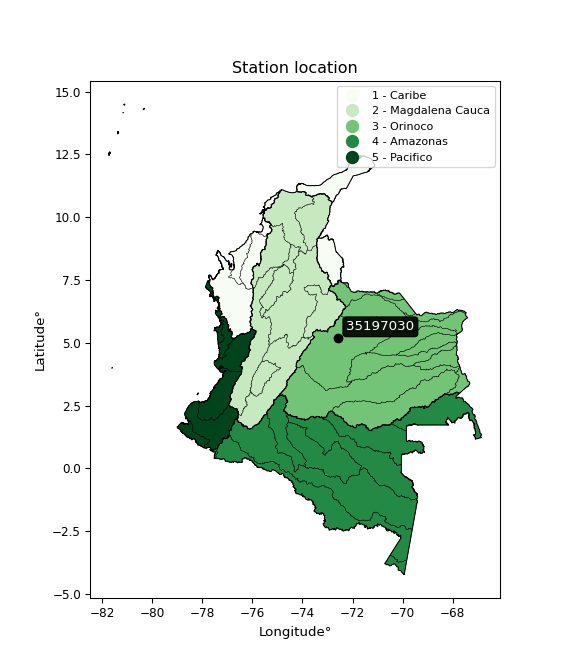

<div align="center">


</div>

# PMax24h Station (Rain): 35197030

Maximum Precipitation in 24 hours (PMax24h) is the greatest amount of rainfall for a specific duration that is meteorologically possible for a given location, acting as a "worst-case" scenario for extreme storms, crucial for designing safety-critical infrastructure like bridges, river deviations, dams, spillways, and nuclear plants to prevent catastrophic failure. The PMax24h is related with the Probable Maximum Precipitation (PMP) and it is calculated by hydrologists using meteorological data to determine the upper limit of extreme rainfall, often leading to the Probable Maximum Flood (PMF) for flood control design, and is increasingly being studied for climate change impacts. Probable Maximum Precipitation (PMP) is the theoretical upper limit of rainfall, a deterministic estimate for extreme events, while probability distributions (like GEV, Gumbel) describe the likelihood and frequency of various precipitation amounts, including rare ones, showing how often events occur, with PMP representing the extreme end of these distributions, used for critical infrastructure design to ensure safety against the worst conceivable weather, unlike standard statistical forecasts which cover typical probabilities.

The most common probability distributions in hydrology, used for analyzing floods, rainfall, and streamflow, include the Normal, Log-Normal, Gumbel, Gamma (including Log-Pearson Type III), and Generalized Extreme Value (GEV) distributions, often chosen based on the data´s skewness and whether modeling extremes or general conditions, with Gumbel and GEV popular for extreme events like floods, while the Normal distribution serves as a baseline, though often requiring transformations for skewed hydrological data. These distributions help in designing water infrastructure, managing water resources, and forecasting hydrologic events.

> Hydrological data often isn´t perfectly normal (it´s skewed), so different distributions are needed for different applications, such as: **Flood Frequency Analysis**: Using Gumbel, GEV, or Log-Pearson Type III for predicting extreme flood magnitudes and their return periods, **Rainfall Analysis**: Normal for annual totals, but Log-Normal, Weibull, or GEV for intensity or extreme daily rainfall, **Streamflow Modeling**: Gamma and Log-Normal for maximum flows, GEV for minimum flows, and Kappa for daily flows.

<div align="center">

</img>

</div>


## A. General information


### 1. General running parameters

• app_version: _v20260225_. • runtime: _2026-02-28 16:54:07.457399_. • Python version: _3.14.0_. • SciPy version: _1.16.3_. • Pandas version: _2.3.3_. • NumPy version: _2.3.5_. • Stations dataset (station_dataset_file): _dataset/pmax24h_in/automatic_colombia_2003_2025.csv_. • Stations catalog (station_catalog_file): _dataset/CNE.xls_. • Minimum year to eval til year_max (date_min): _1900_. • Maximum year to eval since year_min (date_max): _2025_. • Creates, save and include plots into reports (create_plot): _False_. • Plot only fit distributions with Δo > Δ (plot_only_fit): _True_. • Plot only simple graphs avoiding multiple CDFs and multiple Extreme values plots (plot_only_simple): _False_. • Eval low extreme values, if False, evaluates high extreme values (low_extreme): _False_. • Eval every SciPy distribution as logarithmic (pdist_logarithmic_on): _True_. • Standard deviation normalized (ddof): _1.0_. • Return periods to eval in years (Tr): _[2, 2.33, 5, 10, 15, 20, 25, 50, 75, 100, 200, 250, 500, 750, 1000]_. • Minimum data sample per station, 0 means any (minimum_sample): _5_. • Z-Score maximum threshold to adjust a value, 0 means disable (zscore_max): _3.5_. • Z-Score minimum threshold to adjust a value, 0 means disable (zscore_min): _-2.5_. • Avoid zeros, e.g. rain = 0 (avoid_zeros): _True_. • Avoid null values (avoid_nans): _True_. 

:file_folder:Table: [dataset.csv](../../dataset/pmax24h_in/automatic_colombia_2003_2025.csv)

> Delta Degrees of Freedom (DDOF): is a parameter used in the formulas for calculating variance and standard deviation. When ddof=0, the divisor is $N$ (the total number of observations) and this is used when your data set is the entire population. When ddof=1, the divisor is $N-1$ and this is used when your data set is a sample drawn from a larger population. Using $N-1$ provides an unbiased estimate of the population variance (known as Bessel´s correction).


### 2. Station info and location

|   id |   CODIGO | NOMBRE                 | CATEGORIA    | TECNOLOGIA                | ESTADO   | FECHA_INSTALACION   |   FECHA_SUSPENSION |   ALTITUD |   LATITUD |   LONGITUD | DEPARTAMENTO   | MUNICIPIO   | AREA_OPERATIVA                              | ENTIDAD                                                     | AREA_HIDROGRAFICA   | ZONA_HIDROGRAFICA   | SUBZONA_HIDROGRAFICA   | CORRIENTE   | Catalogo   |   Version |
|-----:|---------:|:-----------------------|:-------------|:--------------------------|:---------|:--------------------|-------------------:|----------:|----------:|-----------:|:---------------|:------------|:--------------------------------------------|:------------------------------------------------------------|:--------------------|:--------------------|:-----------------------|:------------|:-----------|----------:|
|    0 | 35197030 | LOS ESTEROS [35197030] | Limnimétrica | Automática con Telemetría | Activa   | 15/11/1974          |                nan |       368 |   5.17969 |   -72.5684 | Casanare       | Aguazul     | Area Operativa 06 - Boyacá-Casanare-Vichada | INSTITUTO DE HIDROLOGIA METEOROLOGIA Y ESTUDIOS AMBIENTALES | Orinoco             | Meta                | Río Cusiana            | Unete       | CNE_IDEAM  |  20251226 |

<div align="center">

Dynamic map: [:earth_americas:Google](http://maps.google.com/maps?q=5.179694444,-72.568388889) [:earth_americas:OSM](https://www.openstreetmap.org/#map=18/5.179694444/-72.568388889&layers=P) [:earth_americas:Bing](https://www.bing.com/maps?cp=5.179694444~-72.568388889&lvl=18) [:earth_americas:Apple](https://maps.apple.com/frame?center=5.179694444%2C-72.568388889&span=0.003%2C0.006)

</div>


<div align="center">

```geojson
{
  "type": "Feature",
  "geometry": {
    "type": "Point", 
    "coordinates": [-72.568388889, 5.179694444]
  }, 
  "properties": {
    "Name": "35197030"
  }
}
```

</div>


### 3. Discrete values table and plot

<div align="center">

|               |           0 |           1 |           2 |           3 |          4 |
|:--------------|------------:|------------:|------------:|------------:|-----------:|
| Date          | 2021        | 2022        | 2023        | 2024        | 2025       |
| Value         |   18.2      |  126        |   42.1      |   22.4      |  151.6     |
| Value_initial |   18.2      |  126        |   42.1      |   22.4      |  151.6     |
| count         |    5        |    5        |    5        |    5        |    5       |
| mean          |   72.06     |   72.06     |   72.06     |   72.06     |   72.06    |
| std           |   62.251    |   62.251    |   62.251    |   62.251    |   62.251   |
| zscore        |   -0.865207 |    0.866492 |   -0.481277 |   -0.797738 |    1.27773 |


</div>


> The initial value (value_initial) correspond to the initial obtained or null completed value, and value (value) is adjusted only when the initial value is outside the valid range (outlier) definite through the Z-Score value. If Z-Score is active, values out of range or outliers are replaced with the station mean value. A Z-Score (or standard score) measures how many standard deviations a data point is from the mean of a dataset, indicating its relative position; positive scores mean above the mean, negative mean below, and a score of zero is exactly at the mean, allowing for comparison of values from different distributions. It´s calculated using the formula $z=(x–μ)/σ$, where $x$ is the data point, $μ$ is the mean, and $σ$ is the standard deviation, helping identify outliers and understand probability.
>
> <sub>**Note**: In this study, "completing" (filling gaps in) and "extending" (forecasting or lengthening the historical record) rainfall data series are avoided for certain critical analyses because they introduce artificial bias and uncertainty, which can distort the statistics of rare events (extremes), alter day-to-day variability, and compromise the integrity and homogeneity of the original data. Some reasons against Completing/Extending rainfall data are: **Distortion of Extremes and Variability**: The primary issue is that most gap-filling or extension methods rely on averaging or regression with nearby stations, which inherently smooths the data. Rainfall is highly variable in space and time, with a large percentage of zero values and occasional large storms. Infilling methods often underestimate the highest values and overestimate the lowest (zero) values, which severely distorts analyses focused on flood frequency, drought severity, and intensity-duration-frequency (IDF) curves, **Loss of Data Homogeneity**: Infilled or extended data are synthetic estimates, not actual measurements. Combining these estimates with observed data can violate the assumption of data homogeneity, which requires that the data properties do not change over time. Inhomogeneity can lead to incorrect conclusions about long-term trends or changes in climate patterns, **Propagation of Errors**: Errors and biases from the original data (e.g., wind-induced undercatch, instrument errors, site changes) or the data used for imputation can propagate through the analysis, leading to unreliable hydrological models and inaccurate predictions, **Compromised Statistical Integrity**: For statistical analyses, especially those involving the frequency of events, using artificial data can introduce time bias or autocorrelation that doesn´t exist in reality, making it difficult to assess the true probability of events, **Difficulty in Validation**: It is difficult to accurately validate the quality of filled or extended data, especially for past periods where ground-truth measurements are unavailable. The reliability of imputation techniques heavily depends on the density of the surrounding station network and the complexity of the local topography.</sub>


### 4. Active continuous probability distributions from SciPy (80 of 104 available)

A Probability Density Function (PDF) describes the relative likelihood of a continuous random variable falling within a specific range, where the total area under its curve equals 1, and the area over any interval gives the actual probability for that range. Unlike discrete probabilities (like rolling a die), a PDF shows density, not direct probability for a single point (which is zero), with higher points indicating higher likelihood, often visualized as a bell curve for normal distributions.

A log of a probability density function (log-PDF) is simply the logarithm of the PDF´s value, denoted as $log(f(x))$, useful for converting multiplication of probabilities into addition, improving numerical stability with tiny numbers, and connecting to information theory concepts like entropy. Instead of dealing with very small probabilities (e.g., 0.000001), log-PDFs use negative numbers (e.g., $log(0.00001) ≈ -11.51$ that are easier for computers to handle, preventing underflow errors and simplifying complex calculations. In this study, each active probability distribution from SciPy is also evaluated in the $log$ form.

[scipy.stats](https://docs.scipy.org/doc/scipy/reference/stats.html) is a Python´s powerful submodule within the SciPy library for comprehensive statistical analysis, offering over 130 probability distributions (like Normal, Poisson, etc.), functions for descriptive stats (mean, variance), hypothesis testing (t-tests, chi-square), random variable generation, and statistical tests, making it essential for data science, modeling, and research. It provides tools to explore, model, and draw conclusions from data efficiently, working seamlessly with [NumPy](https://numpy.org/).

<div align="center">

|   id | p_dist           |   n_parameter | fit_method   | label                                                                       | active   | ref                                                                                                      |
|-----:|:-----------------|--------------:|:-------------|:----------------------------------------------------------------------------|:---------|:---------------------------------------------------------------------------------------------------------|
|    0 | alpha            |             3 | MLE          | Alpha                                                                       | True     | [:mortar_board:](https://docs.scipy.org/doc/scipy/reference/generated/scipy.stats.alpha.html)            |
|    1 | anglit           |             2 | MM           | Anglit                                                                      | True     | [:mortar_board:](https://docs.scipy.org/doc/scipy/reference/generated/scipy.stats.anglit.html)           |
|    2 | arcsine          |             2 | MM           | Arcsine                                                                     | True     | [:mortar_board:](https://docs.scipy.org/doc/scipy/reference/generated/scipy.stats.arcsine.html)          |
|    3 | argus            |             3 | MLE          | Argus                                                                       | True     | [:mortar_board:](https://docs.scipy.org/doc/scipy/reference/generated/scipy.stats.argus.html)            |
|    4 | beta             |             4 | MLE          | Beta                                                                        | True     | [:mortar_board:](https://docs.scipy.org/doc/scipy/reference/generated/scipy.stats.beta.html)             |
|    5 | betaprime        |             4 | MLE          | Beta prime                                                                  | True     | [:mortar_board:](https://docs.scipy.org/doc/scipy/reference/generated/scipy.stats.betaprime.html)        |
|    6 | bradford         |             3 | MLE          | Bradford                                                                    | True     | [:mortar_board:](https://docs.scipy.org/doc/scipy/reference/generated/scipy.stats.bradford.html)         |
|    7 | burr             |             4 | MLE          | Burr (Type III)                                                             | True     | [:mortar_board:](https://docs.scipy.org/doc/scipy/reference/generated/scipy.stats.burr.html)             |
|    8 | burr12           |             4 | MLE          | Burr (Type III) 12                                                          | True     | [:mortar_board:](https://docs.scipy.org/doc/scipy/reference/generated/scipy.stats.burr12.html)           |
|    9 | cosine           |             2 | MLE          | Cosine                                                                      | True     | [:mortar_board:](https://docs.scipy.org/doc/scipy/reference/generated/scipy.stats.cosine.html)           |
|   10 | crystalball      |             4 | MLE          | Crystalball                                                                 | True     | [:mortar_board:](https://docs.scipy.org/doc/scipy/reference/generated/scipy.stats.crystalball.html)      |
|   11 | dgamma           |             3 | MLE          | Double gamma                                                                | True     | [:mortar_board:](https://docs.scipy.org/doc/scipy/reference/generated/scipy.stats.dgamma.html)           |
|   12 | dweibull         |             3 | MLE          | Double Weibull                                                              | True     | [:mortar_board:](https://docs.scipy.org/doc/scipy/reference/generated/scipy.stats.dweibull.html)         |
|   13 | erlang           |             3 | MLE          | Erlang                                                                      | True     | [:mortar_board:](https://docs.scipy.org/doc/scipy/reference/generated/scipy.stats.erlang.html)           |
|   14 | exponnorm        |             3 | MLE          | Exponentially modified Normal                                               | True     | [:mortar_board:](https://docs.scipy.org/doc/scipy/reference/generated/scipy.stats.exponnorm.html)        |
|   15 | exponpow         |             3 | MLE          | Exponential power                                                           | True     | [:mortar_board:](https://docs.scipy.org/doc/scipy/reference/generated/scipy.stats.exponpow.html)         |
|   16 | exponweib        |             4 | MLE          | Exponentiated Weibull                                                       | True     | [:mortar_board:](https://docs.scipy.org/doc/scipy/reference/generated/scipy.stats.exponweib.html)        |
|   17 | f                |             4 | MLE          | F                                                                           | True     | [:mortar_board:](https://docs.scipy.org/doc/scipy/reference/generated/scipy.stats.f.html)                |
|   18 | fatiguelife      |             3 | MLE          | Fatigue-life (Birnbaum-Saunders)                                            | True     | [:mortar_board:](https://docs.scipy.org/doc/scipy/reference/generated/scipy.stats.fatiguelife.html)      |
|   19 | foldnorm         |             3 | MM           | Fold Normal                                                                 | True     | [:mortar_board:](https://docs.scipy.org/doc/scipy/reference/generated/scipy.stats.foldnorm.html)         |
|   20 | gamma            |             3 | MLE          | Gamma                                                                       | True     | [:mortar_board:](https://docs.scipy.org/doc/scipy/reference/generated/scipy.stats.gamma.html)            |
|   21 | gausshyper       |             6 | MLE          | Gauss hypergeometric                                                        | True     | [:mortar_board:](https://docs.scipy.org/doc/scipy/reference/generated/scipy.stats.gausshyper.html)       |
|   22 | genexpon         |             5 | MLE          | Generalized exponential                                                     | True     | [:mortar_board:](https://docs.scipy.org/doc/scipy/reference/generated/scipy.stats.genexpon.html)         |
|   23 | genextreme       |             3 | MLE          | Generalized exponential                                                     | True     | [:mortar_board:](https://docs.scipy.org/doc/scipy/reference/generated/scipy.stats.genextreme.html)       |
|   24 | gengamma         |             4 | MLE          | Generalized gamma                                                           | True     | [:mortar_board:](https://docs.scipy.org/doc/scipy/reference/generated/scipy.stats.gengamma.html)         |
|   25 | genhalflogistic  |             3 | MLE          | Generalized half-logistic                                                   | True     | [:mortar_board:](https://docs.scipy.org/doc/scipy/reference/generated/scipy.stats.genhalflogistic.html)  |
|   26 | genlogistic      |             3 | MLE          | Generalized logistic                                                        | True     | [:mortar_board:](https://docs.scipy.org/doc/scipy/reference/generated/scipy.stats.genlogistic.html)      |
|   27 | gennorm          |             3 | MLE          | Generalized Normal                                                          | True     | [:mortar_board:](https://docs.scipy.org/doc/scipy/reference/generated/scipy.stats.gennorm.html)          |
|   28 | genpareto        |             3 | MLE          | Generalized Pareto                                                          | True     | [:mortar_board:](https://docs.scipy.org/doc/scipy/reference/generated/scipy.stats.genpareto.html)        |
|   29 | gompertz         |             3 | MLE          | Gompertz (or truncated Gumbel)                                              | True     | [:mortar_board:](https://docs.scipy.org/doc/scipy/reference/generated/scipy.stats.gompertz.html)         |
|   30 | gumbel_l         |             2 | MM           | Gumbel Left Skew                                                            | True     | [:mortar_board:](https://docs.scipy.org/doc/scipy/reference/generated/scipy.stats.gumbel_l.html)         |
|   31 | gumbel_r         |             2 | MM           | Gumbel Right Skew                                                           | True     | [:mortar_board:](https://docs.scipy.org/doc/scipy/reference/generated/scipy.stats.gumbel_r.html)         |
|   32 | halfgennorm      |             3 | MLE          | Upper half of a generalized normal                                          | True     | [:mortar_board:](https://docs.scipy.org/doc/scipy/reference/generated/scipy.stats.halfgennorm.html)      |
|   33 | halflogistic     |             2 | MM           | Half-logistic                                                               | True     | [:mortar_board:](https://docs.scipy.org/doc/scipy/reference/generated/scipy.stats.halflogistic.html)     |
|   34 | halfnorm         |             2 | MM           | Half Normal                                                                 | True     | [:mortar_board:](https://docs.scipy.org/doc/scipy/reference/generated/scipy.stats.halfnorm.html)         |
|   35 | hypsecant        |             2 | MM           | hyperbolic secant                                                           | True     | [:mortar_board:](https://docs.scipy.org/doc/scipy/reference/generated/scipy.stats.hypsecant.html)        |
|   36 | invgamma         |             3 | MLE          | Inverted gamma                                                              | True     | [:mortar_board:](https://docs.scipy.org/doc/scipy/reference/generated/scipy.stats.invgamma.html)         |
|   37 | invgauss         |             3 | MLE          | Inverse Gaussian                                                            | True     | [:mortar_board:](https://docs.scipy.org/doc/scipy/reference/generated/scipy.stats.invgauss.html)         |
|   38 | invweibull       |             3 | MLE          | Inverted Weibull                                                            | True     | [:mortar_board:](https://docs.scipy.org/doc/scipy/reference/generated/scipy.stats.invweibull.html)       |
|   39 | johnsonsb        |             4 | MLE          | Johnson SB                                                                  | True     | [:mortar_board:](https://docs.scipy.org/doc/scipy/reference/generated/scipy.stats.johnsonsb.html)        |
|   40 | johnsonsu        |             4 | MLE          | Johnson Su                                                                  | True     | [:mortar_board:](https://docs.scipy.org/doc/scipy/reference/generated/scipy.stats.johnsonsu.html)        |
|   41 | kappa3           |             3 | MLE          | Kappa 3                                                                     | True     | [:mortar_board:](https://docs.scipy.org/doc/scipy/reference/generated/scipy.stats.kappa3.html)           |
|   42 | kappa4           |             4 | MLE          | Kappa 4                                                                     | True     | [:mortar_board:](https://docs.scipy.org/doc/scipy/reference/generated/scipy.stats.kappa4.html)           |
|   43 | ksone            |             3 | MLE          | Kolmogorov-Smirnov one-sided test statistic distribution                    | True     | [:mortar_board:](https://docs.scipy.org/doc/scipy/reference/generated/scipy.stats.ksone.html)            |
|   44 | kstwobign        |             2 | MLE          | Limiting distribution of scaled Kolmogorov-Smirnov two-sided test statistic | True     | [:mortar_board:](https://docs.scipy.org/doc/scipy/reference/generated/scipy.stats.kstwobign.html)        |
|   45 | laplace          |             2 | MM           | Laplace                                                                     | True     | [:mortar_board:](https://docs.scipy.org/doc/scipy/reference/generated/scipy.stats.laplace.html)          |
|   46 | levy_l           |             2 | MLE          | Left-skewed Levy                                                            | True     | [:mortar_board:](https://docs.scipy.org/doc/scipy/reference/generated/scipy.stats.levy_l.html)           |
|   47 | loggamma         |             3 | MLE          | Log gamma                                                                   | True     | [:mortar_board:](https://docs.scipy.org/doc/scipy/reference/generated/scipy.stats.loggamma.html)         |
|   48 | logistic         |             2 | MM           | Logistic (or Sech-squared)                                                  | True     | [:mortar_board:](https://docs.scipy.org/doc/scipy/reference/generated/scipy.stats.logistic.html)         |
|   49 | loglaplace       |             3 | MLE          | Log-Laplace                                                                 | True     | [:mortar_board:](https://docs.scipy.org/doc/scipy/reference/generated/scipy.stats.loglaplace.html)       |
|   50 | lomax            |             3 | MLE          | Lomax (Pareto of the second kind)                                           | True     | [:mortar_board:](https://docs.scipy.org/doc/scipy/reference/generated/scipy.stats.lomax.html)            |
|   51 | maxwell          |             2 | MM           | Maxwell                                                                     | True     | [:mortar_board:](https://docs.scipy.org/doc/scipy/reference/generated/scipy.stats.maxwell.html)          |
|   52 | mielke           |             4 | MLE          | Mielke Beta-Kappa / Dagum                                                   | True     | [:mortar_board:](https://docs.scipy.org/doc/scipy/reference/generated/scipy.stats.mielke.html)           |
|   53 | moyal            |             2 | MM           | Moyal                                                                       | True     | [:mortar_board:](https://docs.scipy.org/doc/scipy/reference/generated/scipy.stats.moyal.html)            |
|   54 | nakagami         |             3 | MLE          | Nakagami                                                                    | True     | [:mortar_board:](https://docs.scipy.org/doc/scipy/reference/generated/scipy.stats.nakagami.html)         |
|   55 | ncf              |             5 | MLE          | Non-central F distribution                                                  | True     | [:mortar_board:](https://docs.scipy.org/doc/scipy/reference/generated/scipy.stats.ncf.html)              |
|   56 | nct              |             4 | MLE          | Non-central Student’s t                                                     | True     | [:mortar_board:](https://docs.scipy.org/doc/scipy/reference/generated/scipy.stats.nct.html)              |
|   57 | norm             |             2 | MM           | Normal                                                                      | True     | [:mortar_board:](https://docs.scipy.org/doc/scipy/reference/generated/scipy.stats.norm.html)             |
|   58 | pearson3         |             3 | MM           | Pearson type III                                                            | True     | [:mortar_board:](https://docs.scipy.org/doc/scipy/reference/generated/scipy.stats.pearson3.html)         |
|   59 | powerlaw         |             3 | MLE          | Power-function                                                              | True     | [:mortar_board:](https://docs.scipy.org/doc/scipy/reference/generated/scipy.stats.powerlaw.html)         |
|   60 | rayleigh         |             2 | MM           | Rayleigh                                                                    | True     | [:mortar_board:](https://docs.scipy.org/doc/scipy/reference/generated/scipy.stats.rayleigh.html)         |
|   61 | rdist            |             3 | MLE          | R-distributed (symmetric beta)                                              | True     | [:mortar_board:](https://docs.scipy.org/doc/scipy/reference/generated/scipy.stats.rdist.html)            |
|   62 | rice             |             3 | MLE          | Rice                                                                        | True     | [:mortar_board:](https://docs.scipy.org/doc/scipy/reference/generated/scipy.stats.rice.html)             |
|   63 | semicircular     |             2 | MM           | Semicircular                                                                | True     | [:mortar_board:](https://docs.scipy.org/doc/scipy/reference/generated/scipy.stats.semicircular.html)     |
|   64 | skewnorm         |             3 | MLE          | Skew normal                                                                 | True     | [:mortar_board:](https://docs.scipy.org/doc/scipy/reference/generated/scipy.stats.skewnorm.html)         |
|   65 | t                |             3 | MLE          | Student’s t                                                                 | True     | [:mortar_board:](https://docs.scipy.org/doc/scipy/reference/generated/scipy.stats.t.html)                |
|   66 | trapezoid        |             4 | MLE          | Trapezoid                                                                   | True     | [:mortar_board:](https://docs.scipy.org/doc/scipy/reference/generated/scipy.stats.trapezoid.html)        |
|   67 | triang           |             3 | MLE          | Triangular                                                                  | True     | [:mortar_board:](https://docs.scipy.org/doc/scipy/reference/generated/scipy.stats.triang.html)           |
|   68 | truncexpon       |             3 | MLE          | Truncated exponential                                                       | True     | [:mortar_board:](https://docs.scipy.org/doc/scipy/reference/generated/scipy.stats.truncexpon.html)       |
|   69 | truncnorm        |             4 | MLE          | Truncated normal                                                            | True     | [:mortar_board:](https://docs.scipy.org/doc/scipy/reference/generated/scipy.stats.truncnorm.html)        |
|   70 | truncpareto      |             4 | MLE          | Upper truncated Pareto                                                      | True     | [:mortar_board:](https://docs.scipy.org/doc/scipy/reference/generated/scipy.stats.truncpareto.html)      |
|   71 | truncweibull_min |             5 | MLE          | Doubly truncated Weibull minimum                                            | True     | [:mortar_board:](https://docs.scipy.org/doc/scipy/reference/generated/scipy.stats.truncweibull_min.html) |
|   72 | tukeylambda      |             3 | MLE          | Tukey-Lamdba                                                                | True     | [:mortar_board:](https://docs.scipy.org/doc/scipy/reference/generated/scipy.stats.tukeylambda.html)      |
|   73 | uniform          |             2 | MLE          | Uniform                                                                     | True     | [:mortar_board:](https://docs.scipy.org/doc/scipy/reference/generated/scipy.stats.uniform.html)          |
|   74 | vonmises         |             3 | MLE          | Von Mises                                                                   | True     | [:mortar_board:](https://docs.scipy.org/doc/scipy/reference/generated/scipy.stats.vonmises.html)         |
|   75 | vonmises_line    |             3 | MLE          | Von Mises line                                                              | True     | [:mortar_board:](https://docs.scipy.org/doc/scipy/reference/generated/scipy.stats.vonmises_line.html)    |
|   76 | wald             |             2 | MM           | Wald                                                                        | True     | [:mortar_board:](https://docs.scipy.org/doc/scipy/reference/generated/scipy.stats.wald.html)             |
|   77 | weibull_max      |             3 | MLE          | Weibull maximum                                                             | True     | [:mortar_board:](https://docs.scipy.org/doc/scipy/reference/generated/scipy.stats.weibull_max.html)      |
|   78 | weibull_min      |             3 | MLE          | Weibull minimum                                                             | True     | [:mortar_board:](https://docs.scipy.org/doc/scipy/reference/generated/scipy.stats.weibull_min.html)      |
|   79 | wrapcauchy       |             3 | MLE          | Wrapped  Cauchy                                                             | True     | [:mortar_board:](https://docs.scipy.org/doc/scipy/reference/generated/scipy.stats.wrapcauchy.html)       |

</div>

> **n_parameter:** # arguments & localization & scale.
>
> **Fit methods:** (MLE) maximum likelihood, (MM) L-moments.
>
>**Inactive** (With the only purpose of prevent loops, zero divisions, infinite values, over high estimated values or horizontal trending for recurrence intervals estimations, the follow distributions were disabled.)**:** lognorm, norminvgauss, powernorm, powerlognorm, cauchy, halfcauchy, foldcauchy, skewcauchy, chi2, expon, fisk, genhyperbolic, geninvgauss, gibrat, kstwo, laplace_asymmetric, levy, levy_stable, ncx2, pareto, rel_breitwigner, recipinvgauss, studentized_range, loguniform, 


## B. Probability (PDF) vs. Empirical (EDF) distributions functions

A continuous probability distribution (CPD) describes probabilities for variables that can take any value within a range (like rain any time), unlike discrete variables with specific outcomes (like temperature). It uses a Probability Density Function (PDF), a curve where the total area under it equals 1, and the probability of the variable falling within an interval (a to b) is found by calculating the area under the curve between those points. A key feature is that the probability of hitting any single exact value is zero, so probabilities are always expressed for ranges, e.g., $P(a ≤ X ≤ b)$.

<div align="center">

Distributions parameters from station values
|     |   station | p_dist              |   n |              loc |          scale | shape                  | shape1                | shape2                | shape3             |
|----:|----------:|:--------------------|----:|-----------------:|---------------:|:-----------------------|:----------------------|:----------------------|:-------------------|
|   0 |  35197030 | alpha               |   5 |      8.15338     |   17.7767      | 3.6245231367680376e-09 |                       |                       |                    |
|   1 |  35197030 | anglit              |   5 |     72.06        |  162.883       |                        |                       |                       |                    |
|   2 |  35197030 | arcsine             |   5 |     -6.682       |  157.484       |                        |                       |                       |                    |
|   3 |  35197030 | argus               |   5 |    -38.6374      |  202.272       | 1.8014650261290645e-06 |                       |                       |                    |
|   4 |  35197030 | beta                |   5 |    -22.4969      |  174.097       | 1.4581639933771284     | 0.9229559293167138    |                       |                    |
|   5 |  35197030 | betaprime           |   5 |     17.3137      |    0.283453    | 6.65943628784472       | 0.44228419919849427   |                       |                    |
|   6 |  35197030 | bradford            |   5 |     18.2         |  133.488       | 3.6093193278503257     |                       |                       |                    |
|   7 |  35197030 | burr                |   5 |     18.1972      |    4.67283     | 0.8553577147998377     | 0.9423202102429555    |                       |                    |
|   8 |  35197030 | burr12              |   5 |     -2.67717     |   20.6299      | 352.77278636321057     | 0.002937727340082078  |                       |                    |
|   9 |  35197030 | cosine              |   5 |     75.2133      |   43.6461      |                        |                       |                       |                    |
|  10 |  35197030 | crystalball         |   5 |     72.06        |   55.679       | 6548.715830091898      | 86.2775195576572      |                       |                    |
|  11 |  35197030 | dgamma              |   5 |     82.8403      |    2.49227     | 22.28811867496428      |                       |                       |                    |
|  12 |  35197030 | dweibull            |   5 |     83.9326      |   60.4142      | 6.085204312798215      |                       |                       |                    |
|  13 |  35197030 | erlang              |   5 |     18.2         |   33.0681      | 0.8702701625275435     |                       |                       |                    |
|  14 |  35197030 | exponnorm           |   5 |     18.1246      |    0.0200384   | 2673.400680844392      |                       |                       |                    |
|  15 |  35197030 | exponpow            |   5 |     18.2         |   94.3982      | 0.6048351580245249     |                       |                       |                    |
|  16 |  35197030 | exponweib           |   5 |     18.2         |   80.8553      | 0.6053502172753338     | 0.20645720078287277   |                       |                    |
|  17 |  35197030 | f                   |   5 |     17.0988      |    4.33553     | 32192.229853916615     | 0.8929062344429843    |                       |                    |
|  18 |  35197030 | fatiguelife         |   5 |     18.2         |    5.34113e-05 | 826.1017939147494      |                       |                       |                    |
|  19 |  35197030 | foldnorm            |   5 |    -23.23        |   61.6199      | 1.4858915923266383     |                       |                       |                    |
|  20 |  35197030 | gamma               |   5 |     18.2         |   33.6502      | 0.7505322716794929     |                       |                       |                    |
|  21 |  35197030 | gausshyper          |   5 |    -11.252       |  162.852       | 1.391577057547221      | 0.8096397419854682    | 0.9984708964931683    | 1.0159512905964334 |
|  22 |  35197030 | genexpon            |   5 |     18.2         |   58.8038      | 1.0917905104789742     | 2.383255353832058e-10 | 0.23015544874679783   |                    |
|  23 |  35197030 | genextreme          |   5 |     19.565       |    9.36837     | -6.863126578680973     |                       |                       |                    |
|  24 |  35197030 | gengamma            |   5 |     18.2         |   80.7131      | 0.6071288318353344     | 0.21065480945687615   |                       |                    |
|  25 |  35197030 | genhalflogistic     |   5 |      4.52114     |  160.482       | 1.0911258647171869     |                       |                       |                    |
|  26 |  35197030 | genlogistic         |   5 |   -272.703       |   41.8908      | 2001.4993764216015     |                       |                       |                    |
|  27 |  35197030 | gennorm             |   5 |     42.1         |    4.31509     | 0.43786280723685744    |                       |                       |                    |
|  28 |  35197030 | genpareto           |   5 |     -0.0928258   |  227.139       | -1.4973627932635274    |                       |                       |                    |
|  29 |  35197030 | gompertz            |   5 |     18.2         |  187.531       | 2.5270536034728233     |                       |                       |                    |
|  30 |  35197030 | gumbel_l            |   5 |     97.1185      |   43.4127      |                        |                       |                       |                    |
|  31 |  35197030 | gumbel_r            |   5 |     47.0015      |   43.4127      |                        |                       |                       |                    |
|  32 |  35197030 | halfgennorm         |   5 |     18.2         |    0.696277    | 0.33015036526444486    |                       |                       |                    |
|  33 |  35197030 | halflogistic        |   5 |      6.06745     |   47.6036      |                        |                       |                       |                    |
|  34 |  35197030 | halfnorm            |   5 |     -1.63717     |   92.3657      |                        |                       |                       |                    |
|  35 |  35197030 | hypsecant           |   5 |     72.06        |   35.4463      |                        |                       |                       |                    |
|  36 |  35197030 | invgamma            |   5 |     17.0987      |    1.93559     | 0.4464539459914668     |                       |                       |                    |
|  37 |  35197030 | invgauss            |   5 |     15.9605      |    8.81196     | 6.366287558373194      |                       |                       |                    |
|  38 |  35197030 | invweibull          |   5 |     18.2         |    1.62481e-10 | 0.1487012730104666     |                       |                       |                    |
|  39 |  35197030 | johnsonsb           |   5 |     18.2         |  355.594       | 0.8628507486730665     | 0.07317454075806962   |                       |                    |
|  40 |  35197030 | johnsonsu           |   5 |      2.91633e+09 |    5.47932e+08 | 133741111.26731116     | 56340780.94912721     |                       |                    |
|  41 |  35197030 | kappa3              |   5 |     18.2         |  133.262       | 1616.8611210724075     |                       |                       |                    |
|  42 |  35197030 | kappa4              |   5 |    -21.5314      |  168.459       | 1.3055185839940144     | 0.9388836147740391    |                       |                    |
|  43 |  35197030 | ksone               |   5 |    -24.3788      |  192.878       | 1.0                    |                       |                       |                    |
|  44 |  35197030 | kstwobign           |   5 |    -96.6815      |  192.795       |                        |                       |                       |                    |
|  45 |  35197030 | laplace             |   5 |     72.06        |   39.371       |                        |                       |                       |                    |
|  46 |  35197030 | levy_l              |   5 |    157.328       |   21.7607      |                        |                       |                       |                    |
|  47 |  35197030 | loggamma            |   5 | -14128.3         | 1991.94        | 1248.0757488247982     |                       |                       |                    |
|  48 |  35197030 | logistic            |   5 |     72.06        |   30.6974      |                        |                       |                       |                    |
|  49 |  35197030 | loglaplace          |   5 |     -0.118768    |   42.2188      | 1.302967617586134      |                       |                       |                    |
|  50 |  35197030 | lomax               |   5 |     18.2         | 1463.87        | 28.250232768310916     |                       |                       |                    |
|  51 |  35197030 | maxwell             |   5 |    -59.8758      |   82.6785      |                        |                       |                       |                    |
|  52 |  35197030 | mielke              |   5 |     -0.0591258   |    1.51854     | 105.32960682538516     | 1.3992357931879926    |                       |                    |
|  53 |  35197030 | moyal               |   5 |     40.2192      |   25.0644      |                        |                       |                       |                    |
|  54 |  35197030 | nakagami            |   5 |     18.2         |  120.253       | 0.1341959830177907     |                       |                       |                    |
|  55 |  35197030 | ncf                 |   5 |     -0.0164405   |    0.000531104 | 6.048074155834532e-05  | 6.022532149756032     | 5.905762953291527     |                    |
|  56 |  35197030 | nct                 |   5 |     -0.0559614   |    0.478383    | 1.1737622650902821     | 62.31102863725751     |                       |                    |
|  57 |  35197030 | norm                |   5 |     72.06        |   55.679       |                        |                       |                       |                    |
|  58 |  35197030 | pearson3            |   5 |     72.06        |   55.679       | 0.41080316317511933    |                       |                       |                    |
|  59 |  35197030 | powerlaw            |   5 |     18.2         |  133.4         | 0.11479676967239479    |                       |                       |                    |
|  60 |  35197030 | rayleigh            |   5 |    -34.4572      |   84.9884      |                        |                       |                       |                    |
|  61 |  35197030 | rdist               |   5 |      6.92576     |   35.1742      | 1.3643332394114256     |                       |                       |                    |
|  62 |  35197030 | rice                |   5 |    -19.1829      |   75.5824      | 0.0015755866548355897  |                       |                       |                    |
|  63 |  35197030 | semicircular        |   5 |     72.06        |  111.358       |                        |                       |                       |                    |
|  64 |  35197030 | skewnorm            |   5 |     18.2         |   77.4571      | 29558708.6567941       |                       |                       |                    |
|  65 |  35197030 | t                   |   5 |     72.0606      |   55.6785      | 217046073.58888727     |                       |                       |                    |
|  66 |  35197030 | trapezoid           |   5 |      4.86        |  160.08        | 1.0                    | 1.0                   |                       |                    |
|  67 |  35197030 | triang              |   5 |    -51.1035      |  202.713       | 0.9999511846086586     |                       |                       |                    |
|  68 |  35197030 | truncexpon          |   5 |    -11.1131      |  189.793       | 0.8573192581408018     |                       |                       |                    |
|  69 |  35197030 | truncnorm           |   5 | -18590.7         | 1022.47        | 18.19987364213356      | 18.330341898766285    |                       |                    |
|  70 |  35197030 | truncpareto         |   5 |     17.6732      |    0.526839    | 0.2959485342061036     | 254.20844944507132    |                       |                    |
|  71 |  35197030 | truncweibull_min    |   5 |     14.2228      |  141.709       | 0.020749267341988828   | 0.028065662255735972  | 0.969431282922679     |                    |
|  72 |  35197030 | tukeylambda         |   5 |     84.9652      |   68.946       | 1.0326627076731039     |                       |                       |                    |
|  73 |  35197030 | uniform             |   5 |     18.2         |  133.4         |                        |                       |                       |                    |
|  74 |  35197030 | vonmises            |   5 |     -0.641715    |    1           | 0.6343038326891435     |                       |                       |                    |
|  75 |  35197030 | vonmises_line       |   5 |     84.9002      |   21.2313      | 0.30794675631978197    |                       |                       |                    |
|  76 |  35197030 | wald                |   5 |     16.381       |   55.679       |                        |                       |                       |                    |
|  77 |  35197030 | weibull_max         |   5 |    151.6         |    1.53526     | 0.1950809449257413     |                       |                       |                    |
|  78 |  35197030 | weibull_min         |   5 |     18.2         |   96.506       | 0.48871996704400655    |                       |                       |                    |
|  79 |  35197030 | wrapcauchy          |   5 |     18.2         |   21.2329      | 0.831411089578419      |                       |                       |                    |
|  80 |  35197030 | logalpha            |   5 |     -1.21227     |   29.8418      | 5.981374329946725      |                       |                       |                    |
|  81 |  35197030 | loganglit           |   5 |      3.92161     |    2.54352     |                        |                       |                       |                    |
|  82 |  35197030 | logarcsine          |   5 |      2.69201     |    2.45921     |                        |                       |                       |                    |
|  83 |  35197030 | logargus            |   5 |      2.1463      |    3.07332     | 0.6299018772546259     |                       |                       |                    |
|  84 |  35197030 | logbeta             |   5 |      2.73899     |    2.28225     | 1.2469253930828936     | 0.9429316537098937    |                       |                    |
|  85 |  35197030 | logbetaprime        |   5 |     -0.07759     |    2.37458     | 55.08254976283321      | 33.67921154313483     |                       |                    |
|  86 |  35197030 | logbradford         |   5 |      2.9014      |    2.11986     | 1.1185416839468352     |                       |                       |                    |
|  87 |  35197030 | logburr             |   5 |     -1.39809     |    1.89639     | 7.257274671418713      | 901.5945952097061     |                       |                    |
|  88 |  35197030 | logburr12           |   5 |      1.93966     |   34.6149      | 2.66172585928886       | 1481.4504242531757    |                       |                    |
|  89 |  35197030 | logcosine           |   5 |      3.938       |    0.680201    |                        |                       |                       |                    |
|  90 |  35197030 | logcrystalball      |   5 |      3.92161     |    0.86946     | 1368.6627429435703     | 64.20029494218745     |                       |                    |
|  91 |  35197030 | logdgamma           |   5 |      4.17363     |    0.111448    | 7.681857316388157      |                       |                       |                    |
|  92 |  35197030 | logdweibull         |   5 |      4.09233     |    0.935338    | 3.54547446543479       |                       |                       |                    |
|  93 |  35197030 | logerlang           |   5 |      0.249912    |    0.198329    | 18.480435121334402     |                       |                       |                    |
|  94 |  35197030 | logexponnorm        |   5 |      3.84498     |    0.866071    | 0.08848779726962497    |                       |                       |                    |
|  95 |  35197030 | logexponpow         |   5 |      2.90142     |    2.61398     | 0.15986810207869928    |                       |                       |                    |
|  96 |  35197030 | logexponweib        |   5 |      2.90142     |    1.01318     | 1.0282272924870393     | 0.9195171223553118    |                       |                    |
|  97 |  35197030 | logf                |   5 |      2.3113      |    1.13321     | 10908.376137421139     | 5.856744768387983     |                       |                    |
|  98 |  35197030 | logfatiguelife      |   5 |      2.90142     |    4.36612e-07 | 1412.2209876092124     |                       |                       |                    |
|  99 |  35197030 | logfoldnorm         |   5 |      2.01801     |    0.893048    | 2.119315919210621      |                       |                       |                    |
| 100 |  35197030 | loggamma            |   5 |     -0.934256    |    0.149434    | 32.36712570438951      |                       |                       |                    |
| 101 |  35197030 | loggausshyper       |   5 |      2.90139     |    2.11985     | 0.7118851950801901     | 0.5439558587391624    | -0.5928703516133367   | 3.3796929678280323 |
| 102 |  35197030 | loggenexpon         |   5 |      2.89879     |    0.0551309   | 0.04470027604085561    | 3.112544916961369     | 0.0001861151977455165 |                    |
| 103 |  35197030 | loggenextreme       |   5 |      3.37179     |    0.600464    | -0.35149877263962037   |                       |                       |                    |
| 104 |  35197030 | loggengamma         |   5 |      2.90142     |    1.00292     | 1.0239022195581782     | 0.9404752235558909    |                       |                    |
| 105 |  35197030 | loggenhalflogistic  |   5 |      2.07131     |    3.04305     | 1.0315644594994273     |                       |                       |                    |
| 106 |  35197030 | loggenlogistic      |   5 |     -1.52935     |    0.719011    | 1086.6963113876118     |                       |                       |                    |
| 107 |  35197030 | loggennorm          |   5 |      3.96133     |    1.05992     | 2280101.1229544394     |                       |                       |                    |
| 108 |  35197030 | loggenpareto        |   5 |     -0.257224    |   11.5709      | -2.192095733240886     |                       |                       |                    |
| 109 |  35197030 | loggompertz         |   5 |      2.90142     |    1.87494     | 1.0638756247654388     |                       |                       |                    |
| 110 |  35197030 | loggumbel_l         |   5 |      4.31292     |    0.677916    |                        |                       |                       |                    |
| 111 |  35197030 | loggumbel_r         |   5 |      3.53031     |    0.677916    |                        |                       |                       |                    |
| 112 |  35197030 | loghalfgennorm      |   5 |      2.90142     |    0.915653    | 0.900307474525482      |                       |                       |                    |
| 113 |  35197030 | loghalflogistic     |   5 |      2.8911      |    0.743358    |                        |                       |                       |                    |
| 114 |  35197030 | loghalfnorm         |   5 |      2.77079     |    1.44235     |                        |                       |                       |                    |
| 115 |  35197030 | loghypsecant        |   5 |      3.92161     |    0.553516    |                        |                       |                       |                    |
| 116 |  35197030 | loginvgamma         |   5 |      2.31099     |    3.31914     | 2.9284243355944914     |                       |                       |                    |
| 117 |  35197030 | loginvgauss         |   5 |      2.71255     |    0.899551    | 1.3440862161229576     |                       |                       |                    |
| 118 |  35197030 | loginvweibull       |   5 |      1.66361     |    1.70818     | 2.8447684844686867     |                       |                       |                    |
| 119 |  35197030 | logjohnsonsb        |   5 |      2.90142     |    6.13792     | 0.41578360652990654    | 0.06804640994579145   |                       |                    |
| 120 |  35197030 | logjohnsonsu        |   5 |      5.02125     |    1.1698e-13  | 4.94755649302045       | 0.18683246015665989   |                       |                    |
| 121 |  35197030 | logkappa3           |   5 |      2.90128     |    2.11988     | 51009.685209746734     |                       |                       |                    |
| 122 |  35197030 | logkappa4           |   5 |      2.67248     |    2.57068     | 1.097566527668514      | 1.0944840323367906    |                       |                    |
| 123 |  35197030 | logksone            |   5 |      2.41566     |    3.0119      | 1.0                    |                       |                       |                    |
| 124 |  35197030 | logkstwobign        |   5 |      1.0629      |    3.2586      |                        |                       |                       |                    |
| 125 |  35197030 | loglaplace          |   5 |      3.92161     |    0.614801    |                        |                       |                       |                    |
| 126 |  35197030 | loglevy_l           |   5 |      5.07699     |    0.209994    |                        |                       |                       |                    |
| 127 |  35197030 | logloggamma         |   5 |   -178.029       |   26.6461      | 924.138345497601       |                       |                       |                    |
| 128 |  35197030 | loglogistic         |   5 |      3.92161     |    0.479359    |                        |                       |                       |                    |
| 129 |  35197030 | logloglaplace       |   5 |     -0.0530159   |    3.79306     | 5.118124877057614      |                       |                       |                    |
| 130 |  35197030 | loglomax            |   5 |      2.90142     |   28.5538      | 28.674241024897317     |                       |                       |                    |
| 131 |  35197030 | logmaxwell          |   5 |      1.86136     |    1.29107     |                        |                       |                       |                    |
| 132 |  35197030 | logmielke           |   5 |     -1.79405     |    2.37569     | 3709.2875576672723     | 7.785911847228903     |                       |                    |
| 133 |  35197030 | logmoyal            |   5 |      3.4244      |    0.391395    |                        |                       |                       |                    |
| 134 |  35197030 | lognakagami         |   5 |      2.90142     |    1.593       | 0.10658067048640166    |                       |                       |                    |
| 135 |  35197030 | logncf              |   5 |     -0.705357    |    4.5226      | 158.02054047002468     | 87.86769818518283     | 3.836762893980986e-09 |                    |
| 136 |  35197030 | lognct              |   5 |     -0.136012    |    0.0904892   | 11.608895785348338     | 41.91757945646077     |                       |                    |
| 137 |  35197030 | lognorm             |   5 |      3.92161     |    0.869461    |                        |                       |                       |                    |
| 138 |  35197030 | logpearson3         |   5 |      3.92161     |    0.86946     | 0.1493048639655316     |                       |                       |                    |
| 139 |  35197030 | logpowerlaw         |   5 |      2.90142     |    2.11982     | 0.12676280828018896    |                       |                       |                    |
| 140 |  35197030 | lograyleigh         |   5 |      2.25828     |    1.32714     |                        |                       |                       |                    |
| 141 |  35197030 | logrdist            |   5 |      3.96369     |    1.06227     | 1.0861901477843205     |                       |                       |                    |
| 142 |  35197030 | logrice             |   5 |      2.39396     |    1.12004     | 0.680378654077243      |                       |                       |                    |
| 143 |  35197030 | logsemicircular     |   5 |      3.92161     |    1.73892     |                        |                       |                       |                    |
| 144 |  35197030 | logskewnorm         |   5 |      2.90142     |    1.34057     | 9575318.532240778      |                       |                       |                    |
| 145 |  35197030 | logt                |   5 |      3.92161     |    0.869461    | 26086948515.65647      |                       |                       |                    |
| 146 |  35197030 | logtrapezoid        |   5 |      1.46241     |    3.68881     | 1.0                    | 1.0                   |                       |                    |
| 147 |  35197030 | logtriang           |   5 |      2.06821     |    2.95304     | 0.9999993724659972     |                       |                       |                    |
| 148 |  35197030 | logtruncexpon       |   5 |      2.90141     |    2.67924     | 0.7912166878051322     |                       |                       |                    |
| 149 |  35197030 | logtruncnorm        |   5 |     -0.191925    |    1.71525     | 2.292364285672594      | 6.838810190584498     |                       |                    |
| 150 |  35197030 | logtruncpareto      |   5 |      2.8924      |    0.00901813  | 0.2694022974676427     | 236.062432157306      |                       |                    |
| 151 |  35197030 | logtruncweibull_min |   5 |      2.89768     |    3.50732     | 0.902812548819786      | 0.0010676667937344077 | 0.6054673329720301    |                    |
| 152 |  35197030 | logtukeylambda      |   5 |      3.96133     |    1.21474     | 1.146079479106802      |                       |                       |                    |
| 153 |  35197030 | loguniform          |   5 |      2.90142     |    2.11982     |                        |                       |                       |                    |
| 154 |  35197030 | logvonmises         |   5 |     -2.38471     |    1           | 1.7485685260740282     |                       |                       |                    |
| 155 |  35197030 | logvonmises_line    |   5 |      3.96134     |    0.337386    | 0.3269430928039305     |                       |                       |                    |
| 156 |  35197030 | logwald             |   5 |      3.05212     |    0.869486    |                        |                       |                       |                    |
| 157 |  35197030 | logweibull_max      |   5 |      5.02125     |    1.15584     | 0.7166783995537485     |                       |                       |                    |
| 158 |  35197030 | logweibull_min      |   5 |      2.90142     |    0.954138    | 0.4762032356690936     |                       |                       |                    |
| 159 |  35197030 | logwrapcauchy       |   5 |      2.90142     |    0.33738     | 0.525                  |                       |                       |                    |

</div>

> **loc** (Location parameter): This shifts the distribution along the x-axis. For many common distributions, like the normal (Gaussian) distribution, loc represents the mean $μ$. For others, like the uniform distribution, it might represent the minimum value, or for the beta distribution, the left end of the support interval.
>
> **scale** (Scale parameter): This determines the width or spread of the distribution. For the normal distribution, scale represents the standard deviation $σ$. For a uniform distribution, it defines the length of the interval (from $loc$ to $loc + scale$).
>
> **shape** (Shape parameters): Refers to parameters that define the specific form of a probability distribution, distinct from its location (loc) and scale (scale). These parameters are required arguments for most distribution functions. For example, a normal (Gaussian) distribution is fully defined by its location (mean) and scale (standard deviation), so it has no specific shape parameters beyond loc and scale. However, other distributions have intrinsic properties that need specification, as Gamma distribution that takes a shape parameter, often named $a$ or $alpha$.


### 0. Cumulative distribution values - CDF (160 evaluated)

Cumulative Distribution Function (CDF), denoted as $F$<sub>$X$</sub>$(x)$, is a function that gives the probability that a random variable $X$ will take a value less than or equal to a specific value, $x$ (i.e., $(P(X≥x)$. It essentially "accumulates" probabilities from a given point up to the far right (positive infinity), providing a complete picture of the distribution´s probabilities for both discrete (like rain) and continuous (like temperature) variables, helping to find probabilities over ranges or above certain values. Each station is evaluated separately ordering the $x$ values ascending, calculating the CDF and PDF values for the activated distributions and their logarithmic forms.

<div align="center">

CDF ordered by x ascending and calculating $log(f(x))$ separately
|   id |   Station |   date |     x |   count |   mean |    std |    zscore |   Value_initial |   station |   m |     alpha |   alpha_pdf |   anglit |   anglit_pdf |   arcsine |   arcsine_pdf |    argus |   argus_pdf |     beta |   beta_pdf |   betaprime |   betaprime_pdf |    bradford |   bradford_pdf |       burr |    burr_pdf |    burr12 |   burr12_pdf |   cosine |   cosine_pdf |   crystalball |   crystalball_pdf |   dgamma |   dgamma_pdf |   dweibull |   dweibull_pdf |      erlang |   erlang_pdf |   exponnorm |   exponnorm_pdf |    exponpow |   exponpow_pdf |   exponweib |   exponweib_pdf |         f |       f_pdf |   fatiguelife |   fatiguelife_pdf |   foldnorm |   foldnorm_pdf |       gamma |     gamma_pdf |   gausshyper |   gausshyper_pdf |    genexpon |   genexpon_pdf |   genextreme |   genextreme_pdf |   gengamma |   gengamma_pdf |   genhalflogistic |   genhalflogistic_pdf |   genlogistic |   genlogistic_pdf |   gennorm |   gennorm_pdf |   genpareto |   genpareto_pdf |    gompertz |   gompertz_pdf |   gumbel_l |   gumbel_l_pdf |   gumbel_r |   gumbel_r_pdf |   halfgennorm |   halfgennorm_pdf |   halflogistic |   halflogistic_pdf |   halfnorm |   halfnorm_pdf |   hypsecant |   hypsecant_pdf |   invgamma |   invgamma_pdf |   invgauss |   invgauss_pdf |   invweibull |   invweibull_pdf |   johnsonsb |   johnsonsb_pdf |   johnsonsu |   johnsonsu_pdf |     kappa3 |   kappa3_pdf |      kappa4 |   kappa4_pdf |    ksone |   ksone_pdf |   kstwobign |   kstwobign_pdf |   laplace |   laplace_pdf |   levy_l |   levy_l_pdf |   loggamma |   loggamma_pdf |   logistic |   logistic_pdf |   loglaplace |   loglaplace_pdf |       lomax |   lomax_pdf |   maxwell |   maxwell_pdf |   mielke |   mielke_pdf |    moyal |   moyal_pdf |    nakagami |   nakagami_pdf |      ncf |    ncf_pdf |       nct |     nct_pdf |     norm |   norm_pdf |   pearson3 |   pearson3_pdf |   powerlaw |   powerlaw_pdf |   rayleigh |   rayleigh_pdf |    rdist |   rdist_pdf |     rice |   rice_pdf |   semicircular |   semicircular_pdf |   skewnorm |   skewnorm_pdf |        t |      t_pdf |   trapezoid |   trapezoid_pdf |   triang |   triang_pdf |   truncexpon |   truncexpon_pdf |   truncnorm |   truncnorm_pdf |   truncpareto |   truncpareto_pdf |   truncweibull_min |   truncweibull_min_pdf |   tukeylambda |   tukeylambda_pdf |   uniform |   uniform_pdf |   vonmises |   vonmises_pdf |   vonmises_line |   vonmises_line_pdf |        wald |    wald_pdf |   weibull_max |   weibull_max_pdf |   weibull_min |   weibull_min_pdf |   wrapcauchy |   wrapcauchy_pdf |   logalpha |   logalpha_pdf |   loganglit |   loganglit_pdf |   logarcsine |   logarcsine_pdf |   logargus |   logargus_pdf |   logbeta |   logbeta_pdf |   logbetaprime |   logbetaprime_pdf |   logbradford |   logbradford_pdf |   logburr |   logburr_pdf |   logburr12 |   logburr12_pdf |   logcosine |   logcosine_pdf |   logcrystalball |   logcrystalball_pdf |   logdgamma |   logdgamma_pdf |   logdweibull |   logdweibull_pdf |   logerlang |   logerlang_pdf |   logexponnorm |   logexponnorm_pdf |   logexponpow |   logexponpow_pdf |   logexponweib |   logexponweib_pdf |     logf |   logf_pdf |   logfatiguelife |   logfatiguelife_pdf |   logfoldnorm |   logfoldnorm_pdf |   loggausshyper |   loggausshyper_pdf |   loggenexpon |   loggenexpon_pdf |   loggenextreme |   loggenextreme_pdf |   loggengamma |   loggengamma_pdf |   loggenhalflogistic |   loggenhalflogistic_pdf |   loggenlogistic |   loggenlogistic_pdf |   loggennorm |   loggennorm_pdf |   loggenpareto |   loggenpareto_pdf |   loggompertz |   loggompertz_pdf |   loggumbel_l |   loggumbel_l_pdf |   loggumbel_r |   loggumbel_r_pdf |   loghalfgennorm |   loghalfgennorm_pdf |   loghalflogistic |   loghalflogistic_pdf |   loghalfnorm |   loghalfnorm_pdf |   loghypsecant |   loghypsecant_pdf |   loginvgamma |   loginvgamma_pdf |   loginvgauss |   loginvgauss_pdf |   loginvweibull |   loginvweibull_pdf |   logjohnsonsb |   logjohnsonsb_pdf |   logjohnsonsu |   logjohnsonsu_pdf |   logkappa3 |   logkappa3_pdf |   logkappa4 |   logkappa4_pdf |   logksone |   logksone_pdf |   logkstwobign |   logkstwobign_pdf |   loglevy_l |   loglevy_l_pdf |   logloggamma |   logloggamma_pdf |   loglogistic |   loglogistic_pdf |   logloglaplace |   logloglaplace_pdf |    loglomax |   loglomax_pdf |   logmaxwell |   logmaxwell_pdf |   logmielke |   logmielke_pdf |   logmoyal |   logmoyal_pdf |   lognakagami |   lognakagami_pdf |   logncf |   logncf_pdf |   lognct |   lognct_pdf |   lognorm |   lognorm_pdf |   logpearson3 |   logpearson3_pdf |   logpowerlaw |   logpowerlaw_pdf |   lograyleigh |   lograyleigh_pdf |    logrdist |   logrdist_pdf |   logrice |   logrice_pdf |   logsemicircular |   logsemicircular_pdf |   logskewnorm |   logskewnorm_pdf |     logt |   logt_pdf |   logtrapezoid |   logtrapezoid_pdf |   logtriang |   logtriang_pdf |   logtruncexpon |   logtruncexpon_pdf |   logtruncnorm |   logtruncnorm_pdf |   logtruncpareto |   logtruncpareto_pdf |   logtruncweibull_min |   logtruncweibull_min_pdf |   logtukeylambda |   logtukeylambda_pdf |   loguniform |   loguniform_pdf |   logvonmises |   logvonmises_pdf |   logvonmises_line |   logvonmises_line_pdf |     logwald |   logwald_pdf |   logweibull_max |   logweibull_max_pdf |   logweibull_min |   logweibull_min_pdf |   logwrapcauchy |   logwrapcauchy_pdf |
|-----:|----------:|-------:|------:|--------:|-------:|-------:|----------:|----------------:|----------:|----:|----------:|------------:|---------:|-------------:|----------:|--------------:|---------:|------------:|---------:|-----------:|------------:|----------------:|------------:|---------------:|-----------:|------------:|----------:|-------------:|---------:|-------------:|--------------:|------------------:|---------:|-------------:|-----------:|---------------:|------------:|-------------:|------------:|----------------:|------------:|---------------:|------------:|----------------:|----------:|------------:|--------------:|------------------:|-----------:|---------------:|------------:|--------------:|-------------:|-----------------:|------------:|---------------:|-------------:|-----------------:|-----------:|---------------:|------------------:|----------------------:|--------------:|------------------:|----------:|--------------:|------------:|----------------:|------------:|---------------:|-----------:|---------------:|-----------:|---------------:|--------------:|------------------:|---------------:|-------------------:|-----------:|---------------:|------------:|----------------:|-----------:|---------------:|-----------:|---------------:|-------------:|-----------------:|------------:|----------------:|------------:|----------------:|-----------:|-------------:|------------:|-------------:|---------:|------------:|------------:|----------------:|----------:|--------------:|---------:|-------------:|-----------:|---------------:|-----------:|---------------:|-------------:|-----------------:|------------:|------------:|----------:|--------------:|---------:|-------------:|---------:|------------:|------------:|---------------:|---------:|-----------:|----------:|------------:|---------:|-----------:|-----------:|---------------:|-----------:|---------------:|-----------:|---------------:|---------:|------------:|---------:|-----------:|---------------:|-------------------:|-----------:|---------------:|---------:|-----------:|------------:|----------------:|---------:|-------------:|-------------:|-----------------:|------------:|----------------:|--------------:|------------------:|-------------------:|-----------------------:|--------------:|------------------:|----------:|--------------:|-----------:|---------------:|----------------:|--------------------:|------------:|------------:|--------------:|------------------:|--------------:|------------------:|-------------:|-----------------:|-----------:|---------------:|------------:|----------------:|-------------:|-----------------:|-----------:|---------------:|----------:|--------------:|---------------:|-------------------:|--------------:|------------------:|----------:|--------------:|------------:|----------------:|------------:|----------------:|-----------------:|---------------------:|------------:|----------------:|--------------:|------------------:|------------:|----------------:|---------------:|-------------------:|--------------:|------------------:|---------------:|-------------------:|---------:|-----------:|-----------------:|---------------------:|--------------:|------------------:|----------------:|--------------------:|--------------:|------------------:|----------------:|--------------------:|--------------:|------------------:|---------------------:|-------------------------:|-----------------:|---------------------:|-------------:|-----------------:|---------------:|-------------------:|--------------:|------------------:|--------------:|------------------:|--------------:|------------------:|-----------------:|---------------------:|------------------:|----------------------:|--------------:|------------------:|---------------:|-------------------:|--------------:|------------------:|--------------:|------------------:|----------------:|--------------------:|---------------:|-------------------:|---------------:|-------------------:|------------:|----------------:|------------:|----------------:|-----------:|---------------:|---------------:|-------------------:|------------:|----------------:|--------------:|------------------:|--------------:|------------------:|----------------:|--------------------:|------------:|---------------:|-------------:|-----------------:|------------:|----------------:|-----------:|---------------:|--------------:|------------------:|---------:|-------------:|---------:|-------------:|----------:|--------------:|--------------:|------------------:|--------------:|------------------:|--------------:|------------------:|------------:|---------------:|----------:|--------------:|------------------:|----------------------:|--------------:|------------------:|---------:|-----------:|---------------:|-------------------:|------------:|----------------:|----------------:|--------------------:|---------------:|-------------------:|-----------------:|---------------------:|----------------------:|--------------------------:|-----------------:|---------------------:|-------------:|-----------------:|--------------:|------------------:|-------------------:|-----------------------:|------------:|--------------:|-----------------:|---------------------:|-----------------:|---------------------:|----------------:|--------------------:|
|    0 |  35197030 |   2021 |  18.2 |       5 |  72.06 | 62.251 | -0.865207 |            18.2 |  35197030 |   1 | 0.0768244 | 0.0293696   | 0.192916 |   0.00484503 |  0.260236 |    0.00554156 | 0.116068 |  0.00399968 | 0.109888 | 0.00397209 |   0.0500375 |     0.107674    | 1.61151e-07 |     0.0176945  | 0.00255421 | 0.72289     | 0.0123167 |  0.0483073   | 0.138483 |   0.00459989 |      0.166689 |        0.00448774 | 0.105353 |   0.011085   |  0.0940313 |     0.0145458  | 1.33102e-14 |  3.26045     |  0.00140641 |      0.0186391  | 1.16397e-10 | 19816.2        |  0.00902914 |     3.17564e+11 | 0.0517282 | 0.101538    |     0.0340814 |       2.93056e+09 |   0.192499 |     0.00528072 | 1.11115e-12 | 234.738       |     0.105304 |       0.00472311 | 2.10089e-13 |     0.0185667  |  0.000473164 |    451.229       | 0.00904787 |    3.25643e+11 |         0.0447023 |            0.00342824 |      0.145339 |        0.00668832 |  0.228146 |   0.00529155  |   0.0822417 |      0.00459458 | 3.05792e-12 |     0.0134754  |   0.149875 |     0.00317963 |   0.143496 |     0.00641724 |      0        |       0.230801    |       0.126748 |         0.0103347  |   0.170052 |     0.00844138 |    0.137147 |      0.00375054 |  0.0517277 |    0.101537    |  0.0552122 |    0.0576297   |   0.00721527 |      1.48933e+12 |   0.0226663 |     1.10858e+12 |    0.153239 |      0.00449026 | 1.0378e-09 |   0.00746978 | 6.01336e-13 |  31.6328     | 0.220756 |  0.00518463 |    0.130303 |      0.0067477  |  0.127306 |    0.0032335  | 0.307514 |   0.00104872 |   0.113042 |       0.263417 |   0.147475 |     0.00409566 |    0.0951283 |         0.15473  | 8.91296e-16 |  0.0192983  |  0.172584 |    0.00551001 | 0.101819 |  0.0175577   | 0.120771 |  0.00741106 | 2.97951e-05 |    2.25089e+09 | 0.238656 | 0.0105969  | 0.0965547 | 0.0196024   | 0.166689 | 0.00448774 |   0.16595  |     0.00518813 |  0.0125109 |    4.04259e+11 |   0.174644 |     0.00601699 | 0.627204 |   0.0115471 | 0.115129 | 0.00579043 |       0.204555 |         0.00500371 |  0         |     0.010301   | 0.166685 | 0.00448769 |  0.00694444 |      0.00104115 | 0.116887 |   0.0033732  |     0.248587 |       0.00784235 | 3.87924e-08 |      0.0196539  |   1.37774e-16 |       0.697102    |        3.28524e-10 |             0.0708578  |   7.10543e-15 |        0.0107834  | 0         |    0.00749625 |    3.49787 |       0.272054 |     1.53692e-07 |          0.00538105 | 8.44507e-08 | 7.31783e-07 |     0.0917009 |       0.000320398 |   9.29777e-09 |       1.27902e+06 |  7.73283e-08 |       0.0814269  |   0.101526 |       0.312919 |    0.140561 |        0.273297 |     0.188517 |         0.463743 |  0.0827505 |       0.217044 | 0.0347255 |      0.26709  |       0.10791  |           0.288701 |   1.51108e-05 |          0.702843 | 0.0935887 |      0.373718 |    0.10128  |        0.265589 |   0.0984796 |        0.244945 |         0.120326 |             0.230514 |   0.0491112 |        0.215464 |     0.0474573 |          0.332698 |    0.107304 |        0.269231 |       0.120302 |           0.230601 |    0.00301236 |       1.08442e+12 |    3.01459e-15 |           6.4181   | 0.075455 |   0.513494 |        0.0349267 |          1.04963e+12 |      0.128276 |          0.239452 |     0.000113868 |         2.78206     |    0.00213307 |          0.809573 |        0.082094 |            0.471644 |   1.62377e-15 |          3.52094  |             0.158814 |                 0.222884 |         0.101503 |             0.322611 |  2.66015e-06 |         0.471733 |       0.340438 |        0.141937    |   5.27456e-09 |          0.56742  |      0.117209 |          0.162343 |     0.0797684 |          0.297537 |      8.64879e-09 |             1.03815  |        0.00694327 |              0.672591 |     0.0721667 |          0.550921 |      0.0999627 |           0.177642 |     0.0754546 |          0.513488 |     0.0585222 |         0.845935  |       0.0820922 |            0.471651 |      0.0172935 |        6.55519e+12 |       0.18792  |        0.0237554   | 6.62811e-05 |        0.471625 |  0.00117203 |        0.758175 |   0.16128  |       0.332016 |      0.0921548 |           0.338396 |    0.243958 |       0.0542869 |      0.123198 |          0.229497 |      0.106382 |          0.198317 |        0.139179 |            0.241108 | 4.16084e-13 |       1.00422  |     0.114862 |         0.289927 |         nan |             nan |  0.0511147 |       0.296692 |    0.00040138 |       1.92661e+11 | 0.10944  |     0.280591 | 0.100683 |     0.320896 |  0.120326 |      0.230514 |      0.118125 |          0.241889 |     0.0102922 |       2.93785e+12 |      0.110789 |          0.324693 | 1.42481e-09 |    3.28064e+06 | 0.0782974 |      0.296549 |          0.149204 |              0.296475 |      0        |          0.595184 | 0.120326 |   0.230514 |       0.15218  |           0.211506 |   0.0796105 |        0.191094 |     1.11312e-05 |            0.682702 |    0           |           0        |      1.44083e-16 |           38.7693    |           5.69785e-07 |                  1.0664   |      7.10543e-15 |             0.816221 |    0         |         0.471737 |       1.13006 |          0.213759 |        3.44414e-06 |               0.331265 | 0           |     0         |         0.213428 |             0.111443 |      4.99787e-08 |          5.35929e+07 |        0        |            1.51453  |
|    1 |  35197030 |   2024 |  22.4 |       5 |  72.06 | 62.251 | -0.797738 |            22.4 |  35197030 |   2 | 0.212111  | 0.0320832   | 0.213664 |   0.00503296 |  0.282781 |    0.00520897 | 0.13343  |  0.00426692 | 0.12698  | 0.00416517 |   0.361575  |     0.0422925   | 0.0703917   |     0.01589    | 0.49815    | 0.0499316   | 0.183162  |  0.033757    | 0.158507 |   0.00493364 |      0.186224 |        0.00481373 | 0.158812 |   0.0143052  |  0.163453  |     0.0180733  | 0.164487    |  0.0318229   |  0.076707   |      0.0172351  | 0.151599    |     0.0216535  |  0.590625   |     0.0132331   | 0.353051  | 0.0420906   |     0.632863  |       0.0152192   |   0.215026 |     0.00544694 | 0.216458    |   0.0359938   |     0.125518 |       0.00489835 | 0.0750171   |     0.0171739  |  0.427866    |      0.0126013   | 0.633555   |    0.0136432   |         0.0593218 |            0.00353429 |      0.174685 |        0.00727255 |  0.252354 |   0.00628271  |   0.101641  |      0.00464366 | 0.0556281   |     0.013014   |   0.163782 |     0.00344532 |   0.171629 |     0.00696759 |      0.265806 |       0.0377726   |       0.169884 |         0.0102003  |   0.205321 |     0.00835071 |    0.153771 |      0.00417136 |  0.35305   |    0.0420906   |  0.281789  |    0.0423957   |   0.972105   |      0.000973721 |   0.705029  |     0.00608294  |    0.172867 |      0.00485632 | 0.0313731  |   0.00746978 | 0.0715957   |   0.0130443  | 0.242531 |  0.00518463 |    0.159928 |      0.00734303 |  0.141638 |    0.00359752 | 0.312016 |   0.0010954  |   0.176098 |       0.343052 |   0.165519 |     0.00449948 |    0.133348  |         0.216896 | 0.077748    |  0.017747   |  0.196397 |    0.00582464 | 0.179697 |  0.0189993   | 0.153623 |  0.0082062  | 0.330769    |    0.0211341   | 0.282631 | 0.0103199  | 0.183971  | 0.0212391   | 0.186224 | 0.00481373 |   0.188509 |     0.00555061 |  0.672335  |    0.0183767   |   0.200509 |     0.00629332 | 0.676474 |   0.0119454 | 0.140446 | 0.00625671 |       0.225813 |         0.00511694 |  0.0432431 |     0.0102859  | 0.186219 | 0.00481369 |  0.0120056  |      0.00136894 | 0.131484 |   0.00357762 |     0.281163 |       0.00767071 | 0.0795363   |      0.0182381  |   0.592698    |       0.0405878   |        0.203226    |             0.0344967  |   0.0326558   |        0.00766127 | 0.0314843 |    0.00749625 |    4.09019 |       0.105258 |     0.022646    |          0.00541347 | 0.00611154  | 0.00508814  |     0.0930741 |       0.000333678 |   0.194365    |       0.0202606   |  0.261931    |       0.0380352  |   0.177655 |       0.415883 |    0.201836 |        0.315603 |     0.270207 |         0.344914 |  0.133685  |       0.273147 | 0.0972615 |      0.329244 |       0.177275 |           0.37686  |   0.138498    |          0.633443 | 0.185839  |      0.5031   |    0.164451 |        0.341673 |   0.156655  |        0.314683 |         0.175011 |             0.296489 |   0.114054  |        0.422125 |     0.151528  |          0.652292 |    0.172048 |        0.353033 |       0.175009 |           0.296615 |    0.612657   |       0.387599    |    0.198693    |           0.803498 | 0.203884 |   0.678594 |        0.687338  |          0.416386    |      0.184282 |          0.300279 |     0.0693005   |         0.268119    |    0.160292   |          0.714477 |        0.200253 |            0.633798 |   0.194036    |          0.802526 |             0.207097 |                 0.242609 |         0.180087 |             0.429038 |  0.5         |         0.471735 |       0.370736 |        0.150122    |   0.117141    |          0.559617 |      0.155782 |          0.210888 |     0.155438  |          0.426822 |      0.188229    |             0.798131 |        0.145565   |              0.658371 |     0.185427  |          0.538179 |      0.144156  |           0.251624 |     0.203883  |          0.67859  |     0.256415  |         0.907896  |       0.200253  |            0.633807 |      0.57444   |        0.132954    |       0.193155 |        0.026783    | 0.0979941   |        0.471625 |  0.111978   |        0.490269 |   0.23022  |       0.332016 |      0.174709  |           0.448931 |    0.256077 |       0.0627811 |      0.177485 |          0.293677 |      0.155109 |          0.273387 |        0.197037 |            0.318923 | 0.187599    |       0.809939 |     0.182771 |         0.361832 |         nan |             nan |  0.134637  |       0.497995 |    0.537678   |       0.551075    | 0.176767 |     0.365902 | 0.178688 |     0.425203 |  0.175011 |      0.296489 |      0.175623 |          0.311821 |     0.744899  |       0.454757    |      0.185742 |          0.393316 | 0.18932     |    0.51061     | 0.149647  |      0.386469 |          0.213736 |              0.323674 |      0.123092 |          0.588087 | 0.175012 |   0.29649  |       0.199266 |           0.242025 |   0.124233  |        0.238715 |     0.136413    |            0.631791 |    0           |           0        |      0.74666     |            0.685296  |           0.15812     |                  0.66711  |      0.105497    |             0.483161 |    0.0979512 |         0.471737 |       1.18154 |          0.283499 |        0.0702058   |               0.351746 | 0.000245923 |     0.0348013 |         0.238243 |             0.128087 |      0.383525    |          0.683924    |        0.253208 |            0.816946 |
|    2 |  35197030 |   2023 |  42.1 |       5 |  72.06 | 62.251 | -0.481277 |            42.1 |  35197030 |   3 | 0.600512  | 0.0107312   | 0.320185 |   0.00572861 |  0.375758 |    0.00437121 | 0.229197 |  0.005428   | 0.217293 | 0.00498374 |   0.653772  |     0.00584034  | 0.326216    |     0.0107485  | 0.811863   | 0.00543231  | 0.552075  |  0.0103671   | 0.26976  |   0.00629291 |      0.295259 |        0.00619936 | 0.453241 |   0.00874258 |  0.449344  |     0.00698219 | 0.578529    |  0.0139974   |  0.360806   |      0.0119318  | 0.420753    |     0.00987406 |  0.689017   |     0.00238201  | 0.64814   | 0.00595424  |     0.790956  |       0.00486913  |   0.329723 |     0.00616667 | 0.634403    |   0.0129895   |     0.228384 |       0.00549728 | 0.35837     |     0.0119129  |  0.517396    |      0.00207852  | 0.733167   |    0.00236197  |         0.134384  |            0.00410929 |      0.336093 |        0.00874572 |  0.5      |   0.0439042   |   0.19561   |      0.00490598 | 0.290706    |     0.0108572  |   0.24541  |     0.00489437 |   0.326435 |     0.00841808 |      0.616341 |       0.00928139  |       0.361374 |         0.00913177 |   0.364159 |     0.00772218 |    0.258241 |      0.00651211 |  0.648139  |    0.00595425  |  0.648433  |    0.00844544  |   0.978391   |      0.000132982 |   0.748691  |     0.00104593  |    0.284727 |      0.0064431  | 0.178528   |   0.00746978 | 0.270195    |   0.00860515 | 0.344668 |  0.00518463 |    0.321997 |      0.00872792 |  0.233607 |    0.00593349 | 0.336123 |   0.00136899 |   0.446524 |       0.475355 |   0.273691 |     0.00647559 |    0.372146  |         0.605311 | 0.367139    |  0.0120169  |  0.322632 |    0.00686143 | 0.488759 |  0.0115578   | 0.33546  |  0.00964073 | 0.527154    |    0.00589222  | 0.465136 | 0.00808157 | 0.508432  | 0.0113314   | 0.295259 | 0.00619936 |   0.312029 |     0.00686486 |  0.82087   |    0.00394281  |   0.333501 |     0.00706425 | 1        | 678.232     | 0.280145 | 0.00772222 |       0.330812 |         0.00550609 |  0.242342  |     0.00982211 | 0.295254 | 0.00619936 |  0.0541184  |      0.00290647 | 0.211408 |   0.00453648 |     0.424698 |       0.00691444 | 0.382564    |      0.0128403  |   0.842255    |       0.00483059  |        0.54941     |             0.0101305  |   0.181237    |        0.00747931 | 0.17916   |    0.00749625 |    7.20727 |       0.177219 |     0.136897    |          0.00641247 | 0.330552    | 0.0166826   |     0.100364  |       0.000411063 |   0.396823    |       0.00623543  |  0.453879    |       0.0023732  |   0.482268 |       0.484942 |    0.428859 |        0.389156 |     0.452826 |         0.261741 |  0.354978  |       0.421138 | 0.340185  |      0.430684 |       0.461836 |           0.474822 |   0.488041    |          0.487241 | 0.521716  |      0.47927  |    0.432509 |        0.475222 |   0.408017  |        0.458126 |         0.417293 |             0.448943 |   0.470755  |        0.300396 |     0.484562  |          0.152955 |    0.447981 |        0.478637 |       0.417372 |           0.449025 |    0.728033   |       0.0995168   |    0.559475    |           0.402404 | 0.572342 |   0.431714 |        0.836795  |          0.144216    |      0.424219 |          0.438765 |     0.242266    |         0.300551    |    0.527385   |          0.458868 |        0.563347 |            0.44291  |   0.559492    |          0.410877 |             0.383566 |                 0.322659 |         0.490112 |             0.485938 |  0.5         |         0.471735 |       0.475801 |        0.186647    |   0.451235    |          0.487016 |      0.349191 |          0.412364 |     0.480036  |          0.519675 |      0.554045    |             0.412096 |        0.51611    |              0.493457 |     0.498419  |          0.441377 |      0.397412  |           0.54546  |     0.57234   |          0.431716 |     0.628969  |         0.359718  |       0.563348  |            0.442905 |      0.61422   |        0.0359456   |       0.214323 |        0.0425311   | 0.395583    |        0.471625 |  0.403337   |        0.447866 |   0.439718 |       0.332016 |      0.49051   |           0.486562 |    0.308132 |       0.10933   |      0.41695  |          0.444152 |      0.406425 |          0.503263 |        0.5      |            0.674669 | 0.563966    |       0.425381 |     0.451605 |         0.453946 |         nan |             nan |  0.504035  |       0.544792 |    0.722107   |       0.178707    | 0.456491 |     0.473782 | 0.485971 |     0.483184 |  0.417293 |      0.448943 |      0.426615 |          0.455736 |     0.889096  |       0.134392    |      0.463824 |          0.451077 | 0.428575    |    0.323823    | 0.438871  |      0.485528 |          0.43365  |              0.364099 |      0.468407 |          0.489409 | 0.417293 |   0.448943 |       0.38124  |           0.334767 |   0.320516  |        0.383429 |     0.4916      |            0.499221 |    4.12471e-09 |           1.53596  |      0.916153    |            0.121292  |           0.510336    |                  0.47909  |      0.399125    |             0.456651 |    0.395611  |         0.471737 |       1.42522 |          0.465181 |        0.362202    |               0.595239 | 0.569898    |     0.634251  |         0.340756 |             0.205211 |      0.609528    |          0.20851     |        0.466393 |            0.162123 |
|    3 |  35197030 |   2022 | 126   |       5 |  72.06 | 62.251 |  0.866492 |           126   |  35197030 |   4 | 0.880097  | 0.00100975  | 0.807472 |   0.00484132 |  0.740207 |    0.00554882 | 0.803931 |  0.00701319 | 0.764582 | 0.00816231 |   0.816502  |     0.000737195 | 0.893117    |     0.00451994 | 0.939682   | 0.000448878 | 0.849998  |  0.0012081   | 0.831334 |   0.00509062 |      0.833669 |        0.0044815  | 0.571025 |   0.0113084  |  0.552316  |     0.00715724 | 0.970822    |  0.000910523 |  0.866507   |      0.00249191 | 0.858481    |     0.00254279 |  0.773287   |     0.000503428 | 0.814244  | 0.000752218 |     0.957259  |       0.0007253   |   0.825289 |     0.00418135 | 0.976655    |   0.000737151 |     0.76354  |       0.00753964 | 0.864866    |     0.00250899 |  0.589143    |      0.000421314 | 0.814858   |    0.000475568 |         0.664696  |            0.00999146 |      0.863136 |        0.00303252 |  0.919476 |   0.00112202  |   0.695251  |      0.00795016 | 0.859582    |     0.00336214 |   0.857017 |     0.0064061  |   0.850379 |     0.00317473 |      0.894472 |       0.00117047  |       0.850982 |         0.00289716 |   0.832988 |     0.00332487 |    0.863153 |      0.00374285 |  0.814244  |    0.00075222  |  0.882412  |    0.000988661 |   0.98269    |      2.36697e-05 |   0.788708  |     0.00028175  |    0.847116 |      0.00448337 | 0.805242   |   0.00746978 | 0.836925    |   0.00560137 | 0.779659 |  0.00518463 |    0.861284 |      0.00332083 |  0.872952 |    0.00322694 | 0.595397 |   0.00749915 |   0.862686 |       0.229689 |   0.852852 |     0.00408813 |    0.88706   |         0.183702 | 0.865652    |  0.00241486 |  0.832136 |    0.00389657 | 0.85625  |  0.00147347  | 0.856645 |  0.00282877 | 0.780507    |    0.0017665   | 0.830761 | 0.00202427 | 0.850902  | 0.00135981  | 0.833669 | 0.0044815  |   0.836096 |     0.00393219 |  0.975836  |    0.00103917  |   0.831741 |     0.00373782 | 1        |   0         | 0.84195  | 0.0040167  |       0.795845 |         0.00500144 |  0.835998  |     0.00391092 | 0.833669 | 0.00448155 |  0.572665   |      0.00945461 | 0.763327 |   0.00862012 |     0.893573 |       0.00444399 | 0.941092    |      0.00286881 |   0.984387    |       0.000700958 |        0.941728    |             0.00252794 |   0.805078    |        0.00747274 | 0.808096  |    0.00749625 |   20.7425  |       0.205631 |     0.852076    |          0.00655945 | 0.881983    | 0.00204368  |     0.177034  |       0.00233579  |   0.652009    |       0.00166533  |  0.542298    |       0.00210728 |   0.852601 |       0.187974 |    0.829398 |        0.29578  |     0.767014 |         0.387348 |  0.876233  |       0.443739 | 0.885506  |      0.57735  |       0.851708 |           0.209988 |   0.937174    |          0.347784 | 0.852201  |      0.158643 |    0.86572  |        0.24758  |   0.864382  |        0.291911 |         0.8536   |             0.263842 |   0.644224  |        0.654534 |     0.679307  |          0.678766 |    0.85934  |        0.225508 |       0.853602 |           0.263715 |    0.796806   |       0.0414991   |    0.832606    |           0.143839 | 0.842169 |   0.126393 |        0.931973  |          0.050594    |      0.85001  |          0.261071 |     0.726997    |         0.795061    |    0.854543   |          0.171475 |        0.842137 |            0.12974  |   0.837642    |          0.145073 |             0.872228 |                 0.626874 |         0.85617  |             0.184895 |  0.5         |         0.471735 |       0.7832   |        0.534704    |   0.85368     |          0.233015 |      0.885151 |          0.366636 |     0.864448  |          0.185744 |      0.833236    |             0.146053 |        0.863864   |              0.170671 |     0.847867  |          0.198408 |      0.879499  |           0.212538 |     0.842169  |          0.126394 |     0.849982  |         0.108302  |       0.842134  |            0.129738 |      0.641696  |        0.0191827   |       0.333628 |        0.367402    | 0.912594    |        0.471625 |  0.901443   |        0.489364 |   0.803686 |       0.332016 |      0.863166  |           0.194313 |    0.649712 |       1.0008    |      0.852334 |          0.26622  |      0.870807 |          0.234693 |        0.863647 |            0.142734 | 0.847413    |       0.143506 |     0.84951  |         0.23073  |         nan |             nan |  0.869184  |       0.16561  |    0.852831   |       0.0814699   | 0.852778 |     0.215633 | 0.852641 |     0.186535 |  0.8536   |      0.263842 |      0.853229 |          0.2513   |     0.988494  |       0.0647614   |      0.848426 |          0.221855 | 0.820018    |    0.529891    | 0.855229  |      0.233722 |          0.818706 |              0.311363 |      0.851068 |          0.210039 | 0.8536   |   0.263842 |       0.836539 |           0.495892 |   0.87865   |        0.634847 |     0.940732    |            0.331587 |    0.845848    |           0.28934  |      0.992618    |            0.0422932 |           0.941784    |                  0.324166 |      0.905489    |             0.485933 |    0.912746  |         0.471737 |       1.85672 |          0.232788 |        0.937718    |               0.347527 | 0.891021    |     0.119201  |         0.764187 |             0.796339 |      0.75347     |          0.084962    |        0.766248 |            0.900418 |
|    4 |  35197030 |   2025 | 151.6 |       5 |  72.06 | 62.251 |  1.27773  |           151.6 |  35197030 |   5 | 0.901374  | 0.000684029 | 0.914313 |   0.00343683 |  1        |    0          | 0.960771 |  0.00473966 | 1        | 0.128388   |   0.83271   |     0.000545291 | 0.999664    |     0.00384083 | 0.949206   | 0.000308653 | 0.875711  |  0.000834904 | 0.935145 |   0.00299603 |      0.923433 |        0.00258272 | 0.933663 |   0.00790813 |  0.931898  |     0.0122094  | 0.986846    |  0.000408388 |  0.917221   |      0.00154523 | 0.911992    |     0.00168726 |  0.784776   |     0.000401424 | 0.830777  | 0.000556138 |     0.97213   |       0.000458924 |   0.911699 |     0.00259864 | 0.989554    |   0.000326643 |     1        |       4.98306    | 0.915988    |     0.00155983 |  0.59875     |      0.000335436 | 0.825667   |    0.000376115 |         1         |            0.267954   |      0.923223 |        0.00176053 |  0.942439 |   0.000712933 |   1         |    877.347      | 0.92719     |     0.00199835 |   0.970035 |     0.00242117 |   0.91405  |     0.00189219 |      0.919227 |       0.000796357 |       0.910183 |         0.00180204 |   0.90289  |     0.00218152 |    0.932745 |      0.00188328 |  0.830778  |    0.000556139 |  0.903736  |    0.000702276 |   0.983225   |      1.8541e-05  |   0.795461  |     0.000249089 |    0.934504 |      0.00242165 | 0.996467   |   0.00744534 | 0.971676    |   0.0048151  | 0.912386 |  0.00518463 |    0.927471 |      0.00193759 |  0.93369  |    0.00168423 | 0.948713 |   0.0203144  |   0.900408 |       0.179217 |   0.930286 |     0.00211267 |    0.916403  |         0.135974 | 0.914886    |  0.00150537 |  0.911994 |    0.00239675 | 0.887057 |  0.000980056 | 0.913676 |  0.00171532 | 0.821163    |    0.00142734  | 0.873794 | 0.0013858  | 0.87954   | 0.000919056 | 0.923433 | 0.00258272 |   0.915549 |     0.00234434 |  1         |    0.000860545 |   0.908947 |     0.00234543 | 1        |   0         | 0.922137 | 0.00232775 |       0.912364 |         0.00400105 |  0.914975  |     0.00233772 | 0.923433 | 0.00258274 |  0.840278   |      0.0114526  | 0.999951 |   0.00986614 |     1        |       0.00388323 | 0.999999    |      0.00181351 |   1           |       0.000532469 |        1           |             0.00205689 |   0.998933    |        0.00805935 | 1         |    0.00749625 |   24.8268  |       0.156199 |     0.999998    |          0.00538105 | 0.923061    | 0.00124373  |     0.997908  |       1.4345e+10  |   0.690075    |       0.00133007  |  0.999175    |       0.0814264  |   0.883771 |       0.1502   |    0.880436 |        0.25512  |     0.852326 |         0.578527 |  0.951062  |       0.354168 | 1         |      3.99529  |       0.886522 |           0.167494 |   0.999997    |          0.331763 | 0.878659  |      0.12849  |    0.906253 |        0.191525 |   0.912578  |        0.228895 |         0.897016 |             0.206216 |   0.768538  |        0.644971 |     0.81157   |          0.701849 |    0.896481 |        0.177128 |       0.896998 |           0.206121 |    0.804108   |       0.0375767   |    0.857125    |           0.121922 | 0.863469 |   0.104733 |        0.940652  |          0.0434659   |      0.893175 |          0.206165 |     1           |         3.65248e+06 |    0.883418   |          0.141516 |        0.863956 |            0.107045 |   0.862319    |          0.122427 |             1        |                 2.0226   |         0.886862 |             0.148086 |  0.999997    |         0.471734 |       1        |        4.10191e+07 |   0.892636    |          0.188704 |      0.94175  |          0.244286 |     0.895045  |          0.146395 |      0.8581      |             0.123465 |        0.892236   |              0.137158 |     0.881306  |          0.16377  |      0.913225  |           0.154836 |     0.863469  |          0.104733 |     0.868435  |         0.0918096 |       0.863952  |            0.107044 |      0.645154  |        0.0182525   |       0.999994 |        4.15868e+06 | 0.999828    |        0.471553 |  1          |        9.27408  |   0.865096 |       0.332016 |      0.895458  |           0.155817 |    0.947738 |       2.11197   |      0.896194 |          0.20856  |      0.908376 |          0.173625 |        0.887247 |            0.113728 | 0.871709    |       0.119929 |     0.887912 |         0.185214 |         nan |             nan |  0.896538  |       0.131428 |    0.867143   |       0.0734716   | 0.888479 |     0.171422 | 0.88362  |     0.149536 |  0.897016 |      0.206216 |      0.894657 |          0.197407 |     1         |       0.0597987   |      0.885494 |          0.179626 | 0.976135    |    2.74782     | 0.893893  |      0.185203 |          0.873848 |              0.283607 |      0.886188 |          0.170483 | 0.897016 |   0.206216 |       0.930775 |           0.523078 |   0.999997  |        0.677268 |     0.999994    |            0.309468 |    0.89165     |           0.209699 |      1           |            0.0376844 |           1           |                  0.305573 |      1           |             0.816221 |    1         |         0.471737 |       1.89443 |          0.17648  |        0.999993    |               0.331265 | 0.910687    |     0.0945735 |         1        |         11875.8      |      0.768342    |          0.0761086   |        1        |            1.51453  |


</div>

An Empirical Distribution Function (EDF) is a step-function estimate of a true cumulative distribution function (CDF) based on observed sample data, representing the proportion of data points less than or equal to a given value. It is calculated by ordering your data and jumping up by $1/n$ (where $n$ is sample size) at each unique data point, allowing analysis without assuming an underlying population distribution, and it gets closer to the true CDF as the sample size grows. For the empirical probability calculations, the parameter $m$ correspond to the order number which means the position of the $x$ values in an ascending order list.

The Kolmogorov-Smirnov (K-S) test is a non-parametric statistical test used to determine if a sample data set comes from a specific theoretical distribution (one-sample) or if two different samples come from the same underlying distribution (two-sample), by comparing their cumulative distribution functions (CDFs). It calculates the maximum vertical difference (D statistic) between these functions, with a small p-value indicating a significant difference and rejection of the null hypothesis (that the data/samples match).


### 1. EDF California (1923)

California´s estimates the true probability distribution of water-related data (like rainfall, streamflow) using observed samples, crucial for risk assessment.

<div align="center">


$P=m/n$


</div>


**1.1. Empirical values**

<div align="center">

|                | 0              | 1                  | 2              | 3                 | 4              |
|:---------------|:---------------|:-------------------|:---------------|:------------------|:---------------|
| date           | 2021           | 2024               | 2023           | 2022              | 2025           |
| x              | 18.2           | 22.4               | 42.1           | 126.0             | 151.6          |
| m              | 1              | 2                  | 3              | 4                 | 5              |
| empirical_dist | edf_california | edf_california     | edf_california | edf_california    | edf_california |
| empirical      | 0.2            | 0.4                | 0.6            | 0.8               | 1.0            |
| empirical_tr   | 1.25           | 1.6666666666666667 | 2.5            | 5.000000000000001 | inf            |

</div>


**1.2. Kolmogorov-Smirnov fit test (sorted by Δ)**


<div align="center">

|                | 0                  | 1                   | 2                   | 3                   | 4                  | 5                   | 6                   | 7                  | 8                   | 9                   | 10                  | 11                  | 12                  | 13                  | 14                  | 15                  | 16                  | 17                  | 18                  | 19                 | 20                  | 21                  | 22                 | 23                 | 24                  | 25                  | 26                  | 27                  | 28                 | 29                  | 30                  | 31                  | 32                  | 33                 | 34                 | 35                  | 36                  | 37                  | 38                  | 39                  | 40                  | 41                 | 42                  | 43                  | 44                  | 45                 | 46                  | 47                  | 48                 | 49                 | 50                 | 51                  | 52                  | 53                  | 54                  | 55                  | 56                 | 57                 | 58                  | 59                 | 60                  | 61                  | 62                 | 63                  | 64                  | 65                  | 66                 | 67                  | 68                  | 69                 | 70                  | 71                  | 72                  | 73                  | 74                  | 75                  | 76                 | 77                 | 78                 | 79                  | 80                  | 81                  | 82                  | 83                 | 84                  | 85                  | 86                  | 87                  | 88                  | 89                  | 90                 | 91                 | 92                 | 93                 | 94                  | 95                 | 96                  | 97                 | 98                  | 99                 | 100                | 101                | 102                 | 103                | 104                 | 105                 | 106                | 107                | 108                | 109                 | 110                 | 111                | 112                | 113                 | 114                | 115                | 116                 | 117                 | 118                | 119                | 120                | 121                 | 122                 | 123                 | 124                 | 125                 | 126                | 127                | 128                 | 129                 | 130                 | 131                | 132                 | 133                | 134                | 135                 | 136                | 137                 | 138                | 139                 | 140                | 141                 | 142                 | 143                | 144                 | 145                 | 146                | 147                | 148                | 149                | 150                 | 151                 | 152                | 153                | 154                | 155                | 156                | 157                | 158                | 159                |
|:---------------|:-------------------|:--------------------|:--------------------|:--------------------|:-------------------|:--------------------|:--------------------|:-------------------|:--------------------|:--------------------|:--------------------|:--------------------|:--------------------|:--------------------|:--------------------|:--------------------|:--------------------|:--------------------|:--------------------|:-------------------|:--------------------|:--------------------|:-------------------|:-------------------|:--------------------|:--------------------|:--------------------|:--------------------|:-------------------|:--------------------|:--------------------|:--------------------|:--------------------|:-------------------|:-------------------|:--------------------|:--------------------|:--------------------|:--------------------|:--------------------|:--------------------|:-------------------|:--------------------|:--------------------|:--------------------|:-------------------|:--------------------|:--------------------|:-------------------|:-------------------|:-------------------|:--------------------|:--------------------|:--------------------|:--------------------|:--------------------|:-------------------|:-------------------|:--------------------|:-------------------|:--------------------|:--------------------|:-------------------|:--------------------|:--------------------|:--------------------|:-------------------|:--------------------|:--------------------|:-------------------|:--------------------|:--------------------|:--------------------|:--------------------|:--------------------|:--------------------|:-------------------|:-------------------|:-------------------|:--------------------|:--------------------|:--------------------|:--------------------|:-------------------|:--------------------|:--------------------|:--------------------|:--------------------|:--------------------|:--------------------|:-------------------|:-------------------|:-------------------|:-------------------|:--------------------|:-------------------|:--------------------|:-------------------|:--------------------|:-------------------|:-------------------|:-------------------|:--------------------|:-------------------|:--------------------|:--------------------|:-------------------|:-------------------|:-------------------|:--------------------|:--------------------|:-------------------|:-------------------|:--------------------|:-------------------|:-------------------|:--------------------|:--------------------|:-------------------|:-------------------|:-------------------|:--------------------|:--------------------|:--------------------|:--------------------|:--------------------|:-------------------|:-------------------|:--------------------|:--------------------|:--------------------|:-------------------|:--------------------|:-------------------|:-------------------|:--------------------|:-------------------|:--------------------|:-------------------|:--------------------|:-------------------|:--------------------|:--------------------|:-------------------|:--------------------|:--------------------|:-------------------|:-------------------|:-------------------|:-------------------|:--------------------|:--------------------|:-------------------|:-------------------|:-------------------|:-------------------|:-------------------|:-------------------|:-------------------|:-------------------|
| station        | 35197030           | 35197030            | 35197030            | 35197030            | 35197030           | 35197030            | 35197030            | 35197030           | 35197030            | 35197030            | 35197030            | 35197030            | 35197030            | 35197030            | 35197030            | 35197030            | 35197030            | 35197030            | 35197030            | 35197030           | 35197030            | 35197030            | 35197030           | 35197030           | 35197030            | 35197030            | 35197030            | 35197030            | 35197030           | 35197030            | 35197030            | 35197030            | 35197030            | 35197030           | 35197030           | 35197030            | 35197030            | 35197030            | 35197030            | 35197030            | 35197030            | 35197030           | 35197030            | 35197030            | 35197030            | 35197030           | 35197030            | 35197030            | 35197030           | 35197030           | 35197030           | 35197030            | 35197030            | 35197030            | 35197030            | 35197030            | 35197030           | 35197030           | 35197030            | 35197030           | 35197030            | 35197030            | 35197030           | 35197030            | 35197030            | 35197030            | 35197030           | 35197030            | 35197030            | 35197030           | 35197030            | 35197030            | 35197030            | 35197030            | 35197030            | 35197030            | 35197030           | 35197030           | 35197030           | 35197030            | 35197030            | 35197030            | 35197030            | 35197030           | 35197030            | 35197030            | 35197030            | 35197030            | 35197030            | 35197030            | 35197030           | 35197030           | 35197030           | 35197030           | 35197030            | 35197030           | 35197030            | 35197030           | 35197030            | 35197030           | 35197030           | 35197030           | 35197030            | 35197030           | 35197030            | 35197030            | 35197030           | 35197030           | 35197030           | 35197030            | 35197030            | 35197030           | 35197030           | 35197030            | 35197030           | 35197030           | 35197030            | 35197030            | 35197030           | 35197030           | 35197030           | 35197030            | 35197030            | 35197030            | 35197030            | 35197030            | 35197030           | 35197030           | 35197030            | 35197030            | 35197030            | 35197030           | 35197030            | 35197030           | 35197030           | 35197030            | 35197030           | 35197030            | 35197030           | 35197030            | 35197030           | 35197030            | 35197030            | 35197030           | 35197030            | 35197030            | 35197030           | 35197030           | 35197030           | 35197030           | 35197030            | 35197030            | 35197030           | 35197030           | 35197030           | 35197030           | 35197030           | 35197030           | 35197030           | 35197030           |
| empirical_dist | edf_california     | edf_california      | edf_california      | edf_california      | edf_california     | edf_california      | edf_california      | edf_california     | edf_california      | edf_california      | edf_california      | edf_california      | edf_california      | edf_california      | edf_california      | edf_california      | edf_california      | edf_california      | edf_california      | edf_california     | edf_california      | edf_california      | edf_california     | edf_california     | edf_california      | edf_california      | edf_california      | edf_california      | edf_california     | edf_california      | edf_california      | edf_california      | edf_california      | edf_california     | edf_california     | edf_california      | edf_california      | edf_california      | edf_california      | edf_california      | edf_california      | edf_california     | edf_california      | edf_california      | edf_california      | edf_california     | edf_california      | edf_california      | edf_california     | edf_california     | edf_california     | edf_california      | edf_california      | edf_california      | edf_california      | edf_california      | edf_california     | edf_california     | edf_california      | edf_california     | edf_california      | edf_california      | edf_california     | edf_california      | edf_california      | edf_california      | edf_california     | edf_california      | edf_california      | edf_california     | edf_california      | edf_california      | edf_california      | edf_california      | edf_california      | edf_california      | edf_california     | edf_california     | edf_california     | edf_california      | edf_california      | edf_california      | edf_california      | edf_california     | edf_california      | edf_california      | edf_california      | edf_california      | edf_california      | edf_california      | edf_california     | edf_california     | edf_california     | edf_california     | edf_california      | edf_california     | edf_california      | edf_california     | edf_california      | edf_california     | edf_california     | edf_california     | edf_california      | edf_california     | edf_california      | edf_california      | edf_california     | edf_california     | edf_california     | edf_california      | edf_california      | edf_california     | edf_california     | edf_california      | edf_california     | edf_california     | edf_california      | edf_california      | edf_california     | edf_california     | edf_california     | edf_california      | edf_california      | edf_california      | edf_california      | edf_california      | edf_california     | edf_california     | edf_california      | edf_california      | edf_california      | edf_california     | edf_california      | edf_california     | edf_california     | edf_california      | edf_california     | edf_california      | edf_california     | edf_california      | edf_california     | edf_california      | edf_california      | edf_california     | edf_california      | edf_california      | edf_california     | edf_california     | edf_california     | edf_california     | edf_california      | edf_california      | edf_california     | edf_california     | edf_california     | edf_california     | edf_california     | edf_california     | edf_california     | edf_california     |
| p_dist         | ncf                | loggenpareto        | loginvgauss         | invgauss            | gennorm            | logarcsine          | betaprime           | invgamma           | f                   | logksone            | truncexpon          | logsemicircular     | alpha               | logf                | loginvgamma         | loganglit           | lognakagami         | loginvweibull       | loggenextreme       | nakagami           | truncweibull_min    | gamma               | halfgennorm        | logwrapcauchy      | logexponweib        | logloglaplace       | loggengamma         | logrdist            | loghalfgennorm     | burr                | loglomax            | logexponpow         | logburr             | lograyleigh        | loghalfnorm        | exponweib           | logfoldnorm         | nct                 | loggenhalflogistic  | burr12              | logmaxwell          | logtrapezoid       | loggenlogistic      | mielke              | lognct              | logalpha           | logloggamma         | logbetaprime        | logncf             | loggamma           | loggamma           | arcsine             | logpearson3         | logt                | lognorm             | logcrystalball      | logexponnorm       | logkstwobign       | logerlang           | logweibull_min     | fatiguelife         | gengamma            | erlang             | logburr12           | halfnorm            | halflogistic        | loggenexpon        | dgamma              | logtruncweibull_min | truncpareto        | logcosine           | loggumbel_r         | loglogistic         | dweibull            | exponpow            | logdweibull         | logrice            | loggumbel_l        | loghalflogistic    | ksone               | loghypsecant        | wrapcauchy          | logweibull_max      | logbradford        | logtruncexpon       | levy_l              | genlogistic         | moyal               | logmoyal            | logargus            | rayleigh           | loglaplace         | loglaplace         | semicircular       | foldnorm            | powerlaw           | gumbel_r            | logskewnorm        | maxwell             | kstwobign          | logtriang          | anglit             | loggompertz         | logdgamma          | logfatiguelife      | pearson3            | logkappa4          | loglevy_l          | logtukeylambda     | loggennorm          | logkappa3           | loguniform         | logbeta            | norm                | crystalball        | t                  | johnsonsb           | weibull_min         | johnsonsu          | rice               | truncnorm          | lomax               | exponnorm           | genexpon            | logistic            | bradford            | logvonmises_line   | kappa4             | cosine              | hypsecant           | gompertz            | logpowerlaw        | logtruncpareto      | gumbel_l           | logjohnsonsb       | skewnorm            | loggausshyper      | laplace             | argus              | gausshyper          | beta               | triang              | wald                | logwald            | genextreme          | genpareto           | tukeylambda        | uniform            | kappa3             | rdist              | vonmises_line       | genhalflogistic     | logjohnsonsu       | trapezoid          | invweibull         | logtruncnorm       | weibull_max        | logvonmises        | vonmises           | logmielke          |
| delta          | 0.134864241677788  | 0.14043750596448262 | 0.14358455417339988 | 0.14478783252980726 | 0.1476456746157917 | 0.14767406929662463 | 0.16729046596114638 | 0.1692224891944356 | 0.16922252951602001 | 0.16978009831700408 | 0.17530233138783813 | 0.18626425881564235 | 0.18788857828633498 | 0.19611550870199201 | 0.19611700121266218 | 0.19816377355488668 | 0.19959862001589812 | 0.19974656173177244 | 0.19974667182299116 | 0.1999702048892581 | 0.19999999967147605 | 0.19999999999888887 | 0.2                | 0.2                | 0.20130677144171946 | 0.20296312408250483 | 0.20596355213210238 | 0.21068030236863713 | 0.211771243226289  | 0.21186288145470633 | 0.21240117240962486 | 0.21265702454341906 | 0.21416086528116848 | 0.2142576061632011 | 0.214572904824155  | 0.21522446646998428 | 0.21571785325961962 | 0.21602923480470246 | 0.21643353104644425 | 0.21683813643691774 | 0.21722897473432667 | 0.218759826093418  | 0.21991260549882352 | 0.22030285834737118 | 0.22131203146249717 | 0.222344628965577  | 0.22251545475610496 | 0.22272546833711082 | 0.2232326804456014 | 0.2239021648420819 | 0.2239021648420819 | 0.22424226202431452 | 0.22437679183951323 | 0.22498841246809947 | 0.22498875644818822 | 0.22498878587151935 | 0.2249907310968316 | 0.2252910697763769 | 0.22795195273169336 | 0.2316576206173998 | 0.23286262299950466 | 0.23355502767031489 | 0.2355132079214355 | 0.23554936151116096 | 0.23584099717476642 | 0.23862647970721773 | 0.2397075760481372 | 0.24118826310968833 | 0.2418797481519245  | 0.2422554314842158 | 0.24334546641504684 | 0.24456160533132498 | 0.24489084543137526 | 0.24768374234129542 | 0.24840122685854293 | 0.24847160118341882 | 0.2503530513244278 | 0.250808902052814  | 0.2544348991102293 | 0.25533159587244514 | 0.25584448970399326 | 0.25770206388759975 | 0.25924401467238917 | 0.2615016539771649 | 0.26358692093324154 | 0.26387653457030125 | 0.26390741665182255 | 0.26454042304859837 | 0.26536309041138983 | 0.26631504863131794 | 0.266499277871099  | 0.266652176184222  | 0.266652176184222  | 0.2691882735501031 | 0.27027682890520205 | 0.2723354038629221 | 0.27356516517731905 | 0.2769083360087801 | 0.27736772614557786 | 0.2780027292407947 | 0.2794844290215164 | 0.2798147415711359 | 0.28285864030562285 | 0.2859458768594121 | 0.28733801850754426 | 0.28797119048655706 | 0.2880217984586133 | 0.2918680703619526 | 0.2945026145649067 | 0.30000000000000004 | 0.30200586652773415 | 0.3020487660211184 | 0.3027384899062312 | 0.30474062016658465 | 0.3047406237729478 | 0.3047459921243066 | 0.30502895157819065 | 0.30992477127115703 | 0.3152727480437991 | 0.3198552576012793 | 0.3204637105311634 | 0.32225204924187056 | 0.32329297792733147 | 0.32498290626236437 | 0.32630927623150346 | 0.32960825500320345 | 0.3297942147354737 | 0.3298048176480682 | 0.33023988911010405 | 0.34175883492719666 | 0.34437185839428663 | 0.3448993286524289 | 0.34665999162145367 | 0.3545899260091717 | 0.3548460377916207 | 0.35765762938249857 | 0.3577343770065612 | 0.36639263077817585 | 0.3708032455938486 | 0.37161575500091304 | 0.3827072340132888 | 0.38859225040734946 | 0.39388846016827567 | 0.399754077093077  | 0.40125038298035975 | 0.40438972691024566 | 0.4187628612854283 | 0.420839580209895  | 0.4214722466023937 | 0.4272035175524885 | 0.46310323807031595 | 0.46561603813187313 | 0.4663715329640273 | 0.5458815694601474 | 0.5721049637500915 | 0.5999999958752905 | 0.6229655023602253 | 1.0567224813072718 | 23.826821039378906 | nan                |
| deltao         | 0.5865427407550001 | 0.5865427407550001  | 0.5865427407550001  | 0.5865427407550001  | 0.5865427407550001 | 0.5865427407550001  | 0.5865427407550001  | 0.5865427407550001 | 0.5865427407550001  | 0.5865427407550001  | 0.5865427407550001  | 0.5865427407550001  | 0.5865427407550001  | 0.5865427407550001  | 0.5865427407550001  | 0.5865427407550001  | 0.5865427407550001  | 0.5865427407550001  | 0.5865427407550001  | 0.5865427407550001 | 0.5865427407550001  | 0.5865427407550001  | 0.5865427407550001 | 0.5865427407550001 | 0.5865427407550001  | 0.5865427407550001  | 0.5865427407550001  | 0.5865427407550001  | 0.5865427407550001 | 0.5865427407550001  | 0.5865427407550001  | 0.5865427407550001  | 0.5865427407550001  | 0.5865427407550001 | 0.5865427407550001 | 0.5865427407550001  | 0.5865427407550001  | 0.5865427407550001  | 0.5865427407550001  | 0.5865427407550001  | 0.5865427407550001  | 0.5865427407550001 | 0.5865427407550001  | 0.5865427407550001  | 0.5865427407550001  | 0.5865427407550001 | 0.5865427407550001  | 0.5865427407550001  | 0.5865427407550001 | 0.5865427407550001 | 0.5865427407550001 | 0.5865427407550001  | 0.5865427407550001  | 0.5865427407550001  | 0.5865427407550001  | 0.5865427407550001  | 0.5865427407550001 | 0.5865427407550001 | 0.5865427407550001  | 0.5865427407550001 | 0.5865427407550001  | 0.5865427407550001  | 0.5865427407550001 | 0.5865427407550001  | 0.5865427407550001  | 0.5865427407550001  | 0.5865427407550001 | 0.5865427407550001  | 0.5865427407550001  | 0.5865427407550001 | 0.5865427407550001  | 0.5865427407550001  | 0.5865427407550001  | 0.5865427407550001  | 0.5865427407550001  | 0.5865427407550001  | 0.5865427407550001 | 0.5865427407550001 | 0.5865427407550001 | 0.5865427407550001  | 0.5865427407550001  | 0.5865427407550001  | 0.5865427407550001  | 0.5865427407550001 | 0.5865427407550001  | 0.5865427407550001  | 0.5865427407550001  | 0.5865427407550001  | 0.5865427407550001  | 0.5865427407550001  | 0.5865427407550001 | 0.5865427407550001 | 0.5865427407550001 | 0.5865427407550001 | 0.5865427407550001  | 0.5865427407550001 | 0.5865427407550001  | 0.5865427407550001 | 0.5865427407550001  | 0.5865427407550001 | 0.5865427407550001 | 0.5865427407550001 | 0.5865427407550001  | 0.5865427407550001 | 0.5865427407550001  | 0.5865427407550001  | 0.5865427407550001 | 0.5865427407550001 | 0.5865427407550001 | 0.5865427407550001  | 0.5865427407550001  | 0.5865427407550001 | 0.5865427407550001 | 0.5865427407550001  | 0.5865427407550001 | 0.5865427407550001 | 0.5865427407550001  | 0.5865427407550001  | 0.5865427407550001 | 0.5865427407550001 | 0.5865427407550001 | 0.5865427407550001  | 0.5865427407550001  | 0.5865427407550001  | 0.5865427407550001  | 0.5865427407550001  | 0.5865427407550001 | 0.5865427407550001 | 0.5865427407550001  | 0.5865427407550001  | 0.5865427407550001  | 0.5865427407550001 | 0.5865427407550001  | 0.5865427407550001 | 0.5865427407550001 | 0.5865427407550001  | 0.5865427407550001 | 0.5865427407550001  | 0.5865427407550001 | 0.5865427407550001  | 0.5865427407550001 | 0.5865427407550001  | 0.5865427407550001  | 0.5865427407550001 | 0.5865427407550001  | 0.5865427407550001  | 0.5865427407550001 | 0.5865427407550001 | 0.5865427407550001 | 0.5865427407550001 | 0.5865427407550001  | 0.5865427407550001  | 0.5865427407550001 | 0.5865427407550001 | 0.5865427407550001 | 0.5865427407550001 | 0.5865427407550001 | 0.5865427407550001 | 0.5865427407550001 | 0.5865427407550001 |
| eval           | Δo > Δ             | Δo > Δ              | Δo > Δ              | Δo > Δ              | Δo > Δ             | Δo > Δ              | Δo > Δ              | Δo > Δ             | Δo > Δ              | Δo > Δ              | Δo > Δ              | Δo > Δ              | Δo > Δ              | Δo > Δ              | Δo > Δ              | Δo > Δ              | Δo > Δ              | Δo > Δ              | Δo > Δ              | Δo > Δ             | Δo > Δ              | Δo > Δ              | Δo > Δ             | Δo > Δ             | Δo > Δ              | Δo > Δ              | Δo > Δ              | Δo > Δ              | Δo > Δ             | Δo > Δ              | Δo > Δ              | Δo > Δ              | Δo > Δ              | Δo > Δ             | Δo > Δ             | Δo > Δ              | Δo > Δ              | Δo > Δ              | Δo > Δ              | Δo > Δ              | Δo > Δ              | Δo > Δ             | Δo > Δ              | Δo > Δ              | Δo > Δ              | Δo > Δ             | Δo > Δ              | Δo > Δ              | Δo > Δ             | Δo > Δ             | Δo > Δ             | Δo > Δ              | Δo > Δ              | Δo > Δ              | Δo > Δ              | Δo > Δ              | Δo > Δ             | Δo > Δ             | Δo > Δ              | Δo > Δ             | Δo > Δ              | Δo > Δ              | Δo > Δ             | Δo > Δ              | Δo > Δ              | Δo > Δ              | Δo > Δ             | Δo > Δ              | Δo > Δ              | Δo > Δ             | Δo > Δ              | Δo > Δ              | Δo > Δ              | Δo > Δ              | Δo > Δ              | Δo > Δ              | Δo > Δ             | Δo > Δ             | Δo > Δ             | Δo > Δ              | Δo > Δ              | Δo > Δ              | Δo > Δ              | Δo > Δ             | Δo > Δ              | Δo > Δ              | Δo > Δ              | Δo > Δ              | Δo > Δ              | Δo > Δ              | Δo > Δ             | Δo > Δ             | Δo > Δ             | Δo > Δ             | Δo > Δ              | Δo > Δ             | Δo > Δ              | Δo > Δ             | Δo > Δ              | Δo > Δ             | Δo > Δ             | Δo > Δ             | Δo > Δ              | Δo > Δ             | Δo > Δ              | Δo > Δ              | Δo > Δ             | Δo > Δ             | Δo > Δ             | Δo > Δ              | Δo > Δ              | Δo > Δ             | Δo > Δ             | Δo > Δ              | Δo > Δ             | Δo > Δ             | Δo > Δ              | Δo > Δ              | Δo > Δ             | Δo > Δ             | Δo > Δ             | Δo > Δ              | Δo > Δ              | Δo > Δ              | Δo > Δ              | Δo > Δ              | Δo > Δ             | Δo > Δ             | Δo > Δ              | Δo > Δ              | Δo > Δ              | Δo > Δ             | Δo > Δ              | Δo > Δ             | Δo > Δ             | Δo > Δ              | Δo > Δ             | Δo > Δ              | Δo > Δ             | Δo > Δ              | Δo > Δ             | Δo > Δ              | Δo > Δ              | Δo > Δ             | Δo > Δ              | Δo > Δ              | Δo > Δ             | Δo > Δ             | Δo > Δ             | Δo > Δ             | Δo > Δ              | Δo > Δ              | Δo > Δ             | Δo > Δ             | Δo > Δ             | Δo <= Δ            | Δo <= Δ            | Δo <= Δ            | Δo <= Δ            | Δo <= Δ            |
| fit            | 1                  | 1                   | 1                   | 1                   | 1                  | 1                   | 1                   | 1                  | 1                   | 1                   | 1                   | 1                   | 1                   | 1                   | 1                   | 1                   | 1                   | 1                   | 1                   | 1                  | 1                   | 1                   | 1                  | 1                  | 1                   | 1                   | 1                   | 1                   | 1                  | 1                   | 1                   | 1                   | 1                   | 1                  | 1                  | 1                   | 1                   | 1                   | 1                   | 1                   | 1                   | 1                  | 1                   | 1                   | 1                   | 1                  | 1                   | 1                   | 1                  | 1                  | 1                  | 1                   | 1                   | 1                   | 1                   | 1                   | 1                  | 1                  | 1                   | 1                  | 1                   | 1                   | 1                  | 1                   | 1                   | 1                   | 1                  | 1                   | 1                   | 1                  | 1                   | 1                   | 1                   | 1                   | 1                   | 1                   | 1                  | 1                  | 1                  | 1                   | 1                   | 1                   | 1                   | 1                  | 1                   | 1                   | 1                   | 1                   | 1                   | 1                   | 1                  | 1                  | 1                  | 1                  | 1                   | 1                  | 1                   | 1                  | 1                   | 1                  | 1                  | 1                  | 1                   | 1                  | 1                   | 1                   | 1                  | 1                  | 1                  | 1                   | 1                   | 1                  | 1                  | 1                   | 1                  | 1                  | 1                   | 1                   | 1                  | 1                  | 1                  | 1                   | 1                   | 1                   | 1                   | 1                   | 1                  | 1                  | 1                   | 1                   | 1                   | 1                  | 1                   | 1                  | 1                  | 1                   | 1                  | 1                   | 1                  | 1                   | 1                  | 1                   | 1                   | 1                  | 1                   | 1                   | 1                  | 1                  | 1                  | 1                  | 1                   | 1                   | 1                  | 1                  | 1                  | 0                  | 0                  | 0                  | 0                  | 0                  |
| n              | 5                  | 5                   | 5                   | 5                   | 5                  | 5                   | 5                   | 5                  | 5                   | 5                   | 5                   | 5                   | 5                   | 5                   | 5                   | 5                   | 5                   | 5                   | 5                   | 5                  | 5                   | 5                   | 5                  | 5                  | 5                   | 5                   | 5                   | 5                   | 5                  | 5                   | 5                   | 5                   | 5                   | 5                  | 5                  | 5                   | 5                   | 5                   | 5                   | 5                   | 5                   | 5                  | 5                   | 5                   | 5                   | 5                  | 5                   | 5                   | 5                  | 5                  | 5                  | 5                   | 5                   | 5                   | 5                   | 5                   | 5                  | 5                  | 5                   | 5                  | 5                   | 5                   | 5                  | 5                   | 5                   | 5                   | 5                  | 5                   | 5                   | 5                  | 5                   | 5                   | 5                   | 5                   | 5                   | 5                   | 5                  | 5                  | 5                  | 5                   | 5                   | 5                   | 5                   | 5                  | 5                   | 5                   | 5                   | 5                   | 5                   | 5                   | 5                  | 5                  | 5                  | 5                  | 5                   | 5                  | 5                   | 5                  | 5                   | 5                  | 5                  | 5                  | 5                   | 5                  | 5                   | 5                   | 5                  | 5                  | 5                  | 5                   | 5                   | 5                  | 5                  | 5                   | 5                  | 5                  | 5                   | 5                   | 5                  | 5                  | 5                  | 5                   | 5                   | 5                   | 5                   | 5                   | 5                  | 5                  | 5                   | 5                   | 5                   | 5                  | 5                   | 5                  | 5                  | 5                   | 5                  | 5                   | 5                  | 5                   | 5                  | 5                   | 5                   | 5                  | 5                   | 5                   | 5                  | 5                  | 5                  | 5                  | 5                   | 5                   | 5                  | 5                  | 5                  | 5                  | 5                  | 5                  | 5                  | 5                  |
| best_fit       | 1                  | 0                   | 0                   | 0                   | 0                  | 0                   | 0                   | 0                  | 0                   | 0                   | 0                   | 0                   | 0                   | 0                   | 0                   | 0                   | 0                   | 0                   | 0                   | 0                  | 0                   | 0                   | 0                  | 0                  | 0                   | 0                   | 0                   | 0                   | 0                  | 0                   | 0                   | 0                   | 0                   | 0                  | 0                  | 0                   | 0                   | 0                   | 0                   | 0                   | 0                   | 0                  | 0                   | 0                   | 0                   | 0                  | 0                   | 0                   | 0                  | 0                  | 0                  | 0                   | 0                   | 0                   | 0                   | 0                   | 0                  | 0                  | 0                   | 0                  | 0                   | 0                   | 0                  | 0                   | 0                   | 0                   | 0                  | 0                   | 0                   | 0                  | 0                   | 0                   | 0                   | 0                   | 0                   | 0                   | 0                  | 0                  | 0                  | 0                   | 0                   | 0                   | 0                   | 0                  | 0                   | 0                   | 0                   | 0                   | 0                   | 0                   | 0                  | 0                  | 0                  | 0                  | 0                   | 0                  | 0                   | 0                  | 0                   | 0                  | 0                  | 0                  | 0                   | 0                  | 0                   | 0                   | 0                  | 0                  | 0                  | 0                   | 0                   | 0                  | 0                  | 0                   | 0                  | 0                  | 0                   | 0                   | 0                  | 0                  | 0                  | 0                   | 0                   | 0                   | 0                   | 0                   | 0                  | 0                  | 0                   | 0                   | 0                   | 0                  | 0                   | 0                  | 0                  | 0                   | 0                  | 0                   | 0                  | 0                   | 0                  | 0                   | 0                   | 0                  | 0                   | 0                   | 0                  | 0                  | 0                  | 0                  | 0                   | 0                   | 0                  | 0                  | 0                  | 0                  | 0                  | 0                  | 0                  | 0                  |
| best_fit_sort  | 1                  | 2                   | 3                   | 4                   | 5                  | 6                   | 7                   | 8                  | 9                   | 10                  | 11                  | 12                  | 13                  | 14                  | 15                  | 16                  | 17                  | 18                  | 19                  | 20                 | 21                  | 22                  | 23                 | 24                 | 25                  | 26                  | 27                  | 28                  | 29                 | 30                  | 31                  | 32                  | 33                  | 34                 | 35                 | 36                  | 37                  | 38                  | 39                  | 40                  | 41                  | 42                 | 43                  | 44                  | 45                  | 46                 | 47                  | 48                  | 49                 | 50                 | 51                 | 52                  | 53                  | 54                  | 55                  | 56                  | 57                 | 58                 | 59                  | 60                 | 61                  | 62                  | 63                 | 64                  | 65                  | 66                  | 67                 | 68                  | 69                  | 70                 | 71                  | 72                  | 73                  | 74                  | 75                  | 76                  | 77                 | 78                 | 79                 | 80                  | 81                  | 82                  | 83                  | 84                 | 85                  | 86                  | 87                  | 88                  | 89                  | 90                  | 91                 | 92                 | 93                 | 94                 | 95                  | 96                 | 97                  | 98                 | 99                  | 100                | 101                | 102                | 103                 | 104                | 105                 | 106                 | 107                | 108                | 109                | 110                 | 111                 | 112                | 113                | 114                 | 115                | 116                | 117                 | 118                 | 119                | 120                | 121                | 122                 | 123                 | 124                 | 125                 | 126                 | 127                | 128                | 129                 | 130                 | 131                 | 132                | 133                 | 134                | 135                | 136                 | 137                | 138                 | 139                | 140                 | 141                | 142                 | 143                 | 144                | 145                 | 146                 | 147                | 148                | 149                | 150                | 151                 | 152                 | 153                | 154                | 155                | 156                | 157                | 158                | 159                | 160                |

</div>


**1.3. Best fit**

<div align="center">

|   id |   station | empirical_dist   | p_dist   |    delta |   deltao | eval   |   fit |   n |   best_fit |   best_fit_sort |
|-----:|----------:|:-----------------|:---------|---------:|---------:|:-------|------:|----:|-----------:|----------------:|
|    0 |  35197030 | edf_california   | ncf      | 0.134864 | 0.586543 | Δo > Δ |     1 |   5 |          1 |               1 |

</div>


### 2. EDF Hazen (1930)

Hazen method for plotting positions is a formula used to estimate the empirical cumulative probability distribution of flood events or other hydrological data. This formula often results in biased estimations, particularly when extrapolating to extreme events (high return periods).

<div align="center">


$P=(m-0.5)/n$


</div>


**2.1. Empirical values**

<div align="center">

|                | 0                  | 1                  | 2         | 3                 | 4                  |
|:---------------|:-------------------|:-------------------|:----------|:------------------|:-------------------|
| date           | 2021               | 2024               | 2023      | 2022              | 2025               |
| x              | 18.2               | 22.4               | 42.1      | 126.0             | 151.6              |
| m              | 1                  | 2                  | 3         | 4                 | 5                  |
| empirical_dist | edf_hazen          | edf_hazen          | edf_hazen | edf_hazen         | edf_hazen          |
| empirical      | 0.1                | 0.3                | 0.5       | 0.7               | 0.9                |
| empirical_tr   | 1.1111111111111112 | 1.4285714285714286 | 2.0       | 3.333333333333333 | 10.000000000000002 |

</div>


**2.2. Kolmogorov-Smirnov fit test (sorted by Δ)**


<div align="center">

|                | 0                  | 1                  | 2                  | 3                   | 4                   | 5                  | 6                   | 7                   | 8                   | 9                   | 10                  | 11                  | 12                  | 13                  | 14                 | 15                  | 16                 | 17                  | 18                  | 19                 | 20                  | 21                  | 22                  | 23                  | 24                  | 25                 | 26                 | 27                  | 28                  | 29                  | 30                  | 31                  | 32                  | 33                  | 34                 | 35                  | 36                 | 37                  | 38                  | 39                 | 40                  | 41                 | 42                  | 43                  | 44                  | 45                 | 46                  | 47                  | 48                  | 49                  | 50                  | 51                 | 52                  | 53                  | 54                  | 55                  | 56                 | 57                 | 58                 | 59                  | 60                  | 61                  | 62                 | 63                 | 64                  | 65                  | 66                  | 67                  | 68                  | 69                 | 70                  | 71                  | 72                 | 73                 | 74                  | 75                 | 76                  | 77                  | 78                  | 79                  | 80                  | 81                 | 82                  | 83                  | 84                  | 85                  | 86                  | 87                  | 88                  | 89                 | 90                  | 91                  | 92                  | 93                  | 94                 | 95                  | 96                  | 97                  | 98                  | 99                  | 100                 | 101                 | 102                 | 103                | 104                 | 105                 | 106                | 107                 | 108                | 109                 | 110                 | 111                 | 112                | 113                 | 114                 | 115                 | 116                 | 117                | 118                 | 119                | 120                 | 121                | 122                | 123                | 124                | 125                | 126                 | 127                 | 128                | 129                 | 130                | 131                 | 132                 | 133                 | 134                | 135                | 136                | 137                | 138                | 139                | 140                | 141                | 142                | 143                | 144                 | 145                 | 146                | 147                 | 148                | 149                | 150                | 151                | 152                | 153                 | 154                | 155                | 156                | 157                | 158                | 159                |
|:---------------|:-------------------|:-------------------|:-------------------|:--------------------|:--------------------|:-------------------|:--------------------|:--------------------|:--------------------|:--------------------|:--------------------|:--------------------|:--------------------|:--------------------|:-------------------|:--------------------|:-------------------|:--------------------|:--------------------|:-------------------|:--------------------|:--------------------|:--------------------|:--------------------|:--------------------|:-------------------|:-------------------|:--------------------|:--------------------|:--------------------|:--------------------|:--------------------|:--------------------|:--------------------|:-------------------|:--------------------|:-------------------|:--------------------|:--------------------|:-------------------|:--------------------|:-------------------|:--------------------|:--------------------|:--------------------|:-------------------|:--------------------|:--------------------|:--------------------|:--------------------|:--------------------|:-------------------|:--------------------|:--------------------|:--------------------|:--------------------|:-------------------|:-------------------|:-------------------|:--------------------|:--------------------|:--------------------|:-------------------|:-------------------|:--------------------|:--------------------|:--------------------|:--------------------|:--------------------|:-------------------|:--------------------|:--------------------|:-------------------|:-------------------|:--------------------|:-------------------|:--------------------|:--------------------|:--------------------|:--------------------|:--------------------|:-------------------|:--------------------|:--------------------|:--------------------|:--------------------|:--------------------|:--------------------|:--------------------|:-------------------|:--------------------|:--------------------|:--------------------|:--------------------|:-------------------|:--------------------|:--------------------|:--------------------|:--------------------|:--------------------|:--------------------|:--------------------|:--------------------|:-------------------|:--------------------|:--------------------|:-------------------|:--------------------|:-------------------|:--------------------|:--------------------|:--------------------|:-------------------|:--------------------|:--------------------|:--------------------|:--------------------|:-------------------|:--------------------|:-------------------|:--------------------|:-------------------|:-------------------|:-------------------|:-------------------|:-------------------|:--------------------|:--------------------|:-------------------|:--------------------|:-------------------|:--------------------|:--------------------|:--------------------|:-------------------|:-------------------|:-------------------|:-------------------|:-------------------|:-------------------|:-------------------|:-------------------|:-------------------|:-------------------|:--------------------|:--------------------|:-------------------|:--------------------|:-------------------|:-------------------|:-------------------|:-------------------|:-------------------|:--------------------|:-------------------|:-------------------|:-------------------|:-------------------|:-------------------|:-------------------|
| station        | 35197030           | 35197030           | 35197030           | 35197030            | 35197030            | 35197030           | 35197030            | 35197030            | 35197030            | 35197030            | 35197030            | 35197030            | 35197030            | 35197030            | 35197030           | 35197030            | 35197030           | 35197030            | 35197030            | 35197030           | 35197030            | 35197030            | 35197030            | 35197030            | 35197030            | 35197030           | 35197030           | 35197030            | 35197030            | 35197030            | 35197030            | 35197030            | 35197030            | 35197030            | 35197030           | 35197030            | 35197030           | 35197030            | 35197030            | 35197030           | 35197030            | 35197030           | 35197030            | 35197030            | 35197030            | 35197030           | 35197030            | 35197030            | 35197030            | 35197030            | 35197030            | 35197030           | 35197030            | 35197030            | 35197030            | 35197030            | 35197030           | 35197030           | 35197030           | 35197030            | 35197030            | 35197030            | 35197030           | 35197030           | 35197030            | 35197030            | 35197030            | 35197030            | 35197030            | 35197030           | 35197030            | 35197030            | 35197030           | 35197030           | 35197030            | 35197030           | 35197030            | 35197030            | 35197030            | 35197030            | 35197030            | 35197030           | 35197030            | 35197030            | 35197030            | 35197030            | 35197030            | 35197030            | 35197030            | 35197030           | 35197030            | 35197030            | 35197030            | 35197030            | 35197030           | 35197030            | 35197030            | 35197030            | 35197030            | 35197030            | 35197030            | 35197030            | 35197030            | 35197030           | 35197030            | 35197030            | 35197030           | 35197030            | 35197030           | 35197030            | 35197030            | 35197030            | 35197030           | 35197030            | 35197030            | 35197030            | 35197030            | 35197030           | 35197030            | 35197030           | 35197030            | 35197030           | 35197030           | 35197030           | 35197030           | 35197030           | 35197030            | 35197030            | 35197030           | 35197030            | 35197030           | 35197030            | 35197030            | 35197030            | 35197030           | 35197030           | 35197030           | 35197030           | 35197030           | 35197030           | 35197030           | 35197030           | 35197030           | 35197030           | 35197030            | 35197030            | 35197030           | 35197030            | 35197030           | 35197030           | 35197030           | 35197030           | 35197030           | 35197030            | 35197030           | 35197030           | 35197030           | 35197030           | 35197030           | 35197030           |
| empirical_dist | edf_hazen          | edf_hazen          | edf_hazen          | edf_hazen           | edf_hazen           | edf_hazen          | edf_hazen           | edf_hazen           | edf_hazen           | edf_hazen           | edf_hazen           | edf_hazen           | edf_hazen           | edf_hazen           | edf_hazen          | edf_hazen           | edf_hazen          | edf_hazen           | edf_hazen           | edf_hazen          | edf_hazen           | edf_hazen           | edf_hazen           | edf_hazen           | edf_hazen           | edf_hazen          | edf_hazen          | edf_hazen           | edf_hazen           | edf_hazen           | edf_hazen           | edf_hazen           | edf_hazen           | edf_hazen           | edf_hazen          | edf_hazen           | edf_hazen          | edf_hazen           | edf_hazen           | edf_hazen          | edf_hazen           | edf_hazen          | edf_hazen           | edf_hazen           | edf_hazen           | edf_hazen          | edf_hazen           | edf_hazen           | edf_hazen           | edf_hazen           | edf_hazen           | edf_hazen          | edf_hazen           | edf_hazen           | edf_hazen           | edf_hazen           | edf_hazen          | edf_hazen          | edf_hazen          | edf_hazen           | edf_hazen           | edf_hazen           | edf_hazen          | edf_hazen          | edf_hazen           | edf_hazen           | edf_hazen           | edf_hazen           | edf_hazen           | edf_hazen          | edf_hazen           | edf_hazen           | edf_hazen          | edf_hazen          | edf_hazen           | edf_hazen          | edf_hazen           | edf_hazen           | edf_hazen           | edf_hazen           | edf_hazen           | edf_hazen          | edf_hazen           | edf_hazen           | edf_hazen           | edf_hazen           | edf_hazen           | edf_hazen           | edf_hazen           | edf_hazen          | edf_hazen           | edf_hazen           | edf_hazen           | edf_hazen           | edf_hazen          | edf_hazen           | edf_hazen           | edf_hazen           | edf_hazen           | edf_hazen           | edf_hazen           | edf_hazen           | edf_hazen           | edf_hazen          | edf_hazen           | edf_hazen           | edf_hazen          | edf_hazen           | edf_hazen          | edf_hazen           | edf_hazen           | edf_hazen           | edf_hazen          | edf_hazen           | edf_hazen           | edf_hazen           | edf_hazen           | edf_hazen          | edf_hazen           | edf_hazen          | edf_hazen           | edf_hazen          | edf_hazen          | edf_hazen          | edf_hazen          | edf_hazen          | edf_hazen           | edf_hazen           | edf_hazen          | edf_hazen           | edf_hazen          | edf_hazen           | edf_hazen           | edf_hazen           | edf_hazen          | edf_hazen          | edf_hazen          | edf_hazen          | edf_hazen          | edf_hazen          | edf_hazen          | edf_hazen          | edf_hazen          | edf_hazen          | edf_hazen           | edf_hazen           | edf_hazen          | edf_hazen           | edf_hazen          | edf_hazen          | edf_hazen          | edf_hazen          | edf_hazen          | edf_hazen           | edf_hazen          | edf_hazen          | edf_hazen          | edf_hazen          | edf_hazen          | edf_hazen          |
| p_dist         | logarcsine         | nakagami           | logwrapcauchy      | logksone            | logsemicircular     | logrdist           | loganglit           | logweibull_min      | logexponweib        | loghalfgennorm      | halfnorm            | logtrapezoid        | loggengamma         | ncf                 | dgamma             | loginvweibull       | loggenextreme      | logf                | loginvgamma         | loglomax           | dweibull            | loghalfnorm         | invgamma            | f                   | lograyleigh         | logdweibull        | logmaxwell         | loginvgauss         | burr12              | logfoldnorm         | nct                 | halflogistic        | logbetaprime        | logburr             | logloggamma        | logalpha            | lognct             | logncf              | logpearson3         | lognorm            | logt                | logcrystalball     | logexponnorm        | betaprime           | loggenexpon         | logrice            | ksone               | loggenlogistic      | mielke              | wrapcauchy          | exponpow            | logweibull_max     | logerlang           | arcsine             | loggamma            | loggamma            | logkstwobign       | logloglaplace      | loghalflogistic    | genlogistic         | logcosine           | loggumbel_r         | moyal              | logburr12          | rayleigh            | logmoyal            | semicircular        | foldnorm            | loglogistic         | loggenhalflogistic | gumbel_r            | logargus            | logskewnorm        | maxwell            | kstwobign           | logtriang          | loghypsecant        | anglit              | alpha               | invgauss            | loggompertz         | loggumbel_l        | logdgamma           | loglaplace          | loglaplace          | pearson3            | loglevy_l           | truncexpon          | halfgennorm         | loggennorm         | logkappa4           | logbeta             | norm                | crystalball         | t                  | logtukeylambda      | levy_l              | weibull_min         | logkappa3           | loguniform          | johnsonsu           | gennorm             | rice                | lomax              | exponnorm           | genexpon            | logistic           | bradford            | kappa4             | cosine              | logbradford         | lognakagami         | logvonmises_line   | loggenpareto        | logtruncexpon       | truncnorm           | truncweibull_min    | hypsecant          | logtruncweibull_min | gompertz           | gumbel_l            | skewnorm           | loggausshyper      | laplace            | argus              | erlang             | gausshyper          | logjohnsonsb        | gamma              | beta                | triang             | exponweib           | wald                | logwald             | genextreme         | genpareto          | burr               | logexponpow        | tukeylambda        | uniform            | kappa3             | fatiguelife        | gengamma           | truncpareto        | vonmises_line       | genhalflogistic     | logjohnsonsu       | powerlaw            | logfatiguelife     | johnsonsb          | logpowerlaw        | trapezoid          | logtruncpareto     | logtruncnorm        | weibull_max        | rdist              | invweibull         | logvonmises        | vonmises           | logmielke          |
| delta          | 0.0885168446351903 | 0.0999702048892581 | 0.1                | 0.10368554310036593 | 0.11870564443385423 | 0.1200178324842377 | 0.12939769240901022 | 0.13165762061739983 | 0.13260618042989492 | 0.13323568171160916 | 0.13584099717476644 | 0.13653866066139164 | 0.13764222333405063 | 0.13865647030240957 | 0.1411882631096883 | 0.14213391140054088 | 0.1421372594924063 | 0.14216874908098265 | 0.14216924237814776 | 0.1474134607344283 | 0.14768374234129533 | 0.14786748611391665 | 0.14813933018632874 | 0.14813967120198823 | 0.14842644291075757 | 0.1484716011834188 | 0.1495101023684875 | 0.14998240163497467 | 0.14999827098943908 | 0.15000955529156879 | 0.15090245305595928 | 0.15098178080337865 | 0.15170772325209625 | 0.15220116158897556 | 0.1523340502460735 | 0.15260118986322802 | 0.1526414532092154 | 0.15277785329158777 | 0.15322920430485965 | 0.1535996701171808 | 0.15359971556306307 | 0.1535997174248631 | 0.15360222978698002 | 0.15377203409644247 | 0.15454316863002782 | 0.1552291192476516 | 0.15533159587244516 | 0.15617036006093288 | 0.15625025523578528 | 0.15770206388759966 | 0.15848077200988442 | 0.1592440146723892 | 0.15933956195247545 | 0.16023621660274753 | 0.16268613104197027 | 0.16268613104197027 | 0.1631663766601652 | 0.1636471626615993 | 0.163863926812304  | 0.16390741665182257 | 0.16438242129192826 | 0.16444839901859687 | 0.1645404230485984 | 0.1657201870650714 | 0.16649927787109903 | 0.16918365693298643 | 0.16918827355010313 | 0.17027682890520207 | 0.17080695329043694 | 0.1722284505579854 | 0.17356516517731907 | 0.17623318675374466 | 0.1769083360087801 | 0.1773677261455779 | 0.17800272924079474 | 0.1794844290215164 | 0.17949934040185178 | 0.17981474157113592 | 0.18009745837353208 | 0.18241170358134817 | 0.18285864030562282 | 0.1851514869434272 | 0.18594587685941205 | 0.18705975735201963 | 0.18705975735201963 | 0.18797119048655708 | 0.19186807036195264 | 0.19357293305449308 | 0.19447153600421407 | 0.2                | 0.20144251172922212 | 0.20273848990623117 | 0.20474062016658467 | 0.20474062377294783 | 0.2047459921243066 | 0.20548943003776832 | 0.20751422753967028 | 0.20992477127115705 | 0.21259418838463562 | 0.21274578606355965 | 0.21527274804379914 | 0.21947634985723508 | 0.21985525760127933 | 0.2222520492418705 | 0.22329297792733144 | 0.22498290626236433 | 0.2263092762315035 | 0.22960825500320342 | 0.2298048176480682 | 0.23023988911010407 | 0.23717425652154833 | 0.23767847527017066 | 0.2377176824615984 | 0.24043750596448263 | 0.24073153135377645 | 0.24109157813894078 | 0.24172795556926463 | 0.2417588349271967 | 0.2417835966825459  | 0.2443718583942866 | 0.25458992600917174 | 0.2576576293824986 | 0.2577343770065612 | 0.2663926307781759 | 0.2708032455938486 | 0.2708218023848278 | 0.27161575500091306 | 0.27444033824579356 | 0.276654526758479  | 0.28270723401328884 | 0.2885922504073495 | 0.29062528742009724 | 0.29388846016827563 | 0.29975407709307694 | 0.3012503829803598 | 0.3043897269102457 | 0.3118628814547063 | 0.3126570245434191 | 0.3187628612854283 | 0.320839580209895  | 0.3214722466023937 | 0.3328626229995047 | 0.3335550276703149 | 0.3422554314842158 | 0.36310323807031597 | 0.36561603813187316 | 0.3663715329640272 | 0.37233540386292213 | 0.3873380185075443 | 0.4050289515781907 | 0.4448993286524289 | 0.4458815694601475 | 0.4466599916214537 | 0.49999999587529054 | 0.5229655023602252 | 0.5272035175524885 | 0.6721049637500915 | 1.1567224813072718 | 23.926821039378908 | nan                |
| deltao         | 0.5865427407550001 | 0.5865427407550001 | 0.5865427407550001 | 0.5865427407550001  | 0.5865427407550001  | 0.5865427407550001 | 0.5865427407550001  | 0.5865427407550001  | 0.5865427407550001  | 0.5865427407550001  | 0.5865427407550001  | 0.5865427407550001  | 0.5865427407550001  | 0.5865427407550001  | 0.5865427407550001 | 0.5865427407550001  | 0.5865427407550001 | 0.5865427407550001  | 0.5865427407550001  | 0.5865427407550001 | 0.5865427407550001  | 0.5865427407550001  | 0.5865427407550001  | 0.5865427407550001  | 0.5865427407550001  | 0.5865427407550001 | 0.5865427407550001 | 0.5865427407550001  | 0.5865427407550001  | 0.5865427407550001  | 0.5865427407550001  | 0.5865427407550001  | 0.5865427407550001  | 0.5865427407550001  | 0.5865427407550001 | 0.5865427407550001  | 0.5865427407550001 | 0.5865427407550001  | 0.5865427407550001  | 0.5865427407550001 | 0.5865427407550001  | 0.5865427407550001 | 0.5865427407550001  | 0.5865427407550001  | 0.5865427407550001  | 0.5865427407550001 | 0.5865427407550001  | 0.5865427407550001  | 0.5865427407550001  | 0.5865427407550001  | 0.5865427407550001  | 0.5865427407550001 | 0.5865427407550001  | 0.5865427407550001  | 0.5865427407550001  | 0.5865427407550001  | 0.5865427407550001 | 0.5865427407550001 | 0.5865427407550001 | 0.5865427407550001  | 0.5865427407550001  | 0.5865427407550001  | 0.5865427407550001 | 0.5865427407550001 | 0.5865427407550001  | 0.5865427407550001  | 0.5865427407550001  | 0.5865427407550001  | 0.5865427407550001  | 0.5865427407550001 | 0.5865427407550001  | 0.5865427407550001  | 0.5865427407550001 | 0.5865427407550001 | 0.5865427407550001  | 0.5865427407550001 | 0.5865427407550001  | 0.5865427407550001  | 0.5865427407550001  | 0.5865427407550001  | 0.5865427407550001  | 0.5865427407550001 | 0.5865427407550001  | 0.5865427407550001  | 0.5865427407550001  | 0.5865427407550001  | 0.5865427407550001  | 0.5865427407550001  | 0.5865427407550001  | 0.5865427407550001 | 0.5865427407550001  | 0.5865427407550001  | 0.5865427407550001  | 0.5865427407550001  | 0.5865427407550001 | 0.5865427407550001  | 0.5865427407550001  | 0.5865427407550001  | 0.5865427407550001  | 0.5865427407550001  | 0.5865427407550001  | 0.5865427407550001  | 0.5865427407550001  | 0.5865427407550001 | 0.5865427407550001  | 0.5865427407550001  | 0.5865427407550001 | 0.5865427407550001  | 0.5865427407550001 | 0.5865427407550001  | 0.5865427407550001  | 0.5865427407550001  | 0.5865427407550001 | 0.5865427407550001  | 0.5865427407550001  | 0.5865427407550001  | 0.5865427407550001  | 0.5865427407550001 | 0.5865427407550001  | 0.5865427407550001 | 0.5865427407550001  | 0.5865427407550001 | 0.5865427407550001 | 0.5865427407550001 | 0.5865427407550001 | 0.5865427407550001 | 0.5865427407550001  | 0.5865427407550001  | 0.5865427407550001 | 0.5865427407550001  | 0.5865427407550001 | 0.5865427407550001  | 0.5865427407550001  | 0.5865427407550001  | 0.5865427407550001 | 0.5865427407550001 | 0.5865427407550001 | 0.5865427407550001 | 0.5865427407550001 | 0.5865427407550001 | 0.5865427407550001 | 0.5865427407550001 | 0.5865427407550001 | 0.5865427407550001 | 0.5865427407550001  | 0.5865427407550001  | 0.5865427407550001 | 0.5865427407550001  | 0.5865427407550001 | 0.5865427407550001 | 0.5865427407550001 | 0.5865427407550001 | 0.5865427407550001 | 0.5865427407550001  | 0.5865427407550001 | 0.5865427407550001 | 0.5865427407550001 | 0.5865427407550001 | 0.5865427407550001 | 0.5865427407550001 |
| eval           | Δo > Δ             | Δo > Δ             | Δo > Δ             | Δo > Δ              | Δo > Δ              | Δo > Δ             | Δo > Δ              | Δo > Δ              | Δo > Δ              | Δo > Δ              | Δo > Δ              | Δo > Δ              | Δo > Δ              | Δo > Δ              | Δo > Δ             | Δo > Δ              | Δo > Δ             | Δo > Δ              | Δo > Δ              | Δo > Δ             | Δo > Δ              | Δo > Δ              | Δo > Δ              | Δo > Δ              | Δo > Δ              | Δo > Δ             | Δo > Δ             | Δo > Δ              | Δo > Δ              | Δo > Δ              | Δo > Δ              | Δo > Δ              | Δo > Δ              | Δo > Δ              | Δo > Δ             | Δo > Δ              | Δo > Δ             | Δo > Δ              | Δo > Δ              | Δo > Δ             | Δo > Δ              | Δo > Δ             | Δo > Δ              | Δo > Δ              | Δo > Δ              | Δo > Δ             | Δo > Δ              | Δo > Δ              | Δo > Δ              | Δo > Δ              | Δo > Δ              | Δo > Δ             | Δo > Δ              | Δo > Δ              | Δo > Δ              | Δo > Δ              | Δo > Δ             | Δo > Δ             | Δo > Δ             | Δo > Δ              | Δo > Δ              | Δo > Δ              | Δo > Δ             | Δo > Δ             | Δo > Δ              | Δo > Δ              | Δo > Δ              | Δo > Δ              | Δo > Δ              | Δo > Δ             | Δo > Δ              | Δo > Δ              | Δo > Δ             | Δo > Δ             | Δo > Δ              | Δo > Δ             | Δo > Δ              | Δo > Δ              | Δo > Δ              | Δo > Δ              | Δo > Δ              | Δo > Δ             | Δo > Δ              | Δo > Δ              | Δo > Δ              | Δo > Δ              | Δo > Δ              | Δo > Δ              | Δo > Δ              | Δo > Δ             | Δo > Δ              | Δo > Δ              | Δo > Δ              | Δo > Δ              | Δo > Δ             | Δo > Δ              | Δo > Δ              | Δo > Δ              | Δo > Δ              | Δo > Δ              | Δo > Δ              | Δo > Δ              | Δo > Δ              | Δo > Δ             | Δo > Δ              | Δo > Δ              | Δo > Δ             | Δo > Δ              | Δo > Δ             | Δo > Δ              | Δo > Δ              | Δo > Δ              | Δo > Δ             | Δo > Δ              | Δo > Δ              | Δo > Δ              | Δo > Δ              | Δo > Δ             | Δo > Δ              | Δo > Δ             | Δo > Δ              | Δo > Δ             | Δo > Δ             | Δo > Δ             | Δo > Δ             | Δo > Δ             | Δo > Δ              | Δo > Δ              | Δo > Δ             | Δo > Δ              | Δo > Δ             | Δo > Δ              | Δo > Δ              | Δo > Δ              | Δo > Δ             | Δo > Δ             | Δo > Δ             | Δo > Δ             | Δo > Δ             | Δo > Δ             | Δo > Δ             | Δo > Δ             | Δo > Δ             | Δo > Δ             | Δo > Δ              | Δo > Δ              | Δo > Δ             | Δo > Δ              | Δo > Δ             | Δo > Δ             | Δo > Δ             | Δo > Δ             | Δo > Δ             | Δo > Δ              | Δo > Δ             | Δo > Δ             | Δo <= Δ            | Δo <= Δ            | Δo <= Δ            | Δo <= Δ            |
| fit            | 1                  | 1                  | 1                  | 1                   | 1                   | 1                  | 1                   | 1                   | 1                   | 1                   | 1                   | 1                   | 1                   | 1                   | 1                  | 1                   | 1                  | 1                   | 1                   | 1                  | 1                   | 1                   | 1                   | 1                   | 1                   | 1                  | 1                  | 1                   | 1                   | 1                   | 1                   | 1                   | 1                   | 1                   | 1                  | 1                   | 1                  | 1                   | 1                   | 1                  | 1                   | 1                  | 1                   | 1                   | 1                   | 1                  | 1                   | 1                   | 1                   | 1                   | 1                   | 1                  | 1                   | 1                   | 1                   | 1                   | 1                  | 1                  | 1                  | 1                   | 1                   | 1                   | 1                  | 1                  | 1                   | 1                   | 1                   | 1                   | 1                   | 1                  | 1                   | 1                   | 1                  | 1                  | 1                   | 1                  | 1                   | 1                   | 1                   | 1                   | 1                   | 1                  | 1                   | 1                   | 1                   | 1                   | 1                   | 1                   | 1                   | 1                  | 1                   | 1                   | 1                   | 1                   | 1                  | 1                   | 1                   | 1                   | 1                   | 1                   | 1                   | 1                   | 1                   | 1                  | 1                   | 1                   | 1                  | 1                   | 1                  | 1                   | 1                   | 1                   | 1                  | 1                   | 1                   | 1                   | 1                   | 1                  | 1                   | 1                  | 1                   | 1                  | 1                  | 1                  | 1                  | 1                  | 1                   | 1                   | 1                  | 1                   | 1                  | 1                   | 1                   | 1                   | 1                  | 1                  | 1                  | 1                  | 1                  | 1                  | 1                  | 1                  | 1                  | 1                  | 1                   | 1                   | 1                  | 1                   | 1                  | 1                  | 1                  | 1                  | 1                  | 1                   | 1                  | 1                  | 0                  | 0                  | 0                  | 0                  |
| n              | 5                  | 5                  | 5                  | 5                   | 5                   | 5                  | 5                   | 5                   | 5                   | 5                   | 5                   | 5                   | 5                   | 5                   | 5                  | 5                   | 5                  | 5                   | 5                   | 5                  | 5                   | 5                   | 5                   | 5                   | 5                   | 5                  | 5                  | 5                   | 5                   | 5                   | 5                   | 5                   | 5                   | 5                   | 5                  | 5                   | 5                  | 5                   | 5                   | 5                  | 5                   | 5                  | 5                   | 5                   | 5                   | 5                  | 5                   | 5                   | 5                   | 5                   | 5                   | 5                  | 5                   | 5                   | 5                   | 5                   | 5                  | 5                  | 5                  | 5                   | 5                   | 5                   | 5                  | 5                  | 5                   | 5                   | 5                   | 5                   | 5                   | 5                  | 5                   | 5                   | 5                  | 5                  | 5                   | 5                  | 5                   | 5                   | 5                   | 5                   | 5                   | 5                  | 5                   | 5                   | 5                   | 5                   | 5                   | 5                   | 5                   | 5                  | 5                   | 5                   | 5                   | 5                   | 5                  | 5                   | 5                   | 5                   | 5                   | 5                   | 5                   | 5                   | 5                   | 5                  | 5                   | 5                   | 5                  | 5                   | 5                  | 5                   | 5                   | 5                   | 5                  | 5                   | 5                   | 5                   | 5                   | 5                  | 5                   | 5                  | 5                   | 5                  | 5                  | 5                  | 5                  | 5                  | 5                   | 5                   | 5                  | 5                   | 5                  | 5                   | 5                   | 5                   | 5                  | 5                  | 5                  | 5                  | 5                  | 5                  | 5                  | 5                  | 5                  | 5                  | 5                   | 5                   | 5                  | 5                   | 5                  | 5                  | 5                  | 5                  | 5                  | 5                   | 5                  | 5                  | 5                  | 5                  | 5                  | 5                  |
| best_fit       | 1                  | 0                  | 0                  | 0                   | 0                   | 0                  | 0                   | 0                   | 0                   | 0                   | 0                   | 0                   | 0                   | 0                   | 0                  | 0                   | 0                  | 0                   | 0                   | 0                  | 0                   | 0                   | 0                   | 0                   | 0                   | 0                  | 0                  | 0                   | 0                   | 0                   | 0                   | 0                   | 0                   | 0                   | 0                  | 0                   | 0                  | 0                   | 0                   | 0                  | 0                   | 0                  | 0                   | 0                   | 0                   | 0                  | 0                   | 0                   | 0                   | 0                   | 0                   | 0                  | 0                   | 0                   | 0                   | 0                   | 0                  | 0                  | 0                  | 0                   | 0                   | 0                   | 0                  | 0                  | 0                   | 0                   | 0                   | 0                   | 0                   | 0                  | 0                   | 0                   | 0                  | 0                  | 0                   | 0                  | 0                   | 0                   | 0                   | 0                   | 0                   | 0                  | 0                   | 0                   | 0                   | 0                   | 0                   | 0                   | 0                   | 0                  | 0                   | 0                   | 0                   | 0                   | 0                  | 0                   | 0                   | 0                   | 0                   | 0                   | 0                   | 0                   | 0                   | 0                  | 0                   | 0                   | 0                  | 0                   | 0                  | 0                   | 0                   | 0                   | 0                  | 0                   | 0                   | 0                   | 0                   | 0                  | 0                   | 0                  | 0                   | 0                  | 0                  | 0                  | 0                  | 0                  | 0                   | 0                   | 0                  | 0                   | 0                  | 0                   | 0                   | 0                   | 0                  | 0                  | 0                  | 0                  | 0                  | 0                  | 0                  | 0                  | 0                  | 0                  | 0                   | 0                   | 0                  | 0                   | 0                  | 0                  | 0                  | 0                  | 0                  | 0                   | 0                  | 0                  | 0                  | 0                  | 0                  | 0                  |
| best_fit_sort  | 1                  | 2                  | 3                  | 4                   | 5                   | 6                  | 7                   | 8                   | 9                   | 10                  | 11                  | 12                  | 13                  | 14                  | 15                 | 16                  | 17                 | 18                  | 19                  | 20                 | 21                  | 22                  | 23                  | 24                  | 25                  | 26                 | 27                 | 28                  | 29                  | 30                  | 31                  | 32                  | 33                  | 34                  | 35                 | 36                  | 37                 | 38                  | 39                  | 40                 | 41                  | 42                 | 43                  | 44                  | 45                  | 46                 | 47                  | 48                  | 49                  | 50                  | 51                  | 52                 | 53                  | 54                  | 55                  | 56                  | 57                 | 58                 | 59                 | 60                  | 61                  | 62                  | 63                 | 64                 | 65                  | 66                  | 67                  | 68                  | 69                  | 70                 | 71                  | 72                  | 73                 | 74                 | 75                  | 76                 | 77                  | 78                  | 79                  | 80                  | 81                  | 82                 | 83                  | 84                  | 85                  | 86                  | 87                  | 88                  | 89                  | 90                 | 91                  | 92                  | 93                  | 94                  | 95                 | 96                  | 97                  | 98                  | 99                  | 100                 | 101                 | 102                 | 103                 | 104                | 105                 | 106                 | 107                | 108                 | 109                | 110                 | 111                 | 112                 | 113                | 114                 | 115                 | 116                 | 117                 | 118                | 119                 | 120                | 121                 | 122                | 123                | 124                | 125                | 126                | 127                 | 128                 | 129                | 130                 | 131                | 132                 | 133                 | 134                 | 135                | 136                | 137                | 138                | 139                | 140                | 141                | 142                | 143                | 144                | 145                 | 146                 | 147                | 148                 | 149                | 150                | 151                | 152                | 153                | 154                 | 155                | 156                | 157                | 158                | 159                | 160                |

</div>


**2.3. Best fit**

<div align="center">

|   id |   station | empirical_dist   | p_dist     |     delta |   deltao | eval   |   fit |   n |   best_fit |   best_fit_sort |
|-----:|----------:|:-----------------|:-----------|----------:|---------:|:-------|------:|----:|-----------:|----------------:|
|    0 |  35197030 | edf_hazen        | logarcsine | 0.0885168 | 0.586543 | Δo > Δ |     1 |   5 |          1 |               1 |

</div>


### 3. EDF Weibull (1939)

Weibull plotting position formula is an empirical method used to estimate the non-exceedance probability or plotting position for a set of observed data, is often recommended or widely used in practice, particularly in flood frequency analysis.

<div align="center">


$P=m/(n+1)$


</div>


**3.1. Empirical values**

<div align="center">

|                | 0                   | 1                  | 2           | 3                  | 4                  |
|:---------------|:--------------------|:-------------------|:------------|:-------------------|:-------------------|
| date           | 2021                | 2024               | 2023        | 2022               | 2025               |
| x              | 18.2                | 22.4               | 42.1        | 126.0              | 151.6              |
| m              | 1                   | 2                  | 3           | 4                  | 5                  |
| empirical_dist | edf_weibull         | edf_weibull        | edf_weibull | edf_weibull        | edf_weibull        |
| empirical      | 0.16666666666666666 | 0.3333333333333333 | 0.5         | 0.6666666666666666 | 0.8333333333333334 |
| empirical_tr   | 1.2                 | 1.4999999999999998 | 2.0         | 2.9999999999999996 | 6.000000000000002  |

</div>


**3.2. Kolmogorov-Smirnov fit test (sorted by Δ)**


<div align="center">

|                | 0                  | 1                   | 2                   | 3                   | 4                   | 5                   | 6                   | 7                   | 8                   | 9                   | 10                  | 11                  | 12                  | 13                  | 14                  | 15                 | 16                  | 17                 | 18                  | 19                  | 20                  | 21                  | 22                  | 23                  | 24                  | 25                  | 26                  | 27                  | 28                  | 29                  | 30                 | 31                  | 32                  | 33                 | 34                 | 35                  | 36                  | 37                  | 38                 | 39                  | 40                  | 41                 | 42                 | 43                 | 44                  | 45                 | 46                  | 47                  | 48                 | 49                  | 50                  | 51                  | 52                 | 53                  | 54                 | 55                 | 56                  | 57                  | 58                  | 59                  | 60                  | 61                 | 62                 | 63                  | 64                  | 65                  | 66                  | 67                  | 68                 | 69                 | 70                  | 71                  | 72                  | 73                  | 74                  | 75                 | 76                  | 77                  | 78                  | 79                  | 80                  | 81                 | 82                  | 83                 | 84                 | 85                  | 86                 | 87                 | 88                  | 89                 | 90                  | 91                  | 92                  | 93                  | 94                  | 95                  | 96                  | 97                 | 98                 | 99                 | 100                 | 101                 | 102                 | 103                | 104                 | 105                 | 106                | 107                 | 108                 | 109                | 110                 | 111                | 112                 | 113                | 114                 | 115                 | 116                 | 117                | 118                | 119                 | 120                | 121                 | 122                 | 123                | 124                | 125                 | 126                 | 127                | 128                 | 129                 | 130                | 131                 | 132                 | 133                | 134                | 135                | 136                 | 137                | 138                | 139                | 140                | 141                 | 142                 | 143                 | 144                | 145                | 146                 | 147                 | 148                 | 149                 | 150                | 151                 | 152                | 153                | 154                 | 155                 | 156                | 157                | 158                | 159                |
|:---------------|:-------------------|:--------------------|:--------------------|:--------------------|:--------------------|:--------------------|:--------------------|:--------------------|:--------------------|:--------------------|:--------------------|:--------------------|:--------------------|:--------------------|:--------------------|:-------------------|:--------------------|:-------------------|:--------------------|:--------------------|:--------------------|:--------------------|:--------------------|:--------------------|:--------------------|:--------------------|:--------------------|:--------------------|:--------------------|:--------------------|:-------------------|:--------------------|:--------------------|:-------------------|:-------------------|:--------------------|:--------------------|:--------------------|:-------------------|:--------------------|:--------------------|:-------------------|:-------------------|:-------------------|:--------------------|:-------------------|:--------------------|:--------------------|:-------------------|:--------------------|:--------------------|:--------------------|:-------------------|:--------------------|:-------------------|:-------------------|:--------------------|:--------------------|:--------------------|:--------------------|:--------------------|:-------------------|:-------------------|:--------------------|:--------------------|:--------------------|:--------------------|:--------------------|:-------------------|:-------------------|:--------------------|:--------------------|:--------------------|:--------------------|:--------------------|:-------------------|:--------------------|:--------------------|:--------------------|:--------------------|:--------------------|:-------------------|:--------------------|:-------------------|:-------------------|:--------------------|:-------------------|:-------------------|:--------------------|:-------------------|:--------------------|:--------------------|:--------------------|:--------------------|:--------------------|:--------------------|:--------------------|:-------------------|:-------------------|:-------------------|:--------------------|:--------------------|:--------------------|:-------------------|:--------------------|:--------------------|:-------------------|:--------------------|:--------------------|:-------------------|:--------------------|:-------------------|:--------------------|:-------------------|:--------------------|:--------------------|:--------------------|:-------------------|:-------------------|:--------------------|:-------------------|:--------------------|:--------------------|:-------------------|:-------------------|:--------------------|:--------------------|:-------------------|:--------------------|:--------------------|:-------------------|:--------------------|:--------------------|:-------------------|:-------------------|:-------------------|:--------------------|:-------------------|:-------------------|:-------------------|:-------------------|:--------------------|:--------------------|:--------------------|:-------------------|:-------------------|:--------------------|:--------------------|:--------------------|:--------------------|:-------------------|:--------------------|:-------------------|:-------------------|:--------------------|:--------------------|:-------------------|:-------------------|:-------------------|:-------------------|
| station        | 35197030           | 35197030            | 35197030            | 35197030            | 35197030            | 35197030            | 35197030            | 35197030            | 35197030            | 35197030            | 35197030            | 35197030            | 35197030            | 35197030            | 35197030            | 35197030           | 35197030            | 35197030           | 35197030            | 35197030            | 35197030            | 35197030            | 35197030            | 35197030            | 35197030            | 35197030            | 35197030            | 35197030            | 35197030            | 35197030            | 35197030           | 35197030            | 35197030            | 35197030           | 35197030           | 35197030            | 35197030            | 35197030            | 35197030           | 35197030            | 35197030            | 35197030           | 35197030           | 35197030           | 35197030            | 35197030           | 35197030            | 35197030            | 35197030           | 35197030            | 35197030            | 35197030            | 35197030           | 35197030            | 35197030           | 35197030           | 35197030            | 35197030            | 35197030            | 35197030            | 35197030            | 35197030           | 35197030           | 35197030            | 35197030            | 35197030            | 35197030            | 35197030            | 35197030           | 35197030           | 35197030            | 35197030            | 35197030            | 35197030            | 35197030            | 35197030           | 35197030            | 35197030            | 35197030            | 35197030            | 35197030            | 35197030           | 35197030            | 35197030           | 35197030           | 35197030            | 35197030           | 35197030           | 35197030            | 35197030           | 35197030            | 35197030            | 35197030            | 35197030            | 35197030            | 35197030            | 35197030            | 35197030           | 35197030           | 35197030           | 35197030            | 35197030            | 35197030            | 35197030           | 35197030            | 35197030            | 35197030           | 35197030            | 35197030            | 35197030           | 35197030            | 35197030           | 35197030            | 35197030           | 35197030            | 35197030            | 35197030            | 35197030           | 35197030           | 35197030            | 35197030           | 35197030            | 35197030            | 35197030           | 35197030           | 35197030            | 35197030            | 35197030           | 35197030            | 35197030            | 35197030           | 35197030            | 35197030            | 35197030           | 35197030           | 35197030           | 35197030            | 35197030           | 35197030           | 35197030           | 35197030           | 35197030            | 35197030            | 35197030            | 35197030           | 35197030           | 35197030            | 35197030            | 35197030            | 35197030            | 35197030           | 35197030            | 35197030           | 35197030           | 35197030            | 35197030            | 35197030           | 35197030           | 35197030           | 35197030           |
| empirical_dist | edf_weibull        | edf_weibull         | edf_weibull         | edf_weibull         | edf_weibull         | edf_weibull         | edf_weibull         | edf_weibull         | edf_weibull         | edf_weibull         | edf_weibull         | edf_weibull         | edf_weibull         | edf_weibull         | edf_weibull         | edf_weibull        | edf_weibull         | edf_weibull        | edf_weibull         | edf_weibull         | edf_weibull         | edf_weibull         | edf_weibull         | edf_weibull         | edf_weibull         | edf_weibull         | edf_weibull         | edf_weibull         | edf_weibull         | edf_weibull         | edf_weibull        | edf_weibull         | edf_weibull         | edf_weibull        | edf_weibull        | edf_weibull         | edf_weibull         | edf_weibull         | edf_weibull        | edf_weibull         | edf_weibull         | edf_weibull        | edf_weibull        | edf_weibull        | edf_weibull         | edf_weibull        | edf_weibull         | edf_weibull         | edf_weibull        | edf_weibull         | edf_weibull         | edf_weibull         | edf_weibull        | edf_weibull         | edf_weibull        | edf_weibull        | edf_weibull         | edf_weibull         | edf_weibull         | edf_weibull         | edf_weibull         | edf_weibull        | edf_weibull        | edf_weibull         | edf_weibull         | edf_weibull         | edf_weibull         | edf_weibull         | edf_weibull        | edf_weibull        | edf_weibull         | edf_weibull         | edf_weibull         | edf_weibull         | edf_weibull         | edf_weibull        | edf_weibull         | edf_weibull         | edf_weibull         | edf_weibull         | edf_weibull         | edf_weibull        | edf_weibull         | edf_weibull        | edf_weibull        | edf_weibull         | edf_weibull        | edf_weibull        | edf_weibull         | edf_weibull        | edf_weibull         | edf_weibull         | edf_weibull         | edf_weibull         | edf_weibull         | edf_weibull         | edf_weibull         | edf_weibull        | edf_weibull        | edf_weibull        | edf_weibull         | edf_weibull         | edf_weibull         | edf_weibull        | edf_weibull         | edf_weibull         | edf_weibull        | edf_weibull         | edf_weibull         | edf_weibull        | edf_weibull         | edf_weibull        | edf_weibull         | edf_weibull        | edf_weibull         | edf_weibull         | edf_weibull         | edf_weibull        | edf_weibull        | edf_weibull         | edf_weibull        | edf_weibull         | edf_weibull         | edf_weibull        | edf_weibull        | edf_weibull         | edf_weibull         | edf_weibull        | edf_weibull         | edf_weibull         | edf_weibull        | edf_weibull         | edf_weibull         | edf_weibull        | edf_weibull        | edf_weibull        | edf_weibull         | edf_weibull        | edf_weibull        | edf_weibull        | edf_weibull        | edf_weibull         | edf_weibull         | edf_weibull         | edf_weibull        | edf_weibull        | edf_weibull         | edf_weibull         | edf_weibull         | edf_weibull         | edf_weibull        | edf_weibull         | edf_weibull        | edf_weibull        | edf_weibull         | edf_weibull         | edf_weibull        | edf_weibull        | edf_weibull        | edf_weibull        |
| p_dist         | logarcsine         | logksone            | invgamma            | f                   | logsemicircular     | betaprime           | ksone               | loganglit           | levy_l              | ncf                 | halfnorm            | rayleigh            | nakagami            | wrapcauchy          | logweibull_min      | weibull_min        | loghalfgennorm      | logrdist           | logweibull_max      | logexponweib        | arcsine             | logwrapcauchy       | loggennorm          | semicircular        | logtrapezoid        | dweibull            | foldnorm            | loggengamma         | loggenpareto        | dgamma              | loginvweibull      | loggenextreme       | logf                | loginvgamma        | maxwell            | anglit              | loglomax            | loghalfnorm         | lograyleigh        | logdweibull         | logmaxwell          | loginvgauss        | burr12             | logfoldnorm        | gumbel_r            | nct                | halflogistic        | logbetaprime        | logburr            | logloggamma         | logalpha            | lognct              | logncf             | logpearson3         | lognorm            | logt               | logcrystalball      | logexponnorm        | loggenexpon         | pearson3            | logrice             | loggenlogistic     | mielke             | moyal               | exponpow            | loglevy_l           | logerlang           | kstwobign           | loggamma           | loggamma           | genlogistic         | logkstwobign        | logloglaplace       | loghalflogistic     | logcosine           | loggumbel_r        | logburr12           | logmoyal            | loglogistic         | norm                | crystalball         | t                  | loggenhalflogistic  | logargus           | logskewnorm        | logtriang           | loghypsecant       | alpha              | johnsonsu           | invgauss           | loggompertz         | loggumbel_l         | logdgamma           | rice                | loglaplace          | loglaplace          | lognakagami         | logistic           | truncexpon         | halfgennorm        | cosine              | genextreme          | logkappa4           | logbeta            | logtukeylambda      | logjohnsonsb        | hypsecant          | logkappa3           | loguniform          | gennorm            | gumbel_l            | lomax              | exponnorm           | exponweib          | genexpon            | kappa4              | bradford            | loggausshyper      | laplace            | logbradford         | argus              | logvonmises_line    | gausshyper          | logtruncexpon      | truncnorm          | truncweibull_min    | logtruncweibull_min | gompertz           | logexponpow         | beta                | triang             | skewnorm            | fatiguelife         | gengamma           | erlang             | genpareto          | gamma               | burr               | tukeylambda        | uniform            | kappa3             | wald                | logjohnsonsu        | logwald             | powerlaw           | truncpareto        | logfatiguelife      | vonmises_line       | genhalflogistic     | johnsonsb           | logpowerlaw        | logtruncpareto      | trapezoid          | weibull_max        | logtruncnorm        | rdist               | invweibull         | logvonmises        | vonmises           | logmielke          |
| delta          | 0.1003473800621364 | 0.13701887643369925 | 0.14813933018632874 | 0.14813967120198823 | 0.15203897776718756 | 0.15377203409644247 | 0.15533159587244516 | 0.16273102574234355 | 0.16387653457030127 | 0.16409449720387081 | 0.16632096416114406 | 0.16649927787109903 | 0.16663687155592474 | 0.16666658933837086 | 0.16666661668796803 | 0.1666666573688942 | 0.16666665801787917 | 0.1666666652418522 | 0.16666666665194896 | 0.16666666666666363 | 0.16666666666666663 | 0.16666666666666666 | 0.16666666666666669 | 0.16918827355010313 | 0.16987199399472497 | 0.16988073169242154 | 0.17027682890520207 | 0.17097555666738395 | 0.17377083929781598 | 0.17452159644302162 | 0.1754672447338742 | 0.17547059282573962 | 0.17550208241431597 | 0.1755025757114811 | 0.1773677261455779 | 0.17981474157113592 | 0.18074679406776162 | 0.18120081944724997 | 0.1817597762440909 | 0.18180493451675211 | 0.18284343570182082 | 0.183315734968308  | 0.1833316043227724 | 0.1833428886249021 | 0.18371243425874084 | 0.1842357863892926 | 0.18431511413671198 | 0.18504105658542958 | 0.1855344949223089 | 0.18566738357940682 | 0.18593452319656134 | 0.18597478654254873 | 0.1861111866249211 | 0.18656253763819297 | 0.1869330034505141 | 0.1869330488963964 | 0.18693305075819644 | 0.18693556312031334 | 0.18787650196336114 | 0.18797119048655708 | 0.18856245258098492 | 0.1895036933942662 | 0.1895835885691186 | 0.18997815742545876 | 0.19181410534321774 | 0.19186807036195264 | 0.19267289528580878 | 0.19461701198445602 | 0.1960194643753036 | 0.1960194643753036 | 0.19646910610554924 | 0.19649970999349853 | 0.19698049599493261 | 0.19719726014563732 | 0.19771575462526159 | 0.1977817323519302 | 0.19905352039840474 | 0.20251699026631975 | 0.20414028662377026 | 0.20474062016658467 | 0.20474062377294783 | 0.2047459921243066 | 0.20556178389131874 | 0.209566520087078  | 0.2102416693421134 | 0.21198354410883125 | 0.2128326737351851 | 0.2134307917068654 | 0.21527274804379914 | 0.2157450369146815 | 0.21619197363895615 | 0.21848482027676053 | 0.21927921019274538 | 0.21985525760127933 | 0.22039309068535295 | 0.22039309068535295 | 0.22210693678833993 | 0.2263092762315035 | 0.2269062663878264 | 0.2278048693375474 | 0.23023988911010407 | 0.23458371631369312 | 0.23477584506255544 | 0.2360718232395645 | 0.23882276337110164 | 0.24110700491246023 | 0.2417588349271967 | 0.24592752171796894 | 0.24607911939689298 | 0.2528096831905684 | 0.25458992600917174 | 0.2555853825752038 | 0.25662631126066476 | 0.2572919540867639 | 0.25831623959569766 | 0.26173765320515796 | 0.26294158833653675 | 0.2640328298124239 | 0.2663926307781759 | 0.27050758985488166 | 0.2708032455938486 | 0.27105101579493174 | 0.27161575500091306 | 0.2740648646871098 | 0.2744249114722741 | 0.27506128890259796 | 0.2751169300158792  | 0.2777051917276199 | 0.27932369121008577 | 0.28270723401328884 | 0.2885922504073495 | 0.29009021435774646 | 0.29952928966617137 | 0.3002216943369816 | 0.3041551357181611 | 0.3043897269102457 | 0.30998786009181234 | 0.3118628814547063 | 0.3187628612854283 | 0.320839580209895  | 0.3214722466023937 | 0.32722179350160896 | 0.33303819963069387 | 0.33308741042641027 | 0.3390020705295888 | 0.3422554314842158 | 0.35400468517421096 | 0.36310323807031597 | 0.36561603813187316 | 0.37169561824485736 | 0.4115659953190956 | 0.41615270378008606 | 0.4458815694601475 | 0.4896321690268919 | 0.49999999587529054 | 0.49999999998446965 | 0.6387716304167581 | 1.1900558146406053 | 23.993487706045574 | nan                |
| deltao         | 0.5865427407550001 | 0.5865427407550001  | 0.5865427407550001  | 0.5865427407550001  | 0.5865427407550001  | 0.5865427407550001  | 0.5865427407550001  | 0.5865427407550001  | 0.5865427407550001  | 0.5865427407550001  | 0.5865427407550001  | 0.5865427407550001  | 0.5865427407550001  | 0.5865427407550001  | 0.5865427407550001  | 0.5865427407550001 | 0.5865427407550001  | 0.5865427407550001 | 0.5865427407550001  | 0.5865427407550001  | 0.5865427407550001  | 0.5865427407550001  | 0.5865427407550001  | 0.5865427407550001  | 0.5865427407550001  | 0.5865427407550001  | 0.5865427407550001  | 0.5865427407550001  | 0.5865427407550001  | 0.5865427407550001  | 0.5865427407550001 | 0.5865427407550001  | 0.5865427407550001  | 0.5865427407550001 | 0.5865427407550001 | 0.5865427407550001  | 0.5865427407550001  | 0.5865427407550001  | 0.5865427407550001 | 0.5865427407550001  | 0.5865427407550001  | 0.5865427407550001 | 0.5865427407550001 | 0.5865427407550001 | 0.5865427407550001  | 0.5865427407550001 | 0.5865427407550001  | 0.5865427407550001  | 0.5865427407550001 | 0.5865427407550001  | 0.5865427407550001  | 0.5865427407550001  | 0.5865427407550001 | 0.5865427407550001  | 0.5865427407550001 | 0.5865427407550001 | 0.5865427407550001  | 0.5865427407550001  | 0.5865427407550001  | 0.5865427407550001  | 0.5865427407550001  | 0.5865427407550001 | 0.5865427407550001 | 0.5865427407550001  | 0.5865427407550001  | 0.5865427407550001  | 0.5865427407550001  | 0.5865427407550001  | 0.5865427407550001 | 0.5865427407550001 | 0.5865427407550001  | 0.5865427407550001  | 0.5865427407550001  | 0.5865427407550001  | 0.5865427407550001  | 0.5865427407550001 | 0.5865427407550001  | 0.5865427407550001  | 0.5865427407550001  | 0.5865427407550001  | 0.5865427407550001  | 0.5865427407550001 | 0.5865427407550001  | 0.5865427407550001 | 0.5865427407550001 | 0.5865427407550001  | 0.5865427407550001 | 0.5865427407550001 | 0.5865427407550001  | 0.5865427407550001 | 0.5865427407550001  | 0.5865427407550001  | 0.5865427407550001  | 0.5865427407550001  | 0.5865427407550001  | 0.5865427407550001  | 0.5865427407550001  | 0.5865427407550001 | 0.5865427407550001 | 0.5865427407550001 | 0.5865427407550001  | 0.5865427407550001  | 0.5865427407550001  | 0.5865427407550001 | 0.5865427407550001  | 0.5865427407550001  | 0.5865427407550001 | 0.5865427407550001  | 0.5865427407550001  | 0.5865427407550001 | 0.5865427407550001  | 0.5865427407550001 | 0.5865427407550001  | 0.5865427407550001 | 0.5865427407550001  | 0.5865427407550001  | 0.5865427407550001  | 0.5865427407550001 | 0.5865427407550001 | 0.5865427407550001  | 0.5865427407550001 | 0.5865427407550001  | 0.5865427407550001  | 0.5865427407550001 | 0.5865427407550001 | 0.5865427407550001  | 0.5865427407550001  | 0.5865427407550001 | 0.5865427407550001  | 0.5865427407550001  | 0.5865427407550001 | 0.5865427407550001  | 0.5865427407550001  | 0.5865427407550001 | 0.5865427407550001 | 0.5865427407550001 | 0.5865427407550001  | 0.5865427407550001 | 0.5865427407550001 | 0.5865427407550001 | 0.5865427407550001 | 0.5865427407550001  | 0.5865427407550001  | 0.5865427407550001  | 0.5865427407550001 | 0.5865427407550001 | 0.5865427407550001  | 0.5865427407550001  | 0.5865427407550001  | 0.5865427407550001  | 0.5865427407550001 | 0.5865427407550001  | 0.5865427407550001 | 0.5865427407550001 | 0.5865427407550001  | 0.5865427407550001  | 0.5865427407550001 | 0.5865427407550001 | 0.5865427407550001 | 0.5865427407550001 |
| eval           | Δo > Δ             | Δo > Δ              | Δo > Δ              | Δo > Δ              | Δo > Δ              | Δo > Δ              | Δo > Δ              | Δo > Δ              | Δo > Δ              | Δo > Δ              | Δo > Δ              | Δo > Δ              | Δo > Δ              | Δo > Δ              | Δo > Δ              | Δo > Δ             | Δo > Δ              | Δo > Δ             | Δo > Δ              | Δo > Δ              | Δo > Δ              | Δo > Δ              | Δo > Δ              | Δo > Δ              | Δo > Δ              | Δo > Δ              | Δo > Δ              | Δo > Δ              | Δo > Δ              | Δo > Δ              | Δo > Δ             | Δo > Δ              | Δo > Δ              | Δo > Δ             | Δo > Δ             | Δo > Δ              | Δo > Δ              | Δo > Δ              | Δo > Δ             | Δo > Δ              | Δo > Δ              | Δo > Δ             | Δo > Δ             | Δo > Δ             | Δo > Δ              | Δo > Δ             | Δo > Δ              | Δo > Δ              | Δo > Δ             | Δo > Δ              | Δo > Δ              | Δo > Δ              | Δo > Δ             | Δo > Δ              | Δo > Δ             | Δo > Δ             | Δo > Δ              | Δo > Δ              | Δo > Δ              | Δo > Δ              | Δo > Δ              | Δo > Δ             | Δo > Δ             | Δo > Δ              | Δo > Δ              | Δo > Δ              | Δo > Δ              | Δo > Δ              | Δo > Δ             | Δo > Δ             | Δo > Δ              | Δo > Δ              | Δo > Δ              | Δo > Δ              | Δo > Δ              | Δo > Δ             | Δo > Δ              | Δo > Δ              | Δo > Δ              | Δo > Δ              | Δo > Δ              | Δo > Δ             | Δo > Δ              | Δo > Δ             | Δo > Δ             | Δo > Δ              | Δo > Δ             | Δo > Δ             | Δo > Δ              | Δo > Δ             | Δo > Δ              | Δo > Δ              | Δo > Δ              | Δo > Δ              | Δo > Δ              | Δo > Δ              | Δo > Δ              | Δo > Δ             | Δo > Δ             | Δo > Δ             | Δo > Δ              | Δo > Δ              | Δo > Δ              | Δo > Δ             | Δo > Δ              | Δo > Δ              | Δo > Δ             | Δo > Δ              | Δo > Δ              | Δo > Δ             | Δo > Δ              | Δo > Δ             | Δo > Δ              | Δo > Δ             | Δo > Δ              | Δo > Δ              | Δo > Δ              | Δo > Δ             | Δo > Δ             | Δo > Δ              | Δo > Δ             | Δo > Δ              | Δo > Δ              | Δo > Δ             | Δo > Δ             | Δo > Δ              | Δo > Δ              | Δo > Δ             | Δo > Δ              | Δo > Δ              | Δo > Δ             | Δo > Δ              | Δo > Δ              | Δo > Δ             | Δo > Δ             | Δo > Δ             | Δo > Δ              | Δo > Δ             | Δo > Δ             | Δo > Δ             | Δo > Δ             | Δo > Δ              | Δo > Δ              | Δo > Δ              | Δo > Δ             | Δo > Δ             | Δo > Δ              | Δo > Δ              | Δo > Δ              | Δo > Δ              | Δo > Δ             | Δo > Δ              | Δo > Δ             | Δo > Δ             | Δo > Δ              | Δo > Δ              | Δo <= Δ            | Δo <= Δ            | Δo <= Δ            | Δo <= Δ            |
| fit            | 1                  | 1                   | 1                   | 1                   | 1                   | 1                   | 1                   | 1                   | 1                   | 1                   | 1                   | 1                   | 1                   | 1                   | 1                   | 1                  | 1                   | 1                  | 1                   | 1                   | 1                   | 1                   | 1                   | 1                   | 1                   | 1                   | 1                   | 1                   | 1                   | 1                   | 1                  | 1                   | 1                   | 1                  | 1                  | 1                   | 1                   | 1                   | 1                  | 1                   | 1                   | 1                  | 1                  | 1                  | 1                   | 1                  | 1                   | 1                   | 1                  | 1                   | 1                   | 1                   | 1                  | 1                   | 1                  | 1                  | 1                   | 1                   | 1                   | 1                   | 1                   | 1                  | 1                  | 1                   | 1                   | 1                   | 1                   | 1                   | 1                  | 1                  | 1                   | 1                   | 1                   | 1                   | 1                   | 1                  | 1                   | 1                   | 1                   | 1                   | 1                   | 1                  | 1                   | 1                  | 1                  | 1                   | 1                  | 1                  | 1                   | 1                  | 1                   | 1                   | 1                   | 1                   | 1                   | 1                   | 1                   | 1                  | 1                  | 1                  | 1                   | 1                   | 1                   | 1                  | 1                   | 1                   | 1                  | 1                   | 1                   | 1                  | 1                   | 1                  | 1                   | 1                  | 1                   | 1                   | 1                   | 1                  | 1                  | 1                   | 1                  | 1                   | 1                   | 1                  | 1                  | 1                   | 1                   | 1                  | 1                   | 1                   | 1                  | 1                   | 1                   | 1                  | 1                  | 1                  | 1                   | 1                  | 1                  | 1                  | 1                  | 1                   | 1                   | 1                   | 1                  | 1                  | 1                   | 1                   | 1                   | 1                   | 1                  | 1                   | 1                  | 1                  | 1                   | 1                   | 0                  | 0                  | 0                  | 0                  |
| n              | 5                  | 5                   | 5                   | 5                   | 5                   | 5                   | 5                   | 5                   | 5                   | 5                   | 5                   | 5                   | 5                   | 5                   | 5                   | 5                  | 5                   | 5                  | 5                   | 5                   | 5                   | 5                   | 5                   | 5                   | 5                   | 5                   | 5                   | 5                   | 5                   | 5                   | 5                  | 5                   | 5                   | 5                  | 5                  | 5                   | 5                   | 5                   | 5                  | 5                   | 5                   | 5                  | 5                  | 5                  | 5                   | 5                  | 5                   | 5                   | 5                  | 5                   | 5                   | 5                   | 5                  | 5                   | 5                  | 5                  | 5                   | 5                   | 5                   | 5                   | 5                   | 5                  | 5                  | 5                   | 5                   | 5                   | 5                   | 5                   | 5                  | 5                  | 5                   | 5                   | 5                   | 5                   | 5                   | 5                  | 5                   | 5                   | 5                   | 5                   | 5                   | 5                  | 5                   | 5                  | 5                  | 5                   | 5                  | 5                  | 5                   | 5                  | 5                   | 5                   | 5                   | 5                   | 5                   | 5                   | 5                   | 5                  | 5                  | 5                  | 5                   | 5                   | 5                   | 5                  | 5                   | 5                   | 5                  | 5                   | 5                   | 5                  | 5                   | 5                  | 5                   | 5                  | 5                   | 5                   | 5                   | 5                  | 5                  | 5                   | 5                  | 5                   | 5                   | 5                  | 5                  | 5                   | 5                   | 5                  | 5                   | 5                   | 5                  | 5                   | 5                   | 5                  | 5                  | 5                  | 5                   | 5                  | 5                  | 5                  | 5                  | 5                   | 5                   | 5                   | 5                  | 5                  | 5                   | 5                   | 5                   | 5                   | 5                  | 5                   | 5                  | 5                  | 5                   | 5                   | 5                  | 5                  | 5                  | 5                  |
| best_fit       | 1                  | 0                   | 0                   | 0                   | 0                   | 0                   | 0                   | 0                   | 0                   | 0                   | 0                   | 0                   | 0                   | 0                   | 0                   | 0                  | 0                   | 0                  | 0                   | 0                   | 0                   | 0                   | 0                   | 0                   | 0                   | 0                   | 0                   | 0                   | 0                   | 0                   | 0                  | 0                   | 0                   | 0                  | 0                  | 0                   | 0                   | 0                   | 0                  | 0                   | 0                   | 0                  | 0                  | 0                  | 0                   | 0                  | 0                   | 0                   | 0                  | 0                   | 0                   | 0                   | 0                  | 0                   | 0                  | 0                  | 0                   | 0                   | 0                   | 0                   | 0                   | 0                  | 0                  | 0                   | 0                   | 0                   | 0                   | 0                   | 0                  | 0                  | 0                   | 0                   | 0                   | 0                   | 0                   | 0                  | 0                   | 0                   | 0                   | 0                   | 0                   | 0                  | 0                   | 0                  | 0                  | 0                   | 0                  | 0                  | 0                   | 0                  | 0                   | 0                   | 0                   | 0                   | 0                   | 0                   | 0                   | 0                  | 0                  | 0                  | 0                   | 0                   | 0                   | 0                  | 0                   | 0                   | 0                  | 0                   | 0                   | 0                  | 0                   | 0                  | 0                   | 0                  | 0                   | 0                   | 0                   | 0                  | 0                  | 0                   | 0                  | 0                   | 0                   | 0                  | 0                  | 0                   | 0                   | 0                  | 0                   | 0                   | 0                  | 0                   | 0                   | 0                  | 0                  | 0                  | 0                   | 0                  | 0                  | 0                  | 0                  | 0                   | 0                   | 0                   | 0                  | 0                  | 0                   | 0                   | 0                   | 0                   | 0                  | 0                   | 0                  | 0                  | 0                   | 0                   | 0                  | 0                  | 0                  | 0                  |
| best_fit_sort  | 1                  | 2                   | 3                   | 4                   | 5                   | 6                   | 7                   | 8                   | 9                   | 10                  | 11                  | 12                  | 13                  | 14                  | 15                  | 16                 | 17                  | 18                 | 19                  | 20                  | 21                  | 22                  | 23                  | 24                  | 25                  | 26                  | 27                  | 28                  | 29                  | 30                  | 31                 | 32                  | 33                  | 34                 | 35                 | 36                  | 37                  | 38                  | 39                 | 40                  | 41                  | 42                 | 43                 | 44                 | 45                  | 46                 | 47                  | 48                  | 49                 | 50                  | 51                  | 52                  | 53                 | 54                  | 55                 | 56                 | 57                  | 58                  | 59                  | 60                  | 61                  | 62                 | 63                 | 64                  | 65                  | 66                  | 67                  | 68                  | 69                 | 70                 | 71                  | 72                  | 73                  | 74                  | 75                  | 76                 | 77                  | 78                  | 79                  | 80                  | 81                  | 82                 | 83                  | 84                 | 85                 | 86                  | 87                 | 88                 | 89                  | 90                 | 91                  | 92                  | 93                  | 94                  | 95                  | 96                  | 97                  | 98                 | 99                 | 100                | 101                 | 102                 | 103                 | 104                | 105                 | 106                 | 107                | 108                 | 109                 | 110                | 111                 | 112                | 113                 | 114                | 115                 | 116                 | 117                 | 118                | 119                | 120                 | 121                | 122                 | 123                 | 124                | 125                | 126                 | 127                 | 128                | 129                 | 130                 | 131                | 132                 | 133                 | 134                | 135                | 136                | 137                 | 138                | 139                | 140                | 141                | 142                 | 143                 | 144                 | 145                | 146                | 147                 | 148                 | 149                 | 150                 | 151                | 152                 | 153                | 154                | 155                 | 156                 | 157                | 158                | 159                | 160                |

</div>


**3.3. Best fit**

<div align="center">

|   id |   station | empirical_dist   | p_dist     |    delta |   deltao | eval   |   fit |   n |   best_fit |   best_fit_sort |
|-----:|----------:|:-----------------|:-----------|---------:|---------:|:-------|------:|----:|-----------:|----------------:|
|    0 |  35197030 | edf_weibull      | logarcsine | 0.100347 | 0.586543 | Δo > Δ |     1 |   5 |          1 |               1 |

</div>


### 4. EDF Beard (1943)

The Beard formula (or Beard´s plotting position formula) in hydrology is used to estimate the empirical non-exceedance probability _(P)_ of a flood event (or other extreme hydrological data point) within a given dataset.

<div align="center">


$P=(m-0.31)/(n+0.38)$


</div>


**4.1. Empirical values**

<div align="center">

|                | 0                   | 1                  | 2         | 3                  | 4                  |
|:---------------|:--------------------|:-------------------|:----------|:-------------------|:-------------------|
| date           | 2021                | 2024               | 2023      | 2022               | 2025               |
| x              | 18.2                | 22.4               | 42.1      | 126.0              | 151.6              |
| m              | 1                   | 2                  | 3         | 4                  | 5                  |
| empirical_dist | edf_beard           | edf_beard          | edf_beard | edf_beard          | edf_beard          |
| empirical      | 0.12825278810408922 | 0.3141263940520446 | 0.5       | 0.6858736059479554 | 0.8717472118959109 |
| empirical_tr   | 1.1471215351812367  | 1.4579945799457996 | 2.0       | 3.183431952662722  | 7.797101449275368  |

</div>


**4.2. Kolmogorov-Smirnov fit test (sorted by Δ)**


<div align="center">

|                | 0                   | 1                   | 2                  | 3                  | 4                   | 5                   | 6                   | 7                   | 8                   | 9                   | 10                 | 11                  | 12                  | 13                  | 14                  | 15                  | 16                  | 17                  | 18                  | 19                  | 20                  | 21                  | 22                 | 23                  | 24                  | 25                 | 26                 | 27                  | 28                  | 29                 | 30                  | 31                  | 32                 | 33                 | 34                 | 35                 | 36                  | 37                  | 38                 | 39                  | 40                  | 41                  | 42                  | 43                 | 44                  | 45                 | 46                 | 47                  | 48                  | 49                  | 50                  | 51                  | 52                  | 53                 | 54                 | 55                  | 56                  | 57                  | 58                  | 59                 | 60                 | 61                  | 62                  | 63                 | 64                 | 65                  | 66                  | 67                  | 68                 | 69                  | 70                  | 71                  | 72                 | 73                  | 74                  | 75                  | 76                  | 77                  | 78                  | 79                  | 80                  | 81                  | 82                 | 83                 | 84                 | 85                  | 86                  | 87                  | 88                  | 89                  | 90                  | 91                  | 92                 | 93                 | 94                 | 95                  | 96                  | 97                  | 98                 | 99                  | 100                 | 101                 | 102                | 103                 | 104                 | 105                 | 106                | 107                 | 108                 | 109                 | 110                | 111                 | 112                 | 113                 | 114                 | 115                 | 116                | 117                | 118                 | 119                 | 120                | 121                 | 122                | 123                | 124                | 125                 | 126                 | 127                | 128                | 129                 | 130                | 131                | 132                 | 133                 | 134                | 135                 | 136                | 137                | 138                 | 139                | 140                | 141                | 142                | 143                | 144                 | 145                | 146                 | 147                 | 148                 | 149                 | 150                | 151                 | 152                | 153                 | 154                 | 155                | 156                | 157                | 158                | 159                |
|:---------------|:--------------------|:--------------------|:-------------------|:-------------------|:--------------------|:--------------------|:--------------------|:--------------------|:--------------------|:--------------------|:-------------------|:--------------------|:--------------------|:--------------------|:--------------------|:--------------------|:--------------------|:--------------------|:--------------------|:--------------------|:--------------------|:--------------------|:-------------------|:--------------------|:--------------------|:-------------------|:-------------------|:--------------------|:--------------------|:-------------------|:--------------------|:--------------------|:-------------------|:-------------------|:-------------------|:-------------------|:--------------------|:--------------------|:-------------------|:--------------------|:--------------------|:--------------------|:--------------------|:-------------------|:--------------------|:-------------------|:-------------------|:--------------------|:--------------------|:--------------------|:--------------------|:--------------------|:--------------------|:-------------------|:-------------------|:--------------------|:--------------------|:--------------------|:--------------------|:-------------------|:-------------------|:--------------------|:--------------------|:-------------------|:-------------------|:--------------------|:--------------------|:--------------------|:-------------------|:--------------------|:--------------------|:--------------------|:-------------------|:--------------------|:--------------------|:--------------------|:--------------------|:--------------------|:--------------------|:--------------------|:--------------------|:--------------------|:-------------------|:-------------------|:-------------------|:--------------------|:--------------------|:--------------------|:--------------------|:--------------------|:--------------------|:--------------------|:-------------------|:-------------------|:-------------------|:--------------------|:--------------------|:--------------------|:-------------------|:--------------------|:--------------------|:--------------------|:-------------------|:--------------------|:--------------------|:--------------------|:-------------------|:--------------------|:--------------------|:--------------------|:-------------------|:--------------------|:--------------------|:--------------------|:--------------------|:--------------------|:-------------------|:-------------------|:--------------------|:--------------------|:-------------------|:--------------------|:-------------------|:-------------------|:-------------------|:--------------------|:--------------------|:-------------------|:-------------------|:--------------------|:-------------------|:-------------------|:--------------------|:--------------------|:-------------------|:--------------------|:-------------------|:-------------------|:--------------------|:-------------------|:-------------------|:-------------------|:-------------------|:-------------------|:--------------------|:-------------------|:--------------------|:--------------------|:--------------------|:--------------------|:-------------------|:--------------------|:-------------------|:--------------------|:--------------------|:-------------------|:-------------------|:-------------------|:-------------------|:-------------------|
| station        | 35197030            | 35197030            | 35197030           | 35197030           | 35197030            | 35197030            | 35197030            | 35197030            | 35197030            | 35197030            | 35197030           | 35197030            | 35197030            | 35197030            | 35197030            | 35197030            | 35197030            | 35197030            | 35197030            | 35197030            | 35197030            | 35197030            | 35197030           | 35197030            | 35197030            | 35197030           | 35197030           | 35197030            | 35197030            | 35197030           | 35197030            | 35197030            | 35197030           | 35197030           | 35197030           | 35197030           | 35197030            | 35197030            | 35197030           | 35197030            | 35197030            | 35197030            | 35197030            | 35197030           | 35197030            | 35197030           | 35197030           | 35197030            | 35197030            | 35197030            | 35197030            | 35197030            | 35197030            | 35197030           | 35197030           | 35197030            | 35197030            | 35197030            | 35197030            | 35197030           | 35197030           | 35197030            | 35197030            | 35197030           | 35197030           | 35197030            | 35197030            | 35197030            | 35197030           | 35197030            | 35197030            | 35197030            | 35197030           | 35197030            | 35197030            | 35197030            | 35197030            | 35197030            | 35197030            | 35197030            | 35197030            | 35197030            | 35197030           | 35197030           | 35197030           | 35197030            | 35197030            | 35197030            | 35197030            | 35197030            | 35197030            | 35197030            | 35197030           | 35197030           | 35197030           | 35197030            | 35197030            | 35197030            | 35197030           | 35197030            | 35197030            | 35197030            | 35197030           | 35197030            | 35197030            | 35197030            | 35197030           | 35197030            | 35197030            | 35197030            | 35197030           | 35197030            | 35197030            | 35197030            | 35197030            | 35197030            | 35197030           | 35197030           | 35197030            | 35197030            | 35197030           | 35197030            | 35197030           | 35197030           | 35197030           | 35197030            | 35197030            | 35197030           | 35197030           | 35197030            | 35197030           | 35197030           | 35197030            | 35197030            | 35197030           | 35197030            | 35197030           | 35197030           | 35197030            | 35197030           | 35197030           | 35197030           | 35197030           | 35197030           | 35197030            | 35197030           | 35197030            | 35197030            | 35197030            | 35197030            | 35197030           | 35197030            | 35197030           | 35197030            | 35197030            | 35197030           | 35197030           | 35197030           | 35197030           | 35197030           |
| empirical_dist | edf_beard           | edf_beard           | edf_beard          | edf_beard          | edf_beard           | edf_beard           | edf_beard           | edf_beard           | edf_beard           | edf_beard           | edf_beard          | edf_beard           | edf_beard           | edf_beard           | edf_beard           | edf_beard           | edf_beard           | edf_beard           | edf_beard           | edf_beard           | edf_beard           | edf_beard           | edf_beard          | edf_beard           | edf_beard           | edf_beard          | edf_beard          | edf_beard           | edf_beard           | edf_beard          | edf_beard           | edf_beard           | edf_beard          | edf_beard          | edf_beard          | edf_beard          | edf_beard           | edf_beard           | edf_beard          | edf_beard           | edf_beard           | edf_beard           | edf_beard           | edf_beard          | edf_beard           | edf_beard          | edf_beard          | edf_beard           | edf_beard           | edf_beard           | edf_beard           | edf_beard           | edf_beard           | edf_beard          | edf_beard          | edf_beard           | edf_beard           | edf_beard           | edf_beard           | edf_beard          | edf_beard          | edf_beard           | edf_beard           | edf_beard          | edf_beard          | edf_beard           | edf_beard           | edf_beard           | edf_beard          | edf_beard           | edf_beard           | edf_beard           | edf_beard          | edf_beard           | edf_beard           | edf_beard           | edf_beard           | edf_beard           | edf_beard           | edf_beard           | edf_beard           | edf_beard           | edf_beard          | edf_beard          | edf_beard          | edf_beard           | edf_beard           | edf_beard           | edf_beard           | edf_beard           | edf_beard           | edf_beard           | edf_beard          | edf_beard          | edf_beard          | edf_beard           | edf_beard           | edf_beard           | edf_beard          | edf_beard           | edf_beard           | edf_beard           | edf_beard          | edf_beard           | edf_beard           | edf_beard           | edf_beard          | edf_beard           | edf_beard           | edf_beard           | edf_beard          | edf_beard           | edf_beard           | edf_beard           | edf_beard           | edf_beard           | edf_beard          | edf_beard          | edf_beard           | edf_beard           | edf_beard          | edf_beard           | edf_beard          | edf_beard          | edf_beard          | edf_beard           | edf_beard           | edf_beard          | edf_beard          | edf_beard           | edf_beard          | edf_beard          | edf_beard           | edf_beard           | edf_beard          | edf_beard           | edf_beard          | edf_beard          | edf_beard           | edf_beard          | edf_beard          | edf_beard          | edf_beard          | edf_beard          | edf_beard           | edf_beard          | edf_beard           | edf_beard           | edf_beard           | edf_beard           | edf_beard          | edf_beard           | edf_beard          | edf_beard           | edf_beard           | edf_beard          | edf_beard          | edf_beard          | edf_beard          | edf_beard          |
| p_dist         | logarcsine          | logksone            | nakagami           | logweibull_min     | logwrapcauchy       | arcsine             | logsemicircular     | logrdist            | loganglit           | wrapcauchy          | ncf                | logexponweib        | halfnorm            | loghalfgennorm      | invgamma            | f                   | logtrapezoid        | dweibull            | loggengamma         | betaprime           | dgamma              | ksone               | loginvweibull      | loggenextreme       | logf                | loginvgamma        | logweibull_max     | loglomax            | loghalfnorm         | lograyleigh        | logdweibull         | logmaxwell          | loginvgauss        | burr12             | logfoldnorm        | nct                | halflogistic        | logbetaprime        | logburr            | logloggamma         | rayleigh            | logalpha            | lognct              | logncf             | logpearson3         | lognorm            | logt               | logcrystalball      | logexponnorm        | loggenexpon         | semicircular        | logrice             | foldnorm            | loggenlogistic     | mielke             | moyal               | exponpow            | logerlang           | gumbel_r            | loggamma           | loggamma           | genlogistic         | logkstwobign        | maxwell            | logloglaplace      | loghalflogistic     | kstwobign           | logcosine           | loggumbel_r        | levy_l              | anglit              | logburr12           | weibull_min        | logmoyal            | loglogistic         | loggennorm          | loggenhalflogistic  | pearson3            | logargus            | logskewnorm         | loglevy_l           | logtriang           | loghypsecant       | alpha              | invgauss           | loggompertz         | loggumbel_l         | logdgamma           | loglaplace          | loglaplace          | norm                | crystalball         | t                  | truncexpon         | halfgennorm        | loggenpareto        | johnsonsu           | logkappa4           | logbeta            | logtukeylambda      | rice                | lognakagami         | logistic           | logkappa3           | loguniform          | cosine              | gennorm            | lomax               | exponnorm           | genexpon            | hypsecant          | kappa4              | bradford            | logbradford         | logvonmises_line    | gumbel_l            | logtruncexpon      | truncnorm          | truncweibull_min    | logtruncweibull_min | loggausshyper      | gompertz            | logjohnsonsb       | laplace            | argus              | skewnorm            | gausshyper          | genextreme         | exponweib          | beta                | erlang             | triang             | gamma               | logexponpow         | genpareto          | wald                | burr               | logwald            | fatiguelife         | tukeylambda        | gengamma           | uniform            | kappa3             | truncpareto        | logjohnsonsu        | powerlaw           | vonmises_line       | genhalflogistic     | logfatiguelife      | johnsonsb           | logpowerlaw        | logtruncpareto      | trapezoid          | logtruncnorm        | rdist               | weibull_max        | invweibull         | logvonmises        | vonmises           | logmielke          |
| delta          | 0.08114044078084759 | 0.11781193715241045 | 0.1282229929933473 | 0.1282527381253906 | 0.12825278810408922 | 0.13198342849865832 | 0.13283203848589875 | 0.13414422653628222 | 0.14352408646105475 | 0.14357566983555514 | 0.144887557922582  | 0.14673257448193944 | 0.14711402487985525 | 0.14736207576365368 | 0.14813933018632874 | 0.14813967120198823 | 0.15066505471343616 | 0.15067379241113285 | 0.15176861738609515 | 0.15377203409644247 | 0.15531465716173293 | 0.15533159587244516 | 0.1562603054525854 | 0.15626365354445082 | 0.15629514313302717 | 0.1562956364301923 | 0.1592440146723892 | 0.16153985478647281 | 0.16199388016596117 | 0.1625528369628021 | 0.16259799523546342 | 0.16363649642053202 | 0.1641087956870192 | 0.1641246650414836 | 0.1641359493436133 | 0.1650288471080038 | 0.16510817485542317 | 0.16583411730414077 | 0.1663275556410201 | 0.16646044429811802 | 0.16649927787109903 | 0.16672758391527254 | 0.16676784726125993 | 0.1669042473436323 | 0.16735559835690417 | 0.1677260641692253 | 0.1677261096151076 | 0.16772611147690764 | 0.16772862383902454 | 0.16866956268207234 | 0.16918827355010313 | 0.16935551329969611 | 0.17027682890520207 | 0.1702967541129774 | 0.1703766492878298 | 0.17077121814416996 | 0.17260716606192894 | 0.17346595600451997 | 0.17356516517731907 | 0.1768125250940148 | 0.1768125250940148 | 0.17726216682426044 | 0.17729277071220972 | 0.1773677261455779 | 0.1777735567136438 | 0.17799032086434852 | 0.17800272924079474 | 0.17850881534397278 | 0.1785747930706414 | 0.17926143943558107 | 0.17981474157113592 | 0.17984658111711593 | 0.1816719831670679 | 0.18331005098503095 | 0.18493334734248146 | 0.18587360594795543 | 0.18635484461002993 | 0.18797119048655708 | 0.19035958080578919 | 0.19103473006082472 | 0.19186807036195264 | 0.19277660482754244 | 0.1936257344538963 | 0.1942238524255766 | 0.1965380976333927 | 0.19698503435766745 | 0.19927788099547172 | 0.20007227091145668 | 0.20118615140406415 | 0.20118615140406415 | 0.20474062016658467 | 0.20474062377294783 | 0.2047459921243066 | 0.2076993271065376 | 0.2085979300562586 | 0.21218471786039342 | 0.21527274804379914 | 0.21556890578126664 | 0.2168648839582758 | 0.21961582408981284 | 0.21985525760127933 | 0.22355208121812603 | 0.2263092762315035 | 0.22672058243668014 | 0.22687218011560417 | 0.23023988911010407 | 0.2336027439092796 | 0.23637844329391514 | 0.23741937197937607 | 0.23910930031440897 | 0.2417588349271967 | 0.24253071392386927 | 0.24373464905524805 | 0.25130065057359285 | 0.25184407651364293 | 0.25458992600917174 | 0.254857925405821  | 0.2552179721909853 | 0.25585434962130915 | 0.2559099907345904  | 0.2577343770065612 | 0.25849825244633123 | 0.2603139441937489 | 0.2663926307781759 | 0.2708032455938486 | 0.27088327507645776 | 0.27161575500091306 | 0.2729975948762706 | 0.2764988933680526 | 0.28270723401328884 | 0.2849481964368723 | 0.2885922504073495 | 0.29078092081052354 | 0.29853063049137446 | 0.3043897269102457 | 0.30801485422032027 | 0.3118628814547063 | 0.3138804711451216 | 0.31873622894746007 | 0.3187628612854283 | 0.3194286336182703 | 0.320839580209895  | 0.3214722466023937 | 0.3422554314842158 | 0.35224513891198267 | 0.3582090098108775 | 0.36310323807031597 | 0.36561603813187316 | 0.37321162445549966 | 0.39090255752614606 | 0.4307729346003843 | 0.43253359756940907 | 0.4458815694601475 | 0.49999999587529054 | 0.49999999998446965 | 0.5088391083081807 | 0.6579785696980469 | 1.1708488753593165 | 23.955073827482995 | nan                |
| deltao         | 0.5865427407550001  | 0.5865427407550001  | 0.5865427407550001 | 0.5865427407550001 | 0.5865427407550001  | 0.5865427407550001  | 0.5865427407550001  | 0.5865427407550001  | 0.5865427407550001  | 0.5865427407550001  | 0.5865427407550001 | 0.5865427407550001  | 0.5865427407550001  | 0.5865427407550001  | 0.5865427407550001  | 0.5865427407550001  | 0.5865427407550001  | 0.5865427407550001  | 0.5865427407550001  | 0.5865427407550001  | 0.5865427407550001  | 0.5865427407550001  | 0.5865427407550001 | 0.5865427407550001  | 0.5865427407550001  | 0.5865427407550001 | 0.5865427407550001 | 0.5865427407550001  | 0.5865427407550001  | 0.5865427407550001 | 0.5865427407550001  | 0.5865427407550001  | 0.5865427407550001 | 0.5865427407550001 | 0.5865427407550001 | 0.5865427407550001 | 0.5865427407550001  | 0.5865427407550001  | 0.5865427407550001 | 0.5865427407550001  | 0.5865427407550001  | 0.5865427407550001  | 0.5865427407550001  | 0.5865427407550001 | 0.5865427407550001  | 0.5865427407550001 | 0.5865427407550001 | 0.5865427407550001  | 0.5865427407550001  | 0.5865427407550001  | 0.5865427407550001  | 0.5865427407550001  | 0.5865427407550001  | 0.5865427407550001 | 0.5865427407550001 | 0.5865427407550001  | 0.5865427407550001  | 0.5865427407550001  | 0.5865427407550001  | 0.5865427407550001 | 0.5865427407550001 | 0.5865427407550001  | 0.5865427407550001  | 0.5865427407550001 | 0.5865427407550001 | 0.5865427407550001  | 0.5865427407550001  | 0.5865427407550001  | 0.5865427407550001 | 0.5865427407550001  | 0.5865427407550001  | 0.5865427407550001  | 0.5865427407550001 | 0.5865427407550001  | 0.5865427407550001  | 0.5865427407550001  | 0.5865427407550001  | 0.5865427407550001  | 0.5865427407550001  | 0.5865427407550001  | 0.5865427407550001  | 0.5865427407550001  | 0.5865427407550001 | 0.5865427407550001 | 0.5865427407550001 | 0.5865427407550001  | 0.5865427407550001  | 0.5865427407550001  | 0.5865427407550001  | 0.5865427407550001  | 0.5865427407550001  | 0.5865427407550001  | 0.5865427407550001 | 0.5865427407550001 | 0.5865427407550001 | 0.5865427407550001  | 0.5865427407550001  | 0.5865427407550001  | 0.5865427407550001 | 0.5865427407550001  | 0.5865427407550001  | 0.5865427407550001  | 0.5865427407550001 | 0.5865427407550001  | 0.5865427407550001  | 0.5865427407550001  | 0.5865427407550001 | 0.5865427407550001  | 0.5865427407550001  | 0.5865427407550001  | 0.5865427407550001 | 0.5865427407550001  | 0.5865427407550001  | 0.5865427407550001  | 0.5865427407550001  | 0.5865427407550001  | 0.5865427407550001 | 0.5865427407550001 | 0.5865427407550001  | 0.5865427407550001  | 0.5865427407550001 | 0.5865427407550001  | 0.5865427407550001 | 0.5865427407550001 | 0.5865427407550001 | 0.5865427407550001  | 0.5865427407550001  | 0.5865427407550001 | 0.5865427407550001 | 0.5865427407550001  | 0.5865427407550001 | 0.5865427407550001 | 0.5865427407550001  | 0.5865427407550001  | 0.5865427407550001 | 0.5865427407550001  | 0.5865427407550001 | 0.5865427407550001 | 0.5865427407550001  | 0.5865427407550001 | 0.5865427407550001 | 0.5865427407550001 | 0.5865427407550001 | 0.5865427407550001 | 0.5865427407550001  | 0.5865427407550001 | 0.5865427407550001  | 0.5865427407550001  | 0.5865427407550001  | 0.5865427407550001  | 0.5865427407550001 | 0.5865427407550001  | 0.5865427407550001 | 0.5865427407550001  | 0.5865427407550001  | 0.5865427407550001 | 0.5865427407550001 | 0.5865427407550001 | 0.5865427407550001 | 0.5865427407550001 |
| eval           | Δo > Δ              | Δo > Δ              | Δo > Δ             | Δo > Δ             | Δo > Δ              | Δo > Δ              | Δo > Δ              | Δo > Δ              | Δo > Δ              | Δo > Δ              | Δo > Δ             | Δo > Δ              | Δo > Δ              | Δo > Δ              | Δo > Δ              | Δo > Δ              | Δo > Δ              | Δo > Δ              | Δo > Δ              | Δo > Δ              | Δo > Δ              | Δo > Δ              | Δo > Δ             | Δo > Δ              | Δo > Δ              | Δo > Δ             | Δo > Δ             | Δo > Δ              | Δo > Δ              | Δo > Δ             | Δo > Δ              | Δo > Δ              | Δo > Δ             | Δo > Δ             | Δo > Δ             | Δo > Δ             | Δo > Δ              | Δo > Δ              | Δo > Δ             | Δo > Δ              | Δo > Δ              | Δo > Δ              | Δo > Δ              | Δo > Δ             | Δo > Δ              | Δo > Δ             | Δo > Δ             | Δo > Δ              | Δo > Δ              | Δo > Δ              | Δo > Δ              | Δo > Δ              | Δo > Δ              | Δo > Δ             | Δo > Δ             | Δo > Δ              | Δo > Δ              | Δo > Δ              | Δo > Δ              | Δo > Δ             | Δo > Δ             | Δo > Δ              | Δo > Δ              | Δo > Δ             | Δo > Δ             | Δo > Δ              | Δo > Δ              | Δo > Δ              | Δo > Δ             | Δo > Δ              | Δo > Δ              | Δo > Δ              | Δo > Δ             | Δo > Δ              | Δo > Δ              | Δo > Δ              | Δo > Δ              | Δo > Δ              | Δo > Δ              | Δo > Δ              | Δo > Δ              | Δo > Δ              | Δo > Δ             | Δo > Δ             | Δo > Δ             | Δo > Δ              | Δo > Δ              | Δo > Δ              | Δo > Δ              | Δo > Δ              | Δo > Δ              | Δo > Δ              | Δo > Δ             | Δo > Δ             | Δo > Δ             | Δo > Δ              | Δo > Δ              | Δo > Δ              | Δo > Δ             | Δo > Δ              | Δo > Δ              | Δo > Δ              | Δo > Δ             | Δo > Δ              | Δo > Δ              | Δo > Δ              | Δo > Δ             | Δo > Δ              | Δo > Δ              | Δo > Δ              | Δo > Δ             | Δo > Δ              | Δo > Δ              | Δo > Δ              | Δo > Δ              | Δo > Δ              | Δo > Δ             | Δo > Δ             | Δo > Δ              | Δo > Δ              | Δo > Δ             | Δo > Δ              | Δo > Δ             | Δo > Δ             | Δo > Δ             | Δo > Δ              | Δo > Δ              | Δo > Δ             | Δo > Δ             | Δo > Δ              | Δo > Δ             | Δo > Δ             | Δo > Δ              | Δo > Δ              | Δo > Δ             | Δo > Δ              | Δo > Δ             | Δo > Δ             | Δo > Δ              | Δo > Δ             | Δo > Δ             | Δo > Δ             | Δo > Δ             | Δo > Δ             | Δo > Δ              | Δo > Δ             | Δo > Δ              | Δo > Δ              | Δo > Δ              | Δo > Δ              | Δo > Δ             | Δo > Δ              | Δo > Δ             | Δo > Δ              | Δo > Δ              | Δo > Δ             | Δo <= Δ            | Δo <= Δ            | Δo <= Δ            | Δo <= Δ            |
| fit            | 1                   | 1                   | 1                  | 1                  | 1                   | 1                   | 1                   | 1                   | 1                   | 1                   | 1                  | 1                   | 1                   | 1                   | 1                   | 1                   | 1                   | 1                   | 1                   | 1                   | 1                   | 1                   | 1                  | 1                   | 1                   | 1                  | 1                  | 1                   | 1                   | 1                  | 1                   | 1                   | 1                  | 1                  | 1                  | 1                  | 1                   | 1                   | 1                  | 1                   | 1                   | 1                   | 1                   | 1                  | 1                   | 1                  | 1                  | 1                   | 1                   | 1                   | 1                   | 1                   | 1                   | 1                  | 1                  | 1                   | 1                   | 1                   | 1                   | 1                  | 1                  | 1                   | 1                   | 1                  | 1                  | 1                   | 1                   | 1                   | 1                  | 1                   | 1                   | 1                   | 1                  | 1                   | 1                   | 1                   | 1                   | 1                   | 1                   | 1                   | 1                   | 1                   | 1                  | 1                  | 1                  | 1                   | 1                   | 1                   | 1                   | 1                   | 1                   | 1                   | 1                  | 1                  | 1                  | 1                   | 1                   | 1                   | 1                  | 1                   | 1                   | 1                   | 1                  | 1                   | 1                   | 1                   | 1                  | 1                   | 1                   | 1                   | 1                  | 1                   | 1                   | 1                   | 1                   | 1                   | 1                  | 1                  | 1                   | 1                   | 1                  | 1                   | 1                  | 1                  | 1                  | 1                   | 1                   | 1                  | 1                  | 1                   | 1                  | 1                  | 1                   | 1                   | 1                  | 1                   | 1                  | 1                  | 1                   | 1                  | 1                  | 1                  | 1                  | 1                  | 1                   | 1                  | 1                   | 1                   | 1                   | 1                   | 1                  | 1                   | 1                  | 1                   | 1                   | 1                  | 0                  | 0                  | 0                  | 0                  |
| n              | 5                   | 5                   | 5                  | 5                  | 5                   | 5                   | 5                   | 5                   | 5                   | 5                   | 5                  | 5                   | 5                   | 5                   | 5                   | 5                   | 5                   | 5                   | 5                   | 5                   | 5                   | 5                   | 5                  | 5                   | 5                   | 5                  | 5                  | 5                   | 5                   | 5                  | 5                   | 5                   | 5                  | 5                  | 5                  | 5                  | 5                   | 5                   | 5                  | 5                   | 5                   | 5                   | 5                   | 5                  | 5                   | 5                  | 5                  | 5                   | 5                   | 5                   | 5                   | 5                   | 5                   | 5                  | 5                  | 5                   | 5                   | 5                   | 5                   | 5                  | 5                  | 5                   | 5                   | 5                  | 5                  | 5                   | 5                   | 5                   | 5                  | 5                   | 5                   | 5                   | 5                  | 5                   | 5                   | 5                   | 5                   | 5                   | 5                   | 5                   | 5                   | 5                   | 5                  | 5                  | 5                  | 5                   | 5                   | 5                   | 5                   | 5                   | 5                   | 5                   | 5                  | 5                  | 5                  | 5                   | 5                   | 5                   | 5                  | 5                   | 5                   | 5                   | 5                  | 5                   | 5                   | 5                   | 5                  | 5                   | 5                   | 5                   | 5                  | 5                   | 5                   | 5                   | 5                   | 5                   | 5                  | 5                  | 5                   | 5                   | 5                  | 5                   | 5                  | 5                  | 5                  | 5                   | 5                   | 5                  | 5                  | 5                   | 5                  | 5                  | 5                   | 5                   | 5                  | 5                   | 5                  | 5                  | 5                   | 5                  | 5                  | 5                  | 5                  | 5                  | 5                   | 5                  | 5                   | 5                   | 5                   | 5                   | 5                  | 5                   | 5                  | 5                   | 5                   | 5                  | 5                  | 5                  | 5                  | 5                  |
| best_fit       | 1                   | 0                   | 0                  | 0                  | 0                   | 0                   | 0                   | 0                   | 0                   | 0                   | 0                  | 0                   | 0                   | 0                   | 0                   | 0                   | 0                   | 0                   | 0                   | 0                   | 0                   | 0                   | 0                  | 0                   | 0                   | 0                  | 0                  | 0                   | 0                   | 0                  | 0                   | 0                   | 0                  | 0                  | 0                  | 0                  | 0                   | 0                   | 0                  | 0                   | 0                   | 0                   | 0                   | 0                  | 0                   | 0                  | 0                  | 0                   | 0                   | 0                   | 0                   | 0                   | 0                   | 0                  | 0                  | 0                   | 0                   | 0                   | 0                   | 0                  | 0                  | 0                   | 0                   | 0                  | 0                  | 0                   | 0                   | 0                   | 0                  | 0                   | 0                   | 0                   | 0                  | 0                   | 0                   | 0                   | 0                   | 0                   | 0                   | 0                   | 0                   | 0                   | 0                  | 0                  | 0                  | 0                   | 0                   | 0                   | 0                   | 0                   | 0                   | 0                   | 0                  | 0                  | 0                  | 0                   | 0                   | 0                   | 0                  | 0                   | 0                   | 0                   | 0                  | 0                   | 0                   | 0                   | 0                  | 0                   | 0                   | 0                   | 0                  | 0                   | 0                   | 0                   | 0                   | 0                   | 0                  | 0                  | 0                   | 0                   | 0                  | 0                   | 0                  | 0                  | 0                  | 0                   | 0                   | 0                  | 0                  | 0                   | 0                  | 0                  | 0                   | 0                   | 0                  | 0                   | 0                  | 0                  | 0                   | 0                  | 0                  | 0                  | 0                  | 0                  | 0                   | 0                  | 0                   | 0                   | 0                   | 0                   | 0                  | 0                   | 0                  | 0                   | 0                   | 0                  | 0                  | 0                  | 0                  | 0                  |
| best_fit_sort  | 1                   | 2                   | 3                  | 4                  | 5                   | 6                   | 7                   | 8                   | 9                   | 10                  | 11                 | 12                  | 13                  | 14                  | 15                  | 16                  | 17                  | 18                  | 19                  | 20                  | 21                  | 22                  | 23                 | 24                  | 25                  | 26                 | 27                 | 28                  | 29                  | 30                 | 31                  | 32                  | 33                 | 34                 | 35                 | 36                 | 37                  | 38                  | 39                 | 40                  | 41                  | 42                  | 43                  | 44                 | 45                  | 46                 | 47                 | 48                  | 49                  | 50                  | 51                  | 52                  | 53                  | 54                 | 55                 | 56                  | 57                  | 58                  | 59                  | 60                 | 61                 | 62                  | 63                  | 64                 | 65                 | 66                  | 67                  | 68                  | 69                 | 70                  | 71                  | 72                  | 73                 | 74                  | 75                  | 76                  | 77                  | 78                  | 79                  | 80                  | 81                  | 82                  | 83                 | 84                 | 85                 | 86                  | 87                  | 88                  | 89                  | 90                  | 91                  | 92                  | 93                 | 94                 | 95                 | 96                  | 97                  | 98                  | 99                 | 100                 | 101                 | 102                 | 103                | 104                 | 105                 | 106                 | 107                | 108                 | 109                 | 110                 | 111                | 112                 | 113                 | 114                 | 115                 | 116                 | 117                | 118                | 119                 | 120                 | 121                | 122                 | 123                | 124                | 125                | 126                 | 127                 | 128                | 129                | 130                 | 131                | 132                | 133                 | 134                 | 135                | 136                 | 137                | 138                | 139                 | 140                | 141                | 142                | 143                | 144                | 145                 | 146                | 147                 | 148                 | 149                 | 150                 | 151                | 152                 | 153                | 154                 | 155                 | 156                | 157                | 158                | 159                | 160                |

</div>


**4.3. Best fit**

<div align="center">

|   id |   station | empirical_dist   | p_dist     |     delta |   deltao | eval   |   fit |   n |   best_fit |   best_fit_sort |
|-----:|----------:|:-----------------|:-----------|----------:|---------:|:-------|------:|----:|-----------:|----------------:|
|    0 |  35197030 | edf_beard        | logarcsine | 0.0811404 | 0.586543 | Δo > Δ |     1 |   5 |          1 |               1 |

</div>


### 5. EDF Chegodayev (1955)

The Chegodayev formula is an empirical plotting position formula used in hydrological frequency analysis to estimate the exceedance probability or return period of a specific event from a set of observed data. It is primarily used for plotting observed data points on probability paper to fit a theoretical distribution, particularly for analyzing extreme events like maximum flood flows or rainfall intensities. The constant _b_ value in the generalized plotting position formula is 0.3.

<div align="center">


$P=(m-b)/(n+1-2b)$


</div>


**5.1. Empirical values**

<div align="center">

|                | 0                   | 1                   | 2              | 3                  | 4                  |
|:---------------|:--------------------|:--------------------|:---------------|:-------------------|:-------------------|
| date           | 2021                | 2024                | 2023           | 2022               | 2025               |
| x              | 18.2                | 22.4                | 42.1           | 126.0              | 151.6              |
| m              | 1                   | 2                   | 3              | 4                  | 5                  |
| empirical_dist | edf_chegodayev      | edf_chegodayev      | edf_chegodayev | edf_chegodayev     | edf_chegodayev     |
| empirical      | 0.12962962962962962 | 0.31481481481481477 | 0.5            | 0.6851851851851851 | 0.8703703703703703 |
| empirical_tr   | 1.148936170212766   | 1.4594594594594594  | 2.0            | 3.1764705882352935 | 7.714285714285713  |

</div>


**5.2. Kolmogorov-Smirnov fit test (sorted by Δ)**


<div align="center">

|                | 0                  | 1                   | 2                  | 3                  | 4                   | 5                   | 6                   | 7                   | 8                   | 9                   | 10                  | 11                  | 12                  | 13                 | 14                  | 15                  | 16                  | 17                 | 18                  | 19                  | 20                  | 21                  | 22                  | 23                  | 24                  | 25                 | 26                 | 27                  | 28                  | 29                 | 30                  | 31                  | 32                 | 33                 | 34                  | 35                  | 36                 | 37                  | 38                  | 39                 | 40                  | 41                  | 42                  | 43                 | 44                  | 45                  | 46                 | 47                  | 48                  | 49                  | 50                  | 51                  | 52                  | 53                  | 54                  | 55                  | 56                  | 57                  | 58                 | 59                 | 60                 | 61                 | 62                  | 63                  | 64                  | 65                  | 66                  | 67                  | 68                 | 69                 | 70                  | 71                  | 72                  | 73                  | 74                  | 75                  | 76                  | 77                  | 78                 | 79                  | 80                  | 81                  | 82                  | 83                  | 84                 | 85                 | 86                  | 87                  | 88                  | 89                  | 90                  | 91                  | 92                 | 93                  | 94                 | 95                 | 96                  | 97                  | 98                  | 99                  | 100                 | 101                 | 102                | 103                 | 104                 | 105                 | 106                | 107                 | 108                 | 109                 | 110                | 111                 | 112                | 113                 | 114                 | 115                 | 116                | 117                | 118                 | 119                 | 120                | 121                | 122                | 123                | 124                | 125                | 126                 | 127                | 128                 | 129                 | 130                | 131                | 132                 | 133                | 134                | 135                | 136                | 137                | 138                | 139                 | 140                | 141                | 142                | 143                | 144                 | 145                 | 146                 | 147                 | 148                | 149                | 150                 | 151                | 152                | 153                 | 154                 | 155                | 156                | 157                | 158                | 159                |
|:---------------|:-------------------|:--------------------|:-------------------|:-------------------|:--------------------|:--------------------|:--------------------|:--------------------|:--------------------|:--------------------|:--------------------|:--------------------|:--------------------|:-------------------|:--------------------|:--------------------|:--------------------|:-------------------|:--------------------|:--------------------|:--------------------|:--------------------|:--------------------|:--------------------|:--------------------|:-------------------|:-------------------|:--------------------|:--------------------|:-------------------|:--------------------|:--------------------|:-------------------|:-------------------|:--------------------|:--------------------|:-------------------|:--------------------|:--------------------|:-------------------|:--------------------|:--------------------|:--------------------|:-------------------|:--------------------|:--------------------|:-------------------|:--------------------|:--------------------|:--------------------|:--------------------|:--------------------|:--------------------|:--------------------|:--------------------|:--------------------|:--------------------|:--------------------|:-------------------|:-------------------|:-------------------|:-------------------|:--------------------|:--------------------|:--------------------|:--------------------|:--------------------|:--------------------|:-------------------|:-------------------|:--------------------|:--------------------|:--------------------|:--------------------|:--------------------|:--------------------|:--------------------|:--------------------|:-------------------|:--------------------|:--------------------|:--------------------|:--------------------|:--------------------|:-------------------|:-------------------|:--------------------|:--------------------|:--------------------|:--------------------|:--------------------|:--------------------|:-------------------|:--------------------|:-------------------|:-------------------|:--------------------|:--------------------|:--------------------|:--------------------|:--------------------|:--------------------|:-------------------|:--------------------|:--------------------|:--------------------|:-------------------|:--------------------|:--------------------|:--------------------|:-------------------|:--------------------|:-------------------|:--------------------|:--------------------|:--------------------|:-------------------|:-------------------|:--------------------|:--------------------|:-------------------|:-------------------|:-------------------|:-------------------|:-------------------|:-------------------|:--------------------|:-------------------|:--------------------|:--------------------|:-------------------|:-------------------|:--------------------|:-------------------|:-------------------|:-------------------|:-------------------|:-------------------|:-------------------|:--------------------|:-------------------|:-------------------|:-------------------|:-------------------|:--------------------|:--------------------|:--------------------|:--------------------|:-------------------|:-------------------|:--------------------|:-------------------|:-------------------|:--------------------|:--------------------|:-------------------|:-------------------|:-------------------|:-------------------|:-------------------|
| station        | 35197030           | 35197030            | 35197030           | 35197030           | 35197030            | 35197030            | 35197030            | 35197030            | 35197030            | 35197030            | 35197030            | 35197030            | 35197030            | 35197030           | 35197030            | 35197030            | 35197030            | 35197030           | 35197030            | 35197030            | 35197030            | 35197030            | 35197030            | 35197030            | 35197030            | 35197030           | 35197030           | 35197030            | 35197030            | 35197030           | 35197030            | 35197030            | 35197030           | 35197030           | 35197030            | 35197030            | 35197030           | 35197030            | 35197030            | 35197030           | 35197030            | 35197030            | 35197030            | 35197030           | 35197030            | 35197030            | 35197030           | 35197030            | 35197030            | 35197030            | 35197030            | 35197030            | 35197030            | 35197030            | 35197030            | 35197030            | 35197030            | 35197030            | 35197030           | 35197030           | 35197030           | 35197030           | 35197030            | 35197030            | 35197030            | 35197030            | 35197030            | 35197030            | 35197030           | 35197030           | 35197030            | 35197030            | 35197030            | 35197030            | 35197030            | 35197030            | 35197030            | 35197030            | 35197030           | 35197030            | 35197030            | 35197030            | 35197030            | 35197030            | 35197030           | 35197030           | 35197030            | 35197030            | 35197030            | 35197030            | 35197030            | 35197030            | 35197030           | 35197030            | 35197030           | 35197030           | 35197030            | 35197030            | 35197030            | 35197030            | 35197030            | 35197030            | 35197030           | 35197030            | 35197030            | 35197030            | 35197030           | 35197030            | 35197030            | 35197030            | 35197030           | 35197030            | 35197030           | 35197030            | 35197030            | 35197030            | 35197030           | 35197030           | 35197030            | 35197030            | 35197030           | 35197030           | 35197030           | 35197030           | 35197030           | 35197030           | 35197030            | 35197030           | 35197030            | 35197030            | 35197030           | 35197030           | 35197030            | 35197030           | 35197030           | 35197030           | 35197030           | 35197030           | 35197030           | 35197030            | 35197030           | 35197030           | 35197030           | 35197030           | 35197030            | 35197030            | 35197030            | 35197030            | 35197030           | 35197030           | 35197030            | 35197030           | 35197030           | 35197030            | 35197030            | 35197030           | 35197030           | 35197030           | 35197030           | 35197030           |
| empirical_dist | edf_chegodayev     | edf_chegodayev      | edf_chegodayev     | edf_chegodayev     | edf_chegodayev      | edf_chegodayev      | edf_chegodayev      | edf_chegodayev      | edf_chegodayev      | edf_chegodayev      | edf_chegodayev      | edf_chegodayev      | edf_chegodayev      | edf_chegodayev     | edf_chegodayev      | edf_chegodayev      | edf_chegodayev      | edf_chegodayev     | edf_chegodayev      | edf_chegodayev      | edf_chegodayev      | edf_chegodayev      | edf_chegodayev      | edf_chegodayev      | edf_chegodayev      | edf_chegodayev     | edf_chegodayev     | edf_chegodayev      | edf_chegodayev      | edf_chegodayev     | edf_chegodayev      | edf_chegodayev      | edf_chegodayev     | edf_chegodayev     | edf_chegodayev      | edf_chegodayev      | edf_chegodayev     | edf_chegodayev      | edf_chegodayev      | edf_chegodayev     | edf_chegodayev      | edf_chegodayev      | edf_chegodayev      | edf_chegodayev     | edf_chegodayev      | edf_chegodayev      | edf_chegodayev     | edf_chegodayev      | edf_chegodayev      | edf_chegodayev      | edf_chegodayev      | edf_chegodayev      | edf_chegodayev      | edf_chegodayev      | edf_chegodayev      | edf_chegodayev      | edf_chegodayev      | edf_chegodayev      | edf_chegodayev     | edf_chegodayev     | edf_chegodayev     | edf_chegodayev     | edf_chegodayev      | edf_chegodayev      | edf_chegodayev      | edf_chegodayev      | edf_chegodayev      | edf_chegodayev      | edf_chegodayev     | edf_chegodayev     | edf_chegodayev      | edf_chegodayev      | edf_chegodayev      | edf_chegodayev      | edf_chegodayev      | edf_chegodayev      | edf_chegodayev      | edf_chegodayev      | edf_chegodayev     | edf_chegodayev      | edf_chegodayev      | edf_chegodayev      | edf_chegodayev      | edf_chegodayev      | edf_chegodayev     | edf_chegodayev     | edf_chegodayev      | edf_chegodayev      | edf_chegodayev      | edf_chegodayev      | edf_chegodayev      | edf_chegodayev      | edf_chegodayev     | edf_chegodayev      | edf_chegodayev     | edf_chegodayev     | edf_chegodayev      | edf_chegodayev      | edf_chegodayev      | edf_chegodayev      | edf_chegodayev      | edf_chegodayev      | edf_chegodayev     | edf_chegodayev      | edf_chegodayev      | edf_chegodayev      | edf_chegodayev     | edf_chegodayev      | edf_chegodayev      | edf_chegodayev      | edf_chegodayev     | edf_chegodayev      | edf_chegodayev     | edf_chegodayev      | edf_chegodayev      | edf_chegodayev      | edf_chegodayev     | edf_chegodayev     | edf_chegodayev      | edf_chegodayev      | edf_chegodayev     | edf_chegodayev     | edf_chegodayev     | edf_chegodayev     | edf_chegodayev     | edf_chegodayev     | edf_chegodayev      | edf_chegodayev     | edf_chegodayev      | edf_chegodayev      | edf_chegodayev     | edf_chegodayev     | edf_chegodayev      | edf_chegodayev     | edf_chegodayev     | edf_chegodayev     | edf_chegodayev     | edf_chegodayev     | edf_chegodayev     | edf_chegodayev      | edf_chegodayev     | edf_chegodayev     | edf_chegodayev     | edf_chegodayev     | edf_chegodayev      | edf_chegodayev      | edf_chegodayev      | edf_chegodayev      | edf_chegodayev     | edf_chegodayev     | edf_chegodayev      | edf_chegodayev     | edf_chegodayev     | edf_chegodayev      | edf_chegodayev      | edf_chegodayev     | edf_chegodayev     | edf_chegodayev     | edf_chegodayev     | edf_chegodayev     |
| p_dist         | logarcsine         | logksone            | nakagami           | logweibull_min     | logwrapcauchy       | arcsine             | logsemicircular     | logrdist            | wrapcauchy          | loganglit           | ncf                 | logexponweib        | halfnorm            | loghalfgennorm     | invgamma            | f                   | logtrapezoid        | dweibull           | loggengamma         | betaprime           | ksone               | dgamma              | loginvweibull       | loggenextreme       | logf                | loginvgamma        | logweibull_max     | loglomax            | loghalfnorm         | lograyleigh        | logdweibull         | logmaxwell          | loginvgauss        | burr12             | logfoldnorm         | nct                 | halflogistic       | rayleigh            | logbetaprime        | logburr            | logloggamma         | logalpha            | lognct              | logncf             | logpearson3         | lognorm             | logt               | logcrystalball      | logexponnorm        | semicircular        | loggenexpon         | logrice             | foldnorm            | loggenlogistic      | mielke              | moyal               | exponpow            | gumbel_r            | logerlang          | maxwell            | loggamma           | loggamma           | levy_l              | genlogistic         | logkstwobign        | kstwobign           | logloglaplace       | loghalflogistic     | logcosine          | loggumbel_r        | anglit              | weibull_min         | logburr12           | logmoyal            | loggennorm          | loglogistic         | loggenhalflogistic  | pearson3            | logargus           | logskewnorm         | loglevy_l           | logtriang           | loghypsecant        | alpha               | invgauss           | loggompertz        | loggumbel_l         | logdgamma           | loglaplace          | loglaplace          | norm                | crystalball         | t                  | truncexpon          | halfgennorm        | loggenpareto       | johnsonsu           | logkappa4           | logbeta             | rice                | logtukeylambda      | lognakagami         | logistic           | logkappa3           | loguniform          | cosine              | gennorm            | lomax               | exponnorm           | genexpon            | hypsecant          | kappa4              | bradford           | logbradford         | logvonmises_line    | gumbel_l            | logtruncexpon      | truncnorm          | truncweibull_min    | logtruncweibull_min | loggausshyper      | gompertz           | logjohnsonsb       | laplace            | argus              | skewnorm           | gausshyper          | genextreme         | exponweib           | beta                | erlang             | triang             | gamma               | logexponpow        | genpareto          | wald               | burr               | logwald            | fatiguelife        | gengamma            | tukeylambda        | uniform            | kappa3             | truncpareto        | logjohnsonsu        | powerlaw            | vonmises_line       | genhalflogistic     | logfatiguelife     | johnsonsb          | logpowerlaw         | logtruncpareto     | trapezoid          | logtruncnorm        | rdist               | weibull_max        | invweibull         | logvonmises        | vonmises           | logmielke          |
| delta          | 0.0818288615436179 | 0.11850035791518077 | 0.1295998345188877 | 0.129629579650931  | 0.12962962962962965 | 0.13060658697311792 | 0.13352045924866907 | 0.13483264729905253 | 0.14288724907278483 | 0.14421250722382506 | 0.14557597868535233 | 0.14742099524470975 | 0.14780244564262557 | 0.148050496526424  | 0.14813933018632874 | 0.14813967120198823 | 0.15135347547620648 | 0.151362213173903  | 0.15245703814886546 | 0.15377203409644247 | 0.15533159587244516 | 0.15600307792450308 | 0.15694872621535572 | 0.15695207430722113 | 0.15698356389579748 | 0.1569840571929626 | 0.1592440146723892 | 0.16222827554924313 | 0.16268230092873148 | 0.1632412577255724 | 0.16328641599823357 | 0.16432491718330233 | 0.1647972164497895 | 0.1648130858042539 | 0.16482437010638362 | 0.16571726787077412 | 0.1657965956181935 | 0.16649927787109903 | 0.16652253806691109 | 0.1670159764037904 | 0.16714886506088833 | 0.16741600467804285 | 0.16745626802403024 | 0.1675926681064026 | 0.16804401911967448 | 0.16841448493199562 | 0.1684145303778779 | 0.16841453223967795 | 0.16841704460179485 | 0.16918827355010313 | 0.16935798344484265 | 0.17004393406246643 | 0.17027682890520207 | 0.17098517487574771 | 0.17106507005060012 | 0.17145963890694027 | 0.17329558682469925 | 0.17356516517731907 | 0.1741543767672903 | 0.1773677261455779 | 0.1775009458567851 | 0.1775009458567851 | 0.17788459791004066 | 0.17795058758703075 | 0.17798119147498004 | 0.17800272924079474 | 0.17846197747641412 | 0.17867874162711883 | 0.1791972361067431 | 0.1792632138334117 | 0.17981474157113592 | 0.18029514164152738 | 0.18053500187988625 | 0.18399847174780126 | 0.18518518518518523 | 0.18562176810525177 | 0.18704326537280025 | 0.18797119048655708 | 0.1910480015685595 | 0.19172315082359487 | 0.19186807036195264 | 0.19346502559031276 | 0.19431415521666662 | 0.19491227318834692 | 0.197226518396163  | 0.1976734551204376 | 0.19996630175824204 | 0.20076069167422683 | 0.20187457216683447 | 0.20187457216683447 | 0.20474062016658467 | 0.20474062377294783 | 0.2047459921243066 | 0.20838774786930792 | 0.2092863508190289 | 0.210807876334853  | 0.21527274804379914 | 0.21625732654403695 | 0.21755330472104595 | 0.21985525760127933 | 0.22030424485258315 | 0.22286366045535588 | 0.2263092762315035 | 0.22740900319945045 | 0.22756060087837449 | 0.23023988911010407 | 0.2342911646720499 | 0.23706686405668528 | 0.23810779274214622 | 0.23979772107717912 | 0.2417588349271967 | 0.24321913468663942 | 0.2444230698180182 | 0.25198907133636317 | 0.25253249727641325 | 0.25458992600917174 | 0.2555463461685913 | 0.2559063929537556 | 0.25654277038407947 | 0.25659841149736073 | 0.2577343770065612 | 0.2591866732091014 | 0.2596255234309788 | 0.2663926307781759 | 0.2708032455938486 | 0.2715716958392279 | 0.27161575500091306 | 0.2716207533507301 | 0.27581047260528246 | 0.28270723401328884 | 0.2856366171996426 | 0.2885922504073495 | 0.29146934157329385 | 0.2978422097286043 | 0.3043897269102457 | 0.3087032749830904 | 0.3118628814547063 | 0.3145688919078917 | 0.3180478081846899 | 0.31874021285550014 | 0.3187628612854283 | 0.320839580209895  | 0.3214722466023937 | 0.3422554314842158 | 0.35155671814921235 | 0.35752058904810735 | 0.36310323807031597 | 0.36561603813187316 | 0.3725232036927295 | 0.3902141367633759 | 0.43008451383761415 | 0.4318451768066389 | 0.4458815694601475 | 0.49999999587529054 | 0.49999999998446965 | 0.5081506875454104 | 0.6572901489352767 | 1.1715372961220867 | 23.956450669008536 | nan                |
| deltao         | 0.5865427407550001 | 0.5865427407550001  | 0.5865427407550001 | 0.5865427407550001 | 0.5865427407550001  | 0.5865427407550001  | 0.5865427407550001  | 0.5865427407550001  | 0.5865427407550001  | 0.5865427407550001  | 0.5865427407550001  | 0.5865427407550001  | 0.5865427407550001  | 0.5865427407550001 | 0.5865427407550001  | 0.5865427407550001  | 0.5865427407550001  | 0.5865427407550001 | 0.5865427407550001  | 0.5865427407550001  | 0.5865427407550001  | 0.5865427407550001  | 0.5865427407550001  | 0.5865427407550001  | 0.5865427407550001  | 0.5865427407550001 | 0.5865427407550001 | 0.5865427407550001  | 0.5865427407550001  | 0.5865427407550001 | 0.5865427407550001  | 0.5865427407550001  | 0.5865427407550001 | 0.5865427407550001 | 0.5865427407550001  | 0.5865427407550001  | 0.5865427407550001 | 0.5865427407550001  | 0.5865427407550001  | 0.5865427407550001 | 0.5865427407550001  | 0.5865427407550001  | 0.5865427407550001  | 0.5865427407550001 | 0.5865427407550001  | 0.5865427407550001  | 0.5865427407550001 | 0.5865427407550001  | 0.5865427407550001  | 0.5865427407550001  | 0.5865427407550001  | 0.5865427407550001  | 0.5865427407550001  | 0.5865427407550001  | 0.5865427407550001  | 0.5865427407550001  | 0.5865427407550001  | 0.5865427407550001  | 0.5865427407550001 | 0.5865427407550001 | 0.5865427407550001 | 0.5865427407550001 | 0.5865427407550001  | 0.5865427407550001  | 0.5865427407550001  | 0.5865427407550001  | 0.5865427407550001  | 0.5865427407550001  | 0.5865427407550001 | 0.5865427407550001 | 0.5865427407550001  | 0.5865427407550001  | 0.5865427407550001  | 0.5865427407550001  | 0.5865427407550001  | 0.5865427407550001  | 0.5865427407550001  | 0.5865427407550001  | 0.5865427407550001 | 0.5865427407550001  | 0.5865427407550001  | 0.5865427407550001  | 0.5865427407550001  | 0.5865427407550001  | 0.5865427407550001 | 0.5865427407550001 | 0.5865427407550001  | 0.5865427407550001  | 0.5865427407550001  | 0.5865427407550001  | 0.5865427407550001  | 0.5865427407550001  | 0.5865427407550001 | 0.5865427407550001  | 0.5865427407550001 | 0.5865427407550001 | 0.5865427407550001  | 0.5865427407550001  | 0.5865427407550001  | 0.5865427407550001  | 0.5865427407550001  | 0.5865427407550001  | 0.5865427407550001 | 0.5865427407550001  | 0.5865427407550001  | 0.5865427407550001  | 0.5865427407550001 | 0.5865427407550001  | 0.5865427407550001  | 0.5865427407550001  | 0.5865427407550001 | 0.5865427407550001  | 0.5865427407550001 | 0.5865427407550001  | 0.5865427407550001  | 0.5865427407550001  | 0.5865427407550001 | 0.5865427407550001 | 0.5865427407550001  | 0.5865427407550001  | 0.5865427407550001 | 0.5865427407550001 | 0.5865427407550001 | 0.5865427407550001 | 0.5865427407550001 | 0.5865427407550001 | 0.5865427407550001  | 0.5865427407550001 | 0.5865427407550001  | 0.5865427407550001  | 0.5865427407550001 | 0.5865427407550001 | 0.5865427407550001  | 0.5865427407550001 | 0.5865427407550001 | 0.5865427407550001 | 0.5865427407550001 | 0.5865427407550001 | 0.5865427407550001 | 0.5865427407550001  | 0.5865427407550001 | 0.5865427407550001 | 0.5865427407550001 | 0.5865427407550001 | 0.5865427407550001  | 0.5865427407550001  | 0.5865427407550001  | 0.5865427407550001  | 0.5865427407550001 | 0.5865427407550001 | 0.5865427407550001  | 0.5865427407550001 | 0.5865427407550001 | 0.5865427407550001  | 0.5865427407550001  | 0.5865427407550001 | 0.5865427407550001 | 0.5865427407550001 | 0.5865427407550001 | 0.5865427407550001 |
| eval           | Δo > Δ             | Δo > Δ              | Δo > Δ             | Δo > Δ             | Δo > Δ              | Δo > Δ              | Δo > Δ              | Δo > Δ              | Δo > Δ              | Δo > Δ              | Δo > Δ              | Δo > Δ              | Δo > Δ              | Δo > Δ             | Δo > Δ              | Δo > Δ              | Δo > Δ              | Δo > Δ             | Δo > Δ              | Δo > Δ              | Δo > Δ              | Δo > Δ              | Δo > Δ              | Δo > Δ              | Δo > Δ              | Δo > Δ             | Δo > Δ             | Δo > Δ              | Δo > Δ              | Δo > Δ             | Δo > Δ              | Δo > Δ              | Δo > Δ             | Δo > Δ             | Δo > Δ              | Δo > Δ              | Δo > Δ             | Δo > Δ              | Δo > Δ              | Δo > Δ             | Δo > Δ              | Δo > Δ              | Δo > Δ              | Δo > Δ             | Δo > Δ              | Δo > Δ              | Δo > Δ             | Δo > Δ              | Δo > Δ              | Δo > Δ              | Δo > Δ              | Δo > Δ              | Δo > Δ              | Δo > Δ              | Δo > Δ              | Δo > Δ              | Δo > Δ              | Δo > Δ              | Δo > Δ             | Δo > Δ             | Δo > Δ             | Δo > Δ             | Δo > Δ              | Δo > Δ              | Δo > Δ              | Δo > Δ              | Δo > Δ              | Δo > Δ              | Δo > Δ             | Δo > Δ             | Δo > Δ              | Δo > Δ              | Δo > Δ              | Δo > Δ              | Δo > Δ              | Δo > Δ              | Δo > Δ              | Δo > Δ              | Δo > Δ             | Δo > Δ              | Δo > Δ              | Δo > Δ              | Δo > Δ              | Δo > Δ              | Δo > Δ             | Δo > Δ             | Δo > Δ              | Δo > Δ              | Δo > Δ              | Δo > Δ              | Δo > Δ              | Δo > Δ              | Δo > Δ             | Δo > Δ              | Δo > Δ             | Δo > Δ             | Δo > Δ              | Δo > Δ              | Δo > Δ              | Δo > Δ              | Δo > Δ              | Δo > Δ              | Δo > Δ             | Δo > Δ              | Δo > Δ              | Δo > Δ              | Δo > Δ             | Δo > Δ              | Δo > Δ              | Δo > Δ              | Δo > Δ             | Δo > Δ              | Δo > Δ             | Δo > Δ              | Δo > Δ              | Δo > Δ              | Δo > Δ             | Δo > Δ             | Δo > Δ              | Δo > Δ              | Δo > Δ             | Δo > Δ             | Δo > Δ             | Δo > Δ             | Δo > Δ             | Δo > Δ             | Δo > Δ              | Δo > Δ             | Δo > Δ              | Δo > Δ              | Δo > Δ             | Δo > Δ             | Δo > Δ              | Δo > Δ             | Δo > Δ             | Δo > Δ             | Δo > Δ             | Δo > Δ             | Δo > Δ             | Δo > Δ              | Δo > Δ             | Δo > Δ             | Δo > Δ             | Δo > Δ             | Δo > Δ              | Δo > Δ              | Δo > Δ              | Δo > Δ              | Δo > Δ             | Δo > Δ             | Δo > Δ              | Δo > Δ             | Δo > Δ             | Δo > Δ              | Δo > Δ              | Δo > Δ             | Δo <= Δ            | Δo <= Δ            | Δo <= Δ            | Δo <= Δ            |
| fit            | 1                  | 1                   | 1                  | 1                  | 1                   | 1                   | 1                   | 1                   | 1                   | 1                   | 1                   | 1                   | 1                   | 1                  | 1                   | 1                   | 1                   | 1                  | 1                   | 1                   | 1                   | 1                   | 1                   | 1                   | 1                   | 1                  | 1                  | 1                   | 1                   | 1                  | 1                   | 1                   | 1                  | 1                  | 1                   | 1                   | 1                  | 1                   | 1                   | 1                  | 1                   | 1                   | 1                   | 1                  | 1                   | 1                   | 1                  | 1                   | 1                   | 1                   | 1                   | 1                   | 1                   | 1                   | 1                   | 1                   | 1                   | 1                   | 1                  | 1                  | 1                  | 1                  | 1                   | 1                   | 1                   | 1                   | 1                   | 1                   | 1                  | 1                  | 1                   | 1                   | 1                   | 1                   | 1                   | 1                   | 1                   | 1                   | 1                  | 1                   | 1                   | 1                   | 1                   | 1                   | 1                  | 1                  | 1                   | 1                   | 1                   | 1                   | 1                   | 1                   | 1                  | 1                   | 1                  | 1                  | 1                   | 1                   | 1                   | 1                   | 1                   | 1                   | 1                  | 1                   | 1                   | 1                   | 1                  | 1                   | 1                   | 1                   | 1                  | 1                   | 1                  | 1                   | 1                   | 1                   | 1                  | 1                  | 1                   | 1                   | 1                  | 1                  | 1                  | 1                  | 1                  | 1                  | 1                   | 1                  | 1                   | 1                   | 1                  | 1                  | 1                   | 1                  | 1                  | 1                  | 1                  | 1                  | 1                  | 1                   | 1                  | 1                  | 1                  | 1                  | 1                   | 1                   | 1                   | 1                   | 1                  | 1                  | 1                   | 1                  | 1                  | 1                   | 1                   | 1                  | 0                  | 0                  | 0                  | 0                  |
| n              | 5                  | 5                   | 5                  | 5                  | 5                   | 5                   | 5                   | 5                   | 5                   | 5                   | 5                   | 5                   | 5                   | 5                  | 5                   | 5                   | 5                   | 5                  | 5                   | 5                   | 5                   | 5                   | 5                   | 5                   | 5                   | 5                  | 5                  | 5                   | 5                   | 5                  | 5                   | 5                   | 5                  | 5                  | 5                   | 5                   | 5                  | 5                   | 5                   | 5                  | 5                   | 5                   | 5                   | 5                  | 5                   | 5                   | 5                  | 5                   | 5                   | 5                   | 5                   | 5                   | 5                   | 5                   | 5                   | 5                   | 5                   | 5                   | 5                  | 5                  | 5                  | 5                  | 5                   | 5                   | 5                   | 5                   | 5                   | 5                   | 5                  | 5                  | 5                   | 5                   | 5                   | 5                   | 5                   | 5                   | 5                   | 5                   | 5                  | 5                   | 5                   | 5                   | 5                   | 5                   | 5                  | 5                  | 5                   | 5                   | 5                   | 5                   | 5                   | 5                   | 5                  | 5                   | 5                  | 5                  | 5                   | 5                   | 5                   | 5                   | 5                   | 5                   | 5                  | 5                   | 5                   | 5                   | 5                  | 5                   | 5                   | 5                   | 5                  | 5                   | 5                  | 5                   | 5                   | 5                   | 5                  | 5                  | 5                   | 5                   | 5                  | 5                  | 5                  | 5                  | 5                  | 5                  | 5                   | 5                  | 5                   | 5                   | 5                  | 5                  | 5                   | 5                  | 5                  | 5                  | 5                  | 5                  | 5                  | 5                   | 5                  | 5                  | 5                  | 5                  | 5                   | 5                   | 5                   | 5                   | 5                  | 5                  | 5                   | 5                  | 5                  | 5                   | 5                   | 5                  | 5                  | 5                  | 5                  | 5                  |
| best_fit       | 1                  | 0                   | 0                  | 0                  | 0                   | 0                   | 0                   | 0                   | 0                   | 0                   | 0                   | 0                   | 0                   | 0                  | 0                   | 0                   | 0                   | 0                  | 0                   | 0                   | 0                   | 0                   | 0                   | 0                   | 0                   | 0                  | 0                  | 0                   | 0                   | 0                  | 0                   | 0                   | 0                  | 0                  | 0                   | 0                   | 0                  | 0                   | 0                   | 0                  | 0                   | 0                   | 0                   | 0                  | 0                   | 0                   | 0                  | 0                   | 0                   | 0                   | 0                   | 0                   | 0                   | 0                   | 0                   | 0                   | 0                   | 0                   | 0                  | 0                  | 0                  | 0                  | 0                   | 0                   | 0                   | 0                   | 0                   | 0                   | 0                  | 0                  | 0                   | 0                   | 0                   | 0                   | 0                   | 0                   | 0                   | 0                   | 0                  | 0                   | 0                   | 0                   | 0                   | 0                   | 0                  | 0                  | 0                   | 0                   | 0                   | 0                   | 0                   | 0                   | 0                  | 0                   | 0                  | 0                  | 0                   | 0                   | 0                   | 0                   | 0                   | 0                   | 0                  | 0                   | 0                   | 0                   | 0                  | 0                   | 0                   | 0                   | 0                  | 0                   | 0                  | 0                   | 0                   | 0                   | 0                  | 0                  | 0                   | 0                   | 0                  | 0                  | 0                  | 0                  | 0                  | 0                  | 0                   | 0                  | 0                   | 0                   | 0                  | 0                  | 0                   | 0                  | 0                  | 0                  | 0                  | 0                  | 0                  | 0                   | 0                  | 0                  | 0                  | 0                  | 0                   | 0                   | 0                   | 0                   | 0                  | 0                  | 0                   | 0                  | 0                  | 0                   | 0                   | 0                  | 0                  | 0                  | 0                  | 0                  |
| best_fit_sort  | 1                  | 2                   | 3                  | 4                  | 5                   | 6                   | 7                   | 8                   | 9                   | 10                  | 11                  | 12                  | 13                  | 14                 | 15                  | 16                  | 17                  | 18                 | 19                  | 20                  | 21                  | 22                  | 23                  | 24                  | 25                  | 26                 | 27                 | 28                  | 29                  | 30                 | 31                  | 32                  | 33                 | 34                 | 35                  | 36                  | 37                 | 38                  | 39                  | 40                 | 41                  | 42                  | 43                  | 44                 | 45                  | 46                  | 47                 | 48                  | 49                  | 50                  | 51                  | 52                  | 53                  | 54                  | 55                  | 56                  | 57                  | 58                  | 59                 | 60                 | 61                 | 62                 | 63                  | 64                  | 65                  | 66                  | 67                  | 68                  | 69                 | 70                 | 71                  | 72                  | 73                  | 74                  | 75                  | 76                  | 77                  | 78                  | 79                 | 80                  | 81                  | 82                  | 83                  | 84                  | 85                 | 86                 | 87                  | 88                  | 89                  | 90                  | 91                  | 92                  | 93                 | 94                  | 95                 | 96                 | 97                  | 98                  | 99                  | 100                 | 101                 | 102                 | 103                | 104                 | 105                 | 106                 | 107                | 108                 | 109                 | 110                 | 111                | 112                 | 113                | 114                 | 115                 | 116                 | 117                | 118                | 119                 | 120                 | 121                | 122                | 123                | 124                | 125                | 126                | 127                 | 128                | 129                 | 130                 | 131                | 132                | 133                 | 134                | 135                | 136                | 137                | 138                | 139                | 140                 | 141                | 142                | 143                | 144                | 145                 | 146                 | 147                 | 148                 | 149                | 150                | 151                 | 152                | 153                | 154                 | 155                 | 156                | 157                | 158                | 159                | 160                |

</div>


**5.3. Best fit**

<div align="center">

|   id |   station | empirical_dist   | p_dist     |     delta |   deltao | eval   |   fit |   n |   best_fit |   best_fit_sort |
|-----:|----------:|:-----------------|:-----------|----------:|---------:|:-------|------:|----:|-----------:|----------------:|
|    0 |  35197030 | edf_chegodayev   | logarcsine | 0.0818289 | 0.586543 | Δo > Δ |     1 |   5 |          1 |               1 |

</div>


### 6. EDF Blom (1958)

The Blom formula is a specific "plotting position" formula used in hydrology and statistical analysis to estimate the empirical cumulative probability (or non-exceedance probability) of a data series. It is particularly recommended for data that are approximately normally distributed. The constant _a_ is set to 0.375 (or 3/8).

<div align="center">


$P=(m-a)/(n+1-2a)$


</div>


**6.1. Empirical values**

<div align="center">

|                | 0                   | 1                   | 2        | 3                  | 4                  |
|:---------------|:--------------------|:--------------------|:---------|:-------------------|:-------------------|
| date           | 2021                | 2024                | 2023     | 2022               | 2025               |
| x              | 18.2                | 22.4                | 42.1     | 126.0              | 151.6              |
| m              | 1                   | 2                   | 3        | 4                  | 5                  |
| empirical_dist | edf_blom            | edf_blom            | edf_blom | edf_blom           | edf_blom           |
| empirical      | 0.11904761904761904 | 0.30952380952380953 | 0.5      | 0.6904761904761905 | 0.8809523809523809 |
| empirical_tr   | 1.135135135135135   | 1.4482758620689655  | 2.0      | 3.230769230769231  | 8.399999999999999  |

</div>


**6.2. Kolmogorov-Smirnov fit test (sorted by Δ)**


<div align="center">

|                | 0                   | 1                   | 2                   | 3                   | 4                   | 5                   | 6                  | 7                  | 8                   | 9                  | 10                 | 11                  | 12                  | 13                  | 14                  | 15                  | 16                  | 17                  | 18                  | 19                  | 20                  | 21                 | 22                  | 23                  | 24                  | 25                  | 26                  | 27                  | 28                  | 29                  | 30                 | 31                 | 32                  | 33                  | 34                  | 35                  | 36                  | 37                  | 38                  | 39                  | 40                 | 41                 | 42                  | 43                  | 44                  | 45                  | 46                 | 47                 | 48                 | 49                  | 50                  | 51                  | 52                  | 53                  | 54                 | 55                  | 56                  | 57                  | 58                  | 59                  | 60                 | 61                 | 62                  | 63                  | 64                  | 65                  | 66                  | 67                 | 68                 | 69                  | 70                  | 71                  | 72                  | 73                 | 74                  | 75                  | 76                  | 77                 | 78                  | 79                  | 80                  | 81                  | 82                  | 83                  | 84                  | 85                  | 86                 | 87                 | 88                  | 89                  | 90                  | 91                  | 92                  | 93                  | 94                 | 95                 | 96                 | 97                 | 98                  | 99                  | 100                | 101                | 102                 | 103                | 104                 | 105                 | 106                 | 107                 | 108                 | 109                 | 110                 | 111                 | 112                | 113                 | 114                | 115                 | 116                 | 117                | 118                 | 119                 | 120                 | 121                | 122                | 123                | 124                | 125                | 126                 | 127                 | 128                | 129                | 130                 | 131                | 132                | 133                 | 134                | 135                | 136                | 137                | 138                | 139                | 140                | 141                 | 142                | 143                | 144                | 145                | 146                 | 147                 | 148                 | 149                 | 150                | 151                 | 152                | 153                 | 154                | 155                | 156                | 157                | 158                | 159                |
|:---------------|:--------------------|:--------------------|:--------------------|:--------------------|:--------------------|:--------------------|:-------------------|:-------------------|:--------------------|:-------------------|:-------------------|:--------------------|:--------------------|:--------------------|:--------------------|:--------------------|:--------------------|:--------------------|:--------------------|:--------------------|:--------------------|:-------------------|:--------------------|:--------------------|:--------------------|:--------------------|:--------------------|:--------------------|:--------------------|:--------------------|:-------------------|:-------------------|:--------------------|:--------------------|:--------------------|:--------------------|:--------------------|:--------------------|:--------------------|:--------------------|:-------------------|:-------------------|:--------------------|:--------------------|:--------------------|:--------------------|:-------------------|:-------------------|:-------------------|:--------------------|:--------------------|:--------------------|:--------------------|:--------------------|:-------------------|:--------------------|:--------------------|:--------------------|:--------------------|:--------------------|:-------------------|:-------------------|:--------------------|:--------------------|:--------------------|:--------------------|:--------------------|:-------------------|:-------------------|:--------------------|:--------------------|:--------------------|:--------------------|:-------------------|:--------------------|:--------------------|:--------------------|:-------------------|:--------------------|:--------------------|:--------------------|:--------------------|:--------------------|:--------------------|:--------------------|:--------------------|:-------------------|:-------------------|:--------------------|:--------------------|:--------------------|:--------------------|:--------------------|:--------------------|:-------------------|:-------------------|:-------------------|:-------------------|:--------------------|:--------------------|:-------------------|:-------------------|:--------------------|:-------------------|:--------------------|:--------------------|:--------------------|:--------------------|:--------------------|:--------------------|:--------------------|:--------------------|:-------------------|:--------------------|:-------------------|:--------------------|:--------------------|:-------------------|:--------------------|:--------------------|:--------------------|:-------------------|:-------------------|:-------------------|:-------------------|:-------------------|:--------------------|:--------------------|:-------------------|:-------------------|:--------------------|:-------------------|:-------------------|:--------------------|:-------------------|:-------------------|:-------------------|:-------------------|:-------------------|:-------------------|:-------------------|:--------------------|:-------------------|:-------------------|:-------------------|:-------------------|:--------------------|:--------------------|:--------------------|:--------------------|:-------------------|:--------------------|:-------------------|:--------------------|:-------------------|:-------------------|:-------------------|:-------------------|:-------------------|:-------------------|
| station        | 35197030            | 35197030            | 35197030            | 35197030            | 35197030            | 35197030            | 35197030           | 35197030           | 35197030            | 35197030           | 35197030           | 35197030            | 35197030            | 35197030            | 35197030            | 35197030            | 35197030            | 35197030            | 35197030            | 35197030            | 35197030            | 35197030           | 35197030            | 35197030            | 35197030            | 35197030            | 35197030            | 35197030            | 35197030            | 35197030            | 35197030           | 35197030           | 35197030            | 35197030            | 35197030            | 35197030            | 35197030            | 35197030            | 35197030            | 35197030            | 35197030           | 35197030           | 35197030            | 35197030            | 35197030            | 35197030            | 35197030           | 35197030           | 35197030           | 35197030            | 35197030            | 35197030            | 35197030            | 35197030            | 35197030           | 35197030            | 35197030            | 35197030            | 35197030            | 35197030            | 35197030           | 35197030           | 35197030            | 35197030            | 35197030            | 35197030            | 35197030            | 35197030           | 35197030           | 35197030            | 35197030            | 35197030            | 35197030            | 35197030           | 35197030            | 35197030            | 35197030            | 35197030           | 35197030            | 35197030            | 35197030            | 35197030            | 35197030            | 35197030            | 35197030            | 35197030            | 35197030           | 35197030           | 35197030            | 35197030            | 35197030            | 35197030            | 35197030            | 35197030            | 35197030           | 35197030           | 35197030           | 35197030           | 35197030            | 35197030            | 35197030           | 35197030           | 35197030            | 35197030           | 35197030            | 35197030            | 35197030            | 35197030            | 35197030            | 35197030            | 35197030            | 35197030            | 35197030           | 35197030            | 35197030           | 35197030            | 35197030            | 35197030           | 35197030            | 35197030            | 35197030            | 35197030           | 35197030           | 35197030           | 35197030           | 35197030           | 35197030            | 35197030            | 35197030           | 35197030           | 35197030            | 35197030           | 35197030           | 35197030            | 35197030           | 35197030           | 35197030           | 35197030           | 35197030           | 35197030           | 35197030           | 35197030            | 35197030           | 35197030           | 35197030           | 35197030           | 35197030            | 35197030            | 35197030            | 35197030            | 35197030           | 35197030            | 35197030           | 35197030            | 35197030           | 35197030           | 35197030           | 35197030           | 35197030           | 35197030           |
| empirical_dist | edf_blom            | edf_blom            | edf_blom            | edf_blom            | edf_blom            | edf_blom            | edf_blom           | edf_blom           | edf_blom            | edf_blom           | edf_blom           | edf_blom            | edf_blom            | edf_blom            | edf_blom            | edf_blom            | edf_blom            | edf_blom            | edf_blom            | edf_blom            | edf_blom            | edf_blom           | edf_blom            | edf_blom            | edf_blom            | edf_blom            | edf_blom            | edf_blom            | edf_blom            | edf_blom            | edf_blom           | edf_blom           | edf_blom            | edf_blom            | edf_blom            | edf_blom            | edf_blom            | edf_blom            | edf_blom            | edf_blom            | edf_blom           | edf_blom           | edf_blom            | edf_blom            | edf_blom            | edf_blom            | edf_blom           | edf_blom           | edf_blom           | edf_blom            | edf_blom            | edf_blom            | edf_blom            | edf_blom            | edf_blom           | edf_blom            | edf_blom            | edf_blom            | edf_blom            | edf_blom            | edf_blom           | edf_blom           | edf_blom            | edf_blom            | edf_blom            | edf_blom            | edf_blom            | edf_blom           | edf_blom           | edf_blom            | edf_blom            | edf_blom            | edf_blom            | edf_blom           | edf_blom            | edf_blom            | edf_blom            | edf_blom           | edf_blom            | edf_blom            | edf_blom            | edf_blom            | edf_blom            | edf_blom            | edf_blom            | edf_blom            | edf_blom           | edf_blom           | edf_blom            | edf_blom            | edf_blom            | edf_blom            | edf_blom            | edf_blom            | edf_blom           | edf_blom           | edf_blom           | edf_blom           | edf_blom            | edf_blom            | edf_blom           | edf_blom           | edf_blom            | edf_blom           | edf_blom            | edf_blom            | edf_blom            | edf_blom            | edf_blom            | edf_blom            | edf_blom            | edf_blom            | edf_blom           | edf_blom            | edf_blom           | edf_blom            | edf_blom            | edf_blom           | edf_blom            | edf_blom            | edf_blom            | edf_blom           | edf_blom           | edf_blom           | edf_blom           | edf_blom           | edf_blom            | edf_blom            | edf_blom           | edf_blom           | edf_blom            | edf_blom           | edf_blom           | edf_blom            | edf_blom           | edf_blom           | edf_blom           | edf_blom           | edf_blom           | edf_blom           | edf_blom           | edf_blom            | edf_blom           | edf_blom           | edf_blom           | edf_blom           | edf_blom            | edf_blom            | edf_blom            | edf_blom            | edf_blom           | edf_blom            | edf_blom           | edf_blom            | edf_blom           | edf_blom           | edf_blom           | edf_blom           | edf_blom           | edf_blom           |
| p_dist         | logarcsine          | logksone            | nakagami            | logweibull_min      | logwrapcauchy       | logsemicircular     | logrdist           | loganglit          | ncf                 | arcsine            | logexponweib       | halfnorm            | loghalfgennorm      | logtrapezoid        | dweibull            | loggengamma         | invgamma            | f                   | wrapcauchy          | dgamma              | loginvweibull       | loggenextreme      | logf                | loginvgamma         | betaprime           | ksone               | loglomax            | loghalfnorm         | lograyleigh         | logdweibull         | logmaxwell         | logweibull_max     | loginvgauss         | burr12              | logfoldnorm         | nct                 | halflogistic        | logbetaprime        | logburr             | logloggamma         | logalpha           | lognct             | logncf              | logpearson3         | lognorm             | logt                | logcrystalball     | logexponnorm       | loggenexpon        | logrice             | loggenlogistic      | mielke              | moyal               | rayleigh            | exponpow           | logerlang           | semicircular        | foldnorm            | loggamma            | loggamma            | genlogistic        | logkstwobign       | logloglaplace       | loghalflogistic     | gumbel_r            | logcosine           | loggumbel_r         | logburr12          | maxwell            | kstwobign           | logmoyal            | anglit              | loglogistic         | loggenhalflogistic | logargus            | logskewnorm         | pearson3            | logtriang          | levy_l              | loghypsecant        | alpha               | loggennorm          | weibull_min         | loglevy_l           | invgauss            | loggompertz         | loggumbel_l        | logdgamma          | loglaplace          | loglaplace          | truncexpon          | halfgennorm         | norm                | crystalball         | t                  | logkappa4          | logbeta            | logtukeylambda     | johnsonsu           | rice                | loggenpareto       | logkappa3          | loguniform          | logistic           | lognakagami         | gennorm             | cosine              | lomax               | exponnorm           | genexpon            | kappa4              | bradford            | hypsecant          | logbradford         | logvonmises_line   | logtruncexpon       | truncnorm           | truncweibull_min   | logtruncweibull_min | gompertz            | gumbel_l            | loggausshyper      | logjohnsonsb       | skewnorm           | laplace            | argus              | gausshyper          | erlang              | exponweib          | genextreme         | beta                | gamma              | triang             | logexponpow         | wald               | genpareto          | logwald            | burr               | tukeylambda        | uniform            | kappa3             | fatiguelife         | gengamma           | truncpareto        | logjohnsonsu       | powerlaw           | vonmises_line       | genhalflogistic     | logfatiguelife      | johnsonsb           | logpowerlaw        | logtruncpareto      | trapezoid          | logtruncnorm        | rdist              | weibull_max        | invweibull         | logvonmises        | vonmises           | logmielke          |
| delta          | 0.07653785625261256 | 0.11320935262417542 | 0.11901782393687714 | 0.11904756906892042 | 0.11904761904761907 | 0.12822945395766372 | 0.1295416420080472 | 0.1389215019328197 | 0.14028497339434698 | 0.1411885975551285 | 0.1421299899537044 | 0.14251144035162022 | 0.14275949123541865 | 0.14606247018520113 | 0.14607120788289776 | 0.14716603285786012 | 0.14813933018632874 | 0.14813967120198823 | 0.14817825436379017 | 0.15071207263349784 | 0.15165772092435037 | 0.1516610690162158 | 0.15169255860479214 | 0.15169305190195725 | 0.15377203409644247 | 0.15533159587244516 | 0.15693727025823778 | 0.15739129563772614 | 0.15795025243456706 | 0.15799541070722833 | 0.159033911892297  | 0.1592440146723892 | 0.15950621115878416 | 0.15952208051324857 | 0.15953336481537828 | 0.16042626257976877 | 0.16050559032718814 | 0.16123153277590574 | 0.16172497111278505 | 0.16185785976988298 | 0.1621249993870375 | 0.1621652627330249 | 0.16230166281539726 | 0.16275301382866914 | 0.16312347964099028 | 0.16312352508687256 | 0.1631235269486726 | 0.1631260393107895 | 0.1640669781538373 | 0.16475292877146108 | 0.16569416958474237 | 0.16577406475959477 | 0.16616863361593492 | 0.16649927787109903 | 0.1680045815336939 | 0.16886337147628494 | 0.16918827355010313 | 0.17027682890520207 | 0.17220994056577976 | 0.17220994056577976 | 0.1726595822960254 | 0.1726901861839747 | 0.17317097218540878 | 0.17338773633611348 | 0.17356516517731907 | 0.17390623081573775 | 0.17397220854240636 | 0.1752439965888809 | 0.1773677261455779 | 0.17800272924079474 | 0.17870746645679592 | 0.17981474157113592 | 0.18033076281424643 | 0.1817522600817949 | 0.18575699627755415 | 0.18643214553258963 | 0.18797119048655708 | 0.1881740202993074 | 0.18846660849205124 | 0.18902314992566127 | 0.18962126789734157 | 0.19047619047619047 | 0.19087715222353796 | 0.19186807036195264 | 0.19193551310515766 | 0.19238244982943237 | 0.1946752964672367 | 0.1954696863832216 | 0.19658356687582912 | 0.19658356687582912 | 0.20309674257830257 | 0.20399534552802356 | 0.20474062016658467 | 0.20474062377294783 | 0.2047459921243066 | 0.2109663212530316 | 0.2122622994300407 | 0.2150132395615778 | 0.21527274804379914 | 0.21985525760127933 | 0.2213898869168636 | 0.2221179979084451 | 0.22226959558736914 | 0.2263092762315035 | 0.22815466574636112 | 0.22900015938104457 | 0.23023988911010407 | 0.23177585876568005 | 0.23281678745114098 | 0.23450671578617388 | 0.23792812939563418 | 0.23913206452701297 | 0.2417588349271967 | 0.24669806604535782 | 0.2472414919854079 | 0.25025534087758594 | 0.25061538766275027 | 0.2512517650930741 | 0.2513074062063554  | 0.25389566791809615 | 0.25458992600917174 | 0.2577343770065612 | 0.264916528721984  | 0.2662806905482227 | 0.2663926307781759 | 0.2708032455938486 | 0.27161575500091306 | 0.28034561190863727 | 0.2811014778962877 | 0.2822027639327407 | 0.28270723401328884 | 0.2861783362822885 | 0.2885922504073495 | 0.30313321501960955 | 0.3034122696920852 | 0.3043897269102457 | 0.3092778866168865 | 0.3118628814547063 | 0.3187628612854283 | 0.320839580209895  | 0.3214722466023937 | 0.32333881347569515 | 0.3240312181465054 | 0.3422554314842158 | 0.3568477234402177 | 0.3628115943391126 | 0.36310323807031597 | 0.36561603813187316 | 0.37781420898373475 | 0.39550514205438114 | 0.4353755191286194 | 0.43713618209764415 | 0.4458815694601475 | 0.49999999587529054 | 0.5081558985048694 | 0.5134416928364157 | 0.6625811542262819 | 1.1662462908310813 | 23.945868658426527 | nan                |
| deltao         | 0.5865427407550001  | 0.5865427407550001  | 0.5865427407550001  | 0.5865427407550001  | 0.5865427407550001  | 0.5865427407550001  | 0.5865427407550001 | 0.5865427407550001 | 0.5865427407550001  | 0.5865427407550001 | 0.5865427407550001 | 0.5865427407550001  | 0.5865427407550001  | 0.5865427407550001  | 0.5865427407550001  | 0.5865427407550001  | 0.5865427407550001  | 0.5865427407550001  | 0.5865427407550001  | 0.5865427407550001  | 0.5865427407550001  | 0.5865427407550001 | 0.5865427407550001  | 0.5865427407550001  | 0.5865427407550001  | 0.5865427407550001  | 0.5865427407550001  | 0.5865427407550001  | 0.5865427407550001  | 0.5865427407550001  | 0.5865427407550001 | 0.5865427407550001 | 0.5865427407550001  | 0.5865427407550001  | 0.5865427407550001  | 0.5865427407550001  | 0.5865427407550001  | 0.5865427407550001  | 0.5865427407550001  | 0.5865427407550001  | 0.5865427407550001 | 0.5865427407550001 | 0.5865427407550001  | 0.5865427407550001  | 0.5865427407550001  | 0.5865427407550001  | 0.5865427407550001 | 0.5865427407550001 | 0.5865427407550001 | 0.5865427407550001  | 0.5865427407550001  | 0.5865427407550001  | 0.5865427407550001  | 0.5865427407550001  | 0.5865427407550001 | 0.5865427407550001  | 0.5865427407550001  | 0.5865427407550001  | 0.5865427407550001  | 0.5865427407550001  | 0.5865427407550001 | 0.5865427407550001 | 0.5865427407550001  | 0.5865427407550001  | 0.5865427407550001  | 0.5865427407550001  | 0.5865427407550001  | 0.5865427407550001 | 0.5865427407550001 | 0.5865427407550001  | 0.5865427407550001  | 0.5865427407550001  | 0.5865427407550001  | 0.5865427407550001 | 0.5865427407550001  | 0.5865427407550001  | 0.5865427407550001  | 0.5865427407550001 | 0.5865427407550001  | 0.5865427407550001  | 0.5865427407550001  | 0.5865427407550001  | 0.5865427407550001  | 0.5865427407550001  | 0.5865427407550001  | 0.5865427407550001  | 0.5865427407550001 | 0.5865427407550001 | 0.5865427407550001  | 0.5865427407550001  | 0.5865427407550001  | 0.5865427407550001  | 0.5865427407550001  | 0.5865427407550001  | 0.5865427407550001 | 0.5865427407550001 | 0.5865427407550001 | 0.5865427407550001 | 0.5865427407550001  | 0.5865427407550001  | 0.5865427407550001 | 0.5865427407550001 | 0.5865427407550001  | 0.5865427407550001 | 0.5865427407550001  | 0.5865427407550001  | 0.5865427407550001  | 0.5865427407550001  | 0.5865427407550001  | 0.5865427407550001  | 0.5865427407550001  | 0.5865427407550001  | 0.5865427407550001 | 0.5865427407550001  | 0.5865427407550001 | 0.5865427407550001  | 0.5865427407550001  | 0.5865427407550001 | 0.5865427407550001  | 0.5865427407550001  | 0.5865427407550001  | 0.5865427407550001 | 0.5865427407550001 | 0.5865427407550001 | 0.5865427407550001 | 0.5865427407550001 | 0.5865427407550001  | 0.5865427407550001  | 0.5865427407550001 | 0.5865427407550001 | 0.5865427407550001  | 0.5865427407550001 | 0.5865427407550001 | 0.5865427407550001  | 0.5865427407550001 | 0.5865427407550001 | 0.5865427407550001 | 0.5865427407550001 | 0.5865427407550001 | 0.5865427407550001 | 0.5865427407550001 | 0.5865427407550001  | 0.5865427407550001 | 0.5865427407550001 | 0.5865427407550001 | 0.5865427407550001 | 0.5865427407550001  | 0.5865427407550001  | 0.5865427407550001  | 0.5865427407550001  | 0.5865427407550001 | 0.5865427407550001  | 0.5865427407550001 | 0.5865427407550001  | 0.5865427407550001 | 0.5865427407550001 | 0.5865427407550001 | 0.5865427407550001 | 0.5865427407550001 | 0.5865427407550001 |
| eval           | Δo > Δ              | Δo > Δ              | Δo > Δ              | Δo > Δ              | Δo > Δ              | Δo > Δ              | Δo > Δ             | Δo > Δ             | Δo > Δ              | Δo > Δ             | Δo > Δ             | Δo > Δ              | Δo > Δ              | Δo > Δ              | Δo > Δ              | Δo > Δ              | Δo > Δ              | Δo > Δ              | Δo > Δ              | Δo > Δ              | Δo > Δ              | Δo > Δ             | Δo > Δ              | Δo > Δ              | Δo > Δ              | Δo > Δ              | Δo > Δ              | Δo > Δ              | Δo > Δ              | Δo > Δ              | Δo > Δ             | Δo > Δ             | Δo > Δ              | Δo > Δ              | Δo > Δ              | Δo > Δ              | Δo > Δ              | Δo > Δ              | Δo > Δ              | Δo > Δ              | Δo > Δ             | Δo > Δ             | Δo > Δ              | Δo > Δ              | Δo > Δ              | Δo > Δ              | Δo > Δ             | Δo > Δ             | Δo > Δ             | Δo > Δ              | Δo > Δ              | Δo > Δ              | Δo > Δ              | Δo > Δ              | Δo > Δ             | Δo > Δ              | Δo > Δ              | Δo > Δ              | Δo > Δ              | Δo > Δ              | Δo > Δ             | Δo > Δ             | Δo > Δ              | Δo > Δ              | Δo > Δ              | Δo > Δ              | Δo > Δ              | Δo > Δ             | Δo > Δ             | Δo > Δ              | Δo > Δ              | Δo > Δ              | Δo > Δ              | Δo > Δ             | Δo > Δ              | Δo > Δ              | Δo > Δ              | Δo > Δ             | Δo > Δ              | Δo > Δ              | Δo > Δ              | Δo > Δ              | Δo > Δ              | Δo > Δ              | Δo > Δ              | Δo > Δ              | Δo > Δ             | Δo > Δ             | Δo > Δ              | Δo > Δ              | Δo > Δ              | Δo > Δ              | Δo > Δ              | Δo > Δ              | Δo > Δ             | Δo > Δ             | Δo > Δ             | Δo > Δ             | Δo > Δ              | Δo > Δ              | Δo > Δ             | Δo > Δ             | Δo > Δ              | Δo > Δ             | Δo > Δ              | Δo > Δ              | Δo > Δ              | Δo > Δ              | Δo > Δ              | Δo > Δ              | Δo > Δ              | Δo > Δ              | Δo > Δ             | Δo > Δ              | Δo > Δ             | Δo > Δ              | Δo > Δ              | Δo > Δ             | Δo > Δ              | Δo > Δ              | Δo > Δ              | Δo > Δ             | Δo > Δ             | Δo > Δ             | Δo > Δ             | Δo > Δ             | Δo > Δ              | Δo > Δ              | Δo > Δ             | Δo > Δ             | Δo > Δ              | Δo > Δ             | Δo > Δ             | Δo > Δ              | Δo > Δ             | Δo > Δ             | Δo > Δ             | Δo > Δ             | Δo > Δ             | Δo > Δ             | Δo > Δ             | Δo > Δ              | Δo > Δ             | Δo > Δ             | Δo > Δ             | Δo > Δ             | Δo > Δ              | Δo > Δ              | Δo > Δ              | Δo > Δ              | Δo > Δ             | Δo > Δ              | Δo > Δ             | Δo > Δ              | Δo > Δ             | Δo > Δ             | Δo <= Δ            | Δo <= Δ            | Δo <= Δ            | Δo <= Δ            |
| fit            | 1                   | 1                   | 1                   | 1                   | 1                   | 1                   | 1                  | 1                  | 1                   | 1                  | 1                  | 1                   | 1                   | 1                   | 1                   | 1                   | 1                   | 1                   | 1                   | 1                   | 1                   | 1                  | 1                   | 1                   | 1                   | 1                   | 1                   | 1                   | 1                   | 1                   | 1                  | 1                  | 1                   | 1                   | 1                   | 1                   | 1                   | 1                   | 1                   | 1                   | 1                  | 1                  | 1                   | 1                   | 1                   | 1                   | 1                  | 1                  | 1                  | 1                   | 1                   | 1                   | 1                   | 1                   | 1                  | 1                   | 1                   | 1                   | 1                   | 1                   | 1                  | 1                  | 1                   | 1                   | 1                   | 1                   | 1                   | 1                  | 1                  | 1                   | 1                   | 1                   | 1                   | 1                  | 1                   | 1                   | 1                   | 1                  | 1                   | 1                   | 1                   | 1                   | 1                   | 1                   | 1                   | 1                   | 1                  | 1                  | 1                   | 1                   | 1                   | 1                   | 1                   | 1                   | 1                  | 1                  | 1                  | 1                  | 1                   | 1                   | 1                  | 1                  | 1                   | 1                  | 1                   | 1                   | 1                   | 1                   | 1                   | 1                   | 1                   | 1                   | 1                  | 1                   | 1                  | 1                   | 1                   | 1                  | 1                   | 1                   | 1                   | 1                  | 1                  | 1                  | 1                  | 1                  | 1                   | 1                   | 1                  | 1                  | 1                   | 1                  | 1                  | 1                   | 1                  | 1                  | 1                  | 1                  | 1                  | 1                  | 1                  | 1                   | 1                  | 1                  | 1                  | 1                  | 1                   | 1                   | 1                   | 1                   | 1                  | 1                   | 1                  | 1                   | 1                  | 1                  | 0                  | 0                  | 0                  | 0                  |
| n              | 5                   | 5                   | 5                   | 5                   | 5                   | 5                   | 5                  | 5                  | 5                   | 5                  | 5                  | 5                   | 5                   | 5                   | 5                   | 5                   | 5                   | 5                   | 5                   | 5                   | 5                   | 5                  | 5                   | 5                   | 5                   | 5                   | 5                   | 5                   | 5                   | 5                   | 5                  | 5                  | 5                   | 5                   | 5                   | 5                   | 5                   | 5                   | 5                   | 5                   | 5                  | 5                  | 5                   | 5                   | 5                   | 5                   | 5                  | 5                  | 5                  | 5                   | 5                   | 5                   | 5                   | 5                   | 5                  | 5                   | 5                   | 5                   | 5                   | 5                   | 5                  | 5                  | 5                   | 5                   | 5                   | 5                   | 5                   | 5                  | 5                  | 5                   | 5                   | 5                   | 5                   | 5                  | 5                   | 5                   | 5                   | 5                  | 5                   | 5                   | 5                   | 5                   | 5                   | 5                   | 5                   | 5                   | 5                  | 5                  | 5                   | 5                   | 5                   | 5                   | 5                   | 5                   | 5                  | 5                  | 5                  | 5                  | 5                   | 5                   | 5                  | 5                  | 5                   | 5                  | 5                   | 5                   | 5                   | 5                   | 5                   | 5                   | 5                   | 5                   | 5                  | 5                   | 5                  | 5                   | 5                   | 5                  | 5                   | 5                   | 5                   | 5                  | 5                  | 5                  | 5                  | 5                  | 5                   | 5                   | 5                  | 5                  | 5                   | 5                  | 5                  | 5                   | 5                  | 5                  | 5                  | 5                  | 5                  | 5                  | 5                  | 5                   | 5                  | 5                  | 5                  | 5                  | 5                   | 5                   | 5                   | 5                   | 5                  | 5                   | 5                  | 5                   | 5                  | 5                  | 5                  | 5                  | 5                  | 5                  |
| best_fit       | 1                   | 0                   | 0                   | 0                   | 0                   | 0                   | 0                  | 0                  | 0                   | 0                  | 0                  | 0                   | 0                   | 0                   | 0                   | 0                   | 0                   | 0                   | 0                   | 0                   | 0                   | 0                  | 0                   | 0                   | 0                   | 0                   | 0                   | 0                   | 0                   | 0                   | 0                  | 0                  | 0                   | 0                   | 0                   | 0                   | 0                   | 0                   | 0                   | 0                   | 0                  | 0                  | 0                   | 0                   | 0                   | 0                   | 0                  | 0                  | 0                  | 0                   | 0                   | 0                   | 0                   | 0                   | 0                  | 0                   | 0                   | 0                   | 0                   | 0                   | 0                  | 0                  | 0                   | 0                   | 0                   | 0                   | 0                   | 0                  | 0                  | 0                   | 0                   | 0                   | 0                   | 0                  | 0                   | 0                   | 0                   | 0                  | 0                   | 0                   | 0                   | 0                   | 0                   | 0                   | 0                   | 0                   | 0                  | 0                  | 0                   | 0                   | 0                   | 0                   | 0                   | 0                   | 0                  | 0                  | 0                  | 0                  | 0                   | 0                   | 0                  | 0                  | 0                   | 0                  | 0                   | 0                   | 0                   | 0                   | 0                   | 0                   | 0                   | 0                   | 0                  | 0                   | 0                  | 0                   | 0                   | 0                  | 0                   | 0                   | 0                   | 0                  | 0                  | 0                  | 0                  | 0                  | 0                   | 0                   | 0                  | 0                  | 0                   | 0                  | 0                  | 0                   | 0                  | 0                  | 0                  | 0                  | 0                  | 0                  | 0                  | 0                   | 0                  | 0                  | 0                  | 0                  | 0                   | 0                   | 0                   | 0                   | 0                  | 0                   | 0                  | 0                   | 0                  | 0                  | 0                  | 0                  | 0                  | 0                  |
| best_fit_sort  | 1                   | 2                   | 3                   | 4                   | 5                   | 6                   | 7                  | 8                  | 9                   | 10                 | 11                 | 12                  | 13                  | 14                  | 15                  | 16                  | 17                  | 18                  | 19                  | 20                  | 21                  | 22                 | 23                  | 24                  | 25                  | 26                  | 27                  | 28                  | 29                  | 30                  | 31                 | 32                 | 33                  | 34                  | 35                  | 36                  | 37                  | 38                  | 39                  | 40                  | 41                 | 42                 | 43                  | 44                  | 45                  | 46                  | 47                 | 48                 | 49                 | 50                  | 51                  | 52                  | 53                  | 54                  | 55                 | 56                  | 57                  | 58                  | 59                  | 60                  | 61                 | 62                 | 63                  | 64                  | 65                  | 66                  | 67                  | 68                 | 69                 | 70                  | 71                  | 72                  | 73                  | 74                 | 75                  | 76                  | 77                  | 78                 | 79                  | 80                  | 81                  | 82                  | 83                  | 84                  | 85                  | 86                  | 87                 | 88                 | 89                  | 90                  | 91                  | 92                  | 93                  | 94                  | 95                 | 96                 | 97                 | 98                 | 99                  | 100                 | 101                | 102                | 103                 | 104                | 105                 | 106                 | 107                 | 108                 | 109                 | 110                 | 111                 | 112                 | 113                | 114                 | 115                | 116                 | 117                 | 118                | 119                 | 120                 | 121                 | 122                | 123                | 124                | 125                | 126                | 127                 | 128                 | 129                | 130                | 131                 | 132                | 133                | 134                 | 135                | 136                | 137                | 138                | 139                | 140                | 141                | 142                 | 143                | 144                | 145                | 146                | 147                 | 148                 | 149                 | 150                 | 151                | 152                 | 153                | 154                 | 155                | 156                | 157                | 158                | 159                | 160                |

</div>


**6.3. Best fit**

<div align="center">

|   id |   station | empirical_dist   | p_dist     |     delta |   deltao | eval   |   fit |   n |   best_fit |   best_fit_sort |
|-----:|----------:|:-----------------|:-----------|----------:|---------:|:-------|------:|----:|-----------:|----------------:|
|    0 |  35197030 | edf_blom         | logarcsine | 0.0765379 | 0.586543 | Δo > Δ |     1 |   5 |          1 |               1 |

</div>


### 7. EDF Tukey (1962)

In hydrology, the Tukey formula is used as a plotting position formula to estimate the empirical probability or frequency of a flood event (or other hydrological data). The formula parameter is given as _c=0.333_ (or 1/3).

<div align="center">


$P=(m-c)/(n+1-2c)$


</div>


**7.1. Empirical values**

<div align="center">

|                | 0                  | 1                  | 2         | 3         | 4         |
|:---------------|:-------------------|:-------------------|:----------|:----------|:----------|
| date           | 2021               | 2024               | 2023      | 2022      | 2025      |
| x              | 18.2               | 22.4               | 42.1      | 126.0     | 151.6     |
| m              | 1                  | 2                  | 3         | 4         | 5         |
| empirical_dist | edf_tukey          | edf_tukey          | edf_tukey | edf_tukey | edf_tukey |
| empirical      | 0.125              | 0.3125             | 0.5       | 0.6875    | 0.875     |
| empirical_tr   | 1.1428571428571428 | 1.4545454545454546 | 2.0       | 3.2       | 8.0       |

</div>


**7.2. Kolmogorov-Smirnov fit test (sorted by Δ)**


<div align="center">

|                | 0                   | 1                   | 2                  | 3                   | 4                  | 5                   | 6                   | 7                   | 8                   | 9                   | 10                  | 11                 | 12                 | 13                 | 14                  | 15                  | 16                 | 17                  | 18                  | 19                 | 20                  | 21                  | 22                  | 23                 | 24                  | 25                  | 26                 | 27                  | 28                 | 29                  | 30                 | 31                  | 32                  | 33                  | 34                  | 35                  | 36                 | 37                 | 38                  | 39                  | 40                  | 41                  | 42                  | 43                 | 44                  | 45                  | 46                  | 47                  | 48                  | 49                  | 50                  | 51                  | 52                  | 53                 | 54                  | 55                  | 56                  | 57                 | 58                  | 59                  | 60                  | 61                  | 62                  | 63                  | 64                  | 65                  | 66                  | 67                 | 68                  | 69                  | 70                  | 71                  | 72                  | 73                 | 74                  | 75                  | 76                 | 77                  | 78                  | 79                 | 80                  | 81                  | 82                  | 83                  | 84                  | 85                  | 86                  | 87                  | 88                  | 89                  | 90                  | 91                  | 92                 | 93                  | 94                  | 95                  | 96                  | 97                  | 98                  | 99                  | 100                 | 101                 | 102                 | 103                | 104                | 105                 | 106                 | 107                 | 108                 | 109                 | 110                 | 111                | 112                 | 113                | 114                 | 115                | 116                 | 117                | 118                 | 119                 | 120                | 121                | 122                 | 123                | 124                 | 125                | 126                 | 127                 | 128                 | 129                 | 130                 | 131                | 132                 | 133                | 134                | 135                 | 136                | 137                 | 138                | 139                | 140                | 141                | 142                | 143                | 144                 | 145                | 146                 | 147                 | 148                | 149                | 150                | 151                | 152                | 153                 | 154                | 155                | 156                | 157                | 158                | 159                |
|:---------------|:--------------------|:--------------------|:-------------------|:--------------------|:-------------------|:--------------------|:--------------------|:--------------------|:--------------------|:--------------------|:--------------------|:-------------------|:-------------------|:-------------------|:--------------------|:--------------------|:-------------------|:--------------------|:--------------------|:-------------------|:--------------------|:--------------------|:--------------------|:-------------------|:--------------------|:--------------------|:-------------------|:--------------------|:-------------------|:--------------------|:-------------------|:--------------------|:--------------------|:--------------------|:--------------------|:--------------------|:-------------------|:-------------------|:--------------------|:--------------------|:--------------------|:--------------------|:--------------------|:-------------------|:--------------------|:--------------------|:--------------------|:--------------------|:--------------------|:--------------------|:--------------------|:--------------------|:--------------------|:-------------------|:--------------------|:--------------------|:--------------------|:-------------------|:--------------------|:--------------------|:--------------------|:--------------------|:--------------------|:--------------------|:--------------------|:--------------------|:--------------------|:-------------------|:--------------------|:--------------------|:--------------------|:--------------------|:--------------------|:-------------------|:--------------------|:--------------------|:-------------------|:--------------------|:--------------------|:-------------------|:--------------------|:--------------------|:--------------------|:--------------------|:--------------------|:--------------------|:--------------------|:--------------------|:--------------------|:--------------------|:--------------------|:--------------------|:-------------------|:--------------------|:--------------------|:--------------------|:--------------------|:--------------------|:--------------------|:--------------------|:--------------------|:--------------------|:--------------------|:-------------------|:-------------------|:--------------------|:--------------------|:--------------------|:--------------------|:--------------------|:--------------------|:-------------------|:--------------------|:-------------------|:--------------------|:-------------------|:--------------------|:-------------------|:--------------------|:--------------------|:-------------------|:-------------------|:--------------------|:-------------------|:--------------------|:-------------------|:--------------------|:--------------------|:--------------------|:--------------------|:--------------------|:-------------------|:--------------------|:-------------------|:-------------------|:--------------------|:-------------------|:--------------------|:-------------------|:-------------------|:-------------------|:-------------------|:-------------------|:-------------------|:--------------------|:-------------------|:--------------------|:--------------------|:-------------------|:-------------------|:-------------------|:-------------------|:-------------------|:--------------------|:-------------------|:-------------------|:-------------------|:-------------------|:-------------------|:-------------------|
| station        | 35197030            | 35197030            | 35197030           | 35197030            | 35197030           | 35197030            | 35197030            | 35197030            | 35197030            | 35197030            | 35197030            | 35197030           | 35197030           | 35197030           | 35197030            | 35197030            | 35197030           | 35197030            | 35197030            | 35197030           | 35197030            | 35197030            | 35197030            | 35197030           | 35197030            | 35197030            | 35197030           | 35197030            | 35197030           | 35197030            | 35197030           | 35197030            | 35197030            | 35197030            | 35197030            | 35197030            | 35197030           | 35197030           | 35197030            | 35197030            | 35197030            | 35197030            | 35197030            | 35197030           | 35197030            | 35197030            | 35197030            | 35197030            | 35197030            | 35197030            | 35197030            | 35197030            | 35197030            | 35197030           | 35197030            | 35197030            | 35197030            | 35197030           | 35197030            | 35197030            | 35197030            | 35197030            | 35197030            | 35197030            | 35197030            | 35197030            | 35197030            | 35197030           | 35197030            | 35197030            | 35197030            | 35197030            | 35197030            | 35197030           | 35197030            | 35197030            | 35197030           | 35197030            | 35197030            | 35197030           | 35197030            | 35197030            | 35197030            | 35197030            | 35197030            | 35197030            | 35197030            | 35197030            | 35197030            | 35197030            | 35197030            | 35197030            | 35197030           | 35197030            | 35197030            | 35197030            | 35197030            | 35197030            | 35197030            | 35197030            | 35197030            | 35197030            | 35197030            | 35197030           | 35197030           | 35197030            | 35197030            | 35197030            | 35197030            | 35197030            | 35197030            | 35197030           | 35197030            | 35197030           | 35197030            | 35197030           | 35197030            | 35197030           | 35197030            | 35197030            | 35197030           | 35197030           | 35197030            | 35197030           | 35197030            | 35197030           | 35197030            | 35197030            | 35197030            | 35197030            | 35197030            | 35197030           | 35197030            | 35197030           | 35197030           | 35197030            | 35197030           | 35197030            | 35197030           | 35197030           | 35197030           | 35197030           | 35197030           | 35197030           | 35197030            | 35197030           | 35197030            | 35197030            | 35197030           | 35197030           | 35197030           | 35197030           | 35197030           | 35197030            | 35197030           | 35197030           | 35197030           | 35197030           | 35197030           | 35197030           |
| empirical_dist | edf_tukey           | edf_tukey           | edf_tukey          | edf_tukey           | edf_tukey          | edf_tukey           | edf_tukey           | edf_tukey           | edf_tukey           | edf_tukey           | edf_tukey           | edf_tukey          | edf_tukey          | edf_tukey          | edf_tukey           | edf_tukey           | edf_tukey          | edf_tukey           | edf_tukey           | edf_tukey          | edf_tukey           | edf_tukey           | edf_tukey           | edf_tukey          | edf_tukey           | edf_tukey           | edf_tukey          | edf_tukey           | edf_tukey          | edf_tukey           | edf_tukey          | edf_tukey           | edf_tukey           | edf_tukey           | edf_tukey           | edf_tukey           | edf_tukey          | edf_tukey          | edf_tukey           | edf_tukey           | edf_tukey           | edf_tukey           | edf_tukey           | edf_tukey          | edf_tukey           | edf_tukey           | edf_tukey           | edf_tukey           | edf_tukey           | edf_tukey           | edf_tukey           | edf_tukey           | edf_tukey           | edf_tukey          | edf_tukey           | edf_tukey           | edf_tukey           | edf_tukey          | edf_tukey           | edf_tukey           | edf_tukey           | edf_tukey           | edf_tukey           | edf_tukey           | edf_tukey           | edf_tukey           | edf_tukey           | edf_tukey          | edf_tukey           | edf_tukey           | edf_tukey           | edf_tukey           | edf_tukey           | edf_tukey          | edf_tukey           | edf_tukey           | edf_tukey          | edf_tukey           | edf_tukey           | edf_tukey          | edf_tukey           | edf_tukey           | edf_tukey           | edf_tukey           | edf_tukey           | edf_tukey           | edf_tukey           | edf_tukey           | edf_tukey           | edf_tukey           | edf_tukey           | edf_tukey           | edf_tukey          | edf_tukey           | edf_tukey           | edf_tukey           | edf_tukey           | edf_tukey           | edf_tukey           | edf_tukey           | edf_tukey           | edf_tukey           | edf_tukey           | edf_tukey          | edf_tukey          | edf_tukey           | edf_tukey           | edf_tukey           | edf_tukey           | edf_tukey           | edf_tukey           | edf_tukey          | edf_tukey           | edf_tukey          | edf_tukey           | edf_tukey          | edf_tukey           | edf_tukey          | edf_tukey           | edf_tukey           | edf_tukey          | edf_tukey          | edf_tukey           | edf_tukey          | edf_tukey           | edf_tukey          | edf_tukey           | edf_tukey           | edf_tukey           | edf_tukey           | edf_tukey           | edf_tukey          | edf_tukey           | edf_tukey          | edf_tukey          | edf_tukey           | edf_tukey          | edf_tukey           | edf_tukey          | edf_tukey          | edf_tukey          | edf_tukey          | edf_tukey          | edf_tukey          | edf_tukey           | edf_tukey          | edf_tukey           | edf_tukey           | edf_tukey          | edf_tukey          | edf_tukey          | edf_tukey          | edf_tukey          | edf_tukey           | edf_tukey          | edf_tukey          | edf_tukey          | edf_tukey          | edf_tukey          | edf_tukey          |
| p_dist         | logarcsine          | logksone            | nakagami           | logweibull_min      | logwrapcauchy      | logsemicircular     | logrdist            | arcsine             | loganglit           | ncf                 | logexponweib        | wrapcauchy         | halfnorm           | loghalfgennorm     | invgamma            | f                   | logtrapezoid       | dweibull            | loggengamma         | dgamma             | betaprime           | loginvweibull       | loggenextreme       | logf               | loginvgamma         | ksone               | logweibull_max     | loglomax            | loghalfnorm        | lograyleigh         | logdweibull        | logmaxwell          | loginvgauss         | burr12              | logfoldnorm         | nct                 | halflogistic       | logbetaprime       | logburr             | logloggamma         | logalpha            | lognct              | logncf              | logpearson3        | lognorm             | logt                | logcrystalball      | logexponnorm        | rayleigh            | loggenexpon         | logrice             | loggenlogistic      | mielke              | moyal              | semicircular        | foldnorm            | exponpow            | logerlang          | gumbel_r            | loggamma            | loggamma            | genlogistic         | logkstwobign        | logloglaplace       | loghalflogistic     | logcosine           | loggumbel_r         | maxwell            | kstwobign           | logburr12           | anglit              | logmoyal            | levy_l              | loglogistic        | loggenhalflogistic  | weibull_min         | loggennorm         | pearson3            | logargus            | logskewnorm        | logtriang           | loglevy_l           | loghypsecant        | alpha               | invgauss            | loggompertz         | loggumbel_l         | logdgamma           | loglaplace          | loglaplace          | norm                | crystalball         | t                  | truncexpon          | halfgennorm         | logkappa4           | logbeta             | johnsonsu           | loggenpareto        | logtukeylambda      | rice                | logkappa3           | lognakagami         | loguniform         | logistic           | cosine              | gennorm             | lomax               | exponnorm           | genexpon            | kappa4              | hypsecant          | bradford            | logbradford        | logvonmises_line    | logtruncexpon      | truncnorm           | truncweibull_min   | logtruncweibull_min | gumbel_l            | gompertz           | loggausshyper      | logjohnsonsb        | laplace            | skewnorm            | argus              | gausshyper          | genextreme          | exponweib           | beta                | erlang              | triang             | gamma               | logexponpow        | genpareto          | wald                | burr               | logwald             | tukeylambda        | fatiguelife        | uniform            | gengamma           | kappa3             | truncpareto        | logjohnsonsu        | powerlaw           | vonmises_line       | genhalflogistic     | logfatiguelife     | johnsonsb          | logpowerlaw        | logtruncpareto     | trapezoid          | logtruncnorm        | rdist              | weibull_max        | invweibull         | logvonmises        | vonmises           | logmielke          |
| delta          | 0.07951404672880302 | 0.11618554310036588 | 0.1249702048892581 | 0.12499995002130138 | 0.125              | 0.13120564443385418 | 0.13251783248423765 | 0.13523621660274754 | 0.14189769240901018 | 0.14326116387053744 | 0.14510618042989487 | 0.1452020638875997 | 0.1454876308278107 | 0.1457356817116091 | 0.14813933018632874 | 0.14813967120198823 | 0.1490386606613916 | 0.14904739835908823 | 0.15014222333405058 | 0.1536882631096883 | 0.15377203409644247 | 0.15463391140054084 | 0.15463725949240625 | 0.1546687490809826 | 0.15466924237814772 | 0.15533159587244516 | 0.1592440146723892 | 0.15991346073442825 | 0.1603674861139166 | 0.16092644291075753 | 0.1609716011834188 | 0.16201010236848745 | 0.16248240163497463 | 0.16249827098943903 | 0.16250955529156874 | 0.16340245305595924 | 0.1634817808033786 | 0.1642077232520962 | 0.16470116158897552 | 0.16483405024607345 | 0.16510118986322797 | 0.16514145320921536 | 0.16527785329158773 | 0.1657292043048596 | 0.16609967011718074 | 0.16609971556306302 | 0.16609971742486307 | 0.16610222978697997 | 0.16649927787109903 | 0.16704316863002777 | 0.16772911924765155 | 0.16867036006093283 | 0.16875025523578524 | 0.1691448240921254 | 0.16918827355010313 | 0.17027682890520207 | 0.17098077200988437 | 0.1718395619524754 | 0.17356516517731907 | 0.17518613104197023 | 0.17518613104197023 | 0.17563577277221587 | 0.17566637666016516 | 0.17614716266159924 | 0.17636392681230395 | 0.17688242129192822 | 0.17694839901859682 | 0.1773677261455779 | 0.17800272924079474 | 0.17822018706507137 | 0.17981474157113592 | 0.18168365693298638 | 0.18251422753967028 | 0.1833069532904369 | 0.18472845055798537 | 0.18492477127115703 | 0.1875             | 0.18797119048655708 | 0.18873318675374462 | 0.1894083360087801 | 0.19115021077549788 | 0.19186807036195264 | 0.19199934040185174 | 0.19259745837353204 | 0.19491170358134813 | 0.19535864030562283 | 0.19765148694342716 | 0.19844587685941206 | 0.19955975735201958 | 0.19955975735201958 | 0.20474062016658467 | 0.20474062377294783 | 0.2047459921243066 | 0.20607293305449303 | 0.20697153600421403 | 0.21394251172922207 | 0.21523848990623118 | 0.21527274804379914 | 0.21543750596448263 | 0.21798943003776827 | 0.21985525760127933 | 0.22509418838463557 | 0.22517847527017065 | 0.2252457860635596 | 0.2263092762315035 | 0.23023988911010407 | 0.23197634985723503 | 0.23475204924187051 | 0.23579297792733145 | 0.23748290626236435 | 0.24090431987182465 | 0.2417588349271967 | 0.24210825500320343 | 0.2496742565215483 | 0.25021768246159837 | 0.2532315313537764 | 0.25359157813894073 | 0.2542279555692646 | 0.25428359668254585 | 0.25458992600917174 | 0.2568718583942866 | 0.2577343770065612 | 0.26194033824579355 | 0.2663926307781759 | 0.26925688102441314 | 0.2708032455938486 | 0.27161575500091306 | 0.27625038298035975 | 0.27812528742009723 | 0.28270723401328884 | 0.28332180238482774 | 0.2885922504073495 | 0.28915452675847897 | 0.3001570245434191 | 0.3043897269102457 | 0.30638846016827564 | 0.3118628814547063 | 0.31225407709307695 | 0.3187628612854283 | 0.3203626229995047 | 0.320839580209895  | 0.3210550276703149 | 0.3214722466023937 | 0.3422554314842158 | 0.35387153296402724 | 0.3598354038629221 | 0.36310323807031597 | 0.36561603813187316 | 0.3748380185075443 | 0.3925289515781907 | 0.4323993286524289 | 0.4341599916214537 | 0.4458815694601475 | 0.49999999587529054 | 0.5022035175524885 | 0.5104655023602253 | 0.6596049637500915 | 1.1692224813072718 | 23.951821039378906 | nan                |
| deltao         | 0.5865427407550001  | 0.5865427407550001  | 0.5865427407550001 | 0.5865427407550001  | 0.5865427407550001 | 0.5865427407550001  | 0.5865427407550001  | 0.5865427407550001  | 0.5865427407550001  | 0.5865427407550001  | 0.5865427407550001  | 0.5865427407550001 | 0.5865427407550001 | 0.5865427407550001 | 0.5865427407550001  | 0.5865427407550001  | 0.5865427407550001 | 0.5865427407550001  | 0.5865427407550001  | 0.5865427407550001 | 0.5865427407550001  | 0.5865427407550001  | 0.5865427407550001  | 0.5865427407550001 | 0.5865427407550001  | 0.5865427407550001  | 0.5865427407550001 | 0.5865427407550001  | 0.5865427407550001 | 0.5865427407550001  | 0.5865427407550001 | 0.5865427407550001  | 0.5865427407550001  | 0.5865427407550001  | 0.5865427407550001  | 0.5865427407550001  | 0.5865427407550001 | 0.5865427407550001 | 0.5865427407550001  | 0.5865427407550001  | 0.5865427407550001  | 0.5865427407550001  | 0.5865427407550001  | 0.5865427407550001 | 0.5865427407550001  | 0.5865427407550001  | 0.5865427407550001  | 0.5865427407550001  | 0.5865427407550001  | 0.5865427407550001  | 0.5865427407550001  | 0.5865427407550001  | 0.5865427407550001  | 0.5865427407550001 | 0.5865427407550001  | 0.5865427407550001  | 0.5865427407550001  | 0.5865427407550001 | 0.5865427407550001  | 0.5865427407550001  | 0.5865427407550001  | 0.5865427407550001  | 0.5865427407550001  | 0.5865427407550001  | 0.5865427407550001  | 0.5865427407550001  | 0.5865427407550001  | 0.5865427407550001 | 0.5865427407550001  | 0.5865427407550001  | 0.5865427407550001  | 0.5865427407550001  | 0.5865427407550001  | 0.5865427407550001 | 0.5865427407550001  | 0.5865427407550001  | 0.5865427407550001 | 0.5865427407550001  | 0.5865427407550001  | 0.5865427407550001 | 0.5865427407550001  | 0.5865427407550001  | 0.5865427407550001  | 0.5865427407550001  | 0.5865427407550001  | 0.5865427407550001  | 0.5865427407550001  | 0.5865427407550001  | 0.5865427407550001  | 0.5865427407550001  | 0.5865427407550001  | 0.5865427407550001  | 0.5865427407550001 | 0.5865427407550001  | 0.5865427407550001  | 0.5865427407550001  | 0.5865427407550001  | 0.5865427407550001  | 0.5865427407550001  | 0.5865427407550001  | 0.5865427407550001  | 0.5865427407550001  | 0.5865427407550001  | 0.5865427407550001 | 0.5865427407550001 | 0.5865427407550001  | 0.5865427407550001  | 0.5865427407550001  | 0.5865427407550001  | 0.5865427407550001  | 0.5865427407550001  | 0.5865427407550001 | 0.5865427407550001  | 0.5865427407550001 | 0.5865427407550001  | 0.5865427407550001 | 0.5865427407550001  | 0.5865427407550001 | 0.5865427407550001  | 0.5865427407550001  | 0.5865427407550001 | 0.5865427407550001 | 0.5865427407550001  | 0.5865427407550001 | 0.5865427407550001  | 0.5865427407550001 | 0.5865427407550001  | 0.5865427407550001  | 0.5865427407550001  | 0.5865427407550001  | 0.5865427407550001  | 0.5865427407550001 | 0.5865427407550001  | 0.5865427407550001 | 0.5865427407550001 | 0.5865427407550001  | 0.5865427407550001 | 0.5865427407550001  | 0.5865427407550001 | 0.5865427407550001 | 0.5865427407550001 | 0.5865427407550001 | 0.5865427407550001 | 0.5865427407550001 | 0.5865427407550001  | 0.5865427407550001 | 0.5865427407550001  | 0.5865427407550001  | 0.5865427407550001 | 0.5865427407550001 | 0.5865427407550001 | 0.5865427407550001 | 0.5865427407550001 | 0.5865427407550001  | 0.5865427407550001 | 0.5865427407550001 | 0.5865427407550001 | 0.5865427407550001 | 0.5865427407550001 | 0.5865427407550001 |
| eval           | Δo > Δ              | Δo > Δ              | Δo > Δ             | Δo > Δ              | Δo > Δ             | Δo > Δ              | Δo > Δ              | Δo > Δ              | Δo > Δ              | Δo > Δ              | Δo > Δ              | Δo > Δ             | Δo > Δ             | Δo > Δ             | Δo > Δ              | Δo > Δ              | Δo > Δ             | Δo > Δ              | Δo > Δ              | Δo > Δ             | Δo > Δ              | Δo > Δ              | Δo > Δ              | Δo > Δ             | Δo > Δ              | Δo > Δ              | Δo > Δ             | Δo > Δ              | Δo > Δ             | Δo > Δ              | Δo > Δ             | Δo > Δ              | Δo > Δ              | Δo > Δ              | Δo > Δ              | Δo > Δ              | Δo > Δ             | Δo > Δ             | Δo > Δ              | Δo > Δ              | Δo > Δ              | Δo > Δ              | Δo > Δ              | Δo > Δ             | Δo > Δ              | Δo > Δ              | Δo > Δ              | Δo > Δ              | Δo > Δ              | Δo > Δ              | Δo > Δ              | Δo > Δ              | Δo > Δ              | Δo > Δ             | Δo > Δ              | Δo > Δ              | Δo > Δ              | Δo > Δ             | Δo > Δ              | Δo > Δ              | Δo > Δ              | Δo > Δ              | Δo > Δ              | Δo > Δ              | Δo > Δ              | Δo > Δ              | Δo > Δ              | Δo > Δ             | Δo > Δ              | Δo > Δ              | Δo > Δ              | Δo > Δ              | Δo > Δ              | Δo > Δ             | Δo > Δ              | Δo > Δ              | Δo > Δ             | Δo > Δ              | Δo > Δ              | Δo > Δ             | Δo > Δ              | Δo > Δ              | Δo > Δ              | Δo > Δ              | Δo > Δ              | Δo > Δ              | Δo > Δ              | Δo > Δ              | Δo > Δ              | Δo > Δ              | Δo > Δ              | Δo > Δ              | Δo > Δ             | Δo > Δ              | Δo > Δ              | Δo > Δ              | Δo > Δ              | Δo > Δ              | Δo > Δ              | Δo > Δ              | Δo > Δ              | Δo > Δ              | Δo > Δ              | Δo > Δ             | Δo > Δ             | Δo > Δ              | Δo > Δ              | Δo > Δ              | Δo > Δ              | Δo > Δ              | Δo > Δ              | Δo > Δ             | Δo > Δ              | Δo > Δ             | Δo > Δ              | Δo > Δ             | Δo > Δ              | Δo > Δ             | Δo > Δ              | Δo > Δ              | Δo > Δ             | Δo > Δ             | Δo > Δ              | Δo > Δ             | Δo > Δ              | Δo > Δ             | Δo > Δ              | Δo > Δ              | Δo > Δ              | Δo > Δ              | Δo > Δ              | Δo > Δ             | Δo > Δ              | Δo > Δ             | Δo > Δ             | Δo > Δ              | Δo > Δ             | Δo > Δ              | Δo > Δ             | Δo > Δ             | Δo > Δ             | Δo > Δ             | Δo > Δ             | Δo > Δ             | Δo > Δ              | Δo > Δ             | Δo > Δ              | Δo > Δ              | Δo > Δ             | Δo > Δ             | Δo > Δ             | Δo > Δ             | Δo > Δ             | Δo > Δ              | Δo > Δ             | Δo > Δ             | Δo <= Δ            | Δo <= Δ            | Δo <= Δ            | Δo <= Δ            |
| fit            | 1                   | 1                   | 1                  | 1                   | 1                  | 1                   | 1                   | 1                   | 1                   | 1                   | 1                   | 1                  | 1                  | 1                  | 1                   | 1                   | 1                  | 1                   | 1                   | 1                  | 1                   | 1                   | 1                   | 1                  | 1                   | 1                   | 1                  | 1                   | 1                  | 1                   | 1                  | 1                   | 1                   | 1                   | 1                   | 1                   | 1                  | 1                  | 1                   | 1                   | 1                   | 1                   | 1                   | 1                  | 1                   | 1                   | 1                   | 1                   | 1                   | 1                   | 1                   | 1                   | 1                   | 1                  | 1                   | 1                   | 1                   | 1                  | 1                   | 1                   | 1                   | 1                   | 1                   | 1                   | 1                   | 1                   | 1                   | 1                  | 1                   | 1                   | 1                   | 1                   | 1                   | 1                  | 1                   | 1                   | 1                  | 1                   | 1                   | 1                  | 1                   | 1                   | 1                   | 1                   | 1                   | 1                   | 1                   | 1                   | 1                   | 1                   | 1                   | 1                   | 1                  | 1                   | 1                   | 1                   | 1                   | 1                   | 1                   | 1                   | 1                   | 1                   | 1                   | 1                  | 1                  | 1                   | 1                   | 1                   | 1                   | 1                   | 1                   | 1                  | 1                   | 1                  | 1                   | 1                  | 1                   | 1                  | 1                   | 1                   | 1                  | 1                  | 1                   | 1                  | 1                   | 1                  | 1                   | 1                   | 1                   | 1                   | 1                   | 1                  | 1                   | 1                  | 1                  | 1                   | 1                  | 1                   | 1                  | 1                  | 1                  | 1                  | 1                  | 1                  | 1                   | 1                  | 1                   | 1                   | 1                  | 1                  | 1                  | 1                  | 1                  | 1                   | 1                  | 1                  | 0                  | 0                  | 0                  | 0                  |
| n              | 5                   | 5                   | 5                  | 5                   | 5                  | 5                   | 5                   | 5                   | 5                   | 5                   | 5                   | 5                  | 5                  | 5                  | 5                   | 5                   | 5                  | 5                   | 5                   | 5                  | 5                   | 5                   | 5                   | 5                  | 5                   | 5                   | 5                  | 5                   | 5                  | 5                   | 5                  | 5                   | 5                   | 5                   | 5                   | 5                   | 5                  | 5                  | 5                   | 5                   | 5                   | 5                   | 5                   | 5                  | 5                   | 5                   | 5                   | 5                   | 5                   | 5                   | 5                   | 5                   | 5                   | 5                  | 5                   | 5                   | 5                   | 5                  | 5                   | 5                   | 5                   | 5                   | 5                   | 5                   | 5                   | 5                   | 5                   | 5                  | 5                   | 5                   | 5                   | 5                   | 5                   | 5                  | 5                   | 5                   | 5                  | 5                   | 5                   | 5                  | 5                   | 5                   | 5                   | 5                   | 5                   | 5                   | 5                   | 5                   | 5                   | 5                   | 5                   | 5                   | 5                  | 5                   | 5                   | 5                   | 5                   | 5                   | 5                   | 5                   | 5                   | 5                   | 5                   | 5                  | 5                  | 5                   | 5                   | 5                   | 5                   | 5                   | 5                   | 5                  | 5                   | 5                  | 5                   | 5                  | 5                   | 5                  | 5                   | 5                   | 5                  | 5                  | 5                   | 5                  | 5                   | 5                  | 5                   | 5                   | 5                   | 5                   | 5                   | 5                  | 5                   | 5                  | 5                  | 5                   | 5                  | 5                   | 5                  | 5                  | 5                  | 5                  | 5                  | 5                  | 5                   | 5                  | 5                   | 5                   | 5                  | 5                  | 5                  | 5                  | 5                  | 5                   | 5                  | 5                  | 5                  | 5                  | 5                  | 5                  |
| best_fit       | 1                   | 0                   | 0                  | 0                   | 0                  | 0                   | 0                   | 0                   | 0                   | 0                   | 0                   | 0                  | 0                  | 0                  | 0                   | 0                   | 0                  | 0                   | 0                   | 0                  | 0                   | 0                   | 0                   | 0                  | 0                   | 0                   | 0                  | 0                   | 0                  | 0                   | 0                  | 0                   | 0                   | 0                   | 0                   | 0                   | 0                  | 0                  | 0                   | 0                   | 0                   | 0                   | 0                   | 0                  | 0                   | 0                   | 0                   | 0                   | 0                   | 0                   | 0                   | 0                   | 0                   | 0                  | 0                   | 0                   | 0                   | 0                  | 0                   | 0                   | 0                   | 0                   | 0                   | 0                   | 0                   | 0                   | 0                   | 0                  | 0                   | 0                   | 0                   | 0                   | 0                   | 0                  | 0                   | 0                   | 0                  | 0                   | 0                   | 0                  | 0                   | 0                   | 0                   | 0                   | 0                   | 0                   | 0                   | 0                   | 0                   | 0                   | 0                   | 0                   | 0                  | 0                   | 0                   | 0                   | 0                   | 0                   | 0                   | 0                   | 0                   | 0                   | 0                   | 0                  | 0                  | 0                   | 0                   | 0                   | 0                   | 0                   | 0                   | 0                  | 0                   | 0                  | 0                   | 0                  | 0                   | 0                  | 0                   | 0                   | 0                  | 0                  | 0                   | 0                  | 0                   | 0                  | 0                   | 0                   | 0                   | 0                   | 0                   | 0                  | 0                   | 0                  | 0                  | 0                   | 0                  | 0                   | 0                  | 0                  | 0                  | 0                  | 0                  | 0                  | 0                   | 0                  | 0                   | 0                   | 0                  | 0                  | 0                  | 0                  | 0                  | 0                   | 0                  | 0                  | 0                  | 0                  | 0                  | 0                  |
| best_fit_sort  | 1                   | 2                   | 3                  | 4                   | 5                  | 6                   | 7                   | 8                   | 9                   | 10                  | 11                  | 12                 | 13                 | 14                 | 15                  | 16                  | 17                 | 18                  | 19                  | 20                 | 21                  | 22                  | 23                  | 24                 | 25                  | 26                  | 27                 | 28                  | 29                 | 30                  | 31                 | 32                  | 33                  | 34                  | 35                  | 36                  | 37                 | 38                 | 39                  | 40                  | 41                  | 42                  | 43                  | 44                 | 45                  | 46                  | 47                  | 48                  | 49                  | 50                  | 51                  | 52                  | 53                  | 54                 | 55                  | 56                  | 57                  | 58                 | 59                  | 60                  | 61                  | 62                  | 63                  | 64                  | 65                  | 66                  | 67                  | 68                 | 69                  | 70                  | 71                  | 72                  | 73                  | 74                 | 75                  | 76                  | 77                 | 78                  | 79                  | 80                 | 81                  | 82                  | 83                  | 84                  | 85                  | 86                  | 87                  | 88                  | 89                  | 90                  | 91                  | 92                  | 93                 | 94                  | 95                  | 96                  | 97                  | 98                  | 99                  | 100                 | 101                 | 102                 | 103                 | 104                | 105                | 106                 | 107                 | 108                 | 109                 | 110                 | 111                 | 112                | 113                 | 114                | 115                 | 116                | 117                 | 118                | 119                 | 120                 | 121                | 122                | 123                 | 124                | 125                 | 126                | 127                 | 128                 | 129                 | 130                 | 131                 | 132                | 133                 | 134                | 135                | 136                 | 137                | 138                 | 139                | 140                | 141                | 142                | 143                | 144                | 145                 | 146                | 147                 | 148                 | 149                | 150                | 151                | 152                | 153                | 154                 | 155                | 156                | 157                | 158                | 159                | 160                |

</div>


**7.3. Best fit**

<div align="center">

|   id |   station | empirical_dist   | p_dist     |    delta |   deltao | eval   |   fit |   n |   best_fit |   best_fit_sort |
|-----:|----------:|:-----------------|:-----------|---------:|---------:|:-------|------:|----:|-----------:|----------------:|
|    0 |  35197030 | edf_tukey        | logarcsine | 0.079514 | 0.586543 | Δo > Δ |     1 |   5 |          1 |               1 |

</div>


### 8. EDF Gringorten (1963)

Gringorten plotting position formula is essential for estimating the probability and return periods of extreme events like floods and heavy rainfall. The constant _a=0.44_.

<div align="center">


$P=(m-a)/(n+1-2a)$


</div>


**8.1. Empirical values**

<div align="center">

|                | 0                   | 1                  | 2              | 3                 | 4                  |
|:---------------|:--------------------|:-------------------|:---------------|:------------------|:-------------------|
| date           | 2021                | 2024               | 2023           | 2022              | 2025               |
| x              | 18.2                | 22.4               | 42.1           | 126.0             | 151.6              |
| m              | 1                   | 2                  | 3              | 4                 | 5                  |
| empirical_dist | edf_gringorten      | edf_gringorten     | edf_gringorten | edf_gringorten    | edf_gringorten     |
| empirical      | 0.10937500000000001 | 0.3046875          | 0.5            | 0.6953125         | 0.8906249999999999 |
| empirical_tr   | 1.1228070175438596  | 1.4382022471910112 | 2.0            | 3.282051282051282 | 9.142857142857133  |

</div>


**8.2. Kolmogorov-Smirnov fit test (sorted by Δ)**


<div align="center">

|                | 0                   | 1                   | 2                   | 3                   | 4                  | 5                   | 6                   | 7                   | 8                   | 9                   | 10                 | 11                 | 12                 | 13                  | 14                  | 15                 | 16                  | 17                  | 18                 | 19                  | 20                  | 21                  | 22                  | 23                  | 24                 | 25                 | 26                  | 27                 | 28                  | 29                  | 30                  | 31                  | 32                  | 33                  | 34                  | 35                 | 36                 | 37                  | 38                  | 39                  | 40                  | 41                  | 42                 | 43                  | 44                  | 45                  | 46                  | 47                  | 48                 | 49                  | 50                  | 51                  | 52                  | 53                 | 54                 | 55                  | 56                  | 57                  | 58                  | 59                  | 60                  | 61                  | 62                  | 63                  | 64                  | 65                  | 66                  | 67                  | 68                  | 69                 | 70                  | 71                 | 72                  | 73                  | 74                  | 75                 | 76                  | 77                  | 78                  | 79                  | 80                  | 81                  | 82                  | 83                  | 84                  | 85                  | 86                  | 87                 | 88                  | 89                  | 90                  | 91                  | 92                  | 93                  | 94                 | 95                  | 96                  | 97                  | 98                  | 99                  | 100                | 101                 | 102                 | 103                | 104                 | 105                 | 106                 | 107                 | 108                 | 109                 | 110                 | 111                 | 112                | 113                | 114                 | 115                | 116                 | 117                 | 118                 | 119                | 120                 | 121                | 122                 | 123                | 124                 | 125                | 126                 | 127                 | 128                 | 129                 | 130                 | 131                | 132                 | 133                 | 134                | 135                 | 136                | 137                | 138                | 139                | 140                | 141                | 142                | 143                | 144                 | 145                 | 146                 | 147                | 148                | 149                | 150                | 151                | 152                | 153                 | 154                | 155                | 156                | 157                | 158                | 159                |
|:---------------|:--------------------|:--------------------|:--------------------|:--------------------|:-------------------|:--------------------|:--------------------|:--------------------|:--------------------|:--------------------|:-------------------|:-------------------|:-------------------|:--------------------|:--------------------|:-------------------|:--------------------|:--------------------|:-------------------|:--------------------|:--------------------|:--------------------|:--------------------|:--------------------|:-------------------|:-------------------|:--------------------|:-------------------|:--------------------|:--------------------|:--------------------|:--------------------|:--------------------|:--------------------|:--------------------|:-------------------|:-------------------|:--------------------|:--------------------|:--------------------|:--------------------|:--------------------|:-------------------|:--------------------|:--------------------|:--------------------|:--------------------|:--------------------|:-------------------|:--------------------|:--------------------|:--------------------|:--------------------|:-------------------|:-------------------|:--------------------|:--------------------|:--------------------|:--------------------|:--------------------|:--------------------|:--------------------|:--------------------|:--------------------|:--------------------|:--------------------|:--------------------|:--------------------|:--------------------|:-------------------|:--------------------|:-------------------|:--------------------|:--------------------|:--------------------|:-------------------|:--------------------|:--------------------|:--------------------|:--------------------|:--------------------|:--------------------|:--------------------|:--------------------|:--------------------|:--------------------|:--------------------|:-------------------|:--------------------|:--------------------|:--------------------|:--------------------|:--------------------|:--------------------|:-------------------|:--------------------|:--------------------|:--------------------|:--------------------|:--------------------|:-------------------|:--------------------|:--------------------|:-------------------|:--------------------|:--------------------|:--------------------|:--------------------|:--------------------|:--------------------|:--------------------|:--------------------|:-------------------|:-------------------|:--------------------|:-------------------|:--------------------|:--------------------|:--------------------|:-------------------|:--------------------|:-------------------|:--------------------|:-------------------|:--------------------|:-------------------|:--------------------|:--------------------|:--------------------|:--------------------|:--------------------|:-------------------|:--------------------|:--------------------|:-------------------|:--------------------|:-------------------|:-------------------|:-------------------|:-------------------|:-------------------|:-------------------|:-------------------|:-------------------|:--------------------|:--------------------|:--------------------|:-------------------|:-------------------|:-------------------|:-------------------|:-------------------|:-------------------|:--------------------|:-------------------|:-------------------|:-------------------|:-------------------|:-------------------|:-------------------|
| station        | 35197030            | 35197030            | 35197030            | 35197030            | 35197030           | 35197030            | 35197030            | 35197030            | 35197030            | 35197030            | 35197030           | 35197030           | 35197030           | 35197030            | 35197030            | 35197030           | 35197030            | 35197030            | 35197030           | 35197030            | 35197030            | 35197030            | 35197030            | 35197030            | 35197030           | 35197030           | 35197030            | 35197030           | 35197030            | 35197030            | 35197030            | 35197030            | 35197030            | 35197030            | 35197030            | 35197030           | 35197030           | 35197030            | 35197030            | 35197030            | 35197030            | 35197030            | 35197030           | 35197030            | 35197030            | 35197030            | 35197030            | 35197030            | 35197030           | 35197030            | 35197030            | 35197030            | 35197030            | 35197030           | 35197030           | 35197030            | 35197030            | 35197030            | 35197030            | 35197030            | 35197030            | 35197030            | 35197030            | 35197030            | 35197030            | 35197030            | 35197030            | 35197030            | 35197030            | 35197030           | 35197030            | 35197030           | 35197030            | 35197030            | 35197030            | 35197030           | 35197030            | 35197030            | 35197030            | 35197030            | 35197030            | 35197030            | 35197030            | 35197030            | 35197030            | 35197030            | 35197030            | 35197030           | 35197030            | 35197030            | 35197030            | 35197030            | 35197030            | 35197030            | 35197030           | 35197030            | 35197030            | 35197030            | 35197030            | 35197030            | 35197030           | 35197030            | 35197030            | 35197030           | 35197030            | 35197030            | 35197030            | 35197030            | 35197030            | 35197030            | 35197030            | 35197030            | 35197030           | 35197030           | 35197030            | 35197030           | 35197030            | 35197030            | 35197030            | 35197030           | 35197030            | 35197030           | 35197030            | 35197030           | 35197030            | 35197030           | 35197030            | 35197030            | 35197030            | 35197030            | 35197030            | 35197030           | 35197030            | 35197030            | 35197030           | 35197030            | 35197030           | 35197030           | 35197030           | 35197030           | 35197030           | 35197030           | 35197030           | 35197030           | 35197030            | 35197030            | 35197030            | 35197030           | 35197030           | 35197030           | 35197030           | 35197030           | 35197030           | 35197030            | 35197030           | 35197030           | 35197030           | 35197030           | 35197030           | 35197030           |
| empirical_dist | edf_gringorten      | edf_gringorten      | edf_gringorten      | edf_gringorten      | edf_gringorten     | edf_gringorten      | edf_gringorten      | edf_gringorten      | edf_gringorten      | edf_gringorten      | edf_gringorten     | edf_gringorten     | edf_gringorten     | edf_gringorten      | edf_gringorten      | edf_gringorten     | edf_gringorten      | edf_gringorten      | edf_gringorten     | edf_gringorten      | edf_gringorten      | edf_gringorten      | edf_gringorten      | edf_gringorten      | edf_gringorten     | edf_gringorten     | edf_gringorten      | edf_gringorten     | edf_gringorten      | edf_gringorten      | edf_gringorten      | edf_gringorten      | edf_gringorten      | edf_gringorten      | edf_gringorten      | edf_gringorten     | edf_gringorten     | edf_gringorten      | edf_gringorten      | edf_gringorten      | edf_gringorten      | edf_gringorten      | edf_gringorten     | edf_gringorten      | edf_gringorten      | edf_gringorten      | edf_gringorten      | edf_gringorten      | edf_gringorten     | edf_gringorten      | edf_gringorten      | edf_gringorten      | edf_gringorten      | edf_gringorten     | edf_gringorten     | edf_gringorten      | edf_gringorten      | edf_gringorten      | edf_gringorten      | edf_gringorten      | edf_gringorten      | edf_gringorten      | edf_gringorten      | edf_gringorten      | edf_gringorten      | edf_gringorten      | edf_gringorten      | edf_gringorten      | edf_gringorten      | edf_gringorten     | edf_gringorten      | edf_gringorten     | edf_gringorten      | edf_gringorten      | edf_gringorten      | edf_gringorten     | edf_gringorten      | edf_gringorten      | edf_gringorten      | edf_gringorten      | edf_gringorten      | edf_gringorten      | edf_gringorten      | edf_gringorten      | edf_gringorten      | edf_gringorten      | edf_gringorten      | edf_gringorten     | edf_gringorten      | edf_gringorten      | edf_gringorten      | edf_gringorten      | edf_gringorten      | edf_gringorten      | edf_gringorten     | edf_gringorten      | edf_gringorten      | edf_gringorten      | edf_gringorten      | edf_gringorten      | edf_gringorten     | edf_gringorten      | edf_gringorten      | edf_gringorten     | edf_gringorten      | edf_gringorten      | edf_gringorten      | edf_gringorten      | edf_gringorten      | edf_gringorten      | edf_gringorten      | edf_gringorten      | edf_gringorten     | edf_gringorten     | edf_gringorten      | edf_gringorten     | edf_gringorten      | edf_gringorten      | edf_gringorten      | edf_gringorten     | edf_gringorten      | edf_gringorten     | edf_gringorten      | edf_gringorten     | edf_gringorten      | edf_gringorten     | edf_gringorten      | edf_gringorten      | edf_gringorten      | edf_gringorten      | edf_gringorten      | edf_gringorten     | edf_gringorten      | edf_gringorten      | edf_gringorten     | edf_gringorten      | edf_gringorten     | edf_gringorten     | edf_gringorten     | edf_gringorten     | edf_gringorten     | edf_gringorten     | edf_gringorten     | edf_gringorten     | edf_gringorten      | edf_gringorten      | edf_gringorten      | edf_gringorten     | edf_gringorten     | edf_gringorten     | edf_gringorten     | edf_gringorten     | edf_gringorten     | edf_gringorten      | edf_gringorten     | edf_gringorten     | edf_gringorten     | edf_gringorten     | edf_gringorten     | edf_gringorten     |
| p_dist         | logarcsine          | logksone            | nakagami            | logwrapcauchy       | logweibull_min     | logsemicircular     | logrdist            | loganglit           | ncf                 | logexponweib        | halfnorm           | loghalfgennorm     | logtrapezoid       | loggengamma         | dweibull            | dgamma             | loginvweibull       | loggenextreme       | logf               | loginvgamma         | invgamma            | f                   | arcsine             | loglomax            | loghalfnorm        | wrapcauchy         | lograyleigh         | logdweibull        | betaprime           | logmaxwell          | loginvgauss         | burr12              | logfoldnorm         | ksone               | nct                 | halflogistic       | logbetaprime       | logburr             | logloggamma         | logalpha            | lognct              | logncf              | logpearson3        | lognorm             | logt                | logcrystalball      | logexponnorm        | loggenexpon         | logweibull_max     | logrice             | loggenlogistic      | mielke              | exponpow            | logerlang          | moyal              | rayleigh            | loggamma            | loggamma            | genlogistic         | logkstwobign        | logloglaplace       | loghalflogistic     | logcosine           | loggumbel_r         | semicircular        | foldnorm            | logburr12           | gumbel_r            | logmoyal            | loglogistic        | loggenhalflogistic  | maxwell            | kstwobign           | anglit              | logargus            | logskewnorm        | logtriang           | loghypsecant        | alpha               | invgauss            | loggompertz         | pearson3            | loggumbel_l         | logdgamma           | loglaplace          | loglaplace          | loglevy_l           | loggennorm         | levy_l              | truncexpon          | halfgennorm         | weibull_min         | norm                | crystalball         | t                  | logkappa4           | logbeta             | logtukeylambda      | johnsonsu           | logkappa3           | loguniform         | rice                | gennorm             | logistic           | lomax               | exponnorm           | genexpon            | cosine              | loggenpareto        | lognakagami         | kappa4              | bradford            | hypsecant          | logbradford        | logvonmises_line    | logtruncexpon      | truncnorm           | truncweibull_min    | logtruncweibull_min | gompertz           | gumbel_l            | loggausshyper      | skewnorm            | laplace            | logjohnsonsb        | argus              | gausshyper          | erlang              | gamma               | beta                | exponweib           | triang             | genextreme          | wald                | genpareto          | logwald             | logexponpow        | burr               | tukeylambda        | uniform            | kappa3             | fatiguelife        | gengamma           | truncpareto        | logjohnsonsu        | vonmises_line       | genhalflogistic     | powerlaw           | logfatiguelife     | johnsonsb          | logpowerlaw        | logtruncpareto     | trapezoid          | logtruncnorm        | rdist              | weibull_max        | invweibull         | logvonmises        | vonmises           | logmielke          |
| delta          | 0.07914184463519029 | 0.10837304310036588 | 0.10934520488925811 | 0.10937500000000011 | 0.1222826206173997 | 0.12339314443385418 | 0.12470533248423765 | 0.13408519240901018 | 0.13544866387053744 | 0.13729368042989487 | 0.1376751308278107 | 0.1379231817116091 | 0.1412261606613916 | 0.14232972333405058 | 0.14299624234129538 | 0.1458757631096883 | 0.14682141140054084 | 0.14682475949240625 | 0.1468562490809826 | 0.14685674237814772 | 0.14813933018632874 | 0.14813967120198823 | 0.15086121660274754 | 0.15210096073442825 | 0.1525549861139166 | 0.1530145638875997 | 0.15311394291075753 | 0.1531591011834188 | 0.15377203409644247 | 0.15419760236848745 | 0.15466990163497463 | 0.15468577098943903 | 0.15469705529156874 | 0.15533159587244516 | 0.15558995305595924 | 0.1556692808033786 | 0.1563952232520962 | 0.15688866158897552 | 0.15702155024607345 | 0.15728868986322797 | 0.15732895320921536 | 0.15746535329158773 | 0.1579167043048596 | 0.15828717011718074 | 0.15828721556306302 | 0.15828721742486307 | 0.15828972978697997 | 0.15923066863002777 | 0.1592440146723892 | 0.15991661924765155 | 0.16085786006093283 | 0.16093775523578524 | 0.16316827200988437 | 0.1640270619524754 | 0.1645404230485984 | 0.16649927787109903 | 0.16737363104197023 | 0.16737363104197023 | 0.16782327277221587 | 0.16785387666016516 | 0.16833466266159924 | 0.16855142681230395 | 0.16906992129192822 | 0.16913589901859682 | 0.16918827355010313 | 0.17027682890520207 | 0.17040768706507137 | 0.17356516517731907 | 0.17387115693298638 | 0.1754944532904369 | 0.17691595055798537 | 0.1773677261455779 | 0.17800272924079474 | 0.17981474157113592 | 0.18092068675374462 | 0.1815958360087801 | 0.18333771077549788 | 0.18418684040185174 | 0.18478495837353204 | 0.18709920358134813 | 0.18754614030562283 | 0.18797119048655708 | 0.18983898694342716 | 0.19063337685941206 | 0.19174725735201958 | 0.19174725735201958 | 0.19186807036195264 | 0.1953125          | 0.19813922753967028 | 0.19826043305449303 | 0.19915903600421403 | 0.20054977127115692 | 0.20474062016658467 | 0.20474062377294783 | 0.2047459921243066 | 0.20613001172922207 | 0.20742598990623118 | 0.21017693003776827 | 0.21527274804379914 | 0.21728168838463557 | 0.2174332860635596 | 0.21985525760127933 | 0.22416384985723503 | 0.2263092762315035 | 0.22693954924187051 | 0.22798047792733145 | 0.22967040626236435 | 0.23023988911010407 | 0.23106250596448263 | 0.23299097527017065 | 0.23309181987182465 | 0.23429575500320343 | 0.2417588349271967 | 0.2418617565215483 | 0.24240518246159837 | 0.2454190313537764 | 0.24577907813894073 | 0.24641545556926459 | 0.24647109668254585 | 0.2490593583942866 | 0.25458992600917174 | 0.2577343770065612 | 0.26144438102441314 | 0.2663926307781759 | 0.26975283824579355 | 0.2708032455938486 | 0.27161575500091306 | 0.27550930238482774 | 0.28134202675847897 | 0.28270723401328884 | 0.28593778742009723 | 0.2885922504073495 | 0.29187538298035964 | 0.29857596016827564 | 0.3043897269102457 | 0.30444157709307695 | 0.3079695245434191 | 0.3118628814547063 | 0.3187628612854283 | 0.320839580209895  | 0.3214722466023937 | 0.3281751229995047 | 0.3288675276703149 | 0.3422554314842158 | 0.36168403296402724 | 0.36310323807031597 | 0.36561603813187316 | 0.3676479038629221 | 0.3826505185075443 | 0.4003414515781907 | 0.4402118286524289 | 0.4419724916214537 | 0.4458815694601475 | 0.49999999587529054 | 0.5178285175524885 | 0.5182780023602253 | 0.6674174637500915 | 1.1614099813072718 | 23.936196039378906 | nan                |
| deltao         | 0.5865427407550001  | 0.5865427407550001  | 0.5865427407550001  | 0.5865427407550001  | 0.5865427407550001 | 0.5865427407550001  | 0.5865427407550001  | 0.5865427407550001  | 0.5865427407550001  | 0.5865427407550001  | 0.5865427407550001 | 0.5865427407550001 | 0.5865427407550001 | 0.5865427407550001  | 0.5865427407550001  | 0.5865427407550001 | 0.5865427407550001  | 0.5865427407550001  | 0.5865427407550001 | 0.5865427407550001  | 0.5865427407550001  | 0.5865427407550001  | 0.5865427407550001  | 0.5865427407550001  | 0.5865427407550001 | 0.5865427407550001 | 0.5865427407550001  | 0.5865427407550001 | 0.5865427407550001  | 0.5865427407550001  | 0.5865427407550001  | 0.5865427407550001  | 0.5865427407550001  | 0.5865427407550001  | 0.5865427407550001  | 0.5865427407550001 | 0.5865427407550001 | 0.5865427407550001  | 0.5865427407550001  | 0.5865427407550001  | 0.5865427407550001  | 0.5865427407550001  | 0.5865427407550001 | 0.5865427407550001  | 0.5865427407550001  | 0.5865427407550001  | 0.5865427407550001  | 0.5865427407550001  | 0.5865427407550001 | 0.5865427407550001  | 0.5865427407550001  | 0.5865427407550001  | 0.5865427407550001  | 0.5865427407550001 | 0.5865427407550001 | 0.5865427407550001  | 0.5865427407550001  | 0.5865427407550001  | 0.5865427407550001  | 0.5865427407550001  | 0.5865427407550001  | 0.5865427407550001  | 0.5865427407550001  | 0.5865427407550001  | 0.5865427407550001  | 0.5865427407550001  | 0.5865427407550001  | 0.5865427407550001  | 0.5865427407550001  | 0.5865427407550001 | 0.5865427407550001  | 0.5865427407550001 | 0.5865427407550001  | 0.5865427407550001  | 0.5865427407550001  | 0.5865427407550001 | 0.5865427407550001  | 0.5865427407550001  | 0.5865427407550001  | 0.5865427407550001  | 0.5865427407550001  | 0.5865427407550001  | 0.5865427407550001  | 0.5865427407550001  | 0.5865427407550001  | 0.5865427407550001  | 0.5865427407550001  | 0.5865427407550001 | 0.5865427407550001  | 0.5865427407550001  | 0.5865427407550001  | 0.5865427407550001  | 0.5865427407550001  | 0.5865427407550001  | 0.5865427407550001 | 0.5865427407550001  | 0.5865427407550001  | 0.5865427407550001  | 0.5865427407550001  | 0.5865427407550001  | 0.5865427407550001 | 0.5865427407550001  | 0.5865427407550001  | 0.5865427407550001 | 0.5865427407550001  | 0.5865427407550001  | 0.5865427407550001  | 0.5865427407550001  | 0.5865427407550001  | 0.5865427407550001  | 0.5865427407550001  | 0.5865427407550001  | 0.5865427407550001 | 0.5865427407550001 | 0.5865427407550001  | 0.5865427407550001 | 0.5865427407550001  | 0.5865427407550001  | 0.5865427407550001  | 0.5865427407550001 | 0.5865427407550001  | 0.5865427407550001 | 0.5865427407550001  | 0.5865427407550001 | 0.5865427407550001  | 0.5865427407550001 | 0.5865427407550001  | 0.5865427407550001  | 0.5865427407550001  | 0.5865427407550001  | 0.5865427407550001  | 0.5865427407550001 | 0.5865427407550001  | 0.5865427407550001  | 0.5865427407550001 | 0.5865427407550001  | 0.5865427407550001 | 0.5865427407550001 | 0.5865427407550001 | 0.5865427407550001 | 0.5865427407550001 | 0.5865427407550001 | 0.5865427407550001 | 0.5865427407550001 | 0.5865427407550001  | 0.5865427407550001  | 0.5865427407550001  | 0.5865427407550001 | 0.5865427407550001 | 0.5865427407550001 | 0.5865427407550001 | 0.5865427407550001 | 0.5865427407550001 | 0.5865427407550001  | 0.5865427407550001 | 0.5865427407550001 | 0.5865427407550001 | 0.5865427407550001 | 0.5865427407550001 | 0.5865427407550001 |
| eval           | Δo > Δ              | Δo > Δ              | Δo > Δ              | Δo > Δ              | Δo > Δ             | Δo > Δ              | Δo > Δ              | Δo > Δ              | Δo > Δ              | Δo > Δ              | Δo > Δ             | Δo > Δ             | Δo > Δ             | Δo > Δ              | Δo > Δ              | Δo > Δ             | Δo > Δ              | Δo > Δ              | Δo > Δ             | Δo > Δ              | Δo > Δ              | Δo > Δ              | Δo > Δ              | Δo > Δ              | Δo > Δ             | Δo > Δ             | Δo > Δ              | Δo > Δ             | Δo > Δ              | Δo > Δ              | Δo > Δ              | Δo > Δ              | Δo > Δ              | Δo > Δ              | Δo > Δ              | Δo > Δ             | Δo > Δ             | Δo > Δ              | Δo > Δ              | Δo > Δ              | Δo > Δ              | Δo > Δ              | Δo > Δ             | Δo > Δ              | Δo > Δ              | Δo > Δ              | Δo > Δ              | Δo > Δ              | Δo > Δ             | Δo > Δ              | Δo > Δ              | Δo > Δ              | Δo > Δ              | Δo > Δ             | Δo > Δ             | Δo > Δ              | Δo > Δ              | Δo > Δ              | Δo > Δ              | Δo > Δ              | Δo > Δ              | Δo > Δ              | Δo > Δ              | Δo > Δ              | Δo > Δ              | Δo > Δ              | Δo > Δ              | Δo > Δ              | Δo > Δ              | Δo > Δ             | Δo > Δ              | Δo > Δ             | Δo > Δ              | Δo > Δ              | Δo > Δ              | Δo > Δ             | Δo > Δ              | Δo > Δ              | Δo > Δ              | Δo > Δ              | Δo > Δ              | Δo > Δ              | Δo > Δ              | Δo > Δ              | Δo > Δ              | Δo > Δ              | Δo > Δ              | Δo > Δ             | Δo > Δ              | Δo > Δ              | Δo > Δ              | Δo > Δ              | Δo > Δ              | Δo > Δ              | Δo > Δ             | Δo > Δ              | Δo > Δ              | Δo > Δ              | Δo > Δ              | Δo > Δ              | Δo > Δ             | Δo > Δ              | Δo > Δ              | Δo > Δ             | Δo > Δ              | Δo > Δ              | Δo > Δ              | Δo > Δ              | Δo > Δ              | Δo > Δ              | Δo > Δ              | Δo > Δ              | Δo > Δ             | Δo > Δ             | Δo > Δ              | Δo > Δ             | Δo > Δ              | Δo > Δ              | Δo > Δ              | Δo > Δ             | Δo > Δ              | Δo > Δ             | Δo > Δ              | Δo > Δ             | Δo > Δ              | Δo > Δ             | Δo > Δ              | Δo > Δ              | Δo > Δ              | Δo > Δ              | Δo > Δ              | Δo > Δ             | Δo > Δ              | Δo > Δ              | Δo > Δ             | Δo > Δ              | Δo > Δ             | Δo > Δ             | Δo > Δ             | Δo > Δ             | Δo > Δ             | Δo > Δ             | Δo > Δ             | Δo > Δ             | Δo > Δ              | Δo > Δ              | Δo > Δ              | Δo > Δ             | Δo > Δ             | Δo > Δ             | Δo > Δ             | Δo > Δ             | Δo > Δ             | Δo > Δ              | Δo > Δ             | Δo > Δ             | Δo <= Δ            | Δo <= Δ            | Δo <= Δ            | Δo <= Δ            |
| fit            | 1                   | 1                   | 1                   | 1                   | 1                  | 1                   | 1                   | 1                   | 1                   | 1                   | 1                  | 1                  | 1                  | 1                   | 1                   | 1                  | 1                   | 1                   | 1                  | 1                   | 1                   | 1                   | 1                   | 1                   | 1                  | 1                  | 1                   | 1                  | 1                   | 1                   | 1                   | 1                   | 1                   | 1                   | 1                   | 1                  | 1                  | 1                   | 1                   | 1                   | 1                   | 1                   | 1                  | 1                   | 1                   | 1                   | 1                   | 1                   | 1                  | 1                   | 1                   | 1                   | 1                   | 1                  | 1                  | 1                   | 1                   | 1                   | 1                   | 1                   | 1                   | 1                   | 1                   | 1                   | 1                   | 1                   | 1                   | 1                   | 1                   | 1                  | 1                   | 1                  | 1                   | 1                   | 1                   | 1                  | 1                   | 1                   | 1                   | 1                   | 1                   | 1                   | 1                   | 1                   | 1                   | 1                   | 1                   | 1                  | 1                   | 1                   | 1                   | 1                   | 1                   | 1                   | 1                  | 1                   | 1                   | 1                   | 1                   | 1                   | 1                  | 1                   | 1                   | 1                  | 1                   | 1                   | 1                   | 1                   | 1                   | 1                   | 1                   | 1                   | 1                  | 1                  | 1                   | 1                  | 1                   | 1                   | 1                   | 1                  | 1                   | 1                  | 1                   | 1                  | 1                   | 1                  | 1                   | 1                   | 1                   | 1                   | 1                   | 1                  | 1                   | 1                   | 1                  | 1                   | 1                  | 1                  | 1                  | 1                  | 1                  | 1                  | 1                  | 1                  | 1                   | 1                   | 1                   | 1                  | 1                  | 1                  | 1                  | 1                  | 1                  | 1                   | 1                  | 1                  | 0                  | 0                  | 0                  | 0                  |
| n              | 5                   | 5                   | 5                   | 5                   | 5                  | 5                   | 5                   | 5                   | 5                   | 5                   | 5                  | 5                  | 5                  | 5                   | 5                   | 5                  | 5                   | 5                   | 5                  | 5                   | 5                   | 5                   | 5                   | 5                   | 5                  | 5                  | 5                   | 5                  | 5                   | 5                   | 5                   | 5                   | 5                   | 5                   | 5                   | 5                  | 5                  | 5                   | 5                   | 5                   | 5                   | 5                   | 5                  | 5                   | 5                   | 5                   | 5                   | 5                   | 5                  | 5                   | 5                   | 5                   | 5                   | 5                  | 5                  | 5                   | 5                   | 5                   | 5                   | 5                   | 5                   | 5                   | 5                   | 5                   | 5                   | 5                   | 5                   | 5                   | 5                   | 5                  | 5                   | 5                  | 5                   | 5                   | 5                   | 5                  | 5                   | 5                   | 5                   | 5                   | 5                   | 5                   | 5                   | 5                   | 5                   | 5                   | 5                   | 5                  | 5                   | 5                   | 5                   | 5                   | 5                   | 5                   | 5                  | 5                   | 5                   | 5                   | 5                   | 5                   | 5                  | 5                   | 5                   | 5                  | 5                   | 5                   | 5                   | 5                   | 5                   | 5                   | 5                   | 5                   | 5                  | 5                  | 5                   | 5                  | 5                   | 5                   | 5                   | 5                  | 5                   | 5                  | 5                   | 5                  | 5                   | 5                  | 5                   | 5                   | 5                   | 5                   | 5                   | 5                  | 5                   | 5                   | 5                  | 5                   | 5                  | 5                  | 5                  | 5                  | 5                  | 5                  | 5                  | 5                  | 5                   | 5                   | 5                   | 5                  | 5                  | 5                  | 5                  | 5                  | 5                  | 5                   | 5                  | 5                  | 5                  | 5                  | 5                  | 5                  |
| best_fit       | 1                   | 0                   | 0                   | 0                   | 0                  | 0                   | 0                   | 0                   | 0                   | 0                   | 0                  | 0                  | 0                  | 0                   | 0                   | 0                  | 0                   | 0                   | 0                  | 0                   | 0                   | 0                   | 0                   | 0                   | 0                  | 0                  | 0                   | 0                  | 0                   | 0                   | 0                   | 0                   | 0                   | 0                   | 0                   | 0                  | 0                  | 0                   | 0                   | 0                   | 0                   | 0                   | 0                  | 0                   | 0                   | 0                   | 0                   | 0                   | 0                  | 0                   | 0                   | 0                   | 0                   | 0                  | 0                  | 0                   | 0                   | 0                   | 0                   | 0                   | 0                   | 0                   | 0                   | 0                   | 0                   | 0                   | 0                   | 0                   | 0                   | 0                  | 0                   | 0                  | 0                   | 0                   | 0                   | 0                  | 0                   | 0                   | 0                   | 0                   | 0                   | 0                   | 0                   | 0                   | 0                   | 0                   | 0                   | 0                  | 0                   | 0                   | 0                   | 0                   | 0                   | 0                   | 0                  | 0                   | 0                   | 0                   | 0                   | 0                   | 0                  | 0                   | 0                   | 0                  | 0                   | 0                   | 0                   | 0                   | 0                   | 0                   | 0                   | 0                   | 0                  | 0                  | 0                   | 0                  | 0                   | 0                   | 0                   | 0                  | 0                   | 0                  | 0                   | 0                  | 0                   | 0                  | 0                   | 0                   | 0                   | 0                   | 0                   | 0                  | 0                   | 0                   | 0                  | 0                   | 0                  | 0                  | 0                  | 0                  | 0                  | 0                  | 0                  | 0                  | 0                   | 0                   | 0                   | 0                  | 0                  | 0                  | 0                  | 0                  | 0                  | 0                   | 0                  | 0                  | 0                  | 0                  | 0                  | 0                  |
| best_fit_sort  | 1                   | 2                   | 3                   | 4                   | 5                  | 6                   | 7                   | 8                   | 9                   | 10                  | 11                 | 12                 | 13                 | 14                  | 15                  | 16                 | 17                  | 18                  | 19                 | 20                  | 21                  | 22                  | 23                  | 24                  | 25                 | 26                 | 27                  | 28                 | 29                  | 30                  | 31                  | 32                  | 33                  | 34                  | 35                  | 36                 | 37                 | 38                  | 39                  | 40                  | 41                  | 42                  | 43                 | 44                  | 45                  | 46                  | 47                  | 48                  | 49                 | 50                  | 51                  | 52                  | 53                  | 54                 | 55                 | 56                  | 57                  | 58                  | 59                  | 60                  | 61                  | 62                  | 63                  | 64                  | 65                  | 66                  | 67                  | 68                  | 69                  | 70                 | 71                  | 72                 | 73                  | 74                  | 75                  | 76                 | 77                  | 78                  | 79                  | 80                  | 81                  | 82                  | 83                  | 84                  | 85                  | 86                  | 87                  | 88                 | 89                  | 90                  | 91                  | 92                  | 93                  | 94                  | 95                 | 96                  | 97                  | 98                  | 99                  | 100                 | 101                | 102                 | 103                 | 104                | 105                 | 106                 | 107                 | 108                 | 109                 | 110                 | 111                 | 112                 | 113                | 114                | 115                 | 116                | 117                 | 118                 | 119                 | 120                | 121                 | 122                | 123                 | 124                | 125                 | 126                | 127                 | 128                 | 129                 | 130                 | 131                 | 132                | 133                 | 134                 | 135                | 136                 | 137                | 138                | 139                | 140                | 141                | 142                | 143                | 144                | 145                 | 146                 | 147                 | 148                | 149                | 150                | 151                | 152                | 153                | 154                 | 155                | 156                | 157                | 158                | 159                | 160                |

</div>


**8.3. Best fit**

<div align="center">

|   id |   station | empirical_dist   | p_dist     |     delta |   deltao | eval   |   fit |   n |   best_fit |   best_fit_sort |
|-----:|----------:|:-----------------|:-----------|----------:|---------:|:-------|------:|----:|-----------:|----------------:|
|    0 |  35197030 | edf_gringorten   | logarcsine | 0.0791418 | 0.586543 | Δo > Δ |     1 |   5 |          1 |               1 |

</div>


### 9. EDF Filliben (1975)

The specific values of the constants (0.3175) (often denoted as $alpha$) and (0.365) are derived from a method proposed by James J. Filliben in a 1975 paper. This particular formula is the mean value of the $i$-th order statistic of the normal distribution and is considered a robust and effective plotting position formula for the normal probability plot correlation coefficient test for normality.

<div align="center">


$P=(m-0.3175)/(n+0.365)$


</div>


**9.1. Empirical values**

<div align="center">

|                | 0                   | 1                  | 2            | 3                  | 4                  |
|:---------------|:--------------------|:-------------------|:-------------|:-------------------|:-------------------|
| date           | 2021                | 2024               | 2023         | 2022               | 2025               |
| x              | 18.2                | 22.4               | 42.1         | 126.0              | 151.6              |
| m              | 1                   | 2                  | 3            | 4                  | 5                  |
| empirical_dist | edf_filliben        | edf_filliben       | edf_filliben | edf_filliben       | edf_filliben       |
| empirical      | 0.12721342031686858 | 0.3136067101584343 | 0.5          | 0.6863932898415657 | 0.8727865796831314 |
| empirical_tr   | 1.1457554725040042  | 1.456890699253225  | 2.0          | 3.188707280832095  | 7.860805860805863  |

</div>


**9.2. Kolmogorov-Smirnov fit test (sorted by Δ)**


<div align="center">

|                | 0                   | 1                   | 2                   | 3                   | 4                   | 5                   | 6                   | 7                   | 8                  | 9                   | 10                  | 11                 | 12                  | 13                  | 14                  | 15                  | 16                  | 17                 | 18                  | 19                  | 20                  | 21                  | 22                  | 23                  | 24                  | 25                  | 26                 | 27                  | 28                  | 29                  | 30                  | 31                  | 32                  | 33                  | 34                  | 35                  | 36                  | 37                  | 38                  | 39                  | 40                 | 41                 | 42                  | 43                  | 44                  | 45                  | 46                  | 47                 | 48                 | 49                 | 50                  | 51                  | 52                  | 53                  | 54                  | 55                  | 56                 | 57                  | 58                  | 59                  | 60                  | 61                 | 62                 | 63                  | 64                 | 65                  | 66                  | 67                  | 68                  | 69                 | 70                  | 71                 | 72                  | 73                 | 74                  | 75                 | 76                  | 77                  | 78                  | 79                  | 80                  | 81                 | 82                  | 83                  | 84                  | 85                 | 86                 | 87                  | 88                  | 89                  | 90                  | 91                  | 92                 | 93                  | 94                  | 95                  | 96                 | 97                  | 98                  | 99                 | 100                 | 101                 | 102                | 103                | 104                 | 105                 | 106                 | 107                | 108                 | 109                 | 110                | 111                 | 112                | 113                | 114                | 115                 | 116                 | 117                 | 118                | 119                 | 120                | 121                | 122                 | 123                | 124                | 125                | 126                 | 127                | 128                 | 129                 | 130                 | 131                | 132                | 133                | 134                | 135                | 136                | 137                 | 138                | 139                | 140                 | 141                | 142                | 143                | 144                | 145                 | 146                 | 147                 | 148                | 149                | 150                 | 151                | 152                | 153                 | 154                 | 155                | 156                | 157                | 158                | 159                |
|:---------------|:--------------------|:--------------------|:--------------------|:--------------------|:--------------------|:--------------------|:--------------------|:--------------------|:-------------------|:--------------------|:--------------------|:-------------------|:--------------------|:--------------------|:--------------------|:--------------------|:--------------------|:-------------------|:--------------------|:--------------------|:--------------------|:--------------------|:--------------------|:--------------------|:--------------------|:--------------------|:-------------------|:--------------------|:--------------------|:--------------------|:--------------------|:--------------------|:--------------------|:--------------------|:--------------------|:--------------------|:--------------------|:--------------------|:--------------------|:--------------------|:-------------------|:-------------------|:--------------------|:--------------------|:--------------------|:--------------------|:--------------------|:-------------------|:-------------------|:-------------------|:--------------------|:--------------------|:--------------------|:--------------------|:--------------------|:--------------------|:-------------------|:--------------------|:--------------------|:--------------------|:--------------------|:-------------------|:-------------------|:--------------------|:-------------------|:--------------------|:--------------------|:--------------------|:--------------------|:-------------------|:--------------------|:-------------------|:--------------------|:-------------------|:--------------------|:-------------------|:--------------------|:--------------------|:--------------------|:--------------------|:--------------------|:-------------------|:--------------------|:--------------------|:--------------------|:-------------------|:-------------------|:--------------------|:--------------------|:--------------------|:--------------------|:--------------------|:-------------------|:--------------------|:--------------------|:--------------------|:-------------------|:--------------------|:--------------------|:-------------------|:--------------------|:--------------------|:-------------------|:-------------------|:--------------------|:--------------------|:--------------------|:-------------------|:--------------------|:--------------------|:-------------------|:--------------------|:-------------------|:-------------------|:-------------------|:--------------------|:--------------------|:--------------------|:-------------------|:--------------------|:-------------------|:-------------------|:--------------------|:-------------------|:-------------------|:-------------------|:--------------------|:-------------------|:--------------------|:--------------------|:--------------------|:-------------------|:-------------------|:-------------------|:-------------------|:-------------------|:-------------------|:--------------------|:-------------------|:-------------------|:--------------------|:-------------------|:-------------------|:-------------------|:-------------------|:--------------------|:--------------------|:--------------------|:-------------------|:-------------------|:--------------------|:-------------------|:-------------------|:--------------------|:--------------------|:-------------------|:-------------------|:-------------------|:-------------------|:-------------------|
| station        | 35197030            | 35197030            | 35197030            | 35197030            | 35197030            | 35197030            | 35197030            | 35197030            | 35197030           | 35197030            | 35197030            | 35197030           | 35197030            | 35197030            | 35197030            | 35197030            | 35197030            | 35197030           | 35197030            | 35197030            | 35197030            | 35197030            | 35197030            | 35197030            | 35197030            | 35197030            | 35197030           | 35197030            | 35197030            | 35197030            | 35197030            | 35197030            | 35197030            | 35197030            | 35197030            | 35197030            | 35197030            | 35197030            | 35197030            | 35197030            | 35197030           | 35197030           | 35197030            | 35197030            | 35197030            | 35197030            | 35197030            | 35197030           | 35197030           | 35197030           | 35197030            | 35197030            | 35197030            | 35197030            | 35197030            | 35197030            | 35197030           | 35197030            | 35197030            | 35197030            | 35197030            | 35197030           | 35197030           | 35197030            | 35197030           | 35197030            | 35197030            | 35197030            | 35197030            | 35197030           | 35197030            | 35197030           | 35197030            | 35197030           | 35197030            | 35197030           | 35197030            | 35197030            | 35197030            | 35197030            | 35197030            | 35197030           | 35197030            | 35197030            | 35197030            | 35197030           | 35197030           | 35197030            | 35197030            | 35197030            | 35197030            | 35197030            | 35197030           | 35197030            | 35197030            | 35197030            | 35197030           | 35197030            | 35197030            | 35197030           | 35197030            | 35197030            | 35197030           | 35197030           | 35197030            | 35197030            | 35197030            | 35197030           | 35197030            | 35197030            | 35197030           | 35197030            | 35197030           | 35197030           | 35197030           | 35197030            | 35197030            | 35197030            | 35197030           | 35197030            | 35197030           | 35197030           | 35197030            | 35197030           | 35197030           | 35197030           | 35197030            | 35197030           | 35197030            | 35197030            | 35197030            | 35197030           | 35197030           | 35197030           | 35197030           | 35197030           | 35197030           | 35197030            | 35197030           | 35197030           | 35197030            | 35197030           | 35197030           | 35197030           | 35197030           | 35197030            | 35197030            | 35197030            | 35197030           | 35197030           | 35197030            | 35197030           | 35197030           | 35197030            | 35197030            | 35197030           | 35197030           | 35197030           | 35197030           | 35197030           |
| empirical_dist | edf_filliben        | edf_filliben        | edf_filliben        | edf_filliben        | edf_filliben        | edf_filliben        | edf_filliben        | edf_filliben        | edf_filliben       | edf_filliben        | edf_filliben        | edf_filliben       | edf_filliben        | edf_filliben        | edf_filliben        | edf_filliben        | edf_filliben        | edf_filliben       | edf_filliben        | edf_filliben        | edf_filliben        | edf_filliben        | edf_filliben        | edf_filliben        | edf_filliben        | edf_filliben        | edf_filliben       | edf_filliben        | edf_filliben        | edf_filliben        | edf_filliben        | edf_filliben        | edf_filliben        | edf_filliben        | edf_filliben        | edf_filliben        | edf_filliben        | edf_filliben        | edf_filliben        | edf_filliben        | edf_filliben       | edf_filliben       | edf_filliben        | edf_filliben        | edf_filliben        | edf_filliben        | edf_filliben        | edf_filliben       | edf_filliben       | edf_filliben       | edf_filliben        | edf_filliben        | edf_filliben        | edf_filliben        | edf_filliben        | edf_filliben        | edf_filliben       | edf_filliben        | edf_filliben        | edf_filliben        | edf_filliben        | edf_filliben       | edf_filliben       | edf_filliben        | edf_filliben       | edf_filliben        | edf_filliben        | edf_filliben        | edf_filliben        | edf_filliben       | edf_filliben        | edf_filliben       | edf_filliben        | edf_filliben       | edf_filliben        | edf_filliben       | edf_filliben        | edf_filliben        | edf_filliben        | edf_filliben        | edf_filliben        | edf_filliben       | edf_filliben        | edf_filliben        | edf_filliben        | edf_filliben       | edf_filliben       | edf_filliben        | edf_filliben        | edf_filliben        | edf_filliben        | edf_filliben        | edf_filliben       | edf_filliben        | edf_filliben        | edf_filliben        | edf_filliben       | edf_filliben        | edf_filliben        | edf_filliben       | edf_filliben        | edf_filliben        | edf_filliben       | edf_filliben       | edf_filliben        | edf_filliben        | edf_filliben        | edf_filliben       | edf_filliben        | edf_filliben        | edf_filliben       | edf_filliben        | edf_filliben       | edf_filliben       | edf_filliben       | edf_filliben        | edf_filliben        | edf_filliben        | edf_filliben       | edf_filliben        | edf_filliben       | edf_filliben       | edf_filliben        | edf_filliben       | edf_filliben       | edf_filliben       | edf_filliben        | edf_filliben       | edf_filliben        | edf_filliben        | edf_filliben        | edf_filliben       | edf_filliben       | edf_filliben       | edf_filliben       | edf_filliben       | edf_filliben       | edf_filliben        | edf_filliben       | edf_filliben       | edf_filliben        | edf_filliben       | edf_filliben       | edf_filliben       | edf_filliben       | edf_filliben        | edf_filliben        | edf_filliben        | edf_filliben       | edf_filliben       | edf_filliben        | edf_filliben       | edf_filliben       | edf_filliben        | edf_filliben        | edf_filliben       | edf_filliben       | edf_filliben       | edf_filliben       | edf_filliben       |
| p_dist         | logarcsine          | logksone            | nakagami            | logweibull_min      | logwrapcauchy       | logsemicircular     | arcsine             | logrdist            | loganglit          | wrapcauchy          | ncf                 | logexponweib       | halfnorm            | loghalfgennorm      | invgamma            | f                   | logtrapezoid        | dweibull           | loggengamma         | betaprime           | dgamma              | ksone               | loginvweibull       | loggenextreme       | logf                | loginvgamma         | logweibull_max     | loglomax            | loghalfnorm         | lograyleigh         | logdweibull         | logmaxwell          | loginvgauss         | burr12              | logfoldnorm         | nct                 | halflogistic        | logbetaprime        | logburr             | logloggamma         | logalpha           | lognct             | logncf              | rayleigh            | logpearson3         | lognorm             | logt                | logcrystalball     | logexponnorm       | loggenexpon        | logrice             | semicircular        | loggenlogistic      | mielke              | moyal               | foldnorm            | exponpow           | logerlang           | gumbel_r            | loggamma            | loggamma            | genlogistic        | logkstwobign       | logloglaplace       | maxwell            | loghalflogistic     | logcosine           | kstwobign           | loggumbel_r         | logburr12          | anglit              | levy_l             | weibull_min         | logmoyal           | loglogistic         | loggenhalflogistic | loggennorm          | pearson3            | logargus            | logskewnorm         | loglevy_l           | logtriang          | loghypsecant        | alpha               | invgauss            | loggompertz        | loggumbel_l        | logdgamma           | loglaplace          | loglaplace          | norm                | crystalball         | t                  | truncexpon          | halfgennorm         | loggenpareto        | logkappa4          | johnsonsu           | logbeta             | logtukeylambda     | rice                | lognakagami         | logkappa3          | logistic           | loguniform          | cosine              | gennorm             | lomax              | exponnorm           | genexpon            | hypsecant          | kappa4              | bradford           | logbradford        | logvonmises_line   | logtruncexpon       | gumbel_l            | truncnorm           | truncweibull_min   | logtruncweibull_min | loggausshyper      | gompertz           | logjohnsonsb        | laplace            | skewnorm           | argus              | gausshyper          | genextreme         | exponweib           | beta                | erlang              | triang             | gamma              | logexponpow        | genpareto          | wald               | burr               | logwald             | tukeylambda        | fatiguelife        | gengamma            | uniform            | kappa3             | truncpareto        | logjohnsonsu       | powerlaw            | vonmises_line       | genhalflogistic     | logfatiguelife     | johnsonsb          | logpowerlaw         | logtruncpareto     | trapezoid          | logtruncnorm        | rdist               | weibull_max        | invweibull         | logvonmises        | vonmises           | logmielke          |
| delta          | 0.08062075688723735 | 0.11729225325880022 | 0.12718362520612667 | 0.12721337033816996 | 0.12721342031686858 | 0.13231235459228852 | 0.13302279628587896 | 0.13362454264267198 | 0.1430044025674445 | 0.14409535372916538 | 0.14436787402897178 | 0.1462128905883292 | 0.14659434098624502 | 0.14684239187004344 | 0.14813933018632874 | 0.14813967120198823 | 0.15014537081982593 | 0.1501541085175225 | 0.15124893349248492 | 0.15377203409644247 | 0.15479497326812258 | 0.15533159587244516 | 0.15574062155897517 | 0.15574396965084059 | 0.15577545923941694 | 0.15577595253658205 | 0.1592440146723892 | 0.16102017089286258 | 0.16147419627235093 | 0.16203315306919186 | 0.16207831134185308 | 0.16311681252692178 | 0.16358911179340896 | 0.16360498114787336 | 0.16361626545000307 | 0.16450916321439357 | 0.16458849096181294 | 0.16531443341053054 | 0.16580787174740985 | 0.16594076040450778 | 0.1662079000216623 | 0.1662481633676497 | 0.16638456345002206 | 0.16649927787109903 | 0.16683591446329393 | 0.16720638027561507 | 0.16720642572149735 | 0.1672064275832974 | 0.1672089399454143 | 0.1681498787884621 | 0.16883582940608588 | 0.16918827355010313 | 0.16977707021936717 | 0.16985696539421957 | 0.17025153425055972 | 0.17027682890520207 | 0.1720874821683187 | 0.17294627211090974 | 0.17356516517731907 | 0.17629284120040456 | 0.17629284120040456 | 0.1767424829306502 | 0.1767730868185995 | 0.17725387282003358 | 0.1773677261455779 | 0.17747063697073828 | 0.17798913145036255 | 0.17800272924079474 | 0.17805510917703116 | 0.1793268972235057 | 0.17981474157113592 | 0.1803008072228017 | 0.18271135095428848 | 0.1827903670914207 | 0.18441366344887122 | 0.1858351607164197 | 0.18639328984156572 | 0.18797119048655708 | 0.18983989691217895 | 0.19051504616721437 | 0.19186807036195264 | 0.1922569209339322 | 0.19310605056028607 | 0.19370416853196637 | 0.19601841373978246 | 0.1964653504640571 | 0.1987581971018615 | 0.19955258701784634 | 0.20066646751045392 | 0.20066646751045392 | 0.20474062016658467 | 0.20474062377294783 | 0.2047459921243066 | 0.20717964321292737 | 0.20807824616264836 | 0.21322408564761405 | 0.2150492218876564 | 0.21527274804379914 | 0.21634520006466545 | 0.2190961401962026 | 0.21985525760127933 | 0.22407176511173638 | 0.2262008985430699 | 0.2263092762315035 | 0.22635249622199394 | 0.23023988911010407 | 0.23308306001566936 | 0.2358587594003048 | 0.23689968808576573 | 0.23858961642079862 | 0.2417588349271967 | 0.24201103003025892 | 0.2432149651616377 | 0.2507809666799826 | 0.2513243926200327 | 0.25433824151221074 | 0.25458992600917174 | 0.25469828829737506 | 0.2553346657276989 | 0.2553903068409802  | 0.2577343770065612 | 0.2579785685527209 | 0.26083362808735927 | 0.2663926307781759 | 0.2703635911828474 | 0.2708032455938486 | 0.27161575500091306 | 0.2740369626634912 | 0.27701857726166296 | 0.28270723401328884 | 0.28442851254326207 | 0.2885922504073495 | 0.2902612369169133 | 0.2990503143849848 | 0.3043897269102457 | 0.3074951703267099 | 0.3118628814547063 | 0.31336078725151123 | 0.3187628612854283 | 0.3192559128410704 | 0.31994831751188063 | 0.320839580209895  | 0.3214722466023937 | 0.3422554314842158 | 0.3527648228055929 | 0.35872869370448784 | 0.36310323807031597 | 0.36561603813187316 | 0.37373130834911   | 0.3914222414197564 | 0.43129261849399464 | 0.4330532814630194 | 0.4458815694601475 | 0.49999999587529054 | 0.49999999998446965 | 0.5093587922017909 | 0.6584982535916573 | 1.1703291914657061 | 23.954034459695773 | nan                |
| deltao         | 0.5865427407550001  | 0.5865427407550001  | 0.5865427407550001  | 0.5865427407550001  | 0.5865427407550001  | 0.5865427407550001  | 0.5865427407550001  | 0.5865427407550001  | 0.5865427407550001 | 0.5865427407550001  | 0.5865427407550001  | 0.5865427407550001 | 0.5865427407550001  | 0.5865427407550001  | 0.5865427407550001  | 0.5865427407550001  | 0.5865427407550001  | 0.5865427407550001 | 0.5865427407550001  | 0.5865427407550001  | 0.5865427407550001  | 0.5865427407550001  | 0.5865427407550001  | 0.5865427407550001  | 0.5865427407550001  | 0.5865427407550001  | 0.5865427407550001 | 0.5865427407550001  | 0.5865427407550001  | 0.5865427407550001  | 0.5865427407550001  | 0.5865427407550001  | 0.5865427407550001  | 0.5865427407550001  | 0.5865427407550001  | 0.5865427407550001  | 0.5865427407550001  | 0.5865427407550001  | 0.5865427407550001  | 0.5865427407550001  | 0.5865427407550001 | 0.5865427407550001 | 0.5865427407550001  | 0.5865427407550001  | 0.5865427407550001  | 0.5865427407550001  | 0.5865427407550001  | 0.5865427407550001 | 0.5865427407550001 | 0.5865427407550001 | 0.5865427407550001  | 0.5865427407550001  | 0.5865427407550001  | 0.5865427407550001  | 0.5865427407550001  | 0.5865427407550001  | 0.5865427407550001 | 0.5865427407550001  | 0.5865427407550001  | 0.5865427407550001  | 0.5865427407550001  | 0.5865427407550001 | 0.5865427407550001 | 0.5865427407550001  | 0.5865427407550001 | 0.5865427407550001  | 0.5865427407550001  | 0.5865427407550001  | 0.5865427407550001  | 0.5865427407550001 | 0.5865427407550001  | 0.5865427407550001 | 0.5865427407550001  | 0.5865427407550001 | 0.5865427407550001  | 0.5865427407550001 | 0.5865427407550001  | 0.5865427407550001  | 0.5865427407550001  | 0.5865427407550001  | 0.5865427407550001  | 0.5865427407550001 | 0.5865427407550001  | 0.5865427407550001  | 0.5865427407550001  | 0.5865427407550001 | 0.5865427407550001 | 0.5865427407550001  | 0.5865427407550001  | 0.5865427407550001  | 0.5865427407550001  | 0.5865427407550001  | 0.5865427407550001 | 0.5865427407550001  | 0.5865427407550001  | 0.5865427407550001  | 0.5865427407550001 | 0.5865427407550001  | 0.5865427407550001  | 0.5865427407550001 | 0.5865427407550001  | 0.5865427407550001  | 0.5865427407550001 | 0.5865427407550001 | 0.5865427407550001  | 0.5865427407550001  | 0.5865427407550001  | 0.5865427407550001 | 0.5865427407550001  | 0.5865427407550001  | 0.5865427407550001 | 0.5865427407550001  | 0.5865427407550001 | 0.5865427407550001 | 0.5865427407550001 | 0.5865427407550001  | 0.5865427407550001  | 0.5865427407550001  | 0.5865427407550001 | 0.5865427407550001  | 0.5865427407550001 | 0.5865427407550001 | 0.5865427407550001  | 0.5865427407550001 | 0.5865427407550001 | 0.5865427407550001 | 0.5865427407550001  | 0.5865427407550001 | 0.5865427407550001  | 0.5865427407550001  | 0.5865427407550001  | 0.5865427407550001 | 0.5865427407550001 | 0.5865427407550001 | 0.5865427407550001 | 0.5865427407550001 | 0.5865427407550001 | 0.5865427407550001  | 0.5865427407550001 | 0.5865427407550001 | 0.5865427407550001  | 0.5865427407550001 | 0.5865427407550001 | 0.5865427407550001 | 0.5865427407550001 | 0.5865427407550001  | 0.5865427407550001  | 0.5865427407550001  | 0.5865427407550001 | 0.5865427407550001 | 0.5865427407550001  | 0.5865427407550001 | 0.5865427407550001 | 0.5865427407550001  | 0.5865427407550001  | 0.5865427407550001 | 0.5865427407550001 | 0.5865427407550001 | 0.5865427407550001 | 0.5865427407550001 |
| eval           | Δo > Δ              | Δo > Δ              | Δo > Δ              | Δo > Δ              | Δo > Δ              | Δo > Δ              | Δo > Δ              | Δo > Δ              | Δo > Δ             | Δo > Δ              | Δo > Δ              | Δo > Δ             | Δo > Δ              | Δo > Δ              | Δo > Δ              | Δo > Δ              | Δo > Δ              | Δo > Δ             | Δo > Δ              | Δo > Δ              | Δo > Δ              | Δo > Δ              | Δo > Δ              | Δo > Δ              | Δo > Δ              | Δo > Δ              | Δo > Δ             | Δo > Δ              | Δo > Δ              | Δo > Δ              | Δo > Δ              | Δo > Δ              | Δo > Δ              | Δo > Δ              | Δo > Δ              | Δo > Δ              | Δo > Δ              | Δo > Δ              | Δo > Δ              | Δo > Δ              | Δo > Δ             | Δo > Δ             | Δo > Δ              | Δo > Δ              | Δo > Δ              | Δo > Δ              | Δo > Δ              | Δo > Δ             | Δo > Δ             | Δo > Δ             | Δo > Δ              | Δo > Δ              | Δo > Δ              | Δo > Δ              | Δo > Δ              | Δo > Δ              | Δo > Δ             | Δo > Δ              | Δo > Δ              | Δo > Δ              | Δo > Δ              | Δo > Δ             | Δo > Δ             | Δo > Δ              | Δo > Δ             | Δo > Δ              | Δo > Δ              | Δo > Δ              | Δo > Δ              | Δo > Δ             | Δo > Δ              | Δo > Δ             | Δo > Δ              | Δo > Δ             | Δo > Δ              | Δo > Δ             | Δo > Δ              | Δo > Δ              | Δo > Δ              | Δo > Δ              | Δo > Δ              | Δo > Δ             | Δo > Δ              | Δo > Δ              | Δo > Δ              | Δo > Δ             | Δo > Δ             | Δo > Δ              | Δo > Δ              | Δo > Δ              | Δo > Δ              | Δo > Δ              | Δo > Δ             | Δo > Δ              | Δo > Δ              | Δo > Δ              | Δo > Δ             | Δo > Δ              | Δo > Δ              | Δo > Δ             | Δo > Δ              | Δo > Δ              | Δo > Δ             | Δo > Δ             | Δo > Δ              | Δo > Δ              | Δo > Δ              | Δo > Δ             | Δo > Δ              | Δo > Δ              | Δo > Δ             | Δo > Δ              | Δo > Δ             | Δo > Δ             | Δo > Δ             | Δo > Δ              | Δo > Δ              | Δo > Δ              | Δo > Δ             | Δo > Δ              | Δo > Δ             | Δo > Δ             | Δo > Δ              | Δo > Δ             | Δo > Δ             | Δo > Δ             | Δo > Δ              | Δo > Δ             | Δo > Δ              | Δo > Δ              | Δo > Δ              | Δo > Δ             | Δo > Δ             | Δo > Δ             | Δo > Δ             | Δo > Δ             | Δo > Δ             | Δo > Δ              | Δo > Δ             | Δo > Δ             | Δo > Δ              | Δo > Δ             | Δo > Δ             | Δo > Δ             | Δo > Δ             | Δo > Δ              | Δo > Δ              | Δo > Δ              | Δo > Δ             | Δo > Δ             | Δo > Δ              | Δo > Δ             | Δo > Δ             | Δo > Δ              | Δo > Δ              | Δo > Δ             | Δo <= Δ            | Δo <= Δ            | Δo <= Δ            | Δo <= Δ            |
| fit            | 1                   | 1                   | 1                   | 1                   | 1                   | 1                   | 1                   | 1                   | 1                  | 1                   | 1                   | 1                  | 1                   | 1                   | 1                   | 1                   | 1                   | 1                  | 1                   | 1                   | 1                   | 1                   | 1                   | 1                   | 1                   | 1                   | 1                  | 1                   | 1                   | 1                   | 1                   | 1                   | 1                   | 1                   | 1                   | 1                   | 1                   | 1                   | 1                   | 1                   | 1                  | 1                  | 1                   | 1                   | 1                   | 1                   | 1                   | 1                  | 1                  | 1                  | 1                   | 1                   | 1                   | 1                   | 1                   | 1                   | 1                  | 1                   | 1                   | 1                   | 1                   | 1                  | 1                  | 1                   | 1                  | 1                   | 1                   | 1                   | 1                   | 1                  | 1                   | 1                  | 1                   | 1                  | 1                   | 1                  | 1                   | 1                   | 1                   | 1                   | 1                   | 1                  | 1                   | 1                   | 1                   | 1                  | 1                  | 1                   | 1                   | 1                   | 1                   | 1                   | 1                  | 1                   | 1                   | 1                   | 1                  | 1                   | 1                   | 1                  | 1                   | 1                   | 1                  | 1                  | 1                   | 1                   | 1                   | 1                  | 1                   | 1                   | 1                  | 1                   | 1                  | 1                  | 1                  | 1                   | 1                   | 1                   | 1                  | 1                   | 1                  | 1                  | 1                   | 1                  | 1                  | 1                  | 1                   | 1                  | 1                   | 1                   | 1                   | 1                  | 1                  | 1                  | 1                  | 1                  | 1                  | 1                   | 1                  | 1                  | 1                   | 1                  | 1                  | 1                  | 1                  | 1                   | 1                   | 1                   | 1                  | 1                  | 1                   | 1                  | 1                  | 1                   | 1                   | 1                  | 0                  | 0                  | 0                  | 0                  |
| n              | 5                   | 5                   | 5                   | 5                   | 5                   | 5                   | 5                   | 5                   | 5                  | 5                   | 5                   | 5                  | 5                   | 5                   | 5                   | 5                   | 5                   | 5                  | 5                   | 5                   | 5                   | 5                   | 5                   | 5                   | 5                   | 5                   | 5                  | 5                   | 5                   | 5                   | 5                   | 5                   | 5                   | 5                   | 5                   | 5                   | 5                   | 5                   | 5                   | 5                   | 5                  | 5                  | 5                   | 5                   | 5                   | 5                   | 5                   | 5                  | 5                  | 5                  | 5                   | 5                   | 5                   | 5                   | 5                   | 5                   | 5                  | 5                   | 5                   | 5                   | 5                   | 5                  | 5                  | 5                   | 5                  | 5                   | 5                   | 5                   | 5                   | 5                  | 5                   | 5                  | 5                   | 5                  | 5                   | 5                  | 5                   | 5                   | 5                   | 5                   | 5                   | 5                  | 5                   | 5                   | 5                   | 5                  | 5                  | 5                   | 5                   | 5                   | 5                   | 5                   | 5                  | 5                   | 5                   | 5                   | 5                  | 5                   | 5                   | 5                  | 5                   | 5                   | 5                  | 5                  | 5                   | 5                   | 5                   | 5                  | 5                   | 5                   | 5                  | 5                   | 5                  | 5                  | 5                  | 5                   | 5                   | 5                   | 5                  | 5                   | 5                  | 5                  | 5                   | 5                  | 5                  | 5                  | 5                   | 5                  | 5                   | 5                   | 5                   | 5                  | 5                  | 5                  | 5                  | 5                  | 5                  | 5                   | 5                  | 5                  | 5                   | 5                  | 5                  | 5                  | 5                  | 5                   | 5                   | 5                   | 5                  | 5                  | 5                   | 5                  | 5                  | 5                   | 5                   | 5                  | 5                  | 5                  | 5                  | 5                  |
| best_fit       | 1                   | 0                   | 0                   | 0                   | 0                   | 0                   | 0                   | 0                   | 0                  | 0                   | 0                   | 0                  | 0                   | 0                   | 0                   | 0                   | 0                   | 0                  | 0                   | 0                   | 0                   | 0                   | 0                   | 0                   | 0                   | 0                   | 0                  | 0                   | 0                   | 0                   | 0                   | 0                   | 0                   | 0                   | 0                   | 0                   | 0                   | 0                   | 0                   | 0                   | 0                  | 0                  | 0                   | 0                   | 0                   | 0                   | 0                   | 0                  | 0                  | 0                  | 0                   | 0                   | 0                   | 0                   | 0                   | 0                   | 0                  | 0                   | 0                   | 0                   | 0                   | 0                  | 0                  | 0                   | 0                  | 0                   | 0                   | 0                   | 0                   | 0                  | 0                   | 0                  | 0                   | 0                  | 0                   | 0                  | 0                   | 0                   | 0                   | 0                   | 0                   | 0                  | 0                   | 0                   | 0                   | 0                  | 0                  | 0                   | 0                   | 0                   | 0                   | 0                   | 0                  | 0                   | 0                   | 0                   | 0                  | 0                   | 0                   | 0                  | 0                   | 0                   | 0                  | 0                  | 0                   | 0                   | 0                   | 0                  | 0                   | 0                   | 0                  | 0                   | 0                  | 0                  | 0                  | 0                   | 0                   | 0                   | 0                  | 0                   | 0                  | 0                  | 0                   | 0                  | 0                  | 0                  | 0                   | 0                  | 0                   | 0                   | 0                   | 0                  | 0                  | 0                  | 0                  | 0                  | 0                  | 0                   | 0                  | 0                  | 0                   | 0                  | 0                  | 0                  | 0                  | 0                   | 0                   | 0                   | 0                  | 0                  | 0                   | 0                  | 0                  | 0                   | 0                   | 0                  | 0                  | 0                  | 0                  | 0                  |
| best_fit_sort  | 1                   | 2                   | 3                   | 4                   | 5                   | 6                   | 7                   | 8                   | 9                  | 10                  | 11                  | 12                 | 13                  | 14                  | 15                  | 16                  | 17                  | 18                 | 19                  | 20                  | 21                  | 22                  | 23                  | 24                  | 25                  | 26                  | 27                 | 28                  | 29                  | 30                  | 31                  | 32                  | 33                  | 34                  | 35                  | 36                  | 37                  | 38                  | 39                  | 40                  | 41                 | 42                 | 43                  | 44                  | 45                  | 46                  | 47                  | 48                 | 49                 | 50                 | 51                  | 52                  | 53                  | 54                  | 55                  | 56                  | 57                 | 58                  | 59                  | 60                  | 61                  | 62                 | 63                 | 64                  | 65                 | 66                  | 67                  | 68                  | 69                  | 70                 | 71                  | 72                 | 73                  | 74                 | 75                  | 76                 | 77                  | 78                  | 79                  | 80                  | 81                  | 82                 | 83                  | 84                  | 85                  | 86                 | 87                 | 88                  | 89                  | 90                  | 91                  | 92                  | 93                 | 94                  | 95                  | 96                  | 97                 | 98                  | 99                  | 100                | 101                 | 102                 | 103                | 104                | 105                 | 106                 | 107                 | 108                | 109                 | 110                 | 111                | 112                 | 113                | 114                | 115                | 116                 | 117                 | 118                 | 119                | 120                 | 121                | 122                | 123                 | 124                | 125                | 126                | 127                 | 128                | 129                 | 130                 | 131                 | 132                | 133                | 134                | 135                | 136                | 137                | 138                 | 139                | 140                | 141                 | 142                | 143                | 144                | 145                | 146                 | 147                 | 148                 | 149                | 150                | 151                 | 152                | 153                | 154                 | 155                 | 156                | 157                | 158                | 159                | 160                |

</div>


**9.3. Best fit**

<div align="center">

|   id |   station | empirical_dist   | p_dist     |     delta |   deltao | eval   |   fit |   n |   best_fit |   best_fit_sort |
|-----:|----------:|:-----------------|:-----------|----------:|---------:|:-------|------:|----:|-----------:|----------------:|
|    0 |  35197030 | edf_filliben     | logarcsine | 0.0806208 | 0.586543 | Δo > Δ |     1 |   5 |          1 |               1 |

</div>


### 10. EDF Jenkinson (1977)

The Jenkinson formula in hydrology is an empirical plotting position formula used to estimate the non-exceedance probability _(P)_ or return period _(T)_ of a given ordered observation within a sample. It is a widely used method in the frequency analysis of extreme events such as floods and rainfall, as it provides a distribution-free way to plot data. _a≈0.31_ and _b≈0.38_ are constants derived to approximate the median of the probability distribution for the given rank.

<div align="center">


$P=(m-a)/(n+b)$


</div>


**10.1. Empirical values**

<div align="center">

|                | 0                   | 1                  | 2             | 3                  | 4                  |
|:---------------|:--------------------|:-------------------|:--------------|:-------------------|:-------------------|
| date           | 2021                | 2024               | 2023          | 2022               | 2025               |
| x              | 18.2                | 22.4               | 42.1          | 126.0              | 151.6              |
| m              | 1                   | 2                  | 3             | 4                  | 5                  |
| empirical_dist | edf_jenkinson       | edf_jenkinson      | edf_jenkinson | edf_jenkinson      | edf_jenkinson      |
| empirical      | 0.12825278810408922 | 0.3141263940520446 | 0.5           | 0.6858736059479554 | 0.8717472118959109 |
| empirical_tr   | 1.1471215351812367  | 1.4579945799457996 | 2.0           | 3.183431952662722  | 7.797101449275368  |

</div>


**10.2. Kolmogorov-Smirnov fit test (sorted by Δ)**


<div align="center">

|                | 0                   | 1                   | 2                  | 3                  | 4                   | 5                   | 6                   | 7                   | 8                   | 9                   | 10                 | 11                  | 12                  | 13                  | 14                  | 15                  | 16                  | 17                  | 18                  | 19                  | 20                  | 21                  | 22                 | 23                  | 24                  | 25                 | 26                 | 27                  | 28                  | 29                 | 30                  | 31                  | 32                 | 33                 | 34                 | 35                 | 36                  | 37                  | 38                 | 39                  | 40                  | 41                  | 42                  | 43                 | 44                  | 45                 | 46                 | 47                  | 48                  | 49                  | 50                  | 51                  | 52                  | 53                 | 54                 | 55                  | 56                  | 57                  | 58                  | 59                 | 60                 | 61                  | 62                  | 63                 | 64                 | 65                  | 66                  | 67                  | 68                 | 69                  | 70                  | 71                  | 72                 | 73                  | 74                  | 75                  | 76                  | 77                  | 78                  | 79                  | 80                  | 81                  | 82                 | 83                 | 84                 | 85                  | 86                  | 87                  | 88                  | 89                  | 90                  | 91                  | 92                 | 93                 | 94                 | 95                  | 96                  | 97                  | 98                 | 99                  | 100                 | 101                 | 102                | 103                 | 104                 | 105                 | 106                | 107                 | 108                 | 109                 | 110                | 111                 | 112                 | 113                 | 114                 | 115                 | 116                | 117                | 118                 | 119                 | 120                | 121                 | 122                | 123                | 124                | 125                 | 126                 | 127                | 128                | 129                 | 130                | 131                | 132                 | 133                 | 134                | 135                 | 136                | 137                | 138                 | 139                | 140                | 141                | 142                | 143                | 144                 | 145                | 146                 | 147                 | 148                 | 149                 | 150                | 151                 | 152                | 153                 | 154                 | 155                | 156                | 157                | 158                | 159                |
|:---------------|:--------------------|:--------------------|:-------------------|:-------------------|:--------------------|:--------------------|:--------------------|:--------------------|:--------------------|:--------------------|:-------------------|:--------------------|:--------------------|:--------------------|:--------------------|:--------------------|:--------------------|:--------------------|:--------------------|:--------------------|:--------------------|:--------------------|:-------------------|:--------------------|:--------------------|:-------------------|:-------------------|:--------------------|:--------------------|:-------------------|:--------------------|:--------------------|:-------------------|:-------------------|:-------------------|:-------------------|:--------------------|:--------------------|:-------------------|:--------------------|:--------------------|:--------------------|:--------------------|:-------------------|:--------------------|:-------------------|:-------------------|:--------------------|:--------------------|:--------------------|:--------------------|:--------------------|:--------------------|:-------------------|:-------------------|:--------------------|:--------------------|:--------------------|:--------------------|:-------------------|:-------------------|:--------------------|:--------------------|:-------------------|:-------------------|:--------------------|:--------------------|:--------------------|:-------------------|:--------------------|:--------------------|:--------------------|:-------------------|:--------------------|:--------------------|:--------------------|:--------------------|:--------------------|:--------------------|:--------------------|:--------------------|:--------------------|:-------------------|:-------------------|:-------------------|:--------------------|:--------------------|:--------------------|:--------------------|:--------------------|:--------------------|:--------------------|:-------------------|:-------------------|:-------------------|:--------------------|:--------------------|:--------------------|:-------------------|:--------------------|:--------------------|:--------------------|:-------------------|:--------------------|:--------------------|:--------------------|:-------------------|:--------------------|:--------------------|:--------------------|:-------------------|:--------------------|:--------------------|:--------------------|:--------------------|:--------------------|:-------------------|:-------------------|:--------------------|:--------------------|:-------------------|:--------------------|:-------------------|:-------------------|:-------------------|:--------------------|:--------------------|:-------------------|:-------------------|:--------------------|:-------------------|:-------------------|:--------------------|:--------------------|:-------------------|:--------------------|:-------------------|:-------------------|:--------------------|:-------------------|:-------------------|:-------------------|:-------------------|:-------------------|:--------------------|:-------------------|:--------------------|:--------------------|:--------------------|:--------------------|:-------------------|:--------------------|:-------------------|:--------------------|:--------------------|:-------------------|:-------------------|:-------------------|:-------------------|:-------------------|
| station        | 35197030            | 35197030            | 35197030           | 35197030           | 35197030            | 35197030            | 35197030            | 35197030            | 35197030            | 35197030            | 35197030           | 35197030            | 35197030            | 35197030            | 35197030            | 35197030            | 35197030            | 35197030            | 35197030            | 35197030            | 35197030            | 35197030            | 35197030           | 35197030            | 35197030            | 35197030           | 35197030           | 35197030            | 35197030            | 35197030           | 35197030            | 35197030            | 35197030           | 35197030           | 35197030           | 35197030           | 35197030            | 35197030            | 35197030           | 35197030            | 35197030            | 35197030            | 35197030            | 35197030           | 35197030            | 35197030           | 35197030           | 35197030            | 35197030            | 35197030            | 35197030            | 35197030            | 35197030            | 35197030           | 35197030           | 35197030            | 35197030            | 35197030            | 35197030            | 35197030           | 35197030           | 35197030            | 35197030            | 35197030           | 35197030           | 35197030            | 35197030            | 35197030            | 35197030           | 35197030            | 35197030            | 35197030            | 35197030           | 35197030            | 35197030            | 35197030            | 35197030            | 35197030            | 35197030            | 35197030            | 35197030            | 35197030            | 35197030           | 35197030           | 35197030           | 35197030            | 35197030            | 35197030            | 35197030            | 35197030            | 35197030            | 35197030            | 35197030           | 35197030           | 35197030           | 35197030            | 35197030            | 35197030            | 35197030           | 35197030            | 35197030            | 35197030            | 35197030           | 35197030            | 35197030            | 35197030            | 35197030           | 35197030            | 35197030            | 35197030            | 35197030           | 35197030            | 35197030            | 35197030            | 35197030            | 35197030            | 35197030           | 35197030           | 35197030            | 35197030            | 35197030           | 35197030            | 35197030           | 35197030           | 35197030           | 35197030            | 35197030            | 35197030           | 35197030           | 35197030            | 35197030           | 35197030           | 35197030            | 35197030            | 35197030           | 35197030            | 35197030           | 35197030           | 35197030            | 35197030           | 35197030           | 35197030           | 35197030           | 35197030           | 35197030            | 35197030           | 35197030            | 35197030            | 35197030            | 35197030            | 35197030           | 35197030            | 35197030           | 35197030            | 35197030            | 35197030           | 35197030           | 35197030           | 35197030           | 35197030           |
| empirical_dist | edf_jenkinson       | edf_jenkinson       | edf_jenkinson      | edf_jenkinson      | edf_jenkinson       | edf_jenkinson       | edf_jenkinson       | edf_jenkinson       | edf_jenkinson       | edf_jenkinson       | edf_jenkinson      | edf_jenkinson       | edf_jenkinson       | edf_jenkinson       | edf_jenkinson       | edf_jenkinson       | edf_jenkinson       | edf_jenkinson       | edf_jenkinson       | edf_jenkinson       | edf_jenkinson       | edf_jenkinson       | edf_jenkinson      | edf_jenkinson       | edf_jenkinson       | edf_jenkinson      | edf_jenkinson      | edf_jenkinson       | edf_jenkinson       | edf_jenkinson      | edf_jenkinson       | edf_jenkinson       | edf_jenkinson      | edf_jenkinson      | edf_jenkinson      | edf_jenkinson      | edf_jenkinson       | edf_jenkinson       | edf_jenkinson      | edf_jenkinson       | edf_jenkinson       | edf_jenkinson       | edf_jenkinson       | edf_jenkinson      | edf_jenkinson       | edf_jenkinson      | edf_jenkinson      | edf_jenkinson       | edf_jenkinson       | edf_jenkinson       | edf_jenkinson       | edf_jenkinson       | edf_jenkinson       | edf_jenkinson      | edf_jenkinson      | edf_jenkinson       | edf_jenkinson       | edf_jenkinson       | edf_jenkinson       | edf_jenkinson      | edf_jenkinson      | edf_jenkinson       | edf_jenkinson       | edf_jenkinson      | edf_jenkinson      | edf_jenkinson       | edf_jenkinson       | edf_jenkinson       | edf_jenkinson      | edf_jenkinson       | edf_jenkinson       | edf_jenkinson       | edf_jenkinson      | edf_jenkinson       | edf_jenkinson       | edf_jenkinson       | edf_jenkinson       | edf_jenkinson       | edf_jenkinson       | edf_jenkinson       | edf_jenkinson       | edf_jenkinson       | edf_jenkinson      | edf_jenkinson      | edf_jenkinson      | edf_jenkinson       | edf_jenkinson       | edf_jenkinson       | edf_jenkinson       | edf_jenkinson       | edf_jenkinson       | edf_jenkinson       | edf_jenkinson      | edf_jenkinson      | edf_jenkinson      | edf_jenkinson       | edf_jenkinson       | edf_jenkinson       | edf_jenkinson      | edf_jenkinson       | edf_jenkinson       | edf_jenkinson       | edf_jenkinson      | edf_jenkinson       | edf_jenkinson       | edf_jenkinson       | edf_jenkinson      | edf_jenkinson       | edf_jenkinson       | edf_jenkinson       | edf_jenkinson      | edf_jenkinson       | edf_jenkinson       | edf_jenkinson       | edf_jenkinson       | edf_jenkinson       | edf_jenkinson      | edf_jenkinson      | edf_jenkinson       | edf_jenkinson       | edf_jenkinson      | edf_jenkinson       | edf_jenkinson      | edf_jenkinson      | edf_jenkinson      | edf_jenkinson       | edf_jenkinson       | edf_jenkinson      | edf_jenkinson      | edf_jenkinson       | edf_jenkinson      | edf_jenkinson      | edf_jenkinson       | edf_jenkinson       | edf_jenkinson      | edf_jenkinson       | edf_jenkinson      | edf_jenkinson      | edf_jenkinson       | edf_jenkinson      | edf_jenkinson      | edf_jenkinson      | edf_jenkinson      | edf_jenkinson      | edf_jenkinson       | edf_jenkinson      | edf_jenkinson       | edf_jenkinson       | edf_jenkinson       | edf_jenkinson       | edf_jenkinson      | edf_jenkinson       | edf_jenkinson      | edf_jenkinson       | edf_jenkinson       | edf_jenkinson      | edf_jenkinson      | edf_jenkinson      | edf_jenkinson      | edf_jenkinson      |
| p_dist         | logarcsine          | logksone            | nakagami           | logweibull_min     | logwrapcauchy       | arcsine             | logsemicircular     | logrdist            | loganglit           | wrapcauchy          | ncf                | logexponweib        | halfnorm            | loghalfgennorm      | invgamma            | f                   | logtrapezoid        | dweibull            | loggengamma         | betaprime           | dgamma              | ksone               | loginvweibull      | loggenextreme       | logf                | loginvgamma        | logweibull_max     | loglomax            | loghalfnorm         | lograyleigh        | logdweibull         | logmaxwell          | loginvgauss        | burr12             | logfoldnorm        | nct                | halflogistic        | logbetaprime        | logburr            | logloggamma         | rayleigh            | logalpha            | lognct              | logncf             | logpearson3         | lognorm            | logt               | logcrystalball      | logexponnorm        | loggenexpon         | semicircular        | logrice             | foldnorm            | loggenlogistic     | mielke             | moyal               | exponpow            | logerlang           | gumbel_r            | loggamma           | loggamma           | genlogistic         | logkstwobign        | maxwell            | logloglaplace      | loghalflogistic     | kstwobign           | logcosine           | loggumbel_r        | levy_l              | anglit              | logburr12           | weibull_min        | logmoyal            | loglogistic         | loggennorm          | loggenhalflogistic  | pearson3            | logargus            | logskewnorm         | loglevy_l           | logtriang           | loghypsecant       | alpha              | invgauss           | loggompertz         | loggumbel_l         | logdgamma           | loglaplace          | loglaplace          | norm                | crystalball         | t                  | truncexpon         | halfgennorm        | loggenpareto        | johnsonsu           | logkappa4           | logbeta            | logtukeylambda      | rice                | lognakagami         | logistic           | logkappa3           | loguniform          | cosine              | gennorm            | lomax               | exponnorm           | genexpon            | hypsecant          | kappa4              | bradford            | logbradford         | logvonmises_line    | gumbel_l            | logtruncexpon      | truncnorm          | truncweibull_min    | logtruncweibull_min | loggausshyper      | gompertz            | logjohnsonsb       | laplace            | argus              | skewnorm            | gausshyper          | genextreme         | exponweib          | beta                | erlang             | triang             | gamma               | logexponpow         | genpareto          | wald                | burr               | logwald            | fatiguelife         | tukeylambda        | gengamma           | uniform            | kappa3             | truncpareto        | logjohnsonsu        | powerlaw           | vonmises_line       | genhalflogistic     | logfatiguelife      | johnsonsb           | logpowerlaw        | logtruncpareto      | trapezoid          | logtruncnorm        | rdist               | weibull_max        | invweibull         | logvonmises        | vonmises           | logmielke          |
| delta          | 0.08114044078084759 | 0.11781193715241045 | 0.1282229929933473 | 0.1282527381253906 | 0.12825278810408922 | 0.13198342849865832 | 0.13283203848589875 | 0.13414422653628222 | 0.14352408646105475 | 0.14357566983555514 | 0.144887557922582  | 0.14673257448193944 | 0.14711402487985525 | 0.14736207576365368 | 0.14813933018632874 | 0.14813967120198823 | 0.15066505471343616 | 0.15067379241113285 | 0.15176861738609515 | 0.15377203409644247 | 0.15531465716173293 | 0.15533159587244516 | 0.1562603054525854 | 0.15626365354445082 | 0.15629514313302717 | 0.1562956364301923 | 0.1592440146723892 | 0.16153985478647281 | 0.16199388016596117 | 0.1625528369628021 | 0.16259799523546342 | 0.16363649642053202 | 0.1641087956870192 | 0.1641246650414836 | 0.1641359493436133 | 0.1650288471080038 | 0.16510817485542317 | 0.16583411730414077 | 0.1663275556410201 | 0.16646044429811802 | 0.16649927787109903 | 0.16672758391527254 | 0.16676784726125993 | 0.1669042473436323 | 0.16735559835690417 | 0.1677260641692253 | 0.1677261096151076 | 0.16772611147690764 | 0.16772862383902454 | 0.16866956268207234 | 0.16918827355010313 | 0.16935551329969611 | 0.17027682890520207 | 0.1702967541129774 | 0.1703766492878298 | 0.17077121814416996 | 0.17260716606192894 | 0.17346595600451997 | 0.17356516517731907 | 0.1768125250940148 | 0.1768125250940148 | 0.17726216682426044 | 0.17729277071220972 | 0.1773677261455779 | 0.1777735567136438 | 0.17799032086434852 | 0.17800272924079474 | 0.17850881534397278 | 0.1785747930706414 | 0.17926143943558107 | 0.17981474157113592 | 0.17984658111711593 | 0.1816719831670679 | 0.18331005098503095 | 0.18493334734248146 | 0.18587360594795543 | 0.18635484461002993 | 0.18797119048655708 | 0.19035958080578919 | 0.19103473006082472 | 0.19186807036195264 | 0.19277660482754244 | 0.1936257344538963 | 0.1942238524255766 | 0.1965380976333927 | 0.19698503435766745 | 0.19927788099547172 | 0.20007227091145668 | 0.20118615140406415 | 0.20118615140406415 | 0.20474062016658467 | 0.20474062377294783 | 0.2047459921243066 | 0.2076993271065376 | 0.2085979300562586 | 0.21218471786039342 | 0.21527274804379914 | 0.21556890578126664 | 0.2168648839582758 | 0.21961582408981284 | 0.21985525760127933 | 0.22355208121812603 | 0.2263092762315035 | 0.22672058243668014 | 0.22687218011560417 | 0.23023988911010407 | 0.2336027439092796 | 0.23637844329391514 | 0.23741937197937607 | 0.23910930031440897 | 0.2417588349271967 | 0.24253071392386927 | 0.24373464905524805 | 0.25130065057359285 | 0.25184407651364293 | 0.25458992600917174 | 0.254857925405821  | 0.2552179721909853 | 0.25585434962130915 | 0.2559099907345904  | 0.2577343770065612 | 0.25849825244633123 | 0.2603139441937489 | 0.2663926307781759 | 0.2708032455938486 | 0.27088327507645776 | 0.27161575500091306 | 0.2729975948762706 | 0.2764988933680526 | 0.28270723401328884 | 0.2849481964368723 | 0.2885922504073495 | 0.29078092081052354 | 0.29853063049137446 | 0.3043897269102457 | 0.30801485422032027 | 0.3118628814547063 | 0.3138804711451216 | 0.31873622894746007 | 0.3187628612854283 | 0.3194286336182703 | 0.320839580209895  | 0.3214722466023937 | 0.3422554314842158 | 0.35224513891198267 | 0.3582090098108775 | 0.36310323807031597 | 0.36561603813187316 | 0.37321162445549966 | 0.39090255752614606 | 0.4307729346003843 | 0.43253359756940907 | 0.4458815694601475 | 0.49999999587529054 | 0.49999999998446965 | 0.5088391083081807 | 0.6579785696980469 | 1.1708488753593165 | 23.955073827482995 | nan                |
| deltao         | 0.5865427407550001  | 0.5865427407550001  | 0.5865427407550001 | 0.5865427407550001 | 0.5865427407550001  | 0.5865427407550001  | 0.5865427407550001  | 0.5865427407550001  | 0.5865427407550001  | 0.5865427407550001  | 0.5865427407550001 | 0.5865427407550001  | 0.5865427407550001  | 0.5865427407550001  | 0.5865427407550001  | 0.5865427407550001  | 0.5865427407550001  | 0.5865427407550001  | 0.5865427407550001  | 0.5865427407550001  | 0.5865427407550001  | 0.5865427407550001  | 0.5865427407550001 | 0.5865427407550001  | 0.5865427407550001  | 0.5865427407550001 | 0.5865427407550001 | 0.5865427407550001  | 0.5865427407550001  | 0.5865427407550001 | 0.5865427407550001  | 0.5865427407550001  | 0.5865427407550001 | 0.5865427407550001 | 0.5865427407550001 | 0.5865427407550001 | 0.5865427407550001  | 0.5865427407550001  | 0.5865427407550001 | 0.5865427407550001  | 0.5865427407550001  | 0.5865427407550001  | 0.5865427407550001  | 0.5865427407550001 | 0.5865427407550001  | 0.5865427407550001 | 0.5865427407550001 | 0.5865427407550001  | 0.5865427407550001  | 0.5865427407550001  | 0.5865427407550001  | 0.5865427407550001  | 0.5865427407550001  | 0.5865427407550001 | 0.5865427407550001 | 0.5865427407550001  | 0.5865427407550001  | 0.5865427407550001  | 0.5865427407550001  | 0.5865427407550001 | 0.5865427407550001 | 0.5865427407550001  | 0.5865427407550001  | 0.5865427407550001 | 0.5865427407550001 | 0.5865427407550001  | 0.5865427407550001  | 0.5865427407550001  | 0.5865427407550001 | 0.5865427407550001  | 0.5865427407550001  | 0.5865427407550001  | 0.5865427407550001 | 0.5865427407550001  | 0.5865427407550001  | 0.5865427407550001  | 0.5865427407550001  | 0.5865427407550001  | 0.5865427407550001  | 0.5865427407550001  | 0.5865427407550001  | 0.5865427407550001  | 0.5865427407550001 | 0.5865427407550001 | 0.5865427407550001 | 0.5865427407550001  | 0.5865427407550001  | 0.5865427407550001  | 0.5865427407550001  | 0.5865427407550001  | 0.5865427407550001  | 0.5865427407550001  | 0.5865427407550001 | 0.5865427407550001 | 0.5865427407550001 | 0.5865427407550001  | 0.5865427407550001  | 0.5865427407550001  | 0.5865427407550001 | 0.5865427407550001  | 0.5865427407550001  | 0.5865427407550001  | 0.5865427407550001 | 0.5865427407550001  | 0.5865427407550001  | 0.5865427407550001  | 0.5865427407550001 | 0.5865427407550001  | 0.5865427407550001  | 0.5865427407550001  | 0.5865427407550001 | 0.5865427407550001  | 0.5865427407550001  | 0.5865427407550001  | 0.5865427407550001  | 0.5865427407550001  | 0.5865427407550001 | 0.5865427407550001 | 0.5865427407550001  | 0.5865427407550001  | 0.5865427407550001 | 0.5865427407550001  | 0.5865427407550001 | 0.5865427407550001 | 0.5865427407550001 | 0.5865427407550001  | 0.5865427407550001  | 0.5865427407550001 | 0.5865427407550001 | 0.5865427407550001  | 0.5865427407550001 | 0.5865427407550001 | 0.5865427407550001  | 0.5865427407550001  | 0.5865427407550001 | 0.5865427407550001  | 0.5865427407550001 | 0.5865427407550001 | 0.5865427407550001  | 0.5865427407550001 | 0.5865427407550001 | 0.5865427407550001 | 0.5865427407550001 | 0.5865427407550001 | 0.5865427407550001  | 0.5865427407550001 | 0.5865427407550001  | 0.5865427407550001  | 0.5865427407550001  | 0.5865427407550001  | 0.5865427407550001 | 0.5865427407550001  | 0.5865427407550001 | 0.5865427407550001  | 0.5865427407550001  | 0.5865427407550001 | 0.5865427407550001 | 0.5865427407550001 | 0.5865427407550001 | 0.5865427407550001 |
| eval           | Δo > Δ              | Δo > Δ              | Δo > Δ             | Δo > Δ             | Δo > Δ              | Δo > Δ              | Δo > Δ              | Δo > Δ              | Δo > Δ              | Δo > Δ              | Δo > Δ             | Δo > Δ              | Δo > Δ              | Δo > Δ              | Δo > Δ              | Δo > Δ              | Δo > Δ              | Δo > Δ              | Δo > Δ              | Δo > Δ              | Δo > Δ              | Δo > Δ              | Δo > Δ             | Δo > Δ              | Δo > Δ              | Δo > Δ             | Δo > Δ             | Δo > Δ              | Δo > Δ              | Δo > Δ             | Δo > Δ              | Δo > Δ              | Δo > Δ             | Δo > Δ             | Δo > Δ             | Δo > Δ             | Δo > Δ              | Δo > Δ              | Δo > Δ             | Δo > Δ              | Δo > Δ              | Δo > Δ              | Δo > Δ              | Δo > Δ             | Δo > Δ              | Δo > Δ             | Δo > Δ             | Δo > Δ              | Δo > Δ              | Δo > Δ              | Δo > Δ              | Δo > Δ              | Δo > Δ              | Δo > Δ             | Δo > Δ             | Δo > Δ              | Δo > Δ              | Δo > Δ              | Δo > Δ              | Δo > Δ             | Δo > Δ             | Δo > Δ              | Δo > Δ              | Δo > Δ             | Δo > Δ             | Δo > Δ              | Δo > Δ              | Δo > Δ              | Δo > Δ             | Δo > Δ              | Δo > Δ              | Δo > Δ              | Δo > Δ             | Δo > Δ              | Δo > Δ              | Δo > Δ              | Δo > Δ              | Δo > Δ              | Δo > Δ              | Δo > Δ              | Δo > Δ              | Δo > Δ              | Δo > Δ             | Δo > Δ             | Δo > Δ             | Δo > Δ              | Δo > Δ              | Δo > Δ              | Δo > Δ              | Δo > Δ              | Δo > Δ              | Δo > Δ              | Δo > Δ             | Δo > Δ             | Δo > Δ             | Δo > Δ              | Δo > Δ              | Δo > Δ              | Δo > Δ             | Δo > Δ              | Δo > Δ              | Δo > Δ              | Δo > Δ             | Δo > Δ              | Δo > Δ              | Δo > Δ              | Δo > Δ             | Δo > Δ              | Δo > Δ              | Δo > Δ              | Δo > Δ             | Δo > Δ              | Δo > Δ              | Δo > Δ              | Δo > Δ              | Δo > Δ              | Δo > Δ             | Δo > Δ             | Δo > Δ              | Δo > Δ              | Δo > Δ             | Δo > Δ              | Δo > Δ             | Δo > Δ             | Δo > Δ             | Δo > Δ              | Δo > Δ              | Δo > Δ             | Δo > Δ             | Δo > Δ              | Δo > Δ             | Δo > Δ             | Δo > Δ              | Δo > Δ              | Δo > Δ             | Δo > Δ              | Δo > Δ             | Δo > Δ             | Δo > Δ              | Δo > Δ             | Δo > Δ             | Δo > Δ             | Δo > Δ             | Δo > Δ             | Δo > Δ              | Δo > Δ             | Δo > Δ              | Δo > Δ              | Δo > Δ              | Δo > Δ              | Δo > Δ             | Δo > Δ              | Δo > Δ             | Δo > Δ              | Δo > Δ              | Δo > Δ             | Δo <= Δ            | Δo <= Δ            | Δo <= Δ            | Δo <= Δ            |
| fit            | 1                   | 1                   | 1                  | 1                  | 1                   | 1                   | 1                   | 1                   | 1                   | 1                   | 1                  | 1                   | 1                   | 1                   | 1                   | 1                   | 1                   | 1                   | 1                   | 1                   | 1                   | 1                   | 1                  | 1                   | 1                   | 1                  | 1                  | 1                   | 1                   | 1                  | 1                   | 1                   | 1                  | 1                  | 1                  | 1                  | 1                   | 1                   | 1                  | 1                   | 1                   | 1                   | 1                   | 1                  | 1                   | 1                  | 1                  | 1                   | 1                   | 1                   | 1                   | 1                   | 1                   | 1                  | 1                  | 1                   | 1                   | 1                   | 1                   | 1                  | 1                  | 1                   | 1                   | 1                  | 1                  | 1                   | 1                   | 1                   | 1                  | 1                   | 1                   | 1                   | 1                  | 1                   | 1                   | 1                   | 1                   | 1                   | 1                   | 1                   | 1                   | 1                   | 1                  | 1                  | 1                  | 1                   | 1                   | 1                   | 1                   | 1                   | 1                   | 1                   | 1                  | 1                  | 1                  | 1                   | 1                   | 1                   | 1                  | 1                   | 1                   | 1                   | 1                  | 1                   | 1                   | 1                   | 1                  | 1                   | 1                   | 1                   | 1                  | 1                   | 1                   | 1                   | 1                   | 1                   | 1                  | 1                  | 1                   | 1                   | 1                  | 1                   | 1                  | 1                  | 1                  | 1                   | 1                   | 1                  | 1                  | 1                   | 1                  | 1                  | 1                   | 1                   | 1                  | 1                   | 1                  | 1                  | 1                   | 1                  | 1                  | 1                  | 1                  | 1                  | 1                   | 1                  | 1                   | 1                   | 1                   | 1                   | 1                  | 1                   | 1                  | 1                   | 1                   | 1                  | 0                  | 0                  | 0                  | 0                  |
| n              | 5                   | 5                   | 5                  | 5                  | 5                   | 5                   | 5                   | 5                   | 5                   | 5                   | 5                  | 5                   | 5                   | 5                   | 5                   | 5                   | 5                   | 5                   | 5                   | 5                   | 5                   | 5                   | 5                  | 5                   | 5                   | 5                  | 5                  | 5                   | 5                   | 5                  | 5                   | 5                   | 5                  | 5                  | 5                  | 5                  | 5                   | 5                   | 5                  | 5                   | 5                   | 5                   | 5                   | 5                  | 5                   | 5                  | 5                  | 5                   | 5                   | 5                   | 5                   | 5                   | 5                   | 5                  | 5                  | 5                   | 5                   | 5                   | 5                   | 5                  | 5                  | 5                   | 5                   | 5                  | 5                  | 5                   | 5                   | 5                   | 5                  | 5                   | 5                   | 5                   | 5                  | 5                   | 5                   | 5                   | 5                   | 5                   | 5                   | 5                   | 5                   | 5                   | 5                  | 5                  | 5                  | 5                   | 5                   | 5                   | 5                   | 5                   | 5                   | 5                   | 5                  | 5                  | 5                  | 5                   | 5                   | 5                   | 5                  | 5                   | 5                   | 5                   | 5                  | 5                   | 5                   | 5                   | 5                  | 5                   | 5                   | 5                   | 5                  | 5                   | 5                   | 5                   | 5                   | 5                   | 5                  | 5                  | 5                   | 5                   | 5                  | 5                   | 5                  | 5                  | 5                  | 5                   | 5                   | 5                  | 5                  | 5                   | 5                  | 5                  | 5                   | 5                   | 5                  | 5                   | 5                  | 5                  | 5                   | 5                  | 5                  | 5                  | 5                  | 5                  | 5                   | 5                  | 5                   | 5                   | 5                   | 5                   | 5                  | 5                   | 5                  | 5                   | 5                   | 5                  | 5                  | 5                  | 5                  | 5                  |
| best_fit       | 1                   | 0                   | 0                  | 0                  | 0                   | 0                   | 0                   | 0                   | 0                   | 0                   | 0                  | 0                   | 0                   | 0                   | 0                   | 0                   | 0                   | 0                   | 0                   | 0                   | 0                   | 0                   | 0                  | 0                   | 0                   | 0                  | 0                  | 0                   | 0                   | 0                  | 0                   | 0                   | 0                  | 0                  | 0                  | 0                  | 0                   | 0                   | 0                  | 0                   | 0                   | 0                   | 0                   | 0                  | 0                   | 0                  | 0                  | 0                   | 0                   | 0                   | 0                   | 0                   | 0                   | 0                  | 0                  | 0                   | 0                   | 0                   | 0                   | 0                  | 0                  | 0                   | 0                   | 0                  | 0                  | 0                   | 0                   | 0                   | 0                  | 0                   | 0                   | 0                   | 0                  | 0                   | 0                   | 0                   | 0                   | 0                   | 0                   | 0                   | 0                   | 0                   | 0                  | 0                  | 0                  | 0                   | 0                   | 0                   | 0                   | 0                   | 0                   | 0                   | 0                  | 0                  | 0                  | 0                   | 0                   | 0                   | 0                  | 0                   | 0                   | 0                   | 0                  | 0                   | 0                   | 0                   | 0                  | 0                   | 0                   | 0                   | 0                  | 0                   | 0                   | 0                   | 0                   | 0                   | 0                  | 0                  | 0                   | 0                   | 0                  | 0                   | 0                  | 0                  | 0                  | 0                   | 0                   | 0                  | 0                  | 0                   | 0                  | 0                  | 0                   | 0                   | 0                  | 0                   | 0                  | 0                  | 0                   | 0                  | 0                  | 0                  | 0                  | 0                  | 0                   | 0                  | 0                   | 0                   | 0                   | 0                   | 0                  | 0                   | 0                  | 0                   | 0                   | 0                  | 0                  | 0                  | 0                  | 0                  |
| best_fit_sort  | 1                   | 2                   | 3                  | 4                  | 5                   | 6                   | 7                   | 8                   | 9                   | 10                  | 11                 | 12                  | 13                  | 14                  | 15                  | 16                  | 17                  | 18                  | 19                  | 20                  | 21                  | 22                  | 23                 | 24                  | 25                  | 26                 | 27                 | 28                  | 29                  | 30                 | 31                  | 32                  | 33                 | 34                 | 35                 | 36                 | 37                  | 38                  | 39                 | 40                  | 41                  | 42                  | 43                  | 44                 | 45                  | 46                 | 47                 | 48                  | 49                  | 50                  | 51                  | 52                  | 53                  | 54                 | 55                 | 56                  | 57                  | 58                  | 59                  | 60                 | 61                 | 62                  | 63                  | 64                 | 65                 | 66                  | 67                  | 68                  | 69                 | 70                  | 71                  | 72                  | 73                 | 74                  | 75                  | 76                  | 77                  | 78                  | 79                  | 80                  | 81                  | 82                  | 83                 | 84                 | 85                 | 86                  | 87                  | 88                  | 89                  | 90                  | 91                  | 92                  | 93                 | 94                 | 95                 | 96                  | 97                  | 98                  | 99                 | 100                 | 101                 | 102                 | 103                | 104                 | 105                 | 106                 | 107                | 108                 | 109                 | 110                 | 111                | 112                 | 113                 | 114                 | 115                 | 116                 | 117                | 118                | 119                 | 120                 | 121                | 122                 | 123                | 124                | 125                | 126                 | 127                 | 128                | 129                | 130                 | 131                | 132                | 133                 | 134                 | 135                | 136                 | 137                | 138                | 139                 | 140                | 141                | 142                | 143                | 144                | 145                 | 146                | 147                 | 148                 | 149                 | 150                 | 151                | 152                 | 153                | 154                 | 155                 | 156                | 157                | 158                | 159                | 160                |

</div>


**10.3. Best fit**

<div align="center">

|   id |   station | empirical_dist   | p_dist     |     delta |   deltao | eval   |   fit |   n |   best_fit |   best_fit_sort |
|-----:|----------:|:-----------------|:-----------|----------:|---------:|:-------|------:|----:|-----------:|----------------:|
|    0 |  35197030 | edf_jenkinson    | logarcsine | 0.0811404 | 0.586543 | Δo > Δ |     1 |   5 |          1 |               1 |

</div>


### 11. EDF Cunnane (1978)

Cunnane´s work in statistical hydrology has focused on the performance and evaluation of different probability distributions (such as GEV, Gumbel, Lognormal) for flood frequency estimation. _b_ is a constant, typically set to 0.4.

<div align="center">


$P=(m-b)/(n+1-2b)$


</div>


**11.1. Empirical values**

<div align="center">

|                | 0                   | 1                  | 2           | 3                  | 4                  |
|:---------------|:--------------------|:-------------------|:------------|:-------------------|:-------------------|
| date           | 2021                | 2024               | 2023        | 2022               | 2025               |
| x              | 18.2                | 22.4               | 42.1        | 126.0              | 151.6              |
| m              | 1                   | 2                  | 3           | 4                  | 5                  |
| empirical_dist | edf_cunnane         | edf_cunnane        | edf_cunnane | edf_cunnane        | edf_cunnane        |
| empirical      | 0.11538461538461538 | 0.3076923076923077 | 0.5         | 0.6923076923076923 | 0.8846153846153845 |
| empirical_tr   | 1.1304347826086958  | 1.4444444444444444 | 2.0         | 3.25               | 8.666666666666655  |

</div>


**11.2. Kolmogorov-Smirnov fit test (sorted by Δ)**


<div align="center">

|                | 0                   | 1                  | 2                   | 3                   | 4                   | 5                  | 6                   | 7                  | 8                   | 9                   | 10                 | 11                  | 12                 | 13                  | 14                  | 15                 | 16                  | 17                  | 18                  | 19                  | 20                  | 21                 | 22                  | 23                 | 24                  | 25                  | 26                  | 27                 | 28                  | 29                 | 30                  | 31                  | 32                  | 33                  | 34                  | 35                  | 36                 | 37                  | 38                  | 39                  | 40                  | 41                  | 42                  | 43                 | 44                  | 45                  | 46                  | 47                  | 48                  | 49                  | 50                  | 51                  | 52                 | 53                  | 54                  | 55                  | 56                  | 57                  | 58                  | 59                  | 60                  | 61                  | 62                  | 63                  | 64                  | 65                  | 66                  | 67                  | 68                 | 69                 | 70                  | 71                 | 72                  | 73                  | 74                  | 75                 | 76                  | 77                  | 78                  | 79                  | 80                  | 81                  | 82                  | 83                  | 84                 | 85                  | 86                  | 87                 | 88                 | 89                 | 90                  | 91                  | 92                  | 93                  | 94                 | 95                  | 96                 | 97                  | 98                  | 99                  | 100                 | 101                 | 102                 | 103                | 104                 | 105                 | 106                 | 107                 | 108                 | 109                 | 110                 | 111                 | 112                | 113                | 114                 | 115                 | 116                 | 117                | 118                 | 119                | 120                 | 121                | 122                 | 123                | 124                 | 125                | 126                 | 127                 | 128                 | 129                | 130                | 131                | 132                | 133                 | 134                | 135                | 136                 | 137                | 138                | 139                | 140                | 141                | 142                | 143                | 144                | 145                 | 146                | 147                 | 148                 | 149                 | 150                | 151                | 152                | 153                 | 154                | 155                | 156                | 157                | 158                | 159                |
|:---------------|:--------------------|:-------------------|:--------------------|:--------------------|:--------------------|:-------------------|:--------------------|:-------------------|:--------------------|:--------------------|:-------------------|:--------------------|:-------------------|:--------------------|:--------------------|:-------------------|:--------------------|:--------------------|:--------------------|:--------------------|:--------------------|:-------------------|:--------------------|:-------------------|:--------------------|:--------------------|:--------------------|:-------------------|:--------------------|:-------------------|:--------------------|:--------------------|:--------------------|:--------------------|:--------------------|:--------------------|:-------------------|:--------------------|:--------------------|:--------------------|:--------------------|:--------------------|:--------------------|:-------------------|:--------------------|:--------------------|:--------------------|:--------------------|:--------------------|:--------------------|:--------------------|:--------------------|:-------------------|:--------------------|:--------------------|:--------------------|:--------------------|:--------------------|:--------------------|:--------------------|:--------------------|:--------------------|:--------------------|:--------------------|:--------------------|:--------------------|:--------------------|:--------------------|:-------------------|:-------------------|:--------------------|:-------------------|:--------------------|:--------------------|:--------------------|:-------------------|:--------------------|:--------------------|:--------------------|:--------------------|:--------------------|:--------------------|:--------------------|:--------------------|:-------------------|:--------------------|:--------------------|:-------------------|:-------------------|:-------------------|:--------------------|:--------------------|:--------------------|:--------------------|:-------------------|:--------------------|:-------------------|:--------------------|:--------------------|:--------------------|:--------------------|:--------------------|:--------------------|:-------------------|:--------------------|:--------------------|:--------------------|:--------------------|:--------------------|:--------------------|:--------------------|:--------------------|:-------------------|:-------------------|:--------------------|:--------------------|:--------------------|:-------------------|:--------------------|:-------------------|:--------------------|:-------------------|:--------------------|:-------------------|:--------------------|:-------------------|:--------------------|:--------------------|:--------------------|:-------------------|:-------------------|:-------------------|:-------------------|:--------------------|:-------------------|:-------------------|:--------------------|:-------------------|:-------------------|:-------------------|:-------------------|:-------------------|:-------------------|:-------------------|:-------------------|:--------------------|:-------------------|:--------------------|:--------------------|:--------------------|:-------------------|:-------------------|:-------------------|:--------------------|:-------------------|:-------------------|:-------------------|:-------------------|:-------------------|:-------------------|
| station        | 35197030            | 35197030           | 35197030            | 35197030            | 35197030            | 35197030           | 35197030            | 35197030           | 35197030            | 35197030            | 35197030           | 35197030            | 35197030           | 35197030            | 35197030            | 35197030           | 35197030            | 35197030            | 35197030            | 35197030            | 35197030            | 35197030           | 35197030            | 35197030           | 35197030            | 35197030            | 35197030            | 35197030           | 35197030            | 35197030           | 35197030            | 35197030            | 35197030            | 35197030            | 35197030            | 35197030            | 35197030           | 35197030            | 35197030            | 35197030            | 35197030            | 35197030            | 35197030            | 35197030           | 35197030            | 35197030            | 35197030            | 35197030            | 35197030            | 35197030            | 35197030            | 35197030            | 35197030           | 35197030            | 35197030            | 35197030            | 35197030            | 35197030            | 35197030            | 35197030            | 35197030            | 35197030            | 35197030            | 35197030            | 35197030            | 35197030            | 35197030            | 35197030            | 35197030           | 35197030           | 35197030            | 35197030           | 35197030            | 35197030            | 35197030            | 35197030           | 35197030            | 35197030            | 35197030            | 35197030            | 35197030            | 35197030            | 35197030            | 35197030            | 35197030           | 35197030            | 35197030            | 35197030           | 35197030           | 35197030           | 35197030            | 35197030            | 35197030            | 35197030            | 35197030           | 35197030            | 35197030           | 35197030            | 35197030            | 35197030            | 35197030            | 35197030            | 35197030            | 35197030           | 35197030            | 35197030            | 35197030            | 35197030            | 35197030            | 35197030            | 35197030            | 35197030            | 35197030           | 35197030           | 35197030            | 35197030            | 35197030            | 35197030           | 35197030            | 35197030           | 35197030            | 35197030           | 35197030            | 35197030           | 35197030            | 35197030           | 35197030            | 35197030            | 35197030            | 35197030           | 35197030           | 35197030           | 35197030           | 35197030            | 35197030           | 35197030           | 35197030            | 35197030           | 35197030           | 35197030           | 35197030           | 35197030           | 35197030           | 35197030           | 35197030           | 35197030            | 35197030           | 35197030            | 35197030            | 35197030            | 35197030           | 35197030           | 35197030           | 35197030            | 35197030           | 35197030           | 35197030           | 35197030           | 35197030           | 35197030           |
| empirical_dist | edf_cunnane         | edf_cunnane        | edf_cunnane         | edf_cunnane         | edf_cunnane         | edf_cunnane        | edf_cunnane         | edf_cunnane        | edf_cunnane         | edf_cunnane         | edf_cunnane        | edf_cunnane         | edf_cunnane        | edf_cunnane         | edf_cunnane         | edf_cunnane        | edf_cunnane         | edf_cunnane         | edf_cunnane         | edf_cunnane         | edf_cunnane         | edf_cunnane        | edf_cunnane         | edf_cunnane        | edf_cunnane         | edf_cunnane         | edf_cunnane         | edf_cunnane        | edf_cunnane         | edf_cunnane        | edf_cunnane         | edf_cunnane         | edf_cunnane         | edf_cunnane         | edf_cunnane         | edf_cunnane         | edf_cunnane        | edf_cunnane         | edf_cunnane         | edf_cunnane         | edf_cunnane         | edf_cunnane         | edf_cunnane         | edf_cunnane        | edf_cunnane         | edf_cunnane         | edf_cunnane         | edf_cunnane         | edf_cunnane         | edf_cunnane         | edf_cunnane         | edf_cunnane         | edf_cunnane        | edf_cunnane         | edf_cunnane         | edf_cunnane         | edf_cunnane         | edf_cunnane         | edf_cunnane         | edf_cunnane         | edf_cunnane         | edf_cunnane         | edf_cunnane         | edf_cunnane         | edf_cunnane         | edf_cunnane         | edf_cunnane         | edf_cunnane         | edf_cunnane        | edf_cunnane        | edf_cunnane         | edf_cunnane        | edf_cunnane         | edf_cunnane         | edf_cunnane         | edf_cunnane        | edf_cunnane         | edf_cunnane         | edf_cunnane         | edf_cunnane         | edf_cunnane         | edf_cunnane         | edf_cunnane         | edf_cunnane         | edf_cunnane        | edf_cunnane         | edf_cunnane         | edf_cunnane        | edf_cunnane        | edf_cunnane        | edf_cunnane         | edf_cunnane         | edf_cunnane         | edf_cunnane         | edf_cunnane        | edf_cunnane         | edf_cunnane        | edf_cunnane         | edf_cunnane         | edf_cunnane         | edf_cunnane         | edf_cunnane         | edf_cunnane         | edf_cunnane        | edf_cunnane         | edf_cunnane         | edf_cunnane         | edf_cunnane         | edf_cunnane         | edf_cunnane         | edf_cunnane         | edf_cunnane         | edf_cunnane        | edf_cunnane        | edf_cunnane         | edf_cunnane         | edf_cunnane         | edf_cunnane        | edf_cunnane         | edf_cunnane        | edf_cunnane         | edf_cunnane        | edf_cunnane         | edf_cunnane        | edf_cunnane         | edf_cunnane        | edf_cunnane         | edf_cunnane         | edf_cunnane         | edf_cunnane        | edf_cunnane        | edf_cunnane        | edf_cunnane        | edf_cunnane         | edf_cunnane        | edf_cunnane        | edf_cunnane         | edf_cunnane        | edf_cunnane        | edf_cunnane        | edf_cunnane        | edf_cunnane        | edf_cunnane        | edf_cunnane        | edf_cunnane        | edf_cunnane         | edf_cunnane        | edf_cunnane         | edf_cunnane         | edf_cunnane         | edf_cunnane        | edf_cunnane        | edf_cunnane        | edf_cunnane         | edf_cunnane        | edf_cunnane        | edf_cunnane        | edf_cunnane        | edf_cunnane        | edf_cunnane        |
| p_dist         | logarcsine          | logksone           | nakagami            | logwrapcauchy       | logweibull_min      | logsemicircular    | logrdist            | loganglit          | ncf                 | logexponweib        | halfnorm           | loghalfgennorm      | logtrapezoid       | dweibull            | arcsine             | loggengamma        | invgamma            | f                   | dgamma              | loginvweibull       | loggenextreme       | logf               | loginvgamma         | wrapcauchy         | betaprime           | loglomax            | ksone               | loghalfnorm        | lograyleigh         | logdweibull        | logmaxwell          | loginvgauss         | burr12              | logfoldnorm         | nct                 | halflogistic        | logweibull_max     | logbetaprime        | logburr             | logloggamma         | logalpha            | lognct              | logncf              | logpearson3        | lognorm             | logt                | logcrystalball      | logexponnorm        | loggenexpon         | logrice             | loggenlogistic      | mielke              | moyal              | exponpow            | rayleigh            | logerlang           | semicircular        | foldnorm            | loggamma            | loggamma            | genlogistic         | logkstwobign        | logloglaplace       | loghalflogistic     | logcosine           | loggumbel_r         | logburr12           | gumbel_r            | logmoyal           | maxwell            | kstwobign           | loglogistic        | anglit              | loggenhalflogistic  | logargus            | logskewnorm        | logtriang           | loghypsecant        | alpha               | pearson3            | invgauss            | loggompertz         | loglevy_l           | levy_l              | loggennorm         | loggumbel_l         | logdgamma           | weibull_min        | loglaplace         | loglaplace         | truncexpon          | halfgennorm         | norm                | crystalball         | t                  | logkappa4           | logbeta            | logtukeylambda      | johnsonsu           | rice                | logkappa3           | loguniform          | loggenpareto        | logistic           | gennorm             | lomax               | lognakagami         | cosine              | exponnorm           | genexpon            | kappa4              | bradford            | hypsecant          | logbradford        | logvonmises_line    | logtruncexpon       | truncnorm           | truncweibull_min   | logtruncweibull_min | gompertz           | gumbel_l            | loggausshyper      | skewnorm            | laplace            | logjohnsonsb        | argus              | gausshyper          | erlang              | beta                | exponweib          | gamma              | genextreme         | triang             | wald                | genpareto          | logexponpow        | logwald             | burr               | tukeylambda        | uniform            | kappa3             | fatiguelife        | gengamma           | truncpareto        | logjohnsonsu       | vonmises_line       | powerlaw           | genhalflogistic     | logfatiguelife      | johnsonsb           | logpowerlaw        | logtruncpareto     | trapezoid          | logtruncnorm        | rdist              | weibull_max        | invweibull         | logvonmises        | vonmises           | logmielke          |
| delta          | 0.07470635442111073 | 0.1113778507926736 | 0.11535482027387348 | 0.11538461538461553 | 0.11627300523278428 | 0.1263979521261619 | 0.12771014017654536 | 0.1370900001013179 | 0.13845347156284515 | 0.14029848812220258 | 0.1406799385201184 | 0.14092798940391682 | 0.1442309683536993 | 0.14423970605139594 | 0.14485160121813218 | 0.1453345310263583 | 0.14813933018632874 | 0.14813967120198823 | 0.14888057080199602 | 0.14982621909284854 | 0.14982956718471396 | 0.1498610567732903 | 0.14986155007045543 | 0.150009756195292  | 0.15377203409644247 | 0.15510576842673596 | 0.15533159587244516 | 0.1555597938062243 | 0.15611875060306524 | 0.1561639088757265 | 0.15720241006079516 | 0.15767470932728234 | 0.15769057868174674 | 0.15770186298387645 | 0.15859476074826695 | 0.15867408849568632 | 0.1592440146723892 | 0.15940003094440391 | 0.15989346928128323 | 0.16002635793838116 | 0.16029349755553568 | 0.16033376090152307 | 0.16047016098389544 | 0.1609215119971673 | 0.16129197780948845 | 0.16129202325537073 | 0.16129202511717078 | 0.16129453747928768 | 0.16223547632233548 | 0.16292142693995926 | 0.16386266775324054 | 0.16394256292809295 | 0.1645404230485984 | 0.16617307970219208 | 0.16649927787109903 | 0.16703186964478312 | 0.16918827355010313 | 0.17027682890520207 | 0.17037843873427794 | 0.17037843873427794 | 0.17082808046452358 | 0.17085868435247287 | 0.17133947035390695 | 0.17155623450461166 | 0.17207472898423593 | 0.17214070671090453 | 0.17341249475737908 | 0.17356516517731907 | 0.1768759646252941 | 0.1773677261455779 | 0.17800272924079474 | 0.1784992609827446 | 0.17981474157113592 | 0.17992075825029308 | 0.18392549444605233 | 0.1846006437010878 | 0.18634251846780558 | 0.18719164809415945 | 0.18778976606583975 | 0.18797119048655708 | 0.19010401127365584 | 0.19055094799793054 | 0.19186807036195264 | 0.19212961215505492 | 0.1923076923076923 | 0.19284379463573487 | 0.19363818455171977 | 0.1945401558865415 | 0.1947520650443273 | 0.1947520650443273 | 0.20126524074680074 | 0.20216384369652174 | 0.20474062016658467 | 0.20474062377294783 | 0.2047459921243066 | 0.20913481942152978 | 0.2104307975985389 | 0.21318173773007598 | 0.21527274804379914 | 0.21985525760127933 | 0.22028649607694328 | 0.22043809375586731 | 0.22505289057986727 | 0.2263092762315035 | 0.22716865754954274 | 0.22994435693417822 | 0.22998616757786294 | 0.23023988911010407 | 0.23098528561963916 | 0.23267521395467206 | 0.23609662756413236 | 0.23730056269551114 | 0.2417588349271967 | 0.244866564213856  | 0.24540999015390608 | 0.24842383904608412 | 0.24878388583124844 | 0.2494202632615723 | 0.24947590437485356 | 0.2520641660865943 | 0.25458992600917174 | 0.2577343770065612 | 0.26444918871672085 | 0.2663926307781759 | 0.26674803055348584 | 0.2708032455938486 | 0.27161575500091306 | 0.27851411007713545 | 0.28270723401328884 | 0.2829329797277895 | 0.2843468344507867 | 0.2858657675957442 | 0.2885922504073495 | 0.30158076786058335 | 0.3043897269102457 | 0.3049647168511114 | 0.30744638478538466 | 0.3118628814547063 | 0.3187628612854283 | 0.320839580209895  | 0.3214722466023937 | 0.325170315307197  | 0.3258627199780072 | 0.3422554314842158 | 0.3586792252717195 | 0.36310323807031597 | 0.3646430961706144 | 0.36561603813187316 | 0.37964571081523657 | 0.39733664388588297 | 0.4372070209601212 | 0.438967683929146  | 0.4458815694601475 | 0.49999999587529054 | 0.5118189021678731 | 0.5152731946679175 | 0.6644126560577838 | 1.1644147889995795 | 23.942205654763523 | nan                |
| deltao         | 0.5865427407550001  | 0.5865427407550001 | 0.5865427407550001  | 0.5865427407550001  | 0.5865427407550001  | 0.5865427407550001 | 0.5865427407550001  | 0.5865427407550001 | 0.5865427407550001  | 0.5865427407550001  | 0.5865427407550001 | 0.5865427407550001  | 0.5865427407550001 | 0.5865427407550001  | 0.5865427407550001  | 0.5865427407550001 | 0.5865427407550001  | 0.5865427407550001  | 0.5865427407550001  | 0.5865427407550001  | 0.5865427407550001  | 0.5865427407550001 | 0.5865427407550001  | 0.5865427407550001 | 0.5865427407550001  | 0.5865427407550001  | 0.5865427407550001  | 0.5865427407550001 | 0.5865427407550001  | 0.5865427407550001 | 0.5865427407550001  | 0.5865427407550001  | 0.5865427407550001  | 0.5865427407550001  | 0.5865427407550001  | 0.5865427407550001  | 0.5865427407550001 | 0.5865427407550001  | 0.5865427407550001  | 0.5865427407550001  | 0.5865427407550001  | 0.5865427407550001  | 0.5865427407550001  | 0.5865427407550001 | 0.5865427407550001  | 0.5865427407550001  | 0.5865427407550001  | 0.5865427407550001  | 0.5865427407550001  | 0.5865427407550001  | 0.5865427407550001  | 0.5865427407550001  | 0.5865427407550001 | 0.5865427407550001  | 0.5865427407550001  | 0.5865427407550001  | 0.5865427407550001  | 0.5865427407550001  | 0.5865427407550001  | 0.5865427407550001  | 0.5865427407550001  | 0.5865427407550001  | 0.5865427407550001  | 0.5865427407550001  | 0.5865427407550001  | 0.5865427407550001  | 0.5865427407550001  | 0.5865427407550001  | 0.5865427407550001 | 0.5865427407550001 | 0.5865427407550001  | 0.5865427407550001 | 0.5865427407550001  | 0.5865427407550001  | 0.5865427407550001  | 0.5865427407550001 | 0.5865427407550001  | 0.5865427407550001  | 0.5865427407550001  | 0.5865427407550001  | 0.5865427407550001  | 0.5865427407550001  | 0.5865427407550001  | 0.5865427407550001  | 0.5865427407550001 | 0.5865427407550001  | 0.5865427407550001  | 0.5865427407550001 | 0.5865427407550001 | 0.5865427407550001 | 0.5865427407550001  | 0.5865427407550001  | 0.5865427407550001  | 0.5865427407550001  | 0.5865427407550001 | 0.5865427407550001  | 0.5865427407550001 | 0.5865427407550001  | 0.5865427407550001  | 0.5865427407550001  | 0.5865427407550001  | 0.5865427407550001  | 0.5865427407550001  | 0.5865427407550001 | 0.5865427407550001  | 0.5865427407550001  | 0.5865427407550001  | 0.5865427407550001  | 0.5865427407550001  | 0.5865427407550001  | 0.5865427407550001  | 0.5865427407550001  | 0.5865427407550001 | 0.5865427407550001 | 0.5865427407550001  | 0.5865427407550001  | 0.5865427407550001  | 0.5865427407550001 | 0.5865427407550001  | 0.5865427407550001 | 0.5865427407550001  | 0.5865427407550001 | 0.5865427407550001  | 0.5865427407550001 | 0.5865427407550001  | 0.5865427407550001 | 0.5865427407550001  | 0.5865427407550001  | 0.5865427407550001  | 0.5865427407550001 | 0.5865427407550001 | 0.5865427407550001 | 0.5865427407550001 | 0.5865427407550001  | 0.5865427407550001 | 0.5865427407550001 | 0.5865427407550001  | 0.5865427407550001 | 0.5865427407550001 | 0.5865427407550001 | 0.5865427407550001 | 0.5865427407550001 | 0.5865427407550001 | 0.5865427407550001 | 0.5865427407550001 | 0.5865427407550001  | 0.5865427407550001 | 0.5865427407550001  | 0.5865427407550001  | 0.5865427407550001  | 0.5865427407550001 | 0.5865427407550001 | 0.5865427407550001 | 0.5865427407550001  | 0.5865427407550001 | 0.5865427407550001 | 0.5865427407550001 | 0.5865427407550001 | 0.5865427407550001 | 0.5865427407550001 |
| eval           | Δo > Δ              | Δo > Δ             | Δo > Δ              | Δo > Δ              | Δo > Δ              | Δo > Δ             | Δo > Δ              | Δo > Δ             | Δo > Δ              | Δo > Δ              | Δo > Δ             | Δo > Δ              | Δo > Δ             | Δo > Δ              | Δo > Δ              | Δo > Δ             | Δo > Δ              | Δo > Δ              | Δo > Δ              | Δo > Δ              | Δo > Δ              | Δo > Δ             | Δo > Δ              | Δo > Δ             | Δo > Δ              | Δo > Δ              | Δo > Δ              | Δo > Δ             | Δo > Δ              | Δo > Δ             | Δo > Δ              | Δo > Δ              | Δo > Δ              | Δo > Δ              | Δo > Δ              | Δo > Δ              | Δo > Δ             | Δo > Δ              | Δo > Δ              | Δo > Δ              | Δo > Δ              | Δo > Δ              | Δo > Δ              | Δo > Δ             | Δo > Δ              | Δo > Δ              | Δo > Δ              | Δo > Δ              | Δo > Δ              | Δo > Δ              | Δo > Δ              | Δo > Δ              | Δo > Δ             | Δo > Δ              | Δo > Δ              | Δo > Δ              | Δo > Δ              | Δo > Δ              | Δo > Δ              | Δo > Δ              | Δo > Δ              | Δo > Δ              | Δo > Δ              | Δo > Δ              | Δo > Δ              | Δo > Δ              | Δo > Δ              | Δo > Δ              | Δo > Δ             | Δo > Δ             | Δo > Δ              | Δo > Δ             | Δo > Δ              | Δo > Δ              | Δo > Δ              | Δo > Δ             | Δo > Δ              | Δo > Δ              | Δo > Δ              | Δo > Δ              | Δo > Δ              | Δo > Δ              | Δo > Δ              | Δo > Δ              | Δo > Δ             | Δo > Δ              | Δo > Δ              | Δo > Δ             | Δo > Δ             | Δo > Δ             | Δo > Δ              | Δo > Δ              | Δo > Δ              | Δo > Δ              | Δo > Δ             | Δo > Δ              | Δo > Δ             | Δo > Δ              | Δo > Δ              | Δo > Δ              | Δo > Δ              | Δo > Δ              | Δo > Δ              | Δo > Δ             | Δo > Δ              | Δo > Δ              | Δo > Δ              | Δo > Δ              | Δo > Δ              | Δo > Δ              | Δo > Δ              | Δo > Δ              | Δo > Δ             | Δo > Δ             | Δo > Δ              | Δo > Δ              | Δo > Δ              | Δo > Δ             | Δo > Δ              | Δo > Δ             | Δo > Δ              | Δo > Δ             | Δo > Δ              | Δo > Δ             | Δo > Δ              | Δo > Δ             | Δo > Δ              | Δo > Δ              | Δo > Δ              | Δo > Δ             | Δo > Δ             | Δo > Δ             | Δo > Δ             | Δo > Δ              | Δo > Δ             | Δo > Δ             | Δo > Δ              | Δo > Δ             | Δo > Δ             | Δo > Δ             | Δo > Δ             | Δo > Δ             | Δo > Δ             | Δo > Δ             | Δo > Δ             | Δo > Δ              | Δo > Δ             | Δo > Δ              | Δo > Δ              | Δo > Δ              | Δo > Δ             | Δo > Δ             | Δo > Δ             | Δo > Δ              | Δo > Δ             | Δo > Δ             | Δo <= Δ            | Δo <= Δ            | Δo <= Δ            | Δo <= Δ            |
| fit            | 1                   | 1                  | 1                   | 1                   | 1                   | 1                  | 1                   | 1                  | 1                   | 1                   | 1                  | 1                   | 1                  | 1                   | 1                   | 1                  | 1                   | 1                   | 1                   | 1                   | 1                   | 1                  | 1                   | 1                  | 1                   | 1                   | 1                   | 1                  | 1                   | 1                  | 1                   | 1                   | 1                   | 1                   | 1                   | 1                   | 1                  | 1                   | 1                   | 1                   | 1                   | 1                   | 1                   | 1                  | 1                   | 1                   | 1                   | 1                   | 1                   | 1                   | 1                   | 1                   | 1                  | 1                   | 1                   | 1                   | 1                   | 1                   | 1                   | 1                   | 1                   | 1                   | 1                   | 1                   | 1                   | 1                   | 1                   | 1                   | 1                  | 1                  | 1                   | 1                  | 1                   | 1                   | 1                   | 1                  | 1                   | 1                   | 1                   | 1                   | 1                   | 1                   | 1                   | 1                   | 1                  | 1                   | 1                   | 1                  | 1                  | 1                  | 1                   | 1                   | 1                   | 1                   | 1                  | 1                   | 1                  | 1                   | 1                   | 1                   | 1                   | 1                   | 1                   | 1                  | 1                   | 1                   | 1                   | 1                   | 1                   | 1                   | 1                   | 1                   | 1                  | 1                  | 1                   | 1                   | 1                   | 1                  | 1                   | 1                  | 1                   | 1                  | 1                   | 1                  | 1                   | 1                  | 1                   | 1                   | 1                   | 1                  | 1                  | 1                  | 1                  | 1                   | 1                  | 1                  | 1                   | 1                  | 1                  | 1                  | 1                  | 1                  | 1                  | 1                  | 1                  | 1                   | 1                  | 1                   | 1                   | 1                   | 1                  | 1                  | 1                  | 1                   | 1                  | 1                  | 0                  | 0                  | 0                  | 0                  |
| n              | 5                   | 5                  | 5                   | 5                   | 5                   | 5                  | 5                   | 5                  | 5                   | 5                   | 5                  | 5                   | 5                  | 5                   | 5                   | 5                  | 5                   | 5                   | 5                   | 5                   | 5                   | 5                  | 5                   | 5                  | 5                   | 5                   | 5                   | 5                  | 5                   | 5                  | 5                   | 5                   | 5                   | 5                   | 5                   | 5                   | 5                  | 5                   | 5                   | 5                   | 5                   | 5                   | 5                   | 5                  | 5                   | 5                   | 5                   | 5                   | 5                   | 5                   | 5                   | 5                   | 5                  | 5                   | 5                   | 5                   | 5                   | 5                   | 5                   | 5                   | 5                   | 5                   | 5                   | 5                   | 5                   | 5                   | 5                   | 5                   | 5                  | 5                  | 5                   | 5                  | 5                   | 5                   | 5                   | 5                  | 5                   | 5                   | 5                   | 5                   | 5                   | 5                   | 5                   | 5                   | 5                  | 5                   | 5                   | 5                  | 5                  | 5                  | 5                   | 5                   | 5                   | 5                   | 5                  | 5                   | 5                  | 5                   | 5                   | 5                   | 5                   | 5                   | 5                   | 5                  | 5                   | 5                   | 5                   | 5                   | 5                   | 5                   | 5                   | 5                   | 5                  | 5                  | 5                   | 5                   | 5                   | 5                  | 5                   | 5                  | 5                   | 5                  | 5                   | 5                  | 5                   | 5                  | 5                   | 5                   | 5                   | 5                  | 5                  | 5                  | 5                  | 5                   | 5                  | 5                  | 5                   | 5                  | 5                  | 5                  | 5                  | 5                  | 5                  | 5                  | 5                  | 5                   | 5                  | 5                   | 5                   | 5                   | 5                  | 5                  | 5                  | 5                   | 5                  | 5                  | 5                  | 5                  | 5                  | 5                  |
| best_fit       | 1                   | 0                  | 0                   | 0                   | 0                   | 0                  | 0                   | 0                  | 0                   | 0                   | 0                  | 0                   | 0                  | 0                   | 0                   | 0                  | 0                   | 0                   | 0                   | 0                   | 0                   | 0                  | 0                   | 0                  | 0                   | 0                   | 0                   | 0                  | 0                   | 0                  | 0                   | 0                   | 0                   | 0                   | 0                   | 0                   | 0                  | 0                   | 0                   | 0                   | 0                   | 0                   | 0                   | 0                  | 0                   | 0                   | 0                   | 0                   | 0                   | 0                   | 0                   | 0                   | 0                  | 0                   | 0                   | 0                   | 0                   | 0                   | 0                   | 0                   | 0                   | 0                   | 0                   | 0                   | 0                   | 0                   | 0                   | 0                   | 0                  | 0                  | 0                   | 0                  | 0                   | 0                   | 0                   | 0                  | 0                   | 0                   | 0                   | 0                   | 0                   | 0                   | 0                   | 0                   | 0                  | 0                   | 0                   | 0                  | 0                  | 0                  | 0                   | 0                   | 0                   | 0                   | 0                  | 0                   | 0                  | 0                   | 0                   | 0                   | 0                   | 0                   | 0                   | 0                  | 0                   | 0                   | 0                   | 0                   | 0                   | 0                   | 0                   | 0                   | 0                  | 0                  | 0                   | 0                   | 0                   | 0                  | 0                   | 0                  | 0                   | 0                  | 0                   | 0                  | 0                   | 0                  | 0                   | 0                   | 0                   | 0                  | 0                  | 0                  | 0                  | 0                   | 0                  | 0                  | 0                   | 0                  | 0                  | 0                  | 0                  | 0                  | 0                  | 0                  | 0                  | 0                   | 0                  | 0                   | 0                   | 0                   | 0                  | 0                  | 0                  | 0                   | 0                  | 0                  | 0                  | 0                  | 0                  | 0                  |
| best_fit_sort  | 1                   | 2                  | 3                   | 4                   | 5                   | 6                  | 7                   | 8                  | 9                   | 10                  | 11                 | 12                  | 13                 | 14                  | 15                  | 16                 | 17                  | 18                  | 19                  | 20                  | 21                  | 22                 | 23                  | 24                 | 25                  | 26                  | 27                  | 28                 | 29                  | 30                 | 31                  | 32                  | 33                  | 34                  | 35                  | 36                  | 37                 | 38                  | 39                  | 40                  | 41                  | 42                  | 43                  | 44                 | 45                  | 46                  | 47                  | 48                  | 49                  | 50                  | 51                  | 52                  | 53                 | 54                  | 55                  | 56                  | 57                  | 58                  | 59                  | 60                  | 61                  | 62                  | 63                  | 64                  | 65                  | 66                  | 67                  | 68                  | 69                 | 70                 | 71                  | 72                 | 73                  | 74                  | 75                  | 76                 | 77                  | 78                  | 79                  | 80                  | 81                  | 82                  | 83                  | 84                  | 85                 | 86                  | 87                  | 88                 | 89                 | 90                 | 91                  | 92                  | 93                  | 94                  | 95                 | 96                  | 97                 | 98                  | 99                  | 100                 | 101                 | 102                 | 103                 | 104                | 105                 | 106                 | 107                 | 108                 | 109                 | 110                 | 111                 | 112                 | 113                | 114                | 115                 | 116                 | 117                 | 118                | 119                 | 120                | 121                 | 122                | 123                 | 124                | 125                 | 126                | 127                 | 128                 | 129                 | 130                | 131                | 132                | 133                | 134                 | 135                | 136                | 137                 | 138                | 139                | 140                | 141                | 142                | 143                | 144                | 145                | 146                 | 147                | 148                 | 149                 | 150                 | 151                | 152                | 153                | 154                 | 155                | 156                | 157                | 158                | 159                | 160                |

</div>


**11.3. Best fit**

<div align="center">

|   id |   station | empirical_dist   | p_dist     |     delta |   deltao | eval   |   fit |   n |   best_fit |   best_fit_sort |
|-----:|----------:|:-----------------|:-----------|----------:|---------:|:-------|------:|----:|-----------:|----------------:|
|    0 |  35197030 | edf_cunnane      | logarcsine | 0.0747064 | 0.586543 | Δo > Δ |     1 |   5 |          1 |               1 |

</div>


### 12. EDF Adamowski (1981)

The Adamowski formula in hydrology refers to a specific plotting position formula used for estimating the non-parametric empirical distribution of hydrological events (like flood peaks) to calculate their return periods. This formula provides an alternative to traditional parametric methods (like the Gumbel or Log Pearson Type III distributions). 

<div align="center">


$P=(m-0.25)/(n+0.5)$


</div>


**12.1. Empirical values**

<div align="center">

|                | 0                   | 1                  | 2             | 3                  | 4                  |
|:---------------|:--------------------|:-------------------|:--------------|:-------------------|:-------------------|
| date           | 2021                | 2024               | 2023          | 2022               | 2025               |
| x              | 18.2                | 22.4               | 42.1          | 126.0              | 151.6              |
| m              | 1                   | 2                  | 3             | 4                  | 5                  |
| empirical_dist | edf_adamowski       | edf_adamowski      | edf_adamowski | edf_adamowski      | edf_adamowski      |
| empirical      | 0.13636363636363635 | 0.3181818181818182 | 0.5           | 0.6818181818181818 | 0.8636363636363636 |
| empirical_tr   | 1.1578947368421053  | 1.4666666666666666 | 2.0           | 3.1428571428571423 | 7.333333333333334  |

</div>


**12.2. Kolmogorov-Smirnov fit test (sorted by Δ)**


<div align="center">

|                | 0                   | 1                   | 2                   | 3                   | 4                   | 5                   | 6                   | 7                   | 8                   | 9                  | 10                  | 11                  | 12                  | 13                 | 14                  | 15                  | 16                  | 17                  | 18                 | 19                  | 20                  | 21                 | 22                  | 23                  | 24                  | 25                  | 26                  | 27                  | 28                  | 29                  | 30                  | 31                  | 32                  | 33                  | 34                  | 35                  | 36                  | 37                  | 38                  | 39                  | 40                  | 41                  | 42                  | 43                 | 44                 | 45                  | 46                  | 47                  | 48                  | 49                  | 50                 | 51                 | 52                 | 53                  | 54                  | 55                  | 56                  | 57                  | 58                  | 59                 | 60                 | 61                  | 62                  | 63                  | 64                  | 65                  | 66                 | 67                 | 68                  | 69                  | 70                  | 71                  | 72                  | 73                 | 74                 | 75                  | 76                  | 77                 | 78                  | 79                  | 80                  | 81                 | 82                  | 83                  | 84                  | 85                 | 86                 | 87                  | 88                  | 89                  | 90                  | 91                 | 92                  | 93                  | 94                  | 95                  | 96                  | 97                 | 98                  | 99                  | 100                 | 101                | 102                | 103                 | 104                | 105                 | 106                 | 107                | 108                 | 109                | 110                 | 111                 | 112                | 113                 | 114                | 115                | 116                 | 117                | 118                 | 119                 | 120                | 121                 | 122                | 123                | 124                | 125                | 126                 | 127                 | 128                | 129                 | 130                | 131                 | 132                | 133                | 134                | 135                | 136                | 137                | 138                 | 139                 | 140                | 141                | 142                | 143                | 144                | 145                 | 146                 | 147                 | 148                | 149                | 150                 | 151                | 152                | 153                 | 154                 | 155                | 156                | 157                | 158                | 159                |
|:---------------|:--------------------|:--------------------|:--------------------|:--------------------|:--------------------|:--------------------|:--------------------|:--------------------|:--------------------|:-------------------|:--------------------|:--------------------|:--------------------|:-------------------|:--------------------|:--------------------|:--------------------|:--------------------|:-------------------|:--------------------|:--------------------|:-------------------|:--------------------|:--------------------|:--------------------|:--------------------|:--------------------|:--------------------|:--------------------|:--------------------|:--------------------|:--------------------|:--------------------|:--------------------|:--------------------|:--------------------|:--------------------|:--------------------|:--------------------|:--------------------|:--------------------|:--------------------|:--------------------|:-------------------|:-------------------|:--------------------|:--------------------|:--------------------|:--------------------|:--------------------|:-------------------|:-------------------|:-------------------|:--------------------|:--------------------|:--------------------|:--------------------|:--------------------|:--------------------|:-------------------|:-------------------|:--------------------|:--------------------|:--------------------|:--------------------|:--------------------|:-------------------|:-------------------|:--------------------|:--------------------|:--------------------|:--------------------|:--------------------|:-------------------|:-------------------|:--------------------|:--------------------|:-------------------|:--------------------|:--------------------|:--------------------|:-------------------|:--------------------|:--------------------|:--------------------|:-------------------|:-------------------|:--------------------|:--------------------|:--------------------|:--------------------|:-------------------|:--------------------|:--------------------|:--------------------|:--------------------|:--------------------|:-------------------|:--------------------|:--------------------|:--------------------|:-------------------|:-------------------|:--------------------|:-------------------|:--------------------|:--------------------|:-------------------|:--------------------|:-------------------|:--------------------|:--------------------|:-------------------|:--------------------|:-------------------|:-------------------|:--------------------|:-------------------|:--------------------|:--------------------|:-------------------|:--------------------|:-------------------|:-------------------|:-------------------|:-------------------|:--------------------|:--------------------|:-------------------|:--------------------|:-------------------|:--------------------|:-------------------|:-------------------|:-------------------|:-------------------|:-------------------|:-------------------|:--------------------|:--------------------|:-------------------|:-------------------|:-------------------|:-------------------|:-------------------|:--------------------|:--------------------|:--------------------|:-------------------|:-------------------|:--------------------|:-------------------|:-------------------|:--------------------|:--------------------|:-------------------|:-------------------|:-------------------|:-------------------|:-------------------|
| station        | 35197030            | 35197030            | 35197030            | 35197030            | 35197030            | 35197030            | 35197030            | 35197030            | 35197030            | 35197030           | 35197030            | 35197030            | 35197030            | 35197030           | 35197030            | 35197030            | 35197030            | 35197030            | 35197030           | 35197030            | 35197030            | 35197030           | 35197030            | 35197030            | 35197030            | 35197030            | 35197030            | 35197030            | 35197030            | 35197030            | 35197030            | 35197030            | 35197030            | 35197030            | 35197030            | 35197030            | 35197030            | 35197030            | 35197030            | 35197030            | 35197030            | 35197030            | 35197030            | 35197030           | 35197030           | 35197030            | 35197030            | 35197030            | 35197030            | 35197030            | 35197030           | 35197030           | 35197030           | 35197030            | 35197030            | 35197030            | 35197030            | 35197030            | 35197030            | 35197030           | 35197030           | 35197030            | 35197030            | 35197030            | 35197030            | 35197030            | 35197030           | 35197030           | 35197030            | 35197030            | 35197030            | 35197030            | 35197030            | 35197030           | 35197030           | 35197030            | 35197030            | 35197030           | 35197030            | 35197030            | 35197030            | 35197030           | 35197030            | 35197030            | 35197030            | 35197030           | 35197030           | 35197030            | 35197030            | 35197030            | 35197030            | 35197030           | 35197030            | 35197030            | 35197030            | 35197030            | 35197030            | 35197030           | 35197030            | 35197030            | 35197030            | 35197030           | 35197030           | 35197030            | 35197030           | 35197030            | 35197030            | 35197030           | 35197030            | 35197030           | 35197030            | 35197030            | 35197030           | 35197030            | 35197030           | 35197030           | 35197030            | 35197030           | 35197030            | 35197030            | 35197030           | 35197030            | 35197030           | 35197030           | 35197030           | 35197030           | 35197030            | 35197030            | 35197030           | 35197030            | 35197030           | 35197030            | 35197030           | 35197030           | 35197030           | 35197030           | 35197030           | 35197030           | 35197030            | 35197030            | 35197030           | 35197030           | 35197030           | 35197030           | 35197030           | 35197030            | 35197030            | 35197030            | 35197030           | 35197030           | 35197030            | 35197030           | 35197030           | 35197030            | 35197030            | 35197030           | 35197030           | 35197030           | 35197030           | 35197030           |
| empirical_dist | edf_adamowski       | edf_adamowski       | edf_adamowski       | edf_adamowski       | edf_adamowski       | edf_adamowski       | edf_adamowski       | edf_adamowski       | edf_adamowski       | edf_adamowski      | edf_adamowski       | edf_adamowski       | edf_adamowski       | edf_adamowski      | edf_adamowski       | edf_adamowski       | edf_adamowski       | edf_adamowski       | edf_adamowski      | edf_adamowski       | edf_adamowski       | edf_adamowski      | edf_adamowski       | edf_adamowski       | edf_adamowski       | edf_adamowski       | edf_adamowski       | edf_adamowski       | edf_adamowski       | edf_adamowski       | edf_adamowski       | edf_adamowski       | edf_adamowski       | edf_adamowski       | edf_adamowski       | edf_adamowski       | edf_adamowski       | edf_adamowski       | edf_adamowski       | edf_adamowski       | edf_adamowski       | edf_adamowski       | edf_adamowski       | edf_adamowski      | edf_adamowski      | edf_adamowski       | edf_adamowski       | edf_adamowski       | edf_adamowski       | edf_adamowski       | edf_adamowski      | edf_adamowski      | edf_adamowski      | edf_adamowski       | edf_adamowski       | edf_adamowski       | edf_adamowski       | edf_adamowski       | edf_adamowski       | edf_adamowski      | edf_adamowski      | edf_adamowski       | edf_adamowski       | edf_adamowski       | edf_adamowski       | edf_adamowski       | edf_adamowski      | edf_adamowski      | edf_adamowski       | edf_adamowski       | edf_adamowski       | edf_adamowski       | edf_adamowski       | edf_adamowski      | edf_adamowski      | edf_adamowski       | edf_adamowski       | edf_adamowski      | edf_adamowski       | edf_adamowski       | edf_adamowski       | edf_adamowski      | edf_adamowski       | edf_adamowski       | edf_adamowski       | edf_adamowski      | edf_adamowski      | edf_adamowski       | edf_adamowski       | edf_adamowski       | edf_adamowski       | edf_adamowski      | edf_adamowski       | edf_adamowski       | edf_adamowski       | edf_adamowski       | edf_adamowski       | edf_adamowski      | edf_adamowski       | edf_adamowski       | edf_adamowski       | edf_adamowski      | edf_adamowski      | edf_adamowski       | edf_adamowski      | edf_adamowski       | edf_adamowski       | edf_adamowski      | edf_adamowski       | edf_adamowski      | edf_adamowski       | edf_adamowski       | edf_adamowski      | edf_adamowski       | edf_adamowski      | edf_adamowski      | edf_adamowski       | edf_adamowski      | edf_adamowski       | edf_adamowski       | edf_adamowski      | edf_adamowski       | edf_adamowski      | edf_adamowski      | edf_adamowski      | edf_adamowski      | edf_adamowski       | edf_adamowski       | edf_adamowski      | edf_adamowski       | edf_adamowski      | edf_adamowski       | edf_adamowski      | edf_adamowski      | edf_adamowski      | edf_adamowski      | edf_adamowski      | edf_adamowski      | edf_adamowski       | edf_adamowski       | edf_adamowski      | edf_adamowski      | edf_adamowski      | edf_adamowski      | edf_adamowski      | edf_adamowski       | edf_adamowski       | edf_adamowski       | edf_adamowski      | edf_adamowski      | edf_adamowski       | edf_adamowski      | edf_adamowski      | edf_adamowski       | edf_adamowski       | edf_adamowski      | edf_adamowski      | edf_adamowski      | edf_adamowski      | edf_adamowski      |
| p_dist         | logarcsine          | logksone            | nakagami            | logweibull_min      | logwrapcauchy       | arcsine             | logsemicircular     | logrdist            | wrapcauchy          | loganglit          | invgamma            | f                   | ncf                 | logexponweib       | halfnorm            | loghalfgennorm      | betaprime           | logtrapezoid        | dweibull           | ksone               | loggengamma         | logweibull_max     | dgamma              | loginvweibull       | loggenextreme       | logf                | loginvgamma         | loglomax            | loghalfnorm         | rayleigh            | lograyleigh         | logdweibull         | logmaxwell          | loginvgauss         | burr12              | logfoldnorm         | nct                 | halflogistic        | semicircular        | logbetaprime        | foldnorm            | logburr             | logloggamma         | logalpha           | lognct             | logncf              | levy_l              | logpearson3         | lognorm             | logt                | logcrystalball     | logexponnorm       | loggenexpon        | logrice             | weibull_min         | gumbel_r            | loggenlogistic      | mielke              | moyal               | exponpow           | maxwell            | logerlang           | kstwobign           | anglit              | loggamma            | loggamma            | genlogistic        | logkstwobign       | loggennorm          | logloglaplace       | loghalflogistic     | logcosine           | loggumbel_r         | logburr12          | logmoyal           | pearson3            | loglogistic         | loggenhalflogistic | loglevy_l           | logargus            | logskewnorm         | logtriang          | loghypsecant        | alpha               | invgauss            | loggompertz        | loggumbel_l        | loggenpareto        | logdgamma           | norm                | crystalball         | t                  | loglaplace          | loglaplace          | truncexpon          | halfgennorm         | johnsonsu           | logkappa4          | rice                | logbeta             | lognakagami         | logtukeylambda     | logistic           | cosine              | logkappa3          | loguniform          | gennorm             | lomax              | exponnorm           | hypsecant          | genexpon            | kappa4              | bradford           | gumbel_l            | logbradford        | logvonmises_line   | logjohnsonsb        | loggausshyper      | logtruncexpon       | truncnorm           | truncweibull_min   | logtruncweibull_min | gompertz           | genextreme         | laplace            | argus              | gausshyper          | exponweib           | skewnorm           | beta                | triang             | erlang              | logexponpow        | gamma              | genpareto          | burr               | wald               | fatiguelife        | gengamma            | logwald             | tukeylambda        | uniform            | kappa3             | truncpareto        | logjohnsonsu       | powerlaw            | vonmises_line       | genhalflogistic     | logfatiguelife     | johnsonsb          | logpowerlaw         | logtruncpareto     | trapezoid          | logtruncnorm        | rdist               | weibull_max        | invweibull         | logvonmises        | vonmises           | logmielke          |
| delta          | 0.08519586491062126 | 0.12186736128218412 | 0.13633384125289444 | 0.13636358638493773 | 0.13636363636363635 | 0.13636363636363635 | 0.13688746261567242 | 0.13819965066605588 | 0.13952024570578148 | 0.1475795105908284 | 0.14813933018632874 | 0.14813967120198823 | 0.14894298205235568 | 0.1507879986117131 | 0.15116944900962892 | 0.15141749989342734 | 0.15377203409644247 | 0.15472047884320983 | 0.1547292165409064 | 0.15533159587244516 | 0.15582404151586882 | 0.1592440146723892 | 0.15937008129150648 | 0.16031572958235907 | 0.16031907767422449 | 0.16035056726280084 | 0.16035106055996595 | 0.16559527891624648 | 0.16604930429573483 | 0.16649927787109903 | 0.16660826109257576 | 0.16665341936523698 | 0.16769192055030568 | 0.16816421981679286 | 0.16818008917125726 | 0.16819137347338697 | 0.16908427123777747 | 0.16916359898519684 | 0.16918827355010313 | 0.16988954143391444 | 0.17027682890520207 | 0.17038297977079375 | 0.17051586842789168 | 0.1707830080450462 | 0.1708232713910336 | 0.17095967147340596 | 0.17115059117603393 | 0.17141102248667783 | 0.17178148829899897 | 0.17178153374488125 | 0.1717815356066813 | 0.1717840479687982 | 0.172724986811846  | 0.17341093742946978 | 0.17356113490752068 | 0.17356516517731907 | 0.17435217824275107 | 0.17443207341760347 | 0.17482664227394362 | 0.1766625901917026 | 0.1773677261455779 | 0.17752138013429364 | 0.17946549683294089 | 0.17981474157113592 | 0.18086794922378846 | 0.18086794922378846 | 0.1813175909540341 | 0.1813481948419834 | 0.18181818181818182 | 0.18182898084341748 | 0.18204574499412218 | 0.18256423947374645 | 0.18263021720041506 | 0.1839020052468896 | 0.1873654751148046 | 0.18797119048655708 | 0.18898877147225512 | 0.1904102687398036 | 0.19186807036195264 | 0.19441500493556285 | 0.19509015419059828 | 0.1968320289573161 | 0.19768115858366997 | 0.19827927655535027 | 0.20059352176316636 | 0.201040458487441  | 0.2033333051252454 | 0.20407386960084628 | 0.20412769504123024 | 0.20474062016658467 | 0.20474062377294783 | 0.2047459921243066 | 0.20524157553383782 | 0.20524157553383782 | 0.21175475123631127 | 0.21265335418603226 | 0.21527274804379914 | 0.2196243299110403 | 0.21985525760127933 | 0.22092030808804936 | 0.22210693678833993 | 0.2236712482195865 | 0.2263092762315035 | 0.23023988911010407 | 0.2307760065664538 | 0.23092760424537784 | 0.23765816803905326 | 0.2404338674236887 | 0.24147479610914963 | 0.2417588349271967 | 0.24316472444418252 | 0.24658613805364282 | 0.2477900731850216 | 0.25458992600917174 | 0.2553560747033665 | 0.2558995006434166 | 0.25625852006397537 | 0.2577343770065612 | 0.25891334953559464 | 0.25927339632075896 | 0.2599097737510828 | 0.2599654148643641  | 0.2625536765761048 | 0.2648867466167234 | 0.2663926307781759 | 0.2708032455938486 | 0.27161575500091306 | 0.27244346923827906 | 0.2749386992062313 | 0.28270723401328884 | 0.2885922504073495 | 0.28900362056664597 | 0.2944752063616009 | 0.2948363449402972 | 0.3043897269102457 | 0.3118628814547063 | 0.3120702783500938 | 0.3146808048176865 | 0.31537320948849673 | 0.31793589527489513 | 0.3187628612854283 | 0.320839580209895  | 0.3214722466023937 | 0.3422554314842158 | 0.348189714782209  | 0.35415358568110394 | 0.36310323807031597 | 0.36561603813187316 | 0.3691562003257261 | 0.3868471333963725 | 0.42671751047061074 | 0.4284781734396355 | 0.4458815694601475 | 0.49999999587529054 | 0.49999999998446965 | 0.504783684178407  | 0.6539231455682732 | 1.1749042994890901 | 23.963184675742543 | nan                |
| deltao         | 0.5865427407550001  | 0.5865427407550001  | 0.5865427407550001  | 0.5865427407550001  | 0.5865427407550001  | 0.5865427407550001  | 0.5865427407550001  | 0.5865427407550001  | 0.5865427407550001  | 0.5865427407550001 | 0.5865427407550001  | 0.5865427407550001  | 0.5865427407550001  | 0.5865427407550001 | 0.5865427407550001  | 0.5865427407550001  | 0.5865427407550001  | 0.5865427407550001  | 0.5865427407550001 | 0.5865427407550001  | 0.5865427407550001  | 0.5865427407550001 | 0.5865427407550001  | 0.5865427407550001  | 0.5865427407550001  | 0.5865427407550001  | 0.5865427407550001  | 0.5865427407550001  | 0.5865427407550001  | 0.5865427407550001  | 0.5865427407550001  | 0.5865427407550001  | 0.5865427407550001  | 0.5865427407550001  | 0.5865427407550001  | 0.5865427407550001  | 0.5865427407550001  | 0.5865427407550001  | 0.5865427407550001  | 0.5865427407550001  | 0.5865427407550001  | 0.5865427407550001  | 0.5865427407550001  | 0.5865427407550001 | 0.5865427407550001 | 0.5865427407550001  | 0.5865427407550001  | 0.5865427407550001  | 0.5865427407550001  | 0.5865427407550001  | 0.5865427407550001 | 0.5865427407550001 | 0.5865427407550001 | 0.5865427407550001  | 0.5865427407550001  | 0.5865427407550001  | 0.5865427407550001  | 0.5865427407550001  | 0.5865427407550001  | 0.5865427407550001 | 0.5865427407550001 | 0.5865427407550001  | 0.5865427407550001  | 0.5865427407550001  | 0.5865427407550001  | 0.5865427407550001  | 0.5865427407550001 | 0.5865427407550001 | 0.5865427407550001  | 0.5865427407550001  | 0.5865427407550001  | 0.5865427407550001  | 0.5865427407550001  | 0.5865427407550001 | 0.5865427407550001 | 0.5865427407550001  | 0.5865427407550001  | 0.5865427407550001 | 0.5865427407550001  | 0.5865427407550001  | 0.5865427407550001  | 0.5865427407550001 | 0.5865427407550001  | 0.5865427407550001  | 0.5865427407550001  | 0.5865427407550001 | 0.5865427407550001 | 0.5865427407550001  | 0.5865427407550001  | 0.5865427407550001  | 0.5865427407550001  | 0.5865427407550001 | 0.5865427407550001  | 0.5865427407550001  | 0.5865427407550001  | 0.5865427407550001  | 0.5865427407550001  | 0.5865427407550001 | 0.5865427407550001  | 0.5865427407550001  | 0.5865427407550001  | 0.5865427407550001 | 0.5865427407550001 | 0.5865427407550001  | 0.5865427407550001 | 0.5865427407550001  | 0.5865427407550001  | 0.5865427407550001 | 0.5865427407550001  | 0.5865427407550001 | 0.5865427407550001  | 0.5865427407550001  | 0.5865427407550001 | 0.5865427407550001  | 0.5865427407550001 | 0.5865427407550001 | 0.5865427407550001  | 0.5865427407550001 | 0.5865427407550001  | 0.5865427407550001  | 0.5865427407550001 | 0.5865427407550001  | 0.5865427407550001 | 0.5865427407550001 | 0.5865427407550001 | 0.5865427407550001 | 0.5865427407550001  | 0.5865427407550001  | 0.5865427407550001 | 0.5865427407550001  | 0.5865427407550001 | 0.5865427407550001  | 0.5865427407550001 | 0.5865427407550001 | 0.5865427407550001 | 0.5865427407550001 | 0.5865427407550001 | 0.5865427407550001 | 0.5865427407550001  | 0.5865427407550001  | 0.5865427407550001 | 0.5865427407550001 | 0.5865427407550001 | 0.5865427407550001 | 0.5865427407550001 | 0.5865427407550001  | 0.5865427407550001  | 0.5865427407550001  | 0.5865427407550001 | 0.5865427407550001 | 0.5865427407550001  | 0.5865427407550001 | 0.5865427407550001 | 0.5865427407550001  | 0.5865427407550001  | 0.5865427407550001 | 0.5865427407550001 | 0.5865427407550001 | 0.5865427407550001 | 0.5865427407550001 |
| eval           | Δo > Δ              | Δo > Δ              | Δo > Δ              | Δo > Δ              | Δo > Δ              | Δo > Δ              | Δo > Δ              | Δo > Δ              | Δo > Δ              | Δo > Δ             | Δo > Δ              | Δo > Δ              | Δo > Δ              | Δo > Δ             | Δo > Δ              | Δo > Δ              | Δo > Δ              | Δo > Δ              | Δo > Δ             | Δo > Δ              | Δo > Δ              | Δo > Δ             | Δo > Δ              | Δo > Δ              | Δo > Δ              | Δo > Δ              | Δo > Δ              | Δo > Δ              | Δo > Δ              | Δo > Δ              | Δo > Δ              | Δo > Δ              | Δo > Δ              | Δo > Δ              | Δo > Δ              | Δo > Δ              | Δo > Δ              | Δo > Δ              | Δo > Δ              | Δo > Δ              | Δo > Δ              | Δo > Δ              | Δo > Δ              | Δo > Δ             | Δo > Δ             | Δo > Δ              | Δo > Δ              | Δo > Δ              | Δo > Δ              | Δo > Δ              | Δo > Δ             | Δo > Δ             | Δo > Δ             | Δo > Δ              | Δo > Δ              | Δo > Δ              | Δo > Δ              | Δo > Δ              | Δo > Δ              | Δo > Δ             | Δo > Δ             | Δo > Δ              | Δo > Δ              | Δo > Δ              | Δo > Δ              | Δo > Δ              | Δo > Δ             | Δo > Δ             | Δo > Δ              | Δo > Δ              | Δo > Δ              | Δo > Δ              | Δo > Δ              | Δo > Δ             | Δo > Δ             | Δo > Δ              | Δo > Δ              | Δo > Δ             | Δo > Δ              | Δo > Δ              | Δo > Δ              | Δo > Δ             | Δo > Δ              | Δo > Δ              | Δo > Δ              | Δo > Δ             | Δo > Δ             | Δo > Δ              | Δo > Δ              | Δo > Δ              | Δo > Δ              | Δo > Δ             | Δo > Δ              | Δo > Δ              | Δo > Δ              | Δo > Δ              | Δo > Δ              | Δo > Δ             | Δo > Δ              | Δo > Δ              | Δo > Δ              | Δo > Δ             | Δo > Δ             | Δo > Δ              | Δo > Δ             | Δo > Δ              | Δo > Δ              | Δo > Δ             | Δo > Δ              | Δo > Δ             | Δo > Δ              | Δo > Δ              | Δo > Δ             | Δo > Δ              | Δo > Δ             | Δo > Δ             | Δo > Δ              | Δo > Δ             | Δo > Δ              | Δo > Δ              | Δo > Δ             | Δo > Δ              | Δo > Δ             | Δo > Δ             | Δo > Δ             | Δo > Δ             | Δo > Δ              | Δo > Δ              | Δo > Δ             | Δo > Δ              | Δo > Δ             | Δo > Δ              | Δo > Δ             | Δo > Δ             | Δo > Δ             | Δo > Δ             | Δo > Δ             | Δo > Δ             | Δo > Δ              | Δo > Δ              | Δo > Δ             | Δo > Δ             | Δo > Δ             | Δo > Δ             | Δo > Δ             | Δo > Δ              | Δo > Δ              | Δo > Δ              | Δo > Δ             | Δo > Δ             | Δo > Δ              | Δo > Δ             | Δo > Δ             | Δo > Δ              | Δo > Δ              | Δo > Δ             | Δo <= Δ            | Δo <= Δ            | Δo <= Δ            | Δo <= Δ            |
| fit            | 1                   | 1                   | 1                   | 1                   | 1                   | 1                   | 1                   | 1                   | 1                   | 1                  | 1                   | 1                   | 1                   | 1                  | 1                   | 1                   | 1                   | 1                   | 1                  | 1                   | 1                   | 1                  | 1                   | 1                   | 1                   | 1                   | 1                   | 1                   | 1                   | 1                   | 1                   | 1                   | 1                   | 1                   | 1                   | 1                   | 1                   | 1                   | 1                   | 1                   | 1                   | 1                   | 1                   | 1                  | 1                  | 1                   | 1                   | 1                   | 1                   | 1                   | 1                  | 1                  | 1                  | 1                   | 1                   | 1                   | 1                   | 1                   | 1                   | 1                  | 1                  | 1                   | 1                   | 1                   | 1                   | 1                   | 1                  | 1                  | 1                   | 1                   | 1                   | 1                   | 1                   | 1                  | 1                  | 1                   | 1                   | 1                  | 1                   | 1                   | 1                   | 1                  | 1                   | 1                   | 1                   | 1                  | 1                  | 1                   | 1                   | 1                   | 1                   | 1                  | 1                   | 1                   | 1                   | 1                   | 1                   | 1                  | 1                   | 1                   | 1                   | 1                  | 1                  | 1                   | 1                  | 1                   | 1                   | 1                  | 1                   | 1                  | 1                   | 1                   | 1                  | 1                   | 1                  | 1                  | 1                   | 1                  | 1                   | 1                   | 1                  | 1                   | 1                  | 1                  | 1                  | 1                  | 1                   | 1                   | 1                  | 1                   | 1                  | 1                   | 1                  | 1                  | 1                  | 1                  | 1                  | 1                  | 1                   | 1                   | 1                  | 1                  | 1                  | 1                  | 1                  | 1                   | 1                   | 1                   | 1                  | 1                  | 1                   | 1                  | 1                  | 1                   | 1                   | 1                  | 0                  | 0                  | 0                  | 0                  |
| n              | 5                   | 5                   | 5                   | 5                   | 5                   | 5                   | 5                   | 5                   | 5                   | 5                  | 5                   | 5                   | 5                   | 5                  | 5                   | 5                   | 5                   | 5                   | 5                  | 5                   | 5                   | 5                  | 5                   | 5                   | 5                   | 5                   | 5                   | 5                   | 5                   | 5                   | 5                   | 5                   | 5                   | 5                   | 5                   | 5                   | 5                   | 5                   | 5                   | 5                   | 5                   | 5                   | 5                   | 5                  | 5                  | 5                   | 5                   | 5                   | 5                   | 5                   | 5                  | 5                  | 5                  | 5                   | 5                   | 5                   | 5                   | 5                   | 5                   | 5                  | 5                  | 5                   | 5                   | 5                   | 5                   | 5                   | 5                  | 5                  | 5                   | 5                   | 5                   | 5                   | 5                   | 5                  | 5                  | 5                   | 5                   | 5                  | 5                   | 5                   | 5                   | 5                  | 5                   | 5                   | 5                   | 5                  | 5                  | 5                   | 5                   | 5                   | 5                   | 5                  | 5                   | 5                   | 5                   | 5                   | 5                   | 5                  | 5                   | 5                   | 5                   | 5                  | 5                  | 5                   | 5                  | 5                   | 5                   | 5                  | 5                   | 5                  | 5                   | 5                   | 5                  | 5                   | 5                  | 5                  | 5                   | 5                  | 5                   | 5                   | 5                  | 5                   | 5                  | 5                  | 5                  | 5                  | 5                   | 5                   | 5                  | 5                   | 5                  | 5                   | 5                  | 5                  | 5                  | 5                  | 5                  | 5                  | 5                   | 5                   | 5                  | 5                  | 5                  | 5                  | 5                  | 5                   | 5                   | 5                   | 5                  | 5                  | 5                   | 5                  | 5                  | 5                   | 5                   | 5                  | 5                  | 5                  | 5                  | 5                  |
| best_fit       | 1                   | 0                   | 0                   | 0                   | 0                   | 0                   | 0                   | 0                   | 0                   | 0                  | 0                   | 0                   | 0                   | 0                  | 0                   | 0                   | 0                   | 0                   | 0                  | 0                   | 0                   | 0                  | 0                   | 0                   | 0                   | 0                   | 0                   | 0                   | 0                   | 0                   | 0                   | 0                   | 0                   | 0                   | 0                   | 0                   | 0                   | 0                   | 0                   | 0                   | 0                   | 0                   | 0                   | 0                  | 0                  | 0                   | 0                   | 0                   | 0                   | 0                   | 0                  | 0                  | 0                  | 0                   | 0                   | 0                   | 0                   | 0                   | 0                   | 0                  | 0                  | 0                   | 0                   | 0                   | 0                   | 0                   | 0                  | 0                  | 0                   | 0                   | 0                   | 0                   | 0                   | 0                  | 0                  | 0                   | 0                   | 0                  | 0                   | 0                   | 0                   | 0                  | 0                   | 0                   | 0                   | 0                  | 0                  | 0                   | 0                   | 0                   | 0                   | 0                  | 0                   | 0                   | 0                   | 0                   | 0                   | 0                  | 0                   | 0                   | 0                   | 0                  | 0                  | 0                   | 0                  | 0                   | 0                   | 0                  | 0                   | 0                  | 0                   | 0                   | 0                  | 0                   | 0                  | 0                  | 0                   | 0                  | 0                   | 0                   | 0                  | 0                   | 0                  | 0                  | 0                  | 0                  | 0                   | 0                   | 0                  | 0                   | 0                  | 0                   | 0                  | 0                  | 0                  | 0                  | 0                  | 0                  | 0                   | 0                   | 0                  | 0                  | 0                  | 0                  | 0                  | 0                   | 0                   | 0                   | 0                  | 0                  | 0                   | 0                  | 0                  | 0                   | 0                   | 0                  | 0                  | 0                  | 0                  | 0                  |
| best_fit_sort  | 1                   | 2                   | 3                   | 4                   | 5                   | 6                   | 7                   | 8                   | 9                   | 10                 | 11                  | 12                  | 13                  | 14                 | 15                  | 16                  | 17                  | 18                  | 19                 | 20                  | 21                  | 22                 | 23                  | 24                  | 25                  | 26                  | 27                  | 28                  | 29                  | 30                  | 31                  | 32                  | 33                  | 34                  | 35                  | 36                  | 37                  | 38                  | 39                  | 40                  | 41                  | 42                  | 43                  | 44                 | 45                 | 46                  | 47                  | 48                  | 49                  | 50                  | 51                 | 52                 | 53                 | 54                  | 55                  | 56                  | 57                  | 58                  | 59                  | 60                 | 61                 | 62                  | 63                  | 64                  | 65                  | 66                  | 67                 | 68                 | 69                  | 70                  | 71                  | 72                  | 73                  | 74                 | 75                 | 76                  | 77                  | 78                 | 79                  | 80                  | 81                  | 82                 | 83                  | 84                  | 85                  | 86                 | 87                 | 88                  | 89                  | 90                  | 91                  | 92                 | 93                  | 94                  | 95                  | 96                  | 97                  | 98                 | 99                  | 100                 | 101                 | 102                | 103                | 104                 | 105                | 106                 | 107                 | 108                | 109                 | 110                | 111                 | 112                 | 113                | 114                 | 115                | 116                | 117                 | 118                | 119                 | 120                 | 121                | 122                 | 123                | 124                | 125                | 126                | 127                 | 128                 | 129                | 130                 | 131                | 132                 | 133                | 134                | 135                | 136                | 137                | 138                | 139                 | 140                 | 141                | 142                | 143                | 144                | 145                | 146                 | 147                 | 148                 | 149                | 150                | 151                 | 152                | 153                | 154                 | 155                 | 156                | 157                | 158                | 159                | 160                |

</div>


**12.3. Best fit**

<div align="center">

|   id |   station | empirical_dist   | p_dist     |     delta |   deltao | eval   |   fit |   n |   best_fit |   best_fit_sort |
|-----:|----------:|:-----------------|:-----------|----------:|---------:|:-------|------:|----:|-----------:|----------------:|
|    0 |  35197030 | edf_adamowski    | logarcsine | 0.0851959 | 0.586543 | Δo > Δ |     1 |   5 |          1 |               1 |

</div>


## C. Best fit & Estimate extreme values for specific return periods - Tr

Best fit in probability distribution analysis means finding the theoretical distribution (like Normal, Poisson, Exponential, etc.) that most accurately mirrors your real-world data´s patterns (shape, center, spread) for better predictions, using methods like visual checks (Q-Q plots), goodness-of-fit tests (Kolmogorov-Smirnov, Chi-Squared), and information criteria (AIC) to score and select the simplest, most representative model.


### 1. Best fit (ordered by delta Δ)

:file_folder:Table: [bestfit_35197030.csv](table/bestfit_35197030.csv)

<div align="center">

|   id |   station | empirical_dist   | p_dist     |     delta |   deltao | eval   |   fit |   n |   best_fit |   best_fit_sort |
|-----:|----------:|:-----------------|:-----------|----------:|---------:|:-------|------:|----:|-----------:|----------------:|
|    0 |  35197030 | edf_cunnane      | logarcsine | 0.0747064 | 0.586543 | Δo > Δ |     1 |   5 |          1 |               1 |
|    1 |  35197030 | edf_blom         | logarcsine | 0.0765379 | 0.586543 | Δo > Δ |     1 |   5 |          1 |               2 |
|    2 |  35197030 | edf_gringorten   | logarcsine | 0.0791418 | 0.586543 | Δo > Δ |     1 |   5 |          1 |               3 |
|    3 |  35197030 | edf_tukey        | logarcsine | 0.079514  | 0.586543 | Δo > Δ |     1 |   5 |          1 |               4 |
|    4 |  35197030 | edf_filliben     | logarcsine | 0.0806208 | 0.586543 | Δo > Δ |     1 |   5 |          1 |               5 |
|    5 |  35197030 | edf_jenkinson    | logarcsine | 0.0811404 | 0.586543 | Δo > Δ |     1 |   5 |          1 |               6 |
|    6 |  35197030 | edf_beard        | logarcsine | 0.0811404 | 0.586543 | Δo > Δ |     1 |   5 |          1 |               7 |
|    7 |  35197030 | edf_chegodayev   | logarcsine | 0.0818289 | 0.586543 | Δo > Δ |     1 |   5 |          1 |               8 |
|    8 |  35197030 | edf_adamowski    | logarcsine | 0.0851959 | 0.586543 | Δo > Δ |     1 |   5 |          1 |               9 |
|    9 |  35197030 | edf_hazen        | logarcsine | 0.0885168 | 0.586543 | Δo > Δ |     1 |   5 |          1 |              10 |
|   10 |  35197030 | edf_weibull      | logarcsine | 0.100347  | 0.586543 | Δo > Δ |     1 |   5 |          1 |              11 |
|   11 |  35197030 | edf_california   | ncf        | 0.134864  | 0.586543 | Δo > Δ |     1 |   5 |          1 |              12 |

</div>


### 2. Extreme values and % difference analysis

In hydrology, a return period (or recurrence interval $Tr$) is the statistical average time between extreme events like floods or droughts of a specific magnitude, indicating how rare an event is, with a 100-year flood, for example, having a 1% chance of occurring in any given year, not that it happens exactly every century. It is a key tool for infrastructure design (like bridges or dams) and risk assessment, calculated from historical data to determine the probability of future events, although it is important to remember it is statistical average, and events can cluster or be missed.

The extreme value porcentage difference is evaluated as $pdiff = 1 - (ETrBf / ETr) * 100$, where _ETrBf_ correspond to the bestfit extreme value for a specific recurrence interval and _ETr_ correspond to the extreme value for one of the most used PDFsused in hydrology.

> risk_rate: assuming the return period as the project useful life.

:file_folder:Table: [extreme_35197030.csv](table/extreme_35197030.csv), all PDFs.  
:file_folder:Table: [extremepdiff_35197030.csv](table/extremepdiff_35197030.csv), % difference between bestfit and most used PDFs in Hydrology.

<div align="center">

Extreme values table for only best fit PDFs
|   id |      tr |   prob_l |     prob_g |      alpha |   anglit |   arcsine |    argus |     beta |        betaprime |   bradford |       burr |   burr12 |   cosine |   crystalball |   dgamma |   dweibull |   erlang |   exponnorm |   exponpow |   exponweib |                f |   fatiguelife |   foldnorm |    gamma |   gausshyper |   genexpon |      genextreme |    gengamma |   genhalflogistic |   genlogistic |   gennorm |   genpareto |   gompertz |   gumbel_l |   gumbel_r |   halfgennorm |   halflogistic |   halfnorm |   hypsecant |         invgamma |   invgauss |       invweibull |   johnsonsb |   johnsonsu |   kappa3 |   kappa4 |    ksone |   kstwobign |   laplace |   levy_l |   loggamma |   logistic |   loglaplace |    lomax |   maxwell |    mielke |    moyal |   nakagami |       ncf |       nct |    norm |   pearson3 |   powerlaw |   rayleigh |    rdist |     rice |   semicircular |   skewnorm |        t |   trapezoid |   triang |   truncexpon |   truncnorm |   truncpareto |   truncweibull_min |   tukeylambda |   uniform |   vonmises |   vonmises_line |     wald |   weibull_max |   weibull_min |   wrapcauchy |   logalpha |   loganglit |   logarcsine |   logargus |   logbeta |   logbetaprime |   logbradford |    logburr |   logburr12 |   logcosine |   logcrystalball |   logdgamma |   logdweibull |   logerlang |   logexponnorm |      logexponpow |   logexponweib |             logf |   logfatiguelife |   logfoldnorm |   loggausshyper |   loggenexpon |    loggenextreme |   loggengamma |   loggenhalflogistic |   loggenlogistic |   loggennorm |   loggenpareto |   loggompertz |   loggumbel_l |   loggumbel_r |   loghalfgennorm |   loghalflogistic |   loghalfnorm |   loghypsecant |      loginvgamma |      loginvgauss |    loginvweibull |   logjohnsonsb |   logjohnsonsu |   logkappa3 |   logkappa4 |   logksone |   logkstwobign |   loglevy_l |   logloggamma |   loglogistic |   logloglaplace |   loglomax |   logmaxwell |   logmielke |   logmoyal |   lognakagami |    logncf |    lognct |   lognorm |   logpearson3 |   logpowerlaw |   lograyleigh |   logrdist |   logrice |   logsemicircular |   logskewnorm |     logt |   logtrapezoid |   logtriang |   logtruncexpon |   logtruncnorm |   logtruncpareto |   logtruncweibull_min |   logtukeylambda |   loguniform |   logvonmises |   logvonmises_line |    logwald |   logweibull_max |   logweibull_min |   logwrapcauchy |   station |   n |   risk_rate |
|-----:|--------:|---------:|-----------:|-----------:|---------:|----------:|---------:|---------:|-----------------:|-----------:|-----------:|---------:|---------:|--------------:|---------:|-----------:|---------:|------------:|-----------:|------------:|-----------------:|--------------:|-----------:|---------:|-------------:|-----------:|----------------:|------------:|------------------:|--------------:|----------:|------------:|-----------:|-----------:|-----------:|--------------:|---------------:|-----------:|------------:|-----------------:|-----------:|-----------------:|------------:|------------:|---------:|---------:|---------:|------------:|----------:|---------:|-----------:|-----------:|-------------:|---------:|----------:|----------:|---------:|-----------:|----------:|----------:|--------:|-----------:|-----------:|-----------:|---------:|---------:|---------------:|-----------:|---------:|------------:|---------:|-------------:|------------:|--------------:|-------------------:|--------------:|----------:|-----------:|----------------:|---------:|--------------:|--------------:|-------------:|-----------:|------------:|-------------:|-----------:|----------:|---------------:|--------------:|-----------:|------------:|------------:|-----------------:|------------:|--------------:|------------:|---------------:|-----------------:|---------------:|-----------------:|-----------------:|--------------:|----------------:|--------------:|-----------------:|--------------:|---------------------:|-----------------:|-------------:|---------------:|--------------:|--------------:|--------------:|-----------------:|------------------:|--------------:|---------------:|-----------------:|-----------------:|-----------------:|---------------:|---------------:|------------:|------------:|-----------:|---------------:|------------:|--------------:|--------------:|----------------:|-----------:|-------------:|------------:|-----------:|--------------:|----------:|----------:|----------:|--------------:|--------------:|--------------:|-----------:|----------:|------------------:|--------------:|---------:|---------------:|------------:|----------------:|---------------:|-----------------:|----------------------:|-----------------:|-------------:|--------------:|-------------------:|-----------:|-----------------:|-----------------:|----------------:|----------:|----:|------------:|
|    0 |    2    | 0.5      | 0.5        |    34.5091 |  72.06   |   72.06   |  84.4063 |  90.2793 |     27.2869      |    60.6183 |    22.4372 |  37.5915 |  75.2133 |        72.06  |  82.8403 |    83.9326 |  36.9913 |     55.2569 |    50.8935 |     18.9746 |     27.7102      |       18.2001 |    68.5564 |  33.4996 |      87.658  |    55.5329 |    35.0879      |     18.5729 |           107.244 |       61.0819 |   42.1    |     97.8704 |    63.6555 |    81.2072 |    62.9128 |       32.3503 |        58.3653 |    60.6626 |     72.06   |     27.7102      |    30.1797 |     18.2         |     18.2027 |     72.0605 |   18.2   |  72.0385 |  72.06   |     62.8703 |   72.06   |  109.496 |    47.1232 |    72.06   |      50.4817 |  54.5618 |   67.298  |   43.0886 |  59.9598 |    37.8107 |   46.5654 |   41.3661 |  72.06  |    68.2575 |    18.5183 |    65.609  |  6.92576 |  69.8087 |        72.06   |    70.444  |  72.0606 |     118.054 |   92.233 |      53.3155 |     52.0839 |       20.6823 |            37.6253 |       84.9652 |   84.9    |  -0.641715 |         84.9002 |  54.0112 |       151.365 |       63.7887 |      84.9051 |    43.6787 |     50.4817 |      50.4817 |    58.1321 |   59.9567 |        45.6541 |       43.1508 |    40.2621 |     48.5124 |     51.3158 |          50.4817 |     64.9509 |        59.879 |     46.9571 |        50.472  |    19.082        |        36.6809 |     36.0989      |          18.2    |       49.9332 |         85.3547 |       39.7139 |     36.8434      |       36.7745 |              58.6418 |          42.9691 |      52.5273 |        47.7577 |       46.6224 |       58.2329 |       43.7623 |          37.218  |           40.7624 |       42.2512 |        50.4817 |     36.099       |     31.4874      |     36.8433      |        18.4491 |        148.818 |     18.1974 |     52.2768 |    50.4817 |        42.9326 |     101.028 |       50.6074 |       50.4817 |         42.1    |    36.6007 |      46.864  |     40.5765 |    41.7901 |       21.0949 |   46.1803 |   43.3476 |   50.4817 |       49.4016 |       18.3635 |       45.6442 |    52.6514 |   47.8063 |           50.4817 |       44.9531 |  50.4817 |        58.6031 |     63.8365 |         42.8167 |        64.8829 |          19.0543 |               41.2054 |          52.5273 |      52.5273 |     0.0921152 |            52.5276 |    38.0825 |          75.8036 |     28.3139      |         52.5273 |  35197030 |   5 |    0.75     |
|    1 |    2.33 | 0.570815 | 0.429185   |    39.5137 |  83.6336 |   89.4338 |  94.1585 | 100.524  |     32.0085      |    69.6927 |    24.1492 |  43.9852 |  84.9639 |        81.996 | 125.981  |   128.296  |  41.5543 |     63.4382 |    60.2247 |     21.1341 |     32.6198      |       19.3609 |    79.4537 |  37.6377 |      98.5422 |    63.7584 |    90.5924      |     19.5855 |           115.896 |       69.9673 |   44.9231 |    108.854  |    72.3449 |    89.8516 |    72.1196 |       37.6809 |        67.8313 |    71.386  |     80.0117 |     32.6199      |    34.7168 |     18.2         |     18.2308 |     81.4591 |   18.2   |  82.4205 |  85.7187 |     71.8776 |   78.0728 |  122.513 |    54.8802 |    80.8143 |      55.4513 |  62.6941 |   77.6207 |   50.1815 |  68.6752 |    50.4095 |   56.7661 |   48.2578 |  81.996 |    78.2334 |    19.2092 |    76.0845 | 13.2515  |  79.1248 |        84.4728 |    79.4366 |  81.9965 |     125.804 |  102.047 |      64.5041 |     59.0938 |       21.8984 |            44.2951 |       94.5105 |   94.3468 |  -0.379534 |         92.0499 |  60.5263 |       151.521 |       86.7179 |     135.199  |    50.9215 |     60.4816 |      66.2155 |    67.3204 |   69.4624 |        53.3592 |       50.1651 |    46.8291 |     56.4144 |     59.7372 |          58.9546 |    111.167  |       103.841 |     54.7011 |        58.9431 |    20.5688       |        43.3208 |     41.9517      |          18.7117 |       58.5591 |         98.5707 |       46.4504 |     42.8225      |       43.293  |              69.9369 |          50.0494 |      52.5273 |        66.3386 |       54.5084 |       66.6488 |       50.5287 |          43.8856 |           47.2559 |       49.9532 |        57.1559 |     41.9518      |     36.3803      |     42.8225      |        21.8342 |        150.523 |     18.1974 |     61.2786 |    62.4834 |        49.9925 |     114.55  |       59.1682 |       57.8767 |         47.2256 |    42.7891 |      55.0612 |     47.2326 |    47.8828 |       23.9623 |   53.9568 |   50.5586 |   58.9546 |       57.7233 |       18.6688 |       53.7561 |    65.7234 |   55.6883 |           61.2795 |       52.5234 |  58.9545 |        70.0624 |     73.6483 |         49.5816 |        71.0443 |          19.4902 |               47.9242 |          61.3593 |      61.0351 |     0.107013  |            58.7428 |    42.161  |          90.5301 |     35.6153      |         80.2528 |  35197030 |   5 |    0.729209 |
|    2 |    5    | 0.8      | 0.2        |    78.3206 | 124.468  |  135.764  | 125.44   | 130.281  |    106.522       |   106.797  |    40.0589 |  94.8105 | 120.101  |       118.921 | 140.568  |   143.485  |  64.9932 |    104.343  |   106.306  |    195.983  |    109.185       |       44.0188 |   120.206  |  59.603  |     130.751  |   104.884  | 40372.5         |     99.1827 |           138.223 |      108.567  |   71.9259 |    137.974  |   110.614  |   117.778  |   112.118  |       76.5703 |       110.663  |   116.734  |    111.908  |    109.185       |    74.6396 |     18.2         |    170.385  |    116.387  |  125.298 | 119.494  | 129.923  |    110.139  |  108.135  |  144.079 |    99.45   |   114.616  |      88.6724 | 104.019  |  118.25   |   97.153  | 109.046  |   137.596  |  112.359  |   97.4201 | 118.921 |   117.468  |    37.2971 |   118.022  | 32.064   | 116.421  |       126.833  |   117.465  | 118.921  |     148.04  |  130.204 |     106.032  |     90.7187 |       35.0529 |            81.911  |      125.32   |  124.92   |   0.640427 |        118.473  |  96.9979 |       151.599 |      273.731  |     148.774  |    98.8712 |    114.433  |     136.508  |   106.954  |  108.201  |       101.392  |       86.6163 |    95.2592 |    100.002  |    103.291  |         104.938  |    159.424  |       149.14  |    100.157  |       104.929  |   136.312        |       102.517  |     94.6731      |          33.7239 |      105.876  |        136.633  |       95.5863 |     95.3676      |       99.8525 |             111.658  |          97.0847 |      52.5273 |       129.834  |      102.41   |      103.082  |       94.3622 |         102.472  |           92.2427 |      101.416  |        94.0533 |     94.673       |     85.9246      |     95.3692      |      8329.9    |        151.569 |     18.1974 |    101.733  |   124.609  |        95.4461 |     141.052 |      105.48   |       98.1153 |         88.5614 |    94.6256 |     103.845  |     96.0654 |    89.9419 |       72.8575 |  101.522  |   98.6543 |  104.938  |      104.204  |       26.2065 |      103.476  |   121.145  |  102.16   |          118.738  |      101.436  | 104.938  |       116.954  |    110.995  |         84.9705 |       109.498  |          24.7429 |               83.7327 |         100.937  |      99.2142 |     0.190527  |            88.9905 |    74.5179 |         131.459  |    243.059       |        130.461  |  35197030 |   5 |    0.67232  |
|    3 |   10    | 0.9      | 0.1        |   149.618  | 147.58   |  146.948  | 140.525  | 141.705  |    450.226       |   127.531  |    74.8673 | inf      | 141.33   |       143.416 | 147.972  |   149.261  |  86.7619 |    141.475  |   144.878  |   1544.79   |    457.082       |       78.065  |   147.303  |  80.5581 |     142.706  |   142.217  |     6.96031e+06 |    715.243  |           145.681 |      140.004  |  111.084  |    146.774  |   139.667  |   133.326  |   144.696  |      130.912  |       146.233  |   150.291  |    137.378  |    457.081       |   146.448  |     18.2006      |    372.634  |    139.557  |  138.685 | 137.543  | 149.211  |    139.27   |  135.425  |  149.285 |   151.256  |   139.509  |     135.788  | 142.513  |  146.843  |  166.236  | 144.194  |   223.327  |  173.556  |  178.011  | 143.416 |   145.414  |    71.4795 |   147.925  | 38.3999  | 143.014  |       148.568  |   145.606  | 143.416  |     156.725 |  141.203 |     127.452  |    113.249  |       59.117  |           110.654  |      138.655  |  138.26   |   1.35843  |        133.67   | 135.703  |       151.6   |      549.948  |     150.34   |   170.256  |    164.171  |     162.558  |   133.09   |  129.185  |       165.038  |      113.394  |   182.246  |    146.843  |    143.796  |         153.833  |    195.025  |       174.517 |    154.685  |       153.848  | 51809.7          |       230.985  |    232.079       |          76.0616 |      156.828  |        147.274  |      171.814  |    228.451       |      217.545  |             131.6    |         166.532  |      52.5273 |       146.544  |      157.786  |      131.41   |      156.941  |         227.266  |          160.753  |      171.269  |       139.993  |    232.076       |    227.612       |    228.463       |      8428.04   |        151.597 |     18.1974 |    125.629  |   168.405  |       156.168  |     148.32  |      154.43   |      144.73   |        170.998  |   198.127  |     162.292  |    182.83   |   155.716  |      252.82   |  162.649  |  170.526  |  153.833  |      155.842  |       45.8188 |      165.057  |   142.667  |  156.8    |          166.723  |      165.085  | 153.833  |       142.867  |    130.283  |        111.74   |       157.992  |          37.3061 |              111.053  |         124.583  |     122.641  |     0.292423  |           113.417  |   136.382  |         144.202  |   4446.68        |        141.626  |  35197030 |   5 |    0.651322 |
|    4 |   15    | 0.933333 | 0.0666667  |   220.661  | 157.45   |  149.081  | 146.26   | 145.254  |   1102.19        |   135.177  |   113.317  | inf      | 151      |       155.639 | 151.558  |   151.718  |  99.6181 |    163.196  |   165.815  |   3936.63   |   1110.17        |      100.332  |   160.829  |  93.0705 |     146.203  |   164.055  |     1.27226e+08 |   1820.23   |           147.868 |      157.74   |  140.03   |    148.97   |   154.785  |   140.368  |   163.076  |      171.865  |       166.363  |   167.754  |    151.914  |   1110.16        |   208.315  |     18.2105      |    373.736  |    151.12   |  143.148 | 143.916  | 155.64   |    154.735  |  151.389  |  150.858 |   187.878  |   153.072  |     174.23   | 165.472  |  161.514  |  225.036  | 164.593  |   270.894  |  215.762  |  252.136  | 155.639 |   159.943  |    91.3383 |   163.332  | 40.0486  | 156.717  |       157.045  |   160.25   | 155.639  |     159.512 |  144.731 |     135.165  |    123.359  |       76.3451 |           122.728  |      143.065  |  142.707  |   1.68694  |        139.417  | 160.558  |       151.6   |      759.237  |     150.779  |   232.393  |    191.527  |     168.064  |   144.503  |  136.661  |       214.877  |      124.618  |   270.989  |    177.887  |    167.184  |         186.186  |    215.818  |       187.168 |    194.122  |       186.228  |     2.63976e+07  |       375.216  |    431.665       |         129.474  |      190.795  |        149.533  |      236.567  |    418.183       |      345.308  |             138.349  |         225.793  |      52.5273 |       149.501  |      195.286  |      146.683  |      209.115  |         365.539  |          220.127  |      224.96   |       175.664  |    431.656       |    434.661       |    418.218       |      8428.19   |        151.599 |     18.1974 |    134.35   |   186.19   |       202.821  |     150.588 |      186.661  |      178.871  |        262.413  |   307.827  |     204.076  |    270.406  |   214.128  |      515.089  |  209.375  |  232.888  |  186.186  |      191.119  |       62.2703 |      209.953  |   147.642  |  195.27   |          190.318  |      212.706  | 186.186  |       152.343  |    137.156  |        123.231  |       193.879  |          49.3091 |              122.771  |         133.365  |     131.621  |     0.372075  |           124.425  |   201.057  |         147.457  |  41405.8         |        144.986  |  35197030 |   5 |    0.644736 |
|    5 |   20    | 0.95     | 0.05       |   291.642  | 163.256  |  149.833  | 149.408  | 146.965  |   2097.65        |   139.148  |   154.217  | inf      | 156.947  |       163.644 | 153.9    |   153.221  | 108.779  |    178.608  |   179.988  |   6997.94   |   2100.38        |      116.818  |   169.687  | 102.03   |     147.815  |   179.55   |     9.73104e+08 |   3248.66   |           148.899 |      170.159  |  163.233  |    149.891  |   164.817  |   144.75   |   175.946  |      205.289  |       180.466  |   179.396  |    162.168  |   2100.37        |   261.771  |     18.2768      |    373.786  |    158.692  |  145.379 | 147.198  | 158.855  |    165.153  |  162.715  |  151.664 |   217.14   |   162.447  |     207.939  | 181.963  |  171.251  |  278.176  | 179.04   |   303.143  |  249.138  |  322.504  | 163.644 |   169.671  |   103.531  |   173.573  | 40.7518  | 165.824  |       161.746  |   170.013  | 163.644  |     160.887 |  146.472 |     139.142  |    129.195  |       88.4955 |           129.321  |      145.259  |  144.93   |   1.87287  |        142.397  | 179.079  |       151.6   |      929.28   |     150.991  |   289.817  |    209.702  |     170.047  |   151.148  |  140.457  |       257.493  |      130.757  |   362.835  |    201.66   |    183.419  |         210.976  |    230.845  |       195.532 |    226.088  |       211.044  |     9.46585e+09  |       531.393  |    706.074       |         191.965  |      216.934  |        150.379  |      294.241  |    675.941       |      480.44   |             141.722  |         279.435  |      52.5273 |       150.479  |      224.141  |      157.074  |      255.66   |         513.99   |          274.359  |      269.814  |       206.17   |    706.054       |    709.489       |    676.019       |      8428.2    |        151.6   |     18.1974 |    138.795  |   195.775  |       241.871  |     151.763 |      211.279  |      207.069  |        363.227  |   422.407  |     237.587  |    360.283  |   268.316  |      837.698  |  248.687  |  290.223  |  210.977  |      218.697  |       74.8738 |      246.361  |   149.542  |  225.82   |          204.816  |      251.863  | 210.977  |       157.246  |    140.679  |        129.591  |       223.305  |          59.6774 |              129.248  |         137.899  |     136.354  |     0.441853  |           130.572  |   268.493  |         148.847  | 256950           |        146.641  |  35197030 |   5 |    0.641514 |
|    6 |   25    | 0.96     | 0.04       |   362.598  | 167.19   |  150.181  | 151.438  | 147.965  |   3463.68        |   141.58   |   197.004  | inf      | 161.117  |       169.536 | 155.625  |   154.283  | 115.904  |    190.562  |   190.615  |  10499.2    |   3452.08        |      129.916  |   176.208  | 109.019  |     148.726  |   191.568  |     4.66392e+09 |   4895.52   |           149.495 |      179.724  |  182.75   |    150.376  |   172.245  |   147.869  |   185.859  |      233.809  |       191.332  |   188.059  |    170.104  |   3452.06        |   308.737  |     18.5568      |    373.792  |    164.266  |  146.718 | 149.206  | 160.784  |    172.956  |  171.5    |  152.169 |   241.894  |   169.618  |     238.515  | 194.87   |  178.479  |  327.512  | 190.238  |   327.301  |  277.216  |  390.237  | 169.536 |   176.94   |   111.68   |   181.182  | 41.127   | 172.59   |       164.796  |   177.277  | 169.536  |     161.706 |  147.509 |     141.569  |    133.014  |       97.3794 |           133.467  |      146.57   |  146.264  |   1.99114  |        144.213  | 193.915  |       151.6   |     1073.56   |     151.116  |   344.259  |    222.99   |     170.975  |   155.582  |  142.743  |       295.442  |      134.623  |   458.076  |    221.14   |    195.736  |         231.311  |    242.723  |       201.745 |    253.416  |       231.403  |     2.22898e+12  |       697.43   |   1069.11        |         262.495  |      238.437  |        150.789  |      346.925  |   1013.98        |      621.509  |             143.739  |         329.294  |      52.5273 |       150.912  |      247.795  |      164.913  |      298.462  |         670.813  |          325.094  |      308.895  |       233.369  |   1069.07        |   1054.67        |   1014.12        |      8428.2    |        151.6   |     18.1974 |    141.469  |   201.761  |       275.97   |     152.505 |      231.425  |      231.606  |        473.471  |   541.103  |     265.976  |    452.821  |   319.586  |     1207.34   |  283.267  |  344.28   |  231.311  |      241.652  |       84.5718 |      277.441  |   150.47   |  251.512  |          214.806  |      285.606  | 231.311  |       160.242  |    142.82   |        133.624  |       248.652  |          68.4299 |              133.352  |         140.655  |     139.275  |     0.505707  |           134.47   |   338.49   |         149.593  |      1.21789e+06 |        147.63   |  35197030 |   5 |    0.639603 |
|    7 |   50    | 0.98     | 0.02       |   717.265  | 176.876  |  150.647  | 156.04   | 149.889  |  16541.7         |   146.557  |   430.4    | inf      | 172.038  |       186.411 | 160.597  |   157.143  | 138.12   |    227.694  |   221.765  |  31082      |  16247.4         |      171.943  |   194.883  | 130.904  |     150.378  |   228.901  |     5.82546e+11 |  14738.2    |           150.623 |      209.191  |  251.834  |    151.166  |   193.603  |   156.336  |   216.395  |      337.591  |       224.812  |   213.238  |    194.708  |  16247.3         |   484.384  |     58.6334      |    373.794  |    180.227  |  149.395 | 153.348  | 164.641  |    195.87   |  198.79   |  153.307 |   331.712  |   191.529  |     365.25   | 235.62   |  199.442  |  541.531  | 225      |   397.894  |  378.521  |  704.932  | 186.411 |   198.269  |   130.073  |   203.268  | 41.7472  | 192.233  |       171.763  |   198.392  | 186.41   |     163.331 |  149.568 |     146.518  |    141.537  |      119.969  |           142.213  |      149.177  |  148.932  |   2.24032  |        147.89   | 242.352  |       151.6   |     1591.11   |     151.364  |   593.281  |    259.399  |     172.223  |   166.086  |  147.294  |       447.416  |      142.797  |   985.285  |    287.749  |    232.05   |         301.047  |    281.187  |       219.861 |    354.519  |       301.245  |     1.1076e+22   |      1639.03   |   4805.71        |         716.377  |      312.548  |        151.373  |      565.923  |   4431.59        |     1391.6    |             147.743  |         546.052  |      52.5273 |       151.449  |      328.279  |      188.223  |      480.82   |        1549.08   |          548.352  |      457.686  |       342.694  |   4805.39        |   3922.98        |   4432.75        |      8428.2    |        151.6   |     18.1974 |    146.763  |   214.289  |       406.503  |     154.19  |      300.21   |      326.095  |       1165.81   |  1182.34   |     368.988  |    956.583  |   549.968  |     3523.43   |  418.459  |  587.679  |  301.047  |      322.495  |      110.935  |      391.703  |   151.799  |  343.485  |          239.497  |      411.599  | 301.047  |       166.358  |    147.167  |        142.224  |       343.542  |          96.0489 |              142.09   |         146.206  |     145.307  |     0.774348  |           142.736  |   721.189  |         150.845  |      3.37213e+08 |        149.609  |  35197030 |   5 |    0.63583  |
|    8 |   75    | 0.986667 | 0.0133333  |  1071.88   | 181.138  |  150.733  | 157.865  | 150.498  |  41349.6         |   148.25   |   685.815  | inf      | 177.253  |       195.465 | 163.295  |   158.584  | 151.163  |    249.415  |   238.808  |  53345.3    |  40267.6         |      197.253  |   204.903  | 143.806  |     150.859  |   250.74   |     9.63702e+12 |  25564      |           150.974 |      226.318  |  298.193  |    151.364  |   205.055  |   160.617  |   234.144  |      409.512  |       244.273  |   226.944  |    209.087  |  40267.2         |   606.697  |    650.331       |    373.794  |    188.792  |  150.288 | 154.784  | 165.927  |    208.478  |  214.754  |  153.775 |   394.56   |   204.184  |     468.652  | 259.925  |  210.84   |  725.348  | 245.328  |   436.371  |  449.29   |  995.983  | 195.465 |   210.028  |   136.879  |   215.284  | 41.9052  | 202.919  |       174.547  |   209.886  | 195.464  |     163.869 |  150.249 |     148.197  |    144.694  |      129.317  |           145.268  |      150.038  |  149.821  |   2.32616  |        149.124  | 272.159  |       151.6   |     1942.8    |     151.446  |   823.718  |    277.253  |     172.455  |   170.431  |  148.787  |       566.786  |      145.659  |  1593.08   |    331.223  |    251.697  |         346.766  |    304.996  |       229.81  |    426.847  |       347.05   |     2.71363e+29  |      2718.69   |  13803           |        1311.4    |      361.397  |        151.492  |      743.155  |  12545.1         |     2238.87   |             149.059  |         732.66   |      52.5273 |       151.538  |      380.215  |      201.237  |      634.385  |        2543.35   |          743.093  |      566.918  |       428.963  |  13801.7         |   8903.98        |  12549.6         |      8428.2    |        151.6   |    147.428  |    148.478  |   218.635  |       503.045  |     154.887 |      345.074  |      397.344  |       2095.81   |  1884.32   |     440.866  |   1525.58   |   755.439  |     6321.06   |  521.705  |  807.609  |  346.766  |      377.146  |      122.517  |      472.548  |   152.071  |  406.679  |          250.136  |      502.19   | 346.767  |       168.433  |    148.636  |        145.26   |       412.205  |         110.145  |              145.171  |         148.049  |     147.375  |     0.983951  |           145.627  |  1148.67   |         151.173  |      1.58571e+10 |        150.271  |  35197030 |   5 |    0.634587 |
|    9 |  100    | 0.99     | 0.01       |  1426.49   | 183.673  |  150.763  | 158.884  | 150.794  |  79227.5         |   149.102  |   956.534  | inf      | 180.521  |       201.589 | 165.134  |   159.527  | 160.436  |    264.826  |   250.426  |  75723.8    |  76687.2         |      215.465  |   211.68   | 152.996  |     151.081  |   266.234  |     7.02149e+13 |  36561.9    |           151.144 |      238.439  |  333.759  |    151.446  |   212.776  |   163.418  |   246.707  |      465.821  |       258.048  |   236.281  |    219.287  |  76686.2         |   701.469  |   4443.29        |    373.794  |    194.585  |  150.734 | 155.519  | 166.57   |    217.116  |  226.08   |  154.048 |   444.409  |   213.118  |     559.324  | 277.383  |  218.603  |  892.017  | 259.75   |   462.556  |  505.521  | 1272.71   | 201.589 |   218.108  |   140.418  |   223.47   | 41.9722  | 210.199  |       176.105  |   217.716  | 201.588  |     164.138 |  150.589 |     149.042  |    146.342  |      134.407  |           146.823  |      150.467  |  150.266  |   2.36941  |        149.743  | 293.89   |       151.6   |     2214.35   |     151.487  |  1045.59   |    288.446  |     172.536  |   172.902  |  149.522  |       668.965  |      147.117  |  2276.14   |    364.2    |    264.85   |         381.564  |    322.558  |       236.641 |    485.026  |       381.922  |     2.96312e+35  |      3902.87   |  32004.7         |        2026.18   |      398.696  |        151.536  |      896.716  |  28835.3         |     3142.34   |             149.71   |         902.113  |      52.5273 |       151.567  |      419.214  |      210.232  |      771.874  |        3624.96   |          921.422  |      655.909  |       503.026  |  32001           |  16253           |  28848.2         |      8428.2    |        151.6   |    148.474  |    149.314  |   220.841  |       582.121  |     155.296 |      379.108  |      456.835  |       3271.27   |  2633.38   |     497.686  |   2155.16   |   946.253  |     9408.28   |  608.443  | 1015.1    |  381.564  |      419.552  |      128.981  |      536.986  |   152.172  |  456.15   |          256.299  |      575.073  | 381.564  |       169.478  |    149.373  |        146.811  |       467.773  |         118.582  |              146.744  |         148.963  |     148.42   |     1.14744   |           147.097  |  1612.79   |         151.315  |      3.14123e+11 |        150.602  |  35197030 |   5 |    0.633968 |
|   10 |  200    | 0.995    | 0.005      |  2844.88   | 188.461  |  150.792  | 160.655  | 151.22   | 379693           |   150.39   |  2141.1    | inf      | 187.167  |       215.48  | 169.358  |   161.581  | 182.826  |    301.958  |   276.967  | 160899      | 362178           |      260.044  |   227.053  | 175.243  |     151.379  |   303.567  |     8.31639e+15 |  79068.2    |           151.386 |      267.581  |  428.621  |    151.546  |   230.169  |   169.504  |   276.907  |      620.381  |       291.163  |   257.636  |    243.858  | 362173           |   954.226  | 476080           |    373.794  |    207.724  |  151.403 | 156.654  | 167.534  |    237.011  |  253.37   |  154.566 |   584.935  |   234.551  |     856.519  | 320.182  |  236.364  | 1466.61   | 294.498  |   522.279  |  665.018  | 2297.38   | 215.48  |   236.813  |   145.9    |   242.201  | 42.0537  | 226.857  |       178.823  |   235.625  | 215.479  |     164.539 |  151.098 |     150.317  |    148.909  |      142.621  |           149.191  |      151.105  |  150.933  |   2.43456  |        150.671  | 348.022  |       151.6   |     2944.09   |     151.549  |  1901.61   |    310.841  |     172.615  |   177.275  |  150.6    |       992.292  |      149.338  |  5701.97   |    451.309  |    293.753  |         473.993  |    367.405  |       252.459 |    652.412  |       474.579  |     6.03377e+52  |      9400.04   | 351602           |        5877.32   |      498.199  |        151.582  |     1386.62   | 312795           |     7147.66   |             150.675  |        1487.62   |      52.5273 |       151.593  |      520.433  |      231.196  |     1236.97   |        8582.67   |         1545.4    |      915.526  |       738.296  | 351535           |  73646.7         | 313019           |      8428.2    |        151.6   |    150.056  |    150.525  |   224.192  |       814.805  |     156.075 |      469.078  |      638.424  |      10660.9    |  5981.24   |     656.762  |   5222.24   |  1628.01   |    23294.7    |  875.104  | 1783.89   |  473.993  |      535.345  |      139.639  |      719.435  |   152.277  |  592.731  |          267.408  |      784.026  | 473.994  |       171.054  |    150.484  |        149.18   |       628.811  |         133.44   |              149.146  |         150.315  |     150.002  |     1.52342   |           149.332  |  3755.72   |         151.492  |      1.00437e+15 |        151.1    |  35197030 |   5 |    0.633042 |
|   11 |  250    | 0.996    | 0.004      |  3554.07   | 189.68   |  150.796  | 161.07   | 151.301  | 628837           |   150.649  |  2777.21   | inf      | 188.989  |       219.725 | 170.664  |   162.187  | 190.048  |    313.912  |   285.111  | 200462      | 597010           |      274.572  |   231.751  | 182.432  |     151.433  |   315.586  |     3.85955e+16 |  99047.8    |           151.433 |      276.95   |  461.933  |    151.561  |   235.442  |   171.295  |   286.616  |      676.049  |       301.81   |   264.206  |    251.768  | 597000           |  1042.22   |      2.14211e+06 |    373.794  |    211.74   |  151.537 | 156.888  | 167.727  |    243.168  |  262.156  |  154.701 |   637.034  |   241.432  |     982.466  | 334.186  |  241.832  | 1720.81   | 305.684  |   540.596  |  724.626  | 2778.45   | 219.725 |   242.634  |   147.023  |   247.967  | 42.0666  | 231.984  |       179.46   |   241.134  | 219.724  |     164.62  |  151.199 |     150.573  |    149.437  |      144.353  |           149.669  |      151.232  |  151.066  |   2.44761  |        150.857  | 365.93   |       151.6   |     3201.79   |     151.561  |  2324.17   |    316.813  |     172.624  |   178.313  |  150.811  |      1125.31   |      149.787  |  7808.7    |    481.759  |    302.213  |         506.478  |    382.667  |       257.387 |    715.603  |       507.154  |     1.54478e+59  |     12501.9    | 864291           |        8315.89   |      533.301  |        151.588  |     1588.21   | 768417           |     9325.54   |             150.865  |        1747.14   |      52.5273 |       151.596  |      555.181  |      237.753  |     1439.48   |       11353.3    |         1824.91   |     1014.44   |       835.359  | 864101           | 121784           | 769054           |      8428.2    |        151.6   |    150.375  |    150.757  |   224.868  |       904.169  |     156.278 |      500.562  |      710.842  |      16155.1    |  7822.26   |     715.298  |   7061.62   |  1938.73   |    30755.9    |  982.013  | 2148.33   |  506.478  |      577.064  |      141.921  |      787.215  |   152.29   |  642.37   |          270.083  |      862.464  | 506.479  |       171.371  |    150.707  |        149.661  |       689.929  |         136.78   |              149.633  |         150.58   |     150.32   |     1.62423   |           149.784  |  4967.59   |         151.521  |      1.75964e+16 |        151.2    |  35197030 |   5 |    0.632858 |
|   12 |  500    | 0.998    | 0.002      |  7100      | 192.701  |  150.8    | 162.022  | 151.459  |      3.01408e+06 |   151.167  |  6237.44   | inf      | 193.838  |       232.313 | 174.584  |   163.931  | 212.513  |    351.045  |   309.299  | 374806      |      2.81996e+06 |      320.147  |   245.683  | 204.833  |     151.529  |   352.918  |     4.52409e+18 | 188188      |           151.522 |      306.028  |  574.092  |    151.586  |   250.934  |   176.429  |   316.751  |      868.281  |       334.854  |   283.794  |    276.338  |      2.8199e+06  |  1333.35   |      2.28119e+08 |    373.794  |    223.648  |  151.808 | 157.369  | 168.113  |    261.62   |  289.445  |  155.049 |   823.537  |   262.771  |    1504.5    | 378.397  |  258.147  | 2826.14   | 340.431  |   595.024  |  940.492  | 5015.09   | 232.313 |   260.189  |   149.294  |   265.17   | 42.0879  | 247.284  |       180.928  |   257.56   | 232.312  |     164.78  |  151.402 |     151.086  |    150.508  |      147.911  |           150.631  |      151.484  |  151.333  |   2.47374  |        151.229  | 422.872  |       151.6   |     4073.35   |     151.586  |  4465.64   |    332.121  |     172.637  |   180.722  |  151.221  |      1659.61   |      150.691  | 22091.9    |    584.27   |    325.934  |         616.5    |    432.89   |       272.274 |    946.151  |       617.519  |     4.91963e+81  |     30506.5    |      2.27752e+07 |       24702.9    |      652.621  |        151.597  |     2390.59   |      2.05284e+07 |    21390.3    |             151.24   |        2877.96   |      52.5273 |       151.599  |      669.769  |      257.598  |     2304.48   |       27251.3    |         3057.3    |     1377.42   |      1226.03   |      2.27675e+07 | 607570           |      2.05546e+07 |      8428.2    |        151.6   |    151.014  |    151.205  |   226.227  |      1235.07   |     156.804 |      606.716  |      991.956  |      66370.4    | 18246.5    |     922.848  |  19075.2    |  3335.51   |    70181.9    | 1399.06   | 3887.07   |  616.501  |      722.011  |      146.647  |     1029.82   |   152.31   |  816.148  |          276.345  |     1146.06   | 616.501  |       172.005  |    151.153  |        150.628  |       913.835  |         143.883  |              150.612  |         151.103  |     150.959  |     1.85661   |           150.691  | 12087.2    |         151.57   |      2.94934e+20 |        151.4    |  35197030 |   5 |    0.632489 |
|   13 |  750    | 0.998667 | 0.00133333 | 10645.9    | 194.039  |  150.801  | 162.405  | 151.509  |      7.53866e+06 |   151.341  | 10017.2    | inf      | 196.187  |       239.306 | 176.793  |   164.868  | 225.675  |    372.766  |   322.736  | 522339      |      6.99301e+06 |      347.075  |   253.422  | 217.98   |     151.557  |   374.757  |     7.32931e+19 | 264571      |           151.55  |      323.028  |  645.832  |    151.592  |   259.437  |   179.173  |   334.368  |      994.819  |       354.171  |   294.737  |    290.71   |      6.99286e+06 |  1514.73   |      3.49406e+09 |    373.794  |    230.263  |  151.904 | 157.535  | 168.242  |    271.986  |  305.409  |  155.215 |   952.125  |   275.238  |    1930.42   | 404.765  |  267.272  | 3777.02   | 360.756  |   625.307  | 1091.73   | 7084.43   | 239.306 |   270.131  |   150.059  |   274.79   | 42.0933  | 255.839  |       181.519  |   266.737  | 239.306  |     164.833 |  151.47  |     151.257  |    150.87   |      149.126  |           150.953  |      151.567  |  151.422  |   2.48245  |        151.353  | 457.013  |       151.6   |     4633.21   |     151.594  |  6699.53   |    339.132  |     172.639  |   181.698  |  151.353  |      2081.07   |      150.994  | 42558.2    |    650.06   |    338.089  |         687.637  |    464.391  |       280.728 |   1108.62   |       688.905  |     4.63048e+96  |     51617.2    |      2.28006e+08 |       47002.4    |      730.085  |        151.598  |     3011.9    |      2.10217e+08 |    34854.5    |             151.363  |        3853.01   |      52.5273 |       151.6    |      741.425  |      268.875  |     3034.21   |       45679.6    |         4133.76   |     1634.1    |      1534.51   |      2.27909e+08 |      1.60017e+06 |      2.10558e+08 |      8428.2    |        151.6   |    151.227  |    151.346  |   226.681  |      1471.57   |     157.054 |      674.992  |     1205.15   |     166500      | 30235.4    |    1064.18   |  35576.9    |  4581.47   |   111013      | 1717.01   | 5564.51   |  687.637  |      818.544  |      148.272  |     1196.75   |   152.314  |  932.765  |          278.906  |     1343.34   | 687.638  |       172.217  |    151.302  |        150.952  |      1072.16   |         146.384  |              150.94   |         151.273  |     151.172  |     1.94354   |           150.994  | 20600.1    |         151.583  |      1.57127e+23 |        151.467  |  35197030 |   5 |    0.632366 |
|   14 | 1000    | 0.999    | 0.001      | 14191.9    | 194.837  |  150.802  | 162.62   | 151.534  |      1.4447e+07  |   151.427  | 14020.4    | inf      | 197.669  |       244.121 | 178.328  |   165.501  | 235.022  |    388.177  |   331.978  | 652476      |      1.33202e+07 |      366.283  |   258.75   | 227.324  |     151.57   |   390.251  |     5.28483e+20 | 332453      |           151.563 |      335.086  |  699.498  |    151.595  |   265.244  |   181.02   |   346.864  |     1091.16   |       367.874  |   302.295  |    300.908  |      1.33199e+07 |  1647.81   |      2.42113e+10 |    373.794  |    234.817  |  151.957 | 157.619  | 168.306  |    279.167  |  316.735  |  155.318 |  1053.22   |   284.08   |    2303.91   | 423.705  |  273.578  | 4639.74   | 375.177  |   646.168  | 1212.04   | 9052.1    | 244.121 |   277.055  |   150.442  |   281.438  | 42.0956  | 261.751  |       181.851  |   273.075  | 244.12   |     164.86  |  151.504 |     151.343  |    151.052  |      149.739  |           151.115  |      151.608  |  151.467  |   2.48681  |        151.415  | 481.571  |       151.6   |     5052.9    |     151.598  |  9041.22   |    343.381  |     172.64   |   182.248  |  151.418  |      2443.02   |      151.145  | 69317.4    |    699.475  |    345.989  |         741.33   |    487.762  |       286.626 |   1238.14   |       742.801  |     1.23465e+108 |     75091.7    |      1.43372e+09 |       74370.9    |      788.7    |        151.599  |     3536.49   |      1.35486e+09 |    49338.1    |             151.424  |        4738.98   |      52.5273 |       151.6    |      794.322  |      276.742  |     3688.02   |       66022.2    |         5120.04   |     1838.79   |      1799.39   |      1.433e+09   |      3.21721e+06 |      1.35746e+09 |      8428.2    |        151.6   |    151.334  |    151.415  |   226.909  |      1661.48   |     157.211 |      726.354  |     1383.57   |     334687      | 43453.8    |    1174.32   |  56483.4    |  5738.59   |   152222      | 1983.97   | 7218.98   |  741.331  |      892.782  |      149.094  |     1327.66   |   152.315  | 1022.82   |          280.356  |     1499.07   | 741.331  |       172.323  |    151.377  |        151.114  |      1198.54   |         147.661  |              151.105  |         151.357  |     151.279  |     1.98879   |           151.146  | 30229      |         151.589  |      1.76178e+25 |        151.5    |  35197030 |   5 |    0.632305 |


</div>


<sub>**APP DISCLAIMER**: NO WARRANTY - This software is provided by [github.com/rcfdtools](https://github.com/rcfdtools) "as is", without any express or implied warranty, including warranties of merchantability, fitness for a particular purpose, or non-infringement. There is no guarantee that the software will be error-free or operate without interruption. LIMITATION OF LIABILITY - Neither the authors nor copyright holders will be liable for claims or damages arising from the software or its use. You are responsible for determining if the software is appropriate for your use and assume all associated risks, including errors, legal compliance, and data loss. NO PROFESSIONAL ADVICE - The software provides general information and does not offer professional advice. It should not replace consultation with professional advisors.</sub>