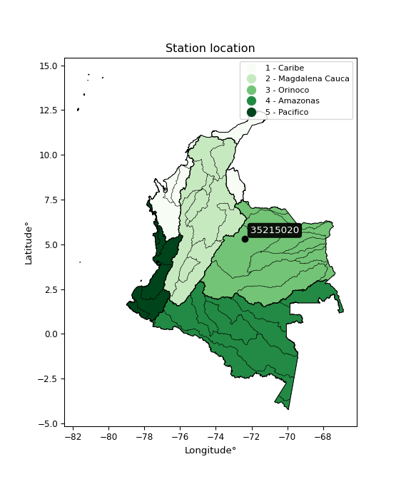

<div align="center">


</div>

# PMP Station (Rain, Pmax24h): 35215020

Probable Maximum Precipitation (PMP) is the greatest amount of rainfall for a specific duration that is meteorologically possible for a given location, acting as a "worst-case" scenario for extreme storms, crucial for designing safety-critical infrastructure like bridges, river deviations, dams, spillways, and nuclear plants to prevent catastrophic failure. PMP is calculated by hydrologists using meteorological data to determine the upper limit of extreme rainfall, often leading to the Probable Maximum Flood (PMF) for flood control design, and is increasingly being studied for climate change impacts. Probable Maximum Precipitation (PMP) is the theoretical upper limit of rainfall, a deterministic estimate for extreme events, while probability distributions (like GEV, Gumbel) describe the likelihood and frequency of various precipitation amounts, including rare ones, showing how often events occur, with PMP representing the extreme end of these distributions, used for critical infrastructure design to ensure safety against the worst conceivable weather, unlike standard statistical forecasts which cover typical probabilities.

The most common probability distributions in hydrology, used for analyzing floods, rainfall, and streamflow, include the Normal, Log-Normal, Gumbel, Gamma (including Log-Pearson Type III), and Generalized Extreme Value (GEV) distributions, often chosen based on the data´s skewness and whether modeling extremes or general conditions, with Gumbel and GEV popular for extreme events like floods, while the Normal distribution serves as a baseline, though often requiring transformations for skewed hydrological data. These distributions help in designing water infrastructure, managing water resources, and forecasting hydrologic events.

> Hydrological data often isn´t perfectly normal (it´s skewed), so different distributions are needed for different applications, such as: **Flood Frequency Analysis**: Using Gumbel, GEV, or Log-Pearson Type III for predicting extreme flood magnitudes and their return periods, **Rainfall Analysis**: Normal for annual totals, but Log-Normal, Weibull, or GEV for intensity or extreme daily rainfall, **Streamflow Modeling**: Gamma and Log-Normal for maximum flows, GEV for minimum flows, and Kappa for daily flows.

<div align="center">

</img>

</div>


## A. General information


### 1. General running parameters

• app_version: _v20260113_. • runtime: _2026-01-13 16:28:34.738620_. • Python version: _3.14.0_. • SciPy version: _1.16.3_. • Pandas version: _2.3.3_. • NumPy version: _2.3.5_. • Stations dataset (station_dataset_file): _dataset/pmax24h_in/automatic_colombia_2003_2025.csv_. • Stations catalog (station_catalog_file): _dataset/CNE.xls_. • Minimum year to eval til year_max (date_min): _1900_. • Maximum year to eval since year_min (date_max): _2025_. • Creates, save and include plots into reports (create_plot): _False_. • Plot only fit distributions with Δo > Δ (plot_only_fit): _True_. • Plot only simple graphs avoiding multiple CDFs and multiple Extreme values plots (plot_only_simple): _True_. • Eval low extreme values, if False, evaluates high extreme values (low_extreme): _False_. • Eval every SciPy distribution as logarithmic (pdist_logarithmic_on): _True_. • Standard deviation normalized (ddof): _1.0_. • Return periods to eval in years (Tr): _[2, 2.33, 5, 10, 15, 20, 25, 50, 75, 100, 200, 250, 500, 750, 1000]_. • Minimum data sample per station, 0 means any (minimum_sample): _5_. • Z-Score maximum threshold to adjust a value, 0 means disable (zscore_max): _3.5_. • Z-Score minimum threshold to adjust a value, 0 means disable (zscore_min): _-2.5_. • Avoid zeros, e.g. rain = 0 (avoid_zeros): _True_. • Avoid null values (avoid_nans): _True_. 

:file_folder:Table: [dataset.csv](../../dataset/pmax24h_in/automatic_colombia_2003_2025.csv)

> Delta Degrees of Freedom (DDOF): is a parameter used in the formulas for calculating variance and standard deviation. When ddof=0, the divisor is $N$ (the total number of observations) and this is used when your data set is the entire population. When ddof=1, the divisor is $N-1$ and this is used when your data set is a sample drawn from a larger population. Using $N-1$ provides an unbiased estimate of the population variance (known as Bessel´s correction).


### 2. Station info and location

|   id |   CODIGO | NOMBRE                            | CATEGORIA               | TECNOLOGIA                              | ESTADO   | FECHA_INSTALACION   |   FECHA_SUSPENSION |   ALTITUD |   LATITUD |   LONGITUD | DEPARTAMENTO   | MUNICIPIO   | AREA_OPERATIVA                              | ENTIDAD                                                     | AREA_HIDROGRAFICA   | ZONA_HIDROGRAFICA   | SUBZONA_HIDROGRAFICA   |   CORRIENTE | Catalogo   |   Version |
|-----:|---------:|:----------------------------------|:------------------------|:----------------------------------------|:---------|:--------------------|-------------------:|----------:|----------:|-----------:|:---------------|:------------|:--------------------------------------------|:------------------------------------------------------------|:--------------------|:--------------------|:-----------------------|------------:|:-----------|----------:|
|    0 | 35215020 | AEROPUERTO YOPAL - AUT [35215020] | Climatológica Principal | Automática con Telemetría, Convencional | Activa   | 17/11/2005          |                nan |       325 |   5.32044 |   -72.3875 | Casanare       | Yopal       | Area Operativa 06 - Boyacá-Casanare-Vichada | INSTITUTO DE HIDROLOGIA METEOROLOGIA Y ESTUDIOS AMBIENTALES | Orinoco             | Meta                | Río Cravo Sur          |         nan | CNE_IDEAM  |  20251226 |

<div align="center">

Dynamic map: [:earth_americas:Google](http://maps.google.com/maps?q=5.320444444,-72.3875) [:earth_americas:OSM](https://www.openstreetmap.org/#map=18/5.320444444/-72.3875&layers=P) [:earth_americas:Bing](https://www.bing.com/maps?cp=5.320444444~-72.3875&lvl=18) [:earth_americas:Apple](https://maps.apple.com/frame?center=5.320444444%2C-72.3875&span=0.003%2C0.006)

</div>


<div align="center">

```geojson
{
  "type": "Feature",
  "geometry": {
    "type": "Point", 
    "coordinates": [-72.3875, 5.320444444]
  }, 
  "properties": {
    "Name": "35215020"
  }
}
```

</div>


### 3. Discrete values table and plot

<div align="center">

|               |          0 |           1 |           2 |           3 |          4 |          5 |           6 |           7 |         8 |
|:--------------|-----------:|------------:|------------:|------------:|-----------:|-----------:|------------:|------------:|----------:|
| Date          | 2017       | 2018        | 2019        | 2020        | 2021       | 2022       | 2023        | 2024        | 2025      |
| Value         |    7.5     |   88        |  141        |  156        |   39.4     |  121.87    |  136.9      |  119        |  181.94   |
| Value_initial |    7.5     |   88        |  141        |  156        |   39.4     |  121.87    |  136.9      |  119        |  181.94   |
| count         |    9       |    9        |    9        |    9        |    9       |    9       |    9        |    9        |    9      |
| mean          |  110.179   |  110.179    |  110.179    |  110.179    |  110.179   |  110.179   |  110.179    |  110.179    |  110.179  |
| std           |   56.0939  |   56.0939   |   56.0939   |   56.0939   |   56.0939  |   56.0939  |   56.0939   |   56.0939   |   56.0939 |
| zscore        |   -1.83048 |   -0.395389 |    0.549456 |    0.816865 |   -1.26179 |    0.20842 |    0.476364 |    0.157256 |    1.2793 |


</div>


> The initial value (value_initial) correspond to the initial obtained or null completed value, and value (value) is adjusted only when the initial value is outside the valid range (outlier) definite through the Z-Score value. If Z-Score is active, values out of range or outliers are replaced with the station mean value. A Z-Score (or standard score) measures how many standard deviations a data point is from the mean of a dataset, indicating its relative position; positive scores mean above the mean, negative mean below, and a score of zero is exactly at the mean, allowing for comparison of values from different distributions. It´s calculated using the formula $z=(x–μ)/σ$, where $x$ is the data point, $μ$ is the mean, and $σ$ is the standard deviation, helping identify outliers and understand probability.
>
> <sub>**Note**: In this study, "completing" (filling gaps in) and "extending" (forecasting or lengthening the historical record) rainfall data series are avoided for certain critical analyses because they introduce artificial bias and uncertainty, which can distort the statistics of rare events (extremes), alter day-to-day variability, and compromise the integrity and homogeneity of the original data. Some reasons against Completing/Extending rainfall data are: **Distortion of Extremes and Variability**: The primary issue is that most gap-filling or extension methods rely on averaging or regression with nearby stations, which inherently smooths the data. Rainfall is highly variable in space and time, with a large percentage of zero values and occasional large storms. Infilling methods often underestimate the highest values and overestimate the lowest (zero) values, which severely distorts analyses focused on flood frequency, drought severity, and intensity-duration-frequency (IDF) curves, **Loss of Data Homogeneity**: Infilled or extended data are synthetic estimates, not actual measurements. Combining these estimates with observed data can violate the assumption of data homogeneity, which requires that the data properties do not change over time. Inhomogeneity can lead to incorrect conclusions about long-term trends or changes in climate patterns, **Propagation of Errors**: Errors and biases from the original data (e.g., wind-induced undercatch, instrument errors, site changes) or the data used for imputation can propagate through the analysis, leading to unreliable hydrological models and inaccurate predictions, **Compromised Statistical Integrity**: For statistical analyses, especially those involving the frequency of events, using artificial data can introduce time bias or autocorrelation that doesn´t exist in reality, making it difficult to assess the true probability of events, **Difficulty in Validation**: It is difficult to accurately validate the quality of filled or extended data, especially for past periods where ground-truth measurements are unavailable. The reliability of imputation techniques heavily depends on the density of the surrounding station network and the complexity of the local topography.</sub>


### 4. Active continuous probability distributions from SciPy (45 of 104 available)

A Probability Density Function (PDF) describes the relative likelihood of a continuous random variable falling within a specific range, where the total area under its curve equals 1, and the area over any interval gives the actual probability for that range. Unlike discrete probabilities (like rolling a die), a PDF shows density, not direct probability for a single point (which is zero), with higher points indicating higher likelihood, often visualized as a bell curve for normal distributions.

A log of a probability density function (log-PDF) is simply the logarithm of the PDF´s value, denoted as $log(f(x))$, useful for converting multiplication of probabilities into addition, improving numerical stability with tiny numbers, and connecting to information theory concepts like entropy. Instead of dealing with very small probabilities (e.g., 0.000001), log-PDFs use negative numbers (e.g., $log(0.00001) ≈ -11.51$ that are easier for computers to handle, preventing underflow errors and simplifying complex calculations. In this study, each active probability distribution from SciPy is also evaluated in the $log$ form.

[scipy.stats](https://docs.scipy.org/doc/scipy/reference/stats.html) is a Python´s powerful submodule within the SciPy library for comprehensive statistical analysis, offering over 130 probability distributions (like Normal, Poisson), functions for descriptive stats (mean, variance), hypothesis testing (t-tests, chi-square), random variable generation, and statistical tests, making it essential for data science, modeling, and research. It provides tools to explore, model, and draw conclusions from data efficiently, working seamlessly with NumPy.

<div align="center">

|   id | p_dist             |   n_parameter | fit_method   | label                                                                       | active   | ref                                                                                                        |
|-----:|:-------------------|--------------:|:-------------|:----------------------------------------------------------------------------|:---------|:-----------------------------------------------------------------------------------------------------------|
|    0 | alpha              |             3 | MLE          | Alpha                                                                       | True     | [:mortar_board:](https://docs.scipy.org/doc/scipy/reference/generated/scipy.stats.alpha.html)              |
|    1 | betaprime          |             4 | MLE          | Beta prime                                                                  | True     | [:mortar_board:](https://docs.scipy.org/doc/scipy/reference/generated/scipy.stats.betaprime.html)          |
|    2 | chi2               |             3 | MLE          | Chi²                                                                        | True     | [:mortar_board:](https://docs.scipy.org/doc/scipy/reference/generated/scipy.stats.chi2.html)               |
|    3 | crystalball        |             4 | MLE          | Crystalball                                                                 | True     | [:mortar_board:](https://docs.scipy.org/doc/scipy/reference/generated/scipy.stats.crystalball.html)        |
|    4 | dweibull           |             3 | MLE          | Double Weibull                                                              | True     | [:mortar_board:](https://docs.scipy.org/doc/scipy/reference/generated/scipy.stats.dweibull.html)           |
|    5 | erlang             |             3 | MLE          | Erlang                                                                      | True     | [:mortar_board:](https://docs.scipy.org/doc/scipy/reference/generated/scipy.stats.erlang.html)             |
|    6 | expon              |             2 | MLE          | Exponential                                                                 | True     | [:mortar_board:](https://docs.scipy.org/doc/scipy/reference/generated/scipy.stats.expon.html)              |
|    7 | exponnorm          |             3 | MLE          | Exponentially modified Normal                                               | True     | [:mortar_board:](https://docs.scipy.org/doc/scipy/reference/generated/scipy.stats.exponnorm.html)          |
|    8 | f                  |             4 | MLE          | F                                                                           | True     | [:mortar_board:](https://docs.scipy.org/doc/scipy/reference/generated/scipy.stats.f.html)                  |
|    9 | fatiguelife        |             3 | MLE          | Fatigue-life (Birnbaum-Saunders)                                            | True     | [:mortar_board:](https://docs.scipy.org/doc/scipy/reference/generated/scipy.stats.fatiguelife.html)        |
|   10 | fisk               |             3 | MLE          | Fisk                                                                        | True     | [:mortar_board:](https://docs.scipy.org/doc/scipy/reference/generated/scipy.stats.fisk.html)               |
|   11 | gamma              |             3 | MLE          | Gamma                                                                       | True     | [:mortar_board:](https://docs.scipy.org/doc/scipy/reference/generated/scipy.stats.gamma.html)              |
|   12 | genexpon           |             5 | MLE          | Generalized exponential                                                     | True     | [:mortar_board:](https://docs.scipy.org/doc/scipy/reference/generated/scipy.stats.genexpon.html)           |
|   13 | genlogistic        |             3 | MLE          | Generalized logistic                                                        | True     | [:mortar_board:](https://docs.scipy.org/doc/scipy/reference/generated/scipy.stats.genlogistic.html)        |
|   14 | gibrat             |             2 | MM           | Gibrat                                                                      | True     | [:mortar_board:](https://docs.scipy.org/doc/scipy/reference/generated/scipy.stats.gibrat.html)             |
|   15 | gompertz           |             3 | MLE          | Gompertz (or truncated Gumbel)                                              | True     | [:mortar_board:](https://docs.scipy.org/doc/scipy/reference/generated/scipy.stats.gompertz.html)           |
|   16 | gumbel_l           |             2 | MM           | Gumbel Left Skew                                                            | True     | [:mortar_board:](https://docs.scipy.org/doc/scipy/reference/generated/scipy.stats.gumbel_l.html)           |
|   17 | gumbel_r           |             2 | MM           | Gumbel Right Skew                                                           | True     | [:mortar_board:](https://docs.scipy.org/doc/scipy/reference/generated/scipy.stats.gumbel_r.html)           |
|   18 | halflogistic       |             2 | MM           | Half-logistic                                                               | True     | [:mortar_board:](https://docs.scipy.org/doc/scipy/reference/generated/scipy.stats.halflogistic.html)       |
|   19 | halfnorm           |             2 | MM           | Half Normal                                                                 | True     | [:mortar_board:](https://docs.scipy.org/doc/scipy/reference/generated/scipy.stats.halfnorm.html)           |
|   20 | hypsecant          |             2 | MM           | hyperbolic secant                                                           | True     | [:mortar_board:](https://docs.scipy.org/doc/scipy/reference/generated/scipy.stats.hypsecant.html)          |
|   21 | invgamma           |             3 | MLE          | Inverted gamma                                                              | True     | [:mortar_board:](https://docs.scipy.org/doc/scipy/reference/generated/scipy.stats.invgamma.html)           |
|   22 | invgauss           |             3 | MLE          | Inverse Gaussian                                                            | True     | [:mortar_board:](https://docs.scipy.org/doc/scipy/reference/generated/scipy.stats.invgauss.html)           |
|   23 | invweibull         |             3 | MLE          | Inverted Weibull                                                            | True     | [:mortar_board:](https://docs.scipy.org/doc/scipy/reference/generated/scipy.stats.invweibull.html)         |
|   24 | kappa4             |             4 | MLE          | Kappa 4                                                                     | True     | [:mortar_board:](https://docs.scipy.org/doc/scipy/reference/generated/scipy.stats.kappa4.html)             |
|   25 | kstwobign          |             2 | MLE          | Limiting distribution of scaled Kolmogorov-Smirnov two-sided test statistic | True     | [:mortar_board:](https://docs.scipy.org/doc/scipy/reference/generated/scipy.stats.kstwobign.html)          |
|   26 | laplace            |             2 | MM           | Laplace                                                                     | True     | [:mortar_board:](https://docs.scipy.org/doc/scipy/reference/generated/scipy.stats.laplace.html)            |
|   27 | laplace_asymmetric |             3 | MLE          | Asymmetric Laplace                                                          | True     | [:mortar_board:](https://docs.scipy.org/doc/scipy/reference/generated/scipy.stats.laplace_asymmetric.html) |
|   28 | loggamma           |             3 | MLE          | Log gamma                                                                   | True     | [:mortar_board:](https://docs.scipy.org/doc/scipy/reference/generated/scipy.stats.loggamma.html)           |
|   29 | logistic           |             2 | MM           | Logistic (or Sech-squared)                                                  | True     | [:mortar_board:](https://docs.scipy.org/doc/scipy/reference/generated/scipy.stats.logistic.html)           |
|   30 | lognorm            |             3 | MLE          | Log Normal                                                                  | True     | [:mortar_board:](https://docs.scipy.org/doc/scipy/reference/generated/scipy.stats.lognorm.html)            |
|   31 | maxwell            |             2 | MM           | Maxwell                                                                     | True     | [:mortar_board:](https://docs.scipy.org/doc/scipy/reference/generated/scipy.stats.maxwell.html)            |
|   32 | mielke             |             4 | MLE          | Mielke Beta-Kappa / Dagum                                                   | True     | [:mortar_board:](https://docs.scipy.org/doc/scipy/reference/generated/scipy.stats.mielke.html)             |
|   33 | moyal              |             2 | MM           | Moyal                                                                       | True     | [:mortar_board:](https://docs.scipy.org/doc/scipy/reference/generated/scipy.stats.moyal.html)              |
|   34 | nakagami           |             3 | MLE          | Nakagami                                                                    | True     | [:mortar_board:](https://docs.scipy.org/doc/scipy/reference/generated/scipy.stats.nakagami.html)           |
|   35 | ncf                |             5 | MLE          | Non-central F distribution                                                  | True     | [:mortar_board:](https://docs.scipy.org/doc/scipy/reference/generated/scipy.stats.ncf.html)                |
|   36 | nct                |             4 | MLE          | Non-central Student’s t                                                     | True     | [:mortar_board:](https://docs.scipy.org/doc/scipy/reference/generated/scipy.stats.nct.html)                |
|   37 | norm               |             2 | MM           | Normal                                                                      | True     | [:mortar_board:](https://docs.scipy.org/doc/scipy/reference/generated/scipy.stats.norm.html)               |
|   38 | pearson3           |             3 | MM           | Pearson type III                                                            | True     | [:mortar_board:](https://docs.scipy.org/doc/scipy/reference/generated/scipy.stats.pearson3.html)           |
|   39 | rayleigh           |             2 | MM           | Rayleigh                                                                    | True     | [:mortar_board:](https://docs.scipy.org/doc/scipy/reference/generated/scipy.stats.rayleigh.html)           |
|   40 | rice               |             3 | MLE          | Rice                                                                        | True     | [:mortar_board:](https://docs.scipy.org/doc/scipy/reference/generated/scipy.stats.rice.html)               |
|   41 | t                  |             3 | MLE          | Student’s t                                                                 | True     | [:mortar_board:](https://docs.scipy.org/doc/scipy/reference/generated/scipy.stats.t.html)                  |
|   42 | truncnorm          |             4 | MLE          | Truncated normal                                                            | True     | [:mortar_board:](https://docs.scipy.org/doc/scipy/reference/generated/scipy.stats.truncnorm.html)          |
|   43 | wald               |             2 | MM           | Wald                                                                        | True     | [:mortar_board:](https://docs.scipy.org/doc/scipy/reference/generated/scipy.stats.wald.html)               |
|   44 | weibull_min        |             3 | MLE          | Weibull minimum                                                             | True     | [:mortar_board:](https://docs.scipy.org/doc/scipy/reference/generated/scipy.stats.weibull_min.html)        |

</div>

> **n_parameter:** # arguments & localization & scale.
>
> **Fit methods:** (MLE) maximum likelihood, (MM) L-moments.
>
>**Inactive** (With the only purpose of prevent loops, zero divisions, infinite values, over high estimated values or horizontal trending for recurrence intervals estimations, the follow distributions were disabled.)**:** foldnorm, gennorm, norminvgauss, powernorm, powerlognorm, skewnorm, genextreme, anglit, arcsine, argus, beta, bradford, burr, burr12, cauchy, cosine, halfcauchy, foldcauchy, skewcauchy, wrapcauchy, dgamma, gengamma, exponweib, exponpow, truncexpon, gausshyper, genhalflogistic, genhyperbolic, geninvgauss, halfgennorm, johnsonsb, johnsonsu, kappa3, ksone, kstwo, loglaplace, levy, levy_l, levy_stable, ncx2, pareto, genpareto, truncpareto, lomax, powerlaw, rdist, rel_breitwigner, recipinvgauss, semicircular, studentized_range, trapezoid, triang, truncweibull_min, tukeylambda, uniform, loguniform, vonmises, vonmises_line, weibull_max, 


## B. Probability (PDF) vs. Empirical (EDF) distributions functions

A continuous probability distribution (CPD) describes probabilities for variables that can take any value within a range (like rain any time), unlike discrete variables with specific outcomes (like temperature). It uses a Probability Density Function (PDF), a curve where the total area under it equals 1, and the probability of the variable falling within an interval (a to b) is found by calculating the area under the curve between those points. A key feature is that the probability of hitting any single exact value is zero, so probabilities are always expressed for ranges, e.g., $P(a ≤ X ≤ b)$.

<div align="center">

Distributions parameters from station values
|    |   station | p_dist                |   n |              loc |            scale | shape                  | shape1                 | shape2                | shape3   |
|---:|----------:|:----------------------|----:|-----------------:|-----------------:|:-----------------------|:-----------------------|:----------------------|:---------|
|  0 |  35215020 | alpha                 |   9 |     -0.055666    |     22.0572      | 4.485508526951407e-11  |                        |                       |          |
|  1 |  35215020 | betaprime             |   9 |  -1489.06        | 115914           | 914.2312594396556      | 66285.23940586126      |                       |          |
|  2 |  35215020 | chi2                  |   9 |   -360.172       |      3.43472     | 136.72007050108522     |                        |                       |          |
|  3 |  35215020 | crystalball           |   9 |    110.179       |     52.8858      | 9147.837543322594      | 3102.435162128161      |                       |          |
|  4 |  35215020 | dweibull              |   9 |    119           |     38.5175      | 0.9276182806699894     |                        |                       |          |
|  5 |  35215020 | erlang                |   9 |   -717.381       |      3.61099     | 229.28407612569828     |                        |                       |          |
|  6 |  35215020 | expon                 |   9 |      7.5         |    102.679       |                        |                        |                       |          |
|  7 |  35215020 | exponnorm             |   9 |    110.143       |     52.8854      | 0.0006780238595257373  |                        |                       |          |
|  8 |  35215020 | f                     |   9 | -26612.4         |  26722.6         | 537147.7364972197      | 8566962.400276043      |                       |          |
|  9 |  35215020 | fatiguelife           |   9 |      7.5         |      1.48291e-05 | 2177.801901992918      |                        |                       |          |
| 10 |  35215020 | fisk                  |   9 |     -4.79497e+09 |      4.79497e+09 | 158159387.4368683      |                        |                       |          |
| 11 |  35215020 | gamma                 |   9 |   -790.34        |      3.36886     | 267.2410394770361      |                        |                       |          |
| 12 |  35215020 | genexpon              |   9 |      7.5         |      3.54772     | 0.03454632966860859    | 1.8349507899305704e-07 | 3.302706363399619     |          |
| 13 |  35215020 | genlogistic           |   9 |    158.81        |     12.8693      | 0.2429501821085269     |                        |                       |          |
| 14 |  35215020 | gibrat                |   9 |     69.8337      |     24.4706      |                        |                        |                       |          |
| 15 |  35215020 | gompertz              |   9 |     87.9656      |     15.005       | 0.010240370672429833   |                        |                       |          |
| 16 |  35215020 | gumbel_l              |   9 |    133.98        |     41.2349      |                        |                        |                       |          |
| 17 |  35215020 | gumbel_r              |   9 |     86.3775      |     41.2349      |                        |                        |                       |          |
| 18 |  35215020 | halflogistic          |   9 |     47.4969      |     45.2155      |                        |                        |                       |          |
| 19 |  35215020 | halfnorm              |   9 |     40.1788      |     87.7321      |                        |                        |                       |          |
| 20 |  35215020 | hypsecant             |   9 |    110.179       |     33.6682      |                        |                        |                       |          |
| 21 |  35215020 | invgamma              |   9 |   -644.195       | 133986           | 178.85787550867815     |                        |                       |          |
| 22 |  35215020 | invgauss              |   9 |   -168.923       |   5509.12        | 0.05004322080314723    |                        |                       |          |
| 23 |  35215020 | invweibull            |   9 |      7.5         |      4.03647     | 0.06041459772578721    |                        |                       |          |
| 24 |  35215020 | kappa4                |   9 |     -9.90469     |    197.536       | 1.0967606958442269     | 1.0287582145609528     |                       |          |
| 25 |  35215020 | kstwobign             |   9 |   -115.507       |    257.651       |                        |                        |                       |          |
| 26 |  35215020 | laplace               |   9 |    110.179       |     37.3959      |                        |                        |                       |          |
| 27 |  35215020 | laplace_asymmetric    |   9 |    141           |     33.4163      | 1.5623791342226458     |                        |                       |          |
| 28 |  35215020 | loggamma              |   9 |    159.794       |     26.148       | 0.5136953745381871     |                        |                       |          |
| 29 |  35215020 | logistic              |   9 |    110.179       |     29.1575      |                        |                        |                       |          |
| 30 |  35215020 | lognorm               |   9 |      7.5         |      1.32993     | 12.362935113051051     |                        |                       |          |
| 31 |  35215020 | maxwell               |   9 |    -15.1383      |     78.5309      |                        |                        |                       |          |
| 32 |  35215020 | mielke                |   9 |      7.5         |    174.837       | 0.9547672389507267     | 1506.342317087794      |                       |          |
| 33 |  35215020 | moyal                 |   9 |     79.9354      |     23.807       |                        |                        |                       |          |
| 34 |  35215020 | nakagami              |   9 |      7.5         |    125.228       | 0.2794736316887333     |                        |                       |          |
| 35 |  35215020 | ncf                   |   9 |     -0.00755518  |      4.20642e-08 | 2.5722453796046298e-09 | 2.6662612883705785     | 5.092069858979771     |          |
| 36 |  35215020 | nct                   |   9 |  -3015.76        |     52.8051      | 502589.69850603514     | 59.197695267109125     |                       |          |
| 37 |  35215020 | norm                  |   9 |    110.179       |     52.8858      |                        |                        |                       |          |
| 38 |  35215020 | pearson3              |   9 |    110.179       |     52.8859      | -0.6998195507321991    |                        |                       |          |
| 39 |  35215020 | rayleigh              |   9 |      9.00525     |     80.7249      |                        |                        |                       |          |
| 40 |  35215020 | rice                  |   9 |    -24.6898      |     57.3737      | 2.091764743267193      |                        |                       |          |
| 41 |  35215020 | t                     |   9 |    110.182       |     52.8833      | 2907805.632926142      |                        |                       |          |
| 42 |  35215020 | truncnorm             |   9 |     41.4932      |      7.10632     | -20.565682433777702    | 19.76364993776305      |                       |          |
| 43 |  35215020 | wald                  |   9 |     57.2931      |     52.8858      |                        |                        |                       |          |
| 44 |  35215020 | weibull_min           |   9 |     -1.75598e+09 |      1.75598e+09 | 43018196.58524656      |                        |                       |          |
| 45 |  35215020 | logalpha              |   9 |    -34.3546      |   1449.12        | 37.41263335992713      |                        |                       |          |
| 46 |  35215020 | logbetaprime          |   9 |    -22.6521      |    191.476       | 813.9222659204249      | 5759.696804261421      |                       |          |
| 47 |  35215020 | logchi2               |   9 |      2.0149      |      1.12791     | 1.0575539092973827     |                        |                       |          |
| 48 |  35215020 | logcrystalball        |   9 |      4.42996     |      0.952137    | 804.9714796481985      | 538.0474052098375      |                       |          |
| 49 |  35215020 | logdweibull           |   9 |      4.91925     |      0.708674    | 0.8068754982523709     |                        |                       |          |
| 50 |  35215020 | logerlang             |   9 |    -10.9828      |      0.0689581   | 223.6469838541139      |                        |                       |          |
| 51 |  35215020 | logexpon              |   9 |      2.0149      |      2.41506     |                        |                        |                       |          |
| 52 |  35215020 | logexponnorm          |   9 |      4.4293      |      0.952132    | 0.0006942776112756706  |                        |                       |          |
| 53 |  35215020 | logf                  |   9 |   -416.425       |    420.855       | 518139.608658092       | 1547908.8054927802     |                       |          |
| 54 |  35215020 | logfatiguelife        |   9 |   -642.811       |    647.237       | 0.0014670997508829612  |                        |                       |          |
| 55 |  35215020 | logfisk               |   9 |     -1.06955e+08 |      1.06955e+08 | 234041844.5504666      |                        |                       |          |
| 56 |  35215020 | loggamma              |   9 |    -11.8936      |      0.0634805   | 257.0433864279182      |                        |                       |          |
| 57 |  35215020 | loggenexpon           |   9 |      2.00876     |      0.00477847  | 0.000458576379751541   | 1.2985404957365625     | 3.99087943202254e-06  |          |
| 58 |  35215020 | loggenlogistic        |   9 |      5.20371     |      2.60697e-06 | 3.3672372565148573e-06 |                        |                       |          |
| 59 |  35215020 | loggibrat             |   9 |      3.70359     |      0.440562    |                        |                        |                       |          |
| 60 |  35215020 | loggompertz           |   9 |      2.0149      |      0.527444    | 0.005135984414461628   |                        |                       |          |
| 61 |  35215020 | loggumbel_l           |   9 |      4.85847     |      0.742378    |                        |                        |                       |          |
| 62 |  35215020 | loggumbel_r           |   9 |      4.00145     |      0.742378    |                        |                        |                       |          |
| 63 |  35215020 | loghalflogistic       |   9 |      3.30143     |      0.814062    |                        |                        |                       |          |
| 64 |  35215020 | loghalfnorm           |   9 |      3.16968     |      1.57952     |                        |                        |                       |          |
| 65 |  35215020 | loghypsecant          |   9 |      4.42996     |      0.606149    |                        |                        |                       |          |
| 66 |  35215020 | loginvgamma           |   9 |    -18.7239      |  12057.1         | 521.5894671356195      |                        |                       |          |
| 67 |  35215020 | loginvgauss           |   9 |     -6.60694     |   1148.82        | 0.009589852513213499   |                        |                       |          |
| 68 |  35215020 | loginvweibull         |   9 |     -9.72987e+07 |      9.72987e+07 | 80282918.88056767      |                        |                       |          |
| 69 |  35215020 | logkappa4             |   9 |      1.74871     |      3.63363     | 1.0263215269335322     | 1.0517144622353494     |                       |          |
| 70 |  35215020 | logkstwobign          |   9 |     -0.556369    |      5.71692     |                        |                        |                       |          |
| 71 |  35215020 | loglaplace            |   9 |      4.42996     |      0.673262    |                        |                        |                       |          |
| 72 |  35215020 | loglaplace_asymmetric |   9 |      5.04986     |      0.300055    | 2.470930995799372      |                        |                       |          |
| 73 |  35215020 | logloggamma           |   9 |      5.20371     |      2.6582e-06  | 3.444902378194421e-06  |                        |                       |          |
| 74 |  35215020 | loglogistic           |   9 |      4.42996     |      0.524941    |                        |                        |                       |          |
| 75 |  35215020 | loglognorm            |   9 |      2.0149      |      0.0471554   | 11.419890498141335     |                        |                       |          |
| 76 |  35215020 | logmaxwell            |   9 |      2.17378     |      1.41385     |                        |                        |                       |          |
| 77 |  35215020 | logmielke             |   9 |     -5.18765e+07 |      5.18765e+07 | 67725991.7350537       | 27234031568.736176     |                       |          |
| 78 |  35215020 | logmoyal              |   9 |      3.88547     |      0.428612    |                        |                        |                       |          |
| 79 |  35215020 | lognakagami           |   9 |      2.93159     |      1.83836     | 3.461312014532372      |                        |                       |          |
| 80 |  35215020 | logncf                |   9 |    -51.5918      |     56.0148      | 10985.368618783006     | 16099.428183163076     | 0.0015875529988305936 |          |
| 81 |  35215020 | lognct                |   9 |     64.0637      |      0.937542    | 67047.6336592659       | -63.604862596625196    |                       |          |
| 82 |  35215020 | lognorm               |   9 |      4.42996     |      0.952137    |                        |                        |                       |          |
| 83 |  35215020 | logpearson3           |   9 |      4.42996     |      0.95214     | -1.7333591191467823    |                        |                       |          |
| 84 |  35215020 | lograyleigh           |   9 |      2.60848     |      1.45333     |                        |                        |                       |          |
| 85 |  35215020 | logrice               |   9 |   -611.502       |      0.953506    | 645.9645117372088      |                        |                       |          |
| 86 |  35215020 | logt                  |   9 |      4.88658     |      0.16612     | 0.8356553288641744     |                        |                       |          |
| 87 |  35215020 | logtruncnorm          |   9 |      0.0870466   |      2.23311     | 1.6061555384326764     | 3.9155077692432876     |                       |          |
| 88 |  35215020 | logwald               |   9 |      3.47784     |      0.952124    |                        |                        |                       |          |
| 89 |  35215020 | logweibull_min        |   9 |      2.0149      |      1.17952     | 0.7145138935691033     |                        |                       |          |

</div>

> **loc** (Location parameter): This shifts the distribution along the x-axis. For many common distributions, like the normal (Gaussian) distribution, loc represents the mean $μ$. For others, like the uniform distribution, it might represent the minimum value, or for the beta distribution, the left end of the support interval.
>
> **scale** (Scale parameter): This determines the width or spread of the distribution. For the normal distribution, scale represents the standard deviation $σ$. For a uniform distribution, it defines the length of the interval (from $loc$ to $loc + scale$).
>
> **shape** (Shape parameters): Refers to parameters that define the specific form of a probability distribution, distinct from its location (loc) and scale (scale). These parameters are required arguments for most distribution functions. For example, a normal (Gaussian) distribution is fully defined by its location (mean) and scale (standard deviation), so it has no specific shape parameters beyond loc and scale. However, other distributions have intrinsic properties that need specification, as Gamma distribution that takes a shape parameter, often named $a$ or $alpha$.


### 0. Cumulative distribution values - CDF (90 evaluated)

Cumulative Distribution Function (CDF), denoted as $F$<sub>$X$</sub>$(x)$, is a function that gives the probability that a random variable $X$ will take a value less than or equal to a specific value, $x$ (i.e., $(P(X≥x)$. It essentially "accumulates" probabilities from a given point up to the far right (positive infinity), providing a complete picture of the distribution´s probabilities for both discrete (like rain) and continuous (like temperature) variables, helping to find probabilities over ranges or above certain values. Each station is evaluated separately ordering the $x$ values ascending, calculating the CDF and PDF values for the activated distributions and their logarithmic forms.

<div align="center">

CDF ordered by x ascending and calculating $log(f(x))$ separately
|   id |   Station |   date |      x |   count |    mean |     std |    zscore |   Value_initial |   station |   m |      alpha |   alpha_pdf |   betaprime |   betaprime_pdf |     chi2 |   chi2_pdf |   crystalball |   crystalball_pdf |   dweibull |   dweibull_pdf |    erlang |   erlang_pdf |    expon |   expon_pdf |   exponnorm |   exponnorm_pdf |         f |      f_pdf |   fatiguelife |   fatiguelife_pdf |      fisk |   fisk_pdf |     gamma |   gamma_pdf |    genexpon |   genexpon_pdf |   genlogistic |   genlogistic_pdf |   gibrat |   gibrat_pdf |    gompertz |   gompertz_pdf |   gumbel_l |   gumbel_l_pdf |   gumbel_r |   gumbel_r_pdf |   halflogistic |   halflogistic_pdf |   halfnorm |   halfnorm_pdf |   hypsecant |   hypsecant_pdf |   invgamma |   invgamma_pdf |   invgauss |   invgauss_pdf |   invweibull |   invweibull_pdf |      kappa4 |   kappa4_pdf |   kstwobign |   kstwobign_pdf |   laplace |   laplace_pdf |   laplace_asymmetric |   laplace_asymmetric_pdf |   loggamma |   loggamma_pdf |   logistic |   logistic_pdf |   lognorm |   lognorm_pdf |   maxwell |   maxwell_pdf |      mielke |   mielke_pdf |       moyal |   moyal_pdf |   nakagami |    nakagami_pdf |      ncf |    ncf_pdf |       nct |    nct_pdf |      norm |   norm_pdf |   pearson3 |   pearson3_pdf |   rayleigh |   rayleigh_pdf |      rice |   rice_pdf |         t |      t_pdf |   truncnorm |   truncnorm_pdf |     wald |   wald_pdf |   weibull_min |   weibull_min_pdf |   logalpha |   logalpha_pdf |   logbetaprime |   logbetaprime_pdf |     logchi2 |   logchi2_pdf |   logcrystalball |   logcrystalball_pdf |   logdweibull |   logdweibull_pdf |   logerlang |   logerlang_pdf |   logexpon |   logexpon_pdf |   logexponnorm |   logexponnorm_pdf |       logf |   logf_pdf |   logfatiguelife |   logfatiguelife_pdf |    logfisk |   logfisk_pdf |   loggenexpon |   loggenexpon_pdf |   loggenlogistic |   loggenlogistic_pdf |   loggibrat |   loggibrat_pdf |   loggompertz |   loggompertz_pdf |   loggumbel_l |   loggumbel_l_pdf |   loggumbel_r |   loggumbel_r_pdf |   loghalflogistic |   loghalflogistic_pdf |   loghalfnorm |   loghalfnorm_pdf |   loghypsecant |   loghypsecant_pdf |   loginvgamma |   loginvgamma_pdf |   loginvgauss |   loginvgauss_pdf |   loginvweibull |   loginvweibull_pdf |   logkappa4 |   logkappa4_pdf |   logkstwobign |   logkstwobign_pdf |   loglaplace |   loglaplace_pdf |   loglaplace_asymmetric |   loglaplace_asymmetric_pdf |   logloggamma |   logloggamma_pdf |   loglogistic |   loglogistic_pdf |   loglognorm |   loglognorm_pdf |   logmaxwell |   logmaxwell_pdf |   logmielke |   logmielke_pdf |    logmoyal |   logmoyal_pdf |   lognakagami |   lognakagami_pdf |     logncf |   logncf_pdf |     lognct |   lognct_pdf |   logpearson3 |   logpearson3_pdf |   lograyleigh |   lograyleigh_pdf |    logrice |   logrice_pdf |      logt |   logt_pdf |   logtruncnorm |   logtruncnorm_pdf |   logwald |   logwald_pdf |   logweibull_min |   logweibull_min_pdf |
|-----:|----------:|-------:|-------:|--------:|--------:|--------:|----------:|----------------:|----------:|----:|-----------:|------------:|------------:|----------------:|---------:|-----------:|--------------:|------------------:|-----------:|---------------:|----------:|-------------:|---------:|------------:|------------:|----------------:|----------:|-----------:|--------------:|------------------:|----------:|-----------:|----------:|------------:|------------:|---------------:|--------------:|------------------:|---------:|-------------:|------------:|---------------:|-----------:|---------------:|-----------:|---------------:|---------------:|-------------------:|-----------:|---------------:|------------:|----------------:|-----------:|---------------:|-----------:|---------------:|-------------:|-----------------:|------------:|-------------:|------------:|----------------:|----------:|--------------:|---------------------:|-------------------------:|-----------:|---------------:|-----------:|---------------:|----------:|--------------:|----------:|--------------:|------------:|-------------:|------------:|------------:|-----------:|----------------:|---------:|-----------:|----------:|-----------:|----------:|-----------:|-----------:|---------------:|-----------:|---------------:|----------:|-----------:|----------:|-----------:|------------:|----------------:|---------:|-----------:|--------------:|------------------:|-----------:|---------------:|---------------:|-------------------:|------------:|--------------:|-----------------:|---------------------:|--------------:|------------------:|------------:|----------------:|-----------:|---------------:|---------------:|-------------------:|-----------:|-----------:|-----------------:|---------------------:|-----------:|--------------:|--------------:|------------------:|-----------------:|---------------------:|------------:|----------------:|--------------:|------------------:|--------------:|------------------:|--------------:|------------------:|------------------:|----------------------:|--------------:|------------------:|---------------:|-------------------:|--------------:|------------------:|--------------:|------------------:|----------------:|--------------------:|------------:|----------------:|---------------:|-------------------:|-------------:|-----------------:|------------------------:|----------------------------:|--------------:|------------------:|--------------:|------------------:|-------------:|-----------------:|-------------:|-----------------:|------------:|----------------:|------------:|---------------:|--------------:|------------------:|-----------:|-------------:|-----------:|-------------:|--------------:|------------------:|--------------:|------------------:|-----------:|--------------:|----------:|-----------:|---------------:|-------------------:|----------:|--------------:|-----------------:|---------------------:|
|    0 |  35215020 |   2017 |   7.5  |       9 | 110.179 | 56.0939 | -1.83048  |            7.5  |  35215020 |   1 | 0.00350831 | 0.00434873  |   0.0255093 |      0.00116755 | 0.028543 | 0.00135485 |     0.0260976 |        0.0011456  |  0.0342668 |    0.000764139 | 0.0257646 |   0.00119824 | 0        |  0.0097391  |   0.0260966 |      0.00114558 | 0.0266141 | 0.00116176 |     0.0535641 |       7.28697e+10 | 0.0270374 | 0.0008677  | 0.0277158 |  0.00125419 | 2.66354e-08 |     0.00973761 |     0.0574719 |        0.00108496 | 0        |   0          | 0           |    0           |  0.0454794 |     0.00107747 | 0.00114475 |    0.000188018 |       0        |         0          |   0        |     0          |   0.0301352 |     0.000893728 |  0.0266691 |     0.00132672 |   0.027786 |     0.00166897 |  0.000146335 |      8.78883e+10 | 2.83785e-15 |   0.129743   |   0.0234145 |      0.00187027 | 0.0321009 |   0.000858406 |             0.055002 |               0.0010535  | 0.00669254 |      0.0204823 |  0.0287059 |     0.00095625 |  0.005599 |     0.0167945 | 0.0062148 |   0.000809955 | 1.09132e-15 |   0.027932   | 4.69001e-06 | 2.15535e-06 |  2.019e-10 | 127059          | 0.125984 | 0.00648916 | 0.0261031 | 0.00114582 | 0.0260976 | 0.0011456  |  0.0415544 |     0.00119429 |  0         |     0          | 0.0192335 | 0.00128872 | 0.0260887 | 0.00114533 | 8.61284e-07 |     6.03254e-07 | 0        | 0          |     0.0435533 |        0.00104339 |  0.0075162 |       0.022731 |     0.00749186 |          0.0218817 | 5.58406e-09 |   6.64894e+06 |       0.00559901 |            0.0167945 |     0.0220566 |         0.0191245 |  0.00686198 |        0.020824 |   0        |       0.414069 |     0.00559881 |          0.0167941 | 0.00564962 |  0.0169551 |       0.00547565 |            0.0165718 | 0.00322487 |    0.00703402 |   0.000593727 |         0.0973038 |         0        |            0.0210081 |    0        |        0        |   3.80566e-08 |        0.00973756 |     0.0214682 |         0.0286055 |   4.91558e-07 |       9.61804e-06 |          0        |              0        |      0        |          0        |      0.0118437 |          0.0195348 |    0.00556619 |         0.0181681 |    0.00687402 |         0.0229127 |       0.0092461 |           0.0357314 |   0.0529512 |        0.298511 |      0.0125159 |          0.0545048 |    0.0138393 |        0.0205556 |               0.0143338 |                    0.019333 |     0.0160421 |         0.0207898 |    0.00994563 |         0.0187578 |   0.00234151 |      1.44226e+12 |     0        |         0        |    0.015415 |       0.0201246 | 7.64769e-19 |    7.09835e-17 |    0          |         0         | 0.00610315 |     0.018346 | 0.00560287 |    0.0167738 |     0.0273624 |         0.0310274 |      0        |          0        | 0.00565731 |     0.0169254 | 0.028751  |  0.0083514 |    0           |           0        | 0         |      0        |      9.53169e-12 |        15335.9       |
|    1 |  35215020 |   2021 |  39.4  |       9 | 110.179 | 56.0939 | -1.26179  |           39.4  |  35215020 |   2 | 0.576137   | 0.00966958  |   0.0918884 |      0.00319321 | 0.103971 | 0.00354121 |     0.0903938 |        0.00308056 |  0.0703718 |    0.00160802  | 0.0936595 |   0.00324814 | 0.26705  |  0.00713828 |   0.0903919 |      0.00308054 | 0.0915015 | 0.00309852 |     0.749676  |       0.00335675  | 0.0737187 | 0.00225232 | 0.0975347 |  0.00330423 | 0.267016    |     0.00713755 |     0.104951  |        0.00198109 | 0        |   0          | 0           |    0           |  0.0959702 |     0.00221197 | 0.0439603  |    0.00333098  |       0        |         0          |   0        |     0          |   0.0773994 |     0.0022763   |  0.102429  |     0.00360253 |   0.124263 |     0.00447121 |  0.413709    |      0.000691523 | 0.207352    |   0.0059439  |   0.137347  |      0.0051655  | 0.075333  |   0.00201447  |             0.101329 |               0.00194085 | 0.233438   |      0.310398  |  0.0811019 |     0.00255593 |  0.213538 |     0.305663  | 0.0772387 |   0.00385026  | 0.19705     |   0.00589772 | 0.0191412   | 0.00252411  |  0.360541  |      0.00622836 | 0.320642 | 0.00536107 | 0.0904062 | 0.0030807  | 0.0903938 | 0.00308056 |  0.0992679 |     0.00255674 |  0.0684307 |     0.00434509 | 0.0915891 | 0.00340277 | 0.0903745 | 0.00308022 | 0.384168    |     0.0537558   | 0        | 0          |     0.0927036 |        0.00216238 |  0.24399   |       0.314307 |     0.235522   |          0.309945  | 0.759983    |   0.146332    |       0.213538   |            0.305662  |     0.103385  |         0.105566  |  0.231845   |        0.305959 |   0.496859 |       0.208335 |     0.213537   |          0.305663  | 0.214392   |  0.30583   |       0.213892   |            0.307145  | 0.108743   |    0.212079   |   0.377638    |         0.294746  |         0        |            0.179028  |    0        |        0        |   0.10786     |        0.201735   |     0.183511  |         0.222981  |   0.211216    |       0.442382    |          0.224787 |              0.583168 |      0.250379 |          0.480063 |      0.178052  |          0.278663  |    0.229844   |         0.312771  |    0.255119   |         0.319609  |       0.303734  |           0.298635  |   0.535685  |        0.291199 |      0.355866  |          0.295004  |    0.162622  |        0.241544  |               0.134296  |                    0.181134 |     0.137693  |         0.178443  |    0.191463   |         0.2949    |   0.622394   |      0.02006     |     0.229091 |         0.36182  |    0.134427 |       0.175498  | 0.2005      |    0.525114    |    0.00811491 |         0.0663528 | 0.221238   |     0.306849 | 0.213101   |    0.305247  |     0.173226  |         0.187439  |      0.235582 |          0.385539 | 0.213866   |     0.305497  | 0.0588806 |  0.0401638 |    3.88329e-09 |           0.909543 | 0.0690268 |      0.969363 |      0.720826    |            0.153426  |
|    2 |  35215020 |   2018 |  88    |       9 | 110.179 | 56.0939 | -0.395389 |           88    |  35215020 |   3 | 0.802208   | 0.00219963  |   0.34527   |      0.00698657 | 0.365954 | 0.0068308  |     0.337472  |        0.00690844 |  0.22075   |    0.00540054  | 0.346659  |   0.00687515 | 0.543423 |  0.00444665 |   0.33747   |      0.00690848 | 0.33865   | 0.00688663 |     0.857656  |       0.00149577  | 0.283355  | 0.00669799 | 0.351398  |  0.0068466  | 0.54337     |     0.00444651 |     0.262435  |        0.00493419 | 0.382888 |   0.0210074  | 2.34867e-05 |    0.000684012 |  0.279556  |     0.00572876 | 0.382351   |    0.00891474  |       0.420163 |         0.00910598 |   0.414303 |     0.00783906 |   0.304016  |     0.00771822  |  0.370075  |     0.00694863 |   0.418193 |     0.00684165 |  0.434052    |      0.00027187  | 0.484444    |   0.00553945 |   0.439266  |      0.0063783  | 0.27631   |   0.00738879  |             0.257045 |               0.0049234  | 0.529271   |      0.39003   |  0.318503  |     0.00744437 |  0.519843 |     0.418478  | 0.368583  |   0.00739785  | 0.476869    |   0.00565588 | 0.398562    | 0.00990592  |  0.592418  |      0.00375655 | 0.523109 | 0.00315513 | 0.337462  | 0.00690724 | 0.337472  | 0.00690844 |  0.302904  |     0.0060097  |  0.380472  |     0.00751008 | 0.349668  | 0.00692724 | 0.337444  | 0.00690855 | 1           |     2.81152e-11 | 0.431601 | 0.0146538  |     0.273837  |        0.00569233 |  0.537853  |       0.381657 |     0.53173    |          0.39169   | 0.85019     |   0.0850731   |       0.519843   |            0.418478  |     0.252517  |         0.314965  |  0.523508   |        0.3855   |   0.639267 |       0.149368 |     0.519843   |          0.41848   | 0.520147   |  0.417055  |       0.521423   |            0.419494  | 0.414535   |    0.531075   |   0.604639    |         0.25922   |         0        |            0.505453  |    0.713348 |        0.439982 |   0.418478    |        0.60335    |     0.450342  |         0.4431    |   0.590523    |       0.419       |          0.6183   |              0.379397 |      0.592263 |          0.358578 |      0.524855  |          0.523535  |    0.527658   |         0.391258  |    0.544236   |         0.365709  |       0.541176  |           0.274177  |   0.772274  |        0.299169 |      0.579778  |          0.251405  |    0.533976  |        0.692188  |               0.396977  |                    0.535431 |     0.390105  |         0.505558  |    0.522548   |         0.475276  |   0.635466   |      0.0133608   |     0.551993 |         0.397283 |    0.383793 |       0.501051  | 0.616125    |    0.411534    |    0.335421   |         0.77845   | 0.522517   |     0.405926 | 0.519323   |    0.418767  |     0.404149  |         0.411213  |      0.562547 |          0.387061 | 0.51981    |     0.417879  | 0.141508  |  0.265891  |    0.544996    |           0.478297 | 0.687234  |      0.389107 |      0.81585     |            0.0904107 |
|    3 |  35215020 |   2024 | 119    |       9 | 110.179 | 56.0939 |  0.157256 |          119    |  35215020 |   4 | 0.853019   | 0.0012205   |   0.573654  |      0.00733636 | 0.58229  | 0.00677951 |     0.566234  |        0.00743926 |  0.5       |    0.149956    | 0.569781  |   0.00713505 | 0.662405 |  0.00328787 |   0.566234  |      0.00743931 | 0.566371  | 0.0073993  |     0.896003  |       0.00101956  | 0.523642  | 0.00822767 | 0.573005  |  0.00707431 | 0.662351    |     0.00328791 |     0.466586  |        0.0084262  | 0.757329 |   0.00636103 | 0.0683258   |    0.00503013  |  0.501117  |     0.00841314 | 0.63551    |    0.00698666  |       0.658801 |         0.0062587  |   0.631044 |     0.00607443 |   0.58246   |     0.00913886  |  0.588319  |     0.00677564 |   0.620174 |     0.00594788 |  0.44117     |      0.000195614 | 0.654442    |   0.00544099 |   0.62116   |      0.00524097 | 0.605064  |   0.0105609   |             0.465457 |               0.00891528 | 0.64337    |      0.361129  |  0.575062  |     0.00838089 |  0.643085 |     0.391749  | 0.595494  |   0.0068925   | 0.650846    |   0.00557315 | 0.659766    | 0.00669586  |  0.695359  |      0.00292633 | 0.606713 | 0.00229713 | 0.566179  | 0.00743771 | 0.566234  | 0.00743926 |  0.520985  |     0.00781575 |  0.604784  |     0.00667101 | 0.574119  | 0.0071775  | 0.566216  | 0.00743967 | 1           |     8.28062e-28 | 0.7271   | 0.00591427 |     0.495317  |        0.00845465 |  0.649068  |       0.350824 |     0.646404   |          0.363144  | 0.87358     |   0.0704746   |       0.643085   |            0.391749  |     0.381534  |         0.59407   |  0.636533   |        0.358681 |   0.681642 |       0.131822 |     0.643086   |          0.391751  | 0.642936   |  0.390255  |       0.644847   |            0.391914  | 0.578137   |    0.533699   |   0.678943    |         0.232445  |         0        |            0.746392  |    0.813943 |        0.249062 |   0.618878    |        0.70074    |     0.592873  |         0.492817  |   0.704127    |       0.332722    |          0.719982 |              0.295817 |      0.691771 |          0.300581 |      0.673986  |          0.448623  |    0.641894   |         0.360854  |    0.650164   |         0.332574  |       0.619609  |           0.244719  |   0.863517  |        0.306272 |      0.651551  |          0.223848  |    0.702328  |        0.442133  |               0.596405  |                    0.804413 |     0.576812  |         0.747522  |    0.660417   |         0.427223  |   0.639263   |      0.0118599   |     0.66545  |         0.350836 |    0.569121 |       0.743001  | 0.72441     |    0.30839     |    0.578729   |         0.784271  | 0.641794   |     0.378704 | 0.642689   |    0.392262  |     0.545849  |         0.529911  |      0.672205 |          0.33687  | 0.642884   |     0.391264  | 0.325399  |  1.27247   |    0.671396    |           0.363366 | 0.781704  |      0.249649 |      0.840817    |            0.0756152 |
|    4 |  35215020 |   2022 | 121.87 |       9 | 110.179 | 56.0939 |  0.20842  |          121.87 |  35215020 |   5 | 0.856441   | 0.00116464  |   0.594582  |      0.00724444 | 0.601601 | 0.00667495 |     0.587478  |        0.00736138 |  0.542998  |    0.0132819   | 0.590132  |   0.00704436 | 0.671711 |  0.00319724 |   0.587478  |      0.00736143 | 0.5875    | 0.00732161 |     0.898882  |       0.000986358 | 0.547185  | 0.00817267 | 0.593182  |  0.00698328 | 0.671657    |     0.00319729 |     0.491275  |        0.00877693 | 0.774716 |   0.00576764 | 0.0841003   |    0.00598729  |  0.525506  |     0.00857861 | 0.655178   |    0.00671861  |       0.67639  |         0.00599901 |   0.648221 |     0.00589534 |   0.608375  |     0.00891163  |  0.607601  |     0.00665896 |   0.63704  |     0.00580412 |  0.441724    |      0.000190651 | 0.67005     |   0.00543566 |   0.636014  |      0.00510973 | 0.63424   |   0.00978075  |             0.491761 |               0.00941909 | 0.651935   |      0.357645  |  0.598919  |     0.00823854 |  0.652377 |     0.388049  | 0.615075  |   0.00675095  | 0.666832    |   0.00556675 | 0.67852     | 0.00637394  |  0.703663  |      0.00286047 | 0.613215 | 0.00223397 | 0.587418  | 0.00735987 | 0.587478  | 0.00736138 |  0.543524  |     0.00788701 |  0.623711  |     0.00651725 | 0.594593  | 0.00708755 | 0.587461  | 0.0073618  | 1           |     9.32475e-30 | 0.743441 | 0.0054799  |     0.51984   |        0.00862975 |  0.657387  |       0.347299 |     0.655017   |          0.359652  | 0.875247    |   0.0694525   |       0.652377   |            0.388049  |     0.396217  |         0.639547  |  0.645042   |        0.355391 |   0.684768 |       0.130528 |     0.652378   |          0.38805   | 0.652193   |  0.386569  |       0.654142   |            0.388143  | 0.590802   |    0.529017   |   0.684455    |         0.230156  |         0        |            0.769724  |    0.819756 |        0.238886 |   0.635583    |        0.700993   |     0.604635  |         0.494192  |   0.711974    |       0.325801    |          0.726958 |              0.289617 |      0.698879 |          0.295962 |      0.684567  |          0.439303  |    0.650451   |         0.35727   |    0.658048   |         0.329084  |       0.625411  |           0.2422    |   0.870825  |        0.307075 |      0.656859  |          0.22159   |    0.71268   |        0.426757  |               0.615887  |                    0.83069  |     0.594905  |         0.770969  |    0.670523   |         0.420852  |   0.639544   |      0.0117553   |     0.673757 |         0.346307 |    0.587106 |       0.766481  | 0.73167     |    0.300944    |    0.597285   |         0.772701  | 0.650776   |     0.375137 | 0.651994   |    0.388572  |     0.558594  |         0.539629  |      0.680179 |          0.332284 | 0.652165   |     0.387579  | 0.357813  |  1.44838   |    0.679959    |           0.355289 | 0.787556  |      0.241507 |      0.842607    |            0.074582  |
|    5 |  35215020 |   2023 | 136.9  |       9 | 110.179 | 56.0939 |  0.476364 |          136.9  |  35215020 |   6 | 0.872051   | 0.000926184 |   0.698235  |      0.00647375 | 0.696653 | 0.00592159 |     0.693312  |        0.00663951 |  0.694063  |    0.00778812  | 0.690988  |   0.00630949 | 0.716414 |  0.00276187 |   0.693313  |      0.00663955 | 0.692774  | 0.0066062  |     0.912516  |       0.000833334 | 0.664867  | 0.00734955 | 0.693141  |  0.00625281 | 0.716361    |     0.00276198 |     0.6349    |        0.0101383  | 0.843323 |   0.00357831 | 0.226505    |    0.0137676   |  0.658146  |     0.00889868 | 0.745509   |    0.00530975  |       0.756779 |         0.00472499 |   0.729739 |     0.00495287 |   0.729646  |     0.00709874  |  0.701987  |     0.00585245 |   0.718152 |     0.00497198 |  0.444414    |      0.000168273 | 0.751597    |   0.0054189  |   0.70754   |      0.00440574 | 0.755293  |   0.00654368  |             0.655812 |               0.0125613  | 0.692451   |      0.338586  |  0.714316  |     0.00699884 |  0.696335 |     0.367169  | 0.710033  |   0.00584533  | 0.750262    |   0.00553575 | 0.762435    | 0.00483928  |  0.744186  |      0.00253764 | 0.644501 | 0.0019386  | 0.693232  | 0.00663846 | 0.693312  | 0.0066395  |  0.662681  |     0.00784611 |  0.714938  |     0.0055947  | 0.696109  | 0.00635262 | 0.693301  | 0.00663993 | 1           |     4.06455e-41 | 0.811815 | 0.00375254 |     0.653615  |        0.00899664 |  0.696698  |       0.328268 |     0.69576    |          0.340472  | 0.883044    |   0.0647046   |       0.696335   |            0.367169  |     0.5       |       429.795     |  0.685352   |        0.337312 |   0.699588 |       0.124391 |     0.696336   |          0.36717   | 0.695985   |  0.365802  |       0.698091   |            0.366931  | 0.650619   |    0.497416   |   0.710561    |         0.218736  |         0        |            0.89448   |    0.844945 |        0.196061 |   0.716273    |        0.680413   |     0.662205  |         0.493838  |   0.747922    |       0.292625    |          0.758925 |              0.260443 |      0.731991 |          0.273523 |      0.732871  |          0.390761  |    0.690898   |         0.337792  |    0.695268   |         0.310651  |       0.652854  |           0.229695  |   0.906803  |        0.311962 |      0.681985  |          0.210504  |    0.758261  |        0.359057  |               0.720481  |                    0.971764 |     0.691675  |         0.896378  |    0.717499   |         0.386128  |   0.640883   |      0.0112701   |     0.712692 |         0.322967 |    0.683367 |       0.892152  | 0.764633    |    0.266462    |    0.683043   |         0.697377  | 0.693285   |     0.355242 | 0.696015   |    0.36773   |     0.624085  |         0.586362  |      0.717485 |          0.30908  | 0.696073   |     0.366783  | 0.559514  |  1.77179   |    0.71907     |           0.317855 | 0.81352   |      0.206155 |      0.850998    |            0.069787  |
|    6 |  35215020 |   2019 | 141    |       9 | 110.179 | 56.0939 |  0.549456 |          141    |  35215020 |   7 | 0.87574    | 0.000873774 |   0.724213  |      0.00619446 | 0.720419 | 0.00566941 |     0.719981  |        0.0063653  |  0.724164  |    0.00691782  | 0.716327  |   0.00604739 | 0.727515 |  0.00265376 |   0.719982  |      0.00636534 | 0.719313  | 0.00633511 |     0.915857  |       0.000796869 | 0.694299  | 0.00700087 | 0.718253  |  0.00599335 | 0.727462    |     0.00265388 |     0.676687  |        0.0102148  | 0.857138 |   0.00317075 | 0.288768    |    0.0166371   |  0.694433  |     0.00878567 | 0.766522   |    0.0049427   |       0.775496 |         0.00440784 |   0.749524 |     0.00469901 |   0.757575  |     0.00652425  |  0.725449  |     0.00558981 |   0.738046 |     0.00473229 |  0.445093    |      0.000163047 | 0.773812    |   0.00541802 |   0.725209  |      0.00421375 | 0.780704  |   0.00586418  |             0.709389 |               0.0135875  | 0.702364   |      0.333262  |  0.742128  |     0.00656347 |  0.707082 |     0.361194  | 0.733427  |   0.00556458  | 0.772942    |   0.00552794 | 0.781515    | 0.00447222  |  0.754421  |      0.00245534 | 0.652302 | 0.00186727 | 0.719898  | 0.00636443 | 0.719981  | 0.0063653  |  0.694574  |     0.00770145 |  0.737317  |     0.00532077 | 0.721621  | 0.00608851 | 0.719972  | 0.00636571 | 1           |     1.48838e-44 | 0.82647  | 0.00340284 |     0.690323  |        0.00889307 |  0.706308  |       0.323009 |     0.705729   |          0.335095  | 0.884937    |   0.0635602   |       0.707082   |            0.361194  |     0.537024  |         0.973923  |  0.695232   |        0.332241 |   0.703236 |       0.122881 |     0.707083   |          0.361195  | 0.706692   |  0.359865  |       0.70883    |            0.360875  | 0.665151   |    0.487375   |   0.716973    |         0.215782  |         0        |            0.929231  |    0.850592 |        0.186757 |   0.73619     |        0.669054   |     0.676749  |         0.491738  |   0.756436    |       0.284423    |          0.766505 |              0.253341 |      0.739979 |          0.267875 |      0.744214  |          0.378014  |    0.700786   |         0.332381  |    0.704362   |         0.305651  |       0.659585  |           0.226481  |   0.916032  |        0.313564 |      0.688155  |          0.207681  |    0.768627  |        0.343659  |               0.749736  |                    1.01122  |     0.718638  |         0.931322  |    0.728753   |         0.376561  |   0.641214   |      0.0111532   |     0.722131 |         0.316773 |    0.710208 |       0.927193  | 0.772374    |    0.258214    |    0.703284   |         0.674229  | 0.703685   |     0.349599 | 0.706779   |    0.36176   |     0.641558  |         0.597796  |      0.726516 |          0.30302  | 0.706809   |     0.360832  | 0.609466  |  1.60199   |    0.728316    |           0.308868 | 0.819485  |      0.198216 |      0.85304     |            0.0686321 |
|    7 |  35215020 |   2020 | 156    |       9 | 110.179 | 56.0939 |  0.816865 |          156    |  35215020 |   8 | 0.8876     | 0.000715472 |   0.808565  |      0.00502284 | 0.797982 | 0.00465524 |     0.806869  |        0.00518279 |  0.809204  |    0.00460834  | 0.799044  |   0.00495498 | 0.76455  |  0.00229307 |   0.80687   |      0.00518281 | 0.80585   | 0.00516677 |     0.926898  |       0.000679129 | 0.788359  | 0.00550342 | 0.800248  |  0.00491342 | 0.7645      |     0.00229322 |     0.821711  |        0.00859958 | 0.89595  |   0.00209644 | 0.610757    |    0.0247422   |  0.818364  |     0.00751367 | 0.831264   |    0.00372559  |       0.833607 |         0.00337383 |   0.813221 |     0.00380476 |   0.840205  |     0.00454933  |  0.801626  |     0.00455468 |   0.802442 |     0.00385823 |  0.44741     |      0.000146396 | 0.85516     |   0.0054344  |   0.783253  |      0.00353232 | 0.853165  |   0.0039265   |             0.855878 |               0.00673842 | 0.735086   |      0.313777  |  0.827998  |     0.00488442 |  0.742496 |     0.338974  | 0.808883  |   0.00449008  | 0.855658    |   0.00550138 | 0.839607    | 0.00332287  |  0.789096  |      0.00217259 | 0.678514 | 0.00163478 | 0.806778  | 0.00518265 | 0.806869  | 0.00518279 |  0.80332   |     0.00667007 |  0.809462  |     0.00429803 | 0.804848  | 0.00497941 | 0.806865  | 0.0051831  | 1           |     2.33857e-58 | 0.869629 | 0.00241947 |     0.815994  |        0.00763073 |  0.73801   |       0.303912 |     0.738624   |          0.315373  | 0.891171    |   0.059812    |       0.742496   |            0.338974  |     0.612729  |         0.611255  |  0.727894   |        0.313621 |   0.715403 |       0.117843 |     0.742497   |          0.338975  | 0.741979   |  0.337803  |       0.744198   |            0.338396  | 0.7125     |    0.448246   |   0.738271    |         0.205535  |         0        |            1.05885   |    0.868011 |        0.158792 |   0.801137    |        0.610894   |     0.72585   |         0.477886  |   0.783802    |       0.257192    |          0.790923 |              0.229983 |      0.76609  |          0.248733 |      0.780221  |          0.334452  |    0.733407   |         0.312666  |    0.734366   |         0.287735  |       0.681922  |           0.215411  |   0.948081  |        0.321159 |      0.708663  |          0.198018  |    0.800887  |        0.295743  |               0.859264  |                    1.15895  |     0.819238  |         1.06169   |    0.765108   |         0.342358  |   0.642321   |      0.0107701   |     0.75306  |         0.294964 |    0.81041  |       1.05801   | 0.797109    |    0.231515    |    0.767121   |         0.586992  | 0.737992   |     0.328733 | 0.74225    |    0.339543  |     0.703875  |         0.634147  |      0.756088 |          0.281929 | 0.74219    |     0.338696  | 0.735121  |  0.912438  |    0.758042    |           0.279591 | 0.838252  |      0.173708 |      0.859785    |            0.0648518 |
|    8 |  35215020 |   2025 | 181.94 |       9 | 110.179 | 56.0939 |  1.2793   |          181.94 |  35215020 |   9 | 0.903536   | 0.000527446 |   0.911175  |      0.00293173 | 0.895488 | 0.00289991 |     0.912595  |        0.00300442 |  0.896703  |    0.00240083  | 0.901747  |   0.00299881 | 0.817113 |  0.00178115 |   0.912596  |      0.00300441 | 0.911483  | 0.00301174 |     0.942358  |       0.000521079 | 0.897585  | 0.00303212 | 0.902171  |  0.00297933 | 0.817067    |     0.00178134 |     0.963427  |        0.00258592 | 0.935992 |   0.00111758 | 0.995313    |    0.00167824  |  0.959229  |     0.00316378 | 0.906179   |    0.00216503  |       0.902714 |         0.00204694 |   0.893872 |     0.00246503 |   0.924805  |     0.0022127   |  0.896639  |     0.00281716 |   0.884436 |     0.0025135  |  0.450906    |      0.000124384 | 0.998924    |   0.00616257 |   0.860923  |      0.00249013 | 0.92662   |   0.00196225  |             0.957144 |               0.00200371 | 0.780891   |      0.281341  |  0.921373  |     0.00248459 |  0.79178  |     0.301176  | 0.902018  |   0.00274487  | 0.997812    |   0.00528905 | 0.906558    | 0.0019535   |  0.83973   |      0.00174302 | 0.716609 | 0.00131805 | 0.912515  | 0.00300534 | 0.912595  | 0.00300442 |  0.938219  |     0.00357065 |  0.899205  |     0.00267489 | 0.907544  | 0.00297185 | 0.912596  | 0.00300452 | 1           |     8.53396e-87 | 0.917911 | 0.00141066 |     0.959069  |        0.00320462 |  0.78237   |       0.272489 |     0.784637   |          0.282422  | 0.899962    |   0.0545829   |       0.79178    |            0.301176  |     0.690216  |         0.420716  |  0.773774   |        0.282446 |   0.732964 |       0.110571 |     0.791781   |          0.301176  | 0.791105   |  0.300304  |       0.793367   |            0.300269  | 0.776286   |    0.380022   |   0.768672    |         0.189716  |         0.999957 |            1.29157   |    0.889755 |        0.12555  |   0.885111    |        0.47244    |     0.796485  |         0.436434  |   0.820361    |       0.218811    |          0.823749 |              0.197428 |      0.80216  |          0.22046  |      0.826772  |          0.271885  |    0.779027   |         0.280085  |    0.776422   |         0.258834  |       0.713761  |           0.198594  |   1         |        1.6756   |      0.737998  |          0.183443  |    0.841556  |        0.235337  |               0.960346  |                    0.326545 |     0.999964  |         1.29589   |    0.813652   |         0.288837  |   0.643936   |      0.0102343   |     0.795813 |         0.260818 |    0.990591 |       1.26435   | 0.829876    |    0.195424    |    0.846517   |         0.445202  | 0.785892   |     0.293496 | 0.79162    |    0.301713  |     0.80472   |         0.672001  |      0.796958 |          0.249475 | 0.791442   |     0.301031  | 0.828591  |  0.395529  |    0.797889    |           0.239338 | 0.862526  |      0.143102 |      0.869349    |            0.0595817 |


</div>

An Empirical Distribution Function (EDF) is a step-function estimate of a true cumulative distribution function (CDF) based on observed sample data, representing the proportion of data points less than or equal to a given value. It is calculated by ordering your data and jumping up by $1/n$ (where $n$ is sample size) at each unique data point, allowing analysis without assuming an underlying population distribution, and it gets closer to the true CDF as the sample size grows. For the empirical probability calculations, the parameter $m$ correspond to the order number which means the position of the $x$ values in an ascending order list.

The Kolmogorov-Smirnov (K-S) test is a non-parametric statistical test used to determine if a sample data set comes from a specific theoretical distribution (one-sample) or if two different samples come from the same underlying distribution (two-sample), by comparing their cumulative distribution functions (CDFs). It calculates the maximum vertical difference (D statistic) between these functions, with a small p-value indicating a significant difference and rejection of the null hypothesis (that the data/samples match).


### 1. EDF California (1923)

California´s estimates the true probability distribution of water-related data (like rainfall, streamflow) using observed samples, crucial for risk assessment.

<div align="center">


$P=m/n$


</div>


**1.1. Empirical values**

<div align="center">

|                | 0                  | 1                  | 2                  | 3                  | 4                  | 5                  | 6                  | 7                  | 8              |
|:---------------|:-------------------|:-------------------|:-------------------|:-------------------|:-------------------|:-------------------|:-------------------|:-------------------|:---------------|
| date           | 2017               | 2021               | 2018               | 2024               | 2022               | 2023               | 2019               | 2020               | 2025           |
| x              | 7.5                | 39.4               | 88.0               | 119.0              | 121.87             | 136.9              | 141.0              | 156.0              | 181.94         |
| m              | 1                  | 2                  | 3                  | 4                  | 5                  | 6                  | 7                  | 8                  | 9              |
| empirical_dist | edf_california     | edf_california     | edf_california     | edf_california     | edf_california     | edf_california     | edf_california     | edf_california     | edf_california |
| empirical      | 0.1111111111111111 | 0.2222222222222222 | 0.3333333333333333 | 0.4444444444444444 | 0.5555555555555556 | 0.6666666666666666 | 0.7777777777777778 | 0.8888888888888888 | 1.0            |
| empirical_tr   | 1.125              | 1.2857142857142856 | 1.4999999999999998 | 1.7999999999999998 | 2.25               | 2.9999999999999996 | 4.5                | 8.999999999999996  | inf            |

</div>


**1.2. Kolmogorov-Smirnov fit test (sorted by Δ)**


<div align="center">

|                | 0                   | 1                   | 2                   | 3                   | 4                   | 5                   | 6                   | 7                   | 8                   | 9                   | 10                  | 11                  | 12                  | 13                  | 14                  | 15                  | 16                  | 17                  | 18                  | 19                  | 20                  | 21                  | 22                  | 23                  | 24                    | 25                  | 26                  | 27                  | 28                  | 29                  | 30                  | 31                  | 32                  | 33                  | 34                  | 35                  | 36                  | 37                  | 38                  | 39                  | 40                  | 41                  | 42                  | 43                  | 44                  | 45                  | 46                  | 47                  | 48                  | 49                  | 50                  | 51                  | 52                  | 53                  | 54                  | 55                  | 56                  | 57                  | 58                  | 59                  | 60                  | 61                  | 62                  | 63                  | 64                  | 65                  | 66                  | 67                  | 68                  | 69                  | 70                  | 71                  | 72                  | 73                  | 74                  | 75                  | 76                  | 77                  | 78                  | 79                  | 80                  | 81                  | 82                  | 83                  | 84                  | 85                  | 86                  | 87                  | 88                  | 89                  |
|:---------------|:--------------------|:--------------------|:--------------------|:--------------------|:--------------------|:--------------------|:--------------------|:--------------------|:--------------------|:--------------------|:--------------------|:--------------------|:--------------------|:--------------------|:--------------------|:--------------------|:--------------------|:--------------------|:--------------------|:--------------------|:--------------------|:--------------------|:--------------------|:--------------------|:----------------------|:--------------------|:--------------------|:--------------------|:--------------------|:--------------------|:--------------------|:--------------------|:--------------------|:--------------------|:--------------------|:--------------------|:--------------------|:--------------------|:--------------------|:--------------------|:--------------------|:--------------------|:--------------------|:--------------------|:--------------------|:--------------------|:--------------------|:--------------------|:--------------------|:--------------------|:--------------------|:--------------------|:--------------------|:--------------------|:--------------------|:--------------------|:--------------------|:--------------------|:--------------------|:--------------------|:--------------------|:--------------------|:--------------------|:--------------------|:--------------------|:--------------------|:--------------------|:--------------------|:--------------------|:--------------------|:--------------------|:--------------------|:--------------------|:--------------------|:--------------------|:--------------------|:--------------------|:--------------------|:--------------------|:--------------------|:--------------------|:--------------------|:--------------------|:--------------------|:--------------------|:--------------------|:--------------------|:--------------------|:--------------------|:--------------------|
| station        | 35215020            | 35215020            | 35215020            | 35215020            | 35215020            | 35215020            | 35215020            | 35215020            | 35215020            | 35215020            | 35215020            | 35215020            | 35215020            | 35215020            | 35215020            | 35215020            | 35215020            | 35215020            | 35215020            | 35215020            | 35215020            | 35215020            | 35215020            | 35215020            | 35215020              | 35215020            | 35215020            | 35215020            | 35215020            | 35215020            | 35215020            | 35215020            | 35215020            | 35215020            | 35215020            | 35215020            | 35215020            | 35215020            | 35215020            | 35215020            | 35215020            | 35215020            | 35215020            | 35215020            | 35215020            | 35215020            | 35215020            | 35215020            | 35215020            | 35215020            | 35215020            | 35215020            | 35215020            | 35215020            | 35215020            | 35215020            | 35215020            | 35215020            | 35215020            | 35215020            | 35215020            | 35215020            | 35215020            | 35215020            | 35215020            | 35215020            | 35215020            | 35215020            | 35215020            | 35215020            | 35215020            | 35215020            | 35215020            | 35215020            | 35215020            | 35215020            | 35215020            | 35215020            | 35215020            | 35215020            | 35215020            | 35215020            | 35215020            | 35215020            | 35215020            | 35215020            | 35215020            | 35215020            | 35215020            | 35215020            |
| empirical_dist | edf_california      | edf_california      | edf_california      | edf_california      | edf_california      | edf_california      | edf_california      | edf_california      | edf_california      | edf_california      | edf_california      | edf_california      | edf_california      | edf_california      | edf_california      | edf_california      | edf_california      | edf_california      | edf_california      | edf_california      | edf_california      | edf_california      | edf_california      | edf_california      | edf_california        | edf_california      | edf_california      | edf_california      | edf_california      | edf_california      | edf_california      | edf_california      | edf_california      | edf_california      | edf_california      | edf_california      | edf_california      | edf_california      | edf_california      | edf_california      | edf_california      | edf_california      | edf_california      | edf_california      | edf_california      | edf_california      | edf_california      | edf_california      | edf_california      | edf_california      | edf_california      | edf_california      | edf_california      | edf_california      | edf_california      | edf_california      | edf_california      | edf_california      | edf_california      | edf_california      | edf_california      | edf_california      | edf_california      | edf_california      | edf_california      | edf_california      | edf_california      | edf_california      | edf_california      | edf_california      | edf_california      | edf_california      | edf_california      | edf_california      | edf_california      | edf_california      | edf_california      | edf_california      | edf_california      | edf_california      | edf_california      | edf_california      | edf_california      | edf_california      | edf_california      | edf_california      | edf_california      | edf_california      | edf_california      | edf_california      |
| p_dist         | genlogistic         | laplace_asymmetric  | pearson3            | logmielke           | gumbel_l            | gamma               | erlang              | weibull_min         | betaprime           | rice                | f                   | nct                 | norm                | crystalball         | exponnorm           | t                   | logloggamma         | chi2                | logistic            | invgamma            | hypsecant           | fisk                | maxwell             | dweibull            | loglaplace_asymmetric | rayleigh            | laplace             | loggompertz         | invgauss            | kstwobign           | gumbel_r            | logpearson3         | logt                | loggumbel_l         | mielke              | logfatiguelife      | logexponnorm        | lognorm             | lognorm             | logcrystalball      | lognct              | logrice             | logf                | kappa4              | lognakagami         | logncf              | moyal               | logbetaprime        | loglogistic         | logalpha            | genexpon            | expon               | loggamma            | loggamma            | loginvgamma         | logmaxwell          | halfnorm            | halflogistic        | loginvgauss         | logfisk             | logerlang           | logtruncnorm        | lograyleigh         | loghypsecant        | loglaplace          | loghalfnorm         | nakagami            | loggumbel_r         | logkstwobign        | loggenexpon         | wald                | logmoyal            | ncf                 | loghalflogistic     | loginvweibull       | logexpon            | logdweibull         | gibrat              | logwald             | loggibrat           | loglognorm          | logkappa4           | alpha               | gompertz            | logweibull_min      | fatiguelife         | logchi2             | invweibull          | truncnorm           | loggenlogistic      |
| delta          | 0.11727161828589842 | 0.12089277827807754 | 0.1229543202688347  | 0.12467656211283928 | 0.1262520568078012  | 0.12856056831089568 | 0.1285626942992643  | 0.12951859046939312 | 0.13033378545504143 | 0.1306330768345848  | 0.13072070130684016 | 0.13181606789014438 | 0.13182841161565778 | 0.1318284125704811  | 0.13183032640468578 | 0.13184776109871188 | 0.13236804263288804 | 0.13784560628652964 | 0.14112034460732065 | 0.14387453208441936 | 0.1448228677037047  | 0.1485035595710304  | 0.15104924662499097 | 0.1518504454327222  | 0.15196062347990458   | 0.160339562656459   | 0.16061952433691074 | 0.17443336733130832 | 0.17572944005844382 | 0.17671559508256696 | 0.19106512182208257 | 0.1952797545850815  | 0.19774268296258712 | 0.20351517755160387 | 0.20640144442245156 | 0.20663326750551825 | 0.2082189851849947  | 0.20822014053745985 | 0.20822014053745985 | 0.20822019691380378 | 0.20838028540307985 | 0.208558072965498   | 0.20889484444945394 | 0.20999727025000925 | 0.21410730727363414 | 0.2141084931580901  | 0.21532180177396965 | 0.2153625133196656  | 0.21597213736584875 | 0.21762969442048097 | 0.21790675495933864 | 0.21796101444130178 | 0.21910904500207928 | 0.21910904500207928 | 0.22097346815018626 | 0.22100521895477843 | 0.2222222222222222  | 0.2222222222222222  | 0.22357846474946141 | 0.2237136160679759  | 0.22622644706375206 | 0.2269520320600631  | 0.2292135611166402  | 0.22954152327350819 | 0.2578836655755292  | 0.25892964293256343 | 0.2590844994697494  | 0.2596824832767072  | 0.26200197599593644 | 0.2713057849643054  | 0.282655485541894   | 0.2827914526931083  | 0.2833909132398649  | 0.2849669257676835  | 0.28623888993601576 | 0.3059338971956053  | 0.3097842645121628  | 0.31288442060716304 | 0.35390109745067927 | 0.38001516115663664 | 0.4001721125265022  | 0.4389402979420001  | 0.4688741723793332  | 0.4890093883916254  | 0.4986036840838587  | 0.5274540401511264  | 0.5377607294881336  | 0.5490935178336278  | 0.6666666666368055  | 0.8888888888888888  |
| deltao         | 0.41761268023100007 | 0.41761268023100007 | 0.41761268023100007 | 0.41761268023100007 | 0.41761268023100007 | 0.41761268023100007 | 0.41761268023100007 | 0.41761268023100007 | 0.41761268023100007 | 0.41761268023100007 | 0.41761268023100007 | 0.41761268023100007 | 0.41761268023100007 | 0.41761268023100007 | 0.41761268023100007 | 0.41761268023100007 | 0.41761268023100007 | 0.41761268023100007 | 0.41761268023100007 | 0.41761268023100007 | 0.41761268023100007 | 0.41761268023100007 | 0.41761268023100007 | 0.41761268023100007 | 0.41761268023100007   | 0.41761268023100007 | 0.41761268023100007 | 0.41761268023100007 | 0.41761268023100007 | 0.41761268023100007 | 0.41761268023100007 | 0.41761268023100007 | 0.41761268023100007 | 0.41761268023100007 | 0.41761268023100007 | 0.41761268023100007 | 0.41761268023100007 | 0.41761268023100007 | 0.41761268023100007 | 0.41761268023100007 | 0.41761268023100007 | 0.41761268023100007 | 0.41761268023100007 | 0.41761268023100007 | 0.41761268023100007 | 0.41761268023100007 | 0.41761268023100007 | 0.41761268023100007 | 0.41761268023100007 | 0.41761268023100007 | 0.41761268023100007 | 0.41761268023100007 | 0.41761268023100007 | 0.41761268023100007 | 0.41761268023100007 | 0.41761268023100007 | 0.41761268023100007 | 0.41761268023100007 | 0.41761268023100007 | 0.41761268023100007 | 0.41761268023100007 | 0.41761268023100007 | 0.41761268023100007 | 0.41761268023100007 | 0.41761268023100007 | 0.41761268023100007 | 0.41761268023100007 | 0.41761268023100007 | 0.41761268023100007 | 0.41761268023100007 | 0.41761268023100007 | 0.41761268023100007 | 0.41761268023100007 | 0.41761268023100007 | 0.41761268023100007 | 0.41761268023100007 | 0.41761268023100007 | 0.41761268023100007 | 0.41761268023100007 | 0.41761268023100007 | 0.41761268023100007 | 0.41761268023100007 | 0.41761268023100007 | 0.41761268023100007 | 0.41761268023100007 | 0.41761268023100007 | 0.41761268023100007 | 0.41761268023100007 | 0.41761268023100007 | 0.41761268023100007 |
| eval           | Δo > Δ              | Δo > Δ              | Δo > Δ              | Δo > Δ              | Δo > Δ              | Δo > Δ              | Δo > Δ              | Δo > Δ              | Δo > Δ              | Δo > Δ              | Δo > Δ              | Δo > Δ              | Δo > Δ              | Δo > Δ              | Δo > Δ              | Δo > Δ              | Δo > Δ              | Δo > Δ              | Δo > Δ              | Δo > Δ              | Δo > Δ              | Δo > Δ              | Δo > Δ              | Δo > Δ              | Δo > Δ                | Δo > Δ              | Δo > Δ              | Δo > Δ              | Δo > Δ              | Δo > Δ              | Δo > Δ              | Δo > Δ              | Δo > Δ              | Δo > Δ              | Δo > Δ              | Δo > Δ              | Δo > Δ              | Δo > Δ              | Δo > Δ              | Δo > Δ              | Δo > Δ              | Δo > Δ              | Δo > Δ              | Δo > Δ              | Δo > Δ              | Δo > Δ              | Δo > Δ              | Δo > Δ              | Δo > Δ              | Δo > Δ              | Δo > Δ              | Δo > Δ              | Δo > Δ              | Δo > Δ              | Δo > Δ              | Δo > Δ              | Δo > Δ              | Δo > Δ              | Δo > Δ              | Δo > Δ              | Δo > Δ              | Δo > Δ              | Δo > Δ              | Δo > Δ              | Δo > Δ              | Δo > Δ              | Δo > Δ              | Δo > Δ              | Δo > Δ              | Δo > Δ              | Δo > Δ              | Δo > Δ              | Δo > Δ              | Δo > Δ              | Δo > Δ              | Δo > Δ              | Δo > Δ              | Δo > Δ              | Δo > Δ              | Δo > Δ              | Δo > Δ              | Δo <= Δ             | Δo <= Δ             | Δo <= Δ             | Δo <= Δ             | Δo <= Δ             | Δo <= Δ             | Δo <= Δ             | Δo <= Δ             | Δo <= Δ             |
| fit            | 1                   | 1                   | 1                   | 1                   | 1                   | 1                   | 1                   | 1                   | 1                   | 1                   | 1                   | 1                   | 1                   | 1                   | 1                   | 1                   | 1                   | 1                   | 1                   | 1                   | 1                   | 1                   | 1                   | 1                   | 1                     | 1                   | 1                   | 1                   | 1                   | 1                   | 1                   | 1                   | 1                   | 1                   | 1                   | 1                   | 1                   | 1                   | 1                   | 1                   | 1                   | 1                   | 1                   | 1                   | 1                   | 1                   | 1                   | 1                   | 1                   | 1                   | 1                   | 1                   | 1                   | 1                   | 1                   | 1                   | 1                   | 1                   | 1                   | 1                   | 1                   | 1                   | 1                   | 1                   | 1                   | 1                   | 1                   | 1                   | 1                   | 1                   | 1                   | 1                   | 1                   | 1                   | 1                   | 1                   | 1                   | 1                   | 1                   | 1                   | 1                   | 0                   | 0                   | 0                   | 0                   | 0                   | 0                   | 0                   | 0                   | 0                   |
| n              | 9                   | 9                   | 9                   | 9                   | 9                   | 9                   | 9                   | 9                   | 9                   | 9                   | 9                   | 9                   | 9                   | 9                   | 9                   | 9                   | 9                   | 9                   | 9                   | 9                   | 9                   | 9                   | 9                   | 9                   | 9                     | 9                   | 9                   | 9                   | 9                   | 9                   | 9                   | 9                   | 9                   | 9                   | 9                   | 9                   | 9                   | 9                   | 9                   | 9                   | 9                   | 9                   | 9                   | 9                   | 9                   | 9                   | 9                   | 9                   | 9                   | 9                   | 9                   | 9                   | 9                   | 9                   | 9                   | 9                   | 9                   | 9                   | 9                   | 9                   | 9                   | 9                   | 9                   | 9                   | 9                   | 9                   | 9                   | 9                   | 9                   | 9                   | 9                   | 9                   | 9                   | 9                   | 9                   | 9                   | 9                   | 9                   | 9                   | 9                   | 9                   | 9                   | 9                   | 9                   | 9                   | 9                   | 9                   | 9                   | 9                   | 9                   |
| best_fit       | 1                   | 0                   | 0                   | 0                   | 0                   | 0                   | 0                   | 0                   | 0                   | 0                   | 0                   | 0                   | 0                   | 0                   | 0                   | 0                   | 0                   | 0                   | 0                   | 0                   | 0                   | 0                   | 0                   | 0                   | 0                     | 0                   | 0                   | 0                   | 0                   | 0                   | 0                   | 0                   | 0                   | 0                   | 0                   | 0                   | 0                   | 0                   | 0                   | 0                   | 0                   | 0                   | 0                   | 0                   | 0                   | 0                   | 0                   | 0                   | 0                   | 0                   | 0                   | 0                   | 0                   | 0                   | 0                   | 0                   | 0                   | 0                   | 0                   | 0                   | 0                   | 0                   | 0                   | 0                   | 0                   | 0                   | 0                   | 0                   | 0                   | 0                   | 0                   | 0                   | 0                   | 0                   | 0                   | 0                   | 0                   | 0                   | 0                   | 0                   | 0                   | 0                   | 0                   | 0                   | 0                   | 0                   | 0                   | 0                   | 0                   | 0                   |
| best_fit_sort  | 1                   | 2                   | 3                   | 4                   | 5                   | 6                   | 7                   | 8                   | 9                   | 10                  | 11                  | 12                  | 13                  | 14                  | 15                  | 16                  | 17                  | 18                  | 19                  | 20                  | 21                  | 22                  | 23                  | 24                  | 25                    | 26                  | 27                  | 28                  | 29                  | 30                  | 31                  | 32                  | 33                  | 34                  | 35                  | 36                  | 37                  | 38                  | 39                  | 40                  | 41                  | 42                  | 43                  | 44                  | 45                  | 46                  | 47                  | 48                  | 49                  | 50                  | 51                  | 52                  | 53                  | 54                  | 55                  | 56                  | 57                  | 58                  | 59                  | 60                  | 61                  | 62                  | 63                  | 64                  | 65                  | 66                  | 67                  | 68                  | 69                  | 70                  | 71                  | 72                  | 73                  | 74                  | 75                  | 76                  | 77                  | 78                  | 79                  | 80                  | 81                  | 82                  | 83                  | 84                  | 85                  | 86                  | 87                  | 88                  | 89                  | 90                  |

</div>


**1.3. Best fit**

<div align="center">

|   id |   station | empirical_dist   | p_dist      |    delta |   deltao | eval   |   fit |   n |   best_fit |   best_fit_sort |
|-----:|----------:|:-----------------|:------------|---------:|---------:|:-------|------:|----:|-----------:|----------------:|
|    0 |  35215020 | edf_california   | genlogistic | 0.117272 | 0.417613 | Δo > Δ |     1 |   9 |          1 |               1 |

</div>


### 2. EDF Hazen (1930)

Hazen method for plotting positions is a formula used to estimate the empirical cumulative probability distribution of flood events or other hydrological data. This formula often results in biased estimations, particularly when extrapolating to extreme events (high return periods).

<div align="center">


$P=(m-0.5)/n$


</div>


**2.1. Empirical values**

<div align="center">

|                | 0                   | 1                   | 2                  | 3                  | 4         | 5                  | 6                  | 7                  | 8                  |
|:---------------|:--------------------|:--------------------|:-------------------|:-------------------|:----------|:-------------------|:-------------------|:-------------------|:-------------------|
| date           | 2017                | 2021                | 2018               | 2024               | 2022      | 2023               | 2019               | 2020               | 2025               |
| x              | 7.5                 | 39.4                | 88.0               | 119.0              | 121.87    | 136.9              | 141.0              | 156.0              | 181.94             |
| m              | 1                   | 2                   | 3                  | 4                  | 5         | 6                  | 7                  | 8                  | 9                  |
| empirical_dist | edf_hazen           | edf_hazen           | edf_hazen          | edf_hazen          | edf_hazen | edf_hazen          | edf_hazen          | edf_hazen          | edf_hazen          |
| empirical      | 0.05555555555555555 | 0.16666666666666666 | 0.2777777777777778 | 0.3888888888888889 | 0.5       | 0.6111111111111112 | 0.7222222222222222 | 0.8333333333333334 | 0.9444444444444444 |
| empirical_tr   | 1.0588235294117647  | 1.2                 | 1.3846153846153846 | 1.6363636363636362 | 2.0       | 2.5714285714285716 | 3.5999999999999996 | 6.000000000000002  | 17.999999999999993 |

</div>


**2.2. Kolmogorov-Smirnov fit test (sorted by Δ)**


<div align="center">

|                | 0                   | 1                   | 2                   | 3                   | 4                   | 5                   | 6                   | 7                   | 8                   | 9                   | 10                  | 11                  | 12                  | 13                  | 14                  | 15                  | 16                  | 17                  | 18                  | 19                  | 20                  | 21                  | 22                  | 23                  | 24                  | 25                  | 26                  | 27                  | 28                  | 29                    | 30                  | 31                  | 32                  | 33                  | 34                  | 35                  | 36                  | 37                  | 38                  | 39                  | 40                  | 41                  | 42                  | 43                  | 44                  | 45                  | 46                  | 47                  | 48                  | 49                  | 50                  | 51                  | 52                  | 53                  | 54                  | 55                  | 56                  | 57                  | 58                  | 59                  | 60                  | 61                  | 62                  | 63                  | 64                  | 65                  | 66                  | 67                  | 68                  | 69                  | 70                  | 71                  | 72                  | 73                  | 74                  | 75                  | 76                  | 77                  | 78                  | 79                  | 80                  | 81                  | 82                  | 83                  | 84                  | 85                  | 86                  | 87                  | 88                  | 89                  |
|:---------------|:--------------------|:--------------------|:--------------------|:--------------------|:--------------------|:--------------------|:--------------------|:--------------------|:--------------------|:--------------------|:--------------------|:--------------------|:--------------------|:--------------------|:--------------------|:--------------------|:--------------------|:--------------------|:--------------------|:--------------------|:--------------------|:--------------------|:--------------------|:--------------------|:--------------------|:--------------------|:--------------------|:--------------------|:--------------------|:----------------------|:--------------------|:--------------------|:--------------------|:--------------------|:--------------------|:--------------------|:--------------------|:--------------------|:--------------------|:--------------------|:--------------------|:--------------------|:--------------------|:--------------------|:--------------------|:--------------------|:--------------------|:--------------------|:--------------------|:--------------------|:--------------------|:--------------------|:--------------------|:--------------------|:--------------------|:--------------------|:--------------------|:--------------------|:--------------------|:--------------------|:--------------------|:--------------------|:--------------------|:--------------------|:--------------------|:--------------------|:--------------------|:--------------------|:--------------------|:--------------------|:--------------------|:--------------------|:--------------------|:--------------------|:--------------------|:--------------------|:--------------------|:--------------------|:--------------------|:--------------------|:--------------------|:--------------------|:--------------------|:--------------------|:--------------------|:--------------------|:--------------------|:--------------------|:--------------------|:--------------------|
| station        | 35215020            | 35215020            | 35215020            | 35215020            | 35215020            | 35215020            | 35215020            | 35215020            | 35215020            | 35215020            | 35215020            | 35215020            | 35215020            | 35215020            | 35215020            | 35215020            | 35215020            | 35215020            | 35215020            | 35215020            | 35215020            | 35215020            | 35215020            | 35215020            | 35215020            | 35215020            | 35215020            | 35215020            | 35215020            | 35215020              | 35215020            | 35215020            | 35215020            | 35215020            | 35215020            | 35215020            | 35215020            | 35215020            | 35215020            | 35215020            | 35215020            | 35215020            | 35215020            | 35215020            | 35215020            | 35215020            | 35215020            | 35215020            | 35215020            | 35215020            | 35215020            | 35215020            | 35215020            | 35215020            | 35215020            | 35215020            | 35215020            | 35215020            | 35215020            | 35215020            | 35215020            | 35215020            | 35215020            | 35215020            | 35215020            | 35215020            | 35215020            | 35215020            | 35215020            | 35215020            | 35215020            | 35215020            | 35215020            | 35215020            | 35215020            | 35215020            | 35215020            | 35215020            | 35215020            | 35215020            | 35215020            | 35215020            | 35215020            | 35215020            | 35215020            | 35215020            | 35215020            | 35215020            | 35215020            | 35215020            |
| empirical_dist | edf_hazen           | edf_hazen           | edf_hazen           | edf_hazen           | edf_hazen           | edf_hazen           | edf_hazen           | edf_hazen           | edf_hazen           | edf_hazen           | edf_hazen           | edf_hazen           | edf_hazen           | edf_hazen           | edf_hazen           | edf_hazen           | edf_hazen           | edf_hazen           | edf_hazen           | edf_hazen           | edf_hazen           | edf_hazen           | edf_hazen           | edf_hazen           | edf_hazen           | edf_hazen           | edf_hazen           | edf_hazen           | edf_hazen           | edf_hazen             | edf_hazen           | edf_hazen           | edf_hazen           | edf_hazen           | edf_hazen           | edf_hazen           | edf_hazen           | edf_hazen           | edf_hazen           | edf_hazen           | edf_hazen           | edf_hazen           | edf_hazen           | edf_hazen           | edf_hazen           | edf_hazen           | edf_hazen           | edf_hazen           | edf_hazen           | edf_hazen           | edf_hazen           | edf_hazen           | edf_hazen           | edf_hazen           | edf_hazen           | edf_hazen           | edf_hazen           | edf_hazen           | edf_hazen           | edf_hazen           | edf_hazen           | edf_hazen           | edf_hazen           | edf_hazen           | edf_hazen           | edf_hazen           | edf_hazen           | edf_hazen           | edf_hazen           | edf_hazen           | edf_hazen           | edf_hazen           | edf_hazen           | edf_hazen           | edf_hazen           | edf_hazen           | edf_hazen           | edf_hazen           | edf_hazen           | edf_hazen           | edf_hazen           | edf_hazen           | edf_hazen           | edf_hazen           | edf_hazen           | edf_hazen           | edf_hazen           | edf_hazen           | edf_hazen           | edf_hazen           |
| p_dist         | laplace_asymmetric  | genlogistic         | weibull_min         | dweibull            | gumbel_l            | pearson3            | fisk                | logt                | logpearson3         | nct                 | t                   | exponnorm           | norm                | crystalball         | f                   | logmielke           | erlang              | gamma               | betaprime           | rice                | logistic            | logloggamma         | logfisk             | lognakagami         | chi2                | hypsecant           | invgamma            | loggumbel_l         | maxwell             | loglaplace_asymmetric | rayleigh            | laplace             | loggompertz         | invgauss            | kstwobign           | halfnorm            | ncf                 | gumbel_r            | logerlang           | logncf              | loginvgamma         | lognct              | logrice             | logf                | logcrystalball      | lognorm             | lognorm             | logexponnorm        | logdweibull         | loggamma            | loggamma            | logfatiguelife      | logbetaprime        | logalpha            | mielke              | loginvweibull       | kappa4              | loginvgauss         | halflogistic        | moyal               | loglogistic         | genexpon            | expon               | logmaxwell          | logtruncnorm        | lograyleigh         | loghypsecant        | logkstwobign        | loglaplace          | loghalfnorm         | nakagami            | loggumbel_r         | loggenexpon         | wald                | logmoyal            | loghalflogistic     | logexpon            | gibrat              | logwald             | gompertz            | loggibrat           | loglognorm          | invweibull          | logkappa4           | alpha               | logweibull_min      | fatiguelife         | logchi2             | truncnorm           | loggenlogistic      |
| delta          | 0.07656846386920663 | 0.07769731720629014 | 0.10642838169525898 | 0.1111111111111065  | 0.11222785232672766 | 0.13209627386539452 | 0.13475315515480596 | 0.14218712740703154 | 0.15696040435463504 | 0.17728993812774335 | 0.1773269216216415  | 0.17734525186923006 | 0.17734558533467598 | 0.17734558619209556 | 0.1774817594010984  | 0.1802321176683948  | 0.1808917937479198  | 0.1841161238664512  | 0.1847651530225644  | 0.18522988205410668 | 0.18617281168431282 | 0.18792359818844356 | 0.18924856280183394 | 0.1898405658220778  | 0.19340116184208517 | 0.19357072054938534 | 0.19943008763997488 | 0.20398449105735555 | 0.2066048021805465  | 0.2075161790354601    | 0.21589511821201451 | 0.21617507989246626 | 0.22998892288686384 | 0.23128499561399934 | 0.23227115063812248 | 0.24215503519959286 | 0.24533157462480404 | 0.2466206773776381  | 0.24764410140344967 | 0.2529047018207737  | 0.2530050045746824  | 0.2538004929598882  | 0.25399545812347485 | 0.2540473737780187  | 0.2541960291014767  | 0.254196076236963   | 0.254196076236963   | 0.25419678365015347 | 0.2542287089566072  | 0.2544809951756675  | 0.2544809951756675  | 0.25595762348539636 | 0.25751497807091955 | 0.2601795375361619  | 0.2619569999780071  | 0.2633979070232121  | 0.2655528258055648  | 0.26645862571051204 | 0.26991220472847716 | 0.27087735732952517 | 0.2715276929214043  | 0.27346231051489417 | 0.2735165699968573  | 0.27656077451033395 | 0.2825075876156186  | 0.28476911667219573 | 0.2850970788290637  | 0.3020004200644909  | 0.31343922113108474 | 0.31448519848811896 | 0.3146400550253049  | 0.3152380388322627  | 0.32686134051986093 | 0.33821104109744954 | 0.3383470082486638  | 0.34052248132323903 | 0.36148945275116084 | 0.36843997616271856 | 0.4094566530062348  | 0.4334538328360698  | 0.43557071671219216 | 0.4557276680820578  | 0.49353796227807223 | 0.49449585349755565 | 0.5244297279348887  | 0.5541592396394143  | 0.583009595706682   | 0.5933162850436892  | 0.722222222192361   | 0.8333333333333334  |
| deltao         | 0.41761268023100007 | 0.41761268023100007 | 0.41761268023100007 | 0.41761268023100007 | 0.41761268023100007 | 0.41761268023100007 | 0.41761268023100007 | 0.41761268023100007 | 0.41761268023100007 | 0.41761268023100007 | 0.41761268023100007 | 0.41761268023100007 | 0.41761268023100007 | 0.41761268023100007 | 0.41761268023100007 | 0.41761268023100007 | 0.41761268023100007 | 0.41761268023100007 | 0.41761268023100007 | 0.41761268023100007 | 0.41761268023100007 | 0.41761268023100007 | 0.41761268023100007 | 0.41761268023100007 | 0.41761268023100007 | 0.41761268023100007 | 0.41761268023100007 | 0.41761268023100007 | 0.41761268023100007 | 0.41761268023100007   | 0.41761268023100007 | 0.41761268023100007 | 0.41761268023100007 | 0.41761268023100007 | 0.41761268023100007 | 0.41761268023100007 | 0.41761268023100007 | 0.41761268023100007 | 0.41761268023100007 | 0.41761268023100007 | 0.41761268023100007 | 0.41761268023100007 | 0.41761268023100007 | 0.41761268023100007 | 0.41761268023100007 | 0.41761268023100007 | 0.41761268023100007 | 0.41761268023100007 | 0.41761268023100007 | 0.41761268023100007 | 0.41761268023100007 | 0.41761268023100007 | 0.41761268023100007 | 0.41761268023100007 | 0.41761268023100007 | 0.41761268023100007 | 0.41761268023100007 | 0.41761268023100007 | 0.41761268023100007 | 0.41761268023100007 | 0.41761268023100007 | 0.41761268023100007 | 0.41761268023100007 | 0.41761268023100007 | 0.41761268023100007 | 0.41761268023100007 | 0.41761268023100007 | 0.41761268023100007 | 0.41761268023100007 | 0.41761268023100007 | 0.41761268023100007 | 0.41761268023100007 | 0.41761268023100007 | 0.41761268023100007 | 0.41761268023100007 | 0.41761268023100007 | 0.41761268023100007 | 0.41761268023100007 | 0.41761268023100007 | 0.41761268023100007 | 0.41761268023100007 | 0.41761268023100007 | 0.41761268023100007 | 0.41761268023100007 | 0.41761268023100007 | 0.41761268023100007 | 0.41761268023100007 | 0.41761268023100007 | 0.41761268023100007 | 0.41761268023100007 |
| eval           | Δo > Δ              | Δo > Δ              | Δo > Δ              | Δo > Δ              | Δo > Δ              | Δo > Δ              | Δo > Δ              | Δo > Δ              | Δo > Δ              | Δo > Δ              | Δo > Δ              | Δo > Δ              | Δo > Δ              | Δo > Δ              | Δo > Δ              | Δo > Δ              | Δo > Δ              | Δo > Δ              | Δo > Δ              | Δo > Δ              | Δo > Δ              | Δo > Δ              | Δo > Δ              | Δo > Δ              | Δo > Δ              | Δo > Δ              | Δo > Δ              | Δo > Δ              | Δo > Δ              | Δo > Δ                | Δo > Δ              | Δo > Δ              | Δo > Δ              | Δo > Δ              | Δo > Δ              | Δo > Δ              | Δo > Δ              | Δo > Δ              | Δo > Δ              | Δo > Δ              | Δo > Δ              | Δo > Δ              | Δo > Δ              | Δo > Δ              | Δo > Δ              | Δo > Δ              | Δo > Δ              | Δo > Δ              | Δo > Δ              | Δo > Δ              | Δo > Δ              | Δo > Δ              | Δo > Δ              | Δo > Δ              | Δo > Δ              | Δo > Δ              | Δo > Δ              | Δo > Δ              | Δo > Δ              | Δo > Δ              | Δo > Δ              | Δo > Δ              | Δo > Δ              | Δo > Δ              | Δo > Δ              | Δo > Δ              | Δo > Δ              | Δo > Δ              | Δo > Δ              | Δo > Δ              | Δo > Δ              | Δo > Δ              | Δo > Δ              | Δo > Δ              | Δo > Δ              | Δo > Δ              | Δo > Δ              | Δo > Δ              | Δo > Δ              | Δo <= Δ             | Δo <= Δ             | Δo <= Δ             | Δo <= Δ             | Δo <= Δ             | Δo <= Δ             | Δo <= Δ             | Δo <= Δ             | Δo <= Δ             | Δo <= Δ             | Δo <= Δ             |
| fit            | 1                   | 1                   | 1                   | 1                   | 1                   | 1                   | 1                   | 1                   | 1                   | 1                   | 1                   | 1                   | 1                   | 1                   | 1                   | 1                   | 1                   | 1                   | 1                   | 1                   | 1                   | 1                   | 1                   | 1                   | 1                   | 1                   | 1                   | 1                   | 1                   | 1                     | 1                   | 1                   | 1                   | 1                   | 1                   | 1                   | 1                   | 1                   | 1                   | 1                   | 1                   | 1                   | 1                   | 1                   | 1                   | 1                   | 1                   | 1                   | 1                   | 1                   | 1                   | 1                   | 1                   | 1                   | 1                   | 1                   | 1                   | 1                   | 1                   | 1                   | 1                   | 1                   | 1                   | 1                   | 1                   | 1                   | 1                   | 1                   | 1                   | 1                   | 1                   | 1                   | 1                   | 1                   | 1                   | 1                   | 1                   | 1                   | 1                   | 0                   | 0                   | 0                   | 0                   | 0                   | 0                   | 0                   | 0                   | 0                   | 0                   | 0                   |
| n              | 9                   | 9                   | 9                   | 9                   | 9                   | 9                   | 9                   | 9                   | 9                   | 9                   | 9                   | 9                   | 9                   | 9                   | 9                   | 9                   | 9                   | 9                   | 9                   | 9                   | 9                   | 9                   | 9                   | 9                   | 9                   | 9                   | 9                   | 9                   | 9                   | 9                     | 9                   | 9                   | 9                   | 9                   | 9                   | 9                   | 9                   | 9                   | 9                   | 9                   | 9                   | 9                   | 9                   | 9                   | 9                   | 9                   | 9                   | 9                   | 9                   | 9                   | 9                   | 9                   | 9                   | 9                   | 9                   | 9                   | 9                   | 9                   | 9                   | 9                   | 9                   | 9                   | 9                   | 9                   | 9                   | 9                   | 9                   | 9                   | 9                   | 9                   | 9                   | 9                   | 9                   | 9                   | 9                   | 9                   | 9                   | 9                   | 9                   | 9                   | 9                   | 9                   | 9                   | 9                   | 9                   | 9                   | 9                   | 9                   | 9                   | 9                   |
| best_fit       | 1                   | 0                   | 0                   | 0                   | 0                   | 0                   | 0                   | 0                   | 0                   | 0                   | 0                   | 0                   | 0                   | 0                   | 0                   | 0                   | 0                   | 0                   | 0                   | 0                   | 0                   | 0                   | 0                   | 0                   | 0                   | 0                   | 0                   | 0                   | 0                   | 0                     | 0                   | 0                   | 0                   | 0                   | 0                   | 0                   | 0                   | 0                   | 0                   | 0                   | 0                   | 0                   | 0                   | 0                   | 0                   | 0                   | 0                   | 0                   | 0                   | 0                   | 0                   | 0                   | 0                   | 0                   | 0                   | 0                   | 0                   | 0                   | 0                   | 0                   | 0                   | 0                   | 0                   | 0                   | 0                   | 0                   | 0                   | 0                   | 0                   | 0                   | 0                   | 0                   | 0                   | 0                   | 0                   | 0                   | 0                   | 0                   | 0                   | 0                   | 0                   | 0                   | 0                   | 0                   | 0                   | 0                   | 0                   | 0                   | 0                   | 0                   |
| best_fit_sort  | 1                   | 2                   | 3                   | 4                   | 5                   | 6                   | 7                   | 8                   | 9                   | 10                  | 11                  | 12                  | 13                  | 14                  | 15                  | 16                  | 17                  | 18                  | 19                  | 20                  | 21                  | 22                  | 23                  | 24                  | 25                  | 26                  | 27                  | 28                  | 29                  | 30                    | 31                  | 32                  | 33                  | 34                  | 35                  | 36                  | 37                  | 38                  | 39                  | 40                  | 41                  | 42                  | 43                  | 44                  | 45                  | 46                  | 47                  | 48                  | 49                  | 50                  | 51                  | 52                  | 53                  | 54                  | 55                  | 56                  | 57                  | 58                  | 59                  | 60                  | 61                  | 62                  | 63                  | 64                  | 65                  | 66                  | 67                  | 68                  | 69                  | 70                  | 71                  | 72                  | 73                  | 74                  | 75                  | 76                  | 77                  | 78                  | 79                  | 80                  | 81                  | 82                  | 83                  | 84                  | 85                  | 86                  | 87                  | 88                  | 89                  | 90                  |

</div>


**2.3. Best fit**

<div align="center">

|   id |   station | empirical_dist   | p_dist             |     delta |   deltao | eval   |   fit |   n |   best_fit |   best_fit_sort |
|-----:|----------:|:-----------------|:-------------------|----------:|---------:|:-------|------:|----:|-----------:|----------------:|
|    0 |  35215020 | edf_hazen        | laplace_asymmetric | 0.0765685 | 0.417613 | Δo > Δ |     1 |   9 |          1 |               1 |

</div>


### 3. EDF Weibull (1939)

Weibull plotting position formula is an empirical method used to estimate the non-exceedance probability or plotting position for a set of observed data, is often recommended or widely used in practice, particularly in flood frequency analysis.

<div align="center">


$P=m/(n+1)$


</div>


**3.1. Empirical values**

<div align="center">

|                | 0                  | 1           | 2                  | 3                  | 4           | 5           | 6                 | 7                 | 8                  |
|:---------------|:-------------------|:------------|:-------------------|:-------------------|:------------|:------------|:------------------|:------------------|:-------------------|
| date           | 2017               | 2021        | 2018               | 2024               | 2022        | 2023        | 2019              | 2020              | 2025               |
| x              | 7.5                | 39.4        | 88.0               | 119.0              | 121.87      | 136.9       | 141.0             | 156.0             | 181.94             |
| m              | 1                  | 2           | 3                  | 4                  | 5           | 6           | 7                 | 8                 | 9                  |
| empirical_dist | edf_weibull        | edf_weibull | edf_weibull        | edf_weibull        | edf_weibull | edf_weibull | edf_weibull       | edf_weibull       | edf_weibull        |
| empirical      | 0.1                | 0.2         | 0.3                | 0.4                | 0.5         | 0.6         | 0.7               | 0.8               | 0.9                |
| empirical_tr   | 1.1111111111111112 | 1.25        | 1.4285714285714286 | 1.6666666666666667 | 2.0         | 2.5         | 3.333333333333333 | 5.000000000000001 | 10.000000000000002 |

</div>


**3.2. Kolmogorov-Smirnov fit test (sorted by Δ)**


<div align="center">

|                | 0                   | 1                   | 2                   | 3                   | 4                   | 5                   | 6                   | 7                   | 8                   | 9                   | 10                  | 11                  | 12                  | 13                  | 14                  | 15                  | 16                  | 17                  | 18                  | 19                  | 20                  | 21                  | 22                  | 23                  | 24                  | 25                  | 26                  | 27                  | 28                  | 29                    | 30                  | 31                  | 32                  | 33                  | 34                  | 35                  | 36                  | 37                  | 38                  | 39                  | 40                  | 41                  | 42                  | 43                  | 44                  | 45                  | 46                  | 47                  | 48                  | 49                  | 50                  | 51                  | 52                  | 53                  | 54                  | 55                  | 56                  | 57                  | 58                  | 59                  | 60                  | 61                  | 62                  | 63                  | 64                  | 65                  | 66                  | 67                  | 68                  | 69                  | 70                  | 71                  | 72                  | 73                  | 74                  | 75                  | 76                  | 77                  | 78                  | 79                  | 80                  | 81                  | 82                  | 83                  | 84                  | 85                  | 86                  | 87                  | 88                  | 89                  |
|:---------------|:--------------------|:--------------------|:--------------------|:--------------------|:--------------------|:--------------------|:--------------------|:--------------------|:--------------------|:--------------------|:--------------------|:--------------------|:--------------------|:--------------------|:--------------------|:--------------------|:--------------------|:--------------------|:--------------------|:--------------------|:--------------------|:--------------------|:--------------------|:--------------------|:--------------------|:--------------------|:--------------------|:--------------------|:--------------------|:----------------------|:--------------------|:--------------------|:--------------------|:--------------------|:--------------------|:--------------------|:--------------------|:--------------------|:--------------------|:--------------------|:--------------------|:--------------------|:--------------------|:--------------------|:--------------------|:--------------------|:--------------------|:--------------------|:--------------------|:--------------------|:--------------------|:--------------------|:--------------------|:--------------------|:--------------------|:--------------------|:--------------------|:--------------------|:--------------------|:--------------------|:--------------------|:--------------------|:--------------------|:--------------------|:--------------------|:--------------------|:--------------------|:--------------------|:--------------------|:--------------------|:--------------------|:--------------------|:--------------------|:--------------------|:--------------------|:--------------------|:--------------------|:--------------------|:--------------------|:--------------------|:--------------------|:--------------------|:--------------------|:--------------------|:--------------------|:--------------------|:--------------------|:--------------------|:--------------------|:--------------------|
| station        | 35215020            | 35215020            | 35215020            | 35215020            | 35215020            | 35215020            | 35215020            | 35215020            | 35215020            | 35215020            | 35215020            | 35215020            | 35215020            | 35215020            | 35215020            | 35215020            | 35215020            | 35215020            | 35215020            | 35215020            | 35215020            | 35215020            | 35215020            | 35215020            | 35215020            | 35215020            | 35215020            | 35215020            | 35215020            | 35215020              | 35215020            | 35215020            | 35215020            | 35215020            | 35215020            | 35215020            | 35215020            | 35215020            | 35215020            | 35215020            | 35215020            | 35215020            | 35215020            | 35215020            | 35215020            | 35215020            | 35215020            | 35215020            | 35215020            | 35215020            | 35215020            | 35215020            | 35215020            | 35215020            | 35215020            | 35215020            | 35215020            | 35215020            | 35215020            | 35215020            | 35215020            | 35215020            | 35215020            | 35215020            | 35215020            | 35215020            | 35215020            | 35215020            | 35215020            | 35215020            | 35215020            | 35215020            | 35215020            | 35215020            | 35215020            | 35215020            | 35215020            | 35215020            | 35215020            | 35215020            | 35215020            | 35215020            | 35215020            | 35215020            | 35215020            | 35215020            | 35215020            | 35215020            | 35215020            | 35215020            |
| empirical_dist | edf_weibull         | edf_weibull         | edf_weibull         | edf_weibull         | edf_weibull         | edf_weibull         | edf_weibull         | edf_weibull         | edf_weibull         | edf_weibull         | edf_weibull         | edf_weibull         | edf_weibull         | edf_weibull         | edf_weibull         | edf_weibull         | edf_weibull         | edf_weibull         | edf_weibull         | edf_weibull         | edf_weibull         | edf_weibull         | edf_weibull         | edf_weibull         | edf_weibull         | edf_weibull         | edf_weibull         | edf_weibull         | edf_weibull         | edf_weibull           | edf_weibull         | edf_weibull         | edf_weibull         | edf_weibull         | edf_weibull         | edf_weibull         | edf_weibull         | edf_weibull         | edf_weibull         | edf_weibull         | edf_weibull         | edf_weibull         | edf_weibull         | edf_weibull         | edf_weibull         | edf_weibull         | edf_weibull         | edf_weibull         | edf_weibull         | edf_weibull         | edf_weibull         | edf_weibull         | edf_weibull         | edf_weibull         | edf_weibull         | edf_weibull         | edf_weibull         | edf_weibull         | edf_weibull         | edf_weibull         | edf_weibull         | edf_weibull         | edf_weibull         | edf_weibull         | edf_weibull         | edf_weibull         | edf_weibull         | edf_weibull         | edf_weibull         | edf_weibull         | edf_weibull         | edf_weibull         | edf_weibull         | edf_weibull         | edf_weibull         | edf_weibull         | edf_weibull         | edf_weibull         | edf_weibull         | edf_weibull         | edf_weibull         | edf_weibull         | edf_weibull         | edf_weibull         | edf_weibull         | edf_weibull         | edf_weibull         | edf_weibull         | edf_weibull         | edf_weibull         |
| p_dist         | genlogistic         | laplace_asymmetric  | gumbel_l            | weibull_min         | pearson3            | fisk                | dweibull            | logpearson3         | logt                | nct                 | t                   | exponnorm           | norm                | crystalball         | f                   | logmielke           | erlang              | gamma               | betaprime           | rice                | logistic            | logloggamma         | logfisk             | chi2                | hypsecant           | invgamma            | lognakagami         | loggumbel_l         | maxwell             | loglaplace_asymmetric | rayleigh            | laplace             | logdweibull         | loggompertz         | invgauss            | kstwobign           | ncf                 | halfnorm            | gumbel_r            | logerlang           | loginvweibull       | logncf              | loginvgamma         | lognct              | logrice             | logf                | logcrystalball      | lognorm             | lognorm             | logexponnorm        | loggamma            | loggamma            | logfatiguelife      | logbetaprime        | logalpha            | loginvgauss         | mielke              | kappa4              | halflogistic        | moyal               | loglogistic         | genexpon            | expon               | logmaxwell          | logtruncnorm        | lograyleigh         | loghypsecant        | logkstwobign        | loghalfnorm         | nakagami            | loglaplace          | loggumbel_r         | loggenexpon         | loghalflogistic     | logmoyal            | wald                | logexpon            | gibrat              | logwald             | loggibrat           | gompertz            | loglognorm          | invweibull          | logkappa4           | alpha               | logweibull_min      | fatiguelife         | logchi2             | truncnorm           | loggenlogistic      |
| delta          | 0.09504939606367623 | 0.09867055605585534 | 0.10402983458557899 | 0.10729636824717093 | 0.12098516275428339 | 0.1262813373488082  | 0.1296282232105     | 0.14584929324352391 | 0.15849229228094053 | 0.16617882701663222 | 0.16621581051053036 | 0.16623414075811893 | 0.16623447422356485 | 0.16623447508098443 | 0.16637064828998727 | 0.16912100655728368 | 0.16978068263680868 | 0.17300501275534008 | 0.17365404191145328 | 0.17411877094299555 | 0.1750617005732017  | 0.17681248707733244 | 0.17813745169072281 | 0.18229005073097404 | 0.18245960943827422 | 0.18831897652886376 | 0.19188508505141194 | 0.19287337994624443 | 0.19549369106943537 | 0.19640506792434897   | 0.2047840071009034  | 0.20506396878135513 | 0.2097842645121628  | 0.21887781177575272 | 0.22017388450288822 | 0.22116003952701135 | 0.22310935240258184 | 0.23104392408848173 | 0.23550956626652697 | 0.23653299029233854 | 0.2411756848009899  | 0.24179359070966255 | 0.24189389346357126 | 0.24268938184877709 | 0.24288434701236372 | 0.2429362626669076  | 0.24308491799036558 | 0.24308496512585187 | 0.24308496512585187 | 0.24308567253904234 | 0.2433698840645564  | 0.2433698840645564  | 0.24484651237428523 | 0.24640386695980843 | 0.24906842642505078 | 0.2501636877822878  | 0.25084588886689596 | 0.25444171469445365 | 0.25880109361736603 | 0.25976624621841404 | 0.26041658181029315 | 0.26235119940378304 | 0.2624054588857462  | 0.2654496633992228  | 0.2713964765045075  | 0.2722054020157961  | 0.2739859677179526  | 0.2797781978422687  | 0.29226297626589676 | 0.29535929285690865 | 0.3023281100199736  | 0.3041269277211516  | 0.30463911829763873 | 0.31998179370555824 | 0.32440966444539365 | 0.3270999299863384  | 0.33926723052893865 | 0.35732886505160744 | 0.3872344307840126  | 0.41394310361983555 | 0.4158997252062975  | 0.4223943347487244  | 0.44909351783362783 | 0.47227363127533345 | 0.5022075057126665  | 0.5208259063060809  | 0.5576560012158589  | 0.5599829517103558  | 0.6999999999701387  | 0.8                 |
| deltao         | 0.41761268023100007 | 0.41761268023100007 | 0.41761268023100007 | 0.41761268023100007 | 0.41761268023100007 | 0.41761268023100007 | 0.41761268023100007 | 0.41761268023100007 | 0.41761268023100007 | 0.41761268023100007 | 0.41761268023100007 | 0.41761268023100007 | 0.41761268023100007 | 0.41761268023100007 | 0.41761268023100007 | 0.41761268023100007 | 0.41761268023100007 | 0.41761268023100007 | 0.41761268023100007 | 0.41761268023100007 | 0.41761268023100007 | 0.41761268023100007 | 0.41761268023100007 | 0.41761268023100007 | 0.41761268023100007 | 0.41761268023100007 | 0.41761268023100007 | 0.41761268023100007 | 0.41761268023100007 | 0.41761268023100007   | 0.41761268023100007 | 0.41761268023100007 | 0.41761268023100007 | 0.41761268023100007 | 0.41761268023100007 | 0.41761268023100007 | 0.41761268023100007 | 0.41761268023100007 | 0.41761268023100007 | 0.41761268023100007 | 0.41761268023100007 | 0.41761268023100007 | 0.41761268023100007 | 0.41761268023100007 | 0.41761268023100007 | 0.41761268023100007 | 0.41761268023100007 | 0.41761268023100007 | 0.41761268023100007 | 0.41761268023100007 | 0.41761268023100007 | 0.41761268023100007 | 0.41761268023100007 | 0.41761268023100007 | 0.41761268023100007 | 0.41761268023100007 | 0.41761268023100007 | 0.41761268023100007 | 0.41761268023100007 | 0.41761268023100007 | 0.41761268023100007 | 0.41761268023100007 | 0.41761268023100007 | 0.41761268023100007 | 0.41761268023100007 | 0.41761268023100007 | 0.41761268023100007 | 0.41761268023100007 | 0.41761268023100007 | 0.41761268023100007 | 0.41761268023100007 | 0.41761268023100007 | 0.41761268023100007 | 0.41761268023100007 | 0.41761268023100007 | 0.41761268023100007 | 0.41761268023100007 | 0.41761268023100007 | 0.41761268023100007 | 0.41761268023100007 | 0.41761268023100007 | 0.41761268023100007 | 0.41761268023100007 | 0.41761268023100007 | 0.41761268023100007 | 0.41761268023100007 | 0.41761268023100007 | 0.41761268023100007 | 0.41761268023100007 | 0.41761268023100007 |
| eval           | Δo > Δ              | Δo > Δ              | Δo > Δ              | Δo > Δ              | Δo > Δ              | Δo > Δ              | Δo > Δ              | Δo > Δ              | Δo > Δ              | Δo > Δ              | Δo > Δ              | Δo > Δ              | Δo > Δ              | Δo > Δ              | Δo > Δ              | Δo > Δ              | Δo > Δ              | Δo > Δ              | Δo > Δ              | Δo > Δ              | Δo > Δ              | Δo > Δ              | Δo > Δ              | Δo > Δ              | Δo > Δ              | Δo > Δ              | Δo > Δ              | Δo > Δ              | Δo > Δ              | Δo > Δ                | Δo > Δ              | Δo > Δ              | Δo > Δ              | Δo > Δ              | Δo > Δ              | Δo > Δ              | Δo > Δ              | Δo > Δ              | Δo > Δ              | Δo > Δ              | Δo > Δ              | Δo > Δ              | Δo > Δ              | Δo > Δ              | Δo > Δ              | Δo > Δ              | Δo > Δ              | Δo > Δ              | Δo > Δ              | Δo > Δ              | Δo > Δ              | Δo > Δ              | Δo > Δ              | Δo > Δ              | Δo > Δ              | Δo > Δ              | Δo > Δ              | Δo > Δ              | Δo > Δ              | Δo > Δ              | Δo > Δ              | Δo > Δ              | Δo > Δ              | Δo > Δ              | Δo > Δ              | Δo > Δ              | Δo > Δ              | Δo > Δ              | Δo > Δ              | Δo > Δ              | Δo > Δ              | Δo > Δ              | Δo > Δ              | Δo > Δ              | Δo > Δ              | Δo > Δ              | Δo > Δ              | Δo > Δ              | Δo > Δ              | Δo > Δ              | Δo > Δ              | Δo <= Δ             | Δo <= Δ             | Δo <= Δ             | Δo <= Δ             | Δo <= Δ             | Δo <= Δ             | Δo <= Δ             | Δo <= Δ             | Δo <= Δ             |
| fit            | 1                   | 1                   | 1                   | 1                   | 1                   | 1                   | 1                   | 1                   | 1                   | 1                   | 1                   | 1                   | 1                   | 1                   | 1                   | 1                   | 1                   | 1                   | 1                   | 1                   | 1                   | 1                   | 1                   | 1                   | 1                   | 1                   | 1                   | 1                   | 1                   | 1                     | 1                   | 1                   | 1                   | 1                   | 1                   | 1                   | 1                   | 1                   | 1                   | 1                   | 1                   | 1                   | 1                   | 1                   | 1                   | 1                   | 1                   | 1                   | 1                   | 1                   | 1                   | 1                   | 1                   | 1                   | 1                   | 1                   | 1                   | 1                   | 1                   | 1                   | 1                   | 1                   | 1                   | 1                   | 1                   | 1                   | 1                   | 1                   | 1                   | 1                   | 1                   | 1                   | 1                   | 1                   | 1                   | 1                   | 1                   | 1                   | 1                   | 1                   | 1                   | 0                   | 0                   | 0                   | 0                   | 0                   | 0                   | 0                   | 0                   | 0                   |
| n              | 9                   | 9                   | 9                   | 9                   | 9                   | 9                   | 9                   | 9                   | 9                   | 9                   | 9                   | 9                   | 9                   | 9                   | 9                   | 9                   | 9                   | 9                   | 9                   | 9                   | 9                   | 9                   | 9                   | 9                   | 9                   | 9                   | 9                   | 9                   | 9                   | 9                     | 9                   | 9                   | 9                   | 9                   | 9                   | 9                   | 9                   | 9                   | 9                   | 9                   | 9                   | 9                   | 9                   | 9                   | 9                   | 9                   | 9                   | 9                   | 9                   | 9                   | 9                   | 9                   | 9                   | 9                   | 9                   | 9                   | 9                   | 9                   | 9                   | 9                   | 9                   | 9                   | 9                   | 9                   | 9                   | 9                   | 9                   | 9                   | 9                   | 9                   | 9                   | 9                   | 9                   | 9                   | 9                   | 9                   | 9                   | 9                   | 9                   | 9                   | 9                   | 9                   | 9                   | 9                   | 9                   | 9                   | 9                   | 9                   | 9                   | 9                   |
| best_fit       | 1                   | 0                   | 0                   | 0                   | 0                   | 0                   | 0                   | 0                   | 0                   | 0                   | 0                   | 0                   | 0                   | 0                   | 0                   | 0                   | 0                   | 0                   | 0                   | 0                   | 0                   | 0                   | 0                   | 0                   | 0                   | 0                   | 0                   | 0                   | 0                   | 0                     | 0                   | 0                   | 0                   | 0                   | 0                   | 0                   | 0                   | 0                   | 0                   | 0                   | 0                   | 0                   | 0                   | 0                   | 0                   | 0                   | 0                   | 0                   | 0                   | 0                   | 0                   | 0                   | 0                   | 0                   | 0                   | 0                   | 0                   | 0                   | 0                   | 0                   | 0                   | 0                   | 0                   | 0                   | 0                   | 0                   | 0                   | 0                   | 0                   | 0                   | 0                   | 0                   | 0                   | 0                   | 0                   | 0                   | 0                   | 0                   | 0                   | 0                   | 0                   | 0                   | 0                   | 0                   | 0                   | 0                   | 0                   | 0                   | 0                   | 0                   |
| best_fit_sort  | 1                   | 2                   | 3                   | 4                   | 5                   | 6                   | 7                   | 8                   | 9                   | 10                  | 11                  | 12                  | 13                  | 14                  | 15                  | 16                  | 17                  | 18                  | 19                  | 20                  | 21                  | 22                  | 23                  | 24                  | 25                  | 26                  | 27                  | 28                  | 29                  | 30                    | 31                  | 32                  | 33                  | 34                  | 35                  | 36                  | 37                  | 38                  | 39                  | 40                  | 41                  | 42                  | 43                  | 44                  | 45                  | 46                  | 47                  | 48                  | 49                  | 50                  | 51                  | 52                  | 53                  | 54                  | 55                  | 56                  | 57                  | 58                  | 59                  | 60                  | 61                  | 62                  | 63                  | 64                  | 65                  | 66                  | 67                  | 68                  | 69                  | 70                  | 71                  | 72                  | 73                  | 74                  | 75                  | 76                  | 77                  | 78                  | 79                  | 80                  | 81                  | 82                  | 83                  | 84                  | 85                  | 86                  | 87                  | 88                  | 89                  | 90                  |

</div>


**3.3. Best fit**

<div align="center">

|   id |   station | empirical_dist   | p_dist      |     delta |   deltao | eval   |   fit |   n |   best_fit |   best_fit_sort |
|-----:|----------:|:-----------------|:------------|----------:|---------:|:-------|------:|----:|-----------:|----------------:|
|    0 |  35215020 | edf_weibull      | genlogistic | 0.0950494 | 0.417613 | Δo > Δ |     1 |   9 |          1 |               1 |

</div>


### 4. EDF Beard (1943)

The Beard formula (or Beard´s plotting position formula) in hydrology is used to estimate the empirical non-exceedance probability _(P)_ of a flood event (or other extreme hydrological data point) within a given dataset.

<div align="center">


$P=(m-0.31)/(n+0.38)$


</div>


**4.1. Empirical values**

<div align="center">

|                | 0                   | 1                   | 2                  | 3                   | 4         | 5                  | 6                  | 7                  | 8                  |
|:---------------|:--------------------|:--------------------|:-------------------|:--------------------|:----------|:-------------------|:-------------------|:-------------------|:-------------------|
| date           | 2017                | 2021                | 2018               | 2024                | 2022      | 2023               | 2019               | 2020               | 2025               |
| x              | 7.5                 | 39.4                | 88.0               | 119.0               | 121.87    | 136.9              | 141.0              | 156.0              | 181.94             |
| m              | 1                   | 2                   | 3                  | 4                   | 5         | 6                  | 7                  | 8                  | 9                  |
| empirical_dist | edf_beard           | edf_beard           | edf_beard          | edf_beard           | edf_beard | edf_beard          | edf_beard          | edf_beard          | edf_beard          |
| empirical      | 0.07356076759061833 | 0.18017057569296374 | 0.2867803837953091 | 0.39339019189765456 | 0.5       | 0.6066098081023454 | 0.7132196162046908 | 0.8198294243070362 | 0.9264392324093815 |
| empirical_tr   | 1.0794016110471807  | 1.2197659297789336  | 1.4020926756352765 | 1.6485061511423549  | 2.0       | 2.542005420054201  | 3.486988847583642  | 5.550295857988164  | 13.5942028985507   |

</div>


**4.2. Kolmogorov-Smirnov fit test (sorted by Δ)**


<div align="center">

|                | 0                   | 1                   | 2                   | 3                   | 4                   | 5                   | 6                   | 7                   | 8                   | 9                   | 10                  | 11                  | 12                  | 13                  | 14                  | 15                  | 16                  | 17                  | 18                  | 19                  | 20                  | 21                  | 22                  | 23                  | 24                  | 25                  | 26                  | 27                  | 28                  | 29                    | 30                  | 31                  | 32                  | 33                  | 34                  | 35                  | 36                  | 37                  | 38                  | 39                  | 40                  | 41                  | 42                  | 43                  | 44                  | 45                  | 46                  | 47                  | 48                  | 49                  | 50                  | 51                  | 52                  | 53                  | 54                  | 55                  | 56                  | 57                  | 58                  | 59                  | 60                  | 61                  | 62                  | 63                  | 64                  | 65                  | 66                  | 67                  | 68                  | 69                  | 70                  | 71                  | 72                  | 73                  | 74                  | 75                  | 76                  | 77                  | 78                  | 79                  | 80                  | 81                  | 82                  | 83                  | 84                  | 85                  | 86                  | 87                  | 88                  | 89                  |
|:---------------|:--------------------|:--------------------|:--------------------|:--------------------|:--------------------|:--------------------|:--------------------|:--------------------|:--------------------|:--------------------|:--------------------|:--------------------|:--------------------|:--------------------|:--------------------|:--------------------|:--------------------|:--------------------|:--------------------|:--------------------|:--------------------|:--------------------|:--------------------|:--------------------|:--------------------|:--------------------|:--------------------|:--------------------|:--------------------|:----------------------|:--------------------|:--------------------|:--------------------|:--------------------|:--------------------|:--------------------|:--------------------|:--------------------|:--------------------|:--------------------|:--------------------|:--------------------|:--------------------|:--------------------|:--------------------|:--------------------|:--------------------|:--------------------|:--------------------|:--------------------|:--------------------|:--------------------|:--------------------|:--------------------|:--------------------|:--------------------|:--------------------|:--------------------|:--------------------|:--------------------|:--------------------|:--------------------|:--------------------|:--------------------|:--------------------|:--------------------|:--------------------|:--------------------|:--------------------|:--------------------|:--------------------|:--------------------|:--------------------|:--------------------|:--------------------|:--------------------|:--------------------|:--------------------|:--------------------|:--------------------|:--------------------|:--------------------|:--------------------|:--------------------|:--------------------|:--------------------|:--------------------|:--------------------|:--------------------|:--------------------|
| station        | 35215020            | 35215020            | 35215020            | 35215020            | 35215020            | 35215020            | 35215020            | 35215020            | 35215020            | 35215020            | 35215020            | 35215020            | 35215020            | 35215020            | 35215020            | 35215020            | 35215020            | 35215020            | 35215020            | 35215020            | 35215020            | 35215020            | 35215020            | 35215020            | 35215020            | 35215020            | 35215020            | 35215020            | 35215020            | 35215020              | 35215020            | 35215020            | 35215020            | 35215020            | 35215020            | 35215020            | 35215020            | 35215020            | 35215020            | 35215020            | 35215020            | 35215020            | 35215020            | 35215020            | 35215020            | 35215020            | 35215020            | 35215020            | 35215020            | 35215020            | 35215020            | 35215020            | 35215020            | 35215020            | 35215020            | 35215020            | 35215020            | 35215020            | 35215020            | 35215020            | 35215020            | 35215020            | 35215020            | 35215020            | 35215020            | 35215020            | 35215020            | 35215020            | 35215020            | 35215020            | 35215020            | 35215020            | 35215020            | 35215020            | 35215020            | 35215020            | 35215020            | 35215020            | 35215020            | 35215020            | 35215020            | 35215020            | 35215020            | 35215020            | 35215020            | 35215020            | 35215020            | 35215020            | 35215020            | 35215020            |
| empirical_dist | edf_beard           | edf_beard           | edf_beard           | edf_beard           | edf_beard           | edf_beard           | edf_beard           | edf_beard           | edf_beard           | edf_beard           | edf_beard           | edf_beard           | edf_beard           | edf_beard           | edf_beard           | edf_beard           | edf_beard           | edf_beard           | edf_beard           | edf_beard           | edf_beard           | edf_beard           | edf_beard           | edf_beard           | edf_beard           | edf_beard           | edf_beard           | edf_beard           | edf_beard           | edf_beard             | edf_beard           | edf_beard           | edf_beard           | edf_beard           | edf_beard           | edf_beard           | edf_beard           | edf_beard           | edf_beard           | edf_beard           | edf_beard           | edf_beard           | edf_beard           | edf_beard           | edf_beard           | edf_beard           | edf_beard           | edf_beard           | edf_beard           | edf_beard           | edf_beard           | edf_beard           | edf_beard           | edf_beard           | edf_beard           | edf_beard           | edf_beard           | edf_beard           | edf_beard           | edf_beard           | edf_beard           | edf_beard           | edf_beard           | edf_beard           | edf_beard           | edf_beard           | edf_beard           | edf_beard           | edf_beard           | edf_beard           | edf_beard           | edf_beard           | edf_beard           | edf_beard           | edf_beard           | edf_beard           | edf_beard           | edf_beard           | edf_beard           | edf_beard           | edf_beard           | edf_beard           | edf_beard           | edf_beard           | edf_beard           | edf_beard           | edf_beard           | edf_beard           | edf_beard           | edf_beard           |
| p_dist         | genlogistic         | laplace_asymmetric  | weibull_min         | gumbel_l            | dweibull            | pearson3            | fisk                | logt                | logpearson3         | nct                 | t                   | exponnorm           | norm                | crystalball         | f                   | logmielke           | erlang              | gamma               | betaprime           | rice                | logistic            | logloggamma         | logfisk             | lognakagami         | chi2                | hypsecant           | invgamma            | loggumbel_l         | maxwell             | loglaplace_asymmetric | rayleigh            | laplace             | loggompertz         | invgauss            | kstwobign           | logdweibull         | ncf                 | halfnorm            | gumbel_r            | logerlang           | logncf              | loginvgamma         | lognct              | logrice             | logf                | logcrystalball      | lognorm             | lognorm             | logexponnorm        | loggamma            | loggamma            | logfatiguelife      | logbetaprime        | loginvweibull       | logalpha            | mielke              | loginvgauss         | kappa4              | halflogistic        | moyal               | loglogistic         | genexpon            | expon               | logmaxwell          | logtruncnorm        | lograyleigh         | loghypsecant        | logkstwobign        | loghalfnorm         | nakagami            | loglaplace          | loggumbel_r         | loggenexpon         | logmoyal            | loghalflogistic     | wald                | logexpon            | gibrat              | logwald             | gompertz            | loggibrat           | loglognorm          | invweibull          | logkappa4           | alpha               | logweibull_min      | fatiguelife         | logchi2             | truncnorm           | loggenlogistic      |
| delta          | 0.07521997175663996 | 0.07884113174881907 | 0.10192707868649331 | 0.107726549317962   | 0.10979879890346372 | 0.12759497085662885 | 0.1302518521460403  | 0.14527267607624966 | 0.15245910134586937 | 0.17278863511897768 | 0.17282561861287582 | 0.1728439488604644  | 0.17284428232591031 | 0.1728442831833299  | 0.17298045639233273 | 0.17573081465962914 | 0.17639049073915414 | 0.17961482085768554 | 0.18026385001379874 | 0.180728579045341   | 0.18167150867554716 | 0.1834222951796779  | 0.18474725979306827 | 0.18533926281331214 | 0.1888998588333195  | 0.18906941754061968 | 0.19492878463120922 | 0.1994831880485899  | 0.20210349917178083 | 0.20301487602669444   | 0.21139381520324885 | 0.2116737768837006  | 0.22548761987809818 | 0.22678369260523368 | 0.22776984762935681 | 0.23622349692154432 | 0.2363289686072727  | 0.2376537321908272  | 0.24211937436887243 | 0.243142798394684   | 0.248403398812008   | 0.24850370156591672 | 0.24929918995112255 | 0.24949415511470918 | 0.24954607076925306 | 0.24969472609271104 | 0.24969477322819733 | 0.24969477322819733 | 0.2496954806413878  | 0.24997969216690186 | 0.24997969216690186 | 0.2514563204766307  | 0.2530136750621539  | 0.25439530100568075 | 0.25567823452739624 | 0.2574556969692414  | 0.2574560196929807  | 0.2610515227967991  | 0.2654109017197115  | 0.2663760543207595  | 0.2670263899126386  | 0.2689610075061285  | 0.26901526698809164 | 0.2720594715015683  | 0.27800628460685295 | 0.2788152101181416  | 0.28059577582029804 | 0.29299781404695957 | 0.3054825924705876  | 0.30563744900777357 | 0.3089379181223191  | 0.31073673582349703 | 0.3178587345023296  | 0.3310194725477391  | 0.3315198753057077  | 0.33370973808868387 | 0.3524868467336295  | 0.3639386731539529  | 0.40045404698870346 | 0.42445122681853836 | 0.42656811069466083 | 0.44222375905576067 | 0.47553275024300934 | 0.4854932474800243  | 0.5154271219173574  | 0.5406553306131172  | 0.5708756174205498  | 0.5798123760173921  | 0.7132196161748297  | 0.8198294243070362  |
| deltao         | 0.41761268023100007 | 0.41761268023100007 | 0.41761268023100007 | 0.41761268023100007 | 0.41761268023100007 | 0.41761268023100007 | 0.41761268023100007 | 0.41761268023100007 | 0.41761268023100007 | 0.41761268023100007 | 0.41761268023100007 | 0.41761268023100007 | 0.41761268023100007 | 0.41761268023100007 | 0.41761268023100007 | 0.41761268023100007 | 0.41761268023100007 | 0.41761268023100007 | 0.41761268023100007 | 0.41761268023100007 | 0.41761268023100007 | 0.41761268023100007 | 0.41761268023100007 | 0.41761268023100007 | 0.41761268023100007 | 0.41761268023100007 | 0.41761268023100007 | 0.41761268023100007 | 0.41761268023100007 | 0.41761268023100007   | 0.41761268023100007 | 0.41761268023100007 | 0.41761268023100007 | 0.41761268023100007 | 0.41761268023100007 | 0.41761268023100007 | 0.41761268023100007 | 0.41761268023100007 | 0.41761268023100007 | 0.41761268023100007 | 0.41761268023100007 | 0.41761268023100007 | 0.41761268023100007 | 0.41761268023100007 | 0.41761268023100007 | 0.41761268023100007 | 0.41761268023100007 | 0.41761268023100007 | 0.41761268023100007 | 0.41761268023100007 | 0.41761268023100007 | 0.41761268023100007 | 0.41761268023100007 | 0.41761268023100007 | 0.41761268023100007 | 0.41761268023100007 | 0.41761268023100007 | 0.41761268023100007 | 0.41761268023100007 | 0.41761268023100007 | 0.41761268023100007 | 0.41761268023100007 | 0.41761268023100007 | 0.41761268023100007 | 0.41761268023100007 | 0.41761268023100007 | 0.41761268023100007 | 0.41761268023100007 | 0.41761268023100007 | 0.41761268023100007 | 0.41761268023100007 | 0.41761268023100007 | 0.41761268023100007 | 0.41761268023100007 | 0.41761268023100007 | 0.41761268023100007 | 0.41761268023100007 | 0.41761268023100007 | 0.41761268023100007 | 0.41761268023100007 | 0.41761268023100007 | 0.41761268023100007 | 0.41761268023100007 | 0.41761268023100007 | 0.41761268023100007 | 0.41761268023100007 | 0.41761268023100007 | 0.41761268023100007 | 0.41761268023100007 | 0.41761268023100007 |
| eval           | Δo > Δ              | Δo > Δ              | Δo > Δ              | Δo > Δ              | Δo > Δ              | Δo > Δ              | Δo > Δ              | Δo > Δ              | Δo > Δ              | Δo > Δ              | Δo > Δ              | Δo > Δ              | Δo > Δ              | Δo > Δ              | Δo > Δ              | Δo > Δ              | Δo > Δ              | Δo > Δ              | Δo > Δ              | Δo > Δ              | Δo > Δ              | Δo > Δ              | Δo > Δ              | Δo > Δ              | Δo > Δ              | Δo > Δ              | Δo > Δ              | Δo > Δ              | Δo > Δ              | Δo > Δ                | Δo > Δ              | Δo > Δ              | Δo > Δ              | Δo > Δ              | Δo > Δ              | Δo > Δ              | Δo > Δ              | Δo > Δ              | Δo > Δ              | Δo > Δ              | Δo > Δ              | Δo > Δ              | Δo > Δ              | Δo > Δ              | Δo > Δ              | Δo > Δ              | Δo > Δ              | Δo > Δ              | Δo > Δ              | Δo > Δ              | Δo > Δ              | Δo > Δ              | Δo > Δ              | Δo > Δ              | Δo > Δ              | Δo > Δ              | Δo > Δ              | Δo > Δ              | Δo > Δ              | Δo > Δ              | Δo > Δ              | Δo > Δ              | Δo > Δ              | Δo > Δ              | Δo > Δ              | Δo > Δ              | Δo > Δ              | Δo > Δ              | Δo > Δ              | Δo > Δ              | Δo > Δ              | Δo > Δ              | Δo > Δ              | Δo > Δ              | Δo > Δ              | Δo > Δ              | Δo > Δ              | Δo > Δ              | Δo > Δ              | Δo <= Δ             | Δo <= Δ             | Δo <= Δ             | Δo <= Δ             | Δo <= Δ             | Δo <= Δ             | Δo <= Δ             | Δo <= Δ             | Δo <= Δ             | Δo <= Δ             | Δo <= Δ             |
| fit            | 1                   | 1                   | 1                   | 1                   | 1                   | 1                   | 1                   | 1                   | 1                   | 1                   | 1                   | 1                   | 1                   | 1                   | 1                   | 1                   | 1                   | 1                   | 1                   | 1                   | 1                   | 1                   | 1                   | 1                   | 1                   | 1                   | 1                   | 1                   | 1                   | 1                     | 1                   | 1                   | 1                   | 1                   | 1                   | 1                   | 1                   | 1                   | 1                   | 1                   | 1                   | 1                   | 1                   | 1                   | 1                   | 1                   | 1                   | 1                   | 1                   | 1                   | 1                   | 1                   | 1                   | 1                   | 1                   | 1                   | 1                   | 1                   | 1                   | 1                   | 1                   | 1                   | 1                   | 1                   | 1                   | 1                   | 1                   | 1                   | 1                   | 1                   | 1                   | 1                   | 1                   | 1                   | 1                   | 1                   | 1                   | 1                   | 1                   | 0                   | 0                   | 0                   | 0                   | 0                   | 0                   | 0                   | 0                   | 0                   | 0                   | 0                   |
| n              | 9                   | 9                   | 9                   | 9                   | 9                   | 9                   | 9                   | 9                   | 9                   | 9                   | 9                   | 9                   | 9                   | 9                   | 9                   | 9                   | 9                   | 9                   | 9                   | 9                   | 9                   | 9                   | 9                   | 9                   | 9                   | 9                   | 9                   | 9                   | 9                   | 9                     | 9                   | 9                   | 9                   | 9                   | 9                   | 9                   | 9                   | 9                   | 9                   | 9                   | 9                   | 9                   | 9                   | 9                   | 9                   | 9                   | 9                   | 9                   | 9                   | 9                   | 9                   | 9                   | 9                   | 9                   | 9                   | 9                   | 9                   | 9                   | 9                   | 9                   | 9                   | 9                   | 9                   | 9                   | 9                   | 9                   | 9                   | 9                   | 9                   | 9                   | 9                   | 9                   | 9                   | 9                   | 9                   | 9                   | 9                   | 9                   | 9                   | 9                   | 9                   | 9                   | 9                   | 9                   | 9                   | 9                   | 9                   | 9                   | 9                   | 9                   |
| best_fit       | 1                   | 0                   | 0                   | 0                   | 0                   | 0                   | 0                   | 0                   | 0                   | 0                   | 0                   | 0                   | 0                   | 0                   | 0                   | 0                   | 0                   | 0                   | 0                   | 0                   | 0                   | 0                   | 0                   | 0                   | 0                   | 0                   | 0                   | 0                   | 0                   | 0                     | 0                   | 0                   | 0                   | 0                   | 0                   | 0                   | 0                   | 0                   | 0                   | 0                   | 0                   | 0                   | 0                   | 0                   | 0                   | 0                   | 0                   | 0                   | 0                   | 0                   | 0                   | 0                   | 0                   | 0                   | 0                   | 0                   | 0                   | 0                   | 0                   | 0                   | 0                   | 0                   | 0                   | 0                   | 0                   | 0                   | 0                   | 0                   | 0                   | 0                   | 0                   | 0                   | 0                   | 0                   | 0                   | 0                   | 0                   | 0                   | 0                   | 0                   | 0                   | 0                   | 0                   | 0                   | 0                   | 0                   | 0                   | 0                   | 0                   | 0                   |
| best_fit_sort  | 1                   | 2                   | 3                   | 4                   | 5                   | 6                   | 7                   | 8                   | 9                   | 10                  | 11                  | 12                  | 13                  | 14                  | 15                  | 16                  | 17                  | 18                  | 19                  | 20                  | 21                  | 22                  | 23                  | 24                  | 25                  | 26                  | 27                  | 28                  | 29                  | 30                    | 31                  | 32                  | 33                  | 34                  | 35                  | 36                  | 37                  | 38                  | 39                  | 40                  | 41                  | 42                  | 43                  | 44                  | 45                  | 46                  | 47                  | 48                  | 49                  | 50                  | 51                  | 52                  | 53                  | 54                  | 55                  | 56                  | 57                  | 58                  | 59                  | 60                  | 61                  | 62                  | 63                  | 64                  | 65                  | 66                  | 67                  | 68                  | 69                  | 70                  | 71                  | 72                  | 73                  | 74                  | 75                  | 76                  | 77                  | 78                  | 79                  | 80                  | 81                  | 82                  | 83                  | 84                  | 85                  | 86                  | 87                  | 88                  | 89                  | 90                  |

</div>


**4.3. Best fit**

<div align="center">

|   id |   station | empirical_dist   | p_dist      |   delta |   deltao | eval   |   fit |   n |   best_fit |   best_fit_sort |
|-----:|----------:|:-----------------|:------------|--------:|---------:|:-------|------:|----:|-----------:|----------------:|
|    0 |  35215020 | edf_beard        | genlogistic | 0.07522 | 0.417613 | Δo > Δ |     1 |   9 |          1 |               1 |

</div>


### 5. EDF Chegodayev (1955)

The Chegodayev formula is an empirical plotting position formula used in hydrological frequency analysis to estimate the exceedance probability or return period of a specific event from a set of observed data. It is primarily used for plotting observed data points on probability paper to fit a theoretical distribution, particularly for analyzing extreme events like maximum flood flows or rainfall intensities. The constant _b_ value in the generalized plotting position formula is 0.3.

<div align="center">


$P=(m-b)/(n+1-2b)$


</div>


**5.1. Empirical values**

<div align="center">

|                | 0                   | 1                   | 2                  | 3                   | 4              | 5                  | 6                  | 7                  | 8                  |
|:---------------|:--------------------|:--------------------|:-------------------|:--------------------|:---------------|:-------------------|:-------------------|:-------------------|:-------------------|
| date           | 2017                | 2021                | 2018               | 2024                | 2022           | 2023               | 2019               | 2020               | 2025               |
| x              | 7.5                 | 39.4                | 88.0               | 119.0               | 121.87         | 136.9              | 141.0              | 156.0              | 181.94             |
| m              | 1                   | 2                   | 3                  | 4                   | 5              | 6                  | 7                  | 8                  | 9                  |
| empirical_dist | edf_chegodayev      | edf_chegodayev      | edf_chegodayev     | edf_chegodayev      | edf_chegodayev | edf_chegodayev     | edf_chegodayev     | edf_chegodayev     | edf_chegodayev     |
| empirical      | 0.07446808510638298 | 0.18085106382978722 | 0.2872340425531915 | 0.39361702127659576 | 0.5            | 0.6063829787234043 | 0.7127659574468085 | 0.8191489361702128 | 0.9255319148936169 |
| empirical_tr   | 1.0804597701149425  | 1.2207792207792207  | 1.4029850746268657 | 1.6491228070175437  | 2.0            | 2.540540540540541  | 3.481481481481481  | 5.529411764705883  | 13.428571428571399 |

</div>


**5.2. Kolmogorov-Smirnov fit test (sorted by Δ)**


<div align="center">

|                | 0                   | 1                   | 2                   | 3                   | 4                   | 5                   | 6                   | 7                   | 8                   | 9                   | 10                  | 11                  | 12                  | 13                  | 14                  | 15                  | 16                  | 17                  | 18                  | 19                  | 20                  | 21                  | 22                  | 23                  | 24                  | 25                  | 26                  | 27                  | 28                  | 29                    | 30                  | 31                  | 32                  | 33                  | 34                  | 35                  | 36                  | 37                  | 38                  | 39                  | 40                  | 41                  | 42                  | 43                  | 44                  | 45                  | 46                  | 47                  | 48                  | 49                  | 50                  | 51                  | 52                  | 53                  | 54                  | 55                  | 56                  | 57                  | 58                  | 59                  | 60                  | 61                  | 62                  | 63                  | 64                  | 65                  | 66                  | 67                  | 68                  | 69                  | 70                  | 71                  | 72                  | 73                  | 74                  | 75                  | 76                  | 77                  | 78                  | 79                  | 80                  | 81                  | 82                  | 83                  | 84                  | 85                  | 86                  | 87                  | 88                  | 89                  |
|:---------------|:--------------------|:--------------------|:--------------------|:--------------------|:--------------------|:--------------------|:--------------------|:--------------------|:--------------------|:--------------------|:--------------------|:--------------------|:--------------------|:--------------------|:--------------------|:--------------------|:--------------------|:--------------------|:--------------------|:--------------------|:--------------------|:--------------------|:--------------------|:--------------------|:--------------------|:--------------------|:--------------------|:--------------------|:--------------------|:----------------------|:--------------------|:--------------------|:--------------------|:--------------------|:--------------------|:--------------------|:--------------------|:--------------------|:--------------------|:--------------------|:--------------------|:--------------------|:--------------------|:--------------------|:--------------------|:--------------------|:--------------------|:--------------------|:--------------------|:--------------------|:--------------------|:--------------------|:--------------------|:--------------------|:--------------------|:--------------------|:--------------------|:--------------------|:--------------------|:--------------------|:--------------------|:--------------------|:--------------------|:--------------------|:--------------------|:--------------------|:--------------------|:--------------------|:--------------------|:--------------------|:--------------------|:--------------------|:--------------------|:--------------------|:--------------------|:--------------------|:--------------------|:--------------------|:--------------------|:--------------------|:--------------------|:--------------------|:--------------------|:--------------------|:--------------------|:--------------------|:--------------------|:--------------------|:--------------------|:--------------------|
| station        | 35215020            | 35215020            | 35215020            | 35215020            | 35215020            | 35215020            | 35215020            | 35215020            | 35215020            | 35215020            | 35215020            | 35215020            | 35215020            | 35215020            | 35215020            | 35215020            | 35215020            | 35215020            | 35215020            | 35215020            | 35215020            | 35215020            | 35215020            | 35215020            | 35215020            | 35215020            | 35215020            | 35215020            | 35215020            | 35215020              | 35215020            | 35215020            | 35215020            | 35215020            | 35215020            | 35215020            | 35215020            | 35215020            | 35215020            | 35215020            | 35215020            | 35215020            | 35215020            | 35215020            | 35215020            | 35215020            | 35215020            | 35215020            | 35215020            | 35215020            | 35215020            | 35215020            | 35215020            | 35215020            | 35215020            | 35215020            | 35215020            | 35215020            | 35215020            | 35215020            | 35215020            | 35215020            | 35215020            | 35215020            | 35215020            | 35215020            | 35215020            | 35215020            | 35215020            | 35215020            | 35215020            | 35215020            | 35215020            | 35215020            | 35215020            | 35215020            | 35215020            | 35215020            | 35215020            | 35215020            | 35215020            | 35215020            | 35215020            | 35215020            | 35215020            | 35215020            | 35215020            | 35215020            | 35215020            | 35215020            |
| empirical_dist | edf_chegodayev      | edf_chegodayev      | edf_chegodayev      | edf_chegodayev      | edf_chegodayev      | edf_chegodayev      | edf_chegodayev      | edf_chegodayev      | edf_chegodayev      | edf_chegodayev      | edf_chegodayev      | edf_chegodayev      | edf_chegodayev      | edf_chegodayev      | edf_chegodayev      | edf_chegodayev      | edf_chegodayev      | edf_chegodayev      | edf_chegodayev      | edf_chegodayev      | edf_chegodayev      | edf_chegodayev      | edf_chegodayev      | edf_chegodayev      | edf_chegodayev      | edf_chegodayev      | edf_chegodayev      | edf_chegodayev      | edf_chegodayev      | edf_chegodayev        | edf_chegodayev      | edf_chegodayev      | edf_chegodayev      | edf_chegodayev      | edf_chegodayev      | edf_chegodayev      | edf_chegodayev      | edf_chegodayev      | edf_chegodayev      | edf_chegodayev      | edf_chegodayev      | edf_chegodayev      | edf_chegodayev      | edf_chegodayev      | edf_chegodayev      | edf_chegodayev      | edf_chegodayev      | edf_chegodayev      | edf_chegodayev      | edf_chegodayev      | edf_chegodayev      | edf_chegodayev      | edf_chegodayev      | edf_chegodayev      | edf_chegodayev      | edf_chegodayev      | edf_chegodayev      | edf_chegodayev      | edf_chegodayev      | edf_chegodayev      | edf_chegodayev      | edf_chegodayev      | edf_chegodayev      | edf_chegodayev      | edf_chegodayev      | edf_chegodayev      | edf_chegodayev      | edf_chegodayev      | edf_chegodayev      | edf_chegodayev      | edf_chegodayev      | edf_chegodayev      | edf_chegodayev      | edf_chegodayev      | edf_chegodayev      | edf_chegodayev      | edf_chegodayev      | edf_chegodayev      | edf_chegodayev      | edf_chegodayev      | edf_chegodayev      | edf_chegodayev      | edf_chegodayev      | edf_chegodayev      | edf_chegodayev      | edf_chegodayev      | edf_chegodayev      | edf_chegodayev      | edf_chegodayev      | edf_chegodayev      |
| p_dist         | genlogistic         | laplace_asymmetric  | weibull_min         | gumbel_l            | dweibull            | pearson3            | fisk                | logt                | logpearson3         | nct                 | t                   | exponnorm           | norm                | crystalball         | f                   | logmielke           | erlang              | gamma               | betaprime           | rice                | logistic            | logloggamma         | logfisk             | lognakagami         | chi2                | hypsecant           | invgamma            | loggumbel_l         | maxwell             | loglaplace_asymmetric | rayleigh            | laplace             | loggompertz         | invgauss            | kstwobign           | logdweibull         | ncf                 | halfnorm            | gumbel_r            | logerlang           | logncf              | loginvgamma         | lognct              | logrice             | logf                | logcrystalball      | lognorm             | lognorm             | logexponnorm        | loggamma            | loggamma            | logfatiguelife      | logbetaprime        | loginvweibull       | logalpha            | loginvgauss         | mielke              | kappa4              | halflogistic        | moyal               | loglogistic         | genexpon            | expon               | logmaxwell          | logtruncnorm        | lograyleigh         | loghypsecant        | logkstwobign        | loghalfnorm         | nakagami            | loglaplace          | loggumbel_r         | loggenexpon         | logmoyal            | loghalflogistic     | wald                | logexpon            | gibrat              | logwald             | gompertz            | loggibrat           | loglognorm          | invweibull          | logkappa4           | alpha               | logweibull_min      | fatiguelife         | logchi2             | truncnorm           | loggenlogistic      |
| delta          | 0.07590045989346343 | 0.07952161988564255 | 0.10170024930755212 | 0.1074997199390208  | 0.1104792870402872  | 0.12736814147768766 | 0.1300250227670991  | 0.14572633483413205 | 0.15223227196692818 | 0.1725618057400365  | 0.17259878923393462 | 0.1726171194815232  | 0.17261745294696912 | 0.1726174538043887  | 0.17275362701339153 | 0.17550398528068795 | 0.17616366136021294 | 0.17938799147874435 | 0.18003702063485755 | 0.1805017496663998  | 0.18144467929660596 | 0.1831954658007367  | 0.18452043041412708 | 0.18511243343437095 | 0.1886730294543783  | 0.18884258816167848 | 0.19470195525226802 | 0.1992563586696487  | 0.20187666979283964 | 0.20278804664775324   | 0.21116698582430765 | 0.2114469475047594  | 0.22526079049915698 | 0.22655686322629248 | 0.22754301825041562 | 0.23531617940577965 | 0.2358753098493903  | 0.237426902811886   | 0.24189254498993124 | 0.2429159690157428  | 0.24817656943306682 | 0.24827687218697553 | 0.24907236057218135 | 0.249267325735768   | 0.24931924139031186 | 0.24946789671376984 | 0.24946794384925614 | 0.24946794384925614 | 0.2494686512624466  | 0.24975286278796066 | 0.24975286278796066 | 0.2512294910976895  | 0.2527868456832127  | 0.25394164224779836 | 0.25545140514845505 | 0.2570023609350983  | 0.2572288675903002  | 0.2608246934178579  | 0.2651840723407703  | 0.2661492249418183  | 0.2667995605336974  | 0.2687341781271873  | 0.26878843760915044 | 0.2718326421226271  | 0.27777945522791175 | 0.2785883807392004  | 0.28036894644135685 | 0.2925441552890772  | 0.30502893371270523 | 0.3051837902498912  | 0.3087110887433779  | 0.31050990644455584 | 0.3174050757444472  | 0.3307926431687979  | 0.3310662165478253  | 0.3334829087097427  | 0.3520331879757471  | 0.3637118437750117  | 0.40000038823082107 | 0.4239975680606561  | 0.42611445193677844 | 0.4415432709189372  | 0.47462543272724467 | 0.4850395887221419  | 0.514973463159475   | 0.5399748424762937  | 0.5704219586626674  | 0.5791318878805686  | 0.7127659574169473  | 0.8191489361702128  |
| deltao         | 0.41761268023100007 | 0.41761268023100007 | 0.41761268023100007 | 0.41761268023100007 | 0.41761268023100007 | 0.41761268023100007 | 0.41761268023100007 | 0.41761268023100007 | 0.41761268023100007 | 0.41761268023100007 | 0.41761268023100007 | 0.41761268023100007 | 0.41761268023100007 | 0.41761268023100007 | 0.41761268023100007 | 0.41761268023100007 | 0.41761268023100007 | 0.41761268023100007 | 0.41761268023100007 | 0.41761268023100007 | 0.41761268023100007 | 0.41761268023100007 | 0.41761268023100007 | 0.41761268023100007 | 0.41761268023100007 | 0.41761268023100007 | 0.41761268023100007 | 0.41761268023100007 | 0.41761268023100007 | 0.41761268023100007   | 0.41761268023100007 | 0.41761268023100007 | 0.41761268023100007 | 0.41761268023100007 | 0.41761268023100007 | 0.41761268023100007 | 0.41761268023100007 | 0.41761268023100007 | 0.41761268023100007 | 0.41761268023100007 | 0.41761268023100007 | 0.41761268023100007 | 0.41761268023100007 | 0.41761268023100007 | 0.41761268023100007 | 0.41761268023100007 | 0.41761268023100007 | 0.41761268023100007 | 0.41761268023100007 | 0.41761268023100007 | 0.41761268023100007 | 0.41761268023100007 | 0.41761268023100007 | 0.41761268023100007 | 0.41761268023100007 | 0.41761268023100007 | 0.41761268023100007 | 0.41761268023100007 | 0.41761268023100007 | 0.41761268023100007 | 0.41761268023100007 | 0.41761268023100007 | 0.41761268023100007 | 0.41761268023100007 | 0.41761268023100007 | 0.41761268023100007 | 0.41761268023100007 | 0.41761268023100007 | 0.41761268023100007 | 0.41761268023100007 | 0.41761268023100007 | 0.41761268023100007 | 0.41761268023100007 | 0.41761268023100007 | 0.41761268023100007 | 0.41761268023100007 | 0.41761268023100007 | 0.41761268023100007 | 0.41761268023100007 | 0.41761268023100007 | 0.41761268023100007 | 0.41761268023100007 | 0.41761268023100007 | 0.41761268023100007 | 0.41761268023100007 | 0.41761268023100007 | 0.41761268023100007 | 0.41761268023100007 | 0.41761268023100007 | 0.41761268023100007 |
| eval           | Δo > Δ              | Δo > Δ              | Δo > Δ              | Δo > Δ              | Δo > Δ              | Δo > Δ              | Δo > Δ              | Δo > Δ              | Δo > Δ              | Δo > Δ              | Δo > Δ              | Δo > Δ              | Δo > Δ              | Δo > Δ              | Δo > Δ              | Δo > Δ              | Δo > Δ              | Δo > Δ              | Δo > Δ              | Δo > Δ              | Δo > Δ              | Δo > Δ              | Δo > Δ              | Δo > Δ              | Δo > Δ              | Δo > Δ              | Δo > Δ              | Δo > Δ              | Δo > Δ              | Δo > Δ                | Δo > Δ              | Δo > Δ              | Δo > Δ              | Δo > Δ              | Δo > Δ              | Δo > Δ              | Δo > Δ              | Δo > Δ              | Δo > Δ              | Δo > Δ              | Δo > Δ              | Δo > Δ              | Δo > Δ              | Δo > Δ              | Δo > Δ              | Δo > Δ              | Δo > Δ              | Δo > Δ              | Δo > Δ              | Δo > Δ              | Δo > Δ              | Δo > Δ              | Δo > Δ              | Δo > Δ              | Δo > Δ              | Δo > Δ              | Δo > Δ              | Δo > Δ              | Δo > Δ              | Δo > Δ              | Δo > Δ              | Δo > Δ              | Δo > Δ              | Δo > Δ              | Δo > Δ              | Δo > Δ              | Δo > Δ              | Δo > Δ              | Δo > Δ              | Δo > Δ              | Δo > Δ              | Δo > Δ              | Δo > Δ              | Δo > Δ              | Δo > Δ              | Δo > Δ              | Δo > Δ              | Δo > Δ              | Δo > Δ              | Δo <= Δ             | Δo <= Δ             | Δo <= Δ             | Δo <= Δ             | Δo <= Δ             | Δo <= Δ             | Δo <= Δ             | Δo <= Δ             | Δo <= Δ             | Δo <= Δ             | Δo <= Δ             |
| fit            | 1                   | 1                   | 1                   | 1                   | 1                   | 1                   | 1                   | 1                   | 1                   | 1                   | 1                   | 1                   | 1                   | 1                   | 1                   | 1                   | 1                   | 1                   | 1                   | 1                   | 1                   | 1                   | 1                   | 1                   | 1                   | 1                   | 1                   | 1                   | 1                   | 1                     | 1                   | 1                   | 1                   | 1                   | 1                   | 1                   | 1                   | 1                   | 1                   | 1                   | 1                   | 1                   | 1                   | 1                   | 1                   | 1                   | 1                   | 1                   | 1                   | 1                   | 1                   | 1                   | 1                   | 1                   | 1                   | 1                   | 1                   | 1                   | 1                   | 1                   | 1                   | 1                   | 1                   | 1                   | 1                   | 1                   | 1                   | 1                   | 1                   | 1                   | 1                   | 1                   | 1                   | 1                   | 1                   | 1                   | 1                   | 1                   | 1                   | 0                   | 0                   | 0                   | 0                   | 0                   | 0                   | 0                   | 0                   | 0                   | 0                   | 0                   |
| n              | 9                   | 9                   | 9                   | 9                   | 9                   | 9                   | 9                   | 9                   | 9                   | 9                   | 9                   | 9                   | 9                   | 9                   | 9                   | 9                   | 9                   | 9                   | 9                   | 9                   | 9                   | 9                   | 9                   | 9                   | 9                   | 9                   | 9                   | 9                   | 9                   | 9                     | 9                   | 9                   | 9                   | 9                   | 9                   | 9                   | 9                   | 9                   | 9                   | 9                   | 9                   | 9                   | 9                   | 9                   | 9                   | 9                   | 9                   | 9                   | 9                   | 9                   | 9                   | 9                   | 9                   | 9                   | 9                   | 9                   | 9                   | 9                   | 9                   | 9                   | 9                   | 9                   | 9                   | 9                   | 9                   | 9                   | 9                   | 9                   | 9                   | 9                   | 9                   | 9                   | 9                   | 9                   | 9                   | 9                   | 9                   | 9                   | 9                   | 9                   | 9                   | 9                   | 9                   | 9                   | 9                   | 9                   | 9                   | 9                   | 9                   | 9                   |
| best_fit       | 1                   | 0                   | 0                   | 0                   | 0                   | 0                   | 0                   | 0                   | 0                   | 0                   | 0                   | 0                   | 0                   | 0                   | 0                   | 0                   | 0                   | 0                   | 0                   | 0                   | 0                   | 0                   | 0                   | 0                   | 0                   | 0                   | 0                   | 0                   | 0                   | 0                     | 0                   | 0                   | 0                   | 0                   | 0                   | 0                   | 0                   | 0                   | 0                   | 0                   | 0                   | 0                   | 0                   | 0                   | 0                   | 0                   | 0                   | 0                   | 0                   | 0                   | 0                   | 0                   | 0                   | 0                   | 0                   | 0                   | 0                   | 0                   | 0                   | 0                   | 0                   | 0                   | 0                   | 0                   | 0                   | 0                   | 0                   | 0                   | 0                   | 0                   | 0                   | 0                   | 0                   | 0                   | 0                   | 0                   | 0                   | 0                   | 0                   | 0                   | 0                   | 0                   | 0                   | 0                   | 0                   | 0                   | 0                   | 0                   | 0                   | 0                   |
| best_fit_sort  | 1                   | 2                   | 3                   | 4                   | 5                   | 6                   | 7                   | 8                   | 9                   | 10                  | 11                  | 12                  | 13                  | 14                  | 15                  | 16                  | 17                  | 18                  | 19                  | 20                  | 21                  | 22                  | 23                  | 24                  | 25                  | 26                  | 27                  | 28                  | 29                  | 30                    | 31                  | 32                  | 33                  | 34                  | 35                  | 36                  | 37                  | 38                  | 39                  | 40                  | 41                  | 42                  | 43                  | 44                  | 45                  | 46                  | 47                  | 48                  | 49                  | 50                  | 51                  | 52                  | 53                  | 54                  | 55                  | 56                  | 57                  | 58                  | 59                  | 60                  | 61                  | 62                  | 63                  | 64                  | 65                  | 66                  | 67                  | 68                  | 69                  | 70                  | 71                  | 72                  | 73                  | 74                  | 75                  | 76                  | 77                  | 78                  | 79                  | 80                  | 81                  | 82                  | 83                  | 84                  | 85                  | 86                  | 87                  | 88                  | 89                  | 90                  |

</div>


**5.3. Best fit**

<div align="center">

|   id |   station | empirical_dist   | p_dist      |     delta |   deltao | eval   |   fit |   n |   best_fit |   best_fit_sort |
|-----:|----------:|:-----------------|:------------|----------:|---------:|:-------|------:|----:|-----------:|----------------:|
|    0 |  35215020 | edf_chegodayev   | genlogistic | 0.0759005 | 0.417613 | Δo > Δ |     1 |   9 |          1 |               1 |

</div>


### 6. EDF Blom (1958)

The Blom formula is a specific "plotting position" formula used in hydrology and statistical analysis to estimate the empirical cumulative probability (or non-exceedance probability) of a data series. It is particularly recommended for data that are approximately normally distributed. The constant _a_ is set to 0.375 (or 3/8).

<div align="center">


$P=(m-a)/(n+1-2a)$


</div>


**6.1. Empirical values**

<div align="center">

|                | 0                   | 1                   | 2                   | 3                  | 4        | 5                  | 6                  | 7                  | 8                  |
|:---------------|:--------------------|:--------------------|:--------------------|:-------------------|:---------|:-------------------|:-------------------|:-------------------|:-------------------|
| date           | 2017                | 2021                | 2018                | 2024               | 2022     | 2023               | 2019               | 2020               | 2025               |
| x              | 7.5                 | 39.4                | 88.0                | 119.0              | 121.87   | 136.9              | 141.0              | 156.0              | 181.94             |
| m              | 1                   | 2                   | 3                   | 4                  | 5        | 6                  | 7                  | 8                  | 9                  |
| empirical_dist | edf_blom            | edf_blom            | edf_blom            | edf_blom           | edf_blom | edf_blom           | edf_blom           | edf_blom           | edf_blom           |
| empirical      | 0.06756756756756757 | 0.17567567567567569 | 0.28378378378378377 | 0.3918918918918919 | 0.5      | 0.6081081081081081 | 0.7162162162162162 | 0.8243243243243243 | 0.9324324324324325 |
| empirical_tr   | 1.072463768115942   | 1.2131147540983607  | 1.3962264150943395  | 1.6444444444444444 | 2.0      | 2.5517241379310347 | 3.523809523809524  | 5.6923076923076925 | 14.800000000000006 |

</div>


**6.2. Kolmogorov-Smirnov fit test (sorted by Δ)**


<div align="center">

|                | 0                   | 1                   | 2                   | 3                   | 4                   | 5                   | 6                   | 7                   | 8                   | 9                   | 10                  | 11                  | 12                  | 13                  | 14                  | 15                  | 16                  | 17                  | 18                  | 19                  | 20                  | 21                  | 22                  | 23                  | 24                  | 25                  | 26                  | 27                  | 28                  | 29                    | 30                  | 31                  | 32                  | 33                  | 34                  | 35                  | 36                  | 37                  | 38                  | 39                  | 40                  | 41                  | 42                  | 43                  | 44                  | 45                  | 46                  | 47                  | 48                  | 49                  | 50                  | 51                  | 52                  | 53                  | 54                  | 55                  | 56                  | 57                  | 58                  | 59                  | 60                  | 61                  | 62                  | 63                  | 64                  | 65                  | 66                  | 67                  | 68                  | 69                  | 70                  | 71                  | 72                  | 73                  | 74                  | 75                  | 76                  | 77                  | 78                  | 79                  | 80                  | 81                  | 82                  | 83                  | 84                  | 85                  | 86                  | 87                  | 88                  | 89                  |
|:---------------|:--------------------|:--------------------|:--------------------|:--------------------|:--------------------|:--------------------|:--------------------|:--------------------|:--------------------|:--------------------|:--------------------|:--------------------|:--------------------|:--------------------|:--------------------|:--------------------|:--------------------|:--------------------|:--------------------|:--------------------|:--------------------|:--------------------|:--------------------|:--------------------|:--------------------|:--------------------|:--------------------|:--------------------|:--------------------|:----------------------|:--------------------|:--------------------|:--------------------|:--------------------|:--------------------|:--------------------|:--------------------|:--------------------|:--------------------|:--------------------|:--------------------|:--------------------|:--------------------|:--------------------|:--------------------|:--------------------|:--------------------|:--------------------|:--------------------|:--------------------|:--------------------|:--------------------|:--------------------|:--------------------|:--------------------|:--------------------|:--------------------|:--------------------|:--------------------|:--------------------|:--------------------|:--------------------|:--------------------|:--------------------|:--------------------|:--------------------|:--------------------|:--------------------|:--------------------|:--------------------|:--------------------|:--------------------|:--------------------|:--------------------|:--------------------|:--------------------|:--------------------|:--------------------|:--------------------|:--------------------|:--------------------|:--------------------|:--------------------|:--------------------|:--------------------|:--------------------|:--------------------|:--------------------|:--------------------|:--------------------|
| station        | 35215020            | 35215020            | 35215020            | 35215020            | 35215020            | 35215020            | 35215020            | 35215020            | 35215020            | 35215020            | 35215020            | 35215020            | 35215020            | 35215020            | 35215020            | 35215020            | 35215020            | 35215020            | 35215020            | 35215020            | 35215020            | 35215020            | 35215020            | 35215020            | 35215020            | 35215020            | 35215020            | 35215020            | 35215020            | 35215020              | 35215020            | 35215020            | 35215020            | 35215020            | 35215020            | 35215020            | 35215020            | 35215020            | 35215020            | 35215020            | 35215020            | 35215020            | 35215020            | 35215020            | 35215020            | 35215020            | 35215020            | 35215020            | 35215020            | 35215020            | 35215020            | 35215020            | 35215020            | 35215020            | 35215020            | 35215020            | 35215020            | 35215020            | 35215020            | 35215020            | 35215020            | 35215020            | 35215020            | 35215020            | 35215020            | 35215020            | 35215020            | 35215020            | 35215020            | 35215020            | 35215020            | 35215020            | 35215020            | 35215020            | 35215020            | 35215020            | 35215020            | 35215020            | 35215020            | 35215020            | 35215020            | 35215020            | 35215020            | 35215020            | 35215020            | 35215020            | 35215020            | 35215020            | 35215020            | 35215020            |
| empirical_dist | edf_blom            | edf_blom            | edf_blom            | edf_blom            | edf_blom            | edf_blom            | edf_blom            | edf_blom            | edf_blom            | edf_blom            | edf_blom            | edf_blom            | edf_blom            | edf_blom            | edf_blom            | edf_blom            | edf_blom            | edf_blom            | edf_blom            | edf_blom            | edf_blom            | edf_blom            | edf_blom            | edf_blom            | edf_blom            | edf_blom            | edf_blom            | edf_blom            | edf_blom            | edf_blom              | edf_blom            | edf_blom            | edf_blom            | edf_blom            | edf_blom            | edf_blom            | edf_blom            | edf_blom            | edf_blom            | edf_blom            | edf_blom            | edf_blom            | edf_blom            | edf_blom            | edf_blom            | edf_blom            | edf_blom            | edf_blom            | edf_blom            | edf_blom            | edf_blom            | edf_blom            | edf_blom            | edf_blom            | edf_blom            | edf_blom            | edf_blom            | edf_blom            | edf_blom            | edf_blom            | edf_blom            | edf_blom            | edf_blom            | edf_blom            | edf_blom            | edf_blom            | edf_blom            | edf_blom            | edf_blom            | edf_blom            | edf_blom            | edf_blom            | edf_blom            | edf_blom            | edf_blom            | edf_blom            | edf_blom            | edf_blom            | edf_blom            | edf_blom            | edf_blom            | edf_blom            | edf_blom            | edf_blom            | edf_blom            | edf_blom            | edf_blom            | edf_blom            | edf_blom            | edf_blom            |
| p_dist         | laplace_asymmetric  | genlogistic         | weibull_min         | dweibull            | gumbel_l            | pearson3            | fisk                | logt                | logpearson3         | nct                 | t                   | exponnorm           | norm                | crystalball         | f                   | logmielke           | erlang              | gamma               | betaprime           | rice                | logistic            | logloggamma         | logfisk             | lognakagami         | chi2                | hypsecant           | invgamma            | loggumbel_l         | maxwell             | loglaplace_asymmetric | rayleigh            | laplace             | loggompertz         | invgauss            | kstwobign           | halfnorm            | ncf                 | logdweibull         | gumbel_r            | logerlang           | logncf              | loginvgamma         | lognct              | logrice             | logf                | logcrystalball      | lognorm             | lognorm             | logexponnorm        | loggamma            | loggamma            | logfatiguelife      | logbetaprime        | logalpha            | loginvweibull       | mielke              | loginvgauss         | kappa4              | halflogistic        | moyal               | loglogistic         | genexpon            | expon               | logmaxwell          | logtruncnorm        | lograyleigh         | loghypsecant        | logkstwobign        | loghalfnorm         | nakagami            | loglaplace          | loggumbel_r         | loggenexpon         | logmoyal            | loghalflogistic     | wald                | logexpon            | gibrat              | logwald             | gompertz            | loggibrat           | loglognorm          | invweibull          | logkappa4           | alpha               | logweibull_min      | fatiguelife         | logchi2             | truncnorm           | loggenlogistic      |
| delta          | 0.07434623173153102 | 0.07469431420328715 | 0.10342537869225599 | 0.1081081081081035  | 0.10922484932372467 | 0.12909327086239153 | 0.13175015215180297 | 0.1422760760647243  | 0.15395740135163205 | 0.17428693512474036 | 0.1743239186186385  | 0.17434224886622707 | 0.174342582331673   | 0.17434258318909257 | 0.1744787563980954  | 0.17722911466539182 | 0.1778887907449168  | 0.18111312086344822 | 0.18176215001956142 | 0.18222687905110369 | 0.18316980868130983 | 0.18492059518544057 | 0.18624555979883095 | 0.18683756281907482 | 0.19039815883908218 | 0.19056771754638235 | 0.1964270846369719  | 0.20098148805435256 | 0.2036017991775435  | 0.2045131760324571    | 0.21289211520901152 | 0.21317207688946327 | 0.22698591988386085 | 0.22828199261099635 | 0.2292681476351195  | 0.23915203219658987 | 0.23932556861879806 | 0.24221669694459524 | 0.2436176743746351  | 0.24464109840044668 | 0.2499016988177707  | 0.2500020015716794  | 0.2507974899568852  | 0.25099245512047186 | 0.25104437077501573 | 0.2511930260984737  | 0.25119307323396    | 0.25119307323396    | 0.2511937806471505  | 0.25147799217266453 | 0.25147799217266453 | 0.25295462048239337 | 0.25451197506791656 | 0.2571765345331589  | 0.2573919010172061  | 0.2589539969750041  | 0.26045261970450606 | 0.2625498228025618  | 0.26690920172547417 | 0.2678743543265222  | 0.2685246899184013  | 0.2704593075118912  | 0.2705135669938543  | 0.27355777150733096 | 0.2795045846126156  | 0.28031351012390426 | 0.2820940758260607  | 0.2959944140584849  | 0.308479192482113   | 0.3086340490192989  | 0.31043621812808175 | 0.3122350358292597  | 0.32085533451385495 | 0.3325177725535018  | 0.33451647531723305 | 0.33520803809444655 | 0.35548344674515486 | 0.3654369731597156  | 0.4034506470002288  | 0.4274478268300638  | 0.4295647107061862  | 0.44671865907304875 | 0.48152595026606027 | 0.48848984749154967 | 0.5184237219288828  | 0.5451502306304052  | 0.574000586697673   | 0.5843072760346801  | 0.716216216186355   | 0.8243243243243243  |
| deltao         | 0.41761268023100007 | 0.41761268023100007 | 0.41761268023100007 | 0.41761268023100007 | 0.41761268023100007 | 0.41761268023100007 | 0.41761268023100007 | 0.41761268023100007 | 0.41761268023100007 | 0.41761268023100007 | 0.41761268023100007 | 0.41761268023100007 | 0.41761268023100007 | 0.41761268023100007 | 0.41761268023100007 | 0.41761268023100007 | 0.41761268023100007 | 0.41761268023100007 | 0.41761268023100007 | 0.41761268023100007 | 0.41761268023100007 | 0.41761268023100007 | 0.41761268023100007 | 0.41761268023100007 | 0.41761268023100007 | 0.41761268023100007 | 0.41761268023100007 | 0.41761268023100007 | 0.41761268023100007 | 0.41761268023100007   | 0.41761268023100007 | 0.41761268023100007 | 0.41761268023100007 | 0.41761268023100007 | 0.41761268023100007 | 0.41761268023100007 | 0.41761268023100007 | 0.41761268023100007 | 0.41761268023100007 | 0.41761268023100007 | 0.41761268023100007 | 0.41761268023100007 | 0.41761268023100007 | 0.41761268023100007 | 0.41761268023100007 | 0.41761268023100007 | 0.41761268023100007 | 0.41761268023100007 | 0.41761268023100007 | 0.41761268023100007 | 0.41761268023100007 | 0.41761268023100007 | 0.41761268023100007 | 0.41761268023100007 | 0.41761268023100007 | 0.41761268023100007 | 0.41761268023100007 | 0.41761268023100007 | 0.41761268023100007 | 0.41761268023100007 | 0.41761268023100007 | 0.41761268023100007 | 0.41761268023100007 | 0.41761268023100007 | 0.41761268023100007 | 0.41761268023100007 | 0.41761268023100007 | 0.41761268023100007 | 0.41761268023100007 | 0.41761268023100007 | 0.41761268023100007 | 0.41761268023100007 | 0.41761268023100007 | 0.41761268023100007 | 0.41761268023100007 | 0.41761268023100007 | 0.41761268023100007 | 0.41761268023100007 | 0.41761268023100007 | 0.41761268023100007 | 0.41761268023100007 | 0.41761268023100007 | 0.41761268023100007 | 0.41761268023100007 | 0.41761268023100007 | 0.41761268023100007 | 0.41761268023100007 | 0.41761268023100007 | 0.41761268023100007 | 0.41761268023100007 |
| eval           | Δo > Δ              | Δo > Δ              | Δo > Δ              | Δo > Δ              | Δo > Δ              | Δo > Δ              | Δo > Δ              | Δo > Δ              | Δo > Δ              | Δo > Δ              | Δo > Δ              | Δo > Δ              | Δo > Δ              | Δo > Δ              | Δo > Δ              | Δo > Δ              | Δo > Δ              | Δo > Δ              | Δo > Δ              | Δo > Δ              | Δo > Δ              | Δo > Δ              | Δo > Δ              | Δo > Δ              | Δo > Δ              | Δo > Δ              | Δo > Δ              | Δo > Δ              | Δo > Δ              | Δo > Δ                | Δo > Δ              | Δo > Δ              | Δo > Δ              | Δo > Δ              | Δo > Δ              | Δo > Δ              | Δo > Δ              | Δo > Δ              | Δo > Δ              | Δo > Δ              | Δo > Δ              | Δo > Δ              | Δo > Δ              | Δo > Δ              | Δo > Δ              | Δo > Δ              | Δo > Δ              | Δo > Δ              | Δo > Δ              | Δo > Δ              | Δo > Δ              | Δo > Δ              | Δo > Δ              | Δo > Δ              | Δo > Δ              | Δo > Δ              | Δo > Δ              | Δo > Δ              | Δo > Δ              | Δo > Δ              | Δo > Δ              | Δo > Δ              | Δo > Δ              | Δo > Δ              | Δo > Δ              | Δo > Δ              | Δo > Δ              | Δo > Δ              | Δo > Δ              | Δo > Δ              | Δo > Δ              | Δo > Δ              | Δo > Δ              | Δo > Δ              | Δo > Δ              | Δo > Δ              | Δo > Δ              | Δo > Δ              | Δo > Δ              | Δo <= Δ             | Δo <= Δ             | Δo <= Δ             | Δo <= Δ             | Δo <= Δ             | Δo <= Δ             | Δo <= Δ             | Δo <= Δ             | Δo <= Δ             | Δo <= Δ             | Δo <= Δ             |
| fit            | 1                   | 1                   | 1                   | 1                   | 1                   | 1                   | 1                   | 1                   | 1                   | 1                   | 1                   | 1                   | 1                   | 1                   | 1                   | 1                   | 1                   | 1                   | 1                   | 1                   | 1                   | 1                   | 1                   | 1                   | 1                   | 1                   | 1                   | 1                   | 1                   | 1                     | 1                   | 1                   | 1                   | 1                   | 1                   | 1                   | 1                   | 1                   | 1                   | 1                   | 1                   | 1                   | 1                   | 1                   | 1                   | 1                   | 1                   | 1                   | 1                   | 1                   | 1                   | 1                   | 1                   | 1                   | 1                   | 1                   | 1                   | 1                   | 1                   | 1                   | 1                   | 1                   | 1                   | 1                   | 1                   | 1                   | 1                   | 1                   | 1                   | 1                   | 1                   | 1                   | 1                   | 1                   | 1                   | 1                   | 1                   | 1                   | 1                   | 0                   | 0                   | 0                   | 0                   | 0                   | 0                   | 0                   | 0                   | 0                   | 0                   | 0                   |
| n              | 9                   | 9                   | 9                   | 9                   | 9                   | 9                   | 9                   | 9                   | 9                   | 9                   | 9                   | 9                   | 9                   | 9                   | 9                   | 9                   | 9                   | 9                   | 9                   | 9                   | 9                   | 9                   | 9                   | 9                   | 9                   | 9                   | 9                   | 9                   | 9                   | 9                     | 9                   | 9                   | 9                   | 9                   | 9                   | 9                   | 9                   | 9                   | 9                   | 9                   | 9                   | 9                   | 9                   | 9                   | 9                   | 9                   | 9                   | 9                   | 9                   | 9                   | 9                   | 9                   | 9                   | 9                   | 9                   | 9                   | 9                   | 9                   | 9                   | 9                   | 9                   | 9                   | 9                   | 9                   | 9                   | 9                   | 9                   | 9                   | 9                   | 9                   | 9                   | 9                   | 9                   | 9                   | 9                   | 9                   | 9                   | 9                   | 9                   | 9                   | 9                   | 9                   | 9                   | 9                   | 9                   | 9                   | 9                   | 9                   | 9                   | 9                   |
| best_fit       | 1                   | 0                   | 0                   | 0                   | 0                   | 0                   | 0                   | 0                   | 0                   | 0                   | 0                   | 0                   | 0                   | 0                   | 0                   | 0                   | 0                   | 0                   | 0                   | 0                   | 0                   | 0                   | 0                   | 0                   | 0                   | 0                   | 0                   | 0                   | 0                   | 0                     | 0                   | 0                   | 0                   | 0                   | 0                   | 0                   | 0                   | 0                   | 0                   | 0                   | 0                   | 0                   | 0                   | 0                   | 0                   | 0                   | 0                   | 0                   | 0                   | 0                   | 0                   | 0                   | 0                   | 0                   | 0                   | 0                   | 0                   | 0                   | 0                   | 0                   | 0                   | 0                   | 0                   | 0                   | 0                   | 0                   | 0                   | 0                   | 0                   | 0                   | 0                   | 0                   | 0                   | 0                   | 0                   | 0                   | 0                   | 0                   | 0                   | 0                   | 0                   | 0                   | 0                   | 0                   | 0                   | 0                   | 0                   | 0                   | 0                   | 0                   |
| best_fit_sort  | 1                   | 2                   | 3                   | 4                   | 5                   | 6                   | 7                   | 8                   | 9                   | 10                  | 11                  | 12                  | 13                  | 14                  | 15                  | 16                  | 17                  | 18                  | 19                  | 20                  | 21                  | 22                  | 23                  | 24                  | 25                  | 26                  | 27                  | 28                  | 29                  | 30                    | 31                  | 32                  | 33                  | 34                  | 35                  | 36                  | 37                  | 38                  | 39                  | 40                  | 41                  | 42                  | 43                  | 44                  | 45                  | 46                  | 47                  | 48                  | 49                  | 50                  | 51                  | 52                  | 53                  | 54                  | 55                  | 56                  | 57                  | 58                  | 59                  | 60                  | 61                  | 62                  | 63                  | 64                  | 65                  | 66                  | 67                  | 68                  | 69                  | 70                  | 71                  | 72                  | 73                  | 74                  | 75                  | 76                  | 77                  | 78                  | 79                  | 80                  | 81                  | 82                  | 83                  | 84                  | 85                  | 86                  | 87                  | 88                  | 89                  | 90                  |

</div>


**6.3. Best fit**

<div align="center">

|   id |   station | empirical_dist   | p_dist             |     delta |   deltao | eval   |   fit |   n |   best_fit |   best_fit_sort |
|-----:|----------:|:-----------------|:-------------------|----------:|---------:|:-------|------:|----:|-----------:|----------------:|
|    0 |  35215020 | edf_blom         | laplace_asymmetric | 0.0743462 | 0.417613 | Δo > Δ |     1 |   9 |          1 |               1 |

</div>


### 7. EDF Tukey (1962)

In hydrology, the Tukey formula is used as a plotting position formula to estimate the empirical probability or frequency of a flood event (or other hydrological data). The formula parameter is given as _c=0.333_ (or 1/3).

<div align="center">


$P=(m-c)/(n+1-2c)$


</div>


**7.1. Empirical values**

<div align="center">

|                | 0                   | 1                   | 2                  | 3                   | 4         | 5                  | 6                  | 7                  | 8                  |
|:---------------|:--------------------|:--------------------|:-------------------|:--------------------|:----------|:-------------------|:-------------------|:-------------------|:-------------------|
| date           | 2017                | 2021                | 2018               | 2024                | 2022      | 2023               | 2019               | 2020               | 2025               |
| x              | 7.5                 | 39.4                | 88.0               | 119.0               | 121.87    | 136.9              | 141.0              | 156.0              | 181.94             |
| m              | 1                   | 2                   | 3                  | 4                   | 5         | 6                  | 7                  | 8                  | 9                  |
| empirical_dist | edf_tukey           | edf_tukey           | edf_tukey          | edf_tukey           | edf_tukey | edf_tukey          | edf_tukey          | edf_tukey          | edf_tukey          |
| empirical      | 0.07142857142857142 | 0.17857142857142858 | 0.2857142857142857 | 0.39285714285714285 | 0.5       | 0.6071428571428571 | 0.7142857142857143 | 0.8214285714285714 | 0.9285714285714286 |
| empirical_tr   | 1.0769230769230769  | 1.2173913043478262  | 1.4                | 1.6470588235294117  | 2.0       | 2.545454545454545  | 3.5                | 5.599999999999999  | 14.000000000000007 |

</div>


**7.2. Kolmogorov-Smirnov fit test (sorted by Δ)**


<div align="center">

|                | 0                   | 1                   | 2                   | 3                   | 4                   | 5                   | 6                   | 7                   | 8                   | 9                   | 10                  | 11                  | 12                  | 13                  | 14                  | 15                  | 16                  | 17                  | 18                  | 19                  | 20                  | 21                  | 22                  | 23                  | 24                  | 25                  | 26                  | 27                  | 28                  | 29                    | 30                  | 31                  | 32                  | 33                  | 34                  | 35                  | 36                  | 37                  | 38                  | 39                  | 40                  | 41                  | 42                  | 43                  | 44                  | 45                  | 46                  | 47                  | 48                  | 49                  | 50                  | 51                  | 52                  | 53                  | 54                  | 55                  | 56                  | 57                  | 58                  | 59                  | 60                  | 61                  | 62                  | 63                  | 64                  | 65                  | 66                  | 67                  | 68                  | 69                  | 70                  | 71                  | 72                  | 73                  | 74                  | 75                  | 76                  | 77                  | 78                  | 79                  | 80                  | 81                  | 82                  | 83                  | 84                  | 85                  | 86                  | 87                  | 88                  | 89                  |
|:---------------|:--------------------|:--------------------|:--------------------|:--------------------|:--------------------|:--------------------|:--------------------|:--------------------|:--------------------|:--------------------|:--------------------|:--------------------|:--------------------|:--------------------|:--------------------|:--------------------|:--------------------|:--------------------|:--------------------|:--------------------|:--------------------|:--------------------|:--------------------|:--------------------|:--------------------|:--------------------|:--------------------|:--------------------|:--------------------|:----------------------|:--------------------|:--------------------|:--------------------|:--------------------|:--------------------|:--------------------|:--------------------|:--------------------|:--------------------|:--------------------|:--------------------|:--------------------|:--------------------|:--------------------|:--------------------|:--------------------|:--------------------|:--------------------|:--------------------|:--------------------|:--------------------|:--------------------|:--------------------|:--------------------|:--------------------|:--------------------|:--------------------|:--------------------|:--------------------|:--------------------|:--------------------|:--------------------|:--------------------|:--------------------|:--------------------|:--------------------|:--------------------|:--------------------|:--------------------|:--------------------|:--------------------|:--------------------|:--------------------|:--------------------|:--------------------|:--------------------|:--------------------|:--------------------|:--------------------|:--------------------|:--------------------|:--------------------|:--------------------|:--------------------|:--------------------|:--------------------|:--------------------|:--------------------|:--------------------|:--------------------|
| station        | 35215020            | 35215020            | 35215020            | 35215020            | 35215020            | 35215020            | 35215020            | 35215020            | 35215020            | 35215020            | 35215020            | 35215020            | 35215020            | 35215020            | 35215020            | 35215020            | 35215020            | 35215020            | 35215020            | 35215020            | 35215020            | 35215020            | 35215020            | 35215020            | 35215020            | 35215020            | 35215020            | 35215020            | 35215020            | 35215020              | 35215020            | 35215020            | 35215020            | 35215020            | 35215020            | 35215020            | 35215020            | 35215020            | 35215020            | 35215020            | 35215020            | 35215020            | 35215020            | 35215020            | 35215020            | 35215020            | 35215020            | 35215020            | 35215020            | 35215020            | 35215020            | 35215020            | 35215020            | 35215020            | 35215020            | 35215020            | 35215020            | 35215020            | 35215020            | 35215020            | 35215020            | 35215020            | 35215020            | 35215020            | 35215020            | 35215020            | 35215020            | 35215020            | 35215020            | 35215020            | 35215020            | 35215020            | 35215020            | 35215020            | 35215020            | 35215020            | 35215020            | 35215020            | 35215020            | 35215020            | 35215020            | 35215020            | 35215020            | 35215020            | 35215020            | 35215020            | 35215020            | 35215020            | 35215020            | 35215020            |
| empirical_dist | edf_tukey           | edf_tukey           | edf_tukey           | edf_tukey           | edf_tukey           | edf_tukey           | edf_tukey           | edf_tukey           | edf_tukey           | edf_tukey           | edf_tukey           | edf_tukey           | edf_tukey           | edf_tukey           | edf_tukey           | edf_tukey           | edf_tukey           | edf_tukey           | edf_tukey           | edf_tukey           | edf_tukey           | edf_tukey           | edf_tukey           | edf_tukey           | edf_tukey           | edf_tukey           | edf_tukey           | edf_tukey           | edf_tukey           | edf_tukey             | edf_tukey           | edf_tukey           | edf_tukey           | edf_tukey           | edf_tukey           | edf_tukey           | edf_tukey           | edf_tukey           | edf_tukey           | edf_tukey           | edf_tukey           | edf_tukey           | edf_tukey           | edf_tukey           | edf_tukey           | edf_tukey           | edf_tukey           | edf_tukey           | edf_tukey           | edf_tukey           | edf_tukey           | edf_tukey           | edf_tukey           | edf_tukey           | edf_tukey           | edf_tukey           | edf_tukey           | edf_tukey           | edf_tukey           | edf_tukey           | edf_tukey           | edf_tukey           | edf_tukey           | edf_tukey           | edf_tukey           | edf_tukey           | edf_tukey           | edf_tukey           | edf_tukey           | edf_tukey           | edf_tukey           | edf_tukey           | edf_tukey           | edf_tukey           | edf_tukey           | edf_tukey           | edf_tukey           | edf_tukey           | edf_tukey           | edf_tukey           | edf_tukey           | edf_tukey           | edf_tukey           | edf_tukey           | edf_tukey           | edf_tukey           | edf_tukey           | edf_tukey           | edf_tukey           | edf_tukey           |
| p_dist         | genlogistic         | laplace_asymmetric  | weibull_min         | dweibull            | gumbel_l            | pearson3            | fisk                | logt                | logpearson3         | nct                 | t                   | exponnorm           | norm                | crystalball         | f                   | logmielke           | erlang              | gamma               | betaprime           | rice                | logistic            | logloggamma         | logfisk             | lognakagami         | chi2                | hypsecant           | invgamma            | loggumbel_l         | maxwell             | loglaplace_asymmetric | rayleigh            | laplace             | loggompertz         | invgauss            | kstwobign           | ncf                 | halfnorm            | logdweibull         | gumbel_r            | logerlang           | logncf              | loginvgamma         | lognct              | logrice             | logf                | logcrystalball      | lognorm             | lognorm             | logexponnorm        | loggamma            | loggamma            | logfatiguelife      | logbetaprime        | loginvweibull       | logalpha            | mielke              | loginvgauss         | kappa4              | halflogistic        | moyal               | loglogistic         | genexpon            | expon               | logmaxwell          | logtruncnorm        | lograyleigh         | loghypsecant        | logkstwobign        | loghalfnorm         | nakagami            | loglaplace          | loggumbel_r         | loggenexpon         | logmoyal            | loghalflogistic     | wald                | logexpon            | gibrat              | logwald             | gompertz            | loggibrat           | loglognorm          | invweibull          | logkappa4           | alpha               | logweibull_min      | fatiguelife         | logchi2             | truncnorm           | loggenlogistic      |
| delta          | 0.07372906323803619 | 0.0772419846272839  | 0.10246012772700502 | 0.10819965178192856 | 0.10825959835847371 | 0.12812801989714057 | 0.130784901186552   | 0.14420657799522624 | 0.1529921503863811  | 0.1733216841594894  | 0.17335866765338753 | 0.1733769979009761  | 0.17337733136642203 | 0.1733773322238416  | 0.17351350543284444 | 0.17626386370014085 | 0.17692353977966585 | 0.18014786989819725 | 0.18079689905431046 | 0.18126162808585272 | 0.18220455771605887 | 0.1839553442201896  | 0.18528030883358    | 0.18587231185382386 | 0.1894329078738312  | 0.1896024665811314  | 0.19546183367172093 | 0.2000162370891016  | 0.20263654821229254 | 0.20354792506720615   | 0.21192686424376056 | 0.2122068259242123  | 0.2260206689186099  | 0.2273167416457454  | 0.22830289666986853 | 0.23739506668829613 | 0.2381867812313389  | 0.2383556930835914  | 0.24265242340938414 | 0.2436758474351957  | 0.24893644785251973 | 0.24903675060642844 | 0.24983223899163426 | 0.2500272041552209  | 0.25007911980976477 | 0.25022777513322275 | 0.25022782226870904 | 0.25022782226870904 | 0.2502285296818995  | 0.25051274120741357 | 0.25051274120741357 | 0.2519893695171424  | 0.2535467241026656  | 0.2554613990867042  | 0.25621128356790795 | 0.25798874600975313 | 0.25852211777400413 | 0.2615845718373108  | 0.2659439507602232  | 0.2669091033612712  | 0.2675594389531503  | 0.2694940565466402  | 0.26954831602860335 | 0.27259252054208    | 0.27853933364736466 | 0.2793482591586533  | 0.28112882486080976 | 0.294063912127983   | 0.30654869055161105 | 0.306703547088797   | 0.3094709671628308  | 0.31126978486400875 | 0.318924832583353   | 0.3315525215882508  | 0.3325859733867311  | 0.3342427871291956  | 0.35355294481465294 | 0.3644717221944646  | 0.4015201450697269  | 0.4255173248995619  | 0.42763420877568425 | 0.4438229061772958  | 0.4776649464050564  | 0.48655934556104774 | 0.5164932199983808  | 0.5422544777346523  | 0.5719417155015732  | 0.5814115231389272  | 0.7142857142558531  | 0.8214285714285714  |
| deltao         | 0.41761268023100007 | 0.41761268023100007 | 0.41761268023100007 | 0.41761268023100007 | 0.41761268023100007 | 0.41761268023100007 | 0.41761268023100007 | 0.41761268023100007 | 0.41761268023100007 | 0.41761268023100007 | 0.41761268023100007 | 0.41761268023100007 | 0.41761268023100007 | 0.41761268023100007 | 0.41761268023100007 | 0.41761268023100007 | 0.41761268023100007 | 0.41761268023100007 | 0.41761268023100007 | 0.41761268023100007 | 0.41761268023100007 | 0.41761268023100007 | 0.41761268023100007 | 0.41761268023100007 | 0.41761268023100007 | 0.41761268023100007 | 0.41761268023100007 | 0.41761268023100007 | 0.41761268023100007 | 0.41761268023100007   | 0.41761268023100007 | 0.41761268023100007 | 0.41761268023100007 | 0.41761268023100007 | 0.41761268023100007 | 0.41761268023100007 | 0.41761268023100007 | 0.41761268023100007 | 0.41761268023100007 | 0.41761268023100007 | 0.41761268023100007 | 0.41761268023100007 | 0.41761268023100007 | 0.41761268023100007 | 0.41761268023100007 | 0.41761268023100007 | 0.41761268023100007 | 0.41761268023100007 | 0.41761268023100007 | 0.41761268023100007 | 0.41761268023100007 | 0.41761268023100007 | 0.41761268023100007 | 0.41761268023100007 | 0.41761268023100007 | 0.41761268023100007 | 0.41761268023100007 | 0.41761268023100007 | 0.41761268023100007 | 0.41761268023100007 | 0.41761268023100007 | 0.41761268023100007 | 0.41761268023100007 | 0.41761268023100007 | 0.41761268023100007 | 0.41761268023100007 | 0.41761268023100007 | 0.41761268023100007 | 0.41761268023100007 | 0.41761268023100007 | 0.41761268023100007 | 0.41761268023100007 | 0.41761268023100007 | 0.41761268023100007 | 0.41761268023100007 | 0.41761268023100007 | 0.41761268023100007 | 0.41761268023100007 | 0.41761268023100007 | 0.41761268023100007 | 0.41761268023100007 | 0.41761268023100007 | 0.41761268023100007 | 0.41761268023100007 | 0.41761268023100007 | 0.41761268023100007 | 0.41761268023100007 | 0.41761268023100007 | 0.41761268023100007 | 0.41761268023100007 |
| eval           | Δo > Δ              | Δo > Δ              | Δo > Δ              | Δo > Δ              | Δo > Δ              | Δo > Δ              | Δo > Δ              | Δo > Δ              | Δo > Δ              | Δo > Δ              | Δo > Δ              | Δo > Δ              | Δo > Δ              | Δo > Δ              | Δo > Δ              | Δo > Δ              | Δo > Δ              | Δo > Δ              | Δo > Δ              | Δo > Δ              | Δo > Δ              | Δo > Δ              | Δo > Δ              | Δo > Δ              | Δo > Δ              | Δo > Δ              | Δo > Δ              | Δo > Δ              | Δo > Δ              | Δo > Δ                | Δo > Δ              | Δo > Δ              | Δo > Δ              | Δo > Δ              | Δo > Δ              | Δo > Δ              | Δo > Δ              | Δo > Δ              | Δo > Δ              | Δo > Δ              | Δo > Δ              | Δo > Δ              | Δo > Δ              | Δo > Δ              | Δo > Δ              | Δo > Δ              | Δo > Δ              | Δo > Δ              | Δo > Δ              | Δo > Δ              | Δo > Δ              | Δo > Δ              | Δo > Δ              | Δo > Δ              | Δo > Δ              | Δo > Δ              | Δo > Δ              | Δo > Δ              | Δo > Δ              | Δo > Δ              | Δo > Δ              | Δo > Δ              | Δo > Δ              | Δo > Δ              | Δo > Δ              | Δo > Δ              | Δo > Δ              | Δo > Δ              | Δo > Δ              | Δo > Δ              | Δo > Δ              | Δo > Δ              | Δo > Δ              | Δo > Δ              | Δo > Δ              | Δo > Δ              | Δo > Δ              | Δo > Δ              | Δo > Δ              | Δo <= Δ             | Δo <= Δ             | Δo <= Δ             | Δo <= Δ             | Δo <= Δ             | Δo <= Δ             | Δo <= Δ             | Δo <= Δ             | Δo <= Δ             | Δo <= Δ             | Δo <= Δ             |
| fit            | 1                   | 1                   | 1                   | 1                   | 1                   | 1                   | 1                   | 1                   | 1                   | 1                   | 1                   | 1                   | 1                   | 1                   | 1                   | 1                   | 1                   | 1                   | 1                   | 1                   | 1                   | 1                   | 1                   | 1                   | 1                   | 1                   | 1                   | 1                   | 1                   | 1                     | 1                   | 1                   | 1                   | 1                   | 1                   | 1                   | 1                   | 1                   | 1                   | 1                   | 1                   | 1                   | 1                   | 1                   | 1                   | 1                   | 1                   | 1                   | 1                   | 1                   | 1                   | 1                   | 1                   | 1                   | 1                   | 1                   | 1                   | 1                   | 1                   | 1                   | 1                   | 1                   | 1                   | 1                   | 1                   | 1                   | 1                   | 1                   | 1                   | 1                   | 1                   | 1                   | 1                   | 1                   | 1                   | 1                   | 1                   | 1                   | 1                   | 0                   | 0                   | 0                   | 0                   | 0                   | 0                   | 0                   | 0                   | 0                   | 0                   | 0                   |
| n              | 9                   | 9                   | 9                   | 9                   | 9                   | 9                   | 9                   | 9                   | 9                   | 9                   | 9                   | 9                   | 9                   | 9                   | 9                   | 9                   | 9                   | 9                   | 9                   | 9                   | 9                   | 9                   | 9                   | 9                   | 9                   | 9                   | 9                   | 9                   | 9                   | 9                     | 9                   | 9                   | 9                   | 9                   | 9                   | 9                   | 9                   | 9                   | 9                   | 9                   | 9                   | 9                   | 9                   | 9                   | 9                   | 9                   | 9                   | 9                   | 9                   | 9                   | 9                   | 9                   | 9                   | 9                   | 9                   | 9                   | 9                   | 9                   | 9                   | 9                   | 9                   | 9                   | 9                   | 9                   | 9                   | 9                   | 9                   | 9                   | 9                   | 9                   | 9                   | 9                   | 9                   | 9                   | 9                   | 9                   | 9                   | 9                   | 9                   | 9                   | 9                   | 9                   | 9                   | 9                   | 9                   | 9                   | 9                   | 9                   | 9                   | 9                   |
| best_fit       | 1                   | 0                   | 0                   | 0                   | 0                   | 0                   | 0                   | 0                   | 0                   | 0                   | 0                   | 0                   | 0                   | 0                   | 0                   | 0                   | 0                   | 0                   | 0                   | 0                   | 0                   | 0                   | 0                   | 0                   | 0                   | 0                   | 0                   | 0                   | 0                   | 0                     | 0                   | 0                   | 0                   | 0                   | 0                   | 0                   | 0                   | 0                   | 0                   | 0                   | 0                   | 0                   | 0                   | 0                   | 0                   | 0                   | 0                   | 0                   | 0                   | 0                   | 0                   | 0                   | 0                   | 0                   | 0                   | 0                   | 0                   | 0                   | 0                   | 0                   | 0                   | 0                   | 0                   | 0                   | 0                   | 0                   | 0                   | 0                   | 0                   | 0                   | 0                   | 0                   | 0                   | 0                   | 0                   | 0                   | 0                   | 0                   | 0                   | 0                   | 0                   | 0                   | 0                   | 0                   | 0                   | 0                   | 0                   | 0                   | 0                   | 0                   |
| best_fit_sort  | 1                   | 2                   | 3                   | 4                   | 5                   | 6                   | 7                   | 8                   | 9                   | 10                  | 11                  | 12                  | 13                  | 14                  | 15                  | 16                  | 17                  | 18                  | 19                  | 20                  | 21                  | 22                  | 23                  | 24                  | 25                  | 26                  | 27                  | 28                  | 29                  | 30                    | 31                  | 32                  | 33                  | 34                  | 35                  | 36                  | 37                  | 38                  | 39                  | 40                  | 41                  | 42                  | 43                  | 44                  | 45                  | 46                  | 47                  | 48                  | 49                  | 50                  | 51                  | 52                  | 53                  | 54                  | 55                  | 56                  | 57                  | 58                  | 59                  | 60                  | 61                  | 62                  | 63                  | 64                  | 65                  | 66                  | 67                  | 68                  | 69                  | 70                  | 71                  | 72                  | 73                  | 74                  | 75                  | 76                  | 77                  | 78                  | 79                  | 80                  | 81                  | 82                  | 83                  | 84                  | 85                  | 86                  | 87                  | 88                  | 89                  | 90                  |

</div>


**7.3. Best fit**

<div align="center">

|   id |   station | empirical_dist   | p_dist      |     delta |   deltao | eval   |   fit |   n |   best_fit |   best_fit_sort |
|-----:|----------:|:-----------------|:------------|----------:|---------:|:-------|------:|----:|-----------:|----------------:|
|    0 |  35215020 | edf_tukey        | genlogistic | 0.0737291 | 0.417613 | Δo > Δ |     1 |   9 |          1 |               1 |

</div>


### 8. EDF Gringorten (1963)

Gringorten plotting position formula is essential for estimating the probability and return periods of extreme events like floods and heavy rainfall. The constant _a=0.44_.

<div align="center">


$P=(m-a)/(n+1-2a)$


</div>


**8.1. Empirical values**

<div align="center">

|                | 0                    | 1                  | 2                   | 3                  | 4              | 5                  | 6                  | 7                  | 8                  |
|:---------------|:---------------------|:-------------------|:--------------------|:-------------------|:---------------|:-------------------|:-------------------|:-------------------|:-------------------|
| date           | 2017                 | 2021               | 2018                | 2024               | 2022           | 2023               | 2019               | 2020               | 2025               |
| x              | 7.5                  | 39.4               | 88.0                | 119.0              | 121.87         | 136.9              | 141.0              | 156.0              | 181.94             |
| m              | 1                    | 2                  | 3                   | 4                  | 5              | 6                  | 7                  | 8                  | 9                  |
| empirical_dist | edf_gringorten       | edf_gringorten     | edf_gringorten      | edf_gringorten     | edf_gringorten | edf_gringorten     | edf_gringorten     | edf_gringorten     | edf_gringorten     |
| empirical      | 0.061403508771929835 | 0.1710526315789474 | 0.28070175438596495 | 0.3903508771929825 | 0.5            | 0.6096491228070176 | 0.7192982456140351 | 0.8289473684210527 | 0.9385964912280703 |
| empirical_tr   | 1.0654205607476634   | 1.2063492063492063 | 1.3902439024390243  | 1.6402877697841727 | 2.0            | 2.561797752808989  | 3.5625             | 5.846153846153847  | 16.285714285714324 |

</div>


**8.2. Kolmogorov-Smirnov fit test (sorted by Δ)**


<div align="center">

|                | 0                   | 1                   | 2                   | 3                   | 4                   | 5                   | 6                   | 7                   | 8                   | 9                   | 10                  | 11                  | 12                  | 13                  | 14                  | 15                  | 16                  | 17                  | 18                  | 19                  | 20                  | 21                  | 22                  | 23                  | 24                  | 25                  | 26                  | 27                  | 28                  | 29                    | 30                  | 31                  | 32                  | 33                  | 34                  | 35                  | 36                  | 37                  | 38                  | 39                  | 40                  | 41                  | 42                  | 43                  | 44                  | 45                  | 46                  | 47                  | 48                  | 49                  | 50                  | 51                  | 52                  | 53                  | 54                  | 55                  | 56                  | 57                  | 58                  | 59                  | 60                  | 61                  | 62                  | 63                  | 64                  | 65                  | 66                  | 67                  | 68                  | 69                  | 70                  | 71                  | 72                  | 73                  | 74                  | 75                  | 76                  | 77                  | 78                  | 79                  | 80                  | 81                  | 82                  | 83                  | 84                  | 85                  | 86                  | 87                  | 88                  | 89                  |
|:---------------|:--------------------|:--------------------|:--------------------|:--------------------|:--------------------|:--------------------|:--------------------|:--------------------|:--------------------|:--------------------|:--------------------|:--------------------|:--------------------|:--------------------|:--------------------|:--------------------|:--------------------|:--------------------|:--------------------|:--------------------|:--------------------|:--------------------|:--------------------|:--------------------|:--------------------|:--------------------|:--------------------|:--------------------|:--------------------|:----------------------|:--------------------|:--------------------|:--------------------|:--------------------|:--------------------|:--------------------|:--------------------|:--------------------|:--------------------|:--------------------|:--------------------|:--------------------|:--------------------|:--------------------|:--------------------|:--------------------|:--------------------|:--------------------|:--------------------|:--------------------|:--------------------|:--------------------|:--------------------|:--------------------|:--------------------|:--------------------|:--------------------|:--------------------|:--------------------|:--------------------|:--------------------|:--------------------|:--------------------|:--------------------|:--------------------|:--------------------|:--------------------|:--------------------|:--------------------|:--------------------|:--------------------|:--------------------|:--------------------|:--------------------|:--------------------|:--------------------|:--------------------|:--------------------|:--------------------|:--------------------|:--------------------|:--------------------|:--------------------|:--------------------|:--------------------|:--------------------|:--------------------|:--------------------|:--------------------|:--------------------|
| station        | 35215020            | 35215020            | 35215020            | 35215020            | 35215020            | 35215020            | 35215020            | 35215020            | 35215020            | 35215020            | 35215020            | 35215020            | 35215020            | 35215020            | 35215020            | 35215020            | 35215020            | 35215020            | 35215020            | 35215020            | 35215020            | 35215020            | 35215020            | 35215020            | 35215020            | 35215020            | 35215020            | 35215020            | 35215020            | 35215020              | 35215020            | 35215020            | 35215020            | 35215020            | 35215020            | 35215020            | 35215020            | 35215020            | 35215020            | 35215020            | 35215020            | 35215020            | 35215020            | 35215020            | 35215020            | 35215020            | 35215020            | 35215020            | 35215020            | 35215020            | 35215020            | 35215020            | 35215020            | 35215020            | 35215020            | 35215020            | 35215020            | 35215020            | 35215020            | 35215020            | 35215020            | 35215020            | 35215020            | 35215020            | 35215020            | 35215020            | 35215020            | 35215020            | 35215020            | 35215020            | 35215020            | 35215020            | 35215020            | 35215020            | 35215020            | 35215020            | 35215020            | 35215020            | 35215020            | 35215020            | 35215020            | 35215020            | 35215020            | 35215020            | 35215020            | 35215020            | 35215020            | 35215020            | 35215020            | 35215020            |
| empirical_dist | edf_gringorten      | edf_gringorten      | edf_gringorten      | edf_gringorten      | edf_gringorten      | edf_gringorten      | edf_gringorten      | edf_gringorten      | edf_gringorten      | edf_gringorten      | edf_gringorten      | edf_gringorten      | edf_gringorten      | edf_gringorten      | edf_gringorten      | edf_gringorten      | edf_gringorten      | edf_gringorten      | edf_gringorten      | edf_gringorten      | edf_gringorten      | edf_gringorten      | edf_gringorten      | edf_gringorten      | edf_gringorten      | edf_gringorten      | edf_gringorten      | edf_gringorten      | edf_gringorten      | edf_gringorten        | edf_gringorten      | edf_gringorten      | edf_gringorten      | edf_gringorten      | edf_gringorten      | edf_gringorten      | edf_gringorten      | edf_gringorten      | edf_gringorten      | edf_gringorten      | edf_gringorten      | edf_gringorten      | edf_gringorten      | edf_gringorten      | edf_gringorten      | edf_gringorten      | edf_gringorten      | edf_gringorten      | edf_gringorten      | edf_gringorten      | edf_gringorten      | edf_gringorten      | edf_gringorten      | edf_gringorten      | edf_gringorten      | edf_gringorten      | edf_gringorten      | edf_gringorten      | edf_gringorten      | edf_gringorten      | edf_gringorten      | edf_gringorten      | edf_gringorten      | edf_gringorten      | edf_gringorten      | edf_gringorten      | edf_gringorten      | edf_gringorten      | edf_gringorten      | edf_gringorten      | edf_gringorten      | edf_gringorten      | edf_gringorten      | edf_gringorten      | edf_gringorten      | edf_gringorten      | edf_gringorten      | edf_gringorten      | edf_gringorten      | edf_gringorten      | edf_gringorten      | edf_gringorten      | edf_gringorten      | edf_gringorten      | edf_gringorten      | edf_gringorten      | edf_gringorten      | edf_gringorten      | edf_gringorten      | edf_gringorten      |
| p_dist         | laplace_asymmetric  | genlogistic         | weibull_min         | dweibull            | gumbel_l            | pearson3            | fisk                | logt                | logpearson3         | nct                 | t                   | exponnorm           | norm                | crystalball         | f                   | logmielke           | erlang              | gamma               | betaprime           | rice                | logistic            | logloggamma         | logfisk             | lognakagami         | chi2                | hypsecant           | invgamma            | loggumbel_l         | maxwell             | loglaplace_asymmetric | rayleigh            | laplace             | loggompertz         | invgauss            | kstwobign           | halfnorm            | ncf                 | gumbel_r            | logerlang           | logdweibull         | logncf              | loginvgamma         | lognct              | logrice             | logf                | logcrystalball      | lognorm             | lognorm             | logexponnorm        | loggamma            | loggamma            | logfatiguelife      | logbetaprime        | logalpha            | loginvweibull       | mielke              | loginvgauss         | kappa4              | halflogistic        | moyal               | loglogistic         | genexpon            | expon               | logmaxwell          | logtruncnorm        | lograyleigh         | loghypsecant        | logkstwobign        | loghalfnorm         | nakagami            | loglaplace          | loggumbel_r         | loggenexpon         | logmoyal            | wald                | loghalflogistic     | logexpon            | gibrat              | logwald             | gompertz            | loggibrat           | loglognorm          | invweibull          | logkappa4           | alpha               | logweibull_min      | fatiguelife         | logchi2             | truncnorm           | loggenlogistic      |
| delta          | 0.07510647556511302 | 0.07623532890219653 | 0.10496639339116537 | 0.10964912280701289 | 0.11076586402263405 | 0.1306342855613009  | 0.13329116685071235 | 0.14218712740703154 | 0.15549841605054143 | 0.17582794982364974 | 0.17586493331754788 | 0.17588326356513645 | 0.17588359703058237 | 0.17588359788800195 | 0.17601977109700478 | 0.1787701293643012  | 0.1794298054438262  | 0.1826541355623576  | 0.1833031647184708  | 0.18376789375001307 | 0.1847108233802192  | 0.18646160988434995 | 0.18778657449774033 | 0.1883785775179842  | 0.19193917353799156 | 0.19210873224529174 | 0.19796809933588128 | 0.20252250275326195 | 0.2051428138764529  | 0.2060541907313665    | 0.2144331299079209  | 0.21471309158837265 | 0.22852693458277024 | 0.22982300730990574 | 0.23080916233402887 | 0.24069304689549925 | 0.24240759801661688 | 0.2451586890735445  | 0.24618211309935606 | 0.2483807557402331  | 0.25144271351668007 | 0.2515430162705888  | 0.2523385046557946  | 0.25253346981938124 | 0.2525853854739251  | 0.2527340407973831  | 0.2527340879328694  | 0.2527340879328694  | 0.25273479534605986 | 0.2530190068715739  | 0.2530190068715739  | 0.25449563518130275 | 0.25605298976682594 | 0.2587175492320683  | 0.2604739304150249  | 0.2604950116739135  | 0.2635346491023249  | 0.26409083750147117 | 0.26845021642438355 | 0.26941536902543156 | 0.27006570461731066 | 0.27200032221080056 | 0.2720545816927637  | 0.27509878620624034 | 0.281045599311525   | 0.28185452482281365 | 0.2836350905249701  | 0.29907644345630374 | 0.3115612218799318  | 0.31171607841711774 | 0.31197723282699114 | 0.3137760505281691  | 0.32393736391167377 | 0.33542303164047665 | 0.33674905279335593 | 0.3375985047150519  | 0.3585654761429737  | 0.36697798785862495 | 0.40653267639804763 | 0.4305298562278827  | 0.432646740104005   | 0.451341703169777   | 0.4876900090616981  | 0.4915718768893685  | 0.5215057513267016  | 0.5497732747271336  | 0.5786236307944013  | 0.5889303201314084  | 0.7192982455841739  | 0.8289473684210527  |
| deltao         | 0.41761268023100007 | 0.41761268023100007 | 0.41761268023100007 | 0.41761268023100007 | 0.41761268023100007 | 0.41761268023100007 | 0.41761268023100007 | 0.41761268023100007 | 0.41761268023100007 | 0.41761268023100007 | 0.41761268023100007 | 0.41761268023100007 | 0.41761268023100007 | 0.41761268023100007 | 0.41761268023100007 | 0.41761268023100007 | 0.41761268023100007 | 0.41761268023100007 | 0.41761268023100007 | 0.41761268023100007 | 0.41761268023100007 | 0.41761268023100007 | 0.41761268023100007 | 0.41761268023100007 | 0.41761268023100007 | 0.41761268023100007 | 0.41761268023100007 | 0.41761268023100007 | 0.41761268023100007 | 0.41761268023100007   | 0.41761268023100007 | 0.41761268023100007 | 0.41761268023100007 | 0.41761268023100007 | 0.41761268023100007 | 0.41761268023100007 | 0.41761268023100007 | 0.41761268023100007 | 0.41761268023100007 | 0.41761268023100007 | 0.41761268023100007 | 0.41761268023100007 | 0.41761268023100007 | 0.41761268023100007 | 0.41761268023100007 | 0.41761268023100007 | 0.41761268023100007 | 0.41761268023100007 | 0.41761268023100007 | 0.41761268023100007 | 0.41761268023100007 | 0.41761268023100007 | 0.41761268023100007 | 0.41761268023100007 | 0.41761268023100007 | 0.41761268023100007 | 0.41761268023100007 | 0.41761268023100007 | 0.41761268023100007 | 0.41761268023100007 | 0.41761268023100007 | 0.41761268023100007 | 0.41761268023100007 | 0.41761268023100007 | 0.41761268023100007 | 0.41761268023100007 | 0.41761268023100007 | 0.41761268023100007 | 0.41761268023100007 | 0.41761268023100007 | 0.41761268023100007 | 0.41761268023100007 | 0.41761268023100007 | 0.41761268023100007 | 0.41761268023100007 | 0.41761268023100007 | 0.41761268023100007 | 0.41761268023100007 | 0.41761268023100007 | 0.41761268023100007 | 0.41761268023100007 | 0.41761268023100007 | 0.41761268023100007 | 0.41761268023100007 | 0.41761268023100007 | 0.41761268023100007 | 0.41761268023100007 | 0.41761268023100007 | 0.41761268023100007 | 0.41761268023100007 |
| eval           | Δo > Δ              | Δo > Δ              | Δo > Δ              | Δo > Δ              | Δo > Δ              | Δo > Δ              | Δo > Δ              | Δo > Δ              | Δo > Δ              | Δo > Δ              | Δo > Δ              | Δo > Δ              | Δo > Δ              | Δo > Δ              | Δo > Δ              | Δo > Δ              | Δo > Δ              | Δo > Δ              | Δo > Δ              | Δo > Δ              | Δo > Δ              | Δo > Δ              | Δo > Δ              | Δo > Δ              | Δo > Δ              | Δo > Δ              | Δo > Δ              | Δo > Δ              | Δo > Δ              | Δo > Δ                | Δo > Δ              | Δo > Δ              | Δo > Δ              | Δo > Δ              | Δo > Δ              | Δo > Δ              | Δo > Δ              | Δo > Δ              | Δo > Δ              | Δo > Δ              | Δo > Δ              | Δo > Δ              | Δo > Δ              | Δo > Δ              | Δo > Δ              | Δo > Δ              | Δo > Δ              | Δo > Δ              | Δo > Δ              | Δo > Δ              | Δo > Δ              | Δo > Δ              | Δo > Δ              | Δo > Δ              | Δo > Δ              | Δo > Δ              | Δo > Δ              | Δo > Δ              | Δo > Δ              | Δo > Δ              | Δo > Δ              | Δo > Δ              | Δo > Δ              | Δo > Δ              | Δo > Δ              | Δo > Δ              | Δo > Δ              | Δo > Δ              | Δo > Δ              | Δo > Δ              | Δo > Δ              | Δo > Δ              | Δo > Δ              | Δo > Δ              | Δo > Δ              | Δo > Δ              | Δo > Δ              | Δo > Δ              | Δo > Δ              | Δo <= Δ             | Δo <= Δ             | Δo <= Δ             | Δo <= Δ             | Δo <= Δ             | Δo <= Δ             | Δo <= Δ             | Δo <= Δ             | Δo <= Δ             | Δo <= Δ             | Δo <= Δ             |
| fit            | 1                   | 1                   | 1                   | 1                   | 1                   | 1                   | 1                   | 1                   | 1                   | 1                   | 1                   | 1                   | 1                   | 1                   | 1                   | 1                   | 1                   | 1                   | 1                   | 1                   | 1                   | 1                   | 1                   | 1                   | 1                   | 1                   | 1                   | 1                   | 1                   | 1                     | 1                   | 1                   | 1                   | 1                   | 1                   | 1                   | 1                   | 1                   | 1                   | 1                   | 1                   | 1                   | 1                   | 1                   | 1                   | 1                   | 1                   | 1                   | 1                   | 1                   | 1                   | 1                   | 1                   | 1                   | 1                   | 1                   | 1                   | 1                   | 1                   | 1                   | 1                   | 1                   | 1                   | 1                   | 1                   | 1                   | 1                   | 1                   | 1                   | 1                   | 1                   | 1                   | 1                   | 1                   | 1                   | 1                   | 1                   | 1                   | 1                   | 0                   | 0                   | 0                   | 0                   | 0                   | 0                   | 0                   | 0                   | 0                   | 0                   | 0                   |
| n              | 9                   | 9                   | 9                   | 9                   | 9                   | 9                   | 9                   | 9                   | 9                   | 9                   | 9                   | 9                   | 9                   | 9                   | 9                   | 9                   | 9                   | 9                   | 9                   | 9                   | 9                   | 9                   | 9                   | 9                   | 9                   | 9                   | 9                   | 9                   | 9                   | 9                     | 9                   | 9                   | 9                   | 9                   | 9                   | 9                   | 9                   | 9                   | 9                   | 9                   | 9                   | 9                   | 9                   | 9                   | 9                   | 9                   | 9                   | 9                   | 9                   | 9                   | 9                   | 9                   | 9                   | 9                   | 9                   | 9                   | 9                   | 9                   | 9                   | 9                   | 9                   | 9                   | 9                   | 9                   | 9                   | 9                   | 9                   | 9                   | 9                   | 9                   | 9                   | 9                   | 9                   | 9                   | 9                   | 9                   | 9                   | 9                   | 9                   | 9                   | 9                   | 9                   | 9                   | 9                   | 9                   | 9                   | 9                   | 9                   | 9                   | 9                   |
| best_fit       | 1                   | 0                   | 0                   | 0                   | 0                   | 0                   | 0                   | 0                   | 0                   | 0                   | 0                   | 0                   | 0                   | 0                   | 0                   | 0                   | 0                   | 0                   | 0                   | 0                   | 0                   | 0                   | 0                   | 0                   | 0                   | 0                   | 0                   | 0                   | 0                   | 0                     | 0                   | 0                   | 0                   | 0                   | 0                   | 0                   | 0                   | 0                   | 0                   | 0                   | 0                   | 0                   | 0                   | 0                   | 0                   | 0                   | 0                   | 0                   | 0                   | 0                   | 0                   | 0                   | 0                   | 0                   | 0                   | 0                   | 0                   | 0                   | 0                   | 0                   | 0                   | 0                   | 0                   | 0                   | 0                   | 0                   | 0                   | 0                   | 0                   | 0                   | 0                   | 0                   | 0                   | 0                   | 0                   | 0                   | 0                   | 0                   | 0                   | 0                   | 0                   | 0                   | 0                   | 0                   | 0                   | 0                   | 0                   | 0                   | 0                   | 0                   |
| best_fit_sort  | 1                   | 2                   | 3                   | 4                   | 5                   | 6                   | 7                   | 8                   | 9                   | 10                  | 11                  | 12                  | 13                  | 14                  | 15                  | 16                  | 17                  | 18                  | 19                  | 20                  | 21                  | 22                  | 23                  | 24                  | 25                  | 26                  | 27                  | 28                  | 29                  | 30                    | 31                  | 32                  | 33                  | 34                  | 35                  | 36                  | 37                  | 38                  | 39                  | 40                  | 41                  | 42                  | 43                  | 44                  | 45                  | 46                  | 47                  | 48                  | 49                  | 50                  | 51                  | 52                  | 53                  | 54                  | 55                  | 56                  | 57                  | 58                  | 59                  | 60                  | 61                  | 62                  | 63                  | 64                  | 65                  | 66                  | 67                  | 68                  | 69                  | 70                  | 71                  | 72                  | 73                  | 74                  | 75                  | 76                  | 77                  | 78                  | 79                  | 80                  | 81                  | 82                  | 83                  | 84                  | 85                  | 86                  | 87                  | 88                  | 89                  | 90                  |

</div>


**8.3. Best fit**

<div align="center">

|   id |   station | empirical_dist   | p_dist             |     delta |   deltao | eval   |   fit |   n |   best_fit |   best_fit_sort |
|-----:|----------:|:-----------------|:-------------------|----------:|---------:|:-------|------:|----:|-----------:|----------------:|
|    0 |  35215020 | edf_gringorten   | laplace_asymmetric | 0.0751065 | 0.417613 | Δo > Δ |     1 |   9 |          1 |               1 |

</div>


### 9. EDF Filliben (1975)

The specific values of the constants (0.3175) (often denoted as $alpha$) and (0.365) are derived from a method proposed by James J. Filliben in a 1975 paper. This particular formula is the mean value of the $i$-th order statistic of the normal distribution and is considered a robust and effective plotting position formula for the normal probability plot correlation coefficient test for normality.

<div align="center">


$P=(m-0.3175)/(n+0.365)$


</div>


**9.1. Empirical values**

<div align="center">

|                | 0                   | 1                  | 2                   | 3                   | 4            | 5                  | 6                  | 7                  | 8                  |
|:---------------|:--------------------|:-------------------|:--------------------|:--------------------|:-------------|:-------------------|:-------------------|:-------------------|:-------------------|
| date           | 2017                | 2021               | 2018                | 2024                | 2022         | 2023               | 2019               | 2020               | 2025               |
| x              | 7.5                 | 39.4               | 88.0                | 119.0               | 121.87       | 136.9              | 141.0              | 156.0              | 181.94             |
| m              | 1                   | 2                  | 3                   | 4                   | 5            | 6                  | 7                  | 8                  | 9                  |
| empirical_dist | edf_filliben        | edf_filliben       | edf_filliben        | edf_filliben        | edf_filliben | edf_filliben       | edf_filliben       | edf_filliben       | edf_filliben       |
| empirical      | 0.07287773625200214 | 0.1796583021890016 | 0.28643886812600106 | 0.39321943406300053 | 0.5          | 0.6067805659369995 | 0.7135611318739989 | 0.8203416978109984 | 0.9271222637479978 |
| empirical_tr   | 1.0786063921681543  | 1.219004230393752  | 1.401421623643846   | 1.6480422349318082  | 2.0          | 2.5431093007467753 | 3.491146318732526  | 5.566121842496286  | 13.721611721611705 |

</div>


**9.2. Kolmogorov-Smirnov fit test (sorted by Δ)**


<div align="center">

|                | 0                   | 1                   | 2                   | 3                   | 4                   | 5                   | 6                   | 7                   | 8                   | 9                   | 10                  | 11                  | 12                  | 13                  | 14                  | 15                  | 16                  | 17                  | 18                  | 19                  | 20                  | 21                  | 22                  | 23                  | 24                  | 25                  | 26                  | 27                  | 28                  | 29                    | 30                  | 31                  | 32                  | 33                  | 34                  | 35                  | 36                  | 37                  | 38                  | 39                  | 40                  | 41                  | 42                  | 43                  | 44                  | 45                  | 46                  | 47                  | 48                  | 49                  | 50                  | 51                  | 52                  | 53                  | 54                  | 55                  | 56                  | 57                  | 58                  | 59                  | 60                  | 61                  | 62                  | 63                  | 64                  | 65                  | 66                  | 67                  | 68                  | 69                  | 70                  | 71                  | 72                  | 73                  | 74                  | 75                  | 76                  | 77                  | 78                  | 79                  | 80                  | 81                  | 82                  | 83                  | 84                  | 85                  | 86                  | 87                  | 88                  | 89                  |
|:---------------|:--------------------|:--------------------|:--------------------|:--------------------|:--------------------|:--------------------|:--------------------|:--------------------|:--------------------|:--------------------|:--------------------|:--------------------|:--------------------|:--------------------|:--------------------|:--------------------|:--------------------|:--------------------|:--------------------|:--------------------|:--------------------|:--------------------|:--------------------|:--------------------|:--------------------|:--------------------|:--------------------|:--------------------|:--------------------|:----------------------|:--------------------|:--------------------|:--------------------|:--------------------|:--------------------|:--------------------|:--------------------|:--------------------|:--------------------|:--------------------|:--------------------|:--------------------|:--------------------|:--------------------|:--------------------|:--------------------|:--------------------|:--------------------|:--------------------|:--------------------|:--------------------|:--------------------|:--------------------|:--------------------|:--------------------|:--------------------|:--------------------|:--------------------|:--------------------|:--------------------|:--------------------|:--------------------|:--------------------|:--------------------|:--------------------|:--------------------|:--------------------|:--------------------|:--------------------|:--------------------|:--------------------|:--------------------|:--------------------|:--------------------|:--------------------|:--------------------|:--------------------|:--------------------|:--------------------|:--------------------|:--------------------|:--------------------|:--------------------|:--------------------|:--------------------|:--------------------|:--------------------|:--------------------|:--------------------|:--------------------|
| station        | 35215020            | 35215020            | 35215020            | 35215020            | 35215020            | 35215020            | 35215020            | 35215020            | 35215020            | 35215020            | 35215020            | 35215020            | 35215020            | 35215020            | 35215020            | 35215020            | 35215020            | 35215020            | 35215020            | 35215020            | 35215020            | 35215020            | 35215020            | 35215020            | 35215020            | 35215020            | 35215020            | 35215020            | 35215020            | 35215020              | 35215020            | 35215020            | 35215020            | 35215020            | 35215020            | 35215020            | 35215020            | 35215020            | 35215020            | 35215020            | 35215020            | 35215020            | 35215020            | 35215020            | 35215020            | 35215020            | 35215020            | 35215020            | 35215020            | 35215020            | 35215020            | 35215020            | 35215020            | 35215020            | 35215020            | 35215020            | 35215020            | 35215020            | 35215020            | 35215020            | 35215020            | 35215020            | 35215020            | 35215020            | 35215020            | 35215020            | 35215020            | 35215020            | 35215020            | 35215020            | 35215020            | 35215020            | 35215020            | 35215020            | 35215020            | 35215020            | 35215020            | 35215020            | 35215020            | 35215020            | 35215020            | 35215020            | 35215020            | 35215020            | 35215020            | 35215020            | 35215020            | 35215020            | 35215020            | 35215020            |
| empirical_dist | edf_filliben        | edf_filliben        | edf_filliben        | edf_filliben        | edf_filliben        | edf_filliben        | edf_filliben        | edf_filliben        | edf_filliben        | edf_filliben        | edf_filliben        | edf_filliben        | edf_filliben        | edf_filliben        | edf_filliben        | edf_filliben        | edf_filliben        | edf_filliben        | edf_filliben        | edf_filliben        | edf_filliben        | edf_filliben        | edf_filliben        | edf_filliben        | edf_filliben        | edf_filliben        | edf_filliben        | edf_filliben        | edf_filliben        | edf_filliben          | edf_filliben        | edf_filliben        | edf_filliben        | edf_filliben        | edf_filliben        | edf_filliben        | edf_filliben        | edf_filliben        | edf_filliben        | edf_filliben        | edf_filliben        | edf_filliben        | edf_filliben        | edf_filliben        | edf_filliben        | edf_filliben        | edf_filliben        | edf_filliben        | edf_filliben        | edf_filliben        | edf_filliben        | edf_filliben        | edf_filliben        | edf_filliben        | edf_filliben        | edf_filliben        | edf_filliben        | edf_filliben        | edf_filliben        | edf_filliben        | edf_filliben        | edf_filliben        | edf_filliben        | edf_filliben        | edf_filliben        | edf_filliben        | edf_filliben        | edf_filliben        | edf_filliben        | edf_filliben        | edf_filliben        | edf_filliben        | edf_filliben        | edf_filliben        | edf_filliben        | edf_filliben        | edf_filliben        | edf_filliben        | edf_filliben        | edf_filliben        | edf_filliben        | edf_filliben        | edf_filliben        | edf_filliben        | edf_filliben        | edf_filliben        | edf_filliben        | edf_filliben        | edf_filliben        | edf_filliben        |
| p_dist         | genlogistic         | laplace_asymmetric  | weibull_min         | gumbel_l            | dweibull            | pearson3            | fisk                | logt                | logpearson3         | nct                 | t                   | exponnorm           | norm                | crystalball         | f                   | logmielke           | erlang              | gamma               | betaprime           | rice                | logistic            | logloggamma         | logfisk             | lognakagami         | chi2                | hypsecant           | invgamma            | loggumbel_l         | maxwell             | loglaplace_asymmetric | rayleigh            | laplace             | loggompertz         | invgauss            | kstwobign           | ncf                 | logdweibull         | halfnorm            | gumbel_r            | logerlang           | logncf              | loginvgamma         | lognct              | logrice             | logf                | logcrystalball      | lognorm             | lognorm             | logexponnorm        | loggamma            | loggamma            | logfatiguelife      | logbetaprime        | loginvweibull       | logalpha            | mielke              | loginvgauss         | kappa4              | halflogistic        | moyal               | loglogistic         | genexpon            | expon               | logmaxwell          | logtruncnorm        | lograyleigh         | loghypsecant        | logkstwobign        | loghalfnorm         | nakagami            | loglaplace          | loggumbel_r         | loggenexpon         | logmoyal            | loghalflogistic     | wald                | logexpon            | gibrat              | logwald             | gompertz            | loggibrat           | loglognorm          | invweibull          | logkappa4           | alpha               | logweibull_min      | fatiguelife         | logchi2             | truncnorm           | loggenlogistic      |
| delta          | 0.07470769825267783 | 0.07832885824485694 | 0.10209783652114734 | 0.10789730715261603 | 0.1092865253995016  | 0.1277657286912829  | 0.13042260998069433 | 0.1449311604069416  | 0.1526298591805234  | 0.17295939295363172 | 0.17299637644752985 | 0.17301470669511843 | 0.17301504016056435 | 0.17301504101798393 | 0.17315121422698676 | 0.17590157249428318 | 0.17656124857380817 | 0.17978557869233958 | 0.18043460784845278 | 0.18089933687999504 | 0.1818422665102012  | 0.18359305301433193 | 0.1849180176277223  | 0.18551002064796618 | 0.18907061666797353 | 0.1892401753752737  | 0.19509954246586325 | 0.19965394588324392 | 0.20227425700643487 | 0.20318563386134847   | 0.21156457303790288 | 0.21184453471835463 | 0.2256583777127522  | 0.2269544504398877  | 0.22794060546401085 | 0.23667048427658077 | 0.23690652826016056 | 0.23782449002548123 | 0.24229013220352646 | 0.24331355622933803 | 0.24857415664666205 | 0.24867445940057076 | 0.24946994778577658 | 0.24966491294936322 | 0.2497168286039071  | 0.24986548392736507 | 0.24986553106285136 | 0.24986553106285136 | 0.24986623847604184 | 0.2501504500015559  | 0.2501504500015559  | 0.2516270783112847  | 0.2531844328968079  | 0.2547368166749888  | 0.2558489923620503  | 0.25762645480389545 | 0.2577975353622888  | 0.26122228063145314 | 0.2655816595543655  | 0.26654681215541354 | 0.26719714774729264 | 0.26913176534078254 | 0.2691860248227457  | 0.2722302293362223  | 0.278177042441507   | 0.2789859679527956  | 0.2807665336549521  | 0.29333932971626764 | 0.3058241081398957  | 0.30597896467708163 | 0.3091086759569731  | 0.31090749365815107 | 0.31820025017163767 | 0.33119023038239315 | 0.33186139097501577 | 0.3338804959233379  | 0.3528283624029376  | 0.36410943098860693 | 0.40079556265801153 | 0.42479274248784654 | 0.4269096263639689  | 0.4427360325597228  | 0.4762157815816256  | 0.4858347631493324  | 0.5157686375866655  | 0.5411676041170793  | 0.5712171330898579  | 0.5803246495213542  | 0.7135611318441377  | 0.8203416978109984  |
| deltao         | 0.41761268023100007 | 0.41761268023100007 | 0.41761268023100007 | 0.41761268023100007 | 0.41761268023100007 | 0.41761268023100007 | 0.41761268023100007 | 0.41761268023100007 | 0.41761268023100007 | 0.41761268023100007 | 0.41761268023100007 | 0.41761268023100007 | 0.41761268023100007 | 0.41761268023100007 | 0.41761268023100007 | 0.41761268023100007 | 0.41761268023100007 | 0.41761268023100007 | 0.41761268023100007 | 0.41761268023100007 | 0.41761268023100007 | 0.41761268023100007 | 0.41761268023100007 | 0.41761268023100007 | 0.41761268023100007 | 0.41761268023100007 | 0.41761268023100007 | 0.41761268023100007 | 0.41761268023100007 | 0.41761268023100007   | 0.41761268023100007 | 0.41761268023100007 | 0.41761268023100007 | 0.41761268023100007 | 0.41761268023100007 | 0.41761268023100007 | 0.41761268023100007 | 0.41761268023100007 | 0.41761268023100007 | 0.41761268023100007 | 0.41761268023100007 | 0.41761268023100007 | 0.41761268023100007 | 0.41761268023100007 | 0.41761268023100007 | 0.41761268023100007 | 0.41761268023100007 | 0.41761268023100007 | 0.41761268023100007 | 0.41761268023100007 | 0.41761268023100007 | 0.41761268023100007 | 0.41761268023100007 | 0.41761268023100007 | 0.41761268023100007 | 0.41761268023100007 | 0.41761268023100007 | 0.41761268023100007 | 0.41761268023100007 | 0.41761268023100007 | 0.41761268023100007 | 0.41761268023100007 | 0.41761268023100007 | 0.41761268023100007 | 0.41761268023100007 | 0.41761268023100007 | 0.41761268023100007 | 0.41761268023100007 | 0.41761268023100007 | 0.41761268023100007 | 0.41761268023100007 | 0.41761268023100007 | 0.41761268023100007 | 0.41761268023100007 | 0.41761268023100007 | 0.41761268023100007 | 0.41761268023100007 | 0.41761268023100007 | 0.41761268023100007 | 0.41761268023100007 | 0.41761268023100007 | 0.41761268023100007 | 0.41761268023100007 | 0.41761268023100007 | 0.41761268023100007 | 0.41761268023100007 | 0.41761268023100007 | 0.41761268023100007 | 0.41761268023100007 | 0.41761268023100007 |
| eval           | Δo > Δ              | Δo > Δ              | Δo > Δ              | Δo > Δ              | Δo > Δ              | Δo > Δ              | Δo > Δ              | Δo > Δ              | Δo > Δ              | Δo > Δ              | Δo > Δ              | Δo > Δ              | Δo > Δ              | Δo > Δ              | Δo > Δ              | Δo > Δ              | Δo > Δ              | Δo > Δ              | Δo > Δ              | Δo > Δ              | Δo > Δ              | Δo > Δ              | Δo > Δ              | Δo > Δ              | Δo > Δ              | Δo > Δ              | Δo > Δ              | Δo > Δ              | Δo > Δ              | Δo > Δ                | Δo > Δ              | Δo > Δ              | Δo > Δ              | Δo > Δ              | Δo > Δ              | Δo > Δ              | Δo > Δ              | Δo > Δ              | Δo > Δ              | Δo > Δ              | Δo > Δ              | Δo > Δ              | Δo > Δ              | Δo > Δ              | Δo > Δ              | Δo > Δ              | Δo > Δ              | Δo > Δ              | Δo > Δ              | Δo > Δ              | Δo > Δ              | Δo > Δ              | Δo > Δ              | Δo > Δ              | Δo > Δ              | Δo > Δ              | Δo > Δ              | Δo > Δ              | Δo > Δ              | Δo > Δ              | Δo > Δ              | Δo > Δ              | Δo > Δ              | Δo > Δ              | Δo > Δ              | Δo > Δ              | Δo > Δ              | Δo > Δ              | Δo > Δ              | Δo > Δ              | Δo > Δ              | Δo > Δ              | Δo > Δ              | Δo > Δ              | Δo > Δ              | Δo > Δ              | Δo > Δ              | Δo > Δ              | Δo > Δ              | Δo <= Δ             | Δo <= Δ             | Δo <= Δ             | Δo <= Δ             | Δo <= Δ             | Δo <= Δ             | Δo <= Δ             | Δo <= Δ             | Δo <= Δ             | Δo <= Δ             | Δo <= Δ             |
| fit            | 1                   | 1                   | 1                   | 1                   | 1                   | 1                   | 1                   | 1                   | 1                   | 1                   | 1                   | 1                   | 1                   | 1                   | 1                   | 1                   | 1                   | 1                   | 1                   | 1                   | 1                   | 1                   | 1                   | 1                   | 1                   | 1                   | 1                   | 1                   | 1                   | 1                     | 1                   | 1                   | 1                   | 1                   | 1                   | 1                   | 1                   | 1                   | 1                   | 1                   | 1                   | 1                   | 1                   | 1                   | 1                   | 1                   | 1                   | 1                   | 1                   | 1                   | 1                   | 1                   | 1                   | 1                   | 1                   | 1                   | 1                   | 1                   | 1                   | 1                   | 1                   | 1                   | 1                   | 1                   | 1                   | 1                   | 1                   | 1                   | 1                   | 1                   | 1                   | 1                   | 1                   | 1                   | 1                   | 1                   | 1                   | 1                   | 1                   | 0                   | 0                   | 0                   | 0                   | 0                   | 0                   | 0                   | 0                   | 0                   | 0                   | 0                   |
| n              | 9                   | 9                   | 9                   | 9                   | 9                   | 9                   | 9                   | 9                   | 9                   | 9                   | 9                   | 9                   | 9                   | 9                   | 9                   | 9                   | 9                   | 9                   | 9                   | 9                   | 9                   | 9                   | 9                   | 9                   | 9                   | 9                   | 9                   | 9                   | 9                   | 9                     | 9                   | 9                   | 9                   | 9                   | 9                   | 9                   | 9                   | 9                   | 9                   | 9                   | 9                   | 9                   | 9                   | 9                   | 9                   | 9                   | 9                   | 9                   | 9                   | 9                   | 9                   | 9                   | 9                   | 9                   | 9                   | 9                   | 9                   | 9                   | 9                   | 9                   | 9                   | 9                   | 9                   | 9                   | 9                   | 9                   | 9                   | 9                   | 9                   | 9                   | 9                   | 9                   | 9                   | 9                   | 9                   | 9                   | 9                   | 9                   | 9                   | 9                   | 9                   | 9                   | 9                   | 9                   | 9                   | 9                   | 9                   | 9                   | 9                   | 9                   |
| best_fit       | 1                   | 0                   | 0                   | 0                   | 0                   | 0                   | 0                   | 0                   | 0                   | 0                   | 0                   | 0                   | 0                   | 0                   | 0                   | 0                   | 0                   | 0                   | 0                   | 0                   | 0                   | 0                   | 0                   | 0                   | 0                   | 0                   | 0                   | 0                   | 0                   | 0                     | 0                   | 0                   | 0                   | 0                   | 0                   | 0                   | 0                   | 0                   | 0                   | 0                   | 0                   | 0                   | 0                   | 0                   | 0                   | 0                   | 0                   | 0                   | 0                   | 0                   | 0                   | 0                   | 0                   | 0                   | 0                   | 0                   | 0                   | 0                   | 0                   | 0                   | 0                   | 0                   | 0                   | 0                   | 0                   | 0                   | 0                   | 0                   | 0                   | 0                   | 0                   | 0                   | 0                   | 0                   | 0                   | 0                   | 0                   | 0                   | 0                   | 0                   | 0                   | 0                   | 0                   | 0                   | 0                   | 0                   | 0                   | 0                   | 0                   | 0                   |
| best_fit_sort  | 1                   | 2                   | 3                   | 4                   | 5                   | 6                   | 7                   | 8                   | 9                   | 10                  | 11                  | 12                  | 13                  | 14                  | 15                  | 16                  | 17                  | 18                  | 19                  | 20                  | 21                  | 22                  | 23                  | 24                  | 25                  | 26                  | 27                  | 28                  | 29                  | 30                    | 31                  | 32                  | 33                  | 34                  | 35                  | 36                  | 37                  | 38                  | 39                  | 40                  | 41                  | 42                  | 43                  | 44                  | 45                  | 46                  | 47                  | 48                  | 49                  | 50                  | 51                  | 52                  | 53                  | 54                  | 55                  | 56                  | 57                  | 58                  | 59                  | 60                  | 61                  | 62                  | 63                  | 64                  | 65                  | 66                  | 67                  | 68                  | 69                  | 70                  | 71                  | 72                  | 73                  | 74                  | 75                  | 76                  | 77                  | 78                  | 79                  | 80                  | 81                  | 82                  | 83                  | 84                  | 85                  | 86                  | 87                  | 88                  | 89                  | 90                  |

</div>


**9.3. Best fit**

<div align="center">

|   id |   station | empirical_dist   | p_dist      |     delta |   deltao | eval   |   fit |   n |   best_fit |   best_fit_sort |
|-----:|----------:|:-----------------|:------------|----------:|---------:|:-------|------:|----:|-----------:|----------------:|
|    0 |  35215020 | edf_filliben     | genlogistic | 0.0747077 | 0.417613 | Δo > Δ |     1 |   9 |          1 |               1 |

</div>


### 10. EDF Jenkinson (1977)

The Jenkinson formula in hydrology is an empirical plotting position formula used to estimate the non-exceedance probability _(P)_ or return period _(T)_ of a given ordered observation within a sample. It is a widely used method in the frequency analysis of extreme events such as floods and rainfall, as it provides a distribution-free way to plot data. _a≈0.31_ and _b≈0.38_ are constants derived to approximate the median of the probability distribution for the given rank.

<div align="center">


$P=(m-a)/(n+b)$


</div>


**10.1. Empirical values**

<div align="center">

|                | 0                   | 1                   | 2                  | 3                   | 4             | 5                  | 6                  | 7                  | 8                  |
|:---------------|:--------------------|:--------------------|:-------------------|:--------------------|:--------------|:-------------------|:-------------------|:-------------------|:-------------------|
| date           | 2017                | 2021                | 2018               | 2024                | 2022          | 2023               | 2019               | 2020               | 2025               |
| x              | 7.5                 | 39.4                | 88.0               | 119.0               | 121.87        | 136.9              | 141.0              | 156.0              | 181.94             |
| m              | 1                   | 2                   | 3                  | 4                   | 5             | 6                  | 7                  | 8                  | 9                  |
| empirical_dist | edf_jenkinson       | edf_jenkinson       | edf_jenkinson      | edf_jenkinson       | edf_jenkinson | edf_jenkinson      | edf_jenkinson      | edf_jenkinson      | edf_jenkinson      |
| empirical      | 0.07356076759061833 | 0.18017057569296374 | 0.2867803837953091 | 0.39339019189765456 | 0.5           | 0.6066098081023454 | 0.7132196162046908 | 0.8198294243070362 | 0.9264392324093815 |
| empirical_tr   | 1.0794016110471807  | 1.2197659297789336  | 1.4020926756352765 | 1.6485061511423549  | 2.0           | 2.542005420054201  | 3.486988847583642  | 5.550295857988164  | 13.5942028985507   |

</div>


**10.2. Kolmogorov-Smirnov fit test (sorted by Δ)**


<div align="center">

|                | 0                   | 1                   | 2                   | 3                   | 4                   | 5                   | 6                   | 7                   | 8                   | 9                   | 10                  | 11                  | 12                  | 13                  | 14                  | 15                  | 16                  | 17                  | 18                  | 19                  | 20                  | 21                  | 22                  | 23                  | 24                  | 25                  | 26                  | 27                  | 28                  | 29                    | 30                  | 31                  | 32                  | 33                  | 34                  | 35                  | 36                  | 37                  | 38                  | 39                  | 40                  | 41                  | 42                  | 43                  | 44                  | 45                  | 46                  | 47                  | 48                  | 49                  | 50                  | 51                  | 52                  | 53                  | 54                  | 55                  | 56                  | 57                  | 58                  | 59                  | 60                  | 61                  | 62                  | 63                  | 64                  | 65                  | 66                  | 67                  | 68                  | 69                  | 70                  | 71                  | 72                  | 73                  | 74                  | 75                  | 76                  | 77                  | 78                  | 79                  | 80                  | 81                  | 82                  | 83                  | 84                  | 85                  | 86                  | 87                  | 88                  | 89                  |
|:---------------|:--------------------|:--------------------|:--------------------|:--------------------|:--------------------|:--------------------|:--------------------|:--------------------|:--------------------|:--------------------|:--------------------|:--------------------|:--------------------|:--------------------|:--------------------|:--------------------|:--------------------|:--------------------|:--------------------|:--------------------|:--------------------|:--------------------|:--------------------|:--------------------|:--------------------|:--------------------|:--------------------|:--------------------|:--------------------|:----------------------|:--------------------|:--------------------|:--------------------|:--------------------|:--------------------|:--------------------|:--------------------|:--------------------|:--------------------|:--------------------|:--------------------|:--------------------|:--------------------|:--------------------|:--------------------|:--------------------|:--------------------|:--------------------|:--------------------|:--------------------|:--------------------|:--------------------|:--------------------|:--------------------|:--------------------|:--------------------|:--------------------|:--------------------|:--------------------|:--------------------|:--------------------|:--------------------|:--------------------|:--------------------|:--------------------|:--------------------|:--------------------|:--------------------|:--------------------|:--------------------|:--------------------|:--------------------|:--------------------|:--------------------|:--------------------|:--------------------|:--------------------|:--------------------|:--------------------|:--------------------|:--------------------|:--------------------|:--------------------|:--------------------|:--------------------|:--------------------|:--------------------|:--------------------|:--------------------|:--------------------|
| station        | 35215020            | 35215020            | 35215020            | 35215020            | 35215020            | 35215020            | 35215020            | 35215020            | 35215020            | 35215020            | 35215020            | 35215020            | 35215020            | 35215020            | 35215020            | 35215020            | 35215020            | 35215020            | 35215020            | 35215020            | 35215020            | 35215020            | 35215020            | 35215020            | 35215020            | 35215020            | 35215020            | 35215020            | 35215020            | 35215020              | 35215020            | 35215020            | 35215020            | 35215020            | 35215020            | 35215020            | 35215020            | 35215020            | 35215020            | 35215020            | 35215020            | 35215020            | 35215020            | 35215020            | 35215020            | 35215020            | 35215020            | 35215020            | 35215020            | 35215020            | 35215020            | 35215020            | 35215020            | 35215020            | 35215020            | 35215020            | 35215020            | 35215020            | 35215020            | 35215020            | 35215020            | 35215020            | 35215020            | 35215020            | 35215020            | 35215020            | 35215020            | 35215020            | 35215020            | 35215020            | 35215020            | 35215020            | 35215020            | 35215020            | 35215020            | 35215020            | 35215020            | 35215020            | 35215020            | 35215020            | 35215020            | 35215020            | 35215020            | 35215020            | 35215020            | 35215020            | 35215020            | 35215020            | 35215020            | 35215020            |
| empirical_dist | edf_jenkinson       | edf_jenkinson       | edf_jenkinson       | edf_jenkinson       | edf_jenkinson       | edf_jenkinson       | edf_jenkinson       | edf_jenkinson       | edf_jenkinson       | edf_jenkinson       | edf_jenkinson       | edf_jenkinson       | edf_jenkinson       | edf_jenkinson       | edf_jenkinson       | edf_jenkinson       | edf_jenkinson       | edf_jenkinson       | edf_jenkinson       | edf_jenkinson       | edf_jenkinson       | edf_jenkinson       | edf_jenkinson       | edf_jenkinson       | edf_jenkinson       | edf_jenkinson       | edf_jenkinson       | edf_jenkinson       | edf_jenkinson       | edf_jenkinson         | edf_jenkinson       | edf_jenkinson       | edf_jenkinson       | edf_jenkinson       | edf_jenkinson       | edf_jenkinson       | edf_jenkinson       | edf_jenkinson       | edf_jenkinson       | edf_jenkinson       | edf_jenkinson       | edf_jenkinson       | edf_jenkinson       | edf_jenkinson       | edf_jenkinson       | edf_jenkinson       | edf_jenkinson       | edf_jenkinson       | edf_jenkinson       | edf_jenkinson       | edf_jenkinson       | edf_jenkinson       | edf_jenkinson       | edf_jenkinson       | edf_jenkinson       | edf_jenkinson       | edf_jenkinson       | edf_jenkinson       | edf_jenkinson       | edf_jenkinson       | edf_jenkinson       | edf_jenkinson       | edf_jenkinson       | edf_jenkinson       | edf_jenkinson       | edf_jenkinson       | edf_jenkinson       | edf_jenkinson       | edf_jenkinson       | edf_jenkinson       | edf_jenkinson       | edf_jenkinson       | edf_jenkinson       | edf_jenkinson       | edf_jenkinson       | edf_jenkinson       | edf_jenkinson       | edf_jenkinson       | edf_jenkinson       | edf_jenkinson       | edf_jenkinson       | edf_jenkinson       | edf_jenkinson       | edf_jenkinson       | edf_jenkinson       | edf_jenkinson       | edf_jenkinson       | edf_jenkinson       | edf_jenkinson       | edf_jenkinson       |
| p_dist         | genlogistic         | laplace_asymmetric  | weibull_min         | gumbel_l            | dweibull            | pearson3            | fisk                | logt                | logpearson3         | nct                 | t                   | exponnorm           | norm                | crystalball         | f                   | logmielke           | erlang              | gamma               | betaprime           | rice                | logistic            | logloggamma         | logfisk             | lognakagami         | chi2                | hypsecant           | invgamma            | loggumbel_l         | maxwell             | loglaplace_asymmetric | rayleigh            | laplace             | loggompertz         | invgauss            | kstwobign           | logdweibull         | ncf                 | halfnorm            | gumbel_r            | logerlang           | logncf              | loginvgamma         | lognct              | logrice             | logf                | logcrystalball      | lognorm             | lognorm             | logexponnorm        | loggamma            | loggamma            | logfatiguelife      | logbetaprime        | loginvweibull       | logalpha            | mielke              | loginvgauss         | kappa4              | halflogistic        | moyal               | loglogistic         | genexpon            | expon               | logmaxwell          | logtruncnorm        | lograyleigh         | loghypsecant        | logkstwobign        | loghalfnorm         | nakagami            | loglaplace          | loggumbel_r         | loggenexpon         | logmoyal            | loghalflogistic     | wald                | logexpon            | gibrat              | logwald             | gompertz            | loggibrat           | loglognorm          | invweibull          | logkappa4           | alpha               | logweibull_min      | fatiguelife         | logchi2             | truncnorm           | loggenlogistic      |
| delta          | 0.07521997175663996 | 0.07884113174881907 | 0.10192707868649331 | 0.107726549317962   | 0.10979879890346372 | 0.12759497085662885 | 0.1302518521460403  | 0.14527267607624966 | 0.15245910134586937 | 0.17278863511897768 | 0.17282561861287582 | 0.1728439488604644  | 0.17284428232591031 | 0.1728442831833299  | 0.17298045639233273 | 0.17573081465962914 | 0.17639049073915414 | 0.17961482085768554 | 0.18026385001379874 | 0.180728579045341   | 0.18167150867554716 | 0.1834222951796779  | 0.18474725979306827 | 0.18533926281331214 | 0.1888998588333195  | 0.18906941754061968 | 0.19492878463120922 | 0.1994831880485899  | 0.20210349917178083 | 0.20301487602669444   | 0.21139381520324885 | 0.2116737768837006  | 0.22548761987809818 | 0.22678369260523368 | 0.22776984762935681 | 0.23622349692154432 | 0.2363289686072727  | 0.2376537321908272  | 0.24211937436887243 | 0.243142798394684   | 0.248403398812008   | 0.24850370156591672 | 0.24929918995112255 | 0.24949415511470918 | 0.24954607076925306 | 0.24969472609271104 | 0.24969477322819733 | 0.24969477322819733 | 0.2496954806413878  | 0.24997969216690186 | 0.24997969216690186 | 0.2514563204766307  | 0.2530136750621539  | 0.25439530100568075 | 0.25567823452739624 | 0.2574556969692414  | 0.2574560196929807  | 0.2610515227967991  | 0.2654109017197115  | 0.2663760543207595  | 0.2670263899126386  | 0.2689610075061285  | 0.26901526698809164 | 0.2720594715015683  | 0.27800628460685295 | 0.2788152101181416  | 0.28059577582029804 | 0.29299781404695957 | 0.3054825924705876  | 0.30563744900777357 | 0.3089379181223191  | 0.31073673582349703 | 0.3178587345023296  | 0.3310194725477391  | 0.3315198753057077  | 0.33370973808868387 | 0.3524868467336295  | 0.3639386731539529  | 0.40045404698870346 | 0.42445122681853836 | 0.42656811069466083 | 0.44222375905576067 | 0.47553275024300934 | 0.4854932474800243  | 0.5154271219173574  | 0.5406553306131172  | 0.5708756174205498  | 0.5798123760173921  | 0.7132196161748297  | 0.8198294243070362  |
| deltao         | 0.41761268023100007 | 0.41761268023100007 | 0.41761268023100007 | 0.41761268023100007 | 0.41761268023100007 | 0.41761268023100007 | 0.41761268023100007 | 0.41761268023100007 | 0.41761268023100007 | 0.41761268023100007 | 0.41761268023100007 | 0.41761268023100007 | 0.41761268023100007 | 0.41761268023100007 | 0.41761268023100007 | 0.41761268023100007 | 0.41761268023100007 | 0.41761268023100007 | 0.41761268023100007 | 0.41761268023100007 | 0.41761268023100007 | 0.41761268023100007 | 0.41761268023100007 | 0.41761268023100007 | 0.41761268023100007 | 0.41761268023100007 | 0.41761268023100007 | 0.41761268023100007 | 0.41761268023100007 | 0.41761268023100007   | 0.41761268023100007 | 0.41761268023100007 | 0.41761268023100007 | 0.41761268023100007 | 0.41761268023100007 | 0.41761268023100007 | 0.41761268023100007 | 0.41761268023100007 | 0.41761268023100007 | 0.41761268023100007 | 0.41761268023100007 | 0.41761268023100007 | 0.41761268023100007 | 0.41761268023100007 | 0.41761268023100007 | 0.41761268023100007 | 0.41761268023100007 | 0.41761268023100007 | 0.41761268023100007 | 0.41761268023100007 | 0.41761268023100007 | 0.41761268023100007 | 0.41761268023100007 | 0.41761268023100007 | 0.41761268023100007 | 0.41761268023100007 | 0.41761268023100007 | 0.41761268023100007 | 0.41761268023100007 | 0.41761268023100007 | 0.41761268023100007 | 0.41761268023100007 | 0.41761268023100007 | 0.41761268023100007 | 0.41761268023100007 | 0.41761268023100007 | 0.41761268023100007 | 0.41761268023100007 | 0.41761268023100007 | 0.41761268023100007 | 0.41761268023100007 | 0.41761268023100007 | 0.41761268023100007 | 0.41761268023100007 | 0.41761268023100007 | 0.41761268023100007 | 0.41761268023100007 | 0.41761268023100007 | 0.41761268023100007 | 0.41761268023100007 | 0.41761268023100007 | 0.41761268023100007 | 0.41761268023100007 | 0.41761268023100007 | 0.41761268023100007 | 0.41761268023100007 | 0.41761268023100007 | 0.41761268023100007 | 0.41761268023100007 | 0.41761268023100007 |
| eval           | Δo > Δ              | Δo > Δ              | Δo > Δ              | Δo > Δ              | Δo > Δ              | Δo > Δ              | Δo > Δ              | Δo > Δ              | Δo > Δ              | Δo > Δ              | Δo > Δ              | Δo > Δ              | Δo > Δ              | Δo > Δ              | Δo > Δ              | Δo > Δ              | Δo > Δ              | Δo > Δ              | Δo > Δ              | Δo > Δ              | Δo > Δ              | Δo > Δ              | Δo > Δ              | Δo > Δ              | Δo > Δ              | Δo > Δ              | Δo > Δ              | Δo > Δ              | Δo > Δ              | Δo > Δ                | Δo > Δ              | Δo > Δ              | Δo > Δ              | Δo > Δ              | Δo > Δ              | Δo > Δ              | Δo > Δ              | Δo > Δ              | Δo > Δ              | Δo > Δ              | Δo > Δ              | Δo > Δ              | Δo > Δ              | Δo > Δ              | Δo > Δ              | Δo > Δ              | Δo > Δ              | Δo > Δ              | Δo > Δ              | Δo > Δ              | Δo > Δ              | Δo > Δ              | Δo > Δ              | Δo > Δ              | Δo > Δ              | Δo > Δ              | Δo > Δ              | Δo > Δ              | Δo > Δ              | Δo > Δ              | Δo > Δ              | Δo > Δ              | Δo > Δ              | Δo > Δ              | Δo > Δ              | Δo > Δ              | Δo > Δ              | Δo > Δ              | Δo > Δ              | Δo > Δ              | Δo > Δ              | Δo > Δ              | Δo > Δ              | Δo > Δ              | Δo > Δ              | Δo > Δ              | Δo > Δ              | Δo > Δ              | Δo > Δ              | Δo <= Δ             | Δo <= Δ             | Δo <= Δ             | Δo <= Δ             | Δo <= Δ             | Δo <= Δ             | Δo <= Δ             | Δo <= Δ             | Δo <= Δ             | Δo <= Δ             | Δo <= Δ             |
| fit            | 1                   | 1                   | 1                   | 1                   | 1                   | 1                   | 1                   | 1                   | 1                   | 1                   | 1                   | 1                   | 1                   | 1                   | 1                   | 1                   | 1                   | 1                   | 1                   | 1                   | 1                   | 1                   | 1                   | 1                   | 1                   | 1                   | 1                   | 1                   | 1                   | 1                     | 1                   | 1                   | 1                   | 1                   | 1                   | 1                   | 1                   | 1                   | 1                   | 1                   | 1                   | 1                   | 1                   | 1                   | 1                   | 1                   | 1                   | 1                   | 1                   | 1                   | 1                   | 1                   | 1                   | 1                   | 1                   | 1                   | 1                   | 1                   | 1                   | 1                   | 1                   | 1                   | 1                   | 1                   | 1                   | 1                   | 1                   | 1                   | 1                   | 1                   | 1                   | 1                   | 1                   | 1                   | 1                   | 1                   | 1                   | 1                   | 1                   | 0                   | 0                   | 0                   | 0                   | 0                   | 0                   | 0                   | 0                   | 0                   | 0                   | 0                   |
| n              | 9                   | 9                   | 9                   | 9                   | 9                   | 9                   | 9                   | 9                   | 9                   | 9                   | 9                   | 9                   | 9                   | 9                   | 9                   | 9                   | 9                   | 9                   | 9                   | 9                   | 9                   | 9                   | 9                   | 9                   | 9                   | 9                   | 9                   | 9                   | 9                   | 9                     | 9                   | 9                   | 9                   | 9                   | 9                   | 9                   | 9                   | 9                   | 9                   | 9                   | 9                   | 9                   | 9                   | 9                   | 9                   | 9                   | 9                   | 9                   | 9                   | 9                   | 9                   | 9                   | 9                   | 9                   | 9                   | 9                   | 9                   | 9                   | 9                   | 9                   | 9                   | 9                   | 9                   | 9                   | 9                   | 9                   | 9                   | 9                   | 9                   | 9                   | 9                   | 9                   | 9                   | 9                   | 9                   | 9                   | 9                   | 9                   | 9                   | 9                   | 9                   | 9                   | 9                   | 9                   | 9                   | 9                   | 9                   | 9                   | 9                   | 9                   |
| best_fit       | 1                   | 0                   | 0                   | 0                   | 0                   | 0                   | 0                   | 0                   | 0                   | 0                   | 0                   | 0                   | 0                   | 0                   | 0                   | 0                   | 0                   | 0                   | 0                   | 0                   | 0                   | 0                   | 0                   | 0                   | 0                   | 0                   | 0                   | 0                   | 0                   | 0                     | 0                   | 0                   | 0                   | 0                   | 0                   | 0                   | 0                   | 0                   | 0                   | 0                   | 0                   | 0                   | 0                   | 0                   | 0                   | 0                   | 0                   | 0                   | 0                   | 0                   | 0                   | 0                   | 0                   | 0                   | 0                   | 0                   | 0                   | 0                   | 0                   | 0                   | 0                   | 0                   | 0                   | 0                   | 0                   | 0                   | 0                   | 0                   | 0                   | 0                   | 0                   | 0                   | 0                   | 0                   | 0                   | 0                   | 0                   | 0                   | 0                   | 0                   | 0                   | 0                   | 0                   | 0                   | 0                   | 0                   | 0                   | 0                   | 0                   | 0                   |
| best_fit_sort  | 1                   | 2                   | 3                   | 4                   | 5                   | 6                   | 7                   | 8                   | 9                   | 10                  | 11                  | 12                  | 13                  | 14                  | 15                  | 16                  | 17                  | 18                  | 19                  | 20                  | 21                  | 22                  | 23                  | 24                  | 25                  | 26                  | 27                  | 28                  | 29                  | 30                    | 31                  | 32                  | 33                  | 34                  | 35                  | 36                  | 37                  | 38                  | 39                  | 40                  | 41                  | 42                  | 43                  | 44                  | 45                  | 46                  | 47                  | 48                  | 49                  | 50                  | 51                  | 52                  | 53                  | 54                  | 55                  | 56                  | 57                  | 58                  | 59                  | 60                  | 61                  | 62                  | 63                  | 64                  | 65                  | 66                  | 67                  | 68                  | 69                  | 70                  | 71                  | 72                  | 73                  | 74                  | 75                  | 76                  | 77                  | 78                  | 79                  | 80                  | 81                  | 82                  | 83                  | 84                  | 85                  | 86                  | 87                  | 88                  | 89                  | 90                  |

</div>


**10.3. Best fit**

<div align="center">

|   id |   station | empirical_dist   | p_dist      |   delta |   deltao | eval   |   fit |   n |   best_fit |   best_fit_sort |
|-----:|----------:|:-----------------|:------------|--------:|---------:|:-------|------:|----:|-----------:|----------------:|
|    0 |  35215020 | edf_jenkinson    | genlogistic | 0.07522 | 0.417613 | Δo > Δ |     1 |   9 |          1 |               1 |

</div>


### 11. EDF Cunnane (1978)

Cunnane´s work in statistical hydrology has focused on the performance and evaluation of different probability distributions (such as GEV, Gumbel, Lognormal) for flood frequency estimation. _b_ is a constant, typically set to 0.4.

<div align="center">


$P=(m-b)/(n+1-2b)$


</div>


**11.1. Empirical values**

<div align="center">

|                | 0                   | 1                  | 2                   | 3                  | 4           | 5                  | 6                 | 7                  | 8                  |
|:---------------|:--------------------|:-------------------|:--------------------|:-------------------|:------------|:-------------------|:------------------|:-------------------|:-------------------|
| date           | 2017                | 2021               | 2018                | 2024               | 2022        | 2023               | 2019              | 2020               | 2025               |
| x              | 7.5                 | 39.4               | 88.0                | 119.0              | 121.87      | 136.9              | 141.0             | 156.0              | 181.94             |
| m              | 1                   | 2                  | 3                   | 4                  | 5           | 6                  | 7                 | 8                  | 9                  |
| empirical_dist | edf_cunnane         | edf_cunnane        | edf_cunnane         | edf_cunnane        | edf_cunnane | edf_cunnane        | edf_cunnane       | edf_cunnane        | edf_cunnane        |
| empirical      | 0.06521739130434782 | 0.1739130434782609 | 0.28260869565217395 | 0.391304347826087  | 0.5         | 0.6086956521739131 | 0.717391304347826 | 0.8260869565217391 | 0.9347826086956522 |
| empirical_tr   | 1.069767441860465   | 1.2105263157894737 | 1.393939393939394   | 1.6428571428571428 | 2.0         | 2.555555555555556  | 3.538461538461538 | 5.75               | 15.333333333333343 |

</div>


**11.2. Kolmogorov-Smirnov fit test (sorted by Δ)**


<div align="center">

|                | 0                   | 1                   | 2                   | 3                   | 4                   | 5                   | 6                   | 7                   | 8                   | 9                   | 10                  | 11                  | 12                  | 13                  | 14                  | 15                  | 16                  | 17                  | 18                  | 19                  | 20                  | 21                  | 22                  | 23                  | 24                  | 25                  | 26                  | 27                  | 28                  | 29                    | 30                  | 31                  | 32                  | 33                  | 34                  | 35                  | 36                  | 37                  | 38                  | 39                  | 40                  | 41                  | 42                  | 43                  | 44                  | 45                  | 46                  | 47                  | 48                  | 49                  | 50                  | 51                  | 52                  | 53                  | 54                  | 55                  | 56                  | 57                  | 58                  | 59                  | 60                  | 61                  | 62                  | 63                  | 64                  | 65                  | 66                  | 67                  | 68                  | 69                  | 70                  | 71                  | 72                  | 73                  | 74                  | 75                  | 76                  | 77                  | 78                  | 79                  | 80                  | 81                  | 82                  | 83                  | 84                  | 85                  | 86                  | 87                  | 88                  | 89                  |
|:---------------|:--------------------|:--------------------|:--------------------|:--------------------|:--------------------|:--------------------|:--------------------|:--------------------|:--------------------|:--------------------|:--------------------|:--------------------|:--------------------|:--------------------|:--------------------|:--------------------|:--------------------|:--------------------|:--------------------|:--------------------|:--------------------|:--------------------|:--------------------|:--------------------|:--------------------|:--------------------|:--------------------|:--------------------|:--------------------|:----------------------|:--------------------|:--------------------|:--------------------|:--------------------|:--------------------|:--------------------|:--------------------|:--------------------|:--------------------|:--------------------|:--------------------|:--------------------|:--------------------|:--------------------|:--------------------|:--------------------|:--------------------|:--------------------|:--------------------|:--------------------|:--------------------|:--------------------|:--------------------|:--------------------|:--------------------|:--------------------|:--------------------|:--------------------|:--------------------|:--------------------|:--------------------|:--------------------|:--------------------|:--------------------|:--------------------|:--------------------|:--------------------|:--------------------|:--------------------|:--------------------|:--------------------|:--------------------|:--------------------|:--------------------|:--------------------|:--------------------|:--------------------|:--------------------|:--------------------|:--------------------|:--------------------|:--------------------|:--------------------|:--------------------|:--------------------|:--------------------|:--------------------|:--------------------|:--------------------|:--------------------|
| station        | 35215020            | 35215020            | 35215020            | 35215020            | 35215020            | 35215020            | 35215020            | 35215020            | 35215020            | 35215020            | 35215020            | 35215020            | 35215020            | 35215020            | 35215020            | 35215020            | 35215020            | 35215020            | 35215020            | 35215020            | 35215020            | 35215020            | 35215020            | 35215020            | 35215020            | 35215020            | 35215020            | 35215020            | 35215020            | 35215020              | 35215020            | 35215020            | 35215020            | 35215020            | 35215020            | 35215020            | 35215020            | 35215020            | 35215020            | 35215020            | 35215020            | 35215020            | 35215020            | 35215020            | 35215020            | 35215020            | 35215020            | 35215020            | 35215020            | 35215020            | 35215020            | 35215020            | 35215020            | 35215020            | 35215020            | 35215020            | 35215020            | 35215020            | 35215020            | 35215020            | 35215020            | 35215020            | 35215020            | 35215020            | 35215020            | 35215020            | 35215020            | 35215020            | 35215020            | 35215020            | 35215020            | 35215020            | 35215020            | 35215020            | 35215020            | 35215020            | 35215020            | 35215020            | 35215020            | 35215020            | 35215020            | 35215020            | 35215020            | 35215020            | 35215020            | 35215020            | 35215020            | 35215020            | 35215020            | 35215020            |
| empirical_dist | edf_cunnane         | edf_cunnane         | edf_cunnane         | edf_cunnane         | edf_cunnane         | edf_cunnane         | edf_cunnane         | edf_cunnane         | edf_cunnane         | edf_cunnane         | edf_cunnane         | edf_cunnane         | edf_cunnane         | edf_cunnane         | edf_cunnane         | edf_cunnane         | edf_cunnane         | edf_cunnane         | edf_cunnane         | edf_cunnane         | edf_cunnane         | edf_cunnane         | edf_cunnane         | edf_cunnane         | edf_cunnane         | edf_cunnane         | edf_cunnane         | edf_cunnane         | edf_cunnane         | edf_cunnane           | edf_cunnane         | edf_cunnane         | edf_cunnane         | edf_cunnane         | edf_cunnane         | edf_cunnane         | edf_cunnane         | edf_cunnane         | edf_cunnane         | edf_cunnane         | edf_cunnane         | edf_cunnane         | edf_cunnane         | edf_cunnane         | edf_cunnane         | edf_cunnane         | edf_cunnane         | edf_cunnane         | edf_cunnane         | edf_cunnane         | edf_cunnane         | edf_cunnane         | edf_cunnane         | edf_cunnane         | edf_cunnane         | edf_cunnane         | edf_cunnane         | edf_cunnane         | edf_cunnane         | edf_cunnane         | edf_cunnane         | edf_cunnane         | edf_cunnane         | edf_cunnane         | edf_cunnane         | edf_cunnane         | edf_cunnane         | edf_cunnane         | edf_cunnane         | edf_cunnane         | edf_cunnane         | edf_cunnane         | edf_cunnane         | edf_cunnane         | edf_cunnane         | edf_cunnane         | edf_cunnane         | edf_cunnane         | edf_cunnane         | edf_cunnane         | edf_cunnane         | edf_cunnane         | edf_cunnane         | edf_cunnane         | edf_cunnane         | edf_cunnane         | edf_cunnane         | edf_cunnane         | edf_cunnane         | edf_cunnane         |
| p_dist         | laplace_asymmetric  | genlogistic         | weibull_min         | dweibull            | gumbel_l            | pearson3            | fisk                | logt                | logpearson3         | nct                 | t                   | exponnorm           | norm                | crystalball         | f                   | logmielke           | erlang              | gamma               | betaprime           | rice                | logistic            | logloggamma         | logfisk             | lognakagami         | chi2                | hypsecant           | invgamma            | loggumbel_l         | maxwell             | loglaplace_asymmetric | rayleigh            | laplace             | loggompertz         | invgauss            | kstwobign           | halfnorm            | ncf                 | gumbel_r            | logdweibull         | logerlang           | logncf              | loginvgamma         | lognct              | logrice             | logf                | logcrystalball      | lognorm             | lognorm             | logexponnorm        | loggamma            | loggamma            | logfatiguelife      | logbetaprime        | logalpha            | loginvweibull       | mielke              | loginvgauss         | kappa4              | halflogistic        | moyal               | loglogistic         | genexpon            | expon               | logmaxwell          | logtruncnorm        | lograyleigh         | loghypsecant        | logkstwobign        | loghalfnorm         | nakagami            | loglaplace          | loggumbel_r         | loggenexpon         | logmoyal            | loghalflogistic     | wald                | logexpon            | gibrat              | logwald             | gompertz            | loggibrat           | loglognorm          | invweibull          | logkappa4           | alpha               | logweibull_min      | fatiguelife         | logchi2             | truncnorm           | loggenlogistic      |
| delta          | 0.07415300493200855 | 0.07528185826909206 | 0.1040129227580609  | 0.10869565217390842 | 0.10981239338952958 | 0.12968081492819644 | 0.13233769621760788 | 0.14218712740703154 | 0.15454494541743696 | 0.17487447919054527 | 0.1749114626844434  | 0.17492979293203198 | 0.1749301263974779  | 0.17493012725489748 | 0.17506630046390032 | 0.17781665873119673 | 0.17847633481072173 | 0.18170066492925313 | 0.18234969408536633 | 0.1828144231169086  | 0.18375735274711474 | 0.18550813925124549 | 0.18683310386463586 | 0.18742510688487973 | 0.1909857029048871  | 0.19115526161218727 | 0.1970146287027768  | 0.20156903212015748 | 0.20418934324334842 | 0.20510072009826202   | 0.21347965927481644 | 0.21375962095526818 | 0.22757346394966577 | 0.22886953667680127 | 0.2298556917009244  | 0.23973957626239478 | 0.24050065675040788 | 0.24420521844044002 | 0.244566873207815   | 0.2452286424662516  | 0.2504892428835756  | 0.2505895456374843  | 0.25138503402269013 | 0.25157999918627677 | 0.25163191484082065 | 0.2517805701642786  | 0.2517806172997649  | 0.2517806172997649  | 0.2517813247129554  | 0.25206553623846945 | 0.25206553623846945 | 0.2535421645481983  | 0.2550995191337215  | 0.25776407859896383 | 0.25856698914881593 | 0.259541541040809   | 0.2616277078361159  | 0.2631373668683667  | 0.2674967457912791  | 0.2684618983923271  | 0.2691122339842062  | 0.2710468515776961  | 0.2711011110596592  | 0.2741453155731359  | 0.28009212867842054 | 0.2809010541897092  | 0.28268161989186563 | 0.29716950219009475 | 0.3096542806137228  | 0.30980913715090874 | 0.31102376219388667 | 0.3128225798950646  | 0.3220304226454648  | 0.33351609037426766 | 0.3356915634488429  | 0.33579558216025146 | 0.3566585348767647  | 0.3660245172255205  | 0.40462573513183864 | 0.42862291496167365 | 0.430739798837796   | 0.44848129127046354 | 0.48387612652928    | 0.4896649356231595  | 0.5195988100604926  | 0.54691286282782    | 0.5757632188950877  | 0.5860699082320949  | 0.7173913043179648  | 0.8260869565217391  |
| deltao         | 0.41761268023100007 | 0.41761268023100007 | 0.41761268023100007 | 0.41761268023100007 | 0.41761268023100007 | 0.41761268023100007 | 0.41761268023100007 | 0.41761268023100007 | 0.41761268023100007 | 0.41761268023100007 | 0.41761268023100007 | 0.41761268023100007 | 0.41761268023100007 | 0.41761268023100007 | 0.41761268023100007 | 0.41761268023100007 | 0.41761268023100007 | 0.41761268023100007 | 0.41761268023100007 | 0.41761268023100007 | 0.41761268023100007 | 0.41761268023100007 | 0.41761268023100007 | 0.41761268023100007 | 0.41761268023100007 | 0.41761268023100007 | 0.41761268023100007 | 0.41761268023100007 | 0.41761268023100007 | 0.41761268023100007   | 0.41761268023100007 | 0.41761268023100007 | 0.41761268023100007 | 0.41761268023100007 | 0.41761268023100007 | 0.41761268023100007 | 0.41761268023100007 | 0.41761268023100007 | 0.41761268023100007 | 0.41761268023100007 | 0.41761268023100007 | 0.41761268023100007 | 0.41761268023100007 | 0.41761268023100007 | 0.41761268023100007 | 0.41761268023100007 | 0.41761268023100007 | 0.41761268023100007 | 0.41761268023100007 | 0.41761268023100007 | 0.41761268023100007 | 0.41761268023100007 | 0.41761268023100007 | 0.41761268023100007 | 0.41761268023100007 | 0.41761268023100007 | 0.41761268023100007 | 0.41761268023100007 | 0.41761268023100007 | 0.41761268023100007 | 0.41761268023100007 | 0.41761268023100007 | 0.41761268023100007 | 0.41761268023100007 | 0.41761268023100007 | 0.41761268023100007 | 0.41761268023100007 | 0.41761268023100007 | 0.41761268023100007 | 0.41761268023100007 | 0.41761268023100007 | 0.41761268023100007 | 0.41761268023100007 | 0.41761268023100007 | 0.41761268023100007 | 0.41761268023100007 | 0.41761268023100007 | 0.41761268023100007 | 0.41761268023100007 | 0.41761268023100007 | 0.41761268023100007 | 0.41761268023100007 | 0.41761268023100007 | 0.41761268023100007 | 0.41761268023100007 | 0.41761268023100007 | 0.41761268023100007 | 0.41761268023100007 | 0.41761268023100007 | 0.41761268023100007 |
| eval           | Δo > Δ              | Δo > Δ              | Δo > Δ              | Δo > Δ              | Δo > Δ              | Δo > Δ              | Δo > Δ              | Δo > Δ              | Δo > Δ              | Δo > Δ              | Δo > Δ              | Δo > Δ              | Δo > Δ              | Δo > Δ              | Δo > Δ              | Δo > Δ              | Δo > Δ              | Δo > Δ              | Δo > Δ              | Δo > Δ              | Δo > Δ              | Δo > Δ              | Δo > Δ              | Δo > Δ              | Δo > Δ              | Δo > Δ              | Δo > Δ              | Δo > Δ              | Δo > Δ              | Δo > Δ                | Δo > Δ              | Δo > Δ              | Δo > Δ              | Δo > Δ              | Δo > Δ              | Δo > Δ              | Δo > Δ              | Δo > Δ              | Δo > Δ              | Δo > Δ              | Δo > Δ              | Δo > Δ              | Δo > Δ              | Δo > Δ              | Δo > Δ              | Δo > Δ              | Δo > Δ              | Δo > Δ              | Δo > Δ              | Δo > Δ              | Δo > Δ              | Δo > Δ              | Δo > Δ              | Δo > Δ              | Δo > Δ              | Δo > Δ              | Δo > Δ              | Δo > Δ              | Δo > Δ              | Δo > Δ              | Δo > Δ              | Δo > Δ              | Δo > Δ              | Δo > Δ              | Δo > Δ              | Δo > Δ              | Δo > Δ              | Δo > Δ              | Δo > Δ              | Δo > Δ              | Δo > Δ              | Δo > Δ              | Δo > Δ              | Δo > Δ              | Δo > Δ              | Δo > Δ              | Δo > Δ              | Δo > Δ              | Δo > Δ              | Δo <= Δ             | Δo <= Δ             | Δo <= Δ             | Δo <= Δ             | Δo <= Δ             | Δo <= Δ             | Δo <= Δ             | Δo <= Δ             | Δo <= Δ             | Δo <= Δ             | Δo <= Δ             |
| fit            | 1                   | 1                   | 1                   | 1                   | 1                   | 1                   | 1                   | 1                   | 1                   | 1                   | 1                   | 1                   | 1                   | 1                   | 1                   | 1                   | 1                   | 1                   | 1                   | 1                   | 1                   | 1                   | 1                   | 1                   | 1                   | 1                   | 1                   | 1                   | 1                   | 1                     | 1                   | 1                   | 1                   | 1                   | 1                   | 1                   | 1                   | 1                   | 1                   | 1                   | 1                   | 1                   | 1                   | 1                   | 1                   | 1                   | 1                   | 1                   | 1                   | 1                   | 1                   | 1                   | 1                   | 1                   | 1                   | 1                   | 1                   | 1                   | 1                   | 1                   | 1                   | 1                   | 1                   | 1                   | 1                   | 1                   | 1                   | 1                   | 1                   | 1                   | 1                   | 1                   | 1                   | 1                   | 1                   | 1                   | 1                   | 1                   | 1                   | 0                   | 0                   | 0                   | 0                   | 0                   | 0                   | 0                   | 0                   | 0                   | 0                   | 0                   |
| n              | 9                   | 9                   | 9                   | 9                   | 9                   | 9                   | 9                   | 9                   | 9                   | 9                   | 9                   | 9                   | 9                   | 9                   | 9                   | 9                   | 9                   | 9                   | 9                   | 9                   | 9                   | 9                   | 9                   | 9                   | 9                   | 9                   | 9                   | 9                   | 9                   | 9                     | 9                   | 9                   | 9                   | 9                   | 9                   | 9                   | 9                   | 9                   | 9                   | 9                   | 9                   | 9                   | 9                   | 9                   | 9                   | 9                   | 9                   | 9                   | 9                   | 9                   | 9                   | 9                   | 9                   | 9                   | 9                   | 9                   | 9                   | 9                   | 9                   | 9                   | 9                   | 9                   | 9                   | 9                   | 9                   | 9                   | 9                   | 9                   | 9                   | 9                   | 9                   | 9                   | 9                   | 9                   | 9                   | 9                   | 9                   | 9                   | 9                   | 9                   | 9                   | 9                   | 9                   | 9                   | 9                   | 9                   | 9                   | 9                   | 9                   | 9                   |
| best_fit       | 1                   | 0                   | 0                   | 0                   | 0                   | 0                   | 0                   | 0                   | 0                   | 0                   | 0                   | 0                   | 0                   | 0                   | 0                   | 0                   | 0                   | 0                   | 0                   | 0                   | 0                   | 0                   | 0                   | 0                   | 0                   | 0                   | 0                   | 0                   | 0                   | 0                     | 0                   | 0                   | 0                   | 0                   | 0                   | 0                   | 0                   | 0                   | 0                   | 0                   | 0                   | 0                   | 0                   | 0                   | 0                   | 0                   | 0                   | 0                   | 0                   | 0                   | 0                   | 0                   | 0                   | 0                   | 0                   | 0                   | 0                   | 0                   | 0                   | 0                   | 0                   | 0                   | 0                   | 0                   | 0                   | 0                   | 0                   | 0                   | 0                   | 0                   | 0                   | 0                   | 0                   | 0                   | 0                   | 0                   | 0                   | 0                   | 0                   | 0                   | 0                   | 0                   | 0                   | 0                   | 0                   | 0                   | 0                   | 0                   | 0                   | 0                   |
| best_fit_sort  | 1                   | 2                   | 3                   | 4                   | 5                   | 6                   | 7                   | 8                   | 9                   | 10                  | 11                  | 12                  | 13                  | 14                  | 15                  | 16                  | 17                  | 18                  | 19                  | 20                  | 21                  | 22                  | 23                  | 24                  | 25                  | 26                  | 27                  | 28                  | 29                  | 30                    | 31                  | 32                  | 33                  | 34                  | 35                  | 36                  | 37                  | 38                  | 39                  | 40                  | 41                  | 42                  | 43                  | 44                  | 45                  | 46                  | 47                  | 48                  | 49                  | 50                  | 51                  | 52                  | 53                  | 54                  | 55                  | 56                  | 57                  | 58                  | 59                  | 60                  | 61                  | 62                  | 63                  | 64                  | 65                  | 66                  | 67                  | 68                  | 69                  | 70                  | 71                  | 72                  | 73                  | 74                  | 75                  | 76                  | 77                  | 78                  | 79                  | 80                  | 81                  | 82                  | 83                  | 84                  | 85                  | 86                  | 87                  | 88                  | 89                  | 90                  |

</div>


**11.3. Best fit**

<div align="center">

|   id |   station | empirical_dist   | p_dist             |    delta |   deltao | eval   |   fit |   n |   best_fit |   best_fit_sort |
|-----:|----------:|:-----------------|:-------------------|---------:|---------:|:-------|------:|----:|-----------:|----------------:|
|    0 |  35215020 | edf_cunnane      | laplace_asymmetric | 0.074153 | 0.417613 | Δo > Δ |     1 |   9 |          1 |               1 |

</div>


### 12. EDF Adamowski (1981)

The Adamowski formula in hydrology refers to a specific plotting position formula used for estimating the non-parametric empirical distribution of hydrological events (like flood peaks) to calculate their return periods. This formula provides an alternative to traditional parametric methods (like the Gumbel or Log Pearson Type III distributions). 

<div align="center">


$P=(m-0.25)/(n+0.5)$


</div>


**12.1. Empirical values**

<div align="center">

|                | 0                   | 1                   | 2                  | 3                   | 4             | 5                  | 6                  | 7                  | 8                  |
|:---------------|:--------------------|:--------------------|:-------------------|:--------------------|:--------------|:-------------------|:-------------------|:-------------------|:-------------------|
| date           | 2017                | 2021                | 2018               | 2024                | 2022          | 2023               | 2019               | 2020               | 2025               |
| x              | 7.5                 | 39.4                | 88.0               | 119.0               | 121.87        | 136.9              | 141.0              | 156.0              | 181.94             |
| m              | 1                   | 2                   | 3                  | 4                   | 5             | 6                  | 7                  | 8                  | 9                  |
| empirical_dist | edf_adamowski       | edf_adamowski       | edf_adamowski      | edf_adamowski       | edf_adamowski | edf_adamowski      | edf_adamowski      | edf_adamowski      | edf_adamowski      |
| empirical      | 0.07894736842105263 | 0.18421052631578946 | 0.2894736842105263 | 0.39473684210526316 | 0.5           | 0.6052631578947368 | 0.7105263157894737 | 0.8157894736842105 | 0.9210526315789473 |
| empirical_tr   | 1.0857142857142856  | 1.2258064516129032  | 1.4074074074074074 | 1.6521739130434783  | 2.0           | 2.533333333333333  | 3.4545454545454546 | 5.428571428571428  | 12.666666666666663 |

</div>


**12.2. Kolmogorov-Smirnov fit test (sorted by Δ)**


<div align="center">

|                | 0                   | 1                   | 2                   | 3                   | 4                   | 5                   | 6                   | 7                   | 8                   | 9                   | 10                  | 11                  | 12                  | 13                  | 14                  | 15                  | 16                  | 17                  | 18                  | 19                  | 20                  | 21                  | 22                  | 23                  | 24                  | 25                  | 26                  | 27                  | 28                  | 29                    | 30                  | 31                  | 32                  | 33                  | 34                  | 35                  | 36                  | 37                  | 38                  | 39                  | 40                  | 41                  | 42                  | 43                  | 44                  | 45                  | 46                  | 47                  | 48                  | 49                  | 50                  | 51                  | 52                  | 53                  | 54                  | 55                  | 56                  | 57                  | 58                  | 59                  | 60                  | 61                  | 62                  | 63                  | 64                  | 65                  | 66                  | 67                  | 68                  | 69                  | 70                  | 71                  | 72                  | 73                  | 74                  | 75                  | 76                  | 77                  | 78                  | 79                  | 80                  | 81                  | 82                  | 83                  | 84                  | 85                  | 86                  | 87                  | 88                  | 89                  |
|:---------------|:--------------------|:--------------------|:--------------------|:--------------------|:--------------------|:--------------------|:--------------------|:--------------------|:--------------------|:--------------------|:--------------------|:--------------------|:--------------------|:--------------------|:--------------------|:--------------------|:--------------------|:--------------------|:--------------------|:--------------------|:--------------------|:--------------------|:--------------------|:--------------------|:--------------------|:--------------------|:--------------------|:--------------------|:--------------------|:----------------------|:--------------------|:--------------------|:--------------------|:--------------------|:--------------------|:--------------------|:--------------------|:--------------------|:--------------------|:--------------------|:--------------------|:--------------------|:--------------------|:--------------------|:--------------------|:--------------------|:--------------------|:--------------------|:--------------------|:--------------------|:--------------------|:--------------------|:--------------------|:--------------------|:--------------------|:--------------------|:--------------------|:--------------------|:--------------------|:--------------------|:--------------------|:--------------------|:--------------------|:--------------------|:--------------------|:--------------------|:--------------------|:--------------------|:--------------------|:--------------------|:--------------------|:--------------------|:--------------------|:--------------------|:--------------------|:--------------------|:--------------------|:--------------------|:--------------------|:--------------------|:--------------------|:--------------------|:--------------------|:--------------------|:--------------------|:--------------------|:--------------------|:--------------------|:--------------------|:--------------------|
| station        | 35215020            | 35215020            | 35215020            | 35215020            | 35215020            | 35215020            | 35215020            | 35215020            | 35215020            | 35215020            | 35215020            | 35215020            | 35215020            | 35215020            | 35215020            | 35215020            | 35215020            | 35215020            | 35215020            | 35215020            | 35215020            | 35215020            | 35215020            | 35215020            | 35215020            | 35215020            | 35215020            | 35215020            | 35215020            | 35215020              | 35215020            | 35215020            | 35215020            | 35215020            | 35215020            | 35215020            | 35215020            | 35215020            | 35215020            | 35215020            | 35215020            | 35215020            | 35215020            | 35215020            | 35215020            | 35215020            | 35215020            | 35215020            | 35215020            | 35215020            | 35215020            | 35215020            | 35215020            | 35215020            | 35215020            | 35215020            | 35215020            | 35215020            | 35215020            | 35215020            | 35215020            | 35215020            | 35215020            | 35215020            | 35215020            | 35215020            | 35215020            | 35215020            | 35215020            | 35215020            | 35215020            | 35215020            | 35215020            | 35215020            | 35215020            | 35215020            | 35215020            | 35215020            | 35215020            | 35215020            | 35215020            | 35215020            | 35215020            | 35215020            | 35215020            | 35215020            | 35215020            | 35215020            | 35215020            | 35215020            |
| empirical_dist | edf_adamowski       | edf_adamowski       | edf_adamowski       | edf_adamowski       | edf_adamowski       | edf_adamowski       | edf_adamowski       | edf_adamowski       | edf_adamowski       | edf_adamowski       | edf_adamowski       | edf_adamowski       | edf_adamowski       | edf_adamowski       | edf_adamowski       | edf_adamowski       | edf_adamowski       | edf_adamowski       | edf_adamowski       | edf_adamowski       | edf_adamowski       | edf_adamowski       | edf_adamowski       | edf_adamowski       | edf_adamowski       | edf_adamowski       | edf_adamowski       | edf_adamowski       | edf_adamowski       | edf_adamowski         | edf_adamowski       | edf_adamowski       | edf_adamowski       | edf_adamowski       | edf_adamowski       | edf_adamowski       | edf_adamowski       | edf_adamowski       | edf_adamowski       | edf_adamowski       | edf_adamowski       | edf_adamowski       | edf_adamowski       | edf_adamowski       | edf_adamowski       | edf_adamowski       | edf_adamowski       | edf_adamowski       | edf_adamowski       | edf_adamowski       | edf_adamowski       | edf_adamowski       | edf_adamowski       | edf_adamowski       | edf_adamowski       | edf_adamowski       | edf_adamowski       | edf_adamowski       | edf_adamowski       | edf_adamowski       | edf_adamowski       | edf_adamowski       | edf_adamowski       | edf_adamowski       | edf_adamowski       | edf_adamowski       | edf_adamowski       | edf_adamowski       | edf_adamowski       | edf_adamowski       | edf_adamowski       | edf_adamowski       | edf_adamowski       | edf_adamowski       | edf_adamowski       | edf_adamowski       | edf_adamowski       | edf_adamowski       | edf_adamowski       | edf_adamowski       | edf_adamowski       | edf_adamowski       | edf_adamowski       | edf_adamowski       | edf_adamowski       | edf_adamowski       | edf_adamowski       | edf_adamowski       | edf_adamowski       | edf_adamowski       |
| p_dist         | genlogistic         | laplace_asymmetric  | weibull_min         | gumbel_l            | dweibull            | pearson3            | fisk                | logt                | logpearson3         | nct                 | t                   | exponnorm           | norm                | crystalball         | f                   | logmielke           | erlang              | gamma               | betaprime           | rice                | logistic            | logloggamma         | logfisk             | lognakagami         | chi2                | hypsecant           | invgamma            | loggumbel_l         | maxwell             | loglaplace_asymmetric | rayleigh            | laplace             | loggompertz         | invgauss            | kstwobign           | logdweibull         | ncf                 | halfnorm            | gumbel_r            | logerlang           | logncf              | loginvgamma         | lognct              | logrice             | logf                | logcrystalball      | lognorm             | lognorm             | logexponnorm        | loggamma            | loggamma            | logfatiguelife      | logbetaprime        | loginvweibull       | logalpha            | loginvgauss         | mielke              | kappa4              | halflogistic        | moyal               | loglogistic         | genexpon            | expon               | logmaxwell          | logtruncnorm        | lograyleigh         | loghypsecant        | logkstwobign        | loghalfnorm         | nakagami            | loglaplace          | loggumbel_r         | loggenexpon         | loghalflogistic     | logmoyal            | wald                | logexpon            | gibrat              | logwald             | gompertz            | loggibrat           | loglognorm          | invweibull          | logkappa4           | alpha               | logweibull_min      | fatiguelife         | logchi2             | truncnorm           | loggenlogistic      |
| delta          | 0.07925992237946568 | 0.0828810823716448  | 0.10058042847888471 | 0.1063798991103534  | 0.11383874952628945 | 0.12624832064902025 | 0.1289052019384317  | 0.14796597649146687 | 0.15111245113826077 | 0.17144198491136908 | 0.17147896840526722 | 0.1714972986528558  | 0.1714976321183017  | 0.1714976329757213  | 0.17163380618472412 | 0.17438416445202054 | 0.17504384053154554 | 0.17826817065007694 | 0.17891719980619014 | 0.1793819288377324  | 0.18032485846793855 | 0.1820756449720693  | 0.18340060958545967 | 0.18399261260570354 | 0.1875532086257109  | 0.18772276733301108 | 0.19358213442360062 | 0.19813653784098129 | 0.20075684896417223 | 0.20166822581908583   | 0.21004716499564025 | 0.210327126676092   | 0.22414096967048958 | 0.22543704239762508 | 0.2264231974217482  | 0.23083689609111013 | 0.2336356681920555  | 0.2363070819832186  | 0.24077272416126383 | 0.2417961481870754  | 0.2470567486043994  | 0.24715705135830812 | 0.24795253974351394 | 0.24814750490710058 | 0.24819942056164446 | 0.24834807588510244 | 0.24834812302058873 | 0.24834812302058873 | 0.2483488304337792  | 0.24863304195929326 | 0.24863304195929326 | 0.2501096702690221  | 0.2516670248545453  | 0.25170200059046355 | 0.25433158431978764 | 0.25542684567702467 | 0.2561090467616328  | 0.2597048725891905  | 0.2640642515121029  | 0.2650294041131509  | 0.26567973970503    | 0.2676143572985199  | 0.26766861678048304 | 0.2707128212939597  | 0.27665963439924435 | 0.277468559910533   | 0.27924912561268944 | 0.29030451363174237 | 0.3027892920553704  | 0.30294414859255636 | 0.3075912679147105  | 0.30939008561588843 | 0.3151654340871124  | 0.3288265748904905  | 0.3296728223401305  | 0.33236308788107527 | 0.3497935463184123  | 0.3625920229463443  | 0.39776074657348626 | 0.42175792640332127 | 0.4238748102794436  | 0.4381838084329349  | 0.47014614941257515 | 0.4827999470648071  | 0.5127338215021402  | 0.5366153799902914  | 0.5681823170053326  | 0.5757724253945663  | 0.7105263157596124  | 0.8157894736842105  |
| deltao         | 0.41761268023100007 | 0.41761268023100007 | 0.41761268023100007 | 0.41761268023100007 | 0.41761268023100007 | 0.41761268023100007 | 0.41761268023100007 | 0.41761268023100007 | 0.41761268023100007 | 0.41761268023100007 | 0.41761268023100007 | 0.41761268023100007 | 0.41761268023100007 | 0.41761268023100007 | 0.41761268023100007 | 0.41761268023100007 | 0.41761268023100007 | 0.41761268023100007 | 0.41761268023100007 | 0.41761268023100007 | 0.41761268023100007 | 0.41761268023100007 | 0.41761268023100007 | 0.41761268023100007 | 0.41761268023100007 | 0.41761268023100007 | 0.41761268023100007 | 0.41761268023100007 | 0.41761268023100007 | 0.41761268023100007   | 0.41761268023100007 | 0.41761268023100007 | 0.41761268023100007 | 0.41761268023100007 | 0.41761268023100007 | 0.41761268023100007 | 0.41761268023100007 | 0.41761268023100007 | 0.41761268023100007 | 0.41761268023100007 | 0.41761268023100007 | 0.41761268023100007 | 0.41761268023100007 | 0.41761268023100007 | 0.41761268023100007 | 0.41761268023100007 | 0.41761268023100007 | 0.41761268023100007 | 0.41761268023100007 | 0.41761268023100007 | 0.41761268023100007 | 0.41761268023100007 | 0.41761268023100007 | 0.41761268023100007 | 0.41761268023100007 | 0.41761268023100007 | 0.41761268023100007 | 0.41761268023100007 | 0.41761268023100007 | 0.41761268023100007 | 0.41761268023100007 | 0.41761268023100007 | 0.41761268023100007 | 0.41761268023100007 | 0.41761268023100007 | 0.41761268023100007 | 0.41761268023100007 | 0.41761268023100007 | 0.41761268023100007 | 0.41761268023100007 | 0.41761268023100007 | 0.41761268023100007 | 0.41761268023100007 | 0.41761268023100007 | 0.41761268023100007 | 0.41761268023100007 | 0.41761268023100007 | 0.41761268023100007 | 0.41761268023100007 | 0.41761268023100007 | 0.41761268023100007 | 0.41761268023100007 | 0.41761268023100007 | 0.41761268023100007 | 0.41761268023100007 | 0.41761268023100007 | 0.41761268023100007 | 0.41761268023100007 | 0.41761268023100007 | 0.41761268023100007 |
| eval           | Δo > Δ              | Δo > Δ              | Δo > Δ              | Δo > Δ              | Δo > Δ              | Δo > Δ              | Δo > Δ              | Δo > Δ              | Δo > Δ              | Δo > Δ              | Δo > Δ              | Δo > Δ              | Δo > Δ              | Δo > Δ              | Δo > Δ              | Δo > Δ              | Δo > Δ              | Δo > Δ              | Δo > Δ              | Δo > Δ              | Δo > Δ              | Δo > Δ              | Δo > Δ              | Δo > Δ              | Δo > Δ              | Δo > Δ              | Δo > Δ              | Δo > Δ              | Δo > Δ              | Δo > Δ                | Δo > Δ              | Δo > Δ              | Δo > Δ              | Δo > Δ              | Δo > Δ              | Δo > Δ              | Δo > Δ              | Δo > Δ              | Δo > Δ              | Δo > Δ              | Δo > Δ              | Δo > Δ              | Δo > Δ              | Δo > Δ              | Δo > Δ              | Δo > Δ              | Δo > Δ              | Δo > Δ              | Δo > Δ              | Δo > Δ              | Δo > Δ              | Δo > Δ              | Δo > Δ              | Δo > Δ              | Δo > Δ              | Δo > Δ              | Δo > Δ              | Δo > Δ              | Δo > Δ              | Δo > Δ              | Δo > Δ              | Δo > Δ              | Δo > Δ              | Δo > Δ              | Δo > Δ              | Δo > Δ              | Δo > Δ              | Δo > Δ              | Δo > Δ              | Δo > Δ              | Δo > Δ              | Δo > Δ              | Δo > Δ              | Δo > Δ              | Δo > Δ              | Δo > Δ              | Δo > Δ              | Δo > Δ              | Δo > Δ              | Δo <= Δ             | Δo <= Δ             | Δo <= Δ             | Δo <= Δ             | Δo <= Δ             | Δo <= Δ             | Δo <= Δ             | Δo <= Δ             | Δo <= Δ             | Δo <= Δ             | Δo <= Δ             |
| fit            | 1                   | 1                   | 1                   | 1                   | 1                   | 1                   | 1                   | 1                   | 1                   | 1                   | 1                   | 1                   | 1                   | 1                   | 1                   | 1                   | 1                   | 1                   | 1                   | 1                   | 1                   | 1                   | 1                   | 1                   | 1                   | 1                   | 1                   | 1                   | 1                   | 1                     | 1                   | 1                   | 1                   | 1                   | 1                   | 1                   | 1                   | 1                   | 1                   | 1                   | 1                   | 1                   | 1                   | 1                   | 1                   | 1                   | 1                   | 1                   | 1                   | 1                   | 1                   | 1                   | 1                   | 1                   | 1                   | 1                   | 1                   | 1                   | 1                   | 1                   | 1                   | 1                   | 1                   | 1                   | 1                   | 1                   | 1                   | 1                   | 1                   | 1                   | 1                   | 1                   | 1                   | 1                   | 1                   | 1                   | 1                   | 1                   | 1                   | 0                   | 0                   | 0                   | 0                   | 0                   | 0                   | 0                   | 0                   | 0                   | 0                   | 0                   |
| n              | 9                   | 9                   | 9                   | 9                   | 9                   | 9                   | 9                   | 9                   | 9                   | 9                   | 9                   | 9                   | 9                   | 9                   | 9                   | 9                   | 9                   | 9                   | 9                   | 9                   | 9                   | 9                   | 9                   | 9                   | 9                   | 9                   | 9                   | 9                   | 9                   | 9                     | 9                   | 9                   | 9                   | 9                   | 9                   | 9                   | 9                   | 9                   | 9                   | 9                   | 9                   | 9                   | 9                   | 9                   | 9                   | 9                   | 9                   | 9                   | 9                   | 9                   | 9                   | 9                   | 9                   | 9                   | 9                   | 9                   | 9                   | 9                   | 9                   | 9                   | 9                   | 9                   | 9                   | 9                   | 9                   | 9                   | 9                   | 9                   | 9                   | 9                   | 9                   | 9                   | 9                   | 9                   | 9                   | 9                   | 9                   | 9                   | 9                   | 9                   | 9                   | 9                   | 9                   | 9                   | 9                   | 9                   | 9                   | 9                   | 9                   | 9                   |
| best_fit       | 1                   | 0                   | 0                   | 0                   | 0                   | 0                   | 0                   | 0                   | 0                   | 0                   | 0                   | 0                   | 0                   | 0                   | 0                   | 0                   | 0                   | 0                   | 0                   | 0                   | 0                   | 0                   | 0                   | 0                   | 0                   | 0                   | 0                   | 0                   | 0                   | 0                     | 0                   | 0                   | 0                   | 0                   | 0                   | 0                   | 0                   | 0                   | 0                   | 0                   | 0                   | 0                   | 0                   | 0                   | 0                   | 0                   | 0                   | 0                   | 0                   | 0                   | 0                   | 0                   | 0                   | 0                   | 0                   | 0                   | 0                   | 0                   | 0                   | 0                   | 0                   | 0                   | 0                   | 0                   | 0                   | 0                   | 0                   | 0                   | 0                   | 0                   | 0                   | 0                   | 0                   | 0                   | 0                   | 0                   | 0                   | 0                   | 0                   | 0                   | 0                   | 0                   | 0                   | 0                   | 0                   | 0                   | 0                   | 0                   | 0                   | 0                   |
| best_fit_sort  | 1                   | 2                   | 3                   | 4                   | 5                   | 6                   | 7                   | 8                   | 9                   | 10                  | 11                  | 12                  | 13                  | 14                  | 15                  | 16                  | 17                  | 18                  | 19                  | 20                  | 21                  | 22                  | 23                  | 24                  | 25                  | 26                  | 27                  | 28                  | 29                  | 30                    | 31                  | 32                  | 33                  | 34                  | 35                  | 36                  | 37                  | 38                  | 39                  | 40                  | 41                  | 42                  | 43                  | 44                  | 45                  | 46                  | 47                  | 48                  | 49                  | 50                  | 51                  | 52                  | 53                  | 54                  | 55                  | 56                  | 57                  | 58                  | 59                  | 60                  | 61                  | 62                  | 63                  | 64                  | 65                  | 66                  | 67                  | 68                  | 69                  | 70                  | 71                  | 72                  | 73                  | 74                  | 75                  | 76                  | 77                  | 78                  | 79                  | 80                  | 81                  | 82                  | 83                  | 84                  | 85                  | 86                  | 87                  | 88                  | 89                  | 90                  |

</div>


**12.3. Best fit**

<div align="center">

|   id |   station | empirical_dist   | p_dist      |     delta |   deltao | eval   |   fit |   n |   best_fit |   best_fit_sort |
|-----:|----------:|:-----------------|:------------|----------:|---------:|:-------|------:|----:|-----------:|----------------:|
|    0 |  35215020 | edf_adamowski    | genlogistic | 0.0792599 | 0.417613 | Δo > Δ |     1 |   9 |          1 |               1 |

</div>


## C. Best fit & Estimate extreme values for specific return periods - Tr

Best fit in probability distribution analysis means finding the theoretical distribution (like Normal, Poisson, Exponential) that most accurately mirrors your real-world data´s patterns (shape, center, spread) for better predictions, using methods like visual checks (Q-Q plots), goodness-of-fit tests (Kolmogorov-Smirnov, Chi-Squared), and information criteria (AIC) to score and select the simplest, most representative model.


### 1. Best fit (ordered by delta Δ)

:file_folder:Table: [bestfit_35215020.csv](table/bestfit_35215020.csv)

<div align="center">

|   id |   station | empirical_dist   | p_dist             |     delta |   deltao | eval   |   fit |   n |   best_fit |   best_fit_sort |
|-----:|----------:|:-----------------|:-------------------|----------:|---------:|:-------|------:|----:|-----------:|----------------:|
|    0 |  35215020 | edf_tukey        | genlogistic        | 0.0737291 | 0.417613 | Δo > Δ |     1 |   9 |          1 |               1 |
|    1 |  35215020 | edf_cunnane      | laplace_asymmetric | 0.074153  | 0.417613 | Δo > Δ |     1 |   9 |          1 |               2 |
|    2 |  35215020 | edf_blom         | laplace_asymmetric | 0.0743462 | 0.417613 | Δo > Δ |     1 |   9 |          1 |               3 |
|    3 |  35215020 | edf_filliben     | genlogistic        | 0.0747077 | 0.417613 | Δo > Δ |     1 |   9 |          1 |               4 |
|    4 |  35215020 | edf_gringorten   | laplace_asymmetric | 0.0751065 | 0.417613 | Δo > Δ |     1 |   9 |          1 |               5 |
|    5 |  35215020 | edf_jenkinson    | genlogistic        | 0.07522   | 0.417613 | Δo > Δ |     1 |   9 |          1 |               6 |
|    6 |  35215020 | edf_beard        | genlogistic        | 0.07522   | 0.417613 | Δo > Δ |     1 |   9 |          1 |               7 |
|    7 |  35215020 | edf_chegodayev   | genlogistic        | 0.0759005 | 0.417613 | Δo > Δ |     1 |   9 |          1 |               8 |
|    8 |  35215020 | edf_hazen        | laplace_asymmetric | 0.0765685 | 0.417613 | Δo > Δ |     1 |   9 |          1 |               9 |
|    9 |  35215020 | edf_adamowski    | genlogistic        | 0.0792599 | 0.417613 | Δo > Δ |     1 |   9 |          1 |              10 |
|   10 |  35215020 | edf_weibull      | genlogistic        | 0.0950494 | 0.417613 | Δo > Δ |     1 |   9 |          1 |              11 |
|   11 |  35215020 | edf_california   | genlogistic        | 0.117272  | 0.417613 | Δo > Δ |     1 |   9 |          1 |              12 |

</div>


### 2. Extreme values and % difference analysis

In hydrology, a return period (or recurrence interval $Tr$) is the statistical average time between extreme events like floods or droughts of a specific magnitude, indicating how rare an event is, with a 100-year flood, for example, having a 1% chance of occurring in any given year, not that it happens exactly every century. It is a key tool for infrastructure design (like bridges or dams) and risk assessment, calculated from historical data to determine the probability of future events, although it is important to remember it is statistical average, and events can cluster or be missed.

The extreme value porcentage difference is evaluated as $pdiff = 1 - (ETrBf / ETr) * 100$, where _ETrBf_ correspond to the bestfit extreme value for a specific recurrence interval and _ETr_ correspond to the extreme value for one of the most used PDFsused in hydrology.

> risk_rate: assuming the return period as the project useful life.

:file_folder:Table: [extreme_35215020.csv](table/extreme_35215020.csv), all PDFs.  
:file_folder:Table: [extremepdiff_35215020.csv](table/extremepdiff_35215020.csv), % difference between bestfit and most used PDFs in Hydrology.

<div align="center">

Extreme values table for only best fit PDFs
|   id |      tr |   prob_l |     prob_g |      alpha |   betaprime |    chi2 |   crystalball |   dweibull |   erlang |    expon |   exponnorm |       f |   fatiguelife |    fisk |   gamma |   genexpon |   genlogistic |   gibrat |   gompertz |   gumbel_l |   gumbel_r |   halflogistic |   halfnorm |   hypsecant |   invgamma |   invgauss |      invweibull |   kappa4 |   kstwobign |   laplace |   laplace_asymmetric |   loggamma |   logistic |   lognorm |   maxwell |   mielke |    moyal |   nakagami |        ncf |     nct |    norm |   pearson3 |   rayleigh |    rice |       t |   truncnorm |     wald |   weibull_min |   logalpha |   logbetaprime |          logchi2 |   logcrystalball |   logdweibull |   logerlang |         logexpon |   logexponnorm |      logf |   logfatiguelife |   logfisk |   loggenexpon |   loggenlogistic |   loggibrat |   loggompertz |   loggumbel_l |   loggumbel_r |   loghalflogistic |   loghalfnorm |   loghypsecant |   loginvgamma |   loginvgauss |   loginvweibull |   logkappa4 |   logkstwobign |   loglaplace |   loglaplace_asymmetric |   logloggamma |   loglogistic |     loglognorm |   logmaxwell |   logmielke |   logmoyal |   lognakagami |    logncf |    lognct |   logpearson3 |   lograyleigh |   logrice |             logt |   logtruncnorm |    logwald |   logweibull_min |   station |   n |   risk_rate |
|-----:|--------:|---------:|-----------:|-----------:|------------:|--------:|--------------:|-----------:|---------:|---------:|------------:|--------:|--------------:|--------:|--------:|-----------:|--------------:|---------:|-----------:|-----------:|-----------:|---------------:|-----------:|------------:|-----------:|-----------:|----------------:|---------:|------------:|----------:|---------------------:|-----------:|-----------:|----------:|----------:|---------:|---------:|-----------:|-----------:|--------:|--------:|-----------:|-----------:|--------:|--------:|------------:|---------:|--------------:|-----------:|---------------:|-----------------:|-----------------:|--------------:|------------:|-----------------:|---------------:|----------:|-----------------:|----------:|--------------:|-----------------:|------------:|--------------:|--------------:|--------------:|------------------:|--------------:|---------------:|--------------:|--------------:|----------------:|------------:|---------------:|-------------:|------------------------:|--------------:|--------------:|---------------:|-------------:|------------:|-----------:|--------------:|----------:|----------:|--------------:|--------------:|----------:|-----------------:|---------------:|-----------:|-----------------:|----------:|----:|------------:|
|    0 |    2    | 0.5      | 0.5        |    32.6463 |     109.096 | 107.135 |       110.179 |    119     |  109.358 |  78.6716 |     110.179 | 110.114 |       7.50001 | 116.131 | 108.834 |    78.6821 |       122.857 |  94.3043 |    151.43  |    118.867 |    101.491 |        97.1712 |    99.3532 |     110.179 |    106.322 |    100.067 |  1748.13        |  90.8114 |     97.7184 |   110.179 |              122.738 |    81.6578 |    110.179 |   83.9279 |   105.656 |    7.5   |  98.6857 |    65.7022 |    80.9498 | 110.184 | 110.179 |    116.301 |    104.052 | 108.821 | 110.182 |     41.4932 |  93.0355 |       119.553 |    79.7348 |        81.1736 |     13.2534      |          83.9279 |       136.9   |     82.8065 |     40.0005      |        83.9279 |   83.8537 |          83.623  |   103.039 |       59.9672 |          inf     |     63.0641 |       100.072 |       98.1385 |       71.7751 |           66.4045 |       69.0651 |        83.9279 |       82.015  |       78.0637 |         75.9757 |     34.8515 |        65.0273 |      83.9279 |                 104.418 |       106.575 |       83.9279 |   7.86214      |      77.3644 |     107.764 |    68.2406 |       107.873 |   83.2586 |   84.0347 |       108.801 |       75.1621 |   83.9289 |    132.499       |        80.3932 |    61.6406 |     15.1972      |  35215020 |   9 |    0.75     |
|    1 |    2.33 | 0.570815 | 0.429185   |    38.8561 |     118.613 | 117.314 |       119.616 |    124.08  |  119.145 |  94.3528 |     119.616 | 119.601 |       9.73972 | 124.777 | 118.691 |    94.3657 |       130.458 |  99.085  |    154.379 |    127.078 |    110.235 |       106.162  |   109.539  |     117.732 |    116.434 |    110.954 | 58247.8         | 103.681  |    109.756  |   115.89  |              129.653 |    97.9732 |    118.494 |   99.4712 |   115.461 |    7.5   | 106.964  |    82.3842 |   104.471  | 119.624 | 119.616 |    125.317 |    114.002 | 118.54  | 119.619 |     42.7613 |  99.2238 |       127.681 |    95.9994 |        97.3019 |     16.2366      |          99.4712 |       146.683 |     99.5946 |     57.8424      |        99.4711 |   99.4414 |          99.0664 |   117.382 |       77.4247 |          inf     |     68.7325 |       111.076 |      113.773  |       84.0135 |           78.0728 |       82.9658 |        96.1526 |       98.3597 |       94.6876 |         98.2424 |     44.4457 |        84.9363 |      93.0168 |                 115.193 |       118.044 |       97.4813 |  10.7703       |      92.3007 |     119.271 |    79.2079 |       117.809 |   99.2009 |   99.5865 |       124.638 |       89.9074 |   99.4966 |    137.783       |        93.0046 |    68.9051 |     19.0692      |  35215020 |   9 |    0.729209 |
|    2 |    5    | 0.8      | 0.2        |    87.0074 |     154.318 | 156.435 |       154.689 |    154.053 |  156.193 | 172.755  |     154.689 | 154.878 |      57.3179  | 158.16  | 155.949 |   172.78   |       153.545 | 126.609  |    163.946 |    153.603 |    148.227 |       146.846  |   152.612  |     148.028 |    155.644 |    155.37  |     2.44582e+11 | 145.833  |    160.888  |   144.444 |              148.992 |   195.099  |    150.6   |  187.035  |   154.052 |  145.899 | 145.309  |   161.126  |   267.126  | 154.706 | 154.689 |    155.504 |    153.836 | 155.034 | 154.69  |     47.474  | 133.866  |       153.939 |   194.433  |       192.347  |     53.4046      |         187.035  |       258.567 |    200.344  |    365.69        |       187.035  |  187.481  |         186.044  |   194.15  |      216.366  |          inf     |    112.815  |       155.71  |      183.416  |      166.496  |          162.407  |      180.173  |       165.899  |      196.548  |      199.955  |        300.086  |     96.5205 |       264.134  |     155.534  |                 147.95  |       153.166 |      173.761  |   4.57368e+306 |     184.905  |     154.463 |   157.974  |       165.431 |  191.088  |  187.128  |       180.666 |      184.183  |  187.253  |    171.026       |       183.559  |   128.561  |     74.5017      |  35215020 |   9 |    0.67232  |
|    3 |   10    | 0.9      | 0.1        |   175.473  |     178.296 | 183.522 |       177.955 |    183.337 |  181.361 | 243.927  |     177.954 | 178.298 |     123.011   | 182.745 | 181.217 |   243.962  |       166.671 | 157.982  |    169.291 |    168.372 |    179.171 |       180.631  |   184.485  |     172.22  |    183.149 |    188.514 |     6.06627e+16 | 164.231  |    199.819  |   170.365 |              163.817 |   311.325  |    174.244 |  284.34   |   181.211 |  164.07  | 178.695  |   223.411  |   517.546  | 177.98  | 177.955 |    172.769 |    182.238 | 179.475 | 177.955 |     50.6003 | 170.629  |       168.558 |   314.996  |       304.411  |    182.067       |         284.34   |       491.479 |    322.138  |   1950.37        |       284.338  |  285.652  |         282.697  |   281.243 |      451.41   |          inf     |    198.461  |       187.991 |      239.281  |      290.635  |          298.384  |      319.821  |       256.449  |      315.862  |      337.277  |        745.121  |    133.942  |       626.581  |     248.026  |                 162.61  |       167.738 |      265.967  | inf            |     301.509  |     169.046 |   288.153  |       209.157 |  296.363  |  284.295  |       209.656 |      307.132  |  284.842  |    250.064       |       321.154  |   249.203  |    331.94        |  35215020 |   9 |    0.651322 |
|    4 |   15    | 0.933333 | 0.0666667  |   263.623  |     190.35  | 197.383 |       189.565 |    200.97  |  194.098 | 285.56   |     189.565 | 189.99  |     165.976   | 196.14  | 193.992 |   285.601  |       173.14  | 179.622  |    171.715 |    175.06  |    196.629 |       199.751  |   201.072  |     186.027 |    197.345 |    206.223 |     6.70583e+19 | 170.308  |    220.487  |   185.528 |              172.489 |   394.32   |    187.127 |  350.443  |   195.146 |  170.149 | 198.07   |   256.326  |   736.365  | 189.595 | 189.565 |    180.604 |    196.872 | 191.722 | 189.564 |     52.1604 | 194.237  |       175.179 |   402.519  |       383.591  |    387.219       |         350.443  |       740.88  |    409.682  |   5192.63        |       350.441  |  352.496  |         348.369  |   344.169 |      659.71   |          inf     |    293.007  |       204.746 |      269.899  |      397.972  |          420.992  |      431.12   |       328.814  |      402.105  |      441.458  |       1244.72   |    148.954  |       991.145  |     325.876  |                 170.816 |       172.512 |      335.394  | inf            |     387.485  |     173.821 |   408.429  |       235.703 |  369.36   |  350.252  |       220.748 |      399.712  |  351.168  |    376.179       |       436.199  |   381.187  |    871.996       |  35215020 |   9 |    0.644736 |
|    5 |   20    | 0.95     | 0.05       |   351.695  |     198.275 | 206.584 |       197.168 |    213.654 |  202.504 | 315.098  |     197.168 | 197.649 |     197.786   | 205.398 | 202.418 |   315.144  |       177.443 | 196.598  |    173.224 |    179.223 |    208.853 |       213.147  |   212.131  |     195.766 |    206.817 |    218.258 |     9.06681e+21 | 173.324  |    234.409  |   196.286 |              178.642 |   460.843  |    196.031 |  401.852  |   204.394 |  173.192 | 211.792  |   278.363  |   937.138  | 197.201 | 197.168 |    185.463 |    206.599 | 199.757 | 197.167 |     53.182  | 211.829  |       179.3   |   473.399  |       446.637  |    669.423       |         401.852  |      1003.82  |    480.123  |  10402.1         |       401.849  |  404.553  |         399.452  |   395.713 |      849.07   |          inf     |    397.746  |       215.923 |      290.906  |      495.94   |          535.817  |      526.096  |       391.837  |      471.784  |      528.161  |       1782.8    |    156.934  |      1349.89   |     395.521  |                 176.889 |       174.884 |      393.71   | inf            |     457.682  |     176.194 |   522.887  |       255.097 |  426.835  |  401.523  |       226.793 |      476.212  |  402.762  |    580.493       |       537.477  |   523.226  |   1794.67        |  35215020 |   9 |    0.641514 |
|    6 |   25    | 0.96     | 0.04       |   439.737  |     204.125 | 213.421 |       202.765 |    223.578 |  208.724 | 338.011  |     202.765 | 203.288 |     223.06    | 212.481 | 208.65  |   338.06   |       180.668 | 210.749  |    174.299 |    182.185 |    218.269 |       223.468  |   220.358  |     203.304 |    213.88  |    227.344 |     3.97087e+23 | 175.122  |    244.837  |   204.631 |              183.415 |   517.18   |    202.843 |  444.456  |   211.259 |  175.019 | 222.428  |   294.787  |  1125.53   | 202.8   | 202.765 |    188.905 |    213.826 | 205.679 | 202.764 |     53.9341 | 225.921  |       182.233 |   533.88   |       499.772  |   1029.41        |         444.456  |      1278.65  |    539.942  |  17830.5         |       444.453  |  447.737  |         441.792  |   440.296 |     1024.23   |          inf     |    513.161  |       224.248 |      306.843  |      587.554  |          645.232  |      610.098  |       448.789  |      531.148  |      603.627  |       2351.19   |    161.861  |      1701.34   |     459.637  |                 181.748 |       176.303 |      445.077  | inf            |     517.901  |     177.613 |   633.241  |       270.494 |  474.888  |  443.996  |       230.656 |      542.383  |  445.527  |    914.86        |       629.072  |   674.319  |   3203.48        |  35215020 |   9 |    0.639603 |
|    7 |   50    | 0.98     | 0.02       |   879.806  |     220.953 | 233.297 |       218.793 |    254.824 |  226.69  | 409.182  |     218.792 | 219.441 |     304.152   | 234.12  | 226.642 |   409.242  |       190.278 | 260.633  |    177.217 |    190.227 |    247.274 |       255.268  |   244.274  |     226.674 |    234.542 |    254.444 |     4.52226e+28 | 178.681  |    275.46   |   230.552 |              198.24  |   721.514  |    223.655 |  593.127  |   231.171 |  178.676 | 255.447  |   342.587  |  1958.72   | 218.835 | 218.793 |    198.147 |    234.805 | 222.666 | 218.791 |     56.0878 | 271.928  |       190.194 |   756.312  |       690.808  |   4020.34        |         593.127  |      2798.68  |    757.966  |  95097.3         |       593.122  |  598.695  |         589.585  |   610.106 |     1765.86   |          inf     |   1259.77   |       248.506 |      354.644  |      990.451  |         1143.83   |      938.418  |       683.552  |      748.905  |      891.396  |       5514.65   |    171.958  |      3356.48   |     732.972  |                 197.708 |       179.131 |      647.38   | inf            |     741.2    |     180.441 |  1147.46   |       320.489 |  645.228  |  592.119  |       239.24  |      791.286  |  594.803  |  11186.9         |      1000.66   |  1543.8    |  21436.9         |  35215020 |   9 |    0.63583  |
|    8 |   75    | 0.986667 | 0.0133333  |  1319.81   |     230.028 | 244.145 |       227.393 |    273.356 |  236.424 | 450.815  |     227.392 | 228.111 |     352.989   | 246.619 | 236.383 |   450.88   |       195.721 | 294.325  |    178.693 |    194.294 |    264.132 |       273.753  |   257.293  |     240.332 |    245.9   |    269.663 |     3.92979e+31 | 179.85   |    292.309  |   245.714 |              206.912 |   864.074  |    235.675 |  692.452  |   241.997 |  179.896 | 274.755  |   368.611  |  2689.04   | 227.439 | 227.393 |    202.741 |    246.218 | 231.797 | 227.39  |     57.2434 | 300.24   |       194.219 |   913.976  |       822.769  |   9050.82        |         692.453  |      4513.77  |    910.894  | 253185           |       692.445  |  699.748  |         688.362  |   736.584 |     2375.31   |          inf     |   2310.6    |       261.758 |      381.583  |     1341.68   |         1595.51   |     1186.29   |       874.092  |      902.844  |     1103.81   |       9051.3    |    175.359  |      4878      |     963.037  |                 207.687 |       180.07  |      803.789  | inf            |     900.702  |     181.381 |  1624.46   |       351.383 |  761.054  |  691.006  |       242.535 |      971.786  |  694.564  | 178882           |      1290.36   |  2570.09   |  69610           |  35215020 |   9 |    0.634587 |
|    9 |  100    | 0.99     | 0.01       |  1759.81   |     236.185 | 251.556 |       233.21  |    286.604 |  243.045 | 480.354  |     233.209 | 233.976 |     388.129   | 255.443 | 243.006 |   480.424  |       199.535 | 320.424  |    179.659 |    196.953 |    276.064 |       286.836  |   266.162  |     250.02  |    253.693 |    280.231 |     4.72597e+33 | 180.429  |    303.852  |   256.473 |              213.065 |   976.784  |    244.161 |  768.9    |   249.371 |  180.506 | 288.454  |   386.332  |  3359.72   | 233.259 | 233.21  |    205.709 |    253.994 | 237.979 | 233.207 |     58.025  | 320.881  |       196.852 |  1039.89   |       926.447  |  16181.9         |         768.9    |      6386.67  |   1032.2    | 507192           |       768.891  |  777.619  |         764.408  |   841.371 |     2907.15   |          inf     |   3696.55   |       270.806 |      400.301  |     1663.2    |         2019.3    |     1391.67   |      1040.65   |     1025.59   |     1277.82   |      12853.3    |    177.054  |      6302.07   |    1168.85   |                 215.07  |       180.54  |      936.476  | inf            |    1028.58   |     181.855 |  2078.82   |       374.095 |  851.18   |  767.082  |       244.333 |     1117.8    |  771.36   |      3.46164e+06 |      1533.03   |  3726.82   | 165018           |  35215020 |   9 |    0.633968 |
|   10 |  200    | 0.995    | 0.005      |  3519.74   |     250.205 | 268.583 |       246.404 |    318.828 |  258.176 | 551.525  |     246.403 | 247.283 |     474.145   | 276.61  | 258.134 |   551.606  |       208.622 | 391.432  |    181.758 |    202.735 |    304.75  |       318.291  |   286.446  |     273.359 |    271.707 |    305.039 |     4.7349e+38  | 181.286  |    330.441  |   282.393 |              227.89  |  1292.51   |    264.518 |  975.062  |   266.241 |  181.422 | 321.458  |   426.822  |  5715.87   | 246.459 | 246.404 |    212.035 |    271.785 | 252.016 | 246.4   |     59.7978 | 372.297  |       202.576 |  1397.79   |      1214.27   |  66609           |         975.062  |     15107.5   |   1373.57   |      2.70506e+06 |       975.05   |  987.982  |         969.57   |  1157.59  |     4616.4    |          inf     |  13273.8    |       291.57  |      444.213  |     2787.61   |         3557.5    |     2005.1    |      1584.13   |     1373.79   |     1790.95   |      29865.7    |    179.566  |     11368.4    |    1863.94   |                 233.957 |       181.243 |     1351.04   | inf            |    1393.62   |     182.602 |  3765.94   |       431.678 | 1098      |  972.112  |       247.358 |     1539.83   |  978.516  |      1.7666e+12  |      2252.25   |  9404.73   |      1.44216e+06 |  35215020 |   9 |    0.633042 |
|   11 |  250    | 0.996    | 0.004      |  4399.69   |     254.505 | 273.848 |       250.436 |    329.285 |  262.83  | 574.437  |     250.435 | 251.35  |     502.177   | 283.405 | 262.786 |   574.521  |       211.526 | 416.909  |    182.376 |    204.436 |    313.972 |       328.403  |   292.686  |     280.872 |    277.308 |    312.855 |     1.91868e+40 | 181.455  |    338.669  |   290.738 |              232.663 |  1408.78   |    271.054 | 1048.48   |   271.434 |  181.605 | 332.083  |   439.266  |  6774.7    | 250.493 | 250.436 |    213.859 |    277.261 | 256.31  | 250.432 |     60.3396 | 389.306  |       204.26  |  1531.31   |      1319.42   | 105449           |        1048.48   |     20071.1   |   1499.79   |      4.63681e+06 |      1048.46   | 1063.01   |        1042.65   |  1282.45  |     5322.82   |          inf     |  20999.3    |       297.977 |      458.028  |     3291.08   |         4267.89   |     2243.51   |      1813.57   |     1503.48   |     1988.64   |      39164      |    180.06   |     13645.5    |    2166.09   |                 240.383 |       181.383 |     1519.74   | inf            |    1530.2    |     182.77  |  4559.82   |       451.116 | 1187.09   | 1045.08   |       248.041 |     1699.38   | 1052.3    |      2.21933e+15 |      2523.05   | 12774.4    |      2.97212e+06 |  35215020 |   9 |    0.632858 |
|   12 |  500    | 0.998    | 0.002      |  8799.47   |     267.297 | 289.627 |       262.393 |    362.004 |  276.72  | 645.609  |     262.392 | 263.415 |     590.116   | 304.48  | 276.661 |   645.703  |       220.513 | 504.959  |    184.147 |    209.312 |    342.595 |       359.789  |   311.291  |     304.209 |    294.184 |    336.694 |     1.87475e+45 | 181.789  |    363.328  |   316.659 |              247.488 |  1821.51   |    291.323 | 1300.32   |   286.93  |  181.976 | 365.087  |   476.321  | 11459.5    | 262.457 | 262.393 |    218.976 |    293.602 | 269.054 | 262.389 |     61.9463 | 443.392  |       209.087 |  2011.85   |      1689.61   | 443741           |        1300.32   |     49473     |   1949.68   |      2.473e+07   |      1300.3    | 1320.76   |        1293.47   |  1762     |     8141.21   |          181.664 | 102485      |       317.139 |      500.058  |     5509.85   |         7509.72   |     3136.2    |      2760.62   |     1969.44   |     2724.45   |      90833.7    |    181.031  |     23583.8    |    3454.22   |                 261.492 |       181.664 |     2189.02   | inf            |    2022.61   |     183.18  |  8260.37   |       514.458 | 1496.98   | 1295.25   |       249.56  |     2280.62   | 1305.46   |      2.71063e+32 |      3456.35   | 33823.9    |      3.02473e+07 |  35215020 |   9 |    0.632489 |
|   13 |  750    | 0.998667 | 0.00133333 | 13199.2    |     274.431 | 298.502 |       269.035 |    381.295 |  284.492 | 687.242  |     269.034 | 270.119 |     642.074   | 316.793 | 284.421 |   687.342  |       225.753 | 563.19   |    185.094 |    211.919 |    359.328 |       378.138  |   321.685  |     317.861 |    303.735 |    350.37  |     1.54902e+48 | 181.898  |    377.181  |   331.822 |              256.16  |  2103.02   |    303.165 | 1465.49   |   295.598 |  182.108 | 384.392  |   496.993  | 15566.7    | 269.103 | 269.035 |    221.637 |    302.739 | 276.139 | 269.031 |     62.8389 | 475.82   |       211.667 |  2344.85   |      1939.71   |      1.03479e+06 |        1465.5    |     84953.1   |   2257.95   |      6.58406e+07 |      1465.47   | 1490.12   |        1458.06   |  2121.34  |    10325.5    |          181.758 | 292389      |       327.88  |      524.08   |     7446.87   |        10449.4    |     3781.59   |      3529.75   |     2291.78   |     3254.21   |     148537      |    181.346  |     32070.3    |    4538.43   |                 274.69  |       181.758 |     2709.19   | inf            |    2364.18   |     183.374 | 11693.6    |       553.676 | 1703.47   | 1459.22   |       250.143 |     2688.42   | 1471.55   |      2.30434e+51 |      4031.98   | 60642.1    |      1.23487e+08 |  35215020 |   9 |    0.632366 |
|   14 | 1000    | 0.999    | 0.001      | 17599      |     279.354 | 304.658 |       273.608 |    395.046 |  289.866 | 716.781  |     273.607 | 274.735 |     679.137   | 325.525 | 289.785 |   716.886  |       229.466 | 607.751  |    185.732 |    213.673 |    371.197 |       391.153  |   328.864  |     327.546 |    310.386 |    359.967 |     1.81668e+50 | 181.952  |    386.778  |   342.58  |              262.313 |  2322.68   |    311.562 | 1591.26   |   301.588 |  182.181 | 398.09   |   511.256  | 19338.8    | 273.679 | 273.608 |    223.395 |    309.053 | 281.02  | 273.604 |     63.4534 | 499.147  |       213.403 |  2607.33   |      2133.71   |      1.89144e+06 |        1591.26   |    125356     |   2499.18   |      1.31895e+08 |      1591.24   | 1619.21   |        1583.42   |  2419.76  |    12168.9    |          181.805 | 652201      |       335.314 |      540.894  |     9221.02   |        13208.6    |     4303.3    |      4202.19   |     2545.59   |     3682.01   |     210544      |    181.501  |     39681.1    |    5508.35   |                 284.456 |       181.805 |     3151.38   | inf            |    2633.42   |     183.5   | 14964.1    |       582.514 | 1862.26   | 1584.02   |       250.462 |     3012.09   | 1598.03   |      3.95917e+71 |      4432.18   | 92291.1    |      3.42219e+08 |  35215020 |   9 |    0.632305 |


</div>


<sub>**APP DISCLAIMER**: NO WARRANTY - This software is provided by [github.com/rcfdtools](https://github.com/rcfdtools) "as is", without any express or implied warranty, including warranties of merchantability, fitness for a particular purpose, or non-infringement. There is no guarantee that the software will be error-free or operate without interruption. LIMITATION OF LIABILITY - Neither the authors nor copyright holders will be liable for claims or damages arising from the software or its use. You are responsible for determining if the software is appropriate for your use and assume all associated risks, including errors, legal compliance, and data loss. NO PROFESSIONAL ADVICE - The software provides general information and does not offer professional advice. It should not replace consultation with professional advisors.</sub>