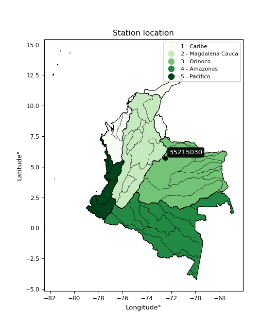

<div align="center">


</div>

# PMP Station (Rain, Pmax24h): 35215030

Probable Maximum Precipitation (PMP) is the greatest amount of rainfall for a specific duration that is meteorologically possible for a given location, acting as a "worst-case" scenario for extreme storms, crucial for designing safety-critical infrastructure like bridges, river deviations, dams, spillways, and nuclear plants to prevent catastrophic failure. PMP is calculated by hydrologists using meteorological data to determine the upper limit of extreme rainfall, often leading to the Probable Maximum Flood (PMF) for flood control design, and is increasingly being studied for climate change impacts.

<div align="center">

</img>

</div>


## A. General information


### 1. General running parameters

• app_version: _v20260103_. • runtime: _2026-01-03 07:24:50.581521_. • Python version: _3.14.0_. • SciPy version: _1.16.3_. • Pandas version: _2.3.3_. • NumPy version: _2.3.5_. • Stations dataset (station_dataset_file): _dataset/pmax24h_in/automatic_colombia_2003_2024.csv_. • Stations catalog (station_catalog_file): _dataset/CNE.xls_. • Minimum year to eval til year_max (date_min): _1900_. • Maximum year to eval since year_min (date_max): _2024_. • Creates, save and include plots into reports (create_plot): _False_. • Plot only fit distributions with Δo > Δ (plot_only_fit): _True_. • Eval low extreme values, if False, evaluates high extreme values (low_extreme): _False_. • Eval every SciPy distribution as logarithmic (pdist_logarithmic_on): _True_. • Standard deviation normalized (ddof): _1.0_. • Return periods to eval in years (Tr): _[2, 2.33, 5, 10, 15, 20, 25, 50, 75, 100, 200, 250, 500, 750, 1000]_. • Minimum data sample per station, 0 means any (minimum_sample): _5_. • Z-Score maximum threshold to adjust a value, 0 means disable (zscore_max): _3.5_. • Z-Score minimum threshold to adjust a value, 0 means disable (zscore_min): _-2.5_. • Avoid zeros, e.g. rain = 0 (avoid_zeros): _True_. • Avoid null values (avoid_nans): _True_. [:file_folder:Dataset file.](../../dataset/pmax24h_in/automatic_colombia_2003_2024.csv)

> Delta Degrees of Freedom (DDOF): is a parameter used in the formulas for calculating variance and standard deviation. When ddof=0, the divisor is $N$ (the total number of observations) and this is used when your data set is the entire population. When ddof=1, the divisor is $N-1$ and this is used when your data set is a sample drawn from a larger population. Using $N-1$ provides an unbiased estimate of the population variance (known as Bessel´s correction).


### 2. Station info and location

|   id |   CODIGO | NOMBRE                 | CATEGORIA               | TECNOLOGIA                | ESTADO   | FECHA_INSTALACION   |   FECHA_SUSPENSION |   ALTITUD |   LATITUD |   LONGITUD | DEPARTAMENTO   | MUNICIPIO   | AREA_OPERATIVA                              | ENTIDAD                                                     | AREA_HIDROGRAFICA   | ZONA_HIDROGRAFICA   | SUBZONA_HIDROGRAFICA   |   CORRIENTE | Catalogo   |   Version |
|-----:|---------:|:-----------------------|:------------------------|:--------------------------|:---------|:--------------------|-------------------:|----------:|----------:|-----------:|:---------------|:------------|:--------------------------------------------|:------------------------------------------------------------|:--------------------|:--------------------|:-----------------------|------------:|:-----------|----------:|
|    0 | 35215030 | Pisba - Aut [35215030] | Climatológica Ordinaria | Automática con Telemetría | Activa   | 15/12/2016          |                nan |      1482 |   5.72056 |   -72.4885 | Boyacá         | Pisva       | Area Operativa 06 - Boyacá-Casanare-Vichada | INSTITUTO DE HIDROLOGIA METEOROLOGIA Y ESTUDIOS AMBIENTALES | Orinoco             | Meta                | Río Cravo Sur          |         nan | CNE_IDEAM  |  20251226 |

<div align="center">

Dynamic map: [:earth_americas:Google](http://maps.google.com/maps?q=5.720555556,-72.48847222) [:earth_americas:OSM](https://www.openstreetmap.org/#map=18/5.720555556/-72.48847222&layers=P) [:earth_americas:Bing](https://www.bing.com/maps?cp=5.720555556~-72.48847222&lvl=18) [:earth_americas:Apple](https://maps.apple.com/frame?center=5.720555556%2C-72.48847222&span=0.003%2C0.006)

</div>


<div align="center">

```geojson
{
  "type": "Feature",
  "geometry": {
    "type": "Point", 
    "coordinates": [-72.48847222, 5.720555556]
  }, 
  "properties": {
    "Name": "35215030"
  }
}
```

</div>


### 3. Discrete values table and plot

<div align="center">

|               |           0 |           1 |           2 |           3 |           4 |          5 |
|:--------------|------------:|------------:|------------:|------------:|------------:|-----------:|
| Date          | 2017        | 2018        | 2019        | 2020        | 2021        | 2024       |
| Value         |   35.8      |   44.9      |   68.5      |   65.2      |   12.4      | 1100.8     |
| Value_initial |   35.8      |   44.9      |   68.5      |   65.2      |   12.4      | 1100.8     |
| count         |    6        |    6        |    6        |    6        |    6        |    6       |
| mean          |  221.267    |  221.267    |  221.267    |  221.267    |  221.267    |  221.267   |
| std           |  431.37     |  431.37     |  431.37     |  431.37     |  431.37     |  431.37    |
| zscore        |   -0.429948 |   -0.408852 |   -0.354143 |   -0.361793 |   -0.484193 |    2.03893 |


</div>


> The initial value (value_initial) correspond to the initial obtained or null completed value, and value (value) is adjusted only when the initial value is outside the valid range definite through the Z-Score value. If Z-Score is active, values out of range or outliers are replaced with the station mean value


### 4. Active continuous probability distributions from SciPy (44 of 104 available)

A Probability Density Function (PDF) describes the relative likelihood of a continuous random variable falling within a specific range, where the total area under its curve equals 1, and the area over any interval gives the actual probability for that range. Unlike discrete probabilities (like rolling a die), a PDF shows density, not direct probability for a single point (which is zero), with higher points indicating higher likelihood, often visualized as a bell curve for normal distributions.

A log of a probability density function (log-PDF) is simply the logarithm of the PDF´s value, denoted as $log(f(x))$, useful for converting multiplication of probabilities into addition, improving numerical stability with tiny numbers, and connecting to information theory concepts like entropy. Instead of dealing with very small probabilities (e.g., 0.000001), log-PDFs use negative numbers (e.g., $log(0.00001) ≈ -11.51$ that are easier for computers to handle, preventing underflow errors and simplifying complex calculations. In this study, each active probability distribution from SciPy is also evaluated in the $log$ form.

[scipy.stats](https://docs.scipy.org/doc/scipy/reference/stats.html) is a Python´s powerful submodule within the SciPy library for comprehensive statistical analysis, offering over 130 probability distributions (like Normal, Poisson), functions for descriptive stats (mean, variance), hypothesis testing (t-tests, chi-square), random variable generation, and statistical tests, making it essential for data science, modeling, and research. It provides tools to explore, model, and draw conclusions from data efficiently, working seamlessly with NumPy.

<div align="center">

|   id | p_dist             |   n_parameter | fit_method   | label                                                                       | active   | ref                                                                                                        |
|-----:|:-------------------|--------------:|:-------------|:----------------------------------------------------------------------------|:---------|:-----------------------------------------------------------------------------------------------------------|
|    0 | alpha              |             3 | MLE          | Alpha                                                                       | True     | [:mortar_board:](https://docs.scipy.org/doc/scipy/reference/generated/scipy.stats.alpha.html)              |
|    1 | betaprime          |             4 | MLE          | Beta prime                                                                  | True     | [:mortar_board:](https://docs.scipy.org/doc/scipy/reference/generated/scipy.stats.betaprime.html)          |
|    2 | chi2               |             3 | MLE          | Chi²                                                                        | True     | [:mortar_board:](https://docs.scipy.org/doc/scipy/reference/generated/scipy.stats.chi2.html)               |
|    3 | crystalball        |             4 | MLE          | Crystalball                                                                 | True     | [:mortar_board:](https://docs.scipy.org/doc/scipy/reference/generated/scipy.stats.crystalball.html)        |
|    4 | erlang             |             3 | MLE          | Erlang                                                                      | True     | [:mortar_board:](https://docs.scipy.org/doc/scipy/reference/generated/scipy.stats.erlang.html)             |
|    5 | expon              |             2 | MLE          | Exponential                                                                 | True     | [:mortar_board:](https://docs.scipy.org/doc/scipy/reference/generated/scipy.stats.expon.html)              |
|    6 | exponnorm          |             3 | MLE          | Exponentially modified Normal                                               | True     | [:mortar_board:](https://docs.scipy.org/doc/scipy/reference/generated/scipy.stats.exponnorm.html)          |
|    7 | f                  |             4 | MLE          | F                                                                           | True     | [:mortar_board:](https://docs.scipy.org/doc/scipy/reference/generated/scipy.stats.f.html)                  |
|    8 | fatiguelife        |             3 | MLE          | Fatigue-life (Birnbaum-Saunders)                                            | True     | [:mortar_board:](https://docs.scipy.org/doc/scipy/reference/generated/scipy.stats.fatiguelife.html)        |
|    9 | fisk               |             3 | MLE          | Fisk                                                                        | True     | [:mortar_board:](https://docs.scipy.org/doc/scipy/reference/generated/scipy.stats.fisk.html)               |
|   10 | gamma              |             3 | MLE          | Gamma                                                                       | True     | [:mortar_board:](https://docs.scipy.org/doc/scipy/reference/generated/scipy.stats.gamma.html)              |
|   11 | genexpon           |             5 | MLE          | Generalized exponential                                                     | True     | [:mortar_board:](https://docs.scipy.org/doc/scipy/reference/generated/scipy.stats.genexpon.html)           |
|   12 | genlogistic        |             3 | MLE          | Generalized logistic                                                        | True     | [:mortar_board:](https://docs.scipy.org/doc/scipy/reference/generated/scipy.stats.genlogistic.html)        |
|   13 | gibrat             |             2 | MM           | Gibrat                                                                      | True     | [:mortar_board:](https://docs.scipy.org/doc/scipy/reference/generated/scipy.stats.gibrat.html)             |
|   14 | gompertz           |             3 | MLE          | Gompertz (or truncated Gumbel)                                              | True     | [:mortar_board:](https://docs.scipy.org/doc/scipy/reference/generated/scipy.stats.gompertz.html)           |
|   15 | gumbel_l           |             2 | MM           | Gumbel Left Skew                                                            | True     | [:mortar_board:](https://docs.scipy.org/doc/scipy/reference/generated/scipy.stats.gumbel_l.html)           |
|   16 | gumbel_r           |             2 | MM           | Gumbel Right Skew                                                           | True     | [:mortar_board:](https://docs.scipy.org/doc/scipy/reference/generated/scipy.stats.gumbel_r.html)           |
|   17 | halflogistic       |             2 | MM           | Half-logistic                                                               | True     | [:mortar_board:](https://docs.scipy.org/doc/scipy/reference/generated/scipy.stats.halflogistic.html)       |
|   18 | halfnorm           |             2 | MM           | Half Normal                                                                 | True     | [:mortar_board:](https://docs.scipy.org/doc/scipy/reference/generated/scipy.stats.halfnorm.html)           |
|   19 | hypsecant          |             2 | MM           | hyperbolic secant                                                           | True     | [:mortar_board:](https://docs.scipy.org/doc/scipy/reference/generated/scipy.stats.hypsecant.html)          |
|   20 | invgamma           |             3 | MLE          | Inverted gamma                                                              | True     | [:mortar_board:](https://docs.scipy.org/doc/scipy/reference/generated/scipy.stats.invgamma.html)           |
|   21 | invgauss           |             3 | MLE          | Inverse Gaussian                                                            | True     | [:mortar_board:](https://docs.scipy.org/doc/scipy/reference/generated/scipy.stats.invgauss.html)           |
|   22 | invweibull         |             3 | MLE          | Inverted Weibull                                                            | True     | [:mortar_board:](https://docs.scipy.org/doc/scipy/reference/generated/scipy.stats.invweibull.html)         |
|   23 | johnsonsu          |             4 | MLE          | Johnson Su                                                                  | True     | [:mortar_board:](https://docs.scipy.org/doc/scipy/reference/generated/scipy.stats.johnsonsu.html)          |
|   24 | kstwobign          |             2 | MLE          | Limiting distribution of scaled Kolmogorov-Smirnov two-sided test statistic | True     | [:mortar_board:](https://docs.scipy.org/doc/scipy/reference/generated/scipy.stats.kstwobign.html)          |
|   25 | laplace            |             2 | MM           | Laplace                                                                     | True     | [:mortar_board:](https://docs.scipy.org/doc/scipy/reference/generated/scipy.stats.laplace.html)            |
|   26 | laplace_asymmetric |             3 | MLE          | Asymmetric Laplace                                                          | True     | [:mortar_board:](https://docs.scipy.org/doc/scipy/reference/generated/scipy.stats.laplace_asymmetric.html) |
|   27 | loggamma           |             3 | MLE          | Log gamma                                                                   | True     | [:mortar_board:](https://docs.scipy.org/doc/scipy/reference/generated/scipy.stats.loggamma.html)           |
|   28 | logistic           |             2 | MM           | Logistic (or Sech-squared)                                                  | True     | [:mortar_board:](https://docs.scipy.org/doc/scipy/reference/generated/scipy.stats.logistic.html)           |
|   29 | lognorm            |             3 | MLE          | Log Normal                                                                  | True     | [:mortar_board:](https://docs.scipy.org/doc/scipy/reference/generated/scipy.stats.lognorm.html)            |
|   30 | maxwell            |             2 | MM           | Maxwell                                                                     | True     | [:mortar_board:](https://docs.scipy.org/doc/scipy/reference/generated/scipy.stats.maxwell.html)            |
|   31 | mielke             |             4 | MLE          | Mielke Beta-Kappa / Dagum                                                   | True     | [:mortar_board:](https://docs.scipy.org/doc/scipy/reference/generated/scipy.stats.mielke.html)             |
|   32 | moyal              |             2 | MM           | Moyal                                                                       | True     | [:mortar_board:](https://docs.scipy.org/doc/scipy/reference/generated/scipy.stats.moyal.html)              |
|   33 | nakagami           |             3 | MLE          | Nakagami                                                                    | True     | [:mortar_board:](https://docs.scipy.org/doc/scipy/reference/generated/scipy.stats.nakagami.html)           |
|   34 | ncf                |             5 | MLE          | Non-central F distribution                                                  | True     | [:mortar_board:](https://docs.scipy.org/doc/scipy/reference/generated/scipy.stats.ncf.html)                |
|   35 | nct                |             4 | MLE          | Non-central Student’s t                                                     | True     | [:mortar_board:](https://docs.scipy.org/doc/scipy/reference/generated/scipy.stats.nct.html)                |
|   36 | norm               |             2 | MM           | Normal                                                                      | True     | [:mortar_board:](https://docs.scipy.org/doc/scipy/reference/generated/scipy.stats.norm.html)               |
|   37 | pearson3           |             3 | MM           | Pearson type III                                                            | True     | [:mortar_board:](https://docs.scipy.org/doc/scipy/reference/generated/scipy.stats.pearson3.html)           |
|   38 | rayleigh           |             2 | MM           | Rayleigh                                                                    | True     | [:mortar_board:](https://docs.scipy.org/doc/scipy/reference/generated/scipy.stats.rayleigh.html)           |
|   39 | rice               |             3 | MLE          | Rice                                                                        | True     | [:mortar_board:](https://docs.scipy.org/doc/scipy/reference/generated/scipy.stats.rice.html)               |
|   40 | t                  |             3 | MLE          | Student’s t                                                                 | True     | [:mortar_board:](https://docs.scipy.org/doc/scipy/reference/generated/scipy.stats.t.html)                  |
|   41 | truncnorm          |             4 | MLE          | Truncated normal                                                            | True     | [:mortar_board:](https://docs.scipy.org/doc/scipy/reference/generated/scipy.stats.truncnorm.html)          |
|   42 | wald               |             2 | MM           | Wald                                                                        | True     | [:mortar_board:](https://docs.scipy.org/doc/scipy/reference/generated/scipy.stats.wald.html)               |
|   43 | weibull_min        |             3 | MLE          | Weibull minimum                                                             | True     | [:mortar_board:](https://docs.scipy.org/doc/scipy/reference/generated/scipy.stats.weibull_min.html)        |

</div>

> **n_parameter:** # arguments & localization & scale.
>
> **Fit methods:** (MLE) maximum likelihood, (MM) L-moments.
>
>**Inactive** (With the only purpose of prevent loops, zero divisions, infinite values, over high estimated values or horizontal trending for recurrence intervals estimations, the follow distributions were disabled.)**:** foldnorm, gennorm, norminvgauss, powernorm, powerlognorm, skewnorm, genextreme, anglit, arcsine, argus, beta, bradford, burr, burr12, cauchy, cosine, halfcauchy, foldcauchy, skewcauchy, wrapcauchy, dgamma, gengamma, exponweib, exponpow, truncexpon, gausshyper, genhalflogistic, genhyperbolic, geninvgauss, halfgennorm, johnsonsb, kappa4, kappa3, ksone, kstwo, loglaplace, levy, levy_l, levy_stable, ncx2, pareto, genpareto, truncpareto, lomax, powerlaw, rdist, rel_breitwigner, recipinvgauss, semicircular, studentized_range, trapezoid, triang, truncweibull_min, tukeylambda, uniform, loguniform, vonmises, vonmises_line, weibull_max, dweibull, 


## B. Probability distributions vs. Empirical distributions

A continuous probability distribution (CPD) describes probabilities for variables that can take any value within a range (like rain any time), unlike discrete variables with specific outcomes (like temperature). It uses a Probability Density Function (PDF), a curve where the total area under it equals 1, and the probability of the variable falling within an interval (a to b) is found by calculating the area under the curve between those points. A key feature is that the probability of hitting any single exact value is zero, so probabilities are always expressed for ranges, e.g., $P(a ≤ X ≤ b)$.

<div align="center">

Distributions parameters from station values
|    |   station | p_dist                |   n |             loc |           scale | shape                  | shape1                | shape2              | shape3   |
|---:|----------:|:----------------------|----:|----------------:|----------------:|:-----------------------|:----------------------|:--------------------|:---------|
|  0 |  35215030 | alpha                 |   6 |      -0.0749409 |    27.1564      | 4.659702882538314e-11  |                       |                     |          |
|  1 |  35215030 | betaprime             |   6 |      -0.0578915 |     0.181654    | 195.88044539981092     | 0.9476609903944837    |                     |          |
|  2 |  35215030 | chi2                  |   6 |      12.4       |   508.548       | 0.6505155029194489     |                       |                     |          |
|  3 |  35215030 | crystalball           |   6 |      -0.286552  |   451.768       | 4.653884668663288      | 2.3448911057370205    |                     |          |
|  4 |  35215030 | erlang                |   6 |      12.4       |   164.829       | 0.650749304157481      |                       |                     |          |
|  5 |  35215030 | expon                 |   6 |      12.4       |   208.867       |                        |                       |                     |          |
|  6 |  35215030 | exponnorm             |   6 |      12.1552    |     0.0778605   | 2666.047187558249      |                       |                     |          |
|  7 |  35215030 | f                     |   6 |       4.95173   |    30.8145      | 14.317758206879063     | 1.685330144990795     |                     |          |
|  8 |  35215030 | fatiguelife           |   6 |      12.4       |     0.000306184 | 781.7817525622418      |                       |                     |          |
|  9 |  35215030 | fisk                  |   6 |      12.4       |    39.7585      | 0.8176073504169934     |                       |                     |          |
| 10 |  35215030 | gamma                 |   6 |      12.4       |   415.751       | 0.3714221004635261     |                       |                     |          |
| 11 |  35215030 | genexpon              |   6 |      12.4       |   372.205       | 1.782023969557988      | 2.767448841327229e-13 | 1.9332618073766947  |          |
| 12 |  35215030 | genlogistic           |   6 |   -1316.32      |   177.794       | 2516.335136660671      |                       |                     |          |
| 13 |  35215030 | gibrat                |   6 |     -79.142     |   182.207       |                        |                       |                     |          |
| 14 |  35215030 | gompertz              |   6 |      12.4       |   941.802       | 2.162474097820864      |                       |                     |          |
| 15 |  35215030 | gumbel_l              |   6 |     398.491     |   307.033       |                        |                       |                     |          |
| 16 |  35215030 | gumbel_r              |   6 |      44.0423    |   307.033       |                        |                       |                     |          |
| 17 |  35215030 | halflogistic          |   6 |    -245.461     |   336.673       |                        |                       |                     |          |
| 18 |  35215030 | halfnorm              |   6 |    -299.951     |   653.249       |                        |                       |                     |          |
| 19 |  35215030 | hypsecant             |   6 |     221.267     |   250.692       |                        |                       |                     |          |
| 20 |  35215030 | invgamma              |   6 |       3.59021   |    24.6055      | 0.8255664574039707     |                       |                     |          |
| 21 |  35215030 | invgauss              |   6 |       6.54843   |    25.2827      | 8.492696640617215      |                       |                     |          |
| 22 |  35215030 | invweibull            |   6 |      12.4       |     3.07659     | 0.04451228524621721    |                       |                     |          |
| 23 |  35215030 | johnsonsu             |   6 |      37.6519    |     6.80881     | -0.6027618518344698    | 0.41561892433683034   |                     |          |
| 24 |  35215030 | kstwobign             |   6 |    -690.017     |  1075.25        |                        |                       |                     |          |
| 25 |  35215030 | laplace               |   6 |     221.267     |   278.448       |                        |                       |                     |          |
| 26 |  35215030 | laplace_asymmetric    |   6 |      12.4       |     0.00258772  | 1.2389362931466689e-05 |                       |                     |          |
| 27 |  35215030 | loggamma              |   6 | -158155         | 20276           | 2467.943437801793      |                       |                     |          |
| 28 |  35215030 | logistic              |   6 |     221.267     |   217.105       |                        |                       |                     |          |
| 29 |  35215030 | lognorm               |   6 |      12.4       |     0.127792    | 14.324081205537206     |                       |                     |          |
| 30 |  35215030 | maxwell               |   6 |    -711.839     |   584.738       |                        |                       |                     |          |
| 31 |  35215030 | mielke                |   6 |      -0.211638  |     0.65306     | 61.02730920182648      | 1.0106741017607606    |                     |          |
| 32 |  35215030 | moyal                 |   6 |      -3.92511   |   177.266       |                        |                       |                     |          |
| 33 |  35215030 | nakagami              |   6 |      12.4       |   634.955       | 0.05283938572790503    |                       |                     |          |
| 34 |  35215030 | ncf                   |   6 |      -0.0433573 |     4.28523e-06 | 2.0047551842221827e-05 | 1.9454588216214463    | 177.34336402103065  |          |
| 35 |  35215030 | nct                   |   6 |      -3.59968   |     1.96686     | 0.8205269162874625     | 17.037125427192173    |                     |          |
| 36 |  35215030 | norm                  |   6 |     221.267     |   393.785       |                        |                       |                     |          |
| 37 |  35215030 | pearson3              |   6 |     221.267     |   393.785       | 1.7797001925259943     |                       |                     |          |
| 38 |  35215030 | rayleigh              |   6 |    -532.068     |   601.074       |                        |                       |                     |          |
| 39 |  35215030 | rice                  |   6 |    -317.9       |   472.106       | 0.00035746156167520146 |                       |                     |          |
| 40 |  35215030 | t                     |   6 |      46.4969    |    17.0961      | 0.6724956804366862     |                       |                     |          |
| 41 |  35215030 | truncnorm             |   6 |  -59411.4       |  4431.8         | 13.408481316105487     | 1440.093550668159     |                     |          |
| 42 |  35215030 | wald                  |   6 |    -172.519     |   393.785       |                        |                       |                     |          |
| 43 |  35215030 | weibull_min           |   6 |      12.4       |   212.439       | 0.1452969097049252     |                       |                     |          |
| 44 |  35215030 | logalpha              |   6 |      -1.327     |    24.2611      | 4.612088246567318      |                       |                     |          |
| 45 |  35215030 | logbetaprime          |   6 |      -0.0937905 |     0.330862    | 147.9535301378873      | 12.335244974391053    |                     |          |
| 46 |  35215030 | logchi2               |   6 |       2.5177    |     1.02096     | 1.0869484848465154     |                       |                     |          |
| 47 |  35215030 | logcrystalball        |   6 |       4.21803   |     1.36834     | 7.863242610818681      | 56.80612934169309     |                     |          |
| 48 |  35215030 | logerlang             |   6 |       2.5177    |     1.61908     | 0.805010693275221      |                       |                     |          |
| 49 |  35215030 | logexpon              |   6 |       2.5177    |     1.70033     |                        |                       |                     |          |
| 50 |  35215030 | logexponnorm          |   6 |       3.01598   |     0.591433    | 2.0324182259986703     |                       |                     |          |
| 51 |  35215030 | logf                  |   6 |       1.17293   |     2.73832     | 27.41770071394535      | 18.79420244428298     |                     |          |
| 52 |  35215030 | logfatiguelife        |   6 |       1.39267   |     2.52849     | 0.48444420507806496    |                       |                     |          |
| 53 |  35215030 | logfisk               |   6 |       1.43054   |     2.49934     | 3.794175640549809      |                       |                     |          |
| 54 |  35215030 | loggamma              |   6 |       2.5177    |     1.60828     | 0.9108423388918303     |                       |                     |          |
| 55 |  35215030 | loggenexpon           |   6 |       2.5177    |     0.969977    | 0.40722273416043464    | 2.214573832962693     | 0.05442204235734045 |          |
| 56 |  35215030 | loggenlogistic        |   6 |      -2.88383   |     1.00006     | 663.3564072380375      |                       |                     |          |
| 57 |  35215030 | loggibrat             |   6 |       3.17419   |     0.633123    |                        |                       |                     |          |
| 58 |  35215030 | loggompertz           |   6 |       2.5177    |     5.24973     | 2.300123508527392      |                       |                     |          |
| 59 |  35215030 | loggumbel_l           |   6 |       4.83385   |     1.06689     |                        |                       |                     |          |
| 60 |  35215030 | loggumbel_r           |   6 |       3.6022    |     1.06689     |                        |                       |                     |          |
| 61 |  35215030 | loghalflogistic       |   6 |       2.59622   |     1.16989     |                        |                       |                     |          |
| 62 |  35215030 | loghalfnorm           |   6 |       2.40688   |     2.26993     |                        |                       |                     |          |
| 63 |  35215030 | loghypsecant          |   6 |       4.21803   |     0.871111    |                        |                       |                     |          |
| 64 |  35215030 | loginvgamma           |   6 |       0.508703  |    29.0451      | 8.822369644881231      |                       |                     |          |
| 65 |  35215030 | loginvgauss           |   6 |       1.30539   |    12.7379      | 0.22865933313467385    |                       |                     |          |
| 66 |  35215030 | loginvweibull         |   6 |      -8.42931   |    12.0009      | 12.340975281953394     |                       |                     |          |
| 67 |  35215030 | logjohnsonsu          |   6 |       3.82907   |     0.358609    | -0.21641393962079536   | 0.6604974188222528    |                     |          |
| 68 |  35215030 | logkstwobign          |   6 |      -0.0445155 |     4.92682     |                        |                       |                     |          |
| 69 |  35215030 | loglaplace            |   6 |       4.21803   |     0.967561    |                        |                       |                     |          |
| 70 |  35215030 | loglaplace_asymmetric |   6 |       3.80444   |     0.843877    | 0.7844624316888574     |                       |                     |          |
| 71 |  35215030 | logloggamma           |   6 |    -467.36      |    62.1238      | 1980.696477549252      |                       |                     |          |
| 72 |  35215030 | loglogistic           |   6 |       4.21803   |     0.754404    |                        |                       |                     |          |
| 73 |  35215030 | loglognorm            |   6 |       2.5177    |     0.00444471  | 13.394783070195663     |                       |                     |          |
| 74 |  35215030 | logmaxwell            |   6 |       0.975641  |     2.03186     |                        |                       |                     |          |
| 75 |  35215030 | logmielke             |   6 |       2.5177    |     2.19303     | 0.6357607269423418     | 3.2439806992333535    |                     |          |
| 76 |  35215030 | logmoyal              |   6 |       3.43552   |     0.615969    |                        |                       |                     |          |
| 77 |  35215030 | lognakagami           |   6 |       3.57795   |     0.879732    | 0.09171160439269727    |                       |                     |          |
| 78 |  35215030 | logncf                |   6 |       0.692871  |     2.73201     | 135.3327787789974      | 17.75879943744802     | 19.765653383305477  |          |
| 79 |  35215030 | lognct                |   6 |      -0.180714  |     0.244794    | 7.1682923128347795     | 16.022568270589154    |                     |          |
| 80 |  35215030 | lognorm               |   6 |       4.21803   |     1.36834     |                        |                       |                     |          |
| 81 |  35215030 | logpearson3           |   6 |       4.21803   |     1.36833     | 1.0649489497603186     |                       |                     |          |
| 82 |  35215030 | lograyleigh           |   6 |       1.60032   |     2.08863     |                        |                       |                     |          |
| 83 |  35215030 | logrice               |   6 |       1.91173   |     1.89623     | 0.0005329850718088203  |                       |                     |          |
| 84 |  35215030 | logt                  |   6 |       3.92607   |     0.438142    | 1.123236404728316      |                       |                     |          |
| 85 |  35215030 | logtruncnorm          |   6 |      -0.380103  |     2.21434     | 1.787459374509132      | 3.3345758552004208    |                     |          |
| 86 |  35215030 | logwald               |   6 |       2.84972   |     1.36832     |                        |                       |                     |          |
| 87 |  35215030 | logweibull_min        |   6 |       2.5177    |     1.71004     | 0.8176692899536088     |                       |                     |          |

</div>

> **loc** (Location parameter): This shifts the distribution along the x-axis. For many common distributions, like the normal (Gaussian) distribution, loc represents the mean $μ$. For others, like the uniform distribution, it might represent the minimum value, or for the beta distribution, the left end of the support interval.
>
> **scale** (Scale parameter): This determines the width or spread of the distribution. For the normal distribution, scale represents the standard deviation $σ$. For a uniform distribution, it defines the length of the interval (from $loc$ to $loc + scale$).
>
> **shape** (Shape parameters): Refers to parameters that define the specific form of a probability distribution, distinct from its location (loc) and scale (scale). These parameters are required arguments for most distribution functions. For example, a normal (Gaussian) distribution is fully defined by its location (mean) and scale (standard deviation), so it has no specific shape parameters beyond loc and scale. However, other distributions have intrinsic properties that need specification, as Gamma distribution that takes a shape parameter, often named $a$ or $alpha$.


### 0. Cumulative distribution values - CDF (88 evaluated)

Cumulative Distribution Function (CDF), denoted as $F$<sub>$X$</sub>$(x)$, is a function that gives the probability that a random variable $X$ will take a value less than or equal to a specific value, $x$ (i.e., $(P(X≥x)$. It essentially "accumulates" probabilities from a given point up to the far right (positive infinity), providing a complete picture of the distribution´s probabilities for both discrete (like rain) and continuous (like temperature) variables, helping to find probabilities over ranges or above certain values. Each station is evaluated separately ordering the $x$ values ascending, calculating the CDF and PDF values for the activated distributions and their logarithmic forms.

<div align="center">

CDF ordered by x ascending and calculating $log(f(x))$ separately
|   id |   Station |   date |      x |   count |    mean |    std |    zscore |   Value_initial |   station |   m |     alpha |   alpha_pdf |   betaprime |   betaprime_pdf |        chi2 |    chi2_pdf |   crystalball |   crystalball_pdf |      erlang |     erlang_pdf |    expon |   expon_pdf |   exponnorm |   exponnorm_pdf |         f |       f_pdf |   fatiguelife |   fatiguelife_pdf |        fisk |     fisk_pdf |       gamma |   gamma_pdf |    genexpon |   genexpon_pdf |   genlogistic |   genlogistic_pdf |   gibrat |   gibrat_pdf |   gompertz |   gompertz_pdf |   gumbel_l |   gumbel_l_pdf |   gumbel_r |   gumbel_r_pdf |   halflogistic |   halflogistic_pdf |   halfnorm |   halfnorm_pdf |   hypsecant |   hypsecant_pdf |   invgamma |   invgamma_pdf |   invgauss |   invgauss_pdf |   invweibull |   invweibull_pdf |   johnsonsu |   johnsonsu_pdf |   kstwobign |   kstwobign_pdf |   laplace |   laplace_pdf |   laplace_asymmetric |   laplace_asymmetric_pdf |    loggamma |   loggamma_pdf |   logistic |   logistic_pdf |   lognorm |   lognorm_pdf |   maxwell |   maxwell_pdf |    mielke |   mielke_pdf |    moyal |   moyal_pdf |   nakagami |   nakagami_pdf |       ncf |     ncf_pdf |       nct |     nct_pdf |     norm |    norm_pdf |   pearson3 |   pearson3_pdf |   rayleigh |   rayleigh_pdf |     rice |    rice_pdf |        t |       t_pdf |   truncnorm |   truncnorm_pdf |     wald |    wald_pdf |   weibull_min |   weibull_min_pdf |   logalpha |   logalpha_pdf |   logbetaprime |   logbetaprime_pdf |     logchi2 |   logchi2_pdf |   logcrystalball |   logcrystalball_pdf |   logerlang |   logerlang_pdf |   logexpon |   logexpon_pdf |   logexponnorm |   logexponnorm_pdf |     logf |   logf_pdf |   logfatiguelife |   logfatiguelife_pdf |   logfisk |   logfisk_pdf |   loggenexpon |   loggenexpon_pdf |   loggenlogistic |   loggenlogistic_pdf |   loggibrat |   loggibrat_pdf |   loggompertz |   loggompertz_pdf |   loggumbel_l |   loggumbel_l_pdf |   loggumbel_r |   loggumbel_r_pdf |   loghalflogistic |   loghalflogistic_pdf |   loghalfnorm |   loghalfnorm_pdf |   loghypsecant |   loghypsecant_pdf |   loginvgamma |   loginvgamma_pdf |   loginvgauss |   loginvgauss_pdf |   loginvweibull |   loginvweibull_pdf |   logjohnsonsu |   logjohnsonsu_pdf |   logkstwobign |   logkstwobign_pdf |   loglaplace |   loglaplace_pdf |   loglaplace_asymmetric |   loglaplace_asymmetric_pdf |   logloggamma |   logloggamma_pdf |   loglogistic |   loglogistic_pdf |   loglognorm |   loglognorm_pdf |   logmaxwell |   logmaxwell_pdf |   logmielke |   logmielke_pdf |   logmoyal |   logmoyal_pdf |   lognakagami |   lognakagami_pdf |    logncf |   logncf_pdf |    lognct |   lognct_pdf |   logpearson3 |   logpearson3_pdf |   lograyleigh |   lograyleigh_pdf |   logrice |   logrice_pdf |      logt |   logt_pdf |   logtruncnorm |   logtruncnorm_pdf |   logwald |   logwald_pdf |   logweibull_min |   logweibull_min_pdf |
|-----:|----------:|-------:|-------:|--------:|--------:|-------:|----------:|----------------:|----------:|----:|----------:|------------:|------------:|----------------:|------------:|------------:|--------------:|------------------:|------------:|---------------:|---------:|------------:|------------:|----------------:|----------:|------------:|--------------:|------------------:|------------:|-------------:|------------:|------------:|------------:|---------------:|--------------:|------------------:|---------:|-------------:|-----------:|---------------:|-----------:|---------------:|-----------:|---------------:|---------------:|-------------------:|-----------:|---------------:|------------:|----------------:|-----------:|---------------:|-----------:|---------------:|-------------:|-----------------:|------------:|----------------:|------------:|----------------:|----------:|--------------:|---------------------:|-------------------------:|------------:|---------------:|-----------:|---------------:|----------:|--------------:|----------:|--------------:|----------:|-------------:|---------:|------------:|-----------:|---------------:|----------:|------------:|----------:|------------:|---------:|------------:|-----------:|---------------:|-----------:|---------------:|---------:|------------:|---------:|------------:|------------:|----------------:|---------:|------------:|--------------:|------------------:|-----------:|---------------:|---------------:|-------------------:|------------:|--------------:|-----------------:|---------------------:|------------:|----------------:|-----------:|---------------:|---------------:|-------------------:|---------:|-----------:|-----------------:|---------------------:|----------:|--------------:|--------------:|------------------:|-----------------:|---------------------:|------------:|----------------:|--------------:|------------------:|--------------:|------------------:|--------------:|------------------:|------------------:|----------------------:|--------------:|------------------:|---------------:|-------------------:|--------------:|------------------:|--------------:|------------------:|----------------:|--------------------:|---------------:|-------------------:|---------------:|-------------------:|-------------:|-----------------:|------------------------:|----------------------------:|--------------:|------------------:|--------------:|------------------:|-------------:|-----------------:|-------------:|-----------------:|------------:|----------------:|-----------:|---------------:|--------------:|------------------:|----------:|-------------:|----------:|-------------:|--------------:|------------------:|--------------:|------------------:|----------:|--------------:|----------:|-----------:|---------------:|-------------------:|----------:|--------------:|-----------------:|---------------------:|
|    0 |  35215030 |   2021 |   12.4 |       6 | 221.267 | 431.37 | -0.484193 |            12.4 |  35215030 |   1 | 0.0294898 | 0.0130233   |   0.0530469 |     0.0121582   | 1.87416e-06 | 3.43167e+08 |      0.511202 |       0.000882721 | 1.00938e-11 | 3697.76        | 0        | 0.00478774  |  0.00117884 |     0.00480774  | 0.0437562 | 0.014232    |     0.0565407 |       4.51406e+08 | 4.28748e-14 | 19.7341      | 3.97794e-07 | 8.31757e+07 | 2.98601e-14 |    0.00478774  |      0.239565 |       0.00192483  | 0.245617 |  0.00343875  |  2.446e-14 |    0.0022961   |   0.24751  |    0.000696939 |   0.330035 |    0.00119161  |       0.365271 |        0.00128697  |   0.367456 |    0.00108947  |    0.261036 |     0.000928416 |  0.0429406 |     0.0142782  |  0.0423057 |    0.0183499   |   0.00850053 |      1.01554e+12 |   0.0745174 |     0.00223845  |    0.213051 |     0.0014504   |  0.236157 |   0.00084812  |          1.53846e-10 |              0.00478775  | 6.97491e-15 |     14.3058    |   0.276467 |    0.000921365 |  0.107003 |     0.134715  |  0.325568 |   0.000972086 | 0.0520295 |  0.0120282   | 0.339579 |  0.00136221 |  0.0122968 |    7.31562e+11 | 0.0539823 | 0.0121232   | 0.0448672 | 0.0122376   | 0.297915 | 0.000880157 |   0.368157 |    0.00145703  |   0.336522 |    0.000999869 | 0.217094 | 0.00116022  | 0.189316 | 0.00338755  | 0.000300246 |     0.00304125  | 0.337645 | 0.00233333  |    0.00329568 |       2.69125e+11 |  0.0447359 |      0.154837  |      0.0573432 |          0.166547  | 3.46087e-09 |    4.2354e+06 |         0.107003 |            0.134715  | 3.18298e-13 |      576.985    |   0        |      0.588121  |      0.0442592 |           0.129358 | 0.043912 |  0.163547  |        0.0429268 |            0.181338  | 0.0407577 |     0.136447  |    7.9401e-11 |         0.419827  |        0.0504991 |            0.150432  |    0        |       0         |   4.89919e-10 |         0.438141  |      0.107804 |        0.0953919  |      0.063068 |         0.163364  |          0        |             0         |     0.0389351 |         0.351083  |      0.0898011 |          0.101726  |     0.0440036 |          0.162847 |     0.0431213 |         0.178025  |       0.0446355 |           0.156454  |      0.0614577 |          0.0589703 |      0.0503479 |          0.159621  |    0.0862518 |        0.0891435 |               0.0545393 |                   0.082387  |      0.111909 |         0.135129  |     0.0950159 |         0.113981  |    0.0127157 |      5.52094e+12 |    0.0980924 |        0.169583  | 4.10759e-09 |    18492        |  0.0351609 |      0.148373  |    0          |       0           | 0.0440818 |    0.162983  | 0.0444463 |    0.158929  |     0.0624107 |         0.189956  |     0.0919532 |          0.190956 |  0.049779 |     0.160137  | 0.0848232 |  0.0630827 |     0          |          0         |  0        |     0         |      1.80379e-13 |          332.118     |
|    1 |  35215030 |   2017 |   35.8 |       6 | 221.267 | 431.37 | -0.429948 |            35.8 |  35215030 |   2 | 0.449065  | 0.0126416   |   0.348941  |     0.00991087  | 0.32615     | 0.00445533  |      0.531834 |       0.000880256 | 0.295132    |    0.00752441  | 0.105985 | 0.00428031  |  0.107659   |     0.00429878  | 0.379149  | 0.0101957   |     0.638185  |       0.00283171  | 0.393314    |  0.00833743  | 0.380455    | 0.00579528  | 0.105985    |    0.00428031  |      0.285715 |       0.00201268  | 0.322501 |  0.00312133  |  0.0529485 |    0.00222923  |   0.264266 |    0.000735383 |   0.358005 |    0.00119774  |       0.394996 |        0.00125341  |   0.392727 |    0.00107028  |    0.28345  |     0.000987055 |  0.380658  |     0.0101871  |  0.394995  |    0.00918476  |   0.401059   |      0.000697029 |   0.237472  |     0.0182051   |    0.247685 |     0.00150665  |  0.256861 |   0.000922474 |          0.105986    |              0.00428032  | 0.527178    |      0.314879  |   0.298538 |    0.000964569 |  0.319971 |     0.261337  |  0.348473 |   0.000985034 | 0.353408  |  0.0102282   | 0.371322 |  0.00134918 |  0.621299  |    0.00280571  | 0.350123  | 0.0099753   | 0.369813  | 0.010579    | 0.318826 | 0.000906737 |   0.401558 |    0.00139753  |   0.359996 |    0.00100594  | 0.244706 | 0.0011986   | 0.340181 | 0.0116288   | 0.0690045   |     0.00283335  | 0.389921 | 0.00213498  |    0.516051   |       0.00218093  |  0.369128  |      0.380456  |      0.363901  |          0.351565  | 0.664334    |    0.240417   |         0.319971 |            0.261337  | 0.580059    |        0.30077  |   0.463965 |      0.315253  |      0.350524  |           0.398044 | 0.370424 |  0.369368  |        0.381557  |            0.361067  | 0.359895  |     0.407033  |    0.402927   |         0.329395  |        0.354951  |            0.36734   |    0.326407 |       0.892992  |   0.402364    |         0.320451  |      0.265196 |        0.212235   |      0.359517 |         0.344725  |          0.39658  |             0.360173  |     0.394077  |         0.307703  |      0.284697  |          0.284957  |     0.373493  |          0.374046 |     0.380076  |         0.362999  |       0.370267  |           0.378096  |      0.258608  |          0.488013  |      0.347975  |          0.342379  |    0.258028  |        0.266679  |               0.270571  |                   0.408725  |      0.322148 |         0.255999  |     0.299757  |         0.278236  |    0.658623  |      0.02584     |    0.349717  |        0.28365   | 0.618921    |        0.339037 |  0.373024  |      0.387992  |    0.00131569 |       5.43421e+11 | 0.373485  |    0.373905  | 0.371571  |    0.376853  |     0.370288  |         0.332383  |     0.361266  |          0.289562 |  0.320269 |     0.314984  | 0.280198  |  0.462361  |     1.0599e-06 |          0.99892   |  0.392598 |     0.611388  |      0.491595    |            0.265236  |
|    2 |  35215030 |   2018 |   44.9 |       6 | 221.267 | 431.37 | -0.408852 |            44.9 |  35215030 |   3 | 0.545969  | 0.00892692  |   0.42908   |     0.00779949  | 0.362139    | 0.00353778  |      0.539837 |       0.000878662 | 0.357905    |    0.00634847  | 0.1441   | 0.00409783  |  0.145933   |     0.0041144   | 0.459802  | 0.00768855  |     0.661564  |       0.00234506  | 0.458889    |  0.00624677  | 0.427338    | 0.00461202  | 0.1441      |    0.00409783  |      0.30414  |       0.00203562  | 0.350295 |  0.00298699  |  0.0731151 |    0.00220295  |   0.271027 |    0.000750544 |   0.368907 |    0.00119817  |       0.406341 |        0.00123991  |   0.402432 |    0.00106254  |    0.292534 |     0.00100944  |  0.461087  |     0.00765336 |  0.466664  |    0.00676186  |   0.406414   |      0.000501179 |   0.413796  |     0.0162825   |    0.261474 |     0.00152342  |  0.265394 |   0.000953119 |          0.1441      |              0.00409784  | 0.593125    |      0.268836  |   0.307389 |    0.000980634 |  0.381228 |     0.278534  |  0.357456 |   0.000989157 | 0.43615   |  0.00805258  | 0.383566 |  0.00134155 |  0.643244  |    0.00209133  | 0.430863  | 0.00786434  | 0.453798  | 0.008021    | 0.327122 | 0.000916415 |   0.414169 |    0.00137422  |   0.369158 |    0.00100743  | 0.255673 | 0.00121158  | 0.472843 | 0.0168839   | 0.0944361   |     0.00275637  | 0.409003 | 0.00205922  |    0.532922   |       0.00158963  |  0.453887  |      0.365114  |      0.442749  |          0.34236   | 0.713633    |    0.196973   |         0.381228 |            0.278534  | 0.642435    |        0.251818 |   0.530815 |      0.275937  |      0.440252  |           0.389757 | 0.452426 |  0.352368  |        0.461138  |            0.339926  | 0.451312  |     0.395784  |    0.47468    |         0.30408   |        0.437799  |            0.361373  |    0.498182 |       0.632989  |   0.472114    |         0.295531  |      0.316843 |        0.243984   |      0.437217 |         0.339043  |          0.474904 |             0.331     |     0.461895  |         0.290814  |      0.354249  |          0.327765  |     0.456464  |          0.356162 |     0.460162  |         0.342357  |       0.454341  |           0.361574  |      0.396758  |          0.708371  |      0.42503   |          0.336015  |    0.326083  |        0.337015  |               0.380951  |                   0.575464  |      0.382119 |         0.272597  |     0.366274  |         0.307683  |    0.663911  |      0.0211641   |    0.414682  |        0.288782  | 0.690067    |        0.289591 |  0.45856   |      0.364751  |    0.655604   |       0.527994    | 0.456431  |    0.356083  | 0.455309  |    0.359944  |     0.444629  |         0.322426  |     0.426973  |          0.289525 |  0.392344 |     0.319861  | 0.411809  |  0.691849  |     0.206426   |          0.827672  |  0.514287 |     0.46855   |      0.547293    |            0.227986  |
|    3 |  35215030 |   2020 |   65.2 |       6 | 221.267 | 431.37 | -0.361793 |            65.2 |  35215030 |   4 | 0.677387  | 0.00466375  |   0.553966  |     0.00483012  | 0.422012    | 0.00249954  |      0.557628 |       0.00087384  | 0.468872    |    0.00473781  | 0.223371 | 0.0037183   |  0.225501   |     0.00373109  | 0.579671  | 0.00452774  |     0.702351  |       0.00174269  | 0.557728    |  0.00381964  | 0.505224    | 0.00323752  | 0.223371    |    0.0037183   |      0.34581  |       0.00206489  | 0.407897 |  0.00268988  |  0.117236  |    0.0021438   |   0.286609 |    0.000784705 |   0.39321  |    0.0011954   |       0.431199 |        0.00120899  |   0.423822 |    0.00104475  |    0.313522 |     0.001058    |  0.580151  |     0.00448924 |  0.571745  |    0.0039852   |   0.414309   |      0.000307763 |   0.607361  |     0.00563016  |    0.292702 |     0.00155095  |  0.285465 |   0.0010252   |          0.223372    |              0.0037183   | 0.681615    |      0.208401  |   0.327646 |    0.00101469  |  0.488174 |     0.291424  |  0.377615 |   0.000996517 | 0.564839  |  0.00496167  | 0.410591 |  0.00132002 |  0.677084  |    0.00135471  | 0.556865  | 0.0048742   | 0.578527  | 0.00468681  | 0.345933 | 0.000936575 |   0.441537 |    0.00132217  |   0.389629 |    0.00100904  | 0.280531 | 0.00123665  | 0.734027 | 0.00725881  | 0.148706    |     0.00259206  | 0.449137 | 0.00189646  |    0.558188   |       0.000993147 |  0.581039  |      0.312829  |      0.563934  |          0.303736  | 0.776988    |    0.146082   |         0.488174 |            0.291424  | 0.724276    |        0.190314 |   0.623238 |      0.221582  |      0.576052  |           0.33208  | 0.575154 |  0.302683  |        0.579017  |            0.290233  | 0.588648  |     0.334457  |    0.58017    |         0.261487  |        0.566122  |            0.321935  |    0.677368 |       0.357664  |   0.574846    |         0.255545  |      0.417549 |        0.295083   |      0.558098 |         0.305087  |          0.588788 |             0.279227  |     0.564616  |         0.259305  |      0.485181  |          0.365011  |     0.580223  |          0.304373 |     0.57893   |         0.292401  |       0.580097  |           0.309238  |      0.637703  |          0.495311  |      0.545158  |          0.30474   |    0.479469  |        0.495544  |               0.562347  |                   0.406839  |      0.486821 |         0.285552  |     0.486559  |         0.331148  |    0.670815  |      0.0162732   |    0.521657  |        0.281734  | 0.783666    |        0.213645 |  0.583982  |      0.305272  |    0.781386   |       0.229914    | 0.58018   |    0.304394  | 0.580475  |    0.307821  |     0.559205  |         0.289202  |     0.532915  |          0.275938 |  0.510244 |     0.308608  | 0.670161  |  0.565072  |     0.4697     |          0.59353   |  0.656004 |     0.304886  |      0.623144    |            0.181179  |
|    4 |  35215030 |   2019 |   68.5 |       6 | 221.267 | 431.37 | -0.354143 |            68.5 |  35215030 |   5 | 0.692097  | 0.00426017  |   0.569359  |     0.00450457  | 0.43008     | 0.00239159  |      0.56051  |       0.000872891 | 0.484187    |    0.0045466   | 0.235545 | 0.00366001  |  0.237717   |     0.00367224  | 0.594066  | 0.00420213  |     0.70799   |       0.00167582  | 0.569917    |  0.00357228  | 0.515664    | 0.00309183  | 0.235545    |    0.00366001  |      0.352628 |       0.0020669   | 0.416696 |  0.00264297  |  0.124294  |    0.00213412  |   0.289208 |    0.000790295 |   0.397154 |    0.00119448  |       0.435181 |        0.00120387  |   0.427265 |    0.00104179  |    0.317026 |     0.00106566  |  0.594421  |     0.00416508 |  0.584433  |    0.00371009  |   0.415294   |      0.000289566 |   0.624847  |     0.0049895   |    0.297825 |     0.00155418  |  0.288869 |   0.00103742  |          0.235546    |              0.00366002  | 0.691735    |      0.201573  |   0.331003 |    0.00101997  |  0.502567 |     0.291546  |  0.380905 |   0.000997474 | 0.580642  |  0.00462202  | 0.41494  |  0.00131598 |  0.681434  |    0.00128315  | 0.572398  | 0.00454526  | 0.593413  | 0.00434156  | 0.349029 | 0.000939658 |   0.445887 |    0.00131373  |   0.392959 |    0.00100908  | 0.284618 | 0.00124021  | 0.755889 | 0.00603988  | 0.157217    |     0.00256628  | 0.455353 | 0.00187098  |    0.56137    |       0.000936205 |  0.596283  |      0.304604  |      0.578772  |          0.297268  | 0.784066    |    0.140697   |         0.502567 |            0.291546  | 0.733505    |        0.183546 |   0.634021 |      0.21524   |      0.592209  |           0.32235  | 0.589912 |  0.295098  |        0.59317   |            0.283063  | 0.604911  |     0.324281  |    0.592942   |         0.255875  |        0.581846  |            0.31495   |    0.694411 |       0.333047  |   0.587336    |         0.250381  |      0.432272 |        0.301248   |      0.573014 |         0.299075  |          0.602404 |             0.272295  |     0.57731   |         0.254882  |      0.503218  |          0.365388  |     0.595058  |          0.296508 |     0.593188  |         0.285137  |       0.595166  |           0.30115   |      0.66106   |          0.451354  |      0.560072  |          0.299333  |    0.50453   |        0.512082  |               0.581981  |                   0.388588  |      0.500927 |         0.285783  |     0.502918  |         0.331376  |    0.671607  |      0.0157878   |    0.535513  |        0.279494  | 0.793984    |        0.204329 |  0.598843  |      0.296686  |    0.792335   |       0.213957    | 0.595016  |    0.29654   | 0.595476  |    0.299799  |     0.573351  |         0.283785  |     0.546469  |          0.273064 |  0.525407 |     0.30557   | 0.696743  |  0.511792  |     0.498341   |          0.566766  |  0.670655 |     0.288762  |      0.631961    |            0.175997  |
|    5 |  35215030 |   2024 | 1100.8 |       6 | 221.267 | 431.37 |  2.03893  |          1100.8 |  35215030 |   6 | 0.98032   | 1.78733e-05 |   0.96111   |     3.29231e-05 | 0.915937    | 0.000117206 |      0.992601 |       4.52962e-05 | 0.999516    |    3.07605e-06 | 0.994544 | 2.61235e-05 |  0.994723   |     2.54198e-05 | 0.955691  | 3.35854e-05 |     0.99206   |       2.41241e-05 | 0.937379    |  4.40952e-05 | 0.986006    | 4.00289e-05 | 0.994544    |    2.61235e-05 |      0.996868 |       1.75891e-05 | 0.969124 |  5.90566e-05 |  0.990957  |    6.59465e-05 |   0.999947 |    1.69321e-06 |   0.968501 |    0.000100959 |       0.963982 |        0.000105054 |   0.96799  |    0.000122583 |    0.980943 |     7.59732e-05 |  0.954119  |     3.41e-05   |  0.957309  |    4.56522e-05 |   0.462964   |      1.45811e-05 |   0.962831  |     3.17316e-05 |    0.992207 |     4.82824e-05 |  0.978759 |   7.62819e-05 |          0.994544    |              2.61233e-05 | 0.948373    |      0.0328994 |   0.982896 |    7.74351e-05 |  0.979119 |     0.0367019 |  0.977805 |   0.0001074   | 0.967465  |  2.93662e-05 | 0.964639 |  9.9676e-05 |  0.925258  |    7.74999e-05 | 0.963467  | 3.17247e-05 | 0.95556   | 3.30079e-05 | 0.987243 | 8.36321e-05 |   0.961785 |    0.000102893 |   0.975026 |    0.000112872 | 0.989058 | 6.96475e-05 | 0.980527 | 1.24198e-05 | 0.964612    |     0.000109606 | 0.961458 | 8.05602e-05 |    0.718587   |       4.7633e-05  |  0.955424  |      0.0328846 |      0.95736   |          0.0365882 | 0.958995    |    0.0232448  |         0.979119 |            0.0367019 | 0.958008    |        0.027362 |   0.928522 |      0.0420377 |      0.959095  |           0.03403  | 0.953569 |  0.0360502 |        0.954425  |            0.0380636 | 0.954469  |     0.0295857 |    0.953612   |         0.0430425 |        0.966844  |            0.0325971 |    0.964058 |       0.0206213 |   0.955213    |         0.0461201 |      0.999521 |        0.00343186 |      0.959598 |         0.0370935 |          0.954825 |             0.0377424 |     0.957146  |         0.0452244 |      0.974011  |          0.0298012 |     0.955003  |          0.034911 |     0.95465   |         0.0376528 |       0.956127  |           0.0343013 |      0.953898  |          0.0199808 |      0.96663   |          0.0387584 |    0.971909  |        0.0290327 |               0.968371  |                   0.0294024 |      0.977601 |         0.0387484 |     0.9757    |         0.0314284 |    0.697211  |      0.00581032  |    0.967957  |        0.0423941 | 0.981826    |        0.012431 |  0.955965  |      0.0357083 |    0.987927   |       0.0143856   | 0.955101  |    0.0349024 | 0.955357  |    0.0342104 |     0.958823  |         0.0397982 |     0.964793  |          0.043609 |  0.972829 |     0.0384791 | 0.963638  |  0.0130692 |     1          |          0.0190009 |  0.954579 |     0.0278498 |      0.889235    |            0.0444225 |


</div>

An Empirical Distribution Function (EDF) is a step-function estimate of a true cumulative distribution function (CDF) based on observed sample data, representing the proportion of data points less than or equal to a given value. It is calculated by ordering your data and jumping up by $1/n$ (where $n$ is sample size) at each unique data point, allowing analysis without assuming an underlying population distribution, and it gets closer to the true CDF as the sample size grows. For the empirical probability calculations, the parameter $m$ correspond to the order number which means the position of the $x$ values in an ascending order list.


### 1. Empirical - EDF California (1923)

California´s estimates the true probability distribution of water-related data (like rainfall, streamflow) using observed samples, crucial for risk assessment.

<div align="center">


$P=m/n$


</div>


**1.1. Empirical values**

<div align="center">

|                | 0                   | 1                  | 2              | 3                  | 4                  | 5              |
|:---------------|:--------------------|:-------------------|:---------------|:-------------------|:-------------------|:---------------|
| date           | 2021                | 2017               | 2018           | 2020               | 2019               | 2024           |
| x              | 12.4                | 35.8               | 44.9           | 65.2               | 68.5               | 1100.8         |
| m              | 1                   | 2                  | 3              | 4                  | 5                  | 6              |
| empirical_dist | edf_california      | edf_california     | edf_california | edf_california     | edf_california     | edf_california |
| empirical      | 0.16666666666666666 | 0.3333333333333333 | 0.5            | 0.6666666666666666 | 0.8333333333333334 | 1.0            |
| empirical_tr   | 1.2                 | 1.4999999999999998 | 2.0            | 2.9999999999999996 | 6.000000000000002  | inf            |

</div>


**1.2. Kolmogorov-Smirnov fit test (sorted by Δ)**


<div align="center">

|                | 0                   | 1                   | 2                   | 3                   | 4                   | 5                   | 6                  | 7                  | 8                  | 9                  | 10                  | 11                  | 12                  | 13                  | 14                  | 15                  | 16                  | 17                  | 18                  | 19                  | 20                | 21                  | 22                  | 23                 | 24                  | 25                  | 26                  | 27                  | 28                  | 29                  | 30                    | 31                  | 32                  | 33                  | 34                 | 35                 | 36                 | 37                  | 38                | 39                 | 40                 | 41                  | 42                  | 43                  | 44                  | 45                  | 46                 | 47                  | 48                  | 49                 | 50                 | 51                 | 52                  | 53                 | 54                 | 55                 | 56                 | 57                  | 58                 | 59                | 60                  | 61                  | 62                 | 63                  | 64                 | 65                  | 66                 | 67                  | 68                 | 69              | 70                 | 71                 | 72                 | 73                 | 74                 | 75                 | 76                 | 77                 | 78              | 79                 | 80                 | 81                 | 82                 | 83                 | 84                 | 85                 | 86                 | 87                 |
|:---------------|:--------------------|:--------------------|:--------------------|:--------------------|:--------------------|:--------------------|:-------------------|:-------------------|:-------------------|:-------------------|:--------------------|:--------------------|:--------------------|:--------------------|:--------------------|:--------------------|:--------------------|:--------------------|:--------------------|:--------------------|:------------------|:--------------------|:--------------------|:-------------------|:--------------------|:--------------------|:--------------------|:--------------------|:--------------------|:--------------------|:----------------------|:--------------------|:--------------------|:--------------------|:-------------------|:-------------------|:-------------------|:--------------------|:------------------|:-------------------|:-------------------|:--------------------|:--------------------|:--------------------|:--------------------|:--------------------|:-------------------|:--------------------|:--------------------|:-------------------|:-------------------|:-------------------|:--------------------|:-------------------|:-------------------|:-------------------|:-------------------|:--------------------|:-------------------|:------------------|:--------------------|:--------------------|:-------------------|:--------------------|:-------------------|:--------------------|:-------------------|:--------------------|:-------------------|:----------------|:-------------------|:-------------------|:-------------------|:-------------------|:-------------------|:-------------------|:-------------------|:-------------------|:----------------|:-------------------|:-------------------|:-------------------|:-------------------|:-------------------|:-------------------|:-------------------|:-------------------|:-------------------|
| station        | 35215030            | 35215030            | 35215030            | 35215030            | 35215030            | 35215030            | 35215030           | 35215030           | 35215030           | 35215030           | 35215030            | 35215030            | 35215030            | 35215030            | 35215030            | 35215030            | 35215030            | 35215030            | 35215030            | 35215030            | 35215030          | 35215030            | 35215030            | 35215030           | 35215030            | 35215030            | 35215030            | 35215030            | 35215030            | 35215030            | 35215030              | 35215030            | 35215030            | 35215030            | 35215030           | 35215030           | 35215030           | 35215030            | 35215030          | 35215030           | 35215030           | 35215030            | 35215030            | 35215030            | 35215030            | 35215030            | 35215030           | 35215030            | 35215030            | 35215030           | 35215030           | 35215030           | 35215030            | 35215030           | 35215030           | 35215030           | 35215030           | 35215030            | 35215030           | 35215030          | 35215030            | 35215030            | 35215030           | 35215030            | 35215030           | 35215030            | 35215030           | 35215030            | 35215030           | 35215030        | 35215030           | 35215030           | 35215030           | 35215030           | 35215030           | 35215030           | 35215030           | 35215030           | 35215030        | 35215030           | 35215030           | 35215030           | 35215030           | 35215030           | 35215030           | 35215030           | 35215030           | 35215030           |
| empirical_dist | edf_california      | edf_california      | edf_california      | edf_california      | edf_california      | edf_california      | edf_california     | edf_california     | edf_california     | edf_california     | edf_california      | edf_california      | edf_california      | edf_california      | edf_california      | edf_california      | edf_california      | edf_california      | edf_california      | edf_california      | edf_california    | edf_california      | edf_california      | edf_california     | edf_california      | edf_california      | edf_california      | edf_california      | edf_california      | edf_california      | edf_california        | edf_california      | edf_california      | edf_california      | edf_california     | edf_california     | edf_california     | edf_california      | edf_california    | edf_california     | edf_california     | edf_california      | edf_california      | edf_california      | edf_california      | edf_california      | edf_california     | edf_california      | edf_california      | edf_california     | edf_california     | edf_california     | edf_california      | edf_california     | edf_california     | edf_california     | edf_california     | edf_california      | edf_california     | edf_california    | edf_california      | edf_california      | edf_california     | edf_california      | edf_california     | edf_california      | edf_california     | edf_california      | edf_california     | edf_california  | edf_california     | edf_california     | edf_california     | edf_california     | edf_california     | edf_california     | edf_california     | edf_california     | edf_california  | edf_california     | edf_california     | edf_california     | edf_california     | edf_california     | edf_california     | edf_california     | edf_california     | edf_california     |
| p_dist         | t                   | logt                | alpha               | loggibrat           | logwald             | logjohnsonsu        | loggamma           | loggamma           | logexpon           | logweibull_min     | johnsonsu           | logfisk             | loghalflogistic     | logmoyal            | logalpha            | lognct              | loginvweibull       | loginvgamma         | logncf              | invgamma            | f                 | nct                 | loginvgauss         | logfatiguelife     | loggenexpon         | logexponnorm        | logf                | loggompertz         | logerlang           | invgauss            | loglaplace_asymmetric | loggenlogistic      | mielke              | logbetaprime        | loghalfnorm        | logpearson3        | loggumbel_r        | ncf                 | fisk              | betaprime          | logkstwobign       | weibull_min         | logmielke           | lograyleigh         | nakagami            | logmaxwell          | fatiguelife        | logrice             | gamma               | loglognorm         | loglaplace         | loghypsecant       | loglogistic         | logcrystalball     | lognorm            | lognorm            | logchi2            | lognakagami         | logloggamma        | logtruncnorm      | crystalball         | erlang              | wald               | pearson3            | halflogistic       | loggumbel_l         | chi2               | halfnorm            | gibrat             | moyal           | gumbel_r           | rayleigh           | maxwell            | genlogistic        | norm               | logistic           | hypsecant          | kstwobign          | invweibull      | gumbel_l           | laplace            | rice               | exponnorm          | laplace_asymmetric | expon              | genexpon           | truncnorm          | gompertz           |
| delta          | 0.07744464476167934 | 0.13659016710408867 | 0.14123607321655307 | 0.16666666666666666 | 0.16666666666666666 | 0.17227312112494253 | 0.1938450043027799 | 0.1938450043027799 | 0.1993125048027976 | 0.2013723079539539 | 0.20848642440618503 | 0.22842238502450762 | 0.23092948883757158 | 0.23449071527480791 | 0.23705080782569077 | 0.23785782257268506 | 0.23816737021028778 | 0.23827553654648514 | 0.23831752618187063 | 0.23891277550772827 | 0.239267643292573 | 0.23992003345162272 | 0.24014548687372028 | 0.2401635285697582 | 0.24039154713710686 | 0.24112445508368008 | 0.24342117457443835 | 0.24599710918546902 | 0.24672563806226205 | 0.24889994136736748 | 0.2513526198148589    | 0.25148708877375014 | 0.25269087673110824 | 0.25456110644292596 | 0.2560228938571445 | 0.2599823121776238 | 0.2603189390069075 | 0.26093522235006605 | 0.263416414429115 | 0.2639739312684637 | 0.2732618141195736 | 0.28141301585967815 | 0.28558758031193493 | 0.28686459128286257 | 0.28796518101856144 | 0.29782011646543993 | 0.3048513320254857 | 0.30792615199268825 | 0.31766948315020604 | 0.3252894448020979 | 0.3288034787150268 | 0.3301156994427573 | 0.33041524561558444 | 0.3307660044669094 | 0.3307660069273588 | 0.3307660069273588 | 0.3310008623828303 | 0.33201764814856993 | 0.3324066313249203 | 0.334992742423137 | 0.34453562353479483 | 0.34914604483415274 | 0.3779799458000566 | 0.38744670218017774 | 0.3981527575859482 | 0.40106137528392816 | 0.4032535491313926 | 0.40606843370525586 | 0.4166374105099573 | 0.4183931111439 | 0.4361796248912209 | 0.4403747238969154 | 0.4524283924841756 | 0.4807054064077055 | 0.4843045748124411 | 0.5023304091551419 | 0.5163070439434159 | 0.5355079235257674 | 0.5370361643857 | 0.5441255001909735 | 0.5444645607090028 | 0.5487149862635903 | 0.5956166308391884 | 0.5977877636151295 | 0.5977881146224745 | 0.5977881199586602 | 0.6761164926599746 | 0.7090390794920434 |
| deltao         | 0.530385761606      | 0.530385761606      | 0.530385761606      | 0.530385761606      | 0.530385761606      | 0.530385761606      | 0.530385761606     | 0.530385761606     | 0.530385761606     | 0.530385761606     | 0.530385761606      | 0.530385761606      | 0.530385761606      | 0.530385761606      | 0.530385761606      | 0.530385761606      | 0.530385761606      | 0.530385761606      | 0.530385761606      | 0.530385761606      | 0.530385761606    | 0.530385761606      | 0.530385761606      | 0.530385761606     | 0.530385761606      | 0.530385761606      | 0.530385761606      | 0.530385761606      | 0.530385761606      | 0.530385761606      | 0.530385761606        | 0.530385761606      | 0.530385761606      | 0.530385761606      | 0.530385761606     | 0.530385761606     | 0.530385761606     | 0.530385761606      | 0.530385761606    | 0.530385761606     | 0.530385761606     | 0.530385761606      | 0.530385761606      | 0.530385761606      | 0.530385761606      | 0.530385761606      | 0.530385761606     | 0.530385761606      | 0.530385761606      | 0.530385761606     | 0.530385761606     | 0.530385761606     | 0.530385761606      | 0.530385761606     | 0.530385761606     | 0.530385761606     | 0.530385761606     | 0.530385761606      | 0.530385761606     | 0.530385761606    | 0.530385761606      | 0.530385761606      | 0.530385761606     | 0.530385761606      | 0.530385761606     | 0.530385761606      | 0.530385761606     | 0.530385761606      | 0.530385761606     | 0.530385761606  | 0.530385761606     | 0.530385761606     | 0.530385761606     | 0.530385761606     | 0.530385761606     | 0.530385761606     | 0.530385761606     | 0.530385761606     | 0.530385761606  | 0.530385761606     | 0.530385761606     | 0.530385761606     | 0.530385761606     | 0.530385761606     | 0.530385761606     | 0.530385761606     | 0.530385761606     | 0.530385761606     |
| eval           | Δo > Δ              | Δo > Δ              | Δo > Δ              | Δo > Δ              | Δo > Δ              | Δo > Δ              | Δo > Δ             | Δo > Δ             | Δo > Δ             | Δo > Δ             | Δo > Δ              | Δo > Δ              | Δo > Δ              | Δo > Δ              | Δo > Δ              | Δo > Δ              | Δo > Δ              | Δo > Δ              | Δo > Δ              | Δo > Δ              | Δo > Δ            | Δo > Δ              | Δo > Δ              | Δo > Δ             | Δo > Δ              | Δo > Δ              | Δo > Δ              | Δo > Δ              | Δo > Δ              | Δo > Δ              | Δo > Δ                | Δo > Δ              | Δo > Δ              | Δo > Δ              | Δo > Δ             | Δo > Δ             | Δo > Δ             | Δo > Δ              | Δo > Δ            | Δo > Δ             | Δo > Δ             | Δo > Δ              | Δo > Δ              | Δo > Δ              | Δo > Δ              | Δo > Δ              | Δo > Δ             | Δo > Δ              | Δo > Δ              | Δo > Δ             | Δo > Δ             | Δo > Δ             | Δo > Δ              | Δo > Δ             | Δo > Δ             | Δo > Δ             | Δo > Δ             | Δo > Δ              | Δo > Δ             | Δo > Δ            | Δo > Δ              | Δo > Δ              | Δo > Δ             | Δo > Δ              | Δo > Δ             | Δo > Δ              | Δo > Δ             | Δo > Δ              | Δo > Δ             | Δo > Δ          | Δo > Δ             | Δo > Δ             | Δo > Δ             | Δo > Δ             | Δo > Δ             | Δo > Δ             | Δo > Δ             | Δo <= Δ            | Δo <= Δ         | Δo <= Δ            | Δo <= Δ            | Δo <= Δ            | Δo <= Δ            | Δo <= Δ            | Δo <= Δ            | Δo <= Δ            | Δo <= Δ            | Δo <= Δ            |
| fit            | 1                   | 1                   | 1                   | 1                   | 1                   | 1                   | 1                  | 1                  | 1                  | 1                  | 1                   | 1                   | 1                   | 1                   | 1                   | 1                   | 1                   | 1                   | 1                   | 1                   | 1                 | 1                   | 1                   | 1                  | 1                   | 1                   | 1                   | 1                   | 1                   | 1                   | 1                     | 1                   | 1                   | 1                   | 1                  | 1                  | 1                  | 1                   | 1                 | 1                  | 1                  | 1                   | 1                   | 1                   | 1                   | 1                   | 1                  | 1                   | 1                   | 1                  | 1                  | 1                  | 1                   | 1                  | 1                  | 1                  | 1                  | 1                   | 1                  | 1                 | 1                   | 1                   | 1                  | 1                   | 1                  | 1                   | 1                  | 1                   | 1                  | 1               | 1                  | 1                  | 1                  | 1                  | 1                  | 1                  | 1                  | 0                  | 0               | 0                  | 0                  | 0                  | 0                  | 0                  | 0                  | 0                  | 0                  | 0                  |
| n              | 6                   | 6                   | 6                   | 6                   | 6                   | 6                   | 6                  | 6                  | 6                  | 6                  | 6                   | 6                   | 6                   | 6                   | 6                   | 6                   | 6                   | 6                   | 6                   | 6                   | 6                 | 6                   | 6                   | 6                  | 6                   | 6                   | 6                   | 6                   | 6                   | 6                   | 6                     | 6                   | 6                   | 6                   | 6                  | 6                  | 6                  | 6                   | 6                 | 6                  | 6                  | 6                   | 6                   | 6                   | 6                   | 6                   | 6                  | 6                   | 6                   | 6                  | 6                  | 6                  | 6                   | 6                  | 6                  | 6                  | 6                  | 6                   | 6                  | 6                 | 6                   | 6                   | 6                  | 6                   | 6                  | 6                   | 6                  | 6                   | 6                  | 6               | 6                  | 6                  | 6                  | 6                  | 6                  | 6                  | 6                  | 6                  | 6               | 6                  | 6                  | 6                  | 6                  | 6                  | 6                  | 6                  | 6                  | 6                  |
| best_fit       | 1                   | 0                   | 0                   | 0                   | 0                   | 0                   | 0                  | 0                  | 0                  | 0                  | 0                   | 0                   | 0                   | 0                   | 0                   | 0                   | 0                   | 0                   | 0                   | 0                   | 0                 | 0                   | 0                   | 0                  | 0                   | 0                   | 0                   | 0                   | 0                   | 0                   | 0                     | 0                   | 0                   | 0                   | 0                  | 0                  | 0                  | 0                   | 0                 | 0                  | 0                  | 0                   | 0                   | 0                   | 0                   | 0                   | 0                  | 0                   | 0                   | 0                  | 0                  | 0                  | 0                   | 0                  | 0                  | 0                  | 0                  | 0                   | 0                  | 0                 | 0                   | 0                   | 0                  | 0                   | 0                  | 0                   | 0                  | 0                   | 0                  | 0               | 0                  | 0                  | 0                  | 0                  | 0                  | 0                  | 0                  | 0                  | 0               | 0                  | 0                  | 0                  | 0                  | 0                  | 0                  | 0                  | 0                  | 0                  |
| best_fit_sort  | 1                   | 2                   | 3                   | 4                   | 5                   | 6                   | 7                  | 8                  | 9                  | 10                 | 11                  | 12                  | 13                  | 14                  | 15                  | 16                  | 17                  | 18                  | 19                  | 20                  | 21                | 22                  | 23                  | 24                 | 25                  | 26                  | 27                  | 28                  | 29                  | 30                  | 31                    | 32                  | 33                  | 34                  | 35                 | 36                 | 37                 | 38                  | 39                | 40                 | 41                 | 42                  | 43                  | 44                  | 45                  | 46                  | 47                 | 48                  | 49                  | 50                 | 51                 | 52                 | 53                  | 54                 | 55                 | 56                 | 57                 | 58                  | 59                 | 60                | 61                  | 62                  | 63                 | 64                  | 65                 | 66                  | 67                 | 68                  | 69                 | 70              | 71                 | 72                 | 73                 | 74                 | 75                 | 76                 | 77                 | 78                 | 79              | 80                 | 81                 | 82                 | 83                 | 84                 | 85                 | 86                 | 87                 | 88                 |

</div>


**1.3. Best fit**

<div align="center">

|   id |   station | empirical_dist   | p_dist   |     delta |   deltao | eval   |   fit |   n |   best_fit |   best_fit_sort |
|-----:|----------:|:-----------------|:---------|----------:|---------:|:-------|------:|----:|-----------:|----------------:|
|    0 |  35215030 | edf_california   | t        | 0.0774446 | 0.530386 | Δo > Δ |     1 |   6 |          1 |               1 |

</div>


### 2. Empirical - EDF Hazen (1930)

Hazen method for plotting positions is a formula used to estimate the empirical cumulative probability distribution of flood events or other hydrological data. This formula often results in biased estimations, particularly when extrapolating to extreme events (high return periods).

<div align="center">


$P=(m-0.5)/n$


</div>


**2.1. Empirical values**

<div align="center">

|                | 0                   | 1                  | 2                  | 3                  | 4         | 5                  |
|:---------------|:--------------------|:-------------------|:-------------------|:-------------------|:----------|:-------------------|
| date           | 2021                | 2017               | 2018               | 2020               | 2019      | 2024               |
| x              | 12.4                | 35.8               | 44.9               | 65.2               | 68.5      | 1100.8             |
| m              | 1                   | 2                  | 3                  | 4                  | 5         | 6                  |
| empirical_dist | edf_hazen           | edf_hazen          | edf_hazen          | edf_hazen          | edf_hazen | edf_hazen          |
| empirical      | 0.08333333333333333 | 0.25               | 0.4166666666666667 | 0.5833333333333334 | 0.75      | 0.9166666666666666 |
| empirical_tr   | 1.090909090909091   | 1.3333333333333333 | 1.7142857142857144 | 2.4000000000000004 | 4.0       | 11.999999999999995 |

</div>


**2.2. Kolmogorov-Smirnov fit test (sorted by Δ)**


<div align="center">

|                | 0                  | 1                   | 2                   | 3                   | 4                   | 5                   | 6                  | 7                   | 8                   | 9                  | 10                 | 11                 | 12                  | 13                  | 14                 | 15                  | 16                  | 17                 | 18                  | 19                 | 20                 | 21                  | 22                  | 23                 | 24                    | 25                  | 26                  | 27                  | 28                  | 29                  | 30                  | 31                  | 32                  | 33                  | 34                  | 35                  | 36                 | 37                  | 38                  | 39                  | 40                  | 41                  | 42                  | 43                  | 44                  | 45                  | 46                  | 47                  | 48                 | 49                  | 50                 | 51                  | 52                  | 53                 | 54                 | 55                  | 56                  | 57                  | 58                 | 59                  | 60                 | 61                  | 62                 | 63                 | 64                  | 65                  | 66                  | 67                  | 68                  | 69                | 70                 | 71                  | 72                  | 73                 | 74                 | 75                  | 76                 | 77                  | 78                 | 79                  | 80                 | 81                  | 82                | 83                 | 84                 | 85                 | 86                 | 87               |
|:---------------|:-------------------|:--------------------|:--------------------|:--------------------|:--------------------|:--------------------|:-------------------|:--------------------|:--------------------|:-------------------|:-------------------|:-------------------|:--------------------|:--------------------|:-------------------|:--------------------|:--------------------|:-------------------|:--------------------|:-------------------|:-------------------|:--------------------|:--------------------|:-------------------|:----------------------|:--------------------|:--------------------|:--------------------|:--------------------|:--------------------|:--------------------|:--------------------|:--------------------|:--------------------|:--------------------|:--------------------|:-------------------|:--------------------|:--------------------|:--------------------|:--------------------|:--------------------|:--------------------|:--------------------|:--------------------|:--------------------|:--------------------|:--------------------|:-------------------|:--------------------|:-------------------|:--------------------|:--------------------|:-------------------|:-------------------|:--------------------|:--------------------|:--------------------|:-------------------|:--------------------|:-------------------|:--------------------|:-------------------|:-------------------|:--------------------|:--------------------|:--------------------|:--------------------|:--------------------|:------------------|:-------------------|:--------------------|:--------------------|:-------------------|:-------------------|:--------------------|:-------------------|:--------------------|:-------------------|:--------------------|:-------------------|:--------------------|:------------------|:-------------------|:-------------------|:-------------------|:-------------------|:-----------------|
| station        | 35215030           | 35215030            | 35215030            | 35215030            | 35215030            | 35215030            | 35215030           | 35215030            | 35215030            | 35215030           | 35215030           | 35215030           | 35215030            | 35215030            | 35215030           | 35215030            | 35215030            | 35215030           | 35215030            | 35215030           | 35215030           | 35215030            | 35215030            | 35215030           | 35215030              | 35215030            | 35215030            | 35215030            | 35215030            | 35215030            | 35215030            | 35215030            | 35215030            | 35215030            | 35215030            | 35215030            | 35215030           | 35215030            | 35215030            | 35215030            | 35215030            | 35215030            | 35215030            | 35215030            | 35215030            | 35215030            | 35215030            | 35215030            | 35215030           | 35215030            | 35215030           | 35215030            | 35215030            | 35215030           | 35215030           | 35215030            | 35215030            | 35215030            | 35215030           | 35215030            | 35215030           | 35215030            | 35215030           | 35215030           | 35215030            | 35215030            | 35215030            | 35215030            | 35215030            | 35215030          | 35215030           | 35215030            | 35215030            | 35215030           | 35215030           | 35215030            | 35215030           | 35215030            | 35215030           | 35215030            | 35215030           | 35215030            | 35215030          | 35215030           | 35215030           | 35215030           | 35215030           | 35215030         |
| empirical_dist | edf_hazen          | edf_hazen           | edf_hazen           | edf_hazen           | edf_hazen           | edf_hazen           | edf_hazen          | edf_hazen           | edf_hazen           | edf_hazen          | edf_hazen          | edf_hazen          | edf_hazen           | edf_hazen           | edf_hazen          | edf_hazen           | edf_hazen           | edf_hazen          | edf_hazen           | edf_hazen          | edf_hazen          | edf_hazen           | edf_hazen           | edf_hazen          | edf_hazen             | edf_hazen           | edf_hazen           | edf_hazen           | edf_hazen           | edf_hazen           | edf_hazen           | edf_hazen           | edf_hazen           | edf_hazen           | edf_hazen           | edf_hazen           | edf_hazen          | edf_hazen           | edf_hazen           | edf_hazen           | edf_hazen           | edf_hazen           | edf_hazen           | edf_hazen           | edf_hazen           | edf_hazen           | edf_hazen           | edf_hazen           | edf_hazen          | edf_hazen           | edf_hazen          | edf_hazen           | edf_hazen           | edf_hazen          | edf_hazen          | edf_hazen           | edf_hazen           | edf_hazen           | edf_hazen          | edf_hazen           | edf_hazen          | edf_hazen           | edf_hazen          | edf_hazen          | edf_hazen           | edf_hazen           | edf_hazen           | edf_hazen           | edf_hazen           | edf_hazen         | edf_hazen          | edf_hazen           | edf_hazen           | edf_hazen          | edf_hazen          | edf_hazen           | edf_hazen          | edf_hazen           | edf_hazen          | edf_hazen           | edf_hazen          | edf_hazen           | edf_hazen         | edf_hazen          | edf_hazen          | edf_hazen          | edf_hazen          | edf_hazen        |
| p_dist         | logt               | logjohnsonsu        | loggibrat           | johnsonsu           | logwald             | logfisk             | loghalflogistic    | t                   | logmoyal            | logalpha           | lognct             | loginvweibull      | loginvgamma         | logncf              | invgamma           | f                   | nct                 | loginvgauss        | logfatiguelife      | loggenexpon        | logexponnorm       | logf                | loggompertz         | invgauss           | loglaplace_asymmetric | loggenlogistic      | mielke              | logbetaprime        | loghalfnorm         | logpearson3         | loggumbel_r         | ncf                 | fisk                | betaprime           | logkstwobign        | alpha               | lograyleigh        | logexpon            | logmaxwell          | logrice             | gamma               | logweibull_min      | loglaplace          | loghypsecant        | loglogistic         | logcrystalball      | lognorm             | lognorm             | lognakagami        | logloggamma         | logtruncnorm       | erlang              | weibull_min         | loggamma           | loggamma           | wald                | pearson3            | halflogistic        | loggumbel_l        | chi2                | halfnorm           | logerlang           | gibrat             | moyal              | gumbel_r            | rayleigh            | logmielke           | maxwell             | nakagami            | fatiguelife       | genlogistic        | norm                | loglognorm          | logchi2            | logistic           | crystalball         | hypsecant          | kstwobign           | invweibull         | gumbel_l            | laplace            | rice                | exponnorm         | laplace_asymmetric | expon              | genexpon           | truncnorm          | gompertz         |
| delta          | 0.0868280653950102 | 0.08893978779160916 | 0.09403488725521314 | 0.12515309107285166 | 0.14259768375355958 | 0.14508905169117425 | 0.1475961555042382 | 0.15069335622752378 | 0.15115738194147454 | 0.1537174744923574 | 0.1545244892393517 | 0.1548340368769544 | 0.15494220321315177 | 0.15498419284853726 | 0.1555794421743949 | 0.15593430995923963 | 0.15658670011828935 | 0.1568121535403869 | 0.15683019523642483 | 0.1570582138037735 | 0.1577911217503467 | 0.16008784124110498 | 0.16266377585213565 | 0.1655666080340341 | 0.16801928648152553   | 0.16815375544041677 | 0.16935754339777487 | 0.17122777310959258 | 0.17268956052381113 | 0.17664897884429043 | 0.17698560567357413 | 0.17760188901673268 | 0.18008308109578164 | 0.18064059793513032 | 0.18992848078624025 | 0.19906541998375515 | 0.2035312579495292 | 0.21396494160143875 | 0.21448678313210656 | 0.22459281865935488 | 0.23433614981687267 | 0.24159514126365422 | 0.24547014538169343 | 0.24678236610942395 | 0.24708191228225107 | 0.24743267113357603 | 0.24743267359402543 | 0.24743267359402543 | 0.2486843148152366 | 0.24907329799158695 | 0.2516594090898036 | 0.26581271150081937 | 0.26605125274992625 | 0.2771783376361132 | 0.2771783376361132 | 0.29464661246672325 | 0.30411336884684437 | 0.31481942425261483 | 0.3177280419505948 | 0.31992021579805924 | 0.3227351003719225 | 0.33005897139559537 | 0.3333040771766239 | 0.3350597778105666 | 0.35284629155788755 | 0.35704139056358203 | 0.36892091364526824 | 0.36909505915084223 | 0.37129851435189476 | 0.388184665358819 | 0.3973720730743721 | 0.40097124147910773 | 0.40862277813543124 | 0.4143341957161636 | 0.4189970758218085 | 0.42786895686812815 | 0.4329737106100825 | 0.45217459019243395 | 0.4537028310523667 | 0.46079216685764013 | 0.4611312273756694 | 0.46538165293025696 | 0.512283297505855 | 0.5144544302817962 | 0.5144547812891411 | 0.5144547866253268 | 0.5927831593266413 | 0.62570574615871 |
| deltao         | 0.530385761606     | 0.530385761606      | 0.530385761606      | 0.530385761606      | 0.530385761606      | 0.530385761606      | 0.530385761606     | 0.530385761606      | 0.530385761606      | 0.530385761606     | 0.530385761606     | 0.530385761606     | 0.530385761606      | 0.530385761606      | 0.530385761606     | 0.530385761606      | 0.530385761606      | 0.530385761606     | 0.530385761606      | 0.530385761606     | 0.530385761606     | 0.530385761606      | 0.530385761606      | 0.530385761606     | 0.530385761606        | 0.530385761606      | 0.530385761606      | 0.530385761606      | 0.530385761606      | 0.530385761606      | 0.530385761606      | 0.530385761606      | 0.530385761606      | 0.530385761606      | 0.530385761606      | 0.530385761606      | 0.530385761606     | 0.530385761606      | 0.530385761606      | 0.530385761606      | 0.530385761606      | 0.530385761606      | 0.530385761606      | 0.530385761606      | 0.530385761606      | 0.530385761606      | 0.530385761606      | 0.530385761606      | 0.530385761606     | 0.530385761606      | 0.530385761606     | 0.530385761606      | 0.530385761606      | 0.530385761606     | 0.530385761606     | 0.530385761606      | 0.530385761606      | 0.530385761606      | 0.530385761606     | 0.530385761606      | 0.530385761606     | 0.530385761606      | 0.530385761606     | 0.530385761606     | 0.530385761606      | 0.530385761606      | 0.530385761606      | 0.530385761606      | 0.530385761606      | 0.530385761606    | 0.530385761606     | 0.530385761606      | 0.530385761606      | 0.530385761606     | 0.530385761606     | 0.530385761606      | 0.530385761606     | 0.530385761606      | 0.530385761606     | 0.530385761606      | 0.530385761606     | 0.530385761606      | 0.530385761606    | 0.530385761606     | 0.530385761606     | 0.530385761606     | 0.530385761606     | 0.530385761606   |
| eval           | Δo > Δ             | Δo > Δ              | Δo > Δ              | Δo > Δ              | Δo > Δ              | Δo > Δ              | Δo > Δ             | Δo > Δ              | Δo > Δ              | Δo > Δ             | Δo > Δ             | Δo > Δ             | Δo > Δ              | Δo > Δ              | Δo > Δ             | Δo > Δ              | Δo > Δ              | Δo > Δ             | Δo > Δ              | Δo > Δ             | Δo > Δ             | Δo > Δ              | Δo > Δ              | Δo > Δ             | Δo > Δ                | Δo > Δ              | Δo > Δ              | Δo > Δ              | Δo > Δ              | Δo > Δ              | Δo > Δ              | Δo > Δ              | Δo > Δ              | Δo > Δ              | Δo > Δ              | Δo > Δ              | Δo > Δ             | Δo > Δ              | Δo > Δ              | Δo > Δ              | Δo > Δ              | Δo > Δ              | Δo > Δ              | Δo > Δ              | Δo > Δ              | Δo > Δ              | Δo > Δ              | Δo > Δ              | Δo > Δ             | Δo > Δ              | Δo > Δ             | Δo > Δ              | Δo > Δ              | Δo > Δ             | Δo > Δ             | Δo > Δ              | Δo > Δ              | Δo > Δ              | Δo > Δ             | Δo > Δ              | Δo > Δ             | Δo > Δ              | Δo > Δ             | Δo > Δ             | Δo > Δ              | Δo > Δ              | Δo > Δ              | Δo > Δ              | Δo > Δ              | Δo > Δ            | Δo > Δ             | Δo > Δ              | Δo > Δ              | Δo > Δ             | Δo > Δ             | Δo > Δ              | Δo > Δ             | Δo > Δ              | Δo > Δ             | Δo > Δ              | Δo > Δ             | Δo > Δ              | Δo > Δ            | Δo > Δ             | Δo > Δ             | Δo > Δ             | Δo <= Δ            | Δo <= Δ          |
| fit            | 1                  | 1                   | 1                   | 1                   | 1                   | 1                   | 1                  | 1                   | 1                   | 1                  | 1                  | 1                  | 1                   | 1                   | 1                  | 1                   | 1                   | 1                  | 1                   | 1                  | 1                  | 1                   | 1                   | 1                  | 1                     | 1                   | 1                   | 1                   | 1                   | 1                   | 1                   | 1                   | 1                   | 1                   | 1                   | 1                   | 1                  | 1                   | 1                   | 1                   | 1                   | 1                   | 1                   | 1                   | 1                   | 1                   | 1                   | 1                   | 1                  | 1                   | 1                  | 1                   | 1                   | 1                  | 1                  | 1                   | 1                   | 1                   | 1                  | 1                   | 1                  | 1                   | 1                  | 1                  | 1                   | 1                   | 1                   | 1                   | 1                   | 1                 | 1                  | 1                   | 1                   | 1                  | 1                  | 1                   | 1                  | 1                   | 1                  | 1                   | 1                  | 1                   | 1                 | 1                  | 1                  | 1                  | 0                  | 0                |
| n              | 6                  | 6                   | 6                   | 6                   | 6                   | 6                   | 6                  | 6                   | 6                   | 6                  | 6                  | 6                  | 6                   | 6                   | 6                  | 6                   | 6                   | 6                  | 6                   | 6                  | 6                  | 6                   | 6                   | 6                  | 6                     | 6                   | 6                   | 6                   | 6                   | 6                   | 6                   | 6                   | 6                   | 6                   | 6                   | 6                   | 6                  | 6                   | 6                   | 6                   | 6                   | 6                   | 6                   | 6                   | 6                   | 6                   | 6                   | 6                   | 6                  | 6                   | 6                  | 6                   | 6                   | 6                  | 6                  | 6                   | 6                   | 6                   | 6                  | 6                   | 6                  | 6                   | 6                  | 6                  | 6                   | 6                   | 6                   | 6                   | 6                   | 6                 | 6                  | 6                   | 6                   | 6                  | 6                  | 6                   | 6                  | 6                   | 6                  | 6                   | 6                  | 6                   | 6                 | 6                  | 6                  | 6                  | 6                  | 6                |
| best_fit       | 1                  | 0                   | 0                   | 0                   | 0                   | 0                   | 0                  | 0                   | 0                   | 0                  | 0                  | 0                  | 0                   | 0                   | 0                  | 0                   | 0                   | 0                  | 0                   | 0                  | 0                  | 0                   | 0                   | 0                  | 0                     | 0                   | 0                   | 0                   | 0                   | 0                   | 0                   | 0                   | 0                   | 0                   | 0                   | 0                   | 0                  | 0                   | 0                   | 0                   | 0                   | 0                   | 0                   | 0                   | 0                   | 0                   | 0                   | 0                   | 0                  | 0                   | 0                  | 0                   | 0                   | 0                  | 0                  | 0                   | 0                   | 0                   | 0                  | 0                   | 0                  | 0                   | 0                  | 0                  | 0                   | 0                   | 0                   | 0                   | 0                   | 0                 | 0                  | 0                   | 0                   | 0                  | 0                  | 0                   | 0                  | 0                   | 0                  | 0                   | 0                  | 0                   | 0                 | 0                  | 0                  | 0                  | 0                  | 0                |
| best_fit_sort  | 1                  | 2                   | 3                   | 4                   | 5                   | 6                   | 7                  | 8                   | 9                   | 10                 | 11                 | 12                 | 13                  | 14                  | 15                 | 16                  | 17                  | 18                 | 19                  | 20                 | 21                 | 22                  | 23                  | 24                 | 25                    | 26                  | 27                  | 28                  | 29                  | 30                  | 31                  | 32                  | 33                  | 34                  | 35                  | 36                  | 37                 | 38                  | 39                  | 40                  | 41                  | 42                  | 43                  | 44                  | 45                  | 46                  | 47                  | 48                  | 49                 | 50                  | 51                 | 52                  | 53                  | 54                 | 55                 | 56                  | 57                  | 58                  | 59                 | 60                  | 61                 | 62                  | 63                 | 64                 | 65                  | 66                  | 67                  | 68                  | 69                  | 70                | 71                 | 72                  | 73                  | 74                 | 75                 | 76                  | 77                 | 78                  | 79                 | 80                  | 81                 | 82                  | 83                | 84                 | 85                 | 86                 | 87                 | 88               |

</div>


**2.3. Best fit**

<div align="center">

|   id |   station | empirical_dist   | p_dist   |     delta |   deltao | eval   |   fit |   n |   best_fit |   best_fit_sort |
|-----:|----------:|:-----------------|:---------|----------:|---------:|:-------|------:|----:|-----------:|----------------:|
|    0 |  35215030 | edf_hazen        | logt     | 0.0868281 | 0.530386 | Δo > Δ |     1 |   6 |          1 |               1 |

</div>


### 3. Empirical - EDF Weibull (1939)

Weibull plotting position formula is an empirical method used to estimate the non-exceedance probability or plotting position for a set of observed data, is often recommended or widely used in practice, particularly in flood frequency analysis.

<div align="center">


$P=m/(n+1)$


</div>


**3.1. Empirical values**

<div align="center">

|                | 0                   | 1                  | 2                   | 3                  | 4                  | 5                  |
|:---------------|:--------------------|:-------------------|:--------------------|:-------------------|:-------------------|:-------------------|
| date           | 2021                | 2017               | 2018                | 2020               | 2019               | 2024               |
| x              | 12.4                | 35.8               | 44.9                | 65.2               | 68.5               | 1100.8             |
| m              | 1                   | 2                  | 3                   | 4                  | 5                  | 6                  |
| empirical_dist | edf_weibull         | edf_weibull        | edf_weibull         | edf_weibull        | edf_weibull        | edf_weibull        |
| empirical      | 0.14285714285714285 | 0.2857142857142857 | 0.42857142857142855 | 0.5714285714285714 | 0.7142857142857143 | 0.8571428571428571 |
| empirical_tr   | 1.1666666666666665  | 1.4                | 1.75                | 2.333333333333333  | 3.5                | 6.999999999999997  |

</div>


**3.2. Kolmogorov-Smirnov fit test (sorted by Δ)**


<div align="center">

|                | 0                   | 1                   | 2                   | 3                   | 4                   | 5                  | 6                 | 7                   | 8                   | 9                   | 10                 | 11                  | 12                  | 13                  | 14                  | 15                  | 16                  | 17                  | 18                    | 19                  | 20                  | 21                 | 22                  | 23                  | 24                  | 25                  | 26                  | 27                  | 28                  | 29                  | 30                  | 31                  | 32                  | 33                  | 34                  | 35                  | 36                 | 37                  | 38                  | 39                  | 40                  | 41                  | 42                  | 43                  | 44                  | 45                  | 46                  | 47                  | 48                  | 49                  | 50                  | 51                  | 52                  | 53                  | 54                  | 55                  | 56                 | 57                  | 58                 | 59                 | 60                 | 61                  | 62                 | 63                 | 64                  | 65                  | 66                  | 67                  | 68                  | 69                 | 70                 | 71                  | 72                 | 73                  | 74                 | 75                 | 76                  | 77                 | 78                  | 79                  | 80                 | 81                  | 82                 | 83                  | 84                  | 85                  | 86                 | 87                 |
|:---------------|:--------------------|:--------------------|:--------------------|:--------------------|:--------------------|:-------------------|:------------------|:--------------------|:--------------------|:--------------------|:-------------------|:--------------------|:--------------------|:--------------------|:--------------------|:--------------------|:--------------------|:--------------------|:----------------------|:--------------------|:--------------------|:-------------------|:--------------------|:--------------------|:--------------------|:--------------------|:--------------------|:--------------------|:--------------------|:--------------------|:--------------------|:--------------------|:--------------------|:--------------------|:--------------------|:--------------------|:-------------------|:--------------------|:--------------------|:--------------------|:--------------------|:--------------------|:--------------------|:--------------------|:--------------------|:--------------------|:--------------------|:--------------------|:--------------------|:--------------------|:--------------------|:--------------------|:--------------------|:--------------------|:--------------------|:--------------------|:-------------------|:--------------------|:-------------------|:-------------------|:-------------------|:--------------------|:-------------------|:-------------------|:--------------------|:--------------------|:--------------------|:--------------------|:--------------------|:-------------------|:-------------------|:--------------------|:-------------------|:--------------------|:-------------------|:-------------------|:--------------------|:-------------------|:--------------------|:--------------------|:-------------------|:--------------------|:-------------------|:--------------------|:--------------------|:--------------------|:-------------------|:-------------------|
| station        | 35215030            | 35215030            | 35215030            | 35215030            | 35215030            | 35215030           | 35215030          | 35215030            | 35215030            | 35215030            | 35215030           | 35215030            | 35215030            | 35215030            | 35215030            | 35215030            | 35215030            | 35215030            | 35215030              | 35215030            | 35215030            | 35215030           | 35215030            | 35215030            | 35215030            | 35215030            | 35215030            | 35215030            | 35215030            | 35215030            | 35215030            | 35215030            | 35215030            | 35215030            | 35215030            | 35215030            | 35215030           | 35215030            | 35215030            | 35215030            | 35215030            | 35215030            | 35215030            | 35215030            | 35215030            | 35215030            | 35215030            | 35215030            | 35215030            | 35215030            | 35215030            | 35215030            | 35215030            | 35215030            | 35215030            | 35215030            | 35215030           | 35215030            | 35215030           | 35215030           | 35215030           | 35215030            | 35215030           | 35215030           | 35215030            | 35215030            | 35215030            | 35215030            | 35215030            | 35215030           | 35215030           | 35215030            | 35215030           | 35215030            | 35215030           | 35215030           | 35215030            | 35215030           | 35215030            | 35215030            | 35215030           | 35215030            | 35215030           | 35215030            | 35215030            | 35215030            | 35215030           | 35215030           |
| empirical_dist | edf_weibull         | edf_weibull         | edf_weibull         | edf_weibull         | edf_weibull         | edf_weibull        | edf_weibull       | edf_weibull         | edf_weibull         | edf_weibull         | edf_weibull        | edf_weibull         | edf_weibull         | edf_weibull         | edf_weibull         | edf_weibull         | edf_weibull         | edf_weibull         | edf_weibull           | edf_weibull         | edf_weibull         | edf_weibull        | edf_weibull         | edf_weibull         | edf_weibull         | edf_weibull         | edf_weibull         | edf_weibull         | edf_weibull         | edf_weibull         | edf_weibull         | edf_weibull         | edf_weibull         | edf_weibull         | edf_weibull         | edf_weibull         | edf_weibull        | edf_weibull         | edf_weibull         | edf_weibull         | edf_weibull         | edf_weibull         | edf_weibull         | edf_weibull         | edf_weibull         | edf_weibull         | edf_weibull         | edf_weibull         | edf_weibull         | edf_weibull         | edf_weibull         | edf_weibull         | edf_weibull         | edf_weibull         | edf_weibull         | edf_weibull         | edf_weibull        | edf_weibull         | edf_weibull        | edf_weibull        | edf_weibull        | edf_weibull         | edf_weibull        | edf_weibull        | edf_weibull         | edf_weibull         | edf_weibull         | edf_weibull         | edf_weibull         | edf_weibull        | edf_weibull        | edf_weibull         | edf_weibull        | edf_weibull         | edf_weibull        | edf_weibull        | edf_weibull         | edf_weibull        | edf_weibull         | edf_weibull         | edf_weibull        | edf_weibull         | edf_weibull        | edf_weibull         | edf_weibull         | edf_weibull         | edf_weibull        | edf_weibull        |
| p_dist         | logjohnsonsu        | johnsonsu           | logt                | logfisk             | logmoyal            | logalpha           | lognct            | loginvweibull       | loginvgamma         | logncf              | invgamma           | f                   | nct                 | loginvgauss         | logfatiguelife      | logexponnorm        | logf                | invgauss            | loglaplace_asymmetric | loggenlogistic      | mielke              | logbetaprime       | loghalfnorm         | logpearson3         | loggumbel_r         | ncf                 | loggompertz         | loggenexpon         | loghalflogistic     | logwald             | loggibrat           | fisk                | betaprime           | logkstwobign        | t                   | alpha               | lograyleigh        | logexpon            | logmaxwell          | logrice             | gamma               | logweibull_min      | loglaplace          | loghypsecant        | loglogistic         | logcrystalball      | lognorm             | lognorm             | logloggamma         | erlang              | weibull_min         | loggamma            | loggamma            | wald                | pearson3            | halflogistic        | loggumbel_l        | chi2                | lognakagami        | logtruncnorm       | halfnorm           | logerlang           | gibrat             | moyal              | gumbel_r            | rayleigh            | logmielke           | maxwell             | nakagami            | fatiguelife        | genlogistic        | norm                | crystalball        | loglognorm          | logchi2            | logistic           | invweibull          | hypsecant          | kstwobign           | gumbel_l            | laplace            | rice                | exponnorm          | laplace_asymmetric  | expon               | genexpon            | truncnorm          | gompertz           |
| delta          | 0.09675468768873718 | 0.10568786578441869 | 0.10649516270352033 | 0.10937476597688855 | 0.11544309622718885 | 0.1180031887780717 | 0.118810203525066 | 0.11911975116266871 | 0.11922791749886608 | 0.11926990713425156 | 0.1198651564601092 | 0.12022002424495393 | 0.12087241440400365 | 0.12109786782610121 | 0.12111590952213913 | 0.12207683603606101 | 0.12437355552681928 | 0.12985232231974841 | 0.13230500076723983   | 0.13243946972613108 | 0.13364325768348917 | 0.1355134873953069 | 0.13697527480952543 | 0.14093469313000473 | 0.14127131995928843 | 0.14188760330244699 | 0.14285714236722424 | 0.14285714277774186 | 0.14285714285714285 | 0.14285714285714285 | 0.14285714285714285 | 0.14436879538149594 | 0.14492631222084462 | 0.15421419507195455 | 0.16259811813228575 | 0.16335113426946946 | 0.1678169722352435 | 0.17825065588715305 | 0.17877249741782086 | 0.18887853294506918 | 0.19862186410258698 | 0.20588085554936852 | 0.20975585966740773 | 0.21106808039513825 | 0.21136762656796537 | 0.21171838541929033 | 0.21171838787973973 | 0.21171838787973973 | 0.21335901227730125 | 0.23009842578653367 | 0.23033696703564055 | 0.24146405192182752 | 0.24146405192182752 | 0.25893232675243755 | 0.26839908313255867 | 0.27910513853832913 | 0.2820137562363091 | 0.28420593008377354 | 0.2843986005295223 | 0.2857132258096261 | 0.2870208146576368 | 0.29434468568130967 | 0.2975897914623382 | 0.2993454920962809 | 0.31713200584360185 | 0.32132710484929633 | 0.33320662793098255 | 0.33338077343655653 | 0.33558422863760906 | 0.3524703796445333 | 0.3616577873600864 | 0.36525695576482203 | 0.3683451473443186 | 0.37290849242114554 | 0.3786199100018779 | 0.3832827901075228 | 0.39417902152855716 | 0.3972594248957968 | 0.41646030447814825 | 0.42507788114335443 | 0.4254169416613837 | 0.42966736721597126 | 0.4765690117915693 | 0.47874014456751046 | 0.47874049557485543 | 0.47874050091104114 | 0.5570688736123556 | 0.5899914604444243 |
| deltao         | 0.530385761606      | 0.530385761606      | 0.530385761606      | 0.530385761606      | 0.530385761606      | 0.530385761606     | 0.530385761606    | 0.530385761606      | 0.530385761606      | 0.530385761606      | 0.530385761606     | 0.530385761606      | 0.530385761606      | 0.530385761606      | 0.530385761606      | 0.530385761606      | 0.530385761606      | 0.530385761606      | 0.530385761606        | 0.530385761606      | 0.530385761606      | 0.530385761606     | 0.530385761606      | 0.530385761606      | 0.530385761606      | 0.530385761606      | 0.530385761606      | 0.530385761606      | 0.530385761606      | 0.530385761606      | 0.530385761606      | 0.530385761606      | 0.530385761606      | 0.530385761606      | 0.530385761606      | 0.530385761606      | 0.530385761606     | 0.530385761606      | 0.530385761606      | 0.530385761606      | 0.530385761606      | 0.530385761606      | 0.530385761606      | 0.530385761606      | 0.530385761606      | 0.530385761606      | 0.530385761606      | 0.530385761606      | 0.530385761606      | 0.530385761606      | 0.530385761606      | 0.530385761606      | 0.530385761606      | 0.530385761606      | 0.530385761606      | 0.530385761606      | 0.530385761606     | 0.530385761606      | 0.530385761606     | 0.530385761606     | 0.530385761606     | 0.530385761606      | 0.530385761606     | 0.530385761606     | 0.530385761606      | 0.530385761606      | 0.530385761606      | 0.530385761606      | 0.530385761606      | 0.530385761606     | 0.530385761606     | 0.530385761606      | 0.530385761606     | 0.530385761606      | 0.530385761606     | 0.530385761606     | 0.530385761606      | 0.530385761606     | 0.530385761606      | 0.530385761606      | 0.530385761606     | 0.530385761606      | 0.530385761606     | 0.530385761606      | 0.530385761606      | 0.530385761606      | 0.530385761606     | 0.530385761606     |
| eval           | Δo > Δ              | Δo > Δ              | Δo > Δ              | Δo > Δ              | Δo > Δ              | Δo > Δ             | Δo > Δ            | Δo > Δ              | Δo > Δ              | Δo > Δ              | Δo > Δ             | Δo > Δ              | Δo > Δ              | Δo > Δ              | Δo > Δ              | Δo > Δ              | Δo > Δ              | Δo > Δ              | Δo > Δ                | Δo > Δ              | Δo > Δ              | Δo > Δ             | Δo > Δ              | Δo > Δ              | Δo > Δ              | Δo > Δ              | Δo > Δ              | Δo > Δ              | Δo > Δ              | Δo > Δ              | Δo > Δ              | Δo > Δ              | Δo > Δ              | Δo > Δ              | Δo > Δ              | Δo > Δ              | Δo > Δ             | Δo > Δ              | Δo > Δ              | Δo > Δ              | Δo > Δ              | Δo > Δ              | Δo > Δ              | Δo > Δ              | Δo > Δ              | Δo > Δ              | Δo > Δ              | Δo > Δ              | Δo > Δ              | Δo > Δ              | Δo > Δ              | Δo > Δ              | Δo > Δ              | Δo > Δ              | Δo > Δ              | Δo > Δ              | Δo > Δ             | Δo > Δ              | Δo > Δ             | Δo > Δ             | Δo > Δ             | Δo > Δ              | Δo > Δ             | Δo > Δ             | Δo > Δ              | Δo > Δ              | Δo > Δ              | Δo > Δ              | Δo > Δ              | Δo > Δ             | Δo > Δ             | Δo > Δ              | Δo > Δ             | Δo > Δ              | Δo > Δ             | Δo > Δ             | Δo > Δ              | Δo > Δ             | Δo > Δ              | Δo > Δ              | Δo > Δ             | Δo > Δ              | Δo > Δ             | Δo > Δ              | Δo > Δ              | Δo > Δ              | Δo <= Δ            | Δo <= Δ            |
| fit            | 1                   | 1                   | 1                   | 1                   | 1                   | 1                  | 1                 | 1                   | 1                   | 1                   | 1                  | 1                   | 1                   | 1                   | 1                   | 1                   | 1                   | 1                   | 1                     | 1                   | 1                   | 1                  | 1                   | 1                   | 1                   | 1                   | 1                   | 1                   | 1                   | 1                   | 1                   | 1                   | 1                   | 1                   | 1                   | 1                   | 1                  | 1                   | 1                   | 1                   | 1                   | 1                   | 1                   | 1                   | 1                   | 1                   | 1                   | 1                   | 1                   | 1                   | 1                   | 1                   | 1                   | 1                   | 1                   | 1                   | 1                  | 1                   | 1                  | 1                  | 1                  | 1                   | 1                  | 1                  | 1                   | 1                   | 1                   | 1                   | 1                   | 1                  | 1                  | 1                   | 1                  | 1                   | 1                  | 1                  | 1                   | 1                  | 1                   | 1                   | 1                  | 1                   | 1                  | 1                   | 1                   | 1                   | 0                  | 0                  |
| n              | 6                   | 6                   | 6                   | 6                   | 6                   | 6                  | 6                 | 6                   | 6                   | 6                   | 6                  | 6                   | 6                   | 6                   | 6                   | 6                   | 6                   | 6                   | 6                     | 6                   | 6                   | 6                  | 6                   | 6                   | 6                   | 6                   | 6                   | 6                   | 6                   | 6                   | 6                   | 6                   | 6                   | 6                   | 6                   | 6                   | 6                  | 6                   | 6                   | 6                   | 6                   | 6                   | 6                   | 6                   | 6                   | 6                   | 6                   | 6                   | 6                   | 6                   | 6                   | 6                   | 6                   | 6                   | 6                   | 6                   | 6                  | 6                   | 6                  | 6                  | 6                  | 6                   | 6                  | 6                  | 6                   | 6                   | 6                   | 6                   | 6                   | 6                  | 6                  | 6                   | 6                  | 6                   | 6                  | 6                  | 6                   | 6                  | 6                   | 6                   | 6                  | 6                   | 6                  | 6                   | 6                   | 6                   | 6                  | 6                  |
| best_fit       | 1                   | 0                   | 0                   | 0                   | 0                   | 0                  | 0                 | 0                   | 0                   | 0                   | 0                  | 0                   | 0                   | 0                   | 0                   | 0                   | 0                   | 0                   | 0                     | 0                   | 0                   | 0                  | 0                   | 0                   | 0                   | 0                   | 0                   | 0                   | 0                   | 0                   | 0                   | 0                   | 0                   | 0                   | 0                   | 0                   | 0                  | 0                   | 0                   | 0                   | 0                   | 0                   | 0                   | 0                   | 0                   | 0                   | 0                   | 0                   | 0                   | 0                   | 0                   | 0                   | 0                   | 0                   | 0                   | 0                   | 0                  | 0                   | 0                  | 0                  | 0                  | 0                   | 0                  | 0                  | 0                   | 0                   | 0                   | 0                   | 0                   | 0                  | 0                  | 0                   | 0                  | 0                   | 0                  | 0                  | 0                   | 0                  | 0                   | 0                   | 0                  | 0                   | 0                  | 0                   | 0                   | 0                   | 0                  | 0                  |
| best_fit_sort  | 1                   | 2                   | 3                   | 4                   | 5                   | 6                  | 7                 | 8                   | 9                   | 10                  | 11                 | 12                  | 13                  | 14                  | 15                  | 16                  | 17                  | 18                  | 19                    | 20                  | 21                  | 22                 | 23                  | 24                  | 25                  | 26                  | 27                  | 28                  | 29                  | 30                  | 31                  | 32                  | 33                  | 34                  | 35                  | 36                  | 37                 | 38                  | 39                  | 40                  | 41                  | 42                  | 43                  | 44                  | 45                  | 46                  | 47                  | 48                  | 49                  | 50                  | 51                  | 52                  | 53                  | 54                  | 55                  | 56                  | 57                 | 58                  | 59                 | 60                 | 61                 | 62                  | 63                 | 64                 | 65                  | 66                  | 67                  | 68                  | 69                  | 70                 | 71                 | 72                  | 73                 | 74                  | 75                 | 76                 | 77                  | 78                 | 79                  | 80                  | 81                 | 82                  | 83                 | 84                  | 85                  | 86                  | 87                 | 88                 |

</div>


**3.3. Best fit**

<div align="center">

|   id |   station | empirical_dist   | p_dist       |     delta |   deltao | eval   |   fit |   n |   best_fit |   best_fit_sort |
|-----:|----------:|:-----------------|:-------------|----------:|---------:|:-------|------:|----:|-----------:|----------------:|
|    0 |  35215030 | edf_weibull      | logjohnsonsu | 0.0967547 | 0.530386 | Δo > Δ |     1 |   6 |          1 |               1 |

</div>


### 4. Empirical - EDF Beard (1943)

The Beard formula (or Beard´s plotting position formula) in hydrology is used to estimate the empirical non-exceedance probability _(P)_ of a flood event (or other extreme hydrological data point) within a given dataset.

<div align="center">


$P=(m-0.31)/(n+0.38)$


</div>


**4.1. Empirical values**

<div align="center">

|                | 0                   | 1                   | 2                  | 3                  | 4                  | 5                  |
|:---------------|:--------------------|:--------------------|:-------------------|:-------------------|:-------------------|:-------------------|
| date           | 2021                | 2017                | 2018               | 2020               | 2019               | 2024               |
| x              | 12.4                | 35.8                | 44.9               | 65.2               | 68.5               | 1100.8             |
| m              | 1                   | 2                   | 3                  | 4                  | 5                  | 6                  |
| empirical_dist | edf_beard           | edf_beard           | edf_beard          | edf_beard          | edf_beard          | edf_beard          |
| empirical      | 0.10815047021943573 | 0.26489028213166144 | 0.4216300940438871 | 0.5783699059561128 | 0.7351097178683387 | 0.8918495297805643 |
| empirical_tr   | 1.1212653778558874  | 1.3603411513859276  | 1.7289972899728996 | 2.3717472118959106 | 3.7751479289940844 | 9.246376811594207  |

</div>


**4.2. Kolmogorov-Smirnov fit test (sorted by Δ)**


<div align="center">

|                | 0                   | 1                   | 2                   | 3                   | 4                   | 5                   | 6                  | 7                   | 8                   | 9                   | 10                  | 11                  | 12                  | 13                  | 14                 | 15                  | 16                 | 17                 | 18                  | 19                  | 20                  | 21                  | 22                 | 23                    | 24                  | 25                  | 26                  | 27                  | 28                 | 29                 | 30                 | 31                  | 32                 | 33                | 34                  | 35                  | 36                  | 37                  | 38                  | 39                  | 40                  | 41                 | 42                 | 43                  | 44                  | 45                 | 46                 | 47                 | 48                  | 49                  | 50                 | 51                 | 52                 | 53                  | 54                  | 55                 | 56                  | 57                 | 58                  | 59                 | 60                  | 61                  | 62                 | 63                 | 64                 | 65                 | 66                 | 67                 | 68                 | 69                 | 70                 | 71                 | 72                 | 73                  | 74                 | 75                 | 76                  | 77                 | 78                 | 79                 | 80                 | 81                  | 82                  | 83                  | 84                 | 85                 | 86               | 87                 |
|:---------------|:--------------------|:--------------------|:--------------------|:--------------------|:--------------------|:--------------------|:-------------------|:--------------------|:--------------------|:--------------------|:--------------------|:--------------------|:--------------------|:--------------------|:-------------------|:--------------------|:-------------------|:-------------------|:--------------------|:--------------------|:--------------------|:--------------------|:-------------------|:----------------------|:--------------------|:--------------------|:--------------------|:--------------------|:-------------------|:-------------------|:-------------------|:--------------------|:-------------------|:------------------|:--------------------|:--------------------|:--------------------|:--------------------|:--------------------|:--------------------|:--------------------|:-------------------|:-------------------|:--------------------|:--------------------|:-------------------|:-------------------|:-------------------|:--------------------|:--------------------|:-------------------|:-------------------|:-------------------|:--------------------|:--------------------|:-------------------|:--------------------|:-------------------|:--------------------|:-------------------|:--------------------|:--------------------|:-------------------|:-------------------|:-------------------|:-------------------|:-------------------|:-------------------|:-------------------|:-------------------|:-------------------|:-------------------|:-------------------|:--------------------|:-------------------|:-------------------|:--------------------|:-------------------|:-------------------|:-------------------|:-------------------|:--------------------|:--------------------|:--------------------|:-------------------|:-------------------|:-----------------|:-------------------|
| station        | 35215030            | 35215030            | 35215030            | 35215030            | 35215030            | 35215030            | 35215030           | 35215030            | 35215030            | 35215030            | 35215030            | 35215030            | 35215030            | 35215030            | 35215030           | 35215030            | 35215030           | 35215030           | 35215030            | 35215030            | 35215030            | 35215030            | 35215030           | 35215030              | 35215030            | 35215030            | 35215030            | 35215030            | 35215030           | 35215030           | 35215030           | 35215030            | 35215030           | 35215030          | 35215030            | 35215030            | 35215030            | 35215030            | 35215030            | 35215030            | 35215030            | 35215030           | 35215030           | 35215030            | 35215030            | 35215030           | 35215030           | 35215030           | 35215030            | 35215030            | 35215030           | 35215030           | 35215030           | 35215030            | 35215030            | 35215030           | 35215030            | 35215030           | 35215030            | 35215030           | 35215030            | 35215030            | 35215030           | 35215030           | 35215030           | 35215030           | 35215030           | 35215030           | 35215030           | 35215030           | 35215030           | 35215030           | 35215030           | 35215030            | 35215030           | 35215030           | 35215030            | 35215030           | 35215030           | 35215030           | 35215030           | 35215030            | 35215030            | 35215030            | 35215030           | 35215030           | 35215030         | 35215030           |
| empirical_dist | edf_beard           | edf_beard           | edf_beard           | edf_beard           | edf_beard           | edf_beard           | edf_beard          | edf_beard           | edf_beard           | edf_beard           | edf_beard           | edf_beard           | edf_beard           | edf_beard           | edf_beard          | edf_beard           | edf_beard          | edf_beard          | edf_beard           | edf_beard           | edf_beard           | edf_beard           | edf_beard          | edf_beard             | edf_beard           | edf_beard           | edf_beard           | edf_beard           | edf_beard          | edf_beard          | edf_beard          | edf_beard           | edf_beard          | edf_beard         | edf_beard           | edf_beard           | edf_beard           | edf_beard           | edf_beard           | edf_beard           | edf_beard           | edf_beard          | edf_beard          | edf_beard           | edf_beard           | edf_beard          | edf_beard          | edf_beard          | edf_beard           | edf_beard           | edf_beard          | edf_beard          | edf_beard          | edf_beard           | edf_beard           | edf_beard          | edf_beard           | edf_beard          | edf_beard           | edf_beard          | edf_beard           | edf_beard           | edf_beard          | edf_beard          | edf_beard          | edf_beard          | edf_beard          | edf_beard          | edf_beard          | edf_beard          | edf_beard          | edf_beard          | edf_beard          | edf_beard           | edf_beard          | edf_beard          | edf_beard           | edf_beard          | edf_beard          | edf_beard          | edf_beard          | edf_beard           | edf_beard           | edf_beard           | edf_beard          | edf_beard          | edf_beard        | edf_beard          |
| p_dist         | logjohnsonsu        | logt                | loggibrat           | johnsonsu           | logwald             | logfisk             | loghalflogistic    | logmoyal            | logalpha            | lognct              | loginvweibull       | loginvgamma         | logncf              | invgamma            | f                  | nct                 | loginvgauss        | logfatiguelife     | loggenexpon         | logexponnorm        | logf                | loggompertz         | invgauss           | loglaplace_asymmetric | loggenlogistic      | mielke              | t                   | logbetaprime        | loghalfnorm        | logpearson3        | loggumbel_r        | ncf                 | fisk               | betaprime         | logkstwobign        | alpha               | lograyleigh         | logexpon            | logmaxwell          | logrice             | gamma               | logweibull_min     | loglaplace         | loghypsecant        | loglogistic         | logcrystalball     | lognorm            | lognorm            | logloggamma         | erlang              | weibull_min        | loggamma           | loggamma           | lognakagami         | logtruncnorm        | wald               | pearson3            | halflogistic       | loggumbel_l         | chi2               | halfnorm            | logerlang           | gibrat             | moyal              | gumbel_r           | rayleigh           | logmielke          | maxwell            | nakagami           | fatiguelife        | genlogistic        | norm               | loglognorm         | logchi2             | crystalball        | logistic           | hypsecant           | invweibull         | kstwobign          | gumbel_l           | laplace            | rice                | exponnorm           | laplace_asymmetric  | expon              | genexpon           | truncnorm        | gompertz           |
| delta          | 0.07404950565994783 | 0.09179149277223075 | 0.10815047021943573 | 0.11026280894119034 | 0.12770740162189814 | 0.13019876955951293 | 0.1327058733725769 | 0.13626709980981322 | 0.13882719236069607 | 0.13963420710769037 | 0.13994375474529308 | 0.14005192108149045 | 0.14009391071687594 | 0.14068916004273357 | 0.1410440278275783 | 0.14169641798662802 | 0.1419218714087256 | 0.1419399131047635 | 0.14216793167211217 | 0.14290083961868538 | 0.14519755910944365 | 0.14777349372047432 | 0.1506763259023728 | 0.1531290043498642    | 0.15326347330875545 | 0.15446726126611354 | 0.15565678360474433 | 0.15633749097793126 | 0.1577992783921498 | 0.1617586967126291 | 0.1620953235419128 | 0.16271160688507136 | 0.1651927989641203 | 0.165750315803469 | 0.17503819865457892 | 0.18417513785209372 | 0.18864097581786787 | 0.19907465946977732 | 0.19959650100044524 | 0.20970253652769355 | 0.21944586768521135 | 0.2267048591319928 | 0.2305798632500321 | 0.23189208397776262 | 0.23219163015058975 | 0.2325423890019147 | 0.2325423914623641 | 0.2325423914623641 | 0.23418301585992563 | 0.25092242936915804 | 0.2511609706182648 | 0.2622880555044518 | 0.2622880555044518 | 0.26357459694689805 | 0.26488922222700184 | 0.2797563303350619 | 0.28922308671518304 | 0.2999291421209535 | 0.30283775981893346 | 0.3050299336663979 | 0.30784481824026116 | 0.31516868926393393 | 0.3184137950449626 | 0.3201694956789053 | 0.3379560094262262 | 0.3421511084319207 | 0.3540306315136068 | 0.3542047770191809 | 0.3564082322202333 | 0.3732943832271576 | 0.3824817909427108 | 0.3860809593474464 | 0.3937324960037698 | 0.39944391358450215 | 0.4030518199820257 | 0.4041067936901472 | 0.41808342847842117 | 0.4288856941662644 | 0.4372843080607726 | 0.4459018847259788 | 0.4462409452440081 | 0.45049137079859564 | 0.49739301537419367 | 0.49956414815013483 | 0.4995644991574798 | 0.4995645044936655 | 0.57789287719498 | 0.6108154640270487 |
| deltao         | 0.530385761606      | 0.530385761606      | 0.530385761606      | 0.530385761606      | 0.530385761606      | 0.530385761606      | 0.530385761606     | 0.530385761606      | 0.530385761606      | 0.530385761606      | 0.530385761606      | 0.530385761606      | 0.530385761606      | 0.530385761606      | 0.530385761606     | 0.530385761606      | 0.530385761606     | 0.530385761606     | 0.530385761606      | 0.530385761606      | 0.530385761606      | 0.530385761606      | 0.530385761606     | 0.530385761606        | 0.530385761606      | 0.530385761606      | 0.530385761606      | 0.530385761606      | 0.530385761606     | 0.530385761606     | 0.530385761606     | 0.530385761606      | 0.530385761606     | 0.530385761606    | 0.530385761606      | 0.530385761606      | 0.530385761606      | 0.530385761606      | 0.530385761606      | 0.530385761606      | 0.530385761606      | 0.530385761606     | 0.530385761606     | 0.530385761606      | 0.530385761606      | 0.530385761606     | 0.530385761606     | 0.530385761606     | 0.530385761606      | 0.530385761606      | 0.530385761606     | 0.530385761606     | 0.530385761606     | 0.530385761606      | 0.530385761606      | 0.530385761606     | 0.530385761606      | 0.530385761606     | 0.530385761606      | 0.530385761606     | 0.530385761606      | 0.530385761606      | 0.530385761606     | 0.530385761606     | 0.530385761606     | 0.530385761606     | 0.530385761606     | 0.530385761606     | 0.530385761606     | 0.530385761606     | 0.530385761606     | 0.530385761606     | 0.530385761606     | 0.530385761606      | 0.530385761606     | 0.530385761606     | 0.530385761606      | 0.530385761606     | 0.530385761606     | 0.530385761606     | 0.530385761606     | 0.530385761606      | 0.530385761606      | 0.530385761606      | 0.530385761606     | 0.530385761606     | 0.530385761606   | 0.530385761606     |
| eval           | Δo > Δ              | Δo > Δ              | Δo > Δ              | Δo > Δ              | Δo > Δ              | Δo > Δ              | Δo > Δ             | Δo > Δ              | Δo > Δ              | Δo > Δ              | Δo > Δ              | Δo > Δ              | Δo > Δ              | Δo > Δ              | Δo > Δ             | Δo > Δ              | Δo > Δ             | Δo > Δ             | Δo > Δ              | Δo > Δ              | Δo > Δ              | Δo > Δ              | Δo > Δ             | Δo > Δ                | Δo > Δ              | Δo > Δ              | Δo > Δ              | Δo > Δ              | Δo > Δ             | Δo > Δ             | Δo > Δ             | Δo > Δ              | Δo > Δ             | Δo > Δ            | Δo > Δ              | Δo > Δ              | Δo > Δ              | Δo > Δ              | Δo > Δ              | Δo > Δ              | Δo > Δ              | Δo > Δ             | Δo > Δ             | Δo > Δ              | Δo > Δ              | Δo > Δ             | Δo > Δ             | Δo > Δ             | Δo > Δ              | Δo > Δ              | Δo > Δ             | Δo > Δ             | Δo > Δ             | Δo > Δ              | Δo > Δ              | Δo > Δ             | Δo > Δ              | Δo > Δ             | Δo > Δ              | Δo > Δ             | Δo > Δ              | Δo > Δ              | Δo > Δ             | Δo > Δ             | Δo > Δ             | Δo > Δ             | Δo > Δ             | Δo > Δ             | Δo > Δ             | Δo > Δ             | Δo > Δ             | Δo > Δ             | Δo > Δ             | Δo > Δ              | Δo > Δ             | Δo > Δ             | Δo > Δ              | Δo > Δ             | Δo > Δ             | Δo > Δ             | Δo > Δ             | Δo > Δ              | Δo > Δ              | Δo > Δ              | Δo > Δ             | Δo > Δ             | Δo <= Δ          | Δo <= Δ            |
| fit            | 1                   | 1                   | 1                   | 1                   | 1                   | 1                   | 1                  | 1                   | 1                   | 1                   | 1                   | 1                   | 1                   | 1                   | 1                  | 1                   | 1                  | 1                  | 1                   | 1                   | 1                   | 1                   | 1                  | 1                     | 1                   | 1                   | 1                   | 1                   | 1                  | 1                  | 1                  | 1                   | 1                  | 1                 | 1                   | 1                   | 1                   | 1                   | 1                   | 1                   | 1                   | 1                  | 1                  | 1                   | 1                   | 1                  | 1                  | 1                  | 1                   | 1                   | 1                  | 1                  | 1                  | 1                   | 1                   | 1                  | 1                   | 1                  | 1                   | 1                  | 1                   | 1                   | 1                  | 1                  | 1                  | 1                  | 1                  | 1                  | 1                  | 1                  | 1                  | 1                  | 1                  | 1                   | 1                  | 1                  | 1                   | 1                  | 1                  | 1                  | 1                  | 1                   | 1                   | 1                   | 1                  | 1                  | 0                | 0                  |
| n              | 6                   | 6                   | 6                   | 6                   | 6                   | 6                   | 6                  | 6                   | 6                   | 6                   | 6                   | 6                   | 6                   | 6                   | 6                  | 6                   | 6                  | 6                  | 6                   | 6                   | 6                   | 6                   | 6                  | 6                     | 6                   | 6                   | 6                   | 6                   | 6                  | 6                  | 6                  | 6                   | 6                  | 6                 | 6                   | 6                   | 6                   | 6                   | 6                   | 6                   | 6                   | 6                  | 6                  | 6                   | 6                   | 6                  | 6                  | 6                  | 6                   | 6                   | 6                  | 6                  | 6                  | 6                   | 6                   | 6                  | 6                   | 6                  | 6                   | 6                  | 6                   | 6                   | 6                  | 6                  | 6                  | 6                  | 6                  | 6                  | 6                  | 6                  | 6                  | 6                  | 6                  | 6                   | 6                  | 6                  | 6                   | 6                  | 6                  | 6                  | 6                  | 6                   | 6                   | 6                   | 6                  | 6                  | 6                | 6                  |
| best_fit       | 1                   | 0                   | 0                   | 0                   | 0                   | 0                   | 0                  | 0                   | 0                   | 0                   | 0                   | 0                   | 0                   | 0                   | 0                  | 0                   | 0                  | 0                  | 0                   | 0                   | 0                   | 0                   | 0                  | 0                     | 0                   | 0                   | 0                   | 0                   | 0                  | 0                  | 0                  | 0                   | 0                  | 0                 | 0                   | 0                   | 0                   | 0                   | 0                   | 0                   | 0                   | 0                  | 0                  | 0                   | 0                   | 0                  | 0                  | 0                  | 0                   | 0                   | 0                  | 0                  | 0                  | 0                   | 0                   | 0                  | 0                   | 0                  | 0                   | 0                  | 0                   | 0                   | 0                  | 0                  | 0                  | 0                  | 0                  | 0                  | 0                  | 0                  | 0                  | 0                  | 0                  | 0                   | 0                  | 0                  | 0                   | 0                  | 0                  | 0                  | 0                  | 0                   | 0                   | 0                   | 0                  | 0                  | 0                | 0                  |
| best_fit_sort  | 1                   | 2                   | 3                   | 4                   | 5                   | 6                   | 7                  | 8                   | 9                   | 10                  | 11                  | 12                  | 13                  | 14                  | 15                 | 16                  | 17                 | 18                 | 19                  | 20                  | 21                  | 22                  | 23                 | 24                    | 25                  | 26                  | 27                  | 28                  | 29                 | 30                 | 31                 | 32                  | 33                 | 34                | 35                  | 36                  | 37                  | 38                  | 39                  | 40                  | 41                  | 42                 | 43                 | 44                  | 45                  | 46                 | 47                 | 48                 | 49                  | 50                  | 51                 | 52                 | 53                 | 54                  | 55                  | 56                 | 57                  | 58                 | 59                  | 60                 | 61                  | 62                  | 63                 | 64                 | 65                 | 66                 | 67                 | 68                 | 69                 | 70                 | 71                 | 72                 | 73                 | 74                  | 75                 | 76                 | 77                  | 78                 | 79                 | 80                 | 81                 | 82                  | 83                  | 84                  | 85                 | 86                 | 87               | 88                 |

</div>


**4.3. Best fit**

<div align="center">

|   id |   station | empirical_dist   | p_dist       |     delta |   deltao | eval   |   fit |   n |   best_fit |   best_fit_sort |
|-----:|----------:|:-----------------|:-------------|----------:|---------:|:-------|------:|----:|-----------:|----------------:|
|    0 |  35215030 | edf_beard        | logjohnsonsu | 0.0740495 | 0.530386 | Δo > Δ |     1 |   6 |          1 |               1 |

</div>


### 5. Empirical - EDF Chegodayev (1955)

The Chegodayev formula is an empirical plotting position formula used in hydrological frequency analysis to estimate the exceedance probability or return period of a specific event from a set of observed data. It is primarily used for plotting observed data points on probability paper to fit a theoretical distribution, particularly for analyzing extreme events like maximum flood flows or rainfall intensities. The constant _b_ value in the generalized plotting position formula is 0.3.

<div align="center">


$P=(m-b)/(n+1-2b)$


</div>


**5.1. Empirical values**

<div align="center">

|                | 0                   | 1                  | 2                  | 3                  | 4                 | 5                 |
|:---------------|:--------------------|:-------------------|:-------------------|:-------------------|:------------------|:------------------|
| date           | 2021                | 2017               | 2018               | 2020               | 2019              | 2024              |
| x              | 12.4                | 35.8               | 44.9               | 65.2               | 68.5              | 1100.8            |
| m              | 1                   | 2                  | 3                  | 4                  | 5                 | 6                 |
| empirical_dist | edf_chegodayev      | edf_chegodayev     | edf_chegodayev     | edf_chegodayev     | edf_chegodayev    | edf_chegodayev    |
| empirical      | 0.10937499999999999 | 0.265625           | 0.421875           | 0.578125           | 0.734375          | 0.890625          |
| empirical_tr   | 1.1228070175438596  | 1.3617021276595744 | 1.7297297297297298 | 2.3703703703703702 | 3.764705882352941 | 9.142857142857142 |

</div>


**5.2. Kolmogorov-Smirnov fit test (sorted by Δ)**


<div align="center">

|                | 0                   | 1                   | 2                   | 3                   | 4                   | 5                   | 6                  | 7                   | 8                  | 9                  | 10                 | 11                  | 12                  | 13                 | 14                  | 15                  | 16                 | 17                  | 18                 | 19                 | 20                  | 21                  | 22                 | 23                    | 24                  | 25                  | 26                  | 27                  | 28                  | 29                  | 30                  | 31                  | 32                  | 33                  | 34                  | 35                  | 36                 | 37                  | 38                  | 39                  | 40                  | 41                  | 42                  | 43                  | 44                  | 45                  | 46                  | 47                  | 48                  | 49                  | 50                  | 51                 | 52                 | 53                 | 54                 | 55                  | 56                  | 57                  | 58                 | 59                  | 60                 | 61                  | 62                 | 63                 | 64                  | 65                  | 66                  | 67                  | 68                  | 69                | 70                 | 71                  | 72                  | 73                 | 74                  | 75                 | 76                 | 77                  | 78                  | 79                  | 80                 | 81                  | 82                | 83                  | 84                 | 85                  | 86                 | 87               |
|:---------------|:--------------------|:--------------------|:--------------------|:--------------------|:--------------------|:--------------------|:-------------------|:--------------------|:-------------------|:-------------------|:-------------------|:--------------------|:--------------------|:-------------------|:--------------------|:--------------------|:-------------------|:--------------------|:-------------------|:-------------------|:--------------------|:--------------------|:-------------------|:----------------------|:--------------------|:--------------------|:--------------------|:--------------------|:--------------------|:--------------------|:--------------------|:--------------------|:--------------------|:--------------------|:--------------------|:--------------------|:-------------------|:--------------------|:--------------------|:--------------------|:--------------------|:--------------------|:--------------------|:--------------------|:--------------------|:--------------------|:--------------------|:--------------------|:--------------------|:--------------------|:--------------------|:-------------------|:-------------------|:-------------------|:-------------------|:--------------------|:--------------------|:--------------------|:-------------------|:--------------------|:-------------------|:--------------------|:-------------------|:-------------------|:--------------------|:--------------------|:--------------------|:--------------------|:--------------------|:------------------|:-------------------|:--------------------|:--------------------|:-------------------|:--------------------|:-------------------|:-------------------|:--------------------|:--------------------|:--------------------|:-------------------|:--------------------|:------------------|:--------------------|:-------------------|:--------------------|:-------------------|:-----------------|
| station        | 35215030            | 35215030            | 35215030            | 35215030            | 35215030            | 35215030            | 35215030           | 35215030            | 35215030           | 35215030           | 35215030           | 35215030            | 35215030            | 35215030           | 35215030            | 35215030            | 35215030           | 35215030            | 35215030           | 35215030           | 35215030            | 35215030            | 35215030           | 35215030              | 35215030            | 35215030            | 35215030            | 35215030            | 35215030            | 35215030            | 35215030            | 35215030            | 35215030            | 35215030            | 35215030            | 35215030            | 35215030           | 35215030            | 35215030            | 35215030            | 35215030            | 35215030            | 35215030            | 35215030            | 35215030            | 35215030            | 35215030            | 35215030            | 35215030            | 35215030            | 35215030            | 35215030           | 35215030           | 35215030           | 35215030           | 35215030            | 35215030            | 35215030            | 35215030           | 35215030            | 35215030           | 35215030            | 35215030           | 35215030           | 35215030            | 35215030            | 35215030            | 35215030            | 35215030            | 35215030          | 35215030           | 35215030            | 35215030            | 35215030           | 35215030            | 35215030           | 35215030           | 35215030            | 35215030            | 35215030            | 35215030           | 35215030            | 35215030          | 35215030            | 35215030           | 35215030            | 35215030           | 35215030         |
| empirical_dist | edf_chegodayev      | edf_chegodayev      | edf_chegodayev      | edf_chegodayev      | edf_chegodayev      | edf_chegodayev      | edf_chegodayev     | edf_chegodayev      | edf_chegodayev     | edf_chegodayev     | edf_chegodayev     | edf_chegodayev      | edf_chegodayev      | edf_chegodayev     | edf_chegodayev      | edf_chegodayev      | edf_chegodayev     | edf_chegodayev      | edf_chegodayev     | edf_chegodayev     | edf_chegodayev      | edf_chegodayev      | edf_chegodayev     | edf_chegodayev        | edf_chegodayev      | edf_chegodayev      | edf_chegodayev      | edf_chegodayev      | edf_chegodayev      | edf_chegodayev      | edf_chegodayev      | edf_chegodayev      | edf_chegodayev      | edf_chegodayev      | edf_chegodayev      | edf_chegodayev      | edf_chegodayev     | edf_chegodayev      | edf_chegodayev      | edf_chegodayev      | edf_chegodayev      | edf_chegodayev      | edf_chegodayev      | edf_chegodayev      | edf_chegodayev      | edf_chegodayev      | edf_chegodayev      | edf_chegodayev      | edf_chegodayev      | edf_chegodayev      | edf_chegodayev      | edf_chegodayev     | edf_chegodayev     | edf_chegodayev     | edf_chegodayev     | edf_chegodayev      | edf_chegodayev      | edf_chegodayev      | edf_chegodayev     | edf_chegodayev      | edf_chegodayev     | edf_chegodayev      | edf_chegodayev     | edf_chegodayev     | edf_chegodayev      | edf_chegodayev      | edf_chegodayev      | edf_chegodayev      | edf_chegodayev      | edf_chegodayev    | edf_chegodayev     | edf_chegodayev      | edf_chegodayev      | edf_chegodayev     | edf_chegodayev      | edf_chegodayev     | edf_chegodayev     | edf_chegodayev      | edf_chegodayev      | edf_chegodayev      | edf_chegodayev     | edf_chegodayev      | edf_chegodayev    | edf_chegodayev      | edf_chegodayev     | edf_chegodayev      | edf_chegodayev     | edf_chegodayev   |
| p_dist         | logjohnsonsu        | logt                | loggibrat           | johnsonsu           | logwald             | logfisk             | loghalflogistic    | logmoyal            | logalpha           | lognct             | loginvweibull      | loginvgamma         | logncf              | invgamma           | f                   | nct                 | loginvgauss        | logfatiguelife      | loggenexpon        | logexponnorm       | logf                | loggompertz         | invgauss           | loglaplace_asymmetric | loggenlogistic      | mielke              | logbetaprime        | t                   | loghalfnorm         | logpearson3         | loggumbel_r         | ncf                 | fisk                | betaprime           | logkstwobign        | alpha               | lograyleigh        | logexpon            | logmaxwell          | logrice             | gamma               | logweibull_min      | loglaplace          | loghypsecant        | loglogistic         | logcrystalball      | lognorm             | lognorm             | logloggamma         | erlang              | weibull_min         | loggamma           | loggamma           | lognakagami        | logtruncnorm       | wald                | pearson3            | halflogistic        | loggumbel_l        | chi2                | halfnorm           | logerlang           | gibrat             | moyal              | gumbel_r            | rayleigh            | logmielke           | maxwell             | nakagami            | fatiguelife       | genlogistic        | norm                | loglognorm          | logchi2            | crystalball         | logistic           | hypsecant          | invweibull          | kstwobign           | gumbel_l            | laplace            | rice                | exponnorm         | laplace_asymmetric  | expon              | genexpon            | truncnorm          | gompertz         |
| delta          | 0.07331478779160916 | 0.09203639872834357 | 0.10937499999999999 | 0.10952809107285166 | 0.12697268375355958 | 0.12946405169117425 | 0.1319711555042382 | 0.13553238194147454 | 0.1380924744923574 | 0.1388994892393517 | 0.1392090368769544 | 0.13931720321315177 | 0.13935919284853726 | 0.1399544421743949 | 0.14030930995923963 | 0.14096170011828935 | 0.1411871535403869 | 0.14120519523642483 | 0.1414332138037735 | 0.1421661217503467 | 0.14446284124110498 | 0.14703877585213565 | 0.1499416080340341 | 0.15239428648152553   | 0.15252875544041677 | 0.15373254339777487 | 0.15560277310959258 | 0.15590168956085715 | 0.15706456052381113 | 0.16102397884429043 | 0.16136060567357413 | 0.16197688901673268 | 0.16445808109578164 | 0.16501559793513032 | 0.17430348078624025 | 0.18344041998375515 | 0.1879062579495292 | 0.19833994160143875 | 0.19886178313210656 | 0.20896781865935488 | 0.21871114981687267 | 0.22597014126365422 | 0.22984514538169343 | 0.23115736610942395 | 0.23145691228225107 | 0.23180767113357603 | 0.23180767359402543 | 0.23180767359402543 | 0.23344829799158695 | 0.25018771150081937 | 0.25042625274992625 | 0.2615533376361132 | 0.2615533376361132 | 0.2643093148152366 | 0.2656239400953404 | 0.27902161246672325 | 0.28848836884684437 | 0.29919442425261483 | 0.3021030419505948 | 0.30429521579805924 | 0.3071101003719225 | 0.31443397139559537 | 0.3176790771766239 | 0.3194347778105666 | 0.33722129155788755 | 0.34141639056358203 | 0.35329591364526824 | 0.35347005915084223 | 0.35567351435189476 | 0.372559665358819 | 0.3817470730743721 | 0.38534624147910773 | 0.39299777813543124 | 0.3987091957161636 | 0.40182729020146146 | 0.4033720758218085 | 0.4173487106100825 | 0.42766116438570007 | 0.43654959019243395 | 0.44516716685764013 | 0.4455062273756694 | 0.44975665293025696 | 0.496658297505855 | 0.49882943028179616 | 0.4988297812891411 | 0.49882978662532684 | 0.5771581593266413 | 0.61008074615871 |
| deltao         | 0.530385761606      | 0.530385761606      | 0.530385761606      | 0.530385761606      | 0.530385761606      | 0.530385761606      | 0.530385761606     | 0.530385761606      | 0.530385761606     | 0.530385761606     | 0.530385761606     | 0.530385761606      | 0.530385761606      | 0.530385761606     | 0.530385761606      | 0.530385761606      | 0.530385761606     | 0.530385761606      | 0.530385761606     | 0.530385761606     | 0.530385761606      | 0.530385761606      | 0.530385761606     | 0.530385761606        | 0.530385761606      | 0.530385761606      | 0.530385761606      | 0.530385761606      | 0.530385761606      | 0.530385761606      | 0.530385761606      | 0.530385761606      | 0.530385761606      | 0.530385761606      | 0.530385761606      | 0.530385761606      | 0.530385761606     | 0.530385761606      | 0.530385761606      | 0.530385761606      | 0.530385761606      | 0.530385761606      | 0.530385761606      | 0.530385761606      | 0.530385761606      | 0.530385761606      | 0.530385761606      | 0.530385761606      | 0.530385761606      | 0.530385761606      | 0.530385761606      | 0.530385761606     | 0.530385761606     | 0.530385761606     | 0.530385761606     | 0.530385761606      | 0.530385761606      | 0.530385761606      | 0.530385761606     | 0.530385761606      | 0.530385761606     | 0.530385761606      | 0.530385761606     | 0.530385761606     | 0.530385761606      | 0.530385761606      | 0.530385761606      | 0.530385761606      | 0.530385761606      | 0.530385761606    | 0.530385761606     | 0.530385761606      | 0.530385761606      | 0.530385761606     | 0.530385761606      | 0.530385761606     | 0.530385761606     | 0.530385761606      | 0.530385761606      | 0.530385761606      | 0.530385761606     | 0.530385761606      | 0.530385761606    | 0.530385761606      | 0.530385761606     | 0.530385761606      | 0.530385761606     | 0.530385761606   |
| eval           | Δo > Δ              | Δo > Δ              | Δo > Δ              | Δo > Δ              | Δo > Δ              | Δo > Δ              | Δo > Δ             | Δo > Δ              | Δo > Δ             | Δo > Δ             | Δo > Δ             | Δo > Δ              | Δo > Δ              | Δo > Δ             | Δo > Δ              | Δo > Δ              | Δo > Δ             | Δo > Δ              | Δo > Δ             | Δo > Δ             | Δo > Δ              | Δo > Δ              | Δo > Δ             | Δo > Δ                | Δo > Δ              | Δo > Δ              | Δo > Δ              | Δo > Δ              | Δo > Δ              | Δo > Δ              | Δo > Δ              | Δo > Δ              | Δo > Δ              | Δo > Δ              | Δo > Δ              | Δo > Δ              | Δo > Δ             | Δo > Δ              | Δo > Δ              | Δo > Δ              | Δo > Δ              | Δo > Δ              | Δo > Δ              | Δo > Δ              | Δo > Δ              | Δo > Δ              | Δo > Δ              | Δo > Δ              | Δo > Δ              | Δo > Δ              | Δo > Δ              | Δo > Δ             | Δo > Δ             | Δo > Δ             | Δo > Δ             | Δo > Δ              | Δo > Δ              | Δo > Δ              | Δo > Δ             | Δo > Δ              | Δo > Δ             | Δo > Δ              | Δo > Δ             | Δo > Δ             | Δo > Δ              | Δo > Δ              | Δo > Δ              | Δo > Δ              | Δo > Δ              | Δo > Δ            | Δo > Δ             | Δo > Δ              | Δo > Δ              | Δo > Δ             | Δo > Δ              | Δo > Δ             | Δo > Δ             | Δo > Δ              | Δo > Δ              | Δo > Δ              | Δo > Δ             | Δo > Δ              | Δo > Δ            | Δo > Δ              | Δo > Δ             | Δo > Δ              | Δo <= Δ            | Δo <= Δ          |
| fit            | 1                   | 1                   | 1                   | 1                   | 1                   | 1                   | 1                  | 1                   | 1                  | 1                  | 1                  | 1                   | 1                   | 1                  | 1                   | 1                   | 1                  | 1                   | 1                  | 1                  | 1                   | 1                   | 1                  | 1                     | 1                   | 1                   | 1                   | 1                   | 1                   | 1                   | 1                   | 1                   | 1                   | 1                   | 1                   | 1                   | 1                  | 1                   | 1                   | 1                   | 1                   | 1                   | 1                   | 1                   | 1                   | 1                   | 1                   | 1                   | 1                   | 1                   | 1                   | 1                  | 1                  | 1                  | 1                  | 1                   | 1                   | 1                   | 1                  | 1                   | 1                  | 1                   | 1                  | 1                  | 1                   | 1                   | 1                   | 1                   | 1                   | 1                 | 1                  | 1                   | 1                   | 1                  | 1                   | 1                  | 1                  | 1                   | 1                   | 1                   | 1                  | 1                   | 1                 | 1                   | 1                  | 1                   | 0                  | 0                |
| n              | 6                   | 6                   | 6                   | 6                   | 6                   | 6                   | 6                  | 6                   | 6                  | 6                  | 6                  | 6                   | 6                   | 6                  | 6                   | 6                   | 6                  | 6                   | 6                  | 6                  | 6                   | 6                   | 6                  | 6                     | 6                   | 6                   | 6                   | 6                   | 6                   | 6                   | 6                   | 6                   | 6                   | 6                   | 6                   | 6                   | 6                  | 6                   | 6                   | 6                   | 6                   | 6                   | 6                   | 6                   | 6                   | 6                   | 6                   | 6                   | 6                   | 6                   | 6                   | 6                  | 6                  | 6                  | 6                  | 6                   | 6                   | 6                   | 6                  | 6                   | 6                  | 6                   | 6                  | 6                  | 6                   | 6                   | 6                   | 6                   | 6                   | 6                 | 6                  | 6                   | 6                   | 6                  | 6                   | 6                  | 6                  | 6                   | 6                   | 6                   | 6                  | 6                   | 6                 | 6                   | 6                  | 6                   | 6                  | 6                |
| best_fit       | 1                   | 0                   | 0                   | 0                   | 0                   | 0                   | 0                  | 0                   | 0                  | 0                  | 0                  | 0                   | 0                   | 0                  | 0                   | 0                   | 0                  | 0                   | 0                  | 0                  | 0                   | 0                   | 0                  | 0                     | 0                   | 0                   | 0                   | 0                   | 0                   | 0                   | 0                   | 0                   | 0                   | 0                   | 0                   | 0                   | 0                  | 0                   | 0                   | 0                   | 0                   | 0                   | 0                   | 0                   | 0                   | 0                   | 0                   | 0                   | 0                   | 0                   | 0                   | 0                  | 0                  | 0                  | 0                  | 0                   | 0                   | 0                   | 0                  | 0                   | 0                  | 0                   | 0                  | 0                  | 0                   | 0                   | 0                   | 0                   | 0                   | 0                 | 0                  | 0                   | 0                   | 0                  | 0                   | 0                  | 0                  | 0                   | 0                   | 0                   | 0                  | 0                   | 0                 | 0                   | 0                  | 0                   | 0                  | 0                |
| best_fit_sort  | 1                   | 2                   | 3                   | 4                   | 5                   | 6                   | 7                  | 8                   | 9                  | 10                 | 11                 | 12                  | 13                  | 14                 | 15                  | 16                  | 17                 | 18                  | 19                 | 20                 | 21                  | 22                  | 23                 | 24                    | 25                  | 26                  | 27                  | 28                  | 29                  | 30                  | 31                  | 32                  | 33                  | 34                  | 35                  | 36                  | 37                 | 38                  | 39                  | 40                  | 41                  | 42                  | 43                  | 44                  | 45                  | 46                  | 47                  | 48                  | 49                  | 50                  | 51                  | 52                 | 53                 | 54                 | 55                 | 56                  | 57                  | 58                  | 59                 | 60                  | 61                 | 62                  | 63                 | 64                 | 65                  | 66                  | 67                  | 68                  | 69                  | 70                | 71                 | 72                  | 73                  | 74                 | 75                  | 76                 | 77                 | 78                  | 79                  | 80                  | 81                 | 82                  | 83                | 84                  | 85                 | 86                  | 87                 | 88               |

</div>


**5.3. Best fit**

<div align="center">

|   id |   station | empirical_dist   | p_dist       |     delta |   deltao | eval   |   fit |   n |   best_fit |   best_fit_sort |
|-----:|----------:|:-----------------|:-------------|----------:|---------:|:-------|------:|----:|-----------:|----------------:|
|    0 |  35215030 | edf_chegodayev   | logjohnsonsu | 0.0733148 | 0.530386 | Δo > Δ |     1 |   6 |          1 |               1 |

</div>


### 6. Empirical - EDF Blom (1958)

The Blom formula is a specific "plotting position" formula used in hydrology and statistical analysis to estimate the empirical cumulative probability (or non-exceedance probability) of a data series. It is particularly recommended for data that are approximately normally distributed. The constant _a_ is set to 0.375 (or 3/8).

<div align="center">


$P=(m-a)/(n+1-2a)$


</div>


**6.1. Empirical values**

<div align="center">

|                | 0                  | 1                  | 2                  | 3                 | 4                 | 5                  |
|:---------------|:-------------------|:-------------------|:-------------------|:------------------|:------------------|:-------------------|
| date           | 2021               | 2017               | 2018               | 2020              | 2019              | 2024               |
| x              | 12.4               | 35.8               | 44.9               | 65.2              | 68.5              | 1100.8             |
| m              | 1                  | 2                  | 3                  | 4                 | 5                 | 6                  |
| empirical_dist | edf_blom           | edf_blom           | edf_blom           | edf_blom          | edf_blom          | edf_blom           |
| empirical      | 0.1                | 0.26               | 0.42               | 0.58              | 0.74              | 0.9                |
| empirical_tr   | 1.1111111111111112 | 1.3513513513513513 | 1.7241379310344827 | 2.380952380952381 | 3.846153846153846 | 10.000000000000002 |

</div>


**6.2. Kolmogorov-Smirnov fit test (sorted by Δ)**


<div align="center">

|                | 0                   | 1                   | 2              | 3                   | 4                   | 5                   | 6                  | 7                   | 8                  | 9                   | 10                 | 11                  | 12                  | 13                 | 14                  | 15                  | 16                 | 17                  | 18                  | 19                 | 20                  | 21                  | 22                 | 23                 | 24                    | 25                  | 26                  | 27                  | 28                  | 29                  | 30                  | 31                  | 32                  | 33                 | 34                  | 35                  | 36                 | 37                  | 38                  | 39                  | 40                  | 41                  | 42                  | 43                  | 44                  | 45                  | 46                  | 47                  | 48                  | 49                  | 50                  | 51                 | 52                 | 53                 | 54                 | 55                  | 56                  | 57                 | 58                 | 59                  | 60                 | 61                  | 62                 | 63                 | 64                  | 65                | 66                  | 67                 | 68                  | 69                | 70                 | 71                 | 72                  | 73                 | 74                 | 75                 | 76                 | 77                 | 78                  | 79                 | 80                 | 81                  | 82                | 83                 | 84                 | 85                 | 86                 | 87               |
|:---------------|:--------------------|:--------------------|:---------------|:--------------------|:--------------------|:--------------------|:-------------------|:--------------------|:-------------------|:--------------------|:-------------------|:--------------------|:--------------------|:-------------------|:--------------------|:--------------------|:-------------------|:--------------------|:--------------------|:-------------------|:--------------------|:--------------------|:-------------------|:-------------------|:----------------------|:--------------------|:--------------------|:--------------------|:--------------------|:--------------------|:--------------------|:--------------------|:--------------------|:-------------------|:--------------------|:--------------------|:-------------------|:--------------------|:--------------------|:--------------------|:--------------------|:--------------------|:--------------------|:--------------------|:--------------------|:--------------------|:--------------------|:--------------------|:--------------------|:--------------------|:--------------------|:-------------------|:-------------------|:-------------------|:-------------------|:--------------------|:--------------------|:-------------------|:-------------------|:--------------------|:-------------------|:--------------------|:-------------------|:-------------------|:--------------------|:------------------|:--------------------|:-------------------|:--------------------|:------------------|:-------------------|:-------------------|:--------------------|:-------------------|:-------------------|:-------------------|:-------------------|:-------------------|:--------------------|:-------------------|:-------------------|:--------------------|:------------------|:-------------------|:-------------------|:-------------------|:-------------------|:-----------------|
| station        | 35215030            | 35215030            | 35215030       | 35215030            | 35215030            | 35215030            | 35215030           | 35215030            | 35215030           | 35215030            | 35215030           | 35215030            | 35215030            | 35215030           | 35215030            | 35215030            | 35215030           | 35215030            | 35215030            | 35215030           | 35215030            | 35215030            | 35215030           | 35215030           | 35215030              | 35215030            | 35215030            | 35215030            | 35215030            | 35215030            | 35215030            | 35215030            | 35215030            | 35215030           | 35215030            | 35215030            | 35215030           | 35215030            | 35215030            | 35215030            | 35215030            | 35215030            | 35215030            | 35215030            | 35215030            | 35215030            | 35215030            | 35215030            | 35215030            | 35215030            | 35215030            | 35215030           | 35215030           | 35215030           | 35215030           | 35215030            | 35215030            | 35215030           | 35215030           | 35215030            | 35215030           | 35215030            | 35215030           | 35215030           | 35215030            | 35215030          | 35215030            | 35215030           | 35215030            | 35215030          | 35215030           | 35215030           | 35215030            | 35215030           | 35215030           | 35215030           | 35215030           | 35215030           | 35215030            | 35215030           | 35215030           | 35215030            | 35215030          | 35215030           | 35215030           | 35215030           | 35215030           | 35215030         |
| empirical_dist | edf_blom            | edf_blom            | edf_blom       | edf_blom            | edf_blom            | edf_blom            | edf_blom           | edf_blom            | edf_blom           | edf_blom            | edf_blom           | edf_blom            | edf_blom            | edf_blom           | edf_blom            | edf_blom            | edf_blom           | edf_blom            | edf_blom            | edf_blom           | edf_blom            | edf_blom            | edf_blom           | edf_blom           | edf_blom              | edf_blom            | edf_blom            | edf_blom            | edf_blom            | edf_blom            | edf_blom            | edf_blom            | edf_blom            | edf_blom           | edf_blom            | edf_blom            | edf_blom           | edf_blom            | edf_blom            | edf_blom            | edf_blom            | edf_blom            | edf_blom            | edf_blom            | edf_blom            | edf_blom            | edf_blom            | edf_blom            | edf_blom            | edf_blom            | edf_blom            | edf_blom           | edf_blom           | edf_blom           | edf_blom           | edf_blom            | edf_blom            | edf_blom           | edf_blom           | edf_blom            | edf_blom           | edf_blom            | edf_blom           | edf_blom           | edf_blom            | edf_blom          | edf_blom            | edf_blom           | edf_blom            | edf_blom          | edf_blom           | edf_blom           | edf_blom            | edf_blom           | edf_blom           | edf_blom           | edf_blom           | edf_blom           | edf_blom            | edf_blom           | edf_blom           | edf_blom            | edf_blom          | edf_blom           | edf_blom           | edf_blom           | edf_blom           | edf_blom         |
| p_dist         | logjohnsonsu        | logt                | loggibrat      | johnsonsu           | logwald             | logfisk             | loghalflogistic    | logmoyal            | logalpha           | lognct              | loginvweibull      | loginvgamma         | logncf              | invgamma           | f                   | nct                 | loginvgauss        | logfatiguelife      | loggenexpon         | logexponnorm       | logf                | loggompertz         | t                  | invgauss           | loglaplace_asymmetric | loggenlogistic      | mielke              | logbetaprime        | loghalfnorm         | logpearson3         | loggumbel_r         | ncf                 | fisk                | betaprime          | logkstwobign        | alpha               | lograyleigh        | logexpon            | logmaxwell          | logrice             | gamma               | logweibull_min      | loglaplace          | loghypsecant        | loglogistic         | logcrystalball      | lognorm             | lognorm             | logloggamma         | erlang              | weibull_min         | lognakagami        | logtruncnorm       | loggamma           | loggamma           | wald                | pearson3            | halflogistic       | loggumbel_l        | chi2                | halfnorm           | logerlang           | gibrat             | moyal              | gumbel_r            | rayleigh          | logmielke           | maxwell            | nakagami            | fatiguelife       | genlogistic        | norm               | loglognorm          | logchi2            | logistic           | crystalball        | hypsecant          | invweibull         | kstwobign           | gumbel_l           | laplace            | rice                | exponnorm         | laplace_asymmetric | expon              | genexpon           | truncnorm          | gompertz         |
| delta          | 0.07893978779160915 | 0.09016139872834361 | 0.1            | 0.11515309107285165 | 0.13259768375355957 | 0.13508905169117424 | 0.1375961555042382 | 0.14115738194147454 | 0.1437174744923574 | 0.14452448923935168 | 0.1448340368769544 | 0.14494220321315177 | 0.14498419284853725 | 0.1455794421743949 | 0.14593430995923962 | 0.14658670011828934 | 0.1468121535403869 | 0.14683019523642482 | 0.14705821380377349 | 0.1477911217503467 | 0.15008784124110497 | 0.15266377585213564 | 0.1540266895608572 | 0.1555666080340341 | 0.15801928648152552   | 0.15815375544041677 | 0.15935754339777486 | 0.16122777310959258 | 0.16268956052381112 | 0.16664897884429042 | 0.16698560567357412 | 0.16760188901673267 | 0.17008308109578163 | 0.1706405979351303 | 0.17992848078624024 | 0.18906541998375515 | 0.1935312579495292 | 0.20396494160143874 | 0.20448678313210655 | 0.21459281865935487 | 0.22433614981687267 | 0.23159514126365421 | 0.23547014538169342 | 0.23678236610942394 | 0.23708191228225106 | 0.23743267113357602 | 0.23743267359402542 | 0.23743267359402542 | 0.23907329799158694 | 0.25581271150081936 | 0.25605125274992624 | 0.2586843148152366 | 0.2599989400953404 | 0.2671783376361132 | 0.2671783376361132 | 0.28464661246672324 | 0.29411336884684436 | 0.3048194242526148 | 0.3077280419505948 | 0.30992021579805923 | 0.3127351003719225 | 0.32005897139559536 | 0.3233040771766239 | 0.3250597778105666 | 0.34284629155788754 | 0.347041390563582 | 0.35892091364526824 | 0.3590950591508422 | 0.36129851435189475 | 0.378184665358819 | 0.3873720730743721 | 0.3909712414791077 | 0.39862277813543123 | 0.4043341957161636 | 0.4089970758218085 | 0.4112022902014615 | 0.4229737106100825 | 0.4370361643857001 | 0.44217459019243394 | 0.4507921668576401 | 0.4511312273756694 | 0.45538165293025695 | 0.502283297505855 | 0.5044544302817962 | 0.5044547812891411 | 0.5044547866253268 | 0.5827831593266413 | 0.61570574615871 |
| deltao         | 0.530385761606      | 0.530385761606      | 0.530385761606 | 0.530385761606      | 0.530385761606      | 0.530385761606      | 0.530385761606     | 0.530385761606      | 0.530385761606     | 0.530385761606      | 0.530385761606     | 0.530385761606      | 0.530385761606      | 0.530385761606     | 0.530385761606      | 0.530385761606      | 0.530385761606     | 0.530385761606      | 0.530385761606      | 0.530385761606     | 0.530385761606      | 0.530385761606      | 0.530385761606     | 0.530385761606     | 0.530385761606        | 0.530385761606      | 0.530385761606      | 0.530385761606      | 0.530385761606      | 0.530385761606      | 0.530385761606      | 0.530385761606      | 0.530385761606      | 0.530385761606     | 0.530385761606      | 0.530385761606      | 0.530385761606     | 0.530385761606      | 0.530385761606      | 0.530385761606      | 0.530385761606      | 0.530385761606      | 0.530385761606      | 0.530385761606      | 0.530385761606      | 0.530385761606      | 0.530385761606      | 0.530385761606      | 0.530385761606      | 0.530385761606      | 0.530385761606      | 0.530385761606     | 0.530385761606     | 0.530385761606     | 0.530385761606     | 0.530385761606      | 0.530385761606      | 0.530385761606     | 0.530385761606     | 0.530385761606      | 0.530385761606     | 0.530385761606      | 0.530385761606     | 0.530385761606     | 0.530385761606      | 0.530385761606    | 0.530385761606      | 0.530385761606     | 0.530385761606      | 0.530385761606    | 0.530385761606     | 0.530385761606     | 0.530385761606      | 0.530385761606     | 0.530385761606     | 0.530385761606     | 0.530385761606     | 0.530385761606     | 0.530385761606      | 0.530385761606     | 0.530385761606     | 0.530385761606      | 0.530385761606    | 0.530385761606     | 0.530385761606     | 0.530385761606     | 0.530385761606     | 0.530385761606   |
| eval           | Δo > Δ              | Δo > Δ              | Δo > Δ         | Δo > Δ              | Δo > Δ              | Δo > Δ              | Δo > Δ             | Δo > Δ              | Δo > Δ             | Δo > Δ              | Δo > Δ             | Δo > Δ              | Δo > Δ              | Δo > Δ             | Δo > Δ              | Δo > Δ              | Δo > Δ             | Δo > Δ              | Δo > Δ              | Δo > Δ             | Δo > Δ              | Δo > Δ              | Δo > Δ             | Δo > Δ             | Δo > Δ                | Δo > Δ              | Δo > Δ              | Δo > Δ              | Δo > Δ              | Δo > Δ              | Δo > Δ              | Δo > Δ              | Δo > Δ              | Δo > Δ             | Δo > Δ              | Δo > Δ              | Δo > Δ             | Δo > Δ              | Δo > Δ              | Δo > Δ              | Δo > Δ              | Δo > Δ              | Δo > Δ              | Δo > Δ              | Δo > Δ              | Δo > Δ              | Δo > Δ              | Δo > Δ              | Δo > Δ              | Δo > Δ              | Δo > Δ              | Δo > Δ             | Δo > Δ             | Δo > Δ             | Δo > Δ             | Δo > Δ              | Δo > Δ              | Δo > Δ             | Δo > Δ             | Δo > Δ              | Δo > Δ             | Δo > Δ              | Δo > Δ             | Δo > Δ             | Δo > Δ              | Δo > Δ            | Δo > Δ              | Δo > Δ             | Δo > Δ              | Δo > Δ            | Δo > Δ             | Δo > Δ             | Δo > Δ              | Δo > Δ             | Δo > Δ             | Δo > Δ             | Δo > Δ             | Δo > Δ             | Δo > Δ              | Δo > Δ             | Δo > Δ             | Δo > Δ              | Δo > Δ            | Δo > Δ             | Δo > Δ             | Δo > Δ             | Δo <= Δ            | Δo <= Δ          |
| fit            | 1                   | 1                   | 1              | 1                   | 1                   | 1                   | 1                  | 1                   | 1                  | 1                   | 1                  | 1                   | 1                   | 1                  | 1                   | 1                   | 1                  | 1                   | 1                   | 1                  | 1                   | 1                   | 1                  | 1                  | 1                     | 1                   | 1                   | 1                   | 1                   | 1                   | 1                   | 1                   | 1                   | 1                  | 1                   | 1                   | 1                  | 1                   | 1                   | 1                   | 1                   | 1                   | 1                   | 1                   | 1                   | 1                   | 1                   | 1                   | 1                   | 1                   | 1                   | 1                  | 1                  | 1                  | 1                  | 1                   | 1                   | 1                  | 1                  | 1                   | 1                  | 1                   | 1                  | 1                  | 1                   | 1                 | 1                   | 1                  | 1                   | 1                 | 1                  | 1                  | 1                   | 1                  | 1                  | 1                  | 1                  | 1                  | 1                   | 1                  | 1                  | 1                   | 1                 | 1                  | 1                  | 1                  | 0                  | 0                |
| n              | 6                   | 6                   | 6              | 6                   | 6                   | 6                   | 6                  | 6                   | 6                  | 6                   | 6                  | 6                   | 6                   | 6                  | 6                   | 6                   | 6                  | 6                   | 6                   | 6                  | 6                   | 6                   | 6                  | 6                  | 6                     | 6                   | 6                   | 6                   | 6                   | 6                   | 6                   | 6                   | 6                   | 6                  | 6                   | 6                   | 6                  | 6                   | 6                   | 6                   | 6                   | 6                   | 6                   | 6                   | 6                   | 6                   | 6                   | 6                   | 6                   | 6                   | 6                   | 6                  | 6                  | 6                  | 6                  | 6                   | 6                   | 6                  | 6                  | 6                   | 6                  | 6                   | 6                  | 6                  | 6                   | 6                 | 6                   | 6                  | 6                   | 6                 | 6                  | 6                  | 6                   | 6                  | 6                  | 6                  | 6                  | 6                  | 6                   | 6                  | 6                  | 6                   | 6                 | 6                  | 6                  | 6                  | 6                  | 6                |
| best_fit       | 1                   | 0                   | 0              | 0                   | 0                   | 0                   | 0                  | 0                   | 0                  | 0                   | 0                  | 0                   | 0                   | 0                  | 0                   | 0                   | 0                  | 0                   | 0                   | 0                  | 0                   | 0                   | 0                  | 0                  | 0                     | 0                   | 0                   | 0                   | 0                   | 0                   | 0                   | 0                   | 0                   | 0                  | 0                   | 0                   | 0                  | 0                   | 0                   | 0                   | 0                   | 0                   | 0                   | 0                   | 0                   | 0                   | 0                   | 0                   | 0                   | 0                   | 0                   | 0                  | 0                  | 0                  | 0                  | 0                   | 0                   | 0                  | 0                  | 0                   | 0                  | 0                   | 0                  | 0                  | 0                   | 0                 | 0                   | 0                  | 0                   | 0                 | 0                  | 0                  | 0                   | 0                  | 0                  | 0                  | 0                  | 0                  | 0                   | 0                  | 0                  | 0                   | 0                 | 0                  | 0                  | 0                  | 0                  | 0                |
| best_fit_sort  | 1                   | 2                   | 3              | 4                   | 5                   | 6                   | 7                  | 8                   | 9                  | 10                  | 11                 | 12                  | 13                  | 14                 | 15                  | 16                  | 17                 | 18                  | 19                  | 20                 | 21                  | 22                  | 23                 | 24                 | 25                    | 26                  | 27                  | 28                  | 29                  | 30                  | 31                  | 32                  | 33                  | 34                 | 35                  | 36                  | 37                 | 38                  | 39                  | 40                  | 41                  | 42                  | 43                  | 44                  | 45                  | 46                  | 47                  | 48                  | 49                  | 50                  | 51                  | 52                 | 53                 | 54                 | 55                 | 56                  | 57                  | 58                 | 59                 | 60                  | 61                 | 62                  | 63                 | 64                 | 65                  | 66                | 67                  | 68                 | 69                  | 70                | 71                 | 72                 | 73                  | 74                 | 75                 | 76                 | 77                 | 78                 | 79                  | 80                 | 81                 | 82                  | 83                | 84                 | 85                 | 86                 | 87                 | 88               |

</div>


**6.3. Best fit**

<div align="center">

|   id |   station | empirical_dist   | p_dist       |     delta |   deltao | eval   |   fit |   n |   best_fit |   best_fit_sort |
|-----:|----------:|:-----------------|:-------------|----------:|---------:|:-------|------:|----:|-----------:|----------------:|
|    0 |  35215030 | edf_blom         | logjohnsonsu | 0.0789398 | 0.530386 | Δo > Δ |     1 |   6 |          1 |               1 |

</div>


### 7. Empirical - EDF Tukey (1962)

In hydrology, the Tukey formula is used as a plotting position formula to estimate the empirical probability or frequency of a flood event (or other hydrological data). The formula parameter is given as _c=0.333_ (or 1/3).

<div align="center">


$P=(m-c)/(n+1-2c)$


</div>


**7.1. Empirical values**

<div align="center">

|                | 0                   | 1                  | 2                   | 3                  | 4                  | 5                  |
|:---------------|:--------------------|:-------------------|:--------------------|:-------------------|:-------------------|:-------------------|
| date           | 2021                | 2017               | 2018                | 2020               | 2019               | 2024               |
| x              | 12.4                | 35.8               | 44.9                | 65.2               | 68.5               | 1100.8             |
| m              | 1                   | 2                  | 3                   | 4                  | 5                  | 6                  |
| empirical_dist | edf_tukey           | edf_tukey          | edf_tukey           | edf_tukey          | edf_tukey          | edf_tukey          |
| empirical      | 0.10526315789473684 | 0.2631578947368421 | 0.42105263157894735 | 0.5789473684210527 | 0.7368421052631579 | 0.8947368421052632 |
| empirical_tr   | 1.1176470588235294  | 1.357142857142857  | 1.7272727272727273  | 2.375              | 3.7999999999999994 | 9.5                |

</div>


**7.2. Kolmogorov-Smirnov fit test (sorted by Δ)**


<div align="center">

|                | 0                   | 1                   | 2                   | 3                   | 4                  | 5                  | 6                   | 7                  | 8                   | 9                   | 10                  | 11                  | 12                  | 13                  | 14                  | 15                 | 16                  | 17                  | 18                  | 19                  | 20                  | 21                 | 22                  | 23                    | 24                  | 25                 | 26                  | 27                  | 28                  | 29                  | 30                  | 31                  | 32                 | 33                  | 34                 | 35                  | 36                  | 37                  | 38                  | 39                  | 40                  | 41                  | 42                  | 43                 | 44                  | 45                  | 46                  | 47                  | 48                 | 49                 | 50                  | 51                 | 52                 | 53                 | 54                 | 55                 | 56                 | 57                 | 58                  | 59                 | 60                  | 61                 | 62                  | 63                  | 64                 | 65                 | 66                  | 67                 | 68                  | 69                 | 70                  | 71                 | 72                  | 73                 | 74                  | 75                 | 76                  | 77                  | 78                 | 79                | 80                  | 81                 | 82                  | 83                 | 84                | 85                 | 86                 | 87                 |
|:---------------|:--------------------|:--------------------|:--------------------|:--------------------|:-------------------|:-------------------|:--------------------|:-------------------|:--------------------|:--------------------|:--------------------|:--------------------|:--------------------|:--------------------|:--------------------|:-------------------|:--------------------|:--------------------|:--------------------|:--------------------|:--------------------|:-------------------|:--------------------|:----------------------|:--------------------|:-------------------|:--------------------|:--------------------|:--------------------|:--------------------|:--------------------|:--------------------|:-------------------|:--------------------|:-------------------|:--------------------|:--------------------|:--------------------|:--------------------|:--------------------|:--------------------|:--------------------|:--------------------|:-------------------|:--------------------|:--------------------|:--------------------|:--------------------|:-------------------|:-------------------|:--------------------|:-------------------|:-------------------|:-------------------|:-------------------|:-------------------|:-------------------|:-------------------|:--------------------|:-------------------|:--------------------|:-------------------|:--------------------|:--------------------|:-------------------|:-------------------|:--------------------|:-------------------|:--------------------|:-------------------|:--------------------|:-------------------|:--------------------|:-------------------|:--------------------|:-------------------|:--------------------|:--------------------|:-------------------|:------------------|:--------------------|:-------------------|:--------------------|:-------------------|:------------------|:-------------------|:-------------------|:-------------------|
| station        | 35215030            | 35215030            | 35215030            | 35215030            | 35215030           | 35215030           | 35215030            | 35215030           | 35215030            | 35215030            | 35215030            | 35215030            | 35215030            | 35215030            | 35215030            | 35215030           | 35215030            | 35215030            | 35215030            | 35215030            | 35215030            | 35215030           | 35215030            | 35215030              | 35215030            | 35215030           | 35215030            | 35215030            | 35215030            | 35215030            | 35215030            | 35215030            | 35215030           | 35215030            | 35215030           | 35215030            | 35215030            | 35215030            | 35215030            | 35215030            | 35215030            | 35215030            | 35215030            | 35215030           | 35215030            | 35215030            | 35215030            | 35215030            | 35215030           | 35215030           | 35215030            | 35215030           | 35215030           | 35215030           | 35215030           | 35215030           | 35215030           | 35215030           | 35215030            | 35215030           | 35215030            | 35215030           | 35215030            | 35215030            | 35215030           | 35215030           | 35215030            | 35215030           | 35215030            | 35215030           | 35215030            | 35215030           | 35215030            | 35215030           | 35215030            | 35215030           | 35215030            | 35215030            | 35215030           | 35215030          | 35215030            | 35215030           | 35215030            | 35215030           | 35215030          | 35215030           | 35215030           | 35215030           |
| empirical_dist | edf_tukey           | edf_tukey           | edf_tukey           | edf_tukey           | edf_tukey          | edf_tukey          | edf_tukey           | edf_tukey          | edf_tukey           | edf_tukey           | edf_tukey           | edf_tukey           | edf_tukey           | edf_tukey           | edf_tukey           | edf_tukey          | edf_tukey           | edf_tukey           | edf_tukey           | edf_tukey           | edf_tukey           | edf_tukey          | edf_tukey           | edf_tukey             | edf_tukey           | edf_tukey          | edf_tukey           | edf_tukey           | edf_tukey           | edf_tukey           | edf_tukey           | edf_tukey           | edf_tukey          | edf_tukey           | edf_tukey          | edf_tukey           | edf_tukey           | edf_tukey           | edf_tukey           | edf_tukey           | edf_tukey           | edf_tukey           | edf_tukey           | edf_tukey          | edf_tukey           | edf_tukey           | edf_tukey           | edf_tukey           | edf_tukey          | edf_tukey          | edf_tukey           | edf_tukey          | edf_tukey          | edf_tukey          | edf_tukey          | edf_tukey          | edf_tukey          | edf_tukey          | edf_tukey           | edf_tukey          | edf_tukey           | edf_tukey          | edf_tukey           | edf_tukey           | edf_tukey          | edf_tukey          | edf_tukey           | edf_tukey          | edf_tukey           | edf_tukey          | edf_tukey           | edf_tukey          | edf_tukey           | edf_tukey          | edf_tukey           | edf_tukey          | edf_tukey           | edf_tukey           | edf_tukey          | edf_tukey         | edf_tukey           | edf_tukey          | edf_tukey           | edf_tukey          | edf_tukey         | edf_tukey          | edf_tukey          | edf_tukey          |
| p_dist         | logjohnsonsu        | logt                | loggibrat           | johnsonsu           | logwald            | logfisk            | loghalflogistic     | logmoyal           | logalpha            | lognct              | loginvweibull       | loginvgamma         | logncf              | invgamma            | f                   | nct                | loginvgauss         | logfatiguelife      | loggenexpon         | logexponnorm        | logf                | loggompertz        | invgauss            | loglaplace_asymmetric | loggenlogistic      | t                  | mielke              | logbetaprime        | loghalfnorm         | logpearson3         | loggumbel_r         | ncf                 | fisk               | betaprime           | logkstwobign       | alpha               | lograyleigh         | logexpon            | logmaxwell          | logrice             | gamma               | logweibull_min      | loglaplace          | loghypsecant       | loglogistic         | logcrystalball      | lognorm             | lognorm             | logloggamma        | erlang             | weibull_min         | lognakagami        | logtruncnorm       | loggamma           | loggamma           | wald               | pearson3           | halflogistic       | loggumbel_l         | chi2               | halfnorm            | logerlang          | gibrat              | moyal               | gumbel_r           | rayleigh           | logmielke           | maxwell            | nakagami            | fatiguelife        | genlogistic         | norm               | loglognorm          | logchi2            | logistic            | crystalball        | hypsecant           | invweibull          | kstwobign          | gumbel_l          | laplace             | rice               | exponnorm           | laplace_asymmetric | expon             | genexpon           | truncnorm          | gompertz           |
| delta          | 0.07578189305476701 | 0.09121403030729092 | 0.10526315789473684 | 0.11199519633600952 | 0.1294397890167175 | 0.1319311569543321 | 0.13443826076739607 | 0.1379994872046324 | 0.14055957975551525 | 0.14136659450250955 | 0.14167614214011226 | 0.14178430847630963 | 0.14182629811169511 | 0.14242154743755275 | 0.14277641522239748 | 0.1434288053814472 | 0.14365425880354477 | 0.14367230049958268 | 0.14390031906693135 | 0.14463322701350456 | 0.14692994650426283 | 0.1495058811152935 | 0.15240871329719197 | 0.15486139174468339   | 0.15499586070357463 | 0.1550793211398045 | 0.15619964866093272 | 0.15806987837275044 | 0.15953166578696898 | 0.16349108410744828 | 0.16382771093673199 | 0.16444399427989054 | 0.1669251863589395 | 0.16748270319828817 | 0.1767705860493981 | 0.18590752524691306 | 0.19037336321268705 | 0.20080704686459666 | 0.20132888839526442 | 0.21143492392251273 | 0.22117825508003053 | 0.22843724652681213 | 0.23231225064485128 | 0.2336244713725818 | 0.23392401754540892 | 0.23427477639673389 | 0.23427477885718329 | 0.23427477885718329 | 0.2359154032547448 | 0.2526548167639772 | 0.25289335801308416 | 0.2618422095520787 | 0.2631568348321825 | 0.2640204428992711 | 0.2640204428992711 | 0.2814887177298811 | 0.2909554741100022 | 0.3016615295157727 | 0.30457014721375264 | 0.3067623210612171 | 0.30957720563508034 | 0.3169010766587533 | 0.32014618243978177 | 0.32190188307372447 | 0.3396883968210454 | 0.3438834958267399 | 0.35576301890842615 | 0.3559371644140001 | 0.35814061961505267 | 0.3750267706219769 | 0.38421417833752997 | 0.3878133467422656 | 0.39546488339858915 | 0.4011763009793215 | 0.40583918108496636 | 0.4059391323067246 | 0.41981581587324035 | 0.43177300649096323 | 0.4390166954555918 | 0.447634272120798 | 0.44797333263882727 | 0.4522237581934148 | 0.49912540276901285 | 0.501296535544954  | 0.501296886552299 | 0.5012968918884847 | 0.5796252645897991 | 0.6125478514218679 |
| deltao         | 0.530385761606      | 0.530385761606      | 0.530385761606      | 0.530385761606      | 0.530385761606     | 0.530385761606     | 0.530385761606      | 0.530385761606     | 0.530385761606      | 0.530385761606      | 0.530385761606      | 0.530385761606      | 0.530385761606      | 0.530385761606      | 0.530385761606      | 0.530385761606     | 0.530385761606      | 0.530385761606      | 0.530385761606      | 0.530385761606      | 0.530385761606      | 0.530385761606     | 0.530385761606      | 0.530385761606        | 0.530385761606      | 0.530385761606     | 0.530385761606      | 0.530385761606      | 0.530385761606      | 0.530385761606      | 0.530385761606      | 0.530385761606      | 0.530385761606     | 0.530385761606      | 0.530385761606     | 0.530385761606      | 0.530385761606      | 0.530385761606      | 0.530385761606      | 0.530385761606      | 0.530385761606      | 0.530385761606      | 0.530385761606      | 0.530385761606     | 0.530385761606      | 0.530385761606      | 0.530385761606      | 0.530385761606      | 0.530385761606     | 0.530385761606     | 0.530385761606      | 0.530385761606     | 0.530385761606     | 0.530385761606     | 0.530385761606     | 0.530385761606     | 0.530385761606     | 0.530385761606     | 0.530385761606      | 0.530385761606     | 0.530385761606      | 0.530385761606     | 0.530385761606      | 0.530385761606      | 0.530385761606     | 0.530385761606     | 0.530385761606      | 0.530385761606     | 0.530385761606      | 0.530385761606     | 0.530385761606      | 0.530385761606     | 0.530385761606      | 0.530385761606     | 0.530385761606      | 0.530385761606     | 0.530385761606      | 0.530385761606      | 0.530385761606     | 0.530385761606    | 0.530385761606      | 0.530385761606     | 0.530385761606      | 0.530385761606     | 0.530385761606    | 0.530385761606     | 0.530385761606     | 0.530385761606     |
| eval           | Δo > Δ              | Δo > Δ              | Δo > Δ              | Δo > Δ              | Δo > Δ             | Δo > Δ             | Δo > Δ              | Δo > Δ             | Δo > Δ              | Δo > Δ              | Δo > Δ              | Δo > Δ              | Δo > Δ              | Δo > Δ              | Δo > Δ              | Δo > Δ             | Δo > Δ              | Δo > Δ              | Δo > Δ              | Δo > Δ              | Δo > Δ              | Δo > Δ             | Δo > Δ              | Δo > Δ                | Δo > Δ              | Δo > Δ             | Δo > Δ              | Δo > Δ              | Δo > Δ              | Δo > Δ              | Δo > Δ              | Δo > Δ              | Δo > Δ             | Δo > Δ              | Δo > Δ             | Δo > Δ              | Δo > Δ              | Δo > Δ              | Δo > Δ              | Δo > Δ              | Δo > Δ              | Δo > Δ              | Δo > Δ              | Δo > Δ             | Δo > Δ              | Δo > Δ              | Δo > Δ              | Δo > Δ              | Δo > Δ             | Δo > Δ             | Δo > Δ              | Δo > Δ             | Δo > Δ             | Δo > Δ             | Δo > Δ             | Δo > Δ             | Δo > Δ             | Δo > Δ             | Δo > Δ              | Δo > Δ             | Δo > Δ              | Δo > Δ             | Δo > Δ              | Δo > Δ              | Δo > Δ             | Δo > Δ             | Δo > Δ              | Δo > Δ             | Δo > Δ              | Δo > Δ             | Δo > Δ              | Δo > Δ             | Δo > Δ              | Δo > Δ             | Δo > Δ              | Δo > Δ             | Δo > Δ              | Δo > Δ              | Δo > Δ             | Δo > Δ            | Δo > Δ              | Δo > Δ             | Δo > Δ              | Δo > Δ             | Δo > Δ            | Δo > Δ             | Δo <= Δ            | Δo <= Δ            |
| fit            | 1                   | 1                   | 1                   | 1                   | 1                  | 1                  | 1                   | 1                  | 1                   | 1                   | 1                   | 1                   | 1                   | 1                   | 1                   | 1                  | 1                   | 1                   | 1                   | 1                   | 1                   | 1                  | 1                   | 1                     | 1                   | 1                  | 1                   | 1                   | 1                   | 1                   | 1                   | 1                   | 1                  | 1                   | 1                  | 1                   | 1                   | 1                   | 1                   | 1                   | 1                   | 1                   | 1                   | 1                  | 1                   | 1                   | 1                   | 1                   | 1                  | 1                  | 1                   | 1                  | 1                  | 1                  | 1                  | 1                  | 1                  | 1                  | 1                   | 1                  | 1                   | 1                  | 1                   | 1                   | 1                  | 1                  | 1                   | 1                  | 1                   | 1                  | 1                   | 1                  | 1                   | 1                  | 1                   | 1                  | 1                   | 1                   | 1                  | 1                 | 1                   | 1                  | 1                   | 1                  | 1                 | 1                  | 0                  | 0                  |
| n              | 6                   | 6                   | 6                   | 6                   | 6                  | 6                  | 6                   | 6                  | 6                   | 6                   | 6                   | 6                   | 6                   | 6                   | 6                   | 6                  | 6                   | 6                   | 6                   | 6                   | 6                   | 6                  | 6                   | 6                     | 6                   | 6                  | 6                   | 6                   | 6                   | 6                   | 6                   | 6                   | 6                  | 6                   | 6                  | 6                   | 6                   | 6                   | 6                   | 6                   | 6                   | 6                   | 6                   | 6                  | 6                   | 6                   | 6                   | 6                   | 6                  | 6                  | 6                   | 6                  | 6                  | 6                  | 6                  | 6                  | 6                  | 6                  | 6                   | 6                  | 6                   | 6                  | 6                   | 6                   | 6                  | 6                  | 6                   | 6                  | 6                   | 6                  | 6                   | 6                  | 6                   | 6                  | 6                   | 6                  | 6                   | 6                   | 6                  | 6                 | 6                   | 6                  | 6                   | 6                  | 6                 | 6                  | 6                  | 6                  |
| best_fit       | 1                   | 0                   | 0                   | 0                   | 0                  | 0                  | 0                   | 0                  | 0                   | 0                   | 0                   | 0                   | 0                   | 0                   | 0                   | 0                  | 0                   | 0                   | 0                   | 0                   | 0                   | 0                  | 0                   | 0                     | 0                   | 0                  | 0                   | 0                   | 0                   | 0                   | 0                   | 0                   | 0                  | 0                   | 0                  | 0                   | 0                   | 0                   | 0                   | 0                   | 0                   | 0                   | 0                   | 0                  | 0                   | 0                   | 0                   | 0                   | 0                  | 0                  | 0                   | 0                  | 0                  | 0                  | 0                  | 0                  | 0                  | 0                  | 0                   | 0                  | 0                   | 0                  | 0                   | 0                   | 0                  | 0                  | 0                   | 0                  | 0                   | 0                  | 0                   | 0                  | 0                   | 0                  | 0                   | 0                  | 0                   | 0                   | 0                  | 0                 | 0                   | 0                  | 0                   | 0                  | 0                 | 0                  | 0                  | 0                  |
| best_fit_sort  | 1                   | 2                   | 3                   | 4                   | 5                  | 6                  | 7                   | 8                  | 9                   | 10                  | 11                  | 12                  | 13                  | 14                  | 15                  | 16                 | 17                  | 18                  | 19                  | 20                  | 21                  | 22                 | 23                  | 24                    | 25                  | 26                 | 27                  | 28                  | 29                  | 30                  | 31                  | 32                  | 33                 | 34                  | 35                 | 36                  | 37                  | 38                  | 39                  | 40                  | 41                  | 42                  | 43                  | 44                 | 45                  | 46                  | 47                  | 48                  | 49                 | 50                 | 51                  | 52                 | 53                 | 54                 | 55                 | 56                 | 57                 | 58                 | 59                  | 60                 | 61                  | 62                 | 63                  | 64                  | 65                 | 66                 | 67                  | 68                 | 69                  | 70                 | 71                  | 72                 | 73                  | 74                 | 75                  | 76                 | 77                  | 78                  | 79                 | 80                | 81                  | 82                 | 83                  | 84                 | 85                | 86                 | 87                 | 88                 |

</div>


**7.3. Best fit**

<div align="center">

|   id |   station | empirical_dist   | p_dist       |     delta |   deltao | eval   |   fit |   n |   best_fit |   best_fit_sort |
|-----:|----------:|:-----------------|:-------------|----------:|---------:|:-------|------:|----:|-----------:|----------------:|
|    0 |  35215030 | edf_tukey        | logjohnsonsu | 0.0757819 | 0.530386 | Δo > Δ |     1 |   6 |          1 |               1 |

</div>


### 8. Empirical - EDF Gringorten (1963)

Gringorten plotting position formula is essential for estimating the probability and return periods of extreme events like floods and heavy rainfall. The constant _a=0.44_.

<div align="center">


$P=(m-a)/(n+1-2a)$


</div>


**8.1. Empirical values**

<div align="center">

|                | 0                   | 1                  | 2                   | 3                  | 4                  | 5                  |
|:---------------|:--------------------|:-------------------|:--------------------|:-------------------|:-------------------|:-------------------|
| date           | 2021                | 2017               | 2018                | 2020               | 2019               | 2024               |
| x              | 12.4                | 35.8               | 44.9                | 65.2               | 68.5               | 1100.8             |
| m              | 1                   | 2                  | 3                   | 4                  | 5                  | 6                  |
| empirical_dist | edf_gringorten      | edf_gringorten     | edf_gringorten      | edf_gringorten     | edf_gringorten     | edf_gringorten     |
| empirical      | 0.09150326797385622 | 0.2549019607843137 | 0.41830065359477125 | 0.5816993464052288 | 0.7450980392156862 | 0.9084967320261437 |
| empirical_tr   | 1.1007194244604317  | 1.3421052631578947 | 1.7191011235955058  | 2.3906250000000004 | 3.9230769230769216 | 10.928571428571415 |

</div>


**8.2. Kolmogorov-Smirnov fit test (sorted by Δ)**


<div align="center">

|                | 0                   | 1                   | 2                   | 3                   | 4                   | 5                   | 6                  | 7                   | 8                   | 9                   | 10                 | 11                  | 12                  | 13                  | 14                 | 15                  | 16                 | 17                | 18                  | 19                  | 20                 | 21                  | 22                  | 23                 | 24                    | 25                  | 26                  | 27                  | 28                 | 29                 | 30                 | 31                  | 32                  | 33                 | 34                  | 35                  | 36                  | 37                  | 38                  | 39                  | 40                  | 41                  | 42                 | 43                  | 44                  | 45                 | 46                 | 47                 | 48                  | 49                 | 50                 | 51                  | 52                  | 53                 | 54                 | 55                 | 56                  | 57                | 58                  | 59                 | 60                  | 61                  | 62                 | 63                 | 64                  | 65                 | 66                  | 67                 | 68                  | 69                 | 70                 | 71                 | 72                  | 73                 | 74                 | 75                  | 76                 | 77                  | 78                 | 79                 | 80                 | 81                  | 82                 | 83                 | 84                 | 85                | 86                 | 87                 |
|:---------------|:--------------------|:--------------------|:--------------------|:--------------------|:--------------------|:--------------------|:-------------------|:--------------------|:--------------------|:--------------------|:-------------------|:--------------------|:--------------------|:--------------------|:-------------------|:--------------------|:-------------------|:------------------|:--------------------|:--------------------|:-------------------|:--------------------|:--------------------|:-------------------|:----------------------|:--------------------|:--------------------|:--------------------|:-------------------|:-------------------|:-------------------|:--------------------|:--------------------|:-------------------|:--------------------|:--------------------|:--------------------|:--------------------|:--------------------|:--------------------|:--------------------|:--------------------|:-------------------|:--------------------|:--------------------|:-------------------|:-------------------|:-------------------|:--------------------|:-------------------|:-------------------|:--------------------|:--------------------|:-------------------|:-------------------|:-------------------|:--------------------|:------------------|:--------------------|:-------------------|:--------------------|:--------------------|:-------------------|:-------------------|:--------------------|:-------------------|:--------------------|:-------------------|:--------------------|:-------------------|:-------------------|:-------------------|:--------------------|:-------------------|:-------------------|:--------------------|:-------------------|:--------------------|:-------------------|:-------------------|:-------------------|:--------------------|:-------------------|:-------------------|:-------------------|:------------------|:-------------------|:-------------------|
| station        | 35215030            | 35215030            | 35215030            | 35215030            | 35215030            | 35215030            | 35215030           | 35215030            | 35215030            | 35215030            | 35215030           | 35215030            | 35215030            | 35215030            | 35215030           | 35215030            | 35215030           | 35215030          | 35215030            | 35215030            | 35215030           | 35215030            | 35215030            | 35215030           | 35215030              | 35215030            | 35215030            | 35215030            | 35215030           | 35215030           | 35215030           | 35215030            | 35215030            | 35215030           | 35215030            | 35215030            | 35215030            | 35215030            | 35215030            | 35215030            | 35215030            | 35215030            | 35215030           | 35215030            | 35215030            | 35215030           | 35215030           | 35215030           | 35215030            | 35215030           | 35215030           | 35215030            | 35215030            | 35215030           | 35215030           | 35215030           | 35215030            | 35215030          | 35215030            | 35215030           | 35215030            | 35215030            | 35215030           | 35215030           | 35215030            | 35215030           | 35215030            | 35215030           | 35215030            | 35215030           | 35215030           | 35215030           | 35215030            | 35215030           | 35215030           | 35215030            | 35215030           | 35215030            | 35215030           | 35215030           | 35215030           | 35215030            | 35215030           | 35215030           | 35215030           | 35215030          | 35215030           | 35215030           |
| empirical_dist | edf_gringorten      | edf_gringorten      | edf_gringorten      | edf_gringorten      | edf_gringorten      | edf_gringorten      | edf_gringorten     | edf_gringorten      | edf_gringorten      | edf_gringorten      | edf_gringorten     | edf_gringorten      | edf_gringorten      | edf_gringorten      | edf_gringorten     | edf_gringorten      | edf_gringorten     | edf_gringorten    | edf_gringorten      | edf_gringorten      | edf_gringorten     | edf_gringorten      | edf_gringorten      | edf_gringorten     | edf_gringorten        | edf_gringorten      | edf_gringorten      | edf_gringorten      | edf_gringorten     | edf_gringorten     | edf_gringorten     | edf_gringorten      | edf_gringorten      | edf_gringorten     | edf_gringorten      | edf_gringorten      | edf_gringorten      | edf_gringorten      | edf_gringorten      | edf_gringorten      | edf_gringorten      | edf_gringorten      | edf_gringorten     | edf_gringorten      | edf_gringorten      | edf_gringorten     | edf_gringorten     | edf_gringorten     | edf_gringorten      | edf_gringorten     | edf_gringorten     | edf_gringorten      | edf_gringorten      | edf_gringorten     | edf_gringorten     | edf_gringorten     | edf_gringorten      | edf_gringorten    | edf_gringorten      | edf_gringorten     | edf_gringorten      | edf_gringorten      | edf_gringorten     | edf_gringorten     | edf_gringorten      | edf_gringorten     | edf_gringorten      | edf_gringorten     | edf_gringorten      | edf_gringorten     | edf_gringorten     | edf_gringorten     | edf_gringorten      | edf_gringorten     | edf_gringorten     | edf_gringorten      | edf_gringorten     | edf_gringorten      | edf_gringorten     | edf_gringorten     | edf_gringorten     | edf_gringorten      | edf_gringorten     | edf_gringorten     | edf_gringorten     | edf_gringorten    | edf_gringorten     | edf_gringorten     |
| p_dist         | logjohnsonsu        | logt                | loggibrat           | johnsonsu           | logwald             | logfisk             | loghalflogistic    | logmoyal            | logalpha            | lognct              | loginvweibull      | loginvgamma         | logncf              | invgamma            | f                  | nct                 | loginvgauss        | logfatiguelife    | loggenexpon         | t                   | logexponnorm       | logf                | loggompertz         | invgauss           | loglaplace_asymmetric | loggenlogistic      | mielke              | logbetaprime        | loghalfnorm        | logpearson3        | loggumbel_r        | ncf                 | fisk                | betaprime          | logkstwobign        | alpha               | lograyleigh         | logexpon            | logmaxwell          | logrice             | gamma               | logweibull_min      | loglaplace         | loghypsecant        | loglogistic         | logcrystalball     | lognorm            | lognorm            | logloggamma         | lognakagami        | logtruncnorm       | erlang              | weibull_min         | loggamma           | loggamma           | wald               | pearson3            | halflogistic      | loggumbel_l         | chi2               | halfnorm            | logerlang           | gibrat             | moyal              | gumbel_r            | rayleigh           | logmielke           | maxwell            | nakagami            | fatiguelife        | genlogistic        | norm               | loglognorm          | logchi2            | logistic           | crystalball         | hypsecant          | invweibull          | kstwobign          | gumbel_l           | laplace            | rice                | exponnorm          | laplace_asymmetric | expon              | genexpon          | truncnorm          | gompertz           |
| delta          | 0.08403782700729534 | 0.08846205232311477 | 0.09566887418331771 | 0.12025113028853784 | 0.13769572296924587 | 0.14018709090686043 | 0.1426941947199244 | 0.14625542115716073 | 0.14881551370804358 | 0.14962252845503787 | 0.1499320760926406 | 0.15004024242883796 | 0.15008223206422344 | 0.15067748139008108 | 0.1510323491749258 | 0.15168473933397553 | 0.1519101927560731 | 0.151928234452111 | 0.15215625301945968 | 0.15232734315562835 | 0.1528891609660329 | 0.15518588045679116 | 0.15776181506782183 | 0.1606646472497203 | 0.1631173256972117    | 0.16325179465610296 | 0.16445558261346105 | 0.16632581232527877 | 0.1677875997394973 | 0.1717470180599766 | 0.1720836448892603 | 0.17269992823241886 | 0.17518112031146782 | 0.1757386371508165 | 0.18502652000192643 | 0.19416345919944145 | 0.19862929716521538 | 0.20906298081712504 | 0.20958482234779274 | 0.21969085787504106 | 0.22943418903255886 | 0.23669318047934051 | 0.2405681845973796 | 0.24188040532511013 | 0.24217995149793725 | 0.2425307103492622 | 0.2425307128097116 | 0.2425307128097116 | 0.24417133720727313 | 0.2535862755995503 | 0.2549009008796541 | 0.26091075071650555 | 0.26114929196561254 | 0.2722763768517995 | 0.2722763768517995 | 0.2897446516824094 | 0.29921140806253055 | 0.309917463468301 | 0.31282608116628097 | 0.3150182550137454 | 0.31783313958760867 | 0.32515701061128166 | 0.3284021163923101 | 0.3301578170262528 | 0.34794433077357373 | 0.3521394297792682 | 0.36401895286095454 | 0.3641930983665284 | 0.36639655356758105 | 0.3832827045745053 | 0.3924701122900583 | 0.3960692806947939 | 0.40372081735111753 | 0.4094322349318499 | 0.4140951150374947 | 0.41969902222760525 | 0.4280717498257687 | 0.44553289641184374 | 0.4472726294081201 | 0.4558902060733263 | 0.4562292665913556 | 0.46047969214594314 | 0.5073813367215412 | 0.5095524694974823 | 0.5095528205048273 | 0.509552825841013 | 0.5878811985423275 | 0.6208037853743962 |
| deltao         | 0.530385761606      | 0.530385761606      | 0.530385761606      | 0.530385761606      | 0.530385761606      | 0.530385761606      | 0.530385761606     | 0.530385761606      | 0.530385761606      | 0.530385761606      | 0.530385761606     | 0.530385761606      | 0.530385761606      | 0.530385761606      | 0.530385761606     | 0.530385761606      | 0.530385761606     | 0.530385761606    | 0.530385761606      | 0.530385761606      | 0.530385761606     | 0.530385761606      | 0.530385761606      | 0.530385761606     | 0.530385761606        | 0.530385761606      | 0.530385761606      | 0.530385761606      | 0.530385761606     | 0.530385761606     | 0.530385761606     | 0.530385761606      | 0.530385761606      | 0.530385761606     | 0.530385761606      | 0.530385761606      | 0.530385761606      | 0.530385761606      | 0.530385761606      | 0.530385761606      | 0.530385761606      | 0.530385761606      | 0.530385761606     | 0.530385761606      | 0.530385761606      | 0.530385761606     | 0.530385761606     | 0.530385761606     | 0.530385761606      | 0.530385761606     | 0.530385761606     | 0.530385761606      | 0.530385761606      | 0.530385761606     | 0.530385761606     | 0.530385761606     | 0.530385761606      | 0.530385761606    | 0.530385761606      | 0.530385761606     | 0.530385761606      | 0.530385761606      | 0.530385761606     | 0.530385761606     | 0.530385761606      | 0.530385761606     | 0.530385761606      | 0.530385761606     | 0.530385761606      | 0.530385761606     | 0.530385761606     | 0.530385761606     | 0.530385761606      | 0.530385761606     | 0.530385761606     | 0.530385761606      | 0.530385761606     | 0.530385761606      | 0.530385761606     | 0.530385761606     | 0.530385761606     | 0.530385761606      | 0.530385761606     | 0.530385761606     | 0.530385761606     | 0.530385761606    | 0.530385761606     | 0.530385761606     |
| eval           | Δo > Δ              | Δo > Δ              | Δo > Δ              | Δo > Δ              | Δo > Δ              | Δo > Δ              | Δo > Δ             | Δo > Δ              | Δo > Δ              | Δo > Δ              | Δo > Δ             | Δo > Δ              | Δo > Δ              | Δo > Δ              | Δo > Δ             | Δo > Δ              | Δo > Δ             | Δo > Δ            | Δo > Δ              | Δo > Δ              | Δo > Δ             | Δo > Δ              | Δo > Δ              | Δo > Δ             | Δo > Δ                | Δo > Δ              | Δo > Δ              | Δo > Δ              | Δo > Δ             | Δo > Δ             | Δo > Δ             | Δo > Δ              | Δo > Δ              | Δo > Δ             | Δo > Δ              | Δo > Δ              | Δo > Δ              | Δo > Δ              | Δo > Δ              | Δo > Δ              | Δo > Δ              | Δo > Δ              | Δo > Δ             | Δo > Δ              | Δo > Δ              | Δo > Δ             | Δo > Δ             | Δo > Δ             | Δo > Δ              | Δo > Δ             | Δo > Δ             | Δo > Δ              | Δo > Δ              | Δo > Δ             | Δo > Δ             | Δo > Δ             | Δo > Δ              | Δo > Δ            | Δo > Δ              | Δo > Δ             | Δo > Δ              | Δo > Δ              | Δo > Δ             | Δo > Δ             | Δo > Δ              | Δo > Δ             | Δo > Δ              | Δo > Δ             | Δo > Δ              | Δo > Δ             | Δo > Δ             | Δo > Δ             | Δo > Δ              | Δo > Δ             | Δo > Δ             | Δo > Δ              | Δo > Δ             | Δo > Δ              | Δo > Δ             | Δo > Δ             | Δo > Δ             | Δo > Δ              | Δo > Δ             | Δo > Δ             | Δo > Δ             | Δo > Δ            | Δo <= Δ            | Δo <= Δ            |
| fit            | 1                   | 1                   | 1                   | 1                   | 1                   | 1                   | 1                  | 1                   | 1                   | 1                   | 1                  | 1                   | 1                   | 1                   | 1                  | 1                   | 1                  | 1                 | 1                   | 1                   | 1                  | 1                   | 1                   | 1                  | 1                     | 1                   | 1                   | 1                   | 1                  | 1                  | 1                  | 1                   | 1                   | 1                  | 1                   | 1                   | 1                   | 1                   | 1                   | 1                   | 1                   | 1                   | 1                  | 1                   | 1                   | 1                  | 1                  | 1                  | 1                   | 1                  | 1                  | 1                   | 1                   | 1                  | 1                  | 1                  | 1                   | 1                 | 1                   | 1                  | 1                   | 1                   | 1                  | 1                  | 1                   | 1                  | 1                   | 1                  | 1                   | 1                  | 1                  | 1                  | 1                   | 1                  | 1                  | 1                   | 1                  | 1                   | 1                  | 1                  | 1                  | 1                   | 1                  | 1                  | 1                  | 1                 | 0                  | 0                  |
| n              | 6                   | 6                   | 6                   | 6                   | 6                   | 6                   | 6                  | 6                   | 6                   | 6                   | 6                  | 6                   | 6                   | 6                   | 6                  | 6                   | 6                  | 6                 | 6                   | 6                   | 6                  | 6                   | 6                   | 6                  | 6                     | 6                   | 6                   | 6                   | 6                  | 6                  | 6                  | 6                   | 6                   | 6                  | 6                   | 6                   | 6                   | 6                   | 6                   | 6                   | 6                   | 6                   | 6                  | 6                   | 6                   | 6                  | 6                  | 6                  | 6                   | 6                  | 6                  | 6                   | 6                   | 6                  | 6                  | 6                  | 6                   | 6                 | 6                   | 6                  | 6                   | 6                   | 6                  | 6                  | 6                   | 6                  | 6                   | 6                  | 6                   | 6                  | 6                  | 6                  | 6                   | 6                  | 6                  | 6                   | 6                  | 6                   | 6                  | 6                  | 6                  | 6                   | 6                  | 6                  | 6                  | 6                 | 6                  | 6                  |
| best_fit       | 1                   | 0                   | 0                   | 0                   | 0                   | 0                   | 0                  | 0                   | 0                   | 0                   | 0                  | 0                   | 0                   | 0                   | 0                  | 0                   | 0                  | 0                 | 0                   | 0                   | 0                  | 0                   | 0                   | 0                  | 0                     | 0                   | 0                   | 0                   | 0                  | 0                  | 0                  | 0                   | 0                   | 0                  | 0                   | 0                   | 0                   | 0                   | 0                   | 0                   | 0                   | 0                   | 0                  | 0                   | 0                   | 0                  | 0                  | 0                  | 0                   | 0                  | 0                  | 0                   | 0                   | 0                  | 0                  | 0                  | 0                   | 0                 | 0                   | 0                  | 0                   | 0                   | 0                  | 0                  | 0                   | 0                  | 0                   | 0                  | 0                   | 0                  | 0                  | 0                  | 0                   | 0                  | 0                  | 0                   | 0                  | 0                   | 0                  | 0                  | 0                  | 0                   | 0                  | 0                  | 0                  | 0                 | 0                  | 0                  |
| best_fit_sort  | 1                   | 2                   | 3                   | 4                   | 5                   | 6                   | 7                  | 8                   | 9                   | 10                  | 11                 | 12                  | 13                  | 14                  | 15                 | 16                  | 17                 | 18                | 19                  | 20                  | 21                 | 22                  | 23                  | 24                 | 25                    | 26                  | 27                  | 28                  | 29                 | 30                 | 31                 | 32                  | 33                  | 34                 | 35                  | 36                  | 37                  | 38                  | 39                  | 40                  | 41                  | 42                  | 43                 | 44                  | 45                  | 46                 | 47                 | 48                 | 49                  | 50                 | 51                 | 52                  | 53                  | 54                 | 55                 | 56                 | 57                  | 58                | 59                  | 60                 | 61                  | 62                  | 63                 | 64                 | 65                  | 66                 | 67                  | 68                 | 69                  | 70                 | 71                 | 72                 | 73                  | 74                 | 75                 | 76                  | 77                 | 78                  | 79                 | 80                 | 81                 | 82                  | 83                 | 84                 | 85                 | 86                | 87                 | 88                 |

</div>


**8.3. Best fit**

<div align="center">

|   id |   station | empirical_dist   | p_dist       |     delta |   deltao | eval   |   fit |   n |   best_fit |   best_fit_sort |
|-----:|----------:|:-----------------|:-------------|----------:|---------:|:-------|------:|----:|-----------:|----------------:|
|    0 |  35215030 | edf_gringorten   | logjohnsonsu | 0.0840378 | 0.530386 | Δo > Δ |     1 |   6 |          1 |               1 |

</div>


### 9. Empirical - EDF Filliben (1975)

The specific values of the constants (0.3175) (often denoted as $alpha$) and (0.365) are derived from a method proposed by James J. Filliben in a 1975 paper. This particular formula is the mean value of the $i$-th order statistic of the normal distribution and is considered a robust and effective plotting position formula for the normal probability plot correlation coefficient test for normality.

<div align="center">


$P=(m-0.3175)/(n+0.365)$


</div>


**9.1. Empirical values**

<div align="center">

|                | 0                   | 1                   | 2                  | 3                  | 4                  | 5                  |
|:---------------|:--------------------|:--------------------|:-------------------|:-------------------|:-------------------|:-------------------|
| date           | 2021                | 2017                | 2018               | 2020               | 2019               | 2024               |
| x              | 12.4                | 35.8                | 44.9               | 65.2               | 68.5               | 1100.8             |
| m              | 1                   | 2                   | 3                  | 4                  | 5                  | 6                  |
| empirical_dist | edf_filliben        | edf_filliben        | edf_filliben       | edf_filliben       | edf_filliben       | edf_filliben       |
| empirical      | 0.10722702278083267 | 0.26433621366849963 | 0.4214454045561665 | 0.5785545954438335 | 0.7356637863315004 | 0.8927729772191673 |
| empirical_tr   | 1.1201055873295205  | 1.3593166043780034  | 1.7284453496266123 | 2.3727865796831313 | 3.783060921248143  | 9.326007326007321  |

</div>


**9.2. Kolmogorov-Smirnov fit test (sorted by Δ)**


<div align="center">

|                | 0                   | 1                  | 2                   | 3                   | 4                   | 5                   | 6                   | 7                   | 8                   | 9                   | 10                  | 11                 | 12                  | 13                  | 14                  | 15                  | 16                  | 17                  | 18                  | 19                  | 20                 | 21                  | 22                  | 23                    | 24                 | 25                 | 26                  | 27                | 28                  | 29                  | 30                  | 31                 | 32                  | 33                  | 34                  | 35                  | 36                  | 37                  | 38                | 39                 | 40                 | 41                 | 42                  | 43                  | 44                 | 45                  | 46                  | 47                  | 48                  | 49                 | 50                 | 51                 | 52                 | 53                  | 54                  | 55                  | 56                 | 57                  | 58                 | 59                  | 60                 | 61                  | 62                  | 63                  | 64                | 65                  | 66                 | 67                  | 68                  | 69                 | 70                  | 71                  | 72                 | 73                  | 74                 | 75                  | 76                 | 77                  | 78                  | 79                  | 80                  | 81                 | 82                 | 83                 | 84                 | 85                 | 86                 | 87                 |
|:---------------|:--------------------|:-------------------|:--------------------|:--------------------|:--------------------|:--------------------|:--------------------|:--------------------|:--------------------|:--------------------|:--------------------|:-------------------|:--------------------|:--------------------|:--------------------|:--------------------|:--------------------|:--------------------|:--------------------|:--------------------|:-------------------|:--------------------|:--------------------|:----------------------|:-------------------|:-------------------|:--------------------|:------------------|:--------------------|:--------------------|:--------------------|:-------------------|:--------------------|:--------------------|:--------------------|:--------------------|:--------------------|:--------------------|:------------------|:-------------------|:-------------------|:-------------------|:--------------------|:--------------------|:-------------------|:--------------------|:--------------------|:--------------------|:--------------------|:-------------------|:-------------------|:-------------------|:-------------------|:--------------------|:--------------------|:--------------------|:-------------------|:--------------------|:-------------------|:--------------------|:-------------------|:--------------------|:--------------------|:--------------------|:------------------|:--------------------|:-------------------|:--------------------|:--------------------|:-------------------|:--------------------|:--------------------|:-------------------|:--------------------|:-------------------|:--------------------|:-------------------|:--------------------|:--------------------|:--------------------|:--------------------|:-------------------|:-------------------|:-------------------|:-------------------|:-------------------|:-------------------|:-------------------|
| station        | 35215030            | 35215030           | 35215030            | 35215030            | 35215030            | 35215030            | 35215030            | 35215030            | 35215030            | 35215030            | 35215030            | 35215030           | 35215030            | 35215030            | 35215030            | 35215030            | 35215030            | 35215030            | 35215030            | 35215030            | 35215030           | 35215030            | 35215030            | 35215030              | 35215030           | 35215030           | 35215030            | 35215030          | 35215030            | 35215030            | 35215030            | 35215030           | 35215030            | 35215030            | 35215030            | 35215030            | 35215030            | 35215030            | 35215030          | 35215030           | 35215030           | 35215030           | 35215030            | 35215030            | 35215030           | 35215030            | 35215030            | 35215030            | 35215030            | 35215030           | 35215030           | 35215030           | 35215030           | 35215030            | 35215030            | 35215030            | 35215030           | 35215030            | 35215030           | 35215030            | 35215030           | 35215030            | 35215030            | 35215030            | 35215030          | 35215030            | 35215030           | 35215030            | 35215030            | 35215030           | 35215030            | 35215030            | 35215030           | 35215030            | 35215030           | 35215030            | 35215030           | 35215030            | 35215030            | 35215030            | 35215030            | 35215030           | 35215030           | 35215030           | 35215030           | 35215030           | 35215030           | 35215030           |
| empirical_dist | edf_filliben        | edf_filliben       | edf_filliben        | edf_filliben        | edf_filliben        | edf_filliben        | edf_filliben        | edf_filliben        | edf_filliben        | edf_filliben        | edf_filliben        | edf_filliben       | edf_filliben        | edf_filliben        | edf_filliben        | edf_filliben        | edf_filliben        | edf_filliben        | edf_filliben        | edf_filliben        | edf_filliben       | edf_filliben        | edf_filliben        | edf_filliben          | edf_filliben       | edf_filliben       | edf_filliben        | edf_filliben      | edf_filliben        | edf_filliben        | edf_filliben        | edf_filliben       | edf_filliben        | edf_filliben        | edf_filliben        | edf_filliben        | edf_filliben        | edf_filliben        | edf_filliben      | edf_filliben       | edf_filliben       | edf_filliben       | edf_filliben        | edf_filliben        | edf_filliben       | edf_filliben        | edf_filliben        | edf_filliben        | edf_filliben        | edf_filliben       | edf_filliben       | edf_filliben       | edf_filliben       | edf_filliben        | edf_filliben        | edf_filliben        | edf_filliben       | edf_filliben        | edf_filliben       | edf_filliben        | edf_filliben       | edf_filliben        | edf_filliben        | edf_filliben        | edf_filliben      | edf_filliben        | edf_filliben       | edf_filliben        | edf_filliben        | edf_filliben       | edf_filliben        | edf_filliben        | edf_filliben       | edf_filliben        | edf_filliben       | edf_filliben        | edf_filliben       | edf_filliben        | edf_filliben        | edf_filliben        | edf_filliben        | edf_filliben       | edf_filliben       | edf_filliben       | edf_filliben       | edf_filliben       | edf_filliben       | edf_filliben       |
| p_dist         | logjohnsonsu        | logt               | loggibrat           | johnsonsu           | logwald             | logfisk             | loghalflogistic     | logmoyal            | logalpha            | lognct              | loginvweibull       | loginvgamma        | logncf              | invgamma            | f                   | nct                 | loginvgauss         | logfatiguelife      | loggenexpon         | logexponnorm        | logf               | loggompertz         | invgauss            | loglaplace_asymmetric | loggenlogistic     | mielke             | t                   | logbetaprime      | loghalfnorm         | logpearson3         | loggumbel_r         | ncf                | fisk                | betaprime           | logkstwobign        | alpha               | lograyleigh         | logexpon            | logmaxwell        | logrice            | gamma              | logweibull_min     | loglaplace          | loghypsecant        | loglogistic        | logcrystalball      | lognorm             | lognorm             | logloggamma         | erlang             | weibull_min        | loggamma           | loggamma           | lognakagami         | logtruncnorm        | wald                | pearson3           | halflogistic        | loggumbel_l        | chi2                | halfnorm           | logerlang           | gibrat              | moyal               | gumbel_r          | rayleigh            | logmielke          | maxwell             | nakagami            | fatiguelife        | genlogistic         | norm                | loglognorm         | logchi2             | crystalball        | logistic            | hypsecant          | invweibull          | kstwobign           | gumbel_l            | laplace             | rice               | exponnorm          | laplace_asymmetric | expon              | genexpon           | truncnorm          | gompertz           |
| delta          | 0.07460357412310958 | 0.0916068032845101 | 0.10722702278083267 | 0.11081687740435209 | 0.12826147008505995 | 0.13075283802267468 | 0.13325994183573864 | 0.13682116827297497 | 0.13938126082385782 | 0.14018827557085212 | 0.14049782320845483 | 0.1406059895446522 | 0.14064797918003769 | 0.14124322850589532 | 0.14159809629074005 | 0.14225048644978977 | 0.14247593987188734 | 0.14249398156792525 | 0.14272200013527392 | 0.14345490808184713 | 0.1457516275726054 | 0.14832756218363607 | 0.15123039436553454 | 0.15368307281302596   | 0.1538175417719172 | 0.1550213297292753 | 0.15547209411702367 | 0.156891559441093 | 0.15835334685531155 | 0.16231276517579085 | 0.16264939200507456 | 0.1632656753482331 | 0.16574686742728206 | 0.16630438426663074 | 0.17559226711774067 | 0.18472920631525552 | 0.18919504428102962 | 0.19962872793293912 | 0.200150569463607 | 0.2102566049908553 | 0.2199999361483731 | 0.2272589275951546 | 0.23113393171319385 | 0.23244615244092437 | 0.2327456986137515 | 0.23309645746507646 | 0.23309645992552586 | 0.23309645992552586 | 0.23473708432308737 | 0.2514764978323198 | 0.2517150390814266 | 0.2628421239676136 | 0.2628421239676136 | 0.26302052848373625 | 0.26433515376384004 | 0.28031039879822367 | 0.2897771551783448 | 0.30048321058411526 | 0.3033918282820952 | 0.30558400212955966 | 0.3083988867034229 | 0.31572275772709574 | 0.31896786350812434 | 0.32072356414206704 | 0.338510077889388 | 0.34270517689508245 | 0.3545846999767686 | 0.35475884548234266 | 0.35696230068339513 | 0.3738484516903194 | 0.38303585940587254 | 0.38663502781060816 | 0.3942865644669316 | 0.39999798204766396 | 0.4039752674206288 | 0.40466086215330893 | 0.4186374969415829 | 0.42980914160486733 | 0.43783837652393437 | 0.44645595318914055 | 0.44679501370716984 | 0.4510454392617574 | 0.4979470838373554 | 0.5001182166132966 | 0.5001185676206416 | 0.5001185729568273 | 0.5784469456581417 | 0.6113695324902104 |
| deltao         | 0.530385761606      | 0.530385761606     | 0.530385761606      | 0.530385761606      | 0.530385761606      | 0.530385761606      | 0.530385761606      | 0.530385761606      | 0.530385761606      | 0.530385761606      | 0.530385761606      | 0.530385761606     | 0.530385761606      | 0.530385761606      | 0.530385761606      | 0.530385761606      | 0.530385761606      | 0.530385761606      | 0.530385761606      | 0.530385761606      | 0.530385761606     | 0.530385761606      | 0.530385761606      | 0.530385761606        | 0.530385761606     | 0.530385761606     | 0.530385761606      | 0.530385761606    | 0.530385761606      | 0.530385761606      | 0.530385761606      | 0.530385761606     | 0.530385761606      | 0.530385761606      | 0.530385761606      | 0.530385761606      | 0.530385761606      | 0.530385761606      | 0.530385761606    | 0.530385761606     | 0.530385761606     | 0.530385761606     | 0.530385761606      | 0.530385761606      | 0.530385761606     | 0.530385761606      | 0.530385761606      | 0.530385761606      | 0.530385761606      | 0.530385761606     | 0.530385761606     | 0.530385761606     | 0.530385761606     | 0.530385761606      | 0.530385761606      | 0.530385761606      | 0.530385761606     | 0.530385761606      | 0.530385761606     | 0.530385761606      | 0.530385761606     | 0.530385761606      | 0.530385761606      | 0.530385761606      | 0.530385761606    | 0.530385761606      | 0.530385761606     | 0.530385761606      | 0.530385761606      | 0.530385761606     | 0.530385761606      | 0.530385761606      | 0.530385761606     | 0.530385761606      | 0.530385761606     | 0.530385761606      | 0.530385761606     | 0.530385761606      | 0.530385761606      | 0.530385761606      | 0.530385761606      | 0.530385761606     | 0.530385761606     | 0.530385761606     | 0.530385761606     | 0.530385761606     | 0.530385761606     | 0.530385761606     |
| eval           | Δo > Δ              | Δo > Δ             | Δo > Δ              | Δo > Δ              | Δo > Δ              | Δo > Δ              | Δo > Δ              | Δo > Δ              | Δo > Δ              | Δo > Δ              | Δo > Δ              | Δo > Δ             | Δo > Δ              | Δo > Δ              | Δo > Δ              | Δo > Δ              | Δo > Δ              | Δo > Δ              | Δo > Δ              | Δo > Δ              | Δo > Δ             | Δo > Δ              | Δo > Δ              | Δo > Δ                | Δo > Δ             | Δo > Δ             | Δo > Δ              | Δo > Δ            | Δo > Δ              | Δo > Δ              | Δo > Δ              | Δo > Δ             | Δo > Δ              | Δo > Δ              | Δo > Δ              | Δo > Δ              | Δo > Δ              | Δo > Δ              | Δo > Δ            | Δo > Δ             | Δo > Δ             | Δo > Δ             | Δo > Δ              | Δo > Δ              | Δo > Δ             | Δo > Δ              | Δo > Δ              | Δo > Δ              | Δo > Δ              | Δo > Δ             | Δo > Δ             | Δo > Δ             | Δo > Δ             | Δo > Δ              | Δo > Δ              | Δo > Δ              | Δo > Δ             | Δo > Δ              | Δo > Δ             | Δo > Δ              | Δo > Δ             | Δo > Δ              | Δo > Δ              | Δo > Δ              | Δo > Δ            | Δo > Δ              | Δo > Δ             | Δo > Δ              | Δo > Δ              | Δo > Δ             | Δo > Δ              | Δo > Δ              | Δo > Δ             | Δo > Δ              | Δo > Δ             | Δo > Δ              | Δo > Δ             | Δo > Δ              | Δo > Δ              | Δo > Δ              | Δo > Δ              | Δo > Δ             | Δo > Δ             | Δo > Δ             | Δo > Δ             | Δo > Δ             | Δo <= Δ            | Δo <= Δ            |
| fit            | 1                   | 1                  | 1                   | 1                   | 1                   | 1                   | 1                   | 1                   | 1                   | 1                   | 1                   | 1                  | 1                   | 1                   | 1                   | 1                   | 1                   | 1                   | 1                   | 1                   | 1                  | 1                   | 1                   | 1                     | 1                  | 1                  | 1                   | 1                 | 1                   | 1                   | 1                   | 1                  | 1                   | 1                   | 1                   | 1                   | 1                   | 1                   | 1                 | 1                  | 1                  | 1                  | 1                   | 1                   | 1                  | 1                   | 1                   | 1                   | 1                   | 1                  | 1                  | 1                  | 1                  | 1                   | 1                   | 1                   | 1                  | 1                   | 1                  | 1                   | 1                  | 1                   | 1                   | 1                   | 1                 | 1                   | 1                  | 1                   | 1                   | 1                  | 1                   | 1                   | 1                  | 1                   | 1                  | 1                   | 1                  | 1                   | 1                   | 1                   | 1                   | 1                  | 1                  | 1                  | 1                  | 1                  | 0                  | 0                  |
| n              | 6                   | 6                  | 6                   | 6                   | 6                   | 6                   | 6                   | 6                   | 6                   | 6                   | 6                   | 6                  | 6                   | 6                   | 6                   | 6                   | 6                   | 6                   | 6                   | 6                   | 6                  | 6                   | 6                   | 6                     | 6                  | 6                  | 6                   | 6                 | 6                   | 6                   | 6                   | 6                  | 6                   | 6                   | 6                   | 6                   | 6                   | 6                   | 6                 | 6                  | 6                  | 6                  | 6                   | 6                   | 6                  | 6                   | 6                   | 6                   | 6                   | 6                  | 6                  | 6                  | 6                  | 6                   | 6                   | 6                   | 6                  | 6                   | 6                  | 6                   | 6                  | 6                   | 6                   | 6                   | 6                 | 6                   | 6                  | 6                   | 6                   | 6                  | 6                   | 6                   | 6                  | 6                   | 6                  | 6                   | 6                  | 6                   | 6                   | 6                   | 6                   | 6                  | 6                  | 6                  | 6                  | 6                  | 6                  | 6                  |
| best_fit       | 1                   | 0                  | 0                   | 0                   | 0                   | 0                   | 0                   | 0                   | 0                   | 0                   | 0                   | 0                  | 0                   | 0                   | 0                   | 0                   | 0                   | 0                   | 0                   | 0                   | 0                  | 0                   | 0                   | 0                     | 0                  | 0                  | 0                   | 0                 | 0                   | 0                   | 0                   | 0                  | 0                   | 0                   | 0                   | 0                   | 0                   | 0                   | 0                 | 0                  | 0                  | 0                  | 0                   | 0                   | 0                  | 0                   | 0                   | 0                   | 0                   | 0                  | 0                  | 0                  | 0                  | 0                   | 0                   | 0                   | 0                  | 0                   | 0                  | 0                   | 0                  | 0                   | 0                   | 0                   | 0                 | 0                   | 0                  | 0                   | 0                   | 0                  | 0                   | 0                   | 0                  | 0                   | 0                  | 0                   | 0                  | 0                   | 0                   | 0                   | 0                   | 0                  | 0                  | 0                  | 0                  | 0                  | 0                  | 0                  |
| best_fit_sort  | 1                   | 2                  | 3                   | 4                   | 5                   | 6                   | 7                   | 8                   | 9                   | 10                  | 11                  | 12                 | 13                  | 14                  | 15                  | 16                  | 17                  | 18                  | 19                  | 20                  | 21                 | 22                  | 23                  | 24                    | 25                 | 26                 | 27                  | 28                | 29                  | 30                  | 31                  | 32                 | 33                  | 34                  | 35                  | 36                  | 37                  | 38                  | 39                | 40                 | 41                 | 42                 | 43                  | 44                  | 45                 | 46                  | 47                  | 48                  | 49                  | 50                 | 51                 | 52                 | 53                 | 54                  | 55                  | 56                  | 57                 | 58                  | 59                 | 60                  | 61                 | 62                  | 63                  | 64                  | 65                | 66                  | 67                 | 68                  | 69                  | 70                 | 71                  | 72                  | 73                 | 74                  | 75                 | 76                  | 77                 | 78                  | 79                  | 80                  | 81                  | 82                 | 83                 | 84                 | 85                 | 86                 | 87                 | 88                 |

</div>


**9.3. Best fit**

<div align="center">

|   id |   station | empirical_dist   | p_dist       |     delta |   deltao | eval   |   fit |   n |   best_fit |   best_fit_sort |
|-----:|----------:|:-----------------|:-------------|----------:|---------:|:-------|------:|----:|-----------:|----------------:|
|    0 |  35215030 | edf_filliben     | logjohnsonsu | 0.0746036 | 0.530386 | Δo > Δ |     1 |   6 |          1 |               1 |

</div>


### 10. Empirical - EDF Jenkinson (1977)

The Jenkinson formula in hydrology is an empirical plotting position formula used to estimate the non-exceedance probability _(P)_ or return period _(T)_ of a given ordered observation within a sample. It is a widely used method in the frequency analysis of extreme events such as floods and rainfall, as it provides a distribution-free way to plot data. _a≈0.31_ and _b≈0.38_ are constants derived to approximate the median of the probability distribution for the given rank.

<div align="center">


$P=(m-a)/(n+b)$


</div>


**10.1. Empirical values**

<div align="center">

|                | 0                   | 1                   | 2                  | 3                  | 4                  | 5                  |
|:---------------|:--------------------|:--------------------|:-------------------|:-------------------|:-------------------|:-------------------|
| date           | 2021                | 2017                | 2018               | 2020               | 2019               | 2024               |
| x              | 12.4                | 35.8                | 44.9               | 65.2               | 68.5               | 1100.8             |
| m              | 1                   | 2                   | 3                  | 4                  | 5                  | 6                  |
| empirical_dist | edf_jenkinson       | edf_jenkinson       | edf_jenkinson      | edf_jenkinson      | edf_jenkinson      | edf_jenkinson      |
| empirical      | 0.10815047021943573 | 0.26489028213166144 | 0.4216300940438871 | 0.5783699059561128 | 0.7351097178683387 | 0.8918495297805643 |
| empirical_tr   | 1.1212653778558874  | 1.3603411513859276  | 1.7289972899728996 | 2.3717472118959106 | 3.7751479289940844 | 9.246376811594207  |

</div>


**10.2. Kolmogorov-Smirnov fit test (sorted by Δ)**


<div align="center">

|                | 0                   | 1                   | 2                   | 3                   | 4                   | 5                   | 6                  | 7                   | 8                   | 9                   | 10                  | 11                  | 12                  | 13                  | 14                 | 15                  | 16                 | 17                 | 18                  | 19                  | 20                  | 21                  | 22                 | 23                    | 24                  | 25                  | 26                  | 27                  | 28                 | 29                 | 30                 | 31                  | 32                 | 33                | 34                  | 35                  | 36                  | 37                  | 38                  | 39                  | 40                  | 41                 | 42                 | 43                  | 44                  | 45                 | 46                 | 47                 | 48                  | 49                  | 50                 | 51                 | 52                 | 53                  | 54                  | 55                 | 56                  | 57                 | 58                  | 59                 | 60                  | 61                  | 62                 | 63                 | 64                 | 65                 | 66                 | 67                 | 68                 | 69                 | 70                 | 71                 | 72                 | 73                  | 74                 | 75                 | 76                  | 77                 | 78                 | 79                 | 80                 | 81                  | 82                  | 83                  | 84                 | 85                 | 86               | 87                 |
|:---------------|:--------------------|:--------------------|:--------------------|:--------------------|:--------------------|:--------------------|:-------------------|:--------------------|:--------------------|:--------------------|:--------------------|:--------------------|:--------------------|:--------------------|:-------------------|:--------------------|:-------------------|:-------------------|:--------------------|:--------------------|:--------------------|:--------------------|:-------------------|:----------------------|:--------------------|:--------------------|:--------------------|:--------------------|:-------------------|:-------------------|:-------------------|:--------------------|:-------------------|:------------------|:--------------------|:--------------------|:--------------------|:--------------------|:--------------------|:--------------------|:--------------------|:-------------------|:-------------------|:--------------------|:--------------------|:-------------------|:-------------------|:-------------------|:--------------------|:--------------------|:-------------------|:-------------------|:-------------------|:--------------------|:--------------------|:-------------------|:--------------------|:-------------------|:--------------------|:-------------------|:--------------------|:--------------------|:-------------------|:-------------------|:-------------------|:-------------------|:-------------------|:-------------------|:-------------------|:-------------------|:-------------------|:-------------------|:-------------------|:--------------------|:-------------------|:-------------------|:--------------------|:-------------------|:-------------------|:-------------------|:-------------------|:--------------------|:--------------------|:--------------------|:-------------------|:-------------------|:-----------------|:-------------------|
| station        | 35215030            | 35215030            | 35215030            | 35215030            | 35215030            | 35215030            | 35215030           | 35215030            | 35215030            | 35215030            | 35215030            | 35215030            | 35215030            | 35215030            | 35215030           | 35215030            | 35215030           | 35215030           | 35215030            | 35215030            | 35215030            | 35215030            | 35215030           | 35215030              | 35215030            | 35215030            | 35215030            | 35215030            | 35215030           | 35215030           | 35215030           | 35215030            | 35215030           | 35215030          | 35215030            | 35215030            | 35215030            | 35215030            | 35215030            | 35215030            | 35215030            | 35215030           | 35215030           | 35215030            | 35215030            | 35215030           | 35215030           | 35215030           | 35215030            | 35215030            | 35215030           | 35215030           | 35215030           | 35215030            | 35215030            | 35215030           | 35215030            | 35215030           | 35215030            | 35215030           | 35215030            | 35215030            | 35215030           | 35215030           | 35215030           | 35215030           | 35215030           | 35215030           | 35215030           | 35215030           | 35215030           | 35215030           | 35215030           | 35215030            | 35215030           | 35215030           | 35215030            | 35215030           | 35215030           | 35215030           | 35215030           | 35215030            | 35215030            | 35215030            | 35215030           | 35215030           | 35215030         | 35215030           |
| empirical_dist | edf_jenkinson       | edf_jenkinson       | edf_jenkinson       | edf_jenkinson       | edf_jenkinson       | edf_jenkinson       | edf_jenkinson      | edf_jenkinson       | edf_jenkinson       | edf_jenkinson       | edf_jenkinson       | edf_jenkinson       | edf_jenkinson       | edf_jenkinson       | edf_jenkinson      | edf_jenkinson       | edf_jenkinson      | edf_jenkinson      | edf_jenkinson       | edf_jenkinson       | edf_jenkinson       | edf_jenkinson       | edf_jenkinson      | edf_jenkinson         | edf_jenkinson       | edf_jenkinson       | edf_jenkinson       | edf_jenkinson       | edf_jenkinson      | edf_jenkinson      | edf_jenkinson      | edf_jenkinson       | edf_jenkinson      | edf_jenkinson     | edf_jenkinson       | edf_jenkinson       | edf_jenkinson       | edf_jenkinson       | edf_jenkinson       | edf_jenkinson       | edf_jenkinson       | edf_jenkinson      | edf_jenkinson      | edf_jenkinson       | edf_jenkinson       | edf_jenkinson      | edf_jenkinson      | edf_jenkinson      | edf_jenkinson       | edf_jenkinson       | edf_jenkinson      | edf_jenkinson      | edf_jenkinson      | edf_jenkinson       | edf_jenkinson       | edf_jenkinson      | edf_jenkinson       | edf_jenkinson      | edf_jenkinson       | edf_jenkinson      | edf_jenkinson       | edf_jenkinson       | edf_jenkinson      | edf_jenkinson      | edf_jenkinson      | edf_jenkinson      | edf_jenkinson      | edf_jenkinson      | edf_jenkinson      | edf_jenkinson      | edf_jenkinson      | edf_jenkinson      | edf_jenkinson      | edf_jenkinson       | edf_jenkinson      | edf_jenkinson      | edf_jenkinson       | edf_jenkinson      | edf_jenkinson      | edf_jenkinson      | edf_jenkinson      | edf_jenkinson       | edf_jenkinson       | edf_jenkinson       | edf_jenkinson      | edf_jenkinson      | edf_jenkinson    | edf_jenkinson      |
| p_dist         | logjohnsonsu        | logt                | loggibrat           | johnsonsu           | logwald             | logfisk             | loghalflogistic    | logmoyal            | logalpha            | lognct              | loginvweibull       | loginvgamma         | logncf              | invgamma            | f                  | nct                 | loginvgauss        | logfatiguelife     | loggenexpon         | logexponnorm        | logf                | loggompertz         | invgauss           | loglaplace_asymmetric | loggenlogistic      | mielke              | t                   | logbetaprime        | loghalfnorm        | logpearson3        | loggumbel_r        | ncf                 | fisk               | betaprime         | logkstwobign        | alpha               | lograyleigh         | logexpon            | logmaxwell          | logrice             | gamma               | logweibull_min     | loglaplace         | loghypsecant        | loglogistic         | logcrystalball     | lognorm            | lognorm            | logloggamma         | erlang              | weibull_min        | loggamma           | loggamma           | lognakagami         | logtruncnorm        | wald               | pearson3            | halflogistic       | loggumbel_l         | chi2               | halfnorm            | logerlang           | gibrat             | moyal              | gumbel_r           | rayleigh           | logmielke          | maxwell            | nakagami           | fatiguelife        | genlogistic        | norm               | loglognorm         | logchi2             | crystalball        | logistic           | hypsecant           | invweibull         | kstwobign          | gumbel_l           | laplace            | rice                | exponnorm           | laplace_asymmetric  | expon              | genexpon           | truncnorm        | gompertz           |
| delta          | 0.07404950565994783 | 0.09179149277223075 | 0.10815047021943573 | 0.11026280894119034 | 0.12770740162189814 | 0.13019876955951293 | 0.1327058733725769 | 0.13626709980981322 | 0.13882719236069607 | 0.13963420710769037 | 0.13994375474529308 | 0.14005192108149045 | 0.14009391071687594 | 0.14068916004273357 | 0.1410440278275783 | 0.14169641798662802 | 0.1419218714087256 | 0.1419399131047635 | 0.14216793167211217 | 0.14290083961868538 | 0.14519755910944365 | 0.14777349372047432 | 0.1506763259023728 | 0.1531290043498642    | 0.15326347330875545 | 0.15446726126611354 | 0.15565678360474433 | 0.15633749097793126 | 0.1577992783921498 | 0.1617586967126291 | 0.1620953235419128 | 0.16271160688507136 | 0.1651927989641203 | 0.165750315803469 | 0.17503819865457892 | 0.18417513785209372 | 0.18864097581786787 | 0.19907465946977732 | 0.19959650100044524 | 0.20970253652769355 | 0.21944586768521135 | 0.2267048591319928 | 0.2305798632500321 | 0.23189208397776262 | 0.23219163015058975 | 0.2325423890019147 | 0.2325423914623641 | 0.2325423914623641 | 0.23418301585992563 | 0.25092242936915804 | 0.2511609706182648 | 0.2622880555044518 | 0.2622880555044518 | 0.26357459694689805 | 0.26488922222700184 | 0.2797563303350619 | 0.28922308671518304 | 0.2999291421209535 | 0.30283775981893346 | 0.3050299336663979 | 0.30784481824026116 | 0.31516868926393393 | 0.3184137950449626 | 0.3201694956789053 | 0.3379560094262262 | 0.3421511084319207 | 0.3540306315136068 | 0.3542047770191809 | 0.3564082322202333 | 0.3732943832271576 | 0.3824817909427108 | 0.3860809593474464 | 0.3937324960037698 | 0.39944391358450215 | 0.4030518199820257 | 0.4041067936901472 | 0.41808342847842117 | 0.4288856941662644 | 0.4372843080607726 | 0.4459018847259788 | 0.4462409452440081 | 0.45049137079859564 | 0.49739301537419367 | 0.49956414815013483 | 0.4995644991574798 | 0.4995645044936655 | 0.57789287719498 | 0.6108154640270487 |
| deltao         | 0.530385761606      | 0.530385761606      | 0.530385761606      | 0.530385761606      | 0.530385761606      | 0.530385761606      | 0.530385761606     | 0.530385761606      | 0.530385761606      | 0.530385761606      | 0.530385761606      | 0.530385761606      | 0.530385761606      | 0.530385761606      | 0.530385761606     | 0.530385761606      | 0.530385761606     | 0.530385761606     | 0.530385761606      | 0.530385761606      | 0.530385761606      | 0.530385761606      | 0.530385761606     | 0.530385761606        | 0.530385761606      | 0.530385761606      | 0.530385761606      | 0.530385761606      | 0.530385761606     | 0.530385761606     | 0.530385761606     | 0.530385761606      | 0.530385761606     | 0.530385761606    | 0.530385761606      | 0.530385761606      | 0.530385761606      | 0.530385761606      | 0.530385761606      | 0.530385761606      | 0.530385761606      | 0.530385761606     | 0.530385761606     | 0.530385761606      | 0.530385761606      | 0.530385761606     | 0.530385761606     | 0.530385761606     | 0.530385761606      | 0.530385761606      | 0.530385761606     | 0.530385761606     | 0.530385761606     | 0.530385761606      | 0.530385761606      | 0.530385761606     | 0.530385761606      | 0.530385761606     | 0.530385761606      | 0.530385761606     | 0.530385761606      | 0.530385761606      | 0.530385761606     | 0.530385761606     | 0.530385761606     | 0.530385761606     | 0.530385761606     | 0.530385761606     | 0.530385761606     | 0.530385761606     | 0.530385761606     | 0.530385761606     | 0.530385761606     | 0.530385761606      | 0.530385761606     | 0.530385761606     | 0.530385761606      | 0.530385761606     | 0.530385761606     | 0.530385761606     | 0.530385761606     | 0.530385761606      | 0.530385761606      | 0.530385761606      | 0.530385761606     | 0.530385761606     | 0.530385761606   | 0.530385761606     |
| eval           | Δo > Δ              | Δo > Δ              | Δo > Δ              | Δo > Δ              | Δo > Δ              | Δo > Δ              | Δo > Δ             | Δo > Δ              | Δo > Δ              | Δo > Δ              | Δo > Δ              | Δo > Δ              | Δo > Δ              | Δo > Δ              | Δo > Δ             | Δo > Δ              | Δo > Δ             | Δo > Δ             | Δo > Δ              | Δo > Δ              | Δo > Δ              | Δo > Δ              | Δo > Δ             | Δo > Δ                | Δo > Δ              | Δo > Δ              | Δo > Δ              | Δo > Δ              | Δo > Δ             | Δo > Δ             | Δo > Δ             | Δo > Δ              | Δo > Δ             | Δo > Δ            | Δo > Δ              | Δo > Δ              | Δo > Δ              | Δo > Δ              | Δo > Δ              | Δo > Δ              | Δo > Δ              | Δo > Δ             | Δo > Δ             | Δo > Δ              | Δo > Δ              | Δo > Δ             | Δo > Δ             | Δo > Δ             | Δo > Δ              | Δo > Δ              | Δo > Δ             | Δo > Δ             | Δo > Δ             | Δo > Δ              | Δo > Δ              | Δo > Δ             | Δo > Δ              | Δo > Δ             | Δo > Δ              | Δo > Δ             | Δo > Δ              | Δo > Δ              | Δo > Δ             | Δo > Δ             | Δo > Δ             | Δo > Δ             | Δo > Δ             | Δo > Δ             | Δo > Δ             | Δo > Δ             | Δo > Δ             | Δo > Δ             | Δo > Δ             | Δo > Δ              | Δo > Δ             | Δo > Δ             | Δo > Δ              | Δo > Δ             | Δo > Δ             | Δo > Δ             | Δo > Δ             | Δo > Δ              | Δo > Δ              | Δo > Δ              | Δo > Δ             | Δo > Δ             | Δo <= Δ          | Δo <= Δ            |
| fit            | 1                   | 1                   | 1                   | 1                   | 1                   | 1                   | 1                  | 1                   | 1                   | 1                   | 1                   | 1                   | 1                   | 1                   | 1                  | 1                   | 1                  | 1                  | 1                   | 1                   | 1                   | 1                   | 1                  | 1                     | 1                   | 1                   | 1                   | 1                   | 1                  | 1                  | 1                  | 1                   | 1                  | 1                 | 1                   | 1                   | 1                   | 1                   | 1                   | 1                   | 1                   | 1                  | 1                  | 1                   | 1                   | 1                  | 1                  | 1                  | 1                   | 1                   | 1                  | 1                  | 1                  | 1                   | 1                   | 1                  | 1                   | 1                  | 1                   | 1                  | 1                   | 1                   | 1                  | 1                  | 1                  | 1                  | 1                  | 1                  | 1                  | 1                  | 1                  | 1                  | 1                  | 1                   | 1                  | 1                  | 1                   | 1                  | 1                  | 1                  | 1                  | 1                   | 1                   | 1                   | 1                  | 1                  | 0                | 0                  |
| n              | 6                   | 6                   | 6                   | 6                   | 6                   | 6                   | 6                  | 6                   | 6                   | 6                   | 6                   | 6                   | 6                   | 6                   | 6                  | 6                   | 6                  | 6                  | 6                   | 6                   | 6                   | 6                   | 6                  | 6                     | 6                   | 6                   | 6                   | 6                   | 6                  | 6                  | 6                  | 6                   | 6                  | 6                 | 6                   | 6                   | 6                   | 6                   | 6                   | 6                   | 6                   | 6                  | 6                  | 6                   | 6                   | 6                  | 6                  | 6                  | 6                   | 6                   | 6                  | 6                  | 6                  | 6                   | 6                   | 6                  | 6                   | 6                  | 6                   | 6                  | 6                   | 6                   | 6                  | 6                  | 6                  | 6                  | 6                  | 6                  | 6                  | 6                  | 6                  | 6                  | 6                  | 6                   | 6                  | 6                  | 6                   | 6                  | 6                  | 6                  | 6                  | 6                   | 6                   | 6                   | 6                  | 6                  | 6                | 6                  |
| best_fit       | 1                   | 0                   | 0                   | 0                   | 0                   | 0                   | 0                  | 0                   | 0                   | 0                   | 0                   | 0                   | 0                   | 0                   | 0                  | 0                   | 0                  | 0                  | 0                   | 0                   | 0                   | 0                   | 0                  | 0                     | 0                   | 0                   | 0                   | 0                   | 0                  | 0                  | 0                  | 0                   | 0                  | 0                 | 0                   | 0                   | 0                   | 0                   | 0                   | 0                   | 0                   | 0                  | 0                  | 0                   | 0                   | 0                  | 0                  | 0                  | 0                   | 0                   | 0                  | 0                  | 0                  | 0                   | 0                   | 0                  | 0                   | 0                  | 0                   | 0                  | 0                   | 0                   | 0                  | 0                  | 0                  | 0                  | 0                  | 0                  | 0                  | 0                  | 0                  | 0                  | 0                  | 0                   | 0                  | 0                  | 0                   | 0                  | 0                  | 0                  | 0                  | 0                   | 0                   | 0                   | 0                  | 0                  | 0                | 0                  |
| best_fit_sort  | 1                   | 2                   | 3                   | 4                   | 5                   | 6                   | 7                  | 8                   | 9                   | 10                  | 11                  | 12                  | 13                  | 14                  | 15                 | 16                  | 17                 | 18                 | 19                  | 20                  | 21                  | 22                  | 23                 | 24                    | 25                  | 26                  | 27                  | 28                  | 29                 | 30                 | 31                 | 32                  | 33                 | 34                | 35                  | 36                  | 37                  | 38                  | 39                  | 40                  | 41                  | 42                 | 43                 | 44                  | 45                  | 46                 | 47                 | 48                 | 49                  | 50                  | 51                 | 52                 | 53                 | 54                  | 55                  | 56                 | 57                  | 58                 | 59                  | 60                 | 61                  | 62                  | 63                 | 64                 | 65                 | 66                 | 67                 | 68                 | 69                 | 70                 | 71                 | 72                 | 73                 | 74                  | 75                 | 76                 | 77                  | 78                 | 79                 | 80                 | 81                 | 82                  | 83                  | 84                  | 85                 | 86                 | 87               | 88                 |

</div>


**10.3. Best fit**

<div align="center">

|   id |   station | empirical_dist   | p_dist       |     delta |   deltao | eval   |   fit |   n |   best_fit |   best_fit_sort |
|-----:|----------:|:-----------------|:-------------|----------:|---------:|:-------|------:|----:|-----------:|----------------:|
|    0 |  35215030 | edf_jenkinson    | logjohnsonsu | 0.0740495 | 0.530386 | Δo > Δ |     1 |   6 |          1 |               1 |

</div>


### 11. Empirical - EDF Cunnane (1978)

Cunnane´s work in statistical hydrology has focused on the performance and evaluation of different probability distributions (such as GEV, Gumbel, Lognormal) for flood frequency estimation. _b_ is a constant, typically set to 0.4.

<div align="center">


$P=(m-b)/(n+1-2b)$


</div>


**11.1. Empirical values**

<div align="center">

|                | 0                  | 1                   | 2                   | 3                  | 4                  | 5                  |
|:---------------|:-------------------|:--------------------|:--------------------|:-------------------|:-------------------|:-------------------|
| date           | 2021               | 2017                | 2018                | 2020               | 2019               | 2024               |
| x              | 12.4               | 35.8                | 44.9                | 65.2               | 68.5               | 1100.8             |
| m              | 1                  | 2                   | 3                   | 4                  | 5                  | 6                  |
| empirical_dist | edf_cunnane        | edf_cunnane         | edf_cunnane         | edf_cunnane        | edf_cunnane        | edf_cunnane        |
| empirical      | 0.0967741935483871 | 0.25806451612903225 | 0.41935483870967744 | 0.5806451612903226 | 0.7419354838709676 | 0.9032258064516128 |
| empirical_tr   | 1.1071428571428572 | 1.3478260869565217  | 1.7222222222222225  | 2.384615384615385  | 3.8749999999999982 | 10.333333333333318 |

</div>


**11.2. Kolmogorov-Smirnov fit test (sorted by Δ)**


<div align="center">

|                | 0                  | 1                   | 2                  | 3                  | 4                   | 5                  | 6                   | 7                   | 8                   | 9                   | 10                  | 11                 | 12                 | 13                  | 14                  | 15                  | 16                  | 17                  | 18                  | 19                  | 20                  | 21                  | 22                 | 23                  | 24                    | 25                 | 26                 | 27                  | 28                  | 29                  | 30                  | 31                  | 32                  | 33                  | 34                 | 35                 | 36                  | 37                 | 38                 | 39                  | 40                 | 41                  | 42                  | 43                  | 44                 | 45                  | 46                  | 47                  | 48                 | 49                  | 50                | 51                | 52                  | 53                  | 54                  | 55                 | 56                | 57                  | 58                 | 59                 | 60                  | 61                 | 62                  | 63                  | 64                 | 65                  | 66                | 67                  | 68                 | 69                  | 70                  | 71                  | 72                | 73                  | 74                  | 75                  | 76                  | 77                  | 78                 | 79                  | 80                  | 81                 | 82                 | 83                 | 84                 | 85                 | 86                 | 87                 |
|:---------------|:-------------------|:--------------------|:-------------------|:-------------------|:--------------------|:-------------------|:--------------------|:--------------------|:--------------------|:--------------------|:--------------------|:-------------------|:-------------------|:--------------------|:--------------------|:--------------------|:--------------------|:--------------------|:--------------------|:--------------------|:--------------------|:--------------------|:-------------------|:--------------------|:----------------------|:-------------------|:-------------------|:--------------------|:--------------------|:--------------------|:--------------------|:--------------------|:--------------------|:--------------------|:-------------------|:-------------------|:--------------------|:-------------------|:-------------------|:--------------------|:-------------------|:--------------------|:--------------------|:--------------------|:-------------------|:--------------------|:--------------------|:--------------------|:-------------------|:--------------------|:------------------|:------------------|:--------------------|:--------------------|:--------------------|:-------------------|:------------------|:--------------------|:-------------------|:-------------------|:--------------------|:-------------------|:--------------------|:--------------------|:-------------------|:--------------------|:------------------|:--------------------|:-------------------|:--------------------|:--------------------|:--------------------|:------------------|:--------------------|:--------------------|:--------------------|:--------------------|:--------------------|:-------------------|:--------------------|:--------------------|:-------------------|:-------------------|:-------------------|:-------------------|:-------------------|:-------------------|:-------------------|
| station        | 35215030           | 35215030            | 35215030           | 35215030           | 35215030            | 35215030           | 35215030            | 35215030            | 35215030            | 35215030            | 35215030            | 35215030           | 35215030           | 35215030            | 35215030            | 35215030            | 35215030            | 35215030            | 35215030            | 35215030            | 35215030            | 35215030            | 35215030           | 35215030            | 35215030              | 35215030           | 35215030           | 35215030            | 35215030            | 35215030            | 35215030            | 35215030            | 35215030            | 35215030            | 35215030           | 35215030           | 35215030            | 35215030           | 35215030           | 35215030            | 35215030           | 35215030            | 35215030            | 35215030            | 35215030           | 35215030            | 35215030            | 35215030            | 35215030           | 35215030            | 35215030          | 35215030          | 35215030            | 35215030            | 35215030            | 35215030           | 35215030          | 35215030            | 35215030           | 35215030           | 35215030            | 35215030           | 35215030            | 35215030            | 35215030           | 35215030            | 35215030          | 35215030            | 35215030           | 35215030            | 35215030            | 35215030            | 35215030          | 35215030            | 35215030            | 35215030            | 35215030            | 35215030            | 35215030           | 35215030            | 35215030            | 35215030           | 35215030           | 35215030           | 35215030           | 35215030           | 35215030           | 35215030           |
| empirical_dist | edf_cunnane        | edf_cunnane         | edf_cunnane        | edf_cunnane        | edf_cunnane         | edf_cunnane        | edf_cunnane         | edf_cunnane         | edf_cunnane         | edf_cunnane         | edf_cunnane         | edf_cunnane        | edf_cunnane        | edf_cunnane         | edf_cunnane         | edf_cunnane         | edf_cunnane         | edf_cunnane         | edf_cunnane         | edf_cunnane         | edf_cunnane         | edf_cunnane         | edf_cunnane        | edf_cunnane         | edf_cunnane           | edf_cunnane        | edf_cunnane        | edf_cunnane         | edf_cunnane         | edf_cunnane         | edf_cunnane         | edf_cunnane         | edf_cunnane         | edf_cunnane         | edf_cunnane        | edf_cunnane        | edf_cunnane         | edf_cunnane        | edf_cunnane        | edf_cunnane         | edf_cunnane        | edf_cunnane         | edf_cunnane         | edf_cunnane         | edf_cunnane        | edf_cunnane         | edf_cunnane         | edf_cunnane         | edf_cunnane        | edf_cunnane         | edf_cunnane       | edf_cunnane       | edf_cunnane         | edf_cunnane         | edf_cunnane         | edf_cunnane        | edf_cunnane       | edf_cunnane         | edf_cunnane        | edf_cunnane        | edf_cunnane         | edf_cunnane        | edf_cunnane         | edf_cunnane         | edf_cunnane        | edf_cunnane         | edf_cunnane       | edf_cunnane         | edf_cunnane        | edf_cunnane         | edf_cunnane         | edf_cunnane         | edf_cunnane       | edf_cunnane         | edf_cunnane         | edf_cunnane         | edf_cunnane         | edf_cunnane         | edf_cunnane        | edf_cunnane         | edf_cunnane         | edf_cunnane        | edf_cunnane        | edf_cunnane        | edf_cunnane        | edf_cunnane        | edf_cunnane        | edf_cunnane        |
| p_dist         | logjohnsonsu       | logt                | loggibrat          | johnsonsu          | logwald             | logfisk            | loghalflogistic     | logmoyal            | logalpha            | lognct              | loginvweibull       | loginvgamma        | logncf             | invgamma            | f                   | nct                 | loginvgauss         | logfatiguelife      | loggenexpon         | logexponnorm        | logf                | t                   | loggompertz        | invgauss            | loglaplace_asymmetric | loggenlogistic     | mielke             | logbetaprime        | loghalfnorm         | logpearson3         | loggumbel_r         | ncf                 | fisk                | betaprime           | logkstwobign       | alpha              | lograyleigh         | logexpon           | logmaxwell         | logrice             | gamma              | logweibull_min      | loglaplace          | loghypsecant        | loglogistic        | logcrystalball      | lognorm             | lognorm             | logloggamma        | lognakagami         | erlang            | weibull_min       | logtruncnorm        | loggamma            | loggamma            | wald               | pearson3          | halflogistic        | loggumbel_l        | chi2               | halfnorm            | logerlang          | gibrat              | moyal               | gumbel_r           | rayleigh            | logmielke         | maxwell             | nakagami           | fatiguelife         | genlogistic         | norm                | loglognorm        | logchi2             | logistic            | crystalball         | hypsecant           | invweibull          | kstwobign          | gumbel_l            | laplace             | rice               | exponnorm          | laplace_asymmetric | expon              | genexpon           | truncnorm          | gompertz           |
| delta          | 0.0808752716625768 | 0.08951623743802095 | 0.0967741935483871 | 0.1170885749438193 | 0.13453316762452733 | 0.1370245355621419 | 0.13953163937520585 | 0.14309286581244218 | 0.14565295836332504 | 0.14645997311031933 | 0.14676952074792204 | 0.1468776870841194 | 0.1469196767195049 | 0.14751492604536254 | 0.14786979383020726 | 0.14852218398925698 | 0.14874763741135455 | 0.14876567910739247 | 0.14899369767474113 | 0.14972660562131435 | 0.15202332511207262 | 0.15338152827053453 | 0.1545992597231033 | 0.15750209190500175 | 0.15995477035249317   | 0.1600892393113844 | 0.1612930272687425 | 0.16316325698056022 | 0.16462504439477876 | 0.16858446271525807 | 0.16892108954454177 | 0.16953737288770032 | 0.17201856496674928 | 0.17257608180609796 | 0.1818639646572079 | 0.1910009038547229 | 0.19546674182049684 | 0.2059004254724065 | 0.2064222670030742 | 0.21652830253032251 | 0.2262716336878403 | 0.23353062513462197 | 0.23740562925266107 | 0.23871784998039158 | 0.2390173961532187 | 0.23936815500454367 | 0.23936815746499307 | 0.23936815746499307 | 0.2410087818625546 | 0.25674883094426887 | 0.257748195371787 | 0.257986736620894 | 0.25806345622437266 | 0.26911382150708096 | 0.26911382150708096 | 0.2865820963376909 | 0.296048852717812 | 0.30675490812358247 | 0.3096635258215624 | 0.3118556996690269 | 0.31467058424289013 | 0.3219944552665631 | 0.32523956104759155 | 0.32699526168153425 | 0.3447817754288552 | 0.34897687443454967 | 0.360856397516236 | 0.36103054302180987 | 0.3632339982228625 | 0.38012014922978676 | 0.38930755694533975 | 0.39290672535007537 | 0.400558262006399 | 0.40626967958713134 | 0.41093255969277614 | 0.41442809665307434 | 0.42490919448105013 | 0.44026197083731283 | 0.4441100740634016 | 0.45272765072860777 | 0.45306671124663705 | 0.4573171368012246 | 0.5042187813768226 | 0.5063899141527638 | 0.5063902651601088 | 0.5063902704962945 | 0.5847186431976089 | 0.6176412300296776 |
| deltao         | 0.530385761606     | 0.530385761606      | 0.530385761606     | 0.530385761606     | 0.530385761606      | 0.530385761606     | 0.530385761606      | 0.530385761606      | 0.530385761606      | 0.530385761606      | 0.530385761606      | 0.530385761606     | 0.530385761606     | 0.530385761606      | 0.530385761606      | 0.530385761606      | 0.530385761606      | 0.530385761606      | 0.530385761606      | 0.530385761606      | 0.530385761606      | 0.530385761606      | 0.530385761606     | 0.530385761606      | 0.530385761606        | 0.530385761606     | 0.530385761606     | 0.530385761606      | 0.530385761606      | 0.530385761606      | 0.530385761606      | 0.530385761606      | 0.530385761606      | 0.530385761606      | 0.530385761606     | 0.530385761606     | 0.530385761606      | 0.530385761606     | 0.530385761606     | 0.530385761606      | 0.530385761606     | 0.530385761606      | 0.530385761606      | 0.530385761606      | 0.530385761606     | 0.530385761606      | 0.530385761606      | 0.530385761606      | 0.530385761606     | 0.530385761606      | 0.530385761606    | 0.530385761606    | 0.530385761606      | 0.530385761606      | 0.530385761606      | 0.530385761606     | 0.530385761606    | 0.530385761606      | 0.530385761606     | 0.530385761606     | 0.530385761606      | 0.530385761606     | 0.530385761606      | 0.530385761606      | 0.530385761606     | 0.530385761606      | 0.530385761606    | 0.530385761606      | 0.530385761606     | 0.530385761606      | 0.530385761606      | 0.530385761606      | 0.530385761606    | 0.530385761606      | 0.530385761606      | 0.530385761606      | 0.530385761606      | 0.530385761606      | 0.530385761606     | 0.530385761606      | 0.530385761606      | 0.530385761606     | 0.530385761606     | 0.530385761606     | 0.530385761606     | 0.530385761606     | 0.530385761606     | 0.530385761606     |
| eval           | Δo > Δ             | Δo > Δ              | Δo > Δ             | Δo > Δ             | Δo > Δ              | Δo > Δ             | Δo > Δ              | Δo > Δ              | Δo > Δ              | Δo > Δ              | Δo > Δ              | Δo > Δ             | Δo > Δ             | Δo > Δ              | Δo > Δ              | Δo > Δ              | Δo > Δ              | Δo > Δ              | Δo > Δ              | Δo > Δ              | Δo > Δ              | Δo > Δ              | Δo > Δ             | Δo > Δ              | Δo > Δ                | Δo > Δ             | Δo > Δ             | Δo > Δ              | Δo > Δ              | Δo > Δ              | Δo > Δ              | Δo > Δ              | Δo > Δ              | Δo > Δ              | Δo > Δ             | Δo > Δ             | Δo > Δ              | Δo > Δ             | Δo > Δ             | Δo > Δ              | Δo > Δ             | Δo > Δ              | Δo > Δ              | Δo > Δ              | Δo > Δ             | Δo > Δ              | Δo > Δ              | Δo > Δ              | Δo > Δ             | Δo > Δ              | Δo > Δ            | Δo > Δ            | Δo > Δ              | Δo > Δ              | Δo > Δ              | Δo > Δ             | Δo > Δ            | Δo > Δ              | Δo > Δ             | Δo > Δ             | Δo > Δ              | Δo > Δ             | Δo > Δ              | Δo > Δ              | Δo > Δ             | Δo > Δ              | Δo > Δ            | Δo > Δ              | Δo > Δ             | Δo > Δ              | Δo > Δ              | Δo > Δ              | Δo > Δ            | Δo > Δ              | Δo > Δ              | Δo > Δ              | Δo > Δ              | Δo > Δ              | Δo > Δ             | Δo > Δ              | Δo > Δ              | Δo > Δ             | Δo > Δ             | Δo > Δ             | Δo > Δ             | Δo > Δ             | Δo <= Δ            | Δo <= Δ            |
| fit            | 1                  | 1                   | 1                  | 1                  | 1                   | 1                  | 1                   | 1                   | 1                   | 1                   | 1                   | 1                  | 1                  | 1                   | 1                   | 1                   | 1                   | 1                   | 1                   | 1                   | 1                   | 1                   | 1                  | 1                   | 1                     | 1                  | 1                  | 1                   | 1                   | 1                   | 1                   | 1                   | 1                   | 1                   | 1                  | 1                  | 1                   | 1                  | 1                  | 1                   | 1                  | 1                   | 1                   | 1                   | 1                  | 1                   | 1                   | 1                   | 1                  | 1                   | 1                 | 1                 | 1                   | 1                   | 1                   | 1                  | 1                 | 1                   | 1                  | 1                  | 1                   | 1                  | 1                   | 1                   | 1                  | 1                   | 1                 | 1                   | 1                  | 1                   | 1                   | 1                   | 1                 | 1                   | 1                   | 1                   | 1                   | 1                   | 1                  | 1                   | 1                   | 1                  | 1                  | 1                  | 1                  | 1                  | 0                  | 0                  |
| n              | 6                  | 6                   | 6                  | 6                  | 6                   | 6                  | 6                   | 6                   | 6                   | 6                   | 6                   | 6                  | 6                  | 6                   | 6                   | 6                   | 6                   | 6                   | 6                   | 6                   | 6                   | 6                   | 6                  | 6                   | 6                     | 6                  | 6                  | 6                   | 6                   | 6                   | 6                   | 6                   | 6                   | 6                   | 6                  | 6                  | 6                   | 6                  | 6                  | 6                   | 6                  | 6                   | 6                   | 6                   | 6                  | 6                   | 6                   | 6                   | 6                  | 6                   | 6                 | 6                 | 6                   | 6                   | 6                   | 6                  | 6                 | 6                   | 6                  | 6                  | 6                   | 6                  | 6                   | 6                   | 6                  | 6                   | 6                 | 6                   | 6                  | 6                   | 6                   | 6                   | 6                 | 6                   | 6                   | 6                   | 6                   | 6                   | 6                  | 6                   | 6                   | 6                  | 6                  | 6                  | 6                  | 6                  | 6                  | 6                  |
| best_fit       | 1                  | 0                   | 0                  | 0                  | 0                   | 0                  | 0                   | 0                   | 0                   | 0                   | 0                   | 0                  | 0                  | 0                   | 0                   | 0                   | 0                   | 0                   | 0                   | 0                   | 0                   | 0                   | 0                  | 0                   | 0                     | 0                  | 0                  | 0                   | 0                   | 0                   | 0                   | 0                   | 0                   | 0                   | 0                  | 0                  | 0                   | 0                  | 0                  | 0                   | 0                  | 0                   | 0                   | 0                   | 0                  | 0                   | 0                   | 0                   | 0                  | 0                   | 0                 | 0                 | 0                   | 0                   | 0                   | 0                  | 0                 | 0                   | 0                  | 0                  | 0                   | 0                  | 0                   | 0                   | 0                  | 0                   | 0                 | 0                   | 0                  | 0                   | 0                   | 0                   | 0                 | 0                   | 0                   | 0                   | 0                   | 0                   | 0                  | 0                   | 0                   | 0                  | 0                  | 0                  | 0                  | 0                  | 0                  | 0                  |
| best_fit_sort  | 1                  | 2                   | 3                  | 4                  | 5                   | 6                  | 7                   | 8                   | 9                   | 10                  | 11                  | 12                 | 13                 | 14                  | 15                  | 16                  | 17                  | 18                  | 19                  | 20                  | 21                  | 22                  | 23                 | 24                  | 25                    | 26                 | 27                 | 28                  | 29                  | 30                  | 31                  | 32                  | 33                  | 34                  | 35                 | 36                 | 37                  | 38                 | 39                 | 40                  | 41                 | 42                  | 43                  | 44                  | 45                 | 46                  | 47                  | 48                  | 49                 | 50                  | 51                | 52                | 53                  | 54                  | 55                  | 56                 | 57                | 58                  | 59                 | 60                 | 61                  | 62                 | 63                  | 64                  | 65                 | 66                  | 67                | 68                  | 69                 | 70                  | 71                  | 72                  | 73                | 74                  | 75                  | 76                  | 77                  | 78                  | 79                 | 80                  | 81                  | 82                 | 83                 | 84                 | 85                 | 86                 | 87                 | 88                 |

</div>


**11.3. Best fit**

<div align="center">

|   id |   station | empirical_dist   | p_dist       |     delta |   deltao | eval   |   fit |   n |   best_fit |   best_fit_sort |
|-----:|----------:|:-----------------|:-------------|----------:|---------:|:-------|------:|----:|-----------:|----------------:|
|    0 |  35215030 | edf_cunnane      | logjohnsonsu | 0.0808753 | 0.530386 | Δo > Δ |     1 |   6 |          1 |               1 |

</div>


### 12. Empirical - EDF Adamowski (1981)

The Adamowski formula in hydrology refers to a specific plotting position formula used for estimating the non-parametric empirical distribution of hydrological events (like flood peaks) to calculate their return periods. This formula provides an alternative to traditional parametric methods (like the Gumbel or Log Pearson Type III distributions). 

<div align="center">


$P=(m-0.25)/(n+0.5)$


</div>


**12.1. Empirical values**

<div align="center">

|                | 0                   | 1                  | 2                  | 3                  | 4                  | 5                  |
|:---------------|:--------------------|:-------------------|:-------------------|:-------------------|:-------------------|:-------------------|
| date           | 2021                | 2017               | 2018               | 2020               | 2019               | 2024               |
| x              | 12.4                | 35.8               | 44.9               | 65.2               | 68.5               | 1100.8             |
| m              | 1                   | 2                  | 3                  | 4                  | 5                  | 6                  |
| empirical_dist | edf_adamowski       | edf_adamowski      | edf_adamowski      | edf_adamowski      | edf_adamowski      | edf_adamowski      |
| empirical      | 0.11538461538461539 | 0.2692307692307692 | 0.4230769230769231 | 0.5769230769230769 | 0.7307692307692307 | 0.8846153846153846 |
| empirical_tr   | 1.1304347826086958  | 1.3684210526315788 | 1.7333333333333334 | 2.3636363636363633 | 3.7142857142857135 | 8.666666666666664  |

</div>


**12.2. Kolmogorov-Smirnov fit test (sorted by Δ)**


<div align="center">

|                | 0                   | 1                  | 2                   | 3                   | 4                   | 5                   | 6                   | 7                   | 8                   | 9                   | 10                  | 11                 | 12                | 13                  | 14                  | 15                  | 16                  | 17                  | 18                  | 19                  | 20                 | 21                  | 22                  | 23                    | 24                 | 25                 | 26                 | 27                  | 28                  | 29                  | 30                  | 31                 | 32                  | 33                  | 34                  | 35                  | 36                  | 37                  | 38                 | 39                 | 40                 | 41                | 42                  | 43                  | 44                 | 45                  | 46                  | 47                  | 48                  | 49                 | 50                  | 51                | 52                | 53                  | 54                 | 55                  | 56                 | 57                  | 58                 | 59                  | 60                 | 61                  | 62                  | 63                  | 64                 | 65                  | 66                | 67                  | 68                  | 69                 | 70                  | 71                  | 72                | 73                  | 74                  | 75                  | 76                 | 77                  | 78                  | 79                  | 80                  | 81                 | 82                 | 83                 | 84                  | 85                  | 86                | 87                 |
|:---------------|:--------------------|:-------------------|:--------------------|:--------------------|:--------------------|:--------------------|:--------------------|:--------------------|:--------------------|:--------------------|:--------------------|:-------------------|:------------------|:--------------------|:--------------------|:--------------------|:--------------------|:--------------------|:--------------------|:--------------------|:-------------------|:--------------------|:--------------------|:----------------------|:-------------------|:-------------------|:-------------------|:--------------------|:--------------------|:--------------------|:--------------------|:-------------------|:--------------------|:--------------------|:--------------------|:--------------------|:--------------------|:--------------------|:-------------------|:-------------------|:-------------------|:------------------|:--------------------|:--------------------|:-------------------|:--------------------|:--------------------|:--------------------|:--------------------|:-------------------|:--------------------|:------------------|:------------------|:--------------------|:-------------------|:--------------------|:-------------------|:--------------------|:-------------------|:--------------------|:-------------------|:--------------------|:--------------------|:--------------------|:-------------------|:--------------------|:------------------|:--------------------|:--------------------|:-------------------|:--------------------|:--------------------|:------------------|:--------------------|:--------------------|:--------------------|:-------------------|:--------------------|:--------------------|:--------------------|:--------------------|:-------------------|:-------------------|:-------------------|:--------------------|:--------------------|:------------------|:-------------------|
| station        | 35215030            | 35215030           | 35215030            | 35215030            | 35215030            | 35215030            | 35215030            | 35215030            | 35215030            | 35215030            | 35215030            | 35215030           | 35215030          | 35215030            | 35215030            | 35215030            | 35215030            | 35215030            | 35215030            | 35215030            | 35215030           | 35215030            | 35215030            | 35215030              | 35215030           | 35215030           | 35215030           | 35215030            | 35215030            | 35215030            | 35215030            | 35215030           | 35215030            | 35215030            | 35215030            | 35215030            | 35215030            | 35215030            | 35215030           | 35215030           | 35215030           | 35215030          | 35215030            | 35215030            | 35215030           | 35215030            | 35215030            | 35215030            | 35215030            | 35215030           | 35215030            | 35215030          | 35215030          | 35215030            | 35215030           | 35215030            | 35215030           | 35215030            | 35215030           | 35215030            | 35215030           | 35215030            | 35215030            | 35215030            | 35215030           | 35215030            | 35215030          | 35215030            | 35215030            | 35215030           | 35215030            | 35215030            | 35215030          | 35215030            | 35215030            | 35215030            | 35215030           | 35215030            | 35215030            | 35215030            | 35215030            | 35215030           | 35215030           | 35215030           | 35215030            | 35215030            | 35215030          | 35215030           |
| empirical_dist | edf_adamowski       | edf_adamowski      | edf_adamowski       | edf_adamowski       | edf_adamowski       | edf_adamowski       | edf_adamowski       | edf_adamowski       | edf_adamowski       | edf_adamowski       | edf_adamowski       | edf_adamowski      | edf_adamowski     | edf_adamowski       | edf_adamowski       | edf_adamowski       | edf_adamowski       | edf_adamowski       | edf_adamowski       | edf_adamowski       | edf_adamowski      | edf_adamowski       | edf_adamowski       | edf_adamowski         | edf_adamowski      | edf_adamowski      | edf_adamowski      | edf_adamowski       | edf_adamowski       | edf_adamowski       | edf_adamowski       | edf_adamowski      | edf_adamowski       | edf_adamowski       | edf_adamowski       | edf_adamowski       | edf_adamowski       | edf_adamowski       | edf_adamowski      | edf_adamowski      | edf_adamowski      | edf_adamowski     | edf_adamowski       | edf_adamowski       | edf_adamowski      | edf_adamowski       | edf_adamowski       | edf_adamowski       | edf_adamowski       | edf_adamowski      | edf_adamowski       | edf_adamowski     | edf_adamowski     | edf_adamowski       | edf_adamowski      | edf_adamowski       | edf_adamowski      | edf_adamowski       | edf_adamowski      | edf_adamowski       | edf_adamowski      | edf_adamowski       | edf_adamowski       | edf_adamowski       | edf_adamowski      | edf_adamowski       | edf_adamowski     | edf_adamowski       | edf_adamowski       | edf_adamowski      | edf_adamowski       | edf_adamowski       | edf_adamowski     | edf_adamowski       | edf_adamowski       | edf_adamowski       | edf_adamowski      | edf_adamowski       | edf_adamowski       | edf_adamowski       | edf_adamowski       | edf_adamowski      | edf_adamowski      | edf_adamowski      | edf_adamowski       | edf_adamowski       | edf_adamowski     | edf_adamowski      |
| p_dist         | logjohnsonsu        | logt               | johnsonsu           | loggibrat           | logwald             | logfisk             | loghalflogistic     | logmoyal            | logalpha            | lognct              | loginvweibull       | loginvgamma        | logncf            | invgamma            | f                   | nct                 | loginvgauss         | logfatiguelife      | loggenexpon         | logexponnorm        | logf               | loggompertz         | invgauss            | loglaplace_asymmetric | loggenlogistic     | mielke             | logbetaprime       | loghalfnorm         | t                   | logpearson3         | loggumbel_r         | ncf                | fisk                | betaprime           | logkstwobign        | alpha               | lograyleigh         | logexpon            | logmaxwell         | logrice            | gamma              | logweibull_min    | loglaplace          | loghypsecant        | loglogistic        | logcrystalball      | lognorm             | lognorm             | logloggamma         | erlang             | weibull_min         | loggamma          | loggamma          | lognakagami         | logtruncnorm       | wald                | pearson3           | halflogistic        | loggumbel_l        | chi2                | halfnorm           | logerlang           | gibrat              | moyal               | gumbel_r           | rayleigh            | logmielke         | maxwell             | nakagami            | fatiguelife        | genlogistic         | norm                | loglognorm        | logchi2             | crystalball         | logistic            | hypsecant          | invweibull          | kstwobign           | gumbel_l            | laplace             | rice               | exponnorm          | laplace_asymmetric | expon               | genexpon            | truncnorm         | gompertz           |
| delta          | 0.06970901856083989 | 0.0932383218052667 | 0.10592232184208239 | 0.11538461538461539 | 0.12336691452279036 | 0.12585828246040498 | 0.12836538627346894 | 0.13192661271070527 | 0.13448670526158812 | 0.13529372000858242 | 0.13560326764618513 | 0.1357114339823825 | 0.135753423617768 | 0.13634867294362563 | 0.13670354072847035 | 0.13735593088752007 | 0.13758138430961764 | 0.13759942600565556 | 0.13782744457300422 | 0.13856035251957743 | 0.1408570720103357 | 0.14343300662136638 | 0.14633583880326484 | 0.14878851725075626   | 0.1489229862096475 | 0.1501267741670056 | 0.1519970038788233 | 0.15345879129304185 | 0.15710361263778028 | 0.15741820961352115 | 0.15775483644280486 | 0.1583711197859634 | 0.16085231186501237 | 0.16140982870436105 | 0.17069771155547098 | 0.17983465075298594 | 0.18430048871875992 | 0.19473417237066953 | 0.1952560139013373 | 0.2053620494285856 | 0.2151053805861034 | 0.222364372032885 | 0.22623937615092415 | 0.22755159687865467 | 0.2278511430514818 | 0.22820190190280676 | 0.22820190436325616 | 0.22820190436325616 | 0.22984252876081768 | 0.2465819422700501 | 0.24682048351915703 | 0.257947568405344 | 0.257947568405344 | 0.26791508404600584 | 0.2692297093261096 | 0.27541584323595397 | 0.2848825996160751 | 0.29558865502184556 | 0.2984972727198255 | 0.30068944656728996 | 0.3035043311411532 | 0.31082820216482615 | 0.31407330794585464 | 0.31582900857979734 | 0.3336155223271183 | 0.33781062133281275 | 0.349690144414499 | 0.34986428992007296 | 0.35206774512112554 | 0.3689538961280498 | 0.37814130384360284 | 0.38174047224833846 | 0.389392008904662 | 0.39510342648539437 | 0.39581767481684604 | 0.39976630659103923 | 0.4137429413793132 | 0.42165154900108465 | 0.43294382096166467 | 0.44156139762687086 | 0.44190045814490014 | 0.4461508836994877 | 0.4930525282750857 | 0.4952236610510269 | 0.49522401205837185 | 0.49522401739455757 | 0.573552390095872 | 0.6064749769279407 |
| deltao         | 0.530385761606      | 0.530385761606     | 0.530385761606      | 0.530385761606      | 0.530385761606      | 0.530385761606      | 0.530385761606      | 0.530385761606      | 0.530385761606      | 0.530385761606      | 0.530385761606      | 0.530385761606     | 0.530385761606    | 0.530385761606      | 0.530385761606      | 0.530385761606      | 0.530385761606      | 0.530385761606      | 0.530385761606      | 0.530385761606      | 0.530385761606     | 0.530385761606      | 0.530385761606      | 0.530385761606        | 0.530385761606     | 0.530385761606     | 0.530385761606     | 0.530385761606      | 0.530385761606      | 0.530385761606      | 0.530385761606      | 0.530385761606     | 0.530385761606      | 0.530385761606      | 0.530385761606      | 0.530385761606      | 0.530385761606      | 0.530385761606      | 0.530385761606     | 0.530385761606     | 0.530385761606     | 0.530385761606    | 0.530385761606      | 0.530385761606      | 0.530385761606     | 0.530385761606      | 0.530385761606      | 0.530385761606      | 0.530385761606      | 0.530385761606     | 0.530385761606      | 0.530385761606    | 0.530385761606    | 0.530385761606      | 0.530385761606     | 0.530385761606      | 0.530385761606     | 0.530385761606      | 0.530385761606     | 0.530385761606      | 0.530385761606     | 0.530385761606      | 0.530385761606      | 0.530385761606      | 0.530385761606     | 0.530385761606      | 0.530385761606    | 0.530385761606      | 0.530385761606      | 0.530385761606     | 0.530385761606      | 0.530385761606      | 0.530385761606    | 0.530385761606      | 0.530385761606      | 0.530385761606      | 0.530385761606     | 0.530385761606      | 0.530385761606      | 0.530385761606      | 0.530385761606      | 0.530385761606     | 0.530385761606     | 0.530385761606     | 0.530385761606      | 0.530385761606      | 0.530385761606    | 0.530385761606     |
| eval           | Δo > Δ              | Δo > Δ             | Δo > Δ              | Δo > Δ              | Δo > Δ              | Δo > Δ              | Δo > Δ              | Δo > Δ              | Δo > Δ              | Δo > Δ              | Δo > Δ              | Δo > Δ             | Δo > Δ            | Δo > Δ              | Δo > Δ              | Δo > Δ              | Δo > Δ              | Δo > Δ              | Δo > Δ              | Δo > Δ              | Δo > Δ             | Δo > Δ              | Δo > Δ              | Δo > Δ                | Δo > Δ             | Δo > Δ             | Δo > Δ             | Δo > Δ              | Δo > Δ              | Δo > Δ              | Δo > Δ              | Δo > Δ             | Δo > Δ              | Δo > Δ              | Δo > Δ              | Δo > Δ              | Δo > Δ              | Δo > Δ              | Δo > Δ             | Δo > Δ             | Δo > Δ             | Δo > Δ            | Δo > Δ              | Δo > Δ              | Δo > Δ             | Δo > Δ              | Δo > Δ              | Δo > Δ              | Δo > Δ              | Δo > Δ             | Δo > Δ              | Δo > Δ            | Δo > Δ            | Δo > Δ              | Δo > Δ             | Δo > Δ              | Δo > Δ             | Δo > Δ              | Δo > Δ             | Δo > Δ              | Δo > Δ             | Δo > Δ              | Δo > Δ              | Δo > Δ              | Δo > Δ             | Δo > Δ              | Δo > Δ            | Δo > Δ              | Δo > Δ              | Δo > Δ             | Δo > Δ              | Δo > Δ              | Δo > Δ            | Δo > Δ              | Δo > Δ              | Δo > Δ              | Δo > Δ             | Δo > Δ              | Δo > Δ              | Δo > Δ              | Δo > Δ              | Δo > Δ             | Δo > Δ             | Δo > Δ             | Δo > Δ              | Δo > Δ              | Δo <= Δ           | Δo <= Δ            |
| fit            | 1                   | 1                  | 1                   | 1                   | 1                   | 1                   | 1                   | 1                   | 1                   | 1                   | 1                   | 1                  | 1                 | 1                   | 1                   | 1                   | 1                   | 1                   | 1                   | 1                   | 1                  | 1                   | 1                   | 1                     | 1                  | 1                  | 1                  | 1                   | 1                   | 1                   | 1                   | 1                  | 1                   | 1                   | 1                   | 1                   | 1                   | 1                   | 1                  | 1                  | 1                  | 1                 | 1                   | 1                   | 1                  | 1                   | 1                   | 1                   | 1                   | 1                  | 1                   | 1                 | 1                 | 1                   | 1                  | 1                   | 1                  | 1                   | 1                  | 1                   | 1                  | 1                   | 1                   | 1                   | 1                  | 1                   | 1                 | 1                   | 1                   | 1                  | 1                   | 1                   | 1                 | 1                   | 1                   | 1                   | 1                  | 1                   | 1                   | 1                   | 1                   | 1                  | 1                  | 1                  | 1                   | 1                   | 0                 | 0                  |
| n              | 6                   | 6                  | 6                   | 6                   | 6                   | 6                   | 6                   | 6                   | 6                   | 6                   | 6                   | 6                  | 6                 | 6                   | 6                   | 6                   | 6                   | 6                   | 6                   | 6                   | 6                  | 6                   | 6                   | 6                     | 6                  | 6                  | 6                  | 6                   | 6                   | 6                   | 6                   | 6                  | 6                   | 6                   | 6                   | 6                   | 6                   | 6                   | 6                  | 6                  | 6                  | 6                 | 6                   | 6                   | 6                  | 6                   | 6                   | 6                   | 6                   | 6                  | 6                   | 6                 | 6                 | 6                   | 6                  | 6                   | 6                  | 6                   | 6                  | 6                   | 6                  | 6                   | 6                   | 6                   | 6                  | 6                   | 6                 | 6                   | 6                   | 6                  | 6                   | 6                   | 6                 | 6                   | 6                   | 6                   | 6                  | 6                   | 6                   | 6                   | 6                   | 6                  | 6                  | 6                  | 6                   | 6                   | 6                 | 6                  |
| best_fit       | 1                   | 0                  | 0                   | 0                   | 0                   | 0                   | 0                   | 0                   | 0                   | 0                   | 0                   | 0                  | 0                 | 0                   | 0                   | 0                   | 0                   | 0                   | 0                   | 0                   | 0                  | 0                   | 0                   | 0                     | 0                  | 0                  | 0                  | 0                   | 0                   | 0                   | 0                   | 0                  | 0                   | 0                   | 0                   | 0                   | 0                   | 0                   | 0                  | 0                  | 0                  | 0                 | 0                   | 0                   | 0                  | 0                   | 0                   | 0                   | 0                   | 0                  | 0                   | 0                 | 0                 | 0                   | 0                  | 0                   | 0                  | 0                   | 0                  | 0                   | 0                  | 0                   | 0                   | 0                   | 0                  | 0                   | 0                 | 0                   | 0                   | 0                  | 0                   | 0                   | 0                 | 0                   | 0                   | 0                   | 0                  | 0                   | 0                   | 0                   | 0                   | 0                  | 0                  | 0                  | 0                   | 0                   | 0                 | 0                  |
| best_fit_sort  | 1                   | 2                  | 3                   | 4                   | 5                   | 6                   | 7                   | 8                   | 9                   | 10                  | 11                  | 12                 | 13                | 14                  | 15                  | 16                  | 17                  | 18                  | 19                  | 20                  | 21                 | 22                  | 23                  | 24                    | 25                 | 26                 | 27                 | 28                  | 29                  | 30                  | 31                  | 32                 | 33                  | 34                  | 35                  | 36                  | 37                  | 38                  | 39                 | 40                 | 41                 | 42                | 43                  | 44                  | 45                 | 46                  | 47                  | 48                  | 49                  | 50                 | 51                  | 52                | 53                | 54                  | 55                 | 56                  | 57                 | 58                  | 59                 | 60                  | 61                 | 62                  | 63                  | 64                  | 65                 | 66                  | 67                | 68                  | 69                  | 70                 | 71                  | 72                  | 73                | 74                  | 75                  | 76                  | 77                 | 78                  | 79                  | 80                  | 81                  | 82                 | 83                 | 84                 | 85                  | 86                  | 87                | 88                 |

</div>


**12.3. Best fit**

<div align="center">

|   id |   station | empirical_dist   | p_dist       |    delta |   deltao | eval   |   fit |   n |   best_fit |   best_fit_sort |
|-----:|----------:|:-----------------|:-------------|---------:|---------:|:-------|------:|----:|-----------:|----------------:|
|    0 |  35215030 | edf_adamowski    | logjohnsonsu | 0.069709 | 0.530386 | Δo > Δ |     1 |   6 |          1 |               1 |

</div>


## C. Best fit & Estimate extreme values for specific return periods - Tr

Best fit in probability distribution analysis means finding the theoretical distribution (like Normal, Poisson, Exponential) that most accurately mirrors your real-world data´s patterns (shape, center, spread) for better predictions, using methods like visual checks (Q-Q plots), goodness-of-fit tests (Kolmogorov-Smirnov, Chi-Squared), and information criteria (AIC) to score and select the simplest, most representative model.


### 1. Best fit (ordered by delta Δ)

<div align="center">

|   id |   station | empirical_dist   | p_dist       |     delta |   deltao | eval   |   fit |   n |   best_fit |   best_fit_sort |
|-----:|----------:|:-----------------|:-------------|----------:|---------:|:-------|------:|----:|-----------:|----------------:|
|    0 |  35215030 | edf_adamowski    | logjohnsonsu | 0.069709  | 0.530386 | Δo > Δ |     1 |   6 |          1 |               1 |
|    1 |  35215030 | edf_chegodayev   | logjohnsonsu | 0.0733148 | 0.530386 | Δo > Δ |     1 |   6 |          1 |               2 |
|    2 |  35215030 | edf_jenkinson    | logjohnsonsu | 0.0740495 | 0.530386 | Δo > Δ |     1 |   6 |          1 |               3 |
|    3 |  35215030 | edf_beard        | logjohnsonsu | 0.0740495 | 0.530386 | Δo > Δ |     1 |   6 |          1 |               4 |
|    4 |  35215030 | edf_filliben     | logjohnsonsu | 0.0746036 | 0.530386 | Δo > Δ |     1 |   6 |          1 |               5 |
|    5 |  35215030 | edf_tukey        | logjohnsonsu | 0.0757819 | 0.530386 | Δo > Δ |     1 |   6 |          1 |               6 |
|    6 |  35215030 | edf_california   | t            | 0.0774446 | 0.530386 | Δo > Δ |     1 |   6 |          1 |               7 |
|    7 |  35215030 | edf_blom         | logjohnsonsu | 0.0789398 | 0.530386 | Δo > Δ |     1 |   6 |          1 |               8 |
|    8 |  35215030 | edf_cunnane      | logjohnsonsu | 0.0808753 | 0.530386 | Δo > Δ |     1 |   6 |          1 |               9 |
|    9 |  35215030 | edf_gringorten   | logjohnsonsu | 0.0840378 | 0.530386 | Δo > Δ |     1 |   6 |          1 |              10 |
|   10 |  35215030 | edf_hazen        | logt         | 0.0868281 | 0.530386 | Δo > Δ |     1 |   6 |          1 |              11 |
|   11 |  35215030 | edf_weibull      | logjohnsonsu | 0.0967547 | 0.530386 | Δo > Δ |     1 |   6 |          1 |              12 |

</div>

:file_folder:Tables: [bestfit_35215030.csv](table/bestfit_35215030.csv) | [extreme_35215030.csv](table/extreme_35215030.csv)


### 2. Extreme values

In hydrology, a return period (or recurrence interval $Tr$) is the statistical average time between extreme events like floods or droughts of a specific magnitude, indicating how rare an event is, with a 100-year flood, for example, having a 1% chance of occurring in any given year, not that it happens exactly every century. It is a key tool for infrastructure design (like bridges or dams) and risk assessment, calculated from historical data to determine the probability of future events, although it is important to remember it is statistical average, and events can cluster or be missed.

> risk_rate: assuming the return period as the project useful life.

|   id |      tr |   prob_l |     prob_g |      alpha |   betaprime |     chi2 |   crystalball |   erlang |    expon |   exponnorm |          f |   fatiguelife |        fisk |     gamma |   genexpon |   genlogistic |   gibrat |   gompertz |   gumbel_l |   gumbel_r |   halflogistic |   halfnorm |   hypsecant |    invgamma |   invgauss |      invweibull |   johnsonsu |   kstwobign |   laplace |   laplace_asymmetric |    loggamma |   logistic |   lognorm |   maxwell |     mielke |    moyal |   nakagami |        ncf |         nct |     norm |   pearson3 |   rayleigh |     rice |          t |   truncnorm |      wald |      weibull_min |         logalpha |   logbetaprime |          logchi2 |   logcrystalball |   logerlang |         logexpon |   logexponnorm |        logf |   logfatiguelife |          logfisk |   loggenexpon |   loggenlogistic |        loggibrat |   loggompertz |   loggumbel_l |   loggumbel_r |   loghalflogistic |   loghalfnorm |   loghypsecant |   loginvgamma |   loginvgauss |   loginvweibull |     logjohnsonsu |   logkstwobign |   loglaplace |   loglaplace_asymmetric |   logloggamma |   loglogistic |     loglognorm |   logmaxwell |   logmielke |    logmoyal |   lognakagami |      logncf |      lognct |   logpearson3 |   lograyleigh |   logrice |             logt |   logtruncnorm |          logwald |   logweibull_min |   station |   n |   risk_rate |
|-----:|--------:|---------:|-----------:|-----------:|------------:|---------:|--------------:|---------:|---------:|------------:|-----------:|--------------:|------------:|----------:|-----------:|--------------:|---------:|-----------:|-----------:|-----------:|---------------:|-----------:|------------:|------------:|-----------:|----------------:|------------:|------------:|----------:|---------------------:|------------:|-----------:|----------:|----------:|-----------:|---------:|-----------:|-----------:|------------:|---------:|-----------:|-----------:|---------:|-----------:|------------:|----------:|-----------------:|-----------------:|---------------:|-----------------:|-----------------:|------------:|-----------------:|---------------:|------------:|-----------------:|-----------------:|--------------:|-----------------:|-----------------:|--------------:|--------------:|--------------:|------------------:|--------------:|---------------:|--------------:|--------------:|----------------:|-----------------:|---------------:|-------------:|------------------------:|--------------:|--------------:|---------------:|-------------:|------------:|------------:|--------------:|------------:|------------:|--------------:|--------------:|----------:|-----------------:|---------------:|-----------------:|-----------------:|----------:|----:|------------:|
|    0 |    2    | 0.5      | 0.5        |    40.1872 |     55.218  |  103.859 |     -0.287307 |  72.0536 |  157.175 |     156.038 |    50.5665 |       12.4003 |     52.1585 |   63.6048 |    157.175 |       141.049 |  103.065 |    274.255 |    285.959 |    156.574 |        124.412 |    140.659 |     221.267 |     50.4024 |    50.2325 | 11601.2         |      51.371 |     199.833 |   221.267 |              157.175 |     32.9229 |    221.267 |   67.8995 |   187.588 |    53.7496 |  135.689 |    15.3963 |    54.8257 |     51.1988 |  221.267 |    111.475 |    175.643 |  237.962 |    46.4969 |     239.718 |   93.6177 |     29.4499      |     51.0767      |        53.258  |     21.3143      |          67.8995 |     28.1378 |     40.297       |        52.5286 |     51.548  |          50.4589 |     50.9007      |       48.8641 |          53.5114 |     45.0294      |       49.427  |       85.0147 |       54.2299 |           48.4954 |       51.3123 |        67.8995 |       50.8686 |       50.5649 |         51.08   |     51.8671      |        56.4182 |      67.8995 |                 56.4971 |       68.2782 |       67.8995 |  12.4552       |      60.4006 |     26.0906 |     50.4337 |       37.6945 |     50.8747 |     50.9681 |       53.4993 |       57.9449 |   63.0777 |     50.7074      |        68.7011 |     43.575       |     36.9656      |  35215030 |   6 |    0.75     |
|    1 |    2.33 | 0.570815 | 0.429185   |    47.8325 |     68.8243 |  154.942 |     80.331    |  90.0402 |  189.074 |     187.74  |    63.2872 |       18.3598 |     68.7522 |   88.6796 |    189.074 |       178.76  |  138.662 |    323.323 |    347.096 |    221.688 |        191.36  |    216.5   |     277.505 |     63.1693 |    64.9674 |     1.35896e+06 |      59.435 |     250.069 |   263.792 |              189.073 |     41.4193 |    283.181 |   86.6787 |   260.595 |    66.4206 |  197.328 |    22.8939 |    68.1531 |     63.5859 |  291.538 |    174.21  |    249.73  |  296.153 |    50.7501 |     289.709 |  139.695  |     79.5273      |     63.121       |        66.7013 |     25.743       |          86.6787 |     34.7295 |     52.2455      |        64.1846 |     64.2754 |          63.3959 |     61.8661      |       62.9261 |          66.1605 |     50.9582      |       64.1828 |      105.137  |       67.999  |           61.1973 |       66.7841 |        82.5534 |       63.2309 |       63.4276 |         63.2869 |     57.7693      |        71.0208 |      78.7119 |                 66.5849 |       87.5787 |       84.1977 |  13.0165       |      77.8424 |     31.2563 |     62.4799 |       39.8119 |     63.2399 |     63.2018 |       67.8917 |       74.9583 |   79.6859 |     55.8638      |        78.5045 |     51.1413      |     49.9575      |  35215030 |   6 |    0.729209 |
|    2 |    5    | 0.8      | 0.2        |   107.116  |    179.803  |  529.057 |    379.93     | 189.05   |  348.558 |     346.242 |   174.715  |      144.953  |    229.07   |  259.216  |    348.558 |       342.583 |  343.601 |    536.352 |    544.604 |    504.574 |        494.285 |    537.222 |     503.088 |    176.464  |   204.084  |     1.32612e+15 |     147.53  |     463.458 |   476.406 |              348.557 |    133.246  |    522.238 |  214.788  |   547.945 |   166.053  |  482.845 |   269.37   |   175.267  |    172.081  |  552.685 |    475.924 |    546.333 |  529.116 |    77.6357 |     539.036 |  397.638  |   5631.44        |    165.257       |       179.574  |     77.1066      |         214.788  |    104.268  |    191.383       |       163.352  |    175.12   |         178.295  |    153.273       |      192.549  |         166.292  |    103.868       |      200.835  |      208.84   |      181.721  |          175.339  |      203.551  |       180.785  |      170.096  |      177.17   |        167.769  |    108.062       |       188.808  |     164.777  |                151.393  |      220.255  |      193.225  |   9.98444e+152 |     211.279  |     70.5755 |    168.505  |       71.0641 |    170.064  |    168.18   |      189.402  |      210.099  |  203.12   |     89.5026      |       145.759  |    125.322       |    264.547       |  35215030 |   6 |    0.67232  |
|    3 |   10    | 0.9      | 0.1        |   216.033  |    394.486  |  977.972 |    578.677    | 286.262  |  493.333 |     490.125 |   412.16   |      319.745  |    596.579  |  454.129  |    493.333 |       476.009 |  577.209 |    695.234 |    654.567 |    734.98  |        745.851 |    774.549 |     683.224 |    422.244  |   479.689  |     2.78165e+22 |     354.59  |     625.927 |   669.412 |              493.332 |    391.13   |    698.296 |  392.142  |   750.167 |   349.478  |  731.431 |   824.512  |   378.346  |    407.065  |  725.923 |    740.64  |    757.816 |  695.223 |   138.384  |     764.483 |  671.377  |  66107.6         |    386.613       |       408.618  |    236.885       |         392.142  |    293.589  |    621.947       |       375.883  |    416.631  |         425.021  |    361.57        |      461.631  |         352.239  |    233.888       |      473.117  |      306.027  |      404.679  |          420.263  |      464.327  |       338.069  |      401.636  |      421.346  |        392.376  |    255.313       |       397.488  |     322.227  |                319.106  |      405.073  |      356.247  | inf            |     426.609  |    141.587  |    399.72   |      146.25   |    401.204  |    395.388  |      425.282  |      438.1    |  395.824  |    168.584       |       239.394  |    324.429       |   1422.31        |  35215030 |   6 |    0.651322 |
|    4 |   15    | 0.933333 | 0.0666667  |   324.561  |    615.211  | 1269.85  |    677.855    | 344.977  |  578.021 |     574.292 |   673.687  |      434.063  |   1015.25   |  578.708  |    578.021 |       551.286 |  738.341 |    777.095 |    704.366 |    864.973 |        888.215 |    898.053 |     786.025 |    696.434  |   732.72   |     3.75971e+26 |     575.187 |     712.179 |   782.313 |              578.02  |    737.277  |    794.22  |  529.546  |   853.924 |   531.583  |  875.7   |  1211.41   |   584.174  |    669.937  |  812.372 |    893.231 |    866.783 |  780.809 |   215.268  |     895.974 |  847.159  | 201838           |    646.423       |       654.796  |    471.71        |         529.546  |    542.961  |   1239.27        |       611.958  |    693.703  |         696.574  |    627.199       |      738.276  |         537.94   |    409.418       |      736.978  |      363.841  |      635.746  |          689.232  |      713.188  |       483.219  |      666.995  |      691.018  |        648.635  |    508.071       |       590.146  |     477.025  |                493.587  |      548.597  |      497.176  | inf            |     611.801  |    216.797  |    659.891  |      223.474  |    665.76   |    657.352  |      662.707  |      639.756  |  558.207  |    296.859       |       310.707  |    597.569       |   4026.04        |  35215030 |   6 |    0.644736 |
|    5 |   20    | 0.95     | 0.05       |   432.995  |    840.062  | 1486.46  |    742.805    | 387.232  |  638.109 |     634.009 |   952.276  |      518.701  |   1469.37   |  670.526  |    638.109 |       603.992 |  864.736 |    831.142 |    735.364 |    955.991 |        987.96  |    980.394 |     858.547 |    990.955  |   959.176  |     2.93408e+29 |     797.354 |     770.281 |   862.418 |              638.108 |   1157.52   |    860.52  |  644.673  |   922.785 |   712.954  |  977.874 |  1490.43   |   791.914  |    952.949  |  868.986 |   1000.77  |    939.209 |  837.695 |   305.688  |     989.097 |  978.152  | 404353           |    943.211       |       914.572  |    777.036       |         644.673  |    842.425  |   2021.18        |       864.775  |   1000.84   |         985.084  |    954.546       |     1014.99   |         723.588  |    635.193       |      988.088  |      405.22   |      872.246  |          974.744  |      949.437  |       621.708  |      961.354  |      978.619  |        931.894  |    916.399       |       770.157  |     630.126  |                672.613  |      668.956  |      625.984  | inf            |     777.19   |    298.556  |    941.157  |      299.182  |    958.928  |    950.097  |      899.243  |      822.836  |  701.496  |    507.89        |       368.584  |    942.034       |   8608.58        |  35215030 |   6 |    0.641514 |
|    6 |   25    | 0.96     | 0.04       |   541.39   |   1068.05   | 1659     |    790.616    | 420.292  |  684.716 |     680.329 |  1244.3    |      585.949  |   1951.23   |  743.372  |    684.716 |       644.59  |  970.107 |    871.028 |    757.423 |   1026.1   |       1064.81  |   1041.66  |     914.674 |   1301.6    |  1162.73   |     4.95809e+31 |    1017.67  |     813.801 |   924.552 |              684.715 |   1643.41   |    911.239 |  745.13   |   973.906 |   893.808  | 1057.07  |  1704.97   |  1001.11   |   1251.99   |  910.661 |   1083.84  |    993.021 |  879.961 |   407.838  |    1061.23  | 1083.07   | 662974           |   1276.26        |      1185.98   |   1150.07        |         745.13   |   1186.09   |   2953.81        |      1130.82   |   1334.89   |        1286.66   |   1347.66        |     1289.67   |         909.216  |    916.044       |     1227.14   |      437.502  |     1112.85   |         1273.1    |     1174.68   |       755.591  |     1281.88   |     1280.31   |       1239.32   |   1546.5         |       940.119  |     781.977  |                855.096  |      774.019  |      746.627  | inf            |     928.271  |    387.72   |   1239.3    |      372.778  |   1277.89   |   1271.23   |     1134.3    |      992.02   |  831.288  |    853.431       |       417.186  |   1356.44        |  15699.8         |  35215030 |   6 |    0.639603 |
|    7 |   50    | 0.98     | 0.02       |  1083.2    |   2239.48   | 2215.22  |    927.53     | 524.263  |  829.491 |     824.212 |  2846.3    |      801.712  |   4654.1    |  976.956  |    829.491 |       769.652 | 1341.54  |    985.136 |    817.301 |   1242.07  |       1301.59  |   1219.73  |    1088.69  |   3026.87   |  1950.76   |     3.61612e+38 |    2069.63  |     941.599 |  1117.56  |              829.49  |   4895.36   |   1066.2   | 1128.06   |  1122.17  |  1793.19   | 1302.92  |  2346.41   |  2061.58   |   2918.92   | 1030     |   1340.3   |   1149.23  | 1002.65  |  1059.77   |    1284.76  | 1425.65   |      2.53756e+06 |   3484.23        |      2682.43   |   3975.13        |        1128.06   |   3455.1    |   9599.17        |      2601.61   |   3351.03   |        2928.84   |   4453.99        |     2619.7    |        1837.29   |   3329.91        |     2283.66   |      538.694  |     2356.98   |         2898.63   |     2180.99   |      1383.22   |     3225.08   |     2937.94   |       3085.5    |  12073.8         |      1688.47   |    1529.18   |               1802.37   |     1174.62   |     1279.26   | inf            |    1553.88   |    958.722  |   2912.02   |      711.251  |   3207.72   |   3258.98   |     2286.08   |     1707.06   | 1360.71   |   9826.79        |       581.791  |   4460.35        | 107539           |  35215030 |   6 |    0.63583  |
|    8 |   75    | 0.986667 | 0.0133333  |  1624.92   |   3445.17   | 2552.01  |   1000.99     | 585.807  |  914.179 |     908.378 |  4611.92   |      931.654  |   7697.54   | 1117.71   |    914.179 |       842.343 | 1592.41  |   1045.99  |    847.581 |   1367.6   |       1439.23  |   1316.67  |    1190.38  |   4952.71   |  2516.76   |     3.52565e+42 |    3042.63  |    1011.91  |  1230.46  |              914.178 |   9284.66   |   1155.7   | 1409.18   |  1202.78  |  2687.53   | 1446.69  |  2700.11   |  3137.68   |   4786.79   | 1094.04  |   1489.43  |   1234.21  | 1069.4   |  1898.29   |    1415.14  | 1636.45   |      5.00252e+06 |   6631.56        |      4364.15   |   8315.86        |        1409.18   |   6481.44   |  19127           |      4235.56   |   5865.69   |        4721.94   |   9913.46        |     3882.41   |        2765.35   |   7961.73        |     3182.63   |      598.462  |     3645.8    |         4676.37   |     3054.51   |      1969.5    |     5665.43   |     4768.52   |       5372.42   |  57324.1         |      2330.3    |    2263.8    |               2787.87   |     1468.68   |     1745.91   | inf            |    2056.19   |   1765.78   |   4799.08   |     1012.3    |   5625.65   |   5826.27   |     3404.3    |     2293.49   | 1779.09   |  98004.6         |       679.764  |   9278.69        | 343856           |  35215030 |   6 |    0.634587 |
|    9 |  100    | 0.99     | 0.01       |  2166.64   |   4673.68   | 2795.08  |   1050.68     | 629.737  |  974.267 |     968.095 |  6492.95   |     1025.15   |  10983.6    | 1219.07   |    974.267 |       893.79  | 1786.74  |   1086.9   |    867.386 |   1456.44  |       1536.65  |   1382.71  |    1262.52  |   7021.59   |  2962.04   |     2.34691e+45 |    3952.98  |    1060.09  |  1310.56  |              974.265 |  14630.1    |   1218.89  | 1638.04   |  1257.68  |  3578.62   | 1548.69  |  2941.18   |  4224.06   |   6798.43   | 1137.35  |   1594.91  |   1292.1   | 1114.87  |  2886.91   |    1507.47  | 1790.15   |      7.79825e+06 |  10794.3         |      6196.85   |  14103.7         |        1638.04   |  10141.4    |  31195           |      5985.39   |   8822.43   |        6619.11   |  18420.8         |     5090.89   |        3693.42   |  15641.3         |     3979.3    |      641.099  |     4964.41   |         6560.31   |     3842.35   |      2530.55   |     8552.33   |     6722.16   |       8044.85   | 208849           |      2905.89   |    2990.36   |               3799.04   |     1708      |     2174.61   | inf            |    2488.4    |   2845.62   |   6840.47   |     1287.14   |   8481.02   |   8935.06   |     4496.27   |     2804.58   | 2135.61   | 896765           |       745.825  |  15828           | 796300           |  35215030 |   6 |    0.633968 |
|   10 |  200    | 0.995    | 0.005      |  4333.43   |   9732.04   | 3392.36  |   1163.39     | 736.334  | 1119.04  |    1111.98  | 14793.9    |     1254.02   |  25782.3    | 1467.49   |   1119.04  |      1017.48  | 2315.46  |   1178.74  |    910.435 |   1670.03  |       1770.86  |   1533.74  |    1436.3   |  16271.1    |  4169.85   |     1.43845e+52 |    7173.74  |    1171.05  |  1503.57  |             1119.04  |  43830.9    |   1370.47  | 2304.53   |  1383.3   |  7123.25   | 1794.44  |  3490.42   |  8633.83   |  15827.6    | 1235.59  |   1848.13  |   1424.58  | 1218.92  |  8008.37   |    1729.39  | 2172.98   |      2.04685e+07 |  39606.8         |     14731.9    |  51023           |        2304.53   |  29936.5    | 101376           |     13770.3    |  24585.9    |       14893.3    | 100352           |     9546.79   |        7405.79   |  98206.7         |     6574.95   |      744.544  |    10428      |        14803.7    |     6494.16   |      4628.81   |    24142.2    |    15375.4    |      22094.4    |      9.98725e+06 |      4831.53   |    5847.75   |               8007.63   |     2404.37   |     3682.4    | inf            |    3850.23   |  10727.6    |  16067.4    |     2225.15   |  23850.9    |  26541.9    |     8681.03   |     4444.08   | 3243.54   |      3.82351e+09 |       881.643  |  59862.8         |      6.31494e+06 |  35215030 |   6 |    0.633042 |
|   11 |  250    | 0.996    | 0.004      |  5416.82   |  12320.8    | 3587.62  |   1197.83     | 770.846  | 1165.65  |    1158.3   | 19282.4    |     1328.61   |  33910.5    | 1548.55   |   1165.65  |      1057.24  | 2505.17  |   1206.49  |    923.101 |   1738.7   |       1846.15  |   1580.21  |    1492.24  |  21323.9    |  4595.49   |     2.18748e+54 |    8610.53  |    1205.39  |  1565.7   |             1165.65  |  62427.4    |   1419.13  | 2557.94   |  1421.96  |  8887.64   | 1873.55  |  3658.43   | 10865      |  20775.2    | 1265.61  |   1929.4   |   1465.35  | 1250.95  | 11141.3    |    1800.66  | 2299.64   |      2.71889e+07 |  62940.9         |     19606.9    |  77446.8         |        2557.94   |  42459      | 148154           |     18006.6    |  34658.8    |       19323.7    | 185394           |    11612.7    |        9262.01   | 189854           |     7653.9    |      778.045  |    13238      |        19230.9    |     7632.07   |      5622      |    34220.1    |    20071.4    |      30951      |      4.49423e+07 |      5654.81   |    7256.96   |              10180.1    |     2668.9    |     4360.83   | inf            |    4403.92   |  17483.5    |  21151.2    |     2631.38   |  33760.2    |  38410.1    |    10693.9    |     5120.58   | 3688.83   |      2.06238e+11 |       916.662  |  92958           |      1.24648e+07 |  35215030 |   6 |    0.632858 |
|   12 |  500    | 0.998    | 0.002      | 10833.7    |  25623.1    | 4201.84  |   1299.97     | 878.552  | 1310.42  |    1302.18  | 43907      |     1562.59   |  79340.2    | 1803.12   |   1310.42  |      1180.65  | 3160.78  |   1287.83  |    959.411 |   1951.83  |       2079.85  |   1718.74  |    1666.01  |  49387.3    |  6017.02   |     1.29592e+61 |   14807.6   |    1308.3   |  1758.71  |             1310.42  | 187487      |   1570.06  | 3485.36   |  1537.35  | 17663.6    | 2119.3   |  4156      | 22176.2    |  48357.4    | 1354.64  |   2181.22  |   1587.02  | 1346.51  | 31145.9    |    2021.52  | 2702.36   |      6.13582e+07 | 315680           |     48839.1    | 285600           |        3485.36   | 126044      | 481466           |     41426.8    | 105413      |       43332.3    |      1.59385e+06 |    20966.7    |       18543.4    |      1.85261e+06 |    11952.9    |      882.673  |    27762.2    |        43319.2    |    12351.1    |     10283.1    |   106346      |    45981.3    |      91688.7    |      1.25402e+10 |      9061.51   |   14191.2    |              21457.7    |     3635.88   |     7367.58   | inf            |    6576.09   | 100046      |  49680.5    |     4328.1    | 104398      | 129286      |    20264.9    |     7815.04   | 5414.84   |      3.29757e+19 |       998.305  | 376720           |      1.07081e+08 |  35215030 |   6 |    0.632489 |
|   13 |  750    | 0.998667 | 0.00133333 | 16250.7    |  39314.9    | 4565.79  |   1356.71     | 941.865  | 1395.11  |    1386.35  | 71046.7    |     1700.83   | 130375      | 1953.73   |   1395.11  |      1252.8   | 3594.37  |   1332.35  |    978.817 |   2076.42  |       2216.48  |   1796.13  |    1767.65  |  80713.5    |  6910.47   |     1.17991e+65 |   20018.7   |    1366.11  |  1871.61  |             1395.11  | 356979      |   1658.23  | 4138.9    |  1601.89  | 26391.2    | 2263.05  |  4431.64   | 33654.5    |  79265.3    | 1404.1   |   2328.14  |   1655.06  | 1399.95  | 56879.3    |    2150.36  | 2943.82   |      9.47959e+07 | 939796           |     84866      | 616022           |        4138.9    | 238577      | 959354           |     67445.1    | 209100      |       69447.3    |      6.80785e+06 |    29293.5    |       27825.1    |      8.35774e+06 |    15259.4    |      944.246  |    42803.4    |        69639.7    |    16162.2    |     14639.3    |   214365      |    74741.4    |     178064      |      7.33261e+11 |     11809.8    |   21008.7    |              33190.3    |     4316.23   |    10008.9    | inf            |    8229.22   | 333520      |  81869.1    |     5706.05   | 209731      | 276372      |    29297.9    |     9899.32   | 6711.23   |      1.83119e+27 |      1029.76   | 871768           |      3.86489e+08 |  35215030 |   6 |    0.632366 |
|   14 | 1000    | 0.999    | 0.001      | 21667.6    |  53265.9    | 4825.81  |   1395.78     | 986.907  | 1455.2   |    1446.07  | 99960.6    |     1799.45   | 185426      | 2061.24   |   1455.2   |      1303.98  | 3926.17  |   1362.7   |    991.877 |   2164.8   |       2313.39  |   1849.58  |    1839.77  | 114367      |  7568.8    |     7.59125e+67 |   24640.1   |    1406.16  |  1951.71  |             1455.2   | 563884      |   1720.76  | 4658.79   |  1646.49  | 35087.5    | 2365.04  |  4620.99   | 45242.7    | 112553      | 1438.16  |   2432.22  |   1702.08  | 1436.88  | 87219.7    |    2241.6   | 3117.51   |      1.27039e+08 |      2.21025e+06 |    126733      |      1.06502e+06 |        4658.79   | 375411      |      1.56465e+06 |     95308.5    | 345553      |       97027.5    |      2.1033e+07  |    36970.7    |       37107      |      2.64726e+07 |    18026.2    |      988.086  |    58190.4    |        97522.8    |    19460.8    |     18808.6    |   358916      |   105549      |     288984      |      1.96111e+13 |     14188.7    |   27751.4    |              45228.6    |     4856.85   |    12438      | inf            |    9608.85   | 861831      | 116691      |     6901.44   | 350239      | 485330      |    37976.5    |    11656.2    | 7784.28   |      5.29002e+34 |      1046.43   |      1.59408e+06 |      9.71199e+08 |  35215030 |   6 |    0.632305 |

<sub>**APP DISCLAIMER**: NO WARRANTY - This software is provided by [github.com/rcfdtools](https://github.com/rcfdtools) "as is", without any express or implied warranty, including warranties of merchantability, fitness for a particular purpose, or non-infringement. There is no guarantee that the software will be error-free or operate without interruption. LIMITATION OF LIABILITY - Neither the authors nor copyright holders will be liable for claims or damages arising from the software or its use. You are responsible for determining if the software is appropriate for your use and assume all associated risks, including errors, legal compliance, and data loss. NO PROFESSIONAL ADVICE - The software provides general information and does not offer professional advice. It should not replace consultation with professional advisors.</sub>