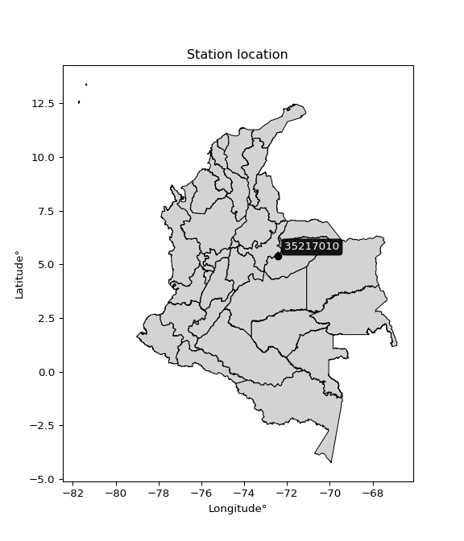

<div align="center">


</div>

# PMP Station (Rain, Pmax24h): 35217010

Probable Maximum Precipitation (PMP) is the greatest amount of rainfall for a specific duration that is meteorologically possible for a given location, acting as a "worst-case" scenario for extreme storms, crucial for designing safety-critical infrastructure like bridges, river deviations, dams, spillways, and nuclear plants to prevent catastrophic failure. PMP is calculated by hydrologists using meteorological data to determine the upper limit of extreme rainfall, often leading to the Probable Maximum Flood (PMF) for flood control design, and is increasingly being studied for climate change impacts. Probable Maximum Precipitation (PMP) is the theoretical upper limit of rainfall, a deterministic estimate for extreme events, while probability distributions (like GEV, Gumbel) describe the likelihood and frequency of various precipitation amounts, including rare ones, showing how often events occur, with PMP representing the extreme end of these distributions, used for critical infrastructure design to ensure safety against the worst conceivable weather, unlike standard statistical forecasts which cover typical probabilities.

The most common probability distributions in hydrology, used for analyzing floods, rainfall, and streamflow, include the Normal, Log-Normal, Gumbel, Gamma (including Log-Pearson Type III), and Generalized Extreme Value (GEV) distributions, often chosen based on the data´s skewness and whether modeling extremes or general conditions, with Gumbel and GEV popular for extreme events like floods, while the Normal distribution serves as a baseline, though often requiring transformations for skewed hydrological data. These distributions help in designing water infrastructure, managing water resources, and forecasting hydrologic events.

> Hydrological data often isn´t perfectly normal (it´s skewed), so different distributions are needed for different applications, such as: **Flood Frequency Analysis**: Using Gumbel, GEV, or Log-Pearson Type III for predicting extreme flood magnitudes and their return periods, **Rainfall Analysis**: Normal for annual totals, but Log-Normal, Weibull, or GEV for intensity or extreme daily rainfall, **Streamflow Modeling**: Gamma and Log-Normal for maximum flows, GEV for minimum flows, and Kappa for daily flows.

<div align="center">

</img>

</div>


## A. General information


### 1. General running parameters

• app_version: _v20260108_. • runtime: _2026-01-08 13:24:42.400241_. • Python version: _3.14.0_. • SciPy version: _1.16.3_. • Pandas version: _2.3.3_. • NumPy version: _2.3.5_. • Stations dataset (station_dataset_file): _dataset/pmax24h_in/automatic_colombia_2003_2024.csv_. • Stations catalog (station_catalog_file): _dataset/CNE.xls_. • Minimum year to eval til year_max (date_min): _1900_. • Maximum year to eval since year_min (date_max): _2024_. • Creates, save and include plots into reports (create_plot): _False_. • Plot only fit distributions with Δo > Δ (plot_only_fit): _True_. • Plot only simple graphs avoiding multiple CDFs and multiple Extreme values plots (plot_only_simple): _True_. • Eval low extreme values, if False, evaluates high extreme values (low_extreme): _False_. • Eval every SciPy distribution as logarithmic (pdist_logarithmic_on): _True_. • Standard deviation normalized (ddof): _1.0_. • Return periods to eval in years (Tr): _[2, 2.33, 5, 10, 15, 20, 25, 50, 75, 100, 200, 250, 500, 750, 1000]_. • Minimum data sample per station, 0 means any (minimum_sample): _5_. • Z-Score maximum threshold to adjust a value, 0 means disable (zscore_max): _3.5_. • Z-Score minimum threshold to adjust a value, 0 means disable (zscore_min): _-2.5_. • Avoid zeros, e.g. rain = 0 (avoid_zeros): _True_. • Avoid null values (avoid_nans): _True_. 

:file_folder:Table: [dataset.csv](../../dataset/pmax24h_in/automatic_colombia_2003_2024.csv)

> Delta Degrees of Freedom (DDOF): is a parameter used in the formulas for calculating variance and standard deviation. When ddof=0, the divisor is $N$ (the total number of observations) and this is used when your data set is the entire population. When ddof=1, the divisor is $N-1$ and this is used when your data set is a sample drawn from a larger population. Using $N-1$ provides an unbiased estimate of the population variance (known as Bessel´s correction).


### 2. Station info and location

|   id |   CODIGO | NOMBRE                         | CATEGORIA    | TECNOLOGIA                              | ESTADO   | FECHA_INSTALACION   |   FECHA_SUSPENSION |   ALTITUD |   LATITUD |   LONGITUD | DEPARTAMENTO   | MUNICIPIO   | AREA_OPERATIVA                              | ENTIDAD                                                     | AREA_HIDROGRAFICA   | ZONA_HIDROGRAFICA   | SUBZONA_HIDROGRAFICA   | CORRIENTE   | Catalogo   |   Version |
|-----:|---------:|:-------------------------------|:-------------|:----------------------------------------|:---------|:--------------------|-------------------:|----------:|----------:|-----------:|:---------------|:------------|:--------------------------------------------|:------------------------------------------------------------|:--------------------|:--------------------|:-----------------------|:------------|:-----------|----------:|
|    0 | 35217010 | PUENTE YOPAL  - AUT [35217010] | Limnigráfica | Automática con Telemetría, Convencional | Activa   | 15/11/1974          |                nan |       343 |     5.369 |   -72.4137 | Casanare       | Yopal       | Area Operativa 06 - Boyacá-Casanare-Vichada | INSTITUTO DE HIDROLOGIA METEOROLOGIA Y ESTUDIOS AMBIENTALES | Orinoco             | Meta                | Río Cravo Sur          | Cravo Sur   | CNE_IDEAM  |  20251226 |

<div align="center">

Dynamic map: [:earth_americas:Google](http://maps.google.com/maps?q=5.369,-72.41372222) [:earth_americas:OSM](https://www.openstreetmap.org/#map=18/5.369/-72.41372222&layers=P) [:earth_americas:Bing](https://www.bing.com/maps?cp=5.369~-72.41372222&lvl=18) [:earth_americas:Apple](https://maps.apple.com/frame?center=5.369%2C-72.41372222&span=0.003%2C0.006)

</div>


<div align="center">

```geojson
{
  "type": "Feature",
  "geometry": {
    "type": "Point", 
    "coordinates": [-72.41372222, 5.369]
  }, 
  "properties": {
    "Name": "35217010"
  }
}
```

</div>


### 3. Discrete values table and plot

<div align="center">

|               |          0 |           1 |           2 |           3 |          4 |          5 |
|:--------------|-----------:|------------:|------------:|------------:|-----------:|-----------:|
| Date          | 2019       | 2020        | 2021        | 2022        | 2023       | 2024       |
| Value         |  181       |  120.4      |   32.4      |   34.8      |   10.6     |  169.4     |
| Value_initial |  181       |  120.4      |   32.4      |   34.8      |   10.6     |  169.4     |
| count         |    6       |    6        |    6        |    6        |    6       |    6       |
| mean          |   91.4333  |   91.4333   |   91.4333   |   91.4333   |   91.4333  |   91.4333  |
| std           |   75.0551  |   75.0551   |   75.0551   |   75.0551   |   75.0551  |   75.0551  |
| zscore        |    1.19335 |    0.385939 |   -0.786533 |   -0.754557 |   -1.07699 |    1.03879 |


</div>


> The initial value (value_initial) correspond to the initial obtained or null completed value, and value (value) is adjusted only when the initial value is outside the valid range (outlier) definite through the Z-Score value. If Z-Score is active, values out of range or outliers are replaced with the station mean value. A Z-Score (or standard score) measures how many standard deviations a data point is from the mean of a dataset, indicating its relative position; positive scores mean above the mean, negative mean below, and a score of zero is exactly at the mean, allowing for comparison of values from different distributions. It´s calculated using the formula $z=(x–μ)/σ$, where $x$ is the data point, $μ$ is the mean, and $σ$ is the standard deviation, helping identify outliers and understand probability.
>
> <sub>**Note**: In this study, "completing" (filling gaps in) and "extending" (forecasting or lengthening the historical record) rainfall data series are avoided for certain critical analyses because they introduce artificial bias and uncertainty, which can distort the statistics of rare events (extremes), alter day-to-day variability, and compromise the integrity and homogeneity of the original data. Some reasons against Completing/Extending rainfall data are: **Distortion of Extremes and Variability**: The primary issue is that most gap-filling or extension methods rely on averaging or regression with nearby stations, which inherently smooths the data. Rainfall is highly variable in space and time, with a large percentage of zero values and occasional large storms. Infilling methods often underestimate the highest values and overestimate the lowest (zero) values, which severely distorts analyses focused on flood frequency, drought severity, and intensity-duration-frequency (IDF) curves, **Loss of Data Homogeneity**: Infilled or extended data are synthetic estimates, not actual measurements. Combining these estimates with observed data can violate the assumption of data homogeneity, which requires that the data properties do not change over time. Inhomogeneity can lead to incorrect conclusions about long-term trends or changes in climate patterns, **Propagation of Errors**: Errors and biases from the original data (e.g., wind-induced undercatch, instrument errors, site changes) or the data used for imputation can propagate through the analysis, leading to unreliable hydrological models and inaccurate predictions, **Compromised Statistical Integrity**: For statistical analyses, especially those involving the frequency of events, using artificial data can introduce time bias or autocorrelation that doesn´t exist in reality, making it difficult to assess the true probability of events, **Difficulty in Validation**: It is difficult to accurately validate the quality of filled or extended data, especially for past periods where ground-truth measurements are unavailable. The reliability of imputation techniques heavily depends on the density of the surrounding station network and the complexity of the local topography.</sub>


### 4. Active continuous probability distributions from SciPy (43 of 104 available)

A Probability Density Function (PDF) describes the relative likelihood of a continuous random variable falling within a specific range, where the total area under its curve equals 1, and the area over any interval gives the actual probability for that range. Unlike discrete probabilities (like rolling a die), a PDF shows density, not direct probability for a single point (which is zero), with higher points indicating higher likelihood, often visualized as a bell curve for normal distributions.

A log of a probability density function (log-PDF) is simply the logarithm of the PDF´s value, denoted as $log(f(x))$, useful for converting multiplication of probabilities into addition, improving numerical stability with tiny numbers, and connecting to information theory concepts like entropy. Instead of dealing with very small probabilities (e.g., 0.000001), log-PDFs use negative numbers (e.g., $log(0.00001) ≈ -11.51$ that are easier for computers to handle, preventing underflow errors and simplifying complex calculations. In this study, each active probability distribution from SciPy is also evaluated in the $log$ form.

[scipy.stats](https://docs.scipy.org/doc/scipy/reference/stats.html) is a Python´s powerful submodule within the SciPy library for comprehensive statistical analysis, offering over 130 probability distributions (like Normal, Poisson), functions for descriptive stats (mean, variance), hypothesis testing (t-tests, chi-square), random variable generation, and statistical tests, making it essential for data science, modeling, and research. It provides tools to explore, model, and draw conclusions from data efficiently, working seamlessly with NumPy.

<div align="center">

|   id | p_dist             |   n_parameter | fit_method   | label                                                                       | active   | ref                                                                                                        |
|-----:|:-------------------|--------------:|:-------------|:----------------------------------------------------------------------------|:---------|:-----------------------------------------------------------------------------------------------------------|
|    0 | alpha              |             3 | MLE          | Alpha                                                                       | True     | [:mortar_board:](https://docs.scipy.org/doc/scipy/reference/generated/scipy.stats.alpha.html)              |
|    1 | betaprime          |             4 | MLE          | Beta prime                                                                  | True     | [:mortar_board:](https://docs.scipy.org/doc/scipy/reference/generated/scipy.stats.betaprime.html)          |
|    2 | chi2               |             3 | MLE          | Chi²                                                                        | True     | [:mortar_board:](https://docs.scipy.org/doc/scipy/reference/generated/scipy.stats.chi2.html)               |
|    3 | crystalball        |             4 | MLE          | Crystalball                                                                 | True     | [:mortar_board:](https://docs.scipy.org/doc/scipy/reference/generated/scipy.stats.crystalball.html)        |
|    4 | erlang             |             3 | MLE          | Erlang                                                                      | True     | [:mortar_board:](https://docs.scipy.org/doc/scipy/reference/generated/scipy.stats.erlang.html)             |
|    5 | expon              |             2 | MLE          | Exponential                                                                 | True     | [:mortar_board:](https://docs.scipy.org/doc/scipy/reference/generated/scipy.stats.expon.html)              |
|    6 | exponnorm          |             3 | MLE          | Exponentially modified Normal                                               | True     | [:mortar_board:](https://docs.scipy.org/doc/scipy/reference/generated/scipy.stats.exponnorm.html)          |
|    7 | f                  |             4 | MLE          | F                                                                           | True     | [:mortar_board:](https://docs.scipy.org/doc/scipy/reference/generated/scipy.stats.f.html)                  |
|    8 | fatiguelife        |             3 | MLE          | Fatigue-life (Birnbaum-Saunders)                                            | True     | [:mortar_board:](https://docs.scipy.org/doc/scipy/reference/generated/scipy.stats.fatiguelife.html)        |
|    9 | fisk               |             3 | MLE          | Fisk                                                                        | True     | [:mortar_board:](https://docs.scipy.org/doc/scipy/reference/generated/scipy.stats.fisk.html)               |
|   10 | gamma              |             3 | MLE          | Gamma                                                                       | True     | [:mortar_board:](https://docs.scipy.org/doc/scipy/reference/generated/scipy.stats.gamma.html)              |
|   11 | genexpon           |             5 | MLE          | Generalized exponential                                                     | True     | [:mortar_board:](https://docs.scipy.org/doc/scipy/reference/generated/scipy.stats.genexpon.html)           |
|   12 | genlogistic        |             3 | MLE          | Generalized logistic                                                        | True     | [:mortar_board:](https://docs.scipy.org/doc/scipy/reference/generated/scipy.stats.genlogistic.html)        |
|   13 | gibrat             |             2 | MM           | Gibrat                                                                      | True     | [:mortar_board:](https://docs.scipy.org/doc/scipy/reference/generated/scipy.stats.gibrat.html)             |
|   14 | gompertz           |             3 | MLE          | Gompertz (or truncated Gumbel)                                              | True     | [:mortar_board:](https://docs.scipy.org/doc/scipy/reference/generated/scipy.stats.gompertz.html)           |
|   15 | gumbel_l           |             2 | MM           | Gumbel Left Skew                                                            | True     | [:mortar_board:](https://docs.scipy.org/doc/scipy/reference/generated/scipy.stats.gumbel_l.html)           |
|   16 | gumbel_r           |             2 | MM           | Gumbel Right Skew                                                           | True     | [:mortar_board:](https://docs.scipy.org/doc/scipy/reference/generated/scipy.stats.gumbel_r.html)           |
|   17 | halflogistic       |             2 | MM           | Half-logistic                                                               | True     | [:mortar_board:](https://docs.scipy.org/doc/scipy/reference/generated/scipy.stats.halflogistic.html)       |
|   18 | halfnorm           |             2 | MM           | Half Normal                                                                 | True     | [:mortar_board:](https://docs.scipy.org/doc/scipy/reference/generated/scipy.stats.halfnorm.html)           |
|   19 | hypsecant          |             2 | MM           | hyperbolic secant                                                           | True     | [:mortar_board:](https://docs.scipy.org/doc/scipy/reference/generated/scipy.stats.hypsecant.html)          |
|   20 | invgamma           |             3 | MLE          | Inverted gamma                                                              | True     | [:mortar_board:](https://docs.scipy.org/doc/scipy/reference/generated/scipy.stats.invgamma.html)           |
|   21 | invgauss           |             3 | MLE          | Inverse Gaussian                                                            | True     | [:mortar_board:](https://docs.scipy.org/doc/scipy/reference/generated/scipy.stats.invgauss.html)           |
|   22 | invweibull         |             3 | MLE          | Inverted Weibull                                                            | True     | [:mortar_board:](https://docs.scipy.org/doc/scipy/reference/generated/scipy.stats.invweibull.html)         |
|   23 | kstwobign          |             2 | MLE          | Limiting distribution of scaled Kolmogorov-Smirnov two-sided test statistic | True     | [:mortar_board:](https://docs.scipy.org/doc/scipy/reference/generated/scipy.stats.kstwobign.html)          |
|   24 | laplace            |             2 | MM           | Laplace                                                                     | True     | [:mortar_board:](https://docs.scipy.org/doc/scipy/reference/generated/scipy.stats.laplace.html)            |
|   25 | laplace_asymmetric |             3 | MLE          | Asymmetric Laplace                                                          | True     | [:mortar_board:](https://docs.scipy.org/doc/scipy/reference/generated/scipy.stats.laplace_asymmetric.html) |
|   26 | loggamma           |             3 | MLE          | Log gamma                                                                   | True     | [:mortar_board:](https://docs.scipy.org/doc/scipy/reference/generated/scipy.stats.loggamma.html)           |
|   27 | logistic           |             2 | MM           | Logistic (or Sech-squared)                                                  | True     | [:mortar_board:](https://docs.scipy.org/doc/scipy/reference/generated/scipy.stats.logistic.html)           |
|   28 | lognorm            |             3 | MLE          | Log Normal                                                                  | True     | [:mortar_board:](https://docs.scipy.org/doc/scipy/reference/generated/scipy.stats.lognorm.html)            |
|   29 | maxwell            |             2 | MM           | Maxwell                                                                     | True     | [:mortar_board:](https://docs.scipy.org/doc/scipy/reference/generated/scipy.stats.maxwell.html)            |
|   30 | mielke             |             4 | MLE          | Mielke Beta-Kappa / Dagum                                                   | True     | [:mortar_board:](https://docs.scipy.org/doc/scipy/reference/generated/scipy.stats.mielke.html)             |
|   31 | moyal              |             2 | MM           | Moyal                                                                       | True     | [:mortar_board:](https://docs.scipy.org/doc/scipy/reference/generated/scipy.stats.moyal.html)              |
|   32 | nakagami           |             3 | MLE          | Nakagami                                                                    | True     | [:mortar_board:](https://docs.scipy.org/doc/scipy/reference/generated/scipy.stats.nakagami.html)           |
|   33 | ncf                |             5 | MLE          | Non-central F distribution                                                  | True     | [:mortar_board:](https://docs.scipy.org/doc/scipy/reference/generated/scipy.stats.ncf.html)                |
|   34 | nct                |             4 | MLE          | Non-central Student’s t                                                     | True     | [:mortar_board:](https://docs.scipy.org/doc/scipy/reference/generated/scipy.stats.nct.html)                |
|   35 | norm               |             2 | MM           | Normal                                                                      | True     | [:mortar_board:](https://docs.scipy.org/doc/scipy/reference/generated/scipy.stats.norm.html)               |
|   36 | pearson3           |             3 | MM           | Pearson type III                                                            | True     | [:mortar_board:](https://docs.scipy.org/doc/scipy/reference/generated/scipy.stats.pearson3.html)           |
|   37 | rayleigh           |             2 | MM           | Rayleigh                                                                    | True     | [:mortar_board:](https://docs.scipy.org/doc/scipy/reference/generated/scipy.stats.rayleigh.html)           |
|   38 | rice               |             3 | MLE          | Rice                                                                        | True     | [:mortar_board:](https://docs.scipy.org/doc/scipy/reference/generated/scipy.stats.rice.html)               |
|   39 | t                  |             3 | MLE          | Student’s t                                                                 | True     | [:mortar_board:](https://docs.scipy.org/doc/scipy/reference/generated/scipy.stats.t.html)                  |
|   40 | truncnorm          |             4 | MLE          | Truncated normal                                                            | True     | [:mortar_board:](https://docs.scipy.org/doc/scipy/reference/generated/scipy.stats.truncnorm.html)          |
|   41 | wald               |             2 | MM           | Wald                                                                        | True     | [:mortar_board:](https://docs.scipy.org/doc/scipy/reference/generated/scipy.stats.wald.html)               |
|   42 | weibull_min        |             3 | MLE          | Weibull minimum                                                             | True     | [:mortar_board:](https://docs.scipy.org/doc/scipy/reference/generated/scipy.stats.weibull_min.html)        |

</div>

> **n_parameter:** # arguments & localization & scale.
>
> **Fit methods:** (MLE) maximum likelihood, (MM) L-moments.
>
>**Inactive** (With the only purpose of prevent loops, zero divisions, infinite values, over high estimated values or horizontal trending for recurrence intervals estimations, the follow distributions were disabled.)**:** foldnorm, gennorm, norminvgauss, powernorm, powerlognorm, skewnorm, genextreme, anglit, arcsine, argus, beta, bradford, burr, burr12, cauchy, cosine, halfcauchy, foldcauchy, skewcauchy, wrapcauchy, dgamma, gengamma, exponweib, exponpow, truncexpon, gausshyper, genhalflogistic, genhyperbolic, geninvgauss, halfgennorm, johnsonsb, johnsonsu, kappa4, kappa3, ksone, kstwo, loglaplace, levy, levy_l, levy_stable, ncx2, pareto, genpareto, truncpareto, lomax, powerlaw, rdist, rel_breitwigner, recipinvgauss, semicircular, studentized_range, trapezoid, triang, truncweibull_min, tukeylambda, uniform, loguniform, vonmises, vonmises_line, weibull_max, dweibull, 


## B. Probability (PDF) vs. Empirical (EDF) distributions functions

A continuous probability distribution (CPD) describes probabilities for variables that can take any value within a range (like rain any time), unlike discrete variables with specific outcomes (like temperature). It uses a Probability Density Function (PDF), a curve where the total area under it equals 1, and the probability of the variable falling within an interval (a to b) is found by calculating the area under the curve between those points. A key feature is that the probability of hitting any single exact value is zero, so probabilities are always expressed for ranges, e.g., $P(a ≤ X ≤ b)$.

<div align="center">

Distributions parameters from station values
|    |   station | p_dist                |   n |              loc |          scale | shape                  | shape1                | shape2              | shape3   |
|---:|----------:|:----------------------|----:|-----------------:|---------------:|:-----------------------|:----------------------|:--------------------|:---------|
|  0 |  35217010 | alpha                 |   6 |     -0.0667279   |   23.7084      | 5.615218173839898e-10  |                       |                     |          |
|  1 |  35217010 | betaprime             |   6 |     10.6         |  887.5         | 0.6759226249801717     | 8.511879705439187     |                     |          |
|  2 |  35217010 | chi2                  |   6 |     10.6         |    4.95747     | 1.5781537286212926     |                       |                     |          |
|  3 |  35217010 | crystalball           |   6 |     91.4333      |   68.5156      | 6876.037422810077      | 2385.084706754591     |                     |          |
|  4 |  35217010 | erlang                |   6 |   -127.283       |   20.7834      | 10.551200219136184     |                       |                     |          |
|  5 |  35217010 | expon                 |   6 |     10.6         |   80.8333      |                        |                       |                     |          |
|  6 |  35217010 | exponnorm             |   6 |     85.1686      |   68.2287      | 0.09181916769871187    |                       |                     |          |
|  7 |  35217010 | f                     |   6 |    -22.1852      |   71.8588      | 6100.153781938516      | 4.546611705777263     |                     |          |
|  8 |  35217010 | fatiguelife           |   6 |     10.6         |    5.07915e-06 | 3971.9774747776282     |                       |                     |          |
|  9 |  35217010 | fisk                  |   6 |     10.6         |   15.5548      | 0.9231118277781512     |                       |                     |          |
| 10 |  35217010 | gamma                 |   6 |    -65.0162      |   26.6551      | 5.622507569582114      |                       |                     |          |
| 11 |  35217010 | genexpon              |   6 |     10.6         |    1.9891      | 0.02415695956024011    | 0.0009423274052052701 | 0.19906796787567996 |          |
| 12 |  35217010 | genlogistic           |   6 |   -338.067       |   56.0944      | 1164.0393904815878     |                       |                     |          |
| 13 |  35217010 | gibrat                |   6 |     39.1645      |   31.7026      |                        |                       |                     |          |
| 14 |  35217010 | gompertz              |   6 |     10.6         |  214.592       | 1.8708612523370771     |                       |                     |          |
| 15 |  35217010 | gumbel_l              |   6 |    122.269       |   53.4214      |                        |                       |                     |          |
| 16 |  35217010 | gumbel_r              |   6 |     60.5977      |   53.4214      |                        |                       |                     |          |
| 17 |  35217010 | halflogistic          |   6 |     10.2264      |   58.5784      |                        |                       |                     |          |
| 18 |  35217010 | halfnorm              |   6 |      0.745484    |  113.66        |                        |                       |                     |          |
| 19 |  35217010 | hypsecant             |   6 |     91.4333      |   43.6184      |                        |                       |                     |          |
| 20 |  35217010 | invgamma              |   6 |    -22.2122      |  163.392       | 2.273309321393798      |                       |                     |          |
| 21 |  35217010 | invgauss              |   6 |     -5.38652     |   84.5466      | 1.1451658022742315     |                       |                     |          |
| 22 |  35217010 | invweibull            |   6 |     10.6         |    4.29257     | 0.04416580474481174    |                       |                     |          |
| 23 |  35217010 | kstwobign             |   6 |   -131.593       |  254.122       |                        |                       |                     |          |
| 24 |  35217010 | laplace               |   6 |     91.4333      |   48.4479      |                        |                       |                     |          |
| 25 |  35217010 | laplace_asymmetric    |   6 |     32.4         |   38.155       | 0.4907002021870532     |                       |                     |          |
| 26 |  35217010 | loggamma              |   6 | -12707.5         | 1923.81        | 775.5562518820482      |                       |                     |          |
| 27 |  35217010 | logistic              |   6 |     91.4333      |   37.7746      |                        |                       |                     |          |
| 28 |  35217010 | lognorm               |   6 |     10.6         |    0.11861     | 14.26012694619015      |                       |                     |          |
| 29 |  35217010 | maxwell               |   6 |    -70.92        |  101.74        |                        |                       |                     |          |
| 30 |  35217010 | mielke                |   6 |     -2.59685     |  185.39        | 0.9368694884473099     | 448.1985527277377     |                     |          |
| 31 |  35217010 | moyal                 |   6 |     52.2517      |   30.8429      |                        |                       |                     |          |
| 32 |  35217010 | nakagami              |   6 |     10.6         |  161.988       | 0.18369769513991663    |                       |                     |          |
| 33 |  35217010 | ncf                   |   6 |     -0.00682254  |    4.84501e-05 | 6.938969258930407e-06  | 5.744763433042833     | 9.415275834376867   |          |
| 34 |  35217010 | nct                   |   6 |    -43.3815      |    8.53971     | 2.152145943393009      | 10.518867981021298    |                     |          |
| 35 |  35217010 | norm                  |   6 |     91.4333      |   68.5156      |                        |                       |                     |          |
| 36 |  35217010 | pearson3              |   6 |     91.4333      |   68.5157      | 0.15609149599954564    |                       |                     |          |
| 37 |  35217010 | rayleigh              |   6 |    -39.6411      |  104.582       |                        |                       |                     |          |
| 38 |  35217010 | rice                  |   6 |    -27.9385      |   88.304       | 0.6553388830261069     |                       |                     |          |
| 39 |  35217010 | t                     |   6 |     91.4272      |   68.5105      | 8838833.412214264      |                       |                     |          |
| 40 |  35217010 | truncnorm             |   6 |     91.4333      |   68.5156      | -1259.8262316131477    | 208.275035783528      |                     |          |
| 41 |  35217010 | wald                  |   6 |     22.9177      |   68.5156      |                        |                       |                     |          |
| 42 |  35217010 | weibull_min           |   6 |     10.6         |   86.7753      | 0.944029625951902      |                       |                     |          |
| 43 |  35217010 | logalpha              |   6 |    -18.6714      |  487.62        | 21.484918202940065     |                       |                     |          |
| 44 |  35217010 | logbetaprime          |   6 |     -3.05623     |  647.582       | 43.41158984714913      | 3935.802399167699     |                     |          |
| 45 |  35217010 | logchi2               |   6 |      2.36085     |    0.985681    | 1.0857776742948095     |                       |                     |          |
| 46 |  35217010 | logcrystalball        |   6 |      4.08503     |    1.03782     | 5.169312997363583      | 160.15496500457374    |                     |          |
| 47 |  35217010 | logerlang             |   6 |    -12.9209      |    0.0649025   | 261.84679905744144     |                       |                     |          |
| 48 |  35217010 | logexpon              |   6 |      2.36085     |    1.72418     |                        |                       |                     |          |
| 49 |  35217010 | logexponnorm          |   6 |      4.08421     |    1.03782     | 0.000783871123841159   |                       |                     |          |
| 50 |  35217010 | logf                  |   6 |   -358.812       |  362.889       | 1327993.7026102853     | 296807.2759415058     |                     |          |
| 51 |  35217010 | logfatiguelife        |   6 |   -257.449       |  261.534       | 0.003962710971264643   |                       |                     |          |
| 52 |  35217010 | logfisk               |   6 |     -4.65971e+07 |    4.65971e+07 | 73188418.4866533       |                       |                     |          |
| 53 |  35217010 | loggamma              |   6 |    -12.1598      |    0.0680477   | 238.64449484420993     |                       |                     |          |
| 54 |  35217010 | loggenexpon           |   6 |      2.36085     |    1.4323      | 0.5160218151789568     | 0.5852467415027655    | 1.0901282341725995  |          |
| 55 |  35217010 | loggenlogistic        |   6 |      5.19853     |    1.8991e-06  | 1.7018805572891036e-06 |                       |                     |          |
| 56 |  35217010 | loggibrat             |   6 |      3.29335     |    0.480193    |                        |                       |                     |          |
| 57 |  35217010 | loggompertz           |   6 |      2.36085     |    1.48055     | 0.34041689429105215    |                       |                     |          |
| 58 |  35217010 | loggumbel_l           |   6 |      4.55211     |    0.809183    |                        |                       |                     |          |
| 59 |  35217010 | loggumbel_r           |   6 |      3.61796     |    0.809183    |                        |                       |                     |          |
| 60 |  35217010 | loghalflogistic       |   6 |      2.85497     |    0.887302    |                        |                       |                     |          |
| 61 |  35217010 | loghalfnorm           |   6 |      2.7114      |    1.7216      |                        |                       |                     |          |
| 62 |  35217010 | loghypsecant          |   6 |      4.08503     |    0.660695    |                        |                       |                     |          |
| 63 |  35217010 | loginvgamma           |   6 |    -13.1811      | 4452.14        | 259.14349953685877     |                       |                     |          |
| 64 |  35217010 | loginvgauss           |   6 |     -3.9913      |  441.515       | 0.018277510215420664   |                       |                     |          |
| 65 |  35217010 | loginvweibull         |   6 |     -1.85753e+06 |    1.85753e+06 | 1828237.2459756199     |                       |                     |          |
| 66 |  35217010 | logkstwobign          |   6 |      0.0135662   |    4.64374     |                        |                       |                     |          |
| 67 |  35217010 | loglaplace            |   6 |      4.08503     |    0.733848    |                        |                       |                     |          |
| 68 |  35217010 | loglaplace_asymmetric |   6 |      3.54962     |    0.831417    | 0.7286961276527576     |                       |                     |          |
| 69 |  35217010 | logloggamma           |   6 |      5.19857     |    7.44471e-06 | 6.7038743014570956e-06 |                       |                     |          |
| 70 |  35217010 | loglogistic           |   6 |      4.08503     |    0.572179    |                        |                       |                     |          |
| 71 |  35217010 | loglognorm            |   6 |      2.36085     |    0.00473514  | 13.420782738705736     |                       |                     |          |
| 72 |  35217010 | logmaxwell            |   6 |      1.62584     |    1.54107     |                        |                       |                     |          |
| 73 |  35217010 | logmielke             |   6 |      2.36085     |    2.8446      | 0.8346787999199752     | 1032.2391257173772    |                     |          |
| 74 |  35217010 | logmoyal              |   6 |      3.49154     |    0.467182    |                        |                       |                     |          |
| 75 |  35217010 | lognakagami           |   6 |      3.47816     |    1.3577      | 0.2596044371406476     |                       |                     |          |
| 76 |  35217010 | logncf                |   6 |     -1.42303     |    2.05237e-07 | 4.280779560100696e-06  | 354.91944833782367    | 114.27850238490356  |          |
| 77 |  35217010 | lognct                |   6 |    -44.8583      |    0.947513    | 6467.48716398689       | 51.648868835654774    |                     |          |
| 78 |  35217010 | lognorm               |   6 |      4.08503     |    1.03782     |                        |                       |                     |          |
| 79 |  35217010 | logpearson3           |   6 |      4.08504     |    1.03782     | -0.3910137187524676    |                       |                     |          |
| 80 |  35217010 | lograyleigh           |   6 |      2.09963     |    1.58412     |                        |                       |                     |          |
| 81 |  35217010 | logrice               |   6 |      1.7674      |    1.17008     | 1.6462455697844192     |                       |                     |          |
| 82 |  35217010 | logt                  |   6 |      4.08503     |    1.03782     | 10218518646.265808     |                       |                     |          |
| 83 |  35217010 | logtruncnorm          |   6 |     -0.338849    |    2.58247     | 1.4779898049840057     | 2.144205148758709     |                     |          |
| 84 |  35217010 | logwald               |   6 |      3.04722     |    1.03781     |                        |                       |                     |          |
| 85 |  35217010 | logweibull_min        |   6 |     -3.31924e+07 |    3.31924e+07 | 40514541.595425084     |                       |                     |          |

</div>

> **loc** (Location parameter): This shifts the distribution along the x-axis. For many common distributions, like the normal (Gaussian) distribution, loc represents the mean $μ$. For others, like the uniform distribution, it might represent the minimum value, or for the beta distribution, the left end of the support interval.
>
> **scale** (Scale parameter): This determines the width or spread of the distribution. For the normal distribution, scale represents the standard deviation $σ$. For a uniform distribution, it defines the length of the interval (from $loc$ to $loc + scale$).
>
> **shape** (Shape parameters): Refers to parameters that define the specific form of a probability distribution, distinct from its location (loc) and scale (scale). These parameters are required arguments for most distribution functions. For example, a normal (Gaussian) distribution is fully defined by its location (mean) and scale (standard deviation), so it has no specific shape parameters beyond loc and scale. However, other distributions have intrinsic properties that need specification, as Gamma distribution that takes a shape parameter, often named $a$ or $alpha$.


### 0. Cumulative distribution values - CDF (86 evaluated)

Cumulative Distribution Function (CDF), denoted as $F$<sub>$X$</sub>$(x)$, is a function that gives the probability that a random variable $X$ will take a value less than or equal to a specific value, $x$ (i.e., $(P(X≥x)$. It essentially "accumulates" probabilities from a given point up to the far right (positive infinity), providing a complete picture of the distribution´s probabilities for both discrete (like rain) and continuous (like temperature) variables, helping to find probabilities over ranges or above certain values. Each station is evaluated separately ordering the $x$ values ascending, calculating the CDF and PDF values for the activated distributions and their logarithmic forms.

<div align="center">

CDF ordered by x ascending and calculating $log(f(x))$ separately
|   id |   Station |   date |     x |   count |    mean |     std |    zscore |   Value_initial |   station |   m |     alpha |   alpha_pdf |   betaprime |   betaprime_pdf |       chi2 |      chi2_pdf |   crystalball |   crystalball_pdf |    erlang |   erlang_pdf |    expon |   expon_pdf |   exponnorm |   exponnorm_pdf |         f |      f_pdf |   fatiguelife |   fatiguelife_pdf |        fisk |    fisk_pdf |     gamma |   gamma_pdf |    genexpon |   genexpon_pdf |   genlogistic |   genlogistic_pdf |   gibrat |   gibrat_pdf |    gompertz |   gompertz_pdf |   gumbel_l |   gumbel_l_pdf |   gumbel_r |   gumbel_r_pdf |   halflogistic |   halflogistic_pdf |   halfnorm |   halfnorm_pdf |   hypsecant |   hypsecant_pdf |   invgamma |   invgamma_pdf |   invgauss |   invgauss_pdf |   invweibull |   invweibull_pdf |   kstwobign |   kstwobign_pdf |   laplace |   laplace_pdf |   laplace_asymmetric |   laplace_asymmetric_pdf |   loggamma |   loggamma_pdf |   logistic |   logistic_pdf |   lognorm |   lognorm_pdf |   maxwell |   maxwell_pdf |    mielke |   mielke_pdf |     moyal |   moyal_pdf |    nakagami |   nakagami_pdf |       ncf |    ncf_pdf |       nct |    nct_pdf |     norm |   norm_pdf |   pearson3 |   pearson3_pdf |   rayleigh |   rayleigh_pdf |      rice |   rice_pdf |        t |      t_pdf |   truncnorm |   truncnorm_pdf |      wald |   wald_pdf |   weibull_min |   weibull_min_pdf |   logalpha |   logalpha_pdf |   logbetaprime |   logbetaprime_pdf |   logchi2 |   logchi2_pdf |   logcrystalball |   logcrystalball_pdf |   logerlang |   logerlang_pdf |   logexpon |   logexpon_pdf |   logexponnorm |   logexponnorm_pdf |      logf |   logf_pdf |   logfatiguelife |   logfatiguelife_pdf |   logfisk |   logfisk_pdf |   loggenexpon |   loggenexpon_pdf |   loggenlogistic |   loggenlogistic_pdf |   loggibrat |   loggibrat_pdf |   loggompertz |   loggompertz_pdf |   loggumbel_l |   loggumbel_l_pdf |   loggumbel_r |   loggumbel_r_pdf |   loghalflogistic |   loghalflogistic_pdf |   loghalfnorm |   loghalfnorm_pdf |   loghypsecant |   loghypsecant_pdf |   loginvgamma |   loginvgamma_pdf |   loginvgauss |   loginvgauss_pdf |   loginvweibull |   loginvweibull_pdf |   logkstwobign |   logkstwobign_pdf |   loglaplace |   loglaplace_pdf |   loglaplace_asymmetric |   loglaplace_asymmetric_pdf |   logloggamma |   logloggamma_pdf |   loglogistic |   loglogistic_pdf |   loglognorm |   loglognorm_pdf |   logmaxwell |   logmaxwell_pdf |   logmielke |   logmielke_pdf |    logmoyal |   logmoyal_pdf |   lognakagami |   lognakagami_pdf |    logncf |   logncf_pdf |    lognct |   lognct_pdf |   logpearson3 |   logpearson3_pdf |   lograyleigh |   lograyleigh_pdf |   logrice |   logrice_pdf |      logt |   logt_pdf |   logtruncnorm |   logtruncnorm_pdf |   logwald |   logwald_pdf |   logweibull_min |   logweibull_min_pdf |
|-----:|----------:|-------:|------:|--------:|--------:|--------:|----------:|----------------:|----------:|----:|----------:|------------:|------------:|----------------:|-----------:|--------------:|--------------:|------------------:|----------:|-------------:|---------:|------------:|------------:|----------------:|----------:|-----------:|--------------:|------------------:|------------:|------------:|----------:|------------:|------------:|---------------:|--------------:|------------------:|---------:|-------------:|------------:|---------------:|-----------:|---------------:|-----------:|---------------:|---------------:|-------------------:|-----------:|---------------:|------------:|----------------:|-----------:|---------------:|-----------:|---------------:|-------------:|-----------------:|------------:|----------------:|----------:|--------------:|---------------------:|-------------------------:|-----------:|---------------:|-----------:|---------------:|----------:|--------------:|----------:|--------------:|----------:|-------------:|----------:|------------:|------------:|---------------:|----------:|-----------:|----------:|-----------:|---------:|-----------:|-----------:|---------------:|-----------:|---------------:|----------:|-----------:|---------:|-----------:|------------:|----------------:|----------:|-----------:|--------------:|------------------:|-----------:|---------------:|---------------:|-------------------:|----------:|--------------:|-----------------:|---------------------:|------------:|----------------:|-----------:|---------------:|---------------:|-------------------:|----------:|-----------:|-----------------:|---------------------:|----------:|--------------:|--------------:|------------------:|-----------------:|---------------------:|------------:|----------------:|--------------:|------------------:|--------------:|------------------:|--------------:|------------------:|------------------:|----------------------:|--------------:|------------------:|---------------:|-------------------:|--------------:|------------------:|--------------:|------------------:|----------------:|--------------------:|---------------:|-------------------:|-------------:|-----------------:|------------------------:|----------------------------:|--------------:|------------------:|--------------:|------------------:|-------------:|-----------------:|-------------:|-----------------:|------------:|----------------:|------------:|---------------:|--------------:|------------------:|----------:|-------------:|----------:|-------------:|--------------:|------------------:|--------------:|------------------:|----------:|--------------:|----------:|-----------:|---------------:|-------------------:|----------:|--------------:|-----------------:|---------------------:|
|    0 |  35217010 |   2023 |  10.6 |       6 | 91.4333 | 75.0551 | -1.07699  |            10.6 |  35217010 |   1 | 0.0262392 | 0.0140615   | 3.10936e-07 |      9.73156    | 4.0439e-13 | 179.634       |      0.119044 |        0.0029032  | 0.0980625 |   0.00350405 | 0        |  0.0123711  |    0.119019 |      0.00290443 | 0.0586421 | 0.00701772 |    0.00780465 |       4.7088e+11  | 1.92062e-15 | 0.998082    | 0.0953439 |  0.00426783 | 3.98141e-08 |     0.0121447  |     0.0979637 |        0.00405314 | 0        |  0           | 9.00208e-13 |     0.00871821 |   0.116306 |     0.00204533 |  0.0781181 |     0.00372818 |     0.00318901 |         0.00853548 |  0.0690912 |     0.00699357 |   0.0989759 |      0.00223274 |  0.0586424 |     0.00701772 |  0.0485756 |     0.00908554 |   0.00839757 |      9.97977e+11 |   0.0870883 |      0.00421427 | 0.0942686 |    0.00194577 |            0.0605701 |               0.00323512 |  0.0470055 |       0.100637 |   0.10528  |     0.00249364 | 0.0483213 |     0.0967035 |  0.11325  |    0.00365244 | 0.0841073 |   0.00597093 | 0.0494753 |  0.00368975 | 4.66409e-07 |    9.64651e+07 | 0.0621574 | 0.00673762 | 0.0660362 | 0.00649893 | 0.119044 | 0.0029032  |   0.116661 |     0.00305261 |   0.108982 |     0.00409288 | 0.0740265 | 0.00369958 | 0.119044 | 0.00290343 |    0.119044 |      0.0029032  | 0         | 0          |    1.7588e-16 |        0.0934699  |  0.0446171 |       0.103769 |      0.0461964 |           0.107134 | 3.603e-09 |   4.40458e+06 |        0.0483213 |            0.0967036 |    0.047626 |        0.101412 |   0        |       0.579986 |      0.0483235 |          0.0967063 | 0.0491768 |  0.0982418 |        0.0475664 |            0.0962595 | 0.0573633 |     0.0849301 |   5.05705e-09 |          0.360276 |         0        |            0.0704658 |    0        |       0         |    5.1085e-08 |          0.229926 |     0.0644971 |          0.077079 |    0.00884204 |          0.051666 |          0        |              0        |      0        |          0        |      0.0467459 |          0.0704985 |     0.0483438 |          0.10754  |     0.0435089 |          0.108446 |       0.0398292 |            0.126351 |      0.0396639 |           0.146284 |     0.047708 |        0.0650108 |               0.0487497 |                   0.0804649 |      0.077667 |         0.0699382 |     0.0468259 |         0.0780058 |     0.012703 |      5.50548e+12 |    0.0269642 |         0.105115 | 2.11536e-05 |        2.47388  | 0.000796868 |      0.0103368 |   0           |       0           | 0.0473749 |     0.111774 | 0.0481447 |    0.0972661 |      0.057859 |         0.0925859 |     0.0135042 |          0.10269  | 0.0338625 |      0.116206 | 0.0483215 |  0.0967039 |    0           |           0        |  0        |     0         |        0.0645098 |            0.0761443 |
|    1 |  35217010 |   2021 |  32.4 |       6 | 91.4333 | 75.0551 | -0.786533 |            32.4 |  35217010 |   2 | 0.465245  | 0.0137459   | 0.347106    |      0.00940456 | 0.925496   |   0.00805339  |      0.194453 |        0.00401716 | 0.191254  |   0.00498771 | 0.236384 |  0.00944679 |    0.194462 |      0.00401905 | 0.257256  | 0.00966569 |    0.699021   |       0.00416557  | 0.577272    | 0.0103333   | 0.20971   |  0.00607532 | 0.237294    |     0.00958338 |     0.206889  |        0.00580715 | 0        |  0           | 0.181307    |     0.00790074 |   0.169687 |     0.0028902  |  0.183552  |     0.00582478 |     0.187036   |         0.00823697 |  0.219372  |     0.00675287 |   0.160957  |      0.00353486 |  0.257256  |     0.00966567 |  0.288571  |     0.010419   |   0.39426    |      0.000743435 |   0.200792  |      0.00602996 | 0.147838  |    0.00305148 |            0.19406   |               0.010365   |  0.288572  |       0.333124 |   0.173249 |     0.00379179 | 0.279354  |     0.323994  |  0.206322 |    0.00482937 | 0.209726  |   0.00561439 | 0.167699  |  0.00688974 | 0.379787    |    0.00638258  | 0.244964  | 0.00896294 | 0.250801  | 0.00925736 | 0.194453 | 0.00401716 |   0.196125 |     0.00422979 |   0.211209 |     0.00519548 | 0.17205   | 0.00519389 | 0.19446  | 0.00401754 |    0.194453 |      0.00401716 | 0.0184533 | 0.00773832 |    0.237703   |        0.00895969 |  0.298074  |       0.344569 |      0.299856  |           0.338454 | 0.687019  |   0.227997    |        0.279354  |            0.323994  |    0.290103 |        0.333807 |   0.47692  |       0.303379 |      0.279358  |          0.323994  | 0.282164  |  0.324919  |        0.278933  |            0.324958  | 0.260308  |     0.302428  |   0.423967    |          0.34234  |         0        |            0.19179   |    0.169829 |       1.36835   |    0.318602   |          0.33322  |     0.232961  |          0.251405 |    0.304649   |          0.447494 |          0.337413 |              0.499352 |      0.343952 |          0.419696 |      0.241744  |          0.331721  |     0.301935  |          0.3404   |     0.306454  |          0.348669 |       0.3419    |            0.361152 |      0.366226  |           0.362859 |     0.218684 |        0.297997  |               0.308244  |                   0.508779  |      0.212417 |         0.191279  |     0.257187  |         0.333885  |     0.658034 |      0.0244891   |    0.304915  |         0.363233 | 0.458403    |        0.342447 | 0.310378    |      0.51783   |   7.10287e-09 |       8.30435e+06 | 0.307268  |     0.340129 | 0.28059   |    0.325113  |      0.264842 |         0.29333   |     0.315206  |          0.376182 | 0.295372  |      0.339265 | 0.279354  |  0.323994  |    0.000137746 |           0.96503  |  0.285802 |     0.951757  |        0.229565  |            0.245254  |
|    2 |  35217010 |   2022 |  34.8 |       6 | 91.4333 | 75.0551 | -0.754557 |            34.8 |  35217010 |   3 | 0.496522  | 0.0123487   | 0.369027    |      0.00887402 | 0.942479   |   0.00618424  |      0.204239 |        0.00413771 | 0.203389  |   0.00512425 | 0.258723 |  0.00917043 |    0.204253 |      0.00413965 | 0.280291  | 0.00952338 |    0.708685   |       0.00389485  | 0.600608    | 0.00915018  | 0.224459  |  0.00621334 | 0.259961    |     0.00930701 |     0.220993  |        0.00594355 | 0        |  0           | 0.200155    |     0.00780566 |   0.176751 |     0.00299729 |  0.197744  |     0.00599947 |     0.206727   |         0.00817079 |  0.23553   |     0.00671178 |   0.169647  |      0.00370782 |  0.280291  |     0.00952336 |  0.313132  |     0.0100468  |   0.395952   |      0.000669485 |   0.215419  |      0.00615622 | 0.155346  |    0.00320645 |            0.218556  |               0.0100499  |  0.312788  |       0.344415 |   0.182539 |     0.00395022 | 0.30296   |     0.336506  |  0.218041 |    0.00493528 | 0.223172  |   0.00559093 | 0.184512  |  0.0071162  | 0.394596    |    0.00596989  | 0.266397  | 0.00889105 | 0.272948  | 0.00919015 | 0.204239 | 0.00413771 |   0.206425 |     0.00435306 |   0.223785 |     0.00528298 | 0.184668  | 0.00532021 | 0.204247 | 0.00413811 |    0.204239 |      0.00413771 | 0.0414486 | 0.0112454  |    0.258843   |        0.00866043 |  0.323063  |       0.354555 |      0.324376  |           0.347579 | 0.702794  |   0.213736    |        0.30296   |            0.336507  |    0.314367 |        0.345059 |   0.498156 |       0.291062 |      0.302964  |          0.336506  | 0.305827  |  0.337169  |        0.302609  |            0.337488  | 0.282493  |     0.318359  |   0.448102    |          0.333097 |         0        |            0.204473  |    0.265019 |       1.27815   |    0.342566   |          0.337399 |     0.251516  |          0.267974 |    0.336846   |          0.452966 |          0.372599 |              0.485274 |      0.373659 |          0.411654 |      0.266379  |          0.357741  |     0.326613  |          0.350051 |     0.331676  |          0.356975 |       0.367752  |            0.362077 |      0.392097  |           0.360976 |     0.24105  |        0.328474  |               0.346832  |                   0.57247   |      0.226534 |         0.203992  |     0.281759  |         0.353685  |     0.659729 |      0.0229735   |    0.331129  |         0.370161 | 0.482748    |        0.338955 | 0.347351    |      0.51602   |   0.168871    |       1.22629     | 0.331869  |     0.348156 | 0.304269  |    0.337435  |      0.286303 |         0.307249  |     0.342236  |          0.380063 | 0.319944  |      0.34827  | 0.30296   |  0.336506  |    0.0676981   |           0.926003 |  0.35083  |     0.866977  |        0.247661  |            0.26132   |
|    3 |  35217010 |   2020 | 120.4 |       6 | 91.4333 | 75.0551 |  0.385939 |           120.4 |  35217010 |   4 | 0.84398   | 0.00127849  | 0.764163    |      0.00238334 | 0.999992   |   8.00391e-07 |      0.66377  |        0.00532486 | 0.693388  |   0.00478463 | 0.742916 |  0.00318043 |    0.663853 |      0.00532345 | 0.756284  | 0.00264526 |    0.879115   |       0.00107185  | 0.858639    | 0.00102045  | 0.74596   |  0.00438374 | 0.748615    |     0.00317208 |     0.7201    |        0.00421472 | 0.826635 |  0.00315431  | 0.713458    |     0.00416707 |   0.619252 |     0.0068822  |  0.721473  |     0.00440895 |     0.735403   |         0.00391938 |  0.707539  |     0.00403345 |   0.69737   |      0.00593913 |  0.756283  |     0.00264527 |  0.767288  |     0.00252315 |   0.420378   |      0.000146536 |   0.720909  |      0.00432031 | 0.725016  |    0.00567588 |            0.740108  |               0.0033424  |  0.754459  |       0.29095  |   0.682834 |     0.00573325 | 0.751769  |     0.305043  |  0.683904 |    0.00473269 | 0.680859  |   0.00518611 | 0.740427  |  0.00405629 | 0.679411    |    0.00211644  | 0.749271  | 0.00287884 | 0.755151  | 0.00272331 | 0.66377  | 0.00532486 |   0.671537 |     0.00516205 |   0.68991  |     0.00453736 | 0.684568  | 0.00496637 | 0.663814 | 0.00532498 |    0.66377  |      0.00532486 | 0.794546  | 0.00322208 |    0.713145   |        0.00307986 |  0.758578  |       0.276263 |      0.750206  |           0.273374 | 0.8703    |   0.0821305   |        0.751769  |            0.305043  |    0.756173 |        0.290423 |   0.755697 |       0.141692 |      0.75177   |          0.30504   | 0.752738  |  0.302474  |        0.751851  |            0.304588  | 0.734462  |     0.306322  |   0.757307    |          0.171001 |         0        |            0.621876  |    0.872303 |       0.139527  |    0.757487   |          0.287814 |     0.738973  |          0.433269 |    0.790806   |          0.229373 |          0.797193 |              0.205389 |      0.772892 |          0.223468 |      0.789297  |          0.296127  |     0.757759  |          0.275682 |     0.756352  |          0.264803 |       0.744641  |            0.216096 |      0.759553  |           0.211951 |     0.80889  |        0.260422  |               0.779922  |                   0.192888  |      0.692691 |         0.62376   |     0.774431  |         0.305302  |     0.679033 |      0.0109794   |    0.761124  |         0.265038 | 0.876781    |        0.301168 | 0.803408    |      0.206092  |   0.729672    |       0.237547    | 0.74952   |     0.264794 | 0.751681  |    0.302788  |      0.741121 |         0.342801  |     0.763793  |          0.253314 | 0.753947  |      0.284825 | 0.751769  |  0.305042  |    0.860524    |           0.400091 |  0.842965 |     0.153823  |        0.726001  |            0.432979  |
|    4 |  35217010 |   2024 | 169.4 |       6 | 91.4333 | 75.0551 |  1.03879  |           169.4 |  35217010 |   5 | 0.888739  | 0.000652265 | 0.85309     |      0.00136103 | 1          |   5.28693e-09 |      0.872427 |        0.00304744 | 0.871614  |   0.00253929 | 0.859779 |  0.00173469 |    0.872419 |      0.00304579 | 0.849716  | 0.00134851 |    0.920396   |       0.000656484 | 0.895167    | 0.000545514 | 0.900011  |  0.00206177 | 0.864539    |     0.0017093  |     0.871887  |        0.00213078 | 0.921164 |  0.00112893  | 0.871313    |     0.00235149 |   0.910751 |     0.00403685 |  0.877691  |     0.00214342 |     0.876076   |         0.00198443 |  0.86215   |     0.00233462 |   0.89442   |      0.00237641 |  0.849716  |     0.00134851 |  0.858653  |     0.00135701 |   0.426308   |      0.000101088 |   0.87911   |      0.00225234 | 0.899985  |    0.00206438 |            0.861608  |               0.00177982 |  0.841861  |       0.220269 |   0.887354 |     0.00264614 | 0.843529  |     0.231039  |  0.866042 |    0.00268823 | 0.932159  |   0.00507748 | 0.881     |  0.00191476 | 0.767541    |    0.00152833  | 0.851277  | 0.00146906 | 0.850758  | 0.00136861 | 0.872427 | 0.00304744 |   0.871126 |     0.00289984 |   0.864345 |     0.0025927  | 0.872504  | 0.00271037 | 0.872464 | 0.00304706 |    0.872427 |      0.00304744 | 0.899521  | 0.00137596 |    0.829522   |        0.00179295 |  0.841309  |       0.208267 |      0.832684  |           0.209522 | 0.895296  |   0.0650403   |        0.843529  |            0.231039  |    0.843345 |        0.219462 |   0.799587 |       0.116236 |      0.843529  |          0.231037  | 0.843718  |  0.229129  |        0.843437  |            0.230526  | 0.825444  |     0.226311  |   0.809701    |          0.136884 |         0        |            0.844483  |    0.910323 |       0.0880723 |    0.846255   |          0.229792 |     0.871034  |          0.326439 |    0.85735    |          0.16307  |          0.857353 |              0.149298 |      0.840327 |          0.17244  |      0.871313  |          0.189512  |     0.840526  |          0.208922 |     0.8359    |          0.201351 |       0.81002   |            0.167976 |      0.824052  |           0.166715 |     0.879991 |        0.163535  |               0.836841  |                   0.143001  |      0.942042 |         0.848298  |     0.861791  |         0.208164  |     0.682533 |      0.00958253  |    0.840718  |         0.20138  | 0.978479    |        0.294693 | 0.862857    |      0.145323  |   0.801348    |       0.184297    | 0.829513  |     0.203759 | 0.842771  |    0.229477  |      0.845644 |         0.265182  |     0.839978  |          0.193384 | 0.839945  |      0.218115 | 0.843529  |  0.231039  |    0.980339    |           0.305004 |  0.886467 |     0.104771  |        0.859706  |            0.336322  |
|    5 |  35217010 |   2019 | 181   |       6 | 91.4333 | 75.0551 |  1.19335  |           181   |  35217010 |   6 | 0.895825  | 0.000572061 | 0.867934    |      0.00120213 | 1          |   1.61675e-09 |      0.904435 |        0.00247765 | 0.898448  |   0.00209609 | 0.878524 |  0.00150279 |    0.90441  |      0.00247641 | 0.86428   | 0.00116799 |    0.927614   |       0.000589495 | 0.901119    | 0.000482701 | 0.921583  |  0.00166802 | 0.882984    |     0.00147656 |     0.894504  |        0.00177771 | 0.932968 |  0.000915527 | 0.896499    |     0.00199632 |   0.950329 |     0.00279156 |  0.900327  |     0.00176955 |     0.897195   |         0.00166479 |  0.887239  |     0.00199611 |   0.918768  |      0.00184219 |  0.86428   |     0.00116799 |  0.873382  |     0.00118725 |   0.427439   |      9.41631e-05 |   0.903015  |      0.00187719 | 0.921281  |    0.00162482 |            0.880788  |               0.00153316 |  0.855992  |       0.206442 |   0.914595 |     0.00206781 | 0.858339  |     0.216189  |  0.8946   |    0.00224195 | 0.990909  |   0.00499244 | 0.901285  |  0.0015921  | 0.78465     |    0.00142311  | 0.867116  | 0.00126774 | 0.865514  | 0.00118126 | 0.904435 | 0.00247765 |   0.901659 |     0.00237182 |   0.891986 |     0.00217896 | 0.901133  | 0.00223331 | 0.904467 | 0.00247723 |    0.904435 |      0.00247765 | 0.914108  | 0.00114722 |    0.849065   |        0.00158116 |  0.854675  |       0.195354 |      0.846155  |           0.197278 | 0.899509  |   0.0622161   |        0.85834   |            0.216189  |    0.857421 |        0.205597 |   0.80714  |       0.111856 |      0.85834   |          0.216187  | 0.858408  |  0.214455  |        0.858214  |            0.2157    | 0.83993   |     0.211172  |   0.81857     |          0.130947 |         0.999973 |            0.896126  |    0.915918 |       0.0810151 |    0.861059   |          0.217167 |     0.891707  |          0.297494 |    0.867784   |          0.152083 |          0.866931 |              0.139992 |      0.851442 |          0.163238 |      0.883301  |          0.1727    |     0.85394   |          0.196149 |     0.848841  |          0.189438 |       0.820863  |            0.159482 |      0.834824  |           0.15859  |     0.890348 |        0.149421  |               0.846043  |                   0.134936  |      0.999938 |         0.900384  |     0.87501   |         0.191142  |     0.68316  |      0.00935103  |    0.853659  |         0.189408 | 0.997897    |        0.271792 | 0.872158    |      0.135646  |   0.813253    |       0.175246    | 0.842624  |     0.192167 | 0.857484  |    0.214821  |      0.862635 |         0.24781   |     0.852417  |          0.182247 | 0.853956  |      0.204973 | 0.858339  |  0.216189  |    1           |           0.288779 |  0.893165 |     0.0975752 |        0.88109   |            0.309061  |


</div>

An Empirical Distribution Function (EDF) is a step-function estimate of a true cumulative distribution function (CDF) based on observed sample data, representing the proportion of data points less than or equal to a given value. It is calculated by ordering your data and jumping up by $1/n$ (where $n$ is sample size) at each unique data point, allowing analysis without assuming an underlying population distribution, and it gets closer to the true CDF as the sample size grows. For the empirical probability calculations, the parameter $m$ correspond to the order number which means the position of the $x$ values in an ascending order list.

The Kolmogorov-Smirnov (K-S) test is a non-parametric statistical test used to determine if a sample data set comes from a specific theoretical distribution (one-sample) or if two different samples come from the same underlying distribution (two-sample), by comparing their cumulative distribution functions (CDFs). It calculates the maximum vertical difference (D statistic) between these functions, with a small p-value indicating a significant difference and rejection of the null hypothesis (that the data/samples match).


### 1. EDF California (1923)

California´s estimates the true probability distribution of water-related data (like rainfall, streamflow) using observed samples, crucial for risk assessment.

<div align="center">


$P=m/n$


</div>


**1.1. Empirical values**

<div align="center">

|                | 0                   | 1                  | 2              | 3                  | 4                  | 5              |
|:---------------|:--------------------|:-------------------|:---------------|:-------------------|:-------------------|:---------------|
| date           | 2023                | 2021               | 2022           | 2020               | 2024               | 2019           |
| x              | 10.6                | 32.4               | 34.8           | 120.4              | 169.4              | 181.0          |
| m              | 1                   | 2                  | 3              | 4                  | 5                  | 6              |
| empirical_dist | edf_california      | edf_california     | edf_california | edf_california     | edf_california     | edf_california |
| empirical      | 0.16666666666666666 | 0.3333333333333333 | 0.5            | 0.6666666666666666 | 0.8333333333333334 | 1.0            |
| empirical_tr   | 1.2                 | 1.4999999999999998 | 2.0            | 2.9999999999999996 | 6.000000000000002  | inf            |

</div>


**1.2. Kolmogorov-Smirnov fit test (sorted by Δ)**


<div align="center">

|                | 0                     | 1                  | 2                   | 3                   | 4                   | 5                  | 6                   | 7                   | 8                   | 9                   | 10                  | 11                  | 12                 | 13                  | 14                  | 15                 | 16                  | 17                | 18                 | 19                  | 20                | 21                  | 22                  | 23                  | 24                  | 25                  | 26                  | 27                  | 28                  | 29                  | 30                 | 31                 | 32                  | 33                  | 34                 | 35                  | 36                  | 37                  | 38                  | 39                 | 40                 | 41                  | 42                  | 43                 | 44                  | 45                 | 46                  | 47                 | 48                  | 49                  | 50                 | 51                  | 52                  | 53                 | 54                 | 55                  | 56                 | 57                 | 58                  | 59                 | 60                 | 61                  | 62                | 63                 | 64                 | 65                  | 66                 | 67                 | 68                 | 69                 | 70                  | 71                 | 72                 | 73                 | 74                 | 75                 | 76                 | 77                  | 78                 | 79                  | 80                 | 81                 | 82             | 83                 | 84                 | 85                 |
|:---------------|:----------------------|:-------------------|:--------------------|:--------------------|:--------------------|:-------------------|:--------------------|:--------------------|:--------------------|:--------------------|:--------------------|:--------------------|:-------------------|:--------------------|:--------------------|:-------------------|:--------------------|:------------------|:-------------------|:--------------------|:------------------|:--------------------|:--------------------|:--------------------|:--------------------|:--------------------|:--------------------|:--------------------|:--------------------|:--------------------|:-------------------|:-------------------|:--------------------|:--------------------|:-------------------|:--------------------|:--------------------|:--------------------|:--------------------|:-------------------|:-------------------|:--------------------|:--------------------|:-------------------|:--------------------|:-------------------|:--------------------|:-------------------|:--------------------|:--------------------|:-------------------|:--------------------|:--------------------|:-------------------|:-------------------|:--------------------|:-------------------|:-------------------|:--------------------|:-------------------|:-------------------|:--------------------|:------------------|:-------------------|:-------------------|:--------------------|:-------------------|:-------------------|:-------------------|:-------------------|:--------------------|:-------------------|:-------------------|:-------------------|:-------------------|:-------------------|:-------------------|:--------------------|:-------------------|:--------------------|:-------------------|:-------------------|:---------------|:-------------------|:-------------------|:-------------------|
| station        | 35217010              | 35217010           | 35217010            | 35217010            | 35217010            | 35217010           | 35217010            | 35217010            | 35217010            | 35217010            | 35217010            | 35217010            | 35217010           | 35217010            | 35217010            | 35217010           | 35217010            | 35217010          | 35217010           | 35217010            | 35217010          | 35217010            | 35217010            | 35217010            | 35217010            | 35217010            | 35217010            | 35217010            | 35217010            | 35217010            | 35217010           | 35217010           | 35217010            | 35217010            | 35217010           | 35217010            | 35217010            | 35217010            | 35217010            | 35217010           | 35217010           | 35217010            | 35217010            | 35217010           | 35217010            | 35217010           | 35217010            | 35217010           | 35217010            | 35217010            | 35217010           | 35217010            | 35217010            | 35217010           | 35217010           | 35217010            | 35217010           | 35217010           | 35217010            | 35217010           | 35217010           | 35217010            | 35217010          | 35217010           | 35217010           | 35217010            | 35217010           | 35217010           | 35217010           | 35217010           | 35217010            | 35217010           | 35217010           | 35217010           | 35217010           | 35217010           | 35217010           | 35217010            | 35217010           | 35217010            | 35217010           | 35217010           | 35217010       | 35217010           | 35217010           | 35217010           |
| empirical_dist | edf_california        | edf_california     | edf_california      | edf_california      | edf_california      | edf_california     | edf_california      | edf_california      | edf_california      | edf_california      | edf_california      | edf_california      | edf_california     | edf_california      | edf_california      | edf_california     | edf_california      | edf_california    | edf_california     | edf_california      | edf_california    | edf_california      | edf_california      | edf_california      | edf_california      | edf_california      | edf_california      | edf_california      | edf_california      | edf_california      | edf_california     | edf_california     | edf_california      | edf_california      | edf_california     | edf_california      | edf_california      | edf_california      | edf_california      | edf_california     | edf_california     | edf_california      | edf_california      | edf_california     | edf_california      | edf_california     | edf_california      | edf_california     | edf_california      | edf_california      | edf_california     | edf_california      | edf_california      | edf_california     | edf_california     | edf_california      | edf_california     | edf_california     | edf_california      | edf_california     | edf_california     | edf_california      | edf_california    | edf_california     | edf_california     | edf_california      | edf_california     | edf_california     | edf_california     | edf_california     | edf_california      | edf_california     | edf_california     | edf_california     | edf_california     | edf_california     | edf_california     | edf_california      | edf_california     | edf_california      | edf_california     | edf_california     | edf_california | edf_california     | edf_california     | edf_california     |
| p_dist         | loglaplace_asymmetric | lograyleigh        | loggumbel_r         | logkstwobign        | logmoyal            | betaprime          | loggompertz         | loghalfnorm         | loghalflogistic     | logncf              | loginvgauss         | logmaxwell          | loginvgamma        | logbetaprime        | logwald             | logalpha           | alpha               | loginvweibull     | logrice            | loggenexpon         | logerlang         | invgauss            | loggamma            | loggamma            | logexpon            | logf                | lognct              | logexponnorm        | logt                | logcrystalball      | lognorm            | lognorm            | logfatiguelife      | logmielke           | logpearson3        | nakagami            | logfisk             | loglogistic         | f                   | invgamma           | nct                | ncf                 | loghypsecant        | loggibrat          | genexpon            | weibull_min        | expon               | fisk               | loggumbel_l         | logweibull_min      | loglaplace         | halfnorm            | logloggamma         | gamma              | rayleigh           | mielke              | genlogistic        | laplace_asymmetric | maxwell             | kstwobign          | halflogistic       | pearson3            | exponnorm         | t                  | truncnorm          | norm                | crystalball        | erlang             | gompertz           | gumbel_r           | rice                | moyal              | logistic           | gumbel_l           | loglognorm         | hypsecant          | lognakagami        | laplace             | logchi2            | fatiguelife         | logtruncnorm       | wald               | gibrat         | invweibull         | chi2               | loggenlogistic     |
| delta          | 0.1539568117365756    | 0.1577637487014164 | 0.16315439582125563 | 0.16517563822800452 | 0.16586979872757468 | 0.1666663557303597 | 0.16666661558164983 | 0.16666666666666666 | 0.16666666666666666 | 0.16813132484345034 | 0.16832416528160893 | 0.16887136085888438 | 0.1733870622425288 | 0.17562412470183547 | 0.17629849900065708 | 0.1769373366089793 | 0.17731361810341495 | 0.179137272326943 | 0.1800555509276215 | 0.18143002111840456 | 0.185633420869049 | 0.18686785306165782 | 0.18721242849523617 | 0.18721242849523617 | 0.19285976107049052 | 0.19417288112757364 | 0.19573088949831513 | 0.19703591412846577 | 0.19703989615537132 | 0.19704018605173046 | 0.1970404289532075 | 0.1970404289532075 | 0.19739114667995128 | 0.21011412796717643 | 0.2136966153148807 | 0.21535004479179698 | 0.21750707430503546 | 0.21824085739169463 | 0.21970850763541622 | 0.2197085669744004 | 0.2270521909562867 | 0.23360339054891965 | 0.23362135603900702 | 0.2349810564910454 | 0.24003897740311814 | 0.2411567463577221 | 0.24127660050870803 | 0.2439390749927109 | 0.24848442332942777 | 0.25233859835233696 | 0.2589498577173346 | 0.26446972714612116 | 0.27346556329723953 | 0.2755413446379723 | 0.2762149839443201 | 0.27682773315631215 | 0.2790072186731821 | 0.2814443668679326 | 0.28195942467477153 | 0.2845812084856424 | 0.2932731012527373 | 0.29357476974612573 | 0.295747008161674 | 0.2957529825667139 | 0.2957610860776563 | 0.29576109678529927 | 0.2957611069146834 | 0.2966105534458279 | 0.2998450994901461 | 0.3022558793069562 | 0.31533151109236923 | 0.3154878832135992 | 0.3174613666410202 | 0.3232488354285508 | 0.3247011148721108 | 0.3303529396153532 | 0.3333333262304665 | 0.34465412850417665 | 0.3536856706640748 | 0.36568733108834545 | 0.4323018904174591 | 0.4585513829284548 | 0.5            | 0.5725607278837501 | 0.5921622429205635 | 0.8333333333333334 |
| deltao         | 0.530385761606        | 0.530385761606     | 0.530385761606      | 0.530385761606      | 0.530385761606      | 0.530385761606     | 0.530385761606      | 0.530385761606      | 0.530385761606      | 0.530385761606      | 0.530385761606      | 0.530385761606      | 0.530385761606     | 0.530385761606      | 0.530385761606      | 0.530385761606     | 0.530385761606      | 0.530385761606    | 0.530385761606     | 0.530385761606      | 0.530385761606    | 0.530385761606      | 0.530385761606      | 0.530385761606      | 0.530385761606      | 0.530385761606      | 0.530385761606      | 0.530385761606      | 0.530385761606      | 0.530385761606      | 0.530385761606     | 0.530385761606     | 0.530385761606      | 0.530385761606      | 0.530385761606     | 0.530385761606      | 0.530385761606      | 0.530385761606      | 0.530385761606      | 0.530385761606     | 0.530385761606     | 0.530385761606      | 0.530385761606      | 0.530385761606     | 0.530385761606      | 0.530385761606     | 0.530385761606      | 0.530385761606     | 0.530385761606      | 0.530385761606      | 0.530385761606     | 0.530385761606      | 0.530385761606      | 0.530385761606     | 0.530385761606     | 0.530385761606      | 0.530385761606     | 0.530385761606     | 0.530385761606      | 0.530385761606     | 0.530385761606     | 0.530385761606      | 0.530385761606    | 0.530385761606     | 0.530385761606     | 0.530385761606      | 0.530385761606     | 0.530385761606     | 0.530385761606     | 0.530385761606     | 0.530385761606      | 0.530385761606     | 0.530385761606     | 0.530385761606     | 0.530385761606     | 0.530385761606     | 0.530385761606     | 0.530385761606      | 0.530385761606     | 0.530385761606      | 0.530385761606     | 0.530385761606     | 0.530385761606 | 0.530385761606     | 0.530385761606     | 0.530385761606     |
| eval           | Δo > Δ                | Δo > Δ             | Δo > Δ              | Δo > Δ              | Δo > Δ              | Δo > Δ             | Δo > Δ              | Δo > Δ              | Δo > Δ              | Δo > Δ              | Δo > Δ              | Δo > Δ              | Δo > Δ             | Δo > Δ              | Δo > Δ              | Δo > Δ             | Δo > Δ              | Δo > Δ            | Δo > Δ             | Δo > Δ              | Δo > Δ            | Δo > Δ              | Δo > Δ              | Δo > Δ              | Δo > Δ              | Δo > Δ              | Δo > Δ              | Δo > Δ              | Δo > Δ              | Δo > Δ              | Δo > Δ             | Δo > Δ             | Δo > Δ              | Δo > Δ              | Δo > Δ             | Δo > Δ              | Δo > Δ              | Δo > Δ              | Δo > Δ              | Δo > Δ             | Δo > Δ             | Δo > Δ              | Δo > Δ              | Δo > Δ             | Δo > Δ              | Δo > Δ             | Δo > Δ              | Δo > Δ             | Δo > Δ              | Δo > Δ              | Δo > Δ             | Δo > Δ              | Δo > Δ              | Δo > Δ             | Δo > Δ             | Δo > Δ              | Δo > Δ             | Δo > Δ             | Δo > Δ              | Δo > Δ             | Δo > Δ             | Δo > Δ              | Δo > Δ            | Δo > Δ             | Δo > Δ             | Δo > Δ              | Δo > Δ             | Δo > Δ             | Δo > Δ             | Δo > Δ             | Δo > Δ              | Δo > Δ             | Δo > Δ             | Δo > Δ             | Δo > Δ             | Δo > Δ             | Δo > Δ             | Δo > Δ              | Δo > Δ             | Δo > Δ              | Δo > Δ             | Δo > Δ             | Δo > Δ         | Δo <= Δ            | Δo <= Δ            | Δo <= Δ            |
| fit            | 1                     | 1                  | 1                   | 1                   | 1                   | 1                  | 1                   | 1                   | 1                   | 1                   | 1                   | 1                   | 1                  | 1                   | 1                   | 1                  | 1                   | 1                 | 1                  | 1                   | 1                 | 1                   | 1                   | 1                   | 1                   | 1                   | 1                   | 1                   | 1                   | 1                   | 1                  | 1                  | 1                   | 1                   | 1                  | 1                   | 1                   | 1                   | 1                   | 1                  | 1                  | 1                   | 1                   | 1                  | 1                   | 1                  | 1                   | 1                  | 1                   | 1                   | 1                  | 1                   | 1                   | 1                  | 1                  | 1                   | 1                  | 1                  | 1                   | 1                  | 1                  | 1                   | 1                 | 1                  | 1                  | 1                   | 1                  | 1                  | 1                  | 1                  | 1                   | 1                  | 1                  | 1                  | 1                  | 1                  | 1                  | 1                   | 1                  | 1                   | 1                  | 1                  | 1              | 0                  | 0                  | 0                  |
| n              | 6                     | 6                  | 6                   | 6                   | 6                   | 6                  | 6                   | 6                   | 6                   | 6                   | 6                   | 6                   | 6                  | 6                   | 6                   | 6                  | 6                   | 6                 | 6                  | 6                   | 6                 | 6                   | 6                   | 6                   | 6                   | 6                   | 6                   | 6                   | 6                   | 6                   | 6                  | 6                  | 6                   | 6                   | 6                  | 6                   | 6                   | 6                   | 6                   | 6                  | 6                  | 6                   | 6                   | 6                  | 6                   | 6                  | 6                   | 6                  | 6                   | 6                   | 6                  | 6                   | 6                   | 6                  | 6                  | 6                   | 6                  | 6                  | 6                   | 6                  | 6                  | 6                   | 6                 | 6                  | 6                  | 6                   | 6                  | 6                  | 6                  | 6                  | 6                   | 6                  | 6                  | 6                  | 6                  | 6                  | 6                  | 6                   | 6                  | 6                   | 6                  | 6                  | 6              | 6                  | 6                  | 6                  |
| best_fit       | 1                     | 0                  | 0                   | 0                   | 0                   | 0                  | 0                   | 0                   | 0                   | 0                   | 0                   | 0                   | 0                  | 0                   | 0                   | 0                  | 0                   | 0                 | 0                  | 0                   | 0                 | 0                   | 0                   | 0                   | 0                   | 0                   | 0                   | 0                   | 0                   | 0                   | 0                  | 0                  | 0                   | 0                   | 0                  | 0                   | 0                   | 0                   | 0                   | 0                  | 0                  | 0                   | 0                   | 0                  | 0                   | 0                  | 0                   | 0                  | 0                   | 0                   | 0                  | 0                   | 0                   | 0                  | 0                  | 0                   | 0                  | 0                  | 0                   | 0                  | 0                  | 0                   | 0                 | 0                  | 0                  | 0                   | 0                  | 0                  | 0                  | 0                  | 0                   | 0                  | 0                  | 0                  | 0                  | 0                  | 0                  | 0                   | 0                  | 0                   | 0                  | 0                  | 0              | 0                  | 0                  | 0                  |
| best_fit_sort  | 1                     | 2                  | 3                   | 4                   | 5                   | 6                  | 7                   | 8                   | 9                   | 10                  | 11                  | 12                  | 13                 | 14                  | 15                  | 16                 | 17                  | 18                | 19                 | 20                  | 21                | 22                  | 23                  | 24                  | 25                  | 26                  | 27                  | 28                  | 29                  | 30                  | 31                 | 32                 | 33                  | 34                  | 35                 | 36                  | 37                  | 38                  | 39                  | 40                 | 41                 | 42                  | 43                  | 44                 | 45                  | 46                 | 47                  | 48                 | 49                  | 50                  | 51                 | 52                  | 53                  | 54                 | 55                 | 56                  | 57                 | 58                 | 59                  | 60                 | 61                 | 62                  | 63                | 64                 | 65                 | 66                  | 67                 | 68                 | 69                 | 70                 | 71                  | 72                 | 73                 | 74                 | 75                 | 76                 | 77                 | 78                  | 79                 | 80                  | 81                 | 82                 | 83             | 84                 | 85                 | 86                 |

</div>


<div align="center">

</img>

</div>


**1.3. Best fit**

<div align="center">

|   id |   station | empirical_dist   | p_dist                |    delta |   deltao | eval   |   fit |   n |   best_fit |   best_fit_sort |
|-----:|----------:|:-----------------|:----------------------|---------:|---------:|:-------|------:|----:|-----------:|----------------:|
|    0 |  35217010 | edf_california   | loglaplace_asymmetric | 0.153957 | 0.530386 | Δo > Δ |     1 |   6 |          1 |               1 |

</div>


### 2. EDF Hazen (1930)

Hazen method for plotting positions is a formula used to estimate the empirical cumulative probability distribution of flood events or other hydrological data. This formula often results in biased estimations, particularly when extrapolating to extreme events (high return periods).

<div align="center">


$P=(m-0.5)/n$


</div>


**2.1. Empirical values**

<div align="center">

|                | 0                   | 1                  | 2                  | 3                  | 4         | 5                  |
|:---------------|:--------------------|:-------------------|:-------------------|:-------------------|:----------|:-------------------|
| date           | 2023                | 2021               | 2022               | 2020               | 2024      | 2019               |
| x              | 10.6                | 32.4               | 34.8               | 120.4              | 169.4     | 181.0              |
| m              | 1                   | 2                  | 3                  | 4                  | 5         | 6                  |
| empirical_dist | edf_hazen           | edf_hazen          | edf_hazen          | edf_hazen          | edf_hazen | edf_hazen          |
| empirical      | 0.08333333333333333 | 0.25               | 0.4166666666666667 | 0.5833333333333334 | 0.75      | 0.9166666666666666 |
| empirical_tr   | 1.090909090909091   | 1.3333333333333333 | 1.7142857142857144 | 2.4000000000000004 | 4.0       | 11.999999999999995 |

</div>


**2.2. Kolmogorov-Smirnov fit test (sorted by Δ)**


<div align="center">

|                | 0                  | 1                  | 2                 | 3                  | 4                   | 5                   | 6                   | 7                   | 8                   | 9                   | 10                  | 11                  | 12                  | 13                  | 14                  | 15                  | 16                  | 17                  | 18                  | 19                  | 20                  | 21                  | 22                  | 23                  | 24                 | 25                  | 26                  | 27                  | 28                  | 29                  | 30                 | 31                  | 32                  | 33                  | 34                 | 35                 | 36                  | 37                  | 38                  | 39                 | 40                 | 41                  | 42                  | 43                 | 44                  | 45                    | 46                 | 47                  | 48                  | 49                  | 50                  | 51                  | 52                  | 53                 | 54                  | 55                | 56                  | 57                 | 58                  | 59                 | 60                  | 61                  | 62                  | 63                  | 64                  | 65                  | 66                 | 67                  | 68                 | 69                 | 70                  | 71                  | 72                 | 73                 | 74                  | 75                 | 76                 | 77                 | 78                 | 79                 | 80                 | 81                 | 82                  | 83                 | 84                 | 85             |
|:---------------|:-------------------|:-------------------|:------------------|:-------------------|:--------------------|:--------------------|:--------------------|:--------------------|:--------------------|:--------------------|:--------------------|:--------------------|:--------------------|:--------------------|:--------------------|:--------------------|:--------------------|:--------------------|:--------------------|:--------------------|:--------------------|:--------------------|:--------------------|:--------------------|:-------------------|:--------------------|:--------------------|:--------------------|:--------------------|:--------------------|:-------------------|:--------------------|:--------------------|:--------------------|:-------------------|:-------------------|:--------------------|:--------------------|:--------------------|:-------------------|:-------------------|:--------------------|:--------------------|:-------------------|:--------------------|:----------------------|:-------------------|:--------------------|:--------------------|:--------------------|:--------------------|:--------------------|:--------------------|:-------------------|:--------------------|:------------------|:--------------------|:-------------------|:--------------------|:-------------------|:--------------------|:--------------------|:--------------------|:--------------------|:--------------------|:--------------------|:-------------------|:--------------------|:-------------------|:-------------------|:--------------------|:--------------------|:-------------------|:-------------------|:--------------------|:-------------------|:-------------------|:-------------------|:-------------------|:-------------------|:-------------------|:-------------------|:--------------------|:-------------------|:-------------------|:---------------|
| station        | 35217010           | 35217010           | 35217010          | 35217010           | 35217010            | 35217010            | 35217010            | 35217010            | 35217010            | 35217010            | 35217010            | 35217010            | 35217010            | 35217010            | 35217010            | 35217010            | 35217010            | 35217010            | 35217010            | 35217010            | 35217010            | 35217010            | 35217010            | 35217010            | 35217010           | 35217010            | 35217010            | 35217010            | 35217010            | 35217010            | 35217010           | 35217010            | 35217010            | 35217010            | 35217010           | 35217010           | 35217010            | 35217010            | 35217010            | 35217010           | 35217010           | 35217010            | 35217010            | 35217010           | 35217010            | 35217010              | 35217010           | 35217010            | 35217010            | 35217010            | 35217010            | 35217010            | 35217010            | 35217010           | 35217010            | 35217010          | 35217010            | 35217010           | 35217010            | 35217010           | 35217010            | 35217010            | 35217010            | 35217010            | 35217010            | 35217010            | 35217010           | 35217010            | 35217010           | 35217010           | 35217010            | 35217010            | 35217010           | 35217010           | 35217010            | 35217010           | 35217010           | 35217010           | 35217010           | 35217010           | 35217010           | 35217010           | 35217010            | 35217010           | 35217010           | 35217010       |
| empirical_dist | edf_hazen          | edf_hazen          | edf_hazen         | edf_hazen          | edf_hazen           | edf_hazen           | edf_hazen           | edf_hazen           | edf_hazen           | edf_hazen           | edf_hazen           | edf_hazen           | edf_hazen           | edf_hazen           | edf_hazen           | edf_hazen           | edf_hazen           | edf_hazen           | edf_hazen           | edf_hazen           | edf_hazen           | edf_hazen           | edf_hazen           | edf_hazen           | edf_hazen          | edf_hazen           | edf_hazen           | edf_hazen           | edf_hazen           | edf_hazen           | edf_hazen          | edf_hazen           | edf_hazen           | edf_hazen           | edf_hazen          | edf_hazen          | edf_hazen           | edf_hazen           | edf_hazen           | edf_hazen          | edf_hazen          | edf_hazen           | edf_hazen           | edf_hazen          | edf_hazen           | edf_hazen             | edf_hazen          | edf_hazen           | edf_hazen           | edf_hazen           | edf_hazen           | edf_hazen           | edf_hazen           | edf_hazen          | edf_hazen           | edf_hazen         | edf_hazen           | edf_hazen          | edf_hazen           | edf_hazen          | edf_hazen           | edf_hazen           | edf_hazen           | edf_hazen           | edf_hazen           | edf_hazen           | edf_hazen          | edf_hazen           | edf_hazen          | edf_hazen          | edf_hazen           | edf_hazen           | edf_hazen          | edf_hazen          | edf_hazen           | edf_hazen          | edf_hazen          | edf_hazen          | edf_hazen          | edf_hazen          | edf_hazen          | edf_hazen          | edf_hazen           | edf_hazen          | edf_hazen          | edf_hazen      |
| p_dist         | nakagami           | logfisk            | logpearson3       | weibull_min        | expon               | loginvweibull       | loggumbel_l         | genexpon            | ncf                 | logncf              | logbetaprime        | lognct              | lognorm             | lognorm             | logt                | logcrystalball      | logexponnorm        | logfatiguelife      | logweibull_min      | logf                | logrice             | loggamma            | loggamma            | nct                 | logerlang          | invgamma            | f                   | loginvgauss         | loggenexpon         | loggompertz         | loginvgamma        | logalpha            | logkstwobign        | logmaxwell          | lograyleigh        | betaprime          | halfnorm            | invgauss            | loghalfnorm         | loglogistic        | logloggamma        | gamma               | rayleigh            | mielke             | genlogistic         | loglaplace_asymmetric | laplace_asymmetric | maxwell             | kstwobign           | loghypsecant        | loggumbel_r         | halflogistic        | pearson3            | exponnorm          | t                   | truncnorm         | norm                | crystalball        | erlang              | loghalflogistic    | gompertz            | gumbel_r            | logmoyal            | loglaplace          | logexpon            | rice                | moyal              | logistic            | gumbel_l           | hypsecant          | lognakagami         | logwald             | alpha              | laplace            | loggibrat           | logmielke          | fisk               | logtruncnorm       | wald               | loglognorm         | gibrat             | logchi2            | fatiguelife         | invweibull         | chi2               | loggenlogistic |
| delta          | 0.1320167114584636 | 0.1511289507241501 | 0.157788083405614 | 0.1578234130243888 | 0.15958218237722632 | 0.16130785321532226 | 0.16515108999609446 | 0.16528171055554475 | 0.16593759974208677 | 0.16618617344291664 | 0.16687285099383542 | 0.16834731508050482 | 0.16843548433803335 | 0.16843548433803335 | 0.16843562626183506 | 0.16843592505995597 | 0.16843665219141202 | 0.16851815716917495 | 0.16900526501900362 | 0.16940433347479844 | 0.17061407122317662 | 0.17112524834485132 | 0.17112524834485132 | 0.17181754277039918 | 0.1728399958373411 | 0.17295007946901364 | 0.17295043251594644 | 0.17301858272041692 | 0.17397404918681358 | 0.17415375839274605 | 0.1744252957970388 | 0.17524501819637583 | 0.17621986471122897 | 0.17779088027029322 | 0.1804595847220165 | 0.1808299318154717 | 0.18113639381278784 | 0.18395492632650157 | 0.18955874280252805 | 0.1910979619516241 | 0.1920422438851589 | 0.19220801130463902 | 0.19288165061098678 | 0.1934943998229788 | 0.19567388533984884 | 0.19658876308328388   | 0.1981110335345993 | 0.19862609134143822 | 0.20124787515230907 | 0.20596366826946888 | 0.20747242968111435 | 0.20993976791940397 | 0.21024143641279244 | 0.2124136748283407 | 0.21241964923338058 | 0.212427752744323 | 0.21242776345196596 | 0.2124277735813501 | 0.21327722011249453 | 0.2138593237415607 | 0.21651176615681278 | 0.21892254597362285 | 0.22007424392325448 | 0.22555672899325374 | 0.22691977366548632 | 0.23199817775903592 | 0.2321545498802659 | 0.23412803330768686 | 0.2399155020952175 | 0.2470196062820199 | 0.24999999289713323 | 0.25963183233399034 | 0.2606469514367482 | 0.2613207951708434 | 0.28897005689004607 | 0.2934474613005097 | 0.3272724083260442 | 0.3489685570841258 | 0.3752180495951215 | 0.4080344482054441 | 0.4166666666666667 | 0.4370190039974081 | 0.44902066442167876 | 0.4892273945504168 | 0.6754955762538969 | 0.75           |
| deltao         | 0.530385761606     | 0.530385761606     | 0.530385761606    | 0.530385761606     | 0.530385761606      | 0.530385761606      | 0.530385761606      | 0.530385761606      | 0.530385761606      | 0.530385761606      | 0.530385761606      | 0.530385761606      | 0.530385761606      | 0.530385761606      | 0.530385761606      | 0.530385761606      | 0.530385761606      | 0.530385761606      | 0.530385761606      | 0.530385761606      | 0.530385761606      | 0.530385761606      | 0.530385761606      | 0.530385761606      | 0.530385761606     | 0.530385761606      | 0.530385761606      | 0.530385761606      | 0.530385761606      | 0.530385761606      | 0.530385761606     | 0.530385761606      | 0.530385761606      | 0.530385761606      | 0.530385761606     | 0.530385761606     | 0.530385761606      | 0.530385761606      | 0.530385761606      | 0.530385761606     | 0.530385761606     | 0.530385761606      | 0.530385761606      | 0.530385761606     | 0.530385761606      | 0.530385761606        | 0.530385761606     | 0.530385761606      | 0.530385761606      | 0.530385761606      | 0.530385761606      | 0.530385761606      | 0.530385761606      | 0.530385761606     | 0.530385761606      | 0.530385761606    | 0.530385761606      | 0.530385761606     | 0.530385761606      | 0.530385761606     | 0.530385761606      | 0.530385761606      | 0.530385761606      | 0.530385761606      | 0.530385761606      | 0.530385761606      | 0.530385761606     | 0.530385761606      | 0.530385761606     | 0.530385761606     | 0.530385761606      | 0.530385761606      | 0.530385761606     | 0.530385761606     | 0.530385761606      | 0.530385761606     | 0.530385761606     | 0.530385761606     | 0.530385761606     | 0.530385761606     | 0.530385761606     | 0.530385761606     | 0.530385761606      | 0.530385761606     | 0.530385761606     | 0.530385761606 |
| eval           | Δo > Δ             | Δo > Δ             | Δo > Δ            | Δo > Δ             | Δo > Δ              | Δo > Δ              | Δo > Δ              | Δo > Δ              | Δo > Δ              | Δo > Δ              | Δo > Δ              | Δo > Δ              | Δo > Δ              | Δo > Δ              | Δo > Δ              | Δo > Δ              | Δo > Δ              | Δo > Δ              | Δo > Δ              | Δo > Δ              | Δo > Δ              | Δo > Δ              | Δo > Δ              | Δo > Δ              | Δo > Δ             | Δo > Δ              | Δo > Δ              | Δo > Δ              | Δo > Δ              | Δo > Δ              | Δo > Δ             | Δo > Δ              | Δo > Δ              | Δo > Δ              | Δo > Δ             | Δo > Δ             | Δo > Δ              | Δo > Δ              | Δo > Δ              | Δo > Δ             | Δo > Δ             | Δo > Δ              | Δo > Δ              | Δo > Δ             | Δo > Δ              | Δo > Δ                | Δo > Δ             | Δo > Δ              | Δo > Δ              | Δo > Δ              | Δo > Δ              | Δo > Δ              | Δo > Δ              | Δo > Δ             | Δo > Δ              | Δo > Δ            | Δo > Δ              | Δo > Δ             | Δo > Δ              | Δo > Δ             | Δo > Δ              | Δo > Δ              | Δo > Δ              | Δo > Δ              | Δo > Δ              | Δo > Δ              | Δo > Δ             | Δo > Δ              | Δo > Δ             | Δo > Δ             | Δo > Δ              | Δo > Δ              | Δo > Δ             | Δo > Δ             | Δo > Δ              | Δo > Δ             | Δo > Δ             | Δo > Δ             | Δo > Δ             | Δo > Δ             | Δo > Δ             | Δo > Δ             | Δo > Δ              | Δo > Δ             | Δo <= Δ            | Δo <= Δ        |
| fit            | 1                  | 1                  | 1                 | 1                  | 1                   | 1                   | 1                   | 1                   | 1                   | 1                   | 1                   | 1                   | 1                   | 1                   | 1                   | 1                   | 1                   | 1                   | 1                   | 1                   | 1                   | 1                   | 1                   | 1                   | 1                  | 1                   | 1                   | 1                   | 1                   | 1                   | 1                  | 1                   | 1                   | 1                   | 1                  | 1                  | 1                   | 1                   | 1                   | 1                  | 1                  | 1                   | 1                   | 1                  | 1                   | 1                     | 1                  | 1                   | 1                   | 1                   | 1                   | 1                   | 1                   | 1                  | 1                   | 1                 | 1                   | 1                  | 1                   | 1                  | 1                   | 1                   | 1                   | 1                   | 1                   | 1                   | 1                  | 1                   | 1                  | 1                  | 1                   | 1                   | 1                  | 1                  | 1                   | 1                  | 1                  | 1                  | 1                  | 1                  | 1                  | 1                  | 1                   | 1                  | 0                  | 0              |
| n              | 6                  | 6                  | 6                 | 6                  | 6                   | 6                   | 6                   | 6                   | 6                   | 6                   | 6                   | 6                   | 6                   | 6                   | 6                   | 6                   | 6                   | 6                   | 6                   | 6                   | 6                   | 6                   | 6                   | 6                   | 6                  | 6                   | 6                   | 6                   | 6                   | 6                   | 6                  | 6                   | 6                   | 6                   | 6                  | 6                  | 6                   | 6                   | 6                   | 6                  | 6                  | 6                   | 6                   | 6                  | 6                   | 6                     | 6                  | 6                   | 6                   | 6                   | 6                   | 6                   | 6                   | 6                  | 6                   | 6                 | 6                   | 6                  | 6                   | 6                  | 6                   | 6                   | 6                   | 6                   | 6                   | 6                   | 6                  | 6                   | 6                  | 6                  | 6                   | 6                   | 6                  | 6                  | 6                   | 6                  | 6                  | 6                  | 6                  | 6                  | 6                  | 6                  | 6                   | 6                  | 6                  | 6              |
| best_fit       | 1                  | 0                  | 0                 | 0                  | 0                   | 0                   | 0                   | 0                   | 0                   | 0                   | 0                   | 0                   | 0                   | 0                   | 0                   | 0                   | 0                   | 0                   | 0                   | 0                   | 0                   | 0                   | 0                   | 0                   | 0                  | 0                   | 0                   | 0                   | 0                   | 0                   | 0                  | 0                   | 0                   | 0                   | 0                  | 0                  | 0                   | 0                   | 0                   | 0                  | 0                  | 0                   | 0                   | 0                  | 0                   | 0                     | 0                  | 0                   | 0                   | 0                   | 0                   | 0                   | 0                   | 0                  | 0                   | 0                 | 0                   | 0                  | 0                   | 0                  | 0                   | 0                   | 0                   | 0                   | 0                   | 0                   | 0                  | 0                   | 0                  | 0                  | 0                   | 0                   | 0                  | 0                  | 0                   | 0                  | 0                  | 0                  | 0                  | 0                  | 0                  | 0                  | 0                   | 0                  | 0                  | 0              |
| best_fit_sort  | 1                  | 2                  | 3                 | 4                  | 5                   | 6                   | 7                   | 8                   | 9                   | 10                  | 11                  | 12                  | 13                  | 14                  | 15                  | 16                  | 17                  | 18                  | 19                  | 20                  | 21                  | 22                  | 23                  | 24                  | 25                 | 26                  | 27                  | 28                  | 29                  | 30                  | 31                 | 32                  | 33                  | 34                  | 35                 | 36                 | 37                  | 38                  | 39                  | 40                 | 41                 | 42                  | 43                  | 44                 | 45                  | 46                    | 47                 | 48                  | 49                  | 50                  | 51                  | 52                  | 53                  | 54                 | 55                  | 56                | 57                  | 58                 | 59                  | 60                 | 61                  | 62                  | 63                  | 64                  | 65                  | 66                  | 67                 | 68                  | 69                 | 70                 | 71                  | 72                  | 73                 | 74                 | 75                  | 76                 | 77                 | 78                 | 79                 | 80                 | 81                 | 82                 | 83                  | 84                 | 85                 | 86             |

</div>


<div align="center">

</img>

</div>


**2.3. Best fit**

<div align="center">

|   id |   station | empirical_dist   | p_dist   |    delta |   deltao | eval   |   fit |   n |   best_fit |   best_fit_sort |
|-----:|----------:|:-----------------|:---------|---------:|---------:|:-------|------:|----:|-----------:|----------------:|
|    0 |  35217010 | edf_hazen        | nakagami | 0.132017 | 0.530386 | Δo > Δ |     1 |   6 |          1 |               1 |

</div>


### 3. EDF Weibull (1939)

Weibull plotting position formula is an empirical method used to estimate the non-exceedance probability or plotting position for a set of observed data, is often recommended or widely used in practice, particularly in flood frequency analysis.

<div align="center">


$P=m/(n+1)$


</div>


**3.1. Empirical values**

<div align="center">

|                | 0                   | 1                  | 2                   | 3                  | 4                  | 5                  |
|:---------------|:--------------------|:-------------------|:--------------------|:-------------------|:-------------------|:-------------------|
| date           | 2023                | 2021               | 2022                | 2020               | 2024               | 2019               |
| x              | 10.6                | 32.4               | 34.8                | 120.4              | 169.4              | 181.0              |
| m              | 1                   | 2                  | 3                   | 4                  | 5                  | 6                  |
| empirical_dist | edf_weibull         | edf_weibull        | edf_weibull         | edf_weibull        | edf_weibull        | edf_weibull        |
| empirical      | 0.14285714285714285 | 0.2857142857142857 | 0.42857142857142855 | 0.5714285714285714 | 0.7142857142857143 | 0.8571428571428571 |
| empirical_tr   | 1.1666666666666665  | 1.4                | 1.75                | 2.333333333333333  | 3.5                | 6.999999999999997  |

</div>


**3.2. Kolmogorov-Smirnov fit test (sorted by Δ)**


<div align="center">

|                | 0                   | 1                  | 2                   | 3                   | 4                  | 5                   | 6                   | 7                   | 8                   | 9                   | 10                 | 11                 | 12                  | 13                  | 14                  | 15                  | 16                | 17                  | 18                  | 19                  | 20                 | 21                 | 22                 | 23                  | 24                  | 25                 | 26                 | 27                 | 28                  | 29                  | 30                  | 31                 | 32                  | 33                 | 34                  | 35                  | 36                  | 37                 | 38                  | 39                  | 40                  | 41                  | 42                  | 43                 | 44                    | 45                  | 46                  | 47                  | 48                  | 49                  | 50                  | 51                  | 52                 | 53                  | 54                  | 55                  | 56                  | 57                  | 58                 | 59                  | 60                 | 61                  | 62                 | 63                  | 64                  | 65                  | 66                  | 67                  | 68                  | 69                 | 70                 | 71                 | 72                  | 73                 | 74                 | 75                  | 76                  | 77                  | 78                 | 79                  | 80                 | 81                  | 82                  | 83                  | 84                 | 85                 |
|:---------------|:--------------------|:-------------------|:--------------------|:--------------------|:-------------------|:--------------------|:--------------------|:--------------------|:--------------------|:--------------------|:-------------------|:-------------------|:--------------------|:--------------------|:--------------------|:--------------------|:------------------|:--------------------|:--------------------|:--------------------|:-------------------|:-------------------|:-------------------|:--------------------|:--------------------|:-------------------|:-------------------|:-------------------|:--------------------|:--------------------|:--------------------|:-------------------|:--------------------|:-------------------|:--------------------|:--------------------|:--------------------|:-------------------|:--------------------|:--------------------|:--------------------|:--------------------|:--------------------|:-------------------|:----------------------|:--------------------|:--------------------|:--------------------|:--------------------|:--------------------|:--------------------|:--------------------|:-------------------|:--------------------|:--------------------|:--------------------|:--------------------|:--------------------|:-------------------|:--------------------|:-------------------|:--------------------|:-------------------|:--------------------|:--------------------|:--------------------|:--------------------|:--------------------|:--------------------|:-------------------|:-------------------|:-------------------|:--------------------|:-------------------|:-------------------|:--------------------|:--------------------|:--------------------|:-------------------|:--------------------|:-------------------|:--------------------|:--------------------|:--------------------|:-------------------|:-------------------|
| station        | 35217010            | 35217010           | 35217010            | 35217010            | 35217010           | 35217010            | 35217010            | 35217010            | 35217010            | 35217010            | 35217010           | 35217010           | 35217010            | 35217010            | 35217010            | 35217010            | 35217010          | 35217010            | 35217010            | 35217010            | 35217010           | 35217010           | 35217010           | 35217010            | 35217010            | 35217010           | 35217010           | 35217010           | 35217010            | 35217010            | 35217010            | 35217010           | 35217010            | 35217010           | 35217010            | 35217010            | 35217010            | 35217010           | 35217010            | 35217010            | 35217010            | 35217010            | 35217010            | 35217010           | 35217010              | 35217010            | 35217010            | 35217010            | 35217010            | 35217010            | 35217010            | 35217010            | 35217010           | 35217010            | 35217010            | 35217010            | 35217010            | 35217010            | 35217010           | 35217010            | 35217010           | 35217010            | 35217010           | 35217010            | 35217010            | 35217010            | 35217010            | 35217010            | 35217010            | 35217010           | 35217010           | 35217010           | 35217010            | 35217010           | 35217010           | 35217010            | 35217010            | 35217010            | 35217010           | 35217010            | 35217010           | 35217010            | 35217010            | 35217010            | 35217010           | 35217010           |
| empirical_dist | edf_weibull         | edf_weibull        | edf_weibull         | edf_weibull         | edf_weibull        | edf_weibull         | edf_weibull         | edf_weibull         | edf_weibull         | edf_weibull         | edf_weibull        | edf_weibull        | edf_weibull         | edf_weibull         | edf_weibull         | edf_weibull         | edf_weibull       | edf_weibull         | edf_weibull         | edf_weibull         | edf_weibull        | edf_weibull        | edf_weibull        | edf_weibull         | edf_weibull         | edf_weibull        | edf_weibull        | edf_weibull        | edf_weibull         | edf_weibull         | edf_weibull         | edf_weibull        | edf_weibull         | edf_weibull        | edf_weibull         | edf_weibull         | edf_weibull         | edf_weibull        | edf_weibull         | edf_weibull         | edf_weibull         | edf_weibull         | edf_weibull         | edf_weibull        | edf_weibull           | edf_weibull         | edf_weibull         | edf_weibull         | edf_weibull         | edf_weibull         | edf_weibull         | edf_weibull         | edf_weibull        | edf_weibull         | edf_weibull         | edf_weibull         | edf_weibull         | edf_weibull         | edf_weibull        | edf_weibull         | edf_weibull        | edf_weibull         | edf_weibull        | edf_weibull         | edf_weibull         | edf_weibull         | edf_weibull         | edf_weibull         | edf_weibull         | edf_weibull        | edf_weibull        | edf_weibull        | edf_weibull         | edf_weibull        | edf_weibull        | edf_weibull         | edf_weibull         | edf_weibull         | edf_weibull        | edf_weibull         | edf_weibull        | edf_weibull         | edf_weibull         | edf_weibull         | edf_weibull        | edf_weibull        |
| p_dist         | nakagami            | logfisk            | logpearson3         | weibull_min         | expon              | loginvweibull       | loggumbel_l         | genexpon            | ncf                 | logncf              | logbetaprime       | lognct             | lognorm             | lognorm             | logt                | logcrystalball      | logexponnorm      | logfatiguelife      | logweibull_min      | logf                | logrice            | loggamma           | loggamma           | nct                 | logerlang           | invgamma           | f                  | loginvgauss        | loggenexpon         | loggompertz         | loginvgamma         | logalpha           | logkstwobign        | logmaxwell         | logexpon            | lograyleigh         | betaprime           | halfnorm           | invgauss            | loghalfnorm         | loglogistic         | gamma               | rayleigh            | genlogistic        | loglaplace_asymmetric | laplace_asymmetric  | maxwell             | kstwobign           | loghypsecant        | mielke              | loggumbel_r         | halflogistic        | pearson3           | exponnorm           | t                   | truncnorm           | norm                | crystalball         | erlang             | loghalflogistic     | logloggamma        | gompertz            | gumbel_r           | logmoyal            | loglaplace          | rice                | moyal               | logistic            | gumbel_l            | hypsecant          | logwald            | alpha              | laplace             | lognakagami        | fisk               | loggibrat           | logmielke           | logtruncnorm        | loglognorm         | wald                | logchi2            | fatiguelife         | gibrat              | invweibull          | chi2               | loggenlogistic     |
| delta          | 0.14285667644834868 | 0.1630337126289121 | 0.16969284531037598 | 0.16972817492915065 | 0.1714869442819883 | 0.17321261512008423 | 0.17705585190085632 | 0.17718647246030672 | 0.17784236164684875 | 0.17809093534767861 | 0.1787776128985974 | 0.1802520769852668 | 0.18034024624279532 | 0.18034024624279532 | 0.18034038816659703 | 0.18034068696471794 | 0.180341414096174 | 0.18042291907393693 | 0.18091002692376548 | 0.18130909537956041 | 0.1825188331279386 | 0.1830300102496133 | 0.1830300102496133 | 0.18372230467516115 | 0.18474475774210308 | 0.1848548413737756 | 0.1848551944207084 | 0.1849233446251789 | 0.18587881109157556 | 0.18605852029750802 | 0.18633005770180078 | 0.1871497801011378 | 0.18812462661599094 | 0.1896956421750552 | 0.19120548795120063 | 0.19236434662677848 | 0.19273469372023366 | 0.1930411557175497 | 0.19585968823126354 | 0.20146350470729002 | 0.20300272385638607 | 0.20411277320940088 | 0.20478641251574864 | 0.2075786472446107 | 0.20849352498804585   | 0.21001579543936116 | 0.21053085324620008 | 0.21315263705707094 | 0.21786843017423085 | 0.21787330530419602 | 0.21937719158587632 | 0.22184452982416583 | 0.2221461983175543 | 0.22431843673310256 | 0.22432441113814244 | 0.22433251464908485 | 0.22433252535672782 | 0.22433253548611196 | 0.2251819820172564 | 0.22576408564632267 | 0.2277565295994446 | 0.22841652806157464 | 0.2308273078783847 | 0.23197900582801645 | 0.23746149089801571 | 0.24390293966379778 | 0.24405931178502777 | 0.24603279521244872 | 0.25182026399997937 | 0.2589243681867818 | 0.2715365942387523 | 0.2725517133415102 | 0.27322555707560525 | 0.2857142786114189 | 0.2915581226117585 | 0.30087481879480804 | 0.30535222320527167 | 0.36087331898888764 | 0.3723201624911584 | 0.38712281149988337 | 0.4013047182831224 | 0.41330637870739306 | 0.42857142857142855 | 0.42970358502660727 | 0.6397812905396112 | 0.7142857142857143 |
| deltao         | 0.530385761606      | 0.530385761606     | 0.530385761606      | 0.530385761606      | 0.530385761606     | 0.530385761606      | 0.530385761606      | 0.530385761606      | 0.530385761606      | 0.530385761606      | 0.530385761606     | 0.530385761606     | 0.530385761606      | 0.530385761606      | 0.530385761606      | 0.530385761606      | 0.530385761606    | 0.530385761606      | 0.530385761606      | 0.530385761606      | 0.530385761606     | 0.530385761606     | 0.530385761606     | 0.530385761606      | 0.530385761606      | 0.530385761606     | 0.530385761606     | 0.530385761606     | 0.530385761606      | 0.530385761606      | 0.530385761606      | 0.530385761606     | 0.530385761606      | 0.530385761606     | 0.530385761606      | 0.530385761606      | 0.530385761606      | 0.530385761606     | 0.530385761606      | 0.530385761606      | 0.530385761606      | 0.530385761606      | 0.530385761606      | 0.530385761606     | 0.530385761606        | 0.530385761606      | 0.530385761606      | 0.530385761606      | 0.530385761606      | 0.530385761606      | 0.530385761606      | 0.530385761606      | 0.530385761606     | 0.530385761606      | 0.530385761606      | 0.530385761606      | 0.530385761606      | 0.530385761606      | 0.530385761606     | 0.530385761606      | 0.530385761606     | 0.530385761606      | 0.530385761606     | 0.530385761606      | 0.530385761606      | 0.530385761606      | 0.530385761606      | 0.530385761606      | 0.530385761606      | 0.530385761606     | 0.530385761606     | 0.530385761606     | 0.530385761606      | 0.530385761606     | 0.530385761606     | 0.530385761606      | 0.530385761606      | 0.530385761606      | 0.530385761606     | 0.530385761606      | 0.530385761606     | 0.530385761606      | 0.530385761606      | 0.530385761606      | 0.530385761606     | 0.530385761606     |
| eval           | Δo > Δ              | Δo > Δ             | Δo > Δ              | Δo > Δ              | Δo > Δ             | Δo > Δ              | Δo > Δ              | Δo > Δ              | Δo > Δ              | Δo > Δ              | Δo > Δ             | Δo > Δ             | Δo > Δ              | Δo > Δ              | Δo > Δ              | Δo > Δ              | Δo > Δ            | Δo > Δ              | Δo > Δ              | Δo > Δ              | Δo > Δ             | Δo > Δ             | Δo > Δ             | Δo > Δ              | Δo > Δ              | Δo > Δ             | Δo > Δ             | Δo > Δ             | Δo > Δ              | Δo > Δ              | Δo > Δ              | Δo > Δ             | Δo > Δ              | Δo > Δ             | Δo > Δ              | Δo > Δ              | Δo > Δ              | Δo > Δ             | Δo > Δ              | Δo > Δ              | Δo > Δ              | Δo > Δ              | Δo > Δ              | Δo > Δ             | Δo > Δ                | Δo > Δ              | Δo > Δ              | Δo > Δ              | Δo > Δ              | Δo > Δ              | Δo > Δ              | Δo > Δ              | Δo > Δ             | Δo > Δ              | Δo > Δ              | Δo > Δ              | Δo > Δ              | Δo > Δ              | Δo > Δ             | Δo > Δ              | Δo > Δ             | Δo > Δ              | Δo > Δ             | Δo > Δ              | Δo > Δ              | Δo > Δ              | Δo > Δ              | Δo > Δ              | Δo > Δ              | Δo > Δ             | Δo > Δ             | Δo > Δ             | Δo > Δ              | Δo > Δ             | Δo > Δ             | Δo > Δ              | Δo > Δ              | Δo > Δ              | Δo > Δ             | Δo > Δ              | Δo > Δ             | Δo > Δ              | Δo > Δ              | Δo > Δ              | Δo <= Δ            | Δo <= Δ            |
| fit            | 1                   | 1                  | 1                   | 1                   | 1                  | 1                   | 1                   | 1                   | 1                   | 1                   | 1                  | 1                  | 1                   | 1                   | 1                   | 1                   | 1                 | 1                   | 1                   | 1                   | 1                  | 1                  | 1                  | 1                   | 1                   | 1                  | 1                  | 1                  | 1                   | 1                   | 1                   | 1                  | 1                   | 1                  | 1                   | 1                   | 1                   | 1                  | 1                   | 1                   | 1                   | 1                   | 1                   | 1                  | 1                     | 1                   | 1                   | 1                   | 1                   | 1                   | 1                   | 1                   | 1                  | 1                   | 1                   | 1                   | 1                   | 1                   | 1                  | 1                   | 1                  | 1                   | 1                  | 1                   | 1                   | 1                   | 1                   | 1                   | 1                   | 1                  | 1                  | 1                  | 1                   | 1                  | 1                  | 1                   | 1                   | 1                   | 1                  | 1                   | 1                  | 1                   | 1                   | 1                   | 0                  | 0                  |
| n              | 6                   | 6                  | 6                   | 6                   | 6                  | 6                   | 6                   | 6                   | 6                   | 6                   | 6                  | 6                  | 6                   | 6                   | 6                   | 6                   | 6                 | 6                   | 6                   | 6                   | 6                  | 6                  | 6                  | 6                   | 6                   | 6                  | 6                  | 6                  | 6                   | 6                   | 6                   | 6                  | 6                   | 6                  | 6                   | 6                   | 6                   | 6                  | 6                   | 6                   | 6                   | 6                   | 6                   | 6                  | 6                     | 6                   | 6                   | 6                   | 6                   | 6                   | 6                   | 6                   | 6                  | 6                   | 6                   | 6                   | 6                   | 6                   | 6                  | 6                   | 6                  | 6                   | 6                  | 6                   | 6                   | 6                   | 6                   | 6                   | 6                   | 6                  | 6                  | 6                  | 6                   | 6                  | 6                  | 6                   | 6                   | 6                   | 6                  | 6                   | 6                  | 6                   | 6                   | 6                   | 6                  | 6                  |
| best_fit       | 1                   | 0                  | 0                   | 0                   | 0                  | 0                   | 0                   | 0                   | 0                   | 0                   | 0                  | 0                  | 0                   | 0                   | 0                   | 0                   | 0                 | 0                   | 0                   | 0                   | 0                  | 0                  | 0                  | 0                   | 0                   | 0                  | 0                  | 0                  | 0                   | 0                   | 0                   | 0                  | 0                   | 0                  | 0                   | 0                   | 0                   | 0                  | 0                   | 0                   | 0                   | 0                   | 0                   | 0                  | 0                     | 0                   | 0                   | 0                   | 0                   | 0                   | 0                   | 0                   | 0                  | 0                   | 0                   | 0                   | 0                   | 0                   | 0                  | 0                   | 0                  | 0                   | 0                  | 0                   | 0                   | 0                   | 0                   | 0                   | 0                   | 0                  | 0                  | 0                  | 0                   | 0                  | 0                  | 0                   | 0                   | 0                   | 0                  | 0                   | 0                  | 0                   | 0                   | 0                   | 0                  | 0                  |
| best_fit_sort  | 1                   | 2                  | 3                   | 4                   | 5                  | 6                   | 7                   | 8                   | 9                   | 10                  | 11                 | 12                 | 13                  | 14                  | 15                  | 16                  | 17                | 18                  | 19                  | 20                  | 21                 | 22                 | 23                 | 24                  | 25                  | 26                 | 27                 | 28                 | 29                  | 30                  | 31                  | 32                 | 33                  | 34                 | 35                  | 36                  | 37                  | 38                 | 39                  | 40                  | 41                  | 42                  | 43                  | 44                 | 45                    | 46                  | 47                  | 48                  | 49                  | 50                  | 51                  | 52                  | 53                 | 54                  | 55                  | 56                  | 57                  | 58                  | 59                 | 60                  | 61                 | 62                  | 63                 | 64                  | 65                  | 66                  | 67                  | 68                  | 69                  | 70                 | 71                 | 72                 | 73                  | 74                 | 75                 | 76                  | 77                  | 78                  | 79                 | 80                  | 81                 | 82                  | 83                  | 84                  | 85                 | 86                 |

</div>


<div align="center">

</img>

</div>


**3.3. Best fit**

<div align="center">

|   id |   station | empirical_dist   | p_dist   |    delta |   deltao | eval   |   fit |   n |   best_fit |   best_fit_sort |
|-----:|----------:|:-----------------|:---------|---------:|---------:|:-------|------:|----:|-----------:|----------------:|
|    0 |  35217010 | edf_weibull      | nakagami | 0.142857 | 0.530386 | Δo > Δ |     1 |   6 |          1 |               1 |

</div>


### 4. EDF Beard (1943)

The Beard formula (or Beard´s plotting position formula) in hydrology is used to estimate the empirical non-exceedance probability _(P)_ of a flood event (or other extreme hydrological data point) within a given dataset.

<div align="center">


$P=(m-0.31)/(n+0.38)$


</div>


**4.1. Empirical values**

<div align="center">

|                | 0                   | 1                   | 2                  | 3                  | 4                  | 5                  |
|:---------------|:--------------------|:--------------------|:-------------------|:-------------------|:-------------------|:-------------------|
| date           | 2023                | 2021                | 2022               | 2020               | 2024               | 2019               |
| x              | 10.6                | 32.4                | 34.8               | 120.4              | 169.4              | 181.0              |
| m              | 1                   | 2                   | 3                  | 4                  | 5                  | 6                  |
| empirical_dist | edf_beard           | edf_beard           | edf_beard          | edf_beard          | edf_beard          | edf_beard          |
| empirical      | 0.10815047021943573 | 0.26489028213166144 | 0.4216300940438871 | 0.5783699059561128 | 0.7351097178683387 | 0.8918495297805643 |
| empirical_tr   | 1.1212653778558874  | 1.3603411513859276  | 1.7289972899728996 | 2.3717472118959106 | 3.7751479289940844 | 9.246376811594207  |

</div>


**4.2. Kolmogorov-Smirnov fit test (sorted by Δ)**


<div align="center">

|                | 0                   | 1                   | 2                   | 3                   | 4                   | 5                   | 6                  | 7                  | 8                   | 9                  | 10                  | 11                  | 12                 | 13                 | 14                 | 15                  | 16                  | 17                 | 18                  | 19                | 20                  | 21                  | 22                  | 23                  | 24                  | 25                 | 26                | 27                  | 28                  | 29                 | 30                  | 31                 | 32                  | 33                  | 34                  | 35                  | 36                  | 37                  | 38                 | 39                  | 40                  | 41                  | 42                  | 43                  | 44                    | 45                  | 46                  | 47                  | 48                  | 49                  | 50                 | 51                 | 52                 | 53                  | 54                  | 55                  | 56                  | 57                 | 58                  | 59                  | 60                  | 61                  | 62                 | 63                  | 64                 | 65                  | 66                  | 67                 | 68                  | 69                  | 70                 | 71                  | 72                  | 73                  | 74                 | 75                  | 76                  | 77                 | 78                  | 79                  | 80                 | 81                 | 82                 | 83                 | 84                 | 85                 |
|:---------------|:--------------------|:--------------------|:--------------------|:--------------------|:--------------------|:--------------------|:-------------------|:-------------------|:--------------------|:-------------------|:--------------------|:--------------------|:-------------------|:-------------------|:-------------------|:--------------------|:--------------------|:-------------------|:--------------------|:------------------|:--------------------|:--------------------|:--------------------|:--------------------|:--------------------|:-------------------|:------------------|:--------------------|:--------------------|:-------------------|:--------------------|:-------------------|:--------------------|:--------------------|:--------------------|:--------------------|:--------------------|:--------------------|:-------------------|:--------------------|:--------------------|:--------------------|:--------------------|:--------------------|:----------------------|:--------------------|:--------------------|:--------------------|:--------------------|:--------------------|:-------------------|:-------------------|:-------------------|:--------------------|:--------------------|:--------------------|:--------------------|:-------------------|:--------------------|:--------------------|:--------------------|:--------------------|:-------------------|:--------------------|:-------------------|:--------------------|:--------------------|:-------------------|:--------------------|:--------------------|:-------------------|:--------------------|:--------------------|:--------------------|:-------------------|:--------------------|:--------------------|:-------------------|:--------------------|:--------------------|:-------------------|:-------------------|:-------------------|:-------------------|:-------------------|:-------------------|
| station        | 35217010            | 35217010            | 35217010            | 35217010            | 35217010            | 35217010            | 35217010           | 35217010           | 35217010            | 35217010           | 35217010            | 35217010            | 35217010           | 35217010           | 35217010           | 35217010            | 35217010            | 35217010           | 35217010            | 35217010          | 35217010            | 35217010            | 35217010            | 35217010            | 35217010            | 35217010           | 35217010          | 35217010            | 35217010            | 35217010           | 35217010            | 35217010           | 35217010            | 35217010            | 35217010            | 35217010            | 35217010            | 35217010            | 35217010           | 35217010            | 35217010            | 35217010            | 35217010            | 35217010            | 35217010              | 35217010            | 35217010            | 35217010            | 35217010            | 35217010            | 35217010           | 35217010           | 35217010           | 35217010            | 35217010            | 35217010            | 35217010            | 35217010           | 35217010            | 35217010            | 35217010            | 35217010            | 35217010           | 35217010            | 35217010           | 35217010            | 35217010            | 35217010           | 35217010            | 35217010            | 35217010           | 35217010            | 35217010            | 35217010            | 35217010           | 35217010            | 35217010            | 35217010           | 35217010            | 35217010            | 35217010           | 35217010           | 35217010           | 35217010           | 35217010           | 35217010           |
| empirical_dist | edf_beard           | edf_beard           | edf_beard           | edf_beard           | edf_beard           | edf_beard           | edf_beard          | edf_beard          | edf_beard           | edf_beard          | edf_beard           | edf_beard           | edf_beard          | edf_beard          | edf_beard          | edf_beard           | edf_beard           | edf_beard          | edf_beard           | edf_beard         | edf_beard           | edf_beard           | edf_beard           | edf_beard           | edf_beard           | edf_beard          | edf_beard         | edf_beard           | edf_beard           | edf_beard          | edf_beard           | edf_beard          | edf_beard           | edf_beard           | edf_beard           | edf_beard           | edf_beard           | edf_beard           | edf_beard          | edf_beard           | edf_beard           | edf_beard           | edf_beard           | edf_beard           | edf_beard             | edf_beard           | edf_beard           | edf_beard           | edf_beard           | edf_beard           | edf_beard          | edf_beard          | edf_beard          | edf_beard           | edf_beard           | edf_beard           | edf_beard           | edf_beard          | edf_beard           | edf_beard           | edf_beard           | edf_beard           | edf_beard          | edf_beard           | edf_beard          | edf_beard           | edf_beard           | edf_beard          | edf_beard           | edf_beard           | edf_beard          | edf_beard           | edf_beard           | edf_beard           | edf_beard          | edf_beard           | edf_beard           | edf_beard          | edf_beard           | edf_beard           | edf_beard          | edf_beard          | edf_beard          | edf_beard          | edf_beard          | edf_beard          |
| p_dist         | nakagami            | logfisk             | logpearson3         | weibull_min         | expon               | loginvweibull       | loggumbel_l        | genexpon           | ncf                 | logncf             | logbetaprime        | lognct              | lognorm            | lognorm            | logt               | logcrystalball      | logexponnorm        | logfatiguelife     | logweibull_min      | logf              | logrice             | loggamma            | loggamma            | nct                 | logerlang           | invgamma           | f                 | loginvgauss         | loggenexpon         | loggompertz        | loginvgamma         | logalpha           | logkstwobign        | logmaxwell          | lograyleigh         | betaprime           | halfnorm            | invgauss            | loghalfnorm        | loglogistic         | gamma               | rayleigh            | mielke              | genlogistic         | loglaplace_asymmetric | laplace_asymmetric  | maxwell             | kstwobign           | logloggamma         | loghypsecant        | logexpon           | loggumbel_r        | halflogistic       | pearson3            | exponnorm           | t                   | truncnorm           | norm               | crystalball         | erlang              | loghalflogistic     | gompertz            | gumbel_r           | logmoyal            | loglaplace         | rice                | moyal               | logistic           | gumbel_l            | hypsecant           | logwald            | lognakagami         | alpha               | laplace             | loggibrat          | logmielke           | fisk                | logtruncnorm       | wald                | loglognorm          | gibrat             | logchi2            | fatiguelife        | invweibull         | chi2               | loggenlogistic     |
| delta          | 0.11489662817486318 | 0.15609237810137067 | 0.16275151078283456 | 0.16278684040160923 | 0.16454560975444688 | 0.16627128059254281 | 0.1701145173733149 | 0.1702451379327653 | 0.17090102711930732 | 0.1711496008201372 | 0.17183627837105597 | 0.17331074245772538 | 0.1733989117152539 | 0.1733989117152539 | 0.1733990536390556 | 0.17339935243717652 | 0.17340007956863257 | 0.1734815845463955 | 0.17396869239622406 | 0.174367760852019 | 0.17557749860039717 | 0.17608867572207187 | 0.17608867572207187 | 0.17678097014761973 | 0.17780342321456166 | 0.1779135068462342 | 0.177913859893167 | 0.17798201009763748 | 0.17893747656403414 | 0.1791171857699666 | 0.17938872317425936 | 0.1802084455735964 | 0.18118329208844952 | 0.18275430764751377 | 0.18542301209923706 | 0.18579335919269224 | 0.18609982119000829 | 0.18891835370372212 | 0.1945221701797486 | 0.19606138932884465 | 0.19717143868185946 | 0.19784507798820722 | 0.19845782720019925 | 0.20063731271706928 | 0.20155219046050443   | 0.20307446091181974 | 0.20358951871865866 | 0.20621130252952952 | 0.20693252601682022 | 0.21092709564668943 | 0.2120294915338249 | 0.2124358570583349 | 0.2149031952966244 | 0.21520486379001288 | 0.21737710220556114 | 0.21738307661060102 | 0.21739118012154343 | 0.2173911908291864 | 0.21739120095857054 | 0.21824064748971497 | 0.21882275111878124 | 0.22147519353403322 | 0.2238859733508433 | 0.22503767130047503 | 0.2305201563704743 | 0.23696160513625636 | 0.23711797725748635 | 0.2390914606849073 | 0.24487892947243795 | 0.25198303365924035 | 0.2645952597112109 | 0.26489027502879464 | 0.26561037881396876 | 0.26628422254806383 | 0.2939334842672666 | 0.29841088867773025 | 0.31238212619438277 | 0.3539319844613462 | 0.38018147697234195 | 0.39314416607378266 | 0.4216300940438871 | 0.4221287218657467 | 0.4341303822900173 | 0.4644102576643145 | 0.6606052941222355 | 0.7351097178683387 |
| deltao         | 0.530385761606      | 0.530385761606      | 0.530385761606      | 0.530385761606      | 0.530385761606      | 0.530385761606      | 0.530385761606     | 0.530385761606     | 0.530385761606      | 0.530385761606     | 0.530385761606      | 0.530385761606      | 0.530385761606     | 0.530385761606     | 0.530385761606     | 0.530385761606      | 0.530385761606      | 0.530385761606     | 0.530385761606      | 0.530385761606    | 0.530385761606      | 0.530385761606      | 0.530385761606      | 0.530385761606      | 0.530385761606      | 0.530385761606     | 0.530385761606    | 0.530385761606      | 0.530385761606      | 0.530385761606     | 0.530385761606      | 0.530385761606     | 0.530385761606      | 0.530385761606      | 0.530385761606      | 0.530385761606      | 0.530385761606      | 0.530385761606      | 0.530385761606     | 0.530385761606      | 0.530385761606      | 0.530385761606      | 0.530385761606      | 0.530385761606      | 0.530385761606        | 0.530385761606      | 0.530385761606      | 0.530385761606      | 0.530385761606      | 0.530385761606      | 0.530385761606     | 0.530385761606     | 0.530385761606     | 0.530385761606      | 0.530385761606      | 0.530385761606      | 0.530385761606      | 0.530385761606     | 0.530385761606      | 0.530385761606      | 0.530385761606      | 0.530385761606      | 0.530385761606     | 0.530385761606      | 0.530385761606     | 0.530385761606      | 0.530385761606      | 0.530385761606     | 0.530385761606      | 0.530385761606      | 0.530385761606     | 0.530385761606      | 0.530385761606      | 0.530385761606      | 0.530385761606     | 0.530385761606      | 0.530385761606      | 0.530385761606     | 0.530385761606      | 0.530385761606      | 0.530385761606     | 0.530385761606     | 0.530385761606     | 0.530385761606     | 0.530385761606     | 0.530385761606     |
| eval           | Δo > Δ              | Δo > Δ              | Δo > Δ              | Δo > Δ              | Δo > Δ              | Δo > Δ              | Δo > Δ             | Δo > Δ             | Δo > Δ              | Δo > Δ             | Δo > Δ              | Δo > Δ              | Δo > Δ             | Δo > Δ             | Δo > Δ             | Δo > Δ              | Δo > Δ              | Δo > Δ             | Δo > Δ              | Δo > Δ            | Δo > Δ              | Δo > Δ              | Δo > Δ              | Δo > Δ              | Δo > Δ              | Δo > Δ             | Δo > Δ            | Δo > Δ              | Δo > Δ              | Δo > Δ             | Δo > Δ              | Δo > Δ             | Δo > Δ              | Δo > Δ              | Δo > Δ              | Δo > Δ              | Δo > Δ              | Δo > Δ              | Δo > Δ             | Δo > Δ              | Δo > Δ              | Δo > Δ              | Δo > Δ              | Δo > Δ              | Δo > Δ                | Δo > Δ              | Δo > Δ              | Δo > Δ              | Δo > Δ              | Δo > Δ              | Δo > Δ             | Δo > Δ             | Δo > Δ             | Δo > Δ              | Δo > Δ              | Δo > Δ              | Δo > Δ              | Δo > Δ             | Δo > Δ              | Δo > Δ              | Δo > Δ              | Δo > Δ              | Δo > Δ             | Δo > Δ              | Δo > Δ             | Δo > Δ              | Δo > Δ              | Δo > Δ             | Δo > Δ              | Δo > Δ              | Δo > Δ             | Δo > Δ              | Δo > Δ              | Δo > Δ              | Δo > Δ             | Δo > Δ              | Δo > Δ              | Δo > Δ             | Δo > Δ              | Δo > Δ              | Δo > Δ             | Δo > Δ             | Δo > Δ             | Δo > Δ             | Δo <= Δ            | Δo <= Δ            |
| fit            | 1                   | 1                   | 1                   | 1                   | 1                   | 1                   | 1                  | 1                  | 1                   | 1                  | 1                   | 1                   | 1                  | 1                  | 1                  | 1                   | 1                   | 1                  | 1                   | 1                 | 1                   | 1                   | 1                   | 1                   | 1                   | 1                  | 1                 | 1                   | 1                   | 1                  | 1                   | 1                  | 1                   | 1                   | 1                   | 1                   | 1                   | 1                   | 1                  | 1                   | 1                   | 1                   | 1                   | 1                   | 1                     | 1                   | 1                   | 1                   | 1                   | 1                   | 1                  | 1                  | 1                  | 1                   | 1                   | 1                   | 1                   | 1                  | 1                   | 1                   | 1                   | 1                   | 1                  | 1                   | 1                  | 1                   | 1                   | 1                  | 1                   | 1                   | 1                  | 1                   | 1                   | 1                   | 1                  | 1                   | 1                   | 1                  | 1                   | 1                   | 1                  | 1                  | 1                  | 1                  | 0                  | 0                  |
| n              | 6                   | 6                   | 6                   | 6                   | 6                   | 6                   | 6                  | 6                  | 6                   | 6                  | 6                   | 6                   | 6                  | 6                  | 6                  | 6                   | 6                   | 6                  | 6                   | 6                 | 6                   | 6                   | 6                   | 6                   | 6                   | 6                  | 6                 | 6                   | 6                   | 6                  | 6                   | 6                  | 6                   | 6                   | 6                   | 6                   | 6                   | 6                   | 6                  | 6                   | 6                   | 6                   | 6                   | 6                   | 6                     | 6                   | 6                   | 6                   | 6                   | 6                   | 6                  | 6                  | 6                  | 6                   | 6                   | 6                   | 6                   | 6                  | 6                   | 6                   | 6                   | 6                   | 6                  | 6                   | 6                  | 6                   | 6                   | 6                  | 6                   | 6                   | 6                  | 6                   | 6                   | 6                   | 6                  | 6                   | 6                   | 6                  | 6                   | 6                   | 6                  | 6                  | 6                  | 6                  | 6                  | 6                  |
| best_fit       | 1                   | 0                   | 0                   | 0                   | 0                   | 0                   | 0                  | 0                  | 0                   | 0                  | 0                   | 0                   | 0                  | 0                  | 0                  | 0                   | 0                   | 0                  | 0                   | 0                 | 0                   | 0                   | 0                   | 0                   | 0                   | 0                  | 0                 | 0                   | 0                   | 0                  | 0                   | 0                  | 0                   | 0                   | 0                   | 0                   | 0                   | 0                   | 0                  | 0                   | 0                   | 0                   | 0                   | 0                   | 0                     | 0                   | 0                   | 0                   | 0                   | 0                   | 0                  | 0                  | 0                  | 0                   | 0                   | 0                   | 0                   | 0                  | 0                   | 0                   | 0                   | 0                   | 0                  | 0                   | 0                  | 0                   | 0                   | 0                  | 0                   | 0                   | 0                  | 0                   | 0                   | 0                   | 0                  | 0                   | 0                   | 0                  | 0                   | 0                   | 0                  | 0                  | 0                  | 0                  | 0                  | 0                  |
| best_fit_sort  | 1                   | 2                   | 3                   | 4                   | 5                   | 6                   | 7                  | 8                  | 9                   | 10                 | 11                  | 12                  | 13                 | 14                 | 15                 | 16                  | 17                  | 18                 | 19                  | 20                | 21                  | 22                  | 23                  | 24                  | 25                  | 26                 | 27                | 28                  | 29                  | 30                 | 31                  | 32                 | 33                  | 34                  | 35                  | 36                  | 37                  | 38                  | 39                 | 40                  | 41                  | 42                  | 43                  | 44                  | 45                    | 46                  | 47                  | 48                  | 49                  | 50                  | 51                 | 52                 | 53                 | 54                  | 55                  | 56                  | 57                  | 58                 | 59                  | 60                  | 61                  | 62                  | 63                 | 64                  | 65                 | 66                  | 67                  | 68                 | 69                  | 70                  | 71                 | 72                  | 73                  | 74                  | 75                 | 76                  | 77                  | 78                 | 79                  | 80                  | 81                 | 82                 | 83                 | 84                 | 85                 | 86                 |

</div>


<div align="center">

</img>

</div>


**4.3. Best fit**

<div align="center">

|   id |   station | empirical_dist   | p_dist   |    delta |   deltao | eval   |   fit |   n |   best_fit |   best_fit_sort |
|-----:|----------:|:-----------------|:---------|---------:|---------:|:-------|------:|----:|-----------:|----------------:|
|    0 |  35217010 | edf_beard        | nakagami | 0.114897 | 0.530386 | Δo > Δ |     1 |   6 |          1 |               1 |

</div>


### 5. EDF Chegodayev (1955)

The Chegodayev formula is an empirical plotting position formula used in hydrological frequency analysis to estimate the exceedance probability or return period of a specific event from a set of observed data. It is primarily used for plotting observed data points on probability paper to fit a theoretical distribution, particularly for analyzing extreme events like maximum flood flows or rainfall intensities. The constant _b_ value in the generalized plotting position formula is 0.3.

<div align="center">


$P=(m-b)/(n+1-2b)$


</div>


**5.1. Empirical values**

<div align="center">

|                | 0                   | 1                  | 2                  | 3                  | 4                 | 5                 |
|:---------------|:--------------------|:-------------------|:-------------------|:-------------------|:------------------|:------------------|
| date           | 2023                | 2021               | 2022               | 2020               | 2024              | 2019              |
| x              | 10.6                | 32.4               | 34.8               | 120.4              | 169.4             | 181.0             |
| m              | 1                   | 2                  | 3                  | 4                  | 5                 | 6                 |
| empirical_dist | edf_chegodayev      | edf_chegodayev     | edf_chegodayev     | edf_chegodayev     | edf_chegodayev    | edf_chegodayev    |
| empirical      | 0.10937499999999999 | 0.265625           | 0.421875           | 0.578125           | 0.734375          | 0.890625          |
| empirical_tr   | 1.1228070175438596  | 1.3617021276595744 | 1.7297297297297298 | 2.3703703703703702 | 3.764705882352941 | 9.142857142857142 |

</div>


**5.2. Kolmogorov-Smirnov fit test (sorted by Δ)**


<div align="center">

|                | 0                   | 1                   | 2                   | 3                  | 4                  | 5                   | 6                   | 7                   | 8                   | 9                | 10                 | 11                 | 12                  | 13                  | 14                  | 15                  | 16                 | 17                  | 18                  | 19                 | 20               | 21                 | 22                 | 23                  | 24                  | 25                | 26                 | 27                 | 28                  | 29                  | 30                  | 31                 | 32                  | 33                 | 34                  | 35                  | 36                  | 37                  | 38                  | 39                  | 40                  | 41                 | 42                  | 43                  | 44                    | 45                  | 46                  | 47                 | 48                 | 49                  | 50                  | 51                  | 52                  | 53                  | 54                | 55                 | 56                 | 57                  | 58                 | 59                  | 60                  | 61                 | 62                  | 63                  | 64                 | 65                  | 66                  | 67                  | 68                  | 69                 | 70                 | 71                 | 72                 | 73                  | 74                  | 75                  | 76                 | 77                 | 78                 | 79                 | 80                 | 81             | 82                  | 83                 | 84                 | 85             |
|:---------------|:--------------------|:--------------------|:--------------------|:-------------------|:-------------------|:--------------------|:--------------------|:--------------------|:--------------------|:-----------------|:-------------------|:-------------------|:--------------------|:--------------------|:--------------------|:--------------------|:-------------------|:--------------------|:--------------------|:-------------------|:-----------------|:-------------------|:-------------------|:--------------------|:--------------------|:------------------|:-------------------|:-------------------|:--------------------|:--------------------|:--------------------|:-------------------|:--------------------|:-------------------|:--------------------|:--------------------|:--------------------|:--------------------|:--------------------|:--------------------|:--------------------|:-------------------|:--------------------|:--------------------|:----------------------|:--------------------|:--------------------|:-------------------|:-------------------|:--------------------|:--------------------|:--------------------|:--------------------|:--------------------|:------------------|:-------------------|:-------------------|:--------------------|:-------------------|:--------------------|:--------------------|:-------------------|:--------------------|:--------------------|:-------------------|:--------------------|:--------------------|:--------------------|:--------------------|:-------------------|:-------------------|:-------------------|:-------------------|:--------------------|:--------------------|:--------------------|:-------------------|:-------------------|:-------------------|:-------------------|:-------------------|:---------------|:--------------------|:-------------------|:-------------------|:---------------|
| station        | 35217010            | 35217010            | 35217010            | 35217010           | 35217010           | 35217010            | 35217010            | 35217010            | 35217010            | 35217010         | 35217010           | 35217010           | 35217010            | 35217010            | 35217010            | 35217010            | 35217010           | 35217010            | 35217010            | 35217010           | 35217010         | 35217010           | 35217010           | 35217010            | 35217010            | 35217010          | 35217010           | 35217010           | 35217010            | 35217010            | 35217010            | 35217010           | 35217010            | 35217010           | 35217010            | 35217010            | 35217010            | 35217010            | 35217010            | 35217010            | 35217010            | 35217010           | 35217010            | 35217010            | 35217010              | 35217010            | 35217010            | 35217010           | 35217010           | 35217010            | 35217010            | 35217010            | 35217010            | 35217010            | 35217010          | 35217010           | 35217010           | 35217010            | 35217010           | 35217010            | 35217010            | 35217010           | 35217010            | 35217010            | 35217010           | 35217010            | 35217010            | 35217010            | 35217010            | 35217010           | 35217010           | 35217010           | 35217010           | 35217010            | 35217010            | 35217010            | 35217010           | 35217010           | 35217010           | 35217010           | 35217010           | 35217010       | 35217010            | 35217010           | 35217010           | 35217010       |
| empirical_dist | edf_chegodayev      | edf_chegodayev      | edf_chegodayev      | edf_chegodayev     | edf_chegodayev     | edf_chegodayev      | edf_chegodayev      | edf_chegodayev      | edf_chegodayev      | edf_chegodayev   | edf_chegodayev     | edf_chegodayev     | edf_chegodayev      | edf_chegodayev      | edf_chegodayev      | edf_chegodayev      | edf_chegodayev     | edf_chegodayev      | edf_chegodayev      | edf_chegodayev     | edf_chegodayev   | edf_chegodayev     | edf_chegodayev     | edf_chegodayev      | edf_chegodayev      | edf_chegodayev    | edf_chegodayev     | edf_chegodayev     | edf_chegodayev      | edf_chegodayev      | edf_chegodayev      | edf_chegodayev     | edf_chegodayev      | edf_chegodayev     | edf_chegodayev      | edf_chegodayev      | edf_chegodayev      | edf_chegodayev      | edf_chegodayev      | edf_chegodayev      | edf_chegodayev      | edf_chegodayev     | edf_chegodayev      | edf_chegodayev      | edf_chegodayev        | edf_chegodayev      | edf_chegodayev      | edf_chegodayev     | edf_chegodayev     | edf_chegodayev      | edf_chegodayev      | edf_chegodayev      | edf_chegodayev      | edf_chegodayev      | edf_chegodayev    | edf_chegodayev     | edf_chegodayev     | edf_chegodayev      | edf_chegodayev     | edf_chegodayev      | edf_chegodayev      | edf_chegodayev     | edf_chegodayev      | edf_chegodayev      | edf_chegodayev     | edf_chegodayev      | edf_chegodayev      | edf_chegodayev      | edf_chegodayev      | edf_chegodayev     | edf_chegodayev     | edf_chegodayev     | edf_chegodayev     | edf_chegodayev      | edf_chegodayev      | edf_chegodayev      | edf_chegodayev     | edf_chegodayev     | edf_chegodayev     | edf_chegodayev     | edf_chegodayev     | edf_chegodayev | edf_chegodayev      | edf_chegodayev     | edf_chegodayev     | edf_chegodayev |
| p_dist         | nakagami            | logfisk             | logpearson3         | weibull_min        | expon              | loginvweibull       | loggumbel_l         | genexpon            | ncf                 | logncf           | logbetaprime       | lognct             | lognorm             | lognorm             | logt                | logcrystalball      | logexponnorm       | logfatiguelife      | logweibull_min      | logf               | logrice          | loggamma           | loggamma           | nct                 | logerlang           | invgamma          | f                  | loginvgauss        | loggenexpon         | loggompertz         | loginvgamma         | logalpha           | logkstwobign        | logmaxwell         | lograyleigh         | betaprime           | halfnorm            | invgauss            | loghalfnorm         | loglogistic         | gamma               | rayleigh           | mielke              | genlogistic         | loglaplace_asymmetric | laplace_asymmetric  | maxwell             | kstwobign          | logloggamma        | loghypsecant        | logexpon            | loggumbel_r         | halflogistic        | pearson3            | exponnorm         | t                  | truncnorm          | norm                | crystalball        | erlang              | loghalflogistic     | gompertz           | gumbel_r            | logmoyal            | loglaplace         | rice                | moyal               | logistic            | gumbel_l            | hypsecant          | logwald            | lognakagami        | alpha              | laplace             | loggibrat           | logmielke           | fisk               | logtruncnorm       | wald               | loglognorm         | logchi2            | gibrat         | fatiguelife         | invweibull         | chi2               | loggenlogistic |
| delta          | 0.11416191030652462 | 0.15633728405748348 | 0.16299641673894738 | 0.1630317463577221 | 0.1647905157105597 | 0.16651618654865563 | 0.17035942332942777 | 0.17049004388887812 | 0.17114593307542014 | 0.17139450677625 | 0.1720811843271688 | 0.1735556484138382 | 0.17364381767136672 | 0.17364381767136672 | 0.17364395959516843 | 0.17364425839328934 | 0.1736449855247454 | 0.17372649050250832 | 0.17421359835233693 | 0.1746126668081318 | 0.17582240455651 | 0.1763335816781847 | 0.1763335816781847 | 0.17702587610373255 | 0.17804832917067448 | 0.178158412802347 | 0.1781587658492798 | 0.1782269160537503 | 0.17918238252014695 | 0.17936209172607942 | 0.17963362913037217 | 0.1804533515297092 | 0.18142819804456234 | 0.1829992136036266 | 0.18566791805534988 | 0.18603826514880506 | 0.18634472714612116 | 0.18916325965983494 | 0.19476707613586142 | 0.19630629528495747 | 0.19741634463797234 | 0.1980899839443201 | 0.19870273315631212 | 0.20088221867318215 | 0.20179709641661725   | 0.20331936686793262 | 0.20383442467477153 | 0.2064562084856424 | 0.2076672438851589 | 0.21117200160280225 | 0.21129477366548632 | 0.21268076301444772 | 0.21514810125273728 | 0.21544976974612576 | 0.217622008161674 | 0.2176279825667139 | 0.2176360860776563 | 0.21763609678529927 | 0.2176361069146834 | 0.21848555344582785 | 0.21906765707489406 | 0.2217200994901461 | 0.22413087930695616 | 0.22528257725658785 | 0.2307650623265871 | 0.23720651109236923 | 0.23736288321359922 | 0.23933636664102018 | 0.24512383542855082 | 0.2522279396153532 | 0.2648401656673237 | 0.2656249928971332 | 0.2658552847700816 | 0.26652912850417665 | 0.29417839022337944 | 0.29865579463384306 | 0.3116474083260442 | 0.3541768904174591 | 0.3804263829284548 | 0.3924094482054441 | 0.4213940039974081 | 0.421875       | 0.43339566442167876 | 0.4631857278837502 | 0.6598705762538969 | 0.734375       |
| deltao         | 0.530385761606      | 0.530385761606      | 0.530385761606      | 0.530385761606     | 0.530385761606     | 0.530385761606      | 0.530385761606      | 0.530385761606      | 0.530385761606      | 0.530385761606   | 0.530385761606     | 0.530385761606     | 0.530385761606      | 0.530385761606      | 0.530385761606      | 0.530385761606      | 0.530385761606     | 0.530385761606      | 0.530385761606      | 0.530385761606     | 0.530385761606   | 0.530385761606     | 0.530385761606     | 0.530385761606      | 0.530385761606      | 0.530385761606    | 0.530385761606     | 0.530385761606     | 0.530385761606      | 0.530385761606      | 0.530385761606      | 0.530385761606     | 0.530385761606      | 0.530385761606     | 0.530385761606      | 0.530385761606      | 0.530385761606      | 0.530385761606      | 0.530385761606      | 0.530385761606      | 0.530385761606      | 0.530385761606     | 0.530385761606      | 0.530385761606      | 0.530385761606        | 0.530385761606      | 0.530385761606      | 0.530385761606     | 0.530385761606     | 0.530385761606      | 0.530385761606      | 0.530385761606      | 0.530385761606      | 0.530385761606      | 0.530385761606    | 0.530385761606     | 0.530385761606     | 0.530385761606      | 0.530385761606     | 0.530385761606      | 0.530385761606      | 0.530385761606     | 0.530385761606      | 0.530385761606      | 0.530385761606     | 0.530385761606      | 0.530385761606      | 0.530385761606      | 0.530385761606      | 0.530385761606     | 0.530385761606     | 0.530385761606     | 0.530385761606     | 0.530385761606      | 0.530385761606      | 0.530385761606      | 0.530385761606     | 0.530385761606     | 0.530385761606     | 0.530385761606     | 0.530385761606     | 0.530385761606 | 0.530385761606      | 0.530385761606     | 0.530385761606     | 0.530385761606 |
| eval           | Δo > Δ              | Δo > Δ              | Δo > Δ              | Δo > Δ             | Δo > Δ             | Δo > Δ              | Δo > Δ              | Δo > Δ              | Δo > Δ              | Δo > Δ           | Δo > Δ             | Δo > Δ             | Δo > Δ              | Δo > Δ              | Δo > Δ              | Δo > Δ              | Δo > Δ             | Δo > Δ              | Δo > Δ              | Δo > Δ             | Δo > Δ           | Δo > Δ             | Δo > Δ             | Δo > Δ              | Δo > Δ              | Δo > Δ            | Δo > Δ             | Δo > Δ             | Δo > Δ              | Δo > Δ              | Δo > Δ              | Δo > Δ             | Δo > Δ              | Δo > Δ             | Δo > Δ              | Δo > Δ              | Δo > Δ              | Δo > Δ              | Δo > Δ              | Δo > Δ              | Δo > Δ              | Δo > Δ             | Δo > Δ              | Δo > Δ              | Δo > Δ                | Δo > Δ              | Δo > Δ              | Δo > Δ             | Δo > Δ             | Δo > Δ              | Δo > Δ              | Δo > Δ              | Δo > Δ              | Δo > Δ              | Δo > Δ            | Δo > Δ             | Δo > Δ             | Δo > Δ              | Δo > Δ             | Δo > Δ              | Δo > Δ              | Δo > Δ             | Δo > Δ              | Δo > Δ              | Δo > Δ             | Δo > Δ              | Δo > Δ              | Δo > Δ              | Δo > Δ              | Δo > Δ             | Δo > Δ             | Δo > Δ             | Δo > Δ             | Δo > Δ              | Δo > Δ              | Δo > Δ              | Δo > Δ             | Δo > Δ             | Δo > Δ             | Δo > Δ             | Δo > Δ             | Δo > Δ         | Δo > Δ              | Δo > Δ             | Δo <= Δ            | Δo <= Δ        |
| fit            | 1                   | 1                   | 1                   | 1                  | 1                  | 1                   | 1                   | 1                   | 1                   | 1                | 1                  | 1                  | 1                   | 1                   | 1                   | 1                   | 1                  | 1                   | 1                   | 1                  | 1                | 1                  | 1                  | 1                   | 1                   | 1                 | 1                  | 1                  | 1                   | 1                   | 1                   | 1                  | 1                   | 1                  | 1                   | 1                   | 1                   | 1                   | 1                   | 1                   | 1                   | 1                  | 1                   | 1                   | 1                     | 1                   | 1                   | 1                  | 1                  | 1                   | 1                   | 1                   | 1                   | 1                   | 1                 | 1                  | 1                  | 1                   | 1                  | 1                   | 1                   | 1                  | 1                   | 1                   | 1                  | 1                   | 1                   | 1                   | 1                   | 1                  | 1                  | 1                  | 1                  | 1                   | 1                   | 1                   | 1                  | 1                  | 1                  | 1                  | 1                  | 1              | 1                   | 1                  | 0                  | 0              |
| n              | 6                   | 6                   | 6                   | 6                  | 6                  | 6                   | 6                   | 6                   | 6                   | 6                | 6                  | 6                  | 6                   | 6                   | 6                   | 6                   | 6                  | 6                   | 6                   | 6                  | 6                | 6                  | 6                  | 6                   | 6                   | 6                 | 6                  | 6                  | 6                   | 6                   | 6                   | 6                  | 6                   | 6                  | 6                   | 6                   | 6                   | 6                   | 6                   | 6                   | 6                   | 6                  | 6                   | 6                   | 6                     | 6                   | 6                   | 6                  | 6                  | 6                   | 6                   | 6                   | 6                   | 6                   | 6                 | 6                  | 6                  | 6                   | 6                  | 6                   | 6                   | 6                  | 6                   | 6                   | 6                  | 6                   | 6                   | 6                   | 6                   | 6                  | 6                  | 6                  | 6                  | 6                   | 6                   | 6                   | 6                  | 6                  | 6                  | 6                  | 6                  | 6              | 6                   | 6                  | 6                  | 6              |
| best_fit       | 1                   | 0                   | 0                   | 0                  | 0                  | 0                   | 0                   | 0                   | 0                   | 0                | 0                  | 0                  | 0                   | 0                   | 0                   | 0                   | 0                  | 0                   | 0                   | 0                  | 0                | 0                  | 0                  | 0                   | 0                   | 0                 | 0                  | 0                  | 0                   | 0                   | 0                   | 0                  | 0                   | 0                  | 0                   | 0                   | 0                   | 0                   | 0                   | 0                   | 0                   | 0                  | 0                   | 0                   | 0                     | 0                   | 0                   | 0                  | 0                  | 0                   | 0                   | 0                   | 0                   | 0                   | 0                 | 0                  | 0                  | 0                   | 0                  | 0                   | 0                   | 0                  | 0                   | 0                   | 0                  | 0                   | 0                   | 0                   | 0                   | 0                  | 0                  | 0                  | 0                  | 0                   | 0                   | 0                   | 0                  | 0                  | 0                  | 0                  | 0                  | 0              | 0                   | 0                  | 0                  | 0              |
| best_fit_sort  | 1                   | 2                   | 3                   | 4                  | 5                  | 6                   | 7                   | 8                   | 9                   | 10               | 11                 | 12                 | 13                  | 14                  | 15                  | 16                  | 17                 | 18                  | 19                  | 20                 | 21               | 22                 | 23                 | 24                  | 25                  | 26                | 27                 | 28                 | 29                  | 30                  | 31                  | 32                 | 33                  | 34                 | 35                  | 36                  | 37                  | 38                  | 39                  | 40                  | 41                  | 42                 | 43                  | 44                  | 45                    | 46                  | 47                  | 48                 | 49                 | 50                  | 51                  | 52                  | 53                  | 54                  | 55                | 56                 | 57                 | 58                  | 59                 | 60                  | 61                  | 62                 | 63                  | 64                  | 65                 | 66                  | 67                  | 68                  | 69                  | 70                 | 71                 | 72                 | 73                 | 74                  | 75                  | 76                  | 77                 | 78                 | 79                 | 80                 | 81                 | 82             | 83                  | 84                 | 85                 | 86             |

</div>


<div align="center">

</img>

</div>


**5.3. Best fit**

<div align="center">

|   id |   station | empirical_dist   | p_dist   |    delta |   deltao | eval   |   fit |   n |   best_fit |   best_fit_sort |
|-----:|----------:|:-----------------|:---------|---------:|---------:|:-------|------:|----:|-----------:|----------------:|
|    0 |  35217010 | edf_chegodayev   | nakagami | 0.114162 | 0.530386 | Δo > Δ |     1 |   6 |          1 |               1 |

</div>


### 6. EDF Blom (1958)

The Blom formula is a specific "plotting position" formula used in hydrology and statistical analysis to estimate the empirical cumulative probability (or non-exceedance probability) of a data series. It is particularly recommended for data that are approximately normally distributed. The constant _a_ is set to 0.375 (or 3/8).

<div align="center">


$P=(m-a)/(n+1-2a)$


</div>


**6.1. Empirical values**

<div align="center">

|                | 0                  | 1                  | 2                  | 3                 | 4                 | 5                  |
|:---------------|:-------------------|:-------------------|:-------------------|:------------------|:------------------|:-------------------|
| date           | 2023               | 2021               | 2022               | 2020              | 2024              | 2019               |
| x              | 10.6               | 32.4               | 34.8               | 120.4             | 169.4             | 181.0              |
| m              | 1                  | 2                  | 3                  | 4                 | 5                 | 6                  |
| empirical_dist | edf_blom           | edf_blom           | edf_blom           | edf_blom          | edf_blom          | edf_blom           |
| empirical      | 0.1                | 0.26               | 0.42               | 0.58              | 0.74              | 0.9                |
| empirical_tr   | 1.1111111111111112 | 1.3513513513513513 | 1.7241379310344827 | 2.380952380952381 | 3.846153846153846 | 10.000000000000002 |

</div>


**6.2. Kolmogorov-Smirnov fit test (sorted by Δ)**


<div align="center">

|                | 0                   | 1                   | 2                   | 3                  | 4                   | 5                   | 6                   | 7                   | 8                   | 9                   | 10                  | 11                  | 12                  | 13                  | 14                  | 15                  | 16                  | 17                  | 18                  | 19                  | 20                  | 21                  | 22                  | 23                 | 24                  | 25                  | 26                  | 27                  | 28                | 29                  | 30                  | 31                  | 32                  | 33                  | 34                  | 35                 | 36                  | 37                  | 38                  | 39                 | 40                  | 41                  | 42                 | 43                  | 44                    | 45                 | 46                  | 47                 | 48                  | 49                 | 50                  | 51                  | 52                  | 53                | 54                  | 55                 | 56                  | 57                 | 58                  | 59                  | 60                 | 61                  | 62                  | 63                  | 64                  | 65                  | 66                 | 67                  | 68                 | 69                 | 70                 | 71                  | 72                 | 73                 | 74                 | 75                 | 76                 | 77                 | 78                 | 79                 | 80             | 81                 | 82                  | 83                 | 84                 | 85             |
|:---------------|:--------------------|:--------------------|:--------------------|:-------------------|:--------------------|:--------------------|:--------------------|:--------------------|:--------------------|:--------------------|:--------------------|:--------------------|:--------------------|:--------------------|:--------------------|:--------------------|:--------------------|:--------------------|:--------------------|:--------------------|:--------------------|:--------------------|:--------------------|:-------------------|:--------------------|:--------------------|:--------------------|:--------------------|:------------------|:--------------------|:--------------------|:--------------------|:--------------------|:--------------------|:--------------------|:-------------------|:--------------------|:--------------------|:--------------------|:-------------------|:--------------------|:--------------------|:-------------------|:--------------------|:----------------------|:-------------------|:--------------------|:-------------------|:--------------------|:-------------------|:--------------------|:--------------------|:--------------------|:------------------|:--------------------|:-------------------|:--------------------|:-------------------|:--------------------|:--------------------|:-------------------|:--------------------|:--------------------|:--------------------|:--------------------|:--------------------|:-------------------|:--------------------|:-------------------|:-------------------|:-------------------|:--------------------|:-------------------|:-------------------|:-------------------|:-------------------|:-------------------|:-------------------|:-------------------|:-------------------|:---------------|:-------------------|:--------------------|:-------------------|:-------------------|:---------------|
| station        | 35217010            | 35217010            | 35217010            | 35217010           | 35217010            | 35217010            | 35217010            | 35217010            | 35217010            | 35217010            | 35217010            | 35217010            | 35217010            | 35217010            | 35217010            | 35217010            | 35217010            | 35217010            | 35217010            | 35217010            | 35217010            | 35217010            | 35217010            | 35217010           | 35217010            | 35217010            | 35217010            | 35217010            | 35217010          | 35217010            | 35217010            | 35217010            | 35217010            | 35217010            | 35217010            | 35217010           | 35217010            | 35217010            | 35217010            | 35217010           | 35217010            | 35217010            | 35217010           | 35217010            | 35217010              | 35217010           | 35217010            | 35217010           | 35217010            | 35217010           | 35217010            | 35217010            | 35217010            | 35217010          | 35217010            | 35217010           | 35217010            | 35217010           | 35217010            | 35217010            | 35217010           | 35217010            | 35217010            | 35217010            | 35217010            | 35217010            | 35217010           | 35217010            | 35217010           | 35217010           | 35217010           | 35217010            | 35217010           | 35217010           | 35217010           | 35217010           | 35217010           | 35217010           | 35217010           | 35217010           | 35217010       | 35217010           | 35217010            | 35217010           | 35217010           | 35217010       |
| empirical_dist | edf_blom            | edf_blom            | edf_blom            | edf_blom           | edf_blom            | edf_blom            | edf_blom            | edf_blom            | edf_blom            | edf_blom            | edf_blom            | edf_blom            | edf_blom            | edf_blom            | edf_blom            | edf_blom            | edf_blom            | edf_blom            | edf_blom            | edf_blom            | edf_blom            | edf_blom            | edf_blom            | edf_blom           | edf_blom            | edf_blom            | edf_blom            | edf_blom            | edf_blom          | edf_blom            | edf_blom            | edf_blom            | edf_blom            | edf_blom            | edf_blom            | edf_blom           | edf_blom            | edf_blom            | edf_blom            | edf_blom           | edf_blom            | edf_blom            | edf_blom           | edf_blom            | edf_blom              | edf_blom           | edf_blom            | edf_blom           | edf_blom            | edf_blom           | edf_blom            | edf_blom            | edf_blom            | edf_blom          | edf_blom            | edf_blom           | edf_blom            | edf_blom           | edf_blom            | edf_blom            | edf_blom           | edf_blom            | edf_blom            | edf_blom            | edf_blom            | edf_blom            | edf_blom           | edf_blom            | edf_blom           | edf_blom           | edf_blom           | edf_blom            | edf_blom           | edf_blom           | edf_blom           | edf_blom           | edf_blom           | edf_blom           | edf_blom           | edf_blom           | edf_blom       | edf_blom           | edf_blom            | edf_blom           | edf_blom           | edf_blom       |
| p_dist         | nakagami            | logfisk             | logpearson3         | weibull_min        | expon               | loginvweibull       | loggumbel_l         | genexpon            | ncf                 | logncf              | logbetaprime        | lognct              | lognorm             | lognorm             | logt                | logcrystalball      | logexponnorm        | logfatiguelife      | logweibull_min      | logf                | logrice             | loggamma            | loggamma            | nct                | logerlang           | invgamma            | f                   | loginvgauss         | loggenexpon       | loggompertz         | loginvgamma         | logalpha            | logkstwobign        | logmaxwell          | lograyleigh         | betaprime          | halfnorm            | invgauss            | loghalfnorm         | loglogistic        | gamma               | rayleigh            | mielke             | genlogistic         | loglaplace_asymmetric | laplace_asymmetric | maxwell             | logloggamma        | kstwobign           | loghypsecant       | loggumbel_r         | halflogistic        | pearson3            | exponnorm         | t                   | truncnorm          | norm                | crystalball        | erlang              | logexpon            | loghalflogistic    | gompertz            | gumbel_r            | logmoyal            | loglaplace          | rice                | moyal              | logistic            | gumbel_l           | hypsecant          | lognakagami        | logwald             | alpha              | laplace            | loggibrat          | logmielke          | fisk               | logtruncnorm       | wald               | loglognorm         | gibrat         | logchi2            | fatiguelife         | invweibull         | chi2               | loggenlogistic |
| delta          | 0.11978691030652461 | 0.15446228405748352 | 0.16112141673894742 | 0.1611567463577221 | 0.16291551571055973 | 0.16464118654865567 | 0.16848442332942776 | 0.16861504388887816 | 0.16927093307542018 | 0.16951950677625005 | 0.17020618432716883 | 0.17168064841383823 | 0.17176881767136676 | 0.17176881767136676 | 0.17176895959516847 | 0.17176925839328938 | 0.17176998552474543 | 0.17185149050250836 | 0.17233859835233692 | 0.17273766680813185 | 0.17394740455651003 | 0.17445858167818473 | 0.17445858167818473 | 0.1751508761037326 | 0.17617332917067452 | 0.17628341280234705 | 0.17628376584927985 | 0.17635191605375033 | 0.177307382520147 | 0.17748709172607946 | 0.17775862913037221 | 0.17857835152970924 | 0.17955319804456238 | 0.18112421360362663 | 0.18379291805534992 | 0.1841632651488051 | 0.18446972714612114 | 0.18728825965983498 | 0.19289207613586146 | 0.1944312952849575 | 0.19554134463797232 | 0.19621498394432008 | 0.1968277331563121 | 0.19900721867318213 | 0.1999220964166173    | 0.2014443668679326 | 0.20195942467477151 | 0.2020422438851589 | 0.20458120848564237 | 0.2092970016028023 | 0.21080576301444776 | 0.21327310125273727 | 0.21357476974612574 | 0.215747008161674 | 0.21575298256671388 | 0.2157610860776563 | 0.21576109678529926 | 0.2157611069146834 | 0.21661055344582783 | 0.21691977366548632 | 0.2171926570748941 | 0.21984509949014608 | 0.22225587930695614 | 0.22340757725658789 | 0.22889006232658715 | 0.23533151109236922 | 0.2354878832135992 | 0.23746136664102016 | 0.2432488354285508 | 0.2503529396153532 | 0.2599999928971332 | 0.26296516566732375 | 0.2639802847700816 | 0.2646541285041767 | 0.2923033902233795 | 0.2967807946338431 | 0.3172724083260442 | 0.3523018904174591 | 0.3785513829284548 | 0.3980344482054441 | 0.42           | 0.4270190039974081 | 0.43902066442167875 | 0.4725607278837502 | 0.6654955762538969 | 0.74           |
| deltao         | 0.530385761606      | 0.530385761606      | 0.530385761606      | 0.530385761606     | 0.530385761606      | 0.530385761606      | 0.530385761606      | 0.530385761606      | 0.530385761606      | 0.530385761606      | 0.530385761606      | 0.530385761606      | 0.530385761606      | 0.530385761606      | 0.530385761606      | 0.530385761606      | 0.530385761606      | 0.530385761606      | 0.530385761606      | 0.530385761606      | 0.530385761606      | 0.530385761606      | 0.530385761606      | 0.530385761606     | 0.530385761606      | 0.530385761606      | 0.530385761606      | 0.530385761606      | 0.530385761606    | 0.530385761606      | 0.530385761606      | 0.530385761606      | 0.530385761606      | 0.530385761606      | 0.530385761606      | 0.530385761606     | 0.530385761606      | 0.530385761606      | 0.530385761606      | 0.530385761606     | 0.530385761606      | 0.530385761606      | 0.530385761606     | 0.530385761606      | 0.530385761606        | 0.530385761606     | 0.530385761606      | 0.530385761606     | 0.530385761606      | 0.530385761606     | 0.530385761606      | 0.530385761606      | 0.530385761606      | 0.530385761606    | 0.530385761606      | 0.530385761606     | 0.530385761606      | 0.530385761606     | 0.530385761606      | 0.530385761606      | 0.530385761606     | 0.530385761606      | 0.530385761606      | 0.530385761606      | 0.530385761606      | 0.530385761606      | 0.530385761606     | 0.530385761606      | 0.530385761606     | 0.530385761606     | 0.530385761606     | 0.530385761606      | 0.530385761606     | 0.530385761606     | 0.530385761606     | 0.530385761606     | 0.530385761606     | 0.530385761606     | 0.530385761606     | 0.530385761606     | 0.530385761606 | 0.530385761606     | 0.530385761606      | 0.530385761606     | 0.530385761606     | 0.530385761606 |
| eval           | Δo > Δ              | Δo > Δ              | Δo > Δ              | Δo > Δ             | Δo > Δ              | Δo > Δ              | Δo > Δ              | Δo > Δ              | Δo > Δ              | Δo > Δ              | Δo > Δ              | Δo > Δ              | Δo > Δ              | Δo > Δ              | Δo > Δ              | Δo > Δ              | Δo > Δ              | Δo > Δ              | Δo > Δ              | Δo > Δ              | Δo > Δ              | Δo > Δ              | Δo > Δ              | Δo > Δ             | Δo > Δ              | Δo > Δ              | Δo > Δ              | Δo > Δ              | Δo > Δ            | Δo > Δ              | Δo > Δ              | Δo > Δ              | Δo > Δ              | Δo > Δ              | Δo > Δ              | Δo > Δ             | Δo > Δ              | Δo > Δ              | Δo > Δ              | Δo > Δ             | Δo > Δ              | Δo > Δ              | Δo > Δ             | Δo > Δ              | Δo > Δ                | Δo > Δ             | Δo > Δ              | Δo > Δ             | Δo > Δ              | Δo > Δ             | Δo > Δ              | Δo > Δ              | Δo > Δ              | Δo > Δ            | Δo > Δ              | Δo > Δ             | Δo > Δ              | Δo > Δ             | Δo > Δ              | Δo > Δ              | Δo > Δ             | Δo > Δ              | Δo > Δ              | Δo > Δ              | Δo > Δ              | Δo > Δ              | Δo > Δ             | Δo > Δ              | Δo > Δ             | Δo > Δ             | Δo > Δ             | Δo > Δ              | Δo > Δ             | Δo > Δ             | Δo > Δ             | Δo > Δ             | Δo > Δ             | Δo > Δ             | Δo > Δ             | Δo > Δ             | Δo > Δ         | Δo > Δ             | Δo > Δ              | Δo > Δ             | Δo <= Δ            | Δo <= Δ        |
| fit            | 1                   | 1                   | 1                   | 1                  | 1                   | 1                   | 1                   | 1                   | 1                   | 1                   | 1                   | 1                   | 1                   | 1                   | 1                   | 1                   | 1                   | 1                   | 1                   | 1                   | 1                   | 1                   | 1                   | 1                  | 1                   | 1                   | 1                   | 1                   | 1                 | 1                   | 1                   | 1                   | 1                   | 1                   | 1                   | 1                  | 1                   | 1                   | 1                   | 1                  | 1                   | 1                   | 1                  | 1                   | 1                     | 1                  | 1                   | 1                  | 1                   | 1                  | 1                   | 1                   | 1                   | 1                 | 1                   | 1                  | 1                   | 1                  | 1                   | 1                   | 1                  | 1                   | 1                   | 1                   | 1                   | 1                   | 1                  | 1                   | 1                  | 1                  | 1                  | 1                   | 1                  | 1                  | 1                  | 1                  | 1                  | 1                  | 1                  | 1                  | 1              | 1                  | 1                   | 1                  | 0                  | 0              |
| n              | 6                   | 6                   | 6                   | 6                  | 6                   | 6                   | 6                   | 6                   | 6                   | 6                   | 6                   | 6                   | 6                   | 6                   | 6                   | 6                   | 6                   | 6                   | 6                   | 6                   | 6                   | 6                   | 6                   | 6                  | 6                   | 6                   | 6                   | 6                   | 6                 | 6                   | 6                   | 6                   | 6                   | 6                   | 6                   | 6                  | 6                   | 6                   | 6                   | 6                  | 6                   | 6                   | 6                  | 6                   | 6                     | 6                  | 6                   | 6                  | 6                   | 6                  | 6                   | 6                   | 6                   | 6                 | 6                   | 6                  | 6                   | 6                  | 6                   | 6                   | 6                  | 6                   | 6                   | 6                   | 6                   | 6                   | 6                  | 6                   | 6                  | 6                  | 6                  | 6                   | 6                  | 6                  | 6                  | 6                  | 6                  | 6                  | 6                  | 6                  | 6              | 6                  | 6                   | 6                  | 6                  | 6              |
| best_fit       | 1                   | 0                   | 0                   | 0                  | 0                   | 0                   | 0                   | 0                   | 0                   | 0                   | 0                   | 0                   | 0                   | 0                   | 0                   | 0                   | 0                   | 0                   | 0                   | 0                   | 0                   | 0                   | 0                   | 0                  | 0                   | 0                   | 0                   | 0                   | 0                 | 0                   | 0                   | 0                   | 0                   | 0                   | 0                   | 0                  | 0                   | 0                   | 0                   | 0                  | 0                   | 0                   | 0                  | 0                   | 0                     | 0                  | 0                   | 0                  | 0                   | 0                  | 0                   | 0                   | 0                   | 0                 | 0                   | 0                  | 0                   | 0                  | 0                   | 0                   | 0                  | 0                   | 0                   | 0                   | 0                   | 0                   | 0                  | 0                   | 0                  | 0                  | 0                  | 0                   | 0                  | 0                  | 0                  | 0                  | 0                  | 0                  | 0                  | 0                  | 0              | 0                  | 0                   | 0                  | 0                  | 0              |
| best_fit_sort  | 1                   | 2                   | 3                   | 4                  | 5                   | 6                   | 7                   | 8                   | 9                   | 10                  | 11                  | 12                  | 13                  | 14                  | 15                  | 16                  | 17                  | 18                  | 19                  | 20                  | 21                  | 22                  | 23                  | 24                 | 25                  | 26                  | 27                  | 28                  | 29                | 30                  | 31                  | 32                  | 33                  | 34                  | 35                  | 36                 | 37                  | 38                  | 39                  | 40                 | 41                  | 42                  | 43                 | 44                  | 45                    | 46                 | 47                  | 48                 | 49                  | 50                 | 51                  | 52                  | 53                  | 54                | 55                  | 56                 | 57                  | 58                 | 59                  | 60                  | 61                 | 62                  | 63                  | 64                  | 65                  | 66                  | 67                 | 68                  | 69                 | 70                 | 71                 | 72                  | 73                 | 74                 | 75                 | 76                 | 77                 | 78                 | 79                 | 80                 | 81             | 82                 | 83                  | 84                 | 85                 | 86             |

</div>


<div align="center">

</img>

</div>


**6.3. Best fit**

<div align="center">

|   id |   station | empirical_dist   | p_dist   |    delta |   deltao | eval   |   fit |   n |   best_fit |   best_fit_sort |
|-----:|----------:|:-----------------|:---------|---------:|---------:|:-------|------:|----:|-----------:|----------------:|
|    0 |  35217010 | edf_blom         | nakagami | 0.119787 | 0.530386 | Δo > Δ |     1 |   6 |          1 |               1 |

</div>


### 7. EDF Tukey (1962)

In hydrology, the Tukey formula is used as a plotting position formula to estimate the empirical probability or frequency of a flood event (or other hydrological data). The formula parameter is given as _c=0.333_ (or 1/3).

<div align="center">


$P=(m-c)/(n+1-2c)$


</div>


**7.1. Empirical values**

<div align="center">

|                | 0                   | 1                  | 2                   | 3                  | 4                  | 5                  |
|:---------------|:--------------------|:-------------------|:--------------------|:-------------------|:-------------------|:-------------------|
| date           | 2023                | 2021               | 2022                | 2020               | 2024               | 2019               |
| x              | 10.6                | 32.4               | 34.8                | 120.4              | 169.4              | 181.0              |
| m              | 1                   | 2                  | 3                   | 4                  | 5                  | 6                  |
| empirical_dist | edf_tukey           | edf_tukey          | edf_tukey           | edf_tukey          | edf_tukey          | edf_tukey          |
| empirical      | 0.10526315789473684 | 0.2631578947368421 | 0.42105263157894735 | 0.5789473684210527 | 0.7368421052631579 | 0.8947368421052632 |
| empirical_tr   | 1.1176470588235294  | 1.357142857142857  | 1.7272727272727273  | 2.375              | 3.7999999999999994 | 9.5                |

</div>


**7.2. Kolmogorov-Smirnov fit test (sorted by Δ)**


<div align="center">

|                | 0                   | 1                   | 2                   | 3                   | 4                   | 5                   | 6                   | 7                   | 8                  | 9                   | 10                  | 11                  | 12                  | 13                  | 14                  | 15                 | 16                  | 17                  | 18                  | 19                  | 20                  | 21                  | 22                  | 23                 | 24                  | 25                  | 26                  | 27                  | 28                 | 29                  | 30                  | 31                  | 32                  | 33                  | 34                  | 35                 | 36                 | 37                  | 38                  | 39                 | 40                  | 41                  | 42                  | 43                 | 44                    | 45                  | 46                  | 47                  | 48                  | 49                 | 50                  | 51                  | 52                  | 53                 | 54                  | 55                  | 56                  | 57                  | 58                  | 59                 | 60                 | 61                  | 62                 | 63                 | 64                  | 65                  | 66                  | 67                  | 68                  | 69                  | 70                 | 71                  | 72                 | 73                | 74                 | 75                 | 76                 | 77                  | 78                  | 79                | 80                  | 81                | 82                  | 83                  | 84                 | 85                 |
|:---------------|:--------------------|:--------------------|:--------------------|:--------------------|:--------------------|:--------------------|:--------------------|:--------------------|:-------------------|:--------------------|:--------------------|:--------------------|:--------------------|:--------------------|:--------------------|:-------------------|:--------------------|:--------------------|:--------------------|:--------------------|:--------------------|:--------------------|:--------------------|:-------------------|:--------------------|:--------------------|:--------------------|:--------------------|:-------------------|:--------------------|:--------------------|:--------------------|:--------------------|:--------------------|:--------------------|:-------------------|:-------------------|:--------------------|:--------------------|:-------------------|:--------------------|:--------------------|:--------------------|:-------------------|:----------------------|:--------------------|:--------------------|:--------------------|:--------------------|:-------------------|:--------------------|:--------------------|:--------------------|:-------------------|:--------------------|:--------------------|:--------------------|:--------------------|:--------------------|:-------------------|:-------------------|:--------------------|:-------------------|:-------------------|:--------------------|:--------------------|:--------------------|:--------------------|:--------------------|:--------------------|:-------------------|:--------------------|:-------------------|:------------------|:-------------------|:-------------------|:-------------------|:--------------------|:--------------------|:------------------|:--------------------|:------------------|:--------------------|:--------------------|:-------------------|:-------------------|
| station        | 35217010            | 35217010            | 35217010            | 35217010            | 35217010            | 35217010            | 35217010            | 35217010            | 35217010           | 35217010            | 35217010            | 35217010            | 35217010            | 35217010            | 35217010            | 35217010           | 35217010            | 35217010            | 35217010            | 35217010            | 35217010            | 35217010            | 35217010            | 35217010           | 35217010            | 35217010            | 35217010            | 35217010            | 35217010           | 35217010            | 35217010            | 35217010            | 35217010            | 35217010            | 35217010            | 35217010           | 35217010           | 35217010            | 35217010            | 35217010           | 35217010            | 35217010            | 35217010            | 35217010           | 35217010              | 35217010            | 35217010            | 35217010            | 35217010            | 35217010           | 35217010            | 35217010            | 35217010            | 35217010           | 35217010            | 35217010            | 35217010            | 35217010            | 35217010            | 35217010           | 35217010           | 35217010            | 35217010           | 35217010           | 35217010            | 35217010            | 35217010            | 35217010            | 35217010            | 35217010            | 35217010           | 35217010            | 35217010           | 35217010          | 35217010           | 35217010           | 35217010           | 35217010            | 35217010            | 35217010          | 35217010            | 35217010          | 35217010            | 35217010            | 35217010           | 35217010           |
| empirical_dist | edf_tukey           | edf_tukey           | edf_tukey           | edf_tukey           | edf_tukey           | edf_tukey           | edf_tukey           | edf_tukey           | edf_tukey          | edf_tukey           | edf_tukey           | edf_tukey           | edf_tukey           | edf_tukey           | edf_tukey           | edf_tukey          | edf_tukey           | edf_tukey           | edf_tukey           | edf_tukey           | edf_tukey           | edf_tukey           | edf_tukey           | edf_tukey          | edf_tukey           | edf_tukey           | edf_tukey           | edf_tukey           | edf_tukey          | edf_tukey           | edf_tukey           | edf_tukey           | edf_tukey           | edf_tukey           | edf_tukey           | edf_tukey          | edf_tukey          | edf_tukey           | edf_tukey           | edf_tukey          | edf_tukey           | edf_tukey           | edf_tukey           | edf_tukey          | edf_tukey             | edf_tukey           | edf_tukey           | edf_tukey           | edf_tukey           | edf_tukey          | edf_tukey           | edf_tukey           | edf_tukey           | edf_tukey          | edf_tukey           | edf_tukey           | edf_tukey           | edf_tukey           | edf_tukey           | edf_tukey          | edf_tukey          | edf_tukey           | edf_tukey          | edf_tukey          | edf_tukey           | edf_tukey           | edf_tukey           | edf_tukey           | edf_tukey           | edf_tukey           | edf_tukey          | edf_tukey           | edf_tukey          | edf_tukey         | edf_tukey          | edf_tukey          | edf_tukey          | edf_tukey           | edf_tukey           | edf_tukey         | edf_tukey           | edf_tukey         | edf_tukey           | edf_tukey           | edf_tukey          | edf_tukey          |
| p_dist         | nakagami            | logfisk             | logpearson3         | weibull_min         | expon               | loginvweibull       | loggumbel_l         | genexpon            | ncf                | logncf              | logbetaprime        | lognct              | lognorm             | lognorm             | logt                | logcrystalball     | logexponnorm        | logfatiguelife      | logweibull_min      | logf                | logrice             | loggamma            | loggamma            | nct                | logerlang           | invgamma            | f                   | loginvgauss         | loggenexpon        | loggompertz         | loginvgamma         | logalpha            | logkstwobign        | logmaxwell          | lograyleigh         | betaprime          | halfnorm           | invgauss            | loghalfnorm         | loglogistic        | gamma               | rayleigh            | mielke              | genlogistic        | loglaplace_asymmetric | laplace_asymmetric  | maxwell             | logloggamma         | kstwobign           | loghypsecant       | loggumbel_r         | logexpon            | halflogistic        | pearson3           | exponnorm           | t                   | truncnorm           | norm                | crystalball         | erlang             | loghalflogistic    | gompertz            | gumbel_r           | logmoyal           | loglaplace          | rice                | moyal               | logistic            | gumbel_l            | hypsecant           | lognakagami        | logwald             | alpha              | laplace           | loggibrat          | logmielke          | fisk               | logtruncnorm        | wald                | loglognorm        | gibrat              | logchi2           | fatiguelife         | invweibull          | chi2               | loggenlogistic     |
| delta          | 0.11662901556968253 | 0.15551491563643083 | 0.16217404831789473 | 0.16220937793666945 | 0.16396814728950704 | 0.16569381812760298 | 0.16953705490837512 | 0.16966767546782546 | 0.1703235646543675 | 0.17057213835519736 | 0.17125881590611614 | 0.17273327999278554 | 0.17282144925031406 | 0.17282144925031406 | 0.17282159117411577 | 0.1728218899722367 | 0.17282261710369273 | 0.17290412208145567 | 0.17339122993128428 | 0.17379029838707916 | 0.17500003613545734 | 0.17551121325713204 | 0.17551121325713204 | 0.1762035076826799 | 0.17722596074962182 | 0.17733604438129436 | 0.17733639742822715 | 0.17740454763269764 | 0.1783600140990943 | 0.17853972330502677 | 0.17881126070931952 | 0.17963098310865655 | 0.18060582962350968 | 0.18217684518257393 | 0.18484554963429722 | 0.1852158967277524 | 0.1855223587250685 | 0.18834089123878228 | 0.19394470771480876 | 0.1954839268639048 | 0.19659397621691968 | 0.19726761552326744 | 0.19788036473525947 | 0.2000598502521295 | 0.2009747279955646    | 0.20249699844687996 | 0.20301205625371888 | 0.20520013862200104 | 0.20563384006458973 | 0.2103496331817496 | 0.21185839459339506 | 0.21376187892864423 | 0.21432573283168463 | 0.2146274013250731 | 0.21679963974062136 | 0.21680561414566124 | 0.21681371765660365 | 0.21681372836424662 | 0.21681373849363075 | 0.2176631850247752 | 0.2182452886538414 | 0.22089773106909344 | 0.2233085108859035 | 0.2244602088355352 | 0.22994269390553446 | 0.23638414267131658 | 0.23654051479254656 | 0.23851399821996752 | 0.24430146700749816 | 0.25140557119430057 | 0.2631578876339753 | 0.26401779724627106 | 0.2650329163490289 | 0.265706760083124 | 0.2933560218023268 | 0.2978334262127904 | 0.3141145135892021 | 0.35335452199640643 | 0.37960401450740217 | 0.394876553468602 | 0.42105263157894735 | 0.423861109260566 | 0.43586276968483667 | 0.46729756998901334 | 0.6623376815170547 | 0.7368421052631579 |
| deltao         | 0.530385761606      | 0.530385761606      | 0.530385761606      | 0.530385761606      | 0.530385761606      | 0.530385761606      | 0.530385761606      | 0.530385761606      | 0.530385761606     | 0.530385761606      | 0.530385761606      | 0.530385761606      | 0.530385761606      | 0.530385761606      | 0.530385761606      | 0.530385761606     | 0.530385761606      | 0.530385761606      | 0.530385761606      | 0.530385761606      | 0.530385761606      | 0.530385761606      | 0.530385761606      | 0.530385761606     | 0.530385761606      | 0.530385761606      | 0.530385761606      | 0.530385761606      | 0.530385761606     | 0.530385761606      | 0.530385761606      | 0.530385761606      | 0.530385761606      | 0.530385761606      | 0.530385761606      | 0.530385761606     | 0.530385761606     | 0.530385761606      | 0.530385761606      | 0.530385761606     | 0.530385761606      | 0.530385761606      | 0.530385761606      | 0.530385761606     | 0.530385761606        | 0.530385761606      | 0.530385761606      | 0.530385761606      | 0.530385761606      | 0.530385761606     | 0.530385761606      | 0.530385761606      | 0.530385761606      | 0.530385761606     | 0.530385761606      | 0.530385761606      | 0.530385761606      | 0.530385761606      | 0.530385761606      | 0.530385761606     | 0.530385761606     | 0.530385761606      | 0.530385761606     | 0.530385761606     | 0.530385761606      | 0.530385761606      | 0.530385761606      | 0.530385761606      | 0.530385761606      | 0.530385761606      | 0.530385761606     | 0.530385761606      | 0.530385761606     | 0.530385761606    | 0.530385761606     | 0.530385761606     | 0.530385761606     | 0.530385761606      | 0.530385761606      | 0.530385761606    | 0.530385761606      | 0.530385761606    | 0.530385761606      | 0.530385761606      | 0.530385761606     | 0.530385761606     |
| eval           | Δo > Δ              | Δo > Δ              | Δo > Δ              | Δo > Δ              | Δo > Δ              | Δo > Δ              | Δo > Δ              | Δo > Δ              | Δo > Δ             | Δo > Δ              | Δo > Δ              | Δo > Δ              | Δo > Δ              | Δo > Δ              | Δo > Δ              | Δo > Δ             | Δo > Δ              | Δo > Δ              | Δo > Δ              | Δo > Δ              | Δo > Δ              | Δo > Δ              | Δo > Δ              | Δo > Δ             | Δo > Δ              | Δo > Δ              | Δo > Δ              | Δo > Δ              | Δo > Δ             | Δo > Δ              | Δo > Δ              | Δo > Δ              | Δo > Δ              | Δo > Δ              | Δo > Δ              | Δo > Δ             | Δo > Δ             | Δo > Δ              | Δo > Δ              | Δo > Δ             | Δo > Δ              | Δo > Δ              | Δo > Δ              | Δo > Δ             | Δo > Δ                | Δo > Δ              | Δo > Δ              | Δo > Δ              | Δo > Δ              | Δo > Δ             | Δo > Δ              | Δo > Δ              | Δo > Δ              | Δo > Δ             | Δo > Δ              | Δo > Δ              | Δo > Δ              | Δo > Δ              | Δo > Δ              | Δo > Δ             | Δo > Δ             | Δo > Δ              | Δo > Δ             | Δo > Δ             | Δo > Δ              | Δo > Δ              | Δo > Δ              | Δo > Δ              | Δo > Δ              | Δo > Δ              | Δo > Δ             | Δo > Δ              | Δo > Δ             | Δo > Δ            | Δo > Δ             | Δo > Δ             | Δo > Δ             | Δo > Δ              | Δo > Δ              | Δo > Δ            | Δo > Δ              | Δo > Δ            | Δo > Δ              | Δo > Δ              | Δo <= Δ            | Δo <= Δ            |
| fit            | 1                   | 1                   | 1                   | 1                   | 1                   | 1                   | 1                   | 1                   | 1                  | 1                   | 1                   | 1                   | 1                   | 1                   | 1                   | 1                  | 1                   | 1                   | 1                   | 1                   | 1                   | 1                   | 1                   | 1                  | 1                   | 1                   | 1                   | 1                   | 1                  | 1                   | 1                   | 1                   | 1                   | 1                   | 1                   | 1                  | 1                  | 1                   | 1                   | 1                  | 1                   | 1                   | 1                   | 1                  | 1                     | 1                   | 1                   | 1                   | 1                   | 1                  | 1                   | 1                   | 1                   | 1                  | 1                   | 1                   | 1                   | 1                   | 1                   | 1                  | 1                  | 1                   | 1                  | 1                  | 1                   | 1                   | 1                   | 1                   | 1                   | 1                   | 1                  | 1                   | 1                  | 1                 | 1                  | 1                  | 1                  | 1                   | 1                   | 1                 | 1                   | 1                 | 1                   | 1                   | 0                  | 0                  |
| n              | 6                   | 6                   | 6                   | 6                   | 6                   | 6                   | 6                   | 6                   | 6                  | 6                   | 6                   | 6                   | 6                   | 6                   | 6                   | 6                  | 6                   | 6                   | 6                   | 6                   | 6                   | 6                   | 6                   | 6                  | 6                   | 6                   | 6                   | 6                   | 6                  | 6                   | 6                   | 6                   | 6                   | 6                   | 6                   | 6                  | 6                  | 6                   | 6                   | 6                  | 6                   | 6                   | 6                   | 6                  | 6                     | 6                   | 6                   | 6                   | 6                   | 6                  | 6                   | 6                   | 6                   | 6                  | 6                   | 6                   | 6                   | 6                   | 6                   | 6                  | 6                  | 6                   | 6                  | 6                  | 6                   | 6                   | 6                   | 6                   | 6                   | 6                   | 6                  | 6                   | 6                  | 6                 | 6                  | 6                  | 6                  | 6                   | 6                   | 6                 | 6                   | 6                 | 6                   | 6                   | 6                  | 6                  |
| best_fit       | 1                   | 0                   | 0                   | 0                   | 0                   | 0                   | 0                   | 0                   | 0                  | 0                   | 0                   | 0                   | 0                   | 0                   | 0                   | 0                  | 0                   | 0                   | 0                   | 0                   | 0                   | 0                   | 0                   | 0                  | 0                   | 0                   | 0                   | 0                   | 0                  | 0                   | 0                   | 0                   | 0                   | 0                   | 0                   | 0                  | 0                  | 0                   | 0                   | 0                  | 0                   | 0                   | 0                   | 0                  | 0                     | 0                   | 0                   | 0                   | 0                   | 0                  | 0                   | 0                   | 0                   | 0                  | 0                   | 0                   | 0                   | 0                   | 0                   | 0                  | 0                  | 0                   | 0                  | 0                  | 0                   | 0                   | 0                   | 0                   | 0                   | 0                   | 0                  | 0                   | 0                  | 0                 | 0                  | 0                  | 0                  | 0                   | 0                   | 0                 | 0                   | 0                 | 0                   | 0                   | 0                  | 0                  |
| best_fit_sort  | 1                   | 2                   | 3                   | 4                   | 5                   | 6                   | 7                   | 8                   | 9                  | 10                  | 11                  | 12                  | 13                  | 14                  | 15                  | 16                 | 17                  | 18                  | 19                  | 20                  | 21                  | 22                  | 23                  | 24                 | 25                  | 26                  | 27                  | 28                  | 29                 | 30                  | 31                  | 32                  | 33                  | 34                  | 35                  | 36                 | 37                 | 38                  | 39                  | 40                 | 41                  | 42                  | 43                  | 44                 | 45                    | 46                  | 47                  | 48                  | 49                  | 50                 | 51                  | 52                  | 53                  | 54                 | 55                  | 56                  | 57                  | 58                  | 59                  | 60                 | 61                 | 62                  | 63                 | 64                 | 65                  | 66                  | 67                  | 68                  | 69                  | 70                  | 71                 | 72                  | 73                 | 74                | 75                 | 76                 | 77                 | 78                  | 79                  | 80                | 81                  | 82                | 83                  | 84                  | 85                 | 86                 |

</div>


<div align="center">

</img>

</div>


**7.3. Best fit**

<div align="center">

|   id |   station | empirical_dist   | p_dist   |    delta |   deltao | eval   |   fit |   n |   best_fit |   best_fit_sort |
|-----:|----------:|:-----------------|:---------|---------:|---------:|:-------|------:|----:|-----------:|----------------:|
|    0 |  35217010 | edf_tukey        | nakagami | 0.116629 | 0.530386 | Δo > Δ |     1 |   6 |          1 |               1 |

</div>


### 8. EDF Gringorten (1963)

Gringorten plotting position formula is essential for estimating the probability and return periods of extreme events like floods and heavy rainfall. The constant _a=0.44_.

<div align="center">


$P=(m-a)/(n+1-2a)$


</div>


**8.1. Empirical values**

<div align="center">

|                | 0                   | 1                  | 2                   | 3                  | 4                  | 5                  |
|:---------------|:--------------------|:-------------------|:--------------------|:-------------------|:-------------------|:-------------------|
| date           | 2023                | 2021               | 2022                | 2020               | 2024               | 2019               |
| x              | 10.6                | 32.4               | 34.8                | 120.4              | 169.4              | 181.0              |
| m              | 1                   | 2                  | 3                   | 4                  | 5                  | 6                  |
| empirical_dist | edf_gringorten      | edf_gringorten     | edf_gringorten      | edf_gringorten     | edf_gringorten     | edf_gringorten     |
| empirical      | 0.09150326797385622 | 0.2549019607843137 | 0.41830065359477125 | 0.5816993464052288 | 0.7450980392156862 | 0.9084967320261437 |
| empirical_tr   | 1.1007194244604317  | 1.3421052631578947 | 1.7191011235955058  | 2.3906250000000004 | 3.9230769230769216 | 10.928571428571415 |

</div>


**8.2. Kolmogorov-Smirnov fit test (sorted by Δ)**


<div align="center">

|                | 0                   | 1                   | 2                   | 3                   | 4                  | 5                   | 6                   | 7                   | 8                   | 9                  | 10               | 11                 | 12                  | 13                  | 14                  | 15                  | 16                 | 17                  | 18                 | 19                | 20                 | 21                 | 22                 | 23                  | 24                  | 25                 | 26                | 27                 | 28                  | 29                  | 30                  | 31                 | 32                  | 33                  | 34                  | 35                  | 36                 | 37                  | 38                  | 39                  | 40                 | 41                  | 42                  | 43                 | 44                 | 45                    | 46                  | 47                  | 48                  | 49                  | 50                  | 51                  | 52                | 53                  | 54                  | 55                  | 56                  | 57                  | 58                 | 59                  | 60                  | 61                  | 62                  | 63                  | 64                 | 65                 | 66                  | 67                  | 68                  | 69                  | 70                 | 71                 | 72                 | 73                  | 74                  | 75                  | 76                 | 77                  | 78                 | 79                 | 80                  | 81                 | 82                  | 83                  | 84                 | 85                 |
|:---------------|:--------------------|:--------------------|:--------------------|:--------------------|:-------------------|:--------------------|:--------------------|:--------------------|:--------------------|:-------------------|:-----------------|:-------------------|:--------------------|:--------------------|:--------------------|:--------------------|:-------------------|:--------------------|:-------------------|:------------------|:-------------------|:-------------------|:-------------------|:--------------------|:--------------------|:-------------------|:------------------|:-------------------|:--------------------|:--------------------|:--------------------|:-------------------|:--------------------|:--------------------|:--------------------|:--------------------|:-------------------|:--------------------|:--------------------|:--------------------|:-------------------|:--------------------|:--------------------|:-------------------|:-------------------|:----------------------|:--------------------|:--------------------|:--------------------|:--------------------|:--------------------|:--------------------|:------------------|:--------------------|:--------------------|:--------------------|:--------------------|:--------------------|:-------------------|:--------------------|:--------------------|:--------------------|:--------------------|:--------------------|:-------------------|:-------------------|:--------------------|:--------------------|:--------------------|:--------------------|:-------------------|:-------------------|:-------------------|:--------------------|:--------------------|:--------------------|:-------------------|:--------------------|:-------------------|:-------------------|:--------------------|:-------------------|:--------------------|:--------------------|:-------------------|:-------------------|
| station        | 35217010            | 35217010            | 35217010            | 35217010            | 35217010           | 35217010            | 35217010            | 35217010            | 35217010            | 35217010           | 35217010         | 35217010           | 35217010            | 35217010            | 35217010            | 35217010            | 35217010           | 35217010            | 35217010           | 35217010          | 35217010           | 35217010           | 35217010           | 35217010            | 35217010            | 35217010           | 35217010          | 35217010           | 35217010            | 35217010            | 35217010            | 35217010           | 35217010            | 35217010            | 35217010            | 35217010            | 35217010           | 35217010            | 35217010            | 35217010            | 35217010           | 35217010            | 35217010            | 35217010           | 35217010           | 35217010              | 35217010            | 35217010            | 35217010            | 35217010            | 35217010            | 35217010            | 35217010          | 35217010            | 35217010            | 35217010            | 35217010            | 35217010            | 35217010           | 35217010            | 35217010            | 35217010            | 35217010            | 35217010            | 35217010           | 35217010           | 35217010            | 35217010            | 35217010            | 35217010            | 35217010           | 35217010           | 35217010           | 35217010            | 35217010            | 35217010            | 35217010           | 35217010            | 35217010           | 35217010           | 35217010            | 35217010           | 35217010            | 35217010            | 35217010           | 35217010           |
| empirical_dist | edf_gringorten      | edf_gringorten      | edf_gringorten      | edf_gringorten      | edf_gringorten     | edf_gringorten      | edf_gringorten      | edf_gringorten      | edf_gringorten      | edf_gringorten     | edf_gringorten   | edf_gringorten     | edf_gringorten      | edf_gringorten      | edf_gringorten      | edf_gringorten      | edf_gringorten     | edf_gringorten      | edf_gringorten     | edf_gringorten    | edf_gringorten     | edf_gringorten     | edf_gringorten     | edf_gringorten      | edf_gringorten      | edf_gringorten     | edf_gringorten    | edf_gringorten     | edf_gringorten      | edf_gringorten      | edf_gringorten      | edf_gringorten     | edf_gringorten      | edf_gringorten      | edf_gringorten      | edf_gringorten      | edf_gringorten     | edf_gringorten      | edf_gringorten      | edf_gringorten      | edf_gringorten     | edf_gringorten      | edf_gringorten      | edf_gringorten     | edf_gringorten     | edf_gringorten        | edf_gringorten      | edf_gringorten      | edf_gringorten      | edf_gringorten      | edf_gringorten      | edf_gringorten      | edf_gringorten    | edf_gringorten      | edf_gringorten      | edf_gringorten      | edf_gringorten      | edf_gringorten      | edf_gringorten     | edf_gringorten      | edf_gringorten      | edf_gringorten      | edf_gringorten      | edf_gringorten      | edf_gringorten     | edf_gringorten     | edf_gringorten      | edf_gringorten      | edf_gringorten      | edf_gringorten      | edf_gringorten     | edf_gringorten     | edf_gringorten     | edf_gringorten      | edf_gringorten      | edf_gringorten      | edf_gringorten     | edf_gringorten      | edf_gringorten     | edf_gringorten     | edf_gringorten      | edf_gringorten     | edf_gringorten      | edf_gringorten      | edf_gringorten     | edf_gringorten     |
| p_dist         | nakagami            | logfisk             | logpearson3         | weibull_min         | expon              | loginvweibull       | loggumbel_l         | genexpon            | ncf                 | logncf             | logbetaprime     | lognct             | lognorm             | lognorm             | logt                | logcrystalball      | logexponnorm       | logfatiguelife      | logweibull_min     | logf              | logrice            | loggamma           | loggamma           | nct                 | logerlang           | invgamma           | f                 | loginvgauss        | loggenexpon         | loggompertz         | loginvgamma         | logalpha           | logkstwobign        | logmaxwell          | lograyleigh         | betaprime           | halfnorm           | invgauss            | loghalfnorm         | loglogistic         | gamma              | rayleigh            | mielke              | logloggamma        | genlogistic        | loglaplace_asymmetric | laplace_asymmetric  | maxwell             | kstwobign           | loghypsecant        | loggumbel_r         | halflogistic        | pearson3          | exponnorm           | t                   | truncnorm           | norm                | crystalball         | erlang             | loghalflogistic     | gompertz            | gumbel_r            | logmoyal            | logexpon            | loglaplace         | rice               | moyal               | logistic            | gumbel_l            | hypsecant           | lognakagami        | logwald            | alpha              | laplace             | loggibrat           | logmielke           | fisk               | logtruncnorm        | wald               | loglognorm         | gibrat              | logchi2            | fatiguelife         | invweibull          | chi2               | loggenlogistic     |
| delta          | 0.12488494952221091 | 0.15276293765225468 | 0.15942207033371858 | 0.15945739995249336 | 0.1612161693053309 | 0.16294184014342683 | 0.16678507692419903 | 0.16691569748364932 | 0.16757158667019134 | 0.1678201603710212 | 0.16850683792194 | 0.1699813020086094 | 0.17006947126613792 | 0.17006947126613792 | 0.17006961318993963 | 0.17006991198806054 | 0.1700706391195166 | 0.17015214409727952 | 0.1706392519471082 | 0.171038320402903 | 0.1722480581512812 | 0.1727592352729559 | 0.1727592352729559 | 0.17345152969850375 | 0.17447398276544568 | 0.1745840663971182 | 0.174584419444051 | 0.1746525696485215 | 0.17560803611491815 | 0.17578774532085062 | 0.17605928272514337 | 0.1768790051244804 | 0.17785385163933354 | 0.17942486719839779 | 0.18209357165012108 | 0.18246391874357626 | 0.1827703807408924 | 0.18558891325460614 | 0.19119272973063262 | 0.19273194887972867 | 0.1938419982327436 | 0.19451563753909135 | 0.19512838675108338 | 0.1969442046694727 | 0.1973078722679534 | 0.19822275001138845   | 0.19974502046270387 | 0.20026007826954279 | 0.20288186208041364 | 0.20759765519757345 | 0.20910641660921891 | 0.21157375484750854 | 0.211875423340897 | 0.21404766175644527 | 0.21405363616148515 | 0.21406173967242756 | 0.21406175038007053 | 0.21406176050945466 | 0.2149112070405991 | 0.21549331066966526 | 0.21814575308491735 | 0.22055653290172741 | 0.22170823085135904 | 0.22201781288117262 | 0.2271907159213583 | 0.2336321646871405 | 0.23378853680837047 | 0.23576202023579143 | 0.24154948902332207 | 0.24865359321012448 | 0.2549019536814469 | 0.2612658192620949 | 0.2622809383648528 | 0.26295478209894796 | 0.29060404381815064 | 0.29508144822861426 | 0.3223704475417305 | 0.35060254401223034 | 0.3768520365232261 | 0.4031324874211304 | 0.41830065359477125 | 0.4321170432130944 | 0.44411870363736505 | 0.48105745990989385 | 0.6705936154695832 | 0.7450980392156862 |
| deltao         | 0.530385761606      | 0.530385761606      | 0.530385761606      | 0.530385761606      | 0.530385761606     | 0.530385761606      | 0.530385761606      | 0.530385761606      | 0.530385761606      | 0.530385761606     | 0.530385761606   | 0.530385761606     | 0.530385761606      | 0.530385761606      | 0.530385761606      | 0.530385761606      | 0.530385761606     | 0.530385761606      | 0.530385761606     | 0.530385761606    | 0.530385761606     | 0.530385761606     | 0.530385761606     | 0.530385761606      | 0.530385761606      | 0.530385761606     | 0.530385761606    | 0.530385761606     | 0.530385761606      | 0.530385761606      | 0.530385761606      | 0.530385761606     | 0.530385761606      | 0.530385761606      | 0.530385761606      | 0.530385761606      | 0.530385761606     | 0.530385761606      | 0.530385761606      | 0.530385761606      | 0.530385761606     | 0.530385761606      | 0.530385761606      | 0.530385761606     | 0.530385761606     | 0.530385761606        | 0.530385761606      | 0.530385761606      | 0.530385761606      | 0.530385761606      | 0.530385761606      | 0.530385761606      | 0.530385761606    | 0.530385761606      | 0.530385761606      | 0.530385761606      | 0.530385761606      | 0.530385761606      | 0.530385761606     | 0.530385761606      | 0.530385761606      | 0.530385761606      | 0.530385761606      | 0.530385761606      | 0.530385761606     | 0.530385761606     | 0.530385761606      | 0.530385761606      | 0.530385761606      | 0.530385761606      | 0.530385761606     | 0.530385761606     | 0.530385761606     | 0.530385761606      | 0.530385761606      | 0.530385761606      | 0.530385761606     | 0.530385761606      | 0.530385761606     | 0.530385761606     | 0.530385761606      | 0.530385761606     | 0.530385761606      | 0.530385761606      | 0.530385761606     | 0.530385761606     |
| eval           | Δo > Δ              | Δo > Δ              | Δo > Δ              | Δo > Δ              | Δo > Δ             | Δo > Δ              | Δo > Δ              | Δo > Δ              | Δo > Δ              | Δo > Δ             | Δo > Δ           | Δo > Δ             | Δo > Δ              | Δo > Δ              | Δo > Δ              | Δo > Δ              | Δo > Δ             | Δo > Δ              | Δo > Δ             | Δo > Δ            | Δo > Δ             | Δo > Δ             | Δo > Δ             | Δo > Δ              | Δo > Δ              | Δo > Δ             | Δo > Δ            | Δo > Δ             | Δo > Δ              | Δo > Δ              | Δo > Δ              | Δo > Δ             | Δo > Δ              | Δo > Δ              | Δo > Δ              | Δo > Δ              | Δo > Δ             | Δo > Δ              | Δo > Δ              | Δo > Δ              | Δo > Δ             | Δo > Δ              | Δo > Δ              | Δo > Δ             | Δo > Δ             | Δo > Δ                | Δo > Δ              | Δo > Δ              | Δo > Δ              | Δo > Δ              | Δo > Δ              | Δo > Δ              | Δo > Δ            | Δo > Δ              | Δo > Δ              | Δo > Δ              | Δo > Δ              | Δo > Δ              | Δo > Δ             | Δo > Δ              | Δo > Δ              | Δo > Δ              | Δo > Δ              | Δo > Δ              | Δo > Δ             | Δo > Δ             | Δo > Δ              | Δo > Δ              | Δo > Δ              | Δo > Δ              | Δo > Δ             | Δo > Δ             | Δo > Δ             | Δo > Δ              | Δo > Δ              | Δo > Δ              | Δo > Δ             | Δo > Δ              | Δo > Δ             | Δo > Δ             | Δo > Δ              | Δo > Δ             | Δo > Δ              | Δo > Δ              | Δo <= Δ            | Δo <= Δ            |
| fit            | 1                   | 1                   | 1                   | 1                   | 1                  | 1                   | 1                   | 1                   | 1                   | 1                  | 1                | 1                  | 1                   | 1                   | 1                   | 1                   | 1                  | 1                   | 1                  | 1                 | 1                  | 1                  | 1                  | 1                   | 1                   | 1                  | 1                 | 1                  | 1                   | 1                   | 1                   | 1                  | 1                   | 1                   | 1                   | 1                   | 1                  | 1                   | 1                   | 1                   | 1                  | 1                   | 1                   | 1                  | 1                  | 1                     | 1                   | 1                   | 1                   | 1                   | 1                   | 1                   | 1                 | 1                   | 1                   | 1                   | 1                   | 1                   | 1                  | 1                   | 1                   | 1                   | 1                   | 1                   | 1                  | 1                  | 1                   | 1                   | 1                   | 1                   | 1                  | 1                  | 1                  | 1                   | 1                   | 1                   | 1                  | 1                   | 1                  | 1                  | 1                   | 1                  | 1                   | 1                   | 0                  | 0                  |
| n              | 6                   | 6                   | 6                   | 6                   | 6                  | 6                   | 6                   | 6                   | 6                   | 6                  | 6                | 6                  | 6                   | 6                   | 6                   | 6                   | 6                  | 6                   | 6                  | 6                 | 6                  | 6                  | 6                  | 6                   | 6                   | 6                  | 6                 | 6                  | 6                   | 6                   | 6                   | 6                  | 6                   | 6                   | 6                   | 6                   | 6                  | 6                   | 6                   | 6                   | 6                  | 6                   | 6                   | 6                  | 6                  | 6                     | 6                   | 6                   | 6                   | 6                   | 6                   | 6                   | 6                 | 6                   | 6                   | 6                   | 6                   | 6                   | 6                  | 6                   | 6                   | 6                   | 6                   | 6                   | 6                  | 6                  | 6                   | 6                   | 6                   | 6                   | 6                  | 6                  | 6                  | 6                   | 6                   | 6                   | 6                  | 6                   | 6                  | 6                  | 6                   | 6                  | 6                   | 6                   | 6                  | 6                  |
| best_fit       | 1                   | 0                   | 0                   | 0                   | 0                  | 0                   | 0                   | 0                   | 0                   | 0                  | 0                | 0                  | 0                   | 0                   | 0                   | 0                   | 0                  | 0                   | 0                  | 0                 | 0                  | 0                  | 0                  | 0                   | 0                   | 0                  | 0                 | 0                  | 0                   | 0                   | 0                   | 0                  | 0                   | 0                   | 0                   | 0                   | 0                  | 0                   | 0                   | 0                   | 0                  | 0                   | 0                   | 0                  | 0                  | 0                     | 0                   | 0                   | 0                   | 0                   | 0                   | 0                   | 0                 | 0                   | 0                   | 0                   | 0                   | 0                   | 0                  | 0                   | 0                   | 0                   | 0                   | 0                   | 0                  | 0                  | 0                   | 0                   | 0                   | 0                   | 0                  | 0                  | 0                  | 0                   | 0                   | 0                   | 0                  | 0                   | 0                  | 0                  | 0                   | 0                  | 0                   | 0                   | 0                  | 0                  |
| best_fit_sort  | 1                   | 2                   | 3                   | 4                   | 5                  | 6                   | 7                   | 8                   | 9                   | 10                 | 11               | 12                 | 13                  | 14                  | 15                  | 16                  | 17                 | 18                  | 19                 | 20                | 21                 | 22                 | 23                 | 24                  | 25                  | 26                 | 27                | 28                 | 29                  | 30                  | 31                  | 32                 | 33                  | 34                  | 35                  | 36                  | 37                 | 38                  | 39                  | 40                  | 41                 | 42                  | 43                  | 44                 | 45                 | 46                    | 47                  | 48                  | 49                  | 50                  | 51                  | 52                  | 53                | 54                  | 55                  | 56                  | 57                  | 58                  | 59                 | 60                  | 61                  | 62                  | 63                  | 64                  | 65                 | 66                 | 67                  | 68                  | 69                  | 70                  | 71                 | 72                 | 73                 | 74                  | 75                  | 76                  | 77                 | 78                  | 79                 | 80                 | 81                  | 82                 | 83                  | 84                  | 85                 | 86                 |

</div>


<div align="center">

</img>

</div>


**8.3. Best fit**

<div align="center">

|   id |   station | empirical_dist   | p_dist   |    delta |   deltao | eval   |   fit |   n |   best_fit |   best_fit_sort |
|-----:|----------:|:-----------------|:---------|---------:|---------:|:-------|------:|----:|-----------:|----------------:|
|    0 |  35217010 | edf_gringorten   | nakagami | 0.124885 | 0.530386 | Δo > Δ |     1 |   6 |          1 |               1 |

</div>


### 9. EDF Filliben (1975)

The specific values of the constants (0.3175) (often denoted as $alpha$) and (0.365) are derived from a method proposed by James J. Filliben in a 1975 paper. This particular formula is the mean value of the $i$-th order statistic of the normal distribution and is considered a robust and effective plotting position formula for the normal probability plot correlation coefficient test for normality.

<div align="center">


$P=(m-0.3175)/(n+0.365)$


</div>


**9.1. Empirical values**

<div align="center">

|                | 0                   | 1                   | 2                  | 3                  | 4                  | 5                  |
|:---------------|:--------------------|:--------------------|:-------------------|:-------------------|:-------------------|:-------------------|
| date           | 2023                | 2021                | 2022               | 2020               | 2024               | 2019               |
| x              | 10.6                | 32.4                | 34.8               | 120.4              | 169.4              | 181.0              |
| m              | 1                   | 2                   | 3                  | 4                  | 5                  | 6                  |
| empirical_dist | edf_filliben        | edf_filliben        | edf_filliben       | edf_filliben       | edf_filliben       | edf_filliben       |
| empirical      | 0.10722702278083267 | 0.26433621366849963 | 0.4214454045561665 | 0.5785545954438335 | 0.7356637863315004 | 0.8927729772191673 |
| empirical_tr   | 1.1201055873295205  | 1.3593166043780034  | 1.7284453496266123 | 2.3727865796831313 | 3.783060921248143  | 9.326007326007321  |

</div>


**9.2. Kolmogorov-Smirnov fit test (sorted by Δ)**


<div align="center">

|                | 0                   | 1                | 2                  | 3                   | 4                   | 5                   | 6                  | 7                   | 8                   | 9                   | 10                  | 11                  | 12                  | 13                  | 14                  | 15                  | 16                 | 17                  | 18                  | 19                  | 20                  | 21                  | 22                  | 23                  | 24                | 25                  | 26                  | 27                  | 28                  | 29                  | 30                 | 31                  | 32                  | 33                 | 34                 | 35                  | 36                  | 37                  | 38                  | 39                | 40                  | 41                  | 42                  | 43                  | 44                    | 45                  | 46                  | 47                  | 48                  | 49                  | 50                  | 51                 | 52                 | 53                  | 54                  | 55                  | 56                  | 57                 | 58                  | 59                  | 60                 | 61                  | 62                  | 63                  | 64                  | 65                  | 66                  | 67                 | 68                  | 69                  | 70                  | 71                  | 72                 | 73                 | 74                  | 75                 | 76                 | 77                 | 78                  | 79                  | 80                 | 81                 | 82                  | 83                  | 84                 | 85                 |
|:---------------|:--------------------|:-----------------|:-------------------|:--------------------|:--------------------|:--------------------|:-------------------|:--------------------|:--------------------|:--------------------|:--------------------|:--------------------|:--------------------|:--------------------|:--------------------|:--------------------|:-------------------|:--------------------|:--------------------|:--------------------|:--------------------|:--------------------|:--------------------|:--------------------|:------------------|:--------------------|:--------------------|:--------------------|:--------------------|:--------------------|:-------------------|:--------------------|:--------------------|:-------------------|:-------------------|:--------------------|:--------------------|:--------------------|:--------------------|:------------------|:--------------------|:--------------------|:--------------------|:--------------------|:----------------------|:--------------------|:--------------------|:--------------------|:--------------------|:--------------------|:--------------------|:-------------------|:-------------------|:--------------------|:--------------------|:--------------------|:--------------------|:-------------------|:--------------------|:--------------------|:-------------------|:--------------------|:--------------------|:--------------------|:--------------------|:--------------------|:--------------------|:-------------------|:--------------------|:--------------------|:--------------------|:--------------------|:-------------------|:-------------------|:--------------------|:-------------------|:-------------------|:-------------------|:--------------------|:--------------------|:-------------------|:-------------------|:--------------------|:--------------------|:-------------------|:-------------------|
| station        | 35217010            | 35217010         | 35217010           | 35217010            | 35217010            | 35217010            | 35217010           | 35217010            | 35217010            | 35217010            | 35217010            | 35217010            | 35217010            | 35217010            | 35217010            | 35217010            | 35217010           | 35217010            | 35217010            | 35217010            | 35217010            | 35217010            | 35217010            | 35217010            | 35217010          | 35217010            | 35217010            | 35217010            | 35217010            | 35217010            | 35217010           | 35217010            | 35217010            | 35217010           | 35217010           | 35217010            | 35217010            | 35217010            | 35217010            | 35217010          | 35217010            | 35217010            | 35217010            | 35217010            | 35217010              | 35217010            | 35217010            | 35217010            | 35217010            | 35217010            | 35217010            | 35217010           | 35217010           | 35217010            | 35217010            | 35217010            | 35217010            | 35217010           | 35217010            | 35217010            | 35217010           | 35217010            | 35217010            | 35217010            | 35217010            | 35217010            | 35217010            | 35217010           | 35217010            | 35217010            | 35217010            | 35217010            | 35217010           | 35217010           | 35217010            | 35217010           | 35217010           | 35217010           | 35217010            | 35217010            | 35217010           | 35217010           | 35217010            | 35217010            | 35217010           | 35217010           |
| empirical_dist | edf_filliben        | edf_filliben     | edf_filliben       | edf_filliben        | edf_filliben        | edf_filliben        | edf_filliben       | edf_filliben        | edf_filliben        | edf_filliben        | edf_filliben        | edf_filliben        | edf_filliben        | edf_filliben        | edf_filliben        | edf_filliben        | edf_filliben       | edf_filliben        | edf_filliben        | edf_filliben        | edf_filliben        | edf_filliben        | edf_filliben        | edf_filliben        | edf_filliben      | edf_filliben        | edf_filliben        | edf_filliben        | edf_filliben        | edf_filliben        | edf_filliben       | edf_filliben        | edf_filliben        | edf_filliben       | edf_filliben       | edf_filliben        | edf_filliben        | edf_filliben        | edf_filliben        | edf_filliben      | edf_filliben        | edf_filliben        | edf_filliben        | edf_filliben        | edf_filliben          | edf_filliben        | edf_filliben        | edf_filliben        | edf_filliben        | edf_filliben        | edf_filliben        | edf_filliben       | edf_filliben       | edf_filliben        | edf_filliben        | edf_filliben        | edf_filliben        | edf_filliben       | edf_filliben        | edf_filliben        | edf_filliben       | edf_filliben        | edf_filliben        | edf_filliben        | edf_filliben        | edf_filliben        | edf_filliben        | edf_filliben       | edf_filliben        | edf_filliben        | edf_filliben        | edf_filliben        | edf_filliben       | edf_filliben       | edf_filliben        | edf_filliben       | edf_filliben       | edf_filliben       | edf_filliben        | edf_filliben        | edf_filliben       | edf_filliben       | edf_filliben        | edf_filliben        | edf_filliben       | edf_filliben       |
| p_dist         | nakagami            | logfisk          | logpearson3        | weibull_min         | expon               | loginvweibull       | loggumbel_l        | genexpon            | ncf                 | logncf              | logbetaprime        | lognct              | lognorm             | lognorm             | logt                | logcrystalball      | logexponnorm       | logfatiguelife      | logweibull_min      | logf                | logrice             | loggamma            | loggamma            | nct                 | logerlang         | invgamma            | f                   | loginvgauss         | loggenexpon         | loggompertz         | loginvgamma        | logalpha            | logkstwobign        | logmaxwell         | lograyleigh        | betaprime           | halfnorm            | invgauss            | loghalfnorm         | loglogistic       | gamma               | rayleigh            | mielke              | genlogistic         | loglaplace_asymmetric | laplace_asymmetric  | maxwell             | kstwobign           | logloggamma         | loghypsecant        | loggumbel_r         | logexpon           | halflogistic       | pearson3            | exponnorm           | t                   | truncnorm           | norm               | crystalball         | erlang              | loghalflogistic    | gompertz            | gumbel_r            | logmoyal            | loglaplace          | rice                | moyal               | logistic           | gumbel_l            | hypsecant           | lognakagami         | logwald             | alpha              | laplace            | loggibrat           | logmielke          | fisk               | logtruncnorm       | wald                | loglognorm          | gibrat             | logchi2            | fatiguelife         | invweibull          | chi2               | loggenlogistic     |
| delta          | 0.11545069663802499 | 0.15590768861365 | 0.1625668212951139 | 0.16260215091388863 | 0.16436092026672622 | 0.16608659110482216 | 0.1699298278855943 | 0.17006044844504464 | 0.17071633763158667 | 0.17096491133241654 | 0.17165158888333532 | 0.17312605297000472 | 0.17321422222753324 | 0.17321422222753324 | 0.17321436415133495 | 0.17321466294945587 | 0.1732153900809119 | 0.17329689505867485 | 0.17378400290850346 | 0.17418307136429834 | 0.17539280911267652 | 0.17590398623435122 | 0.17590398623435122 | 0.17659628065989907 | 0.177618733726841 | 0.17772881735851354 | 0.17772917040544634 | 0.17779732060991682 | 0.17875278707631348 | 0.17893249628224595 | 0.1792040336865387 | 0.18002375608587573 | 0.18099860260072886 | 0.1825696181597931 | 0.1852383226115164 | 0.18560866970497159 | 0.18591513170228768 | 0.18873366421600146 | 0.19433748069202794 | 0.195876699841124 | 0.19698674919413886 | 0.19766038850048662 | 0.19827313771247865 | 0.20045262322934868 | 0.20136750097278378   | 0.20288977142409914 | 0.20340482923093806 | 0.20602661304180891 | 0.20637845755365847 | 0.21074240615896878 | 0.21225116757061424 | 0.2125835599969867 | 0.2147185058089038 | 0.21502017430229228 | 0.21719241271784054 | 0.21719838712288042 | 0.21720649063382283 | 0.2172065013414658 | 0.21720651147084993 | 0.21805595800199437 | 0.2186380616310606 | 0.22129050404631262 | 0.22370128386312269 | 0.22485298181275437 | 0.23033546688275364 | 0.23677691564853576 | 0.23693328776976574 | 0.2389067711971867 | 0.24469423998471734 | 0.25179834417151975 | 0.26433620656563284 | 0.26441057022349024 | 0.2654256893262481 | 0.2660995330603432 | 0.29374879477954596 | 0.2982261991900096 | 0.3129361946575446 | 0.3537472949736256 | 0.37999678748462135 | 0.39369823453694447 | 0.4214454045561665 | 0.4226827903289085 | 0.43468445075317913 | 0.46533370510291744 | 0.6611593625853973 | 0.7356637863315004 |
| deltao         | 0.530385761606      | 0.530385761606   | 0.530385761606     | 0.530385761606      | 0.530385761606      | 0.530385761606      | 0.530385761606     | 0.530385761606      | 0.530385761606      | 0.530385761606      | 0.530385761606      | 0.530385761606      | 0.530385761606      | 0.530385761606      | 0.530385761606      | 0.530385761606      | 0.530385761606     | 0.530385761606      | 0.530385761606      | 0.530385761606      | 0.530385761606      | 0.530385761606      | 0.530385761606      | 0.530385761606      | 0.530385761606    | 0.530385761606      | 0.530385761606      | 0.530385761606      | 0.530385761606      | 0.530385761606      | 0.530385761606     | 0.530385761606      | 0.530385761606      | 0.530385761606     | 0.530385761606     | 0.530385761606      | 0.530385761606      | 0.530385761606      | 0.530385761606      | 0.530385761606    | 0.530385761606      | 0.530385761606      | 0.530385761606      | 0.530385761606      | 0.530385761606        | 0.530385761606      | 0.530385761606      | 0.530385761606      | 0.530385761606      | 0.530385761606      | 0.530385761606      | 0.530385761606     | 0.530385761606     | 0.530385761606      | 0.530385761606      | 0.530385761606      | 0.530385761606      | 0.530385761606     | 0.530385761606      | 0.530385761606      | 0.530385761606     | 0.530385761606      | 0.530385761606      | 0.530385761606      | 0.530385761606      | 0.530385761606      | 0.530385761606      | 0.530385761606     | 0.530385761606      | 0.530385761606      | 0.530385761606      | 0.530385761606      | 0.530385761606     | 0.530385761606     | 0.530385761606      | 0.530385761606     | 0.530385761606     | 0.530385761606     | 0.530385761606      | 0.530385761606      | 0.530385761606     | 0.530385761606     | 0.530385761606      | 0.530385761606      | 0.530385761606     | 0.530385761606     |
| eval           | Δo > Δ              | Δo > Δ           | Δo > Δ             | Δo > Δ              | Δo > Δ              | Δo > Δ              | Δo > Δ             | Δo > Δ              | Δo > Δ              | Δo > Δ              | Δo > Δ              | Δo > Δ              | Δo > Δ              | Δo > Δ              | Δo > Δ              | Δo > Δ              | Δo > Δ             | Δo > Δ              | Δo > Δ              | Δo > Δ              | Δo > Δ              | Δo > Δ              | Δo > Δ              | Δo > Δ              | Δo > Δ            | Δo > Δ              | Δo > Δ              | Δo > Δ              | Δo > Δ              | Δo > Δ              | Δo > Δ             | Δo > Δ              | Δo > Δ              | Δo > Δ             | Δo > Δ             | Δo > Δ              | Δo > Δ              | Δo > Δ              | Δo > Δ              | Δo > Δ            | Δo > Δ              | Δo > Δ              | Δo > Δ              | Δo > Δ              | Δo > Δ                | Δo > Δ              | Δo > Δ              | Δo > Δ              | Δo > Δ              | Δo > Δ              | Δo > Δ              | Δo > Δ             | Δo > Δ             | Δo > Δ              | Δo > Δ              | Δo > Δ              | Δo > Δ              | Δo > Δ             | Δo > Δ              | Δo > Δ              | Δo > Δ             | Δo > Δ              | Δo > Δ              | Δo > Δ              | Δo > Δ              | Δo > Δ              | Δo > Δ              | Δo > Δ             | Δo > Δ              | Δo > Δ              | Δo > Δ              | Δo > Δ              | Δo > Δ             | Δo > Δ             | Δo > Δ              | Δo > Δ             | Δo > Δ             | Δo > Δ             | Δo > Δ              | Δo > Δ              | Δo > Δ             | Δo > Δ             | Δo > Δ              | Δo > Δ              | Δo <= Δ            | Δo <= Δ            |
| fit            | 1                   | 1                | 1                  | 1                   | 1                   | 1                   | 1                  | 1                   | 1                   | 1                   | 1                   | 1                   | 1                   | 1                   | 1                   | 1                   | 1                  | 1                   | 1                   | 1                   | 1                   | 1                   | 1                   | 1                   | 1                 | 1                   | 1                   | 1                   | 1                   | 1                   | 1                  | 1                   | 1                   | 1                  | 1                  | 1                   | 1                   | 1                   | 1                   | 1                 | 1                   | 1                   | 1                   | 1                   | 1                     | 1                   | 1                   | 1                   | 1                   | 1                   | 1                   | 1                  | 1                  | 1                   | 1                   | 1                   | 1                   | 1                  | 1                   | 1                   | 1                  | 1                   | 1                   | 1                   | 1                   | 1                   | 1                   | 1                  | 1                   | 1                   | 1                   | 1                   | 1                  | 1                  | 1                   | 1                  | 1                  | 1                  | 1                   | 1                   | 1                  | 1                  | 1                   | 1                   | 0                  | 0                  |
| n              | 6                   | 6                | 6                  | 6                   | 6                   | 6                   | 6                  | 6                   | 6                   | 6                   | 6                   | 6                   | 6                   | 6                   | 6                   | 6                   | 6                  | 6                   | 6                   | 6                   | 6                   | 6                   | 6                   | 6                   | 6                 | 6                   | 6                   | 6                   | 6                   | 6                   | 6                  | 6                   | 6                   | 6                  | 6                  | 6                   | 6                   | 6                   | 6                   | 6                 | 6                   | 6                   | 6                   | 6                   | 6                     | 6                   | 6                   | 6                   | 6                   | 6                   | 6                   | 6                  | 6                  | 6                   | 6                   | 6                   | 6                   | 6                  | 6                   | 6                   | 6                  | 6                   | 6                   | 6                   | 6                   | 6                   | 6                   | 6                  | 6                   | 6                   | 6                   | 6                   | 6                  | 6                  | 6                   | 6                  | 6                  | 6                  | 6                   | 6                   | 6                  | 6                  | 6                   | 6                   | 6                  | 6                  |
| best_fit       | 1                   | 0                | 0                  | 0                   | 0                   | 0                   | 0                  | 0                   | 0                   | 0                   | 0                   | 0                   | 0                   | 0                   | 0                   | 0                   | 0                  | 0                   | 0                   | 0                   | 0                   | 0                   | 0                   | 0                   | 0                 | 0                   | 0                   | 0                   | 0                   | 0                   | 0                  | 0                   | 0                   | 0                  | 0                  | 0                   | 0                   | 0                   | 0                   | 0                 | 0                   | 0                   | 0                   | 0                   | 0                     | 0                   | 0                   | 0                   | 0                   | 0                   | 0                   | 0                  | 0                  | 0                   | 0                   | 0                   | 0                   | 0                  | 0                   | 0                   | 0                  | 0                   | 0                   | 0                   | 0                   | 0                   | 0                   | 0                  | 0                   | 0                   | 0                   | 0                   | 0                  | 0                  | 0                   | 0                  | 0                  | 0                  | 0                   | 0                   | 0                  | 0                  | 0                   | 0                   | 0                  | 0                  |
| best_fit_sort  | 1                   | 2                | 3                  | 4                   | 5                   | 6                   | 7                  | 8                   | 9                   | 10                  | 11                  | 12                  | 13                  | 14                  | 15                  | 16                  | 17                 | 18                  | 19                  | 20                  | 21                  | 22                  | 23                  | 24                  | 25                | 26                  | 27                  | 28                  | 29                  | 30                  | 31                 | 32                  | 33                  | 34                 | 35                 | 36                  | 37                  | 38                  | 39                  | 40                | 41                  | 42                  | 43                  | 44                  | 45                    | 46                  | 47                  | 48                  | 49                  | 50                  | 51                  | 52                 | 53                 | 54                  | 55                  | 56                  | 57                  | 58                 | 59                  | 60                  | 61                 | 62                  | 63                  | 64                  | 65                  | 66                  | 67                  | 68                 | 69                  | 70                  | 71                  | 72                  | 73                 | 74                 | 75                  | 76                 | 77                 | 78                 | 79                  | 80                  | 81                 | 82                 | 83                  | 84                  | 85                 | 86                 |

</div>


<div align="center">

</img>

</div>


**9.3. Best fit**

<div align="center">

|   id |   station | empirical_dist   | p_dist   |    delta |   deltao | eval   |   fit |   n |   best_fit |   best_fit_sort |
|-----:|----------:|:-----------------|:---------|---------:|---------:|:-------|------:|----:|-----------:|----------------:|
|    0 |  35217010 | edf_filliben     | nakagami | 0.115451 | 0.530386 | Δo > Δ |     1 |   6 |          1 |               1 |

</div>


### 10. EDF Jenkinson (1977)

The Jenkinson formula in hydrology is an empirical plotting position formula used to estimate the non-exceedance probability _(P)_ or return period _(T)_ of a given ordered observation within a sample. It is a widely used method in the frequency analysis of extreme events such as floods and rainfall, as it provides a distribution-free way to plot data. _a≈0.31_ and _b≈0.38_ are constants derived to approximate the median of the probability distribution for the given rank.

<div align="center">


$P=(m-a)/(n+b)$


</div>


**10.1. Empirical values**

<div align="center">

|                | 0                   | 1                   | 2                  | 3                  | 4                  | 5                  |
|:---------------|:--------------------|:--------------------|:-------------------|:-------------------|:-------------------|:-------------------|
| date           | 2023                | 2021                | 2022               | 2020               | 2024               | 2019               |
| x              | 10.6                | 32.4                | 34.8               | 120.4              | 169.4              | 181.0              |
| m              | 1                   | 2                   | 3                  | 4                  | 5                  | 6                  |
| empirical_dist | edf_jenkinson       | edf_jenkinson       | edf_jenkinson      | edf_jenkinson      | edf_jenkinson      | edf_jenkinson      |
| empirical      | 0.10815047021943573 | 0.26489028213166144 | 0.4216300940438871 | 0.5783699059561128 | 0.7351097178683387 | 0.8918495297805643 |
| empirical_tr   | 1.1212653778558874  | 1.3603411513859276  | 1.7289972899728996 | 2.3717472118959106 | 3.7751479289940844 | 9.246376811594207  |

</div>


**10.2. Kolmogorov-Smirnov fit test (sorted by Δ)**


<div align="center">

|                | 0                   | 1                   | 2                   | 3                   | 4                   | 5                   | 6                  | 7                  | 8                   | 9                  | 10                  | 11                  | 12                 | 13                 | 14                 | 15                  | 16                  | 17                 | 18                  | 19                | 20                  | 21                  | 22                  | 23                  | 24                  | 25                 | 26                | 27                  | 28                  | 29                 | 30                  | 31                 | 32                  | 33                  | 34                  | 35                  | 36                  | 37                  | 38                 | 39                  | 40                  | 41                  | 42                  | 43                  | 44                    | 45                  | 46                  | 47                  | 48                  | 49                  | 50                 | 51                 | 52                 | 53                  | 54                  | 55                  | 56                  | 57                 | 58                  | 59                  | 60                  | 61                  | 62                 | 63                  | 64                 | 65                  | 66                  | 67                 | 68                  | 69                  | 70                 | 71                  | 72                  | 73                  | 74                 | 75                  | 76                  | 77                 | 78                  | 79                  | 80                 | 81                 | 82                 | 83                 | 84                 | 85                 |
|:---------------|:--------------------|:--------------------|:--------------------|:--------------------|:--------------------|:--------------------|:-------------------|:-------------------|:--------------------|:-------------------|:--------------------|:--------------------|:-------------------|:-------------------|:-------------------|:--------------------|:--------------------|:-------------------|:--------------------|:------------------|:--------------------|:--------------------|:--------------------|:--------------------|:--------------------|:-------------------|:------------------|:--------------------|:--------------------|:-------------------|:--------------------|:-------------------|:--------------------|:--------------------|:--------------------|:--------------------|:--------------------|:--------------------|:-------------------|:--------------------|:--------------------|:--------------------|:--------------------|:--------------------|:----------------------|:--------------------|:--------------------|:--------------------|:--------------------|:--------------------|:-------------------|:-------------------|:-------------------|:--------------------|:--------------------|:--------------------|:--------------------|:-------------------|:--------------------|:--------------------|:--------------------|:--------------------|:-------------------|:--------------------|:-------------------|:--------------------|:--------------------|:-------------------|:--------------------|:--------------------|:-------------------|:--------------------|:--------------------|:--------------------|:-------------------|:--------------------|:--------------------|:-------------------|:--------------------|:--------------------|:-------------------|:-------------------|:-------------------|:-------------------|:-------------------|:-------------------|
| station        | 35217010            | 35217010            | 35217010            | 35217010            | 35217010            | 35217010            | 35217010           | 35217010           | 35217010            | 35217010           | 35217010            | 35217010            | 35217010           | 35217010           | 35217010           | 35217010            | 35217010            | 35217010           | 35217010            | 35217010          | 35217010            | 35217010            | 35217010            | 35217010            | 35217010            | 35217010           | 35217010          | 35217010            | 35217010            | 35217010           | 35217010            | 35217010           | 35217010            | 35217010            | 35217010            | 35217010            | 35217010            | 35217010            | 35217010           | 35217010            | 35217010            | 35217010            | 35217010            | 35217010            | 35217010              | 35217010            | 35217010            | 35217010            | 35217010            | 35217010            | 35217010           | 35217010           | 35217010           | 35217010            | 35217010            | 35217010            | 35217010            | 35217010           | 35217010            | 35217010            | 35217010            | 35217010            | 35217010           | 35217010            | 35217010           | 35217010            | 35217010            | 35217010           | 35217010            | 35217010            | 35217010           | 35217010            | 35217010            | 35217010            | 35217010           | 35217010            | 35217010            | 35217010           | 35217010            | 35217010            | 35217010           | 35217010           | 35217010           | 35217010           | 35217010           | 35217010           |
| empirical_dist | edf_jenkinson       | edf_jenkinson       | edf_jenkinson       | edf_jenkinson       | edf_jenkinson       | edf_jenkinson       | edf_jenkinson      | edf_jenkinson      | edf_jenkinson       | edf_jenkinson      | edf_jenkinson       | edf_jenkinson       | edf_jenkinson      | edf_jenkinson      | edf_jenkinson      | edf_jenkinson       | edf_jenkinson       | edf_jenkinson      | edf_jenkinson       | edf_jenkinson     | edf_jenkinson       | edf_jenkinson       | edf_jenkinson       | edf_jenkinson       | edf_jenkinson       | edf_jenkinson      | edf_jenkinson     | edf_jenkinson       | edf_jenkinson       | edf_jenkinson      | edf_jenkinson       | edf_jenkinson      | edf_jenkinson       | edf_jenkinson       | edf_jenkinson       | edf_jenkinson       | edf_jenkinson       | edf_jenkinson       | edf_jenkinson      | edf_jenkinson       | edf_jenkinson       | edf_jenkinson       | edf_jenkinson       | edf_jenkinson       | edf_jenkinson         | edf_jenkinson       | edf_jenkinson       | edf_jenkinson       | edf_jenkinson       | edf_jenkinson       | edf_jenkinson      | edf_jenkinson      | edf_jenkinson      | edf_jenkinson       | edf_jenkinson       | edf_jenkinson       | edf_jenkinson       | edf_jenkinson      | edf_jenkinson       | edf_jenkinson       | edf_jenkinson       | edf_jenkinson       | edf_jenkinson      | edf_jenkinson       | edf_jenkinson      | edf_jenkinson       | edf_jenkinson       | edf_jenkinson      | edf_jenkinson       | edf_jenkinson       | edf_jenkinson      | edf_jenkinson       | edf_jenkinson       | edf_jenkinson       | edf_jenkinson      | edf_jenkinson       | edf_jenkinson       | edf_jenkinson      | edf_jenkinson       | edf_jenkinson       | edf_jenkinson      | edf_jenkinson      | edf_jenkinson      | edf_jenkinson      | edf_jenkinson      | edf_jenkinson      |
| p_dist         | nakagami            | logfisk             | logpearson3         | weibull_min         | expon               | loginvweibull       | loggumbel_l        | genexpon           | ncf                 | logncf             | logbetaprime        | lognct              | lognorm            | lognorm            | logt               | logcrystalball      | logexponnorm        | logfatiguelife     | logweibull_min      | logf              | logrice             | loggamma            | loggamma            | nct                 | logerlang           | invgamma           | f                 | loginvgauss         | loggenexpon         | loggompertz        | loginvgamma         | logalpha           | logkstwobign        | logmaxwell          | lograyleigh         | betaprime           | halfnorm            | invgauss            | loghalfnorm        | loglogistic         | gamma               | rayleigh            | mielke              | genlogistic         | loglaplace_asymmetric | laplace_asymmetric  | maxwell             | kstwobign           | logloggamma         | loghypsecant        | logexpon           | loggumbel_r        | halflogistic       | pearson3            | exponnorm           | t                   | truncnorm           | norm               | crystalball         | erlang              | loghalflogistic     | gompertz            | gumbel_r           | logmoyal            | loglaplace         | rice                | moyal               | logistic           | gumbel_l            | hypsecant           | logwald            | lognakagami         | alpha               | laplace             | loggibrat          | logmielke           | fisk                | logtruncnorm       | wald                | loglognorm          | gibrat             | logchi2            | fatiguelife        | invweibull         | chi2               | loggenlogistic     |
| delta          | 0.11489662817486318 | 0.15609237810137067 | 0.16275151078283456 | 0.16278684040160923 | 0.16454560975444688 | 0.16627128059254281 | 0.1701145173733149 | 0.1702451379327653 | 0.17090102711930732 | 0.1711496008201372 | 0.17183627837105597 | 0.17331074245772538 | 0.1733989117152539 | 0.1733989117152539 | 0.1733990536390556 | 0.17339935243717652 | 0.17340007956863257 | 0.1734815845463955 | 0.17396869239622406 | 0.174367760852019 | 0.17557749860039717 | 0.17608867572207187 | 0.17608867572207187 | 0.17678097014761973 | 0.17780342321456166 | 0.1779135068462342 | 0.177913859893167 | 0.17798201009763748 | 0.17893747656403414 | 0.1791171857699666 | 0.17938872317425936 | 0.1802084455735964 | 0.18118329208844952 | 0.18275430764751377 | 0.18542301209923706 | 0.18579335919269224 | 0.18609982119000829 | 0.18891835370372212 | 0.1945221701797486 | 0.19606138932884465 | 0.19717143868185946 | 0.19784507798820722 | 0.19845782720019925 | 0.20063731271706928 | 0.20155219046050443   | 0.20307446091181974 | 0.20358951871865866 | 0.20621130252952952 | 0.20693252601682022 | 0.21092709564668943 | 0.2120294915338249 | 0.2124358570583349 | 0.2149031952966244 | 0.21520486379001288 | 0.21737710220556114 | 0.21738307661060102 | 0.21739118012154343 | 0.2173911908291864 | 0.21739120095857054 | 0.21824064748971497 | 0.21882275111878124 | 0.22147519353403322 | 0.2238859733508433 | 0.22503767130047503 | 0.2305201563704743 | 0.23696160513625636 | 0.23711797725748635 | 0.2390914606849073 | 0.24487892947243795 | 0.25198303365924035 | 0.2645952597112109 | 0.26489027502879464 | 0.26561037881396876 | 0.26628422254806383 | 0.2939334842672666 | 0.29841088867773025 | 0.31238212619438277 | 0.3539319844613462 | 0.38018147697234195 | 0.39314416607378266 | 0.4216300940438871 | 0.4221287218657467 | 0.4341303822900173 | 0.4644102576643145 | 0.6606052941222355 | 0.7351097178683387 |
| deltao         | 0.530385761606      | 0.530385761606      | 0.530385761606      | 0.530385761606      | 0.530385761606      | 0.530385761606      | 0.530385761606     | 0.530385761606     | 0.530385761606      | 0.530385761606     | 0.530385761606      | 0.530385761606      | 0.530385761606     | 0.530385761606     | 0.530385761606     | 0.530385761606      | 0.530385761606      | 0.530385761606     | 0.530385761606      | 0.530385761606    | 0.530385761606      | 0.530385761606      | 0.530385761606      | 0.530385761606      | 0.530385761606      | 0.530385761606     | 0.530385761606    | 0.530385761606      | 0.530385761606      | 0.530385761606     | 0.530385761606      | 0.530385761606     | 0.530385761606      | 0.530385761606      | 0.530385761606      | 0.530385761606      | 0.530385761606      | 0.530385761606      | 0.530385761606     | 0.530385761606      | 0.530385761606      | 0.530385761606      | 0.530385761606      | 0.530385761606      | 0.530385761606        | 0.530385761606      | 0.530385761606      | 0.530385761606      | 0.530385761606      | 0.530385761606      | 0.530385761606     | 0.530385761606     | 0.530385761606     | 0.530385761606      | 0.530385761606      | 0.530385761606      | 0.530385761606      | 0.530385761606     | 0.530385761606      | 0.530385761606      | 0.530385761606      | 0.530385761606      | 0.530385761606     | 0.530385761606      | 0.530385761606     | 0.530385761606      | 0.530385761606      | 0.530385761606     | 0.530385761606      | 0.530385761606      | 0.530385761606     | 0.530385761606      | 0.530385761606      | 0.530385761606      | 0.530385761606     | 0.530385761606      | 0.530385761606      | 0.530385761606     | 0.530385761606      | 0.530385761606      | 0.530385761606     | 0.530385761606     | 0.530385761606     | 0.530385761606     | 0.530385761606     | 0.530385761606     |
| eval           | Δo > Δ              | Δo > Δ              | Δo > Δ              | Δo > Δ              | Δo > Δ              | Δo > Δ              | Δo > Δ             | Δo > Δ             | Δo > Δ              | Δo > Δ             | Δo > Δ              | Δo > Δ              | Δo > Δ             | Δo > Δ             | Δo > Δ             | Δo > Δ              | Δo > Δ              | Δo > Δ             | Δo > Δ              | Δo > Δ            | Δo > Δ              | Δo > Δ              | Δo > Δ              | Δo > Δ              | Δo > Δ              | Δo > Δ             | Δo > Δ            | Δo > Δ              | Δo > Δ              | Δo > Δ             | Δo > Δ              | Δo > Δ             | Δo > Δ              | Δo > Δ              | Δo > Δ              | Δo > Δ              | Δo > Δ              | Δo > Δ              | Δo > Δ             | Δo > Δ              | Δo > Δ              | Δo > Δ              | Δo > Δ              | Δo > Δ              | Δo > Δ                | Δo > Δ              | Δo > Δ              | Δo > Δ              | Δo > Δ              | Δo > Δ              | Δo > Δ             | Δo > Δ             | Δo > Δ             | Δo > Δ              | Δo > Δ              | Δo > Δ              | Δo > Δ              | Δo > Δ             | Δo > Δ              | Δo > Δ              | Δo > Δ              | Δo > Δ              | Δo > Δ             | Δo > Δ              | Δo > Δ             | Δo > Δ              | Δo > Δ              | Δo > Δ             | Δo > Δ              | Δo > Δ              | Δo > Δ             | Δo > Δ              | Δo > Δ              | Δo > Δ              | Δo > Δ             | Δo > Δ              | Δo > Δ              | Δo > Δ             | Δo > Δ              | Δo > Δ              | Δo > Δ             | Δo > Δ             | Δo > Δ             | Δo > Δ             | Δo <= Δ            | Δo <= Δ            |
| fit            | 1                   | 1                   | 1                   | 1                   | 1                   | 1                   | 1                  | 1                  | 1                   | 1                  | 1                   | 1                   | 1                  | 1                  | 1                  | 1                   | 1                   | 1                  | 1                   | 1                 | 1                   | 1                   | 1                   | 1                   | 1                   | 1                  | 1                 | 1                   | 1                   | 1                  | 1                   | 1                  | 1                   | 1                   | 1                   | 1                   | 1                   | 1                   | 1                  | 1                   | 1                   | 1                   | 1                   | 1                   | 1                     | 1                   | 1                   | 1                   | 1                   | 1                   | 1                  | 1                  | 1                  | 1                   | 1                   | 1                   | 1                   | 1                  | 1                   | 1                   | 1                   | 1                   | 1                  | 1                   | 1                  | 1                   | 1                   | 1                  | 1                   | 1                   | 1                  | 1                   | 1                   | 1                   | 1                  | 1                   | 1                   | 1                  | 1                   | 1                   | 1                  | 1                  | 1                  | 1                  | 0                  | 0                  |
| n              | 6                   | 6                   | 6                   | 6                   | 6                   | 6                   | 6                  | 6                  | 6                   | 6                  | 6                   | 6                   | 6                  | 6                  | 6                  | 6                   | 6                   | 6                  | 6                   | 6                 | 6                   | 6                   | 6                   | 6                   | 6                   | 6                  | 6                 | 6                   | 6                   | 6                  | 6                   | 6                  | 6                   | 6                   | 6                   | 6                   | 6                   | 6                   | 6                  | 6                   | 6                   | 6                   | 6                   | 6                   | 6                     | 6                   | 6                   | 6                   | 6                   | 6                   | 6                  | 6                  | 6                  | 6                   | 6                   | 6                   | 6                   | 6                  | 6                   | 6                   | 6                   | 6                   | 6                  | 6                   | 6                  | 6                   | 6                   | 6                  | 6                   | 6                   | 6                  | 6                   | 6                   | 6                   | 6                  | 6                   | 6                   | 6                  | 6                   | 6                   | 6                  | 6                  | 6                  | 6                  | 6                  | 6                  |
| best_fit       | 1                   | 0                   | 0                   | 0                   | 0                   | 0                   | 0                  | 0                  | 0                   | 0                  | 0                   | 0                   | 0                  | 0                  | 0                  | 0                   | 0                   | 0                  | 0                   | 0                 | 0                   | 0                   | 0                   | 0                   | 0                   | 0                  | 0                 | 0                   | 0                   | 0                  | 0                   | 0                  | 0                   | 0                   | 0                   | 0                   | 0                   | 0                   | 0                  | 0                   | 0                   | 0                   | 0                   | 0                   | 0                     | 0                   | 0                   | 0                   | 0                   | 0                   | 0                  | 0                  | 0                  | 0                   | 0                   | 0                   | 0                   | 0                  | 0                   | 0                   | 0                   | 0                   | 0                  | 0                   | 0                  | 0                   | 0                   | 0                  | 0                   | 0                   | 0                  | 0                   | 0                   | 0                   | 0                  | 0                   | 0                   | 0                  | 0                   | 0                   | 0                  | 0                  | 0                  | 0                  | 0                  | 0                  |
| best_fit_sort  | 1                   | 2                   | 3                   | 4                   | 5                   | 6                   | 7                  | 8                  | 9                   | 10                 | 11                  | 12                  | 13                 | 14                 | 15                 | 16                  | 17                  | 18                 | 19                  | 20                | 21                  | 22                  | 23                  | 24                  | 25                  | 26                 | 27                | 28                  | 29                  | 30                 | 31                  | 32                 | 33                  | 34                  | 35                  | 36                  | 37                  | 38                  | 39                 | 40                  | 41                  | 42                  | 43                  | 44                  | 45                    | 46                  | 47                  | 48                  | 49                  | 50                  | 51                 | 52                 | 53                 | 54                  | 55                  | 56                  | 57                  | 58                 | 59                  | 60                  | 61                  | 62                  | 63                 | 64                  | 65                 | 66                  | 67                  | 68                 | 69                  | 70                  | 71                 | 72                  | 73                  | 74                  | 75                 | 76                  | 77                  | 78                 | 79                  | 80                  | 81                 | 82                 | 83                 | 84                 | 85                 | 86                 |

</div>


<div align="center">

</img>

</div>


**10.3. Best fit**

<div align="center">

|   id |   station | empirical_dist   | p_dist   |    delta |   deltao | eval   |   fit |   n |   best_fit |   best_fit_sort |
|-----:|----------:|:-----------------|:---------|---------:|---------:|:-------|------:|----:|-----------:|----------------:|
|    0 |  35217010 | edf_jenkinson    | nakagami | 0.114897 | 0.530386 | Δo > Δ |     1 |   6 |          1 |               1 |

</div>


### 11. EDF Cunnane (1978)

Cunnane´s work in statistical hydrology has focused on the performance and evaluation of different probability distributions (such as GEV, Gumbel, Lognormal) for flood frequency estimation. _b_ is a constant, typically set to 0.4.

<div align="center">


$P=(m-b)/(n+1-2b)$


</div>


**11.1. Empirical values**

<div align="center">

|                | 0                  | 1                   | 2                   | 3                  | 4                  | 5                  |
|:---------------|:-------------------|:--------------------|:--------------------|:-------------------|:-------------------|:-------------------|
| date           | 2023               | 2021                | 2022                | 2020               | 2024               | 2019               |
| x              | 10.6               | 32.4                | 34.8                | 120.4              | 169.4              | 181.0              |
| m              | 1                  | 2                   | 3                   | 4                  | 5                  | 6                  |
| empirical_dist | edf_cunnane        | edf_cunnane         | edf_cunnane         | edf_cunnane        | edf_cunnane        | edf_cunnane        |
| empirical      | 0.0967741935483871 | 0.25806451612903225 | 0.41935483870967744 | 0.5806451612903226 | 0.7419354838709676 | 0.9032258064516128 |
| empirical_tr   | 1.1071428571428572 | 1.3478260869565217  | 1.7222222222222225  | 2.384615384615385  | 3.8749999999999982 | 10.333333333333318 |

</div>


**11.2. Kolmogorov-Smirnov fit test (sorted by Δ)**


<div align="center">

|                | 0                   | 1                   | 2                   | 3                   | 4                   | 5                 | 6                  | 7                  | 8                   | 9                  | 10                  | 11                  | 12                 | 13                 | 14                 | 15                  | 16                  | 17                 | 18                  | 19                 | 20                  | 21                  | 22                  | 23                  | 24                  | 25                 | 26                 | 27                  | 28                  | 29                 | 30                  | 31                  | 32                  | 33                  | 34                  | 35                  | 36                 | 37                  | 38                 | 39                  | 40                  | 41                  | 42                  | 43                  | 44                    | 45                  | 46                  | 47                  | 48                  | 49                  | 50                 | 51                  | 52                 | 53                  | 54                  | 55                  | 56                 | 57                  | 58                  | 59                  | 60                  | 61                  | 62                 | 63                  | 64                 | 65                  | 66                  | 67                 | 68                  | 69                  | 70                  | 71                 | 72                  | 73                  | 74                 | 75                  | 76                  | 77                 | 78                  | 79                  | 80                  | 81                  | 82                 | 83                  | 84                 | 85                 |
|:---------------|:--------------------|:--------------------|:--------------------|:--------------------|:--------------------|:------------------|:-------------------|:-------------------|:--------------------|:-------------------|:--------------------|:--------------------|:-------------------|:-------------------|:-------------------|:--------------------|:--------------------|:-------------------|:--------------------|:-------------------|:--------------------|:--------------------|:--------------------|:--------------------|:--------------------|:-------------------|:-------------------|:--------------------|:--------------------|:-------------------|:--------------------|:--------------------|:--------------------|:--------------------|:--------------------|:--------------------|:-------------------|:--------------------|:-------------------|:--------------------|:--------------------|:--------------------|:--------------------|:--------------------|:----------------------|:--------------------|:--------------------|:--------------------|:--------------------|:--------------------|:-------------------|:--------------------|:-------------------|:--------------------|:--------------------|:--------------------|:-------------------|:--------------------|:--------------------|:--------------------|:--------------------|:--------------------|:-------------------|:--------------------|:-------------------|:--------------------|:--------------------|:-------------------|:--------------------|:--------------------|:--------------------|:-------------------|:--------------------|:--------------------|:-------------------|:--------------------|:--------------------|:-------------------|:--------------------|:--------------------|:--------------------|:--------------------|:-------------------|:--------------------|:-------------------|:-------------------|
| station        | 35217010            | 35217010            | 35217010            | 35217010            | 35217010            | 35217010          | 35217010           | 35217010           | 35217010            | 35217010           | 35217010            | 35217010            | 35217010           | 35217010           | 35217010           | 35217010            | 35217010            | 35217010           | 35217010            | 35217010           | 35217010            | 35217010            | 35217010            | 35217010            | 35217010            | 35217010           | 35217010           | 35217010            | 35217010            | 35217010           | 35217010            | 35217010            | 35217010            | 35217010            | 35217010            | 35217010            | 35217010           | 35217010            | 35217010           | 35217010            | 35217010            | 35217010            | 35217010            | 35217010            | 35217010              | 35217010            | 35217010            | 35217010            | 35217010            | 35217010            | 35217010           | 35217010            | 35217010           | 35217010            | 35217010            | 35217010            | 35217010           | 35217010            | 35217010            | 35217010            | 35217010            | 35217010            | 35217010           | 35217010            | 35217010           | 35217010            | 35217010            | 35217010           | 35217010            | 35217010            | 35217010            | 35217010           | 35217010            | 35217010            | 35217010           | 35217010            | 35217010            | 35217010           | 35217010            | 35217010            | 35217010            | 35217010            | 35217010           | 35217010            | 35217010           | 35217010           |
| empirical_dist | edf_cunnane         | edf_cunnane         | edf_cunnane         | edf_cunnane         | edf_cunnane         | edf_cunnane       | edf_cunnane        | edf_cunnane        | edf_cunnane         | edf_cunnane        | edf_cunnane         | edf_cunnane         | edf_cunnane        | edf_cunnane        | edf_cunnane        | edf_cunnane         | edf_cunnane         | edf_cunnane        | edf_cunnane         | edf_cunnane        | edf_cunnane         | edf_cunnane         | edf_cunnane         | edf_cunnane         | edf_cunnane         | edf_cunnane        | edf_cunnane        | edf_cunnane         | edf_cunnane         | edf_cunnane        | edf_cunnane         | edf_cunnane         | edf_cunnane         | edf_cunnane         | edf_cunnane         | edf_cunnane         | edf_cunnane        | edf_cunnane         | edf_cunnane        | edf_cunnane         | edf_cunnane         | edf_cunnane         | edf_cunnane         | edf_cunnane         | edf_cunnane           | edf_cunnane         | edf_cunnane         | edf_cunnane         | edf_cunnane         | edf_cunnane         | edf_cunnane        | edf_cunnane         | edf_cunnane        | edf_cunnane         | edf_cunnane         | edf_cunnane         | edf_cunnane        | edf_cunnane         | edf_cunnane         | edf_cunnane         | edf_cunnane         | edf_cunnane         | edf_cunnane        | edf_cunnane         | edf_cunnane        | edf_cunnane         | edf_cunnane         | edf_cunnane        | edf_cunnane         | edf_cunnane         | edf_cunnane         | edf_cunnane        | edf_cunnane         | edf_cunnane         | edf_cunnane        | edf_cunnane         | edf_cunnane         | edf_cunnane        | edf_cunnane         | edf_cunnane         | edf_cunnane         | edf_cunnane         | edf_cunnane        | edf_cunnane         | edf_cunnane        | edf_cunnane        |
| p_dist         | nakagami            | logfisk             | logpearson3         | weibull_min         | expon               | loginvweibull     | loggumbel_l        | genexpon           | ncf                 | logncf             | logbetaprime        | lognct              | lognorm            | lognorm            | logt               | logcrystalball      | logexponnorm        | logfatiguelife     | logweibull_min      | logf               | logrice             | loggamma            | loggamma            | nct                 | logerlang           | invgamma           | f                  | loginvgauss         | loggenexpon         | loggompertz        | loginvgamma         | logalpha            | logkstwobign        | logmaxwell          | lograyleigh         | betaprime           | halfnorm           | invgauss            | loghalfnorm        | loglogistic         | gamma               | rayleigh            | mielke              | genlogistic         | loglaplace_asymmetric | logloggamma         | laplace_asymmetric  | maxwell             | kstwobign           | loghypsecant        | loggumbel_r        | halflogistic        | pearson3           | exponnorm           | t                   | truncnorm           | norm               | crystalball         | erlang              | loghalflogistic     | logexpon            | gompertz            | gumbel_r           | logmoyal            | loglaplace         | rice                | moyal               | logistic           | gumbel_l            | hypsecant           | lognakagami         | logwald            | alpha               | laplace             | loggibrat          | logmielke           | fisk                | logtruncnorm       | wald                | loglognorm          | gibrat              | logchi2             | fatiguelife        | invweibull          | chi2               | loggenlogistic     |
| delta          | 0.12172239417749237 | 0.15381712276716086 | 0.16047625544862476 | 0.16051158506739954 | 0.16227035442023707 | 0.163996025258333 | 0.1678392620391052 | 0.1679698825985555 | 0.16862577178509752 | 0.1688743454859274 | 0.16956102303684617 | 0.17103548712351557 | 0.1711236563810441 | 0.1711236563810441 | 0.1711237983048458 | 0.17112409710296672 | 0.17112482423442277 | 0.1712063292121857 | 0.17169343706201437 | 0.1720925055178092 | 0.17330224326618737 | 0.17381342038786207 | 0.17381342038786207 | 0.17450571481340993 | 0.17552816788035186 | 0.1756382515120244 | 0.1756386045589572 | 0.17570675476342767 | 0.17666222122982433 | 0.1768419304357568 | 0.17711346784004955 | 0.17793319023938658 | 0.17890803675423972 | 0.18047905231330397 | 0.18314775676502726 | 0.18351810385848244 | 0.1838245658557986 | 0.18664309836951232 | 0.1922469148455388 | 0.19378613399463485 | 0.19489618334764977 | 0.19556982265399753 | 0.19618257186598956 | 0.19836205738285959 | 0.19927693512629463   | 0.20010676001419125 | 0.20079920557761005 | 0.20131426338444897 | 0.20393604719531983 | 0.20865184031247963 | 0.2101606017241251 | 0.21262793996241472 | 0.2129296084558032 | 0.21510184687135145 | 0.21510782127639133 | 0.21511592478733374 | 0.2151159354949767 | 0.21511594562436084 | 0.21596539215550528 | 0.21654749578457144 | 0.21885525753645407 | 0.21919993819982353 | 0.2216107180166336 | 0.22276241596626523 | 0.2282449010362645 | 0.23468634980204667 | 0.23484272192327665 | 0.2368162053506976 | 0.24260367413822825 | 0.24970777832503066 | 0.25806450902616546 | 0.2623200043770011 | 0.26333512347975896 | 0.26400896721385414 | 0.2916582289330568 | 0.29613563334352044 | 0.31920789219701196 | 0.3516567291271365 | 0.37790622163813226 | 0.39996993207641185 | 0.41935483870967744 | 0.42895448786837587 | 0.4409561482926465 | 0.47578653433536294 | 0.6674310601248646 | 0.7419354838709676 |
| deltao         | 0.530385761606      | 0.530385761606      | 0.530385761606      | 0.530385761606      | 0.530385761606      | 0.530385761606    | 0.530385761606     | 0.530385761606     | 0.530385761606      | 0.530385761606     | 0.530385761606      | 0.530385761606      | 0.530385761606     | 0.530385761606     | 0.530385761606     | 0.530385761606      | 0.530385761606      | 0.530385761606     | 0.530385761606      | 0.530385761606     | 0.530385761606      | 0.530385761606      | 0.530385761606      | 0.530385761606      | 0.530385761606      | 0.530385761606     | 0.530385761606     | 0.530385761606      | 0.530385761606      | 0.530385761606     | 0.530385761606      | 0.530385761606      | 0.530385761606      | 0.530385761606      | 0.530385761606      | 0.530385761606      | 0.530385761606     | 0.530385761606      | 0.530385761606     | 0.530385761606      | 0.530385761606      | 0.530385761606      | 0.530385761606      | 0.530385761606      | 0.530385761606        | 0.530385761606      | 0.530385761606      | 0.530385761606      | 0.530385761606      | 0.530385761606      | 0.530385761606     | 0.530385761606      | 0.530385761606     | 0.530385761606      | 0.530385761606      | 0.530385761606      | 0.530385761606     | 0.530385761606      | 0.530385761606      | 0.530385761606      | 0.530385761606      | 0.530385761606      | 0.530385761606     | 0.530385761606      | 0.530385761606     | 0.530385761606      | 0.530385761606      | 0.530385761606     | 0.530385761606      | 0.530385761606      | 0.530385761606      | 0.530385761606     | 0.530385761606      | 0.530385761606      | 0.530385761606     | 0.530385761606      | 0.530385761606      | 0.530385761606     | 0.530385761606      | 0.530385761606      | 0.530385761606      | 0.530385761606      | 0.530385761606     | 0.530385761606      | 0.530385761606     | 0.530385761606     |
| eval           | Δo > Δ              | Δo > Δ              | Δo > Δ              | Δo > Δ              | Δo > Δ              | Δo > Δ            | Δo > Δ             | Δo > Δ             | Δo > Δ              | Δo > Δ             | Δo > Δ              | Δo > Δ              | Δo > Δ             | Δo > Δ             | Δo > Δ             | Δo > Δ              | Δo > Δ              | Δo > Δ             | Δo > Δ              | Δo > Δ             | Δo > Δ              | Δo > Δ              | Δo > Δ              | Δo > Δ              | Δo > Δ              | Δo > Δ             | Δo > Δ             | Δo > Δ              | Δo > Δ              | Δo > Δ             | Δo > Δ              | Δo > Δ              | Δo > Δ              | Δo > Δ              | Δo > Δ              | Δo > Δ              | Δo > Δ             | Δo > Δ              | Δo > Δ             | Δo > Δ              | Δo > Δ              | Δo > Δ              | Δo > Δ              | Δo > Δ              | Δo > Δ                | Δo > Δ              | Δo > Δ              | Δo > Δ              | Δo > Δ              | Δo > Δ              | Δo > Δ             | Δo > Δ              | Δo > Δ             | Δo > Δ              | Δo > Δ              | Δo > Δ              | Δo > Δ             | Δo > Δ              | Δo > Δ              | Δo > Δ              | Δo > Δ              | Δo > Δ              | Δo > Δ             | Δo > Δ              | Δo > Δ             | Δo > Δ              | Δo > Δ              | Δo > Δ             | Δo > Δ              | Δo > Δ              | Δo > Δ              | Δo > Δ             | Δo > Δ              | Δo > Δ              | Δo > Δ             | Δo > Δ              | Δo > Δ              | Δo > Δ             | Δo > Δ              | Δo > Δ              | Δo > Δ              | Δo > Δ              | Δo > Δ             | Δo > Δ              | Δo <= Δ            | Δo <= Δ            |
| fit            | 1                   | 1                   | 1                   | 1                   | 1                   | 1                 | 1                  | 1                  | 1                   | 1                  | 1                   | 1                   | 1                  | 1                  | 1                  | 1                   | 1                   | 1                  | 1                   | 1                  | 1                   | 1                   | 1                   | 1                   | 1                   | 1                  | 1                  | 1                   | 1                   | 1                  | 1                   | 1                   | 1                   | 1                   | 1                   | 1                   | 1                  | 1                   | 1                  | 1                   | 1                   | 1                   | 1                   | 1                   | 1                     | 1                   | 1                   | 1                   | 1                   | 1                   | 1                  | 1                   | 1                  | 1                   | 1                   | 1                   | 1                  | 1                   | 1                   | 1                   | 1                   | 1                   | 1                  | 1                   | 1                  | 1                   | 1                   | 1                  | 1                   | 1                   | 1                   | 1                  | 1                   | 1                   | 1                  | 1                   | 1                   | 1                  | 1                   | 1                   | 1                   | 1                   | 1                  | 1                   | 0                  | 0                  |
| n              | 6                   | 6                   | 6                   | 6                   | 6                   | 6                 | 6                  | 6                  | 6                   | 6                  | 6                   | 6                   | 6                  | 6                  | 6                  | 6                   | 6                   | 6                  | 6                   | 6                  | 6                   | 6                   | 6                   | 6                   | 6                   | 6                  | 6                  | 6                   | 6                   | 6                  | 6                   | 6                   | 6                   | 6                   | 6                   | 6                   | 6                  | 6                   | 6                  | 6                   | 6                   | 6                   | 6                   | 6                   | 6                     | 6                   | 6                   | 6                   | 6                   | 6                   | 6                  | 6                   | 6                  | 6                   | 6                   | 6                   | 6                  | 6                   | 6                   | 6                   | 6                   | 6                   | 6                  | 6                   | 6                  | 6                   | 6                   | 6                  | 6                   | 6                   | 6                   | 6                  | 6                   | 6                   | 6                  | 6                   | 6                   | 6                  | 6                   | 6                   | 6                   | 6                   | 6                  | 6                   | 6                  | 6                  |
| best_fit       | 1                   | 0                   | 0                   | 0                   | 0                   | 0                 | 0                  | 0                  | 0                   | 0                  | 0                   | 0                   | 0                  | 0                  | 0                  | 0                   | 0                   | 0                  | 0                   | 0                  | 0                   | 0                   | 0                   | 0                   | 0                   | 0                  | 0                  | 0                   | 0                   | 0                  | 0                   | 0                   | 0                   | 0                   | 0                   | 0                   | 0                  | 0                   | 0                  | 0                   | 0                   | 0                   | 0                   | 0                   | 0                     | 0                   | 0                   | 0                   | 0                   | 0                   | 0                  | 0                   | 0                  | 0                   | 0                   | 0                   | 0                  | 0                   | 0                   | 0                   | 0                   | 0                   | 0                  | 0                   | 0                  | 0                   | 0                   | 0                  | 0                   | 0                   | 0                   | 0                  | 0                   | 0                   | 0                  | 0                   | 0                   | 0                  | 0                   | 0                   | 0                   | 0                   | 0                  | 0                   | 0                  | 0                  |
| best_fit_sort  | 1                   | 2                   | 3                   | 4                   | 5                   | 6                 | 7                  | 8                  | 9                   | 10                 | 11                  | 12                  | 13                 | 14                 | 15                 | 16                  | 17                  | 18                 | 19                  | 20                 | 21                  | 22                  | 23                  | 24                  | 25                  | 26                 | 27                 | 28                  | 29                  | 30                 | 31                  | 32                  | 33                  | 34                  | 35                  | 36                  | 37                 | 38                  | 39                 | 40                  | 41                  | 42                  | 43                  | 44                  | 45                    | 46                  | 47                  | 48                  | 49                  | 50                  | 51                 | 52                  | 53                 | 54                  | 55                  | 56                  | 57                 | 58                  | 59                  | 60                  | 61                  | 62                  | 63                 | 64                  | 65                 | 66                  | 67                  | 68                 | 69                  | 70                  | 71                  | 72                 | 73                  | 74                  | 75                 | 76                  | 77                  | 78                 | 79                  | 80                  | 81                  | 82                  | 83                 | 84                  | 85                 | 86                 |

</div>


<div align="center">

</img>

</div>


**11.3. Best fit**

<div align="center">

|   id |   station | empirical_dist   | p_dist   |    delta |   deltao | eval   |   fit |   n |   best_fit |   best_fit_sort |
|-----:|----------:|:-----------------|:---------|---------:|---------:|:-------|------:|----:|-----------:|----------------:|
|    0 |  35217010 | edf_cunnane      | nakagami | 0.121722 | 0.530386 | Δo > Δ |     1 |   6 |          1 |               1 |

</div>


### 12. EDF Adamowski (1981)

The Adamowski formula in hydrology refers to a specific plotting position formula used for estimating the non-parametric empirical distribution of hydrological events (like flood peaks) to calculate their return periods. This formula provides an alternative to traditional parametric methods (like the Gumbel or Log Pearson Type III distributions). 

<div align="center">


$P=(m-0.25)/(n+0.5)$


</div>


**12.1. Empirical values**

<div align="center">

|                | 0                   | 1                  | 2                  | 3                  | 4                  | 5                  |
|:---------------|:--------------------|:-------------------|:-------------------|:-------------------|:-------------------|:-------------------|
| date           | 2023                | 2021               | 2022               | 2020               | 2024               | 2019               |
| x              | 10.6                | 32.4               | 34.8               | 120.4              | 169.4              | 181.0              |
| m              | 1                   | 2                  | 3                  | 4                  | 5                  | 6                  |
| empirical_dist | edf_adamowski       | edf_adamowski      | edf_adamowski      | edf_adamowski      | edf_adamowski      | edf_adamowski      |
| empirical      | 0.11538461538461539 | 0.2692307692307692 | 0.4230769230769231 | 0.5769230769230769 | 0.7307692307692307 | 0.8846153846153846 |
| empirical_tr   | 1.1304347826086958  | 1.3684210526315788 | 1.7333333333333334 | 2.3636363636363633 | 3.7142857142857135 | 8.666666666666664  |

</div>


**12.2. Kolmogorov-Smirnov fit test (sorted by Δ)**


<div align="center">

|                | 0                   | 1                  | 2                  | 3                   | 4                   | 5                   | 6                   | 7                   | 8                   | 9                   | 10                  | 11                  | 12                  | 13                  | 14                  | 15                  | 16                  | 17                  | 18               | 19                  | 20                  | 21                  | 22                  | 23                  | 24                 | 25                  | 26                  | 27                  | 28                  | 29                  | 30                 | 31                  | 32                  | 33                  | 34                | 35                 | 36                  | 37                  | 38                  | 39                 | 40                 | 41                  | 42                 | 43                  | 44                    | 45                 | 46                 | 47                  | 48                 | 49                  | 50                  | 51                  | 52                  | 53                  | 54                  | 55                  | 56                  | 57                  | 58                  | 59                  | 60                 | 61                  | 62                  | 63                  | 64                  | 65                 | 66                 | 67                  | 68                 | 69                 | 70                  | 71                 | 72                 | 73                 | 74                  | 75                 | 76                | 77                  | 78                 | 79                 | 80                 | 81                 | 82                  | 83                  | 84                 | 85                 |
|:---------------|:--------------------|:-------------------|:-------------------|:--------------------|:--------------------|:--------------------|:--------------------|:--------------------|:--------------------|:--------------------|:--------------------|:--------------------|:--------------------|:--------------------|:--------------------|:--------------------|:--------------------|:--------------------|:-----------------|:--------------------|:--------------------|:--------------------|:--------------------|:--------------------|:-------------------|:--------------------|:--------------------|:--------------------|:--------------------|:--------------------|:-------------------|:--------------------|:--------------------|:--------------------|:------------------|:-------------------|:--------------------|:--------------------|:--------------------|:-------------------|:-------------------|:--------------------|:-------------------|:--------------------|:----------------------|:-------------------|:-------------------|:--------------------|:-------------------|:--------------------|:--------------------|:--------------------|:--------------------|:--------------------|:--------------------|:--------------------|:--------------------|:--------------------|:--------------------|:--------------------|:-------------------|:--------------------|:--------------------|:--------------------|:--------------------|:-------------------|:-------------------|:--------------------|:-------------------|:-------------------|:--------------------|:-------------------|:-------------------|:-------------------|:--------------------|:-------------------|:------------------|:--------------------|:-------------------|:-------------------|:-------------------|:-------------------|:--------------------|:--------------------|:-------------------|:-------------------|
| station        | 35217010            | 35217010           | 35217010           | 35217010            | 35217010            | 35217010            | 35217010            | 35217010            | 35217010            | 35217010            | 35217010            | 35217010            | 35217010            | 35217010            | 35217010            | 35217010            | 35217010            | 35217010            | 35217010         | 35217010            | 35217010            | 35217010            | 35217010            | 35217010            | 35217010           | 35217010            | 35217010            | 35217010            | 35217010            | 35217010            | 35217010           | 35217010            | 35217010            | 35217010            | 35217010          | 35217010           | 35217010            | 35217010            | 35217010            | 35217010           | 35217010           | 35217010            | 35217010           | 35217010            | 35217010              | 35217010           | 35217010           | 35217010            | 35217010           | 35217010            | 35217010            | 35217010            | 35217010            | 35217010            | 35217010            | 35217010            | 35217010            | 35217010            | 35217010            | 35217010            | 35217010           | 35217010            | 35217010            | 35217010            | 35217010            | 35217010           | 35217010           | 35217010            | 35217010           | 35217010           | 35217010            | 35217010           | 35217010           | 35217010           | 35217010            | 35217010           | 35217010          | 35217010            | 35217010           | 35217010           | 35217010           | 35217010           | 35217010            | 35217010            | 35217010           | 35217010           |
| empirical_dist | edf_adamowski       | edf_adamowski      | edf_adamowski      | edf_adamowski       | edf_adamowski       | edf_adamowski       | edf_adamowski       | edf_adamowski       | edf_adamowski       | edf_adamowski       | edf_adamowski       | edf_adamowski       | edf_adamowski       | edf_adamowski       | edf_adamowski       | edf_adamowski       | edf_adamowski       | edf_adamowski       | edf_adamowski    | edf_adamowski       | edf_adamowski       | edf_adamowski       | edf_adamowski       | edf_adamowski       | edf_adamowski      | edf_adamowski       | edf_adamowski       | edf_adamowski       | edf_adamowski       | edf_adamowski       | edf_adamowski      | edf_adamowski       | edf_adamowski       | edf_adamowski       | edf_adamowski     | edf_adamowski      | edf_adamowski       | edf_adamowski       | edf_adamowski       | edf_adamowski      | edf_adamowski      | edf_adamowski       | edf_adamowski      | edf_adamowski       | edf_adamowski         | edf_adamowski      | edf_adamowski      | edf_adamowski       | edf_adamowski      | edf_adamowski       | edf_adamowski       | edf_adamowski       | edf_adamowski       | edf_adamowski       | edf_adamowski       | edf_adamowski       | edf_adamowski       | edf_adamowski       | edf_adamowski       | edf_adamowski       | edf_adamowski      | edf_adamowski       | edf_adamowski       | edf_adamowski       | edf_adamowski       | edf_adamowski      | edf_adamowski      | edf_adamowski       | edf_adamowski      | edf_adamowski      | edf_adamowski       | edf_adamowski      | edf_adamowski      | edf_adamowski      | edf_adamowski       | edf_adamowski      | edf_adamowski     | edf_adamowski       | edf_adamowski      | edf_adamowski      | edf_adamowski      | edf_adamowski      | edf_adamowski       | edf_adamowski       | edf_adamowski      | edf_adamowski      |
| p_dist         | nakagami            | logfisk            | logpearson3        | weibull_min         | expon               | loginvweibull       | loggumbel_l         | genexpon            | ncf                 | logncf              | logbetaprime        | lognct              | lognorm             | lognorm             | logt                | logcrystalball      | logexponnorm        | logfatiguelife      | logweibull_min   | logf                | logrice             | loggamma            | loggamma            | nct                 | logerlang          | invgamma            | f                   | loginvgauss         | loggenexpon         | loggompertz         | loginvgamma        | logalpha            | logkstwobign        | logmaxwell          | lograyleigh       | betaprime          | halfnorm            | invgauss            | loghalfnorm         | loglogistic        | gamma              | rayleigh            | mielke             | genlogistic         | loglaplace_asymmetric | laplace_asymmetric | maxwell            | kstwobign           | logexpon           | logloggamma         | loghypsecant        | loggumbel_r         | halflogistic        | pearson3            | exponnorm           | t                   | truncnorm           | norm                | crystalball         | erlang              | loghalflogistic    | gompertz            | gumbel_r            | logmoyal            | loglaplace          | rice               | moyal              | logistic            | gumbel_l           | hypsecant          | logwald             | alpha              | laplace            | lognakagami        | loggibrat           | logmielke          | fisk              | logtruncnorm        | wald               | loglognorm         | logchi2            | gibrat             | fatiguelife         | invweibull          | chi2               | loggenlogistic     |
| delta          | 0.11538414897582122 | 0.1575392071344066 | 0.1641983398158705 | 0.16423366943464518 | 0.16599243878748282 | 0.16771810962557876 | 0.17156134640635085 | 0.17169196696580125 | 0.17234785615234327 | 0.17259642985317314 | 0.17328310740409192 | 0.17475757149076132 | 0.17484574074828985 | 0.17484574074828985 | 0.17484588267209156 | 0.17484618147021247 | 0.17484690860166852 | 0.17492841357943145 | 0.17541552142926 | 0.17581458988505494 | 0.17702432763343312 | 0.17753550475510782 | 0.17753550475510782 | 0.17822779918065568 | 0.1792502522475976 | 0.17936033587927014 | 0.17936068892620294 | 0.17942883913067342 | 0.18038430559707008 | 0.18056401480300255 | 0.1808355522072953 | 0.18165527460663233 | 0.18263012112148547 | 0.18420113668054972 | 0.186869841132273 | 0.1872401882257282 | 0.18754665022304423 | 0.19036518273675807 | 0.19596899921278454 | 0.1975082183618806 | 0.1986182677148954 | 0.19929190702124316 | 0.2013897888206796 | 0.20208414175010522 | 0.20299901949354038   | 0.2045212899448557 | 0.2050363477516946 | 0.20765813156256546 | 0.2076890044347171 | 0.21127301311592817 | 0.21237392467972538 | 0.21388268609137084 | 0.21635002432966036 | 0.21665169282304883 | 0.21882393123859709 | 0.21882990564363697 | 0.21883800915457938 | 0.21883801986222234 | 0.21883802999160648 | 0.21968747652275092 | 0.2202695801518172 | 0.22292202256706917 | 0.22533280238387923 | 0.22648450033351097 | 0.23196698540351024 | 0.2384084341692923 | 0.2385648062905223 | 0.24053828971794325 | 0.2463257585054739 | 0.2534298626922763 | 0.26604208874424684 | 0.2670572078470047 | 0.2677310515810998 | 0.2692307621279024 | 0.29538031330030257 | 0.2998577177107662 | 0.308041639095275 | 0.35537881349438216 | 0.3816283060053779 | 0.3888036789746749 | 0.4177882347666389 | 0.4230769230769231 | 0.42978989519090954 | 0.45717611249913476 | 0.6562648070231276 | 0.7307692307692307 |
| deltao         | 0.530385761606      | 0.530385761606     | 0.530385761606     | 0.530385761606      | 0.530385761606      | 0.530385761606      | 0.530385761606      | 0.530385761606      | 0.530385761606      | 0.530385761606      | 0.530385761606      | 0.530385761606      | 0.530385761606      | 0.530385761606      | 0.530385761606      | 0.530385761606      | 0.530385761606      | 0.530385761606      | 0.530385761606   | 0.530385761606      | 0.530385761606      | 0.530385761606      | 0.530385761606      | 0.530385761606      | 0.530385761606     | 0.530385761606      | 0.530385761606      | 0.530385761606      | 0.530385761606      | 0.530385761606      | 0.530385761606     | 0.530385761606      | 0.530385761606      | 0.530385761606      | 0.530385761606    | 0.530385761606     | 0.530385761606      | 0.530385761606      | 0.530385761606      | 0.530385761606     | 0.530385761606     | 0.530385761606      | 0.530385761606     | 0.530385761606      | 0.530385761606        | 0.530385761606     | 0.530385761606     | 0.530385761606      | 0.530385761606     | 0.530385761606      | 0.530385761606      | 0.530385761606      | 0.530385761606      | 0.530385761606      | 0.530385761606      | 0.530385761606      | 0.530385761606      | 0.530385761606      | 0.530385761606      | 0.530385761606      | 0.530385761606     | 0.530385761606      | 0.530385761606      | 0.530385761606      | 0.530385761606      | 0.530385761606     | 0.530385761606     | 0.530385761606      | 0.530385761606     | 0.530385761606     | 0.530385761606      | 0.530385761606     | 0.530385761606     | 0.530385761606     | 0.530385761606      | 0.530385761606     | 0.530385761606    | 0.530385761606      | 0.530385761606     | 0.530385761606     | 0.530385761606     | 0.530385761606     | 0.530385761606      | 0.530385761606      | 0.530385761606     | 0.530385761606     |
| eval           | Δo > Δ              | Δo > Δ             | Δo > Δ             | Δo > Δ              | Δo > Δ              | Δo > Δ              | Δo > Δ              | Δo > Δ              | Δo > Δ              | Δo > Δ              | Δo > Δ              | Δo > Δ              | Δo > Δ              | Δo > Δ              | Δo > Δ              | Δo > Δ              | Δo > Δ              | Δo > Δ              | Δo > Δ           | Δo > Δ              | Δo > Δ              | Δo > Δ              | Δo > Δ              | Δo > Δ              | Δo > Δ             | Δo > Δ              | Δo > Δ              | Δo > Δ              | Δo > Δ              | Δo > Δ              | Δo > Δ             | Δo > Δ              | Δo > Δ              | Δo > Δ              | Δo > Δ            | Δo > Δ             | Δo > Δ              | Δo > Δ              | Δo > Δ              | Δo > Δ             | Δo > Δ             | Δo > Δ              | Δo > Δ             | Δo > Δ              | Δo > Δ                | Δo > Δ             | Δo > Δ             | Δo > Δ              | Δo > Δ             | Δo > Δ              | Δo > Δ              | Δo > Δ              | Δo > Δ              | Δo > Δ              | Δo > Δ              | Δo > Δ              | Δo > Δ              | Δo > Δ              | Δo > Δ              | Δo > Δ              | Δo > Δ             | Δo > Δ              | Δo > Δ              | Δo > Δ              | Δo > Δ              | Δo > Δ             | Δo > Δ             | Δo > Δ              | Δo > Δ             | Δo > Δ             | Δo > Δ              | Δo > Δ             | Δo > Δ             | Δo > Δ             | Δo > Δ              | Δo > Δ             | Δo > Δ            | Δo > Δ              | Δo > Δ             | Δo > Δ             | Δo > Δ             | Δo > Δ             | Δo > Δ              | Δo > Δ              | Δo <= Δ            | Δo <= Δ            |
| fit            | 1                   | 1                  | 1                  | 1                   | 1                   | 1                   | 1                   | 1                   | 1                   | 1                   | 1                   | 1                   | 1                   | 1                   | 1                   | 1                   | 1                   | 1                   | 1                | 1                   | 1                   | 1                   | 1                   | 1                   | 1                  | 1                   | 1                   | 1                   | 1                   | 1                   | 1                  | 1                   | 1                   | 1                   | 1                 | 1                  | 1                   | 1                   | 1                   | 1                  | 1                  | 1                   | 1                  | 1                   | 1                     | 1                  | 1                  | 1                   | 1                  | 1                   | 1                   | 1                   | 1                   | 1                   | 1                   | 1                   | 1                   | 1                   | 1                   | 1                   | 1                  | 1                   | 1                   | 1                   | 1                   | 1                  | 1                  | 1                   | 1                  | 1                  | 1                   | 1                  | 1                  | 1                  | 1                   | 1                  | 1                 | 1                   | 1                  | 1                  | 1                  | 1                  | 1                   | 1                   | 0                  | 0                  |
| n              | 6                   | 6                  | 6                  | 6                   | 6                   | 6                   | 6                   | 6                   | 6                   | 6                   | 6                   | 6                   | 6                   | 6                   | 6                   | 6                   | 6                   | 6                   | 6                | 6                   | 6                   | 6                   | 6                   | 6                   | 6                  | 6                   | 6                   | 6                   | 6                   | 6                   | 6                  | 6                   | 6                   | 6                   | 6                 | 6                  | 6                   | 6                   | 6                   | 6                  | 6                  | 6                   | 6                  | 6                   | 6                     | 6                  | 6                  | 6                   | 6                  | 6                   | 6                   | 6                   | 6                   | 6                   | 6                   | 6                   | 6                   | 6                   | 6                   | 6                   | 6                  | 6                   | 6                   | 6                   | 6                   | 6                  | 6                  | 6                   | 6                  | 6                  | 6                   | 6                  | 6                  | 6                  | 6                   | 6                  | 6                 | 6                   | 6                  | 6                  | 6                  | 6                  | 6                   | 6                   | 6                  | 6                  |
| best_fit       | 1                   | 0                  | 0                  | 0                   | 0                   | 0                   | 0                   | 0                   | 0                   | 0                   | 0                   | 0                   | 0                   | 0                   | 0                   | 0                   | 0                   | 0                   | 0                | 0                   | 0                   | 0                   | 0                   | 0                   | 0                  | 0                   | 0                   | 0                   | 0                   | 0                   | 0                  | 0                   | 0                   | 0                   | 0                 | 0                  | 0                   | 0                   | 0                   | 0                  | 0                  | 0                   | 0                  | 0                   | 0                     | 0                  | 0                  | 0                   | 0                  | 0                   | 0                   | 0                   | 0                   | 0                   | 0                   | 0                   | 0                   | 0                   | 0                   | 0                   | 0                  | 0                   | 0                   | 0                   | 0                   | 0                  | 0                  | 0                   | 0                  | 0                  | 0                   | 0                  | 0                  | 0                  | 0                   | 0                  | 0                 | 0                   | 0                  | 0                  | 0                  | 0                  | 0                   | 0                   | 0                  | 0                  |
| best_fit_sort  | 1                   | 2                  | 3                  | 4                   | 5                   | 6                   | 7                   | 8                   | 9                   | 10                  | 11                  | 12                  | 13                  | 14                  | 15                  | 16                  | 17                  | 18                  | 19               | 20                  | 21                  | 22                  | 23                  | 24                  | 25                 | 26                  | 27                  | 28                  | 29                  | 30                  | 31                 | 32                  | 33                  | 34                  | 35                | 36                 | 37                  | 38                  | 39                  | 40                 | 41                 | 42                  | 43                 | 44                  | 45                    | 46                 | 47                 | 48                  | 49                 | 50                  | 51                  | 52                  | 53                  | 54                  | 55                  | 56                  | 57                  | 58                  | 59                  | 60                  | 61                 | 62                  | 63                  | 64                  | 65                  | 66                 | 67                 | 68                  | 69                 | 70                 | 71                  | 72                 | 73                 | 74                 | 75                  | 76                 | 77                | 78                  | 79                 | 80                 | 81                 | 82                 | 83                  | 84                  | 85                 | 86                 |

</div>


<div align="center">

</img>

</div>


**12.3. Best fit**

<div align="center">

|   id |   station | empirical_dist   | p_dist   |    delta |   deltao | eval   |   fit |   n |   best_fit |   best_fit_sort |
|-----:|----------:|:-----------------|:---------|---------:|---------:|:-------|------:|----:|-----------:|----------------:|
|    0 |  35217010 | edf_adamowski    | nakagami | 0.115384 | 0.530386 | Δo > Δ |     1 |   6 |          1 |               1 |

</div>


## C. Best fit & Estimate extreme values for specific return periods - Tr

Best fit in probability distribution analysis means finding the theoretical distribution (like Normal, Poisson, Exponential) that most accurately mirrors your real-world data´s patterns (shape, center, spread) for better predictions, using methods like visual checks (Q-Q plots), goodness-of-fit tests (Kolmogorov-Smirnov, Chi-Squared), and information criteria (AIC) to score and select the simplest, most representative model.


### 1. Best fit (ordered by delta Δ)

:file_folder:Table: [bestfit_35217010.csv](table/bestfit_35217010.csv)

<div align="center">

|   id |   station | empirical_dist   | p_dist                |    delta |   deltao | eval   |   fit |   n |   best_fit |   best_fit_sort |
|-----:|----------:|:-----------------|:----------------------|---------:|---------:|:-------|------:|----:|-----------:|----------------:|
|    0 |  35217010 | edf_chegodayev   | nakagami              | 0.114162 | 0.530386 | Δo > Δ |     1 |   6 |          1 |               1 |
|    1 |  35217010 | edf_jenkinson    | nakagami              | 0.114897 | 0.530386 | Δo > Δ |     1 |   6 |          1 |               2 |
|    2 |  35217010 | edf_beard        | nakagami              | 0.114897 | 0.530386 | Δo > Δ |     1 |   6 |          1 |               3 |
|    3 |  35217010 | edf_adamowski    | nakagami              | 0.115384 | 0.530386 | Δo > Δ |     1 |   6 |          1 |               4 |
|    4 |  35217010 | edf_filliben     | nakagami              | 0.115451 | 0.530386 | Δo > Δ |     1 |   6 |          1 |               5 |
|    5 |  35217010 | edf_tukey        | nakagami              | 0.116629 | 0.530386 | Δo > Δ |     1 |   6 |          1 |               6 |
|    6 |  35217010 | edf_blom         | nakagami              | 0.119787 | 0.530386 | Δo > Δ |     1 |   6 |          1 |               7 |
|    7 |  35217010 | edf_cunnane      | nakagami              | 0.121722 | 0.530386 | Δo > Δ |     1 |   6 |          1 |               8 |
|    8 |  35217010 | edf_gringorten   | nakagami              | 0.124885 | 0.530386 | Δo > Δ |     1 |   6 |          1 |               9 |
|    9 |  35217010 | edf_hazen        | nakagami              | 0.132017 | 0.530386 | Δo > Δ |     1 |   6 |          1 |              10 |
|   10 |  35217010 | edf_weibull      | nakagami              | 0.142857 | 0.530386 | Δo > Δ |     1 |   6 |          1 |              11 |
|   11 |  35217010 | edf_california   | loglaplace_asymmetric | 0.153957 | 0.530386 | Δo > Δ |     1 |   6 |          1 |              12 |

</div>


### 2. Extreme values and % difference analysis

In hydrology, a return period (or recurrence interval $Tr$) is the statistical average time between extreme events like floods or droughts of a specific magnitude, indicating how rare an event is, with a 100-year flood, for example, having a 1% chance of occurring in any given year, not that it happens exactly every century. It is a key tool for infrastructure design (like bridges or dams) and risk assessment, calculated from historical data to determine the probability of future events, although it is important to remember it is statistical average, and events can cluster or be missed.

> risk_rate: assuming the return period as the project useful life.

:file_folder:Table: [extreme_35217010.csv](table/extreme_35217010.csv), all PDFs.  
:file_folder:Table: [extremepdiff_35217010.csv](table/extremepdiff_35217010.csv), % difference between bestfit and most used PDFs in Hydrology.

<div align="center">

Extreme values table for only best fit PDFs
|   id |      tr |   prob_l |     prob_g |      alpha |   betaprime |    chi2 |   crystalball |   erlang |    expon |   exponnorm |         f |   fatiguelife |       fisk |    gamma |   genexpon |   genlogistic |   gibrat |   gompertz |   gumbel_l |   gumbel_r |   halflogistic |   halfnorm |   hypsecant |   invgamma |   invgauss |      invweibull |   kstwobign |   laplace |   laplace_asymmetric |   loggamma |   logistic |   lognorm |   maxwell |   mielke |    moyal |   nakagami |       ncf |       nct |     norm |   pearson3 |   rayleigh |     rice |        t |   truncnorm |     wald |   weibull_min |   logalpha |   logbetaprime |     logchi2 |   logcrystalball |   logerlang |         logexpon |   logexponnorm |      logf |   logfatiguelife |   logfisk |   loggenexpon |   loggenlogistic |        loggibrat |   loggompertz |   loggumbel_l |   loggumbel_r |   loghalflogistic |   loghalfnorm |   loghypsecant |   loginvgamma |   loginvgauss |   loginvweibull |   logkstwobign |   loglaplace |   loglaplace_asymmetric |   logloggamma |   loglogistic |     loglognorm |   logmaxwell |   logmielke |   logmoyal |   lognakagami |    logncf |    lognct |   logpearson3 |   lograyleigh |   logrice |      logt |   logtruncnorm |     logwald |   logweibull_min |   station |   n |   risk_rate |
|-----:|--------:|---------:|-----------:|-----------:|------------:|--------:|--------------:|---------:|---------:|------------:|----------:|--------------:|-----------:|---------:|-----------:|--------------:|---------:|-----------:|-----------:|-----------:|---------------:|-----------:|------------:|-----------:|-----------:|----------------:|------------:|----------:|---------------------:|-----------:|-----------:|----------:|----------:|---------:|---------:|-----------:|----------:|----------:|---------:|-----------:|-----------:|---------:|---------:|------------:|---------:|--------------:|-----------:|---------------:|------------:|-----------------:|------------:|-----------------:|---------------:|----------:|-----------------:|----------:|--------------:|-----------------:|-----------------:|--------------:|--------------:|--------------:|------------------:|--------------:|---------------:|--------------:|--------------:|----------------:|---------------:|-------------:|------------------------:|--------------:|--------------:|---------------:|-------------:|------------:|-----------:|--------------:|----------:|----------:|--------------:|--------------:|----------:|----------:|---------------:|------------:|-----------------:|----------:|----:|------------:|
|    0 |    2    | 0.5      | 0.5        |    35.0834 |     52.4737 | 15.4683 |       91.4333 |   85.119 |  66.6294 |     91.4161 |   61.5756 |       10.6    |    26.1548 |  76.0673 |    65.905  |       78.4821 |  70.8671 |    78.2337 |    102.689 |    80.1773 |        74.5814 |    77.4082 |     91.4333 |    61.5756 |    57.1742 | 17258.6         |     78.7121 |   91.4333 |              69.5209 |    57.7871 |    91.4333 |   59.444  |   85.5734 |  85.8682 |  76.5435 |    56.9089 |   64.6468 |   62.8379 |  91.4333 |    89.6515 |    83.4951 |  87.3233 |  91.4272 |     91.4333 |  69.2234 |       69.4551 |    55.9523 |        56.3949 |     17.8643 |          59.4439 |      57.512 |     35.0216      |        59.4435 |   59.0375 |          59.4293 |   62.9965 |       40.8802 |          inf     |     43.5338      |       54.88   |       70.4943 |       50.1259 |           46.052  |       48.0672 |        59.444  |       55.7666 |       54.9007 |         50.5193 |        47.3045 |      59.444  |                 47.2057 |       83.8324 |       59.444  |  10.6503       |      54.3951 |     10.5999 |    47.4414 |       58.4004 |   55.4721 |   59.2437 |       63.5937 |       52.7094 |   56.9069 |   59.4439 |        60.2807 |     42.4622 |          72.1674 |  35217010 |   6 |    0.75     |
|    1 |    2.33 | 0.570815 | 0.429185   |    41.7581 |     65.1021 | 16.7372 |      103.66   |   97.164 |  78.9744 |    103.643  |   73.0666 |       13.1518 |    31.7852 |  87.2356 |    78.0091 |       90.3815 |  77.0607 |    90.6493 |    113.327 |    91.5067 |        86.2297 |    90.604  |    101.218  |    73.0667 |    68.6493 |     2.0996e+06  |     90.5847 |   98.8323 |              81.3959 |    69.7505 |   102.206  |   71.5384 |   98.2761 |  99.303  |  87.2682 |    77.4657 |   76.4097 |   74.2862 | 103.66   |   101.921  |    96.3857 |  99.2806 | 103.653  |    103.66   |  77.2406 |       83.2756 |    67.6663 |        68.5678 |     21.4318 |          71.5383 |      69.405 |     45.5716      |        71.5378 |   71.1059 |          71.5071 |   75.5387 |       51.9909 |          inf     |     47.8155      |       67.3019 |       82.819  |       59.5101 |           54.9384 |       58.702  |        68.9409 |       67.5852 |       66.7098 |         62.6667 |        58.7658 |      66.4938 |                 56.1914 |       97.1169 |       69.9799 |  11.165        |      65.9359 |     45.3278 |    55.8095 |       70.0257 |   67.6903 |   71.3422 |       76.263  |       64.0747 |   68.9709 |   71.5383 |        67.415  |     47.9449 |          84.9551 |  35217010 |   6 |    0.729209 |
|    2 |    5    | 0.8      | 0.2        |    93.5141 |    136.979  | 23.3948 |      149.098  |  145.883 | 140.696  |    149.09   |  139.317  |       67.3594 |    80.4348 | 133.851  |   138.522  |      142.072  | 112.719  |   143.802  |    147.691 |   140.727  |       138.936  |   146.407  |    140.468  |   139.317  |   134.655  |     2.41012e+15 |    141.017  |  135.826  |             140.768  |   142.153  |   143.8    |  142.378  |  148.273  | 143.502  | 136.946  |   192.156  |  140.707  |  139.291  | 149.098  |   148.517  |   147.992  | 146.862  | 149.087  |    149.098  | 122.121  |      154.256  |   141.148  |       146.329  |     61.7604 |         142.378  |     141.263 |    170.003       |       142.377  |  142.082  |         142.378  |  152.276  |      158.065  |          inf     |     82.0602      |      140.459  |      139.377  |      125.422  |          122.067  |      136.69   |       124.932  |      141.643  |      143.526  |        159.804  |       147.693  |     116.449  |                134.286  |      141.283  |      131.4    |   2.73663e+166 |     140.61   |     93.5168 |   118.442  |      168.168  |  147.758  |  142.616  |      144.355  |      140.014  |  142.924  |  142.378  |       104.339  |     94.6186 |         143.903  |  35217010 |   6 |    0.67232  |
|    3 |   10    | 0.9      | 0.1        |   188.603  |    212.243  | 29.6869 |      179.24   |  181.745 | 196.726  |    179.249  |  218.84   |      142.206  |   178.708  | 169.395  |   193.453  |      184.17   | 153.365  |   182.777  |    166.824 |   180.815  |       182.707  |   187.7    |    171.81   |   218.84   |   206.78   |     5.77028e+22 |    179.414  |  169.407  |             194.665  |   230.523  |   174.433  |  224.764  |  183.458  | 163.074  | 180.198  |   292.039  |  212.178  |  216.933  | 179.24   |   180.305  |   184.789  | 180.495  | 179.227  |    179.24   | 169.749  |      220.536  |   236.077  |       248.83   |    182.437  |         224.764  |     228.762 |    561.677       |       224.764  |  225.088  |         225.055  |  255.186  |      407.639  |          inf     |    151.883       |      220.355  |      186.232  |      230.194  |          236.886  |      255.489  |       200.842  |      236.843  |      247.882  |        342.544  |       297.913  |     193.662  |                296.138  |      161.025  |      208.98   | inf            |     239.594  |    130.076  |   228.051  |      339.339  |  257.376  |  226.214  |      213.593  |      244.473  |  233.664  |  224.764  |       133.414  |    194.666  |         192.975  |  35217010 |   6 |    0.651322 |
|    4 |   15    | 0.933333 | 0.0666667  |   283.352  |    260.218  | 33.4296 |      194.281  |  200.727 | 229.501  |    194.301  |  277.225  |      191.158  |   281.904  | 188.56   |   225.586  |      207.92   | 181.4    |   202.673  |    175.489 |   203.433  |       207.477  |   209.189  |    189.697  |   277.226  |   253.79   |     8.40342e+26 |    199.799  |  189.051  |             226.192  |   294.403  |   191.123  |  282.277  |  201.511  | 169.631  | 205.3    |   345.962  |  261.89   |  274.185  | 194.281  |   196.432  |   203.748  | 197.73   | 194.267  |    194.281  | 200.334  |      259.89   |   307.755  |       327.084  |    354.667  |         282.276  |     291.905 |   1130.06        |       282.277  |  283.256  |         282.908  |  338.085  |      700.926  |          inf     |    232.237       |      272.203  |      212.351  |      324.25   |          344.736  |      353.777  |       263.341  |      308.337  |      329.476  |        526.668  |       432.378  |     260.777  |                470.336  |      167.662  |      269.09   | inf            |     314.945  |    145.442  |   333.548  |      492.296  |  343.458  |  284.931  |      257.348  |      325.8    |  299.123  |  282.277  |       146.506  |    309.375  |         220.4    |  35217010 |   6 |    0.644736 |
|    5 |   20    | 0.95     | 0.05       |   378.017  |    295.993  | 36.1051 |      204.132  |  213.557 | 252.755  |    204.16   |  325.238  |      227.4    |   388.285  | 201.637  |   248.384  |      224.55   | 203.392  |   215.749  |    180.882 |   219.27   |       224.832  |   223.516  |    202.315  |   325.239  |   289.073  |     6.90976e+29 |    213.53   |  202.989  |             248.561  |   345.967  |   202.658  |  327.698  |  213.492  | 172.916  | 223.077  |   382.263  |  301.42   |  321.493  | 204.132  |   207.089  |   216.35   | 209.151  | 204.117  |    204.132  | 223.126  |      288.028  |   367.278  |       392.445  |    574.166  |         327.697  |     342.82  |   1855.74        |       327.699  |  329.302  |         328.669  |  410.644  |     1026.39   |          inf     |    324.04        |      311.084  |      230.427  |      412.152  |          448.387  |      439.515  |       318.805  |      367.469  |      398.708  |        711.776  |       555.699  |     322.074  |                653.068  |      170.99   |      320.467  | inf            |     377.616  |    153.839  |   436.621  |      631.672  |  416.679  |  331.481  |      289.808  |      394.321  |  351.806  |  327.698  |       153.949  |    436.935  |         239.405  |  35217010 |   6 |    0.641514 |
|    6 |   25    | 0.96     | 0.04       |   472.65   |    324.739  | 38.1899 |      211.383  |  223.204 | 270.792  |    211.418  |  366.806  |      256.196  |   497.049  | 211.532  |   266.068  |      237.358  | 221.726  |   225.37   |    184.72  |   231.468  |       238.203  |   234.175  |    212.081  |   366.807  |   317.461  |     1.21558e+32 |    223.816  |  213.8    |             265.912  |   389.851  |   211.483  |  365.742  |  222.387  | 174.889  | 236.856  |   409.378  |  334.815  |  362.624  | 211.383  |   214.982  |   225.713  | 217.62   | 211.368  |    211.383  | 241.381  |      309.965  |   419.023  |       449.475  |    838.292  |         365.741  |     386.119 |   2726.51        |       365.743  |  367.933  |         367.042  |  476.497  |     1377.93   |          inf     |    427.76        |      342.38   |      244.22   |      495.794  |          549.051  |      516.529  |       369.629  |      418.708  |      459.84   |        897.634  |       670.606  |     379.379  |                842.422  |      172.99   |      366.299  | inf            |     432.079  |    159.123  |   537.959  |      760.689  |  481.443  |  370.579  |      315.777  |      454.403  |  396.518  |  365.742  |       158.75   |    576.113  |         253.919  |  35217010 |   6 |    0.639603 |
|    7 |   50    | 0.98     | 0.02       |   945.664  |    419.686  | 44.7088 |      232.147  |  251.791 | 326.822  |    232.206  |  524.888  |      348.586  |  1064.6    | 241.14   |   321      |      276.816  | 286.352  |   252.768  |    195.139 |   269.045  |       279.401  |   265.159  |    242.358  |   524.888  |   410.758  |     1.00358e+39 |    254.019  |  247.381  |             319.808  |   550.392  |   238.445  |  500.922  |  248.183  | 178.838  | 279.633  |   488.426  |  456.226  |  520.471  | 232.147  |   237.814  |   252.891  | 242.121  | 232.131  |    232.147  | 300.986  |      378.661  |   616.039  |       667.862  |   2775.21   |         500.921  |     544.298 |   9008.19        |       500.926  |  505.618  |         503.679  |  750.619  |     3423.51   |          inf     |   1138.48        |      445.571  |      285.967  |      875.98   |         1024.78   |      825.871  |       584.708  |      612.522  |      699.294  |       1834.34   |      1164.57   |     630.933  |               1857.78   |      176.997  |      551.064  | inf            |     638.648  |    170.277  |  1028.37   |     1306.68   |  735.896  |  510.216  |      400.707  |      685.852  |  559.06   |  500.923  |       169.212  |   1421.04   |         297.91   |  35217010 |   6 |    0.63583  |
|    8 |   75    | 0.986667 | 0.0133333  |  1418.61   |    479.308  | 48.5466 |      243.289  |  267.723 | 359.597  |    243.362  |  642.113  |      404.228  |  1657.96   | 257.814  |   353.133  |      299.75   | 330.001  |   267.31   |    200.407 |   290.886  |       303.35   |   282.025  |    260.052  |   642.113  |   468.524  |     1.05158e+43 |    270.637  |  267.025  |             351.336  |   663.446  |   254.018  |  593.012  |  262.209  | 180.157  | 304.648  |   531.479  |  541.791  |  638.849  | 243.289  |   250.205  |   267.677  | 255.402  | 243.271  |    243.289  | 337.664  |      419.191  |   761.35   |       829.77   |   5658.69   |         593.01   |     655.511 |  18123.9         |       593.017  |  599.733  |         596.989  |  975.904  |     5817.45   |          inf     |   2205.23        |      509.89   |      309.723  |     1219.47   |         1472.89   |     1066.26   |       764.424  |      754.326  |      881.517  |       2778.98   |      1577.78   |     849.586  |               2950.59   |      178.334  |      697.658  | inf            |     789.811  |    174.177  |  1502.12   |     1754.27   |  930.168  |  605.896  |      453.268  |      858.022  |  672.558  |  593.012  |       172.982  |   2476.77   |         322.979  |  35217010 |   6 |    0.634587 |
|    9 |  100    | 0.99     | 0.01       |  1891.54   |    523.505  | 51.2784 |      250.825  |  278.736 | 382.851  |    250.908  |  738.846  |      444.265  |  2268.59   | 269.407  |   375.931  |      315.982  | 363.814  |   277.061  |    203.853 |   306.344  |       320.3    |   293.515  |    272.603  |   738.846  |   510.773  |     7.36627e+45 |    282.022  |  280.963  |             373.705  |   753.332  |   265.012  |  664.715  |  271.762  | 180.818  | 322.395  |   560.783  |  610.16   |  737.285  | 250.825  |   258.642  |   277.751  | 264.431  | 250.807  |    250.825  | 364.406  |      448.087  |   880.397  |       962.747  |   9422.75   |         664.714  |     743.845 |  29762.4         |       664.721  |  673.169  |         669.757  | 1174.59   |     8469.28   |          inf     |   3680.3         |      557.2    |      326.319  |     1541.21   |         1904.04   |     1268.95   |       924.483  |      869.861  |     1033.74   |       3728.8    |      1942.7    |    1049.28   |               4096.93   |      179.003  |      824.077  | inf            |     912.781  |    176.162  |  1965.4    |     2143.89   | 1092.79   |  680.669  |      491.798  |      999.46   |  762.251  |  664.716  |       174.925  |   3713.65   |         340.507  |  35217010 |   6 |    0.633968 |
|   10 |  200    | 0.995    | 0.005      |  3783.23   |    636.735  | 57.8859 |      267.918  |  304.432 | 438.881  |    268.028  | 1028.76   |      542.266  |  4821.15   | 296.655  |   430.862  |      355.005  | 455.807  |   298.882  |    211.343 |   343.507  |       361.05   |   319.794  |    302.839  |  1028.75   |   616.388  |     5.10378e+52 |    308.247  |  314.544  |             427.601  |  1007.09   |   291.386  |  861.155  |  293.618  | 181.843  | 365.154  |   627.675  |  805.675  | 1035.77   | 267.918  |   277.945  |   300.8    | 285.036  | 267.899  |    267.918  | 431.017  |      518.137  |  1231.73   |      1356.22   |  32601      |         861.153  |     992.866 |  98332.6         |       861.165  |  874.958  |         869.566  | 1832.04   |    20907.1    |          inf     |  14826.1         |      676.626  |      365.523  |     2706.04   |         3529.77   |     1889.35   |      1461.52   |     1207.93   |     1495.76   |       7560.21   |      3137.06   |    1745.03   |               9034.9    |      180.008  |     1228.75   | inf            |    1270.99   |    179.186  |  3756.05   |     3389.98   | 1587.85   |  886.596  |      588.672  |     1417.07   | 1013.05   |  861.156  |       177.915  |  10185.6    |         381.956  |  35217010 |   6 |    0.633042 |
|   11 |  250    | 0.996    | 0.004      |  4729.06   |    675.294  | 60.0196 |      273.142  |  312.484 | 456.918  |    273.26   | 1142.48   |      574.205  |  6143.27   | 305.248  |   448.546  |      367.55   | 488.814  |   305.459  |    213.547 |   355.455  |       374.151  |   327.878  |    312.573  |  1142.48   |   651.425  |     8.07345e+54 |    316.362  |  325.355  |             444.952  |  1101.17   |   299.853  |  932.061  |  300.346  | 182.067  | 378.919  |   648.209  |  879.274  | 1154.09   | 273.142  |   283.89   |   307.895  | 291.364  | 273.122  |    273.142  | 453.054  |      540.807  |  1367.27   |      1508.25   |  48773.3    |         932.059  |    1085.07  | 144473           |       932.072  |  947.989  |         941.836  | 2113.07   |    27958.9    |          inf     |  24443           |      716.644  |      377.931  |     3242.86   |         4304.56   |     2135.47   |      1693.7    |     1337.32   |     1678.34   |       9488.96   |      3638.57   |    2055.51   |              11654.5    |      180.209  |     1396.89   | inf            |    1407.35   |    179.8    |  4626.81   |     3902.46   | 1784.01   |  961.276  |      621.027  |     1577.84   | 1105.19   |  932.062  |       178.524  |  14221.7    |         395.086  |  35217010 |   6 |    0.632858 |
|   12 |  500    | 0.998    | 0.002      |  9458.22   |    801.99   | 66.6647 |      288.632  |  336.915 | 512.947  |    288.78   | 1576      |      674.397  | 13033.2    | 331.465  |   503.478  |      406.488  | 602.887  |   324.692  |    219.865 |   392.537  |       414.813  |   351.982  |    342.807  |  1576      |   763.081  |     5.40535e+61 |    340.683  |  358.936  |             498.849  |  1437.38   |   326.112  | 1178.55   |  320.422  | 182.597  | 421.676  |   709.29   | 1147.84   | 1610.31   | 288.632  |   301.649  |   329.065  | 310.207  | 288.612  |    288.632  | 523.124  |      611.567  |  1872.79   |      2075.65   | 171903      |        1178.55   |    1414.14  | 477330           |      1178.57   | 1202.55   |        1193.6    | 3289.47   |    68930.5    |          inf     | 137575           |      845.602  |      415.884  |     5686.81   |         7969.28   |     3076.48   |      2677.49   |     1815.66   |     2376.61   |      19209.5    |      5674.75   |    3418.46   |              25701.5    |      180.61   |     2079.23   | inf            |    1907.52   |    181.069  |  8842.07   |     5934.55   | 2536.39   | 1222.14   |      724.973  |     2174.32   | 1431.12   | 1178.55   |       179.754  |  41104.8    |         435.281  |  35217010 |   6 |    0.632489 |
|   13 |  750    | 0.998667 | 0.00133333 | 14187.4    |    881.188  | 70.5624 |      297.238  |  350.846 | 545.723  |    297.402  | 1898.03   |      733.594  | 20230.1    | 346.509  |   535.61   |      429.251  | 678.327  |   335.192  |    223.241 |   414.216  |       438.584  |   365.448  |    360.493  |  1898.02   |   830.177  |     5.28634e+65 |    354.346  |  378.58   |             530.376  |  1668.43   |   341.454  | 1342.63   |  331.65   | 182.84   | 446.688  |   743.315  | 1337.66   | 1953.65   | 297.238  |   311.597  |   340.902  | 320.719  | 297.216  |    297.238  | 565.136  |      653.179  |  2237.88   |      2485.35   | 361036      |        1342.63   |    1639.95  | 960354           |      1342.65   | 1372.54   |        1361.6    | 4260.13   |   116831      |          inf     | 431318           |      924.181  |      437.707  |     7897.26   |        11423.4    |     3772.55   |      3500.02   |     2157.48   |     2895.23   |      29011.9    |      7284.14   |    4603.15   |              40820      |      180.744  |     2623.16   | inf            |    2261.18   |    181.543  | 12914.8    |     7497.57   | 3097.06   | 1396.77   |      788.084  |     2601.34   | 1652.37   | 1342.63   |       180.168  |  77671.4    |         458.414  |  35217010 |   6 |    0.632366 |
|   14 | 1000    | 0.999    | 0.001      | 18916.5    |    939.774  | 73.3319 |      303.163  |  360.588 | 568.977  |    303.339  | 2163.94   |      775.821  | 27633.6    | 357.067  |   558.409  |      445.398  | 736.058  |   342.343  |    225.514 |   429.593  |       455.446  |   374.748  |    373.041  |  2163.93   |   878.498  |     3.5781e+68  |    363.812  |  392.518  |             552.745  |  1849.56   |   352.334  | 1468.7    |  339.411  | 182.995  | 464.434  |   766.772  | 1489.5    | 2239.56   | 303.163  |   318.481  |   349.083  | 327.973  | 303.141  |    303.163  | 595.356  |      682.797  |  2533.41   |      2816.76   | 612451      |        1468.69   |    1816.79  |      1.57706e+06 |      1468.72   | 1503.4    |        1490.88   | 5117.53   |   169870      |          180.803 |      1.03409e+06 |      981.292  |      453.036  |     9968.58   |        14747.4    |     4343.21   |      4232.7    |     2432.23   |     3322.44   |      38868      |      8659.62   |    5685.13   |              56679.2    |      180.811  |     3093.11   | inf            |    2543.24   |    181.814  | 16897.6    |     8809.82   | 3559.95   | 1531.42   |      833.845  |     2944.5    | 1824.4    | 1468.7    |       180.375  | 122761      |         474.671  |  35217010 |   6 |    0.632305 |


</div>


<div align="center">

</img>

</div>


<sub>**APP DISCLAIMER**: NO WARRANTY - This software is provided by [github.com/rcfdtools](https://github.com/rcfdtools) "as is", without any express or implied warranty, including warranties of merchantability, fitness for a particular purpose, or non-infringement. There is no guarantee that the software will be error-free or operate without interruption. LIMITATION OF LIABILITY - Neither the authors nor copyright holders will be liable for claims or damages arising from the software or its use. You are responsible for determining if the software is appropriate for your use and assume all associated risks, including errors, legal compliance, and data loss. NO PROFESSIONAL ADVICE - The software provides general information and does not offer professional advice. It should not replace consultation with professional advisors.</sub>